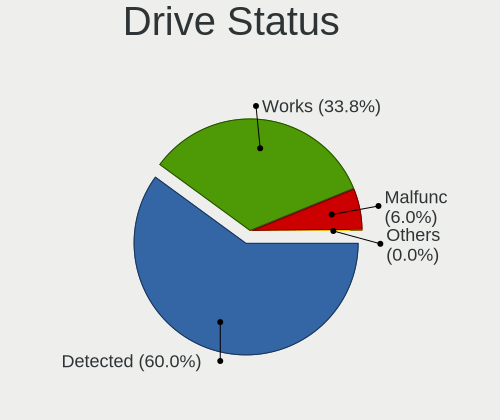
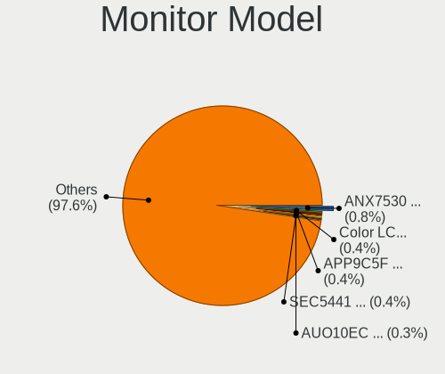
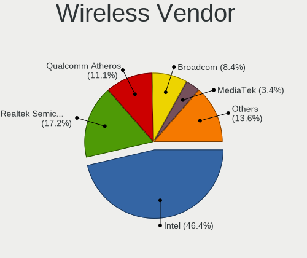
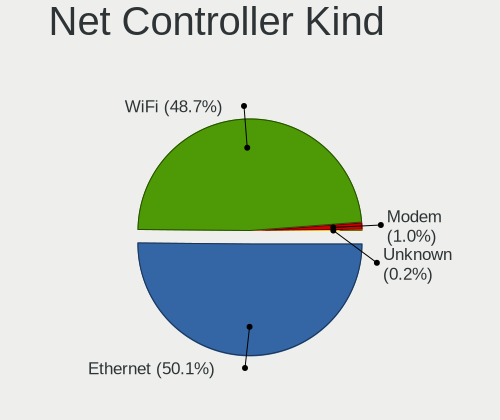
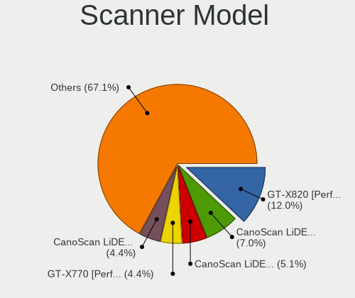

Linux in USA - Tested Hardware & Statistics
-------------------------------------------

A project to collect tested hardware configurations for Linux in USA.

Anyone can contribute to this report by the [hw-probe](https://github.com/linuxhw/hw-probe) tool:

    sudo -E hw-probe -all -upload

Please contribute! Especially if your hardware is rare.

This is a report for all computer types. See also reports for [desktops](/Location/USA/Desktop/README.md) and [notebooks](/Location/USA/Notebook/README.md).

Contents
--------

* [ Test Cases ](#test-cases)

* [ System ](#system)
  - [ OS                       ](#os)
  - [ OS Family                ](#os-family)
  - [ Kernel                   ](#kernel)
  - [ Kernel Family            ](#kernel-family)
  - [ Kernel Major Ver.        ](#kernel-major-ver)
  - [ Arch                     ](#arch)
  - [ DE                       ](#de)
  - [ Display Server           ](#display-server)
  - [ Display Manager          ](#display-manager)
  - [ OS Lang                  ](#os-lang)
  - [ Boot Mode                ](#boot-mode)
  - [ Filesystem               ](#filesystem)
  - [ Part. scheme             ](#part-scheme)
  - [ Dual Boot with Linux/BSD ](#dual-boot-with-linuxbsd)
  - [ Dual Boot (Win)          ](#dual-boot-win)

* [ Board ](#board)
  - [ Vendor                   ](#vendor)
  - [ Model                    ](#model)
  - [ Model Family             ](#model-family)
  - [ MFG Year                 ](#mfg-year)
  - [ Form Factor              ](#form-factor)
  - [ Secure Boot              ](#secure-boot)
  - [ Coreboot                 ](#coreboot)
  - [ RAM Size                 ](#ram-size)
  - [ RAM Used                 ](#ram-used)
  - [ Total Drives             ](#total-drives)
  - [ Has CD-ROM               ](#has-cd-rom)
  - [ Has Ethernet             ](#has-ethernet)
  - [ Has WiFi                 ](#has-wifi)
  - [ Has Bluetooth            ](#has-bluetooth)

* [ Location ](#location)
  - [ Country                  ](#country)
  - [ City                     ](#city)

* [ Drives ](#drives)
  - [ Drive Vendor             ](#drive-vendor)
  - [ Drive Model              ](#drive-model)
  - [ HDD Vendor               ](#hdd-vendor)
  - [ SSD Vendor               ](#ssd-vendor)
  - [ Drive Kind               ](#drive-kind)
  - [ Drive Connector          ](#drive-connector)
  - [ Drive Size               ](#drive-size)
  - [ Space Total              ](#space-total)
  - [ Space Used               ](#space-used)
  - [ Malfunc. Drives          ](#malfunc-drives)
  - [ Malfunc. Drive Vendor    ](#malfunc-drive-vendor)
  - [ Malfunc. HDD Vendor      ](#malfunc-hdd-vendor)
  - [ Malfunc. Drive Kind      ](#malfunc-drive-kind)
  - [ Failed Drives            ](#failed-drives)
  - [ Failed Drive Vendor      ](#failed-drive-vendor)
  - [ Drive Status             ](#drive-status)

* [ Storage controller ](#storage-controller)
  - [ Storage Vendor           ](#storage-vendor)
  - [ Storage Model            ](#storage-model)
  - [ Storage Kind             ](#storage-kind)

* [ Processor ](#processor)
  - [ CPU Vendor               ](#cpu-vendor)
  - [ CPU Model                ](#cpu-model)
  - [ CPU Model Family         ](#cpu-model-family)
  - [ CPU Cores                ](#cpu-cores)
  - [ CPU Sockets              ](#cpu-sockets)
  - [ CPU Threads              ](#cpu-threads)
  - [ CPU Op-Modes             ](#cpu-op-modes)
  - [ CPU Microcode            ](#cpu-microcode)
  - [ CPU Microarch            ](#cpu-microarch)

* [ Graphics ](#graphics)
  - [ GPU Vendor               ](#gpu-vendor)
  - [ GPU Model                ](#gpu-model)
  - [ GPU Combo                ](#gpu-combo)
  - [ GPU Driver               ](#gpu-driver)
  - [ GPU Memory               ](#gpu-memory)

* [ Monitor ](#monitor)
  - [ Monitor Vendor           ](#monitor-vendor)
  - [ Monitor Model            ](#monitor-model)
  - [ Monitor Resolution       ](#monitor-resolution)
  - [ Monitor Diagonal         ](#monitor-diagonal)
  - [ Monitor Width            ](#monitor-width)
  - [ Aspect Ratio             ](#aspect-ratio)
  - [ Monitor Area             ](#monitor-area)
  - [ Pixel Density            ](#pixel-density)
  - [ Multiple Monitors        ](#multiple-monitors)

* [ Network ](#network)
  - [ Net Controller Vendor    ](#net-controller-vendor)
  - [ Net Controller Model     ](#net-controller-model)
  - [ Wireless Vendor          ](#wireless-vendor)
  - [ Wireless Model           ](#wireless-model)
  - [ Ethernet Vendor          ](#ethernet-vendor)
  - [ Ethernet Model           ](#ethernet-model)
  - [ Net Controller Kind      ](#net-controller-kind)
  - [ Used Controller          ](#used-controller)
  - [ NICs                     ](#nics)
  - [ IPv6                     ](#ipv6)

* [ Bluetooth ](#bluetooth)
  - [ Bluetooth Vendor         ](#bluetooth-vendor)
  - [ Bluetooth Model          ](#bluetooth-model)

* [ Sound ](#sound)
  - [ Sound Vendor             ](#sound-vendor)
  - [ Sound Model              ](#sound-model)

* [ Memory ](#memory)
  - [ Memory Vendor            ](#memory-vendor)
  - [ Memory Model             ](#memory-model)
  - [ Memory Kind              ](#memory-kind)
  - [ Memory Form Factor       ](#memory-form-factor)
  - [ Memory Size              ](#memory-size)
  - [ Memory Speed             ](#memory-speed)

* [ Printers & scanners ](#printers--scanners)
  - [ Printer Vendor           ](#printer-vendor)
  - [ Printer Model            ](#printer-model)
  - [ Scanner Vendor           ](#scanner-vendor)
  - [ Scanner Model            ](#scanner-model)

* [ Camera ](#camera)
  - [ Camera Vendor            ](#camera-vendor)
  - [ Camera Model             ](#camera-model)

* [ Security ](#security)
  - [ Fingerprint Vendor       ](#fingerprint-vendor)
  - [ Fingerprint Model        ](#fingerprint-model)
  - [ Chipcard Vendor          ](#chipcard-vendor)
  - [ Chipcard Model           ](#chipcard-model)

* [ Unsupported ](#unsupported)
  - [ Unsupported Devices      ](#unsupported-devices)
  - [ Unsupported Device Types ](#unsupported-device-types)

Test Cases
----------

Total: 54600

| Vendor        | Model                       | Form-Factor | Probe                                                      | Date         |
|---------------|-----------------------------|-------------|------------------------------------------------------------|--------------|
| HP            | ENVY m6 Notebook            | Notebook    | [5ef983c393](https://linux-hardware.org/?probe=5ef983c393) | Oct 01, 2023 |
| Lenovo        | IdeaPad Y700-15ACZ 80NY     | Notebook    | [12d98aba86](https://linux-hardware.org/?probe=12d98aba86) | Oct 01, 2023 |
| Dell          | Latitude E6540              | Notebook    | [8fdc000f7e](https://linux-hardware.org/?probe=8fdc000f7e) | Oct 01, 2023 |
| Microsoft     | Surface Pro 3               | Tablet      | [9d3a95cfd5](https://linux-hardware.org/?probe=9d3a95cfd5) | Oct 01, 2023 |
| OriginPC      | X170KM-G                    | Notebook    | [2a8752667a](https://linux-hardware.org/?probe=2a8752667a) | Oct 01, 2023 |
| Apple         | MacBookPro9,2               | Notebook    | [124425b8b3](https://linux-hardware.org/?probe=124425b8b3) | Oct 01, 2023 |
| Google        | Nocturne                    | Tablet      | [966636d4d1](https://linux-hardware.org/?probe=966636d4d1) | Oct 01, 2023 |
| Google        | Nocturne                    | Tablet      | [5c4cae2a0b](https://linux-hardware.org/?probe=5c4cae2a0b) | Oct 01, 2023 |
| Supermicro    | H12SSL-i                    | Server      | [53fec3f094](https://linux-hardware.org/?probe=53fec3f094) | Oct 01, 2023 |
| ASRockRack    | B650D4U-2L2T/BCM            | Server      | [9115ea465f](https://linux-hardware.org/?probe=9115ea465f) | Oct 01, 2023 |
| Dell          | 0MN1TX A02                  | Desktop     | [3f0eee5de0](https://linux-hardware.org/?probe=3f0eee5de0) | Oct 01, 2023 |
| Dell          | 0427JK A00                  | Desktop     | [de3ece96cf](https://linux-hardware.org/?probe=de3ece96cf) | Oct 01, 2023 |
| Acer          | Predator PH315-51           | Notebook    | [ed5459b320](https://linux-hardware.org/?probe=ed5459b320) | Oct 01, 2023 |
| Dell          | Inspiron 11-3168            | Notebook    | [967817b4f8](https://linux-hardware.org/?probe=967817b4f8) | Oct 01, 2023 |
| Dell          | Latitude E6540              | Notebook    | [a5de8b78e7](https://linux-hardware.org/?probe=a5de8b78e7) | Oct 01, 2023 |
| HP            | Dragonfly 13.5 inch G4 N... | Notebook    | [8fabc36e1c](https://linux-hardware.org/?probe=8fabc36e1c) | Oct 01, 2023 |
| HP            | EliteBook 840 G8 Noteboo... | Notebook    | [9121e2ab8d](https://linux-hardware.org/?probe=9121e2ab8d) | Oct 01, 2023 |
| ASUSTek       | VivoBook_ASUSLaptop X512... | Notebook    | [2127748080](https://linux-hardware.org/?probe=2127748080) | Oct 01, 2023 |
| Dell          | G7 7700                     | Notebook    | [62bd529b36](https://linux-hardware.org/?probe=62bd529b36) | Oct 01, 2023 |
| Gigabyte      | Z68XP-UD3                   | Desktop     | [98fd6eb7c8](https://linux-hardware.org/?probe=98fd6eb7c8) | Oct 01, 2023 |
| Apple         | MacBookPro7,1               | Notebook    | [c69ebf2472](https://linux-hardware.org/?probe=c69ebf2472) | Oct 01, 2023 |
| GPU Compan... | GWTN156-4                   | Notebook    | [fa5491ff0c](https://linux-hardware.org/?probe=fa5491ff0c) | Oct 01, 2023 |
| Dell          | Latitude XT3                | Notebook    | [725ad34185](https://linux-hardware.org/?probe=725ad34185) | Oct 01, 2023 |
| ASUSTek       | Z170-DELUXE                 | Desktop     | [9e04efc2d9](https://linux-hardware.org/?probe=9e04efc2d9) | Oct 01, 2023 |
| ASUSTek       | TUF Gaming Z790-PLUS WIF... | Desktop     | [e0cdb74f25](https://linux-hardware.org/?probe=e0cdb74f25) | Oct 01, 2023 |
| HP            | Pavilion Laptop 15t-eg30... | Notebook    | [ed7bf5aee1](https://linux-hardware.org/?probe=ed7bf5aee1) | Oct 01, 2023 |
| Valve         | Jupiter                     | Notebook    | [c31d1a5288](https://linux-hardware.org/?probe=c31d1a5288) | Oct 01, 2023 |
| ASUSTek       | VivoBook_ASUSLaptop M150... | Notebook    | [1330485afc](https://linux-hardware.org/?probe=1330485afc) | Oct 01, 2023 |
| HUAWEI        | MateBook X                  | Notebook    | [5479e52948](https://linux-hardware.org/?probe=5479e52948) | Oct 01, 2023 |
| Apple         | Mac-942B59F58194171B iMa... | All in one  | [1204d2da33](https://linux-hardware.org/?probe=1204d2da33) | Sep 30, 2023 |
| HP            | Laptop 17-cn2xxx            | Notebook    | [4a15c84784](https://linux-hardware.org/?probe=4a15c84784) | Sep 30, 2023 |
| NZXT          | N7 B550                     | Desktop     | [53a99b69e6](https://linux-hardware.org/?probe=53a99b69e6) | Sep 30, 2023 |
| Foxconn       | 2ADA                        | Desktop     | [da117a4e6a](https://linux-hardware.org/?probe=da117a4e6a) | Sep 30, 2023 |
| Gigabyte      | AERO 15-X9                  | Notebook    | [35830807d4](https://linux-hardware.org/?probe=35830807d4) | Sep 30, 2023 |
| HP            | Compaq nc6320 (EN368UT#A... | Notebook    | [71ba4fd9e9](https://linux-hardware.org/?probe=71ba4fd9e9) | Sep 30, 2023 |
| Dynabook      | TECRA A50-J                 | Notebook    | [e0927243be](https://linux-hardware.org/?probe=e0927243be) | Sep 30, 2023 |
| HP            | EliteBook 820 G4            | Notebook    | [eb46d26ff8](https://linux-hardware.org/?probe=eb46d26ff8) | Sep 30, 2023 |
| Apple         | Mac-F2268DAE                | All in one  | [4a47d466d9](https://linux-hardware.org/?probe=4a47d466d9) | Sep 30, 2023 |
| Valve         | Jupiter                     | Notebook    | [0488b8fd24](https://linux-hardware.org/?probe=0488b8fd24) | Sep 30, 2023 |
| ASUSTek       | F2A85-M PRO                 | Desktop     | [79d4084e18](https://linux-hardware.org/?probe=79d4084e18) | Sep 30, 2023 |
| Toshiba       | PORTEGE R30-D               | Notebook    | [04ef694f1d](https://linux-hardware.org/?probe=04ef694f1d) | Sep 30, 2023 |
| Dell          | 0YXT71 A02                  | Desktop     | [6bc3385414](https://linux-hardware.org/?probe=6bc3385414) | Sep 30, 2023 |
| Microsoft     | Surface Go                  | Tablet      | [eec72cef4a](https://linux-hardware.org/?probe=eec72cef4a) | Sep 30, 2023 |
| HP            | ProBook 645 G1              | Notebook    | [f5f538105c](https://linux-hardware.org/?probe=f5f538105c) | Sep 30, 2023 |
| Intel         | DG33SXG2 AAD94468-500       | Desktop     | [99fe490330](https://linux-hardware.org/?probe=99fe490330) | Sep 30, 2023 |
| Lenovo        | ThinkCentre M58e 7514A2U    | Desktop     | [68f162bf42](https://linux-hardware.org/?probe=68f162bf42) | Sep 30, 2023 |
| ASUSTek       | ROG STRIX Z690-E GAMING ... | Desktop     | [e26d1b1ae4](https://linux-hardware.org/?probe=e26d1b1ae4) | Sep 30, 2023 |
| Apple         | MacBookPro8,2               | Notebook    | [237492c356](https://linux-hardware.org/?probe=237492c356) | Sep 30, 2023 |
| Lenovo        | ThinkPad T420 4180BV1       | Notebook    | [e81749053b](https://linux-hardware.org/?probe=e81749053b) | Sep 30, 2023 |
| HP            | 89E9 0100                   | All in one  | [d1d88cad3f](https://linux-hardware.org/?probe=d1d88cad3f) | Sep 30, 2023 |
| HP            | 89E9 0100                   | All in one  | [4fe32a2ec3](https://linux-hardware.org/?probe=4fe32a2ec3) | Sep 30, 2023 |
| Supermicro    | H12SSL-i                    | Server      | [6ce97609be](https://linux-hardware.org/?probe=6ce97609be) | Sep 30, 2023 |
| ASRockRack    | B650D4U-2L2T/BCM            | Server      | [da0e120624](https://linux-hardware.org/?probe=da0e120624) | Sep 30, 2023 |
| HP            | Notebook                    | Notebook    | [873004172f](https://linux-hardware.org/?probe=873004172f) | Sep 30, 2023 |
| Lenovo        | ThinkPad X1 Carbon 3rd 2... | Notebook    | [2edc7ab56b](https://linux-hardware.org/?probe=2edc7ab56b) | Sep 30, 2023 |
| Dell          | Latitude 5410               | Notebook    | [d13c5769a3](https://linux-hardware.org/?probe=d13c5769a3) | Sep 30, 2023 |
| Alienware     | m15 R4                      | Notebook    | [a67899ed06](https://linux-hardware.org/?probe=a67899ed06) | Sep 30, 2023 |
| Apple         | MacBookPro5,5               | Notebook    | [202a977fce](https://linux-hardware.org/?probe=202a977fce) | Sep 30, 2023 |
| Google        | Jerry                       | Desktop     | [467be71aaf](https://linux-hardware.org/?probe=467be71aaf) | Sep 30, 2023 |
| HP            | Pavilion Laptop 15-eh1xx... | Notebook    | [3710f99f83](https://linux-hardware.org/?probe=3710f99f83) | Sep 30, 2023 |
| ASRockRack    | Z690D4U-2L2T/G5             | Server      | [cc642b859b](https://linux-hardware.org/?probe=cc642b859b) | Sep 30, 2023 |
| Unknown       | Unknown                     | Notebook    | [56580ba351](https://linux-hardware.org/?probe=56580ba351) | Sep 30, 2023 |
| Gigabyte      | 970A-DS3P                   | Desktop     | [145f7eccd3](https://linux-hardware.org/?probe=145f7eccd3) | Sep 29, 2023 |
| ASUSTek       | P5B                         | Desktop     | [cb521fc290](https://linux-hardware.org/?probe=cb521fc290) | Sep 29, 2023 |
| Dell          | XPS 15 9550                 | Notebook    | [587f9a3ff1](https://linux-hardware.org/?probe=587f9a3ff1) | Sep 29, 2023 |
| Lenovo        | IdeaPad Slim 3 15IRU8 82... | Notebook    | [e9dd0291e0](https://linux-hardware.org/?probe=e9dd0291e0) | Sep 29, 2023 |
| Dell          | 0Y2K8N A01                  | Desktop     | [46ac9f9904](https://linux-hardware.org/?probe=46ac9f9904) | Sep 29, 2023 |
| Razer         | Blade 15 Base Model (Lat... | Notebook    | [95dc405a73](https://linux-hardware.org/?probe=95dc405a73) | Sep 29, 2023 |
| HP            | 8054                        | Desktop     | [20f337b1e7](https://linux-hardware.org/?probe=20f337b1e7) | Sep 29, 2023 |
| Foxconn       | 2AB1                        | Desktop     | [28ef0f3fbc](https://linux-hardware.org/?probe=28ef0f3fbc) | Sep 29, 2023 |
| HP            | Laptop 17-cn1xxx            | Notebook    | [051a233121](https://linux-hardware.org/?probe=051a233121) | Sep 29, 2023 |
| ASUSTek       | M5A99X EVO R2.0             | Desktop     | [074ab86d60](https://linux-hardware.org/?probe=074ab86d60) | Sep 29, 2023 |
| Dell          | 0804P1 A02                  | Server      | [96b1e41f9c](https://linux-hardware.org/?probe=96b1e41f9c) | Sep 29, 2023 |
| HP            | ProBook 450 G1              | Notebook    | [1cbae5b56a](https://linux-hardware.org/?probe=1cbae5b56a) | Sep 29, 2023 |
| ASUSTek       | VivoBook_ASUSLaptop X412... | Notebook    | [6348992a72](https://linux-hardware.org/?probe=6348992a72) | Sep 29, 2023 |
| Dell          | 0J3C2F A00                  | Desktop     | [0536b81a43](https://linux-hardware.org/?probe=0536b81a43) | Sep 29, 2023 |
| Dell          | Latitude E6540              | Notebook    | [1478e1265d](https://linux-hardware.org/?probe=1478e1265d) | Sep 29, 2023 |
| MSI           | MAG B550M MORTAR            | Desktop     | [ed0e5eee5a](https://linux-hardware.org/?probe=ed0e5eee5a) | Sep 29, 2023 |
| Gigabyte      | X570 AORUS ELITE            | Desktop     | [d0fea1d86b](https://linux-hardware.org/?probe=d0fea1d86b) | Sep 29, 2023 |
| HP            | Pavilion dv9000 (GA359UA... | Notebook    | [cea70d5f75](https://linux-hardware.org/?probe=cea70d5f75) | Sep 29, 2023 |
| Gigabyte      | Z390 AORUS PRO WIFI-CF      | Desktop     | [8724efb686](https://linux-hardware.org/?probe=8724efb686) | Sep 29, 2023 |
| Gigabyte      | Z390 AORUS PRO WIFI-CF      | Desktop     | [76fc0d8239](https://linux-hardware.org/?probe=76fc0d8239) | Sep 29, 2023 |
| Dell          | Latitude E5450              | Notebook    | [0b77908612](https://linux-hardware.org/?probe=0b77908612) | Sep 29, 2023 |
| ASUSTek       | TUF Gaming X570-PLUS        | Desktop     | [6f07d7c834](https://linux-hardware.org/?probe=6f07d7c834) | Sep 29, 2023 |
| Lenovo        | Yoga 7 15ITL5 82BJ          | Convertible | [c822d38335](https://linux-hardware.org/?probe=c822d38335) | Sep 29, 2023 |
| Valve         | Jupiter                     | Notebook    | [c881d3edc2](https://linux-hardware.org/?probe=c881d3edc2) | Sep 29, 2023 |
| Dell          | Inspiron 15-3552            | Notebook    | [8a8f11edae](https://linux-hardware.org/?probe=8a8f11edae) | Sep 29, 2023 |
| HP            | Laptop 14-fq0xxx            | Notebook    | [52648b0b45](https://linux-hardware.org/?probe=52648b0b45) | Sep 29, 2023 |
| Lenovo        | Yoga 7 15ITL5 82BJ          | Convertible | [222c45e72e](https://linux-hardware.org/?probe=222c45e72e) | Sep 29, 2023 |
| Valve         | Jupiter                     | Notebook    | [2f4eb9f823](https://linux-hardware.org/?probe=2f4eb9f823) | Sep 29, 2023 |
| Dell          | Inspiron 7548               | Notebook    | [2c407b4ff5](https://linux-hardware.org/?probe=2c407b4ff5) | Sep 29, 2023 |
| HP            | Stream x360 Convertible ... | Convertible | [427ea0aa4f](https://linux-hardware.org/?probe=427ea0aa4f) | Sep 29, 2023 |
| Dell          | 03015M A10                  | Server      | [1c089bce6b](https://linux-hardware.org/?probe=1c089bce6b) | Sep 29, 2023 |
| Foxconn       | 2ADA                        | Desktop     | [0c29af254c](https://linux-hardware.org/?probe=0c29af254c) | Sep 29, 2023 |
| Lenovo        | IdeaPad 3 15IIL05 81WE      | Notebook    | [902918fb1d](https://linux-hardware.org/?probe=902918fb1d) | Sep 29, 2023 |
| ASUSTek       | PRIME X370-PRO              | Desktop     | [6d725a3ede](https://linux-hardware.org/?probe=6d725a3ede) | Sep 29, 2023 |
| Acer          | Aspire E5-575G              | Notebook    | [109490039d](https://linux-hardware.org/?probe=109490039d) | Sep 29, 2023 |
| ASUSTek       | M5A97 R2.0                  | Desktop     | [2c2f49b6bf](https://linux-hardware.org/?probe=2c2f49b6bf) | Sep 29, 2023 |
| Lenovo        | ThinkPad E495 20NE0001US    | Notebook    | [a76a94cd2f](https://linux-hardware.org/?probe=a76a94cd2f) | Sep 29, 2023 |
| Supermicro    | X11DPG-QTA                  | Server      | [80db5bcb0e](https://linux-hardware.org/?probe=80db5bcb0e) | Sep 29, 2023 |
| HP            | 1589                        | Desktop     | [c42e75cdd8](https://linux-hardware.org/?probe=c42e75cdd8) | Sep 29, 2023 |
| Radxa         | ROCK Pi 4B                  | Soc         | [fac4bb4863](https://linux-hardware.org/?probe=fac4bb4863) | Sep 29, 2023 |
| HP            | Stream Laptop 14-ds0xxx     | Notebook    | [bbab7c9f89](https://linux-hardware.org/?probe=bbab7c9f89) | Sep 29, 2023 |
| HP            | Stream Laptop 14-ds0xxx     | Notebook    | [4f23a67b82](https://linux-hardware.org/?probe=4f23a67b82) | Sep 29, 2023 |
| Dell          | 0J3C2F A00                  | Desktop     | [451d8ac4ca](https://linux-hardware.org/?probe=451d8ac4ca) | Sep 28, 2023 |
| Pegatron      | JESSE                       | Desktop     | [3f6cf71237](https://linux-hardware.org/?probe=3f6cf71237) | Sep 28, 2023 |
| Dell          | Latitude E6420              | Notebook    | [935d96843b](https://linux-hardware.org/?probe=935d96843b) | Sep 28, 2023 |
| ASUSTek       | X99-DELUXE                  | Desktop     | [c608038795](https://linux-hardware.org/?probe=c608038795) | Sep 28, 2023 |
| MSI           | B450M BAZOOKA V2            | Desktop     | [c815d636ce](https://linux-hardware.org/?probe=c815d636ce) | Sep 28, 2023 |
| ASUSTek       | ROG STRIX Z790-E GAMING ... | Desktop     | [0577874fd5](https://linux-hardware.org/?probe=0577874fd5) | Sep 28, 2023 |
| HP            | ZBook Studio G3             | Notebook    | [0005d20c0d](https://linux-hardware.org/?probe=0005d20c0d) | Sep 28, 2023 |
| Microsoft     | Surface Pro 3               | Tablet      | [c93318bf50](https://linux-hardware.org/?probe=c93318bf50) | Sep 28, 2023 |
| Dell          | 0YJPT1 A00                  | Desktop     | [a0a41d401e](https://linux-hardware.org/?probe=a0a41d401e) | Sep 28, 2023 |
| Dell          | 0H19HD A01                  | Server      | [fb5fb07ca9](https://linux-hardware.org/?probe=fb5fb07ca9) | Sep 28, 2023 |
| Dell          | 0H19HD A01                  | Server      | [643dd60247](https://linux-hardware.org/?probe=643dd60247) | Sep 28, 2023 |
| AZW           | SER V1                      | Desktop     | [10660522cb](https://linux-hardware.org/?probe=10660522cb) | Sep 28, 2023 |
| HP            | ENVY 17                     | Notebook    | [184a826bba](https://linux-hardware.org/?probe=184a826bba) | Sep 28, 2023 |
| Lenovo        | ThinkPad X260 20F60097US    | Notebook    | [607d788fde](https://linux-hardware.org/?probe=607d788fde) | Sep 28, 2023 |
| Radxa         | ROCK Pi 4B                  | Soc         | [1210322d55](https://linux-hardware.org/?probe=1210322d55) | Sep 28, 2023 |
| HP            | Pavilion Laptop 14-ce3xx... | Notebook    | [3ecf3ff165](https://linux-hardware.org/?probe=3ecf3ff165) | Sep 28, 2023 |
| HP            | Pavilion Laptop 14-ce3xx... | Notebook    | [4c8dbd0780](https://linux-hardware.org/?probe=4c8dbd0780) | Sep 28, 2023 |
| Dell          | 0XC7MM A01                  | Desktop     | [9fdfc5a13f](https://linux-hardware.org/?probe=9fdfc5a13f) | Sep 28, 2023 |
| Lenovo        | IdeaPad Slim 5 16ABR8 82... | Notebook    | [1fcc841148](https://linux-hardware.org/?probe=1fcc841148) | Sep 28, 2023 |
| Gigabyte      | EX58-EXTREME                | Desktop     | [4a1a75d0e3](https://linux-hardware.org/?probe=4a1a75d0e3) | Sep 28, 2023 |
| Gigabyte      | EX58-EXTREME                | Desktop     | [bc2a9ecc6a](https://linux-hardware.org/?probe=bc2a9ecc6a) | Sep 28, 2023 |
| Valve         | Jupiter                     | Notebook    | [a447ea95b0](https://linux-hardware.org/?probe=a447ea95b0) | Sep 28, 2023 |
| Valve         | Jupiter                     | Notebook    | [b178e71c45](https://linux-hardware.org/?probe=b178e71c45) | Sep 28, 2023 |
| ASUSTek       | ROG Strix G731GU_GL731GU    | Notebook    | [9e206d1e8b](https://linux-hardware.org/?probe=9e206d1e8b) | Sep 28, 2023 |
| Acer          | Aspire TC-885 V:1.1         | Desktop     | [7aef46e946](https://linux-hardware.org/?probe=7aef46e946) | Sep 28, 2023 |
| Valve         | Jupiter                     | Notebook    | [0948401e7d](https://linux-hardware.org/?probe=0948401e7d) | Sep 28, 2023 |
| ASUSTek       | ROG Strix G731GU_GL731GU    | Notebook    | [8f792e2b5a](https://linux-hardware.org/?probe=8f792e2b5a) | Sep 28, 2023 |
| ASUSTek       | ROG STRIX Z790-E GAMING ... | Desktop     | [130796560f](https://linux-hardware.org/?probe=130796560f) | Sep 28, 2023 |
| Gigabyte      | 970A-DS3P FX                | Desktop     | [627751c21a](https://linux-hardware.org/?probe=627751c21a) | Sep 28, 2023 |
| Apple         | Mac-A369DDC4E67F1C45 iMa... | All in one  | [4fb593dcca](https://linux-hardware.org/?probe=4fb593dcca) | Sep 28, 2023 |
| Valve         | Jupiter                     | Notebook    | [2c1e6c791d](https://linux-hardware.org/?probe=2c1e6c791d) | Sep 28, 2023 |
| ASRock        | A520M-HDV                   | Desktop     | [d19f334f02](https://linux-hardware.org/?probe=d19f334f02) | Sep 28, 2023 |
| Lenovo        | IdeaPad Slim 5 16IRL8 82... | Notebook    | [c717c1ab13](https://linux-hardware.org/?probe=c717c1ab13) | Sep 28, 2023 |
| ASUSTek       | TUF Gaming B450-PLUS II     | Desktop     | [1f3c152dc3](https://linux-hardware.org/?probe=1f3c152dc3) | Sep 28, 2023 |
| Gigabyte      | F2A88X-D3H                  | Desktop     | [13e1dcb2be](https://linux-hardware.org/?probe=13e1dcb2be) | Sep 28, 2023 |
| HP            | Laptop 15-da0xxx            | Notebook    | [3d996f9823](https://linux-hardware.org/?probe=3d996f9823) | Sep 28, 2023 |
| HP            | 8265                        | Desktop     | [2ae07c2008](https://linux-hardware.org/?probe=2ae07c2008) | Sep 28, 2023 |
| Shenzhen M... | F7BAA                       | Desktop     | [a59f2cf9f2](https://linux-hardware.org/?probe=a59f2cf9f2) | Sep 28, 2023 |
| Microsoft     | Surface Pro 7               | Tablet      | [f29316926a](https://linux-hardware.org/?probe=f29316926a) | Sep 28, 2023 |
| MSI           | PRO Z690-A WIFI             | Desktop     | [2ede90f6eb](https://linux-hardware.org/?probe=2ede90f6eb) | Sep 28, 2023 |
| Lenovo        | IdeaPad 320-15ABR 80XS      | Notebook    | [61980df9bc](https://linux-hardware.org/?probe=61980df9bc) | Sep 28, 2023 |
| Intel         | NUC13ANBi7 M89645-203       | Mini pc     | [d9baf0c41d](https://linux-hardware.org/?probe=d9baf0c41d) | Sep 28, 2023 |
| Lenovo        | ThinkPad 13 2nd Gen 20J1... | Notebook    | [3cb2bdba37](https://linux-hardware.org/?probe=3cb2bdba37) | Sep 27, 2023 |
| Gigabyte      | H610M S2H DDR4              | Desktop     | [9d767beb12](https://linux-hardware.org/?probe=9d767beb12) | Sep 27, 2023 |
| HP            | Laptop 15-da0xxx            | Notebook    | [8fb9d5d21f](https://linux-hardware.org/?probe=8fb9d5d21f) | Sep 27, 2023 |
| ASUSTek       | VivoBook_ASUSLaptop K660... | Notebook    | [7c13a64c8a](https://linux-hardware.org/?probe=7c13a64c8a) | Sep 27, 2023 |
| Framework     | Laptop                      | Notebook    | [2a65b0dff2](https://linux-hardware.org/?probe=2a65b0dff2) | Sep 27, 2023 |
| Gigabyte      | X570 AORUS PRO WIFI         | Desktop     | [e15856c8f1](https://linux-hardware.org/?probe=e15856c8f1) | Sep 27, 2023 |
| Dell          | Latitude E6540              | Notebook    | [7d9885cd7c](https://linux-hardware.org/?probe=7d9885cd7c) | Sep 27, 2023 |
| Lenovo        | ThinkPad E475 20H40006US    | Notebook    | [1a472d3072](https://linux-hardware.org/?probe=1a472d3072) | Sep 27, 2023 |
| Apple         | Mac-35C5E08120C7EEAF Mac... | Mini pc     | [dd7145f468](https://linux-hardware.org/?probe=dd7145f468) | Sep 27, 2023 |
| Lenovo        | IdeaPad 1 14IGL7 82V6       | Notebook    | [707c612189](https://linux-hardware.org/?probe=707c612189) | Sep 27, 2023 |
| Dell          | 0JP3NX A01                  | Desktop     | [d14bc5c139](https://linux-hardware.org/?probe=d14bc5c139) | Sep 27, 2023 |
| Dell          | Inspiron N5040              | Notebook    | [c48d158b62](https://linux-hardware.org/?probe=c48d158b62) | Sep 27, 2023 |
| Lenovo        | IdeaPad 5 15ARE05 81YQ      | Notebook    | [84ad07c3f9](https://linux-hardware.org/?probe=84ad07c3f9) | Sep 27, 2023 |
| HP            | Dev One Notebook PC         | Notebook    | [61caf9212e](https://linux-hardware.org/?probe=61caf9212e) | Sep 27, 2023 |
| Dell          | Latitude E6530              | Notebook    | [40cdcd2545](https://linux-hardware.org/?probe=40cdcd2545) | Sep 27, 2023 |
| ASUSTek       | M5A99X EVO                  | Desktop     | [34e34036d7](https://linux-hardware.org/?probe=34e34036d7) | Sep 27, 2023 |
| HP            | Stream x360 Convertible ... | Convertible | [d237ab1a11](https://linux-hardware.org/?probe=d237ab1a11) | Sep 27, 2023 |
| HP            | 3398                        | Desktop     | [fed07fc26f](https://linux-hardware.org/?probe=fed07fc26f) | Sep 27, 2023 |
| HP            | 3398                        | Desktop     | [5f4cd7d05b](https://linux-hardware.org/?probe=5f4cd7d05b) | Sep 27, 2023 |
| ASUSTek       | M5A99FX PRO R2.0            | Desktop     | [500909194e](https://linux-hardware.org/?probe=500909194e) | Sep 27, 2023 |
| Dell          | Inspiron 5559               | Notebook    | [c25a72c95a](https://linux-hardware.org/?probe=c25a72c95a) | Sep 27, 2023 |
| ASRock        | 970M Pro3                   | Desktop     | [f004fa8e32](https://linux-hardware.org/?probe=f004fa8e32) | Sep 27, 2023 |
| ASRock        | 970M Pro3                   | Desktop     | [3646127006](https://linux-hardware.org/?probe=3646127006) | Sep 27, 2023 |
| Lenovo        | IdeaPadFlex 5 14ARE05 81... | Convertible | [b6e832a4d8](https://linux-hardware.org/?probe=b6e832a4d8) | Sep 27, 2023 |
| Gigabyte      | B650M K                     | Desktop     | [73da1b7ade](https://linux-hardware.org/?probe=73da1b7ade) | Sep 27, 2023 |
| Apple         | MacBookAir7,2               | Notebook    | [1543bac588](https://linux-hardware.org/?probe=1543bac588) | Sep 27, 2023 |
| Lenovo        | ThinkPad E14 20RA0050US     | Notebook    | [097539dde8](https://linux-hardware.org/?probe=097539dde8) | Sep 27, 2023 |
| Acer          | Aspire one                  | Notebook    | [d040844540](https://linux-hardware.org/?probe=d040844540) | Sep 27, 2023 |
| HP            | EliteBook 8770w             | Notebook    | [3286090099](https://linux-hardware.org/?probe=3286090099) | Sep 27, 2023 |
| ASRock        | Z790 Taichi                 | Desktop     | [949be6194e](https://linux-hardware.org/?probe=949be6194e) | Sep 27, 2023 |
| ASUSTek       | M5A97 LE R2.0               | Desktop     | [240ff7b72a](https://linux-hardware.org/?probe=240ff7b72a) | Sep 27, 2023 |
| ASUSTek       | VivoBook_ASUSLaptop K660... | Notebook    | [d9665a6ffd](https://linux-hardware.org/?probe=d9665a6ffd) | Sep 27, 2023 |
| HP            | Notebook                    | Notebook    | [4690fda15e](https://linux-hardware.org/?probe=4690fda15e) | Sep 27, 2023 |
| Dell          | 00F82W A01                  | Desktop     | [ac93742033](https://linux-hardware.org/?probe=ac93742033) | Sep 27, 2023 |
| Dell          | 0773VG A00                  | Desktop     | [a68caa37d8](https://linux-hardware.org/?probe=a68caa37d8) | Sep 26, 2023 |
| Dell          | 0773VG A00                  | Desktop     | [5e34f7d424](https://linux-hardware.org/?probe=5e34f7d424) | Sep 26, 2023 |
| Dell          | Latitude 3540               | Notebook    | [eb8bf9b174](https://linux-hardware.org/?probe=eb8bf9b174) | Sep 26, 2023 |
| Dell          | Vostro 14-3468              | Notebook    | [3fceb34932](https://linux-hardware.org/?probe=3fceb34932) | Sep 26, 2023 |
| Lenovo        | ThinkPad E475 20H40006US    | Notebook    | [d406193722](https://linux-hardware.org/?probe=d406193722) | Sep 26, 2023 |
| Dell          | Vostro 14-3468              | Notebook    | [a027aae826](https://linux-hardware.org/?probe=a027aae826) | Sep 26, 2023 |
| HP            | Pavilion x360 Convertibl... | Convertible | [a0366d9d2e](https://linux-hardware.org/?probe=a0366d9d2e) | Sep 26, 2023 |
| Gigabyte      | B550M DS3H                  | Desktop     | [3bb1109d44](https://linux-hardware.org/?probe=3bb1109d44) | Sep 26, 2023 |
| ASRock        | Z790 Taichi                 | Desktop     | [50ff8d28e4](https://linux-hardware.org/?probe=50ff8d28e4) | Sep 26, 2023 |
| HP            | Laptop 15-dy2xxx            | Notebook    | [8fd945e3c5](https://linux-hardware.org/?probe=8fd945e3c5) | Sep 26, 2023 |
| ASUSTek       | ROG STRIX B450-F GAMING     | Desktop     | [5a73611f4d](https://linux-hardware.org/?probe=5a73611f4d) | Sep 26, 2023 |
| ASUSTek       | ProArt X670E-CREATOR WIF... | Desktop     | [9fcff9b281](https://linux-hardware.org/?probe=9fcff9b281) | Sep 26, 2023 |
| Supermicro    | X9DRL-3F/iF                 | Desktop     | [07543468b6](https://linux-hardware.org/?probe=07543468b6) | Sep 26, 2023 |
| Lenovo        | IdeaPadFlex 5 14IAU7 82R... | Convertible | [ab5af00a13](https://linux-hardware.org/?probe=ab5af00a13) | Sep 26, 2023 |
| ASUSTek       | ROG CROSSHAIR VIII HERO     | Desktop     | [ac6d6574e9](https://linux-hardware.org/?probe=ac6d6574e9) | Sep 26, 2023 |
| Lenovo        | 312D SDK0J40697 WIN 3305... | Mini pc     | [c72c91a073](https://linux-hardware.org/?probe=c72c91a073) | Sep 26, 2023 |
| Lenovo        | 312D SDK0J40697 WIN 3305... | Mini pc     | [c0720a0782](https://linux-hardware.org/?probe=c0720a0782) | Sep 26, 2023 |
| Lenovo        | ThinkPad L13 Yoga Gen 2 ... | Convertible | [d2ac451979](https://linux-hardware.org/?probe=d2ac451979) | Sep 26, 2023 |
| Gateway       | FX6840                      | Desktop     | [613810c0ed](https://linux-hardware.org/?probe=613810c0ed) | Sep 26, 2023 |
| ASRock        | B450M Steel Legend          | Desktop     | [ccb7f736f6](https://linux-hardware.org/?probe=ccb7f736f6) | Sep 26, 2023 |
| Lenovo        | Legion R9000P2021H 82JQ     | Notebook    | [5168f99a06](https://linux-hardware.org/?probe=5168f99a06) | Sep 26, 2023 |
| Dell          | 0NW6H5 A00                  | Desktop     | [e7e87a1269](https://linux-hardware.org/?probe=e7e87a1269) | Sep 26, 2023 |
| Lenovo        | ThinkPad X12 Detachable ... | Tablet      | [1b72e3fe1c](https://linux-hardware.org/?probe=1b72e3fe1c) | Sep 26, 2023 |
| MSI           | 2AE0                        | Desktop     | [c597c78ed1](https://linux-hardware.org/?probe=c597c78ed1) | Sep 26, 2023 |
| Lenovo        | ThinkPad X12 Detachable ... | Tablet      | [0281cc244a](https://linux-hardware.org/?probe=0281cc244a) | Sep 26, 2023 |
| Sony          | SVE14A27CXH                 | Notebook    | [d017d82f42](https://linux-hardware.org/?probe=d017d82f42) | Sep 26, 2023 |
| ASRock        | B450 Gaming K4              | Desktop     | [dcd5422d31](https://linux-hardware.org/?probe=dcd5422d31) | Sep 26, 2023 |
| ASUSTek       | TUF Gaming X570-PLUS        | Desktop     | [fe1163082c](https://linux-hardware.org/?probe=fe1163082c) | Sep 26, 2023 |
| Sony          | SVE14A27CXH                 | Notebook    | [b85055ec21](https://linux-hardware.org/?probe=b85055ec21) | Sep 26, 2023 |
| Gigabyte      | F2A68HM-H                   | Desktop     | [f3b7fdc0c1](https://linux-hardware.org/?probe=f3b7fdc0c1) | Sep 26, 2023 |
| Apple         | Mac-FFE5EF870D7BA81A iMa... | All in one  | [bd541ed832](https://linux-hardware.org/?probe=bd541ed832) | Sep 26, 2023 |
| ASUSTek       | PRIME B550M-A               | Desktop     | [1476ba44bb](https://linux-hardware.org/?probe=1476ba44bb) | Sep 26, 2023 |
| MSI           | G41M4                       | Desktop     | [0554e9757f](https://linux-hardware.org/?probe=0554e9757f) | Sep 26, 2023 |
| Supermicro    | H12SSL-i                    | Server      | [1b72177563](https://linux-hardware.org/?probe=1b72177563) | Sep 26, 2023 |
| ASRockRack    | B650D4U-2L2T/BCM            | Server      | [2527f2a9fc](https://linux-hardware.org/?probe=2527f2a9fc) | Sep 26, 2023 |
| ASUSTek       | TUF Gaming X570-PLUS        | Desktop     | [4054ad9d77](https://linux-hardware.org/?probe=4054ad9d77) | Sep 26, 2023 |
| ASUSTek       | TUF Gaming X570-PLUS        | Desktop     | [76d936bb5b](https://linux-hardware.org/?probe=76d936bb5b) | Sep 26, 2023 |
| Lenovo        | IdeaPad Slim 5 16IRL8 82... | Notebook    | [b22a584cea](https://linux-hardware.org/?probe=b22a584cea) | Sep 26, 2023 |
| Apple         | MacBookPro8,1               | Notebook    | [ee86e0d81e](https://linux-hardware.org/?probe=ee86e0d81e) | Sep 26, 2023 |
| Apple         | MacBookPro8,1               | Notebook    | [1630b56fe3](https://linux-hardware.org/?probe=1630b56fe3) | Sep 26, 2023 |
| ASUSTek       | ROG STRIX Z690-E GAMING ... | Desktop     | [c33d31195f](https://linux-hardware.org/?probe=c33d31195f) | Sep 26, 2023 |
| ASUSTek       | TUF Gaming X570-PRO         | Desktop     | [6677b81417](https://linux-hardware.org/?probe=6677b81417) | Sep 26, 2023 |
| Valve         | Jupiter                     | Notebook    | [651e61bc4b](https://linux-hardware.org/?probe=651e61bc4b) | Sep 25, 2023 |
| Microsoft     | Surface Pro 7+              | Tablet      | [d823ee6c59](https://linux-hardware.org/?probe=d823ee6c59) | Sep 25, 2023 |
| Supermicro    | X9DRL-3F/iF                 | Desktop     | [cac5990658](https://linux-hardware.org/?probe=cac5990658) | Sep 25, 2023 |
| Dell          | Latitude 7390               | Notebook    | [7e142652b2](https://linux-hardware.org/?probe=7e142652b2) | Sep 25, 2023 |
| ATOPNUC       | MA90                        | Mini pc     | [be275ae00b](https://linux-hardware.org/?probe=be275ae00b) | Sep 25, 2023 |
| Dell          | 0Y5DDC A00                  | Desktop     | [29feb62e32](https://linux-hardware.org/?probe=29feb62e32) | Sep 25, 2023 |
| Gigabyte      | X570 UD                     | Desktop     | [518e251931](https://linux-hardware.org/?probe=518e251931) | Sep 25, 2023 |
| Gigabyte      | X570 UD                     | Desktop     | [6c9dd43f80](https://linux-hardware.org/?probe=6c9dd43f80) | Sep 25, 2023 |
| Dell          | Vostro 15 5510              | Notebook    | [b2d58819cc](https://linux-hardware.org/?probe=b2d58819cc) | Sep 25, 2023 |
| MSI           | GS63VR 6RF                  | Notebook    | [03a9aed3c9](https://linux-hardware.org/?probe=03a9aed3c9) | Sep 25, 2023 |
| AZW           | GTR V01                     | Mini pc     | [07e408ce48](https://linux-hardware.org/?probe=07e408ce48) | Sep 25, 2023 |
| AZW           | GTR V01                     | Mini pc     | [f3e5c047af](https://linux-hardware.org/?probe=f3e5c047af) | Sep 25, 2023 |
| Google        | Banon                       | Notebook    | [172d512653](https://linux-hardware.org/?probe=172d512653) | Sep 25, 2023 |
| VPU Compan... | VWNC71429                   | Notebook    | [285eb8a521](https://linux-hardware.org/?probe=285eb8a521) | Sep 25, 2023 |
| VPU Compan... | VWNC71429                   | Notebook    | [ec5aecc69d](https://linux-hardware.org/?probe=ec5aecc69d) | Sep 25, 2023 |
| Google        | Banon                       | Notebook    | [0766aa6565](https://linux-hardware.org/?probe=0766aa6565) | Sep 25, 2023 |
| Acer          | Swift SFX14-41G             | Notebook    | [ae755aa7e3](https://linux-hardware.org/?probe=ae755aa7e3) | Sep 25, 2023 |
| Dell          | Inspiron 1545               | Notebook    | [96508134e8](https://linux-hardware.org/?probe=96508134e8) | Sep 25, 2023 |
| HP            | ENVY x360 2-in-1 Laptop ... | Convertible | [c665cddf99](https://linux-hardware.org/?probe=c665cddf99) | Sep 25, 2023 |
| Apple         | MacBookPro10,1              | Notebook    | [1c1268d4e0](https://linux-hardware.org/?probe=1c1268d4e0) | Sep 25, 2023 |
| Apple         | MacBookPro10,1              | Notebook    | [4fbb517b71](https://linux-hardware.org/?probe=4fbb517b71) | Sep 25, 2023 |
| Dell          | 0KRC95 A02                  | Desktop     | [c0f2f5244b](https://linux-hardware.org/?probe=c0f2f5244b) | Sep 25, 2023 |
| Lenovo        | ThinkPad L13 Yoga Gen 2 ... | Convertible | [884cb2236d](https://linux-hardware.org/?probe=884cb2236d) | Sep 25, 2023 |
| Apple         | Mac-00BE6ED71E35EB86 iMa... | All in one  | [07ed364391](https://linux-hardware.org/?probe=07ed364391) | Sep 25, 2023 |
| Apple         | Mac-A369DDC4E67F1C45 iMa... | All in one  | [e749757f1a](https://linux-hardware.org/?probe=e749757f1a) | Sep 25, 2023 |
| Lenovo        | ThinkPad L13 Yoga Gen 2 ... | Convertible | [fb576eef77](https://linux-hardware.org/?probe=fb576eef77) | Sep 25, 2023 |
| Dell          | G5 5505                     | Notebook    | [e9c461d44d](https://linux-hardware.org/?probe=e9c461d44d) | Sep 25, 2023 |
| Acer          | Aspire V3-472P              | Notebook    | [b5ebe3295c](https://linux-hardware.org/?probe=b5ebe3295c) | Sep 25, 2023 |
| HP            | ProBook 6570b               | Notebook    | [a67981aa91](https://linux-hardware.org/?probe=a67981aa91) | Sep 25, 2023 |
| Lenovo        | ThinkPad X1 Nano Gen 3 2... | Notebook    | [1903f91b48](https://linux-hardware.org/?probe=1903f91b48) | Sep 25, 2023 |
| Dell          | XPS 13 9310                 | Notebook    | [4233a2e5e3](https://linux-hardware.org/?probe=4233a2e5e3) | Sep 25, 2023 |
| Supermicro    | H12SSL-i                    | Server      | [3e533c5366](https://linux-hardware.org/?probe=3e533c5366) | Sep 25, 2023 |
| ASRockRack    | B650D4U-2L2T/BCM            | Server      | [d37c8958bf](https://linux-hardware.org/?probe=d37c8958bf) | Sep 25, 2023 |
| MSI           | MAG B550M MORTAR            | Desktop     | [3887b15fd0](https://linux-hardware.org/?probe=3887b15fd0) | Sep 25, 2023 |
| Dell          | 0JP3NX A01                  | Desktop     | [d42f0f6791](https://linux-hardware.org/?probe=d42f0f6791) | Sep 25, 2023 |
| ASUSTek       | TUF Gaming X570-PLUS        | Desktop     | [2b371179db](https://linux-hardware.org/?probe=2b371179db) | Sep 25, 2023 |
| ASUSTek       | ROG CROSSHAIR VII HERO      | Desktop     | [78eceb519c](https://linux-hardware.org/?probe=78eceb519c) | Sep 25, 2023 |
| MSI           | B250M BAZOOKA               | Desktop     | [425bd32230](https://linux-hardware.org/?probe=425bd32230) | Sep 25, 2023 |
| ASRock        | B550M Pro4                  | Desktop     | [1b8b856469](https://linux-hardware.org/?probe=1b8b856469) | Sep 25, 2023 |
| Unknown       | Unknown                     | Desktop     | [56cd5e0bfd](https://linux-hardware.org/?probe=56cd5e0bfd) | Sep 25, 2023 |
| Alienware     | M17x                        | Notebook    | [5c6b700486](https://linux-hardware.org/?probe=5c6b700486) | Sep 25, 2023 |
| HP            | 0B4Ch D                     | Desktop     | [8aeccd1d55](https://linux-hardware.org/?probe=8aeccd1d55) | Sep 25, 2023 |
| Gigabyte      | 970A-DS3P                   | Desktop     | [6dc2bcb097](https://linux-hardware.org/?probe=6dc2bcb097) | Sep 25, 2023 |
| Apple         | MacBookPro10,1              | Notebook    | [f8088ea946](https://linux-hardware.org/?probe=f8088ea946) | Sep 25, 2023 |
| Samsung       | 3570R/370R/470R/450R/510... | Notebook    | [6d75f2f29b](https://linux-hardware.org/?probe=6d75f2f29b) | Sep 24, 2023 |
| HP            | Laptop 15-dy1xxx            | Notebook    | [632803f3f9](https://linux-hardware.org/?probe=632803f3f9) | Sep 24, 2023 |
| Dynabook      | TECRA A50-J                 | Notebook    | [e06f7128df](https://linux-hardware.org/?probe=e06f7128df) | Sep 24, 2023 |
| Supermicro    | X9DRL-3F/iF                 | Desktop     | [e9f47778b4](https://linux-hardware.org/?probe=e9f47778b4) | Sep 24, 2023 |
| Dell          | 0RW199                      | Desktop     | [6fc37ef3c1](https://linux-hardware.org/?probe=6fc37ef3c1) | Sep 24, 2023 |
| Gigabyte      | X299 AORUS Gaming-CF        | Desktop     | [4c6071b20c](https://linux-hardware.org/?probe=4c6071b20c) | Sep 24, 2023 |
| Lenovo        | ThinkPad T480 20L50018US    | Notebook    | [e28cf08ffe](https://linux-hardware.org/?probe=e28cf08ffe) | Sep 24, 2023 |
| Dell          | Inspiron 3543               | Notebook    | [2075d98d66](https://linux-hardware.org/?probe=2075d98d66) | Sep 24, 2023 |
| Acer          | Swift SFX14-41G             | Notebook    | [7980181fcb](https://linux-hardware.org/?probe=7980181fcb) | Sep 24, 2023 |
| Apple         | Mac-A369DDC4E67F1C45 iMa... | All in one  | [d17b159313](https://linux-hardware.org/?probe=d17b159313) | Sep 24, 2023 |
| ASUSTek       | PRIME B660M-A AC D4         | Desktop     | [7c0eb47c16](https://linux-hardware.org/?probe=7c0eb47c16) | Sep 24, 2023 |
| Dell          | XPS 15 9520                 | Notebook    | [b358b656c6](https://linux-hardware.org/?probe=b358b656c6) | Sep 24, 2023 |
| HP            | ENVY m4                     | Notebook    | [8d7da36940](https://linux-hardware.org/?probe=8d7da36940) | Sep 24, 2023 |
| HP            | ENVY x360 Convertible 15... | Convertible | [3e12d88dfd](https://linux-hardware.org/?probe=3e12d88dfd) | Sep 24, 2023 |
| HP            | EliteBook 8560w             | Notebook    | [0e7984242d](https://linux-hardware.org/?probe=0e7984242d) | Sep 24, 2023 |
| Valve         | Jupiter                     | Notebook    | [7af512f94c](https://linux-hardware.org/?probe=7af512f94c) | Sep 24, 2023 |
| Foxconn       | 2ADA                        | Desktop     | [8a1af94640](https://linux-hardware.org/?probe=8a1af94640) | Sep 24, 2023 |
| Intel         | S1200RP G62254-407          | Server      | [1d003db534](https://linux-hardware.org/?probe=1d003db534) | Sep 24, 2023 |
| Lenovo        | ThinkPad T480s 20L8S6P20... | Notebook    | [4f3a1c8208](https://linux-hardware.org/?probe=4f3a1c8208) | Sep 24, 2023 |
| HP            | 0B4Ch D                     | Desktop     | [f5ed151e3e](https://linux-hardware.org/?probe=f5ed151e3e) | Sep 24, 2023 |
| MSI           | GS75 Stealth 10SGS          | Notebook    | [9a310dd76b](https://linux-hardware.org/?probe=9a310dd76b) | Sep 24, 2023 |
| HP            | ZBook 15v G5                | Notebook    | [c01fb4aeb0](https://linux-hardware.org/?probe=c01fb4aeb0) | Sep 24, 2023 |
| MSI           | A78M-E35                    | Desktop     | [894b759057](https://linux-hardware.org/?probe=894b759057) | Sep 24, 2023 |
| Valve         | Jupiter                     | Notebook    | [36fd2d4d96](https://linux-hardware.org/?probe=36fd2d4d96) | Sep 24, 2023 |
| HP            | ZBook 15v G5                | Notebook    | [6495e2ad69](https://linux-hardware.org/?probe=6495e2ad69) | Sep 24, 2023 |
| Dell          | Latitude 5440               | Notebook    | [255072aece](https://linux-hardware.org/?probe=255072aece) | Sep 24, 2023 |
| ATOPNUC       | MA90                        | Mini pc     | [22b6740fd0](https://linux-hardware.org/?probe=22b6740fd0) | Sep 24, 2023 |
| ASUSTek       | VivoBook 15 ASUS Laptop ... | Notebook    | [40e72b93b6](https://linux-hardware.org/?probe=40e72b93b6) | Sep 24, 2023 |
| Dell          | 0KRC95 A01                  | Desktop     | [bfed5cdd27](https://linux-hardware.org/?probe=bfed5cdd27) | Sep 24, 2023 |
| HP            | ENVY x360 Convertible 15... | Convertible | [805fe02457](https://linux-hardware.org/?probe=805fe02457) | Sep 24, 2023 |
| MSI           | B450 TOMAHAWK               | Desktop     | [903a13bdf8](https://linux-hardware.org/?probe=903a13bdf8) | Sep 24, 2023 |
| Toshiba       | Satellite L855              | Notebook    | [646b34b912](https://linux-hardware.org/?probe=646b34b912) | Sep 23, 2023 |
| Dell          | 02YRK5 A02                  | Desktop     | [b738e4741b](https://linux-hardware.org/?probe=b738e4741b) | Sep 23, 2023 |
| HP            | 81C9                        | Desktop     | [12bbb1608c](https://linux-hardware.org/?probe=12bbb1608c) | Sep 23, 2023 |
| Toshiba       | Satellite L855              | Notebook    | [8384ddec2e](https://linux-hardware.org/?probe=8384ddec2e) | Sep 23, 2023 |
| HP            | Laptop 15-bs0xx             | Notebook    | [21620e61e1](https://linux-hardware.org/?probe=21620e61e1) | Sep 23, 2023 |
| Lenovo        | IdeaPadFlex 5-1570 81CA     | Convertible | [6514ebc367](https://linux-hardware.org/?probe=6514ebc367) | Sep 23, 2023 |
| HP            | Laptop 15-dy1xxx            | Notebook    | [77667e36ac](https://linux-hardware.org/?probe=77667e36ac) | Sep 23, 2023 |
| HP            | EliteBook 840 G2            | Notebook    | [b8d84dc938](https://linux-hardware.org/?probe=b8d84dc938) | Sep 23, 2023 |
| HP            | Dev One Notebook PC         | Notebook    | [1cc979900b](https://linux-hardware.org/?probe=1cc979900b) | Sep 23, 2023 |
| GEEK+         | Mini PC                     | Mini pc     | [18eca24538](https://linux-hardware.org/?probe=18eca24538) | Sep 23, 2023 |
| Gigabyte      | X470 AORUS ULTRA GAMING-... | Desktop     | [5ed3f9381a](https://linux-hardware.org/?probe=5ed3f9381a) | Sep 23, 2023 |
| Unknown       | Unknown                     | Desktop     | [9be7572b83](https://linux-hardware.org/?probe=9be7572b83) | Sep 23, 2023 |
| Dell          | Latitude 9430               | Convertible | [d9199fcb7a](https://linux-hardware.org/?probe=d9199fcb7a) | Sep 23, 2023 |
| Unknown       | Unknown                     | Desktop     | [b063963175](https://linux-hardware.org/?probe=b063963175) | Sep 23, 2023 |
| ASUSTek       | VivoBook_ASUSLaptop M760... | Notebook    | [3b18f2e874](https://linux-hardware.org/?probe=3b18f2e874) | Sep 23, 2023 |
| Apple         | MacBookPro10,1              | Notebook    | [18b2a7026b](https://linux-hardware.org/?probe=18b2a7026b) | Sep 23, 2023 |
| HP            | ENVY x360 Convertible 15... | Convertible | [109081e9e3](https://linux-hardware.org/?probe=109081e9e3) | Sep 23, 2023 |
| Apple         | MacBookPro10,1              | Notebook    | [60f81eeb50](https://linux-hardware.org/?probe=60f81eeb50) | Sep 23, 2023 |
| Fujitsu       | LIFEBOOK T730               | Notebook    | [7a0f7921c4](https://linux-hardware.org/?probe=7a0f7921c4) | Sep 23, 2023 |
| Dell          | 0C2KJT A00                  | Desktop     | [a6fcc5eb53](https://linux-hardware.org/?probe=a6fcc5eb53) | Sep 23, 2023 |
| MSI           | MPG X570 GAMING EDGE WIF... | Desktop     | [f59df7021c](https://linux-hardware.org/?probe=f59df7021c) | Sep 23, 2023 |
| HP            | Laptop 15-ef2xxx            | Notebook    | [4fb741bdb3](https://linux-hardware.org/?probe=4fb741bdb3) | Sep 23, 2023 |
| Dell          | Vostro 14-3468              | Notebook    | [0b6bdbbecb](https://linux-hardware.org/?probe=0b6bdbbecb) | Sep 23, 2023 |
| Dell          | 0PC5F7 A01                  | Desktop     | [887558c8f3](https://linux-hardware.org/?probe=887558c8f3) | Sep 23, 2023 |
| MSI           | X399 SLI PLUS               | Desktop     | [1c755bb49f](https://linux-hardware.org/?probe=1c755bb49f) | Sep 23, 2023 |
| Dell          | 0HN7XN A01                  | Desktop     | [fd3ce44501](https://linux-hardware.org/?probe=fd3ce44501) | Sep 23, 2023 |
| MACHINIST     | E5-D8-MAX V1.0              | Desktop     | [41ac03cc3a](https://linux-hardware.org/?probe=41ac03cc3a) | Sep 23, 2023 |
| HP            | Laptop 17-bs1xx             | Notebook    | [eb600e003d](https://linux-hardware.org/?probe=eb600e003d) | Sep 23, 2023 |
| ASUSTek       | ROG Maximus Z690 HERO EV... | Desktop     | [32b162a364](https://linux-hardware.org/?probe=32b162a364) | Sep 23, 2023 |
| HP            | 15                          | Notebook    | [6d6b8bd8e3](https://linux-hardware.org/?probe=6d6b8bd8e3) | Sep 23, 2023 |
| Microsoft     | Surface Book 3              | Tablet      | [3445512eea](https://linux-hardware.org/?probe=3445512eea) | Sep 23, 2023 |
| Valve         | Jupiter                     | Notebook    | [610cd4fd42](https://linux-hardware.org/?probe=610cd4fd42) | Sep 23, 2023 |
| Dell          | XPS M1530                   | Notebook    | [b24e393bbb](https://linux-hardware.org/?probe=b24e393bbb) | Sep 23, 2023 |
| HP            | Laptop 15-db1xxx            | Notebook    | [8b16720f22](https://linux-hardware.org/?probe=8b16720f22) | Sep 23, 2023 |
| Lenovo        | ThinkPad X1 Carbon 6th 2... | Notebook    | [e344b05a7a](https://linux-hardware.org/?probe=e344b05a7a) | Sep 23, 2023 |
| ASUSTek       | PRIME B660M-A AC D4         | Desktop     | [1a81f24fbb](https://linux-hardware.org/?probe=1a81f24fbb) | Sep 23, 2023 |
| Apple         | Mac-AA95B1DDAB278B95 iMa... | All in one  | [9229686681](https://linux-hardware.org/?probe=9229686681) | Sep 23, 2023 |
| Panasonic     | CF-31JHG8M1M                | Notebook    | [3dc21238c6](https://linux-hardware.org/?probe=3dc21238c6) | Sep 23, 2023 |
| ASUSTek       | ROG STRIX B650E-I GAMING... | Desktop     | [2a0c1d15f9](https://linux-hardware.org/?probe=2a0c1d15f9) | Sep 23, 2023 |
| Dell          | 03KWTV A02                  | Desktop     | [991ec32c75](https://linux-hardware.org/?probe=991ec32c75) | Sep 23, 2023 |
| Dell          | 0KWVT8 A03                  | Desktop     | [c6f224508a](https://linux-hardware.org/?probe=c6f224508a) | Sep 23, 2023 |
| Dell          | Latitude 5290 2-in-1        | Tablet      | [39781eeb86](https://linux-hardware.org/?probe=39781eeb86) | Sep 23, 2023 |
| Lenovo        | IdeaPadFlex 5 14ABR8 82X... | Convertible | [5fba7d78c6](https://linux-hardware.org/?probe=5fba7d78c6) | Sep 23, 2023 |
| Lenovo        | 3111 SDK0J40697 WIN 3305... | Desktop     | [9867cb03bb](https://linux-hardware.org/?probe=9867cb03bb) | Sep 23, 2023 |
| Lenovo        | 3717 SDK0J40700 WIN 3258... | Desktop     | [1f76bcf230](https://linux-hardware.org/?probe=1f76bcf230) | Sep 23, 2023 |
| HP            | Notebook                    | Notebook    | [0d03790c02](https://linux-hardware.org/?probe=0d03790c02) | Sep 23, 2023 |
| HP            | Notebook                    | Notebook    | [f9cec347c3](https://linux-hardware.org/?probe=f9cec347c3) | Sep 23, 2023 |
| Lenovo        | ThinkPad P15 Gen 2i 20YR... | Notebook    | [6a6fde2ca9](https://linux-hardware.org/?probe=6a6fde2ca9) | Sep 23, 2023 |
| Gigabyte      | B450M DS3H-CF               | Desktop     | [537e551c45](https://linux-hardware.org/?probe=537e551c45) | Sep 23, 2023 |
| VPU Compan... | VWNC71429                   | Notebook    | [c601e6192f](https://linux-hardware.org/?probe=c601e6192f) | Sep 23, 2023 |
| Lenovo        | 3717 SDK0J40700 WIN 3258... | Desktop     | [0fb4baf82b](https://linux-hardware.org/?probe=0fb4baf82b) | Sep 23, 2023 |
| Dell          | Latitude 5480               | Notebook    | [30b7787143](https://linux-hardware.org/?probe=30b7787143) | Sep 23, 2023 |
| ATOPNUC       | MA90                        | Mini pc     | [339e0c3d35](https://linux-hardware.org/?probe=339e0c3d35) | Sep 23, 2023 |
| Dell          | Latitude E5470              | Notebook    | [f6e9a7233c](https://linux-hardware.org/?probe=f6e9a7233c) | Sep 23, 2023 |
| Dell          | 0GWHMW A00                  | Desktop     | [d344d1e396](https://linux-hardware.org/?probe=d344d1e396) | Sep 23, 2023 |
| Lenovo        | ThinkPad E575 20H8000HUS    | Notebook    | [8b5a2354c5](https://linux-hardware.org/?probe=8b5a2354c5) | Sep 23, 2023 |
| Dell          | Inspiron 3583               | Notebook    | [56cd0e05e8](https://linux-hardware.org/?probe=56cd0e05e8) | Sep 22, 2023 |
| Apple         | MacBookPro10,2              | Notebook    | [3580b7d8d6](https://linux-hardware.org/?probe=3580b7d8d6) | Sep 22, 2023 |
| Google        | Blorb                       | Notebook    | [778d4cb622](https://linux-hardware.org/?probe=778d4cb622) | Sep 22, 2023 |
| ASUSTek       | F1A75-V PRO                 | Desktop     | [ce054bb837](https://linux-hardware.org/?probe=ce054bb837) | Sep 22, 2023 |
| Dell          | Latitude E6440              | Notebook    | [41269356be](https://linux-hardware.org/?probe=41269356be) | Sep 22, 2023 |
| LG Electro... | 16Z90P-K.AAS9U1             | Notebook    | [5e60864354](https://linux-hardware.org/?probe=5e60864354) | Sep 22, 2023 |
| Google        | Blorb                       | Notebook    | [3a001130af](https://linux-hardware.org/?probe=3a001130af) | Sep 22, 2023 |
| ASUSTek       | PRIME X370-PRO              | Desktop     | [759b15046b](https://linux-hardware.org/?probe=759b15046b) | Sep 22, 2023 |
| Dell          | 0PP150 A00                  | Desktop     | [766815ba45](https://linux-hardware.org/?probe=766815ba45) | Sep 22, 2023 |
| ASUSTek       | Maximus V FORMULA           | Desktop     | [e10f21c5c5](https://linux-hardware.org/?probe=e10f21c5c5) | Sep 22, 2023 |
| Lenovo        | ThinkPad L13 Yoga Gen 2 ... | Convertible | [657170674d](https://linux-hardware.org/?probe=657170674d) | Sep 22, 2023 |
| Lenovo        | IdeaPad Flex-14IWL 81SQ     | Convertible | [480d8732d2](https://linux-hardware.org/?probe=480d8732d2) | Sep 22, 2023 |
| Lenovo        | ThinkPad L13 Yoga Gen 2 ... | Convertible | [5080d645a6](https://linux-hardware.org/?probe=5080d645a6) | Sep 22, 2023 |
| Lenovo        | ThinkPad L13 Yoga Gen 2 ... | Convertible | [5e2e6b4e33](https://linux-hardware.org/?probe=5e2e6b4e33) | Sep 22, 2023 |
| MSI           | MPG Z590 GAMING PLUS        | Desktop     | [b402f89894](https://linux-hardware.org/?probe=b402f89894) | Sep 22, 2023 |
| Shenzhen M... | F6BFC                       | Desktop     | [9a906f1b75](https://linux-hardware.org/?probe=9a906f1b75) | Sep 22, 2023 |
| ASRock        | B450 Pro4                   | Desktop     | [667afb7552](https://linux-hardware.org/?probe=667afb7552) | Sep 22, 2023 |
| Apple         | Mac-00BE6ED71E35EB86 iMa... | All in one  | [31fc587bda](https://linux-hardware.org/?probe=31fc587bda) | Sep 22, 2023 |
| Apple         | MacBookPro9,2               | Notebook    | [bf71bcd90e](https://linux-hardware.org/?probe=bf71bcd90e) | Sep 22, 2023 |
| Lenovo        | IdeaPad Flex-14IWL 81SQ     | Convertible | [28af4771b9](https://linux-hardware.org/?probe=28af4771b9) | Sep 22, 2023 |
| ASUSTek       | ROG Strix G814JZ_G814JZ     | Notebook    | [2a6c2ef738](https://linux-hardware.org/?probe=2a6c2ef738) | Sep 22, 2023 |
| Lenovo        | IdeaPadFlex 5 14ALC7 82R... | Convertible | [85f07c28fa](https://linux-hardware.org/?probe=85f07c28fa) | Sep 22, 2023 |
| HP            | EliteBook 840 G5            | Notebook    | [03d461d3af](https://linux-hardware.org/?probe=03d461d3af) | Sep 22, 2023 |
| ASUSTek       | PRIME X570-P                | Desktop     | [21b73523cf](https://linux-hardware.org/?probe=21b73523cf) | Sep 22, 2023 |
| Dell          | 0D881F A05                  | Desktop     | [583c577b02](https://linux-hardware.org/?probe=583c577b02) | Sep 22, 2023 |
| Dell          | Latitude 5290 2-in-1        | Notebook    | [71b5a459b2](https://linux-hardware.org/?probe=71b5a459b2) | Sep 22, 2023 |
| Dell          | 02YYK5 A01                  | Desktop     | [a204305d1e](https://linux-hardware.org/?probe=a204305d1e) | Sep 22, 2023 |
| Dell          | 0Y2MRG A00                  | Desktop     | [c5880f7fa9](https://linux-hardware.org/?probe=c5880f7fa9) | Sep 22, 2023 |
| ASUSTek       | ROG Maximus XII EXTREME     | Desktop     | [2137a7a54b](https://linux-hardware.org/?probe=2137a7a54b) | Sep 22, 2023 |
| AZW           | GTR V21                     | Desktop     | [c3da1f2fd5](https://linux-hardware.org/?probe=c3da1f2fd5) | Sep 22, 2023 |
| Gigabyte      | F2A88X-D3H                  | Desktop     | [106ba73af5](https://linux-hardware.org/?probe=106ba73af5) | Sep 22, 2023 |
| Dell          | 02YYK5 A01                  | Desktop     | [d43d654621](https://linux-hardware.org/?probe=d43d654621) | Sep 22, 2023 |
| ASUSTek       | Rampage V EXTREME           | Desktop     | [fe545c13e7](https://linux-hardware.org/?probe=fe545c13e7) | Sep 22, 2023 |
| HP            | Laptop 17-by4xxx            | Notebook    | [dd1d978c67](https://linux-hardware.org/?probe=dd1d978c67) | Sep 22, 2023 |
| ASUSTek       | ROG STRIX B650E-I GAMING... | Desktop     | [162ff29125](https://linux-hardware.org/?probe=162ff29125) | Sep 22, 2023 |
| HP            | Laptop 15-db1xxx            | Notebook    | [504ed03ead](https://linux-hardware.org/?probe=504ed03ead) | Sep 22, 2023 |
| Apple         | Mac-031B6874CF7F642A iMa... | All in one  | [28354cb017](https://linux-hardware.org/?probe=28354cb017) | Sep 22, 2023 |
| ASUSTek       | G75VW                       | Notebook    | [66a3f84c7b](https://linux-hardware.org/?probe=66a3f84c7b) | Sep 22, 2023 |
| Lenovo        | 1036 SDK0Q40104 WIN 3305... | Desktop     | [80c7b750ea](https://linux-hardware.org/?probe=80c7b750ea) | Sep 21, 2023 |
| Apple         | Mac-81E3E92DD6088272 iMa... | All in one  | [e04cb1a779](https://linux-hardware.org/?probe=e04cb1a779) | Sep 21, 2023 |
| ASRock        | Z790 Taichi                 | Desktop     | [d1a889a811](https://linux-hardware.org/?probe=d1a889a811) | Sep 21, 2023 |
| Lenovo        | ThinkPad P1 Gen 5 21DCCT... | Notebook    | [8c65f7a68a](https://linux-hardware.org/?probe=8c65f7a68a) | Sep 21, 2023 |
| ASRock        | AM1B-ITX                    | Desktop     | [95b1c6332b](https://linux-hardware.org/?probe=95b1c6332b) | Sep 21, 2023 |
| Lenovo        | 7Y03CTO1WW                  | Server      | [424e70419e](https://linux-hardware.org/?probe=424e70419e) | Sep 21, 2023 |
| Lenovo        | 7Y03CTO1WW                  | Server      | [9838fce2b8](https://linux-hardware.org/?probe=9838fce2b8) | Sep 21, 2023 |
| Lenovo        | ThinkPad E475 20H40006US    | Notebook    | [ea491d194f](https://linux-hardware.org/?probe=ea491d194f) | Sep 21, 2023 |
| HP            | OMEN by Laptop 15-dc1xxx    | Notebook    | [d00cc6b535](https://linux-hardware.org/?probe=d00cc6b535) | Sep 21, 2023 |
| Lenovo        | ThinkPad 13 2nd Gen 20J1... | Notebook    | [e33bb92eb6](https://linux-hardware.org/?probe=e33bb92eb6) | Sep 21, 2023 |
| HP            | OMEN by Laptop 15-dc1xxx    | Notebook    | [89cce2b6cb](https://linux-hardware.org/?probe=89cce2b6cb) | Sep 21, 2023 |
| Google        | Kip                         | Notebook    | [344f7b3eda](https://linux-hardware.org/?probe=344f7b3eda) | Sep 21, 2023 |
| ASUSTek       | M5A78L-M/USB3               | Desktop     | [609a91b51f](https://linux-hardware.org/?probe=609a91b51f) | Sep 21, 2023 |
| Dell          | 0XHGV1 A01                  | Desktop     | [eeae4a837e](https://linux-hardware.org/?probe=eeae4a837e) | Sep 21, 2023 |
| AZW           | MINI S 10                   | Desktop     | [e393d95960](https://linux-hardware.org/?probe=e393d95960) | Sep 21, 2023 |
| Microsoft     | Surface Pro 7               | Tablet      | [9d97540a6e](https://linux-hardware.org/?probe=9d97540a6e) | Sep 21, 2023 |
| ASUSTek       | PRIME H270M-PLUS            | Desktop     | [e4b8175a36](https://linux-hardware.org/?probe=e4b8175a36) | Sep 21, 2023 |
| Lenovo        | ThinkPad T420 4178AFU       | Notebook    | [adee486a15](https://linux-hardware.org/?probe=adee486a15) | Sep 21, 2023 |
| Valve         | Jupiter                     | Notebook    | [de6ae4f340](https://linux-hardware.org/?probe=de6ae4f340) | Sep 21, 2023 |
| Valve         | Jupiter                     | Notebook    | [9971977392](https://linux-hardware.org/?probe=9971977392) | Sep 21, 2023 |
| Lenovo        | ThinkPad L13 Yoga Gen 2 ... | Convertible | [68b870221c](https://linux-hardware.org/?probe=68b870221c) | Sep 21, 2023 |
| Valve         | Jupiter                     | Notebook    | [7247eddba1](https://linux-hardware.org/?probe=7247eddba1) | Sep 21, 2023 |
| MSI           | MPG X570 GAMING EDGE WIF... | Desktop     | [20ba60e073](https://linux-hardware.org/?probe=20ba60e073) | Sep 21, 2023 |
| MSI           | 2AE0                        | Desktop     | [d93661c684](https://linux-hardware.org/?probe=d93661c684) | Sep 21, 2023 |
| ASUSTek       | M5A99X EVO                  | Desktop     | [648ac87a81](https://linux-hardware.org/?probe=648ac87a81) | Sep 21, 2023 |
| HP            | Laptop 15-dy2xxx            | Notebook    | [ec855ed71c](https://linux-hardware.org/?probe=ec855ed71c) | Sep 21, 2023 |
| Acer          | Aspire R3-431T              | Notebook    | [510e10a692](https://linux-hardware.org/?probe=510e10a692) | Sep 21, 2023 |
| Hardkernel    | ODROID-H3                   | Desktop     | [19d1333b4f](https://linux-hardware.org/?probe=19d1333b4f) | Sep 21, 2023 |
| Lenovo        | IdeaPadFlex 5 14ITL05 82... | Convertible | [c78cdff385](https://linux-hardware.org/?probe=c78cdff385) | Sep 21, 2023 |
| ASUSTek       | ROG STRIX Z790-E GAMING ... | Desktop     | [f89c31be02](https://linux-hardware.org/?probe=f89c31be02) | Sep 21, 2023 |
| ASUSTek       | GL503VMF                    | Notebook    | [0e43a1da82](https://linux-hardware.org/?probe=0e43a1da82) | Sep 21, 2023 |
| Acer          | Aspire E5-575               | Notebook    | [3126f2c7c6](https://linux-hardware.org/?probe=3126f2c7c6) | Sep 21, 2023 |
| Alienware     | 17 R2                       | Notebook    | [6ad5704e29](https://linux-hardware.org/?probe=6ad5704e29) | Sep 21, 2023 |
| Gateway       | P-7805u                     | Notebook    | [baae0fec2e](https://linux-hardware.org/?probe=baae0fec2e) | Sep 21, 2023 |
| Alienware     | 17 R2                       | Notebook    | [76bf895d62](https://linux-hardware.org/?probe=76bf895d62) | Sep 21, 2023 |
| Dell          | 0F6X5P A00                  | Desktop     | [5e45e8b196](https://linux-hardware.org/?probe=5e45e8b196) | Sep 21, 2023 |
| MSI           | Z270M MORTAR                | Desktop     | [ec0adfb60f](https://linux-hardware.org/?probe=ec0adfb60f) | Sep 21, 2023 |
| ASUSTek       | ROG STRIX B650E-I GAMING... | Desktop     | [2489245463](https://linux-hardware.org/?probe=2489245463) | Sep 21, 2023 |
| Lenovo        | ThinkPad T480 20L50018US    | Notebook    | [46ee09f5bd](https://linux-hardware.org/?probe=46ee09f5bd) | Sep 21, 2023 |
| Unknown       | HX90                        | Desktop     | [a48f203afc](https://linux-hardware.org/?probe=a48f203afc) | Sep 21, 2023 |
| Dell          | Inspiron 3542               | Notebook    | [b449a82c4f](https://linux-hardware.org/?probe=b449a82c4f) | Sep 21, 2023 |
| AZW           | MINI S 10                   | Desktop     | [4e2cc1421f](https://linux-hardware.org/?probe=4e2cc1421f) | Sep 21, 2023 |
| ASUSTek       | TUF Gaming X570-PLUS        | Desktop     | [4269a04f31](https://linux-hardware.org/?probe=4269a04f31) | Sep 21, 2023 |
| Gigabyte      | X670 AORUS ELITE AX         | Desktop     | [7f327aca42](https://linux-hardware.org/?probe=7f327aca42) | Sep 21, 2023 |
| Dell          | Latitude E5430 non-vPro     | Notebook    | [192f065f70](https://linux-hardware.org/?probe=192f065f70) | Sep 21, 2023 |
| ASUSTek       | G75VW                       | Notebook    | [756ab2dd04](https://linux-hardware.org/?probe=756ab2dd04) | Sep 21, 2023 |
| Acer          | Aspire R3-431T              | Notebook    | [a406b53d93](https://linux-hardware.org/?probe=a406b53d93) | Sep 21, 2023 |
| Lenovo        | ThinkPad E560 20EV002FUS    | Notebook    | [063f211c4d](https://linux-hardware.org/?probe=063f211c4d) | Sep 21, 2023 |
| Gateway       | P-7805u                     | Notebook    | [edcd214333](https://linux-hardware.org/?probe=edcd214333) | Sep 21, 2023 |
| ASUSTek       | TUF B450M-PLUS GAMING       | Desktop     | [5043f41a8d](https://linux-hardware.org/?probe=5043f41a8d) | Sep 20, 2023 |
| Lenovo        | IdeaPad S145-15API 81UT     | Notebook    | [d4060b585a](https://linux-hardware.org/?probe=d4060b585a) | Sep 20, 2023 |
| HP            | ProBook 450 15.6 inch G9... | Notebook    | [b4f1770e14](https://linux-hardware.org/?probe=b4f1770e14) | Sep 20, 2023 |
| Dell          | Vostro 14-3468              | Notebook    | [bdc4389ae2](https://linux-hardware.org/?probe=bdc4389ae2) | Sep 20, 2023 |
| Lenovo        | ThinkPad L13 Yoga Gen 2 ... | Convertible | [7528d162d0](https://linux-hardware.org/?probe=7528d162d0) | Sep 20, 2023 |
| Lenovo        | ThinkPad 13 2nd Gen 20J1... | Notebook    | [e337cc85e5](https://linux-hardware.org/?probe=e337cc85e5) | Sep 20, 2023 |
| Lenovo        | ThinkPad T16 Gen 1 21BVC... | Notebook    | [c7142a0d96](https://linux-hardware.org/?probe=c7142a0d96) | Sep 20, 2023 |
| ASRock        | B365 Pro4                   | Desktop     | [7ee2b2178d](https://linux-hardware.org/?probe=7ee2b2178d) | Sep 20, 2023 |
| Dell          | 0F3KHR A00                  | Desktop     | [dd7f2cf2b2](https://linux-hardware.org/?probe=dd7f2cf2b2) | Sep 20, 2023 |
| HP            | 15 Notebook PC              | Notebook    | [c1abb47e39](https://linux-hardware.org/?probe=c1abb47e39) | Sep 20, 2023 |
| NetGear       | ReadyDATA 5200              | Desktop     | [c96e63c738](https://linux-hardware.org/?probe=c96e63c738) | Sep 20, 2023 |
| Dell          | 0KC9NP A01                  | Desktop     | [15e1733eb4](https://linux-hardware.org/?probe=15e1733eb4) | Sep 20, 2023 |
| System76      | Darter Pro                  | Notebook    | [3266f46a3b](https://linux-hardware.org/?probe=3266f46a3b) | Sep 20, 2023 |
| Apple         | MacBookPro9,2               | Notebook    | [4d2c8f9f07](https://linux-hardware.org/?probe=4d2c8f9f07) | Sep 20, 2023 |
| Valve         | Jupiter                     | Notebook    | [fc14aeacc1](https://linux-hardware.org/?probe=fc14aeacc1) | Sep 20, 2023 |
| Dell          | 0F3KHR A00                  | Desktop     | [fcdaf47870](https://linux-hardware.org/?probe=fcdaf47870) | Sep 20, 2023 |
| Dell          | Inspiron 3521               | Notebook    | [7815e94ca7](https://linux-hardware.org/?probe=7815e94ca7) | Sep 20, 2023 |
| ASUSTek       | VivoBook_ASUSLaptop X512... | Notebook    | [c88b7c27fc](https://linux-hardware.org/?probe=c88b7c27fc) | Sep 20, 2023 |
| Dell          | 0RW199                      | Desktop     | [2857c6ada1](https://linux-hardware.org/?probe=2857c6ada1) | Sep 20, 2023 |
| Acer          | Aspire AV14-51              | Notebook    | [4c268e3ea9](https://linux-hardware.org/?probe=4c268e3ea9) | Sep 20, 2023 |
| Dell          | Vostro 15 5510              | Notebook    | [9c3cf02807](https://linux-hardware.org/?probe=9c3cf02807) | Sep 20, 2023 |
| MSI           | X399 GAMING PRO CARBON A... | Desktop     | [040189d6dc](https://linux-hardware.org/?probe=040189d6dc) | Sep 20, 2023 |
| Raspberry ... | Raspberry Pi                | Soc         | [d630bfea5b](https://linux-hardware.org/?probe=d630bfea5b) | Sep 20, 2023 |
| VPU Compan... | VWNC71429                   | Notebook    | [4dd816ef81](https://linux-hardware.org/?probe=4dd816ef81) | Sep 20, 2023 |
| Lenovo        | IdeaPad Y700-15ISK 80NV     | Notebook    | [5662d8f95c](https://linux-hardware.org/?probe=5662d8f95c) | Sep 20, 2023 |
| HP            | ProBook 440 14 inch G9 N... | Notebook    | [04cc7d1379](https://linux-hardware.org/?probe=04cc7d1379) | Sep 20, 2023 |
| Gigabyte      | B660M AORUS PRO AX DDR4     | Desktop     | [c3525c54c3](https://linux-hardware.org/?probe=c3525c54c3) | Sep 20, 2023 |
| IceWhale T... | ZimaBoard 216 ZMB           | Desktop     | [7b1aae3e2b](https://linux-hardware.org/?probe=7b1aae3e2b) | Sep 20, 2023 |
| Lenovo        | ThinkPad E550 20DF0040US    | Notebook    | [358b39a74a](https://linux-hardware.org/?probe=358b39a74a) | Sep 19, 2023 |
| ASUSTek       | TUF Gaming X570-PRO         | Desktop     | [d2fe3f1d44](https://linux-hardware.org/?probe=d2fe3f1d44) | Sep 19, 2023 |
| MSI           | B350M MORTAR                | Desktop     | [b19e745af2](https://linux-hardware.org/?probe=b19e745af2) | Sep 19, 2023 |
| Dell          | Latitude E5420              | Notebook    | [0b1b042a5b](https://linux-hardware.org/?probe=0b1b042a5b) | Sep 19, 2023 |
| Gateway       | DX4850                      | Desktop     | [ebd6fd7a33](https://linux-hardware.org/?probe=ebd6fd7a33) | Sep 19, 2023 |
| Dell          | Precision 7550              | Notebook    | [75394df91f](https://linux-hardware.org/?probe=75394df91f) | Sep 19, 2023 |
| Dell          | Precision M6600             | Notebook    | [ddd4a0bdc5](https://linux-hardware.org/?probe=ddd4a0bdc5) | Sep 19, 2023 |
| ASUSTek       | PRIME B550M-A               | Desktop     | [56d2a67030](https://linux-hardware.org/?probe=56d2a67030) | Sep 19, 2023 |
| Supermicro    | X9DRL-3F/iF                 | Desktop     | [419c68293c](https://linux-hardware.org/?probe=419c68293c) | Sep 19, 2023 |
| Lenovo        | ThinkPad P14s Gen 4 21K5... | Notebook    | [d940deb0df](https://linux-hardware.org/?probe=d940deb0df) | Sep 19, 2023 |
| ASUSTek       | Pro WS WRX80E-SAGE SE WI... | Desktop     | [20eef756df](https://linux-hardware.org/?probe=20eef756df) | Sep 19, 2023 |
| ASUSTek       | Rampage V EDITION 10        | Desktop     | [e753271d63](https://linux-hardware.org/?probe=e753271d63) | Sep 19, 2023 |
| Toshiba       | Satellite S55-B             | Notebook    | [6184ae7dfb](https://linux-hardware.org/?probe=6184ae7dfb) | Sep 19, 2023 |
| ASUSTek       | ROG CROSSHAIR VIII HERO     | Desktop     | [1f26ced12d](https://linux-hardware.org/?probe=1f26ced12d) | Sep 19, 2023 |
| Toshiba       | Satellite P505              | Notebook    | [2b70bd8027](https://linux-hardware.org/?probe=2b70bd8027) | Sep 19, 2023 |
| HP            | EliteBook 840 G2            | Notebook    | [54aca4b27b](https://linux-hardware.org/?probe=54aca4b27b) | Sep 19, 2023 |
| Lenovo        | ThinkPad T420 4178AFU       | Notebook    | [65da9aa0c6](https://linux-hardware.org/?probe=65da9aa0c6) | Sep 19, 2023 |
| Valve         | Jupiter                     | Notebook    | [c26c68e9a4](https://linux-hardware.org/?probe=c26c68e9a4) | Sep 19, 2023 |
| Acer          | Veriton X4618G              | Desktop     | [a34419120b](https://linux-hardware.org/?probe=a34419120b) | Sep 19, 2023 |
| ASUSTek       | ROG STRIX B650E-I GAMING... | Desktop     | [b06b302844](https://linux-hardware.org/?probe=b06b302844) | Sep 19, 2023 |
| Dell          | Latitude 5414               | Notebook    | [83589aaff4](https://linux-hardware.org/?probe=83589aaff4) | Sep 19, 2023 |
| MSI           | MPG X570S EDGE MAX WIFI     | Desktop     | [58682c1938](https://linux-hardware.org/?probe=58682c1938) | Sep 19, 2023 |
| Acer          | Aspire V3-771               | Notebook    | [e80624f3ea](https://linux-hardware.org/?probe=e80624f3ea) | Sep 19, 2023 |
| Apple         | Mac-7BA5B2D9E42DDD94 iMa... | Desktop     | [7c74dca781](https://linux-hardware.org/?probe=7c74dca781) | Sep 19, 2023 |
| Acer          | Aspire A515-56              | Notebook    | [db16273e72](https://linux-hardware.org/?probe=db16273e72) | Sep 19, 2023 |
| Apple         | Mac-7BA5B2D9E42DDD94 iMa... | Desktop     | [47d423039b](https://linux-hardware.org/?probe=47d423039b) | Sep 19, 2023 |
| HP            | Pavilion Notebook           | Notebook    | [f93723f676](https://linux-hardware.org/?probe=f93723f676) | Sep 19, 2023 |
| Gigabyte      | B550M AORUS ELITE           | Desktop     | [c8a7f18e5d](https://linux-hardware.org/?probe=c8a7f18e5d) | Sep 19, 2023 |
| Dell          | 0RY007                      | Desktop     | [3bcbd1f6c3](https://linux-hardware.org/?probe=3bcbd1f6c3) | Sep 19, 2023 |
| AZW           | GTR V21                     | Desktop     | [5066e153f8](https://linux-hardware.org/?probe=5066e153f8) | Sep 19, 2023 |
| Lenovo        | ThinkPad X13 Gen 2i 20WL... | Notebook    | [7360de2a44](https://linux-hardware.org/?probe=7360de2a44) | Sep 19, 2023 |
| Samsung       | 940X5M                      | Convertible | [94c453eda5](https://linux-hardware.org/?probe=94c453eda5) | Sep 19, 2023 |
| Pegatron      | 2AB5                        | Desktop     | [6f4fafb23f](https://linux-hardware.org/?probe=6f4fafb23f) | Sep 19, 2023 |
| Lenovo        | ThinkPad T460 20FN002VUS    | Notebook    | [46c6a66e5b](https://linux-hardware.org/?probe=46c6a66e5b) | Sep 19, 2023 |
| Dell          | 06CV2N A01                  | Desktop     | [da4e39cb06](https://linux-hardware.org/?probe=da4e39cb06) | Sep 19, 2023 |
| Lenovo        | IdeaCentre K320 10031       | Desktop     | [35cbc95f9e](https://linux-hardware.org/?probe=35cbc95f9e) | Sep 18, 2023 |
| HP            | Laptop 17-cp0xxx            | Notebook    | [e502a47266](https://linux-hardware.org/?probe=e502a47266) | Sep 18, 2023 |
| ASRock        | Z590M Pro4                  | Desktop     | [d63be526d2](https://linux-hardware.org/?probe=d63be526d2) | Sep 18, 2023 |
| ASUSTek       | TUF Gaming B650-PLUS WIF... | Desktop     | [bb285c7da5](https://linux-hardware.org/?probe=bb285c7da5) | Sep 18, 2023 |
| Lenovo        | IdeaCentre K320 10031       | Desktop     | [bc9d2f6691](https://linux-hardware.org/?probe=bc9d2f6691) | Sep 18, 2023 |
| Lenovo        | ThinkPad X1 Yoga Gen 6 2... | Convertible | [3575b7cd3e](https://linux-hardware.org/?probe=3575b7cd3e) | Sep 18, 2023 |
| Gateway       | SX2865 V1.0                 | Desktop     | [5966c7d7e3](https://linux-hardware.org/?probe=5966c7d7e3) | Sep 18, 2023 |
| Acer          | Aspire V3-771               | Notebook    | [e929e7ed53](https://linux-hardware.org/?probe=e929e7ed53) | Sep 18, 2023 |
| ASUSTek       | PRIME X670-P                | Desktop     | [766c0407a2](https://linux-hardware.org/?probe=766c0407a2) | Sep 18, 2023 |
| Toshiba       | Satellite P505              | Notebook    | [a18f0420ac](https://linux-hardware.org/?probe=a18f0420ac) | Sep 18, 2023 |
| Samsung       | 760XDA                      | Notebook    | [28e4f5a8f8](https://linux-hardware.org/?probe=28e4f5a8f8) | Sep 18, 2023 |
| Acer          | Aspire A315-24P             | Notebook    | [f9c346c325](https://linux-hardware.org/?probe=f9c346c325) | Sep 18, 2023 |
| MSI           | PRO B550M-VC WIFI           | Desktop     | [53009e9a02](https://linux-hardware.org/?probe=53009e9a02) | Sep 18, 2023 |
| ATOPNUC       | AG40                        | Mini pc     | [2ff27ecb5d](https://linux-hardware.org/?probe=2ff27ecb5d) | Sep 18, 2023 |
| MSI           | Katana GF76 11UD            | Notebook    | [f797b137a3](https://linux-hardware.org/?probe=f797b137a3) | Sep 18, 2023 |
| Dell          | 0RN4PJ A01                  | Server      | [e0423f2228](https://linux-hardware.org/?probe=e0423f2228) | Sep 18, 2023 |
| HP            | Laptop 17-bs1xx             | Notebook    | [2b11e9d8f5](https://linux-hardware.org/?probe=2b11e9d8f5) | Sep 18, 2023 |
| Lenovo        | SHARKBAY SDK0E50510 WIN     | Desktop     | [78535377d6](https://linux-hardware.org/?probe=78535377d6) | Sep 18, 2023 |
| ASUSTek       | TUF Gaming B550M-PLUS       | Desktop     | [f12a86bf92](https://linux-hardware.org/?probe=f12a86bf92) | Sep 18, 2023 |
| HP            | 8767 A                      | Desktop     | [7698226e84](https://linux-hardware.org/?probe=7698226e84) | Sep 18, 2023 |
| Lenovo        | IdeaPad N585 20179          | Notebook    | [e80d14f9e4](https://linux-hardware.org/?probe=e80d14f9e4) | Sep 18, 2023 |
| Dell          | 0NNNCT A01                  | Desktop     | [33ba22818a](https://linux-hardware.org/?probe=33ba22818a) | Sep 18, 2023 |
| ASUSTek       | VivoBook 15 ASUS Laptop ... | Notebook    | [29e5700e25](https://linux-hardware.org/?probe=29e5700e25) | Sep 18, 2023 |
| ASUSTek       | VivoBook 15 ASUS Laptop ... | Notebook    | [6a152b75d5](https://linux-hardware.org/?probe=6a152b75d5) | Sep 18, 2023 |
| Gigabyte      | 970A-DS3P                   | Desktop     | [b0de1885b9](https://linux-hardware.org/?probe=b0de1885b9) | Sep 18, 2023 |
| Dell          | Latitude D620               | Notebook    | [65d2f56829](https://linux-hardware.org/?probe=65d2f56829) | Sep 18, 2023 |
| Dell          | 0GM819                      | Desktop     | [48495ce23e](https://linux-hardware.org/?probe=48495ce23e) | Sep 18, 2023 |
| Apple         | MacBookPro16,1              | Notebook    | [b34574e76e](https://linux-hardware.org/?probe=b34574e76e) | Sep 17, 2023 |
| Gigabyte      | B450M DS3H V2               | Desktop     | [45c70e0bf9](https://linux-hardware.org/?probe=45c70e0bf9) | Sep 17, 2023 |
| Razer         | Blade 15 Base Model (Lat... | Notebook    | [15dd923faa](https://linux-hardware.org/?probe=15dd923faa) | Sep 17, 2023 |
| Shenzhen M... | F6BFC                       | Desktop     | [b45825033c](https://linux-hardware.org/?probe=b45825033c) | Sep 17, 2023 |
| Shenzhen M... | F6BFC                       | Desktop     | [3dae667762](https://linux-hardware.org/?probe=3dae667762) | Sep 17, 2023 |
| Dell          | Latitude E6230              | Notebook    | [b454bff951](https://linux-hardware.org/?probe=b454bff951) | Sep 17, 2023 |
| HP            | OMEN by Gaming Laptop 16... | Notebook    | [f605659353](https://linux-hardware.org/?probe=f605659353) | Sep 17, 2023 |
| Dell          | 0C27VV A02                  | Desktop     | [08ed0347db](https://linux-hardware.org/?probe=08ed0347db) | Sep 17, 2023 |
| HP            | ENVY 17                     | Notebook    | [d8e439962f](https://linux-hardware.org/?probe=d8e439962f) | Sep 17, 2023 |
| Dell          | 0MGK50 A02                  | Desktop     | [ec87c19874](https://linux-hardware.org/?probe=ec87c19874) | Sep 17, 2023 |
| Dell          | 0M6C7G A00                  | Desktop     | [a93d60a237](https://linux-hardware.org/?probe=a93d60a237) | Sep 17, 2023 |
| ASRock        | A320M-HDV R4.0              | Desktop     | [4cd954351c](https://linux-hardware.org/?probe=4cd954351c) | Sep 17, 2023 |
| Lenovo        | IdeaPad Y500 20193          | Notebook    | [481f317cad](https://linux-hardware.org/?probe=481f317cad) | Sep 17, 2023 |
| Lenovo        | IdeaPad Y500 20193          | Notebook    | [83ae4c6b8e](https://linux-hardware.org/?probe=83ae4c6b8e) | Sep 17, 2023 |
| ASUSTek       | ROG Strix G713QM_G713QM     | Notebook    | [10709d2c51](https://linux-hardware.org/?probe=10709d2c51) | Sep 17, 2023 |
| Google        | Blooglet                    | Notebook    | [79ce749655](https://linux-hardware.org/?probe=79ce749655) | Sep 17, 2023 |
| Notebook      | NP5x_6x_7x_SNx              | Notebook    | [83be57b9aa](https://linux-hardware.org/?probe=83be57b9aa) | Sep 17, 2023 |
| Acer          | Nitro AN515-44              | Notebook    | [a25ee31882](https://linux-hardware.org/?probe=a25ee31882) | Sep 17, 2023 |
| MSI           | PRO Z690-A WIFI DDR4        | Desktop     | [544f02c423](https://linux-hardware.org/?probe=544f02c423) | Sep 17, 2023 |
| ASUSTek       | ROG Ally RC71L_RC71L        | Tablet      | [a0d31a56e5](https://linux-hardware.org/?probe=a0d31a56e5) | Sep 17, 2023 |
| Intel         | NUC5i3RYB H41000-503        | Mini pc     | [0ac315fe1c](https://linux-hardware.org/?probe=0ac315fe1c) | Sep 17, 2023 |
| Dell          | G3 3579                     | Notebook    | [eff563e086](https://linux-hardware.org/?probe=eff563e086) | Sep 17, 2023 |
| Apple         | Mac-F42C88C8 Proto1         | Desktop     | [e418aa4e21](https://linux-hardware.org/?probe=e418aa4e21) | Sep 17, 2023 |
| Dell          | 0HD5W2 A01                  | Desktop     | [faf0bfe427](https://linux-hardware.org/?probe=faf0bfe427) | Sep 17, 2023 |
| ASUSTek       | ROG Zephyrus G14 GA401IV... | Notebook    | [4c854cc233](https://linux-hardware.org/?probe=4c854cc233) | Sep 17, 2023 |
| Valve         | Jupiter                     | Notebook    | [55f9c98103](https://linux-hardware.org/?probe=55f9c98103) | Sep 17, 2023 |
| HP            | Dev One Notebook PC         | Notebook    | [2606a8d1c1](https://linux-hardware.org/?probe=2606a8d1c1) | Sep 17, 2023 |
| ASRockRack    | Z490D4U-2L2T                | Desktop     | [0d43dbb11d](https://linux-hardware.org/?probe=0d43dbb11d) | Sep 17, 2023 |
| Dell          | Latitude E6410              | Notebook    | [3a9273fd3e](https://linux-hardware.org/?probe=3a9273fd3e) | Sep 17, 2023 |
| ASRock        | B550M-ITX/ac                | Desktop     | [5d5152646d](https://linux-hardware.org/?probe=5d5152646d) | Sep 17, 2023 |
| Lenovo        | IdeaPad 3 15ITL6 82H8       | Notebook    | [4126504e2a](https://linux-hardware.org/?probe=4126504e2a) | Sep 17, 2023 |
| MSI           | Modern 14 B4MW              | Notebook    | [83a224edea](https://linux-hardware.org/?probe=83a224edea) | Sep 17, 2023 |
| ASUSTek       | M5A97 LE R2.0               | Desktop     | [e0371fc03e](https://linux-hardware.org/?probe=e0371fc03e) | Sep 17, 2023 |
| HP            | Laptop 15-dw3xxx            | Notebook    | [f84a480b09](https://linux-hardware.org/?probe=f84a480b09) | Sep 17, 2023 |
| ASUSTek       | M5A97 LE R2.0               | Desktop     | [43bf92a01b](https://linux-hardware.org/?probe=43bf92a01b) | Sep 17, 2023 |
| Lenovo        | G50-45 80E3                 | Notebook    | [cdfa321c48](https://linux-hardware.org/?probe=cdfa321c48) | Sep 17, 2023 |
| ASUSTek       | X555QA                      | Notebook    | [abe8b764d9](https://linux-hardware.org/?probe=abe8b764d9) | Sep 17, 2023 |
| HP            | Laptop 15-bs0xx             | Notebook    | [90a53d66ff](https://linux-hardware.org/?probe=90a53d66ff) | Sep 17, 2023 |
| ASUSTek       | X555QA                      | Notebook    | [8d38da1df4](https://linux-hardware.org/?probe=8d38da1df4) | Sep 17, 2023 |
| Dell          | Inspiron 7559               | Notebook    | [d1f1cc613c](https://linux-hardware.org/?probe=d1f1cc613c) | Sep 17, 2023 |
| Razer         | Blade 15 Base Model (Lat... | Notebook    | [2e5c8bb8ed](https://linux-hardware.org/?probe=2e5c8bb8ed) | Sep 17, 2023 |
| ASUSTek       | PRIME Z370-A                | Desktop     | [33ec9c1d72](https://linux-hardware.org/?probe=33ec9c1d72) | Sep 16, 2023 |
| ASUSTek       | P8Z68-V LX                  | Desktop     | [bc7f403188](https://linux-hardware.org/?probe=bc7f403188) | Sep 16, 2023 |
| HP            | 86C6 0010                   | All in one  | [1a9df16f39](https://linux-hardware.org/?probe=1a9df16f39) | Sep 16, 2023 |
| ASUSTek       | ROG STRIX B550-I GAMING     | Desktop     | [6a908941cd](https://linux-hardware.org/?probe=6a908941cd) | Sep 16, 2023 |
| Lenovo        | ThinkPad P14s Gen 2a 21A... | Notebook    | [cda370cdc3](https://linux-hardware.org/?probe=cda370cdc3) | Sep 16, 2023 |
| MSI           | Modern 14 B4MW              | Notebook    | [06e45359c0](https://linux-hardware.org/?probe=06e45359c0) | Sep 16, 2023 |
| Gigabyte      | B650 AORUS ELITE AX         | Desktop     | [bc002722a7](https://linux-hardware.org/?probe=bc002722a7) | Sep 16, 2023 |
| ASRock        | AB350 Pro4                  | Desktop     | [700c5f2d7d](https://linux-hardware.org/?probe=700c5f2d7d) | Sep 16, 2023 |
| Gigabyte      | B650 AORUS ELITE AX         | Desktop     | [45cfc84d3e](https://linux-hardware.org/?probe=45cfc84d3e) | Sep 16, 2023 |
| Gigabyte      | 990FXA-UD3                  | Desktop     | [b7ff5a9cf2](https://linux-hardware.org/?probe=b7ff5a9cf2) | Sep 16, 2023 |
| Gigabyte      | 990FXA-UD3                  | Desktop     | [c40357b67a](https://linux-hardware.org/?probe=c40357b67a) | Sep 16, 2023 |
| Foxconn       | 2AB1                        | Desktop     | [d259729a06](https://linux-hardware.org/?probe=d259729a06) | Sep 16, 2023 |
| ASRock        | B450M Pro4                  | Desktop     | [3974827c3e](https://linux-hardware.org/?probe=3974827c3e) | Sep 16, 2023 |
| HP            | 829A                        | Mini pc     | [52aac4ac46](https://linux-hardware.org/?probe=52aac4ac46) | Sep 16, 2023 |
| ASRock        | B365 Pro4                   | Desktop     | [bd6e35e433](https://linux-hardware.org/?probe=bd6e35e433) | Sep 16, 2023 |
| Gigabyte      | Z390 AORUS PRO WIFI-CF      | Desktop     | [87e9bbfef5](https://linux-hardware.org/?probe=87e9bbfef5) | Sep 16, 2023 |
| Intel         | DH61CR AAG14064-204         | Desktop     | [e28e555058](https://linux-hardware.org/?probe=e28e555058) | Sep 16, 2023 |
| MSI           | Stealth 15M B12UE           | Notebook    | [2f99528572](https://linux-hardware.org/?probe=2f99528572) | Sep 16, 2023 |
| Gateway       | NV59C                       | Notebook    | [0885dc9384](https://linux-hardware.org/?probe=0885dc9384) | Sep 16, 2023 |
| HP            | Laptop 15-bs2xx             | Notebook    | [f32084bb67](https://linux-hardware.org/?probe=f32084bb67) | Sep 16, 2023 |
| Dell          | Inspiron 1545               | Notebook    | [70f787247a](https://linux-hardware.org/?probe=70f787247a) | Sep 16, 2023 |
| Lenovo        | ThinkPad X201 3249CTO       | Notebook    | [f5884967d0](https://linux-hardware.org/?probe=f5884967d0) | Sep 16, 2023 |
| Lenovo        | IdeaPad 320-15IAP 80XR      | Notebook    | [ed9e4c4c7e](https://linux-hardware.org/?probe=ed9e4c4c7e) | Sep 16, 2023 |
| Apple         | MacBookAir7,2               | Notebook    | [3941e3e259](https://linux-hardware.org/?probe=3941e3e259) | Sep 16, 2023 |
| Samsung       | 305E4A/305E5A/305E7A        | Notebook    | [c4fd2115bd](https://linux-hardware.org/?probe=c4fd2115bd) | Sep 16, 2023 |
| Intel         | DQ45CB AAE30148-207         | Desktop     | [2c74d735db](https://linux-hardware.org/?probe=2c74d735db) | Sep 16, 2023 |
| Lenovo        | ThinkPad T420 4236B27       | Notebook    | [8cd0ed072f](https://linux-hardware.org/?probe=8cd0ed072f) | Sep 16, 2023 |
| Lenovo        | IdeaPad 330-15IKB 81DE      | Notebook    | [ea4caa0eb4](https://linux-hardware.org/?probe=ea4caa0eb4) | Sep 16, 2023 |
| System76      | Adder WS                    | Notebook    | [9fd6194132](https://linux-hardware.org/?probe=9fd6194132) | Sep 16, 2023 |
| Dell          | Inspiron 7520               | Notebook    | [7e4d172585](https://linux-hardware.org/?probe=7e4d172585) | Sep 16, 2023 |
| Lenovo        | IdeaPad Y570 0862           | Notebook    | [d818257e87](https://linux-hardware.org/?probe=d818257e87) | Sep 16, 2023 |
| Dell          | Inspiron 7520               | Notebook    | [ade8d7589a](https://linux-hardware.org/?probe=ade8d7589a) | Sep 16, 2023 |
| Lenovo        | ThinkPad E14 Gen 2 20T7S... | Notebook    | [3e8e61353c](https://linux-hardware.org/?probe=3e8e61353c) | Sep 15, 2023 |
| Intel         | NUC11TNBi5 M11904-403       | Mini pc     | [e2504a32cf](https://linux-hardware.org/?probe=e2504a32cf) | Sep 15, 2023 |
| Lenovo        | IdeaPad 320-15IAP 80XR      | Notebook    | [1ab3f86345](https://linux-hardware.org/?probe=1ab3f86345) | Sep 15, 2023 |
| Toshiba       | Satellite P305              | Notebook    | [d5ac020866](https://linux-hardware.org/?probe=d5ac020866) | Sep 15, 2023 |
| Framework     | Laptop (12th Gen Intel C... | Notebook    | [ec3d359099](https://linux-hardware.org/?probe=ec3d359099) | Sep 15, 2023 |
| Samsung       | 760XDA                      | Notebook    | [fbe630565b](https://linux-hardware.org/?probe=fbe630565b) | Sep 15, 2023 |
| Gigabyte      | B450M DS3H V2               | Desktop     | [91ab2c03a2](https://linux-hardware.org/?probe=91ab2c03a2) | Sep 15, 2023 |
| HP            | ENVY x360 Convertible 15... | Convertible | [1a4ae657dd](https://linux-hardware.org/?probe=1a4ae657dd) | Sep 15, 2023 |
| ASUSTek       | ROG STRIX X370-F GAMING     | Desktop     | [c8c55eb300](https://linux-hardware.org/?probe=c8c55eb300) | Sep 15, 2023 |
| Unknown       | Unknown                     | Notebook    | [ae1fde8210](https://linux-hardware.org/?probe=ae1fde8210) | Sep 15, 2023 |
| Gigabyte      | 970A-DS3P                   | Desktop     | [708a3e1ceb](https://linux-hardware.org/?probe=708a3e1ceb) | Sep 15, 2023 |
| Microsoft     | Surface Pro                 | Tablet      | [7313c257f0](https://linux-hardware.org/?probe=7313c257f0) | Sep 15, 2023 |
| Apple         | MacBookPro10,1              | Notebook    | [e0f9de1983](https://linux-hardware.org/?probe=e0f9de1983) | Sep 15, 2023 |
| HP            | 84FD                        | Desktop     | [d0845ca4d2](https://linux-hardware.org/?probe=d0845ca4d2) | Sep 15, 2023 |
| Dell          | 0YXT71 A00                  | Desktop     | [49f912aad2](https://linux-hardware.org/?probe=49f912aad2) | Sep 15, 2023 |
| Dell          | 0F896N A02                  | Desktop     | [f893a6292d](https://linux-hardware.org/?probe=f893a6292d) | Sep 15, 2023 |
| Lenovo        | 1037 SDK0Q40104 WIN 3305... | Server      | [fabf2bef4c](https://linux-hardware.org/?probe=fabf2bef4c) | Sep 15, 2023 |
| Dell          | 0Y7JM4 A03                  | Server      | [56dfd417f1](https://linux-hardware.org/?probe=56dfd417f1) | Sep 15, 2023 |
| ASRock        | H570M Pro4                  | Desktop     | [22dd926ff4](https://linux-hardware.org/?probe=22dd926ff4) | Sep 15, 2023 |
| MSI           | MAG B550M MORTAR            | Desktop     | [2ba464818a](https://linux-hardware.org/?probe=2ba464818a) | Sep 15, 2023 |
| HP            | Pavilion dv5                | Notebook    | [2c55682860](https://linux-hardware.org/?probe=2c55682860) | Sep 15, 2023 |
| HP            | Pavilion dv5                | Notebook    | [8d25f8969b](https://linux-hardware.org/?probe=8d25f8969b) | Sep 15, 2023 |
| Dell          | 0YXT71 A00                  | Desktop     | [e857239d67](https://linux-hardware.org/?probe=e857239d67) | Sep 15, 2023 |
| HP            | OMEN by Laptop 16-c0xxx     | Notebook    | [97e9e8ff35](https://linux-hardware.org/?probe=97e9e8ff35) | Sep 15, 2023 |
| ASUSTek       | ROG Zephyrus G15 GA503QR... | Notebook    | [cd2fb41835](https://linux-hardware.org/?probe=cd2fb41835) | Sep 15, 2023 |
| Dell          | 066N7P A02                  | Server      | [cbcadefbc8](https://linux-hardware.org/?probe=cbcadefbc8) | Sep 15, 2023 |
| HP            | Pavilion x360 Convertibl... | Convertible | [2c412a10ca](https://linux-hardware.org/?probe=2c412a10ca) | Sep 15, 2023 |
| AZW           | N4                          | Desktop     | [4237228bca](https://linux-hardware.org/?probe=4237228bca) | Sep 15, 2023 |
| Lenovo        | Legion Pro 7 16IRX8 82WR    | Notebook    | [951dc3d5b0](https://linux-hardware.org/?probe=951dc3d5b0) | Sep 15, 2023 |
| HP            | EliteBook Folio 9470m       | Notebook    | [4a598eb0b3](https://linux-hardware.org/?probe=4a598eb0b3) | Sep 15, 2023 |
| Apple         | Mac-F42C88C8 Proto1         | Desktop     | [f87050479d](https://linux-hardware.org/?probe=f87050479d) | Sep 15, 2023 |
| Apple         | MacBookAir7,2               | Notebook    | [1ea319e72e](https://linux-hardware.org/?probe=1ea319e72e) | Sep 15, 2023 |
| ASUSTek       | A88X-PRO                    | Desktop     | [354d2de54e](https://linux-hardware.org/?probe=354d2de54e) | Sep 15, 2023 |
| Dell          | 073MMW A03                  | Desktop     | [b0fc15849b](https://linux-hardware.org/?probe=b0fc15849b) | Sep 15, 2023 |
| Acer          | Nitro AN515-57              | Notebook    | [953a205758](https://linux-hardware.org/?probe=953a205758) | Sep 15, 2023 |
| ASUSTek       | ROG STRIX Z790-E GAMING ... | Desktop     | [c3e468a36f](https://linux-hardware.org/?probe=c3e468a36f) | Sep 15, 2023 |
| Lenovo        | Legion S7 15ACH6 82K8       | Notebook    | [fca517e53f](https://linux-hardware.org/?probe=fca517e53f) | Sep 15, 2023 |
| MSI           | MEG Z790 GODLIKE            | Desktop     | [ef63882e50](https://linux-hardware.org/?probe=ef63882e50) | Sep 15, 2023 |
| MSI           | MEG Z790 GODLIKE            | Desktop     | [688462f949](https://linux-hardware.org/?probe=688462f949) | Sep 15, 2023 |
| ASUSTek       | TUF Gaming X570-PLUS        | Desktop     | [de7e036404](https://linux-hardware.org/?probe=de7e036404) | Sep 15, 2023 |
| HP            | 3397                        | Desktop     | [3cf175e939](https://linux-hardware.org/?probe=3cf175e939) | Sep 14, 2023 |
| AZW           | GTR V01                     | Mini pc     | [e78f0ae1db](https://linux-hardware.org/?probe=e78f0ae1db) | Sep 14, 2023 |
| Lenovo        | IdeaPad 330-15IGM 81D1      | Notebook    | [5e93e7c587](https://linux-hardware.org/?probe=5e93e7c587) | Sep 14, 2023 |
| Gigabyte      | 970A-DS3P                   | Desktop     | [3958b55e0e](https://linux-hardware.org/?probe=3958b55e0e) | Sep 14, 2023 |
| Acer          | Veriton N2620G              | Desktop     | [c98439f473](https://linux-hardware.org/?probe=c98439f473) | Sep 14, 2023 |
| Lenovo        | ThinkPad P1 Gen 3 20TJS5... | Notebook    | [934dc9c297](https://linux-hardware.org/?probe=934dc9c297) | Sep 14, 2023 |
| Lenovo        | ThinkPad T440p 20AWS0HE0... | Notebook    | [67067de297](https://linux-hardware.org/?probe=67067de297) | Sep 14, 2023 |
| MSI           | MPG X570 GAMING PLUS        | Desktop     | [e30a8804e4](https://linux-hardware.org/?probe=e30a8804e4) | Sep 14, 2023 |
| Acer          | Swift SF314-42              | Notebook    | [d907642716](https://linux-hardware.org/?probe=d907642716) | Sep 14, 2023 |
| ASUSTek       | ROG STRIX B550-XE GAMING... | Desktop     | [ebac37bdbd](https://linux-hardware.org/?probe=ebac37bdbd) | Sep 14, 2023 |
| Lenovo        | IdeaPad 320-15ABR 80XS      | Notebook    | [04bf6410bd](https://linux-hardware.org/?probe=04bf6410bd) | Sep 14, 2023 |
| HP            | ZBook Studio G3             | Notebook    | [0a5342952c](https://linux-hardware.org/?probe=0a5342952c) | Sep 14, 2023 |
| Lenovo        | IdeaPad 320-15ABR 80XS      | Notebook    | [0c62999a52](https://linux-hardware.org/?probe=0c62999a52) | Sep 14, 2023 |
| System76      | Darter Pro                  | Notebook    | [78c45153a3](https://linux-hardware.org/?probe=78c45153a3) | Sep 14, 2023 |
| HP            | 8459                        | Desktop     | [e7cbc6d34d](https://linux-hardware.org/?probe=e7cbc6d34d) | Sep 14, 2023 |
| Dell          | 0Y7JM4 A03                  | Server      | [a0a91f7553](https://linux-hardware.org/?probe=a0a91f7553) | Sep 14, 2023 |
| Gigabyte      | 990FXA-UD3                  | Desktop     | [ba15fb6ed7](https://linux-hardware.org/?probe=ba15fb6ed7) | Sep 14, 2023 |
| Lenovo        | IdeaPad 1 14IAU7 82QC       | Notebook    | [c4b64b54dd](https://linux-hardware.org/?probe=c4b64b54dd) | Sep 14, 2023 |
| MSI           | MAG B550 TOMAHAWK MAX WI... | Desktop     | [14874e9d32](https://linux-hardware.org/?probe=14874e9d32) | Sep 14, 2023 |
| Dell          | Latitude 7440               | Notebook    | [cd8e3aa6ed](https://linux-hardware.org/?probe=cd8e3aa6ed) | Sep 14, 2023 |
| Lenovo        | ThinkPad T14s Gen 3 21CQ... | Notebook    | [033eca4030](https://linux-hardware.org/?probe=033eca4030) | Sep 14, 2023 |
| Acer          | Nitro AN517-42              | Notebook    | [d7203a658a](https://linux-hardware.org/?probe=d7203a658a) | Sep 14, 2023 |
| HP            | Pavilion 13 x360 PC         | Notebook    | [58de71a548](https://linux-hardware.org/?probe=58de71a548) | Sep 14, 2023 |
| HP            | Notebook                    | Notebook    | [29f1834722](https://linux-hardware.org/?probe=29f1834722) | Sep 14, 2023 |
| Dell          | 0KRC95 A00                  | Desktop     | [0489e3cb95](https://linux-hardware.org/?probe=0489e3cb95) | Sep 14, 2023 |
| Dell          | Precision 7710              | Notebook    | [c954042e8b](https://linux-hardware.org/?probe=c954042e8b) | Sep 14, 2023 |
| ASUSTek       | PRIME Z370-A                | Desktop     | [8b7e93cd9d](https://linux-hardware.org/?probe=8b7e93cd9d) | Sep 14, 2023 |
| Intel         | D945GCZ AAD32112-503        | Desktop     | [806f698174](https://linux-hardware.org/?probe=806f698174) | Sep 14, 2023 |
| MSI           | MPG X570 GAMING EDGE WIF... | Desktop     | [52f0ac41db](https://linux-hardware.org/?probe=52f0ac41db) | Sep 14, 2023 |
| BESSTAR Te... | UM700                       | Desktop     | [e839857a74](https://linux-hardware.org/?probe=e839857a74) | Sep 14, 2023 |
| Lenovo        | ThinkPad T450s 20BWS0BU0... | Notebook    | [40a20d90bd](https://linux-hardware.org/?probe=40a20d90bd) | Sep 14, 2023 |
| HP            | Dev One Notebook PC         | Notebook    | [2263468c7a](https://linux-hardware.org/?probe=2263468c7a) | Sep 14, 2023 |
| Gigabyte      | GA-MA785GM-US2H             | Desktop     | [b8e5214540](https://linux-hardware.org/?probe=b8e5214540) | Sep 14, 2023 |
| HP            | 843B                        | Desktop     | [08ce9ca0eb](https://linux-hardware.org/?probe=08ce9ca0eb) | Sep 14, 2023 |
| Lenovo        | ThinkPad T470 20HES6HC00    | Notebook    | [040dc9433a](https://linux-hardware.org/?probe=040dc9433a) | Sep 14, 2023 |
| Dell          | 0GWHMW A00                  | Desktop     | [dd4a374003](https://linux-hardware.org/?probe=dd4a374003) | Sep 13, 2023 |
| Notebook      | NJ5x_NJ7xLU                 | Notebook    | [7ee403f2a2](https://linux-hardware.org/?probe=7ee403f2a2) | Sep 13, 2023 |
| MSI           | Bravo 15 A4DDR              | Notebook    | [bba9e61120](https://linux-hardware.org/?probe=bba9e61120) | Sep 13, 2023 |
| MSI           | GS66 Stealth 11UG           | Notebook    | [304abac74b](https://linux-hardware.org/?probe=304abac74b) | Sep 13, 2023 |
| Gigabyte      | F2A68HM-H                   | Desktop     | [08e19ba183](https://linux-hardware.org/?probe=08e19ba183) | Sep 13, 2023 |
| MSI           | X470 GAMING PLUS MAX        | Desktop     | [bc40188dda](https://linux-hardware.org/?probe=bc40188dda) | Sep 13, 2023 |
| System76      | Pangolin                    | Notebook    | [c3803d0977](https://linux-hardware.org/?probe=c3803d0977) | Sep 13, 2023 |
| Dell          | Latitude 5421               | Notebook    | [6942c0131d](https://linux-hardware.org/?probe=6942c0131d) | Sep 13, 2023 |
| HP            | Stream Notebook PC 11       | Notebook    | [f4c5ae4297](https://linux-hardware.org/?probe=f4c5ae4297) | Sep 13, 2023 |
| ASUSTek       | K30BF_M32BF_A_F_K31BF_6     | Desktop     | [38f062407d](https://linux-hardware.org/?probe=38f062407d) | Sep 13, 2023 |
| Raspberry ... | Raspberry Pi 4 Model B R... | Soc         | [7790ba0149](https://linux-hardware.org/?probe=7790ba0149) | Sep 13, 2023 |
| ASUSTek       | K30BF_M32BF_A_F_K31BF_6     | Desktop     | [177a3dcef5](https://linux-hardware.org/?probe=177a3dcef5) | Sep 13, 2023 |
| ASUSTek       | ROG STRIX X670E-A GAMING... | Desktop     | [3cba209625](https://linux-hardware.org/?probe=3cba209625) | Sep 13, 2023 |
| Dell          | Latitude E6540              | Notebook    | [ff29b23e60](https://linux-hardware.org/?probe=ff29b23e60) | Sep 13, 2023 |
| Dell          | Inspiron 5558               | Notebook    | [046d28d32d](https://linux-hardware.org/?probe=046d28d32d) | Sep 13, 2023 |
| Fujitsu       | FujitsuTP7000 -1            | Desktop     | [e4a4c070c5](https://linux-hardware.org/?probe=e4a4c070c5) | Sep 13, 2023 |
| Microsoft     | Surface Pro 4               | Tablet      | [a209a26a65](https://linux-hardware.org/?probe=a209a26a65) | Sep 13, 2023 |
| HP            | 0A9Ch                       | Desktop     | [f18d5b9584](https://linux-hardware.org/?probe=f18d5b9584) | Sep 13, 2023 |
| ASUSTek       | K72F                        | Notebook    | [d2f7378a8a](https://linux-hardware.org/?probe=d2f7378a8a) | Sep 13, 2023 |
| Gigabyte      | B450M DS3H WIFI-CF          | Desktop     | [b94c2a0420](https://linux-hardware.org/?probe=b94c2a0420) | Sep 13, 2023 |
| Lenovo        | ThinkPad X230 232036U       | Notebook    | [58ec12094c](https://linux-hardware.org/?probe=58ec12094c) | Sep 13, 2023 |
| Google        | Panther                     | Desktop     | [4bfbab5ff5](https://linux-hardware.org/?probe=4bfbab5ff5) | Sep 13, 2023 |
| ASRock        | B660-ITX                    | Desktop     | [9d3d4b479e](https://linux-hardware.org/?probe=9d3d4b479e) | Sep 13, 2023 |
| Apple         | Mac-F2268CC8                | All in one  | [78ae1e75e4](https://linux-hardware.org/?probe=78ae1e75e4) | Sep 13, 2023 |
| Dell          | XPS 17 9730                 | Notebook    | [36dea0b716](https://linux-hardware.org/?probe=36dea0b716) | Sep 13, 2023 |
| Lenovo        | ThinkPad T440s 20ARS0XL0... | Notebook    | [31e98e457c](https://linux-hardware.org/?probe=31e98e457c) | Sep 13, 2023 |
| ASUSTek       | ROG CROSSHAIR VIII FORMU... | Desktop     | [caf0257156](https://linux-hardware.org/?probe=caf0257156) | Sep 13, 2023 |
| Lenovo        | ThinkPad T450s 20BWS03F0... | Notebook    | [772c104a64](https://linux-hardware.org/?probe=772c104a64) | Sep 13, 2023 |
| ASUSTek       | TUF Gaming X570-PRO         | Desktop     | [a7e93922ce](https://linux-hardware.org/?probe=a7e93922ce) | Sep 13, 2023 |
| Dell          | Inspiron N5050              | Notebook    | [9161134ae2](https://linux-hardware.org/?probe=9161134ae2) | Sep 13, 2023 |
| ASUSTek       | ZenBook UX363EA_UX363EA     | Convertible | [380736a3f4](https://linux-hardware.org/?probe=380736a3f4) | Sep 13, 2023 |
| Valve         | Jupiter                     | Notebook    | [0ddb3447d3](https://linux-hardware.org/?probe=0ddb3447d3) | Sep 13, 2023 |
| ALLDOCUBE     | i1502                       | Notebook    | [7315adac50](https://linux-hardware.org/?probe=7315adac50) | Sep 13, 2023 |
| Google        | Cave                        | Notebook    | [74c8e00b23](https://linux-hardware.org/?probe=74c8e00b23) | Sep 13, 2023 |
| Intel         | NUC12WSBi5 M46425-304       | Mini pc     | [d809b1e20f](https://linux-hardware.org/?probe=d809b1e20f) | Sep 13, 2023 |
| Lenovo        | ThinkPad X270 W10DG 20K5... | Notebook    | [20ad52b9a4](https://linux-hardware.org/?probe=20ad52b9a4) | Sep 13, 2023 |
| Dell          | Latitude E6440              | Notebook    | [591c479a8d](https://linux-hardware.org/?probe=591c479a8d) | Sep 13, 2023 |
| Gateway       | SX2865 V1.0                 | Desktop     | [6a3aadc121](https://linux-hardware.org/?probe=6a3aadc121) | Sep 13, 2023 |
| ASUSTek       | ROG CROSSHAIR X670E GENE    | Desktop     | [b9f46a8a9b](https://linux-hardware.org/?probe=b9f46a8a9b) | Sep 12, 2023 |
| HP            | 0B4Ch D                     | Desktop     | [de53daa0f8](https://linux-hardware.org/?probe=de53daa0f8) | Sep 12, 2023 |
| Dell          | 0FDT3J A04                  | Server      | [8ea3119992](https://linux-hardware.org/?probe=8ea3119992) | Sep 12, 2023 |
| ASUSTek       | G74Sx                       | Notebook    | [aad78d1633](https://linux-hardware.org/?probe=aad78d1633) | Sep 12, 2023 |
| Apple         | MacBookPro8,2               | Notebook    | [5358fa25ef](https://linux-hardware.org/?probe=5358fa25ef) | Sep 12, 2023 |
| Dell          | Latitude E7470              | Notebook    | [4f2094dfef](https://linux-hardware.org/?probe=4f2094dfef) | Sep 12, 2023 |
| Apple         | MacBookAir9,1               | Notebook    | [f6a9e9c18d](https://linux-hardware.org/?probe=f6a9e9c18d) | Sep 12, 2023 |
| Pegatron      | 2ACF                        | Desktop     | [2b7e16f244](https://linux-hardware.org/?probe=2b7e16f244) | Sep 12, 2023 |
| Microsoft     | Surface Laptop 3            | Tablet      | [794f6d999a](https://linux-hardware.org/?probe=794f6d999a) | Sep 12, 2023 |
| HP            | Laptop 15-dy2xxx            | Notebook    | [eb95acbf23](https://linux-hardware.org/?probe=eb95acbf23) | Sep 12, 2023 |
| IP3 Tech      | PCBA-IP3_ACB20015           | Mini pc     | [fcfde3095d](https://linux-hardware.org/?probe=fcfde3095d) | Sep 12, 2023 |
| Apple         | MacBookPro15,1              | Notebook    | [3d297f7444](https://linux-hardware.org/?probe=3d297f7444) | Sep 12, 2023 |
| ASUSTek       | PRIME B550-PLUS AC-HES      | Desktop     | [243a7e547a](https://linux-hardware.org/?probe=243a7e547a) | Sep 12, 2023 |
| HP            | Laptop 15-dy5xxx            | Notebook    | [20ff9ece53](https://linux-hardware.org/?probe=20ff9ece53) | Sep 12, 2023 |
| Dell          | 0GM819                      | Desktop     | [10c8f8313f](https://linux-hardware.org/?probe=10c8f8313f) | Sep 12, 2023 |
| Gigabyte      | B85M-HD3                    | Desktop     | [8ddbf6665f](https://linux-hardware.org/?probe=8ddbf6665f) | Sep 12, 2023 |
| ASUSTek       | PRIME Z690-P WIFI D4        | Desktop     | [12f4431262](https://linux-hardware.org/?probe=12f4431262) | Sep 12, 2023 |
| HP            | 15                          | Notebook    | [03e1207549](https://linux-hardware.org/?probe=03e1207549) | Sep 12, 2023 |
| HP            | 18E5                        | Desktop     | [0706e3225c](https://linux-hardware.org/?probe=0706e3225c) | Sep 12, 2023 |
| HP            | 3397                        | Desktop     | [ed9caadb58](https://linux-hardware.org/?probe=ed9caadb58) | Sep 12, 2023 |
| Razer         | Blade 15 Base Model (Ear... | Notebook    | [09ae29ce64](https://linux-hardware.org/?probe=09ae29ce64) | Sep 12, 2023 |
| Apple         | MacBookAir6,2               | Notebook    | [e71b5644ea](https://linux-hardware.org/?probe=e71b5644ea) | Sep 12, 2023 |
| Dell          | XPS L521X                   | Notebook    | [d9e9a65142](https://linux-hardware.org/?probe=d9e9a65142) | Sep 12, 2023 |
| Dell          | XPS 17 9700                 | Notebook    | [e83ef4efd8](https://linux-hardware.org/?probe=e83ef4efd8) | Sep 11, 2023 |
| ASUSTek       | SABERTOOTH Z170 MARK 1      | Desktop     | [27d1633bc3](https://linux-hardware.org/?probe=27d1633bc3) | Sep 11, 2023 |
| Gigabyte      | Z77-DS3H                    | Desktop     | [bfe7424686](https://linux-hardware.org/?probe=bfe7424686) | Sep 11, 2023 |
| Dell          | OptiPlex 3020               | Desktop     | [12428f0a31](https://linux-hardware.org/?probe=12428f0a31) | Sep 11, 2023 |
| Dell          | Latitude E5520              | Notebook    | [24f6f59bfa](https://linux-hardware.org/?probe=24f6f59bfa) | Sep 11, 2023 |
| ASUSTek       | ROG CROSSHAIR VIII HERO     | Desktop     | [e12c2067df](https://linux-hardware.org/?probe=e12c2067df) | Sep 11, 2023 |
| Lenovo        | ThinkPad Edge E540 20C60... | Notebook    | [e7c59c41a6](https://linux-hardware.org/?probe=e7c59c41a6) | Sep 11, 2023 |
| ASUSTek       | M5A97 LE R2.0               | Desktop     | [9c4e42b171](https://linux-hardware.org/?probe=9c4e42b171) | Sep 11, 2023 |
| HP            | 1998                        | Desktop     | [c3451afea8](https://linux-hardware.org/?probe=c3451afea8) | Sep 11, 2023 |
| Framework     | Laptop (13th Gen Intel C... | Notebook    | [52b50b0d68](https://linux-hardware.org/?probe=52b50b0d68) | Sep 11, 2023 |
| MSI           | X470 GAMING PLUS MAX        | Desktop     | [d5b7a64e3b](https://linux-hardware.org/?probe=d5b7a64e3b) | Sep 11, 2023 |
| HP            | 82F2                        | Desktop     | [1747e960a2](https://linux-hardware.org/?probe=1747e960a2) | Sep 11, 2023 |
| Lenovo        | ThinkPad L13 Yoga Gen 2 ... | Convertible | [24837404ba](https://linux-hardware.org/?probe=24837404ba) | Sep 11, 2023 |
| Google        | Enguarde                    | Notebook    | [4fd827adc5](https://linux-hardware.org/?probe=4fd827adc5) | Sep 11, 2023 |
| Lenovo        | ThinkPad T480 20L6S4RV00    | Notebook    | [8ae7288bf3](https://linux-hardware.org/?probe=8ae7288bf3) | Sep 11, 2023 |
| Google        | Enguarde                    | Notebook    | [b2b5b5f73b](https://linux-hardware.org/?probe=b2b5b5f73b) | Sep 11, 2023 |
| Gigabyte      | Z390 AORUS PRO WIFI-CF      | Desktop     | [510f627c91](https://linux-hardware.org/?probe=510f627c91) | Sep 11, 2023 |
| MSI           | A68HM GRENADE               | Desktop     | [d6b4239c2b](https://linux-hardware.org/?probe=d6b4239c2b) | Sep 11, 2023 |
| MSI           | A68HM GRENADE               | Desktop     | [0b9eb997b2](https://linux-hardware.org/?probe=0b9eb997b2) | Sep 11, 2023 |
| Lenovo        | Yoga 710-15IKB 80V5         | Convertible | [286bb0aa81](https://linux-hardware.org/?probe=286bb0aa81) | Sep 11, 2023 |
| Dell          | Inspiron 5558               | Notebook    | [93a0ee494d](https://linux-hardware.org/?probe=93a0ee494d) | Sep 11, 2023 |
| ASRock        | X399M Taichi                | Desktop     | [00c370a89d](https://linux-hardware.org/?probe=00c370a89d) | Sep 11, 2023 |
| Dell          | Latitude 7280               | Notebook    | [99e91b57d8](https://linux-hardware.org/?probe=99e91b57d8) | Sep 11, 2023 |
| Lenovo        | Yoga 6 13ALC6 82ND          | Convertible | [a4ababdc3d](https://linux-hardware.org/?probe=a4ababdc3d) | Sep 11, 2023 |
| HP            | 8643 SMVB                   | Desktop     | [867d0c64be](https://linux-hardware.org/?probe=867d0c64be) | Sep 11, 2023 |
| Dell          | Inspiron 7548               | Notebook    | [0259762efc](https://linux-hardware.org/?probe=0259762efc) | Sep 11, 2023 |
| HP            | 18E7                        | Desktop     | [1b966d0110](https://linux-hardware.org/?probe=1b966d0110) | Sep 11, 2023 |
| MSI           | PRO Z690-A                  | Desktop     | [2c892b26d1](https://linux-hardware.org/?probe=2c892b26d1) | Sep 11, 2023 |
| Intel         | DH67BL AAG10189-213         | Desktop     | [305dbf2be1](https://linux-hardware.org/?probe=305dbf2be1) | Sep 11, 2023 |
| AZW           | SER V01                     | Mini pc     | [849f19f004](https://linux-hardware.org/?probe=849f19f004) | Sep 11, 2023 |
| ASUSTek       | PRIME H310M-E               | Desktop     | [41f68b44e8](https://linux-hardware.org/?probe=41f68b44e8) | Sep 11, 2023 |
| MSI           | 970A-G46                    | Desktop     | [722b900724](https://linux-hardware.org/?probe=722b900724) | Sep 11, 2023 |
| ASUSTek       | PRIME H310M-E               | Desktop     | [ed755fa686](https://linux-hardware.org/?probe=ed755fa686) | Sep 11, 2023 |
| ASRock        | X570 Steel Legend           | Desktop     | [04666fa9b7](https://linux-hardware.org/?probe=04666fa9b7) | Sep 11, 2023 |
| Lenovo        | ThinkPad S1 Yoga 20CD00B... | Notebook    | [5778731f85](https://linux-hardware.org/?probe=5778731f85) | Sep 10, 2023 |
| ASUSTek       | TUF Gaming B450-PLUS II     | Desktop     | [adc1e755c4](https://linux-hardware.org/?probe=adc1e755c4) | Sep 10, 2023 |
| Framework     | Laptop (13th Gen Intel C... | Notebook    | [86d99a6202](https://linux-hardware.org/?probe=86d99a6202) | Sep 10, 2023 |
| Gigabyte      | B550I AORUS PRO AX          | Desktop     | [9b6033dd39](https://linux-hardware.org/?probe=9b6033dd39) | Sep 10, 2023 |
| Panasonic     | CF-19RHR3DPM                | Notebook    | [11484f2d00](https://linux-hardware.org/?probe=11484f2d00) | Sep 10, 2023 |
| Dell          | 0HD5W2 A01                  | Desktop     | [e59c5b4fda](https://linux-hardware.org/?probe=e59c5b4fda) | Sep 10, 2023 |
| Lenovo        | IdeaPad 3 14IIL05 81WD      | Notebook    | [26fc33cb75](https://linux-hardware.org/?probe=26fc33cb75) | Sep 10, 2023 |
| ASRock        | B550M Pro4                  | Desktop     | [92eb1e3aa7](https://linux-hardware.org/?probe=92eb1e3aa7) | Sep 10, 2023 |
| ASUSTek       | G751JT                      | Notebook    | [4395b1ccb2](https://linux-hardware.org/?probe=4395b1ccb2) | Sep 10, 2023 |
| Valve         | Jupiter                     | Notebook    | [9f57588968](https://linux-hardware.org/?probe=9f57588968) | Sep 10, 2023 |
| MSI           | MPG Z590 GAMING PLUS        | Desktop     | [6db516900f](https://linux-hardware.org/?probe=6db516900f) | Sep 10, 2023 |
| Toshiba       | Satellite L875D             | Notebook    | [bec695a7b0](https://linux-hardware.org/?probe=bec695a7b0) | Sep 10, 2023 |
| Dell          | 042P49 A01                  | Desktop     | [fc47b9c2f4](https://linux-hardware.org/?probe=fc47b9c2f4) | Sep 10, 2023 |
| Acer          | Predator PH315-51           | Notebook    | [80b1b18a60](https://linux-hardware.org/?probe=80b1b18a60) | Sep 10, 2023 |
| System76      | Gazelle                     | Notebook    | [6bf172c20e](https://linux-hardware.org/?probe=6bf172c20e) | Sep 10, 2023 |
| ASUSTek       | M5A88-M                     | Desktop     | [227cff101d](https://linux-hardware.org/?probe=227cff101d) | Sep 10, 2023 |
| Dell          | 084J0R A00                  | Desktop     | [25d0f0d7ef](https://linux-hardware.org/?probe=25d0f0d7ef) | Sep 10, 2023 |
| Dell          | Inspiron 11-3162            | Notebook    | [600d8479fe](https://linux-hardware.org/?probe=600d8479fe) | Sep 10, 2023 |
| Pegatron      | 2ACD                        | Desktop     | [4f61dd9a7a](https://linux-hardware.org/?probe=4f61dd9a7a) | Sep 10, 2023 |
| Lenovo        | ThinkPad Edge E530 32597... | Notebook    | [192c3de0fe](https://linux-hardware.org/?probe=192c3de0fe) | Sep 10, 2023 |
| HP            | 0B54h D                     | Desktop     | [9c7a19a9c6](https://linux-hardware.org/?probe=9c7a19a9c6) | Sep 10, 2023 |
| Dell          | Latitude E6430              | Notebook    | [699eae450e](https://linux-hardware.org/?probe=699eae450e) | Sep 10, 2023 |
| HP            | ENVY x360 2-in-1 Laptop ... | Convertible | [5dd4c03563](https://linux-hardware.org/?probe=5dd4c03563) | Sep 10, 2023 |
| MSI           | MAG Z390 TOMAHAWK           | Desktop     | [7b441b9b50](https://linux-hardware.org/?probe=7b441b9b50) | Sep 10, 2023 |
| Dell          | Latitude 7280               | Notebook    | [fb9b253bd8](https://linux-hardware.org/?probe=fb9b253bd8) | Sep 10, 2023 |
| Dell          | Latitude 7280               | Notebook    | [936b42d3f3](https://linux-hardware.org/?probe=936b42d3f3) | Sep 10, 2023 |
| Panasonic     | CF-30KCPRQ2B                | Notebook    | [1ca224c858](https://linux-hardware.org/?probe=1ca224c858) | Sep 10, 2023 |
| Apple         | MacBookPro8,1               | Notebook    | [69a1a556e0](https://linux-hardware.org/?probe=69a1a556e0) | Sep 09, 2023 |
| ASUSTek       | ROG Maximus Z790 HERO       | Desktop     | [fab8427f08](https://linux-hardware.org/?probe=fab8427f08) | Sep 09, 2023 |
| MSI           | MPG Z790I EDGE WIFI         | Desktop     | [1225463e4a](https://linux-hardware.org/?probe=1225463e4a) | Sep 09, 2023 |
| ASUSTek       | M51AC                       | Desktop     | [3408573237](https://linux-hardware.org/?probe=3408573237) | Sep 09, 2023 |
| ASUSTek       | Z170-A                      | Desktop     | [a812c1659b](https://linux-hardware.org/?probe=a812c1659b) | Sep 09, 2023 |
| ASUSTek       | PRIME B550M-A               | Desktop     | [7d3f7effe2](https://linux-hardware.org/?probe=7d3f7effe2) | Sep 09, 2023 |
| ASUSTek       | ROG STRIX B560-A GAMING ... | Desktop     | [b12897892a](https://linux-hardware.org/?probe=b12897892a) | Sep 09, 2023 |
| Lenovo        | ThinkPad W540 20BGCTO1WW    | Notebook    | [c0e94a1eea](https://linux-hardware.org/?probe=c0e94a1eea) | Sep 09, 2023 |
| HP            | 89B5 A                      | Desktop     | [4934bfa1a8](https://linux-hardware.org/?probe=4934bfa1a8) | Sep 09, 2023 |
| Dell          | 0J3C2F A00                  | Desktop     | [8027340ed2](https://linux-hardware.org/?probe=8027340ed2) | Sep 09, 2023 |
| MSI           | B360M BAZOOKA               | Desktop     | [33cc2ca68e](https://linux-hardware.org/?probe=33cc2ca68e) | Sep 09, 2023 |
| Apple         | Mac-35C5E08120C7EEAF Mac... | Mini pc     | [fb812f0cf6](https://linux-hardware.org/?probe=fb812f0cf6) | Sep 09, 2023 |
| Dell          | Latitude E6400              | Notebook    | [e42cf159af](https://linux-hardware.org/?probe=e42cf159af) | Sep 09, 2023 |
| ASUSTek       | P10S-C Series               | Desktop     | [67829cd702](https://linux-hardware.org/?probe=67829cd702) | Sep 09, 2023 |
| HP            | 2000                        | Notebook    | [48790bd831](https://linux-hardware.org/?probe=48790bd831) | Sep 09, 2023 |
| HP            | 2000                        | Notebook    | [ce9ba2b7c4](https://linux-hardware.org/?probe=ce9ba2b7c4) | Sep 09, 2023 |
| Valve         | Jupiter                     | Notebook    | [23da68a72c](https://linux-hardware.org/?probe=23da68a72c) | Sep 09, 2023 |
| HP            | 895E                        | Mini pc     | [13804b587b](https://linux-hardware.org/?probe=13804b587b) | Sep 09, 2023 |
| ASUSTek       | G73Sw                       | Notebook    | [6f02ca6d43](https://linux-hardware.org/?probe=6f02ca6d43) | Sep 09, 2023 |
| MSI           | S3361                       | Server      | [81a9c30bc0](https://linux-hardware.org/?probe=81a9c30bc0) | Sep 09, 2023 |
| Toshiba       | Satellite L775D             | Notebook    | [681dab0969](https://linux-hardware.org/?probe=681dab0969) | Sep 09, 2023 |
| MSI           | S3361                       | Server      | [cf381a6178](https://linux-hardware.org/?probe=cf381a6178) | Sep 09, 2023 |
| Apple         | MacBookAir8,1               | Notebook    | [2f6a95c96b](https://linux-hardware.org/?probe=2f6a95c96b) | Sep 09, 2023 |
| Dell          | XPS 17 9730                 | Notebook    | [17383a4a2d](https://linux-hardware.org/?probe=17383a4a2d) | Sep 09, 2023 |
| Lenovo        | ThinkPad X1 Carbon 6th 2... | Notebook    | [0d52512217](https://linux-hardware.org/?probe=0d52512217) | Sep 09, 2023 |
| Gigabyte      | B450M DS3H-CF               | Desktop     | [c8e3d0d7f9](https://linux-hardware.org/?probe=c8e3d0d7f9) | Sep 09, 2023 |
| HP            | 2B18                        | Desktop     | [9c8753a19e](https://linux-hardware.org/?probe=9c8753a19e) | Sep 09, 2023 |
| Dell          | 0GX297                      | Desktop     | [c7619d7897](https://linux-hardware.org/?probe=c7619d7897) | Sep 09, 2023 |
| Apple         | MacBookPro11,1              | Notebook    | [bc1887667f](https://linux-hardware.org/?probe=bc1887667f) | Sep 09, 2023 |
| Apple         | MacBookPro11,1              | Notebook    | [2da701e211](https://linux-hardware.org/?probe=2da701e211) | Sep 09, 2023 |
| MSI           | GE75 Raider 9SE             | Notebook    | [5180b1e51e](https://linux-hardware.org/?probe=5180b1e51e) | Sep 09, 2023 |
| Lenovo        | 30D0 SDK0J40697 WIN 3305... | Desktop     | [b15cd2d6e5](https://linux-hardware.org/?probe=b15cd2d6e5) | Sep 09, 2023 |
| HP            | ProBook 640 G1              | Notebook    | [75c6651a69](https://linux-hardware.org/?probe=75c6651a69) | Sep 09, 2023 |
| Lenovo        | 30D0 SDK0J40697 WIN 3305... | Desktop     | [d6302862b1](https://linux-hardware.org/?probe=d6302862b1) | Sep 09, 2023 |
| ASUSTek       | P8H61-M LE/CSM R2.0         | Desktop     | [59ac0cb01a](https://linux-hardware.org/?probe=59ac0cb01a) | Sep 09, 2023 |
| Lenovo        | ThinkPad P16s Gen 1 21CK... | Notebook    | [ec08aee6ff](https://linux-hardware.org/?probe=ec08aee6ff) | Sep 09, 2023 |
| ASRock        | Z77 Extreme4                | Desktop     | [e8567c4d41](https://linux-hardware.org/?probe=e8567c4d41) | Sep 09, 2023 |
| MSI           | GE75 Raider 9SE             | Notebook    | [6f3051262d](https://linux-hardware.org/?probe=6f3051262d) | Sep 09, 2023 |
| ASRock        | Z77 Extreme4                | Desktop     | [fe8d238cd4](https://linux-hardware.org/?probe=fe8d238cd4) | Sep 09, 2023 |
| Lenovo        | Legion Pro 7 16IRX8 82WR    | Notebook    | [aa6e5c75fc](https://linux-hardware.org/?probe=aa6e5c75fc) | Sep 09, 2023 |
| HP            | 8767 A                      | Desktop     | [ce91ccf3a9](https://linux-hardware.org/?probe=ce91ccf3a9) | Sep 09, 2023 |
| ASUSTek       | ROG Maximus XI EXTREME      | Desktop     | [37efc0526e](https://linux-hardware.org/?probe=37efc0526e) | Sep 09, 2023 |
| ASUSTek       | ROG Maximus XI EXTREME      | Desktop     | [035446631a](https://linux-hardware.org/?probe=035446631a) | Sep 09, 2023 |
| ASUSTek       | ROG Maximus XI EXTREME      | Desktop     | [9b24a3d874](https://linux-hardware.org/?probe=9b24a3d874) | Sep 09, 2023 |
| Dell          | Studio 1737                 | Notebook    | [243f843004](https://linux-hardware.org/?probe=243f843004) | Sep 09, 2023 |
| Dell          | Studio 1737                 | Notebook    | [f6da29ffbb](https://linux-hardware.org/?probe=f6da29ffbb) | Sep 09, 2023 |
| ASRock        | B365 Pro4                   | Desktop     | [d8694d48fe](https://linux-hardware.org/?probe=d8694d48fe) | Sep 09, 2023 |
| ASUSTek       | X555LAB                     | Notebook    | [dd0683372d](https://linux-hardware.org/?probe=dd0683372d) | Sep 09, 2023 |
| Inventec      | Z CLASS A02                 | Desktop     | [6f66e35ec3](https://linux-hardware.org/?probe=6f66e35ec3) | Sep 09, 2023 |
| Inventec      | Z CLASS A02                 | Desktop     | [9306917366](https://linux-hardware.org/?probe=9306917366) | Sep 09, 2023 |
| Apple         | MacBookPro12,1              | Notebook    | [5e53886d9a](https://linux-hardware.org/?probe=5e53886d9a) | Sep 09, 2023 |
| Intel         | S2600WFT M71660-952         | Server      | [da3f42d547](https://linux-hardware.org/?probe=da3f42d547) | Sep 09, 2023 |
| HP            | 1495                        | Desktop     | [b56f622d7a](https://linux-hardware.org/?probe=b56f622d7a) | Sep 09, 2023 |
| ATOPNUC       | MA90                        | Mini pc     | [744400170b](https://linux-hardware.org/?probe=744400170b) | Sep 08, 2023 |
| Dell          | XPS 13 9305                 | Notebook    | [b3756f752a](https://linux-hardware.org/?probe=b3756f752a) | Sep 08, 2023 |
| Google        | Enguarde                    | Notebook    | [3ec3cf816b](https://linux-hardware.org/?probe=3ec3cf816b) | Sep 08, 2023 |
| Google        | Enguarde                    | Notebook    | [fa7b318083](https://linux-hardware.org/?probe=fa7b318083) | Sep 08, 2023 |
| Google        | Enguarde                    | Notebook    | [1621463a03](https://linux-hardware.org/?probe=1621463a03) | Sep 08, 2023 |
| Apple         | Mac-65CE76090165799A iMa... | All in one  | [8442c861ed](https://linux-hardware.org/?probe=8442c861ed) | Sep 08, 2023 |
| Google        | Enguarde                    | Notebook    | [b54a785396](https://linux-hardware.org/?probe=b54a785396) | Sep 08, 2023 |
| Google        | Enguarde                    | Notebook    | [b35f66260b](https://linux-hardware.org/?probe=b35f66260b) | Sep 08, 2023 |
| Google        | Enguarde                    | Notebook    | [e754c23dd9](https://linux-hardware.org/?probe=e754c23dd9) | Sep 08, 2023 |
| Google        | Enguarde                    | Notebook    | [71e3d1a632](https://linux-hardware.org/?probe=71e3d1a632) | Sep 08, 2023 |
| Google        | Enguarde                    | Notebook    | [352198bb3c](https://linux-hardware.org/?probe=352198bb3c) | Sep 08, 2023 |
| Google        | Enguarde                    | Notebook    | [15edd97e90](https://linux-hardware.org/?probe=15edd97e90) | Sep 08, 2023 |
| Google        | Enguarde                    | Notebook    | [265336497a](https://linux-hardware.org/?probe=265336497a) | Sep 08, 2023 |
| Google        | Enguarde                    | Notebook    | [af54a959e3](https://linux-hardware.org/?probe=af54a959e3) | Sep 08, 2023 |
| Google        | Enguarde                    | Notebook    | [d102cf6258](https://linux-hardware.org/?probe=d102cf6258) | Sep 08, 2023 |
| Google        | Enguarde                    | Notebook    | [d6fd89750c](https://linux-hardware.org/?probe=d6fd89750c) | Sep 08, 2023 |
| Panasonic     | CF-53SSLZYLM                | Notebook    | [54ad6c4c01](https://linux-hardware.org/?probe=54ad6c4c01) | Sep 08, 2023 |
| GPU Compan... | GWTC116-2                   | Notebook    | [baf9de3f4c](https://linux-hardware.org/?probe=baf9de3f4c) | Sep 08, 2023 |
| Apple         | MacBookAir8,1               | Notebook    | [4c506d64e1](https://linux-hardware.org/?probe=4c506d64e1) | Sep 08, 2023 |
| ASRock        | B450M Pro4                  | Desktop     | [a47195331c](https://linux-hardware.org/?probe=a47195331c) | Sep 08, 2023 |
| ASUSTek       | FX503VD                     | Notebook    | [88ec9743f8](https://linux-hardware.org/?probe=88ec9743f8) | Sep 08, 2023 |
| Lenovo        | IdeaPad S340-15IIL 81VW     | Notebook    | [382cd978ab](https://linux-hardware.org/?probe=382cd978ab) | Sep 08, 2023 |
| System76      | Bonobo Extreme              | Notebook    | [5b7112b50a](https://linux-hardware.org/?probe=5b7112b50a) | Sep 08, 2023 |
| ASUSTek       | KRPG-U8-M Series 60SB08F... | Server      | [3052bc3619](https://linux-hardware.org/?probe=3052bc3619) | Sep 08, 2023 |
| ASUSTek       | PRIME Z370-P                | Desktop     | [9ce78af6e9](https://linux-hardware.org/?probe=9ce78af6e9) | Sep 08, 2023 |
| HP            | 802F                        | Desktop     | [55c261e6d1](https://linux-hardware.org/?probe=55c261e6d1) | Sep 08, 2023 |
| ASUSTek       | ROG CROSSHAIR VIII HERO     | Desktop     | [6e57fc6cf2](https://linux-hardware.org/?probe=6e57fc6cf2) | Sep 08, 2023 |
| Lenovo        | ThinkBook 15 G3 ACL 21A4    | Notebook    | [d59c2170bb](https://linux-hardware.org/?probe=d59c2170bb) | Sep 08, 2023 |
| MSI           | B350M MORTAR                | Desktop     | [8a9ac77214](https://linux-hardware.org/?probe=8a9ac77214) | Sep 08, 2023 |
| HP            | 8523 A01                    | Mini pc     | [b050702ce4](https://linux-hardware.org/?probe=b050702ce4) | Sep 08, 2023 |
| ASUSTek       | PRIME X370-PRO              | Desktop     | [720beb724e](https://linux-hardware.org/?probe=720beb724e) | Sep 08, 2023 |
| Panasonic     | CF-53SSLZYLM                | Notebook    | [073ec969bc](https://linux-hardware.org/?probe=073ec969bc) | Sep 08, 2023 |
| Lenovo        | 330B SDK0T76530 WIN 3556... | Mini pc     | [1f89d511d0](https://linux-hardware.org/?probe=1f89d511d0) | Sep 08, 2023 |
| Gigabyte      | B650I AORUS ULTRA           | Desktop     | [03a233a395](https://linux-hardware.org/?probe=03a233a395) | Sep 08, 2023 |
| Dell          | Latitude E5570              | Notebook    | [9b4876f12a](https://linux-hardware.org/?probe=9b4876f12a) | Sep 08, 2023 |
| HP            | 15                          | Notebook    | [189b38b9ac](https://linux-hardware.org/?probe=189b38b9ac) | Sep 08, 2023 |
| HP            | 83E0                        | Desktop     | [44faaa5738](https://linux-hardware.org/?probe=44faaa5738) | Sep 08, 2023 |
| Lenovo        | IdeaPad Y510P 20217         | Notebook    | [a7026388f3](https://linux-hardware.org/?probe=a7026388f3) | Sep 08, 2023 |
| Lenovo        | IdeaPad Y510P 20217         | Notebook    | [6ea0b6ed9f](https://linux-hardware.org/?probe=6ea0b6ed9f) | Sep 08, 2023 |
| Apple         | MacBookAir8,1               | Notebook    | [067e3af269](https://linux-hardware.org/?probe=067e3af269) | Sep 08, 2023 |
| Apple         | MacBookAir8,1               | Notebook    | [fad987f28f](https://linux-hardware.org/?probe=fad987f28f) | Sep 08, 2023 |
| Gigabyte      | F2A68HM-H                   | Desktop     | [bad7c8bf82](https://linux-hardware.org/?probe=bad7c8bf82) | Sep 08, 2023 |
| HP            | Laptop 14-dk0xxx            | Notebook    | [57b82728d8](https://linux-hardware.org/?probe=57b82728d8) | Sep 08, 2023 |
| HP            | EliteBook 745 G5            | Notebook    | [05d61b5c23](https://linux-hardware.org/?probe=05d61b5c23) | Sep 08, 2023 |
| HP            | 82B4                        | Desktop     | [e702194024](https://linux-hardware.org/?probe=e702194024) | Sep 08, 2023 |
| HP            | 82B4                        | Desktop     | [5c85d3bf3c](https://linux-hardware.org/?probe=5c85d3bf3c) | Sep 08, 2023 |
| Gateway       | DX4850                      | Desktop     | [6f2e112b3f](https://linux-hardware.org/?probe=6f2e112b3f) | Sep 08, 2023 |
| ASUSTek       | CROSSHAIR V FORMULA-Z       | Desktop     | [e30ef028b9](https://linux-hardware.org/?probe=e30ef028b9) | Sep 08, 2023 |
| ASUSTek       | CROSSHAIR V FORMULA-Z       | Desktop     | [69c2d2f0d0](https://linux-hardware.org/?probe=69c2d2f0d0) | Sep 08, 2023 |
| ASUSTek       | PRIME B450M-A               | Desktop     | [0db457cc0b](https://linux-hardware.org/?probe=0db457cc0b) | Sep 08, 2023 |
| Notebook      | W230SS                      | Notebook    | [7c611163a5](https://linux-hardware.org/?probe=7c611163a5) | Sep 08, 2023 |
| Supermicro    | H12SSL-i                    | Server      | [ac96127f34](https://linux-hardware.org/?probe=ac96127f34) | Sep 08, 2023 |
| HP            | 8299                        | Desktop     | [df4048bcc4](https://linux-hardware.org/?probe=df4048bcc4) | Sep 08, 2023 |
| ASRockRack    | B650D4U-2L2T/BCM            | Server      | [779e2ad458](https://linux-hardware.org/?probe=779e2ad458) | Sep 08, 2023 |
| Dell          | 0F896N A02                  | Desktop     | [5d295c0d33](https://linux-hardware.org/?probe=5d295c0d33) | Sep 08, 2023 |
| HP            | EliteBook 845 G7 Noteboo... | Notebook    | [a6bbf0ac50](https://linux-hardware.org/?probe=a6bbf0ac50) | Sep 08, 2023 |
| Gigabyte      | 970A-DS3P FX                | Desktop     | [c0785a953a](https://linux-hardware.org/?probe=c0785a953a) | Sep 08, 2023 |
| EVGA          | Z690 CLASSIFIED.0           | Desktop     | [573a3152c0](https://linux-hardware.org/?probe=573a3152c0) | Sep 08, 2023 |
| Unknown       | Unknown                     | Notebook    | [08c7c3f0dc](https://linux-hardware.org/?probe=08c7c3f0dc) | Sep 08, 2023 |
| EVGA          | Z690 CLASSIFIED.0           | Desktop     | [b5d0d5fcf1](https://linux-hardware.org/?probe=b5d0d5fcf1) | Sep 08, 2023 |
| Apple         | Mac-942B5BF58194151B        | All in one  | [c65d5d49b1](https://linux-hardware.org/?probe=c65d5d49b1) | Sep 08, 2023 |
| Lenovo        | IdeaPad 330-15IGM 81D1      | Notebook    | [8d183a9972](https://linux-hardware.org/?probe=8d183a9972) | Sep 08, 2023 |
| Dell          | XPS 15 9500                 | Notebook    | [e006d88ce8](https://linux-hardware.org/?probe=e006d88ce8) | Sep 08, 2023 |
| Framework     | Laptop (13th Gen Intel C... | Notebook    | [6e83f27f69](https://linux-hardware.org/?probe=6e83f27f69) | Sep 08, 2023 |
| Lenovo        | ThinkPad P14s Gen 2i 20V... | Notebook    | [6ffee2798a](https://linux-hardware.org/?probe=6ffee2798a) | Sep 08, 2023 |
| ASUSTek       | PRIME H270-PLUS             | Desktop     | [721c2adc46](https://linux-hardware.org/?probe=721c2adc46) | Sep 07, 2023 |
| GPU Compan... | GWTC116-2                   | Convertible | [63aeb21c8a](https://linux-hardware.org/?probe=63aeb21c8a) | Sep 07, 2023 |
| HP            | 81C9                        | Desktop     | [177d24b85a](https://linux-hardware.org/?probe=177d24b85a) | Sep 07, 2023 |
| Gigabyte      | 970A-DS3P                   | Desktop     | [e7bb031798](https://linux-hardware.org/?probe=e7bb031798) | Sep 07, 2023 |
| Dell          | 00V62H A01                  | Desktop     | [88eba1ea14](https://linux-hardware.org/?probe=88eba1ea14) | Sep 07, 2023 |
| Lenovo        | Slim Pro 7 14ARP8 83AX      | Notebook    | [650c9dbdd3](https://linux-hardware.org/?probe=650c9dbdd3) | Sep 07, 2023 |
| Lenovo        | Legion S7 15ACH6 82K8       | Notebook    | [b6686658dc](https://linux-hardware.org/?probe=b6686658dc) | Sep 07, 2023 |
| Google        | Enguarde                    | Notebook    | [7718db84e9](https://linux-hardware.org/?probe=7718db84e9) | Sep 07, 2023 |
| Google        | Robo360                     | Notebook    | [86308cca01](https://linux-hardware.org/?probe=86308cca01) | Sep 07, 2023 |
| Panasonic     | CF-C2CUGZXKM                | Notebook    | [d34f211b22](https://linux-hardware.org/?probe=d34f211b22) | Sep 07, 2023 |
| Lenovo        | ThinkPad T14 Gen 3 21AHC... | Notebook    | [61906f4e91](https://linux-hardware.org/?probe=61906f4e91) | Sep 07, 2023 |
| Lenovo        | ThinkPad E475 20H40006US    | Notebook    | [9117a08473](https://linux-hardware.org/?probe=9117a08473) | Sep 07, 2023 |
| Panasonic     | CF-C2CUGZXKM                | Notebook    | [098294fb47](https://linux-hardware.org/?probe=098294fb47) | Sep 07, 2023 |
| Raspberry ... | Raspberry Pi 400 Rev 1.1    | Soc         | [35e990cfea](https://linux-hardware.org/?probe=35e990cfea) | Sep 07, 2023 |
| Google        | Enguarde                    | Notebook    | [8a82984679](https://linux-hardware.org/?probe=8a82984679) | Sep 07, 2023 |
| ASRock        | B450M/ac R2.0               | Desktop     | [82266958be](https://linux-hardware.org/?probe=82266958be) | Sep 07, 2023 |
| Gateway       | IPISB-VR                    | Desktop     | [4bed351eee](https://linux-hardware.org/?probe=4bed351eee) | Sep 07, 2023 |
| HP            | 89E9 0100                   | All in one  | [bb05bcc902](https://linux-hardware.org/?probe=bb05bcc902) | Sep 07, 2023 |
| ASUSTek       | TUF Gaming B550-PLUS WIF... | Desktop     | [5330a96ef6](https://linux-hardware.org/?probe=5330a96ef6) | Sep 07, 2023 |
| Dell          | 0WMJ54 A01                  | Desktop     | [034ff4bc7e](https://linux-hardware.org/?probe=034ff4bc7e) | Sep 07, 2023 |
| HP            | EliteBook 8760w             | Notebook    | [d061b57b29](https://linux-hardware.org/?probe=d061b57b29) | Sep 07, 2023 |
| NZXT          | N7 Z370                     | Desktop     | [34a23bdc5f](https://linux-hardware.org/?probe=34a23bdc5f) | Sep 07, 2023 |
| HP            | Laptop 14-dq1xxx            | Notebook    | [125a7f7c0d](https://linux-hardware.org/?probe=125a7f7c0d) | Sep 07, 2023 |
| Dell          | 0Y2MRG A00                  | Desktop     | [34ae665da1](https://linux-hardware.org/?probe=34ae665da1) | Sep 07, 2023 |
| MSI           | MAG Z490 TOMAHAWK           | Desktop     | [bacfcd3028](https://linux-hardware.org/?probe=bacfcd3028) | Sep 07, 2023 |
| Dell          | 088DT1 A01                  | Desktop     | [e7d12d040e](https://linux-hardware.org/?probe=e7d12d040e) | Sep 07, 2023 |
| Supermicro    | H12SSL-i                    | Server      | [c0498360ff](https://linux-hardware.org/?probe=c0498360ff) | Sep 07, 2023 |
| ASUSTek       | ProArt B550-CREATOR         | Desktop     | [5b276b13a8](https://linux-hardware.org/?probe=5b276b13a8) | Sep 07, 2023 |
| Lenovo        | ThinkPad X1 Extreme 2nd ... | Notebook    | [eeb4e7afd8](https://linux-hardware.org/?probe=eeb4e7afd8) | Sep 07, 2023 |
| ASRockRack    | B650D4U-2L2T/BCM            | Server      | [6cc92a61b2](https://linux-hardware.org/?probe=6cc92a61b2) | Sep 07, 2023 |
| HP            | Pavilion Gaming Laptop 1... | Notebook    | [5254176a5a](https://linux-hardware.org/?probe=5254176a5a) | Sep 07, 2023 |
| MSI           | Bravo 17 A4DDR              | Notebook    | [2592f883ef](https://linux-hardware.org/?probe=2592f883ef) | Sep 07, 2023 |
| Intel         | NUC5i3RYB H41000-503        | Mini pc     | [67e211cb5d](https://linux-hardware.org/?probe=67e211cb5d) | Sep 07, 2023 |
| Dell          | Latitude E6500              | Notebook    | [b4b035c4f7](https://linux-hardware.org/?probe=b4b035c4f7) | Sep 07, 2023 |
| Unknown       | Unknown                     | Soc         | [ee68830f56](https://linux-hardware.org/?probe=ee68830f56) | Sep 07, 2023 |
| Lenovo        | 3704 SDK0R32862 WIN 3258... | Desktop     | [907edde95a](https://linux-hardware.org/?probe=907edde95a) | Sep 07, 2023 |
| Dell          | 0WN7Y6 A02                  | Desktop     | [aaf64e4624](https://linux-hardware.org/?probe=aaf64e4624) | Sep 07, 2023 |
| ASUSTek       | ASUS TUF Dash F15 FX517Z... | Notebook    | [f33c62ab06](https://linux-hardware.org/?probe=f33c62ab06) | Sep 07, 2023 |
| HP            | 18E5                        | Desktop     | [b0210e782a](https://linux-hardware.org/?probe=b0210e782a) | Sep 07, 2023 |
| HP            | EliteBook 2740p             | Notebook    | [0bada236bc](https://linux-hardware.org/?probe=0bada236bc) | Sep 07, 2023 |
| HP            | Laptop 14-dk1xxx            | Notebook    | [c7bea10745](https://linux-hardware.org/?probe=c7bea10745) | Sep 07, 2023 |
| ALLDOCUBE     | i1025P                      | Tablet      | [987d1bc40e](https://linux-hardware.org/?probe=987d1bc40e) | Sep 06, 2023 |
| Apple         | MacBookAir8,2               | Notebook    | [e9e8da1eea](https://linux-hardware.org/?probe=e9e8da1eea) | Sep 06, 2023 |
| HP            | ProBook 445 G7              | Notebook    | [373ba724e4](https://linux-hardware.org/?probe=373ba724e4) | Sep 06, 2023 |
| HC Technol... | HCAR5000-MI                 | Desktop     | [3f98176bb7](https://linux-hardware.org/?probe=3f98176bb7) | Sep 06, 2023 |
| Lenovo        | Legion 5 15ARH05H 82B1      | Notebook    | [84368e642c](https://linux-hardware.org/?probe=84368e642c) | Sep 06, 2023 |
| Dell          | Inspiron 15 7000 Gaming     | Notebook    | [6192c839f5](https://linux-hardware.org/?probe=6192c839f5) | Sep 06, 2023 |
| Dell          | 02YYK5 A01                  | Desktop     | [6bb77310bf](https://linux-hardware.org/?probe=6bb77310bf) | Sep 06, 2023 |
| ASUSTek       | Maximus V FORMULA           | Desktop     | [694ffed41f](https://linux-hardware.org/?probe=694ffed41f) | Sep 06, 2023 |
| Raspberry ... | Raspberry Pi 3 Model B R... | Soc         | [34f019cf50](https://linux-hardware.org/?probe=34f019cf50) | Sep 06, 2023 |
| Acer          | Aspire GX-785               | Desktop     | [e33b7b35bf](https://linux-hardware.org/?probe=e33b7b35bf) | Sep 06, 2023 |
| ASUSTek       | PRIME B550M-A               | Desktop     | [b17a5edce5](https://linux-hardware.org/?probe=b17a5edce5) | Sep 06, 2023 |
| Biostar       | A58MD                       | Desktop     | [40f078fcfc](https://linux-hardware.org/?probe=40f078fcfc) | Sep 06, 2023 |
| HP            | 81B3                        | Desktop     | [b04c59ca3e](https://linux-hardware.org/?probe=b04c59ca3e) | Sep 06, 2023 |
| ASUSTek       | ROG Maximus XII APEX        | Desktop     | [f735c5a6e7](https://linux-hardware.org/?probe=f735c5a6e7) | Sep 06, 2023 |
| GPU Compan... | GWNR71517                   | Notebook    | [b6a521128f](https://linux-hardware.org/?probe=b6a521128f) | Sep 06, 2023 |
| Apple         | Mac-BE088AF8C5EB4FA2 iMa... | All in one  | [69bf752a4a](https://linux-hardware.org/?probe=69bf752a4a) | Sep 06, 2023 |
| Lenovo        | IdeaCentre K330B            | Desktop     | [a53977eb83](https://linux-hardware.org/?probe=a53977eb83) | Sep 06, 2023 |
| Lenovo        | ThinkBook 15 G3 ACL 21A4    | Notebook    | [30368099b8](https://linux-hardware.org/?probe=30368099b8) | Sep 06, 2023 |
| HP            | ProBook 6470b               | Notebook    | [4bb5a6911f](https://linux-hardware.org/?probe=4bb5a6911f) | Sep 06, 2023 |
| Dell          | Inspiron 5559               | Notebook    | [0428af4d14](https://linux-hardware.org/?probe=0428af4d14) | Sep 06, 2023 |
| Gigabyte      | B650 AORUS ELITE AX         | Desktop     | [97bacd8975](https://linux-hardware.org/?probe=97bacd8975) | Sep 06, 2023 |
| Dell          | 0RN4PJ A01                  | Server      | [342dfcbde0](https://linux-hardware.org/?probe=342dfcbde0) | Sep 06, 2023 |
| System76      | Pangolin                    | Notebook    | [43dbf49440](https://linux-hardware.org/?probe=43dbf49440) | Sep 06, 2023 |
| Dell          | 0F3KHR A00                  | Desktop     | [21a1983dcc](https://linux-hardware.org/?probe=21a1983dcc) | Sep 06, 2023 |
| MSI           | 2A9Ch                       | Desktop     | [68fe74d684](https://linux-hardware.org/?probe=68fe74d684) | Sep 06, 2023 |
| HP            | ProBook 650 G5              | Notebook    | [5e6e5cd047](https://linux-hardware.org/?probe=5e6e5cd047) | Sep 06, 2023 |
| Lenovo        | 3717 SDK0J40700 WIN 3258... | Desktop     | [e47f10b579](https://linux-hardware.org/?probe=e47f10b579) | Sep 06, 2023 |
| Dell          | 0F3KHR A00                  | Desktop     | [53bfbec77e](https://linux-hardware.org/?probe=53bfbec77e) | Sep 06, 2023 |
| Microsoft     | Surface Book 2              | Tablet      | [de36160f60](https://linux-hardware.org/?probe=de36160f60) | Sep 06, 2023 |
| HP            | EliteBook 845 14 inch G9... | Notebook    | [6c4c9936b0](https://linux-hardware.org/?probe=6c4c9936b0) | Sep 06, 2023 |
| ASUSTek       | Zephyrus S GX502GV_GX502... | Notebook    | [3429c55014](https://linux-hardware.org/?probe=3429c55014) | Sep 06, 2023 |
| ASUSTek       | Zephyrus S GX502GV_GX502... | Notebook    | [72fb0f052e](https://linux-hardware.org/?probe=72fb0f052e) | Sep 06, 2023 |
| Dell          | 0Y2MRG A00                  | Desktop     | [ad6d3dd867](https://linux-hardware.org/?probe=ad6d3dd867) | Sep 06, 2023 |
| ASUSTek       | ROG CROSSHAIR VIII HERO     | Desktop     | [fafd1b4cf2](https://linux-hardware.org/?probe=fafd1b4cf2) | Sep 06, 2023 |
| ASUSTek       | PRIME B450M-A II            | Desktop     | [07f51e668b](https://linux-hardware.org/?probe=07f51e668b) | Sep 06, 2023 |
| Lenovo        | Legion Pro 7 16IRX8 82WR    | Notebook    | [f946665a24](https://linux-hardware.org/?probe=f946665a24) | Sep 06, 2023 |
| Lenovo        | ThinkPad X1 Extreme 2nd ... | Notebook    | [3fe52a0e75](https://linux-hardware.org/?probe=3fe52a0e75) | Sep 06, 2023 |
| ASUSTek       | PRIME B550-PLUS             | Desktop     | [7fa390fcc4](https://linux-hardware.org/?probe=7fa390fcc4) | Sep 06, 2023 |
| ASRock        | B550M Pro4                  | Desktop     | [afba6fc1eb](https://linux-hardware.org/?probe=afba6fc1eb) | Sep 06, 2023 |
| Pegatron      | TRUCKEE                     | Desktop     | [145414b8e3](https://linux-hardware.org/?probe=145414b8e3) | Sep 06, 2023 |
| ASUSTek       | PRIME B550M-A               | Desktop     | [7b99e058ff](https://linux-hardware.org/?probe=7b99e058ff) | Sep 06, 2023 |
| Notebook      | W230SS                      | Notebook    | [3d9af4f57a](https://linux-hardware.org/?probe=3d9af4f57a) | Sep 06, 2023 |

...

See full list of test cases in the file [Test_Cases.md](</Location/USA/All/Test_Cases.md>).

System
------

OS
--

Installed operating systems

| Name               | Computers | Percent |
|--------------------|-----------|---------|
| Ubuntu 20.04       | 4498      | 11.82%  |
| Ubuntu 22.04       | 2218      | 5.83%   |
| Ubuntu 18.04       | 2090      | 5.49%   |
| Debian 11          | 1735      | 4.56%   |
| Pop!_OS 22.04      | 1068      | 2.81%   |
| Zorin 16           | 832       | 2.19%   |
| Arch Rolling       | 699       | 1.84%   |
| Arch               | 617       | 1.62%   |
| Manjaro            | 599       | 1.57%   |
| Pop!_OS 21.04      | 585       | 1.54%   |
| Linux Mint 20.3    | 580       | 1.52%   |
| Pop!_OS 20.04      | 577       | 1.52%   |
| KDE neon 20.04     | 561       | 1.47%   |
| Pop!_OS 20.10      | 533       | 1.4%    |
| OpenMandriva 4.3   | 524       | 1.38%   |
| OpenMandriva 4.2   | 454       | 1.19%   |
| Linux Mint 21.1    | 449       | 1.18%   |
| Fedora 36          | 444       | 1.17%   |
| Ubuntu 20.10       | 441       | 1.16%   |
| ArcoLinux Rolling  | 439       | 1.15%   |
| Fedora 38          | 437       | 1.15%   |
| Linux Mint 20.1    | 415       | 1.09%   |
| Linux Mint 20.2    | 397       | 1.04%   |
| Ubuntu 21.10       | 386       | 1.01%   |
| Ubuntu 19.10       | 376       | 0.99%   |
| Fedora 37          | 369       | 0.97%   |
| Xubuntu 20.04      | 360       | 0.95%   |
| Linux Mint 19.3    | 344       | 0.9%    |
| Zorin 15           | 339       | 0.89%   |
| Debian 12          | 335       | 0.88%   |
| Pop!_OS 21.10      | 333       | 0.87%   |
| Linux Mint 20      | 329       | 0.86%   |
| Ubuntu 21.04       | 316       | 0.83%   |
| Fedora 35          | 314       | 0.83%   |
| Ubuntu 22.10       | 308       | 0.81%   |
| Fedora 33          | 305       | 0.8%    |
| Ubuntu 19.04       | 300       | 0.79%   |
| OpenMandriva 23.01 | 300       | 0.79%   |
| Fedora 34          | 300       | 0.79%   |
| Fedora 32          | 297       | 0.78%   |

OS Family
---------

OS without a version

| Name          | Computers | Percent |
|---------------|-----------|---------|
| Ubuntu        | 10866     | 30.26%  |
| Linux Mint    | 2971      | 8.27%   |
| Pop!_OS       | 2937      | 8.18%   |
| Fedora        | 2505      | 6.98%   |
| Debian        | 2341      | 6.52%   |
| OpenMandriva  | 1822      | 5.07%   |
| Arch          | 1296      | 3.61%   |
| Zorin         | 1219      | 3.4%    |
| Manjaro       | 1186      | 3.3%    |
| KDE neon      | 818       | 2.28%   |
| Kubuntu       | 803       | 2.24%   |
| Xubuntu       | 666       | 1.85%   |
| ArcoLinux     | 482       | 1.34%   |
| SteamOS       | 452       | 1.26%   |
| openSUSE      | 426       | 1.19%   |
| Kali          | 400       | 1.11%   |
| Gentoo        | 330       | 0.92%   |
| Endless       | 291       | 0.81%   |
| EndeavourOS   | 251       | 0.7%    |
| Elementary    | 237       | 0.66%   |
| Clear Linux   | 216       | 0.6%    |
| Lubuntu       | 209       | 0.58%   |
| Ubuntu MATE   | 198       | 0.55%   |
| ROSA          | 197       | 0.55%   |
| Nobara        | 191       | 0.53%   |
| Ubuntu Unity  | 188       | 0.52%   |
| CentOS        | 164       | 0.46%   |
| Parrot        | 163       | 0.45%   |
| Garuda Linux  | 144       | 0.4%    |
| MX            | 143       | 0.4%    |
| LMDE          | 137       | 0.38%   |
| BlackPanther  | 136       | 0.38%   |
| Ubuntu Budgie | 121       | 0.34%   |
| Peppermint    | 89        | 0.25%   |
| RHEL          | 73        | 0.2%    |
| Raspbian      | 66        | 0.18%   |
| Xero          | 58        | 0.16%   |
| Rocky Linux   | 49        | 0.14%   |
| LinuxFX       | 48        | 0.13%   |
| Ubuntu Studio | 47        | 0.13%   |

Kernel
------

Version of the Linux kernel

| Version                  | Computers | Percent |
|--------------------------|-----------|---------|
| 5.4.0-42-generic         | 618       | 1.46%   |
| 5.10.0-8-amd64           | 491       | 1.16%   |
| 5.16.7-desktop-1omv4003  | 490       | 1.16%   |
| 5.10.14-desktop-1omv4002 | 435       | 1.03%   |
| 5.10.0-10-amd64          | 426       | 1.01%   |
| 5.15.0-56-generic        | 425       | 1%      |
| 5.4.0-58-generic         | 309       | 0.73%   |
| 5.15.0-58-generic        | 298       | 0.7%    |
| 5.11.0-7620-generic      | 287       | 0.68%   |
| 6.2.6-76060206-generic   | 281       | 0.66%   |
| 6.1.1-desktop-1omv2290   | 276       | 0.65%   |
| 5.15.0-52-generic        | 261       | 0.62%   |
| 5.4.0-48-generic         | 253       | 0.6%    |
| 5.4.0-26-generic         | 250       | 0.59%   |
| 5.4.0-29-generic         | 246       | 0.58%   |
| 6.2.6-desktop-1omv2390   | 242       | 0.57%   |
| 5.4.0-52-generic         | 242       | 0.57%   |
| 5.15.0-46-generic        | 226       | 0.53%   |
| 5.3.0-28-generic         | 224       | 0.53%   |
| 5.8.0-7630-generic       | 222       | 0.52%   |
| 5.4.0-40-generic         | 216       | 0.51%   |
| 5.10.0-16-amd64          | 210       | 0.5%    |
| 5.15.0-48-generic        | 206       | 0.49%   |
| 5.15.0-41-generic        | 193       | 0.46%   |
| 5.13.0-valve36-1-neptune | 190       | 0.45%   |
| 5.4.0-7634-generic       | 188       | 0.44%   |
| 5.3.0-40-generic         | 185       | 0.44%   |
| 5.11.0-38-generic        | 185       | 0.44%   |
| 5.4.0-91-generic         | 180       | 0.43%   |
| 5.4.0-54-generic         | 179       | 0.42%   |
| 5.8.0-43-generic         | 177       | 0.42%   |
| 5.3.0-46-generic         | 177       | 0.42%   |
| 5.4.0-37-generic         | 175       | 0.41%   |
| 5.13.0-39-generic        | 173       | 0.41%   |
| 5.15.0-43-generic        | 172       | 0.41%   |
| 6.0.12-76060006-generic  | 171       | 0.4%    |
| 5.13.0-30-generic        | 171       | 0.4%    |
| 5.11.0-27-generic        | 169       | 0.4%    |
| 5.19.0-35-generic        | 168       | 0.4%    |
| 5.11.0-37-generic        | 167       | 0.39%   |

Kernel Family
-------------

Linux kernel without a distro release

| Version | Computers | Percent |
|---------|-----------|---------|
| 5.4.0   | 5884      | 14.91%  |
| 5.15.0  | 3508      | 8.89%   |
| 5.13.0  | 2140      | 5.42%   |
| 5.11.0  | 2062      | 5.23%   |
| 5.8.0   | 2056      | 5.21%   |
| 5.10.0  | 1852      | 4.69%   |
| 4.15.0  | 1543      | 3.91%   |
| 5.19.0  | 1403      | 3.56%   |
| 5.3.0   | 1338      | 3.39%   |
| 5.0.0   | 803       | 2.03%   |
| 6.2.0   | 642       | 1.63%   |
| 4.18.0  | 619       | 1.57%   |
| 6.2.6   | 560       | 1.42%   |
| 5.16.7  | 497       | 1.26%   |
| 6.1.0   | 482       | 1.22%   |
| 5.10.14 | 446       | 1.13%   |
| 6.1.1   | 331       | 0.84%   |
| 4.19.0  | 276       | 0.7%    |
| 6.0.12  | 230       | 0.58%   |
| 5.17.5  | 217       | 0.55%   |
| 5.14.0  | 193       | 0.49%   |
| 5.18.0  | 140       | 0.35%   |
| 6.0.0   | 139       | 0.35%   |
| 6.4.11  | 134       | 0.34%   |
| 5.16.11 | 122       | 0.31%   |
| 6.4.6   | 113       | 0.29%   |
| 4.18.16 | 109       | 0.28%   |
| 5.18.10 | 106       | 0.27%   |
| 3.10.0  | 102       | 0.26%   |
| 6.1.11  | 101       | 0.26%   |
| 6.3.5   | 96        | 0.24%   |
| 4.4.0   | 96        | 0.24%   |
| 6.0.6   | 91        | 0.23%   |
| 5.9.16  | 90        | 0.23%   |
| 5.15.5  | 90        | 0.23%   |
| 5.15.15 | 90        | 0.23%   |
| 5.16.0  | 89        | 0.23%   |
| 5.18.12 | 87        | 0.22%   |
| 6.2.9   | 80        | 0.2%    |
| 5.6.0   | 76        | 0.19%   |

Kernel Major Ver.
-----------------

Linux kernel major version

| Version | Computers | Percent |
|---------|-----------|---------|
| 5.4     | 6299      | 16.21%  |
| 5.15    | 4572      | 11.77%  |
| 5.10    | 2904      | 7.48%   |
| 5.8     | 2552      | 6.57%   |
| 5.13    | 2437      | 6.27%   |
| 5.11    | 2366      | 6.09%   |
| 5.19    | 1820      | 4.68%   |
| 6.2     | 1681      | 4.33%   |
| 4.15    | 1551      | 3.99%   |
| 5.3     | 1514      | 3.9%    |
| 6.1     | 1491      | 3.84%   |
| 5.16    | 1144      | 2.94%   |
| 6.0     | 883       | 2.27%   |
| 5.0     | 858       | 2.21%   |
| 4.18    | 743       | 1.91%   |
| 5.18    | 693       | 1.78%   |
| 6.4     | 666       | 1.71%   |
| 5.17    | 655       | 1.69%   |
| 6.3     | 554       | 1.43%   |
| 5.14    | 522       | 1.34%   |
| 5.9     | 430       | 1.11%   |
| 5.6     | 388       | 1%      |
| 4.19    | 379       | 0.98%   |
| 5.12    | 336       | 0.86%   |
| 5.7     | 307       | 0.79%   |
| 4.9     | 187       | 0.48%   |
| 5.5     | 184       | 0.47%   |
| 6.5     | 131       | 0.34%   |
| 4.4     | 116       | 0.3%    |
| 3.10    | 105       | 0.27%   |
| 5.2     | 85        | 0.22%   |
| 5.1     | 55        | 0.14%   |
| 4.12    | 42        | 0.11%   |
| 4.16    | 29        | 0.07%   |
| 4.14    | 29        | 0.07%   |
| 4.1     | 29        | 0.07%   |
| 4.13    | 17        | 0.04%   |
| 4.10    | 17        | 0.04%   |
| 4.20    | 16        | 0.04%   |
| 4.8     | 10        | 0.03%   |

Arch
----

OS architecture (x86_64, i586, etc.)

| Name    | Computers | Percent |
|---------|-----------|---------|
| x86_64  | 33361     | 96.97%  |
| i686    | 485       | 1.41%   |
| aarch64 | 432       | 1.26%   |
| armv7l  | 101       | 0.29%   |
| armv8l  | 10        | 0.03%   |
| armv6l  | 4         | 0.01%   |
| riscv64 | 3         | 0.01%   |
| ppc64le | 2         | 0.01%   |
| s390x   | 1         | 0.003%  |
| ppc64   | 1         | 0.003%  |
| ppc     | 1         | 0.003%  |
| i586    | 1         | 0.003%  |

DE
--

Desktop Environment

| Name             | Computers | Percent |
|------------------|-----------|---------|
| GNOME            | 16270     | 45.15%  |
| KDE5             | 5944      | 16.5%   |
| Unknown          | 4775      | 13.25%  |
| X-Cinnamon       | 2439      | 6.77%   |
| XFCE             | 2438      | 6.77%   |
| KDE              | 924       | 2.56%   |
| MATE             | 868       | 2.41%   |
| Cinnamon         | 358       | 0.99%   |
| LXQt             | 288       | 0.8%    |
| Pantheon         | 221       | 0.61%   |
| Budgie           | 212       | 0.59%   |
| Unity            | 189       | 0.52%   |
| LXDE             | 174       | 0.48%   |
| i3               | 169       | 0.47%   |
| KDE4             | 104       | 0.29%   |
| GNOME Flashback  | 104       | 0.29%   |
| Deepin           | 74        | 0.21%   |
| GNOME Classic    | 60        | 0.17%   |
| awesome          | 47        | 0.13%   |
| openbox          | 46        | 0.13%   |
| sway             | 42        | 0.12%   |
| Hyprland         | 35        | 0.1%    |
| lightdm-xsession | 29        | 0.08%   |
| bspwm            | 26        | 0.07%   |
| Enlightenment    | 22        | 0.06%   |
| DWM              | 20        | 0.06%   |
| Trinity          | 17        | 0.05%   |
| xmonad           | 16        | 0.04%   |
| LeftWM           | 12        | 0.03%   |
| ICEWM            | 12        | 0.03%   |
| qtile            | 10        | 0.03%   |
| BunsenLabs       | 7         | 0.02%   |
| Phosh:GNOME      | 5         | 0.01%   |
| i3-with-shmlog   | 5         | 0.01%   |
| fluxbox          | 5         | 0.01%   |
| Xsession         | 4         | 0.01%   |
| Xpra             | 4         | 0.01%   |
| none+i3          | 4         | 0.01%   |
| UKUI             | 3         | 0.01%   |
| GNUstep          | 3         | 0.01%   |

Display Server
--------------

X11 or Wayland

| Name        | Computers | Percent |
|-------------|-----------|---------|
| X11         | 25974     | 73.25%  |
| Wayland     | 5753      | 16.22%  |
| Unknown     | 2865      | 8.08%   |
| Tty         | 857       | 2.42%   |
| Web         | 6         | 0.02%   |
| Unspecified | 3         | 0.01%   |

Display Manager
---------------

SDDM, LightDM, etc.

| Name    | Computers | Percent |
|---------|-----------|---------|
| Unknown | 19684     | 55.03%  |
| SDDM    | 4437      | 12.4%   |
| GDM3    | 4002      | 11.19%  |
| GDM     | 3296      | 9.21%   |
| LightDM | 3164      | 8.85%   |
| TDM     | 863       | 2.41%   |
| KDM     | 105       | 0.29%   |
| XDM     | 78        | 0.22%   |
| SLiM    | 46        | 0.13%   |
| LXDM    | 41        | 0.11%   |
| Ly      | 16        | 0.04%   |
| GREETD  | 13        | 0.04%   |
| MDM     | 9         | 0.03%   |
| NODM    | 7         | 0.02%   |
| EMPTTY  | 5         | 0.01%   |
| SU      | 1         | 0.003%  |
| SLIMSKI | 1         | 0.003%  |
| LYNDE   | 1         | 0.003%  |
| LY-DM   | 1         | 0.003%  |
| LDM     | 1         | 0.003%  |

OS Lang
-------

Language

| Lang        | Computers | Percent |
|-------------|-----------|---------|
| en_US       | 29468     | 84.51%  |
| Unknown     | 3857      | 11.06%  |
| C           | 790       | 2.27%   |
| en_CA       | 187       | 0.54%   |
| en_GB       | 134       | 0.38%   |
| zh_CN       | 48        | 0.14%   |
| POSIX       | 45        | 0.13%   |
| C.UTF8      | 38        | 0.11%   |
| es_US       | 29        | 0.08%   |
| en_AU       | 23        | 0.07%   |
| ru_RU       | 19        | 0.05%   |
| en_IN       | 19        | 0.05%   |
| de_DE       | 18        | 0.05%   |
| fr_FR       | 17        | 0.05%   |
| es_ES       | 14        | 0.04%   |
| it_IT       | 10        | 0.03%   |
| es_MX       | 10        | 0.03%   |
| en_US.UTF8  | 10        | 0.03%   |
| pl_PL       | 8         | 0.02%   |
| es_VE       | 8         | 0.02%   |
| pt_BR       | 7         | 0.02%   |
| fr_CA       | 6         | 0.02%   |
| zh_TW       | 4         | 0.01%   |
| unm_US      | 4         | 0.01%   |
| uk_UA       | 4         | 0.01%   |
| nl_NL       | 4         | 0.01%   |
| ko_KR       | 4         | 0.01%   |
| ja_JP       | 4         | 0.01%   |
| en_IE       | 4         | 0.01%   |
| ru_UA       | 3         | 0.01%   |
| es_CO       | 3         | 0.01%   |
| en_US.utf-8 | 3         | 0.01%   |
| en_PH       | 3         | 0.01%   |
| en_HK       | 3         | 0.01%   |
| en_AG       | 3         | 0.01%   |
| en-US       | 3         | 0.01%   |
| Default     | 3         | 0.01%   |
| sv_SE       | 2         | 0.01%   |
| ro_RO       | 2         | 0.01%   |
| osa_US      | 2         | 0.01%   |

Boot Mode
---------

EFI or BIOS

| Mode | Computers | Percent |
|------|-----------|---------|
| BIOS | 17972     | 50.86%  |
| EFI  | 17361     | 49.14%  |

Filesystem
----------

Type of filesystem

| Type                | Computers | Percent |
|---------------------|-----------|---------|
| Ext4                | 25300     | 71.47%  |
| Btrfs               | 3966      | 11.2%   |
| Overlay             | 3094      | 8.74%   |
| Unknown             | 923       | 2.61%   |
| Tmpfs               | 807       | 2.28%   |
| Xfs                 | 666       | 1.88%   |
| Zfs                 | 414       | 1.17%   |
| Ext2                | 73        | 0.21%   |
| Ext3                | 53        | 0.15%   |
| F2fs                | 42        | 0.12%   |
| Reiserfs            | 14        | 0.04%   |
| Jfs                 | 13        | 0.04%   |
| Aufs                | 10        | 0.03%   |
| Rootfs              | 5         | 0.01%   |
| XXXXXXX             | 4         | 0.01%   |
| Fuse.fuse-overlayfs | 3         | 0.01%   |
| XXXXX               | 2         | 0.01%   |
| XXX                 | 2         | 0.01%   |
| Ubifs               | 2         | 0.01%   |
| XXXX                | 1         | 0.003%  |
| XXXfs               | 1         | 0.003%  |
| XXX4                | 1         | 0.003%  |
| Xtrfs               | 1         | 0.003%  |
| SquasXfs            | 1         | 0.003%  |
| Nilfs2              | 1         | 0.003%  |

Part. scheme
------------

Scheme of partitioning

| Type    | Computers | Percent |
|---------|-----------|---------|
| Unknown | 19384     | 54.91%  |
| GPT     | 13101     | 37.11%  |
| MBR     | 2819      | 7.98%   |

Dual Boot with Linux/BSD
------------------------

Hosting more than one Linux/BSD

| Dual boot | Computers | Percent |
|-----------|-----------|---------|
| No        | 29983     | 85.41%  |
| Yes       | 5123      | 14.59%  |

Dual Boot (Win)
---------------

Hosting Linux and Windows

| Dual boot | Computers | Percent |
|-----------|-----------|---------|
| No        | 27224     | 77.78%  |
| Yes       | 7777      | 22.22%  |

Board
-----

Vendor
------

Motherboard manufacturer

| Name                    | Computers | Percent |
|-------------------------|-----------|---------|
| Dell                    | 6277      | 18.26%  |
| Hewlett-Packard         | 5141      | 14.95%  |
| ASUSTek Computer        | 4408      | 12.82%  |
| Lenovo                  | 4191      | 12.19%  |
| MSI                     | 1990      | 5.79%   |
| Gigabyte Technology     | 1878      | 5.46%   |
| Apple                   | 1866      | 5.43%   |
| ASRock                  | 1182      | 3.44%   |
| Acer                    | 928       | 2.7%    |
| Toshiba                 | 586       | 1.7%    |
| Intel                   | 519       | 1.51%   |
| Google                  | 478       | 1.39%   |
| Valve                   | 368       | 1.07%   |
| Raspberry Pi Foundation | 353       | 1.03%   |
| System76                | 314       | 0.91%   |
| Unknown                 | 277       | 0.81%   |
| Alienware               | 245       | 0.71%   |
| Microsoft               | 242       | 0.7%    |
| Supermicro              | 240       | 0.7%    |
| Pegatron                | 233       | 0.68%   |
| Gateway                 | 186       | 0.54%   |
| Samsung Electronics     | 169       | 0.49%   |
| Foxconn                 | 164       | 0.48%   |
| Sony                    | 149       | 0.43%   |
| AZW                     | 116       | 0.34%   |
| GPU Company             | 115       | 0.33%   |
| Framework               | 88        | 0.26%   |
| Razer                   | 80        | 0.23%   |
| Biostar                 | 78        | 0.23%   |
| Notebook                | 70        | 0.2%    |
| Panasonic               | 69        | 0.2%    |
| ECS                     | 62        | 0.18%   |
| eMachines               | 60        | 0.17%   |
| Fujitsu                 | 49        | 0.14%   |
| AMI                     | 48        | 0.14%   |
| EVGA                    | 43        | 0.13%   |
| BESSTAR Tech            | 41        | 0.12%   |
| Pine Microsystems       | 37        | 0.11%   |
| LG Electronics          | 34        | 0.1%    |
| HUAWEI                  | 34        | 0.1%    |

Model
-----

Motherboard model

| Name                                      | Computers | Percent |
|-------------------------------------------|-----------|---------|
| Valve Jupiter                             | 368       | 1.07%   |
| Apple MacBook5,2                          | 366       | 1.06%   |
| Unknown                                   | 324       | 0.94%   |
| ASUS All Series                           | 234       | 0.68%   |
| ASUS TUF Gaming X570-PLUS                 | 164       | 0.48%   |
| Dell OptiPlex 7010                        | 159       | 0.46%   |
| Dell OptiPlex 9020                        | 132       | 0.38%   |
| RPi Raspberry Pi                          | 127       | 0.37%   |
| Apple MacBookAir7,2                       | 124       | 0.36%   |
| HP Notebook                               | 119       | 0.35%   |
| Lenovo ThinkPad L13 Yoga Gen 2 20VK0019US | 114       | 0.33%   |
| MSI MS-7C37                               | 91        | 0.26%   |
| Apple MacBookAir7,1                       | 88        | 0.26%   |
| HP Pavilion dv7                           | 84        | 0.24%   |
| MSI MS-7C02                               | 82        | 0.24%   |
| Dell Latitude E6420                       | 82        | 0.24%   |
| Google Enguarde                           | 79        | 0.23%   |
| Dell Latitude E6430                       | 78        | 0.23%   |
| Dell OptiPlex 790                         | 75        | 0.22%   |
| Gigabyte B450M DS3H                       | 69        | 0.2%    |
| Dell OptiPlex 3020                        | 69        | 0.2%    |
| HP 2000                                   | 68        | 0.2%    |
| Dell OptiPlex 990                         | 68        | 0.2%    |
| ASUS ROG STRIX B550-F GAMING              | 68        | 0.2%    |
| RPi Raspberry Pi 4 Model B Rev 1.4        | 67        | 0.19%   |
| Framework Laptop                          | 67        | 0.19%   |
| ASUS ROG STRIX B450-F GAMING              | 66        | 0.19%   |
| MSI MS-7693                               | 65        | 0.19%   |
| HP Pavilion Notebook                      | 64        | 0.19%   |
| Dell OptiPlex 780                         | 64        | 0.19%   |
| ASRock B450M Pro4                         | 60        | 0.17%   |
| Apple MacBook2,1                          | 60        | 0.17%   |
| Apple MacBookPro9,2                       | 58        | 0.17%   |
| Apple MacBookPro8,1                       | 58        | 0.17%   |
| MSI MS-7B79                               | 57        | 0.17%   |
| HP Pavilion dv6                           | 57        | 0.17%   |
| HP 15 Notebook PC                         | 57        | 0.17%   |
| Supermicro Super Server                   | 54        | 0.16%   |
| MSI MS-7C91                               | 53        | 0.15%   |
| MSI MS-7C56                               | 53        | 0.15%   |

Model Family
------------

Motherboard model prefix

| Name               | Computers | Percent |
|--------------------|-----------|---------|
| Lenovo ThinkPad    | 2123      | 6.17%   |
| Dell Inspiron      | 1628      | 4.73%   |
| Dell Latitude      | 1292      | 3.76%   |
| Dell OptiPlex      | 1188      | 3.46%   |
| HP Pavilion        | 894       | 2.6%    |
| ASUS ROG           | 839       | 2.44%   |
| Dell XPS           | 798       | 2.32%   |
| Dell Precision     | 682       | 1.98%   |
| Lenovo IdeaPad     | 646       | 1.88%   |
| Acer Aspire        | 616       | 1.79%   |
| HP Laptop          | 593       | 1.72%   |
| Toshiba Satellite  | 537       | 1.56%   |
| ASUS PRIME         | 499       | 1.45%   |
| HP EliteBook       | 470       | 1.37%   |
| HP Compaq          | 467       | 1.36%   |
| ASUS TUF           | 423       | 1.23%   |
| HP ENVY            | 416       | 1.21%   |
| Apple MacBook5     | 381       | 1.11%   |
| Valve Jupiter      | 368       | 1.07%   |
| RPi Raspberry      | 353       | 1.03%   |
| Lenovo ThinkCentre | 333       | 0.97%   |
| Unknown            | 324       | 0.94%   |
| HP ProBook         | 267       | 0.78%   |
| Microsoft Surface  | 242       | 0.7%    |
| Lenovo Yoga        | 234       | 0.68%   |
| ASUS All           | 234       | 0.68%   |
| Apple MacBookAir7  | 212       | 0.62%   |
| ASUS VivoBook      | 200       | 0.58%   |
| Dell PowerEdge     | 179       | 0.52%   |
| Gigabyte X570      | 175       | 0.51%   |
| HP EliteDesk       | 164       | 0.48%   |
| Lenovo Legion      | 159       | 0.46%   |
| Lenovo IdeaPadFlex | 136       | 0.4%    |
| HP ZBook           | 130       | 0.38%   |
| HP Stream          | 129       | 0.38%   |
| Dell Vostro        | 128       | 0.37%   |
| HP OMEN            | 127       | 0.37%   |
| HP Notebook        | 119       | 0.35%   |
| HP Spectre         | 116       | 0.34%   |
| HP 15              | 114       | 0.33%   |

MFG Year
--------

Motherboard manufacture year

| Year    | Computers | Percent |
|---------|-----------|---------|
| 2020    | 3316      | 9.64%   |
| 2018    | 3214      | 9.35%   |
| 2019    | 3208      | 9.33%   |
| 2012    | 2535      | 7.37%   |
| 2011    | 2304      | 6.7%    |
| 2021    | 2282      | 6.64%   |
| 2013    | 2280      | 6.63%   |
| 2017    | 2070      | 6.02%   |
| 2015    | 1906      | 5.54%   |
| 2014    | 1828      | 5.32%   |
| 2022    | 1790      | 5.21%   |
| 2016    | 1641      | 4.77%   |
| 2009    | 1540      | 4.48%   |
| 2010    | 1462      | 4.25%   |
| 2008    | 1143      | 3.32%   |
| 2007    | 694       | 2.02%   |
| Unknown | 475       | 1.38%   |
| 2023    | 290       | 0.84%   |
| 2006    | 229       | 0.67%   |
| 2005    | 107       | 0.31%   |
| 2004    | 36        | 0.1%    |
| 2003    | 25        | 0.07%   |
| 2002    | 6         | 0.02%   |
| 2001    | 1         | 0.003%  |
| 2000    | 1         | 0.003%  |

Form Factor
-----------

Physical design of the computer

| Name           | Computers | Percent |
|----------------|-----------|---------|
| Notebook       | 16694     | 48.55%  |
| Desktop        | 13697     | 39.84%  |
| Convertible    | 1387      | 4.03%   |
| Mini pc        | 653       | 1.9%    |
| All in one     | 588       | 1.71%   |
| System on chip | 485       | 1.41%   |
| Server         | 478       | 1.39%   |
| Tablet         | 362       | 1.05%   |
| Phone          | 33        | 0.1%    |
| Stick pc       | 5         | 0.01%   |
| Firewall       | 1         | 0.003%  |

Secure Boot
-----------

Enabled or disabled

| State    | Computers | Percent |
|----------|-----------|---------|
| Disabled | 32221     | 92.91%  |
| Enabled  | 2458      | 7.09%   |

Coreboot
--------

Have coreboot on board

| Used | Computers | Percent |
|------|-----------|---------|
| No   | 33710     | 98.03%  |
| Yes  | 677       | 1.97%   |

RAM Size
--------

Total RAM memory

| Size in GB      | Computers | Percent |
|-----------------|-----------|---------|
| 16.01-24.0      | 7634      | 21.7%   |
| 4.01-8.0        | 6842      | 19.45%  |
| 8.01-16.0       | 6168      | 17.53%  |
| 3.01-4.0        | 5378      | 15.29%  |
| 32.01-64.0      | 4594      | 13.06%  |
| 64.01-256.0     | 1775      | 5.04%   |
| 1.01-2.0        | 1285      | 3.65%   |
| 24.01-32.0      | 762       | 2.17%   |
| 2.01-3.0        | 402       | 1.14%   |
| 0.51-1.0        | 182       | 0.52%   |
| More than 256.0 | 116       | 0.33%   |
| 0.01-0.5        | 33        | 0.09%   |
| Unknown         | 13        | 0.04%   |

RAM Used
--------

Used RAM memory

| Used GB         | Computers | Percent |
|-----------------|-----------|---------|
| 1.01-2.0        | 13249     | 34.34%  |
| 2.01-3.0        | 9513      | 24.65%  |
| 4.01-8.0        | 5955      | 15.43%  |
| 3.01-4.0        | 5174      | 13.41%  |
| 0.51-1.0        | 1967      | 5.1%    |
| 8.01-16.0       | 1731      | 4.49%   |
| 0.01-0.5        | 414       | 1.07%   |
| 16.01-24.0      | 305       | 0.79%   |
| 24.01-32.0      | 117       | 0.3%    |
| 32.01-64.0      | 89        | 0.23%   |
| 64.01-256.0     | 38        | 0.1%    |
| Unknown         | 28        | 0.07%   |
| More than 256.0 | 6         | 0.02%   |
| 0               | 1         | 0.003%  |

Total Drives
------------

Number of drives on board

| Drives  | Computers | Percent |
|---------|-----------|---------|
| 1       | 20656     | 57.58%  |
| 2       | 8662      | 24.15%  |
| 3       | 2934      | 8.18%   |
| 4       | 1441      | 4.02%   |
| 5       | 809       | 2.26%   |
| 0       | 412       | 1.15%   |
| 6       | 352       | 0.98%   |
| 7       | 225       | 0.63%   |
| 8       | 104       | 0.29%   |
| 9       | 56        | 0.16%   |
| Unknown | 39        | 0.11%   |
| 11      | 38        | 0.11%   |
| 10      | 37        | 0.1%    |
| 13      | 20        | 0.06%   |
| 12      | 20        | 0.06%   |
| 14      | 11        | 0.03%   |
| 19      | 7         | 0.02%   |
| 16      | 7         | 0.02%   |
| 15      | 6         | 0.02%   |
| 27      | 3         | 0.01%   |
| 25      | 3         | 0.01%   |
| 21      | 3         | 0.01%   |
| 20      | 3         | 0.01%   |
| 18      | 3         | 0.01%   |
| 17      | 3         | 0.01%   |
| 97      | 2         | 0.01%   |
| 93      | 2         | 0.01%   |
| 36      | 2         | 0.01%   |
| 26      | 2         | 0.01%   |
| 71      | 1         | 0.003%  |
| 68      | 1         | 0.003%  |
| 47      | 1         | 0.003%  |
| 45      | 1         | 0.003%  |
| 38      | 1         | 0.003%  |
| 30      | 1         | 0.003%  |
| 28      | 1         | 0.003%  |
| 24      | 1         | 0.003%  |
| 23      | 1         | 0.003%  |
| 22      | 1         | 0.003%  |

Has CD-ROM
----------

Has CD-ROM on board

| Presented | Computers | Percent |
|-----------|-----------|---------|
| No        | 20903     | 60.18%  |
| Yes       | 13831     | 39.82%  |

Has Ethernet
------------

Has Ethernet on board

| Presented | Computers | Percent |
|-----------|-----------|---------|
| Yes       | 28662     | 83.03%  |
| No        | 5859      | 16.97%  |

Has WiFi
--------

Has WiFi module

| Presented | Computers | Percent |
|-----------|-----------|---------|
| Yes       | 27222     | 78.5%   |
| No        | 7455      | 21.5%   |

Has Bluetooth
-------------

Has Bluetooth module

| Presented | Computers | Percent |
|-----------|-----------|---------|
| Yes       | 21272     | 61.09%  |
| No        | 13550     | 38.91%  |

Location
--------

Country
-------

Geographic location (country)

| Country | Computers | Percent |
|---------|-----------|---------|
| USA     | 34383     | 100%    |

City
----

Geographic location (city)

| City           | Computers | Percent |
|----------------|-----------|---------|
| Bangor         | 803       | 2.2%    |
| New York       | 494       | 1.35%   |
| Los Angeles    | 467       | 1.28%   |
| Chicago        | 457       | 1.25%   |
| Seattle        | 439       | 1.2%    |
| Dallas         | 407       | 1.12%   |
| Portland       | 349       | 0.96%   |
| Denver         | 348       | 0.95%   |
| Houston        | 343       | 0.94%   |
| Dover-Foxcroft | 305       | 0.84%   |
| Atlanta        | 288       | 0.79%   |
| Phoenix        | 287       | 0.79%   |
| Miami          | 267       | 0.73%   |
| Austin         | 234       | 0.64%   |
| San Jose       | 231       | 0.63%   |
| San Antonio    | 213       | 0.58%   |
| Brooklyn       | 209       | 0.57%   |
| Minneapolis    | 201       | 0.55%   |
| Las Vegas      | 195       | 0.53%   |
| San Francisco  | 183       | 0.5%    |
| San Diego      | 178       | 0.49%   |
| Washington     | 169       | 0.46%   |
| Orlando        | 159       | 0.44%   |
| Tucson         | 143       | 0.39%   |
| Kansas City    | 142       | 0.39%   |
| Charlotte      | 138       | 0.38%   |
| Jacksonville   | 135       | 0.37%   |
| Columbus       | 135       | 0.37%   |
| Pittsburgh     | 134       | 0.37%   |
| St Louis       | 132       | 0.36%   |
| Salt Lake City | 131       | 0.36%   |
| Rochester      | 131       | 0.36%   |
| Philadelphia   | 127       | 0.35%   |
| Albuquerque    | 127       | 0.35%   |
| Indianapolis   | 123       | 0.34%   |
| Springfield    | 122       | 0.33%   |
| Saint Paul     | 119       | 0.33%   |
| Raleigh        | 117       | 0.32%   |
| Madison        | 112       | 0.31%   |
| Ashburn        | 112       | 0.31%   |

Drives
------

Drive Vendor
------------

Hard drive vendors

| Vendor                      | Computers | Drives | Percent |
|-----------------------------|-----------|--------|---------|
| Samsung Electronics         | 7988      | 13069  | 15.58%  |
| WDC                         | 7438      | 12677  | 14.5%   |
| Seagate                     | 7207      | 12376  | 14.05%  |
| Sandisk                     | 3095      | 4189   | 6.03%   |
| Toshiba                     | 3027      | 4053   | 5.9%    |
| Unknown                     | 2996      | 4061   | 5.84%   |
| Hitachi                     | 1721      | 2440   | 3.36%   |
| Crucial                     | 1669      | 2416   | 3.25%   |
| SK hynix                    | 1402      | 1767   | 2.73%   |
| Intel                       | 1389      | 2130   | 2.71%   |
| Kingston                    | 1267      | 1674   | 2.47%   |
| HGST                        | 995       | 1761   | 1.94%   |
| Apple                       | 798       | 1023   | 1.56%   |
| PNY                         | 773       | 1044   | 1.51%   |
| Phison                      | 652       | 944    | 1.27%   |
| Micron Technology           | 652       | 826    | 1.27%   |
| A-DATA Technology           | 561       | 762    | 1.09%   |
| China                       | 505       | 722    | 0.98%   |
| SPCC                        | 475       | 603    | 0.93%   |
| Fujitsu                     | 442       | 474    | 0.86%   |
| Phison Electronics          | 403       | 538    | 0.79%   |
| Micron/Crucial Technology   | 302       | 412    | 0.59%   |
| KIOXIA                      | 292       | 384    | 0.57%   |
| Silicon Motion              | 269       | 354    | 0.52%   |
| Team                        | 255       | 339    | 0.5%    |
| Unknown                     | 254       | 305    | 0.5%    |
| SABRENT                     | 229       | 289    | 0.45%   |
| Hewlett-Packard             | 209       | 338    | 0.41%   |
| LITEON                      | 199       | 234    | 0.39%   |
| OCZ                         | 174       | 226    | 0.34%   |
| ASMT                        | 162       | 246    | 0.32%   |
| Kingston Technology Company | 159       | 207    | 0.31%   |
| JMicron Technology          | 150       | 189    | 0.29%   |
| LITEONIT                    | 145       | 175    | 0.28%   |
| Mushkin                     | 144       | 213    | 0.28%   |
| Patriot                     | 116       | 154    | 0.23%   |
| Corsair                     | 109       | 163    | 0.21%   |
| Transcend                   | 104       | 141    | 0.2%    |
| Maxtor                      | 90        | 115    | 0.18%   |
| Realtek Semiconductor       | 89        | 116    | 0.17%   |

Drive Model
-----------

Hard drive models

| Model                                               | Computers | Percent |
|-----------------------------------------------------|-----------|---------|
| Samsung SSD 860 EVO 500GB                           | 478       | 0.83%   |
| Unknown MMC Card  32GB                              | 471       | 0.81%   |
| Samsung NVMe SSD Controller SM981/PM981/PM983 256GB | 462       | 0.8%    |
| Samsung SSD 860 EVO 1TB                             | 449       | 0.78%   |
| Unknown MMC Card  64GB                              | 434       | 0.75%   |
| Seagate ST2000DM008-2FR102 2TB                      | 385       | 0.67%   |
| Samsung SSD 850 EVO 500GB                           | 363       | 0.63%   |
| Samsung NVMe SSD Drive 1TB                          | 339       | 0.59%   |
| Seagate ST500DM002-1BD142 500GB                     | 331       | 0.57%   |
| WDC WD10EZEX-08WN4A0 1TB                            | 326       | 0.56%   |
| Unknown MMC Card  128GB                             | 314       | 0.54%   |
| Unknown SD/MMC/MS PRO 128GB                         | 310       | 0.54%   |
| Samsung SSD 850 EVO 250GB                           | 308       | 0.53%   |
| Samsung NVMe SSD Drive 500GB                        | 308       | 0.53%   |
| Seagate ST1000LM035-1RK172 1TB                      | 307       | 0.53%   |
| Samsung NVMe SSD Controller PM9A1/PM9A3/980PRO 1TB  | 298       | 0.51%   |
| Crucial CT1000MX500SSD1 1TB                         | 274       | 0.47%   |
| Toshiba MQ01ABD100 1TB                              | 267       | 0.46%   |
| SanDisk NVMe SSD Drive 1TB                          | 255       | 0.44%   |
| HGST HTS721010A9E630 1TB                            | 254       | 0.44%   |
| Unknown                                             | 254       | 0.44%   |
| Samsung NVMe SSD Drive 512GB                        | 253       | 0.44%   |
| Fujitsu MHZ2160BH FFS G1 160GB                      | 242       | 0.42%   |
| Kingston SA400S37240G 240GB SSD                     | 230       | 0.4%    |
| Toshiba DT01ACA100 1TB                              | 227       | 0.39%   |
| Seagate ST1000LM024 HN-M101MBB 1TB                  | 214       | 0.37%   |
| Toshiba MQ01ABF050 500GB                            | 200       | 0.35%   |
| SanDisk NVMe SSD Drive 500GB                        | 200       | 0.35%   |
| Samsung SSD 970 EVO Plus 1TB                        | 199       | 0.34%   |
| Crucial CT500MX500SSD1 500GB                        | 199       | 0.34%   |
| SABRENT Disk 752GB                                  | 198       | 0.34%   |
| Samsung PM963 2.5" NVMe PCIe SSD 256GB              | 193       | 0.33%   |
| Seagate ST1000DM003-1ER162 1TB                      | 177       | 0.31%   |
| Seagate ST1000DM003-1CH162 1TB                      | 177       | 0.31%   |
| Unknown MMC Card  16GB                              | 170       | 0.29%   |
| WDC WD10EZEX-00BN5A0 1TB                            | 169       | 0.29%   |
| Seagate ST500LT012-1DG142 500GB                     | 164       | 0.28%   |
| Seagate ST31000528AS 1TB                            | 159       | 0.27%   |
| PNY CS900 240GB SSD                                 | 159       | 0.27%   |
| Seagate ST1000DM010-2EP102 1TB                      | 155       | 0.27%   |

HDD Vendor
----------

Hard disk drive vendors

| Vendor              | Computers | Drives | Percent |
|---------------------|-----------|--------|---------|
| Seagate             | 6971      | 11851  | 35.08%  |
| WDC                 | 5930      | 10285  | 29.84%  |
| Toshiba             | 2248      | 3043   | 11.31%  |
| Hitachi             | 1721      | 2440   | 8.66%   |
| HGST                | 991       | 1612   | 4.99%   |
| Fujitsu             | 442       | 474    | 2.22%   |
| Unknown             | 338       | 531    | 1.7%    |
| Samsung Electronics | 309       | 398    | 1.55%   |
| Apple               | 224       | 257    | 1.13%   |
| SABRENT             | 215       | 272    | 1.08%   |
| Maxtor              | 87        | 110    | 0.44%   |
| ASMT                | 43        | 93     | 0.22%   |
| Hewlett-Packard     | 40        | 93     | 0.2%    |
| JMicron Technology  | 35        | 57     | 0.18%   |
| SSK                 | 31        | 35     | 0.16%   |
| External            | 27        | 30     | 0.14%   |
| USB3.0              | 21        | 26     | 0.11%   |
| WD MediaMax         | 19        | 36     | 0.1%    |
| ASMedia             | 14        | 24     | 0.07%   |
| IBM/Hitachi         | 12        | 16     | 0.06%   |
| Apricorn            | 12        | 14     | 0.06%   |
| LaCie               | 11        | 22     | 0.06%   |
| RSH-319             | 9         | 9      | 0.05%   |
| USB                 | 8         | 12     | 0.04%   |
| HGST HTS            | 8         | 10     | 0.04%   |
| MaxDigital          | 7         | 9      | 0.04%   |
| MARVELL             | 7         | 11     | 0.04%   |
| Pioneer             | 6         | 7      | 0.03%   |
| Maxone              | 6         | 8      | 0.03%   |
| HPE                 | 6         | 12     | 0.03%   |
| ASMT109x            | 6         | 13     | 0.03%   |
| USB 3.0             | 5         | 9      | 0.03%   |
| Fantom              | 5         | 11     | 0.03%   |
| RSH-339             | 4         | 4      | 0.02%   |
| KESU                | 4         | 5      | 0.02%   |
| StoreJet            | 3         | 3      | 0.02%   |
| Lenovo              | 3         | 10     | 0.02%   |
| H/W                 | 3         | 4      | 0.02%   |
| Unknown             | 3         | 4      | 0.02%   |
| Synology            | 2         | 3      | 0.01%   |

SSD Vendor
----------

Solid state drive vendors

| Vendor              | Computers | Drives | Percent |
|---------------------|-----------|--------|---------|
| Samsung Electronics | 4053      | 6147   | 25.61%  |
| SanDisk             | 1602      | 2155   | 10.12%  |
| Crucial             | 1476      | 2153   | 9.33%   |
| WDC                 | 1099      | 1515   | 6.94%   |
| Kingston            | 995       | 1334   | 6.29%   |
| PNY                 | 746       | 1009   | 4.71%   |
| China               | 505       | 722    | 3.19%   |
| A-DATA Technology   | 481       | 650    | 3.04%   |
| Intel               | 465       | 609    | 2.94%   |
| SPCC                | 412       | 530    | 2.6%    |
| Apple               | 374       | 432    | 2.36%   |
| SK hynix            | 341       | 420    | 2.15%   |
| Micron Technology   | 320       | 404    | 2.02%   |
| Toshiba             | 225       | 303    | 1.42%   |
| Team                | 225       | 293    | 1.42%   |
| LITEON              | 183       | 218    | 1.16%   |
| OCZ                 | 172       | 224    | 1.09%   |
| LITEONIT            | 145       | 175    | 0.92%   |
| Hewlett-Packard     | 132       | 188    | 0.83%   |
| Mushkin             | 126       | 193    | 0.8%    |
| ASMT                | 112       | 143    | 0.71%   |
| Patriot             | 110       | 147    | 0.7%    |
| Transcend           | 97        | 130    | 0.61%   |
| Seagate             | 79        | 122    | 0.5%    |
| Corsair             | 70        | 94     | 0.44%   |
| Dogfish             | 57        | 68     | 0.36%   |
| Lexar               | 51        | 60     | 0.32%   |
| Netac               | 47        | 58     | 0.3%    |
| JMicron Technology  | 46        | 52     | 0.29%   |
| OWC                 | 43        | 54     | 0.27%   |
| Unknown             | 41        | 48     | 0.26%   |
| Plextor             | 40        | 62     | 0.25%   |
| Unknown             | 37        | 41     | 0.23%   |
| KingSpec            | 37        | 52     | 0.23%   |
| KingFast            | 37        | 44     | 0.23%   |
| BHT                 | 33        | 42     | 0.21%   |
| TO Exter            | 31        | 44     | 0.2%    |
| T-FORCE             | 27        | 38     | 0.17%   |
| PNY USB             | 26        | 34     | 0.16%   |
| Super Talent        | 25        | 33     | 0.16%   |

Drive Kind
----------

HDD or SSD

| Kind    | Computers | Drives | Percent |
|---------|-----------|--------|---------|
| HDD     | 16422     | 31935  | 36.35%  |
| SSD     | 13530     | 21905  | 29.95%  |
| NVMe    | 11643     | 18447  | 25.77%  |
| MMC     | 2705      | 3491   | 5.99%   |
| Unknown | 873       | 1423   | 1.93%   |

Drive Connector
---------------

SATA, SAS, NVMe, etc.

| Type | Computers | Drives | Percent |
|------|-----------|--------|---------|
| SATA | 24502     | 50123  | 58.84%  |
| NVMe | 11628     | 18383  | 27.93%  |
| SAS  | 2804      | 5204   | 6.73%   |
| MMC  | 2705      | 3491   | 6.5%    |

Drive Size
----------

Size of hard drive

| Size in TB | Computers | Drives  | Percent |
|------------|-----------|---------|---------|
| 0.01-0.5   | 16928     | 26451   | 51.61%  |
| 0.51-1.0   | 9850      | 15604   | 30.03%  |
| 1.01-2.0   | 3098      | 5100    | 9.45%   |
| 3.01-4.0   | 1109      | 2277    | 3.38%   |
| 4.01-10.0  | 1003      | 2459    | 3.06%   |
| 2.01-3.0   | 602       | 1191    | 1.84%   |
| 10.01-20.0 | 205       | 757     | 0.63%   |
| 20.01-50.0 | 1         | 1       | 0.003%  |
| 0          | 1         | Unknown | 0.003%  |

Space Total
-----------

Amount of disk space available on the file system

| Size in GB     | Computers | Percent |
|----------------|-----------|---------|
| 101-250        | 8268      | 22.47%  |
| 251-500        | 7523      | 20.45%  |
| 501-1000       | 6262      | 17.02%  |
| 1001-2000      | 3222      | 8.76%   |
| More than 3000 | 2917      | 7.93%   |
| 1-20           | 2508      | 6.82%   |
| 51-100         | 1836      | 4.99%   |
| Unknown        | 1746      | 4.75%   |
| 2001-3000      | 1258      | 3.42%   |
| 21-50          | 1254      | 3.41%   |
| 0              | 1         | 0.003%  |

Space Used
----------

Amount of used disk space

| Used GB        | Computers | Percent |
|----------------|-----------|---------|
| 1-20           | 14602     | 38.11%  |
| 21-50          | 6474      | 16.9%   |
| 101-250        | 4249      | 11.09%  |
| 51-100         | 4011      | 10.47%  |
| 251-500        | 2564      | 6.69%   |
| 501-1000       | 1921      | 5.01%   |
| Unknown        | 1746      | 4.56%   |
| 1001-2000      | 1269      | 3.31%   |
| More than 3000 | 933       | 2.44%   |
| 2001-3000      | 529       | 1.38%   |
| 0              | 16        | 0.04%   |

Malfunc. Drives
---------------

Drive models with a malfunction

| Model                                 | Computers | Drives | Percent |
|---------------------------------------|-----------|--------|---------|
| Seagate ST500DM002-1BD142 500GB       | 38        | 43     | 1.51%   |
| HGST HTS721010A9E630 1TB              | 38        | 44     | 1.51%   |
| Fujitsu MHZ2160BH FFS G1 160GB        | 25        | 25     | 1%      |
| Toshiba MQ01ABD100 1TB                | 24        | 27     | 0.96%   |
| Seagate ST31000528AS 1TB              | 23        | 30     | 0.92%   |
| Seagate ST1000LM024 HN-M101MBB 1TB    | 23        | 25     | 0.92%   |
| Seagate ST500LT012-9WS142 500GB       | 22        | 24     | 0.88%   |
| HGST HTS725050A7E630 500GB            | 20        | 20     | 0.8%    |
| Seagate ST9500325AS 500GB             | 18        | 20     | 0.72%   |
| Seagate ST500LT012-1DG142 500GB       | 17        | 19     | 0.68%   |
| Seagate ST1000LM035-1RK172 1TB        | 16        | 18     | 0.64%   |
| Seagate ST2000DM008-2FR102 2TB        | 15        | 16     | 0.6%    |
| Samsung Electronics SSD 870 EVO 1TB   | 15        | 24     | 0.6%    |
| HGST HTS541010A9E680 1TB              | 15        | 18     | 0.6%    |
| Seagate ST320LT007-9ZV142 320GB       | 14        | 16     | 0.56%   |
| Seagate ST31000524AS 1TB              | 14        | 15     | 0.56%   |
| Toshiba MQ01ABF050 500GB              | 13        | 13     | 0.52%   |
| Seagate ST31500341AS 1TB              | 13        | 16     | 0.52%   |
| Seagate ST1000LX015-1U7172 1TB        | 13        | 14     | 0.52%   |
| HGST HTS545050A7E680 500GB            | 13        | 13     | 0.52%   |
| Seagate ST9750420AS 752GB             | 12        | 15     | 0.48%   |
| Seagate ST3500418AS 500GB             | 12        | 15     | 0.48%   |
| Kingston SV300S37A120G 120GB SSD      | 12        | 13     | 0.48%   |
| Hitachi HDS721010CLA332 1TB           | 12        | 14     | 0.48%   |
| Crucial CT525MX300SSD1 528GB          | 12        | 13     | 0.48%   |
| Hitachi HTS547575A9E384 752GB         | 11        | 12     | 0.44%   |
| Hitachi HTS545050B9A300 500GB         | 11        | 12     | 0.44%   |
| Hitachi HTS543216L9SA02 160GB         | 11        | 11     | 0.44%   |
| Seagate ST2000DM001-9YN164 2TB        | 10        | 11     | 0.4%    |
| WDC WD30EFRX-68EUZN0 3TB              | 9         | 10     | 0.36%   |
| WDC WD10EZEX-00BN5A0 1TB              | 9         | 10     | 0.36%   |
| Toshiba MQ04ABF100 1TB                | 9         | 9      | 0.36%   |
| Toshiba MK1655GSXF 160GB              | 9         | 9      | 0.36%   |
| Toshiba MK1653GSX 160GB               | 9         | 9      | 0.36%   |
| Toshiba DT01ACA100 1TB                | 9         | 10     | 0.36%   |
| Seagate ST9500420AS 500GB             | 9         | 9      | 0.36%   |
| Seagate ST2000DL003-9VT166 2TB        | 9         | 11     | 0.36%   |
| SanDisk SSD PLUS 240GB                | 9         | 9      | 0.36%   |
| Samsung Electronics SSD 870 EVO 500GB | 9         | 11     | 0.36%   |
| Hitachi HTS542512K9SA00 120GB         | 9         | 11     | 0.36%   |

Malfunc. Drive Vendor
---------------------

Vendors of faulty drives

| Vendor                | Computers | Drives | Percent |
|-----------------------|-----------|--------|---------|
| Seagate               | 605       | 754    | 24.87%  |
| WDC                   | 497       | 626    | 20.43%  |
| Hitachi               | 233       | 272    | 9.58%   |
| Toshiba               | 196       | 225    | 8.06%   |
| Samsung Electronics   | 165       | 233    | 6.78%   |
| HGST                  | 122       | 138    | 5.01%   |
| Intel                 | 75        | 95     | 3.08%   |
| Crucial               | 67        | 90     | 2.75%   |
| Kingston              | 58        | 72     | 2.38%   |
| SK hynix              | 57        | 65     | 2.34%   |
| SanDisk               | 55        | 64     | 2.26%   |
| Fujitsu               | 45        | 45     | 1.85%   |
| A-DATA Technology     | 28        | 34     | 1.15%   |
| Micron Technology     | 25        | 43     | 1.03%   |
| SPCC                  | 18        | 20     | 0.74%   |
| Apple                 | 18        | 19     | 0.74%   |
| Maxtor                | 14        | 16     | 0.58%   |
| Hewlett-Packard       | 12        | 12     | 0.49%   |
| OCZ                   | 11        | 13     | 0.45%   |
| LITEON                | 11        | 12     | 0.45%   |
| ASMT                  | 11        | 20     | 0.45%   |
| LITEONIT              | 8         | 9      | 0.33%   |
| Corsair               | 8         | 9      | 0.33%   |
| Mushkin               | 6         | 6      | 0.25%   |
| IBM/Hitachi           | 6         | 7      | 0.25%   |
| Unknown               | 6         | 7      | 0.25%   |
| Transcend             | 4         | 6      | 0.16%   |
| Team                  | 4         | 7      | 0.16%   |
| SSSTC                 | 4         | 4      | 0.16%   |
| PNY                   | 4         | 4      | 0.16%   |
| Netac                 | 4         | 5      | 0.16%   |
| KingSpec              | 3         | 3      | 0.12%   |
| China                 | 3         | 4      | 0.12%   |
| Silicon Motion        | 2         | 2      | 0.08%   |
| Realtek Semiconductor | 2         | 5      | 0.08%   |
| Plextor               | 2         | 2      | 0.08%   |
| OWC                   | 2         | 3      | 0.08%   |
| JMicron Technology    | 2         | 2      | 0.08%   |
| HGST HTS              | 2         | 4      | 0.08%   |
| ASMedia               | 2         | 5      | 0.08%   |

Malfunc. HDD Vendor
-------------------

Vendors of faulty HDD drives

| Vendor              | Computers | Drives | Percent |
|---------------------|-----------|--------|---------|
| Seagate             | 605       | 754    | 34.41%  |
| WDC                 | 480       | 603    | 27.3%   |
| Hitachi             | 233       | 272    | 13.25%  |
| Toshiba             | 184       | 210    | 10.47%  |
| HGST                | 122       | 138    | 6.94%   |
| Fujitsu             | 45        | 45     | 2.56%   |
| Samsung Electronics | 37        | 41     | 2.1%    |
| Maxtor              | 14        | 16     | 0.8%    |
| Apple               | 10        | 11     | 0.57%   |
| IBM/Hitachi         | 6         | 7      | 0.34%   |
| ASMT                | 5         | 9      | 0.28%   |
| Hewlett-Packard     | 4         | 4      | 0.23%   |
| JMicron Technology  | 2         | 2      | 0.11%   |
| HGST HTS            | 2         | 4      | 0.11%   |
| ASMedia             | 2         | 5      | 0.11%   |
| WD MediaMax         | 1         | 2      | 0.06%   |
| SABRENT             | 1         | 1      | 0.06%   |
| RSH-339             | 1         | 1      | 0.06%   |
| RSH-319             | 1         | 1      | 0.06%   |
| LaCie               | 1         | 1      | 0.06%   |
| IBM                 | 1         | 1      | 0.06%   |
| Apricorn            | 1         | 1      | 0.06%   |

Malfunc. Drive Kind
-------------------

Kinds of faulty drives

| Kind | Computers | Drives | Percent |
|------|-----------|--------|---------|
| HDD  | 1649      | 2129   | 71.14%  |
| SSD  | 543       | 693    | 23.43%  |
| NVMe | 126       | 179    | 5.44%   |

Failed Drives
-------------

Failed drive models

| Model                                   | Computers | Drives | Percent |
|-----------------------------------------|-----------|--------|---------|
| Crucial CT500P2SSD8 500GB               | 3         | 3      | 5.56%   |
| WDC WD5000LPVX-80V0TT0 500GB            | 2         | 2      | 3.7%    |
| Seagate ST3500630AS 500GB               | 2         | 3      | 3.7%    |
| Samsung Electronics SSD 960 EVO 250GB   | 2         | 2      | 3.7%    |
| Kingston SV300S37A120G 120GB SSD        | 2         | 2      | 3.7%    |
| HGST HTS541010A9E680 1TB                | 2         | 2      | 3.7%    |
| WDC WDS256G1X0C-00ENX0 256GB            | 1         | 1      | 1.85%   |
| WDC WD5000LPLX-75ZNTT0 500GB            | 1         | 1      | 1.85%   |
| WDC WD5000AVDS-63U7B1 500GB             | 1         | 1      | 1.85%   |
| WDC WD5000AADS-00S9B0 500GB             | 1         | 1      | 1.85%   |
| WDC WD4001FFSX-68JNUN0 4TB              | 1         | 1      | 1.85%   |
| WDC WD2500BEVT-75A23T0 250GB            | 1         | 2      | 1.85%   |
| WDC WD2500BEVT-60ZCT1 250GB             | 1         | 1      | 1.85%   |
| WDC WD2500BEVT-22A23T0 208GB            | 1         | 1      | 1.85%   |
| WDC WD20EADS-00R6B0 2TB                 | 1         | 1      | 1.85%   |
| WDC WD10JPVT-75A1YT0 1TB                | 1         | 1      | 1.85%   |
| WDC WD10EZEX-00BN5A0 1TB                | 1         | 1      | 1.85%   |
| WDC WD10EAVS-00D7B1 1TB                 | 1         | 1      | 1.85%   |
| WDC WD10EARX-22N0YB0 1TB                | 1         | 1      | 1.85%   |
| Toshiba THNSN5512GPU7 512GB             | 1         | 1      | 1.85%   |
| Toshiba MQ01ABF032 320GB                | 1         | 1      | 1.85%   |
| Toshiba MQ01ABD100 1TB                  | 1         | 1      | 1.85%   |
| Toshiba MK6465GSX 640GB                 | 1         | 1      | 1.85%   |
| Toshiba MK3261GSYN 320GB                | 1         | 1      | 1.85%   |
| Toshiba DT01ACA100 1TB                  | 1         | 1      | 1.85%   |
| SK hynix BC501 HFM256GDJTNG-8310A 256GB | 1         | 1      | 1.85%   |
| Seagate ST9500420AS 500GB               | 1         | 1      | 1.85%   |
| Seagate ST500LT012-1DG142 500GB         | 1         | 1      | 1.85%   |
| Seagate ST32000644NS 2TB                | 1         | 1      | 1.85%   |
| Seagate ST32000641AS 2TB                | 1         | 2      | 1.85%   |
| Seagate ST31000528AS 1TB                | 1         | 2      | 1.85%   |
| SanDisk SSD i100 24GB                   | 1         | 1      | 1.85%   |
| Samsung Electronics SSD 980 500GB       | 1         | 1      | 1.85%   |
| Samsung Electronics SSD 980 250GB       | 1         | 1      | 1.85%   |
| Samsung Electronics HD321HJ 320GB       | 1         | 1      | 1.85%   |
| Samsung Electronics HD160JJ/ 160GB      | 1         | 1      | 1.85%   |
| Patriot Pyro SSD 120GB                  | 1         | 2      | 1.85%   |
| Intenso JAJP600M1TB                     | 1         | 1      | 1.85%   |
| Inland SATA SSD 128GB                   | 1         | 1      | 1.85%   |
| Hitachi HTS721010G9SA00 100GB           | 1         | 1      | 1.85%   |

Failed Drive Vendor
-------------------

Failed drive vendors

| Vendor              | Computers | Drives | Percent |
|---------------------|-----------|--------|---------|
| WDC                 | 15        | 16     | 27.78%  |
| Seagate             | 7         | 10     | 12.96%  |
| Toshiba             | 6         | 6      | 11.11%  |
| Samsung Electronics | 6         | 6      | 11.11%  |
| Hitachi             | 4         | 5      | 7.41%   |
| HGST                | 4         | 4      | 7.41%   |
| Crucial             | 3         | 3      | 5.56%   |
| Kingston            | 2         | 2      | 3.7%    |
| SK hynix            | 1         | 1      | 1.85%   |
| SanDisk             | 1         | 1      | 1.85%   |
| Patriot             | 1         | 2      | 1.85%   |
| Intenso             | 1         | 1      | 1.85%   |
| Inland              | 1         | 1      | 1.85%   |
| External            | 1         | 1      | 1.85%   |
| Apple               | 1         | 1      | 1.85%   |

Drive Status
------------

Number of failed and malfunc. drives

| Status   | Computers | Drives | Percent |
|----------|-----------|--------|---------|
| Detected | 22658     | 49586  | 61.11%  |
| Works    | 12104     | 24551  | 32.64%  |
| Malfunc  | 2261      | 3001   | 6.1%    |
| Failed   | 54        | 60     | 0.15%   |
| Limited  | 3         | 3      | 0.01%   |

Storage controller
------------------

Storage Vendor
--------------

Storage controller vendors

| Vendor                           | Computers | Percent |
|----------------------------------|-----------|---------|
| Intel                            | 20207     | 46.03%  |
| AMD                              | 7746      | 17.64%  |
| Samsung Electronics              | 4613      | 10.51%  |
| Sandisk                          | 2074      | 4.72%   |
| Phison Electronics               | 1132      | 2.58%   |
| SK hynix                         | 1043      | 2.38%   |
| Nvidia                           | 1008      | 2.3%    |
| ASMedia Technology               | 958       | 2.18%   |
| Toshiba America Info Systems     | 581       | 1.32%   |
| Marvell Technology Group         | 554       | 1.26%   |
| Micron/Crucial Technology        | 481       | 1.1%    |
| Kingston Technology Company      | 432       | 0.98%   |
| Silicon Motion                   | 350       | 0.8%    |
| Micron Technology                | 341       | 0.78%   |
| JMicron Technology               | 329       | 0.75%   |
| KIOXIA                           | 286       | 0.65%   |
| LSI Logic / Symbios Logic        | 252       | 0.57%   |
| Broadcom / LSI                   | 231       | 0.53%   |
| Apple                            | 201       | 0.46%   |
| ADATA Technology                 | 154       | 0.35%   |
| Realtek Semiconductor            | 148       | 0.34%   |
| Silicon Image                    | 66        | 0.15%   |
| Seagate Technology               | 65        | 0.15%   |
| Union Memory (Shenzhen)          | 64        | 0.15%   |
| Hewlett-Packard                  | 57        | 0.13%   |
| Solid State Storage Technology   | 55        | 0.13%   |
| Lite-On Technology               | 55        | 0.13%   |
| O2 Micro                         | 53        | 0.12%   |
| VIA Technologies                 | 52        | 0.12%   |
| MAXIO Technology (Hangzhou)      | 45        | 0.1%    |
| Adaptec                          | 40        | 0.09%   |
| Lenovo                           | 28        | 0.06%   |
| Biwin Storage Technology         | 27        | 0.06%   |
| Shenzhen Longsys Electronics     | 26        | 0.06%   |
| INNOGRIT                         | 25        | 0.06%   |
| Integrated Technology Express    | 13        | 0.03%   |
| HighPoint Technologies           | 11        | 0.03%   |
| Yangtze Memory Technologies      | 10        | 0.02%   |
| Solidigm                         | 10        | 0.02%   |
| Silicon Integrated Systems [SiS] | 10        | 0.02%   |

Storage Model
-------------

Storage controller models

| Model                                                                          | Computers | Percent |
|--------------------------------------------------------------------------------|-----------|---------|
| AMD FCH SATA Controller [AHCI mode]                                            | 5202      | 10.24%  |
| Samsung NVMe SSD Controller SM981/PM981/PM983                                  | 2368      | 4.66%   |
| Intel 8 Series/C220 Series Chipset Family 6-port SATA Controller 1 [AHCI mode] | 1384      | 2.72%   |
| Intel 82801 Mobile SATA Controller [RAID mode]                                 | 1376      | 2.71%   |
| Intel Sunrise Point-LP SATA Controller [AHCI mode]                             | 1321      | 2.6%    |
| AMD 400 Series Chipset SATA Controller                                         | 1102      | 2.17%   |
| Intel 7 Series Chipset Family 6-port SATA Controller [AHCI mode]               | 1039      | 2.04%   |
| AMD SB7x0/SB8x0/SB9x0 SATA Controller [AHCI mode]                              | 959       | 1.89%   |
| Intel 6 Series/C200 Series Chipset Family 6 port Mobile SATA AHCI Controller   | 915       | 1.8%    |
| Intel SATA Controller [RAID mode]                                              | 881       | 1.73%   |
| ASMedia ASM1062 Serial ATA Controller                                          | 870       | 1.71%   |
| AMD SB7x0/SB8x0/SB9x0 IDE Controller                                           | 799       | 1.57%   |
| Intel Q170/Q150/B150/H170/H110/Z170/CM236 Chipset SATA Controller [AHCI Mode]  | 773       | 1.52%   |
| Samsung NVMe SSD Controller PM9A1/PM9A3/980PRO                                 | 713       | 1.4%    |
| Intel 6 Series/C200 Series Chipset Family 6 port Desktop SATA AHCI Controller  | 690       | 1.36%   |
| Intel Volume Management Device NVMe RAID Controller                            | 661       | 1.3%    |
| Samsung NVMe SSD Controller 980                                                | 648       | 1.28%   |
| Intel 7 Series/C210 Series Chipset Family 6-port SATA Controller [AHCI mode]   | 635       | 1.25%   |
| AMD 500 Series Chipset SATA Controller                                         | 623       | 1.23%   |
| Intel 200 Series PCH SATA controller [AHCI mode]                               | 605       | 1.19%   |
| Intel 8 Series SATA Controller 1 [AHCI mode]                                   | 581       | 1.14%   |
| AMD SB7x0/SB8x0/SB9x0 SATA Controller [IDE mode]                               | 546       | 1.07%   |
| Samsung NVMe SSD Controller SM961/PM961/SM963                                  | 531       | 1.05%   |
| Phison E12 NVMe Controller                                                     | 517       | 1.02%   |
| SanDisk WD Black SN750 / PC SN730 NVMe SSD                                     | 504       | 0.99%   |
| Intel Cannon Lake Mobile PCH SATA AHCI Controller                              | 504       | 0.99%   |
| Intel Cannon Lake PCH SATA AHCI Controller                                     | 502       | 0.99%   |
| Nvidia MCP79 AHCI Controller                                                   | 499       | 0.98%   |
| Intel Wildcat Point-LP SATA Controller [AHCI Mode]                             | 485       | 0.95%   |
| Intel 82801IBM/IEM (ICH9M/ICH9M-E) 4 port SATA Controller [AHCI mode]          | 461       | 0.91%   |
| SanDisk WD Blue SN550 NVMe SSD                                                 | 448       | 0.88%   |
| SK hynix Gold P31/BC711/PC711 NVMe Solid State Drive                           | 413       | 0.81%   |
| Intel Celeron/Pentium Silver Processor SATA Controller                         | 379       | 0.75%   |
| Intel Comet Lake SATA AHCI Controller                                          | 374       | 0.74%   |
| Intel 82801HM/HEM (ICH8M/ICH8M-E) IDE Controller                               | 367       | 0.72%   |
| Intel 5 Series/3400 Series Chipset 6 port SATA AHCI Controller                 | 367       | 0.72%   |
| Intel 82801G (ICH7 Family) IDE Controller                                      | 344       | 0.68%   |
| Intel SSD 660P Series                                                          | 335       | 0.66%   |
| Intel 82801HM/HEM (ICH8M/ICH8M-E) SATA Controller [AHCI mode]                  | 307       | 0.6%    |
| Intel HM170/QM170 Chipset SATA Controller [AHCI Mode]                          | 299       | 0.59%   |

Storage Kind
------------

Kind of storage controller (IDE, SATA, NVMe, SAS, ...)

| Kind | Computers | Percent |
|------|-----------|---------|
| SATA | 23917     | 54.45%  |
| NVMe | 11705     | 26.65%  |
| IDE  | 4227      | 9.62%   |
| RAID | 3649      | 8.31%   |
| SAS  | 319       | 0.73%   |
| SCSI | 104       | 0.24%   |

Processor
---------

CPU Vendor
----------

Processor vendors

| Vendor                   | Computers | Percent |
|--------------------------|-----------|---------|
| Intel                    | 24470     | 71.16%  |
| AMD                      | 9358      | 27.21%  |
| ARM                      | 512       | 1.49%   |
| Qualcomm                 | 21        | 0.06%   |
| Unknown                  | 15        | 0.04%   |
| sifive,u74-mc            | 3         | 0.01%   |
| PowerNV C1P9S01 REV 1.01 | 2         | 0.01%   |
| CentaurHauls             | 2         | 0.01%   |
| PowerMac8,1              | 1         | 0.003%  |
| PowerBook5,5             | 1         | 0.003%  |
| IBM/S390                 | 1         | 0.003%  |

CPU Model
---------

Processor models

| Model                                   | Computers | Percent |
|-----------------------------------------|-----------|---------|
| ARM Processor                           | 399       | 1.16%   |
| Intel 11th Gen Core i7-1165G7 @ 2.80GHz | 382       | 1.11%   |
| AMD Custom APU 0405                     | 368       | 1.07%   |
| Intel Core 2 Duo CPU P7450 @ 2.13GHz    | 367       | 1.06%   |
| AMD Ryzen 7 3700X 8-Core Processor      | 307       | 0.89%   |
| AMD Ryzen 5 3600 6-Core Processor       | 307       | 0.89%   |
| Intel Core i7-8550U CPU @ 1.80GHz       | 267       | 0.77%   |
| Intel 11th Gen Core i5-1135G7 @ 2.40GHz | 263       | 0.76%   |
| Intel Core i5-8250U CPU @ 1.60GHz       | 261       | 0.76%   |
| Intel Core i7-9750H CPU @ 2.60GHz       | 258       | 0.75%   |
| AMD Ryzen 9 3900X 12-Core Processor     | 227       | 0.66%   |
| Intel Core i7-8750H CPU @ 2.20GHz       | 217       | 0.63%   |
| Intel Core i7-7700HQ CPU @ 2.80GHz      | 205       | 0.59%   |
| Intel Core i5-7200U CPU @ 2.50GHz       | 205       | 0.59%   |
| Intel Core i5-3470 CPU @ 3.20GHz        | 201       | 0.58%   |
| Intel Core i5-2520M CPU @ 2.50GHz       | 191       | 0.55%   |
| Intel Core i5-2400 CPU @ 3.10GHz        | 191       | 0.55%   |
| Intel Core i5-5250U CPU @ 1.60GHz       | 190       | 0.55%   |
| AMD FX-8350 Eight-Core Processor        | 190       | 0.55%   |
| Intel Core i5-6300U CPU @ 2.40GHz       | 183       | 0.53%   |
| Intel Celeron CPU N2840 @ 2.16GHz       | 182       | 0.53%   |
| Intel Core i7-8565U CPU @ 1.80GHz       | 181       | 0.52%   |
| AMD Ryzen 5 2600 Six-Core Processor     | 180       | 0.52%   |
| Intel Core i7-3770 CPU @ 3.40GHz        | 179       | 0.52%   |
| AMD Ryzen 7 2700X Eight-Core Processor  | 179       | 0.52%   |
| Intel Core i7-10750H CPU @ 2.60GHz      | 178       | 0.52%   |
| Intel Core i7-4790 CPU @ 3.60GHz        | 176       | 0.51%   |
| Intel Celeron N4020 CPU @ 1.10GHz       | 171       | 0.5%    |
| Intel Core i5-3210M CPU @ 2.50GHz       | 170       | 0.49%   |
| Intel Celeron CPU N3060 @ 1.60GHz       | 170       | 0.49%   |
| Intel Core i5-6200U CPU @ 2.30GHz       | 162       | 0.47%   |
| Intel Core i5-3320M CPU @ 2.60GHz       | 161       | 0.47%   |
| AMD Ryzen 5 5600X 6-Core Processor      | 160       | 0.46%   |
| Intel Core i7-7500U CPU @ 2.70GHz       | 158       | 0.46%   |
| Intel Core i7-8650U CPU @ 1.90GHz       | 155       | 0.45%   |
| AMD Ryzen 7 5800X 8-Core Processor      | 152       | 0.44%   |
| AMD Ryzen 9 5900X 12-Core Processor     | 149       | 0.43%   |
| Intel Core 2 Duo CPU E8400 @ 3.00GHz    | 147       | 0.43%   |
| Intel Core i7-10510U CPU @ 1.80GHz      | 142       | 0.41%   |
| AMD FX-6300 Six-Core Processor          | 139       | 0.4%    |

CPU Model Family
----------------

Processor model prefix

| Model                   | Computers | Percent |
|-------------------------|-----------|---------|
| Intel Core i7           | 6925      | 20.1%   |
| Intel Core i5           | 6607      | 19.17%  |
| Other                   | 3001      | 8.71%   |
| AMD Ryzen 5             | 1862      | 5.4%    |
| AMD Ryzen 7             | 1754      | 5.09%   |
| Intel Core i3           | 1714      | 4.97%   |
| Intel Core 2 Duo        | 1651      | 4.79%   |
| Intel Celeron           | 1559      | 4.52%   |
| Intel Xeon              | 1236      | 3.59%   |
| AMD Ryzen 9             | 880       | 2.55%   |
| AMD FX                  | 736       | 2.14%   |
| Intel Pentium           | 641       | 1.86%   |
| AMD A6                  | 386       | 1.12%   |
| AMD Ryzen 3             | 382       | 1.11%   |
| Intel Core i9           | 375       | 1.09%   |
| Intel Atom              | 347       | 1.01%   |
| AMD A10                 | 293       | 0.85%   |
| AMD A8                  | 291       | 0.84%   |
| Intel Core 2 Quad       | 255       | 0.74%   |
| Intel Pentium Dual-Core | 244       | 0.71%   |
| Intel Core 2            | 203       | 0.59%   |
| AMD Phenom II X4        | 192       | 0.56%   |
| AMD Ryzen Threadripper  | 187       | 0.54%   |
| AMD A4                  | 163       | 0.47%   |
| AMD Athlon II X2        | 145       | 0.42%   |
| AMD Ryzen 7 PRO         | 131       | 0.38%   |
| AMD Athlon 64 X2        | 129       | 0.37%   |
| AMD E                   | 120       | 0.35%   |
| Intel Pentium Silver    | 113       | 0.33%   |
| AMD Athlon II X4        | 110       | 0.32%   |
| Intel Pentium Dual      | 108       | 0.31%   |
| AMD Athlon              | 104       | 0.3%    |
| Intel Pentium 4         | 94        | 0.27%   |
| AMD E2                  | 94        | 0.27%   |
| AMD Phenom II X6        | 86        | 0.25%   |
| ARM BCM                 | 84        | 0.24%   |
| Intel Genuine           | 75        | 0.22%   |
| AMD E1                  | 70        | 0.2%    |
| AMD Phenom              | 63        | 0.18%   |
| Intel Pentium D         | 60        | 0.17%   |

CPU Cores
---------

Number of processor cores

| Number  | Computers | Percent |
|---------|-----------|---------|
| 4       | 12473     | 36.18%  |
| 2       | 12166     | 35.29%  |
| 6       | 3560      | 10.33%  |
| 8       | 3129      | 9.08%   |
| 12      | 852       | 2.47%   |
| 1       | 684       | 1.98%   |
| 16      | 494       | 1.43%   |
| 10      | 286       | 0.83%   |
| 3       | 250       | 0.73%   |
| 14      | 202       | 0.59%   |
| 24      | 104       | 0.3%    |
| 32      | 72        | 0.21%   |
| Unknown | 60        | 0.17%   |
| 20      | 46        | 0.13%   |
| 28      | 20        | 0.06%   |
| 18      | 15        | 0.04%   |
| 64      | 12        | 0.03%   |
| 40      | 12        | 0.03%   |
| 48      | 11        | 0.03%   |
| 36      | 7         | 0.02%   |
| 5       | 6         | 0.02%   |
| 44      | 5         | 0.01%   |
| 128     | 3         | 0.01%   |
| 96      | 2         | 0.01%   |
| 22      | 2         | 0.01%   |
| 384     | 1         | 0.003%  |
| 104     | 1         | 0.003%  |
| 56      | 1         | 0.003%  |
| 52      | 1         | 0.003%  |
| 26      | 1         | 0.003%  |
| 7       | 1         | 0.003%  |

CPU Sockets
-----------

Number of sockets

| Number  | Computers | Percent |
|---------|-----------|---------|
| 1       | 33661     | 97.87%  |
| 2       | 645       | 1.88%   |
| Unknown | 58        | 0.17%   |
| 4       | 20        | 0.06%   |
| 3       | 9         | 0.03%   |
| 14      | 1         | 0.003%  |
| 8       | 1         | 0.003%  |

CPU Threads
-----------

Threads per core (Hyper-Threading)

| Number  | Computers | Percent |
|---------|-----------|---------|
| 2       | 23054     | 66.89%  |
| 1       | 11334     | 32.89%  |
| Unknown | 60        | 0.17%   |
| 4       | 9         | 0.03%   |
| 8       | 4         | 0.01%   |
| 112     | 1         | 0.003%  |
| 16      | 1         | 0.003%  |
| 12      | 1         | 0.003%  |

CPU Op-Modes
------------

CPU Operation Modes (32-bit, 64-bit)

| Op mode        | Computers | Percent |
|----------------|-----------|---------|
| 32-bit, 64-bit | 33352     | 96.76%  |
| Unknown        | 830       | 2.41%   |
| 32-bit         | 217       | 0.63%   |
| 64-bit         | 70        | 0.2%    |

CPU Microcode
-------------

Microcode number

| Number     | Computers | Percent |
|------------|-----------|---------|
| Unknown    | 11433     | 31.78%  |
| 0x206a7    | 1568      | 4.36%   |
| 0x306a9    | 1490      | 4.14%   |
| 0x306c3    | 1351      | 3.75%   |
| 0x1067a    | 1306      | 3.63%   |
| 0x906ea    | 806       | 2.24%   |
| 0x506e3    | 652       | 1.81%   |
| 0x806ea    | 646       | 1.8%    |
| 0x806c1    | 629       | 1.75%   |
| 0x306d4    | 592       | 1.65%   |
| 0x08701021 | 541       | 1.5%    |
| 0x806e9    | 533       | 1.48%   |
| 0x906e9    | 523       | 1.45%   |
| 0x40651    | 522       | 1.45%   |
| 0x406e3    | 519       | 1.44%   |
| 0x806ec    | 504       | 1.4%    |
| 0x20655    | 373       | 1.04%   |
| 0x06000852 | 364       | 1.01%   |
| 0x30678    | 353       | 0.98%   |
| 0x0800820d | 348       | 0.97%   |
| 0x406c4    | 296       | 0.82%   |
| 0x0a50000c | 293       | 0.81%   |
| 0x08701013 | 291       | 0.81%   |
| 0x08108109 | 282       | 0.78%   |
| 0xa0652    | 269       | 0.75%   |
| 0x010000c8 | 268       | 0.74%   |
| 0x06001119 | 264       | 0.73%   |
| 0x10676    | 245       | 0.68%   |
| 0x906ed    | 243       | 0.68%   |
| 0x6fd      | 241       | 0.67%   |
| 0x706e5    | 240       | 0.67%   |
| 0x706a8    | 202       | 0.56%   |
| 0x6fb      | 177       | 0.49%   |
| 0x206c2    | 174       | 0.48%   |
| 0x08108102 | 172       | 0.48%   |
| 0x20652    | 160       | 0.44%   |
| 0x906a3    | 153       | 0.43%   |
| 0x07030105 | 152       | 0.42%   |
| 0x506c9    | 149       | 0.41%   |
| 0x806d1    | 147       | 0.41%   |

CPU Microarch
-------------

Microarchitecture

| Name             | Computers | Percent |
|------------------|-----------|---------|
| KabyLake         | 4938      | 14.32%  |
| Haswell          | 2883      | 8.36%   |
| SandyBridge      | 2261      | 6.56%   |
| IvyBridge        | 2190      | 6.35%   |
| Unknown          | 1930      | 5.6%    |
| Penryn           | 1906      | 5.53%   |
| Skylake          | 1813      | 5.26%   |
| Zen 2            | 1639      | 4.75%   |
| Zen 3            | 1267      | 3.67%   |
| Zen+             | 1218      | 3.53%   |
| Silvermont       | 996       | 2.89%   |
| Piledriver       | 961       | 2.79%   |
| TigerLake        | 950       | 2.76%   |
| Broadwell        | 932       | 2.7%    |
| Westmere         | 920       | 2.67%   |
| CometLake        | 871       | 2.53%   |
| K10              | 795       | 2.31%   |
| Core             | 782       | 2.27%   |
| Zen              | 718       | 2.08%   |
| Icelake          | 574       | 1.66%   |
| Goldmont plus    | 500       | 1.45%   |
| Alderlake Hybrid | 476       | 1.38%   |
| Excavator        | 453       | 1.31%   |
| Nehalem          | 384       | 1.11%   |
| K8 Hammer        | 292       | 0.85%   |
| Puma             | 234       | 0.68%   |
| Goldmont         | 228       | 0.66%   |
| Bobcat           | 220       | 0.64%   |
| NetBurst         | 176       | 0.51%   |
| Steamroller      | 162       | 0.47%   |
| Jaguar           | 159       | 0.46%   |
| K10 Llano        | 155       | 0.45%   |
| Bulldozer        | 137       | 0.4%    |
| Bonnell          | 113       | 0.33%   |
| P6               | 105       | 0.3%    |
| Tremont          | 71        | 0.21%   |
| K8 & K10 hybrid  | 61        | 0.18%   |
| K6               | 6         | 0.02%   |
| Gracemont        | 2         | 0.01%   |
| Sapphire Rapids  | 1         | 0.003%  |

Graphics
--------

GPU Vendor
----------

Vendors of graphics cards

| Vendor                                       | Computers | Percent |
|----------------------------------------------|-----------|---------|
| Intel                                        | 18195     | 46.71%  |
| Nvidia                                       | 10756     | 27.61%  |
| AMD                                          | 9513      | 24.42%  |
| Matrox Electronics Systems                   | 248       | 0.64%   |
| ASPEED Technology                            | 204       | 0.52%   |
| ATI Technologies                             | 12        | 0.03%   |
| XGI Technology (eXtreme Graphics Innovation) | 6         | 0.02%   |
| VIA Technologies                             | 5         | 0.01%   |
| Silicon Integrated Systems [SiS]             | 5         | 0.01%   |
| S3 Graphics                                  | 5         | 0.01%   |
| NVidia / SGS Thomson (Joint Venture)         | 2         | 0.01%   |
| Red Hat                                      | 1         | 0.003%  |

GPU Model
---------

Graphics card models

| Model                                                                                    | Computers | Percent |
|------------------------------------------------------------------------------------------|-----------|---------|
| Intel 2nd Generation Core Processor Family Integrated Graphics Controller                | 1585      | 3.94%   |
| Intel 3rd Gen Core processor Graphics Controller                                         | 1101      | 2.74%   |
| AMD Ellesmere [Radeon RX 470/480/570/570X/580/580X/590]                                  | 856       | 2.13%   |
| Intel TigerLake-LP GT2 [Iris Xe Graphics]                                                | 835       | 2.08%   |
| Intel UHD Graphics 620                                                                   | 833       | 2.07%   |
| Intel Haswell-ULT Integrated Graphics Controller                                         | 701       | 1.74%   |
| Intel CoffeeLake-H GT2 [UHD Graphics 630]                                                | 687       | 1.71%   |
| Intel Xeon E3-1200 v3/4th Gen Core Processor Integrated Graphics Controller              | 686       | 1.71%   |
| Intel Skylake GT2 [HD Graphics 520]                                                      | 646       | 1.61%   |
| AMD Picasso/Raven 2 [Radeon Vega Series / Radeon Vega Mobile Series]                     | 630       | 1.57%   |
| Intel HD Graphics 620                                                                    | 580       | 1.44%   |
| Intel HD Graphics 530                                                                    | 536       | 1.33%   |
| Intel Atom/Celeron/Pentium Processor x5-E8000/J3xxx/N3xxx Integrated Graphics Controller | 518       | 1.29%   |
| Intel Core Processor Integrated Graphics Controller                                      | 510       | 1.27%   |
| Intel HD Graphics 5500                                                                   | 495       | 1.23%   |
| Intel 4th Gen Core Processor Integrated Graphics Controller                              | 486       | 1.21%   |
| Intel Atom Processor Z36xxx/Z37xxx Series Graphics & Display                             | 472       | 1.17%   |
| Intel WhiskeyLake-U GT2 [UHD Graphics 620]                                               | 461       | 1.15%   |
| Intel HD Graphics 630                                                                    | 454       | 1.13%   |
| Intel Mobile 4 Series Chipset Integrated Graphics Controller                             | 450       | 1.12%   |
| AMD Cezanne [Radeon Vega Series / Radeon Vega Mobile Series]                             | 446       | 1.11%   |
| AMD Renoir                                                                               | 412       | 1.02%   |
| Intel GeminiLake [UHD Graphics 600]                                                      | 401       | 1%      |
| Intel Xeon E3-1200 v2/3rd Gen Core processor Graphics Controller                         | 379       | 0.94%   |
| Intel CometLake-H GT2 [UHD Graphics]                                                     | 379       | 0.94%   |
| Nvidia C79 [GeForce 9400M G]                                                             | 369       | 0.92%   |
| AMD VanGogh [AMD Custom GPU 0405]                                                        | 368       | 0.92%   |
| Intel CoffeeLake-S GT2 [UHD Graphics 630]                                                | 364       | 0.91%   |
| Intel CometLake-U GT2 [UHD Graphics]                                                     | 348       | 0.87%   |
| AMD Navi 10 [Radeon RX 5600 OEM/5600 XT / 5700/5700 XT]                                  | 347       | 0.86%   |
| Nvidia GP107 [GeForce GTX 1050 Ti]                                                       | 291       | 0.72%   |
| Intel 4 Series Chipset Integrated Graphics Controller                                    | 287       | 0.71%   |
| Intel Alder Lake-P Integrated Graphics Controller                                        | 266       | 0.66%   |
| AMD Raven Ridge [Radeon Vega Series / Radeon Vega Mobile Series]                         | 246       | 0.61%   |
| Nvidia GK208B [GeForce GT 710]                                                           | 245       | 0.61%   |
| Intel Mobile GM965/GL960 Integrated Graphics Controller (secondary)                      | 234       | 0.58%   |
| Intel Mobile GM965/GL960 Integrated Graphics Controller (primary)                        | 234       | 0.58%   |
| AMD Stoney [Radeon R2/R3/R4/R5 Graphics]                                                 | 229       | 0.57%   |
| Intel HD Graphics 6000                                                                   | 224       | 0.56%   |
| Nvidia GP104 [GeForce GTX 1080]                                                          | 217       | 0.54%   |

GPU Combo
---------

Combinations of graphics cards

| Name                                     | Computers | Percent |
|------------------------------------------|-----------|---------|
| 1 x Intel                                | 13972     | 40.22%  |
| 1 x AMD                                  | 7954      | 22.9%   |
| 1 x Nvidia                               | 6866      | 19.76%  |
| Intel + Nvidia                           | 3088      | 8.89%   |
| Other                                    | 599       | 1.72%   |
| Intel + AMD                              | 561       | 1.61%   |
| AMD + Nvidia                             | 558       | 1.61%   |
| 2 x AMD                                  | 406       | 1.17%   |
| 1 x Matrox                               | 193       | 0.56%   |
| 1 x ASPEED                               | 142       | 0.41%   |
| 2 x Nvidia                               | 134       | 0.39%   |
| 2 x Intel                                | 70        | 0.2%    |
| Nvidia + ASPEED                          | 39        | 0.11%   |
| Nvidia + Matrox                          | 36        | 0.1%    |
| AMD + Matrox                             | 20        | 0.06%   |
| AMD + ASPEED                             | 17        | 0.05%   |
| Intel + 2 x Nvidia                       | 13        | 0.04%   |
| Intel + AMD + 1 x Nvidia                 | 7         | 0.02%   |
| 1 x XGI                                  | 5         | 0.01%   |
| 1 x VIA                                  | 5         | 0.01%   |
| 1 x SiS                                  | 5         | 0.01%   |
| Intel + 2 x AMD                          | 5         | 0.01%   |
| AMD + 2 x Nvidia                         | 5         | 0.01%   |
| 3 x Nvidia                               | 4         | 0.01%   |
| 3 x AMD                                  | 4         | 0.01%   |
| 2 x Nvidia + 1 x ASPEED                  | 4         | 0.01%   |
| 2 x AMD + 1 x Nvidia                     | 4         | 0.01%   |
| 1 x S3 Graphics                          | 4         | 0.01%   |
| 4 x Nvidia                               | 2         | 0.01%   |
| 1 x NVidia / SGS Thomson (Joint Venture) | 2         | 0.01%   |
| Intel + ASPEED                           | 2         | 0.01%   |
| 6 x Nvidia                               | 1         | 0.003%  |
| 3 x Nvidia + 1 x ASPEED                  | 1         | 0.003%  |
| 3 x AMD + 1 x Nvidia                     | 1         | 0.003%  |
| 2 x Intel + 1 x AMD                      | 1         | 0.003%  |
| 2 x AMD + 2 x Nvidia + 1 x Matrox        | 1         | 0.003%  |
| 2 x AMD + 1 x Nvidia + 1 x ASPEED        | 1         | 0.003%  |
| 2 x AMD + 1 x ASPEED                     | 1         | 0.003%  |
| 1 x Red Hat                              | 1         | 0.003%  |
| Nvidia + XGI                             | 1         | 0.003%  |

GPU Driver
----------

Free vs proprietary

| Driver      | Computers | Percent |
|-------------|-----------|---------|
| Free        | 27276     | 77.98%  |
| Proprietary | 6055      | 17.31%  |
| Unknown     | 1646      | 4.71%   |

GPU Memory
----------

Total video memory

| Size in GB | Computers | Percent |
|------------|-----------|---------|
| Unknown    | 20735     | 58.32%  |
| 0.01-0.5   | 3782      | 10.64%  |
| 1.01-2.0   | 3058      | 8.6%    |
| 3.01-4.0   | 2148      | 6.04%   |
| 0.51-1.0   | 2017      | 5.67%   |
| 7.01-8.0   | 1954      | 5.5%    |
| 5.01-6.0   | 846       | 2.38%   |
| 8.01-16.0  | 621       | 1.75%   |
| 2.01-3.0   | 274       | 0.77%   |
| 16.01-24.0 | 97        | 0.27%   |
| 4.01-5.0   | 12        | 0.03%   |
| 32.01-64.0 | 6         | 0.02%   |
| 24.01-32.0 | 3         | 0.01%   |
| 0          | 1         | 0.003%  |

Monitor
-------

Monitor Vendor
--------------

Monitor vendors

| Vendor                  | Computers | Percent |
|-------------------------|-----------|---------|
| Samsung Electronics     | 4015      | 10.71%  |
| AU Optronics            | 3832      | 10.22%  |
| Dell                    | 3320      | 8.86%   |
| LG Display              | 2856      | 7.62%   |
| BOE                     | 2481      | 6.62%   |
| Chimei Innolux          | 2263      | 6.04%   |
| Hewlett-Packard         | 2004      | 5.35%   |
| Acer                    | 1830      | 4.88%   |
| Apple                   | 1642      | 4.38%   |
| Goldstar                | 1486      | 3.96%   |
| Ancor Communications    | 1155      | 3.08%   |
| Sharp                   | 951       | 2.54%   |
| ViewSonic               | 706       | 1.88%   |
| AOC                     | 605       | 1.61%   |
| Vizio                   | 593       | 1.58%   |
| Lenovo                  | 547       | 1.46%   |
| Sceptre Tech            | 474       | 1.26%   |
| ASUSTek Computer        | 435       | 1.16%   |
| Chi Mei Optoelectronics | 412       | 1.1%    |
| BenQ                    | 303       | 0.81%   |
| Sony                    | 302       | 0.81%   |
| PANDA                   | 267       | 0.71%   |
| Unknown                 | 260       | 0.69%   |
| InfoVision              | 259       | 0.69%   |
| Valve                   | 234       | 0.62%   |
| Insignia                | 214       | 0.57%   |
| LG Electronics          | 208       | 0.55%   |
| MSI                     | 164       | 0.44%   |
| LG Philips              | 143       | 0.38%   |
| HannStar                | 143       | 0.38%   |
| Panasonic               | 131       | 0.35%   |
| Philips                 | 130       | 0.35%   |
| Toshiba                 | 127       | 0.34%   |
| NEC Computers           | 119       | 0.32%   |
| ONN                     | 106       | 0.28%   |
| Gigabyte Technology     | 103       | 0.27%   |
| Gateway                 | 93        | 0.25%   |
| CSO                     | 87        | 0.23%   |
| Westinghouse            | 78        | 0.21%   |
| Unknown                 | 73        | 0.19%   |

Monitor Model
-------------

Monitor models

| Model                                                                 | Computers | Percent |
|-----------------------------------------------------------------------|-----------|---------|
| Valve ANX7530 U VLV3001 800x1280 100x150mm 7.1-inch                   | 218       | 0.56%   |
| Apple Color LCD APP9C5B 1280x800 286x179mm 13.3-inch                  | 217       | 0.56%   |
| Apple LCD Monitor APP9C5F 1280x800 286x179mm 13.3-inch                | 215       | 0.55%   |
| Samsung Electronics LCD Monitor SEC5441 1366x768 344x194mm 15.5-inch  | 170       | 0.43%   |
| AU Optronics LCD Monitor AUO10EC 1366x768 344x193mm 15.5-inch         | 153       | 0.39%   |
| Chimei Innolux LCD Monitor CMN14D4 1920x1080 309x173mm 13.9-inch      | 116       | 0.3%    |
| AU Optronics LCD Monitor AUO592D 1920x1080 293x165mm 13.2-inch        | 112       | 0.29%   |
| AU Optronics LCD Monitor AUO21ED 1920x1080 344x194mm 15.5-inch        | 109       | 0.28%   |
| Goldstar ULTRAWIDE GSM59F1 2560x1080 673x284mm 28.8-inch              | 100       | 0.26%   |
| Goldstar FULL HD GSM5B55 1920x1080 480x270mm 21.7-inch                | 98        | 0.25%   |
| AU Optronics LCD Monitor AUO235C 1366x768 256x144mm 11.6-inch         | 96        | 0.25%   |
| Samsung Electronics C27F390 SAM0D32 1920x1080 598x336mm 27.0-inch     | 95        | 0.24%   |
| BOE LCD Monitor BOE095F 2256x1504 285x190mm 13.5-inch                 | 87        | 0.22%   |
| Goldstar Ultra HD GSM5B09 3840x2160 600x340mm 27.2-inch               | 84        | 0.21%   |
| Chimei Innolux LCD Monitor CMN1132 1366x768 256x144mm 11.6-inch       | 80        | 0.2%    |
| ONN 100002480 ONN0101 1920x1080 474x296mm 22.0-inch                   | 79        | 0.2%    |
| LG Display LCD Monitor LGD02DC 1366x768 344x194mm 15.5-inch           | 76        | 0.19%   |
| AU Optronics LCD Monitor AUO22EC 1366x768 344x193mm 15.5-inch         | 76        | 0.19%   |
| Apple Color LCD APP9CDF 1440x900 286x179mm 13.3-inch                  | 75        | 0.19%   |
| Sceptre Tech E24 SPT099D 1920x1080 530x300mm 24.0-inch                | 73        | 0.19%   |
| Unknown                                                               | 73        | 0.19%   |
| Chimei Innolux LCD Monitor CMN15DB 1366x768 344x193mm 15.5-inch       | 72        | 0.18%   |
| Acer SB220Q ACR06AB 1920x1080 476x268mm 21.5-inch                     | 71        | 0.18%   |
| Panasonic LCD Monitor MEI96A2 2880x1620 344x193mm 15.5-inch           | 69        | 0.18%   |
| Analogix ANX7530 U ANX7539 800x1280                                   | 69        | 0.18%   |
| LG Display LCD Monitor LGD0555 2736x1824 260x173mm 12.3-inch          | 67        | 0.17%   |
| LG Display LCD Monitor LGD046F 1920x1080 345x194mm 15.6-inch          | 66        | 0.17%   |
| BOE LCD Monitor BOE06A4 1366x768 344x194mm 15.5-inch                  | 65        | 0.17%   |
| Samsung Electronics LCD Monitor SEC544B 1600x900 382x215mm 17.3-inch  | 64        | 0.16%   |
| AU Optronics LCD Monitor AUO20EC 1366x768 344x193mm 15.5-inch         | 63        | 0.16%   |
| Goldstar Ultra HD GSM5B08 3840x2160 600x340mm 27.2-inch               | 62        | 0.16%   |
| Dell U2412M DELA07A 1920x1200 518x324mm 24.1-inch                     | 60        | 0.15%   |
| AU Optronics LCD Monitor AUO139E 1600x900 382x214mm 17.2-inch         | 60        | 0.15%   |
| Ancor Communications ASUS VS247 ACI249A 1920x1080 521x293mm 23.5-inch | 60        | 0.15%   |
| Apple Color LCD APP9CF0 1440x900 290x180mm 13.4-inch                  | 59        | 0.15%   |
| AU Optronics LCD Monitor AUO38ED 1920x1080 344x193mm 15.5-inch        | 58        | 0.15%   |
| Samsung Electronics LCD Monitor SDC4C48 1920x1080 239x134mm 10.8-inch | 57        | 0.15%   |
| Dell SE2717H/HX DELD0A1 1920x1080 598x336mm 27.0-inch                 | 57        | 0.15%   |
| PANDA LCD Monitor NCP004D 1920x1080 344x194mm 15.5-inch               | 56        | 0.14%   |
| BOE LCD Monitor BOE0609 1366x768 256x144mm 11.6-inch                  | 55        | 0.14%   |

Monitor Resolution
------------------

Monitor screen resolution

| Resolution         | Computers | Percent |
|--------------------|-----------|---------|
| 1920x1080 (FHD)    | 14743     | 40.81%  |
| 1366x768 (WXGA)    | 5604      | 15.51%  |
| 3840x2160 (4K)     | 2750      | 7.61%   |
| 1600x900 (HD+)     | 1783      | 4.94%   |
| 2560x1440 (QHD)    | 1715      | 4.75%   |
| 1280x800 (WXGA)    | 1144      | 3.17%   |
| 1440x900 (WXGA+)   | 1009      | 2.79%   |
| 1920x1200 (WUXGA)  | 939       | 2.6%    |
| 1680x1050 (WSXGA+) | 853       | 2.36%   |
| 1280x1024 (SXGA)   | 852       | 2.36%   |
| Unknown            | 565       | 1.56%   |
| 3440x1440          | 472       | 1.31%   |
| 2560x1080          | 393       | 1.09%   |
| 2560x1600          | 325       | 0.9%    |
| 1360x768           | 286       | 0.79%   |
| 800x1280           | 283       | 0.78%   |
| 3840x1080          | 264       | 0.73%   |
| 1920x540           | 222       | 0.61%   |
| 2880x1800          | 176       | 0.49%   |
| 1024x768 (XGA)     | 158       | 0.44%   |
| 3840x2400          | 152       | 0.42%   |
| 2256x1504          | 105       | 0.29%   |
| 2736x1824          | 101       | 0.28%   |
| 3200x1800 (QHD+)   | 93        | 0.26%   |
| 1600x1200          | 85        | 0.24%   |
| 1024x600           | 81        | 0.22%   |
| 2160x1440          | 56        | 0.16%   |
| 3840x1600          | 53        | 0.15%   |
| 1280x720 (HD)      | 48        | 0.13%   |
| 1920x1280          | 46        | 0.13%   |
| 3840x1200          | 35        | 0.1%    |
| 3072x1920          | 35        | 0.1%    |
| 3000x2000          | 33        | 0.09%   |
| 2288x1287          | 33        | 0.09%   |
| 2048x1152          | 28        | 0.08%   |
| 5760x1080          | 27        | 0.07%   |
| 4480x1440          | 24        | 0.07%   |
| 1400x1050          | 22        | 0.06%   |
| 3520x1080          | 21        | 0.06%   |
| 2240x1400          | 21        | 0.06%   |

Monitor Diagonal
----------------

Diagonal size in inches

| Inches  | Computers | Percent |
|---------|-----------|---------|
| 15      | 7574      | 20.31%  |
| 13      | 3604      | 9.66%   |
| 27      | 3071      | 8.24%   |
| 24      | 2556      | 6.85%   |
| 14      | 2362      | 6.33%   |
| 23      | 2212      | 5.93%   |
| 17      | 2201      | 5.9%    |
| Unknown | 2026      | 5.43%   |
| 21      | 1699      | 4.56%   |
| 31      | 1406      | 3.77%   |
| 19      | 965       | 2.59%   |
| 20      | 822       | 2.2%    |
| 11      | 788       | 2.11%   |
| 34      | 710       | 1.9%    |
| 12      | 579       | 1.55%   |
| 22      | 533       | 1.43%   |
| 18      | 434       | 1.16%   |
| 32      | 333       | 0.89%   |
| 84      | 281       | 0.75%   |
| 16      | 252       | 0.68%   |
| 72      | 245       | 0.66%   |
| 7       | 226       | 0.61%   |
| 40      | 216       | 0.58%   |
| 54      | 205       | 0.55%   |
| 26      | 181       | 0.49%   |
| 25      | 138       | 0.37%   |
| 49      | 136       | 0.36%   |
| 10      | 124       | 0.33%   |
| 29      | 119       | 0.32%   |
| 48      | 107       | 0.29%   |
| 37      | 91        | 0.24%   |
| 28      | 88        | 0.24%   |
| 42      | 87        | 0.23%   |
| 74      | 77        | 0.21%   |
| 3       | 70        | 0.19%   |
| 36      | 68        | 0.18%   |
| 38      | 64        | 0.17%   |
| 52      | 62        | 0.17%   |
| 46      | 59        | 0.16%   |
| 69      | 53        | 0.14%   |

Monitor Width
-------------

Physical width

| Width in mm    | Computers | Percent |
|----------------|-----------|---------|
| 301-350        | 11493     | 31.44%  |
| 501-600        | 7253      | 19.84%  |
| 401-500        | 3896      | 10.66%  |
| 201-300        | 3834      | 10.49%  |
| 351-400        | 2559      | 7%      |
| Unknown        | 2026      | 5.54%   |
| 601-700        | 1981      | 5.42%   |
| 701-800        | 1123      | 3.07%   |
| 1001-1500      | 749       | 2.05%   |
| 1501-2000      | 666       | 1.82%   |
| 801-900        | 457       | 1.25%   |
| 1-100          | 284       | 0.78%   |
| 901-1000       | 166       | 0.45%   |
| 101-200        | 42        | 0.11%   |
| More than 2000 | 24        | 0.07%   |

Aspect Ratio
------------

Proportional relationship between the width and the height

| Ratio   | Computers | Percent |
|---------|-----------|---------|
| 16/9    | 24339     | 71.96%  |
| 16/10   | 4701      | 13.9%   |
| Unknown | 1725      | 5.1%    |
| 21/9    | 838       | 2.48%   |
| 5/4     | 787       | 2.33%   |
| 3/2     | 441       | 1.3%    |
| 4/3     | 311       | 0.92%   |
| 0.67    | 218       | 0.64%   |
| 32/9    | 165       | 0.49%   |
| 6/5     | 138       | 0.41%   |
| 1.96    | 42        | 0.12%   |
| 1.00    | 24        | 0.07%   |
| 0.62    | 16        | 0.05%   |
| 0.56    | 16        | 0.05%   |
| 0.45    | 13        | 0.04%   |
| 2.65    | 12        | 0.04%   |
| 3.20    | 7         | 0.02%   |
| 3.40    | 6         | 0.02%   |
| 2.12    | 6         | 0.02%   |
| 0.58    | 3         | 0.01%   |
| 2.01    | 2         | 0.01%   |
| 2.00    | 2         | 0.01%   |
| 0.89    | 2         | 0.01%   |
| 0.63    | 2         | 0.01%   |
| 3.73    | 1         | 0.003%  |
| 11/10   | 1         | 0.003%  |
| 0.80    | 1         | 0.003%  |
| 0.57    | 1         | 0.003%  |
| 0.25    | 1         | 0.003%  |

Monitor Area
------------

Area in inch

| Area in inch | Computers | Percent |
|----------------|-----------|---------|
| 101-110        | 7483      | 20.29%  |
| 201-250        | 5433      | 14.73%  |
| 81-90          | 4497      | 12.19%  |
| 301-350        | 3182      | 8.63%   |
| 351-500        | 2533      | 6.87%   |
| 151-200        | 2408      | 6.53%   |
| Unknown        | 2026      | 5.49%   |
| 121-130        | 1552      | 4.21%   |
| 71-80          | 1490      | 4.04%   |
| More than 1000 | 1231      | 3.34%   |
| 251-300        | 1063      | 2.88%   |
| 501-1000       | 897       | 2.43%   |
| 51-60          | 808       | 2.19%   |
| 141-150        | 689       | 1.87%   |
| 61-70          | 490       | 1.33%   |
| 1-40           | 326       | 0.88%   |
| 111-120        | 312       | 0.85%   |
| 131-140        | 258       | 0.7%    |
| 41-50          | 111       | 0.3%    |
| 91-100         | 88        | 0.24%   |

Pixel Density
-------------

Pixels per inch

| Density       | Computers | Percent |
|---------------|-----------|---------|
| 51-100        | 11844     | 33.22%  |
| 101-120       | 8597      | 24.12%  |
| 121-160       | 8180      | 22.95%  |
| 161-240       | 2524      | 7.08%   |
| Unknown       | 2026      | 5.68%   |
| 1-50          | 1279      | 3.59%   |
| More than 240 | 1198      | 3.36%   |

Multiple Monitors
-----------------

Total monitors connected

| Total | Computers | Percent |
|-------|-----------|---------|
| 1     | 27675     | 78.3%   |
| 2     | 5220      | 14.77%  |
| 0     | 1630      | 4.61%   |
| 3     | 729       | 2.06%   |
| 4     | 80        | 0.23%   |
| 5     | 8         | 0.02%   |
| 6     | 4         | 0.01%   |
| 7     | 1         | 0.003%  |

Network
-------

Net Controller Vendor
---------------------

Controller vendors

| Vendor                                | Computers | Percent |
|---------------------------------------|-----------|---------|
| Intel                                 | 18540     | 35.72%  |
| Realtek Semiconductor                 | 16202     | 31.21%  |
| Qualcomm Atheros                      | 4606      | 8.87%   |
| Broadcom                              | 3677      | 7.08%   |
| Broadcom Limited                      | 964       | 1.86%   |
| Nvidia                                | 897       | 1.73%   |
| Ralink Technology                     | 725       | 1.4%    |
| MediaTek                              | 670       | 1.29%   |
| Marvell Technology Group              | 633       | 1.22%   |
| Ralink                                | 473       | 0.91%   |
| NetGear                               | 437       | 0.84%   |
| ASIX Electronics                      | 437       | 0.84%   |
| TP-Link                               | 375       | 0.72%   |
| Samsung Electronics                   | 278       | 0.54%   |
| Aquantia                              | 186       | 0.36%   |
| Linksys                               | 177       | 0.34%   |
| Microsoft                             | 170       | 0.33%   |
| DisplayLink                           | 157       | 0.3%    |
| ASUSTek Computer                      | 148       | 0.29%   |
| Belkin Components                     | 130       | 0.25%   |
| Qualcomm                              | 129       | 0.25%   |
| Motorola PCS                          | 109       | 0.21%   |
| Qualcomm Atheros Communications       | 108       | 0.21%   |
| Edimax Technology                     | 108       | 0.21%   |
| Google                                | 101       | 0.19%   |
| Lenovo                                | 92        | 0.18%   |
| D-Link System                         | 77        | 0.15%   |
| Mellanox Technologies                 | 75        | 0.14%   |
| Apple                                 | 72        | 0.14%   |
| Microchip Technology                  | 69        | 0.13%   |
| Dell                                  | 62        | 0.12%   |
| InterBiometrics                       | 51        | 0.1%    |
| D-Link                                | 45        | 0.09%   |
| Sierra Wireless                       | 44        | 0.08%   |
| Arduino SA                            | 39        | 0.08%   |
| 802.11g Adapter [Linksys WUSB54GC v3] | 34        | 0.07%   |
| LG Electronics                        | 33        | 0.06%   |
| U-Blox                                | 32        | 0.06%   |
| T & A Mobile Phones                   | 29        | 0.06%   |
| Hewlett-Packard                       | 28        | 0.05%   |

Net Controller Model
--------------------

Controller models

| Model                                                             | Computers | Percent |
|-------------------------------------------------------------------|-----------|---------|
| Realtek RTL8111/8168/8411 PCI Express Gigabit Ethernet Controller | 9777      | 15.77%  |
| Realtek RTL810xE PCI Express Fast Ethernet controller             | 1923      | 3.1%    |
| Intel Wi-Fi 6 AX200                                               | 1864      | 3.01%   |
| Intel 82579LM Gigabit Network Connection (Lewisville)             | 1705      | 2.75%   |
| Intel I211 Gigabit Network Connection                             | 1225      | 1.98%   |
| Realtek RTL8153 Gigabit Ethernet Adapter                          | 1053      | 1.7%    |
| Intel Wireless 7260                                               | 956       | 1.54%   |
| Intel Wireless 8265 / 8275                                        | 952       | 1.54%   |
| Intel Wireless 7265                                               | 936       | 1.51%   |
| Realtek RTL8125 2.5GbE Controller                                 | 856       | 1.38%   |
| Realtek RTL8822CE 802.11ac PCIe Wireless Network Adapter          | 749       | 1.21%   |
| Intel Ethernet Connection I217-LM                                 | 749       | 1.21%   |
| Intel Wireless 8260                                               | 696       | 1.12%   |
| Realtek RTL8821CE 802.11ac PCIe Wireless Network Adapter          | 684       | 1.1%    |
| Intel Wi-Fi 6 AX201                                               | 678       | 1.09%   |
| Qualcomm Atheros QCA6174 802.11ac Wireless Network Adapter        | 665       | 1.07%   |
| Intel Dual Band Wireless-AC 3168NGW [Stone Peak]                  | 624       | 1.01%   |
| Qualcomm Atheros AR9485 Wireless Network Adapter                  | 583       | 0.94%   |
| Intel Cannon Lake PCH CNVi WiFi                                   | 577       | 0.93%   |
| Intel Ethernet Connection (2) I219-V                              | 555       | 0.9%    |
| Intel Ethernet Controller I225-V                                  | 552       | 0.89%   |
| Broadcom BCM4322 802.11a/b/g/n Wireless LAN Controller            | 543       | 0.88%   |
| Qualcomm Atheros QCA9377 802.11ac Wireless Network Adapter        | 542       | 0.87%   |
| Intel Wi-Fi 6 AX210/AX211/AX411 160MHz                            | 536       | 0.86%   |
| Nvidia MCP79 Ethernet                                             | 508       | 0.82%   |
| Qualcomm Atheros QCA9565 / AR9565 Wireless Network Adapter        | 504       | 0.81%   |
| Intel Centrino Advanced-N 6205 [Taylor Peak]                      | 501       | 0.81%   |
| Intel Wireless-AC 9260                                            | 481       | 0.78%   |
| Intel Comet Lake PCH CNVi WiFi                                    | 455       | 0.73%   |
| Intel Wireless 3165                                               | 439       | 0.71%   |
| Realtek RTL88x2bu [AC1200 Techkey]                                | 400       | 0.65%   |
| ASIX AX88179 Gigabit Ethernet                                     | 361       | 0.58%   |
| Intel Comet Lake PCH-LP CNVi WiFi                                 | 358       | 0.58%   |
| Intel Ethernet Connection (7) I219-V                              | 343       | 0.55%   |
| Realtek RTL8822BE 802.11a/b/g/n/ac WiFi adapter                   | 337       | 0.54%   |
| Intel Alder Lake-P PCH CNVi WiFi                                  | 336       | 0.54%   |
| Realtek RTL8188EE Wireless Network Adapter                        | 329       | 0.53%   |
| Broadcom Limited BCM4360 802.11ac Wireless Network Adapter        | 329       | 0.53%   |
| Realtek 802.11ac NIC                                              | 324       | 0.52%   |
| Intel Ethernet Connection (2) I219-LM                             | 321       | 0.52%   |

Wireless Vendor
---------------

Wireless vendors

| Vendor                                | Computers | Percent |
|---------------------------------------|-----------|---------|
| Intel                                 | 13407     | 46%     |
| Realtek Semiconductor                 | 4862      | 16.68%  |
| Qualcomm Atheros                      | 3577      | 12.27%  |
| Broadcom                              | 2586      | 8.87%   |
| Broadcom Limited                      | 728       | 2.5%    |
| Ralink Technology                     | 725       | 2.49%   |
| MediaTek                              | 633       | 2.17%   |
| Ralink                                | 473       | 1.62%   |
| NetGear                               | 429       | 1.47%   |
| TP-Link                               | 333       | 1.14%   |
| Linksys                               | 168       | 0.58%   |
| Marvell Technology Group              | 167       | 0.57%   |
| ASUSTek Computer                      | 137       | 0.47%   |
| Microsoft                             | 136       | 0.47%   |
| Belkin Components                     | 126       | 0.43%   |
| Qualcomm Atheros Communications       | 108       | 0.37%   |
| Edimax Technology                     | 108       | 0.37%   |
| Qualcomm                              | 73        | 0.25%   |
| Dell                                  | 53        | 0.18%   |
| D-Link System                         | 50        | 0.17%   |
| Sierra Wireless                       | 44        | 0.15%   |
| D-Link                                | 42        | 0.14%   |
| 802.11g Adapter [Linksys WUSB54GC v3] | 34        | 0.12%   |
| Gemtek                                | 17        | 0.06%   |
| ZyDAS                                 | 15        | 0.05%   |
| Wilocity                              | 14        | 0.05%   |
| Micro Star International              | 12        | 0.04%   |
| TRENDnet                              | 9         | 0.03%   |
| BUFFALO                               | 6         | 0.02%   |
| ZyXEL Communications                  | 5         | 0.02%   |
| Samsung Electronics                   | 5         | 0.02%   |
| Panasonic (Matsushita)                | 5         | 0.02%   |
| Tenda                                 | 4         | 0.01%   |
| Senao                                 | 4         | 0.01%   |
| Qualcomm Technologies                 | 4         | 0.01%   |
| Hawking Technologies                  | 4         | 0.01%   |
| Accton Technology                     | 4         | 0.01%   |
| Wacom                                 | 3         | 0.01%   |
| Texas Instruments                     | 3         | 0.01%   |
| IMC Networks                          | 3         | 0.01%   |

Wireless Model
--------------

Wireless models

| Model                                                          | Computers | Percent |
|----------------------------------------------------------------|-----------|---------|
| Intel Wi-Fi 6 AX200                                            | 1864      | 6.31%   |
| Intel Wireless 7260                                            | 956       | 3.23%   |
| Intel Wireless 8265 / 8275                                     | 952       | 3.22%   |
| Intel Wireless 7265                                            | 936       | 3.17%   |
| Realtek RTL8822CE 802.11ac PCIe Wireless Network Adapter       | 749       | 2.53%   |
| Intel Wireless 8260                                            | 696       | 2.35%   |
| Realtek RTL8821CE 802.11ac PCIe Wireless Network Adapter       | 684       | 2.31%   |
| Intel Wi-Fi 6 AX201                                            | 678       | 2.29%   |
| Qualcomm Atheros QCA6174 802.11ac Wireless Network Adapter     | 665       | 2.25%   |
| Intel Dual Band Wireless-AC 3168NGW [Stone Peak]               | 624       | 2.11%   |
| Qualcomm Atheros AR9485 Wireless Network Adapter               | 583       | 1.97%   |
| Intel Cannon Lake PCH CNVi WiFi                                | 577       | 1.95%   |
| Broadcom BCM4322 802.11a/b/g/n Wireless LAN Controller         | 543       | 1.84%   |
| Qualcomm Atheros QCA9377 802.11ac Wireless Network Adapter     | 542       | 1.83%   |
| Intel Wi-Fi 6 AX210/AX211/AX411 160MHz                         | 536       | 1.81%   |
| Qualcomm Atheros QCA9565 / AR9565 Wireless Network Adapter     | 504       | 1.71%   |
| Intel Centrino Advanced-N 6205 [Taylor Peak]                   | 501       | 1.7%    |
| Intel Wireless-AC 9260                                         | 481       | 1.63%   |
| Intel Comet Lake PCH CNVi WiFi                                 | 455       | 1.54%   |
| Intel Wireless 3165                                            | 439       | 1.49%   |
| Realtek RTL88x2bu [AC1200 Techkey]                             | 400       | 1.35%   |
| Intel Comet Lake PCH-LP CNVi WiFi                              | 358       | 1.21%   |
| Realtek RTL8822BE 802.11a/b/g/n/ac WiFi adapter                | 337       | 1.14%   |
| Intel Alder Lake-P PCH CNVi WiFi                               | 334       | 1.13%   |
| Realtek RTL8188EE Wireless Network Adapter                     | 329       | 1.11%   |
| Broadcom Limited BCM4360 802.11ac Wireless Network Adapter     | 329       | 1.11%   |
| Realtek 802.11ac NIC                                           | 324       | 1.1%    |
| Intel Cannon Point-LP CNVi [Wireless-AC]                       | 319       | 1.08%   |
| Qualcomm Atheros AR9285 Wireless Network Adapter (PCI-Express) | 311       | 1.05%   |
| Broadcom BCM4313 802.11bgn Wireless Network Adapter            | 298       | 1.01%   |
| Broadcom BCM4360 802.11ac Wireless Network Adapter             | 285       | 0.96%   |
| Intel Wireless 3160                                            | 252       | 0.85%   |
| Intel Ice Lake-LP PCH CNVi WiFi                                | 246       | 0.83%   |
| Intel Centrino Ultimate-N 6300                                 | 245       | 0.83%   |
| Realtek RTL8188CE 802.11b/g/n WiFi Adapter                     | 244       | 0.83%   |
| Realtek RTL8188EUS 802.11n Wireless Network Adapter            | 239       | 0.81%   |
| Broadcom BCM4331 802.11a/b/g/n                                 | 235       | 0.8%    |
| Qualcomm Atheros AR9462 Wireless Network Adapter               | 231       | 0.78%   |
| MediaTek MT7921 802.11ax PCI Express Wireless Network Adapter  | 205       | 0.69%   |
| Intel Tiger Lake PCH CNVi WiFi                                 | 204       | 0.69%   |

Ethernet Vendor
---------------

Ethernet vendors

| Vendor                        | Computers | Percent |
|-------------------------------|-----------|---------|
| Realtek Semiconductor         | 13818     | 44.75%  |
| Intel                         | 10334     | 33.47%  |
| Broadcom                      | 1660      | 5.38%   |
| Qualcomm Atheros              | 1373      | 4.45%   |
| Nvidia                        | 894       | 2.9%    |
| Marvell Technology Group      | 466       | 1.51%   |
| ASIX Electronics              | 437       | 1.42%   |
| Samsung Electronics           | 273       | 0.88%   |
| Broadcom Limited              | 258       | 0.84%   |
| Aquantia                      | 186       | 0.6%    |
| DisplayLink                   | 157       | 0.51%   |
| Google                        | 97        | 0.31%   |
| Lenovo                        | 89        | 0.29%   |
| Motorola PCS                  | 68        | 0.22%   |
| Apple                         | 65        | 0.21%   |
| Mellanox Technologies         | 54        | 0.17%   |
| Qualcomm                      | 49        | 0.16%   |
| TP-Link                       | 42        | 0.14%   |
| Microchip Technology          | 39        | 0.13%   |
| Microsoft                     | 33        | 0.11%   |
| MediaTek                      | 33        | 0.11%   |
| LG Electronics                | 29        | 0.09%   |
| D-Link System                 | 27        | 0.09%   |
| Cypress Semiconductor         | 25        | 0.08%   |
| 3Com                          | 22        | 0.07%   |
| T & A Mobile Phones           | 17        | 0.06%   |
| American Megatrends           | 17        | 0.06%   |
| Hewlett-Packard               | 16        | 0.05%   |
| VIA Technologies              | 15        | 0.05%   |
| JMicron Technology            | 15        | 0.05%   |
| OnePlus Technology (Shenzhen) | 14        | 0.05%   |
| Insyde Software               | 14        | 0.05%   |
| ADMtek                        | 13        | 0.04%   |
| Xiaomi                        | 12        | 0.04%   |
| OPPO Electronics              | 12        | 0.04%   |
| IBM                           | 11        | 0.04%   |
| ASUSTek Computer              | 11        | 0.04%   |
| ZTE WCDMA Technologies MSM    | 10        | 0.03%   |
| Standard Microsystems         | 10        | 0.03%   |
| Solarflare Communications     | 9         | 0.03%   |

Ethernet Model
--------------

Ethernet models

| Model                                                             | Computers | Percent |
|-------------------------------------------------------------------|-----------|---------|
| Realtek RTL8111/8168/8411 PCI Express Gigabit Ethernet Controller | 9777      | 30.69%  |
| Realtek RTL810xE PCI Express Fast Ethernet controller             | 1923      | 6.04%   |
| Intel 82579LM Gigabit Network Connection (Lewisville)             | 1705      | 5.35%   |
| Intel I211 Gigabit Network Connection                             | 1225      | 3.84%   |
| Realtek RTL8153 Gigabit Ethernet Adapter                          | 1053      | 3.3%    |
| Realtek RTL8125 2.5GbE Controller                                 | 856       | 2.69%   |
| Intel Ethernet Connection I217-LM                                 | 749       | 2.35%   |
| Intel Ethernet Connection (2) I219-V                              | 555       | 1.74%   |
| Intel Ethernet Controller I225-V                                  | 552       | 1.73%   |
| Nvidia MCP79 Ethernet                                             | 508       | 1.59%   |
| ASIX AX88179 Gigabit Ethernet                                     | 361       | 1.13%   |
| Intel Ethernet Connection (7) I219-V                              | 343       | 1.08%   |
| Intel Ethernet Connection (2) I219-LM                             | 321       | 1.01%   |
| Intel Ethernet Connection (4) I219-LM                             | 311       | 0.98%   |
| Broadcom NetXtreme BCM57765 Gigabit Ethernet PCIe                 | 264       | 0.83%   |
| Intel 82579V Gigabit Network Connection                           | 262       | 0.82%   |
| Intel 82574L Gigabit Network Connection                           | 260       | 0.82%   |
| Intel I210 Gigabit Network Connection                             | 256       | 0.8%    |
| Intel 82577LM Gigabit Network Connection                          | 245       | 0.77%   |
| Intel Ethernet Connection I219-LM                                 | 240       | 0.75%   |
| Intel Ethernet Connection (7) I219-LM                             | 213       | 0.67%   |
| Intel 82567LM-3 Gigabit Network Connection                        | 209       | 0.66%   |
| Broadcom NetXtreme BCM57766 Gigabit Ethernet PCIe                 | 205       | 0.64%   |
| Intel Ethernet Connection (2) I218-V                              | 204       | 0.64%   |
| Qualcomm Atheros Killer E2500 Gigabit Ethernet Controller         | 201       | 0.63%   |
| Qualcomm Atheros Killer E220x Gigabit Ethernet Controller         | 197       | 0.62%   |
| Intel Ethernet Connection I218-LM                                 | 192       | 0.6%    |
| Intel Ethernet Connection (3) I218-LM                             | 192       | 0.6%    |
| Intel Ethernet Connection I217-V                                  | 173       | 0.54%   |
| Samsung Galaxy series, misc. (tethering mode)                     | 172       | 0.54%   |
| Nvidia MCP61 Ethernet                                             | 172       | 0.54%   |
| Intel 82567LM Gigabit Network Connection                          | 170       | 0.53%   |
| Qualcomm Atheros AR8151 v2.0 Gigabit Ethernet                     | 160       | 0.5%    |
| Intel Ethernet Connection (13) I219-V                             | 150       | 0.47%   |
| Qualcomm Atheros AR8161 Gigabit Ethernet                          | 143       | 0.45%   |
| Qualcomm Atheros Killer E2400 Gigabit Ethernet Controller         | 140       | 0.44%   |
| Broadcom NetXtreme BCM5764M Gigabit Ethernet PCIe                 | 133       | 0.42%   |
| Intel Ethernet Connection (4) I219-V                              | 132       | 0.41%   |
| Intel I350 Gigabit Network Connection                             | 131       | 0.41%   |
| Broadcom NetXtreme BCM5761 Gigabit Ethernet PCIe                  | 124       | 0.39%   |

Net Controller Kind
-------------------

Ethernet, WiFi or modem

| Kind     | Computers | Percent |
|----------|-----------|---------|
| Ethernet | 28608     | 50.76%  |
| WiFi     | 27182     | 48.23%  |
| Modem    | 443       | 0.79%   |
| Unknown  | 125       | 0.22%   |

Used Controller
---------------

Currently used network controller

| Kind     | Computers | Percent |
|----------|-----------|---------|
| WiFi     | 20633     | 57.6%   |
| Ethernet | 15169     | 42.35%  |
| Unknown  | 15        | 0.04%   |
| Modem    | 5         | 0.01%   |

NICs
----

Total network controllers on board

| Total | Computers | Percent |
|-------|-----------|---------|
| 2     | 18451     | 53.29%  |
| 1     | 13596     | 39.27%  |
| 3     | 1153      | 3.33%   |
| 0     | 919       | 2.65%   |
| 4     | 328       | 0.95%   |
| 5     | 69        | 0.2%    |
| 6     | 66        | 0.19%   |
| 8     | 13        | 0.04%   |
| 7     | 8         | 0.02%   |
| 10    | 6         | 0.02%   |
| 9     | 3         | 0.01%   |
| 132   | 2         | 0.01%   |
| 20    | 2         | 0.01%   |
| 13    | 2         | 0.01%   |
| 66    | 1         | 0.003%  |
| 18    | 1         | 0.003%  |
| 14    | 1         | 0.003%  |
| 12    | 1         | 0.003%  |

IPv6
----

IPv6 vs IPv4

| Used | Computers | Percent |
|------|-----------|---------|
| No   | 27298     | 77.39%  |
| Yes  | 7974      | 22.61%  |

Bluetooth
---------

Bluetooth Vendor
----------------

Controller vendors

| Vendor                          | Computers | Percent |
|---------------------------------|-----------|---------|
| Intel                           | 11080     | 51.18%  |
| Realtek Semiconductor           | 1885      | 8.71%   |
| Apple                           | 1747      | 8.07%   |
| Qualcomm Atheros Communications | 1468      | 6.78%   |
| Broadcom                        | 1134      | 5.24%   |
| Cambridge Silicon Radio         | 879       | 4.06%   |
| IMC Networks                    | 847       | 3.91%   |
| Foxconn / Hon Hai               | 432       | 2%      |
| ASUSTek Computer                | 392       | 1.81%   |
| Lite-On Technology              | 377       | 1.74%   |
| Dell                            | 329       | 1.52%   |
| MediaTek                        | 192       | 0.89%   |
| Marvell Semiconductor           | 160       | 0.74%   |
| Hewlett-Packard                 | 152       | 0.7%    |
| Toshiba                         | 95        | 0.44%   |
| Dynex                           | 95        | 0.44%   |
| Ralink                          | 75        | 0.35%   |
| Alps Electric                   | 43        | 0.2%    |
| Edimax Technology               | 37        | 0.17%   |
| Realtek                         | 35        | 0.16%   |
| TP-Link                         | 29        | 0.13%   |
| HTC (High Tech Computer)        | 19        | 0.09%   |
| USI                             | 17        | 0.08%   |
| Micro Star International        | 15        | 0.07%   |
| Primax Electronics              | 14        | 0.06%   |
| Ralink Technology               | 13        | 0.06%   |
| Taiyo Yuden                     | 11        | 0.05%   |
| Foxconn International           | 10        | 0.05%   |
| Integrated System Solution      | 9         | 0.04%   |
| Kensington                      | 7         | 0.03%   |
| SINO WEALTH                     | 6         | 0.03%   |
| Logitech                        | 6         | 0.03%   |
| Fujitsu                         | 5         | 0.02%   |
| Askey Computer                  | 4         | 0.02%   |
| Actions                         | 4         | 0.02%   |
| Unknown                         | 3         | 0.01%   |
| Unknown                         | 3         | 0.01%   |
| Opticis                         | 2         | 0.01%   |
| Mobile Action Technology        | 2         | 0.01%   |
| Cypress Semiconductor           | 2         | 0.01%   |

Bluetooth Model
---------------

Controller models

| Model                                                    | Computers | Percent |
|----------------------------------------------------------|-----------|---------|
| Intel Bluetooth wireless interface                       | 3964      | 18.26%  |
| Intel AX201 Bluetooth                                    | 1788      | 8.24%   |
| Intel AX200 Bluetooth                                    | 1760      | 8.11%   |
| Intel Bluetooth 9460/9560 Jefferson Peak (JfP)           | 1235      | 5.69%   |
| Realtek Bluetooth Radio                                  | 1061      | 4.89%   |
| Cambridge Silicon Radio Bluetooth Dongle (HCI mode)      | 879       | 4.05%   |
| Qualcomm Atheros  Bluetooth Device                       | 816       | 3.76%   |
| Realtek  Bluetooth 4.2 Adapter                           | 631       | 2.91%   |
| Intel Wireless-AC 3168 Bluetooth                         | 603       | 2.78%   |
| IMC Networks Bluetooth Radio                             | 552       | 2.54%   |
| Apple Built-in Bluetooth 2.0+EDR HCI                     | 552       | 2.54%   |
| Apple Bluetooth Host Controller                          | 546       | 2.52%   |
| Intel AX210 Bluetooth                                    | 512       | 2.36%   |
| Intel Wireless-AC 9260 Bluetooth Adapter                 | 464       | 2.14%   |
| Apple Bluetooth USB Host Controller                      | 453       | 2.09%   |
| Intel Bluetooth Device                                   | 389       | 1.79%   |
| Broadcom BCM20702A0 Bluetooth 4.0                        | 387       | 1.78%   |
| Intel Centrino Bluetooth Wireless Transceiver            | 287       | 1.32%   |
| Qualcomm Atheros QCA61x4 Bluetooth 4.0                   | 192       | 0.88%   |
| MediaTek Wireless_Device                                 | 188       | 0.87%   |
| Foxconn / Hon Hai Bluetooth Device                       | 173       | 0.8%    |
| Qualcomm Atheros AR9462 Bluetooth                        | 162       | 0.75%   |
| IMC Networks Wireless_Device                             | 130       | 0.6%    |
| Broadcom BCM2045B (BDC-2.1)                              | 127       | 0.59%   |
| Lite-On Bluetooth Device                                 | 124       | 0.57%   |
| Dell DW375 Bluetooth Module                              | 123       | 0.57%   |
| Intel Centrino Advanced-N 6230 Bluetooth adapter         | 120       | 0.55%   |
| Marvell Bluetooth and Wireless LAN Composite             | 111       | 0.51%   |
| Qualcomm Atheros AR3012 Bluetooth 4.0                    | 108       | 0.5%    |
| Broadcom BCM20702 Bluetooth 4.0 [ThinkPad]               | 104       | 0.48%   |
| Apple Bluetooth HCI                                      | 104       | 0.48%   |
| Lite-On Qualcomm Atheros QCA9377 Bluetooth               | 98        | 0.45%   |
| Foxconn / Hon Hai Wireless_Device                        | 97        | 0.45%   |
| Dynex Bluetooth 4.0 Adapter [Broadcom, 1.12, BCM20702A0] | 95        | 0.44%   |
| HP Broadcom 2070 Bluetooth Combo                         | 94        | 0.43%   |
| ASUS ASUS USB-BT500                                      | 94        | 0.43%   |
| Apple Bluetooth HCI MacBookPro (HID mode)                | 94        | 0.43%   |
| Qualcomm Atheros AR3011 Bluetooth                        | 93        | 0.43%   |
| Realtek RTL8821A Bluetooth                               | 85        | 0.39%   |
| ASUS Broadcom BCM20702A0 Bluetooth                       | 85        | 0.39%   |

Sound
-----

Sound Vendor
------------

Sound card vendors

| Vendor                     | Computers | Percent |
|----------------------------|-----------|---------|
| Intel                      | 22881     | 47.11%  |
| AMD                        | 10921     | 22.49%  |
| Nvidia                     | 8918      | 18.36%  |
| C-Media Electronics        | 871       | 1.79%   |
| Logitech                   | 483       | 0.99%   |
| Creative Labs              | 334       | 0.69%   |
| Texas Instruments          | 259       | 0.53%   |
| JMTek                      | 210       | 0.43%   |
| Realtek Semiconductor      | 197       | 0.41%   |
| Corsair                    | 173       | 0.36%   |
| ASUSTek Computer           | 173       | 0.36%   |
| Razer USA                  | 170       | 0.35%   |
| SteelSeries ApS            | 159       | 0.33%   |
| Kingston Technology        | 157       | 0.32%   |
| Blue Microphones           | 153       | 0.32%   |
| Focusrite-Novation         | 146       | 0.3%    |
| Lenovo                     | 115       | 0.24%   |
| Plantronics                | 107       | 0.22%   |
| Apple                      | 105       | 0.22%   |
| GN Netcom                  | 103       | 0.21%   |
| Generalplus Technology     | 103       | 0.21%   |
| Creative Technology        | 98        | 0.2%    |
| Tenx Technology            | 86        | 0.18%   |
| Micro Star International   | 66        | 0.14%   |
| Sony                       | 62        | 0.13%   |
| Samson Technologies        | 54        | 0.11%   |
| Dell                       | 47        | 0.1%    |
| Giga-Byte Technology       | 44        | 0.09%   |
| VIA Technologies           | 42        | 0.09%   |
| Hewlett-Packard            | 42        | 0.09%   |
| Audio-Technica             | 37        | 0.08%   |
| GYROCOM C&C                | 36        | 0.07%   |
| Cambridge Silicon Radio    | 35        | 0.07%   |
| Astro Gaming               | 33        | 0.07%   |
| PreSonus Audio Electronics | 32        | 0.07%   |
| BlackWeb                   | 32        | 0.07%   |
| Schiit Audio               | 31        | 0.06%   |
| SAVITECH                   | 31        | 0.06%   |
| Valve Software             | 30        | 0.06%   |
| Microsoft                  | 30        | 0.06%   |

Sound Model
-----------

Sound card models

| Model                                                                      | Computers | Percent |
|----------------------------------------------------------------------------|-----------|---------|
| AMD Family 17h/19h HD Audio Controller                                     | 2435      | 4.21%   |
| Intel Sunrise Point-LP HD Audio                                            | 2331      | 4.03%   |
| Intel 7 Series/C216 Chipset Family High Definition Audio Controller        | 2049      | 3.54%   |
| Intel 6 Series/C200 Series Chipset Family High Definition Audio Controller | 2007      | 3.47%   |
| AMD Starship/Matisse HD Audio Controller                                   | 1780      | 3.07%   |
| Intel 8 Series/C220 Series Chipset High Definition Audio Controller        | 1676      | 2.89%   |
| AMD SBx00 Azalia (Intel HDA)                                               | 1511      | 2.61%   |
| Intel Cannon Lake PCH cAVS                                                 | 1340      | 2.31%   |
| Intel Xeon E3-1200 v3/4th Gen Core Processor HD Audio Controller           | 1236      | 2.13%   |
| AMD FCH Azalia Controller                                                  | 1165      | 2.01%   |
| AMD Renoir Radeon High Definition Audio Controller                         | 1119      | 1.93%   |
| AMD Family 17h (Models 00h-0fh) HD Audio Controller                        | 967       | 1.67%   |
| Intel 100 Series/C230 Series Chipset Family HD Audio Controller            | 950       | 1.64%   |
| Intel Tiger Lake-LP Smart Sound Technology Audio Controller                | 949       | 1.64%   |
| AMD Ellesmere HDMI Audio [Radeon RX 470/480 / 570/580/590]                 | 878       | 1.52%   |
| Intel 5 Series/3400 Series Chipset High Definition Audio                   | 843       | 1.46%   |
| AMD Raven/Raven2/Fenghuang HDMI/DP Audio Controller                        | 843       | 1.46%   |
| Intel Broadwell-U Audio Controller                                         | 814       | 1.41%   |
| Intel 82801I (ICH9 Family) HD Audio Controller                             | 807       | 1.39%   |
| Intel Wildcat Point-LP High Definition Audio Controller                    | 783       | 1.35%   |
| Intel 8 Series HD Audio Controller                                         | 725       | 1.25%   |
| Intel Haswell-ULT HD Audio Controller                                      | 718       | 1.24%   |
| Intel 200 Series PCH HD Audio                                              | 674       | 1.16%   |
| AMD Rembrandt Radeon High Definition Audio Controller                      | 645       | 1.11%   |
| Intel Comet Lake PCH cAVS                                                  | 611       | 1.06%   |
| Nvidia GP104 High Definition Audio Controller                              | 594       | 1.03%   |
| Nvidia GP107GL High Definition Audio Controller                            | 581       | 1%      |
| AMD Kabini HDMI/DP Audio                                                   | 580       | 1%      |
| Intel Cannon Point-LP High Definition Audio Controller                     | 552       | 0.95%   |
| AMD Navi 21/23 HDMI/DP Audio Controller                                    | 518       | 0.89%   |
| Nvidia MCP79 High Definition Audio                                         | 516       | 0.89%   |
| AMD Oland/Hainan/Cape Verde/Pitcairn HDMI Audio [Radeon HD 7000 Series]    | 506       | 0.87%   |
| Nvidia TU106 High Definition Audio Controller                              | 498       | 0.86%   |
| Intel NM10/ICH7 Family High Definition Audio Controller                    | 498       | 0.86%   |
| Intel Celeron/Pentium Silver Processor High Definition Audio               | 497       | 0.86%   |
| Nvidia GP106 High Definition Audio Controller                              | 492       | 0.85%   |
| Nvidia TU116 High Definition Audio Controller                              | 469       | 0.81%   |
| Intel 82801H (ICH8 Family) HD Audio Controller                             | 464       | 0.8%    |
| AMD Navi 10 HDMI Audio                                                     | 453       | 0.78%   |
| Intel 82801JI (ICH10 Family) HD Audio Controller                           | 451       | 0.78%   |

Memory
------

Memory Vendor
-------------

Memory module vendors

| Vendor                       | Computers | Percent |
|------------------------------|-----------|---------|
| Samsung Electronics          | 4313      | 22.52%  |
| SK hynix                     | 3792      | 19.8%   |
| Micron Technology            | 2004      | 10.46%  |
| Crucial                      | 1379      | 7.2%    |
| Unknown                      | 1334      | 6.97%   |
| G.Skill                      | 1307      | 6.83%   |
| Kingston                     | 1203      | 6.28%   |
| Corsair                      | 1166      | 6.09%   |
| Elpida                       | 305       | 1.59%   |
| A-DATA Technology            | 280       | 1.46%   |
| Team                         | 261       | 1.36%   |
| Ramaxel Technology           | 249       | 1.3%    |
| Nanya Technology             | 238       | 1.24%   |
| Unknown (ABCD)               | 188       | 0.98%   |
| Patriot                      | 156       | 0.81%   |
| Unknown                      | 144       | 0.75%   |
| PNY                          | 103       | 0.54%   |
| Avant                        | 61        | 0.32%   |
| Neo Forza                    | 46        | 0.24%   |
| Goldkey                      | 41        | 0.21%   |
| Timetec                      | 39        | 0.2%    |
| Silicon Power                | 38        | 0.2%    |
| Sesame                       | 28        | 0.15%   |
| Qimonda                      | 23        | 0.12%   |
| Unifosa                      | 18        | 0.09%   |
| Transcend                    | 18        | 0.09%   |
| Apacer                       | 18        | 0.09%   |
| Golden Empire                | 14        | 0.07%   |
| CSX                          | 14        | 0.07%   |
| 4ea5                         | 14        | 0.07%   |
| fef5                         | 13        | 0.07%   |
| ASint Technology             | 12        | 0.06%   |
| V-Color                      | 11        | 0.06%   |
| Hewlett-Packard              | 11        | 0.06%   |
| Wodposit                     | 9         | 0.05%   |
| Patriot Memory (PDP Systems) | 9         | 0.05%   |
| EVGA                         | 9         | 0.05%   |
| Super Talent                 | 8         | 0.04%   |
| OLOY                         | 8         | 0.04%   |
| OCZ                          | 8         | 0.04%   |

Memory Model
------------

Memory module models

| Model                                                            | Computers | Percent |
|------------------------------------------------------------------|-----------|---------|
| SK hynix RAM Module 1GB SODIMM DDR2 800MT/s                      | 265       | 1.29%   |
| Samsung RAM M471A1G44AB0-CWE 8GB SODIMM DDR4 3200MT/s            | 209       | 1.02%   |
| SK hynix RAM HMA81GS6AFR8N-UH 8GB SODIMM DDR4 2667MT/s           | 156       | 0.76%   |
| Unknown                                                          | 144       | 0.7%    |
| Samsung RAM M471B5173DB0-YK0 4GB SODIMM DDR3 1600MT/s            | 141       | 0.69%   |
| Samsung RAM M471A5244CB0-CTD 4GB SODIMM DDR4 3266MT/s            | 135       | 0.66%   |
| Unknown (ABCD) RAM 123456789012345678 1GB SODIMM LPDDR4 2400MT/s | 125       | 0.61%   |
| G.Skill RAM F4-3200C16-16GVK 16GB DIMM DDR4 3600MT/s             | 125       | 0.61%   |
| Corsair RAM CMK16GX4M2B3200C16 8GB DIMM DDR4 3600MT/s            | 115       | 0.56%   |
| Samsung RAM M471A5244CB0-CWE 4GB SODIMM DDR4 3200MT/s            | 109       | 0.53%   |
| SK hynix RAM HMT351S6CFR8C-PB 4GB SODIMM DDR3 1600MT/s           | 108       | 0.53%   |
| Samsung RAM M471A1K43CB1-CTD 8GB SODIMM DDR4 2667MT/s            | 108       | 0.53%   |
| Corsair RAM CMK16GX4M2B3000C15 8GB DIMM DDR4 3533MT/s            | 104       | 0.51%   |
| SK hynix RAM HMT451S6BFR8A-PB 4GB SODIMM DDR3 1600MT/s           | 102       | 0.5%    |
| Samsung RAM M471B5173QH0-YK0 4GB SODIMM DDR3 1600MT/s            | 99        | 0.48%   |
| Samsung RAM M471A1K43DB1-CWE 8GB SODIMM DDR4 3200MT/s            | 97        | 0.47%   |
| SK hynix RAM HMT41GS6BFR8A-PB 8GB SODIMM DDR3 1600MT/s           | 92        | 0.45%   |
| Samsung RAM M471B5273DH0-CH9 4GB SODIMM DDR3 1334MT/s            | 87        | 0.42%   |
| Samsung RAM M471A1K43CB1-CRC 8GB SODIMM DDR4 2667MT/s            | 84        | 0.41%   |
| Samsung RAM M471B1G73DB0-YK0 8GB SODIMM DDR3 1600MT/s            | 83        | 0.4%    |
| G.Skill RAM F4-3200C16-8GVKB 8GB DIMM DDR4 3866MT/s              | 78        | 0.38%   |
| Samsung RAM M471B5674QH0-YK0 2GB SODIMM DDR3 1600MT/s            | 76        | 0.37%   |
| SK hynix RAM HMA81GS6CJR8N-VK 8GB SODIMM DDR4 2667MT/s           | 74        | 0.36%   |
| Samsung RAM M471B5173EB0-YK0 4GB SODIMM DDR3 1600MT/s            | 72        | 0.35%   |
| Samsung RAM M471A1K43BB1-CRC 8GB SODIMM DDR4 2667MT/s            | 72        | 0.35%   |
| SK hynix RAM Module 1GB SODIMM DDR2 667MT/s                      | 71        | 0.35%   |
| SK hynix RAM HMAA1GS6CJR6N-XN 8GB SODIMM DDR4 3200MT/s           | 71        | 0.35%   |
| Micron RAM 4ATF51264HZ-2G6E1 4GB SODIMM DDR4 2667MT/s            | 70        | 0.34%   |
| Samsung RAM M471A1K43EB1-CWE 8GB SODIMM DDR4 3200MT/s            | 66        | 0.32%   |
| Samsung RAM M471A1G44AB0-CWE 8GB Row Of Chips DDR4 3200MT/s      | 66        | 0.32%   |
| SK hynix RAM Module 4GB SODIMM DDR3 1600MT/s                     | 65        | 0.32%   |
| Samsung RAM Module 2GB SODIMM DDR3 1600MT/s                      | 65        | 0.32%   |
| Unknown (ABCD) RAM 123456789012345678 4GB DIMM LPDDR4 2400MT/s   | 63        | 0.31%   |
| Samsung RAM M471A5244CB0-CRC 4GB SODIMM DDR4 2667MT/s            | 61        | 0.3%    |
| Samsung RAM M471B5273CH0-CH9 4GB SODIMM DDR3 1334MT/s            | 60        | 0.29%   |
| Samsung RAM M471B1G73EB0-YK0 8GB SODIMM DDR3 1600MT/s            | 60        | 0.29%   |
| SK hynix RAM HMT451S6AFR8A-PB 4GB SODIMM DDR3 1600MT/s           | 59        | 0.29%   |
| Micron RAM 8JTF51264AZ-1G6E1 4GB DIMM DDR3 1600MT/s              | 58        | 0.28%   |
| Samsung RAM M471A1K43DB1-CTD 8GB SODIMM DDR4 2667MT/s            | 57        | 0.28%   |
| Samsung RAM M471B5773DH0-CH9 2048MB SODIMM DDR3 1600MT/s         | 56        | 0.27%   |

Memory Kind
-----------

Memory module kinds

| Kind            | Computers | Percent |
|-----------------|-----------|---------|
| DDR4            | 7684      | 45.71%  |
| DDR3            | 5422      | 32.25%  |
| DDR2            | 1077      | 6.41%   |
| LPDDR4          | 684       | 4.07%   |
| LPDDR3          | 607       | 3.61%   |
| SDRAM           | 375       | 2.23%   |
| Unknown         | 331       | 1.97%   |
| DDR5            | 316       | 1.88%   |
| LPDDR5          | 151       | 0.9%    |
| DDR             | 122       | 0.73%   |
| DRAM            | 39        | 0.23%   |
| RAM             | 1         | 0.01%   |
| Logical non-vol | 1         | 0.01%   |
| DDR2 FB-DIMM    | 1         | 0.01%   |

Memory Form Factor
------------------

Physical design of the memory module

| Name         | Computers | Percent |
|--------------|-----------|---------|
| SODIMM       | 8973      | 53.81%  |
| DIMM         | 6205      | 37.21%  |
| Row Of Chips | 1159      | 6.95%   |
| Unknown      | 178       | 1.07%   |
| Chip         | 99        | 0.59%   |
| RIMM         | 31        | 0.19%   |
| FB-DIMM      | 29        | 0.17%   |

Memory Size
-----------

Memory module size

| Size    | Computers | Percent |
|---------|-----------|---------|
| 8192    | 6685      | 36.65%  |
| 4096    | 4479      | 24.56%  |
| 16384   | 2931      | 16.07%  |
| 2048    | 2154      | 11.81%  |
| 32768   | 968       | 5.31%   |
| 1024    | 877       | 4.81%   |
| 512     | 75        | 0.41%   |
| 65536   | 32        | 0.18%   |
| 256     | 23        | 0.13%   |
| 49152   | 4         | 0.02%   |
| 1536    | 4         | 0.02%   |
| 129408  | 1         | 0.01%   |
| 12333   | 1         | 0.01%   |
| 6144    | 1         | 0.01%   |
| 128     | 1         | 0.01%   |
| 64      | 1         | 0.01%   |
| 32      | 1         | 0.01%   |
| Unknown | 1         | 0.01%   |

Memory Speed
------------

Memory module speed

| Speed   | Computers | Percent |
|---------|-----------|---------|
| 1600    | 3615      | 20%     |
| 3200    | 2561      | 14.17%  |
| 2667    | 2243      | 12.41%  |
| 2400    | 1218      | 6.74%   |
| 1333    | 1147      | 6.35%   |
| 2133    | 944       | 5.22%   |
| 3600    | 666       | 3.69%   |
| 800     | 662       | 3.66%   |
| 1867    | 464       | 2.57%   |
| 667     | 432       | 2.39%   |
| 1334    | 355       | 1.96%   |
| 4267    | 289       | 1.6%    |
| 1067    | 236       | 1.31%   |
| 4800    | 235       | 1.3%    |
| Unknown | 181       | 1%      |
| 3266    | 171       | 0.95%   |
| 3733    | 170       | 0.94%   |
| 6400    | 163       | 0.9%    |
| 1066    | 158       | 0.87%   |
| 3000    | 144       | 0.8%    |
| 1800    | 140       | 0.77%   |
| 3800    | 125       | 0.69%   |
| 1866    | 117       | 0.65%   |
| 2933    | 116       | 0.64%   |
| 3866    | 115       | 0.64%   |
| 3533    | 107       | 0.59%   |
| 2666    | 107       | 0.59%   |
| 3400    | 101       | 0.56%   |
| 2048    | 95        | 0.53%   |
| 533     | 76        | 0.42%   |
| 4199    | 67        | 0.37%   |
| 3666    | 63        | 0.35%   |
| 975     | 57        | 0.32%   |
| 2800    | 52        | 0.29%   |
| 4266    | 46        | 0.25%   |
| 8400    | 42        | 0.23%   |
| 3534    | 39        | 0.22%   |
| 49926   | 29        | 0.16%   |
| 400     | 27        | 0.15%   |
| 2733    | 24        | 0.13%   |

Printers & scanners
-------------------

Printer Vendor
--------------

Printer device vendors

| Vendor                             | Computers | Percent |
|------------------------------------|-----------|---------|
| Hewlett-Packard                    | 375       | 36.13%  |
| Brother Industries                 | 280       | 26.97%  |
| Canon                              | 174       | 16.76%  |
| Samsung Electronics                | 50        | 4.82%   |
| Seiko Epson                        | 34        | 3.28%   |
| Dymo-CoStar                        | 29        | 2.79%   |
| Zebra                              | 15        | 1.45%   |
| Prolific Technology                | 14        | 1.35%   |
| QinHeng Electronics                | 11        | 1.06%   |
| Xerox                              | 9         | 0.87%   |
| Dell                               | 9         | 0.87%   |
| Lexmark International              | 7         | 0.67%   |
| Pantum                             | 6         | 0.58%   |
| STMicroelectronics                 | 5         | 0.48%   |
| Star Micronics                     | 3         | 0.29%   |
| Kyocera                            | 2         | 0.19%   |
| BESTEASY                           | 2         | 0.19%   |
| Apple                              | 2         | 0.19%   |
| TSC Auto ID Technology             | 1         | 0.1%    |
| Sharp                              | 1         | 0.1%    |
| Ricoh                              | 1         | 0.1%    |
| Printer                            | 1         | 0.1%    |
| Omnidirectional Control Technology | 1         | 0.1%    |
| MIIIW                              | 1         | 0.1%    |
| Konica Minolta                     | 1         | 0.1%    |
| ICS Advent                         | 1         | 0.1%    |
| Gprinter                           | 1         | 0.1%    |
| GCC                                | 1         | 0.1%    |
| Boca Systems                       | 1         | 0.1%    |

Printer Model
-------------

Printer device models

| Model                                  | Computers | Percent |
|----------------------------------------|-----------|---------|
| Brother Printer                        | 26        | 2.45%   |
| Canon PIXMA MG2500 Series              | 18        | 1.7%    |
| Brother HL-2270DW Laser Printer        | 15        | 1.41%   |
| Prolific PL2305 Parallel Port          | 14        | 1.32%   |
| HP LaserJet 3050                       | 14        | 1.32%   |
| Canon PIXMA MX920 Series               | 13        | 1.23%   |
| HP DeskJet 2600 series                 | 12        | 1.13%   |
| Brother HL-L2320D series               | 12        | 1.13%   |
| Brother HL-L2300D series               | 12        | 1.13%   |
| QinHeng CH340S                         | 11        | 1.04%   |
| Dymo-CoStar DYMO LabelWriter 450 Turbo | 11        | 1.04%   |
| Brother HL-L2340D series               | 11        | 1.04%   |
| HP LaserJet 1012                       | 10        | 0.94%   |
| Brother HL-L2390DW                     | 10        | 0.94%   |
| Brother DCP-L2540DW                    | 10        | 0.94%   |
| HP LaserJet 400 M401a                  | 9         | 0.85%   |
| Brother HL-L2360D series               | 9         | 0.85%   |
| Samsung SCX-3400 Series                | 8         | 0.75%   |
| HP OfficeJet 5200 series               | 8         | 0.75%   |
| HP Officejet 4500 G510n-z              | 8         | 0.75%   |
| HP OfficeJet 3830 series               | 8         | 0.75%   |
| HP ENVY 4520 series                    | 8         | 0.75%   |
| HP DeskJet 3700 series                 | 8         | 0.75%   |
| Canon PIXMA MG3600 Series              | 8         | 0.75%   |
| HP OfficeJet Pro 8020 series           | 7         | 0.66%   |
| HP OfficeJet Pro 7740 series           | 7         | 0.66%   |
| HP LaserJet Professional P1102w        | 7         | 0.66%   |
| HP LaserJet P1006                      | 7         | 0.66%   |
| HP DeskJet 3630 series                 | 7         | 0.66%   |
| HP Deskjet 2540 series                 | 7         | 0.66%   |
| HP DeskJet 2130 series                 | 7         | 0.66%   |
| Canon TR4500 series                    | 7         | 0.66%   |
| Samsung ML-191x/ML-252x Laser Printer  | 6         | 0.57%   |
| HP Officejet 6600                      | 6         | 0.57%   |
| HP Officejet 4500 G510g-m              | 6         | 0.57%   |
| HP LaserJet 1200                       | 6         | 0.57%   |
| HP LaserJet 1020                       | 6         | 0.57%   |
| HP ENVY 5000 series                    | 6         | 0.57%   |
| Brother HL-3140CW series               | 6         | 0.57%   |
| Brother HL-2140 series                 | 6         | 0.57%   |

Scanner Vendor
--------------

Scanner device vendors

| Vendor                 | Computers | Percent |
|------------------------|-----------|---------|
| Seiko Epson            | 56        | 44.09%  |
| Canon                  | 49        | 38.58%  |
| Hewlett-Packard        | 18        | 14.17%  |
| Visioneer              | 1         | 0.79%   |
| UMAX                   | 1         | 0.79%   |
| Plustek                | 1         | 0.79%   |
| Microtek International | 1         | 0.79%   |

Scanner Model
-------------

Scanner device models

| Model                                                       | Computers | Percent |
|-------------------------------------------------------------|-----------|---------|
| Seiko Epson GT-X820 [Perfection V600 Photo]                 | 14        | 10.94%  |
| Canon CanoScan LiDE 110                                     | 11        | 8.59%   |
| Seiko Epson GT-X770 [Perfection V500]                       | 7         | 5.47%   |
| Canon CanoScan LiDE 210                                     | 7         | 5.47%   |
| Seiko Epson ES-D200 [GT-S50]                                | 5         | 3.91%   |
| Canon CanoScan LiDE 120                                     | 5         | 3.91%   |
| Seiko Epson Scanner                                         | 4         | 3.13%   |
| Seiko Epson GT-X900 [Perfection V700/V750 Photo]            | 4         | 3.13%   |
| Canon CanoScan LIDE 25                                      | 4         | 3.13%   |
| Canon CanoScan LiDE 220                                     | 4         | 3.13%   |
| Seiko Epson GT-F720 [GT-S620/Perfection V30/V300 Photo]     | 3         | 2.34%   |
| Seiko Epson GT-8300UF [Perfection 1660 PHOTO]               | 3         | 2.34%   |
| HP ScanJet 82x0C                                            | 3         | 2.34%   |
| Canon CanoScan N670U/N676U/LiDE 20                          | 3         | 2.34%   |
| Canon CanoScan N1240U/LiDE 30                               | 3         | 2.34%   |
| Seiko Epson GT-X750 [Perfection 4490 Photo]                 | 2         | 1.56%   |
| Seiko Epson GT-F730 [GT-S630/Perfection V33/V330 Photo]     | 2         | 1.56%   |
| Seiko Epson GT-9700F [Perfection 2450 PHOTO]                | 2         | 1.56%   |
| Seiko Epson GT-9300UF [Perfection 2400 PHOTO]               | 2         | 1.56%   |
| Seiko Epson GT-8200U/GT-8200UF [Perfection 1650/1650 PHOTO] | 2         | 1.56%   |
| Canon CanoScan LiDE 60                                      | 2         | 1.56%   |
| Canon CanoScan LiDE 200                                     | 2         | 1.56%   |
| Visioneer OneTouch 5300 USB                                 | 1         | 0.78%   |
| UMAX Astra 2200/2200SU                                      | 1         | 0.78%   |
| Seiko Epson GT-X800 [Perfection 4990 PHOTO]                 | 1         | 0.78%   |
| Seiko Epson GT-X700 [Perfection 4870]                       | 1         | 0.78%   |
| Seiko Epson GT-F670 [Perfection V200 Photo]                 | 1         | 0.78%   |
| Seiko Epson GT-9800F [Perfection 3200]                      | 1         | 0.78%   |
| Seiko Epson GT-9400UF [Perfection 3170]                     | 1         | 0.78%   |
| Seiko Epson GT-7700U [Perfection 1240U]                     | 1         | 0.78%   |
| Seiko Epson GT-7200U [Perfection 1250/1250 PHOTO]           | 1         | 0.78%   |
| Plustek 600dpi USB Scanner                                  | 1         | 0.78%   |
| Microtek International ScanMaker V6USL                      | 1         | 0.78%   |
| HP Scanjet N6010                                            | 1         | 0.78%   |
| HP ScanJet G4050                                            | 1         | 0.78%   |
| HP ScanJet G4010                                            | 1         | 0.78%   |
| HP ScanJet 7650                                             | 1         | 0.78%   |
| HP ScanJet 7400c                                            | 1         | 0.78%   |
| HP ScanJet 6200c                                            | 1         | 0.78%   |
| HP ScanJet 5590                                             | 1         | 0.78%   |

Camera
------

Camera Vendor
-------------

Camera device vendors

| Vendor                                 | Computers | Percent |
|----------------------------------------|-----------|---------|
| Chicony Electronics                    | 3508      | 18.48%  |
| Microdia                               | 1876      | 9.88%   |
| Logitech                               | 1631      | 8.59%   |
| Realtek Semiconductor                  | 1464      | 7.71%   |
| IMC Networks                           | 1302      | 6.86%   |
| Sunplus Innovation Technology          | 1112      | 5.86%   |
| Apple                                  | 1034      | 5.45%   |
| Bison Electronics                      | 958       | 5.05%   |
| Quanta                                 | 871       | 4.59%   |
| Cheng Uei Precision Industry (Foxlink) | 745       | 3.93%   |
| Suyin                                  | 485       | 2.56%   |
| Acer                                   | 411       | 2.17%   |
| Lite-On Technology                     | 346       | 1.82%   |
| Syntek                                 | 309       | 1.63%   |
| Samsung Electronics                    | 290       | 1.53%   |
| Luxvisions Innotech Limited            | 285       | 1.5%    |
| Microsoft                              | 254       | 1.34%   |
| Ricoh                                  | 167       | 0.88%   |
| Alcor Micro                            | 138       | 0.73%   |
| Importek                               | 127       | 0.67%   |
| Silicon Motion                         | 106       | 0.56%   |
| Lenovo                                 | 96        | 0.51%   |
| ARC International                      | 87        | 0.46%   |
| SunplusIT                              | 61        | 0.32%   |
| LG Electronics                         | 58        | 0.31%   |
| Z-Star Microelectronics                | 56        | 0.3%    |
| Sonix Technology                       | 56        | 0.3%    |
| OmniVision Technologies                | 55        | 0.29%   |
| MacroSilicon                           | 55        | 0.29%   |
| Primax Electronics                     | 50        | 0.26%   |
| Generalplus Technology                 | 49        | 0.26%   |
| Razer USA                              | 45        | 0.24%   |
| Shenzhen Kingcome Optoelectronic       | 42        | 0.22%   |
| Intel                                  | 42        | 0.22%   |
| GEMBIRD                                | 38        | 0.2%    |
| Hewlett-Packard                        | 33        | 0.17%   |
| webcamvendor                           | 32        | 0.17%   |
| Huawei Technologies                    | 32        | 0.17%   |
| Creative Technology                    | 29        | 0.15%   |
| ALi                                    | 29        | 0.15%   |

Camera Model
------------

Camera device models

| Model                                                          | Computers | Percent |
|----------------------------------------------------------------|-----------|---------|
| Chicony Integrated Camera                                      | 816       | 4.25%   |
| Microdia Integrated_Webcam_HD                                  | 720       | 3.75%   |
| Realtek Integrated_Webcam_HD                                   | 607       | 3.16%   |
| IMC Networks Integrated Camera                                 | 426       | 2.22%   |
| Logitech HD Pro Webcam C920                                    | 412       | 2.14%   |
| Sunplus Integrated_Webcam_HD                                   | 410       | 2.13%   |
| Bison Integrated Camera                                        | 404       | 2.1%    |
| IMC Networks USB2.0 HD UVC WebCam                              | 381       | 1.98%   |
| Apple iPhone 5/5C/5S/6/SE/7/8/X/XR                             | 291       | 1.51%   |
| Samsung Galaxy series, misc. (MTP mode)                        | 285       | 1.48%   |
| Logitech Webcam C270                                           | 259       | 1.35%   |
| Apple Built-in iSight                                          | 255       | 1.33%   |
| Apple FaceTime HD Camera (Built-in)                            | 241       | 1.25%   |
| Chicony HD Webcam                                              | 223       | 1.16%   |
| Syntek Integrated Camera                                       | 201       | 1.05%   |
| Microdia Integrated Webcam                                     | 198       | 1.03%   |
| Apple FaceTime HD Camera                                       | 178       | 0.93%   |
| Chicony HP TrueVision HD                                       | 166       | 0.86%   |
| Microdia Webcam Vitade AF                                      | 165       | 0.86%   |
| Quanta HP TrueVision HD Camera                                 | 160       | 0.83%   |
| Logitech HD Webcam C615                                        | 146       | 0.76%   |
| Chicony USB2.0 Camera                                          | 127       | 0.66%   |
| Chicony HP TrueVision HD Camera                                | 124       | 0.65%   |
| Lite-On Integrated Camera                                      | 123       | 0.64%   |
| Acer BisonCam,NB Pro                                           | 120       | 0.62%   |
| Chicony HP Wide Vision HD Camera                               | 118       | 0.61%   |
| Chicony HP HD Camera                                           | 115       | 0.6%    |
| Logitech C922 Pro Stream Webcam                                | 112       | 0.58%   |
| Quanta HP Wide Vision HD Camera                                | 111       | 0.58%   |
| Realtek Integrated Webcam HD                                   | 108       | 0.56%   |
| Bison HD Webcam                                                | 108       | 0.56%   |
| Luxvisions Innotech Limited HP TrueVision HD Camera            | 107       | 0.56%   |
| Quanta HD User Facing                                          | 102       | 0.53%   |
| Microdia USB 2.0 Camera                                        | 101       | 0.53%   |
| Cheng Uei Precision Industry (Foxlink) HP Webcam               | 101       | 0.53%   |
| Microdia Laptop_Integrated_Webcam_HD                           | 100       | 0.52%   |
| Cheng Uei Precision Industry (Foxlink) HP Truevision HD        | 100       | 0.52%   |
| Chicony EasyCamera                                             | 99        | 0.52%   |
| Cheng Uei Precision Industry (Foxlink) HP TrueVision HD Camera | 97        | 0.5%    |
| Chicony USB2.0 HD UVC WebCam                                   | 96        | 0.5%    |

Security
--------

Fingerprint Vendor
------------------

Fingerprint sensor vendors

| Vendor                             | Computers | Percent |
|------------------------------------|-----------|---------|
| Synaptics                          | 1187      | 34.06%  |
| Validity Sensors                   | 1167      | 33.49%  |
| Shenzhen Goodix Technology         | 420       | 12.05%  |
| Elan Microelectronics              | 171       | 4.91%   |
| AuthenTec                          | 149       | 4.28%   |
| Upek                               | 148       | 4.25%   |
| LighTuning Technology              | 87        | 2.5%    |
| STMicroelectronics                 | 66        | 1.89%   |
| Samsung Electronics                | 31        | 0.89%   |
| Focal-systems.Corp                 | 26        | 0.75%   |
| DigitalPersona                     | 12        | 0.34%   |
| Realtek USB2.0 Finger Print Bridge | 6         | 0.17%   |
| HOLTEK                             | 5         | 0.14%   |
| Microsoft                          | 3         | 0.09%   |
| Gingytech                          | 3         | 0.09%   |
| Dell                               | 3         | 0.09%   |
| Next Biometrics                    | 1         | 0.03%   |

Fingerprint Model
-----------------

Fingerprint sensor models

| Model                                                                      | Computers | Percent |
|----------------------------------------------------------------------------|-----------|---------|
| Synaptics Prometheus MIS Touch Fingerprint Reader                          | 408       | 11.71%  |
| Validity Sensors VFS495 Fingerprint Reader                                 | 200       | 5.74%   |
| Synaptics Metallica MIS Touch Fingerprint Reader                           | 189       | 5.42%   |
| Validity Sensors VFS 5011 fingerprint sensor                               | 164       | 4.71%   |
| Shenzhen Goodix Fingerprint Reader                                         | 160       | 4.59%   |
| Shenzhen Goodix FingerPrint                                                | 149       | 4.28%   |
| Upek Biometric Touchchip/Touchstrip Fingerprint Sensor                     | 140       | 4.02%   |
| Synaptics UWP WBDI                                                         | 120       | 3.44%   |
| Validity Sensors Fingerprint scanner                                       | 116       | 3.33%   |
| Shenzhen Goodix  FingerPrint Device                                        | 111       | 3.19%   |
| Validity Sensors Synaptics WBDI                                            | 108       | 3.1%    |
| Synaptics WBDI                                                             | 106       | 3.04%   |
| Synaptics  WBDI                                                            | 94        | 2.7%    |
| Validity Sensors VFS7500 Touch Fingerprint Sensor                          | 85        | 2.44%   |
| Validity Sensors VFS491                                                    | 84        | 2.41%   |
| Validity Sensors VFS471 Fingerprint Reader                                 | 82        | 2.35%   |
| Elan ELAN:Fingerprint                                                      | 82        | 2.35%   |
| Validity Sensors VFS5011 Fingerprint Reader                                | 73        | 2.09%   |
| Elan ELAN:ARM-M4                                                           | 65        | 1.87%   |
| STMicroelectronics Fingerprint Reader                                      | 64        | 1.84%   |
| AuthenTec AES2810                                                          | 61        | 1.75%   |
| Synaptics Fingerprint reader [HP G6]                                       | 54        | 1.55%   |
| Validity Sensors Synaptics VFS7552 Touch Fingerprint Sensor with PurePrint | 53        | 1.52%   |
| Validity Sensors Swipe Fingerprint Sensor                                  | 52        | 1.49%   |
| Validity Sensors VFS7552 Touch Fingerprint Sensor                          | 45        | 1.29%   |
| Validity Sensors VFS451 Fingerprint Reader                                 | 45        | 1.29%   |
| Synaptics FS7604 Touch Fingerprint Sensor with PurePrint                   | 37        | 1.06%   |
| LighTuning ES603 Swipe Fingerprint Sensor                                  | 37        | 1.06%   |
| Synaptics UWP WBDI Device                                                  | 36        | 1.03%   |
| AuthenTec AES2501 Fingerprint Sensor                                       | 27        | 0.77%   |
| Validity Sensors VFS301 Fingerprint Reader                                 | 26        | 0.75%   |
| LighTuning EgisTec Touch Fingerprint Sensor                                | 26        | 0.75%   |
| Focal-systems.Corp FT9201Fingerprint.                                      | 26        | 0.75%   |
| Synaptics WBDI Fingerprint Reader USB 102                                  | 25        | 0.72%   |
| Synaptics WBDI Device                                                      | 25        | 0.72%   |
| Synaptics  FS7604 Touch Fingerprint Sensor with PurePrint                  | 24        | 0.69%   |
| AuthenTec Fingerprint Sensor                                               | 24        | 0.69%   |
| Samsung Fingerprint Sensor Device - 730B                                   | 21        | 0.6%    |
| LighTuning Fingerprint Sensor                                              | 21        | 0.6%    |
| AuthenTec AES2550 Fingerprint Sensor                                       | 21        | 0.6%    |

Chipcard Vendor
---------------

Chipcard module vendors

| Vendor                    | Computers | Percent |
|---------------------------|-----------|---------|
| Broadcom                  | 877       | 61.2%   |
| Alcor Micro               | 187       | 13.05%  |
| Upek                      | 101       | 7.05%   |
| O2 Micro                  | 94        | 6.56%   |
| SCM Microsystems          | 60        | 4.19%   |
| Lenovo                    | 41        | 2.86%   |
| Realtek Semiconductor     | 14        | 0.98%   |
| Yubico.com                | 12        | 0.84%   |
| OmniKey                   | 12        | 0.84%   |
| Gemalto (was Gemplus)     | 9         | 0.63%   |
| Advanced Card Systems     | 5         | 0.35%   |
| Chicony Electronics       | 4         | 0.28%   |
| Cherry                    | 4         | 0.28%   |
| Hewlett-Packard           | 3         | 0.21%   |
| Purism, SPC               | 2         | 0.14%   |
| Aladdin Knowledge Systems | 2         | 0.14%   |
| NXP Semiconductors        | 1         | 0.07%   |
| Mako Technologies         | 1         | 0.07%   |
| MagTek                    | 1         | 0.07%   |
| Jing-Mold Enterprise      | 1         | 0.07%   |
| HID Global                | 1         | 0.07%   |
| BLUTRONICS                | 1         | 0.07%   |

Chipcard Model
--------------

Chipcard module models

| Model                                                                        | Computers | Percent |
|------------------------------------------------------------------------------|-----------|---------|
| Broadcom BCM5880 Secure Applications Processor                               | 405       | 28.18%  |
| Broadcom 5880                                                                | 209       | 14.54%  |
| Alcor Micro AU9540 Smartcard Reader                                          | 180       | 12.53%  |
| Broadcom BCM5880 Secure Applications Processor with fingerprint swipe sensor | 148       | 10.3%   |
| Broadcom 58200                                                               | 106       | 7.38%   |
| Upek TouchChip Fingerprint Coprocessor (WBF advanced mode)                   | 101       | 7.03%   |
| O2 Micro OZ776 CCID Smartcard Reader                                         | 77        | 5.36%   |
| Lenovo Integrated Smart Card Reader                                          | 41        | 2.85%   |
| SCM Microsystems SCR331-LC1 / SCR3310 SmartCard Reader                       | 39        | 2.71%   |
| O2 Micro Oz776 SmartCard Reader                                              | 17        | 1.18%   |
| Realtek Semiconductor Smart Card Reader Interface                            | 14        | 0.97%   |
| Broadcom BCM5880 Secure Applications Processor with fingerprint touch sensor | 12        | 0.84%   |
| Yubico.com Yubikey 4/5 U2F+CCID                                              | 9         | 0.63%   |
| SCM Microsystems SCR331 SmartCard Reader                                     | 8         | 0.56%   |
| Alcor Micro Watchdata W 1981                                                 | 6         | 0.42%   |
| OmniKey CardMan 3021 / 3121                                                  | 4         | 0.28%   |
| Gemalto (was Gemplus) GemPC Twin SmartCard Reader                            | 4         | 0.28%   |
| Gemalto (was Gemplus) Compact Smart Card Reader Writer                       | 4         | 0.28%   |
| Chicony Electronics HP Skylab USB Smartcard Keyboard                         | 4         | 0.28%   |
| Cherry SmartCard Reader Keyboard KC 1000 SC                                  | 4         | 0.28%   |
| SCM Microsystems SCR35xx Smart Card Reader                                   | 3         | 0.21%   |
| Hewlett-Packard SC Keyboard - Apollo (Liteon)                                | 3         | 0.21%   |
| Advanced Card Systems ACR38 SmartCard Reader                                 | 3         | 0.21%   |
| Yubico.com Yubikey NEO(-N) OTP+CCID                                          | 2         | 0.14%   |
| SCM Microsystems SCR3500 C Contact Reader                                    | 2         | 0.14%   |
| SCM Microsystems SCR3500 A Contact Reader                                    | 2         | 0.14%   |
| SCM Microsystems SCR3340 - ExpressCard54 Smart Card Reader                   | 2         | 0.14%   |
| Purism, SPC Librem Key                                                       | 2         | 0.14%   |
| OmniKey CardMan 3121 (HID Technologies)                                      | 2         | 0.14%   |
| OmniKey 3x21 Smart Card Reader                                               | 2         | 0.14%   |
| Aladdin Knowledge Systems Token JC                                           | 2         | 0.14%   |
| Yubico.com Yubikey 4/5 CCID                                                  | 1         | 0.07%   |
| SCM Microsystems uTrust FIDO2 Security Key                                   | 1         | 0.07%   |
| SCM Microsystems SCR3311 Smart Card Reader                                   | 1         | 0.07%   |
| SCM Microsystems Elektra331-USB SmartCard Reader                             | 1         | 0.07%   |
| SCM Microsystems CLOUD 2900 R Smart Card Reader                              | 1         | 0.07%   |
| SCM Microsystems CLOUD 2700 F Smart Card Reader                              | 1         | 0.07%   |
| OmniKey Smart Card Reader USB                                                | 1         | 0.07%   |
| OmniKey CardMan Smart@Link                                                   | 1         | 0.07%   |
| OmniKey CardMan 4321                                                         | 1         | 0.07%   |

Unsupported
-----------

Unsupported Devices
-------------------

Total unsupported devices on board

| Total | Computers | Percent |
|-------|-----------|---------|
| 0     | 24220     | 68.36%  |
| 1     | 8979      | 25.34%  |
| 2     | 1752      | 4.94%   |
| 3     | 303       | 0.86%   |
| 4     | 89        | 0.25%   |
| 5     | 44        | 0.12%   |
| 6     | 25        | 0.07%   |
| 7     | 10        | 0.03%   |
| 8     | 7         | 0.02%   |
| 9     | 2         | 0.01%   |

Unsupported Device Types
------------------------

Types of unsupported devices

| Type                     | Computers | Percent |
|--------------------------|-----------|---------|
| Fingerprint reader       | 3430      | 25.64%  |
| Graphics card            | 2654      | 19.84%  |
| Net/wireless             | 2127      | 15.9%   |
| Chipcard                 | 1275      | 9.53%   |
| Multimedia controller    | 982       | 7.34%   |
| Communication controller | 782       | 5.85%   |
| Unassigned class         | 397       | 2.97%   |
| Camera                   | 331       | 2.47%   |
| Bluetooth                | 271       | 2.03%   |
| Sound                    | 259       | 1.94%   |
| Storage                  | 234       | 1.75%   |
| Net/ethernet             | 170       | 1.27%   |
| Network                  | 114       | 0.85%   |
| Card reader              | 84        | 0.63%   |
| Modem                    | 80        | 0.6%    |
| Storage/raid             | 51        | 0.38%   |
| Storage/ide              | 30        | 0.22%   |
| Dvb card                 | 30        | 0.22%   |
| Firewire controller      | 26        | 0.19%   |
| Storage/nvme             | 16        | 0.12%   |
| Storage/ata              | 12        | 0.09%   |
| Tv card                  | 8         | 0.06%   |
| Flash memory             | 8         | 0.06%   |
| Wireless                 | 3         | 0.02%   |
| Unclassified device      | 3         | 0.02%   |

