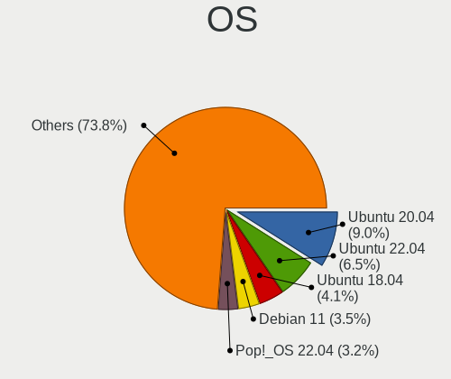
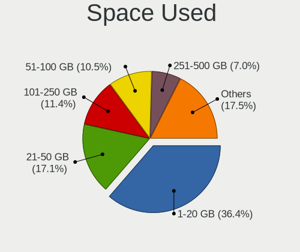

Linux in USA - Tested Hardware & Statistics
-------------------------------------------

A project to collect tested hardware configurations for Linux in USA.

Anyone can contribute to this report by the [hw-probe](https://github.com/linuxhw/hw-probe) tool:

    sudo -E hw-probe -all -upload

Please contribute! Especially if your hardware is rare.

This is a report for all computer types. See also reports for [desktops](/Location/USA/Desktop/README.md) and [notebooks](/Location/USA/Notebook/README.md).

Contents
--------

* [ Test Cases ](#test-cases)

* [ System ](#system)
  - [ OS                       ](#os)
  - [ OS Family                ](#os-family)
  - [ Kernel                   ](#kernel)
  - [ Kernel Family            ](#kernel-family)
  - [ Kernel Major Ver.        ](#kernel-major-ver)
  - [ Arch                     ](#arch)
  - [ DE                       ](#de)
  - [ Display Server           ](#display-server)
  - [ Display Manager          ](#display-manager)
  - [ OS Lang                  ](#os-lang)
  - [ Boot Mode                ](#boot-mode)
  - [ Filesystem               ](#filesystem)
  - [ Part. scheme             ](#part-scheme)
  - [ Dual Boot with Linux/BSD ](#dual-boot-with-linuxbsd)
  - [ Dual Boot (Win)          ](#dual-boot-win)

* [ Board ](#board)
  - [ Vendor                   ](#vendor)
  - [ Model                    ](#model)
  - [ Model Family             ](#model-family)
  - [ MFG Year                 ](#mfg-year)
  - [ Form Factor              ](#form-factor)
  - [ Secure Boot              ](#secure-boot)
  - [ Coreboot                 ](#coreboot)
  - [ RAM Size                 ](#ram-size)
  - [ RAM Used                 ](#ram-used)
  - [ Total Drives             ](#total-drives)
  - [ Has CD-ROM               ](#has-cd-rom)
  - [ Has Ethernet             ](#has-ethernet)
  - [ Has WiFi                 ](#has-wifi)
  - [ Has Bluetooth            ](#has-bluetooth)

* [ Location ](#location)
  - [ Country                  ](#country)
  - [ City                     ](#city)

* [ Drives ](#drives)
  - [ Drive Vendor             ](#drive-vendor)
  - [ Drive Model              ](#drive-model)
  - [ HDD Vendor               ](#hdd-vendor)
  - [ SSD Vendor               ](#ssd-vendor)
  - [ Drive Kind               ](#drive-kind)
  - [ Drive Connector          ](#drive-connector)
  - [ Drive Size               ](#drive-size)
  - [ Space Total              ](#space-total)
  - [ Space Used               ](#space-used)
  - [ Malfunc. Drives          ](#malfunc-drives)
  - [ Malfunc. Drive Vendor    ](#malfunc-drive-vendor)
  - [ Malfunc. HDD Vendor      ](#malfunc-hdd-vendor)
  - [ Malfunc. Drive Kind      ](#malfunc-drive-kind)
  - [ Failed Drives            ](#failed-drives)
  - [ Failed Drive Vendor      ](#failed-drive-vendor)
  - [ Drive Status             ](#drive-status)

* [ Storage controller ](#storage-controller)
  - [ Storage Vendor           ](#storage-vendor)
  - [ Storage Model            ](#storage-model)
  - [ Storage Kind             ](#storage-kind)

* [ Processor ](#processor)
  - [ CPU Vendor               ](#cpu-vendor)
  - [ CPU Model                ](#cpu-model)
  - [ CPU Model Family         ](#cpu-model-family)
  - [ CPU Cores                ](#cpu-cores)
  - [ CPU Sockets              ](#cpu-sockets)
  - [ CPU Threads              ](#cpu-threads)
  - [ CPU Op-Modes             ](#cpu-op-modes)
  - [ CPU Microcode            ](#cpu-microcode)
  - [ CPU Microarch            ](#cpu-microarch)

* [ Graphics ](#graphics)
  - [ GPU Vendor               ](#gpu-vendor)
  - [ GPU Model                ](#gpu-model)
  - [ GPU Combo                ](#gpu-combo)
  - [ GPU Driver               ](#gpu-driver)
  - [ GPU Memory               ](#gpu-memory)

* [ Monitor ](#monitor)
  - [ Monitor Vendor           ](#monitor-vendor)
  - [ Monitor Model            ](#monitor-model)
  - [ Monitor Resolution       ](#monitor-resolution)
  - [ Monitor Diagonal         ](#monitor-diagonal)
  - [ Monitor Width            ](#monitor-width)
  - [ Aspect Ratio             ](#aspect-ratio)
  - [ Monitor Area             ](#monitor-area)
  - [ Pixel Density            ](#pixel-density)
  - [ Multiple Monitors        ](#multiple-monitors)

* [ Network ](#network)
  - [ Net Controller Vendor    ](#net-controller-vendor)
  - [ Net Controller Model     ](#net-controller-model)
  - [ Wireless Vendor          ](#wireless-vendor)
  - [ Wireless Model           ](#wireless-model)
  - [ Ethernet Vendor          ](#ethernet-vendor)
  - [ Ethernet Model           ](#ethernet-model)
  - [ Net Controller Kind      ](#net-controller-kind)
  - [ Used Controller          ](#used-controller)
  - [ NICs                     ](#nics)
  - [ IPv6                     ](#ipv6)

* [ Bluetooth ](#bluetooth)
  - [ Bluetooth Vendor         ](#bluetooth-vendor)
  - [ Bluetooth Model          ](#bluetooth-model)

* [ Sound ](#sound)
  - [ Sound Vendor             ](#sound-vendor)
  - [ Sound Model              ](#sound-model)

* [ Memory ](#memory)
  - [ Memory Vendor            ](#memory-vendor)
  - [ Memory Model             ](#memory-model)
  - [ Memory Kind              ](#memory-kind)
  - [ Memory Form Factor       ](#memory-form-factor)
  - [ Memory Size              ](#memory-size)
  - [ Memory Speed             ](#memory-speed)

* [ Printers & scanners ](#printers--scanners)
  - [ Printer Vendor           ](#printer-vendor)
  - [ Printer Model            ](#printer-model)
  - [ Scanner Vendor           ](#scanner-vendor)
  - [ Scanner Model            ](#scanner-model)

* [ Camera ](#camera)
  - [ Camera Vendor            ](#camera-vendor)
  - [ Camera Model             ](#camera-model)

* [ Security ](#security)
  - [ Fingerprint Vendor       ](#fingerprint-vendor)
  - [ Fingerprint Model        ](#fingerprint-model)
  - [ Chipcard Vendor          ](#chipcard-vendor)
  - [ Chipcard Model           ](#chipcard-model)

* [ Unsupported ](#unsupported)
  - [ Unsupported Devices      ](#unsupported-devices)
  - [ Unsupported Device Types ](#unsupported-device-types)

Test Cases
----------

Total: 34584

| Vendor        | Model                       | Form-Factor | Probe                                                      | Date         |
|---------------|-----------------------------|-------------|------------------------------------------------------------|--------------|
| ASUSTek       | PRIME B550M-A               | Desktop     | [58051fe7e2](https://linux-hardware.org/?probe=58051fe7e2) | Jun 01, 2022 |
| Dell          | 0YNVJG A02                  | Desktop     | [9b84f171eb](https://linux-hardware.org/?probe=9b84f171eb) | Jun 01, 2022 |
| Lenovo        | ThinkPad T510 4313CTU       | Notebook    | [d5c0252c4b](https://linux-hardware.org/?probe=d5c0252c4b) | Jun 01, 2022 |
| Lenovo        | ThinkPad T440s 20AQ008FU... | Notebook    | [3b5255ec2c](https://linux-hardware.org/?probe=3b5255ec2c) | Jun 01, 2022 |
| Supermicro    | X10DAL-i                    | Server      | [ec2ed0ad86](https://linux-hardware.org/?probe=ec2ed0ad86) | Jun 01, 2022 |
| ASUSTek       | PRIME Z590-A                | Desktop     | [fa29e357fa](https://linux-hardware.org/?probe=fa29e357fa) | Jun 01, 2022 |
| Apple         | MacBook2,1                  | Notebook    | [12cfa4cdb2](https://linux-hardware.org/?probe=12cfa4cdb2) | Jun 01, 2022 |
| MSI           | MAG B560 TORPEDO            | Desktop     | [72181d6834](https://linux-hardware.org/?probe=72181d6834) | Jun 01, 2022 |
| ASUSTek       | PRIME B560M-A               | Desktop     | [b68bcf6b84](https://linux-hardware.org/?probe=b68bcf6b84) | Jun 01, 2022 |
| Dell          | XPS 17 9710                 | Notebook    | [d33b756434](https://linux-hardware.org/?probe=d33b756434) | Jun 01, 2022 |
| Lenovo        | ThinkPad X380 Yoga 20LJS... | Convertible | [1ab6112525](https://linux-hardware.org/?probe=1ab6112525) | Jun 01, 2022 |
| MSI           | B250M BAZOOKA               | Desktop     | [45d3300158](https://linux-hardware.org/?probe=45d3300158) | Jun 01, 2022 |
| Unknown       | Unknown                     | Desktop     | [2b7ddd025b](https://linux-hardware.org/?probe=2b7ddd025b) | May 31, 2022 |
| ASUSTek       | ROG Strix G533QS_G533QS     | Notebook    | [7099867859](https://linux-hardware.org/?probe=7099867859) | May 31, 2022 |
| Sony          | VPCF11JFX                   | Notebook    | [17d6b6b0bb](https://linux-hardware.org/?probe=17d6b6b0bb) | May 31, 2022 |
| Lenovo        | ThinkPad Edge E530 32597... | Notebook    | [4cf2bedfe7](https://linux-hardware.org/?probe=4cf2bedfe7) | May 31, 2022 |
| Pegatron      | 2AED                        | Desktop     | [67df0b1c08](https://linux-hardware.org/?probe=67df0b1c08) | May 31, 2022 |
| MSI           | Z170A MPOWER GAMING TITA... | Desktop     | [538feade4f](https://linux-hardware.org/?probe=538feade4f) | May 31, 2022 |
| Dell          | 0HY9JP A01                  | Desktop     | [ddaf2f5f45](https://linux-hardware.org/?probe=ddaf2f5f45) | May 31, 2022 |
| MSI           | A320M-HDV R4.0              | Desktop     | [c6f912a3cd](https://linux-hardware.org/?probe=c6f912a3cd) | May 31, 2022 |
| HP            | EliteBook 840 G2            | Notebook    | [2f6bce8773](https://linux-hardware.org/?probe=2f6bce8773) | May 31, 2022 |
| MSI           | B450-A PRO MAX              | Desktop     | [72484e859d](https://linux-hardware.org/?probe=72484e859d) | May 31, 2022 |
| Dell          | Inspiron 7590 2n1           | Convertible | [30a0d0ec81](https://linux-hardware.org/?probe=30a0d0ec81) | May 31, 2022 |
| MSI           | B450-A PRO MAX              | Desktop     | [9f7d224ed7](https://linux-hardware.org/?probe=9f7d224ed7) | May 31, 2022 |
| Apple         | MacBookPro8,3               | Notebook    | [38f4cc4c5a](https://linux-hardware.org/?probe=38f4cc4c5a) | May 31, 2022 |
| ASUSTek       | ROG STRIX X570-E GAMING     | Desktop     | [6560268d80](https://linux-hardware.org/?probe=6560268d80) | May 31, 2022 |
| Toshiba       | Satellite M305D             | Notebook    | [6d558c3665](https://linux-hardware.org/?probe=6d558c3665) | May 31, 2022 |
| HP            | 158A                        | Desktop     | [7f7c6ae514](https://linux-hardware.org/?probe=7f7c6ae514) | May 31, 2022 |
| ASRock        | B450 Pro4                   | Desktop     | [394d112de5](https://linux-hardware.org/?probe=394d112de5) | May 31, 2022 |
| Microsoft     | Surface Laptop 3            | Tablet      | [e7d02810c1](https://linux-hardware.org/?probe=e7d02810c1) | May 31, 2022 |
| Toshiba       | Satellite M305D             | Notebook    | [43315304ac](https://linux-hardware.org/?probe=43315304ac) | May 31, 2022 |
| Microsoft     | Surface Laptop 3            | Tablet      | [56929c3f8f](https://linux-hardware.org/?probe=56929c3f8f) | May 31, 2022 |
| ASUSTek       | TUF Gaming B450-PLUS II     | Desktop     | [eb660008d7](https://linux-hardware.org/?probe=eb660008d7) | May 31, 2022 |
| ASUSTek       | ROG Strix G533QS_G533QS     | Notebook    | [aeb3a20df7](https://linux-hardware.org/?probe=aeb3a20df7) | May 31, 2022 |
| Alienware     | 15 R2                       | Notebook    | [776abe61ea](https://linux-hardware.org/?probe=776abe61ea) | May 31, 2022 |
| Acer          | Aspire E5-575G              | Notebook    | [7c44163245](https://linux-hardware.org/?probe=7c44163245) | May 31, 2022 |
| ASUSTek       | Rampage V EDITION 10        | Desktop     | [ab6fb60b96](https://linux-hardware.org/?probe=ab6fb60b96) | May 31, 2022 |
| ASUSTek       | TUF Gaming B450-PLUS II     | Desktop     | [53dbc2fe14](https://linux-hardware.org/?probe=53dbc2fe14) | May 31, 2022 |
| ASUSTek       | PRIME B550M-A               | Desktop     | [f2500a22ea](https://linux-hardware.org/?probe=f2500a22ea) | May 31, 2022 |
| System76      | Thelio Major thelio-majo... | Desktop     | [291730a3bb](https://linux-hardware.org/?probe=291730a3bb) | May 31, 2022 |
| Dell          | Inspiron 3541               | Notebook    | [20b5815ca3](https://linux-hardware.org/?probe=20b5815ca3) | May 31, 2022 |
| Purism        | Librem Mini v2              | Desktop     | [a0a090240d](https://linux-hardware.org/?probe=a0a090240d) | May 30, 2022 |
| ASRock        | B550 PG Velocita            | Desktop     | [0d7f71a24d](https://linux-hardware.org/?probe=0d7f71a24d) | May 30, 2022 |
| HP            | 2B02                        | Desktop     | [d7c68e4767](https://linux-hardware.org/?probe=d7c68e4767) | May 30, 2022 |
| Dell          | Vostro 3590                 | Notebook    | [e7f7489e9e](https://linux-hardware.org/?probe=e7f7489e9e) | May 30, 2022 |
| Google        | Coral                       | Notebook    | [c517ad03c1](https://linux-hardware.org/?probe=c517ad03c1) | May 30, 2022 |
| ASUSTek       | ROG STRIX Z690-A GAMING ... | Desktop     | [11882c80d6](https://linux-hardware.org/?probe=11882c80d6) | May 30, 2022 |
| Google        | Droid                       | Notebook    | [35e3edeab3](https://linux-hardware.org/?probe=35e3edeab3) | May 30, 2022 |
| HP            | ZBook Firefly 14 inch G8... | Notebook    | [55e99cb697](https://linux-hardware.org/?probe=55e99cb697) | May 30, 2022 |
| Dell          | Precision 7710              | Notebook    | [f24e29d104](https://linux-hardware.org/?probe=f24e29d104) | May 30, 2022 |
| Dell          | Latitude E6510              | Notebook    | [4fe104ba1c](https://linux-hardware.org/?probe=4fe104ba1c) | May 30, 2022 |
| Framework     | Laptop                      | Notebook    | [f1c2a80b70](https://linux-hardware.org/?probe=f1c2a80b70) | May 30, 2022 |
| Dell          | Latitude 7320               | Notebook    | [63c6f252ab](https://linux-hardware.org/?probe=63c6f252ab) | May 30, 2022 |
| Dell          | Precision 7710              | Notebook    | [1bae5a0bf0](https://linux-hardware.org/?probe=1bae5a0bf0) | May 30, 2022 |
| MSI           | FM2-A75MA-E35               | Desktop     | [b19d5dd73f](https://linux-hardware.org/?probe=b19d5dd73f) | May 30, 2022 |
| Dell          | 0Y2MRG A00                  | Desktop     | [013e0da975](https://linux-hardware.org/?probe=013e0da975) | May 30, 2022 |
| ASUSTek       | ROG STRIX B550-F GAMING     | Desktop     | [7b27373492](https://linux-hardware.org/?probe=7b27373492) | May 30, 2022 |
| Dell          | 0GDG8Y A00                  | Desktop     | [623aaff733](https://linux-hardware.org/?probe=623aaff733) | May 30, 2022 |
| MSI           | FM2-A75MA-E35               | Desktop     | [586597ee3b](https://linux-hardware.org/?probe=586597ee3b) | May 30, 2022 |
| HP            | Spectre x360 Convertible... | Convertible | [6b394ac051](https://linux-hardware.org/?probe=6b394ac051) | May 30, 2022 |
| MSI           | MPG Z690 EDGE WIFI DDR4     | Desktop     | [415752672c](https://linux-hardware.org/?probe=415752672c) | May 30, 2022 |
| Lenovo        | Yoga 910-13IKB 80VF         | Convertible | [7167a72758](https://linux-hardware.org/?probe=7167a72758) | May 30, 2022 |
| HP            | EliteBook 8470p             | Notebook    | [d5d9d52b83](https://linux-hardware.org/?probe=d5d9d52b83) | May 30, 2022 |
| ASUSTek       | X540LA                      | Notebook    | [57e0b15d17](https://linux-hardware.org/?probe=57e0b15d17) | May 30, 2022 |
| GPU Compan... | GWTC116-2                   | Notebook    | [dbf473f0a0](https://linux-hardware.org/?probe=dbf473f0a0) | May 30, 2022 |
| HP            | Spectre x360 Convertible... | Convertible | [5766b308a7](https://linux-hardware.org/?probe=5766b308a7) | May 30, 2022 |
| Lenovo        | SHARKBAY NOK                | Desktop     | [2292ca3341](https://linux-hardware.org/?probe=2292ca3341) | May 30, 2022 |
| Dell          | 0D02VH A01                  | Desktop     | [fc97b0a5bf](https://linux-hardware.org/?probe=fc97b0a5bf) | May 30, 2022 |
| GPU Compan... | GWTC116-2                   | Notebook    | [574439c3c6](https://linux-hardware.org/?probe=574439c3c6) | May 30, 2022 |
| HP            | 8711                        | Mini pc     | [e6822ab801](https://linux-hardware.org/?probe=e6822ab801) | May 30, 2022 |
| ASUSTek       | PRIME Z590-A                | Desktop     | [1058cdf867](https://linux-hardware.org/?probe=1058cdf867) | May 30, 2022 |
| Lenovo        | ThinkCentre M90p 5536WAZ    | Desktop     | [c6c32dc36b](https://linux-hardware.org/?probe=c6c32dc36b) | May 30, 2022 |
| HP            | Laptop 15-da0xxx            | Notebook    | [1780281b4c](https://linux-hardware.org/?probe=1780281b4c) | May 30, 2022 |
| MSI           | A68HM-E33 V2                | Desktop     | [c7d90aab1f](https://linux-hardware.org/?probe=c7d90aab1f) | May 30, 2022 |
| MSI           | A68HM-E33 V2                | Desktop     | [4df785d4ff](https://linux-hardware.org/?probe=4df785d4ff) | May 30, 2022 |
| ASUSTek       | X99-E-10G WS                | Desktop     | [83e525ca4e](https://linux-hardware.org/?probe=83e525ca4e) | May 30, 2022 |
| HP            | EliteBook 840 G8 Noteboo... | Notebook    | [15fb1b0353](https://linux-hardware.org/?probe=15fb1b0353) | May 30, 2022 |
| Dell          | 0R6PCT A01                  | Desktop     | [23c83c37e6](https://linux-hardware.org/?probe=23c83c37e6) | May 29, 2022 |
| Dell          | 0R790T A00                  | Desktop     | [f9388b2163](https://linux-hardware.org/?probe=f9388b2163) | May 29, 2022 |
| ASUSTek       | ROG CROSSHAIR VIII DARK ... | Desktop     | [5d899f8fc5](https://linux-hardware.org/?probe=5d899f8fc5) | May 29, 2022 |
| Gigabyte      | H97N-WIFI                   | Desktop     | [031d4a8f7f](https://linux-hardware.org/?probe=031d4a8f7f) | May 29, 2022 |
| ASUSTek       | ROG STRIX X570-E GAMING     | Desktop     | [d1923db949](https://linux-hardware.org/?probe=d1923db949) | May 29, 2022 |
| Dell          | 0PM2CW A00                  | Server      | [2b559392cc](https://linux-hardware.org/?probe=2b559392cc) | May 29, 2022 |
| Lenovo        | ThinkPad T480s 20L8S34C0... | Notebook    | [c272fc283f](https://linux-hardware.org/?probe=c272fc283f) | May 29, 2022 |
| System76      | Lemur Pro                   | Notebook    | [4a6174b7a4](https://linux-hardware.org/?probe=4a6174b7a4) | May 29, 2022 |
| HP            | Laptop 15-dy2xxx            | Notebook    | [1c71dac18b](https://linux-hardware.org/?probe=1c71dac18b) | May 29, 2022 |
| System76      | Oryx Pro                    | Notebook    | [5f84134f5d](https://linux-hardware.org/?probe=5f84134f5d) | May 29, 2022 |
| HP            | Laptop 14-dq0xxx            | Notebook    | [fac9e55ae9](https://linux-hardware.org/?probe=fac9e55ae9) | May 29, 2022 |
| Acer          | Aspire E5-571               | Notebook    | [8767a79d4a](https://linux-hardware.org/?probe=8767a79d4a) | May 29, 2022 |
| MSI           | Z590-A PRO                  | Desktop     | [55a37b3d9c](https://linux-hardware.org/?probe=55a37b3d9c) | May 29, 2022 |
| ASUSTek       | K55A                        | Notebook    | [0eb5e9ea50](https://linux-hardware.org/?probe=0eb5e9ea50) | May 29, 2022 |
| ASUSTek       | TUF Gaming X570-PLUS        | Desktop     | [0050247c85](https://linux-hardware.org/?probe=0050247c85) | May 29, 2022 |
| ASUSTek       | GL502VSK                    | Notebook    | [44fb5da9d6](https://linux-hardware.org/?probe=44fb5da9d6) | May 29, 2022 |
| Valve         | Jupiter                     | Notebook    | [e415de106f](https://linux-hardware.org/?probe=e415de106f) | May 29, 2022 |
| Lenovo        | Legion S7 15ACH6 82K8       | Notebook    | [10ade1b182](https://linux-hardware.org/?probe=10ade1b182) | May 29, 2022 |
| HP            | ENVY x360 Convertible 15... | Convertible | [ced26bb73e](https://linux-hardware.org/?probe=ced26bb73e) | May 29, 2022 |
| HP            | Pavilion Laptop 15t-eg10... | Notebook    | [e24b789c03](https://linux-hardware.org/?probe=e24b789c03) | May 29, 2022 |
| Gigabyte      | X570 AORUS MASTER           | Desktop     | [91508b9375](https://linux-hardware.org/?probe=91508b9375) | May 29, 2022 |
| Dell          | 0HN7XN A01                  | Desktop     | [9ebd09a280](https://linux-hardware.org/?probe=9ebd09a280) | May 29, 2022 |
| Google        | Guado                       | Desktop     | [d026c0565d](https://linux-hardware.org/?probe=d026c0565d) | May 29, 2022 |
| ASUSTek       | X555LAB                     | Notebook    | [24d84de091](https://linux-hardware.org/?probe=24d84de091) | May 29, 2022 |
| Toshiba       | Satellite C675              | Notebook    | [72daf96a34](https://linux-hardware.org/?probe=72daf96a34) | May 28, 2022 |
| HP            | 2B29                        | Desktop     | [d2ab16d631](https://linux-hardware.org/?probe=d2ab16d631) | May 28, 2022 |
| Biostar       | X470GTQ                     | Desktop     | [44e1072418](https://linux-hardware.org/?probe=44e1072418) | May 28, 2022 |
| HP            | OMEN by Laptop 15z-en100    | Notebook    | [35e3478a5d](https://linux-hardware.org/?probe=35e3478a5d) | May 28, 2022 |
| ASUSTek       | PRIME B550M-A               | Desktop     | [c84d9cc3c4](https://linux-hardware.org/?probe=c84d9cc3c4) | May 28, 2022 |
| ASRock        | X470 Gaming-ITX/ac          | Desktop     | [c01dbfddee](https://linux-hardware.org/?probe=c01dbfddee) | May 28, 2022 |
| ASUSTek       | PRIME X570-P                | Desktop     | [6b3439b423](https://linux-hardware.org/?probe=6b3439b423) | May 28, 2022 |
| HP            | 213D A01                    | Desktop     | [1be94a04b6](https://linux-hardware.org/?probe=1be94a04b6) | May 28, 2022 |
| HP            | 8245 001                    | All in one  | [809b3fb754](https://linux-hardware.org/?probe=809b3fb754) | May 28, 2022 |
| AMI           | Aptio CRB                   | Mini pc     | [63ccee44b1](https://linux-hardware.org/?probe=63ccee44b1) | May 28, 2022 |
| Gigabyte      | F2A58M-DS2                  | Desktop     | [3b95da87e9](https://linux-hardware.org/?probe=3b95da87e9) | May 28, 2022 |
| Dell          | Inspiron 1545               | Notebook    | [ce0e24a314](https://linux-hardware.org/?probe=ce0e24a314) | May 28, 2022 |
| ASUSTek       | TUF Gaming X570-PLUS        | Desktop     | [c0399b42b7](https://linux-hardware.org/?probe=c0399b42b7) | May 28, 2022 |
| Lenovo        | Yoga 910-13IKB 80VF         | Convertible | [f36cd0847f](https://linux-hardware.org/?probe=f36cd0847f) | May 28, 2022 |
| Valve         | Jupiter                     | Notebook    | [06b56d54d4](https://linux-hardware.org/?probe=06b56d54d4) | May 28, 2022 |
| ASUSTek       | Maximus IV Extreme-Z        | Desktop     | [57a20bde9f](https://linux-hardware.org/?probe=57a20bde9f) | May 28, 2022 |
| Pegatron      | Benicia                     | Desktop     | [64aa376623](https://linux-hardware.org/?probe=64aa376623) | May 28, 2022 |
| MSI           | B450M GAMING PLUS           | Desktop     | [4b57fddd32](https://linux-hardware.org/?probe=4b57fddd32) | May 28, 2022 |
| Raspberry ... | Raspberry Pi                | Soc         | [87b4d5df31](https://linux-hardware.org/?probe=87b4d5df31) | May 28, 2022 |
| HP            | 15                          | Notebook    | [d44aca33f7](https://linux-hardware.org/?probe=d44aca33f7) | May 28, 2022 |
| HP            | Laptop 14-dq0xxx            | Notebook    | [7d47123b6c](https://linux-hardware.org/?probe=7d47123b6c) | May 28, 2022 |
| Intel         | X99                         | Desktop     | [bda2610780](https://linux-hardware.org/?probe=bda2610780) | May 28, 2022 |
| ASUSTek       | PRIME B550M-A               | Desktop     | [1238dba054](https://linux-hardware.org/?probe=1238dba054) | May 28, 2022 |
| MSI           | MS-7D52                     | Notebook    | [f70c160542](https://linux-hardware.org/?probe=f70c160542) | May 28, 2022 |
| HP            | 8643 SMVB                   | Desktop     | [cf38cf9584](https://linux-hardware.org/?probe=cf38cf9584) | May 28, 2022 |
| ASUSTek       | G750JX                      | Notebook    | [dfb08cef0b](https://linux-hardware.org/?probe=dfb08cef0b) | May 28, 2022 |
| Google        | Phaser360                   | Notebook    | [1795c158e4](https://linux-hardware.org/?probe=1795c158e4) | May 28, 2022 |
| Pegatron      | 2AC2                        | Desktop     | [ab5d6c08d5](https://linux-hardware.org/?probe=ab5d6c08d5) | May 28, 2022 |
| Dell          | 0C2XKD A01                  | Desktop     | [2aaa53dd85](https://linux-hardware.org/?probe=2aaa53dd85) | May 28, 2022 |
| Gigabyte      | AB350-Gaming-CF             | Desktop     | [5458522367](https://linux-hardware.org/?probe=5458522367) | May 28, 2022 |
| MSI           | MPG X570 GAMING EDGE WIF... | Desktop     | [ce112fb9d2](https://linux-hardware.org/?probe=ce112fb9d2) | May 28, 2022 |
| Gigabyte      | X570 AORUS MASTER           | Desktop     | [bd7aea9bfd](https://linux-hardware.org/?probe=bd7aea9bfd) | May 28, 2022 |
| HP            | 2B36                        | Desktop     | [7a6bff3398](https://linux-hardware.org/?probe=7a6bff3398) | May 28, 2022 |
| HP            | G60                         | Notebook    | [a577d64352](https://linux-hardware.org/?probe=a577d64352) | May 28, 2022 |
| Protectli     | FW4A Ver                    | Desktop     | [5484bd3167](https://linux-hardware.org/?probe=5484bd3167) | May 28, 2022 |
| ASUSTek       | PRIME B550M-A               | Desktop     | [74c7a449f9](https://linux-hardware.org/?probe=74c7a449f9) | May 27, 2022 |
| Dell          | 096JG8 A01                  | Desktop     | [c932e2dd60](https://linux-hardware.org/?probe=c932e2dd60) | May 27, 2022 |
| Dell          | 0T7D40 A00                  | Desktop     | [c9c3fd7a7e](https://linux-hardware.org/?probe=c9c3fd7a7e) | May 27, 2022 |
| MSI           | Z270 SLI PLUS               | Desktop     | [c0a846ffe7](https://linux-hardware.org/?probe=c0a846ffe7) | May 27, 2022 |
| HP            | Pavilion Laptop 15-eh0xx... | Notebook    | [0000ab45a7](https://linux-hardware.org/?probe=0000ab45a7) | May 27, 2022 |
| HP            | Berknip                     | Notebook    | [c81d3442c2](https://linux-hardware.org/?probe=c81d3442c2) | May 27, 2022 |
| Timi          | A35S                        | Notebook    | [8a1bee3210](https://linux-hardware.org/?probe=8a1bee3210) | May 27, 2022 |
| MSI           | B360I GMAING PRO AC         | Desktop     | [b2057f21bd](https://linux-hardware.org/?probe=b2057f21bd) | May 27, 2022 |
| Dell          | Studio 1749                 | Notebook    | [ac564826fe](https://linux-hardware.org/?probe=ac564826fe) | May 27, 2022 |
| Dell          | Latitude E7450              | Notebook    | [929e69f0ad](https://linux-hardware.org/?probe=929e69f0ad) | May 27, 2022 |
| ASUSTek       | PRIME B450M-A II            | Desktop     | [c9d649d5c7](https://linux-hardware.org/?probe=c9d649d5c7) | May 27, 2022 |
| ASUSTek       | CROSSHAIR VI HERO           | Desktop     | [f5beaba229](https://linux-hardware.org/?probe=f5beaba229) | May 27, 2022 |
| Dell          | 0KP561                      | Desktop     | [2435960bba](https://linux-hardware.org/?probe=2435960bba) | May 27, 2022 |
| ASUSTek       | CROSSHAIR VI HERO           | Desktop     | [2624ebd3a1](https://linux-hardware.org/?probe=2624ebd3a1) | May 27, 2022 |
| Lenovo        | Yoga C740-15IML 81TD        | Convertible | [d17aaf4cc5](https://linux-hardware.org/?probe=d17aaf4cc5) | May 27, 2022 |
| Lenovo        | SHARKBAY 0B98401 WIN        | Desktop     | [f5195788f8](https://linux-hardware.org/?probe=f5195788f8) | May 27, 2022 |
| ASUSTek       | K30AD_M31AD_M51AD_M32AD     | Desktop     | [4e77d22694](https://linux-hardware.org/?probe=4e77d22694) | May 27, 2022 |
| Valve         | Jupiter                     | Notebook    | [1e966da4f8](https://linux-hardware.org/?probe=1e966da4f8) | May 27, 2022 |
| Gigabyte      | AORUS 15 XE4                | Notebook    | [f56ba4f49d](https://linux-hardware.org/?probe=f56ba4f49d) | May 27, 2022 |
| Microsoft     | Surface Book 2              | Tablet      | [bc517297a6](https://linux-hardware.org/?probe=bc517297a6) | May 27, 2022 |
| Intel         | NUC5i5RYB H40999-502        | Mini pc     | [3edceaf423](https://linux-hardware.org/?probe=3edceaf423) | May 27, 2022 |
| Lenovo        | ThinkPad X1 Carbon Gen 9... | Notebook    | [d2581e2c05](https://linux-hardware.org/?probe=d2581e2c05) | May 27, 2022 |
| Apple         | MacBookPro5,5               | Notebook    | [75eebad111](https://linux-hardware.org/?probe=75eebad111) | May 27, 2022 |
| Lenovo        | IdeaPad Flex-14IWL 81SQ     | Convertible | [650e81d0df](https://linux-hardware.org/?probe=650e81d0df) | May 27, 2022 |
| MSI           | Katana GF66 11UD            | Notebook    | [f3ee20f625](https://linux-hardware.org/?probe=f3ee20f625) | May 27, 2022 |
| Dell          | 0GDG8Y A00                  | Desktop     | [6fddb5c0b2](https://linux-hardware.org/?probe=6fddb5c0b2) | May 27, 2022 |
| Google        | Kasumi                      | Notebook    | [112d887e7a](https://linux-hardware.org/?probe=112d887e7a) | May 27, 2022 |
| Google        | Kasumi                      | Notebook    | [9c5ae593d2](https://linux-hardware.org/?probe=9c5ae593d2) | May 27, 2022 |
| ASUSTek       | PRIME Z270-A                | Desktop     | [5d1ee4048a](https://linux-hardware.org/?probe=5d1ee4048a) | May 27, 2022 |
| Dell          | Inspiron 15 3510            | Notebook    | [860cd7b1f5](https://linux-hardware.org/?probe=860cd7b1f5) | May 27, 2022 |
| Dell          | Inspiron 15 3510            | Notebook    | [3d9ff1d25f](https://linux-hardware.org/?probe=3d9ff1d25f) | May 27, 2022 |
| HP            | Stream Laptop 14-cb1xxx     | Notebook    | [50f70bc9af](https://linux-hardware.org/?probe=50f70bc9af) | May 27, 2022 |
| ASUSTek       | Z170-A                      | Desktop     | [86021dcc38](https://linux-hardware.org/?probe=86021dcc38) | May 27, 2022 |
| Dell          | Inspiron One 2320           | All in one  | [82b5a900c4](https://linux-hardware.org/?probe=82b5a900c4) | May 27, 2022 |
| HP            | Pavilion Gaming Laptop 1... | Notebook    | [e879d3c292](https://linux-hardware.org/?probe=e879d3c292) | May 27, 2022 |
| ASUSTek       | TUF B365M-PLUS GAMING       | Desktop     | [1137f80fcd](https://linux-hardware.org/?probe=1137f80fcd) | May 27, 2022 |
| ASUSTek       | TUF B365M-PLUS GAMING       | Desktop     | [57dbc86807](https://linux-hardware.org/?probe=57dbc86807) | May 27, 2022 |
| Lenovo        | ThinkPad P1 Gen 3 20TJS3... | Notebook    | [88aabea122](https://linux-hardware.org/?probe=88aabea122) | May 27, 2022 |
| ASUSTek       | G20AJ                       | Desktop     | [72ead90cb6](https://linux-hardware.org/?probe=72ead90cb6) | May 26, 2022 |
| HP            | ENVY x360 Convertible 15... | Convertible | [05bcc31b5d](https://linux-hardware.org/?probe=05bcc31b5d) | May 26, 2022 |
| HP            | 212B                        | Desktop     | [14db1a01c5](https://linux-hardware.org/?probe=14db1a01c5) | May 26, 2022 |
| Dell          | 0N4YC8 A00                  | Desktop     | [74525891a0](https://linux-hardware.org/?probe=74525891a0) | May 26, 2022 |
| ASUSTek       | TUF Gaming B550M-PLUS       | Desktop     | [bf3f9d0ed3](https://linux-hardware.org/?probe=bf3f9d0ed3) | May 26, 2022 |
| ASUSTek       | ROG STRIX Z690-I GAMING ... | Desktop     | [084dab5bd4](https://linux-hardware.org/?probe=084dab5bd4) | May 26, 2022 |
| ASUSTek       | P9X79 PRO                   | Desktop     | [cd6886f1d3](https://linux-hardware.org/?probe=cd6886f1d3) | May 26, 2022 |
| HP            | Laptop 14-dq0xxx            | Notebook    | [f1707ab670](https://linux-hardware.org/?probe=f1707ab670) | May 26, 2022 |
| ASUSTek       | P9X79 PRO                   | Desktop     | [60cf709d09](https://linux-hardware.org/?probe=60cf709d09) | May 26, 2022 |
| ASUSTek       | M2N68-AM                    | Desktop     | [9038c662b6](https://linux-hardware.org/?probe=9038c662b6) | May 26, 2022 |
| Dell          | 0RY007                      | Desktop     | [2d0a227175](https://linux-hardware.org/?probe=2d0a227175) | May 26, 2022 |
| Dell          | Inspiron 7559               | Notebook    | [61fe0db491](https://linux-hardware.org/?probe=61fe0db491) | May 26, 2022 |
| Dell          | Inspiron 7559               | Notebook    | [47f48c626a](https://linux-hardware.org/?probe=47f48c626a) | May 26, 2022 |
| Dell          | Inspiron 1420               | Notebook    | [4ca4bb715c](https://linux-hardware.org/?probe=4ca4bb715c) | May 26, 2022 |
| Acer          | Swift SF314-43              | Notebook    | [640f9226a1](https://linux-hardware.org/?probe=640f9226a1) | May 26, 2022 |
| HP            | Laptop 14-dq0xxx            | Notebook    | [d55ccb53e4](https://linux-hardware.org/?probe=d55ccb53e4) | May 26, 2022 |
| Dell          | Latitude E6540              | Notebook    | [9171fd4d35](https://linux-hardware.org/?probe=9171fd4d35) | May 26, 2022 |
| ASUSTek       | P5QPL-AM                    | Desktop     | [938ab3ec5c](https://linux-hardware.org/?probe=938ab3ec5c) | May 26, 2022 |
| Dell          | Latitude E6540              | Notebook    | [e7a078f1a1](https://linux-hardware.org/?probe=e7a078f1a1) | May 26, 2022 |
| ASUSTek       | 1005HA                      | Notebook    | [0948f30719](https://linux-hardware.org/?probe=0948f30719) | May 26, 2022 |
| ASRock        | H570M Pro4                  | Desktop     | [fe647f8d6c](https://linux-hardware.org/?probe=fe647f8d6c) | May 26, 2022 |
| ASUSTek       | ROG CROSSHAIR VIII DARK ... | Desktop     | [c035632382](https://linux-hardware.org/?probe=c035632382) | May 26, 2022 |
| ASUSTek       | Z170-A                      | Desktop     | [b8603fccc0](https://linux-hardware.org/?probe=b8603fccc0) | May 26, 2022 |
| Lenovo        | ThinkPad T420 4236MBU       | Notebook    | [7a7ef6ced7](https://linux-hardware.org/?probe=7a7ef6ced7) | May 26, 2022 |
| ASUSTek       | TUF B450M-PLUS GAMING       | Desktop     | [ae0ada290a](https://linux-hardware.org/?probe=ae0ada290a) | May 26, 2022 |
| Panasonic     | CF53-4                      | Notebook    | [5ca3312ac9](https://linux-hardware.org/?probe=5ca3312ac9) | May 26, 2022 |
| Lenovo        | Legion 5 15IMH05H 81Y6      | Notebook    | [ab2cd65153](https://linux-hardware.org/?probe=ab2cd65153) | May 26, 2022 |
| IBM           | 00D4062                     | Server      | [57c6388ef2](https://linux-hardware.org/?probe=57c6388ef2) | May 26, 2022 |
| Lenovo        | ThinkPad T14s Gen 1 20UH... | Notebook    | [3f8118956b](https://linux-hardware.org/?probe=3f8118956b) | May 26, 2022 |
| Lenovo        | ThinkPad T14s Gen 1 20UH... | Notebook    | [b96c4ebd01](https://linux-hardware.org/?probe=b96c4ebd01) | May 26, 2022 |
| System76      | Galago Pro                  | Notebook    | [3baddb9faa](https://linux-hardware.org/?probe=3baddb9faa) | May 26, 2022 |
| HP            | ENVY x360 Convertible 15... | Convertible | [f08ef13508](https://linux-hardware.org/?probe=f08ef13508) | May 26, 2022 |
| HP            | 8245 001                    | All in one  | [8c163f2937](https://linux-hardware.org/?probe=8c163f2937) | May 25, 2022 |
| Lenovo        | MAHOBAY                     | Desktop     | [ba204646ba](https://linux-hardware.org/?probe=ba204646ba) | May 25, 2022 |
| BESSTAR Te... | UM700                       | Desktop     | [f754f78f66](https://linux-hardware.org/?probe=f754f78f66) | May 25, 2022 |
| Acer          | Nitro AN515-54              | Notebook    | [4c0609eff4](https://linux-hardware.org/?probe=4c0609eff4) | May 25, 2022 |
| Lenovo        | ThinkPad X220 4286CTO       | Notebook    | [4c0d37687e](https://linux-hardware.org/?probe=4c0d37687e) | May 25, 2022 |
| Dell          | 088DT1 A01                  | Desktop     | [19d760099e](https://linux-hardware.org/?probe=19d760099e) | May 25, 2022 |
| Lenovo        | ThinkPad S1 Yoga 12 20DK... | Notebook    | [fc05deca82](https://linux-hardware.org/?probe=fc05deca82) | May 25, 2022 |
| Dell          | 088DT1 A01                  | Desktop     | [3334efe1e7](https://linux-hardware.org/?probe=3334efe1e7) | May 25, 2022 |
| Lenovo        | ThinkPad 25 20K70004US      | Notebook    | [8984183801](https://linux-hardware.org/?probe=8984183801) | May 25, 2022 |
| Lenovo        | 30D9 SDK0J40705 WIN 3425... | Desktop     | [9d9a7dc189](https://linux-hardware.org/?probe=9d9a7dc189) | May 25, 2022 |
| ASUSTek       | 1005HA                      | Notebook    | [1d5fe9025a](https://linux-hardware.org/?probe=1d5fe9025a) | May 25, 2022 |
| Alienware     | m15 R7                      | Notebook    | [d8155181ec](https://linux-hardware.org/?probe=d8155181ec) | May 25, 2022 |
| Lenovo        | Legion 5 15ACH6 82JW        | Notebook    | [dbf37b46f6](https://linux-hardware.org/?probe=dbf37b46f6) | May 25, 2022 |
| Lenovo        | Legion 5 15ACH6 82JW        | Notebook    | [9fcb918138](https://linux-hardware.org/?probe=9fcb918138) | May 25, 2022 |
| Framework     | Laptop                      | Notebook    | [f8790adbf2](https://linux-hardware.org/?probe=f8790adbf2) | May 25, 2022 |
| System76      | Oryx Pro                    | Notebook    | [2652ac64a4](https://linux-hardware.org/?probe=2652ac64a4) | May 25, 2022 |
| HP            | Pavilion Laptop 15-eh2xx... | Notebook    | [364356854c](https://linux-hardware.org/?probe=364356854c) | May 25, 2022 |
| Gigabyte      | B450M DS3H-CF               | Desktop     | [06e3526c59](https://linux-hardware.org/?probe=06e3526c59) | May 25, 2022 |
| HP            | 8643 SMVB                   | Desktop     | [fc5aa62215](https://linux-hardware.org/?probe=fc5aa62215) | May 25, 2022 |
| HP            | ENVY x360 Convertible 15... | Convertible | [c5b5b092a6](https://linux-hardware.org/?probe=c5b5b092a6) | May 25, 2022 |
| Lenovo        | ThinkPad T470 W10DG 20JM... | Notebook    | [284a30af50](https://linux-hardware.org/?probe=284a30af50) | May 25, 2022 |
| ASUSTek       | STRIX Z270F GAMING          | Desktop     | [aea91adcbf](https://linux-hardware.org/?probe=aea91adcbf) | May 25, 2022 |
| ASUSTek       | STRIX Z270F GAMING          | Desktop     | [c2eb6bb974](https://linux-hardware.org/?probe=c2eb6bb974) | May 25, 2022 |
| HP            | Pavilion Gaming Laptop 1... | Notebook    | [b672eefb50](https://linux-hardware.org/?probe=b672eefb50) | May 25, 2022 |
| ASUSTek       | TP500LA                     | Notebook    | [d72b249f1a](https://linux-hardware.org/?probe=d72b249f1a) | May 25, 2022 |
| Acer          | Aspire S3-391               | Notebook    | [d7289b7bd6](https://linux-hardware.org/?probe=d7289b7bd6) | May 25, 2022 |
| Apple         | MacBookPro14,3              | Notebook    | [ca090207b8](https://linux-hardware.org/?probe=ca090207b8) | May 25, 2022 |
| AMI           | Intel                       | Notebook    | [6f43f8000f](https://linux-hardware.org/?probe=6f43f8000f) | May 25, 2022 |
| ASUSTek       | ROG STRIX Z390-E GAMING     | Desktop     | [13006f8cc4](https://linux-hardware.org/?probe=13006f8cc4) | May 25, 2022 |
| Dell          | Precision 5560              | Notebook    | [117f0ea357](https://linux-hardware.org/?probe=117f0ea357) | May 25, 2022 |
| Dell          | Precision 5560              | Notebook    | [326ecde715](https://linux-hardware.org/?probe=326ecde715) | May 25, 2022 |
| Dell          | Inspiron 15-7568            | Notebook    | [7e52decd6c](https://linux-hardware.org/?probe=7e52decd6c) | May 25, 2022 |
| Dell          | Latitude 7480               | Notebook    | [4ba0a0ec3c](https://linux-hardware.org/?probe=4ba0a0ec3c) | May 24, 2022 |
| ASUSTek       | G551JM                      | Notebook    | [3db2e28ef2](https://linux-hardware.org/?probe=3db2e28ef2) | May 24, 2022 |
| ASUSTek       | KCMA-D8                     | Desktop     | [2d8bea4f55](https://linux-hardware.org/?probe=2d8bea4f55) | May 24, 2022 |
| Dell          | Latitude 7480               | Notebook    | [33c94e6121](https://linux-hardware.org/?probe=33c94e6121) | May 24, 2022 |
| Dell          | G15 5520                    | Notebook    | [6725c0ec16](https://linux-hardware.org/?probe=6725c0ec16) | May 24, 2022 |
| HP            | Laptop 14-fq0xxx            | Notebook    | [cce2c3d087](https://linux-hardware.org/?probe=cce2c3d087) | May 24, 2022 |
| ASUSTek       | TUF Gaming X570-PRO         | Notebook    | [a6626edfaa](https://linux-hardware.org/?probe=a6626edfaa) | May 24, 2022 |
| Dell          | Venue 8 Pro 5830            | Notebook    | [c07937f5ea](https://linux-hardware.org/?probe=c07937f5ea) | May 24, 2022 |
| HP            | Laptop 14-fq0xxx            | Notebook    | [a26b5f2e62](https://linux-hardware.org/?probe=a26b5f2e62) | May 24, 2022 |
| ASUSTek       | TUF Gaming X570-PRO         | Notebook    | [fca93c5473](https://linux-hardware.org/?probe=fca93c5473) | May 24, 2022 |
| HP            | 86EE                        | All in one  | [0870a9cf1a](https://linux-hardware.org/?probe=0870a9cf1a) | May 24, 2022 |
| Acer          | Nitro AN515-42              | Notebook    | [c755d907ca](https://linux-hardware.org/?probe=c755d907ca) | May 24, 2022 |
| Lenovo        | Remore CRB Win8 STD MM D... | Desktop     | [eb96be3541](https://linux-hardware.org/?probe=eb96be3541) | May 24, 2022 |
| Lenovo        | Remore CRB Win8 STD MM D... | Desktop     | [f1a79871f7](https://linux-hardware.org/?probe=f1a79871f7) | May 24, 2022 |
| ASUSTek       | VivoBook_ASUSLaptop TP40... | Convertible | [540416deba](https://linux-hardware.org/?probe=540416deba) | May 24, 2022 |
| Dell          | G15 5520                    | Notebook    | [93c48c8560](https://linux-hardware.org/?probe=93c48c8560) | May 24, 2022 |
| HP            | Pavilion TS 14 Sleekbook    | Notebook    | [18a9e78640](https://linux-hardware.org/?probe=18a9e78640) | May 24, 2022 |
| Gigabyte      | B550I AORUS PRO AX          | Desktop     | [7375e6d7ec](https://linux-hardware.org/?probe=7375e6d7ec) | May 24, 2022 |
| LG Electro... | 15Z95P-P.AAE8U1             | Notebook    | [b6f94c26a6](https://linux-hardware.org/?probe=b6f94c26a6) | May 24, 2022 |
| Lenovo        | IdeaPad 330-17IKB 81DM      | Notebook    | [53475a6004](https://linux-hardware.org/?probe=53475a6004) | May 24, 2022 |
| ROCK Pi       | Unknown                     | Notebook    | [aa891c0178](https://linux-hardware.org/?probe=aa891c0178) | May 24, 2022 |
| Dell          | 0Y2MRG A00                  | Desktop     | [08527b166e](https://linux-hardware.org/?probe=08527b166e) | May 24, 2022 |
| Gigabyte      | B550M AORUS PRO-P           | Desktop     | [1122022ae1](https://linux-hardware.org/?probe=1122022ae1) | May 24, 2022 |
| HP            | EliteBook 840 G8 Noteboo... | Notebook    | [eccd990241](https://linux-hardware.org/?probe=eccd990241) | May 24, 2022 |
| Toshiba       | Satellite L75D-A            | Notebook    | [0a4b6bedbf](https://linux-hardware.org/?probe=0a4b6bedbf) | May 24, 2022 |
| Valve         | Jupiter                     | Notebook    | [c34173715a](https://linux-hardware.org/?probe=c34173715a) | May 24, 2022 |
| Dell          | Latitude E5440              | Notebook    | [21f0eba93a](https://linux-hardware.org/?probe=21f0eba93a) | May 24, 2022 |
| Lenovo        | Yoga 9 14ITL5 82BG          | Convertible | [4f43d0fc78](https://linux-hardware.org/?probe=4f43d0fc78) | May 24, 2022 |
| Apple         | MacBookPro8,2               | Notebook    | [764a660c33](https://linux-hardware.org/?probe=764a660c33) | May 24, 2022 |
| HP            | 83EF                        | Desktop     | [4f52313cee](https://linux-hardware.org/?probe=4f52313cee) | May 24, 2022 |
| ASUSTek       | M5A78L-M LX                 | Desktop     | [6c5438b4b4](https://linux-hardware.org/?probe=6c5438b4b4) | May 24, 2022 |
| Lenovo        | MAHOBAY Win8 STD MM DPK ... | Desktop     | [b3958742aa](https://linux-hardware.org/?probe=b3958742aa) | May 24, 2022 |
| System76      | Oryx Pro                    | Notebook    | [f95bed2419](https://linux-hardware.org/?probe=f95bed2419) | May 24, 2022 |
| ASUSTek       | Zephyrus G GU502DU_GA502... | Notebook    | [bd95cdf1cd](https://linux-hardware.org/?probe=bd95cdf1cd) | May 24, 2022 |
| Dell          | 0N4YC8 A00                  | Desktop     | [76789ea4f5](https://linux-hardware.org/?probe=76789ea4f5) | May 24, 2022 |
| HP            | Laptop 14-df0xxx            | Notebook    | [94992083bc](https://linux-hardware.org/?probe=94992083bc) | May 24, 2022 |
| ASUSTek       | TUF Gaming X570-PRO         | Desktop     | [5076d170e0](https://linux-hardware.org/?probe=5076d170e0) | May 24, 2022 |
| System76      | Oryx Pro                    | Notebook    | [10502c5379](https://linux-hardware.org/?probe=10502c5379) | May 24, 2022 |
| Lenovo        | Yoga C930-13IKB 81C4        | Convertible | [63a10ce1e0](https://linux-hardware.org/?probe=63a10ce1e0) | May 23, 2022 |
| Dell          | Latitude E6510              | Notebook    | [52b94e68a9](https://linux-hardware.org/?probe=52b94e68a9) | May 23, 2022 |
| Gigabyte      | Z97X-UD3H-CF                | Desktop     | [a1315854db](https://linux-hardware.org/?probe=a1315854db) | May 23, 2022 |
| ASUSTek       | PRIME B550M-A               | Desktop     | [65710bb1bc](https://linux-hardware.org/?probe=65710bb1bc) | May 23, 2022 |
| Intel         | NUC8BEB J72692-310          | Mini pc     | [8dccf1be64](https://linux-hardware.org/?probe=8dccf1be64) | May 23, 2022 |
| HP            | OMEN by Laptop 16-b0xxx     | Notebook    | [9eef1e277c](https://linux-hardware.org/?probe=9eef1e277c) | May 23, 2022 |
| Dell          | Inspiron 3502               | Notebook    | [b934f2b201](https://linux-hardware.org/?probe=b934f2b201) | May 23, 2022 |
| Lenovo        | MAHOBAY                     | Desktop     | [dbfb736222](https://linux-hardware.org/?probe=dbfb736222) | May 23, 2022 |
| Raspberry ... | Raspberry Pi                | Soc         | [86440c2017](https://linux-hardware.org/?probe=86440c2017) | May 23, 2022 |
| Apple         | Mac-F221BEC8                | Desktop     | [e254f29ffd](https://linux-hardware.org/?probe=e254f29ffd) | May 23, 2022 |
| ASUSTek       | X99-A II                    | Desktop     | [288a6b3b20](https://linux-hardware.org/?probe=288a6b3b20) | May 23, 2022 |
| Valve         | Jupiter                     | Notebook    | [6ca95b630c](https://linux-hardware.org/?probe=6ca95b630c) | May 23, 2022 |
| HP            | Laptop 14-dk1xxx            | Notebook    | [6f78dba14b](https://linux-hardware.org/?probe=6f78dba14b) | May 23, 2022 |
| Dell          | Precision M4400             | Notebook    | [681a684aa6](https://linux-hardware.org/?probe=681a684aa6) | May 23, 2022 |
| ASUSTek       | TUF Gaming B550-PLUS        | Desktop     | [da563697c4](https://linux-hardware.org/?probe=da563697c4) | May 23, 2022 |
| Google        | Guado                       | Desktop     | [3245615e95](https://linux-hardware.org/?probe=3245615e95) | May 23, 2022 |
| Apple         | MacBook5,1                  | Notebook    | [74e6dbe9af](https://linux-hardware.org/?probe=74e6dbe9af) | May 23, 2022 |
| Apple         | MacBook5,1                  | Notebook    | [a53d746d08](https://linux-hardware.org/?probe=a53d746d08) | May 23, 2022 |
| Gigabyte      | B550 AORUS ELITE AX         | Desktop     | [b81dd29850](https://linux-hardware.org/?probe=b81dd29850) | May 23, 2022 |
| Dell          | 0T2HR0 A00                  | Desktop     | [bc174d82db](https://linux-hardware.org/?probe=bc174d82db) | May 23, 2022 |
| Dell          | 0T2HR0 A00                  | Desktop     | [3cd038705c](https://linux-hardware.org/?probe=3cd038705c) | May 23, 2022 |
| ASUSTek       | Rampage V EXTREME           | Desktop     | [ce350dd874](https://linux-hardware.org/?probe=ce350dd874) | May 23, 2022 |
| ASUSTek       | M4A88T-M/USB3               | Desktop     | [51ce08137b](https://linux-hardware.org/?probe=51ce08137b) | May 23, 2022 |
| Dell          | System Inspiron 17 7000 ... | Notebook    | [5f646f4e8c](https://linux-hardware.org/?probe=5f646f4e8c) | May 23, 2022 |
| Dell          | G7 7588                     | Notebook    | [6224d3a656](https://linux-hardware.org/?probe=6224d3a656) | May 23, 2022 |
| ASUSTek       | ROG CROSSHAIR VIII DARK ... | Desktop     | [78bb2ba75c](https://linux-hardware.org/?probe=78bb2ba75c) | May 23, 2022 |
| Acer          | Aspire A115-32              | Notebook    | [c850b0c266](https://linux-hardware.org/?probe=c850b0c266) | May 23, 2022 |
| Apple         | MacBookPro11,1              | Notebook    | [1d4f3a60c0](https://linux-hardware.org/?probe=1d4f3a60c0) | May 23, 2022 |
| Acer          | Aspire A515-55              | Notebook    | [52dce4d0c3](https://linux-hardware.org/?probe=52dce4d0c3) | May 23, 2022 |
| HP            | Notebook                    | Notebook    | [efacf04654](https://linux-hardware.org/?probe=efacf04654) | May 23, 2022 |
| Supermicro    | C9Z390-CG-IW                | Server      | [8648fc0825](https://linux-hardware.org/?probe=8648fc0825) | May 23, 2022 |
| Apple         | Mac-F2268CC8                | All in one  | [5ec2b88c83](https://linux-hardware.org/?probe=5ec2b88c83) | May 22, 2022 |
| Apple         | Mac-F2268CC8                | All in one  | [5a2f6291b5](https://linux-hardware.org/?probe=5a2f6291b5) | May 22, 2022 |
| ASUSTek       | VivoBook_ASUS Laptop E21... | Notebook    | [601cffe31d](https://linux-hardware.org/?probe=601cffe31d) | May 22, 2022 |
| Apple         | MacBookPro11,4              | Notebook    | [1f931afa11](https://linux-hardware.org/?probe=1f931afa11) | May 22, 2022 |
| ASUSTek       | H170M-E D3                  | Desktop     | [279a2c9102](https://linux-hardware.org/?probe=279a2c9102) | May 22, 2022 |
| Toshiba       | Satellite L755D             | Notebook    | [3614e30a7e](https://linux-hardware.org/?probe=3614e30a7e) | May 22, 2022 |
| MSI           | B350 TOMAHAWK               | Desktop     | [0a640ad729](https://linux-hardware.org/?probe=0a640ad729) | May 22, 2022 |
| MSI           | H81M-P33                    | Desktop     | [5694eb0d0e](https://linux-hardware.org/?probe=5694eb0d0e) | May 22, 2022 |
| Samsung       | 950XDB/951XDB/950XDY        | Notebook    | [fc970670a8](https://linux-hardware.org/?probe=fc970670a8) | May 22, 2022 |
| ASUSTek       | G752VL                      | Notebook    | [6cb02316f1](https://linux-hardware.org/?probe=6cb02316f1) | May 22, 2022 |
| Lenovo        | ThinkPad T530 2359CTO       | Notebook    | [277734b1fe](https://linux-hardware.org/?probe=277734b1fe) | May 22, 2022 |
| ASUSTek       | ROG Strix G513QY_G513QY     | Notebook    | [bdb9536c9c](https://linux-hardware.org/?probe=bdb9536c9c) | May 22, 2022 |
| Apple         | MacBook4,1                  | Notebook    | [27f751618e](https://linux-hardware.org/?probe=27f751618e) | May 22, 2022 |
| ASUSTek       | ROG STRIX Z390-E GAMING     | Desktop     | [21818b99b4](https://linux-hardware.org/?probe=21818b99b4) | May 22, 2022 |
| Lenovo        | ThinkPad T530 2359CTO       | Notebook    | [9a7b6da037](https://linux-hardware.org/?probe=9a7b6da037) | May 22, 2022 |
| Google        | Glimmer                     | Notebook    | [f16458e3ea](https://linux-hardware.org/?probe=f16458e3ea) | May 22, 2022 |
| ASUSTek       | ROG STRIX Z390-E GAMING     | Desktop     | [f1db82519f](https://linux-hardware.org/?probe=f1db82519f) | May 22, 2022 |
| ASRock        | Z77 Extreme4                | Desktop     | [198a8b039a](https://linux-hardware.org/?probe=198a8b039a) | May 22, 2022 |
| ASRock        | Z77 Extreme4                | Desktop     | [3c45f702eb](https://linux-hardware.org/?probe=3c45f702eb) | May 22, 2022 |
| Toshiba       | Satellite Radius P55W-B     | Notebook    | [5b9c197c67](https://linux-hardware.org/?probe=5b9c197c67) | May 22, 2022 |
| Microsoft     | Surface Book 2              | Tablet      | [6668780f77](https://linux-hardware.org/?probe=6668780f77) | May 22, 2022 |
| ASUSTek       | VivoBook_ASUSLaptop X521... | Notebook    | [f9f00f46cc](https://linux-hardware.org/?probe=f9f00f46cc) | May 22, 2022 |
| Lenovo        | SHARKBAY 31900058 STD       | Desktop     | [850fd67788](https://linux-hardware.org/?probe=850fd67788) | May 22, 2022 |
| Google        | Quawks                      | Notebook    | [cb763161cf](https://linux-hardware.org/?probe=cb763161cf) | May 22, 2022 |
| Gigabyte      | B450 AORUS PRO WIFI-CF      | Desktop     | [5ebbcedcc1](https://linux-hardware.org/?probe=5ebbcedcc1) | May 22, 2022 |
| MSI           | MEG Z390 ACE                | Desktop     | [0065576586](https://linux-hardware.org/?probe=0065576586) | May 22, 2022 |
| HP            | Laptop 15-bs0xx             | Notebook    | [40e9bdb15d](https://linux-hardware.org/?probe=40e9bdb15d) | May 22, 2022 |
| MSI           | MEG Z390 GODLIKE            | Desktop     | [4249d49f41](https://linux-hardware.org/?probe=4249d49f41) | May 22, 2022 |
| HP            | 18E4                        | Desktop     | [e8bc371de1](https://linux-hardware.org/?probe=e8bc371de1) | May 22, 2022 |
| ASRock        | X470 Taichi                 | Desktop     | [114aa0b977](https://linux-hardware.org/?probe=114aa0b977) | May 22, 2022 |
| Pegatron      | 2AC2                        | Desktop     | [4875ed5eaf](https://linux-hardware.org/?probe=4875ed5eaf) | May 22, 2022 |
| Dell          | 0KWVT8 A03                  | Desktop     | [01b1caa77a](https://linux-hardware.org/?probe=01b1caa77a) | May 21, 2022 |
| Apple         | Mac-35C5E08120C7EEAF Mac... | Mini pc     | [722a69de0d](https://linux-hardware.org/?probe=722a69de0d) | May 21, 2022 |
| Intel         | Q3XXG4-P V1.0               | Desktop     | [5f6635f148](https://linux-hardware.org/?probe=5f6635f148) | May 21, 2022 |
| HP            | ProBook 470 G5              | Notebook    | [4be19d46e1](https://linux-hardware.org/?probe=4be19d46e1) | May 21, 2022 |
| Google        | Lulu                        | Notebook    | [e7a0842114](https://linux-hardware.org/?probe=e7a0842114) | May 21, 2022 |
| MSI           | MAG Z690 TOMAHAWK WIFI D... | Desktop     | [f0fb1b2fc1](https://linux-hardware.org/?probe=f0fb1b2fc1) | May 21, 2022 |
| Lenovo        | 31900058 STD                | Desktop     | [cb4959b996](https://linux-hardware.org/?probe=cb4959b996) | May 21, 2022 |
| Supermicro    | H12SSL-NT                   | Server      | [6492614879](https://linux-hardware.org/?probe=6492614879) | May 21, 2022 |
| MSI           | CX61 2PC                    | Notebook    | [0efd671877](https://linux-hardware.org/?probe=0efd671877) | May 21, 2022 |
| Google        | Kasumi                      | Notebook    | [6e04238da2](https://linux-hardware.org/?probe=6e04238da2) | May 21, 2022 |
| Gigabyte      | GA-990FXA-UD3               | Desktop     | [db04e4f9dc](https://linux-hardware.org/?probe=db04e4f9dc) | May 21, 2022 |
| Gigabyte      | X99-Designare EX-CF         | Desktop     | [365368c750](https://linux-hardware.org/?probe=365368c750) | May 21, 2022 |
| Dell          | Inspiron 3541               | Notebook    | [9869bcac0c](https://linux-hardware.org/?probe=9869bcac0c) | May 21, 2022 |
| ASUSTek       | Z97-DELUXE                  | Desktop     | [084bacdad3](https://linux-hardware.org/?probe=084bacdad3) | May 21, 2022 |
| Lenovo        | ThinkPad T460 20FMS421US    | Notebook    | [47297bafb5](https://linux-hardware.org/?probe=47297bafb5) | May 21, 2022 |
| Lenovo        | ThinkPad T460 20FMS421US    | Notebook    | [7b878500c1](https://linux-hardware.org/?probe=7b878500c1) | May 21, 2022 |
| Dell          | System Inspiron N7110       | Notebook    | [d96cf27a36](https://linux-hardware.org/?probe=d96cf27a36) | May 21, 2022 |
| ASUSTek       | P7P55D-E LX                 | Desktop     | [358e85c524](https://linux-hardware.org/?probe=358e85c524) | May 21, 2022 |
| ASUSTek       | PRIME B550M-A               | Desktop     | [77ee982546](https://linux-hardware.org/?probe=77ee982546) | May 21, 2022 |
| Dell          | XPS 13 7390 2-in-1          | Convertible | [c90fe96957](https://linux-hardware.org/?probe=c90fe96957) | May 21, 2022 |
| HP            | 18E4                        | Desktop     | [e567895819](https://linux-hardware.org/?probe=e567895819) | May 21, 2022 |
| Lenovo        | ThinkPad E550 20DF002YUS    | Notebook    | [fe9f7989ef](https://linux-hardware.org/?probe=fe9f7989ef) | May 21, 2022 |
| HP            | ProBook 470 G5              | Notebook    | [1557d1e15f](https://linux-hardware.org/?probe=1557d1e15f) | May 21, 2022 |
| Valve         | Jupiter                     | Notebook    | [d706d00651](https://linux-hardware.org/?probe=d706d00651) | May 21, 2022 |
| Valve         | Jupiter                     | Notebook    | [317e492fa3](https://linux-hardware.org/?probe=317e492fa3) | May 21, 2022 |
| MSI           | MS-7D52                     | Notebook    | [1144b23f51](https://linux-hardware.org/?probe=1144b23f51) | May 21, 2022 |
| Gigabyte      | B450M DS3H-CF               | Desktop     | [fb7cb376e9](https://linux-hardware.org/?probe=fb7cb376e9) | May 21, 2022 |
| ASRock        | TRX40 Creator               | Desktop     | [a810336f3f](https://linux-hardware.org/?probe=a810336f3f) | May 20, 2022 |
| ASRock        | TRX40 Creator               | Desktop     | [6993400976](https://linux-hardware.org/?probe=6993400976) | May 20, 2022 |
| Supermicro    | X12SPO-F                    | Server      | [1cdd61e1cc](https://linux-hardware.org/?probe=1cdd61e1cc) | May 20, 2022 |
| Supermicro    | X12SPO-F                    | Server      | [5b5ab34565](https://linux-hardware.org/?probe=5b5ab34565) | May 20, 2022 |
| Samsung       | 930QDB                      | Convertible | [ecaa182549](https://linux-hardware.org/?probe=ecaa182549) | May 20, 2022 |
| ASUSTek       | VivoBook_ASUSLaptop X513... | Notebook    | [f2c0dedc02](https://linux-hardware.org/?probe=f2c0dedc02) | May 20, 2022 |
| Lenovo        | ThinkPad X1 Carbon Gen 9... | Notebook    | [d5b9f1fd4a](https://linux-hardware.org/?probe=d5b9f1fd4a) | May 20, 2022 |
| Lenovo        | ThinkPad X1 Carbon Gen 9... | Notebook    | [567c91351f](https://linux-hardware.org/?probe=567c91351f) | May 20, 2022 |
| Raspberry ... | Raspberry Pi                | Soc         | [3af76337a4](https://linux-hardware.org/?probe=3af76337a4) | May 20, 2022 |
| Gigabyte      | GA-MA770-UD3                | Desktop     | [0861065332](https://linux-hardware.org/?probe=0861065332) | May 20, 2022 |
| Raspberry ... | Raspberry Pi                | Soc         | [f644b30d69](https://linux-hardware.org/?probe=f644b30d69) | May 20, 2022 |
| HP            | EliteBook 840 G8 Noteboo... | Notebook    | [42bb303b25](https://linux-hardware.org/?probe=42bb303b25) | May 20, 2022 |
| Dell          | Latitude E6410              | Notebook    | [b098a84988](https://linux-hardware.org/?probe=b098a84988) | May 20, 2022 |
| ASUSTek       | H61M-E                      | Desktop     | [97e497505a](https://linux-hardware.org/?probe=97e497505a) | May 20, 2022 |
| HP            | 255 G7 Notebook PC          | Notebook    | [f11383a8cc](https://linux-hardware.org/?probe=f11383a8cc) | May 20, 2022 |
| HP            | 255 G7 Notebook PC          | Notebook    | [5d2713e2f0](https://linux-hardware.org/?probe=5d2713e2f0) | May 20, 2022 |
| ASRock        | Z390 Phantom Gaming 4-IB    | Desktop     | [543ab770e8](https://linux-hardware.org/?probe=543ab770e8) | May 20, 2022 |
| ASRock        | A320M/ac                    | Desktop     | [78ee9c8853](https://linux-hardware.org/?probe=78ee9c8853) | May 20, 2022 |
| Raspberry ... | Raspberry Pi                | Soc         | [a69b44dedb](https://linux-hardware.org/?probe=a69b44dedb) | May 20, 2022 |
| MSI           | B550-A PRO                  | Desktop     | [373569ca56](https://linux-hardware.org/?probe=373569ca56) | May 20, 2022 |
| ASUSTek       | P8H61-I                     | Desktop     | [2b589c0488](https://linux-hardware.org/?probe=2b589c0488) | May 20, 2022 |
| Dell          | 09M8Y8 A01                  | Desktop     | [f4894739f4](https://linux-hardware.org/?probe=f4894739f4) | May 20, 2022 |
| HP            | 212B                        | Desktop     | [a52da35d02](https://linux-hardware.org/?probe=a52da35d02) | May 20, 2022 |
| Gigabyte      | B550I AORUS PRO AX          | Desktop     | [96b24b0640](https://linux-hardware.org/?probe=96b24b0640) | May 20, 2022 |
| Google        | Glimmer                     | Notebook    | [78c39ceda9](https://linux-hardware.org/?probe=78c39ceda9) | May 20, 2022 |
| System76      | Oryx Pro                    | Notebook    | [d705be052a](https://linux-hardware.org/?probe=d705be052a) | May 20, 2022 |
| HP            | 3647h                       | Desktop     | [eccb82bec8](https://linux-hardware.org/?probe=eccb82bec8) | May 20, 2022 |
| Microsoft     | Surface Pro 7               | Tablet      | [d06ddc54ef](https://linux-hardware.org/?probe=d06ddc54ef) | May 20, 2022 |
| MSI           | X470 GAMING PLUS            | Desktop     | [5b52af46b1](https://linux-hardware.org/?probe=5b52af46b1) | May 20, 2022 |
| Dell          | Inspiron 5555               | Notebook    | [35c2610913](https://linux-hardware.org/?probe=35c2610913) | May 20, 2022 |
| ASUSTek       | VivoBook_ASUSLaptop X515... | Notebook    | [586933cfe0](https://linux-hardware.org/?probe=586933cfe0) | May 20, 2022 |
| Apple         | Mac-F221BEC8                | Desktop     | [15f66f87a5](https://linux-hardware.org/?probe=15f66f87a5) | May 20, 2022 |
| HP            | 8767 A                      | Desktop     | [a1b50431fa](https://linux-hardware.org/?probe=a1b50431fa) | May 19, 2022 |
| MSI           | MPG B550I GAMING EDGE MA... | Desktop     | [407d3e4f43](https://linux-hardware.org/?probe=407d3e4f43) | May 19, 2022 |
| ASRock        | X470 Gaming-ITX/ac          | Desktop     | [551deb38cb](https://linux-hardware.org/?probe=551deb38cb) | May 19, 2022 |
| MSI           | 760GM-P21                   | Desktop     | [b6b5e0738c](https://linux-hardware.org/?probe=b6b5e0738c) | May 19, 2022 |
| ASRock        | Z390 Taichi Ultimate        | Desktop     | [68d0cdd597](https://linux-hardware.org/?probe=68d0cdd597) | May 19, 2022 |
| Dell          | XPS 17 9720                 | Notebook    | [4481be171e](https://linux-hardware.org/?probe=4481be171e) | May 19, 2022 |
| Dell          | Inspiron 7506 2n1           | Convertible | [dd7489603b](https://linux-hardware.org/?probe=dd7489603b) | May 19, 2022 |
| Lenovo        | Yoga 730-13IKB 81CT         | Convertible | [e05dd4d3f6](https://linux-hardware.org/?probe=e05dd4d3f6) | May 19, 2022 |
| Lenovo        | MAHOBAY                     | Desktop     | [fa1f318919](https://linux-hardware.org/?probe=fa1f318919) | May 19, 2022 |
| Acer          | Aspire TC-780               | Desktop     | [8392fa13b2](https://linux-hardware.org/?probe=8392fa13b2) | May 19, 2022 |
| Acer          | Swift SF314-42              | Notebook    | [6ea1e6d50a](https://linux-hardware.org/?probe=6ea1e6d50a) | May 19, 2022 |
| Apple         | MacBookPro8,1               | Notebook    | [e9a6f0bd85](https://linux-hardware.org/?probe=e9a6f0bd85) | May 19, 2022 |
| MSI           | B450-A PRO MAX              | Desktop     | [7b1a855704](https://linux-hardware.org/?probe=7b1a855704) | May 19, 2022 |
| Google        | Caroline                    | Notebook    | [2b665e84d3](https://linux-hardware.org/?probe=2b665e84d3) | May 19, 2022 |
| Lenovo        | IdeaPad 110S-11IBR 80WG     | Notebook    | [c17842aaa6](https://linux-hardware.org/?probe=c17842aaa6) | May 19, 2022 |
| Toshiba       | PORTEGE Z10t-A              | Notebook    | [8266843e53](https://linux-hardware.org/?probe=8266843e53) | May 19, 2022 |
| ASUSTek       | ROG STRIX X570-E GAMING ... | Desktop     | [3f9a21ddc1](https://linux-hardware.org/?probe=3f9a21ddc1) | May 19, 2022 |
| Dell          | Inspiron 7506 2n1           | Convertible | [6d97ad191a](https://linux-hardware.org/?probe=6d97ad191a) | May 19, 2022 |
| Lenovo        | IdeaPad Slim 1-14AST-05 ... | Notebook    | [6528155c00](https://linux-hardware.org/?probe=6528155c00) | May 19, 2022 |
| Lenovo        | IdeaPad Slim 1-14AST-05 ... | Notebook    | [53219da3f5](https://linux-hardware.org/?probe=53219da3f5) | May 19, 2022 |
| MSI           | Z270 GAMING PLUS            | Desktop     | [659f9524f5](https://linux-hardware.org/?probe=659f9524f5) | May 19, 2022 |
| Dell          | Precision M4500             | Notebook    | [8f3b6f7e89](https://linux-hardware.org/?probe=8f3b6f7e89) | May 19, 2022 |
| Samsung       | 930QDB                      | Convertible | [42c8637cfa](https://linux-hardware.org/?probe=42c8637cfa) | May 19, 2022 |
| Gigabyte      | B450 AORUS M                | Desktop     | [5ddfbf547b](https://linux-hardware.org/?probe=5ddfbf547b) | May 19, 2022 |
| Dell          | XPS 15 9510                 | Notebook    | [c913032cb7](https://linux-hardware.org/?probe=c913032cb7) | May 19, 2022 |
| HP            | EliteBook 840 G4            | Notebook    | [2864dc6f0a](https://linux-hardware.org/?probe=2864dc6f0a) | May 19, 2022 |
| Dell          | 0HY9JP A01                  | Desktop     | [d845952849](https://linux-hardware.org/?probe=d845952849) | May 19, 2022 |
| Gigabyte      | AX370M-DS3H-CF              | Desktop     | [39fb6cd4e3](https://linux-hardware.org/?probe=39fb6cd4e3) | May 19, 2022 |
| Google        | Celes                       | Notebook    | [ca6be0abba](https://linux-hardware.org/?probe=ca6be0abba) | May 19, 2022 |
| Lenovo        | ThinkPad P50 20EQS1DD00     | Notebook    | [819420bd66](https://linux-hardware.org/?probe=819420bd66) | May 19, 2022 |
| Lenovo        | ThinkPad P50 20EQS1DD00     | Notebook    | [479ab8b5d7](https://linux-hardware.org/?probe=479ab8b5d7) | May 19, 2022 |
| Dell          | Inspiron 5770               | Notebook    | [9ad815929d](https://linux-hardware.org/?probe=9ad815929d) | May 19, 2022 |
| ASUSTek       | TUF Gaming B560M-PLUS WI... | Desktop     | [ac02a18c73](https://linux-hardware.org/?probe=ac02a18c73) | May 19, 2022 |
| ASUSTek       | TUF Gaming B560M-PLUS WI... | Desktop     | [b687cbc301](https://linux-hardware.org/?probe=b687cbc301) | May 19, 2022 |
| System76      | Kudu                        | Notebook    | [78ce5e3b3e](https://linux-hardware.org/?probe=78ce5e3b3e) | May 19, 2022 |
| Samsung       | 730QCJ/730QCR               | Notebook    | [08452b3686](https://linux-hardware.org/?probe=08452b3686) | May 19, 2022 |
| Alienware     | m15                         | Notebook    | [88f12bc13a](https://linux-hardware.org/?probe=88f12bc13a) | May 18, 2022 |
| Dell          | Inspiron 5755               | Notebook    | [f0e2daf83f](https://linux-hardware.org/?probe=f0e2daf83f) | May 18, 2022 |
| EVGA          | 151-IB-E699                 | Desktop     | [7df0c6167d](https://linux-hardware.org/?probe=7df0c6167d) | May 18, 2022 |
| Dell          | Latitude 5580               | Notebook    | [4ffe20fd16](https://linux-hardware.org/?probe=4ffe20fd16) | May 18, 2022 |
| HP            | 8767 A                      | Desktop     | [0f564fe004](https://linux-hardware.org/?probe=0f564fe004) | May 18, 2022 |
| HP            | 8906 SMVB                   | Desktop     | [0bc568827c](https://linux-hardware.org/?probe=0bc568827c) | May 18, 2022 |
| Supermicro    | X12SCZ-TLN4FA               | Desktop     | [d29a88fa1f](https://linux-hardware.org/?probe=d29a88fa1f) | May 18, 2022 |
| Supermicro    | X12SCZ-TLN4FA               | Desktop     | [d87dcc4dff](https://linux-hardware.org/?probe=d87dcc4dff) | May 18, 2022 |
| AZW           | SER                         | Mini pc     | [9da3c6ca34](https://linux-hardware.org/?probe=9da3c6ca34) | May 18, 2022 |
| MSI           | GS63 Stealth 8RE            | Notebook    | [fead5c194e](https://linux-hardware.org/?probe=fead5c194e) | May 18, 2022 |
| MSI           | GS63 Stealth 8RE            | Notebook    | [da579f24ed](https://linux-hardware.org/?probe=da579f24ed) | May 18, 2022 |
| Acer          | Nitro AN515-54              | Notebook    | [8ab9ee4b18](https://linux-hardware.org/?probe=8ab9ee4b18) | May 18, 2022 |
| Microsoft     | Surface 3                   | Tablet      | [37b1a8f178](https://linux-hardware.org/?probe=37b1a8f178) | May 18, 2022 |
| Supermicro    | X8SIL                       | Desktop     | [66e8a4001f](https://linux-hardware.org/?probe=66e8a4001f) | May 18, 2022 |
| Supermicro    | X8SIL                       | Desktop     | [5cb6f1067b](https://linux-hardware.org/?probe=5cb6f1067b) | May 18, 2022 |
| HP            | Laptop 15-dy2xxx            | Notebook    | [75ec4a948b](https://linux-hardware.org/?probe=75ec4a948b) | May 18, 2022 |
| Dell          | Latitude E6420              | Notebook    | [0f06571934](https://linux-hardware.org/?probe=0f06571934) | May 18, 2022 |
| Lenovo        | ThinkPad X1 Carbon 7th 2... | Notebook    | [c9a82e1be0](https://linux-hardware.org/?probe=c9a82e1be0) | May 18, 2022 |
| MSI           | B85I                        | Desktop     | [c822196290](https://linux-hardware.org/?probe=c822196290) | May 18, 2022 |
| ASUSTek       | ROG STRIX X570-I GAMING     | Desktop     | [05c3d14729](https://linux-hardware.org/?probe=05c3d14729) | May 18, 2022 |
| Apple         | Mac-942B5BF58194151B        | All in one  | [f400995910](https://linux-hardware.org/?probe=f400995910) | May 18, 2022 |
| MSI           | Z270-A PRO                  | Desktop     | [b1212b11ed](https://linux-hardware.org/?probe=b1212b11ed) | May 18, 2022 |
| Dell          | 0DF42J A00                  | Desktop     | [ac9f539524](https://linux-hardware.org/?probe=ac9f539524) | May 18, 2022 |
| Raspberry ... | Raspberry Pi 4 Model B      | Soc         | [5e6298871c](https://linux-hardware.org/?probe=5e6298871c) | May 18, 2022 |
| Raspberry ... | Raspberry Pi 4 Model B R... | Soc         | [e6c6f42dd7](https://linux-hardware.org/?probe=e6c6f42dd7) | May 18, 2022 |
| Lenovo        | 110520U ThinkServer TS13... | Desktop     | [367c5ee71a](https://linux-hardware.org/?probe=367c5ee71a) | May 18, 2022 |
| ASUSTek       | F2A85-M PRO                 | Desktop     | [99e949c3e8](https://linux-hardware.org/?probe=99e949c3e8) | May 18, 2022 |
| HP            | 8767 A                      | Desktop     | [caad4001f1](https://linux-hardware.org/?probe=caad4001f1) | May 18, 2022 |
| ASUSTek       | ROG Zephyrus G14 GA402RJ... | Notebook    | [8ef2235464](https://linux-hardware.org/?probe=8ef2235464) | May 17, 2022 |
| Acer          | Aspire one 1-431            | Notebook    | [216bdf2075](https://linux-hardware.org/?probe=216bdf2075) | May 17, 2022 |
| ASUSTek       | P8Z68-V                     | Desktop     | [4e8ebb2b51](https://linux-hardware.org/?probe=4e8ebb2b51) | May 17, 2022 |
| Dell          | Latitude 7480               | Notebook    | [b30f6ca8ed](https://linux-hardware.org/?probe=b30f6ca8ed) | May 17, 2022 |
| Dell          | 0M9KCM A00                  | Desktop     | [f34124f7e4](https://linux-hardware.org/?probe=f34124f7e4) | May 17, 2022 |
| Lenovo        | ThinkPad X1 Carbon 6th 2... | Notebook    | [a76c24b01b](https://linux-hardware.org/?probe=a76c24b01b) | May 17, 2022 |
| Lenovo        | IdeaPad Y500 20193          | Notebook    | [a3931c5e60](https://linux-hardware.org/?probe=a3931c5e60) | May 17, 2022 |
| ASUSTek       | GA15DH                      | Desktop     | [ca68812bf2](https://linux-hardware.org/?probe=ca68812bf2) | May 17, 2022 |
| MSI           | Z270-A PRO                  | Desktop     | [f005623f03](https://linux-hardware.org/?probe=f005623f03) | May 17, 2022 |
| ASUSTek       | ASUS TUF Dash F15 FX516P... | Notebook    | [aac3b4ad27](https://linux-hardware.org/?probe=aac3b4ad27) | May 17, 2022 |
| Apple         | MacBookPro11,4              | Notebook    | [8bf515d1d3](https://linux-hardware.org/?probe=8bf515d1d3) | May 17, 2022 |
| Dell          | 0MWYPT A02                  | Desktop     | [8038517efe](https://linux-hardware.org/?probe=8038517efe) | May 17, 2022 |
| Shuttle       | FZ87                        | Desktop     | [ce4198da70](https://linux-hardware.org/?probe=ce4198da70) | May 17, 2022 |
| Dell          | XPS 15 9570                 | Notebook    | [ce6b14cd55](https://linux-hardware.org/?probe=ce6b14cd55) | May 17, 2022 |
| HP            | 1905                        | Desktop     | [eae1688df4](https://linux-hardware.org/?probe=eae1688df4) | May 17, 2022 |
| HP            | Pavilion dm3                | Notebook    | [2cbaf3ea69](https://linux-hardware.org/?probe=2cbaf3ea69) | May 17, 2022 |
| ASRock        | 970M Pro3                   | Desktop     | [f08826b5b4](https://linux-hardware.org/?probe=f08826b5b4) | May 17, 2022 |
| HP            | Laptop 14-dk1xxx            | Notebook    | [77a8cae8a0](https://linux-hardware.org/?probe=77a8cae8a0) | May 17, 2022 |
| ASUSTek       | PRIME X570-P                | Desktop     | [0e0b2d38d8](https://linux-hardware.org/?probe=0e0b2d38d8) | May 17, 2022 |
| Lenovo        | IdeaPad 330S-15IKB 81F5     | Notebook    | [39581d3868](https://linux-hardware.org/?probe=39581d3868) | May 17, 2022 |
| Dell          | 07N90W A01                  | Desktop     | [09d256b2ea](https://linux-hardware.org/?probe=09d256b2ea) | May 17, 2022 |
| Microsoft     | Surface 3                   | Tablet      | [9159a8f839](https://linux-hardware.org/?probe=9159a8f839) | May 17, 2022 |
| Lenovo        | ThinkCentre M90p 5536WAZ    | Desktop     | [45d6eb4008](https://linux-hardware.org/?probe=45d6eb4008) | May 17, 2022 |
| ASUSTek       | G73Jh                       | Notebook    | [2d96e5ecba](https://linux-hardware.org/?probe=2d96e5ecba) | May 17, 2022 |
| Dell          | 040DDP A00                  | Desktop     | [4806ca2a7e](https://linux-hardware.org/?probe=4806ca2a7e) | May 17, 2022 |
| Acer          | Aspire A515-56              | Notebook    | [a32b5ba574](https://linux-hardware.org/?probe=a32b5ba574) | May 17, 2022 |
| Acer          | Aspire A515-56              | Notebook    | [27366d5566](https://linux-hardware.org/?probe=27366d5566) | May 17, 2022 |
| MSI           | B150M MORTAR                | Desktop     | [a2124255a2](https://linux-hardware.org/?probe=a2124255a2) | May 17, 2022 |
| Lenovo        | IdeaPad Slim 7 14ITL05 8... | Notebook    | [2179a16a87](https://linux-hardware.org/?probe=2179a16a87) | May 17, 2022 |
| Lenovo        | IdeaPad 330S-15IKB 81F5     | Notebook    | [dd2fb5f70b](https://linux-hardware.org/?probe=dd2fb5f70b) | May 17, 2022 |
| Microsoft     | Surface Book 3              | Tablet      | [343a0ed611](https://linux-hardware.org/?probe=343a0ed611) | May 17, 2022 |
| Acer          | Aspire one 1-431            | Notebook    | [33b2da3e70](https://linux-hardware.org/?probe=33b2da3e70) | May 17, 2022 |
| ASUSTek       | G752VL                      | Notebook    | [8295577f79](https://linux-hardware.org/?probe=8295577f79) | May 17, 2022 |
| ASUSTek       | PRIME X570-P                | Desktop     | [a80d230e6e](https://linux-hardware.org/?probe=a80d230e6e) | May 17, 2022 |
| HP            | ProBook 6470b               | Notebook    | [0581bb1005](https://linux-hardware.org/?probe=0581bb1005) | May 17, 2022 |
| Dell          | Precision 5560              | Notebook    | [f7b7c1b7ac](https://linux-hardware.org/?probe=f7b7c1b7ac) | May 17, 2022 |
| Samsung       | 730QDA                      | Convertible | [c46de205cd](https://linux-hardware.org/?probe=c46de205cd) | May 17, 2022 |
| Alienware     | 18                          | Notebook    | [7aa82b2786](https://linux-hardware.org/?probe=7aa82b2786) | May 17, 2022 |
| ASUSTek       | X55U                        | Notebook    | [29fe54133b](https://linux-hardware.org/?probe=29fe54133b) | May 17, 2022 |
| Dell          | 0C27VV A01                  | Desktop     | [aea8e14bff](https://linux-hardware.org/?probe=aea8e14bff) | May 17, 2022 |
| ASUSTek       | ROG Strix G713IM_G713IM     | Notebook    | [eb1da20105](https://linux-hardware.org/?probe=eb1da20105) | May 17, 2022 |
| HP            | 3047h                       | Desktop     | [cc184c817b](https://linux-hardware.org/?probe=cc184c817b) | May 16, 2022 |
| Dell          | Latitude E6410              | Notebook    | [0d8d2a0cef](https://linux-hardware.org/?probe=0d8d2a0cef) | May 16, 2022 |
| Dell          | Latitude E6410              | Notebook    | [ae757ea3a4](https://linux-hardware.org/?probe=ae757ea3a4) | May 16, 2022 |
| Microsoft     | Surface 3                   | Tablet      | [94494528f6](https://linux-hardware.org/?probe=94494528f6) | May 16, 2022 |
| Lenovo        | IdeaPad 110-15ACL 80TJ      | Notebook    | [eb5345a5c6](https://linux-hardware.org/?probe=eb5345a5c6) | May 16, 2022 |
| Dell          | 0NKW6Y A02                  | Desktop     | [ffee0745b6](https://linux-hardware.org/?probe=ffee0745b6) | May 16, 2022 |
| GPU Compan... | GWTC116-2                   | Notebook    | [e0c17d6d85](https://linux-hardware.org/?probe=e0c17d6d85) | May 16, 2022 |
| Dell          | Precision 5540              | Notebook    | [02576569ce](https://linux-hardware.org/?probe=02576569ce) | May 16, 2022 |
| Google        | Lulu                        | Notebook    | [c402204a03](https://linux-hardware.org/?probe=c402204a03) | May 16, 2022 |
| HP            | 0A98h                       | Desktop     | [9b081ee4ad](https://linux-hardware.org/?probe=9b081ee4ad) | May 16, 2022 |
| Lenovo        | IdeaPad Y700-17ISK 80Q0     | Notebook    | [cee7de1ac8](https://linux-hardware.org/?probe=cee7de1ac8) | May 16, 2022 |
| HP            | EliteBook 840 G2            | Notebook    | [329c389208](https://linux-hardware.org/?probe=329c389208) | May 16, 2022 |
| Dell          | Precision 5560              | Notebook    | [7942d71040](https://linux-hardware.org/?probe=7942d71040) | May 16, 2022 |
| Lenovo        | ThinkPad W520 4270CTO       | Notebook    | [bc304649a7](https://linux-hardware.org/?probe=bc304649a7) | May 16, 2022 |
| Samsung       | Lumpy                       | Notebook    | [84a78226dd](https://linux-hardware.org/?probe=84a78226dd) | May 16, 2022 |
| Dell          | Latitude 7480               | Notebook    | [72c4d9450d](https://linux-hardware.org/?probe=72c4d9450d) | May 16, 2022 |
| ASUSTek       | ROG Maximus XIII APEX       | Desktop     | [56fb967887](https://linux-hardware.org/?probe=56fb967887) | May 16, 2022 |
| MSI           | GE66 Raider 11UE            | Notebook    | [d1a9527039](https://linux-hardware.org/?probe=d1a9527039) | May 16, 2022 |
| ASUSTek       | PRIME B450M-A               | Desktop     | [47bac4aae9](https://linux-hardware.org/?probe=47bac4aae9) | May 16, 2022 |
| MSI           | GE66 Raider 11UE            | Notebook    | [d675d89c8a](https://linux-hardware.org/?probe=d675d89c8a) | May 16, 2022 |
| HP            | 18E7                        | Desktop     | [68a129b7be](https://linux-hardware.org/?probe=68a129b7be) | May 16, 2022 |
| Notebook      | N8xEJEK                     | Notebook    | [e214afb251](https://linux-hardware.org/?probe=e214afb251) | May 16, 2022 |
| ASUSTek       | TUF Gaming X570-PRO         | Desktop     | [500c6d2ddf](https://linux-hardware.org/?probe=500c6d2ddf) | May 16, 2022 |
| ASUSTek       | Z87-K                       | Desktop     | [2daea316b2](https://linux-hardware.org/?probe=2daea316b2) | May 16, 2022 |
| Unknown       | Unknown                     | Notebook    | [bb968f8b83](https://linux-hardware.org/?probe=bb968f8b83) | May 16, 2022 |
| MSI           | MPG B560I GAMING EDGE WI... | Desktop     | [ad085c0d4e](https://linux-hardware.org/?probe=ad085c0d4e) | May 16, 2022 |
| HP            | ProBook 6550b               | Notebook    | [30fe7aecd2](https://linux-hardware.org/?probe=30fe7aecd2) | May 16, 2022 |
| Gigabyte      | Z370P D3-CF                 | Desktop     | [16571dec25](https://linux-hardware.org/?probe=16571dec25) | May 16, 2022 |
| HP            | Laptop 17-by4xxx            | Notebook    | [4b63d98b33](https://linux-hardware.org/?probe=4b63d98b33) | May 16, 2022 |
| HP            | Pavilion Gaming Laptop 1... | Notebook    | [b19acfed46](https://linux-hardware.org/?probe=b19acfed46) | May 16, 2022 |
| Lenovo        | ThinkPad W510 4318CTO       | Notebook    | [00acddbf24](https://linux-hardware.org/?probe=00acddbf24) | May 16, 2022 |
| Raspberry ... | Raspberry Pi                | Soc         | [e4933544b7](https://linux-hardware.org/?probe=e4933544b7) | May 16, 2022 |
| ASUSTek       | ROG STRIX X470-I GAMING     | Desktop     | [fa17134027](https://linux-hardware.org/?probe=fa17134027) | May 16, 2022 |
| ASUSTek       | ROG STRIX B550-E GAMING     | Desktop     | [33bbcf2ca0](https://linux-hardware.org/?probe=33bbcf2ca0) | May 16, 2022 |
| ASUSTek       | ROG STRIX X470-I GAMING     | Desktop     | [16bd9d3c6d](https://linux-hardware.org/?probe=16bd9d3c6d) | May 16, 2022 |
| MSI           | MAG X570S TOMAHAWK MAX W... | Desktop     | [9afc74ed46](https://linux-hardware.org/?probe=9afc74ed46) | May 16, 2022 |
| Lenovo        | ThinkPad T530 23594LU       | Notebook    | [cbed91f90e](https://linux-hardware.org/?probe=cbed91f90e) | May 16, 2022 |
| Dell          | 0Y2MRG A00                  | Desktop     | [1cf635a476](https://linux-hardware.org/?probe=1cf635a476) | May 16, 2022 |
| MSI           | Alpha 15 A4DEK              | Notebook    | [71b7fc78c3](https://linux-hardware.org/?probe=71b7fc78c3) | May 15, 2022 |
| HP            | 2B36                        | Desktop     | [390784f8e5](https://linux-hardware.org/?probe=390784f8e5) | May 15, 2022 |
| HP            | ENVY 14                     | Notebook    | [9fe635b800](https://linux-hardware.org/?probe=9fe635b800) | May 15, 2022 |
| Gigabyte      | Z97-HD3P                    | Desktop     | [930f69def5](https://linux-hardware.org/?probe=930f69def5) | May 15, 2022 |
| Alienware     | m15                         | Notebook    | [1cadce5105](https://linux-hardware.org/?probe=1cadce5105) | May 15, 2022 |
| Lenovo        | IdeaPad 3 15ITL6 82H8       | Notebook    | [71e5fcaa52](https://linux-hardware.org/?probe=71e5fcaa52) | May 15, 2022 |
| Supermicro    | X9SRA/X9SRA-3               | Server      | [7ae64fe38b](https://linux-hardware.org/?probe=7ae64fe38b) | May 15, 2022 |
| Dell          | XPS 17 9710                 | Notebook    | [449c90c9dd](https://linux-hardware.org/?probe=449c90c9dd) | May 15, 2022 |
| MSI           | X470 GAMING PLUS MAX        | Desktop     | [63950495b3](https://linux-hardware.org/?probe=63950495b3) | May 15, 2022 |
| ASUSTek       | ROG STRIX B550-F GAMING     | Desktop     | [39824d4e4d](https://linux-hardware.org/?probe=39824d4e4d) | May 15, 2022 |
| HP            | 1497                        | Desktop     | [8e1f6e127f](https://linux-hardware.org/?probe=8e1f6e127f) | May 15, 2022 |
| Microsoft     | Surface Pro 6               | Tablet      | [aa531d1bf8](https://linux-hardware.org/?probe=aa531d1bf8) | May 15, 2022 |
| Apple         | MacBookPro14,1              | Notebook    | [2d4d81086f](https://linux-hardware.org/?probe=2d4d81086f) | May 15, 2022 |
| ASRock        | A88M-G                      | Desktop     | [81d094b2ec](https://linux-hardware.org/?probe=81d094b2ec) | May 15, 2022 |
| ASRock        | A88M-G                      | Desktop     | [8883591354](https://linux-hardware.org/?probe=8883591354) | May 15, 2022 |
| Google        | Droid                       | Notebook    | [e938864c93](https://linux-hardware.org/?probe=e938864c93) | May 15, 2022 |
| Dell          | Inspiron 3520               | Notebook    | [a045c6d50f](https://linux-hardware.org/?probe=a045c6d50f) | May 15, 2022 |
| Raspberry ... | Raspberry Pi 3 Model B P... | Soc         | [354cccfdea](https://linux-hardware.org/?probe=354cccfdea) | May 15, 2022 |
| ASUSTek       | Z87-K                       | Desktop     | [bb296e5f39](https://linux-hardware.org/?probe=bb296e5f39) | May 15, 2022 |
| MSI           | MPG X570 GAMING PLUS        | Desktop     | [91d8b47a30](https://linux-hardware.org/?probe=91d8b47a30) | May 15, 2022 |
| Dell          | Vostro 5471                 | Notebook    | [62e934492d](https://linux-hardware.org/?probe=62e934492d) | May 15, 2022 |
| ASRock        | B550 Phantom Gaming-ITX/... | Desktop     | [608664ce7a](https://linux-hardware.org/?probe=608664ce7a) | May 15, 2022 |
| ASUSTek       | P8Z77-V LX                  | Desktop     | [5ae90596ad](https://linux-hardware.org/?probe=5ae90596ad) | May 15, 2022 |
| Lenovo        | MAHOBAY 0C48431 PRO         | Desktop     | [980c2e7362](https://linux-hardware.org/?probe=980c2e7362) | May 15, 2022 |
| ASUSTek       | K55A                        | Notebook    | [3391d004a7](https://linux-hardware.org/?probe=3391d004a7) | May 15, 2022 |
| Lenovo        | ThinkPad X1 Extreme 2nd ... | Notebook    | [6c635e0f3d](https://linux-hardware.org/?probe=6c635e0f3d) | May 15, 2022 |
| MSI           | Z97 GAMING 5                | Desktop     | [92fd051a13](https://linux-hardware.org/?probe=92fd051a13) | May 15, 2022 |
| Dell          | 0655KV                      | Notebook    | [e915ef4c60](https://linux-hardware.org/?probe=e915ef4c60) | May 15, 2022 |
| HP            | ProBook 450 G1              | Notebook    | [c9da66f0e8](https://linux-hardware.org/?probe=c9da66f0e8) | May 15, 2022 |
| ASRock        | 970M Pro3                   | Desktop     | [5f67a595f4](https://linux-hardware.org/?probe=5f67a595f4) | May 15, 2022 |
| ASUSTek       | PRIME B550M-A               | Desktop     | [97dd9d44d5](https://linux-hardware.org/?probe=97dd9d44d5) | May 15, 2022 |
| eMachines     | EL1352                      | Desktop     | [562e729c18](https://linux-hardware.org/?probe=562e729c18) | May 15, 2022 |
| Dell          | Inspiron 5559               | Notebook    | [4b0c466a88](https://linux-hardware.org/?probe=4b0c466a88) | May 15, 2022 |
| ASUSTek       | PRIME B660M-A D4            | Desktop     | [9decd37b78](https://linux-hardware.org/?probe=9decd37b78) | May 15, 2022 |
| Google        | Candy                       | Notebook    | [5d6a19a743](https://linux-hardware.org/?probe=5d6a19a743) | May 15, 2022 |
| HP            | Laptop 15-bs1xx             | Notebook    | [d247cf55a1](https://linux-hardware.org/?probe=d247cf55a1) | May 15, 2022 |
| ASUSTek       | Pro WS X570-ACE             | Desktop     | [6fc56522d6](https://linux-hardware.org/?probe=6fc56522d6) | May 14, 2022 |
| ASUSTek       | ROG STRIX X570-E GAMING     | Desktop     | [1bde2ca3e7](https://linux-hardware.org/?probe=1bde2ca3e7) | May 14, 2022 |
| HP            | 87C3                        | Desktop     | [2eaf9b9407](https://linux-hardware.org/?probe=2eaf9b9407) | May 14, 2022 |
| MSI           | PRO Z690-A DDR4             | Desktop     | [5ce4d54b58](https://linux-hardware.org/?probe=5ce4d54b58) | May 14, 2022 |
| ASUSTek       | PRIME B660M-A D4            | Desktop     | [3ee75c8524](https://linux-hardware.org/?probe=3ee75c8524) | May 14, 2022 |
| Intel         | NUC11DBBi7 M17027-402       | Mini pc     | [eb66ae7323](https://linux-hardware.org/?probe=eb66ae7323) | May 14, 2022 |
| Dell          | 0654JC A01                  | Desktop     | [ed0864a499](https://linux-hardware.org/?probe=ed0864a499) | May 14, 2022 |
| Dell          | 0654JC A01                  | Desktop     | [ed8e9e61b7](https://linux-hardware.org/?probe=ed8e9e61b7) | May 14, 2022 |
| Dell          | 0N83VF A03                  | Server      | [c479c3eea8](https://linux-hardware.org/?probe=c479c3eea8) | May 14, 2022 |
| Dell          | 01V648 A01                  | Server      | [4dec278347](https://linux-hardware.org/?probe=4dec278347) | May 14, 2022 |
| MSI           | CSM-B85M-E45                | Desktop     | [85abf64cf5](https://linux-hardware.org/?probe=85abf64cf5) | May 14, 2022 |
| MSI           | MPG B560I GAMING EDGE WI... | Desktop     | [08ba1e652c](https://linux-hardware.org/?probe=08ba1e652c) | May 14, 2022 |
| Apple         | MacBookPro13,2              | Notebook    | [68e687c794](https://linux-hardware.org/?probe=68e687c794) | May 14, 2022 |
| Dell          | 0CRH6C A00                  | Desktop     | [fe2648c1f7](https://linux-hardware.org/?probe=fe2648c1f7) | May 14, 2022 |
| Dell          | 0C27VV A01                  | Desktop     | [bf0f5c5d07](https://linux-hardware.org/?probe=bf0f5c5d07) | May 14, 2022 |
| HP            | ENVY x360 Convertible       | Convertible | [4521ae6617](https://linux-hardware.org/?probe=4521ae6617) | May 14, 2022 |
| ASUSTek       | H61M-E                      | Desktop     | [ac4b2e2c74](https://linux-hardware.org/?probe=ac4b2e2c74) | May 14, 2022 |
| HP            | ENVY x360 Convertible       | Convertible | [513d1e2c73](https://linux-hardware.org/?probe=513d1e2c73) | May 14, 2022 |
| ASUSTek       | CROSSHAIR V FORMULA-Z       | Desktop     | [e39a3d8da2](https://linux-hardware.org/?probe=e39a3d8da2) | May 14, 2022 |
| Lenovo        | ThinkPad T410 2522W6S       | Notebook    | [79cd5bf620](https://linux-hardware.org/?probe=79cd5bf620) | May 14, 2022 |
| HP            | Laptop 15-da0xxx            | Notebook    | [3700b9d8b6](https://linux-hardware.org/?probe=3700b9d8b6) | May 14, 2022 |
| ASUSTek       | M4A89GTD-PRO/USB3           | Desktop     | [a049c51989](https://linux-hardware.org/?probe=a049c51989) | May 14, 2022 |
| Raspberry ... | Raspberry Pi 4 Model B R... | Soc         | [eab2c9895a](https://linux-hardware.org/?probe=eab2c9895a) | May 14, 2022 |
| MSI           | Creator TRX40               | Desktop     | [9ba6032977](https://linux-hardware.org/?probe=9ba6032977) | May 14, 2022 |
| HP            | 87C3                        | Desktop     | [17153dee80](https://linux-hardware.org/?probe=17153dee80) | May 14, 2022 |
| HP            | Pavilion g7                 | Notebook    | [d08c014458](https://linux-hardware.org/?probe=d08c014458) | May 14, 2022 |
| Lenovo        | ThinkPad X1 Yoga 2nd 20J... | Convertible | [37e8088329](https://linux-hardware.org/?probe=37e8088329) | May 14, 2022 |
| System76      | Oryx Pro                    | Notebook    | [d740686b5e](https://linux-hardware.org/?probe=d740686b5e) | May 14, 2022 |
| ASUSTek       | TUF Gaming X570-PRO         | Desktop     | [fccf22ebe1](https://linux-hardware.org/?probe=fccf22ebe1) | May 14, 2022 |
| Dell          | Precision M6300             | Notebook    | [874055cf5b](https://linux-hardware.org/?probe=874055cf5b) | May 14, 2022 |
| Dell          | 060K5C A06                  | Server      | [c8be539d80](https://linux-hardware.org/?probe=c8be539d80) | May 14, 2022 |
| Lenovo        | 3717 SDK0J40700 WIN 3258... | Desktop     | [8039d6b252](https://linux-hardware.org/?probe=8039d6b252) | May 14, 2022 |
| ASRock        | X570 Phantom Gaming 4       | Desktop     | [d85be75174](https://linux-hardware.org/?probe=d85be75174) | May 14, 2022 |
| Acer          | Aspire E5-575G              | Notebook    | [55a5fb9d6e](https://linux-hardware.org/?probe=55a5fb9d6e) | May 14, 2022 |
| Dell          | 0VHWTR A02                  | Desktop     | [42d4e8089b](https://linux-hardware.org/?probe=42d4e8089b) | May 14, 2022 |
| Acer          | Aspire R5-571T              | Notebook    | [4d1362123c](https://linux-hardware.org/?probe=4d1362123c) | May 14, 2022 |
| Dell          | Inspiron 7380               | Notebook    | [ce19144efb](https://linux-hardware.org/?probe=ce19144efb) | May 14, 2022 |
| Dell          | 0FM586                      | Desktop     | [82aefc332b](https://linux-hardware.org/?probe=82aefc332b) | May 14, 2022 |
| MSI           | MS-7260                     | Desktop     | [835ab9042d](https://linux-hardware.org/?probe=835ab9042d) | May 13, 2022 |
| Dell          | Inspiron 5584               | Notebook    | [88414fb6bb](https://linux-hardware.org/?probe=88414fb6bb) | May 13, 2022 |
| Dell          | 0J3C2F A02                  | Desktop     | [07e2cea31c](https://linux-hardware.org/?probe=07e2cea31c) | May 13, 2022 |
| Sony          | VGN-SZ430N                  | Notebook    | [7cb5638ef4](https://linux-hardware.org/?probe=7cb5638ef4) | May 13, 2022 |
| ASUSTek       | N80Vb                       | Notebook    | [74cb7e076b](https://linux-hardware.org/?probe=74cb7e076b) | May 13, 2022 |
| HP            | Pavilion dm1                | Notebook    | [7acb944db2](https://linux-hardware.org/?probe=7acb944db2) | May 13, 2022 |
| Lenovo        | Yoga 920-13IKB 80Y7         | Convertible | [b04a0b8046](https://linux-hardware.org/?probe=b04a0b8046) | May 13, 2022 |
| Dell          | System Inspiron N7110       | Notebook    | [f397801c5f](https://linux-hardware.org/?probe=f397801c5f) | May 13, 2022 |
| HP            | OMEN Laptop 15-en0xxx       | Notebook    | [98db0dde2a](https://linux-hardware.org/?probe=98db0dde2a) | May 13, 2022 |
| HP            | OMEN Laptop 15-en0xxx       | Notebook    | [66e43801f0](https://linux-hardware.org/?probe=66e43801f0) | May 13, 2022 |
| ASRock        | B560M-C                     | Desktop     | [b4946d836b](https://linux-hardware.org/?probe=b4946d836b) | May 13, 2022 |
| ASRock        | B560M-C                     | Desktop     | [16360de6cd](https://linux-hardware.org/?probe=16360de6cd) | May 13, 2022 |
| Apple         | MacBookPro13,2              | Notebook    | [5693f5ee45](https://linux-hardware.org/?probe=5693f5ee45) | May 13, 2022 |
| Dell          | 0Y2MRG A00                  | Desktop     | [e2e34a352e](https://linux-hardware.org/?probe=e2e34a352e) | May 13, 2022 |
| Dell          | XPS 15 9510                 | Notebook    | [836b9e0442](https://linux-hardware.org/?probe=836b9e0442) | May 13, 2022 |
| Google        | Lulu                        | Notebook    | [8d7f1657d0](https://linux-hardware.org/?probe=8d7f1657d0) | May 13, 2022 |
| Lenovo        | ThinkPad T14 Gen 2a 20XL... | Notebook    | [8c71a3bd1b](https://linux-hardware.org/?probe=8c71a3bd1b) | May 13, 2022 |
| ASUSTek       | ROG STRIX X299-E GAMING ... | Desktop     | [0cc824e2a5](https://linux-hardware.org/?probe=0cc824e2a5) | May 13, 2022 |
| Dell          | XPS 17 9710                 | Notebook    | [919abd9078](https://linux-hardware.org/?probe=919abd9078) | May 13, 2022 |
| Dell          | XPS 17 9710                 | Notebook    | [15bc7f6757](https://linux-hardware.org/?probe=15bc7f6757) | May 13, 2022 |
| HP            | ENVY x360 Convertible 13... | Convertible | [96940c6436](https://linux-hardware.org/?probe=96940c6436) | May 13, 2022 |
| ASUSTek       | PRIME H670-PLUS D4          | Desktop     | [c448855879](https://linux-hardware.org/?probe=c448855879) | May 13, 2022 |
| Lenovo        | ThinkPad L390 Yoga 20NT0... | Convertible | [952fd1b0ac](https://linux-hardware.org/?probe=952fd1b0ac) | May 13, 2022 |
| Gigabyte      | Z370P D3-CF                 | Desktop     | [a4f8229667](https://linux-hardware.org/?probe=a4f8229667) | May 13, 2022 |
| ASUSTek       | PRIME X370-PRO              | Desktop     | [73317b73f5](https://linux-hardware.org/?probe=73317b73f5) | May 13, 2022 |
| Apple         | Mac-F221BEC8                | Desktop     | [5de59dcaf5](https://linux-hardware.org/?probe=5de59dcaf5) | May 13, 2022 |
| Intel         | NUC11DBBi7 M17027-402       | Mini pc     | [bf859bebee](https://linux-hardware.org/?probe=bf859bebee) | May 13, 2022 |
| ASRock        | G41C-GS R2.0                | Desktop     | [9c3a386393](https://linux-hardware.org/?probe=9c3a386393) | May 13, 2022 |
| Lenovo        | IdeaPad Slim 1-14AST-05 ... | Notebook    | [68ee4b094a](https://linux-hardware.org/?probe=68ee4b094a) | May 13, 2022 |
| Raspberry ... | Raspberry Pi 3 Model B P... | Soc         | [acf7264faf](https://linux-hardware.org/?probe=acf7264faf) | May 13, 2022 |
| Howard Com... | R7X                         | Notebook    | [bc6d6a31eb](https://linux-hardware.org/?probe=bc6d6a31eb) | May 13, 2022 |
| ASUSTek       | STRIX X99 GAMING            | Desktop     | [5731fe7eb9](https://linux-hardware.org/?probe=5731fe7eb9) | May 13, 2022 |
| Intel         | NUC11DBBi7 M17027-402       | Mini pc     | [70ec843de0](https://linux-hardware.org/?probe=70ec843de0) | May 13, 2022 |
| HP            | Pavilion 17                 | Notebook    | [60fbd20766](https://linux-hardware.org/?probe=60fbd20766) | May 13, 2022 |
| Raspberry ... | Raspberry Pi                | Soc         | [ff2faf9bb7](https://linux-hardware.org/?probe=ff2faf9bb7) | May 13, 2022 |
| Raspberry ... | Raspberry Pi                | Soc         | [7d7287d1b8](https://linux-hardware.org/?probe=7d7287d1b8) | May 13, 2022 |
| HP            | Stream Laptop 14-cb1xxx     | Notebook    | [c0e150d349](https://linux-hardware.org/?probe=c0e150d349) | May 13, 2022 |
| HP            | Stream Laptop 14-cb1xxx     | Notebook    | [919200b122](https://linux-hardware.org/?probe=919200b122) | May 13, 2022 |
| ASUSTek       | VivoBook_ASUSLaptop E410... | Notebook    | [c109401c09](https://linux-hardware.org/?probe=c109401c09) | May 13, 2022 |
| ASUSTek       | VivoBook_ASUSLaptop E410... | Notebook    | [1b312c5c1d](https://linux-hardware.org/?probe=1b312c5c1d) | May 13, 2022 |
| Lenovo        | ThinkPad T420s 4170CTO      | Notebook    | [4e58c3e210](https://linux-hardware.org/?probe=4e58c3e210) | May 13, 2022 |
| ASUSTek       | ROG Strix G533QS_G533QS     | Notebook    | [a2abab3a72](https://linux-hardware.org/?probe=a2abab3a72) | May 13, 2022 |
| HP            | Stream Laptop 14-cb0XX      | Notebook    | [3b0408920d](https://linux-hardware.org/?probe=3b0408920d) | May 13, 2022 |
| Gigabyte      | B550M DS3H                  | Desktop     | [50b99639cd](https://linux-hardware.org/?probe=50b99639cd) | May 13, 2022 |
| Lenovo        | IdeaPad 510-15ISK 80SR      | Notebook    | [deb6fa57ef](https://linux-hardware.org/?probe=deb6fa57ef) | May 12, 2022 |
| Pegatron      | VIOLET6                     | Desktop     | [dbbdea4231](https://linux-hardware.org/?probe=dbbdea4231) | May 12, 2022 |
| Intel         | DH77EB AAG39073-304         | Desktop     | [f45bf21321](https://linux-hardware.org/?probe=f45bf21321) | May 12, 2022 |
| HP            | 0A64h                       | Desktop     | [887159cb85](https://linux-hardware.org/?probe=887159cb85) | May 12, 2022 |
| NZXT          | N7 B550                     | Desktop     | [73441bbfc4](https://linux-hardware.org/?probe=73441bbfc4) | May 12, 2022 |
| Unknown       | BTC79X5                     | Desktop     | [42b222eb65](https://linux-hardware.org/?probe=42b222eb65) | May 12, 2022 |
| Apple         | MacBookPro8,1               | Notebook    | [f3ad419505](https://linux-hardware.org/?probe=f3ad419505) | May 12, 2022 |
| ASUSTek       | ROG Strix G533QS_G533QS     | Notebook    | [1c358bb926](https://linux-hardware.org/?probe=1c358bb926) | May 12, 2022 |
| ASUSTek       | PRIME X370-PRO              | Desktop     | [2a1de528d0](https://linux-hardware.org/?probe=2a1de528d0) | May 12, 2022 |
| Dell          | XPS 13 9310 2-in-1          | Convertible | [50946adee3](https://linux-hardware.org/?probe=50946adee3) | May 12, 2022 |
| System76      | Pangolin                    | Notebook    | [0f05fa93a8](https://linux-hardware.org/?probe=0f05fa93a8) | May 12, 2022 |
| ASUSTek       | H81M-C                      | Desktop     | [58a679ba1e](https://linux-hardware.org/?probe=58a679ba1e) | May 12, 2022 |
| ASRock        | X570 Steel Legend WiFi a... | Desktop     | [a4d1144db8](https://linux-hardware.org/?probe=a4d1144db8) | May 12, 2022 |
| Acer          | Nitro AN515-55              | Notebook    | [eaefbf2773](https://linux-hardware.org/?probe=eaefbf2773) | May 12, 2022 |
| Dell          | XPS 17 9710                 | Notebook    | [ff27218d11](https://linux-hardware.org/?probe=ff27218d11) | May 12, 2022 |
| Shuttle       | FH87                        | Desktop     | [42cb5c0ef7](https://linux-hardware.org/?probe=42cb5c0ef7) | May 12, 2022 |
| ASUSTek       | Z170 PRO GAMING             | Desktop     | [2484d9989f](https://linux-hardware.org/?probe=2484d9989f) | May 12, 2022 |
| Raspberry ... | Raspberry Pi 3 Model B R... | Soc         | [2987b3409c](https://linux-hardware.org/?probe=2987b3409c) | May 12, 2022 |
| ASRock        | X570 Steel Legend WiFi a... | Desktop     | [72a9fed8ab](https://linux-hardware.org/?probe=72a9fed8ab) | May 12, 2022 |
| HP            | ENVY x360 Convertible 15... | Convertible | [6212c4d612](https://linux-hardware.org/?probe=6212c4d612) | May 12, 2022 |
| Microsoft     | Surface Pro 3               | Tablet      | [0b95d0a5d8](https://linux-hardware.org/?probe=0b95d0a5d8) | May 12, 2022 |
| Inventec      | Dell Wyse Thin Client De... | Mini pc     | [ac2dfe7138](https://linux-hardware.org/?probe=ac2dfe7138) | May 12, 2022 |
| Apple         | MacBookAir7,2               | Notebook    | [114ef2756f](https://linux-hardware.org/?probe=114ef2756f) | May 12, 2022 |
| Gigabyte      | B550 GAMING X V2            | Desktop     | [41e7969ff2](https://linux-hardware.org/?probe=41e7969ff2) | May 12, 2022 |
| Dell          | Inspiron 5770               | Notebook    | [05fd82be96](https://linux-hardware.org/?probe=05fd82be96) | May 12, 2022 |
| ASRock        | AM1B-ITX                    | Desktop     | [622db6a0da](https://linux-hardware.org/?probe=622db6a0da) | May 12, 2022 |
| ASUSTek       | ProArt Z490-CREATOR 10G     | Desktop     | [4d68e6fd8d](https://linux-hardware.org/?probe=4d68e6fd8d) | May 12, 2022 |
| Pegatron      | 2AC2                        | Desktop     | [5e36699061](https://linux-hardware.org/?probe=5e36699061) | May 11, 2022 |
| ASUSTek       | PRIME X570-PRO              | Desktop     | [23b8b07484](https://linux-hardware.org/?probe=23b8b07484) | May 11, 2022 |
| Lenovo        | ThinkPad L380 Yoga 20M70... | Notebook    | [dd8a564470](https://linux-hardware.org/?probe=dd8a564470) | May 11, 2022 |
| ASUSTek       | G750JM                      | Notebook    | [1bcf5cc7ea](https://linux-hardware.org/?probe=1bcf5cc7ea) | May 11, 2022 |
| ASUSTek       | PRIME X570-PRO              | Desktop     | [3fa341f81f](https://linux-hardware.org/?probe=3fa341f81f) | May 11, 2022 |
| Lenovo        | ThinkPad L13 Yoga Gen 2 ... | Convertible | [4a63c97cb8](https://linux-hardware.org/?probe=4a63c97cb8) | May 11, 2022 |
| MSI           | Z97S SLI Krait Edition      | Desktop     | [861cbb7b6e](https://linux-hardware.org/?probe=861cbb7b6e) | May 11, 2022 |
| ASUSTek       | SABERTOOTH X99              | Desktop     | [b627953ad4](https://linux-hardware.org/?probe=b627953ad4) | May 11, 2022 |
| Lenovo        | ThinkPad X395 20NL0007US    | Notebook    | [aea9571086](https://linux-hardware.org/?probe=aea9571086) | May 11, 2022 |
| GPU Compan... | GWTC116-2                   | Notebook    | [365b5a7ab2](https://linux-hardware.org/?probe=365b5a7ab2) | May 11, 2022 |
| Dell          | Latitude E6430              | Notebook    | [52f06b3b9e](https://linux-hardware.org/?probe=52f06b3b9e) | May 11, 2022 |
| Gigabyte      | Z590 UD                     | Desktop     | [2fcf37c00a](https://linux-hardware.org/?probe=2fcf37c00a) | May 11, 2022 |
| Gigabyte      | B75M-D3H                    | Desktop     | [cfae917826](https://linux-hardware.org/?probe=cfae917826) | May 11, 2022 |
| Lenovo        | ThinkPad X1 Carbon 6th 2... | Notebook    | [b0951956fa](https://linux-hardware.org/?probe=b0951956fa) | May 11, 2022 |
| Google        | Cyan                        | Notebook    | [cec3bd0a88](https://linux-hardware.org/?probe=cec3bd0a88) | May 11, 2022 |
| LG Electro... | 17Z990-R.AAC9U1             | Notebook    | [dfacdafc7f](https://linux-hardware.org/?probe=dfacdafc7f) | May 11, 2022 |
| Dell          | 0XNJ2Y A00                  | Desktop     | [52e1e36724](https://linux-hardware.org/?probe=52e1e36724) | May 11, 2022 |
| ASUSTek       | TUF Gaming X570-PRO         | Desktop     | [58c936ec28](https://linux-hardware.org/?probe=58c936ec28) | May 11, 2022 |
| Lenovo        | ThinkPad P1 Gen 3 20TJS2... | Notebook    | [607c0a2833](https://linux-hardware.org/?probe=607c0a2833) | May 11, 2022 |
| Lenovo        | IdeaPad 5 15ITL05 82FG      | Notebook    | [73b4b6a015](https://linux-hardware.org/?probe=73b4b6a015) | May 11, 2022 |
| Dell          | Latitude E6540              | Notebook    | [422c7a9209](https://linux-hardware.org/?probe=422c7a9209) | May 11, 2022 |
| Microsoft     | Surface Pro                 | Tablet      | [78ee3350a8](https://linux-hardware.org/?probe=78ee3350a8) | May 11, 2022 |
| ASRock        | X470 Taichi                 | Desktop     | [9ead3d53b0](https://linux-hardware.org/?probe=9ead3d53b0) | May 11, 2022 |
| Dell          | Latitude E6410              | Notebook    | [a14c28c93f](https://linux-hardware.org/?probe=a14c28c93f) | May 11, 2022 |
| Acer          | Aspire 6930                 | Notebook    | [18c49ee073](https://linux-hardware.org/?probe=18c49ee073) | May 11, 2022 |
| Lenovo        | Legion 5 Pro 16ACH6H 82J... | Notebook    | [581d5f46ec](https://linux-hardware.org/?probe=581d5f46ec) | May 11, 2022 |
| HP            | ZBook Studio G7 Mobile W... | Notebook    | [4f25a82453](https://linux-hardware.org/?probe=4f25a82453) | May 11, 2022 |
| Dell          | 0655KV                      | Notebook    | [cb92f56b29](https://linux-hardware.org/?probe=cb92f56b29) | May 11, 2022 |
| Dell          | 0YXT71 A01                  | Desktop     | [57a2cdf9a0](https://linux-hardware.org/?probe=57a2cdf9a0) | May 11, 2022 |
| Gigabyte      | B660 AORUS MASTER DDR4      | Desktop     | [e5981a9f20](https://linux-hardware.org/?probe=e5981a9f20) | May 11, 2022 |
| Apple         | MacBook5,2                  | Notebook    | [0913ac4c8e](https://linux-hardware.org/?probe=0913ac4c8e) | May 11, 2022 |
| System76      | Pangolin                    | Notebook    | [da80a33b86](https://linux-hardware.org/?probe=da80a33b86) | May 11, 2022 |
| HP            | ProLiant DL360 G7           | Server      | [9b1eeab864](https://linux-hardware.org/?probe=9b1eeab864) | May 11, 2022 |
| ASUSTek       | ROG STRIX B550-F GAMING     | Desktop     | [65c4ec5d82](https://linux-hardware.org/?probe=65c4ec5d82) | May 11, 2022 |
| Acer          | Nitro AN515-54              | Notebook    | [db343a530d](https://linux-hardware.org/?probe=db343a530d) | May 11, 2022 |
| Notebook      | NS50_70MU                   | Notebook    | [40fe0416f5](https://linux-hardware.org/?probe=40fe0416f5) | May 11, 2022 |
| HP            | 15                          | Notebook    | [c54400b509](https://linux-hardware.org/?probe=c54400b509) | May 11, 2022 |
| Dell          | Inspiron 3542               | Notebook    | [9762e9155b](https://linux-hardware.org/?probe=9762e9155b) | May 11, 2022 |
| Lenovo        | Yoga 3 Pro-1370 80HE        | Notebook    | [3f587813b0](https://linux-hardware.org/?probe=3f587813b0) | May 11, 2022 |
| Acer          | Switch SW713-51GNP          | Tablet      | [d3f7b1e638](https://linux-hardware.org/?probe=d3f7b1e638) | May 10, 2022 |
| Gigabyte      | B450M DS3H-CF               | Desktop     | [41ee4b77ce](https://linux-hardware.org/?probe=41ee4b77ce) | May 10, 2022 |
| Google        | Rabbid                      | Notebook    | [2cabce6789](https://linux-hardware.org/?probe=2cabce6789) | May 10, 2022 |
| NZXT          | N7 B550                     | Desktop     | [147247dfb6](https://linux-hardware.org/?probe=147247dfb6) | May 10, 2022 |
| Dell          | Precision M4400             | Notebook    | [e6329a5fba](https://linux-hardware.org/?probe=e6329a5fba) | May 10, 2022 |
| HP            | Pavilion Laptop 14-ec0xx... | Notebook    | [1745c245c9](https://linux-hardware.org/?probe=1745c245c9) | May 10, 2022 |
| ASUSTek       | ROG Zephyrus G14 GA402RJ... | Notebook    | [ee9f39e915](https://linux-hardware.org/?probe=ee9f39e915) | May 10, 2022 |
| HP            | Pavilion Notebook           | Notebook    | [9bb460dd86](https://linux-hardware.org/?probe=9bb460dd86) | May 10, 2022 |
| HP            | 1905                        | Desktop     | [91a5807da1](https://linux-hardware.org/?probe=91a5807da1) | May 10, 2022 |
| HP            | ENVY TS 17                  | Notebook    | [2423c94072](https://linux-hardware.org/?probe=2423c94072) | May 10, 2022 |
| Gigabyte      | EX58-EXTREME                | Desktop     | [b558000bcc](https://linux-hardware.org/?probe=b558000bcc) | May 10, 2022 |
| ASRock        | X470 Gaming K4              | Desktop     | [469d81fb89](https://linux-hardware.org/?probe=469d81fb89) | May 10, 2022 |
| HP            | 1905                        | Desktop     | [40dbe34df3](https://linux-hardware.org/?probe=40dbe34df3) | May 10, 2022 |
| Dell          | Latitude 5414               | Notebook    | [dcc032e592](https://linux-hardware.org/?probe=dcc032e592) | May 10, 2022 |
| Gigabyte      | Z170-HD3P-CF                | Desktop     | [396a39e5a6](https://linux-hardware.org/?probe=396a39e5a6) | May 10, 2022 |
| Lenovo        | ThinkPad T430 2347AT2       | Notebook    | [2ba7ecdb55](https://linux-hardware.org/?probe=2ba7ecdb55) | May 10, 2022 |
| Dell          | Latitude E6540              | Notebook    | [a5bb9f2b58](https://linux-hardware.org/?probe=a5bb9f2b58) | May 10, 2022 |
| Apple         | Mac-F221BEC8                | Desktop     | [56eda08b05](https://linux-hardware.org/?probe=56eda08b05) | May 10, 2022 |
| ASUSTek       | Rampage III GENE            | Desktop     | [798c1f07f6](https://linux-hardware.org/?probe=798c1f07f6) | May 10, 2022 |
| ASUSTek       | STRIX Z270E GAMING          | Desktop     | [036daac317](https://linux-hardware.org/?probe=036daac317) | May 10, 2022 |
| ASRock        | X370 Professional Gaming    | Desktop     | [1e22ba0468](https://linux-hardware.org/?probe=1e22ba0468) | May 10, 2022 |
| Acer          | Swift SF314-52              | Notebook    | [ee252c0c42](https://linux-hardware.org/?probe=ee252c0c42) | May 10, 2022 |
| Raspberry ... | Raspberry Pi 4 Model B R... | Soc         | [ec67204e7c](https://linux-hardware.org/?probe=ec67204e7c) | May 10, 2022 |
| HP            | Pavilion Laptop 15z-cw10... | Notebook    | [67b3694f6a](https://linux-hardware.org/?probe=67b3694f6a) | May 10, 2022 |
| ASUSTek       | P8Z68-V LX                  | Desktop     | [2b8fb395fe](https://linux-hardware.org/?probe=2b8fb395fe) | May 10, 2022 |
| Lenovo        | Legion S7 15ACH6 82K8       | Notebook    | [37806600f2](https://linux-hardware.org/?probe=37806600f2) | May 10, 2022 |
| HP            | 15 Notebook PC              | Notebook    | [d88f833b65](https://linux-hardware.org/?probe=d88f833b65) | May 10, 2022 |
| Lenovo        | 0B98401 WIN                 | Desktop     | [34cb3eed39](https://linux-hardware.org/?probe=34cb3eed39) | May 10, 2022 |
| MSI           | B450 TOMAHAWK MAX           | Desktop     | [fe92976577](https://linux-hardware.org/?probe=fe92976577) | May 10, 2022 |
| ASUSTek       | PRIME B450M-A               | Desktop     | [0b3cda16db](https://linux-hardware.org/?probe=0b3cda16db) | May 10, 2022 |
| Pegatron      | 2AC2                        | Desktop     | [ad111d1090](https://linux-hardware.org/?probe=ad111d1090) | May 10, 2022 |
| ASUSTek       | ROG STRIX B550-F GAMING     | Desktop     | [730c246f44](https://linux-hardware.org/?probe=730c246f44) | May 10, 2022 |
| HP            | 1998                        | Desktop     | [7f82a04d73](https://linux-hardware.org/?probe=7f82a04d73) | May 10, 2022 |
| Acer          | Aspire 6930                 | Notebook    | [ed0189e5ec](https://linux-hardware.org/?probe=ed0189e5ec) | May 10, 2022 |
| Gigabyte      | B450M DS3H-CF               | Desktop     | [f60ba0abd7](https://linux-hardware.org/?probe=f60ba0abd7) | May 10, 2022 |
| Google        | Droid                       | Notebook    | [35d0a5a944](https://linux-hardware.org/?probe=35d0a5a944) | May 10, 2022 |
| MSI           | MAG B550 TOMAHAWK           | Desktop     | [9a7b248f26](https://linux-hardware.org/?probe=9a7b248f26) | May 10, 2022 |
| MSI           | X470 GAMING PLUS MAX        | Desktop     | [bf8ea76f0a](https://linux-hardware.org/?probe=bf8ea76f0a) | May 10, 2022 |
| Raspberry ... | Raspberry Pi                | Soc         | [66e2cf708d](https://linux-hardware.org/?probe=66e2cf708d) | May 10, 2022 |
| Acer          | Aspire 6930                 | Notebook    | [5a43e79289](https://linux-hardware.org/?probe=5a43e79289) | May 09, 2022 |
| HP            | 1497                        | Desktop     | [f3ec5981f7](https://linux-hardware.org/?probe=f3ec5981f7) | May 09, 2022 |
| Supermicro    | X9DR3-F                     | Desktop     | [fdfe337a3c](https://linux-hardware.org/?probe=fdfe337a3c) | May 09, 2022 |
| Apple         | MacBookPro7,1               | Notebook    | [e2430a36a4](https://linux-hardware.org/?probe=e2430a36a4) | May 09, 2022 |
| ASUSTek       | TUF Gaming B450-PLUS II     | Desktop     | [e44c7da45a](https://linux-hardware.org/?probe=e44c7da45a) | May 09, 2022 |
| HP            | Notebook                    | Notebook    | [200c1dabff](https://linux-hardware.org/?probe=200c1dabff) | May 09, 2022 |
| Unknown       | Unknown                     | Desktop     | [aa961e1d63](https://linux-hardware.org/?probe=aa961e1d63) | May 09, 2022 |
| ASRock        | A88M-G                      | Desktop     | [d67df6ff7d](https://linux-hardware.org/?probe=d67df6ff7d) | May 09, 2022 |
| HP            | Laptop 15-db0xxx            | Notebook    | [42f2a531b5](https://linux-hardware.org/?probe=42f2a531b5) | May 09, 2022 |
| HP            | 2AF7                        | Desktop     | [57c5e74cb1](https://linux-hardware.org/?probe=57c5e74cb1) | May 09, 2022 |
| Notebook      | W65_W67RC                   | Notebook    | [9174f5a532](https://linux-hardware.org/?probe=9174f5a532) | May 09, 2022 |
| Acer          | Nitro AN515-57              | Notebook    | [b93966ec3c](https://linux-hardware.org/?probe=b93966ec3c) | May 09, 2022 |
| DTRI          | DT592BU                     | Notebook    | [dcfbac9737](https://linux-hardware.org/?probe=dcfbac9737) | May 09, 2022 |
| iEi           | B572 V1.00                  | Desktop     | [325961fc1d](https://linux-hardware.org/?probe=325961fc1d) | May 09, 2022 |
| BESSTAR Te... | UM350                       | Desktop     | [c5234552de](https://linux-hardware.org/?probe=c5234552de) | May 09, 2022 |
| Dell          | Precision 5540              | Notebook    | [1744609574](https://linux-hardware.org/?probe=1744609574) | May 09, 2022 |
| Gateway       | P-7805u                     | Notebook    | [0192b23d62](https://linux-hardware.org/?probe=0192b23d62) | May 09, 2022 |
| HP            | Pavilion Notebook           | Notebook    | [0f04e6b439](https://linux-hardware.org/?probe=0f04e6b439) | May 09, 2022 |
| HP            | 1825                        | Desktop     | [fe93966c1c](https://linux-hardware.org/?probe=fe93966c1c) | May 09, 2022 |
| ASUSTek       | Z97-AR                      | Desktop     | [29c93ea162](https://linux-hardware.org/?probe=29c93ea162) | May 09, 2022 |
| LG Electro... | 16Z90P-K.AAS9U1             | Notebook    | [26536e15bf](https://linux-hardware.org/?probe=26536e15bf) | May 09, 2022 |
| Dell          | XPS 15 9570                 | Notebook    | [43760b2df8](https://linux-hardware.org/?probe=43760b2df8) | May 09, 2022 |
| Gateway       | SX2185                      | Desktop     | [ddb64bc283](https://linux-hardware.org/?probe=ddb64bc283) | May 09, 2022 |
| Dell          | Precision M6300             | Notebook    | [6cb903a178](https://linux-hardware.org/?probe=6cb903a178) | May 09, 2022 |
| Dell          | Studio 1555                 | Notebook    | [2c7f124d3f](https://linux-hardware.org/?probe=2c7f124d3f) | May 09, 2022 |
| Dell          | Inspiron 13-7378            | Notebook    | [768b19f0ff](https://linux-hardware.org/?probe=768b19f0ff) | May 09, 2022 |
| HP            | Laptop 15-dy1xxx            | Notebook    | [fd022c446e](https://linux-hardware.org/?probe=fd022c446e) | May 09, 2022 |
| CompuLab      | SBC-ATCFL                   | Mini pc     | [bb0c0e7b99](https://linux-hardware.org/?probe=bb0c0e7b99) | May 09, 2022 |
| ASUSTek       | G74Sx                       | Notebook    | [0ed6635d41](https://linux-hardware.org/?probe=0ed6635d41) | May 09, 2022 |
| ASUSTek       | M4A79T Deluxe               | Desktop     | [92e7a68e33](https://linux-hardware.org/?probe=92e7a68e33) | May 09, 2022 |
| Dell          | 0J3C2F A02                  | Desktop     | [bd6c3ca5b4](https://linux-hardware.org/?probe=bd6c3ca5b4) | May 09, 2022 |
| HP            | ProBook 650 G2              | Notebook    | [aa7c15cb1a](https://linux-hardware.org/?probe=aa7c15cb1a) | May 09, 2022 |
| HP            | 1998                        | Desktop     | [bb8d501109](https://linux-hardware.org/?probe=bb8d501109) | May 09, 2022 |
| HP            | ProBook 650 G2              | Notebook    | [a42f9094ec](https://linux-hardware.org/?probe=a42f9094ec) | May 09, 2022 |
| HP            | Pavilion Laptop 15-cc0xx    | Notebook    | [324d23305d](https://linux-hardware.org/?probe=324d23305d) | May 09, 2022 |
| HP            | ENVY x360 Convertible 15... | Convertible | [b7bb0f72a0](https://linux-hardware.org/?probe=b7bb0f72a0) | May 09, 2022 |
| Lenovo        | IdeaPad Yoga 13 20175       | Notebook    | [019117605e](https://linux-hardware.org/?probe=019117605e) | May 08, 2022 |
| ASUSTek       | U43F                        | Notebook    | [ad1a88d120](https://linux-hardware.org/?probe=ad1a88d120) | May 08, 2022 |
| Apple         | Mac-F2268DC8                | All in one  | [6b8870d38c](https://linux-hardware.org/?probe=6b8870d38c) | May 08, 2022 |
| Lenovo        | IdeaPad 5 15ARE05 81YQ      | Notebook    | [296dc11e4b](https://linux-hardware.org/?probe=296dc11e4b) | May 08, 2022 |
| Lenovo        | ThinkStation S20 4105L1U    | Desktop     | [d4ee99041e](https://linux-hardware.org/?probe=d4ee99041e) | May 08, 2022 |
| Pegatron      | 2AC2                        | Desktop     | [05638ec2a9](https://linux-hardware.org/?probe=05638ec2a9) | May 08, 2022 |
| Unknown       | Unknown                     | Notebook    | [f802e84b8e](https://linux-hardware.org/?probe=f802e84b8e) | May 08, 2022 |
| Dell          | Inspiron 7573               | Convertible | [c09d9d45e5](https://linux-hardware.org/?probe=c09d9d45e5) | May 08, 2022 |
| Lenovo        | ThinkPad T480 20L6S8H100    | Notebook    | [5eefaba8d3](https://linux-hardware.org/?probe=5eefaba8d3) | May 08, 2022 |
| Dell          | Latitude E6410              | Notebook    | [0cac068895](https://linux-hardware.org/?probe=0cac068895) | May 08, 2022 |
| ASRock        | FM2A88X-ITX+                | Desktop     | [c0fa8189f0](https://linux-hardware.org/?probe=c0fa8189f0) | May 08, 2022 |
| AAEON         | MedPC-2000 V1.0             | Desktop     | [2375c6016b](https://linux-hardware.org/?probe=2375c6016b) | May 08, 2022 |
| ASUSTek       | ROG Maximus X HERO          | Desktop     | [3ddad532a9](https://linux-hardware.org/?probe=3ddad532a9) | May 08, 2022 |
| ASRock        | X299 Taichi CLX             | Desktop     | [47a45fca48](https://linux-hardware.org/?probe=47a45fca48) | May 08, 2022 |
| ECS           | Nettle3                     | Desktop     | [36f8cde007](https://linux-hardware.org/?probe=36f8cde007) | May 08, 2022 |
| Lenovo        | ThinkPad X1 Carbon 3rd 2... | Notebook    | [dcdc07525d](https://linux-hardware.org/?probe=dcdc07525d) | May 08, 2022 |
| MSI           | A320M-HDV R4.0              | Desktop     | [837a74d32f](https://linux-hardware.org/?probe=837a74d32f) | May 08, 2022 |
| Dell          | 08NPPY A00                  | Desktop     | [76412ef04e](https://linux-hardware.org/?probe=76412ef04e) | May 08, 2022 |
| ASUSTek       | PRIME X570-P                | Desktop     | [65d94c8458](https://linux-hardware.org/?probe=65d94c8458) | May 08, 2022 |
| Dell          | Inspiron 13-7378            | Notebook    | [7a8fd14c85](https://linux-hardware.org/?probe=7a8fd14c85) | May 08, 2022 |
| Lenovo        | Y40-70 20347                | Notebook    | [3c9abd80e9](https://linux-hardware.org/?probe=3c9abd80e9) | May 08, 2022 |
| Lenovo        | MAHOBAY Win8 STD MM DPK ... | Desktop     | [5c2fec5833](https://linux-hardware.org/?probe=5c2fec5833) | May 08, 2022 |
| Lenovo        | ThinkPad T480 20L6S8H100    | Notebook    | [892d07e5cf](https://linux-hardware.org/?probe=892d07e5cf) | May 08, 2022 |
| Gigabyte      | H310M S2P                   | Desktop     | [9c3fe6427a](https://linux-hardware.org/?probe=9c3fe6427a) | May 08, 2022 |
| Alienware     | Area-51m R2                 | Notebook    | [73f52aff10](https://linux-hardware.org/?probe=73f52aff10) | May 08, 2022 |
| Dell          | Latitude E6420              | Notebook    | [fc0e9182b3](https://linux-hardware.org/?probe=fc0e9182b3) | May 08, 2022 |
| Toshiba       | Satellite C650D             | Notebook    | [8aefcd7551](https://linux-hardware.org/?probe=8aefcd7551) | May 08, 2022 |
| ASUSTek       | TUF Gaming B550M-PLUS       | Desktop     | [c16ef97196](https://linux-hardware.org/?probe=c16ef97196) | May 08, 2022 |
| Timi          | TM1613                      | Notebook    | [114752ffeb](https://linux-hardware.org/?probe=114752ffeb) | May 08, 2022 |
| Timi          | TM1613                      | Notebook    | [b714f7dbd8](https://linux-hardware.org/?probe=b714f7dbd8) | May 08, 2022 |
| MSI           | MPG X570 GAMING PLUS        | Desktop     | [d24bbea844](https://linux-hardware.org/?probe=d24bbea844) | May 08, 2022 |
| Dell          | Inspiron 3180               | Notebook    | [30cfb22760](https://linux-hardware.org/?probe=30cfb22760) | May 07, 2022 |
| ECS           | Nettle3                     | Desktop     | [646fb53a2c](https://linux-hardware.org/?probe=646fb53a2c) | May 07, 2022 |
| Alienware     | 0N43JM A00                  | Desktop     | [ec934dd53b](https://linux-hardware.org/?probe=ec934dd53b) | May 07, 2022 |
| Pegatron      | NARRA5                      | Desktop     | [bfe1e3f80d](https://linux-hardware.org/?probe=bfe1e3f80d) | May 07, 2022 |
| Dell          | Latitude 7420               | Convertible | [c2cd549150](https://linux-hardware.org/?probe=c2cd549150) | May 07, 2022 |
| Dell          | Latitude E6400              | Notebook    | [be975db380](https://linux-hardware.org/?probe=be975db380) | May 07, 2022 |
| Dell          | Latitude E6410              | Notebook    | [361bcaa4cc](https://linux-hardware.org/?probe=361bcaa4cc) | May 07, 2022 |
| Google        | Lulu                        | Notebook    | [18ecc4a6e7](https://linux-hardware.org/?probe=18ecc4a6e7) | May 07, 2022 |
| Gigabyte      | Z170X-Gaming 3              | Desktop     | [48cfd98488](https://linux-hardware.org/?probe=48cfd98488) | May 07, 2022 |
| Razer         | Blade                       | Notebook    | [0e1cc80117](https://linux-hardware.org/?probe=0e1cc80117) | May 07, 2022 |
| ASUSTek       | PRIME X570-P                | Desktop     | [7514d343ef](https://linux-hardware.org/?probe=7514d343ef) | May 07, 2022 |
| Gigabyte      | GA-MA770-UD3                | Desktop     | [44e7203a5b](https://linux-hardware.org/?probe=44e7203a5b) | May 07, 2022 |
| Gigabyte      | X570 AORUS PRO WIFI         | Desktop     | [61a4daec98](https://linux-hardware.org/?probe=61a4daec98) | May 07, 2022 |
| HP            | Pavilion Gaming Laptop 1... | Notebook    | [6e0ebf856b](https://linux-hardware.org/?probe=6e0ebf856b) | May 07, 2022 |
| Lenovo        | IdeaPad S145-14IWL 81MU     | Notebook    | [ca08dea33b](https://linux-hardware.org/?probe=ca08dea33b) | May 07, 2022 |
| Dell          | 0654JC A01                  | Desktop     | [ffd1f62dd4](https://linux-hardware.org/?probe=ffd1f62dd4) | May 07, 2022 |
| MSI           | Z590-A PRO                  | Desktop     | [f4f7118a5a](https://linux-hardware.org/?probe=f4f7118a5a) | May 07, 2022 |
| MSI           | Z590-A PRO                  | Desktop     | [68130c42bb](https://linux-hardware.org/?probe=68130c42bb) | May 07, 2022 |
| ASUSTek       | G74Sx                       | Notebook    | [44f45ca8ea](https://linux-hardware.org/?probe=44f45ca8ea) | May 07, 2022 |
| ASUSTek       | VivoBook E14 E402YA_L402... | Notebook    | [57e085245c](https://linux-hardware.org/?probe=57e085245c) | May 07, 2022 |
| ASRock        | 970M Pro3                   | Desktop     | [fcb2ca0b6e](https://linux-hardware.org/?probe=fcb2ca0b6e) | May 07, 2022 |
| Dell          | Precision 5510              | Notebook    | [749eb5ff32](https://linux-hardware.org/?probe=749eb5ff32) | May 07, 2022 |
| ASUSTek       | P5N7A-VM                    | Desktop     | [44d168e79c](https://linux-hardware.org/?probe=44d168e79c) | May 07, 2022 |
| Dell          | Latitude 7400               | Notebook    | [7214a2058e](https://linux-hardware.org/?probe=7214a2058e) | May 07, 2022 |
| ASUSTek       | N550JV                      | Notebook    | [09480b1677](https://linux-hardware.org/?probe=09480b1677) | May 07, 2022 |
| Dell          | Inspiron 3521               | Notebook    | [9ba6326bdc](https://linux-hardware.org/?probe=9ba6326bdc) | May 07, 2022 |
| Lenovo        | ThinkPad Yoga 370 20JJS1... | Convertible | [b345350038](https://linux-hardware.org/?probe=b345350038) | May 07, 2022 |
| ASUSTek       | Z97M-PLUS                   | Desktop     | [d5210f6852](https://linux-hardware.org/?probe=d5210f6852) | May 07, 2022 |
| ASUSTek       | PRIME B660-PLUS D4          | Desktop     | [7e14e0a766](https://linux-hardware.org/?probe=7e14e0a766) | May 07, 2022 |
| HP            | 802F                        | Desktop     | [5afe279c1b](https://linux-hardware.org/?probe=5afe279c1b) | May 07, 2022 |
| Dell          | 0D6H9T A00                  | Desktop     | [d9c26e7eee](https://linux-hardware.org/?probe=d9c26e7eee) | May 07, 2022 |
| ASUSTek       | PRIME B660-PLUS D4          | Desktop     | [047f75af38](https://linux-hardware.org/?probe=047f75af38) | May 07, 2022 |
| HP            | Spectre x360 Convertible... | Convertible | [f5c19a4d13](https://linux-hardware.org/?probe=f5c19a4d13) | May 07, 2022 |
| ASRock        | X370 Taichi                 | Desktop     | [256b60b267](https://linux-hardware.org/?probe=256b60b267) | May 07, 2022 |
| Google        | Droid                       | Notebook    | [422252faa5](https://linux-hardware.org/?probe=422252faa5) | May 07, 2022 |
| ASRock        | X570 Phantom Gaming 4       | Desktop     | [e7ad5ed098](https://linux-hardware.org/?probe=e7ad5ed098) | May 06, 2022 |
| Toshiba       | TECRA A50-E                 | Notebook    | [29935ac4c6](https://linux-hardware.org/?probe=29935ac4c6) | May 06, 2022 |
| ASUSTek       | N501VW                      | Notebook    | [71d02059fa](https://linux-hardware.org/?probe=71d02059fa) | May 06, 2022 |
| Lenovo        | ThinkPad W540 20BG0011US    | Notebook    | [1679543d3d](https://linux-hardware.org/?probe=1679543d3d) | May 06, 2022 |
| Lenovo        | ThinkPad L13 Yoga Gen 2 ... | Convertible | [3ad1c93995](https://linux-hardware.org/?probe=3ad1c93995) | May 06, 2022 |
| Lenovo        | Legion 5 15ARH05H 82B1      | Notebook    | [53e5fa5fd0](https://linux-hardware.org/?probe=53e5fa5fd0) | May 06, 2022 |
| Acer          | Nitro AN515-45              | Notebook    | [6ae88a39dd](https://linux-hardware.org/?probe=6ae88a39dd) | May 06, 2022 |
| Intel         | NUC8BEB J72693-305          | Mini pc     | [4071a1a35e](https://linux-hardware.org/?probe=4071a1a35e) | May 06, 2022 |
| HP            | Pavilion Laptop 15-eh1xx... | Notebook    | [0ff6d83ec3](https://linux-hardware.org/?probe=0ff6d83ec3) | May 06, 2022 |
| Dell          | 025M63 A00                  | All in one  | [515f746557](https://linux-hardware.org/?probe=515f746557) | May 06, 2022 |
| HP            | Laptop 17-by4xxx            | Notebook    | [f9fa385bcf](https://linux-hardware.org/?probe=f9fa385bcf) | May 06, 2022 |
| Dell          | 08NPPY A00                  | Desktop     | [7fbe03b837](https://linux-hardware.org/?probe=7fbe03b837) | May 06, 2022 |
| HP            | Mini 110-1000               | Notebook    | [e1a5afc203](https://linux-hardware.org/?probe=e1a5afc203) | May 06, 2022 |
| Framework     | Laptop                      | Notebook    | [67c58248dd](https://linux-hardware.org/?probe=67c58248dd) | May 06, 2022 |
| ASRock        | Z390 Taichi Ultimate        | Desktop     | [738ea70d2a](https://linux-hardware.org/?probe=738ea70d2a) | May 06, 2022 |
| ASRock        | Z390 Taichi Ultimate        | Desktop     | [a97d89680b](https://linux-hardware.org/?probe=a97d89680b) | May 06, 2022 |
| ASUSTek       | TUF Gaming X570-PRO         | Desktop     | [52d956751f](https://linux-hardware.org/?probe=52d956751f) | May 06, 2022 |
| Lenovo        | IdeaPad 3 15ITL05 81X8      | Notebook    | [0ca81980a3](https://linux-hardware.org/?probe=0ca81980a3) | May 06, 2022 |
| Lenovo        | ThinkPad Twist 33472YU      | Notebook    | [710c086b29](https://linux-hardware.org/?probe=710c086b29) | May 06, 2022 |
| Lenovo        | ThinkPad Twist 33472YU      | Notebook    | [76fb8bb966](https://linux-hardware.org/?probe=76fb8bb966) | May 06, 2022 |
| Google        | Panther                     | Desktop     | [4b7366ed94](https://linux-hardware.org/?probe=4b7366ed94) | May 06, 2022 |
| MSI           | A320M-HDV R4.0              | Desktop     | [43b827546c](https://linux-hardware.org/?probe=43b827546c) | May 06, 2022 |
| Lenovo        | Z710 20250                  | Notebook    | [955a89377b](https://linux-hardware.org/?probe=955a89377b) | May 06, 2022 |
| Dell          | Inspiron 5575               | Notebook    | [0240c458be](https://linux-hardware.org/?probe=0240c458be) | May 06, 2022 |
| Dell          | XPS 13 9300                 | Notebook    | [080b4f2667](https://linux-hardware.org/?probe=080b4f2667) | May 06, 2022 |
| Intel         | NUC8i7HVB J68196-504        | Mini pc     | [66a01dfd2d](https://linux-hardware.org/?probe=66a01dfd2d) | May 05, 2022 |
| Apple         | MacBookPro6,2               | Notebook    | [7e44142aac](https://linux-hardware.org/?probe=7e44142aac) | May 05, 2022 |
| Dell          | Precision 3520              | Notebook    | [2d5c4aa671](https://linux-hardware.org/?probe=2d5c4aa671) | May 05, 2022 |
| Apple         | MacBookPro6,2               | Notebook    | [8e99db77e1](https://linux-hardware.org/?probe=8e99db77e1) | May 05, 2022 |
| ASUSTek       | ASUS TUF Dash F15 FX517Z... | Notebook    | [9df718b88f](https://linux-hardware.org/?probe=9df718b88f) | May 05, 2022 |
| Gigabyte      | GA-78LMT-S2P                | Desktop     | [a6fcd090d0](https://linux-hardware.org/?probe=a6fcd090d0) | May 05, 2022 |
| ASRock        | X99 Taichi                  | Desktop     | [4d8cad2c31](https://linux-hardware.org/?probe=4d8cad2c31) | May 05, 2022 |
| ASUSTek       | TUF Gaming B460M-PLUS       | Desktop     | [71c0c4f257](https://linux-hardware.org/?probe=71c0c4f257) | May 05, 2022 |
| IP3 Tech      | GB3B                        | Mini pc     | [9e2f057ead](https://linux-hardware.org/?probe=9e2f057ead) | May 05, 2022 |
| ASRock        | AB350 Pro4                  | Desktop     | [2ce796a070](https://linux-hardware.org/?probe=2ce796a070) | May 05, 2022 |
| IP3 Tech      | GB3B                        | Mini pc     | [6452e690a7](https://linux-hardware.org/?probe=6452e690a7) | May 05, 2022 |
| Dell          | XPS 13 9310                 | Notebook    | [fcfb95470e](https://linux-hardware.org/?probe=fcfb95470e) | May 05, 2022 |
| Lenovo        | IdeaPad 3 17IIL05 81WF      | Notebook    | [f9bb1a20a9](https://linux-hardware.org/?probe=f9bb1a20a9) | May 05, 2022 |
| ASRock        | H77 Pro4-M                  | Desktop     | [6dbce2b58e](https://linux-hardware.org/?probe=6dbce2b58e) | May 05, 2022 |
| Apple         | Mac-F60DEB81FF30ACF6 Mac... | Desktop     | [35aa84c6f4](https://linux-hardware.org/?probe=35aa84c6f4) | May 05, 2022 |
| Toshiba       | Satellite C655              | Notebook    | [791bf14da8](https://linux-hardware.org/?probe=791bf14da8) | May 05, 2022 |
| Intel         | NUC11PABi5 K90634-305       | Mini pc     | [3c83210e52](https://linux-hardware.org/?probe=3c83210e52) | May 05, 2022 |
| Lenovo        | IdeaPad S340-15API 81NC     | Notebook    | [be10abdbfc](https://linux-hardware.org/?probe=be10abdbfc) | May 05, 2022 |
| HP            | 2000                        | Notebook    | [1616d82d8e](https://linux-hardware.org/?probe=1616d82d8e) | May 05, 2022 |
| HP            | Stream Laptop 14-ds0xxx     | Notebook    | [13c20da3be](https://linux-hardware.org/?probe=13c20da3be) | May 05, 2022 |
| HP            | 2000                        | Notebook    | [f6f20fd25e](https://linux-hardware.org/?probe=f6f20fd25e) | May 05, 2022 |
| MSI           | X470 GAMING PLUS MAX        | Desktop     | [0b27354c9c](https://linux-hardware.org/?probe=0b27354c9c) | May 05, 2022 |
| Dell          | Latitude E7440              | Notebook    | [8496c35f54](https://linux-hardware.org/?probe=8496c35f54) | May 05, 2022 |
| Dell          | Inspiron 7506 2n1           | Convertible | [3112ea6d6a](https://linux-hardware.org/?probe=3112ea6d6a) | May 05, 2022 |
| Inventec      | Dell Wyse Thin Client De... | Mini pc     | [6dbe28a107](https://linux-hardware.org/?probe=6dbe28a107) | May 05, 2022 |
| Google        | Auron_Yuna                  | Notebook    | [795d9af5a7](https://linux-hardware.org/?probe=795d9af5a7) | May 05, 2022 |
| Apple         | MacBookPro14,1              | Notebook    | [fd19fe90e5](https://linux-hardware.org/?probe=fd19fe90e5) | May 05, 2022 |
| Lenovo        | IdeaPad Slim 1-14AST-05 ... | Notebook    | [4682643304](https://linux-hardware.org/?probe=4682643304) | May 05, 2022 |
| ASUSTek       | PRIME B450-PLUS             | Desktop     | [60d50d3190](https://linux-hardware.org/?probe=60d50d3190) | May 05, 2022 |
| ASUSTek       | PRIME B450-PLUS             | Desktop     | [fa5e301933](https://linux-hardware.org/?probe=fa5e301933) | May 05, 2022 |
| HP            | EliteBook 840 G2            | Notebook    | [26feab407f](https://linux-hardware.org/?probe=26feab407f) | May 05, 2022 |
| Dell          | Inspiron 1750               | Notebook    | [1c70ba9e33](https://linux-hardware.org/?probe=1c70ba9e33) | May 05, 2022 |
| HP            | Laptop 14-fq0xxx            | Notebook    | [29abb73f0b](https://linux-hardware.org/?probe=29abb73f0b) | May 05, 2022 |
| Intel         | NUC8i7HNB J68197-503        | Mini pc     | [54e4287d25](https://linux-hardware.org/?probe=54e4287d25) | May 05, 2022 |
| HP            | Laptop 14-fq0xxx            | Notebook    | [5be2ebf3e2](https://linux-hardware.org/?probe=5be2ebf3e2) | May 05, 2022 |
| Dell          | Studio 1749                 | Notebook    | [aa0fee4460](https://linux-hardware.org/?probe=aa0fee4460) | May 05, 2022 |
| MSI           | X470 GAMING PLUS            | Desktop     | [51cb15494c](https://linux-hardware.org/?probe=51cb15494c) | May 05, 2022 |
| Gigabyte      | B150N-GSM-CF                | Desktop     | [b49d3deec3](https://linux-hardware.org/?probe=b49d3deec3) | May 05, 2022 |
| Dell          | 0WG855                      | Desktop     | [da01c6ab1d](https://linux-hardware.org/?probe=da01c6ab1d) | May 04, 2022 |
| Google        | Candy                       | Notebook    | [d461281743](https://linux-hardware.org/?probe=d461281743) | May 04, 2022 |
| Dell          | Latitude 3420               | Notebook    | [9cb2524716](https://linux-hardware.org/?probe=9cb2524716) | May 04, 2022 |
| HP            | ProBook 650 G2              | Notebook    | [b07b2b3c9d](https://linux-hardware.org/?probe=b07b2b3c9d) | May 04, 2022 |
| Azulle        | Access4                     | Stick pc    | [c54b619851](https://linux-hardware.org/?probe=c54b619851) | May 04, 2022 |
| Dell          | 082WXT A01                  | Desktop     | [97fe4a05c4](https://linux-hardware.org/?probe=97fe4a05c4) | May 04, 2022 |
| ASUSTek       | G752VT                      | Notebook    | [b007cf4ed2](https://linux-hardware.org/?probe=b007cf4ed2) | May 04, 2022 |
| Lenovo        | ThinkPad L13 Yoga Gen 2 ... | Convertible | [ab2a599951](https://linux-hardware.org/?probe=ab2a599951) | May 04, 2022 |
| Azulle        | Access4                     | Stick pc    | [d8472da434](https://linux-hardware.org/?probe=d8472da434) | May 04, 2022 |
| HP            | Pavilion g7                 | Notebook    | [e213ff845c](https://linux-hardware.org/?probe=e213ff845c) | May 04, 2022 |
| Supermicro    | X9DR3-F                     | Desktop     | [3150d3df19](https://linux-hardware.org/?probe=3150d3df19) | May 04, 2022 |
| Lenovo        | ThinkPad L412 0553A13       | Notebook    | [bd3cf16002](https://linux-hardware.org/?probe=bd3cf16002) | May 04, 2022 |
| Gigabyte      | P65                         | Notebook    | [0bbc07114a](https://linux-hardware.org/?probe=0bbc07114a) | May 04, 2022 |
| ASUSTek       | Maximus VI HERO             | Desktop     | [540a55671c](https://linux-hardware.org/?probe=540a55671c) | May 04, 2022 |
| Acer          | Spin SP315-51               | Convertible | [b96494c3bc](https://linux-hardware.org/?probe=b96494c3bc) | May 04, 2022 |
| Apple         | MacBookPro14,1              | Notebook    | [dc913baa2b](https://linux-hardware.org/?probe=dc913baa2b) | May 04, 2022 |
| Dell          | Inspiron 7506 2n1           | Convertible | [d9ec0c5eea](https://linux-hardware.org/?probe=d9ec0c5eea) | May 04, 2022 |
| ASRock        | A320M/ac                    | Desktop     | [297c3bf935](https://linux-hardware.org/?probe=297c3bf935) | May 04, 2022 |
| Lenovo        | MAHOBAY NO DPK              | Desktop     | [d9ed530aa9](https://linux-hardware.org/?probe=d9ed530aa9) | May 04, 2022 |
| Raspberry ... | Raspberry Pi                | Soc         | [6c1a4b1bc6](https://linux-hardware.org/?probe=6c1a4b1bc6) | May 04, 2022 |
| ASUSTek       | Z170-E                      | Desktop     | [99d850c205](https://linux-hardware.org/?probe=99d850c205) | May 04, 2022 |
| ASRock        | X470 Taichi                 | Desktop     | [bd151331c1](https://linux-hardware.org/?probe=bd151331c1) | May 04, 2022 |
| HP            | Pavilion dv7                | Notebook    | [978f98cef3](https://linux-hardware.org/?probe=978f98cef3) | May 04, 2022 |
| Dell          | Latitude E6530              | Notebook    | [089da6b706](https://linux-hardware.org/?probe=089da6b706) | May 04, 2022 |
| HP            | ENVY x360 Convertible 15... | Convertible | [404c22feca](https://linux-hardware.org/?probe=404c22feca) | May 04, 2022 |
| MSI           | Z87-G45 GAMING              | Desktop     | [c642093ad4](https://linux-hardware.org/?probe=c642093ad4) | May 04, 2022 |
| ASRock        | Z87M Extreme4               | Desktop     | [f07e1c9d1c](https://linux-hardware.org/?probe=f07e1c9d1c) | May 04, 2022 |
| Alienware     | 17                          | Notebook    | [1a4cd056f8](https://linux-hardware.org/?probe=1a4cd056f8) | May 04, 2022 |
| Dell          | XPS 13 7390 2-in-1          | Convertible | [b6437729be](https://linux-hardware.org/?probe=b6437729be) | May 04, 2022 |
| HP            | 212B                        | Desktop     | [d6deb6ed52](https://linux-hardware.org/?probe=d6deb6ed52) | May 04, 2022 |
| Dell          | 082WXT A01                  | Desktop     | [fa58b1d93f](https://linux-hardware.org/?probe=fa58b1d93f) | May 04, 2022 |
| Razer         | Blade 14 (2022) - RZ09-0... | Notebook    | [cf2375fae1](https://linux-hardware.org/?probe=cf2375fae1) | May 04, 2022 |
| Google        | Candy                       | Notebook    | [2c41b3e736](https://linux-hardware.org/?probe=2c41b3e736) | May 04, 2022 |
| Pegatron      | 2ACD                        | Desktop     | [96f5ffc8ba](https://linux-hardware.org/?probe=96f5ffc8ba) | May 04, 2022 |
| HP            | Pavilion 13 x360 PC         | Notebook    | [5de9e1d61f](https://linux-hardware.org/?probe=5de9e1d61f) | May 04, 2022 |
| ASUSTek       | TUF Gaming X570-PLUS        | Desktop     | [7eb149a2ac](https://linux-hardware.org/?probe=7eb149a2ac) | May 04, 2022 |
| Dell          | Studio 1749                 | Notebook    | [c72c5ef974](https://linux-hardware.org/?probe=c72c5ef974) | May 04, 2022 |
| Lenovo        | Yoga C940-14IIL 81Q9        | Convertible | [ee2487bbfc](https://linux-hardware.org/?probe=ee2487bbfc) | May 04, 2022 |
| HP            | Pavilion Laptop 15z-cw10... | Notebook    | [923eb0c417](https://linux-hardware.org/?probe=923eb0c417) | May 03, 2022 |
| HP            | 2B47                        | Desktop     | [e7433db9d1](https://linux-hardware.org/?probe=e7433db9d1) | May 03, 2022 |
| Gigabyte      | X570 I AORUS PRO WIFI       | Desktop     | [1d475f29ce](https://linux-hardware.org/?probe=1d475f29ce) | May 03, 2022 |
| HP            | Laptop 17-by3xxx            | Notebook    | [86c82d9ca0](https://linux-hardware.org/?probe=86c82d9ca0) | May 03, 2022 |
| HP            | Laptop 17-by3xxx            | Notebook    | [a55c5c5c9f](https://linux-hardware.org/?probe=a55c5c5c9f) | May 03, 2022 |
| Dell          | 073Y7Y A00                  | Desktop     | [6a5b9ba1c0](https://linux-hardware.org/?probe=6a5b9ba1c0) | May 03, 2022 |
| Dell          | Latitude E6420              | Notebook    | [19833f6b84](https://linux-hardware.org/?probe=19833f6b84) | May 03, 2022 |
| Dell          | Latitude E6420              | Notebook    | [593afa280b](https://linux-hardware.org/?probe=593afa280b) | May 03, 2022 |
| Dell          | Inspiron 7573               | Convertible | [b9d41d47e5](https://linux-hardware.org/?probe=b9d41d47e5) | May 03, 2022 |
| Supermicro    | X10DAL-i                    | Server      | [3db85b0e2e](https://linux-hardware.org/?probe=3db85b0e2e) | May 03, 2022 |
| Lenovo        | ThinkPad T14 Gen 2a 20XK... | Notebook    | [744b50ab3b](https://linux-hardware.org/?probe=744b50ab3b) | May 03, 2022 |
| Dell          | XPS 17 9710                 | Notebook    | [5d62fcaf51](https://linux-hardware.org/?probe=5d62fcaf51) | May 03, 2022 |
| ASUSTek       | ROG STRIX B450-I GAMING     | Desktop     | [65a2309744](https://linux-hardware.org/?probe=65a2309744) | May 03, 2022 |
| Toshiba       | Satellite C650D             | Notebook    | [ce16326df2](https://linux-hardware.org/?probe=ce16326df2) | May 03, 2022 |
| Apple         | MacBookAir6,2               | Notebook    | [0f8065fda6](https://linux-hardware.org/?probe=0f8065fda6) | May 03, 2022 |
| Apple         | Mac-F2268DC8                | All in one  | [e9ad2578c3](https://linux-hardware.org/?probe=e9ad2578c3) | May 03, 2022 |
| Lenovo        | 3111 SDK0J40697 WIN 3305... | Desktop     | [7354dedb38](https://linux-hardware.org/?probe=7354dedb38) | May 03, 2022 |
| ASRock        | B450 Pro4                   | Desktop     | [bcc65ca336](https://linux-hardware.org/?probe=bcc65ca336) | May 03, 2022 |
| ASRock        | B450 Pro4                   | Desktop     | [e40e784775](https://linux-hardware.org/?probe=e40e784775) | May 03, 2022 |
| ASUSTek       | ROG STRIX B550-F GAMING     | Desktop     | [2089066a7d](https://linux-hardware.org/?probe=2089066a7d) | May 03, 2022 |
| HP            | ENVY x360 Convertible 15... | Convertible | [1f33fda19d](https://linux-hardware.org/?probe=1f33fda19d) | May 03, 2022 |
| Acer          | Spin SP315-51               | Convertible | [227f2d9f45](https://linux-hardware.org/?probe=227f2d9f45) | May 03, 2022 |
| Azulle        | Access4                     | Stick pc    | [3fce0e8ce2](https://linux-hardware.org/?probe=3fce0e8ce2) | May 03, 2022 |
| MSI           | MAG Z690 TOMAHAWK WIFI D... | Desktop     | [26aa108efd](https://linux-hardware.org/?probe=26aa108efd) | May 03, 2022 |
| HP            | Pavilion Gaming Laptop 1... | Notebook    | [e126640b3b](https://linux-hardware.org/?probe=e126640b3b) | May 03, 2022 |
| Hardkernel    | ODROID-M1                   | Soc         | [6156fc41a9](https://linux-hardware.org/?probe=6156fc41a9) | May 03, 2022 |
| ASUSTek       | PRIME X570-PRO              | Desktop     | [142c1f1a2f](https://linux-hardware.org/?probe=142c1f1a2f) | May 03, 2022 |
| Acer          | Swift SF314-54              | Notebook    | [e32cfbd1a0](https://linux-hardware.org/?probe=e32cfbd1a0) | May 03, 2022 |
| ASUSTek       | CROSSHAIR VI HERO           | Desktop     | [1fea9af929](https://linux-hardware.org/?probe=1fea9af929) | May 03, 2022 |
| ASUSTek       | CROSSHAIR VI HERO           | Desktop     | [d49d0283d4](https://linux-hardware.org/?probe=d49d0283d4) | May 03, 2022 |
| Lenovo        | IdeaPad 100S-14IBR 80R9     | Notebook    | [d8b5fec9fe](https://linux-hardware.org/?probe=d8b5fec9fe) | May 03, 2022 |
| Dell          | 0NDYHG A01                  | Desktop     | [2c2fd29320](https://linux-hardware.org/?probe=2c2fd29320) | May 03, 2022 |
| Lenovo        | IdeaPad Slim 7 14ITL05 8... | Notebook    | [3eaa8fece6](https://linux-hardware.org/?probe=3eaa8fece6) | May 03, 2022 |
| Apple         | Mac-4B682C642B45593E iMa... | All in one  | [9505d0e8b7](https://linux-hardware.org/?probe=9505d0e8b7) | May 03, 2022 |
| Dell          | XPS M1530                   | Notebook    | [760cae00c1](https://linux-hardware.org/?probe=760cae00c1) | May 03, 2022 |
| Dell          | Inspiron 5755               | Notebook    | [5ae0d07e61](https://linux-hardware.org/?probe=5ae0d07e61) | May 03, 2022 |
| Dell          | Latitude E6520              | Notebook    | [fa055124dd](https://linux-hardware.org/?probe=fa055124dd) | May 03, 2022 |
| Acer          | Nitro AN515-57              | Notebook    | [b32500381a](https://linux-hardware.org/?probe=b32500381a) | May 03, 2022 |
| ASUSTek       | P5G41T-M LX2/GB             | Desktop     | [72c0b48dc2](https://linux-hardware.org/?probe=72c0b48dc2) | May 03, 2022 |
| ASRock        | X470 Gaming-ITX/ac          | Desktop     | [b9864b6d4b](https://linux-hardware.org/?probe=b9864b6d4b) | May 03, 2022 |
| Lenovo        | IdeaPad Slim 7 14ITL05 8... | Notebook    | [4b44c67cde](https://linux-hardware.org/?probe=4b44c67cde) | May 02, 2022 |
| Google        | Edgar                       | Notebook    | [fef9eeb5db](https://linux-hardware.org/?probe=fef9eeb5db) | May 02, 2022 |
| ASUSTek       | VivoBook_ASUSLaptop TP41... | Convertible | [f83ae845fe](https://linux-hardware.org/?probe=f83ae845fe) | May 02, 2022 |
| HP            | Spectre x360 Convertible... | Convertible | [8af6378145](https://linux-hardware.org/?probe=8af6378145) | May 02, 2022 |
| Dell          | Precision 5520              | Notebook    | [bcd6d0d584](https://linux-hardware.org/?probe=bcd6d0d584) | May 02, 2022 |
| Pepper Job... | GLK-UC2X                    | Desktop     | [114a368438](https://linux-hardware.org/?probe=114a368438) | May 02, 2022 |
| HP            | 0B54h D                     | Desktop     | [a90845be26](https://linux-hardware.org/?probe=a90845be26) | May 02, 2022 |
| Acer          | Aspire 6930                 | Notebook    | [ab42c723ad](https://linux-hardware.org/?probe=ab42c723ad) | May 02, 2022 |
| Dell          | XPS 13 9310                 | Notebook    | [d98dcbfa7d](https://linux-hardware.org/?probe=d98dcbfa7d) | May 02, 2022 |
| Supermicro    | X8ST3                       | Desktop     | [a94462f4b5](https://linux-hardware.org/?probe=a94462f4b5) | May 02, 2022 |
| ASRock        | B550AM Gaming               | Desktop     | [e31ad2a03f](https://linux-hardware.org/?probe=e31ad2a03f) | May 02, 2022 |
| Apple         | MacBookAir5,2               | Notebook    | [7bee091d47](https://linux-hardware.org/?probe=7bee091d47) | May 02, 2022 |
| Toshiba       | Satellite L755              | Notebook    | [6c38249bc4](https://linux-hardware.org/?probe=6c38249bc4) | May 02, 2022 |
| ASUSTek       | ROG STRIX B550-F GAMING     | Desktop     | [45a9821bc8](https://linux-hardware.org/?probe=45a9821bc8) | May 02, 2022 |
| Dell          | Precision M4800             | Notebook    | [44583b1142](https://linux-hardware.org/?probe=44583b1142) | May 02, 2022 |
| HP            | 1497                        | Desktop     | [16c772cb33](https://linux-hardware.org/?probe=16c772cb33) | May 02, 2022 |
| MSI           | X370 GAMING PRO CARBON      | Desktop     | [4a09f5d3f3](https://linux-hardware.org/?probe=4a09f5d3f3) | May 02, 2022 |
| MSI           | X370 GAMING PRO CARBON      | Desktop     | [ab716981c3](https://linux-hardware.org/?probe=ab716981c3) | May 02, 2022 |
| HP            | 1497                        | Desktop     | [a680758da3](https://linux-hardware.org/?probe=a680758da3) | May 02, 2022 |
| Lenovo        | ThinkPad T420 4177Q5U       | Notebook    | [b4c3ba0e32](https://linux-hardware.org/?probe=b4c3ba0e32) | May 02, 2022 |
| Alienware     | 07JNH0 A02                  | Desktop     | [d39a57aed6](https://linux-hardware.org/?probe=d39a57aed6) | May 02, 2022 |
| Lenovo        | ThinkPad T420 4177Q5U       | Notebook    | [81a02f0bb6](https://linux-hardware.org/?probe=81a02f0bb6) | May 02, 2022 |
| Lenovo        | Yoga 730-15IKB 81CU         | Convertible | [2b35f16b31](https://linux-hardware.org/?probe=2b35f16b31) | May 02, 2022 |
| ASUSTek       | Z8NA-D6                     | Desktop     | [0ec6cf5c64](https://linux-hardware.org/?probe=0ec6cf5c64) | May 02, 2022 |
| Acer          | Nitro AN515-45              | Notebook    | [8115992c41](https://linux-hardware.org/?probe=8115992c41) | May 02, 2022 |
| ASUSTek       | TUF Gaming X570-PRO         | Desktop     | [b7709ed1c5](https://linux-hardware.org/?probe=b7709ed1c5) | May 02, 2022 |
| Panasonic     | CF-31-5                     | Notebook    | [d17d17b778](https://linux-hardware.org/?probe=d17d17b778) | May 02, 2022 |
| Dell          | 09M8Y8 A01                  | Desktop     | [301694185a](https://linux-hardware.org/?probe=301694185a) | May 02, 2022 |
| ASRock        | X399 Taichi                 | Desktop     | [510cfcefd5](https://linux-hardware.org/?probe=510cfcefd5) | May 02, 2022 |
| Alienware     | 0P0JWX A00                  | Desktop     | [e6e1548aa1](https://linux-hardware.org/?probe=e6e1548aa1) | May 02, 2022 |
| System76      | Oryx Pro                    | Notebook    | [96251b761b](https://linux-hardware.org/?probe=96251b761b) | May 02, 2022 |
| HP            | 8446                        | All in one  | [b13e626d1a](https://linux-hardware.org/?probe=b13e626d1a) | May 02, 2022 |
| ASUSTek       | ROG CROSSHAIR VIII FORMU... | Desktop     | [a456619489](https://linux-hardware.org/?probe=a456619489) | May 02, 2022 |
| HP            | 8446                        | All in one  | [14d68e146a](https://linux-hardware.org/?probe=14d68e146a) | May 02, 2022 |
| Toshiba       | Satellite C650D             | Notebook    | [6a29f83afe](https://linux-hardware.org/?probe=6a29f83afe) | May 02, 2022 |
| HP            | EliteBook 840 G2            | Notebook    | [e76fc542d8](https://linux-hardware.org/?probe=e76fc542d8) | May 02, 2022 |
| AZW           | GTR V01                     | Mini pc     | [8b16cdb8b3](https://linux-hardware.org/?probe=8b16cdb8b3) | May 02, 2022 |
| Toshiba       | Satellite C650D             | Notebook    | [dd85719ec6](https://linux-hardware.org/?probe=dd85719ec6) | May 02, 2022 |
| Dell          | Latitude E5570              | Notebook    | [372feb146c](https://linux-hardware.org/?probe=372feb146c) | May 02, 2022 |
| Framework     | Laptop                      | Notebook    | [4de04607db](https://linux-hardware.org/?probe=4de04607db) | May 02, 2022 |
| Dell          | 0HHV7N A00                  | Desktop     | [7636489d8e](https://linux-hardware.org/?probe=7636489d8e) | May 01, 2022 |
| HP            | Pavilion 15                 | Notebook    | [d6bd192469](https://linux-hardware.org/?probe=d6bd192469) | May 01, 2022 |
| HP            | Pavilion 15                 | Notebook    | [ec8a9ceb87](https://linux-hardware.org/?probe=ec8a9ceb87) | May 01, 2022 |
| Lenovo        | N22 80S6                    | Notebook    | [f08359857b](https://linux-hardware.org/?probe=f08359857b) | May 01, 2022 |
| ASUSTek       | ROG Strix G512LW_G512LW     | Notebook    | [73396d4b0b](https://linux-hardware.org/?probe=73396d4b0b) | May 01, 2022 |
| ASUSTek       | H97I-PLUS                   | Desktop     | [c8e857524b](https://linux-hardware.org/?probe=c8e857524b) | May 01, 2022 |
| HP            | 255 G1                      | Notebook    | [48c43a229d](https://linux-hardware.org/?probe=48c43a229d) | May 01, 2022 |
| Apple         | MacBookPro6,2               | Notebook    | [ebaaf4a69b](https://linux-hardware.org/?probe=ebaaf4a69b) | May 01, 2022 |
| Lenovo        | Legion 5 15IMH05H 81Y6      | Notebook    | [c224bc180c](https://linux-hardware.org/?probe=c224bc180c) | May 01, 2022 |
| ASUSTek       | M5A97 LE R2.0               | Desktop     | [965ebad5cb](https://linux-hardware.org/?probe=965ebad5cb) | May 01, 2022 |
| Apple         | MacBookPro4,1               | Notebook    | [be68c0201a](https://linux-hardware.org/?probe=be68c0201a) | May 01, 2022 |
| Raspberry ... | Raspberry Pi                | Soc         | [2d06b54d63](https://linux-hardware.org/?probe=2d06b54d63) | May 01, 2022 |
| MSI           | MEG X570 ACE                | Desktop     | [4ab59c4f2e](https://linux-hardware.org/?probe=4ab59c4f2e) | May 01, 2022 |
| Apple         | MacBookPro4,1               | Notebook    | [83a8bbb313](https://linux-hardware.org/?probe=83a8bbb313) | May 01, 2022 |
| Dell          | Latitude 3410               | Notebook    | [1f33e5ca08](https://linux-hardware.org/?probe=1f33e5ca08) | May 01, 2022 |
| Lenovo        | Legion 7 16ITHg6 82K6       | Notebook    | [48afcac3f0](https://linux-hardware.org/?probe=48afcac3f0) | May 01, 2022 |
| Dell          | 0G919G A00                  | Desktop     | [f70b64d6b4](https://linux-hardware.org/?probe=f70b64d6b4) | May 01, 2022 |
| HP            | EliteBook 8440p             | Notebook    | [89a959efc4](https://linux-hardware.org/?probe=89a959efc4) | May 01, 2022 |
| ASUSTek       | Zephyrus G GU502DU_GA502... | Notebook    | [36bd67db48](https://linux-hardware.org/?probe=36bd67db48) | May 01, 2022 |
| Lenovo        | ThinkPad T14 Gen 1 20UDC... | Notebook    | [acdc37bb16](https://linux-hardware.org/?probe=acdc37bb16) | May 01, 2022 |
| HP            | 3047h                       | Desktop     | [ce68f3ee8c](https://linux-hardware.org/?probe=ce68f3ee8c) | May 01, 2022 |
| HP            | Laptop 14-dq2xxx            | Notebook    | [6cefd4f4de](https://linux-hardware.org/?probe=6cefd4f4de) | May 01, 2022 |
| ASUSTek       | PRIME B550M-A               | Desktop     | [0132f4f349](https://linux-hardware.org/?probe=0132f4f349) | May 01, 2022 |
| ASUSTek       | PRIME B550M-A               | Desktop     | [f2dccc8fb8](https://linux-hardware.org/?probe=f2dccc8fb8) | May 01, 2022 |
| Lenovo        | ThinkPad Yoga 11e 20DAS0... | Notebook    | [55402e38ae](https://linux-hardware.org/?probe=55402e38ae) | May 01, 2022 |
| ASUSTek       | PRIME B550M-A               | Desktop     | [379c6be15c](https://linux-hardware.org/?probe=379c6be15c) | May 01, 2022 |
| ASUSTek       | PRIME B550M-A               | Desktop     | [620c550b04](https://linux-hardware.org/?probe=620c550b04) | May 01, 2022 |
| HP            | 0B48h                       | Desktop     | [4c6e5824f2](https://linux-hardware.org/?probe=4c6e5824f2) | Apr 30, 2022 |
| Lenovo        | ThinkPad T420 4177QKU       | Notebook    | [215758ad8a](https://linux-hardware.org/?probe=215758ad8a) | Apr 30, 2022 |
| Gigabyte      | B550 AORUS ELITE AX V2      | Desktop     | [cb6d49fe71](https://linux-hardware.org/?probe=cb6d49fe71) | Apr 30, 2022 |
| Dell          | Precision M2800             | Notebook    | [deffc81ac5](https://linux-hardware.org/?probe=deffc81ac5) | Apr 30, 2022 |
| Dell          | Inspiron 3793               | Notebook    | [9d2383d1f8](https://linux-hardware.org/?probe=9d2383d1f8) | Apr 30, 2022 |
| ASUSTek       | TUF Gaming B550-PLUS        | Desktop     | [57241594ad](https://linux-hardware.org/?probe=57241594ad) | Apr 30, 2022 |
| Alienware     | x17 R2                      | Notebook    | [d78db966bc](https://linux-hardware.org/?probe=d78db966bc) | Apr 30, 2022 |
| LattePanda    | Alpha                       | Desktop     | [4e0dc573e1](https://linux-hardware.org/?probe=4e0dc573e1) | Apr 30, 2022 |
| Lenovo        | ThinkPad X1 Tablet Gen 3... | Tablet      | [76ee3be416](https://linux-hardware.org/?probe=76ee3be416) | Apr 30, 2022 |
| HP            | Presario C500 (GF581UA#A... | Notebook    | [0e01914db4](https://linux-hardware.org/?probe=0e01914db4) | Apr 30, 2022 |
| Lenovo        | MAHOBAY                     | Desktop     | [5a54ce639c](https://linux-hardware.org/?probe=5a54ce639c) | Apr 30, 2022 |
| ASUSTek       | Z8NA-D6                     | Desktop     | [5f540a16c9](https://linux-hardware.org/?probe=5f540a16c9) | Apr 30, 2022 |
| Lenovo        | 81VS                        | Notebook    | [1ff46f7cdc](https://linux-hardware.org/?probe=1ff46f7cdc) | Apr 30, 2022 |
| Lenovo        | 81VS                        | Notebook    | [ea23b0e852](https://linux-hardware.org/?probe=ea23b0e852) | Apr 30, 2022 |
| MSI           | B450M GAMING PLUS           | Desktop     | [0929d58de7](https://linux-hardware.org/?probe=0929d58de7) | Apr 30, 2022 |
| IBM           | 00D4062                     | Server      | [d18004b017](https://linux-hardware.org/?probe=d18004b017) | Apr 30, 2022 |
| Dell          | XPS M1530                   | Notebook    | [757d1b099e](https://linux-hardware.org/?probe=757d1b099e) | Apr 30, 2022 |
| MSI           | B560M-A PRO                 | Desktop     | [21dbd84bbc](https://linux-hardware.org/?probe=21dbd84bbc) | Apr 30, 2022 |
| Gigabyte      | B550 AORUS ELITE AX V2      | Desktop     | [83e47f9c91](https://linux-hardware.org/?probe=83e47f9c91) | Apr 30, 2022 |
| ASUSTek       | Pro WS WRX80E-SAGE SE WI... | Desktop     | [10975a661b](https://linux-hardware.org/?probe=10975a661b) | Apr 30, 2022 |
| Lenovo        | ThinkPad Yoga 11e 20DAS0... | Notebook    | [df7b5507c1](https://linux-hardware.org/?probe=df7b5507c1) | Apr 30, 2022 |
| ASUSTek       | PRIME Z390-A                | Desktop     | [c4d7dc5e80](https://linux-hardware.org/?probe=c4d7dc5e80) | Apr 30, 2022 |
| HP            | 1791                        | Desktop     | [877270ede6](https://linux-hardware.org/?probe=877270ede6) | Apr 30, 2022 |
| ASRock        | X99 Extreme4                | Desktop     | [d45e1e88db](https://linux-hardware.org/?probe=d45e1e88db) | Apr 30, 2022 |
| ASRock        | X99 Extreme4                | Desktop     | [41cec63ac6](https://linux-hardware.org/?probe=41cec63ac6) | Apr 30, 2022 |
| Toshiba       | Dakar10FW8                  | Notebook    | [fbe2aaac31](https://linux-hardware.org/?probe=fbe2aaac31) | Apr 30, 2022 |
| ASRock        | A300M-STX                   | Desktop     | [1c72c0839b](https://linux-hardware.org/?probe=1c72c0839b) | Apr 30, 2022 |
| Lenovo        | ThinkPad P1 Gen 2 20QUS1... | Notebook    | [2065a3c2f3](https://linux-hardware.org/?probe=2065a3c2f3) | Apr 30, 2022 |
| HP            | EliteBook 840 G1            | Notebook    | [47c28082e8](https://linux-hardware.org/?probe=47c28082e8) | Apr 30, 2022 |
| Dell          | 09KPNV A00                  | Desktop     | [6ae554c455](https://linux-hardware.org/?probe=6ae554c455) | Apr 30, 2022 |
| Dell          | XPS 13 9343                 | Notebook    | [b48ccc106e](https://linux-hardware.org/?probe=b48ccc106e) | Apr 30, 2022 |
| ASUSTek       | A55M-E                      | Desktop     | [eed78fb5ab](https://linux-hardware.org/?probe=eed78fb5ab) | Apr 30, 2022 |
| Intel         | NUC9VXQNB K47179-403        | Mini pc     | [c99c3cdac6](https://linux-hardware.org/?probe=c99c3cdac6) | Apr 30, 2022 |
| MSI           | MPG Z390 GAMING PRO CARB... | Desktop     | [07a115654d](https://linux-hardware.org/?probe=07a115654d) | Apr 30, 2022 |
| Google        | Fleex                       | Notebook    | [212ff0673f](https://linux-hardware.org/?probe=212ff0673f) | Apr 30, 2022 |
| Lenovo        | 3098 SDK0E50510 WIN 2625... | Desktop     | [3b9e57fc42](https://linux-hardware.org/?probe=3b9e57fc42) | Apr 30, 2022 |
| Dell          | 0K068D A00                  | Desktop     | [a73170db03](https://linux-hardware.org/?probe=a73170db03) | Apr 30, 2022 |
| Pegatron      | 2AC2                        | Desktop     | [a87f5d4c6e](https://linux-hardware.org/?probe=a87f5d4c6e) | Apr 30, 2022 |
| HP            | Laptop 17-by3xxx            | Notebook    | [087399e252](https://linux-hardware.org/?probe=087399e252) | Apr 30, 2022 |
| ASUSTek       | ROG STRIX B550-A GAMING     | Desktop     | [297dca51b9](https://linux-hardware.org/?probe=297dca51b9) | Apr 30, 2022 |
| ASUSTek       | P8Z68-V                     | Desktop     | [e6557824cb](https://linux-hardware.org/?probe=e6557824cb) | Apr 30, 2022 |
| ASUSTek       | ROG STRIX B450-F GAMING     | Desktop     | [da04f72dfc](https://linux-hardware.org/?probe=da04f72dfc) | Apr 30, 2022 |
| Lenovo        | SHARKBAY 0B98405 STD        | Desktop     | [4842f5aef2](https://linux-hardware.org/?probe=4842f5aef2) | Apr 30, 2022 |
| Foxconn       | 2A92                        | Desktop     | [298326d530](https://linux-hardware.org/?probe=298326d530) | Apr 30, 2022 |
| ASRock        | Z370 Gaming K6              | Desktop     | [63d2d272b6](https://linux-hardware.org/?probe=63d2d272b6) | Apr 30, 2022 |
| Foxconn       | 2A92                        | Desktop     | [a710d4a58f](https://linux-hardware.org/?probe=a710d4a58f) | Apr 30, 2022 |
| MSI           | MAG B460M MORTAR            | Desktop     | [07cb268e5e](https://linux-hardware.org/?probe=07cb268e5e) | Apr 30, 2022 |
| EVGA          | X58 SLI Classified Tyler... | Desktop     | [07254f2dbb](https://linux-hardware.org/?probe=07254f2dbb) | Apr 30, 2022 |
| HP            | 0B54h D                     | Desktop     | [2023024a05](https://linux-hardware.org/?probe=2023024a05) | Apr 29, 2022 |
| Gigabyte      | GA-MA770-UD3                | Desktop     | [4924979f39](https://linux-hardware.org/?probe=4924979f39) | Apr 29, 2022 |
| HP            | Spectre x360 Convertible... | Convertible | [58dfeebbb5](https://linux-hardware.org/?probe=58dfeebbb5) | Apr 29, 2022 |
| HP            | Laptop 17-by4xxx            | Notebook    | [767590ac38](https://linux-hardware.org/?probe=767590ac38) | Apr 29, 2022 |
| Supermicro    | X9DRW-7TPF+                 | Server      | [6bd590bc17](https://linux-hardware.org/?probe=6bd590bc17) | Apr 29, 2022 |
| Dell          | Precision M6600             | Notebook    | [bb40a22dd3](https://linux-hardware.org/?probe=bb40a22dd3) | Apr 29, 2022 |
| TUXEDO        | Book BM15 Gen10             | Notebook    | [45b5b1bba9](https://linux-hardware.org/?probe=45b5b1bba9) | Apr 29, 2022 |
| Dell          | 0GY6Y8 A03                  | Desktop     | [b4946e7399](https://linux-hardware.org/?probe=b4946e7399) | Apr 29, 2022 |
| ASUSTek       | ROG STRIX X299-E GAMING ... | Desktop     | [bce425f138](https://linux-hardware.org/?probe=bce425f138) | Apr 29, 2022 |
| Supermicro    | X7DB8                       | Desktop     | [a2dd962374](https://linux-hardware.org/?probe=a2dd962374) | Apr 29, 2022 |
| Google        | Enguarde                    | Notebook    | [878203f099](https://linux-hardware.org/?probe=878203f099) | Apr 29, 2022 |
| ASUSTek       | ROG STRIX Z370-E GAMING     | Desktop     | [fafda83c57](https://linux-hardware.org/?probe=fafda83c57) | Apr 29, 2022 |
| Supermicro    | X11SSH-F                    | Desktop     | [0d475e91f3](https://linux-hardware.org/?probe=0d475e91f3) | Apr 29, 2022 |
| Intel         | NUC8BEB J72693-305          | Mini pc     | [ea3b16fcfd](https://linux-hardware.org/?probe=ea3b16fcfd) | Apr 29, 2022 |
| HP            | 158A                        | Desktop     | [11b5037897](https://linux-hardware.org/?probe=11b5037897) | Apr 29, 2022 |
| Dell          | 0RN4PJ A00                  | Server      | [72d2aa925f](https://linux-hardware.org/?probe=72d2aa925f) | Apr 29, 2022 |
| HP            | ZBook 15 G3                 | Notebook    | [ced6ab1ae8](https://linux-hardware.org/?probe=ced6ab1ae8) | Apr 29, 2022 |
| Pine Micro... | Pine64 Pinebook Pro         | Notebook    | [65c9d1ca57](https://linux-hardware.org/?probe=65c9d1ca57) | Apr 29, 2022 |
| Dell          | XPS 13 9360                 | Notebook    | [5df7751e99](https://linux-hardware.org/?probe=5df7751e99) | Apr 29, 2022 |
| Acer          | AOD270                      | Notebook    | [d0fae524f9](https://linux-hardware.org/?probe=d0fae524f9) | Apr 29, 2022 |
| Acer          | AOD270                      | Notebook    | [44d897bc15](https://linux-hardware.org/?probe=44d897bc15) | Apr 29, 2022 |
| Pepper Job... | GLK-UC2X                    | Desktop     | [28495f32bd](https://linux-hardware.org/?probe=28495f32bd) | Apr 29, 2022 |
| Gigabyte      | Z170X-UD3-CF                | Desktop     | [ca711b9db0](https://linux-hardware.org/?probe=ca711b9db0) | Apr 29, 2022 |
| Lenovo        | 3136 SDK0K17763 WIN 1801... | Mini pc     | [7b13bcb624](https://linux-hardware.org/?probe=7b13bcb624) | Apr 29, 2022 |
| ASRock        | A520M Pro4                  | Desktop     | [45630a42df](https://linux-hardware.org/?probe=45630a42df) | Apr 29, 2022 |
| Fanless Mi... | Rev GMLR1                   | Mini pc     | [1c8e1b39cb](https://linux-hardware.org/?probe=1c8e1b39cb) | Apr 29, 2022 |
| Lenovo        | ThinkPad X390 20Q1SCDR00    | Notebook    | [41a3cac1f4](https://linux-hardware.org/?probe=41a3cac1f4) | Apr 29, 2022 |
| MSI           | MAG Z690 TOMAHAWK WIFI D... | Desktop     | [e37bc471b1](https://linux-hardware.org/?probe=e37bc471b1) | Apr 29, 2022 |
| Dell          | Latitude E7450              | Notebook    | [ed6e7a9362](https://linux-hardware.org/?probe=ed6e7a9362) | Apr 29, 2022 |
| ASUSTek       | PRIME H310M-E R2.0          | Desktop     | [2b7167b16e](https://linux-hardware.org/?probe=2b7167b16e) | Apr 29, 2022 |
| Lenovo        | ThinkPad X1 Extreme 2nd ... | Notebook    | [12a0105da3](https://linux-hardware.org/?probe=12a0105da3) | Apr 29, 2022 |
| Pegatron      | 2AC2                        | Desktop     | [2b0042d784](https://linux-hardware.org/?probe=2b0042d784) | Apr 29, 2022 |
| MSI           | MAG Z490 TOMAHAWK           | Desktop     | [27df4d83ea](https://linux-hardware.org/?probe=27df4d83ea) | Apr 29, 2022 |
| System76      | Oryx Pro                    | Notebook    | [cf999d4581](https://linux-hardware.org/?probe=cf999d4581) | Apr 29, 2022 |
| MSI           | A78M-E35                    | Desktop     | [8f9bf75a08](https://linux-hardware.org/?probe=8f9bf75a08) | Apr 29, 2022 |
| HP            | 8704                        | Desktop     | [41d896b51d](https://linux-hardware.org/?probe=41d896b51d) | Apr 29, 2022 |
| ASUSTek       | H81M-E                      | Desktop     | [4cf62cf9a3](https://linux-hardware.org/?probe=4cf62cf9a3) | Apr 29, 2022 |
| ASUSTek       | ROG STRIX B450-F GAMING     | Desktop     | [aed5ee3ded](https://linux-hardware.org/?probe=aed5ee3ded) | Apr 28, 2022 |
| Google        | Enguarde                    | Notebook    | [194e2eb81b](https://linux-hardware.org/?probe=194e2eb81b) | Apr 28, 2022 |
| Lenovo        | ThinkPad L412 440332U       | Notebook    | [6616ce20ee](https://linux-hardware.org/?probe=6616ce20ee) | Apr 28, 2022 |
| Dell          | Precision 7510              | Notebook    | [afaea67857](https://linux-hardware.org/?probe=afaea67857) | Apr 28, 2022 |
| Google        | Enguarde                    | Notebook    | [37794c3d3a](https://linux-hardware.org/?probe=37794c3d3a) | Apr 28, 2022 |
| Lenovo        | ThinkPad L13 Yoga Gen 2 ... | Convertible | [f3eb7d23b1](https://linux-hardware.org/?probe=f3eb7d23b1) | Apr 28, 2022 |
| Lenovo        | ThinkPad T431s 20ACS03P0... | Notebook    | [3c0878aee3](https://linux-hardware.org/?probe=3c0878aee3) | Apr 28, 2022 |
| ASUSTek       | ROG CROSSHAIR VIII HERO     | Desktop     | [29e1e28903](https://linux-hardware.org/?probe=29e1e28903) | Apr 28, 2022 |
| System76      | Oryx Pro                    | Notebook    | [ae46ece731](https://linux-hardware.org/?probe=ae46ece731) | Apr 28, 2022 |
| IBM           | 00D4062                     | Server      | [cd977a86ce](https://linux-hardware.org/?probe=cd977a86ce) | Apr 28, 2022 |
| Dell          | XPS 13 9360                 | Notebook    | [1126937638](https://linux-hardware.org/?probe=1126937638) | Apr 28, 2022 |
| HP            | 8299                        | Desktop     | [7a54bfae05](https://linux-hardware.org/?probe=7a54bfae05) | Apr 28, 2022 |
| Dell          | Inspiron MP061              | Notebook    | [e41e5725a7](https://linux-hardware.org/?probe=e41e5725a7) | Apr 28, 2022 |
| Samsung       | 730QDA                      | Convertible | [6d4573984e](https://linux-hardware.org/?probe=6d4573984e) | Apr 28, 2022 |
| ASUSTek       | ROG Flow Z13 GZ301ZE_GZ3... | Tablet      | [2bf0ef0725](https://linux-hardware.org/?probe=2bf0ef0725) | Apr 28, 2022 |
| Toshiba       | Satellite C855              | Notebook    | [703a704f72](https://linux-hardware.org/?probe=703a704f72) | Apr 28, 2022 |
| MSI           | X470 GAMING PLUS            | Desktop     | [b483bb308e](https://linux-hardware.org/?probe=b483bb308e) | Apr 28, 2022 |
| MSI           | MAG Z690 TOMAHAWK WIFI D... | Desktop     | [46430e1117](https://linux-hardware.org/?probe=46430e1117) | Apr 28, 2022 |
| Dell          | 09KPNV A00                  | Desktop     | [5046e0575b](https://linux-hardware.org/?probe=5046e0575b) | Apr 28, 2022 |
| Qualcomm T... | SDM845 v2.1 MTP PVT         | Soc         | [1efe3337b5](https://linux-hardware.org/?probe=1efe3337b5) | Apr 28, 2022 |
| Lenovo        | Z50-75 80EC                 | Notebook    | [3e88e21f3c](https://linux-hardware.org/?probe=3e88e21f3c) | Apr 28, 2022 |
| Lenovo        | IdeaPad 320-15ABR 80XS      | Notebook    | [94defd50ef](https://linux-hardware.org/?probe=94defd50ef) | Apr 28, 2022 |
| Dell          | 0NW73C A00                  | Desktop     | [344e2b816e](https://linux-hardware.org/?probe=344e2b816e) | Apr 28, 2022 |
| ASUSTek       | ROG CROSSHAIR VIII HERO     | Desktop     | [6f7b2f6a78](https://linux-hardware.org/?probe=6f7b2f6a78) | Apr 28, 2022 |
| Apple         | MacBookPro10,2              | Notebook    | [2d79aab0aa](https://linux-hardware.org/?probe=2d79aab0aa) | Apr 28, 2022 |
| Lenovo        | ThinkPad T470 W10DG 20JN... | Notebook    | [16f0860d82](https://linux-hardware.org/?probe=16f0860d82) | Apr 28, 2022 |
| Dell          | 088DT1 A01                  | Desktop     | [b664b8720e](https://linux-hardware.org/?probe=b664b8720e) | Apr 28, 2022 |
| HP            | 255 G6 Notebook PC          | Notebook    | [d52cf822df](https://linux-hardware.org/?probe=d52cf822df) | Apr 28, 2022 |
| Lenovo        | ThinkPad P14s Gen 1 20Y1... | Notebook    | [6f26e0d7bd](https://linux-hardware.org/?probe=6f26e0d7bd) | Apr 28, 2022 |
| HP            | Pavilion 13 x360 PC         | Notebook    | [d48ed77abc](https://linux-hardware.org/?probe=d48ed77abc) | Apr 28, 2022 |
| Dell          | Inspiron 3135               | Notebook    | [6ca6980f06](https://linux-hardware.org/?probe=6ca6980f06) | Apr 28, 2022 |
| ASUSTek       | P9X79 LE                    | Desktop     | [ad35094812](https://linux-hardware.org/?probe=ad35094812) | Apr 28, 2022 |
| Microsoft     | Surface Pro 7               | Tablet      | [998ef3a4fe](https://linux-hardware.org/?probe=998ef3a4fe) | Apr 27, 2022 |
| Dell          | 0YJHYD A00                  | Desktop     | [6111a9976e](https://linux-hardware.org/?probe=6111a9976e) | Apr 27, 2022 |
| ASUSTek       | P5Q-E                       | Desktop     | [f70215ac5e](https://linux-hardware.org/?probe=f70215ac5e) | Apr 27, 2022 |
| Dell          | 0M5DCD A00                  | Desktop     | [f420f53eca](https://linux-hardware.org/?probe=f420f53eca) | Apr 27, 2022 |
| Dell          | Inspiron N4010              | Notebook    | [820098c075](https://linux-hardware.org/?probe=820098c075) | Apr 27, 2022 |
| HP            | Pavilion 13 x360 PC         | Notebook    | [3e5933fe0d](https://linux-hardware.org/?probe=3e5933fe0d) | Apr 27, 2022 |
| Lenovo        | G575 4383                   | Notebook    | [2f6fdef961](https://linux-hardware.org/?probe=2f6fdef961) | Apr 27, 2022 |
| Dell          | 0M5DCD A00                  | Desktop     | [a8752656c1](https://linux-hardware.org/?probe=a8752656c1) | Apr 27, 2022 |
| HP            | ProBook 455 G8 Notebook ... | Notebook    | [fc0cea6830](https://linux-hardware.org/?probe=fc0cea6830) | Apr 27, 2022 |
| Lenovo        | Unknown                     | Notebook    | [869b7e6d8d](https://linux-hardware.org/?probe=869b7e6d8d) | Apr 27, 2022 |
| Dell          | 0WR7PY A01                  | Desktop     | [0212dc3208](https://linux-hardware.org/?probe=0212dc3208) | Apr 27, 2022 |
| Dell          | Inspiron N4010              | Notebook    | [4d84b677ae](https://linux-hardware.org/?probe=4d84b677ae) | Apr 27, 2022 |
| Dell          | Inspiron 7506 2n1           | Convertible | [b2bddaf1b1](https://linux-hardware.org/?probe=b2bddaf1b1) | Apr 27, 2022 |
| Dell          | Inspiron 7506 2n1           | Convertible | [02b0c35fed](https://linux-hardware.org/?probe=02b0c35fed) | Apr 27, 2022 |
| HP            | Laptop 15-bw0xx             | Notebook    | [dc46901a64](https://linux-hardware.org/?probe=dc46901a64) | Apr 27, 2022 |
| Lenovo        | ThinkPad L460 20FVS3X800    | Notebook    | [adbec7ed2e](https://linux-hardware.org/?probe=adbec7ed2e) | Apr 27, 2022 |
| HP            | 15                          | Notebook    | [63e5782bc3](https://linux-hardware.org/?probe=63e5782bc3) | Apr 27, 2022 |
| Lenovo        | ThinkPad T470 W10DG 20JM... | Notebook    | [81aed15a37](https://linux-hardware.org/?probe=81aed15a37) | Apr 27, 2022 |
| ASUSTek       | PRIME Z690-P WIFI D4        | Desktop     | [97a2717eb9](https://linux-hardware.org/?probe=97a2717eb9) | Apr 27, 2022 |
| Toshiba       | Satellite C55t-C            | Notebook    | [1fe2032839](https://linux-hardware.org/?probe=1fe2032839) | Apr 27, 2022 |
| Apple         | Mac-F42C88C8 Proto1         | Desktop     | [56da721176](https://linux-hardware.org/?probe=56da721176) | Apr 27, 2022 |
| Apple         | Mac-F42C88C8 Proto1         | Desktop     | [1619af58d4](https://linux-hardware.org/?probe=1619af58d4) | Apr 27, 2022 |
| Toshiba       | Satellite C55t-C            | Notebook    | [cabf0c7464](https://linux-hardware.org/?probe=cabf0c7464) | Apr 27, 2022 |
| MSI           | GS66 Stealth 10UG           | Notebook    | [77b699045a](https://linux-hardware.org/?probe=77b699045a) | Apr 27, 2022 |
| Foxconn       | 2AB1                        | Desktop     | [2d6ef9c4b6](https://linux-hardware.org/?probe=2d6ef9c4b6) | Apr 27, 2022 |
| Gigabyte      | Z370P D3-CF                 | Desktop     | [fd2b7d1fe2](https://linux-hardware.org/?probe=fd2b7d1fe2) | Apr 27, 2022 |
| ASUSTek       | GA15DH                      | Desktop     | [30a22d7be3](https://linux-hardware.org/?probe=30a22d7be3) | Apr 27, 2022 |
| MSI           | MPG X570 GAMING EDGE WIF... | Desktop     | [a547974d27](https://linux-hardware.org/?probe=a547974d27) | Apr 27, 2022 |
| Dell          | 00V62H A01                  | Desktop     | [7c7b023841](https://linux-hardware.org/?probe=7c7b023841) | Apr 27, 2022 |
| MSI           | MPG X570 GAMING EDGE WIF... | Desktop     | [7be2e51c84](https://linux-hardware.org/?probe=7be2e51c84) | Apr 27, 2022 |
| Lenovo        | IdeaPad Y470 0855           | Notebook    | [ee26833b58](https://linux-hardware.org/?probe=ee26833b58) | Apr 27, 2022 |
| ASUSTek       | TUF Gaming X570-PLUS        | Desktop     | [31b5451ae1](https://linux-hardware.org/?probe=31b5451ae1) | Apr 27, 2022 |
| Intel         | NUC8BEB J72688-307          | Mini pc     | [e408254cc8](https://linux-hardware.org/?probe=e408254cc8) | Apr 27, 2022 |
| ASUSTek       | P5Q-E                       | Desktop     | [1a2453d50d](https://linux-hardware.org/?probe=1a2453d50d) | Apr 27, 2022 |
| Gigabyte      | B450M DS3H-CF               | Desktop     | [a7eeea4f7c](https://linux-hardware.org/?probe=a7eeea4f7c) | Apr 27, 2022 |
| Dell          | 00V62H A01                  | Desktop     | [eddac3b03f](https://linux-hardware.org/?probe=eddac3b03f) | Apr 27, 2022 |
| Dell          | 0DR845                      | Desktop     | [5f00785e45](https://linux-hardware.org/?probe=5f00785e45) | Apr 26, 2022 |
| Raspberry ... | Raspberry Pi 4 Model B R... | Soc         | [0f8a6e887d](https://linux-hardware.org/?probe=0f8a6e887d) | Apr 26, 2022 |
| Intel         | NUC11TNBv5 M11900-404       | Mini pc     | [d21f47aef8](https://linux-hardware.org/?probe=d21f47aef8) | Apr 26, 2022 |
| HP            | ProBook 440 G8 Notebook ... | Notebook    | [753e3fda7d](https://linux-hardware.org/?probe=753e3fda7d) | Apr 26, 2022 |
| ASRock        | X300M-STX                   | Desktop     | [35a063e4e9](https://linux-hardware.org/?probe=35a063e4e9) | Apr 26, 2022 |
| ASUSTek       | P5G41T-M LX2/GB             | Desktop     | [36ae8140f9](https://linux-hardware.org/?probe=36ae8140f9) | Apr 26, 2022 |
| Unknown       | 1.0                         | Desktop     | [7c17b2186e](https://linux-hardware.org/?probe=7c17b2186e) | Apr 26, 2022 |
| ASUSTek       | ROG Zephyrus G14 GA401QE... | Notebook    | [fa07d6f127](https://linux-hardware.org/?probe=fa07d6f127) | Apr 26, 2022 |
| Lenovo        | ThinkPad W541 20EFCTO1WW    | Notebook    | [8f61feb9d0](https://linux-hardware.org/?probe=8f61feb9d0) | Apr 26, 2022 |
| Gigabyte      | Z370 HD3P-CF                | Desktop     | [faee56dd80](https://linux-hardware.org/?probe=faee56dd80) | Apr 26, 2022 |
| Lenovo        | ThinkPad X1 Extreme 2nd ... | Notebook    | [e466d79804](https://linux-hardware.org/?probe=e466d79804) | Apr 26, 2022 |
| HP            | Pavilion Notebook           | Notebook    | [6a34230d87](https://linux-hardware.org/?probe=6a34230d87) | Apr 26, 2022 |
| Dell          | Latitude E6540              | Notebook    | [c3e7bcf701](https://linux-hardware.org/?probe=c3e7bcf701) | Apr 26, 2022 |
| Unknown       | Unknown                     | Notebook    | [885f468161](https://linux-hardware.org/?probe=885f468161) | Apr 26, 2022 |
| ASUSTek       | PRIME X570-P                | Desktop     | [6bee5ac8c6](https://linux-hardware.org/?probe=6bee5ac8c6) | Apr 26, 2022 |
| ASUSTek       | PRIME X570-PRO              | Desktop     | [ed0065a715](https://linux-hardware.org/?probe=ed0065a715) | Apr 26, 2022 |
| Dell          | 0WMJ54 A01                  | Desktop     | [ff9f82ef2d](https://linux-hardware.org/?probe=ff9f82ef2d) | Apr 26, 2022 |
| ASUSTek       | PRIME X570-P                | Desktop     | [a304ccdfb1](https://linux-hardware.org/?probe=a304ccdfb1) | Apr 26, 2022 |
| Alienware     | 02XRCM A01                  | Desktop     | [90cc83b1aa](https://linux-hardware.org/?probe=90cc83b1aa) | Apr 26, 2022 |
| System76      | Thelio thelio-r2            | Desktop     | [aae937be8b](https://linux-hardware.org/?probe=aae937be8b) | Apr 25, 2022 |
| Lenovo        | Reno                        | Server      | [02fecd4d4a](https://linux-hardware.org/?probe=02fecd4d4a) | Apr 25, 2022 |
| HP            | Stream Laptop 14-ax0XX      | Notebook    | [40b23da6dc](https://linux-hardware.org/?probe=40b23da6dc) | Apr 25, 2022 |
| Dell          | G15 5510                    | Notebook    | [ef1787abc5](https://linux-hardware.org/?probe=ef1787abc5) | Apr 25, 2022 |
| Lenovo        | ThinkBook 13s-IWL 20R9      | Notebook    | [604488642b](https://linux-hardware.org/?probe=604488642b) | Apr 25, 2022 |
| ASUSTek       | ROG Zephyrus G14 GA402RJ... | Notebook    | [0d3c8ed904](https://linux-hardware.org/?probe=0d3c8ed904) | Apr 25, 2022 |
| Dell          | 042P49 A02                  | Desktop     | [cc2266d5aa](https://linux-hardware.org/?probe=cc2266d5aa) | Apr 25, 2022 |
| HP            | 82FE 11                     | Desktop     | [1b7d145108](https://linux-hardware.org/?probe=1b7d145108) | Apr 25, 2022 |
| Lenovo        | IdeaPadFlex 5-1470 81C9     | Convertible | [038b7bda71](https://linux-hardware.org/?probe=038b7bda71) | Apr 25, 2022 |
| Google        | Enguarde                    | Notebook    | [9b28418435](https://linux-hardware.org/?probe=9b28418435) | Apr 25, 2022 |
| EVGA          | X299 MICRO                  | Desktop     | [924977085d](https://linux-hardware.org/?probe=924977085d) | Apr 25, 2022 |
| Dell          | 0HN7XN A01                  | Desktop     | [a282e15540](https://linux-hardware.org/?probe=a282e15540) | Apr 25, 2022 |
| ASUSTek       | VivoBook_ASUSLaptop M350... | Notebook    | [4c3bf947f5](https://linux-hardware.org/?probe=4c3bf947f5) | Apr 25, 2022 |
| Gigabyte      | AB350-Gaming 3-CF           | Desktop     | [9236e9bc93](https://linux-hardware.org/?probe=9236e9bc93) | Apr 25, 2022 |
| HP            | 82FE 11                     | Desktop     | [895a0442d0](https://linux-hardware.org/?probe=895a0442d0) | Apr 25, 2022 |
| HP            | 212B                        | Desktop     | [f202f01728](https://linux-hardware.org/?probe=f202f01728) | Apr 25, 2022 |
| HP            | Laptop 15-db0xxx            | Notebook    | [127dd69ddf](https://linux-hardware.org/?probe=127dd69ddf) | Apr 25, 2022 |
| Pegatron      | Narra6                      | Desktop     | [0bfaba2999](https://linux-hardware.org/?probe=0bfaba2999) | Apr 25, 2022 |
| Lenovo        | ThinkPad T530 2359CTO       | Notebook    | [58199da0ee](https://linux-hardware.org/?probe=58199da0ee) | Apr 25, 2022 |
| Dell          | 0KP561                      | Desktop     | [0467bf679e](https://linux-hardware.org/?probe=0467bf679e) | Apr 25, 2022 |
| MSI           | Z97 GAMING 5                | Desktop     | [f41f324f01](https://linux-hardware.org/?probe=f41f324f01) | Apr 25, 2022 |
| Gigabyte      | GA-870A-UD3                 | Desktop     | [37314a1343](https://linux-hardware.org/?probe=37314a1343) | Apr 25, 2022 |
| ASUSTek       | PRIME B460M-A               | Desktop     | [d1d705c163](https://linux-hardware.org/?probe=d1d705c163) | Apr 25, 2022 |
| ASUSTek       | PRIME B460M-A               | Desktop     | [97ff7b7591](https://linux-hardware.org/?probe=97ff7b7591) | Apr 25, 2022 |
| Intel         | DH61CR AAG14064-204         | Desktop     | [82d6475ef3](https://linux-hardware.org/?probe=82d6475ef3) | Apr 25, 2022 |
| Apple         | MacBookAir6,2               | Notebook    | [fe067fc3d4](https://linux-hardware.org/?probe=fe067fc3d4) | Apr 25, 2022 |
| HP            | 2B47                        | Desktop     | [3805de3dc4](https://linux-hardware.org/?probe=3805de3dc4) | Apr 25, 2022 |
| HP            | ENVY Laptop 17-ch0xxx       | Notebook    | [256f703e7e](https://linux-hardware.org/?probe=256f703e7e) | Apr 25, 2022 |
| Acer          | Nitro AN515-53              | Notebook    | [8a96f457bb](https://linux-hardware.org/?probe=8a96f457bb) | Apr 25, 2022 |
| Apple         | MacBookAir6,2               | Notebook    | [fb26f3ab65](https://linux-hardware.org/?probe=fb26f3ab65) | Apr 25, 2022 |
| Apple         | Mac-F42C88C8 Proto1         | Desktop     | [be64d5f610](https://linux-hardware.org/?probe=be64d5f610) | Apr 25, 2022 |
| Dell          | Precision M3800             | Notebook    | [7b63874768](https://linux-hardware.org/?probe=7b63874768) | Apr 25, 2022 |
| Lenovo        | ThinkPad T420 41786VU       | Notebook    | [e2b4c2327b](https://linux-hardware.org/?probe=e2b4c2327b) | Apr 25, 2022 |
| ASUSTek       | ASUS TUF Gaming F15 FX50... | Notebook    | [8104edaf22](https://linux-hardware.org/?probe=8104edaf22) | Apr 24, 2022 |
| Foxconn       | 2ABF                        | Desktop     | [a7f5507dcd](https://linux-hardware.org/?probe=a7f5507dcd) | Apr 24, 2022 |
| ASUSTek       | X550VX                      | Notebook    | [2e5a3b2158](https://linux-hardware.org/?probe=2e5a3b2158) | Apr 24, 2022 |
| Foxconn       | 2ABF                        | Desktop     | [e039df74b3](https://linux-hardware.org/?probe=e039df74b3) | Apr 24, 2022 |
| Dell          | 08HPGT A01                  | Desktop     | [9c9601a864](https://linux-hardware.org/?probe=9c9601a864) | Apr 24, 2022 |
| MSI           | 760GM-P21                   | Desktop     | [3582362347](https://linux-hardware.org/?probe=3582362347) | Apr 24, 2022 |
| Dell          | 06NWYK A01                  | Desktop     | [14b3e7c65a](https://linux-hardware.org/?probe=14b3e7c65a) | Apr 24, 2022 |
| Lenovo        | G570 4334                   | Notebook    | [0abccb142a](https://linux-hardware.org/?probe=0abccb142a) | Apr 24, 2022 |
| Lenovo        | IdeaPad L340-15IRH Gamin... | Notebook    | [54aa68a653](https://linux-hardware.org/?probe=54aa68a653) | Apr 24, 2022 |
| Lenovo        | ThinkPad L14 Gen 1 20U5S... | Notebook    | [228ec1a5f7](https://linux-hardware.org/?probe=228ec1a5f7) | Apr 24, 2022 |
| ASUSTek       | H97I-PLUS                   | Desktop     | [1b392b96c3](https://linux-hardware.org/?probe=1b392b96c3) | Apr 24, 2022 |
| Lenovo        | ThinkPad W700 275236U       | Notebook    | [b7c7a5216b](https://linux-hardware.org/?probe=b7c7a5216b) | Apr 24, 2022 |
| Lenovo        | ThinkPad W700 275236U       | Notebook    | [4d31fc069f](https://linux-hardware.org/?probe=4d31fc069f) | Apr 24, 2022 |
| Lenovo        | ThinkPad X220 42875TU       | Notebook    | [6748d74892](https://linux-hardware.org/?probe=6748d74892) | Apr 24, 2022 |
| Dell          | Precision M3800             | Notebook    | [fbabacd835](https://linux-hardware.org/?probe=fbabacd835) | Apr 24, 2022 |
| MSI           | Katana GF76 11UD            | Notebook    | [2e4a211c66](https://linux-hardware.org/?probe=2e4a211c66) | Apr 24, 2022 |
| Lenovo        | Yoga 7 15ITL5 82BJ          | Convertible | [ccb4d8201f](https://linux-hardware.org/?probe=ccb4d8201f) | Apr 24, 2022 |
| Dell          | 0WMJ54 A01                  | Desktop     | [2e3ae2a664](https://linux-hardware.org/?probe=2e3ae2a664) | Apr 24, 2022 |
| Lenovo        | IdeaPad 330S-15IKB 81F5     | Notebook    | [9877ddeaf6](https://linux-hardware.org/?probe=9877ddeaf6) | Apr 24, 2022 |
| MSI           | MAG Z490 TOMAHAWK           | Desktop     | [88318f48e8](https://linux-hardware.org/?probe=88318f48e8) | Apr 24, 2022 |
| Gigabyte      | Z370P D3-CF                 | Desktop     | [df7e090d9c](https://linux-hardware.org/?probe=df7e090d9c) | Apr 24, 2022 |
| Apple         | MacBookPro14,1              | Notebook    | [ce4f3d8ec8](https://linux-hardware.org/?probe=ce4f3d8ec8) | Apr 24, 2022 |
| HP            | EliteBook x360 1030 G3      | Convertible | [30bac0dca3](https://linux-hardware.org/?probe=30bac0dca3) | Apr 24, 2022 |
| Dell          | Inspiron 11-3168            | Notebook    | [79460e1288](https://linux-hardware.org/?probe=79460e1288) | Apr 24, 2022 |
| Gigabyte      | GA-78LMT-USB3 R2 sex        | Desktop     | [a1eaf40bdb](https://linux-hardware.org/?probe=a1eaf40bdb) | Apr 24, 2022 |
| ASUSTek       | X750JN                      | Notebook    | [343a4c47a6](https://linux-hardware.org/?probe=343a4c47a6) | Apr 24, 2022 |
| HP            | ENVY x360 Convertible       | Convertible | [34ac6fff67](https://linux-hardware.org/?probe=34ac6fff67) | Apr 24, 2022 |
| Dell          | 0GY6Y8 A03                  | Desktop     | [58065270dd](https://linux-hardware.org/?probe=58065270dd) | Apr 24, 2022 |
| HP            | Pavilion g6                 | Notebook    | [83eab02369](https://linux-hardware.org/?probe=83eab02369) | Apr 24, 2022 |
| ASUSTek       | F2A85-M PRO                 | Desktop     | [e0298dd8f0](https://linux-hardware.org/?probe=e0298dd8f0) | Apr 24, 2022 |
| ASRock        | B550M Pro4                  | Desktop     | [3d46ae9ba9](https://linux-hardware.org/?probe=3d46ae9ba9) | Apr 23, 2022 |
| ASUSTek       | TUF B450-PLUS GAMING        | Desktop     | [f7838121d2](https://linux-hardware.org/?probe=f7838121d2) | Apr 23, 2022 |
| Dell          | 018D1Y A00                  | Desktop     | [705fbe0501](https://linux-hardware.org/?probe=705fbe0501) | Apr 23, 2022 |
| HP            | Pavilion Gaming Laptop 1... | Notebook    | [2bb4e3b744](https://linux-hardware.org/?probe=2bb4e3b744) | Apr 23, 2022 |
| HP            | Pavilion Gaming Laptop 1... | Notebook    | [9beab176cd](https://linux-hardware.org/?probe=9beab176cd) | Apr 23, 2022 |
| ASRock        | B550 Phantom Gaming-ITX/... | Desktop     | [81f1c06851](https://linux-hardware.org/?probe=81f1c06851) | Apr 23, 2022 |
| HP            | EliteBook 840 G7 Noteboo... | Notebook    | [f57f07921b](https://linux-hardware.org/?probe=f57f07921b) | Apr 23, 2022 |
| Alienware     | 07HV66 A00                  | Desktop     | [7b889c5010](https://linux-hardware.org/?probe=7b889c5010) | Apr 23, 2022 |
| ASUSTek       | ZenBook UX325EA_UX325EA     | Notebook    | [36f385210f](https://linux-hardware.org/?probe=36f385210f) | Apr 23, 2022 |
| HP            | 15                          | Notebook    | [d9ed47d44c](https://linux-hardware.org/?probe=d9ed47d44c) | Apr 23, 2022 |
| Lenovo        | Yoga 910-13IKB 80VF         | Convertible | [d0a5573598](https://linux-hardware.org/?probe=d0a5573598) | Apr 23, 2022 |
| HP            | Pavilion Laptop 17-ar0xx    | Notebook    | [c1c54ece08](https://linux-hardware.org/?probe=c1c54ece08) | Apr 23, 2022 |
| MSI           | PRO B660M-A WIFI DDR4       | Desktop     | [0534d32a13](https://linux-hardware.org/?probe=0534d32a13) | Apr 23, 2022 |
| Dell          | 0KJCC5 A00                  | Desktop     | [00181fd144](https://linux-hardware.org/?probe=00181fd144) | Apr 23, 2022 |
| HP            | Pavilion Laptop 17-ar0xx    | Notebook    | [9f7348e2ec](https://linux-hardware.org/?probe=9f7348e2ec) | Apr 23, 2022 |
| Dell          | 0HD5W2 A00                  | Desktop     | [3b01c4a4a5](https://linux-hardware.org/?probe=3b01c4a4a5) | Apr 23, 2022 |
| Dell          | Inspiron 7506 2n1           | Convertible | [47cbc95032](https://linux-hardware.org/?probe=47cbc95032) | Apr 23, 2022 |
| Dell          | Latitude 3190 2-in-1        | Convertible | [cba75446b8](https://linux-hardware.org/?probe=cba75446b8) | Apr 23, 2022 |
| Dell          | Latitude 3190 2-in-1        | Convertible | [8ed6b948aa](https://linux-hardware.org/?probe=8ed6b948aa) | Apr 23, 2022 |
| Dell          | 0XR1GT A00                  | Desktop     | [fb3d31a363](https://linux-hardware.org/?probe=fb3d31a363) | Apr 23, 2022 |
| MSI           | PRO B660M-A WIFI DDR4       | Desktop     | [8ae54427ca](https://linux-hardware.org/?probe=8ae54427ca) | Apr 23, 2022 |
| Dell          | 0XR1GT A00                  | Desktop     | [a0eb199a0c](https://linux-hardware.org/?probe=a0eb199a0c) | Apr 23, 2022 |
| Dell          | Latitude 7400               | Notebook    | [189ae3d755](https://linux-hardware.org/?probe=189ae3d755) | Apr 23, 2022 |
| Lenovo        | ThinkPad X220 42875TU       | Notebook    | [2dd8baa591](https://linux-hardware.org/?probe=2dd8baa591) | Apr 23, 2022 |
| Dell          | Precision 3560              | Notebook    | [58f2749e54](https://linux-hardware.org/?probe=58f2749e54) | Apr 23, 2022 |
| Dell          | Precision 3560              | Notebook    | [72129eb241](https://linux-hardware.org/?probe=72129eb241) | Apr 23, 2022 |
| ASUSTek       | TUF Gaming X570-PRO         | Desktop     | [afcef911ce](https://linux-hardware.org/?probe=afcef911ce) | Apr 23, 2022 |
| Raspberry ... | Raspberry Pi                | Soc         | [c46c916a16](https://linux-hardware.org/?probe=c46c916a16) | Apr 23, 2022 |
| MSI           | Z590-A PRO                  | Desktop     | [5b78ae1e5e](https://linux-hardware.org/?probe=5b78ae1e5e) | Apr 23, 2022 |
| Gigabyte      | B450 I AORUS PRO WIFI-CF    | Desktop     | [3cb8eac116](https://linux-hardware.org/?probe=3cb8eac116) | Apr 23, 2022 |
| Hardkernel    | ODROID-M1                   | Soc         | [69b46ca57d](https://linux-hardware.org/?probe=69b46ca57d) | Apr 23, 2022 |
| Framework     | Laptop                      | Notebook    | [dbc00cbd42](https://linux-hardware.org/?probe=dbc00cbd42) | Apr 23, 2022 |
| Dell          | 0GY6Y8 A00                  | Desktop     | [cb93a4a05d](https://linux-hardware.org/?probe=cb93a4a05d) | Apr 23, 2022 |
| Apple         | MacBookPro9,2               | Notebook    | [967eac195b](https://linux-hardware.org/?probe=967eac195b) | Apr 23, 2022 |
| Pegatron      | 2A86E01                     | Desktop     | [9c1149c9f7](https://linux-hardware.org/?probe=9c1149c9f7) | Apr 23, 2022 |
| HP            | Pavilion g7                 | Notebook    | [40588f77cb](https://linux-hardware.org/?probe=40588f77cb) | Apr 23, 2022 |
| Dell          | 0WR7PY A01                  | Desktop     | [66c6e57421](https://linux-hardware.org/?probe=66c6e57421) | Apr 23, 2022 |
| Lenovo        | IdeaPad 3 15ITL6 82H8       | Notebook    | [d1111c70c7](https://linux-hardware.org/?probe=d1111c70c7) | Apr 23, 2022 |
| Apple         | MacBookPro10,2              | Notebook    | [477b1e873f](https://linux-hardware.org/?probe=477b1e873f) | Apr 23, 2022 |
| Dell          | Inspiron 3583               | Notebook    | [d9c8361847](https://linux-hardware.org/?probe=d9c8361847) | Apr 23, 2022 |
| Intel         | NUC11TNBv7 K87766-404       | Mini pc     | [291cbe0513](https://linux-hardware.org/?probe=291cbe0513) | Apr 23, 2022 |
| Seco          | C40 C                       | Desktop     | [3e1fffcda7](https://linux-hardware.org/?probe=3e1fffcda7) | Apr 22, 2022 |
| Dell          | Inspiron 7391 2n1           | Convertible | [0c1628930f](https://linux-hardware.org/?probe=0c1628930f) | Apr 22, 2022 |
| HP            | 8768 A                      | Desktop     | [a939560d30](https://linux-hardware.org/?probe=a939560d30) | Apr 22, 2022 |
| Dell          | 088DT1 A01                  | Desktop     | [9e72ff0940](https://linux-hardware.org/?probe=9e72ff0940) | Apr 22, 2022 |
| Lenovo        | Yoga 730-15IKB 81CU         | Convertible | [26727e92e4](https://linux-hardware.org/?probe=26727e92e4) | Apr 22, 2022 |
| Supermicro    | X5DP8                       | Desktop     | [991180636d](https://linux-hardware.org/?probe=991180636d) | Apr 22, 2022 |
| Dell          | Latitude E5440              | Notebook    | [91744e20c7](https://linux-hardware.org/?probe=91744e20c7) | Apr 22, 2022 |
| Lenovo        | Unknown                     | Notebook    | [f582eb96bb](https://linux-hardware.org/?probe=f582eb96bb) | Apr 22, 2022 |
| Google        | Enguarde                    | Notebook    | [d23e0dd7ea](https://linux-hardware.org/?probe=d23e0dd7ea) | Apr 22, 2022 |
| Supermicro    | X5DP8                       | Desktop     | [3e50d9b6b4](https://linux-hardware.org/?probe=3e50d9b6b4) | Apr 22, 2022 |
| Raspberry ... | Raspberry Pi 4 Model B R... | Soc         | [46ae253039](https://linux-hardware.org/?probe=46ae253039) | Apr 22, 2022 |
| ASUSTek       | SABERTOOTH X99              | Desktop     | [51cc264c62](https://linux-hardware.org/?probe=51cc264c62) | Apr 22, 2022 |
| HP            | ProBook 440 G8 Notebook ... | Notebook    | [c8f16c0d16](https://linux-hardware.org/?probe=c8f16c0d16) | Apr 22, 2022 |
| Raspberry ... | Raspberry Pi                | Soc         | [6718ac3459](https://linux-hardware.org/?probe=6718ac3459) | Apr 22, 2022 |
| Dell          | 0GDG8Y A00                  | Desktop     | [a0ab7e8078](https://linux-hardware.org/?probe=a0ab7e8078) | Apr 22, 2022 |
| Apple         | MacBookPro4,1               | Notebook    | [0773779335](https://linux-hardware.org/?probe=0773779335) | Apr 22, 2022 |
| HP            | ZBook 15 G5                 | Notebook    | [3b1d5e2bb8](https://linux-hardware.org/?probe=3b1d5e2bb8) | Apr 22, 2022 |
| ASUSTek       | PRIME B560M-A AC            | Desktop     | [cf250660ab](https://linux-hardware.org/?probe=cf250660ab) | Apr 22, 2022 |
| Dell          | Latitude E5500              | Notebook    | [500b4b5ee2](https://linux-hardware.org/?probe=500b4b5ee2) | Apr 22, 2022 |
| ASUSTek       | PRIME B560M-A AC            | Desktop     | [1ca3d685bc](https://linux-hardware.org/?probe=1ca3d685bc) | Apr 22, 2022 |
| HP            | 158B                        | Desktop     | [af3f62d027](https://linux-hardware.org/?probe=af3f62d027) | Apr 22, 2022 |
| Dell          | 0HY9JP A00                  | Desktop     | [40d59bce4b](https://linux-hardware.org/?probe=40d59bce4b) | Apr 22, 2022 |
| MSI           | MEG X570 GODLIKE            | Desktop     | [db3046a43d](https://linux-hardware.org/?probe=db3046a43d) | Apr 22, 2022 |
| Apple         | Mac-F22C86C8                | Mini pc     | [bcd53f4be6](https://linux-hardware.org/?probe=bcd53f4be6) | Apr 22, 2022 |
| Dell          | Inspiron 7506 2n1           | Convertible | [8009de24c8](https://linux-hardware.org/?probe=8009de24c8) | Apr 22, 2022 |
| ASRock        | Z370 Pro4-IB                | Desktop     | [c0c51e4d53](https://linux-hardware.org/?probe=c0c51e4d53) | Apr 22, 2022 |
| HP            | Folio 13 - 2000             | Notebook    | [e6bd30864d](https://linux-hardware.org/?probe=e6bd30864d) | Apr 22, 2022 |
| Lenovo        | IdeaPad 330-15IKB 81DE      | Notebook    | [8abbc8a322](https://linux-hardware.org/?probe=8abbc8a322) | Apr 22, 2022 |
| Apple         | MacBookPro10,2              | Notebook    | [9936062b3c](https://linux-hardware.org/?probe=9936062b3c) | Apr 22, 2022 |
| HP            | Folio 13 - 2000             | Notebook    | [801488394d](https://linux-hardware.org/?probe=801488394d) | Apr 22, 2022 |
| Google        | Candy                       | Notebook    | [5a31bd1da8](https://linux-hardware.org/?probe=5a31bd1da8) | Apr 22, 2022 |
| HP            | 2B4B                        | Desktop     | [c3dd8ed52a](https://linux-hardware.org/?probe=c3dd8ed52a) | Apr 22, 2022 |
| ASUSTek       | PRIME TRX40-PRO S           | Desktop     | [017717599c](https://linux-hardware.org/?probe=017717599c) | Apr 22, 2022 |
| Lenovo        | 31900058 STD                | Desktop     | [0e3c909996](https://linux-hardware.org/?probe=0e3c909996) | Apr 22, 2022 |
| Dell          | 0HD5W2 A00                  | Desktop     | [ddfd89e9dc](https://linux-hardware.org/?probe=ddfd89e9dc) | Apr 22, 2022 |
| Lenovo        | IdeaPad 5 Pro 16ACH6 82L... | Notebook    | [35e11e3e60](https://linux-hardware.org/?probe=35e11e3e60) | Apr 22, 2022 |
| Sony          | VPCEB3PGX                   | Notebook    | [1771623608](https://linux-hardware.org/?probe=1771623608) | Apr 22, 2022 |
| A-DATA Tec... | XENIAXe15TI7G11GXELX        | Notebook    | [a1e3d6d19a](https://linux-hardware.org/?probe=a1e3d6d19a) | Apr 22, 2022 |
| Google        | Droid                       | Notebook    | [b7b4dc6117](https://linux-hardware.org/?probe=b7b4dc6117) | Apr 22, 2022 |
| Lenovo        | Yoga C740-15IML 81TD        | Convertible | [0dc3df4e7e](https://linux-hardware.org/?probe=0dc3df4e7e) | Apr 22, 2022 |
| Biostar       | TB250-BTC                   | Desktop     | [dd7f66f6dc](https://linux-hardware.org/?probe=dd7f66f6dc) | Apr 22, 2022 |
| HP            | Stream Laptop 14-ds0xxx     | Notebook    | [288f415604](https://linux-hardware.org/?probe=288f415604) | Apr 22, 2022 |
| HP            | ProBook 440 G8 Notebook ... | Notebook    | [ff77bbf8ae](https://linux-hardware.org/?probe=ff77bbf8ae) | Apr 22, 2022 |
| ASRock        | B550M Pro4                  | Desktop     | [b82721163b](https://linux-hardware.org/?probe=b82721163b) | Apr 22, 2022 |
| Dell          | 0X9M3X A01                  | Desktop     | [29a508398a](https://linux-hardware.org/?probe=29a508398a) | Apr 22, 2022 |
| Intel         | DQ45CB AAE30148-206         | Desktop     | [c4278ebcaa](https://linux-hardware.org/?probe=c4278ebcaa) | Apr 22, 2022 |
| Google        | Enguarde                    | Notebook    | [dbace8fc61](https://linux-hardware.org/?probe=dbace8fc61) | Apr 22, 2022 |
| Dell          | XPS M1530                   | Notebook    | [f22a6a2c55](https://linux-hardware.org/?probe=f22a6a2c55) | Apr 21, 2022 |
| MSI           | MAG B460 TOMAHAWK           | Desktop     | [8ef18c7ea4](https://linux-hardware.org/?probe=8ef18c7ea4) | Apr 21, 2022 |
| MSI           | 970A-G45                    | Desktop     | [35f8f0652d](https://linux-hardware.org/?probe=35f8f0652d) | Apr 21, 2022 |
| SiS Techno... | 741                         | Desktop     | [46a25ce1d0](https://linux-hardware.org/?probe=46a25ce1d0) | Apr 21, 2022 |
| SiS Techno... | 741                         | Desktop     | [7cf3dd5251](https://linux-hardware.org/?probe=7cf3dd5251) | Apr 21, 2022 |
| Dell          | Inspiron 1764               | Notebook    | [4c6e3f36dd](https://linux-hardware.org/?probe=4c6e3f36dd) | Apr 21, 2022 |
| Gigabyte      | B550 AORUS ELITE AX V2      | Desktop     | [bb2195b690](https://linux-hardware.org/?probe=bb2195b690) | Apr 21, 2022 |
| Microsoft     | Surface Pro 4               | Tablet      | [4e74006288](https://linux-hardware.org/?probe=4e74006288) | Apr 21, 2022 |
| Gigabyte      | X570 AORUS ELITE WIFI       | Desktop     | [82b11931ed](https://linux-hardware.org/?probe=82b11931ed) | Apr 21, 2022 |
| ASUSTek       | CROSSHAIR V FORMULA-Z       | Desktop     | [d2ba372696](https://linux-hardware.org/?probe=d2ba372696) | Apr 21, 2022 |
| Samsung       | 730QDA                      | Convertible | [3a9f66fbd6](https://linux-hardware.org/?probe=3a9f66fbd6) | Apr 21, 2022 |
| ASUSTek       | CROSSHAIR V FORMULA-Z       | Desktop     | [753f5d4e22](https://linux-hardware.org/?probe=753f5d4e22) | Apr 21, 2022 |
| Gigabyte      | B550 AORUS ELITE AX V2      | Desktop     | [074f40a67b](https://linux-hardware.org/?probe=074f40a67b) | Apr 21, 2022 |
| Gigabyte      | Z270XP-SLI-CF               | Desktop     | [f1a2e57e22](https://linux-hardware.org/?probe=f1a2e57e22) | Apr 21, 2022 |
| HP            | 8054                        | Desktop     | [f9ec7b0896](https://linux-hardware.org/?probe=f9ec7b0896) | Apr 21, 2022 |
| HP            | ZBook 15 G3                 | Notebook    | [664867989b](https://linux-hardware.org/?probe=664867989b) | Apr 21, 2022 |
| Dell          | Inspiron 15-3567            | Notebook    | [761f4046fa](https://linux-hardware.org/?probe=761f4046fa) | Apr 21, 2022 |
| ASUSTek       | TUF Gaming FX705DT_FX705... | Notebook    | [329905cab9](https://linux-hardware.org/?probe=329905cab9) | Apr 21, 2022 |
| MSI           | Z97 GAMING 5                | Desktop     | [180e1b4ab7](https://linux-hardware.org/?probe=180e1b4ab7) | Apr 21, 2022 |
| HP            | 2AF7                        | Desktop     | [0a92bfa831](https://linux-hardware.org/?probe=0a92bfa831) | Apr 21, 2022 |
| Hardkernel    | ODROID-M1                   | Soc         | [481e87aa23](https://linux-hardware.org/?probe=481e87aa23) | Apr 21, 2022 |
| ASRock        | B560M Pro4                  | Desktop     | [ab9982c327](https://linux-hardware.org/?probe=ab9982c327) | Apr 21, 2022 |
| ASUSTek       | TUF Gaming X570-PLUS        | Desktop     | [93a5ff0ad9](https://linux-hardware.org/?probe=93a5ff0ad9) | Apr 21, 2022 |
| ASUSTek       | Z87-K                       | Desktop     | [480a64a95a](https://linux-hardware.org/?probe=480a64a95a) | Apr 21, 2022 |
| Wiltronic     | iVIEW i896QW                | Notebook    | [34e1873984](https://linux-hardware.org/?probe=34e1873984) | Apr 21, 2022 |
| Toshiba       | Satellite P75-A             | Notebook    | [7530153886](https://linux-hardware.org/?probe=7530153886) | Apr 21, 2022 |
| Toshiba       | Satellite P75-A             | Notebook    | [c9e373245c](https://linux-hardware.org/?probe=c9e373245c) | Apr 21, 2022 |
| Dell          | 042P49 A02                  | Desktop     | [40c3ccc42c](https://linux-hardware.org/?probe=40c3ccc42c) | Apr 21, 2022 |
| ASUSTek       | ROG STRIX B550-F GAMING     | Desktop     | [ff5e15c4d9](https://linux-hardware.org/?probe=ff5e15c4d9) | Apr 21, 2022 |
| Gateway       | NV59C                       | Notebook    | [c7f652c9f8](https://linux-hardware.org/?probe=c7f652c9f8) | Apr 21, 2022 |
| MSI           | Modern 15 A11MU             | Notebook    | [9fc8be1cac](https://linux-hardware.org/?probe=9fc8be1cac) | Apr 21, 2022 |
| ASUSTek       | B85M-E                      | Desktop     | [b59670505a](https://linux-hardware.org/?probe=b59670505a) | Apr 21, 2022 |
| Dell          | Latitude E7250              | Notebook    | [fa677cf244](https://linux-hardware.org/?probe=fa677cf244) | Apr 21, 2022 |
| HP            | Notebook                    | Notebook    | [65e86d0311](https://linux-hardware.org/?probe=65e86d0311) | Apr 21, 2022 |
| ASRock        | B560 Pro4                   | Desktop     | [5fdc5a8e7b](https://linux-hardware.org/?probe=5fdc5a8e7b) | Apr 21, 2022 |
| Google        | Celes                       | Notebook    | [a1a2262b88](https://linux-hardware.org/?probe=a1a2262b88) | Apr 21, 2022 |
| Dell          | Latitude 7320 Detachable    | Tablet      | [c5158da48f](https://linux-hardware.org/?probe=c5158da48f) | Apr 21, 2022 |
| Dell          | Precision M4600             | Notebook    | [0ac2adfe5a](https://linux-hardware.org/?probe=0ac2adfe5a) | Apr 21, 2022 |
| Dell          | Precision M4800             | Notebook    | [fb13b19803](https://linux-hardware.org/?probe=fb13b19803) | Apr 21, 2022 |
| Apple         | Mac-F42C88C8 Proto1         | Desktop     | [2e19ae4498](https://linux-hardware.org/?probe=2e19ae4498) | Apr 21, 2022 |
| ASUSTek       | P6T DELUXE V2               | Desktop     | [ef169ddb1d](https://linux-hardware.org/?probe=ef169ddb1d) | Apr 20, 2022 |
| Dell          | 00VTMF A01                  | Desktop     | [5c93377fd1](https://linux-hardware.org/?probe=5c93377fd1) | Apr 20, 2022 |
| MSI           | X470 GAMING PLUS            | Desktop     | [33bcd3ec01](https://linux-hardware.org/?probe=33bcd3ec01) | Apr 20, 2022 |
| Apple         | Mac-F42C88C8 Proto1         | Desktop     | [5fbb55d515](https://linux-hardware.org/?probe=5fbb55d515) | Apr 20, 2022 |
| Google        | Enguarde                    | Notebook    | [2bad463aa0](https://linux-hardware.org/?probe=2bad463aa0) | Apr 20, 2022 |
| Dell          | XPS 15 7590                 | Notebook    | [7338b3ccc3](https://linux-hardware.org/?probe=7338b3ccc3) | Apr 20, 2022 |
| Dell          | 02KGF7 A00                  | Desktop     | [960e7981ca](https://linux-hardware.org/?probe=960e7981ca) | Apr 20, 2022 |
| Google        | Enguarde                    | Notebook    | [d39dbe919e](https://linux-hardware.org/?probe=d39dbe919e) | Apr 20, 2022 |
| ASUSTek       | TUF Gaming X570-PLUS        | Desktop     | [4daf24b44d](https://linux-hardware.org/?probe=4daf24b44d) | Apr 20, 2022 |
| Lenovo        | ThinkBook 14 G2 ARE 20VF    | Notebook    | [e87dfd05bc](https://linux-hardware.org/?probe=e87dfd05bc) | Apr 20, 2022 |
| Lenovo        | ThinkBook 14 G2 ARE 20VF    | Notebook    | [fae46ae55c](https://linux-hardware.org/?probe=fae46ae55c) | Apr 20, 2022 |
| ASUSTek       | PRIME Z390-P                | Desktop     | [c9ef889715](https://linux-hardware.org/?probe=c9ef889715) | Apr 20, 2022 |
| Google        | Enguarde                    | Notebook    | [63afa83513](https://linux-hardware.org/?probe=63afa83513) | Apr 20, 2022 |
| Dell          | Inspiron 3593               | Notebook    | [0e990c65f0](https://linux-hardware.org/?probe=0e990c65f0) | Apr 20, 2022 |
| Dell          | Inspiron 3593               | Notebook    | [f42bf105dc](https://linux-hardware.org/?probe=f42bf105dc) | Apr 20, 2022 |
| eMachines     | MCP61PM-GM                  | Desktop     | [16c4522843](https://linux-hardware.org/?probe=16c4522843) | Apr 20, 2022 |
| Toshiba       | Satellite S75-A             | Notebook    | [90ba54ad32](https://linux-hardware.org/?probe=90ba54ad32) | Apr 20, 2022 |
| Google        | Enguarde                    | Notebook    | [75c049c0a1](https://linux-hardware.org/?probe=75c049c0a1) | Apr 20, 2022 |
| Dell          | 0HD5W2 A01                  | Desktop     | [d493d2cda0](https://linux-hardware.org/?probe=d493d2cda0) | Apr 20, 2022 |
| Dell          | 0FGK1C A00                  | Desktop     | [b8fe9256d0](https://linux-hardware.org/?probe=b8fe9256d0) | Apr 20, 2022 |
| Google        | Enguarde                    | Notebook    | [181bb3b047](https://linux-hardware.org/?probe=181bb3b047) | Apr 20, 2022 |
| Google        | Enguarde                    | Notebook    | [9b62ce9d7f](https://linux-hardware.org/?probe=9b62ce9d7f) | Apr 20, 2022 |
| Google        | Enguarde                    | Notebook    | [3e6dd7d3ee](https://linux-hardware.org/?probe=3e6dd7d3ee) | Apr 20, 2022 |
| Dell          | XPS 13 9360                 | Notebook    | [ffb9cf10be](https://linux-hardware.org/?probe=ffb9cf10be) | Apr 20, 2022 |
| Dell          | Inspiron 5570               | Notebook    | [f7102a5d2b](https://linux-hardware.org/?probe=f7102a5d2b) | Apr 20, 2022 |
| Dell          | XPS 13 9360                 | Notebook    | [f174d4ced7](https://linux-hardware.org/?probe=f174d4ced7) | Apr 20, 2022 |
| HP            | Pavilion g6                 | Notebook    | [ee4c469a07](https://linux-hardware.org/?probe=ee4c469a07) | Apr 20, 2022 |
| Lenovo        | 31900058 STD                | Desktop     | [a6e1c8829e](https://linux-hardware.org/?probe=a6e1c8829e) | Apr 20, 2022 |
| Dell          | Latitude E6510              | Notebook    | [f082fd7a23](https://linux-hardware.org/?probe=f082fd7a23) | Apr 20, 2022 |
| Foxconn       | 2AB1                        | Desktop     | [f32b27ae86](https://linux-hardware.org/?probe=f32b27ae86) | Apr 20, 2022 |
| Dell          | 0YF8P5 A00                  | Desktop     | [11d8a53dd0](https://linux-hardware.org/?probe=11d8a53dd0) | Apr 20, 2022 |
| HP            | ENVY x360 Convertible       | Convertible | [ce9f79fdbe](https://linux-hardware.org/?probe=ce9f79fdbe) | Apr 20, 2022 |
| HP            | ENVY x360 Convertible       | Convertible | [e65ff110bb](https://linux-hardware.org/?probe=e65ff110bb) | Apr 20, 2022 |
| ASUSTek       | ROG STRIX B550-F GAMING     | Desktop     | [466f67adb3](https://linux-hardware.org/?probe=466f67adb3) | Apr 20, 2022 |
| HP            | Laptop 17-cn0xxx            | Notebook    | [2851261ddb](https://linux-hardware.org/?probe=2851261ddb) | Apr 20, 2022 |
| ASRock        | B550 Pro4                   | Desktop     | [a1806b3e86](https://linux-hardware.org/?probe=a1806b3e86) | Apr 20, 2022 |
| Gigabyte      | B450 AORUS M                | Desktop     | [ff11434d18](https://linux-hardware.org/?probe=ff11434d18) | Apr 20, 2022 |
| MSI           | GS60 2PE Ghost Pro          | Notebook    | [89a2ef83fd](https://linux-hardware.org/?probe=89a2ef83fd) | Apr 20, 2022 |
| Dell          | 06D7TR A01                  | Desktop     | [fe1217f09c](https://linux-hardware.org/?probe=fe1217f09c) | Apr 20, 2022 |
| Lenovo        | ThinkBook 13s-IWL 20R9      | Notebook    | [2fecc1fd76](https://linux-hardware.org/?probe=2fecc1fd76) | Apr 20, 2022 |
| MSI           | Z390-A PRO                  | Desktop     | [4121c8fcc2](https://linux-hardware.org/?probe=4121c8fcc2) | Apr 20, 2022 |
| ASUSTek       | ROG CROSSHAIR VIII HERO     | Desktop     | [4a4df2dc70](https://linux-hardware.org/?probe=4a4df2dc70) | Apr 20, 2022 |
| Dell          | XPS M1530                   | Notebook    | [60d3e4f97f](https://linux-hardware.org/?probe=60d3e4f97f) | Apr 20, 2022 |
| ASUSTek       | Q87M-E                      | Desktop     | [e409d7a8df](https://linux-hardware.org/?probe=e409d7a8df) | Apr 20, 2022 |
| Dell          | Studio 1555                 | Notebook    | [0bb6e11e4f](https://linux-hardware.org/?probe=0bb6e11e4f) | Apr 19, 2022 |
| Google        | Enguarde                    | Notebook    | [ad9cda8c65](https://linux-hardware.org/?probe=ad9cda8c65) | Apr 19, 2022 |
| GPU Compan... | GWTN141-10                  | Notebook    | [6c4022059c](https://linux-hardware.org/?probe=6c4022059c) | Apr 19, 2022 |
| Lenovo        | 3000 N100 076835U           | Notebook    | [31a5dc6cf6](https://linux-hardware.org/?probe=31a5dc6cf6) | Apr 19, 2022 |
| Google        | Enguarde                    | Notebook    | [8a92222bf2](https://linux-hardware.org/?probe=8a92222bf2) | Apr 19, 2022 |
| MSI           | 2AE0                        | Desktop     | [da90dbf2f2](https://linux-hardware.org/?probe=da90dbf2f2) | Apr 19, 2022 |
| Dell          | Precision 5550              | Notebook    | [949f4a7658](https://linux-hardware.org/?probe=949f4a7658) | Apr 19, 2022 |
| Lenovo        | ThinkPad T440p 20AWS03H0... | Notebook    | [0458ae6c71](https://linux-hardware.org/?probe=0458ae6c71) | Apr 19, 2022 |
| Dell          | XPS 15 9560                 | Notebook    | [a6cd5f07ee](https://linux-hardware.org/?probe=a6cd5f07ee) | Apr 19, 2022 |
| ASUSTek       | ASUS TUF Gaming A15 FA50... | Notebook    | [7f4254b1b1](https://linux-hardware.org/?probe=7f4254b1b1) | Apr 19, 2022 |
| Pine Micro... | Pine64 PinePhonePro         | Phone       | [5a75c038d2](https://linux-hardware.org/?probe=5a75c038d2) | Apr 19, 2022 |
| ASUSTek       | M5A97                       | Desktop     | [8a262ac580](https://linux-hardware.org/?probe=8a262ac580) | Apr 19, 2022 |
| Dell          | 0M5DCD A00                  | Desktop     | [d985c073a1](https://linux-hardware.org/?probe=d985c073a1) | Apr 19, 2022 |
| HP            | 18E7                        | Desktop     | [5f675779f1](https://linux-hardware.org/?probe=5f675779f1) | Apr 19, 2022 |
| MSI           | Z170A GAMING M5             | Desktop     | [9cabfec30b](https://linux-hardware.org/?probe=9cabfec30b) | Apr 19, 2022 |
| HP            | 3397                        | Desktop     | [feeb7b4a56](https://linux-hardware.org/?probe=feeb7b4a56) | Apr 19, 2022 |
| Dell          | 0C522T A00                  | Desktop     | [8684c390a7](https://linux-hardware.org/?probe=8684c390a7) | Apr 19, 2022 |
| ASRock        | N3150M                      | Desktop     | [0ee71f6582](https://linux-hardware.org/?probe=0ee71f6582) | Apr 19, 2022 |
| HP            | Laptop 15-db1xxx            | Notebook    | [93159530ba](https://linux-hardware.org/?probe=93159530ba) | Apr 19, 2022 |
| Sony          | VGN-SZ120P                  | Notebook    | [550f0939eb](https://linux-hardware.org/?probe=550f0939eb) | Apr 19, 2022 |
| Lenovo        | IdeaPadFlex 5 15ITL05 82... | Convertible | [e44ad7d84e](https://linux-hardware.org/?probe=e44ad7d84e) | Apr 19, 2022 |
| Dell          | 0CU568 A00                  | Desktop     | [b544c48421](https://linux-hardware.org/?probe=b544c48421) | Apr 19, 2022 |
| Dell          | 0CU568 A00                  | Desktop     | [84f7029c22](https://linux-hardware.org/?probe=84f7029c22) | Apr 19, 2022 |
| Apple         | MacBookPro11,1              | Notebook    | [a010271a3d](https://linux-hardware.org/?probe=a010271a3d) | Apr 19, 2022 |
| ASUSTek       | M5A97                       | Desktop     | [3a20d298f9](https://linux-hardware.org/?probe=3a20d298f9) | Apr 19, 2022 |
| Dell          | Inspiron M5010              | Notebook    | [eff0448051](https://linux-hardware.org/?probe=eff0448051) | Apr 19, 2022 |
| Raspberry ... | Raspberry Pi                | Soc         | [fc4ba6c008](https://linux-hardware.org/?probe=fc4ba6c008) | Apr 19, 2022 |
| Razer         | Blade 15 (2022) - RZ09-0... | Notebook    | [4fe85803b7](https://linux-hardware.org/?probe=4fe85803b7) | Apr 19, 2022 |
| Toshiba       | Satellite L455              | Notebook    | [7f0bad47af](https://linux-hardware.org/?probe=7f0bad47af) | Apr 19, 2022 |
| Toshiba       | Satellite L455              | Notebook    | [3a0c54144d](https://linux-hardware.org/?probe=3a0c54144d) | Apr 19, 2022 |
| HP            | Spectre x360 Convertible... | Convertible | [cb11a3f634](https://linux-hardware.org/?probe=cb11a3f634) | Apr 19, 2022 |
| HP            | Notebook                    | Notebook    | [b746d96b41](https://linux-hardware.org/?probe=b746d96b41) | Apr 19, 2022 |
| Dell          | Inspiron 5521               | Notebook    | [7290650d08](https://linux-hardware.org/?probe=7290650d08) | Apr 19, 2022 |
| Alienware     | 0VDT73 A00                  | Desktop     | [1053bd7904](https://linux-hardware.org/?probe=1053bd7904) | Apr 18, 2022 |
| Sony          | VGN-SZ120P                  | Notebook    | [d8af65a51a](https://linux-hardware.org/?probe=d8af65a51a) | Apr 18, 2022 |
| ASUSTek       | TUF Gaming X570-PLUS        | Desktop     | [dc42beaa8d](https://linux-hardware.org/?probe=dc42beaa8d) | Apr 18, 2022 |
| Apple         | Mac-F221BEC8                | Desktop     | [f01fe0dd05](https://linux-hardware.org/?probe=f01fe0dd05) | Apr 18, 2022 |
| Razer         | Blade 15 (2022) - RZ09-0... | Notebook    | [fa995794ba](https://linux-hardware.org/?probe=fa995794ba) | Apr 18, 2022 |
| MSI           | B450 TOMAHAWK MAX           | Desktop     | [5d0b8a14f2](https://linux-hardware.org/?probe=5d0b8a14f2) | Apr 18, 2022 |
| ASRock        | AB350 Gaming-ITX/ac         | Desktop     | [c8b6437680](https://linux-hardware.org/?probe=c8b6437680) | Apr 18, 2022 |
| Dell          | XPS 13 9310                 | Notebook    | [e6f96a585c](https://linux-hardware.org/?probe=e6f96a585c) | Apr 18, 2022 |
| Dell          | Latitude 7490               | Notebook    | [c1a1427ad0](https://linux-hardware.org/?probe=c1a1427ad0) | Apr 18, 2022 |
| MSI           | Z170M MORTAR                | Desktop     | [90597097b2](https://linux-hardware.org/?probe=90597097b2) | Apr 18, 2022 |
| Dell          | 06D7TR A01                  | Desktop     | [36f481beb4](https://linux-hardware.org/?probe=36f481beb4) | Apr 18, 2022 |
| Dell          | 0X574R                      | Notebook    | [6da5c2339f](https://linux-hardware.org/?probe=6da5c2339f) | Apr 18, 2022 |
| Apple         | MacBookAir5,2               | Notebook    | [2cca37f312](https://linux-hardware.org/?probe=2cca37f312) | Apr 18, 2022 |
| HP            | G42                         | Notebook    | [18486c3d27](https://linux-hardware.org/?probe=18486c3d27) | Apr 18, 2022 |
| Dell          | 09M8Y8 A01                  | Desktop     | [8b989c82a2](https://linux-hardware.org/?probe=8b989c82a2) | Apr 18, 2022 |
| MSI           | Z370-A PRO                  | Desktop     | [9f5287d8cb](https://linux-hardware.org/?probe=9f5287d8cb) | Apr 18, 2022 |
| Dell          | 09M8Y8 A01                  | Desktop     | [fff624b795](https://linux-hardware.org/?probe=fff624b795) | Apr 18, 2022 |
| ASRock        | X570 Taichi Razer Editio... | Desktop     | [b3f2a146ea](https://linux-hardware.org/?probe=b3f2a146ea) | Apr 18, 2022 |
| ASRock        | X570 Taichi Razer Editio... | Desktop     | [d597e4df9c](https://linux-hardware.org/?probe=d597e4df9c) | Apr 18, 2022 |
| ASRock        | X99X Killer                 | Desktop     | [c6d6bddd17](https://linux-hardware.org/?probe=c6d6bddd17) | Apr 18, 2022 |
| Lenovo        | IdeaPad 3 15IML05 81WB      | Notebook    | [ab4247484f](https://linux-hardware.org/?probe=ab4247484f) | Apr 18, 2022 |
| Lenovo        | IdeaPad 3 15IML05 81WB      | Notebook    | [3bf424720c](https://linux-hardware.org/?probe=3bf424720c) | Apr 18, 2022 |
| Lenovo        | NOK                         | Desktop     | [bbb26b6822](https://linux-hardware.org/?probe=bbb26b6822) | Apr 18, 2022 |
| HP            | 15 Notebook PC              | Notebook    | [e1d2871cd8](https://linux-hardware.org/?probe=e1d2871cd8) | Apr 18, 2022 |
| Raspberry ... | Raspberry Pi 400 Rev 1.0    | Soc         | [f11d63b866](https://linux-hardware.org/?probe=f11d63b866) | Apr 18, 2022 |
| Raspberry ... | Raspberry Pi 400 Rev 1.0    | Soc         | [add6d454bd](https://linux-hardware.org/?probe=add6d454bd) | Apr 18, 2022 |
| Apple         | MacBookPro11,1              | Notebook    | [c9e6f401ab](https://linux-hardware.org/?probe=c9e6f401ab) | Apr 18, 2022 |
| ASUSTek       | Rampage V EDITION 10        | Desktop     | [028f7e340b](https://linux-hardware.org/?probe=028f7e340b) | Apr 18, 2022 |
| ASUSTek       | ROG Zephyrus G14 GA402RJ... | Notebook    | [81b837dc13](https://linux-hardware.org/?probe=81b837dc13) | Apr 18, 2022 |
| MSI           | Z590-A PRO                  | Desktop     | [ebe60e3c9e](https://linux-hardware.org/?probe=ebe60e3c9e) | Apr 18, 2022 |
| MSI           | B350M BAZOOKA               | Desktop     | [3a370d720b](https://linux-hardware.org/?probe=3a370d720b) | Apr 18, 2022 |
| Apple         | MacBookPro8,2               | Notebook    | [a315b0490b](https://linux-hardware.org/?probe=a315b0490b) | Apr 18, 2022 |
| HP            | OMEN by Laptop              | Notebook    | [7178bd9e1d](https://linux-hardware.org/?probe=7178bd9e1d) | Apr 18, 2022 |
| Acer          | TMP645-M                    | Notebook    | [9b20e644dd](https://linux-hardware.org/?probe=9b20e644dd) | Apr 18, 2022 |
| ASUSTek       | ROG CROSSHAIR VIII HERO     | Desktop     | [ff70aec1ae](https://linux-hardware.org/?probe=ff70aec1ae) | Apr 18, 2022 |
| Lenovo        | G50-45 80E3                 | Notebook    | [bd331015ea](https://linux-hardware.org/?probe=bd331015ea) | Apr 18, 2022 |
| Acer          | Aspire A515-43              | Notebook    | [c661d7a105](https://linux-hardware.org/?probe=c661d7a105) | Apr 18, 2022 |
| HP            | Spectre Notebook            | Notebook    | [42d4ceac84](https://linux-hardware.org/?probe=42d4ceac84) | Apr 18, 2022 |
| Dell          | XPS 15 9575                 | Convertible | [7bac0abf51](https://linux-hardware.org/?probe=7bac0abf51) | Apr 18, 2022 |
| ASUSTek       | U47A                        | Notebook    | [575ed9230d](https://linux-hardware.org/?probe=575ed9230d) | Apr 17, 2022 |
| ASUSTek       | PRIME H410M-E               | Desktop     | [583693a1a9](https://linux-hardware.org/?probe=583693a1a9) | Apr 17, 2022 |
| HP            | Laptop 14-dq4xxx            | Notebook    | [4d29f7d8eb](https://linux-hardware.org/?probe=4d29f7d8eb) | Apr 17, 2022 |
| Gigabyte      | Z490I AORUS ULTRA           | Desktop     | [7b61fb0ba4](https://linux-hardware.org/?probe=7b61fb0ba4) | Apr 17, 2022 |
| HP            | 339A                        | Desktop     | [7949378026](https://linux-hardware.org/?probe=7949378026) | Apr 17, 2022 |
| Timi          | A7S                         | Notebook    | [a9d2b97739](https://linux-hardware.org/?probe=a9d2b97739) | Apr 17, 2022 |
| ASUSTek       | Zephyrus M GU502GV_GU502... | Notebook    | [10a97e42a3](https://linux-hardware.org/?probe=10a97e42a3) | Apr 17, 2022 |
| HP            | 1850                        | Desktop     | [7c24268bc3](https://linux-hardware.org/?probe=7c24268bc3) | Apr 17, 2022 |
| Dell          | Latitude 5490               | Notebook    | [04964a95f3](https://linux-hardware.org/?probe=04964a95f3) | Apr 17, 2022 |
| MSI           | Z590-A PRO                  | Desktop     | [52a97f186f](https://linux-hardware.org/?probe=52a97f186f) | Apr 17, 2022 |
| Framework     | Laptop                      | Notebook    | [acad8f1ccb](https://linux-hardware.org/?probe=acad8f1ccb) | Apr 17, 2022 |
| HP            | Laptop 17-cn0xxx            | Notebook    | [abdd8db787](https://linux-hardware.org/?probe=abdd8db787) | Apr 17, 2022 |
| HP            | Laptop 15-bw0xx             | Notebook    | [f11c0320c0](https://linux-hardware.org/?probe=f11c0320c0) | Apr 17, 2022 |
| HP            | Pavilion Laptop 15-cc6xx    | Notebook    | [42836ca452](https://linux-hardware.org/?probe=42836ca452) | Apr 17, 2022 |
| Unknown       | Unknown                     | Notebook    | [170b2f2002](https://linux-hardware.org/?probe=170b2f2002) | Apr 17, 2022 |
| CompuLab      | fitlet                      | Mini pc     | [556d51f12c](https://linux-hardware.org/?probe=556d51f12c) | Apr 17, 2022 |
| HP            | Pavilion g6                 | Notebook    | [0ca03714c7](https://linux-hardware.org/?probe=0ca03714c7) | Apr 17, 2022 |
| Lenovo        | ThinkPad X1 Carbon Gen 8... | Notebook    | [cd9d75f503](https://linux-hardware.org/?probe=cd9d75f503) | Apr 17, 2022 |
| HP            | 18E4                        | Desktop     | [695c520694](https://linux-hardware.org/?probe=695c520694) | Apr 17, 2022 |
| Dell          | Inspiron 15-5578            | Notebook    | [4e70c05231](https://linux-hardware.org/?probe=4e70c05231) | Apr 17, 2022 |
| Dell          | Inspiron 1501               | Notebook    | [ef65603ba9](https://linux-hardware.org/?probe=ef65603ba9) | Apr 17, 2022 |
| MSI           | MAG B460M MORTAR            | Desktop     | [278ccbaf44](https://linux-hardware.org/?probe=278ccbaf44) | Apr 17, 2022 |
| MSI           | B450I GAMING PLUS MAX WI... | Desktop     | [f0d5c82d74](https://linux-hardware.org/?probe=f0d5c82d74) | Apr 17, 2022 |
| TUXEDO        | Book_XA1510                 | Notebook    | [441b2fd4ab](https://linux-hardware.org/?probe=441b2fd4ab) | Apr 17, 2022 |
| ASUSTek       | ROG STRIX B450-F GAMING ... | Desktop     | [601e55a0a8](https://linux-hardware.org/?probe=601e55a0a8) | Apr 17, 2022 |
| TUXEDO        | Book_XA1510                 | Notebook    | [b109942662](https://linux-hardware.org/?probe=b109942662) | Apr 17, 2022 |
| HP            | OMEN by Laptop 15-dc0xxx    | Notebook    | [49f90b075b](https://linux-hardware.org/?probe=49f90b075b) | Apr 17, 2022 |
| Apple         | MacBookPro8,2               | Notebook    | [f273c6051a](https://linux-hardware.org/?probe=f273c6051a) | Apr 17, 2022 |
| Google        | Candy                       | Notebook    | [77b6731597](https://linux-hardware.org/?probe=77b6731597) | Apr 17, 2022 |
| MSI           | B350M BAZOOKA               | Desktop     | [30cb790818](https://linux-hardware.org/?probe=30cb790818) | Apr 17, 2022 |
| Lenovo        | MAHOBAY Win8 Pro DPK TPG    | Desktop     | [4dbd302f8c](https://linux-hardware.org/?probe=4dbd302f8c) | Apr 17, 2022 |
| HP            | Pavilion dv6500             | Notebook    | [000a991767](https://linux-hardware.org/?probe=000a991767) | Apr 17, 2022 |
| HP            | ENVY x360 Convertible 15... | Convertible | [f4151908bf](https://linux-hardware.org/?probe=f4151908bf) | Apr 17, 2022 |
| Dell          | Inspiron 5555               | Notebook    | [9123d206b0](https://linux-hardware.org/?probe=9123d206b0) | Apr 16, 2022 |
| HP            | ENVY TS 17                  | Notebook    | [83c35e58d5](https://linux-hardware.org/?probe=83c35e58d5) | Apr 16, 2022 |
| ASUSTek       | H110M-A/M.2                 | Desktop     | [1cfc273a11](https://linux-hardware.org/?probe=1cfc273a11) | Apr 16, 2022 |
| Lenovo        | ThinkPad X1 Carbon Gen 9... | Notebook    | [1f7292b20a](https://linux-hardware.org/?probe=1f7292b20a) | Apr 16, 2022 |
| Lenovo        | ThinkBook 14p Gen 2 20YN    | Notebook    | [800aefa57e](https://linux-hardware.org/?probe=800aefa57e) | Apr 16, 2022 |
| MSI           | 970 GAMING                  | Desktop     | [1ed579d3d1](https://linux-hardware.org/?probe=1ed579d3d1) | Apr 16, 2022 |
| HP            | Laptop 17-cp0xxx            | Notebook    | [e9fccc0549](https://linux-hardware.org/?probe=e9fccc0549) | Apr 16, 2022 |
| MSI           | 970 GAMING                  | Desktop     | [dae8a4db62](https://linux-hardware.org/?probe=dae8a4db62) | Apr 16, 2022 |
| ASUSTek       | M5A78L-M/USB3               | Desktop     | [f20c2c3665](https://linux-hardware.org/?probe=f20c2c3665) | Apr 16, 2022 |
| AZW           | U59                         | Desktop     | [fc7e5f0c5c](https://linux-hardware.org/?probe=fc7e5f0c5c) | Apr 16, 2022 |
| Lenovo        | IdeaPad 5 Pro 16ACH6 82L... | Notebook    | [a37c8a7b48](https://linux-hardware.org/?probe=a37c8a7b48) | Apr 16, 2022 |
| AZW           | U59                         | Desktop     | [377d280037](https://linux-hardware.org/?probe=377d280037) | Apr 16, 2022 |
| Alienware     | Area-51m R2                 | Notebook    | [e6a7b0ef42](https://linux-hardware.org/?probe=e6a7b0ef42) | Apr 16, 2022 |
| Dell          | Latitude 7480               | Notebook    | [7c543b7a6e](https://linux-hardware.org/?probe=7c543b7a6e) | Apr 16, 2022 |
| GMKTEC        | NucBox4                     | Mini pc     | [d29e9757d0](https://linux-hardware.org/?probe=d29e9757d0) | Apr 16, 2022 |
| Apple         | Mac-F221BEC8                | Desktop     | [32bdb05198](https://linux-hardware.org/?probe=32bdb05198) | Apr 16, 2022 |
| Lenovo        | IdeaPad 5 Pro 16ACH6 82L... | Notebook    | [0d918922ac](https://linux-hardware.org/?probe=0d918922ac) | Apr 16, 2022 |
| Gigabyte      | GA-990FX-GAMING             | Desktop     | [dc1e145cf3](https://linux-hardware.org/?probe=dc1e145cf3) | Apr 16, 2022 |
| Apple         | MacBookPro8,1               | Notebook    | [a8c0eeb473](https://linux-hardware.org/?probe=a8c0eeb473) | Apr 16, 2022 |
| MSI           | GS65 Stealth 9SE            | Notebook    | [d789592552](https://linux-hardware.org/?probe=d789592552) | Apr 16, 2022 |
| ASUSTek       | ROG STRIX B560-A GAMING ... | Desktop     | [9a5d59c375](https://linux-hardware.org/?probe=9a5d59c375) | Apr 16, 2022 |
| Dell          | Venue 11 Pro 5130           | Notebook    | [333287a94f](https://linux-hardware.org/?probe=333287a94f) | Apr 16, 2022 |
| Gigabyte      | Z390 GAMING X-CF            | Desktop     | [65b68d5bb9](https://linux-hardware.org/?probe=65b68d5bb9) | Apr 16, 2022 |
| Dell          | 06D7TR A01                  | Desktop     | [9a21a6c0f4](https://linux-hardware.org/?probe=9a21a6c0f4) | Apr 16, 2022 |
| Lenovo        | IdeaPad 3 15ITL6 82H8       | Notebook    | [e3658d7c35](https://linux-hardware.org/?probe=e3658d7c35) | Apr 16, 2022 |
| Dell          | 0DN075                      | Desktop     | [05bd1b50f1](https://linux-hardware.org/?probe=05bd1b50f1) | Apr 16, 2022 |
| Apple         | Mac-63001698E7A34814 iMa... | All in one  | [2ed6fa2459](https://linux-hardware.org/?probe=2ed6fa2459) | Apr 16, 2022 |
| HP            | Pavilion m7                 | Notebook    | [ed02e5b37c](https://linux-hardware.org/?probe=ed02e5b37c) | Apr 16, 2022 |
| Lenovo        | ThinkPad P50s 20FL000MUS    | Notebook    | [99fbb4446c](https://linux-hardware.org/?probe=99fbb4446c) | Apr 16, 2022 |
| Supermicro    | H8QG6                       | Desktop     | [060f1e3d34](https://linux-hardware.org/?probe=060f1e3d34) | Apr 16, 2022 |
| Dell          | 0VYXHD A00                  | Desktop     | [4280de633d](https://linux-hardware.org/?probe=4280de633d) | Apr 16, 2022 |
| Google        | Phaser360                   | Notebook    | [ab97623a21](https://linux-hardware.org/?probe=ab97623a21) | Apr 16, 2022 |
| Acer          | Swift SF315-52              | Notebook    | [90c143abed](https://linux-hardware.org/?probe=90c143abed) | Apr 16, 2022 |
| ASUSTek       | PRIME Z690-P WIFI D4        | Desktop     | [b0a5b307c9](https://linux-hardware.org/?probe=b0a5b307c9) | Apr 16, 2022 |
| Lenovo        | ThinkPad T440p 20AWS03H0... | Notebook    | [64fb4146d0](https://linux-hardware.org/?probe=64fb4146d0) | Apr 16, 2022 |
| Lenovo        | IdeaPad 3 15IML05 81WR      | Notebook    | [81dced5e0a](https://linux-hardware.org/?probe=81dced5e0a) | Apr 16, 2022 |
| Dell          | XPS 15 9520                 | Notebook    | [4cf57abb44](https://linux-hardware.org/?probe=4cf57abb44) | Apr 16, 2022 |
| ASUSTek       | M5A97 R2.0                  | Desktop     | [6f358d55e7](https://linux-hardware.org/?probe=6f358d55e7) | Apr 16, 2022 |
| HP            | 14                          | Notebook    | [2a8a40d96b](https://linux-hardware.org/?probe=2a8a40d96b) | Apr 16, 2022 |
| Gigabyte      | B550 AORUS MASTER           | Desktop     | [9ba73648b1](https://linux-hardware.org/?probe=9ba73648b1) | Apr 16, 2022 |
| Gigabyte      | G5 GD                       | Notebook    | [2b2833576e](https://linux-hardware.org/?probe=2b2833576e) | Apr 16, 2022 |
| Dell          | Inspiron 7300 2n1           | Convertible | [17b7ab1ae3](https://linux-hardware.org/?probe=17b7ab1ae3) | Apr 16, 2022 |
| Gigabyte      | X99P-SLI-CF                 | Desktop     | [19055b80bc](https://linux-hardware.org/?probe=19055b80bc) | Apr 16, 2022 |
| MSI           | 2AE0                        | Desktop     | [b1059198e0](https://linux-hardware.org/?probe=b1059198e0) | Apr 15, 2022 |
| HP            | Laptop 14-dq4xxx            | Notebook    | [a892a2412c](https://linux-hardware.org/?probe=a892a2412c) | Apr 15, 2022 |
| HP            | Pavilion Laptop 15-eg0xx... | Notebook    | [53cc2d28a7](https://linux-hardware.org/?probe=53cc2d28a7) | Apr 15, 2022 |
| Gigabyte      | B450M DS3H-CF               | Desktop     | [c8161370ea](https://linux-hardware.org/?probe=c8161370ea) | Apr 15, 2022 |
| ASUSTek       | M5A99FX PRO R2.0            | Desktop     | [d7f72a830c](https://linux-hardware.org/?probe=d7f72a830c) | Apr 15, 2022 |
| Google        | Enguarde                    | Notebook    | [6e1d5488f8](https://linux-hardware.org/?probe=6e1d5488f8) | Apr 15, 2022 |
| Unknown       | HX90                        | Desktop     | [a9b1d5a579](https://linux-hardware.org/?probe=a9b1d5a579) | Apr 15, 2022 |
| HP            | Pavilion Laptop 15-eg0xx... | Notebook    | [b1e71b5b4c](https://linux-hardware.org/?probe=b1e71b5b4c) | Apr 15, 2022 |
| Lenovo        | ThinkPad T14s Gen 2i 20W... | Notebook    | [539ce7e59a](https://linux-hardware.org/?probe=539ce7e59a) | Apr 15, 2022 |
| Alienware     | x17 R1                      | Notebook    | [86a2d88704](https://linux-hardware.org/?probe=86a2d88704) | Apr 15, 2022 |
| Gigabyte      | GA-78LMT-USB3 SEx           | Desktop     | [623024de22](https://linux-hardware.org/?probe=623024de22) | Apr 15, 2022 |
| Google        | Enguarde                    | Notebook    | [7c4a4092d5](https://linux-hardware.org/?probe=7c4a4092d5) | Apr 15, 2022 |
| Lenovo        | Yoga 910-13IKB 80VF         | Convertible | [b95a9bcbf0](https://linux-hardware.org/?probe=b95a9bcbf0) | Apr 15, 2022 |
| Google        | Enguarde                    | Notebook    | [26c2f26771](https://linux-hardware.org/?probe=26c2f26771) | Apr 15, 2022 |
| Lenovo        | Gardenia CRB SDK0J40700 ... | All in one  | [521cf503e2](https://linux-hardware.org/?probe=521cf503e2) | Apr 15, 2022 |
| Sony          | VPCF115FM                   | Notebook    | [b174df5915](https://linux-hardware.org/?probe=b174df5915) | Apr 15, 2022 |
| Dell          | Latitude E6540              | Notebook    | [94fbc5408f](https://linux-hardware.org/?probe=94fbc5408f) | Apr 15, 2022 |
| Apple         | MacBookPro11,5              | Notebook    | [5cd59453b1](https://linux-hardware.org/?probe=5cd59453b1) | Apr 15, 2022 |
| HP            | 2129                        | Desktop     | [be64efcffd](https://linux-hardware.org/?probe=be64efcffd) | Apr 15, 2022 |
| ASUSTek       | GRYPHON Z87                 | Desktop     | [557390f9cf](https://linux-hardware.org/?probe=557390f9cf) | Apr 15, 2022 |
| HP            | 21B4 A01                    | Desktop     | [ddd3a601b3](https://linux-hardware.org/?probe=ddd3a601b3) | Apr 15, 2022 |
| Google        | Enguarde                    | Notebook    | [f0ec477b78](https://linux-hardware.org/?probe=f0ec477b78) | Apr 15, 2022 |
| Dell          | 0C522T A00                  | Desktop     | [593941cc0a](https://linux-hardware.org/?probe=593941cc0a) | Apr 15, 2022 |
| ASUSTek       | ROG STRIX X470-F GAMING     | Desktop     | [d14605acc1](https://linux-hardware.org/?probe=d14605acc1) | Apr 15, 2022 |
| Dell          | 06X1TJ A00                  | Desktop     | [d92d515d6b](https://linux-hardware.org/?probe=d92d515d6b) | Apr 15, 2022 |
| Dell          | 06X1TJ A00                  | Desktop     | [32b40d296d](https://linux-hardware.org/?probe=32b40d296d) | Apr 15, 2022 |
| Toshiba       | Satellite P755              | Notebook    | [fc39ac9f46](https://linux-hardware.org/?probe=fc39ac9f46) | Apr 15, 2022 |
| Apple         | Mac-4B682C642B45593E iMa... | All in one  | [96eae556f2](https://linux-hardware.org/?probe=96eae556f2) | Apr 15, 2022 |
| Valve         | Jupiter                     | Notebook    | [48aacdeee8](https://linux-hardware.org/?probe=48aacdeee8) | Apr 15, 2022 |
| Lenovo        | IdeaPad Flex-14API 81SS     | Notebook    | [e9969def2d](https://linux-hardware.org/?probe=e9969def2d) | Apr 15, 2022 |
| ASUSTek       | ROG CROSSHAIR VIII HERO     | Desktop     | [96faf32841](https://linux-hardware.org/?probe=96faf32841) | Apr 15, 2022 |
| Dell          | Inspiron 3542               | Notebook    | [78da1f043b](https://linux-hardware.org/?probe=78da1f043b) | Apr 15, 2022 |
| HP            | Laptop 14-dq2xxx            | Notebook    | [2477951c04](https://linux-hardware.org/?probe=2477951c04) | Apr 15, 2022 |
| Dell          | Studio 1537                 | Notebook    | [56c84908d2](https://linux-hardware.org/?probe=56c84908d2) | Apr 15, 2022 |
| Gigabyte      | B85-HD3                     | Desktop     | [89fb08092b](https://linux-hardware.org/?probe=89fb08092b) | Apr 15, 2022 |
| Dell          | Precision 5560              | Notebook    | [54914c0033](https://linux-hardware.org/?probe=54914c0033) | Apr 15, 2022 |
| ASUSTek       | ROG CROSSHAIR VIII HERO     | Desktop     | [edca3eae97](https://linux-hardware.org/?probe=edca3eae97) | Apr 15, 2022 |
| ASUSTek       | P5QL/EPU                    | Desktop     | [d7c378ac40](https://linux-hardware.org/?probe=d7c378ac40) | Apr 15, 2022 |
| Intel         | DQ67EP AAG12529-307         | Desktop     | [8e345bbb6a](https://linux-hardware.org/?probe=8e345bbb6a) | Apr 15, 2022 |
| Supermicro    | X11SSL-F                    | Server      | [f9b54f42f5](https://linux-hardware.org/?probe=f9b54f42f5) | Apr 15, 2022 |
| Dell          | 00V62H A00                  | Desktop     | [499a00bcf8](https://linux-hardware.org/?probe=499a00bcf8) | Apr 15, 2022 |
| Dell          | Precision M4700             | Notebook    | [850dba476c](https://linux-hardware.org/?probe=850dba476c) | Apr 15, 2022 |
| Acer          | Aspire A515-51              | Notebook    | [dcae73146f](https://linux-hardware.org/?probe=dcae73146f) | Apr 15, 2022 |
| Lenovo        | ThinkPad X1 Carbon 6th 2... | Notebook    | [7e8c906437](https://linux-hardware.org/?probe=7e8c906437) | Apr 15, 2022 |
| Dell          | Latitude E6540              | Notebook    | [939dbc38d3](https://linux-hardware.org/?probe=939dbc38d3) | Apr 15, 2022 |
| Toshiba       | Satellite L505              | Notebook    | [92da438638](https://linux-hardware.org/?probe=92da438638) | Apr 15, 2022 |
| ASUSTek       | Q302LA                      | Notebook    | [9bcb945cba](https://linux-hardware.org/?probe=9bcb945cba) | Apr 15, 2022 |
| Nvidia        | Jetson Xavier NX Develop... | Soc         | [a786d1f74e](https://linux-hardware.org/?probe=a786d1f74e) | Apr 15, 2022 |
| Dell          | Latitude E5470              | Notebook    | [9391400fc7](https://linux-hardware.org/?probe=9391400fc7) | Apr 14, 2022 |
| Samsung       | RV411/RV511/E3511/S3511/... | Notebook    | [eec6d07447](https://linux-hardware.org/?probe=eec6d07447) | Apr 14, 2022 |
| Samsung       | RV411/RV511/E3511/S3511/... | Notebook    | [5b4d5a6e7a](https://linux-hardware.org/?probe=5b4d5a6e7a) | Apr 14, 2022 |
| Lenovo        | ThinkPad T440 20B7S1970B    | Notebook    | [055812a1f1](https://linux-hardware.org/?probe=055812a1f1) | Apr 14, 2022 |
| Getac         | S410                        | Notebook    | [a0ec8cd50e](https://linux-hardware.org/?probe=a0ec8cd50e) | Apr 14, 2022 |
| Acer          | Aspire TC-895 V:1.0         | Desktop     | [22a1a17a81](https://linux-hardware.org/?probe=22a1a17a81) | Apr 14, 2022 |
| Valve         | Jupiter                     | Notebook    | [6a042646dd](https://linux-hardware.org/?probe=6a042646dd) | Apr 14, 2022 |
| Google        | Enguarde                    | Notebook    | [d8235b139b](https://linux-hardware.org/?probe=d8235b139b) | Apr 14, 2022 |
| Google        | Enguarde                    | Notebook    | [3f5020068f](https://linux-hardware.org/?probe=3f5020068f) | Apr 14, 2022 |
| Lenovo        | Legion 5 Pro 16ACH6H 82J... | Notebook    | [832620cf67](https://linux-hardware.org/?probe=832620cf67) | Apr 14, 2022 |
| Dell          | 0WPG9H A01                  | All in one  | [f5abf0c2d1](https://linux-hardware.org/?probe=f5abf0c2d1) | Apr 14, 2022 |
| Framework     | Laptop                      | Notebook    | [a5950266d1](https://linux-hardware.org/?probe=a5950266d1) | Apr 14, 2022 |
| HP            | Laptop 15-db0xxx            | Notebook    | [ffe2d9db36](https://linux-hardware.org/?probe=ffe2d9db36) | Apr 14, 2022 |
| Google        | Enguarde                    | Notebook    | [c54f344fdb](https://linux-hardware.org/?probe=c54f344fdb) | Apr 14, 2022 |
| Sony          | VPCF115FM                   | Notebook    | [03f96804b2](https://linux-hardware.org/?probe=03f96804b2) | Apr 14, 2022 |
| ASRock        | B550M Pro4                  | Desktop     | [0bd7facf9b](https://linux-hardware.org/?probe=0bd7facf9b) | Apr 14, 2022 |
| HP            | 21EF                        | Desktop     | [f619d0dfc0](https://linux-hardware.org/?probe=f619d0dfc0) | Apr 14, 2022 |
| ASRock        | X570 Steel Legend           | Desktop     | [17622a538e](https://linux-hardware.org/?probe=17622a538e) | Apr 14, 2022 |
| Lenovo        | ThinkPad T14 Gen 1 20S00... | Notebook    | [cc1fade012](https://linux-hardware.org/?probe=cc1fade012) | Apr 14, 2022 |
| NZXT          | N7 B550                     | Desktop     | [71e92a4807](https://linux-hardware.org/?probe=71e92a4807) | Apr 14, 2022 |
| Dell          | Inspiron 7375               | Notebook    | [aa96823ff7](https://linux-hardware.org/?probe=aa96823ff7) | Apr 14, 2022 |
| Lenovo        | ThinkPad W541 20EGS0UB03    | Notebook    | [f566cb7f4c](https://linux-hardware.org/?probe=f566cb7f4c) | Apr 14, 2022 |
| Lenovo        | ThinkPad X1 Carbon 7th 2... | Notebook    | [c49c891a78](https://linux-hardware.org/?probe=c49c891a78) | Apr 14, 2022 |
| Google        | Enguarde                    | Notebook    | [089fb5aac7](https://linux-hardware.org/?probe=089fb5aac7) | Apr 14, 2022 |
| Lenovo        | ThinkPad T450 20BV000AUS    | Notebook    | [85267dc4f7](https://linux-hardware.org/?probe=85267dc4f7) | Apr 14, 2022 |
| ASUSTek       | TUF Gaming X570-PLUS        | Desktop     | [b30795783f](https://linux-hardware.org/?probe=b30795783f) | Apr 14, 2022 |
| Google        | Enguarde                    | Notebook    | [f0cbf88366](https://linux-hardware.org/?probe=f0cbf88366) | Apr 14, 2022 |
| Framework     | Laptop                      | Notebook    | [6846ee88e0](https://linux-hardware.org/?probe=6846ee88e0) | Apr 14, 2022 |
| Apple         | Mac-F42386C8 PVT            | All in one  | [819cf0afbc](https://linux-hardware.org/?probe=819cf0afbc) | Apr 14, 2022 |
| Apple         | Mac-F42386C8 PVT            | All in one  | [893e3f4940](https://linux-hardware.org/?probe=893e3f4940) | Apr 14, 2022 |
| HP            | Compaq Presario CQ50        | Notebook    | [bfa1733e6a](https://linux-hardware.org/?probe=bfa1733e6a) | Apr 14, 2022 |
| Google        | Enguarde                    | Notebook    | [411f63de57](https://linux-hardware.org/?probe=411f63de57) | Apr 14, 2022 |
| Valve         | Jupiter                     | Notebook    | [d4c9dba2a1](https://linux-hardware.org/?probe=d4c9dba2a1) | Apr 14, 2022 |
| Google        | Enguarde                    | Notebook    | [3fd74b2f86](https://linux-hardware.org/?probe=3fd74b2f86) | Apr 14, 2022 |
| Google        | Enguarde                    | Notebook    | [b06b81bc8f](https://linux-hardware.org/?probe=b06b81bc8f) | Apr 14, 2022 |
| Apple         | MacBookPro14,1              | Notebook    | [7bdc6ca6ed](https://linux-hardware.org/?probe=7bdc6ca6ed) | Apr 14, 2022 |
| MSI           | MEG X570 GODLIKE            | Desktop     | [184356c1d7](https://linux-hardware.org/?probe=184356c1d7) | Apr 14, 2022 |
| Dell          | Latitude 5480               | Notebook    | [41b0487e91](https://linux-hardware.org/?probe=41b0487e91) | Apr 14, 2022 |
| MSI           | FM2-A75IA-E53               | Desktop     | [25ffe3d211](https://linux-hardware.org/?probe=25ffe3d211) | Apr 14, 2022 |
| HP            | Pavilion Laptop 15-cs3xx... | Notebook    | [3e09de906e](https://linux-hardware.org/?probe=3e09de906e) | Apr 14, 2022 |
| Lenovo        | ThinkPad X1 Carbon 4th 2... | Notebook    | [7204116754](https://linux-hardware.org/?probe=7204116754) | Apr 14, 2022 |
| Dell          | Precision 5540              | Notebook    | [cc5b5069ae](https://linux-hardware.org/?probe=cc5b5069ae) | Apr 14, 2022 |
| HP            | 158B                        | Desktop     | [01b455c74a](https://linux-hardware.org/?probe=01b455c74a) | Apr 14, 2022 |
| Lenovo        | ThinkPad T420 41786UU       | Notebook    | [2211278055](https://linux-hardware.org/?probe=2211278055) | Apr 14, 2022 |
| Dell          | 0773VG A00                  | Desktop     | [3f0d544715](https://linux-hardware.org/?probe=3f0d544715) | Apr 14, 2022 |
| Foxconn       | 2AB1                        | Desktop     | [0276364302](https://linux-hardware.org/?probe=0276364302) | Apr 14, 2022 |
| MSI           | MEG X570 GODLIKE            | Desktop     | [b7df514e20](https://linux-hardware.org/?probe=b7df514e20) | Apr 14, 2022 |
| Dell          | 014GRG A00                  | Desktop     | [1783efe96b](https://linux-hardware.org/?probe=1783efe96b) | Apr 14, 2022 |
| Dell          | G5 5505                     | Notebook    | [7c8b949b95](https://linux-hardware.org/?probe=7c8b949b95) | Apr 14, 2022 |
| Dell          | XPS 15 9500                 | Notebook    | [d873b2d218](https://linux-hardware.org/?probe=d873b2d218) | Apr 14, 2022 |
| ASUSTek       | PRO H410M-C                 | Desktop     | [6d4e35a28f](https://linux-hardware.org/?probe=6d4e35a28f) | Apr 14, 2022 |
| Sun Micros... | Sun Ultra 40 M2 Workstat... | Server      | [7cc89d3cba](https://linux-hardware.org/?probe=7cc89d3cba) | Apr 14, 2022 |
| Sun Micros... | Sun Ultra 40 M2 Workstat... | Server      | [5cd6adf199](https://linux-hardware.org/?probe=5cd6adf199) | Apr 14, 2022 |
| Lenovo        | ThinkPad P51 20HH000AUS     | Notebook    | [b7365a4abd](https://linux-hardware.org/?probe=b7365a4abd) | Apr 14, 2022 |
| MSI           | B550-A PRO                  | Desktop     | [d0933b6a76](https://linux-hardware.org/?probe=d0933b6a76) | Apr 14, 2022 |
| Lenovo        | ThinkPad T550 20CKCTO1WW    | Notebook    | [81d6a811d5](https://linux-hardware.org/?probe=81d6a811d5) | Apr 14, 2022 |
| Lenovo        | ThinkPad T490 20N2CTO1WW    | Notebook    | [6e22aff30c](https://linux-hardware.org/?probe=6e22aff30c) | Apr 14, 2022 |
| ASRock        | AB350M                      | Desktop     | [f79bfabcf5](https://linux-hardware.org/?probe=f79bfabcf5) | Apr 14, 2022 |
| MSI           | 970A-G43 PLUS               | Desktop     | [9200891771](https://linux-hardware.org/?probe=9200891771) | Apr 14, 2022 |
| Lenovo        | ThinkPad W541 20EFCTO1WW    | Notebook    | [84815ec94e](https://linux-hardware.org/?probe=84815ec94e) | Apr 14, 2022 |
| Dell          | 0D28YY A02                  | Desktop     | [c1ff26008f](https://linux-hardware.org/?probe=c1ff26008f) | Apr 14, 2022 |
| Dell          | 0GN6JF A01                  | Desktop     | [c215aa8e06](https://linux-hardware.org/?probe=c215aa8e06) | Apr 14, 2022 |
| Dell          | 0Y2MRG A00                  | Desktop     | [47f495eda5](https://linux-hardware.org/?probe=47f495eda5) | Apr 14, 2022 |
| Dell          | Inspiron 3180               | Notebook    | [9d280b4678](https://linux-hardware.org/?probe=9d280b4678) | Apr 14, 2022 |
| Lenovo        | ThinkPad P53 20QNS01C00     | Notebook    | [b320a8cca8](https://linux-hardware.org/?probe=b320a8cca8) | Apr 14, 2022 |
| Dell          | Inspiron One 2320           | All in one  | [dfdb90274e](https://linux-hardware.org/?probe=dfdb90274e) | Apr 14, 2022 |
| ASUSTek       | X79-DELUXE                  | Desktop     | [77d75fd5b2](https://linux-hardware.org/?probe=77d75fd5b2) | Apr 14, 2022 |
| Dell          | XPS 13 9300                 | Notebook    | [e579135b1d](https://linux-hardware.org/?probe=e579135b1d) | Apr 14, 2022 |
| MSI           | Z370-A PRO                  | Desktop     | [4296dc030e](https://linux-hardware.org/?probe=4296dc030e) | Apr 14, 2022 |
| ASUSTek       | ROG STRIX X570-I GAMING     | Desktop     | [7e080e5205](https://linux-hardware.org/?probe=7e080e5205) | Apr 14, 2022 |
| Framework     | Laptop                      | Notebook    | [16d27bad7a](https://linux-hardware.org/?probe=16d27bad7a) | Apr 14, 2022 |
| System76      | Serval WS                   | Notebook    | [f02bcd64a2](https://linux-hardware.org/?probe=f02bcd64a2) | Apr 14, 2022 |
| Framework     | Laptop                      | Notebook    | [b9a5212f6c](https://linux-hardware.org/?probe=b9a5212f6c) | Apr 14, 2022 |
| Dell          | XPS 13 9300                 | Notebook    | [a21bd26d1e](https://linux-hardware.org/?probe=a21bd26d1e) | Apr 14, 2022 |
| ASUSTek       | M4A78T-E                    | Desktop     | [3cbf78454e](https://linux-hardware.org/?probe=3cbf78454e) | Apr 14, 2022 |
| Gigabyte      | B75M-D3P                    | Desktop     | [cfb6502298](https://linux-hardware.org/?probe=cfb6502298) | Apr 14, 2022 |
| Lenovo        | IdeaPad 710S Plus Touch-... | Notebook    | [f4578ea652](https://linux-hardware.org/?probe=f4578ea652) | Apr 13, 2022 |
| ASUSTek       | ROG STRIX B450-F GAMING     | Desktop     | [1a7a8bf92e](https://linux-hardware.org/?probe=1a7a8bf92e) | Apr 13, 2022 |
| Lenovo        | ThinkPad X1 Carbon 7th 2... | Notebook    | [52d05bca1d](https://linux-hardware.org/?probe=52d05bca1d) | Apr 13, 2022 |
| ASRock        | A320M-ITX                   | Desktop     | [eaf6bbd74e](https://linux-hardware.org/?probe=eaf6bbd74e) | Apr 13, 2022 |
| Lenovo        | ThinkPad X1 Extreme 2nd ... | Notebook    | [744144c472](https://linux-hardware.org/?probe=744144c472) | Apr 13, 2022 |
| Purism        | Librem 15 v4                | Notebook    | [061aeeecf7](https://linux-hardware.org/?probe=061aeeecf7) | Apr 13, 2022 |
| Dell          | Inspiron 7375               | Notebook    | [14bf6ad207](https://linux-hardware.org/?probe=14bf6ad207) | Apr 13, 2022 |
| Dell          | XPS 13 9300                 | Notebook    | [1771fcfd14](https://linux-hardware.org/?probe=1771fcfd14) | Apr 13, 2022 |
| Google        | Enguarde                    | Notebook    | [7accbcbfdb](https://linux-hardware.org/?probe=7accbcbfdb) | Apr 13, 2022 |
| Lenovo        | ThinkPad X1 Extreme 2nd ... | Notebook    | [479b8d48fc](https://linux-hardware.org/?probe=479b8d48fc) | Apr 13, 2022 |
| Dell          | System Inspiron N7110       | Notebook    | [aa67c47f23](https://linux-hardware.org/?probe=aa67c47f23) | Apr 13, 2022 |
| HP            | EliteBook 840 G1            | Notebook    | [5620bf468d](https://linux-hardware.org/?probe=5620bf468d) | Apr 13, 2022 |
| Dell          | 0773VG A00                  | Desktop     | [e0ebd58f3d](https://linux-hardware.org/?probe=e0ebd58f3d) | Apr 13, 2022 |
| Dell          | Inspiron 3521               | Notebook    | [b7043f3712](https://linux-hardware.org/?probe=b7043f3712) | Apr 13, 2022 |
| Dell          | XPS 13 9370                 | Notebook    | [20ed59527a](https://linux-hardware.org/?probe=20ed59527a) | Apr 13, 2022 |
| HP            | ProLiant DL380 G7           | Server      | [8f3e545e28](https://linux-hardware.org/?probe=8f3e545e28) | Apr 13, 2022 |
| Intel         | D945GCL AAD82064-200        | Desktop     | [c6d6c5a3df](https://linux-hardware.org/?probe=c6d6c5a3df) | Apr 13, 2022 |
| Gigabyte      | Z77-HD4                     | Desktop     | [f6323a1611](https://linux-hardware.org/?probe=f6323a1611) | Apr 13, 2022 |
| Dell          | 0RY007                      | Desktop     | [f4384d4c1e](https://linux-hardware.org/?probe=f4384d4c1e) | Apr 13, 2022 |
| Lenovo        | ThinkPad T440p 20AN006GU... | Notebook    | [8c26cf3ce0](https://linux-hardware.org/?probe=8c26cf3ce0) | Apr 13, 2022 |
| Dell          | 0YC03K A04                  | Desktop     | [4fd6bd10ff](https://linux-hardware.org/?probe=4fd6bd10ff) | Apr 13, 2022 |
| Dell          | 084YMW A05                  | Server      | [f08f5999ac](https://linux-hardware.org/?probe=f08f5999ac) | Apr 13, 2022 |
| MSI           | GF63 Thin 9SCX              | Notebook    | [db7617dfb0](https://linux-hardware.org/?probe=db7617dfb0) | Apr 13, 2022 |
| Dell          | Precision 7540              | Notebook    | [2aff9a81ff](https://linux-hardware.org/?probe=2aff9a81ff) | Apr 13, 2022 |
| Toshiba       | Satellite C855D             | Notebook    | [aada4d4d5e](https://linux-hardware.org/?probe=aada4d4d5e) | Apr 13, 2022 |
| HP            | EliteBook 840 G5            | Notebook    | [3cc44dcc8f](https://linux-hardware.org/?probe=3cc44dcc8f) | Apr 13, 2022 |
| HP            | 83E0                        | Desktop     | [6d3109eba8](https://linux-hardware.org/?probe=6d3109eba8) | Apr 13, 2022 |
| ASUSTek       | PRIME X570-P                | Desktop     | [50d2e86de8](https://linux-hardware.org/?probe=50d2e86de8) | Apr 13, 2022 |
| Lenovo        | IdeaPad 5 15ARE05 81YQ      | Notebook    | [01e2f073c1](https://linux-hardware.org/?probe=01e2f073c1) | Apr 13, 2022 |
| Foxconn       | 2AB7                        | Desktop     | [1f974543fc](https://linux-hardware.org/?probe=1f974543fc) | Apr 13, 2022 |
| Dell          | 0GY6Y8 A02                  | Desktop     | [5f2f221d6c](https://linux-hardware.org/?probe=5f2f221d6c) | Apr 13, 2022 |
| Dell          | Precision 5760              | Notebook    | [546a52d1a9](https://linux-hardware.org/?probe=546a52d1a9) | Apr 13, 2022 |
| MSI           | GX70 3BE                    | Notebook    | [995842e632](https://linux-hardware.org/?probe=995842e632) | Apr 13, 2022 |
| HP            | Pavilion Notebook           | Notebook    | [2d62a54d55](https://linux-hardware.org/?probe=2d62a54d55) | Apr 13, 2022 |
| Gigabyte      | Z170MX-Gaming 5             | Desktop     | [d1b267f496](https://linux-hardware.org/?probe=d1b267f496) | Apr 13, 2022 |
| Raspberry ... | Raspberry Pi 3 Model B R... | Soc         | [43769378a7](https://linux-hardware.org/?probe=43769378a7) | Apr 13, 2022 |
| Dell          | Precision 5760              | Notebook    | [11cd26ed64](https://linux-hardware.org/?probe=11cd26ed64) | Apr 13, 2022 |
| Gigabyte      | B450 AORUS M                | Desktop     | [c1beed0e9b](https://linux-hardware.org/?probe=c1beed0e9b) | Apr 13, 2022 |
| Lenovo        | IdeaPadFlex 5 14ARE05 81... | Convertible | [315cbe72dd](https://linux-hardware.org/?probe=315cbe72dd) | Apr 13, 2022 |
| Dell          | XPS 13 7390                 | Notebook    | [dcca838772](https://linux-hardware.org/?probe=dcca838772) | Apr 13, 2022 |
| ASRockRack    | ROMED8-2T                   | Desktop     | [600b198520](https://linux-hardware.org/?probe=600b198520) | Apr 13, 2022 |
| Lenovo        | ThinkPad T470s 20HGS00P0... | Notebook    | [2c9878c68b](https://linux-hardware.org/?probe=2c9878c68b) | Apr 13, 2022 |
| Gigabyte      | B450 AORUS M                | Desktop     | [e5a9e99dbc](https://linux-hardware.org/?probe=e5a9e99dbc) | Apr 13, 2022 |
| Dell          | 0D6H9T A03                  | Desktop     | [964485a193](https://linux-hardware.org/?probe=964485a193) | Apr 13, 2022 |
| Apple         | MacBookPro11,1              | Notebook    | [3f181a161f](https://linux-hardware.org/?probe=3f181a161f) | Apr 13, 2022 |
| System76      | Thelio Major thelio-majo... | Desktop     | [5924b8c844](https://linux-hardware.org/?probe=5924b8c844) | Apr 13, 2022 |
| Lenovo        | NOK                         | Desktop     | [f99d93fc1e](https://linux-hardware.org/?probe=f99d93fc1e) | Apr 13, 2022 |
| HP            | OMEN Laptop 15-en0xxx       | Notebook    | [de2cf28654](https://linux-hardware.org/?probe=de2cf28654) | Apr 13, 2022 |
| Supermicro    | X9DRi-LN4+/X9DR3-LN4+       | Server      | [bceb7ff5a3](https://linux-hardware.org/?probe=bceb7ff5a3) | Apr 13, 2022 |
| Lenovo        | IdeaPad 5 15ALC05 82LN      | Notebook    | [b076cac85d](https://linux-hardware.org/?probe=b076cac85d) | Apr 13, 2022 |
| HP            | ZBook 17 G3                 | Notebook    | [24b2dc344a](https://linux-hardware.org/?probe=24b2dc344a) | Apr 13, 2022 |
| System76      | Pangolin                    | Notebook    | [3976805ed7](https://linux-hardware.org/?probe=3976805ed7) | Apr 13, 2022 |
| Lenovo        | ThinkPad T14s Gen 2a 20X... | Notebook    | [b2fc1649d1](https://linux-hardware.org/?probe=b2fc1649d1) | Apr 13, 2022 |
| Dell          | 0WVYMC A00                  | Desktop     | [e2f9d3638d](https://linux-hardware.org/?probe=e2f9d3638d) | Apr 13, 2022 |
| Lenovo        | ThinkPad X230 Tablet 343... | Notebook    | [8a64db97de](https://linux-hardware.org/?probe=8a64db97de) | Apr 13, 2022 |
| Lenovo        | ThinkPad T420 N1004Z1       | Notebook    | [b92e24104f](https://linux-hardware.org/?probe=b92e24104f) | Apr 13, 2022 |
| ASRock        | X570 Taichi                 | Desktop     | [e048f91515](https://linux-hardware.org/?probe=e048f91515) | Apr 13, 2022 |
| Lenovo        | ThinkPad T480s 20L7CTO1W... | Notebook    | [dd7183fda2](https://linux-hardware.org/?probe=dd7183fda2) | Apr 13, 2022 |
| Gigabyte      | 990FXA-UD5                  | Desktop     | [79b33f857d](https://linux-hardware.org/?probe=79b33f857d) | Apr 13, 2022 |
| System76      | Thelio Mira thelio-mira-... | Desktop     | [70b154b039](https://linux-hardware.org/?probe=70b154b039) | Apr 13, 2022 |
| Dell          | 03V3TG A00                  | Desktop     | [a91e96515c](https://linux-hardware.org/?probe=a91e96515c) | Apr 13, 2022 |
| Lenovo        | ThinkPad 13 2nd Gen 20J1... | Notebook    | [7f3347b13e](https://linux-hardware.org/?probe=7f3347b13e) | Apr 13, 2022 |
| Lenovo        | ThinkPad 13 2nd Gen 20J1... | Notebook    | [dbe88a4373](https://linux-hardware.org/?probe=dbe88a4373) | Apr 13, 2022 |
| MSI           | MAG X570 TOMAHAWK WIFI      | Desktop     | [11ca71a8e4](https://linux-hardware.org/?probe=11ca71a8e4) | Apr 13, 2022 |
| Dell          | Latitude E6410              | Notebook    | [e5e350a4a8](https://linux-hardware.org/?probe=e5e350a4a8) | Apr 13, 2022 |
| Dell          | Latitude 5580               | Notebook    | [3d7b173021](https://linux-hardware.org/?probe=3d7b173021) | Apr 13, 2022 |
| ASUSTek       | ROG CROSSHAIR VIII HERO     | Desktop     | [5aa4b5ec65](https://linux-hardware.org/?probe=5aa4b5ec65) | Apr 13, 2022 |
| Gigabyte      | B450 AORUS M                | Desktop     | [dba21fb2d0](https://linux-hardware.org/?probe=dba21fb2d0) | Apr 13, 2022 |
| Gigabyte      | X570S I AORUS PRO AX        | Desktop     | [47267431ed](https://linux-hardware.org/?probe=47267431ed) | Apr 13, 2022 |
| HP            | Pavilion Notebook           | Notebook    | [95a47dfd7f](https://linux-hardware.org/?probe=95a47dfd7f) | Apr 13, 2022 |
| System76      | Oryx Pro                    | Notebook    | [bfba9dbec0](https://linux-hardware.org/?probe=bfba9dbec0) | Apr 13, 2022 |
| ASUSTek       | Z87-PLUS                    | Desktop     | [01f7261143](https://linux-hardware.org/?probe=01f7261143) | Apr 13, 2022 |
| ASRock        | B550 Taichi                 | Desktop     | [28c58dfde0](https://linux-hardware.org/?probe=28c58dfde0) | Apr 13, 2022 |
| Dell          | G5 5505                     | Notebook    | [ce1fc33387](https://linux-hardware.org/?probe=ce1fc33387) | Apr 13, 2022 |
| Lenovo        | ThinkPad T15g Gen 2i 20Y... | Notebook    | [6dc94a82ab](https://linux-hardware.org/?probe=6dc94a82ab) | Apr 13, 2022 |
| HP            | 829A                        | Mini pc     | [82d14c37b5](https://linux-hardware.org/?probe=82d14c37b5) | Apr 13, 2022 |
| Dell          | Precision 7550              | Notebook    | [624c231f19](https://linux-hardware.org/?probe=624c231f19) | Apr 13, 2022 |
| Dell          | Precision 5550              | Notebook    | [08ecd3525d](https://linux-hardware.org/?probe=08ecd3525d) | Apr 13, 2022 |
| MSI           | MEG X570 ACE                | Desktop     | [0af514ea2b](https://linux-hardware.org/?probe=0af514ea2b) | Apr 13, 2022 |
| Lenovo        | Yoga 6 13ALC6 82ND          | Convertible | [fa4a611c3a](https://linux-hardware.org/?probe=fa4a611c3a) | Apr 13, 2022 |
| Framework     | Laptop                      | Notebook    | [6de996aa1e](https://linux-hardware.org/?probe=6de996aa1e) | Apr 13, 2022 |
| HP            | 18E4                        | Desktop     | [83cf0afd92](https://linux-hardware.org/?probe=83cf0afd92) | Apr 13, 2022 |
| HP            | 18E4                        | Desktop     | [61a163f744](https://linux-hardware.org/?probe=61a163f744) | Apr 13, 2022 |
| Gigabyte      | B450M DS3H-CF               | Desktop     | [81ef10ca5d](https://linux-hardware.org/?probe=81ef10ca5d) | Apr 13, 2022 |
| MSI           | B450M PRO-VDH MAX           | Desktop     | [5792134e78](https://linux-hardware.org/?probe=5792134e78) | Apr 13, 2022 |
| Apple         | MacBookAir6,1               | Notebook    | [e2d3867bd4](https://linux-hardware.org/?probe=e2d3867bd4) | Apr 13, 2022 |
| Foxconn       | 2ABF                        | Desktop     | [6267f2f88d](https://linux-hardware.org/?probe=6267f2f88d) | Apr 13, 2022 |
| Dell          | 0HY9JP A02                  | Desktop     | [ee1ec3e09d](https://linux-hardware.org/?probe=ee1ec3e09d) | Apr 13, 2022 |
| Acer          | Swift SF314-59              | Notebook    | [a6c665d142](https://linux-hardware.org/?probe=a6c665d142) | Apr 13, 2022 |
| ASUSTek       | X550VX                      | Notebook    | [be27a452e2](https://linux-hardware.org/?probe=be27a452e2) | Apr 13, 2022 |
| HP            | Laptop 15-db0xxx            | Notebook    | [5adcbc1b64](https://linux-hardware.org/?probe=5adcbc1b64) | Apr 13, 2022 |
| ASUSTek       | X550VX                      | Notebook    | [19bfd91984](https://linux-hardware.org/?probe=19bfd91984) | Apr 13, 2022 |
| ASUSTek       | SABERTOOTH 990FX R2.0       | Desktop     | [13a7544bd3](https://linux-hardware.org/?probe=13a7544bd3) | Apr 13, 2022 |
| ASUSTek       | G752VL                      | Notebook    | [910e126de2](https://linux-hardware.org/?probe=910e126de2) | Apr 13, 2022 |
| ASUSTek       | P5G41T-M LX2/GB             | Desktop     | [a37b2c860f](https://linux-hardware.org/?probe=a37b2c860f) | Apr 13, 2022 |
| System76      | Thelio thelio-r2            | Desktop     | [d2672b76fa](https://linux-hardware.org/?probe=d2672b76fa) | Apr 13, 2022 |
| Unknown       | Unknown                     | Desktop     | [4d5c3fc937](https://linux-hardware.org/?probe=4d5c3fc937) | Apr 13, 2022 |
| Unknown       | Unknown                     | Soc         | [58b8028451](https://linux-hardware.org/?probe=58b8028451) | Apr 13, 2022 |
| HP            | Stream Laptop 14-ax0XX      | Notebook    | [4a6bf4ec79](https://linux-hardware.org/?probe=4a6bf4ec79) | Apr 13, 2022 |
| System76      | Thelio Mira thelio-mira-... | Desktop     | [46ce27bfa6](https://linux-hardware.org/?probe=46ce27bfa6) | Apr 13, 2022 |
| ASUSTek       | VivoBook_ASUS Laptop E40... | Notebook    | [ce5b3c38ab](https://linux-hardware.org/?probe=ce5b3c38ab) | Apr 13, 2022 |
| Apple         | MacBookPro15,1              | Notebook    | [b9187e8521](https://linux-hardware.org/?probe=b9187e8521) | Apr 13, 2022 |
| HP            | Stream Laptop 11-y0XX       | Notebook    | [0b0db918aa](https://linux-hardware.org/?probe=0b0db918aa) | Apr 13, 2022 |
| Dell          | 00NH4P A14                  | Server      | [274931609f](https://linux-hardware.org/?probe=274931609f) | Apr 13, 2022 |
| Dell          | XPS 13 9380                 | Notebook    | [3385b17dd8](https://linux-hardware.org/?probe=3385b17dd8) | Apr 13, 2022 |
| Dell          | Latitude E6420              | Notebook    | [db57e5f43d](https://linux-hardware.org/?probe=db57e5f43d) | Apr 13, 2022 |
| MSI           | 970A-G43 PLUS               | Desktop     | [5a0a8374bd](https://linux-hardware.org/?probe=5a0a8374bd) | Apr 12, 2022 |
| HP            | 255 G6 Notebook PC          | Notebook    | [0d300b2fc3](https://linux-hardware.org/?probe=0d300b2fc3) | Apr 12, 2022 |
| HP            | Presario CQ57               | Notebook    | [ece28d4d57](https://linux-hardware.org/?probe=ece28d4d57) | Apr 12, 2022 |
| Foxconn       | 2AB7                        | Desktop     | [7a75548677](https://linux-hardware.org/?probe=7a75548677) | Apr 12, 2022 |
| Lenovo        | ThinkCentre M71e 5033A3U    | Desktop     | [9b0b83369e](https://linux-hardware.org/?probe=9b0b83369e) | Apr 12, 2022 |
| Dell          | 0M5DCD A00                  | Desktop     | [cabbac0657](https://linux-hardware.org/?probe=cabbac0657) | Apr 12, 2022 |
| Acer          | Aspire E5-575G              | Notebook    | [07bdcd6978](https://linux-hardware.org/?probe=07bdcd6978) | Apr 12, 2022 |
| ASUSTek       | VivoBook_ASUSLaptop TP42... | Convertible | [32f07398c4](https://linux-hardware.org/?probe=32f07398c4) | Apr 12, 2022 |
| Gigabyte      | X570 I AORUS PRO WIFI       | Desktop     | [52828f419f](https://linux-hardware.org/?probe=52828f419f) | Apr 12, 2022 |
| Pegatron      | 2A86E01                     | Desktop     | [605526fdad](https://linux-hardware.org/?probe=605526fdad) | Apr 12, 2022 |
| Dell          | Latitude E6430              | Notebook    | [88e38083ac](https://linux-hardware.org/?probe=88e38083ac) | Apr 12, 2022 |
| Intel         | DN2820FYK H24582-201        | Desktop     | [401c412e61](https://linux-hardware.org/?probe=401c412e61) | Apr 12, 2022 |
| Apple         | MacBookAir6,1               | Notebook    | [9b5a7ca73e](https://linux-hardware.org/?probe=9b5a7ca73e) | Apr 12, 2022 |
| HP            | 255 G6 Notebook PC          | Notebook    | [4d7659bd74](https://linux-hardware.org/?probe=4d7659bd74) | Apr 12, 2022 |
| Gigabyte      | X570 AORUS ELITE WIFI       | Desktop     | [68dd0c90a1](https://linux-hardware.org/?probe=68dd0c90a1) | Apr 12, 2022 |
| MSI           | GE66 Raider 11UE            | Notebook    | [45472dad72](https://linux-hardware.org/?probe=45472dad72) | Apr 12, 2022 |
| HP            | Stream Laptop 11-ak0xxx     | Notebook    | [93ec29bb99](https://linux-hardware.org/?probe=93ec29bb99) | Apr 12, 2022 |
| Toshiba       | Satellite A505              | Notebook    | [2c0a8e3ad5](https://linux-hardware.org/?probe=2c0a8e3ad5) | Apr 12, 2022 |
| MSI           | GL65 9SC                    | Notebook    | [2a533aa287](https://linux-hardware.org/?probe=2a533aa287) | Apr 12, 2022 |
| ASUSTek       | P5G41T-M LX2/GB             | Desktop     | [6ad3d2d565](https://linux-hardware.org/?probe=6ad3d2d565) | Apr 12, 2022 |
| Foxconn       | 2AB1                        | Desktop     | [e43f2609cc](https://linux-hardware.org/?probe=e43f2609cc) | Apr 12, 2022 |
| System76      | Darter Pro                  | Notebook    | [669d3cf4e4](https://linux-hardware.org/?probe=669d3cf4e4) | Apr 12, 2022 |
| ASRock        | B560 Pro4                   | Desktop     | [bbaa6e145b](https://linux-hardware.org/?probe=bbaa6e145b) | Apr 12, 2022 |
| Lenovo        | Y70-70 Touch 80DU           | Notebook    | [9ae1f72e77](https://linux-hardware.org/?probe=9ae1f72e77) | Apr 12, 2022 |
| ASUSTek       | ROG Maximus XIII APEX       | Desktop     | [7a26d3fc81](https://linux-hardware.org/?probe=7a26d3fc81) | Apr 12, 2022 |
| Lenovo        | ThinkCentre M91P 7034A2U    | Desktop     | [a5b9a57a64](https://linux-hardware.org/?probe=a5b9a57a64) | Apr 12, 2022 |
| MSI           | Z170A GAMING M5             | Desktop     | [8f2e10cbf3](https://linux-hardware.org/?probe=8f2e10cbf3) | Apr 12, 2022 |
| Howard Com... | R7X                         | Notebook    | [e0f3701b1b](https://linux-hardware.org/?probe=e0f3701b1b) | Apr 12, 2022 |
| Razer         | Blade                       | Notebook    | [13c7eb09fa](https://linux-hardware.org/?probe=13c7eb09fa) | Apr 12, 2022 |
| ASUSTek       | K30AD_M31AD_M51AD_M32AD     | Desktop     | [ba5d8c783b](https://linux-hardware.org/?probe=ba5d8c783b) | Apr 12, 2022 |
| Raspberry ... | Raspberry Pi                | Soc         | [dc635b2efb](https://linux-hardware.org/?probe=dc635b2efb) | Apr 12, 2022 |
| Gigabyte      | Z87X-UD4H-CF                | Desktop     | [ceb55f32d7](https://linux-hardware.org/?probe=ceb55f32d7) | Apr 12, 2022 |
| Supermicro    | X10SRL-FB                   | Server      | [617c029290](https://linux-hardware.org/?probe=617c029290) | Apr 12, 2022 |
| ASRock        | Z97E-ITX/ac                 | Desktop     | [082a102be9](https://linux-hardware.org/?probe=082a102be9) | Apr 12, 2022 |
| ASRockRack    | X470D4U                     | Desktop     | [69fbad2150](https://linux-hardware.org/?probe=69fbad2150) | Apr 12, 2022 |
| ASRock        | AB350 Gaming-ITX/ac         | Desktop     | [b9f39d99ba](https://linux-hardware.org/?probe=b9f39d99ba) | Apr 12, 2022 |
| Framework     | Laptop                      | Notebook    | [02b837b78a](https://linux-hardware.org/?probe=02b837b78a) | Apr 12, 2022 |
| MSI           | GE76 Raider 11UE            | Notebook    | [3072e065a3](https://linux-hardware.org/?probe=3072e065a3) | Apr 12, 2022 |
| Supermicro    | X8DTN                       | Server      | [6668785c6e](https://linux-hardware.org/?probe=6668785c6e) | Apr 12, 2022 |
| Lenovo        | Yoga710-14ISK 80TY          | Notebook    | [839b9579c3](https://linux-hardware.org/?probe=839b9579c3) | Apr 12, 2022 |
| HP            | ENVY x360 Convertible 13... | Convertible | [cee28f4953](https://linux-hardware.org/?probe=cee28f4953) | Apr 12, 2022 |
| ASUSTek       | M11BB                       | Desktop     | [6e0e26d007](https://linux-hardware.org/?probe=6e0e26d007) | Apr 12, 2022 |
| Intel         | DN2820FYK H24582-201        | Desktop     | [9618216033](https://linux-hardware.org/?probe=9618216033) | Apr 11, 2022 |
| Dell          | 0HD5W2 A00                  | Desktop     | [ee2c10f4b2](https://linux-hardware.org/?probe=ee2c10f4b2) | Apr 11, 2022 |
| Dell          | Latitude E6430              | Notebook    | [14cec557dd](https://linux-hardware.org/?probe=14cec557dd) | Apr 11, 2022 |
| Acer          | Aspire C27-1655             | All in one  | [aff1557d72](https://linux-hardware.org/?probe=aff1557d72) | Apr 11, 2022 |
| Dell          | Latitude E6430              | Notebook    | [fd26a6f906](https://linux-hardware.org/?probe=fd26a6f906) | Apr 11, 2022 |
| Intel         | DN2820FYK H24582-201        | Desktop     | [10d0131978](https://linux-hardware.org/?probe=10d0131978) | Apr 11, 2022 |
| Gigabyte      | Z97X-UD3H-BK-CF             | Desktop     | [8c6cc15607](https://linux-hardware.org/?probe=8c6cc15607) | Apr 11, 2022 |
| Toshiba       | Satellite E55-A             | Notebook    | [dc9e2fd729](https://linux-hardware.org/?probe=dc9e2fd729) | Apr 11, 2022 |
| Dell          | 0HJ054                      | Desktop     | [77ae3bc631](https://linux-hardware.org/?probe=77ae3bc631) | Apr 11, 2022 |
| ASUSTek       | P5B                         | Desktop     | [c8191103ef](https://linux-hardware.org/?probe=c8191103ef) | Apr 11, 2022 |
| Notebook      | X170KM-G                    | Notebook    | [4ecba03d19](https://linux-hardware.org/?probe=4ecba03d19) | Apr 11, 2022 |
| Razer         | Blade 15 Base Model (Ear... | Notebook    | [0832404b40](https://linux-hardware.org/?probe=0832404b40) | Apr 11, 2022 |
| ASUSTek       | ROG CROSSHAIR VIII DARK ... | Desktop     | [285b194f70](https://linux-hardware.org/?probe=285b194f70) | Apr 11, 2022 |
| Dell          | Latitude E6430              | Notebook    | [17dd873118](https://linux-hardware.org/?probe=17dd873118) | Apr 11, 2022 |
| Lenovo        | ThinkCentre M55p 8808D8U    | Desktop     | [7536bcd98d](https://linux-hardware.org/?probe=7536bcd98d) | Apr 11, 2022 |
| Gigabyte      | Z170X-Gaming 3              | Desktop     | [69eac21427](https://linux-hardware.org/?probe=69eac21427) | Apr 11, 2022 |
| ASUSTek       | Z87-K                       | Desktop     | [c80f104836](https://linux-hardware.org/?probe=c80f104836) | Apr 11, 2022 |
| TUXEDO        | Polaris AMD Gen2 (REN)      | Notebook    | [20e831b4af](https://linux-hardware.org/?probe=20e831b4af) | Apr 11, 2022 |
| Apple         | MacBookPro7,1               | Notebook    | [3f5e320c89](https://linux-hardware.org/?probe=3f5e320c89) | Apr 11, 2022 |
| Apple         | MacBookPro7,1               | Notebook    | [af85d08115](https://linux-hardware.org/?probe=af85d08115) | Apr 11, 2022 |
| MSI           | B350 TOMAHAWK               | Desktop     | [b1a322fa38](https://linux-hardware.org/?probe=b1a322fa38) | Apr 11, 2022 |
| Intel         | powered classmate PC        | Notebook    | [39f9a3dcac](https://linux-hardware.org/?probe=39f9a3dcac) | Apr 11, 2022 |
| ASRock        | X99X Killer                 | Desktop     | [3be92995ff](https://linux-hardware.org/?probe=3be92995ff) | Apr 11, 2022 |
| Dell          | Studio 1537                 | Notebook    | [048fceac96](https://linux-hardware.org/?probe=048fceac96) | Apr 11, 2022 |
| HP            | ENVY x360 Convertible 13... | Convertible | [b3afe4ff08](https://linux-hardware.org/?probe=b3afe4ff08) | Apr 11, 2022 |
| Lenovo        | ThinkPad E590 20NB005MUS    | Notebook    | [5711914b1c](https://linux-hardware.org/?probe=5711914b1c) | Apr 11, 2022 |
| Alienware     | M17xR4                      | Notebook    | [2cfdbdd572](https://linux-hardware.org/?probe=2cfdbdd572) | Apr 11, 2022 |
| ASUSTek       | Amberine M                  | Desktop     | [e47a1f2886](https://linux-hardware.org/?probe=e47a1f2886) | Apr 11, 2022 |
| ASRock        | B250M Performance           | Desktop     | [3d9af3df5a](https://linux-hardware.org/?probe=3d9af3df5a) | Apr 11, 2022 |
| MSI           | 760GM-P34                   | Desktop     | [c346a58754](https://linux-hardware.org/?probe=c346a58754) | Apr 11, 2022 |
| ASUSTek       | VivoBook_ASUSLaptop X512... | Notebook    | [5a60603c45](https://linux-hardware.org/?probe=5a60603c45) | Apr 11, 2022 |
| Apple         | MacBookPro14,1              | Notebook    | [1d1ff81694](https://linux-hardware.org/?probe=1d1ff81694) | Apr 11, 2022 |
| Acer          | Nitro N50-610               | Desktop     | [f3581a0d9d](https://linux-hardware.org/?probe=f3581a0d9d) | Apr 11, 2022 |
| ASUSTek       | G752VL                      | Notebook    | [ee065014a8](https://linux-hardware.org/?probe=ee065014a8) | Apr 11, 2022 |
| MSI           | H81M-E33                    | Desktop     | [33547f6d85](https://linux-hardware.org/?probe=33547f6d85) | Apr 11, 2022 |
| HP            | 15                          | Notebook    | [5aeb5a94c1](https://linux-hardware.org/?probe=5aeb5a94c1) | Apr 11, 2022 |
| ASUSTek       | M5A78L-M PLUS/USB3          | Desktop     | [c3d5951840](https://linux-hardware.org/?probe=c3d5951840) | Apr 10, 2022 |
| MSI           | Z370-A PRO                  | Desktop     | [94fccb48fd](https://linux-hardware.org/?probe=94fccb48fd) | Apr 10, 2022 |
| ASUSTek       | ROG STRIX B550-A GAMING     | Desktop     | [36b98241e2](https://linux-hardware.org/?probe=36b98241e2) | Apr 10, 2022 |
| Lenovo        | IdeaPad 110-15ISK 80UD      | Notebook    | [e1b3743bc7](https://linux-hardware.org/?probe=e1b3743bc7) | Apr 10, 2022 |
| HP            | 0A64h                       | Desktop     | [45c89ff83d](https://linux-hardware.org/?probe=45c89ff83d) | Apr 10, 2022 |
| Dell          | Precision M6800             | Notebook    | [571eab63d2](https://linux-hardware.org/?probe=571eab63d2) | Apr 10, 2022 |
| Dell          | Precision M6800             | Notebook    | [236217f64d](https://linux-hardware.org/?probe=236217f64d) | Apr 10, 2022 |
| MSI           | B360-A PRO                  | Desktop     | [cb8b648eac](https://linux-hardware.org/?probe=cb8b648eac) | Apr 10, 2022 |
| Dell          | Inspiron 1545               | Notebook    | [a62a7338e9](https://linux-hardware.org/?probe=a62a7338e9) | Apr 10, 2022 |
| Apple         | Mac-F42C88C8 Proto1         | Desktop     | [73bbbb42c5](https://linux-hardware.org/?probe=73bbbb42c5) | Apr 10, 2022 |
| Apple         | MacBookPro9,2               | Notebook    | [9ec146cb7c](https://linux-hardware.org/?probe=9ec146cb7c) | Apr 10, 2022 |
| Dell          | Inspiron 3793               | Notebook    | [3df5028c64](https://linux-hardware.org/?probe=3df5028c64) | Apr 10, 2022 |
| Lenovo        | ThinkPad X12 Detachable ... | Tablet      | [84927bf894](https://linux-hardware.org/?probe=84927bf894) | Apr 10, 2022 |
| Dell          | Precision M3800             | Notebook    | [1ef57b39a7](https://linux-hardware.org/?probe=1ef57b39a7) | Apr 10, 2022 |
| Dell          | 0GY6Y8 A03                  | Desktop     | [1fb7e31b37](https://linux-hardware.org/?probe=1fb7e31b37) | Apr 10, 2022 |
| Lenovo        | ThinkPad W520 427639U       | Notebook    | [79f1e842a8](https://linux-hardware.org/?probe=79f1e842a8) | Apr 10, 2022 |
| Raspberry ... | Raspberry Pi 4 Model B R... | Soc         | [81f5f2dadb](https://linux-hardware.org/?probe=81f5f2dadb) | Apr 10, 2022 |
| ASUSTek       | X540SAA                     | Notebook    | [b670324e44](https://linux-hardware.org/?probe=b670324e44) | Apr 10, 2022 |
| ASUSTek       | TUF Gaming X570-PLUS        | Desktop     | [d03632cea9](https://linux-hardware.org/?probe=d03632cea9) | Apr 10, 2022 |
| HP            | Pavilion 13 x360 PC         | Notebook    | [3abf9847e4](https://linux-hardware.org/?probe=3abf9847e4) | Apr 10, 2022 |
| eMachines     | EL1850G                     | Desktop     | [cfa8d1c8d5](https://linux-hardware.org/?probe=cfa8d1c8d5) | Apr 10, 2022 |
| Howard Com... | R7X                         | Notebook    | [5885bbaa90](https://linux-hardware.org/?probe=5885bbaa90) | Apr 10, 2022 |
| Foxconn       | 2A92                        | Desktop     | [d7dc8e0a2b](https://linux-hardware.org/?probe=d7dc8e0a2b) | Apr 10, 2022 |
| Acer          | Aspire 3830T                | Notebook    | [0132818857](https://linux-hardware.org/?probe=0132818857) | Apr 10, 2022 |
| Dell          | 0DN075                      | Desktop     | [043e18273e](https://linux-hardware.org/?probe=043e18273e) | Apr 10, 2022 |
| Dell          | 0DN075                      | Desktop     | [759d8d5556](https://linux-hardware.org/?probe=759d8d5556) | Apr 10, 2022 |
| ASUSTek       | PRIME H410M-E               | Desktop     | [885cbd9d0c](https://linux-hardware.org/?probe=885cbd9d0c) | Apr 10, 2022 |
| Raspberry ... | Raspberry Pi                | Soc         | [08ef3b4eb5](https://linux-hardware.org/?probe=08ef3b4eb5) | Apr 10, 2022 |
| Lenovo        | IdeaPad 3 17IIL05 81WF      | Notebook    | [eb69184ad7](https://linux-hardware.org/?probe=eb69184ad7) | Apr 10, 2022 |
| ASUSTek       | TUF Gaming B550-PLUS        | Desktop     | [117eded7f8](https://linux-hardware.org/?probe=117eded7f8) | Apr 10, 2022 |
| ASUSTek       | ROG STRIX B350-F GAMING     | Desktop     | [1009093226](https://linux-hardware.org/?probe=1009093226) | Apr 10, 2022 |
| Lenovo        | ThinkPad W530 24474E0       | Notebook    | [d467b8f7ce](https://linux-hardware.org/?probe=d467b8f7ce) | Apr 10, 2022 |
| ASUSTek       | ROG ZENITH EXTREME          | Desktop     | [1345425e85](https://linux-hardware.org/?probe=1345425e85) | Apr 10, 2022 |
| Lenovo        | Yoga 720-13IKB 81C3         | Convertible | [82db7996ff](https://linux-hardware.org/?probe=82db7996ff) | Apr 09, 2022 |
| Intel         | NUC8BEB J72693-304          | Mini pc     | [ff860c31b8](https://linux-hardware.org/?probe=ff860c31b8) | Apr 09, 2022 |
| Apple         | MacBookAir3,1               | Notebook    | [212412e4d5](https://linux-hardware.org/?probe=212412e4d5) | Apr 09, 2022 |
| ASUSTek       | X750JN                      | Notebook    | [703a4e77a3](https://linux-hardware.org/?probe=703a4e77a3) | Apr 09, 2022 |
| Gigabyte      | B450 AORUS PRO WIFI-CF      | Desktop     | [1c57ef464e](https://linux-hardware.org/?probe=1c57ef464e) | Apr 09, 2022 |
| MSI           | GS66 Stealth 11UG           | Notebook    | [1fc8942ea4](https://linux-hardware.org/?probe=1fc8942ea4) | Apr 09, 2022 |
| Gigabyte      | B450 AORUS PRO WIFI-CF      | Desktop     | [e641889a70](https://linux-hardware.org/?probe=e641889a70) | Apr 09, 2022 |
| MSI           | PRO Z690-A WIFI DDR4        | Desktop     | [2ab0e2bf2d](https://linux-hardware.org/?probe=2ab0e2bf2d) | Apr 09, 2022 |
| Alienware     | 0J560M A00                  | Desktop     | [a0b422480a](https://linux-hardware.org/?probe=a0b422480a) | Apr 09, 2022 |
| NZXT          | N7 B550                     | Desktop     | [e3f895a70b](https://linux-hardware.org/?probe=e3f895a70b) | Apr 09, 2022 |
| Google        | Akemi                       | Notebook    | [ef80c1e22e](https://linux-hardware.org/?probe=ef80c1e22e) | Apr 09, 2022 |
| HP            | 840 G6                      | Notebook    | [7f8b25d480](https://linux-hardware.org/?probe=7f8b25d480) | Apr 09, 2022 |
| HP            | 81C9                        | Desktop     | [2eff1b8a02](https://linux-hardware.org/?probe=2eff1b8a02) | Apr 09, 2022 |
| ASRock        | Z390 Extreme4               | Desktop     | [1bd70fbd59](https://linux-hardware.org/?probe=1bd70fbd59) | Apr 09, 2022 |
| ASRock        | B450 Gaming-ITX/ac          | Desktop     | [aa9de07827](https://linux-hardware.org/?probe=aa9de07827) | Apr 09, 2022 |
| Lenovo        | 3098 SDK0E50510 WIN 2625... | Desktop     | [62c84ef4b4](https://linux-hardware.org/?probe=62c84ef4b4) | Apr 09, 2022 |
| Lenovo        | 3098 SDK0E50510 WIN 2625... | Desktop     | [07bde861ad](https://linux-hardware.org/?probe=07bde861ad) | Apr 09, 2022 |
| ASUSTek       | X750JN                      | Notebook    | [dad9d965c5](https://linux-hardware.org/?probe=dad9d965c5) | Apr 09, 2022 |
| ASUSTek       | P5QPL-AM                    | Desktop     | [1d0d38c7c8](https://linux-hardware.org/?probe=1d0d38c7c8) | Apr 09, 2022 |
| Lenovo        | ThinkPad T470 20HD000VUS    | Notebook    | [6bcb6b6f6d](https://linux-hardware.org/?probe=6bcb6b6f6d) | Apr 09, 2022 |
| ASRock        | Z390 Extreme4               | Desktop     | [ed2dd10e6e](https://linux-hardware.org/?probe=ed2dd10e6e) | Apr 09, 2022 |
| Apple         | MacBookPro11,3              | Notebook    | [18fb9eceac](https://linux-hardware.org/?probe=18fb9eceac) | Apr 09, 2022 |
| ASUSTek       | ASUS TUF Gaming A17 FA70... | Notebook    | [cce4df6a0c](https://linux-hardware.org/?probe=cce4df6a0c) | Apr 09, 2022 |
| ASRock        | FM2A75 Pro4                 | Desktop     | [e6281eef7f](https://linux-hardware.org/?probe=e6281eef7f) | Apr 09, 2022 |
| ASUSTek       | TUF Gaming X570-PRO         | Desktop     | [14ae36ec3e](https://linux-hardware.org/?probe=14ae36ec3e) | Apr 09, 2022 |
| Dell          | 0YXT71 A01                  | Desktop     | [ff682e31dc](https://linux-hardware.org/?probe=ff682e31dc) | Apr 09, 2022 |
| Raspberry ... | Raspberry Pi                | Soc         | [a54c91912a](https://linux-hardware.org/?probe=a54c91912a) | Apr 09, 2022 |
| Lenovo        | ThinkPad S1 Yoga 12 20DK... | Notebook    | [2240b6c593](https://linux-hardware.org/?probe=2240b6c593) | Apr 09, 2022 |
| Apple         | MacBookPro14,1              | Notebook    | [470a09fc31](https://linux-hardware.org/?probe=470a09fc31) | Apr 09, 2022 |
| Dell          | G7 7700                     | Notebook    | [62180a0287](https://linux-hardware.org/?probe=62180a0287) | Apr 09, 2022 |
| Dell          | Latitude E6510              | Notebook    | [5c9b8036fe](https://linux-hardware.org/?probe=5c9b8036fe) | Apr 09, 2022 |
| Supermicro    | X9SRH-7F/7TF                | Desktop     | [ad534e1bb2](https://linux-hardware.org/?probe=ad534e1bb2) | Apr 09, 2022 |
| Dell          | Latitude E5520              | Notebook    | [3f3548b57e](https://linux-hardware.org/?probe=3f3548b57e) | Apr 09, 2022 |
| Dell          | 0HN7XN A01                  | Desktop     | [251b8049e2](https://linux-hardware.org/?probe=251b8049e2) | Apr 09, 2022 |
| Dell          | Latitude E5520              | Notebook    | [dbd85ba35f](https://linux-hardware.org/?probe=dbd85ba35f) | Apr 09, 2022 |
| Framework     | Laptop                      | Notebook    | [14cf383f81](https://linux-hardware.org/?probe=14cf383f81) | Apr 09, 2022 |
| Acer          | Aspire A315-21              | Notebook    | [163d8c26a5](https://linux-hardware.org/?probe=163d8c26a5) | Apr 09, 2022 |
| Dell          | 033FF6 A00                  | Desktop     | [5a96e1cad1](https://linux-hardware.org/?probe=5a96e1cad1) | Apr 09, 2022 |
| HP            | EliteBook 840 G3            | Notebook    | [a78a4e608e](https://linux-hardware.org/?probe=a78a4e608e) | Apr 09, 2022 |
| Lenovo        | 102F SDK0J40705 WIN 3425... | Desktop     | [eb751efc1f](https://linux-hardware.org/?probe=eb751efc1f) | Apr 09, 2022 |
| Lenovo        | IdeaPadFlex 6-14IKB 81EM    | Convertible | [5e31d89c28](https://linux-hardware.org/?probe=5e31d89c28) | Apr 09, 2022 |
| Acer          | Aspire one 1-431            | Notebook    | [cfba789097](https://linux-hardware.org/?probe=cfba789097) | Apr 09, 2022 |
| ASRock        | Z170 Extreme6               | Desktop     | [616ea06acb](https://linux-hardware.org/?probe=616ea06acb) | Apr 09, 2022 |
| Dell          | XPS 13 9370                 | Notebook    | [2d822ae226](https://linux-hardware.org/?probe=2d822ae226) | Apr 08, 2022 |
| Acer          | Extensa 5620                | Notebook    | [ea3ff1851b](https://linux-hardware.org/?probe=ea3ff1851b) | Apr 08, 2022 |
| Gateway       | NV57H                       | Notebook    | [a9a0b3fb18](https://linux-hardware.org/?probe=a9a0b3fb18) | Apr 08, 2022 |
| Toshiba       | Satellite C55Dt-B           | Notebook    | [7e54067e6a](https://linux-hardware.org/?probe=7e54067e6a) | Apr 08, 2022 |
| Acer          | Veriton X6630G              | Desktop     | [69dfc9b91a](https://linux-hardware.org/?probe=69dfc9b91a) | Apr 08, 2022 |
| Toshiba       | Satellite C55Dt-B           | Notebook    | [c40867ec67](https://linux-hardware.org/?probe=c40867ec67) | Apr 08, 2022 |
| Acer          | Aspire one 1-431            | Notebook    | [b075fcae50](https://linux-hardware.org/?probe=b075fcae50) | Apr 08, 2022 |
| Dell          | Latitude E7270              | Notebook    | [79cc908dcc](https://linux-hardware.org/?probe=79cc908dcc) | Apr 08, 2022 |
| Dell          | Latitude E5440              | Notebook    | [ef1450a7a6](https://linux-hardware.org/?probe=ef1450a7a6) | Apr 08, 2022 |
| Dell          | Latitude E5440              | Notebook    | [db64d0481a](https://linux-hardware.org/?probe=db64d0481a) | Apr 08, 2022 |
| Samsung       | 950QDB                      | Convertible | [41d1bb5ecf](https://linux-hardware.org/?probe=41d1bb5ecf) | Apr 08, 2022 |
| Lenovo        | Y720-15IKB 80VR             | Notebook    | [4119278c12](https://linux-hardware.org/?probe=4119278c12) | Apr 08, 2022 |
| Lenovo        | Y720-15IKB 80VR             | Notebook    | [95f7ceba3b](https://linux-hardware.org/?probe=95f7ceba3b) | Apr 08, 2022 |
| ASUSTek       | ROG STRIX B450-F GAMING     | Desktop     | [fc6b27af99](https://linux-hardware.org/?probe=fc6b27af99) | Apr 08, 2022 |
| ASUSTek       | Maximus V EXTREME           | Desktop     | [3718d92d8a](https://linux-hardware.org/?probe=3718d92d8a) | Apr 08, 2022 |
| Biostar       | TB250-BTC PRO               | Desktop     | [e06b543a59](https://linux-hardware.org/?probe=e06b543a59) | Apr 08, 2022 |
| Toshiba       | Satellite C655D             | Notebook    | [a9090685e6](https://linux-hardware.org/?probe=a9090685e6) | Apr 08, 2022 |
| MSI           | FM2-A75MA-E35               | Desktop     | [5d1a0661c9](https://linux-hardware.org/?probe=5d1a0661c9) | Apr 08, 2022 |
| ASUSTek       | Maximus V EXTREME           | Desktop     | [f6d9a139de](https://linux-hardware.org/?probe=f6d9a139de) | Apr 08, 2022 |
| Gigabyte      | X570 AORUS MASTER           | Desktop     | [40c5824930](https://linux-hardware.org/?probe=40c5824930) | Apr 08, 2022 |
| ASUSTek       | PRIME B450M-A II            | Desktop     | [3d20e0e751](https://linux-hardware.org/?probe=3d20e0e751) | Apr 08, 2022 |
| ASUSTek       | PRIME B450M-A II            | Desktop     | [61d0948083](https://linux-hardware.org/?probe=61d0948083) | Apr 08, 2022 |
| ASUSTek       | ROG STRIX B450-F GAMING     | Desktop     | [ed6ff884fc](https://linux-hardware.org/?probe=ed6ff884fc) | Apr 08, 2022 |
| Dell          | Latitude E7250              | Notebook    | [ba9c744af5](https://linux-hardware.org/?probe=ba9c744af5) | Apr 08, 2022 |
| Apple         | MacBookAir6,2               | Notebook    | [84c694e881](https://linux-hardware.org/?probe=84c694e881) | Apr 08, 2022 |
| ASUSTek       | M5A97 LE R2.0               | Desktop     | [ab08910014](https://linux-hardware.org/?probe=ab08910014) | Apr 08, 2022 |
| MSI           | 785GT-E63                   | Desktop     | [7e7ad6f032](https://linux-hardware.org/?probe=7e7ad6f032) | Apr 08, 2022 |
| HP            | ENVY Sleekbook 6 PC         | Notebook    | [2e5d15f716](https://linux-hardware.org/?probe=2e5d15f716) | Apr 08, 2022 |
| HP            | 15 Notebook PC              | Notebook    | [7c20470181](https://linux-hardware.org/?probe=7c20470181) | Apr 08, 2022 |
| ASRock        | X470 Taichi                 | Desktop     | [ba87ebf29f](https://linux-hardware.org/?probe=ba87ebf29f) | Apr 08, 2022 |
| HP            | 81C9                        | Desktop     | [80ec21f760](https://linux-hardware.org/?probe=80ec21f760) | Apr 07, 2022 |
| Dell          | Inspiron 3543               | Notebook    | [a03fac6f8d](https://linux-hardware.org/?probe=a03fac6f8d) | Apr 07, 2022 |
| HP            | Laptop 17-by0xxx            | Notebook    | [40d9656aec](https://linux-hardware.org/?probe=40d9656aec) | Apr 07, 2022 |
| Dell          | 042P49 A02                  | Desktop     | [527c75b918](https://linux-hardware.org/?probe=527c75b918) | Apr 07, 2022 |
| Dell          | Inspiron 3543               | Notebook    | [cd57728495](https://linux-hardware.org/?probe=cd57728495) | Apr 07, 2022 |
| Lenovo        | ThinkBook 14 G2 ARE 20VF    | Notebook    | [4a53e94722](https://linux-hardware.org/?probe=4a53e94722) | Apr 07, 2022 |
| Lenovo        | 1037 SDK0Q40104 WIN 3305... | Server      | [d0ec506aa1](https://linux-hardware.org/?probe=d0ec506aa1) | Apr 07, 2022 |
| HP            | Pavilion Notebook           | Notebook    | [f8b24828c3](https://linux-hardware.org/?probe=f8b24828c3) | Apr 07, 2022 |
| Dell          | Latitude 5480               | Notebook    | [82b5d0a46e](https://linux-hardware.org/?probe=82b5d0a46e) | Apr 07, 2022 |
| Supermicro    | A2SDi-8C-HLN4F              | Desktop     | [7d87907153](https://linux-hardware.org/?probe=7d87907153) | Apr 07, 2022 |
| Supermicro    | A2SDi-8C-HLN4F              | Desktop     | [41fc926d28](https://linux-hardware.org/?probe=41fc926d28) | Apr 07, 2022 |
| HP            | ENVY 15                     | Notebook    | [cdd8aea3c3](https://linux-hardware.org/?probe=cdd8aea3c3) | Apr 07, 2022 |
| Supermicro    | A2SDi-8C-HLN4F              | Desktop     | [586edef1b9](https://linux-hardware.org/?probe=586edef1b9) | Apr 07, 2022 |
| Supermicro    | A2SDi-8C-HLN4F              | Desktop     | [bb881ed0ee](https://linux-hardware.org/?probe=bb881ed0ee) | Apr 07, 2022 |
| HP            | Stream Laptop 11-ak0xxx     | Notebook    | [c0a176be72](https://linux-hardware.org/?probe=c0a176be72) | Apr 07, 2022 |
| MSI           | FM2-A75MA-E35               | Desktop     | [b691235c0f](https://linux-hardware.org/?probe=b691235c0f) | Apr 07, 2022 |
| Toshiba       | Satellite Click 2 L35W-B    | Notebook    | [f992f9305a](https://linux-hardware.org/?probe=f992f9305a) | Apr 07, 2022 |
| ASUSTek       | 1005HA                      | Notebook    | [6af126abbf](https://linux-hardware.org/?probe=6af126abbf) | Apr 07, 2022 |
| Alienware     | 0H869M A00                  | Desktop     | [f6a1c02c3e](https://linux-hardware.org/?probe=f6a1c02c3e) | Apr 07, 2022 |
| Lenovo        | ThinkPad T470 20HD000VUS    | Notebook    | [8067eb22b2](https://linux-hardware.org/?probe=8067eb22b2) | Apr 07, 2022 |
| Dell          | 0GDG8Y A00                  | Desktop     | [c610098aac](https://linux-hardware.org/?probe=c610098aac) | Apr 07, 2022 |
| Dell          | 0VRWRC A00                  | Desktop     | [a9b44e63a1](https://linux-hardware.org/?probe=a9b44e63a1) | Apr 07, 2022 |
| ASUSTek       | GL553VW                     | Notebook    | [779c7e3858](https://linux-hardware.org/?probe=779c7e3858) | Apr 07, 2022 |
| Dell          | 0WG855                      | Desktop     | [17ad6cf614](https://linux-hardware.org/?probe=17ad6cf614) | Apr 07, 2022 |
| Apple         | Mac-F221BEC8                | Desktop     | [e092f62bc4](https://linux-hardware.org/?probe=e092f62bc4) | Apr 07, 2022 |
| Gigabyte      | X570 AORUS ELITE            | Desktop     | [fa9314716d](https://linux-hardware.org/?probe=fa9314716d) | Apr 07, 2022 |
| Dell          | Inspiron 14 5410 2-in-1     | Notebook    | [613d6e7d3c](https://linux-hardware.org/?probe=613d6e7d3c) | Apr 07, 2022 |
| Dell          | Inspiron 11-3162            | Notebook    | [8c348f2f1a](https://linux-hardware.org/?probe=8c348f2f1a) | Apr 07, 2022 |
| Dell          | 018D1Y A00                  | Desktop     | [0c6fc3cae4](https://linux-hardware.org/?probe=0c6fc3cae4) | Apr 07, 2022 |
| HP            | ProBook 445 G7              | Notebook    | [ce5b95cf78](https://linux-hardware.org/?probe=ce5b95cf78) | Apr 07, 2022 |
| Alienware     | m15                         | Notebook    | [0cd462faaa](https://linux-hardware.org/?probe=0cd462faaa) | Apr 07, 2022 |
| Lenovo        | ThinkPad W520 4284EE6       | Notebook    | [444497b8b6](https://linux-hardware.org/?probe=444497b8b6) | Apr 07, 2022 |
| Dell          | Inspiron 7506 2n1           | Convertible | [7c72e22d2c](https://linux-hardware.org/?probe=7c72e22d2c) | Apr 07, 2022 |
| Apple         | MacBookPro8,1               | Notebook    | [6cd80e7357](https://linux-hardware.org/?probe=6cd80e7357) | Apr 07, 2022 |
| ASUSTek       | ROG Zephyrus G14 GA401IH... | Notebook    | [2f09a13f44](https://linux-hardware.org/?probe=2f09a13f44) | Apr 07, 2022 |
| MSI           | GT80S 6QD                   | Notebook    | [f7184626cb](https://linux-hardware.org/?probe=f7184626cb) | Apr 07, 2022 |
| Dell          | 0RY007                      | Desktop     | [5ce0e84669](https://linux-hardware.org/?probe=5ce0e84669) | Apr 07, 2022 |
| Lenovo        | ThinkPad X1 Yoga 1st 20F... | Convertible | [c5278a4104](https://linux-hardware.org/?probe=c5278a4104) | Apr 07, 2022 |
| ASUSTek       | P6X58D-E                    | Desktop     | [68be7a767a](https://linux-hardware.org/?probe=68be7a767a) | Apr 07, 2022 |
| Dell          | 0GDG8Y A00                  | Desktop     | [4440e8ed7c](https://linux-hardware.org/?probe=4440e8ed7c) | Apr 07, 2022 |
| ASUSTek       | ROG Maximus XIII HERO       | Desktop     | [f76a15be2a](https://linux-hardware.org/?probe=f76a15be2a) | Apr 06, 2022 |
| Dell          | Latitude 3520               | Notebook    | [1ec7dedd4c](https://linux-hardware.org/?probe=1ec7dedd4c) | Apr 06, 2022 |
| Dell          | Precision 7550              | Notebook    | [89df3f1bfd](https://linux-hardware.org/?probe=89df3f1bfd) | Apr 06, 2022 |
| HP            | Pavilion TS 15              | Notebook    | [944ffb7e3f](https://linux-hardware.org/?probe=944ffb7e3f) | Apr 06, 2022 |
| Microsoft     | Surface Pro                 | Tablet      | [92966a1240](https://linux-hardware.org/?probe=92966a1240) | Apr 06, 2022 |
| ASUSTek       | P9X79                       | Desktop     | [e42a83e13e](https://linux-hardware.org/?probe=e42a83e13e) | Apr 06, 2022 |
| Acer          | Nitro AN515-42              | Notebook    | [322440c462](https://linux-hardware.org/?probe=322440c462) | Apr 06, 2022 |
| ASUSTek       | ROG STRIX B550-I GAMING     | Desktop     | [56244d6def](https://linux-hardware.org/?probe=56244d6def) | Apr 06, 2022 |
| Dell          | 0WG855                      | Desktop     | [e7d59a199c](https://linux-hardware.org/?probe=e7d59a199c) | Apr 06, 2022 |
| MSI           | X470 GAMING PLUS MAX        | Desktop     | [9f1a76acb8](https://linux-hardware.org/?probe=9f1a76acb8) | Apr 06, 2022 |
| MSI           | X470 GAMING PLUS MAX        | Desktop     | [18a4ba3137](https://linux-hardware.org/?probe=18a4ba3137) | Apr 06, 2022 |
| HP            | EliteBook 820 G1            | Notebook    | [e3d9b54f28](https://linux-hardware.org/?probe=e3d9b54f28) | Apr 06, 2022 |
| Samsung       | 950QDB                      | Convertible | [5d9a29f314](https://linux-hardware.org/?probe=5d9a29f314) | Apr 06, 2022 |
| Dell          | 0VNP2H A01                  | Desktop     | [ce01d1704a](https://linux-hardware.org/?probe=ce01d1704a) | Apr 06, 2022 |
| Dell          | 0U880P A01                  | Desktop     | [584ec9a64f](https://linux-hardware.org/?probe=584ec9a64f) | Apr 06, 2022 |
| Dell          | 0U880P A01                  | Desktop     | [54c8306a14](https://linux-hardware.org/?probe=54c8306a14) | Apr 06, 2022 |
| MSI           | Z390-A PRO                  | Desktop     | [4e232c446f](https://linux-hardware.org/?probe=4e232c446f) | Apr 06, 2022 |
| HP            | 1588h                       | Desktop     | [0729a9b12d](https://linux-hardware.org/?probe=0729a9b12d) | Apr 06, 2022 |
| Dell          | Inspiron 1545               | Notebook    | [af6989215e](https://linux-hardware.org/?probe=af6989215e) | Apr 06, 2022 |
| Lenovo        | ThinkPad P1 Gen 3 20TJS5... | Notebook    | [a668b151a3](https://linux-hardware.org/?probe=a668b151a3) | Apr 06, 2022 |
| ECS           | Livermore                   | Desktop     | [afafdb72a7](https://linux-hardware.org/?probe=afafdb72a7) | Apr 06, 2022 |
| HP            | 840 G6                      | Notebook    | [76665316f7](https://linux-hardware.org/?probe=76665316f7) | Apr 06, 2022 |
| ASUSTek       | ROG Zephyrus G15 GA503QR... | Notebook    | [3327822265](https://linux-hardware.org/?probe=3327822265) | Apr 06, 2022 |
| Dell          | Inspiron 1764               | Notebook    | [7280ff078b](https://linux-hardware.org/?probe=7280ff078b) | Apr 06, 2022 |
| Gigabyte      | Z370 AORUS Gaming 5-CF      | Desktop     | [257046178c](https://linux-hardware.org/?probe=257046178c) | Apr 06, 2022 |
| Gigabyte      | X570S AORUS PRO AX          | Desktop     | [ef16b5252f](https://linux-hardware.org/?probe=ef16b5252f) | Apr 06, 2022 |
| MSI           | GE66 Raider 11UE            | Notebook    | [30cd3d5d00](https://linux-hardware.org/?probe=30cd3d5d00) | Apr 06, 2022 |
| ASUSTek       | ROG Maximus XIII APEX       | Desktop     | [8aad15d96c](https://linux-hardware.org/?probe=8aad15d96c) | Apr 06, 2022 |
| HP            | Pavilion Gaming Laptop 1... | Notebook    | [73a02fadb2](https://linux-hardware.org/?probe=73a02fadb2) | Apr 06, 2022 |
| Toshiba       | Satellite A205              | Notebook    | [a10f998cea](https://linux-hardware.org/?probe=a10f998cea) | Apr 06, 2022 |
| Dell          | XPS 15 9560                 | Notebook    | [83ec935bc4](https://linux-hardware.org/?probe=83ec935bc4) | Apr 06, 2022 |
| Intel         | NUC8i7HVB J68196-502        | Mini pc     | [45a343796d](https://linux-hardware.org/?probe=45a343796d) | Apr 06, 2022 |
| HP            | ENVY x360 Convertible 15... | Convertible | [6fa4fe160c](https://linux-hardware.org/?probe=6fa4fe160c) | Apr 06, 2022 |
| ASRock        | X570 Phantom Gaming 4 Wi... | Desktop     | [e20e2247c0](https://linux-hardware.org/?probe=e20e2247c0) | Apr 06, 2022 |
| Alienware     | 04VWF2 A02                  | Desktop     | [1637810ad2](https://linux-hardware.org/?probe=1637810ad2) | Apr 06, 2022 |
| HP            | 2129                        | Desktop     | [bb9c98d729](https://linux-hardware.org/?probe=bb9c98d729) | Apr 06, 2022 |
| Lenovo        | ThinkPad X1 Carbon Gen 8... | Notebook    | [27004240de](https://linux-hardware.org/?probe=27004240de) | Apr 06, 2022 |
| Gigabyte      | GA-78LMT-USB3 SEx           | Desktop     | [802551fe50](https://linux-hardware.org/?probe=802551fe50) | Apr 06, 2022 |
| Dell          | 0N4YC8 A00                  | Desktop     | [97c87cecd7](https://linux-hardware.org/?probe=97c87cecd7) | Apr 06, 2022 |
| MSI           | GE75 Raider 9SE             | Notebook    | [658e58fcab](https://linux-hardware.org/?probe=658e58fcab) | Apr 06, 2022 |
| Dell          | XPS 15 9500                 | Notebook    | [4cd501da13](https://linux-hardware.org/?probe=4cd501da13) | Apr 05, 2022 |
| Framework     | Laptop                      | Notebook    | [59a51973bb](https://linux-hardware.org/?probe=59a51973bb) | Apr 05, 2022 |
| Lenovo        | ThinkPad E525 120038U       | Notebook    | [03429f5a08](https://linux-hardware.org/?probe=03429f5a08) | Apr 05, 2022 |
| MSI           | Z97 PC Mate                 | Desktop     | [0e99e2c6cb](https://linux-hardware.org/?probe=0e99e2c6cb) | Apr 05, 2022 |
| Gigabyte      | H470M DS3H                  | Desktop     | [bbfc43c637](https://linux-hardware.org/?probe=bbfc43c637) | Apr 05, 2022 |
| Gigabyte      | AB350M-Gaming 3-CF          | Desktop     | [f5106f79ee](https://linux-hardware.org/?probe=f5106f79ee) | Apr 05, 2022 |
| ASUSTek       | 1005HA                      | Notebook    | [93cd6f380c](https://linux-hardware.org/?probe=93cd6f380c) | Apr 05, 2022 |
| ASUSTek       | 1005HA                      | Notebook    | [aedb38f5de](https://linux-hardware.org/?probe=aedb38f5de) | Apr 05, 2022 |
| HP            | ENVY x360 Convertible 15... | Convertible | [accd10a83f](https://linux-hardware.org/?probe=accd10a83f) | Apr 05, 2022 |
| Lenovo        | ThinkPad E525 120038U       | Notebook    | [7a979a7678](https://linux-hardware.org/?probe=7a979a7678) | Apr 05, 2022 |
| ASRock        | B450 Gaming-ITX/ac          | Desktop     | [b1050b51ec](https://linux-hardware.org/?probe=b1050b51ec) | Apr 05, 2022 |
| Microsoft     | Surface Pro 3               | Tablet      | [19fc8f7fb8](https://linux-hardware.org/?probe=19fc8f7fb8) | Apr 05, 2022 |
| Supermicro    | A2SDi-8C-HLN4F              | Desktop     | [30591629c3](https://linux-hardware.org/?probe=30591629c3) | Apr 05, 2022 |
| ASUSTek       | 1005HA                      | Notebook    | [95ffbe83e4](https://linux-hardware.org/?probe=95ffbe83e4) | Apr 05, 2022 |
| ASUSTek       | 1005HA                      | Notebook    | [13e25ee6db](https://linux-hardware.org/?probe=13e25ee6db) | Apr 05, 2022 |
| Supermicro    | A2SDi-8C-HLN4F              | Desktop     | [8181b0cd19](https://linux-hardware.org/?probe=8181b0cd19) | Apr 05, 2022 |
| HP            | Pavilion TS 15              | Notebook    | [568f9433a9](https://linux-hardware.org/?probe=568f9433a9) | Apr 05, 2022 |
| Dell          | 0GY6Y8 A03                  | Desktop     | [a971341576](https://linux-hardware.org/?probe=a971341576) | Apr 05, 2022 |
| Dell          | 0DR845                      | Desktop     | [d7fc0864f8](https://linux-hardware.org/?probe=d7fc0864f8) | Apr 05, 2022 |
| Supermicro    | A2SDi-8C-HLN4F              | Desktop     | [dd1fef9175](https://linux-hardware.org/?probe=dd1fef9175) | Apr 05, 2022 |
| HP            | Stream Laptop 11-ak0xxx     | Notebook    | [8f985de338](https://linux-hardware.org/?probe=8f985de338) | Apr 05, 2022 |
| MSI           | Z590 PRO WIFI               | Desktop     | [e7576083a0](https://linux-hardware.org/?probe=e7576083a0) | Apr 05, 2022 |
| ASUSTek       | 1005HA                      | Notebook    | [f5f6f27478](https://linux-hardware.org/?probe=f5f6f27478) | Apr 05, 2022 |
| ASUSTek       | 1005HA                      | Notebook    | [f6b6435546](https://linux-hardware.org/?probe=f6b6435546) | Apr 05, 2022 |
| Google        | Treeya                      | Notebook    | [4ccd48fa75](https://linux-hardware.org/?probe=4ccd48fa75) | Apr 05, 2022 |
| ASUSTek       | 1005HA                      | Notebook    | [3e71b939a5](https://linux-hardware.org/?probe=3e71b939a5) | Apr 05, 2022 |
| ASUSTek       | 1005HA                      | Notebook    | [1599d3b8b5](https://linux-hardware.org/?probe=1599d3b8b5) | Apr 05, 2022 |
| Acer          | Aspire A315-31              | Notebook    | [219ae7c834](https://linux-hardware.org/?probe=219ae7c834) | Apr 05, 2022 |
| Intel         | D945GCF AAD73937-203        | Desktop     | [e9a0b1b355](https://linux-hardware.org/?probe=e9a0b1b355) | Apr 05, 2022 |
| Lenovo        | ThinkPad T460 20FMS66R00    | Notebook    | [9a0f2c7fe7](https://linux-hardware.org/?probe=9a0f2c7fe7) | Apr 05, 2022 |
| HP            | ProBook 4440s               | Notebook    | [b42402a97e](https://linux-hardware.org/?probe=b42402a97e) | Apr 05, 2022 |
| Lenovo        | ThinkPad P70 20ESS04S00     | Notebook    | [18bcdf72db](https://linux-hardware.org/?probe=18bcdf72db) | Apr 05, 2022 |
| Foxconn       | 2A92                        | Desktop     | [dd802e925f](https://linux-hardware.org/?probe=dd802e925f) | Apr 05, 2022 |
| MSI           | GF63 Thin 10SC              | Notebook    | [f1a7708b3c](https://linux-hardware.org/?probe=f1a7708b3c) | Apr 05, 2022 |
| Sony          | VJZ141C11L                  | Notebook    | [bb26d704f1](https://linux-hardware.org/?probe=bb26d704f1) | Apr 05, 2022 |
| ASUSTek       | ROG STRIX Z590-I GAMING ... | Desktop     | [770088302a](https://linux-hardware.org/?probe=770088302a) | Apr 05, 2022 |
| Dell          | XPS 15 9560                 | Notebook    | [02f61ec71d](https://linux-hardware.org/?probe=02f61ec71d) | Apr 05, 2022 |
| Intel         | NUC8i7HVB J68196-502        | Mini pc     | [8b13f1e4ca](https://linux-hardware.org/?probe=8b13f1e4ca) | Apr 05, 2022 |
| Microsoft     | Surface Pro 7               | Tablet      | [084e2350e9](https://linux-hardware.org/?probe=084e2350e9) | Apr 05, 2022 |
| Gigabyte      | AERO 15 YD                  | Notebook    | [bac9bb4c7e](https://linux-hardware.org/?probe=bac9bb4c7e) | Apr 05, 2022 |
| Gigabyte      | AERO 15 YD                  | Notebook    | [55de739c49](https://linux-hardware.org/?probe=55de739c49) | Apr 05, 2022 |
| MSI           | B360-A PRO                  | Desktop     | [aa22c203eb](https://linux-hardware.org/?probe=aa22c203eb) | Apr 05, 2022 |
| Dell          | G15 5510                    | Notebook    | [9577f77159](https://linux-hardware.org/?probe=9577f77159) | Apr 05, 2022 |
| Dell          | Latitude E7270              | Notebook    | [e71de9a286](https://linux-hardware.org/?probe=e71de9a286) | Apr 04, 2022 |
| MSI           | GT70 2OC/2OD                | Notebook    | [a8ad77f915](https://linux-hardware.org/?probe=a8ad77f915) | Apr 04, 2022 |
| Dell          | OptiPlex 760                | Desktop     | [fa3babeea9](https://linux-hardware.org/?probe=fa3babeea9) | Apr 04, 2022 |
| ASUSTek       | Z87-PRO                     | Desktop     | [ca1d842423](https://linux-hardware.org/?probe=ca1d842423) | Apr 04, 2022 |
| Dell          | XPS 15 9510                 | Notebook    | [1d852a26c6](https://linux-hardware.org/?probe=1d852a26c6) | Apr 04, 2022 |
| ASUSTek       | ROG Zephyrus G14 GA402RJ... | Notebook    | [5c28fb1391](https://linux-hardware.org/?probe=5c28fb1391) | Apr 04, 2022 |
| Dell          | XPS 15 9510                 | Notebook    | [1df77edf05](https://linux-hardware.org/?probe=1df77edf05) | Apr 04, 2022 |
| Supermicro    | A2SDi-8C-HLN4F              | Desktop     | [fe7fdad91b](https://linux-hardware.org/?probe=fe7fdad91b) | Apr 04, 2022 |
| Apple         | MacBookPro9,2               | Notebook    | [6fe78737f4](https://linux-hardware.org/?probe=6fe78737f4) | Apr 04, 2022 |
| Supermicro    | A2SDi-8C-HLN4F              | Desktop     | [a26b03795a](https://linux-hardware.org/?probe=a26b03795a) | Apr 04, 2022 |
| Lenovo        | ThinkPad X260 20F5S0W22B    | Notebook    | [765eaec64d](https://linux-hardware.org/?probe=765eaec64d) | Apr 04, 2022 |
| Supermicro    | A2SDi-8C-HLN4F              | Desktop     | [d467a8e89f](https://linux-hardware.org/?probe=d467a8e89f) | Apr 04, 2022 |
| HP            | Spectre x360 Convertible... | Convertible | [0a0a02bac3](https://linux-hardware.org/?probe=0a0a02bac3) | Apr 04, 2022 |
| ASUSTek       | 1005HA                      | Notebook    | [5a31323a98](https://linux-hardware.org/?probe=5a31323a98) | Apr 04, 2022 |
| ASUSTek       | 1005HA                      | Notebook    | [6d2af993e2](https://linux-hardware.org/?probe=6d2af993e2) | Apr 04, 2022 |
| ASUSTek       | U47A                        | Notebook    | [5dd90629ff](https://linux-hardware.org/?probe=5dd90629ff) | Apr 04, 2022 |
| MSI           | Z170A GAMING M5             | Desktop     | [26032ef606](https://linux-hardware.org/?probe=26032ef606) | Apr 04, 2022 |
| Dell          | Inspiron 1764               | Notebook    | [9228f355dc](https://linux-hardware.org/?probe=9228f355dc) | Apr 04, 2022 |
| MSI           | Z170A GAMING M5             | Desktop     | [fed309fdf1](https://linux-hardware.org/?probe=fed309fdf1) | Apr 04, 2022 |
| HP            | ENVY x360 Convertible 15... | Convertible | [92335fa3ac](https://linux-hardware.org/?probe=92335fa3ac) | Apr 04, 2022 |
| Biostar       | B350GT5                     | Desktop     | [b8aba828d1](https://linux-hardware.org/?probe=b8aba828d1) | Apr 04, 2022 |
| ASUSTek       | ROG Maximus XII HERO        | Desktop     | [1e78710d6e](https://linux-hardware.org/?probe=1e78710d6e) | Apr 04, 2022 |
| Supermicro    | A2SDi-8C-HLN4F              | Desktop     | [5cfb35fb9e](https://linux-hardware.org/?probe=5cfb35fb9e) | Apr 04, 2022 |
| Lenovo        | ThinkCentre M55p 8808D8U    | Desktop     | [2553eb95aa](https://linux-hardware.org/?probe=2553eb95aa) | Apr 04, 2022 |
| Dell          | XPS 13 9300                 | Notebook    | [4a47a3bd23](https://linux-hardware.org/?probe=4a47a3bd23) | Apr 04, 2022 |
| Dell          | 0C522T A00                  | Desktop     | [4a42777634](https://linux-hardware.org/?probe=4a42777634) | Apr 04, 2022 |
| HP            | 8643 SMVB                   | Desktop     | [f6e3225172](https://linux-hardware.org/?probe=f6e3225172) | Apr 04, 2022 |
| HP            | ZBook 15                    | Notebook    | [46df6ce915](https://linux-hardware.org/?probe=46df6ce915) | Apr 04, 2022 |
| ASRock        | N68C-GS FX                  | Desktop     | [5f45322780](https://linux-hardware.org/?probe=5f45322780) | Apr 04, 2022 |
| HP            | Presario R4100 (PN495AV)    | Notebook    | [22b3001c0d](https://linux-hardware.org/?probe=22b3001c0d) | Apr 04, 2022 |
| HP            | 2AFB                        | Desktop     | [5d4114c272](https://linux-hardware.org/?probe=5d4114c272) | Apr 04, 2022 |
| Intel         | D945GCF AAD73937-203        | Desktop     | [6409bdc542](https://linux-hardware.org/?probe=6409bdc542) | Apr 04, 2022 |
| HP            | 15 TS                       | Notebook    | [4ad3dad048](https://linux-hardware.org/?probe=4ad3dad048) | Apr 04, 2022 |
| ASUSTek       | M5A78L-M LX                 | Desktop     | [2bbc147beb](https://linux-hardware.org/?probe=2bbc147beb) | Apr 04, 2022 |
| Lenovo        | ThinkPad E495 20NEA00QUS    | Notebook    | [d9cbb34331](https://linux-hardware.org/?probe=d9cbb34331) | Apr 04, 2022 |
| HP            | EliteBook 840 G3            | Notebook    | [8c03dcd371](https://linux-hardware.org/?probe=8c03dcd371) | Apr 04, 2022 |
| Lenovo        | ThinkPad E495 20NEA00QUS    | Notebook    | [062e604ef0](https://linux-hardware.org/?probe=062e604ef0) | Apr 04, 2022 |
| ASUSTek       | Z87-K                       | Desktop     | [8d1d44d764](https://linux-hardware.org/?probe=8d1d44d764) | Apr 04, 2022 |
| Apple         | MacBookPro15,1              | Notebook    | [1c4423ca19](https://linux-hardware.org/?probe=1c4423ca19) | Apr 04, 2022 |
| ASUSTek       | ROG Maximus XIII APEX       | Desktop     | [5bcff46ee9](https://linux-hardware.org/?probe=5bcff46ee9) | Apr 04, 2022 |
| MSI           | Modern 15 A5M               | Notebook    | [b96e97fa2b](https://linux-hardware.org/?probe=b96e97fa2b) | Apr 04, 2022 |
| Dell          | Inspiron N4010              | Notebook    | [0aac536dbf](https://linux-hardware.org/?probe=0aac536dbf) | Apr 04, 2022 |
| MSI           | GE75 Raider 9SE             | Notebook    | [67966ea318](https://linux-hardware.org/?probe=67966ea318) | Apr 04, 2022 |
| Gigabyte      | AB350N-Gaming WIFI-CF       | Desktop     | [2c39a577ac](https://linux-hardware.org/?probe=2c39a577ac) | Apr 04, 2022 |
| Apple         | MacBookAir6,2               | Notebook    | [656e7d1b73](https://linux-hardware.org/?probe=656e7d1b73) | Apr 04, 2022 |
| ASUSTek       | WS Z390 PRO                 | Desktop     | [9aea13fa1b](https://linux-hardware.org/?probe=9aea13fa1b) | Apr 04, 2022 |
| AWOW          | AK41                        | Notebook    | [f491f6f0fa](https://linux-hardware.org/?probe=f491f6f0fa) | Apr 04, 2022 |
| Raspberry ... | Raspberry Pi                | Soc         | [a6aea71be3](https://linux-hardware.org/?probe=a6aea71be3) | Apr 04, 2022 |
| ASUSTek       | UX301LAA                    | Notebook    | [1c631fdb63](https://linux-hardware.org/?probe=1c631fdb63) | Apr 04, 2022 |
| Dell          | Precision M4600             | Notebook    | [98d32306ea](https://linux-hardware.org/?probe=98d32306ea) | Apr 04, 2022 |
| Lenovo        | ThinkPad T440 20B6005RUS    | Notebook    | [9104f4d730](https://linux-hardware.org/?probe=9104f4d730) | Apr 04, 2022 |
| MSI           | B450 TOMAHAWK               | Desktop     | [4008f4f114](https://linux-hardware.org/?probe=4008f4f114) | Apr 04, 2022 |
| HP            | Pavilion TS 15              | Notebook    | [3e3b21e230](https://linux-hardware.org/?probe=3e3b21e230) | Apr 04, 2022 |
| Lenovo        | ThinkPad T440 20B6005RUS    | Notebook    | [5231ab387c](https://linux-hardware.org/?probe=5231ab387c) | Apr 04, 2022 |
| Gigabyte      | B450M DS3H-CF               | Desktop     | [7a354d771f](https://linux-hardware.org/?probe=7a354d771f) | Apr 04, 2022 |
| Dell          | Latitude E6540              | Notebook    | [400dbf6141](https://linux-hardware.org/?probe=400dbf6141) | Apr 03, 2022 |
| Dell          | Inspiron 1545               | Notebook    | [8e5b3df957](https://linux-hardware.org/?probe=8e5b3df957) | Apr 03, 2022 |
| Dell          | Latitude E5470              | Notebook    | [e05f59de23](https://linux-hardware.org/?probe=e05f59de23) | Apr 03, 2022 |
| HP            | 8433 11                     | Desktop     | [30c5d1d62f](https://linux-hardware.org/?probe=30c5d1d62f) | Apr 03, 2022 |
| Dell          | 06X1TJ A00                  | Desktop     | [42cf748563](https://linux-hardware.org/?probe=42cf748563) | Apr 03, 2022 |
| Acer          | Aspire C27-1655             | All in one  | [a87f9de14e](https://linux-hardware.org/?probe=a87f9de14e) | Apr 03, 2022 |
| Lenovo        | ThinkPad P1 Gen 4i 20Y30... | Notebook    | [43ff476479](https://linux-hardware.org/?probe=43ff476479) | Apr 03, 2022 |
| Lenovo        | 30BC SDK0J40697 WIN 3305... | Desktop     | [d268200bd2](https://linux-hardware.org/?probe=d268200bd2) | Apr 03, 2022 |
| ASUSTek       | PRIME Z390-A                | Desktop     | [0127833323](https://linux-hardware.org/?probe=0127833323) | Apr 03, 2022 |
| HP            | Pavilion g6                 | Notebook    | [5469395f5c](https://linux-hardware.org/?probe=5469395f5c) | Apr 03, 2022 |
| Dell          | OptiPlex 760                | Desktop     | [ca42b9f058](https://linux-hardware.org/?probe=ca42b9f058) | Apr 03, 2022 |
| Dell          | 0427JK A00                  | Desktop     | [9349950b11](https://linux-hardware.org/?probe=9349950b11) | Apr 03, 2022 |
| Chuwi         | CoreBox                     | Mini pc     | [7220cef16c](https://linux-hardware.org/?probe=7220cef16c) | Apr 03, 2022 |
| Intel         | DH67BL AAG10189-207         | Desktop     | [2daa6a85f4](https://linux-hardware.org/?probe=2daa6a85f4) | Apr 03, 2022 |
| HP            | ZBook 15 G5                 | Notebook    | [79f27f1c98](https://linux-hardware.org/?probe=79f27f1c98) | Apr 03, 2022 |
| ASUSTek       | X555YA                      | Notebook    | [8cfc92a419](https://linux-hardware.org/?probe=8cfc92a419) | Apr 03, 2022 |
| Lenovo        | ThinkPad X1 Carbon 7th 2... | Notebook    | [5eef69398a](https://linux-hardware.org/?probe=5eef69398a) | Apr 03, 2022 |
| Alienware     | 07W25T A01                  | Desktop     | [e7280e6116](https://linux-hardware.org/?probe=e7280e6116) | Apr 03, 2022 |
| ASUSTek       | Maximus VI HERO             | Desktop     | [bf16aedd75](https://linux-hardware.org/?probe=bf16aedd75) | Apr 03, 2022 |
| HP            | Pavilion Gaming Laptop 1... | Notebook    | [5736b2f194](https://linux-hardware.org/?probe=5736b2f194) | Apr 03, 2022 |
| Supermicro    | X8DT6                       | Server      | [0fd3b261c7](https://linux-hardware.org/?probe=0fd3b261c7) | Apr 03, 2022 |
| Pegatron      | 2AC2                        | Desktop     | [f6d4a4c17e](https://linux-hardware.org/?probe=f6d4a4c17e) | Apr 03, 2022 |
| Apple         | MacBookPro10,2              | Notebook    | [40a40fe75c](https://linux-hardware.org/?probe=40a40fe75c) | Apr 03, 2022 |
| ASUSTek       | ROG STRIX Z590-E GAMING ... | Desktop     | [0d5d7d117b](https://linux-hardware.org/?probe=0d5d7d117b) | Apr 03, 2022 |
| Lenovo        | ThinkPad T430 23427YU       | Notebook    | [07ada1e358](https://linux-hardware.org/?probe=07ada1e358) | Apr 03, 2022 |
| ASUSTek       | M51AC                       | Desktop     | [0b15974e5c](https://linux-hardware.org/?probe=0b15974e5c) | Apr 03, 2022 |
| Dell          | Inspiron 3185               | Notebook    | [17c6187b71](https://linux-hardware.org/?probe=17c6187b71) | Apr 03, 2022 |
| ASUSTek       | M51AC                       | Desktop     | [1943dbe3b7](https://linux-hardware.org/?probe=1943dbe3b7) | Apr 03, 2022 |
| MSI           | X470 GAMING PLUS            | Desktop     | [b7cf273d03](https://linux-hardware.org/?probe=b7cf273d03) | Apr 03, 2022 |
| ASUSTek       | Maximus VIII RANGER         | Desktop     | [53df2c9f1a](https://linux-hardware.org/?probe=53df2c9f1a) | Apr 03, 2022 |
| Lenovo        | ThinkPad T430 23473B2       | Notebook    | [aa0ad3f513](https://linux-hardware.org/?probe=aa0ad3f513) | Apr 03, 2022 |
| Lenovo        | Yoga C940-14IIL 81Q9        | Convertible | [08a6a3ec1c](https://linux-hardware.org/?probe=08a6a3ec1c) | Apr 03, 2022 |
| Toshiba       | BDB                         | Notebook    | [985b6a2865](https://linux-hardware.org/?probe=985b6a2865) | Apr 03, 2022 |
| Dell          | XPS 15 9510                 | Notebook    | [ca9b5c03cb](https://linux-hardware.org/?probe=ca9b5c03cb) | Apr 03, 2022 |
| ASUSTek       | WS Z390 PRO                 | Desktop     | [ec2fb21c00](https://linux-hardware.org/?probe=ec2fb21c00) | Apr 03, 2022 |
| Apple         | Mac-942B5BF58194151B        | All in one  | [3ac5a0da56](https://linux-hardware.org/?probe=3ac5a0da56) | Apr 03, 2022 |
| ASRock        | 960GM-GS3 FX                | Desktop     | [cf80b64dad](https://linux-hardware.org/?probe=cf80b64dad) | Apr 02, 2022 |
| ASRock        | 960GM-GS3 FX                | Desktop     | [50c200ee58](https://linux-hardware.org/?probe=50c200ee58) | Apr 02, 2022 |
| ECS           | Livermore                   | Desktop     | [d801396140](https://linux-hardware.org/?probe=d801396140) | Apr 02, 2022 |
| Apple         | MacBookAir5,1               | Notebook    | [d8657defc8](https://linux-hardware.org/?probe=d8657defc8) | Apr 02, 2022 |
| Dell          | XPS 13 9343                 | Notebook    | [cf8c999bb1](https://linux-hardware.org/?probe=cf8c999bb1) | Apr 02, 2022 |
| ASUSTek       | Maximus VI HERO             | Desktop     | [3c0ef3960c](https://linux-hardware.org/?probe=3c0ef3960c) | Apr 02, 2022 |
| Lenovo        | IdeaPad Yoga 13 20175       | Notebook    | [cd942b0305](https://linux-hardware.org/?probe=cd942b0305) | Apr 02, 2022 |
| Dell          | 088DT1 A01                  | Desktop     | [718a7d42cc](https://linux-hardware.org/?probe=718a7d42cc) | Apr 02, 2022 |
| Lenovo        | ThinkCentre M91p 7033HS8    | Desktop     | [0fab8669e0](https://linux-hardware.org/?probe=0fab8669e0) | Apr 02, 2022 |
| MSI           | Z97 GAMING 5                | Desktop     | [8bd2b269ff](https://linux-hardware.org/?probe=8bd2b269ff) | Apr 02, 2022 |
| Lenovo        | BRASWELL SDK0J40705 WIN ... | Desktop     | [7901a70a76](https://linux-hardware.org/?probe=7901a70a76) | Apr 02, 2022 |
| ASUSTek       | TUF B450M-PLUS GAMING       | Desktop     | [a4228141cb](https://linux-hardware.org/?probe=a4228141cb) | Apr 02, 2022 |
| HP            | Stream Laptop 11-y0XX       | Notebook    | [4c2eb85ea8](https://linux-hardware.org/?probe=4c2eb85ea8) | Apr 02, 2022 |
| ASUSTek       | F2A55-M                     | Desktop     | [62b4ad0ce3](https://linux-hardware.org/?probe=62b4ad0ce3) | Apr 02, 2022 |
| Valve         | Jupiter                     | Notebook    | [180c84c856](https://linux-hardware.org/?probe=180c84c856) | Apr 02, 2022 |
| Dell          | 09KPNV A00                  | Desktop     | [fad7c9dda0](https://linux-hardware.org/?probe=fad7c9dda0) | Apr 02, 2022 |
| ASUSTek       | P8Z68-V LX                  | Desktop     | [ece77d7f2f](https://linux-hardware.org/?probe=ece77d7f2f) | Apr 02, 2022 |
| Gigabyte      | Z390 AORUS PRO WIFI-CF      | Desktop     | [a1bd9b5b35](https://linux-hardware.org/?probe=a1bd9b5b35) | Apr 02, 2022 |
| Acer          | One S1003                   | Tablet      | [b607734fb3](https://linux-hardware.org/?probe=b607734fb3) | Apr 02, 2022 |
| ASUSTek       | X750JN                      | Notebook    | [11153fc9f1](https://linux-hardware.org/?probe=11153fc9f1) | Apr 02, 2022 |
| Acer          | One S1003                   | Tablet      | [e35497edb3](https://linux-hardware.org/?probe=e35497edb3) | Apr 02, 2022 |
| Dell          | 0HHV7N A00                  | Desktop     | [4589c59d45](https://linux-hardware.org/?probe=4589c59d45) | Apr 02, 2022 |
| Toshiba       | Satellite L455              | Notebook    | [699e7d272d](https://linux-hardware.org/?probe=699e7d272d) | Apr 02, 2022 |
| Acer          | Aspire TC-895 V:1.0         | Desktop     | [6b2cbca4b2](https://linux-hardware.org/?probe=6b2cbca4b2) | Apr 02, 2022 |
| Gigabyte      | GA-78LMT-S2                 | Desktop     | [62bdba9365](https://linux-hardware.org/?probe=62bdba9365) | Apr 02, 2022 |
| MOTILE        | M141                        | Notebook    | [d93780c02c](https://linux-hardware.org/?probe=d93780c02c) | Apr 02, 2022 |
| HP            | Pavilion Laptop 15-eh0xx... | Notebook    | [055b15c7a9](https://linux-hardware.org/?probe=055b15c7a9) | Apr 02, 2022 |
| ASRock        | X399 Taichi                 | Desktop     | [4696339b4e](https://linux-hardware.org/?probe=4696339b4e) | Apr 02, 2022 |
| Unknown       | Unknown                     | Desktop     | [a773d8dfef](https://linux-hardware.org/?probe=a773d8dfef) | Apr 02, 2022 |
| Dell          | Latitude E6410              | Notebook    | [fde59f81d5](https://linux-hardware.org/?probe=fde59f81d5) | Apr 02, 2022 |
| Intel         | NUC11PABi7 K90104-305       | Mini pc     | [805be6bbe7](https://linux-hardware.org/?probe=805be6bbe7) | Apr 01, 2022 |
| Apple         | Mac-942B5BF58194151B        | All in one  | [f30982f3ac](https://linux-hardware.org/?probe=f30982f3ac) | Apr 01, 2022 |
| HP            | Pavilion dm4                | Notebook    | [269069b765](https://linux-hardware.org/?probe=269069b765) | Apr 01, 2022 |
| Dell          | G7 7588                     | Notebook    | [3ca575dc99](https://linux-hardware.org/?probe=3ca575dc99) | Apr 01, 2022 |
| Apple         | MacBook5,2                  | Notebook    | [dea55476fe](https://linux-hardware.org/?probe=dea55476fe) | Apr 01, 2022 |
| Intel         | NUC6i7KYB H90766-402        | Mini pc     | [03812d6355](https://linux-hardware.org/?probe=03812d6355) | Apr 01, 2022 |
| Apple         | MacBook5,2                  | Notebook    | [b96ec01020](https://linux-hardware.org/?probe=b96ec01020) | Apr 01, 2022 |
| Apple         | MacBook5,2                  | Notebook    | [ef9f9c2f65](https://linux-hardware.org/?probe=ef9f9c2f65) | Apr 01, 2022 |
| Apple         | MacBook5,2                  | Notebook    | [af9d333cd4](https://linux-hardware.org/?probe=af9d333cd4) | Apr 01, 2022 |
| Apple         | MacBook5,2                  | Notebook    | [b2eaafbf96](https://linux-hardware.org/?probe=b2eaafbf96) | Apr 01, 2022 |
| Apple         | MacBook5,2                  | Notebook    | [0804424b4a](https://linux-hardware.org/?probe=0804424b4a) | Apr 01, 2022 |
| Apple         | MacBook5,2                  | Notebook    | [62f07bc1cf](https://linux-hardware.org/?probe=62f07bc1cf) | Apr 01, 2022 |
| Apple         | MacBook5,2                  | Notebook    | [b22e4b7f86](https://linux-hardware.org/?probe=b22e4b7f86) | Apr 01, 2022 |
| Apple         | MacBook5,2                  | Notebook    | [574953b85a](https://linux-hardware.org/?probe=574953b85a) | Apr 01, 2022 |
| HP            | Laptop 17-ak0xx             | Notebook    | [27a8653896](https://linux-hardware.org/?probe=27a8653896) | Apr 01, 2022 |
| Apple         | MacBook5,2                  | Notebook    | [cf24d6edcd](https://linux-hardware.org/?probe=cf24d6edcd) | Apr 01, 2022 |
| Lenovo        | Yoga 6 13ALC6 82ND          | Convertible | [a3688ae140](https://linux-hardware.org/?probe=a3688ae140) | Apr 01, 2022 |
| Lenovo        | Yoga 6 13ALC6 82ND          | Convertible | [9e33e09c7f](https://linux-hardware.org/?probe=9e33e09c7f) | Apr 01, 2022 |
| Apple         | MacBook5,2                  | Notebook    | [48f4708670](https://linux-hardware.org/?probe=48f4708670) | Apr 01, 2022 |
| Apple         | MacBook5,2                  | Notebook    | [22036d225f](https://linux-hardware.org/?probe=22036d225f) | Apr 01, 2022 |
| Dell          | 0N867P A02                  | Desktop     | [aaf4c4cf2b](https://linux-hardware.org/?probe=aaf4c4cf2b) | Apr 01, 2022 |
| Apple         | MacBook5,2                  | Notebook    | [24401fbb54](https://linux-hardware.org/?probe=24401fbb54) | Apr 01, 2022 |
| Apple         | MacBook5,2                  | Notebook    | [d0961cfe8d](https://linux-hardware.org/?probe=d0961cfe8d) | Apr 01, 2022 |
| Apple         | MacBook2,1                  | Notebook    | [b1a83acfb6](https://linux-hardware.org/?probe=b1a83acfb6) | Apr 01, 2022 |
| HP            | 212B                        | Desktop     | [ee85431891](https://linux-hardware.org/?probe=ee85431891) | Apr 01, 2022 |
| Apple         | MacBook5,2                  | Notebook    | [f584ce346d](https://linux-hardware.org/?probe=f584ce346d) | Apr 01, 2022 |
| Apple         | MacBook5,2                  | Notebook    | [2dc0936b94](https://linux-hardware.org/?probe=2dc0936b94) | Apr 01, 2022 |
| Gigabyte      | F2A88XM-D3H                 | Desktop     | [4e2f534de0](https://linux-hardware.org/?probe=4e2f534de0) | Apr 01, 2022 |
| Apple         | MacBook5,2                  | Notebook    | [33ca39806c](https://linux-hardware.org/?probe=33ca39806c) | Apr 01, 2022 |
| Apple         | MacBook5,2                  | Notebook    | [db32d2887b](https://linux-hardware.org/?probe=db32d2887b) | Apr 01, 2022 |
| Apple         | MacBook5,2                  | Notebook    | [981900a07b](https://linux-hardware.org/?probe=981900a07b) | Apr 01, 2022 |
| Gigabyte      | F2A88XM-D3H                 | Desktop     | [625d6cc105](https://linux-hardware.org/?probe=625d6cc105) | Apr 01, 2022 |
| Apple         | MacBook2,1                  | Notebook    | [5679458b7b](https://linux-hardware.org/?probe=5679458b7b) | Apr 01, 2022 |
| Apple         | MacBook2,1                  | Notebook    | [94f7b6208e](https://linux-hardware.org/?probe=94f7b6208e) | Apr 01, 2022 |
| Dell          | Vostro 3578                 | Notebook    | [50f088d544](https://linux-hardware.org/?probe=50f088d544) | Apr 01, 2022 |
| HP            | Pavilion Notebook           | Notebook    | [9375dd090a](https://linux-hardware.org/?probe=9375dd090a) | Apr 01, 2022 |
| HP            | Pavilion Notebook           | Notebook    | [ab016f94d5](https://linux-hardware.org/?probe=ab016f94d5) | Apr 01, 2022 |
| Lenovo        | ThinkPad Edge E530 62724... | Notebook    | [d7e0c70bf4](https://linux-hardware.org/?probe=d7e0c70bf4) | Apr 01, 2022 |
| Dell          | Inspiron N5110              | Notebook    | [d18cd45522](https://linux-hardware.org/?probe=d18cd45522) | Apr 01, 2022 |
| Dell          | Inspiron N5110              | Notebook    | [ec162ebae4](https://linux-hardware.org/?probe=ec162ebae4) | Apr 01, 2022 |
| Shuttle       | FH61V                       | Desktop     | [05c1b046da](https://linux-hardware.org/?probe=05c1b046da) | Apr 01, 2022 |
| Shuttle       | FH61V                       | Desktop     | [b89bd4d737](https://linux-hardware.org/?probe=b89bd4d737) | Apr 01, 2022 |
| Shuttle       | FH61V                       | Desktop     | [65009176b4](https://linux-hardware.org/?probe=65009176b4) | Apr 01, 2022 |
| HP            | Laptop 14-dk1xxx            | Notebook    | [4fb10b4b1b](https://linux-hardware.org/?probe=4fb10b4b1b) | Apr 01, 2022 |
| GPU Compan... | GWTN141-4                   | Notebook    | [81e7639a72](https://linux-hardware.org/?probe=81e7639a72) | Apr 01, 2022 |
| Dell          | 07JJ74 A01                  | Server      | [60ed5062f4](https://linux-hardware.org/?probe=60ed5062f4) | Apr 01, 2022 |
| MSI           | B550-A PRO[CEC]             | Desktop     | [d3f3139ac2](https://linux-hardware.org/?probe=d3f3139ac2) | Apr 01, 2022 |
| MSI           | B550-A PRO[CEC]             | Desktop     | [647fd89862](https://linux-hardware.org/?probe=647fd89862) | Apr 01, 2022 |
| ASUSTek       | Z87-K                       | Desktop     | [616258c6a5](https://linux-hardware.org/?probe=616258c6a5) | Apr 01, 2022 |
| MSI           | Modern 15 A5M               | Notebook    | [401792c28e](https://linux-hardware.org/?probe=401792c28e) | Apr 01, 2022 |
| HP            | ProLiant ML110 G7           | Desktop     | [9e1e2b2ae7](https://linux-hardware.org/?probe=9e1e2b2ae7) | Apr 01, 2022 |
| HP            | Pavilion dv6000 (GA443UA... | Notebook    | [b9a90b57c8](https://linux-hardware.org/?probe=b9a90b57c8) | Apr 01, 2022 |
| Alienware     | M11x                        | Notebook    | [f83c01bb34](https://linux-hardware.org/?probe=f83c01bb34) | Apr 01, 2022 |
| Acer          | Nitro AN515-54              | Notebook    | [cb8702ec94](https://linux-hardware.org/?probe=cb8702ec94) | Apr 01, 2022 |
| Dell          | Inspiron 7460               | Notebook    | [9658d99893](https://linux-hardware.org/?probe=9658d99893) | Apr 01, 2022 |
| Apple         | Mac-F65AE981FFA204ED Mac... | Mini pc     | [83dab83528](https://linux-hardware.org/?probe=83dab83528) | Apr 01, 2022 |
| Dell          | Inspiron 3501               | Notebook    | [a14dde61dc](https://linux-hardware.org/?probe=a14dde61dc) | Apr 01, 2022 |
| Dell          | Inspiron 7460               | Notebook    | [24e5262a03](https://linux-hardware.org/?probe=24e5262a03) | Apr 01, 2022 |
| ASUSTek       | K55A                        | Notebook    | [71137b6a1e](https://linux-hardware.org/?probe=71137b6a1e) | Apr 01, 2022 |
| Alienware     | M14xR1                      | Notebook    | [f3ea3f497c](https://linux-hardware.org/?probe=f3ea3f497c) | Apr 01, 2022 |
| HP            | ENVY x360 Convertible 15... | Convertible | [3177873d94](https://linux-hardware.org/?probe=3177873d94) | Apr 01, 2022 |
| HP            | ProBook 6550b               | Notebook    | [d337221af6](https://linux-hardware.org/?probe=d337221af6) | Apr 01, 2022 |
| Lenovo        | IdeaPad 3 14ALC6 82KT       | Notebook    | [376167460b](https://linux-hardware.org/?probe=376167460b) | Apr 01, 2022 |
| AZW           | GTR V01                     | Mini pc     | [17eda00f3d](https://linux-hardware.org/?probe=17eda00f3d) | Apr 01, 2022 |
| Lenovo        | 3717 SDK0J40700 WIN 3258... | Desktop     | [7633664f7f](https://linux-hardware.org/?probe=7633664f7f) | Apr 01, 2022 |
| AZW           | GTR V01                     | Mini pc     | [d4691ddfac](https://linux-hardware.org/?probe=d4691ddfac) | Apr 01, 2022 |
| MSI           | B450-A PRO MAX              | Desktop     | [254b38e98f](https://linux-hardware.org/?probe=254b38e98f) | Apr 01, 2022 |
| HP            | Laptop 17z-ca300            | Notebook    | [726d1e7b0f](https://linux-hardware.org/?probe=726d1e7b0f) | Mar 31, 2022 |
| Lenovo        | ThinkPad L512 2598AM7       | Notebook    | [92d91f4fb8](https://linux-hardware.org/?probe=92d91f4fb8) | Mar 31, 2022 |
| HPE           | ProLiant DL380 Gen10        | Server      | [5cdc7436c0](https://linux-hardware.org/?probe=5cdc7436c0) | Mar 31, 2022 |
| Dell          | Latitude E6430              | Notebook    | [87e9817856](https://linux-hardware.org/?probe=87e9817856) | Mar 31, 2022 |
| Lenovo        | Yoga 9 14ITL5 82BG          | Convertible | [99276b473e](https://linux-hardware.org/?probe=99276b473e) | Mar 31, 2022 |
| Dell          | Latitude E5430 non-vPro     | Notebook    | [965f8f58d5](https://linux-hardware.org/?probe=965f8f58d5) | Mar 31, 2022 |
| Lenovo        | ThinkPad P17 Gen 2i 20YU... | Notebook    | [7763003308](https://linux-hardware.org/?probe=7763003308) | Mar 31, 2022 |
| Dell          | Latitude E5250              | Notebook    | [03edbe8be4](https://linux-hardware.org/?probe=03edbe8be4) | Mar 31, 2022 |
| ASRock        | X99 Extreme4                | Desktop     | [112e437f5d](https://linux-hardware.org/?probe=112e437f5d) | Mar 31, 2022 |
| ASRock        | X99 Extreme4                | Desktop     | [293958c009](https://linux-hardware.org/?probe=293958c009) | Mar 31, 2022 |
| Supermicro    | A2SAN-E-WOHSA               | Desktop     | [f74de3797f](https://linux-hardware.org/?probe=f74de3797f) | Mar 31, 2022 |
| System76      | Pangolin                    | Notebook    | [17a9fddb99](https://linux-hardware.org/?probe=17a9fddb99) | Mar 31, 2022 |
| HP            | 805D                        | Desktop     | [709488e1da](https://linux-hardware.org/?probe=709488e1da) | Mar 31, 2022 |
| Supermicro    | A2SDi-8C-HLN4F              | Desktop     | [44eafd5b02](https://linux-hardware.org/?probe=44eafd5b02) | Mar 31, 2022 |
| HP            | ZBook 17 G6                 | Notebook    | [a18aa9fa7e](https://linux-hardware.org/?probe=a18aa9fa7e) | Mar 31, 2022 |
| MSI           | B350 PC MATE                | Desktop     | [09a8208d01](https://linux-hardware.org/?probe=09a8208d01) | Mar 31, 2022 |
| ASRock        | Z170A-X1                    | Desktop     | [9e1cc71d24](https://linux-hardware.org/?probe=9e1cc71d24) | Mar 31, 2022 |
| Dell          | 07JJ74 A01                  | Server      | [901a31bbe6](https://linux-hardware.org/?probe=901a31bbe6) | Mar 31, 2022 |
| Apple         | MacBook7,1                  | Notebook    | [ea7372d041](https://linux-hardware.org/?probe=ea7372d041) | Mar 31, 2022 |
| Apple         | MacBook6,1                  | Notebook    | [f330902df9](https://linux-hardware.org/?probe=f330902df9) | Mar 31, 2022 |
| Apple         | MacBook7,1                  | Notebook    | [9a7f8f2cf8](https://linux-hardware.org/?probe=9a7f8f2cf8) | Mar 31, 2022 |
| Apple         | MacBook7,1                  | Notebook    | [38772371c1](https://linux-hardware.org/?probe=38772371c1) | Mar 31, 2022 |
| Apple         | MacBook7,1                  | Notebook    | [ec255331c0](https://linux-hardware.org/?probe=ec255331c0) | Mar 31, 2022 |
| Dell          | Precision M3800             | Notebook    | [9fc15d1ae6](https://linux-hardware.org/?probe=9fc15d1ae6) | Mar 31, 2022 |
| MSI           | GE66 Raider 11UE            | Notebook    | [11ca55cd73](https://linux-hardware.org/?probe=11ca55cd73) | Mar 31, 2022 |
| HP            | Laptop 17-ca2xxx            | Notebook    | [216b7bdf70](https://linux-hardware.org/?probe=216b7bdf70) | Mar 31, 2022 |
| Dell          | 0XHYJF A01                  | All in one  | [7c368b59b2](https://linux-hardware.org/?probe=7c368b59b2) | Mar 31, 2022 |
| HP            | 8457                        | Mini pc     | [da32c501fe](https://linux-hardware.org/?probe=da32c501fe) | Mar 31, 2022 |
| MSI           | MPG B550 GAMING EDGE WIF... | Desktop     | [5f25594023](https://linux-hardware.org/?probe=5f25594023) | Mar 31, 2022 |
| Dell          | G15 5510                    | Notebook    | [79f800bf0c](https://linux-hardware.org/?probe=79f800bf0c) | Mar 31, 2022 |
| Dell          | 07JJ74 A01                  | Server      | [96b26ba64a](https://linux-hardware.org/?probe=96b26ba64a) | Mar 31, 2022 |
| Dell          | 07JJ74 A01                  | Server      | [ec031b8180](https://linux-hardware.org/?probe=ec031b8180) | Mar 31, 2022 |
| Microsoft     | Surface Laptop Go           | Tablet      | [58413a83b2](https://linux-hardware.org/?probe=58413a83b2) | Mar 31, 2022 |
| Dell          | Inspiron 7506 2n1           | Convertible | [600e1be474](https://linux-hardware.org/?probe=600e1be474) | Mar 31, 2022 |
| ASUSTek       | P5G41T-M LX2/GB             | Desktop     | [4fdbbcf1f5](https://linux-hardware.org/?probe=4fdbbcf1f5) | Mar 31, 2022 |
| Dell          | Latitude E5430 non-vPro     | Notebook    | [28ddf22c68](https://linux-hardware.org/?probe=28ddf22c68) | Mar 31, 2022 |
| Lenovo        | ThinkPad L512 2598AM7       | Notebook    | [661c16a667](https://linux-hardware.org/?probe=661c16a667) | Mar 31, 2022 |
| Dell          | Inspiron 7391 2n1           | Convertible | [4ba34b9b1f](https://linux-hardware.org/?probe=4ba34b9b1f) | Mar 31, 2022 |
| Dell          | 0YNVJG A01                  | Desktop     | [4ccce61117](https://linux-hardware.org/?probe=4ccce61117) | Mar 30, 2022 |
| ASUSTek       | Zephyrus M GU502GW          | Notebook    | [9d604c46d4](https://linux-hardware.org/?probe=9d604c46d4) | Mar 30, 2022 |
| Dell          | Inspiron 7506 2n1           | Convertible | [b20141ddbb](https://linux-hardware.org/?probe=b20141ddbb) | Mar 30, 2022 |
| Apple         | MacBook7,1                  | Notebook    | [d19fa42706](https://linux-hardware.org/?probe=d19fa42706) | Mar 30, 2022 |
| Apple         | MacBook4,1                  | Notebook    | [bf34d64bea](https://linux-hardware.org/?probe=bf34d64bea) | Mar 30, 2022 |
| Apple         | MacBook2,1                  | Notebook    | [c230fd441f](https://linux-hardware.org/?probe=c230fd441f) | Mar 30, 2022 |
| Dell          | Inspiron 1545               | Notebook    | [bd6647f441](https://linux-hardware.org/?probe=bd6647f441) | Mar 30, 2022 |
| Apple         | MacBook4,1                  | Notebook    | [11b3bf1895](https://linux-hardware.org/?probe=11b3bf1895) | Mar 30, 2022 |
| Dell          | Inspiron 5100               | Notebook    | [f83d4681a5](https://linux-hardware.org/?probe=f83d4681a5) | Mar 30, 2022 |
| Apple         | MacBook2,1                  | Notebook    | [760130a724](https://linux-hardware.org/?probe=760130a724) | Mar 30, 2022 |
| HP            | 843B                        | Desktop     | [9c9f43770f](https://linux-hardware.org/?probe=9c9f43770f) | Mar 30, 2022 |
| Apple         | MacBook2,1                  | Notebook    | [0eba3f5110](https://linux-hardware.org/?probe=0eba3f5110) | Mar 30, 2022 |
| Apple         | MacBook4,1                  | Notebook    | [9031594389](https://linux-hardware.org/?probe=9031594389) | Mar 30, 2022 |
| Acer          | AOA150                      | Notebook    | [a59a005250](https://linux-hardware.org/?probe=a59a005250) | Mar 30, 2022 |
| Apple         | MacBook2,1                  | Notebook    | [70136a8a52](https://linux-hardware.org/?probe=70136a8a52) | Mar 30, 2022 |
| Apple         | MacBook2,1                  | Notebook    | [4b33b74c8d](https://linux-hardware.org/?probe=4b33b74c8d) | Mar 30, 2022 |
| Dell          | Inspiron 5100               | Notebook    | [ba75246f7d](https://linux-hardware.org/?probe=ba75246f7d) | Mar 30, 2022 |
| Apple         | MacBook4,1                  | Notebook    | [23c567f8ae](https://linux-hardware.org/?probe=23c567f8ae) | Mar 30, 2022 |
| Apple         | MacBook2,1                  | Notebook    | [c98ccf97ad](https://linux-hardware.org/?probe=c98ccf97ad) | Mar 30, 2022 |
| Apple         | MacBook4,1                  | Notebook    | [44539860bb](https://linux-hardware.org/?probe=44539860bb) | Mar 30, 2022 |
| Apple         | MacBook4,1                  | Notebook    | [2620b02831](https://linux-hardware.org/?probe=2620b02831) | Mar 30, 2022 |
| Apple         | MacBook2,1                  | Notebook    | [61f09eb46a](https://linux-hardware.org/?probe=61f09eb46a) | Mar 30, 2022 |
| ASUSTek       | CROSSHAIR V FORMULA-Z       | Desktop     | [42e098223b](https://linux-hardware.org/?probe=42e098223b) | Mar 30, 2022 |
| Dell          | Inspiron 5100               | Notebook    | [7752026321](https://linux-hardware.org/?probe=7752026321) | Mar 30, 2022 |
| Apple         | MacBook4,1                  | Notebook    | [ab864365bf](https://linux-hardware.org/?probe=ab864365bf) | Mar 30, 2022 |
| HP            | Laptop 17-ca2xxx            | Notebook    | [d0de552c9f](https://linux-hardware.org/?probe=d0de552c9f) | Mar 30, 2022 |
| HP            | 843B                        | Desktop     | [84ae0f086f](https://linux-hardware.org/?probe=84ae0f086f) | Mar 30, 2022 |
| Apple         | MacBook2,1                  | Notebook    | [e05e42cfe8](https://linux-hardware.org/?probe=e05e42cfe8) | Mar 30, 2022 |
| Apple         | MacBook2,1                  | Notebook    | [01a45d419a](https://linux-hardware.org/?probe=01a45d419a) | Mar 30, 2022 |
| Apple         | MacBook2,1                  | Notebook    | [933efd1329](https://linux-hardware.org/?probe=933efd1329) | Mar 30, 2022 |
| Acer          | Predator G3-710             | Desktop     | [d8d0331e9e](https://linux-hardware.org/?probe=d8d0331e9e) | Mar 30, 2022 |
| Apple         | MacBook4,1                  | Notebook    | [b3fbea8036](https://linux-hardware.org/?probe=b3fbea8036) | Mar 30, 2022 |
| Apple         | MacBook2,1                  | Notebook    | [cab2537c84](https://linux-hardware.org/?probe=cab2537c84) | Mar 30, 2022 |
| Apple         | MacBook2,1                  | Notebook    | [9cdc782ae4](https://linux-hardware.org/?probe=9cdc782ae4) | Mar 30, 2022 |
| Apple         | MacBook4,1                  | Notebook    | [82626bd1a6](https://linux-hardware.org/?probe=82626bd1a6) | Mar 30, 2022 |
| Dell          | XPS 13 7390                 | Notebook    | [db3d70e53a](https://linux-hardware.org/?probe=db3d70e53a) | Mar 30, 2022 |
| Apple         | MacBook2,1                  | Notebook    | [cd13aaa811](https://linux-hardware.org/?probe=cd13aaa811) | Mar 30, 2022 |
| Dell          | Inspiron 5100               | Notebook    | [62d19db44d](https://linux-hardware.org/?probe=62d19db44d) | Mar 30, 2022 |
| Pine Micro... | Pine64 Pinebook Pro         | Notebook    | [3c0ae7514b](https://linux-hardware.org/?probe=3c0ae7514b) | Mar 30, 2022 |
| Apple         | MacBookPro12,1              | Notebook    | [40e9b13efb](https://linux-hardware.org/?probe=40e9b13efb) | Mar 30, 2022 |
| Apple         | MacBook5,2                  | Notebook    | [d466363fa3](https://linux-hardware.org/?probe=d466363fa3) | Mar 30, 2022 |
| Apple         | MacBook2,1                  | Notebook    | [4f76df5f21](https://linux-hardware.org/?probe=4f76df5f21) | Mar 30, 2022 |
| Apple         | MacBookPro12,1              | Notebook    | [d6ff25310b](https://linux-hardware.org/?probe=d6ff25310b) | Mar 30, 2022 |
| HP            | 300-240                     | Notebook    | [ce3af573e2](https://linux-hardware.org/?probe=ce3af573e2) | Mar 30, 2022 |
| HP            | Pavilion dv7                | Notebook    | [112a1842a0](https://linux-hardware.org/?probe=112a1842a0) | Mar 30, 2022 |
| Apple         | MacBook2,1                  | Notebook    | [a26bba474b](https://linux-hardware.org/?probe=a26bba474b) | Mar 30, 2022 |
| Apple         | MacBook2,1                  | Notebook    | [e29a05bc98](https://linux-hardware.org/?probe=e29a05bc98) | Mar 30, 2022 |
| Apple         | MacBook2,1                  | Notebook    | [3577dffc4a](https://linux-hardware.org/?probe=3577dffc4a) | Mar 30, 2022 |
| Apple         | MacBook2,1                  | Notebook    | [8c3096482b](https://linux-hardware.org/?probe=8c3096482b) | Mar 30, 2022 |
| Dell          | Inspiron 5100               | Notebook    | [d479b367f3](https://linux-hardware.org/?probe=d479b367f3) | Mar 30, 2022 |
| Apple         | MacBook4,1                  | Notebook    | [5f02f56ad9](https://linux-hardware.org/?probe=5f02f56ad9) | Mar 30, 2022 |
| Apple         | MacBook2,1                  | Notebook    | [b15259b9b9](https://linux-hardware.org/?probe=b15259b9b9) | Mar 30, 2022 |
| Apple         | MacBook4,1                  | Notebook    | [781cfeebd7](https://linux-hardware.org/?probe=781cfeebd7) | Mar 30, 2022 |
| Dell          | 0PC5F7 A03                  | Desktop     | [3d76ab6a14](https://linux-hardware.org/?probe=3d76ab6a14) | Mar 30, 2022 |
| Apple         | MacBook2,1                  | Notebook    | [3c1da81190](https://linux-hardware.org/?probe=3c1da81190) | Mar 30, 2022 |
| Dell          | Inspiron 5100               | Notebook    | [64fefc70d1](https://linux-hardware.org/?probe=64fefc70d1) | Mar 30, 2022 |
| Apple         | MacBook2,1                  | Notebook    | [38ef312ce4](https://linux-hardware.org/?probe=38ef312ce4) | Mar 30, 2022 |
| Apple         | MacBook4,1                  | Notebook    | [80fbb03d04](https://linux-hardware.org/?probe=80fbb03d04) | Mar 30, 2022 |
| Apple         | MacBook4,1                  | Notebook    | [c561ead77d](https://linux-hardware.org/?probe=c561ead77d) | Mar 30, 2022 |
| Apple         | MacBook2,1                  | Notebook    | [8fb97ff64b](https://linux-hardware.org/?probe=8fb97ff64b) | Mar 30, 2022 |
| Apple         | MacBook2,1                  | Notebook    | [64849cb92f](https://linux-hardware.org/?probe=64849cb92f) | Mar 30, 2022 |
| Apple         | MacBook2,1                  | Notebook    | [71c9be4b4e](https://linux-hardware.org/?probe=71c9be4b4e) | Mar 30, 2022 |
| Apple         | MacBook2,1                  | Notebook    | [8c96659249](https://linux-hardware.org/?probe=8c96659249) | Mar 30, 2022 |
| Apple         | MacBook5,2                  | Notebook    | [ade49f5201](https://linux-hardware.org/?probe=ade49f5201) | Mar 30, 2022 |
| Apple         | MacBook2,1                  | Notebook    | [1db213284b](https://linux-hardware.org/?probe=1db213284b) | Mar 30, 2022 |
| HP            | Compaq nx6110 (PZ065UA#A... | Notebook    | [d4352ae69d](https://linux-hardware.org/?probe=d4352ae69d) | Mar 30, 2022 |
| Apple         | Mac-F226BEC8 PVT            | All in one  | [6e9d4f3b25](https://linux-hardware.org/?probe=6e9d4f3b25) | Mar 30, 2022 |
| Apple         | MacBook2,1                  | Notebook    | [b36ea3eb7b](https://linux-hardware.org/?probe=b36ea3eb7b) | Mar 30, 2022 |
| Apple         | MacBook2,1                  | Notebook    | [731fe969ef](https://linux-hardware.org/?probe=731fe969ef) | Mar 30, 2022 |
| Apple         | MacBook2,1                  | Notebook    | [354d8402cf](https://linux-hardware.org/?probe=354d8402cf) | Mar 30, 2022 |
| Apple         | MacBook2,1                  | Notebook    | [c2ceaea91f](https://linux-hardware.org/?probe=c2ceaea91f) | Mar 30, 2022 |
| Apple         | MacBook4,1                  | Notebook    | [ec7465ab62](https://linux-hardware.org/?probe=ec7465ab62) | Mar 30, 2022 |
| HP            | Compaq nx6110 (PZ065UA#A... | Notebook    | [9c5ceb2c7d](https://linux-hardware.org/?probe=9c5ceb2c7d) | Mar 30, 2022 |
| Apple         | MacBook2,1                  | Notebook    | [a7bbd66733](https://linux-hardware.org/?probe=a7bbd66733) | Mar 30, 2022 |
| Apple         | MacBook2,1                  | Notebook    | [b981a3ff94](https://linux-hardware.org/?probe=b981a3ff94) | Mar 30, 2022 |
| Apple         | MacBook2,1                  | Notebook    | [21fb011d5a](https://linux-hardware.org/?probe=21fb011d5a) | Mar 30, 2022 |
| Apple         | MacBook4,1                  | Notebook    | [97d8bc4ad6](https://linux-hardware.org/?probe=97d8bc4ad6) | Mar 30, 2022 |
| Apple         | MacBook2,1                  | Notebook    | [4ce8485084](https://linux-hardware.org/?probe=4ce8485084) | Mar 30, 2022 |
| Toshiba       | Satellite C655              | Notebook    | [dfa1ad49a0](https://linux-hardware.org/?probe=dfa1ad49a0) | Mar 30, 2022 |
| Apple         | Mac-F226BEC8 PVT            | All in one  | [2362d1fd43](https://linux-hardware.org/?probe=2362d1fd43) | Mar 30, 2022 |
| Dell          | Latitude E7250              | Notebook    | [a33f627737](https://linux-hardware.org/?probe=a33f627737) | Mar 30, 2022 |
| Dell          | 0HHV7N A00                  | Desktop     | [2d6f6c72fa](https://linux-hardware.org/?probe=2d6f6c72fa) | Mar 30, 2022 |
| HP            | 2129                        | Desktop     | [0a2cac4bdb](https://linux-hardware.org/?probe=0a2cac4bdb) | Mar 30, 2022 |
| MSI           | GV62 8RD                    | Notebook    | [d219905770](https://linux-hardware.org/?probe=d219905770) | Mar 30, 2022 |
| Dell          | 0KWVT8 A02                  | Desktop     | [2a2e308343](https://linux-hardware.org/?probe=2a2e308343) | Mar 30, 2022 |
| Apple         | Mac-F22C86C8                | Mini pc     | [ffd68351a6](https://linux-hardware.org/?probe=ffd68351a6) | Mar 30, 2022 |
| Lenovo        | Yoga C740-15IML 81TD        | Convertible | [a582876e2e](https://linux-hardware.org/?probe=a582876e2e) | Mar 30, 2022 |
| HP            | Compaq nx6125 (PZ896UA#A... | Notebook    | [bba6b8d33d](https://linux-hardware.org/?probe=bba6b8d33d) | Mar 30, 2022 |
| HP            | Compaq nx6125 (PZ896UA#A... | Notebook    | [9f382b5166](https://linux-hardware.org/?probe=9f382b5166) | Mar 30, 2022 |
| Apple         | Mac-77F17D7DA9285301 iMa... | All in one  | [6dcbfc4389](https://linux-hardware.org/?probe=6dcbfc4389) | Mar 30, 2022 |
| MSI           | MPG X570 GAMING EDGE WIF... | Desktop     | [0deba367b9](https://linux-hardware.org/?probe=0deba367b9) | Mar 30, 2022 |
| ASUSTek       | ROG CROSSHAIR VIII DARK ... | Desktop     | [412577fc74](https://linux-hardware.org/?probe=412577fc74) | Mar 30, 2022 |
| Dell          | Latitude D531               | Notebook    | [8aa1b4069b](https://linux-hardware.org/?probe=8aa1b4069b) | Mar 30, 2022 |
| ASUSTek       | TUF Gaming X570-PRO         | Desktop     | [3e182ccdbe](https://linux-hardware.org/?probe=3e182ccdbe) | Mar 30, 2022 |
| ASUSTek       | PRIME X570-P                | Desktop     | [eeef359646](https://linux-hardware.org/?probe=eeef359646) | Mar 30, 2022 |
| ASUSTek       | G751JT                      | Notebook    | [c247b0bad3](https://linux-hardware.org/?probe=c247b0bad3) | Mar 30, 2022 |
| ASUSTek       | VivoBook_ASUSLaptop TP41... | Convertible | [3265336364](https://linux-hardware.org/?probe=3265336364) | Mar 30, 2022 |
| ASUSTek       | VivoBook_ASUSLaptop TP41... | Convertible | [062f9e2455](https://linux-hardware.org/?probe=062f9e2455) | Mar 30, 2022 |
| HP            | Pavilion dv6                | Notebook    | [2c9a5997cf](https://linux-hardware.org/?probe=2c9a5997cf) | Mar 30, 2022 |
| SiS Techno... | 741                         | Desktop     | [fe2c3a2118](https://linux-hardware.org/?probe=fe2c3a2118) | Mar 29, 2022 |
| Dell          | 0478VN A00                  | Desktop     | [7d745ddc67](https://linux-hardware.org/?probe=7d745ddc67) | Mar 29, 2022 |
| ASUSTek       | G750JM                      | Notebook    | [03f1e79745](https://linux-hardware.org/?probe=03f1e79745) | Mar 29, 2022 |
| Apple         | MacBook2,1                  | Notebook    | [2515533d52](https://linux-hardware.org/?probe=2515533d52) | Mar 29, 2022 |
| Apple         | MacBook2,1                  | Notebook    | [f9f0d59a6a](https://linux-hardware.org/?probe=f9f0d59a6a) | Mar 29, 2022 |
| Apple         | MacBook2,1                  | Notebook    | [5d91344a23](https://linux-hardware.org/?probe=5d91344a23) | Mar 29, 2022 |
| Apple         | MacBook4,1                  | Notebook    | [048725554b](https://linux-hardware.org/?probe=048725554b) | Mar 29, 2022 |
| HP            | Compaq nx6125 (PZ849UA#A... | Notebook    | [9424649aa5](https://linux-hardware.org/?probe=9424649aa5) | Mar 29, 2022 |
| Apple         | MacBook2,1                  | Notebook    | [df356ba664](https://linux-hardware.org/?probe=df356ba664) | Mar 29, 2022 |
| Apple         | MacBook4,1                  | Notebook    | [3cadd2951c](https://linux-hardware.org/?probe=3cadd2951c) | Mar 29, 2022 |
| Apple         | MacBook2,1                  | Notebook    | [3ab0308776](https://linux-hardware.org/?probe=3ab0308776) | Mar 29, 2022 |
| HP            | Pavilion dv8000 (EP409UA... | Notebook    | [56c91c9396](https://linux-hardware.org/?probe=56c91c9396) | Mar 29, 2022 |
| Lenovo        | Legion 5 Pro 16ACH6H 82J... | Notebook    | [fd1759c341](https://linux-hardware.org/?probe=fd1759c341) | Mar 29, 2022 |
| Apple         | MacBook2,1                  | Notebook    | [0a003d8ab8](https://linux-hardware.org/?probe=0a003d8ab8) | Mar 29, 2022 |
| Apple         | MacBook2,1                  | Notebook    | [cacdb5e357](https://linux-hardware.org/?probe=cacdb5e357) | Mar 29, 2022 |
| Apple         | MacBook2,1                  | Notebook    | [95abe0d79d](https://linux-hardware.org/?probe=95abe0d79d) | Mar 29, 2022 |
| HP            | Compaq nx6125 (PZ849UA#A... | Notebook    | [b9b4a49da0](https://linux-hardware.org/?probe=b9b4a49da0) | Mar 29, 2022 |
| Dell          | 0X75JG A00                  | Desktop     | [b108b6d817](https://linux-hardware.org/?probe=b108b6d817) | Mar 29, 2022 |
| Dell          | Precision 7560              | Notebook    | [2abd72978c](https://linux-hardware.org/?probe=2abd72978c) | Mar 29, 2022 |
| Apple         | MacBook2,1                  | Notebook    | [9a53450a67](https://linux-hardware.org/?probe=9a53450a67) | Mar 29, 2022 |
| Apple         | MacBook2,1                  | Notebook    | [0a51e9f7e3](https://linux-hardware.org/?probe=0a51e9f7e3) | Mar 29, 2022 |
| Apple         | MacBook2,1                  | Notebook    | [d2fdc4290a](https://linux-hardware.org/?probe=d2fdc4290a) | Mar 29, 2022 |
| Apple         | MacBook2,1                  | Notebook    | [3881639f77](https://linux-hardware.org/?probe=3881639f77) | Mar 29, 2022 |
| Apple         | MacBook2,1                  | Notebook    | [0c1586c75f](https://linux-hardware.org/?probe=0c1586c75f) | Mar 29, 2022 |
| Apple         | MacBook5,2                  | Notebook    | [506d1ce2f4](https://linux-hardware.org/?probe=506d1ce2f4) | Mar 29, 2022 |
| Apple         | MacBook2,1                  | Notebook    | [f8ce95fcf1](https://linux-hardware.org/?probe=f8ce95fcf1) | Mar 29, 2022 |
| Apple         | MacBook5,2                  | Notebook    | [2441749cc0](https://linux-hardware.org/?probe=2441749cc0) | Mar 29, 2022 |
| Apple         | MacBook4,1                  | Notebook    | [47040a16f3](https://linux-hardware.org/?probe=47040a16f3) | Mar 29, 2022 |
| Apple         | MacBook5,2                  | Notebook    | [0394259b79](https://linux-hardware.org/?probe=0394259b79) | Mar 29, 2022 |
| Apple         | MacBook2,1                  | Notebook    | [bf18a492d3](https://linux-hardware.org/?probe=bf18a492d3) | Mar 29, 2022 |
| Apple         | MacBook4,1                  | Notebook    | [6a9aeeecb7](https://linux-hardware.org/?probe=6a9aeeecb7) | Mar 29, 2022 |
| Apple         | MacBook4,1                  | Notebook    | [d132380ec5](https://linux-hardware.org/?probe=d132380ec5) | Mar 29, 2022 |
| Apple         | MacBook2,1                  | Notebook    | [6e07849e21](https://linux-hardware.org/?probe=6e07849e21) | Mar 29, 2022 |
| Apple         | MacBook2,1                  | Notebook    | [1bd6fc632b](https://linux-hardware.org/?probe=1bd6fc632b) | Mar 29, 2022 |
| HP            | Laptop 17-ak0xx             | Notebook    | [c38a41d563](https://linux-hardware.org/?probe=c38a41d563) | Mar 29, 2022 |
| Apple         | MacBook7,1                  | Notebook    | [b38fbe5154](https://linux-hardware.org/?probe=b38fbe5154) | Mar 29, 2022 |
| Unknown       | Unknown                     | Notebook    | [a750b29a25](https://linux-hardware.org/?probe=a750b29a25) | Mar 29, 2022 |
| Dell          | OptiPlex 760                | Desktop     | [1ecb9c1cf3](https://linux-hardware.org/?probe=1ecb9c1cf3) | Mar 29, 2022 |
| Lenovo        | IdeaPad 3 17ITL6 82H9       | Notebook    | [0befbade0d](https://linux-hardware.org/?probe=0befbade0d) | Mar 29, 2022 |
| Lenovo        | IdeaPad 3 15IML05 81WR      | Notebook    | [8d3e053ed8](https://linux-hardware.org/?probe=8d3e053ed8) | Mar 29, 2022 |
| BUYMPC Mic... | EU3G00                      | Notebook    | [28ad16f130](https://linux-hardware.org/?probe=28ad16f130) | Mar 29, 2022 |
| Apple         | MacBook5,2                  | Notebook    | [660ce58e45](https://linux-hardware.org/?probe=660ce58e45) | Mar 29, 2022 |
| Apple         | MacBook5,2                  | Notebook    | [bd0fe415fe](https://linux-hardware.org/?probe=bd0fe415fe) | Mar 29, 2022 |
| Apple         | MacBook5,2                  | Notebook    | [8fc2c1595f](https://linux-hardware.org/?probe=8fc2c1595f) | Mar 29, 2022 |
| Apple         | MacBook5,2                  | Notebook    | [f1cbe3ec83](https://linux-hardware.org/?probe=f1cbe3ec83) | Mar 29, 2022 |
| Apple         | MacBook5,2                  | Notebook    | [345d3921c7](https://linux-hardware.org/?probe=345d3921c7) | Mar 29, 2022 |
| Apple         | MacBook5,2                  | Notebook    | [3278bd5768](https://linux-hardware.org/?probe=3278bd5768) | Mar 29, 2022 |
| Apple         | MacBook5,2                  | Notebook    | [bf479b678d](https://linux-hardware.org/?probe=bf479b678d) | Mar 29, 2022 |
| Apple         | MacBook5,2                  | Notebook    | [9a7a8222ac](https://linux-hardware.org/?probe=9a7a8222ac) | Mar 29, 2022 |
| ZOTAC         | ZBOX-ID88/ID89/ID90         | Mini pc     | [dbf958a815](https://linux-hardware.org/?probe=dbf958a815) | Mar 29, 2022 |
| Dell          | 0478VN A00                  | Desktop     | [a7eacc9559](https://linux-hardware.org/?probe=a7eacc9559) | Mar 29, 2022 |
| Apple         | MacBook5,2                  | Notebook    | [74b5af8c0c](https://linux-hardware.org/?probe=74b5af8c0c) | Mar 29, 2022 |
| System76      | Thelio thelio-r2            | Desktop     | [426cd0671d](https://linux-hardware.org/?probe=426cd0671d) | Mar 29, 2022 |
| Apple         | MacBook5,2                  | Notebook    | [a07c0e57cc](https://linux-hardware.org/?probe=a07c0e57cc) | Mar 29, 2022 |
| Apple         | MacBook5,2                  | Notebook    | [2313250bcb](https://linux-hardware.org/?probe=2313250bcb) | Mar 29, 2022 |
| Apple         | MacBook5,2                  | Notebook    | [c689323c11](https://linux-hardware.org/?probe=c689323c11) | Mar 29, 2022 |
| Apple         | MacBook5,2                  | Notebook    | [ab646d59d1](https://linux-hardware.org/?probe=ab646d59d1) | Mar 29, 2022 |
| Apple         | MacBook5,2                  | Notebook    | [018c06cb92](https://linux-hardware.org/?probe=018c06cb92) | Mar 29, 2022 |
| Apple         | MacBook5,2                  | Notebook    | [d2588cac79](https://linux-hardware.org/?probe=d2588cac79) | Mar 29, 2022 |
| Apple         | MacBook5,2                  | Notebook    | [2b871b3da9](https://linux-hardware.org/?probe=2b871b3da9) | Mar 29, 2022 |
| Apple         | MacBook5,2                  | Notebook    | [aa39d43d92](https://linux-hardware.org/?probe=aa39d43d92) | Mar 29, 2022 |
| MicronPc_M... | EU3G00                      | Notebook    | [2d442b0016](https://linux-hardware.org/?probe=2d442b0016) | Mar 29, 2022 |
| Apple         | MacBook5,2                  | Notebook    | [d7da50d464](https://linux-hardware.org/?probe=d7da50d464) | Mar 29, 2022 |
| Apple         | MacBook5,2                  | Notebook    | [5c562b0228](https://linux-hardware.org/?probe=5c562b0228) | Mar 29, 2022 |
| Apple         | MacBook5,2                  | Notebook    | [8c1d82154a](https://linux-hardware.org/?probe=8c1d82154a) | Mar 29, 2022 |
| Apple         | MacBook5,2                  | Notebook    | [9e4fb8b26d](https://linux-hardware.org/?probe=9e4fb8b26d) | Mar 29, 2022 |
| Apple         | MacBook5,2                  | Notebook    | [38d65a3bc2](https://linux-hardware.org/?probe=38d65a3bc2) | Mar 29, 2022 |
| Apple         | MacBook5,2                  | Notebook    | [d4733c58dd](https://linux-hardware.org/?probe=d4733c58dd) | Mar 29, 2022 |
| Apple         | MacBook5,2                  | Notebook    | [eaf3a98419](https://linux-hardware.org/?probe=eaf3a98419) | Mar 29, 2022 |
| Apple         | MacBook5,2                  | Notebook    | [6a6bb9ee06](https://linux-hardware.org/?probe=6a6bb9ee06) | Mar 29, 2022 |
| Dell          | Inspiron 1764               | Notebook    | [118c9a57aa](https://linux-hardware.org/?probe=118c9a57aa) | Mar 29, 2022 |
| Dell          | Inspiron 7506 2n1           | Convertible | [0039c01471](https://linux-hardware.org/?probe=0039c01471) | Mar 29, 2022 |
| HP            | OMEN by Laptop              | Notebook    | [88b64a12df](https://linux-hardware.org/?probe=88b64a12df) | Mar 29, 2022 |
| Gigabyte      | Z87MX-D3H-CF                | Desktop     | [0401591ebc](https://linux-hardware.org/?probe=0401591ebc) | Mar 29, 2022 |
| ASRock        | B450 Pro4                   | Desktop     | [f9c192cd71](https://linux-hardware.org/?probe=f9c192cd71) | Mar 29, 2022 |
| Lenovo        | IdeaPad Flex-14API 81SS     | Notebook    | [a6218b029c](https://linux-hardware.org/?probe=a6218b029c) | Mar 29, 2022 |
| ASUSTek       | P6T                         | Desktop     | [00868ae20c](https://linux-hardware.org/?probe=00868ae20c) | Mar 29, 2022 |
| Dell          | 0GWHMW A00                  | Desktop     | [3c0907dc45](https://linux-hardware.org/?probe=3c0907dc45) | Mar 29, 2022 |
| Dell          | 0K83V0 A00                  | Desktop     | [0428ae1966](https://linux-hardware.org/?probe=0428ae1966) | Mar 29, 2022 |
| ASRock        | X470 Taichi                 | Desktop     | [f339c6f710](https://linux-hardware.org/?probe=f339c6f710) | Mar 29, 2022 |
| Dell          | 0K83V0 A00                  | Desktop     | [ef509c5553](https://linux-hardware.org/?probe=ef509c5553) | Mar 29, 2022 |
| ASUSTek       | PRIME Z590M-PLUS            | Desktop     | [5d3604d4cc](https://linux-hardware.org/?probe=5d3604d4cc) | Mar 29, 2022 |
| Dell          | Inspiron 7306 2n1           | Convertible | [db66e10c17](https://linux-hardware.org/?probe=db66e10c17) | Mar 29, 2022 |
| Lenovo        | 36EB SDK0J40700 WIN 3258... | Desktop     | [d435cef05e](https://linux-hardware.org/?probe=d435cef05e) | Mar 29, 2022 |
| Apple         | MacBookPro9,2               | Notebook    | [1ea47adec9](https://linux-hardware.org/?probe=1ea47adec9) | Mar 29, 2022 |
| ASUSTek       | PRIME B450M-A II            | Desktop     | [2541e3be0e](https://linux-hardware.org/?probe=2541e3be0e) | Mar 29, 2022 |
| MSI           | Z270 PC MATE                | Desktop     | [8193ff7289](https://linux-hardware.org/?probe=8193ff7289) | Mar 29, 2022 |
| MSI           | GE66 Raider 11UE            | Notebook    | [27768b901a](https://linux-hardware.org/?probe=27768b901a) | Mar 28, 2022 |
| Sony          | SVE15115FXS                 | Notebook    | [fd28d82701](https://linux-hardware.org/?probe=fd28d82701) | Mar 28, 2022 |
| HP            | EliteBook 850 G3            | Notebook    | [471e3e8293](https://linux-hardware.org/?probe=471e3e8293) | Mar 28, 2022 |
| Dell          | Precision 7550              | Notebook    | [66605d1c53](https://linux-hardware.org/?probe=66605d1c53) | Mar 28, 2022 |
| Apple         | MacBook4,1                  | Notebook    | [e9097a9cd4](https://linux-hardware.org/?probe=e9097a9cd4) | Mar 28, 2022 |
| Framework     | Laptop                      | Notebook    | [a22656afee](https://linux-hardware.org/?probe=a22656afee) | Mar 28, 2022 |
| Apple         | MacBook5,2                  | Notebook    | [440e0a4b6a](https://linux-hardware.org/?probe=440e0a4b6a) | Mar 28, 2022 |
| Dell          | 0F3KHR A00                  | Desktop     | [edee0670e3](https://linux-hardware.org/?probe=edee0670e3) | Mar 28, 2022 |
| Dell          | 0478VN A00                  | Desktop     | [3907b39fde](https://linux-hardware.org/?probe=3907b39fde) | Mar 28, 2022 |
| Apple         | MacBook5,2                  | Notebook    | [12f752cfc8](https://linux-hardware.org/?probe=12f752cfc8) | Mar 28, 2022 |
| Apple         | MacBook5,2                  | Notebook    | [a974509dee](https://linux-hardware.org/?probe=a974509dee) | Mar 28, 2022 |
| Apple         | MacBook5,2                  | Notebook    | [d7a5ae41f2](https://linux-hardware.org/?probe=d7a5ae41f2) | Mar 28, 2022 |
| Apple         | MacBook5,2                  | Notebook    | [008012c088](https://linux-hardware.org/?probe=008012c088) | Mar 28, 2022 |
| Apple         | MacBook5,2                  | Notebook    | [17805ee544](https://linux-hardware.org/?probe=17805ee544) | Mar 28, 2022 |
| MSI           | MPG X570 GAMING EDGE WIF... | Desktop     | [0bcee9c78e](https://linux-hardware.org/?probe=0bcee9c78e) | Mar 28, 2022 |
| Apple         | MacBook5,2                  | Notebook    | [54e0481249](https://linux-hardware.org/?probe=54e0481249) | Mar 28, 2022 |
| Apple         | MacBook5,2                  | Notebook    | [4d81d40f34](https://linux-hardware.org/?probe=4d81d40f34) | Mar 28, 2022 |
| MSI           | H81M-E34                    | Desktop     | [42ff46ca6c](https://linux-hardware.org/?probe=42ff46ca6c) | Mar 28, 2022 |
| Apple         | MacBook5,2                  | Notebook    | [c7ff0867fc](https://linux-hardware.org/?probe=c7ff0867fc) | Mar 28, 2022 |
| HP            | Pavilion Laptop 15-cs3xx... | Notebook    | [9d24029a71](https://linux-hardware.org/?probe=9d24029a71) | Mar 28, 2022 |
| HP            | Laptop 15-dw1xxx            | Notebook    | [73f272bab9](https://linux-hardware.org/?probe=73f272bab9) | Mar 28, 2022 |
| Apple         | MacBook5,2                  | Notebook    | [e216cbf213](https://linux-hardware.org/?probe=e216cbf213) | Mar 28, 2022 |
| Apple         | MacBook5,2                  | Notebook    | [5709a6e5d0](https://linux-hardware.org/?probe=5709a6e5d0) | Mar 28, 2022 |
| Apple         | MacBook5,2                  | Notebook    | [0e99c719be](https://linux-hardware.org/?probe=0e99c719be) | Mar 28, 2022 |
| Apple         | MacBook5,2                  | Notebook    | [f32dd8d233](https://linux-hardware.org/?probe=f32dd8d233) | Mar 28, 2022 |
| Apple         | MacBook5,2                  | Notebook    | [fd4baa1c1e](https://linux-hardware.org/?probe=fd4baa1c1e) | Mar 28, 2022 |
| Apple         | MacBook4,1                  | Notebook    | [7c1a584c98](https://linux-hardware.org/?probe=7c1a584c98) | Mar 28, 2022 |
| Apple         | MacBook5,2                  | Notebook    | [d3d93cf582](https://linux-hardware.org/?probe=d3d93cf582) | Mar 28, 2022 |
| Apple         | MacBook5,2                  | Notebook    | [456c7e3e39](https://linux-hardware.org/?probe=456c7e3e39) | Mar 28, 2022 |
| GPU Compan... | GWTC116-2                   | Notebook    | [9163c709cf](https://linux-hardware.org/?probe=9163c709cf) | Mar 28, 2022 |
| HP            | 300-240                     | Notebook    | [48bfec0c03](https://linux-hardware.org/?probe=48bfec0c03) | Mar 28, 2022 |
| Apple         | MacBook5,2                  | Notebook    | [be84a067b1](https://linux-hardware.org/?probe=be84a067b1) | Mar 28, 2022 |
| Apple         | MacBook5,2                  | Notebook    | [f0d0126345](https://linux-hardware.org/?probe=f0d0126345) | Mar 28, 2022 |
| Apple         | MacBook5,2                  | Notebook    | [c8d9b1bbbb](https://linux-hardware.org/?probe=c8d9b1bbbb) | Mar 28, 2022 |
| Apple         | MacBook5,2                  | Notebook    | [1c3b0cc9e8](https://linux-hardware.org/?probe=1c3b0cc9e8) | Mar 28, 2022 |
| Apple         | MacBook5,2                  | Notebook    | [a8ef2cbae1](https://linux-hardware.org/?probe=a8ef2cbae1) | Mar 28, 2022 |
| Apple         | MacBook5,2                  | Notebook    | [719f1a8407](https://linux-hardware.org/?probe=719f1a8407) | Mar 28, 2022 |
| Apple         | MacBook5,2                  | Notebook    | [956cfe6d5c](https://linux-hardware.org/?probe=956cfe6d5c) | Mar 28, 2022 |
| Apple         | MacBook5,2                  | Notebook    | [4b6a0f5fd2](https://linux-hardware.org/?probe=4b6a0f5fd2) | Mar 28, 2022 |
| Samsung       | 950QDB                      | Convertible | [b6e10e0357](https://linux-hardware.org/?probe=b6e10e0357) | Mar 28, 2022 |
| Apple         | MacBookPro14,1              | Notebook    | [35d3d94c48](https://linux-hardware.org/?probe=35d3d94c48) | Mar 28, 2022 |
| Apple         | MacBook5,2                  | Notebook    | [6d24b5808d](https://linux-hardware.org/?probe=6d24b5808d) | Mar 28, 2022 |
| Apple         | MacBook5,2                  | Notebook    | [f4fea2bd15](https://linux-hardware.org/?probe=f4fea2bd15) | Mar 28, 2022 |
| Apple         | MacBook5,2                  | Notebook    | [a9c2095b0b](https://linux-hardware.org/?probe=a9c2095b0b) | Mar 28, 2022 |
| Apple         | MacBook5,2                  | Notebook    | [f5176d36d5](https://linux-hardware.org/?probe=f5176d36d5) | Mar 28, 2022 |
| Apple         | MacBook5,2                  | Notebook    | [e23415449a](https://linux-hardware.org/?probe=e23415449a) | Mar 28, 2022 |
| Dell          | 0C27VV A04                  | Desktop     | [168c917da8](https://linux-hardware.org/?probe=168c917da8) | Mar 28, 2022 |
| Fujitsu       | LIFEBOOK T734               | Notebook    | [2b36726e65](https://linux-hardware.org/?probe=2b36726e65) | Mar 28, 2022 |
| HP            | ENVY x360 Convertible 15... | Convertible | [70a12c79b6](https://linux-hardware.org/?probe=70a12c79b6) | Mar 28, 2022 |
| Apple         | MacBook5,2                  | Notebook    | [02740e983b](https://linux-hardware.org/?probe=02740e983b) | Mar 28, 2022 |
| Apple         | MacBook5,2                  | Notebook    | [2c0ff98f42](https://linux-hardware.org/?probe=2c0ff98f42) | Mar 28, 2022 |
| Apple         | MacBook5,2                  | Notebook    | [7bde6013e3](https://linux-hardware.org/?probe=7bde6013e3) | Mar 28, 2022 |
| Apple         | MacBook5,2                  | Notebook    | [6659ce53aa](https://linux-hardware.org/?probe=6659ce53aa) | Mar 28, 2022 |
| Apple         | MacBook5,2                  | Notebook    | [ddac67a3a6](https://linux-hardware.org/?probe=ddac67a3a6) | Mar 28, 2022 |
| Apple         | MacBook5,2                  | Notebook    | [fc280527ac](https://linux-hardware.org/?probe=fc280527ac) | Mar 28, 2022 |
| Apple         | MacBook5,2                  | Notebook    | [2283ac732b](https://linux-hardware.org/?probe=2283ac732b) | Mar 28, 2022 |
| Apple         | MacBook5,2                  | Notebook    | [0cc32ff2fb](https://linux-hardware.org/?probe=0cc32ff2fb) | Mar 28, 2022 |
| Apple         | MacBook5,2                  | Notebook    | [dae44fb976](https://linux-hardware.org/?probe=dae44fb976) | Mar 28, 2022 |
| MSI           | GS76 Stealth 11UG           | Notebook    | [d05ccc7f12](https://linux-hardware.org/?probe=d05ccc7f12) | Mar 28, 2022 |
| Apple         | MacBook5,2                  | Notebook    | [63946e4ce7](https://linux-hardware.org/?probe=63946e4ce7) | Mar 28, 2022 |
| Apple         | MacBook5,2                  | Notebook    | [f9282ec588](https://linux-hardware.org/?probe=f9282ec588) | Mar 28, 2022 |
| Apple         | MacBook5,2                  | Notebook    | [e51526c34e](https://linux-hardware.org/?probe=e51526c34e) | Mar 28, 2022 |
| Apple         | MacBook5,2                  | Notebook    | [ebc5c80b22](https://linux-hardware.org/?probe=ebc5c80b22) | Mar 28, 2022 |
| Apple         | MacBook5,2                  | Notebook    | [b9443a4996](https://linux-hardware.org/?probe=b9443a4996) | Mar 28, 2022 |
| Apple         | MacBook5,2                  | Notebook    | [d98f1e1341](https://linux-hardware.org/?probe=d98f1e1341) | Mar 28, 2022 |
| Apple         | MacBook5,2                  | Notebook    | [f384fccae7](https://linux-hardware.org/?probe=f384fccae7) | Mar 28, 2022 |
| Apple         | MacBook5,2                  | Notebook    | [22132403ff](https://linux-hardware.org/?probe=22132403ff) | Mar 28, 2022 |
| Apple         | MacBook5,2                  | Notebook    | [4f653f41d0](https://linux-hardware.org/?probe=4f653f41d0) | Mar 28, 2022 |
| Apple         | MacBook5,2                  | Notebook    | [ab1880f222](https://linux-hardware.org/?probe=ab1880f222) | Mar 28, 2022 |
| Apple         | MacBook5,2                  | Notebook    | [77fa32cd21](https://linux-hardware.org/?probe=77fa32cd21) | Mar 28, 2022 |
| Apple         | MacBook5,2                  | Notebook    | [cc5db0e4f8](https://linux-hardware.org/?probe=cc5db0e4f8) | Mar 28, 2022 |
| Apple         | MacBook5,2                  | Notebook    | [50d7e4493e](https://linux-hardware.org/?probe=50d7e4493e) | Mar 28, 2022 |
| Dell          | 084J0R A00                  | Desktop     | [a44c1d3cc6](https://linux-hardware.org/?probe=a44c1d3cc6) | Mar 28, 2022 |
| Apple         | MacBook5,2                  | Notebook    | [2e4fe83644](https://linux-hardware.org/?probe=2e4fe83644) | Mar 28, 2022 |
| Apple         | MacBook5,2                  | Notebook    | [2d7895b0fc](https://linux-hardware.org/?probe=2d7895b0fc) | Mar 28, 2022 |
| Apple         | MacBook5,2                  | Notebook    | [c6baccbb87](https://linux-hardware.org/?probe=c6baccbb87) | Mar 28, 2022 |
| Apple         | MacBook5,2                  | Notebook    | [6636104d38](https://linux-hardware.org/?probe=6636104d38) | Mar 28, 2022 |
| Apple         | MacBook5,2                  | Notebook    | [c3380865d9](https://linux-hardware.org/?probe=c3380865d9) | Mar 28, 2022 |
| Apple         | MacBook5,2                  | Notebook    | [1bd520a5d4](https://linux-hardware.org/?probe=1bd520a5d4) | Mar 28, 2022 |
| Apple         | MacBook5,2                  | Notebook    | [637b3b139a](https://linux-hardware.org/?probe=637b3b139a) | Mar 28, 2022 |
| Apple         | MacBook5,2                  | Notebook    | [389c81b3ba](https://linux-hardware.org/?probe=389c81b3ba) | Mar 28, 2022 |
| Apple         | MacBook5,2                  | Notebook    | [c0f7394bf5](https://linux-hardware.org/?probe=c0f7394bf5) | Mar 28, 2022 |
| Apple         | MacBook5,2                  | Notebook    | [e6fbc3ef69](https://linux-hardware.org/?probe=e6fbc3ef69) | Mar 28, 2022 |
| Toshiba       | Satellite L755D             | Notebook    | [d99ccc2771](https://linux-hardware.org/?probe=d99ccc2771) | Mar 28, 2022 |
| Apple         | MacBookPro12,1              | Notebook    | [066b026c69](https://linux-hardware.org/?probe=066b026c69) | Mar 28, 2022 |
| HP            | ProBook 6465b               | Notebook    | [a375a0e7f7](https://linux-hardware.org/?probe=a375a0e7f7) | Mar 28, 2022 |
| ASUSTek       | K70IC                       | Notebook    | [25066676e9](https://linux-hardware.org/?probe=25066676e9) | Mar 28, 2022 |
| ASUSTek       | K70IC                       | Notebook    | [977e15d60c](https://linux-hardware.org/?probe=977e15d60c) | Mar 28, 2022 |
| HP            | Laptop 17-ca2xxx            | Notebook    | [f499c7de86](https://linux-hardware.org/?probe=f499c7de86) | Mar 28, 2022 |
| Lenovo        | ThinkPad X1 Carbon 6th 2... | Notebook    | [c1384b9063](https://linux-hardware.org/?probe=c1384b9063) | Mar 28, 2022 |
| MSI           | P67A-C43                    | Desktop     | [fb5d1f7bc1](https://linux-hardware.org/?probe=fb5d1f7bc1) | Mar 28, 2022 |
| MSI           | B450-A PRO                  | Desktop     | [e33537863b](https://linux-hardware.org/?probe=e33537863b) | Mar 28, 2022 |
| HP            | 21B4 A01                    | Desktop     | [963752fd6f](https://linux-hardware.org/?probe=963752fd6f) | Mar 28, 2022 |
| Samsung       | 940X5N                      | Convertible | [56e9fb4f71](https://linux-hardware.org/?probe=56e9fb4f71) | Mar 28, 2022 |
| MSI           | MAG B550M MORTAR WIFI       | Desktop     | [6f2a0d378d](https://linux-hardware.org/?probe=6f2a0d378d) | Mar 28, 2022 |
| Dell          | 0200DY A03                  | Desktop     | [acb42fe25a](https://linux-hardware.org/?probe=acb42fe25a) | Mar 28, 2022 |
| Dell          | 0200DY A03                  | Desktop     | [d39c4f7d2b](https://linux-hardware.org/?probe=d39c4f7d2b) | Mar 28, 2022 |
| MSI           | P67A-C43                    | Desktop     | [dac91a1c12](https://linux-hardware.org/?probe=dac91a1c12) | Mar 28, 2022 |
| MSI           | 970A-G46                    | Desktop     | [2e74d95856](https://linux-hardware.org/?probe=2e74d95856) | Mar 28, 2022 |
| LG Electro... | 17Z95P-K.AAE8U1             | Notebook    | [0a3f06a9e5](https://linux-hardware.org/?probe=0a3f06a9e5) | Mar 28, 2022 |
| MSI           | Delta 15 A5EFK              | Notebook    | [9c5efbe2a7](https://linux-hardware.org/?probe=9c5efbe2a7) | Mar 28, 2022 |
| Gigabyte      | Z370P D3-CF                 | Desktop     | [0ba5c7464c](https://linux-hardware.org/?probe=0ba5c7464c) | Mar 28, 2022 |
| Dell          | Vostro 3458                 | Notebook    | [a3cb323822](https://linux-hardware.org/?probe=a3cb323822) | Mar 27, 2022 |
| Dell          | Precision M4800             | Notebook    | [1eacfc1ab5](https://linux-hardware.org/?probe=1eacfc1ab5) | Mar 27, 2022 |
| ASUSTek       | PRIME X570-P                | Desktop     | [d72468b304](https://linux-hardware.org/?probe=d72468b304) | Mar 27, 2022 |
| Dell          | Vostro 3458                 | Notebook    | [9e9df1f902](https://linux-hardware.org/?probe=9e9df1f902) | Mar 27, 2022 |
| ASUSTek       | M2N32-SLI PREMIUM           | Desktop     | [bf03850686](https://linux-hardware.org/?probe=bf03850686) | Mar 27, 2022 |
| MSI           | B450I GAMING PLUS AC        | Desktop     | [a06ee5ea23](https://linux-hardware.org/?probe=a06ee5ea23) | Mar 27, 2022 |
| Dell          | 0F3KHR A00                  | Desktop     | [17a15d4648](https://linux-hardware.org/?probe=17a15d4648) | Mar 27, 2022 |
| Dell          | 084J0R A00                  | Desktop     | [8016c351c8](https://linux-hardware.org/?probe=8016c351c8) | Mar 27, 2022 |
| Dell          | 0D6H9T A00                  | Desktop     | [48ab5aae1e](https://linux-hardware.org/?probe=48ab5aae1e) | Mar 27, 2022 |
| Pegatron      | Benicia                     | Desktop     | [cd70e5d6f6](https://linux-hardware.org/?probe=cd70e5d6f6) | Mar 27, 2022 |
| MSI           | Z390-A PRO                  | Desktop     | [1f36f7eada](https://linux-hardware.org/?probe=1f36f7eada) | Mar 27, 2022 |
| Microsoft     | Surface Go                  | Tablet      | [526eb02d22](https://linux-hardware.org/?probe=526eb02d22) | Mar 27, 2022 |
| ASUSTek       | P8Z77 WS                    | Desktop     | [069d2c186e](https://linux-hardware.org/?probe=069d2c186e) | Mar 27, 2022 |
| HP            | 1850                        | Desktop     | [297472c5f0](https://linux-hardware.org/?probe=297472c5f0) | Mar 27, 2022 |
| ASUSTek       | PRIME TRX40-PRO S           | Desktop     | [986e01838e](https://linux-hardware.org/?probe=986e01838e) | Mar 27, 2022 |
| HP            | 1495                        | Desktop     | [19569ad62b](https://linux-hardware.org/?probe=19569ad62b) | Mar 27, 2022 |
| HP            | 843B                        | Desktop     | [a88ff7cf5c](https://linux-hardware.org/?probe=a88ff7cf5c) | Mar 27, 2022 |
| Lenovo        | 370A SDK0J40697 WIN 3305... | Desktop     | [5efb11c731](https://linux-hardware.org/?probe=5efb11c731) | Mar 27, 2022 |
| ASUSTek       | Z87-K                       | Desktop     | [d0d493d449](https://linux-hardware.org/?probe=d0d493d449) | Mar 27, 2022 |
| Dell          | 0M6C7G A00                  | Desktop     | [d214df0c57](https://linux-hardware.org/?probe=d214df0c57) | Mar 27, 2022 |
| ASUSTek       | Pro WS WRX80E-SAGE SE WI... | Desktop     | [8cdf89a270](https://linux-hardware.org/?probe=8cdf89a270) | Mar 27, 2022 |
| HP            | ENVY dv6                    | Notebook    | [bfe11c2160](https://linux-hardware.org/?probe=bfe11c2160) | Mar 27, 2022 |
| MSI           | B360-A PRO                  | Desktop     | [f3eb3387fb](https://linux-hardware.org/?probe=f3eb3387fb) | Mar 27, 2022 |
| Lenovo        | IdeaPad Flex-14API 81SS     | Notebook    | [09cccd4869](https://linux-hardware.org/?probe=09cccd4869) | Mar 27, 2022 |
| MSI           | GE75 Raider 10SE            | Notebook    | [956099e687](https://linux-hardware.org/?probe=956099e687) | Mar 27, 2022 |
| ASUSTek       | ROG Zephyrus G15 GA503QR... | Notebook    | [6298903ec7](https://linux-hardware.org/?probe=6298903ec7) | Mar 27, 2022 |
| ASRock        | B550M-ITX/ac                | Desktop     | [8766d8c04e](https://linux-hardware.org/?probe=8766d8c04e) | Mar 27, 2022 |
| Dell          | 0PC5F7 A03                  | Desktop     | [aeb87f174c](https://linux-hardware.org/?probe=aeb87f174c) | Mar 27, 2022 |
| ASUSTek       | GL502VT                     | Notebook    | [6e19fc670b](https://linux-hardware.org/?probe=6e19fc670b) | Mar 27, 2022 |
| Acer          | Aspire 4752                 | Notebook    | [a30c3c112b](https://linux-hardware.org/?probe=a30c3c112b) | Mar 27, 2022 |
| Lenovo        | ThinkStation S20 4157V4A    | Desktop     | [b5b78f62fc](https://linux-hardware.org/?probe=b5b78f62fc) | Mar 27, 2022 |
| ASUSTek       | GL502VT                     | Notebook    | [c4ce562b21](https://linux-hardware.org/?probe=c4ce562b21) | Mar 27, 2022 |
| Dell          | 0F3KHR A00                  | Desktop     | [5019c3645d](https://linux-hardware.org/?probe=5019c3645d) | Mar 26, 2022 |
| MSI           | GE75 Raider 10SE            | Notebook    | [aa5528c50f](https://linux-hardware.org/?probe=aa5528c50f) | Mar 26, 2022 |
| Toshiba       | Satellite A105              | Notebook    | [5e63e884cf](https://linux-hardware.org/?probe=5e63e884cf) | Mar 26, 2022 |
| HP            | EliteBook Revolve 810 G1    | Notebook    | [e18a60f6bf](https://linux-hardware.org/?probe=e18a60f6bf) | Mar 26, 2022 |
| MSI           | B450M PRO-M2 V2             | Desktop     | [f7daea6e27](https://linux-hardware.org/?probe=f7daea6e27) | Mar 26, 2022 |
| ASUSTek       | PRIME Z490-A                | Desktop     | [91b7f328b1](https://linux-hardware.org/?probe=91b7f328b1) | Mar 26, 2022 |
| HP            | Laptop 17-cn0xxx            | Notebook    | [e058d02926](https://linux-hardware.org/?probe=e058d02926) | Mar 26, 2022 |
| ASUSTek       | PRIME Z490-A                | Desktop     | [48ce1c3bd8](https://linux-hardware.org/?probe=48ce1c3bd8) | Mar 26, 2022 |
| Dell          | Inspiron M5030              | Notebook    | [7bc7e689a4](https://linux-hardware.org/?probe=7bc7e689a4) | Mar 26, 2022 |
| Acer          | Aspire 6530                 | Notebook    | [d5dbe99079](https://linux-hardware.org/?probe=d5dbe99079) | Mar 26, 2022 |
| Dell          | Latitude D620               | Notebook    | [172cd26e35](https://linux-hardware.org/?probe=172cd26e35) | Mar 26, 2022 |
| ASRock        | B550M-ITX/ac                | Desktop     | [156a0ab630](https://linux-hardware.org/?probe=156a0ab630) | Mar 26, 2022 |
| Dell          | 0PC5F7 A03                  | Desktop     | [e143ea2c3d](https://linux-hardware.org/?probe=e143ea2c3d) | Mar 26, 2022 |
| Unknown       | Unknown                     | Notebook    | [0d58e4449b](https://linux-hardware.org/?probe=0d58e4449b) | Mar 26, 2022 |
| MSI           | B450 TOMAHAWK MAX           | Desktop     | [6ebd5ce185](https://linux-hardware.org/?probe=6ebd5ce185) | Mar 26, 2022 |
| ASUSTek       | ROG Zephyrus G15 GA503QR... | Notebook    | [9298b99a93](https://linux-hardware.org/?probe=9298b99a93) | Mar 26, 2022 |
| Lenovo        | ThinkPad E485 20KUCTO1WW    | Notebook    | [8e439f57c8](https://linux-hardware.org/?probe=8e439f57c8) | Mar 26, 2022 |
| Toshiba       | Satellite L455              | Notebook    | [90334cf68d](https://linux-hardware.org/?probe=90334cf68d) | Mar 26, 2022 |
| Alienware     | 15 R4                       | Notebook    | [204145e795](https://linux-hardware.org/?probe=204145e795) | Mar 26, 2022 |
| Dell          | 03015M A01                  | Server      | [c2cae944b4](https://linux-hardware.org/?probe=c2cae944b4) | Mar 26, 2022 |
| Lenovo        | ThinkPad E15 Gen 2 20TDS... | Notebook    | [433cd3631d](https://linux-hardware.org/?probe=433cd3631d) | Mar 26, 2022 |
| HP            | Laptop 15-dw3xxx            | Notebook    | [49eb5762eb](https://linux-hardware.org/?probe=49eb5762eb) | Mar 26, 2022 |
| HP            | ENVY m7 Notebook            | Notebook    | [c7b7914b87](https://linux-hardware.org/?probe=c7b7914b87) | Mar 26, 2022 |
| Acer          | Nitro AN515-55              | Notebook    | [7ca2f5d5cb](https://linux-hardware.org/?probe=7ca2f5d5cb) | Mar 26, 2022 |
| ASUSTek       | Maximus IV Extreme-Z        | Desktop     | [3825c4904e](https://linux-hardware.org/?probe=3825c4904e) | Mar 26, 2022 |
| Dell          | 088DT1 A01                  | Desktop     | [abcfa0354f](https://linux-hardware.org/?probe=abcfa0354f) | Mar 26, 2022 |
| ASUSTek       | Maximus IV Extreme-Z        | Desktop     | [27f565aeca](https://linux-hardware.org/?probe=27f565aeca) | Mar 26, 2022 |
| Hardkernel    | ODROID-N2Plus               | Soc         | [3a8a0e2c0c](https://linux-hardware.org/?probe=3a8a0e2c0c) | Mar 26, 2022 |
| Biostar       | B450MH                      | Desktop     | [9152345747](https://linux-hardware.org/?probe=9152345747) | Mar 26, 2022 |
| Dell          | Latitude 7400 2-in-1        | Convertible | [6d9a59620b](https://linux-hardware.org/?probe=6d9a59620b) | Mar 26, 2022 |
| Dell          | 0TDG4V A01                  | Desktop     | [4df00a11b0](https://linux-hardware.org/?probe=4df00a11b0) | Mar 25, 2022 |
| Apple         | MacBook5,2                  | Notebook    | [7807908b58](https://linux-hardware.org/?probe=7807908b58) | Mar 25, 2022 |
| Apple         | MacBook5,2                  | Notebook    | [dde1d560f2](https://linux-hardware.org/?probe=dde1d560f2) | Mar 25, 2022 |
| Apple         | MacBook5,2                  | Notebook    | [f434655dac](https://linux-hardware.org/?probe=f434655dac) | Mar 25, 2022 |
| Apple         | MacBook5,2                  | Notebook    | [8a36194692](https://linux-hardware.org/?probe=8a36194692) | Mar 25, 2022 |
| Apple         | MacBook5,2                  | Notebook    | [65ba230e9d](https://linux-hardware.org/?probe=65ba230e9d) | Mar 25, 2022 |
| Apple         | MacBook5,2                  | Notebook    | [0c1eb0be3b](https://linux-hardware.org/?probe=0c1eb0be3b) | Mar 25, 2022 |
| Apple         | MacBook5,2                  | Notebook    | [33fca0b8e8](https://linux-hardware.org/?probe=33fca0b8e8) | Mar 25, 2022 |
| Apple         | MacBook5,2                  | Notebook    | [2c807078d7](https://linux-hardware.org/?probe=2c807078d7) | Mar 25, 2022 |
| Apple         | MacBook5,2                  | Notebook    | [6b32ecb341](https://linux-hardware.org/?probe=6b32ecb341) | Mar 25, 2022 |
| Apple         | MacBook5,2                  | Notebook    | [b437d8da72](https://linux-hardware.org/?probe=b437d8da72) | Mar 25, 2022 |
| Apple         | MacBook5,2                  | Notebook    | [5125c0521c](https://linux-hardware.org/?probe=5125c0521c) | Mar 25, 2022 |
| Apple         | MacBook5,2                  | Notebook    | [abc708b290](https://linux-hardware.org/?probe=abc708b290) | Mar 25, 2022 |
| Dell          | Latitude 3310 2-in-1        | Convertible | [abdf251dcf](https://linux-hardware.org/?probe=abdf251dcf) | Mar 25, 2022 |
| HP            | Laptop 15-dw0xxx            | Notebook    | [a2bd44d0a4](https://linux-hardware.org/?probe=a2bd44d0a4) | Mar 25, 2022 |
| Acer          | Aspire A315-53              | Notebook    | [c98aa1ccf9](https://linux-hardware.org/?probe=c98aa1ccf9) | Mar 25, 2022 |
| Lenovo        | IdeaPad Gaming 3 15IMH05... | Notebook    | [6f9e55a36c](https://linux-hardware.org/?probe=6f9e55a36c) | Mar 25, 2022 |
| Apple         | MacBook5,2                  | Notebook    | [1e1bb4af73](https://linux-hardware.org/?probe=1e1bb4af73) | Mar 25, 2022 |
| Apple         | MacBook5,2                  | Notebook    | [9704e96de5](https://linux-hardware.org/?probe=9704e96de5) | Mar 25, 2022 |
| Apple         | MacBook5,2                  | Notebook    | [e7330e61bb](https://linux-hardware.org/?probe=e7330e61bb) | Mar 25, 2022 |
| Apple         | MacBook5,2                  | Notebook    | [c27e4bc406](https://linux-hardware.org/?probe=c27e4bc406) | Mar 25, 2022 |
| Apple         | MacBook5,2                  | Notebook    | [bc3f554cff](https://linux-hardware.org/?probe=bc3f554cff) | Mar 25, 2022 |
| Apple         | MacBook5,2                  | Notebook    | [c5ee11038e](https://linux-hardware.org/?probe=c5ee11038e) | Mar 25, 2022 |
| Apple         | MacBook5,2                  | Notebook    | [9a61f61544](https://linux-hardware.org/?probe=9a61f61544) | Mar 25, 2022 |
| Apple         | MacBook5,2                  | Notebook    | [fcdb43fa91](https://linux-hardware.org/?probe=fcdb43fa91) | Mar 25, 2022 |
| Apple         | MacBook5,2                  | Notebook    | [9d79605905](https://linux-hardware.org/?probe=9d79605905) | Mar 25, 2022 |
| Supermicro    | X10SDV-4C-TLN2F             | Server      | [c54f820ef2](https://linux-hardware.org/?probe=c54f820ef2) | Mar 25, 2022 |
| Dell          | Latitude E6420              | Notebook    | [299e4392f4](https://linux-hardware.org/?probe=299e4392f4) | Mar 25, 2022 |
| Apple         | MacBook5,2                  | Notebook    | [aa99f96a44](https://linux-hardware.org/?probe=aa99f96a44) | Mar 25, 2022 |
| Apple         | MacBook5,2                  | Notebook    | [df8eb24e3c](https://linux-hardware.org/?probe=df8eb24e3c) | Mar 25, 2022 |
| Apple         | MacBook5,2                  | Notebook    | [c657a9d192](https://linux-hardware.org/?probe=c657a9d192) | Mar 25, 2022 |
| Apple         | MacBook5,2                  | Notebook    | [4336eaee74](https://linux-hardware.org/?probe=4336eaee74) | Mar 25, 2022 |
| Apple         | MacBook5,2                  | Notebook    | [74fcf8c949](https://linux-hardware.org/?probe=74fcf8c949) | Mar 25, 2022 |
| Apple         | MacBook5,2                  | Notebook    | [8d3414ad53](https://linux-hardware.org/?probe=8d3414ad53) | Mar 25, 2022 |
| Apple         | MacBook5,2                  | Notebook    | [78578266ad](https://linux-hardware.org/?probe=78578266ad) | Mar 25, 2022 |
| Apple         | MacBook5,2                  | Notebook    | [7d91fcf80d](https://linux-hardware.org/?probe=7d91fcf80d) | Mar 25, 2022 |
| Apple         | MacBook5,2                  | Notebook    | [cf2a01ff9c](https://linux-hardware.org/?probe=cf2a01ff9c) | Mar 25, 2022 |
| Apple         | MacBook5,2                  | Notebook    | [82faeea830](https://linux-hardware.org/?probe=82faeea830) | Mar 25, 2022 |
| Apple         | MacBook5,2                  | Notebook    | [cf84791e1f](https://linux-hardware.org/?probe=cf84791e1f) | Mar 25, 2022 |
| Apple         | MacBook5,2                  | Notebook    | [ba101b1005](https://linux-hardware.org/?probe=ba101b1005) | Mar 25, 2022 |
| Apple         | MacBook5,2                  | Notebook    | [c36888e0db](https://linux-hardware.org/?probe=c36888e0db) | Mar 25, 2022 |
| Apple         | MacBook5,2                  | Notebook    | [4d1111031e](https://linux-hardware.org/?probe=4d1111031e) | Mar 25, 2022 |
| Apple         | MacBook5,2                  | Notebook    | [c581266c76](https://linux-hardware.org/?probe=c581266c76) | Mar 25, 2022 |
| Apple         | MacBook5,2                  | Notebook    | [9744a2e3db](https://linux-hardware.org/?probe=9744a2e3db) | Mar 25, 2022 |
| Apple         | MacBook5,2                  | Notebook    | [b7d0c4f4c3](https://linux-hardware.org/?probe=b7d0c4f4c3) | Mar 25, 2022 |
| Apple         | MacBook5,2                  | Notebook    | [e4f0fbf6c3](https://linux-hardware.org/?probe=e4f0fbf6c3) | Mar 25, 2022 |
| Apple         | MacBook5,2                  | Notebook    | [b530d04a82](https://linux-hardware.org/?probe=b530d04a82) | Mar 25, 2022 |
| Apple         | MacBook5,2                  | Notebook    | [b322ce7a81](https://linux-hardware.org/?probe=b322ce7a81) | Mar 25, 2022 |
| Apple         | MacBook5,2                  | Notebook    | [f7b8fa68ec](https://linux-hardware.org/?probe=f7b8fa68ec) | Mar 25, 2022 |
| Apple         | MacBook5,2                  | Notebook    | [215f7f551f](https://linux-hardware.org/?probe=215f7f551f) | Mar 25, 2022 |
| HP            | Pavilion dv6                | Notebook    | [c7dff2cc50](https://linux-hardware.org/?probe=c7dff2cc50) | Mar 25, 2022 |
| Apple         | MacBook5,2                  | Notebook    | [ac11ee21c5](https://linux-hardware.org/?probe=ac11ee21c5) | Mar 25, 2022 |
| Apple         | MacBook5,2                  | Notebook    | [62c53df9ac](https://linux-hardware.org/?probe=62c53df9ac) | Mar 25, 2022 |
| Apple         | MacBook5,2                  | Notebook    | [8f3bdec5eb](https://linux-hardware.org/?probe=8f3bdec5eb) | Mar 25, 2022 |
| Apple         | MacBook5,2                  | Notebook    | [279defcae0](https://linux-hardware.org/?probe=279defcae0) | Mar 25, 2022 |
| Apple         | MacBook5,2                  | Notebook    | [3263f3eee4](https://linux-hardware.org/?probe=3263f3eee4) | Mar 25, 2022 |
| Apple         | MacBook5,2                  | Notebook    | [e1dfe6c51c](https://linux-hardware.org/?probe=e1dfe6c51c) | Mar 25, 2022 |
| Apple         | MacBook5,2                  | Notebook    | [84ee0b4519](https://linux-hardware.org/?probe=84ee0b4519) | Mar 25, 2022 |
| Sony          | VPCS111FM                   | Notebook    | [3b8480ce30](https://linux-hardware.org/?probe=3b8480ce30) | Mar 25, 2022 |
| Apple         | MacBook5,2                  | Notebook    | [d835835c89](https://linux-hardware.org/?probe=d835835c89) | Mar 25, 2022 |
| Dell          | Inspiron 1521               | Notebook    | [546a428d9d](https://linux-hardware.org/?probe=546a428d9d) | Mar 25, 2022 |
| Apple         | MacBook5,2                  | Notebook    | [73117249bd](https://linux-hardware.org/?probe=73117249bd) | Mar 25, 2022 |
| Apple         | MacBook5,2                  | Notebook    | [40d76c9602](https://linux-hardware.org/?probe=40d76c9602) | Mar 25, 2022 |
| Apple         | MacBook5,2                  | Notebook    | [c4062b3cd1](https://linux-hardware.org/?probe=c4062b3cd1) | Mar 25, 2022 |
| Dell          | Latitude E6320              | Notebook    | [9f34afdd61](https://linux-hardware.org/?probe=9f34afdd61) | Mar 25, 2022 |
| Apple         | MacBook5,2                  | Notebook    | [34a1bfdb97](https://linux-hardware.org/?probe=34a1bfdb97) | Mar 25, 2022 |
| Apple         | MacBook5,2                  | Notebook    | [7b5dde6c42](https://linux-hardware.org/?probe=7b5dde6c42) | Mar 25, 2022 |
| Apple         | MacBook5,2                  | Notebook    | [fcc6373f81](https://linux-hardware.org/?probe=fcc6373f81) | Mar 25, 2022 |
| Apple         | MacBook5,2                  | Notebook    | [6c83d2fc1a](https://linux-hardware.org/?probe=6c83d2fc1a) | Mar 25, 2022 |
| Apple         | MacBook5,2                  | Notebook    | [21864991c1](https://linux-hardware.org/?probe=21864991c1) | Mar 25, 2022 |
| Dell          | XPS 13 9310                 | Notebook    | [47bfb83f06](https://linux-hardware.org/?probe=47bfb83f06) | Mar 25, 2022 |
| Acer          | Swift SF314-43              | Notebook    | [c6d5d7eaba](https://linux-hardware.org/?probe=c6d5d7eaba) | Mar 25, 2022 |
| Dell          | XPS 13 9310                 | Notebook    | [9d1c916f94](https://linux-hardware.org/?probe=9d1c916f94) | Mar 25, 2022 |
| HP            | EliteBook 8440p             | Notebook    | [8de9332df6](https://linux-hardware.org/?probe=8de9332df6) | Mar 25, 2022 |
| Gigabyte      | B450 AORUS M                | Desktop     | [81a6571a8b](https://linux-hardware.org/?probe=81a6571a8b) | Mar 25, 2022 |
| Toshiba       | Satellite A305              | Notebook    | [250b8a3542](https://linux-hardware.org/?probe=250b8a3542) | Mar 25, 2022 |
| ASUSTek       | G73Jh                       | Notebook    | [7ca811cae5](https://linux-hardware.org/?probe=7ca811cae5) | Mar 25, 2022 |
| ASRock        | X570 Taichi                 | Desktop     | [8163b935aa](https://linux-hardware.org/?probe=8163b935aa) | Mar 25, 2022 |
| Toshiba       | Satellite S55t-C            | Notebook    | [0bebc02627](https://linux-hardware.org/?probe=0bebc02627) | Mar 25, 2022 |
| Lenovo        | ThinkPad X230 Tablet 343... | Notebook    | [1cf6ad2e8e](https://linux-hardware.org/?probe=1cf6ad2e8e) | Mar 25, 2022 |
| ASUSTek       | Z170-AR                     | Desktop     | [f3edf6dd88](https://linux-hardware.org/?probe=f3edf6dd88) | Mar 25, 2022 |
| Dell          | Inspiron 5559               | Notebook    | [47d5193c84](https://linux-hardware.org/?probe=47d5193c84) | Mar 25, 2022 |
| Pegatron      | 2AC2                        | Desktop     | [d3c82e973b](https://linux-hardware.org/?probe=d3c82e973b) | Mar 25, 2022 |
| HP            | 8643 SMVB                   | Desktop     | [170657280c](https://linux-hardware.org/?probe=170657280c) | Mar 25, 2022 |
| Panasonic     | CF-19AHUDX1M                | Notebook    | [638470e61d](https://linux-hardware.org/?probe=638470e61d) | Mar 25, 2022 |
| Dell          | Inspiron 15 7000 Gaming     | Notebook    | [98b597334b](https://linux-hardware.org/?probe=98b597334b) | Mar 25, 2022 |
| Toshiba       | Satellite C55-B             | Notebook    | [da85b84f18](https://linux-hardware.org/?probe=da85b84f18) | Mar 25, 2022 |
| GPU Compan... | GWTC116-2                   | Notebook    | [2e6f1e1946](https://linux-hardware.org/?probe=2e6f1e1946) | Mar 25, 2022 |
| MSI           | B450 TOMAHAWK               | Desktop     | [cda786fd40](https://linux-hardware.org/?probe=cda786fd40) | Mar 25, 2022 |
| Apple         | MacBookPro14,1              | Notebook    | [f453ee2c77](https://linux-hardware.org/?probe=f453ee2c77) | Mar 25, 2022 |
| HP            | Laptop 14-fq1xxx            | Notebook    | [c6f4cf8c7a](https://linux-hardware.org/?probe=c6f4cf8c7a) | Mar 25, 2022 |
| Dell          | Latitude 9420               | Notebook    | [5227a4fbe3](https://linux-hardware.org/?probe=5227a4fbe3) | Mar 24, 2022 |
| GPU Compan... | GWTC116-2                   | Notebook    | [897adf54cc](https://linux-hardware.org/?probe=897adf54cc) | Mar 24, 2022 |
| Dell          | 01KD4V A01                  | Desktop     | [9fae82a988](https://linux-hardware.org/?probe=9fae82a988) | Mar 24, 2022 |
| Lenovo        | 312A SDK0J40697 WIN 3305... | Desktop     | [2424807acb](https://linux-hardware.org/?probe=2424807acb) | Mar 24, 2022 |
| Dell          | Latitude E6420              | Notebook    | [bcf7ead91d](https://linux-hardware.org/?probe=bcf7ead91d) | Mar 24, 2022 |
| Apple         | MacBook5,2                  | Notebook    | [aab65645ee](https://linux-hardware.org/?probe=aab65645ee) | Mar 24, 2022 |
| Apple         | MacBook5,2                  | Notebook    | [62cb62ab87](https://linux-hardware.org/?probe=62cb62ab87) | Mar 24, 2022 |
| Apple         | MacBook5,2                  | Notebook    | [ae6ec4d664](https://linux-hardware.org/?probe=ae6ec4d664) | Mar 24, 2022 |
| ASUSTek       | PRIME H270M-PLUS            | Desktop     | [b27c4a7fe4](https://linux-hardware.org/?probe=b27c4a7fe4) | Mar 24, 2022 |
| Apple         | MacBook5,2                  | Notebook    | [f2dffc79e4](https://linux-hardware.org/?probe=f2dffc79e4) | Mar 24, 2022 |
| Apple         | MacBook5,2                  | Notebook    | [15754d5c95](https://linux-hardware.org/?probe=15754d5c95) | Mar 24, 2022 |
| Apple         | MacBook5,2                  | Notebook    | [ee8a7cd57e](https://linux-hardware.org/?probe=ee8a7cd57e) | Mar 24, 2022 |
| Apple         | MacBook5,2                  | Notebook    | [94c7609895](https://linux-hardware.org/?probe=94c7609895) | Mar 24, 2022 |
| Apple         | MacBook5,2                  | Notebook    | [0d4426b790](https://linux-hardware.org/?probe=0d4426b790) | Mar 24, 2022 |
| Apple         | MacBook5,2                  | Notebook    | [7102173ac3](https://linux-hardware.org/?probe=7102173ac3) | Mar 24, 2022 |
| Apple         | MacBook5,2                  | Notebook    | [62af595883](https://linux-hardware.org/?probe=62af595883) | Mar 24, 2022 |
| Lenovo        | 312A SDK0J40697 WIN 3305... | Desktop     | [d6d6620190](https://linux-hardware.org/?probe=d6d6620190) | Mar 24, 2022 |
| Lenovo        | IdeaPad S340-15IWL 81N8     | Notebook    | [7f92319a04](https://linux-hardware.org/?probe=7f92319a04) | Mar 24, 2022 |
| MSI           | B550M PRO                   | Desktop     | [70e55581b6](https://linux-hardware.org/?probe=70e55581b6) | Mar 24, 2022 |
| MSI           | GS60 2PE Ghost Pro          | Notebook    | [7700fa2b69](https://linux-hardware.org/?probe=7700fa2b69) | Mar 24, 2022 |
| Apple         | MacBook5,2                  | Notebook    | [bb744f9763](https://linux-hardware.org/?probe=bb744f9763) | Mar 24, 2022 |
| Apple         | MacBook5,2                  | Notebook    | [2ccfbd59d3](https://linux-hardware.org/?probe=2ccfbd59d3) | Mar 24, 2022 |
| Apple         | MacBook5,2                  | Notebook    | [65cb054464](https://linux-hardware.org/?probe=65cb054464) | Mar 24, 2022 |
| Apple         | MacBook5,2                  | Notebook    | [d734538c37](https://linux-hardware.org/?probe=d734538c37) | Mar 24, 2022 |
| Apple         | MacBook5,2                  | Notebook    | [bf707614f0](https://linux-hardware.org/?probe=bf707614f0) | Mar 24, 2022 |
| Apple         | MacBook5,2                  | Notebook    | [28be54345a](https://linux-hardware.org/?probe=28be54345a) | Mar 24, 2022 |
| Apple         | MacBook5,2                  | Notebook    | [6e466ec146](https://linux-hardware.org/?probe=6e466ec146) | Mar 24, 2022 |
| Raspberry ... | Raspberry Pi 4 Model B R... | Soc         | [d59da741c5](https://linux-hardware.org/?probe=d59da741c5) | Mar 24, 2022 |
| Framework     | Laptop                      | Notebook    | [a9f49dfe70](https://linux-hardware.org/?probe=a9f49dfe70) | Mar 24, 2022 |
| Apple         | MacBook5,2                  | Notebook    | [995b41ef83](https://linux-hardware.org/?probe=995b41ef83) | Mar 24, 2022 |
| Apple         | MacBook5,2                  | Notebook    | [e09f56c996](https://linux-hardware.org/?probe=e09f56c996) | Mar 24, 2022 |
| Apple         | MacBook5,2                  | Notebook    | [a0ada25db4](https://linux-hardware.org/?probe=a0ada25db4) | Mar 24, 2022 |
| Apple         | MacBook5,2                  | Notebook    | [47936430a1](https://linux-hardware.org/?probe=47936430a1) | Mar 24, 2022 |
| Apple         | MacBook5,2                  | Notebook    | [37c1241c1c](https://linux-hardware.org/?probe=37c1241c1c) | Mar 24, 2022 |
| Apple         | MacBook5,2                  | Notebook    | [41d33f527a](https://linux-hardware.org/?probe=41d33f527a) | Mar 24, 2022 |
| Apple         | MacBook5,2                  | Notebook    | [f136c79dbc](https://linux-hardware.org/?probe=f136c79dbc) | Mar 24, 2022 |
| Apple         | MacBook5,2                  | Notebook    | [128118c93d](https://linux-hardware.org/?probe=128118c93d) | Mar 24, 2022 |
| HP            | Stream 11 Pro G2 Noteboo... | Notebook    | [879788ce4f](https://linux-hardware.org/?probe=879788ce4f) | Mar 24, 2022 |
| Dell          | 0P096C A01                  | Desktop     | [fff71ec7de](https://linux-hardware.org/?probe=fff71ec7de) | Mar 24, 2022 |
| Google        | Falco                       | Notebook    | [77727aa3fe](https://linux-hardware.org/?probe=77727aa3fe) | Mar 24, 2022 |
| ASRock        | 4X4-V1000                   | Desktop     | [f02931fb21](https://linux-hardware.org/?probe=f02931fb21) | Mar 24, 2022 |
| Apple         | MacBook5,2                  | Notebook    | [e87cdc1828](https://linux-hardware.org/?probe=e87cdc1828) | Mar 24, 2022 |
| Intel         | X79Turbo V1.x               | Desktop     | [18b126a753](https://linux-hardware.org/?probe=18b126a753) | Mar 24, 2022 |
| Apple         | MacBook5,2                  | Notebook    | [8f1306f636](https://linux-hardware.org/?probe=8f1306f636) | Mar 24, 2022 |
| Apple         | MacBook5,2                  | Notebook    | [6635105391](https://linux-hardware.org/?probe=6635105391) | Mar 24, 2022 |
| HP            | Laptop 17-ak0xx             | Notebook    | [cd5daedfc2](https://linux-hardware.org/?probe=cd5daedfc2) | Mar 24, 2022 |
| Apple         | MacBook5,2                  | Notebook    | [cc133ffbd7](https://linux-hardware.org/?probe=cc133ffbd7) | Mar 24, 2022 |
| Apple         | MacBook5,2                  | Notebook    | [b86ea04329](https://linux-hardware.org/?probe=b86ea04329) | Mar 24, 2022 |
| Apple         | MacBook5,2                  | Notebook    | [baab66b8b3](https://linux-hardware.org/?probe=baab66b8b3) | Mar 24, 2022 |
| Apple         | MacBook5,2                  | Notebook    | [05e7265b57](https://linux-hardware.org/?probe=05e7265b57) | Mar 24, 2022 |
| Apple         | MacBook5,2                  | Notebook    | [fe835fdaef](https://linux-hardware.org/?probe=fe835fdaef) | Mar 24, 2022 |
| Apple         | MacBook5,2                  | Notebook    | [90c5855c40](https://linux-hardware.org/?probe=90c5855c40) | Mar 24, 2022 |
| Apple         | MacBook5,2                  | Notebook    | [a67d7b4b52](https://linux-hardware.org/?probe=a67d7b4b52) | Mar 24, 2022 |
| Apple         | MacBook5,2                  | Notebook    | [2122efb62f](https://linux-hardware.org/?probe=2122efb62f) | Mar 24, 2022 |
| Apple         | MacBook5,2                  | Notebook    | [dff3a1e5e0](https://linux-hardware.org/?probe=dff3a1e5e0) | Mar 24, 2022 |
| Apple         | MacBook5,2                  | Notebook    | [28c45e2dc9](https://linux-hardware.org/?probe=28c45e2dc9) | Mar 24, 2022 |
| Apple         | MacBook5,2                  | Notebook    | [fb057065f3](https://linux-hardware.org/?probe=fb057065f3) | Mar 24, 2022 |
| Apple         | MacBook2,1                  | Notebook    | [53ed9f8c5e](https://linux-hardware.org/?probe=53ed9f8c5e) | Mar 24, 2022 |
| Dell          | Inspiron 5567               | Notebook    | [7c80283af3](https://linux-hardware.org/?probe=7c80283af3) | Mar 24, 2022 |
| Apple         | MacBook5,2                  | Notebook    | [fe472b0e78](https://linux-hardware.org/?probe=fe472b0e78) | Mar 24, 2022 |
| MSI           | MPG Z390 GAMING EDGE AC     | Desktop     | [25d5cba9dc](https://linux-hardware.org/?probe=25d5cba9dc) | Mar 24, 2022 |
| Apple         | MacBook5,2                  | Notebook    | [b7a00a8bde](https://linux-hardware.org/?probe=b7a00a8bde) | Mar 24, 2022 |
| Apple         | MacBook5,2                  | Notebook    | [53b374ae77](https://linux-hardware.org/?probe=53b374ae77) | Mar 24, 2022 |
| Apple         | MacBook5,2                  | Notebook    | [f6ed637eb2](https://linux-hardware.org/?probe=f6ed637eb2) | Mar 24, 2022 |
| Apple         | MacBook5,2                  | Notebook    | [bb47dbf24f](https://linux-hardware.org/?probe=bb47dbf24f) | Mar 24, 2022 |
| Dell          | Latitude E5530 non-vPro     | Notebook    | [80a259fdac](https://linux-hardware.org/?probe=80a259fdac) | Mar 24, 2022 |
| Apple         | MacBook5,2                  | Notebook    | [392e41cec2](https://linux-hardware.org/?probe=392e41cec2) | Mar 24, 2022 |
| Apple         | MacBook5,2                  | Notebook    | [58f1f922d2](https://linux-hardware.org/?probe=58f1f922d2) | Mar 24, 2022 |
| Apple         | MacBook5,2                  | Notebook    | [367de3521a](https://linux-hardware.org/?probe=367de3521a) | Mar 24, 2022 |
| Apple         | MacBook5,2                  | Notebook    | [cd3f77fcf2](https://linux-hardware.org/?probe=cd3f77fcf2) | Mar 24, 2022 |
| Apple         | MacBook5,2                  | Notebook    | [6a59e4c1b2](https://linux-hardware.org/?probe=6a59e4c1b2) | Mar 24, 2022 |
| Apple         | MacBook5,2                  | Notebook    | [93e3bd611b](https://linux-hardware.org/?probe=93e3bd611b) | Mar 24, 2022 |
| Apple         | MacBook5,2                  | Notebook    | [8102e35a3d](https://linux-hardware.org/?probe=8102e35a3d) | Mar 24, 2022 |
| Apple         | MacBook5,2                  | Notebook    | [ab53fea207](https://linux-hardware.org/?probe=ab53fea207) | Mar 24, 2022 |
| Apple         | MacBook5,2                  | Notebook    | [5868e6209c](https://linux-hardware.org/?probe=5868e6209c) | Mar 24, 2022 |
| Apple         | MacBook5,2                  | Notebook    | [c510eb8c99](https://linux-hardware.org/?probe=c510eb8c99) | Mar 24, 2022 |
| Apple         | MacBook5,2                  | Notebook    | [2a93c0b48a](https://linux-hardware.org/?probe=2a93c0b48a) | Mar 24, 2022 |
| Apple         | MacBook5,2                  | Notebook    | [9a536804c6](https://linux-hardware.org/?probe=9a536804c6) | Mar 24, 2022 |
| Apple         | MacBook5,2                  | Notebook    | [fde5826e36](https://linux-hardware.org/?probe=fde5826e36) | Mar 24, 2022 |
| Dell          | Latitude E6420              | Notebook    | [bb8709d24f](https://linux-hardware.org/?probe=bb8709d24f) | Mar 24, 2022 |
| Apple         | MacBook5,2                  | Notebook    | [d4144cc441](https://linux-hardware.org/?probe=d4144cc441) | Mar 24, 2022 |
| Apple         | MacBook5,2                  | Notebook    | [5d45d7b64f](https://linux-hardware.org/?probe=5d45d7b64f) | Mar 24, 2022 |
| Dell          | Latitude E6420              | Notebook    | [3c0bae87d1](https://linux-hardware.org/?probe=3c0bae87d1) | Mar 24, 2022 |
| HP            | EliteBook 8460p             | Notebook    | [00fe92cee0](https://linux-hardware.org/?probe=00fe92cee0) | Mar 24, 2022 |
| Apple         | MacBook5,2                  | Notebook    | [c291d8eef5](https://linux-hardware.org/?probe=c291d8eef5) | Mar 24, 2022 |
| Apple         | MacBook5,2                  | Notebook    | [8f415cbd99](https://linux-hardware.org/?probe=8f415cbd99) | Mar 24, 2022 |
| Apple         | MacBook5,2                  | Notebook    | [6460babd10](https://linux-hardware.org/?probe=6460babd10) | Mar 24, 2022 |
| Apple         | MacBook5,2                  | Notebook    | [6d4bd09da1](https://linux-hardware.org/?probe=6d4bd09da1) | Mar 24, 2022 |
| Apple         | MacBook5,2                  | Notebook    | [794e2f8f7d](https://linux-hardware.org/?probe=794e2f8f7d) | Mar 24, 2022 |
| Apple         | MacBook5,2                  | Notebook    | [b3241d1c46](https://linux-hardware.org/?probe=b3241d1c46) | Mar 24, 2022 |
| ASRock        | X300M-STX                   | Desktop     | [0d7d21ac36](https://linux-hardware.org/?probe=0d7d21ac36) | Mar 24, 2022 |
| Lenovo        | ThinkPad X1 Carbon 3460A... | Notebook    | [0edbcfb4c8](https://linux-hardware.org/?probe=0edbcfb4c8) | Mar 24, 2022 |
| Toshiba       | Satellite A305              | Notebook    | [1fa2b1e2ad](https://linux-hardware.org/?probe=1fa2b1e2ad) | Mar 24, 2022 |
| HP            | G60                         | Notebook    | [f45e7aa896](https://linux-hardware.org/?probe=f45e7aa896) | Mar 24, 2022 |
| MSI           | GE66 Raider 11UE            | Notebook    | [69919648c7](https://linux-hardware.org/?probe=69919648c7) | Mar 24, 2022 |
| Acer          | Aspire A515-43              | Notebook    | [52bc15cdf9](https://linux-hardware.org/?probe=52bc15cdf9) | Mar 24, 2022 |
| Pegatron      | 2ACE                        | Desktop     | [3f091e30fe](https://linux-hardware.org/?probe=3f091e30fe) | Mar 24, 2022 |
| Lenovo        | 3718 SDK0J40700 WIN 3258... | All in one  | [24e2c55031](https://linux-hardware.org/?probe=24e2c55031) | Mar 24, 2022 |
| ASUSTek       | ROG STRIX X570-I GAMING     | Desktop     | [6136cfa920](https://linux-hardware.org/?probe=6136cfa920) | Mar 24, 2022 |
| ASUSTek       | N56JN                       | Notebook    | [8302116452](https://linux-hardware.org/?probe=8302116452) | Mar 24, 2022 |
| MSI           | MPG X570 GAMING EDGE WIF... | Desktop     | [4c70e2fa37](https://linux-hardware.org/?probe=4c70e2fa37) | Mar 24, 2022 |
| ASUSTek       | U52F                        | Notebook    | [d311381222](https://linux-hardware.org/?probe=d311381222) | Mar 24, 2022 |
| Dell          | Inspiron 3543               | Notebook    | [e2163528af](https://linux-hardware.org/?probe=e2163528af) | Mar 24, 2022 |
| Gigabyte      | X570 GAMING X               | Desktop     | [5c424251c8](https://linux-hardware.org/?probe=5c424251c8) | Mar 24, 2022 |
| HP            | 1998                        | Desktop     | [ec47a4edb9](https://linux-hardware.org/?probe=ec47a4edb9) | Mar 24, 2022 |
| ASRock        | B550 Phantom Gaming 4       | Desktop     | [39dc1025e9](https://linux-hardware.org/?probe=39dc1025e9) | Mar 24, 2022 |
| ASUSTek       | K30AD_M31AD_M51AD_M32AD     | Desktop     | [4bc13fce28](https://linux-hardware.org/?probe=4bc13fce28) | Mar 24, 2022 |
| HP            | Notebook                    | Notebook    | [677fad4aab](https://linux-hardware.org/?probe=677fad4aab) | Mar 24, 2022 |
| Dell          | 08NG84 A01                  | All in one  | [8e2101ed83](https://linux-hardware.org/?probe=8e2101ed83) | Mar 24, 2022 |
| Lenovo        | ThinkPad X260 20F5S2C600    | Notebook    | [12df54f389](https://linux-hardware.org/?probe=12df54f389) | Mar 24, 2022 |
| Gigabyte      | Z590 UD                     | Desktop     | [5cde1a4e83](https://linux-hardware.org/?probe=5cde1a4e83) | Mar 24, 2022 |
| Intel         | NUC7i7BNB J31145-309        | Mini pc     | [54cea35939](https://linux-hardware.org/?probe=54cea35939) | Mar 24, 2022 |
| ASUSTek       | PRIME Z590M-PLUS            | Desktop     | [53c3899d7b](https://linux-hardware.org/?probe=53c3899d7b) | Mar 24, 2022 |
| HP            | 8643 SMVB                   | Desktop     | [3b5e516908](https://linux-hardware.org/?probe=3b5e516908) | Mar 24, 2022 |
| HP            | Laptop 15-db0xxx            | Notebook    | [b0aa487e97](https://linux-hardware.org/?probe=b0aa487e97) | Mar 23, 2022 |
| Dell          | Latitude E6420              | Notebook    | [ace3fe8d13](https://linux-hardware.org/?probe=ace3fe8d13) | Mar 23, 2022 |
| Apple         | MacBook5,2                  | Notebook    | [4b51a85bb4](https://linux-hardware.org/?probe=4b51a85bb4) | Mar 23, 2022 |
| Apple         | MacBook5,2                  | Notebook    | [508ed60efb](https://linux-hardware.org/?probe=508ed60efb) | Mar 23, 2022 |
| Nvidia        | Tegra                       | Soc         | [8538b8dce2](https://linux-hardware.org/?probe=8538b8dce2) | Mar 23, 2022 |
| Apple         | MacBook5,2                  | Notebook    | [0b3b856a53](https://linux-hardware.org/?probe=0b3b856a53) | Mar 23, 2022 |
| Apple         | MacBook5,2                  | Notebook    | [18547acdd1](https://linux-hardware.org/?probe=18547acdd1) | Mar 23, 2022 |
| Apple         | MacBook5,2                  | Notebook    | [f85ce6fe0c](https://linux-hardware.org/?probe=f85ce6fe0c) | Mar 23, 2022 |
| Apple         | MacBook5,2                  | Notebook    | [637e407924](https://linux-hardware.org/?probe=637e407924) | Mar 23, 2022 |
| Apple         | MacBook5,2                  | Notebook    | [2616ad6b02](https://linux-hardware.org/?probe=2616ad6b02) | Mar 23, 2022 |
| Apple         | MacBook5,2                  | Notebook    | [2e6b70998b](https://linux-hardware.org/?probe=2e6b70998b) | Mar 23, 2022 |
| Apple         | MacBook5,2                  | Notebook    | [4626c38970](https://linux-hardware.org/?probe=4626c38970) | Mar 23, 2022 |
| Apple         | MacBook5,2                  | Notebook    | [eaf6dbd4f8](https://linux-hardware.org/?probe=eaf6dbd4f8) | Mar 23, 2022 |
| ASUSTek       | ASUS TUF Dash F15 FX516P... | Notebook    | [3fbd06d734](https://linux-hardware.org/?probe=3fbd06d734) | Mar 23, 2022 |
| Apple         | MacBook5,2                  | Notebook    | [e6f7fdf843](https://linux-hardware.org/?probe=e6f7fdf843) | Mar 23, 2022 |
| Apple         | MacBook5,2                  | Notebook    | [8c6409aaba](https://linux-hardware.org/?probe=8c6409aaba) | Mar 23, 2022 |
| Apple         | MacBook5,2                  | Notebook    | [bc27c043c5](https://linux-hardware.org/?probe=bc27c043c5) | Mar 23, 2022 |
| Apple         | MacBook5,2                  | Notebook    | [430a34c792](https://linux-hardware.org/?probe=430a34c792) | Mar 23, 2022 |
| Apple         | MacBook5,2                  | Notebook    | [1e4b172f54](https://linux-hardware.org/?probe=1e4b172f54) | Mar 23, 2022 |
| Apple         | MacBook5,2                  | Notebook    | [6bf3e48b09](https://linux-hardware.org/?probe=6bf3e48b09) | Mar 23, 2022 |
| Apple         | MacBook5,2                  | Notebook    | [582db03602](https://linux-hardware.org/?probe=582db03602) | Mar 23, 2022 |
| Apple         | MacBook5,2                  | Notebook    | [5e68d6cb5c](https://linux-hardware.org/?probe=5e68d6cb5c) | Mar 23, 2022 |
| Apple         | MacBook5,2                  | Notebook    | [50bc4ca517](https://linux-hardware.org/?probe=50bc4ca517) | Mar 23, 2022 |
| Apple         | MacBook5,2                  | Notebook    | [e16f90e260](https://linux-hardware.org/?probe=e16f90e260) | Mar 23, 2022 |
| Apple         | MacBook5,2                  | Notebook    | [85a1ede47b](https://linux-hardware.org/?probe=85a1ede47b) | Mar 23, 2022 |
| Apple         | MacBook5,2                  | Notebook    | [d47415dd08](https://linux-hardware.org/?probe=d47415dd08) | Mar 23, 2022 |
| ASUSTek       | PRIME Z390-P                | Desktop     | [53a7830bc0](https://linux-hardware.org/?probe=53a7830bc0) | Mar 23, 2022 |
| Dell          | Inspiron 3185               | Notebook    | [f46418a449](https://linux-hardware.org/?probe=f46418a449) | Mar 23, 2022 |
| Dell          | 08HPGT A01                  | Desktop     | [440e4d8b48](https://linux-hardware.org/?probe=440e4d8b48) | Mar 23, 2022 |
| Acer          | Aspire E1-731               | Notebook    | [404bb5bb48](https://linux-hardware.org/?probe=404bb5bb48) | Mar 23, 2022 |
| Apple         | MacBook5,2                  | Notebook    | [d7de78e9e1](https://linux-hardware.org/?probe=d7de78e9e1) | Mar 23, 2022 |
| ASUSTek       | PRIME B450M-A II            | Desktop     | [18d216846f](https://linux-hardware.org/?probe=18d216846f) | Mar 23, 2022 |
| Apple         | MacBook5,2                  | Notebook    | [4853561da5](https://linux-hardware.org/?probe=4853561da5) | Mar 23, 2022 |
| Apple         | MacBook5,2                  | Notebook    | [418c2622f2](https://linux-hardware.org/?probe=418c2622f2) | Mar 23, 2022 |
| Apple         | MacBook5,2                  | Notebook    | [a88309b4bf](https://linux-hardware.org/?probe=a88309b4bf) | Mar 23, 2022 |
| Apple         | MacBook5,2                  | Notebook    | [08dbb01903](https://linux-hardware.org/?probe=08dbb01903) | Mar 23, 2022 |
| Dell          | 0YXT71 A01                  | Desktop     | [447996a0c7](https://linux-hardware.org/?probe=447996a0c7) | Mar 23, 2022 |
| Apple         | MacBook5,2                  | Notebook    | [ffeb6952f6](https://linux-hardware.org/?probe=ffeb6952f6) | Mar 23, 2022 |
| Apple         | MacBook5,2                  | Notebook    | [22bb81595e](https://linux-hardware.org/?probe=22bb81595e) | Mar 23, 2022 |
| Apple         | MacBook5,2                  | Notebook    | [be978d1795](https://linux-hardware.org/?probe=be978d1795) | Mar 23, 2022 |
| Apple         | MacBook5,2                  | Notebook    | [d9c9b752b6](https://linux-hardware.org/?probe=d9c9b752b6) | Mar 23, 2022 |
| Apple         | MacBook5,2                  | Notebook    | [17b58d5660](https://linux-hardware.org/?probe=17b58d5660) | Mar 23, 2022 |
| Apple         | MacBook5,2                  | Notebook    | [401373809f](https://linux-hardware.org/?probe=401373809f) | Mar 23, 2022 |
| Apple         | MacBook5,2                  | Notebook    | [2b95b80b3c](https://linux-hardware.org/?probe=2b95b80b3c) | Mar 23, 2022 |
| Apple         | MacBook5,2                  | Notebook    | [a6bb3d9848](https://linux-hardware.org/?probe=a6bb3d9848) | Mar 23, 2022 |
| Apple         | MacBook5,2                  | Notebook    | [7c85c90d78](https://linux-hardware.org/?probe=7c85c90d78) | Mar 23, 2022 |
| Apple         | MacBook5,2                  | Notebook    | [2a2cf984ae](https://linux-hardware.org/?probe=2a2cf984ae) | Mar 23, 2022 |
| Dell          | 0YXT71 A01                  | Desktop     | [c7bfffa6d4](https://linux-hardware.org/?probe=c7bfffa6d4) | Mar 23, 2022 |
| Apple         | MacBook5,2                  | Notebook    | [cb79c4afd7](https://linux-hardware.org/?probe=cb79c4afd7) | Mar 23, 2022 |
| Apple         | MacBook5,2                  | Notebook    | [3d143aaa23](https://linux-hardware.org/?probe=3d143aaa23) | Mar 23, 2022 |
| Apple         | MacBook5,2                  | Notebook    | [0a88a77844](https://linux-hardware.org/?probe=0a88a77844) | Mar 23, 2022 |
| Apple         | MacBook5,2                  | Notebook    | [74de92b5d5](https://linux-hardware.org/?probe=74de92b5d5) | Mar 23, 2022 |
| Apple         | MacBook5,2                  | Notebook    | [4be2205977](https://linux-hardware.org/?probe=4be2205977) | Mar 23, 2022 |
| Apple         | MacBook5,2                  | Notebook    | [a50b453324](https://linux-hardware.org/?probe=a50b453324) | Mar 23, 2022 |
| Apple         | MacBook5,2                  | Notebook    | [d822d3976a](https://linux-hardware.org/?probe=d822d3976a) | Mar 23, 2022 |

...

See full list of test cases in the file [Test_Cases.md](</Location/USA/All/Test_Cases.md>).

System
------

OS
--

Installed operating systems

| Name                         | Computers | Percent |
|------------------------------|-----------|---------|
| Ubuntu 20.04                 | 4135      | 17.05%  |
| Ubuntu 18.04                 | 2056      | 8.48%   |
| Debian 11                    | 1170      | 4.82%   |
| Pop!_OS 21.04                | 581       | 2.4%    |
| Pop!_OS 20.04                | 568       | 2.34%   |
| Pop!_OS 20.10                | 533       | 2.2%    |
| Arch                         | 529       | 2.18%   |
| KDE neon 20.04               | 457       | 1.88%   |
| OpenMandriva 4.2             | 441       | 1.82%   |
| Ubuntu 20.10                 | 439       | 1.81%   |
| Manjaro                      | 411       | 1.69%   |
| Linux Mint 20.1              | 401       | 1.65%   |
| Zorin 16                     | 384       | 1.58%   |
| Ubuntu 19.10                 | 379       | 1.56%   |
| Ubuntu 21.10                 | 371       | 1.53%   |
| Linux Mint 20.2              | 366       | 1.51%   |
| Linux Mint 19.3              | 330       | 1.36%   |
| Pop!_OS 21.10                | 328       | 1.35%   |
| Zorin 15                     | 324       | 1.34%   |
| Linux Mint 20                | 315       | 1.3%    |
| Xubuntu 20.04                | 313       | 1.29%   |
| Ubuntu 21.04                 | 313       | 1.29%   |
| Linux Mint 20.3              | 303       | 1.25%   |
| Fedora 33                    | 302       | 1.25%   |
| Fedora 35                    | 301       | 1.24%   |
| Ubuntu 19.04                 | 300       | 1.24%   |
| Arch Rolling                 | 299       | 1.23%   |
| Fedora 32                    | 297       | 1.22%   |
| Fedora 34                    | 294       | 1.21%   |
| OpenMandriva 4.3             | 264       | 1.09%   |
| Debian 10                    | 248       | 1.02%   |
| Kubuntu 20.04                | 234       | 0.96%   |
| ArcoLinux Rolling            | 225       | 0.93%   |
| Fedora 31                    | 187       | 0.77%   |
| Ubuntu 16.04                 | 177       | 0.73%   |
| Ubuntu 22.04                 | 174       | 0.72%   |
| Linux Mint 19.1              | 135       | 0.56%   |
| openSUSE Tumbleweed-XXXXXXXX | 132       | 0.54%   |
| Linux Mint 19.2              | 131       | 0.54%   |
| Ubuntu 18.10                 | 127       | 0.52%   |
| BlackPanther 18.1            | 126       | 0.52%   |
| Pop!_OS 22.04                | 110       | 0.45%   |
| Xubuntu 18.04                | 109       | 0.45%   |
| Gentoo 2.7                   | 97        | 0.4%    |
| Endless 3.7.8                | 90        | 0.37%   |
| EndeavourOS Rolling          | 89        | 0.37%   |
| CentOS 7                     | 78        | 0.32%   |
| Gentoo 2.6                   | 77        | 0.32%   |
| OpenMandriva 4.50            | 76        | 0.31%   |
| Fedora 36                    | 76        | 0.31%   |
| Ubuntu MATE 20.04            | 75        | 0.31%   |
| CentOS 8                     | 67        | 0.28%   |
| Peppermint 10                | 66        | 0.27%   |
| KDE neon 18.04               | 66        | 0.27%   |
| Fedora 30                    | 66        | 0.27%   |
| Lubuntu 20.04                | 61        | 0.25%   |
| Debian Testing               | 59        | 0.24%   |
| Zorin 12                     | 56        | 0.23%   |
| ROSA R10                     | 54        | 0.22%   |
| Manjaro 20.1                 | 54        | 0.22%   |

OS Family
---------

OS without a version

| Name          | Computers | Percent |
|---------------|-----------|---------|
| Ubuntu        | 8164      | 35.22%  |
| Pop!_OS       | 2013      | 8.68%   |
| Linux Mint    | 1900      | 8.2%    |
| Debian        | 1534      | 6.62%   |
| Fedora        | 1438      | 6.2%    |
| Manjaro       | 838       | 3.61%   |
| Arch          | 825       | 3.56%   |
| OpenMandriva  | 779       | 3.36%   |
| Zorin         | 759       | 3.27%   |
| KDE neon      | 522       | 2.25%   |
| Xubuntu       | 510       | 2.2%    |
| Kubuntu       | 427       | 1.84%   |
| Endless       | 266       | 1.15%   |
| ArcoLinux     | 256       | 1.1%    |
| openSUSE      | 229       | 0.99%   |
| Kali          | 203       | 0.88%   |
| Gentoo        | 200       | 0.86%   |
| Clear Linux   | 180       | 0.78%   |
| ROSA          | 179       | 0.77%   |
| CentOS        | 149       | 0.64%   |
| Ubuntu MATE   | 139       | 0.6%    |
| Elementary    | 130       | 0.56%   |
| BlackPanther  | 129       | 0.56%   |
| Lubuntu       | 124       | 0.53%   |
| EndeavourOS   | 117       | 0.5%    |
| Ubuntu Budgie | 88        | 0.38%   |
| Parrot        | 88        | 0.38%   |
| Peppermint    | 77        | 0.33%   |
| MX            | 75        | 0.32%   |
| Garuda Linux  | 74        | 0.32%   |
| LMDE          | 68        | 0.29%   |
| RHEL          | 53        | 0.23%   |
| Raspbian      | 40        | 0.17%   |
| LinuxFX       | 37        | 0.16%   |
| Reborn OS     | 31        | 0.13%   |
| Solus         | 27        | 0.12%   |
| Slackware     | 25        | 0.11%   |
| Manjaro-ARM   | 25        | 0.11%   |
| Artix         | 23        | 0.1%    |
| Ubuntu Studio | 22        | 0.09%   |
| Void Linux    | 21        | 0.09%   |
| SkiffOS       | 21        | 0.09%   |
| Alpine        | 19        | 0.08%   |
| GalliumOS     | 17        | 0.07%   |
| Xero          | 16        | 0.07%   |
| UbuntuDDE     | 16        | 0.07%   |
| Feren OS      | 16        | 0.07%   |
| Android       | 16        | 0.07%   |
| SteamOS       | 14        | 0.06%   |
| Rocky Linux   | 13        | 0.06%   |
| Oracle Linux  | 13        | 0.06%   |
| Mageia        | 12        | 0.05%   |
| Linux Lite    | 11        | 0.05%   |
| Deepin        | 11        | 0.05%   |
| Chrome OS     | 11        | 0.05%   |
| Makulu        | 10        | 0.04%   |
| PureOS        | 9         | 0.04%   |
| Sparky        | 8         | 0.03%   |
| NixOS         | 8         | 0.03%   |
| antergos      | 8         | 0.03%   |

Kernel
------

Version of the Linux kernel

| Version                  | Computers | Percent |
|--------------------------|-----------|---------|
| 5.4.0-42-generic         | 615       | 2.3%    |
| 5.10.0-8-amd64           | 491       | 1.83%   |
| 5.10.0-10-amd64          | 424       | 1.58%   |
| 5.10.14-desktop-1omv4002 | 422       | 1.58%   |
| 5.4.0-58-generic         | 306       | 1.14%   |
| 5.11.0-7620-generic      | 285       | 1.06%   |
| 5.16.7-desktop-1omv4003  | 257       | 0.96%   |
| 5.4.0-48-generic         | 253       | 0.94%   |
| 5.4.0-29-generic         | 246       | 0.92%   |
| 5.4.0-26-generic         | 245       | 0.91%   |
| 5.4.0-52-generic         | 242       | 0.9%    |
| 5.3.0-28-generic         | 224       | 0.84%   |
| 5.8.0-7630-generic       | 222       | 0.83%   |
| 5.4.0-40-generic         | 216       | 0.81%   |
| 5.4.0-7634-generic       | 188       | 0.7%    |
| 5.3.0-40-generic         | 185       | 0.69%   |
| 5.11.0-38-generic        | 182       | 0.68%   |
| 5.4.0-54-generic         | 177       | 0.66%   |
| 5.3.0-46-generic         | 177       | 0.66%   |
| 5.4.0-37-generic         | 175       | 0.65%   |
| 5.8.0-43-generic         | 172       | 0.64%   |
| 5.13.0-39-generic        | 169       | 0.63%   |
| 5.11.0-37-generic        | 165       | 0.62%   |
| 5.11.0-27-generic        | 164       | 0.61%   |
| 5.4.0-65-generic         | 161       | 0.6%    |
| 5.11.0-40-generic        | 160       | 0.6%    |
| 5.0.0-37-generic         | 160       | 0.6%    |
| 5.13.0-30-generic        | 156       | 0.58%   |
| 5.8.0-7642-generic       | 155       | 0.58%   |
| 5.4.0-47-generic         | 154       | 0.57%   |
| 5.4.0-91-generic         | 152       | 0.57%   |
| 5.11.0-7614-generic      | 144       | 0.54%   |
| 5.13.0-28-generic        | 140       | 0.52%   |
| 5.13.0-7614-generic      | 139       | 0.52%   |
| 5.4.0-31-generic         | 136       | 0.51%   |
| 5.8.0-50-generic         | 135       | 0.5%    |
| 5.8.0-44-generic         | 132       | 0.49%   |
| 5.4.0-7642-generic       | 130       | 0.49%   |
| 5.13.0-7620-generic      | 130       | 0.49%   |
| 5.11.0-43-generic        | 129       | 0.48%   |
| 5.4.0-74-generic         | 128       | 0.48%   |
| 5.4.0-56-generic         | 123       | 0.46%   |
| 5.4.0-33-generic         | 122       | 0.46%   |
| 5.11.0-41-generic        | 122       | 0.46%   |
| 5.4.0-66-generic         | 120       | 0.45%   |
| 5.11.0-25-generic        | 120       | 0.45%   |
| 5.3.0-42-generic         | 118       | 0.44%   |
| 5.8.0-59-generic         | 116       | 0.43%   |
| 5.13.0-35-generic        | 116       | 0.43%   |
| 5.4.0-73-generic         | 111       | 0.41%   |
| 5.13.0-27-generic        | 109       | 0.41%   |
| 5.8.0-48-generic         | 108       | 0.4%    |
| 5.13.0-40-generic        | 108       | 0.4%    |
| 5.11.0-34-generic        | 108       | 0.4%    |
| 5.4.0-72-generic         | 107       | 0.4%    |
| 5.0.0-32-generic         | 103       | 0.38%   |
| 5.4.0-70-generic         | 99        | 0.37%   |
| 5.8.0-53-generic         | 97        | 0.36%   |
| 5.3.0-51-generic         | 94        | 0.35%   |
| 4.18.16-desktop-1bP      | 93        | 0.35%   |

Kernel Family
-------------

Linux kernel without a distro release

| Version | Computers | Percent |
|---------|-----------|---------|
| 5.4.0   | 5416      | 21.66%  |
| 5.8.0   | 2041      | 8.16%   |
| 5.11.0  | 2016      | 8.06%   |
| 5.13.0  | 1515      | 6.06%   |
| 4.15.0  | 1489      | 5.95%   |
| 5.3.0   | 1336      | 5.34%   |
| 5.10.0  | 1303      | 5.21%   |
| 5.0.0   | 800       | 3.2%    |
| 4.18.0  | 597       | 2.39%   |
| 5.10.14 | 433       | 1.73%   |
| 5.16.7  | 264       | 1.06%   |
| 4.19.0  | 263       | 1.05%   |
| 5.15.0  | 252       | 1.01%   |
| 5.17.5  | 122       | 0.49%   |
| 5.16.11 | 122       | 0.49%   |
| 5.14.0  | 105       | 0.42%   |
| 4.18.16 | 103       | 0.41%   |
| 3.10.0  | 96        | 0.38%   |
| 5.15.15 | 91        | 0.36%   |
| 5.9.16  | 90        | 0.36%   |
| 5.15.5  | 90        | 0.36%   |
| 4.4.0   | 89        | 0.36%   |
| 5.6.0   | 76        | 0.3%    |
| 5.12.4  | 76        | 0.3%    |
| 5.7.0   | 74        | 0.3%    |
| 5.16.15 | 68        | 0.27%   |
| 5.16.19 | 67        | 0.27%   |
| 5.15.8  | 66        | 0.26%   |
| 5.13.19 | 66        | 0.26%   |
| 5.17.1  | 60        | 0.24%   |
| 5.15.11 | 60        | 0.24%   |
| 5.9.0   | 58        | 0.23%   |
| 5.16.0  | 58        | 0.23%   |
| 5.6.14  | 57        | 0.23%   |
| 5.3.18  | 57        | 0.23%   |
| 5.15.12 | 56        | 0.22%   |
| 5.13.13 | 54        | 0.22%   |
| 5.8.11  | 53        | 0.21%   |
| 5.15.7  | 48        | 0.19%   |
| 5.8.6   | 47        | 0.19%   |
| 5.9.14  | 46        | 0.18%   |
| 5.8.5   | 44        | 0.18%   |
| 5.16.18 | 44        | 0.18%   |
| 5.9.11  | 43        | 0.17%   |
| 5.15.6  | 42        | 0.17%   |
| 5.11.12 | 42        | 0.17%   |
| 4.9.60  | 42        | 0.17%   |
| 5.14.10 | 41        | 0.16%   |
| 5.11.11 | 41        | 0.16%   |
| 4.12.14 | 41        | 0.16%   |
| 5.13.12 | 40        | 0.16%   |
| 5.8.14  | 39        | 0.16%   |
| 5.8.4   | 38        | 0.15%   |
| 5.15.32 | 38        | 0.15%   |
| 5.12.13 | 38        | 0.15%   |
| 5.9.10  | 37        | 0.15%   |
| 5.9.1   | 37        | 0.15%   |
| 5.8.15  | 37        | 0.15%   |
| 5.17.9  | 37        | 0.15%   |
| 5.8.18  | 36        | 0.14%   |

Kernel Major Ver.
-----------------

Linux kernel major version

| Version | Computers | Percent |
|---------|-----------|---------|
| 5.4     | 5815      | 23.55%  |
| 5.8     | 2536      | 10.27%  |
| 5.11    | 2316      | 9.38%   |
| 5.10    | 2299      | 9.31%   |
| 5.13    | 1809      | 7.32%   |
| 5.3     | 1507      | 6.1%    |
| 4.15    | 1496      | 6.06%   |
| 5.15    | 985       | 3.99%   |
| 5.0     | 855       | 3.46%   |
| 5.16    | 831       | 3.36%   |
| 4.18    | 715       | 2.9%    |
| 5.9     | 427       | 1.73%   |
| 5.14    | 388       | 1.57%   |
| 5.17    | 387       | 1.57%   |
| 5.6     | 384       | 1.55%   |
| 4.19    | 363       | 1.47%   |
| 5.12    | 336       | 1.36%   |
| 5.7     | 306       | 1.24%   |
| 5.5     | 181       | 0.73%   |
| 4.9     | 175       | 0.71%   |
| 4.4     | 105       | 0.43%   |
| 3.10    | 98        | 0.4%    |
| 5.2     | 85        | 0.34%   |
| 5.1     | 55        | 0.22%   |
| 4.12    | 42        | 0.17%   |
| 4.14    | 29        | 0.12%   |
| 4.1     | 29        | 0.12%   |
| 4.16    | 27        | 0.11%   |
| 4.13    | 17        | 0.07%   |
| 4.10    | 17        | 0.07%   |
| 4.20    | 16        | 0.06%   |
| 5.18    | 13        | 0.05%   |
| 4.8     | 10        | 0.04%   |
| 4.17    | 8         | 0.03%   |
| 4.7     | 5         | 0.02%   |
| 3.13    | 4         | 0.02%   |
| 2.6     | 4         | 0.02%   |
| 4.6     | 3         | 0.01%   |
| 4.3     | 3         | 0.01%   |
| 3.18    | 3         | 0.01%   |
| 3.16    | 3         | 0.01%   |
| 4.11    | 2         | 0.01%   |
| 3.4     | 2         | 0.01%   |
| Unknown | 2         | 0.01%   |
| 5.15.6  | 1         | 0.004%  |
| 5       | 1         | 0.004%  |
| 4.5     | 1         | 0.004%  |
| 3.14    | 1         | 0.004%  |

Arch
----

OS architecture (x86_64, i586, etc.)

| Name    | Computers | Percent |
|---------|-----------|---------|
| x86_64  | 21602     | 96.38%  |
| i686    | 434       | 1.94%   |
| aarch64 | 294       | 1.31%   |
| armv7l  | 66        | 0.29%   |
| armv8l  | 10        | 0.04%   |
| armv6l  | 3         | 0.01%   |
| ppc64le | 2         | 0.01%   |
| ppc64   | 1         | 0.004%  |
| ppc     | 1         | 0.004%  |

DE
--

Desktop Environment

| Name                     | Computers | Percent |
|--------------------------|-----------|---------|
| GNOME                    | 10746     | 45.91%  |
| Unknown                  | 4133      | 17.66%  |
| KDE5                     | 2538      | 10.84%  |
| XFCE                     | 1570      | 6.71%   |
| X-Cinnamon               | 1450      | 6.19%   |
| KDE                      | 902       | 3.85%   |
| MATE                     | 547       | 2.34%   |
| Cinnamon                 | 273       | 1.17%   |
| Unity                    | 151       | 0.65%   |
| LXQt                     | 146       | 0.62%   |
| Budgie                   | 141       | 0.6%    |
| LXDE                     | 124       | 0.53%   |
| Pantheon                 | 113       | 0.48%   |
| i3                       | 111       | 0.47%   |
| KDE4                     | 101       | 0.43%   |
| GNOME Flashback          | 79        | 0.34%   |
| Deepin                   | 59        | 0.25%   |
| awesome                  | 30        | 0.13%   |
| openbox                  | 28        | 0.12%   |
| GNOME Classic            | 25        | 0.11%   |
| Enlightenment            | 16        | 0.07%   |
| bspwm                    | 14        | 0.06%   |
| xmonad                   | 13        | 0.06%   |
| DWM                      | 12        | 0.05%   |
| sway                     | 11        | 0.05%   |
| Trinity                  | 9         | 0.04%   |
| lightdm-xsession         | 9         | 0.04%   |
| qtile                    | 8         | 0.03%   |
| ICEWM                    | 7         | 0.03%   |
| LeftWM                   | 5         | 0.02%   |
| GNUstep                  | 3         | 0.01%   |
| fluxbox                  | 3         | 0.01%   |
| xubuntu                  | 2         | 0.01%   |
| Xsession                 | 2         | 0.01%   |
| i3-with-shmlog           | 2         | 0.01%   |
| herbstluftwm             | 2         | 0.01%   |
| fvwm                     | 2         | 0.01%   |
| default                  | 2         | 0.01%   |
| Yaru:ubuntu:GNOME        | 1         | 0.004%  |
| xwmconfig                | 1         | 0.004%  |
| Xpra                     | 1         | 0.004%  |
| WindowMaker              | 1         | 0.004%  |
| Wayfire                  | 1         | 0.004%  |
| UKUI                     | 1         | 0.004%  |
| qtile-default            | 1         | 0.004%  |
| plasma5                  | 1         | 0.004%  |
| Phosh:GNOME              | 1         | 0.004%  |
| pearl:GNOME              | 1         | 0.004%  |
| none+xmonad              | 1         | 0.004%  |
| none+i3                  | 1         | 0.004%  |
| matchbox                 | 1         | 0.004%  |
| Lumina                   | 1         | 0.004%  |
| jwm                      | 1         | 0.004%  |
| fvwm2                    | 1         | 0.004%  |
| cwm                      | 1         | 0.004%  |
| Core                     | 1         | 0.004%  |
| /usr/bin/openbox-session | 1         | 0.004%  |

Display Server
--------------

X11 or Wayland

| Name    | Computers | Percent |
|---------|-----------|---------|
| X11     | 17825     | 77.76%  |
| Unknown | 2480      | 10.82%  |
| Wayland | 2160      | 9.42%   |
| Tty     | 454       | 1.98%   |
| Web     | 4         | 0.02%   |

Display Manager
---------------

SDDM, LightDM, etc.

| Name    | Computers | Percent |
|---------|-----------|---------|
| Unknown | 14755     | 63.86%  |
| GDM     | 2433      | 10.53%  |
| SDDM    | 2215      | 9.59%   |
| LightDM | 1392      | 6.02%   |
| GDM3    | 1213      | 5.25%   |
| TDM     | 863       | 3.73%   |
| KDM     | 101       | 0.44%   |
| XDM     | 60        | 0.26%   |
| LXDM    | 25        | 0.11%   |
| SLiM    | 24        | 0.1%    |
| MDM     | 9         | 0.04%   |
| Ly      | 7         | 0.03%   |
| NODM    | 4         | 0.02%   |
| GREETD  | 3         | 0.01%   |
| LDM     | 1         | 0.004%  |
| EMPTTY  | 1         | 0.004%  |

OS Lang
-------

Language

| Lang              | Computers | Percent |
|-------------------|-----------|---------|
| en_US             | 18185     | 79.96%  |
| Unknown           | 3621      | 15.92%  |
| C                 | 517       | 2.27%   |
| en_CA             | 118       | 0.52%   |
| en_GB             | 64        | 0.28%   |
| POSIX             | 26        | 0.11%   |
| zh_CN             | 25        | 0.11%   |
| es_US             | 18        | 0.08%   |
| C.UTF8            | 18        | 0.08%   |
| en_AU             | 16        | 0.07%   |
| en_IN             | 13        | 0.06%   |
| ru_RU             | 10        | 0.04%   |
| de_DE             | 8         | 0.04%   |
| fr_FR             | 7         | 0.03%   |
| es_MX             | 6         | 0.03%   |
| en_US.UTF8        | 6         | 0.03%   |
| es_VE             | 5         | 0.02%   |
| es_ES             | 5         | 0.02%   |
| unm_US            | 4         | 0.02%   |
| pl_PL             | 4         | 0.02%   |
| ko_KR             | 4         | 0.02%   |
| ja_JP             | 4         | 0.02%   |
| zh_TW             | 3         | 0.01%   |
| pt_BR             | 3         | 0.01%   |
| en-US             | 3         | 0.01%   |
| uk_UA             | 2         | 0.01%   |
| sv_SE             | 2         | 0.01%   |
| ru_UA             | 2         | 0.01%   |
| it_IT             | 2         | 0.01%   |
| fr_CA             | 2         | 0.01%   |
| es_SV             | 2         | 0.01%   |
| es_CU             | 2         | 0.01%   |
| es_CR             | 2         | 0.01%   |
| es_CO             | 2         | 0.01%   |
| es_AR             | 2         | 0.01%   |
| eo_US             | 2         | 0.01%   |
| eo                | 2         | 0.01%   |
| en_ZA             | 2         | 0.01%   |
| en_US.utf-8       | 2         | 0.01%   |
| en_IE             | 2         | 0.01%   |
| en_001            | 2         | 0.01%   |
| tr_TR             | 1         | 0.004%  |
| ro_RO             | 1         | 0.004%  |
| osa_US            | 1         | 0.004%  |
| nl_NL             | 1         | 0.004%  |
| he_IL             | 1         | 0.004%  |
| fr_CH             | 1         | 0.004%  |
| es_PR             | 1         | 0.004%  |
| es_CL             | 1         | 0.004%  |
| en_XX@POSIX       | 1         | 0.004%  |
| en_US.ISO-8859-15 | 1         | 0.004%  |
| en_PH             | 1         | 0.004%  |
| en_IL             | 1         | 0.004%  |
| en_HK             | 1         | 0.004%  |
| en_BW             | 1         | 0.004%  |
| Default           | 1         | 0.004%  |
| da_DK             | 1         | 0.004%  |
| cinnamon.desktop  | 1         | 0.004%  |
| ca_ES             | 1         | 0.004%  |
| aa_DJ             | 1         | 0.004%  |

Boot Mode
---------

EFI or BIOS

| Mode | Computers | Percent |
|------|-----------|---------|
| BIOS | 11968     | 52.16%  |
| EFI  | 10978     | 47.84%  |

Filesystem
----------

Type of filesystem

| Type                | Computers | Percent |
|---------------------|-----------|---------|
| Ext4                | 17422     | 76.29%  |
| Overlay             | 2053      | 8.99%   |
| Btrfs               | 1559      | 6.83%   |
| Unknown             | 917       | 4.02%   |
| Xfs                 | 428       | 1.87%   |
| Zfs                 | 248       | 1.09%   |
| Ext2                | 69        | 0.3%    |
| Ext3                | 42        | 0.18%   |
| Tmpfs               | 36        | 0.16%   |
| F2fs                | 22        | 0.1%    |
| Reiserfs            | 13        | 0.06%   |
| Jfs                 | 7         | 0.03%   |
| Aufs                | 7         | 0.03%   |
| Fuse.fuse-overlayfs | 3         | 0.01%   |
| XXX                 | 2         | 0.01%   |
| Ubifs               | 2         | 0.01%   |
| Rootfs              | 2         | 0.01%   |
| XXXXX               | 1         | 0.004%  |
| XXXX                | 1         | 0.004%  |
| XXXfs               | 1         | 0.004%  |
| Xtrfs               | 1         | 0.004%  |
| SquasXfs            | 1         | 0.004%  |

Part. scheme
------------

Scheme of partitioning

| Type    | Computers | Percent |
|---------|-----------|---------|
| Unknown | 14562     | 63.98%  |
| GPT     | 6454      | 28.35%  |
| MBR     | 1746      | 7.67%   |

Dual Boot with Linux/BSD
------------------------

Hosting more than one Linux/BSD

| Dual boot | Computers | Percent |
|-----------|-----------|---------|
| No        | 19518     | 85.65%  |
| Yes       | 3269      | 14.35%  |

Dual Boot (Win)
---------------

Hosting Linux and Windows

| Dual boot | Computers | Percent |
|-----------|-----------|---------|
| No        | 17594     | 77.29%  |
| Yes       | 5170      | 22.71%  |

Board
-----

Vendor
------

Motherboard manufacturer

| Name                           | Computers | Percent |
|--------------------------------|-----------|---------|
| Dell                           | 4277      | 19.09%  |
| Hewlett-Packard                | 3367      | 15.03%  |
| ASUSTek Computer               | 2818      | 12.58%  |
| Lenovo                         | 2749      | 12.27%  |
| Apple                          | 1276      | 5.7%    |
| Gigabyte Technology            | 1263      | 5.64%   |
| MSI                            | 1239      | 5.53%   |
| ASRock                         | 836       | 3.73%   |
| Acer                           | 607       | 2.71%   |
| Toshiba                        | 467       | 2.08%   |
| Intel                          | 344       | 1.54%   |
| Raspberry Pi Foundation        | 264       | 1.18%   |
| Google                         | 253       | 1.13%   |
| System76                       | 216       | 0.96%   |
| Supermicro                     | 177       | 0.79%   |
| Pegatron                       | 169       | 0.75%   |
| Alienware                      | 160       | 0.71%   |
| Microsoft                      | 143       | 0.64%   |
| Gateway                        | 141       | 0.63%   |
| Unknown                        | 126       | 0.56%   |
| Foxconn                        | 118       | 0.53%   |
| Sony                           | 111       | 0.5%    |
| Samsung Electronics            | 106       | 0.47%   |
| Biostar                        | 60        | 0.27%   |
| ECS                            | 54        | 0.24%   |
| Razer                          | 49        | 0.22%   |
| Notebook                       | 49        | 0.22%   |
| eMachines                      | 47        | 0.21%   |
| Framework                      | 44        | 0.2%    |
| Panasonic                      | 43        | 0.19%   |
| EVGA                           | 36        | 0.16%   |
| Fujitsu                        | 35        | 0.16%   |
| AMI                            | 34        | 0.15%   |
| Pine Microsystems              | 31        | 0.14%   |
| GPU Company                    | 31        | 0.14%   |
| Nvidia                         | 25        | 0.11%   |
| ZOTAC                          | 22        | 0.1%    |
| HUAWEI                         | 22        | 0.1%    |
| LG Electronics                 | 21        | 0.09%   |
| Hardkernel                     | 19        | 0.08%   |
| Shuttle                        | 18        | 0.08%   |
| Chuwi                          | 18        | 0.08%   |
| AZW                            | 17        | 0.08%   |
| BESSTAR Tech                   | 14        | 0.06%   |
| ASRockRack                     | 14        | 0.06%   |
| IBM                            | 13        | 0.06%   |
| Eluktronics                    | 13        | 0.06%   |
| AAEON                          | 13        | 0.06%   |
| TYAN Computer                  | 12        | 0.05%   |
| MOTILE                         | 12        | 0.05%   |
| Valve                          | 11        | 0.05%   |
| Purism                         | 11        | 0.05%   |
| EVOO                           | 11        | 0.05%   |
| CompuLab                       | 11        | 0.05%   |
| AWOW                           | 10        | 0.04%   |
| Matsushita Electric Industrial | 8         | 0.04%   |
| Quanta                         | 7         | 0.03%   |
| Minix                          | 7         | 0.03%   |
| Inventec                       | 7         | 0.03%   |
| GPD                            | 7         | 0.03%   |

Model
-----

Motherboard model

| Name                                      | Computers | Percent |
|-------------------------------------------|-----------|---------|
| Apple MacBook5,2                          | 314       | 1.4%    |
| ASUS All Series                           | 167       | 0.75%   |
| Unknown                                   | 160       | 0.71%   |
| Lenovo ThinkPad L13 Yoga Gen 2 20VK0019US | 110       | 0.49%   |
| Dell OptiPlex 7010                        | 109       | 0.49%   |
| RPi Raspberry Pi                          | 101       | 0.45%   |
| ASUS TUF Gaming X570-PLUS                 | 98        | 0.44%   |
| HP Notebook                               | 94        | 0.42%   |
| Apple MacBookAir7,2                       | 94        | 0.42%   |
| Apple MacBookAir7,1                       | 85        | 0.38%   |
| Dell OptiPlex 9020                        | 84        | 0.38%   |
| Google Enguarde                           | 78        | 0.35%   |
| HP Pavilion dv7                           | 69        | 0.31%   |
| Dell Latitude E6420                       | 67        | 0.3%    |
| MSI MS-7C02                               | 60        | 0.27%   |
| Apple MacBook2,1                          | 59        | 0.26%   |
| Gigabyte B450M DS3H                       | 57        | 0.25%   |
| Dell OptiPlex 790                         | 57        | 0.25%   |
| MSI MS-7C37                               | 56        | 0.25%   |
| HP 2000                                   | 55        | 0.25%   |
| RPi Raspberry Pi 4 Model B Rev 1.4        | 53        | 0.24%   |
| Dell Latitude E6430                       | 52        | 0.23%   |
| Dell OptiPlex 990                         | 48        | 0.21%   |
| MSI MS-7693                               | 47        | 0.21%   |
| HP Pavilion dv6                           | 46        | 0.21%   |
| Dell OptiPlex 3020                        | 46        | 0.21%   |
| HP Pavilion Notebook                      | 45        | 0.2%    |
| Framework Laptop                          | 44        | 0.2%    |
| Dell OptiPlex 780                         | 44        | 0.2%    |
| Dell Latitude E6410                       | 44        | 0.2%    |
| MSI MS-7B79                               | 43        | 0.19%   |
| ASRock B450M Pro4                         | 43        | 0.19%   |
| HP 15 Notebook PC                         | 41        | 0.18%   |
| Dell OptiPlex 390                         | 41        | 0.18%   |
| Dell Inspiron 3847                        | 41        | 0.18%   |
| Supermicro Super Server                   | 40        | 0.18%   |
| Dell OptiPlex 3010                        | 40        | 0.18%   |
| ASUS ROG STRIX B450-F GAMING              | 39        | 0.17%   |
| System76 Oryx Pro                         | 38        | 0.17%   |
| Dell XPS 13 9370                          | 38        | 0.17%   |
| RPi Raspberry Pi 4 Model B Rev 1.2        | 36        | 0.16%   |
| Dell OptiPlex 9010                        | 36        | 0.16%   |
| Dell XPS 15 7590                          | 35        | 0.16%   |
| Gigabyte B450 AORUS M                     | 34        | 0.15%   |
| Dell XPS 13 9300                          | 34        | 0.15%   |
| Apple MacBookPro8,1                       | 34        | 0.15%   |
| Lenovo IdeaPadFlex 5 14ARE05 81X2         | 33        | 0.15%   |
| HP Pavilion g7                            | 33        | 0.15%   |
| HP 15                                     | 33        | 0.15%   |
| Dell Latitude E6400                       | 33        | 0.15%   |
| ASUS ROG STRIX B550-F GAMING              | 33        | 0.15%   |
| Apple MacBook4,1                          | 33        | 0.15%   |
| MSI MS-7A34                               | 32        | 0.14%   |
| Dell XPS 15 9560                          | 32        | 0.14%   |
| Dell XPS 15 9500                          | 32        | 0.14%   |
| Dell Latitude D630                        | 32        | 0.14%   |
| Dell Inspiron 1545                        | 32        | 0.14%   |
| Dell Latitude E6510                       | 31        | 0.14%   |
| HP Compaq Elite 8300 SFF                  | 30        | 0.13%   |
| Gigabyte X570 AORUS MASTER                | 30        | 0.13%   |

Model Family
------------

Motherboard model prefix

| Name                   | Computers | Percent |
|------------------------|-----------|---------|
| Lenovo ThinkPad        | 1443      | 6.44%   |
| Dell Inspiron          | 1134      | 5.06%   |
| Dell Latitude          | 868       | 3.88%   |
| Dell OptiPlex          | 795       | 3.55%   |
| HP Pavilion            | 615       | 2.75%   |
| Dell XPS               | 541       | 2.42%   |
| Dell Precision         | 448       | 2%      |
| Lenovo IdeaPad         | 432       | 1.93%   |
| Toshiba Satellite      | 431       | 1.92%   |
| ASUS ROG               | 424       | 1.89%   |
| Acer Aspire            | 409       | 1.83%   |
| HP Laptop              | 352       | 1.57%   |
| HP Compaq              | 340       | 1.52%   |
| Apple MacBook5         | 324       | 1.45%   |
| HP EliteBook           | 310       | 1.38%   |
| ASUS PRIME             | 284       | 1.27%   |
| RPi Raspberry          | 264       | 1.18%   |
| HP ENVY                | 248       | 1.11%   |
| ASUS TUF               | 240       | 1.07%   |
| Lenovo ThinkCentre     | 205       | 0.92%   |
| Apple MacBookAir7      | 179       | 0.8%    |
| HP ProBook             | 172       | 0.77%   |
| ASUS All               | 167       | 0.75%   |
| Unknown                | 160       | 0.71%   |
| Lenovo Yoga            | 149       | 0.67%   |
| Microsoft Surface      | 143       | 0.64%   |
| Dell PowerEdge         | 117       | 0.52%   |
| Gigabyte X570          | 116       | 0.52%   |
| HP Notebook            | 94        | 0.42%   |
| Dell Studio            | 92        | 0.41%   |
| ASUS VivoBook          | 92        | 0.41%   |
| Lenovo IdeaPadFlex     | 89        | 0.4%    |
| Dell Vostro            | 88        | 0.39%   |
| HP EliteDesk           | 87        | 0.39%   |
| HP Stream              | 83        | 0.37%   |
| Gigabyte B450          | 81        | 0.36%   |
| HP 15                  | 80        | 0.36%   |
| HP OMEN                | 79        | 0.35%   |
| Google Enguarde        | 78        | 0.35%   |
| HP ZBook               | 77        | 0.34%   |
| Gigabyte B450M         | 75        | 0.33%   |
| Lenovo Legion          | 74        | 0.33%   |
| HP Spectre             | 74        | 0.33%   |
| ASRock X570            | 72        | 0.32%   |
| ASRock B450M           | 69        | 0.31%   |
| Apple MacBookPro8      | 67        | 0.3%    |
| Gigabyte GA-78LMT-USB3 | 64        | 0.29%   |
| ASUS M5A97             | 62        | 0.28%   |
| MSI MS-7C02            | 60        | 0.27%   |
| ASUS M5A78L-M          | 59        | 0.26%   |
| Apple MacBook2         | 59        | 0.26%   |
| MSI MS-7C37            | 56        | 0.25%   |
| Lenovo IdeaCentre      | 56        | 0.25%   |
| HP 2000                | 55        | 0.25%   |
| ASUS SABERTOOTH        | 55        | 0.25%   |
| Apple MacBookPro11     | 50        | 0.22%   |
| Razer Blade            | 48        | 0.21%   |
| Acer Nitro             | 48        | 0.21%   |
| MSI MS-7693            | 47        | 0.21%   |
| Dell System            | 46        | 0.21%   |

MFG Year
--------

Motherboard manufacture year

| Year    | Computers | Percent |
|---------|-----------|---------|
| 2018    | 2290      | 10.22%  |
| 2019    | 2254      | 10.06%  |
| 2020    | 2085      | 9.31%   |
| 2012    | 1739      | 7.76%   |
| 2011    | 1708      | 7.63%   |
| 2013    | 1536      | 6.86%   |
| 2017    | 1416      | 6.32%   |
| 2014    | 1287      | 5.75%   |
| 2016    | 1285      | 5.74%   |
| 2015    | 1273      | 5.68%   |
| 2009    | 1223      | 5.46%   |
| 2010    | 1097      | 4.9%    |
| 2021    | 1016      | 4.54%   |
| 2008    | 886       | 3.96%   |
| 2007    | 558       | 2.49%   |
| Unknown | 335       | 1.5%    |
| 2006    | 183       | 0.82%   |
| 2022    | 87        | 0.39%   |
| 2005    | 84        | 0.38%   |
| 2004    | 29        | 0.13%   |
| 2003    | 22        | 0.1%    |
| 2002    | 5         | 0.02%   |
| 2000    | 1         | 0.004%  |

Form Factor
-----------

Physical design of the computer

| Name           | Computers | Percent |
|----------------|-----------|---------|
| Notebook       | 10880     | 48.57%  |
| Desktop        | 9087      | 40.57%  |
| Convertible    | 844       | 3.77%   |
| All in one     | 361       | 1.61%   |
| Mini pc        | 334       | 1.49%   |
| System on chip | 328       | 1.46%   |
| Server         | 323       | 1.44%   |
| Tablet         | 212       | 0.95%   |
| Phone          | 27        | 0.12%   |
| Stick pc       | 3         | 0.01%   |

Secure Boot
-----------

Enabled or disabled

| State    | Computers | Percent |
|----------|-----------|---------|
| Disabled | 20947     | 92.8%   |
| Enabled  | 1625      | 7.2%    |

Coreboot
--------

Have coreboot on board

| Used | Computers | Percent |
|------|-----------|---------|
| No   | 22028     | 98.34%  |
| Yes  | 371       | 1.66%   |

RAM Size
--------

Total RAM memory

| Size in GB      | Computers | Percent |
|-----------------|-----------|---------|
| 16.01-24.0      | 4944      | 21.71%  |
| 4.01-8.0        | 4422      | 19.41%  |
| 3.01-4.0        | 3915      | 17.19%  |
| 8.01-16.0       | 3874      | 17.01%  |
| 32.01-64.0      | 2649      | 11.63%  |
| 1.01-2.0        | 1065      | 4.68%   |
| 64.01-256.0     | 967       | 4.25%   |
| 24.01-32.0      | 397       | 1.74%   |
| 2.01-3.0        | 308       | 1.35%   |
| 0.51-1.0        | 139       | 0.61%   |
| More than 256.0 | 65        | 0.29%   |
| 0.01-0.5        | 20        | 0.09%   |
| Unknown         | 12        | 0.05%   |

RAM Used
--------

Used RAM memory

| Used GB         | Computers | Percent |
|-----------------|-----------|---------|
| 1.01-2.0        | 9692      | 38.93%  |
| 2.01-3.0        | 5907      | 23.73%  |
| 4.01-8.0        | 3348      | 13.45%  |
| 3.01-4.0        | 2905      | 11.67%  |
| 0.51-1.0        | 1490      | 5.99%   |
| 8.01-16.0       | 935       | 3.76%   |
| 0.01-0.5        | 265       | 1.06%   |
| 16.01-24.0      | 180       | 0.72%   |
| 24.01-32.0      | 72        | 0.29%   |
| 32.01-64.0      | 53        | 0.21%   |
| 64.01-256.0     | 23        | 0.09%   |
| Unknown         | 23        | 0.09%   |
| More than 256.0 | 2         | 0.01%   |

Total Drives
------------

Number of drives on board

| Drives  | Computers | Percent |
|---------|-----------|---------|
| 1       | 13554     | 58.25%  |
| 2       | 5483      | 23.56%  |
| 3       | 1873      | 8.05%   |
| 4       | 916       | 3.94%   |
| 5       | 515       | 2.21%   |
| 0       | 313       | 1.35%   |
| 6       | 229       | 0.98%   |
| 7       | 143       | 0.61%   |
| 8       | 62        | 0.27%   |
| Unknown | 39        | 0.17%   |
| 9       | 34        | 0.15%   |
| 11      | 21        | 0.09%   |
| 10      | 18        | 0.08%   |
| 13      | 15        | 0.06%   |
| 12      | 10        | 0.04%   |
| 14      | 8         | 0.03%   |
| 16      | 5         | 0.02%   |
| 15      | 5         | 0.02%   |
| 20      | 3         | 0.01%   |
| 19      | 3         | 0.01%   |
| 97      | 2         | 0.01%   |
| 93      | 2         | 0.01%   |
| 36      | 2         | 0.01%   |
| 25      | 2         | 0.01%   |
| 17      | 2         | 0.01%   |
| 71      | 1         | 0.004%  |
| 68      | 1         | 0.004%  |
| 45      | 1         | 0.004%  |
| 30      | 1         | 0.004%  |
| 28      | 1         | 0.004%  |
| 27      | 1         | 0.004%  |
| 26      | 1         | 0.004%  |
| 24      | 1         | 0.004%  |
| 23      | 1         | 0.004%  |
| 21      | 1         | 0.004%  |
| 18      | 1         | 0.004%  |

Has CD-ROM
----------

Has CD-ROM on board

| Presented | Computers | Percent |
|-----------|-----------|---------|
| No        | 12562     | 55.52%  |
| Yes       | 10064     | 44.48%  |

Has Ethernet
------------

Has Ethernet on board

| Presented | Computers | Percent |
|-----------|-----------|---------|
| Yes       | 19066     | 84.9%   |
| No        | 3391      | 15.1%   |

Has WiFi
--------

Has WiFi module

| Presented | Computers | Percent |
|-----------|-----------|---------|
| Yes       | 17384     | 77.01%  |
| No        | 5189      | 22.99%  |

Has Bluetooth
-------------

Has Bluetooth module

| Presented | Computers | Percent |
|-----------|-----------|---------|
| Yes       | 13050     | 57.58%  |
| No        | 9615      | 42.42%  |

Location
--------

Country
-------

Geographic location (country)

| Country | Computers | Percent |
|---------|-----------|---------|
| USA     | 22399     | 100%    |

City
----

Geographic location (city)

| City             | Computers | Percent |
|------------------|-----------|---------|
| Bangor           | 553       | 2.36%   |
| Chicago          | 310       | 1.32%   |
| Dover-Foxcroft   | 306       | 1.3%    |
| New York         | 294       | 1.25%   |
| Dallas           | 267       | 1.14%   |
| Los Angeles      | 264       | 1.13%   |
| Portland         | 243       | 1.04%   |
| Seattle          | 239       | 1.02%   |
| Denver           | 222       | 0.95%   |
| Houston          | 220       | 0.94%   |
| Phoenix          | 186       | 0.79%   |
| Atlanta          | 176       | 0.75%   |
| Miami            | 172       | 0.73%   |
| San Jose         | 156       | 0.67%   |
| Austin           | 150       | 0.64%   |
| Brooklyn         | 149       | 0.64%   |
| Minneapolis      | 139       | 0.59%   |
| San Antonio      | 124       | 0.53%   |
| Las Vegas        | 119       | 0.51%   |
| Washington       | 118       | 0.5%    |
| San Francisco    | 118       | 0.5%    |
| San Diego        | 115       | 0.49%   |
| Orlando          | 107       | 0.46%   |
| Tucson           | 93        | 0.4%    |
| Rochester        | 90        | 0.38%   |
| Albuquerque      | 88        | 0.38%   |
| Queens           | 87        | 0.37%   |
| Salt Lake City   | 86        | 0.37%   |
| Kansas City      | 84        | 0.36%   |
| Pittsburgh       | 83        | 0.35%   |
| Columbus         | 82        | 0.35%   |
| Saint Paul       | 79        | 0.34%   |
| Rockville        | 77        | 0.33%   |
| Madison          | 77        | 0.33%   |
| Charlotte        | 76        | 0.32%   |
| Indianapolis     | 75        | 0.32%   |
| Ashburn          | 74        | 0.32%   |
| Raleigh          | 73        | 0.31%   |
| St Louis         | 72        | 0.31%   |
| Jacksonville     | 72        | 0.31%   |
| Springfield      | 70        | 0.3%    |
| Tampa            | 68        | 0.29%   |
| Spokane          | 67        | 0.29%   |
| Fort Worth       | 67        | 0.29%   |
| Colorado Springs | 67        | 0.29%   |
| Cleveland        | 66        | 0.28%   |
| Richmond         | 63        | 0.27%   |
| Cincinnati       | 60        | 0.26%   |
| Arlington        | 58        | 0.25%   |
| Philadelphia     | 55        | 0.23%   |
| Dayton           | 54        | 0.23%   |
| Sacramento       | 53        | 0.23%   |
| Lexington        | 53        | 0.23%   |
| Buffalo          | 53        | 0.23%   |
| Omaha            | 52        | 0.22%   |
| Oakland          | 51        | 0.22%   |
| Louisville       | 51        | 0.22%   |
| Oklahoma City    | 50        | 0.21%   |
| Aurora           | 50        | 0.21%   |
| Eugene           | 49        | 0.21%   |

Drives
------

Drive Vendor
------------

Hard drive vendors

| Vendor                    | Computers | Drives | Percent |
|---------------------------|-----------|--------|---------|
| WDC                       | 5245      | 8686   | 16.04%  |
| Seagate                   | 5099      | 8562   | 15.59%  |
| Samsung Electronics       | 4979      | 7800   | 15.22%  |
| Toshiba                   | 2191      | 2858   | 6.7%    |
| Unknown                   | 1830      | 2456   | 5.6%    |
| Sandisk                   | 1693      | 2181   | 5.18%   |
| Hitachi                   | 1269      | 1777   | 3.88%   |
| Crucial                   | 1034      | 1470   | 3.16%   |
| Intel                     | 903       | 1338   | 2.76%   |
| SK Hynix                  | 740       | 910    | 2.26%   |
| Kingston                  | 740       | 959    | 2.26%   |
| HGST                      | 714       | 1305   | 2.18%   |
| Phison                    | 497       | 726    | 1.52%   |
| PNY                       | 496       | 645    | 1.52%   |
| Apple                     | 482       | 588    | 1.47%   |
| A-DATA Technology         | 395       | 522    | 1.21%   |
| Fujitsu                   | 362       | 381    | 1.11%   |
| Micron Technology         | 324       | 400    | 0.99%   |
| SPCC                      | 293       | 366    | 0.9%    |
| China                     | 260       | 358    | 0.8%    |
| LITEON                    | 146       | 167    | 0.45%   |
| SABRENT                   | 145       | 175    | 0.44%   |
| Silicon Motion            | 141       | 195    | 0.43%   |
| OCZ                       | 136       | 169    | 0.42%   |
| Hewlett-Packard           | 134       | 226    | 0.41%   |
| Team                      | 125       | 165    | 0.38%   |
| Micron/Crucial Technology | 119       | 156    | 0.36%   |
| KIOXIA                    | 119       | 152    | 0.36%   |
| LITEONIT                  | 111       | 133    | 0.34%   |
| ASMT                      | 103       | 145    | 0.31%   |
| Mushkin                   | 98        | 148    | 0.3%    |
| JMicron                   | 89        | 107    | 0.27%   |
| Patriot                   | 83        | 114    | 0.25%   |
| Corsair                   | 76        | 115    | 0.23%   |
| Transcend                 | 72        | 103    | 0.22%   |
| MAXTOR                    | 72        | 92     | 0.22%   |
| XPG                       | 54        | 83     | 0.17%   |
| Phison Electronics        | 50        | 67     | 0.15%   |
| Unknown                   | 50        | 56     | 0.15%   |
| Dogfish                   | 39        | 46     | 0.12%   |
| OWC                       | 35        | 40     | 0.11%   |
| PLEXTOR                   | 34        | 51     | 0.1%    |
| Realtek Semiconductor     | 33        | 45     | 0.1%    |
| KingSpec                  | 31        | 42     | 0.09%   |
| KingFast                  | 31        | 38     | 0.09%   |
| Lenovo                    | 28        | 31     | 0.09%   |
| Lite-On                   | 26        | 30     | 0.08%   |
| BIWIN                     | 25        | 29     | 0.08%   |
| BHT                       | 25        | 27     | 0.08%   |
| TO Exter                  | 23        | 33     | 0.07%   |
| Lexar                     | 23        | 23     | 0.07%   |
| PNY USB                   | 21        | 29     | 0.06%   |
| WD MediaMax               | 20        | 34     | 0.06%   |
| External                  | 20        | 22     | 0.06%   |
| Dell                      | 19        | 22     | 0.06%   |
| Zheino                    | 18        | 19     | 0.06%   |
| T-FORCE                   | 18        | 21     | 0.06%   |
| LaCie                     | 17        | 33     | 0.05%   |
| KingDian                  | 17        | 22     | 0.05%   |
| Super Talent              | 16        | 22     | 0.05%   |

Drive Model
-----------

Hard drive models

| Model                               | Computers | Percent |
|-------------------------------------|-----------|---------|
| Samsung SSD 860 EVO 500GB           | 345       | 0.94%   |
| Unknown MMC Card  32GB              | 326       | 0.88%   |
| Samsung SSD 860 EVO 1TB             | 319       | 0.87%   |
| Samsung NVMe SSD Drive 500GB        | 284       | 0.77%   |
| Samsung NVMe SSD Drive 1TB          | 272       | 0.74%   |
| Unknown MMC Card  64GB              | 268       | 0.73%   |
| Samsung SSD 850 EVO 500GB           | 252       | 0.68%   |
| Seagate ST500DM002-1BD142 500GB     | 246       | 0.67%   |
| WDC WD10EZEX-08WN4A0 1TB            | 243       | 0.66%   |
| Samsung NVMe SSD Drive 512GB        | 226       | 0.61%   |
| Seagate ST2000DM008-2FR102 2TB      | 219       | 0.59%   |
| Seagate ST1000LM035-1RK172 1TB      | 215       | 0.58%   |
| Unknown SD/MMC/MS PRO 999GB         | 207       | 0.56%   |
| Samsung SSD 850 EVO 250GB           | 205       | 0.56%   |
| Fujitsu MHZ2160BH FFS G1 160GB      | 202       | 0.55%   |
| Toshiba MQ01ABD100 1TB              | 190       | 0.52%   |
| Unknown MMC Card  128GB             | 189       | 0.51%   |
| HGST HTS721010A9E630 1TB            | 179       | 0.49%   |
| Samsung NVMe SSD Drive 256GB        | 166       | 0.45%   |
| Seagate ST1000LM024 HN-M101MBB 1TB  | 158       | 0.43%   |
| Sandisk NVMe SSD Drive 1TB          | 158       | 0.43%   |
| Toshiba MQ01ABF050 500GB            | 151       | 0.41%   |
| Toshiba DT01ACA100 1TB              | 148       | 0.4%    |
| Crucial CT1000MX500SSD1 1TB         | 147       | 0.4%    |
| Sandisk NVMe SSD Drive 500GB        | 141       | 0.38%   |
| Kingston SA400S37240G 240GB SSD     | 135       | 0.37%   |
| WDC WD10EZEX-00BN5A0 1TB            | 131       | 0.36%   |
| Crucial CT500MX500SSD1 500GB        | 130       | 0.35%   |
| Intel NVMe SSD Drive 512GB          | 128       | 0.35%   |
| Samsung MZVLB512HBJQ-000L7 512GB    | 127       | 0.34%   |
| Seagate ST1000DM003-1ER162 1TB      | 126       | 0.34%   |
| Seagate ST1000DM003-1CH162 1TB      | 126       | 0.34%   |
| Unknown MMC Card  16GB              | 123       | 0.33%   |
| Samsung SSD 970 EVO Plus 1TB        | 123       | 0.33%   |
| Seagate ST500LT012-1DG142 500GB     | 122       | 0.33%   |
| SABRENT Disk 240GB                  | 122       | 0.33%   |
| Kingston SA400S37120G 120GB SSD     | 116       | 0.31%   |
| Seagate ST31000528AS 1TB            | 115       | 0.31%   |
| Samsung SSD 860 EVO 250GB           | 113       | 0.31%   |
| PNY CS900 240GB SSD                 | 111       | 0.3%    |
| Toshiba KBG30ZMS128G 128GB NVMe SSD | 109       | 0.3%    |
| WDC WDS500G2B0A-00SM50 500GB SSD    | 106       | 0.29%   |
| Sandisk NVMe SSD Drive 512GB        | 106       | 0.29%   |
| Seagate Expansion Desk 10TB         | 102       | 0.28%   |
| Toshiba MQ04ABF100 1TB              | 101       | 0.27%   |
| SK Hynix NVMe SSD Drive 256GB       | 101       | 0.27%   |
| Phison NVMe SSD Drive 1TB           | 97        | 0.26%   |
| WDC WDBNCE5000PNC 500GB SSD         | 96        | 0.26%   |
| Seagate ST2000DM001-1ER164 2TB      | 96        | 0.26%   |
| Samsung NVMe SSD Drive 1024GB       | 96        | 0.26%   |
| Seagate ST1000DM010-2EP102 1TB      | 95        | 0.26%   |
| Intel NVMe SSD Drive 1024GB         | 95        | 0.26%   |
| Sandisk NVMe SSD Drive 256GB        | 93        | 0.25%   |
| PNY CS900 120GB SSD                 | 92        | 0.25%   |
| Apple SSD SM0128G 121GB             | 92        | 0.25%   |
| Seagate ST2000DM006-2DM164 2TB      | 91        | 0.25%   |
| SK Hynix NVMe SSD Drive 512GB       | 89        | 0.24%   |
| Samsung SSD 970 EVO 500GB           | 89        | 0.24%   |
| Seagate ST3500418AS 500GB           | 88        | 0.24%   |
| SanDisk SDSSDA240G 240GB            | 87        | 0.24%   |

HDD Vendor
----------

Hard disk drive vendors

| Vendor              | Computers | Drives  | Percent |
|---------------------|-----------|---------|---------|
| Seagate             | 4942      | 8212    | 34.76%  |
| WDC                 | 4269      | 7202    | 30.03%  |
| Toshiba             | 1635      | 2148    | 11.5%   |
| Hitachi             | 1269      | 1777    | 8.93%   |
| HGST                | 711       | 1162    | 5%      |
| Fujitsu             | 362       | 381     | 2.55%   |
| Samsung Electronics | 244       | 309     | 1.72%   |
| Unknown             | 225       | 365     | 1.58%   |
| SABRENT             | 133       | 160     | 0.94%   |
| Apple               | 129       | 146     | 0.91%   |
| MAXTOR              | 71        | 91      | 0.5%    |
| ASMT                | 70        | 102     | 0.49%   |
| Hewlett-Packard     | 25        | 63      | 0.18%   |
| Apricorn            | 11        | 13      | 0.08%   |
| WD MediaMax         | 9         | 17      | 0.06%   |
| IBM/Hitachi         | 8         | 10      | 0.06%   |
| USB                 | 7         | 10      | 0.05%   |
| MARVELL             | 6         | 10      | 0.04%   |
| ASMT109x            | 6         | 13      | 0.04%   |
| USB 3.0             | 5         | 9       | 0.04%   |
| HPE                 | 5         | 8       | 0.04%   |
| HGST HTS            | 5         | 5       | 0.04%   |
| PHD 3.0             | 4         | 4       | 0.03%   |
| LaCie               | 4         | 14      | 0.03%   |
| KESU                | 4         | 4       | 0.03%   |
| Inateck             | 4         | 9       | 0.03%   |
| Fantom              | 4         | 6       | 0.03%   |
| USB3.0              | 3         | 3       | 0.02%   |
| RSH-339             | 3         | 3       | 0.02%   |
| RSH-319             | 3         | 3       | 0.02%   |
| Maxone              | 3         | 3       | 0.02%   |
| MaxDigital          | 3         | 4       | 0.02%   |
| JMicron             | 3         | 5       | 0.02%   |
| asmedia             | 3         | 5       | 0.02%   |
| SUN                 | 2         | 6       | 0.01%   |
| StoreJet            | 2         | 2       | 0.01%   |
| H/W                 | 2         | 2       | 0.01%   |
| DELLBOSS            | 2         | 2       | 0.01%   |
| Dell                | 2         | 2       | 0.01%   |
| DAS                 | 2         | 6       | 0.01%   |
| TrueNAS             | 1         | 1       | 0.01%   |
| SCST_FIO            | 1         | 9       | 0.01%   |
| QUANTUM             | 1         | 2       | 0.01%   |
| OEM                 | 1         | 1       | 0.01%   |
| Maxtor 6            | 1         | 1       | 0.01%   |
| Magnetic Data       | 1         | 2       | 0.01%   |
| Lenovo              | 1         | 2       | 0.01%   |
| Intenso             | 1         | 1       | 0.01%   |
| InnoDisk            | 1         | 1       | 0.01%   |
| IBM                 | 1         | 1       | 0.01%   |
| HGST HUS            | 1         | 1       | 0.01%   |
| Glyph               | 1         | 2       | 0.01%   |
| Emphase             | 1         | 2       | 0.01%   |
| ASMT106x            | 1         | 1       | 0.01%   |
| ACASIS              | 1         | 1       | 0.01%   |
| AAPL                | 1         | Unknown | 0.01%   |
| 3ware               | 1         | 4       | 0.01%   |

SSD Vendor
----------

Solid state drive vendors

| Vendor              | Computers | Drives | Percent |
|---------------------|-----------|--------|---------|
| Samsung Electronics | 2733      | 4090   | 26.56%  |
| SanDisk             | 1073      | 1382   | 10.43%  |
| Crucial             | 933       | 1334   | 9.07%   |
| WDC                 | 710       | 933    | 6.9%    |
| Kingston            | 640       | 834    | 6.22%   |
| PNY                 | 481       | 625    | 4.68%   |
| Intel               | 342       | 439    | 3.32%   |
| A-DATA Technology   | 336       | 438    | 3.27%   |
| SPCC                | 264       | 333    | 2.57%   |
| China               | 260       | 358    | 2.53%   |
| Apple               | 231       | 260    | 2.25%   |
| Micron Technology   | 215       | 261    | 2.09%   |
| SK Hynix            | 211       | 251    | 2.05%   |
| Toshiba             | 165       | 223    | 1.6%    |
| OCZ                 | 134       | 167    | 1.3%    |
| LITEON              | 132       | 153    | 1.28%   |
| Team                | 114       | 146    | 1.11%   |
| LITEONIT            | 111       | 133    | 1.08%   |
| Mushkin             | 88        | 138    | 0.86%   |
| Hewlett-Packard     | 85        | 123    | 0.83%   |
| Patriot             | 79        | 109    | 0.77%   |
| Transcend           | 69        | 96     | 0.67%   |
| Seagate             | 59        | 90     | 0.57%   |
| Corsair             | 55        | 72     | 0.53%   |
| JMicron             | 47        | 62     | 0.46%   |
| Dogfish             | 39        | 46     | 0.38%   |
| OWC                 | 32        | 35     | 0.31%   |
| Unknown             | 30        | 34     | 0.29%   |
| PLEXTOR             | 30        | 47     | 0.29%   |
| KingSpec            | 29        | 39     | 0.28%   |
| ASMT                | 27        | 35     | 0.26%   |
| BHT                 | 25        | 27     | 0.24%   |
| TO Exter            | 23        | 33     | 0.22%   |
| PNY USB             | 21        | 29     | 0.2%    |
| Lexar               | 21        | 21     | 0.2%    |
| BIWIN               | 19        | 22     | 0.18%   |
| External            | 18        | 20     | 0.17%   |
| KingFast            | 17        | 17     | 0.17%   |
| MyDigitalSSD        | 16        | 24     | 0.16%   |
| KingDian            | 16        | 21     | 0.16%   |
| FORESEE             | 15        | 20     | 0.15%   |
| Pioneer             | 14        | 21     | 0.14%   |
| Dell                | 14        | 16     | 0.14%   |
| Super Talent        | 13        | 17     | 0.13%   |
| Apacer              | 11        | 17     | 0.11%   |
| Zheino              | 10        | 11     | 0.1%    |
| Netac               | 10        | 11     | 0.1%    |
| Drevo               | 10        | 13     | 0.1%    |
| Hoodisk             | 9         | 10     | 0.09%   |
| Unknown             | 9         | 11     | 0.09%   |
| Mercury             | 8         | 9      | 0.08%   |
| ASMedia             | 8         | 12     | 0.08%   |
| USB3.0              | 7         | 7      | 0.07%   |
| T-FORCE             | 7         | 8      | 0.07%   |
| Vaseky              | 6         | 7      | 0.06%   |
| Union Memory        | 6         | 8      | 0.06%   |
| TCSUNBOW            | 6         | 7      | 0.06%   |
| INDMEM              | 5         | 6      | 0.05%   |
| EDGE                | 5         | 7      | 0.05%   |
| ADATA SU            | 5         | 5      | 0.05%   |

Drive Kind
----------

HDD or SSD

| Kind    | Computers | Drives | Percent |
|---------|-----------|--------|---------|
| HDD     | 11832     | 22328  | 40.89%  |
| SSD     | 8865      | 13936  | 30.64%  |
| NVMe    | 6132      | 9272   | 21.19%  |
| MMC     | 1541      | 1957   | 5.33%   |
| Unknown | 563       | 948    | 1.95%   |

Drive Connector
---------------

SATA, SAS, NVMe, etc.

| Type | Computers | Drives | Percent |
|------|-----------|--------|---------|
| SATA | 17081     | 33918  | 64.52%  |
| NVMe | 6129      | 9260   | 23.15%  |
| SAS  | 1725      | 3306   | 6.52%   |
| MMC  | 1541      | 1957   | 5.82%   |

Drive Size
----------

Size of hard drive

| Size in TB | Computers | Drives  | Percent |
|------------|-----------|---------|---------|
| 0.01-0.5   | 12008     | 18386   | 53.25%  |
| 0.51-1.0   | 6641      | 10259   | 29.45%  |
| 1.01-2.0   | 2027      | 3253    | 8.99%   |
| 3.01-4.0   | 687       | 1480    | 3.05%   |
| 4.01-10.0  | 665       | 1611    | 2.95%   |
| 2.01-3.0   | 425       | 872     | 1.88%   |
| 10.01-20.0 | 98        | 403     | 0.43%   |
| 0          | 1         | Unknown | 0.004%  |

Space Total
-----------

Amount of disk space available on the file system

| Size in GB     | Computers | Percent |
|----------------|-----------|---------|
| 101-250        | 5630      | 23.74%  |
| 251-500        | 4991      | 21.05%  |
| 501-1000       | 3952      | 16.66%  |
| 1001-2000      | 1926      | 8.12%   |
| More than 3000 | 1670      | 7.04%   |
| 1-20           | 1531      | 6.46%   |
| 51-100         | 1210      | 5.1%    |
| Unknown        | 1161      | 4.9%    |
| 21-50          | 865       | 3.65%   |
| 2001-3000      | 779       | 3.28%   |

Space Used
----------

Amount of used disk space

| Used GB        | Computers | Percent |
|----------------|-----------|---------|
| 1-20           | 9970      | 40.46%  |
| 21-50          | 4052      | 16.45%  |
| 101-250        | 2644      | 10.73%  |
| 51-100         | 2472      | 10.03%  |
| 251-500        | 1507      | 6.12%   |
| Unknown        | 1161      | 4.71%   |
| 501-1000       | 1155      | 4.69%   |
| 1001-2000      | 796       | 3.23%   |
| More than 3000 | 560       | 2.27%   |
| 2001-3000      | 313       | 1.27%   |
| 0              | 9         | 0.04%   |

Malfunc. Drives
---------------

Drive models with a malfunction

| Model                              | Computers | Drives | Percent |
|------------------------------------|-----------|--------|---------|
| HGST HTS721010A9E630 1TB           | 28        | 30     | 1.85%   |
| Seagate ST500DM002-1BD142 500GB    | 24        | 26     | 1.59%   |
| Fujitsu MHZ2160BH FFS G1 160GB     | 20        | 20     | 1.32%   |
| Seagate ST31000528AS 1TB           | 18        | 23     | 1.19%   |
| Seagate ST1000LM024 HN-M101MBB 1TB | 17        | 19     | 1.12%   |
| Toshiba MQ01ABD100 1TB             | 15        | 18     | 0.99%   |
| HGST HTS725050A7E630 500GB         | 14        | 14     | 0.93%   |
| Seagate ST500LT012-9WS142 500GB    | 12        | 14     | 0.79%   |
| Seagate ST500LT012-1DG142 500GB    | 12        | 14     | 0.79%   |
| Seagate ST31000524AS 1TB           | 11        | 12     | 0.73%   |
| HGST HTS545050A7E680 500GB         | 11        | 11     | 0.73%   |
| Hitachi HDS721010CLA332 1TB        | 10        | 12     | 0.66%   |
| Toshiba MK1653GSX 160GB            | 9         | 9      | 0.59%   |
| Seagate ST31500341AS 1TB           | 9         | 12     | 0.59%   |
| HGST HTS541010A9E680 1TB           | 9         | 9      | 0.59%   |
| Toshiba MQ01ABF050 500GB           | 8         | 8      | 0.53%   |
| Toshiba MK1655GSXF 160GB           | 8         | 8      | 0.53%   |
| Seagate ST9750420AS 752GB          | 8         | 8      | 0.53%   |
| Seagate ST9500325AS 500GB          | 8         | 8      | 0.53%   |
| Seagate ST3500418AS 500GB          | 8         | 9      | 0.53%   |
| Seagate ST320LT007-9ZV142 320GB    | 8         | 8      | 0.53%   |
| Seagate ST1000LM035-1RK172 1TB     | 8         | 8      | 0.53%   |
| Hitachi HTS547575A9E384 752GB      | 8         | 8      | 0.53%   |
| Hitachi HTS542512K9SA00 120GB      | 8         | 9      | 0.53%   |
| HGST HTS545050A7E380 500GB         | 8         | 8      | 0.53%   |
| WDC WD10EZEX-00BN5A0 1TB           | 7         | 8      | 0.46%   |
| Seagate ST9500420AS 500GB          | 7         | 7      | 0.46%   |
| Seagate ST2000DM001-9YN164 2TB     | 7         | 8      | 0.46%   |
| Seagate ST1000LX015-1U7172 1TB     | 7         | 7      | 0.46%   |
| Hitachi HTS545050B9A300 500GB      | 7         | 7      | 0.46%   |
| Crucial CT525MX300SSD1 528GB       | 7         | 8      | 0.46%   |
| WDC WD1003FZEX-00MK2A0 1TB         | 6         | 7      | 0.4%    |
| Kingston SV300S37A120G 120GB SSD   | 6         | 6      | 0.4%    |
| Hitachi HTS543216L9SA02 160GB      | 6         | 6      | 0.4%    |
| WDC WD30EFRX-68EUZN0 3TB           | 5         | 6      | 0.33%   |
| WDC WD10EZEX-60ZF5A0 1TB           | 5         | 6      | 0.33%   |
| WDC WD10EADS-65M2B1 1TB            | 5         | 8      | 0.33%   |
| WDC WD1002FAEX-00Z3A0 1TB          | 5         | 7      | 0.33%   |
| Toshiba MQ04ABF100 1TB             | 5         | 5      | 0.33%   |
| Toshiba MK3275GSX 320GB            | 5         | 7      | 0.33%   |
| Toshiba DT01ACA050 500GB           | 5         | 5      | 0.33%   |
| Seagate ST9320325AS 320GB          | 5         | 5      | 0.33%   |
| Seagate ST250DM000-1BD141 250GB    | 5         | 7      | 0.33%   |
| Seagate ST2000DM008-2FR102 2TB     | 5         | 6      | 0.33%   |
| Seagate ST2000DL003-9VT166 2TB     | 5         | 6      | 0.33%   |
| Seagate ST1000DM003-1SB102 1TB     | 5         | 6      | 0.33%   |
| Hitachi HUA722020ALA331 2TB        | 5         | 5      | 0.33%   |
| Hitachi HTS725032A9A364 320GB      | 5         | 6      | 0.33%   |
| Hitachi HTS547564A9E384 640GB      | 5         | 5      | 0.33%   |
| Hitachi HTS543216L9A300 160GB      | 5         | 5      | 0.33%   |
| Hitachi HDS722020ALA330 2TB        | 5         | 6      | 0.33%   |
| Crucial CT240M500SSD1 240GB        | 5         | 5      | 0.33%   |
| WDC WD5000AAKX-753CA1 500GB        | 4         | 4      | 0.26%   |
| WDC WD20EARS-00MVWB0 2TB           | 4         | 4      | 0.26%   |
| WDC WD1600BUDT-63DPZY0 160GB       | 4         | 4      | 0.26%   |
| WDC WD10EZEX-00WN4A0 1TB           | 4         | 4      | 0.26%   |
| WDC WD10EADS-00L5B1 1TB            | 4         | 4      | 0.26%   |
| WDC WD1001FALS-00J7B0 1TB          | 4         | 4      | 0.26%   |
| Toshiba DT01ACA100 1TB             | 4         | 5      | 0.26%   |
| Seagate ST95005620AS 500GB         | 4         | 4      | 0.26%   |

Malfunc. Drive Vendor
---------------------

Vendors of faulty drives

| Vendor              | Computers | Drives | Percent |
|---------------------|-----------|--------|---------|
| Seagate             | 367       | 436    | 25%     |
| WDC                 | 312       | 387    | 21.25%  |
| Hitachi             | 148       | 170    | 10.08%  |
| Toshiba             | 133       | 147    | 9.06%   |
| Samsung Electronics | 87        | 115    | 5.93%   |
| HGST                | 85        | 89     | 5.79%   |
| Intel               | 48        | 59     | 3.27%   |
| Crucial             | 39        | 50     | 2.66%   |
| Fujitsu             | 33        | 33     | 2.25%   |
| Kingston            | 31        | 36     | 2.11%   |
| SanDisk             | 30        | 34     | 2.04%   |
| SK Hynix            | 20        | 25     | 1.36%   |
| Micron Technology   | 15        | 22     | 1.02%   |
| A-DATA Technology   | 14        | 16     | 0.95%   |
| SPCC                | 10        | 11     | 0.68%   |
| Apple               | 10        | 11     | 0.68%   |
| MAXTOR              | 9         | 11     | 0.61%   |
| OCZ                 | 8         | 10     | 0.54%   |
| LITEON              | 7         | 8      | 0.48%   |
| ASMT                | 7         | 11     | 0.48%   |
| Corsair             | 6         | 7      | 0.41%   |
| Mushkin             | 5         | 5      | 0.34%   |
| LITEONIT            | 5         | 6      | 0.34%   |
| Hewlett-Packard     | 5         | 5      | 0.34%   |
| IBM/Hitachi         | 3         | 3      | 0.2%    |
| Transcend           | 2         | 4      | 0.14%   |
| SSSTC               | 2         | 2      | 0.14%   |
| PNY                 | 2         | 2      | 0.14%   |
| PLEXTOR             | 2         | 2      | 0.14%   |
| KingSpec            | 2         | 2      | 0.14%   |
| WD MediaMax         | 1         | 2      | 0.07%   |
| Unknown             | 1         | 1      | 0.07%   |
| Team                | 1         | 4      | 0.07%   |
| SSD                 | 1         | 1      | 0.07%   |
| Silicon Motion      | 1         | 1      | 0.07%   |
| RSH-339             | 1         | 1      | 0.07%   |
| Phison              | 1         | 2      | 0.07%   |
| Patriot             | 1         | 1      | 0.07%   |
| OWC                 | 1         | 1      | 0.07%   |
| ORICO               | 1         | 1      | 0.07%   |
| Neo Forza           | 1         | 1      | 0.07%   |
| Lenovo              | 1         | 1      | 0.07%   |
| KingDian            | 1         | 1      | 0.07%   |
| JMicron             | 1         | 1      | 0.07%   |
| IBM                 | 1         | 1      | 0.07%   |
| Eluktro             | 1         | 1      | 0.07%   |
| ASMedia             | 1         | 2      | 0.07%   |
| Apricorn            | 1         | 1      | 0.07%   |
| Apacer              | 1         | 1      | 0.07%   |
| 240G                | 1         | 1      | 0.07%   |
| Unknown             | 1         | 1      | 0.07%   |

Malfunc. HDD Vendor
-------------------

Vendors of faulty HDD drives

| Vendor              | Computers | Drives | Percent |
|---------------------|-----------|--------|---------|
| Seagate             | 367       | 436    | 32.71%  |
| WDC                 | 308       | 381    | 27.45%  |
| Hitachi             | 148       | 170    | 13.19%  |
| Toshiba             | 126       | 139    | 11.23%  |
| HGST                | 85        | 89     | 7.58%   |
| Fujitsu             | 33        | 33     | 2.94%   |
| Samsung Electronics | 27        | 27     | 2.41%   |
| MAXTOR              | 9         | 11     | 0.8%    |
| Apple               | 6         | 7      | 0.53%   |
| ASMT                | 5         | 5      | 0.45%   |
| IBM/Hitachi         | 3         | 3      | 0.27%   |
| WD MediaMax         | 1         | 2      | 0.09%   |
| RSH-339             | 1         | 1      | 0.09%   |
| IBM                 | 1         | 1      | 0.09%   |
| Hewlett-Packard     | 1         | 1      | 0.09%   |
| Apricorn            | 1         | 1      | 0.09%   |

Malfunc. Drive Kind
-------------------

Kinds of faulty drives

| Kind | Computers | Drives | Percent |
|------|-----------|--------|---------|
| HDD  | 1054      | 1307   | 75.34%  |
| SSD  | 291       | 357    | 20.8%   |
| NVMe | 54        | 82     | 3.86%   |

Failed Drives
-------------

Failed drive models

| Model                             | Computers | Drives | Percent |
|-----------------------------------|-----------|--------|---------|
| Crucial CT500P2SSD8 500GB         | 3         | 3      | 7.89%   |
| WDC WD5000LPVX-80V0TT0 500GB      | 2         | 2      | 5.26%   |
| Kingston SV300S37A120G 120GB SSD  | 2         | 2      | 5.26%   |
| HGST HTS541010A9E680 1TB          | 2         | 2      | 5.26%   |
| WDC WDS256G1X0C-00ENX0 256GB      | 1         | 1      | 2.63%   |
| WDC WD5000LPLX-75ZNTT0 500GB      | 1         | 1      | 2.63%   |
| WDC WD5000AVDS-63U7B1 500GB       | 1         | 1      | 2.63%   |
| WDC WD5000AADS-00S9B0 500GB       | 1         | 1      | 2.63%   |
| WDC WD2500BEVT-75A23T0 250GB      | 1         | 2      | 2.63%   |
| WDC WD2500BEVT-60ZCT1 250GB       | 1         | 1      | 2.63%   |
| WDC WD2500BEVT-22A23T0 250GB      | 1         | 1      | 2.63%   |
| WDC WD20EADS-00R6B0 2TB           | 1         | 1      | 2.63%   |
| WDC WD10JPVT-75A1YT0 1TB          | 1         | 1      | 2.63%   |
| WDC WD10EAVS-00D7B1 1TB           | 1         | 1      | 2.63%   |
| Toshiba THNSN5512GPU7 512GB       | 1         | 1      | 2.63%   |
| Toshiba MQ01ABF032 320GB          | 1         | 1      | 2.63%   |
| Toshiba MQ01ABD100 1TB            | 1         | 1      | 2.63%   |
| Toshiba MK6465GSX 640GB           | 1         | 1      | 2.63%   |
| Seagate ST500LT012-1DG142 500GB   | 1         | 1      | 2.63%   |
| Seagate ST3500630AS 500GB         | 1         | 2      | 2.63%   |
| Seagate ST32000644NS 2TB          | 1         | 1      | 2.63%   |
| Seagate ST32000641AS 2TB          | 1         | 2      | 2.63%   |
| SanDisk SSD i100 24GB             | 1         | 1      | 2.63%   |
| Samsung Electronics SSD 980 500GB | 1         | 1      | 2.63%   |
| Samsung Electronics HD321HJ 320GB | 1         | 1      | 2.63%   |
| Samsung Electronics HD160JJ 160GB | 1         | 1      | 2.63%   |
| Patriot Pyro SSD 120GB            | 1         | 2      | 2.63%   |
| Hitachi HTS721010G9SA00 100GB     | 1         | 1      | 2.63%   |
| Hitachi HTS547575A9E384 752GB     | 1         | 2      | 2.63%   |
| Hitachi HTS547550A9E384 500GB     | 1         | 1      | 2.63%   |
| HGST HUS724040ALA640 4TB          | 1         | 1      | 2.63%   |
| HGST HDN724040ALE640 4TB          | 1         | 1      | 2.63%   |
| Apple HDD HTS541010A9E662 1TB     | 1         | 1      | 2.63%   |

Failed Drive Vendor
-------------------

Failed drive vendors

| Vendor              | Computers | Drives | Percent |
|---------------------|-----------|--------|---------|
| WDC                 | 12        | 13     | 31.58%  |
| Toshiba             | 4         | 4      | 10.53%  |
| Seagate             | 4         | 6      | 10.53%  |
| HGST                | 4         | 4      | 10.53%  |
| Samsung Electronics | 3         | 3      | 7.89%   |
| Hitachi             | 3         | 4      | 7.89%   |
| Crucial             | 3         | 3      | 7.89%   |
| Kingston            | 2         | 2      | 5.26%   |
| SanDisk             | 1         | 1      | 2.63%   |
| Patriot             | 1         | 2      | 2.63%   |
| Apple               | 1         | 1      | 2.63%   |

Drive Status
------------

Number of failed and malfunc. drives

| Status   | Computers | Drives | Percent |
|----------|-----------|--------|---------|
| Detected | 15323     | 32868  | 64.41%  |
| Works    | 7057      | 13784  | 29.66%  |
| Malfunc  | 1371      | 1746   | 5.76%   |
| Failed   | 38        | 43     | 0.16%   |

Storage controller
------------------

Storage Vendor
--------------

Storage controller vendors

| Vendor                           | Computers | Percent |
|----------------------------------|-----------|---------|
| Intel                            | 13658     | 49.24%  |
| AMD                              | 5064      | 18.26%  |
| Samsung Electronics              | 2640      | 9.52%   |
| Sandisk                          | 997       | 3.59%   |
| Nvidia                           | 802       | 2.89%   |
| ASMedia Technology               | 609       | 2.2%    |
| Phison Electronics               | 606       | 2.18%   |
| SK Hynix                         | 516       | 1.86%   |
| Toshiba America Info Systems     | 406       | 1.46%   |
| Marvell Technology Group         | 399       | 1.44%   |
| JMicron Technology               | 260       | 0.94%   |
| Micron/Crucial Technology        | 212       | 0.76%   |
| Silicon Motion                   | 195       | 0.7%    |
| LSI Logic / Symbios Logic        | 178       | 0.64%   |
| Broadcom / LSI                   | 149       | 0.54%   |
| Apple                            | 127       | 0.46%   |
| KIOXIA                           | 122       | 0.44%   |
| Micron Technology                | 117       | 0.42%   |
| ADATA Technology                 | 108       | 0.39%   |
| Kingston Technology Company      | 104       | 0.37%   |
| Realtek Semiconductor            | 56        | 0.2%    |
| Silicon Image                    | 44        | 0.16%   |
| Lite-On Technology               | 44        | 0.16%   |
| VIA Technologies                 | 40        | 0.14%   |
| Seagate Technology               | 37        | 0.13%   |
| Hewlett-Packard                  | 35        | 0.13%   |
| Adaptec                          | 35        | 0.13%   |
| Union Memory (Shenzhen)          | 31        | 0.11%   |
| Lenovo                           | 24        | 0.09%   |
| Solid State Storage Technology   | 22        | 0.08%   |
| Integrated Technology Express    | 12        | 0.04%   |
| Shenzhen Longsys Electronics     | 10        | 0.04%   |
| Unknown                          | 8         | 0.03%   |
| HighPoint Technologies           | 8         | 0.03%   |
| Silicon Integrated Systems [SiS] | 6         | 0.02%   |
| MAXIO Technology (Hangzhou)      | 6         | 0.02%   |
| Biwin Storage Technology         | 6         | 0.02%   |
| Promise Technology               | 5         | 0.02%   |
| OCZ Technology Group             | 5         | 0.02%   |
| Dell                             | 5         | 0.02%   |
| 3ware                            | 5         | 0.02%   |
| ULi Electronics                  | 3         | 0.01%   |
| Broadcom                         | 3         | 0.01%   |
| ATTO Technology                  | 3         | 0.01%   |
| Yangtze Memory Technologies      | 2         | 0.01%   |
| Western Digital                  | 2         | 0.01%   |
| Toshiba                          | 2         | 0.01%   |
| Lite-On IT Corp. / Plextor       | 2         | 0.01%   |
| Areca Technology                 | 2         | 0.01%   |
| ScaleFlux                        | 1         | 0.004%  |
| PMC-Sierra                       | 1         | 0.004%  |
| O2 Micro                         | 1         | 0.004%  |
| Unknown                          | 1         | 0.004%  |

Storage Model
-------------

Storage controller models

| Model                                                                                   | Computers | Percent |
|-----------------------------------------------------------------------------------------|-----------|---------|
| AMD FCH SATA Controller [AHCI mode]                                                     | 3396      | 10.42%  |
| Samsung NVMe SSD Controller SM981/PM981/PM983                                           | 1571      | 4.82%   |
| Intel 82801 Mobile SATA Controller [RAID mode]                                          | 969       | 2.97%   |
| Intel 8 Series/C220 Series Chipset Family 6-port SATA Controller 1 [AHCI mode]          | 923       | 2.83%   |
| Intel Sunrise Point-LP SATA Controller [AHCI mode]                                      | 901       | 2.76%   |
| AMD 400 Series Chipset SATA Controller                                                  | 757       | 2.32%   |
| AMD SB7x0/SB8x0/SB9x0 SATA Controller [AHCI mode]                                       | 732       | 2.25%   |
| Intel 7 Series Chipset Family 6-port SATA Controller [AHCI mode]                        | 707       | 2.17%   |
| Intel 6 Series/C200 Series Chipset Family 6 port Mobile SATA AHCI Controller            | 685       | 2.1%    |
| AMD SB7x0/SB8x0/SB9x0 IDE Controller                                                    | 598       | 1.83%   |
| Intel SATA Controller [RAID mode]                                                       | 586       | 1.8%    |
| ASMedia ASM1062 Serial ATA Controller                                                   | 562       | 1.72%   |
| Intel Q170/Q150/B150/H170/H110/Z170/CM236 Chipset SATA Controller [AHCI Mode]           | 499       | 1.53%   |
| Intel 6 Series/C200 Series Chipset Family 6 port Desktop SATA AHCI Controller           | 493       | 1.51%   |
| Intel 7 Series/C210 Series Chipset Family 6-port SATA Controller [AHCI mode]            | 434       | 1.33%   |
| Intel 8 Series SATA Controller 1 [AHCI mode]                                            | 430       | 1.32%   |
| AMD SB7x0/SB8x0/SB9x0 SATA Controller [IDE mode]                                        | 411       | 1.26%   |
| Nvidia MCP79 AHCI Controller                                                            | 406       | 1.25%   |
| Intel 200 Series PCH SATA controller [AHCI mode]                                        | 394       | 1.21%   |
| Intel 82801IBM/IEM (ICH9M/ICH9M-E) 4 port SATA Controller [AHCI mode]                   | 378       | 1.16%   |
| Samsung NVMe SSD Controller SM961/PM961/SM963                                           | 367       | 1.13%   |
| Intel Cannon Lake Mobile PCH SATA AHCI Controller                                       | 367       | 1.13%   |
| Phison E12 NVMe Controller                                                              | 354       | 1.09%   |
| Intel Wildcat Point-LP SATA Controller [AHCI Mode]                                      | 349       | 1.07%   |
| Intel Cannon Lake PCH SATA AHCI Controller                                              | 331       | 1.02%   |
| Sandisk WD Black SN750 / PC SN730 NVMe SSD                                              | 314       | 0.96%   |
| Intel 82801G (ICH7 Family) IDE Controller                                               | 295       | 0.9%    |
| Intel 82801HM/HEM (ICH8M/ICH8M-E) IDE Controller                                        | 286       | 0.88%   |
| AMD 500 Series Chipset SATA Controller                                                  | 265       | 0.81%   |
| Intel 5 Series/3400 Series Chipset 6 port SATA AHCI Controller                          | 264       | 0.81%   |
| Sandisk WD Blue SN550 NVMe SSD                                                          | 246       | 0.75%   |
| Samsung NVMe SSD Controller 980                                                         | 244       | 0.75%   |
| Intel 82801HM/HEM (ICH8M/ICH8M-E) SATA Controller [AHCI mode]                           | 239       | 0.73%   |
| Intel Comet Lake SATA AHCI Controller                                                   | 232       | 0.71%   |
| Intel Volume Management Device NVMe RAID Controller                                     | 229       | 0.7%    |
| Intel HM170/QM170 Chipset SATA Controller [AHCI Mode]                                   | 225       | 0.69%   |
| Intel SSD 660P Series                                                                   | 217       | 0.67%   |
| Intel 5 Series/3400 Series Chipset 4 port SATA AHCI Controller                          | 208       | 0.64%   |
| Samsung NVMe SSD Controller PM9A1/PM9A3/980PRO                                          | 203       | 0.62%   |
| Intel NM10/ICH7 Family SATA Controller [IDE mode]                                       | 202       | 0.62%   |
| Intel Atom Processor E3800 Series SATA AHCI Controller                                  | 197       | 0.6%    |
| AMD 300 Series Chipset SATA Controller                                                  | 190       | 0.58%   |
| Intel 9 Series Chipset Family SATA Controller [AHCI Mode]                               | 185       | 0.57%   |
| Intel Celeron/Pentium Silver Processor SATA Controller                                  | 178       | 0.55%   |
| Intel 82801JI (ICH10 Family) SATA AHCI Controller                                       | 170       | 0.52%   |
| Intel 82801JI (ICH10 Family) 4 port SATA IDE Controller #1                              | 162       | 0.5%    |
| Nvidia MCP61 SATA Controller                                                            | 159       | 0.49%   |
| Intel 6 Series/C200 Series Chipset Family Desktop SATA Controller (IDE mode, ports 4-5) | 154       | 0.47%   |
| Intel 6 Series/C200 Series Chipset Family Desktop SATA Controller (IDE mode, ports 0-3) | 153       | 0.47%   |
| Intel C600/X79 series chipset 6-Port SATA AHCI Controller                               | 151       | 0.46%   |
| Phison E16 PCIe4 NVMe Controller                                                        | 149       | 0.46%   |
| SK Hynix Gold P31 SSD                                                                   | 145       | 0.44%   |
| Samsung Electronics SATA controller                                                     | 145       | 0.44%   |
| Sandisk WD Black 2018/SN750 / PC SN720 NVMe SSD                                         | 141       | 0.43%   |
| Intel 82801JI (ICH10 Family) 2 port SATA IDE Controller #2                              | 140       | 0.43%   |
| Intel C610/X99 series chipset sSATA Controller [AHCI mode]                              | 139       | 0.43%   |
| Intel C610/X99 series chipset 6-Port SATA Controller [AHCI mode]                        | 139       | 0.43%   |
| Toshiba America Info Systems XG6 NVMe SSD Controller                                    | 137       | 0.42%   |
| Samsung NVMe SSD Controller SM951/PM951                                                 | 137       | 0.42%   |
| Intel Cannon Point-LP SATA Controller [AHCI Mode]                                       | 137       | 0.42%   |

Storage Kind
------------

Kind of storage controller (IDE, SATA, NVMe, SAS, ...)

| Kind | Computers | Percent |
|------|-----------|---------|
| SATA | 15998     | 57.04%  |
| NVMe | 6228      | 22.21%  |
| IDE  | 3271      | 11.66%  |
| RAID | 2265      | 8.08%   |
| SAS  | 204       | 0.73%   |
| SCSI | 81        | 0.29%   |

Processor
---------

CPU Vendor
----------

Processor vendors

| Vendor                   | Computers | Percent |
|--------------------------|-----------|---------|
| Intel                    | 16312     | 72.82%  |
| AMD                      | 5708      | 25.48%  |
| ARM                      | 351       | 1.57%   |
| QUALCOMM                 | 16        | 0.07%   |
| Unknown                  | 7         | 0.03%   |
| PowerNV C1P9S01 REV 1.01 | 2         | 0.01%   |
| PowerMac8,1              | 1         | 0.004%  |
| PowerBook5,5             | 1         | 0.004%  |
| CentaurHauls             | 1         | 0.004%  |

CPU Model
---------

Processor models

| Model                                         | Computers | Percent |
|-----------------------------------------------|-----------|---------|
| Intel Core 2 Duo CPU P7450 @ 2.13GHz          | 315       | 1.4%    |
| ARM Processor                                 | 274       | 1.22%   |
| Intel 11th Gen Core i7-1165G7 @ 2.80GHz       | 257       | 1.14%   |
| AMD Ryzen 7 3700X 8-Core Processor            | 227       | 1.01%   |
| AMD Ryzen 5 3600 6-Core Processor             | 218       | 0.97%   |
| Intel Core i5-8250U CPU @ 1.60GHz             | 194       | 0.86%   |
| Intel Core i7-9750H CPU @ 2.60GHz             | 184       | 0.82%   |
| Intel Core i7-8550U CPU @ 1.80GHz             | 184       | 0.82%   |
| Intel Core i5-5250U CPU @ 1.60GHz             | 166       | 0.74%   |
| AMD Ryzen 9 3900X 12-Core Processor           | 158       | 0.7%    |
| Intel Core i7-8750H CPU @ 2.20GHz             | 157       | 0.7%    |
| Intel Core i7-7700HQ CPU @ 2.80GHz            | 153       | 0.68%   |
| Intel Celeron CPU N2840 @ 2.16GHz             | 149       | 0.66%   |
| Intel Core i5-2520M CPU @ 2.50GHz             | 148       | 0.66%   |
| Intel Core i5-3470 CPU @ 3.20GHz              | 145       | 0.65%   |
| AMD FX-8350 Eight-Core Processor              | 143       | 0.64%   |
| Intel Core i5-2400 CPU @ 3.10GHz              | 141       | 0.63%   |
| Intel Core i5-7200U CPU @ 2.50GHz             | 139       | 0.62%   |
| Intel Core i7-8565U CPU @ 1.80GHz             | 129       | 0.57%   |
| AMD Ryzen 7 2700X Eight-Core Processor        | 129       | 0.57%   |
| Intel 11th Gen Core i5-1135G7 @ 2.40GHz       | 127       | 0.57%   |
| Intel Core i5-6300U CPU @ 2.40GHz             | 126       | 0.56%   |
| AMD Ryzen 5 2600 Six-Core Processor           | 126       | 0.56%   |
| Intel Core i7-7500U CPU @ 2.70GHz             | 114       | 0.51%   |
| Intel Core i7-4790 CPU @ 3.60GHz              | 114       | 0.51%   |
| Intel Core 2 Duo CPU E8400 @ 3.00GHz          | 113       | 0.5%    |
| Intel Core i7-3770 CPU @ 3.40GHz              | 112       | 0.5%    |
| Intel Core i5-3210M CPU @ 2.50GHz             | 111       | 0.49%   |
| Intel Core i7-10750H CPU @ 2.60GHz            | 109       | 0.49%   |
| Intel Core i5-3320M CPU @ 2.60GHz             | 109       | 0.49%   |
| Intel Core i7-6700HQ CPU @ 2.60GHz            | 103       | 0.46%   |
| Intel Core i5-6200U CPU @ 2.30GHz             | 103       | 0.46%   |
| Intel Core i7-10510U CPU @ 1.80GHz            | 101       | 0.45%   |
| AMD FX-6300 Six-Core Processor                | 100       | 0.45%   |
| AMD Ryzen 5 1600 Six-Core Processor           | 99        | 0.44%   |
| Intel Core i7-1065G7 CPU @ 1.30GHz            | 96        | 0.43%   |
| Intel Core i5-4590 CPU @ 3.30GHz              | 96        | 0.43%   |
| Intel Core i7-2600 CPU @ 3.40GHz              | 94        | 0.42%   |
| Intel Core i5-5300U CPU @ 2.30GHz             | 94        | 0.42%   |
| Intel Core i7-8650U CPU @ 1.90GHz             | 92        | 0.41%   |
| Intel Celeron CPU N3060 @ 1.60GHz             | 91        | 0.41%   |
| Intel Core i7-6700K CPU @ 4.00GHz             | 90        | 0.4%    |
| Intel Core i7-6500U CPU @ 2.50GHz             | 88        | 0.39%   |
| Intel Core i5-10210U CPU @ 1.60GHz            | 88        | 0.39%   |
| Intel Core i5-8265U CPU @ 1.60GHz             | 86        | 0.38%   |
| AMD Ryzen 5 3500U with Radeon Vega Mobile Gfx | 84        | 0.37%   |
| Intel Core i7-5500U CPU @ 2.40GHz             | 82        | 0.37%   |
| Intel Core i7-4790K CPU @ 4.00GHz             | 82        | 0.37%   |
| Intel Atom x5-Z8350 CPU @ 1.44GHz             | 80        | 0.36%   |
| Intel Core i5-1035G1 CPU @ 1.00GHz            | 78        | 0.35%   |
| Intel Core i5-5200U CPU @ 2.20GHz             | 77        | 0.34%   |
| Intel Core i5-4570 CPU @ 3.20GHz              | 76        | 0.34%   |
| Intel Core i5 CPU M 520 @ 2.40GHz             | 76        | 0.34%   |
| Intel Core 2 Duo CPU P8600 @ 2.40GHz          | 76        | 0.34%   |
| Intel Core i7-8700K CPU @ 3.70GHz             | 75        | 0.33%   |
| Intel Core i7-6600U CPU @ 2.60GHz             | 75        | 0.33%   |
| Intel Core i5-4200U CPU @ 1.60GHz             | 74        | 0.33%   |
| Intel Core i3-2120 CPU @ 3.30GHz              | 74        | 0.33%   |
| Intel Core i9-9900K CPU @ 3.60GHz             | 72        | 0.32%   |
| Intel Core 2 CPU T7200 @ 2.00GHz              | 72        | 0.32%   |

CPU Model Family
----------------

Processor model prefix

| Model                          | Computers | Percent |
|--------------------------------|-----------|---------|
| Intel Core i7                  | 4754      | 21.19%  |
| Intel Core i5                  | 4532      | 20.2%   |
| Intel Core 2 Duo               | 1304      | 5.81%   |
| Intel Core i3                  | 1203      | 5.36%   |
| Other                          | 1102      | 4.91%   |
| AMD Ryzen 5                    | 1086      | 4.84%   |
| AMD Ryzen 7                    | 964       | 4.3%    |
| Intel Celeron                  | 918       | 4.09%   |
| Intel Xeon                     | 857       | 3.82%   |
| AMD FX                         | 545       | 2.43%   |
| Intel Pentium                  | 476       | 2.12%   |
| AMD Ryzen 9                    | 402       | 1.79%   |
| AMD A6                         | 284       | 1.27%   |
| Intel Atom                     | 269       | 1.2%    |
| AMD Ryzen 3                    | 257       | 1.15%   |
| Intel Core i9                  | 256       | 1.14%   |
| AMD A8                         | 219       | 0.98%   |
| AMD A10                        | 211       | 0.94%   |
| Intel Pentium Dual-Core        | 197       | 0.88%   |
| Intel Core 2 Quad              | 195       | 0.87%   |
| Intel Core 2                   | 165       | 0.74%   |
| AMD Phenom II X4               | 155       | 0.69%   |
| AMD Ryzen Threadripper         | 132       | 0.59%   |
| AMD A4                         | 121       | 0.54%   |
| AMD Athlon II X2               | 106       | 0.47%   |
| AMD Athlon 64 X2               | 103       | 0.46%   |
| AMD E                          | 93        | 0.41%   |
| AMD Athlon II X4               | 89        | 0.4%    |
| Intel Pentium 4                | 84        | 0.37%   |
| Intel Pentium Dual             | 83        | 0.37%   |
| AMD E2                         | 74        | 0.33%   |
| Intel Genuine                  | 68        | 0.3%    |
| AMD Phenom II X6               | 65        | 0.29%   |
| AMD Ryzen 7 PRO                | 61        | 0.27%   |
| ARM BCM                        | 57        | 0.25%   |
| AMD Athlon                     | 55        | 0.25%   |
| Intel Pentium Silver           | 54        | 0.24%   |
| AMD Phenom                     | 52        | 0.23%   |
| Intel Pentium D                | 48        | 0.21%   |
| AMD E1                         | 47        | 0.21%   |
| AMD Turion 64 X2 Mobile        | 43        | 0.19%   |
| AMD A12                        | 38        | 0.17%   |
| Intel Core m3                  | 37        | 0.16%   |
| AMD Sempron                    | 36        | 0.16%   |
| AMD Athlon II                  | 27        | 0.12%   |
| AMD Ryzen 5 PRO                | 26        | 0.12%   |
| AMD Opteron                    | 26        | 0.12%   |
| Intel Pentium M                | 25        | 0.11%   |
| AMD Phenom II X2               | 23        | 0.1%    |
| AMD Phenom II                  | 19        | 0.08%   |
| Intel Celeron M                | 17        | 0.08%   |
| AMD GX                         | 17        | 0.08%   |
| AMD Athlon X2                  | 17        | 0.08%   |
| AMD Turion X2 Dual-Core Mobile | 16        | 0.07%   |
| AMD Athlon II X3               | 15        | 0.07%   |
| AMD Athlon 64                  | 15        | 0.07%   |
| Intel Core 2 Extreme           | 14        | 0.06%   |
| AMD EPYC                       | 14        | 0.06%   |
| AMD C-50                       | 14        | 0.06%   |
| Intel Xeon Silver              | 13        | 0.06%   |

CPU Cores
---------

Number of processor cores

| Number  | Computers | Percent |
|---------|-----------|---------|
| 2       | 8704      | 38.78%  |
| 4       | 8178      | 36.44%  |
| 6       | 2176      | 9.69%   |
| 8       | 1753      | 7.81%   |
| 1       | 535       | 2.38%   |
| 12      | 396       | 1.76%   |
| 16      | 221       | 0.98%   |
| 3       | 186       | 0.83%   |
| 10      | 84        | 0.37%   |
| 32      | 47        | 0.21%   |
| 24      | 47        | 0.21%   |
| 20      | 32        | 0.14%   |
| Unknown | 15        | 0.07%   |
| 14      | 13        | 0.06%   |
| 64      | 11        | 0.05%   |
| 18      | 11        | 0.05%   |
| 28      | 9         | 0.04%   |
| 40      | 7         | 0.03%   |
| 48      | 6         | 0.03%   |
| 5       | 4         | 0.02%   |
| 44      | 3         | 0.01%   |
| 22      | 2         | 0.01%   |
| 128     | 1         | 0.004%  |
| 96      | 1         | 0.004%  |
| 56      | 1         | 0.004%  |
| 52      | 1         | 0.004%  |
| 36      | 1         | 0.004%  |

CPU Sockets
-----------

Number of sockets

| Number  | Computers | Percent |
|---------|-----------|---------|
| 1       | 21915     | 97.82%  |
| 2       | 457       | 2.04%   |
| 4       | 15        | 0.07%   |
| Unknown | 13        | 0.06%   |
| 3       | 4         | 0.02%   |

CPU Threads
-----------

Threads per core (Hyper-Threading)

| Number  | Computers | Percent |
|---------|-----------|---------|
| 2       | 14411     | 64.23%  |
| 1       | 8005      | 35.68%  |
| Unknown | 15        | 0.07%   |
| 8       | 3         | 0.01%   |
| 4       | 2         | 0.01%   |
| 112     | 1         | 0.004%  |

CPU Op-Modes
------------

CPU Operation Modes (32-bit, 64-bit)

| Op mode        | Computers | Percent |
|----------------|-----------|---------|
| 32-bit, 64-bit | 21492     | 95.64%  |
| Unknown        | 755       | 3.36%   |
| 32-bit         | 189       | 0.84%   |
| 64-bit         | 36        | 0.16%   |

CPU Microcode
-------------

Microcode number

| Number     | Computers | Percent |
|------------|-----------|---------|
| Unknown    | 5505      | 23.7%   |
| 0x206a7    | 1273      | 5.48%   |
| 0x306a9    | 1137      | 4.89%   |
| 0x1067a    | 1099      | 4.73%   |
| 0x306c3    | 1015      | 4.37%   |
| 0x906ea    | 620       | 2.67%   |
| 0x306d4    | 492       | 2.12%   |
| 0x506e3    | 478       | 2.06%   |
| 0x806ea    | 476       | 2.05%   |
| 0x40651    | 414       | 1.78%   |
| 0x406e3    | 405       | 1.74%   |
| 0x906e9    | 396       | 1.7%    |
| 0x806e9    | 394       | 1.7%    |
| 0x806c1    | 394       | 1.7%    |
| 0x08701021 | 373       | 1.61%   |
| 0x806ec    | 360       | 1.55%   |
| 0x20655    | 308       | 1.33%   |
| 0x30678    | 297       | 1.28%   |
| 0x06000852 | 293       | 1.26%   |
| 0x0800820d | 253       | 1.09%   |
| 0x08701013 | 246       | 1.06%   |
| 0x010000c8 | 226       | 0.97%   |
| 0x06001119 | 216       | 0.93%   |
| 0x10676    | 210       | 0.9%    |
| 0x6fd      | 200       | 0.86%   |
| 0x406c4    | 195       | 0.84%   |
| 0xa0652    | 192       | 0.83%   |
| 0x906ed    | 185       | 0.8%    |
| 0x706e5    | 175       | 0.75%   |
| 0x08108109 | 160       | 0.69%   |
| 0x6fb      | 145       | 0.62%   |
| 0x08108102 | 141       | 0.61%   |
| 0x206c2    | 137       | 0.59%   |
| 0x20652    | 134       | 0.58%   |
| 0x6f6      | 130       | 0.56%   |
| 0x106e5    | 116       | 0.5%    |
| 0x206d7    | 115       | 0.5%    |
| 0x106a5    | 113       | 0.49%   |
| 0x07030105 | 112       | 0.48%   |
| 0x05000119 | 111       | 0.48%   |
| 0x0a50000c | 107       | 0.46%   |
| 0x806eb    | 103       | 0.44%   |
| 0x706a1    | 103       | 0.44%   |
| 0xa0655    | 102       | 0.44%   |
| 0x06006705 | 102       | 0.44%   |
| 0x306f2    | 99        | 0.43%   |
| 0x03000027 | 97        | 0.42%   |
| 0x0810100b | 93        | 0.4%    |
| 0x08001137 | 90        | 0.39%   |
| 0x406c3    | 89        | 0.38%   |
| 0x08001138 | 89        | 0.38%   |
| 0x706a8    | 88        | 0.38%   |
| 0x08600106 | 86        | 0.37%   |
| 0x0700010f | 85        | 0.37%   |
| 0x0600063e | 83        | 0.36%   |
| 0x0a201009 | 80        | 0.34%   |
| 0x506c9    | 79        | 0.34%   |
| 0x010000db | 79        | 0.34%   |
| 0x08600104 | 75        | 0.32%   |
| 0x806d1    | 74        | 0.32%   |

CPU Microarch
-------------

Microarchitecture

| Name             | Computers | Percent |
|------------------|-----------|---------|
| KabyLake         | 3314      | 14.77%  |
| Haswell          | 1986      | 8.85%   |
| SandyBridge      | 1680      | 7.49%   |
| Penryn           | 1516      | 6.76%   |
| IvyBridge        | 1490      | 6.64%   |
| Skylake          | 1193      | 5.32%   |
| Zen 2            | 1170      | 5.22%   |
| Zen+             | 816       | 3.64%   |
| Silvermont       | 726       | 3.24%   |
| Piledriver       | 706       | 3.15%   |
| Westmere         | 684       | 3.05%   |
| Broadwell        | 677       | 3.02%   |
| K10              | 623       | 2.78%   |
| Core             | 614       | 2.74%   |
| Unknown          | 550       | 2.45%   |
| CometLake        | 547       | 2.44%   |
| Zen              | 536       | 2.39%   |
| TigerLake        | 499       | 2.22%   |
| Zen 3            | 396       | 1.77%   |
| IceLake          | 320       | 1.43%   |
| Excavator        | 319       | 1.42%   |
| Nehalem          | 289       | 1.29%   |
| Goldmont plus    | 229       | 1.02%   |
| K8 Hammer        | 225       | 1%      |
| Bobcat           | 174       | 0.78%   |
| Puma             | 167       | 0.74%   |
| NetBurst         | 152       | 0.68%   |
| Jaguar           | 123       | 0.55%   |
| Goldmont         | 121       | 0.54%   |
| K10 Llano        | 114       | 0.51%   |
| Bulldozer        | 108       | 0.48%   |
| Steamroller      | 107       | 0.48%   |
| Bonnell          | 91        | 0.41%   |
| P6               | 86        | 0.38%   |
| K8 & K10 hybrid  | 50        | 0.22%   |
| Alderlake Hybrid | 27        | 0.12%   |
| K6               | 5         | 0.02%   |

Graphics
--------

GPU Vendor
----------

Vendors of graphics cards

| Vendor                                       | Computers | Percent |
|----------------------------------------------|-----------|---------|
| Intel                                        | 11926     | 47.41%  |
| Nvidia                                       | 7075      | 28.13%  |
| AMD                                          | 5828      | 23.17%  |
| Matrox Electronics Systems                   | 164       | 0.65%   |
| ASPEED Technology                            | 131       | 0.52%   |
| ATI Technologies                             | 9         | 0.04%   |
| XGI Technology (eXtreme Graphics Innovation) | 6         | 0.02%   |
| Silicon Integrated Systems [SiS]             | 5         | 0.02%   |
| S3 Graphics                                  | 5         | 0.02%   |
| VIA Technologies                             | 3         | 0.01%   |
| NVidia / SGS Thomson (Joint Venture)         | 1         | 0.004%  |

GPU Model
---------

Graphics card models

| Model                                                                                    | Computers | Percent |
|------------------------------------------------------------------------------------------|-----------|---------|
| Intel 2nd Generation Core Processor Family Integrated Graphics Controller                | 1192      | 4.59%   |
| Intel 3rd Gen Core processor Graphics Controller                                         | 756       | 2.91%   |
| AMD Ellesmere [Radeon RX 470/480/570/570X/580/580X/590]                                  | 607       | 2.34%   |
| Intel UHD Graphics 620                                                                   | 560       | 2.15%   |
| Intel Haswell-ULT Integrated Graphics Controller                                         | 495       | 1.9%    |
| Intel CoffeeLake-H GT2 [UHD Graphics 630]                                                | 495       | 1.9%    |
| Intel Xeon E3-1200 v3/4th Gen Core Processor Integrated Graphics Controller              | 467       | 1.8%    |
| Intel TigerLake-LP GT2 [Iris Xe Graphics]                                                | 467       | 1.8%    |
| Intel Skylake GT2 [HD Graphics 520]                                                      | 448       | 1.72%   |
| AMD Picasso/Raven 2 [Radeon Vega Series / Radeon Vega Mobile Series]                     | 393       | 1.51%   |
| Intel Core Processor Integrated Graphics Controller                                      | 386       | 1.49%   |
| Intel Atom Processor Z36xxx/Z37xxx Series Graphics & Display                             | 378       | 1.45%   |
| Intel HD Graphics 620                                                                    | 373       | 1.44%   |
| Intel HD Graphics 5500                                                                   | 359       | 1.38%   |
| Intel Mobile 4 Series Chipset Integrated Graphics Controller                             | 357       | 1.37%   |
| Intel Atom/Celeron/Pentium Processor x5-E8000/J3xxx/N3xxx Integrated Graphics Controller | 343       | 1.32%   |
| Intel HD Graphics 530                                                                    | 335       | 1.29%   |
| Intel 4th Gen Core Processor Integrated Graphics Controller                              | 325       | 1.25%   |
| Intel WhiskeyLake-U GT2 [UHD Graphics 620]                                               | 319       | 1.23%   |
| Nvidia C79 [GeForce 9400M G]                                                             | 316       | 1.22%   |
| Intel HD Graphics 630                                                                    | 303       | 1.17%   |
| AMD Renoir                                                                               | 289       | 1.11%   |
| Intel Xeon E3-1200 v2/3rd Gen Core processor Graphics Controller                         | 263       | 1.01%   |
| AMD Navi 10 [Radeon RX 5600 OEM/5600 XT / 5700/5700 XT]                                  | 249       | 0.96%   |
| Intel CometLake-H GT2 [UHD Graphics]                                                     | 241       | 0.93%   |
| Intel CoffeeLake-S GT2 [UHD Graphics 630]                                                | 234       | 0.9%    |
| Intel CometLake-U GT2 [UHD Graphics]                                                     | 229       | 0.88%   |
| Intel 4 Series Chipset Integrated Graphics Controller                                    | 222       | 0.85%   |
| Nvidia GK208B [GeForce GT 710]                                                           | 195       | 0.75%   |
| Intel Mobile GM965/GL960 Integrated Graphics Controller (secondary)                      | 192       | 0.74%   |
| Intel Mobile GM965/GL960 Integrated Graphics Controller (primary)                        | 192       | 0.74%   |
| Intel HD Graphics 6000                                                                   | 188       | 0.72%   |
| Nvidia GP107 [GeForce GTX 1050 Ti]                                                       | 187       | 0.72%   |
| AMD Raven Ridge [Radeon Vega Series / Radeon Vega Mobile Series]                         | 178       | 0.68%   |
| Intel GeminiLake [UHD Graphics 600]                                                      | 175       | 0.67%   |
| Intel Mobile 945GM/GMS/GME, 943/940GML Express Integrated Graphics Controller            | 163       | 0.63%   |
| Nvidia GP104 [GeForce GTX 1080]                                                          | 162       | 0.62%   |
| AMD Stoney [Radeon R2/R3/R4/R5 Graphics]                                                 | 157       | 0.6%    |
| AMD Cedar [Radeon HD 5000/6000/7350/8350 Series]                                         | 152       | 0.58%   |
| AMD Wani [Radeon R5/R6/R7 Graphics]                                                      | 150       | 0.58%   |
| Nvidia GP104 [GeForce GTX 1070]                                                          | 149       | 0.57%   |
| AMD Cezanne                                                                              | 148       | 0.57%   |
| Nvidia GP106 [GeForce GTX 1060 6GB]                                                      | 143       | 0.55%   |
| ASPEED Technology ASPEED Graphics Family                                                 | 131       | 0.5%    |
| AMD Mullins [Radeon R4/R5 Graphics]                                                      | 127       | 0.49%   |
| Intel Mobile 945GM/GMS, 943/940GML Express Integrated Graphics Controller                | 125       | 0.48%   |
| Nvidia GM204 [GeForce GTX 970]                                                           | 121       | 0.47%   |
| AMD Baffin [Radeon RX 460/560D / Pro 450/455/460/555/555X/560/560X]                      | 120       | 0.46%   |
| Nvidia GP108 [GeForce GT 1030]                                                           | 116       | 0.45%   |
| Nvidia GP107M [GeForce GTX 1050 Mobile]                                                  | 113       | 0.43%   |
| Nvidia GP102 [GeForce GTX 1080 Ti]                                                       | 113       | 0.43%   |
| Nvidia GP107M [GeForce GTX 1050 Ti Mobile]                                               | 112       | 0.43%   |
| Intel Iris Plus Graphics G1 (Ice Lake)                                                   | 112       | 0.43%   |
| Intel CometLake-S GT2 [UHD Graphics 630]                                                 | 112       | 0.43%   |
| Intel IvyBridge GT2 [HD Graphics 4000]                                                   | 108       | 0.42%   |
| Nvidia TU117M [GeForce GTX 1650 Mobile / Max-Q]                                          | 106       | 0.41%   |
| Nvidia TU116M [GeForce GTX 1660 Ti Mobile]                                               | 103       | 0.4%    |
| Intel Iris Plus Graphics G7                                                              | 102       | 0.39%   |
| Nvidia GP106M [GeForce GTX 1060 Mobile]                                                  | 98        | 0.38%   |
| Nvidia GT218 [GeForce 210]                                                               | 96        | 0.37%   |

GPU Combo
---------

Combinations of graphics cards

| Name                                     | Computers | Percent |
|------------------------------------------|-----------|---------|
| 1 x Intel                                | 9296      | 41.14%  |
| 1 x AMD                                  | 4946      | 21.89%  |
| 1 x Nvidia                               | 4751      | 21.03%  |
| Intel + Nvidia                           | 1909      | 8.45%   |
| Other                                    | 384       | 1.7%    |
| Intel + AMD                              | 381       | 1.69%   |
| AMD + Nvidia                             | 250       | 1.11%   |
| 2 x AMD                                  | 219       | 0.97%   |
| 1 x Matrox                               | 129       | 0.57%   |
| 1 x ASPEED                               | 103       | 0.46%   |
| 2 x Nvidia                               | 94        | 0.42%   |
| Nvidia + Matrox                          | 21        | 0.09%   |
| Nvidia + ASPEED                          | 21        | 0.09%   |
| AMD + Matrox                             | 16        | 0.07%   |
| Intel + 2 x Nvidia                       | 11        | 0.05%   |
| 2 x Intel                                | 8         | 0.04%   |
| AMD + ASPEED                             | 6         | 0.03%   |
| 1 x XGI                                  | 5         | 0.02%   |
| 1 x SiS                                  | 5         | 0.02%   |
| Intel + AMD + 1 x Nvidia                 | 5         | 0.02%   |
| 2 x AMD + 1 x Nvidia                     | 4         | 0.02%   |
| 1 x S3 Graphics                          | 4         | 0.02%   |
| Intel + 2 x AMD                          | 4         | 0.02%   |
| 3 x Nvidia                               | 3         | 0.01%   |
| 1 x VIA                                  | 3         | 0.01%   |
| AMD + 2 x Nvidia                         | 3         | 0.01%   |
| 6 x Nvidia                               | 1         | 0.004%  |
| 4 x Nvidia                               | 1         | 0.004%  |
| 3 x AMD + 1 x Nvidia                     | 1         | 0.004%  |
| 3 x AMD                                  | 1         | 0.004%  |
| 2 x AMD + 2 x Nvidia + 1 x Matrox        | 1         | 0.004%  |
| 2 x AMD + 1 x Nvidia + 1 x ASPEED        | 1         | 0.004%  |
| 2 x AMD + 1 x ASPEED                     | 1         | 0.004%  |
| 1 x NVidia / SGS Thomson (Joint Venture) | 1         | 0.004%  |
| Nvidia + XGI                             | 1         | 0.004%  |
| Intel + 5 x AMD + Nvidia                 | 1         | 0.004%  |
| 1 x Intel + 4 x Nvidia                   | 1         | 0.004%  |
| Intel + ASPEED                           | 1         | 0.004%  |
| Intel + AMD + 2 x Nvidia                 | 1         | 0.004%  |
| AMD + S3 Graphics                        | 1         | 0.004%  |

GPU Driver
----------

Free vs proprietary

| Driver      | Computers | Percent |
|-------------|-----------|---------|
| Free        | 17703     | 77.81%  |
| Proprietary | 3961      | 17.41%  |
| Unknown     | 1088      | 4.78%   |

GPU Memory
----------

Total video memory

| Size in GB | Computers | Percent |
|------------|-----------|---------|
| Unknown    | 12470     | 54%     |
| 0.01-0.5   | 2805      | 12.15%  |
| 1.01-2.0   | 2349      | 10.17%  |
| 0.51-1.0   | 1527      | 6.61%   |
| 3.01-4.0   | 1525      | 6.6%    |
| 7.01-8.0   | 1311      | 5.68%   |
| 5.01-6.0   | 604       | 2.62%   |
| 8.01-16.0  | 277       | 1.2%    |
| 2.01-3.0   | 186       | 0.81%   |
| 16.01-24.0 | 25        | 0.11%   |
| 4.01-5.0   | 7         | 0.03%   |
| 32.01-64.0 | 5         | 0.02%   |
| 24.01-32.0 | 1         | 0.004%  |
| 0          | 1         | 0.004%  |

Monitor
-------

Monitor Vendor
--------------

Monitor vendors

| Vendor                  | Computers | Percent |
|-------------------------|-----------|---------|
| Samsung Electronics     | 2725      | 11.12%  |
| AU Optronics            | 2537      | 10.35%  |
| Dell                    | 2256      | 9.21%   |
| LG Display              | 1990      | 8.12%   |
| BOE                     | 1429      | 5.83%   |
| Chimei Innolux          | 1421      | 5.8%    |
| Hewlett-Packard         | 1337      | 5.46%   |
| Acer                    | 1251      | 5.11%   |
| Apple                   | 1156      | 4.72%   |
| Goldstar                | 906       | 3.7%    |
| Ancor Communications    | 786       | 3.21%   |
| Sharp                   | 622       | 2.54%   |
| ViewSonic               | 482       | 1.97%   |
| AOC                     | 416       | 1.7%    |
| Vizio                   | 402       | 1.64%   |
| Lenovo                  | 384       | 1.57%   |
| Chi Mei Optoelectronics | 323       | 1.32%   |
| Sceptre Tech            | 287       | 1.17%   |
| ASUSTek Computer        | 219       | 0.89%   |
| Unknown                 | 214       | 0.87%   |
| Sony                    | 207       | 0.84%   |
| BenQ                    | 193       | 0.79%   |
| LG Electronics          | 168       | 0.69%   |
| PANDA                   | 147       | 0.6%    |
| Insignia                | 142       | 0.58%   |
| InfoVision              | 126       | 0.51%   |
| LG Philips              | 110       | 0.45%   |
| HannStar                | 104       | 0.42%   |
| NEC Computers           | 93        | 0.38%   |
| Panasonic               | 88        | 0.36%   |
| Toshiba                 | 81        | 0.33%   |
| Philips                 | 75        | 0.31%   |
| MSI                     | 74        | 0.3%    |
| Gateway                 | 70        | 0.29%   |
| ONN                     | 67        | 0.27%   |
| Westinghouse            | 59        | 0.24%   |
| VIZ                     | 45        | 0.18%   |
| Element                 | 43        | 0.18%   |
| Sanyo                   | 37        | 0.15%   |
| Gigabyte Technology     | 36        | 0.15%   |
| Sceptre                 | 35        | 0.14%   |
| Planar                  | 35        | 0.14%   |
| Pixio                   | 34        | 0.14%   |
| RTK                     | 33        | 0.13%   |
| Hitachi                 | 33        | 0.13%   |
| Viotek                  | 31        | 0.13%   |
| CPT                     | 30        | 0.12%   |
| LGD                     | 29        | 0.12%   |
| Seiki                   | 28        | 0.11%   |
| CSO                     | 28        | 0.11%   |
| eMachines               | 27        | 0.11%   |
| MStar                   | 26        | 0.11%   |
| HPN                     | 26        | 0.11%   |
| AUS                     | 26        | 0.11%   |
| Lenovo Group Limited    | 25        | 0.1%    |
| Envision                | 25        | 0.1%    |
| InnoLux Display         | 23        | 0.09%   |
| Seiko/Epson             | 20        | 0.08%   |
| STD                     | 19        | 0.08%   |
| Unknown                 | 18        | 0.07%   |

Monitor Model
-------------

Monitor models

| Model                                                                    | Computers | Percent |
|--------------------------------------------------------------------------|-----------|---------|
| Apple Color LCD APP9C5B 1280x800 286x179mm 13.3-inch                     | 205       | 0.8%    |
| Apple LCD Monitor APP9C5F 1280x800 286x179mm 13.3-inch                   | 170       | 0.66%   |
| Samsung Electronics LCD Monitor SEC5441 1366x768 309x174mm 14.0-inch     | 123       | 0.48%   |
| AU Optronics LCD Monitor AUO10EC 1366x768 344x193mm 15.5-inch            | 113       | 0.44%   |
| AU Optronics LCD Monitor AUO592D 1920x1080 293x165mm 13.2-inch           | 107       | 0.42%   |
| Chimei Innolux LCD Monitor CMN14D4 1920x1080 309x173mm 13.9-inch         | 78        | 0.31%   |
| AU Optronics LCD Monitor AUO21ED 1920x1080 344x194mm 15.5-inch           | 72        | 0.28%   |
| Goldstar ULTRAWIDE GSM59F1 2560x1080 673x284mm 28.8-inch                 | 65        | 0.25%   |
| Apple Color LCD APP9CDF 1440x900 286x179mm 13.3-inch                     | 62        | 0.24%   |
| Samsung Electronics C27F390 SAM0D32 1920x1080 598x336mm 27.0-inch        | 59        | 0.23%   |
| LG Display LCD Monitor LGD02DC 1366x768 344x194mm 15.5-inch              | 58        | 0.23%   |
| AU Optronics LCD Monitor AUO235C 1366x768 256x144mm 11.6-inch            | 55        | 0.22%   |
| ONN ONA18HO015 ONN0101 1920x1080 698x393mm 31.5-inch                     | 54        | 0.21%   |
| Goldstar Ultra HD GSM5B09 3840x2160 600x340mm 27.2-inch                  | 52        | 0.2%    |
| BOE LCD Monitor BOE0609 1366x768 256x144mm 11.6-inch                     | 51        | 0.2%    |
| AU Optronics LCD Monitor AUO22EC 1366x768 344x193mm 15.5-inch            | 51        | 0.2%    |
| Goldstar FULL HD GSM5B55 1920x1080 480x270mm 21.7-inch                   | 50        | 0.2%    |
| BOE LCD Monitor BOE06A4 1366x768 344x194mm 15.5-inch                     | 50        | 0.2%    |
| Sceptre Tech E24 SPT099D 1920x1080 521x293mm 23.5-inch                   | 49        | 0.19%   |
| Samsung Electronics LCD Monitor SEC544B 1600x900 310x174mm 14.0-inch     | 49        | 0.19%   |
| Chimei Innolux LCD Monitor CMN1132 1366x768 256x144mm 11.6-inch          | 49        | 0.19%   |
| Apple Color LCD APP9CF3 1366x768 260x140mm 11.6-inch                     | 49        | 0.19%   |
| Panasonic VVX16T029D00 MEI96A2 2880x1620 344x193mm 15.5-inch             | 48        | 0.19%   |
| Apple Color LCD APP9CF2 1366x768 256x144mm 11.6-inch                     | 48        | 0.19%   |
| LG Display LCD Monitor LGD046F 1920x1080 344x194mm 15.5-inch             | 47        | 0.18%   |
| Acer SB220Q ACR06AB 1920x1080 476x268mm 21.5-inch                        | 47        | 0.18%   |
| Chimei Innolux LCD Monitor CMN15DB 1366x768 344x193mm 15.5-inch          | 46        | 0.18%   |
| Goldstar LG HDR 4K GSM7707 3840x2160 600x340mm 27.2-inch                 | 45        | 0.18%   |
| Dell U2412M DELA07A 1920x1200 518x324mm 24.1-inch                        | 45        | 0.18%   |
| BOE LCD Monitor BOE095F 2256x1504 285x190mm 13.5-inch                    | 45        | 0.18%   |
| Chimei Innolux LCD Monitor CMN15E8 1920x1080 344x193mm 15.5-inch         | 44        | 0.17%   |
| AU Optronics LCD Monitor AUO38ED 1920x1080 344x193mm 15.5-inch           | 44        | 0.17%   |
| AU Optronics LCD Monitor AUO139E 1600x900 382x214mm 17.2-inch            | 44        | 0.17%   |
| Samsung Electronics LCD Monitor SDCA029 3840x2160 344x194mm 15.5-inch    | 43        | 0.17%   |
| AU Optronics LCD Monitor AUO20EC 1366x768 344x193mm 15.5-inch            | 43        | 0.17%   |
| Ancor Communications ASUS VS247 ACI249A 1920x1080 520x290mm 23.4-inch    | 43        | 0.17%   |
| Samsung Electronics LCD Monitor SDC4C48 1920x1080 344x194mm 15.5-inch    | 41        | 0.16%   |
| LG Display LCD Monitor LGD033A 1366x768 344x194mm 15.5-inch              | 39        | 0.15%   |
| Goldstar LG Ultra HD GSM5B08 3840x2160 600x340mm 27.2-inch               | 39        | 0.15%   |
| Chi Mei Optoelectronics LCD Monitor CMO15A7 1366x768 344x193mm 15.5-inch | 39        | 0.15%   |
| Apple Color LCD APP9CF0 1440x900 290x180mm 13.4-inch                     | 39        | 0.15%   |
| AU Optronics LCD Monitor AUO159E 1600x900 382x214mm 17.2-inch            | 38        | 0.15%   |
| PANDA LCD Monitor NCP004D 1920x1080 344x194mm 15.5-inch                  | 37        | 0.14%   |
| Ancor Communications ASUS VE278 ACI27F6 1920x1080 598x336mm 27.0-inch    | 37        | 0.14%   |
| Samsung Electronics C24F390 SAM0D2C 1920x1080 521x293mm 23.5-inch        | 36        | 0.14%   |
| Hewlett-Packard VH240a HPN3499 1920x1080 527x296mm 23.8-inch             | 36        | 0.14%   |
| Dell SE2717H/HX DELD0A1 1920x1080 598x336mm 27.0-inch                    | 36        | 0.14%   |
| Ancor Communications VE248 ACI2494 1920x1080 531x299mm 24.0-inch         | 36        | 0.14%   |
| Vizio D32x-D1 VIZ1005 1920x1080 700x390mm 31.5-inch                      | 35        | 0.14%   |
| Samsung Electronics C32F391 SAM0D34 1920x1080 698x393mm 31.5-inch        | 35        | 0.14%   |
| Lenovo LCD Monitor LEN40B1 1600x900 344x194mm 15.5-inch                  | 35        | 0.14%   |
| AU Optronics LCD Monitor AUO26EC 1366x768 344x193mm 15.5-inch            | 35        | 0.14%   |
| Goldstar ULTRAWIDE GSM76F9 2560x1080 531x298mm 24.0-inch                 | 34        | 0.13%   |
| MSI Optix MAG27CQ MSI1462 2560x1440 597x336mm 27.0-inch                  | 33        | 0.13%   |
| LG Display LCD Monitor LGD0555 1536x1024 263x175mm 12.4-inch             | 33        | 0.13%   |
| AU Optronics LCD Monitor AUO313C 1366x768 309x173mm 13.9-inch            | 33        | 0.13%   |
| Vizio M260VA VIZ0067 1360x768 575x323mm 26.0-inch                        | 32        | 0.13%   |
| Hewlett-Packard 22cw HWP3183 1920x1080 476x268mm 21.5-inch               | 32        | 0.13%   |
| Chimei Innolux LCD Monitor CMN15E6 1366x768 344x193mm 15.5-inch          | 32        | 0.13%   |
| Toshiba TV TSB0206 1920x1080 886x498mm 40.0-inch                         | 31        | 0.12%   |

Monitor Resolution
------------------

Monitor screen resolution

| Resolution         | Computers | Percent |
|--------------------|-----------|---------|
| 1920x1080 (FHD)    | 9373      | 39.54%  |
| 1366x768 (WXGA)    | 3967      | 16.74%  |
| 3840x2160 (4K)     | 1665      | 7.02%   |
| 1600x900 (HD+)     | 1340      | 5.65%   |
| 2560x1440 (QHD)    | 996       | 4.2%    |
| 1280x800 (WXGA)    | 899       | 3.79%   |
| 1440x900 (WXGA+)   | 767       | 3.24%   |
| 1280x1024 (SXGA)   | 655       | 2.76%   |
| 1680x1050 (WSXGA+) | 624       | 2.63%   |
| 1920x1200 (WUXGA)  | 566       | 2.39%   |
| Unknown            | 445       | 1.88%   |
| 3440x1440          | 250       | 1.05%   |
| 2560x1080          | 245       | 1.03%   |
| 1360x768           | 220       | 0.93%   |
| 3840x1080          | 189       | 0.8%    |
| 1920x540           | 151       | 0.64%   |
| 2560x1600          | 134       | 0.57%   |
| 1024x768 (XGA)     | 118       | 0.5%    |
| 3200x1800 (QHD+)   | 78        | 0.33%   |
| 3840x2400          | 76        | 0.32%   |
| 2880x1800          | 74        | 0.31%   |
| 1024x600           | 65        | 0.27%   |
| 1600x1200          | 62        | 0.26%   |
| 2736x1824          | 55        | 0.23%   |
| 2256x1504          | 50        | 0.21%   |
| 1280x720 (HD)      | 36        | 0.15%   |
| 2160x1440          | 33        | 0.14%   |
| 3840x1600          | 28        | 0.12%   |
| 3840x1200          | 27        | 0.11%   |
| 3000x2000          | 23        | 0.1%    |
| 1920x1280          | 22        | 0.09%   |
| 5760x1080          | 21        | 0.09%   |
| 7680x2160          | 19        | 0.08%   |
| 4480x1440          | 18        | 0.08%   |
| 2048x1152          | 18        | 0.08%   |
| 3520x1080          | 17        | 0.07%   |
| 5760x2160          | 16        | 0.07%   |
| 2288x1287          | 14        | 0.06%   |
| 3600x1080          | 13        | 0.05%   |
| 1400x1050          | 13        | 0.05%   |
| 1280x960           | 13        | 0.05%   |
| 3072x1920          | 12        | 0.05%   |
| 800x1280           | 11        | 0.05%   |
| 5120x1440          | 10        | 0.04%   |
| 3200x1080          | 10        | 0.04%   |
| 2400x1600          | 10        | 0.04%   |
| 1800x1200          | 9         | 0.04%   |
| 1280x768           | 9         | 0.04%   |
| 2800x1752          | 8         | 0.03%   |
| 6400x1440          | 7         | 0.03%   |
| 3286x1080          | 7         | 0.03%   |
| 1680x945           | 7         | 0.03%   |
| 5120x1080          | 6         | 0.03%   |
| 2240x1400          | 6         | 0.03%   |
| 6400x2160          | 5         | 0.02%   |
| 5360x1440          | 5         | 0.02%   |
| 4480x1080          | 5         | 0.02%   |
| 3456x2160          | 5         | 0.02%   |
| 3280x1080          | 5         | 0.02%   |
| 3240x2160          | 5         | 0.02%   |

Monitor Diagonal
----------------

Diagonal size in inches

| Inches  | Computers | Percent |
|---------|-----------|---------|
| 15      | 5063      | 20.85%  |
| 13      | 2461      | 10.13%  |
| 27      | 1945      | 8.01%   |
| 24      | 1644      | 6.77%   |
| Unknown | 1586      | 6.53%   |
| 17      | 1495      | 6.16%   |
| 14      | 1473      | 6.06%   |
| 23      | 1438      | 5.92%   |
| 21      | 1070      | 4.41%   |
| 31      | 789       | 3.25%   |
| 19      | 717       | 2.95%   |
| 20      | 603       | 2.48%   |
| 11      | 511       | 2.1%    |
| 34      | 401       | 1.65%   |
| 22      | 388       | 1.6%    |
| 12      | 386       | 1.59%   |
| 18      | 328       | 1.35%   |
| 32      | 216       | 0.89%   |
| 72      | 164       | 0.68%   |
| 84      | 153       | 0.63%   |
| 54      | 117       | 0.48%   |
| 26      | 115       | 0.47%   |
| 25      | 100       | 0.41%   |
| 10      | 99        | 0.41%   |
| 49      | 95        | 0.39%   |
| 40      | 93        | 0.38%   |
| 29      | 66        | 0.27%   |
| 48      | 65        | 0.27%   |
| 16      | 64        | 0.26%   |
| 37      | 58        | 0.24%   |
| 42      | 53        | 0.22%   |
| 74      | 47        | 0.19%   |
| 28      | 44        | 0.18%   |
| 52      | 37        | 0.15%   |
| 46      | 36        | 0.15%   |
| 39      | 32        | 0.13%   |
| 36      | 32        | 0.13%   |
| 38      | 31        | 0.13%   |
| 47      | 28        | 0.12%   |
| 41      | 28        | 0.12%   |
| 35      | 25        | 0.1%    |
| 65      | 21        | 0.09%   |
| 43      | 19        | 0.08%   |
| 8       | 19        | 0.08%   |
| 44      | 16        | 0.07%   |
| 60      | 15        | 0.06%   |
| 57      | 15        | 0.06%   |
| 30      | 15        | 0.06%   |
| 69      | 13        | 0.05%   |
| 66      | 8         | 0.03%   |
| 64      | 8         | 0.03%   |
| 142     | 6         | 0.02%   |
| 55      | 6         | 0.02%   |
| 75      | 4         | 0.02%   |
| 7       | 4         | 0.02%   |
| 61      | 3         | 0.01%   |
| 59      | 3         | 0.01%   |
| 50      | 3         | 0.01%   |
| 33      | 3         | 0.01%   |
| 100     | 2         | 0.01%   |

Monitor Width
-------------

Physical width

| Width in mm    | Computers | Percent |
|----------------|-----------|---------|
| 301-350        | 7457      | 31.27%  |
| 501-600        | 4672      | 19.59%  |
| 401-500        | 2691      | 11.28%  |
| 201-300        | 2649      | 11.11%  |
| 351-400        | 1757      | 7.37%   |
| Unknown        | 1586      | 6.65%   |
| 601-700        | 1162      | 4.87%   |
| 701-800        | 651       | 2.73%   |
| 1001-1500      | 455       | 1.91%   |
| 1501-2000      | 383       | 1.61%   |
| 801-900        | 234       | 0.98%   |
| 901-1000       | 115       | 0.48%   |
| 101-200        | 24        | 0.1%    |
| More than 2000 | 8         | 0.03%   |
| 1-100          | 2         | 0.01%   |

Aspect Ratio
------------

Proportional relationship between the width and the height

| Ratio   | Computers | Percent |
|---------|-----------|---------|
| 16/9    | 15841     | 71.54%  |
| 16/10   | 3159      | 14.27%  |
| Unknown | 1369      | 6.18%   |
| 5/4     | 593       | 2.68%   |
| 21/9    | 467       | 2.11%   |
| 3/2     | 243       | 1.1%    |
| 4/3     | 229       | 1.03%   |
| 32/9    | 102       | 0.46%   |
| 6/5     | 58        | 0.26%   |
| 1.96    | 30        | 0.14%   |
| 0.62    | 15        | 0.07%   |
| 1.00    | 8         | 0.04%   |
| 0.45    | 8         | 0.04%   |
| 2.65    | 5         | 0.02%   |
| 3.40    | 4         | 0.02%   |
| 3.20    | 4         | 0.02%   |
| 2.01    | 2         | 0.01%   |
| 2.00    | 2         | 0.01%   |
| 11/10   | 2         | 0.01%   |
| 1.98    | 1         | 0.005%  |
| 0.57    | 1         | 0.005%  |
| 0.56    | 1         | 0.005%  |

Monitor Area
------------

Area in inch

| Area in inch | Computers | Percent |
|----------------|-----------|---------|
| 101-110        | 5045      | 20.98%  |
| 201-250        | 3484      | 14.49%  |
| 81-90          | 2905      | 12.08%  |
| 301-350        | 2009      | 8.35%   |
| 151-200        | 1768      | 7.35%   |
| Unknown        | 1586      | 6.6%    |
| 351-500        | 1444      | 6.01%   |
| 71-80          | 1042      | 4.33%   |
| 121-130        | 1013      | 4.21%   |
| 251-300        | 725       | 3.02%   |
| More than 1000 | 705       | 2.93%   |
| 501-1000       | 530       | 2.2%    |
| 51-60          | 521       | 2.17%   |
| 141-150        | 515       | 2.14%   |
| 61-70          | 339       | 1.41%   |
| 131-140        | 181       | 0.75%   |
| 41-50          | 93        | 0.39%   |
| 111-120        | 64        | 0.27%   |
| 91-100         | 51        | 0.21%   |
| 1-40           | 26        | 0.11%   |

Pixel Density
-------------

Pixels per inch

| Density       | Computers | Percent |
|---------------|-----------|---------|
| 51-100        | 7870      | 33.83%  |
| 101-120       | 5876      | 25.26%  |
| 121-160       | 5065      | 21.77%  |
| Unknown       | 1586      | 6.82%   |
| 161-240       | 1333      | 5.73%   |
| 1-50          | 815       | 3.5%    |
| More than 240 | 718       | 3.09%   |

Multiple Monitors
-----------------

Total monitors connected

| Total | Computers | Percent |
|-------|-----------|---------|
| 1     | 18095     | 78.79%  |
| 2     | 3332      | 14.51%  |
| 0     | 1049      | 4.57%   |
| 3     | 436       | 1.9%    |
| 4     | 46        | 0.2%    |
| 5     | 5         | 0.02%   |
| 6     | 3         | 0.01%   |

Network
-------

Net Controller Vendor
---------------------

Controller vendors

| Vendor                                | Computers | Percent |
|---------------------------------------|-----------|---------|
| Intel                                 | 11861     | 35.11%  |
| Realtek Semiconductor                 | 10244     | 30.33%  |
| Qualcomm Atheros                      | 3399      | 10.06%  |
| Broadcom                              | 2579      | 7.63%   |
| Nvidia                                | 727       | 2.15%   |
| Broadcom Limited                      | 689       | 2.04%   |
| Ralink Technology                     | 521       | 1.54%   |
| Marvell Technology Group              | 492       | 1.46%   |
| Ralink                                | 366       | 1.08%   |
| NetGear                               | 300       | 0.89%   |
| TP-Link                               | 230       | 0.68%   |
| ASIX Electronics                      | 181       | 0.54%   |
| Samsung Electronics                   | 164       | 0.49%   |
| MEDIATEK                              | 143       | 0.42%   |
| Linksys                               | 125       | 0.37%   |
| Microsoft                             | 106       | 0.31%   |
| Aquantia                              | 99        | 0.29%   |
| DisplayLink                           | 98        | 0.29%   |
| Belkin Components                     | 93        | 0.28%   |
| ASUSTek Computer                      | 91        | 0.27%   |
| Edimax Technology                     | 77        | 0.23%   |
| Qualcomm Atheros Communications       | 73        | 0.22%   |
| Motorola PCS                          | 63        | 0.19%   |
| Google                                | 62        | 0.18%   |
| Qualcomm                              | 59        | 0.17%   |
| Lenovo                                | 57        | 0.17%   |
| D-Link System                         | 57        | 0.17%   |
| Mellanox Technologies                 | 46        | 0.14%   |
| Microchip Technology                  | 45        | 0.13%   |
| Apple                                 | 39        | 0.12%   |
| Dell                                  | 38        | 0.11%   |
| InterBiometrics                       | 33        | 0.1%    |
| LG Electronics                        | 27        | 0.08%   |
| Arduino SA                            | 27        | 0.08%   |
| D-Link                                | 26        | 0.08%   |
| 802.11g Adapter [Linksys WUSB54GC v3] | 25        | 0.07%   |
| Sierra Wireless                       | 23        | 0.07%   |
| Hewlett-Packard                       | 19        | 0.06%   |
| Cypress Semiconductor                 | 17        | 0.05%   |
| 3Com                                  | 17        | 0.05%   |
| Gemtek                                | 15        | 0.04%   |
| VIA Technologies                      | 13        | 0.04%   |
| U-Blox                                | 13        | 0.04%   |
| T & A Mobile Phones                   | 13        | 0.04%   |
| JMicron Technology                    | 13        | 0.04%   |
| AMD                                   | 13        | 0.04%   |
| Sigma Designs                         | 12        | 0.04%   |
| OnePlus Technology (Shenzhen)         | 12        | 0.04%   |
| ADMtek                                | 12        | 0.04%   |
| ZyDAS                                 | 11        | 0.03%   |
| Micro Star International              | 11        | 0.03%   |
| ZTE WCDMA Technologies MSM            | 10        | 0.03%   |
| Xiaomi                                | 9         | 0.03%   |
| Wilocity                              | 9         | 0.03%   |
| Solarflare Communications             | 8         | 0.02%   |
| Accton Technology                     | 8         | 0.02%   |
| Standard Microsystems                 | 7         | 0.02%   |
| Input Club                            | 7         | 0.02%   |
| Huawei Technologies                   | 7         | 0.02%   |
| Exar                                  | 7         | 0.02%   |

Net Controller Model
--------------------

Controller models

| Model                                                             | Computers | Percent |
|-------------------------------------------------------------------|-----------|---------|
| Realtek RTL8111/8168/8411 PCI Express Gigabit Ethernet Controller | 6518      | 16.19%  |
| Realtek RTL810xE PCI Express Fast Ethernet controller             | 1465      | 3.64%   |
| Intel 82579LM Gigabit Network Connection (Lewisville)             | 1211      | 3.01%   |
| Intel Wi-Fi 6 AX200                                               | 1189      | 2.95%   |
| Intel I211 Gigabit Network Connection                             | 858       | 2.13%   |
| Intel Wireless 7260                                               | 702       | 1.74%   |
| Intel Wireless 8265 / 8275                                        | 604       | 1.5%    |
| Intel Wireless 7265                                               | 571       | 1.42%   |
| Realtek RTL8153 Gigabit Ethernet Adapter                          | 551       | 1.37%   |
| Intel Ethernet Connection I217-LM                                 | 487       | 1.21%   |
| Intel Wireless 8260                                               | 470       | 1.17%   |
| Qualcomm Atheros QCA6174 802.11ac Wireless Network Adapter        | 458       | 1.14%   |
| Broadcom BCM4322 802.11a/b/g/n Wireless LAN Controller            | 432       | 1.07%   |
| Qualcomm Atheros AR9485 Wireless Network Adapter                  | 429       | 1.07%   |
| Nvidia MCP79 Ethernet                                             | 411       | 1.02%   |
| Intel Dual Band Wireless-AC 3168NGW [Stone Peak]                  | 411       | 1.02%   |
| Intel Cannon Lake PCH CNVi WiFi                                   | 405       | 1.01%   |
| Qualcomm Atheros QCA9377 802.11ac Wireless Network Adapter        | 394       | 0.98%   |
| Intel Ethernet Connection (2) I219-V                              | 391       | 0.97%   |
| Qualcomm Atheros QCA9565 / AR9565 Wireless Network Adapter        | 380       | 0.94%   |
| Intel Wi-Fi 6 AX201                                               | 377       | 0.94%   |
| Intel Centrino Advanced-N 6205 [Taylor Peak]                      | 372       | 0.92%   |
| Realtek RTL8821CE 802.11ac PCIe Wireless Network Adapter          | 369       | 0.92%   |
| Realtek RTL8125 2.5GbE Controller                                 | 353       | 0.88%   |
| Intel Wireless-AC 9260                                            | 326       | 0.81%   |
| Intel Wireless 3165                                               | 301       | 0.75%   |
| Intel Comet Lake PCH CNVi WiFi                                    | 282       | 0.7%    |
| Realtek RTL88x2bu [AC1200 Techkey]                                | 252       | 0.63%   |
| Realtek RTL8822BE 802.11a/b/g/n/ac WiFi adapter                   | 250       | 0.62%   |
| Qualcomm Atheros AR9285 Wireless Network Adapter (PCI-Express)    | 243       | 0.6%    |
| Broadcom Limited BCM4360 802.11ac Wireless Network Adapter        | 243       | 0.6%    |
| Realtek RTL8188EE Wireless Network Adapter                        | 242       | 0.6%    |
| Intel Comet Lake PCH-LP CNVi WiFi                                 | 239       | 0.59%   |
| Intel Ethernet Connection (7) I219-V                              | 233       | 0.58%   |
| Broadcom BCM4313 802.11bgn Wireless Network Adapter               | 228       | 0.57%   |
| Intel Cannon Point-LP CNVi [Wireless-AC]                          | 223       | 0.55%   |
| Realtek RTL8822CE 802.11ac PCIe Wireless Network Adapter          | 207       | 0.51%   |
| Intel Ethernet Connection (2) I219-LM                             | 196       | 0.49%   |
| Intel 82577LM Gigabit Network Connection                          | 195       | 0.48%   |
| Intel Wireless 3160                                               | 189       | 0.47%   |
| Intel 82574L Gigabit Network Connection                           | 188       | 0.47%   |
| Realtek RTL8188CE 802.11b/g/n WiFi Adapter                        | 187       | 0.46%   |
| Broadcom BCM4360 802.11ac Wireless Network Adapter                | 186       | 0.46%   |
| Intel 82579V Gigabit Network Connection                           | 184       | 0.46%   |
| Intel Centrino Ultimate-N 6300                                    | 181       | 0.45%   |
| Intel Ethernet Controller I225-V                                  | 180       | 0.45%   |
| Intel Wi-Fi 6 AX210/AX211/AX411 160MHz                            | 174       | 0.43%   |
| Intel Ethernet Connection (4) I219-LM                             | 173       | 0.43%   |
| Realtek RTL8188EUS 802.11n Wireless Network Adapter               | 167       | 0.41%   |
| Realtek 802.11ac NIC                                              | 166       | 0.41%   |
| Intel I210 Gigabit Network Connection                             | 166       | 0.41%   |
| Qualcomm Atheros AR9462 Wireless Network Adapter                  | 164       | 0.41%   |
| Intel Ice Lake-LP PCH CNVi WiFi                                   | 163       | 0.4%    |
| Intel 82567LM-3 Gigabit Network Connection                        | 159       | 0.39%   |
| Qualcomm Atheros Killer E220x Gigabit Ethernet Controller         | 153       | 0.38%   |
| Intel Ethernet Connection I219-LM                                 | 152       | 0.38%   |
| Intel Ethernet Connection (2) I218-V                              | 152       | 0.38%   |
| Intel Ethernet Connection (7) I219-LM                             | 150       | 0.37%   |
| Broadcom NetXtreme BCM57765 Gigabit Ethernet PCIe                 | 148       | 0.37%   |
| Qualcomm Atheros Killer E2500 Gigabit Ethernet Controller         | 142       | 0.35%   |

Wireless Vendor
---------------

Wireless vendors

| Vendor                                | Computers | Percent |
|---------------------------------------|-----------|---------|
| Intel                                 | 8432      | 45.34%  |
| Realtek Semiconductor                 | 2783      | 14.96%  |
| Qualcomm Atheros                      | 2625      | 14.12%  |
| Broadcom                              | 1823      | 9.8%    |
| Ralink Technology                     | 521       | 2.8%    |
| Broadcom Limited                      | 515       | 2.77%   |
| Ralink                                | 366       | 1.97%   |
| NetGear                               | 293       | 1.58%   |
| TP-Link                               | 204       | 1.1%    |
| Linksys                               | 119       | 0.64%   |
| MEDIATEK                              | 118       | 0.63%   |
| Marvell Technology Group              | 111       | 0.6%    |
| Belkin Components                     | 90        | 0.48%   |
| ASUSTek Computer                      | 89        | 0.48%   |
| Microsoft                             | 82        | 0.44%   |
| Edimax Technology                     | 77        | 0.41%   |
| Qualcomm Atheros Communications       | 73        | 0.39%   |
| D-Link System                         | 36        | 0.19%   |
| Dell                                  | 33        | 0.18%   |
| Qualcomm                              | 30        | 0.16%   |
| D-Link                                | 25        | 0.13%   |
| 802.11g Adapter [Linksys WUSB54GC v3] | 25        | 0.13%   |
| Sierra Wireless                       | 23        | 0.12%   |
| Gemtek                                | 15        | 0.08%   |
| ZyDAS                                 | 11        | 0.06%   |
| Micro Star International              | 11        | 0.06%   |
| Wilocity                              | 9         | 0.05%   |
| TRENDnet                              | 5         | 0.03%   |
| BUFFALO                               | 5         | 0.03%   |
| Samsung Electronics                   | 4         | 0.02%   |
| Panasonic (Matsushita)                | 4         | 0.02%   |
| Hawking Technologies                  | 4         | 0.02%   |
| Accton Technology                     | 4         | 0.02%   |
| ZyXEL Communications                  | 3         | 0.02%   |
| Texas Instruments                     | 3         | 0.02%   |
| Tenda                                 | 3         | 0.02%   |
| Senao                                 | 3         | 0.02%   |
| Belkin                                | 3         | 0.02%   |
| Apple                                 | 3         | 0.02%   |
| Z-Com                                 | 1         | 0.01%   |
| Wacom                                 | 1         | 0.01%   |
| U.S. Robotics                         | 1         | 0.01%   |
| Thales Norway A/S                     | 1         | 0.01%   |
| Realtek                               | 1         | 0.01%   |
| IMC Networks                          | 1         | 0.01%   |
| Hewlett-Packard                       | 1         | 0.01%   |
| Elecom                                | 1         | 0.01%   |
| Comneon                               | 1         | 0.01%   |
| Cinterion                             | 1         | 0.01%   |
| Atmel                                 | 1         | 0.01%   |
| AirVast                               | 1         | 0.01%   |
| AboCom Systems                        | 1         | 0.01%   |
| 3Com                                  | 1         | 0.01%   |

Wireless Model
--------------

Wireless models

| Model                                                                   | Computers | Percent |
|-------------------------------------------------------------------------|-----------|---------|
| Intel Wi-Fi 6 AX200                                                     | 1189      | 6.32%   |
| Intel Wireless 7260                                                     | 702       | 3.73%   |
| Intel Wireless 8265 / 8275                                              | 604       | 3.21%   |
| Intel Wireless 7265                                                     | 571       | 3.03%   |
| Intel Wireless 8260                                                     | 470       | 2.5%    |
| Qualcomm Atheros QCA6174 802.11ac Wireless Network Adapter              | 458       | 2.43%   |
| Broadcom BCM4322 802.11a/b/g/n Wireless LAN Controller                  | 432       | 2.29%   |
| Qualcomm Atheros AR9485 Wireless Network Adapter                        | 429       | 2.28%   |
| Intel Dual Band Wireless-AC 3168NGW [Stone Peak]                        | 411       | 2.18%   |
| Intel Cannon Lake PCH CNVi WiFi                                         | 405       | 2.15%   |
| Qualcomm Atheros QCA9377 802.11ac Wireless Network Adapter              | 394       | 2.09%   |
| Qualcomm Atheros QCA9565 / AR9565 Wireless Network Adapter              | 380       | 2.02%   |
| Intel Wi-Fi 6 AX201                                                     | 377       | 2%      |
| Intel Centrino Advanced-N 6205 [Taylor Peak]                            | 372       | 1.98%   |
| Realtek RTL8821CE 802.11ac PCIe Wireless Network Adapter                | 369       | 1.96%   |
| Intel Wireless-AC 9260                                                  | 326       | 1.73%   |
| Intel Wireless 3165                                                     | 301       | 1.6%    |
| Intel Comet Lake PCH CNVi WiFi                                          | 282       | 1.5%    |
| Realtek RTL88x2bu [AC1200 Techkey]                                      | 252       | 1.34%   |
| Realtek RTL8822BE 802.11a/b/g/n/ac WiFi adapter                         | 250       | 1.33%   |
| Qualcomm Atheros AR9285 Wireless Network Adapter (PCI-Express)          | 243       | 1.29%   |
| Broadcom Limited BCM4360 802.11ac Wireless Network Adapter              | 243       | 1.29%   |
| Realtek RTL8188EE Wireless Network Adapter                              | 242       | 1.29%   |
| Intel Comet Lake PCH-LP CNVi WiFi                                       | 239       | 1.27%   |
| Broadcom BCM4313 802.11bgn Wireless Network Adapter                     | 228       | 1.21%   |
| Intel Cannon Point-LP CNVi [Wireless-AC]                                | 223       | 1.18%   |
| Realtek RTL8822CE 802.11ac PCIe Wireless Network Adapter                | 207       | 1.1%    |
| Intel Wireless 3160                                                     | 189       | 1%      |
| Realtek RTL8188CE 802.11b/g/n WiFi Adapter                              | 187       | 0.99%   |
| Broadcom BCM4360 802.11ac Wireless Network Adapter                      | 186       | 0.99%   |
| Intel Centrino Ultimate-N 6300                                          | 181       | 0.96%   |
| Intel Wi-Fi 6 AX210/AX211/AX411 160MHz                                  | 174       | 0.92%   |
| Realtek RTL8188EUS 802.11n Wireless Network Adapter                     | 167       | 0.89%   |
| Realtek 802.11ac NIC                                                    | 166       | 0.88%   |
| Qualcomm Atheros AR9462 Wireless Network Adapter                        | 164       | 0.87%   |
| Intel Ice Lake-LP PCH CNVi WiFi                                         | 163       | 0.87%   |
| Broadcom BCM4331 802.11a/b/g/n                                          | 140       | 0.74%   |
| Qualcomm Atheros AR928X Wireless Network Adapter (PCI-Express)          | 135       | 0.72%   |
| Broadcom BCM43142 802.11b/g/n                                           | 135       | 0.72%   |
| Ralink MT7601U Wireless Adapter                                         | 134       | 0.71%   |
| Intel Centrino Advanced-N 6200                                          | 133       | 0.71%   |
| Qualcomm Atheros AR93xx Wireless Network Adapter                        | 128       | 0.68%   |
| Realtek RTL8723BE PCIe Wireless Network Adapter                         | 126       | 0.67%   |
| Intel Centrino Advanced-N 6235                                          | 116       | 0.62%   |
| Qualcomm Atheros AR242x / AR542x Wireless Network Adapter (PCI-Express) | 106       | 0.56%   |
| Marvell Group 88W8897 [AVASTAR] 802.11ac Wireless                       | 104       | 0.55%   |
| Intel Centrino Wireless-N 2230                                          | 103       | 0.55%   |
| Realtek RTL8821AE 802.11ac PCIe Wireless Network Adapter                | 102       | 0.54%   |
| Intel Centrino Wireless-N 1000 [Condor Peak]                            | 102       | 0.54%   |
| Ralink RT5370 Wireless Adapter                                          | 98        | 0.52%   |
| Broadcom BCM4321 802.11a/b/g/n                                          | 95        | 0.5%    |
| Intel WiFi Link 5100                                                    | 94        | 0.5%    |
| Broadcom BCM43224 802.11a/b/g/n                                         | 94        | 0.5%    |
| Ralink RT5372 Wireless Adapter                                          | 89        | 0.47%   |
| Broadcom Limited BCM4312 802.11b/g LP-PHY                               | 89        | 0.47%   |
| Intel Tiger Lake PCH CNVi WiFi                                          | 88        | 0.47%   |
| Ralink RT5390 Wireless 802.11n 1T/1R PCIe                               | 87        | 0.46%   |
| Intel PRO/Wireless 3945ABG [Golan] Network Connection                   | 85        | 0.45%   |
| Broadcom BCM43228 802.11a/b/g/n                                         | 84        | 0.45%   |
| Ralink RT2870/RT3070 Wireless Adapter                                   | 83        | 0.44%   |

Ethernet Vendor
---------------

Ethernet vendors

| Vendor                           | Computers | Percent |
|----------------------------------|-----------|---------|
| Realtek Semiconductor            | 9013      | 44.12%  |
| Intel                            | 6816      | 33.37%  |
| Broadcom                         | 1109      | 5.43%   |
| Qualcomm Atheros                 | 1040      | 5.09%   |
| Nvidia                           | 727       | 3.56%   |
| Marvell Technology Group         | 381       | 1.87%   |
| Broadcom Limited                 | 192       | 0.94%   |
| ASIX Electronics                 | 181       | 0.89%   |
| Samsung Electronics              | 160       | 0.78%   |
| Aquantia                         | 99        | 0.48%   |
| DisplayLink                      | 98        | 0.48%   |
| Lenovo                           | 57        | 0.28%   |
| Google                           | 49        | 0.24%   |
| Motorola PCS                     | 36        | 0.18%   |
| Apple                            | 36        | 0.18%   |
| Mellanox Technologies            | 32        | 0.16%   |
| TP-Link                          | 26        | 0.13%   |
| LG Electronics                   | 25        | 0.12%   |
| Microsoft                        | 24        | 0.12%   |
| Qualcomm                         | 23        | 0.11%   |
| MediaTek                         | 22        | 0.11%   |
| Microchip Technology             | 21        | 0.1%    |
| D-Link System                    | 21        | 0.1%    |
| Cypress Semiconductor            | 17        | 0.08%   |
| 3Com                             | 16        | 0.08%   |
| JMicron Technology               | 13        | 0.06%   |
| VIA Technologies                 | 12        | 0.06%   |
| ADMtek                           | 12        | 0.06%   |
| Hewlett-Packard                  | 11        | 0.05%   |
| OnePlus Technology (Shenzhen)    | 10        | 0.05%   |
| ZTE WCDMA Technologies MSM       | 9         | 0.04%   |
| Xiaomi                           | 9         | 0.04%   |
| Solarflare Communications        | 8         | 0.04%   |
| Standard Microsystems            | 7         | 0.03%   |
| NetGear                          | 7         | 0.03%   |
| Emulex                           | 7         | 0.03%   |
| Tehuti Networks                  | 6         | 0.03%   |
| Novatel Wireless                 | 6         | 0.03%   |
| Linksys                          | 6         | 0.03%   |
| IBM                              | 6         | 0.03%   |
| T & A Mobile Phones              | 5         | 0.02%   |
| Silicon Integrated Systems [SiS] | 5         | 0.02%   |
| Netchip Technology               | 4         | 0.02%   |
| National Semiconductor           | 4         | 0.02%   |
| Insyde Software                  | 4         | 0.02%   |
| Huawei Technologies              | 4         | 0.02%   |
| Accton Technology                | 4         | 0.02%   |
| NetXen Incorporated              | 3         | 0.01%   |
| Lite-On Communications           | 3         | 0.01%   |
| ICS Advent                       | 3         | 0.01%   |
| Davicom Semiconductor            | 3         | 0.01%   |
| Belkin Components                | 3         | 0.01%   |
| ZyXEL Communications             | 2         | 0.01%   |
| Unknown                          | 2         | 0.01%   |
| QLogic                           | 2         | 0.01%   |
| Kyocera                          | 2         | 0.01%   |
| ASUSTek Computer                 | 2         | 0.01%   |
| American Megatrends              | 2         | 0.01%   |
| Yulong                           | 1         | 0.005%  |
| Xilinx                           | 1         | 0.005%  |

Ethernet Model
--------------

Ethernet models

| Model                                                             | Computers | Percent |
|-------------------------------------------------------------------|-----------|---------|
| Realtek RTL8111/8168/8411 PCI Express Gigabit Ethernet Controller | 6518      | 30.95%  |
| Realtek RTL810xE PCI Express Fast Ethernet controller             | 1465      | 6.96%   |
| Intel 82579LM Gigabit Network Connection (Lewisville)             | 1211      | 5.75%   |
| Intel I211 Gigabit Network Connection                             | 858       | 4.07%   |
| Realtek RTL8153 Gigabit Ethernet Adapter                          | 551       | 2.62%   |
| Intel Ethernet Connection I217-LM                                 | 487       | 2.31%   |
| Nvidia MCP79 Ethernet                                             | 411       | 1.95%   |
| Intel Ethernet Connection (2) I219-V                              | 391       | 1.86%   |
| Realtek RTL8125 2.5GbE Controller                                 | 353       | 1.68%   |
| Intel Ethernet Connection (7) I219-V                              | 233       | 1.11%   |
| Intel Ethernet Connection (2) I219-LM                             | 196       | 0.93%   |
| Intel 82577LM Gigabit Network Connection                          | 195       | 0.93%   |
| Intel 82574L Gigabit Network Connection                           | 188       | 0.89%   |
| Intel 82579V Gigabit Network Connection                           | 184       | 0.87%   |
| Intel Ethernet Controller I225-V                                  | 180       | 0.85%   |
| Intel Ethernet Connection (4) I219-LM                             | 173       | 0.82%   |
| Intel I210 Gigabit Network Connection                             | 166       | 0.79%   |
| Intel 82567LM-3 Gigabit Network Connection                        | 159       | 0.75%   |
| Qualcomm Atheros Killer E220x Gigabit Ethernet Controller         | 153       | 0.73%   |
| Intel Ethernet Connection I219-LM                                 | 152       | 0.72%   |
| Intel Ethernet Connection (2) I218-V                              | 152       | 0.72%   |
| Intel Ethernet Connection (7) I219-LM                             | 150       | 0.71%   |
| Broadcom NetXtreme BCM57765 Gigabit Ethernet PCIe                 | 148       | 0.7%    |
| Qualcomm Atheros Killer E2500 Gigabit Ethernet Controller         | 142       | 0.67%   |
| Nvidia MCP61 Ethernet                                             | 141       | 0.67%   |
| Intel Ethernet Connection I218-LM                                 | 139       | 0.66%   |
| ASIX AX88179 Gigabit Ethernet                                     | 135       | 0.64%   |
| Intel 82567LM Gigabit Network Connection                          | 131       | 0.62%   |
| Intel Ethernet Connection (3) I218-LM                             | 130       | 0.62%   |
| Intel Ethernet Connection (13) I219-V                             | 127       | 0.6%    |
| Intel Ethernet Connection I217-V                                  | 125       | 0.59%   |
| Qualcomm Atheros AR8151 v2.0 Gigabit Ethernet                     | 121       | 0.57%   |
| Qualcomm Atheros AR8161 Gigabit Ethernet                          | 112       | 0.53%   |
| Broadcom NetXtreme BCM57766 Gigabit Ethernet PCIe                 | 105       | 0.5%    |
| Qualcomm Atheros Killer E2400 Gigabit Ethernet Controller         | 102       | 0.48%   |
| Samsung Galaxy series, misc. (tethering mode)                     | 97        | 0.46%   |
| Intel I350 Gigabit Network Connection                             | 95        | 0.45%   |
| Broadcom NetXtreme BCM5761 Gigabit Ethernet PCIe                  | 92        | 0.44%   |
| Broadcom NetXtreme BCM5764M Gigabit Ethernet PCIe                 | 91        | 0.43%   |
| Intel Ethernet Connection (4) I219-V                              | 84        | 0.4%    |
| Marvell Group 88E8053 PCI-E Gigabit Ethernet Controller           | 83        | 0.39%   |
| Marvell Group 88E8058 PCI-E Gigabit Ethernet Controller           | 78        | 0.37%   |
| Qualcomm Atheros AR8152 v2.0 Fast Ethernet                        | 77        | 0.37%   |
| Qualcomm Atheros QCA8171 Gigabit Ethernet                         | 70        | 0.33%   |
| Marvell Group 88E8040 PCI-E Fast Ethernet Controller              | 70        | 0.33%   |
| Intel Ethernet Connection (6) I219-V                              | 70        | 0.33%   |
| Intel Ethernet Connection (10) I219-V                             | 70        | 0.33%   |
| Aquantia AQC107 NBase-T/IEEE 802.3bz Ethernet Controller [AQtion] | 69        | 0.33%   |
| Realtek RTL-8100/8101L/8139 PCI Fast Ethernet Adapter             | 67        | 0.32%   |
| Samsung GT-I9070 (network tethering, USB debugging enabled)       | 65        | 0.31%   |
| Broadcom NetLink BCM57780 Gigabit Ethernet PCIe                   | 61        | 0.29%   |
| Qualcomm Atheros AR8162 Fast Ethernet                             | 60        | 0.28%   |
| Intel 82562V-2 10/100 Network Connection                          | 54        | 0.26%   |
| Intel 82566DM-2 Gigabit Network Connection                        | 53        | 0.25%   |
| Intel Ethernet Connection (6) I219-LM                             | 51        | 0.24%   |
| Intel 82576 Gigabit Network Connection                            | 50        | 0.24%   |
| Broadcom NetLink BCM5784M Gigabit Ethernet PCIe                   | 49        | 0.23%   |
| Realtek RTL8169 PCI Gigabit Ethernet Controller                   | 48        | 0.23%   |
| Intel Ethernet Connection I219-V                                  | 48        | 0.23%   |
| Broadcom NetLink BCM57788 Gigabit Ethernet PCIe                   | 48        | 0.23%   |

Net Controller Kind
-------------------

Ethernet, WiFi or modem

| Kind     | Computers | Percent |
|----------|-----------|---------|
| Ethernet | 19045     | 51.78%  |
| WiFi     | 17364     | 47.21%  |
| Modem    | 301       | 0.82%   |
| Unknown  | 70        | 0.19%   |

Used Controller
---------------

Currently used network controller

| Kind     | Computers | Percent |
|----------|-----------|---------|
| WiFi     | 13339     | 57.26%  |
| Ethernet | 9944      | 42.68%  |
| Unknown  | 10        | 0.04%   |
| Modem    | 4         | 0.02%   |

NICs
----

Total network controllers on board

| Total | Computers | Percent |
|-------|-----------|---------|
| 2     | 12336     | 54.77%  |
| 1     | 8588      | 38.13%  |
| 3     | 703       | 3.12%   |
| 0     | 580       | 2.58%   |
| 4     | 212       | 0.94%   |
| 6     | 43        | 0.19%   |
| 5     | 43        | 0.19%   |
| 8     | 9         | 0.04%   |
| 10    | 2         | 0.01%   |
| 132   | 1         | 0.004%  |
| 66    | 1         | 0.004%  |
| 18    | 1         | 0.004%  |
| 14    | 1         | 0.004%  |
| 13    | 1         | 0.004%  |
| 12    | 1         | 0.004%  |
| 9     | 1         | 0.004%  |
| 7     | 1         | 0.004%  |

IPv6
----

IPv6 vs IPv4

| Used | Computers | Percent |
|------|-----------|---------|
| No   | 19344     | 84.78%  |
| Yes  | 3473      | 15.22%  |

Bluetooth
---------

Bluetooth Vendor
----------------

Controller vendors

| Vendor                          | Computers | Percent |
|---------------------------------|-----------|---------|
| Intel                           | 6709      | 50.65%  |
| Apple                           | 1228      | 9.27%   |
| Qualcomm Atheros Communications | 1058      | 7.99%   |
| Realtek Semiconductor           | 1050      | 7.93%   |
| Broadcom                        | 845       | 6.38%   |
| Cambridge Silicon Radio         | 594       | 4.48%   |
| IMC Networks                    | 250       | 1.89%   |
| Dell                            | 245       | 1.85%   |
| Lite-On Technology              | 236       | 1.78%   |
| ASUSTek Computer                | 235       | 1.77%   |
| Foxconn / Hon Hai               | 202       | 1.53%   |
| Marvell Semiconductor           | 108       | 0.82%   |
| Hewlett-Packard                 | 104       | 0.79%   |
| Toshiba                         | 74        | 0.56%   |
| Dynex                           | 64        | 0.48%   |
| Ralink                          | 58        | 0.44%   |
| Alps Electric                   | 27        | 0.2%    |
| Edimax Technology               | 21        | 0.16%   |
| MediaTek                        | 19        | 0.14%   |
| Realtek                         | 18        | 0.14%   |
| HTC (High Tech Computer)        | 16        | 0.12%   |
| Micro Star International        | 12        | 0.09%   |
| Ralink Technology               | 9         | 0.07%   |
| Primax Electronics              | 9         | 0.07%   |
| Taiyo Yuden                     | 8         | 0.06%   |
| Foxconn International           | 8         | 0.06%   |
| Integrated System Solution      | 6         | 0.05%   |
| Kensington                      | 5         | 0.04%   |
| TP-Link                         | 4         | 0.03%   |
| Unknown                         | 3         | 0.02%   |
| Fujitsu                         | 3         | 0.02%   |
| Askey Computer                  | 3         | 0.02%   |
| Mobile Action Technology        | 2         | 0.02%   |
| Conwise Technology              | 2         | 0.02%   |
| Chicony Electronics             | 2         | 0.02%   |
| Roper                           | 1         | 0.01%   |
| Qcom                            | 1         | 0.01%   |
| Opticis                         | 1         | 0.01%   |
| Motorola PCS                    | 1         | 0.01%   |
| Microsoft                       | 1         | 0.01%   |
| Logitech                        | 1         | 0.01%   |
| Cypress Semiconductor           | 1         | 0.01%   |
| Corsair                         | 1         | 0.01%   |

Bluetooth Model
---------------

Controller models

| Model                                                                               | Computers | Percent |
|-------------------------------------------------------------------------------------|-----------|---------|
| Intel Bluetooth wireless interface                                                  | 2637      | 19.86%  |
| Intel AX200 Bluetooth                                                               | 1118      | 8.42%   |
| Intel AX201 Bluetooth                                                               | 984       | 7.41%   |
| Intel Bluetooth 9460/9560 Jefferson Peak (JfP)                                      | 808       | 6.09%   |
| Qualcomm Atheros  Bluetooth Device                                                  | 707       | 5.32%   |
| Cambridge Silicon Radio Bluetooth Dongle (HCI mode)                                 | 594       | 4.47%   |
| Realtek Bluetooth Radio                                                             | 464       | 3.49%   |
| Apple Built-in Bluetooth 2.0+EDR HCI                                                | 424       | 3.19%   |
| Realtek  Bluetooth 4.2 Adapter                                                      | 420       | 3.16%   |
| Intel Wireless-AC 3168 Bluetooth                                                    | 397       | 2.99%   |
| Apple Bluetooth USB Host Controller                                                 | 366       | 2.76%   |
| Intel Wireless-AC 9260 Bluetooth Adapter                                            | 315       | 2.37%   |
| Broadcom BCM20702A0 Bluetooth 4.0                                                   | 295       | 2.22%   |
| Apple Bluetooth Host Controller                                                     | 270       | 2.03%   |
| Intel Centrino Bluetooth Wireless Transceiver                                       | 199       | 1.5%    |
| Intel AX210 Bluetooth                                                               | 167       | 1.26%   |
| Qualcomm Atheros QCA61x4 Bluetooth 4.0                                              | 129       | 0.97%   |
| Foxconn / Hon Hai Bluetooth Device                                                  | 114       | 0.86%   |
| Dell DW375 Bluetooth Module                                                         | 97        | 0.73%   |
| IMC Networks Bluetooth Radio                                                        | 96        | 0.72%   |
| Intel Centrino Advanced-N 6230 Bluetooth adapter                                    | 95        | 0.72%   |
| Broadcom BCM2045B (BDC-2.1)                                                         | 91        | 0.69%   |
| Apple Bluetooth HCI MacBookPro (HID mode)                                           | 89        | 0.67%   |
| Realtek 802.11ac WLAN Adapter                                                       | 87        | 0.66%   |
| Qualcomm Atheros AR3012 Bluetooth 4.0                                               | 83        | 0.63%   |
| Lite-On Bluetooth Device                                                            | 82        | 0.62%   |
| Apple Bluetooth HCI                                                                 | 81        | 0.61%   |
| Broadcom BCM20702 Bluetooth 4.0 [ThinkPad]                                          | 76        | 0.57%   |
| Qualcomm Atheros AR3011 Bluetooth                                                   | 75        | 0.56%   |
| Marvell Bluetooth and Wireless LAN Composite                                        | 73        | 0.55%   |
| Lite-On Qualcomm Atheros QCA9377 Bluetooth                                          | 70        | 0.53%   |
| Dynex Bluetooth 4.0 Adapter [Broadcom, 1.12, BCM20702A0]                            | 64        | 0.48%   |
| ASUS Broadcom BCM20702A0 Bluetooth                                                  | 63        | 0.47%   |
| HP Broadcom 2070 Bluetooth Combo                                                    | 60        | 0.45%   |
| Ralink RT3290 Bluetooth                                                             | 58        | 0.44%   |
| Realtek RTL8822BE Bluetooth 4.2 Adapter                                             | 56        | 0.42%   |
| IMC Networks Bluetooth Device                                                       | 55        | 0.41%   |
| Dell BCM20702A0 Bluetooth Module                                                    | 51        | 0.38%   |
| Lite-On Atheros AR3012 Bluetooth                                                    | 49        | 0.37%   |
| Qualcomm Atheros Bluetooth USB Host Controller                                      | 46        | 0.35%   |
| ASUS Bluetooth Radio                                                                | 44        | 0.33%   |
| Broadcom HP Portable SoftSailing                                                    | 42        | 0.32%   |
| IMC Networks Wireless_Device                                                        | 39        | 0.29%   |
| Marvell Bluetooth and Wireless LAN Composite Device                                 | 35        | 0.26%   |
| HP Bluetooth 2.0 Interface [Broadcom BCM2045]                                       | 34        | 0.26%   |
| Broadcom BCM43142 Bluetooth 4.0                                                     | 32        | 0.24%   |
| Broadcom BCM20702A0                                                                 | 31        | 0.23%   |
| Toshiba Bluetooth Device                                                            | 29        | 0.22%   |
| Broadcom BCM43142A0 Bluetooth 4.0                                                   | 29        | 0.22%   |
| ASUS ASUS USB-BT500                                                                 | 29        | 0.22%   |
| Broadcom BCM92046DG-CL1ROM Bluetooth 2.1 Adapter                                    | 28        | 0.21%   |
| Dell Wireless 370 Bluetooth Mini-card                                               | 27        | 0.2%    |
| Broadcom BCM43142A0 Bluetooth Device                                                | 26        | 0.2%    |
| Toshiba BCM43142A0                                                                  | 23        | 0.17%   |
| IMC Networks Atheros AR3012 Bluetooth 4.0 Adapter                                   | 23        | 0.17%   |
| Foxconn / Hon Hai Foxconn T77H114 BCM2070 [Single-Chip Bluetooth 2.1 + EDR Adapter] | 23        | 0.17%   |
| Foxconn / Hon Hai BCM20702A0                                                        | 23        | 0.17%   |
| ASUS BCM20702A0                                                                     | 23        | 0.17%   |
| Dell Wireless 365 Bluetooth                                                         | 22        | 0.17%   |
| IMC Networks BCM20702A0                                                             | 20        | 0.15%   |

Sound
-----

Sound Vendor
------------

Sound card vendors

| Vendor                                          | Computers | Percent |
|-------------------------------------------------|-----------|---------|
| Intel                                           | 15117     | 48.65%  |
| AMD                                             | 6708      | 21.59%  |
| Nvidia                                          | 5844      | 18.81%  |
| C-Media Electronics                             | 543       | 1.75%   |
| Logitech                                        | 299       | 0.96%   |
| Creative Labs                                   | 234       | 0.75%   |
| Texas Instruments                               | 168       | 0.54%   |
| JMTek                                           | 127       | 0.41%   |
| Corsair                                         | 115       | 0.37%   |
| Realtek Semiconductor                           | 111       | 0.36%   |
| Blue Microphones                                | 104       | 0.33%   |
| SteelSeries ApS                                 | 91        | 0.29%   |
| Focusrite-Novation                              | 83        | 0.27%   |
| Kingston Technology                             | 82        | 0.26%   |
| Razer USA                                       | 81        | 0.26%   |
| Plantronics                                     | 73        | 0.23%   |
| Lenovo                                          | 65        | 0.21%   |
| Creative Technology                             | 62        | 0.2%    |
| Tenx Technology                                 | 58        | 0.19%   |
| GN Netcom                                       | 57        | 0.18%   |
| ASUSTek Computer                                | 53        | 0.17%   |
| Apple                                           | 42        | 0.14%   |
| Generalplus Technology                          | 41        | 0.13%   |
| VIA Technologies                                | 37        | 0.12%   |
| Dell                                            | 31        | 0.1%    |
| Sony                                            | 30        | 0.1%    |
| GYROCOM C&C                                     | 28        | 0.09%   |
| Giga-Byte Technology                            | 25        | 0.08%   |
| Sennheiser Communications                       | 23        | 0.07%   |
| Microsoft                                       | 23        | 0.07%   |
| Samson Technologies                             | 21        | 0.07%   |
| Audio-Technica                                  | 20        | 0.06%   |
| Unknown                                         | 19        | 0.06%   |
| Turtle Beach                                    | 18        | 0.06%   |
| SAVITECH                                        | 18        | 0.06%   |
| PreSonus Audio Electronics                      | 18        | 0.06%   |
| Licensed by Sony Computer Entertainment America | 18        | 0.06%   |
| XMOS                                            | 17        | 0.05%   |
| Valve Software                                  | 17        | 0.05%   |
| Cambridge Silicon Radio                         | 17        | 0.05%   |
| No brand                                        | 16        | 0.05%   |
| BlackWeb                                        | 16        | 0.05%   |
| BEHRINGER International                         | 15        | 0.05%   |
| Astro Gaming                                    | 15        | 0.05%   |
| M-Audio                                         | 14        | 0.05%   |
| Hewlett-Packard                                 | 14        | 0.05%   |
| Micro Star International                        | 13        | 0.04%   |
| Asahi Kasei Microsystems                        | 13        | 0.04%   |
| Thesycon Systemsoftware & Consulting            | 12        | 0.04%   |
| Schiit Audio                                    | 12        | 0.04%   |
| Yamaha                                          | 11        | 0.04%   |
| Samsung Electronics                             | 11        | 0.04%   |
| FiiO Electronics Technology                     | 11        | 0.04%   |
| Bose                                            | 10        | 0.03%   |
| Alesis                                          | 10        | 0.03%   |
| AKAI Professional M.I.                          | 10        | 0.03%   |
| ROCCAT                                          | 9         | 0.03%   |
| Ensoniq                                         | 8         | 0.03%   |
| Antlion Audio                                   | 8         | 0.03%   |
| Conexant Systems                                | 7         | 0.02%   |

Sound Model
-----------

Sound card models

| Model                                                                                             | Computers | Percent |
|---------------------------------------------------------------------------------------------------|-----------|---------|
| Intel Sunrise Point-LP HD Audio                                                                   | 1552      | 4.2%    |
| Intel 6 Series/C200 Series Chipset Family High Definition Audio Controller                        | 1488      | 4.02%   |
| Intel 7 Series/C216 Chipset Family High Definition Audio Controller                               | 1410      | 3.81%   |
| AMD SBx00 Azalia (Intel HDA)                                                                      | 1144      | 3.09%   |
| AMD Family 17h/19h HD Audio Controller                                                            | 1137      | 3.07%   |
| Intel 8 Series/C220 Series Chipset High Definition Audio Controller                               | 1117      | 3.02%   |
| AMD Starship/Matisse HD Audio Controller                                                          | 1054      | 2.85%   |
| Intel Cannon Lake PCH cAVS                                                                        | 924       | 2.5%    |
| AMD FCH Azalia Controller                                                                         | 858       | 2.32%   |
| Intel Xeon E3-1200 v3/4th Gen Core Processor HD Audio Controller                                  | 836       | 2.26%   |
| AMD Family 17h (Models 00h-0fh) HD Audio Controller                                               | 714       | 1.93%   |
| Intel 82801I (ICH9 Family) HD Audio Controller                                                    | 643       | 1.74%   |
| Intel 5 Series/3400 Series Chipset High Definition Audio                                          | 634       | 1.71%   |
| Intel 100 Series/C230 Series Chipset Family HD Audio Controller                                   | 634       | 1.71%   |
| AMD Ellesmere HDMI Audio [Radeon RX 470/480 / 570/580/590]                                        | 618       | 1.67%   |
| Intel Broadwell-U Audio Controller                                                                | 606       | 1.64%   |
| Intel Wildcat Point-LP High Definition Audio Controller                                           | 585       | 1.58%   |
| AMD Raven/Raven2/Fenghuang HDMI/DP Audio Controller                                               | 552       | 1.49%   |
| Intel 8 Series HD Audio Controller                                                                | 515       | 1.39%   |
| Intel Haswell-ULT HD Audio Controller                                                             | 509       | 1.38%   |
| Intel Tiger Lake-LP Smart Sound Technology Audio Controller                                       | 499       | 1.35%   |
| AMD Renoir Radeon High Definition Audio Controller                                                | 458       | 1.24%   |
| Nvidia GP104 High Definition Audio Controller                                                     | 431       | 1.17%   |
| AMD Kabini HDMI/DP Audio                                                                          | 427       | 1.15%   |
| Intel 200 Series PCH HD Audio                                                                     | 420       | 1.14%   |
| Nvidia MCP79 High Definition Audio                                                                | 416       | 1.12%   |
| Intel NM10/ICH7 Family High Definition Audio Controller                                           | 416       | 1.12%   |
| Nvidia GP107GL High Definition Audio Controller                                                   | 391       | 1.06%   |
| Intel Comet Lake PCH cAVS                                                                         | 384       | 1.04%   |
| Intel Cannon Point-LP High Definition Audio Controller                                            | 370       | 1%      |
| AMD Oland/Hainan/Cape Verde/Pitcairn HDMI Audio [Radeon HD 7000 Series]                           | 364       | 0.98%   |
| Intel 82801H (ICH8 Family) HD Audio Controller                                                    | 356       | 0.96%   |
| Nvidia GP106 High Definition Audio Controller                                                     | 342       | 0.92%   |
| Intel Atom Processor Z36xxx/Z37xxx Series High Definition Audio Controller                        | 339       | 0.92%   |
| Nvidia TU106 High Definition Audio Controller                                                     | 335       | 0.91%   |
| Intel 82801JI (ICH10 Family) HD Audio Controller                                                  | 330       | 0.89%   |
| AMD Navi 10 HDMI Audio                                                                            | 312       | 0.84%   |
| AMD Family 15h (Models 60h-6fh) Audio Controller                                                  | 312       | 0.84%   |
| Nvidia GK208 HDMI/DP Audio Controller                                                             | 302       | 0.82%   |
| Intel Comet Lake PCH-LP cAVS                                                                      | 300       | 0.81%   |
| Nvidia TU116 High Definition Audio Controller                                                     | 297       | 0.8%    |
| Nvidia High Definition Audio Controller                                                           | 262       | 0.71%   |
| Nvidia TU104 HD Audio Controller                                                                  | 251       | 0.68%   |
| Intel CM238 HD Audio Controller                                                                   | 247       | 0.67%   |
| AMD Baffin HDMI/DP Audio [Radeon RX 550 640SP / RX 560/560X]                                      | 246       | 0.67%   |
| Nvidia GF108 High Definition Audio Controller                                                     | 244       | 0.66%   |
| Nvidia GM107 High Definition Audio Controller [GeForce 940MX]                                     | 241       | 0.65%   |
| Nvidia GK107 HDMI Audio Controller                                                                | 237       | 0.64%   |
| Intel Atom/Celeron/Pentium Processor x5-E8000/J3xxx/N3xxx Series High Definition Audio Controller | 234       | 0.63%   |
| Intel Celeron/Pentium Silver Processor High Definition Audio                                      | 227       | 0.61%   |
| Intel Ice Lake-LP Smart Sound Technology Audio Controller                                         | 220       | 0.59%   |
| AMD Trinity HDMI Audio Controller                                                                 | 204       | 0.55%   |
| Nvidia GM204 High Definition Audio Controller                                                     | 199       | 0.54%   |
| Nvidia GF119 HDMI Audio Controller                                                                | 197       | 0.53%   |
| Intel 9 Series Chipset Family HD Audio Controller                                                 | 196       | 0.53%   |
| Nvidia TU107 GeForce GTX 1650 High Definition Audio Controller                                    | 185       | 0.5%    |
| AMD Cedar HDMI Audio [Radeon HD 5400/6300/7300 Series]                                            | 178       | 0.48%   |
| AMD Caicos HDMI Audio [Radeon HD 6450 / 7450/8450/8490 OEM / R5 230/235/235X OEM]                 | 170       | 0.46%   |
| Intel 82801JD/DO (ICH10 Family) HD Audio Controller                                               | 168       | 0.45%   |
| Intel C610/X99 series chipset HD Audio Controller                                                 | 157       | 0.42%   |

Memory
------

Memory Vendor
-------------

Memory module vendors

| Vendor                       | Computers | Percent |
|------------------------------|-----------|---------|
| Samsung Electronics          | 2698      | 23.13%  |
| SK Hynix                     | 2389      | 20.48%  |
| Micron Technology            | 1134      | 9.72%   |
| Unknown                      | 926       | 7.94%   |
| Crucial                      | 831       | 7.12%   |
| G.Skill                      | 788       | 6.76%   |
| Kingston                     | 772       | 6.62%   |
| Corsair                      | 679       | 5.82%   |
| Elpida                       | 228       | 1.95%   |
| Ramaxel Technology           | 162       | 1.39%   |
| A-DATA Technology            | 160       | 1.37%   |
| Nanya Technology             | 156       | 1.34%   |
| Team                         | 115       | 0.99%   |
| Patriot                      | 107       | 0.92%   |
| Unknown (ABCD)               | 68        | 0.58%   |
| PNY                          | 53        | 0.45%   |
| Avant                        | 35        | 0.3%    |
| Neo Forza                    | 28        | 0.24%   |
| Goldkey                      | 28        | 0.24%   |
| Unknown                      | 26        | 0.22%   |
| Silicon Power                | 19        | 0.16%   |
| Qimonda                      | 17        | 0.15%   |
| Sesame                       | 16        | 0.14%   |
| Transcend                    | 14        | 0.12%   |
| TIMETEC                      | 11        | 0.09%   |
| Apacer                       | 10        | 0.09%   |
| Golden Empire                | 9         | 0.08%   |
| ASint Technology             | 9         | 0.08%   |
| CSX                          | 8         | 0.07%   |
| SHARETRONIC                  | 7         | 0.06%   |
| GEIL                         | 7         | 0.06%   |
| EVGA                         | 7         | 0.06%   |
| Unifosa                      | 6         | 0.05%   |
| OCZ                          | 6         | 0.05%   |
| Infineon                     | 6         | 0.05%   |
| Hewlett-Packard              | 6         | 0.05%   |
| Super Talent                 | 5         | 0.04%   |
| OLOY                         | 5         | 0.04%   |
| V-Color                      | 4         | 0.03%   |
| Toshiba                      | 4         | 0.03%   |
| InnoDisk                     | 4         | 0.03%   |
| AXIOM                        | 4         | 0.03%   |
| Unknown (0x8551)             | 3         | 0.03%   |
| Unknown (0x02BA)             | 3         | 0.03%   |
| S                            | 3         | 0.03%   |
| Mushkin                      | 3         | 0.03%   |
| H                            | 3         | 0.03%   |
| Centon                       | 3         | 0.03%   |
| Unknown (F785)               | 2         | 0.02%   |
| Unknown (AB)                 | 2         | 0.02%   |
| Unknown (0x8319)             | 2         | 0.02%   |
| Unknown (02BA)               | 2         | 0.02%   |
| Ramos Technology             | 2         | 0.02%   |
| Patriot Memory (PDP Systems) | 2         | 0.02%   |
| Patriot Memory               | 2         | 0.02%   |
| M                            | 2         | 0.02%   |
| KomputerBay                  | 2         | 0.02%   |
| ISD Technology Limited       | 2         | 0.02%   |
| HPE                          | 2         | 0.02%   |
| Goldenmars                   | 2         | 0.02%   |

Memory Model
------------

Memory module models

| Model                                                            | Computers | Percent |
|------------------------------------------------------------------|-----------|---------|
| SK Hynix RAM Module 1GB SODIMM DDR2 800MT/s                      | 256       | 2.05%   |
| Samsung RAM M471A1G44AB0-CWE 8GB SODIMM DDR4 3200MT/s            | 157       | 1.25%   |
| SK Hynix RAM HMA81GS6AFR8N-UH 8GB SODIMM DDR4 2667MT/s           | 91        | 0.73%   |
| Samsung RAM M471A5244CB0-CTD 4GB SODIMM DDR4 3266MT/s            | 88        | 0.7%    |
| Samsung RAM M471B5173DB0-YK0 4GB SODIMM DDR3 1600MT/s            | 84        | 0.67%   |
| SK Hynix RAM HMT451S6BFR8A-PB 4GB SODIMM DDR3 1600MT/s           | 78        | 0.62%   |
| G.Skill RAM F4-3200C16-16GVK 16GB DIMM DDR4 3600MT/s             | 76        | 0.61%   |
| Corsair RAM CMK16GX4M2B3000C15 8GB DIMM DDR4 3000MT/s            | 73        | 0.58%   |
| Samsung RAM M471B5674QH0-YK0 2GB SODIMM DDR3 1600MT/s            | 70        | 0.56%   |
| SK Hynix RAM Module 1GB SODIMM DDR2 667MT/s                      | 69        | 0.55%   |
| Samsung RAM M471A1K43CB1-CTD 8GB SODIMM DDR4 2667MT/s            | 69        | 0.55%   |
| Corsair RAM CMK16GX4M2B3200C16 8GB DIMM DDR4 3600MT/s            | 69        | 0.55%   |
| Samsung RAM M471B5273DH0-CH9 4GB SODIMM DDR3 1334MT/s            | 65        | 0.52%   |
| SK Hynix RAM HMT351S6CFR8C-PB 4GB SODIMM DDR3 1600MT/s           | 64        | 0.51%   |
| Samsung RAM M471B5173QH0-YK0 4GB SODIMM DDR3 1600MT/s            | 64        | 0.51%   |
| SK Hynix RAM HMT41GS6BFR8A-PB 8GB SODIMM DDR3 1600MT/s           | 61        | 0.49%   |
| Samsung RAM Module 2GB SODIMM DDR3 1600MT/s                      | 61        | 0.49%   |
| Samsung RAM M471A1K43CB1-CRC 8GB SODIMM DDR4 2667MT/s            | 59        | 0.47%   |
| G.Skill RAM F4-3200C16-8GVKB 8GB DIMM DDR4 3200MT/s              | 56        | 0.45%   |
| Samsung RAM M471A1K43DB1-CWE 8GB SODIMM DDR4 3200MT/s            | 54        | 0.43%   |
| Samsung RAM M471B1G73DB0-YK0 8192MB SODIMM DDR3 1600MT/s         | 53        | 0.42%   |
| Samsung RAM M471B5173EB0-YK0 4GB SODIMM DDR3 1600MT/s            | 49        | 0.39%   |
| Samsung RAM M471A1G44AB0-CWE 8GB Row Of Chips DDR4 3200MT/s      | 46        | 0.37%   |
| Samsung RAM M471A1K43BB1-CRC 8GB SODIMM DDR4 2667MT/s            | 45        | 0.36%   |
| SK Hynix RAM H9CCNNNCLGALAR-NVD 8GB Row Of Chips LPDDR3 2133MT/s | 44        | 0.35%   |
| Samsung RAM M471A5244CB0-CRC 4GB SODIMM DDR4 2667MT/s            | 44        | 0.35%   |
| Micron RAM 4ATF51264HZ-2G6E1 4GB SODIMM DDR4 2667MT/s            | 44        | 0.35%   |
| Samsung RAM M471B5773DH0-CH9 2GB SODIMM DDR3 1600MT/s            | 43        | 0.34%   |
| Unknown (ABCD) RAM 123456789012345678 2GB SODIMM DDR4 2400MT/s   | 42        | 0.34%   |
| SK Hynix RAM HMA81GS6CJR8N-VK 8192MB SODIMM DDR4 2667MT/s        | 42        | 0.34%   |
| SK Hynix RAM HMT451S6AFR8A-PB 4GB SODIMM DDR3 1600MT/s           | 41        | 0.33%   |
| Samsung RAM M471A5244CB0-CWE 4GB SODIMM DDR4 3200MT/s            | 41        | 0.33%   |
| Samsung RAM M471B5273CH0-CH9 4GB SODIMM DDR3 1334MT/s            | 40        | 0.32%   |
| Samsung RAM M471B1G73EB0-YK0 8192MB SODIMM DDR3 1600MT/s         | 40        | 0.32%   |
| SK Hynix RAM Module 4GB SODIMM DDR3 1600MT/s                     | 38        | 0.3%    |
| Samsung RAM M471B1G73QH0-YK0 8192MB SODIMM DDR3 1600MT/s         | 38        | 0.3%    |
| Micron RAM 8ATF1G64HZ-3G2J1 8GB SODIMM DDR4 3200MT/s             | 38        | 0.3%    |
| Elpida RAM Module 4GB SODIMM DDR3 1600MT/s                       | 37        | 0.3%    |
| SK Hynix RAM HMA82GS6JJR8N-VK 16GB SODIMM DDR4 2667MT/s          | 36        | 0.29%   |
| Samsung RAM M471A1K43DB1-CTD 8GB SODIMM DDR4 2667MT/s            | 36        | 0.29%   |
| Crucial RAM CT102464BF160B.M16 8GB SODIMM DDR3 1600MT/s          | 36        | 0.29%   |
| Micron RAM 8KTF51264HZ-1G6E1 4GB SODIMM DDR3 1600MT/s            | 34        | 0.27%   |
| Samsung RAM M471B5273DH0-CK0 4096MB SODIMM DDR3 1600MT/s         | 33        | 0.26%   |
| SK Hynix RAM HMA41GS6AFR8N-TF 8GB SODIMM DDR4 2667MT/s           | 32        | 0.26%   |
| Crucial RAM CT102464BF160B.C16 8192MB SODIMM DDR3 1600MT/s       | 32        | 0.26%   |
| SK Hynix RAM HMT451U6AFR8C-PB 4096MB DIMM DDR3 1600MT/s          | 30        | 0.24%   |
| SK Hynix RAM HMT351U6CFR8C-PB 4096MB DIMM DDR3 1800MT/s          | 30        | 0.24%   |
| Samsung RAM Module 1GB SODIMM DDR2 800MT/s                       | 30        | 0.24%   |
| Samsung RAM M471A4G43MB1-CTD 32GB SODIMM DDR4 2667MT/s           | 30        | 0.24%   |
| Samsung RAM M378B5273DH0-CH9 4GB DIMM DDR3 2133MT/s              | 29        | 0.23%   |
| Micron RAM 8JTF51264AZ-1G6E1 4096MB DIMM DDR3 1600MT/s           | 29        | 0.23%   |
| Micron RAM 8ATF1G64HZ-2G6E1 8GB SODIMM DDR4 2667MT/s             | 29        | 0.23%   |
| Crucial RAM CT8G4SFS824A.M8FE 8192MB SODIMM DDR4 2667MT/s        | 29        | 0.23%   |
| Corsair RAM CMZ16GX3M2A1600C10 8GB DIMM DDR3 1600MT/s            | 29        | 0.23%   |
| Micron RAM MT52L1G32D4PG-093 8GB Row Of Chips LPDDR3 2133MT/s    | 28        | 0.22%   |
| Crucial RAM BLS4G3D1609DS1S00. 4GB DIMM DDR3 1600MT/s            | 28        | 0.22%   |
| Corsair RAM CMK32GX4M2B3200C16 16GB DIMM DDR4 3400MT/s           | 28        | 0.22%   |
| SK Hynix RAM HYMP125S64CP8-S6 2GB SODIMM DDR 975MT/s             | 27        | 0.22%   |
| SK Hynix RAM HMA81GS6JJR8N-VK 8GB SODIMM DDR4 2667MT/s           | 27        | 0.22%   |
| Micron RAM 16KTF1G64HZ-1G6E1 8192MB SODIMM DDR3 1600MT/s         | 27        | 0.22%   |

Memory Kind
-----------

Memory module kinds

| Kind         | Computers | Percent |
|--------------|-----------|---------|
| DDR4         | 4539      | 43.98%  |
| DDR3         | 3661      | 35.47%  |
| DDR2         | 840       | 8.14%   |
| LPDDR3       | 367       | 3.56%   |
| LPDDR4       | 310       | 3%      |
| SDRAM        | 249       | 2.41%   |
| Unknown      | 239       | 2.32%   |
| DDR          | 93        | 0.9%    |
| DRAM         | 21        | 0.2%    |
| DDR2 FB-DIMM | 1         | 0.01%   |

Memory Form Factor
------------------

Physical design of the memory module

| Name         | Computers | Percent |
|--------------|-----------|---------|
| SODIMM       | 5555      | 54.34%  |
| DIMM         | 3864      | 37.8%   |
| Row Of Chips | 640       | 6.26%   |
| Chip         | 67        | 0.66%   |
| Unknown      | 53        | 0.52%   |
| FB-DIMM      | 23        | 0.23%   |
| RIMM         | 20        | 0.2%    |

Memory Size
-----------

Memory module size

| Size  | Computers | Percent |
|-------|-----------|---------|
| 8192  | 3893      | 34.9%   |
| 4096  | 3010      | 26.99%  |
| 16384 | 1526      | 13.68%  |
| 2048  | 1479      | 13.26%  |
| 1024  | 711       | 6.37%   |
| 32768 | 432       | 3.87%   |
| 512   | 63        | 0.56%   |
| 256   | 19        | 0.17%   |
| 65536 | 15        | 0.13%   |
| 1536  | 3         | 0.03%   |
| 128   | 1         | 0.01%   |
| 64    | 1         | 0.01%   |
| 32    | 1         | 0.01%   |

Memory Speed
------------

Memory module speed

| Speed   | Computers | Percent |
|---------|-----------|---------|
| 1600    | 2480      | 22.49%  |
| 2667    | 1430      | 12.97%  |
| 3200    | 1299      | 11.78%  |
| 1333    | 796       | 7.22%   |
| 2400    | 742       | 6.73%   |
| 2133    | 628       | 5.69%   |
| 800     | 526       | 4.77%   |
| 3600    | 407       | 3.69%   |
| 667     | 309       | 2.8%    |
| 1867    | 264       | 2.39%   |
| 1334    | 239       | 2.17%   |
| 1067    | 153       | 1.39%   |
| 4267    | 152       | 1.38%   |
| 3466    | 145       | 1.31%   |
| Unknown | 133       | 1.21%   |
| 1066    | 113       | 1.02%   |
| 3000    | 107       | 0.97%   |
| 3266    | 98        | 0.89%   |
| 2666    | 82        | 0.74%   |
| 3733    | 76        | 0.69%   |
| 2048    | 73        | 0.66%   |
| 2933    | 62        | 0.56%   |
| 533     | 60        | 0.54%   |
| 1866    | 59        | 0.54%   |
| 1800    | 46        | 0.42%   |
| 975     | 43        | 0.39%   |
| 4199    | 42        | 0.38%   |
| 3400    | 32        | 0.29%   |
| 2800    | 32        | 0.29%   |
| 3866    | 25        | 0.23%   |
| 49926   | 24        | 0.22%   |
| 400     | 24        | 0.22%   |
| 3800    | 18        | 0.16%   |
| 2200    | 18        | 0.16%   |
| 333     | 17        | 0.15%   |
| 4800    | 15        | 0.14%   |
| 4266    | 15        | 0.14%   |
| 3100    | 15        | 0.14%   |
| 3333    | 14        | 0.13%   |
| 266     | 14        | 0.13%   |
| 3067    | 13        | 0.12%   |
| 2000    | 13        | 0.12%   |
| 2733    | 10        | 0.09%   |
| 1639    | 10        | 0.09%   |
| 4000    | 9         | 0.08%   |
| 2465    | 9         | 0.08%   |
| 3334    | 8         | 0.07%   |
| 4333    | 7         | 0.06%   |
| 3066    | 7         | 0.06%   |
| 3007    | 7         | 0.06%   |
| 2132    | 7         | 0.06%   |
| 3666    | 6         | 0.05%   |
| 3500    | 6         | 0.05%   |
| 2134    | 6         | 0.05%   |
| 1400    | 6         | 0.05%   |
| 4400    | 5         | 0.05%   |
| 3533    | 5         | 0.05%   |
| 8400    | 4         | 0.04%   |
| 2473    | 4         | 0.04%   |
| 2934    | 3         | 0.03%   |

Printers & scanners
-------------------

Printer Vendor
--------------

Printer device vendors

| Vendor                             | Computers | Percent |
|------------------------------------|-----------|---------|
| Hewlett-Packard                    | 279       | 39.08%  |
| Brother Industries                 | 184       | 25.77%  |
| Canon                              | 121       | 16.95%  |
| Samsung Electronics                | 35        | 4.9%    |
| Seiko Epson                        | 16        | 2.24%   |
| Dymo-CoStar                        | 14        | 1.96%   |
| Zebra                              | 11        | 1.54%   |
| Prolific Technology                | 10        | 1.4%    |
| QinHeng Electronics                | 9         | 1.26%   |
| Dell                               | 6         | 0.84%   |
| Xerox                              | 5         | 0.7%    |
| Pantum                             | 5         | 0.7%    |
| STMicroelectronics                 | 3         | 0.42%   |
| Lexmark International              | 3         | 0.42%   |
| Apple                              | 2         | 0.28%   |
| TSC Auto ID Technology             | 1         | 0.14%   |
| Star Micronics                     | 1         | 0.14%   |
| Sharp                              | 1         | 0.14%   |
| SAT                                | 1         | 0.14%   |
| Ricoh                              | 1         | 0.14%   |
| Omnidirectional Control Technology | 1         | 0.14%   |
| MIIIW                              | 1         | 0.14%   |
| Kyocera                            | 1         | 0.14%   |
| Konica Minolta                     | 1         | 0.14%   |
| ICS Advent                         | 1         | 0.14%   |
| Boca Systems                       | 1         | 0.14%   |

Printer Model
-------------

Printer device models

| Model                                                     | Computers | Percent |
|-----------------------------------------------------------|-----------|---------|
| Brother Printer                                           | 19        | 2.61%   |
| Canon PIXMA MG2500 Series                                 | 14        | 1.92%   |
| HP LaserJet 3050                                          | 13        | 1.78%   |
| Brother HL-2270DW Laser Printer                           | 11        | 1.51%   |
| Prolific PL2305 Parallel Port                             | 10        | 1.37%   |
| HP DeskJet 2620 All-in-One Printer                        | 10        | 1.37%   |
| QinHeng CH340S                                            | 9         | 1.23%   |
| Canon PIXMA MX920 Series                                  | 9         | 1.23%   |
| Samsung SCX-3400 Series                                   | 8         | 1.1%    |
| HP OfficeJet 5200 series                                  | 8         | 1.1%    |
| Brother HL-L2340D series                                  | 8         | 1.1%    |
| Brother HL-L2320D series                                  | 8         | 1.1%    |
| Brother HL-L2300D series                                  | 8         | 1.1%    |
| HP OfficeJet 3830 series                                  | 7         | 0.96%   |
| HP LaserJet 400 M401dne                                   | 7         | 0.96%   |
| HP ENVY 4520 series                                       | 7         | 0.96%   |
| Brother DCP-L2540DW                                       | 7         | 0.96%   |
| HP Officejet 4500 G510g-m                                 | 6         | 0.82%   |
| HP LaserJet P1006                                         | 6         | 0.82%   |
| HP DeskJet 3630 series                                    | 6         | 0.82%   |
| HP Deskjet 2540 series                                    | 6         | 0.82%   |
| Dymo-CoStar DYMO LabelWriter 450 Turbo                    | 6         | 0.82%   |
| Canon PIXMA MG3600 Series                                 | 6         | 0.82%   |
| Pantum P2500W series                                      | 5         | 0.69%   |
| HP Printing Support                                       | 5         | 0.69%   |
| HP Officejet 4500 G510n-z                                 | 5         | 0.69%   |
| HP LaserJet Professional P1102w                           | 5         | 0.69%   |
| HP LaserJet 1200                                          | 5         | 0.69%   |
| HP LaserJet 1020                                          | 5         | 0.69%   |
| HP LaserJet 1012                                          | 5         | 0.69%   |
| HP DeskJet 2130 series                                    | 5         | 0.69%   |
| HP Deskjet 1050 J410                                      | 5         | 0.69%   |
| Brother MFC-J485DW                                        | 5         | 0.69%   |
| Brother MFC-J470DW                                        | 5         | 0.69%   |
| Brother HL-L2380DW                                        | 5         | 0.69%   |
| Brother HL-2240 series                                    | 5         | 0.69%   |
| Brother HL-2140 series                                    | 5         | 0.69%   |
| HP OfficeJet Pro 8020 series                              | 4         | 0.55%   |
| HP OfficeJet Pro 69                                       | 4         | 0.55%   |
| HP Officejet 6600                                         | 4         | 0.55%   |
| HP OfficeJet 4650 series                                  | 4         | 0.55%   |
| HP LaserJet M14-M17                                       | 4         | 0.55%   |
| HP LaserJet M101-M106                                     | 4         | 0.55%   |
| HP DeskJet 1110 series                                    | 4         | 0.55%   |
| Canon TS3300 series                                       | 4         | 0.55%   |
| Brother MFC-L2710DW series                                | 4         | 0.55%   |
| Brother HL-L2360D series                                  | 4         | 0.55%   |
| Brother HL-L2305 series                                   | 4         | 0.55%   |
| Brother HL-5250DN Printer                                 | 4         | 0.55%   |
| Brother HL-3170CDW series                                 | 4         | 0.55%   |
| Brother HL-2240D series                                   | 4         | 0.55%   |
| Zebra ZTC ZP 500 (ZPL)                                    | 3         | 0.41%   |
| Zebra ZP 450 Printer                                      | 3         | 0.41%   |
| STMicroelectronics LED badge -- mini LED display -- 11x44 | 3         | 0.41%   |
| Samsung M2070 Series                                      | 3         | 0.41%   |
| Samsung M2020 Series                                      | 3         | 0.41%   |
| HP OfficeJet Pro 7740 series                              | 3         | 0.41%   |
| HP OfficeJet Pro 6960                                     | 3         | 0.41%   |
| HP OfficeJet 6960                                         | 3         | 0.41%   |
| HP LaserJet P2035                                         | 3         | 0.41%   |

Scanner Vendor
--------------

Scanner device vendors

| Vendor                 | Computers | Percent |
|------------------------|-----------|---------|
| Canon                  | 39        | 43.82%  |
| Seiko Epson            | 33        | 37.08%  |
| Hewlett-Packard        | 14        | 15.73%  |
| Visioneer              | 1         | 1.12%   |
| UMAX                   | 1         | 1.12%   |
| Microtek International | 1         | 1.12%   |

Scanner Model
-------------

Scanner device models

| Model                                                       | Computers | Percent |
|-------------------------------------------------------------|-----------|---------|
| Canon CanoScan LiDE 110                                     | 9         | 10%     |
| Seiko Epson GT-X820 [Perfection V600 Photo]                 | 8         | 8.89%   |
| Canon CanoScan LiDE 210                                     | 5         | 5.56%   |
| Canon CanoScan LIDE 25                                      | 4         | 4.44%   |
| Seiko Epson GT-X900 [Perfection V700/V750 Photo]            | 3         | 3.33%   |
| Seiko Epson GT-X770 [Perfection V500]                       | 3         | 3.33%   |
| Seiko Epson GT-F720 [GT-S620/Perfection V30/V300 Photo]     | 3         | 3.33%   |
| HP ScanJet 82x0C                                            | 3         | 3.33%   |
| Canon CanoScan N670U/N676U/LiDE 20                          | 3         | 3.33%   |
| Canon CanoScan N1240U/LiDE 30                               | 3         | 3.33%   |
| Canon CanoScan LiDE 220                                     | 3         | 3.33%   |
| Seiko Epson Scanner                                         | 2         | 2.22%   |
| Seiko Epson GT-F730 [GT-S630/Perfection V33/V330 Photo]     | 2         | 2.22%   |
| Seiko Epson GT-9700F [Perfection 2450 PHOTO]                | 2         | 2.22%   |
| Seiko Epson GT-8200U/GT-8200UF [Perfection 1650/1650 PHOTO] | 2         | 2.22%   |
| Seiko Epson ES-D200 [GT-S50]                                | 2         | 2.22%   |
| Canon CanoScan LiDE 60                                      | 2         | 2.22%   |
| Canon CanoScan LiDE 200                                     | 2         | 2.22%   |
| Canon CanoScan LiDE 120                                     | 2         | 2.22%   |
| Visioneer OneTouch 5300 USB                                 | 1         | 1.11%   |
| UMAX Astra 2200/2200SU                                      | 1         | 1.11%   |
| Seiko Epson GT-X800 [Perfection 4990 PHOTO]                 | 1         | 1.11%   |
| Seiko Epson GT-X750 [Perfection 4490 Photo]                 | 1         | 1.11%   |
| Seiko Epson GT-X700 [Perfection 4870]                       | 1         | 1.11%   |
| Seiko Epson GT-F670 [Perfection V200 Photo]                 | 1         | 1.11%   |
| Seiko Epson GT-9800F [Perfection 3200]                      | 1         | 1.11%   |
| Seiko Epson GT-9400UF [Perfection 3170]                     | 1         | 1.11%   |
| Seiko Epson GT-8300UF [Perfection 1660 PHOTO]               | 1         | 1.11%   |
| Microtek International ScanMaker V6USL                      | 1         | 1.11%   |
| HP ScanJet G4050                                            | 1         | 1.11%   |
| HP ScanJet 7650                                             | 1         | 1.11%   |
| HP ScanJet 7400c                                            | 1         | 1.11%   |
| HP ScanJet 6200c                                            | 1         | 1.11%   |
| HP ScanJet 5590                                             | 1         | 1.11%   |
| HP ScanJet 5470c/5490c                                      | 1         | 1.11%   |
| HP ScanJet 5300c/5370c                                      | 1         | 1.11%   |
| HP ScanJet 4850C/4890C                                      | 1         | 1.11%   |
| HP PSC-2100                                                 | 1         | 1.11%   |
| HP PSC 1200                                                 | 1         | 1.11%   |
| HP HP4470C                                                  | 1         | 1.11%   |
| Canon CanoScan N650U/N656U                                  | 1         | 1.11%   |
| Canon CanoScan LiDE 70                                      | 1         | 1.11%   |
| Canon CanoScan LiDE 500F                                    | 1         | 1.11%   |
| Canon CanoScan LiDE 100                                     | 1         | 1.11%   |
| Canon CanoScan 9950F                                        | 1         | 1.11%   |
| Canon CanoScan 8800F                                        | 1         | 1.11%   |

Camera
------

Camera Vendor
-------------

Camera device vendors

| Vendor                                 | Computers | Percent |
|----------------------------------------|-----------|---------|
| Chicony Electronics                    | 2422      | 19.66%  |
| Microdia                               | 1169      | 9.49%   |
| Logitech                               | 1100      | 8.93%   |
| Realtek Semiconductor                  | 984       | 7.99%   |
| Acer                                   | 913       | 7.41%   |
| IMC Networks                           | 794       | 6.45%   |
| Sunplus Innovation Technology          | 757       | 6.14%   |
| Apple                                  | 634       | 5.15%   |
| Cheng Uei Precision Industry (Foxlink) | 513       | 4.16%   |
| Quanta                                 | 485       | 3.94%   |
| Suyin                                  | 367       | 2.98%   |
| Lite-On Technology                     | 230       | 1.87%   |
| Samsung Electronics                    | 200       | 1.62%   |
| Syntek                                 | 186       | 1.51%   |
| Microsoft                              | 160       | 1.3%    |
| Ricoh                                  | 134       | 1.09%   |
| Importek                               | 95        | 0.77%   |
| Alcor Micro                            | 91        | 0.74%   |
| Luxvisions Innotech Limited            | 90        | 0.73%   |
| Silicon Motion                         | 77        | 0.63%   |
| Lenovo                                 | 72        | 0.58%   |
| LG Electronics                         | 51        | 0.41%   |
| ARC International                      | 50        | 0.41%   |
| Primax Electronics                     | 41        | 0.33%   |
| OmniVision Technologies                | 41        | 0.33%   |
| Z-Star Microelectronics                | 39        | 0.32%   |
| Unknown                                | 39        | 0.32%   |
| MacroSilicon                           | 33        | 0.27%   |
| Intel                                  | 32        | 0.26%   |
| Razer USA                              | 27        | 0.22%   |
| Generalplus Technology                 | 25        | 0.2%    |
| GEMBIRD                                | 23        | 0.19%   |
| Creative Technology                    | 23        | 0.19%   |
| SunplusIT                              | 21        | 0.17%   |
| Cubeternet                             | 21        | 0.17%   |
| ALi                                    | 21        | 0.17%   |
| Huawei Technologies                    | 19        | 0.15%   |
| Hewlett-Packard                        | 18        | 0.15%   |
| KYE Systems (Mouse Systems)            | 17        | 0.14%   |
| Valve Software                         | 16        | 0.13%   |
| 2M UVC CAMERA                          | 14        | 0.11%   |
| Jieli Technology                       | 11        | 0.09%   |
| AVerMedia Technologies                 | 10        | 0.08%   |
| Tobii Technology AB                    | 9         | 0.07%   |
| Sonix Technology                       | 9         | 0.07%   |
| GenesysLogic Technology                | 9         | 0.07%   |
| Genesys Logic                          | 9         | 0.07%   |
| USB Camera                             | 8         | 0.06%   |
| Sunplus Technology                     | 8         | 0.06%   |
| Novatek Microelectronics               | 8         | 0.06%   |
| Ruision                                | 7         | 0.06%   |
| Linux Foundation                       | 7         | 0.06%   |
| Dynex                                  | 7         | 0.06%   |
| Arkmicro Technologies                  | 7         | 0.06%   |
| Pixart Imaging                         | 6         | 0.05%   |
| HD WEBCAM                              | 6         | 0.05%   |
| DLUPCA1RSFZKI5                         | 6         | 0.05%   |
| Magic Control Technology               | 5         | 0.04%   |
| Google                                 | 5         | 0.04%   |
| DigiTech                               | 5         | 0.04%   |

Camera Model
------------

Camera device models

| Model                                                          | Computers | Percent |
|----------------------------------------------------------------|-----------|---------|
| Chicony Integrated Camera                                      | 546       | 4.37%   |
| Microdia Integrated_Webcam_HD                                  | 468       | 3.75%   |
| Realtek Integrated_Webcam_HD                                   | 430       | 3.44%   |
| Acer Integrated Camera                                         | 322       | 2.58%   |
| IMC Networks Integrated Camera                                 | 275       | 2.2%    |
| Logitech HD Pro Webcam C920                                    | 269       | 2.15%   |
| Sunplus Integrated_Webcam_HD                                   | 258       | 2.07%   |
| Samsung Galaxy A5 (MTP)                                        | 195       | 1.56%   |
| Apple iPhone 5/5C/5S/6/SE                                      | 186       | 1.49%   |
| IMC Networks USB2.0 HD UVC WebCam                              | 181       | 1.45%   |
| Logitech Webcam C270                                           | 174       | 1.39%   |
| Chicony HD WebCam                                              | 171       | 1.37%   |
| Apple Built-in iSight                                          | 170       | 1.36%   |
| Microdia Integrated Webcam                                     | 138       | 1.1%    |
| Apple FaceTime HD Camera (Built-in)                            | 123       | 0.98%   |
| Chicony HP TrueVision HD                                       | 120       | 0.96%   |
| Quanta HP TrueVision HD Camera                                 | 111       | 0.89%   |
| Syntek Integrated Camera                                       | 108       | 0.86%   |
| Logitech HD Webcam C615                                        | 106       | 0.85%   |
| Apple FaceTime HD Camera                                       | 105       | 0.84%   |
| Microdia Webcam Vitade AF                                      | 103       | 0.82%   |
| Chicony USB2.0 Camera                                          | 83        | 0.66%   |
| Chicony TOSHIBA Web Camera - HD                                | 81        | 0.65%   |
| Lite-On Integrated Camera                                      | 80        | 0.64%   |
| Chicony EasyCamera                                             | 79        | 0.63%   |
| Acer BisonCam,NB Pro                                           | 78        | 0.62%   |
| Chicony HP Wide Vision HD Camera                               | 77        | 0.62%   |
| Chicony HP HD Camera                                           | 75        | 0.6%    |
| Cheng Uei Precision Industry (Foxlink) HP Truevision HD        | 75        | 0.6%    |
| Cheng Uei Precision Industry (Foxlink) HP Webcam               | 73        | 0.58%   |
| Realtek Integrated Webcam HD                                   | 71        | 0.57%   |
| Suyin HP Truevision HD                                         | 69        | 0.55%   |
| Microdia Laptop_Integrated_Webcam_HD                           | 69        | 0.55%   |
| Chicony HP TrueVision HD Camera                                | 69        | 0.55%   |
| Acer Integrated 5M Camera                                      | 69        | 0.55%   |
| Logitech Webcam C310                                           | 64        | 0.51%   |
| Acer Lenovo EasyCamera                                         | 64        | 0.51%   |
| Acer HD Webcam                                                 | 63        | 0.5%    |
| Realtek USB Camera                                             | 62        | 0.5%    |
| Cheng Uei Precision Industry (Foxlink) HP TrueVision HD Camera | 62        | 0.5%    |
| Quanta Chromebook HD Camera                                    | 60        | 0.48%   |
| Chicony USB2.0 HD UVC WebCam                                   | 60        | 0.48%   |
| Logitech C922 Pro Stream Webcam                                | 59        | 0.47%   |
| Chicony HP Webcam                                              | 57        | 0.46%   |
| Chicony USB 2.0 Camera                                         | 55        | 0.44%   |
| Chicony Lenovo EasyCamera                                      | 55        | 0.44%   |
| Cheng Uei Precision Industry (Foxlink) Webcam                  | 54        | 0.43%   |
| Realtek Integrated Webcam                                      | 53        | 0.42%   |
| Acer EasyCamera                                                | 53        | 0.42%   |
| Acer BisonCam, NB Pro                                          | 53        | 0.42%   |
| Importek TOSHIBA Web Camera - HD                               | 52        | 0.42%   |
| IMC Networks USB2.0 VGA UVC WebCam                             | 52        | 0.42%   |
| Sunplus HD WebCam                                              | 50        | 0.4%    |
| Quanta HP Wide Vision HD Camera                                | 49        | 0.39%   |
| Quanta HD Webcam                                               | 49        | 0.39%   |
| Luxvisions Innotech Limited HP TrueVision HD Camera            | 47        | 0.38%   |
| Chicony Integrated Camera (1280x720@30)                        | 47        | 0.38%   |
| ARC International Camera                                       | 47        | 0.38%   |
| Acer SunplusIT Integrated Camera                               | 46        | 0.37%   |
| Quanta HD User Facing                                          | 45        | 0.36%   |

Security
--------

Fingerprint Vendor
------------------

Fingerprint sensor vendors

| Vendor                     | Computers | Percent |
|----------------------------|-----------|---------|
| Validity Sensors           | 802       | 34.24%  |
| Synaptics                  | 797       | 34.03%  |
| Shenzhen Goodix Technology | 270       | 11.53%  |
| AuthenTec                  | 118       | 5.04%   |
| Upek                       | 110       | 4.7%    |
| Elan Microelectronics      | 104       | 4.44%   |
| LighTuning Technology      | 59        | 2.52%   |
| STMicroelectronics         | 53        | 2.26%   |
| Samsung Electronics        | 21        | 0.9%    |
| DigitalPersona             | 5         | 0.21%   |
| Gingytech                  | 1         | 0.04%   |
| Focal-systems.Corp         | 1         | 0.04%   |
| Dell                       | 1         | 0.04%   |

Fingerprint Model
-----------------

Fingerprint sensor models

| Model                                                                      | Computers | Percent |
|----------------------------------------------------------------------------|-----------|---------|
| Synaptics Prometheus MIS Touch Fingerprint Reader                          | 308       | 13.15%  |
| Unknown                                                                    | 206       | 8.8%    |
| Validity Sensors VFS495 Fingerprint Reader                                 | 134       | 5.72%   |
| Synaptics Metallica MIS Touch Fingerprint Reader                           | 120       | 5.12%   |
| Validity Sensors VFS 5011 fingerprint sensor                               | 111       | 4.74%   |
| Shenzhen Goodix FingerPrint                                                | 110       | 4.7%    |
| Upek Biometric Touchchip/Touchstrip Fingerprint Sensor                     | 105       | 4.48%   |
| Shenzhen Goodix Fingerprint Reader                                         | 96        | 4.1%    |
| Validity Sensors Fingerprint scanner                                       | 92        | 3.93%   |
| Synaptics  WBDI                                                            | 71        | 3.03%   |
| Elan ELAN:Fingerprint                                                      | 70        | 2.99%   |
| Shenzhen Goodix  FingerPrint Device                                        | 64        | 2.73%   |
| Validity Sensors Synaptics WBDI                                            | 62        | 2.65%   |
| Validity Sensors VFS491                                                    | 61        | 2.6%    |
| Validity Sensors VFS5011 Fingerprint Reader                                | 53        | 2.26%   |
| Validity Sensors VFS471 Fingerprint Reader                                 | 53        | 2.26%   |
| Validity Sensors VFS7500 Touch Fingerprint Sensor                          | 51        | 2.18%   |
| STMicroelectronics Fingerprint Reader                                      | 51        | 2.18%   |
| AuthenTec AES2810                                                          | 49        | 2.09%   |
| Synaptics  VFS7552 Touch Fingerprint Sensor with PurePrint                 | 41        | 1.75%   |
| Validity Sensors Swipe Fingerprint Sensor                                  | 39        | 1.67%   |
| Validity Sensors Synaptics VFS7552 Touch Fingerprint Sensor with PurePrint | 37        | 1.58%   |
| Validity Sensors VFS7552 Touch Fingerprint Sensor                          | 33        | 1.41%   |
| Validity Sensors VFS451 Fingerprint Reader                                 | 32        | 1.37%   |
| LighTuning ES603 Swipe Fingerprint Sensor                                  | 31        | 1.32%   |
| Elan ELAN:ARM-M4                                                           | 26        | 1.11%   |
| LighTuning EgisTec Touch Fingerprint Sensor                                | 23        | 0.98%   |
| AuthenTec AES2501 Fingerprint Sensor                                       | 21        | 0.9%    |
| Synaptics WBDI Device                                                      | 20        | 0.85%   |
| Validity Sensors VFS301 Fingerprint Reader                                 | 19        | 0.81%   |
| Samsung Fingerprint Sensor Device - 730B                                   | 17        | 0.73%   |
| AuthenTec Fingerprint Sensor                                               | 17        | 0.73%   |
| AuthenTec AES2550 Fingerprint Sensor                                       | 16        | 0.68%   |
| Synaptics Metallica MOH Touch Fingerprint Reader                           | 15        | 0.64%   |
| AuthenTec AES1600                                                          | 13        | 0.56%   |
| Synaptics  FS7604 Touch Fingerprint Sensor with PurePrint                  | 11        | 0.47%   |
| Validity Sensors VFS101 Fingerprint Reader                                 | 10        | 0.43%   |
| Validity Sensors VFS Fingerprint sensor                                    | 8         | 0.34%   |
| Elan fingerprint sensor [FeinTech FPS00200]                                | 7         | 0.3%    |
| Validity Sensors Synaptics VFS7552 Touch Fingerprint Sensor                | 5         | 0.21%   |
| Synaptics  WBDI Fingerprint Reader - USB 052                               | 5         | 0.21%   |
| DigitalPersona Fingerprint Reader                                          | 5         | 0.21%   |
| Upek TCS5B Fingerprint sensor                                              | 4         | 0.17%   |
| Samsung Fingerprint Device                                                 | 4         | 0.17%   |
| LighTuning Fingerprint Sensor                                              | 3         | 0.13%   |
| Validity Sensors VFS300 Fingerprint Reader                                 | 2         | 0.09%   |
| STMicroelectronics TouchChip Fingerprint Reader                          | 2         | 0.09%   |
| LighTuning Fingerprint Reader                                              | 2         | 0.09%   |
| AuthenTec AES1660 Fingerprint Sensor                                       | 2         | 0.09%   |
| Upek TCS1C EIM/STM32 Fingerprint sensor                                    | 1         | 0.04%   |
| Gingytech Fingerprint sensor                                               | 1         | 0.04%   |
| Focal-systems.Corp FT9201Fingerprint.                                      | 1         | 0.04%   |
| Elan Elan Security-WBF Fingerprint Sensor                                  | 1         | 0.04%   |
| Dell MS819 Wired Mouse With Fingerprint Reader                             | 1         | 0.04%   |

Chipcard Vendor
---------------

Chipcard module vendors

| Vendor                | Computers | Percent |
|-----------------------|-----------|---------|
| Broadcom              | 599       | 61.12%  |
| Alcor Micro           | 128       | 13.06%  |
| O2 Micro              | 74        | 7.55%   |
| Upek                  | 68        | 6.94%   |
| SCM Microsystems      | 36        | 3.67%   |
| Lenovo                | 33        | 3.37%   |
| OmniKey               | 8         | 0.82%   |
| Realtek Semiconductor | 7         | 0.71%   |
| Yubico.com            | 6         | 0.61%   |
| Advanced Card Systems | 4         | 0.41%   |
| Gemalto (was Gemplus) | 3         | 0.31%   |
| Chicony Electronics   | 3         | 0.31%   |
| Cherry                | 3         | 0.31%   |
| Hewlett-Packard       | 2         | 0.2%    |
| NXP Semiconductors    | 1         | 0.1%    |
| Mako Technologies     | 1         | 0.1%    |
| MagTek                | 1         | 0.1%    |
| Jing-Mold Enterprise  | 1         | 0.1%    |
| HID Global            | 1         | 0.1%    |
| BLUTRONICS            | 1         | 0.1%    |

Chipcard Model
--------------

Chipcard module models

| Model                                                                        | Computers | Percent |
|------------------------------------------------------------------------------|-----------|---------|
| Broadcom BCM5880 Secure Applications Processor                               | 306       | 31.16%  |
| Alcor Micro AU9540 Smartcard Reader                                          | 124       | 12.63%  |
| Broadcom 5880                                                                | 117       | 11.91%  |
| Broadcom BCM5880 Secure Applications Processor with fingerprint swipe sensor | 114       | 11.61%  |
| Upek TouchChip Fingerprint Coprocessor (WBF advanced mode)                   | 68        | 6.92%   |
| O2 Micro OZ776 CCID Smartcard Reader                                         | 62        | 6.31%   |
| Broadcom 58200                                                               | 56        | 5.7%    |
| Lenovo Integrated Smart Card Reader                                          | 33        | 3.36%   |
| SCM Microsystems SCR331-LC1 / SCR3310 SmartCard Reader                       | 21        | 2.14%   |
| O2 Micro Oz776 SmartCard Reader                                              | 12        | 1.22%   |
| Broadcom BCM5880 Secure Applications Processor with fingerprint touch sensor | 8         | 0.81%   |
| Realtek Semiconductor Smart Card Reader Interface                            | 7         | 0.71%   |
| SCM Microsystems SCR331 SmartCard Reader                                     | 6         | 0.61%   |
| Yubico.com Yubikey 4/5 U2F+CCID                                              | 5         | 0.51%   |
| Alcor Micro Watchdata W 1981                                                 | 4         | 0.41%   |
| SCM Microsystems SCR35xx Smart Card Reader                                   | 3         | 0.31%   |
| Chicony Electronics HP Skylab USB Smartcard Keyboard                         | 3         | 0.31%   |
| Cherry SmartCard Reader Keyboard KC 1000 SC                                  | 3         | 0.31%   |
| OmniKey CardMan 3121 (HID Technologies)                                      | 2         | 0.2%    |
| OmniKey CardMan 3021 / 3121                                                  | 2         | 0.2%    |
| Hewlett-Packard SC Keyboard - Apollo (Liteon)                                | 2         | 0.2%    |
| Gemalto (was Gemplus) GemPC Twin SmartCard Reader                            | 2         | 0.2%    |
| Advanced Card Systems ACR38 SmartCard Reader                                 | 2         | 0.2%    |
| Yubico.com Yubikey NEO(-N) OTP+CCID                                          | 1         | 0.1%    |
| SCM Microsystems uTrust FIDO2 Security Key                                   | 1         | 0.1%    |
| SCM Microsystems SCR3500 C Contact Reader                                    | 1         | 0.1%    |
| SCM Microsystems SCR3500 A Contact Reader                                    | 1         | 0.1%    |
| SCM Microsystems SCR3340 - ExpressCard54 Smart Card Reader                   | 1         | 0.1%    |
| SCM Microsystems SCR3311 Smart Card Reader                                   | 1         | 0.1%    |
| SCM Microsystems CLOUD 2900 R Smart Card Reader                              | 1         | 0.1%    |
| OmniKey Smart Card Reader USB                                                | 1         | 0.1%    |
| OmniKey CardMan Smart@Link                                                   | 1         | 0.1%    |
| OmniKey CardMan 4321                                                         | 1         | 0.1%    |
| OmniKey 3x21 Smart Card Reader                                               | 1         | 0.1%    |
| NXP Semiconductors PR533                                                     | 1         | 0.1%    |
| Mako Technologies SZZCS-ZCS80                                                | 1         | 0.1%    |
| MagTek ZCS160-PCSC                                                           | 1         | 0.1%    |
| Jing-Mold Enterprise HP USB Business Slim Smartcard CCID Keyboard            | 1         | 0.1%    |
| HID Global USB Reader V3                                                     | 1         | 0.1%    |
| Gemalto (was Gemplus) Compact Smart Card Reader Writer                       | 1         | 0.1%    |
| BLUTRONICS BLUDRIVE II CCID                                                  | 1         | 0.1%    |
| Advanced Card Systems ACR39U                                                 | 1         | 0.1%    |
| Advanced Card Systems ACR122U                                                | 1         | 0.1%    |

Unsupported
-----------

Unsupported Devices
-------------------

Total unsupported devices on board

| Total | Computers | Percent |
|-------|-----------|---------|
| 0     | 15867     | 69.05%  |
| 1     | 5814      | 25.3%   |
| 2     | 1028      | 4.47%   |
| 3     | 181       | 0.79%   |
| 4     | 46        | 0.2%    |
| 5     | 24        | 0.1%    |
| 6     | 10        | 0.04%   |
| 7     | 5         | 0.02%   |
| 8     | 3         | 0.01%   |

Unsupported Device Types
------------------------

Types of unsupported devices

| Type                     | Computers | Percent |
|--------------------------|-----------|---------|
| Fingerprint reader       | 2310      | 27.71%  |
| Graphics card            | 1404      | 16.84%  |
| Net/wireless             | 1343      | 16.11%  |
| Chipcard                 | 888       | 10.65%  |
| Multimedia controller    | 589       | 7.07%   |
| Communication controller | 525       | 6.3%    |
| Unassigned class         | 258       | 3.1%    |
| Storage                  | 184       | 2.21%   |
| Camera                   | 173       | 2.08%   |
| Bluetooth                | 160       | 1.92%   |
| Sound                    | 128       | 1.54%   |
| Net/ethernet             | 97        | 1.16%   |
| Network                  | 59        | 0.71%   |
| Card reader              | 57        | 0.68%   |
| Modem                    | 49        | 0.59%   |
| Storage/raid             | 32        | 0.38%   |
| Storage/ide              | 20        | 0.24%   |
| Firewire controller      | 16        | 0.19%   |
| Dvb card                 | 16        | 0.19%   |
| Storage/nvme             | 8         | 0.1%    |
| Storage/ata              | 7         | 0.08%   |
| Tv card                  | 6         | 0.07%   |
| Flash memory             | 5         | 0.06%   |
| Wireless                 | 1         | 0.01%   |
| Unclassified device      | 1         | 0.01%   |

