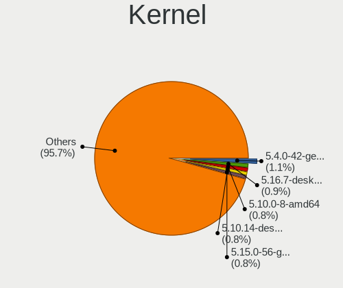
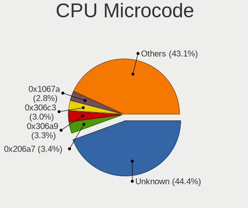
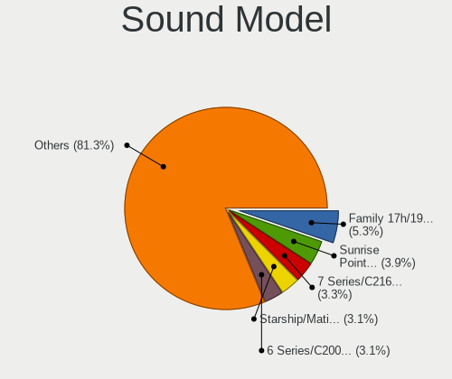

Linux in USA - Tested Hardware & Statistics
-------------------------------------------

A project to collect tested hardware configurations for Linux in USA.

Anyone can contribute to this report by the [hw-probe](https://github.com/linuxhw/hw-probe) tool:

    sudo -E hw-probe -all -upload

Please contribute! Especially if your hardware is rare.

This is a report for all computer types. See also reports for [desktops](/Location/USA/Desktop/README.md) and [notebooks](/Location/USA/Notebook/README.md).

Contents
--------

* [ Test Cases ](#test-cases)

* [ System ](#system)
  - [ OS                       ](#os)
  - [ OS Family                ](#os-family)
  - [ Kernel                   ](#kernel)
  - [ Kernel Family            ](#kernel-family)
  - [ Kernel Major Ver.        ](#kernel-major-ver)
  - [ Arch                     ](#arch)
  - [ DE                       ](#de)
  - [ Display Server           ](#display-server)
  - [ Display Manager          ](#display-manager)
  - [ OS Lang                  ](#os-lang)
  - [ Boot Mode                ](#boot-mode)
  - [ Filesystem               ](#filesystem)
  - [ Part. scheme             ](#part-scheme)
  - [ Dual Boot with Linux/BSD ](#dual-boot-with-linuxbsd)
  - [ Dual Boot (Win)          ](#dual-boot-win)

* [ Board ](#board)
  - [ Vendor                   ](#vendor)
  - [ Model                    ](#model)
  - [ Model Family             ](#model-family)
  - [ MFG Year                 ](#mfg-year)
  - [ Form Factor              ](#form-factor)
  - [ Secure Boot              ](#secure-boot)
  - [ Coreboot                 ](#coreboot)
  - [ RAM Size                 ](#ram-size)
  - [ RAM Used                 ](#ram-used)
  - [ Total Drives             ](#total-drives)
  - [ Has CD-ROM               ](#has-cd-rom)
  - [ Has Ethernet             ](#has-ethernet)
  - [ Has WiFi                 ](#has-wifi)
  - [ Has Bluetooth            ](#has-bluetooth)

* [ Location ](#location)
  - [ Country                  ](#country)
  - [ City                     ](#city)

* [ Drives ](#drives)
  - [ Drive Vendor             ](#drive-vendor)
  - [ Drive Model              ](#drive-model)
  - [ HDD Vendor               ](#hdd-vendor)
  - [ SSD Vendor               ](#ssd-vendor)
  - [ Drive Kind               ](#drive-kind)
  - [ Drive Connector          ](#drive-connector)
  - [ Drive Size               ](#drive-size)
  - [ Space Total              ](#space-total)
  - [ Space Used               ](#space-used)
  - [ Malfunc. Drives          ](#malfunc-drives)
  - [ Malfunc. Drive Vendor    ](#malfunc-drive-vendor)
  - [ Malfunc. HDD Vendor      ](#malfunc-hdd-vendor)
  - [ Malfunc. Drive Kind      ](#malfunc-drive-kind)
  - [ Failed Drives            ](#failed-drives)
  - [ Failed Drive Vendor      ](#failed-drive-vendor)
  - [ Drive Status             ](#drive-status)

* [ Storage controller ](#storage-controller)
  - [ Storage Vendor           ](#storage-vendor)
  - [ Storage Model            ](#storage-model)
  - [ Storage Kind             ](#storage-kind)

* [ Processor ](#processor)
  - [ CPU Vendor               ](#cpu-vendor)
  - [ CPU Model                ](#cpu-model)
  - [ CPU Model Family         ](#cpu-model-family)
  - [ CPU Cores                ](#cpu-cores)
  - [ CPU Sockets              ](#cpu-sockets)
  - [ CPU Threads              ](#cpu-threads)
  - [ CPU Op-Modes             ](#cpu-op-modes)
  - [ CPU Microcode            ](#cpu-microcode)
  - [ CPU Microarch            ](#cpu-microarch)

* [ Graphics ](#graphics)
  - [ GPU Vendor               ](#gpu-vendor)
  - [ GPU Model                ](#gpu-model)
  - [ GPU Combo                ](#gpu-combo)
  - [ GPU Driver               ](#gpu-driver)
  - [ GPU Memory               ](#gpu-memory)

* [ Monitor ](#monitor)
  - [ Monitor Vendor           ](#monitor-vendor)
  - [ Monitor Model            ](#monitor-model)
  - [ Monitor Resolution       ](#monitor-resolution)
  - [ Monitor Diagonal         ](#monitor-diagonal)
  - [ Monitor Width            ](#monitor-width)
  - [ Aspect Ratio             ](#aspect-ratio)
  - [ Monitor Area             ](#monitor-area)
  - [ Pixel Density            ](#pixel-density)
  - [ Multiple Monitors        ](#multiple-monitors)

* [ Network ](#network)
  - [ Net Controller Vendor    ](#net-controller-vendor)
  - [ Net Controller Model     ](#net-controller-model)
  - [ Wireless Vendor          ](#wireless-vendor)
  - [ Wireless Model           ](#wireless-model)
  - [ Ethernet Vendor          ](#ethernet-vendor)
  - [ Ethernet Model           ](#ethernet-model)
  - [ Net Controller Kind      ](#net-controller-kind)
  - [ Used Controller          ](#used-controller)
  - [ NICs                     ](#nics)
  - [ IPv6                     ](#ipv6)

* [ Bluetooth ](#bluetooth)
  - [ Bluetooth Vendor         ](#bluetooth-vendor)
  - [ Bluetooth Model          ](#bluetooth-model)

* [ Sound ](#sound)
  - [ Sound Vendor             ](#sound-vendor)
  - [ Sound Model              ](#sound-model)

* [ Memory ](#memory)
  - [ Memory Vendor            ](#memory-vendor)
  - [ Memory Model             ](#memory-model)
  - [ Memory Kind              ](#memory-kind)
  - [ Memory Form Factor       ](#memory-form-factor)
  - [ Memory Size              ](#memory-size)
  - [ Memory Speed             ](#memory-speed)

* [ Printers & scanners ](#printers--scanners)
  - [ Printer Vendor           ](#printer-vendor)
  - [ Printer Model            ](#printer-model)
  - [ Scanner Vendor           ](#scanner-vendor)
  - [ Scanner Model            ](#scanner-model)

* [ Camera ](#camera)
  - [ Camera Vendor            ](#camera-vendor)
  - [ Camera Model             ](#camera-model)

* [ Security ](#security)
  - [ Fingerprint Vendor       ](#fingerprint-vendor)
  - [ Fingerprint Model        ](#fingerprint-model)
  - [ Chipcard Vendor          ](#chipcard-vendor)
  - [ Chipcard Model           ](#chipcard-model)

* [ Unsupported ](#unsupported)
  - [ Unsupported Devices      ](#unsupported-devices)
  - [ Unsupported Device Types ](#unsupported-device-types)

Test Cases
----------

Total: 73746

| Vendor        | Model                       | Form-Factor | Probe                                                      | Date         |
|---------------|-----------------------------|-------------|------------------------------------------------------------|--------------|
| ASUSTek       | VivoBook_ASUSLaptop E410... | Notebook    | [7b12164813](https://linux-hardware.org/?probe=7b12164813) | Jan 06, 2025 |
| Acer          | Predator PH315-52           | Notebook    | [1ae33fb974](https://linux-hardware.org/?probe=1ae33fb974) | Jan 06, 2025 |
| Dell          | XPS 13 9305                 | Notebook    | [5b06a32fea](https://linux-hardware.org/?probe=5b06a32fea) | Jan 06, 2025 |
| ASUSTek       | ROG STRIX B650-A GAMING ... | Desktop     | [04f9ffdab4](https://linux-hardware.org/?probe=04f9ffdab4) | Jan 06, 2025 |
| Dell          | Latitude E7470              | Notebook    | [448c4c5d6e](https://linux-hardware.org/?probe=448c4c5d6e) | Jan 06, 2025 |
| MSI           | Modern 15 H AI C1MTG        | Notebook    | [4e43ee30f8](https://linux-hardware.org/?probe=4e43ee30f8) | Jan 06, 2025 |
| Gigabyte      | Z170X-Gaming 7              | Desktop     | [ad40db7f67](https://linux-hardware.org/?probe=ad40db7f67) | Jan 06, 2025 |
| HP            | ProBook 455 G8 Notebook ... | Notebook    | [963fcdd477](https://linux-hardware.org/?probe=963fcdd477) | Jan 06, 2025 |
| MSI           | Modern 15 H AI C1MTG        | Notebook    | [ed4c4c8261](https://linux-hardware.org/?probe=ed4c4c8261) | Jan 06, 2025 |
| Acer          | Nitro ANV15-51              | Notebook    | [657a86fee0](https://linux-hardware.org/?probe=657a86fee0) | Jan 06, 2025 |
| Dell          | Precision M6800             | Notebook    | [01d1dcb2d8](https://linux-hardware.org/?probe=01d1dcb2d8) | Jan 06, 2025 |
| GPU Compan... | GWNR7L1749                  | Notebook    | [0f2438bc90](https://linux-hardware.org/?probe=0f2438bc90) | Jan 06, 2025 |
| ONE-NETBOO... | ONEXPLAYER Mini Pro         | Tablet      | [2183eb76b7](https://linux-hardware.org/?probe=2183eb76b7) | Jan 06, 2025 |
| Apple         | MacBookAir6,2               | Notebook    | [dfb4117f5c](https://linux-hardware.org/?probe=dfb4117f5c) | Jan 06, 2025 |
| Lenovo        | IdeaPad MIIX 700-12ISK 8... | Notebook    | [0cf3ed40e6](https://linux-hardware.org/?probe=0cf3ed40e6) | Jan 06, 2025 |
| Supermicro    | H12SSL-i                    | Server      | [726b65d6e8](https://linux-hardware.org/?probe=726b65d6e8) | Jan 06, 2025 |
| MACHINIST     | H110 Ver:2.3                | Desktop     | [da4bcc0047](https://linux-hardware.org/?probe=da4bcc0047) | Jan 06, 2025 |
| MACHINIST     | H110 Ver:2.3                | Desktop     | [e477166cd2](https://linux-hardware.org/?probe=e477166cd2) | Jan 06, 2025 |
| HP            | Presario CQ57               | Notebook    | [970ab9cc5f](https://linux-hardware.org/?probe=970ab9cc5f) | Jan 06, 2025 |
| ASRockRack    | B650D4U-2L2T/BCM            | Server      | [ee0c91380e](https://linux-hardware.org/?probe=ee0c91380e) | Jan 06, 2025 |
| Dell          | 0GDG8Y A00                  | Desktop     | [417dd2665a](https://linux-hardware.org/?probe=417dd2665a) | Jan 06, 2025 |
| Apple         | Mac-F4238CC8 PVT            | All in one  | [a532955db4](https://linux-hardware.org/?probe=a532955db4) | Jan 06, 2025 |
| Alienware     | m18 R2                      | Notebook    | [6277d13cf5](https://linux-hardware.org/?probe=6277d13cf5) | Jan 06, 2025 |
| Lenovo        | ThinkPad T450s 20BXCTO1W... | Notebook    | [10131ea72a](https://linux-hardware.org/?probe=10131ea72a) | Jan 06, 2025 |
| ASUSTek       | ASUS Vivobook Pro 15 N65... | Notebook    | [7b915687fc](https://linux-hardware.org/?probe=7b915687fc) | Jan 06, 2025 |
| ASUSTek       | ASUS Vivobook Pro 15 N65... | Notebook    | [6ccd45a853](https://linux-hardware.org/?probe=6ccd45a853) | Jan 06, 2025 |
| Lenovo        | ThinkPad T14s Gen 4 21F8... | Notebook    | [1c78d58aab](https://linux-hardware.org/?probe=1c78d58aab) | Jan 06, 2025 |
| Dell          | Latitude 7280               | Notebook    | [58eef8f0dd](https://linux-hardware.org/?probe=58eef8f0dd) | Jan 06, 2025 |
| ASUSTek       | ProArt PX13 HN7306WU_HN7... | Convertible | [0338b4e237](https://linux-hardware.org/?probe=0338b4e237) | Jan 06, 2025 |
| Google        | Treeya                      | Notebook    | [b8f7c2d75a](https://linux-hardware.org/?probe=b8f7c2d75a) | Jan 06, 2025 |
| Dell          | Inspiron 14 7430 2-in-1     | Convertible | [12732aa34d](https://linux-hardware.org/?probe=12732aa34d) | Jan 06, 2025 |
| HP            | 8299                        | Desktop     | [a87a33b9e2](https://linux-hardware.org/?probe=a87a33b9e2) | Jan 06, 2025 |
| ASUSTek       | ROG STRIX B550-F GAMING     | Desktop     | [c8c490c383](https://linux-hardware.org/?probe=c8c490c383) | Jan 06, 2025 |
| HP            | ENVY x360 Convertible 15... | Convertible | [19193380d7](https://linux-hardware.org/?probe=19193380d7) | Jan 06, 2025 |
| Lenovo        | ThinkPad X395 20NLS0J400    | Notebook    | [7ff6bae738](https://linux-hardware.org/?probe=7ff6bae738) | Jan 06, 2025 |
| Lenovo        | ThinkPad E475 20H40006US    | Notebook    | [69908d16ca](https://linux-hardware.org/?probe=69908d16ca) | Jan 06, 2025 |
| Lenovo        | IdeaPad 5 15ABA7 82SG       | Notebook    | [22702a56ed](https://linux-hardware.org/?probe=22702a56ed) | Jan 06, 2025 |
| Valve         | Jupiter                     | Notebook    | [586cabc574](https://linux-hardware.org/?probe=586cabc574) | Jan 06, 2025 |
| MSI           | G31TM-P21                   | Desktop     | [7f868dd6f9](https://linux-hardware.org/?probe=7f868dd6f9) | Jan 06, 2025 |
| HP            | Pavilion Gaming Laptop 1... | Notebook    | [f2de07e3ef](https://linux-hardware.org/?probe=f2de07e3ef) | Jan 06, 2025 |
| Lenovo        | 318E SDK0J40697 WIN 3305... | Desktop     | [180e354322](https://linux-hardware.org/?probe=180e354322) | Jan 06, 2025 |
| Lenovo        | ThinkPad E475 20H40006US    | Notebook    | [78b9a699ff](https://linux-hardware.org/?probe=78b9a699ff) | Jan 05, 2025 |
| ASUSTek       | ROG STRIX B550-F GAMING     | Desktop     | [df3bbdd6e6](https://linux-hardware.org/?probe=df3bbdd6e6) | Jan 05, 2025 |
| ASRock        | AB350 Pro4                  | Desktop     | [0d776677a7](https://linux-hardware.org/?probe=0d776677a7) | Jan 05, 2025 |
| Lenovo        | ThinkPad T440s 20ARS46M0... | Notebook    | [17ac336e9c](https://linux-hardware.org/?probe=17ac336e9c) | Jan 05, 2025 |
| MSI           | MAG B550M MORTAR MAX WIF... | Desktop     | [f7c8a6c602](https://linux-hardware.org/?probe=f7c8a6c602) | Jan 05, 2025 |
| HP            | Pavilion dv8                | Notebook    | [ab69193742](https://linux-hardware.org/?probe=ab69193742) | Jan 05, 2025 |
| Lenovo        | 318E SDK0J40697 WIN 3305... | Desktop     | [3d0601ead9](https://linux-hardware.org/?probe=3d0601ead9) | Jan 05, 2025 |
| Lenovo        | 364F SDK0J40700 WIN 3258... | Desktop     | [3cef0ed98c](https://linux-hardware.org/?probe=3cef0ed98c) | Jan 05, 2025 |
| Lenovo        | ThinkPad T540p 20BFS0Y00... | Notebook    | [8e40087118](https://linux-hardware.org/?probe=8e40087118) | Jan 05, 2025 |
| Apple         | MacBookAir6,2               | Notebook    | [3b5dc1b1c2](https://linux-hardware.org/?probe=3b5dc1b1c2) | Jan 05, 2025 |
| ASUSTek       | PRIME B550-PLUS             | Desktop     | [16b25c18dc](https://linux-hardware.org/?probe=16b25c18dc) | Jan 05, 2025 |
| Apple         | MacBookPro9,1               | Notebook    | [ae5a71dde0](https://linux-hardware.org/?probe=ae5a71dde0) | Jan 05, 2025 |
| Apple         | Mac-35C5E08120C7EEAF Mac... | Mini pc     | [dd4205dcdf](https://linux-hardware.org/?probe=dd4205dcdf) | Jan 05, 2025 |
| HP            | 2B38                        | Desktop     | [2ea8b8918b](https://linux-hardware.org/?probe=2ea8b8918b) | Jan 05, 2025 |
| Lenovo        | ThinkPad E520 1143R77       | Notebook    | [3d26d596e3](https://linux-hardware.org/?probe=3d26d596e3) | Jan 05, 2025 |
| HP            | Laptop 14-dk0xxx            | Notebook    | [66f7231a06](https://linux-hardware.org/?probe=66f7231a06) | Jan 05, 2025 |
| Pegatron      | NARRA5                      | Desktop     | [350baa0b67](https://linux-hardware.org/?probe=350baa0b67) | Jan 05, 2025 |
| ASRock        | A520M Phantom Gaming 4      | Desktop     | [55ed055bf7](https://linux-hardware.org/?probe=55ed055bf7) | Jan 05, 2025 |
| ASRock        | A520M Phantom Gaming 4      | Desktop     | [9bd6c2311d](https://linux-hardware.org/?probe=9bd6c2311d) | Jan 05, 2025 |
| Valve         | Jupiter                     | Notebook    | [6773d7420e](https://linux-hardware.org/?probe=6773d7420e) | Jan 05, 2025 |
| Gigabyte      | B550 UD AC-Y1               | Desktop     | [b5d5a649e6](https://linux-hardware.org/?probe=b5d5a649e6) | Jan 05, 2025 |
| Apple         | MacBookPro5,5               | Notebook    | [de39de3147](https://linux-hardware.org/?probe=de39de3147) | Jan 05, 2025 |
| HP            | Presario CQ57               | Notebook    | [8c1782d787](https://linux-hardware.org/?probe=8c1782d787) | Jan 05, 2025 |
| HP            | ENVY x360 2-in-1 Laptop ... | Convertible | [c50fb15ade](https://linux-hardware.org/?probe=c50fb15ade) | Jan 05, 2025 |
| Dell          | 03X6X0 A06                  | Server      | [969b046986](https://linux-hardware.org/?probe=969b046986) | Jan 05, 2025 |
| ASRock        | Z790 PG SONIC               | Desktop     | [8404feef08](https://linux-hardware.org/?probe=8404feef08) | Jan 05, 2025 |
| MSI           | H110M PRO-VD PLUS           | Desktop     | [6b9f134647](https://linux-hardware.org/?probe=6b9f134647) | Jan 05, 2025 |
| ASRock        | B450M Pro4                  | Desktop     | [f1b064f039](https://linux-hardware.org/?probe=f1b064f039) | Jan 05, 2025 |
| Dell          | 0XHYJF A00                  | All in one  | [1f361b3518](https://linux-hardware.org/?probe=1f361b3518) | Jan 05, 2025 |
| ASUSTek       | Z97-PRO GAMER               | Desktop     | [cc569301fd](https://linux-hardware.org/?probe=cc569301fd) | Jan 05, 2025 |
| ASUSTek       | PRIME Z690M-PLUS D4         | Desktop     | [beaaf37101](https://linux-hardware.org/?probe=beaaf37101) | Jan 05, 2025 |
| Dell          | Latitude E4200              | Notebook    | [db5dcaf33b](https://linux-hardware.org/?probe=db5dcaf33b) | Jan 05, 2025 |
| ASRock        | B450 Pro4                   | Desktop     | [f0fac8b3f2](https://linux-hardware.org/?probe=f0fac8b3f2) | Jan 05, 2025 |
| Dell          | 0HD5W2 A00                  | Desktop     | [a6858e47c5](https://linux-hardware.org/?probe=a6858e47c5) | Jan 05, 2025 |
| HP            | Laptop 17-cp2xxx            | Notebook    | [f8146603c3](https://linux-hardware.org/?probe=f8146603c3) | Jan 05, 2025 |
| HP            | ProBook 445 G7              | Notebook    | [30f8996b5f](https://linux-hardware.org/?probe=30f8996b5f) | Jan 05, 2025 |
| Lenovo        | ThinkPad L13 Yoga Gen 4 ... | Convertible | [a1704866ba](https://linux-hardware.org/?probe=a1704866ba) | Jan 05, 2025 |
| Dell          | 01Y1CJ A00                  | Mini pc     | [79856fbf5b](https://linux-hardware.org/?probe=79856fbf5b) | Jan 05, 2025 |
| HP            | Laptop 17-cp2xxx            | Notebook    | [48236cccfb](https://linux-hardware.org/?probe=48236cccfb) | Jan 05, 2025 |
| Lenovo        | IdeaPad 320-15ABR 80XS      | Notebook    | [4a2cbc9a5c](https://linux-hardware.org/?probe=4a2cbc9a5c) | Jan 05, 2025 |
| Lenovo        | MAHOBAY NOK                 | Desktop     | [a9123709a5](https://linux-hardware.org/?probe=a9123709a5) | Jan 05, 2025 |
| HP            | Pavilion Laptop 15-eh0xx... | Notebook    | [d87015b7dd](https://linux-hardware.org/?probe=d87015b7dd) | Jan 05, 2025 |
| Dell          | Inspiron 15-3567            | Notebook    | [96419f9337](https://linux-hardware.org/?probe=96419f9337) | Jan 05, 2025 |
| Acer          | Nitro AN515-55              | Notebook    | [87f960a021](https://linux-hardware.org/?probe=87f960a021) | Jan 05, 2025 |
| Gigabyte      | Z97X-UD5H                   | Desktop     | [381b6fc010](https://linux-hardware.org/?probe=381b6fc010) | Jan 05, 2025 |
| ASUSTek       | ASUS TUF Gaming A16 FA61... | Notebook    | [b4fcbcaf8c](https://linux-hardware.org/?probe=b4fcbcaf8c) | Jan 05, 2025 |
| Acer          | Aspire E5-521               | Notebook    | [91b7208a57](https://linux-hardware.org/?probe=91b7208a57) | Jan 05, 2025 |
| MSI           | MPG B650I EDGE WIFI         | Desktop     | [e2c6dd2497](https://linux-hardware.org/?probe=e2c6dd2497) | Jan 05, 2025 |
| MSI           | PRO Z790-P WIFI             | Desktop     | [46dc165fa6](https://linux-hardware.org/?probe=46dc165fa6) | Jan 05, 2025 |
| Dell          | Latitude 7420               | Notebook    | [cb90378674](https://linux-hardware.org/?probe=cb90378674) | Jan 04, 2025 |
| Dell          | Latitude 7420               | Notebook    | [f4490890b8](https://linux-hardware.org/?probe=f4490890b8) | Jan 04, 2025 |
| Acer          | Aspire E5-521               | Notebook    | [a0c069e75e](https://linux-hardware.org/?probe=a0c069e75e) | Jan 04, 2025 |
| Shenzhen M... | F7BSC                       | Mini pc     | [abbe5e18a9](https://linux-hardware.org/?probe=abbe5e18a9) | Jan 04, 2025 |
| ASUSTek       | ROG STRIX B550-F GAMING ... | Desktop     | [3f75716ffa](https://linux-hardware.org/?probe=3f75716ffa) | Jan 04, 2025 |
| Lenovo        | Legion Go 8APU1 83E1        | Tablet      | [1245987788](https://linux-hardware.org/?probe=1245987788) | Jan 04, 2025 |
| Dell          | Inspiron 7573               | Convertible | [862a11d024](https://linux-hardware.org/?probe=862a11d024) | Jan 04, 2025 |
| HP            | 89B5 A                      | Desktop     | [6b38b13993](https://linux-hardware.org/?probe=6b38b13993) | Jan 04, 2025 |
| Dell          | XPS 17 9730                 | Notebook    | [699b3afba1](https://linux-hardware.org/?probe=699b3afba1) | Jan 04, 2025 |
| Lenovo        | ThinkPad T440p 20AN0069U... | Notebook    | [dbdff3ab95](https://linux-hardware.org/?probe=dbdff3ab95) | Jan 04, 2025 |
| ASUSTek       | M5A97 LE R2.0               | Desktop     | [badfe83ed3](https://linux-hardware.org/?probe=badfe83ed3) | Jan 04, 2025 |
| ASUSTek       | M5A97 R2.0                  | Desktop     | [7eb3a63b51](https://linux-hardware.org/?probe=7eb3a63b51) | Jan 04, 2025 |
| Lenovo        | ThinkPad T490 20N20030US    | Notebook    | [d4dd35d7dc](https://linux-hardware.org/?probe=d4dd35d7dc) | Jan 04, 2025 |
| Dell          | 09KPNV A00                  | Desktop     | [d2a1de9dc7](https://linux-hardware.org/?probe=d2a1de9dc7) | Jan 04, 2025 |
| Microsoft     | Surface Pro 3               | Tablet      | [bb626d70b0](https://linux-hardware.org/?probe=bb626d70b0) | Jan 04, 2025 |
| HP            | 255 G6 Notebook PC          | Notebook    | [57b6786860](https://linux-hardware.org/?probe=57b6786860) | Jan 04, 2025 |
| Unknown       | Unknown                     | Tablet      | [3044720fe2](https://linux-hardware.org/?probe=3044720fe2) | Jan 04, 2025 |
| HP            | Pavilion x360 Convertibl... | Convertible | [6fc9bee528](https://linux-hardware.org/?probe=6fc9bee528) | Jan 04, 2025 |
| HP            | ZBook 15 G3                 | Notebook    | [548eae93b9](https://linux-hardware.org/?probe=548eae93b9) | Jan 04, 2025 |
| XFX           | nForce 790i Ultra 3-Way ... | Desktop     | [535c1c5ab4](https://linux-hardware.org/?probe=535c1c5ab4) | Jan 04, 2025 |
| HP            | 3397                        | Desktop     | [918fca6eda](https://linux-hardware.org/?probe=918fca6eda) | Jan 04, 2025 |
| HP            | 21EF                        | Desktop     | [f86b96338c](https://linux-hardware.org/?probe=f86b96338c) | Jan 04, 2025 |
| HP            | EliteBook 840 G2            | Notebook    | [69146beeeb](https://linux-hardware.org/?probe=69146beeeb) | Jan 04, 2025 |
| HP            | 805D                        | Desktop     | [269af351cb](https://linux-hardware.org/?probe=269af351cb) | Jan 04, 2025 |
| HP            | 15                          | Notebook    | [d95bba2430](https://linux-hardware.org/?probe=d95bba2430) | Jan 04, 2025 |
| Lenovo        | ThinkPad P50 20EN0013US     | Notebook    | [a5acb19495](https://linux-hardware.org/?probe=a5acb19495) | Jan 04, 2025 |
| Dell          | Inspiron 3541               | Notebook    | [206872a37f](https://linux-hardware.org/?probe=206872a37f) | Jan 04, 2025 |
| HP            | 3397                        | Desktop     | [b9c57503ea](https://linux-hardware.org/?probe=b9c57503ea) | Jan 04, 2025 |
| AZW           | MINI S                      | Desktop     | [b4b44d49d3](https://linux-hardware.org/?probe=b4b44d49d3) | Jan 04, 2025 |
| AZW           | SER                         | Notebook    | [487845b4a5](https://linux-hardware.org/?probe=487845b4a5) | Jan 04, 2025 |
| Gigabyte      | Z390 AORUS PRO-CF           | Desktop     | [52f8310052](https://linux-hardware.org/?probe=52f8310052) | Jan 04, 2025 |
| HP            | Laptop 17-cn0xxx            | Notebook    | [6426be4511](https://linux-hardware.org/?probe=6426be4511) | Jan 04, 2025 |
| ASUSTek       | PRIME B550-PLUS             | Desktop     | [70e7b73673](https://linux-hardware.org/?probe=70e7b73673) | Jan 04, 2025 |
| Unknown       | HX90                        | Desktop     | [b4c4d726e4](https://linux-hardware.org/?probe=b4c4d726e4) | Jan 04, 2025 |
| Dell          | Latitude 5290 2-in-1        | Notebook    | [cee01ab926](https://linux-hardware.org/?probe=cee01ab926) | Jan 04, 2025 |
| Dell          | Latitude 5290 2-in-1        | Notebook    | [b5b287d361](https://linux-hardware.org/?probe=b5b287d361) | Jan 04, 2025 |
| HP            | Laptop 14-dk0xxx            | Notebook    | [d219ce5c33](https://linux-hardware.org/?probe=d219ce5c33) | Jan 04, 2025 |
| Lenovo        | ThinkPad T560 20FH001RUS    | Notebook    | [00bb35dd31](https://linux-hardware.org/?probe=00bb35dd31) | Jan 04, 2025 |
| ASUSTek       | PRIME B760M-A AX6 II        | Desktop     | [826dc3e0f2](https://linux-hardware.org/?probe=826dc3e0f2) | Jan 04, 2025 |
| Toshiba       | Satellite C75D-B            | Notebook    | [6d15c78d08](https://linux-hardware.org/?probe=6d15c78d08) | Jan 04, 2025 |
| ONE-NETBOO... | ONEXPLAYER Mini Pro         | Tablet      | [0c88e1238c](https://linux-hardware.org/?probe=0c88e1238c) | Jan 04, 2025 |
| MSI           | GF63 Thin 11SC              | Notebook    | [3f1c75f109](https://linux-hardware.org/?probe=3f1c75f109) | Jan 04, 2025 |
| ASUSTek       | VivoBook_ASUSLaptop X160... | Notebook    | [59a8c42150](https://linux-hardware.org/?probe=59a8c42150) | Jan 04, 2025 |
| MSI           | Summit E13FlipEvo A12MT     | Notebook    | [642730a80d](https://linux-hardware.org/?probe=642730a80d) | Jan 04, 2025 |
| Dell          | XPS 15 9570                 | Notebook    | [5eb1399d1e](https://linux-hardware.org/?probe=5eb1399d1e) | Jan 04, 2025 |
| Lenovo        | Yoga 6 13ARE05 82FN         | Convertible | [53a8da4145](https://linux-hardware.org/?probe=53a8da4145) | Jan 04, 2025 |
| Lenovo        | Yoga 6 13ARE05 82FN         | Convertible | [e1b0c66b8b](https://linux-hardware.org/?probe=e1b0c66b8b) | Jan 04, 2025 |
| Apple         | MacBookPro9,2               | Notebook    | [bc4630757c](https://linux-hardware.org/?probe=bc4630757c) | Jan 04, 2025 |
| Apple         | MacBookPro7,1               | Notebook    | [7961299452](https://linux-hardware.org/?probe=7961299452) | Jan 04, 2025 |
| HP            | 1998                        | Desktop     | [cccf71a69c](https://linux-hardware.org/?probe=cccf71a69c) | Jan 04, 2025 |
| Gigabyte      | Z790 AORUS ELITE AX         | Desktop     | [5e7dda5f4d](https://linux-hardware.org/?probe=5e7dda5f4d) | Jan 04, 2025 |
| Lenovo        | ThinkPad X1 Yoga 4th 20S... | Convertible | [5ecc769c96](https://linux-hardware.org/?probe=5ecc769c96) | Jan 04, 2025 |
| Gigabyte      | Z97N-WIFI                   | Notebook    | [94525b433d](https://linux-hardware.org/?probe=94525b433d) | Jan 04, 2025 |
| MSI           | MEG X570 UNIFY              | Desktop     | [fc581d20c5](https://linux-hardware.org/?probe=fc581d20c5) | Jan 04, 2025 |
| HP            | Laptop 17t-cn300            | Notebook    | [d7d9dcc497](https://linux-hardware.org/?probe=d7d9dcc497) | Jan 04, 2025 |
| Lenovo        | ThinkPad E475 20H40006US    | Notebook    | [1f287326ed](https://linux-hardware.org/?probe=1f287326ed) | Jan 04, 2025 |
| Lenovo        | Yoga 7 16ARP8 83BS          | Convertible | [2816c02c4d](https://linux-hardware.org/?probe=2816c02c4d) | Jan 04, 2025 |
| ASUSTek       | H97-PLUS                    | Desktop     | [fd886041fc](https://linux-hardware.org/?probe=fd886041fc) | Jan 04, 2025 |
| ASUSTek       | H97-PLUS                    | Desktop     | [dc6f9929d7](https://linux-hardware.org/?probe=dc6f9929d7) | Jan 04, 2025 |
| Lenovo        | ThinkPad E475 20H40006US    | Notebook    | [74d7973a3d](https://linux-hardware.org/?probe=74d7973a3d) | Jan 03, 2025 |
| Dell          | 0WMJ54 A01                  | Desktop     | [966f8de937](https://linux-hardware.org/?probe=966f8de937) | Jan 03, 2025 |
| Valve         | Jupiter                     | Notebook    | [5f851271c3](https://linux-hardware.org/?probe=5f851271c3) | Jan 03, 2025 |
| Valve         | Jupiter                     | Notebook    | [4588bcf961](https://linux-hardware.org/?probe=4588bcf961) | Jan 03, 2025 |
| MSI           | X670E GAMING PLUS WIFI      | Desktop     | [fcdb536656](https://linux-hardware.org/?probe=fcdb536656) | Jan 03, 2025 |
| Dell          | Latitude 5290 2-in-1        | Tablet      | [20e6dc4833](https://linux-hardware.org/?probe=20e6dc4833) | Jan 03, 2025 |
| AZW           | SER V1                      | Mini pc     | [eed87de39c](https://linux-hardware.org/?probe=eed87de39c) | Jan 03, 2025 |
| ASUSTek       | ROG CROSSHAIR X670E HERO    | Desktop     | [fe9ee8d0b4](https://linux-hardware.org/?probe=fe9ee8d0b4) | Jan 03, 2025 |
| Microsoft     | Surface Book 3              | Tablet      | [03611f8371](https://linux-hardware.org/?probe=03611f8371) | Jan 03, 2025 |
| HP            | 339A                        | Desktop     | [7fc68e979e](https://linux-hardware.org/?probe=7fc68e979e) | Jan 03, 2025 |
| Lenovo        | ThinkPad L390 Yoga 20NT0... | Convertible | [bfb0f7c906](https://linux-hardware.org/?probe=bfb0f7c906) | Jan 03, 2025 |
| ASUSTek       | U56E                        | Notebook    | [e777c929c0](https://linux-hardware.org/?probe=e777c929c0) | Jan 03, 2025 |
| HP            | 15                          | Notebook    | [8542f54ea5](https://linux-hardware.org/?probe=8542f54ea5) | Jan 03, 2025 |
| ASUSTek       | Q550LF                      | Notebook    | [c587210fdb](https://linux-hardware.org/?probe=c587210fdb) | Jan 03, 2025 |
| ASUSTek       | ASUS Vivobook S 14 M5406... | Notebook    | [c1bc9188a7](https://linux-hardware.org/?probe=c1bc9188a7) | Jan 03, 2025 |
| Dell          | 0HHV7N A00                  | Desktop     | [25ccd84cbc](https://linux-hardware.org/?probe=25ccd84cbc) | Jan 03, 2025 |
| Dell          | Inspiron 7786               | Convertible | [7a0bb3a19e](https://linux-hardware.org/?probe=7a0bb3a19e) | Jan 03, 2025 |
| Toshiba       | QOSMIO X775                 | Notebook    | [339f01aea5](https://linux-hardware.org/?probe=339f01aea5) | Jan 03, 2025 |
| Shenzhen M... | A5WSR                       | Desktop     | [6a1318e0a6](https://linux-hardware.org/?probe=6a1318e0a6) | Jan 03, 2025 |
| Shenzhen M... | A5WSR                       | Desktop     | [4fc4c2d22d](https://linux-hardware.org/?probe=4fc4c2d22d) | Jan 03, 2025 |
| ASRock        | B450M Pro4                  | Desktop     | [d8b50816f0](https://linux-hardware.org/?probe=d8b50816f0) | Jan 03, 2025 |
| ASRock        | N68-S UCC                   | Desktop     | [cb76400a00](https://linux-hardware.org/?probe=cb76400a00) | Jan 03, 2025 |
| Gigabyte      | B450 AORUS PRO WIFI-CF      | Desktop     | [1a76cb7c54](https://linux-hardware.org/?probe=1a76cb7c54) | Jan 03, 2025 |
| Dell          | XPS 15 9560                 | Notebook    | [924d90cdcc](https://linux-hardware.org/?probe=924d90cdcc) | Jan 03, 2025 |
| Dell          | XPS 15 9560                 | Notebook    | [5a9c188db1](https://linux-hardware.org/?probe=5a9c188db1) | Jan 03, 2025 |
| Microsoft     | Surface Pro 9               | Tablet      | [e6f037a5e8](https://linux-hardware.org/?probe=e6f037a5e8) | Jan 03, 2025 |
| Dell          | Latitude 9420               | Notebook    | [8e4f82962c](https://linux-hardware.org/?probe=8e4f82962c) | Jan 03, 2025 |
| Lenovo        | IdeaPad 1 15AMN7 82VG       | Notebook    | [a791c57fad](https://linux-hardware.org/?probe=a791c57fad) | Jan 03, 2025 |
| Framework     | Laptop 13 (AMD Ryzen 704... | Notebook    | [401658b7cf](https://linux-hardware.org/?probe=401658b7cf) | Jan 03, 2025 |
| Dell          | 0F65P3 A01                  | All in one  | [0fbde604e6](https://linux-hardware.org/?probe=0fbde604e6) | Jan 03, 2025 |
| ASUSTek       | H170 PRO GAMING             | Desktop     | [743efb1121](https://linux-hardware.org/?probe=743efb1121) | Jan 03, 2025 |
| HP            | Pavilion Notebook           | Notebook    | [f741ec95c4](https://linux-hardware.org/?probe=f741ec95c4) | Jan 03, 2025 |
| Acer          | Nitro AN515-54              | Notebook    | [3eae42086a](https://linux-hardware.org/?probe=3eae42086a) | Jan 03, 2025 |
| HP            | Pavilion Notebook           | Notebook    | [257733ddc6](https://linux-hardware.org/?probe=257733ddc6) | Jan 03, 2025 |
| ASRock        | B450M/ac                    | Desktop     | [58bf1994a2](https://linux-hardware.org/?probe=58bf1994a2) | Jan 03, 2025 |
| Apple         | MacBookPro12,1              | Notebook    | [c226449ca2](https://linux-hardware.org/?probe=c226449ca2) | Jan 03, 2025 |
| MSI           | PRO Z790-P WIFI             | Desktop     | [c741b52359](https://linux-hardware.org/?probe=c741b52359) | Jan 03, 2025 |
| Dell          | Latitude 5440               | Notebook    | [18c0535aa3](https://linux-hardware.org/?probe=18c0535aa3) | Jan 03, 2025 |
| Dell          | XPS 15 9530                 | Notebook    | [c03c2ac397](https://linux-hardware.org/?probe=c03c2ac397) | Jan 03, 2025 |
| Gigabyte      | B650 AORUS ELITE AX         | Desktop     | [91839e20df](https://linux-hardware.org/?probe=91839e20df) | Jan 03, 2025 |
| ASRock        | X870E Taichi                | Desktop     | [416afc1fb4](https://linux-hardware.org/?probe=416afc1fb4) | Jan 03, 2025 |
| Gigabyte      | X570 AORUS ELITE WIFI       | Desktop     | [8e803141dc](https://linux-hardware.org/?probe=8e803141dc) | Jan 03, 2025 |
| Google        | Candy                       | Notebook    | [9cd761ead3](https://linux-hardware.org/?probe=9cd761ead3) | Jan 03, 2025 |
| HP            | ENVY x360 m6 Convertible    | Convertible | [d6acb3ff97](https://linux-hardware.org/?probe=d6acb3ff97) | Jan 03, 2025 |
| Lenovo        | Yoga C930-13IKB 81C4        | Convertible | [fc7c5a7792](https://linux-hardware.org/?probe=fc7c5a7792) | Jan 03, 2025 |
| AZW           | MINI S                      | Desktop     | [2067c73351](https://linux-hardware.org/?probe=2067c73351) | Jan 03, 2025 |
| sunxi         | Unknown                     | Soc         | [48a1a5a5fa](https://linux-hardware.org/?probe=48a1a5a5fa) | Jan 03, 2025 |
| Lenovo        | Slim Pro 7 14ARP8 83AX      | Notebook    | [9acb68fefa](https://linux-hardware.org/?probe=9acb68fefa) | Jan 03, 2025 |
| Framework     | Laptop                      | Notebook    | [a74fd192f3](https://linux-hardware.org/?probe=a74fd192f3) | Jan 03, 2025 |
| Alienware     | m18 R2                      | Notebook    | [48bc0a64c1](https://linux-hardware.org/?probe=48bc0a64c1) | Jan 02, 2025 |
| Gigabyte      | B450M DS3H WIFI-CF          | Desktop     | [e91eadd16c](https://linux-hardware.org/?probe=e91eadd16c) | Jan 02, 2025 |
| Microsoft     | Surface Book 2              | Tablet      | [eaf1bb652c](https://linux-hardware.org/?probe=eaf1bb652c) | Jan 02, 2025 |
| Apple         | Mac-F60DEB81FF30ACF6 Mac... | Desktop     | [ecfa27b66d](https://linux-hardware.org/?probe=ecfa27b66d) | Jan 02, 2025 |
| Lenovo        | G585 20137                  | Notebook    | [f7dac7bbad](https://linux-hardware.org/?probe=f7dac7bbad) | Jan 02, 2025 |
| HP            | Laptop 17-cn0xxx            | Notebook    | [4fdad5bec0](https://linux-hardware.org/?probe=4fdad5bec0) | Jan 02, 2025 |
| HP            | Laptop 17t-cn300            | Notebook    | [a118a2798f](https://linux-hardware.org/?probe=a118a2798f) | Jan 02, 2025 |
| HP            | Pavilion dv5                | Notebook    | [994c479b50](https://linux-hardware.org/?probe=994c479b50) | Jan 02, 2025 |
| AZW           | GK mini                     | Desktop     | [3d87931055](https://linux-hardware.org/?probe=3d87931055) | Jan 02, 2025 |
| Dell          | Precision M6800             | Notebook    | [460842482c](https://linux-hardware.org/?probe=460842482c) | Jan 02, 2025 |
| Lenovo        | G500s Touch 20263           | Notebook    | [eb4512501c](https://linux-hardware.org/?probe=eb4512501c) | Jan 02, 2025 |
| ASUSTek       | PRIME B550-PLUS             | Desktop     | [1ad78511fb](https://linux-hardware.org/?probe=1ad78511fb) | Jan 02, 2025 |
| MSI           | MPG Z490 GAMING EDGE WIF... | Desktop     | [88e26cdf08](https://linux-hardware.org/?probe=88e26cdf08) | Jan 02, 2025 |
| Dell          | 0HD5W2 A00                  | Desktop     | [abbdbd898d](https://linux-hardware.org/?probe=abbdbd898d) | Jan 02, 2025 |
| HP            | Laptop 17-cn0xxx            | Notebook    | [63b427416a](https://linux-hardware.org/?probe=63b427416a) | Jan 02, 2025 |
| Gigabyte      | B75M-D3H                    | Desktop     | [139b1d261d](https://linux-hardware.org/?probe=139b1d261d) | Jan 02, 2025 |
| Razer         | Blade 15 Base Model (Lat... | Notebook    | [762cb6b3dd](https://linux-hardware.org/?probe=762cb6b3dd) | Jan 02, 2025 |
| ASUSTek       | CM6330_CM6630_CM6730_CM6... | Desktop     | [e6075adfc0](https://linux-hardware.org/?probe=e6075adfc0) | Jan 02, 2025 |
| MSI           | B550M PRO-VDH WIFI          | Desktop     | [a24d68ca3c](https://linux-hardware.org/?probe=a24d68ca3c) | Jan 02, 2025 |
| ASUSTek       | PRIME B550-PLUS AC-HES      | Desktop     | [b5eaeaee82](https://linux-hardware.org/?probe=b5eaeaee82) | Jan 02, 2025 |
| ASUSTek       | Z170-E                      | Desktop     | [42888378d7](https://linux-hardware.org/?probe=42888378d7) | Jan 02, 2025 |
| HP            | EliteBook 840 G2            | Notebook    | [bb8d0a325f](https://linux-hardware.org/?probe=bb8d0a325f) | Jan 02, 2025 |
| GMKtec        | NucBox G3                   | Other       | [cbd7e42539](https://linux-hardware.org/?probe=cbd7e42539) | Jan 02, 2025 |
| GMKtec        | NucBox G3                   | Other       | [4536d73551](https://linux-hardware.org/?probe=4536d73551) | Jan 02, 2025 |
| HP            | Pavilion Laptop 15-eh0xx... | Notebook    | [49011f501a](https://linux-hardware.org/?probe=49011f501a) | Jan 02, 2025 |
| Framework     | Laptop 16 (AMD Ryzen 704... | Notebook    | [6cc92a635d](https://linux-hardware.org/?probe=6cc92a635d) | Jan 02, 2025 |
| Lenovo        | ThinkPad W520 428426U       | Notebook    | [a7aa110e08](https://linux-hardware.org/?probe=a7aa110e08) | Jan 02, 2025 |
| MSI           | X370 GAMING PRO CARBON      | Desktop     | [bb70ef7a51](https://linux-hardware.org/?probe=bb70ef7a51) | Jan 02, 2025 |
| Dell          | Precision 5530              | Notebook    | [5913ba1fdc](https://linux-hardware.org/?probe=5913ba1fdc) | Jan 02, 2025 |
| Apple         | Mac-4BC72D62AD45599E Mac... | Mini pc     | [f220b96aa0](https://linux-hardware.org/?probe=f220b96aa0) | Jan 02, 2025 |
| HP            | ProBook 440 G7              | Notebook    | [b1f0f9f971](https://linux-hardware.org/?probe=b1f0f9f971) | Jan 02, 2025 |
| MSI           | MAG Z790 TOMAHAWK MAX WI... | Desktop     | [a4bf03f97c](https://linux-hardware.org/?probe=a4bf03f97c) | Jan 02, 2025 |
| ASUSTek       | M4A89TD PRO USB3            | Desktop     | [ca1a55b77d](https://linux-hardware.org/?probe=ca1a55b77d) | Jan 02, 2025 |
| Lenovo        | IdeaPad 320-15ABR 80XS      | Notebook    | [b58899eb8b](https://linux-hardware.org/?probe=b58899eb8b) | Jan 02, 2025 |
| Raspberry ... | Raspberry Pi 3 Model B P... | Soc         | [15906a9eaa](https://linux-hardware.org/?probe=15906a9eaa) | Jan 02, 2025 |
| BESSTAR Te... | T3 MRD                      | Desktop     | [a4aa2dfab1](https://linux-hardware.org/?probe=a4aa2dfab1) | Jan 02, 2025 |
| Lenovo        | Legion Slim 5 16ARP9 83E... | Notebook    | [f2904a45ad](https://linux-hardware.org/?probe=f2904a45ad) | Jan 02, 2025 |
| HP            | ENVY Laptop 17t-da000       | Notebook    | [c5fcd7ff93](https://linux-hardware.org/?probe=c5fcd7ff93) | Jan 02, 2025 |
| Dell          | Inspiron 5567               | Notebook    | [786e67f683](https://linux-hardware.org/?probe=786e67f683) | Jan 02, 2025 |
| Lenovo        | IdeaPad Pro 5 16IMH9 83D... | Notebook    | [bb4860483d](https://linux-hardware.org/?probe=bb4860483d) | Jan 02, 2025 |
| ASUSTek       | TUF B450M-PLUS GAMING       | Desktop     | [5058b592ae](https://linux-hardware.org/?probe=5058b592ae) | Jan 02, 2025 |
| HP            | ProBook 4540s               | Notebook    | [0646f227a6](https://linux-hardware.org/?probe=0646f227a6) | Jan 02, 2025 |
| ASUSTek       | TUF Gaming X570-PLUS        | Desktop     | [9ed77fe056](https://linux-hardware.org/?probe=9ed77fe056) | Jan 02, 2025 |
| HP            | OMEN by Laptop              | Notebook    | [319fc5e92e](https://linux-hardware.org/?probe=319fc5e92e) | Jan 02, 2025 |
| Dell          | Inspiron 3558               | Notebook    | [06fdffd5e6](https://linux-hardware.org/?probe=06fdffd5e6) | Jan 02, 2025 |
| Dell          | Inspiron 15-3565            | Notebook    | [27354f28ea](https://linux-hardware.org/?probe=27354f28ea) | Jan 02, 2025 |
| MSI           | B450 TOMAHAWK               | Desktop     | [77e32dabcd](https://linux-hardware.org/?probe=77e32dabcd) | Jan 02, 2025 |
| MSI           | Z170-A PRO                  | Desktop     | [b1b8d67385](https://linux-hardware.org/?probe=b1b8d67385) | Jan 02, 2025 |
| HP            | Pavilion 17                 | Notebook    | [fc1f326456](https://linux-hardware.org/?probe=fc1f326456) | Jan 02, 2025 |
| ASUSTek       | ProArt PX13 HN7306WU_HN7... | Convertible | [109142935c](https://linux-hardware.org/?probe=109142935c) | Jan 02, 2025 |
| Gigabyte      | Z590 UD                     | Desktop     | [d5f41f9b13](https://linux-hardware.org/?probe=d5f41f9b13) | Jan 02, 2025 |
| Google        | Barla                       | Notebook    | [92ec004230](https://linux-hardware.org/?probe=92ec004230) | Jan 02, 2025 |
| Google        | Barla                       | Notebook    | [b12d7482fe](https://linux-hardware.org/?probe=b12d7482fe) | Jan 02, 2025 |
| HC Technol... | HCAR5000-MI                 | Desktop     | [1d85db58d0](https://linux-hardware.org/?probe=1d85db58d0) | Jan 02, 2025 |
| Lenovo        | ThinkPad X1 Carbon 7th 2... | Notebook    | [497be29097](https://linux-hardware.org/?probe=497be29097) | Jan 01, 2025 |
| HP            | EliteBook 840 G1            | Notebook    | [f298c84729](https://linux-hardware.org/?probe=f298c84729) | Jan 01, 2025 |
| Dell          | Latitude 7390               | Notebook    | [ca0c827c18](https://linux-hardware.org/?probe=ca0c827c18) | Jan 01, 2025 |
| Lenovo        | IdeaCentre A700 10050       | Notebook    | [e7f468af21](https://linux-hardware.org/?probe=e7f468af21) | Jan 01, 2025 |
| MSI           | MAG B550 TOMAHAWK           | Desktop     | [6d22883b06](https://linux-hardware.org/?probe=6d22883b06) | Jan 01, 2025 |
| HP            | Pavilion Notebook           | Notebook    | [2cd285f25b](https://linux-hardware.org/?probe=2cd285f25b) | Jan 01, 2025 |
| HP            | Pavilion Notebook           | Notebook    | [b20e70da0c](https://linux-hardware.org/?probe=b20e70da0c) | Jan 01, 2025 |
| HP            | Laptop 14z-em000            | Notebook    | [0c43124a84](https://linux-hardware.org/?probe=0c43124a84) | Jan 01, 2025 |
| HP            | Laptop 15-fc0xxx            | Notebook    | [ca0732e368](https://linux-hardware.org/?probe=ca0732e368) | Jan 01, 2025 |
| ASUSTek       | PRIME B760M-A AX6 II        | Desktop     | [1012b4d63f](https://linux-hardware.org/?probe=1012b4d63f) | Jan 01, 2025 |
| Apple         | MacBookAir8,2               | Notebook    | [66bc93d601](https://linux-hardware.org/?probe=66bc93d601) | Jan 01, 2025 |
| ASUSTek       | PRIME B760M-A AX6 II        | Desktop     | [e3f9df9d9e](https://linux-hardware.org/?probe=e3f9df9d9e) | Jan 01, 2025 |
| HP            | 8767 A                      | Desktop     | [186d8b894f](https://linux-hardware.org/?probe=186d8b894f) | Jan 01, 2025 |
| Dell          | Latitude 5400               | Notebook    | [7a418a2cca](https://linux-hardware.org/?probe=7a418a2cca) | Jan 01, 2025 |
| ASRock        | N68-S UCC                   | Desktop     | [b83c60bccf](https://linux-hardware.org/?probe=b83c60bccf) | Jan 01, 2025 |
| Dell          | Precision 5530              | Notebook    | [64afde2c05](https://linux-hardware.org/?probe=64afde2c05) | Jan 01, 2025 |
| Dell          | XPS 13 9310 2-in-1          | Convertible | [d1cd34a8af](https://linux-hardware.org/?probe=d1cd34a8af) | Jan 01, 2025 |
| Apple         | Mac-FFE5EF870D7BA81A iMa... | All in one  | [500acccf00](https://linux-hardware.org/?probe=500acccf00) | Jan 01, 2025 |
| Apple         | Mac-FFE5EF870D7BA81A iMa... | All in one  | [4df51338c0](https://linux-hardware.org/?probe=4df51338c0) | Jan 01, 2025 |
| ASUSTek       | U46E                        | Notebook    | [1855a199b3](https://linux-hardware.org/?probe=1855a199b3) | Jan 01, 2025 |
| Dell          | 04GJJT A00                  | Desktop     | [444d672dcb](https://linux-hardware.org/?probe=444d672dcb) | Jan 01, 2025 |
| Dell          | Latitude 5590               | Notebook    | [ac8442c3af](https://linux-hardware.org/?probe=ac8442c3af) | Jan 01, 2025 |
| Dell          | Latitude E6430              | Notebook    | [72d1edde28](https://linux-hardware.org/?probe=72d1edde28) | Jan 01, 2025 |
| MSI           | PRO B650-P WIFI             | Desktop     | [14aa7fadc3](https://linux-hardware.org/?probe=14aa7fadc3) | Jan 01, 2025 |
| Lenovo        | IdeaPad Gaming 3 15ARH05... | Notebook    | [f598642ee7](https://linux-hardware.org/?probe=f598642ee7) | Jan 01, 2025 |
| Samsung       | 770Z5E/780Z5E               | Notebook    | [1643aef813](https://linux-hardware.org/?probe=1643aef813) | Jan 01, 2025 |
| Dell          | Latitude E6430s             | Notebook    | [dd2c6cdd85](https://linux-hardware.org/?probe=dd2c6cdd85) | Jan 01, 2025 |
| Dell          | Latitude 3340               | Notebook    | [b22cafbc3b](https://linux-hardware.org/?probe=b22cafbc3b) | Jan 01, 2025 |
| HP            | Pavilion dv6                | Notebook    | [1c73ddb1c0](https://linux-hardware.org/?probe=1c73ddb1c0) | Jan 01, 2025 |
| ASUSTek       | PRIME A520M-A II            | Desktop     | [dc2bdc4245](https://linux-hardware.org/?probe=dc2bdc4245) | Jan 01, 2025 |
| Lenovo        | ThinkPad E570 20H5CTO1WW    | Notebook    | [ae328090f7](https://linux-hardware.org/?probe=ae328090f7) | Jan 01, 2025 |
| ASUSTek       | ROG STRIX X570-E GAMING ... | Desktop     | [eb17054181](https://linux-hardware.org/?probe=eb17054181) | Jan 01, 2025 |
| Supermicro    | H12SSL-i                    | Server      | [5dc2296b94](https://linux-hardware.org/?probe=5dc2296b94) | Jan 01, 2025 |
| ASUSTek       | VivoBook_ASUSLaptop X170... | Notebook    | [2b6b95b19f](https://linux-hardware.org/?probe=2b6b95b19f) | Jan 01, 2025 |
| ASRockRack    | B650D4U-2L2T/BCM            | Server      | [0adfc8ea5f](https://linux-hardware.org/?probe=0adfc8ea5f) | Jan 01, 2025 |
| HP            | Laptop 15-dy2xxx            | Notebook    | [c1ed1a0524](https://linux-hardware.org/?probe=c1ed1a0524) | Jan 01, 2025 |
| ASUSTek       | VivoBook_ASUSLaptop X140... | Notebook    | [cb43939fff](https://linux-hardware.org/?probe=cb43939fff) | Jan 01, 2025 |
| ASUSTek       | ROG CROSSHAIR VIII DARK ... | Desktop     | [16c8ddaca9](https://linux-hardware.org/?probe=16c8ddaca9) | Jan 01, 2025 |
| Lenovo        | ThinkPad T14s Gen 6 21N1... | Notebook    | [afb68eacd9](https://linux-hardware.org/?probe=afb68eacd9) | Jan 01, 2025 |
| ASUSTek       | TUF Gaming X570-PLUS        | Desktop     | [0319b9ba0d](https://linux-hardware.org/?probe=0319b9ba0d) | Jan 01, 2025 |
| Toshiba       | Satellite C55-B             | Notebook    | [57036129ee](https://linux-hardware.org/?probe=57036129ee) | Jan 01, 2025 |
| Google        | Caroline                    | Notebook    | [4aef1f789f](https://linux-hardware.org/?probe=4aef1f789f) | Jan 01, 2025 |
| Apple         | Mac-031AEE4D24BFF0B1 Mac... | Mini pc     | [e1f2728de3](https://linux-hardware.org/?probe=e1f2728de3) | Jan 01, 2025 |
| Apple         | MacBookPro14,3              | Notebook    | [b1813c3452](https://linux-hardware.org/?probe=b1813c3452) | Jan 01, 2025 |
| Dell          | 0NW73C A00                  | Desktop     | [3dfa88f059](https://linux-hardware.org/?probe=3dfa88f059) | Jan 01, 2025 |
| Dell          | 00V62H A01                  | Desktop     | [0133ba1278](https://linux-hardware.org/?probe=0133ba1278) | Jan 01, 2025 |
| Apple         | MacBookPro14,3              | Notebook    | [d3cba6d56e](https://linux-hardware.org/?probe=d3cba6d56e) | Jan 01, 2025 |
| Valve         | Jupiter                     | Notebook    | [c55e30f87f](https://linux-hardware.org/?probe=c55e30f87f) | Jan 01, 2025 |
| Dell          | Inspiron 3542               | Notebook    | [95006e65be](https://linux-hardware.org/?probe=95006e65be) | Jan 01, 2025 |
| Dell          | Latitude 7390               | Notebook    | [1328b0b059](https://linux-hardware.org/?probe=1328b0b059) | Jan 01, 2025 |
| HP            | Laptop 14z-em000            | Notebook    | [2b45c6c699](https://linux-hardware.org/?probe=2b45c6c699) | Jan 01, 2025 |
| MSI           | MAG X570S TOMAHAWK MAX W... | Desktop     | [fb9578e5d4](https://linux-hardware.org/?probe=fb9578e5d4) | Jan 01, 2025 |
| ASUSTek       | ROG STRIX Z790-E GAMING ... | Desktop     | [040cb2efa9](https://linux-hardware.org/?probe=040cb2efa9) | Jan 01, 2025 |
| ASUSTek       | ROG STRIX B350-F GAMING     | Desktop     | [034de44629](https://linux-hardware.org/?probe=034de44629) | Jan 01, 2025 |
| MSI           | B450 GAMING PLUS MAX        | Desktop     | [15b1774620](https://linux-hardware.org/?probe=15b1774620) | Jan 01, 2025 |
| MSI           | Summit A16 AI+ A3HMTG       | Notebook    | [b064d5d8aa](https://linux-hardware.org/?probe=b064d5d8aa) | Jan 01, 2025 |
| Microsoft     | Surface Pro 2               | Tablet      | [964f81a59e](https://linux-hardware.org/?probe=964f81a59e) | Jan 01, 2025 |
| Dell          | Latitude 5480               | Notebook    | [d4da596a26](https://linux-hardware.org/?probe=d4da596a26) | Jan 01, 2025 |
| ASUSTek       | PRIME B450M-A               | Desktop     | [3c9a38404f](https://linux-hardware.org/?probe=3c9a38404f) | Jan 01, 2025 |
| Pegatron      | 2AD5                        | Desktop     | [1df79ca2a5](https://linux-hardware.org/?probe=1df79ca2a5) | Dec 31, 2024 |
| Toshiba       | Satellite P755              | Notebook    | [919f9d689c](https://linux-hardware.org/?probe=919f9d689c) | Dec 31, 2024 |
| Dell          | 0Y5DDC A00                  | Desktop     | [54403714c3](https://linux-hardware.org/?probe=54403714c3) | Dec 31, 2024 |
| HP            | Pavilion dv7                | Notebook    | [80ac393681](https://linux-hardware.org/?probe=80ac393681) | Dec 31, 2024 |
| Pegatron      | 2AD5                        | Desktop     | [59fc90dfa9](https://linux-hardware.org/?probe=59fc90dfa9) | Dec 31, 2024 |
| Lenovo        | Yoga 2 13 20344             | Notebook    | [1be4064009](https://linux-hardware.org/?probe=1be4064009) | Dec 31, 2024 |
| Framework     | Laptop (13th Gen Intel C... | Notebook    | [705dce2bdc](https://linux-hardware.org/?probe=705dce2bdc) | Dec 31, 2024 |
| Lenovo        | 30D0 SDK0J40697 WIN 3305... | Desktop     | [9494acd014](https://linux-hardware.org/?probe=9494acd014) | Dec 31, 2024 |
| HP            | 8299                        | Desktop     | [dc5728b605](https://linux-hardware.org/?probe=dc5728b605) | Dec 31, 2024 |
| Lenovo        | Yoga 720-12IKB 81B5         | Convertible | [9bee2dc1eb](https://linux-hardware.org/?probe=9bee2dc1eb) | Dec 31, 2024 |
| HP            | ProBook 440 14 inch G9 N... | Notebook    | [2127fd790b](https://linux-hardware.org/?probe=2127fd790b) | Dec 31, 2024 |
| Apple         | MacBookAir6,2               | Notebook    | [47b07545df](https://linux-hardware.org/?probe=47b07545df) | Dec 31, 2024 |
| BOSGAME       | DNB20 series                | Notebook    | [7c23d0edba](https://linux-hardware.org/?probe=7c23d0edba) | Dec 31, 2024 |
| Lenovo        | 36EB SDK0J40700 WIN 3258... | Desktop     | [e0e1513ce6](https://linux-hardware.org/?probe=e0e1513ce6) | Dec 31, 2024 |
| ASUSTek       | PRIME X570-P                | Desktop     | [3556a38021](https://linux-hardware.org/?probe=3556a38021) | Dec 31, 2024 |
| Dell          | Inspiron 7573               | Convertible | [57f273fb9c](https://linux-hardware.org/?probe=57f273fb9c) | Dec 31, 2024 |
| ASRock        | H570M Pro4                  | Desktop     | [ae9219a819](https://linux-hardware.org/?probe=ae9219a819) | Dec 31, 2024 |
| ASUSTek       | ProArt X870E-CREATOR WIF... | Desktop     | [682520faf1](https://linux-hardware.org/?probe=682520faf1) | Dec 31, 2024 |
| ASUSTek       | TUF Gaming X570-PLUS        | Desktop     | [aea33edd13](https://linux-hardware.org/?probe=aea33edd13) | Dec 31, 2024 |
| ASRock        | N68-S UCC                   | Desktop     | [e48cfb70c6](https://linux-hardware.org/?probe=e48cfb70c6) | Dec 31, 2024 |
| ASRock        | N68-S UCC                   | Desktop     | [a53617b9d5](https://linux-hardware.org/?probe=a53617b9d5) | Dec 31, 2024 |
| ASUSTek       | Maximus IX CODE             | Desktop     | [026ee0facd](https://linux-hardware.org/?probe=026ee0facd) | Dec 31, 2024 |
| Dell          | Latitude 5400               | Notebook    | [0a64fb9a01](https://linux-hardware.org/?probe=0a64fb9a01) | Dec 31, 2024 |
| Dell          | Latitude 5400               | Notebook    | [192ab2428b](https://linux-hardware.org/?probe=192ab2428b) | Dec 31, 2024 |
| Google        | Barla                       | Notebook    | [270f360297](https://linux-hardware.org/?probe=270f360297) | Dec 31, 2024 |
| MSI           | Katana 15 B12VFK            | Notebook    | [1596a8dc1a](https://linux-hardware.org/?probe=1596a8dc1a) | Dec 31, 2024 |
| Panasonic     | CF-33-1                     | Tablet      | [faf64bb8a0](https://linux-hardware.org/?probe=faf64bb8a0) | Dec 31, 2024 |
| Unknown       | Linksys MR7500              | Soc         | [17236b81cf](https://linux-hardware.org/?probe=17236b81cf) | Dec 31, 2024 |
| Lenovo        | IdeaPad 1 14IGL7 82V6       | Notebook    | [b30ae21c72](https://linux-hardware.org/?probe=b30ae21c72) | Dec 31, 2024 |
| Dell          | Latitude E6520              | Notebook    | [c3a5cf03a9](https://linux-hardware.org/?probe=c3a5cf03a9) | Dec 31, 2024 |
| Supermicro    | H12SSL-i                    | Server      | [e8ffdf8b2d](https://linux-hardware.org/?probe=e8ffdf8b2d) | Dec 31, 2024 |
| Apple         | MacBook5,2                  | Notebook    | [3e1d6ce785](https://linux-hardware.org/?probe=3e1d6ce785) | Dec 31, 2024 |
| Apple         | MacBookAir6,2               | Notebook    | [16df9d43b9](https://linux-hardware.org/?probe=16df9d43b9) | Dec 31, 2024 |
| Samsung       | 950QED                      | Convertible | [fed1e8737a](https://linux-hardware.org/?probe=fed1e8737a) | Dec 31, 2024 |
| Gigabyte      | AORUS 15P XD                | Notebook    | [a91ae65b48](https://linux-hardware.org/?probe=a91ae65b48) | Dec 31, 2024 |
| Intel Clie... | LAPAC71G                    | Notebook    | [7554635159](https://linux-hardware.org/?probe=7554635159) | Dec 31, 2024 |
| ASRockRack    | B650D4U-2L2T/BCM            | Server      | [14044c578b](https://linux-hardware.org/?probe=14044c578b) | Dec 31, 2024 |
| Lenovo        | Legion Go 8APU1 83E1        | Tablet      | [bd2639837a](https://linux-hardware.org/?probe=bd2639837a) | Dec 31, 2024 |
| HP            | ProBook 4540s               | Notebook    | [9bbe0a3b71](https://linux-hardware.org/?probe=9bbe0a3b71) | Dec 31, 2024 |
| Google        | Barla                       | Notebook    | [17c9f8db8c](https://linux-hardware.org/?probe=17c9f8db8c) | Dec 31, 2024 |
| ASUSTek       | ROG Flow X13 GV301RE_GV3... | Convertible | [7c749965ff](https://linux-hardware.org/?probe=7c749965ff) | Dec 31, 2024 |
| Shenzhen M... | F6BFC                       | Desktop     | [431235e055](https://linux-hardware.org/?probe=431235e055) | Dec 31, 2024 |
| HP            | Nami                        | Notebook    | [bd56fc3a14](https://linux-hardware.org/?probe=bd56fc3a14) | Dec 31, 2024 |
| Toshiba       | Satellite C75D-B            | Notebook    | [728de620aa](https://linux-hardware.org/?probe=728de620aa) | Dec 31, 2024 |
| ASUSTek       | PRIME Z690-P WIFI D4        | Desktop     | [2f76eb574a](https://linux-hardware.org/?probe=2f76eb574a) | Dec 31, 2024 |
| Apple         | Mac-4BC72D62AD45599E Mac... | Mini pc     | [9f68db2d70](https://linux-hardware.org/?probe=9f68db2d70) | Dec 31, 2024 |
| ASUSTek       | PRIME Z690-P WIFI D4        | Desktop     | [5167e42219](https://linux-hardware.org/?probe=5167e42219) | Dec 31, 2024 |
| HP            | Nami                        | Notebook    | [dc21545854](https://linux-hardware.org/?probe=dc21545854) | Dec 31, 2024 |
| Dell          | XPS 13 9350                 | Notebook    | [896eb3972d](https://linux-hardware.org/?probe=896eb3972d) | Dec 31, 2024 |
| ASUSTek       | PRIME B560-PLUS             | Desktop     | [1cff6ff6dc](https://linux-hardware.org/?probe=1cff6ff6dc) | Dec 30, 2024 |
| Apple         | MacBookAir6,2               | Notebook    | [903e299f16](https://linux-hardware.org/?probe=903e299f16) | Dec 30, 2024 |
| Framework     | Laptop 16 (AMD Ryzen 704... | Notebook    | [d25adffd4b](https://linux-hardware.org/?probe=d25adffd4b) | Dec 30, 2024 |
| System76      | Thelio Major thelio-majo... | Desktop     | [4519da1309](https://linux-hardware.org/?probe=4519da1309) | Dec 30, 2024 |
| Valve         | Galileo                     | Notebook    | [d2e95667cf](https://linux-hardware.org/?probe=d2e95667cf) | Dec 30, 2024 |
| eMachines     | EMCP73VT-PM                 | Desktop     | [c71116cfb9](https://linux-hardware.org/?probe=c71116cfb9) | Dec 30, 2024 |
| Dell          | 03KPVw A00                  | All in one  | [ec101e6744](https://linux-hardware.org/?probe=ec101e6744) | Dec 30, 2024 |
| Apple         | MacBookPro5,5               | Notebook    | [80bf9a388e](https://linux-hardware.org/?probe=80bf9a388e) | Dec 30, 2024 |
| Apple         | MacBookPro5,5               | Notebook    | [8e4e44db83](https://linux-hardware.org/?probe=8e4e44db83) | Dec 30, 2024 |
| Gigabyte      | A620I AX                    | Desktop     | [801e27533c](https://linux-hardware.org/?probe=801e27533c) | Dec 30, 2024 |
| MSI           | 970A-G46                    | Desktop     | [11df9266e0](https://linux-hardware.org/?probe=11df9266e0) | Dec 30, 2024 |
| Gateway       | DX4860                      | Desktop     | [8fada96b83](https://linux-hardware.org/?probe=8fada96b83) | Dec 30, 2024 |
| Pegatron      | 2AD5                        | Desktop     | [18dc34ec58](https://linux-hardware.org/?probe=18dc34ec58) | Dec 30, 2024 |
| Tianbei       | GEM10                       | Desktop     | [036fe3371f](https://linux-hardware.org/?probe=036fe3371f) | Dec 30, 2024 |
| HP            | EliteBook 655 15.6 inch ... | Notebook    | [6278369011](https://linux-hardware.org/?probe=6278369011) | Dec 30, 2024 |
| MSI           | MAG B650 TOMAHAWK WIFI      | Desktop     | [e4be1dd2f3](https://linux-hardware.org/?probe=e4be1dd2f3) | Dec 30, 2024 |
| ASUSTek       | PRIME Z690-P WIFI D4        | Desktop     | [3e9fa7ec25](https://linux-hardware.org/?probe=3e9fa7ec25) | Dec 30, 2024 |
| Dell          | Precision 5530              | Notebook    | [b9cd482095](https://linux-hardware.org/?probe=b9cd482095) | Dec 30, 2024 |
| MSI           | Z97 GAMING 5                | Desktop     | [40b22f7ebe](https://linux-hardware.org/?probe=40b22f7ebe) | Dec 30, 2024 |
| ASUSTek       | VivoBook_ASUSLaptop X170... | Notebook    | [38bd32bd79](https://linux-hardware.org/?probe=38bd32bd79) | Dec 30, 2024 |
| ASRock        | A320M/ac                    | Desktop     | [7743898884](https://linux-hardware.org/?probe=7743898884) | Dec 30, 2024 |
| ASUSTek       | ASUS BR1100CKA BR1100CKA... | Notebook    | [27dd012145](https://linux-hardware.org/?probe=27dd012145) | Dec 30, 2024 |
| Acer          | Nitro AN515-54              | Notebook    | [ead2772228](https://linux-hardware.org/?probe=ead2772228) | Dec 30, 2024 |
| GPD           | G1618-04                    | Notebook    | [6e61e63b98](https://linux-hardware.org/?probe=6e61e63b98) | Dec 30, 2024 |
| ASUSTek       | ASUS Zenbook S 14 UX5406... | Notebook    | [250896c182](https://linux-hardware.org/?probe=250896c182) | Dec 30, 2024 |
| Gigabyte      | X670 AORUS ELITE AX         | Desktop     | [ad6953ff2e](https://linux-hardware.org/?probe=ad6953ff2e) | Dec 30, 2024 |
| Lenovo        | ThinkPad E14 Gen 3 20Y70... | Notebook    | [46361a1b83](https://linux-hardware.org/?probe=46361a1b83) | Dec 30, 2024 |
| Dell          | 0YXT71 A03                  | Desktop     | [a373cef681](https://linux-hardware.org/?probe=a373cef681) | Dec 30, 2024 |
| Dell          | Latitude 5400               | Notebook    | [b83ec20ffe](https://linux-hardware.org/?probe=b83ec20ffe) | Dec 30, 2024 |
| ASUSTek       | M5A97 R2.0                  | Desktop     | [47ea215caf](https://linux-hardware.org/?probe=47ea215caf) | Dec 30, 2024 |
| ASUSTek       | Z790 GAMING WIFI7           | Desktop     | [799d284a26](https://linux-hardware.org/?probe=799d284a26) | Dec 30, 2024 |
| Unknown       | Unknown                     | Soc         | [52687c22a0](https://linux-hardware.org/?probe=52687c22a0) | Dec 30, 2024 |
| Dell          | 0G3HR7 A00                  | Desktop     | [68a7e872ce](https://linux-hardware.org/?probe=68a7e872ce) | Dec 30, 2024 |
| ASUSTek       | Z790 GAMING WIFI7           | Desktop     | [3d5f5f5640](https://linux-hardware.org/?probe=3d5f5f5640) | Dec 30, 2024 |
| Lenovo        | ThinkCentre M90 5536W92     | Desktop     | [99cf8555fa](https://linux-hardware.org/?probe=99cf8555fa) | Dec 30, 2024 |
| HP            | 198E                        | Desktop     | [039237d3ac](https://linux-hardware.org/?probe=039237d3ac) | Dec 30, 2024 |
| Gigabyte      | B550 AORUS ELITE AX V2      | Desktop     | [81eb291a07](https://linux-hardware.org/?probe=81eb291a07) | Dec 30, 2024 |
| System76      | Darter Pro                  | Notebook    | [c5c16912fe](https://linux-hardware.org/?probe=c5c16912fe) | Dec 30, 2024 |
| Dell          | Precision 7720              | Notebook    | [888706d340](https://linux-hardware.org/?probe=888706d340) | Dec 30, 2024 |
| Framework     | Laptop (12th Gen Intel C... | Notebook    | [6d09d6c124](https://linux-hardware.org/?probe=6d09d6c124) | Dec 30, 2024 |
| MSI           | GF65 Thin 9SD               | Notebook    | [ed812824ea](https://linux-hardware.org/?probe=ed812824ea) | Dec 30, 2024 |
| Dell          | Precision 3561              | Notebook    | [effdc98e23](https://linux-hardware.org/?probe=effdc98e23) | Dec 30, 2024 |
| ASUSTek       | ProArt X870E-CREATOR WIF... | Desktop     | [6d4070f742](https://linux-hardware.org/?probe=6d4070f742) | Dec 30, 2024 |
| MSI           | GF65 Thin 9SD               | Notebook    | [a53632802a](https://linux-hardware.org/?probe=a53632802a) | Dec 30, 2024 |
| Unknown       | Unknown                     | Notebook    | [fae2f8fa52](https://linux-hardware.org/?probe=fae2f8fa52) | Dec 30, 2024 |
| ASUSTek       | ASUS TUF Gaming A16 FA61... | Notebook    | [005152678f](https://linux-hardware.org/?probe=005152678f) | Dec 30, 2024 |
| ASUSTek       | ProArt X870E-CREATOR WIF... | Desktop     | [a4bfa8bfd5](https://linux-hardware.org/?probe=a4bfa8bfd5) | Dec 29, 2024 |
| AZW           | SER V2.0                    | Mini pc     | [86c93a37b2](https://linux-hardware.org/?probe=86c93a37b2) | Dec 29, 2024 |
| Notebook      | NH5XHPI                     | Notebook    | [fec43dc843](https://linux-hardware.org/?probe=fec43dc843) | Dec 29, 2024 |
| Unknown       | Orange Pi 5 Pro             | Soc         | [b77549122f](https://linux-hardware.org/?probe=b77549122f) | Dec 29, 2024 |
| Raspberry ... | Raspberry Pi 5 Model B R... | Soc         | [5326be3af7](https://linux-hardware.org/?probe=5326be3af7) | Dec 29, 2024 |
| ASUSTek       | ASUS TUF Gaming A17 FA70... | Notebook    | [bf9d85f7a5](https://linux-hardware.org/?probe=bf9d85f7a5) | Dec 29, 2024 |
| Dell          | 0GY6Y8 A02                  | Desktop     | [ce6cfcec78](https://linux-hardware.org/?probe=ce6cfcec78) | Dec 29, 2024 |
| Dell          | Inspiron 5567               | Notebook    | [8aea47fff9](https://linux-hardware.org/?probe=8aea47fff9) | Dec 29, 2024 |
| ASRock        | X370 Gaming-ITX/ac          | Desktop     | [f89abca0f9](https://linux-hardware.org/?probe=f89abca0f9) | Dec 29, 2024 |
| Dell          | XPS 13 9360                 | Notebook    | [4e5b03bfd7](https://linux-hardware.org/?probe=4e5b03bfd7) | Dec 29, 2024 |
| Dell          | 0N4YC8 A00                  | Desktop     | [772d84bc08](https://linux-hardware.org/?probe=772d84bc08) | Dec 29, 2024 |
| AZW           | SER V1.0                    | Mini pc     | [72054648d0](https://linux-hardware.org/?probe=72054648d0) | Dec 29, 2024 |
| ASUSTek       | Vivobook Slate T3304GA_T... | Tablet      | [5818af4069](https://linux-hardware.org/?probe=5818af4069) | Dec 29, 2024 |
| Dell          | XPS 13 9370                 | Notebook    | [6b3d0134ab](https://linux-hardware.org/?probe=6b3d0134ab) | Dec 29, 2024 |
| HP            | ENVY x360 2-in-1 Laptop ... | Convertible | [e565ebfee3](https://linux-hardware.org/?probe=e565ebfee3) | Dec 29, 2024 |
| Dell          | 0XCR8D A03                  | Desktop     | [95826b99c5](https://linux-hardware.org/?probe=95826b99c5) | Dec 29, 2024 |
| ASRock        | X570 Phantom Gaming-ITX/... | Desktop     | [7aa96c906d](https://linux-hardware.org/?probe=7aa96c906d) | Dec 29, 2024 |
| Dell          | 03X6X0 A06                  | Server      | [f55caeab7f](https://linux-hardware.org/?probe=f55caeab7f) | Dec 29, 2024 |
| Lenovo        | ThinkPad T420s 41732AU      | Notebook    | [c9a701f86e](https://linux-hardware.org/?probe=c9a701f86e) | Dec 29, 2024 |
| Dell          | Precision M6600             | Notebook    | [071a23fb58](https://linux-hardware.org/?probe=071a23fb58) | Dec 29, 2024 |
| Dell          | Precision M6600             | Notebook    | [43ff956e50](https://linux-hardware.org/?probe=43ff956e50) | Dec 29, 2024 |
| sunxi         | FriendlyARM NanoPi NEO      | Soc         | [e898c23a51](https://linux-hardware.org/?probe=e898c23a51) | Dec 29, 2024 |
| ASRock        | Z75 Pro3                    | Desktop     | [91580064a4](https://linux-hardware.org/?probe=91580064a4) | Dec 29, 2024 |
| ASUSTek       | VivoBook_ASUSLaptop X170... | Notebook    | [405fb793dc](https://linux-hardware.org/?probe=405fb793dc) | Dec 29, 2024 |
| Lenovo        | Legion Pro 7 16ARX8H 82W... | Notebook    | [702096b561](https://linux-hardware.org/?probe=702096b561) | Dec 29, 2024 |
| Lenovo        | Legion Pro 7 16ARX8H 82W... | Notebook    | [968258cf48](https://linux-hardware.org/?probe=968258cf48) | Dec 29, 2024 |
| Lenovo        | IdeaPadFlex 5 14ABR8 82X... | Convertible | [a5a6ea1389](https://linux-hardware.org/?probe=a5a6ea1389) | Dec 29, 2024 |
| Lenovo        | K14 Gen 1 21CUS0DF00        | Notebook    | [48ba2722d7](https://linux-hardware.org/?probe=48ba2722d7) | Dec 29, 2024 |
| HP            | Notebook                    | Notebook    | [4552d837a0](https://linux-hardware.org/?probe=4552d837a0) | Dec 29, 2024 |
| ASUSTek       | PRIME B550-PLUS             | Desktop     | [7ab225644f](https://linux-hardware.org/?probe=7ab225644f) | Dec 29, 2024 |
| Valve         | Jupiter                     | Notebook    | [9361016877](https://linux-hardware.org/?probe=9361016877) | Dec 29, 2024 |
| HP            | 8643 SMVB                   | Desktop     | [3e1d8b1c0f](https://linux-hardware.org/?probe=3e1d8b1c0f) | Dec 29, 2024 |
| HP            | 8906 SMVB                   | Desktop     | [f52f996dd7](https://linux-hardware.org/?probe=f52f996dd7) | Dec 29, 2024 |
| ASUSTek       | Q524UQK                     | Convertible | [ae899f88af](https://linux-hardware.org/?probe=ae899f88af) | Dec 29, 2024 |
| Dell          | Latitude E6420              | Notebook    | [462ab6cc57](https://linux-hardware.org/?probe=462ab6cc57) | Dec 29, 2024 |
| ASUSTek       | SABERTOOTH 990FX            | Desktop     | [a4f0949a45](https://linux-hardware.org/?probe=a4f0949a45) | Dec 29, 2024 |
| MSI           | GT72 2QD                    | Notebook    | [c8a2b702aa](https://linux-hardware.org/?probe=c8a2b702aa) | Dec 29, 2024 |
| Samsung       | 750XGK                      | Notebook    | [13ea2575e9](https://linux-hardware.org/?probe=13ea2575e9) | Dec 29, 2024 |
| ASUSTek       | ProArt X670E-CREATOR WIF... | Desktop     | [f7f4de362e](https://linux-hardware.org/?probe=f7f4de362e) | Dec 29, 2024 |
| HP            | 1495                        | Desktop     | [0accce2a1a](https://linux-hardware.org/?probe=0accce2a1a) | Dec 29, 2024 |
| ASUSTek       | P8Z77-V LK                  | Desktop     | [10582e7b7b](https://linux-hardware.org/?probe=10582e7b7b) | Dec 29, 2024 |
| Lenovo        | Legion 5 16IRX9 83DG        | Notebook    | [54d9440e0d](https://linux-hardware.org/?probe=54d9440e0d) | Dec 29, 2024 |
| MSI           | PRO Z790-VC WIFI            | Desktop     | [536d20f5de](https://linux-hardware.org/?probe=536d20f5de) | Dec 29, 2024 |
| HP            | 805D                        | Desktop     | [1c1e40f526](https://linux-hardware.org/?probe=1c1e40f526) | Dec 28, 2024 |
| Dell          | 0X4N41 A01                  | Desktop     | [3aca8429ec](https://linux-hardware.org/?probe=3aca8429ec) | Dec 28, 2024 |
| HP            | 1495                        | Desktop     | [309b63cf7b](https://linux-hardware.org/?probe=309b63cf7b) | Dec 28, 2024 |
| Samsung       | 950XDB/951XDB/950XDY        | Notebook    | [7d22efb355](https://linux-hardware.org/?probe=7d22efb355) | Dec 28, 2024 |
| Foxconn       | 2AB1                        | Desktop     | [e4c7b07722](https://linux-hardware.org/?probe=e4c7b07722) | Dec 28, 2024 |
| Samsung       | 750XGK                      | Notebook    | [7c0257fc3e](https://linux-hardware.org/?probe=7c0257fc3e) | Dec 28, 2024 |
| Dell          | Latitude E6430              | Notebook    | [3bbd75ec42](https://linux-hardware.org/?probe=3bbd75ec42) | Dec 28, 2024 |
| GEEKOM        | Mini IT13                   | Desktop     | [bd2773f098](https://linux-hardware.org/?probe=bd2773f098) | Dec 28, 2024 |
| Shenzhen M... | F7BSC                       | Mini pc     | [c93ac190a0](https://linux-hardware.org/?probe=c93ac190a0) | Dec 28, 2024 |
| Dell          | XPS 15 9575                 | Convertible | [ab8de4a881](https://linux-hardware.org/?probe=ab8de4a881) | Dec 28, 2024 |
| Acer          | Aspire A315-58              | Notebook    | [895a738e00](https://linux-hardware.org/?probe=895a738e00) | Dec 28, 2024 |
| Dell          | 0WVYMC A00                  | Desktop     | [44cd35cf64](https://linux-hardware.org/?probe=44cd35cf64) | Dec 28, 2024 |
| HP            | Laptop 17-cn0xxx            | Notebook    | [f1382538df](https://linux-hardware.org/?probe=f1382538df) | Dec 28, 2024 |
| ASRock        | B550M-C                     | Desktop     | [dec3229b3a](https://linux-hardware.org/?probe=dec3229b3a) | Dec 28, 2024 |
| HP            | 3646h                       | Desktop     | [3a6019c6f8](https://linux-hardware.org/?probe=3a6019c6f8) | Dec 28, 2024 |
| Gigabyte      | X870E AORUS PRO             | Desktop     | [bb16650670](https://linux-hardware.org/?probe=bb16650670) | Dec 28, 2024 |
| MSI           | MPG X570 GAMING PLUS        | Desktop     | [f22cbdf9ad](https://linux-hardware.org/?probe=f22cbdf9ad) | Dec 28, 2024 |
| Dell          | 0TTDMJ A00                  | Desktop     | [f1b5e81c74](https://linux-hardware.org/?probe=f1b5e81c74) | Dec 28, 2024 |
| Apple         | MacBookAir7,2               | Notebook    | [fcda8f7b53](https://linux-hardware.org/?probe=fcda8f7b53) | Dec 28, 2024 |
| GPD           | G1618-04                    | Notebook    | [f9fccc3291](https://linux-hardware.org/?probe=f9fccc3291) | Dec 28, 2024 |
| Gigabyte      | X670E AORUS MASTER          | Desktop     | [43e0c78438](https://linux-hardware.org/?probe=43e0c78438) | Dec 28, 2024 |
| Apple         | MacBookAir7,2               | Notebook    | [218f4af079](https://linux-hardware.org/?probe=218f4af079) | Dec 28, 2024 |
| Raspberry ... | Raspberry Pi 4 Model B R... | Soc         | [0d73d730f6](https://linux-hardware.org/?probe=0d73d730f6) | Dec 28, 2024 |
| MSI           | PRO B650-P WIFI             | Desktop     | [04864e7e53](https://linux-hardware.org/?probe=04864e7e53) | Dec 28, 2024 |
| ASUSTek       | PRIME A620-PLUS WIFI6       | Desktop     | [2314d719e6](https://linux-hardware.org/?probe=2314d719e6) | Dec 28, 2024 |
| ASUSTek       | K53U                        | Notebook    | [aa0acbd3a4](https://linux-hardware.org/?probe=aa0acbd3a4) | Dec 28, 2024 |
| ASUSTek       | PRIME A620-PLUS WIFI6       | Desktop     | [62f3344cd0](https://linux-hardware.org/?probe=62f3344cd0) | Dec 28, 2024 |
| Alienware     | M17xR3                      | Notebook    | [2363abbe5c](https://linux-hardware.org/?probe=2363abbe5c) | Dec 28, 2024 |
| ASRock        | B450M Pro4                  | Desktop     | [4392310d5c](https://linux-hardware.org/?probe=4392310d5c) | Dec 28, 2024 |
| HP            | Laptop 14-dk1xxx            | Notebook    | [317b3a0d60](https://linux-hardware.org/?probe=317b3a0d60) | Dec 28, 2024 |
| Lenovo        | ThinkPad E16 Gen 1 21JTS... | Notebook    | [7366a0d1fd](https://linux-hardware.org/?probe=7366a0d1fd) | Dec 28, 2024 |
| ASRock        | B550M-ITX/ac                | Desktop     | [5a11aa6793](https://linux-hardware.org/?probe=5a11aa6793) | Dec 28, 2024 |
| ASUSTek       | Zenbook UX3404VA_Q410VA     | Notebook    | [04112caf10](https://linux-hardware.org/?probe=04112caf10) | Dec 28, 2024 |
| HP            | Victus by Gaming Laptop ... | Notebook    | [ed4c73ca71](https://linux-hardware.org/?probe=ed4c73ca71) | Dec 28, 2024 |
| Lenovo        | Legion S7 15ACH6 82K8       | Notebook    | [5f60743ad5](https://linux-hardware.org/?probe=5f60743ad5) | Dec 28, 2024 |
| Lenovo        | ThinkPad X131e 336855U      | Notebook    | [b0b97f4290](https://linux-hardware.org/?probe=b0b97f4290) | Dec 28, 2024 |
| Dell          | Inspiron 11 - 3147          | Notebook    | [f0df887cfb](https://linux-hardware.org/?probe=f0df887cfb) | Dec 28, 2024 |
| ASUSTek       | ROG Zephyrus G14 GA401IV... | Notebook    | [e2f614b096](https://linux-hardware.org/?probe=e2f614b096) | Dec 28, 2024 |
| Dell          | Precision 5680              | Notebook    | [16be64b31c](https://linux-hardware.org/?probe=16be64b31c) | Dec 28, 2024 |
| Lenovo        | ThinkPad X1 2-in-1 Gen 9... | Convertible | [f58f86a1d2](https://linux-hardware.org/?probe=f58f86a1d2) | Dec 28, 2024 |
| AZW           | MINI S                      | Desktop     | [2f997d878f](https://linux-hardware.org/?probe=2f997d878f) | Dec 28, 2024 |
| HP            | OmniBook Ultra Flip Lapt... | Convertible | [e28b3db69d](https://linux-hardware.org/?probe=e28b3db69d) | Dec 28, 2024 |
| HP            | EliteBook Revolve 810 G3    | Notebook    | [e75ee3d7ac](https://linux-hardware.org/?probe=e75ee3d7ac) | Dec 28, 2024 |
| Google        | Robo                        | Notebook    | [fcc74e4162](https://linux-hardware.org/?probe=fcc74e4162) | Dec 28, 2024 |
| Lenovo        | ThinkPad T470 W10DG 20JM... | Notebook    | [a84d2e6201](https://linux-hardware.org/?probe=a84d2e6201) | Dec 27, 2024 |
| Apple         | MacBookPro8,1               | Notebook    | [c7e5641996](https://linux-hardware.org/?probe=c7e5641996) | Dec 27, 2024 |
| MSI           | A88X-G45 GAMING             | Desktop     | [bf00d0c5cc](https://linux-hardware.org/?probe=bf00d0c5cc) | Dec 27, 2024 |
| ASUSTek       | PRIME B760M-A AX6 II        | Desktop     | [60215d0dc0](https://linux-hardware.org/?probe=60215d0dc0) | Dec 27, 2024 |
| Lenovo        | ThinkPad T420 418062U       | Notebook    | [f06b701043](https://linux-hardware.org/?probe=f06b701043) | Dec 27, 2024 |
| HP            | 2AE5 A01                    | Desktop     | [37a58aa15b](https://linux-hardware.org/?probe=37a58aa15b) | Dec 27, 2024 |
| Lenovo        | ThinkPad T420 4236N36       | Notebook    | [fbc061a72a](https://linux-hardware.org/?probe=fbc061a72a) | Dec 27, 2024 |
| HP            | Pavilion x360 Convertibl... | Convertible | [4f7242ef2d](https://linux-hardware.org/?probe=4f7242ef2d) | Dec 27, 2024 |
| Lenovo        | IdeaPad 5 2-in-1 14AHP9 ... | Convertible | [759077cb3e](https://linux-hardware.org/?probe=759077cb3e) | Dec 27, 2024 |
| ASUSTek       | M4A785T-M                   | Desktop     | [f16618cedd](https://linux-hardware.org/?probe=f16618cedd) | Dec 27, 2024 |
| Lenovo        | ThinkPad E460 20ET0014US    | Notebook    | [9ee6c676eb](https://linux-hardware.org/?probe=9ee6c676eb) | Dec 27, 2024 |
| Foxconn       | 2AB1                        | Desktop     | [2667fc30e8](https://linux-hardware.org/?probe=2667fc30e8) | Dec 27, 2024 |
| MSI           | MEG Z790 ACE                | Desktop     | [6d77957bbb](https://linux-hardware.org/?probe=6d77957bbb) | Dec 27, 2024 |
| HP            | 158B                        | Desktop     | [c9a23e32f8](https://linux-hardware.org/?probe=c9a23e32f8) | Dec 27, 2024 |
| Dell          | Inspiron 1525               | Notebook    | [89a2a2261a](https://linux-hardware.org/?probe=89a2a2261a) | Dec 27, 2024 |
| Lenovo        | ThinkPad T470 W10DG 20JN... | Notebook    | [ddbec2ef79](https://linux-hardware.org/?probe=ddbec2ef79) | Dec 27, 2024 |
| Valve         | Jupiter                     | Notebook    | [9c8684e346](https://linux-hardware.org/?probe=9c8684e346) | Dec 27, 2024 |
| System76      | Gazelle                     | Notebook    | [cb477659f5](https://linux-hardware.org/?probe=cb477659f5) | Dec 27, 2024 |
| Acer          | Aspire 5515                 | Notebook    | [65f32786d9](https://linux-hardware.org/?probe=65f32786d9) | Dec 27, 2024 |
| HP            | Pavilion Gaming Laptop 1... | Notebook    | [701ff9b72f](https://linux-hardware.org/?probe=701ff9b72f) | Dec 27, 2024 |
| ASUSTek       | PRIME B450M-A               | Desktop     | [efd4ef425c](https://linux-hardware.org/?probe=efd4ef425c) | Dec 27, 2024 |
| Lenovo        | ThinkPad T490 20N3S64400    | Notebook    | [86b8ea0471](https://linux-hardware.org/?probe=86b8ea0471) | Dec 27, 2024 |
| AYANEO        | 2                           | Tablet      | [811af91e75](https://linux-hardware.org/?probe=811af91e75) | Dec 27, 2024 |
| Dell          | 0M858N A01                  | Desktop     | [8378333655](https://linux-hardware.org/?probe=8378333655) | Dec 27, 2024 |
| MSI           | MAG B760M MORTAR WIFI II    | Desktop     | [4c642b0069](https://linux-hardware.org/?probe=4c642b0069) | Dec 27, 2024 |
| HP            | 7Z0P3UA                     | Notebook    | [474af6633c](https://linux-hardware.org/?probe=474af6633c) | Dec 27, 2024 |
| Toshiba       | Satellite L850              | Notebook    | [9c4810944d](https://linux-hardware.org/?probe=9c4810944d) | Dec 27, 2024 |
| Dell          | Latitude 5580               | Notebook    | [61c3987fc9](https://linux-hardware.org/?probe=61c3987fc9) | Dec 27, 2024 |
| Lenovo        | ThinkPad E14 20RA004WUS     | Notebook    | [a88f8bddf3](https://linux-hardware.org/?probe=a88f8bddf3) | Dec 27, 2024 |
| ASUSTek       | ASUS Zenbook S 14 UX5406... | Notebook    | [3b4e12f8b0](https://linux-hardware.org/?probe=3b4e12f8b0) | Dec 27, 2024 |
| Dell          | Inspiron 11 - 3147          | Notebook    | [4ecd9dfdf5](https://linux-hardware.org/?probe=4ecd9dfdf5) | Dec 27, 2024 |
| Framework     | Laptop 13 (AMD Ryzen 704... | Notebook    | [c24b7f290f](https://linux-hardware.org/?probe=c24b7f290f) | Dec 27, 2024 |
| Microsoft     | Surface Pro 4               | Tablet      | [02f9cbb6a8](https://linux-hardware.org/?probe=02f9cbb6a8) | Dec 27, 2024 |
| Dell          | 08NPPY A00                  | Desktop     | [785f5a5f70](https://linux-hardware.org/?probe=785f5a5f70) | Dec 27, 2024 |
| ASRock        | X870 Pro RS WiFi            | Desktop     | [97eaca87bb](https://linux-hardware.org/?probe=97eaca87bb) | Dec 27, 2024 |
| Lenovo        | ThinkPad L14 Gen 1 20U2S... | Notebook    | [77830eacc7](https://linux-hardware.org/?probe=77830eacc7) | Dec 27, 2024 |
| Eluktronic... | MAG-15 2070                 | Notebook    | [c25d963a38](https://linux-hardware.org/?probe=c25d963a38) | Dec 27, 2024 |
| ASUSTek       | M5A97 LE R2.0               | Desktop     | [c90efdcb98](https://linux-hardware.org/?probe=c90efdcb98) | Dec 26, 2024 |
| Lenovo        | IdeaPad 3 15ITL6 82H8       | Notebook    | [0001b3f45a](https://linux-hardware.org/?probe=0001b3f45a) | Dec 26, 2024 |
| ASRock        | Z97X Killer                 | Desktop     | [447cd42486](https://linux-hardware.org/?probe=447cd42486) | Dec 26, 2024 |
| Intel         | NUC7i5BNB J31144-314        | Mini pc     | [d06adf16e1](https://linux-hardware.org/?probe=d06adf16e1) | Dec 26, 2024 |
| Valve         | Jupiter                     | Notebook    | [ccfb809cc8](https://linux-hardware.org/?probe=ccfb809cc8) | Dec 26, 2024 |
| ASRock        | B450M Pro4                  | Desktop     | [e4aa8e8128](https://linux-hardware.org/?probe=e4aa8e8128) | Dec 26, 2024 |
| GPD           | G1619-04                    | Notebook    | [b44a9df6e8](https://linux-hardware.org/?probe=b44a9df6e8) | Dec 26, 2024 |
| Dell          | 0200DY A02                  | Desktop     | [048527009c](https://linux-hardware.org/?probe=048527009c) | Dec 26, 2024 |
| ASUSTek       | ROG Zephyrus G14 GA403UV... | Notebook    | [32b3387f38](https://linux-hardware.org/?probe=32b3387f38) | Dec 26, 2024 |
| ASUSTek       | ROG Zephyrus G14 GA403UV... | Notebook    | [ce3b8aa0e6](https://linux-hardware.org/?probe=ce3b8aa0e6) | Dec 26, 2024 |
| Lenovo        | IdeaPadFlex 4-1470 80SA     | Convertible | [2946506ec2](https://linux-hardware.org/?probe=2946506ec2) | Dec 26, 2024 |
| Dell          | 0F0XJ6 A06                  | Server      | [a2b12b6da3](https://linux-hardware.org/?probe=a2b12b6da3) | Dec 26, 2024 |
| HP            | Pavilion x360 Convertibl... | Convertible | [0215708466](https://linux-hardware.org/?probe=0215708466) | Dec 26, 2024 |
| Gigabyte      | X570 I AORUS PRO WIFI       | Desktop     | [856acb68a4](https://linux-hardware.org/?probe=856acb68a4) | Dec 26, 2024 |
| Apple         | MacBookPro11,3              | Notebook    | [8c323a18f3](https://linux-hardware.org/?probe=8c323a18f3) | Dec 26, 2024 |
| Apple         | MacBookPro11,3              | Notebook    | [68bd4716f4](https://linux-hardware.org/?probe=68bd4716f4) | Dec 26, 2024 |
| AZW           | MINI S                      | Desktop     | [b73091a664](https://linux-hardware.org/?probe=b73091a664) | Dec 26, 2024 |
| ASRock        | X570 Extreme4               | Desktop     | [65cad1da61](https://linux-hardware.org/?probe=65cad1da61) | Dec 26, 2024 |
| Dell          | Precision 5690              | Notebook    | [5219297c0d](https://linux-hardware.org/?probe=5219297c0d) | Dec 26, 2024 |
| MSI           | MAG B650 TOMAHAWK WIFI      | Desktop     | [769432836d](https://linux-hardware.org/?probe=769432836d) | Dec 26, 2024 |
| Dell          | Latitude 5550               | Notebook    | [ee6572422c](https://linux-hardware.org/?probe=ee6572422c) | Dec 26, 2024 |
| Dell          | Latitude E5470              | Notebook    | [3af687bbee](https://linux-hardware.org/?probe=3af687bbee) | Dec 26, 2024 |
| Dell          | XPS 9315                    | Notebook    | [db4876762a](https://linux-hardware.org/?probe=db4876762a) | Dec 26, 2024 |
| Dell          | Latitude XT3                | Notebook    | [515fa3507a](https://linux-hardware.org/?probe=515fa3507a) | Dec 26, 2024 |
| Dell          | 0K240Y A01                  | Desktop     | [8aca080a7d](https://linux-hardware.org/?probe=8aca080a7d) | Dec 26, 2024 |
| Acer          | Aspire E1-731               | Notebook    | [e633d3e555](https://linux-hardware.org/?probe=e633d3e555) | Dec 26, 2024 |
| Lenovo        | Yoga 3 14 80JH              | Notebook    | [d17784bc63](https://linux-hardware.org/?probe=d17784bc63) | Dec 26, 2024 |
| HP            | 805D                        | Desktop     | [026fd8a8b5](https://linux-hardware.org/?probe=026fd8a8b5) | Dec 26, 2024 |
| Notebook      | W65_W67RZ                   | Notebook    | [fc8f4a29f7](https://linux-hardware.org/?probe=fc8f4a29f7) | Dec 26, 2024 |
| Valve         | Galileo                     | Notebook    | [80b78f46d2](https://linux-hardware.org/?probe=80b78f46d2) | Dec 26, 2024 |
| Lenovo        | ThinkPad T14s Gen 6 21N1... | Notebook    | [fa72d20c3c](https://linux-hardware.org/?probe=fa72d20c3c) | Dec 26, 2024 |
| Dell          | Inspiron 15 3510            | Notebook    | [3eb40bb419](https://linux-hardware.org/?probe=3eb40bb419) | Dec 26, 2024 |
| Lenovo        | SDK0J40700 WIN              | Desktop     | [783314e5b3](https://linux-hardware.org/?probe=783314e5b3) | Dec 26, 2024 |
| Microsoft     | Surface Pro                 | Tablet      | [c9024275e0](https://linux-hardware.org/?probe=c9024275e0) | Dec 26, 2024 |
| BOSGAME       | DNB20 series                | Notebook    | [ce3d8499eb](https://linux-hardware.org/?probe=ce3d8499eb) | Dec 26, 2024 |
| HP            | Laptop 14-fq0xxx            | Notebook    | [2e065da895](https://linux-hardware.org/?probe=2e065da895) | Dec 26, 2024 |
| Dell          | 06D7TR A00                  | Desktop     | [59dc0fa024](https://linux-hardware.org/?probe=59dc0fa024) | Dec 26, 2024 |
| ASRock        | A320M-HDV R4.0              | Desktop     | [ee9f566833](https://linux-hardware.org/?probe=ee9f566833) | Dec 26, 2024 |
| ASRock        | A320M-HDV R4.0              | Desktop     | [03bac79df3](https://linux-hardware.org/?probe=03bac79df3) | Dec 26, 2024 |
| Apple         | MacBookAir5,1               | Notebook    | [3e859a02ef](https://linux-hardware.org/?probe=3e859a02ef) | Dec 26, 2024 |
| ASUSTek       | ROG Maximus Z790 HERO       | Desktop     | [9fcbcdf645](https://linux-hardware.org/?probe=9fcbcdf645) | Dec 26, 2024 |
| Valve         | Jupiter                     | Notebook    | [adf8b11851](https://linux-hardware.org/?probe=adf8b11851) | Dec 26, 2024 |
| HP            | 21EF 00~                   | Desktop     | [330a156ee2](https://linux-hardware.org/?probe=330a156ee2) | Dec 26, 2024 |
| Dell          | 0D6H9T A00                  | Desktop     | [3eb6ff8845](https://linux-hardware.org/?probe=3eb6ff8845) | Dec 25, 2024 |
| Lenovo        | ThinkPad T430 2347G2U       | Notebook    | [84d841764a](https://linux-hardware.org/?probe=84d841764a) | Dec 25, 2024 |
| System76      | Darter Pro                  | Notebook    | [5aa9da4e1e](https://linux-hardware.org/?probe=5aa9da4e1e) | Dec 25, 2024 |
| HP            | Stream Notebook PC 11       | Notebook    | [104ee26be6](https://linux-hardware.org/?probe=104ee26be6) | Dec 25, 2024 |
| ASUSTek       | ROG Maximus XI HERO         | Desktop     | [3204a0a933](https://linux-hardware.org/?probe=3204a0a933) | Dec 25, 2024 |
| Microsoft     | Surface Pro 3               | Tablet      | [be39955885](https://linux-hardware.org/?probe=be39955885) | Dec 25, 2024 |
| Microsoft     | Surface Pro 3               | Tablet      | [759312327c](https://linux-hardware.org/?probe=759312327c) | Dec 25, 2024 |
| ASUSTek       | ROG Ally RC71L_RC71L        | Tablet      | [fd3de9ea5c](https://linux-hardware.org/?probe=fd3de9ea5c) | Dec 25, 2024 |
| ASUSTek       | VivoBook_ASUS Laptop E41... | Notebook    | [341dc448fb](https://linux-hardware.org/?probe=341dc448fb) | Dec 25, 2024 |
| Samsung       | 700Z3A/700Z4A/700Z5A/700... | Notebook    | [a6a8ce86e8](https://linux-hardware.org/?probe=a6a8ce86e8) | Dec 25, 2024 |
| Samsung       | 700Z3A/700Z4A/700Z5A/700... | Notebook    | [68bb2644f5](https://linux-hardware.org/?probe=68bb2644f5) | Dec 25, 2024 |
| HP            | 21EF                        | Desktop     | [699cf57463](https://linux-hardware.org/?probe=699cf57463) | Dec 25, 2024 |
| Toshiba       | Satellite C655              | Notebook    | [5a536d713d](https://linux-hardware.org/?probe=5a536d713d) | Dec 25, 2024 |
| ASUSTek       | K53E                        | Notebook    | [2f5c8c3fcf](https://linux-hardware.org/?probe=2f5c8c3fcf) | Dec 25, 2024 |
| Google        | Cave                        | Notebook    | [bd961db2f9](https://linux-hardware.org/?probe=bd961db2f9) | Dec 25, 2024 |
| Valve         | Galileo                     | Notebook    | [c74d7133c4](https://linux-hardware.org/?probe=c74d7133c4) | Dec 25, 2024 |
| TB            | WTR R1                      | Desktop     | [587979f8d3](https://linux-hardware.org/?probe=587979f8d3) | Dec 25, 2024 |
| MSI           | Vector GP66 12UHSO          | Notebook    | [49d28925e5](https://linux-hardware.org/?probe=49d28925e5) | Dec 25, 2024 |
| Valve         | Jupiter                     | Notebook    | [b795ac1fcd](https://linux-hardware.org/?probe=b795ac1fcd) | Dec 25, 2024 |
| AZW           | SER                         | Mini pc     | [a7df267b71](https://linux-hardware.org/?probe=a7df267b71) | Dec 25, 2024 |
| Raspberry ... | Raspberry Pi 5 Model B R... | Soc         | [b2279d9f75](https://linux-hardware.org/?probe=b2279d9f75) | Dec 25, 2024 |
| HP            | Notebook                    | Notebook    | [7d69f1f608](https://linux-hardware.org/?probe=7d69f1f608) | Dec 25, 2024 |
| Lenovo        | ThinkPad E14 Gen 3 20YE0... | Notebook    | [ed035fd7d8](https://linux-hardware.org/?probe=ed035fd7d8) | Dec 25, 2024 |
| Lenovo        | ThinkPad X260 20F5S69F00    | Notebook    | [3dfbada1cc](https://linux-hardware.org/?probe=3dfbada1cc) | Dec 25, 2024 |
| Dell          | 0WPMFG A00                  | Desktop     | [32af132170](https://linux-hardware.org/?probe=32af132170) | Dec 25, 2024 |
| Microsoft     | Surface with Windows RT     | Tablet      | [e2d03ac101](https://linux-hardware.org/?probe=e2d03ac101) | Dec 25, 2024 |
| Dell          | Latitude E5520              | Notebook    | [5dd3cbc6a3](https://linux-hardware.org/?probe=5dd3cbc6a3) | Dec 25, 2024 |
| Dell          | Vostro V13                  | Notebook    | [6d6b58cad3](https://linux-hardware.org/?probe=6d6b58cad3) | Dec 25, 2024 |
| HP            | ENVY m7                     | Notebook    | [1eae0d7a3f](https://linux-hardware.org/?probe=1eae0d7a3f) | Dec 25, 2024 |
| HP            | 2AF7                        | Desktop     | [86175be1e4](https://linux-hardware.org/?probe=86175be1e4) | Dec 25, 2024 |
| Unknown       | Unknown                     | Notebook    | [e3c37d254f](https://linux-hardware.org/?probe=e3c37d254f) | Dec 25, 2024 |
| Lenovo        | Legion 5 15ACH6H 82JU       | Notebook    | [e544b8e949](https://linux-hardware.org/?probe=e544b8e949) | Dec 25, 2024 |
| Acer          | Aspire A515-46              | Notebook    | [899ca07b7d](https://linux-hardware.org/?probe=899ca07b7d) | Dec 25, 2024 |
| CyberPower... | Tracer V                    | Notebook    | [a9524e5a4f](https://linux-hardware.org/?probe=a9524e5a4f) | Dec 25, 2024 |
| HP            | Pavilion dv5                | Notebook    | [010343cf1d](https://linux-hardware.org/?probe=010343cf1d) | Dec 25, 2024 |
| HP            | Laptop 15-db0xxx            | Notebook    | [dc26ae6f85](https://linux-hardware.org/?probe=dc26ae6f85) | Dec 25, 2024 |
| ASRock        | Z77 Extreme4                | Desktop     | [0bd8b4588d](https://linux-hardware.org/?probe=0bd8b4588d) | Dec 25, 2024 |
| HP            | 2B3E                        | All in one  | [72fddcce30](https://linux-hardware.org/?probe=72fddcce30) | Dec 25, 2024 |
| Dell          | 0XHGV1 A00                  | Desktop     | [017302e467](https://linux-hardware.org/?probe=017302e467) | Dec 25, 2024 |
| ASUSTek       | D700SA                      | Desktop     | [cdea79b4a9](https://linux-hardware.org/?probe=cdea79b4a9) | Dec 25, 2024 |
| Gigabyte      | Z390 AORUS PRO WIFI-CF      | Desktop     | [9be6e4992c](https://linux-hardware.org/?probe=9be6e4992c) | Dec 25, 2024 |
| HP            | 2B3E                        | All in one  | [3ee1db7559](https://linux-hardware.org/?probe=3ee1db7559) | Dec 25, 2024 |
| Lenovo        | ThinkPad X1 Yoga 3rd 20L... | Convertible | [905ccc49d4](https://linux-hardware.org/?probe=905ccc49d4) | Dec 25, 2024 |
| ASUSTek       | M5A97 PLUS                  | Desktop     | [a3e4e7043e](https://linux-hardware.org/?probe=a3e4e7043e) | Dec 25, 2024 |
| Apple         | MacBookPro8,1               | Notebook    | [3bb45810a1](https://linux-hardware.org/?probe=3bb45810a1) | Dec 25, 2024 |
| ASUSTek       | K53SD                       | Notebook    | [2cd5a3c387](https://linux-hardware.org/?probe=2cd5a3c387) | Dec 25, 2024 |
| Lenovo        | ThinkPad X1 Carbon 34604... | Notebook    | [ee6dc942c0](https://linux-hardware.org/?probe=ee6dc942c0) | Dec 24, 2024 |
| Toshiba       | Satellite C655D             | Notebook    | [6d0f797746](https://linux-hardware.org/?probe=6d0f797746) | Dec 24, 2024 |
| Lenovo        | ThinkPad E14 Gen 2 20T60... | Notebook    | [f6852cbdbb](https://linux-hardware.org/?probe=f6852cbdbb) | Dec 24, 2024 |
| MSI           | Z370 GAMING PRO CARBON A... | Desktop     | [46c1540093](https://linux-hardware.org/?probe=46c1540093) | Dec 24, 2024 |
| HP            | Laptop 15-ef2xxx            | Notebook    | [f0daa10869](https://linux-hardware.org/?probe=f0daa10869) | Dec 24, 2024 |
| Dell          | Inspiron 15 3535            | Notebook    | [188c0c8aeb](https://linux-hardware.org/?probe=188c0c8aeb) | Dec 24, 2024 |
| Lenovo        | ThinkPad T480s 20L7002HU... | Notebook    | [568f04a0e1](https://linux-hardware.org/?probe=568f04a0e1) | Dec 24, 2024 |
| ASUSTek       | ROG STRIX X370-F GAMING     | Desktop     | [6e24ffa9a1](https://linux-hardware.org/?probe=6e24ffa9a1) | Dec 24, 2024 |
| ASUSTek       | GL10DH                      | Desktop     | [4d95f402c4](https://linux-hardware.org/?probe=4d95f402c4) | Dec 24, 2024 |
| Acer          | Nitro AN515-54              | Notebook    | [d5a56dab35](https://linux-hardware.org/?probe=d5a56dab35) | Dec 24, 2024 |
| Dell          | Latitude 7480               | Notebook    | [faa26e30d0](https://linux-hardware.org/?probe=faa26e30d0) | Dec 24, 2024 |
| Acer          | Aspire 5515                 | Notebook    | [b42e71f029](https://linux-hardware.org/?probe=b42e71f029) | Dec 24, 2024 |
| Gigabyte      | H370M D3H-CF                | Desktop     | [293052fc3b](https://linux-hardware.org/?probe=293052fc3b) | Dec 24, 2024 |
| Dell          | 0GY6Y8 A00                  | Desktop     | [924efb699d](https://linux-hardware.org/?probe=924efb699d) | Dec 24, 2024 |
| HP            | 15 TouchSmart               | Notebook    | [7e6d4c4c49](https://linux-hardware.org/?probe=7e6d4c4c49) | Dec 24, 2024 |
| AZW           | EQ                          | Mini pc     | [0559d3b21a](https://linux-hardware.org/?probe=0559d3b21a) | Dec 24, 2024 |
| ASRock        | B760M Pro RS/D4 WiFi        | Desktop     | [9c915961fc](https://linux-hardware.org/?probe=9c915961fc) | Dec 24, 2024 |
| Dell          | Precision 7670              | Notebook    | [7b879477ba](https://linux-hardware.org/?probe=7b879477ba) | Dec 24, 2024 |
| ASUSTek       | ROG Zephyrus G15 GA503RM    | Notebook    | [5da1cab939](https://linux-hardware.org/?probe=5da1cab939) | Dec 24, 2024 |
| HP            | 15                          | Notebook    | [20c4cf47f9](https://linux-hardware.org/?probe=20c4cf47f9) | Dec 24, 2024 |
| HP            | 15                          | Notebook    | [0508591afc](https://linux-hardware.org/?probe=0508591afc) | Dec 24, 2024 |
| Lenovo        | 310C SDK0J40697 WIN 3305... | Mini pc     | [eb3ff37603](https://linux-hardware.org/?probe=eb3ff37603) | Dec 24, 2024 |
| Dell          | 0R790T A00                  | Desktop     | [c5ae7595ff](https://linux-hardware.org/?probe=c5ae7595ff) | Dec 24, 2024 |
| HP            | EliteBook 755 G5            | Notebook    | [307803b17e](https://linux-hardware.org/?probe=307803b17e) | Dec 24, 2024 |
| Gigabyte      | B560 DS3H AC-Y1             | Desktop     | [4e79bebde8](https://linux-hardware.org/?probe=4e79bebde8) | Dec 24, 2024 |
| Sony          | VGN-CR220E                  | Notebook    | [4611a18823](https://linux-hardware.org/?probe=4611a18823) | Dec 24, 2024 |
| Dell          | Inspiron 16 7635 2-in-1     | Convertible | [1763628684](https://linux-hardware.org/?probe=1763628684) | Dec 24, 2024 |
| AZW           | GTR V01                     | Mini pc     | [2f81ae96b1](https://linux-hardware.org/?probe=2f81ae96b1) | Dec 24, 2024 |
| PN-3322       | PN-Media-01 V1.04           | Desktop     | [bc369995a2](https://linux-hardware.org/?probe=bc369995a2) | Dec 24, 2024 |
| Google        | Beetley                     | Notebook    | [4bffa2af9d](https://linux-hardware.org/?probe=4bffa2af9d) | Dec 24, 2024 |
| Apple         | MacBookPro14,2              | Notebook    | [fded50dece](https://linux-hardware.org/?probe=fded50dece) | Dec 24, 2024 |
| ASUSTek       | S301LA                      | Notebook    | [eeecff1e67](https://linux-hardware.org/?probe=eeecff1e67) | Dec 24, 2024 |
| Dell          | XPS 13 9315 2-in-1          | Tablet      | [91717ba12b](https://linux-hardware.org/?probe=91717ba12b) | Dec 24, 2024 |
| HP            | ProBook 440 G7              | Notebook    | [205f2940e7](https://linux-hardware.org/?probe=205f2940e7) | Dec 24, 2024 |
| MSI           | B550-A PRO                  | Desktop     | [dd6260a709](https://linux-hardware.org/?probe=dd6260a709) | Dec 24, 2024 |
| Google        | Lava                        | Notebook    | [8e4deea274](https://linux-hardware.org/?probe=8e4deea274) | Dec 24, 2024 |
| Dell          | 0XPDFK A01                  | Desktop     | [fdd93d3ccd](https://linux-hardware.org/?probe=fdd93d3ccd) | Dec 24, 2024 |
| Dell          | 02YRK5 A02                  | Desktop     | [aa69d27c0b](https://linux-hardware.org/?probe=aa69d27c0b) | Dec 24, 2024 |
| Shenzhen M... | F7BSI                       | Mini pc     | [88bcd7ab6c](https://linux-hardware.org/?probe=88bcd7ab6c) | Dec 24, 2024 |
| Dell          | Latitude E5530 non-vPro     | Notebook    | [1a50b8a0aa](https://linux-hardware.org/?probe=1a50b8a0aa) | Dec 24, 2024 |
| Dell          | Precision 5560              | Notebook    | [08e596bd75](https://linux-hardware.org/?probe=08e596bd75) | Dec 24, 2024 |
| Dell          | 0KWVT8 A03                  | Desktop     | [689cab771e](https://linux-hardware.org/?probe=689cab771e) | Dec 23, 2024 |
| MSI           | PRO Z790-A MAX WIFI         | Desktop     | [834ad993ac](https://linux-hardware.org/?probe=834ad993ac) | Dec 23, 2024 |
| Dell          | 0KWVT8 A03                  | Desktop     | [d07ce185b1](https://linux-hardware.org/?probe=d07ce185b1) | Dec 23, 2024 |
| Toshiba       | Satellite L355D             | Notebook    | [160f61f926](https://linux-hardware.org/?probe=160f61f926) | Dec 23, 2024 |
| Dell          | 0F0XJ6 A13                  | Server      | [d9cd6f312b](https://linux-hardware.org/?probe=d9cd6f312b) | Dec 23, 2024 |
| MSI           | Cyborg 15 A12VF             | Notebook    | [f95b7169c1](https://linux-hardware.org/?probe=f95b7169c1) | Dec 23, 2024 |
| Gigabyte      | Z790I AORUS ULTRA           | Desktop     | [f36ee00671](https://linux-hardware.org/?probe=f36ee00671) | Dec 23, 2024 |
| BESSTAR Te... | HX90                        | Desktop     | [11b30e17f3](https://linux-hardware.org/?probe=11b30e17f3) | Dec 23, 2024 |
| HP            | Laptop 14-cf2xxx            | Notebook    | [253b2b9f9f](https://linux-hardware.org/?probe=253b2b9f9f) | Dec 23, 2024 |
| ASUSTek       | 970 PRO GAMING/AURA         | Desktop     | [4885d454da](https://linux-hardware.org/?probe=4885d454da) | Dec 23, 2024 |
| Dell          | 0F0XJ6 A13                  | Server      | [fdda286b83](https://linux-hardware.org/?probe=fdda286b83) | Dec 23, 2024 |
| Dell          | Inspiron 5570               | Notebook    | [325d9a8f2c](https://linux-hardware.org/?probe=325d9a8f2c) | Dec 23, 2024 |
| Dell          | Inspiron 5570               | Notebook    | [3d94539bde](https://linux-hardware.org/?probe=3d94539bde) | Dec 23, 2024 |
| Lenovo        | ThinkPad Yoga 11e 3rd Ge... | Convertible | [4caf6d911a](https://linux-hardware.org/?probe=4caf6d911a) | Dec 23, 2024 |
| Acer          | Aspire E1-731               | Notebook    | [fdeb7ffd07](https://linux-hardware.org/?probe=fdeb7ffd07) | Dec 23, 2024 |
| HP            | ZBook 15 G4                 | Notebook    | [a83dd50631](https://linux-hardware.org/?probe=a83dd50631) | Dec 23, 2024 |
| ASUSTek       | ROG Strix G513QY_G513QY     | Notebook    | [3c5de917d2](https://linux-hardware.org/?probe=3c5de917d2) | Dec 23, 2024 |
| HP            | Laptop 15-dy2xxx            | Notebook    | [a0aae5b95d](https://linux-hardware.org/?probe=a0aae5b95d) | Dec 23, 2024 |
| ASUSTek       | ASUS Zenbook 14 UM3406HA... | Notebook    | [15acffc895](https://linux-hardware.org/?probe=15acffc895) | Dec 23, 2024 |
| Lenovo        | Y50-70 Touch 20349          | Notebook    | [f897b9115c](https://linux-hardware.org/?probe=f897b9115c) | Dec 23, 2024 |
| Dell          | 018D1Y A00                  | Desktop     | [41a23c9b5a](https://linux-hardware.org/?probe=41a23c9b5a) | Dec 23, 2024 |
| HP            | 8906 SMVB                   | Desktop     | [41496e7796](https://linux-hardware.org/?probe=41496e7796) | Dec 23, 2024 |
| Gigabyte      | X570 AORUS ELITE WIFI       | Desktop     | [abc685fb60](https://linux-hardware.org/?probe=abc685fb60) | Dec 23, 2024 |
| Gigabyte      | AERO 17 XD                  | Notebook    | [c40df5f781](https://linux-hardware.org/?probe=c40df5f781) | Dec 23, 2024 |
| Dell          | Inspiron 3583               | Notebook    | [a9b3136b10](https://linux-hardware.org/?probe=a9b3136b10) | Dec 23, 2024 |
| Dell          | Inspiron 1720               | Notebook    | [d74511fc9f](https://linux-hardware.org/?probe=d74511fc9f) | Dec 23, 2024 |
| Dell          | 0DT021 A02                  | Server      | [5de4c4a538](https://linux-hardware.org/?probe=5de4c4a538) | Dec 23, 2024 |
| HP            | 81B8 0100                   | All in one  | [2c96529fbd](https://linux-hardware.org/?probe=2c96529fbd) | Dec 23, 2024 |
| Dell          | Latitude E5550              | Notebook    | [cb0a51f3fc](https://linux-hardware.org/?probe=cb0a51f3fc) | Dec 23, 2024 |
| Pegatron      | 2AD5                        | Desktop     | [494dd69ae1](https://linux-hardware.org/?probe=494dd69ae1) | Dec 23, 2024 |
| Lenovo        | IdeaPad Y700 Touch-15ISK... | Notebook    | [5e9a07ac33](https://linux-hardware.org/?probe=5e9a07ac33) | Dec 23, 2024 |
| Dell          | 0WN7Y6 A01                  | Desktop     | [b20d2d0198](https://linux-hardware.org/?probe=b20d2d0198) | Dec 23, 2024 |
| Dell          | Latitude 5290 2-in-1        | Notebook    | [d9eccdb791](https://linux-hardware.org/?probe=d9eccdb791) | Dec 23, 2024 |
| Dell          | 0D9JG3 A01                  | Desktop     | [0e667d9d3c](https://linux-hardware.org/?probe=0e667d9d3c) | Dec 23, 2024 |
| HP            | 1497                        | Desktop     | [245a5c3c47](https://linux-hardware.org/?probe=245a5c3c47) | Dec 23, 2024 |
| Apple         | Mac-F2268DAE                | All in one  | [af5aca38ee](https://linux-hardware.org/?probe=af5aca38ee) | Dec 23, 2024 |
| ASUSTek       | H97-PLUS                    | Desktop     | [dde78901c1](https://linux-hardware.org/?probe=dde78901c1) | Dec 23, 2024 |
| Dell          | XPS 15 9550                 | Notebook    | [f1502af093](https://linux-hardware.org/?probe=f1502af093) | Dec 23, 2024 |
| Gigabyte      | B450M DS3H V2               | Desktop     | [c8554294b6](https://linux-hardware.org/?probe=c8554294b6) | Dec 23, 2024 |
| Alienware     | M14xR2                      | Notebook    | [537e21183e](https://linux-hardware.org/?probe=537e21183e) | Dec 23, 2024 |
| Dell          | 0KWVT8 A02                  | Desktop     | [8a38805f0b](https://linux-hardware.org/?probe=8a38805f0b) | Dec 23, 2024 |
| Lenovo        | ThinkPad P52s 20LCS08300    | Notebook    | [8106702b3c](https://linux-hardware.org/?probe=8106702b3c) | Dec 23, 2024 |
| ASUSTek       | ROG Strix G733PZV_G733PZ... | Notebook    | [266a009703](https://linux-hardware.org/?probe=266a009703) | Dec 23, 2024 |
| HP            | 83E9                        | Desktop     | [149bf1039e](https://linux-hardware.org/?probe=149bf1039e) | Dec 23, 2024 |
| Gigabyte      | X570S AERO G                | Desktop     | [f4832ab80c](https://linux-hardware.org/?probe=f4832ab80c) | Dec 23, 2024 |
| Toshiba       | Satellite L855              | Notebook    | [6c895d905f](https://linux-hardware.org/?probe=6c895d905f) | Dec 23, 2024 |
| ECS           | Nettle3                     | Desktop     | [09b313a942](https://linux-hardware.org/?probe=09b313a942) | Dec 23, 2024 |
| ASUSTek       | A88X-PRO                    | Desktop     | [1b74d31510](https://linux-hardware.org/?probe=1b74d31510) | Dec 23, 2024 |
| HP            | Pavilion Plus Laptop 14-... | Notebook    | [a1beeae5b9](https://linux-hardware.org/?probe=a1beeae5b9) | Dec 22, 2024 |
| Gigabyte      | GA-MA790XT-UD4P             | Desktop     | [64b32f0a2d](https://linux-hardware.org/?probe=64b32f0a2d) | Dec 22, 2024 |
| Gigabyte      | Z790 AORUS PRO X            | Desktop     | [dd462ce2a6](https://linux-hardware.org/?probe=dd462ce2a6) | Dec 22, 2024 |
| ASUSTek       | M4A785-M                    | Desktop     | [7ca338168f](https://linux-hardware.org/?probe=7ca338168f) | Dec 22, 2024 |
| HP            | Spectre x360 Convertible    | Convertible | [b1647e295a](https://linux-hardware.org/?probe=b1647e295a) | Dec 22, 2024 |
| ASUSTek       | H97M-PLUS                   | Desktop     | [e5d71e3aba](https://linux-hardware.org/?probe=e5d71e3aba) | Dec 22, 2024 |
| Notebook      | NH5xAx                      | Notebook    | [4127c6e729](https://linux-hardware.org/?probe=4127c6e729) | Dec 22, 2024 |
| Dell          | Latitude E6430              | Notebook    | [2bcde0809c](https://linux-hardware.org/?probe=2bcde0809c) | Dec 22, 2024 |
| Google        | Gnawty                      | Notebook    | [a2b1775af7](https://linux-hardware.org/?probe=a2b1775af7) | Dec 22, 2024 |
| ASUSTek       | ASUS Zenbook 14 UM3406HA... | Notebook    | [da553fd756](https://linux-hardware.org/?probe=da553fd756) | Dec 22, 2024 |
| Dell          | 0MWYPT A02                  | Desktop     | [6d1b9f2ffd](https://linux-hardware.org/?probe=6d1b9f2ffd) | Dec 22, 2024 |
| Dell          | 0MWYPT A00                  | Desktop     | [98cc5ad973](https://linux-hardware.org/?probe=98cc5ad973) | Dec 22, 2024 |
| Dell          | 0MWYPT A00                  | Desktop     | [dd73af7555](https://linux-hardware.org/?probe=dd73af7555) | Dec 22, 2024 |
| Dell          | 0PC5F7 A02                  | Desktop     | [c7272a6535](https://linux-hardware.org/?probe=c7272a6535) | Dec 22, 2024 |
| Gigabyte      | Z170X-Gaming 7              | Desktop     | [8768679ad7](https://linux-hardware.org/?probe=8768679ad7) | Dec 22, 2024 |
| AZW           | EQ                          | Mini pc     | [9facdd11f2](https://linux-hardware.org/?probe=9facdd11f2) | Dec 22, 2024 |
| ASUSTek       | PRIME H470-PLUS             | Desktop     | [93ed037f43](https://linux-hardware.org/?probe=93ed037f43) | Dec 22, 2024 |
| ASUSTek       | Zenbook 15 UM3504DA_UM35... | Notebook    | [12dfa44bee](https://linux-hardware.org/?probe=12dfa44bee) | Dec 22, 2024 |
| Lenovo        | SHARKBAY 0B98401 PRO        | Desktop     | [7812efa4c0](https://linux-hardware.org/?probe=7812efa4c0) | Dec 22, 2024 |
| Gigabyte      | A320M-S2H-CF                | Desktop     | [0e08cf46c1](https://linux-hardware.org/?probe=0e08cf46c1) | Dec 22, 2024 |
| HP            | Victus by Gaming Laptop ... | Notebook    | [aa520e1fb6](https://linux-hardware.org/?probe=aa520e1fb6) | Dec 22, 2024 |
| ASRock        | B450 Gaming K4              | Desktop     | [5df1c0becb](https://linux-hardware.org/?probe=5df1c0becb) | Dec 22, 2024 |
| Dell          | Latitude E6500              | Notebook    | [16d283695d](https://linux-hardware.org/?probe=16d283695d) | Dec 22, 2024 |
| ASRock        | B550M/ac                    | Desktop     | [479e65f4b2](https://linux-hardware.org/?probe=479e65f4b2) | Dec 22, 2024 |
| ASRock        | X670E PG Lightning          | Desktop     | [a87b7ceb23](https://linux-hardware.org/?probe=a87b7ceb23) | Dec 22, 2024 |
| AZW           | MINI S                      | Mini pc     | [8f5b821532](https://linux-hardware.org/?probe=8f5b821532) | Dec 22, 2024 |
| MSI           | MAG X670E TOMAHAWK WIFI     | Desktop     | [a977849531](https://linux-hardware.org/?probe=a977849531) | Dec 22, 2024 |
| Apple         | Mac-F226BEC8 PVT            | All in one  | [ea79248920](https://linux-hardware.org/?probe=ea79248920) | Dec 22, 2024 |
| ASUSTek       | ROG STRIX B450-F GAMING     | Desktop     | [8144311954](https://linux-hardware.org/?probe=8144311954) | Dec 22, 2024 |
| Acer          | Spin SP314-54N              | Convertible | [d8d98d6396](https://linux-hardware.org/?probe=d8d98d6396) | Dec 22, 2024 |
| Dell          | Inspiron 15 3510            | Notebook    | [84ebd422a6](https://linux-hardware.org/?probe=84ebd422a6) | Dec 22, 2024 |
| Acer          | Nitro AN515-57              | Notebook    | [857b365f00](https://linux-hardware.org/?probe=857b365f00) | Dec 22, 2024 |
| Valve         | Galileo                     | Notebook    | [b70e46f7f0](https://linux-hardware.org/?probe=b70e46f7f0) | Dec 22, 2024 |
| ASUSTek       | ASUS Zenbook 14 UX3405MA... | Notebook    | [40536b7105](https://linux-hardware.org/?probe=40536b7105) | Dec 22, 2024 |
| Lenovo        | Yoga 720-13IKB 81C3         | Convertible | [6a420d5517](https://linux-hardware.org/?probe=6a420d5517) | Dec 22, 2024 |
| Dell          | 0K240Y A01                  | Desktop     | [d24d7b9494](https://linux-hardware.org/?probe=d24d7b9494) | Dec 22, 2024 |
| Apple         | MacBookPro14,1              | Notebook    | [fcae87fa0c](https://linux-hardware.org/?probe=fcae87fa0c) | Dec 22, 2024 |
| Gigabyte      | AB350M-Gaming 3-CF          | Desktop     | [359d3ae6ec](https://linux-hardware.org/?probe=359d3ae6ec) | Dec 22, 2024 |
| Dell          | Latitude 5530               | Notebook    | [a8ef875c26](https://linux-hardware.org/?probe=a8ef875c26) | Dec 22, 2024 |
| Dell          | Latitude 5530               | Notebook    | [d2d239c4f7](https://linux-hardware.org/?probe=d2d239c4f7) | Dec 22, 2024 |
| MSI           | A88X-G45 GAMING             | Desktop     | [41d688dd9b](https://linux-hardware.org/?probe=41d688dd9b) | Dec 22, 2024 |
| Toshiba       | Satellite L850              | Notebook    | [e71308eb8c](https://linux-hardware.org/?probe=e71308eb8c) | Dec 22, 2024 |
| Lenovo        | Yoga 9 14IAP7 82LU          | Convertible | [26226da814](https://linux-hardware.org/?probe=26226da814) | Dec 22, 2024 |
| Lenovo        | ThinkPad P14s Gen 5 21G2... | Notebook    | [424ae22644](https://linux-hardware.org/?probe=424ae22644) | Dec 22, 2024 |
| Dell          | 0HY9JP A02                  | Desktop     | [ab65db9701](https://linux-hardware.org/?probe=ab65db9701) | Dec 22, 2024 |
| ASRock        | B550M/ac                    | Desktop     | [3f21ab066d](https://linux-hardware.org/?probe=3f21ab066d) | Dec 22, 2024 |
| Gigabyte      | Z790 AORUS ELITE AX         | Desktop     | [7e57a7c1e3](https://linux-hardware.org/?probe=7e57a7c1e3) | Dec 22, 2024 |
| Gigabyte      | Z790 AORUS ELITE AX         | Desktop     | [a76549986f](https://linux-hardware.org/?probe=a76549986f) | Dec 22, 2024 |
| Dell          | Inspiron 5570               | Notebook    | [ea4a7e6f67](https://linux-hardware.org/?probe=ea4a7e6f67) | Dec 21, 2024 |
| ASUSTek       | N53SV                       | Notebook    | [98a9a66c57](https://linux-hardware.org/?probe=98a9a66c57) | Dec 21, 2024 |
| Lenovo        | ThinkPad T14 Gen 5 21MCC... | Notebook    | [e6c226ac61](https://linux-hardware.org/?probe=e6c226ac61) | Dec 21, 2024 |
| HP            | 21EF 00~                   | Desktop     | [60fd75cbd3](https://linux-hardware.org/?probe=60fd75cbd3) | Dec 21, 2024 |
| ASUSTek       | PRIME B460-PLUS             | Desktop     | [afcf0b2c69](https://linux-hardware.org/?probe=afcf0b2c69) | Dec 21, 2024 |
| System76      | Darter Pro                  | Notebook    | [1e6e93d88b](https://linux-hardware.org/?probe=1e6e93d88b) | Dec 21, 2024 |
| Gigabyte      | 970A-D3P                    | Desktop     | [1374f8f13a](https://linux-hardware.org/?probe=1374f8f13a) | Dec 21, 2024 |
| HP            | Notebook                    | Notebook    | [9de5ad9f3e](https://linux-hardware.org/?probe=9de5ad9f3e) | Dec 21, 2024 |
| Acer          | Aspire E1-731               | Notebook    | [24c0bfe676](https://linux-hardware.org/?probe=24c0bfe676) | Dec 21, 2024 |
| Acer          | Swift SFX14-41G             | Notebook    | [e3fb9af71c](https://linux-hardware.org/?probe=e3fb9af71c) | Dec 21, 2024 |
| AZW           | MINI S                      | Mini pc     | [f58bf25e09](https://linux-hardware.org/?probe=f58bf25e09) | Dec 21, 2024 |
| Lenovo        | ThinkPad T480 20L5004HUS    | Notebook    | [1bb60067dd](https://linux-hardware.org/?probe=1bb60067dd) | Dec 21, 2024 |
| Dell          | G15 5530                    | Notebook    | [c5dd0f5822](https://linux-hardware.org/?probe=c5dd0f5822) | Dec 21, 2024 |
| Unknown       | X99-D8                      | Desktop     | [0bd81498ad](https://linux-hardware.org/?probe=0bd81498ad) | Dec 21, 2024 |
| Lenovo        | ThinkPad L540 20AUS02U00    | Notebook    | [b1e76585dc](https://linux-hardware.org/?probe=b1e76585dc) | Dec 21, 2024 |
| Dell          | 0F0XJ6 A13                  | Server      | [4e266161f8](https://linux-hardware.org/?probe=4e266161f8) | Dec 21, 2024 |
| Lenovo        | IdeaPad 330-15ICH 81FK      | Notebook    | [2472f683ab](https://linux-hardware.org/?probe=2472f683ab) | Dec 21, 2024 |
| ASUSTek       | ROG STRIX Z590-E GAMING ... | Desktop     | [a891f1a560](https://linux-hardware.org/?probe=a891f1a560) | Dec 21, 2024 |
| Dell          | Latitude E6520              | Notebook    | [bee80d736b](https://linux-hardware.org/?probe=bee80d736b) | Dec 21, 2024 |
| Dell          | G15 5530                    | Notebook    | [10287313ac](https://linux-hardware.org/?probe=10287313ac) | Dec 21, 2024 |
| Lenovo        | IdeaPadFlex 5 16IAU7 82R... | Convertible | [9254a30bbd](https://linux-hardware.org/?probe=9254a30bbd) | Dec 21, 2024 |
| Gigabyte      | B660 GAMING X AX DDR4       | Desktop     | [f612720d9b](https://linux-hardware.org/?probe=f612720d9b) | Dec 21, 2024 |
| Intel         | DP55WB AAE64798-207         | Desktop     | [c2c0c50aa4](https://linux-hardware.org/?probe=c2c0c50aa4) | Dec 21, 2024 |
| HP            | Pavilion Laptop 15-eh0xx... | Notebook    | [31289d15a2](https://linux-hardware.org/?probe=31289d15a2) | Dec 21, 2024 |
| ASUSTek       | TUF Gaming X570-PLUS        | Desktop     | [19e00fa4e5](https://linux-hardware.org/?probe=19e00fa4e5) | Dec 21, 2024 |
| ASUSTek       | TUF Gaming X570-PLUS        | Desktop     | [374d7db83f](https://linux-hardware.org/?probe=374d7db83f) | Dec 21, 2024 |
| Gigabyte      | B560 DS3H AC-Y1             | Desktop     | [4c934647d2](https://linux-hardware.org/?probe=4c934647d2) | Dec 21, 2024 |
| HP            | 339A                        | Desktop     | [cde6aa76f1](https://linux-hardware.org/?probe=cde6aa76f1) | Dec 21, 2024 |
| ASUSTek       | PRIME B650M-A AX II         | Desktop     | [a1a37b188a](https://linux-hardware.org/?probe=a1a37b188a) | Dec 21, 2024 |
| Apple         | Mac-BE088AF8C5EB4FA2 iMa... | All in one  | [6fea2b9985](https://linux-hardware.org/?probe=6fea2b9985) | Dec 21, 2024 |
| ASUSTek       | TUF Z270 MARK 2             | Desktop     | [5f75675aff](https://linux-hardware.org/?probe=5f75675aff) | Dec 21, 2024 |
| Dell          | Latitude E6410              | Notebook    | [e60ec8697b](https://linux-hardware.org/?probe=e60ec8697b) | Dec 21, 2024 |
| Valve         | Galileo                     | Notebook    | [324e8e320b](https://linux-hardware.org/?probe=324e8e320b) | Dec 21, 2024 |
| Lenovo        | IdeaPad Slim 3 15IAN8 82... | Notebook    | [d62b664adb](https://linux-hardware.org/?probe=d62b664adb) | Dec 21, 2024 |
| HP            | Pavilion x360 m3 Convert... | Convertible | [c78f43a937](https://linux-hardware.org/?probe=c78f43a937) | Dec 21, 2024 |
| HP            | Spectre x360 Convertible... | Convertible | [af6818a82d](https://linux-hardware.org/?probe=af6818a82d) | Dec 21, 2024 |
| AZW           | Green G1                    | Desktop     | [86179ca152](https://linux-hardware.org/?probe=86179ca152) | Dec 21, 2024 |
| Gigabyte      | M4HM85P-00                  | Desktop     | [1c9c5bd50a](https://linux-hardware.org/?probe=1c9c5bd50a) | Dec 21, 2024 |
| Dell          | Inspiron 16 5625            | Notebook    | [5a95719cdd](https://linux-hardware.org/?probe=5a95719cdd) | Dec 20, 2024 |
| Dell          | Inspiron 1545               | Notebook    | [f54dbdec4a](https://linux-hardware.org/?probe=f54dbdec4a) | Dec 20, 2024 |
| Intel         | NUC10i3FNB K61362-306       | Mini pc     | [69ee875b7e](https://linux-hardware.org/?probe=69ee875b7e) | Dec 20, 2024 |
| Dell          | Latitude 7490               | Notebook    | [728f260a77](https://linux-hardware.org/?probe=728f260a77) | Dec 20, 2024 |
| Lenovo        | IdeaPad Flex-14IML 81XG     | Convertible | [9eeba04ed2](https://linux-hardware.org/?probe=9eeba04ed2) | Dec 20, 2024 |
| ASRock        | B450M Pro4 R2.0             | Desktop     | [4f6028e7cc](https://linux-hardware.org/?probe=4f6028e7cc) | Dec 20, 2024 |
| Dell          | 0F0XJ6 A06                  | Server      | [154aceba43](https://linux-hardware.org/?probe=154aceba43) | Dec 20, 2024 |
| ASUSTek       | ROG CROSSHAIR VIII DARK ... | Desktop     | [c83a325000](https://linux-hardware.org/?probe=c83a325000) | Dec 20, 2024 |
| Apple         | Mac-35C5E08120C7EEAF Mac... | Mini pc     | [3c2efa7193](https://linux-hardware.org/?probe=3c2efa7193) | Dec 20, 2024 |
| Dell          | 0XCR8D A00                  | Desktop     | [b17e5e9125](https://linux-hardware.org/?probe=b17e5e9125) | Dec 20, 2024 |
| MSI           | 970 GAMING                  | Desktop     | [e611695dcf](https://linux-hardware.org/?probe=e611695dcf) | Dec 20, 2024 |
| Unknown       | Unknown                     | Desktop     | [baa0c4a10f](https://linux-hardware.org/?probe=baa0c4a10f) | Dec 20, 2024 |
| Supermicro    | X11SDV-8C-TLN2F             | Server      | [0c4013caf3](https://linux-hardware.org/?probe=0c4013caf3) | Dec 20, 2024 |
| ASRock        | B450 Gaming-ITX/ac          | Desktop     | [d873523130](https://linux-hardware.org/?probe=d873523130) | Dec 20, 2024 |
| ASUSTek       | VivoBook_ASUSLaptop X509... | Notebook    | [8e15096c09](https://linux-hardware.org/?probe=8e15096c09) | Dec 20, 2024 |
| Razer         | Blade 15 Mid 2019-Base      | Notebook    | [e052122061](https://linux-hardware.org/?probe=e052122061) | Dec 20, 2024 |
| Dell          | XPS 15 7590                 | Notebook    | [c74f2a3d62](https://linux-hardware.org/?probe=c74f2a3d62) | Dec 20, 2024 |
| Dell          | 0CWR57 A01                  | Desktop     | [fe171c38a8](https://linux-hardware.org/?probe=fe171c38a8) | Dec 20, 2024 |
| Sony          | VPCF215FX                   | Notebook    | [96e5141db4](https://linux-hardware.org/?probe=96e5141db4) | Dec 20, 2024 |
| Acer          | Aspire A315-44P             | Notebook    | [290b9ea737](https://linux-hardware.org/?probe=290b9ea737) | Dec 20, 2024 |
| MSI           | B450 GAMING PRO CARBON M... | Desktop     | [08673a16c4](https://linux-hardware.org/?probe=08673a16c4) | Dec 20, 2024 |
| MSI           | GF65 Thin 9SD               | Notebook    | [404e3c31ea](https://linux-hardware.org/?probe=404e3c31ea) | Dec 20, 2024 |
| Lenovo        | IdeaPad Flex-14IML 81XG     | Convertible | [176c2f398a](https://linux-hardware.org/?probe=176c2f398a) | Dec 20, 2024 |
| HP            | Spectre x360 Convertible... | Convertible | [74bbe2b293](https://linux-hardware.org/?probe=74bbe2b293) | Dec 20, 2024 |
| Lenovo        | IdeaPad Slim 3 15IAN8 82... | Notebook    | [43576aa7ef](https://linux-hardware.org/?probe=43576aa7ef) | Dec 20, 2024 |
| MSI           | B550 GAMING GEN3            | Desktop     | [2cb901e525](https://linux-hardware.org/?probe=2cb901e525) | Dec 20, 2024 |
| ASUSTek       | UX430UAR                    | Notebook    | [b7824c3d65](https://linux-hardware.org/?probe=b7824c3d65) | Dec 20, 2024 |
| HP            | 15 Notebook PC              | Notebook    | [1d68c69eaf](https://linux-hardware.org/?probe=1d68c69eaf) | Dec 20, 2024 |
| Acer          | Aspire 5750                 | Notebook    | [e61236d343](https://linux-hardware.org/?probe=e61236d343) | Dec 20, 2024 |
| Toshiba       | Satellite Radius P55W-B     | Notebook    | [2d39b0942b](https://linux-hardware.org/?probe=2d39b0942b) | Dec 20, 2024 |
| Google        | Panther                     | Desktop     | [50b14bd13e](https://linux-hardware.org/?probe=50b14bd13e) | Dec 20, 2024 |
| Dell          | Inspiron 5555               | Notebook    | [f4af2ae8d0](https://linux-hardware.org/?probe=f4af2ae8d0) | Dec 20, 2024 |
| ASUSTek       | X553MA                      | Notebook    | [a2c7b2e72e](https://linux-hardware.org/?probe=a2c7b2e72e) | Dec 20, 2024 |
| ASRock        | B450M-HDV R4.0              | Desktop     | [2a4b115644](https://linux-hardware.org/?probe=2a4b115644) | Dec 20, 2024 |
| Dell          | Inspiron 1520               | Notebook    | [19aa8fdc9f](https://linux-hardware.org/?probe=19aa8fdc9f) | Dec 20, 2024 |
| HP            | ENVY dv7                    | Notebook    | [7995cb57bf](https://linux-hardware.org/?probe=7995cb57bf) | Dec 20, 2024 |
| ASRock        | B365 Phantom Gaming 4       | Desktop     | [ad7f76dde0](https://linux-hardware.org/?probe=ad7f76dde0) | Dec 20, 2024 |
| Lenovo        | 364F SDK0J40700 WIN 3258... | Desktop     | [ee33250a81](https://linux-hardware.org/?probe=ee33250a81) | Dec 20, 2024 |
| Dell          | Latitude E7250              | Notebook    | [4250582bf8](https://linux-hardware.org/?probe=4250582bf8) | Dec 20, 2024 |
| ASUSTek       | VivoBook_ASUSLaptop TP42... | Convertible | [d6b9530d72](https://linux-hardware.org/?probe=d6b9530d72) | Dec 20, 2024 |
| Dell          | 0HR330                      | Desktop     | [0896ea906b](https://linux-hardware.org/?probe=0896ea906b) | Dec 20, 2024 |
| HP            | 339A                        | Desktop     | [544d3bb903](https://linux-hardware.org/?probe=544d3bb903) | Dec 20, 2024 |
| HP            | InsydeH2O EFI BIOS          | Notebook    | [11d54a43ed](https://linux-hardware.org/?probe=11d54a43ed) | Dec 20, 2024 |
| Dell          | Latitude 5420 Rugged        | Notebook    | [5850f01900](https://linux-hardware.org/?probe=5850f01900) | Dec 19, 2024 |
| Microsoft     | Surface with Windows RT     | Tablet      | [e5d07f9d56](https://linux-hardware.org/?probe=e5d07f9d56) | Dec 19, 2024 |
| Dell          | Latitude 5480               | Notebook    | [2e3bc581e6](https://linux-hardware.org/?probe=2e3bc581e6) | Dec 19, 2024 |
| ASRock        | A88M-G                      | Desktop     | [e1399629da](https://linux-hardware.org/?probe=e1399629da) | Dec 19, 2024 |
| Dell          | 00V62H A01                  | Desktop     | [8e8317c6a6](https://linux-hardware.org/?probe=8e8317c6a6) | Dec 19, 2024 |
| HP            | Pavilion g7                 | Notebook    | [ba44d0e580](https://linux-hardware.org/?probe=ba44d0e580) | Dec 19, 2024 |
| Dell          | System XPS L502X            | Notebook    | [c729b6579d](https://linux-hardware.org/?probe=c729b6579d) | Dec 19, 2024 |
| Toshiba       | Satellite C55Dt-A           | Notebook    | [0b8db124ef](https://linux-hardware.org/?probe=0b8db124ef) | Dec 19, 2024 |
| ASUSTek       | TUF B450M-PLUS GAMING       | Desktop     | [9f24ad2683](https://linux-hardware.org/?probe=9f24ad2683) | Dec 19, 2024 |
| ASUSTek       | K53E                        | Notebook    | [c79dc7f0ab](https://linux-hardware.org/?probe=c79dc7f0ab) | Dec 19, 2024 |
| Dell          | 0WN7Y6 A01                  | Desktop     | [2136a13f47](https://linux-hardware.org/?probe=2136a13f47) | Dec 19, 2024 |
| Lenovo        | ThinkPad L13 Yoga Gen 2 ... | Convertible | [179a63f113](https://linux-hardware.org/?probe=179a63f113) | Dec 19, 2024 |
| ASUSTek       | ROG Maximus XII HERO        | Desktop     | [4c7762f08e](https://linux-hardware.org/?probe=4c7762f08e) | Dec 19, 2024 |
| Lenovo        | ThinkPad T450 20BV000AUS    | Notebook    | [89ab59450d](https://linux-hardware.org/?probe=89ab59450d) | Dec 19, 2024 |
| Gigabyte      | X570 AORUS MASTER           | Desktop     | [9e02fc3eec](https://linux-hardware.org/?probe=9e02fc3eec) | Dec 19, 2024 |
| Supermicro    | X10DRW-i                    | Server      | [98ef58f80d](https://linux-hardware.org/?probe=98ef58f80d) | Dec 19, 2024 |
| Dell          | Precision M4300             | Notebook    | [6ca0ff6f70](https://linux-hardware.org/?probe=6ca0ff6f70) | Dec 19, 2024 |
| Apple         | MacBookPro5,5               | Notebook    | [b1518e567c](https://linux-hardware.org/?probe=b1518e567c) | Dec 19, 2024 |
| SZMZ          | B75-MS V1.0                 | Desktop     | [ab711506a2](https://linux-hardware.org/?probe=ab711506a2) | Dec 19, 2024 |
| Apple         | Mac-77EB7D7DAF985301 iMa... | All in one  | [efee186dc5](https://linux-hardware.org/?probe=efee186dc5) | Dec 19, 2024 |
| Apple         | MacBookPro11,2              | Notebook    | [b1e311ffdf](https://linux-hardware.org/?probe=b1e311ffdf) | Dec 19, 2024 |
| MSI           | MAG X870 TOMAHAWK WIFI      | Desktop     | [d130ed5ac4](https://linux-hardware.org/?probe=d130ed5ac4) | Dec 19, 2024 |
| HP            | EliteBook 840 G3            | Notebook    | [508484c781](https://linux-hardware.org/?probe=508484c781) | Dec 19, 2024 |
| ASUSTek       | PRIME Z370-A                | Desktop     | [78d17c7869](https://linux-hardware.org/?probe=78d17c7869) | Dec 19, 2024 |
| ASUSTek       | VivoBook_ASUSLaptop E210... | Notebook    | [35a79619d9](https://linux-hardware.org/?probe=35a79619d9) | Dec 19, 2024 |
| HP            | Laptop 15t-dy200            | Notebook    | [56865ed9f2](https://linux-hardware.org/?probe=56865ed9f2) | Dec 19, 2024 |
| HP            | 15 Notebook PC              | Notebook    | [d4d74d7666](https://linux-hardware.org/?probe=d4d74d7666) | Dec 19, 2024 |
| MSI           | P55-GD65                    | Desktop     | [b331e16846](https://linux-hardware.org/?probe=b331e16846) | Dec 19, 2024 |
| Gigabyte      | X570 AORUS MASTER           | Desktop     | [e41eca5240](https://linux-hardware.org/?probe=e41eca5240) | Dec 19, 2024 |
| Gigabyte      | Z790 AORUS ELITE AX         | Desktop     | [fadffefa28](https://linux-hardware.org/?probe=fadffefa28) | Dec 19, 2024 |
| ASUSTek       | SABERTOOTH Z77              | Desktop     | [7d20b9caf7](https://linux-hardware.org/?probe=7d20b9caf7) | Dec 19, 2024 |
| ASUSTek       | CM1630                      | Desktop     | [8c63957f8b](https://linux-hardware.org/?probe=8c63957f8b) | Dec 19, 2024 |
| Dell          | Latitude E6540              | Notebook    | [4198198679](https://linux-hardware.org/?probe=4198198679) | Dec 19, 2024 |
| Supermicro    | X11DDW-L                    | Server      | [01602fd84e](https://linux-hardware.org/?probe=01602fd84e) | Dec 19, 2024 |
| AZW           | SER V10                     | Mini pc     | [8c9b73fede](https://linux-hardware.org/?probe=8c9b73fede) | Dec 19, 2024 |
| AZW           | SER V10                     | Mini pc     | [277801f31f](https://linux-hardware.org/?probe=277801f31f) | Dec 19, 2024 |
| Apple         | Mac-F2238AC8                | All in one  | [44a87cf582](https://linux-hardware.org/?probe=44a87cf582) | Dec 19, 2024 |
| Alienware     | m15 R3                      | Notebook    | [2fc2e09f62](https://linux-hardware.org/?probe=2fc2e09f62) | Dec 19, 2024 |
| HP            | EliteBook 8440p             | Notebook    | [d711c652eb](https://linux-hardware.org/?probe=d711c652eb) | Dec 19, 2024 |
| ASRock        | B550 Extreme4               | Desktop     | [b15fa49664](https://linux-hardware.org/?probe=b15fa49664) | Dec 19, 2024 |
| Lenovo        | Legion Pro 7 16IRX8H 82W... | Notebook    | [4373e85ee0](https://linux-hardware.org/?probe=4373e85ee0) | Dec 19, 2024 |
| Dell          | Precision 5690              | Notebook    | [df5aa6cbe1](https://linux-hardware.org/?probe=df5aa6cbe1) | Dec 19, 2024 |
| Apple         | Mac-F221BEC8                | Desktop     | [649d762772](https://linux-hardware.org/?probe=649d762772) | Dec 19, 2024 |
| ASUSTek       | ASUS TUF Gaming A15 FA50... | Notebook    | [8e2af27c85](https://linux-hardware.org/?probe=8e2af27c85) | Dec 19, 2024 |
| Dell          | 06X1TJ A00                  | Desktop     | [7db2715b22](https://linux-hardware.org/?probe=7db2715b22) | Dec 19, 2024 |
| ASRock        | AB350M Pro4                 | Desktop     | [0369c244e9](https://linux-hardware.org/?probe=0369c244e9) | Dec 19, 2024 |
| ASUSTek       | K55A                        | Notebook    | [5a4a07f120](https://linux-hardware.org/?probe=5a4a07f120) | Dec 19, 2024 |
| Framework     | Laptop 13 (AMD Ryzen 704... | Notebook    | [5235c9dc6c](https://linux-hardware.org/?probe=5235c9dc6c) | Dec 19, 2024 |
| Intel         | NUC7i7BNB J31145-306        | Mini pc     | [4760fd05ff](https://linux-hardware.org/?probe=4760fd05ff) | Dec 19, 2024 |
| BOSGAME       | DNB20 series                | Notebook    | [113645b0bb](https://linux-hardware.org/?probe=113645b0bb) | Dec 19, 2024 |
| ASRock        | B550 Extreme4               | Desktop     | [814e14dde9](https://linux-hardware.org/?probe=814e14dde9) | Dec 19, 2024 |
| STGAUBRON     | B75M4 V1.1                  | Desktop     | [cdf3159da7](https://linux-hardware.org/?probe=cdf3159da7) | Dec 19, 2024 |
| Dell          | Wyse 5470                   | Notebook    | [85cbadcae3](https://linux-hardware.org/?probe=85cbadcae3) | Dec 19, 2024 |
| Dell          | Precision 5520              | Notebook    | [17f5aaa2c6](https://linux-hardware.org/?probe=17f5aaa2c6) | Dec 19, 2024 |
| GPU Compan... | GWTC116-2                   | Notebook    | [a8a0a4dbe9](https://linux-hardware.org/?probe=a8a0a4dbe9) | Dec 19, 2024 |
| MSI           | PE60 6QE                    | Notebook    | [ef19c85fc9](https://linux-hardware.org/?probe=ef19c85fc9) | Dec 19, 2024 |
| ASUSTek       | P8P67                       | Desktop     | [fa26a62bc4](https://linux-hardware.org/?probe=fa26a62bc4) | Dec 19, 2024 |
| Google        | Marasov                     | Notebook    | [a52f3bb62d](https://linux-hardware.org/?probe=a52f3bb62d) | Dec 18, 2024 |
| Toshiba       | Satellite C55t-A            | Notebook    | [9d4441fe74](https://linux-hardware.org/?probe=9d4441fe74) | Dec 18, 2024 |
| HP            | Pavilion dv6700             | Notebook    | [6c3d7e52e4](https://linux-hardware.org/?probe=6c3d7e52e4) | Dec 18, 2024 |
| Lenovo        | ThinkPad T420 4180F64       | Notebook    | [278931ef6a](https://linux-hardware.org/?probe=278931ef6a) | Dec 18, 2024 |
| Dell          | 042P49 A00                  | Desktop     | [89c68a1188](https://linux-hardware.org/?probe=89c68a1188) | Dec 18, 2024 |
| Dell          | 0D441T A03                  | Desktop     | [4f2f4f1df7](https://linux-hardware.org/?probe=4f2f4f1df7) | Dec 18, 2024 |
| ASUSTek       | M4A79XTD EVO                | Desktop     | [94308b304f](https://linux-hardware.org/?probe=94308b304f) | Dec 18, 2024 |
| ASUSTek       | SABERTOOTH Z97 MARK 1       | Desktop     | [c565398bf1](https://linux-hardware.org/?probe=c565398bf1) | Dec 18, 2024 |
| MSI           | B450M PRO-VDH               | Desktop     | [50248fd7b6](https://linux-hardware.org/?probe=50248fd7b6) | Dec 18, 2024 |
| ASUSTek       | SABERTOOTH Z97 MARK 1       | Desktop     | [5dc92f19cf](https://linux-hardware.org/?probe=5dc92f19cf) | Dec 18, 2024 |
| MSI           | B450M PRO-VDH               | Desktop     | [e9cda49543](https://linux-hardware.org/?probe=e9cda49543) | Dec 18, 2024 |
| Google        | Morphius                    | Notebook    | [efd4a1413c](https://linux-hardware.org/?probe=efd4a1413c) | Dec 18, 2024 |
| Supermicro    | X10DRC                      | Desktop     | [6e281b1919](https://linux-hardware.org/?probe=6e281b1919) | Dec 18, 2024 |
| ASUSTek       | PRIME A320M-K               | Desktop     | [348937254f](https://linux-hardware.org/?probe=348937254f) | Dec 18, 2024 |
| ASRock        | X300-ITX                    | Desktop     | [b6a39bc4d8](https://linux-hardware.org/?probe=b6a39bc4d8) | Dec 18, 2024 |
| GPU Compan... | GWTC116-2                   | Notebook    | [dc80c40690](https://linux-hardware.org/?probe=dc80c40690) | Dec 18, 2024 |
| Gigabyte      | B450M DS3H WIFI-CF          | Desktop     | [eb9e143dcc](https://linux-hardware.org/?probe=eb9e143dcc) | Dec 18, 2024 |
| ASUSTek       | Q505UAR                     | Convertible | [a9a68a8245](https://linux-hardware.org/?probe=a9a68a8245) | Dec 18, 2024 |
| Gigabyte      | GA-MA790XT-UD4P             | Desktop     | [a3dfcce270](https://linux-hardware.org/?probe=a3dfcce270) | Dec 18, 2024 |
| Lenovo        | Legion 5 15ARH05H 82B1      | Notebook    | [c5df6b1606](https://linux-hardware.org/?probe=c5df6b1606) | Dec 18, 2024 |
| ASUSTek       | Zenbook 15 UM3504DA_UM35... | Notebook    | [5ec2022b69](https://linux-hardware.org/?probe=5ec2022b69) | Dec 18, 2024 |
| Unknown       | Unknown                     | Desktop     | [55ad7b2405](https://linux-hardware.org/?probe=55ad7b2405) | Dec 18, 2024 |
| Lenovo        | ThinkPad T420s 417153U      | Notebook    | [3f6beb439c](https://linux-hardware.org/?probe=3f6beb439c) | Dec 18, 2024 |
| MSI           | B650 GAMING PLUS WIFI       | Desktop     | [31002e2c11](https://linux-hardware.org/?probe=31002e2c11) | Dec 18, 2024 |
| Dell          | OptiPlex 5050               | Desktop     | [78724eea62](https://linux-hardware.org/?probe=78724eea62) | Dec 18, 2024 |
| Lenovo        | Yoga C740-14IML 81TC        | Convertible | [1c37f2b087](https://linux-hardware.org/?probe=1c37f2b087) | Dec 18, 2024 |
| Lenovo        | IdeaPad 1 15IAU7 82QD       | Notebook    | [92fba1b3db](https://linux-hardware.org/?probe=92fba1b3db) | Dec 18, 2024 |
| Lenovo        | ThinkServer TS140           | Desktop     | [8d0ead0400](https://linux-hardware.org/?probe=8d0ead0400) | Dec 18, 2024 |
| HP            | EliteBook 8440p             | Notebook    | [7ddc005656](https://linux-hardware.org/?probe=7ddc005656) | Dec 18, 2024 |
| Lenovo        | ThinkPad X230 23068CC       | Notebook    | [27151c5a7d](https://linux-hardware.org/?probe=27151c5a7d) | Dec 18, 2024 |
| Lenovo        | ThinkPad X230 23068CC       | Notebook    | [bf9dda300e](https://linux-hardware.org/?probe=bf9dda300e) | Dec 18, 2024 |
| HP            | EliteBook 2560p             | Notebook    | [084e229e45](https://linux-hardware.org/?probe=084e229e45) | Dec 18, 2024 |
| HP            | Laptop 17-by4xxx            | Notebook    | [acb7deece7](https://linux-hardware.org/?probe=acb7deece7) | Dec 18, 2024 |
| ASUSTek       | ROG STRIX B650E-I GAMING... | Desktop     | [b0a3121054](https://linux-hardware.org/?probe=b0a3121054) | Dec 18, 2024 |
| ASUSTek       | ROG STRIX B450-F GAMING     | Desktop     | [67bcacbdcd](https://linux-hardware.org/?probe=67bcacbdcd) | Dec 18, 2024 |
| MSI           | MPG X570 GAMING PLUS        | Desktop     | [9f1e3acf5c](https://linux-hardware.org/?probe=9f1e3acf5c) | Dec 18, 2024 |
| AZW           | U59                         | Desktop     | [38458ce296](https://linux-hardware.org/?probe=38458ce296) | Dec 18, 2024 |
| Lenovo        | ThinkPad P14s Gen 2a 21A... | Notebook    | [0bb2fa170c](https://linux-hardware.org/?probe=0bb2fa170c) | Dec 18, 2024 |
| Toshiba       | Satellite L755              | Notebook    | [68d6a54c80](https://linux-hardware.org/?probe=68d6a54c80) | Dec 18, 2024 |
| Toshiba       | PORTEGE R700                | Notebook    | [71c89a13ef](https://linux-hardware.org/?probe=71c89a13ef) | Dec 18, 2024 |
| Unknown       | Unknown                     | Desktop     | [deb145f9f9](https://linux-hardware.org/?probe=deb145f9f9) | Dec 18, 2024 |
| Valve         | Galileo                     | Notebook    | [edfdc80209](https://linux-hardware.org/?probe=edfdc80209) | Dec 18, 2024 |
| Acer          | Swift SF314-512             | Notebook    | [f3193ea048](https://linux-hardware.org/?probe=f3193ea048) | Dec 18, 2024 |
| HP            | Victus by Gaming Laptop ... | Notebook    | [5506c5ed41](https://linux-hardware.org/?probe=5506c5ed41) | Dec 18, 2024 |
| Gigabyte      | GA-880GM-UD2H               | Desktop     | [42af74e9a9](https://linux-hardware.org/?probe=42af74e9a9) | Dec 18, 2024 |
| ASUSTek       | LEUCITE                     | Desktop     | [f61e7d37a2](https://linux-hardware.org/?probe=f61e7d37a2) | Dec 18, 2024 |
| HP            | 1632                        | Desktop     | [eaf5cb101f](https://linux-hardware.org/?probe=eaf5cb101f) | Dec 18, 2024 |
| Gigabyte      | Z390 AORUS ULTRA-CF         | Desktop     | [475c698644](https://linux-hardware.org/?probe=475c698644) | Dec 18, 2024 |
| Lenovo        | V14-IIL 82C4                | Notebook    | [89e9c44d6a](https://linux-hardware.org/?probe=89e9c44d6a) | Dec 18, 2024 |
| MSI           | PRO B760-VC WIFI 7 BULK     | Desktop     | [624168065a](https://linux-hardware.org/?probe=624168065a) | Dec 18, 2024 |
| Dell          | 0W3F1J A00                  | Mini pc     | [6831fb362d](https://linux-hardware.org/?probe=6831fb362d) | Dec 18, 2024 |
| Acer          | Swift SF314-512             | Notebook    | [769de92915](https://linux-hardware.org/?probe=769de92915) | Dec 18, 2024 |
| ASUSTek       | PRIME B550-PLUS             | Desktop     | [7b074aefcc](https://linux-hardware.org/?probe=7b074aefcc) | Dec 18, 2024 |
| Lenovo        | ThinkPad L13 Yoga Gen 2 ... | Convertible | [736b23610e](https://linux-hardware.org/?probe=736b23610e) | Dec 18, 2024 |
| ASUSTek       | ASUS TUF Gaming A15 FA50... | Notebook    | [1c47a9e4d4](https://linux-hardware.org/?probe=1c47a9e4d4) | Dec 18, 2024 |
| Apple         | Mac-35C5E08120C7EEAF Mac... | Mini pc     | [0316594714](https://linux-hardware.org/?probe=0316594714) | Dec 18, 2024 |
| Apple         | Mac-35C5E08120C7EEAF Mac... | Mini pc     | [d30a56ccc6](https://linux-hardware.org/?probe=d30a56ccc6) | Dec 18, 2024 |
| Dell          | Latitude 5490               | Notebook    | [4c04b308b6](https://linux-hardware.org/?probe=4c04b308b6) | Dec 18, 2024 |
| Lenovo        | ThinkPad P53 MWS 15.6 (Q... | Notebook    | [a86913fde1](https://linux-hardware.org/?probe=a86913fde1) | Dec 18, 2024 |
| MSI           | MS-7309                     | Desktop     | [dbe0d9aff5](https://linux-hardware.org/?probe=dbe0d9aff5) | Dec 18, 2024 |
| HP            | OMEN by Laptop 16-c0xxx     | Notebook    | [446fc9469f](https://linux-hardware.org/?probe=446fc9469f) | Dec 17, 2024 |
| HP            | Laptop 14-cf2xxx            | Notebook    | [43b4119b2c](https://linux-hardware.org/?probe=43b4119b2c) | Dec 17, 2024 |
| Dell          | 09WH54 A00                  | Desktop     | [ee76e374e0](https://linux-hardware.org/?probe=ee76e374e0) | Dec 17, 2024 |
| ASUSTek       | ROG STRIX B550-F GAMING     | Desktop     | [5adf359ed4](https://linux-hardware.org/?probe=5adf359ed4) | Dec 17, 2024 |
| HP            | 8266                        | Desktop     | [ccd7d6b235](https://linux-hardware.org/?probe=ccd7d6b235) | Dec 17, 2024 |
| Dell          | 0KWVT8 A03                  | Desktop     | [f6432eae1b](https://linux-hardware.org/?probe=f6432eae1b) | Dec 17, 2024 |
| ASUSTek       | ROG Strix G713PV_G713PV     | Notebook    | [4ec2092033](https://linux-hardware.org/?probe=4ec2092033) | Dec 17, 2024 |
| ASRock        | B550M-ITX/ac                | Desktop     | [fc393a7165](https://linux-hardware.org/?probe=fc393a7165) | Dec 17, 2024 |
| ASUSTek       | ROG Zephyrus M16 GU603HM... | Notebook    | [8898414b6c](https://linux-hardware.org/?probe=8898414b6c) | Dec 17, 2024 |
| Supermicro    | X10DRC                      | Desktop     | [2d4c0b9ec2](https://linux-hardware.org/?probe=2d4c0b9ec2) | Dec 17, 2024 |
| HP            | Laptop 15-bw0xx             | Notebook    | [3f960b1f4e](https://linux-hardware.org/?probe=3f960b1f4e) | Dec 17, 2024 |
| Lenovo        | ThinkPad E16 Gen 2 21M5C... | Notebook    | [6a35db1aff](https://linux-hardware.org/?probe=6a35db1aff) | Dec 17, 2024 |
| HP            | Laptop 15-bw0xx             | Notebook    | [3c1c1b71e8](https://linux-hardware.org/?probe=3c1c1b71e8) | Dec 17, 2024 |
| Apple         | Mac-F42386C8 PVT            | All in one  | [03d550b439](https://linux-hardware.org/?probe=03d550b439) | Dec 17, 2024 |
| ASUSTek       | TUF B450M-PRO GAMING        | Desktop     | [8322276a80](https://linux-hardware.org/?probe=8322276a80) | Dec 17, 2024 |
| Valve         | Jupiter                     | Notebook    | [507ba3c279](https://linux-hardware.org/?probe=507ba3c279) | Dec 17, 2024 |
| Dell          | Inspiron N5050              | Notebook    | [f1b8ad0d87](https://linux-hardware.org/?probe=f1b8ad0d87) | Dec 17, 2024 |
| Lenovo        | ThinkPad T450 20BUS05A09    | Notebook    | [26806171d3](https://linux-hardware.org/?probe=26806171d3) | Dec 17, 2024 |
| HP            | OMEN by Laptop 15-dc1xxx    | Notebook    | [a7722ec293](https://linux-hardware.org/?probe=a7722ec293) | Dec 17, 2024 |
| Samsung       | 900X3N                      | Notebook    | [672751a071](https://linux-hardware.org/?probe=672751a071) | Dec 17, 2024 |
| Lenovo        | LOQ 15IRH8 82XV             | Notebook    | [18a51b24d7](https://linux-hardware.org/?probe=18a51b24d7) | Dec 17, 2024 |
| MSI           | 970A SLI Krait Edition      | Desktop     | [563a8aa1b9](https://linux-hardware.org/?probe=563a8aa1b9) | Dec 17, 2024 |
| ASUSTek       | ROG STRIX X570-E GAMING     | Desktop     | [8d7adb7ecd](https://linux-hardware.org/?probe=8d7adb7ecd) | Dec 17, 2024 |
| Google        | Snappy                      | Notebook    | [c6c182d293](https://linux-hardware.org/?probe=c6c182d293) | Dec 17, 2024 |
| GPD           | G1622-01                    | Notebook    | [daa5825210](https://linux-hardware.org/?probe=daa5825210) | Dec 17, 2024 |
| ASUSTek       | VivoBook_ASUSLaptop S540... | Notebook    | [dd3f73cd56](https://linux-hardware.org/?probe=dd3f73cd56) | Dec 17, 2024 |
| ASUSTek       | G750JW                      | Notebook    | [398868f146](https://linux-hardware.org/?probe=398868f146) | Dec 17, 2024 |
| HP            | ProLiant DL380 Gen9         | Server      | [0b10a476db](https://linux-hardware.org/?probe=0b10a476db) | Dec 17, 2024 |
| Intel         | NUC11PABi7 K90104-305       | Mini pc     | [c49b7d59fd](https://linux-hardware.org/?probe=c49b7d59fd) | Dec 17, 2024 |
| Raspberry ... | Raspberry Pi 5 Model B R... | Soc         | [a244f3fe98](https://linux-hardware.org/?probe=a244f3fe98) | Dec 17, 2024 |
| Supermicro    | X10DRU-i+A                  | Desktop     | [6ac9ef200b](https://linux-hardware.org/?probe=6ac9ef200b) | Dec 17, 2024 |
| HP            | ProLiant DL380p Gen8        | Server      | [1f5e96532b](https://linux-hardware.org/?probe=1f5e96532b) | Dec 17, 2024 |
| Framework     | Laptop                      | Notebook    | [a1025297cf](https://linux-hardware.org/?probe=a1025297cf) | Dec 17, 2024 |
| GPD           | G1622-01                    | Notebook    | [bd716cf271](https://linux-hardware.org/?probe=bd716cf271) | Dec 17, 2024 |
| Apple         | Mac-942B59F58194171B iMa... | All in one  | [8b589149fb](https://linux-hardware.org/?probe=8b589149fb) | Dec 17, 2024 |
| Lenovo        | Legion S7 15ACH6 82K8       | Notebook    | [27cdbae6a3](https://linux-hardware.org/?probe=27cdbae6a3) | Dec 17, 2024 |
| Gigabyte      | GA-880GM-UD2H               | Desktop     | [6aab958077](https://linux-hardware.org/?probe=6aab958077) | Dec 17, 2024 |
| ASUSTek       | A88X-PRO                    | Desktop     | [0e0bc97fa5](https://linux-hardware.org/?probe=0e0bc97fa5) | Dec 17, 2024 |
| Lenovo        | ThinkPad X1 Carbon 6th 2... | Notebook    | [dcaa5a0395](https://linux-hardware.org/?probe=dcaa5a0395) | Dec 17, 2024 |
| Dell          | 02D0WN A00                  | Mini pc     | [3e6c3884ba](https://linux-hardware.org/?probe=3e6c3884ba) | Dec 17, 2024 |
| Lenovo        | IdeaPad 1 15ALC7 82R4       | Notebook    | [1fd8e049e6](https://linux-hardware.org/?probe=1fd8e049e6) | Dec 17, 2024 |
| AZW           | MINI S                      | Desktop     | [f78e053ac9](https://linux-hardware.org/?probe=f78e053ac9) | Dec 17, 2024 |
| ASRock        | B550 Phantom Gaming 4/ac    | Desktop     | [8d9d562242](https://linux-hardware.org/?probe=8d9d562242) | Dec 17, 2024 |
| Gigabyte      | B650 GAMING X AX V2         | Desktop     | [e625968bcb](https://linux-hardware.org/?probe=e625968bcb) | Dec 17, 2024 |
| Dell          | Inspiron 13-5378            | Notebook    | [47282d0230](https://linux-hardware.org/?probe=47282d0230) | Dec 17, 2024 |
| Lenovo        | V14-IIL 82C4                | Notebook    | [04d36b04c4](https://linux-hardware.org/?probe=04d36b04c4) | Dec 17, 2024 |
| HP            | 1497                        | Desktop     | [35daa09afc](https://linux-hardware.org/?probe=35daa09afc) | Dec 17, 2024 |

...

See full list of test cases in the file [Test_Cases.md](</Location/USA/All/Test_Cases.md>).

System
------

OS
--

Installed operating systems

| Name                         | Computers | Percent |
|------------------------------|-----------|---------|
| Ubuntu 20.04                 | 4677      | 8.99%   |
| Ubuntu 22.04                 | 3366      | 6.47%   |
| Ubuntu 18.04                 | 2114      | 4.06%   |
| Debian 11                    | 1808      | 3.47%   |
| Pop!_OS 22.04                | 1682      | 3.23%   |
| Arch Rolling                 | 1323      | 2.54%   |
| Debian 12                    | 1203      | 2.31%   |
| Zorin 16                     | 959       | 1.84%   |
| Ubuntu 24.04                 | 865       | 1.66%   |
| Fedora 40                    | 825       | 1.59%   |
| Manjaro                      | 764       | 1.47%   |
| ArcoLinux Rolling            | 697       | 1.34%   |
| Fedora 39                    | 638       | 1.23%   |
| Linux Mint 20.3              | 623       | 1.2%    |
| Arch                         | 618       | 1.19%   |
| Pop!_OS 21.04                | 588       | 1.13%   |
| Pop!_OS 20.04                | 579       | 1.11%   |
| Fedora 38                    | 575       | 1.1%    |
| KDE neon 20.04               | 561       | 1.08%   |
| OpenMandriva 4.3             | 541       | 1.04%   |
| Pop!_OS 20.10                | 533       | 1.02%   |
| Linux Mint 21.1              | 488       | 0.94%   |
| Zorin 17                     | 487       | 0.94%   |
| Linux Mint 21.2              | 458       | 0.88%   |
| OpenMandriva 4.2             | 455       | 0.87%   |
| Fedora 36                    | 445       | 0.85%   |
| Ubuntu 20.10                 | 444       | 0.85%   |
| openSUSE Tumbleweed-XXXXXXXX | 422       | 0.81%   |
| KDE neon 22.04               | 419       | 0.81%   |
| Linux Mint 20.1              | 417       | 0.8%    |
| Linux Mint 20.2              | 410       | 0.79%   |
| Ubuntu 21.10                 | 387       | 0.74%   |
| EndeavourOS Rolling          | 383       | 0.74%   |
| Linux Mint 21.3              | 380       | 0.73%   |
| Ubuntu 19.10                 | 377       | 0.72%   |
| OpenMandriva 23.08           | 377       | 0.72%   |
| Fedora 37                    | 376       | 0.72%   |
| Xubuntu 20.04                | 368       | 0.71%   |
| Linux Mint 19.3              | 352       | 0.68%   |
| Zorin 15                     | 345       | 0.66%   |

OS Family
---------

OS without a version

| Name          | Computers | Percent |
|---------------|-----------|---------|
| Ubuntu        | 13350     | 27.32%  |
| Fedora        | 4239      | 8.68%   |
| Linux Mint    | 3905      | 7.99%   |
| Pop!_OS       | 3570      | 7.31%   |
| Debian        | 3266      | 6.68%   |
| OpenMandriva  | 2756      | 5.64%   |
| Arch          | 1917      | 3.92%   |
| Zorin         | 1815      | 3.71%   |
| Manjaro       | 1444      | 2.96%   |
| Kubuntu       | 1205      | 2.47%   |
| KDE neon      | 1059      | 2.17%   |
| SteamOS       | 801       | 1.64%   |
| Xubuntu       | 777       | 1.59%   |
| ArcoLinux     | 743       | 1.52%   |
| openSUSE      | 638       | 1.31%   |
| Kali          | 559       | 1.14%   |
| Gentoo        | 421       | 0.86%   |
| EndeavourOS   | 417       | 0.85%   |
| Nobara        | 382       | 0.78%   |
| Elementary    | 351       | 0.72%   |
| Endless       | 305       | 0.62%   |
| Lubuntu       | 276       | 0.56%   |
| Ubuntu MATE   | 254       | 0.52%   |
| MX            | 242       | 0.5%    |
| Garuda Linux  | 240       | 0.49%   |
| Clear Linux   | 231       | 0.47%   |
| LMDE          | 218       | 0.45%   |
| Parrot        | 216       | 0.44%   |
| Ubuntu Unity  | 212       | 0.43%   |
| ROSA          | 204       | 0.42%   |
| CentOS        | 184       | 0.38%   |
| Bazzite       | 153       | 0.31%   |
| NixOS         | 151       | 0.31%   |
| Ubuntu Budgie | 145       | 0.3%    |
| BlackPanther  | 141       | 0.29%   |
| RHEL          | 101       | 0.21%   |
| Peppermint    | 99        | 0.2%    |
| Rocky Linux   | 91        | 0.19%   |
| ChimeraOS     | 91        | 0.19%   |
| Xero          | 86        | 0.18%   |

Kernel
------

Version of the Linux kernel

| Version                  | Computers | Percent |
|--------------------------|-----------|---------|
| 5.4.0-42-generic         | 617       | 1.07%   |
| 5.16.7-desktop-1omv4003  | 506       | 0.87%   |
| 5.10.0-8-amd64           | 491       | 0.85%   |
| 5.10.14-desktop-1omv4002 | 436       | 0.75%   |
| 5.15.0-56-generic        | 435       | 0.75%   |
| 5.10.0-10-amd64          | 426       | 0.74%   |
| 6.9.3-76060903-generic   | 325       | 0.56%   |
| 6.4.11-desktop-1omv2390  | 321       | 0.55%   |
| 5.4.0-58-generic         | 308       | 0.53%   |
| 5.15.0-58-generic        | 300       | 0.52%   |
| 5.11.0-7620-generic      | 288       | 0.5%    |
| 6.2.6-76060206-generic   | 285       | 0.49%   |
| 6.1.1-desktop-1omv2290   | 283       | 0.49%   |
| 6.6.2-desktop-1omv2390   | 270       | 0.47%   |
| 6.2.6-desktop-1omv2390   | 263       | 0.45%   |
| 5.15.0-52-generic        | 262       | 0.45%   |
| 5.4.0-48-generic         | 254       | 0.44%   |
| 5.4.0-26-generic         | 252       | 0.44%   |
| 5.4.0-29-generic         | 246       | 0.43%   |
| 5.4.0-52-generic         | 242       | 0.42%   |
| 6.8.0-45-generic         | 240       | 0.41%   |
| 5.15.0-46-generic        | 227       | 0.39%   |
| 6.5.0-14-generic         | 226       | 0.39%   |
| 5.15.0-91-generic        | 225       | 0.39%   |
| 5.3.0-28-generic         | 224       | 0.39%   |
| 5.8.0-7630-generic       | 222       | 0.38%   |
| 6.8.0-49-generic         | 217       | 0.38%   |
| 5.4.0-40-generic         | 216       | 0.37%   |
| 6.2.0-39-generic         | 215       | 0.37%   |
| 6.2.0-26-generic         | 214       | 0.37%   |
| 5.10.0-16-amd64          | 211       | 0.36%   |
| 5.15.0-48-generic        | 208       | 0.36%   |
| 6.8.0-40-generic         | 206       | 0.36%   |
| 6.5.0-26-generic         | 200       | 0.35%   |
| 5.13.0-valve36-1-neptune | 194       | 0.34%   |
| 5.15.0-41-generic        | 193       | 0.33%   |
| 5.4.0-7634-generic       | 189       | 0.33%   |
| 6.8.0-31-generic         | 186       | 0.32%   |
| 5.3.0-40-generic         | 185       | 0.32%   |
| 5.11.0-38-generic        | 184       | 0.32%   |

Kernel Family
-------------

Linux kernel without a distro release

| Version | Computers | Percent |
|---------|-----------|---------|
| 5.4.0   | 6005      | 11.08%  |
| 5.15.0  | 4587      | 8.46%   |
| 5.13.0  | 2173      | 4.01%   |
| 5.11.0  | 2069      | 3.82%   |
| 5.8.0   | 2063      | 3.81%   |
| 5.10.0  | 1920      | 3.54%   |
| 6.8.0   | 1890      | 3.49%   |
| 6.5.0   | 1806      | 3.33%   |
| 4.15.0  | 1574      | 2.9%    |
| 5.19.0  | 1442      | 2.66%   |
| 6.1.0   | 1394      | 2.57%   |
| 6.2.0   | 1349      | 2.49%   |
| 5.3.0   | 1339      | 2.47%   |
| 5.0.0   | 805       | 1.49%   |
| 4.18.0  | 642       | 1.18%   |
| 6.2.6   | 586       | 1.08%   |
| 5.16.7  | 512       | 0.94%   |
| 5.10.14 | 446       | 0.82%   |
| 6.9.3   | 384       | 0.71%   |
| 6.4.11  | 375       | 0.69%   |
| 6.1.1   | 339       | 0.63%   |
| 6.6.2   | 324       | 0.6%    |
| 4.19.0  | 278       | 0.51%   |
| 5.14.0  | 267       | 0.49%   |
| 6.1.52  | 255       | 0.47%   |
| 6.5.6   | 240       | 0.44%   |
| 6.0.12  | 234       | 0.43%   |
| 5.17.5  | 220       | 0.41%   |
| 6.11.0  | 204       | 0.38%   |
| 6.12.1  | 203       | 0.37%   |
| 6.8.5   | 179       | 0.33%   |
| 6.10.0  | 154       | 0.28%   |
| 6.0.0   | 145       | 0.27%   |
| 5.18.0  | 142       | 0.26%   |
| 6.6.10  | 140       | 0.26%   |
| 6.8.7   | 137       | 0.25%   |
| 6.9.7   | 133       | 0.25%   |
| 6.9.12  | 129       | 0.24%   |
| 6.8.9   | 129       | 0.24%   |
| 6.4.6   | 128       | 0.24%   |

Kernel Major Ver.
-----------------

Linux kernel major version

| Version | Computers | Percent |
|---------|-----------|---------|
| 5.4     | 6427      | 12.06%  |
| 5.15    | 5693      | 10.68%  |
| 5.10    | 2993      | 5.62%   |
| 6.1     | 2808      | 5.27%   |
| 6.8     | 2716      | 5.1%    |
| 6.5     | 2590      | 4.86%   |
| 5.8     | 2561      | 4.8%    |
| 5.13    | 2469      | 4.63%   |
| 6.2     | 2442      | 4.58%   |
| 5.11    | 2373      | 4.45%   |
| 5.19    | 1862      | 3.49%   |
| 4.15    | 1582      | 2.97%   |
| 5.3     | 1516      | 2.84%   |
| 6.6     | 1434      | 2.69%   |
| 5.16    | 1169      | 2.19%   |
| 6.4     | 1022      | 1.92%   |
| 6.9     | 981       | 1.84%   |
| 6.0     | 904       | 1.7%    |
| 5.0     | 860       | 1.61%   |
| 6.11    | 816       | 1.53%   |
| 6.10    | 810       | 1.52%   |
| 4.18    | 771       | 1.45%   |
| 5.18    | 702       | 1.32%   |
| 5.17    | 661       | 1.24%   |
| 5.14    | 641       | 1.2%    |
| 6.3     | 596       | 1.12%   |
| 6.7     | 593       | 1.11%   |
| 6.12    | 451       | 0.85%   |
| 5.9     | 431       | 0.81%   |
| 5.6     | 391       | 0.73%   |
| 4.19    | 382       | 0.72%   |
| 5.12    | 337       | 0.63%   |
| 5.7     | 307       | 0.58%   |
| 4.9     | 194       | 0.36%   |
| 5.5     | 184       | 0.35%   |
| 4.4     | 121       | 0.23%   |
| 3.10    | 114       | 0.21%   |
| 5.2     | 85        | 0.16%   |
| 5.1     | 55        | 0.1%    |
| 4.12    | 42        | 0.08%   |

Arch
----

OS architecture (x86_64, i586, etc.)

| Name        | Computers | Percent |
|-------------|-----------|---------|
| x86_64      | 45342     | 97.29%  |
| aarch64     | 582       | 1.25%   |
| i686        | 533       | 1.14%   |
| armv7l      | 119       | 0.26%   |
| armv8l      | 10        | 0.02%   |
| armv6l      | 7         | 0.02%   |
| riscv64     | 3         | 0.01%   |
| ppc64le     | 3         | 0.01%   |
| ppc         | 2         | 0.004%  |
| s390x       | 1         | 0.002%  |
| ppc64       | 1         | 0.002%  |
| loongarch64 | 1         | 0.002%  |
| i586        | 1         | 0.002%  |

DE
--

Desktop Environment

| Name             | Computers | Percent |
|------------------|-----------|---------|
| GNOME            | 21615     | 44.05%  |
| KDE5             | 8212      | 16.74%  |
| Unknown          | 5822      | 11.87%  |
| X-Cinnamon       | 3407      | 6.94%   |
| XFCE             | 3189      | 6.5%    |
| KDE6             | 1336      | 2.72%   |
| MATE             | 1114      | 2.27%   |
| KDE              | 1013      | 2.06%   |
| LXQt             | 489       | 1%      |
| Cinnamon         | 429       | 0.87%   |
| Pantheon         | 339       | 0.69%   |
| Budgie           | 284       | 0.58%   |
| i3               | 237       | 0.48%   |
| Unity            | 214       | 0.44%   |
| LXDE             | 198       | 0.4%    |
| KDE4             | 145       | 0.3%    |
| GNOME Flashback  | 118       | 0.24%   |
| Hyprland         | 110       | 0.22%   |
| Deepin           | 105       | 0.21%   |
| GNOME Classic    | 90        | 0.18%   |
| sway             | 76        | 0.15%   |
| Openbox          | 58        | 0.12%   |
| awesome          | 55        | 0.11%   |
| COSMIC           | 38        | 0.08%   |
| lightdm-xsession | 36        | 0.07%   |
| Trinity          | 31        | 0.06%   |
| bspwm            | 30        | 0.06%   |
| Enlightenment    | 26        | 0.05%   |
| DWM              | 23        | 0.05%   |
| icewm            | 21        | 0.04%   |
| xmonad           | 19        | 0.04%   |
| qtile            | 14        | 0.03%   |
| Endless:GNOME    | 14        | 0.03%   |
| LeftWM           | 13        | 0.03%   |
| LXDE-pi-wayfire  | 10        | 0.02%   |
| BunsenLabs       | 10        | 0.02%   |
| fluxbox          | 8         | 0.02%   |
| Phosh:GNOME      | 6         | 0.01%   |
| onyx:GNOME       | 6         | 0.01%   |
| none+i3          | 6         | 0.01%   |

Display Server
--------------

X11 or Wayland

| Name        | Computers | Percent |
|-------------|-----------|---------|
| X11         | 32039     | 66.2%   |
| Wayland     | 11764     | 24.31%  |
| Unknown     | 3273      | 6.76%   |
| Tty         | 1310      | 2.71%   |
| Web         | 8         | 0.02%   |
| Unspecified | 3         | 0.01%   |

Display Manager
---------------

SDDM, LightDM, etc.

| Name                  | Computers | Percent |
|-----------------------|-----------|---------|
| Unknown               | 25100     | 51.62%  |
| SDDM                  | 6904      | 14.2%   |
| GDM3                  | 6561      | 13.49%  |
| LightDM               | 4795      | 9.86%   |
| GDM                   | 3980      | 8.18%   |
| TDM                   | 882       | 1.81%   |
| KDM                   | 106       | 0.22%   |
| XDM                   | 86        | 0.18%   |
| SLiM                  | 56        | 0.12%   |
| LXDM                  | 50        | 0.1%    |
| GREETD                | 32        | 0.07%   |
| Ly                    | 22        | 0.05%   |
| LY-DM                 | 12        | 0.02%   |
| MDM                   | 9         | 0.02%   |
| NODM                  | 8         | 0.02%   |
| SLIMSKI               | 7         | 0.01%   |
| EMPTTY                | 6         | 0.01%   |
| COSMIC-GREETER        | 5         | 0.01%   |
| LEMURS                | 4         | 0.01%   |
| SU                    | 1         | 0.002%  |
| LYNDE                 | 1         | 0.002%  |
| LDM                   | 1         | 0.002%  |
| DISPLAY-MANAGER-START | 1         | 0.002%  |

OS Lang
-------

Language

| Lang        | Computers | Percent |
|-------------|-----------|---------|
| en_US       | 40702     | 86.15%  |
| Unknown     | 4100      | 8.68%   |
| C           | 1316      | 2.79%   |
| en_CA       | 253       | 0.54%   |
| en_GB       | 228       | 0.48%   |
| zh_CN       | 70        | 0.15%   |
| POSIX       | 62        | 0.13%   |
| C.UTF8      | 59        | 0.12%   |
| de_DE       | 40        | 0.08%   |
| es_US       | 39        | 0.08%   |
| ru_RU       | 33        | 0.07%   |
| en_AU       | 32        | 0.07%   |
| es_ES       | 28        | 0.06%   |
| fr_FR       | 26        | 0.06%   |
| it_IT       | 24        | 0.05%   |
| en_IN       | 24        | 0.05%   |
| es_MX       | 16        | 0.03%   |
| pt_BR       | 11        | 0.02%   |
| pl_PL       | 11        | 0.02%   |
| es_VE       | 10        | 0.02%   |
| en_US.UTF8  | 10        | 0.02%   |
| fr_CA       | 9         | 0.02%   |
| zh_TW       | 6         | 0.01%   |
| nl_NL       | 6         | 0.01%   |
| en_IE       | 6         | 0.01%   |
| ru_UA       | 5         | 0.01%   |
| en_US.utf-8 | 5         | 0.01%   |
| en-US       | 5         | 0.01%   |
| unm_US      | 4         | 0.01%   |
| uk_UA       | 4         | 0.01%   |
| ko_KR       | 4         | 0.01%   |
| ja_JP       | 4         | 0.01%   |
| es_CO       | 4         | 0.01%   |
| eo          | 4         | 0.01%   |
| en_ZA       | 3         | 0.01%   |
| en_PH       | 3         | 0.01%   |
| en_HK       | 3         | 0.01%   |
| en_DK       | 3         | 0.01%   |
| en_BW       | 3         | 0.01%   |
| en_AG       | 3         | 0.01%   |

Boot Mode
---------

EFI or BIOS

| Mode | Computers | Percent |
|------|-----------|---------|
| BIOS | 24645     | 51.35%  |
| EFI  | 23345     | 48.65%  |

Filesystem
----------

Type of filesystem

| Type                | Computers | Percent |
|---------------------|-----------|---------|
| Ext4                | 31819     | 65.9%   |
| Btrfs               | 7221      | 14.96%  |
| Overlay             | 3857      | 7.99%   |
| Tmpfs               | 2756      | 5.71%   |
| Unknown             | 930       | 1.93%   |
| Xfs                 | 891       | 1.85%   |
| Zfs                 | 516       | 1.07%   |
| Ext2                | 80        | 0.17%   |
| F2fs                | 68        | 0.14%   |
| Ext3                | 66        | 0.14%   |
| Jfs                 | 16        | 0.03%   |
| Reiserfs            | 15        | 0.03%   |
| Aufs                | 15        | 0.03%   |
| Rootfs              | 6         | 0.01%   |
| Bcachefs            | 5         | 0.01%   |
| XXXXXXX             | 4         | 0.01%   |
| Fuse.fuse-overlayfs | 3         | 0.01%   |
| XXXXX               | 2         | 0.004%  |
| XXX4                | 2         | 0.004%  |
| XXX                 | 2         | 0.004%  |
| Ubifs               | 2         | 0.004%  |
| XXXX                | 1         | 0.002%  |
| XXXfs               | 1         | 0.002%  |
| Xtrfs               | 1         | 0.002%  |
| SquasXfs            | 1         | 0.002%  |
| Nilfs2              | 1         | 0.002%  |

Part. scheme
------------

Scheme of partitioning

| Type    | Computers | Percent |
|---------|-----------|---------|
| Unknown | 24176     | 50.37%  |
| GPT     | 20202     | 42.09%  |
| MBR     | 3616      | 7.53%   |

Dual Boot with Linux/BSD
------------------------

Hosting more than one Linux/BSD

| Dual boot | Computers | Percent |
|-----------|-----------|---------|
| No        | 40935     | 85.91%  |
| Yes       | 6714      | 14.09%  |

Dual Boot (Win)
---------------

Hosting Linux and Windows

| Dual boot | Computers | Percent |
|-----------|-----------|---------|
| No        | 37230     | 78.42%  |
| Yes       | 10245     | 21.58%  |

Board
-----

Vendor
------

Motherboard manufacturer

| Name                                 | Computers | Percent |
|--------------------------------------|-----------|---------|
| Dell                                 | 8174      | 17.55%  |
| Hewlett-Packard                      | 6767      | 14.53%  |
| ASUSTek Computer                     | 6072      | 13.03%  |
| Lenovo                               | 5798      | 12.45%  |
| MSI                                  | 2835      | 6.09%   |
| Apple                                | 2512      | 5.39%   |
| Gigabyte Technology                  | 2506      | 5.38%   |
| ASRock                               | 1622      | 3.48%   |
| Acer                                 | 1234      | 2.65%   |
| Google                               | 719       | 1.54%   |
| Toshiba                              | 704       | 1.51%   |
| Valve                                | 681       | 1.46%   |
| Intel                                | 645       | 1.38%   |
| Unknown                              | 445       | 0.96%   |
| Raspberry Pi Foundation              | 434       | 0.93%   |
| System76                             | 392       | 0.84%   |
| Microsoft                            | 359       | 0.77%   |
| Alienware                            | 324       | 0.7%    |
| Supermicro                           | 309       | 0.66%   |
| Pegatron                             | 276       | 0.59%   |
| AZW                                  | 249       | 0.53%   |
| Samsung Electronics                  | 224       | 0.48%   |
| Gateway                              | 211       | 0.45%   |
| Foxconn                              | 194       | 0.42%   |
| Framework                            | 177       | 0.38%   |
| Sony                                 | 174       | 0.37%   |
| GPU Company                          | 156       | 0.33%   |
| Razer                                | 108       | 0.23%   |
| Notebook                             | 99        | 0.21%   |
| Biostar                              | 96        | 0.21%   |
| Panasonic                            | 91        | 0.2%    |
| eMachines                            | 72        | 0.15%   |
| ECS                                  | 72        | 0.15%   |
| Shenzhen Meigao Electronic Equipment | 70        | 0.15%   |
| AMI                                  | 69        | 0.15%   |
| Fujitsu                              | 64        | 0.14%   |
| BESSTAR Tech                         | 61        | 0.13%   |
| LG Electronics                       | 52        | 0.11%   |
| EVGA                                 | 51        | 0.11%   |
| ASRockRack                           | 45        | 0.1%    |

Model
-----

Motherboard model

| Name                                      | Computers | Percent |
|-------------------------------------------|-----------|---------|
| Valve Jupiter                             | 594       | 1.28%   |
| Unknown                                   | 505       | 1.08%   |
| Apple MacBook5,2                          | 368       | 0.79%   |
| ASUS All Series                           | 295       | 0.63%   |
| ASUS TUF Gaming X570-PLUS                 | 217       | 0.47%   |
| Dell OptiPlex 7010                        | 209       | 0.45%   |
| Dell OptiPlex 9020                        | 177       | 0.38%   |
| HP Notebook                               | 153       | 0.33%   |
| Apple MacBookAir7,2                       | 150       | 0.32%   |
| RPi Raspberry Pi                          | 138       | 0.3%    |
| MSI MS-7C37                               | 119       | 0.26%   |
| Lenovo ThinkPad L13 Yoga Gen 2 20VK0019US | 114       | 0.24%   |
| MSI MS-7C02                               | 103       | 0.22%   |
| Dell Latitude E6420                       | 100       | 0.21%   |
| Apple MacBookPro9,2                       | 100       | 0.21%   |
| AZW SER                                   | 99        | 0.21%   |
| HP Pavilion dv7                           | 96        | 0.21%   |
| Dell Latitude E6430                       | 96        | 0.21%   |
| Dell OptiPlex 790                         | 95        | 0.2%    |
| Apple MacBookAir7,1                       | 95        | 0.2%    |
| ASUS ROG STRIX B550-F GAMING              | 92        | 0.2%    |
| MSI MS-7C91                               | 91        | 0.2%    |
| MSI MS-7C56                               | 91        | 0.2%    |
| Valve Galileo                             | 87        | 0.19%   |
| Dell OptiPlex 990                         | 84        | 0.18%   |
| ASUS ROG STRIX B450-F GAMING              | 84        | 0.18%   |
| Framework Laptop                          | 83        | 0.18%   |
| MSI MS-7693                               | 80        | 0.17%   |
| HP Pavilion Notebook                      | 80        | 0.17%   |
| HP 2000                                   | 80        | 0.17%   |
| Gigabyte B450M DS3H                       | 80        | 0.17%   |
| Apple MacBookPro8,1                       | 80        | 0.17%   |
| Google Enguarde                           | 79        | 0.17%   |
| Dell OptiPlex 3020                        | 79        | 0.17%   |
| RPi Raspberry Pi 4 Model B Rev 1.4        | 77        | 0.17%   |
| Dell OptiPlex 780                         | 75        | 0.16%   |
| ASRock B450M Pro4                         | 74        | 0.16%   |
| HP 15 Notebook PC                         | 71        | 0.15%   |
| Dell OptiPlex 9010                        | 71        | 0.15%   |
| MSI MS-7B86                               | 69        | 0.15%   |

Model Family
------------

Motherboard model prefix

| Name               | Computers | Percent |
|--------------------|-----------|---------|
| Lenovo ThinkPad    | 2869      | 6.16%   |
| Dell Inspiron      | 2001      | 4.3%    |
| Dell Latitude      | 1771      | 3.8%    |
| Dell OptiPlex      | 1581      | 3.39%   |
| ASUS ROG           | 1275      | 2.74%   |
| HP Pavilion        | 1135      | 2.44%   |
| Dell XPS           | 1002      | 2.15%   |
| Dell Precision     | 944       | 2.03%   |
| Lenovo IdeaPad     | 905       | 1.94%   |
| HP Laptop          | 826       | 1.77%   |
| Acer Aspire        | 810       | 1.74%   |
| ASUS PRIME         | 717       | 1.54%   |
| HP EliteBook       | 647       | 1.39%   |
| Toshiba Satellite  | 642       | 1.38%   |
| ASUS TUF           | 602       | 1.29%   |
| Valve Jupiter      | 594       | 1.28%   |
| HP ENVY            | 545       | 1.17%   |
| HP Compaq          | 543       | 1.17%   |
| Unknown            | 505       | 1.08%   |
| Lenovo ThinkCentre | 456       | 0.98%   |
| RPi Raspberry      | 434       | 0.93%   |
| Apple MacBook5     | 387       | 0.83%   |
| Microsoft Surface  | 359       | 0.77%   |
| HP ProBook         | 353       | 0.76%   |
| Lenovo Yoga        | 346       | 0.74%   |
| ASUS VivoBook      | 335       | 0.72%   |
| ASUS All           | 295       | 0.63%   |
| Lenovo Legion      | 262       | 0.56%   |
| HP EliteDesk       | 262       | 0.56%   |
| Apple MacBookAir7  | 245       | 0.53%   |
| Dell PowerEdge     | 242       | 0.52%   |
| Gigabyte X570      | 226       | 0.49%   |
| Lenovo IdeaPadFlex | 194       | 0.42%   |
| HP OMEN            | 181       | 0.39%   |
| HP ZBook           | 178       | 0.38%   |
| Framework Laptop   | 177       | 0.38%   |
| ASUS ASUS          | 173       | 0.37%   |
| Dell Vostro        | 161       | 0.35%   |
| ASUS ZenBook       | 159       | 0.34%   |
| Apple MacBookPro11 | 157       | 0.34%   |

MFG Year
--------

Motherboard manufacture year

| Year    | Computers | Percent |
|---------|-----------|---------|
| 2020    | 4324      | 9.28%   |
| 2019    | 4112      | 8.83%   |
| 2018    | 4032      | 8.66%   |
| 2021    | 3344      | 7.18%   |
| 2012    | 3256      | 6.99%   |
| 2022    | 3018      | 6.48%   |
| 2013    | 2924      | 6.28%   |
| 2011    | 2805      | 6.02%   |
| 2017    | 2758      | 5.92%   |
| 2014    | 2342      | 5.03%   |
| 2015    | 2317      | 4.97%   |
| 2016    | 2004      | 4.3%    |
| 2023    | 1820      | 3.91%   |
| 2010    | 1774      | 3.81%   |
| 2009    | 1753      | 3.76%   |
| 2008    | 1370      | 2.94%   |
| 2007    | 953       | 2.05%   |
| 2024    | 625       | 1.34%   |
| Unknown | 591       | 1.27%   |
| 2006    | 268       | 0.58%   |
| 2005    | 116       | 0.25%   |
| 2004    | 39        | 0.08%   |
| 2003    | 26        | 0.06%   |
| 2002    | 7         | 0.02%   |
| 2001    | 3         | 0.01%   |
| 2000    | 3         | 0.01%   |
| 1999    | 1         | 0.002%  |

Form Factor
-----------

Physical design of the computer

| Name           | Computers | Percent |
|----------------|-----------|---------|
| Notebook       | 22542     | 48.39%  |
| Desktop        | 18361     | 39.41%  |
| Convertible    | 1949      | 4.18%   |
| Mini pc        | 999       | 2.14%   |
| All in one     | 827       | 1.78%   |
| Server         | 644       | 1.38%   |
| System on chip | 625       | 1.34%   |
| Tablet         | 581       | 1.25%   |
| Phone          | 38        | 0.08%   |
| Other          | 12        | 0.03%   |
| Stick pc       | 6         | 0.01%   |
| Firewall       | 1         | 0.002%  |

Secure Boot
-----------

Enabled or disabled

| State    | Computers | Percent |
|----------|-----------|---------|
| Disabled | 43779     | 93.15%  |
| Enabled  | 3218      | 6.85%   |

Coreboot
--------

Have coreboot on board

| Used | Computers | Percent |
|------|-----------|---------|
| No   | 45613     | 97.91%  |
| Yes  | 976       | 2.09%   |

RAM Size
--------

Total RAM memory

| Size in GB      | Computers | Percent |
|-----------------|-----------|---------|
| 16.01-24.0      | 10145     | 21.28%  |
| 4.01-8.0        | 9036      | 18.95%  |
| 8.01-16.0       | 8318      | 17.45%  |
| 32.01-64.0      | 6990      | 14.66%  |
| 3.01-4.0        | 6582      | 13.81%  |
| 64.01-256.0     | 2889      | 6.06%   |
| 1.01-2.0        | 1426      | 2.99%   |
| 24.01-32.0      | 1354      | 2.84%   |
| 2.01-3.0        | 493       | 1.03%   |
| 0.51-1.0        | 210       | 0.44%   |
| More than 256.0 | 168       | 0.35%   |
| 0.01-0.5        | 50        | 0.1%    |
| Unknown         | 13        | 0.03%   |

RAM Used
--------

Used RAM memory

| Used GB         | Computers | Percent |
|-----------------|-----------|---------|
| 1.01-2.0        | 16142     | 30.76%  |
| 2.01-3.0        | 12815     | 24.42%  |
| 4.01-8.0        | 9399      | 17.91%  |
| 3.01-4.0        | 7596      | 14.47%  |
| 8.01-16.0       | 2721      | 5.18%   |
| 0.51-1.0        | 2359      | 4.49%   |
| 0.01-0.5        | 541       | 1.03%   |
| 16.01-24.0      | 483       | 0.92%   |
| 24.01-32.0      | 179       | 0.34%   |
| 32.01-64.0      | 145       | 0.28%   |
| 64.01-256.0     | 64        | 0.12%   |
| Unknown         | 29        | 0.06%   |
| More than 256.0 | 8         | 0.02%   |
| 0               | 2         | 0.004%  |

Total Drives
------------

Number of drives on board

| Drives  | Computers | Percent |
|---------|-----------|---------|
| 1       | 27965     | 57.48%  |
| 2       | 11737     | 24.13%  |
| 3       | 4050      | 8.33%   |
| 4       | 1967      | 4.04%   |
| 5       | 1086      | 2.23%   |
| 0       | 514       | 1.06%   |
| 6       | 507       | 1.04%   |
| 7       | 295       | 0.61%   |
| 8       | 145       | 0.3%    |
| 9       | 89        | 0.18%   |
| 10      | 51        | 0.1%    |
| 11      | 47        | 0.1%    |
| Unknown | 39        | 0.08%   |
| 12      | 31        | 0.06%   |
| 13      | 29        | 0.06%   |
| 14      | 16        | 0.03%   |
| 16      | 10        | 0.02%   |
| 15      | 9         | 0.02%   |
| 19      | 8         | 0.02%   |
| 21      | 5         | 0.01%   |
| 18      | 5         | 0.01%   |
| 27      | 4         | 0.01%   |
| 17      | 4         | 0.01%   |
| 26      | 3         | 0.01%   |
| 25      | 3         | 0.01%   |
| 22      | 3         | 0.01%   |
| 20      | 3         | 0.01%   |
| 97      | 2         | 0.004%  |
| 93      | 2         | 0.004%  |
| 36      | 2         | 0.004%  |
| 24      | 2         | 0.004%  |
| 23      | 2         | 0.004%  |
| 101     | 1         | 0.002%  |
| 71      | 1         | 0.002%  |
| 68      | 1         | 0.002%  |
| 61      | 1         | 0.002%  |
| 47      | 1         | 0.002%  |
| 45      | 1         | 0.002%  |
| 42      | 1         | 0.002%  |
| 38      | 1         | 0.002%  |

Has CD-ROM
----------

Has CD-ROM on board

| Presented | Computers | Percent |
|-----------|-----------|---------|
| No        | 30056     | 63.86%  |
| Yes       | 17007     | 36.14%  |

Has Ethernet
------------

Has Ethernet on board

| Presented | Computers | Percent |
|-----------|-----------|---------|
| Yes       | 38417     | 82.03%  |
| No        | 8415      | 17.97%  |

Has WiFi
--------

Has WiFi module

| Presented | Computers | Percent |
|-----------|-----------|---------|
| Yes       | 37238     | 79.25%  |
| No        | 9751      | 20.75%  |

Has Bluetooth
-------------

Has Bluetooth module

| Presented | Computers | Percent |
|-----------|-----------|---------|
| Yes       | 30101     | 63.8%   |
| No        | 17077     | 36.2%   |

Location
--------

Country
-------

Geographic location (country)

| Country | Computers | Percent |
|---------|-----------|---------|
| USA     | 46585     | 100%    |

City
----

Geographic location (city)

| City             | Computers | Percent |
|------------------|-----------|---------|
| Bangor           | 885       | 1.78%   |
| Los Angeles      | 782       | 1.58%   |
| New York         | 704       | 1.42%   |
| Chicago          | 650       | 1.31%   |
| Seattle          | 635       | 1.28%   |
| Dallas           | 546       | 1.1%    |
| Portland         | 484       | 0.98%   |
| Denver           | 479       | 0.97%   |
| Houston          | 436       | 0.88%   |
| Atlanta          | 394       | 0.79%   |
| Phoenix          | 387       | 0.78%   |
| Miami            | 348       | 0.7%    |
| Austin           | 323       | 0.65%   |
| Dover-Foxcroft   | 305       | 0.61%   |
| San Jose         | 303       | 0.61%   |
| Minneapolis      | 295       | 0.59%   |
| San Antonio      | 293       | 0.59%   |
| Las Vegas        | 285       | 0.57%   |
| Brooklyn         | 261       | 0.53%   |
| San Francisco    | 235       | 0.47%   |
| San Diego        | 230       | 0.46%   |
| Charlotte        | 221       | 0.45%   |
| Columbus         | 214       | 0.43%   |
| Washington       | 213       | 0.43%   |
| Jacksonville     | 209       | 0.42%   |
| Salt Lake City   | 206       | 0.42%   |
| Kansas City      | 204       | 0.41%   |
| Orlando          | 196       | 0.39%   |
| Philadelphia     | 188       | 0.38%   |
| Rochester        | 187       | 0.38%   |
| Tucson           | 183       | 0.37%   |
| Pittsburgh       | 180       | 0.36%   |
| St Louis         | 174       | 0.35%   |
| Indianapolis     | 172       | 0.35%   |
| Albuquerque      | 171       | 0.34%   |
| Springfield      | 165       | 0.33%   |
| Raleigh          | 158       | 0.32%   |
| Ashburn          | 152       | 0.31%   |
| Colorado Springs | 151       | 0.3%    |
| Saint Paul       | 148       | 0.3%    |

Drives
------

Drive Vendor
------------

Hard drive vendors

| Vendor                      | Computers | Drives | Percent |
|-----------------------------|-----------|--------|---------|
| Samsung Electronics         | 11135     | 18431  | 15.85%  |
| WDC                         | 9315      | 16142  | 13.26%  |
| Seagate                     | 9028      | 15877  | 12.85%  |
| SanDisk                     | 4754      | 6560   | 6.77%   |
| Unknown                     | 4109      | 5617   | 5.85%   |
| Toshiba                     | 3756      | 5105   | 5.35%   |
| Crucial                     | 2344      | 3352   | 3.34%   |
| SK hynix                    | 2103      | 2699   | 2.99%   |
| Hitachi                     | 2091      | 3009   | 2.98%   |
| Intel                       | 1839      | 2837   | 2.62%   |
| Kingston                    | 1670      | 2276   | 2.38%   |
| HGST                        | 1248      | 2233   | 1.78%   |
| Micron Technology           | 1174      | 1455   | 1.67%   |
| Apple                       | 1160      | 1523   | 1.65%   |
| PNY                         | 1021      | 1406   | 1.45%   |
| Phison Electronics          | 853       | 1196   | 1.21%   |
| China                       | 762       | 1096   | 1.08%   |
| Phison                      | 707       | 1022   | 1.01%   |
| A-DATA Technology           | 665       | 907    | 0.95%   |
| SPCC                        | 650       | 863    | 0.93%   |
| Micron/Crucial Technology   | 639       | 908    | 0.91%   |
| Unknown                     | 544       | 666    | 0.77%   |
| KIOXIA                      | 520       | 669    | 0.74%   |
| Fujitsu                     | 472       | 529    | 0.67%   |
| Team                        | 401       | 569    | 0.57%   |
| Silicon Motion              | 397       | 511    | 0.57%   |
| Kingston Technology Company | 350       | 482    | 0.5%    |
| Hewlett-Packard             | 338       | 638    | 0.48%   |
| SABRENT                     | 312       | 399    | 0.44%   |
| LITEON                      | 255       | 308    | 0.36%   |
| OCZ                         | 212       | 284    | 0.3%    |
| ASMT                        | 203       | 330    | 0.29%   |
| Realtek Semiconductor       | 193       | 248    | 0.27%   |
| JMicron Technology          | 189       | 248    | 0.27%   |
| LITEONIT                    | 179       | 220    | 0.25%   |
| Mushkin                     | 176       | 257    | 0.25%   |
| MAXIO Technology (Hangzhou) | 164       | 207    | 0.23%   |
| Patriot                     | 160       | 208    | 0.23%   |
| T-FORCE                     | 153       | 191    | 0.22%   |
| Corsair                     | 135       | 204    | 0.19%   |

Drive Model
-----------

Hard drive models

| Model                                                | Computers | Percent |
|------------------------------------------------------|-----------|---------|
| Samsung NVMe SSD Controller SM981/PM981/PM983 512GB  | 1030      | 1.3%    |
| Samsung NVMe SSD Controller PM9A1/PM9A3/980PRO 512GB | 662       | 0.84%   |
| Unknown MMC Card  64GB                               | 599       | 0.76%   |
| Samsung SSD 860 EVO 500GB                            | 597       | 0.75%   |
| Unknown MMC Card  32GB                               | 595       | 0.75%   |
| Samsung SSD 860 EVO 1TB                              | 561       | 0.71%   |
| Unknown                                              | 544       | 0.69%   |
| Seagate ST2000DM008-2FR102 2TB                       | 497       | 0.63%   |
| Samsung SSD 850 EVO 500GB                            | 461       | 0.58%   |
| Unknown MMC Card  128GB                              | 435       | 0.55%   |
| WDC WD10EZEX-08WN4A0 1TB                             | 407       | 0.51%   |
| Seagate ST500DM002-1BD142 500GB                      | 399       | 0.5%    |
| Crucial CT1000MX500SSD1 1TB                          | 399       | 0.5%    |
| Unknown SD/MMC/MS PRO 128GB                          | 398       | 0.5%    |
| Samsung SSD 850 EVO 250GB                            | 381       | 0.48%   |
| Seagate ST1000LM035-1RK172 1TB                       | 378       | 0.48%   |
| SanDisk NVMe SSD Drive 1TB                           | 345       | 0.44%   |
| Samsung NVMe SSD Drive 1TB                           | 339       | 0.43%   |
| Toshiba MQ01ABD100 1TB                               | 326       | 0.41%   |
| HGST HTS721010A9E630 1TB                             | 312       | 0.39%   |
| Samsung NVMe SSD Drive 500GB                         | 308       | 0.39%   |
| Micron/Crucial P2 NVMe PCIe SSD 500GB                | 306       | 0.39%   |
| Kingston SA400S37240G 240GB SSD                      | 303       | 0.38%   |
| Toshiba DT01ACA100 1TB                               | 287       | 0.36%   |
| Samsung SSD 870 EVO 1TB                              | 274       | 0.35%   |
| Crucial CT500MX500SSD1 500GB                         | 267       | 0.34%   |
| Seagate ST1000LM024 HN-M101MBB 1TB                   | 265       | 0.33%   |
| SABRENT Disk 2TB                                     | 264       | 0.33%   |
| Samsung NVMe SSD Drive 512GB                         | 253       | 0.32%   |
| Samsung SSD 980 1TB                                  | 250       | 0.32%   |
| Toshiba MQ01ABF050 500GB                             | 247       | 0.31%   |
| Samsung SSD 970 EVO Plus 1TB                         | 243       | 0.31%   |
| Fujitsu MHZ2160BH FFS G1 160GB                       | 243       | 0.31%   |
| Sandisk WD Blue SN550 NVMe SSD 256GB                 | 239       | 0.3%    |
| Sandisk WD Black SN750 / PC SN730 NVMe SSD 512GB     | 234       | 0.3%    |
| Samsung NVMe SSD Controller SM961/PM961/SM963 256GB  | 226       | 0.29%   |
| SanDisk NVMe SSD Drive 500GB                         | 224       | 0.28%   |
| Seagate ST1000DM003-1CH162 1TB                       | 217       | 0.27%   |
| Phison E12 NVMe Controller 480GB                     | 212       | 0.27%   |
| Unknown MMC Card  16GB                               | 208       | 0.26%   |

HDD Vendor
----------

Hard disk drive vendors

| Vendor              | Computers | Drives | Percent |
|---------------------|-----------|--------|---------|
| Seagate             | 8719      | 15198  | 34.92%  |
| WDC                 | 7389      | 13038  | 29.6%   |
| Toshiba             | 2729      | 3761   | 10.93%  |
| Hitachi             | 2091      | 3009   | 8.38%   |
| HGST                | 1239      | 2054   | 4.96%   |
| Fujitsu             | 472       | 529    | 1.89%   |
| Unknown             | 432       | 657    | 1.73%   |
| Samsung Electronics | 373       | 489    | 1.49%   |
| Apple               | 331       | 377    | 1.33%   |
| SABRENT             | 295       | 378    | 1.18%   |
| ASMT                | 157       | 260    | 0.63%   |
| Hewlett-Packard     | 110       | 320    | 0.44%   |
| JMicron Technology  | 107       | 151    | 0.43%   |
| Maxtor              | 95        | 123    | 0.38%   |
| TO Exter            | 49        | 80     | 0.2%    |
| External            | 45        | 62     | 0.18%   |
| WD MediaMax         | 27        | 54     | 0.11%   |
| ASMedia             | 25        | 40     | 0.1%    |
| LaCie               | 18        | 32     | 0.07%   |
| MaxDigital          | 15        | 20     | 0.06%   |
| Inateck             | 15        | 29     | 0.06%   |
| Apricorn            | 14        | 16     | 0.06%   |
| IBM/Hitachi         | 13        | 18     | 0.05%   |
| HGST HTS            | 11        | 14     | 0.04%   |
| Unknown             | 11        | 20     | 0.04%   |
| USB                 | 10        | 15     | 0.04%   |
| RSH-319             | 10        | 11     | 0.04%   |
| Maxone              | 10        | 19     | 0.04%   |
| HPE                 | 10        | 16     | 0.04%   |
| USB3.0              | 9         | 12     | 0.04%   |
| MARVELL             | 9         | 13     | 0.04%   |
| KESU                | 8         | 10     | 0.03%   |
| Fantom              | 7         | 15     | 0.03%   |
| USB 3.0             | 6         | 10     | 0.02%   |
| RSH-339             | 6         | 6      | 0.02%   |
| ASMT109x            | 6         | 13     | 0.02%   |
| HPQ                 | 5         | 5      | 0.02%   |
| DELLBOSS            | 4         | 4      | 0.02%   |
| USB 3.1             | 3         | 3      | 0.01%   |
| TDAS                | 3         | 10     | 0.01%   |

SSD Vendor
----------

Solid state drive vendors

| Vendor              | Computers | Drives | Percent |
|---------------------|-----------|--------|---------|
| Samsung Electronics | 5274      | 8132   | 25.28%  |
| SanDisk             | 2016      | 2729   | 9.66%   |
| Crucial             | 2006      | 2883   | 9.62%   |
| WDC                 | 1438      | 2019   | 6.89%   |
| Kingston            | 1259      | 1731   | 6.03%   |
| PNY                 | 990       | 1367   | 4.75%   |
| China               | 762       | 1096   | 3.65%   |
| Intel               | 597       | 800    | 2.86%   |
| A-DATA Technology   | 566       | 772    | 2.71%   |
| SPCC                | 556       | 747    | 2.67%   |
| Apple               | 548       | 634    | 2.63%   |
| SK hynix            | 454       | 586    | 2.18%   |
| Micron Technology   | 446       | 558    | 2.14%   |
| Team                | 340       | 478    | 1.63%   |
| Toshiba             | 287       | 381    | 1.38%   |
| LITEON              | 237       | 290    | 1.14%   |
| OCZ                 | 210       | 282    | 1.01%   |
| LITEONIT            | 179       | 220    | 0.86%   |
| Hewlett-Packard     | 173       | 243    | 0.83%   |
| Mushkin             | 155       | 234    | 0.74%   |
| Patriot             | 147       | 194    | 0.7%    |
| Transcend           | 121       | 162    | 0.58%   |
| Seagate             | 101       | 162    | 0.48%   |
| Lexar               | 88        | 106    | 0.42%   |
| Corsair             | 87        | 123    | 0.42%   |
| Netac               | 81        | 103    | 0.39%   |
| Dogfish             | 71        | 87     | 0.34%   |
| Unknown             | 71        | 83     | 0.34%   |
| T-FORCE             | 70        | 87     | 0.34%   |
| KingFast            | 60        | 72     | 0.29%   |
| OWC                 | 58        | 75     | 0.28%   |
| KingSpec            | 54        | 73     | 0.26%   |
| Fanxiang            | 54        | 74     | 0.26%   |
| Plextor             | 45        | 68     | 0.22%   |
| BHT                 | 42        | 52     | 0.2%    |
| Unknown             | 40        | 44     | 0.19%   |
| PNY USB             | 35        | 46     | 0.17%   |
| SSSTC               | 32        | 35     | 0.15%   |
| BIWIN               | 32        | 36     | 0.15%   |
| Timetec             | 31        | 50     | 0.15%   |

Drive Kind
----------

HDD or SSD

| Kind    | Computers | Drives | Percent |
|---------|-----------|--------|---------|
| HDD     | 20509     | 41048  | 33.26%  |
| NVMe    | 18232     | 29508  | 29.57%  |
| SSD     | 17881     | 29229  | 29%     |
| MMC     | 3767      | 4851   | 6.11%   |
| Unknown | 1268      | 2070   | 2.06%   |

Drive Connector
---------------

SATA, SAS, NVMe, etc.

| Type | Computers | Drives | Percent |
|------|-----------|--------|---------|
| SATA | 31255     | 65129  | 54.67%  |
| NVMe | 18165     | 29235  | 31.77%  |
| SAS  | 3988      | 7491   | 6.98%   |
| MMC  | 3767      | 4851   | 6.59%   |

Drive Size
----------

Size of hard drive

| Size in TB | Computers | Drives  | Percent |
|------------|-----------|---------|---------|
| 0.01-0.5   | 21044     | 33288   | 49.72%  |
| 0.51-1.0   | 12383     | 19703   | 29.25%  |
| 1.01-2.0   | 4737      | 7917    | 11.19%  |
| 3.01-4.0   | 1724      | 3422    | 4.07%   |
| 4.01-10.0  | 1281      | 3074    | 3.03%   |
| 2.01-3.0   | 763       | 1560    | 1.8%    |
| 10.01-20.0 | 391       | 1303    | 0.92%   |
| 20.01-50.0 | 5         | 10      | 0.01%   |
| 0          | 1         | Unknown | 0.002%  |

Space Total
-----------

Amount of disk space available on the file system

| Size in GB     | Computers | Percent |
|----------------|-----------|---------|
| 101-250        | 10621     | 21.19%  |
| 251-500        | 9854      | 19.66%  |
| 501-1000       | 8716      | 17.39%  |
| 1001-2000      | 4957      | 9.89%   |
| More than 3000 | 4479      | 8.94%   |
| 1-20           | 3457      | 6.9%    |
| 51-100         | 2418      | 4.82%   |
| Unknown        | 2208      | 4.41%   |
| 2001-3000      | 1839      | 3.67%   |
| 21-50          | 1564      | 3.12%   |
| 0              | 1         | 0.002%  |

Space Used
----------

Amount of used disk space

| Used GB        | Computers | Percent |
|----------------|-----------|---------|
| 1-20           | 18987     | 36.36%  |
| 21-50          | 8935      | 17.11%  |
| 101-250        | 5976      | 11.44%  |
| 51-100         | 5493      | 10.52%  |
| 251-500        | 3672      | 7.03%   |
| 501-1000       | 2861      | 5.48%   |
| Unknown        | 2208      | 4.23%   |
| 1001-2000      | 1906      | 3.65%   |
| More than 3000 | 1376      | 2.63%   |
| 2001-3000      | 768       | 1.47%   |
| 0              | 42        | 0.08%   |

Malfunc. Drives
---------------

Drive models with a malfunction

| Model                                                           | Computers | Drives | Percent |
|-----------------------------------------------------------------|-----------|--------|---------|
| Seagate ST500DM002-1BD142 500GB                                 | 52        | 61     | 1.55%   |
| HGST HTS721010A9E630 1TB                                        | 50        | 56     | 1.49%   |
| Toshiba MQ01ABD100 1TB                                          | 32        | 42     | 0.96%   |
| Seagate ST31000528AS 1TB                                        | 29        | 36     | 0.87%   |
| Seagate ST1000LM024 HN-M101MBB 1TB                              | 28        | 30     | 0.84%   |
| Seagate ST9500325AS 500GB                                       | 27        | 38     | 0.81%   |
| Seagate ST500LT012-9WS142 500GB                                 | 26        | 29     | 0.78%   |
| Fujitsu MHZ2160BH FFS G1 160GB                                  | 25        | 25     | 0.75%   |
| Seagate ST500LT012-1DG142 500GB                                 | 23        | 26     | 0.69%   |
| Samsung Electronics SSD 870 EVO 1TB                             | 23        | 41     | 0.69%   |
| HGST HTS725050A7E630 500GB                                      | 23        | 25     | 0.69%   |
| Seagate ST1000LM035-1RK172 1TB                                  | 20        | 22     | 0.6%    |
| Seagate ST2000DM008-2FR102 2TB                                  | 19        | 24     | 0.57%   |
| Toshiba MQ01ABF050 500GB                                        | 18        | 18     | 0.54%   |
| Seagate ST3500418AS 500GB                                       | 18        | 25     | 0.54%   |
| HGST HTS545050A7E680 500GB                                      | 18        | 19     | 0.54%   |
| HGST HTS541010A9E680 1TB                                        | 18        | 30     | 0.54%   |
| Seagate ST31000524AS 1TB                                        | 17        | 19     | 0.51%   |
| Hitachi HDS721010CLA332 1TB                                     | 17        | 19     | 0.51%   |
| Seagate ST320LT007-9ZV142 320GB                                 | 16        | 19     | 0.48%   |
| Crucial CT525MX300SSD1 528GB                                    | 16        | 18     | 0.48%   |
| Toshiba DT01ACA100 1TB                                          | 15        | 17     | 0.45%   |
| Seagate ST31500341AS 1TB                                        | 15        | 19     | 0.45%   |
| Seagate ST1000LX015-1U7172 1TB                                  | 15        | 17     | 0.45%   |
| Kingston SV300S37A120G 120GB SSD                                | 14        | 15     | 0.42%   |
| Hitachi HTS547575A9E384 752GB                                   | 14        | 15     | 0.42%   |
| Hitachi HTS545050B9A300 500GB                                   | 14        | 15     | 0.42%   |
| WDC WD10EZEX-00BN5A0 1TB                                        | 13        | 14     | 0.39%   |
| Seagate ST500LM021-1KJ152 500GB                                 | 13        | 14     | 0.39%   |
| Seagate ST2000DL003-9VT166 2TB                                  | 13        | 16     | 0.39%   |
| SanDisk SSD PLUS 240GB                                          | 13        | 14     | 0.39%   |
| Seagate ST9750420AS 752GB                                       | 12        | 15     | 0.36%   |
| Seagate ST2000DM006-2DM164 2TB                                  | 12        | 14     | 0.36%   |
| SanDisk SSD PLUS 1000GB                                         | 12        | 18     | 0.36%   |
| Samsung Electronics SSD 870 EVO 500GB                           | 12        | 14     | 0.36%   |
| WDC WD30EFRX-68EUZN0 3TB                                        | 11        | 14     | 0.33%   |
| Seagate ST9500420AS 500GB                                       | 11        | 11     | 0.33%   |
| Samsung Electronics NVMe SSD Controller SM981/PM981/PM983 512GB | 11        | 13     | 0.33%   |
| Hitachi HTS543216L9SA02 160GB                                   | 11        | 11     | 0.33%   |
| HGST HTS545050A7E380 500GB                                      | 11        | 11     | 0.33%   |

Malfunc. Drive Vendor
---------------------

Vendors of faulty drives

| Vendor                | Computers | Drives | Percent |
|-----------------------|-----------|--------|---------|
| Seagate               | 791       | 1013   | 24.39%  |
| WDC                   | 662       | 871    | 20.41%  |
| Hitachi               | 297       | 350    | 9.16%   |
| Toshiba               | 257       | 307    | 7.92%   |
| Samsung Electronics   | 245       | 340    | 7.55%   |
| HGST                  | 159       | 196    | 4.9%    |
| Intel                 | 98        | 125    | 3.02%   |
| Crucial               | 90        | 116    | 2.78%   |
| SK hynix              | 78        | 88     | 2.41%   |
| SanDisk               | 78        | 91     | 2.41%   |
| Kingston              | 64        | 80     | 1.97%   |
| Fujitsu               | 48        | 48     | 1.48%   |
| A-DATA Technology     | 41        | 48     | 1.26%   |
| Apple                 | 37        | 38     | 1.14%   |
| Micron Technology     | 31        | 50     | 0.96%   |
| SPCC                  | 20        | 22     | 0.62%   |
| Hewlett-Packard       | 18        | 19     | 0.56%   |
| Maxtor                | 15        | 17     | 0.46%   |
| LITEON                | 14        | 15     | 0.43%   |
| SSSTC                 | 13        | 13     | 0.4%    |
| OCZ                   | 12        | 15     | 0.37%   |
| LITEONIT              | 12        | 13     | 0.37%   |
| ASMT                  | 12        | 23     | 0.37%   |
| Corsair               | 11        | 12     | 0.34%   |
| China                 | 9         | 10     | 0.28%   |
| Mushkin               | 8         | 8      | 0.25%   |
| Unknown               | 8         | 9      | 0.25%   |
| IBM/Hitachi           | 7         | 9      | 0.22%   |
| Team                  | 6         | 9      | 0.19%   |
| Transcend             | 5         | 7      | 0.15%   |
| Realtek Semiconductor | 5         | 8      | 0.15%   |
| PNY                   | 5         | 10     | 0.15%   |
| Netac                 | 5         | 6      | 0.15%   |
| Unknown               | 3         | 3      | 0.09%   |
| Super Talent          | 3         | 3      | 0.09%   |
| SABRENT               | 3         | 3      | 0.09%   |
| Patriot               | 3         | 3      | 0.09%   |
| KingSpec              | 3         | 3      | 0.09%   |
| ASMedia               | 3         | 8      | 0.09%   |
| Apacer                | 3         | 3      | 0.09%   |

Malfunc. HDD Vendor
-------------------

Vendors of faulty HDD drives

| Vendor              | Computers | Drives | Percent |
|---------------------|-----------|--------|---------|
| Seagate             | 791       | 1013   | 34.39%  |
| WDC                 | 635       | 835    | 27.61%  |
| Hitachi             | 297       | 350    | 12.91%  |
| Toshiba             | 241       | 285    | 10.48%  |
| HGST                | 159       | 196    | 6.91%   |
| Samsung Electronics | 48        | 55     | 2.09%   |
| Fujitsu             | 48        | 48     | 2.09%   |
| Apple               | 22        | 23     | 0.96%   |
| Maxtor              | 15        | 17     | 0.65%   |
| ASMT                | 10        | 17     | 0.43%   |
| IBM/Hitachi         | 7         | 9      | 0.3%    |
| Hewlett-Packard     | 7         | 8      | 0.3%    |
| SABRENT             | 3         | 3      | 0.13%   |
| ASMedia             | 3         | 8      | 0.13%   |
| MaxDigital          | 2         | 2      | 0.09%   |
| JMicron Technology  | 2         | 2      | 0.09%   |
| HGST HTS            | 2         | 4      | 0.09%   |
| Unknown             | 2         | 2      | 0.09%   |
| WD MediaMax         | 1         | 2      | 0.04%   |
| RSH-339             | 1         | 1      | 0.04%   |
| RSH-319             | 1         | 1      | 0.04%   |
| LaCie               | 1         | 1      | 0.04%   |
| IBM                 | 1         | 1      | 0.04%   |
| Apricorn            | 1         | 1      | 0.04%   |

Malfunc. Drive Kind
-------------------

Kinds of faulty drives

| Kind | Computers | Drives | Percent |
|------|-----------|--------|---------|
| HDD  | 2166      | 2884   | 69.83%  |
| SSD  | 751       | 951    | 24.21%  |
| NVMe | 184       | 250    | 5.93%   |
| MMC  | 1         | 1      | 0.03%   |

Failed Drives
-------------

Failed drive models

| Model                                       | Computers | Drives | Percent |
|---------------------------------------------|-----------|--------|---------|
| WDC WD3200BEVT-00ZCT0 320GB                 | 3         | 3      | 3.7%    |
| Seagate ST31000528AS 1TB                    | 3         | 5      | 3.7%    |
| Crucial CT500P2SSD8 500GB                   | 3         | 3      | 3.7%    |
| WDC WD5000LPVX-80V0TT0 500GB                | 2         | 2      | 2.47%   |
| SK hynix BC501 HFM256GDJTNG-8310A 256GB     | 2         | 2      | 2.47%   |
| Seagate ST3500630AS 500GB                   | 2         | 3      | 2.47%   |
| Samsung Electronics SSD 980 1TB             | 2         | 2      | 2.47%   |
| Samsung Electronics SSD 960 EVO 250GB       | 2         | 2      | 2.47%   |
| Kingston SV300S37A120G 120GB SSD            | 2         | 2      | 2.47%   |
| HGST HTS541010A9E680 1TB                    | 2         | 2      | 2.47%   |
| Apple HDD HTS541010A9E662 1TB               | 2         | 2      | 2.47%   |
| WDC WDS256G1X0C-00ENX0 256GB                | 1         | 1      | 1.23%   |
| WDC WD5000LPLX-75ZNTT0 500GB                | 1         | 1      | 1.23%   |
| WDC WD5000AVDS-63U7B1 500GB                 | 1         | 1      | 1.23%   |
| WDC WD5000AADS-00S9B0 500GB                 | 1         | 1      | 1.23%   |
| WDC WD4001FFSX-68JNUN0 4TB                  | 1         | 1      | 1.23%   |
| WDC WD3200AAJS-60Z0A0 320GB                 | 1         | 3      | 1.23%   |
| WDC WD30 EZRS-00J99B0 3TB                   | 1         | 1      | 1.23%   |
| WDC WD2500BEVT-75A23T0 250GB                | 1         | 2      | 1.23%   |
| WDC WD2500BEVT-60ZCT1 250GB                 | 1         | 1      | 1.23%   |
| WDC WD2500BEVT-22A23T0 250GB                | 1         | 1      | 1.23%   |
| WDC WD20EADS-00R6B0 2TB                     | 1         | 1      | 1.23%   |
| WDC WD10JPVT-75A1YT0 1TB                    | 1         | 1      | 1.23%   |
| WDC WD10EZEX-00BN5A0 1TB                    | 1         | 1      | 1.23%   |
| WDC WD10EAVS-00D7B1 1TB                     | 1         | 1      | 1.23%   |
| WDC WD10EARX-22N0YB0 1TB                    | 1         | 1      | 1.23%   |
| WD MediaMax WL1000GSA1672 1TB               | 1         | 1      | 1.23%   |
| Toshiba XG6 NVMe SSD Controller 1024GB      | 1         | 1      | 1.23%   |
| Toshiba THNSN5512GPU7 512GB                 | 1         | 1      | 1.23%   |
| Toshiba THNSN5256GPUK NVMe 256GB            | 1         | 1      | 1.23%   |
| Toshiba MQ01ABF032 320GB                    | 1         | 1      | 1.23%   |
| Toshiba MQ01ABD100 1TB                      | 1         | 1      | 1.23%   |
| Toshiba MK6465GSX 640GB                     | 1         | 1      | 1.23%   |
| Toshiba MK3261GSYN 320GB                    | 1         | 1      | 1.23%   |
| Toshiba MK2565GSXN 250GB                    | 1         | 1      | 1.23%   |
| Toshiba DT01ACA100 1TB                      | 1         | 1      | 1.23%   |
| SK hynix SC308 SATA 512GB SSD               | 1         | 1      | 1.23%   |
| SK hynix PC401 NVMe Solid State Drive 256GB | 1         | 1      | 1.23%   |
| Seagate ST9500420AS 500GB                   | 1         | 1      | 1.23%   |
| Seagate ST91000430AS 1TB                    | 1         | 1      | 1.23%   |

Failed Drive Vendor
-------------------

Failed drive vendors

| Vendor              | Computers | Drives | Percent |
|---------------------|-----------|--------|---------|
| WDC                 | 20        | 23     | 24.69%  |
| Seagate             | 12        | 16     | 14.81%  |
| Toshiba             | 9         | 9      | 11.11%  |
| Samsung Electronics | 9         | 9      | 11.11%  |
| Hitachi             | 6         | 7      | 7.41%   |
| HGST                | 5         | 5      | 6.17%   |
| SK hynix            | 4         | 4      | 4.94%   |
| Crucial             | 3         | 3      | 3.7%    |
| Kingston            | 2         | 2      | 2.47%   |
| Apple               | 2         | 2      | 2.47%   |
| WD MediaMax         | 1         | 1      | 1.23%   |
| SanDisk             | 1         | 1      | 1.23%   |
| Patriot             | 1         | 2      | 1.23%   |
| Mushkin             | 1         | 1      | 1.23%   |
| JM icron            | 1         | 1      | 1.23%   |
| Intenso             | 1         | 1      | 1.23%   |
| Intel               | 1         | 1      | 1.23%   |
| Inland              | 1         | 1      | 1.23%   |
| External            | 1         | 1      | 1.23%   |

Drive Status
------------

Number of failed and malfunc. drives

| Status   | Computers | Drives | Percent |
|----------|-----------|--------|---------|
| Detected | 30384     | 67148  | 60.05%  |
| Works    | 17106     | 35374  | 33.8%   |
| Malfunc  | 3024      | 4086   | 5.98%   |
| Failed   | 80        | 90     | 0.16%   |
| Limited  | 7         | 7      | 0.01%   |
| Fixed    | 1         | 1      | 0.002%  |

Storage controller
------------------

Storage Vendor
--------------

Storage controller vendors

| Vendor                         | Computers | Percent |
|--------------------------------|-----------|---------|
| Intel                          | 26653     | 43.59%  |
| AMD                            | 10284     | 16.82%  |
| Samsung Electronics            | 6794      | 11.11%  |
| SanDisk                        | 3461      | 5.66%   |
| Phison Electronics             | 1665      | 2.72%   |
| SK hynix                       | 1637      | 2.68%   |
| ASMedia Technology             | 1396      | 2.28%   |
| Nvidia                         | 1127      | 1.84%   |
| Micron/Crucial Technology      | 935       | 1.53%   |
| Toshiba America Info Systems   | 778       | 1.27%   |
| Micron Technology              | 761       | 1.24%   |
| Kingston Technology Company    | 755       | 1.23%   |
| Marvell Technology Group       | 686       | 1.12%   |
| Silicon Motion                 | 518       | 0.85%   |
| KIOXIA                         | 507       | 0.83%   |
| JMicron Technology             | 394       | 0.64%   |
| LSI Logic / Symbios Logic      | 323       | 0.53%   |
| Broadcom / LSI                 | 305       | 0.5%    |
| Realtek Semiconductor          | 284       | 0.46%   |
| Apple                          | 280       | 0.46%   |
| ADATA Technology               | 221       | 0.36%   |
| MAXIO Technology (Hangzhou)    | 202       | 0.33%   |
| Union Memory (Shenzhen)        | 94        | 0.15%   |
| Seagate Technology             | 91        | 0.15%   |
| O2 Micro                       | 91        | 0.15%   |
| Shenzhen Longsys Electronics   | 85        | 0.14%   |
| INNOGRIT                       | 81        | 0.13%   |
| Solid State Storage Technology | 77        | 0.13%   |
| Silicon Image                  | 74        | 0.12%   |
| Hewlett-Packard                | 71        | 0.12%   |
| Solidigm                       | 69        | 0.11%   |
| Lite-On Technology             | 67        | 0.11%   |
| VIA Technologies               | 57        | 0.09%   |
| Adaptec                        | 52        | 0.09%   |
| Biwin Storage Technology       | 48        | 0.08%   |
| Lenovo                         | 35        | 0.06%   |
| Yangtze Memory Technologies    | 21        | 0.03%   |
| Integrated Technology Express  | 14        | 0.02%   |
| HighPoint Technologies         | 14        | 0.02%   |
| Nextorage                      | 13        | 0.02%   |

Storage Model
-------------

Storage controller models

| Model                                                                          | Computers | Percent |
|--------------------------------------------------------------------------------|-----------|---------|
| AMD FCH SATA Controller [AHCI mode]                                            | 6395      | 9.15%   |
| Samsung NVMe SSD Controller SM981/PM981/PM983                                  | 3126      | 4.47%   |
| Intel 8 Series/C220 Series Chipset Family 6-port SATA Controller 1 [AHCI mode] | 1762      | 2.52%   |
| Intel 82801 Mobile SATA Controller [RAID mode]                                 | 1740      | 2.49%   |
| Intel Sunrise Point-LP SATA Controller [AHCI mode]                             | 1707      | 2.44%   |
| AMD 400 Series Chipset SATA Controller                                         | 1406      | 2.01%   |
| Intel 7 Series Chipset Family 6-port SATA Controller [AHCI mode]               | 1362      | 1.95%   |
| Intel SATA Controller [RAID mode]                                              | 1304      | 1.87%   |
| Samsung NVMe SSD Controller PM9A1/PM9A3/980PRO                                 | 1230      | 1.76%   |
| ASMedia ASM1061/ASM1062 Serial ATA Controller                                  | 1220      | 1.75%   |
| AMD SB7x0/SB8x0/SB9x0 SATA Controller [AHCI mode]                              | 1138      | 1.63%   |
| Intel 6 Series/C200 Series Chipset Family 6 port Mobile SATA AHCI Controller   | 1126      | 1.61%   |
| Intel Volume Management Device NVMe RAID Controller                            | 1079      | 1.54%   |
| Intel Q170/Q150/B150/H170/H110/Z170/CM236 Chipset SATA Controller [AHCI Mode]  | 1052      | 1.5%    |
| AMD 500 Series Chipset SATA Controller                                         | 1045      | 1.49%   |
| Samsung NVMe SSD Controller 980 (DRAM-less)                                    | 995       | 1.42%   |
| AMD SB7x0/SB8x0/SB9x0 IDE Controller                                           | 943       | 1.35%   |
| Intel 6 Series/C200 Series Chipset Family 6 port Desktop SATA AHCI Controller  | 872       | 1.25%   |
| Intel 7 Series/C210 Series Chipset Family 6-port SATA Controller [AHCI mode]   | 818       | 1.17%   |
| Intel 200 Series PCH SATA controller [AHCI mode]                               | 815       | 1.17%   |
| Intel 8 Series SATA Controller 1 [AHCI mode]                                   | 772       | 1.1%    |
| Samsung NVMe SSD Controller SM961/PM961/SM963                                  | 683       | 0.98%   |
| Intel Cannon Lake PCH SATA AHCI Controller                                     | 671       | 0.96%   |
| SanDisk Extreme Pro / WD Black SN750 / PC SN730 / Red SN700 NVMe SSD           | 649       | 0.93%   |
| Intel Cannon Lake Mobile PCH SATA AHCI Controller                              | 644       | 0.92%   |
| AMD SB7x0/SB8x0/SB9x0 SATA Controller [IDE mode]                               | 633       | 0.91%   |
| Phison E12 NVMe Controller                                                     | 632       | 0.9%    |
| Intel Wildcat Point-LP SATA Controller [AHCI Mode]                             | 622       | 0.89%   |
| SK hynix Gold P31/BC711/PC711 NVMe Solid State Drive                           | 605       | 0.87%   |
| SanDisk Ultra 3D / WD PC SN530, IX SN530, Blue SN550 NVMe SSD (DRAM-less)      | 603       | 0.86%   |
| Intel Celeron/Pentium Silver Processor SATA Controller                         | 557       | 0.8%    |
| Nvidia MCP79 AHCI Controller                                                   | 548       | 0.78%   |
| AMD 600 Series Chipset SATA Controller                                         | 533       | 0.76%   |
| SanDisk WD Black SN770 / PC SN740 256GB / PC SN560 (DRAM-less) NVMe SSD        | 522       | 0.75%   |
| Intel 82801IBM/IEM (ICH9M/ICH9M-E) 4 port SATA Controller [AHCI mode]          | 514       | 0.74%   |
| Intel Comet Lake SATA AHCI Controller                                          | 495       | 0.71%   |
| Micron/Crucial P2 [Nick P2] / P3 / P3 Plus NVMe PCIe SSD (DRAM-less)           | 481       | 0.69%   |
| Intel 82801HM/HEM (ICH8M/ICH8M-E) IDE Controller                               | 438       | 0.63%   |
| Intel 5 Series/3400 Series Chipset 6 port SATA AHCI Controller                 | 432       | 0.62%   |
| Intel SSD 660P Series                                                          | 429       | 0.61%   |

Storage Kind
------------

Kind of storage controller (IDE, SATA, NVMe, SAS, ...)

| Kind | Computers | Percent |
|------|-----------|---------|
| SATA | 31623     | 52.29%  |
| NVMe | 18266     | 30.2%   |
| RAID | 5120      | 8.47%   |
| IDE  | 4939      | 8.17%   |
| SAS  | 404       | 0.67%   |
| SCSI | 128       | 0.21%   |

Processor
---------

CPU Vendor
----------

Processor vendors

| Vendor                   | Computers | Percent |
|--------------------------|-----------|---------|
| Intel                    | 32695     | 70.17%  |
| AMD                      | 13163     | 28.25%  |
| ARM                      | 662       | 1.42%   |
| Qualcomm                 | 29        | 0.06%   |
| Unknown                  | 28        | 0.06%   |
| sifive,u74-mc            | 3         | 0.01%   |
| CentaurHauls             | 3         | 0.01%   |
| PowerNV C1P9S01 REV 1.01 | 2         | 0.004%  |
| PowerNV C1P9S01 REV 1.02 | 1         | 0.002%  |
| PowerMac8,1              | 1         | 0.002%  |
| PowerBook5,5             | 1         | 0.002%  |
| PowerBook3,5             | 1         | 0.002%  |
| Loongson                 | 1         | 0.002%  |
| IBM/S390                 | 1         | 0.002%  |

CPU Model
---------

Processor models

| Model                                   | Computers | Percent |
|-----------------------------------------|-----------|---------|
| AMD Custom APU 0405                     | 622       | 1.33%   |
| ARM Processor                           | 527       | 1.13%   |
| Intel 11th Gen Core i7-1165G7 @ 2.80GHz | 478       | 1.02%   |
| AMD Ryzen 5 3600 6-Core Processor       | 397       | 0.85%   |
| AMD Ryzen 7 3700X 8-Core Processor      | 382       | 0.82%   |
| Intel 11th Gen Core i5-1135G7 @ 2.40GHz | 373       | 0.8%    |
| Intel Core 2 Duo CPU P7450 @ 2.13GHz    | 368       | 0.79%   |
| Intel Core i5-8250U CPU @ 1.60GHz       | 332       | 0.71%   |
| Intel Core i7-8550U CPU @ 1.80GHz       | 326       | 0.7%    |
| Intel Core i7-9750H CPU @ 2.60GHz       | 310       | 0.66%   |
| Intel Celeron N4020 CPU @ 1.10GHz       | 285       | 0.61%   |
| Intel Core i7-8750H CPU @ 2.20GHz       | 273       | 0.58%   |
| AMD Ryzen 9 3900X 12-Core Processor     | 266       | 0.57%   |
| Intel Core i5-7200U CPU @ 2.50GHz       | 264       | 0.56%   |
| AMD Ryzen 5 5600X 6-Core Processor      | 257       | 0.55%   |
| Intel Core i5-3470 CPU @ 3.20GHz        | 255       | 0.55%   |
| Intel Core i7-7700HQ CPU @ 2.80GHz      | 251       | 0.54%   |
| AMD Ryzen 7 5800X 8-Core Processor      | 251       | 0.54%   |
| AMD Ryzen 9 5900X 12-Core Processor     | 250       | 0.53%   |
| Intel Core i5-6300U CPU @ 2.40GHz       | 245       | 0.52%   |
| Intel Core i5-3210M CPU @ 2.50GHz       | 245       | 0.52%   |
| Intel Core i5-2520M CPU @ 2.50GHz       | 242       | 0.52%   |
| Intel Core i7-8650U CPU @ 1.90GHz       | 241       | 0.52%   |
| Intel Core i7-3770 CPU @ 3.40GHz        | 238       | 0.51%   |
| Intel Core i7-10750H CPU @ 2.60GHz      | 233       | 0.5%    |
| Intel Core i5-2400 CPU @ 3.10GHz        | 233       | 0.5%    |
| Intel Core i7-4790 CPU @ 3.60GHz        | 227       | 0.49%   |
| AMD Ryzen 7 2700X Eight-Core Processor  | 221       | 0.47%   |
| AMD FX-8350 Eight-Core Processor        | 219       | 0.47%   |
| Intel Celeron CPU N3060 @ 1.60GHz       | 218       | 0.47%   |
| Intel Core i7-8565U CPU @ 1.80GHz       | 215       | 0.46%   |
| Intel Celeron CPU N2840 @ 2.16GHz       | 215       | 0.46%   |
| Intel Core i5-5250U CPU @ 1.60GHz       | 214       | 0.46%   |
| AMD Ryzen 5 2600 Six-Core Processor     | 211       | 0.45%   |
| Intel Core i7-7500U CPU @ 2.70GHz       | 206       | 0.44%   |
| Intel Core i5-6200U CPU @ 2.30GHz       | 200       | 0.43%   |
| Intel Core i7-10510U CPU @ 1.80GHz      | 191       | 0.41%   |
| Intel Core i5-3320M CPU @ 2.60GHz       | 183       | 0.39%   |
| AMD Ryzen 7 5700U with Radeon Graphics  | 182       | 0.39%   |
| Intel Core i5-6500 CPU @ 3.20GHz        | 178       | 0.38%   |

CPU Model Family
----------------

Processor model prefix

| Model                   | Computers | Percent |
|-------------------------|-----------|---------|
| Intel Core i7           | 8981      | 19.23%  |
| Intel Core i5           | 8748      | 18.73%  |
| Other                   | 5273      | 11.29%  |
| AMD Ryzen 7             | 2856      | 6.12%   |
| AMD Ryzen 5             | 2621      | 5.61%   |
| Intel Celeron           | 2135      | 4.57%   |
| Intel Core i3           | 2110      | 4.52%   |
| Intel Core 2 Duo        | 1898      | 4.06%   |
| Intel Xeon              | 1607      | 3.44%   |
| AMD Ryzen 9             | 1462      | 3.13%   |
| AMD FX                  | 875       | 1.87%   |
| Intel Pentium           | 787       | 1.69%   |
| Intel Core i9           | 535       | 1.15%   |
| AMD Ryzen 3             | 512       | 1.1%    |
| AMD A6                  | 459       | 0.98%   |
| Intel Atom              | 413       | 0.88%   |
| AMD A8                  | 351       | 0.75%   |
| AMD A10                 | 351       | 0.75%   |
| Intel Core 2 Quad       | 289       | 0.62%   |
| Intel Pentium Dual-Core | 279       | 0.6%    |
| AMD Ryzen Threadripper  | 228       | 0.49%   |
| Intel Core 2            | 224       | 0.48%   |
| AMD Phenom II X4        | 220       | 0.47%   |
| AMD A4                  | 201       | 0.43%   |
| AMD Ryzen 7 PRO         | 196       | 0.42%   |
| Intel Pentium Silver    | 166       | 0.36%   |
| AMD Athlon II X2        | 162       | 0.35%   |
| AMD Athlon 64 X2        | 150       | 0.32%   |
| AMD Athlon              | 139       | 0.3%    |
| AMD E                   | 138       | 0.3%    |
| AMD Athlon II X4        | 123       | 0.26%   |
| Intel Pentium Dual      | 118       | 0.25%   |
| AMD E2                  | 117       | 0.25%   |
| AMD Ryzen 5 PRO         | 110       | 0.24%   |
| AMD Phenom II X6        | 106       | 0.23%   |
| Intel Core              | 105       | 0.22%   |
| Intel Pentium 4         | 102       | 0.22%   |
| ARM BCM                 | 99        | 0.21%   |
| Intel Genuine           | 88        | 0.19%   |
| AMD E1                  | 81        | 0.17%   |

CPU Cores
---------

Number of processor cores

| Number  | Computers | Percent |
|---------|-----------|---------|
| 4       | 16471     | 35.24%  |
| 2       | 15213     | 32.55%  |
| 6       | 4962      | 10.62%  |
| 8       | 4876      | 10.43%  |
| 12      | 1371      | 2.93%   |
| 16      | 921       | 1.97%   |
| 1       | 777       | 1.66%   |
| 10      | 623       | 1.33%   |
| 14      | 431       | 0.92%   |
| 24      | 303       | 0.65%   |
| 3       | 293       | 0.63%   |
| Unknown | 147       | 0.31%   |
| 20      | 96        | 0.21%   |
| 32      | 85        | 0.18%   |
| 28      | 29        | 0.06%   |
| 64      | 26        | 0.06%   |
| 18      | 26        | 0.06%   |
| 40      | 19        | 0.04%   |
| 36      | 18        | 0.04%   |
| 48      | 14        | 0.03%   |
| 5       | 11        | 0.02%   |
| 44      | 8         | 0.02%   |
| 22      | 4         | 0.01%   |
| 128     | 3         | 0.01%   |
| 96      | 2         | 0.004%  |
| 56      | 2         | 0.004%  |
| 52      | 2         | 0.004%  |
| 7       | 2         | 0.004%  |
| 384     | 1         | 0.002%  |
| 256     | 1         | 0.002%  |
| 192     | 1         | 0.002%  |
| 104     | 1         | 0.002%  |
| 26      | 1         | 0.002%  |
| 9       | 1         | 0.002%  |

CPU Sockets
-----------

Number of sockets

| Number  | Computers | Percent |
|---------|-----------|---------|
| 1       | 45574     | 97.79%  |
| 2       | 851       | 1.83%   |
| Unknown | 145       | 0.31%   |
| 4       | 24        | 0.05%   |
| 3       | 9         | 0.02%   |
| 14      | 1         | 0.002%  |
| 8       | 1         | 0.002%  |

CPU Threads
-----------

Threads per core (Hyper-Threading)

| Number  | Computers | Percent |
|---------|-----------|---------|
| 2       | 32169     | 68.85%  |
| 1       | 14379     | 30.78%  |
| Unknown | 147       | 0.31%   |
| 4       | 11        | 0.02%   |
| 8       | 9         | 0.02%   |
| 12      | 2         | 0.004%  |
| 112     | 1         | 0.002%  |
| 16      | 1         | 0.002%  |
| 3       | 1         | 0.002%  |

CPU Op-Modes
------------

CPU Operation Modes (32-bit, 64-bit)

| Op mode        | Computers | Percent |
|----------------|-----------|---------|
| 32-bit, 64-bit | 45432     | 97.33%  |
| Unknown        | 867       | 1.86%   |
| 32-bit         | 249       | 0.53%   |
| 64-bit         | 128       | 0.27%   |

CPU Microcode
-------------

Microcode number

| Number     | Computers | Percent |
|------------|-----------|---------|
| Unknown    | 21686     | 44.42%  |
| 0x206a7    | 1658      | 3.4%    |
| 0x306a9    | 1616      | 3.31%   |
| 0x306c3    | 1445      | 2.96%   |
| 0x1067a    | 1360      | 2.79%   |
| 0x906ea    | 860       | 1.76%   |
| 0x506e3    | 702       | 1.44%   |
| 0x806ea    | 691       | 1.42%   |
| 0x806c1    | 679       | 1.39%   |
| 0x306d4    | 623       | 1.28%   |
| 0x08701021 | 591       | 1.21%   |
| 0x40651    | 574       | 1.18%   |
| 0x806e9    | 566       | 1.16%   |
| 0x906e9    | 561       | 1.15%   |
| 0x406e3    | 548       | 1.12%   |
| 0x806ec    | 547       | 1.12%   |
| 0x06000852 | 400       | 0.82%   |
| 0x20655    | 398       | 0.82%   |
| 0x0800820d | 384       | 0.79%   |
| 0x30678    | 371       | 0.76%   |
| 0x406c4    | 343       | 0.7%    |
| 0x0a50000c | 337       | 0.69%   |
| 0x08108109 | 318       | 0.65%   |
| 0x08701013 | 305       | 0.62%   |
| 0x010000c8 | 289       | 0.59%   |
| 0x06001119 | 288       | 0.59%   |
| 0xa0652    | 283       | 0.58%   |
| 0x906ed    | 258       | 0.53%   |
| 0x706e5    | 257       | 0.53%   |
| 0x10676    | 253       | 0.52%   |
| 0x6fd      | 249       | 0.51%   |
| 0x706a8    | 232       | 0.48%   |
| 0x0a50000d | 215       | 0.44%   |
| 0x08108102 | 188       | 0.39%   |
| 0x206c2    | 187       | 0.38%   |
| 0x6fb      | 183       | 0.37%   |
| 0x906a3    | 170       | 0.35%   |
| 0x20652    | 170       | 0.35%   |
| 0x07030105 | 166       | 0.34%   |
| 0x08600106 | 163       | 0.33%   |

CPU Microarch
-------------

Microarchitecture

| Name              | Computers | Percent |
|-------------------|-----------|---------|
| KabyLake          | 6571      | 14.04%  |
| Unknown           | 4286      | 9.16%   |
| Haswell           | 3761      | 8.04%   |
| IvyBridge         | 2837      | 6.06%   |
| SandyBridge       | 2779      | 5.94%   |
| Skylake           | 2430      | 5.19%   |
| Zen 3             | 2195      | 4.69%   |
| Penryn            | 2180      | 4.66%   |
| Zen 2             | 2060      | 4.4%    |
| Zen+              | 1478      | 3.16%   |
| TigerLake         | 1332      | 2.85%   |
| Silvermont        | 1211      | 2.59%   |
| Broadwell         | 1198      | 2.56%   |
| Alderlake Hybrid  | 1144      | 2.44%   |
| CometLake         | 1142      | 2.44%   |
| Piledriver        | 1134      | 2.42%   |
| Westmere          | 1100      | 2.35%   |
| K10               | 915       | 1.96%   |
| Core              | 892       | 1.91%   |
| Zen               | 875       | 1.87%   |
| IceLake           | 779       | 1.66%   |
| Goldmont plus     | 754       | 1.61%   |
| Excavator         | 586       | 1.25%   |
| Nehalem           | 477       | 1.02%   |
| K8 Hammer         | 325       | 0.69%   |
| Goldmont          | 318       | 0.68%   |
| Puma              | 289       | 0.62%   |
| Bobcat            | 251       | 0.54%   |
| NetBurst          | 196       | 0.42%   |
| Jaguar            | 194       | 0.41%   |
| Steamroller       | 188       | 0.4%    |
| K10 Llano         | 183       | 0.39%   |
| Bulldozer         | 168       | 0.36%   |
| Bonnell           | 134       | 0.29%   |
| P6                | 127       | 0.27%   |
| Tremont           | 112       | 0.24%   |
| K8 & K10 hybrid   | 67        | 0.14%   |
| Gracemont         | 61        | 0.13%   |
| Meteorlake Hybrid | 51        | 0.11%   |
| Lunarlake Hybrid  | 6         | 0.01%   |

Graphics
--------

GPU Vendor
----------

Vendors of graphics cards

| Vendor                                       | Computers | Percent |
|----------------------------------------------|-----------|---------|
| Intel                                        | 24658     | 46.42%  |
| Nvidia                                       | 14415     | 27.13%  |
| AMD                                          | 13388     | 25.2%   |
| Matrox Electronics Systems                   | 344       | 0.65%   |
| ASPEED Technology                            | 271       | 0.51%   |
| ATI Technologies                             | 15        | 0.03%   |
| XGI Technology (eXtreme Graphics Innovation) | 7         | 0.01%   |
| S3 Graphics                                  | 7         | 0.01%   |
| VIA Technologies                             | 6         | 0.01%   |
| Silicon Integrated Systems [SiS]             | 5         | 0.01%   |
| NVidia / SGS Thomson (Joint Venture)         | 4         | 0.01%   |
| Red Hat                                      | 3         | 0.01%   |
| Huawei Technologies                          | 1         | 0.002%  |
| Cirrus Logic                                 | 1         | 0.002%  |

GPU Model
---------

Graphics card models

| Model                                                                                    | Computers | Percent |
|------------------------------------------------------------------------------------------|-----------|---------|
| Intel 2nd Generation Core Processor Family Integrated Graphics Controller                | 1974      | 3.59%   |
| Intel 3rd Gen Core processor Graphics Controller                                         | 1443      | 2.63%   |
| Intel UHD Graphics 620                                                                   | 1146      | 2.09%   |
| Intel TigerLake-LP GT2 [Iris Xe Graphics]                                                | 1138      | 2.07%   |
| AMD Ellesmere [Radeon RX 470/480/570/570X/580/580X/590]                                  | 1065      | 1.94%   |
| Intel Haswell-ULT Integrated Graphics Controller                                         | 949       | 1.73%   |
| Intel Xeon E3-1200 v3/4th Gen Core Processor Integrated Graphics Controller              | 886       | 1.61%   |
| Intel CoffeeLake-H GT2 [UHD Graphics 630]                                                | 874       | 1.59%   |
| Intel Skylake GT2 [HD Graphics 520]                                                      | 822       | 1.5%    |
| AMD Picasso/Raven 2 [Radeon Vega Series / Radeon Vega Mobile Series]                     | 778       | 1.42%   |
| Intel HD Graphics 620                                                                    | 774       | 1.41%   |
| Intel HD Graphics 530                                                                    | 772       | 1.41%   |
| AMD Cezanne [Radeon Vega Series / Radeon Vega Mobile Series]                             | 718       | 1.31%   |
| Intel Atom/Celeron/Pentium Processor x5-E8000/J3xxx/N3xxx Integrated Graphics Controller | 641       | 1.17%   |
| Intel HD Graphics 5500                                                                   | 629       | 1.14%   |
| Intel GeminiLake [UHD Graphics 600]                                                      | 613       | 1.12%   |
| Intel WhiskeyLake-U GT2 [UHD Graphics 620]                                               | 608       | 1.11%   |
| Intel 4th Gen Core Processor Integrated Graphics Controller                              | 605       | 1.1%    |
| Intel HD Graphics 630                                                                    | 598       | 1.09%   |
| Intel Core Processor Integrated Graphics Controller                                      | 596       | 1.08%   |
| AMD VanGogh [AMD Custom GPU 0405]                                                        | 594       | 1.08%   |
| Intel Atom Processor Z36xxx/Z37xxx Series Graphics & Display                             | 561       | 1.02%   |
| AMD Renoir [Radeon Vega Series / Radeon Vega Mobile Series]                              | 531       | 0.97%   |
| Intel Mobile 4 Series Chipset Integrated Graphics Controller                             | 514       | 0.94%   |
| Intel CoffeeLake-S GT2 [UHD Graphics 630]                                                | 510       | 0.93%   |
| Intel CometLake-H GT2 [UHD Graphics]                                                     | 497       | 0.9%    |
| Intel Xeon E3-1200 v2/3rd Gen Core processor Graphics Controller                         | 482       | 0.88%   |
| Intel CometLake-U GT2 [UHD Graphics]                                                     | 477       | 0.87%   |
| AMD Navi 10 [Radeon RX 5600 OEM/5600 XT / 5700/5700 XT]                                  | 429       | 0.78%   |
| AMD Raphael                                                                              | 409       | 0.74%   |
| Intel Alder Lake-P GT2 [Iris Xe Graphics]                                                | 406       | 0.74%   |
| Nvidia C79 [GeForce 9400M G]                                                             | 372       | 0.68%   |
| Nvidia GP107 [GeForce GTX 1050 Ti]                                                       | 354       | 0.64%   |
| AMD Rembrandt [Radeon 680M]                                                              | 348       | 0.63%   |
| Intel 4 Series Chipset Integrated Graphics Controller                                    | 332       | 0.6%    |
| AMD Lucienne                                                                             | 328       | 0.6%    |
| Nvidia TU117M [GeForce GTX 1650 Mobile / Max-Q]                                          | 318       | 0.58%   |
| Intel TigerLake-H GT1 [UHD Graphics]                                                     | 314       | 0.57%   |
| AMD Stoney [Radeon R2/R3/R4/R5 Graphics]                                                 | 314       | 0.57%   |
| AMD Raven Ridge [Radeon Vega Series / Radeon Vega Mobile Series]                         | 310       | 0.56%   |

GPU Combo
---------

Combinations of graphics cards

| Name                                     | Computers | Percent |
|------------------------------------------|-----------|---------|
| 1 x Intel                                | 18775     | 39.84%  |
| 1 x AMD                                  | 10923     | 23.18%  |
| 1 x Nvidia                               | 8817      | 18.71%  |
| Intel + Nvidia                           | 4316      | 9.16%   |
| AMD + Nvidia                             | 969       | 2.06%   |
| Other                                    | 804       | 1.71%   |
| Intel + AMD                              | 740       | 1.57%   |
| 2 x AMD                                  | 720       | 1.53%   |
| 1 x Matrox                               | 266       | 0.56%   |
| 2 x Nvidia                               | 188       | 0.4%    |
| 1 x ASPEED                               | 179       | 0.38%   |
| 2 x Intel                                | 150       | 0.32%   |
| Nvidia + Matrox                          | 52        | 0.11%   |
| Nvidia + ASPEED                          | 51        | 0.11%   |
| AMD + ASPEED                             | 35        | 0.07%   |
| AMD + Matrox                             | 24        | 0.05%   |
| Intel + 2 x Nvidia                       | 22        | 0.05%   |
| AMD + 2 x Nvidia                         | 10        | 0.02%   |
| Intel + AMD + 1 x Nvidia                 | 9         | 0.02%   |
| 3 x AMD                                  | 7         | 0.01%   |
| 2 x AMD + 1 x Nvidia                     | 7         | 0.01%   |
| 1 x XGI                                  | 6         | 0.01%   |
| 1 x S3 Graphics                          | 6         | 0.01%   |
| Intel + 2 x AMD                          | 6         | 0.01%   |
| 1 x VIA                                  | 5         | 0.01%   |
| 1 x SiS                                  | 5         | 0.01%   |
| 3 x Nvidia                               | 4         | 0.01%   |
| 2 x Nvidia + 1 x ASPEED                  | 4         | 0.01%   |
| 1 x Red Hat                              | 3         | 0.01%   |
| 1 x NVidia / SGS Thomson (Joint Venture) | 3         | 0.01%   |
| 4 x Nvidia                               | 2         | 0.004%  |
| 2 x Nvidia + 1 x Matrox                  | 2         | 0.004%  |
| Intel + ASPEED                           | 2         | 0.004%  |
| Intel + AMD + 2 x Nvidia                 | 2         | 0.004%  |
| AMD + Nvidia + 1 x Matrox                | 2         | 0.004%  |
| 6 x Nvidia                               | 1         | 0.002%  |
| 3 x Nvidia + 1 x ASPEED                  | 1         | 0.002%  |
| 3 x AMD + 1 x Nvidia                     | 1         | 0.002%  |
| 2 x Intel + 1 x AMD                      | 1         | 0.002%  |
| 2 x AMD + 2 x Nvidia + 1 x Matrox        | 1         | 0.002%  |

GPU Driver
----------

Free vs proprietary

| Driver      | Computers | Percent |
|-------------|-----------|---------|
| Free        | 36677     | 77.24%  |
| Proprietary | 8197      | 17.26%  |
| Unknown     | 2609      | 5.49%   |

GPU Memory
----------

Total video memory

| Size in GB | Computers | Percent |
|------------|-----------|---------|
| Unknown    | 29908     | 62.06%  |
| 0.01-0.5   | 4577      | 9.5%    |
| 1.01-2.0   | 3529      | 7.32%   |
| 3.01-4.0   | 2585      | 5.36%   |
| 7.01-8.0   | 2518      | 5.22%   |
| 0.51-1.0   | 2365      | 4.91%   |
| 5.01-6.0   | 1057      | 2.19%   |
| 8.01-16.0  | 1049      | 2.18%   |
| 2.01-3.0   | 344       | 0.71%   |
| 16.01-24.0 | 235       | 0.49%   |
| 4.01-5.0   | 14        | 0.03%   |
| 32.01-64.0 | 7         | 0.01%   |
| 24.01-32.0 | 3         | 0.01%   |
| 0          | 1         | 0.002%  |

Monitor
-------

Monitor Vendor
--------------

Monitor vendors

| Vendor                  | Computers | Percent |
|-------------------------|-----------|---------|
| Samsung Electronics     | 5466      | 10.7%   |
| AU Optronics            | 5080      | 9.95%   |
| Dell                    | 4416      | 8.65%   |
| BOE                     | 3726      | 7.3%    |
| LG Display              | 3659      | 7.17%   |
| Chimei Innolux          | 3166      | 6.2%    |
| Hewlett-Packard         | 2619      | 5.13%   |
| Acer                    | 2470      | 4.84%   |
| Goldstar                | 2183      | 4.27%   |
| Apple                   | 2182      | 4.27%   |
| Ancor Communications    | 1465      | 2.87%   |
| Sharp                   | 1231      | 2.41%   |
| ViewSonic               | 920       | 1.8%    |
| AOC                     | 805       | 1.58%   |
| Vizio                   | 780       | 1.53%   |
| Lenovo                  | 723       | 1.42%   |
| Sceptre Tech            | 719       | 1.41%   |
| ASUSTek Computer        | 704       | 1.38%   |
| Valve                   | 551       | 1.08%   |
| Chi Mei Optoelectronics | 482       | 0.94%   |
| BenQ                    | 409       | 0.8%    |
| Sony                    | 394       | 0.77%   |
| InfoVision              | 380       | 0.74%   |
| PANDA                   | 352       | 0.69%   |
| Unknown                 | 331       | 0.65%   |
| Insignia                | 287       | 0.56%   |
| MSI                     | 272       | 0.53%   |
| LG Electronics          | 229       | 0.45%   |
| Gigabyte Technology     | 191       | 0.37%   |
| Panasonic               | 181       | 0.35%   |
| Philips                 | 179       | 0.35%   |
| LG Philips              | 169       | 0.33%   |
| HannStar                | 168       | 0.33%   |
| Toshiba                 | 165       | 0.32%   |
| CSO                     | 164       | 0.32%   |
| ONN                     | 140       | 0.27%   |
| NEC Computers           | 136       | 0.27%   |
| Gateway                 | 120       | 0.23%   |
| Unknown                 | 113       | 0.22%   |
| Westinghouse            | 103       | 0.2%    |

Monitor Model
-------------

Monitor models

| Model                                                                 | Computers | Percent |
|-----------------------------------------------------------------------|-----------|---------|
| Valve ANX7530 U VLV3001 800x1280 100x150mm 7.1-inch                   | 435       | 0.82%   |
| Apple Color LCD APP9C5B 1280x800 286x179mm 13.3-inch                  | 219       | 0.41%   |
| Apple LCD Monitor APP9C5F 1280x800 286x179mm 13.3-inch                | 218       | 0.41%   |
| Samsung Electronics LCD Monitor SEC5441 1280x800 286x179mm 13.3-inch  | 205       | 0.38%   |
| AU Optronics LCD Monitor AUO10EC 1366x768 344x193mm 15.5-inch         | 180       | 0.34%   |
| Chimei Innolux LCD Monitor CMN14D4 1920x1080 309x173mm 13.9-inch      | 149       | 0.28%   |
| Samsung Electronics C27F390 SAM0D32 1920x1080 600x340mm 27.2-inch     | 144       | 0.27%   |
| Goldstar FULL HD GSM5B55 1920x1080 480x270mm 21.7-inch                | 142       | 0.27%   |
| AU Optronics LCD Monitor AUO21ED 1920x1080 344x193mm 15.5-inch        | 142       | 0.27%   |
| Goldstar ULTRAWIDE GSM59F1 2560x1080 677x290mm 29.0-inch              | 125       | 0.23%   |
| BOE LCD Monitor BOE095F 2256x1504 285x190mm 13.5-inch                 | 122       | 0.23%   |
| Goldstar Ultra HD GSM5B09 3840x2160 600x340mm 27.2-inch               | 119       | 0.22%   |
| AU Optronics LCD Monitor AUO592D 1920x1080 293x165mm 13.2-inch        | 113       | 0.21%   |
| AU Optronics LCD Monitor AUO235C 1366x768 256x144mm 11.6-inch         | 113       | 0.21%   |
| Unknown                                                               | 113       | 0.21%   |
| Chimei Innolux LCD Monitor CMN1132 1366x768 256x144mm 11.6-inch       | 111       | 0.21%   |
| Acer SB220Q ACR06AB 1920x1080 476x268mm 21.5-inch                     | 103       | 0.19%   |
| LG Display LCD Monitor LGD0555 2880x1920 274x183mm 13.0-inch          | 100       | 0.19%   |
| Chimei Innolux LCD Monitor CMN14D6 1366x768 309x173mm 13.9-inch       | 98        | 0.18%   |
| Apple Color LCD APP9CDF 1440x900 286x179mm 13.3-inch                  | 97        | 0.18%   |
| ONN 100002487 ONN0101 1920x1080 517x323mm 24.0-inch                   | 96        | 0.18%   |
| Sceptre Tech Sceptre F24 SPT09AB 1920x1080 526x296mm 23.8-inch        | 95        | 0.18%   |
| Goldstar Ultra HD GSM5B08 3840x2160 600x340mm 27.2-inch               | 93        | 0.17%   |
| Sceptre Tech E248W-1920 SPT099D 1920x1080 443x249mm 20.0-inch         | 91        | 0.17%   |
| Panasonic LCD Monitor MEI96A2 2560x1440 309x173mm 13.9-inch           | 90        | 0.17%   |
| AU Optronics LCD Monitor AUO20EC 1366x768 344x193mm 15.5-inch         | 88        | 0.17%   |
| AU Optronics LCD Monitor AUO22EC 1366x768 344x193mm 15.5-inch         | 87        | 0.16%   |
| LG Display LCD Monitor LGD02DC 1366x768 344x194mm 15.5-inch           | 86        | 0.16%   |
| BOE LCD Monitor BOE06A4 1366x768 344x194mm 15.5-inch                  | 86        | 0.16%   |
| Samsung Electronics LCD Monitor SEC544B 1600x900 382x215mm 17.3-inch  | 85        | 0.16%   |
| Chimei Innolux LCD Monitor CMN15DB 1366x768 344x193mm 15.5-inch       | 81        | 0.15%   |
| Apple Color LCD APP9CF0 1440x900 290x180mm 13.4-inch                  | 81        | 0.15%   |
| LG Display LCD Monitor LGD046F 1920x1080 344x194mm 15.5-inch          | 80        | 0.15%   |
| Samsung Electronics C24F390 SAM0D2C 1920x1080 521x293mm 23.5-inch     | 79        | 0.15%   |
| Unknown LCD Monitor FFFF 2288x1287 2550x2550mm 142.0-inch             | 77        | 0.14%   |
| Ancor Communications ASUS VS247 ACI249A 1920x1080 521x293mm 23.5-inch | 76        | 0.14%   |
| Dell U2412M DELA07A 1920x1200 518x324mm 24.1-inch                     | 75        | 0.14%   |
| Samsung Electronics LCD Monitor SDC4C48 1920x1080 239x134mm 10.8-inch | 74        | 0.14%   |
| PANDA LCD Monitor NCP004D 1920x1080 344x194mm 15.5-inch               | 74        | 0.14%   |
| AU Optronics LCD Monitor AUO38ED 1920x1080 344x193mm 15.5-inch        | 74        | 0.14%   |

Monitor Resolution
------------------

Monitor screen resolution

| Resolution         | Computers | Percent |
|--------------------|-----------|---------|
| 1920x1080 (FHD)    | 20159     | 41.07%  |
| 1366x768 (WXGA)    | 7020      | 14.3%   |
| 3840x2160 (4K)     | 4031      | 8.21%   |
| 2560x1440 (QHD)    | 2604      | 5.31%   |
| 1600x900 (HD+)     | 2199      | 4.48%   |
| 1920x1200 (WUXGA)  | 1493      | 3.04%   |
| 1280x800 (WXGA)    | 1317      | 2.68%   |
| 1440x900 (WXGA+)   | 1248      | 2.54%   |
| 1680x1050 (WSXGA+) | 1047      | 2.13%   |
| 1280x1024 (SXGA)   | 1028      | 2.09%   |
| 3440x1440          | 786       | 1.6%    |
| Unknown            | 653       | 1.33%   |
| 2560x1600          | 618       | 1.26%   |
| 800x1280           | 584       | 1.19%   |
| 2560x1080          | 509       | 1.04%   |
| 2880x1800          | 363       | 0.74%   |
| 3840x1080          | 345       | 0.7%    |
| 1360x768           | 344       | 0.7%    |
| 1920x540           | 285       | 0.58%   |
| 3840x2400          | 233       | 0.47%   |
| 1024x768 (XGA)     | 192       | 0.39%   |
| 2256x1504          | 179       | 0.36%   |
| 2880x1920          | 122       | 0.25%   |
| 3200x1800 (QHD+)   | 119       | 0.24%   |
| 1600x1200          | 105       | 0.21%   |
| 2288x1287          | 94        | 0.19%   |
| 1024x600           | 94        | 0.19%   |
| 2160x1440          | 83        | 0.17%   |
| 1920x1280          | 73        | 0.15%   |
| 3840x1600          | 71        | 0.14%   |
| 3072x1920          | 59        | 0.12%   |
| 1280x720 (HD)      | 53        | 0.11%   |
| 2736x1824          | 47        | 0.1%    |
| 3000x2000          | 43        | 0.09%   |
| 3840x1200          | 40        | 0.08%   |
| 2240x1400          | 37        | 0.08%   |
| 2048x1152          | 33        | 0.07%   |
| 3200x2000          | 31        | 0.06%   |
| 4480x1440          | 30        | 0.06%   |
| 5760x1080          | 29        | 0.06%   |

Monitor Diagonal
----------------

Diagonal size in inches

| Inches  | Computers | Percent |
|---------|-----------|---------|
| 15      | 9959      | 19.57%  |
| 13      | 4904      | 9.64%   |
| 27      | 4446      | 8.74%   |
| 24      | 3602      | 7.08%   |
| 14      | 3389      | 6.66%   |
| 23      | 2910      | 5.72%   |
| 17      | 2694      | 5.29%   |
| 31      | 2356      | 4.63%   |
| Unknown | 2333      | 4.58%   |
| 21      | 2165      | 4.25%   |
| 19      | 1208      | 2.37%   |
| 34      | 1074      | 2.11%   |
| 11      | 1028      | 2.02%   |
| 20      | 1018      | 2%      |
| 16      | 688       | 1.35%   |
| 22      | 671       | 1.32%   |
| 12      | 660       | 1.3%    |
| 7       | 545       | 1.07%   |
| 32      | 542       | 1.07%   |
| 18      | 508       | 1%      |
| 84      | 400       | 0.79%   |
| 54      | 360       | 0.71%   |
| 40      | 339       | 0.67%   |
| 72      | 332       | 0.65%   |
| 26      | 239       | 0.47%   |
| 48      | 178       | 0.35%   |
| 25      | 177       | 0.35%   |
| 29      | 170       | 0.33%   |
| 49      | 159       | 0.31%   |
| 10      | 152       | 0.3%    |
| 42      | 128       | 0.25%   |
| 37      | 117       | 0.23%   |
| 28      | 111       | 0.22%   |
| 74      | 107       | 0.21%   |
| 38      | 99        | 0.19%   |
| 36      | 92        | 0.18%   |
| 52      | 86        | 0.17%   |
| 69      | 83        | 0.16%   |
| 46      | 79        | 0.16%   |
| 142     | 77        | 0.15%   |

Monitor Width
-------------

Physical width

| Width in mm    | Computers | Percent |
|----------------|-----------|---------|
| 301-350        | 15773     | 31.65%  |
| 501-600        | 10090     | 20.25%  |
| 201-300        | 5001      | 10.04%  |
| 401-500        | 4895      | 9.82%   |
| 351-400        | 3177      | 6.38%   |
| 601-700        | 3124      | 6.27%   |
| Unknown        | 2333      | 4.68%   |
| 701-800        | 1707      | 3.43%   |
| 1001-1500      | 1123      | 2.25%   |
| 1501-2000      | 955       | 1.92%   |
| 801-900        | 691       | 1.39%   |
| 1-100          | 584       | 1.17%   |
| 901-1000       | 227       | 0.46%   |
| More than 2000 | 82        | 0.16%   |
| 101-200        | 66        | 0.13%   |

Aspect Ratio
------------

Proportional relationship between the width and the height

| Ratio   | Computers | Percent |
|---------|-----------|---------|
| 16/9    | 32952     | 71.64%  |
| 16/10   | 6589      | 14.33%  |
| Unknown | 1924      | 4.18%   |
| 21/9    | 1261      | 2.74%   |
| 5/4     | 956       | 2.08%   |
| 3/2     | 680       | 1.48%   |
| 0.67    | 436       | 0.95%   |
| 4/3     | 381       | 0.83%   |
| 32/9    | 273       | 0.59%   |
| 6/5     | 150       | 0.33%   |
| 0.62    | 108       | 0.23%   |
| 1.00    | 84        | 0.18%   |
| 1.96    | 55        | 0.12%   |
| 0.56    | 28        | 0.06%   |
| 2.65    | 20        | 0.04%   |
| 3.40    | 17        | 0.04%   |
| 0.45    | 16        | 0.03%   |
| 2.12    | 13        | 0.03%   |
| 3.20    | 11        | 0.02%   |
| 0.89    | 8         | 0.02%   |
| 0.63    | 5         | 0.01%   |
| 2.01    | 4         | 0.01%   |
| 2.64    | 3         | 0.01%   |
| 2.00    | 3         | 0.01%   |
| 0.58    | 3         | 0.01%   |
| 0.79    | 2         | 0.004%  |
| 0.25    | 2         | 0.004%  |
| 3.75    | 1         | 0.002%  |
| 3.73    | 1         | 0.002%  |
| 2.69    | 1         | 0.002%  |
| 2.58    | 1         | 0.002%  |
| 2.50    | 1         | 0.002%  |
| 11/10   | 1         | 0.002%  |
| 0.80    | 1         | 0.002%  |
| 0.57    | 1         | 0.002%  |
| 0.31    | 1         | 0.002%  |
| 0.22    | 1         | 0.002%  |

Monitor Area
------------

Area in inch

| Area in inch | Computers | Percent |
|----------------|-----------|---------|
| 101-110        | 9874      | 19.63%  |
| 201-250        | 7207      | 14.33%  |
| 81-90          | 6250      | 12.43%  |
| 301-350        | 4594      | 9.13%   |
| 351-500        | 4092      | 8.14%   |
| 151-200        | 3001      | 5.97%   |
| Unknown        | 2333      | 4.64%   |
| 71-80          | 1950      | 3.88%   |
| 121-130        | 1935      | 3.85%   |
| More than 1000 | 1801      | 3.58%   |
| 251-300        | 1462      | 2.91%   |
| 501-1000       | 1328      | 2.64%   |
| 51-60          | 1070      | 2.13%   |
| 141-150        | 820       | 1.63%   |
| 111-120        | 725       | 1.44%   |
| 1-40           | 649       | 1.29%   |
| 61-70          | 629       | 1.25%   |
| 131-140        | 312       | 0.62%   |
| 41-50          | 130       | 0.26%   |
| 91-100         | 129       | 0.26%   |

Pixel Density
-------------

Pixels per inch

| Density       | Computers | Percent |
|---------------|-----------|---------|
| 51-100        | 16078     | 33.09%  |
| 121-160       | 11392     | 23.45%  |
| 101-120       | 11217     | 23.09%  |
| 161-240       | 4072      | 8.38%   |
| Unknown       | 2334      | 4.8%    |
| 1-50          | 1786      | 3.68%   |
| More than 240 | 1706      | 3.51%   |

Multiple Monitors
-----------------

Total monitors connected

| Total | Computers | Percent |
|-------|-----------|---------|
| 1     | 37239     | 77.67%  |
| 2     | 7240      | 15.1%   |
| 0     | 2289      | 4.77%   |
| 3     | 1045      | 2.18%   |
| 4     | 110       | 0.23%   |
| 5     | 12        | 0.03%   |
| 6     | 8         | 0.02%   |
| 7     | 1         | 0.002%  |

Network
-------

Net Controller Vendor
---------------------

Controller vendors

| Vendor                                | Computers | Percent |
|---------------------------------------|-----------|---------|
| Intel                                 | 25248     | 35.84%  |
| Realtek Semiconductor                 | 22265     | 31.61%  |
| Qualcomm Atheros                      | 5683      | 8.07%   |
| Broadcom                              | 4739      | 6.73%   |
| MediaTek                              | 1593      | 2.26%   |
| Broadcom Limited                      | 1207      | 1.71%   |
| Nvidia                                | 990       | 1.41%   |
| Ralink Technology                     | 859       | 1.22%   |
| Marvell Technology Group              | 780       | 1.11%   |
| ASIX Electronics                      | 701       | 1%      |
| TP-Link                               | 589       | 0.84%   |
| Ralink                                | 563       | 0.8%    |
| NetGear                               | 554       | 0.79%   |
| Samsung Electronics                   | 379       | 0.54%   |
| Qualcomm                              | 281       | 0.4%    |
| Aquantia                              | 275       | 0.39%   |
| DisplayLink                           | 243       | 0.34%   |
| Microsoft                             | 242       | 0.34%   |
| Linksys                               | 233       | 0.33%   |
| ASUSTek Computer                      | 198       | 0.28%   |
| Motorola PCS                          | 157       | 0.22%   |
| Belkin Components                     | 157       | 0.22%   |
| Google                                | 153       | 0.22%   |
| Edimax Technology                     | 144       | 0.2%    |
| Qualcomm Atheros Communications       | 129       | 0.18%   |
| Lenovo                                | 120       | 0.17%   |
| Mellanox Technologies                 | 113       | 0.16%   |
| Microchip Technology                  | 99        | 0.14%   |
| D-Link System                         | 95        | 0.13%   |
| Apple                                 | 94        | 0.13%   |
| Dell                                  | 85        | 0.12%   |
| Sierra Wireless                       | 61        | 0.09%   |
| InterBiometrics                       | 61        | 0.09%   |
| D-Link                                | 61        | 0.09%   |
| U-Blox                                | 54        | 0.08%   |
| Arduino SA                            | 49        | 0.07%   |
| 802.11g Adapter [Linksys WUSB54GC v3] | 46        | 0.07%   |
| Qualcomm Technologies                 | 45        | 0.06%   |
| Hewlett-Packard                       | 37        | 0.05%   |
| American Megatrends                   | 37        | 0.05%   |

Net Controller Model
--------------------

Controller models

| Model                                                                  | Computers | Percent |
|------------------------------------------------------------------------|-----------|---------|
| Realtek RTL8111/8168/8211/8411 PCI Express Gigabit Ethernet Controller | 12928     | 15.33%  |
| Intel Wi-Fi 6 AX200                                                    | 2464      | 2.92%   |
| Realtek RTL810xE PCI Express Fast Ethernet controller                  | 2345      | 2.78%   |
| Intel 82579LM Gigabit Network Connection (Lewisville)                  | 2107      | 2.5%    |
| Realtek RTL8125 2.5GbE Controller                                      | 1625      | 1.93%   |
| Realtek RTL8153 Gigabit Ethernet Adapter                               | 1555      | 1.84%   |
| Intel I211 Gigabit Network Connection                                  | 1530      | 1.81%   |
| Intel Wireless 8265 / 8275                                             | 1333      | 1.58%   |
| Intel Wireless 7265                                                    | 1253      | 1.49%   |
| Intel Wireless 7260                                                    | 1174      | 1.39%   |
| Realtek RTL8822CE 802.11ac PCIe Wireless Network Adapter               | 1165      | 1.38%   |
| Realtek RTL8821CE 802.11ac PCIe Wireless Network Adapter               | 1025      | 1.22%   |
| Intel Wi-Fi 6E(802.11ax) AX210/AX1675* 2x2 [Typhoon Peak]              | 1018      | 1.21%   |
| Intel Ethernet Connection I217-LM                                      | 970       | 1.15%   |
| Intel Ethernet Controller I225-V                                       | 966       | 1.15%   |
| Intel Wi-Fi 6 AX201                                                    | 935       | 1.11%   |
| Intel Wireless 8260                                                    | 880       | 1.04%   |
| Qualcomm Atheros QCA6174 802.11ac Wireless Network Adapter             | 859       | 1.02%   |
| Intel Dual Band Wireless-AC 3168NGW [Stone Peak]                       | 832       | 0.99%   |
| Intel Cannon Lake PCH CNVi WiFi                                        | 733       | 0.87%   |
| Qualcomm Atheros AR9485 Wireless Network Adapter                       | 715       | 0.85%   |
| Intel Ethernet Connection (2) I219-V                                   | 705       | 0.84%   |
| Qualcomm Atheros QCA9377 802.11ac Wireless Network Adapter             | 656       | 0.78%   |
| Intel Wi-Fi 5(802.11ac) Wireless-AC 9x6x [Thunder Peak]                | 624       | 0.74%   |
| Intel Centrino Advanced-N 6205 [Taylor Peak]                           | 624       | 0.74%   |
| Qualcomm Atheros QCA9565 / AR9565 Wireless Network Adapter             | 616       | 0.73%   |
| ASIX AX88179 Gigabit Ethernet                                          | 609       | 0.72%   |
| Broadcom BCM4322 802.11a/b/g/n Wireless LAN Controller                 | 608       | 0.72%   |
| MediaTek MT7922 802.11ax PCI Express Wireless Network Adapter          | 606       | 0.72%   |
| Intel Comet Lake PCH CNVi WiFi                                         | 599       | 0.71%   |
| Intel Alder Lake-P PCH CNVi WiFi                                       | 594       | 0.7%    |
| Intel Wireless 3165                                                    | 561       | 0.67%   |
| Nvidia MCP79 Ethernet                                                  | 556       | 0.66%   |
| Realtek RTL88x2bu [AC1200 Techkey]                                     | 510       | 0.6%    |
| Intel Ethernet Connection (4) I219-LM                                  | 498       | 0.59%   |
| Intel Comet Lake PCH-LP CNVi WiFi                                      | 483       | 0.57%   |
| Intel Ethernet Connection (2) I219-LM                                  | 469       | 0.56%   |
| Realtek 802.11ac NIC                                                   | 457       | 0.54%   |
| Broadcom Limited BCM4360 802.11ac Dual Band Wireless Network Adapter   | 431       | 0.51%   |
| Intel Ethernet Connection (7) I219-V                                   | 420       | 0.5%    |

Wireless Vendor
---------------

Wireless vendors

| Vendor                                | Computers | Percent |
|---------------------------------------|-----------|---------|
| Intel                                 | 18458     | 46.36%  |
| Realtek Semiconductor                 | 6850      | 17.2%   |
| Qualcomm Atheros                      | 4412      | 11.08%  |
| Broadcom                              | 3329      | 8.36%   |
| MediaTek                              | 1353      | 3.4%    |
| Broadcom Limited                      | 935       | 2.35%   |
| Ralink Technology                     | 859       | 2.16%   |
| Ralink                                | 563       | 1.41%   |
| NetGear                               | 545       | 1.37%   |
| TP-Link                               | 530       | 1.33%   |
| Marvell Technology Group              | 231       | 0.58%   |
| Qualcomm                              | 219       | 0.55%   |
| Linksys                               | 214       | 0.54%   |
| Microsoft                             | 190       | 0.48%   |
| ASUSTek Computer                      | 182       | 0.46%   |
| Belkin Components                     | 150       | 0.38%   |
| Edimax Technology                     | 144       | 0.36%   |
| Qualcomm Atheros Communications       | 129       | 0.32%   |
| Dell                                  | 69        | 0.17%   |
| Sierra Wireless                       | 61        | 0.15%   |
| D-Link System                         | 59        | 0.15%   |
| D-Link                                | 57        | 0.14%   |
| 802.11g Adapter [Linksys WUSB54GC v3] | 46        | 0.12%   |
| Qualcomm Technologies                 | 44        | 0.11%   |
| Gemtek                                | 21        | 0.05%   |
| Wilocity                              | 19        | 0.05%   |
| ZyDAS                                 | 17        | 0.04%   |
| Micro Star International              | 13        | 0.03%   |
| TRENDnet                              | 10        | 0.03%   |
| BUFFALO                               | 8         | 0.02%   |
| Senao                                 | 7         | 0.02%   |
| Samsung Electronics                   | 7         | 0.02%   |
| Realtek                               | 7         | 0.02%   |
| ZyXEL Communications                  | 6         | 0.02%   |
| Wacom                                 | 6         | 0.02%   |
| Panasonic (Matsushita)                | 6         | 0.02%   |
| IMC Networks                          | 5         | 0.01%   |
| Accton Technology                     | 5         | 0.01%   |
| Texas Instruments                     | 4         | 0.01%   |
| Tenda                                 | 4         | 0.01%   |

Wireless Model
--------------

Wireless models

| Model                                                                | Computers | Percent |
|----------------------------------------------------------------------|-----------|---------|
| Intel Wi-Fi 6 AX200                                                  | 2464      | 6.11%   |
| Intel Wireless 8265 / 8275                                           | 1333      | 3.3%    |
| Intel Wireless 7265                                                  | 1253      | 3.1%    |
| Intel Wireless 7260                                                  | 1174      | 2.91%   |
| Realtek RTL8822CE 802.11ac PCIe Wireless Network Adapter             | 1165      | 2.89%   |
| Realtek RTL8821CE 802.11ac PCIe Wireless Network Adapter             | 1025      | 2.54%   |
| Intel Wi-Fi 6E(802.11ax) AX210/AX1675* 2x2 [Typhoon Peak]            | 1018      | 2.52%   |
| Intel Wi-Fi 6 AX201                                                  | 935       | 2.32%   |
| Intel Wireless 8260                                                  | 880       | 2.18%   |
| Qualcomm Atheros QCA6174 802.11ac Wireless Network Adapter           | 859       | 2.13%   |
| Intel Dual Band Wireless-AC 3168NGW [Stone Peak]                     | 832       | 2.06%   |
| Intel Cannon Lake PCH CNVi WiFi                                      | 733       | 1.82%   |
| Qualcomm Atheros AR9485 Wireless Network Adapter                     | 715       | 1.77%   |
| Qualcomm Atheros QCA9377 802.11ac Wireless Network Adapter           | 656       | 1.63%   |
| Intel Wi-Fi 5(802.11ac) Wireless-AC 9x6x [Thunder Peak]              | 624       | 1.55%   |
| Intel Centrino Advanced-N 6205 [Taylor Peak]                         | 624       | 1.55%   |
| Qualcomm Atheros QCA9565 / AR9565 Wireless Network Adapter           | 616       | 1.53%   |
| Broadcom BCM4322 802.11a/b/g/n Wireless LAN Controller               | 608       | 1.51%   |
| Intel Comet Lake PCH CNVi WiFi                                       | 599       | 1.48%   |
| Intel Alder Lake-P PCH CNVi WiFi                                     | 590       | 1.46%   |
| Intel Wireless 3165                                                  | 561       | 1.39%   |
| Realtek RTL88x2bu [AC1200 Techkey]                                   | 510       | 1.26%   |
| Intel Comet Lake PCH-LP CNVi WiFi                                    | 483       | 1.2%    |
| Realtek 802.11ac NIC                                                 | 457       | 1.13%   |
| MediaTek MT7922 802.11ax PCI Express Wireless Network Adapter        | 444       | 1.1%    |
| Broadcom Limited BCM4360 802.11ac Dual Band Wireless Network Adapter | 431       | 1.07%   |
| Intel Cannon Point-LP CNVi [Wireless-AC]                             | 420       | 1.04%   |
| Realtek RTL8188EE Wireless Network Adapter                           | 419       | 1.04%   |
| Realtek RTL8822BE 802.11a/b/g/n/ac WiFi adapter                      | 418       | 1.04%   |
| MediaTek MT7921 802.11ax PCI Express Wireless Network Adapter        | 410       | 1.02%   |
| Broadcom BCM4360 802.11ac Dual Band Wireless Network Adapter         | 394       | 0.98%   |
| Qualcomm Atheros AR9285 Wireless Network Adapter (PCI-Express)       | 361       | 0.89%   |
| Broadcom BCM4313 802.11bgn Wireless Network Adapter                  | 356       | 0.88%   |
| Broadcom BCM4331 802.11a/b/g/n                                       | 355       | 0.88%   |
| Qualcomm Atheros AR9462 Wireless Network Adapter                     | 312       | 0.77%   |
| Intel Ice Lake-LP PCH CNVi WiFi                                      | 312       | 0.77%   |
| Realtek RTL8852BE PCIe 802.11ax Wireless Network Controller          | 307       | 0.76%   |
| Intel Tiger Lake PCH CNVi WiFi                                       | 303       | 0.75%   |
| Intel Wireless 3160                                                  | 299       | 0.74%   |
| Intel Centrino Ultimate-N 6300                                       | 298       | 0.74%   |

Ethernet Vendor
---------------

Ethernet vendors

| Vendor                        | Computers | Percent |
|-------------------------------|-----------|---------|
| Realtek Semiconductor         | 18834     | 45.29%  |
| Intel                         | 13897     | 33.42%  |
| Broadcom                      | 2241      | 5.39%   |
| Qualcomm Atheros              | 1679      | 4.04%   |
| Nvidia                        | 990       | 2.38%   |
| ASIX Electronics              | 701       | 1.69%   |
| Marvell Technology Group      | 549       | 1.32%   |
| Broadcom Limited              | 298       | 0.72%   |
| Aquantia                      | 275       | 0.66%   |
| Samsung Electronics           | 243       | 0.58%   |
| DisplayLink                   | 243       | 0.58%   |
| MediaTek                      | 219       | 0.53%   |
| Motorola PCS                  | 157       | 0.38%   |
| Google                        | 129       | 0.31%   |
| Lenovo                        | 116       | 0.28%   |
| Apple                         | 87        | 0.21%   |
| Mellanox Technologies         | 81        | 0.19%   |
| Microchip Technology          | 64        | 0.15%   |
| TP-Link                       | 59        | 0.14%   |
| Qualcomm                      | 54        | 0.13%   |
| Microsoft                     | 49        | 0.12%   |
| American Megatrends           | 37        | 0.09%   |
| D-Link System                 | 36        | 0.09%   |
| Cypress Semiconductor         | 33        | 0.08%   |
| LG Electronics                | 29        | 0.07%   |
| OPPO Electronics              | 27        | 0.06%   |
| T & A Mobile Phones           | 24        | 0.06%   |
| 3Com                          | 23        | 0.06%   |
| Raspberry Pi                  | 22        | 0.05%   |
| Hewlett-Packard               | 22        | 0.05%   |
| Linksys                       | 19        | 0.05%   |
| Insyde Software               | 18        | 0.04%   |
| JMicron Technology            | 17        | 0.04%   |
| VIA Technologies              | 16        | 0.04%   |
| ASUSTek Computer              | 16        | 0.04%   |
| ADMtek                        | 16        | 0.04%   |
| OnePlus Technology (Shenzhen) | 15        | 0.04%   |
| Xiaomi                        | 14        | 0.03%   |
| ICS Advent                    | 14        | 0.03%   |
| Solarflare Communications     | 13        | 0.03%   |

Ethernet Model
--------------

Ethernet models

| Model                                                                  | Computers | Percent |
|------------------------------------------------------------------------|-----------|---------|
| Realtek RTL8111/8168/8211/8411 PCI Express Gigabit Ethernet Controller | 12928     | 30.05%  |
| Realtek RTL810xE PCI Express Fast Ethernet controller                  | 2345      | 5.45%   |
| Intel 82579LM Gigabit Network Connection (Lewisville)                  | 2107      | 4.9%    |
| Realtek RTL8125 2.5GbE Controller                                      | 1625      | 3.78%   |
| Realtek RTL8153 Gigabit Ethernet Adapter                               | 1555      | 3.61%   |
| Intel I211 Gigabit Network Connection                                  | 1530      | 3.56%   |
| Intel Ethernet Connection I217-LM                                      | 970       | 2.25%   |
| Intel Ethernet Controller I225-V                                       | 966       | 2.25%   |
| Intel Ethernet Connection (2) I219-V                                   | 705       | 1.64%   |
| ASIX AX88179 Gigabit Ethernet                                          | 609       | 1.42%   |
| Nvidia MCP79 Ethernet                                                  | 556       | 1.29%   |
| Intel Ethernet Connection (4) I219-LM                                  | 498       | 1.16%   |
| Intel Ethernet Connection (2) I219-LM                                  | 469       | 1.09%   |
| Intel Ethernet Connection (7) I219-V                                   | 420       | 0.98%   |
| Broadcom NetXtreme BCM57765 Gigabit Ethernet PCIe                      | 390       | 0.91%   |
| Intel I210 Gigabit Network Connection                                  | 342       | 0.8%    |
| Broadcom NetXtreme BCM57766 Gigabit Ethernet PCIe                      | 336       | 0.78%   |
| Intel 82574L Gigabit Network Connection                                | 331       | 0.77%   |
| Intel Ethernet Connection (7) I219-LM                                  | 319       | 0.74%   |
| Intel Ethernet Connection I219-LM                                      | 311       | 0.72%   |
| Intel 82579V Gigabit Network Connection                                | 307       | 0.71%   |
| Intel 82577LM Gigabit Network Connection                               | 285       | 0.66%   |
| Intel Ethernet Connection I218-LM                                      | 252       | 0.59%   |
| Intel Ethernet Connection (2) I218-V                                   | 248       | 0.58%   |
| Intel 82567LM-3 Gigabit Network Connection                             | 245       | 0.57%   |
| Qualcomm Atheros Killer E220x Gigabit Ethernet Controller              | 244       | 0.57%   |
| Samsung Galaxy series, misc. (tethering mode)                          | 243       | 0.56%   |
| Intel Ethernet Connection (3) I218-LM                                  | 243       | 0.56%   |
| Qualcomm Atheros Killer E2500 Gigabit Ethernet Controller              | 237       | 0.55%   |
| Intel Ethernet Connection I217-V                                       | 210       | 0.49%   |
| Intel 82567LM Gigabit Network Connection                               | 205       | 0.48%   |
| Qualcomm Atheros AR8151 v2.0 Gigabit Ethernet                          | 196       | 0.46%   |
| Nvidia MCP61 Ethernet                                                  | 193       | 0.45%   |
| Qualcomm Atheros AR8161 Gigabit Ethernet                               | 187       | 0.43%   |
| Qualcomm Atheros Killer E2400 Gigabit Ethernet Controller              | 186       | 0.43%   |
| Intel Ethernet Controller I226-V                                       | 186       | 0.43%   |
| Intel Ethernet Connection (5) I219-LM                                  | 181       | 0.42%   |
| Intel Ethernet Connection (4) I219-V                                   | 178       | 0.41%   |
| Realtek Killer E3000 2.5GbE Controller                                 | 176       | 0.41%   |
| Intel I350 Gigabit Network Connection                                  | 174       | 0.4%    |

Net Controller Kind
-------------------

Ethernet, WiFi or modem

| Kind     | Computers | Percent |
|----------|-----------|---------|
| Ethernet | 38319     | 50.15%  |
| WiFi     | 37177     | 48.65%  |
| Modem    | 784       | 1.03%   |
| Unknown  | 135       | 0.18%   |

Used Controller
---------------

Currently used network controller

| Kind     | Computers | Percent |
|----------|-----------|---------|
| WiFi     | 28095     | 57.85%  |
| Ethernet | 20429     | 42.06%  |
| Modem    | 26        | 0.05%   |
| Unknown  | 16        | 0.03%   |

NICs
----

Total network controllers on board

| Total | Computers | Percent |
|-------|-----------|---------|
| 2     | 24857     | 52.99%  |
| 1     | 18507     | 39.45%  |
| 3     | 1667      | 3.55%   |
| 0     | 1189      | 2.53%   |
| 4     | 448       | 0.96%   |
| 6     | 94        | 0.2%    |
| 5     | 92        | 0.2%    |
| 8     | 18        | 0.04%   |
| 7     | 12        | 0.03%   |
| 10    | 7         | 0.01%   |
| 12    | 3         | 0.01%   |
| 9     | 3         | 0.01%   |
| 132   | 2         | 0.004%  |
| 20    | 2         | 0.004%  |
| 13    | 2         | 0.004%  |
| 11    | 2         | 0.004%  |
| 66    | 1         | 0.002%  |
| 18    | 1         | 0.002%  |
| 14    | 1         | 0.002%  |

IPv6
----

IPv6 vs IPv4

| Used | Computers | Percent |
|------|-----------|---------|
| No   | 35359     | 73.82%  |
| Yes  | 12543     | 26.18%  |

Bluetooth
---------

Bluetooth Vendor
----------------

Controller vendors

| Vendor                          | Computers | Percent |
|---------------------------------|-----------|---------|
| Intel                           | 15652     | 50.99%  |
| Realtek Semiconductor           | 2848      | 9.28%   |
| Apple                           | 2303      | 7.5%    |
| Qualcomm Atheros Communications | 1851      | 6.03%   |
| IMC Networks                    | 1474      | 4.8%    |
| Broadcom                        | 1391      | 4.53%   |
| Cambridge Silicon Radio         | 1093      | 3.56%   |
| Foxconn / Hon Hai               | 819       | 2.67%   |
| MediaTek                        | 571       | 1.86%   |
| ASUSTek Computer                | 536       | 1.75%   |
| Lite-On Technology              | 498       | 1.62%   |
| Dell                            | 401       | 1.31%   |
| Marvell Semiconductor           | 225       | 0.73%   |
| Hewlett-Packard                 | 188       | 0.61%   |
| Toshiba                         | 120       | 0.39%   |
| Dynex                           | 118       | 0.38%   |
| Ralink                          | 95        | 0.31%   |
| TP-Link                         | 83        | 0.27%   |
| Realtek                         | 73        | 0.24%   |
| USI                             | 54        | 0.18%   |
| Edimax Technology               | 54        | 0.18%   |
| Alps Electric                   | 52        | 0.17%   |
| HTC (High Tech Computer)        | 24        | 0.08%   |
| Actions                         | 17        | 0.06%   |
| Micro Star International        | 16        | 0.05%   |
| Primax Electronics              | 15        | 0.05%   |
| Taiyo Yuden                     | 14        | 0.05%   |
| Ralink Technology               | 14        | 0.05%   |
| Unknown                         | 14        | 0.05%   |
| Foxconn International           | 12        | 0.04%   |
| Integrated System Solution      | 11        | 0.04%   |
| Kensington                      | 9         | 0.03%   |
| SINO WEALTH                     | 8         | 0.03%   |
| Logitech                        | 6         | 0.02%   |
| Fujitsu                         | 5         | 0.02%   |
| Belkin Components               | 4         | 0.01%   |
| Askey Computer                  | 4         | 0.01%   |
| Unknown                         | 3         | 0.01%   |
| Conwise Technology              | 3         | 0.01%   |
| Plugable                        | 2         | 0.01%   |

Bluetooth Model
---------------

Controller models

| Model                                                    | Computers | Percent |
|----------------------------------------------------------|-----------|---------|
| Intel Bluetooth wireless interface                       | 5168      | 16.79%  |
| Intel AX201 Bluetooth                                    | 2600      | 8.45%   |
| Intel AX200 Bluetooth                                    | 2333      | 7.58%   |
| Realtek Bluetooth Radio                                  | 1680      | 5.46%   |
| Intel Bluetooth 9460/9560 Jefferson Peak (JfP)           | 1634      | 5.31%   |
| Cambridge Silicon Radio Bluetooth Dongle (HCI mode)      | 1093      | 3.55%   |
| Intel AX211 Bluetooth                                    | 1045      | 3.4%    |
| Qualcomm Atheros  Bluetooth Device                       | 1020      | 3.31%   |
| Intel AX210 Bluetooth                                    | 965       | 3.14%   |
| IMC Networks Bluetooth Radio                             | 942       | 3.06%   |
| Intel Wireless-AC 3168 Bluetooth                         | 810       | 2.63%   |
| Realtek  Bluetooth 4.2 Adapter                           | 801       | 2.6%    |
| Apple Bluetooth Host Controller                          | 787       | 2.56%   |
| Apple Bluetooth USB Host Controller                      | 652       | 2.12%   |
| Apple Built-in Bluetooth 2.0+EDR HCI                     | 640       | 2.08%   |
| Intel Wireless-AC 9260 Bluetooth Adapter                 | 604       | 1.96%   |
| MediaTek Wireless_Device                                 | 567       | 1.84%   |
| Broadcom BCM20702A0 Bluetooth 4.0                        | 462       | 1.5%    |
| Intel Centrino Bluetooth Wireless Transceiver            | 352       | 1.14%   |
| IMC Networks Wireless_Device                             | 318       | 1.03%   |
| Foxconn / Hon Hai Wireless_Device                        | 301       | 0.98%   |
| Foxconn / Hon Hai Bluetooth Device                       | 260       | 0.84%   |
| Qualcomm Atheros QCA61x4 Bluetooth 4.0                   | 248       | 0.81%   |
| Qualcomm Atheros AR9462 Bluetooth                        | 202       | 0.66%   |
| ASUS ASUS USB-BT500                                      | 164       | 0.53%   |
| Broadcom BCM2045B (BDC-2.1)                              | 162       | 0.53%   |
| Marvell Bluetooth and Wireless LAN Composite             | 157       | 0.51%   |
| Lite-On Bluetooth Device                                 | 157       | 0.51%   |
| Dell DW375 Bluetooth Module                              | 151       | 0.49%   |
| Qualcomm Atheros AR3012 Bluetooth 4.0                    | 144       | 0.47%   |
| Intel Centrino Advanced-N 6230 Bluetooth adapter         | 140       | 0.45%   |
| Broadcom BCM20702 Bluetooth 4.0 [ThinkPad]               | 133       | 0.43%   |
| Apple Bluetooth HCI                                      | 131       | 0.43%   |
| Lite-On Qualcomm Atheros QCA9377 Bluetooth               | 130       | 0.42%   |
| HP Broadcom 2070 Bluetooth Combo                         | 122       | 0.4%    |
| Dynex Bluetooth 4.0 Adapter [Broadcom, 1.12, BCM20702A0] | 118       | 0.38%   |
| Qualcomm Atheros AR3011 Bluetooth                        | 113       | 0.37%   |
| Realtek 802.11ac WLAN Adapter                            | 106       | 0.34%   |
| ASUS Broadcom BCM20702A0 Bluetooth                       | 106       | 0.34%   |
| Realtek RTL8821A Bluetooth                               | 101       | 0.33%   |

Sound
-----

Sound Vendor
------------

Sound card vendors

| Vendor                                       | Computers | Percent |
|----------------------------------------------|-----------|---------|
| Intel                                        | 30772     | 46.18%  |
| AMD                                          | 15309     | 22.97%  |
| Nvidia                                       | 12010     | 18.02%  |
| C-Media Electronics                          | 1138      | 1.71%   |
| Logitech                                     | 690       | 1.04%   |
| Creative Labs                                | 408       | 0.61%   |
| Texas Instruments                            | 334       | 0.5%    |
| ASUSTek Computer                             | 308       | 0.46%   |
| JMTek                                        | 292       | 0.44%   |
| Razer USA                                    | 279       | 0.42%   |
| Realtek Semiconductor                        | 269       | 0.4%    |
| SteelSeries ApS                              | 249       | 0.37%   |
| Focusrite-Novation                           | 234       | 0.35%   |
| Kingston Technology                          | 226       | 0.34%   |
| Corsair                                      | 226       | 0.34%   |
| Blue Microphones                             | 200       | 0.3%    |
| Micro Star International                     | 184       | 0.28%   |
| Apple                                        | 168       | 0.25%   |
| Generalplus Technology                       | 167       | 0.25%   |
| GN Netcom                                    | 154       | 0.23%   |
| Lenovo                                       | 149       | 0.22%   |
| Plantronics                                  | 141       | 0.21%   |
| Creative Technology                          | 136       | 0.2%    |
| Tenx Technology                              | 127       | 0.19%   |
| Sony                                         | 125       | 0.19%   |
| Hewlett-Packard                              | 101       | 0.15%   |
| KTMicro                                      | 71        | 0.11%   |
| Samson Technologies                          | 70        | 0.11%   |
| Giga-Byte Technology                         | 62        | 0.09%   |
| Dell                                         | 61        | 0.09%   |
| Schiit Audio                                 | 56        | 0.08%   |
| Jieli Technology                             | 53        | 0.08%   |
| Audio-Technica                               | 53        | 0.08%   |
| Astro Gaming                                 | 51        | 0.08%   |
| VIA Technologies                             | 48        | 0.07%   |
| Valve Software                               | 48        | 0.07%   |
| Zoran Co. Personal Media Division (Nogatech) | 47        | 0.07%   |
| Cambridge Silicon Radio                      | 46        | 0.07%   |
| PreSonus Audio Electronics                   | 45        | 0.07%   |
| GYROCOM C&C                                  | 43        | 0.06%   |

Sound Model
-----------

Sound card models

| Model                                                                      | Computers | Percent |
|----------------------------------------------------------------------------|-----------|---------|
| AMD Family 17h/19h/1ah HD Audio Controller                                 | 4202      | 5.26%   |
| Intel Sunrise Point-LP HD Audio                                            | 3136      | 3.93%   |
| Intel 7 Series/C216 Chipset Family High Definition Audio Controller        | 2638      | 3.3%    |
| AMD Starship/Matisse HD Audio Controller                                   | 2499      | 3.13%   |
| Intel 6 Series/C200 Series Chipset Family High Definition Audio Controller | 2486      | 3.11%   |
| Intel 8 Series/C220 Series Chipset High Definition Audio Controller        | 2172      | 2.72%   |
| AMD Rembrandt Radeon High Definition Audio Controller                      | 1789      | 2.24%   |
| AMD Renoir Radeon High Definition Audio Controller                         | 1786      | 2.24%   |
| AMD SBx00 Azalia (Intel HDA)                                               | 1773      | 2.22%   |
| Intel Cannon Lake PCH cAVS                                                 | 1747      | 2.19%   |
| Intel Xeon E3-1200 v3/4th Gen Core Processor HD Audio Controller           | 1563      | 1.96%   |
| AMD FCH Azalia Controller                                                  | 1384      | 1.73%   |
| Intel Tiger Lake-LP Smart Sound Technology Audio Controller                | 1328      | 1.66%   |
| Intel 100 Series/C230 Series Chipset Family HD Audio Controller            | 1274      | 1.6%    |
| AMD Family 17h (Models 00h-0fh) HD Audio Controller                        | 1163      | 1.46%   |
| AMD Ellesmere HDMI Audio [Radeon RX 470/480 / 570/580/590]                 | 1124      | 1.41%   |
| AMD Raven/Raven2/Fenghuang HDMI/DP Audio Controller                        | 1043      | 1.31%   |
| Intel Broadwell-U Audio Controller                                         | 1032      | 1.29%   |
| Intel 5 Series/3400 Series Chipset High Definition Audio                   | 1001      | 1.25%   |
| Intel Wildcat Point-LP High Definition Audio Controller                    | 980       | 1.23%   |
| Intel 8 Series HD Audio Controller                                         | 974       | 1.22%   |
| Intel Haswell-ULT HD Audio Controller                                      | 967       | 1.21%   |
| AMD Navi 21/23 HDMI/DP Audio Controller                                    | 936       | 1.17%   |
| Intel 200 Series PCH HD Audio                                              | 919       | 1.15%   |
| Intel 82801I (ICH9 Family) HD Audio Controller                             | 914       | 1.14%   |
| Intel Comet Lake PCH cAVS                                                  | 803       | 1.01%   |
| Nvidia GP104 High Definition Audio Controller                              | 754       | 0.94%   |
| Intel Celeron/Pentium Silver Processor High Definition Audio               | 751       | 0.94%   |
| Intel Cannon Point-LP High Definition Audio Controller                     | 724       | 0.91%   |
| Nvidia GP107GL High Definition Audio Controller                            | 718       | 0.9%    |
| Intel Alder Lake PCH-P High Definition Audio Controller                    | 710       | 0.89%   |
| AMD Kabini HDMI/DP Audio                                                   | 710       | 0.89%   |
| Nvidia TU106 High Definition Audio Controller                              | 651       | 0.82%   |
| Nvidia GA104 High Definition Audio Controller                              | 640       | 0.8%    |
| AMD Oland/Hainan/Cape Verde/Pitcairn HDMI Audio [Radeon HD 7000 Series]    | 635       | 0.8%    |
| Nvidia TU116 High Definition Audio Controller                              | 622       | 0.78%   |
| Nvidia GP106 High Definition Audio Controller                              | 596       | 0.75%   |
| Intel Comet Lake PCH-LP cAVS                                               | 590       | 0.74%   |
| Intel NM10/ICH7 Family High Definition Audio Controller                    | 574       | 0.72%   |
| AMD Navi 10 HDMI Audio                                                     | 571       | 0.71%   |

Memory
------

Memory Vendor
-------------

Memory module vendors

| Vendor                                  | Computers | Percent |
|-----------------------------------------|-----------|---------|
| Samsung Electronics                     | 5834      | 22.17%  |
| SK hynix                                | 5085      | 19.33%  |
| Micron Technology                       | 2851      | 10.84%  |
| Crucial                                 | 1911      | 7.26%   |
| G.Skill                                 | 1793      | 6.81%   |
| Corsair                                 | 1671      | 6.35%   |
| Unknown                                 | 1659      | 6.31%   |
| Kingston                                | 1583      | 6.02%   |
| Team                                    | 428       | 1.63%   |
| A-DATA Technology                       | 391       | 1.49%   |
| Elpida                                  | 384       | 1.46%   |
| Unknown                                 | 377       | 1.43%   |
| Ramaxel Technology                      | 327       | 1.24%   |
| Nanya Technology                        | 312       | 1.19%   |
| Unknown (ABCD)                          | 270       | 1.03%   |
| Patriot                                 | 194       | 0.74%   |
| PNY                                     | 135       | 0.51%   |
| Avant                                   | 82        | 0.31%   |
| Timetec                                 | 81        | 0.31%   |
| Neo Forza                               | 65        | 0.25%   |
| Goldkey                                 | 49        | 0.19%   |
| Silicon Power                           | 48        | 0.18%   |
| Sesame                                  | 42        | 0.16%   |
| Transcend                               | 33        | 0.13%   |
| Apacer                                  | 28        | 0.11%   |
| 4ea5                                    | 28        | 0.11%   |
| Qimonda                                 | 26        | 0.1%    |
| Hewlett-Packard                         | 23        | 0.09%   |
| Unifosa                                 | 22        | 0.08%   |
| fef5                                    | 22        | 0.08%   |
| Patriot Memory (PDP Systems)            | 20        | 0.08%   |
| ASint Technology                        | 19        | 0.07%   |
| CSX                                     | 17        | 0.06%   |
| Wodposit                                | 16        | 0.06%   |
| Golden Empire                           | 16        | 0.06%   |
| V-Color                                 | 13        | 0.05%   |
| ff                                      | 13        | 0.05%   |
| Innodisk                                | 12        | 0.05%   |
| Silicon Power Computer & Communications | 11        | 0.04%   |
| OLOY                                    | 11        | 0.04%   |

Memory Model
------------

Memory module models

| Model                                                            | Computers | Percent |
|------------------------------------------------------------------|-----------|---------|
| Unknown                                                          | 377       | 1.34%   |
| SK hynix RAM Module 1GB SODIMM DDR2 800MT/s                      | 266       | 0.95%   |
| Samsung RAM M471A1G44AB0-CWE 8GB SODIMM DDR4 3200MT/s            | 246       | 0.88%   |
| SK hynix RAM HMA81GS6AFR8N-UH 8GB SODIMM DDR4 2667MT/s           | 196       | 0.7%    |
| Unknown (ABCD) RAM 123456789012345678 2GB SODIMM LPDDR3 2400MT/s | 188       | 0.67%   |
| Samsung RAM M471A5244CB0-CTD 4GB SODIMM DDR4 3266MT/s            | 176       | 0.63%   |
| Samsung RAM M471B5173DB0-YK0 4GB SODIMM DDR3 1600MT/s            | 175       | 0.62%   |
| G.Skill RAM F4-3200C16-16GVK 16GB DIMM DDR4 3600MT/s             | 167       | 0.59%   |
| Samsung RAM M471A5244CB0-CWE 4096MB SODIMM DDR4 3200MT/s         | 165       | 0.59%   |
| Corsair RAM CMK16GX4M2B3200C16 8GB DIMM DDR4 3600MT/s            | 142       | 0.51%   |
| Samsung RAM M471A1K43CB1-CTD 8GB SODIMM DDR4 2667MT/s            | 135       | 0.48%   |
| SK hynix RAM HMT351S6CFR8C-PB 4GB SODIMM DDR3 1600MT/s           | 131       | 0.47%   |
| Corsair RAM CMK16GX4M2B3000C15 8GB DIMM DDR4 3600MT/s            | 129       | 0.46%   |
| Samsung RAM M471A1K43DB1-CWE 8GB SODIMM DDR4 3200MT/s            | 125       | 0.44%   |
| Samsung RAM M471B5173QH0-YK0 4GB SODIMM DDR3 1600MT/s            | 119       | 0.42%   |
| SK hynix RAM HMT41GS6BFR8A-PB 8GB SODIMM DDR3 1600MT/s           | 114       | 0.41%   |
| SK hynix RAM HMAA1GS6CJR6N-XN 8GB SODIMM DDR4 3200MT/s           | 111       | 0.39%   |
| Samsung RAM M471B5273DH0-CH9 4GB SODIMM DDR3 1334MT/s            | 111       | 0.39%   |
| Samsung RAM M471A1K43CB1-CRC 8GB SODIMM DDR4 2667MT/s            | 108       | 0.38%   |
| Samsung RAM M471B1G73DB0-YK0 8GB SODIMM DDR3 1600MT/s            | 106       | 0.38%   |
| SK hynix RAM HMT451S6BFR8A-PB 4096MB SODIMM DDR3 1600MT/s        | 99        | 0.35%   |
| SK hynix RAM Module 4GB SODIMM DDR3 1600MT/s                     | 97        | 0.35%   |
| Samsung RAM M471A1K43BB1-CRC 8GB SODIMM DDR4 2667MT/s            | 96        | 0.34%   |
| G.Skill RAM F4-3200C16-8GVKB 8GB DIMM DDR4 4000MT/s              | 95        | 0.34%   |
| Samsung RAM M471B5173EB0-YK0 4GB SODIMM DDR3 1600MT/s            | 92        | 0.33%   |
| Samsung RAM M471A1K43EB1-CWE 8GB SODIMM DDR4 3200MT/s            | 88        | 0.31%   |
| Samsung RAM M471A1G44AB0-CWE 8GB Row Of Chips DDR4 3200MT/s      | 88        | 0.31%   |
| SK hynix RAM HMA81GS6CJR8N-VK 8GB SODIMM DDR4 2667MT/s           | 85        | 0.3%    |
| Samsung RAM M471B5674QH0-YK0 2GB SODIMM DDR3 3200MT/s            | 84        | 0.3%    |
| Micron RAM 4ATF51264HZ-2G6E1 4GB SODIMM DDR4 2667MT/s            | 84        | 0.3%    |
| Unknown (ABCD) RAM 123456789012345678 2GB DIMM DDR3 2400MT/s     | 82        | 0.29%   |
| SK hynix RAM HMA81GS6DJR8N-XN 8GB SODIMM DDR4 3200MT/s           | 81        | 0.29%   |
| SK hynix RAM HMT451S6AFR8A-PB 4GB SODIMM DDR3 1600MT/s           | 78        | 0.28%   |
| Samsung RAM M471A1K43DB1-CTD 8GB SODIMM DDR4 2667MT/s            | 78        | 0.28%   |
| Samsung RAM M471B1G73EB0-YK0 8GB SODIMM DDR3 1600MT/s            | 77        | 0.27%   |
| Samsung RAM M471A5244CB0-CRC 4GB SODIMM DDR4 2667MT/s            | 77        | 0.27%   |
| Team RAM TEAMGROUP-UD4-3200 8GB DIMM DDR4 3800MT/s               | 76        | 0.27%   |
| Micron RAM 8JTF51264AZ-1G6E1 4GB DIMM 1600MT/s                   | 75        | 0.27%   |
| SK hynix RAM Module 1GB SODIMM DDR2 667MT/s                      | 74        | 0.26%   |
| Samsung RAM M471B1G73QH0-YK0 8GB SODIMM DDR3 1600MT/s            | 74        | 0.26%   |

Memory Kind
-----------

Memory module kinds

| Kind            | Computers | Percent |
|-----------------|-----------|---------|
| DDR4            | 10576     | 45.71%  |
| DDR3            | 6872      | 29.7%   |
| DDR2            | 1216      | 5.26%   |
| DDR5            | 1068      | 4.62%   |
| LPDDR4          | 1002      | 4.33%   |
| LPDDR3          | 806       | 3.48%   |
| LPDDR5          | 501       | 2.17%   |
| SDRAM           | 456       | 1.97%   |
| Unknown         | 407       | 1.76%   |
| DDR             | 144       | 0.62%   |
| DRAM            | 81        | 0.35%   |
| RAM             | 3         | 0.01%   |
| DDR2 FB-DIMM    | 2         | 0.01%   |
| Logical non-vol | 1         | 0.004%  |

Memory Form Factor
------------------

Physical design of the memory module

| Name            | Computers | Percent |
|-----------------|-----------|---------|
| SODIMM          | 12179     | 53.07%  |
| DIMM            | 8435      | 36.76%  |
| Row Of Chips    | 1828      | 7.97%   |
| Unknown         | 298       | 1.3%    |
| Chip            | 123       | 0.54%   |
| RIMM            | 42        | 0.18%   |
| FB-DIMM         | 37        | 0.16%   |
| Proprietary Car | 5         | 0.02%   |
| DIP             | 1         | 0.004%  |

Memory Size
-----------

Memory module size

| Size    | Computers | Percent |
|---------|-----------|---------|
| 8192    | 8914      | 35.47%  |
| 4096    | 5880      | 23.4%   |
| 16384   | 4779      | 19.02%  |
| 2048    | 2651      | 10.55%  |
| 32768   | 1646      | 6.55%   |
| 1024    | 1016      | 4.04%   |
| 512     | 90        | 0.36%   |
| 65536   | 48        | 0.19%   |
| 49152   | 44        | 0.18%   |
| 256     | 26        | 0.1%    |
| 24576   | 7         | 0.03%   |
| 12288   | 6         | 0.02%   |
| 6144    | 4         | 0.02%   |
| 1536    | 4         | 0.02%   |
| 3072    | 3         | 0.01%   |
| 131072  | 2         | 0.01%   |
| 128     | 2         | 0.01%   |
| 129408  | 1         | 0.004%  |
| 12333   | 1         | 0.004%  |
| 5120    | 1         | 0.004%  |
| 64      | 1         | 0.004%  |
| 32      | 1         | 0.004%  |
| Unknown | 1         | 0.004%  |

Memory Speed
------------

Memory module speed

| Speed   | Computers | Percent |
|---------|-----------|---------|
| 1600    | 4482      | 18%     |
| 3200    | 3830      | 15.38%  |
| 2667    | 2980      | 11.97%  |
| 2400    | 1774      | 7.12%   |
| 1333    | 1398      | 5.61%   |
| 2133    | 1239      | 4.98%   |
| 3600    | 1014      | 4.07%   |
| 800     | 734       | 2.95%   |
| 1867    | 646       | 2.59%   |
| 667     | 503       | 2.02%   |
| 4800    | 479       | 1.92%   |
| 1334    | 454       | 1.82%   |
| 6400    | 437       | 1.76%   |
| 4267    | 411       | 1.65%   |
| 1067    | 275       | 1.1%    |
| 5600    | 263       | 1.06%   |
| 3800    | 260       | 1.04%   |
| 3733    | 242       | 0.97%   |
| Unknown | 223       | 0.9%    |
| 3266    | 201       | 0.81%   |
| 1066    | 201       | 0.81%   |
| 1800    | 180       | 0.72%   |
| 3000    | 173       | 0.69%   |
| 6000    | 158       | 0.63%   |
| 2666    | 148       | 0.59%   |
| 1866    | 148       | 0.59%   |
| 4000    | 139       | 0.56%   |
| 2933    | 134       | 0.54%   |
| 2048    | 116       | 0.47%   |
| 3400    | 105       | 0.42%   |
| 3666    | 93        | 0.37%   |
| 3866    | 86        | 0.35%   |
| 533     | 86        | 0.35%   |
| 4199    | 81        | 0.33%   |
| 4266    | 80        | 0.32%   |
| 7500    | 75        | 0.3%    |
| 3534    | 75        | 0.3%    |
| 975     | 69        | 0.28%   |
| 8400    | 68        | 0.27%   |
| 5200    | 59        | 0.24%   |

Printers & scanners
-------------------

Printer Vendor
--------------

Printer device vendors

| Vendor                             | Computers | Percent |
|------------------------------------|-----------|---------|
| Hewlett-Packard                    | 446       | 34.2%   |
| Brother Industries                 | 363       | 27.84%  |
| Canon                              | 216       | 16.56%  |
| Samsung Electronics                | 58        | 4.45%   |
| Seiko Epson                        | 51        | 3.91%   |
| Dymo-CoStar                        | 37        | 2.84%   |
| Zebra                              | 18        | 1.38%   |
| Prolific Technology                | 18        | 1.38%   |
| Lexmark International              | 14        | 1.07%   |
| Dell                               | 14        | 1.07%   |
| Xerox                              | 13        | 1%      |
| QinHeng Electronics                | 13        | 1%      |
| Pantum                             | 7         | 0.54%   |
| STMicroelectronics                 | 5         | 0.38%   |
| iDPRT                              | 4         | 0.31%   |
| Star Micronics                     | 3         | 0.23%   |
| Kyocera                            | 3         | 0.23%   |
| Zhuhai Poskey Technology           | 2         | 0.15%   |
| Zebra Technologies                 | 2         | 0.15%   |
| Printer                            | 2         | 0.15%   |
| Apple                              | 2         | 0.15%   |
| TSC Auto ID Technology             | 1         | 0.08%   |
| Sharp                              | 1         | 0.08%   |
| Ricoh                              | 1         | 0.08%   |
| QUIN                               | 1         | 0.08%   |
| Omnidirectional Control Technology | 1         | 0.08%   |
| Oki Data                           | 1         | 0.08%   |
| MIIIW                              | 1         | 0.08%   |
| Konica Minolta                     | 1         | 0.08%   |
| ICS Advent                         | 1         | 0.08%   |
| Gprinter                           | 1         | 0.08%   |
| GCC                                | 1         | 0.08%   |
| Boca Systems                       | 1         | 0.08%   |
| Belkin Components                  | 1         | 0.08%   |

Printer Model
-------------

Printer device models

| Model                                  | Computers | Percent |
|----------------------------------------|-----------|---------|
| Brother Printer                        | 28        | 2.1%    |
| Canon PIXMA MG2500 Series              | 24        | 1.8%    |
| Brother HL-2270DW Laser Printer        | 22        | 1.65%   |
| Prolific PL2305 Parallel Port          | 18        | 1.35%   |
| Brother HL-L2320D series               | 18        | 1.35%   |
| Brother HL-L2300D series               | 16        | 1.2%    |
| HP LaserJet 3050                       | 15        | 1.13%   |
| HP DeskJet 2620 All-in-One Printer     | 15        | 1.13%   |
| Canon PIXMA MX920 Series               | 14        | 1.05%   |
| QinHeng CH340S                         | 13        | 0.98%   |
| Dymo-CoStar DYMO LabelWriter 450 Turbo | 13        | 0.98%   |
| Brother HL-L2390DW                     | 13        | 0.98%   |
| Brother HL-L2340D series               | 13        | 0.98%   |
| HP LaserJet 400 M401n                  | 11        | 0.83%   |
| HP LaserJet 1012                       | 10        | 0.75%   |
| HP DeskJet 3700 series                 | 10        | 0.75%   |
| Brother DCP-L2540DW                    | 10        | 0.75%   |
| Samsung SCX-3400 Series                | 9         | 0.68%   |
| HP OfficeJet 5200 series               | 9         | 0.68%   |
| HP LaserJet P1006                      | 9         | 0.68%   |
| HP ENVY 4520 series                    | 9         | 0.68%   |
| Canon PIXMA MG3600 Series              | 9         | 0.68%   |
| Brother HL-L2360D series               | 9         | 0.68%   |
| HP OfficeJet Pro 8020 series           | 8         | 0.6%    |
| HP OfficeJet Pro 7740 series           | 8         | 0.6%    |
| HP Officejet 4500 G510n-z              | 8         | 0.6%    |
| HP OfficeJet 3830 series               | 8         | 0.6%    |
| HP HP LaserJet M14-M17                 | 8         | 0.6%    |
| HP ENVY 5000 series                    | 8         | 0.6%    |
| HP Deskjet 2540 series                 | 8         | 0.6%    |
| Brother HL-L2380DW                     | 8         | 0.6%    |
| Brother HL-L2370DW series              | 8         | 0.6%    |
| Brother HL-L2305 series                | 8         | 0.6%    |
| Brother HL-2240 series                 | 8         | 0.6%    |
| Brother HL-2140 series                 | 8         | 0.6%    |
| HP LaserJet Professional P1102w        | 7         | 0.53%   |
| HP LaserJet 1020                       | 7         | 0.53%   |
| HP DeskJet 4100 series                 | 7         | 0.53%   |
| HP DeskJet 3630 series                 | 7         | 0.53%   |
| HP DeskJet 2130 series                 | 7         | 0.53%   |

Scanner Vendor
--------------

Scanner device vendors

| Vendor                 | Computers | Percent |
|------------------------|-----------|---------|
| Seiko Epson            | 71        | 45.51%  |
| Canon                  | 59        | 37.82%  |
| Hewlett-Packard        | 21        | 13.46%  |
| Visioneer              | 1         | 0.64%   |
| UMAX                   | 1         | 0.64%   |
| Plustek                | 1         | 0.64%   |
| Mustek Systems         | 1         | 0.64%   |
| Microtek International | 1         | 0.64%   |

Scanner Model
-------------

Scanner device models

| Model                                                       | Computers | Percent |
|-------------------------------------------------------------|-----------|---------|
| Seiko Epson GT-X820 [Perfection V600 Photo]                 | 19        | 12.03%  |
| Canon CanoScan LiDE 110                                     | 11        | 6.96%   |
| Canon CanoScan LiDE 210                                     | 8         | 5.06%   |
| Seiko Epson GT-X770 [Perfection V500]                       | 7         | 4.43%   |
| Canon CanoScan LiDE 220                                     | 7         | 4.43%   |
| Seiko Epson GT-F720 [GT-S620/Perfection V30/V300 Photo]     | 5         | 3.16%   |
| Seiko Epson GT-8300UF [Perfection 1660 PHOTO]               | 5         | 3.16%   |
| Seiko Epson ES-D200 [GT-S50]                                | 5         | 3.16%   |
| Canon CanoScan LIDE 25                                      | 5         | 3.16%   |
| Canon CanoScan LiDE 120                                     | 5         | 3.16%   |
| Seiko Epson Scanner                                         | 4         | 2.53%   |
| Seiko Epson Perfection V37/V370                             | 4         | 2.53%   |
| Seiko Epson GT-X900 [Perfection V700/V750 Photo]            | 4         | 2.53%   |
| HP ScanJet 82x0C                                            | 4         | 2.53%   |
| Canon CanoScan N670U/N676U/LiDE 20                          | 4         | 2.53%   |
| Canon CanoScan N1240U/LiDE 30                               | 3         | 1.9%    |
| Seiko Epson GT-X750 [Perfection 4490 Photo]                 | 2         | 1.27%   |
| Seiko Epson GT-F730 [GT-S630/Perfection V33/V330 Photo]     | 2         | 1.27%   |
| Seiko Epson GT-9700F [Perfection 2450 PHOTO]                | 2         | 1.27%   |
| Seiko Epson GT-9300UF [Perfection 2400 PHOTO]               | 2         | 1.27%   |
| Seiko Epson GT-8200U/GT-8200UF [Perfection 1650/1650 PHOTO] | 2         | 1.27%   |
| Seiko Epson GT-1500 [GT-D1000]                              | 2         | 1.27%   |
| HP ScanJet 7650                                             | 2         | 1.27%   |
| HP ScanJet 4850C/4890C                                      | 2         | 1.27%   |
| Canon CanoScan LiDE 70                                      | 2         | 1.27%   |
| Canon CanoScan LiDE 60                                      | 2         | 1.27%   |
| Canon CanoScan LiDE 200                                     | 2         | 1.27%   |
| Canon CanoScan 4200F                                        | 2         | 1.27%   |
| Visioneer OneTouch 5300 USB                                 | 1         | 0.63%   |
| UMAX Astra 2200/2200SU                                      | 1         | 0.63%   |
| Seiko Epson GT-X800 [Perfection 4990 PHOTO]                 | 1         | 0.63%   |
| Seiko Epson GT-X700 [Perfection 4870]                       | 1         | 0.63%   |
| Seiko Epson GT-F670 [Perfection V200 Photo]                 | 1         | 0.63%   |
| Seiko Epson GT-F600 [Perfection 4180]                       | 1         | 0.63%   |
| Seiko Epson GT-9800F [Perfection 3200]                      | 1         | 0.63%   |
| Seiko Epson GT-9400UF [Perfection 3170]                     | 1         | 0.63%   |
| Seiko Epson GT-7700U [Perfection 1240U]                     | 1         | 0.63%   |
| Seiko Epson GT-7200U [Perfection 1250/1250 PHOTO]           | 1         | 0.63%   |
| Plustek 600dpi USB Scanner                                  | 1         | 0.63%   |
| Mustek Systems BearPaw 1200 TA/CS                           | 1         | 0.63%   |

Camera
------

Camera Vendor
-------------

Camera device vendors

| Vendor                                 | Computers | Percent |
|----------------------------------------|-----------|---------|
| Chicony Electronics                    | 4678      | 18.13%  |
| Microdia                               | 2424      | 9.39%   |
| Logitech                               | 2218      | 8.6%    |
| Realtek Semiconductor                  | 1975      | 7.65%   |
| IMC Networks                           | 1747      | 6.77%   |
| Sunplus Innovation Technology          | 1512      | 5.86%   |
| Bison Electronics                      | 1467      | 5.68%   |
| Apple                                  | 1426      | 5.53%   |
| Quanta                                 | 1241      | 4.81%   |
| Cheng Uei Precision Industry (Foxlink) | 944       | 3.66%   |
| Suyin                                  | 616       | 2.39%   |
| Luxvisions Innotech Limited            | 540       | 2.09%   |
| Lite-On Technology                     | 471       | 1.83%   |
| Syntek                                 | 435       | 1.69%   |
| Acer                                   | 375       | 1.45%   |
| Samsung Electronics                    | 371       | 1.44%   |
| Microsoft                              | 311       | 1.21%   |
| Ricoh                                  | 200       | 0.78%   |
| Alcor Micro                            | 188       | 0.73%   |
| Sonix Technology                       | 171       | 0.66%   |
| Importek                               | 160       | 0.62%   |
| Silicon Motion                         | 139       | 0.54%   |
| Lenovo                                 | 116       | 0.45%   |
| ARC International                      | 111       | 0.43%   |
| SunplusIT                              | 101       | 0.39%   |
| Shinetech                              | 85        | 0.33%   |
| Razer USA                              | 79        | 0.31%   |
| MacroSilicon                           | 77        | 0.3%    |
| Primax Electronics                     | 73        | 0.28%   |
| OmniVision Technologies                | 68        | 0.26%   |
| Z-Star Microelectronics                | 66        | 0.26%   |
| icSpring                               | 65        | 0.25%   |
| LG Electronics                         | 64        | 0.25%   |
| Generalplus Technology                 | 60        | 0.23%   |
| 2M UVC CAMERA                          | 56        | 0.22%   |
| Shenzhen Kingcome Optoelectronic       | 53        | 0.21%   |
| Intel                                  | 52        | 0.2%    |
| GEMBIRD                                | 48        | 0.19%   |
| Valve Software                         | 43        | 0.17%   |
| eMeet                                  | 42        | 0.16%   |

Camera Model
------------

Camera device models

| Model                                               | Computers | Percent |
|-----------------------------------------------------|-----------|---------|
| Chicony Integrated Camera                           | 1171      | 4.48%   |
| Microdia Integrated_Webcam_HD                       | 948       | 3.63%   |
| Realtek Integrated_Webcam_HD                        | 828       | 3.17%   |
| Bison Integrated Camera                             | 598       | 2.29%   |
| Logitech HD Pro Webcam C920                         | 579       | 2.22%   |
| IMC Networks Integrated Camera                      | 570       | 2.18%   |
| IMC Networks USB2.0 HD UVC WebCam                   | 551       | 2.11%   |
| Sunplus Integrated_Webcam_HD                        | 474       | 1.81%   |
| Apple FaceTime HD Camera (Built-in)                 | 371       | 1.42%   |
| Samsung Galaxy series, misc. (MTP mode)             | 364       | 1.39%   |
| Apple iPhone 5/5C/5S/6/SE/7/8/X/XR                  | 362       | 1.39%   |
| Logitech Webcam C270                                | 344       | 1.32%   |
| Apple Built-in iSight                               | 341       | 1.3%    |
| Syntek Integrated Camera                            | 305       | 1.17%   |
| Chicony HD Webcam                                   | 272       | 1.04%   |
| Apple FaceTime HD Camera                            | 265       | 1.01%   |
| Microdia Integrated Webcam                          | 239       | 0.91%   |
| Chicony HP TrueVision HD                            | 207       | 0.79%   |
| Microdia Webcam Vitade AF                           | 205       | 0.78%   |
| Quanta HP TrueVision HD Camera                      | 199       | 0.76%   |
| Chicony HP Truevision HD camera                     | 193       | 0.74%   |
| Chicony HP HD Camera                                | 172       | 0.66%   |
| Logitech HD Webcam C615                             | 170       | 0.65%   |
| Lite-On Integrated Camera                           | 170       | 0.65%   |
| Logitech C922 Pro Stream Webcam                     | 165       | 0.63%   |
| Luxvisions Innotech Limited HP TrueVision HD Camera | 160       | 0.61%   |
| Quanta HP Wide Vision HD Camera                     | 158       | 0.6%    |
| Chicony HP Wide Vision HD Camera                    | 157       | 0.6%    |
| Quanta HD User Facing                               | 152       | 0.58%   |
| Bison HD Webcam                                     | 151       | 0.58%   |
| Realtek Integrated Webcam HD                        | 145       | 0.55%   |
| Microdia USB 2.0 Camera                             | 143       | 0.55%   |
| Acer BisonCam,NB Pro                                | 142       | 0.54%   |
| Chicony Integrated Camera (1280x720@30)             | 136       | 0.52%   |
| Luxvisions Innotech Limited Integrated Camera       | 135       | 0.52%   |
| Logitech BRIO Ultra HD Webcam                       | 135       | 0.52%   |
| Microdia Laptop_Integrated_Webcam_HD                | 129       | 0.49%   |
| Chicony EasyCamera                                  | 129       | 0.49%   |
| Chicony USB2.0 Camera                               | 125       | 0.48%   |
| Cheng Uei Precision Industry (Foxlink) HP Webcam    | 123       | 0.47%   |

Security
--------

Fingerprint Vendor
------------------

Fingerprint sensor vendors

| Vendor                             | Computers | Percent |
|------------------------------------|-----------|---------|
| Synaptics                          | 1665      | 36.39%  |
| Validity Sensors                   | 1490      | 32.56%  |
| Shenzhen Goodix Technology         | 543       | 11.87%  |
| Elan Microelectronics              | 229       | 5%      |
| Upek                               | 177       | 3.87%   |
| AuthenTec                          | 168       | 3.67%   |
| LighTuning Technology              | 109       | 2.38%   |
| STMicroelectronics                 | 75        | 1.64%   |
| Samsung Electronics                | 42        | 0.92%   |
| Focal-systems.Corp                 | 31        | 0.68%   |
| DigitalPersona                     | 18        | 0.39%   |
| Realtek USB2.0 Finger Print Bridge | 8         | 0.17%   |
| HOLTEK                             | 7         | 0.15%   |
| Microsoft                          | 3         | 0.07%   |
| Gingytech                          | 3         | 0.07%   |
| FocalTech                          | 3         | 0.07%   |
| Dell                               | 3         | 0.07%   |
| Next Biometrics                    | 1         | 0.02%   |
| Unknown                            | 1         | 0.02%   |

Fingerprint Model
-----------------

Fingerprint sensor models

| Model                                                                      | Computers | Percent |
|----------------------------------------------------------------------------|-----------|---------|
| Synaptics Prometheus MIS Touch Fingerprint Reader                          | 509       | 11.12%  |
| Synaptics Metallica MIS Touch Fingerprint Reader                           | 272       | 5.94%   |
| Validity Sensors VFS495 Fingerprint Reader                                 | 270       | 5.9%    |
| Shenzhen Goodix Fingerprint Reader                                         | 220       | 4.81%   |
| Validity Sensors VFS 5011 fingerprint sensor                               | 209       | 4.57%   |
| Shenzhen Goodix FingerPrint                                                | 173       | 3.78%   |
| Upek Biometric Touchchip/Touchstrip Fingerprint Sensor                     | 169       | 3.69%   |
| Validity Sensors Synaptics WBDI                                            | 154       | 3.36%   |
| Shenzhen Goodix  Fingerprint Device                                        | 150       | 3.28%   |
| Synaptics WBDI                                                             | 147       | 3.21%   |
| Validity Sensors Fingerprint scanner                                       | 132       | 2.88%   |
| Synaptics  WBDI                                                            | 121       | 2.64%   |
| Synaptics UWP WBDI                                                         | 118       | 2.58%   |
| Elan ELAN:Fingerprint                                                      | 106       | 2.32%   |
| Validity Sensors VFS7500 Touch Fingerprint Sensor                          | 105       | 2.29%   |
| Validity Sensors VFS471 Fingerprint Reader                                 | 104       | 2.27%   |
| Validity Sensors VFS491                                                    | 101       | 2.21%   |
| Elan ELAN:ARM-M4                                                           | 95        | 2.08%   |
| Validity Sensors VFS5011 Fingerprint Reader                                | 86        | 1.88%   |
| Synaptics UWP WBDI Device                                                  | 76        | 1.66%   |
| Synaptics Fingerprint reader [HP G6]                                       | 73        | 1.59%   |
| STMicroelectronics Fingerprint Reader                                      | 73        | 1.59%   |
| Validity Sensors Synaptics VFS7552 Touch Fingerprint Sensor with PurePrint | 71        | 1.55%   |
| Validity Sensors Swipe Fingerprint Sensor                                  | 69        | 1.51%   |
| AuthenTec AES2810                                                          | 68        | 1.49%   |
| Synaptics Prometheus Fingerprint Reader                                    | 66        | 1.44%   |
| Synaptics FS7604 Touch Fingerprint Sensor with PurePrint                   | 65        | 1.42%   |
| Validity Sensors VFS7552 Touch Fingerprint Sensor                          | 58        | 1.27%   |
| Validity Sensors VFS451 Fingerprint Reader                                 | 50        | 1.09%   |
| LighTuning ES603 Swipe Fingerprint Sensor                                  | 47        | 1.03%   |
| Synaptics  FS7604 Touch Fingerprint Sensor with PurePrint                  | 37        | 0.81%   |
| Synaptics TouchPad                                                         | 34        | 0.74%   |
| Validity Sensors VFS301 Fingerprint Reader                                 | 32        | 0.7%    |
| Synaptics WBDI Fingerprint Reader USB 102                                  | 32        | 0.7%    |
| Focal-systems.Corp FT9201Fingerprint.                                  | 31        | 0.68%   |
| Synaptics WBDI Device                                                      | 30        | 0.66%   |
| LighTuning Fingerprint Sensor                                              | 30        | 0.66%   |
| AuthenTec AES2501 Fingerprint Sensor                                       | 30        | 0.66%   |
| Samsung Fingerprint Sensor Device - 730B                                   | 29        | 0.63%   |
| AuthenTec Fingerprint Sensor                                               | 28        | 0.61%   |

Chipcard Vendor
---------------

Chipcard module vendors

| Vendor                    | Computers | Percent |
|---------------------------|-----------|---------|
| Broadcom                  | 1223      | 63.4%   |
| Alcor Micro               | 241       | 12.49%  |
| Upek                      | 126       | 6.53%   |
| O2 Micro                  | 115       | 5.96%   |
| SCM Microsystems          | 76        | 3.94%   |
| Lenovo                    | 46        | 2.38%   |
| Realtek Semiconductor     | 17        | 0.88%   |
| OmniKey                   | 16        | 0.83%   |
| Yubico.com                | 15        | 0.78%   |
| Gemalto (was Gemplus)     | 12        | 0.62%   |
| Chicony Electronics       | 9         | 0.47%   |
| CHERRY                    | 6         | 0.31%   |
| Advanced Card Systems     | 6         | 0.31%   |
| Hewlett-Packard           | 4         | 0.21%   |
| NXP Semiconductors        | 3         | 0.16%   |
| Aladdin Knowledge Systems | 3         | 0.16%   |
| Purism, SPC               | 2         | 0.1%    |
| Jing-Mold Enterprise      | 2         | 0.1%    |
| Thetis                    | 1         | 0.05%   |
| Reiner SCT Kartensysteme  | 1         | 0.05%   |
| Mako Technologies         | 1         | 0.05%   |
| MagTek                    | 1         | 0.05%   |
| HID Global                | 1         | 0.05%   |
| Clay Logic                | 1         | 0.05%   |
| BLUTRONICS                | 1         | 0.05%   |

Chipcard Model
--------------

Chipcard module models

| Model                                                                        | Computers | Percent |
|------------------------------------------------------------------------------|-----------|---------|
| Broadcom BCM5880 Secure Applications Processor                               | 510       | 26.38%  |
| Broadcom 5880                                                                | 311       | 16.09%  |
| Alcor Micro AU9540 Smartcard Reader                                          | 232       | 12%     |
| Broadcom 58200                                                               | 204       | 10.55%  |
| Broadcom BCM5880 Secure Applications Processor with fingerprint swipe sensor | 185       | 9.57%   |
| Upek TouchChip Fingerprint Coprocessor (WBF advanced mode)                   | 126       | 6.52%   |
| O2 Micro OZ776 CCID Smartcard Reader                                         | 93        | 4.81%   |
| SCM Microsystems SCR331-LC1 / SCR3310 SmartCard Reader                       | 52        | 2.69%   |
| Lenovo Integrated Smart Card Reader                                          | 46        | 2.38%   |
| O2 Micro Oz776 SmartCard Reader                                              | 22        | 1.14%   |
| Realtek Semiconductor Smart Card Reader Interface                            | 17        | 0.88%   |
| Broadcom BCM5880 Secure Applications Processor with fingerprint touch sensor | 16        | 0.83%   |
| Yubico.com Yubikey 4/5 U2F+CCID                                              | 12        | 0.62%   |
| Chicony Electronics HP Skylab USB Smartcard Keyboard                         | 9         | 0.47%   |
| SCM Microsystems SCR331 SmartCard Reader                                     | 8         | 0.41%   |
| Alcor Micro Watchdata W 1981                                                 | 8         | 0.41%   |
| Gemalto (was Gemplus) GemPC Twin SmartCard Reader                            | 7         | 0.36%   |
| CHERRY SmartCard Reader Keyboard KC 1000 SC                                  | 5         | 0.26%   |
| SCM Microsystems SCR35xx Smart Card Reader                                   | 4         | 0.21%   |
| SCM Microsystems SCR3340 - ExpressCard54 Smart Card Reader                   | 4         | 0.21%   |
| OmniKey CardMan 3021 / 3121                                                  | 4         | 0.21%   |
| OmniKey 3x21 Smart Card Reader                                               | 4         | 0.21%   |
| Hewlett-Packard SC Keyboard - Apollo (Liteon)                                | 4         | 0.21%   |
| Gemalto (was Gemplus) Compact Smart Card Reader Writer                       | 4         | 0.21%   |
| OmniKey CardMan Smart@Link                                                   | 3         | 0.16%   |
| NXP Semiconductors PR533                                                     | 3         | 0.16%   |
| Aladdin Knowledge Systems Token JC                                           | 3         | 0.16%   |
| Advanced Card Systems ACR38 SmartCard Reader                                 | 3         | 0.16%   |
| Yubico.com Yubikey NEO(-N) OTP+CCID                                          | 2         | 0.1%    |
| SCM Microsystems SCR3500 C Contact Reader                                    | 2         | 0.1%    |
| SCM Microsystems SCR3500 A Contact Reader                                    | 2         | 0.1%    |
| Purism, SPC Librem Key                                                       | 2         | 0.1%    |
| OmniKey CardMan 3121 (HID Technologies)                                      | 2         | 0.1%    |
| Jing-Mold Enterprise HP USB Business Slim Smartcard CCID Keyboard            | 2         | 0.1%    |
| Advanced Card Systems ACR39U                                                 | 2         | 0.1%    |
| Yubico.com Yubikey 4/5 CCID                                                  | 1         | 0.05%   |
| Thetis Security Key(FE25)                                                    | 1         | 0.05%   |
| SCM Microsystems uTrust FIDO2 Security Key                                   | 1         | 0.05%   |
| SCM Microsystems SCR3311 Smart Card Reader                                   | 1         | 0.05%   |
| SCM Microsystems Elektra331-USB SmartCard Reader                             | 1         | 0.05%   |

Unsupported
-----------

Unsupported Devices
-------------------

Total unsupported devices on board

| Total | Computers | Percent |
|-------|-----------|---------|
| 0     | 32690     | 68.01%  |
| 1     | 12309     | 25.61%  |
| 2     | 2410      | 5.01%   |
| 3     | 422       | 0.88%   |
| 4     | 119       | 0.25%   |
| 5     | 59        | 0.12%   |
| 6     | 30        | 0.06%   |
| 7     | 13        | 0.03%   |
| 8     | 9         | 0.02%   |
| 9     | 4         | 0.01%   |
| 10    | 1         | 0.002%  |

Unsupported Device Types
------------------------

Types of unsupported devices

| Type                     | Computers | Percent |
|--------------------------|-----------|---------|
| Fingerprint reader       | 4510      | 24.57%  |
| Graphics card            | 4034      | 21.97%  |
| Net/wireless             | 2766      | 15.07%  |
| Chipcard                 | 1678      | 9.14%   |
| Multimedia controller    | 1452      | 7.91%   |
| Communication controller | 1031      | 5.62%   |
| Unassigned class         | 547       | 2.98%   |
| Camera                   | 454       | 2.47%   |
| Bluetooth                | 374       | 2.04%   |
| Sound                    | 360       | 1.96%   |
| Storage                  | 294       | 1.6%    |
| Net/ethernet             | 235       | 1.28%   |
| Network                  | 158       | 0.86%   |
| Card reader              | 112       | 0.61%   |
| Modem                    | 102       | 0.56%   |
| Storage/raid             | 85        | 0.46%   |
| Storage/ide              | 38        | 0.21%   |
| Dvb card                 | 34        | 0.19%   |
| Firewire controller      | 33        | 0.18%   |
| Storage/nvme             | 18        | 0.1%    |
| Storage/ata              | 13        | 0.07%   |
| Tv card                  | 10        | 0.05%   |
| Flash memory             | 8         | 0.04%   |
| Wireless                 | 7         | 0.04%   |
| Unclassified device      | 5         | 0.03%   |
| Video                    | 1         | 0.01%   |

