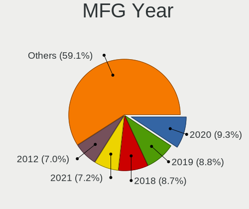
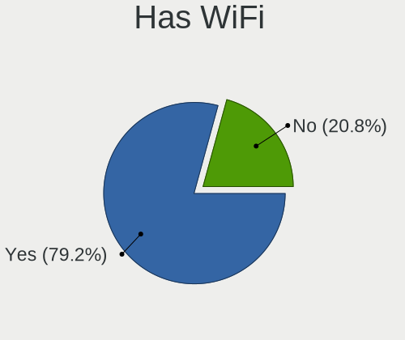
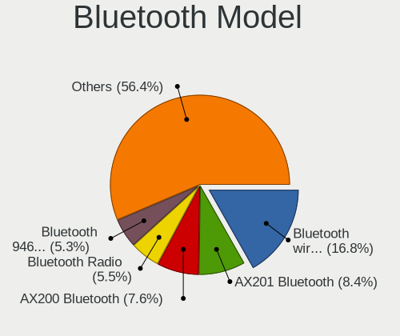
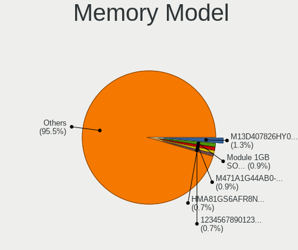

Linux in USA - Tested Hardware & Statistics
-------------------------------------------

A project to collect tested hardware configurations for Linux in USA.

Anyone can contribute to this report by the [hw-probe](https://github.com/linuxhw/hw-probe) tool:

    sudo -E hw-probe -all -upload

Please contribute! Especially if your hardware is rare.

This is a report for all computer types. See also reports for [desktops](/Location/USA/Desktop/README.md) and [notebooks](/Location/USA/Notebook/README.md).

Contents
--------

* [ Test Cases ](#test-cases)

* [ System ](#system)
  - [ OS                       ](#os)
  - [ OS Family                ](#os-family)
  - [ Kernel                   ](#kernel)
  - [ Kernel Family            ](#kernel-family)
  - [ Kernel Major Ver.        ](#kernel-major-ver)
  - [ Arch                     ](#arch)
  - [ DE                       ](#de)
  - [ Display Server           ](#display-server)
  - [ Display Manager          ](#display-manager)
  - [ OS Lang                  ](#os-lang)
  - [ Boot Mode                ](#boot-mode)
  - [ Filesystem               ](#filesystem)
  - [ Part. scheme             ](#part-scheme)
  - [ Dual Boot with Linux/BSD ](#dual-boot-with-linuxbsd)
  - [ Dual Boot (Win)          ](#dual-boot-win)

* [ Board ](#board)
  - [ Vendor                   ](#vendor)
  - [ Model                    ](#model)
  - [ Model Family             ](#model-family)
  - [ MFG Year                 ](#mfg-year)
  - [ Form Factor              ](#form-factor)
  - [ Secure Boot              ](#secure-boot)
  - [ Coreboot                 ](#coreboot)
  - [ RAM Size                 ](#ram-size)
  - [ RAM Used                 ](#ram-used)
  - [ Total Drives             ](#total-drives)
  - [ Has CD-ROM               ](#has-cd-rom)
  - [ Has Ethernet             ](#has-ethernet)
  - [ Has WiFi                 ](#has-wifi)
  - [ Has Bluetooth            ](#has-bluetooth)

* [ Location ](#location)
  - [ Country                  ](#country)
  - [ City                     ](#city)

* [ Drives ](#drives)
  - [ Drive Vendor             ](#drive-vendor)
  - [ Drive Model              ](#drive-model)
  - [ HDD Vendor               ](#hdd-vendor)
  - [ SSD Vendor               ](#ssd-vendor)
  - [ Drive Kind               ](#drive-kind)
  - [ Drive Connector          ](#drive-connector)
  - [ Drive Size               ](#drive-size)
  - [ Space Total              ](#space-total)
  - [ Space Used               ](#space-used)
  - [ Malfunc. Drives          ](#malfunc-drives)
  - [ Malfunc. Drive Vendor    ](#malfunc-drive-vendor)
  - [ Malfunc. HDD Vendor      ](#malfunc-hdd-vendor)
  - [ Malfunc. Drive Kind      ](#malfunc-drive-kind)
  - [ Failed Drives            ](#failed-drives)
  - [ Failed Drive Vendor      ](#failed-drive-vendor)
  - [ Drive Status             ](#drive-status)

* [ Storage controller ](#storage-controller)
  - [ Storage Vendor           ](#storage-vendor)
  - [ Storage Model            ](#storage-model)
  - [ Storage Kind             ](#storage-kind)

* [ Processor ](#processor)
  - [ CPU Vendor               ](#cpu-vendor)
  - [ CPU Model                ](#cpu-model)
  - [ CPU Model Family         ](#cpu-model-family)
  - [ CPU Cores                ](#cpu-cores)
  - [ CPU Sockets              ](#cpu-sockets)
  - [ CPU Threads              ](#cpu-threads)
  - [ CPU Op-Modes             ](#cpu-op-modes)
  - [ CPU Microcode            ](#cpu-microcode)
  - [ CPU Microarch            ](#cpu-microarch)

* [ Graphics ](#graphics)
  - [ GPU Vendor               ](#gpu-vendor)
  - [ GPU Model                ](#gpu-model)
  - [ GPU Combo                ](#gpu-combo)
  - [ GPU Driver               ](#gpu-driver)
  - [ GPU Memory               ](#gpu-memory)

* [ Monitor ](#monitor)
  - [ Monitor Vendor           ](#monitor-vendor)
  - [ Monitor Model            ](#monitor-model)
  - [ Monitor Resolution       ](#monitor-resolution)
  - [ Monitor Diagonal         ](#monitor-diagonal)
  - [ Monitor Width            ](#monitor-width)
  - [ Aspect Ratio             ](#aspect-ratio)
  - [ Monitor Area             ](#monitor-area)
  - [ Pixel Density            ](#pixel-density)
  - [ Multiple Monitors        ](#multiple-monitors)

* [ Network ](#network)
  - [ Net Controller Vendor    ](#net-controller-vendor)
  - [ Net Controller Model     ](#net-controller-model)
  - [ Wireless Vendor          ](#wireless-vendor)
  - [ Wireless Model           ](#wireless-model)
  - [ Ethernet Vendor          ](#ethernet-vendor)
  - [ Ethernet Model           ](#ethernet-model)
  - [ Net Controller Kind      ](#net-controller-kind)
  - [ Used Controller          ](#used-controller)
  - [ NICs                     ](#nics)
  - [ IPv6                     ](#ipv6)

* [ Bluetooth ](#bluetooth)
  - [ Bluetooth Vendor         ](#bluetooth-vendor)
  - [ Bluetooth Model          ](#bluetooth-model)

* [ Sound ](#sound)
  - [ Sound Vendor             ](#sound-vendor)
  - [ Sound Model              ](#sound-model)

* [ Memory ](#memory)
  - [ Memory Vendor            ](#memory-vendor)
  - [ Memory Model             ](#memory-model)
  - [ Memory Kind              ](#memory-kind)
  - [ Memory Form Factor       ](#memory-form-factor)
  - [ Memory Size              ](#memory-size)
  - [ Memory Speed             ](#memory-speed)

* [ Printers & scanners ](#printers--scanners)
  - [ Printer Vendor           ](#printer-vendor)
  - [ Printer Model            ](#printer-model)
  - [ Scanner Vendor           ](#scanner-vendor)
  - [ Scanner Model            ](#scanner-model)

* [ Camera ](#camera)
  - [ Camera Vendor            ](#camera-vendor)
  - [ Camera Model             ](#camera-model)

* [ Security ](#security)
  - [ Fingerprint Vendor       ](#fingerprint-vendor)
  - [ Fingerprint Model        ](#fingerprint-model)
  - [ Chipcard Vendor          ](#chipcard-vendor)
  - [ Chipcard Model           ](#chipcard-model)

* [ Unsupported ](#unsupported)
  - [ Unsupported Devices      ](#unsupported-devices)
  - [ Unsupported Device Types ](#unsupported-device-types)

Test Cases
----------

Total: 58624

| Vendor        | Model                       | Form-Factor | Probe                                                      | Date         |
|---------------|-----------------------------|-------------|------------------------------------------------------------|--------------|
| Gigabyte      | Z390 AORUS PRO WIFI-CF      | Desktop     | [3a67df5dcf](https://linux-hardware.org/?probe=3a67df5dcf) | Jan 02, 2024 |
| Gigabyte      | Z390 AORUS PRO WIFI-CF      | Desktop     | [b163926938](https://linux-hardware.org/?probe=b163926938) | Jan 02, 2024 |
| Dell          | Inspiron 5558               | Notebook    | [acc47dae75](https://linux-hardware.org/?probe=acc47dae75) | Jan 02, 2024 |
| Azulle        | Byte 3                      | Desktop     | [28f6b7cbad](https://linux-hardware.org/?probe=28f6b7cbad) | Jan 02, 2024 |
| HP            | Pavilion dm4                | Notebook    | [7b2206d3e1](https://linux-hardware.org/?probe=7b2206d3e1) | Jan 02, 2024 |
| HP            | Pavilion dm4                | Notebook    | [97f8b54561](https://linux-hardware.org/?probe=97f8b54561) | Jan 02, 2024 |
| Supermicro    | H12SSL-i                    | Server      | [454b403b53](https://linux-hardware.org/?probe=454b403b53) | Jan 02, 2024 |
| ASRockRack    | B650D4U-2L2T/BCM            | Server      | [a1095fd614](https://linux-hardware.org/?probe=a1095fd614) | Jan 02, 2024 |
| HP            | Laptop 17-cp0xxx            | Notebook    | [a9e2dd2fb6](https://linux-hardware.org/?probe=a9e2dd2fb6) | Jan 02, 2024 |
| Dell          | 0C2XKD A01                  | Desktop     | [9accd399c5](https://linux-hardware.org/?probe=9accd399c5) | Jan 02, 2024 |
| System76      | Serval                      | Notebook    | [a0597a9161](https://linux-hardware.org/?probe=a0597a9161) | Jan 02, 2024 |
| HP            | ProBook 450 G5              | Notebook    | [b80a7c9287](https://linux-hardware.org/?probe=b80a7c9287) | Jan 02, 2024 |
| System76      | Serval                      | Notebook    | [c4a91b64e5](https://linux-hardware.org/?probe=c4a91b64e5) | Jan 02, 2024 |
| ASUSTek       | ROG STRIX Z370-H GAMING     | Desktop     | [ee3998d501](https://linux-hardware.org/?probe=ee3998d501) | Jan 02, 2024 |
| Lenovo        | IdeaPad Slim 5 16IRL8 82... | Notebook    | [5570fbf22f](https://linux-hardware.org/?probe=5570fbf22f) | Jan 02, 2024 |
| MSI           | GS65 Stealth 9SG            | Notebook    | [6f3ddca46b](https://linux-hardware.org/?probe=6f3ddca46b) | Jan 02, 2024 |
| Gigabyte      | B560 DS3H AC-Y1             | Desktop     | [9868062aa3](https://linux-hardware.org/?probe=9868062aa3) | Jan 02, 2024 |
| Gateway       | MT6707                      | Notebook    | [a2a87f6e95](https://linux-hardware.org/?probe=a2a87f6e95) | Jan 02, 2024 |
| Dell          | XPS 13 9380                 | Notebook    | [d290e010eb](https://linux-hardware.org/?probe=d290e010eb) | Jan 02, 2024 |
| HP            | Laptop 15-dw0xxx            | Notebook    | [b732d30db5](https://linux-hardware.org/?probe=b732d30db5) | Jan 02, 2024 |
| Valve         | Jupiter                     | Notebook    | [e381b764b0](https://linux-hardware.org/?probe=e381b764b0) | Jan 02, 2024 |
| Dell          | G3 3590                     | Notebook    | [ae7267dd5f](https://linux-hardware.org/?probe=ae7267dd5f) | Jan 02, 2024 |
| Lenovo        | IdeaPad Slim 5 16IRL8 82... | Notebook    | [197c876252](https://linux-hardware.org/?probe=197c876252) | Jan 02, 2024 |
| MSI           | PRO B650-P WIFI             | Desktop     | [544a799ce8](https://linux-hardware.org/?probe=544a799ce8) | Jan 02, 2024 |
| Samsung       | 730QDA                      | Convertible | [e9603387e6](https://linux-hardware.org/?probe=e9603387e6) | Jan 02, 2024 |
| Lenovo        | IdeaPad 5 15ARE05 81YQ      | Notebook    | [fb59929b28](https://linux-hardware.org/?probe=fb59929b28) | Jan 02, 2024 |
| HP            | Laptop 15-dw0xxx            | Notebook    | [43bc3cd4bd](https://linux-hardware.org/?probe=43bc3cd4bd) | Jan 02, 2024 |
| Dell          | 07KY25 A01                  | Desktop     | [7936cb8967](https://linux-hardware.org/?probe=7936cb8967) | Jan 02, 2024 |
| Lenovo        | Legion Y545 81Q6            | Notebook    | [954ab5a643](https://linux-hardware.org/?probe=954ab5a643) | Jan 02, 2024 |
| ASRock        | X470 Taichi                 | Desktop     | [93ce6b9074](https://linux-hardware.org/?probe=93ce6b9074) | Jan 02, 2024 |
| Dell          | 0NDYHG A01                  | Desktop     | [68cde01489](https://linux-hardware.org/?probe=68cde01489) | Jan 02, 2024 |
| Azulle        | Byte 3                      | Desktop     | [273bcd474a](https://linux-hardware.org/?probe=273bcd474a) | Jan 02, 2024 |
| Samsung       | 930QED                      | Convertible | [c9d218a2c8](https://linux-hardware.org/?probe=c9d218a2c8) | Jan 02, 2024 |
| BESSTAR Te... | GB7                         | Mini pc     | [48afb483d6](https://linux-hardware.org/?probe=48afb483d6) | Jan 02, 2024 |
| HP            | 886C                        | Desktop     | [d076e5b70a](https://linux-hardware.org/?probe=d076e5b70a) | Jan 01, 2024 |
| Gigabyte      | X79-UP4                     | Desktop     | [4c7ec5ec88](https://linux-hardware.org/?probe=4c7ec5ec88) | Jan 01, 2024 |
| HP            | 0B4Ch D                     | Desktop     | [b7d97486fb](https://linux-hardware.org/?probe=b7d97486fb) | Jan 01, 2024 |
| ASUSTek       | TUF Gaming Z490-PLUS        | Desktop     | [ccaa0646d7](https://linux-hardware.org/?probe=ccaa0646d7) | Jan 01, 2024 |
| HP            | Laptop 15-dw0xxx            | Notebook    | [66f6fa63a2](https://linux-hardware.org/?probe=66f6fa63a2) | Jan 01, 2024 |
| Lenovo        | ThinkPad X260 20F5S0KE00    | Notebook    | [08d2a7a982](https://linux-hardware.org/?probe=08d2a7a982) | Jan 01, 2024 |
| ASUSTek       | PRIME X570-P                | Desktop     | [f8dd732e7a](https://linux-hardware.org/?probe=f8dd732e7a) | Jan 01, 2024 |
| Google        | Gallop                      | Notebook    | [917756724c](https://linux-hardware.org/?probe=917756724c) | Jan 01, 2024 |
| Dell          | 0YXT71 A02                  | Desktop     | [e08ca6924a](https://linux-hardware.org/?probe=e08ca6924a) | Jan 01, 2024 |
| ASRock        | B450M Gaming                | Desktop     | [81242d3eca](https://linux-hardware.org/?probe=81242d3eca) | Jan 01, 2024 |
| Apple         | MacBookPro11,2              | Notebook    | [4a37a9b35c](https://linux-hardware.org/?probe=4a37a9b35c) | Jan 01, 2024 |
| Apple         | Mac-27ADBB7B4CEE8E61 iMa... | All in one  | [c3356daec6](https://linux-hardware.org/?probe=c3356daec6) | Jan 01, 2024 |
| Dell          | Inspiron 5537               | Notebook    | [d19fc7dff7](https://linux-hardware.org/?probe=d19fc7dff7) | Jan 01, 2024 |
| ASUSTek       | K52Jc                       | Notebook    | [5f0c993270](https://linux-hardware.org/?probe=5f0c993270) | Jan 01, 2024 |
| Valve         | Jupiter                     | Notebook    | [c9de553faa](https://linux-hardware.org/?probe=c9de553faa) | Jan 01, 2024 |
| ASUSTek       | PRIME B550M-A               | Desktop     | [a4cf1bb1ea](https://linux-hardware.org/?probe=a4cf1bb1ea) | Jan 01, 2024 |
| Dell          | Latitude 5480               | Notebook    | [c1d96bef16](https://linux-hardware.org/?probe=c1d96bef16) | Jan 01, 2024 |
| Lenovo        | SHARKBAY SDK0E50519 WIN     | Desktop     | [fc9ced99d5](https://linux-hardware.org/?probe=fc9ced99d5) | Jan 01, 2024 |
| ASUSTek       | H97-PLUS                    | Desktop     | [e208caf8f1](https://linux-hardware.org/?probe=e208caf8f1) | Jan 01, 2024 |
| Gigabyte      | 970A-DS3P                   | Desktop     | [74a0ff16d4](https://linux-hardware.org/?probe=74a0ff16d4) | Jan 01, 2024 |
| Gateway       | M-6307                      | Notebook    | [0936f4a650](https://linux-hardware.org/?probe=0936f4a650) | Jan 01, 2024 |
| Lenovo        | ThinkPad Twist 33476LU      | Notebook    | [bb88a71510](https://linux-hardware.org/?probe=bb88a71510) | Jan 01, 2024 |
| Supermicro    | H12SSL-i                    | Server      | [0003baf54d](https://linux-hardware.org/?probe=0003baf54d) | Jan 01, 2024 |
| ASRockRack    | B650D4U-2L2T/BCM            | Server      | [cc645ac529](https://linux-hardware.org/?probe=cc645ac529) | Jan 01, 2024 |
| Dell          | Inspiron 5379               | Notebook    | [c3c47e54db](https://linux-hardware.org/?probe=c3c47e54db) | Jan 01, 2024 |
| ASRock        | Z690M Phantom Gaming 4      | Desktop     | [9b11da6c92](https://linux-hardware.org/?probe=9b11da6c92) | Jan 01, 2024 |
| ASUSTek       | ASUS TUF Gaming A16 FA61... | Notebook    | [488deac73a](https://linux-hardware.org/?probe=488deac73a) | Jan 01, 2024 |
| ASUSTek       | TUF Gaming Z590-PLUS        | Desktop     | [6dbc709464](https://linux-hardware.org/?probe=6dbc709464) | Jan 01, 2024 |
| MSI           | 2AE0                        | Desktop     | [00b5d15112](https://linux-hardware.org/?probe=00b5d15112) | Jan 01, 2024 |
| Lenovo        | ThinkPad T495 20NJ0008US    | Notebook    | [2872198e9f](https://linux-hardware.org/?probe=2872198e9f) | Jan 01, 2024 |
| Dell          | Inspiron 5402               | Notebook    | [388a6a9fc1](https://linux-hardware.org/?probe=388a6a9fc1) | Jan 01, 2024 |
| ASUSTek       | M5A97 R2.0                  | Desktop     | [1e67ed5915](https://linux-hardware.org/?probe=1e67ed5915) | Jan 01, 2024 |
| HP            | 1850                        | Desktop     | [b635f6412c](https://linux-hardware.org/?probe=b635f6412c) | Jan 01, 2024 |
| MSI           | B550M PRO-VDH WIFI          | Desktop     | [b1f90491ab](https://linux-hardware.org/?probe=b1f90491ab) | Jan 01, 2024 |
| ASUSTek       | TUF Gaming B550-PLUS        | Desktop     | [4b8ffea2ef](https://linux-hardware.org/?probe=4b8ffea2ef) | Jan 01, 2024 |
| ASRock        | X399 Professional Gaming    | Desktop     | [2d812c76d3](https://linux-hardware.org/?probe=2d812c76d3) | Jan 01, 2024 |
| ASRock        | B450M Pro4                  | Desktop     | [126f6b0c9c](https://linux-hardware.org/?probe=126f6b0c9c) | Dec 31, 2023 |
| ASRock        | B450M Pro4                  | Desktop     | [8625e5d1fa](https://linux-hardware.org/?probe=8625e5d1fa) | Dec 31, 2023 |
| ASUSTek       | G75VW                       | Notebook    | [56e330d7bc](https://linux-hardware.org/?probe=56e330d7bc) | Dec 31, 2023 |
| Foxconn       | 2ADA                        | Desktop     | [ae6e6ab09f](https://linux-hardware.org/?probe=ae6e6ab09f) | Dec 31, 2023 |
| Supermicro    | H13DSH                      | Desktop     | [4110ba22a1](https://linux-hardware.org/?probe=4110ba22a1) | Dec 31, 2023 |
| ASUSTek       | TUF Gaming B650M-PLUS WI... | Desktop     | [8635d2ee55](https://linux-hardware.org/?probe=8635d2ee55) | Dec 31, 2023 |
| Dell          | Latitude E6320              | Notebook    | [1833dcdd43](https://linux-hardware.org/?probe=1833dcdd43) | Dec 31, 2023 |
| Dell          | 0HX555                      | Desktop     | [72e32eaf42](https://linux-hardware.org/?probe=72e32eaf42) | Dec 31, 2023 |
| Dell          | 0HX555                      | Desktop     | [535a5964b8](https://linux-hardware.org/?probe=535a5964b8) | Dec 31, 2023 |
| Dell          | Latitude E6500              | Notebook    | [8d7d1376fd](https://linux-hardware.org/?probe=8d7d1376fd) | Dec 31, 2023 |
| Alienware     | 0VDT73 A00                  | Desktop     | [2a4b22a489](https://linux-hardware.org/?probe=2a4b22a489) | Dec 31, 2023 |
| Google        | Peppy                       | Notebook    | [9b8131eea3](https://linux-hardware.org/?probe=9b8131eea3) | Dec 31, 2023 |
| HP            | 8704                        | Desktop     | [49843bcacc](https://linux-hardware.org/?probe=49843bcacc) | Dec 31, 2023 |
| Valve         | Jupiter                     | Notebook    | [5be404c400](https://linux-hardware.org/?probe=5be404c400) | Dec 31, 2023 |
| MACHINIST     | X99-D8-MAX V1.0             | Desktop     | [ef584ae5a8](https://linux-hardware.org/?probe=ef584ae5a8) | Dec 31, 2023 |
| HP            | ENVY x360 2-in-1 Laptop ... | Convertible | [53913ce746](https://linux-hardware.org/?probe=53913ce746) | Dec 31, 2023 |
| ASUSTek       | M5A78L-M PLUS/USB3          | Desktop     | [fda4d32a86](https://linux-hardware.org/?probe=fda4d32a86) | Dec 31, 2023 |
| ASUSTek       | ASUS BR1100CKA BR1100CKA... | Notebook    | [fc3a637b52](https://linux-hardware.org/?probe=fc3a637b52) | Dec 31, 2023 |
| Dell          | 03X6X0 A06                  | Server      | [37cb3cf7de](https://linux-hardware.org/?probe=37cb3cf7de) | Dec 31, 2023 |
| Dell          | Latitude 7490               | Notebook    | [455ad2a6f1](https://linux-hardware.org/?probe=455ad2a6f1) | Dec 31, 2023 |
| Acer          | Aspire A515-43              | Notebook    | [68a2707c3f](https://linux-hardware.org/?probe=68a2707c3f) | Dec 31, 2023 |
| Gigabyte      | X570S AORUS MASTER          | Desktop     | [cc1f8b0b86](https://linux-hardware.org/?probe=cc1f8b0b86) | Dec 31, 2023 |
| Dell          | Inspiron 3521               | Notebook    | [7de98bea51](https://linux-hardware.org/?probe=7de98bea51) | Dec 31, 2023 |
| Valve         | Jupiter                     | Notebook    | [e80d5f8a2b](https://linux-hardware.org/?probe=e80d5f8a2b) | Dec 31, 2023 |
| IBM           | ThinkPad T43 1875DMU        | Notebook    | [a33e9f7b0d](https://linux-hardware.org/?probe=a33e9f7b0d) | Dec 31, 2023 |
| Lenovo        | ThinkPad X1 Tablet 20GG0... | Tablet      | [c1b48795ed](https://linux-hardware.org/?probe=c1b48795ed) | Dec 31, 2023 |
| ASUSTek       | ROG CROSSHAIR X670E HERO    | Desktop     | [dd7c0e5406](https://linux-hardware.org/?probe=dd7c0e5406) | Dec 31, 2023 |
| Lenovo        | Slim 7 ProX 14ARH7 82V2     | Notebook    | [f160a53f1b](https://linux-hardware.org/?probe=f160a53f1b) | Dec 31, 2023 |
| Lenovo        | ThinkPad X1 Tablet 20GG0... | Tablet      | [094fb36931](https://linux-hardware.org/?probe=094fb36931) | Dec 31, 2023 |
| HP            | 8643 SMVB                   | Desktop     | [2a12979b75](https://linux-hardware.org/?probe=2a12979b75) | Dec 31, 2023 |
| HP            | 8643 SMVB                   | Desktop     | [23b04c5445](https://linux-hardware.org/?probe=23b04c5445) | Dec 31, 2023 |
| Lenovo        | ThinkPad T430 23426QU       | Notebook    | [70bbf55180](https://linux-hardware.org/?probe=70bbf55180) | Dec 31, 2023 |
| Supermicro    | H12SSL-i                    | Server      | [ae544239b5](https://linux-hardware.org/?probe=ae544239b5) | Dec 31, 2023 |
| ASRockRack    | B650D4U-2L2T/BCM            | Server      | [b9db9c256b](https://linux-hardware.org/?probe=b9db9c256b) | Dec 31, 2023 |
| Dell          | 0RW199                      | Desktop     | [62dc9ffa33](https://linux-hardware.org/?probe=62dc9ffa33) | Dec 31, 2023 |
| HP            | 8623 A01                    | Mini pc     | [675505f64e](https://linux-hardware.org/?probe=675505f64e) | Dec 31, 2023 |
| Dell          | Latitude E5430 non-vPro     | Notebook    | [e27c2e0ade](https://linux-hardware.org/?probe=e27c2e0ade) | Dec 31, 2023 |
| Lenovo        | Legion Y545 81Q6            | Notebook    | [a91810bda7](https://linux-hardware.org/?probe=a91810bda7) | Dec 31, 2023 |
| HP            | ENVY x360 2-in-1 Laptop ... | Convertible | [70057bbd62](https://linux-hardware.org/?probe=70057bbd62) | Dec 31, 2023 |
| Gigabyte      | B650 AORUS ELITE AX         | Desktop     | [5f1c662ba4](https://linux-hardware.org/?probe=5f1c662ba4) | Dec 31, 2023 |
| Apple         | Mac-F221BEC8                | Desktop     | [57b09cabf5](https://linux-hardware.org/?probe=57b09cabf5) | Dec 31, 2023 |
| Dell          | 0C2XKD A01                  | Desktop     | [5e36d4fb43](https://linux-hardware.org/?probe=5e36d4fb43) | Dec 31, 2023 |
| Lenovo        | ThinkPad T420 4178AFU       | Notebook    | [8fb51545f7](https://linux-hardware.org/?probe=8fb51545f7) | Dec 31, 2023 |
| Apple         | MacBookAir9,1               | Notebook    | [71c755966f](https://linux-hardware.org/?probe=71c755966f) | Dec 31, 2023 |
| AZW           | SER V1.0                    | Mini pc     | [59909058f1](https://linux-hardware.org/?probe=59909058f1) | Dec 31, 2023 |
| Framework     | Laptop 13 (AMD Ryzen 704... | Notebook    | [a62110fad4](https://linux-hardware.org/?probe=a62110fad4) | Dec 31, 2023 |
| Apple         | MacBookAir9,1               | Notebook    | [b13ec8c4fe](https://linux-hardware.org/?probe=b13ec8c4fe) | Dec 31, 2023 |
| ASRock        | Z97X Killer                 | Desktop     | [9508234fa4](https://linux-hardware.org/?probe=9508234fa4) | Dec 31, 2023 |
| ASUSTek       | P8H67-M PRO                 | Desktop     | [63d62dd94e](https://linux-hardware.org/?probe=63d62dd94e) | Dec 31, 2023 |
| MSI           | 970 GAMING                  | Desktop     | [7f7f8f09ae](https://linux-hardware.org/?probe=7f7f8f09ae) | Dec 31, 2023 |
| ASUSTek       | P8H67-M PRO                 | Desktop     | [6a45d6cf9e](https://linux-hardware.org/?probe=6a45d6cf9e) | Dec 30, 2023 |
| Gigabyte      | A620I AX                    | Desktop     | [7f73790fbf](https://linux-hardware.org/?probe=7f73790fbf) | Dec 30, 2023 |
| ASRock        | X570 Extreme4               | Desktop     | [13312e6a34](https://linux-hardware.org/?probe=13312e6a34) | Dec 30, 2023 |
| Apple         | Mac-FFE5EF870D7BA81A iMa... | All in one  | [4897e5a806](https://linux-hardware.org/?probe=4897e5a806) | Dec 30, 2023 |
| ASUSTek       | G74Sx                       | Notebook    | [0933c174aa](https://linux-hardware.org/?probe=0933c174aa) | Dec 30, 2023 |
| Unknown       | Unknown                     | Desktop     | [e6e8bd6545](https://linux-hardware.org/?probe=e6e8bd6545) | Dec 30, 2023 |
| ASUSTek       | PRIME X399-A                | Desktop     | [ac506b01e6](https://linux-hardware.org/?probe=ac506b01e6) | Dec 30, 2023 |
| HP            | 82F1                        | Desktop     | [9fc9cb3de0](https://linux-hardware.org/?probe=9fc9cb3de0) | Dec 30, 2023 |
| HP            | 81B4                        | Desktop     | [b596129d5d](https://linux-hardware.org/?probe=b596129d5d) | Dec 30, 2023 |
| Dell          | 0VRWRC A00                  | Desktop     | [c58ff5350b](https://linux-hardware.org/?probe=c58ff5350b) | Dec 30, 2023 |
| Dell          | Inspiron 7386               | Convertible | [f462e5f53d](https://linux-hardware.org/?probe=f462e5f53d) | Dec 30, 2023 |
| ASRock        | B450M Pro4 R2.0             | Desktop     | [fa7e23a6ee](https://linux-hardware.org/?probe=fa7e23a6ee) | Dec 30, 2023 |
| AZW           | SER V2.0                    | Mini pc     | [2ecb9b3019](https://linux-hardware.org/?probe=2ecb9b3019) | Dec 30, 2023 |
| Google        | Barla                       | Notebook    | [585887bc42](https://linux-hardware.org/?probe=585887bc42) | Dec 30, 2023 |
| HP            | 89E9 0100                   | All in one  | [e05f44b587](https://linux-hardware.org/?probe=e05f44b587) | Dec 30, 2023 |
| Dell          | 0R6PCT A01                  | Desktop     | [8409c4a0d6](https://linux-hardware.org/?probe=8409c4a0d6) | Dec 30, 2023 |
| Gigabyte      | Z370P D3-CF                 | Desktop     | [4c2ef0d59a](https://linux-hardware.org/?probe=4c2ef0d59a) | Dec 30, 2023 |
| Acer          | Nitro AN515-58              | Notebook    | [a0039ef79d](https://linux-hardware.org/?probe=a0039ef79d) | Dec 30, 2023 |
| ASUSTek       | ROG Strix G533ZW_G533ZW     | Notebook    | [f48ada0e7b](https://linux-hardware.org/?probe=f48ada0e7b) | Dec 30, 2023 |
| HP            | EliteBook Folio 1040 G3     | Notebook    | [98f6888dcd](https://linux-hardware.org/?probe=98f6888dcd) | Dec 30, 2023 |
| HP            | EliteBook Folio 1040 G3     | Notebook    | [cb51f62169](https://linux-hardware.org/?probe=cb51f62169) | Dec 30, 2023 |
| System76      | Serval WS                   | Notebook    | [3dd4d45859](https://linux-hardware.org/?probe=3dd4d45859) | Dec 30, 2023 |
| Gigabyte      | B550M K                     | Desktop     | [8340ced087](https://linux-hardware.org/?probe=8340ced087) | Dec 30, 2023 |
| Dell          | 0KV62T A02                  | Desktop     | [0722563902](https://linux-hardware.org/?probe=0722563902) | Dec 30, 2023 |
| Lenovo        | ThinkPad T440p              | Notebook    | [e45829bd8b](https://linux-hardware.org/?probe=e45829bd8b) | Dec 30, 2023 |
| Lenovo        | ThinkPad E15 20RD002RUS     | Notebook    | [221c773946](https://linux-hardware.org/?probe=221c773946) | Dec 30, 2023 |
| Lenovo        | B590 20206                  | Notebook    | [d3c6913a54](https://linux-hardware.org/?probe=d3c6913a54) | Dec 30, 2023 |
| Gigabyte      | B650 AORUS ELITE AX         | Desktop     | [aa8dc3e6ae](https://linux-hardware.org/?probe=aa8dc3e6ae) | Dec 30, 2023 |
| HP            | Laptop 15-dy2xxx            | Notebook    | [2a29a4613c](https://linux-hardware.org/?probe=2a29a4613c) | Dec 30, 2023 |
| HP            | Laptop 15-dy2xxx            | Notebook    | [9ee9bc6de8](https://linux-hardware.org/?probe=9ee9bc6de8) | Dec 30, 2023 |
| Dell          | 0C522T A03                  | Desktop     | [67a47d8d83](https://linux-hardware.org/?probe=67a47d8d83) | Dec 30, 2023 |
| Gigabyte      | Z77X-UD3H                   | Desktop     | [85c8033229](https://linux-hardware.org/?probe=85c8033229) | Dec 30, 2023 |
| HP            | 212B                        | Desktop     | [0ca173f4a7](https://linux-hardware.org/?probe=0ca173f4a7) | Dec 30, 2023 |
| HP            | OMEN by Laptop 16-c0xxx     | Notebook    | [ebdb840dba](https://linux-hardware.org/?probe=ebdb840dba) | Dec 30, 2023 |
| ASUSTek       | U52F                        | Notebook    | [acf3ac6f23](https://linux-hardware.org/?probe=acf3ac6f23) | Dec 30, 2023 |
| Dell          | 0M5DCD A00                  | Desktop     | [a85c9d93c8](https://linux-hardware.org/?probe=a85c9d93c8) | Dec 30, 2023 |
| Pegatron      | 2A9A                        | Desktop     | [92def1bf4a](https://linux-hardware.org/?probe=92def1bf4a) | Dec 30, 2023 |
| ASUSTek       | ROG STRIX B350-F GAMING     | Desktop     | [b8c7cbf672](https://linux-hardware.org/?probe=b8c7cbf672) | Dec 30, 2023 |
| Framework     | Laptop (12th Gen Intel C... | Notebook    | [24ca756f75](https://linux-hardware.org/?probe=24ca756f75) | Dec 30, 2023 |
| Google        | Reef                        | Notebook    | [362a174638](https://linux-hardware.org/?probe=362a174638) | Dec 30, 2023 |
| Apple         | Mac-F4208AC8 PVT            | Desktop     | [11a7c2b836](https://linux-hardware.org/?probe=11a7c2b836) | Dec 30, 2023 |
| Lenovo        | ThinkPad X280 20KF0025US    | Notebook    | [5766ed7c57](https://linux-hardware.org/?probe=5766ed7c57) | Dec 29, 2023 |
| Lenovo        | IdeaPad U430 Touch 20270    | Notebook    | [75516d0dbc](https://linux-hardware.org/?probe=75516d0dbc) | Dec 29, 2023 |
| Lenovo        | Legion Slim 5 14APH8 82Y... | Notebook    | [402a1c70b8](https://linux-hardware.org/?probe=402a1c70b8) | Dec 29, 2023 |
| Lenovo        | Legion Slim 5 14APH8 82Y... | Notebook    | [13e876e5cf](https://linux-hardware.org/?probe=13e876e5cf) | Dec 29, 2023 |
| ASUSTek       | TUF Gaming X570-PLUS        | Desktop     | [7dca6779be](https://linux-hardware.org/?probe=7dca6779be) | Dec 29, 2023 |
| Pegatron      | 2ACD                        | Desktop     | [44b4857097](https://linux-hardware.org/?probe=44b4857097) | Dec 29, 2023 |
| HP            | 212B                        | Desktop     | [6afcd77ad6](https://linux-hardware.org/?probe=6afcd77ad6) | Dec 29, 2023 |
| HP            | 304Ah                       | Desktop     | [0a84d8bd4a](https://linux-hardware.org/?probe=0a84d8bd4a) | Dec 29, 2023 |
| ASUSTek       | M5A99FX PRO R2.0            | Desktop     | [c6cd1c43ba](https://linux-hardware.org/?probe=c6cd1c43ba) | Dec 29, 2023 |
| BESSTAR Te... | GB7                         | Mini pc     | [80ed6c8614](https://linux-hardware.org/?probe=80ed6c8614) | Dec 29, 2023 |
| Dell          | XPS 15 9560                 | Notebook    | [aabd2af674](https://linux-hardware.org/?probe=aabd2af674) | Dec 29, 2023 |
| Dell          | 0HD5W2 A01                  | Desktop     | [91ac22ebca](https://linux-hardware.org/?probe=91ac22ebca) | Dec 29, 2023 |
| Gigabyte      | X79-UP4                     | Desktop     | [618dfee965](https://linux-hardware.org/?probe=618dfee965) | Dec 29, 2023 |
| eMachines     | EMCP73VT-PM                 | Desktop     | [cd0de3ca07](https://linux-hardware.org/?probe=cd0de3ca07) | Dec 29, 2023 |
| ASRock        | B550M-C                     | Desktop     | [ba3fa09385](https://linux-hardware.org/?probe=ba3fa09385) | Dec 29, 2023 |
| Dell          | 00V62H A01                  | Desktop     | [0032f131d1](https://linux-hardware.org/?probe=0032f131d1) | Dec 29, 2023 |
| Lenovo        | IdeaPad 330-17IKB 81DM      | Notebook    | [bbe4e7af60](https://linux-hardware.org/?probe=bbe4e7af60) | Dec 29, 2023 |
| Microsoft     | Surface Pro 4               | Tablet      | [6e6573e5fe](https://linux-hardware.org/?probe=6e6573e5fe) | Dec 29, 2023 |
| Microsoft     | Surface Pro 3               | Tablet      | [f1b87f3d0e](https://linux-hardware.org/?probe=f1b87f3d0e) | Dec 29, 2023 |
| HP            | Laptop 15-da0xxx            | Notebook    | [03ad95c394](https://linux-hardware.org/?probe=03ad95c394) | Dec 29, 2023 |
| Dell          | 096JG8 A01                  | Desktop     | [915a028a6a](https://linux-hardware.org/?probe=915a028a6a) | Dec 29, 2023 |
| Unknown       | M17                         | Notebook    | [3d6789f805](https://linux-hardware.org/?probe=3d6789f805) | Dec 29, 2023 |
| ASUSTek       | M5A97 R2.0                  | Desktop     | [c5bc64bc85](https://linux-hardware.org/?probe=c5bc64bc85) | Dec 29, 2023 |
| EPoX Compu... | MCP61 Series                | Desktop     | [730493cca3](https://linux-hardware.org/?probe=730493cca3) | Dec 29, 2023 |
| Apple         | Mac-8ED6AF5B48C039E1 Mac... | Mini pc     | [78e92a08a9](https://linux-hardware.org/?probe=78e92a08a9) | Dec 29, 2023 |
| Dell          | Latitude 5424 Rugged        | Notebook    | [1339f0b553](https://linux-hardware.org/?probe=1339f0b553) | Dec 29, 2023 |
| HP            | 8455                        | Desktop     | [3fb91b1137](https://linux-hardware.org/?probe=3fb91b1137) | Dec 29, 2023 |
| HP            | 8455                        | Desktop     | [1cb18d157d](https://linux-hardware.org/?probe=1cb18d157d) | Dec 29, 2023 |
| Dell          | Latitude 7300               | Notebook    | [926a273123](https://linux-hardware.org/?probe=926a273123) | Dec 29, 2023 |
| Dell          | Latitude 7300               | Notebook    | [ac9c0099fd](https://linux-hardware.org/?probe=ac9c0099fd) | Dec 29, 2023 |
| Gigabyte      | X570 I AORUS PRO WIFI       | Desktop     | [50f2afc829](https://linux-hardware.org/?probe=50f2afc829) | Dec 29, 2023 |
| FriendlyEl... | NanoPi R6S                  | Soc         | [9a762ca6b1](https://linux-hardware.org/?probe=9a762ca6b1) | Dec 29, 2023 |
| Dell          | 0V8WGR A00                  | Desktop     | [e6479e42e3](https://linux-hardware.org/?probe=e6479e42e3) | Dec 29, 2023 |
| Dell          | Inspiron 5759               | Notebook    | [9586fa7d24](https://linux-hardware.org/?probe=9586fa7d24) | Dec 29, 2023 |
| ASUSTek       | ROG STRIX Z790-E GAMING ... | Desktop     | [6954b67b3e](https://linux-hardware.org/?probe=6954b67b3e) | Dec 29, 2023 |
| Lenovo        | ThinkPad L590 20Q8S0QB00    | Notebook    | [21c14a621b](https://linux-hardware.org/?probe=21c14a621b) | Dec 29, 2023 |
| ASUSTek       | Zenbook UM3402YAR_UM3402... | Notebook    | [13ba865757](https://linux-hardware.org/?probe=13ba865757) | Dec 29, 2023 |
| ASUSTek       | PRIME X399-A                | Desktop     | [4d46811257](https://linux-hardware.org/?probe=4d46811257) | Dec 29, 2023 |
| Lenovo        | ThinkPad T14s Gen 2a 20X... | Notebook    | [92c8c4f42c](https://linux-hardware.org/?probe=92c8c4f42c) | Dec 28, 2023 |
| Lenovo        | ThinkPad E15 20RD002RUS     | Notebook    | [be86cafd2e](https://linux-hardware.org/?probe=be86cafd2e) | Dec 28, 2023 |
| Panasonic     | CF-33-1                     | Tablet      | [93c6a1711e](https://linux-hardware.org/?probe=93c6a1711e) | Dec 28, 2023 |
| ASUSTek       | CM6870                      | Desktop     | [529b92f758](https://linux-hardware.org/?probe=529b92f758) | Dec 28, 2023 |
| Samsung       | 750QFG                      | Convertible | [e9c0f18533](https://linux-hardware.org/?probe=e9c0f18533) | Dec 28, 2023 |
| Valve         | Galileo                     | Notebook    | [83bfa965fb](https://linux-hardware.org/?probe=83bfa965fb) | Dec 28, 2023 |
| Dell          | Vostro 15 5510              | Notebook    | [02df63af48](https://linux-hardware.org/?probe=02df63af48) | Dec 28, 2023 |
| HP            | 0B4Ch D                     | Desktop     | [7b5d790450](https://linux-hardware.org/?probe=7b5d790450) | Dec 28, 2023 |
| ASUSTek       | G73Jh                       | Notebook    | [05dc836501](https://linux-hardware.org/?probe=05dc836501) | Dec 28, 2023 |
| Lenovo        | 310B SDK0J40697 WIN 3305... | Desktop     | [e49bfae343](https://linux-hardware.org/?probe=e49bfae343) | Dec 28, 2023 |
| Acer          | Nitro AN515-54              | Notebook    | [b310676172](https://linux-hardware.org/?probe=b310676172) | Dec 28, 2023 |
| Raspberry ... | Raspberry Pi 4 Model B R... | Soc         | [e91f6abee5](https://linux-hardware.org/?probe=e91f6abee5) | Dec 28, 2023 |
| ASUSTek       | ROG STRIX B550-F GAMING ... | Desktop     | [94b90795bb](https://linux-hardware.org/?probe=94b90795bb) | Dec 28, 2023 |
| Acer          | Aspire E5-553G              | Notebook    | [a21fc70e01](https://linux-hardware.org/?probe=a21fc70e01) | Dec 28, 2023 |
| Lenovo        | 3136 SDK0J40697 WIN 3305... | Mini pc     | [726e2159d8](https://linux-hardware.org/?probe=726e2159d8) | Dec 28, 2023 |
| Pegatron      | 2AB6                        | Desktop     | [faf90bb1a2](https://linux-hardware.org/?probe=faf90bb1a2) | Dec 28, 2023 |
| Pegatron      | 2AB6                        | Desktop     | [6eb51d9bd9](https://linux-hardware.org/?probe=6eb51d9bd9) | Dec 28, 2023 |
| Apple         | MacBookPro8,3               | Notebook    | [e47426bf12](https://linux-hardware.org/?probe=e47426bf12) | Dec 28, 2023 |
| Apple         | MacBookPro9,2               | Notebook    | [b73abb7ffa](https://linux-hardware.org/?probe=b73abb7ffa) | Dec 28, 2023 |
| ASUSTek       | ASUS TUF Gaming F15 FX50... | Notebook    | [a5c652bcef](https://linux-hardware.org/?probe=a5c652bcef) | Dec 28, 2023 |
| ASUSTek       | ASUS TUF Gaming F15 FX50... | Notebook    | [02799d9fc9](https://linux-hardware.org/?probe=02799d9fc9) | Dec 28, 2023 |
| HP            | ProBook 6470b               | Notebook    | [60858223c4](https://linux-hardware.org/?probe=60858223c4) | Dec 28, 2023 |
| HP            | 8265                        | Desktop     | [94344dbe98](https://linux-hardware.org/?probe=94344dbe98) | Dec 28, 2023 |
| ASUSTek       | G750JX                      | Notebook    | [2b867b6af5](https://linux-hardware.org/?probe=2b867b6af5) | Dec 28, 2023 |
| Lenovo        | IdeaPad 300-17ISK 80QH      | Notebook    | [0c55b9f3e3](https://linux-hardware.org/?probe=0c55b9f3e3) | Dec 28, 2023 |
| ASUSTek       | ROG STRIX B450-F GAMING     | Desktop     | [2d2449e5d7](https://linux-hardware.org/?probe=2d2449e5d7) | Dec 28, 2023 |
| GPU Compan... | GWTN141-10                  | Notebook    | [6e74e1b943](https://linux-hardware.org/?probe=6e74e1b943) | Dec 28, 2023 |
| Lenovo        | IdeaPadFlex 5 14ALC05 82... | Convertible | [de88e1d09c](https://linux-hardware.org/?probe=de88e1d09c) | Dec 28, 2023 |
| ASUSTek       | PRIME Z790-P WIFI           | Desktop     | [f52a281bd2](https://linux-hardware.org/?probe=f52a281bd2) | Dec 28, 2023 |
| MSI           | MPG B550 GAMING PLUS        | Desktop     | [8df141917e](https://linux-hardware.org/?probe=8df141917e) | Dec 28, 2023 |
| HP            | 3029h                       | Desktop     | [de537af4ba](https://linux-hardware.org/?probe=de537af4ba) | Dec 28, 2023 |
| ASUSTek       | PRIME X570-P                | Desktop     | [29084d784b](https://linux-hardware.org/?probe=29084d784b) | Dec 28, 2023 |
| Lenovo        | Yoga 710-15IKB 80V5         | Convertible | [7b388d0a8f](https://linux-hardware.org/?probe=7b388d0a8f) | Dec 28, 2023 |
| Lenovo        | IdeaPad 300-17ISK 80QH      | Notebook    | [9197fe40a7](https://linux-hardware.org/?probe=9197fe40a7) | Dec 28, 2023 |
| Lenovo        | ThinkPad X1 Carbon Gen 9... | Notebook    | [a5b16ddafb](https://linux-hardware.org/?probe=a5b16ddafb) | Dec 28, 2023 |
| Valve         | Galileo                     | Notebook    | [ae65838bd7](https://linux-hardware.org/?probe=ae65838bd7) | Dec 28, 2023 |
| Lenovo        | 317C SDK0J40700 WIN 3258... | Desktop     | [f24d5f341c](https://linux-hardware.org/?probe=f24d5f341c) | Dec 28, 2023 |
| Lenovo        | ThinkPad T560 20FH002GUS    | Notebook    | [76926807cc](https://linux-hardware.org/?probe=76926807cc) | Dec 28, 2023 |
| HP            | Spectre x360 Convertible    | Convertible | [8cd96ef9b2](https://linux-hardware.org/?probe=8cd96ef9b2) | Dec 28, 2023 |
| Lenovo        | Legion 5 15ARH05H 82B1      | Notebook    | [52a99e896e](https://linux-hardware.org/?probe=52a99e896e) | Dec 28, 2023 |
| Lenovo        | ThinkPad T560 20FH002GUS    | Notebook    | [cf5b823135](https://linux-hardware.org/?probe=cf5b823135) | Dec 28, 2023 |
| MSI           | GF65 Thin 10SDR             | Notebook    | [18a746317d](https://linux-hardware.org/?probe=18a746317d) | Dec 28, 2023 |
| Apple         | MacBookPro5,5               | Notebook    | [609aece6c1](https://linux-hardware.org/?probe=609aece6c1) | Dec 28, 2023 |
| Dell          | 0GDG8Y A00                  | Desktop     | [59c76d34e1](https://linux-hardware.org/?probe=59c76d34e1) | Dec 27, 2023 |
| Microsoft     | Surface 3                   | Tablet      | [06147cc721](https://linux-hardware.org/?probe=06147cc721) | Dec 27, 2023 |
| MSI           | MPG X570 GAMING PLUS        | Desktop     | [0b3af4418c](https://linux-hardware.org/?probe=0b3af4418c) | Dec 27, 2023 |
| ASRock        | B660M Pro RS                | Desktop     | [0ddd3db13a](https://linux-hardware.org/?probe=0ddd3db13a) | Dec 27, 2023 |
| MSI           | X470 GAMING PLUS MAX        | Desktop     | [758aa4d9a1](https://linux-hardware.org/?probe=758aa4d9a1) | Dec 27, 2023 |
| Apple         | Mac-27ADBB7B4CEE8E61 iMa... | All in one  | [175d9f4391](https://linux-hardware.org/?probe=175d9f4391) | Dec 27, 2023 |
| HP            | Laptop 14-dk0xxx            | Notebook    | [754b2e0faf](https://linux-hardware.org/?probe=754b2e0faf) | Dec 27, 2023 |
| HP            | Laptop 14-dk0xxx            | Notebook    | [be356bc929](https://linux-hardware.org/?probe=be356bc929) | Dec 27, 2023 |
| Lenovo        | ThinkPad X1 Carbon Gen 8... | Notebook    | [a81c208684](https://linux-hardware.org/?probe=a81c208684) | Dec 27, 2023 |
| MSI           | MEG X570S ACE MAX           | Desktop     | [cb4d6d8724](https://linux-hardware.org/?probe=cb4d6d8724) | Dec 27, 2023 |
| ASUSTek       | X75A                        | Notebook    | [a7b35ca7c8](https://linux-hardware.org/?probe=a7b35ca7c8) | Dec 27, 2023 |
| Acer          | Swift SFX14-41G             | Notebook    | [d39de69e1b](https://linux-hardware.org/?probe=d39de69e1b) | Dec 27, 2023 |
| Dell          | 0V0D45 A01                  | All in one  | [805ea721de](https://linux-hardware.org/?probe=805ea721de) | Dec 27, 2023 |
| Gigabyte      | GA-78LMT-USB3 SEx           | Desktop     | [bf8bcdbc55](https://linux-hardware.org/?probe=bf8bcdbc55) | Dec 27, 2023 |
| ASUSTek       | A8N32-SLI-Deluxe            | Desktop     | [e6d0034f2d](https://linux-hardware.org/?probe=e6d0034f2d) | Dec 27, 2023 |
| ASRock        | X399 Phantom Gaming 6       | Desktop     | [3d57263239](https://linux-hardware.org/?probe=3d57263239) | Dec 27, 2023 |
| eMachines     | MCP61PM-GM                  | Desktop     | [08b1aaf187](https://linux-hardware.org/?probe=08b1aaf187) | Dec 27, 2023 |
| Lenovo        | IdeaPad S740-15IRH Touch... | Notebook    | [6584c1853d](https://linux-hardware.org/?probe=6584c1853d) | Dec 27, 2023 |
| Samsung       | 750QFG                      | Convertible | [45790ba256](https://linux-hardware.org/?probe=45790ba256) | Dec 27, 2023 |
| Acer          | Swift SFX14-41G             | Notebook    | [72e733aa23](https://linux-hardware.org/?probe=72e733aa23) | Dec 27, 2023 |
| Foxconn       | 2AB7                        | Desktop     | [2d0962bbfa](https://linux-hardware.org/?probe=2d0962bbfa) | Dec 27, 2023 |
| Foxconn       | 2AB7                        | Desktop     | [b1b00dd0b5](https://linux-hardware.org/?probe=b1b00dd0b5) | Dec 27, 2023 |
| LG Electro... | 17Z90N-R.AAC8U1             | Notebook    | [b9fd2cf453](https://linux-hardware.org/?probe=b9fd2cf453) | Dec 27, 2023 |
| ASUSTek       | TUF Gaming Z690-PLUS WIF... | Desktop     | [f9484ac33e](https://linux-hardware.org/?probe=f9484ac33e) | Dec 27, 2023 |
| AZW           | SER V1.0                    | Mini pc     | [69dbcf46c7](https://linux-hardware.org/?probe=69dbcf46c7) | Dec 27, 2023 |
| Valve         | Jupiter                     | Notebook    | [bee71f6f73](https://linux-hardware.org/?probe=bee71f6f73) | Dec 27, 2023 |
| Dell          | XPS 17 9720                 | Notebook    | [ff40dc8bad](https://linux-hardware.org/?probe=ff40dc8bad) | Dec 27, 2023 |
| Lenovo        | 1036 NO DPK                 | Desktop     | [16e3fbc6bb](https://linux-hardware.org/?probe=16e3fbc6bb) | Dec 27, 2023 |
| Lenovo        | ThinkPad X220 4290B52       | Notebook    | [f4ec8bd5f1](https://linux-hardware.org/?probe=f4ec8bd5f1) | Dec 27, 2023 |
| Lenovo        | ThinkPad X1 Yoga Gen 6 2... | Convertible | [bb6cb6170d](https://linux-hardware.org/?probe=bb6cb6170d) | Dec 27, 2023 |
| Lenovo        | ThinkPad X1 Yoga Gen 6 2... | Convertible | [87205c3306](https://linux-hardware.org/?probe=87205c3306) | Dec 27, 2023 |
| Lenovo        | ThinkPad E590 20NB005MUS    | Notebook    | [7979b3518c](https://linux-hardware.org/?probe=7979b3518c) | Dec 27, 2023 |
| HP            | Stream Laptop 14-ax0XX      | Notebook    | [d304e99c16](https://linux-hardware.org/?probe=d304e99c16) | Dec 27, 2023 |
| HP            | 81BB                        | Desktop     | [354921dd8b](https://linux-hardware.org/?probe=354921dd8b) | Dec 27, 2023 |
| ASUSTek       | PRIME B550-PLUS AC-HES      | Desktop     | [3acdabd584](https://linux-hardware.org/?probe=3acdabd584) | Dec 27, 2023 |
| Lenovo        | Yoga C930-13IKB 81C4        | Convertible | [20743d404d](https://linux-hardware.org/?probe=20743d404d) | Dec 27, 2023 |
| AZW           | SER V2.0                    | Mini pc     | [aa60bdb2cb](https://linux-hardware.org/?probe=aa60bdb2cb) | Dec 27, 2023 |
| Gigabyte      | AB350N-Gaming WIFI-CF       | Desktop     | [fccf2df94e](https://linux-hardware.org/?probe=fccf2df94e) | Dec 27, 2023 |
| Lenovo        | ThinkPad X12 Detachable ... | Tablet      | [81ec2dbefe](https://linux-hardware.org/?probe=81ec2dbefe) | Dec 27, 2023 |
| Unknown       | Unknown                     | Desktop     | [d9355d1b8b](https://linux-hardware.org/?probe=d9355d1b8b) | Dec 27, 2023 |
| MSI           | X470 GAMING PLUS MAX        | Desktop     | [c1d9037478](https://linux-hardware.org/?probe=c1d9037478) | Dec 27, 2023 |
| HP            | ProBook 6570b               | Notebook    | [61f91864e5](https://linux-hardware.org/?probe=61f91864e5) | Dec 27, 2023 |
| Lenovo        | SHARKBAY 0B98401 PRO        | Desktop     | [bc9feace53](https://linux-hardware.org/?probe=bc9feace53) | Dec 27, 2023 |
| ASUSTek       | PRIME X570-PRO              | Desktop     | [104529fd86](https://linux-hardware.org/?probe=104529fd86) | Dec 26, 2023 |
| Valve         | Jupiter                     | Notebook    | [c2f08b6c04](https://linux-hardware.org/?probe=c2f08b6c04) | Dec 26, 2023 |
| ASUSTek       | P6T DELUXE V2               | Desktop     | [412f9dbf1e](https://linux-hardware.org/?probe=412f9dbf1e) | Dec 26, 2023 |
| ASUSTek       | K53E                        | Notebook    | [42082143bc](https://linux-hardware.org/?probe=42082143bc) | Dec 26, 2023 |
| Apple         | Mac-4B682C642B45593E iMa... | All in one  | [51f2048be8](https://linux-hardware.org/?probe=51f2048be8) | Dec 26, 2023 |
| ASUSTek       | ROG STRIX B450-F GAMING ... | Desktop     | [d2aa91af66](https://linux-hardware.org/?probe=d2aa91af66) | Dec 26, 2023 |
| Lenovo        | ThinkPad X1 Carbon 5th 2... | Notebook    | [7a0c2d1a36](https://linux-hardware.org/?probe=7a0c2d1a36) | Dec 26, 2023 |
| Gigabyte      | GA-880GM-UD2H               | Desktop     | [0516914d99](https://linux-hardware.org/?probe=0516914d99) | Dec 26, 2023 |
| Lenovo        | ThinkPad X1 Carbon Gen 8... | Notebook    | [f2094a7c07](https://linux-hardware.org/?probe=f2094a7c07) | Dec 26, 2023 |
| ASUSTek       | ProArt X670E-CREATOR WIF... | Desktop     | [ce4c03fbee](https://linux-hardware.org/?probe=ce4c03fbee) | Dec 26, 2023 |
| ASRock        | B450M Pro4                  | Desktop     | [77d5e43585](https://linux-hardware.org/?probe=77d5e43585) | Dec 26, 2023 |
| Dell          | 0M5DCD A00                  | Desktop     | [3444d7393c](https://linux-hardware.org/?probe=3444d7393c) | Dec 26, 2023 |
| Dell          | Inspiron 3558               | Notebook    | [d5e9630425](https://linux-hardware.org/?probe=d5e9630425) | Dec 26, 2023 |
| Chuwi         | MiniBook X                  | Notebook    | [f55a24b036](https://linux-hardware.org/?probe=f55a24b036) | Dec 26, 2023 |
| ASUSTek       | ASUS TUF Gaming F15 FX50... | Notebook    | [3db4d71445](https://linux-hardware.org/?probe=3db4d71445) | Dec 26, 2023 |
| Gigabyte      | X670 AORUS ELITE AX         | Desktop     | [267c545497](https://linux-hardware.org/?probe=267c545497) | Dec 26, 2023 |
| ASUSTek       | UX31A                       | Notebook    | [bb819f78ef](https://linux-hardware.org/?probe=bb819f78ef) | Dec 26, 2023 |
| HP            | 89E9 0100                   | All in one  | [43b8cda019](https://linux-hardware.org/?probe=43b8cda019) | Dec 26, 2023 |
| Dell          | Inspiron 3558               | Notebook    | [3015754a4f](https://linux-hardware.org/?probe=3015754a4f) | Dec 26, 2023 |
| Dell          | XPS 15 9530                 | Notebook    | [5902199f52](https://linux-hardware.org/?probe=5902199f52) | Dec 26, 2023 |
| HP            | ENVY x360 Convertible PC    | Convertible | [34f28d3f25](https://linux-hardware.org/?probe=34f28d3f25) | Dec 26, 2023 |
| Lenovo        | ThinkPad E480 20KN003XUS    | Notebook    | [b83c19a718](https://linux-hardware.org/?probe=b83c19a718) | Dec 26, 2023 |
| Dell          | Latitude 5440               | Notebook    | [44e45480d1](https://linux-hardware.org/?probe=44e45480d1) | Dec 26, 2023 |
| Apple         | MacBookPro12,1              | Notebook    | [0714d5920a](https://linux-hardware.org/?probe=0714d5920a) | Dec 26, 2023 |
| ASRock        | B660M Steel Legend          | Desktop     | [81860bf790](https://linux-hardware.org/?probe=81860bf790) | Dec 26, 2023 |
| ASRock        | X570 Phantom Gaming-ITX/... | Notebook    | [b5b5857360](https://linux-hardware.org/?probe=b5b5857360) | Dec 26, 2023 |
| Dell          | 042P49 A02                  | Desktop     | [67c9288ec5](https://linux-hardware.org/?probe=67c9288ec5) | Dec 26, 2023 |
| Dell          | Latitude E6420              | Notebook    | [3a25e340a8](https://linux-hardware.org/?probe=3a25e340a8) | Dec 26, 2023 |
| Dell          | XPS 13 9343                 | Notebook    | [8ba85bdc8c](https://linux-hardware.org/?probe=8ba85bdc8c) | Dec 26, 2023 |
| MSI           | PRO B660-A DDR4             | Desktop     | [e86c539df8](https://linux-hardware.org/?probe=e86c539df8) | Dec 26, 2023 |
| Unknown       | Unknown                     | Notebook    | [64873f6716](https://linux-hardware.org/?probe=64873f6716) | Dec 26, 2023 |
| Lenovo        | ThinkPad T14s Gen 2a 20X... | Notebook    | [ef91ce6df3](https://linux-hardware.org/?probe=ef91ce6df3) | Dec 26, 2023 |
| HP            | Victus by Gaming Laptop ... | Notebook    | [081217d505](https://linux-hardware.org/?probe=081217d505) | Dec 26, 2023 |
| Dell          | Inspiron 16 Plus 7630       | Notebook    | [5f798fd0e0](https://linux-hardware.org/?probe=5f798fd0e0) | Dec 26, 2023 |
| HP            | 15 Notebook PC              | Notebook    | [0b603c74cf](https://linux-hardware.org/?probe=0b603c74cf) | Dec 26, 2023 |
| HP            | Pavilion x360 Convertibl... | Convertible | [aee55a670d](https://linux-hardware.org/?probe=aee55a670d) | Dec 26, 2023 |
| ASUSTek       | TUF Gaming X570-PLUS        | Desktop     | [83eea945be](https://linux-hardware.org/?probe=83eea945be) | Dec 26, 2023 |
| Dell          | XPS 15 9530                 | Notebook    | [cf1f0e7284](https://linux-hardware.org/?probe=cf1f0e7284) | Dec 26, 2023 |
| Wiltronic     | MAGNUS PLUS                 | Tablet      | [774cf36756](https://linux-hardware.org/?probe=774cf36756) | Dec 26, 2023 |
| HP            | ENVY x360 Convertible PC    | Convertible | [f71e7911ca](https://linux-hardware.org/?probe=f71e7911ca) | Dec 26, 2023 |
| Dell          | 0D6H9T A00                  | Desktop     | [280147184f](https://linux-hardware.org/?probe=280147184f) | Dec 26, 2023 |
| HP            | 1495                        | Desktop     | [c8b50e17f9](https://linux-hardware.org/?probe=c8b50e17f9) | Dec 26, 2023 |
| HP            | Pavilion dv6                | Notebook    | [5d0a172259](https://linux-hardware.org/?probe=5d0a172259) | Dec 26, 2023 |
| HP            | ProLiant DL60 Gen9          | Server      | [6f39c976b7](https://linux-hardware.org/?probe=6f39c976b7) | Dec 26, 2023 |
| NCR           | Monaco BIOS.9.1             | Desktop     | [afa7781093](https://linux-hardware.org/?probe=afa7781093) | Dec 26, 2023 |
| Lenovo        | ThinkPad X1 Yoga Gen 8 2... | Convertible | [e63c96ff95](https://linux-hardware.org/?probe=e63c96ff95) | Dec 26, 2023 |
| ASRock        | X670E Taichi                | Desktop     | [281602cb0e](https://linux-hardware.org/?probe=281602cb0e) | Dec 26, 2023 |
| Unknown       | Unknown                     | Notebook    | [ef974b90c4](https://linux-hardware.org/?probe=ef974b90c4) | Dec 25, 2023 |
| HP            | ENVY x360 2-in-1 Laptop ... | Convertible | [66bea55dd4](https://linux-hardware.org/?probe=66bea55dd4) | Dec 25, 2023 |
| HP            | Pavilion Laptop 15-cs3xx... | Notebook    | [59e540836e](https://linux-hardware.org/?probe=59e540836e) | Dec 25, 2023 |
| ASUSTek       | ROG STRIX X470-F GAMING     | Desktop     | [39eb82bb24](https://linux-hardware.org/?probe=39eb82bb24) | Dec 25, 2023 |
| Dell          | Latitude E6520              | Notebook    | [f550eac568](https://linux-hardware.org/?probe=f550eac568) | Dec 25, 2023 |
| Intel         | NUC13ANBi3 N13056-202       | Mini pc     | [59f36992aa](https://linux-hardware.org/?probe=59f36992aa) | Dec 25, 2023 |
| Apple         | MacBookAir9,1               | Notebook    | [4997b8894d](https://linux-hardware.org/?probe=4997b8894d) | Dec 25, 2023 |
| HP            | 8876 11                     | Desktop     | [ffec9b5140](https://linux-hardware.org/?probe=ffec9b5140) | Dec 25, 2023 |
| Lenovo        | ThinkPad X1 Tablet Gen 2... | Tablet      | [db4944275c](https://linux-hardware.org/?probe=db4944275c) | Dec 25, 2023 |
| Gigabyte      | Z370P D3-CF                 | Desktop     | [7fcdc0004a](https://linux-hardware.org/?probe=7fcdc0004a) | Dec 25, 2023 |
| Orange Pi     | 5                           | Soc         | [c834ba0cfe](https://linux-hardware.org/?probe=c834ba0cfe) | Dec 25, 2023 |
| HP            | EliteBook 840 G3            | Notebook    | [c395b5cd61](https://linux-hardware.org/?probe=c395b5cd61) | Dec 25, 2023 |
| ASUSTek       | TUF Gaming B650M-PLUS WI... | Desktop     | [a5ca58e524](https://linux-hardware.org/?probe=a5ca58e524) | Dec 25, 2023 |
| ASUSTek       | CG5275                      | Desktop     | [07c6264eec](https://linux-hardware.org/?probe=07c6264eec) | Dec 25, 2023 |
| Dell          | 0GDG8Y A00                  | Desktop     | [52a5621ef8](https://linux-hardware.org/?probe=52a5621ef8) | Dec 25, 2023 |
| Valve         | Galileo                     | Notebook    | [99c3c24140](https://linux-hardware.org/?probe=99c3c24140) | Dec 25, 2023 |
| HP            | EliteBook 840 G5            | Notebook    | [f385a26e94](https://linux-hardware.org/?probe=f385a26e94) | Dec 25, 2023 |
| Lenovo        | G50-45 80E3                 | Notebook    | [884a852341](https://linux-hardware.org/?probe=884a852341) | Dec 25, 2023 |
| HP            | EliteBook 840 G5            | Notebook    | [744adae48d](https://linux-hardware.org/?probe=744adae48d) | Dec 25, 2023 |
| Gigabyte      | P55-UD4P                    | Desktop     | [62b547894e](https://linux-hardware.org/?probe=62b547894e) | Dec 25, 2023 |
| Notebook      | P95_HR                      | Notebook    | [d7283146d3](https://linux-hardware.org/?probe=d7283146d3) | Dec 25, 2023 |
| MSI           | Delta 15 A5EFK              | Notebook    | [af7c011930](https://linux-hardware.org/?probe=af7c011930) | Dec 25, 2023 |
| Lenovo        | ThinkPad T490s 20NYS5HM0... | Notebook    | [79bfce6143](https://linux-hardware.org/?probe=79bfce6143) | Dec 25, 2023 |
| ASUSTek       | PRIME X570-P                | Desktop     | [a78cd32bbe](https://linux-hardware.org/?probe=a78cd32bbe) | Dec 25, 2023 |
| Dell          | 084J0R A00                  | Desktop     | [856558c97d](https://linux-hardware.org/?probe=856558c97d) | Dec 25, 2023 |
| Supermicro    | H12SSL-i                    | Server      | [a5f60699ce](https://linux-hardware.org/?probe=a5f60699ce) | Dec 25, 2023 |
| ASRockRack    | B650D4U-2L2T/BCM            | Server      | [b19b947d42](https://linux-hardware.org/?probe=b19b947d42) | Dec 25, 2023 |
| Intel         | DH77EB AAG39073-304         | Desktop     | [0cee3977a0](https://linux-hardware.org/?probe=0cee3977a0) | Dec 25, 2023 |
| Lenovo        | ThinkPad X1 Yoga 4th 20Q... | Convertible | [325376d316](https://linux-hardware.org/?probe=325376d316) | Dec 25, 2023 |
| Lenovo        | ThinkPad T490s 20NYS5HM0... | Notebook    | [b30f25ba57](https://linux-hardware.org/?probe=b30f25ba57) | Dec 25, 2023 |
| Dell          | 0MN1TX A04                  | Desktop     | [ba94c75ba0](https://linux-hardware.org/?probe=ba94c75ba0) | Dec 25, 2023 |
| Apple         | MacBookPro16,2              | Notebook    | [c52e64f2ed](https://linux-hardware.org/?probe=c52e64f2ed) | Dec 25, 2023 |
| MSI           | MPG X570S CARBON MAX WIF... | Desktop     | [463b7572aa](https://linux-hardware.org/?probe=463b7572aa) | Dec 25, 2023 |
| Dell          | Inspiron 3531               | Notebook    | [6f8e8606e2](https://linux-hardware.org/?probe=6f8e8606e2) | Dec 25, 2023 |
| Dell          | Latitude E6420              | Notebook    | [ffcec7155a](https://linux-hardware.org/?probe=ffcec7155a) | Dec 25, 2023 |
| HP            | Pavilion dv7                | Notebook    | [72ee76c262](https://linux-hardware.org/?probe=72ee76c262) | Dec 25, 2023 |
| Intel         | DB75EN                      | Desktop     | [c2c820f0d9](https://linux-hardware.org/?probe=c2c820f0d9) | Dec 25, 2023 |
| ASUSTek       | PRIME X570-P                | Desktop     | [c70c575614](https://linux-hardware.org/?probe=c70c575614) | Dec 25, 2023 |
| HP            | EliteBook Folio 9470m       | Notebook    | [e1f5de21d1](https://linux-hardware.org/?probe=e1f5de21d1) | Dec 25, 2023 |
| HP            | ENVY dv6                    | Notebook    | [e7d00bdca8](https://linux-hardware.org/?probe=e7d00bdca8) | Dec 25, 2023 |
| Dell          | 0JCTF8 A00                  | Desktop     | [988e9fc65c](https://linux-hardware.org/?probe=988e9fc65c) | Dec 25, 2023 |
| ASUSTek       | G10DK                       | Desktop     | [b1132c5478](https://linux-hardware.org/?probe=b1132c5478) | Dec 25, 2023 |
| HP            | ENVY dv6                    | Notebook    | [7feb95b534](https://linux-hardware.org/?probe=7feb95b534) | Dec 25, 2023 |
| ASUSTek       | ROG STRIX B550-F GAMING     | Desktop     | [5dea927ca9](https://linux-hardware.org/?probe=5dea927ca9) | Dec 24, 2023 |
| HP            | 829A                        | Mini pc     | [07d865f884](https://linux-hardware.org/?probe=07d865f884) | Dec 24, 2023 |
| Google        | Madoo                       | Notebook    | [14e757fdb4](https://linux-hardware.org/?probe=14e757fdb4) | Dec 24, 2023 |
| HP            | 829A                        | Mini pc     | [949e9e9250](https://linux-hardware.org/?probe=949e9e9250) | Dec 24, 2023 |
| Intel         | DB75EN                      | Desktop     | [6ec790f3fc](https://linux-hardware.org/?probe=6ec790f3fc) | Dec 24, 2023 |
| Framework     | Laptop 13 (AMD Ryzen 704... | Notebook    | [3dcd1787be](https://linux-hardware.org/?probe=3dcd1787be) | Dec 24, 2023 |
| Gigabyte      | B550 UD AC                  | Desktop     | [b00112da41](https://linux-hardware.org/?probe=b00112da41) | Dec 24, 2023 |
| MSI           | MAG X670E TOMAHAWK WIFI     | Desktop     | [2719a2d81f](https://linux-hardware.org/?probe=2719a2d81f) | Dec 24, 2023 |
| ASUSTek       | X75A                        | Notebook    | [3af5f7aed7](https://linux-hardware.org/?probe=3af5f7aed7) | Dec 24, 2023 |
| HP            | OMEN by Laptop 15-dc0xxx    | Notebook    | [8e4881d45c](https://linux-hardware.org/?probe=8e4881d45c) | Dec 24, 2023 |
| HP            | 2AF7                        | Desktop     | [2fc4d5dd6b](https://linux-hardware.org/?probe=2fc4d5dd6b) | Dec 24, 2023 |
| HP            | ProBook 650 G2              | Notebook    | [4d94b390ca](https://linux-hardware.org/?probe=4d94b390ca) | Dec 24, 2023 |
| Lenovo        | Slim Pro 7 14ARP8 83AX      | Notebook    | [65afff0074](https://linux-hardware.org/?probe=65afff0074) | Dec 24, 2023 |
| ASUSTek       | Z97-A-USB31                 | Desktop     | [7789aa889f](https://linux-hardware.org/?probe=7789aa889f) | Dec 24, 2023 |
| HP            | 2AF7                        | Desktop     | [baa5012432](https://linux-hardware.org/?probe=baa5012432) | Dec 24, 2023 |
| Unknown       | Unknown                     | Desktop     | [750b06a365](https://linux-hardware.org/?probe=750b06a365) | Dec 24, 2023 |
| ASUSTek       | ROG STRIX X670E-E GAMING... | Desktop     | [4b08f610ed](https://linux-hardware.org/?probe=4b08f610ed) | Dec 24, 2023 |
| Lenovo        | Slim Pro 7 14ARP8 83AX      | Notebook    | [496c9bc11f](https://linux-hardware.org/?probe=496c9bc11f) | Dec 24, 2023 |
| ASRock        | 990FX Professional          | Desktop     | [34c4b1fbd4](https://linux-hardware.org/?probe=34c4b1fbd4) | Dec 24, 2023 |
| HP            | Laptop 14-dk0xxx            | Notebook    | [0762c25f51](https://linux-hardware.org/?probe=0762c25f51) | Dec 24, 2023 |
| Dell          | Latitude 7390               | Notebook    | [6b0dcd03de](https://linux-hardware.org/?probe=6b0dcd03de) | Dec 24, 2023 |
| Apple         | MacBookPro9,2               | Notebook    | [5206fdfe7e](https://linux-hardware.org/?probe=5206fdfe7e) | Dec 24, 2023 |
| Apple         | MacBookPro9,2               | Notebook    | [976944381c](https://linux-hardware.org/?probe=976944381c) | Dec 24, 2023 |
| HP            | ENVY Laptop 17-ch1xxx       | Notebook    | [d41bca7300](https://linux-hardware.org/?probe=d41bca7300) | Dec 24, 2023 |
| Lenovo        | ThinkPad E460 20ET0016US    | Notebook    | [96959ec0a3](https://linux-hardware.org/?probe=96959ec0a3) | Dec 24, 2023 |
| HP            | ENVY Laptop 17-ch1xxx       | Notebook    | [8080c75b27](https://linux-hardware.org/?probe=8080c75b27) | Dec 24, 2023 |
| Dell          | 03X6X0 A06                  | Server      | [ca9bb6b7ff](https://linux-hardware.org/?probe=ca9bb6b7ff) | Dec 24, 2023 |
| MSI           | B450 GAMING PLUS MAX        | Desktop     | [587884179e](https://linux-hardware.org/?probe=587884179e) | Dec 24, 2023 |
| HP            | 82F1                        | Desktop     | [86959f8199](https://linux-hardware.org/?probe=86959f8199) | Dec 24, 2023 |
| ASUSTek       | G75VW                       | Notebook    | [63fa97bd36](https://linux-hardware.org/?probe=63fa97bd36) | Dec 24, 2023 |
| Lenovo        | IdeaPad 3 15IAU7 82RK       | Notebook    | [a69b3fa1ca](https://linux-hardware.org/?probe=a69b3fa1ca) | Dec 24, 2023 |
| Apple         | MacBookAir7,1               | Notebook    | [f666ec3927](https://linux-hardware.org/?probe=f666ec3927) | Dec 24, 2023 |
| Dell          | Inspiron 5720               | Notebook    | [bcb6745ac2](https://linux-hardware.org/?probe=bcb6745ac2) | Dec 24, 2023 |
| Gigabyte      | AB350N-Gaming WIFI-CF       | Desktop     | [27a814dd64](https://linux-hardware.org/?probe=27a814dd64) | Dec 24, 2023 |
| Lenovo        | IdeaPad 3 15IAU7 82RK       | Notebook    | [9ac48a1719](https://linux-hardware.org/?probe=9ac48a1719) | Dec 24, 2023 |
| Supermicro    | H12SSL-i                    | Server      | [df01343f10](https://linux-hardware.org/?probe=df01343f10) | Dec 24, 2023 |
| ASRockRack    | B650D4U-2L2T/BCM            | Server      | [346c422237](https://linux-hardware.org/?probe=346c422237) | Dec 24, 2023 |
| HP            | 8918                        | Desktop     | [4b922c3362](https://linux-hardware.org/?probe=4b922c3362) | Dec 24, 2023 |
| BESSTAR Te... | GB7                         | Mini pc     | [f76e4b41dc](https://linux-hardware.org/?probe=f76e4b41dc) | Dec 24, 2023 |
| Toshiba       | Satellite A205              | Notebook    | [c3680bfd29](https://linux-hardware.org/?probe=c3680bfd29) | Dec 24, 2023 |
| HP            | 2B29                        | Desktop     | [93ef9f39bd](https://linux-hardware.org/?probe=93ef9f39bd) | Dec 24, 2023 |
| Samsung       | 750QFG                      | Convertible | [12b0133961](https://linux-hardware.org/?probe=12b0133961) | Dec 24, 2023 |
| Lenovo        | Yoga 9 14ITL5 82BG          | Convertible | [234581f461](https://linux-hardware.org/?probe=234581f461) | Dec 24, 2023 |
| Lenovo        | IdeaPad 100-15IBD 80QQ      | Notebook    | [f8abeb2607](https://linux-hardware.org/?probe=f8abeb2607) | Dec 24, 2023 |
| ASUSTek       | ROG Zephyrus G14 GA402RJ... | Notebook    | [29b4b5a349](https://linux-hardware.org/?probe=29b4b5a349) | Dec 24, 2023 |
| HP            | Pavilion g7                 | Notebook    | [bbe3fb1914](https://linux-hardware.org/?probe=bbe3fb1914) | Dec 24, 2023 |
| HP            | Notebook                    | Notebook    | [69bef099c0](https://linux-hardware.org/?probe=69bef099c0) | Dec 24, 2023 |
| Dell          | Precision 3560              | Notebook    | [b945ab8339](https://linux-hardware.org/?probe=b945ab8339) | Dec 24, 2023 |
| MSI           | MPG B650 EDGE WIFI          | Desktop     | [8503d79f6c](https://linux-hardware.org/?probe=8503d79f6c) | Dec 24, 2023 |
| Valve         | Galileo                     | Notebook    | [aa141b8ea2](https://linux-hardware.org/?probe=aa141b8ea2) | Dec 24, 2023 |
| Apple         | MacBookAir6,2               | Notebook    | [a3af8ee68a](https://linux-hardware.org/?probe=a3af8ee68a) | Dec 24, 2023 |
| HP            | Laptop 15-ef2xxx            | Notebook    | [31291c7bc9](https://linux-hardware.org/?probe=31291c7bc9) | Dec 24, 2023 |
| Lenovo        | ThinkPad T520 424049U       | Notebook    | [c393fb64e3](https://linux-hardware.org/?probe=c393fb64e3) | Dec 24, 2023 |
| ASRock        | X670E Taichi Carrara        | Desktop     | [3c53e69328](https://linux-hardware.org/?probe=3c53e69328) | Dec 24, 2023 |
| Acer          | Aspire A515-43              | Notebook    | [922518c025](https://linux-hardware.org/?probe=922518c025) | Dec 23, 2023 |
| Apple         | MacBookPro9,1               | Notebook    | [a70e7da743](https://linux-hardware.org/?probe=a70e7da743) | Dec 23, 2023 |
| ASUSTek       | P5GC-MX/1333                | Desktop     | [a95c11e27b](https://linux-hardware.org/?probe=a95c11e27b) | Dec 23, 2023 |
| Raspberry ... | Raspberry Pi 3 Model B R... | Soc         | [adc4da12d3](https://linux-hardware.org/?probe=adc4da12d3) | Dec 23, 2023 |
| Lenovo        | ThinkPad T420 4178AFU       | Notebook    | [67caa6c117](https://linux-hardware.org/?probe=67caa6c117) | Dec 23, 2023 |
| ASRock        | B450 Gaming-ITX/ac          | Desktop     | [6c6f281927](https://linux-hardware.org/?probe=6c6f281927) | Dec 23, 2023 |
| HP            | ZBook 17 G5                 | Notebook    | [ad6c489ffc](https://linux-hardware.org/?probe=ad6c489ffc) | Dec 23, 2023 |
| ASRock        | B450 Gaming-ITX/ac          | Desktop     | [5590fcbfaf](https://linux-hardware.org/?probe=5590fcbfaf) | Dec 23, 2023 |
| Lenovo        | ThinkPad X1 Tablet Gen 2... | Tablet      | [caa5d04521](https://linux-hardware.org/?probe=caa5d04521) | Dec 23, 2023 |
| Lenovo        | ThinkPad T520 424049U       | Notebook    | [d800424ece](https://linux-hardware.org/?probe=d800424ece) | Dec 23, 2023 |
| ASUSTek       | GL503VM                     | Notebook    | [dfedaea706](https://linux-hardware.org/?probe=dfedaea706) | Dec 23, 2023 |
| HP            | 1998                        | Desktop     | [c2e72e513c](https://linux-hardware.org/?probe=c2e72e513c) | Dec 23, 2023 |
| ASUSTek       | GL503VM                     | Notebook    | [05b212db99](https://linux-hardware.org/?probe=05b212db99) | Dec 23, 2023 |
| Framework     | Laptop (12th Gen Intel C... | Notebook    | [ef18e09b69](https://linux-hardware.org/?probe=ef18e09b69) | Dec 23, 2023 |
| ASUSTek       | P8Z77-V PRO                 | Desktop     | [4f8558438f](https://linux-hardware.org/?probe=4f8558438f) | Dec 23, 2023 |
| IBM           | ThinkPad R50e 1842QDU       | Notebook    | [32a349ab97](https://linux-hardware.org/?probe=32a349ab97) | Dec 23, 2023 |
| Lenovo        | ThinkPad T420 4178AFU       | Notebook    | [c2681f33cc](https://linux-hardware.org/?probe=c2681f33cc) | Dec 23, 2023 |
| Lenovo        | IdeaPad 5 14ARE05 81YM      | Notebook    | [6b0368fd61](https://linux-hardware.org/?probe=6b0368fd61) | Dec 23, 2023 |
| ASUSTek       | ASUS TUF Gaming A15 FA50... | Notebook    | [5c4d1c7d64](https://linux-hardware.org/?probe=5c4d1c7d64) | Dec 23, 2023 |
| Samsung       | 730QED                      | Convertible | [c7670723ff](https://linux-hardware.org/?probe=c7670723ff) | Dec 23, 2023 |
| HP            | Victus by Gaming Laptop ... | Notebook    | [95adcc5c56](https://linux-hardware.org/?probe=95adcc5c56) | Dec 23, 2023 |
| Valve         | Jupiter                     | Notebook    | [6fd8f41741](https://linux-hardware.org/?probe=6fd8f41741) | Dec 23, 2023 |
| Dell          | 0P4T42 A01                  | All in one  | [db76245a52](https://linux-hardware.org/?probe=db76245a52) | Dec 23, 2023 |
| Dell          | Latitude E6330              | Notebook    | [afca8c73b2](https://linux-hardware.org/?probe=afca8c73b2) | Dec 23, 2023 |
| ASRock        | Z97 Pro4                    | Desktop     | [f8e2df67b1](https://linux-hardware.org/?probe=f8e2df67b1) | Dec 23, 2023 |
| Supermicro    | M12SWA-TF                   | Server      | [704ccc2dc4](https://linux-hardware.org/?probe=704ccc2dc4) | Dec 23, 2023 |
| Unknown       | Unknown                     | Desktop     | [3ead5f7cee](https://linux-hardware.org/?probe=3ead5f7cee) | Dec 23, 2023 |
| Dell          | System XPS L322X            | Notebook    | [6b050ff1c8](https://linux-hardware.org/?probe=6b050ff1c8) | Dec 23, 2023 |
| MSI           | PRO Z790-A WIFI             | Desktop     | [9b8ad6a3f1](https://linux-hardware.org/?probe=9b8ad6a3f1) | Dec 23, 2023 |
| Sony          | VPCF215FX                   | Notebook    | [1a79c8b60f](https://linux-hardware.org/?probe=1a79c8b60f) | Dec 23, 2023 |
| Gigabyte      | X570 AORUS ELITE WIFI       | Desktop     | [6c9e82db47](https://linux-hardware.org/?probe=6c9e82db47) | Dec 23, 2023 |
| System76      | Serval WS                   | Notebook    | [92d124a8aa](https://linux-hardware.org/?probe=92d124a8aa) | Dec 23, 2023 |
| GPU Compan... | GWTN116-3                   | Notebook    | [89366f9a48](https://linux-hardware.org/?probe=89366f9a48) | Dec 23, 2023 |
| Dell          | 0D6H9T A00                  | Desktop     | [f6dd1b447a](https://linux-hardware.org/?probe=f6dd1b447a) | Dec 23, 2023 |
| ASUSTek       | M5A99FX PRO R2.0            | Desktop     | [1622d9b25b](https://linux-hardware.org/?probe=1622d9b25b) | Dec 23, 2023 |
| ASUSTek       | X555LAB                     | Notebook    | [6a3b9f5bb2](https://linux-hardware.org/?probe=6a3b9f5bb2) | Dec 23, 2023 |
| HP            | 8299                        | Desktop     | [7cb3e71107](https://linux-hardware.org/?probe=7cb3e71107) | Dec 23, 2023 |
| HP            | Pavilion dv6                | Notebook    | [c4a6b58303](https://linux-hardware.org/?probe=c4a6b58303) | Dec 23, 2023 |
| HPE           | ProLiant MicroServer Gen... | Desktop     | [4d38d67af1](https://linux-hardware.org/?probe=4d38d67af1) | Dec 23, 2023 |
| Lenovo        | Slim Pro 7 14ARP8 83AX      | Notebook    | [1ace47e8fd](https://linux-hardware.org/?probe=1ace47e8fd) | Dec 23, 2023 |
| eMachines     | EL1360                      | Desktop     | [af31609559](https://linux-hardware.org/?probe=af31609559) | Dec 23, 2023 |
| ATARI         | VCS 800 Black Walnut        | Notebook    | [34456982d3](https://linux-hardware.org/?probe=34456982d3) | Dec 23, 2023 |
| Unknown       | Unknown                     | Desktop     | [41b66d1144](https://linux-hardware.org/?probe=41b66d1144) | Dec 23, 2023 |
| Dell          | Latitude E6400              | Notebook    | [1a10fd9a2e](https://linux-hardware.org/?probe=1a10fd9a2e) | Dec 23, 2023 |
| System76      | Gazelle                     | Notebook    | [6671df79bd](https://linux-hardware.org/?probe=6671df79bd) | Dec 23, 2023 |
| System76      | Serval WS                   | Notebook    | [a250c12d1d](https://linux-hardware.org/?probe=a250c12d1d) | Dec 23, 2023 |
| HP            | ENVY x360 2-in-1 Laptop ... | Convertible | [b646451269](https://linux-hardware.org/?probe=b646451269) | Dec 23, 2023 |
| ASUSTek       | ROG CROSSHAIR VIII IMPAC... | Desktop     | [a953876b2c](https://linux-hardware.org/?probe=a953876b2c) | Dec 23, 2023 |
| Apple         | MacBookPro9,1               | Notebook    | [e3576ca49c](https://linux-hardware.org/?probe=e3576ca49c) | Dec 23, 2023 |
| Gigabyte      | X570 AORUS PRO WIFI         | Desktop     | [bbd50ba27b](https://linux-hardware.org/?probe=bbd50ba27b) | Dec 23, 2023 |
| Lenovo        | ThinkPad E15 20RD002RUS     | Notebook    | [6ba8bb7550](https://linux-hardware.org/?probe=6ba8bb7550) | Dec 23, 2023 |
| ASRock        | H77 Pro4-M                  | Desktop     | [e2bc5dabc2](https://linux-hardware.org/?probe=e2bc5dabc2) | Dec 22, 2023 |
| Google        | Reks                        | Notebook    | [52375a57c5](https://linux-hardware.org/?probe=52375a57c5) | Dec 22, 2023 |
| Dell          | 0FDY5C A00                  | Desktop     | [a3fc39604c](https://linux-hardware.org/?probe=a3fc39604c) | Dec 22, 2023 |
| ASRock        | 4X4-4000 Series             | Desktop     | [b4333bcaaf](https://linux-hardware.org/?probe=b4333bcaaf) | Dec 22, 2023 |
| Dell          | 0K3CM7 A00                  | Desktop     | [019b46745e](https://linux-hardware.org/?probe=019b46745e) | Dec 22, 2023 |
| Pine Micro... | Pine64 Pinebook Pro         | Notebook    | [961dddc49e](https://linux-hardware.org/?probe=961dddc49e) | Dec 22, 2023 |
| Lenovo        | ThinkBook 15 G2 ARE 20VG    | Notebook    | [f5f4795192](https://linux-hardware.org/?probe=f5f4795192) | Dec 22, 2023 |
| ASRock        | Z790 Taichi                 | Desktop     | [3bc8305321](https://linux-hardware.org/?probe=3bc8305321) | Dec 22, 2023 |
| Dell          | 0D6H9T A00                  | Desktop     | [84275b737e](https://linux-hardware.org/?probe=84275b737e) | Dec 22, 2023 |
| ASUSTek       | ASUSLaptop_Q540VJ           | Notebook    | [937842fe5d](https://linux-hardware.org/?probe=937842fe5d) | Dec 22, 2023 |
| Gigabyte      | B650 GAMING X AX            | Desktop     | [9c0210d1ed](https://linux-hardware.org/?probe=9c0210d1ed) | Dec 22, 2023 |
| MSI           | PRO Z790-A WIFI             | Desktop     | [8e38fb94ba](https://linux-hardware.org/?probe=8e38fb94ba) | Dec 22, 2023 |
| HP            | G62                         | Notebook    | [9f6a13bc50](https://linux-hardware.org/?probe=9f6a13bc50) | Dec 22, 2023 |
| Valve         | Jupiter                     | Notebook    | [482500f7b0](https://linux-hardware.org/?probe=482500f7b0) | Dec 22, 2023 |
| ASUSTek       | X75A                        | Notebook    | [ed3c88f944](https://linux-hardware.org/?probe=ed3c88f944) | Dec 22, 2023 |
| HP            | 8626                        | Desktop     | [b04d9fcad9](https://linux-hardware.org/?probe=b04d9fcad9) | Dec 22, 2023 |
| Lenovo        | ThinkPad T480 20L5004HUS    | Notebook    | [10c32df82e](https://linux-hardware.org/?probe=10c32df82e) | Dec 22, 2023 |
| Gigabyte      | B550 AORUS PRO AC           | Desktop     | [de502eec48](https://linux-hardware.org/?probe=de502eec48) | Dec 22, 2023 |
| Dell          | Latitude 5580               | Notebook    | [e20360557a](https://linux-hardware.org/?probe=e20360557a) | Dec 22, 2023 |
| Dell          | 0HY9JP A02                  | Desktop     | [6f47019169](https://linux-hardware.org/?probe=6f47019169) | Dec 22, 2023 |
| Valve         | Jupiter                     | Notebook    | [4899962b6a](https://linux-hardware.org/?probe=4899962b6a) | Dec 22, 2023 |
| Gigabyte      | Z390 AORUS PRO WIFI-CF      | Desktop     | [8a2d46dced](https://linux-hardware.org/?probe=8a2d46dced) | Dec 22, 2023 |
| ASUSTek       | B150-PRO D3                 | Desktop     | [a686071950](https://linux-hardware.org/?probe=a686071950) | Dec 22, 2023 |
| Dell          | Latitude 5414               | Notebook    | [9b02eedb05](https://linux-hardware.org/?probe=9b02eedb05) | Dec 22, 2023 |
| Intel         | NUC10i3FNB K61362-302       | Mini pc     | [26743f9015](https://linux-hardware.org/?probe=26743f9015) | Dec 22, 2023 |
| LattePanda    | Sigma                       | Desktop     | [09cb864933](https://linux-hardware.org/?probe=09cb864933) | Dec 22, 2023 |
| Alienware     | 0K9TKY A00                  | Desktop     | [ec6847b7f2](https://linux-hardware.org/?probe=ec6847b7f2) | Dec 22, 2023 |
| Toshiba       | Satellite C55D-B            | Notebook    | [d705d8ee57](https://linux-hardware.org/?probe=d705d8ee57) | Dec 22, 2023 |
| Google        | Garg                        | Notebook    | [05bbd9f9f8](https://linux-hardware.org/?probe=05bbd9f9f8) | Dec 22, 2023 |
| ASUSTek       | ROG STRIX Z790-I GAMING ... | Desktop     | [60e10649cc](https://linux-hardware.org/?probe=60e10649cc) | Dec 22, 2023 |
| Gigabyte      | H610M S2H                   | Desktop     | [6c554a9668](https://linux-hardware.org/?probe=6c554a9668) | Dec 22, 2023 |
| Eluktronic... | MECH-17                     | Notebook    | [0a69b2e084](https://linux-hardware.org/?probe=0a69b2e084) | Dec 22, 2023 |
| Lenovo        | IdeaPad 3 15IIL05 81WE      | Notebook    | [684b42a95a](https://linux-hardware.org/?probe=684b42a95a) | Dec 22, 2023 |
| HP            | Spectre x360 Convertible... | Convertible | [d5d900d691](https://linux-hardware.org/?probe=d5d900d691) | Dec 22, 2023 |
| Dell          | Precision 5480              | Notebook    | [7cc190b5c0](https://linux-hardware.org/?probe=7cc190b5c0) | Dec 22, 2023 |
| BYTENUC       | AZ51                        | Mini pc     | [5ab3f7363c](https://linux-hardware.org/?probe=5ab3f7363c) | Dec 22, 2023 |
| Chuwi         | LarkBox Pro                 | Mini pc     | [cd782ea234](https://linux-hardware.org/?probe=cd782ea234) | Dec 22, 2023 |
| Supermicro    | M11SDV-8C-LN4F              | Server      | [3256f09051](https://linux-hardware.org/?probe=3256f09051) | Dec 22, 2023 |
| ASRock        | J3160DC-ITX                 | Desktop     | [c84aa85d4e](https://linux-hardware.org/?probe=c84aa85d4e) | Dec 22, 2023 |
| Supermicro    | X8DTH                       | Server      | [e00e89ffec](https://linux-hardware.org/?probe=e00e89ffec) | Dec 22, 2023 |
| Gigabyte      | P35-DS3R                    | Desktop     | [741ad16651](https://linux-hardware.org/?probe=741ad16651) | Dec 22, 2023 |
| SHANGZHAOY... | B85M-PRO V1.1               | Desktop     | [bd7c6e2693](https://linux-hardware.org/?probe=bd7c6e2693) | Dec 22, 2023 |
| LG Electro... | 17U70Q-P.AAS7U1             | Notebook    | [8846a0ac06](https://linux-hardware.org/?probe=8846a0ac06) | Dec 21, 2023 |
| Lenovo        | ThinkPad T14s Gen 2a 20X... | Notebook    | [6f60c08653](https://linux-hardware.org/?probe=6f60c08653) | Dec 21, 2023 |
| Lenovo        | ThinkPad T14s Gen 2a 20X... | Notebook    | [cf835775a4](https://linux-hardware.org/?probe=cf835775a4) | Dec 21, 2023 |
| Intel         | DH77EB AAG39073-304         | Desktop     | [83183dbb01](https://linux-hardware.org/?probe=83183dbb01) | Dec 21, 2023 |
| Lenovo        | ThinkPad T420 4177QGU       | Notebook    | [7ec167a926](https://linux-hardware.org/?probe=7ec167a926) | Dec 21, 2023 |
| Lenovo        | ThinkPad T470 W10DG 20JM... | Notebook    | [c5c9d669ae](https://linux-hardware.org/?probe=c5c9d669ae) | Dec 21, 2023 |
| Gigabyte      | Z170X-UD5-CF                | Desktop     | [67662437e4](https://linux-hardware.org/?probe=67662437e4) | Dec 21, 2023 |
| Apple         | MacBookPro16,1              | Notebook    | [d67a62b447](https://linux-hardware.org/?probe=d67a62b447) | Dec 21, 2023 |
| ASUSTek       | ROG STRIX X670E-E GAMING... | Desktop     | [278967cf92](https://linux-hardware.org/?probe=278967cf92) | Dec 21, 2023 |
| Microsoft     | Surface Pro 7               | Tablet      | [ac1d637679](https://linux-hardware.org/?probe=ac1d637679) | Dec 21, 2023 |
| ASUSTek       | X75A                        | Notebook    | [6d9c65c8ac](https://linux-hardware.org/?probe=6d9c65c8ac) | Dec 21, 2023 |
| ASUSTek       | M3N78-VM                    | Desktop     | [bd28c77bd4](https://linux-hardware.org/?probe=bd28c77bd4) | Dec 21, 2023 |
| Lenovo        | ThinkPad T14 Gen 2i 20W1... | Notebook    | [972314af13](https://linux-hardware.org/?probe=972314af13) | Dec 21, 2023 |
| Google        | Reks                        | Notebook    | [9a6f15c5d9](https://linux-hardware.org/?probe=9a6f15c5d9) | Dec 21, 2023 |
| Fujitsu       | LIFEBOOK T5010              | Notebook    | [27e7d6f705](https://linux-hardware.org/?probe=27e7d6f705) | Dec 21, 2023 |
| HP            | Pavilion dv7                | Notebook    | [ef719917ef](https://linux-hardware.org/?probe=ef719917ef) | Dec 21, 2023 |
| MSI           | X570-A PRO                  | Desktop     | [07a7762b25](https://linux-hardware.org/?probe=07a7762b25) | Dec 21, 2023 |
| Lenovo        | ThinkPad T440 20B6005BUS    | Notebook    | [d699475273](https://linux-hardware.org/?probe=d699475273) | Dec 21, 2023 |
| Lenovo        | ThinkPad T440 20B70048US    | Notebook    | [f937778ee0](https://linux-hardware.org/?probe=f937778ee0) | Dec 21, 2023 |
| Dell          | OptiPlex 5050               | Desktop     | [c1cffe744f](https://linux-hardware.org/?probe=c1cffe744f) | Dec 21, 2023 |
| Lenovo        | ThinkPad Yoga 11e 3rd Ge... | Convertible | [d14a2228a1](https://linux-hardware.org/?probe=d14a2228a1) | Dec 21, 2023 |
| HP            | Pavilion dv7                | Notebook    | [cd7f768fe8](https://linux-hardware.org/?probe=cd7f768fe8) | Dec 21, 2023 |
| ASUSTek       | Z87-PRO                     | Desktop     | [1c5b8cb7de](https://linux-hardware.org/?probe=1c5b8cb7de) | Dec 21, 2023 |
| Gigabyte      | Z390 AORUS PRO WIFI-CF      | Desktop     | [8eca3c15e7](https://linux-hardware.org/?probe=8eca3c15e7) | Dec 21, 2023 |
| Toshiba       | Satellite L15-B             | Notebook    | [0b1e126b9b](https://linux-hardware.org/?probe=0b1e126b9b) | Dec 21, 2023 |
| Acer          | Aspire M5-581T              | Notebook    | [c99da67d31](https://linux-hardware.org/?probe=c99da67d31) | Dec 21, 2023 |
| HP            | 2B4B                        | Desktop     | [19a3edb061](https://linux-hardware.org/?probe=19a3edb061) | Dec 21, 2023 |
| ASUSTek       | Z10PG-D16 Series            | Desktop     | [6b3c6c4099](https://linux-hardware.org/?probe=6b3c6c4099) | Dec 21, 2023 |
| HP            | 2B28                        | Desktop     | [a3c79770af](https://linux-hardware.org/?probe=a3c79770af) | Dec 21, 2023 |
| Dell          | Latitude E6520              | Notebook    | [9e16e8b2a6](https://linux-hardware.org/?probe=9e16e8b2a6) | Dec 21, 2023 |
| HP            | ProBook 445 G7              | Notebook    | [4153ae7cc6](https://linux-hardware.org/?probe=4153ae7cc6) | Dec 21, 2023 |
| ASUSTek       | PRIME Z690-P                | Desktop     | [72187eb090](https://linux-hardware.org/?probe=72187eb090) | Dec 21, 2023 |
| Lenovo        | ThinkPad T14 Gen 3 21AH0... | Notebook    | [03b86f8fd8](https://linux-hardware.org/?probe=03b86f8fd8) | Dec 21, 2023 |
| System76      | Adder WS                    | Notebook    | [d272c23e51](https://linux-hardware.org/?probe=d272c23e51) | Dec 21, 2023 |
| Acer          | Swift SF314-54              | Notebook    | [edc5223b9b](https://linux-hardware.org/?probe=edc5223b9b) | Dec 21, 2023 |
| Google        | Garg                        | Notebook    | [fb4804bee9](https://linux-hardware.org/?probe=fb4804bee9) | Dec 21, 2023 |
| Google        | Garg                        | Notebook    | [d2558e0746](https://linux-hardware.org/?probe=d2558e0746) | Dec 21, 2023 |
| AZW           | EQ                          | Desktop     | [11b8a012c0](https://linux-hardware.org/?probe=11b8a012c0) | Dec 21, 2023 |
| Apple         | Mac-8ED6AF5B48C039E1 Mac... | Mini pc     | [1a7734c3ec](https://linux-hardware.org/?probe=1a7734c3ec) | Dec 21, 2023 |
| Apple         | Mac-F221BEC8                | Desktop     | [c5d51ca43d](https://linux-hardware.org/?probe=c5d51ca43d) | Dec 21, 2023 |
| Lenovo        | ThinkBook 15 G2 ARE 20VG    | Notebook    | [1e223a9ea1](https://linux-hardware.org/?probe=1e223a9ea1) | Dec 21, 2023 |
| MSI           | GF65 Thin 10SDR             | Notebook    | [73408e34a6](https://linux-hardware.org/?probe=73408e34a6) | Dec 21, 2023 |
| Apple         | Mac-F2218FC8                | All in one  | [81855c7ee8](https://linux-hardware.org/?probe=81855c7ee8) | Dec 21, 2023 |
| Lenovo        | ThinkPad T550 20CJS1MW00    | Notebook    | [f5bb1db361](https://linux-hardware.org/?probe=f5bb1db361) | Dec 21, 2023 |
| MSI           | H81M-E34                    | Desktop     | [4b1991c655](https://linux-hardware.org/?probe=4b1991c655) | Dec 21, 2023 |
| Lenovo        | Legion 5 15IAH7H 82RB       | Notebook    | [57d4ccc05e](https://linux-hardware.org/?probe=57d4ccc05e) | Dec 21, 2023 |
| Lenovo        | ThinkPad T490 20RY0002US    | Notebook    | [95dfdb9327](https://linux-hardware.org/?probe=95dfdb9327) | Dec 21, 2023 |
| HP            | Spectre x360 Convertible    | Convertible | [3aec09e469](https://linux-hardware.org/?probe=3aec09e469) | Dec 21, 2023 |
| Sony          | VGN-NW270F                  | Notebook    | [eee640a54d](https://linux-hardware.org/?probe=eee640a54d) | Dec 20, 2023 |
| HP            | 82F1                        | Desktop     | [6e05cf58df](https://linux-hardware.org/?probe=6e05cf58df) | Dec 20, 2023 |
| Gigabyte      | Z390 DESIGNARE-CF           | Desktop     | [680a9f5001](https://linux-hardware.org/?probe=680a9f5001) | Dec 20, 2023 |
| ASUSTek       | ROG Zephyrus G15 GA503QR... | Notebook    | [fb187c2fa4](https://linux-hardware.org/?probe=fb187c2fa4) | Dec 20, 2023 |
| HP            | 3396                        | Desktop     | [d0d084ecc8](https://linux-hardware.org/?probe=d0d084ecc8) | Dec 20, 2023 |
| Lenovo        | IdeaPad S340-15APITOUCH ... | Notebook    | [0eb3eaa1c6](https://linux-hardware.org/?probe=0eb3eaa1c6) | Dec 20, 2023 |
| Toshiba       | Satellite C850              | Notebook    | [caa584d966](https://linux-hardware.org/?probe=caa584d966) | Dec 20, 2023 |
| Cisco Syst... | UCSC-C220-M4S 74-12419-0... | Server      | [80f235148b](https://linux-hardware.org/?probe=80f235148b) | Dec 20, 2023 |
| Dell          | XPS 15 9510                 | Notebook    | [107d6edb72](https://linux-hardware.org/?probe=107d6edb72) | Dec 20, 2023 |
| Dell          | 0D6H9T A00                  | Desktop     | [2c968508ee](https://linux-hardware.org/?probe=2c968508ee) | Dec 20, 2023 |
| MSI           | MPG X570 GAMING PRO CARB... | Desktop     | [67098aebca](https://linux-hardware.org/?probe=67098aebca) | Dec 20, 2023 |
| Gigabyte      | Z77X-UD3H                   | Desktop     | [25a077d35e](https://linux-hardware.org/?probe=25a077d35e) | Dec 20, 2023 |
| Dell          | 042P49 A01                  | Desktop     | [fb968ffb8b](https://linux-hardware.org/?probe=fb968ffb8b) | Dec 20, 2023 |
| Gigabyte      | B550M DS3H                  | Desktop     | [35547b20b3](https://linux-hardware.org/?probe=35547b20b3) | Dec 20, 2023 |
| MSI           | PRO Z690-A DDR4             | Desktop     | [55f164e414](https://linux-hardware.org/?probe=55f164e414) | Dec 20, 2023 |
| Toshiba       | Satellite C55D-B            | Notebook    | [dfd0e27118](https://linux-hardware.org/?probe=dfd0e27118) | Dec 20, 2023 |
| Lenovo        | ThinkPad T440 20B6005BUS    | Notebook    | [bf412b1477](https://linux-hardware.org/?probe=bf412b1477) | Dec 20, 2023 |
| Lenovo        | ThinkPad T440 20B70048US    | Notebook    | [d6a79599da](https://linux-hardware.org/?probe=d6a79599da) | Dec 20, 2023 |
| Google        | Garg                        | Notebook    | [0f05d3580a](https://linux-hardware.org/?probe=0f05d3580a) | Dec 20, 2023 |
| HP            | Stream Laptop 14-cb1xxx     | Notebook    | [e3dded7dc3](https://linux-hardware.org/?probe=e3dded7dc3) | Dec 20, 2023 |
| Dell          | Precision 5510              | Notebook    | [033bf69fdf](https://linux-hardware.org/?probe=033bf69fdf) | Dec 20, 2023 |
| Gigabyte      | Z690 AORUS XTREME           | Desktop     | [c721656dbe](https://linux-hardware.org/?probe=c721656dbe) | Dec 20, 2023 |
| Dell          | Precision 5510              | Notebook    | [a40fa883d2](https://linux-hardware.org/?probe=a40fa883d2) | Dec 20, 2023 |
| Gigabyte      | Z390 UD                     | Desktop     | [d2841c3b1e](https://linux-hardware.org/?probe=d2841c3b1e) | Dec 20, 2023 |
| ASUSTek       | K30AD_M31AD_M51AD_M32AD     | Desktop     | [ee1a222677](https://linux-hardware.org/?probe=ee1a222677) | Dec 20, 2023 |
| ASUSTek       | ROG Ally RC71L_RC71L        | Tablet      | [f65d61f128](https://linux-hardware.org/?probe=f65d61f128) | Dec 20, 2023 |
| Acer          | Spin SP315-51               | Convertible | [042f9d77a0](https://linux-hardware.org/?probe=042f9d77a0) | Dec 20, 2023 |
| ASUSTek       | Maximus VIII EXTREME        | Desktop     | [d2ed93003e](https://linux-hardware.org/?probe=d2ed93003e) | Dec 20, 2023 |
| Lenovo        | ThinkPad E15 Gen 2 20TDS... | Notebook    | [44a01e07bb](https://linux-hardware.org/?probe=44a01e07bb) | Dec 20, 2023 |
| Apple         | Mac-81E3E92DD6088272 iMa... | All in one  | [2b2e293dc4](https://linux-hardware.org/?probe=2b2e293dc4) | Dec 20, 2023 |
| Valve         | Jupiter                     | Notebook    | [ceba2299c2](https://linux-hardware.org/?probe=ceba2299c2) | Dec 20, 2023 |
| AZW           | MINI S                      | Desktop     | [78169fe4be](https://linux-hardware.org/?probe=78169fe4be) | Dec 20, 2023 |
| System76      | Serval WS                   | Notebook    | [7475c97028](https://linux-hardware.org/?probe=7475c97028) | Dec 20, 2023 |
| Dell          | Inspiron 1750               | Notebook    | [508bf60ff7](https://linux-hardware.org/?probe=508bf60ff7) | Dec 20, 2023 |
| Lenovo        | ThinkPad T550 20CJS1MW00    | Notebook    | [e6bc9160c8](https://linux-hardware.org/?probe=e6bc9160c8) | Dec 20, 2023 |
| Unknown       | Unknown                     | Desktop     | [2ff77e3571](https://linux-hardware.org/?probe=2ff77e3571) | Dec 20, 2023 |
| HP            | Laptop 15-da0xxx            | Notebook    | [a2b93e4d4d](https://linux-hardware.org/?probe=a2b93e4d4d) | Dec 20, 2023 |
| Gigabyte      | B650 AORUS ELITE AX         | Desktop     | [8703894e1c](https://linux-hardware.org/?probe=8703894e1c) | Dec 20, 2023 |
| ASUSTek       | M3N78-VM                    | Desktop     | [5d7048af51](https://linux-hardware.org/?probe=5d7048af51) | Dec 20, 2023 |
| BESSTAR Te... | GB7                         | Mini pc     | [8e678ffb8c](https://linux-hardware.org/?probe=8e678ffb8c) | Dec 20, 2023 |
| Google        | Cave                        | Notebook    | [ec9d49335f](https://linux-hardware.org/?probe=ec9d49335f) | Dec 20, 2023 |
| ASUSTek       | X550LA                      | Notebook    | [fd673bac37](https://linux-hardware.org/?probe=fd673bac37) | Dec 20, 2023 |
| Cisco Syst... | UCSC-C220-M4S 74-12419-0... | Server      | [ccb072d03a](https://linux-hardware.org/?probe=ccb072d03a) | Dec 20, 2023 |
| ASUSTek       | ROG Flow Z13 GZ301ZE_GZ3... | Tablet      | [b89f7b2b47](https://linux-hardware.org/?probe=b89f7b2b47) | Dec 20, 2023 |
| MSI           | PRO Z690-A DDR4             | Desktop     | [b758a439b8](https://linux-hardware.org/?probe=b758a439b8) | Dec 20, 2023 |
| Lenovo        | Yoga 7 16IRL8 82YN          | Convertible | [6a601de5d5](https://linux-hardware.org/?probe=6a601de5d5) | Dec 20, 2023 |
| ASUSTek       | TUF Gaming X570-PLUS        | Desktop     | [f912bcd96a](https://linux-hardware.org/?probe=f912bcd96a) | Dec 20, 2023 |
| HP            | 1998                        | Desktop     | [bc41363911](https://linux-hardware.org/?probe=bc41363911) | Dec 20, 2023 |
| Dell          | 042P49 A01                  | Desktop     | [8e5afdac96](https://linux-hardware.org/?probe=8e5afdac96) | Dec 20, 2023 |
| Supermicro    | X9DRD-7LN4F                 | Desktop     | [56a303c264](https://linux-hardware.org/?probe=56a303c264) | Dec 20, 2023 |
| Dell          | Inspiron 3721               | Notebook    | [2fd8b3f8fc](https://linux-hardware.org/?probe=2fd8b3f8fc) | Dec 20, 2023 |
| ASUSTek       | TUF Gaming Z790-PLUS WIF... | Desktop     | [b45e149ce8](https://linux-hardware.org/?probe=b45e149ce8) | Dec 20, 2023 |
| ASRock        | AB350 Pro4                  | Desktop     | [bb15070eb2](https://linux-hardware.org/?probe=bb15070eb2) | Dec 19, 2023 |
| ASUSTek       | TUF Gaming Z790-PLUS WIF... | Desktop     | [10470437db](https://linux-hardware.org/?probe=10470437db) | Dec 19, 2023 |
| Dell          | Latitude 3460               | Notebook    | [c3b4a00583](https://linux-hardware.org/?probe=c3b4a00583) | Dec 19, 2023 |
| Dell          | Latitude 3460               | Notebook    | [3b425238a6](https://linux-hardware.org/?probe=3b425238a6) | Dec 19, 2023 |
| ASUSTek       | PRIME A320M-K               | Desktop     | [3eead324a8](https://linux-hardware.org/?probe=3eead324a8) | Dec 19, 2023 |
| Dell          | Latitude E5270              | Notebook    | [c25a5b1bc7](https://linux-hardware.org/?probe=c25a5b1bc7) | Dec 19, 2023 |
| ASUSTek       | ROG Ally RC71L_RC71L        | Tablet      | [37ee5a4acd](https://linux-hardware.org/?probe=37ee5a4acd) | Dec 19, 2023 |
| Valve         | Jupiter                     | Notebook    | [feae313bc0](https://linux-hardware.org/?probe=feae313bc0) | Dec 19, 2023 |
| Google        | Swanky                      | Notebook    | [46b7f27873](https://linux-hardware.org/?probe=46b7f27873) | Dec 19, 2023 |
| ASRock        | 970M Pro3                   | Desktop     | [85233c464d](https://linux-hardware.org/?probe=85233c464d) | Dec 19, 2023 |
| ASRock        | 970M Pro3                   | Desktop     | [acebee7435](https://linux-hardware.org/?probe=acebee7435) | Dec 19, 2023 |
| System76      | Pangolin                    | Notebook    | [a0cf57c6d1](https://linux-hardware.org/?probe=a0cf57c6d1) | Dec 19, 2023 |
| System76      | Thelio thelio-r3            | Desktop     | [86b686b3cf](https://linux-hardware.org/?probe=86b686b3cf) | Dec 19, 2023 |
| ECS           | Nettle2                     | Desktop     | [b6a487a1d8](https://linux-hardware.org/?probe=b6a487a1d8) | Dec 19, 2023 |
| Lenovo        | ThinkPad T470p 20J6CTO1W... | Notebook    | [a074081eb1](https://linux-hardware.org/?probe=a074081eb1) | Dec 19, 2023 |
| ASUSTek       | ROG STRIX X570-E GAMING     | Desktop     | [18cb796b47](https://linux-hardware.org/?probe=18cb796b47) | Dec 19, 2023 |
| HP            | Dev One Notebook PC         | Notebook    | [b10cd89445](https://linux-hardware.org/?probe=b10cd89445) | Dec 19, 2023 |
| ASUSTek       | ROG STRIX B450-F GAMING     | Desktop     | [67c84a4903](https://linux-hardware.org/?probe=67c84a4903) | Dec 19, 2023 |
| Dell          | 042P49 A02                  | Desktop     | [11f6da5848](https://linux-hardware.org/?probe=11f6da5848) | Dec 19, 2023 |
| ASUSTek       | Maximus VII HERO            | Desktop     | [30ecc8cbbb](https://linux-hardware.org/?probe=30ecc8cbbb) | Dec 19, 2023 |
| Lenovo        | IdeaPadFlex 4-1570 80SB     | Convertible | [c55227422a](https://linux-hardware.org/?probe=c55227422a) | Dec 19, 2023 |
| HP            | Laptop 15-dw0xxx            | Notebook    | [4d59263eb3](https://linux-hardware.org/?probe=4d59263eb3) | Dec 19, 2023 |
| ASUSTek       | PRIME Z390-P                | Desktop     | [29169b6700](https://linux-hardware.org/?probe=29169b6700) | Dec 19, 2023 |
| HP            | 0AA8h                       | Desktop     | [49435a98d1](https://linux-hardware.org/?probe=49435a98d1) | Dec 19, 2023 |
| AAEON         | MF-001 V1.0                 | Desktop     | [9e7c59246d](https://linux-hardware.org/?probe=9e7c59246d) | Dec 19, 2023 |
| ASRock        | B450M/ac                    | Desktop     | [1375b869d1](https://linux-hardware.org/?probe=1375b869d1) | Dec 19, 2023 |
| Samsung       | Galaxy Book 12 LTE          | Tablet      | [547d1bef1f](https://linux-hardware.org/?probe=547d1bef1f) | Dec 19, 2023 |
| ECS           | GeForce 8000 series         | Desktop     | [d436bb4acc](https://linux-hardware.org/?probe=d436bb4acc) | Dec 19, 2023 |
| Lenovo        | ThinkPad T14 Gen 3 21AH0... | Notebook    | [e37edfc830](https://linux-hardware.org/?probe=e37edfc830) | Dec 19, 2023 |
| MSI           | H97M-P35                    | Desktop     | [759943cd15](https://linux-hardware.org/?probe=759943cd15) | Dec 19, 2023 |
| ASRock        | X570 Steel Legend           | Desktop     | [0fe8df6dfe](https://linux-hardware.org/?probe=0fe8df6dfe) | Dec 19, 2023 |
| HP            | 3033h                       | Desktop     | [e57ef2fb67](https://linux-hardware.org/?probe=e57ef2fb67) | Dec 19, 2023 |
| Dell          | XPS 13 9310                 | Notebook    | [3a4a73b5f1](https://linux-hardware.org/?probe=3a4a73b5f1) | Dec 19, 2023 |
| ASRock        | B550 Phantom Gaming 4/ac    | Desktop     | [0759f6c04f](https://linux-hardware.org/?probe=0759f6c04f) | Dec 19, 2023 |
| ASRock        | B550 Phantom Gaming 4/ac    | Desktop     | [939c3a4be6](https://linux-hardware.org/?probe=939c3a4be6) | Dec 19, 2023 |
| Dell          | Inspiron 3542               | Notebook    | [7d3f7e97ce](https://linux-hardware.org/?probe=7d3f7e97ce) | Dec 19, 2023 |
| Biostar       | A55MH                       | Desktop     | [f1106ef8c7](https://linux-hardware.org/?probe=f1106ef8c7) | Dec 19, 2023 |
| ATOPNUC       | MA90                        | Mini pc     | [a2bb7b1e00](https://linux-hardware.org/?probe=a2bb7b1e00) | Dec 19, 2023 |
| ATOPNUC       | MA90                        | Mini pc     | [a2a69a3d09](https://linux-hardware.org/?probe=a2a69a3d09) | Dec 19, 2023 |
| Dell          | 0Y7WYT A00                  | Desktop     | [705321d0b6](https://linux-hardware.org/?probe=705321d0b6) | Dec 19, 2023 |
| Apple         | Mac-7BA5B2DFE22DDD8C Mac... | Mini pc     | [4220452f9d](https://linux-hardware.org/?probe=4220452f9d) | Dec 18, 2023 |
| HP            | 3647h                       | Desktop     | [0e741d6d7c](https://linux-hardware.org/?probe=0e741d6d7c) | Dec 18, 2023 |
| ASUSTek       | WS X299 SAGE                | Desktop     | [cc5a70ea88](https://linux-hardware.org/?probe=cc5a70ea88) | Dec 18, 2023 |
| Supermicro    | X7DWA                       | Desktop     | [2ea00dfda4](https://linux-hardware.org/?probe=2ea00dfda4) | Dec 18, 2023 |
| MSI           | MAG X570 TOMAHAWK WIFI      | Desktop     | [e4916226ac](https://linux-hardware.org/?probe=e4916226ac) | Dec 18, 2023 |
| ASUSTek       | ROG STRIX B550-F GAMING     | Desktop     | [a36fe89aa8](https://linux-hardware.org/?probe=a36fe89aa8) | Dec 18, 2023 |
| Supermicro    | X7DWA                       | Desktop     | [6357637f80](https://linux-hardware.org/?probe=6357637f80) | Dec 18, 2023 |
| HP            | 8653 A                      | Desktop     | [0fd89faa0c](https://linux-hardware.org/?probe=0fd89faa0c) | Dec 18, 2023 |
| Dell          | Inspiron 1545               | Notebook    | [fc8665de21](https://linux-hardware.org/?probe=fc8665de21) | Dec 18, 2023 |
| Lenovo        | ThinkPad T450s 20BX001LU... | Notebook    | [b3a6780db5](https://linux-hardware.org/?probe=b3a6780db5) | Dec 18, 2023 |
| Lenovo        | ThinkPad X240 20AMS0VU00    | Notebook    | [ecca798714](https://linux-hardware.org/?probe=ecca798714) | Dec 18, 2023 |
| HP            | Laptop 15-ef2xxx            | Notebook    | [f0d39c9ef3](https://linux-hardware.org/?probe=f0d39c9ef3) | Dec 18, 2023 |
| HP            | 1998                        | Desktop     | [1d45f9958a](https://linux-hardware.org/?probe=1d45f9958a) | Dec 18, 2023 |
| Acer          | Aspire A715-51G             | Notebook    | [1232ff1050](https://linux-hardware.org/?probe=1232ff1050) | Dec 18, 2023 |
| Dell          | Latitude 7490               | Notebook    | [6fe6e99364](https://linux-hardware.org/?probe=6fe6e99364) | Dec 18, 2023 |
| HP            | Pavilion dv6700             | Notebook    | [dd31f0d1ec](https://linux-hardware.org/?probe=dd31f0d1ec) | Dec 18, 2023 |
| Dell          | 072T6D A05                  | Server      | [70a0b85bf3](https://linux-hardware.org/?probe=70a0b85bf3) | Dec 18, 2023 |
| Dell          | 072T6D A05                  | Server      | [b9942f8526](https://linux-hardware.org/?probe=b9942f8526) | Dec 18, 2023 |
| Toshiba       | Satellite C55-A             | Notebook    | [6c0f2ad0c9](https://linux-hardware.org/?probe=6c0f2ad0c9) | Dec 18, 2023 |
| Valve         | Galileo                     | Notebook    | [b79c5fbf78](https://linux-hardware.org/?probe=b79c5fbf78) | Dec 18, 2023 |
| Toshiba       | Satellite C55-A             | Notebook    | [0ae780878c](https://linux-hardware.org/?probe=0ae780878c) | Dec 18, 2023 |
| HP            | 8952                        | Mini pc     | [c9e359c6ee](https://linux-hardware.org/?probe=c9e359c6ee) | Dec 18, 2023 |
| HP            | 8643 SMVB                   | Desktop     | [70ece5f797](https://linux-hardware.org/?probe=70ece5f797) | Dec 18, 2023 |
| BESSTAR Te... | T3 MRD                      | Desktop     | [56e6c430f4](https://linux-hardware.org/?probe=56e6c430f4) | Dec 18, 2023 |
| HP            | Pavilion x360 Convertibl... | Convertible | [312fe4e212](https://linux-hardware.org/?probe=312fe4e212) | Dec 18, 2023 |
| BESSTAR Te... | T3 MRD                      | Desktop     | [03025f41df](https://linux-hardware.org/?probe=03025f41df) | Dec 18, 2023 |
| AZW           | SER V2.0                    | Mini pc     | [a16d42c4fb](https://linux-hardware.org/?probe=a16d42c4fb) | Dec 18, 2023 |
| Supermicro    | H12SSL-i                    | Server      | [27cd685574](https://linux-hardware.org/?probe=27cd685574) | Dec 18, 2023 |
| ASUSTek       | X550LA                      | Notebook    | [759db70e03](https://linux-hardware.org/?probe=759db70e03) | Dec 18, 2023 |
| ASRockRack    | B650D4U-2L2T/BCM            | Server      | [9a521bb0c9](https://linux-hardware.org/?probe=9a521bb0c9) | Dec 18, 2023 |
| HP            | 15 Notebook PC              | Notebook    | [1293ea8b65](https://linux-hardware.org/?probe=1293ea8b65) | Dec 18, 2023 |
| ASUSTek       | WS X299 SAGE                | Desktop     | [6e76ff78f6](https://linux-hardware.org/?probe=6e76ff78f6) | Dec 18, 2023 |
| Valve         | Jupiter                     | Notebook    | [b5b29d3c59](https://linux-hardware.org/?probe=b5b29d3c59) | Dec 18, 2023 |
| Acer          | Aspire 5349                 | Notebook    | [f81cd33147](https://linux-hardware.org/?probe=f81cd33147) | Dec 18, 2023 |
| ASUSTek       | ZenBook UX434IQ_Q407IQ      | Notebook    | [81ea786e13](https://linux-hardware.org/?probe=81ea786e13) | Dec 18, 2023 |
| ASUSTek       | ROG STRIX X570-E GAMING     | Desktop     | [c2a8ace4dd](https://linux-hardware.org/?probe=c2a8ace4dd) | Dec 18, 2023 |
| Dell          | Latitude E6410              | Notebook    | [ad9c836840](https://linux-hardware.org/?probe=ad9c836840) | Dec 18, 2023 |
| Gigabyte      | B550 GAMING X               | Desktop     | [6ecd3ce2c3](https://linux-hardware.org/?probe=6ecd3ce2c3) | Dec 18, 2023 |
| ASRock        | X570 Steel Legend           | Desktop     | [16550580d3](https://linux-hardware.org/?probe=16550580d3) | Dec 18, 2023 |
| ASRock        | X399 Taichi                 | Desktop     | [877c79184e](https://linux-hardware.org/?probe=877c79184e) | Dec 18, 2023 |
| HP            | 8643 SMVB                   | Desktop     | [5082c6046e](https://linux-hardware.org/?probe=5082c6046e) | Dec 18, 2023 |
| HP            | 250 15.6 inch G9 Noteboo... | Notebook    | [612482d238](https://linux-hardware.org/?probe=612482d238) | Dec 18, 2023 |
| Dell          | XPS 15 7590                 | Notebook    | [7e2afccdd6](https://linux-hardware.org/?probe=7e2afccdd6) | Dec 18, 2023 |
| Acer          | Nitro AN515-55              | Notebook    | [bdecd800b4](https://linux-hardware.org/?probe=bdecd800b4) | Dec 18, 2023 |
| MSI           | MAG X570 TOMAHAWK WIFI      | Desktop     | [2c85a450a7](https://linux-hardware.org/?probe=2c85a450a7) | Dec 18, 2023 |
| ASUSTek       | X99-WS/IPMI                 | Desktop     | [d6ddc6fdde](https://linux-hardware.org/?probe=d6ddc6fdde) | Dec 18, 2023 |
| Lenovo        | SHARKBAY 0B98401 WIN        | Desktop     | [ad8a2053bc](https://linux-hardware.org/?probe=ad8a2053bc) | Dec 17, 2023 |
| Dell          | 0782GW A00                  | Desktop     | [bb37946b48](https://linux-hardware.org/?probe=bb37946b48) | Dec 17, 2023 |
| Dell          | 0782GW A00                  | Desktop     | [a4753bb26d](https://linux-hardware.org/?probe=a4753bb26d) | Dec 17, 2023 |
| ASUSTek       | P6X58D PREMIUM              | Desktop     | [c7aaf87bcd](https://linux-hardware.org/?probe=c7aaf87bcd) | Dec 17, 2023 |
| HP            | 86EE                        | All in one  | [b577da610e](https://linux-hardware.org/?probe=b577da610e) | Dec 17, 2023 |
| ASRock        | Z370M-ITX/ac                | Desktop     | [0f7c6a7383](https://linux-hardware.org/?probe=0f7c6a7383) | Dec 17, 2023 |
| ASRock        | Z790 Taichi                 | Desktop     | [bffb0cadbe](https://linux-hardware.org/?probe=bffb0cadbe) | Dec 17, 2023 |
| Raspberry ... | Raspberry Pi 4 Model B R... | Soc         | [65d7452931](https://linux-hardware.org/?probe=65d7452931) | Dec 17, 2023 |
| Lenovo        | Yoga 7 16IRL8 82YN          | Convertible | [2b9510004d](https://linux-hardware.org/?probe=2b9510004d) | Dec 17, 2023 |
| Lenovo        | ThinkPad X1 Carbon 2nd 2... | Notebook    | [7b289201bc](https://linux-hardware.org/?probe=7b289201bc) | Dec 17, 2023 |
| Raspberry ... | Raspberry Pi 4 Model B R... | Soc         | [acdb6ef8aa](https://linux-hardware.org/?probe=acdb6ef8aa) | Dec 17, 2023 |
| HP            | Dev One Notebook PC         | Notebook    | [3c5fc22ea0](https://linux-hardware.org/?probe=3c5fc22ea0) | Dec 17, 2023 |
| Acer          | Aspire A315-51              | Notebook    | [4169b122de](https://linux-hardware.org/?probe=4169b122de) | Dec 17, 2023 |
| HP            | 802E                        | Desktop     | [191904a770](https://linux-hardware.org/?probe=191904a770) | Dec 17, 2023 |
| Valve         | Galileo                     | Notebook    | [c02b71450c](https://linux-hardware.org/?probe=c02b71450c) | Dec 17, 2023 |
| Lenovo        | IdeaPadFlex 5 14IAU7 82R... | Convertible | [dbf9ec9380](https://linux-hardware.org/?probe=dbf9ec9380) | Dec 17, 2023 |
| Dell          | 05DN3X A00                  | Desktop     | [d14a1553b4](https://linux-hardware.org/?probe=d14a1553b4) | Dec 17, 2023 |
| ASUSTek       | Maximus VIII EXTREME        | Desktop     | [2d78f7257c](https://linux-hardware.org/?probe=2d78f7257c) | Dec 17, 2023 |
| Valve         | Jupiter                     | Notebook    | [0cda5b9141](https://linux-hardware.org/?probe=0cda5b9141) | Dec 17, 2023 |
| MSI           | MAG B650 TOMAHAWK WIFI      | Desktop     | [ec58c18087](https://linux-hardware.org/?probe=ec58c18087) | Dec 17, 2023 |
| Valve         | Galileo                     | Notebook    | [355d2e1a38](https://linux-hardware.org/?probe=355d2e1a38) | Dec 17, 2023 |
| ASUSTek       | PRIME X470-PRO              | Desktop     | [294d96c3dd](https://linux-hardware.org/?probe=294d96c3dd) | Dec 17, 2023 |
| Raspberry ... | Raspberry Pi 3 Model B P... | Soc         | [68378f4d28](https://linux-hardware.org/?probe=68378f4d28) | Dec 17, 2023 |
| HP            | Laptop 17-cp0xxx            | Notebook    | [341ecee745](https://linux-hardware.org/?probe=341ecee745) | Dec 17, 2023 |
| Dell          | 03X6X0 A06                  | Server      | [65557703dc](https://linux-hardware.org/?probe=65557703dc) | Dec 17, 2023 |
| Lenovo        | Y50-70 20378                | Notebook    | [07c7da687a](https://linux-hardware.org/?probe=07c7da687a) | Dec 17, 2023 |
| Lenovo        | Y50-70 20378                | Notebook    | [e6ad27a4dd](https://linux-hardware.org/?probe=e6ad27a4dd) | Dec 17, 2023 |
| HP            | Laptop 15-bw0xx             | Notebook    | [91a9e2e8c4](https://linux-hardware.org/?probe=91a9e2e8c4) | Dec 17, 2023 |
| ASUSTek       | ROG Ally RC71L_RC71L        | Tablet      | [c01e13535f](https://linux-hardware.org/?probe=c01e13535f) | Dec 17, 2023 |
| MSI           | PE70 6QE                    | Notebook    | [efc671c7c2](https://linux-hardware.org/?probe=efc671c7c2) | Dec 17, 2023 |
| MSI           | PE70 6QE                    | Notebook    | [c99e0d38ea](https://linux-hardware.org/?probe=c99e0d38ea) | Dec 17, 2023 |
| ASUSTek       | ROG Strix G814JZ_G814JZ     | Notebook    | [b8d81eb2c9](https://linux-hardware.org/?probe=b8d81eb2c9) | Dec 17, 2023 |
| Acer          | Aspire M5-583P              | Notebook    | [34b9748756](https://linux-hardware.org/?probe=34b9748756) | Dec 17, 2023 |
| ASUSTek       | ROG Strix G814JZ_G814JZ     | Notebook    | [19d43a41f8](https://linux-hardware.org/?probe=19d43a41f8) | Dec 17, 2023 |
| Supermicro    | H12SSL-i                    | Server      | [3b37f8220f](https://linux-hardware.org/?probe=3b37f8220f) | Dec 17, 2023 |
| ATOPNUC       | MA90                        | Mini pc     | [f84bfa5707](https://linux-hardware.org/?probe=f84bfa5707) | Dec 17, 2023 |
| ASRockRack    | B650D4U-2L2T/BCM            | Server      | [91f9814da4](https://linux-hardware.org/?probe=91f9814da4) | Dec 17, 2023 |
| Apple         | Mac-942B59F58194171B iMa... | All in one  | [4672cb8d76](https://linux-hardware.org/?probe=4672cb8d76) | Dec 17, 2023 |
| HP            | Pavilion Laptop 15-cs3xx... | Notebook    | [304fbf1e83](https://linux-hardware.org/?probe=304fbf1e83) | Dec 17, 2023 |
| HP            | Notebook                    | Notebook    | [88e0b592ea](https://linux-hardware.org/?probe=88e0b592ea) | Dec 17, 2023 |
| Valve         | Jupiter                     | Notebook    | [241ed280af](https://linux-hardware.org/?probe=241ed280af) | Dec 17, 2023 |
| Fujitsu       | LIFEBOOK U727               | Notebook    | [dceda9b2a1](https://linux-hardware.org/?probe=dceda9b2a1) | Dec 17, 2023 |
| Gigabyte      | 970A-D3P                    | Desktop     | [27f1370b2c](https://linux-hardware.org/?probe=27f1370b2c) | Dec 17, 2023 |
| Gigabyte      | F2A88XN-WIFI                | Desktop     | [90024d365b](https://linux-hardware.org/?probe=90024d365b) | Dec 17, 2023 |
| HP            | Pavilion dv6                | Notebook    | [dd14fcb656](https://linux-hardware.org/?probe=dd14fcb656) | Dec 17, 2023 |
| ASUSTek       | ROG Zephyrus G14 GA402RJ... | Notebook    | [ead7baed80](https://linux-hardware.org/?probe=ead7baed80) | Dec 17, 2023 |
| MSI           | MPG Z790 EDGE TI MAX WIF... | Desktop     | [47bc0a39bf](https://linux-hardware.org/?probe=47bc0a39bf) | Dec 17, 2023 |
| ASUSTek       | S550CB                      | Notebook    | [20c9c415c9](https://linux-hardware.org/?probe=20c9c415c9) | Dec 17, 2023 |
| Lenovo        | Yoga 7 16IRL8 82YN          | Convertible | [4e3b49ab8e](https://linux-hardware.org/?probe=4e3b49ab8e) | Dec 17, 2023 |
| ASRock        | X399 Taichi                 | Desktop     | [776cc9f3bb](https://linux-hardware.org/?probe=776cc9f3bb) | Dec 17, 2023 |
| Lenovo        | ThinkPad T480 20L50011US    | Notebook    | [c93d5be9d6](https://linux-hardware.org/?probe=c93d5be9d6) | Dec 17, 2023 |
| Dell          | 0KWVT8 A03                  | Desktop     | [d5632292b6](https://linux-hardware.org/?probe=d5632292b6) | Dec 17, 2023 |
| Dell          | 0KWVT8 A03                  | Desktop     | [6745d8d399](https://linux-hardware.org/?probe=6745d8d399) | Dec 17, 2023 |
| Apple         | MacBookPro9,2               | Notebook    | [3a08b4d1ea](https://linux-hardware.org/?probe=3a08b4d1ea) | Dec 17, 2023 |
| Dell          | Inspiron 3542               | Notebook    | [6b3cd841db](https://linux-hardware.org/?probe=6b3cd841db) | Dec 17, 2023 |
| ASUSTek       | K53SD                       | Notebook    | [1c0bbe412c](https://linux-hardware.org/?probe=1c0bbe412c) | Dec 17, 2023 |
| Dell          | Latitude E6430              | Notebook    | [13af5c2dc4](https://linux-hardware.org/?probe=13af5c2dc4) | Dec 17, 2023 |
| Dell          | 0PC5F7 A03                  | Desktop     | [b280c267db](https://linux-hardware.org/?probe=b280c267db) | Dec 17, 2023 |
| LG Electro... | 16Z90R-A.ADC8U1             | Notebook    | [5ae89dd818](https://linux-hardware.org/?probe=5ae89dd818) | Dec 16, 2023 |
| Gigabyte      | A520M S2H                   | Desktop     | [0b4a9d3a4e](https://linux-hardware.org/?probe=0b4a9d3a4e) | Dec 16, 2023 |
| Raspberry ... | Raspberry Pi 4 Model B R... | Soc         | [5059d80ef9](https://linux-hardware.org/?probe=5059d80ef9) | Dec 16, 2023 |
| Dell          | Latitude 7350               | Notebook    | [ab9a873c1e](https://linux-hardware.org/?probe=ab9a873c1e) | Dec 16, 2023 |
| Lenovo        | IdeaPad Slim 9 14ITL5 82... | Notebook    | [9e217a08be](https://linux-hardware.org/?probe=9e217a08be) | Dec 16, 2023 |
| MSI           | B450 TOMAHAWK               | Desktop     | [f02dc20ac0](https://linux-hardware.org/?probe=f02dc20ac0) | Dec 16, 2023 |
| Lenovo        | ThinkPad T460 20FNCTO1WW    | Notebook    | [8e419e7090](https://linux-hardware.org/?probe=8e419e7090) | Dec 16, 2023 |
| Dell          | 08HPGT A01                  | Desktop     | [f4932d00ca](https://linux-hardware.org/?probe=f4932d00ca) | Dec 16, 2023 |
| Gigabyte      | 970A-DS3P                   | Desktop     | [e6019b847e](https://linux-hardware.org/?probe=e6019b847e) | Dec 16, 2023 |
| ASUSTek       | Pro WS W680M-ACE SE         | Desktop     | [f1b9ec56ea](https://linux-hardware.org/?probe=f1b9ec56ea) | Dec 16, 2023 |
| Lenovo        | B50-80 80LT                 | Notebook    | [ea695bd9c5](https://linux-hardware.org/?probe=ea695bd9c5) | Dec 16, 2023 |
| Lenovo        | B50-80 80LT                 | Notebook    | [40d547e3f5](https://linux-hardware.org/?probe=40d547e3f5) | Dec 16, 2023 |
| ASUSTek       | Zenbook UM6702RC_RM6702R... | Notebook    | [c3c947f23f](https://linux-hardware.org/?probe=c3c947f23f) | Dec 16, 2023 |
| ASUSTek       | VivoBook_ASUSLaptop M160... | Notebook    | [db30b82451](https://linux-hardware.org/?probe=db30b82451) | Dec 16, 2023 |
| Gigabyte      | GA-78LMT-USB3 x.x           | Desktop     | [68d2205ed1](https://linux-hardware.org/?probe=68d2205ed1) | Dec 16, 2023 |
| HP            | 0AA8h                       | Desktop     | [5264c3d3e1](https://linux-hardware.org/?probe=5264c3d3e1) | Dec 16, 2023 |
| ASUSTek       | ROG Maximus Z790 HERO       | Desktop     | [64bf6abdc6](https://linux-hardware.org/?probe=64bf6abdc6) | Dec 16, 2023 |
| Lenovo        | IdeaPad S400 20195          | Notebook    | [f4c6ceeca3](https://linux-hardware.org/?probe=f4c6ceeca3) | Dec 16, 2023 |
| HP            | 0AA8h                       | Desktop     | [e20c0fc21b](https://linux-hardware.org/?probe=e20c0fc21b) | Dec 16, 2023 |
| Acer          | Aspire A515-56T             | Notebook    | [9579acc8a0](https://linux-hardware.org/?probe=9579acc8a0) | Dec 16, 2023 |
| Framework     | Laptop 13 (AMD Ryzen 704... | Notebook    | [7b3d7fcb72](https://linux-hardware.org/?probe=7b3d7fcb72) | Dec 16, 2023 |
| System76      | Bonobo WS                   | Notebook    | [22f5ef6fce](https://linux-hardware.org/?probe=22f5ef6fce) | Dec 16, 2023 |
| ASUSTek       | VivoBook_ASUSLaptop TP40... | Convertible | [026638d09e](https://linux-hardware.org/?probe=026638d09e) | Dec 16, 2023 |
| Framework     | Laptop 13 (AMD Ryzen 704... | Notebook    | [251ac554a9](https://linux-hardware.org/?probe=251ac554a9) | Dec 16, 2023 |
| MSI           | GP62MVR 7RFX                | Notebook    | [fcb56f79d6](https://linux-hardware.org/?probe=fcb56f79d6) | Dec 16, 2023 |
| Valve         | Jupiter                     | Notebook    | [dfdfbefee5](https://linux-hardware.org/?probe=dfdfbefee5) | Dec 16, 2023 |
| MSI           | X470 GAMING PLUS MAX        | Desktop     | [fee42ea005](https://linux-hardware.org/?probe=fee42ea005) | Dec 16, 2023 |
| Dell          | Precision 7510              | Notebook    | [c70e7da2e8](https://linux-hardware.org/?probe=c70e7da2e8) | Dec 16, 2023 |
| ASUSTek       | ASUSLaptop_Q540VJ           | Notebook    | [88312d177f](https://linux-hardware.org/?probe=88312d177f) | Dec 16, 2023 |
| Dell          | 0J8H4R A00                  | Desktop     | [4f6031c3b2](https://linux-hardware.org/?probe=4f6031c3b2) | Dec 16, 2023 |
| MSI           | PRO Z790-A MAX WIFI         | Desktop     | [2832959c86](https://linux-hardware.org/?probe=2832959c86) | Dec 16, 2023 |
| MSI           | PRO Z790-A MAX WIFI         | Desktop     | [01f18b5c6f](https://linux-hardware.org/?probe=01f18b5c6f) | Dec 16, 2023 |
| HP            | ENVY x360 2-in-1 Laptop ... | Convertible | [f019c4e149](https://linux-hardware.org/?probe=f019c4e149) | Dec 16, 2023 |
| HP            | Notebook                    | Notebook    | [5bbbe8e356](https://linux-hardware.org/?probe=5bbbe8e356) | Dec 16, 2023 |
| ASUSTek       | PRIME B550-PLUS             | Desktop     | [45900bcfb2](https://linux-hardware.org/?probe=45900bcfb2) | Dec 16, 2023 |
| ASUSTek       | TUF Gaming X570-PLUS        | Desktop     | [976a5e3ec2](https://linux-hardware.org/?probe=976a5e3ec2) | Dec 16, 2023 |
| ASUSTek       | Q524UQ                      | Notebook    | [8466629595](https://linux-hardware.org/?probe=8466629595) | Dec 16, 2023 |
| ASRock        | Z790 Taichi                 | Desktop     | [a27506c744](https://linux-hardware.org/?probe=a27506c744) | Dec 16, 2023 |
| Dell          | Inspiron 1545               | Notebook    | [3f47a63c82](https://linux-hardware.org/?probe=3f47a63c82) | Dec 16, 2023 |
| ASRock        | Z790 Taichi                 | Desktop     | [9a257410d4](https://linux-hardware.org/?probe=9a257410d4) | Dec 16, 2023 |
| MSI           | MPG B550 GAMING PLUS        | Desktop     | [7ad9484605](https://linux-hardware.org/?probe=7ad9484605) | Dec 16, 2023 |
| Lenovo        | ThinkPad E14 Gen 4 21E30... | Notebook    | [10f1017f04](https://linux-hardware.org/?probe=10f1017f04) | Dec 16, 2023 |
| Gigabyte      | P55A-UD3                    | Desktop     | [485f360521](https://linux-hardware.org/?probe=485f360521) | Dec 15, 2023 |
| Dell          | Inspiron 5447               | Notebook    | [0e868b4cba](https://linux-hardware.org/?probe=0e868b4cba) | Dec 15, 2023 |
| Dell          | Inspiron 5447               | Notebook    | [60320e4007](https://linux-hardware.org/?probe=60320e4007) | Dec 15, 2023 |
| ASUSTek       | ROG Ally RC71L_RC71L        | Tablet      | [73a2cddbca](https://linux-hardware.org/?probe=73a2cddbca) | Dec 15, 2023 |
| ASUSTek       | X555LAB                     | Notebook    | [199ffa8815](https://linux-hardware.org/?probe=199ffa8815) | Dec 15, 2023 |
| Valve         | Jupiter                     | Notebook    | [ee39964f52](https://linux-hardware.org/?probe=ee39964f52) | Dec 15, 2023 |
| HP            | 84FD                        | Desktop     | [288748c642](https://linux-hardware.org/?probe=288748c642) | Dec 15, 2023 |
| Apple         | MacBookPro5,3               | Notebook    | [f882c29faa](https://linux-hardware.org/?probe=f882c29faa) | Dec 15, 2023 |
| HP            | 2B18                        | Desktop     | [7015a76fe4](https://linux-hardware.org/?probe=7015a76fe4) | Dec 15, 2023 |
| Lenovo        | ThinkBook 13s G2 ITL 20V... | Notebook    | [e03062f53d](https://linux-hardware.org/?probe=e03062f53d) | Dec 15, 2023 |
| HP            | Notebook                    | Notebook    | [26c91fe276](https://linux-hardware.org/?probe=26c91fe276) | Dec 15, 2023 |
| HP            | EliteBook 745 G3            | Notebook    | [ec4a48125c](https://linux-hardware.org/?probe=ec4a48125c) | Dec 15, 2023 |
| HP            | EliteBook 745 G3            | Notebook    | [d43271b873](https://linux-hardware.org/?probe=d43271b873) | Dec 15, 2023 |
| HP            | 1494                        | Desktop     | [0c31d410f6](https://linux-hardware.org/?probe=0c31d410f6) | Dec 15, 2023 |
| HP            | 89E9 0100                   | All in one  | [2c48bcaae8](https://linux-hardware.org/?probe=2c48bcaae8) | Dec 15, 2023 |
| Dell          | XPS 15 9550                 | Notebook    | [de4b8201ef](https://linux-hardware.org/?probe=de4b8201ef) | Dec 15, 2023 |
| Inventec      | DQ Class A02                | Desktop     | [98e30b12f1](https://linux-hardware.org/?probe=98e30b12f1) | Dec 15, 2023 |
| Dell          | Vostro 7500                 | Notebook    | [65dfb6fec4](https://linux-hardware.org/?probe=65dfb6fec4) | Dec 15, 2023 |
| HP            | Stream Laptop 14-DS0xxx     | Notebook    | [3e26902ac1](https://linux-hardware.org/?probe=3e26902ac1) | Dec 15, 2023 |
| Apple         | Mac-F4208EAA PVT            | Mini pc     | [973e09e6eb](https://linux-hardware.org/?probe=973e09e6eb) | Dec 15, 2023 |
| Gigabyte      | Z790 AORUS MASTER           | Desktop     | [6af7c135e1](https://linux-hardware.org/?probe=6af7c135e1) | Dec 15, 2023 |
| ASUSTek       | M5A99FX PRO R2.0            | Desktop     | [969d4fd521](https://linux-hardware.org/?probe=969d4fd521) | Dec 15, 2023 |
| Valve         | Jupiter                     | Notebook    | [4e56fce432](https://linux-hardware.org/?probe=4e56fce432) | Dec 15, 2023 |
| AZW           | U55                         | Mini pc     | [0824d2f8fd](https://linux-hardware.org/?probe=0824d2f8fd) | Dec 15, 2023 |
| Lenovo        | 3122 SDK0J40697 WIN 3305... | All in one  | [8238a8f7ce](https://linux-hardware.org/?probe=8238a8f7ce) | Dec 15, 2023 |
| Gigabyte      | B550M DS3H AC               | Desktop     | [95a15638a4](https://linux-hardware.org/?probe=95a15638a4) | Dec 15, 2023 |
| Gigabyte      | B550M DS3H AC               | Desktop     | [7482b66564](https://linux-hardware.org/?probe=7482b66564) | Dec 15, 2023 |
| Lenovo        | IdeaPad 1 15AMN7 82VG       | Notebook    | [6a2633018c](https://linux-hardware.org/?probe=6a2633018c) | Dec 15, 2023 |
| ASUSTek       | M5A78L-M/USB3               | Desktop     | [fd99170725](https://linux-hardware.org/?probe=fd99170725) | Dec 15, 2023 |
| Lenovo        | IdeaPad Gaming 3 15ACH6 ... | Notebook    | [4cb7a5528b](https://linux-hardware.org/?probe=4cb7a5528b) | Dec 15, 2023 |
| Apple         | MacBookPro5,3               | Notebook    | [066c7e2b1a](https://linux-hardware.org/?probe=066c7e2b1a) | Dec 15, 2023 |
| ASUSTek       | PRIME B650-PLUS             | Desktop     | [66c7791a94](https://linux-hardware.org/?probe=66c7791a94) | Dec 15, 2023 |
| Lenovo        | Slim 7 ProX 14ARH7 82V2     | Notebook    | [b342bc9627](https://linux-hardware.org/?probe=b342bc9627) | Dec 14, 2023 |
| ASUSTek       | PRIME B550M-A               | Desktop     | [fe2ebbb9af](https://linux-hardware.org/?probe=fe2ebbb9af) | Dec 14, 2023 |
| XFX           | MI-9300-7AS9                | Desktop     | [a3015ca40c](https://linux-hardware.org/?probe=a3015ca40c) | Dec 14, 2023 |
| ASRock        | Z68 Pro3-M                  | Desktop     | [5724665c2a](https://linux-hardware.org/?probe=5724665c2a) | Dec 14, 2023 |
| Samsung       | 960QFG                      | Convertible | [dddfdbbe1c](https://linux-hardware.org/?probe=dddfdbbe1c) | Dec 14, 2023 |
| Apple         | MacBookPro10,2              | Notebook    | [435c0197d1](https://linux-hardware.org/?probe=435c0197d1) | Dec 14, 2023 |
| Dell          | Latitude E5450              | Notebook    | [b616faa68f](https://linux-hardware.org/?probe=b616faa68f) | Dec 14, 2023 |
| Apple         | MacBookAir9,1               | Notebook    | [6cadf8d04e](https://linux-hardware.org/?probe=6cadf8d04e) | Dec 14, 2023 |
| Dell          | 0J8H4R A00                  | Desktop     | [17fcc16842](https://linux-hardware.org/?probe=17fcc16842) | Dec 14, 2023 |
| Lenovo        | ThinkPad T450 20BUS50Q16    | Notebook    | [789b2d6914](https://linux-hardware.org/?probe=789b2d6914) | Dec 14, 2023 |
| Apple         | MacBookAir7,2               | Notebook    | [09a184f2e4](https://linux-hardware.org/?probe=09a184f2e4) | Dec 14, 2023 |
| Dell          | Inspiron 5759               | Notebook    | [9caa48ce75](https://linux-hardware.org/?probe=9caa48ce75) | Dec 14, 2023 |
| Apple         | MacBookPro10,2              | Notebook    | [b95f42f691](https://linux-hardware.org/?probe=b95f42f691) | Dec 14, 2023 |
| MSI           | Z370 GAMING PLUS            | Desktop     | [57cc6cbccf](https://linux-hardware.org/?probe=57cc6cbccf) | Dec 14, 2023 |
| HP            | ProBook 650 G1              | Notebook    | [f58535cbfe](https://linux-hardware.org/?probe=f58535cbfe) | Dec 14, 2023 |
| ASUSTek       | SABERTOOTH 990FX R2.0       | Desktop     | [545a3cecbc](https://linux-hardware.org/?probe=545a3cecbc) | Dec 14, 2023 |
| HP            | Laptop 17-by4xxx            | Notebook    | [bb89121e0c](https://linux-hardware.org/?probe=bb89121e0c) | Dec 14, 2023 |
| HP            | OMEN by Laptop 16-c0xxx     | Notebook    | [6855d17ce1](https://linux-hardware.org/?probe=6855d17ce1) | Dec 14, 2023 |
| ASUSTek       | Maximus VI IMPACT           | Desktop     | [b9a86bd263](https://linux-hardware.org/?probe=b9a86bd263) | Dec 14, 2023 |
| HP            | 212B                        | Desktop     | [18d100b09c](https://linux-hardware.org/?probe=18d100b09c) | Dec 14, 2023 |
| ASUSTek       | Z87-PRO                     | Desktop     | [5ea78096f6](https://linux-hardware.org/?probe=5ea78096f6) | Dec 14, 2023 |
| Dell          | Precision 5520              | Notebook    | [b3ea29b5a2](https://linux-hardware.org/?probe=b3ea29b5a2) | Dec 14, 2023 |
| Lenovo        | ThinkPad X1 Carbon 6th 2... | Notebook    | [4919d10355](https://linux-hardware.org/?probe=4919d10355) | Dec 14, 2023 |
| Apple         | Mac-942B59F58194171B iMa... | All in one  | [72facc22f6](https://linux-hardware.org/?probe=72facc22f6) | Dec 14, 2023 |
| Valve         | Galileo                     | Notebook    | [adb5dc0f2d](https://linux-hardware.org/?probe=adb5dc0f2d) | Dec 14, 2023 |
| Dell          | Latitude 5590               | Notebook    | [c52c1d4f2e](https://linux-hardware.org/?probe=c52c1d4f2e) | Dec 14, 2023 |
| Valve         | Jupiter                     | Notebook    | [c2879ac10a](https://linux-hardware.org/?probe=c2879ac10a) | Dec 14, 2023 |
| Lenovo        | ThinkPad T480 20L50011US    | Notebook    | [0ece599b11](https://linux-hardware.org/?probe=0ece599b11) | Dec 14, 2023 |
| Lenovo        | IdeaPadFlex 5-1470 81C9     | Convertible | [8e1afeddd0](https://linux-hardware.org/?probe=8e1afeddd0) | Dec 14, 2023 |
| HP            | ProBook 4540s               | Notebook    | [24875256cd](https://linux-hardware.org/?probe=24875256cd) | Dec 14, 2023 |
| ATOPNUC       | MA90                        | Mini pc     | [877a0b72ab](https://linux-hardware.org/?probe=877a0b72ab) | Dec 14, 2023 |
| MSI           | B365M PRO-VDH               | Desktop     | [72a4579df1](https://linux-hardware.org/?probe=72a4579df1) | Dec 14, 2023 |
| A-DATA Tec... | XENIA 14                    | Notebook    | [ebbefc4570](https://linux-hardware.org/?probe=ebbefc4570) | Dec 14, 2023 |
| ASUSTek       | M4A79XTD EVO                | Desktop     | [b7bef0ec08](https://linux-hardware.org/?probe=b7bef0ec08) | Dec 14, 2023 |
| ASUSTek       | P9X79-E WS                  | Desktop     | [5dd7c998ce](https://linux-hardware.org/?probe=5dd7c998ce) | Dec 14, 2023 |
| ASRock        | A300M-STX                   | Desktop     | [f6f4e86ea3](https://linux-hardware.org/?probe=f6f4e86ea3) | Dec 13, 2023 |
| ASRock        | X570 Phantom Gaming 4       | Desktop     | [ba53faacb0](https://linux-hardware.org/?probe=ba53faacb0) | Dec 13, 2023 |
| Dell          | 0GDG8Y A00                  | Desktop     | [85f532c1c5](https://linux-hardware.org/?probe=85f532c1c5) | Dec 13, 2023 |
| ASUSTek       | ROG STRIX X670E-E GAMING... | Desktop     | [726676ca8d](https://linux-hardware.org/?probe=726676ca8d) | Dec 13, 2023 |
| HP            | 82A2                        | Desktop     | [5e0e98b1ec](https://linux-hardware.org/?probe=5e0e98b1ec) | Dec 13, 2023 |
| Lenovo        | Flex 2 Pro-15               | Notebook    | [da278da4b6](https://linux-hardware.org/?probe=da278da4b6) | Dec 13, 2023 |
| HP            | 8265                        | Desktop     | [cc0b59e7f7](https://linux-hardware.org/?probe=cc0b59e7f7) | Dec 13, 2023 |
| ASUSTek       | TUF Gaming Z690-PLUS WIF... | Desktop     | [ab0ac93be6](https://linux-hardware.org/?probe=ab0ac93be6) | Dec 13, 2023 |
| Gigabyte      | A620I AX                    | Desktop     | [4dfc898722](https://linux-hardware.org/?probe=4dfc898722) | Dec 13, 2023 |
| Valve         | Jupiter                     | Notebook    | [4e38f77c8d](https://linux-hardware.org/?probe=4e38f77c8d) | Dec 13, 2023 |
| ASUSTek       | X75A1                       | Notebook    | [e7d274ca96](https://linux-hardware.org/?probe=e7d274ca96) | Dec 13, 2023 |
| ASUSTek       | P6T DELUXE V2               | Desktop     | [d5dc990950](https://linux-hardware.org/?probe=d5dc990950) | Dec 13, 2023 |
| Valve         | Galileo                     | Notebook    | [719db5099f](https://linux-hardware.org/?probe=719db5099f) | Dec 13, 2023 |
| ASUSTek       | VivoBook_ASUSLaptop TP40... | Convertible | [ed5de838eb](https://linux-hardware.org/?probe=ed5de838eb) | Dec 13, 2023 |
| ASUSTek       | ROG CROSSHAIR X670E HERO    | Desktop     | [978ed7ec9c](https://linux-hardware.org/?probe=978ed7ec9c) | Dec 13, 2023 |
| Lenovo        | ThinkPad T14 Gen 3 21AH0... | Notebook    | [05ff735f51](https://linux-hardware.org/?probe=05ff735f51) | Dec 13, 2023 |
| Unknown       | Unknown                     | Notebook    | [4517e8a60b](https://linux-hardware.org/?probe=4517e8a60b) | Dec 13, 2023 |
| Dell          | 0HN7XN A00                  | Desktop     | [c85fd96dcb](https://linux-hardware.org/?probe=c85fd96dcb) | Dec 13, 2023 |
| ASRock        | X399 Taichi                 | Desktop     | [8524c9dcd5](https://linux-hardware.org/?probe=8524c9dcd5) | Dec 13, 2023 |
| Dell          | 0K240Y A01                  | Desktop     | [227af40d05](https://linux-hardware.org/?probe=227af40d05) | Dec 13, 2023 |
| Dell          | 0HHV7N A00                  | Desktop     | [be9d84c772](https://linux-hardware.org/?probe=be9d84c772) | Dec 13, 2023 |
| Dell          | 0HHV7N A00                  | Desktop     | [eb16cdaf5c](https://linux-hardware.org/?probe=eb16cdaf5c) | Dec 13, 2023 |
| ASUSTek       | G15DK                       | Desktop     | [b1fb7727ce](https://linux-hardware.org/?probe=b1fb7727ce) | Dec 13, 2023 |
| ASUSTek       | Basswood3G                  | Desktop     | [f686ec5ba9](https://linux-hardware.org/?probe=f686ec5ba9) | Dec 13, 2023 |
| Gigabyte      | B550M DS3H AC               | Desktop     | [c04e33a35b](https://linux-hardware.org/?probe=c04e33a35b) | Dec 13, 2023 |
| Gigabyte      | B550M DS3H AC               | Desktop     | [8d856712c9](https://linux-hardware.org/?probe=8d856712c9) | Dec 13, 2023 |
| Unknown       | Unknown                     | Desktop     | [fd405f79f2](https://linux-hardware.org/?probe=fd405f79f2) | Dec 13, 2023 |
| Dell          | Latitude 5424 Rugged        | Notebook    | [ce56e420fc](https://linux-hardware.org/?probe=ce56e420fc) | Dec 13, 2023 |
| Lenovo        | ThinkPad T460 20FNCTO1WW    | Notebook    | [042bbde845](https://linux-hardware.org/?probe=042bbde845) | Dec 13, 2023 |
| Acer          | Aspire 7740                 | Notebook    | [2122676b51](https://linux-hardware.org/?probe=2122676b51) | Dec 13, 2023 |
| Gigabyte      | MRHM7AP                     | Desktop     | [ba4400c919](https://linux-hardware.org/?probe=ba4400c919) | Dec 13, 2023 |
| HP            | 81BB                        | All in one  | [d515a437a5](https://linux-hardware.org/?probe=d515a437a5) | Dec 13, 2023 |
| ASUSTek       | VivoBook_ASUSLaptop K660... | Notebook    | [6a742a5308](https://linux-hardware.org/?probe=6a742a5308) | Dec 13, 2023 |
| Dell          | 02C2CP A03                  | Server      | [3a651d8f80](https://linux-hardware.org/?probe=3a651d8f80) | Dec 13, 2023 |
| HP            | Pavilion dv6                | Notebook    | [ebc05992b6](https://linux-hardware.org/?probe=ebc05992b6) | Dec 13, 2023 |
| ASUSTek       | TUF Gaming Z690-PLUS WIF... | Desktop     | [4f1419b521](https://linux-hardware.org/?probe=4f1419b521) | Dec 12, 2023 |
| Unknown       | AM02                        | Mini pc     | [6bd02968e3](https://linux-hardware.org/?probe=6bd02968e3) | Dec 12, 2023 |
| HP            | 18E4                        | Desktop     | [db6b92644b](https://linux-hardware.org/?probe=db6b92644b) | Dec 12, 2023 |
| Lenovo        | IdeaPadFlex 5 14ITL05 82... | Convertible | [fc65ff9109](https://linux-hardware.org/?probe=fc65ff9109) | Dec 12, 2023 |
| Lenovo        | IdeaPadFlex 6-14ARR 81HA    | Convertible | [676e339cc5](https://linux-hardware.org/?probe=676e339cc5) | Dec 12, 2023 |
| MSI           | GL62M 7RD                   | Notebook    | [fd87c3c373](https://linux-hardware.org/?probe=fd87c3c373) | Dec 12, 2023 |
| HP            | ENVY x360 2-in-1 Laptop ... | Convertible | [38b83e3350](https://linux-hardware.org/?probe=38b83e3350) | Dec 12, 2023 |
| Pegatron      | 2AC2                        | Desktop     | [92c7121765](https://linux-hardware.org/?probe=92c7121765) | Dec 12, 2023 |
| Dell          | 0N4YC8 A00                  | Desktop     | [7b52cfdaeb](https://linux-hardware.org/?probe=7b52cfdaeb) | Dec 12, 2023 |
| ASRock        | X570 Taichi                 | Desktop     | [e17d6cbfa7](https://linux-hardware.org/?probe=e17d6cbfa7) | Dec 12, 2023 |
| HC            | HCAR357-MI                  | Notebook    | [daaf3e0f5f](https://linux-hardware.org/?probe=daaf3e0f5f) | Dec 12, 2023 |
| Dell          | 0M5DCD A00                  | Desktop     | [98f2d76ef0](https://linux-hardware.org/?probe=98f2d76ef0) | Dec 12, 2023 |
| MSI           | MPG Z490 GAMING EDGE WIF... | Desktop     | [d90c13f9c6](https://linux-hardware.org/?probe=d90c13f9c6) | Dec 12, 2023 |
| Lenovo        | ThinkPad E490 20N9S13000    | Notebook    | [d93593921b](https://linux-hardware.org/?probe=d93593921b) | Dec 12, 2023 |
| Acer          | Aspire E1-522               | Notebook    | [e438bd7bc2](https://linux-hardware.org/?probe=e438bd7bc2) | Dec 12, 2023 |
| Acer          | Aspire E1-522               | Notebook    | [0ba0422412](https://linux-hardware.org/?probe=0ba0422412) | Dec 12, 2023 |
| Dell          | G7 7700                     | Notebook    | [9d4e191ab5](https://linux-hardware.org/?probe=9d4e191ab5) | Dec 12, 2023 |
| HP            | Elite x360 830 13 inch G... | Convertible | [0b4ffe85be](https://linux-hardware.org/?probe=0b4ffe85be) | Dec 12, 2023 |
| Dell          | 0VD5HY A10                  | Desktop     | [366f1ac830](https://linux-hardware.org/?probe=366f1ac830) | Dec 12, 2023 |
| HP            | 0AECh D                     | Desktop     | [b1856b493c](https://linux-hardware.org/?probe=b1856b493c) | Dec 12, 2023 |
| GPU Compan... | GWTC116-2                   | Notebook    | [10e35dbb2a](https://linux-hardware.org/?probe=10e35dbb2a) | Dec 12, 2023 |
| Lenovo        | IdeaPad 3 17IIL05 81WF      | Notebook    | [84fd94c616](https://linux-hardware.org/?probe=84fd94c616) | Dec 12, 2023 |
| Gigabyte      | B450M DS3H WIFI-CF          | Desktop     | [f34c061189](https://linux-hardware.org/?probe=f34c061189) | Dec 12, 2023 |
| Dell          | OptiPlex 5050               | Desktop     | [fa9f59a97f](https://linux-hardware.org/?probe=fa9f59a97f) | Dec 12, 2023 |
| AMI           | Aptio CRB                   | Mini pc     | [e2d113342f](https://linux-hardware.org/?probe=e2d113342f) | Dec 12, 2023 |
| AMI           | Aptio CRB                   | Mini pc     | [ecd2c34f0a](https://linux-hardware.org/?probe=ecd2c34f0a) | Dec 12, 2023 |
| Dell          | 0GXM1W A02                  | Desktop     | [daa70c78f0](https://linux-hardware.org/?probe=daa70c78f0) | Dec 12, 2023 |
| ASUSTek       | PRIME Z370-A                | Desktop     | [aee95db4a5](https://linux-hardware.org/?probe=aee95db4a5) | Dec 12, 2023 |
| Apple         | MacBookPro11,2              | Notebook    | [cc03da082a](https://linux-hardware.org/?probe=cc03da082a) | Dec 12, 2023 |
| ASUSTek       | PRIME B550-PLUS             | Desktop     | [a63b270aa6](https://linux-hardware.org/?probe=a63b270aa6) | Dec 12, 2023 |
| Alienware     | M17x                        | Notebook    | [da64c97fa8](https://linux-hardware.org/?probe=da64c97fa8) | Dec 12, 2023 |
| AZW           | SER V1.0                    | Mini pc     | [b9ff3f71ff](https://linux-hardware.org/?probe=b9ff3f71ff) | Dec 12, 2023 |
| ASUSTek       | VivoBook_ASUSLaptop M150... | Notebook    | [e617c5041f](https://linux-hardware.org/?probe=e617c5041f) | Dec 12, 2023 |
| Acer          | Aspire E5-576               | Notebook    | [72fc5247a6](https://linux-hardware.org/?probe=72fc5247a6) | Dec 12, 2023 |
| ASUSTek       | TUF Gaming X570-PLUS        | Desktop     | [9aca5f97c6](https://linux-hardware.org/?probe=9aca5f97c6) | Dec 12, 2023 |
| MSI           | MAG X570 TOMAHAWK WIFI      | Desktop     | [2cfceea8dc](https://linux-hardware.org/?probe=2cfceea8dc) | Dec 12, 2023 |
| Gigabyte      | Z97X-UD5H                   | Desktop     | [b42f33ca53](https://linux-hardware.org/?probe=b42f33ca53) | Dec 12, 2023 |
| ASUSTek       | PRIME B550-PLUS             | Desktop     | [4429714e47](https://linux-hardware.org/?probe=4429714e47) | Dec 12, 2023 |
| ASUSTek       | K30BF_M32BF_A_F_K31BF_6     | Desktop     | [cb2d82c5ba](https://linux-hardware.org/?probe=cb2d82c5ba) | Dec 12, 2023 |
| HP            | 81B4                        | Desktop     | [2fae3abc45](https://linux-hardware.org/?probe=2fae3abc45) | Dec 12, 2023 |
| Dell          | 0TNDVR A00                  | Desktop     | [4a4ab03bc7](https://linux-hardware.org/?probe=4a4ab03bc7) | Dec 11, 2023 |
| Lenovo        | IdeaPad 1 14IGL7 82V6       | Notebook    | [8d9963d61d](https://linux-hardware.org/?probe=8d9963d61d) | Dec 11, 2023 |
| ASRock        | B450M-HDV R4.0              | Desktop     | [ee39e0724c](https://linux-hardware.org/?probe=ee39e0724c) | Dec 11, 2023 |
| Gigabyte      | 990FXA-UD3                  | Desktop     | [0d3866e04a](https://linux-hardware.org/?probe=0d3866e04a) | Dec 11, 2023 |
| ASUSTek       | PRIME B450M-A II            | Desktop     | [ca9ceaf4a0](https://linux-hardware.org/?probe=ca9ceaf4a0) | Dec 11, 2023 |
| AZW           | SER V1.0                    | Mini pc     | [311c3a6954](https://linux-hardware.org/?probe=311c3a6954) | Dec 11, 2023 |
| Valve         | Jupiter                     | Notebook    | [3f0800eb70](https://linux-hardware.org/?probe=3f0800eb70) | Dec 11, 2023 |
| Dell          | 0GXM1W A02                  | Desktop     | [9b084ae5b9](https://linux-hardware.org/?probe=9b084ae5b9) | Dec 11, 2023 |
| Toshiba       | Satellite A665D             | Notebook    | [b8fc9ba683](https://linux-hardware.org/?probe=b8fc9ba683) | Dec 11, 2023 |
| ASUSTek       | ROG STRIX B650E-F GAMING... | Desktop     | [e223660e23](https://linux-hardware.org/?probe=e223660e23) | Dec 11, 2023 |
| ASUSTek       | TUF Gaming Z490-PLUS        | Desktop     | [efba53721c](https://linux-hardware.org/?probe=efba53721c) | Dec 11, 2023 |
| Dell          | Latitude 7290               | Notebook    | [89a710e338](https://linux-hardware.org/?probe=89a710e338) | Dec 11, 2023 |
| HP            | 829A                        | Mini pc     | [7aaa6fad22](https://linux-hardware.org/?probe=7aaa6fad22) | Dec 11, 2023 |
| ASUSTek       | CROSSHAIR VI HERO           | Desktop     | [cea97f4e49](https://linux-hardware.org/?probe=cea97f4e49) | Dec 11, 2023 |
| Gigabyte      | EP45-UD3L                   | Desktop     | [e71c3884d8](https://linux-hardware.org/?probe=e71c3884d8) | Dec 11, 2023 |
| Lenovo        | IdeaPad 3 15IIL05 81WE      | Notebook    | [dac56d16cd](https://linux-hardware.org/?probe=dac56d16cd) | Dec 11, 2023 |
| Valve         | Galileo                     | Notebook    | [494f369350](https://linux-hardware.org/?probe=494f369350) | Dec 11, 2023 |
| Dell          | XPS 15 9520                 | Notebook    | [e0f273e27d](https://linux-hardware.org/?probe=e0f273e27d) | Dec 11, 2023 |
| Valve         | Jupiter                     | Notebook    | [449a971a56](https://linux-hardware.org/?probe=449a971a56) | Dec 11, 2023 |
| Dell          | Latitude 5590               | Notebook    | [ebdbfc1740](https://linux-hardware.org/?probe=ebdbfc1740) | Dec 11, 2023 |
| Dell          | Inspiron 5755               | Notebook    | [4b70400e52](https://linux-hardware.org/?probe=4b70400e52) | Dec 11, 2023 |
| ASUSTek       | U52F                        | Notebook    | [5bdf8ec184](https://linux-hardware.org/?probe=5bdf8ec184) | Dec 11, 2023 |
| MSI           | Z590-A PRO                  | Desktop     | [db2d055fa7](https://linux-hardware.org/?probe=db2d055fa7) | Dec 11, 2023 |
| MSI           | B450 TOMAHAWK MAX           | Desktop     | [05b838ebd3](https://linux-hardware.org/?probe=05b838ebd3) | Dec 11, 2023 |
| ASUSTek       | TUF Gaming FX505GD_FX505... | Notebook    | [be5332c927](https://linux-hardware.org/?probe=be5332c927) | Dec 11, 2023 |
| Dell          | Precision M6500             | Notebook    | [5b287ea21f](https://linux-hardware.org/?probe=5b287ea21f) | Dec 11, 2023 |
| Gigabyte      | Z390 AORUS ULTRA-CF         | Desktop     | [32d436e221](https://linux-hardware.org/?probe=32d436e221) | Dec 11, 2023 |
| Apple         | MacBookPro11,1              | Notebook    | [539d1d09fe](https://linux-hardware.org/?probe=539d1d09fe) | Dec 11, 2023 |
| Lenovo        | ThinkPad T470s 20HF005NU... | Notebook    | [0d9a5839df](https://linux-hardware.org/?probe=0d9a5839df) | Dec 11, 2023 |
| ASUSTek       | ROG STRIX X570-E GAMING     | Desktop     | [83d630d21f](https://linux-hardware.org/?probe=83d630d21f) | Dec 11, 2023 |
| Apple         | Mac-F42787C8 PVT            | All in one  | [e553ac24bf](https://linux-hardware.org/?probe=e553ac24bf) | Dec 10, 2023 |
| Framework     | Laptop 13 (AMD Ryzen 704... | Notebook    | [c2dd869dcf](https://linux-hardware.org/?probe=c2dd869dcf) | Dec 10, 2023 |
| Dell          | 055H3G A00                  | Desktop     | [501e07bc4d](https://linux-hardware.org/?probe=501e07bc4d) | Dec 10, 2023 |
| System76      | Lemur Pro                   | Notebook    | [05062ae2dd](https://linux-hardware.org/?probe=05062ae2dd) | Dec 10, 2023 |
| Gigabyte      | X670 AORUS ELITE AX         | Desktop     | [991503ccf4](https://linux-hardware.org/?probe=991503ccf4) | Dec 10, 2023 |
| Dell          | XPS 15 9510                 | Notebook    | [b88a7e6159](https://linux-hardware.org/?probe=b88a7e6159) | Dec 10, 2023 |
| Lenovo        | IdeaPadFlex 5 14ARE05 81... | Convertible | [9d7ed9efae](https://linux-hardware.org/?probe=9d7ed9efae) | Dec 10, 2023 |
| Intel         | DQ57TM AAE70931-402         | Desktop     | [fa57e6edd3](https://linux-hardware.org/?probe=fa57e6edd3) | Dec 10, 2023 |
| Apple         | Mac-F65AE981FFA204ED Mac... | Mini pc     | [1b291de7ca](https://linux-hardware.org/?probe=1b291de7ca) | Dec 10, 2023 |
| EVGA          | 151-BE-E097                 | Desktop     | [33885f2dde](https://linux-hardware.org/?probe=33885f2dde) | Dec 10, 2023 |
| Dell          | Precision 3540              | Notebook    | [b4316bc7e3](https://linux-hardware.org/?probe=b4316bc7e3) | Dec 10, 2023 |
| ASUSTek       | VivoBook_ASUSLaptop X160... | Notebook    | [96b05f5be6](https://linux-hardware.org/?probe=96b05f5be6) | Dec 10, 2023 |
| ASUSTek       | M5A97 LE R2.0               | Desktop     | [322e9eb3c7](https://linux-hardware.org/?probe=322e9eb3c7) | Dec 10, 2023 |
| Dell          | Precision 3550              | Notebook    | [0235a02831](https://linux-hardware.org/?probe=0235a02831) | Dec 10, 2023 |
| ASUSTek       | ROG Zephyrus G14 GA401IV... | Notebook    | [e7febd26d4](https://linux-hardware.org/?probe=e7febd26d4) | Dec 10, 2023 |
| Lenovo        | ThinkPad T430s 2356C45      | Notebook    | [a76e3d7e43](https://linux-hardware.org/?probe=a76e3d7e43) | Dec 10, 2023 |
| MSI           | 2AE0                        | Desktop     | [29c5d75dcf](https://linux-hardware.org/?probe=29c5d75dcf) | Dec 10, 2023 |
| MSI           | 2AE0                        | Desktop     | [63543021ec](https://linux-hardware.org/?probe=63543021ec) | Dec 10, 2023 |
| Gigabyte      | Z790 UD AC                  | Desktop     | [09d713ee95](https://linux-hardware.org/?probe=09d713ee95) | Dec 10, 2023 |
| Lenovo        | IdeaPad 3 15ITL6 82H8       | Notebook    | [b9c86c02e7](https://linux-hardware.org/?probe=b9c86c02e7) | Dec 10, 2023 |
| Panasonic     | CF-33-1                     | Tablet      | [cd4b4c5be3](https://linux-hardware.org/?probe=cd4b4c5be3) | Dec 10, 2023 |

...

See full list of test cases in the file [Test_Cases.md](</Location/USA/All/Test_Cases.md>).

System
------

OS
--

Installed operating systems

| Name                         | Computers | Percent |
|------------------------------|-----------|---------|
| Ubuntu 20.04                 | 4546      | 11.1%   |
| Ubuntu 22.04                 | 2595      | 6.34%   |
| Ubuntu 18.04                 | 2099      | 5.13%   |
| Debian 11                    | 1755      | 4.29%   |
| Pop!_OS 22.04                | 1199      | 2.93%   |
| Zorin 16                     | 896       | 2.19%   |
| Arch Rolling                 | 815       | 1.99%   |
| Manjaro                      | 635       | 1.55%   |
| Arch                         | 617       | 1.51%   |
| Linux Mint 20.3              | 595       | 1.45%   |
| Pop!_OS 21.04                | 585       | 1.43%   |
| Pop!_OS 20.04                | 578       | 1.41%   |
| KDE neon 20.04               | 561       | 1.37%   |
| Debian 12                    | 554       | 1.35%   |
| Fedora 38                    | 545       | 1.33%   |
| Pop!_OS 20.10                | 533       | 1.3%    |
| OpenMandriva 4.3             | 531       | 1.3%    |
| ArcoLinux Rolling            | 503       | 1.23%   |
| Linux Mint 21.1              | 464       | 1.13%   |
| OpenMandriva 4.2             | 454       | 1.11%   |
| Fedora 36                    | 445       | 1.09%   |
| Ubuntu 20.10                 | 442       | 1.08%   |
| Linux Mint 20.1              | 415       | 1.01%   |
| Linux Mint 20.2              | 402       | 0.98%   |
| Ubuntu 21.10                 | 387       | 0.94%   |
| Ubuntu 19.10                 | 376       | 0.92%   |
| Fedora 37                    | 372       | 0.91%   |
| Linux Mint 21.2              | 366       | 0.89%   |
| Xubuntu 20.04                | 364       | 0.89%   |
| Linux Mint 19.3              | 346       | 0.84%   |
| Zorin 15                     | 341       | 0.83%   |
| Pop!_OS 21.10                | 333       | 0.81%   |
| Linux Mint 20                | 333       | 0.81%   |
| Ubuntu 21.04                 | 316       | 0.77%   |
| Fedora 35                    | 315       | 0.77%   |
| Ubuntu 22.10                 | 311       | 0.76%   |
| openSUSE Tumbleweed-XXXXXXXX | 310       | 0.76%   |
| Fedora 33                    | 307       | 0.75%   |
| OpenMandriva 23.01           | 305       | 0.74%   |
| Fedora 34                    | 301       | 0.73%   |

OS Family
---------

OS without a version

| Name          | Computers | Percent |
|---------------|-----------|---------|
| Ubuntu        | 11450     | 29.7%   |
| Linux Mint    | 3217      | 8.35%   |
| Pop!_OS       | 3065      | 7.95%   |
| Fedora        | 2770      | 7.19%   |
| Debian        | 2557      | 6.63%   |
| OpenMandriva  | 2009      | 5.21%   |
| Arch          | 1410      | 3.66%   |
| Zorin         | 1300      | 3.37%   |
| Manjaro       | 1236      | 3.21%   |
| Kubuntu       | 865       | 2.24%   |
| KDE neon      | 861       | 2.23%   |
| Xubuntu       | 692       | 1.8%    |
| ArcoLinux     | 545       | 1.41%   |
| SteamOS       | 541       | 1.4%    |
| openSUSE      | 468       | 1.21%   |
| Kali          | 435       | 1.13%   |
| Gentoo        | 353       | 0.92%   |
| Endless       | 293       | 0.76%   |
| EndeavourOS   | 284       | 0.74%   |
| Elementary    | 255       | 0.66%   |
| Nobara        | 224       | 0.58%   |
| Lubuntu       | 224       | 0.58%   |
| Clear Linux   | 222       | 0.58%   |
| Ubuntu MATE   | 209       | 0.54%   |
| ROSA          | 197       | 0.51%   |
| Ubuntu Unity  | 194       | 0.5%    |
| Parrot        | 171       | 0.44%   |
| CentOS        | 167       | 0.43%   |
| Garuda Linux  | 161       | 0.42%   |
| LMDE          | 159       | 0.41%   |
| MX            | 158       | 0.41%   |
| BlackPanther  | 139       | 0.36%   |
| Ubuntu Budgie | 125       | 0.32%   |
| Peppermint    | 90        | 0.23%   |
| RHEL          | 80        | 0.21%   |
| Xero          | 77        | 0.2%    |
| Raspbian      | 70        | 0.18%   |
| NixOS         | 68        | 0.18%   |
| Rocky Linux   | 63        | 0.16%   |
| ChimeraOS     | 58        | 0.15%   |

Kernel
------

Version of the Linux kernel

| Version                  | Computers | Percent |
|--------------------------|-----------|---------|
| 5.4.0-42-generic         | 618       | 1.36%   |
| 5.16.7-desktop-1omv4003  | 496       | 1.09%   |
| 5.10.0-8-amd64           | 491       | 1.08%   |
| 5.10.14-desktop-1omv4002 | 435       | 0.96%   |
| 5.15.0-56-generic        | 431       | 0.95%   |
| 5.10.0-10-amd64          | 426       | 0.94%   |
| 5.4.0-58-generic         | 309       | 0.68%   |
| 5.15.0-58-generic        | 300       | 0.66%   |
| 5.11.0-7620-generic      | 287       | 0.63%   |
| 6.2.6-76060206-generic   | 284       | 0.62%   |
| 6.1.1-desktop-1omv2290   | 280       | 0.62%   |
| 5.15.0-52-generic        | 261       | 0.57%   |
| 5.4.0-48-generic         | 253       | 0.56%   |
| 6.2.6-desktop-1omv2390   | 252       | 0.55%   |
| 5.4.0-26-generic         | 250       | 0.55%   |
| 5.4.0-29-generic         | 246       | 0.54%   |
| 5.4.0-52-generic         | 242       | 0.53%   |
| 5.15.0-46-generic        | 227       | 0.5%    |
| 5.3.0-28-generic         | 224       | 0.49%   |
| 5.8.0-7630-generic       | 222       | 0.49%   |
| 5.4.0-40-generic         | 216       | 0.47%   |
| 5.10.0-16-amd64          | 210       | 0.46%   |
| 5.15.0-48-generic        | 207       | 0.45%   |
| 5.15.0-41-generic        | 194       | 0.43%   |
| 5.13.0-valve36-1-neptune | 193       | 0.42%   |
| 5.4.0-7634-generic       | 189       | 0.42%   |
| 5.3.0-40-generic         | 185       | 0.41%   |
| 5.11.0-38-generic        | 185       | 0.41%   |
| 6.2.0-26-generic         | 183       | 0.4%    |
| 5.4.0-91-generic         | 182       | 0.4%    |
| 5.4.0-54-generic         | 179       | 0.39%   |
| 5.8.0-43-generic         | 177       | 0.39%   |
| 5.3.0-46-generic         | 177       | 0.39%   |
| 5.4.0-37-generic         | 175       | 0.38%   |
| 5.15.0-43-generic        | 175       | 0.38%   |
| 5.13.0-39-generic        | 173       | 0.38%   |
| 6.0.12-76060006-generic  | 172       | 0.38%   |
| 5.13.0-30-generic        | 171       | 0.38%   |
| 5.11.0-27-generic        | 170       | 0.37%   |
| 5.19.0-35-generic        | 168       | 0.37%   |

Kernel Family
-------------

Linux kernel without a distro release

| Version | Computers | Percent |
|---------|-----------|---------|
| 5.4.0   | 5932      | 13.96%  |
| 5.15.0  | 3895      | 9.17%   |
| 5.13.0  | 2164      | 5.09%   |
| 5.11.0  | 2064      | 4.86%   |
| 5.8.0   | 2057      | 4.84%   |
| 5.10.0  | 1876      | 4.41%   |
| 4.15.0  | 1549      | 3.64%   |
| 5.19.0  | 1422      | 3.35%   |
| 5.3.0   | 1338      | 3.15%   |
| 6.2.0   | 1184      | 2.79%   |
| 5.0.0   | 803       | 1.89%   |
| 6.1.0   | 729       | 1.72%   |
| 4.18.0  | 630       | 1.48%   |
| 6.2.6   | 573       | 1.35%   |
| 5.16.7  | 503       | 1.18%   |
| 5.10.14 | 446       | 1.05%   |
| 6.1.1   | 335       | 0.79%   |
| 4.19.0  | 276       | 0.65%   |
| 6.5.0   | 257       | 0.6%    |
| 6.0.12  | 231       | 0.54%   |
| 5.17.5  | 219       | 0.52%   |
| 5.14.0  | 209       | 0.49%   |
| 6.4.11  | 193       | 0.45%   |
| 6.5.6   | 165       | 0.39%   |
| 6.6.2   | 163       | 0.38%   |
| 6.0.0   | 143       | 0.34%   |
| 5.18.0  | 140       | 0.33%   |
| 6.4.6   | 123       | 0.29%   |
| 5.16.11 | 122       | 0.29%   |
| 6.5.5   | 117       | 0.28%   |
| 4.18.16 | 112       | 0.26%   |
| 5.18.10 | 106       | 0.25%   |
| 3.10.0  | 104       | 0.24%   |
| 6.1.11  | 101       | 0.24%   |
| 6.3.5   | 99        | 0.23%   |
| 4.4.0   | 98        | 0.23%   |
| 6.0.6   | 92        | 0.22%   |
| 6.2.9   | 91        | 0.21%   |
| 5.9.16  | 90        | 0.21%   |
| 5.15.5  | 90        | 0.21%   |

Kernel Major Ver.
-----------------

Linux kernel major version

| Version | Computers | Percent |
|---------|-----------|---------|
| 5.4     | 6350      | 15.18%  |
| 5.15    | 4964      | 11.87%  |
| 5.10    | 2930      | 7%      |
| 5.8     | 2555      | 6.11%   |
| 5.13    | 2461      | 5.88%   |
| 5.11    | 2368      | 5.66%   |
| 6.2     | 2257      | 5.4%    |
| 6.1     | 1884      | 4.5%    |
| 5.19    | 1841      | 4.4%    |
| 4.15    | 1557      | 3.72%   |
| 5.3     | 1515      | 3.62%   |
| 5.16    | 1151      | 2.75%   |
| 6.5     | 924       | 2.21%   |
| 6.0     | 889       | 2.13%   |
| 5.0     | 858       | 2.05%   |
| 6.4     | 775       | 1.85%   |
| 4.18    | 757       | 1.81%   |
| 5.18    | 695       | 1.66%   |
| 5.17    | 659       | 1.58%   |
| 6.3     | 581       | 1.39%   |
| 5.14    | 546       | 1.31%   |
| 6.6     | 493       | 1.18%   |
| 5.9     | 430       | 1.03%   |
| 5.6     | 388       | 0.93%   |
| 4.19    | 379       | 0.91%   |
| 5.12    | 336       | 0.8%    |
| 5.7     | 307       | 0.73%   |
| 4.9     | 187       | 0.45%   |
| 5.5     | 184       | 0.44%   |
| 4.4     | 119       | 0.28%   |
| 3.10    | 107       | 0.26%   |
| 5.2     | 85        | 0.2%    |
| 5.1     | 55        | 0.13%   |
| 4.12    | 42        | 0.1%    |
| 4.16    | 29        | 0.07%   |
| 4.14    | 29        | 0.07%   |
| 4.1     | 29        | 0.07%   |
| 4.13    | 17        | 0.04%   |
| 4.10    | 17        | 0.04%   |
| 4.20    | 16        | 0.04%   |

Arch
----

OS architecture (x86_64, i586, etc.)

| Name    | Computers | Percent |
|---------|-----------|---------|
| x86_64  | 35809     | 97.07%  |
| i686    | 500       | 1.36%   |
| aarch64 | 454       | 1.23%   |
| armv7l  | 103       | 0.28%   |
| armv8l  | 10        | 0.03%   |
| armv6l  | 5         | 0.01%   |
| riscv64 | 3         | 0.01%   |
| ppc64le | 2         | 0.01%   |
| s390x   | 1         | 0.003%  |
| ppc64   | 1         | 0.003%  |
| ppc     | 1         | 0.003%  |
| i586    | 1         | 0.003%  |

DE
--

Desktop Environment

| Name             | Computers | Percent |
|------------------|-----------|---------|
| GNOME            | 17386     | 44.97%  |
| KDE5             | 6641      | 17.18%  |
| Unknown          | 4924      | 12.74%  |
| X-Cinnamon       | 2672      | 6.91%   |
| XFCE             | 2599      | 6.72%   |
| MATE             | 937       | 2.42%   |
| KDE              | 930       | 2.41%   |
| Cinnamon         | 378       | 0.98%   |
| LXQt             | 324       | 0.84%   |
| Pantheon         | 242       | 0.63%   |
| Budgie           | 233       | 0.6%    |
| Unity            | 195       | 0.5%    |
| i3               | 184       | 0.48%   |
| LXDE             | 180       | 0.47%   |
| GNOME Flashback  | 111       | 0.29%   |
| KDE4             | 104       | 0.27%   |
| Deepin           | 77        | 0.2%    |
| GNOME Classic    | 66        | 0.17%   |
| sway             | 50        | 0.13%   |
| openbox          | 49        | 0.13%   |
| Hyprland         | 48        | 0.12%   |
| awesome          | 47        | 0.12%   |
| lightdm-xsession | 33        | 0.09%   |
| bspwm            | 27        | 0.07%   |
| Enlightenment    | 22        | 0.06%   |
| DWM              | 20        | 0.05%   |
| Trinity          | 19        | 0.05%   |
| xmonad           | 16        | 0.04%   |
| icewm            | 13        | 0.03%   |
| qtile            | 12        | 0.03%   |
| LeftWM           | 12        | 0.03%   |
| BunsenLabs       | 7         | 0.02%   |
| fluxbox          | 6         | 0.02%   |
| Xsession         | 5         | 0.01%   |
| Phosh:GNOME      | 5         | 0.01%   |
| i3-with-shmlog   | 5         | 0.01%   |
| Xpra             | 4         | 0.01%   |
| none+i3          | 4         | 0.01%   |
| LXDE-pi-wayfire  | 4         | 0.01%   |
| X-Generic        | 3         | 0.01%   |

Display Server
--------------

X11 or Wayland

| Name        | Computers | Percent |
|-------------|-----------|---------|
| X11         | 27405     | 71.92%  |
| Wayland     | 6792      | 17.82%  |
| Unknown     | 2951      | 7.74%   |
| Tty         | 950       | 2.49%   |
| Web         | 6         | 0.02%   |
| Unspecified | 3         | 0.01%   |

Display Manager
---------------

SDDM, LightDM, etc.

| Name    | Computers | Percent |
|---------|-----------|---------|
| Unknown | 20763     | 54.1%   |
| SDDM    | 4905      | 12.78%  |
| GDM3    | 4577      | 11.93%  |
| LightDM | 3478      | 9.06%   |
| GDM     | 3454      | 9%      |
| TDM     | 864       | 2.25%   |
| KDM     | 105       | 0.27%   |
| XDM     | 78        | 0.2%    |
| SLiM    | 49        | 0.13%   |
| LXDM    | 42        | 0.11%   |
| Ly      | 16        | 0.04%   |
| GREETD  | 16        | 0.04%   |
| MDM     | 9         | 0.02%   |
| NODM    | 7         | 0.02%   |
| EMPTTY  | 6         | 0.02%   |
| LY-DM   | 4         | 0.01%   |
| SLIMSKI | 2         | 0.01%   |
| SU      | 1         | 0.003%  |
| LYNDE   | 1         | 0.003%  |
| LEMURS  | 1         | 0.003%  |
| LDM     | 1         | 0.003%  |

OS Lang
-------

Language

| Lang        | Computers | Percent |
|-------------|-----------|---------|
| en_US       | 31757     | 84.93%  |
| Unknown     | 3920      | 10.48%  |
| C           | 893       | 2.39%   |
| en_CA       | 203       | 0.54%   |
| en_GB       | 150       | 0.4%    |
| zh_CN       | 50        | 0.13%   |
| POSIX       | 49        | 0.13%   |
| C.UTF8      | 42        | 0.11%   |
| es_US       | 33        | 0.09%   |
| en_AU       | 24        | 0.06%   |
| de_DE       | 22        | 0.06%   |
| ru_RU       | 21        | 0.06%   |
| en_IN       | 19        | 0.05%   |
| fr_FR       | 18        | 0.05%   |
| es_ES       | 16        | 0.04%   |
| it_IT       | 13        | 0.03%   |
| es_MX       | 12        | 0.03%   |
| en_US.UTF8  | 10        | 0.03%   |
| pl_PL       | 9         | 0.02%   |
| es_VE       | 9         | 0.02%   |
| pt_BR       | 7         | 0.02%   |
| fr_CA       | 6         | 0.02%   |
| zh_TW       | 5         | 0.01%   |
| unm_US      | 4         | 0.01%   |
| uk_UA       | 4         | 0.01%   |
| ru_UA       | 4         | 0.01%   |
| nl_NL       | 4         | 0.01%   |
| ko_KR       | 4         | 0.01%   |
| ja_JP       | 4         | 0.01%   |
| es_CO       | 4         | 0.01%   |
| en_US.utf-8 | 4         | 0.01%   |
| en_IE       | 4         | 0.01%   |
| en-US       | 4         | 0.01%   |
| eo          | 3         | 0.01%   |
| en_PH       | 3         | 0.01%   |
| en_HK       | 3         | 0.01%   |
| en_AG       | 3         | 0.01%   |
| Default     | 3         | 0.01%   |
| sv_SE       | 2         | 0.01%   |
| ro_RO       | 2         | 0.01%   |

Boot Mode
---------

EFI or BIOS

| Mode | Computers | Percent |
|------|-----------|---------|
| BIOS | 19192     | 50.63%  |
| EFI  | 18716     | 49.37%  |

Filesystem
----------

Type of filesystem

| Type                | Computers | Percent |
|---------------------|-----------|---------|
| Ext4                | 26672     | 70.09%  |
| Btrfs               | 4532      | 11.91%  |
| Overlay             | 3277      | 8.61%   |
| Tmpfs               | 1248      | 3.28%   |
| Unknown             | 923       | 2.43%   |
| Xfs                 | 715       | 1.88%   |
| Zfs                 | 435       | 1.14%   |
| Ext2                | 78        | 0.2%    |
| Ext3                | 57        | 0.15%   |
| F2fs                | 53        | 0.14%   |
| Reiserfs            | 14        | 0.04%   |
| Jfs                 | 14        | 0.04%   |
| Aufs                | 11        | 0.03%   |
| Rootfs              | 5         | 0.01%   |
| XXXXXXX             | 4         | 0.01%   |
| Fuse.fuse-overlayfs | 3         | 0.01%   |
| XXXXX               | 2         | 0.01%   |
| XXX                 | 2         | 0.01%   |
| Ubifs               | 2         | 0.01%   |
| XXXX                | 1         | 0.003%  |
| XXXfs               | 1         | 0.003%  |
| XXX4                | 1         | 0.003%  |
| Xtrfs               | 1         | 0.003%  |
| SquasXfs            | 1         | 0.003%  |
| Nilfs2              | 1         | 0.003%  |

Part. scheme
------------

Scheme of partitioning

| Type    | Computers | Percent |
|---------|-----------|---------|
| Unknown | 20334     | 53.68%  |
| GPT     | 14533     | 38.36%  |
| MBR     | 3014      | 7.96%   |

Dual Boot with Linux/BSD
------------------------

Hosting more than one Linux/BSD

| Dual boot | Computers | Percent |
|-----------|-----------|---------|
| No        | 32191     | 85.45%  |
| Yes       | 5480      | 14.55%  |

Dual Boot (Win)
---------------

Hosting Linux and Windows

| Dual boot | Computers | Percent |
|-----------|-----------|---------|
| No        | 29255     | 77.9%   |
| Yes       | 8301      | 22.1%   |

Board
-----

Vendor
------

Motherboard manufacturer

| Name                    | Computers | Percent |
|-------------------------|-----------|---------|
| Dell                    | 6656      | 18.05%  |
| Hewlett-Packard         | 5515      | 14.96%  |
| ASUSTek Computer        | 4752      | 12.89%  |
| Lenovo                  | 4495      | 12.19%  |
| MSI                     | 2128      | 5.77%   |
| Gigabyte Technology     | 2001      | 5.43%   |
| Apple                   | 1978      | 5.36%   |
| ASRock                  | 1271      | 3.45%   |
| Acer                    | 982       | 2.66%   |
| Toshiba                 | 613       | 1.66%   |
| Google                  | 554       | 1.5%    |
| Intel                   | 546       | 1.48%   |
| Valve                   | 452       | 1.23%   |
| Raspberry Pi Foundation | 366       | 0.99%   |
| System76                | 332       | 0.9%    |
| Unknown                 | 309       | 0.84%   |
| Microsoft               | 262       | 0.71%   |
| Alienware               | 261       | 0.71%   |
| Supermicro              | 255       | 0.69%   |
| Pegatron                | 245       | 0.66%   |
| Gateway                 | 192       | 0.52%   |
| Samsung Electronics     | 183       | 0.5%    |
| Foxconn                 | 170       | 0.46%   |
| Sony                    | 154       | 0.42%   |
| AZW                     | 149       | 0.4%    |
| GPU Company             | 127       | 0.34%   |
| Framework               | 104       | 0.28%   |
| Razer                   | 83        | 0.23%   |
| Biostar                 | 81        | 0.22%   |
| Panasonic               | 75        | 0.2%    |
| Notebook                | 75        | 0.2%    |
| eMachines               | 66        | 0.18%   |
| ECS                     | 66        | 0.18%   |
| Fujitsu                 | 55        | 0.15%   |
| AMI                     | 52        | 0.14%   |
| EVGA                    | 47        | 0.13%   |
| BESSTAR Tech            | 47        | 0.13%   |
| LG Electronics          | 40        | 0.11%   |
| Pine Microsystems       | 39        | 0.11%   |
| HUAWEI                  | 34        | 0.09%   |

Model
-----

Motherboard model

| Name                                      | Computers | Percent |
|-------------------------------------------|-----------|---------|
| Valve Jupiter                             | 435       | 1.18%   |
| Apple MacBook5,2                          | 366       | 0.99%   |
| Unknown                                   | 358       | 0.97%   |
| ASUS All Series                           | 250       | 0.68%   |
| ASUS TUF Gaming X570-PLUS                 | 173       | 0.47%   |
| Dell OptiPlex 7010                        | 169       | 0.46%   |
| Dell OptiPlex 9020                        | 142       | 0.39%   |
| HP Notebook                               | 131       | 0.36%   |
| RPi Raspberry Pi                          | 128       | 0.35%   |
| Apple MacBookAir7,2                       | 127       | 0.34%   |
| Lenovo ThinkPad L13 Yoga Gen 2 20VK0019US | 114       | 0.31%   |
| MSI MS-7C37                               | 100       | 0.27%   |
| Apple MacBookAir7,1                       | 91        | 0.25%   |
| MSI MS-7C02                               | 86        | 0.23%   |
| HP Pavilion dv7                           | 86        | 0.23%   |
| Dell Latitude E6420                       | 84        | 0.23%   |
| Dell Latitude E6430                       | 80        | 0.22%   |
| Google Enguarde                           | 79        | 0.21%   |
| Dell OptiPlex 790                         | 77        | 0.21%   |
| ASUS ROG STRIX B550-F GAMING              | 75        | 0.2%    |
| Gigabyte B450M DS3H                       | 73        | 0.2%    |
| Dell OptiPlex 990                         | 72        | 0.2%    |
| RPi Raspberry Pi 4 Model B Rev 1.4        | 70        | 0.19%   |
| HP 2000                                   | 70        | 0.19%   |
| Dell OptiPlex 3020                        | 70        | 0.19%   |
| ASUS ROG STRIX B450-F GAMING              | 70        | 0.19%   |
| Dell OptiPlex 780                         | 69        | 0.19%   |
| Framework Laptop                          | 68        | 0.18%   |
| MSI MS-7693                               | 67        | 0.18%   |
| HP Pavilion Notebook                      | 67        | 0.18%   |
| ASRock B450M Pro4                         | 65        | 0.18%   |
| Apple MacBookPro9,2                       | 64        | 0.17%   |
| MSI MS-7B79                               | 61        | 0.17%   |
| HP Pavilion dv6                           | 61        | 0.17%   |
| HP 15 Notebook PC                         | 61        | 0.17%   |
| MSI MS-7C56                               | 60        | 0.16%   |
| Apple MacBookPro8,1                       | 60        | 0.16%   |
| Apple MacBook2,1                          | 60        | 0.16%   |
| Dell OptiPlex 3010                        | 59        | 0.16%   |
| Dell OptiPlex 9010                        | 58        | 0.16%   |

Model Family
------------

Motherboard model prefix

| Name               | Computers | Percent |
|--------------------|-----------|---------|
| Lenovo ThinkPad    | 2280      | 6.18%   |
| Dell Inspiron      | 1705      | 4.62%   |
| Dell Latitude      | 1377      | 3.73%   |
| Dell OptiPlex      | 1277      | 3.46%   |
| HP Pavilion        | 947       | 2.57%   |
| ASUS ROG           | 937       | 2.54%   |
| Dell XPS           | 834       | 2.26%   |
| Dell Precision     | 726       | 1.97%   |
| Lenovo IdeaPad     | 686       | 1.86%   |
| Acer Aspire        | 653       | 1.77%   |
| HP Laptop          | 642       | 1.74%   |
| Toshiba Satellite  | 558       | 1.51%   |
| ASUS PRIME         | 550       | 1.49%   |
| HP EliteBook       | 502       | 1.36%   |
| HP Compaq          | 487       | 1.32%   |
| ASUS TUF           | 454       | 1.23%   |
| HP ENVY            | 449       | 1.22%   |
| Valve Jupiter      | 435       | 1.18%   |
| Apple MacBook5     | 381       | 1.03%   |
| RPi Raspberry      | 366       | 0.99%   |
| Unknown            | 358       | 0.97%   |
| Lenovo ThinkCentre | 356       | 0.97%   |
| HP ProBook         | 286       | 0.78%   |
| Microsoft Surface  | 262       | 0.71%   |
| ASUS All           | 250       | 0.68%   |
| Lenovo Yoga        | 249       | 0.68%   |
| ASUS VivoBook      | 218       | 0.59%   |
| Apple MacBookAir7  | 218       | 0.59%   |
| Dell PowerEdge     | 197       | 0.53%   |
| HP EliteDesk       | 190       | 0.52%   |
| Gigabyte X570      | 183       | 0.5%    |
| Lenovo Legion      | 176       | 0.48%   |
| Lenovo IdeaPadFlex | 151       | 0.41%   |
| HP OMEN            | 139       | 0.38%   |
| HP ZBook           | 138       | 0.37%   |
| HP Stream          | 137       | 0.37%   |
| Dell Vostro        | 137       | 0.37%   |
| HP Notebook        | 131       | 0.36%   |
| HP Spectre         | 123       | 0.33%   |
| HP 15              | 120       | 0.33%   |

MFG Year
--------

Motherboard manufacture year

| Year    | Computers | Percent |
|---------|-----------|---------|
| 2020    | 3504      | 9.5%    |
| 2019    | 3406      | 9.24%   |
| 2018    | 3395      | 9.21%   |
| 2012    | 2704      | 7.33%   |
| 2021    | 2500      | 6.78%   |
| 2011    | 2426      | 6.58%   |
| 2013    | 2396      | 6.5%    |
| 2017    | 2211      | 6%      |
| 2022    | 2048      | 5.55%   |
| 2014    | 1951      | 5.29%   |
| 2015    | 1877      | 5.09%   |
| 2016    | 1736      | 4.71%   |
| 2009    | 1587      | 4.3%    |
| 2010    | 1522      | 4.13%   |
| 2008    | 1187      | 3.22%   |
| 2007    | 860       | 2.33%   |
| 2023    | 643       | 1.74%   |
| Unknown | 500       | 1.36%   |
| 2006    | 234       | 0.63%   |
| 2005    | 111       | 0.3%    |
| 2004    | 38        | 0.1%    |
| 2003    | 25        | 0.07%   |
| 2002    | 6         | 0.02%   |
| 2001    | 3         | 0.01%   |
| 2000    | 1         | 0.003%  |

Form Factor
-----------

Physical design of the computer

| Name           | Computers | Percent |
|----------------|-----------|---------|
| Notebook       | 17858     | 48.43%  |
| Desktop        | 14685     | 39.83%  |
| Convertible    | 1505      | 4.08%   |
| Mini pc        | 718       | 1.95%   |
| All in one     | 641       | 1.74%   |
| Server         | 515       | 1.4%    |
| System on chip | 505       | 1.37%   |
| Tablet         | 404       | 1.1%    |
| Phone          | 33        | 0.09%   |
| Stick pc       | 5         | 0.01%   |
| Other          | 1         | 0.003%  |
| Firewall       | 1         | 0.003%  |

Secure Boot
-----------

Enabled or disabled

| State    | Computers | Percent |
|----------|-----------|---------|
| Disabled | 34557     | 92.91%  |
| Enabled  | 2637      | 7.09%   |

Coreboot
--------

Have coreboot on board

| Used | Computers | Percent |
|------|-----------|---------|
| No   | 36108     | 97.92%  |
| Yes  | 767       | 2.08%   |

RAM Size
--------

Total RAM memory

| Size in GB      | Computers | Percent |
|-----------------|-----------|---------|
| 16.01-24.0      | 8138      | 21.57%  |
| 4.01-8.0        | 7310      | 19.37%  |
| 8.01-16.0       | 6615      | 17.53%  |
| 3.01-4.0        | 5667      | 15.02%  |
| 32.01-64.0      | 5071      | 13.44%  |
| 64.01-256.0     | 1976      | 5.24%   |
| 1.01-2.0        | 1318      | 3.49%   |
| 24.01-32.0      | 858       | 2.27%   |
| 2.01-3.0        | 420       | 1.11%   |
| 0.51-1.0        | 187       | 0.5%    |
| More than 256.0 | 125       | 0.33%   |
| 0.01-0.5        | 37        | 0.1%    |
| Unknown         | 13        | 0.03%   |

RAM Used
--------

Used RAM memory

| Used GB         | Computers | Percent |
|-----------------|-----------|---------|
| 1.01-2.0        | 13927     | 33.62%  |
| 2.01-3.0        | 10212     | 24.65%  |
| 4.01-8.0        | 6597      | 15.93%  |
| 3.01-4.0        | 5627      | 13.58%  |
| 0.51-1.0        | 2049      | 4.95%   |
| 8.01-16.0       | 1911      | 4.61%   |
| 0.01-0.5        | 444       | 1.07%   |
| 16.01-24.0      | 343       | 0.83%   |
| 24.01-32.0      | 131       | 0.32%   |
| 32.01-64.0      | 101       | 0.24%   |
| 64.01-256.0     | 43        | 0.1%    |
| Unknown         | 28        | 0.07%   |
| More than 256.0 | 6         | 0.01%   |
| 0               | 2         | 0.005%  |

Total Drives
------------

Number of drives on board

| Drives  | Computers | Percent |
|---------|-----------|---------|
| 1       | 22129     | 57.51%  |
| 2       | 9286      | 24.13%  |
| 3       | 3171      | 8.24%   |
| 4       | 1557      | 4.05%   |
| 5       | 866       | 2.25%   |
| 0       | 431       | 1.12%   |
| 6       | 394       | 1.02%   |
| 7       | 234       | 0.61%   |
| 8       | 110       | 0.29%   |
| 9       | 65        | 0.17%   |
| 11      | 40        | 0.1%    |
| 10      | 40        | 0.1%    |
| Unknown | 39        | 0.1%    |
| 13      | 23        | 0.06%   |
| 12      | 23        | 0.06%   |
| 14      | 11        | 0.03%   |
| 19      | 8         | 0.02%   |
| 16      | 7         | 0.02%   |
| 15      | 7         | 0.02%   |
| 18      | 4         | 0.01%   |
| 27      | 3         | 0.01%   |
| 26      | 3         | 0.01%   |
| 25      | 3         | 0.01%   |
| 21      | 3         | 0.01%   |
| 20      | 3         | 0.01%   |
| 17      | 3         | 0.01%   |
| 97      | 2         | 0.01%   |
| 93      | 2         | 0.01%   |
| 36      | 2         | 0.01%   |
| 101     | 1         | 0.003%  |
| 71      | 1         | 0.003%  |
| 68      | 1         | 0.003%  |
| 47      | 1         | 0.003%  |
| 45      | 1         | 0.003%  |
| 38      | 1         | 0.003%  |
| 30      | 1         | 0.003%  |
| 28      | 1         | 0.003%  |
| 24      | 1         | 0.003%  |
| 23      | 1         | 0.003%  |
| 22      | 1         | 0.003%  |

Has CD-ROM
----------

Has CD-ROM on board

| Presented | Computers | Percent |
|-----------|-----------|---------|
| No        | 22709     | 60.98%  |
| Yes       | 14533     | 39.02%  |

Has Ethernet
------------

Has Ethernet on board

| Presented | Computers | Percent |
|-----------|-----------|---------|
| Yes       | 30619     | 82.69%  |
| No        | 6410      | 17.31%  |

Has WiFi
--------

Has WiFi module

| Presented | Computers | Percent |
|-----------|-----------|---------|
| Yes       | 29300     | 78.79%  |
| No        | 7888      | 21.21%  |

Has Bluetooth
-------------

Has Bluetooth module

| Presented | Computers | Percent |
|-----------|-----------|---------|
| Yes       | 23012     | 61.63%  |
| No        | 14327     | 38.37%  |

Location
--------

Country
-------

Geographic location (country)

| Country | Computers | Percent |
|---------|-----------|---------|
| USA     | 36871     | 100%    |

City
----

Geographic location (city)

| City           | Computers | Percent |
|----------------|-----------|---------|
| Bangor         | 842       | 2.15%   |
| New York       | 540       | 1.38%   |
| Los Angeles    | 517       | 1.32%   |
| Chicago        | 489       | 1.25%   |
| Seattle        | 471       | 1.2%    |
| Dallas         | 433       | 1.11%   |
| Portland       | 379       | 0.97%   |
| Denver         | 367       | 0.94%   |
| Houston        | 362       | 0.92%   |
| Atlanta        | 314       | 0.8%    |
| Phoenix        | 309       | 0.79%   |
| Dover-Foxcroft | 305       | 0.78%   |
| Miami          | 287       | 0.73%   |
| San Jose       | 246       | 0.63%   |
| Austin         | 245       | 0.63%   |
| San Antonio    | 226       | 0.58%   |
| Minneapolis    | 225       | 0.57%   |
| Las Vegas      | 222       | 0.57%   |
| Brooklyn       | 215       | 0.55%   |
| San Francisco  | 192       | 0.49%   |
| San Diego      | 191       | 0.49%   |
| Washington     | 176       | 0.45%   |
| Orlando        | 161       | 0.41%   |
| Charlotte      | 158       | 0.4%    |
| Kansas City    | 152       | 0.39%   |
| Columbus       | 151       | 0.39%   |
| Tucson         | 150       | 0.38%   |
| Jacksonville   | 147       | 0.38%   |
| Salt Lake City | 144       | 0.37%   |
| Rochester      | 142       | 0.36%   |
| Pittsburgh     | 142       | 0.36%   |
| St Louis       | 135       | 0.34%   |
| Albuquerque    | 135       | 0.34%   |
| Philadelphia   | 134       | 0.34%   |
| Springfield    | 133       | 0.34%   |
| Indianapolis   | 132       | 0.34%   |
| Raleigh        | 125       | 0.32%   |
| Saint Paul     | 123       | 0.31%   |
| Ashburn        | 122       | 0.31%   |
| Madison        | 119       | 0.3%    |

Drives
------

Drive Vendor
------------

Hard drive vendors

| Vendor                      | Computers | Drives | Percent |
|-----------------------------|-----------|--------|---------|
| Samsung Electronics         | 8619      | 14199  | 15.62%  |
| WDC                         | 7873      | 13499  | 14.27%  |
| Seagate                     | 7610      | 13150  | 13.79%  |
| SanDisk                     | 3384      | 4629   | 6.13%   |
| Unknown                     | 3226      | 4375   | 5.85%   |
| Toshiba                     | 3182      | 4285   | 5.77%   |
| Crucial                     | 1825      | 2628   | 3.31%   |
| Hitachi                     | 1812      | 2569   | 3.28%   |
| SK hynix                    | 1525      | 1927   | 2.76%   |
| Intel                       | 1481      | 2284   | 2.68%   |
| Kingston                    | 1347      | 1805   | 2.44%   |
| HGST                        | 1059      | 1892   | 1.92%   |
| Apple                       | 865       | 1109   | 1.57%   |
| PNY                         | 830       | 1139   | 1.5%    |
| Micron Technology           | 749       | 938    | 1.36%   |
| Phison                      | 662       | 957    | 1.2%    |
| A-DATA Technology           | 579       | 791    | 1.05%   |
| China                       | 563       | 805    | 1.02%   |
| SPCC                        | 513       | 661    | 0.93%   |
| Phison Electronics          | 496       | 662    | 0.9%    |
| Fujitsu                     | 448       | 483    | 0.81%   |
| Micron/Crucial Technology   | 380       | 521    | 0.69%   |
| KIOXIA                      | 333       | 432    | 0.6%    |
| Unknown                     | 328       | 392    | 0.59%   |
| Silicon Motion              | 286       | 377    | 0.52%   |
| Team                        | 283       | 375    | 0.51%   |
| SABRENT                     | 252       | 316    | 0.46%   |
| Hewlett-Packard             | 230       | 364    | 0.42%   |
| LITEON                      | 209       | 248    | 0.38%   |
| Kingston Technology Company | 193       | 260    | 0.35%   |
| OCZ                         | 182       | 237    | 0.33%   |
| ASMT                        | 172       | 272    | 0.31%   |
| JMicron Technology          | 155       | 197    | 0.28%   |
| Mushkin                     | 153       | 223    | 0.28%   |
| LITEONIT                    | 149       | 182    | 0.27%   |
| Patriot                     | 119       | 162    | 0.22%   |
| Corsair                     | 117       | 181    | 0.21%   |
| Transcend                   | 110       | 150    | 0.2%    |
| Realtek Semiconductor       | 110       | 140    | 0.2%    |
| Maxtor                      | 92        | 119    | 0.17%   |

Drive Model
-----------

Hard drive models

| Model                                               | Computers | Percent |
|-----------------------------------------------------|-----------|---------|
| Samsung NVMe SSD Controller SM981/PM981/PM983 512GB | 588       | 0.94%   |
| Samsung SSD 860 EVO 500GB                           | 500       | 0.8%    |
| Unknown MMC Card  32GB                              | 487       | 0.78%   |
| Unknown MMC Card  64GB                              | 473       | 0.76%   |
| Samsung SSD 860 EVO 1TB                             | 472       | 0.76%   |
| Seagate ST2000DM008-2FR102 2TB                      | 413       | 0.66%   |
| Samsung SSD 850 EVO 500GB                           | 388       | 0.62%   |
| Samsung NVMe SSD Controller PM9A1/PM9A3/980PRO 2TB  | 374       | 0.6%    |
| WDC WD10EZEX-08WN4A0 1TB                            | 346       | 0.56%   |
| Seagate ST500DM002-1BD142 500GB                     | 344       | 0.55%   |
| Samsung NVMe SSD Drive 1TB                          | 339       | 0.54%   |
| Unknown SD/MMC/MS PRO 512GB                         | 338       | 0.54%   |
| Unknown MMC Card  128GB                             | 337       | 0.54%   |
| Samsung SSD 850 EVO 250GB                           | 328       | 0.53%   |
| Unknown                                             | 328       | 0.53%   |
| Seagate ST1000LM035-1RK172 1TB                      | 323       | 0.52%   |
| Samsung NVMe SSD Drive 500GB                        | 308       | 0.49%   |
| Crucial CT1000MX500SSD1 1TB                         | 305       | 0.49%   |
| Toshiba MQ01ABD100 1TB                              | 277       | 0.44%   |
| SanDisk NVMe SSD Drive 1TB                          | 269       | 0.43%   |
| HGST HTS721010A9E630 1TB                            | 265       | 0.43%   |
| Samsung NVMe SSD Drive 512GB                        | 253       | 0.41%   |
| Kingston SA400S37240G 240GB SSD                     | 244       | 0.39%   |
| Fujitsu MHZ2160BH FFS G1 160GB                      | 242       | 0.39%   |
| Toshiba DT01ACA100 1TB                              | 239       | 0.38%   |
| Seagate ST1000LM024 HN-M101MBB 1TB                  | 223       | 0.36%   |
| SABRENT Disk 2TB                                    | 217       | 0.35%   |
| Crucial CT500MX500SSD1 500GB                        | 214       | 0.34%   |
| Samsung SSD 970 EVO Plus 1TB                        | 213       | 0.34%   |
| Toshiba MQ01ABF050 500GB                            | 210       | 0.34%   |
| SanDisk NVMe SSD Drive 500GB                        | 208       | 0.33%   |
| Samsung PM963 2.5" NVMe PCIe SSD 256GB              | 193       | 0.31%   |
| Seagate ST1000DM003-1ER162 1TB                      | 186       | 0.3%    |
| Seagate ST1000DM003-1CH162 1TB                      | 185       | 0.3%    |
| Samsung SSD 870 EVO 1TB                             | 178       | 0.29%   |
| Unknown MMC Card  16GB                              | 177       | 0.28%   |
| WDC WD10EZEX-00BN5A0 1TB                            | 175       | 0.28%   |
| Samsung SSD 980 1TB                                 | 172       | 0.28%   |
| Seagate ST500LT012-1DG142 500GB                     | 170       | 0.27%   |
| Micron/Crucial P2 NVMe PCIe SSD 4TB                 | 169       | 0.27%   |

HDD Vendor
----------

Hard disk drive vendors

| Vendor              | Computers | Drives | Percent |
|---------------------|-----------|--------|---------|
| Seagate             | 7356      | 12595  | 34.93%  |
| WDC                 | 6274      | 10950  | 29.79%  |
| Toshiba             | 2355      | 3212   | 11.18%  |
| Hitachi             | 1812      | 2569   | 8.6%    |
| HGST                | 1053      | 1719   | 5%      |
| Fujitsu             | 448       | 483    | 2.13%   |
| Unknown             | 368       | 570    | 1.75%   |
| Samsung Electronics | 330       | 425    | 1.57%   |
| Apple               | 243       | 281    | 1.15%   |
| SABRENT             | 237       | 298    | 1.13%   |
| Maxtor              | 89        | 114    | 0.42%   |
| ASMT                | 60        | 127    | 0.28%   |
| Hewlett-Packard     | 42        | 99     | 0.2%    |
| TO Exter            | 35        | 49     | 0.17%   |
| JMicron Technology  | 35        | 57     | 0.17%   |
| SSK                 | 33        | 37     | 0.16%   |
| External            | 28        | 31     | 0.13%   |
| WD MediaMax         | 22        | 41     | 0.1%    |
| USB3.0              | 22        | 27     | 0.1%    |
| IBM/Hitachi         | 13        | 17     | 0.06%   |
| Apricorn            | 13        | 15     | 0.06%   |
| LaCie               | 11        | 22     | 0.05%   |
| ASMedia             | 10        | 19     | 0.05%   |
| USB                 | 9         | 14     | 0.04%   |
| RSH-319             | 9         | 9      | 0.04%   |
| MaxDigital          | 9         | 12     | 0.04%   |
| Maxone              | 8         | 12     | 0.04%   |
| MARVELL             | 8         | 12     | 0.04%   |
| HGST HTS            | 8         | 10     | 0.04%   |
| KESU                | 7         | 8      | 0.03%   |
| Inateck             | 7         | 17     | 0.03%   |
| HPE                 | 7         | 13     | 0.03%   |
| Pioneer             | 6         | 7      | 0.03%   |
| ASMT109x            | 6         | 13     | 0.03%   |
| Unknown             | 6         | 8      | 0.03%   |
| USB 3.0             | 5         | 9      | 0.02%   |
| HPQ                 | 5         | 5      | 0.02%   |
| Fantom              | 5         | 12     | 0.02%   |
| StoreJet            | 4         | 4      | 0.02%   |
| RSH-339             | 4         | 4      | 0.02%   |

SSD Vendor
----------

Solid state drive vendors

| Vendor              | Computers | Drives | Percent |
|---------------------|-----------|--------|---------|
| Samsung Electronics | 4304      | 6602   | 25.52%  |
| SanDisk             | 1672      | 2268   | 9.91%   |
| Crucial             | 1591      | 2311   | 9.43%   |
| WDC                 | 1174      | 1618   | 6.96%   |
| Kingston            | 1050      | 1431   | 6.23%   |
| PNY                 | 803       | 1104   | 4.76%   |
| China               | 563       | 805    | 3.34%   |
| A-DATA Technology   | 498       | 678    | 2.95%   |
| Intel               | 491       | 645    | 2.91%   |
| SPCC                | 444       | 579    | 2.63%   |
| Apple               | 404       | 464    | 2.4%    |
| SK hynix            | 365       | 454    | 2.16%   |
| Micron Technology   | 352       | 439    | 2.09%   |
| Team                | 249       | 325    | 1.48%   |
| Toshiba             | 239       | 319    | 1.42%   |
| LITEON              | 192       | 231    | 1.14%   |
| OCZ                 | 180       | 235    | 1.07%   |
| LITEONIT            | 149       | 182    | 0.88%   |
| Hewlett-Packard     | 144       | 202    | 0.85%   |
| Mushkin             | 135       | 203    | 0.8%    |
| Patriot             | 112       | 154    | 0.66%   |
| ASMT                | 104       | 135    | 0.62%   |
| Transcend           | 103       | 139    | 0.61%   |
| Seagate             | 84        | 129    | 0.5%    |
| Corsair             | 77        | 111    | 0.46%   |
| Dogfish             | 62        | 74     | 0.37%   |
| Lexar               | 58        | 68     | 0.34%   |
| Netac               | 53        | 66     | 0.31%   |
| JMicron Technology  | 49        | 56     | 0.29%   |
| OWC                 | 45        | 56     | 0.27%   |
| KingFast            | 44        | 51     | 0.26%   |
| Unknown             | 42        | 49     | 0.25%   |
| Plextor             | 41        | 63     | 0.24%   |
| KingSpec            | 38        | 54     | 0.23%   |
| Unknown             | 37        | 41     | 0.22%   |
| BHT                 | 36        | 45     | 0.21%   |
| T-FORCE             | 34        | 45     | 0.2%    |
| PNY USB             | 31        | 39     | 0.18%   |
| Super Talent        | 25        | 33     | 0.15%   |
| Fanxiang            | 25        | 34     | 0.15%   |

Drive Kind
----------

HDD or SSD

| Kind    | Computers | Drives | Percent |
|---------|-----------|--------|---------|
| HDD     | 17339     | 34039  | 35.74%  |
| SSD     | 14413     | 23485  | 29.71%  |
| NVMe    | 12870     | 20496  | 26.53%  |
| MMC     | 2940      | 3797   | 6.06%   |
| Unknown | 949       | 1553   | 1.96%   |

Drive Connector
---------------

SATA, SAS, NVMe, etc.

| Type | Computers | Drives | Percent |
|------|-----------|--------|---------|
| SATA | 25959     | 53441  | 57.95%  |
| NVMe | 12851     | 20426  | 28.69%  |
| SAS  | 3046      | 5706   | 6.8%    |
| MMC  | 2940      | 3797   | 6.56%   |

Drive Size
----------

Size of hard drive

| Size in TB | Computers | Drives  | Percent |
|------------|-----------|---------|---------|
| 0.01-0.5   | 17521     | 27282   | 50.15%  |
| 0.51-1.0   | 10561     | 16916   | 30.23%  |
| 1.01-2.0   | 3679      | 6085    | 10.53%  |
| 3.01-4.0   | 1224      | 2482    | 3.5%    |
| 4.01-10.0  | 1083      | 2629    | 3.1%    |
| 2.01-3.0   | 642       | 1290    | 1.84%   |
| 10.01-20.0 | 224       | 837     | 0.64%   |
| 20.01-50.0 | 2         | 3       | 0.01%   |
| 0          | 1         | Unknown | 0.003%  |

Space Total
-----------

Amount of disk space available on the file system

| Size in GB     | Computers | Percent |
|----------------|-----------|---------|
| 101-250        | 8726      | 22.07%  |
| 251-500        | 8038      | 20.33%  |
| 501-1000       | 6788      | 17.17%  |
| 1001-2000      | 3537      | 8.95%   |
| More than 3000 | 3224      | 8.15%   |
| 1-20           | 2726      | 6.9%    |
| 51-100         | 1965      | 4.97%   |
| Unknown        | 1842      | 4.66%   |
| 2001-3000      | 1369      | 3.46%   |
| 21-50          | 1319      | 3.34%   |
| 0              | 1         | 0.003%  |

Space Used
----------

Amount of used disk space

| Used GB        | Computers | Percent |
|----------------|-----------|---------|
| 1-20           | 15521     | 37.71%  |
| 21-50          | 6971      | 16.94%  |
| 101-250        | 4609      | 11.2%   |
| 51-100         | 4319      | 10.49%  |
| 251-500        | 2779      | 6.75%   |
| 501-1000       | 2106      | 5.12%   |
| Unknown        | 1842      | 4.48%   |
| 1001-2000      | 1402      | 3.41%   |
| More than 3000 | 1019      | 2.48%   |
| 2001-3000      | 568       | 1.38%   |
| 0              | 22        | 0.05%   |

Malfunc. Drives
---------------

Drive models with a malfunction

| Model                                 | Computers | Drives | Percent |
|---------------------------------------|-----------|--------|---------|
| Seagate ST500DM002-1BD142 500GB       | 41        | 46     | 1.52%   |
| HGST HTS721010A9E630 1TB              | 38        | 44     | 1.41%   |
| Seagate ST1000LM024 HN-M101MBB 1TB    | 25        | 27     | 0.93%   |
| Fujitsu MHZ2160BH FFS G1 160GB        | 25        | 25     | 0.93%   |
| Toshiba MQ01ABD100 1TB                | 24        | 29     | 0.89%   |
| Seagate ST31000528AS 1TB              | 23        | 30     | 0.85%   |
| Seagate ST500LT012-9WS142 500GB       | 22        | 25     | 0.82%   |
| HGST HTS725050A7E630 500GB            | 22        | 22     | 0.82%   |
| Seagate ST9500325AS 500GB             | 20        | 24     | 0.74%   |
| Seagate ST500LT012-1DG142 500GB       | 18        | 20     | 0.67%   |
| Seagate ST2000DM008-2FR102 2TB        | 16        | 18     | 0.59%   |
| Seagate ST1000LM035-1RK172 1TB        | 16        | 18     | 0.59%   |
| Samsung Electronics SSD 870 EVO 1TB   | 16        | 27     | 0.59%   |
| HGST HTS541010A9E680 1TB              | 16        | 21     | 0.59%   |
| Seagate ST31000524AS 1TB              | 15        | 16     | 0.56%   |
| HGST HTS545050A7E680 500GB            | 15        | 15     | 0.56%   |
| Seagate ST320LT007-9ZV142 320GB       | 14        | 17     | 0.52%   |
| Seagate ST1000LX015-1U7172 1TB        | 14        | 16     | 0.52%   |
| Toshiba MQ01ABF050 500GB              | 13        | 13     | 0.48%   |
| Seagate ST3500418AS 500GB             | 13        | 16     | 0.48%   |
| Seagate ST31500341AS 1TB              | 13        | 16     | 0.48%   |
| Hitachi HDS721010CLA332 1TB           | 13        | 15     | 0.48%   |
| Crucial CT525MX300SSD1 528GB          | 13        | 15     | 0.48%   |
| Seagate ST9750420AS 752GB             | 12        | 15     | 0.45%   |
| Kingston SV300S37A120G 120GB SSD      | 12        | 13     | 0.45%   |
| WDC WD10EZEX-00BN5A0 1TB              | 11        | 12     | 0.41%   |
| SanDisk SSD PLUS 240GB                | 11        | 12     | 0.41%   |
| Hitachi HTS547575A9E384 752GB         | 11        | 12     | 0.41%   |
| Hitachi HTS545050B9A300 500GB         | 11        | 12     | 0.41%   |
| Hitachi HTS543216L9SA02 160GB         | 11        | 11     | 0.41%   |
| Seagate ST9500420AS 500GB             | 10        | 10     | 0.37%   |
| Seagate ST2000DM001-9YN164 2TB        | 10        | 11     | 0.37%   |
| WDC WD30EFRX-68EUZN0 3TB              | 9         | 10     | 0.33%   |
| Toshiba MQ04ABF100 1TB                | 9         | 9      | 0.33%   |
| Toshiba MK1655GSXF 160GB              | 9         | 9      | 0.33%   |
| Toshiba MK1653GSX 160GB               | 9         | 9      | 0.33%   |
| Toshiba DT01ACA100 1TB                | 9         | 11     | 0.33%   |
| Seagate ST2000DL003-9VT166 2TB        | 9         | 11     | 0.33%   |
| Samsung Electronics SSD 870 EVO 500GB | 9         | 11     | 0.33%   |
| Hitachi HUA722020ALA331 2TB           | 9         | 13     | 0.33%   |

Malfunc. Drive Vendor
---------------------

Vendors of faulty drives

| Vendor                | Computers | Drives | Percent |
|-----------------------|-----------|--------|---------|
| Seagate               | 648       | 816    | 24.87%  |
| WDC                   | 539       | 688    | 20.68%  |
| Hitachi               | 250       | 296    | 9.59%   |
| Toshiba               | 202       | 237    | 7.75%   |
| Samsung Electronics   | 181       | 258    | 6.95%   |
| HGST                  | 129       | 154    | 4.95%   |
| Intel                 | 80        | 104    | 3.07%   |
| Crucial               | 72        | 97     | 2.76%   |
| SK hynix              | 60        | 68     | 2.3%    |
| SanDisk               | 59        | 71     | 2.26%   |
| Kingston              | 58        | 72     | 2.23%   |
| Fujitsu               | 45        | 45     | 1.73%   |
| A-DATA Technology     | 29        | 35     | 1.11%   |
| Micron Technology     | 25        | 43     | 0.96%   |
| Apple                 | 24        | 25     | 0.92%   |
| SPCC                  | 18        | 20     | 0.69%   |
| Maxtor                | 15        | 17     | 0.58%   |
| Hewlett-Packard       | 14        | 15     | 0.54%   |
| LITEON                | 12        | 13     | 0.46%   |
| OCZ                   | 11        | 14     | 0.42%   |
| Corsair               | 11        | 12     | 0.42%   |
| ASMT                  | 11        | 20     | 0.42%   |
| LITEONIT              | 9         | 10     | 0.35%   |
| IBM/Hitachi           | 7         | 8      | 0.27%   |
| Mushkin               | 6         | 6      | 0.23%   |
| Unknown               | 6         | 7      | 0.23%   |
| Transcend             | 5         | 7      | 0.19%   |
| SSSTC                 | 5         | 5      | 0.19%   |
| Team                  | 4         | 7      | 0.15%   |
| PNY                   | 4         | 7      | 0.15%   |
| Netac                 | 4         | 5      | 0.15%   |
| KingSpec              | 3         | 3      | 0.12%   |
| China                 | 3         | 4      | 0.12%   |
| ASMedia               | 3         | 7      | 0.12%   |
| Silicon Motion        | 2         | 2      | 0.08%   |
| SABRENT               | 2         | 2      | 0.08%   |
| Realtek Semiconductor | 2         | 5      | 0.08%   |
| Plextor               | 2         | 2      | 0.08%   |
| OWC                   | 2         | 3      | 0.08%   |
| JMicron Technology    | 2         | 2      | 0.08%   |

Malfunc. HDD Vendor
-------------------

Vendors of faulty HDD drives

| Vendor              | Computers | Drives | Percent |
|---------------------|-----------|--------|---------|
| Seagate             | 648       | 816    | 34.43%  |
| WDC                 | 521       | 664    | 27.68%  |
| Hitachi             | 250       | 296    | 13.28%  |
| Toshiba             | 188       | 219    | 9.99%   |
| HGST                | 129       | 154    | 6.85%   |
| Fujitsu             | 45        | 45     | 2.39%   |
| Samsung Electronics | 39        | 43     | 2.07%   |
| Maxtor              | 15        | 17     | 0.8%    |
| Apple               | 15        | 16     | 0.8%    |
| IBM/Hitachi         | 7         | 8      | 0.37%   |
| Hewlett-Packard     | 5         | 6      | 0.27%   |
| ASMT                | 5         | 9      | 0.27%   |
| ASMedia             | 3         | 7      | 0.16%   |
| SABRENT             | 2         | 2      | 0.11%   |
| JMicron Technology  | 2         | 2      | 0.11%   |
| HGST HTS            | 2         | 4      | 0.11%   |
| WD MediaMax         | 1         | 2      | 0.05%   |
| RSH-339             | 1         | 1      | 0.05%   |
| RSH-319             | 1         | 1      | 0.05%   |
| LaCie               | 1         | 1      | 0.05%   |
| IBM                 | 1         | 1      | 0.05%   |
| Apricorn            | 1         | 1      | 0.05%   |

Malfunc. Drive Kind
-------------------

Kinds of faulty drives

| Kind | Computers | Drives | Percent |
|------|-----------|--------|---------|
| HDD  | 1766      | 2315   | 71.1%   |
| SSD  | 581       | 752    | 23.39%  |
| NVMe | 137       | 194    | 5.52%   |

Failed Drives
-------------

Failed drive models

| Model                                       | Computers | Drives | Percent |
|---------------------------------------------|-----------|--------|---------|
| Crucial CT500P2SSD8 500GB                   | 3         | 3      | 5%      |
| WDC WD5000LPVX-80V0TT0 500GB                | 2         | 2      | 3.33%   |
| Seagate ST3500630AS 500GB                   | 2         | 3      | 3.33%   |
| Samsung Electronics SSD 960 EVO 250GB       | 2         | 2      | 3.33%   |
| Kingston SV300S37A120G 120GB SSD            | 2         | 2      | 3.33%   |
| HGST HTS541010A9E680 1TB                    | 2         | 2      | 3.33%   |
| WDC WDS256G1X0C-00ENX0 256GB                | 1         | 1      | 1.67%   |
| WDC WD5000LPLX-75ZNTT0 500GB                | 1         | 1      | 1.67%   |
| WDC WD5000AVDS-63U7B1 500GB                 | 1         | 1      | 1.67%   |
| WDC WD5000AADS-00S9B0 500GB                 | 1         | 1      | 1.67%   |
| WDC WD4001FFSX-68JNUN0 4TB                  | 1         | 1      | 1.67%   |
| WDC WD30 EZRS-00J99B0 3TB                   | 1         | 1      | 1.67%   |
| WDC WD2500BEVT-75A23T0 250GB                | 1         | 2      | 1.67%   |
| WDC WD2500BEVT-60ZCT1 250GB                 | 1         | 1      | 1.67%   |
| WDC WD2500BEVT-22A23T0 250GB                | 1         | 1      | 1.67%   |
| WDC WD20EADS-00R6B0 2TB                     | 1         | 1      | 1.67%   |
| WDC WD10JPVT-75A1YT0 1TB                    | 1         | 1      | 1.67%   |
| WDC WD10EZEX-00BN5A0 1TB                    | 1         | 1      | 1.67%   |
| WDC WD10EAVS-00D7B1 1TB                     | 1         | 1      | 1.67%   |
| WDC WD10EARX-22N0YB0 1TB                    | 1         | 1      | 1.67%   |
| Toshiba THNSN5512GPU7 512GB                 | 1         | 1      | 1.67%   |
| Toshiba MQ01ABF032 320GB                    | 1         | 1      | 1.67%   |
| Toshiba MQ01ABD100 1TB                      | 1         | 1      | 1.67%   |
| Toshiba MK6465GSX 640GB                     | 1         | 1      | 1.67%   |
| Toshiba MK3261GSYN 320GB                    | 1         | 1      | 1.67%   |
| Toshiba DT01ACA100 1TB                      | 1         | 1      | 1.67%   |
| SK hynix PC401 NVMe Solid State Drive 256GB | 1         | 1      | 1.67%   |
| SK hynix BC501 HFM256GDJTNG-8310A 256GB     | 1         | 1      | 1.67%   |
| Seagate ST9500420AS 500GB                   | 1         | 1      | 1.67%   |
| Seagate ST500LT012-1DG142 500GB             | 1         | 1      | 1.67%   |
| Seagate ST32000644NS 2TB                    | 1         | 1      | 1.67%   |
| Seagate ST32000641AS 2TB                    | 1         | 2      | 1.67%   |
| Seagate ST31000528AS 1TB                    | 1         | 2      | 1.67%   |
| Seagate ST2000NM0011 2TB                    | 1         | 1      | 1.67%   |
| SanDisk SSD i100 24GB                       | 1         | 1      | 1.67%   |
| Samsung Electronics SSD 980 500GB           | 1         | 1      | 1.67%   |
| Samsung Electronics SSD 980 250GB           | 1         | 1      | 1.67%   |
| Samsung Electronics HD321HJ 320GB           | 1         | 1      | 1.67%   |
| Samsung Electronics HD160JJ 160GB           | 1         | 1      | 1.67%   |
| Patriot Pyro SSD 120GB                      | 1         | 2      | 1.67%   |

Failed Drive Vendor
-------------------

Failed drive vendors

| Vendor              | Computers | Drives | Percent |
|---------------------|-----------|--------|---------|
| WDC                 | 16        | 17     | 26.67%  |
| Seagate             | 8         | 11     | 13.33%  |
| Toshiba             | 6         | 6      | 10%     |
| Samsung Electronics | 6         | 6      | 10%     |
| Hitachi             | 5         | 6      | 8.33%   |
| HGST                | 4         | 4      | 6.67%   |
| Crucial             | 3         | 3      | 5%      |
| SK hynix            | 2         | 2      | 3.33%   |
| Kingston            | 2         | 2      | 3.33%   |
| SanDisk             | 1         | 1      | 1.67%   |
| Patriot             | 1         | 2      | 1.67%   |
| Mushkin             | 1         | 1      | 1.67%   |
| Intenso             | 1         | 1      | 1.67%   |
| Intel               | 1         | 1      | 1.67%   |
| Inland              | 1         | 1      | 1.67%   |
| External            | 1         | 1      | 1.67%   |
| Apple               | 1         | 1      | 1.67%   |

Drive Status
------------

Number of failed and malfunc. drives

| Status   | Computers | Drives | Percent |
|----------|-----------|--------|---------|
| Detected | 24225     | 53161  | 60.81%  |
| Works    | 13121     | 26878  | 32.94%  |
| Malfunc  | 2425      | 3261   | 6.09%   |
| Failed   | 60        | 66     | 0.15%   |
| Limited  | 3         | 3      | 0.01%   |
| Fixed    | 1         | 1      | 0.003%  |

Storage controller
------------------

Storage Vendor
--------------

Storage controller vendors

| Vendor                           | Computers | Percent |
|----------------------------------|-----------|---------|
| Intel                            | 21547     | 45.52%  |
| AMD                              | 8265      | 17.46%  |
| Samsung Electronics              | 5037      | 10.64%  |
| SanDisk                          | 2323      | 4.91%   |
| Phison Electronics               | 1239      | 2.62%   |
| SK hynix                         | 1142      | 2.41%   |
| ASMedia Technology               | 1049      | 2.22%   |
| Nvidia                           | 1038      | 2.19%   |
| Toshiba America Info Systems     | 615       | 1.3%    |
| Micron/Crucial Technology        | 596       | 1.26%   |
| Marvell Technology Group         | 596       | 1.26%   |
| Kingston Technology Company      | 491       | 1.04%   |
| Micron Technology                | 407       | 0.86%   |
| Silicon Motion                   | 373       | 0.79%   |
| JMicron Technology               | 339       | 0.72%   |
| KIOXIA                           | 327       | 0.69%   |
| LSI Logic / Symbios Logic        | 267       | 0.56%   |
| Broadcom / LSI                   | 261       | 0.55%   |
| Apple                            | 220       | 0.46%   |
| Realtek Semiconductor            | 175       | 0.37%   |
| ADATA Technology                 | 164       | 0.35%   |
| Silicon Image                    | 69        | 0.15%   |
| Seagate Technology               | 69        | 0.15%   |
| Union Memory (Shenzhen)          | 68        | 0.14%   |
| O2 Micro                         | 65        | 0.14%   |
| MAXIO Technology (Hangzhou)      | 61        | 0.13%   |
| Solid State Storage Technology   | 58        | 0.12%   |
| Lite-On Technology               | 57        | 0.12%   |
| Hewlett-Packard                  | 57        | 0.12%   |
| VIA Technologies                 | 54        | 0.11%   |
| Adaptec                          | 40        | 0.08%   |
| INNOGRIT                         | 33        | 0.07%   |
| Shenzhen Longsys Electronics     | 30        | 0.06%   |
| Biwin Storage Technology         | 30        | 0.06%   |
| Lenovo                           | 29        | 0.06%   |
| Solidigm                         | 20        | 0.04%   |
| Integrated Technology Express    | 14        | 0.03%   |
| HighPoint Technologies           | 12        | 0.03%   |
| Yangtze Memory Technologies      | 10        | 0.02%   |
| Silicon Integrated Systems [SiS] | 10        | 0.02%   |

Storage Model
-------------

Storage controller models

| Model                                                                          | Computers | Percent |
|--------------------------------------------------------------------------------|-----------|---------|
| AMD FCH SATA Controller [AHCI mode]                                            | 5565      | 10.18%  |
| Samsung NVMe SSD Controller SM981/PM981/PM983                                  | 2546      | 4.66%   |
| Intel 8 Series/C220 Series Chipset Family 6-port SATA Controller 1 [AHCI mode] | 1467      | 2.68%   |
| Intel 82801 Mobile SATA Controller [RAID mode]                                 | 1455      | 2.66%   |
| Intel Sunrise Point-LP SATA Controller [AHCI mode]                             | 1401      | 2.56%   |
| AMD 400 Series Chipset SATA Controller                                         | 1167      | 2.13%   |
| Intel 7 Series Chipset Family 6-port SATA Controller [AHCI mode]               | 1106      | 2.02%   |
| AMD SB7x0/SB8x0/SB9x0 SATA Controller [AHCI mode]                              | 994       | 1.82%   |
| Intel 6 Series/C200 Series Chipset Family 6 port Mobile SATA AHCI Controller   | 963       | 1.76%   |
| ASMedia ASM1062 Serial ATA Controller                                          | 949       | 1.74%   |
| Intel SATA Controller [RAID mode]                                              | 941       | 1.72%   |
| Intel Q170/Q150/B150/H170/H110/Z170/CM236 Chipset SATA Controller [AHCI Mode]  | 832       | 1.52%   |
| AMD SB7x0/SB8x0/SB9x0 IDE Controller                                           | 825       | 1.51%   |
| Samsung NVMe SSD Controller PM9A1/PM9A3/980PRO                                 | 816       | 1.49%   |
| Intel 6 Series/C200 Series Chipset Family 6 port Desktop SATA AHCI Controller  | 733       | 1.34%   |
| Intel Volume Management Device NVMe RAID Controller                            | 729       | 1.33%   |
| Samsung NVMe SSD Controller 980 (DRAM-less)                                    | 727       | 1.33%   |
| AMD 500 Series Chipset SATA Controller                                         | 706       | 1.29%   |
| Intel 7 Series/C210 Series Chipset Family 6-port SATA Controller [AHCI mode]   | 675       | 1.23%   |
| Intel 200 Series PCH SATA controller [AHCI mode]                               | 655       | 1.2%    |
| Intel 8 Series SATA Controller 1 [AHCI mode]                                   | 623       | 1.14%   |
| AMD SB7x0/SB8x0/SB9x0 SATA Controller [IDE mode]                               | 561       | 1.03%   |
| Samsung NVMe SSD Controller SM961/PM961/SM963                                  | 556       | 1.02%   |
| Phison E12 NVMe Controller                                                     | 537       | 0.98%   |
| SanDisk Extreme Pro / WD Black SN750 / PC SN730 / Red SN700 NVMe SSD           | 535       | 0.98%   |
| Intel Cannon Lake Mobile PCH SATA AHCI Controller                              | 529       | 0.97%   |
| Intel Cannon Lake PCH SATA AHCI Controller                                     | 528       | 0.97%   |
| Intel Wildcat Point-LP SATA Controller [AHCI Mode]                             | 515       | 0.94%   |
| Nvidia MCP79 AHCI Controller                                                   | 509       | 0.93%   |
| SanDisk Ultra 3D / WD Blue SN550 NVMe SSD                                      | 485       | 0.89%   |
| Intel 82801IBM/IEM (ICH9M/ICH9M-E) 4 port SATA Controller [AHCI mode]          | 475       | 0.87%   |
| SK hynix Gold P31/BC711/PC711 NVMe Solid State Drive                           | 448       | 0.82%   |
| Intel Celeron/Pentium Silver Processor SATA Controller                         | 415       | 0.76%   |
| Intel Comet Lake SATA AHCI Controller                                          | 400       | 0.73%   |
| Intel 82801HM/HEM (ICH8M/ICH8M-E) IDE Controller                               | 381       | 0.7%    |
| Intel 5 Series/3400 Series Chipset 6 port SATA AHCI Controller                 | 380       | 0.7%    |
| Intel SSD 660P Series                                                          | 353       | 0.65%   |
| Intel 82801G (ICH7 Family) IDE Controller                                      | 353       | 0.65%   |
| Intel 82801HM/HEM (ICH8M/ICH8M-E) SATA Controller [AHCI mode]                  | 317       | 0.58%   |
| Intel HM170/QM170 Chipset SATA Controller [AHCI Mode]                          | 310       | 0.57%   |

Storage Kind
------------

Kind of storage controller (IDE, SATA, NVMe, SAS, ...)

| Kind | Computers | Percent |
|------|-----------|---------|
| SATA | 25491     | 53.95%  |
| NVMe | 12953     | 27.41%  |
| IDE  | 4403      | 9.32%   |
| RAID | 3949      | 8.36%   |
| SAS  | 342       | 0.72%   |
| SCSI | 112       | 0.24%   |

Processor
---------

CPU Vendor
----------

Processor vendors

| Vendor                   | Computers | Percent |
|--------------------------|-----------|---------|
| Intel                    | 26171     | 70.97%  |
| AMD                      | 10120     | 27.44%  |
| ARM                      | 534       | 1.45%   |
| Qualcomm                 | 22        | 0.06%   |
| Unknown                  | 17        | 0.05%   |
| sifive,u74-mc            | 3         | 0.01%   |
| CentaurHauls             | 3         | 0.01%   |
| PowerNV C1P9S01 REV 1.01 | 2         | 0.01%   |
| PowerMac8,1              | 1         | 0.003%  |
| PowerBook5,5             | 1         | 0.003%  |
| IBM/S390                 | 1         | 0.003%  |

CPU Model
---------

Processor models

| Model                                   | Computers | Percent |
|-----------------------------------------|-----------|---------|
| AMD Custom APU 0405                     | 452       | 1.22%   |
| ARM Processor                           | 417       | 1.13%   |
| Intel 11th Gen Core i7-1165G7 @ 2.80GHz | 398       | 1.08%   |
| Intel Core 2 Duo CPU P7450 @ 2.13GHz    | 367       | 0.99%   |
| AMD Ryzen 5 3600 6-Core Processor       | 332       | 0.9%    |
| AMD Ryzen 7 3700X 8-Core Processor      | 321       | 0.87%   |
| Intel 11th Gen Core i5-1135G7 @ 2.40GHz | 282       | 0.76%   |
| Intel Core i7-8550U CPU @ 1.80GHz       | 279       | 0.75%   |
| Intel Core i5-8250U CPU @ 1.60GHz       | 276       | 0.75%   |
| Intel Core i7-9750H CPU @ 2.60GHz       | 267       | 0.72%   |
| AMD Ryzen 9 3900X 12-Core Processor     | 239       | 0.65%   |
| Intel Core i7-8750H CPU @ 2.20GHz       | 227       | 0.61%   |
| Intel Core i5-7200U CPU @ 2.50GHz       | 219       | 0.59%   |
| Intel Core i7-7700HQ CPU @ 2.80GHz      | 213       | 0.58%   |
| Intel Core i5-3470 CPU @ 3.20GHz        | 213       | 0.58%   |
| Intel Celeron CPU N3060 @ 1.60GHz       | 206       | 0.56%   |
| Intel Core i5-2400 CPU @ 3.10GHz        | 203       | 0.55%   |
| Intel Core i5-2520M CPU @ 2.50GHz       | 199       | 0.54%   |
| AMD FX-8350 Eight-Core Processor        | 196       | 0.53%   |
| Intel Core i5-5250U CPU @ 1.60GHz       | 195       | 0.53%   |
| Intel Core i5-6300U CPU @ 2.40GHz       | 193       | 0.52%   |
| Intel Celeron N4020 CPU @ 1.10GHz       | 192       | 0.52%   |
| Intel Core i7-3770 CPU @ 3.40GHz        | 191       | 0.52%   |
| Intel Core i7-10750H CPU @ 2.60GHz      | 191       | 0.52%   |
| AMD Ryzen 5 5600X 6-Core Processor      | 187       | 0.51%   |
| AMD Ryzen 5 2600 Six-Core Processor     | 187       | 0.51%   |
| Intel Core i7-8565U CPU @ 1.80GHz       | 186       | 0.5%    |
| AMD Ryzen 7 2700X Eight-Core Processor  | 186       | 0.5%    |
| Intel Celeron CPU N2840 @ 2.16GHz       | 184       | 0.5%    |
| Intel Core i7-4790 CPU @ 3.60GHz        | 181       | 0.49%   |
| Intel Core i5-3210M CPU @ 2.50GHz       | 180       | 0.49%   |
| Intel Core i7-8650U CPU @ 1.90GHz       | 176       | 0.48%   |
| Intel Core i5-6200U CPU @ 2.30GHz       | 172       | 0.46%   |
| AMD Ryzen 7 5800X 8-Core Processor      | 167       | 0.45%   |
| Intel Core i5-3320M CPU @ 2.60GHz       | 166       | 0.45%   |
| AMD Ryzen 9 5900X 12-Core Processor     | 166       | 0.45%   |
| Intel Core i7-7500U CPU @ 2.70GHz       | 163       | 0.44%   |
| Intel Core 2 Duo CPU E8400 @ 3.00GHz    | 158       | 0.43%   |
| Intel Core i7-10510U CPU @ 1.80GHz      | 154       | 0.42%   |
| AMD FX-6300 Six-Core Processor          | 147       | 0.4%    |

CPU Model Family
----------------

Processor model prefix

| Model                   | Computers | Percent |
|-------------------------|-----------|---------|
| Intel Core i7           | 7321      | 19.81%  |
| Intel Core i5           | 7077      | 19.15%  |
| Other                   | 3459      | 9.36%   |
| AMD Ryzen 5             | 2043      | 5.53%   |
| AMD Ryzen 7             | 1931      | 5.23%   |
| Intel Core i3           | 1816      | 4.91%   |
| Intel Core 2 Duo        | 1700      | 4.6%    |
| Intel Celeron           | 1697      | 4.59%   |
| Intel Xeon              | 1312      | 3.55%   |
| AMD Ryzen 9             | 982       | 2.66%   |
| AMD FX                  | 769       | 2.08%   |
| Intel Pentium           | 668       | 1.81%   |
| AMD Ryzen 3             | 409       | 1.11%   |
| AMD A6                  | 407       | 1.1%    |
| Intel Core i9           | 404       | 1.09%   |
| Intel Atom              | 360       | 0.97%   |
| AMD A8                  | 306       | 0.83%   |
| AMD A10                 | 303       | 0.82%   |
| Intel Core 2 Quad       | 261       | 0.71%   |
| Intel Pentium Dual-Core | 254       | 0.69%   |
| Intel Core 2            | 208       | 0.56%   |
| AMD Ryzen Threadripper  | 197       | 0.53%   |
| AMD Phenom II X4        | 196       | 0.53%   |
| AMD A4                  | 175       | 0.47%   |
| AMD Athlon II X2        | 152       | 0.41%   |
| AMD Ryzen 7 PRO         | 144       | 0.39%   |
| AMD Athlon 64 X2        | 136       | 0.37%   |
| AMD E                   | 122       | 0.33%   |
| Intel Pentium Silver    | 119       | 0.32%   |
| Intel Pentium Dual      | 113       | 0.31%   |
| AMD Athlon II X4        | 110       | 0.3%    |
| AMD Athlon              | 107       | 0.29%   |
| AMD E2                  | 101       | 0.27%   |
| Intel Pentium 4         | 95        | 0.26%   |
| ARM BCM                 | 88        | 0.24%   |
| AMD Phenom II X6        | 87        | 0.24%   |
| Intel Genuine           | 79        | 0.21%   |
| AMD E1                  | 74        | 0.2%    |
| AMD Ryzen 5 PRO         | 67        | 0.18%   |
| Intel Core m3           | 63        | 0.17%   |

CPU Cores
---------

Number of processor cores

| Number  | Computers | Percent |
|---------|-----------|---------|
| 4       | 13324     | 36.04%  |
| 2       | 12839     | 34.73%  |
| 6       | 3859      | 10.44%  |
| 8       | 3414      | 9.23%   |
| 12      | 954       | 2.58%   |
| 1       | 708       | 1.91%   |
| 16      | 562       | 1.52%   |
| 10      | 354       | 0.96%   |
| 3       | 262       | 0.71%   |
| 14      | 252       | 0.68%   |
| 24      | 136       | 0.37%   |
| 32      | 73        | 0.2%    |
| Unknown | 71        | 0.19%   |
| 20      | 49        | 0.13%   |
| 28      | 22        | 0.06%   |
| 18      | 16        | 0.04%   |
| 64      | 15        | 0.04%   |
| 40      | 14        | 0.04%   |
| 48      | 13        | 0.04%   |
| 36      | 10        | 0.03%   |
| 5       | 7         | 0.02%   |
| 44      | 6         | 0.02%   |
| 128     | 3         | 0.01%   |
| 96      | 2         | 0.01%   |
| 22      | 2         | 0.01%   |
| 384     | 1         | 0.003%  |
| 104     | 1         | 0.003%  |
| 56      | 1         | 0.003%  |
| 52      | 1         | 0.003%  |
| 26      | 1         | 0.003%  |
| 7       | 1         | 0.003%  |

CPU Sockets
-----------

Number of sockets

| Number  | Computers | Percent |
|---------|-----------|---------|
| 1       | 36090     | 97.84%  |
| 2       | 693       | 1.88%   |
| Unknown | 69        | 0.19%   |
| 4       | 22        | 0.06%   |
| 3       | 9         | 0.02%   |
| 14      | 1         | 0.003%  |
| 8       | 1         | 0.003%  |

CPU Threads
-----------

Threads per core (Hyper-Threading)

| Number  | Computers | Percent |
|---------|-----------|---------|
| 2       | 24867     | 67.28%  |
| 1       | 12004     | 32.48%  |
| Unknown | 71        | 0.19%   |
| 4       | 9         | 0.02%   |
| 8       | 6         | 0.02%   |
| 112     | 1         | 0.003%  |
| 16      | 1         | 0.003%  |
| 12      | 1         | 0.003%  |

CPU Op-Modes
------------

CPU Operation Modes (32-bit, 64-bit)

| Op mode        | Computers | Percent |
|----------------|-----------|---------|
| 32-bit, 64-bit | 35815     | 96.9%   |
| Unknown        | 838       | 2.27%   |
| 32-bit         | 227       | 0.61%   |
| 64-bit         | 79        | 0.21%   |

CPU Microcode
-------------

Microcode number

| Number     | Computers | Percent |
|------------|-----------|---------|
| Unknown    | 13124     | 33.97%  |
| 0x206a7    | 1605      | 4.15%   |
| 0x306a9    | 1535      | 3.97%   |
| 0x306c3    | 1379      | 3.57%   |
| 0x1067a    | 1321      | 3.42%   |
| 0x906ea    | 825       | 2.14%   |
| 0x506e3    | 670       | 1.73%   |
| 0x806ea    | 662       | 1.71%   |
| 0x806c1    | 637       | 1.65%   |
| 0x306d4    | 602       | 1.56%   |
| 0x08701021 | 559       | 1.45%   |
| 0x806e9    | 540       | 1.4%    |
| 0x906e9    | 537       | 1.39%   |
| 0x40651    | 537       | 1.39%   |
| 0x406e3    | 531       | 1.37%   |
| 0x806ec    | 517       | 1.34%   |
| 0x20655    | 380       | 0.98%   |
| 0x06000852 | 377       | 0.98%   |
| 0x0800820d | 363       | 0.94%   |
| 0x30678    | 355       | 0.92%   |
| 0x406c4    | 333       | 0.86%   |
| 0x0a50000c | 309       | 0.8%    |
| 0x08701013 | 300       | 0.78%   |
| 0x08108109 | 297       | 0.77%   |
| 0x010000c8 | 277       | 0.72%   |
| 0xa0652    | 273       | 0.71%   |
| 0x06001119 | 273       | 0.71%   |
| 0x906ed    | 249       | 0.64%   |
| 0x706e5    | 248       | 0.64%   |
| 0x10676    | 248       | 0.64%   |
| 0x6fd      | 245       | 0.63%   |
| 0x706a8    | 215       | 0.56%   |
| 0x08108102 | 183       | 0.47%   |
| 0x6fb      | 178       | 0.46%   |
| 0x206c2    | 176       | 0.46%   |
| 0x0a50000d | 174       | 0.45%   |
| 0x20652    | 166       | 0.43%   |
| 0x906a3    | 161       | 0.42%   |
| 0x07030105 | 155       | 0.4%    |
| 0x506c9    | 154       | 0.4%    |

CPU Microarch
-------------

Microarchitecture

| Name             | Computers | Percent |
|------------------|-----------|---------|
| KabyLake         | 5254      | 14.2%   |
| Haswell          | 3070      | 8.3%    |
| SandyBridge      | 2385      | 6.45%   |
| IvyBridge        | 2328      | 6.29%   |
| Unknown          | 2306      | 6.23%   |
| Penryn           | 1971      | 5.33%   |
| Skylake          | 1952      | 5.28%   |
| Zen 2            | 1741      | 4.71%   |
| Zen 3            | 1448      | 3.91%   |
| Zen+             | 1279      | 3.46%   |
| Silvermont       | 1060      | 2.87%   |
| TigerLake        | 1021      | 2.76%   |
| Piledriver       | 1001      | 2.71%   |
| Broadwell        | 988       | 2.67%   |
| Westmere         | 960       | 2.6%    |
| CometLake        | 930       | 2.51%   |
| K10              | 815       | 2.2%    |
| Core             | 808       | 2.18%   |
| Zen              | 759       | 2.05%   |
| IceLake          | 627       | 1.7%    |
| Alderlake Hybrid | 619       | 1.67%   |
| Goldmont plus    | 549       | 1.48%   |
| Excavator        | 482       | 1.3%    |
| Nehalem          | 409       | 1.11%   |
| K8 Hammer        | 301       | 0.81%   |
| Puma             | 249       | 0.67%   |
| Goldmont         | 239       | 0.65%   |
| Bobcat           | 226       | 0.61%   |
| NetBurst         | 179       | 0.48%   |
| Steamroller      | 169       | 0.46%   |
| Jaguar           | 168       | 0.45%   |
| K10 Llano        | 162       | 0.44%   |
| Bulldozer        | 144       | 0.39%   |
| Bonnell          | 117       | 0.32%   |
| P6               | 114       | 0.31%   |
| Tremont          | 80        | 0.22%   |
| K8 & K10 hybrid  | 62        | 0.17%   |
| Gracemont        | 9         | 0.02%   |
| K6               | 6         | 0.02%   |
| Sapphire Rapids  | 1         | 0.003%  |

Graphics
--------

GPU Vendor
----------

Vendors of graphics cards

| Vendor                                       | Computers | Percent |
|----------------------------------------------|-----------|---------|
| Intel                                        | 19531     | 46.73%  |
| Nvidia                                       | 11464     | 27.43%  |
| AMD                                          | 10276     | 24.58%  |
| Matrox Electronics Systems                   | 274       | 0.66%   |
| ASPEED Technology                            | 212       | 0.51%   |
| ATI Technologies                             | 12        | 0.03%   |
| XGI Technology (eXtreme Graphics Innovation) | 6         | 0.01%   |
| VIA Technologies                             | 6         | 0.01%   |
| S3 Graphics                                  | 6         | 0.01%   |
| Silicon Integrated Systems [SiS]             | 5         | 0.01%   |
| NVidia / SGS Thomson (Joint Venture)         | 4         | 0.01%   |
| Red Hat                                      | 2         | 0.005%  |

GPU Model
---------

Graphics card models

| Model                                                                                    | Computers | Percent |
|------------------------------------------------------------------------------------------|-----------|---------|
| Intel 2nd Generation Core Processor Family Integrated Graphics Controller                | 1677      | 3.88%   |
| Intel 3rd Gen Core processor Graphics Controller                                         | 1170      | 2.71%   |
| Intel UHD Graphics 620                                                                   | 903       | 2.09%   |
| AMD Ellesmere [Radeon RX 470/480/570/570X/580/580X/590]                                  | 892       | 2.07%   |
| Intel TigerLake-LP GT2 [Iris Xe Graphics]                                                | 891       | 2.06%   |
| Intel Haswell-ULT Integrated Graphics Controller                                         | 754       | 1.75%   |
| Intel Xeon E3-1200 v3/4th Gen Core Processor Integrated Graphics Controller              | 740       | 1.71%   |
| Intel CoffeeLake-H GT2 [UHD Graphics 630]                                                | 721       | 1.67%   |
| Intel Skylake GT2 [HD Graphics 520]                                                      | 686       | 1.59%   |
| AMD Picasso/Raven 2 [Radeon Vega Series / Radeon Vega Mobile Series]                     | 666       | 1.54%   |
| Intel HD Graphics 620                                                                    | 613       | 1.42%   |
| Intel HD Graphics 530                                                                    | 592       | 1.37%   |
| Intel Atom/Celeron/Pentium Processor x5-E8000/J3xxx/N3xxx Integrated Graphics Controller | 573       | 1.33%   |
| Intel Core Processor Integrated Graphics Controller                                      | 531       | 1.23%   |
| Intel HD Graphics 5500                                                                   | 522       | 1.21%   |
| Intel 4th Gen Core Processor Integrated Graphics Controller                              | 511       | 1.18%   |
| AMD Cezanne [Radeon Vega Series / Radeon Vega Mobile Series]                             | 510       | 1.18%   |
| Intel WhiskeyLake-U GT2 [UHD Graphics 620]                                               | 490       | 1.13%   |
| Intel Atom Processor Z36xxx/Z37xxx Series Graphics & Display                             | 481       | 1.11%   |
| Intel HD Graphics 630                                                                    | 479       | 1.11%   |
| Intel Mobile 4 Series Chipset Integrated Graphics Controller                             | 466       | 1.08%   |
| Intel GeminiLake [UHD Graphics 600]                                                      | 444       | 1.03%   |
| AMD Renoir [Radeon RX Vega 6 (Ryzen 4000/5000 Mobile Series)]                            | 441       | 1.02%   |
| AMD VanGogh [AMD Custom GPU 0405]                                                        | 435       | 1.01%   |
| Intel Xeon E3-1200 v2/3rd Gen Core processor Graphics Controller                         | 404       | 0.94%   |
| Intel CometLake-H GT2 [UHD Graphics]                                                     | 402       | 0.93%   |
| Intel CoffeeLake-S GT2 [UHD Graphics 630]                                                | 394       | 0.91%   |
| Intel CometLake-U GT2 [UHD Graphics]                                                     | 376       | 0.87%   |
| Nvidia C79 [GeForce 9400M G]                                                             | 369       | 0.85%   |
| AMD Navi 10 [Radeon RX 5600 OEM/5600 XT / 5700/5700 XT]                                  | 367       | 0.85%   |
| Nvidia GP107 [GeForce GTX 1050 Ti]                                                       | 304       | 0.7%    |
| Intel 4 Series Chipset Integrated Graphics Controller                                    | 302       | 0.7%    |
| Intel Alder Lake-P GT2 [Iris Xe Graphics]                                                | 293       | 0.68%   |
| AMD Raven Ridge [Radeon Vega Series / Radeon Vega Mobile Series]                         | 262       | 0.61%   |
| Nvidia GK208B [GeForce GT 710]                                                           | 260       | 0.6%    |
| AMD Stoney [Radeon R2/R3/R4/R5 Graphics]                                                 | 252       | 0.58%   |
| Nvidia TU117M [GeForce GTX 1650 Mobile / Max-Q]                                          | 250       | 0.58%   |
| Intel Mobile GM965/GL960 Integrated Graphics Controller (secondary)                      | 242       | 0.56%   |
| Intel Mobile GM965/GL960 Integrated Graphics Controller (primary)                        | 242       | 0.56%   |
| AMD Lucienne                                                                             | 232       | 0.54%   |

GPU Combo
---------

Combinations of graphics cards

| Name                                     | Computers | Percent |
|------------------------------------------|-----------|---------|
| 1 x Intel                                | 15012     | 40.28%  |
| 1 x AMD                                  | 8551      | 22.94%  |
| 1 x Nvidia                               | 7276      | 19.52%  |
| Intel + Nvidia                           | 3299      | 8.85%   |
| Other                                    | 631       | 1.69%   |
| AMD + Nvidia                             | 628       | 1.69%   |
| Intel + AMD                              | 595       | 1.6%    |
| 2 x AMD                                  | 466       | 1.25%   |
| 1 x Matrox                               | 211       | 0.57%   |
| 2 x Nvidia                               | 146       | 0.39%   |
| 1 x ASPEED                               | 143       | 0.38%   |
| 2 x Intel                                | 87        | 0.23%   |
| Nvidia + Matrox                          | 41        | 0.11%   |
| Nvidia + ASPEED                          | 40        | 0.11%   |
| AMD + ASPEED                             | 23        | 0.06%   |
| AMD + Matrox                             | 21        | 0.06%   |
| Intel + 2 x Nvidia                       | 16        | 0.04%   |
| Intel + AMD + 1 x Nvidia                 | 7         | 0.02%   |
| AMD + 2 x Nvidia                         | 7         | 0.02%   |
| 3 x AMD                                  | 5         | 0.01%   |
| 1 x XGI                                  | 5         | 0.01%   |
| 1 x VIA                                  | 5         | 0.01%   |
| 1 x SiS                                  | 5         | 0.01%   |
| 1 x S3 Graphics                          | 5         | 0.01%   |
| Intel + 2 x AMD                          | 5         | 0.01%   |
| 3 x Nvidia                               | 4         | 0.01%   |
| 2 x Nvidia + 1 x ASPEED                  | 4         | 0.01%   |
| 2 x AMD + 1 x Nvidia                     | 4         | 0.01%   |
| 1 x NVidia / SGS Thomson (Joint Venture) | 3         | 0.01%   |
| 4 x Nvidia                               | 2         | 0.01%   |
| 2 x Nvidia + 1 x Matrox                  | 2         | 0.01%   |
| 1 x Red Hat                              | 2         | 0.01%   |
| Intel + ASPEED                           | 2         | 0.01%   |
| 6 x Nvidia                               | 1         | 0.003%  |
| 3 x Nvidia + 1 x ASPEED                  | 1         | 0.003%  |
| 3 x AMD + 1 x Nvidia                     | 1         | 0.003%  |
| 2 x Intel + 1 x AMD                      | 1         | 0.003%  |
| 2 x AMD + 2 x Nvidia + 1 x Matrox        | 1         | 0.003%  |
| 2 x AMD + 1 x Nvidia + 1 x ASPEED        | 1         | 0.003%  |
| 2 x AMD + 1 x ASPEED                     | 1         | 0.003%  |

GPU Driver
----------

Free vs proprietary

| Driver      | Computers | Percent |
|-------------|-----------|---------|
| Free        | 29274     | 78%     |
| Proprietary | 6481      | 17.27%  |
| Unknown     | 1778      | 4.74%   |

GPU Memory
----------

Total video memory

| Size in GB | Computers | Percent |
|------------|-----------|---------|
| Unknown    | 22501     | 59.02%  |
| 0.01-0.5   | 3969      | 10.41%  |
| 1.01-2.0   | 3180      | 8.34%   |
| 3.01-4.0   | 2251      | 5.9%    |
| 0.51-1.0   | 2100      | 5.51%   |
| 7.01-8.0   | 2076      | 5.45%   |
| 5.01-6.0   | 899       | 2.36%   |
| 8.01-16.0  | 706       | 1.85%   |
| 2.01-3.0   | 296       | 0.78%   |
| 16.01-24.0 | 126       | 0.33%   |
| 4.01-5.0   | 12        | 0.03%   |
| 32.01-64.0 | 6         | 0.02%   |
| 24.01-32.0 | 3         | 0.01%   |
| 0          | 1         | 0.003%  |

Monitor
-------

Monitor Vendor
--------------

Monitor vendors

| Vendor                  | Computers | Percent |
|-------------------------|-----------|---------|
| Samsung Electronics     | 4321      | 10.72%  |
| AU Optronics            | 4064      | 10.09%  |
| Dell                    | 3561      | 8.84%   |
| LG Display              | 3020      | 7.49%   |
| BOE                     | 2739      | 6.8%    |
| Chimei Innolux          | 2457      | 6.1%    |
| Hewlett-Packard         | 2141      | 5.31%   |
| Acer                    | 1973      | 4.9%    |
| Apple                   | 1735      | 4.31%   |
| Goldstar                | 1625      | 4.03%   |
| Ancor Communications    | 1236      | 3.07%   |
| Sharp                   | 1003      | 2.49%   |
| ViewSonic               | 754       | 1.87%   |
| Vizio                   | 639       | 1.59%   |
| AOC                     | 638       | 1.58%   |
| Lenovo                  | 588       | 1.46%   |
| Sceptre Tech            | 517       | 1.28%   |
| ASUSTek Computer        | 483       | 1.2%    |
| Chi Mei Optoelectronics | 428       | 1.06%   |
| Valve                   | 320       | 0.79%   |
| Sony                    | 320       | 0.79%   |
| BenQ                    | 320       | 0.79%   |
| InfoVision              | 291       | 0.72%   |
| PANDA                   | 285       | 0.71%   |
| Unknown                 | 276       | 0.68%   |
| Insignia                | 226       | 0.56%   |
| LG Electronics          | 218       | 0.54%   |
| MSI                     | 182       | 0.45%   |
| HannStar                | 151       | 0.37%   |
| LG Philips              | 149       | 0.37%   |
| Panasonic               | 145       | 0.36%   |
| Philips                 | 142       | 0.35%   |
| Toshiba                 | 136       | 0.34%   |
| NEC Computers           | 125       | 0.31%   |
| Gigabyte Technology     | 118       | 0.29%   |
| ONN                     | 112       | 0.28%   |
| Gateway                 | 100       | 0.25%   |
| CSO                     | 98        | 0.24%   |
| Westinghouse            | 84        | 0.21%   |
| Unknown                 | 81        | 0.2%    |

Monitor Model
-------------

Monitor models

| Model                                                                 | Computers | Percent |
|-----------------------------------------------------------------------|-----------|---------|
| Valve ANX7530 U VLV3001 800x1280 100x150mm 7.1-inch                   | 284       | 0.68%   |
| Apple Color LCD APP9C5B 1280x800 286x179mm 13.3-inch                  | 217       | 0.52%   |
| Apple LCD Monitor APP9C5F 1280x800 286x179mm 13.3-inch                | 215       | 0.51%   |
| Samsung Electronics LCD Monitor SEC5441 1366x768 344x194mm 15.5-inch  | 171       | 0.41%   |
| AU Optronics LCD Monitor AUO10EC 1366x768 344x193mm 15.5-inch         | 159       | 0.38%   |
| Chimei Innolux LCD Monitor CMN14D4 1920x1080 309x173mm 13.9-inch      | 125       | 0.3%    |
| AU Optronics LCD Monitor AUO21ED 1920x1080 344x193mm 15.5-inch        | 114       | 0.27%   |
| AU Optronics LCD Monitor AUO592D 1920x1080 293x165mm 13.2-inch        | 112       | 0.27%   |
| Goldstar ULTRAWIDE GSM59F1 2560x1080 673x284mm 28.8-inch              | 110       | 0.26%   |
| Goldstar FULL HD GSM5B55 1920x1080 480x270mm 21.7-inch                | 110       | 0.26%   |
| Samsung Electronics C27F390 SAM0D32 1920x1080 598x336mm 27.0-inch     | 108       | 0.26%   |
| AU Optronics LCD Monitor AUO235C 1366x768 256x144mm 11.6-inch         | 98        | 0.23%   |
| Chimei Innolux LCD Monitor CMN1132 1366x768 256x144mm 11.6-inch       | 94        | 0.22%   |
| BOE LCD Monitor BOE095F 2256x1504 285x190mm 13.5-inch                 | 93        | 0.22%   |
| Goldstar LG Ultra HD GSM5B09 3840x2160 600x340mm 27.2-inch            | 91        | 0.22%   |
| ONN ONA18HO015 ONN0101 1920x1080 698x393mm 31.5-inch                  | 83        | 0.2%    |
| Unknown                                                               | 81        | 0.19%   |
| AU Optronics LCD Monitor AUO22EC 1366x768 344x193mm 15.5-inch         | 80        | 0.19%   |
| LG Display LCD Monitor LGD02DC 1366x768 344x194mm 15.5-inch           | 79        | 0.19%   |
| Acer SB220Q ACR06AB 1920x1080 476x268mm 21.5-inch                     | 79        | 0.19%   |
| Sceptre Tech E24 SPT099D 1920x1080 521x293mm 23.5-inch                | 77        | 0.18%   |
| Apple Color LCD APP9CDF 1440x900 286x179mm 13.3-inch                  | 77        | 0.18%   |
| LG Display LCD Monitor LGD0555 2736x1824 260x173mm 12.3-inch          | 76        | 0.18%   |
| Chimei Innolux LCD Monitor CMN15DB 1366x768 344x193mm 15.5-inch       | 75        | 0.18%   |
| Panasonic TDM13O56 MEI96A2 3000x2000 285x190mm 13.5-inch              | 74        | 0.18%   |
| BOE LCD Monitor BOE06A4 1366x768 344x194mm 15.5-inch                  | 72        | 0.17%   |
| BOE LCD Monitor BOE0609 1366x768 256x144mm 11.6-inch                  | 71        | 0.17%   |
| Samsung Electronics LCD Monitor SEC544B 1600x900 382x215mm 17.3-inch  | 70        | 0.17%   |
| LG Display LCD Monitor LGD046F 1920x1080 344x194mm 15.5-inch          | 70        | 0.17%   |
| Analogix ANX7530 U ANX7539 800x1280                                   | 69        | 0.16%   |
| Goldstar Ultra HD GSM5B08 3840x2160 600x340mm 27.2-inch               | 66        | 0.16%   |
| AU Optronics LCD Monitor AUO20EC 1366x768 344x193mm 15.5-inch         | 66        | 0.16%   |
| Ancor Communications ASUS VS247 ACI249A 1920x1080 521x293mm 23.5-inch | 66        | 0.16%   |
| Dell U2412M DELA07A 1920x1200 520x320mm 24.0-inch                     | 63        | 0.15%   |
| AU Optronics LCD Monitor AUO38ED 1920x1080 344x193mm 15.5-inch        | 62        | 0.15%   |
| AU Optronics LCD Monitor AUO139E 1600x900 382x214mm 17.2-inch         | 62        | 0.15%   |
| Apple Color LCD APP9CF0 1440x900 290x180mm 13.4-inch                  | 62        | 0.15%   |
| Samsung Electronics LCD Monitor SDC4C48 1920x1080 344x194mm 15.5-inch | 60        | 0.14%   |
| Samsung Electronics C24F390 SAM0D2C 1920x1080 521x293mm 23.5-inch     | 60        | 0.14%   |
| Vizio E24-C1 VIZ1005 1920x1080 521x293mm 23.5-inch                    | 58        | 0.14%   |

Monitor Resolution
------------------

Monitor screen resolution

| Resolution         | Computers | Percent |
|--------------------|-----------|---------|
| 1920x1080 (FHD)    | 15880     | 40.95%  |
| 1366x768 (WXGA)    | 5927      | 15.28%  |
| 3840x2160 (4K)     | 3007      | 7.75%   |
| 1600x900 (HD+)     | 1872      | 4.83%   |
| 2560x1440 (QHD)    | 1863      | 4.8%    |
| 1280x800 (WXGA)    | 1168      | 3.01%   |
| 1440x900 (WXGA+)   | 1055      | 2.72%   |
| 1920x1200 (WUXGA)  | 1044      | 2.69%   |
| 1280x1024 (SXGA)   | 899       | 2.32%   |
| 1680x1050 (WSXGA+) | 889       | 2.29%   |
| Unknown            | 584       | 1.51%   |
| 3440x1440          | 537       | 1.38%   |
| 2560x1080          | 421       | 1.09%   |
| 2560x1600          | 375       | 0.97%   |
| 800x1280           | 364       | 0.94%   |
| 1360x768           | 297       | 0.77%   |
| 3840x1080          | 283       | 0.73%   |
| 1920x540           | 233       | 0.6%    |
| 2880x1800          | 196       | 0.51%   |
| 1024x768 (XGA)     | 164       | 0.42%   |
| 3840x2400          | 162       | 0.42%   |
| 2256x1504          | 123       | 0.32%   |
| 2736x1824          | 111       | 0.29%   |
| 3200x1800 (QHD+)   | 98        | 0.25%   |
| 1600x1200          | 89        | 0.23%   |
| 1024x600           | 82        | 0.21%   |
| 2160x1440          | 64        | 0.17%   |
| 3840x1600          | 57        | 0.15%   |
| 1920x1280          | 52        | 0.13%   |
| 1280x720 (HD)      | 50        | 0.13%   |
| 2288x1287          | 47        | 0.12%   |
| 3072x1920          | 42        | 0.11%   |
| 3000x2000          | 37        | 0.1%    |
| 3840x1200          | 36        | 0.09%   |
| 2048x1152          | 32        | 0.08%   |
| 5760x1080          | 27        | 0.07%   |
| 4480x1440          | 25        | 0.06%   |
| 2240x1400          | 23        | 0.06%   |
| 1400x1050          | 23        | 0.06%   |
| 3520x1080          | 21        | 0.05%   |

Monitor Diagonal
----------------

Diagonal size in inches

| Inches  | Computers | Percent |
|---------|-----------|---------|
| 15      | 8041      | 20.05%  |
| 13      | 3841      | 9.58%   |
| 27      | 3320      | 8.28%   |
| 24      | 2788      | 6.95%   |
| 14      | 2551      | 6.36%   |
| 23      | 2355      | 5.87%   |
| 17      | 2331      | 5.81%   |
| Unknown | 2103      | 5.24%   |
| 21      | 1847      | 4.61%   |
| 31      | 1537      | 3.83%   |
| 19      | 1024      | 2.55%   |
| 20      | 859       | 2.14%   |
| 11      | 858       | 2.14%   |
| 34      | 788       | 1.97%   |
| 12      | 619       | 1.54%   |
| 22      | 563       | 1.4%    |
| 18      | 442       | 1.1%    |
| 32      | 375       | 0.94%   |
| 7       | 314       | 0.78%   |
| 16      | 311       | 0.78%   |
| 84      | 309       | 0.77%   |
| 40      | 273       | 0.68%   |
| 54      | 269       | 0.67%   |
| 72      | 263       | 0.66%   |
| 26      | 197       | 0.49%   |
| 25      | 147       | 0.37%   |
| 10      | 129       | 0.32%   |
| 29      | 126       | 0.31%   |
| 48      | 117       | 0.29%   |
| 49      | 110       | 0.27%   |
| 37      | 98        | 0.24%   |
| 42      | 95        | 0.24%   |
| 28      | 92        | 0.23%   |
| 74      | 85        | 0.21%   |
| 36      | 72        | 0.18%   |
| 38      | 70        | 0.17%   |
| 3       | 70        | 0.17%   |
| 52      | 68        | 0.17%   |
| 46      | 64        | 0.16%   |
| 69      | 60        | 0.15%   |

Monitor Width
-------------

Physical width

| Width in mm    | Computers | Percent |
|----------------|-----------|---------|
| 301-350        | 12308     | 31.33%  |
| 501-600        | 7808      | 19.87%  |
| 401-500        | 4151      | 10.57%  |
| 201-300        | 4085      | 10.4%   |
| 351-400        | 2712      | 6.9%    |
| 601-700        | 2155      | 5.48%   |
| Unknown        | 2103      | 5.35%   |
| 701-800        | 1244      | 3.17%   |
| 1001-1500      | 826       | 2.1%    |
| 1501-2000      | 732       | 1.86%   |
| 801-900        | 535       | 1.36%   |
| 1-100          | 366       | 0.93%   |
| 901-1000       | 177       | 0.45%   |
| 101-200        | 49        | 0.12%   |
| More than 2000 | 38        | 0.1%    |

Aspect Ratio
------------

Proportional relationship between the width and the height

| Ratio   | Computers | Percent |
|---------|-----------|---------|
| 16/9    | 26100     | 71.9%   |
| 16/10   | 5031      | 13.86%  |
| Unknown | 1784      | 4.91%   |
| 21/9    | 929       | 2.56%   |
| 5/4     | 829       | 2.28%   |
| 3/2     | 492       | 1.36%   |
| 4/3     | 326       | 0.9%    |
| 0.67    | 285       | 0.79%   |
| 32/9    | 183       | 0.5%    |
| 6/5     | 141       | 0.39%   |
| 1.96    | 42        | 0.12%   |
| 1.00    | 39        | 0.11%   |
| 0.62    | 34        | 0.09%   |
| 0.56    | 17        | 0.05%   |
| 2.65    | 13        | 0.04%   |
| 0.45    | 13        | 0.04%   |
| 3.40    | 9         | 0.02%   |
| 3.20    | 8         | 0.02%   |
| 2.12    | 6         | 0.02%   |
| 0.89    | 3         | 0.01%   |
| 0.58    | 3         | 0.01%   |
| 2.01    | 2         | 0.01%   |
| 2.00    | 2         | 0.01%   |
| 0.63    | 2         | 0.01%   |
| 3.73    | 1         | 0.003%  |
| 2.69    | 1         | 0.003%  |
| 11/10   | 1         | 0.003%  |
| 0.80    | 1         | 0.003%  |
| 0.57    | 1         | 0.003%  |
| 0.25    | 1         | 0.003%  |

Monitor Area
------------

Area in inch

| Area in inch | Computers | Percent |
|----------------|-----------|---------|
| 101-110        | 7952      | 20.06%  |
| 201-250        | 5842      | 14.74%  |
| 81-90          | 4820      | 12.16%  |
| 301-350        | 3439      | 8.68%   |
| 351-500        | 2788      | 7.03%   |
| 151-200        | 2551      | 6.44%   |
| Unknown        | 2103      | 5.3%    |
| 121-130        | 1661      | 4.19%   |
| 71-80          | 1589      | 4.01%   |
| More than 1000 | 1361      | 3.43%   |
| 251-300        | 1149      | 2.9%    |
| 501-1000       | 1010      | 2.55%   |
| 51-60          | 885       | 2.23%   |
| 141-150        | 716       | 1.81%   |
| 61-70          | 518       | 1.31%   |
| 1-40           | 415       | 1.05%   |
| 111-120        | 358       | 0.9%    |
| 131-140        | 273       | 0.69%   |
| 41-50          | 113       | 0.29%   |
| 91-100         | 99        | 0.25%   |

Pixel Density
-------------

Pixels per inch

| Density       | Computers | Percent |
|---------------|-----------|---------|
| 51-100        | 12697     | 33.14%  |
| 101-120       | 9170      | 23.94%  |
| 121-160       | 8847      | 23.09%  |
| 161-240       | 2832      | 7.39%   |
| Unknown       | 2103      | 5.49%   |
| 1-50          | 1384      | 3.61%   |
| More than 240 | 1279      | 3.34%   |

Multiple Monitors
-----------------

Total monitors connected

| Total | Computers | Percent |
|-------|-----------|---------|
| 1     | 29632     | 78.17%  |
| 2     | 5621      | 14.83%  |
| 0     | 1753      | 4.62%   |
| 3     | 796       | 2.1%    |
| 4     | 89        | 0.23%   |
| 5     | 9         | 0.02%   |
| 6     | 5         | 0.01%   |
| 7     | 1         | 0.003%  |

Network
-------

Net Controller Vendor
---------------------

Controller vendors

| Vendor                                | Computers | Percent |
|---------------------------------------|-----------|---------|
| Intel                                 | 19949     | 35.82%  |
| Realtek Semiconductor                 | 17441     | 31.32%  |
| Qualcomm Atheros                      | 4829      | 8.67%   |
| Broadcom                              | 3878      | 6.96%   |
| Broadcom Limited                      | 1011      | 1.82%   |
| Nvidia                                | 921       | 1.65%   |
| MediaTek                              | 821       | 1.47%   |
| Ralink Technology                     | 752       | 1.35%   |
| Marvell Technology Group              | 665       | 1.19%   |
| ASIX Electronics                      | 496       | 0.89%   |
| Ralink                                | 495       | 0.89%   |
| NetGear                               | 469       | 0.84%   |
| TP-Link                               | 404       | 0.73%   |
| Samsung Electronics                   | 289       | 0.52%   |
| Aquantia                              | 205       | 0.37%   |
| DisplayLink                           | 194       | 0.35%   |
| Linksys                               | 189       | 0.34%   |
| Microsoft                             | 181       | 0.33%   |
| ASUSTek Computer                      | 162       | 0.29%   |
| Qualcomm                              | 153       | 0.27%   |
| Belkin Components                     | 137       | 0.25%   |
| Motorola PCS                          | 117       | 0.21%   |
| Edimax Technology                     | 117       | 0.21%   |
| Qualcomm Atheros Communications       | 112       | 0.2%    |
| Google                                | 109       | 0.2%    |
| Lenovo                                | 100       | 0.18%   |
| D-Link System                         | 85        | 0.15%   |
| Mellanox Technologies                 | 79        | 0.14%   |
| Apple                                 | 77        | 0.14%   |
| Microchip Technology                  | 72        | 0.13%   |
| Dell                                  | 68        | 0.12%   |
| InterBiometrics                       | 54        | 0.1%    |
| D-Link                                | 51        | 0.09%   |
| Sierra Wireless                       | 49        | 0.09%   |
| Arduino SA                            | 43        | 0.08%   |
| 802.11g Adapter [Linksys WUSB54GC v3] | 36        | 0.06%   |
| U-Blox                                | 35        | 0.06%   |
| LG Electronics                        | 33        | 0.06%   |
| Hewlett-Packard                       | 30        | 0.05%   |
| T & A Mobile Phones                   | 29        | 0.05%   |

Net Controller Model
--------------------

Controller models

| Model                                                             | Computers | Percent |
|-------------------------------------------------------------------|-----------|---------|
| Realtek RTL8111/8168/8411 PCI Express Gigabit Ethernet Controller | 10419     | 15.65%  |
| Realtek RTL810xE PCI Express Fast Ethernet controller             | 2024      | 3.04%   |
| Intel Wi-Fi 6 AX200                                               | 1979      | 2.97%   |
| Intel 82579LM Gigabit Network Connection (Lewisville)             | 1799      | 2.7%    |
| Intel I211 Gigabit Network Connection                             | 1294      | 1.94%   |
| Realtek RTL8153 Gigabit Ethernet Adapter                          | 1143      | 1.72%   |
| Intel Wireless 7265                                               | 1033      | 1.55%   |
| Intel Wireless 8265 / 8275                                        | 1023      | 1.54%   |
| Intel Wireless 7260                                               | 1004      | 1.51%   |
| Realtek RTL8125 2.5GbE Controller                                 | 989       | 1.49%   |
| Realtek RTL8822CE 802.11ac PCIe Wireless Network Adapter          | 857       | 1.29%   |
| Intel Ethernet Connection I217-LM                                 | 800       | 1.2%    |
| Realtek RTL8821CE 802.11ac PCIe Wireless Network Adapter          | 764       | 1.15%   |
| Intel Wireless 8260                                               | 736       | 1.11%   |
| Intel Wi-Fi 6 AX201                                               | 731       | 1.1%    |
| Qualcomm Atheros QCA6174 802.11ac Wireless Network Adapter        | 697       | 1.05%   |
| Intel Dual Band Wireless-AC 3168NGW [Stone Peak]                  | 675       | 1.01%   |
| Intel Wi-Fi 6 AX210/AX211/AX411 160MHz                            | 638       | 0.96%   |
| Intel Ethernet Controller I225-V                                  | 634       | 0.95%   |
| Qualcomm Atheros AR9485 Wireless Network Adapter                  | 609       | 0.92%   |
| Intel Cannon Lake PCH CNVi WiFi                                   | 609       | 0.92%   |
| Intel Ethernet Connection (2) I219-V                              | 588       | 0.88%   |
| Qualcomm Atheros QCA9377 802.11ac Wireless Network Adapter        | 565       | 0.85%   |
| Broadcom BCM4322 802.11a/b/g/n Wireless LAN Controller            | 555       | 0.83%   |
| Qualcomm Atheros QCA9565 / AR9565 Wireless Network Adapter        | 526       | 0.79%   |
| Intel Centrino Advanced-N 6205 [Taylor Peak]                      | 525       | 0.79%   |
| Nvidia MCP79 Ethernet                                             | 518       | 0.78%   |
| Intel Wireless-AC 9260                                            | 502       | 0.75%   |
| Intel Comet Lake PCH CNVi WiFi                                    | 494       | 0.74%   |
| Intel Wireless 3165                                               | 465       | 0.7%    |
| Realtek RTL88x2bu [AC1200 Techkey]                                | 432       | 0.65%   |
| ASIX AX88179 Gigabit Ethernet                                     | 416       | 0.63%   |
| Intel Alder Lake-P PCH CNVi WiFi                                  | 392       | 0.59%   |
| Intel Comet Lake PCH-LP CNVi WiFi                                 | 387       | 0.58%   |
| Intel Ethernet Connection (7) I219-V                              | 359       | 0.54%   |
| Realtek RTL8822BE 802.11a/b/g/n/ac WiFi adapter                   | 355       | 0.53%   |
| Realtek 802.11ac NIC                                              | 352       | 0.53%   |
| Intel Ethernet Connection (4) I219-LM                             | 351       | 0.53%   |
| Intel Ethernet Connection (2) I219-LM                             | 349       | 0.52%   |
| Realtek RTL8188EE Wireless Network Adapter                        | 348       | 0.52%   |

Wireless Vendor
---------------

Wireless vendors

| Vendor                                | Computers | Percent |
|---------------------------------------|-----------|---------|
| Intel                                 | 14471     | 46.14%  |
| Realtek Semiconductor                 | 5309      | 16.93%  |
| Qualcomm Atheros                      | 3739      | 11.92%  |
| Broadcom                              | 2719      | 8.67%   |
| MediaTek                              | 778       | 2.48%   |
| Broadcom Limited                      | 766       | 2.44%   |
| Ralink Technology                     | 752       | 2.4%    |
| Ralink                                | 495       | 1.58%   |
| NetGear                               | 461       | 1.47%   |
| TP-Link                               | 361       | 1.15%   |
| Marvell Technology Group              | 180       | 0.57%   |
| Linksys                               | 178       | 0.57%   |
| ASUSTek Computer                      | 150       | 0.48%   |
| Microsoft                             | 145       | 0.46%   |
| Belkin Components                     | 133       | 0.42%   |
| Qualcomm Atheros Communications       | 112       | 0.36%   |
| Edimax Technology                     | 106       | 0.34%   |
| Qualcomm                              | 102       | 0.33%   |
| Dell                                  | 58        | 0.18%   |
| D-Link System                         | 54        | 0.17%   |
| Sierra Wireless                       | 49        | 0.16%   |
| D-Link                                | 48        | 0.15%   |
| 802.11g Adapter [Linksys WUSB54GC v3] | 36        | 0.11%   |
| Gemtek                                | 17        | 0.05%   |
| ZyDAS                                 | 15        | 0.05%   |
| Wilocity                              | 15        | 0.05%   |
| Micro Star International              | 12        | 0.04%   |
| TRENDnet                              | 9         | 0.03%   |
| BUFFALO                               | 8         | 0.03%   |
| ZyXEL Communications                  | 6         | 0.02%   |
| Samsung Electronics                   | 6         | 0.02%   |
| Panasonic (Matsushita)                | 5         | 0.02%   |
| IMC Networks                          | 5         | 0.02%   |
| Wacom                                 | 4         | 0.01%   |
| Texas Instruments                     | 4         | 0.01%   |
| Tenda                                 | 4         | 0.01%   |
| Senao                                 | 4         | 0.01%   |
| Qualcomm Technologies                 | 4         | 0.01%   |
| Hawking Technologies                  | 4         | 0.01%   |
| Accton Technology                     | 4         | 0.01%   |

Wireless Model
--------------

Wireless models

| Model                                                                | Computers | Percent |
|----------------------------------------------------------------------|-----------|---------|
| Intel Wi-Fi 6 AX200                                                  | 1979      | 6.22%   |
| Intel Wireless 7265                                                  | 1033      | 3.25%   |
| Intel Wireless 8265 / 8275                                           | 1023      | 3.22%   |
| Intel Wireless 7260                                                  | 1004      | 3.16%   |
| Realtek RTL8822CE 802.11ac PCIe Wireless Network Adapter             | 857       | 2.7%    |
| Realtek RTL8821CE 802.11ac PCIe Wireless Network Adapter             | 764       | 2.4%    |
| Intel Wireless 8260                                                  | 736       | 2.31%   |
| Intel Wi-Fi 6 AX201                                                  | 731       | 2.3%    |
| Qualcomm Atheros QCA6174 802.11ac Wireless Network Adapter           | 697       | 2.19%   |
| Intel Dual Band Wireless-AC 3168NGW [Stone Peak]                     | 675       | 2.12%   |
| Intel Wi-Fi 6 AX210/AX211/AX411 160MHz                               | 638       | 2.01%   |
| Qualcomm Atheros AR9485 Wireless Network Adapter                     | 609       | 1.92%   |
| Intel Cannon Lake PCH CNVi WiFi                                      | 609       | 1.92%   |
| Qualcomm Atheros QCA9377 802.11ac Wireless Network Adapter           | 565       | 1.78%   |
| Broadcom BCM4322 802.11a/b/g/n Wireless LAN Controller               | 555       | 1.75%   |
| Qualcomm Atheros QCA9565 / AR9565 Wireless Network Adapter           | 526       | 1.65%   |
| Intel Centrino Advanced-N 6205 [Taylor Peak]                         | 525       | 1.65%   |
| Intel Wireless-AC 9260                                               | 502       | 1.58%   |
| Intel Comet Lake PCH CNVi WiFi                                       | 494       | 1.55%   |
| Intel Wireless 3165                                                  | 465       | 1.46%   |
| Realtek RTL88x2bu [AC1200 Techkey]                                   | 432       | 1.36%   |
| Intel Alder Lake-P PCH CNVi WiFi                                     | 392       | 1.23%   |
| Intel Comet Lake PCH-LP CNVi WiFi                                    | 387       | 1.22%   |
| Realtek RTL8822BE 802.11a/b/g/n/ac WiFi adapter                      | 355       | 1.12%   |
| Realtek 802.11ac NIC                                                 | 352       | 1.11%   |
| Realtek RTL8188EE Wireless Network Adapter                           | 348       | 1.09%   |
| Broadcom Limited BCM4360 802.11ac Dual Band Wireless Network Adapter | 346       | 1.09%   |
| Intel Cannon Point-LP CNVi [Wireless-AC]                             | 337       | 1.06%   |
| Qualcomm Atheros AR9285 Wireless Network Adapter (PCI-Express)       | 326       | 1.03%   |
| Broadcom BCM4313 802.11bgn Wireless Network Adapter                  | 317       | 1%      |
| Broadcom BCM4360 802.11ac Dual Band Wireless Network Adapter         | 300       | 0.94%   |
| Intel Ice Lake-LP PCH CNVi WiFi                                      | 265       | 0.83%   |
| Intel Wireless 3160                                                  | 263       | 0.83%   |
| Realtek RTL8188CE 802.11b/g/n WiFi Adapter                           | 258       | 0.81%   |
| Intel Centrino Ultimate-N 6300                                       | 258       | 0.81%   |
| Broadcom BCM4331 802.11a/b/g/n                                       | 257       | 0.81%   |
| Realtek RTL8188EUS 802.11n Wireless Network Adapter                  | 251       | 0.79%   |
| MediaTek MT7922 802.11ax PCI Express Wireless Network Adapter        | 249       | 0.78%   |
| Qualcomm Atheros AR9462 Wireless Network Adapter                     | 247       | 0.78%   |
| MediaTek MT7921 802.11ax PCI Express Wireless Network Adapter        | 238       | 0.75%   |

Ethernet Vendor
---------------

Ethernet vendors

| Vendor                        | Computers | Percent |
|-------------------------------|-----------|---------|
| Realtek Semiconductor         | 14812     | 44.95%  |
| Intel                         | 11082     | 33.63%  |
| Broadcom                      | 1774      | 5.38%   |
| Qualcomm Atheros              | 1444      | 4.38%   |
| Nvidia                        | 918       | 2.79%   |
| ASIX Electronics              | 496       | 1.51%   |
| Marvell Technology Group      | 485       | 1.47%   |
| Broadcom Limited              | 268       | 0.81%   |
| Aquantia                      | 205       | 0.62%   |
| DisplayLink                   | 194       | 0.59%   |
| Samsung Electronics           | 179       | 0.54%   |
| Google                        | 105       | 0.32%   |
| Lenovo                        | 96        | 0.29%   |
| Motorola PCS                  | 70        | 0.21%   |
| Apple                         | 70        | 0.21%   |
| Mellanox Technologies         | 56        | 0.17%   |
| Qualcomm                      | 44        | 0.13%   |
| TP-Link                       | 43        | 0.13%   |
| Microchip Technology          | 41        | 0.12%   |
| MediaTek                      | 38        | 0.12%   |
| Microsoft                     | 34        | 0.1%    |
| D-Link System                 | 31        | 0.09%   |
| LG Electronics                | 29        | 0.09%   |
| Cypress Semiconductor         | 26        | 0.08%   |
| 3Com                          | 23        | 0.07%   |
| American Megatrends           | 21        | 0.06%   |
| Hewlett-Packard               | 18        | 0.05%   |
| T & A Mobile Phones           | 17        | 0.05%   |
| VIA Technologies              | 16        | 0.05%   |
| JMicron Technology            | 16        | 0.05%   |
| Insyde Software               | 15        | 0.05%   |
| OPPO Electronics              | 14        | 0.04%   |
| OnePlus Technology (Shenzhen) | 14        | 0.04%   |
| Xiaomi                        | 13        | 0.04%   |
| ADMtek                        | 13        | 0.04%   |
| ICS Advent                    | 12        | 0.04%   |
| IBM                           | 12        | 0.04%   |
| ASUSTek Computer              | 12        | 0.04%   |
| Standard Microsystems         | 11        | 0.03%   |
| Linksys                       | 11        | 0.03%   |

Ethernet Model
--------------

Ethernet models

| Model                                                             | Computers | Percent |
|-------------------------------------------------------------------|-----------|---------|
| Realtek RTL8111/8168/8411 PCI Express Gigabit Ethernet Controller | 10419     | 30.64%  |
| Realtek RTL810xE PCI Express Fast Ethernet controller             | 2024      | 5.95%   |
| Intel 82579LM Gigabit Network Connection (Lewisville)             | 1799      | 5.29%   |
| Intel I211 Gigabit Network Connection                             | 1294      | 3.8%    |
| Realtek RTL8153 Gigabit Ethernet Adapter                          | 1143      | 3.36%   |
| Realtek RTL8125 2.5GbE Controller                                 | 989       | 2.91%   |
| Intel Ethernet Connection I217-LM                                 | 800       | 2.35%   |
| Intel Ethernet Controller I225-V                                  | 634       | 1.86%   |
| Intel Ethernet Connection (2) I219-V                              | 588       | 1.73%   |
| Nvidia MCP79 Ethernet                                             | 518       | 1.52%   |
| ASIX AX88179 Gigabit Ethernet                                     | 416       | 1.22%   |
| Intel Ethernet Connection (7) I219-V                              | 359       | 1.06%   |
| Intel Ethernet Connection (4) I219-LM                             | 351       | 1.03%   |
| Intel Ethernet Connection (2) I219-LM                             | 349       | 1.03%   |
| Broadcom NetXtreme BCM57765 Gigabit Ethernet PCIe                 | 285       | 0.84%   |
| Intel I210 Gigabit Network Connection                             | 281       | 0.83%   |
| Intel 82579V Gigabit Network Connection                           | 279       | 0.82%   |
| Intel 82574L Gigabit Network Connection                           | 275       | 0.81%   |
| Intel Ethernet Connection I219-LM                                 | 255       | 0.75%   |
| Intel 82577LM Gigabit Network Connection                          | 254       | 0.75%   |
| Broadcom NetXtreme BCM57766 Gigabit Ethernet PCIe                 | 229       | 0.67%   |
| Intel Ethernet Connection (7) I219-LM                             | 228       | 0.67%   |
| Intel 82567LM-3 Gigabit Network Connection                        | 218       | 0.64%   |
| Intel Ethernet Connection (2) I218-V                              | 217       | 0.64%   |
| Qualcomm Atheros Killer E2500 Gigabit Ethernet Controller         | 208       | 0.61%   |
| Qualcomm Atheros Killer E220x Gigabit Ethernet Controller         | 206       | 0.61%   |
| Intel Ethernet Connection I218-LM                                 | 205       | 0.6%    |
| Intel Ethernet Connection (3) I218-LM                             | 201       | 0.59%   |
| Intel Ethernet Connection I217-V                                  | 185       | 0.54%   |
| Samsung Galaxy series, misc. (tethering mode)                     | 179       | 0.53%   |
| Nvidia MCP61 Ethernet                                             | 179       | 0.53%   |
| Intel 82567LM Gigabit Network Connection                          | 174       | 0.51%   |
| Qualcomm Atheros AR8151 v2.0 Gigabit Ethernet                     | 171       | 0.5%    |
| Qualcomm Atheros AR8161 Gigabit Ethernet                          | 156       | 0.46%   |
| Intel Ethernet Connection (13) I219-V                             | 151       | 0.44%   |
| Qualcomm Atheros Killer E2400 Gigabit Ethernet Controller         | 148       | 0.44%   |
| Intel I350 Gigabit Network Connection                             | 142       | 0.42%   |
| Intel Ethernet Connection (4) I219-V                              | 141       | 0.41%   |
| Broadcom NetXtreme BCM5764M Gigabit Ethernet PCIe                 | 140       | 0.41%   |
| Broadcom NetXtreme BCM5761 Gigabit Ethernet PCIe                  | 131       | 0.39%   |

Net Controller Kind
-------------------

Ethernet, WiFi or modem

| Kind     | Computers | Percent |
|----------|-----------|---------|
| Ethernet | 30556     | 50.47%  |
| WiFi     | 29256     | 48.33%  |
| Modem    | 585       | 0.97%   |
| Unknown  | 143       | 0.24%   |

Used Controller
---------------

Currently used network controller

| Kind     | Computers | Percent |
|----------|-----------|---------|
| WiFi     | 22195     | 57.71%  |
| Ethernet | 16233     | 42.21%  |
| Unknown  | 17        | 0.04%   |
| Modem    | 15        | 0.04%   |

NICs
----

Total network controllers on board

| Total | Computers | Percent |
|-------|-----------|---------|
| 2     | 19737     | 53.16%  |
| 1     | 14630     | 39.41%  |
| 3     | 1256      | 3.38%   |
| 0     | 960       | 2.59%   |
| 4     | 353       | 0.95%   |
| 5     | 77        | 0.21%   |
| 6     | 71        | 0.19%   |
| 8     | 13        | 0.04%   |
| 7     | 8         | 0.02%   |
| 10    | 6         | 0.02%   |
| 9     | 3         | 0.01%   |
| 132   | 2         | 0.01%   |
| 20    | 2         | 0.01%   |
| 13    | 2         | 0.01%   |
| 66    | 1         | 0.003%  |
| 18    | 1         | 0.003%  |
| 14    | 1         | 0.003%  |
| 12    | 1         | 0.003%  |
| 11    | 1         | 0.003%  |

IPv6
----

IPv6 vs IPv4

| Used | Computers | Percent |
|------|-----------|---------|
| No   | 28885     | 76.3%   |
| Yes  | 8971      | 23.7%   |

Bluetooth
---------

Bluetooth Vendor
----------------

Controller vendors

| Vendor                          | Computers | Percent |
|---------------------------------|-----------|---------|
| Intel                           | 12017     | 51.29%  |
| Realtek Semiconductor           | 2073      | 8.85%   |
| Apple                           | 1841      | 7.86%   |
| Qualcomm Atheros Communications | 1533      | 6.54%   |
| Broadcom                        | 1218      | 5.2%    |
| IMC Networks                    | 982       | 4.19%   |
| Cambridge Silicon Radio         | 928       | 3.96%   |
| Foxconn / Hon Hai               | 485       | 2.07%   |
| ASUSTek Computer                | 405       | 1.73%   |
| Lite-On Technology              | 400       | 1.71%   |
| Dell                            | 340       | 1.45%   |
| MediaTek                        | 250       | 1.07%   |
| Marvell Semiconductor           | 172       | 0.73%   |
| Hewlett-Packard                 | 158       | 0.67%   |
| Toshiba                         | 101       | 0.43%   |
| Dynex                           | 100       | 0.43%   |
| Ralink                          | 80        | 0.34%   |
| Realtek                         | 44        | 0.19%   |
| Alps Electric                   | 44        | 0.19%   |
| TP-Link                         | 40        | 0.17%   |
| Edimax Technology               | 39        | 0.17%   |
| HTC (High Tech Computer)        | 21        | 0.09%   |
| USI                             | 19        | 0.08%   |
| Micro Star International        | 15        | 0.06%   |
| Ralink Technology               | 14        | 0.06%   |
| Primax Electronics              | 14        | 0.06%   |
| Taiyo Yuden                     | 13        | 0.06%   |
| Foxconn International           | 10        | 0.04%   |
| Integrated System Solution      | 9         | 0.04%   |
| Actions                         | 9         | 0.04%   |
| Kensington                      | 8         | 0.03%   |
| SINO WEALTH                     | 6         | 0.03%   |
| Logitech                        | 6         | 0.03%   |
| Fujitsu                         | 5         | 0.02%   |
| Askey Computer                  | 4         | 0.02%   |
| Unknown                         | 4         | 0.02%   |
| Unknown                         | 3         | 0.01%   |
| Opticis                         | 2         | 0.01%   |
| Mobile Action Technology        | 2         | 0.01%   |
| Cypress Semiconductor           | 2         | 0.01%   |

Bluetooth Model
---------------

Controller models

| Model                                                    | Computers | Percent |
|----------------------------------------------------------|-----------|---------|
| Intel Bluetooth wireless interface                       | 4243      | 18.06%  |
| Intel Bluetooth Device                                   | 2467      | 10.5%   |
| Intel AX200 Bluetooth                                    | 1870      | 7.96%   |
| Intel Bluetooth 9460/9560 Jefferson Peak (JfP)           | 1310      | 5.58%   |
| Realtek Bluetooth Radio                                  | 1187      | 5.05%   |
| Cambridge Silicon Radio Bluetooth Dongle (HCI mode)      | 928       | 3.95%   |
| Qualcomm Atheros  Bluetooth Device                       | 852       | 3.63%   |
| Realtek  Bluetooth 4.2 Adapter                           | 669       | 2.85%   |
| Intel Wireless-AC 3168 Bluetooth                         | 653       | 2.78%   |
| Intel AX210 Bluetooth                                    | 605       | 2.58%   |
| Apple Bluetooth USB Host Controller                      | 591       | 2.52%   |
| Apple Built-in Bluetooth 2.0+EDR HCI                     | 570       | 2.43%   |
| Intel Wireless-AC 9260 Bluetooth Adapter                 | 484       | 2.06%   |
| Apple Bluetooth Host Controller                          | 481       | 2.05%   |
| IMC Networks 802.11ac WLAN Adapter                       | 435       | 1.85%   |
| Broadcom BCM20702A0 Bluetooth 4.0                        | 410       | 1.75%   |
| Intel Centrino Bluetooth Wireless Transceiver            | 302       | 1.29%   |
| MediaTek Wireless_Device                                 | 246       | 1.05%   |
| IMC Networks Bluetooth Radio                             | 209       | 0.89%   |
| Qualcomm Atheros QCA61x4 Bluetooth 4.0                   | 199       | 0.85%   |
| Foxconn / Hon Hai Bluetooth Device                       | 183       | 0.78%   |
| Qualcomm Atheros AR9462 Bluetooth                        | 171       | 0.73%   |
| IMC Networks Wireless_Device                             | 162       | 0.69%   |
| Lite-On Bluetooth Device                                 | 134       | 0.57%   |
| Broadcom BCM2045B (BDC-2.1)                              | 134       | 0.57%   |
| ASUS Bluetooth Device                                    | 132       | 0.56%   |
| Dell DW375 Bluetooth Module                              | 129       | 0.55%   |
| Intel Centrino Advanced-N 6230 Bluetooth adapter         | 125       | 0.53%   |
| Marvell Bluetooth and Wireless LAN Composite             | 121       | 0.52%   |
| Foxconn / Hon Hai Wireless_Device                        | 112       | 0.48%   |
| Qualcomm Atheros AR3012 Bluetooth 4.0                    | 111       | 0.47%   |
| Broadcom BCM20702 Bluetooth 4.0 [ThinkPad]               | 110       | 0.47%   |
| Apple Bluetooth HCI                                      | 107       | 0.46%   |
| Lite-On Qualcomm Atheros QCA9377 Bluetooth               | 105       | 0.45%   |
| Dynex Bluetooth 4.0 Adapter [Broadcom, 1.12, BCM20702A0] | 100       | 0.43%   |
| Qualcomm Atheros AR3011 Bluetooth                        | 99        | 0.42%   |
| HP Broadcom 2070 Bluetooth Combo                         | 99        | 0.42%   |
| Apple Bluetooth HCI MacBookPro (HID mode)                | 95        | 0.4%    |
| ASUS Broadcom BCM20702A0 Bluetooth                       | 92        | 0.39%   |
| IMC Networks Bluetooth Device                            | 87        | 0.37%   |

Sound
-----

Sound Vendor
------------

Sound card vendors

| Vendor                     | Computers | Percent |
|----------------------------|-----------|---------|
| Intel                      | 24508     | 46.96%  |
| AMD                        | 11799     | 22.61%  |
| Nvidia                     | 9520      | 18.24%  |
| C-Media Electronics        | 922       | 1.77%   |
| Logitech                   | 518       | 0.99%   |
| Creative Labs              | 355       | 0.68%   |
| Texas Instruments          | 271       | 0.52%   |
| JMTek                      | 230       | 0.44%   |
| Realtek Semiconductor      | 208       | 0.4%    |
| ASUSTek Computer           | 203       | 0.39%   |
| Corsair                    | 184       | 0.35%   |
| Razer USA                  | 183       | 0.35%   |
| Kingston Technology        | 173       | 0.33%   |
| SteelSeries ApS            | 170       | 0.33%   |
| Blue Microphones           | 167       | 0.32%   |
| Focusrite-Novation         | 161       | 0.31%   |
| Lenovo                     | 124       | 0.24%   |
| Apple                      | 122       | 0.23%   |
| Generalplus Technology     | 121       | 0.23%   |
| GN Netcom                  | 118       | 0.23%   |
| Plantronics                | 113       | 0.22%   |
| Creative Technology        | 105       | 0.2%    |
| Tenx Technology            | 93        | 0.18%   |
| Micro Star International   | 88        | 0.17%   |
| Sony                       | 74        | 0.14%   |
| Samson Technologies        | 58        | 0.11%   |
| Dell                       | 52        | 0.1%    |
| Hewlett-Packard            | 50        | 0.1%    |
| Giga-Byte Technology       | 45        | 0.09%   |
| VIA Technologies           | 43        | 0.08%   |
| Audio-Technica             | 39        | 0.07%   |
| GYROCOM C&C                | 37        | 0.07%   |
| Cambridge Silicon Radio    | 37        | 0.07%   |
| Astro Gaming               | 37        | 0.07%   |
| Schiit Audio               | 35        | 0.07%   |
| PreSonus Audio Electronics | 34        | 0.07%   |
| ONN                        | 34        | 0.07%   |
| Valve Software             | 33        | 0.06%   |
| SAVITECH                   | 31        | 0.06%   |
| KTMicro                    | 31        | 0.06%   |

Sound Model
-----------

Sound card models

| Model                                                                      | Computers | Percent |
|----------------------------------------------------------------------------|-----------|---------|
| AMD Family 17h/19h HD Audio Controller                                     | 2739      | 4.4%    |
| Intel Sunrise Point-LP HD Audio                                            | 2495      | 4.01%   |
| Intel 7 Series/C216 Chipset Family High Definition Audio Controller        | 2178      | 3.5%    |
| Intel 6 Series/C200 Series Chipset Family High Definition Audio Controller | 2117      | 3.4%    |
| AMD Starship/Matisse HD Audio Controller                                   | 1930      | 3.1%    |
| Intel 8 Series/C220 Series Chipset High Definition Audio Controller        | 1779      | 2.86%   |
| AMD SBx00 Azalia (Intel HDA)                                               | 1562      | 2.51%   |
| Intel Cannon Lake PCH cAVS                                                 | 1415      | 2.27%   |
| Intel Xeon E3-1200 v3/4th Gen Core Processor HD Audio Controller           | 1313      | 2.11%   |
| AMD Renoir Radeon High Definition Audio Controller                         | 1256      | 2.02%   |
| AMD FCH Azalia Controller                                                  | 1220      | 1.96%   |
| Intel Tiger Lake-LP Smart Sound Technology Audio Controller                | 1020      | 1.64%   |
| Intel 100 Series/C230 Series Chipset Family HD Audio Controller            | 1015      | 1.63%   |
| AMD Family 17h (Models 00h-0fh) HD Audio Controller                        | 1015      | 1.63%   |
| AMD Ellesmere HDMI Audio [Radeon RX 470/480 / 570/580/590]                 | 921       | 1.48%   |
| AMD Raven/Raven2/Fenghuang HDMI/DP Audio Controller                        | 893       | 1.43%   |
| Intel 5 Series/3400 Series Chipset High Definition Audio                   | 882       | 1.42%   |
| Intel Broadwell-U Audio Controller                                         | 858       | 1.38%   |
| AMD Rembrandt Radeon High Definition Audio Controller                      | 838       | 1.35%   |
| Intel 82801I (ICH9 Family) HD Audio Controller                             | 833       | 1.34%   |
| Intel Wildcat Point-LP High Definition Audio Controller                    | 822       | 1.32%   |
| Intel 8 Series HD Audio Controller                                         | 777       | 1.25%   |
| Intel Haswell-ULT HD Audio Controller                                      | 771       | 1.24%   |
| Intel 200 Series PCH HD Audio                                              | 732       | 1.18%   |
| Intel Comet Lake PCH cAVS                                                  | 651       | 1.05%   |
| Nvidia GP104 High Definition Audio Controller                              | 623       | 1%      |
| AMD Navi 21/23 HDMI/DP Audio Controller                                    | 611       | 0.98%   |
| Nvidia GP107GL High Definition Audio Controller                            | 610       | 0.98%   |
| AMD Kabini HDMI/DP Audio                                                   | 608       | 0.98%   |
| Intel Cannon Point-LP High Definition Audio Controller                     | 585       | 0.94%   |
| Intel Celeron/Pentium Silver Processor High Definition Audio               | 546       | 0.88%   |
| AMD Oland/Hainan/Cape Verde/Pitcairn HDMI Audio [Radeon HD 7000 Series]    | 540       | 0.87%   |
| Nvidia TU106 High Definition Audio Controller                              | 529       | 0.85%   |
| Nvidia MCP79 High Definition Audio                                         | 527       | 0.85%   |
| Nvidia GP106 High Definition Audio Controller                              | 517       | 0.83%   |
| Intel NM10/ICH7 Family High Definition Audio Controller                    | 514       | 0.83%   |
| Nvidia TU116 High Definition Audio Controller                              | 507       | 0.81%   |
| AMD Navi 10 HDMI Audio                                                     | 483       | 0.78%   |
| Intel 82801H (ICH8 Family) HD Audio Controller                             | 481       | 0.77%   |
| Intel 82801JI (ICH10 Family) HD Audio Controller                           | 478       | 0.77%   |

Memory
------

Memory Vendor
-------------

Memory module vendors

| Vendor                       | Computers | Percent |
|------------------------------|-----------|---------|
| Samsung Electronics          | 4643      | 22.52%  |
| SK hynix                     | 4046      | 19.62%  |
| Micron Technology            | 2182      | 10.58%  |
| Crucial                      | 1483      | 7.19%   |
| Unknown                      | 1405      | 6.81%   |
| G.Skill                      | 1403      | 6.8%    |
| Kingston                     | 1287      | 6.24%   |
| Corsair                      | 1272      | 6.17%   |
| Elpida                       | 322       | 1.56%   |
| A-DATA Technology            | 302       | 1.46%   |
| Team                         | 295       | 1.43%   |
| Ramaxel Technology           | 272       | 1.32%   |
| Nanya Technology             | 252       | 1.22%   |
| Unknown (ABCD)               | 204       | 0.99%   |
| Unknown                      | 182       | 0.88%   |
| Patriot                      | 161       | 0.78%   |
| PNY                          | 110       | 0.53%   |
| Avant                        | 64        | 0.31%   |
| Neo Forza                    | 51        | 0.25%   |
| Timetec                      | 46        | 0.22%   |
| Silicon Power                | 42        | 0.2%    |
| Goldkey                      | 42        | 0.2%    |
| Sesame                       | 34        | 0.16%   |
| Transcend                    | 23        | 0.11%   |
| Qimonda                      | 23        | 0.11%   |
| Apacer                       | 20        | 0.1%    |
| Unifosa                      | 18        | 0.09%   |
| 4ea5                         | 16        | 0.08%   |
| fef5                         | 15        | 0.07%   |
| Golden Empire                | 14        | 0.07%   |
| CSX                          | 14        | 0.07%   |
| ASint Technology             | 14        | 0.07%   |
| Hewlett-Packard              | 12        | 0.06%   |
| V-Color                      | 11        | 0.05%   |
| Patriot Memory (PDP Systems) | 10        | 0.05%   |
| Wodposit                     | 9         | 0.04%   |
| OCZ                          | 9         | 0.04%   |
| EVGA                         | 9         | 0.04%   |
| Super Talent                 | 8         | 0.04%   |
| OLOY                         | 8         | 0.04%   |

Memory Model
------------

Memory module models

| Model                                                            | Computers | Percent |
|------------------------------------------------------------------|-----------|---------|
| SK hynix RAM Module 1GB SODIMM DDR2 800MT/s                      | 265       | 1.2%    |
| Samsung RAM M471A1G44AB0-CWE 8GB SODIMM DDR4 3200MT/s            | 216       | 0.98%   |
| Unknown                                                          | 182       | 0.82%   |
| SK hynix RAM HMA81GS6AFR8N-UH 8GB SODIMM DDR4 2667MT/s           | 162       | 0.73%   |
| Samsung RAM M471B5173DB0-YK0 4GB SODIMM DDR3 1600MT/s            | 150       | 0.68%   |
| Samsung RAM M471A5244CB0-CTD 4GB SODIMM DDR4 3266MT/s            | 144       | 0.65%   |
| Unknown (ABCD) RAM 123456789012345678 2GB SODIMM LPDDR4 2400MT/s | 138       | 0.63%   |
| G.Skill RAM F4-3200C16-16GVK 16GB DIMM DDR4 3600MT/s             | 132       | 0.6%    |
| SK hynix RAM HMT451S6BFR8A-PB 4GB SODIMM DDR3 1600MT/s           | 126       | 0.57%   |
| Samsung RAM M471A5244CB0-CWE 4GB SODIMM DDR4 3200MT/s            | 124       | 0.56%   |
| Corsair RAM CMK16GX4M2B3200C16 8GB DIMM DDR4 3600MT/s            | 119       | 0.54%   |
| SK hynix RAM HMT351S6CFR8C-PB 4GB SODIMM DDR3 1600MT/s           | 115       | 0.52%   |
| Samsung RAM M471A1K43CB1-CTD 8192MB SODIMM DDR4 2667MT/s         | 112       | 0.51%   |
| Corsair RAM CMK16GX4M2B3000C15 8GB DIMM DDR4 3533MT/s            | 112       | 0.51%   |
| Samsung RAM M471B5173QH0-YK0 4GB SODIMM DDR3 1600MT/s            | 103       | 0.47%   |
| Samsung RAM M471A1K43DB1-CWE 8GB SODIMM DDR4 3200MT/s            | 102       | 0.46%   |
| SK hynix RAM HMT41GS6BFR8A-PB 8GB SODIMM DDR3 1600MT/s           | 96        | 0.43%   |
| Samsung RAM M471B5273DH0-CH9 4096MB SODIMM DDR3 1334MT/s         | 95        | 0.43%   |
| Samsung RAM M471A1K43CB1-CRC 8GB SODIMM DDR4 2667MT/s            | 93        | 0.42%   |
| Samsung RAM M471B1G73DB0-YK0 8GB SODIMM DDR3 1600MT/s            | 87        | 0.39%   |
| G.Skill RAM F4-3200C16-8GVKB 8GB DIMM DDR4 3866MT/s              | 82        | 0.37%   |
| Samsung RAM M471A1K43BB1-CRC 8GB SODIMM DDR4 2667MT/s            | 79        | 0.36%   |
| SK hynix RAM HMA81GS6CJR8N-VK 8GB SODIMM DDR4 2667MT/s           | 78        | 0.35%   |
| Samsung RAM M471B5674QH0-YK0 2GB SODIMM DDR3 3200MT/s            | 78        | 0.35%   |
| SK hynix RAM HMAA1GS6CJR6N-XN 8GB SODIMM DDR4 3200MT/s           | 76        | 0.34%   |
| Samsung RAM M471B5173EB0-YK0 4GB SODIMM DDR3 1600MT/s            | 75        | 0.34%   |
| SK hynix RAM Module 4GB SODIMM DDR3 1600MT/s                     | 73        | 0.33%   |
| Micron RAM 4ATF51264HZ-2G6E1 4GB SODIMM DDR4 2667MT/s            | 73        | 0.33%   |
| Samsung RAM M471A1G44AB0-CWE 8GB Row Of Chips DDR4 3200MT/s      | 72        | 0.33%   |
| SK hynix RAM Module 1GB SODIMM DDR2 667MT/s                      | 71        | 0.32%   |
| Samsung RAM M471A1K43EB1-CWE 8GB SODIMM DDR4 3200MT/s            | 71        | 0.32%   |
| Samsung RAM K4E8E324EB-EGCF 2GB LPDDR3 1867MT/s                  | 68        | 0.31%   |
| Unknown (ABCD) RAM 123456789012345678 2GB DIMM LPDDR4 2400MT/s   | 66        | 0.3%    |
| Samsung RAM M471B1G73EB0-YK0 8192MB SODIMM DDR3 1600MT/s         | 66        | 0.3%    |
| Samsung RAM Module 2GB SODIMM DDR3 1600MT/s                      | 65        | 0.29%   |
| Samsung RAM M471A5244CB0-CRC 4096MB SODIMM DDR4 2667MT/s         | 65        | 0.29%   |
| SK hynix RAM HMA81GS6DJR8N-XN 8GB SODIMM DDR4 3200MT/s           | 62        | 0.28%   |
| Samsung RAM M471B5273CH0-CH9 4096MB SODIMM DDR3 1334MT/s         | 62        | 0.28%   |
| Micron RAM 8JTF51264AZ-1G6E1 4GB DIMM DDR3 1600MT/s              | 62        | 0.28%   |
| Samsung RAM M471B1G73QH0-YK0 8GB SODIMM DDR3 1867MT/s            | 61        | 0.28%   |

Memory Kind
-----------

Memory module kinds

| Kind            | Computers | Percent |
|-----------------|-----------|---------|
| DDR4            | 8257      | 45.68%  |
| DDR3            | 5747      | 31.79%  |
| DDR2            | 1106      | 6.12%   |
| LPDDR4          | 751       | 4.15%   |
| LPDDR3          | 675       | 3.73%   |
| DDR5            | 418       | 2.31%   |
| SDRAM           | 389       | 2.15%   |
| Unknown         | 358       | 1.98%   |
| LPDDR5          | 202       | 1.12%   |
| DDR             | 129       | 0.71%   |
| DRAM            | 40        | 0.22%   |
| RAM             | 2         | 0.01%   |
| Logical non-vol | 1         | 0.01%   |
| DDR2 FB-DIMM    | 1         | 0.01%   |

Memory Form Factor
------------------

Physical design of the memory module

| Name            | Computers | Percent |
|-----------------|-----------|---------|
| SODIMM          | 9574      | 53.38%  |
| DIMM            | 6677      | 37.23%  |
| Row Of Chips    | 1280      | 7.14%   |
| Unknown         | 233       | 1.3%    |
| Chip            | 106       | 0.59%   |
| RIMM            | 33        | 0.18%   |
| FB-DIMM         | 32        | 0.18%   |
| Proprietary Car | 1         | 0.01%   |

Memory Size
-----------

Memory module size

| Size    | Computers | Percent |
|---------|-----------|---------|
| 8192    | 7168      | 36.5%   |
| 4096    | 4785      | 24.37%  |
| 16384   | 3232      | 16.46%  |
| 2048    | 2289      | 11.66%  |
| 32768   | 1091      | 5.56%   |
| 1024    | 913       | 4.65%   |
| 512     | 79        | 0.4%    |
| 65536   | 36        | 0.18%   |
| 256     | 24        | 0.12%   |
| 49152   | 7         | 0.04%   |
| 1536    | 4         | 0.02%   |
| 6144    | 2         | 0.01%   |
| 128     | 2         | 0.01%   |
| 129408  | 1         | 0.01%   |
| 12333   | 1         | 0.01%   |
| 64      | 1         | 0.01%   |
| 32      | 1         | 0.01%   |
| Unknown | 1         | 0.01%   |

Memory Speed
------------

Memory module speed

| Speed   | Computers | Percent |
|---------|-----------|---------|
| 1600    | 3770      | 19.37%  |
| 3200    | 2896      | 14.88%  |
| 2667    | 2395      | 12.31%  |
| 2400    | 1309      | 6.73%   |
| 1333    | 1205      | 6.19%   |
| 2133    | 992       | 5.1%    |
| 3600    | 713       | 3.66%   |
| 800     | 674       | 3.46%   |
| 1867    | 532       | 2.73%   |
| 667     | 450       | 2.31%   |
| 1334    | 378       | 1.94%   |
| 4267    | 310       | 1.59%   |
| 4800    | 281       | 1.44%   |
| 1067    | 241       | 1.24%   |
| 6400    | 218       | 1.12%   |
| Unknown | 193       | 0.99%   |
| 3733    | 191       | 0.98%   |
| 1066    | 171       | 0.88%   |
| 3266    | 165       | 0.85%   |
| 1800    | 155       | 0.8%    |
| 3800    | 136       | 0.7%    |
| 2933    | 134       | 0.69%   |
| 3400    | 130       | 0.67%   |
| 3000    | 129       | 0.66%   |
| 1866    | 126       | 0.65%   |
| 3866    | 121       | 0.62%   |
| 2666    | 118       | 0.61%   |
| 3533    | 116       | 0.6%    |
| 2048    | 100       | 0.51%   |
| 533     | 80        | 0.41%   |
| 3666    | 71        | 0.36%   |
| 4199    | 69        | 0.35%   |
| 975     | 58        | 0.3%    |
| 4266    | 54        | 0.28%   |
| 8400    | 47        | 0.24%   |
| 3534    | 46        | 0.24%   |
| 5600    | 44        | 0.23%   |
| 2800    | 43        | 0.22%   |
| 6000    | 36        | 0.18%   |
| 49926   | 30        | 0.15%   |

Printers & scanners
-------------------

Printer Vendor
--------------

Printer device vendors

| Vendor                             | Computers | Percent |
|------------------------------------|-----------|---------|
| Hewlett-Packard                    | 392       | 35.7%   |
| Brother Industries                 | 299       | 27.23%  |
| Canon                              | 186       | 16.94%  |
| Samsung Electronics                | 50        | 4.55%   |
| Seiko Epson                        | 37        | 3.37%   |
| Dymo-CoStar                        | 32        | 2.91%   |
| Zebra                              | 16        | 1.46%   |
| Prolific Technology                | 15        | 1.37%   |
| QinHeng Electronics                | 11        | 1%      |
| Xerox                              | 10        | 0.91%   |
| Lexmark International              | 10        | 0.91%   |
| Dell                               | 9         | 0.82%   |
| Pantum                             | 6         | 0.55%   |
| STMicroelectronics                 | 5         | 0.46%   |
| Star Micronics                     | 3         | 0.27%   |
| Kyocera                            | 2         | 0.18%   |
| BESTEASY                           | 2         | 0.18%   |
| Apple                              | 2         | 0.18%   |
| TSC Auto ID Technology             | 1         | 0.09%   |
| Sharp                              | 1         | 0.09%   |
| Ricoh                              | 1         | 0.09%   |
| Printer                            | 1         | 0.09%   |
| Omnidirectional Control Technology | 1         | 0.09%   |
| MIIIW                              | 1         | 0.09%   |
| Konica Minolta                     | 1         | 0.09%   |
| ICS Advent                         | 1         | 0.09%   |
| Gprinter                           | 1         | 0.09%   |
| GCC                                | 1         | 0.09%   |
| Boca Systems                       | 1         | 0.09%   |

Printer Model
-------------

Printer device models

| Model                                  | Computers | Percent |
|----------------------------------------|-----------|---------|
| Brother Printer                        | 27        | 2.41%   |
| Canon PIXMA MG2500 Series              | 19        | 1.69%   |
| Brother HL-2270DW Laser Printer        | 17        | 1.52%   |
| Prolific PL2305 Parallel Port          | 15        | 1.34%   |
| HP LaserJet 3050                       | 14        | 1.25%   |
| Canon PIXMA MX920 Series               | 14        | 1.25%   |
| HP DeskJet 2600 series                 | 13        | 1.16%   |
| Brother HL-L2320D series               | 13        | 1.16%   |
| Brother HL-L2300D series               | 12        | 1.07%   |
| QinHeng CH340S                         | 11        | 0.98%   |
| Dymo-CoStar DYMO LabelWriter 450 Turbo | 11        | 0.98%   |
| Brother HL-L2340D series               | 11        | 0.98%   |
| HP LaserJet 1012                       | 10        | 0.89%   |
| HP DeskJet 3700 series                 | 10        | 0.89%   |
| Brother HL-L2390DW                     | 10        | 0.89%   |
| Brother DCP-L2540DW                    | 10        | 0.89%   |
| HP LaserJet 400 M401a                  | 9         | 0.8%    |
| Canon PIXMA MG3600 Series              | 9         | 0.8%    |
| Brother HL-L2360D series               | 9         | 0.8%    |
| Samsung SCX-3400 Series                | 8         | 0.71%   |
| HP OfficeJet 5200 series               | 8         | 0.71%   |
| HP Officejet 4500 G510n-z              | 8         | 0.71%   |
| HP OfficeJet 3830 series               | 8         | 0.71%   |
| HP ENVY 4520 series                    | 8         | 0.71%   |
| HP Deskjet 2540 series                 | 8         | 0.71%   |
| HP OfficeJet Pro 7740 series           | 7         | 0.62%   |
| HP LaserJet Professional P1102w        | 7         | 0.62%   |
| HP LaserJet P1006                      | 7         | 0.62%   |
| HP HP OfficeJet Pro 8020 series        | 7         | 0.62%   |
| HP DeskJet 3630 series                 | 7         | 0.62%   |
| HP DeskJet 2130 series                 | 7         | 0.62%   |
| Canon TR4500 series                    | 7         | 0.62%   |
| Brother HL-2140 series                 | 7         | 0.62%   |
| Samsung ML-191x/ML-252x Laser Printer  | 6         | 0.54%   |
| HP Officejet 6600                      | 6         | 0.54%   |
| HP Officejet 4500 G510g-m              | 6         | 0.54%   |
| HP LaserJet 1200                       | 6         | 0.54%   |
| HP LaserJet 1020                       | 6         | 0.54%   |
| HP ENVY 5000 series                    | 6         | 0.54%   |
| HP ENVY 4500 series                    | 6         | 0.54%   |

Scanner Vendor
--------------

Scanner device vendors

| Vendor                 | Computers | Percent |
|------------------------|-----------|---------|
| Seiko Epson            | 61        | 45.52%  |
| Canon                  | 51        | 38.06%  |
| Hewlett-Packard        | 18        | 13.43%  |
| Visioneer              | 1         | 0.75%   |
| UMAX                   | 1         | 0.75%   |
| Plustek                | 1         | 0.75%   |
| Microtek International | 1         | 0.75%   |

Scanner Model
-------------

Scanner device models

| Model                                                       | Computers | Percent |
|-------------------------------------------------------------|-----------|---------|
| Seiko Epson GT-X820 [Perfection V600 Photo]                 | 17        | 12.59%  |
| Canon CanoScan LiDE 110                                     | 11        | 8.15%   |
| Seiko Epson GT-X770 [Perfection V500]                       | 7         | 5.19%   |
| Canon CanoScan LiDE 210                                     | 7         | 5.19%   |
| Seiko Epson GT-8300UF [Perfection 1660 PHOTO]               | 5         | 3.7%    |
| Seiko Epson ES-D200 [GT-S50]                                | 5         | 3.7%    |
| Canon CanoScan LiDE 220                                     | 5         | 3.7%    |
| Canon CanoScan LiDE 120                                     | 5         | 3.7%    |
| Seiko Epson Scanner                                         | 4         | 2.96%   |
| Seiko Epson GT-X900 [Perfection V700/V750 Photo]            | 4         | 2.96%   |
| Canon CanoScan LIDE 25                                      | 4         | 2.96%   |
| Seiko Epson GT-F720 [GT-S620/Perfection V30/V300 Photo]     | 3         | 2.22%   |
| HP ScanJet 82x0C                                            | 3         | 2.22%   |
| Canon CanoScan N670U/N676U/LiDE 20                          | 3         | 2.22%   |
| Canon CanoScan N1240U/LiDE 30                               | 3         | 2.22%   |
| Seiko Epson GT-X750 [Perfection 4490 Photo]                 | 2         | 1.48%   |
| Seiko Epson GT-F730 [GT-S630/Perfection V33/V330 Photo]     | 2         | 1.48%   |
| Seiko Epson GT-9700F [Perfection 2450 PHOTO]                | 2         | 1.48%   |
| Seiko Epson GT-9300UF [Perfection 2400 PHOTO]               | 2         | 1.48%   |
| Seiko Epson GT-8200U/GT-8200UF [Perfection 1650/1650 PHOTO] | 2         | 1.48%   |
| Canon CanoScan LiDE 70                                      | 2         | 1.48%   |
| Canon CanoScan LiDE 60                                      | 2         | 1.48%   |
| Canon CanoScan LiDE 200                                     | 2         | 1.48%   |
| Visioneer OneTouch 5300 USB                                 | 1         | 0.74%   |
| UMAX Astra 2200/2200SU                                      | 1         | 0.74%   |
| Seiko Epson GT-X800 [Perfection 4990 PHOTO]                 | 1         | 0.74%   |
| Seiko Epson GT-X700 [Perfection 4870]                       | 1         | 0.74%   |
| Seiko Epson GT-F670 [Perfection V200 Photo]                 | 1         | 0.74%   |
| Seiko Epson GT-9800F [Perfection 3200]                      | 1         | 0.74%   |
| Seiko Epson GT-9400UF [Perfection 3170]                     | 1         | 0.74%   |
| Seiko Epson GT-7700U [Perfection 1240U]                     | 1         | 0.74%   |
| Seiko Epson GT-7200U [Perfection 1250/1250 PHOTO]           | 1         | 0.74%   |
| Plustek 600dpi USB Scanner                                  | 1         | 0.74%   |
| Microtek International ScanMaker V6USL                      | 1         | 0.74%   |
| HP Scanjet N6010                                            | 1         | 0.74%   |
| HP ScanJet G4050                                            | 1         | 0.74%   |
| HP ScanJet G4010                                            | 1         | 0.74%   |
| HP ScanJet 7650                                             | 1         | 0.74%   |
| HP ScanJet 7400c                                            | 1         | 0.74%   |
| HP ScanJet 6200c                                            | 1         | 0.74%   |

Camera
------

Camera Vendor
-------------

Camera device vendors

| Vendor                                 | Computers | Percent |
|----------------------------------------|-----------|---------|
| Chicony Electronics                    | 3735      | 18.32%  |
| Microdia                               | 1987      | 9.75%   |
| Logitech                               | 1751      | 8.59%   |
| Realtek Semiconductor                  | 1563      | 7.67%   |
| IMC Networks                           | 1395      | 6.84%   |
| Sunplus Innovation Technology          | 1199      | 5.88%   |
| Apple                                  | 1104      | 5.42%   |
| Bison Electronics                      | 1094      | 5.37%   |
| Quanta                                 | 978       | 4.8%    |
| Cheng Uei Precision Industry (Foxlink) | 792       | 3.89%   |
| Suyin                                  | 522       | 2.56%   |
| Acer                                   | 401       | 1.97%   |
| Lite-On Technology                     | 363       | 1.78%   |
| Syntek                                 | 330       | 1.62%   |
| Luxvisions Innotech Limited            | 317       | 1.56%   |
| Samsung Electronics                    | 310       | 1.52%   |
| Microsoft                              | 265       | 1.3%    |
| Ricoh                                  | 174       | 0.85%   |
| Alcor Micro                            | 143       | 0.7%    |
| Importek                               | 135       | 0.66%   |
| Silicon Motion                         | 114       | 0.56%   |
| Lenovo                                 | 98        | 0.48%   |
| ARC International                      | 95        | 0.47%   |
| Sonix Technology                       | 80        | 0.39%   |
| SunplusIT                              | 68        | 0.33%   |
| Primax Electronics                     | 64        | 0.31%   |
| MacroSilicon                           | 61        | 0.3%    |
| LG Electronics                         | 59        | 0.29%   |
| Z-Star Microelectronics                | 58        | 0.28%   |
| OmniVision Technologies                | 56        | 0.27%   |
| Razer USA                              | 51        | 0.25%   |
| Generalplus Technology                 | 51        | 0.25%   |
| Shenzhen Kingcome Optoelectronic       | 45        | 0.22%   |
| Intel                                  | 44        | 0.22%   |
| GEMBIRD                                | 43        | 0.21%   |
| Creality 3D Technology                 | 37        | 0.18%   |
| Hewlett-Packard                        | 36        | 0.18%   |
| Huawei Technologies                    | 32        | 0.16%   |
| ALi                                    | 31        | 0.15%   |
| Valve Software                         | 30        | 0.15%   |

Camera Model
------------

Camera device models

| Model                                                          | Computers | Percent |
|----------------------------------------------------------------|-----------|---------|
| Chicony Integrated Camera                                      | 885       | 4.3%    |
| Microdia Integrated_Webcam_HD                                  | 752       | 3.65%   |
| Realtek Integrated_Webcam_HD                                   | 651       | 3.16%   |
| Bison Integrated Camera                                        | 472       | 2.29%   |
| IMC Networks Integrated Camera                                 | 462       | 2.24%   |
| Sunplus Integrated_Webcam_HD                                   | 436       | 2.12%   |
| IMC Networks USB2.0 HD UVC WebCam                              | 414       | 2.01%   |
| Logitech HD Pro Webcam C920                                    | 386       | 1.87%   |
| Apple iPhone 5/5C/5S/6/SE                                      | 310       | 1.51%   |
| Samsung Galaxy series, misc. (MTP mode)                        | 305       | 1.48%   |
| Logitech Webcam C270                                           | 279       | 1.35%   |
| Apple Built-in iSight                                          | 268       | 1.3%    |
| Apple FaceTime HD Camera (Built-in)                            | 265       | 1.29%   |
| Chicony HD WebCam                                              | 255       | 1.24%   |
| Syntek Integrated Camera                                       | 216       | 1.05%   |
| Microdia Integrated Webcam                                     | 205       | 1%      |
| Apple FaceTime HD Camera                                       | 192       | 0.93%   |
| Microdia Webcam Vitade AF                                      | 179       | 0.87%   |
| Chicony HP TrueVision HD                                       | 172       | 0.84%   |
| Quanta HP TrueVision HD Camera                                 | 165       | 0.8%    |
| Logitech HD Webcam C615                                        | 152       | 0.74%   |
| Realtek USB camera                                             | 150       | 0.73%   |
| Chicony HP TrueVision HD Camera                                | 140       | 0.68%   |
| Lite-On Integrated Camera                                      | 131       | 0.64%   |
| Chicony HP HD Camera                                           | 126       | 0.61%   |
| Logitech C922 Pro Stream Webcam                                | 125       | 0.61%   |
| Chicony HP Wide Vision HD Camera                               | 124       | 0.6%    |
| Quanta HP Wide Vision HD Camera                                | 123       | 0.6%    |
| Chicony USB2.0 Camera                                          | 119       | 0.58%   |
| Quanta HD User Facing                                          | 117       | 0.57%   |
| Luxvisions Innotech Limited HP TrueVision HD Camera            | 117       | 0.57%   |
| Acer BisonCam,NB Pro                                           | 117       | 0.57%   |
| Realtek Integrated Webcam HD                                   | 113       | 0.55%   |
| Bison HD Webcam                                                | 113       | 0.55%   |
| Cheng Uei Precision Industry (Foxlink) HP TrueVision HD        | 109       | 0.53%   |
| Quanta Chromebook HD Camera                                    | 107       | 0.52%   |
| Microdia Laptop_Integrated_Webcam_HD                           | 107       | 0.52%   |
| Chicony EasyCamera                                             | 104       | 0.5%    |
| Cheng Uei Precision Industry (Foxlink) HP Webcam               | 103       | 0.5%    |
| Cheng Uei Precision Industry (Foxlink) HP TrueVision HD Camera | 102       | 0.5%    |

Security
--------

Fingerprint Vendor
------------------

Fingerprint sensor vendors

| Vendor                             | Computers | Percent |
|------------------------------------|-----------|---------|
| Synaptics                          | 1274      | 34.49%  |
| Validity Sensors                   | 1228      | 33.24%  |
| Shenzhen Goodix Technology         | 445       | 12.05%  |
| Elan Microelectronics              | 178       | 4.82%   |
| Upek                               | 155       | 4.2%    |
| AuthenTec                          | 155       | 4.2%    |
| LighTuning Technology              | 93        | 2.52%   |
| STMicroelectronics                 | 69        | 1.87%   |
| Samsung Electronics                | 33        | 0.89%   |
| Focal-systems.Corp                 | 26        | 0.7%    |
| DigitalPersona                     | 15        | 0.41%   |
| Realtek USB2.0 Finger Print Bridge | 7         | 0.19%   |
| HOLTEK                             | 6         | 0.16%   |
| Microsoft                          | 3         | 0.08%   |
| Gingytech                          | 3         | 0.08%   |
| Dell                               | 3         | 0.08%   |
| Next Biometrics                    | 1         | 0.03%   |

Fingerprint Model
-----------------

Fingerprint sensor models

| Model                                                                      | Computers | Percent |
|----------------------------------------------------------------------------|-----------|---------|
| Synaptics Prometheus MIS Touch Fingerprint Reader                          | 425       | 11.51%  |
| Validity Sensors VFS495 Fingerprint Reader                                 | 213       | 5.77%   |
| Synaptics Metallica MIS Touch Fingerprint Reader                           | 212       | 5.74%   |
| Validity Sensors VFS 5011 fingerprint sensor                               | 172       | 4.66%   |
| Shenzhen Goodix Fingerprint Reader                                         | 172       | 4.66%   |
| Shenzhen Goodix FingerPrint                                                | 151       | 4.09%   |
| Upek Biometric Touchchip/Touchstrip Fingerprint Sensor                     | 147       | 3.98%   |
| Shenzhen Goodix  FingerPrint Device                                        | 122       | 3.3%    |
| Validity Sensors Fingerprint scanner                                       | 120       | 3.25%   |
| Validity Sensors Synaptics WBDI                                            | 117       | 3.17%   |
| Synaptics WBDI                                                             | 116       | 3.14%   |
| Synaptics UWP WBDI                                                         | 100       | 2.71%   |
| Elan ELAN:Fingerprint                                                      | 99        | 2.68%   |
| Synaptics  WBDI                                                            | 97        | 2.63%   |
| Validity Sensors VFS491                                                    | 89        | 2.41%   |
| Validity Sensors VFS7500 Touch Fingerprint Sensor                          | 88        | 2.38%   |
| Validity Sensors VFS471 Fingerprint Reader                                 | 87        | 2.36%   |
| Validity Sensors VFS5011 Fingerprint Reader                                | 77        | 2.08%   |
| Elan ELAN:ARM-M4                                                           | 69        | 1.87%   |
| STMicroelectronics Fingerprint Reader                                      | 67        | 1.81%   |
| AuthenTec AES2810                                                          | 62        | 1.68%   |
| Synaptics Fingerprint reader [HP G6]                                       | 56        | 1.52%   |
| Validity Sensors Synaptics VFS7552 Touch Fingerprint Sensor with PurePrint | 55        | 1.49%   |
| Validity Sensors Swipe Fingerprint Sensor                                  | 53        | 1.43%   |
| Validity Sensors VFS7552 Touch Fingerprint Sensor                          | 46        | 1.25%   |
| Validity Sensors VFS451 Fingerprint Reader                                 | 45        | 1.22%   |
| Synaptics FS7604 Touch Fingerprint Sensor with PurePrint                   | 41        | 1.11%   |
| Synaptics UWP WBDI Device                                                  | 40        | 1.08%   |
| LighTuning ES603 Swipe Fingerprint Sensor                                  | 38        | 1.03%   |
| Validity Sensors VFS301 Fingerprint Reader                                 | 29        | 0.79%   |
| Synaptics WBDI Device                                                      | 29        | 0.79%   |
| Synaptics TouchPad                                                         | 29        | 0.79%   |
| AuthenTec AES2501 Fingerprint Sensor                                       | 28        | 0.76%   |
| Synaptics WBDI Fingerprint Reader USB 102                                  | 27        | 0.73%   |
| Synaptics  FS7604 Touch Fingerprint Sensor with PurePrint                  | 27        | 0.73%   |
| LighTuning EgisTec Touch Fingerprint Sensor                                | 27        | 0.73%   |
| Focal-systems.Corp FT9201Fingerprint.                                      | 26        | 0.7%    |
| AuthenTec Fingerprint Sensor                                               | 26        | 0.7%    |
| Synaptics Metallica MOH Touch Fingerprint Reader                           | 24        | 0.65%   |
| LighTuning Fingerprint Sensor                                              | 24        | 0.65%   |

Chipcard Vendor
---------------

Chipcard module vendors

| Vendor                    | Computers | Percent |
|---------------------------|-----------|---------|
| Broadcom                  | 936       | 61.7%   |
| Alcor Micro               | 196       | 12.92%  |
| Upek                      | 105       | 6.92%   |
| O2 Micro                  | 98        | 6.46%   |
| SCM Microsystems          | 62        | 4.09%   |
| Lenovo                    | 42        | 2.77%   |
| Realtek Semiconductor     | 15        | 0.99%   |
| Yubico.com                | 12        | 0.79%   |
| OmniKey                   | 12        | 0.79%   |
| Gemalto (was Gemplus)     | 10        | 0.66%   |
| Chicony Electronics       | 5         | 0.33%   |
| Cherry                    | 5         | 0.33%   |
| Advanced Card Systems     | 5         | 0.33%   |
| Hewlett-Packard           | 3         | 0.2%    |
| Purism, SPC               | 2         | 0.13%   |
| NXP Semiconductors        | 2         | 0.13%   |
| Aladdin Knowledge Systems | 2         | 0.13%   |
| Mako Technologies         | 1         | 0.07%   |
| MagTek                    | 1         | 0.07%   |
| Jing-Mold Enterprise      | 1         | 0.07%   |
| HID Global                | 1         | 0.07%   |
| BLUTRONICS                | 1         | 0.07%   |

Chipcard Model
--------------

Chipcard module models

| Model                                                                        | Computers | Percent |
|------------------------------------------------------------------------------|-----------|---------|
| Broadcom BCM5880 Secure Applications Processor                               | 419       | 27.55%  |
| Broadcom 5880                                                                | 229       | 15.06%  |
| Alcor Micro AU9540 Smartcard Reader                                          | 189       | 12.43%  |
| Broadcom BCM5880 Secure Applications Processor with fingerprint swipe sensor | 156       | 10.26%  |
| Broadcom 58200                                                               | 123       | 8.09%   |
| Upek TouchChip Fingerprint Coprocessor (WBF advanced mode)                   | 105       | 6.9%    |
| O2 Micro OZ776 CCID Smartcard Reader                                         | 80        | 5.26%   |
| Lenovo Integrated Smart Card Reader                                          | 42        | 2.76%   |
| SCM Microsystems SCR331-LC1 / SCR3310 SmartCard Reader                       | 41        | 2.7%    |
| O2 Micro Oz776 SmartCard Reader                                              | 18        | 1.18%   |
| Realtek Semiconductor Smart Card Reader Interface                            | 15        | 0.99%   |
| Broadcom BCM5880 Secure Applications Processor with fingerprint touch sensor | 12        | 0.79%   |
| Yubico.com Yubikey 4/5 U2F+CCID                                              | 9         | 0.59%   |
| SCM Microsystems SCR331 SmartCard Reader                                     | 8         | 0.53%   |
| Alcor Micro Watchdata W 1981                                                 | 6         | 0.39%   |
| Gemalto (was Gemplus) GemPC Twin SmartCard Reader                            | 5         | 0.33%   |
| Chicony Electronics HP Skylab USB Smartcard Keyboard                         | 5         | 0.33%   |
| Cherry SmartCard Reader Keyboard KC 1000 SC                                  | 5         | 0.33%   |
| OmniKey CardMan 3021 / 3121                                                  | 4         | 0.26%   |
| Gemalto (was Gemplus) Compact Smart Card Reader Writer                       | 4         | 0.26%   |
| SCM Microsystems SCR35xx Smart Card Reader                                   | 3         | 0.2%    |
| Hewlett-Packard SC Keyboard - Apollo (Liteon)                                | 3         | 0.2%    |
| Advanced Card Systems ACR38 SmartCard Reader                                 | 3         | 0.2%    |
| Yubico.com Yubikey NEO(-N) OTP+CCID                                          | 2         | 0.13%   |
| SCM Microsystems SCR3500 C Contact Reader                                    | 2         | 0.13%   |
| SCM Microsystems SCR3500 A Contact Reader                                    | 2         | 0.13%   |
| SCM Microsystems SCR3340 - ExpressCard54 Smart Card Reader                   | 2         | 0.13%   |
| Purism, SPC Librem Key                                                       | 2         | 0.13%   |
| OmniKey CardMan 3121 (HID Technologies)                                      | 2         | 0.13%   |
| OmniKey 3x21 Smart Card Reader                                               | 2         | 0.13%   |
| NXP Semiconductors PR533                                                     | 2         | 0.13%   |
| Aladdin Knowledge Systems Token JC                                           | 2         | 0.13%   |
| Yubico.com Yubikey 4/5 CCID                                                  | 1         | 0.07%   |
| SCM Microsystems uTrust FIDO2 Security Key                                   | 1         | 0.07%   |
| SCM Microsystems SCR3311 Smart Card Reader                                   | 1         | 0.07%   |
| SCM Microsystems Elektra331-USB SmartCard Reader                             | 1         | 0.07%   |
| SCM Microsystems CLOUD 2900 R Smart Card Reader                              | 1         | 0.07%   |
| SCM Microsystems CLOUD 2700 F Smart Card Reader                              | 1         | 0.07%   |
| OmniKey Smart Card Reader USB                                                | 1         | 0.07%   |
| OmniKey CardMan Smart@Link                                                   | 1         | 0.07%   |

Unsupported
-----------

Unsupported Devices
-------------------

Total unsupported devices on board

| Total | Computers | Percent |
|-------|-----------|---------|
| 0     | 25886     | 68.07%  |
| 1     | 9788      | 25.74%  |
| 2     | 1845      | 4.85%   |
| 3     | 322       | 0.85%   |
| 4     | 93        | 0.24%   |
| 5     | 44        | 0.12%   |
| 6     | 27        | 0.07%   |
| 7     | 12        | 0.03%   |
| 8     | 7         | 0.02%   |
| 9     | 2         | 0.01%   |

Unsupported Device Types
------------------------

Types of unsupported devices

| Type                     | Computers | Percent |
|--------------------------|-----------|---------|
| Fingerprint reader       | 3636      | 25.22%  |
| Graphics card            | 2979      | 20.66%  |
| Net/wireless             | 2265      | 15.71%  |
| Chipcard                 | 1349      | 9.36%   |
| Multimedia controller    | 1064      | 7.38%   |
| Communication controller | 828       | 5.74%   |
| Unassigned class         | 431       | 2.99%   |
| Camera                   | 361       | 2.5%    |
| Bluetooth                | 294       | 2.04%   |
| Sound                    | 283       | 1.96%   |
| Storage                  | 245       | 1.7%    |
| Net/ethernet             | 182       | 1.26%   |
| Network                  | 124       | 0.86%   |
| Card reader              | 91        | 0.63%   |
| Modem                    | 86        | 0.6%    |
| Storage/raid             | 59        | 0.41%   |
| Storage/ide              | 33        | 0.23%   |
| Dvb card                 | 30        | 0.21%   |
| Firewire controller      | 27        | 0.19%   |
| Storage/nvme             | 16        | 0.11%   |
| Storage/ata              | 12        | 0.08%   |
| Tv card                  | 8         | 0.06%   |
| Flash memory             | 8         | 0.06%   |
| Wireless                 | 3         | 0.02%   |
| Unclassified device      | 3         | 0.02%   |

