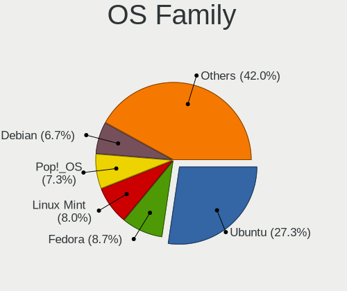
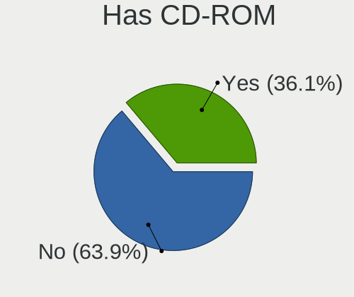
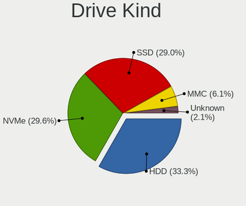
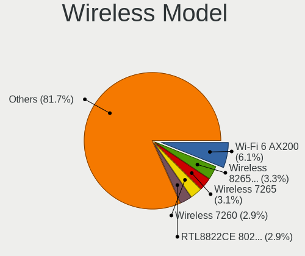

Linux in USA - Tested Hardware & Statistics
-------------------------------------------

A project to collect tested hardware configurations for Linux in USA.

Anyone can contribute to this report by the [hw-probe](https://github.com/linuxhw/hw-probe) tool:

    sudo -E hw-probe -all -upload

Please contribute! Especially if your hardware is rare.

This is a report for all computer types. See also reports for [desktops](/Location/USA/Desktop/README.md) and [notebooks](/Location/USA/Notebook/README.md).

Contents
--------

* [ Test Cases ](#test-cases)

* [ System ](#system)
  - [ OS                       ](#os)
  - [ OS Family                ](#os-family)
  - [ Kernel                   ](#kernel)
  - [ Kernel Family            ](#kernel-family)
  - [ Kernel Major Ver.        ](#kernel-major-ver)
  - [ Arch                     ](#arch)
  - [ DE                       ](#de)
  - [ Display Server           ](#display-server)
  - [ Display Manager          ](#display-manager)
  - [ OS Lang                  ](#os-lang)
  - [ Boot Mode                ](#boot-mode)
  - [ Filesystem               ](#filesystem)
  - [ Part. scheme             ](#part-scheme)
  - [ Dual Boot with Linux/BSD ](#dual-boot-with-linuxbsd)
  - [ Dual Boot (Win)          ](#dual-boot-win)

* [ Board ](#board)
  - [ Vendor                   ](#vendor)
  - [ Model                    ](#model)
  - [ Model Family             ](#model-family)
  - [ MFG Year                 ](#mfg-year)
  - [ Form Factor              ](#form-factor)
  - [ Secure Boot              ](#secure-boot)
  - [ Coreboot                 ](#coreboot)
  - [ RAM Size                 ](#ram-size)
  - [ RAM Used                 ](#ram-used)
  - [ Total Drives             ](#total-drives)
  - [ Has CD-ROM               ](#has-cd-rom)
  - [ Has Ethernet             ](#has-ethernet)
  - [ Has WiFi                 ](#has-wifi)
  - [ Has Bluetooth            ](#has-bluetooth)

* [ Location ](#location)
  - [ Country                  ](#country)
  - [ City                     ](#city)

* [ Drives ](#drives)
  - [ Drive Vendor             ](#drive-vendor)
  - [ Drive Model              ](#drive-model)
  - [ HDD Vendor               ](#hdd-vendor)
  - [ SSD Vendor               ](#ssd-vendor)
  - [ Drive Kind               ](#drive-kind)
  - [ Drive Connector          ](#drive-connector)
  - [ Drive Size               ](#drive-size)
  - [ Space Total              ](#space-total)
  - [ Space Used               ](#space-used)
  - [ Malfunc. Drives          ](#malfunc-drives)
  - [ Malfunc. Drive Vendor    ](#malfunc-drive-vendor)
  - [ Malfunc. HDD Vendor      ](#malfunc-hdd-vendor)
  - [ Malfunc. Drive Kind      ](#malfunc-drive-kind)
  - [ Failed Drives            ](#failed-drives)
  - [ Failed Drive Vendor      ](#failed-drive-vendor)
  - [ Drive Status             ](#drive-status)

* [ Storage controller ](#storage-controller)
  - [ Storage Vendor           ](#storage-vendor)
  - [ Storage Model            ](#storage-model)
  - [ Storage Kind             ](#storage-kind)

* [ Processor ](#processor)
  - [ CPU Vendor               ](#cpu-vendor)
  - [ CPU Model                ](#cpu-model)
  - [ CPU Model Family         ](#cpu-model-family)
  - [ CPU Cores                ](#cpu-cores)
  - [ CPU Sockets              ](#cpu-sockets)
  - [ CPU Threads              ](#cpu-threads)
  - [ CPU Op-Modes             ](#cpu-op-modes)
  - [ CPU Microcode            ](#cpu-microcode)
  - [ CPU Microarch            ](#cpu-microarch)

* [ Graphics ](#graphics)
  - [ GPU Vendor               ](#gpu-vendor)
  - [ GPU Model                ](#gpu-model)
  - [ GPU Combo                ](#gpu-combo)
  - [ GPU Driver               ](#gpu-driver)
  - [ GPU Memory               ](#gpu-memory)

* [ Monitor ](#monitor)
  - [ Monitor Vendor           ](#monitor-vendor)
  - [ Monitor Model            ](#monitor-model)
  - [ Monitor Resolution       ](#monitor-resolution)
  - [ Monitor Diagonal         ](#monitor-diagonal)
  - [ Monitor Width            ](#monitor-width)
  - [ Aspect Ratio             ](#aspect-ratio)
  - [ Monitor Area             ](#monitor-area)
  - [ Pixel Density            ](#pixel-density)
  - [ Multiple Monitors        ](#multiple-monitors)

* [ Network ](#network)
  - [ Net Controller Vendor    ](#net-controller-vendor)
  - [ Net Controller Model     ](#net-controller-model)
  - [ Wireless Vendor          ](#wireless-vendor)
  - [ Wireless Model           ](#wireless-model)
  - [ Ethernet Vendor          ](#ethernet-vendor)
  - [ Ethernet Model           ](#ethernet-model)
  - [ Net Controller Kind      ](#net-controller-kind)
  - [ Used Controller          ](#used-controller)
  - [ NICs                     ](#nics)
  - [ IPv6                     ](#ipv6)

* [ Bluetooth ](#bluetooth)
  - [ Bluetooth Vendor         ](#bluetooth-vendor)
  - [ Bluetooth Model          ](#bluetooth-model)

* [ Sound ](#sound)
  - [ Sound Vendor             ](#sound-vendor)
  - [ Sound Model              ](#sound-model)

* [ Memory ](#memory)
  - [ Memory Vendor            ](#memory-vendor)
  - [ Memory Model             ](#memory-model)
  - [ Memory Kind              ](#memory-kind)
  - [ Memory Form Factor       ](#memory-form-factor)
  - [ Memory Size              ](#memory-size)
  - [ Memory Speed             ](#memory-speed)

* [ Printers & scanners ](#printers--scanners)
  - [ Printer Vendor           ](#printer-vendor)
  - [ Printer Model            ](#printer-model)
  - [ Scanner Vendor           ](#scanner-vendor)
  - [ Scanner Model            ](#scanner-model)

* [ Camera ](#camera)
  - [ Camera Vendor            ](#camera-vendor)
  - [ Camera Model             ](#camera-model)

* [ Security ](#security)
  - [ Fingerprint Vendor       ](#fingerprint-vendor)
  - [ Fingerprint Model        ](#fingerprint-model)
  - [ Chipcard Vendor          ](#chipcard-vendor)
  - [ Chipcard Model           ](#chipcard-model)

* [ Unsupported ](#unsupported)
  - [ Unsupported Devices      ](#unsupported-devices)
  - [ Unsupported Device Types ](#unsupported-device-types)

Test Cases
----------

Total: 52446

| Vendor        | Model                       | Form-Factor | Probe                                                      | Date         |
|---------------|-----------------------------|-------------|------------------------------------------------------------|--------------|
| AZW           | SER V1.0                    | Mini pc     | [e374cc3341](https://linux-hardware.org/?probe=e374cc3341) | Aug 12, 2023 |
| Acer          | Swift SF314-512             | Notebook    | [7158f3e437](https://linux-hardware.org/?probe=7158f3e437) | Aug 12, 2023 |
| ASUSTek       | CM1630                      | Desktop     | [dfd52e2852](https://linux-hardware.org/?probe=dfd52e2852) | Aug 12, 2023 |
| Dell          | Inspiron 13 5310            | Notebook    | [d42fa686e5](https://linux-hardware.org/?probe=d42fa686e5) | Aug 12, 2023 |
| Dell          | Inspiron 13 5310            | Notebook    | [45509c2727](https://linux-hardware.org/?probe=45509c2727) | Aug 12, 2023 |
| Valve         | Jupiter                     | Notebook    | [dbb797aa33](https://linux-hardware.org/?probe=dbb797aa33) | Aug 12, 2023 |
| Gigabyte      | Z390 AORUS PRO WIFI-CF      | Desktop     | [7298d533c9](https://linux-hardware.org/?probe=7298d533c9) | Aug 12, 2023 |
| Gigabyte      | Z390 AORUS PRO WIFI-CF      | Desktop     | [13e0e622f3](https://linux-hardware.org/?probe=13e0e622f3) | Aug 12, 2023 |
| ASUSTek       | TP410UA                     | Convertible | [b2acf53271](https://linux-hardware.org/?probe=b2acf53271) | Aug 12, 2023 |
| Apple         | Mac-F2268DAE                | All in one  | [cec4c72ebb](https://linux-hardware.org/?probe=cec4c72ebb) | Aug 12, 2023 |
| HP            | 1589                        | Desktop     | [1a38154020](https://linux-hardware.org/?probe=1a38154020) | Aug 12, 2023 |
| ASUSTek       | TP410UA                     | Convertible | [cb455d1334](https://linux-hardware.org/?probe=cb455d1334) | Aug 12, 2023 |
| Apple         | MacBookPro6,2               | Notebook    | [7c62a05800](https://linux-hardware.org/?probe=7c62a05800) | Aug 12, 2023 |
| ASUSTek       | CM1630                      | Desktop     | [d8f56bcdaf](https://linux-hardware.org/?probe=d8f56bcdaf) | Aug 12, 2023 |
| Intel         | B85 V5.56                   | Desktop     | [7fb2d45505](https://linux-hardware.org/?probe=7fb2d45505) | Aug 12, 2023 |
| Dell          | 05YDCW A01                  | Desktop     | [3f3195be63](https://linux-hardware.org/?probe=3f3195be63) | Aug 12, 2023 |
| Valve         | Jupiter                     | Notebook    | [3f6cd697d5](https://linux-hardware.org/?probe=3f6cd697d5) | Aug 12, 2023 |
| Dell          | 05YDCW A01                  | Desktop     | [80c27f0ac1](https://linux-hardware.org/?probe=80c27f0ac1) | Aug 12, 2023 |
| Supermicro    | H12SSL-i                    | Server      | [0b7f8d13d9](https://linux-hardware.org/?probe=0b7f8d13d9) | Aug 12, 2023 |
| ASRockRack    | B650D4U-2L2T/BCM            | Server      | [8a896a42c0](https://linux-hardware.org/?probe=8a896a42c0) | Aug 12, 2023 |
| ASUSTek       | PRIME Z590-P WIFI           | Desktop     | [073d2bb6a7](https://linux-hardware.org/?probe=073d2bb6a7) | Aug 12, 2023 |
| Apple         | Mac-F2268DAE                | All in one  | [97c78c17bd](https://linux-hardware.org/?probe=97c78c17bd) | Aug 12, 2023 |
| Gigabyte      | F2A88XN-WIFI                | Desktop     | [8ba1a47cc3](https://linux-hardware.org/?probe=8ba1a47cc3) | Aug 12, 2023 |
| Gigabyte      | F2A88XN-WIFI                | Desktop     | [adb95a05c5](https://linux-hardware.org/?probe=adb95a05c5) | Aug 12, 2023 |
| ASUSTek       | ROG STRIX B550-F GAMING ... | Desktop     | [580fda2e6b](https://linux-hardware.org/?probe=580fda2e6b) | Aug 12, 2023 |
| Dell          | 0Y2MRG A00                  | Desktop     | [04ce264a3e](https://linux-hardware.org/?probe=04ce264a3e) | Aug 12, 2023 |
| HP            | ProLiant ML350 G5           | Desktop     | [e9e8c3e5a7](https://linux-hardware.org/?probe=e9e8c3e5a7) | Aug 12, 2023 |
| Lenovo        | ThinkPad X1 Carbon 6th 2... | Notebook    | [53c81d6d36](https://linux-hardware.org/?probe=53c81d6d36) | Aug 12, 2023 |
| Toshiba       | Satellite C55-A             | Notebook    | [d1bf5ba3c3](https://linux-hardware.org/?probe=d1bf5ba3c3) | Aug 12, 2023 |
| HP            | Pavilion g7                 | Notebook    | [325b804863](https://linux-hardware.org/?probe=325b804863) | Aug 12, 2023 |
| Dell          | 0HD5W2 A01                  | Desktop     | [be4514c366](https://linux-hardware.org/?probe=be4514c366) | Aug 12, 2023 |
| Biostar       | A770 A2+                    | Desktop     | [d35bac0620](https://linux-hardware.org/?probe=d35bac0620) | Aug 12, 2023 |
| Biostar       | A770 A2+                    | Desktop     | [fb7d0009fd](https://linux-hardware.org/?probe=fb7d0009fd) | Aug 12, 2023 |
| Alienware     | 0N43JM A01                  | Desktop     | [74cc9030a1](https://linux-hardware.org/?probe=74cc9030a1) | Aug 12, 2023 |
| ZOTAC         | ZBOXNANO-ID67/ID68/ID69     | Mini pc     | [169c6d3b85](https://linux-hardware.org/?probe=169c6d3b85) | Aug 12, 2023 |
| HP            | Laptop 15-dy2xxx            | Notebook    | [bc66f59ac5](https://linux-hardware.org/?probe=bc66f59ac5) | Aug 12, 2023 |
| AZW           | SER V1.0                    | Mini pc     | [8193c225e5](https://linux-hardware.org/?probe=8193c225e5) | Aug 11, 2023 |
| Dell          | 0XKD8M A00                  | All in one  | [6cbd6d691c](https://linux-hardware.org/?probe=6cbd6d691c) | Aug 11, 2023 |
| Lenovo        | Yoga 7 16ARP8 83BS          | Convertible | [5712d7b72d](https://linux-hardware.org/?probe=5712d7b72d) | Aug 11, 2023 |
| HP            | Laptop 14-dq1xxx            | Notebook    | [6f5a32d65f](https://linux-hardware.org/?probe=6f5a32d65f) | Aug 11, 2023 |
| Intel         | B85 V5.56                   | Desktop     | [f278787ab5](https://linux-hardware.org/?probe=f278787ab5) | Aug 11, 2023 |
| ASUSTek       | PRIME B550-PLUS             | Desktop     | [76078461ae](https://linux-hardware.org/?probe=76078461ae) | Aug 11, 2023 |
| Dell          | Latitude E6430              | Notebook    | [79f523548b](https://linux-hardware.org/?probe=79f523548b) | Aug 11, 2023 |
| Unknown       | Unknown                     | Notebook    | [b68d99fd89](https://linux-hardware.org/?probe=b68d99fd89) | Aug 11, 2023 |
| Dell          | Latitude E6430              | Notebook    | [fd3c9b15f8](https://linux-hardware.org/?probe=fd3c9b15f8) | Aug 11, 2023 |
| Gigabyte      | X570 I AORUS PRO WIFI       | Desktop     | [2a218f5ead](https://linux-hardware.org/?probe=2a218f5ead) | Aug 11, 2023 |
| Gigabyte      | B365 HD3                    | Desktop     | [e2ebf1941c](https://linux-hardware.org/?probe=e2ebf1941c) | Aug 11, 2023 |
| ASRock        | J4125B-ITX                  | Desktop     | [fa9ebd523f](https://linux-hardware.org/?probe=fa9ebd523f) | Aug 11, 2023 |
| Valve         | Jupiter                     | Notebook    | [dad1808c0d](https://linux-hardware.org/?probe=dad1808c0d) | Aug 11, 2023 |
| Gigabyte      | Z77-D3H                     | Desktop     | [e71fc09944](https://linux-hardware.org/?probe=e71fc09944) | Aug 11, 2023 |
| HP            | ProBook 4540s               | Notebook    | [4d9da5367a](https://linux-hardware.org/?probe=4d9da5367a) | Aug 11, 2023 |
| HP            | 158A                        | Desktop     | [96e7fa3b8f](https://linux-hardware.org/?probe=96e7fa3b8f) | Aug 11, 2023 |
| HP            | Pavilion dv6                | Notebook    | [1689b3fd44](https://linux-hardware.org/?probe=1689b3fd44) | Aug 11, 2023 |
| AZW           | SER V01                     | Mini pc     | [542d8da36c](https://linux-hardware.org/?probe=542d8da36c) | Aug 11, 2023 |
| HP            | 8619                        | Desktop     | [00c3a60e4c](https://linux-hardware.org/?probe=00c3a60e4c) | Aug 11, 2023 |
| HP            | x360 310 G2 PC              | Convertible | [a60b6f6ca2](https://linux-hardware.org/?probe=a60b6f6ca2) | Aug 11, 2023 |
| Supermicro    | H12SSL-i                    | Server      | [b7245ccb6f](https://linux-hardware.org/?probe=b7245ccb6f) | Aug 11, 2023 |
| Google        | Epaulette                   | Notebook    | [1923498758](https://linux-hardware.org/?probe=1923498758) | Aug 11, 2023 |
| Dell          | XPS 15 9560                 | Notebook    | [471e3c5077](https://linux-hardware.org/?probe=471e3c5077) | Aug 11, 2023 |
| ASRockRack    | B650D4U-2L2T/BCM            | Server      | [cff9e815b3](https://linux-hardware.org/?probe=cff9e815b3) | Aug 11, 2023 |
| ASRock        | B650M-HDV/M.2               | Desktop     | [ffd395aee0](https://linux-hardware.org/?probe=ffd395aee0) | Aug 11, 2023 |
| MSI           | MS-7380                     | Desktop     | [584074ca03](https://linux-hardware.org/?probe=584074ca03) | Aug 11, 2023 |
| ASUSTek       | ROG CROSSHAIR X670E GENE    | Desktop     | [f016fa3756](https://linux-hardware.org/?probe=f016fa3756) | Aug 11, 2023 |
| Lenovo        | ThinkPad T480s 20L70028U... | Notebook    | [8b2a34a407](https://linux-hardware.org/?probe=8b2a34a407) | Aug 11, 2023 |
| Dell          | 06X1TJ A00                  | Desktop     | [91ecb8253e](https://linux-hardware.org/?probe=91ecb8253e) | Aug 11, 2023 |
| ASUSTek       | ROG Zephyrus G14 GA401QM... | Notebook    | [e22f71b79d](https://linux-hardware.org/?probe=e22f71b79d) | Aug 11, 2023 |
| Alienware     | Area-51 R2                  | Desktop     | [07a6f57292](https://linux-hardware.org/?probe=07a6f57292) | Aug 11, 2023 |
| Gigabyte      | B650 AORUS PRO AX           | Desktop     | [5cbfb27db2](https://linux-hardware.org/?probe=5cbfb27db2) | Aug 11, 2023 |
| Lenovo        | IdeaPad S340-15IIL 81VW     | Notebook    | [48a0f64b34](https://linux-hardware.org/?probe=48a0f64b34) | Aug 11, 2023 |
| Gigabyte      | B650 AORUS PRO AX           | Desktop     | [72b375ad38](https://linux-hardware.org/?probe=72b375ad38) | Aug 11, 2023 |
| Intel         | NUC8v5PNB K59997-403        | Mini pc     | [24a49fba6d](https://linux-hardware.org/?probe=24a49fba6d) | Aug 11, 2023 |
| Dell          | Precision 5530              | Notebook    | [f74dac5dcf](https://linux-hardware.org/?probe=f74dac5dcf) | Aug 11, 2023 |
| ASRock        | Z97 Killer                  | Desktop     | [f055a15ccb](https://linux-hardware.org/?probe=f055a15ccb) | Aug 11, 2023 |
| ASUSTek       | P8P67 PRO                   | Desktop     | [c0d6900ba3](https://linux-hardware.org/?probe=c0d6900ba3) | Aug 10, 2023 |
| ASUSTek       | PRIME B550M-A               | Desktop     | [7da6954bc5](https://linux-hardware.org/?probe=7da6954bc5) | Aug 10, 2023 |
| Lenovo        | ThinkPad P53s 20N6S00B00    | Notebook    | [c76e31ff8e](https://linux-hardware.org/?probe=c76e31ff8e) | Aug 10, 2023 |
| Lenovo        | ThinkStation S30 056848U    | Desktop     | [e6bc23d815](https://linux-hardware.org/?probe=e6bc23d815) | Aug 10, 2023 |
| Lenovo        | ThinkPad E14 20RA0076US     | Notebook    | [ab98272b50](https://linux-hardware.org/?probe=ab98272b50) | Aug 10, 2023 |
| Lenovo        | ThinkPad X220 4291SEN       | Notebook    | [b62026890a](https://linux-hardware.org/?probe=b62026890a) | Aug 10, 2023 |
| HP            | 2215                        | Desktop     | [40ace58487](https://linux-hardware.org/?probe=40ace58487) | Aug 10, 2023 |
| AZW           | GTR V01                     | Mini pc     | [8b0b0e8cc4](https://linux-hardware.org/?probe=8b0b0e8cc4) | Aug 10, 2023 |
| Dell          | 0M5DCD A00                  | Desktop     | [6f8ca5724f](https://linux-hardware.org/?probe=6f8ca5724f) | Aug 10, 2023 |
| Acer          | Swift SF314-512             | Notebook    | [e168ac1e62](https://linux-hardware.org/?probe=e168ac1e62) | Aug 10, 2023 |
| Gigabyte      | X570S AERO G                | Desktop     | [22916d4c12](https://linux-hardware.org/?probe=22916d4c12) | Aug 10, 2023 |
| Dell          | 04YP6J A02                  | Desktop     | [5d5ce952b3](https://linux-hardware.org/?probe=5d5ce952b3) | Aug 10, 2023 |
| Dell          | XPS 13 9365                 | Convertible | [a2756bd55e](https://linux-hardware.org/?probe=a2756bd55e) | Aug 10, 2023 |
| HP            | Laptop 14-dq1xxx            | Notebook    | [68fff65eee](https://linux-hardware.org/?probe=68fff65eee) | Aug 10, 2023 |
| Gigabyte      | Z390 AORUS PRO WIFI-CF      | Desktop     | [307c7bbe9c](https://linux-hardware.org/?probe=307c7bbe9c) | Aug 10, 2023 |
| Lenovo        | ThinkPad T420 4180X06       | Notebook    | [77e54b4b97](https://linux-hardware.org/?probe=77e54b4b97) | Aug 10, 2023 |
| ASRock        | B550 Phantom Gaming-ITX/... | Desktop     | [d490bb32ec](https://linux-hardware.org/?probe=d490bb32ec) | Aug 10, 2023 |
| HP            | Laptop 14-dq1xxx            | Notebook    | [81a2d0415e](https://linux-hardware.org/?probe=81a2d0415e) | Aug 10, 2023 |
| AMI           | T3 MRD                      | Desktop     | [7a77a54bfd](https://linux-hardware.org/?probe=7a77a54bfd) | Aug 10, 2023 |
| Apple         | MacBookPro5,1               | Notebook    | [23fc9401d3](https://linux-hardware.org/?probe=23fc9401d3) | Aug 10, 2023 |
| HP            | 829A                        | Mini pc     | [ae08c868cf](https://linux-hardware.org/?probe=ae08c868cf) | Aug 10, 2023 |
| Google        | Kindred                     | Notebook    | [a45439e295](https://linux-hardware.org/?probe=a45439e295) | Aug 10, 2023 |
| HP            | 8433 11                     | Desktop     | [de06cea570](https://linux-hardware.org/?probe=de06cea570) | Aug 10, 2023 |
| HP            | 8433 11                     | Desktop     | [4275d43a74](https://linux-hardware.org/?probe=4275d43a74) | Aug 10, 2023 |
| ASRock        | B450M-HDV R4.0              | Desktop     | [ab3503021a](https://linux-hardware.org/?probe=ab3503021a) | Aug 10, 2023 |
| Gigabyte      | AB350-Gaming 3-CF           | Desktop     | [c2b7b4e760](https://linux-hardware.org/?probe=c2b7b4e760) | Aug 10, 2023 |
| ASUSTek       | ROG Maximus XII EXTREME     | Desktop     | [a0350a164c](https://linux-hardware.org/?probe=a0350a164c) | Aug 10, 2023 |
| ASRock        | B550 Phantom Gaming-ITX/... | Desktop     | [fffee60e72](https://linux-hardware.org/?probe=fffee60e72) | Aug 10, 2023 |
| Valve         | Jupiter                     | Notebook    | [d88c707cfc](https://linux-hardware.org/?probe=d88c707cfc) | Aug 10, 2023 |
| Lenovo        | ThinkPad T420 4180X06       | Notebook    | [ba950eb9e1](https://linux-hardware.org/?probe=ba950eb9e1) | Aug 10, 2023 |
| ASUSTek       | ROG Zephyrus Duo 16 GX65... | Notebook    | [45c782fc7e](https://linux-hardware.org/?probe=45c782fc7e) | Aug 10, 2023 |
| ASUSTek       | PRIME X670-P WIFI           | Desktop     | [19d251df2c](https://linux-hardware.org/?probe=19d251df2c) | Aug 10, 2023 |
| Lenovo        | ThinkPad T410 25372E6       | Notebook    | [69c4723b51](https://linux-hardware.org/?probe=69c4723b51) | Aug 10, 2023 |
| Lenovo        | ThinkPad T480 20L6S29D00    | Notebook    | [a728658683](https://linux-hardware.org/?probe=a728658683) | Aug 10, 2023 |
| ASRock        | B365 Pro4                   | Desktop     | [45da50b5c8](https://linux-hardware.org/?probe=45da50b5c8) | Aug 10, 2023 |
| Intel         | DZ68BC AAG30742-401         | Desktop     | [9bf37df045](https://linux-hardware.org/?probe=9bf37df045) | Aug 10, 2023 |
| ASRock        | B365 Pro4                   | Desktop     | [03cb2690f7](https://linux-hardware.org/?probe=03cb2690f7) | Aug 10, 2023 |
| Acer          | Nitro AN517-55              | Notebook    | [b77ff095f8](https://linux-hardware.org/?probe=b77ff095f8) | Aug 09, 2023 |
| MSI           | 970 GAMING                  | Desktop     | [a499728742](https://linux-hardware.org/?probe=a499728742) | Aug 09, 2023 |
| HP            | EliteBook 840 G6            | Notebook    | [767792bf33](https://linux-hardware.org/?probe=767792bf33) | Aug 09, 2023 |
| ASUSTek       | ZenBook UX534FTC_UX534FT    | Notebook    | [26b98e8740](https://linux-hardware.org/?probe=26b98e8740) | Aug 09, 2023 |
| Intel         | DZ77SL-50K AAG55115-300     | Desktop     | [0ca6c48c2f](https://linux-hardware.org/?probe=0ca6c48c2f) | Aug 09, 2023 |
| Hardkernel    | ODROID-N2Plus               | Soc         | [e76c695348](https://linux-hardware.org/?probe=e76c695348) | Aug 09, 2023 |
| Dell          | Latitude E6420              | Notebook    | [1aaa4997d4](https://linux-hardware.org/?probe=1aaa4997d4) | Aug 09, 2023 |
| Dell          | 06FW8M A06                  | Server      | [aa643edf66](https://linux-hardware.org/?probe=aa643edf66) | Aug 09, 2023 |
| MSI           | X370 GAMING M7 ACK          | Desktop     | [00bb870b78](https://linux-hardware.org/?probe=00bb870b78) | Aug 09, 2023 |
| Lenovo        | ThinkPad T430 2347AT2       | Notebook    | [a874870955](https://linux-hardware.org/?probe=a874870955) | Aug 09, 2023 |
| Apple         | MacBookPro15,4              | Notebook    | [f63c9ffab9](https://linux-hardware.org/?probe=f63c9ffab9) | Aug 09, 2023 |
| Gigabyte      | AB350-Gaming-CF             | Desktop     | [466419add0](https://linux-hardware.org/?probe=466419add0) | Aug 09, 2023 |
| ASRock        | X670E Pro RS                | Desktop     | [baa9e459cc](https://linux-hardware.org/?probe=baa9e459cc) | Aug 09, 2023 |
| Valve         | Jupiter                     | Notebook    | [613dc3eb7d](https://linux-hardware.org/?probe=613dc3eb7d) | Aug 09, 2023 |
| Lenovo        | SDK0E50510 WIN 262508147... | Desktop     | [badd1c22ff](https://linux-hardware.org/?probe=badd1c22ff) | Aug 09, 2023 |
| ASUSTek       | ZenBook UX534FTC_UX534FT    | Notebook    | [68eb21c824](https://linux-hardware.org/?probe=68eb21c824) | Aug 09, 2023 |
| Lenovo        | SDK0E50510 WIN 262508147... | Desktop     | [f74262edcd](https://linux-hardware.org/?probe=f74262edcd) | Aug 09, 2023 |
| Dell          | 0WMJ54 A01                  | Desktop     | [6e9ca3c833](https://linux-hardware.org/?probe=6e9ca3c833) | Aug 09, 2023 |
| Lenovo        | ThinkPad X1 Yoga Gen 6 2... | Convertible | [bb7891de93](https://linux-hardware.org/?probe=bb7891de93) | Aug 09, 2023 |
| Dell          | Latitude E6520              | Notebook    | [cb79d1e17c](https://linux-hardware.org/?probe=cb79d1e17c) | Aug 09, 2023 |
| Dell          | Latitude E6520              | Notebook    | [4516b9b475](https://linux-hardware.org/?probe=4516b9b475) | Aug 09, 2023 |
| HP            | 2000                        | Notebook    | [fa62a90143](https://linux-hardware.org/?probe=fa62a90143) | Aug 09, 2023 |
| MSI           | 970 GAMING                  | Desktop     | [4751920c96](https://linux-hardware.org/?probe=4751920c96) | Aug 09, 2023 |
| Apple         | Mac-F2218EC8                | All in one  | [98f60f5453](https://linux-hardware.org/?probe=98f60f5453) | Aug 09, 2023 |
| Dell          | 073Y7Y A00                  | Desktop     | [cbf4153713](https://linux-hardware.org/?probe=cbf4153713) | Aug 09, 2023 |
| ASUSTek       | ROG Zephyrus G15 GA503RM... | Notebook    | [5a4c9f0e5a](https://linux-hardware.org/?probe=5a4c9f0e5a) | Aug 09, 2023 |
| Gigabyte      | F2A88X-D3H                  | Desktop     | [7b0c19a9a2](https://linux-hardware.org/?probe=7b0c19a9a2) | Aug 09, 2023 |
| HP            | Notebook                    | Notebook    | [bac7155006](https://linux-hardware.org/?probe=bac7155006) | Aug 09, 2023 |
| HP            | Laptop 15-bw0xx             | Notebook    | [f23d951287](https://linux-hardware.org/?probe=f23d951287) | Aug 09, 2023 |
| HP            | Laptop 15-bw0xx             | Notebook    | [ff36238822](https://linux-hardware.org/?probe=ff36238822) | Aug 09, 2023 |
| Dell          | Inspiron 15-7568            | Notebook    | [745ebb5475](https://linux-hardware.org/?probe=745ebb5475) | Aug 09, 2023 |
| Gigabyte      | F2A88X-D3H                  | Desktop     | [f0d580edb4](https://linux-hardware.org/?probe=f0d580edb4) | Aug 09, 2023 |
| Apple         | MacBookAir4,1               | Notebook    | [05b5124d92](https://linux-hardware.org/?probe=05b5124d92) | Aug 09, 2023 |
| Gigabyte      | X399 AORUS PRO-CF           | Desktop     | [3ecd6d3f74](https://linux-hardware.org/?probe=3ecd6d3f74) | Aug 09, 2023 |
| HP            | EliteBook 850 G3            | Notebook    | [04a319c904](https://linux-hardware.org/?probe=04a319c904) | Aug 09, 2023 |
| Toshiba       | Satellite C55-C             | Notebook    | [199924c140](https://linux-hardware.org/?probe=199924c140) | Aug 09, 2023 |
| HP            | ENVY Laptop 17-ch0xxx       | Notebook    | [01fe285324](https://linux-hardware.org/?probe=01fe285324) | Aug 09, 2023 |
| Gateway       | SX2865                      | Desktop     | [f3655d0539](https://linux-hardware.org/?probe=f3655d0539) | Aug 09, 2023 |
| Apple         | Mac-77EB7D7DAF985301 iMa... | All in one  | [b280ab65dd](https://linux-hardware.org/?probe=b280ab65dd) | Aug 09, 2023 |
| Toshiba       | Satellite C55-C             | Notebook    | [324b952d6b](https://linux-hardware.org/?probe=324b952d6b) | Aug 09, 2023 |
| HP            | Laptop 14-dk1xxx            | Notebook    | [7c59be984f](https://linux-hardware.org/?probe=7c59be984f) | Aug 09, 2023 |
| Dell          | Latitude 7320               | Notebook    | [6db1867722](https://linux-hardware.org/?probe=6db1867722) | Aug 09, 2023 |
| HP            | Victus by 15.6 inch Gami... | Notebook    | [67f88ab571](https://linux-hardware.org/?probe=67f88ab571) | Aug 08, 2023 |
| MSI           | MAG B760 TOMAHAWK WIFI      | Desktop     | [64fbeeca5e](https://linux-hardware.org/?probe=64fbeeca5e) | Aug 08, 2023 |
| Lenovo        | ThinkPad X1 Carbon 4th 2... | Notebook    | [72655a5d65](https://linux-hardware.org/?probe=72655a5d65) | Aug 08, 2023 |
| HP            | ZBook 15 G2                 | Notebook    | [cb340460b6](https://linux-hardware.org/?probe=cb340460b6) | Aug 08, 2023 |
| Dell          | Inspiron 5482               | Convertible | [7e2aa092cf](https://linux-hardware.org/?probe=7e2aa092cf) | Aug 08, 2023 |
| MSI           | MPG B550 GAMING PLUS        | Desktop     | [d073a53c85](https://linux-hardware.org/?probe=d073a53c85) | Aug 08, 2023 |
| Lenovo        | ThinkPad X220 4290C37       | Notebook    | [125ac0cbd3](https://linux-hardware.org/?probe=125ac0cbd3) | Aug 08, 2023 |
| ASUSTek       | Zenbook Pro Duo UX582ZW_... | Notebook    | [afa081b440](https://linux-hardware.org/?probe=afa081b440) | Aug 08, 2023 |
| HP            | ENVY Laptop 16-h1xxx        | Notebook    | [101c521941](https://linux-hardware.org/?probe=101c521941) | Aug 08, 2023 |
| Lenovo        | ThinkPad X1 Yoga Gen 6 2... | Convertible | [c86462ba1b](https://linux-hardware.org/?probe=c86462ba1b) | Aug 08, 2023 |
| Dell          | 0P301D A00                  | Desktop     | [e5091194fb](https://linux-hardware.org/?probe=e5091194fb) | Aug 08, 2023 |
| MSI           | MAG B550 TOMAHAWK           | Desktop     | [b76b1bf00a](https://linux-hardware.org/?probe=b76b1bf00a) | Aug 08, 2023 |
| MSI           | MAG B550 TOMAHAWK           | Desktop     | [63665fca24](https://linux-hardware.org/?probe=63665fca24) | Aug 08, 2023 |
| Lenovo        | ThinkPad T480s 20L70028U... | Notebook    | [324819c88d](https://linux-hardware.org/?probe=324819c88d) | Aug 08, 2023 |
| Apple         | MacBookPro10,1              | Notebook    | [00b169d241](https://linux-hardware.org/?probe=00b169d241) | Aug 08, 2023 |
| Dell          | Inspiron 5759               | Notebook    | [d79ab70370](https://linux-hardware.org/?probe=d79ab70370) | Aug 08, 2023 |
| Valve         | Jupiter                     | Notebook    | [ff196a6c3d](https://linux-hardware.org/?probe=ff196a6c3d) | Aug 08, 2023 |
| HP            | 2129                        | Desktop     | [f005bdb494](https://linux-hardware.org/?probe=f005bdb494) | Aug 08, 2023 |
| ASRock        | B550M-ITX/ac                | Desktop     | [c86495f999](https://linux-hardware.org/?probe=c86495f999) | Aug 08, 2023 |
| MSI           | MAG B550M MORTAR            | Desktop     | [6c50235cbc](https://linux-hardware.org/?probe=6c50235cbc) | Aug 08, 2023 |
| MSI           | MAG B550 TOMAHAWK           | Desktop     | [121b892fa8](https://linux-hardware.org/?probe=121b892fa8) | Aug 08, 2023 |
| HP            | Laptop 15-bs0xx             | Notebook    | [2a7e23b825](https://linux-hardware.org/?probe=2a7e23b825) | Aug 08, 2023 |
| HP            | Laptop 17-cn1xxx            | Notebook    | [711a5fc7ce](https://linux-hardware.org/?probe=711a5fc7ce) | Aug 08, 2023 |
| Apple         | MacBookPro10,1              | Notebook    | [5e0c7f7bfc](https://linux-hardware.org/?probe=5e0c7f7bfc) | Aug 08, 2023 |
| HP            | Pavilion x360 Convertibl... | Convertible | [f03a19e65b](https://linux-hardware.org/?probe=f03a19e65b) | Aug 08, 2023 |
| ASRock        | X300M-STX                   | Desktop     | [e642e8e489](https://linux-hardware.org/?probe=e642e8e489) | Aug 08, 2023 |
| MSI           | MAG B550 TOMAHAWK           | Desktop     | [1ad6abed83](https://linux-hardware.org/?probe=1ad6abed83) | Aug 08, 2023 |
| MSI           | B550-A PRO                  | Desktop     | [61c59e48d2](https://linux-hardware.org/?probe=61c59e48d2) | Aug 08, 2023 |
| Apple         | MacBookPro10,1              | Notebook    | [ed97e2ea3e](https://linux-hardware.org/?probe=ed97e2ea3e) | Aug 08, 2023 |
| ASUSTek       | PHOENIX                     | Desktop     | [388bcf4158](https://linux-hardware.org/?probe=388bcf4158) | Aug 08, 2023 |
| Acer          | Aspire A715-75G             | Notebook    | [57f1225daf](https://linux-hardware.org/?probe=57f1225daf) | Aug 08, 2023 |
| Dell          | Inspiron 13-7353            | Notebook    | [0b797c9368](https://linux-hardware.org/?probe=0b797c9368) | Aug 08, 2023 |
| ASUSTek       | TUF Gaming Z590-PLUS WIF... | Desktop     | [58208c1f16](https://linux-hardware.org/?probe=58208c1f16) | Aug 08, 2023 |
| Dell          | Inspiron 5759               | Notebook    | [e5a8c891d0](https://linux-hardware.org/?probe=e5a8c891d0) | Aug 08, 2023 |
| Dell          | XPS L501X                   | Notebook    | [60a937133c](https://linux-hardware.org/?probe=60a937133c) | Aug 08, 2023 |
| Toshiba       | Satellite L875D             | Notebook    | [de1a418102](https://linux-hardware.org/?probe=de1a418102) | Aug 08, 2023 |
| Lenovo        | Legion 5 15ARH7H 82RD       | Notebook    | [1e2412e487](https://linux-hardware.org/?probe=1e2412e487) | Aug 08, 2023 |
| Samsung       | 305E4A/305E5A/305E7A        | Notebook    | [f30c6c7bb5](https://linux-hardware.org/?probe=f30c6c7bb5) | Aug 08, 2023 |
| ASUSTek       | ROG STRIX B450-F GAMING     | Desktop     | [7fe1ce642a](https://linux-hardware.org/?probe=7fe1ce642a) | Aug 08, 2023 |
| Khadas        | Edge2                       | Soc         | [e9c9d4e1d3](https://linux-hardware.org/?probe=e9c9d4e1d3) | Aug 08, 2023 |
| Lenovo        | 3717 SDK0J40700 WIN 3258... | Desktop     | [f7c7290847](https://linux-hardware.org/?probe=f7c7290847) | Aug 08, 2023 |
| Dell          | Latitude E6430              | Notebook    | [313d3616c4](https://linux-hardware.org/?probe=313d3616c4) | Aug 08, 2023 |
| Acer          | Aspire TC-710 V:1.1         | Desktop     | [f6af1382fd](https://linux-hardware.org/?probe=f6af1382fd) | Aug 08, 2023 |
| Dell          | XPS 15 9575                 | Convertible | [695f56bfd8](https://linux-hardware.org/?probe=695f56bfd8) | Aug 08, 2023 |
| Google        | Parrot                      | Notebook    | [a0820a5e0c](https://linux-hardware.org/?probe=a0820a5e0c) | Aug 07, 2023 |
| Google        | Parrot                      | Notebook    | [f03c4efc0b](https://linux-hardware.org/?probe=f03c4efc0b) | Aug 07, 2023 |
| GPU Compan... | GWTN141-10                  | Notebook    | [e03fdd9f60](https://linux-hardware.org/?probe=e03fdd9f60) | Aug 07, 2023 |
| Lenovo        | 3717 SDK0J40700 WIN 3258... | Desktop     | [9a0fa703d7](https://linux-hardware.org/?probe=9a0fa703d7) | Aug 07, 2023 |
| Dell          | Inspiron 13-7353            | Notebook    | [90fbc716ed](https://linux-hardware.org/?probe=90fbc716ed) | Aug 07, 2023 |
| System76      | Serval WS                   | Notebook    | [3cd45493ee](https://linux-hardware.org/?probe=3cd45493ee) | Aug 07, 2023 |
| ASRock        | H610M-ITX/ac                | Desktop     | [205fab2707](https://linux-hardware.org/?probe=205fab2707) | Aug 07, 2023 |
| Dell          | Inspiron 5721               | Notebook    | [99042a3573](https://linux-hardware.org/?probe=99042a3573) | Aug 07, 2023 |
| HP            | 8876 11                     | Desktop     | [059d4c2db2](https://linux-hardware.org/?probe=059d4c2db2) | Aug 07, 2023 |
| HP            | Pavilion Gaming Laptop 1... | Notebook    | [3ec4223487](https://linux-hardware.org/?probe=3ec4223487) | Aug 07, 2023 |
| Dell          | Precision M6500             | Notebook    | [054f8ba242](https://linux-hardware.org/?probe=054f8ba242) | Aug 07, 2023 |
| Microsoft     | Surface Pro 4               | Tablet      | [2fa2ae29cc](https://linux-hardware.org/?probe=2fa2ae29cc) | Aug 07, 2023 |
| Dell          | Latitude 7490               | Notebook    | [e7738263f7](https://linux-hardware.org/?probe=e7738263f7) | Aug 07, 2023 |
| Dell          | Latitude 7490               | Notebook    | [a3b95f2fc2](https://linux-hardware.org/?probe=a3b95f2fc2) | Aug 07, 2023 |
| MSI           | A520M-A PRO                 | Desktop     | [009a1819fa](https://linux-hardware.org/?probe=009a1819fa) | Aug 07, 2023 |
| Microsoft     | Surface Pro 6               | Tablet      | [d9513873ac](https://linux-hardware.org/?probe=d9513873ac) | Aug 07, 2023 |
| Intel         | NUC7i3BNB J22859-314        | Mini pc     | [36410845ea](https://linux-hardware.org/?probe=36410845ea) | Aug 07, 2023 |
| Acer          | Aspire 5734Z                | Notebook    | [158671d9c9](https://linux-hardware.org/?probe=158671d9c9) | Aug 07, 2023 |
| Apple         | MacBookPro11,1              | Notebook    | [0a1b8d0627](https://linux-hardware.org/?probe=0a1b8d0627) | Aug 07, 2023 |
| HP            | 3397                        | Desktop     | [3cf9a90333](https://linux-hardware.org/?probe=3cf9a90333) | Aug 07, 2023 |
| ASUSTek       | ROG CROSSHAIR VIII HERO     | Desktop     | [8c664a454a](https://linux-hardware.org/?probe=8c664a454a) | Aug 07, 2023 |
| HP            | 158A                        | Desktop     | [657812fbbf](https://linux-hardware.org/?probe=657812fbbf) | Aug 07, 2023 |
| HP            | 8055                        | Desktop     | [5124119ce1](https://linux-hardware.org/?probe=5124119ce1) | Aug 07, 2023 |
| HP            | 0B4Ch D                     | Desktop     | [35e4fef6c6](https://linux-hardware.org/?probe=35e4fef6c6) | Aug 07, 2023 |
| Gigabyte      | AB350M-DS3H-CF              | Desktop     | [db512d60d0](https://linux-hardware.org/?probe=db512d60d0) | Aug 07, 2023 |
| Dell          | Inspiron 15 3525            | Notebook    | [36a20bb009](https://linux-hardware.org/?probe=36a20bb009) | Aug 07, 2023 |
| HP            | Pavilion 15                 | Notebook    | [227895bca8](https://linux-hardware.org/?probe=227895bca8) | Aug 07, 2023 |
| Acer          | Predator PT515-51           | Notebook    | [e08b7b4cd8](https://linux-hardware.org/?probe=e08b7b4cd8) | Aug 07, 2023 |
| Gigabyte      | Z390 AORUS PRO WIFI-CF      | Desktop     | [002014034b](https://linux-hardware.org/?probe=002014034b) | Aug 07, 2023 |
| HP            | ProBook 650 G1              | Notebook    | [b02660749d](https://linux-hardware.org/?probe=b02660749d) | Aug 07, 2023 |
| Gigabyte      | Z390 AORUS PRO WIFI-CF      | Desktop     | [fbfc0c60bd](https://linux-hardware.org/?probe=fbfc0c60bd) | Aug 07, 2023 |
| Unknown       | Unknown                     | Soc         | [0fce8d3fbe](https://linux-hardware.org/?probe=0fce8d3fbe) | Aug 07, 2023 |
| ASUSTek       | M5A78L-M/USB3               | Desktop     | [3d4073bb1d](https://linux-hardware.org/?probe=3d4073bb1d) | Aug 07, 2023 |
| ASUSTek       | TUF B450M-PLUS GAMING       | Desktop     | [497623fdfd](https://linux-hardware.org/?probe=497623fdfd) | Aug 07, 2023 |
| HP            | EliteBook 840 G3            | Notebook    | [2e239a5f09](https://linux-hardware.org/?probe=2e239a5f09) | Aug 07, 2023 |
| Dell          | 0M9KCM A02                  | Desktop     | [a854d04706](https://linux-hardware.org/?probe=a854d04706) | Aug 07, 2023 |
| Dell          | 0NW6H5 A00                  | Desktop     | [f8511d64fc](https://linux-hardware.org/?probe=f8511d64fc) | Aug 07, 2023 |
| Samsung       | 930QED                      | Convertible | [815780e992](https://linux-hardware.org/?probe=815780e992) | Aug 07, 2023 |
| MSI           | GP72 7RDX                   | Notebook    | [43eb53850c](https://linux-hardware.org/?probe=43eb53850c) | Aug 06, 2023 |
| Acer          | Aspire A514-54              | Notebook    | [e9dfd6bbb6](https://linux-hardware.org/?probe=e9dfd6bbb6) | Aug 06, 2023 |
| Acer          | Aspire A514-54              | Notebook    | [0a7dc12f31](https://linux-hardware.org/?probe=0a7dc12f31) | Aug 06, 2023 |
| Apple         | MacBookAir6,1               | Notebook    | [acf60b5aa8](https://linux-hardware.org/?probe=acf60b5aa8) | Aug 06, 2023 |
| Valve         | Jupiter                     | Notebook    | [f674ac251e](https://linux-hardware.org/?probe=f674ac251e) | Aug 06, 2023 |
| Lenovo        | ThinkPad X1 Carbon 7th 2... | Notebook    | [b1d5aab527](https://linux-hardware.org/?probe=b1d5aab527) | Aug 06, 2023 |
| Dell          | Latitude 5290 2-in-1        | Notebook    | [62e2743cda](https://linux-hardware.org/?probe=62e2743cda) | Aug 06, 2023 |
| Intel         | NUC5i7RYB H73774-101        | Mini pc     | [0d4b1c489f](https://linux-hardware.org/?probe=0d4b1c489f) | Aug 06, 2023 |
| Dell          | Inspiron 3520               | Notebook    | [eed6ad702b](https://linux-hardware.org/?probe=eed6ad702b) | Aug 06, 2023 |
| Dell          | Inspiron 3520               | Notebook    | [8a3ba73fae](https://linux-hardware.org/?probe=8a3ba73fae) | Aug 06, 2023 |
| Dell          | Inspiron 5482               | Convertible | [9c910c0949](https://linux-hardware.org/?probe=9c910c0949) | Aug 06, 2023 |
| MSI           | GP72 7RDX                   | Notebook    | [6d2bc8aa9e](https://linux-hardware.org/?probe=6d2bc8aa9e) | Aug 06, 2023 |
| Lenovo        | Yoga 730-15IKB 81CU         | Convertible | [572f537532](https://linux-hardware.org/?probe=572f537532) | Aug 06, 2023 |
| MSI           | 2AE0                        | Desktop     | [9d3b59de32](https://linux-hardware.org/?probe=9d3b59de32) | Aug 06, 2023 |
| GPU Compan... | GWNR71517                   | Notebook    | [d754d51977](https://linux-hardware.org/?probe=d754d51977) | Aug 06, 2023 |
| HP            | EliteBook x360 1030 G2      | Convertible | [9fe9cf4748](https://linux-hardware.org/?probe=9fe9cf4748) | Aug 06, 2023 |
| Unknown       | Unknown                     | Notebook    | [66dd893ce8](https://linux-hardware.org/?probe=66dd893ce8) | Aug 06, 2023 |
| Gigabyte      | AB350M-DS3H-CF              | Desktop     | [4a97a86dd8](https://linux-hardware.org/?probe=4a97a86dd8) | Aug 06, 2023 |
| MSI           | 2AE0                        | Desktop     | [2188c95453](https://linux-hardware.org/?probe=2188c95453) | Aug 06, 2023 |
| RCA           | 038-WT9S10WM02              | Notebook    | [61c1a104d2](https://linux-hardware.org/?probe=61c1a104d2) | Aug 06, 2023 |
| Gigabyte      | AB350-Gaming-CF             | Desktop     | [932391bfea](https://linux-hardware.org/?probe=932391bfea) | Aug 06, 2023 |
| RCA           | 038-WT9S10WM02              | Notebook    | [fe15934abe](https://linux-hardware.org/?probe=fe15934abe) | Aug 06, 2023 |
| Intel         | B85 V5.56                   | Desktop     | [9c9e999e7f](https://linux-hardware.org/?probe=9c9e999e7f) | Aug 06, 2023 |
| Intel         | B85 V5.56                   | Desktop     | [54f0bde318](https://linux-hardware.org/?probe=54f0bde318) | Aug 06, 2023 |
| Lenovo        | 1036 NO DPK                 | Desktop     | [d039bb9d5c](https://linux-hardware.org/?probe=d039bb9d5c) | Aug 06, 2023 |
| Gigabyte      | 990FXA-UD3                  | Desktop     | [4b57f7d6ea](https://linux-hardware.org/?probe=4b57f7d6ea) | Aug 06, 2023 |
| GPD           | G1618-03                    | Notebook    | [070d548515](https://linux-hardware.org/?probe=070d548515) | Aug 06, 2023 |
| Dell          | XPS 15 9575                 | Convertible | [4b72b07cd1](https://linux-hardware.org/?probe=4b72b07cd1) | Aug 06, 2023 |
| Acer          | Nitro AN515-57              | Notebook    | [dbb09ef76f](https://linux-hardware.org/?probe=dbb09ef76f) | Aug 06, 2023 |
| Acer          | Nitro AN515-57              | Notebook    | [0aa699dc73](https://linux-hardware.org/?probe=0aa699dc73) | Aug 06, 2023 |
| Lenovo        | ThinkPad T430 2342CTO       | Notebook    | [96dae933b5](https://linux-hardware.org/?probe=96dae933b5) | Aug 06, 2023 |
| MSI           | Z270 TOMAHAWK OPT BOOST     | Desktop     | [6baabbdd21](https://linux-hardware.org/?probe=6baabbdd21) | Aug 06, 2023 |
| HP            | EliteBook 845 G7 Noteboo... | Notebook    | [d00f65f7f0](https://linux-hardware.org/?probe=d00f65f7f0) | Aug 06, 2023 |
| Apple         | MacBookPro9,1               | Notebook    | [65343a7900](https://linux-hardware.org/?probe=65343a7900) | Aug 06, 2023 |
| HP            | EliteBook 845 G7 Noteboo... | Notebook    | [1b7eaa2e00](https://linux-hardware.org/?probe=1b7eaa2e00) | Aug 06, 2023 |
| Dell          | Inspiron 15 3511            | Notebook    | [217bd70a25](https://linux-hardware.org/?probe=217bd70a25) | Aug 06, 2023 |
| ASUSTek       | Zenbook UX562UG_Q508UG      | Convertible | [f75c0469a4](https://linux-hardware.org/?probe=f75c0469a4) | Aug 06, 2023 |
| Apple         | MacBookPro9,2               | Notebook    | [7eb29a371d](https://linux-hardware.org/?probe=7eb29a371d) | Aug 06, 2023 |
| Lenovo        | ThinkPad X1 Extreme 20MF... | Notebook    | [c40308638c](https://linux-hardware.org/?probe=c40308638c) | Aug 05, 2023 |
| Lenovo        | 110536U ThinkServer TS13... | Desktop     | [5084897812](https://linux-hardware.org/?probe=5084897812) | Aug 05, 2023 |
| ASUSTek       | TUF Gaming Z790-PLUS WIF... | Desktop     | [1af709c14e](https://linux-hardware.org/?probe=1af709c14e) | Aug 05, 2023 |
| MSI           | MPG X670E CARBON WIFI       | Desktop     | [01b9adfb02](https://linux-hardware.org/?probe=01b9adfb02) | Aug 05, 2023 |
| Gigabyte      | Z97X-UD5H                   | Desktop     | [3bc330734d](https://linux-hardware.org/?probe=3bc330734d) | Aug 05, 2023 |
| MSI           | MAG B550 TOMAHAWK           | Desktop     | [8add0a69cc](https://linux-hardware.org/?probe=8add0a69cc) | Aug 05, 2023 |
| HP            | Pavilion Laptop 15-cc5xx    | Notebook    | [8baf99b470](https://linux-hardware.org/?probe=8baf99b470) | Aug 05, 2023 |
| ASUSTek       | VivoBook_ASUSLaptop M350... | Notebook    | [c8d1e98a60](https://linux-hardware.org/?probe=c8d1e98a60) | Aug 05, 2023 |
| MSI           | MAG X670E TOMAHAWK WIFI     | Desktop     | [5d998a099e](https://linux-hardware.org/?probe=5d998a099e) | Aug 05, 2023 |
| MSI           | MAG X670E TOMAHAWK WIFI     | Desktop     | [e57d71e056](https://linux-hardware.org/?probe=e57d71e056) | Aug 05, 2023 |
| MSI           | Z490-A PRO                  | Desktop     | [0698c83c6e](https://linux-hardware.org/?probe=0698c83c6e) | Aug 05, 2023 |
| Dell          | Inspiron 15 7000 Gaming     | Notebook    | [21eaf09dc9](https://linux-hardware.org/?probe=21eaf09dc9) | Aug 05, 2023 |
| Apple         | Mac-942B5BF58194151B        | All in one  | [ef5d8ca763](https://linux-hardware.org/?probe=ef5d8ca763) | Aug 05, 2023 |
| MSI           | PRO B550M-VC WIFI           | Desktop     | [f1727289ea](https://linux-hardware.org/?probe=f1727289ea) | Aug 05, 2023 |
| Apple         | Mac-F2218EC8                | All in one  | [0f19ee03a1](https://linux-hardware.org/?probe=0f19ee03a1) | Aug 05, 2023 |
| Dell          | Latitude 5430               | Notebook    | [f63444b0be](https://linux-hardware.org/?probe=f63444b0be) | Aug 05, 2023 |
| ASUSTek       | ROG STRIX X670E-I GAMING... | Desktop     | [40bc2f506a](https://linux-hardware.org/?probe=40bc2f506a) | Aug 05, 2023 |
| ASUSTek       | ProArt StudioBook W5600Q... | Notebook    | [96211a5c87](https://linux-hardware.org/?probe=96211a5c87) | Aug 05, 2023 |
| Acer          | Nitro AN515-54              | Notebook    | [c4d1667ffe](https://linux-hardware.org/?probe=c4d1667ffe) | Aug 05, 2023 |
| Supermicro    | H12SSL-i                    | Server      | [35b274571c](https://linux-hardware.org/?probe=35b274571c) | Aug 05, 2023 |
| Dell          | Inspiron 3520               | Notebook    | [00b2c0458a](https://linux-hardware.org/?probe=00b2c0458a) | Aug 05, 2023 |
| ASRockRack    | B650D4U-2L2T/BCM            | Server      | [92d07e2cae](https://linux-hardware.org/?probe=92d07e2cae) | Aug 05, 2023 |
| Apple         | MacBookPro14,1              | Notebook    | [08f78bf99a](https://linux-hardware.org/?probe=08f78bf99a) | Aug 05, 2023 |
| ALLDOCUBE     | i1502                       | Notebook    | [1ccf0b8f71](https://linux-hardware.org/?probe=1ccf0b8f71) | Aug 05, 2023 |
| HP            | EliteBook 840 G2            | Notebook    | [64810e5a10](https://linux-hardware.org/?probe=64810e5a10) | Aug 05, 2023 |
| ASUSTek       | SABERTOOTH Z77              | Desktop     | [3cc21c9051](https://linux-hardware.org/?probe=3cc21c9051) | Aug 05, 2023 |
| ASUSTek       | PRIME B550M-A               | Desktop     | [364b15d850](https://linux-hardware.org/?probe=364b15d850) | Aug 05, 2023 |
| ASUSTek       | PHOENIX                     | Desktop     | [193262b7ea](https://linux-hardware.org/?probe=193262b7ea) | Aug 05, 2023 |
| Dell          | 0K83V0 A00                  | Desktop     | [e8fbfe7be1](https://linux-hardware.org/?probe=e8fbfe7be1) | Aug 05, 2023 |
| Apple         | Mac-F2218EA9                | All in one  | [bbbbdcdcb6](https://linux-hardware.org/?probe=bbbbdcdcb6) | Aug 05, 2023 |
| Dell          | 07THW3 A00                  | Server      | [2e54c9c025](https://linux-hardware.org/?probe=2e54c9c025) | Aug 04, 2023 |
| HP            | 0B4Ch D                     | Desktop     | [297a14921c](https://linux-hardware.org/?probe=297a14921c) | Aug 04, 2023 |
| System76      | Thelio Major                | Desktop     | [eeea316849](https://linux-hardware.org/?probe=eeea316849) | Aug 04, 2023 |
| Dell          | Latitude 5430 Rugged        | Notebook    | [11a8ce4fba](https://linux-hardware.org/?probe=11a8ce4fba) | Aug 04, 2023 |
| HP            | ZBook Studio G3             | Notebook    | [3f7f45a94e](https://linux-hardware.org/?probe=3f7f45a94e) | Aug 04, 2023 |
| Dell          | 06X1TJ A00                  | Desktop     | [ac23fbd687](https://linux-hardware.org/?probe=ac23fbd687) | Aug 04, 2023 |
| Dell          | Latitude 5430 Rugged        | Notebook    | [4bf16cb575](https://linux-hardware.org/?probe=4bf16cb575) | Aug 04, 2023 |
| Apple         | MacBook8,1                  | Notebook    | [cf6d77d650](https://linux-hardware.org/?probe=cf6d77d650) | Aug 04, 2023 |
| Gigabyte      | B560 DS3H AC-Y1             | Desktop     | [af88e64084](https://linux-hardware.org/?probe=af88e64084) | Aug 04, 2023 |
| Lenovo        | ThinkPad T480 20L6S9R500    | Notebook    | [3624b5e366](https://linux-hardware.org/?probe=3624b5e366) | Aug 04, 2023 |
| Dell          | Inspiron 3520               | Notebook    | [6bef2ead01](https://linux-hardware.org/?probe=6bef2ead01) | Aug 04, 2023 |
| Dell          | 05XGC8 A01                  | Desktop     | [de1c7d119e](https://linux-hardware.org/?probe=de1c7d119e) | Aug 04, 2023 |
| Dell          | 00V62H A00                  | Desktop     | [bb98dda003](https://linux-hardware.org/?probe=bb98dda003) | Aug 04, 2023 |
| HP            | Spectre x360 Convertible... | Convertible | [ee37fdd75a](https://linux-hardware.org/?probe=ee37fdd75a) | Aug 04, 2023 |
| Fujitsu       | FMVS75MWP                   | Notebook    | [506a18b94f](https://linux-hardware.org/?probe=506a18b94f) | Aug 04, 2023 |
| Apple         | MacBookPro8,2               | Notebook    | [44f5a672b7](https://linux-hardware.org/?probe=44f5a672b7) | Aug 04, 2023 |
| Microsoft     | Surface Laptop 4            | Tablet      | [70c6936cfc](https://linux-hardware.org/?probe=70c6936cfc) | Aug 04, 2023 |
| Apple         | MacBookPro8,2               | Notebook    | [a8de87477f](https://linux-hardware.org/?probe=a8de87477f) | Aug 04, 2023 |
| HP            | EliteBook 840 G3            | Notebook    | [9c96e1e114](https://linux-hardware.org/?probe=9c96e1e114) | Aug 04, 2023 |
| Supermicro    | H12SSL-i                    | Server      | [592e977971](https://linux-hardware.org/?probe=592e977971) | Aug 04, 2023 |
| ASUSTek       | TUF Gaming B450M-PLUS II    | Desktop     | [18f95b58ac](https://linux-hardware.org/?probe=18f95b58ac) | Aug 04, 2023 |
| ASRockRack    | B650D4U-2L2T/BCM            | Server      | [d05269baea](https://linux-hardware.org/?probe=d05269baea) | Aug 04, 2023 |
| HP            | Lantis                      | Notebook    | [2c917365b3](https://linux-hardware.org/?probe=2c917365b3) | Aug 04, 2023 |
| ASUSTek       | TUF Gaming B450M-PLUS II    | Desktop     | [349de8928b](https://linux-hardware.org/?probe=349de8928b) | Aug 04, 2023 |
| ASUSTek       | ROG Maximus X HERO          | Desktop     | [656e917b79](https://linux-hardware.org/?probe=656e917b79) | Aug 04, 2023 |
| HP            | ENVY Notebook               | Notebook    | [90325282da](https://linux-hardware.org/?probe=90325282da) | Aug 04, 2023 |
| Valve         | Jupiter                     | Notebook    | [26e20fe1cf](https://linux-hardware.org/?probe=26e20fe1cf) | Aug 04, 2023 |
| ASUSTek       | Zenbook UX3402ZA_Q409ZA     | Notebook    | [8a2dafef83](https://linux-hardware.org/?probe=8a2dafef83) | Aug 04, 2023 |
| Microsoft     | Surface Pro 4               | Tablet      | [2f83556733](https://linux-hardware.org/?probe=2f83556733) | Aug 04, 2023 |
| HP            | 158A                        | Desktop     | [ae8ecc3ee7](https://linux-hardware.org/?probe=ae8ecc3ee7) | Aug 04, 2023 |
| ASRock        | B450 Gaming-ITX/ac          | Desktop     | [af4ef366cf](https://linux-hardware.org/?probe=af4ef366cf) | Aug 04, 2023 |
| Gigabyte      | AB350M-DS3H-CF              | Desktop     | [2b5c5c52e8](https://linux-hardware.org/?probe=2b5c5c52e8) | Aug 04, 2023 |
| HP            | 0B4Ch D                     | Desktop     | [46e96687a1](https://linux-hardware.org/?probe=46e96687a1) | Aug 04, 2023 |
| Apple         | MacBookPro9,2               | Notebook    | [cf25fc0b62](https://linux-hardware.org/?probe=cf25fc0b62) | Aug 04, 2023 |
| HP            | ENVY x360 2-in-1 Laptop ... | Convertible | [494d702028](https://linux-hardware.org/?probe=494d702028) | Aug 04, 2023 |
| Dell          | Inspiron 15 3511            | Notebook    | [3cd247313d](https://linux-hardware.org/?probe=3cd247313d) | Aug 04, 2023 |
| Lenovo        | ThinkPad E15 Gen 4 21ED0... | Notebook    | [51ad22a795](https://linux-hardware.org/?probe=51ad22a795) | Aug 03, 2023 |
| Lenovo        | 1036 NO DPK                 | Desktop     | [a3f6a98176](https://linux-hardware.org/?probe=a3f6a98176) | Aug 03, 2023 |
| MSI           | MS-7380                     | Desktop     | [98aa00b9e1](https://linux-hardware.org/?probe=98aa00b9e1) | Aug 03, 2023 |
| HP            | ENVY Laptop 16-h1xxx        | Notebook    | [ca0d3636a5](https://linux-hardware.org/?probe=ca0d3636a5) | Aug 03, 2023 |
| HP            | Pavilion 17                 | Notebook    | [e0cf9c4fce](https://linux-hardware.org/?probe=e0cf9c4fce) | Aug 03, 2023 |
| Dell          | Latitude E6420              | Notebook    | [178bed5f56](https://linux-hardware.org/?probe=178bed5f56) | Aug 03, 2023 |
| ASUSTek       | PRIME B550M-A               | Desktop     | [c0a4bb6c7e](https://linux-hardware.org/?probe=c0a4bb6c7e) | Aug 03, 2023 |
| Google        | Enguarde                    | Notebook    | [663e44ce58](https://linux-hardware.org/?probe=663e44ce58) | Aug 03, 2023 |
| Intel         | NUC5i3RYB H41000-502        | Mini pc     | [de2d8bc0e8](https://linux-hardware.org/?probe=de2d8bc0e8) | Aug 03, 2023 |
| Intel         | NUC10i3FNB K61362-302       | Mini pc     | [341ea8b96e](https://linux-hardware.org/?probe=341ea8b96e) | Aug 03, 2023 |
| HP            | ENVY Laptop 16-h1xxx        | Notebook    | [3552dd7642](https://linux-hardware.org/?probe=3552dd7642) | Aug 03, 2023 |
| Lenovo        | 1036 NO DPK                 | Desktop     | [3aa878541c](https://linux-hardware.org/?probe=3aa878541c) | Aug 03, 2023 |
| HP            | ZBook Studio G3             | Notebook    | [69b35fdf25](https://linux-hardware.org/?probe=69b35fdf25) | Aug 03, 2023 |
| Acer          | Nitro AN515-57              | Notebook    | [cef74aa3cb](https://linux-hardware.org/?probe=cef74aa3cb) | Aug 03, 2023 |
| Lenovo        | ThinkPad W541 20EGS0GY0R    | Notebook    | [4d618e08b3](https://linux-hardware.org/?probe=4d618e08b3) | Aug 03, 2023 |
| System76      | Bonobo WS                   | Notebook    | [64ba21a272](https://linux-hardware.org/?probe=64ba21a272) | Aug 03, 2023 |
| HP            | 1791                        | Desktop     | [61285d3724](https://linux-hardware.org/?probe=61285d3724) | Aug 03, 2023 |
| JHZD          | X830                        | Desktop     | [7de7f6bb75](https://linux-hardware.org/?probe=7de7f6bb75) | Aug 03, 2023 |
| Dell          | 082WXT A03                  | Desktop     | [27a50c4491](https://linux-hardware.org/?probe=27a50c4491) | Aug 03, 2023 |
| Apple         | Mac-F2218EA9                | All in one  | [8799099410](https://linux-hardware.org/?probe=8799099410) | Aug 03, 2023 |
| JHZD          | X830                        | Desktop     | [4fed3648c0](https://linux-hardware.org/?probe=4fed3648c0) | Aug 03, 2023 |
| Intel         | NUC7i3BNB J22859-303        | Mini pc     | [53976b8021](https://linux-hardware.org/?probe=53976b8021) | Aug 03, 2023 |
| NEWISYS       | rA3                         | Server      | [44e0df3969](https://linux-hardware.org/?probe=44e0df3969) | Aug 03, 2023 |
| Valve         | Jupiter                     | Notebook    | [0d684621df](https://linux-hardware.org/?probe=0d684621df) | Aug 03, 2023 |
| MSI           | B450 TOMAHAWK               | Desktop     | [6b736ced64](https://linux-hardware.org/?probe=6b736ced64) | Aug 03, 2023 |
| Dell          | XPS 13 9370                 | Notebook    | [cf49ff3004](https://linux-hardware.org/?probe=cf49ff3004) | Aug 03, 2023 |
| AZW           | SER V01                     | Mini pc     | [5e552472e5](https://linux-hardware.org/?probe=5e552472e5) | Aug 03, 2023 |
| Gigabyte      | Z390 AORUS PRO WIFI-CF      | Desktop     | [6b22568f3f](https://linux-hardware.org/?probe=6b22568f3f) | Aug 03, 2023 |
| Dell          | Latitude 5400               | Notebook    | [8645c3ffeb](https://linux-hardware.org/?probe=8645c3ffeb) | Aug 03, 2023 |
| Dell          | 0VWT90 A10                  | Server      | [eb5673e494](https://linux-hardware.org/?probe=eb5673e494) | Aug 03, 2023 |
| Valve         | Jupiter                     | Notebook    | [37400e051e](https://linux-hardware.org/?probe=37400e051e) | Aug 03, 2023 |
| Lenovo        | ThinkPad X1 Carbon 6th 2... | Notebook    | [7df997ee08](https://linux-hardware.org/?probe=7df997ee08) | Aug 03, 2023 |
| ASUSTek       | ZenBook UX425UG_Q408UG      | Notebook    | [a251ad988c](https://linux-hardware.org/?probe=a251ad988c) | Aug 03, 2023 |
| HP            | Compaq Presario CQ60        | Notebook    | [1a14facdec](https://linux-hardware.org/?probe=1a14facdec) | Aug 03, 2023 |
| Lenovo        | ThinkPad X240 20AMS1RR0D    | Notebook    | [dcf2bedb58](https://linux-hardware.org/?probe=dcf2bedb58) | Aug 03, 2023 |
| ASRock        | B650M PG Riptide            | Desktop     | [2e309e76d7](https://linux-hardware.org/?probe=2e309e76d7) | Aug 03, 2023 |
| ASRock        | Z77 Professional            | Desktop     | [2f0bc369b4](https://linux-hardware.org/?probe=2f0bc369b4) | Aug 03, 2023 |
| HP            | 8767 A                      | Desktop     | [2cf5a8cce4](https://linux-hardware.org/?probe=2cf5a8cce4) | Aug 03, 2023 |
| ASUSTek       | ROG STRIX Z390-E GAMING     | Desktop     | [3f5df1b569](https://linux-hardware.org/?probe=3f5df1b569) | Aug 03, 2023 |
| Google        | Coral                       | Notebook    | [fc0df94d29](https://linux-hardware.org/?probe=fc0df94d29) | Aug 03, 2023 |
| System76      | Galago Pro                  | Notebook    | [2677fc9a99](https://linux-hardware.org/?probe=2677fc9a99) | Aug 03, 2023 |
| Dell          | Latitude E7470              | Notebook    | [7c8c07214a](https://linux-hardware.org/?probe=7c8c07214a) | Aug 03, 2023 |
| HP            | 2215                        | Desktop     | [f0589325fc](https://linux-hardware.org/?probe=f0589325fc) | Aug 03, 2023 |
| Gigabyte      | B450M DS3H V2               | Desktop     | [909896213c](https://linux-hardware.org/?probe=909896213c) | Aug 02, 2023 |
| AOpen         | iBDWMUx-MD R1.04            | Desktop     | [18dad15a33](https://linux-hardware.org/?probe=18dad15a33) | Aug 02, 2023 |
| Dell          | Latitude E7470              | Notebook    | [b672c65f9b](https://linux-hardware.org/?probe=b672c65f9b) | Aug 02, 2023 |
| HP            | 89B5 A                      | Desktop     | [cb6f36f32c](https://linux-hardware.org/?probe=cb6f36f32c) | Aug 02, 2023 |
| Lenovo        | IdeaPadFlex 5 14ALC7 82R... | Convertible | [7372322587](https://linux-hardware.org/?probe=7372322587) | Aug 02, 2023 |
| Acer          | Aspire A515-56              | Notebook    | [8b2ffc9837](https://linux-hardware.org/?probe=8b2ffc9837) | Aug 02, 2023 |
| Dell          | 03FV9K A00                  | Server      | [8da3603455](https://linux-hardware.org/?probe=8da3603455) | Aug 02, 2023 |
| Dell          | 03FV9K A00                  | Server      | [ee17baafc2](https://linux-hardware.org/?probe=ee17baafc2) | Aug 02, 2023 |
| Gigabyte      | B450M DS3H-CF               | Desktop     | [c66b1ed22c](https://linux-hardware.org/?probe=c66b1ed22c) | Aug 02, 2023 |
| HP            | ProBook 450 G3              | Notebook    | [90e7667180](https://linux-hardware.org/?probe=90e7667180) | Aug 02, 2023 |
| Lenovo        | ThinkPad X220 4286CTO       | Notebook    | [ee5b34b232](https://linux-hardware.org/?probe=ee5b34b232) | Aug 02, 2023 |
| Microsoft     | Surface Pro 4               | Tablet      | [e391326d89](https://linux-hardware.org/?probe=e391326d89) | Aug 02, 2023 |
| HP            | Pavilion 17                 | Notebook    | [abad0a7963](https://linux-hardware.org/?probe=abad0a7963) | Aug 02, 2023 |
| Unknown       | Unknown                     | Desktop     | [92f3b39535](https://linux-hardware.org/?probe=92f3b39535) | Aug 02, 2023 |
| HP            | Laptop 14-dq1xxx            | Notebook    | [4d98867c44](https://linux-hardware.org/?probe=4d98867c44) | Aug 02, 2023 |
| Lenovo        | IdeaPad 3 15ITL6 82H8       | Notebook    | [34ef2db095](https://linux-hardware.org/?probe=34ef2db095) | Aug 02, 2023 |
| HP            | Laptop 14-dq1xxx            | Notebook    | [675811747f](https://linux-hardware.org/?probe=675811747f) | Aug 02, 2023 |
| MSI           | MAG B560 TORPEDO            | Desktop     | [a76933554c](https://linux-hardware.org/?probe=a76933554c) | Aug 02, 2023 |
| Gigabyte      | GA-990FXA-UD3               | Desktop     | [8395f61392](https://linux-hardware.org/?probe=8395f61392) | Aug 02, 2023 |
| Dell          | 0R038D A00                  | Desktop     | [fd5fe120fa](https://linux-hardware.org/?probe=fd5fe120fa) | Aug 02, 2023 |
| Dell          | 06X1TJ A00                  | Desktop     | [5f9df619f5](https://linux-hardware.org/?probe=5f9df619f5) | Aug 02, 2023 |
| Acer          | Predator G3-571             | Notebook    | [fc950e8651](https://linux-hardware.org/?probe=fc950e8651) | Aug 02, 2023 |
| HP            | ProLiant DL360 G7           | Server      | [127555ff0c](https://linux-hardware.org/?probe=127555ff0c) | Aug 02, 2023 |
| Microsoft     | Surface Pro 3               | Tablet      | [b0d7ab05f0](https://linux-hardware.org/?probe=b0d7ab05f0) | Aug 02, 2023 |
| ASUSTek       | X750JN                      | Notebook    | [6f7dc2198b](https://linux-hardware.org/?probe=6f7dc2198b) | Aug 02, 2023 |
| ASUSTek       | ROG STRIX X570-F GAMING     | Desktop     | [4cafb5721e](https://linux-hardware.org/?probe=4cafb5721e) | Aug 02, 2023 |
| Panasonic     | CF-31Q2A731M                | Notebook    | [28a7b62627](https://linux-hardware.org/?probe=28a7b62627) | Aug 02, 2023 |
| MSI           | MAG Z790 TOMAHAWK WIFI      | Desktop     | [ceb7e754a1](https://linux-hardware.org/?probe=ceb7e754a1) | Aug 02, 2023 |
| Lenovo        | SKYBAY SDK0J40705 WIN 34... | Desktop     | [05ef21b742](https://linux-hardware.org/?probe=05ef21b742) | Aug 02, 2023 |
| Toshiba       | QOSMIO X775                 | Notebook    | [6a4cd21dbf](https://linux-hardware.org/?probe=6a4cd21dbf) | Aug 02, 2023 |
| HP            | 8309                        | Desktop     | [6cb1cfc925](https://linux-hardware.org/?probe=6cb1cfc925) | Aug 02, 2023 |
| AZW           | SER                         | Mini pc     | [de1abb2584](https://linux-hardware.org/?probe=de1abb2584) | Aug 02, 2023 |
| Lenovo        | Z50-75 80EC                 | Notebook    | [0b22fa6444](https://linux-hardware.org/?probe=0b22fa6444) | Aug 02, 2023 |
| Toshiba       | QOSMIO X775                 | Notebook    | [982148fe9c](https://linux-hardware.org/?probe=982148fe9c) | Aug 02, 2023 |
| Lenovo        | ThinkPad T14 Gen 1 20S1S... | Notebook    | [517b498a25](https://linux-hardware.org/?probe=517b498a25) | Aug 02, 2023 |
| Lenovo        | ThinkPad T480 20L5001BUS    | Notebook    | [b340a9e075](https://linux-hardware.org/?probe=b340a9e075) | Aug 02, 2023 |
| HP            | 158A                        | Desktop     | [bac95226bd](https://linux-hardware.org/?probe=bac95226bd) | Aug 02, 2023 |
| Dell          | Latitude 7280               | Notebook    | [40a53f89cf](https://linux-hardware.org/?probe=40a53f89cf) | Aug 02, 2023 |
| ASUSTek       | ROG Maximus XII APEX        | Desktop     | [b8a5aee838](https://linux-hardware.org/?probe=b8a5aee838) | Aug 02, 2023 |
| HP            | Pavilion dv5                | Notebook    | [58b4ce4ff9](https://linux-hardware.org/?probe=58b4ce4ff9) | Aug 02, 2023 |
| Dell          | Latitude E5410              | Notebook    | [15a755c4de](https://linux-hardware.org/?probe=15a755c4de) | Aug 02, 2023 |
| ASUSTek       | P5B                         | Desktop     | [a918b28119](https://linux-hardware.org/?probe=a918b28119) | Aug 02, 2023 |
| Apple         | MacBookPro9,2               | Notebook    | [19aa30337f](https://linux-hardware.org/?probe=19aa30337f) | Aug 02, 2023 |
| Unknown       | Unknown                     | Desktop     | [731a8b0e31](https://linux-hardware.org/?probe=731a8b0e31) | Aug 02, 2023 |
| ASRock        | Z490M-ITX/ac                | Desktop     | [80558a1dcd](https://linux-hardware.org/?probe=80558a1dcd) | Aug 02, 2023 |
| Dell          | XPS 9320                    | Notebook    | [3abc4aaf82](https://linux-hardware.org/?probe=3abc4aaf82) | Aug 02, 2023 |
| Apple         | Mac-8ED6AF5B48C039E1 Mac... | Mini pc     | [2ea9aa9b27](https://linux-hardware.org/?probe=2ea9aa9b27) | Aug 02, 2023 |
| Apple         | Mac-8ED6AF5B48C039E1 Mac... | Mini pc     | [3dcdce4c6d](https://linux-hardware.org/?probe=3dcdce4c6d) | Aug 02, 2023 |
| HP            | Laptop 17-cn0xxx            | Notebook    | [be642f02dd](https://linux-hardware.org/?probe=be642f02dd) | Aug 02, 2023 |
| Dell          | XPS 15 7590                 | Notebook    | [39216c08ff](https://linux-hardware.org/?probe=39216c08ff) | Aug 01, 2023 |
| Apple         | MacBookPro8,2               | Notebook    | [ba2cec8099](https://linux-hardware.org/?probe=ba2cec8099) | Aug 01, 2023 |
| HP            | Dragonfly Pro               | Notebook    | [630670f052](https://linux-hardware.org/?probe=630670f052) | Aug 01, 2023 |
| Lenovo        | ThinkPad E475 20H40006US    | Notebook    | [dfb33be517](https://linux-hardware.org/?probe=dfb33be517) | Aug 01, 2023 |
| Gateway       | DX4840                      | Desktop     | [7268035f51](https://linux-hardware.org/?probe=7268035f51) | Aug 01, 2023 |
| MSI           | MS-7380                     | Desktop     | [6f3e83e5a2](https://linux-hardware.org/?probe=6f3e83e5a2) | Aug 01, 2023 |
| ATOPNUC       | MA90                        | Mini pc     | [47f4b18820](https://linux-hardware.org/?probe=47f4b18820) | Aug 01, 2023 |
| ASUSTek       | VivoBook_ASUSLaptop X415... | Notebook    | [cbc721a89f](https://linux-hardware.org/?probe=cbc721a89f) | Aug 01, 2023 |
| Lenovo        | ThinkPad L13 Yoga Gen 2 ... | Convertible | [7203f5ba4d](https://linux-hardware.org/?probe=7203f5ba4d) | Aug 01, 2023 |
| Gigabyte      | B660 GAMING X DDR4          | Desktop     | [28f1074e0a](https://linux-hardware.org/?probe=28f1074e0a) | Aug 01, 2023 |
| Unknown       | Unknown                     | Soc         | [b89f7f59c6](https://linux-hardware.org/?probe=b89f7f59c6) | Aug 01, 2023 |
| Lenovo        | IdeaPad Gaming 3 15ACH6 ... | Notebook    | [bbf2e1b3b3](https://linux-hardware.org/?probe=bbf2e1b3b3) | Aug 01, 2023 |
| Intel         | NUC10i3FNB K61362-302       | Mini pc     | [ed16f197f0](https://linux-hardware.org/?probe=ed16f197f0) | Aug 01, 2023 |
| Lenovo        | ThinkPad 13 2nd Gen 20J1... | Notebook    | [d3250ef8d7](https://linux-hardware.org/?probe=d3250ef8d7) | Aug 01, 2023 |
| Dell          | Inspiron 15-3573            | Notebook    | [e29b3656ee](https://linux-hardware.org/?probe=e29b3656ee) | Aug 01, 2023 |
| Alienware     | x17 R1                      | Notebook    | [bcdf52a63e](https://linux-hardware.org/?probe=bcdf52a63e) | Aug 01, 2023 |
| Dell          | 0RY007                      | Desktop     | [8317045335](https://linux-hardware.org/?probe=8317045335) | Aug 01, 2023 |
| ASUSTek       | TUF Gaming X570-PLUS        | Desktop     | [66000207b0](https://linux-hardware.org/?probe=66000207b0) | Aug 01, 2023 |
| HP            | Stream Laptop 14-cb1XX      | Notebook    | [957e1805d3](https://linux-hardware.org/?probe=957e1805d3) | Aug 01, 2023 |
| HP            | Stream Laptop 14-cb1XX      | Notebook    | [a522e7336c](https://linux-hardware.org/?probe=a522e7336c) | Aug 01, 2023 |
| Dell          | Latitude 3500               | Notebook    | [df5211a816](https://linux-hardware.org/?probe=df5211a816) | Aug 01, 2023 |
| HP            | Compaq Presario CQ50        | Notebook    | [f2a2e77d61](https://linux-hardware.org/?probe=f2a2e77d61) | Aug 01, 2023 |
| Apple         | Mac-B809C3757DA9BB8D iMa... | All in one  | [e452f85fb8](https://linux-hardware.org/?probe=e452f85fb8) | Aug 01, 2023 |
| MSI           | X399 GAMING PRO CARBON A... | Desktop     | [41d4bd6cfe](https://linux-hardware.org/?probe=41d4bd6cfe) | Aug 01, 2023 |
| MSI           | X399 GAMING PRO CARBON A... | Desktop     | [3a655f04e1](https://linux-hardware.org/?probe=3a655f04e1) | Aug 01, 2023 |
| ASUSTek       | Z170-A                      | Desktop     | [3367a6e149](https://linux-hardware.org/?probe=3367a6e149) | Aug 01, 2023 |
| ASUSTek       | G750JX                      | Notebook    | [06279baf34](https://linux-hardware.org/?probe=06279baf34) | Aug 01, 2023 |
| Microsoft     | Surface Laptop 3            | Tablet      | [89bc7e5c48](https://linux-hardware.org/?probe=89bc7e5c48) | Aug 01, 2023 |
| Dell          | Latitude 5490               | Notebook    | [e24a9f877c](https://linux-hardware.org/?probe=e24a9f877c) | Aug 01, 2023 |
| Unknown       | Unknown                     | Desktop     | [7a5ef06c39](https://linux-hardware.org/?probe=7a5ef06c39) | Aug 01, 2023 |
| HP            | Compaq 6910p                | Notebook    | [6720872cd9](https://linux-hardware.org/?probe=6720872cd9) | Aug 01, 2023 |
| Apple         | MacBookPro14,1              | Notebook    | [cb322d77a4](https://linux-hardware.org/?probe=cb322d77a4) | Aug 01, 2023 |
| ASUSTek       | ROG STRIX B450-F GAMING ... | Desktop     | [6519784d61](https://linux-hardware.org/?probe=6519784d61) | Aug 01, 2023 |
| Valve         | Jupiter                     | Notebook    | [02eeabe071](https://linux-hardware.org/?probe=02eeabe071) | Aug 01, 2023 |
| Acer          | Veriton X4650G V:1.0        | Desktop     | [e4d176dd16](https://linux-hardware.org/?probe=e4d176dd16) | Aug 01, 2023 |
| ASRock        | 970M Pro3                   | Desktop     | [567efcf41e](https://linux-hardware.org/?probe=567efcf41e) | Aug 01, 2023 |
| Gigabyte      | B650 AORUS PRO AX           | Desktop     | [a8627dac81](https://linux-hardware.org/?probe=a8627dac81) | Aug 01, 2023 |
| Lenovo        | ThinkPad E580 20KS003SUS    | Notebook    | [9b8485b740](https://linux-hardware.org/?probe=9b8485b740) | Aug 01, 2023 |
| ASUSTek       | TUF Gaming X570-PLUS        | Desktop     | [cb493cc8c8](https://linux-hardware.org/?probe=cb493cc8c8) | Aug 01, 2023 |
| HP            | EliteBook 850 G3            | Notebook    | [ad4e7cf4ad](https://linux-hardware.org/?probe=ad4e7cf4ad) | Aug 01, 2023 |
| Unknown       | Orange Pi 5B                | Soc         | [ae416d0390](https://linux-hardware.org/?probe=ae416d0390) | Aug 01, 2023 |
| ASRock        | B450M/ac                    | Desktop     | [82be4b3dfb](https://linux-hardware.org/?probe=82be4b3dfb) | Aug 01, 2023 |
| Microsoft     | Surface Pro 6               | Tablet      | [70a56ad26d](https://linux-hardware.org/?probe=70a56ad26d) | Aug 01, 2023 |
| HP            | 3048h                       | Desktop     | [02df08e8ab](https://linux-hardware.org/?probe=02df08e8ab) | Jul 31, 2023 |
| ASUSTek       | TUF Gaming Z490-PLUS        | Desktop     | [afbf5d75c1](https://linux-hardware.org/?probe=afbf5d75c1) | Jul 31, 2023 |
| MSI           | B560M PRO-VDH WIFI          | Desktop     | [0d26da86c7](https://linux-hardware.org/?probe=0d26da86c7) | Jul 31, 2023 |
| HP            | Pavilion Laptop 15-cc5xx    | Notebook    | [d1af2e2c9f](https://linux-hardware.org/?probe=d1af2e2c9f) | Jul 31, 2023 |
| HP            | Laptop 15-ef2xxx            | Notebook    | [1096cf2959](https://linux-hardware.org/?probe=1096cf2959) | Jul 31, 2023 |
| ASUSTek       | ROG STRIX B550-F GAMING     | Desktop     | [1c44863a1c](https://linux-hardware.org/?probe=1c44863a1c) | Jul 31, 2023 |
| Lenovo        | ThinkPad P1 20MD001VUS      | Notebook    | [f353e39414](https://linux-hardware.org/?probe=f353e39414) | Jul 31, 2023 |
| Raspberry ... | Raspberry Pi Compute Mod... | Soc         | [9379499eda](https://linux-hardware.org/?probe=9379499eda) | Jul 31, 2023 |
| Microsoft     | Surface Pro 7               | Tablet      | [df2a633f24](https://linux-hardware.org/?probe=df2a633f24) | Jul 31, 2023 |
| HP            | 355 G2                      | Notebook    | [db5f6adcd7](https://linux-hardware.org/?probe=db5f6adcd7) | Jul 31, 2023 |
| Dell          | 0C27VV A03                  | Desktop     | [75ff82774b](https://linux-hardware.org/?probe=75ff82774b) | Jul 31, 2023 |
| ASUSTek       | PRIME Z790-A WIFI           | Desktop     | [13a4427208](https://linux-hardware.org/?probe=13a4427208) | Jul 31, 2023 |
| Acer          | Aspire R5-471T              | Notebook    | [443869016d](https://linux-hardware.org/?probe=443869016d) | Jul 31, 2023 |
| ASUSTek       | TUF B450M-PLUS GAMING       | Desktop     | [2191e17d89](https://linux-hardware.org/?probe=2191e17d89) | Jul 31, 2023 |
| MSI           | GE72MVR 7RG                 | Notebook    | [d935650def](https://linux-hardware.org/?probe=d935650def) | Jul 31, 2023 |
| Lenovo        | ThinkPad T16 Gen 1 21BVC... | Notebook    | [be7baf7741](https://linux-hardware.org/?probe=be7baf7741) | Jul 31, 2023 |
| Lenovo        | ThinkPad T16 Gen 1 21BVC... | Notebook    | [3b0862f434](https://linux-hardware.org/?probe=3b0862f434) | Jul 31, 2023 |
| Toshiba       | Satellite S855              | Notebook    | [d7d26e7de3](https://linux-hardware.org/?probe=d7d26e7de3) | Jul 31, 2023 |
| Raspberry ... | Raspberry Pi 4 Model B R... | Soc         | [16858eae01](https://linux-hardware.org/?probe=16858eae01) | Jul 31, 2023 |
| Google        | Woomax                      | Notebook    | [da717e8156](https://linux-hardware.org/?probe=da717e8156) | Jul 31, 2023 |
| Dell          | Latitude E6430              | Notebook    | [9dcf92cce9](https://linux-hardware.org/?probe=9dcf92cce9) | Jul 31, 2023 |
| MSI           | PRO B650-P WIFI             | Desktop     | [92abff2d6e](https://linux-hardware.org/?probe=92abff2d6e) | Jul 31, 2023 |
| MSI           | PRO B650-P WIFI             | Desktop     | [d1c158eebc](https://linux-hardware.org/?probe=d1c158eebc) | Jul 31, 2023 |
| Lenovo        | ThinkPad T560 20FH001TUS    | Notebook    | [8cb9cf099a](https://linux-hardware.org/?probe=8cb9cf099a) | Jul 31, 2023 |
| System76      | Thelio Mira thelio-mira-... | Desktop     | [685230003a](https://linux-hardware.org/?probe=685230003a) | Jul 31, 2023 |
| HP            | Pavilion g7                 | Notebook    | [51997a6e91](https://linux-hardware.org/?probe=51997a6e91) | Jul 31, 2023 |
| Dell          | 08NPPY A00                  | Desktop     | [26acefc1b8](https://linux-hardware.org/?probe=26acefc1b8) | Jul 31, 2023 |
| ASRock        | X570 Phantom Gaming 4       | Desktop     | [030f8afe2d](https://linux-hardware.org/?probe=030f8afe2d) | Jul 31, 2023 |
| HP            | Laptop 15-bs0xx             | Notebook    | [0b157cd8f7](https://linux-hardware.org/?probe=0b157cd8f7) | Jul 31, 2023 |
| MSI           | GE75 Raider 10SE            | Notebook    | [995b9ae73e](https://linux-hardware.org/?probe=995b9ae73e) | Jul 31, 2023 |
| HP            | Victus by Gaming Laptop ... | Notebook    | [de684c405f](https://linux-hardware.org/?probe=de684c405f) | Jul 31, 2023 |
| MSI           | MPG X570 GAMING EDGE WIF... | Desktop     | [a3bbf1ecd0](https://linux-hardware.org/?probe=a3bbf1ecd0) | Jul 31, 2023 |
| HP            | EliteBook 850 G3            | Notebook    | [36d9df3244](https://linux-hardware.org/?probe=36d9df3244) | Jul 31, 2023 |
| Valve         | Jupiter                     | Notebook    | [2c25ad9f3a](https://linux-hardware.org/?probe=2c25ad9f3a) | Jul 31, 2023 |
| ASUSTek       | Z87-K                       | Desktop     | [ed53779d9a](https://linux-hardware.org/?probe=ed53779d9a) | Jul 31, 2023 |
| Supermicro    | X11SSV-Q                    | Server      | [60869ba8f7](https://linux-hardware.org/?probe=60869ba8f7) | Jul 31, 2023 |
| HP            | ProLiant DL360 Gen9         | Server      | [62fd226197](https://linux-hardware.org/?probe=62fd226197) | Jul 31, 2023 |
| Valve         | Jupiter                     | Notebook    | [e47da31f03](https://linux-hardware.org/?probe=e47da31f03) | Jul 31, 2023 |
| Gigabyte      | B550 AORUS ELITE AX V2      | Desktop     | [45405639f5](https://linux-hardware.org/?probe=45405639f5) | Jul 31, 2023 |
| Intel         | NUC7i5DNB J57626-509        | Mini pc     | [fdc2de43bb](https://linux-hardware.org/?probe=fdc2de43bb) | Jul 31, 2023 |
| Valve         | Jupiter                     | Notebook    | [3bc193bd23](https://linux-hardware.org/?probe=3bc193bd23) | Jul 30, 2023 |
| Gigabyte      | B450M DS3H WIFI-CF          | Desktop     | [d1d59592c3](https://linux-hardware.org/?probe=d1d59592c3) | Jul 30, 2023 |
| Gigabyte      | B650 AORUS PRO AX           | Desktop     | [23c9c57a00](https://linux-hardware.org/?probe=23c9c57a00) | Jul 30, 2023 |
| Dell          | Inspiron 5558               | Notebook    | [de55f350ab](https://linux-hardware.org/?probe=de55f350ab) | Jul 30, 2023 |
| HP            | 212A                        | Desktop     | [4f81f09718](https://linux-hardware.org/?probe=4f81f09718) | Jul 30, 2023 |
| MSI           | MPG B550 GAMING PLUS        | Desktop     | [e16ea772e1](https://linux-hardware.org/?probe=e16ea772e1) | Jul 30, 2023 |
| ASUSTek       | P8Z77-V                     | Desktop     | [65dcccd422](https://linux-hardware.org/?probe=65dcccd422) | Jul 30, 2023 |
| MSI           | PRO X670-P WIFI             | Desktop     | [19b97459c1](https://linux-hardware.org/?probe=19b97459c1) | Jul 30, 2023 |
| ASUSTek       | SABERTOOTH 990FX            | Desktop     | [4070a9350d](https://linux-hardware.org/?probe=4070a9350d) | Jul 30, 2023 |
| HP            | 0AECh D                     | Desktop     | [50c84d005e](https://linux-hardware.org/?probe=50c84d005e) | Jul 30, 2023 |
| Lenovo        | 36EB SDK0J40700 WIN 3258... | Desktop     | [2c1deb7640](https://linux-hardware.org/?probe=2c1deb7640) | Jul 30, 2023 |
| Dell          | XPS 15 9510                 | Notebook    | [8375e909e7](https://linux-hardware.org/?probe=8375e909e7) | Jul 30, 2023 |
| HP            | 355 G2                      | Notebook    | [25362ed5e2](https://linux-hardware.org/?probe=25362ed5e2) | Jul 30, 2023 |
| Acer          | Spin SP314-53GN             | Convertible | [92acef890a](https://linux-hardware.org/?probe=92acef890a) | Jul 30, 2023 |
| Dell          | Inspiron 15 7000 Gaming     | Notebook    | [04b1a06dbd](https://linux-hardware.org/?probe=04b1a06dbd) | Jul 30, 2023 |
| Lenovo        | ThinkPad T480s 20L8S3JE0... | Notebook    | [5e1021c76b](https://linux-hardware.org/?probe=5e1021c76b) | Jul 30, 2023 |
| Apple         | MacBookPro9,2               | Notebook    | [e66bd4564e](https://linux-hardware.org/?probe=e66bd4564e) | Jul 30, 2023 |
| Apple         | MacBookAir1,1               | Notebook    | [ac140cf8c4](https://linux-hardware.org/?probe=ac140cf8c4) | Jul 30, 2023 |
| Samsung       | 960QFG                      | Convertible | [c14544a7ff](https://linux-hardware.org/?probe=c14544a7ff) | Jul 30, 2023 |
| HP            | 8617                        | Desktop     | [0c3ee28cd8](https://linux-hardware.org/?probe=0c3ee28cd8) | Jul 30, 2023 |
| Google        | Zako                        | Desktop     | [66946b6b49](https://linux-hardware.org/?probe=66946b6b49) | Jul 30, 2023 |
| Apple         | MacBookPro11,3              | Notebook    | [c7572ce663](https://linux-hardware.org/?probe=c7572ce663) | Jul 30, 2023 |
| Dell          | Latitude E7440              | Notebook    | [7509a5f756](https://linux-hardware.org/?probe=7509a5f756) | Jul 30, 2023 |
| Valve         | Jupiter                     | Notebook    | [db58810c8c](https://linux-hardware.org/?probe=db58810c8c) | Jul 30, 2023 |
| Dell          | XPS 13 9370                 | Notebook    | [529bf65ac4](https://linux-hardware.org/?probe=529bf65ac4) | Jul 30, 2023 |
| HP            | ProBook 640 G2              | Notebook    | [87a4b835cf](https://linux-hardware.org/?probe=87a4b835cf) | Jul 30, 2023 |
| Chuwi         | GemiBook                    | Notebook    | [f892a3970c](https://linux-hardware.org/?probe=f892a3970c) | Jul 30, 2023 |
| Lenovo        | ThinkPad T430 2344BZU       | Notebook    | [f7f737c592](https://linux-hardware.org/?probe=f7f737c592) | Jul 30, 2023 |
| Unknown       | HX90                        | Desktop     | [2eba30b5be](https://linux-hardware.org/?probe=2eba30b5be) | Jul 30, 2023 |
| Lenovo        | ThinkPad T430 2344BZU       | Notebook    | [d9c960b2b7](https://linux-hardware.org/?probe=d9c960b2b7) | Jul 30, 2023 |
| System76      | Darter Pro                  | Notebook    | [0220d19f38](https://linux-hardware.org/?probe=0220d19f38) | Jul 30, 2023 |
| ASUSTek       | ROG STRIX B650E-F GAMING... | Desktop     | [928817495c](https://linux-hardware.org/?probe=928817495c) | Jul 30, 2023 |
| ASUSTek       | TP410UA                     | Convertible | [5319374e1d](https://linux-hardware.org/?probe=5319374e1d) | Jul 30, 2023 |
| HPE           | ProLiant DL360 Gen10        | Server      | [84ee3138c6](https://linux-hardware.org/?probe=84ee3138c6) | Jul 30, 2023 |
| ASUSTek       | ASUS BR1100FKA BR1100FKA... | Convertible | [65a741810c](https://linux-hardware.org/?probe=65a741810c) | Jul 30, 2023 |
| ASUSTek       | VivoBook_ASUSLaptop E410... | Notebook    | [5da413f349](https://linux-hardware.org/?probe=5da413f349) | Jul 30, 2023 |
| Valve         | Jupiter                     | Notebook    | [9a37bd442d](https://linux-hardware.org/?probe=9a37bd442d) | Jul 30, 2023 |
| Lenovo        | IdeaPadFlex 5 14ALC7 82R... | Convertible | [8672df49e2](https://linux-hardware.org/?probe=8672df49e2) | Jul 30, 2023 |
| HP            | ENVY Laptop 17-cg1xxx       | Notebook    | [16545b3964](https://linux-hardware.org/?probe=16545b3964) | Jul 30, 2023 |
| Lenovo        | ThinkPad T480s 20L8S0YW0... | Notebook    | [3ff995e8b7](https://linux-hardware.org/?probe=3ff995e8b7) | Jul 30, 2023 |
| MSI           | MAG B550 TOMAHAWK           | Desktop     | [1d7b13f2e9](https://linux-hardware.org/?probe=1d7b13f2e9) | Jul 30, 2023 |
| HP            | Dev One Notebook PC         | Notebook    | [cdbcf58dcb](https://linux-hardware.org/?probe=cdbcf58dcb) | Jul 30, 2023 |
| ASUSTek       | ASUS BR1100FKA BR1100FKA... | Convertible | [e5ad011556](https://linux-hardware.org/?probe=e5ad011556) | Jul 30, 2023 |
| HP            | G60                         | Notebook    | [071fd8bdbe](https://linux-hardware.org/?probe=071fd8bdbe) | Jul 29, 2023 |
| Lenovo        | ThinkPad T490 20N3S5XF01    | Notebook    | [942cb3149b](https://linux-hardware.org/?probe=942cb3149b) | Jul 29, 2023 |
| HP            | Pavilion dv4                | Notebook    | [47e9cba85c](https://linux-hardware.org/?probe=47e9cba85c) | Jul 29, 2023 |
| ASUSTek       | M4A89TD PRO USB3            | Desktop     | [bcfe09b617](https://linux-hardware.org/?probe=bcfe09b617) | Jul 29, 2023 |
| Lenovo        | ThinkPad T570 W10DG 20JW... | Notebook    | [22f4bc0b5e](https://linux-hardware.org/?probe=22f4bc0b5e) | Jul 29, 2023 |
| HP            | Laptop 15-dy2xxx            | Notebook    | [3467c205e1](https://linux-hardware.org/?probe=3467c205e1) | Jul 29, 2023 |
| HP            | 3397                        | Desktop     | [98e4e362d9](https://linux-hardware.org/?probe=98e4e362d9) | Jul 29, 2023 |
| Lenovo        | ThinkPad T490 20N20031US    | Notebook    | [64e178e433](https://linux-hardware.org/?probe=64e178e433) | Jul 29, 2023 |
| Apple         | MacBookPro11,1              | Notebook    | [3fb2cba3db](https://linux-hardware.org/?probe=3fb2cba3db) | Jul 29, 2023 |
| ASUSTek       | ROG STRIX Z690-E GAMING ... | Desktop     | [c8116c748a](https://linux-hardware.org/?probe=c8116c748a) | Jul 29, 2023 |
| Dell          | 0N4YC8 A00                  | Desktop     | [be08c309d2](https://linux-hardware.org/?probe=be08c309d2) | Jul 29, 2023 |
| HP            | Laptop 17-cn0xxx            | Notebook    | [d23aa8f750](https://linux-hardware.org/?probe=d23aa8f750) | Jul 29, 2023 |
| Apple         | MacBookPro11,3              | Notebook    | [8ac9af1db8](https://linux-hardware.org/?probe=8ac9af1db8) | Jul 29, 2023 |
| Gigabyte      | Z590 AORUS ULTRA            | Desktop     | [ac8aab1d26](https://linux-hardware.org/?probe=ac8aab1d26) | Jul 29, 2023 |
| Lenovo        | 1036 SDK0Q40112 WIN 3305... | Desktop     | [731b8aed1b](https://linux-hardware.org/?probe=731b8aed1b) | Jul 29, 2023 |
| Lenovo        | SHARKBAY NOK                | Desktop     | [6e89d2949a](https://linux-hardware.org/?probe=6e89d2949a) | Jul 29, 2023 |
| System76      | Pangolin                    | Notebook    | [3b37a9bedb](https://linux-hardware.org/?probe=3b37a9bedb) | Jul 29, 2023 |
| Lenovo        | 3111 NOK                    | Desktop     | [bced6fb88a](https://linux-hardware.org/?probe=bced6fb88a) | Jul 29, 2023 |
| Apple         | Mac-F60DEB81FF30ACF6 Mac... | Desktop     | [a69e475106](https://linux-hardware.org/?probe=a69e475106) | Jul 29, 2023 |
| Lenovo        | IdeaPad 1 15ADA7 82R1       | Notebook    | [7207a12cd1](https://linux-hardware.org/?probe=7207a12cd1) | Jul 29, 2023 |
| Valve         | Jupiter                     | Notebook    | [a3d0515a92](https://linux-hardware.org/?probe=a3d0515a92) | Jul 29, 2023 |
| GPU Compan... | GWTN156-5                   | Notebook    | [9d7e65fc0f](https://linux-hardware.org/?probe=9d7e65fc0f) | Jul 29, 2023 |
| ASUSTek       | PRIME B450M-A II            | Desktop     | [22b080cd6b](https://linux-hardware.org/?probe=22b080cd6b) | Jul 29, 2023 |
| ASRock        | B450M/ac                    | Desktop     | [51d9b57967](https://linux-hardware.org/?probe=51d9b57967) | Jul 29, 2023 |
| HP            | EliteBook 845 G7 Noteboo... | Notebook    | [963eb3c0a8](https://linux-hardware.org/?probe=963eb3c0a8) | Jul 29, 2023 |
| HP            | Pavilion dv5                | Notebook    | [d52d0f879a](https://linux-hardware.org/?probe=d52d0f879a) | Jul 29, 2023 |
| HP            | EliteBook 745 G3            | Notebook    | [30e5e63466](https://linux-hardware.org/?probe=30e5e63466) | Jul 29, 2023 |
| HP            | 2B1B                        | Desktop     | [8454c98fbb](https://linux-hardware.org/?probe=8454c98fbb) | Jul 29, 2023 |
| Lenovo        | ThinkPad T480s 20L8S3JE0... | Notebook    | [6426edf740](https://linux-hardware.org/?probe=6426edf740) | Jul 29, 2023 |
| Dell          | 0PC5F7 A02                  | Desktop     | [3a3477d4bc](https://linux-hardware.org/?probe=3a3477d4bc) | Jul 29, 2023 |
| NZXT          | N7 B650E                    | Desktop     | [38e481c3d5](https://linux-hardware.org/?probe=38e481c3d5) | Jul 29, 2023 |
| HP            | 3646h                       | Desktop     | [e00952810b](https://linux-hardware.org/?probe=e00952810b) | Jul 29, 2023 |
| Dell          | Precision 5510              | Notebook    | [56b4073d3f](https://linux-hardware.org/?probe=56b4073d3f) | Jul 29, 2023 |
| Apple         | MacBookPro9,2               | Notebook    | [2dbda5ea48](https://linux-hardware.org/?probe=2dbda5ea48) | Jul 29, 2023 |
| ASUSTek       | PRIME Z390-A                | Desktop     | [8102a251ad](https://linux-hardware.org/?probe=8102a251ad) | Jul 29, 2023 |
| GPD           | G1621-02                    | Notebook    | [1710e0f480](https://linux-hardware.org/?probe=1710e0f480) | Jul 29, 2023 |
| MSI           | B75MA-E33                   | Desktop     | [310207e0fd](https://linux-hardware.org/?probe=310207e0fd) | Jul 29, 2023 |
| Gigabyte      | F2A88X-D3H                  | Desktop     | [8e5c19146b](https://linux-hardware.org/?probe=8e5c19146b) | Jul 29, 2023 |
| HP            | 84EE 1100                   | All in one  | [52d1413f34](https://linux-hardware.org/?probe=52d1413f34) | Jul 29, 2023 |
| HP            | EliteBook 850 G8 Noteboo... | Notebook    | [59f0eb6b57](https://linux-hardware.org/?probe=59f0eb6b57) | Jul 28, 2023 |
| Lenovo        | IdeaPad 330S-15IKB 81F5     | Notebook    | [aa12dbe8bf](https://linux-hardware.org/?probe=aa12dbe8bf) | Jul 28, 2023 |
| MSI           | B360M BAZOOKA               | Desktop     | [081608e70c](https://linux-hardware.org/?probe=081608e70c) | Jul 28, 2023 |
| Gigabyte      | X570 AORUS MASTER           | Desktop     | [513ac15990](https://linux-hardware.org/?probe=513ac15990) | Jul 28, 2023 |
| Lenovo        | ThinkPad T420 4180C31       | Notebook    | [7fafc1656d](https://linux-hardware.org/?probe=7fafc1656d) | Jul 28, 2023 |
| HP            | EliteBook 820 G4            | Notebook    | [63a72ed445](https://linux-hardware.org/?probe=63a72ed445) | Jul 28, 2023 |
| Dell          | 05GD68 A00                  | Desktop     | [47759e14b4](https://linux-hardware.org/?probe=47759e14b4) | Jul 28, 2023 |
| Gigabyte      | B460M DS3H AC V2-Y1         | Notebook    | [75e93aaa88](https://linux-hardware.org/?probe=75e93aaa88) | Jul 28, 2023 |
| Gigabyte      | B550 GAMING X V2            | Desktop     | [dcd24dfdc7](https://linux-hardware.org/?probe=dcd24dfdc7) | Jul 28, 2023 |
| Gigabyte      | B460M DS3H AC V2-Y1         | Notebook    | [730caebd96](https://linux-hardware.org/?probe=730caebd96) | Jul 28, 2023 |
| Dell          | Latitude 7480               | Notebook    | [4287f8186f](https://linux-hardware.org/?probe=4287f8186f) | Jul 28, 2023 |
| ASUSTek       | PRIME H370M-PLUS            | Desktop     | [099c883745](https://linux-hardware.org/?probe=099c883745) | Jul 28, 2023 |
| Lenovo        | ThinkPad L13 Yoga Gen 2 ... | Convertible | [3a3d1b8e9e](https://linux-hardware.org/?probe=3a3d1b8e9e) | Jul 28, 2023 |
| Lenovo        | NO DPK                      | Desktop     | [15d3803dcc](https://linux-hardware.org/?probe=15d3803dcc) | Jul 28, 2023 |
| Lenovo        | Yoga 6 13ABR8 83B2          | Convertible | [7adc21dcee](https://linux-hardware.org/?probe=7adc21dcee) | Jul 28, 2023 |
| HP            | 0B4Ch D                     | Desktop     | [270ce3344c](https://linux-hardware.org/?probe=270ce3344c) | Jul 28, 2023 |
| Microsoft     | Surface 3                   | Tablet      | [7583695051](https://linux-hardware.org/?probe=7583695051) | Jul 28, 2023 |
| MSI           | 2AE0                        | Desktop     | [fe10bd65bb](https://linux-hardware.org/?probe=fe10bd65bb) | Jul 28, 2023 |
| Microsoft     | Surface 3                   | Tablet      | [fe7c4fd681](https://linux-hardware.org/?probe=fe7c4fd681) | Jul 28, 2023 |
| ASUSTek       | ROG Strix G713PI_G713PI     | Notebook    | [cb2f78abf0](https://linux-hardware.org/?probe=cb2f78abf0) | Jul 28, 2023 |
| AZW           | MINI S 10                   | Desktop     | [3501ec2e9a](https://linux-hardware.org/?probe=3501ec2e9a) | Jul 28, 2023 |
| Lenovo        | ThinkPad X220 4286CTO       | Notebook    | [9e892612ab](https://linux-hardware.org/?probe=9e892612ab) | Jul 28, 2023 |
| Apple         | MacBookPro9,2               | Notebook    | [2e6ab71954](https://linux-hardware.org/?probe=2e6ab71954) | Jul 28, 2023 |
| Dell          | Inspiron 5759               | Notebook    | [32fcc0f81f](https://linux-hardware.org/?probe=32fcc0f81f) | Jul 28, 2023 |
| HP            | ZBook Studio G3             | Notebook    | [68618d14ef](https://linux-hardware.org/?probe=68618d14ef) | Jul 28, 2023 |
| Samsung       | N250P/N145P                 | Notebook    | [6b6e675a4c](https://linux-hardware.org/?probe=6b6e675a4c) | Jul 28, 2023 |
| HP            | EliteBook 845 G8 Noteboo... | Notebook    | [dc2835b589](https://linux-hardware.org/?probe=dc2835b589) | Jul 28, 2023 |
| HP            | 2B0B 100                    | Desktop     | [586d94bacc](https://linux-hardware.org/?probe=586d94bacc) | Jul 28, 2023 |
| Valve         | Jupiter                     | Notebook    | [3afdfaee86](https://linux-hardware.org/?probe=3afdfaee86) | Jul 28, 2023 |
| HP            | 2B0B 100                    | Desktop     | [da33776470](https://linux-hardware.org/?probe=da33776470) | Jul 28, 2023 |
| ASUSTek       | TUF Gaming Z490-PLUS        | Desktop     | [49daa98623](https://linux-hardware.org/?probe=49daa98623) | Jul 28, 2023 |
| ASUSTek       | PRIME X570-P                | Desktop     | [7e6ad75fc4](https://linux-hardware.org/?probe=7e6ad75fc4) | Jul 28, 2023 |
| ASRock        | X570 PG Velocita            | Desktop     | [ba2f93d0af](https://linux-hardware.org/?probe=ba2f93d0af) | Jul 28, 2023 |
| System76      | Oryx Pro                    | Notebook    | [0ad8c1d8a7](https://linux-hardware.org/?probe=0ad8c1d8a7) | Jul 28, 2023 |
| Apple         | MacBookPro9,2               | Notebook    | [058f75de84](https://linux-hardware.org/?probe=058f75de84) | Jul 28, 2023 |
| Apple         | MacBookPro9,2               | Notebook    | [c26daef72c](https://linux-hardware.org/?probe=c26daef72c) | Jul 28, 2023 |
| ASUSTek       | PRIME X299-DELUXE           | Desktop     | [27da4128a7](https://linux-hardware.org/?probe=27da4128a7) | Jul 28, 2023 |
| Dell          | Inspiron 15 3520            | Notebook    | [49cbe32874](https://linux-hardware.org/?probe=49cbe32874) | Jul 28, 2023 |
| Gigabyte      | X570 AORUS ELITE WIFI       | Desktop     | [f4941e530b](https://linux-hardware.org/?probe=f4941e530b) | Jul 28, 2023 |
| Valve         | Jupiter                     | Notebook    | [8b17f4e7f8](https://linux-hardware.org/?probe=8b17f4e7f8) | Jul 28, 2023 |
| Gigabyte      | H110M-DS2V-CF               | Desktop     | [6065f5443f](https://linux-hardware.org/?probe=6065f5443f) | Jul 28, 2023 |
| ASUSTek       | PRIME X470-PRO              | Desktop     | [f689c31a17](https://linux-hardware.org/?probe=f689c31a17) | Jul 28, 2023 |
| Valve         | Jupiter                     | Notebook    | [f05b93c2c5](https://linux-hardware.org/?probe=f05b93c2c5) | Jul 28, 2023 |
| MSI           | TRX40 PRO 10G               | Desktop     | [6391114079](https://linux-hardware.org/?probe=6391114079) | Jul 28, 2023 |
| Lenovo        | IdeaPad 5 Pro 14ACN6 82L... | Notebook    | [6e4e0bebde](https://linux-hardware.org/?probe=6e4e0bebde) | Jul 28, 2023 |
| Lenovo        | IdeaPad 5 Pro 14ACN6 82L... | Notebook    | [63c601695f](https://linux-hardware.org/?probe=63c601695f) | Jul 28, 2023 |
| Apple         | MacBookPro9,1               | Notebook    | [038cfe2fee](https://linux-hardware.org/?probe=038cfe2fee) | Jul 28, 2023 |
| Google        | Reef                        | Notebook    | [96774077fc](https://linux-hardware.org/?probe=96774077fc) | Jul 28, 2023 |
| Valve         | Jupiter                     | Notebook    | [b32778a4bd](https://linux-hardware.org/?probe=b32778a4bd) | Jul 28, 2023 |
| Intel         | NUC12WSBi5 M46425-303       | Mini pc     | [59465fec90](https://linux-hardware.org/?probe=59465fec90) | Jul 28, 2023 |
| MSI           | GP63 Leopard 8RE            | Notebook    | [42a81e063a](https://linux-hardware.org/?probe=42a81e063a) | Jul 28, 2023 |
| System76      | Thelio Mira thelio-mira-... | Desktop     | [785fb534be](https://linux-hardware.org/?probe=785fb534be) | Jul 27, 2023 |
| ASUSTek       | ROG Strix G533ZW_G533ZW     | Notebook    | [407859fa58](https://linux-hardware.org/?probe=407859fa58) | Jul 27, 2023 |
| Lenovo        | Yoga 7 15ITL5 82BJ          | Convertible | [fba35d8a25](https://linux-hardware.org/?probe=fba35d8a25) | Jul 27, 2023 |
| HP            | EliteBook 8560p             | Notebook    | [b7ce548e5b](https://linux-hardware.org/?probe=b7ce548e5b) | Jul 27, 2023 |
| Dell          | 06X1TJ A00                  | Desktop     | [e873051e73](https://linux-hardware.org/?probe=e873051e73) | Jul 27, 2023 |
| ASRock        | X570 Creator                | Desktop     | [892e61c4a5](https://linux-hardware.org/?probe=892e61c4a5) | Jul 27, 2023 |
| HP            | EliteBook 845 G8 Noteboo... | Notebook    | [ac68775946](https://linux-hardware.org/?probe=ac68775946) | Jul 27, 2023 |
| Apple         | Mac-F60DEB81FF30ACF6 Mac... | Desktop     | [3c0f7ba188](https://linux-hardware.org/?probe=3c0f7ba188) | Jul 27, 2023 |
| Lenovo        | ThinkPad T14 Gen 3 21AHC... | Notebook    | [67febbf0c0](https://linux-hardware.org/?probe=67febbf0c0) | Jul 27, 2023 |
| Dell          | Latitude E6410              | Notebook    | [bf77e8581a](https://linux-hardware.org/?probe=bf77e8581a) | Jul 27, 2023 |
| Dell          | Latitude E6410              | Notebook    | [029e692e68](https://linux-hardware.org/?probe=029e692e68) | Jul 27, 2023 |
| Dell          | Inspiron 3505               | Notebook    | [4e55f1802d](https://linux-hardware.org/?probe=4e55f1802d) | Jul 27, 2023 |
| Supermicro    | C7H61                       | Desktop     | [57c9a4eeff](https://linux-hardware.org/?probe=57c9a4eeff) | Jul 27, 2023 |
| Lenovo        | Z50-70 20354                | Notebook    | [f213363233](https://linux-hardware.org/?probe=f213363233) | Jul 27, 2023 |
| Acer          | Aspire A517-58M             | Notebook    | [c39540fbbc](https://linux-hardware.org/?probe=c39540fbbc) | Jul 27, 2023 |
| Google        | Blooglet                    | Notebook    | [d8c14e29b6](https://linux-hardware.org/?probe=d8c14e29b6) | Jul 27, 2023 |
| ASRock        | H97M Anniversary            | Desktop     | [f8a02ab68e](https://linux-hardware.org/?probe=f8a02ab68e) | Jul 27, 2023 |
| MSI           | B450 GAMING PLUS MAX        | Desktop     | [2f12124bed](https://linux-hardware.org/?probe=2f12124bed) | Jul 27, 2023 |
| Google        | Vortininja                  | Notebook    | [70f9ee30d3](https://linux-hardware.org/?probe=70f9ee30d3) | Jul 27, 2023 |
| Intel         | NUC8i7HVB J68196-504        | Mini pc     | [1143f5a175](https://linux-hardware.org/?probe=1143f5a175) | Jul 27, 2023 |
| Dell          | Latitude E7440              | Notebook    | [619c6e4b99](https://linux-hardware.org/?probe=619c6e4b99) | Jul 27, 2023 |
| Intel         | X99H                        | Desktop     | [1e85498a86](https://linux-hardware.org/?probe=1e85498a86) | Jul 27, 2023 |
| HP            | Laptop 14-fq1xxx            | Notebook    | [5de59d7736](https://linux-hardware.org/?probe=5de59d7736) | Jul 27, 2023 |
| ASUSTek       | G75VW                       | Notebook    | [31b48ed798](https://linux-hardware.org/?probe=31b48ed798) | Jul 27, 2023 |
| Gigabyte      | B550 VISION D-P             | Desktop     | [2c300ff820](https://linux-hardware.org/?probe=2c300ff820) | Jul 27, 2023 |
| ABIT          | NF7-S/NF7,NF7-V,1.0         | Desktop     | [f5184af4e0](https://linux-hardware.org/?probe=f5184af4e0) | Jul 27, 2023 |
| ASUSTek       | P8Z77-V                     | Desktop     | [e550626a11](https://linux-hardware.org/?probe=e550626a11) | Jul 27, 2023 |
| Apple         | MacBookPro8,1               | Notebook    | [d54574b3f8](https://linux-hardware.org/?probe=d54574b3f8) | Jul 27, 2023 |
| HP            | Dev One Notebook PC         | Notebook    | [b54bb52258](https://linux-hardware.org/?probe=b54bb52258) | Jul 27, 2023 |
| ASUSTek       | G75VW                       | Notebook    | [449fa463bc](https://linux-hardware.org/?probe=449fa463bc) | Jul 27, 2023 |
| HP            | Pavilion x360 Convertibl... | Convertible | [65b9117b13](https://linux-hardware.org/?probe=65b9117b13) | Jul 27, 2023 |
| Dell          | 0FDY5C A00                  | Desktop     | [14b58ac305](https://linux-hardware.org/?probe=14b58ac305) | Jul 27, 2023 |
| MSI           | GF63 Thin 11UC              | Notebook    | [20fff2edd2](https://linux-hardware.org/?probe=20fff2edd2) | Jul 27, 2023 |
| Lenovo        | ThinkPad W541 20EF000NUS    | Notebook    | [af1671633e](https://linux-hardware.org/?probe=af1671633e) | Jul 27, 2023 |
| Google        | Fleex                       | Notebook    | [977fa266d3](https://linux-hardware.org/?probe=977fa266d3) | Jul 27, 2023 |
| ASUSTek       | PHOENIX                     | Desktop     | [aad7b03818](https://linux-hardware.org/?probe=aad7b03818) | Jul 27, 2023 |
| HP            | Victus by Gaming Laptop ... | Notebook    | [1ca85a6770](https://linux-hardware.org/?probe=1ca85a6770) | Jul 27, 2023 |
| Apple         | MacBook7,1                  | Notebook    | [762861205a](https://linux-hardware.org/?probe=762861205a) | Jul 26, 2023 |
| GPU Compan... | GWNR71517                   | Notebook    | [ca3906a6c7](https://linux-hardware.org/?probe=ca3906a6c7) | Jul 26, 2023 |
| ASUSTek       | PRIME B550M-A               | Desktop     | [02cf19407b](https://linux-hardware.org/?probe=02cf19407b) | Jul 26, 2023 |
| Valve         | Jupiter                     | Notebook    | [46476d31e0](https://linux-hardware.org/?probe=46476d31e0) | Jul 26, 2023 |
| HP            | 806A                        | Desktop     | [e188cb594c](https://linux-hardware.org/?probe=e188cb594c) | Jul 26, 2023 |
| ASUSTek       | TUF Gaming X570-PLUS        | Desktop     | [ed591a913a](https://linux-hardware.org/?probe=ed591a913a) | Jul 26, 2023 |
| Gigabyte      | Z77X-D3H                    | Desktop     | [41ad8c7fc0](https://linux-hardware.org/?probe=41ad8c7fc0) | Jul 26, 2023 |
| Alienware     | 04VWF2 A02                  | Desktop     | [e6c2096ce5](https://linux-hardware.org/?probe=e6c2096ce5) | Jul 26, 2023 |
| Apple         | MacBookPro8,1               | Notebook    | [d0d94c9be7](https://linux-hardware.org/?probe=d0d94c9be7) | Jul 26, 2023 |
| Lenovo        | ThinkPad X1 Extreme Gen ... | Notebook    | [e305fd173d](https://linux-hardware.org/?probe=e305fd173d) | Jul 26, 2023 |
| MSI           | AM1M                        | Desktop     | [408a5dd9fc](https://linux-hardware.org/?probe=408a5dd9fc) | Jul 26, 2023 |
| Gigabyte      | B550M DS3H                  | Desktop     | [4b0210f463](https://linux-hardware.org/?probe=4b0210f463) | Jul 26, 2023 |
| Hardkernel    | Odroid XU4                  | Soc         | [b42a0455f7](https://linux-hardware.org/?probe=b42a0455f7) | Jul 26, 2023 |
| Acer          | Nitro AN17-41               | Notebook    | [7909f8c5f3](https://linux-hardware.org/?probe=7909f8c5f3) | Jul 26, 2023 |
| Lenovo        | 13w Yoga 82S1               | Convertible | [3516b91dc0](https://linux-hardware.org/?probe=3516b91dc0) | Jul 26, 2023 |
| Gigabyte      | B550M DS3H                  | Desktop     | [5d7532050c](https://linux-hardware.org/?probe=5d7532050c) | Jul 26, 2023 |
| Lenovo        | ThinkBook 15 G3 ACL 21A4    | Notebook    | [c7b69782db](https://linux-hardware.org/?probe=c7b69782db) | Jul 26, 2023 |
| Lenovo        | IdeaPad 120S-14IAP 81A5     | Notebook    | [b2dd23136f](https://linux-hardware.org/?probe=b2dd23136f) | Jul 26, 2023 |
| Alienware     | 17                          | Notebook    | [25f67e59b8](https://linux-hardware.org/?probe=25f67e59b8) | Jul 26, 2023 |
| Dell          | XPS 13 7390                 | Notebook    | [0217675942](https://linux-hardware.org/?probe=0217675942) | Jul 26, 2023 |
| Lenovo        | ThinkPad L13 Yoga Gen 2 ... | Convertible | [68ec8c0bdf](https://linux-hardware.org/?probe=68ec8c0bdf) | Jul 26, 2023 |
| Gateway       | NE71B                       | Notebook    | [341f524bc5](https://linux-hardware.org/?probe=341f524bc5) | Jul 26, 2023 |
| Lenovo        | ThinkPad T560 20FH001TUS    | Notebook    | [0cb1602cad](https://linux-hardware.org/?probe=0cb1602cad) | Jul 26, 2023 |
| Lenovo        | 1036 NO DPK                 | Desktop     | [725aae77c4](https://linux-hardware.org/?probe=725aae77c4) | Jul 26, 2023 |
| Gigabyte      | Z390 AORUS PRO WIFI-CF      | Desktop     | [ded7cda68f](https://linux-hardware.org/?probe=ded7cda68f) | Jul 26, 2023 |
| MSI           | PRO Z690-A WIFI DDR4        | Desktop     | [c9c42e4857](https://linux-hardware.org/?probe=c9c42e4857) | Jul 26, 2023 |
| Supermicro    | H12SSL-i                    | Server      | [e5659701d5](https://linux-hardware.org/?probe=e5659701d5) | Jul 26, 2023 |
| ASRockRack    | B650D4U-2L2T/BCM            | Server      | [b84ef586e7](https://linux-hardware.org/?probe=b84ef586e7) | Jul 26, 2023 |
| Dell          | 0YXG0N A00                  | Desktop     | [fb365f50a0](https://linux-hardware.org/?probe=fb365f50a0) | Jul 26, 2023 |
| Acer          | Aspire A515-56              | Notebook    | [7e0e30c1cf](https://linux-hardware.org/?probe=7e0e30c1cf) | Jul 26, 2023 |
| ASRock        | X570 PG Velocita            | Desktop     | [64d86600a4](https://linux-hardware.org/?probe=64d86600a4) | Jul 26, 2023 |
| Acer          | Swift SF314-512             | Notebook    | [856e36fa9c](https://linux-hardware.org/?probe=856e36fa9c) | Jul 26, 2023 |
| ASUSTek       | TUF Gaming X570-PLUS        | Desktop     | [7c5e9b6bc6](https://linux-hardware.org/?probe=7c5e9b6bc6) | Jul 26, 2023 |
| Dell          | 09CGW2 A04                  | Server      | [159d6b1be1](https://linux-hardware.org/?probe=159d6b1be1) | Jul 26, 2023 |
| Lenovo        | ThinkPad T14 Gen 3 21AHC... | Notebook    | [a5933aa510](https://linux-hardware.org/?probe=a5933aa510) | Jul 26, 2023 |
| Lenovo        | ThinkPad L14 Gen 1 20U6S... | Notebook    | [1c52a031c7](https://linux-hardware.org/?probe=1c52a031c7) | Jul 26, 2023 |
| ASUSTek       | VivoBook_ASUSLaptop X415... | Notebook    | [802ba60219](https://linux-hardware.org/?probe=802ba60219) | Jul 25, 2023 |
| ASRock        | B560M Pro4                  | Desktop     | [d96478ff29](https://linux-hardware.org/?probe=d96478ff29) | Jul 25, 2023 |
| Gigabyte      | Z77X-D3H                    | Desktop     | [80c9076b8b](https://linux-hardware.org/?probe=80c9076b8b) | Jul 25, 2023 |
| Valve         | Jupiter                     | Notebook    | [bebbacfd8c](https://linux-hardware.org/?probe=bebbacfd8c) | Jul 25, 2023 |
| ASUSTek       | Rampage II GENE             | Desktop     | [c3df12e6ea](https://linux-hardware.org/?probe=c3df12e6ea) | Jul 25, 2023 |
| Dell          | 0RY206                      | Desktop     | [5f16b7ecda](https://linux-hardware.org/?probe=5f16b7ecda) | Jul 25, 2023 |
| Dell          | 088DT1 A01                  | Desktop     | [1355a4f2f4](https://linux-hardware.org/?probe=1355a4f2f4) | Jul 25, 2023 |
| Dell          | XPS 13 9370                 | Notebook    | [835ca23b88](https://linux-hardware.org/?probe=835ca23b88) | Jul 25, 2023 |
| Acer          | Aspire 5560                 | Notebook    | [edd90996c4](https://linux-hardware.org/?probe=edd90996c4) | Jul 25, 2023 |
| Dell          | XPS 13 9370                 | Notebook    | [321bdf6295](https://linux-hardware.org/?probe=321bdf6295) | Jul 25, 2023 |
| Acer          | Aspire 3610                 | Notebook    | [b40dd6ad17](https://linux-hardware.org/?probe=b40dd6ad17) | Jul 25, 2023 |
| HP            | 339A                        | Desktop     | [573fb08afb](https://linux-hardware.org/?probe=573fb08afb) | Jul 25, 2023 |
| Lenovo        | ThinkPad T14 Gen 3 21AHC... | Notebook    | [7cd1c7cdf2](https://linux-hardware.org/?probe=7cd1c7cdf2) | Jul 25, 2023 |
| ASRock        | B450 Pro4                   | Desktop     | [a68492f27e](https://linux-hardware.org/?probe=a68492f27e) | Jul 25, 2023 |
| Gigabyte      | Z390 AORUS PRO WIFI-CF      | Desktop     | [b5380c8836](https://linux-hardware.org/?probe=b5380c8836) | Jul 25, 2023 |
| ASRock        | B450M Pro4                  | Desktop     | [ab5995e72d](https://linux-hardware.org/?probe=ab5995e72d) | Jul 25, 2023 |
| LG Electro... | 16U70Q-K.AAS7U1             | Notebook    | [622990f8cd](https://linux-hardware.org/?probe=622990f8cd) | Jul 25, 2023 |
| HP            | 212A                        | Desktop     | [bd9d43276f](https://linux-hardware.org/?probe=bd9d43276f) | Jul 25, 2023 |
| Lenovo        | ThinkPad X1 Yoga 3rd 20L... | Convertible | [a4e9cddcdb](https://linux-hardware.org/?probe=a4e9cddcdb) | Jul 25, 2023 |
| Supermicro    | H12SSL-i                    | Server      | [68cf987c86](https://linux-hardware.org/?probe=68cf987c86) | Jul 25, 2023 |
| ASRockRack    | B650D4U-2L2T/BCM            | Server      | [8dc4e130f9](https://linux-hardware.org/?probe=8dc4e130f9) | Jul 25, 2023 |
| ASUSTek       | PRIME B550M-A               | Desktop     | [0ecaae8a05](https://linux-hardware.org/?probe=0ecaae8a05) | Jul 25, 2023 |
| Gigabyte      | X570 AORUS XTREME           | Desktop     | [9b3ed16747](https://linux-hardware.org/?probe=9b3ed16747) | Jul 25, 2023 |
| Lenovo        | ThinkPad L560 20F2S32Q00    | Notebook    | [0f437b5e3c](https://linux-hardware.org/?probe=0f437b5e3c) | Jul 25, 2023 |
| Apple         | MacBookPro8,1               | Notebook    | [86c44eb9f0](https://linux-hardware.org/?probe=86c44eb9f0) | Jul 25, 2023 |
| Dell          | Inspiron 5559               | Notebook    | [08569be07e](https://linux-hardware.org/?probe=08569be07e) | Jul 25, 2023 |
| Apple         | Mac-031AEE4D24BFF0B1 Mac... | Mini pc     | [d23913a471](https://linux-hardware.org/?probe=d23913a471) | Jul 25, 2023 |
| Lenovo        | ThinkServer TS140           | Desktop     | [24b688cbfd](https://linux-hardware.org/?probe=24b688cbfd) | Jul 25, 2023 |
| Apple         | Mac-F221BEC8                | Desktop     | [8d712af013](https://linux-hardware.org/?probe=8d712af013) | Jul 25, 2023 |
| Toshiba       | QOSMIO X770                 | Notebook    | [7eda84257a](https://linux-hardware.org/?probe=7eda84257a) | Jul 25, 2023 |
| Gigabyte      | 970A-D3P                    | Desktop     | [fcb6317c1b](https://linux-hardware.org/?probe=fcb6317c1b) | Jul 25, 2023 |
| ASRock        | FM2A88X Extreme6+           | Desktop     | [4a1a31cb65](https://linux-hardware.org/?probe=4a1a31cb65) | Jul 25, 2023 |
| HP            | 0AECh D                     | Desktop     | [b9ea790e39](https://linux-hardware.org/?probe=b9ea790e39) | Jul 24, 2023 |
| Dell          | 0U880P A01                  | Desktop     | [91d0931125](https://linux-hardware.org/?probe=91d0931125) | Jul 24, 2023 |
| Lenovo        | ThinkPad T480 20L6S9R600    | Notebook    | [c97957b91a](https://linux-hardware.org/?probe=c97957b91a) | Jul 24, 2023 |
| Nuvision      | Aptio CRB                   | Mini pc     | [e1db241198](https://linux-hardware.org/?probe=e1db241198) | Jul 24, 2023 |
| Valve         | Jupiter                     | Notebook    | [72bde0bc85](https://linux-hardware.org/?probe=72bde0bc85) | Jul 24, 2023 |
| ASUSTek       | VivoBook_ASUSLaptop E210... | Notebook    | [f4f494d289](https://linux-hardware.org/?probe=f4f494d289) | Jul 24, 2023 |
| ASUSTek       | PRIME H310M-A R2.0          | Desktop     | [5399a2e19e](https://linux-hardware.org/?probe=5399a2e19e) | Jul 24, 2023 |
| HP            | 0AECh D                     | Desktop     | [078f0cd045](https://linux-hardware.org/?probe=078f0cd045) | Jul 24, 2023 |
| Valve         | Jupiter                     | Notebook    | [4e9a981c7b](https://linux-hardware.org/?probe=4e9a981c7b) | Jul 24, 2023 |
| Dell          | Inspiron 3721               | Notebook    | [a0874e626b](https://linux-hardware.org/?probe=a0874e626b) | Jul 24, 2023 |
| ASUSTek       | ROG CROSSHAIR VIII DARK ... | Desktop     | [ce1c4f4026](https://linux-hardware.org/?probe=ce1c4f4026) | Jul 24, 2023 |
| Dell          | XPS 15 7590                 | Notebook    | [fa64a82283](https://linux-hardware.org/?probe=fa64a82283) | Jul 24, 2023 |
| Teclast       | F15Plus 2                   | Notebook    | [53d02a90b1](https://linux-hardware.org/?probe=53d02a90b1) | Jul 24, 2023 |
| ASUSTek       | PHOENIX                     | Desktop     | [66ab03991c](https://linux-hardware.org/?probe=66ab03991c) | Jul 24, 2023 |
| Dell          | 088DT1 A01                  | Desktop     | [f796a78d27](https://linux-hardware.org/?probe=f796a78d27) | Jul 24, 2023 |
| Dell          | 088DT1 A01                  | Desktop     | [e130e8c0f2](https://linux-hardware.org/?probe=e130e8c0f2) | Jul 24, 2023 |
| Lenovo        | ThinkPad 13 2nd Gen 20J1... | Notebook    | [fd441fa52f](https://linux-hardware.org/?probe=fd441fa52f) | Jul 24, 2023 |
| ASRock        | B550M-C                     | Desktop     | [faf557738b](https://linux-hardware.org/?probe=faf557738b) | Jul 24, 2023 |
| AZW           | SER V2.0                    | Mini pc     | [176adf0a2b](https://linux-hardware.org/?probe=176adf0a2b) | Jul 24, 2023 |
| ASRock        | B550M-C                     | Desktop     | [fb855f74ff](https://linux-hardware.org/?probe=fb855f74ff) | Jul 24, 2023 |
| ASUSTek       | ROG Strix G513IM_G513IM     | Notebook    | [53de15710b](https://linux-hardware.org/?probe=53de15710b) | Jul 24, 2023 |
| ASUSTek       | ASUS TUF Gaming A16 FA61... | Notebook    | [88cfdb061d](https://linux-hardware.org/?probe=88cfdb061d) | Jul 24, 2023 |
| AZW           | SER V01                     | Mini pc     | [440a88b8bf](https://linux-hardware.org/?probe=440a88b8bf) | Jul 24, 2023 |
| Lenovo        | MAHOBAY NOK                 | Desktop     | [e391e5bca6](https://linux-hardware.org/?probe=e391e5bca6) | Jul 24, 2023 |
| Acer          | Aspire 5250                 | Notebook    | [1796823b8c](https://linux-hardware.org/?probe=1796823b8c) | Jul 24, 2023 |
| Lenovo        | ThinkPad T560 20FH001TUS    | Notebook    | [533c44b02e](https://linux-hardware.org/?probe=533c44b02e) | Jul 24, 2023 |
| ASRock        | B450M Pro4                  | Desktop     | [73886dba95](https://linux-hardware.org/?probe=73886dba95) | Jul 24, 2023 |
| ASUSTek       | ROG Strix G533ZW_G533ZW     | Notebook    | [53bab7ac5e](https://linux-hardware.org/?probe=53bab7ac5e) | Jul 24, 2023 |
| ASUSTek       | TUF Gaming X570-PLUS        | Desktop     | [4fe4e8b639](https://linux-hardware.org/?probe=4fe4e8b639) | Jul 24, 2023 |
| ASUSTek       | TUF Gaming X570-PLUS        | Desktop     | [742d3b24c8](https://linux-hardware.org/?probe=742d3b24c8) | Jul 24, 2023 |
| ASUSTek       | ROG Flow X16 GV601RM_GV6... | Convertible | [3086b1ce57](https://linux-hardware.org/?probe=3086b1ce57) | Jul 24, 2023 |
| MSI           | Z87-G45 GAMING              | Desktop     | [41246e91c0](https://linux-hardware.org/?probe=41246e91c0) | Jul 24, 2023 |
| Dell          | Latitude 5430 Rugged        | Notebook    | [051aebd1a2](https://linux-hardware.org/?probe=051aebd1a2) | Jul 24, 2023 |
| HP            | 1589                        | Desktop     | [5c0bd1ec07](https://linux-hardware.org/?probe=5c0bd1ec07) | Jul 24, 2023 |
| MSI           | B460M PRO-VDH WIFI          | Desktop     | [df1a812c11](https://linux-hardware.org/?probe=df1a812c11) | Jul 24, 2023 |
| Gigabyte      | 970A-D3P                    | Desktop     | [bd66a96c97](https://linux-hardware.org/?probe=bd66a96c97) | Jul 24, 2023 |
| Lenovo        | ThinkPad X1 Carbon 7th 2... | Notebook    | [fd2add1e0f](https://linux-hardware.org/?probe=fd2add1e0f) | Jul 24, 2023 |
| ASUSTek       | PRIME B550M-A               | Desktop     | [b892c011a8](https://linux-hardware.org/?probe=b892c011a8) | Jul 24, 2023 |
| ASUSTek       | ROG Strix G513IM_G513IM     | Notebook    | [4f06d87bd5](https://linux-hardware.org/?probe=4f06d87bd5) | Jul 24, 2023 |
| Apple         | MacBookPro5,5               | Notebook    | [b2b0895194](https://linux-hardware.org/?probe=b2b0895194) | Jul 24, 2023 |
| Lenovo        | IdeaPad 100-15IBD 80QQ      | Notebook    | [af82e34283](https://linux-hardware.org/?probe=af82e34283) | Jul 24, 2023 |
| Gigabyte      | X570 AORUS XTREME           | Desktop     | [955c69d2b2](https://linux-hardware.org/?probe=955c69d2b2) | Jul 24, 2023 |
| Dell          | Inspiron 15 3520            | Notebook    | [319cb6659d](https://linux-hardware.org/?probe=319cb6659d) | Jul 24, 2023 |
| Dell          | Inspiron 3543               | Notebook    | [3fd49d8f38](https://linux-hardware.org/?probe=3fd49d8f38) | Jul 24, 2023 |
| Fujitsu       | FujitsuTP7000 -1            | Desktop     | [96e8002856](https://linux-hardware.org/?probe=96e8002856) | Jul 24, 2023 |
| Lenovo        | 1036 NO DPK                 | Desktop     | [15c9141aa3](https://linux-hardware.org/?probe=15c9141aa3) | Jul 24, 2023 |
| ASUSTek       | P8Z77-V                     | Desktop     | [a8f7397fcf](https://linux-hardware.org/?probe=a8f7397fcf) | Jul 23, 2023 |
| ASRock        | Z690 Pro RS                 | Desktop     | [2afa2c2afe](https://linux-hardware.org/?probe=2afa2c2afe) | Jul 23, 2023 |
| Lenovo        | ThinkPad E15 Gen 2 20T80... | Notebook    | [b7c7b058b7](https://linux-hardware.org/?probe=b7c7b058b7) | Jul 23, 2023 |
| Dell          | 0F5C5X A00                  | Desktop     | [e382c4d40c](https://linux-hardware.org/?probe=e382c4d40c) | Jul 23, 2023 |
| HP            | Laptop 17-ak0xx             | Notebook    | [e9b5ae3c4d](https://linux-hardware.org/?probe=e9b5ae3c4d) | Jul 23, 2023 |
| Dell          | Inspiron 5481               | Convertible | [f3a416bc4b](https://linux-hardware.org/?probe=f3a416bc4b) | Jul 23, 2023 |
| Gigabyte      | Z170X-UD5-CF                | Desktop     | [83ac887605](https://linux-hardware.org/?probe=83ac887605) | Jul 23, 2023 |
| Acer          | Nitro AN515-54              | Notebook    | [f1db825d10](https://linux-hardware.org/?probe=f1db825d10) | Jul 23, 2023 |
| Google        | Lillipup                    | Notebook    | [3915bca457](https://linux-hardware.org/?probe=3915bca457) | Jul 23, 2023 |
| HP            | EliteBook 8760w             | Notebook    | [30ea6db008](https://linux-hardware.org/?probe=30ea6db008) | Jul 23, 2023 |
| HP            | ENVY x360 Convertible 13... | Convertible | [44dd9c8c74](https://linux-hardware.org/?probe=44dd9c8c74) | Jul 23, 2023 |
| Dell          | XPS 15 7590                 | Notebook    | [f5174240a7](https://linux-hardware.org/?probe=f5174240a7) | Jul 23, 2023 |
| Dell          | 0PTTT9 A01                  | Desktop     | [447b84f067](https://linux-hardware.org/?probe=447b84f067) | Jul 23, 2023 |
| ASUSTek       | TUF Z270 MARK 2             | Desktop     | [b844b9a353](https://linux-hardware.org/?probe=b844b9a353) | Jul 23, 2023 |
| XIAOMI        | Redmi Book Pro 15 2023      | Notebook    | [0e123e6d85](https://linux-hardware.org/?probe=0e123e6d85) | Jul 23, 2023 |
| HP            | 81BB                        | Desktop     | [75973dea3f](https://linux-hardware.org/?probe=75973dea3f) | Jul 23, 2023 |
| Toshiba       | Satellite S55-A             | Notebook    | [af52c268cd](https://linux-hardware.org/?probe=af52c268cd) | Jul 23, 2023 |
| Lenovo        | Yoga C930-13IKB 81C4        | Convertible | [09b55ea163](https://linux-hardware.org/?probe=09b55ea163) | Jul 23, 2023 |
| Lenovo        | Yoga C930-13IKB 81C4        | Convertible | [95b700531a](https://linux-hardware.org/?probe=95b700531a) | Jul 23, 2023 |
| ASUSTek       | NARRA                       | Desktop     | [2c0dc7397a](https://linux-hardware.org/?probe=2c0dc7397a) | Jul 23, 2023 |
| Acer          | Aspire A315-21              | Notebook    | [17f482e878](https://linux-hardware.org/?probe=17f482e878) | Jul 23, 2023 |
| HP            | Pavilion Laptop 15-eh1xx... | Notebook    | [a700c95a0f](https://linux-hardware.org/?probe=a700c95a0f) | Jul 23, 2023 |
| ASUSTek       | B400A                       | Notebook    | [fa112861d2](https://linux-hardware.org/?probe=fa112861d2) | Jul 23, 2023 |
| Dell          | Latitude 5480               | Notebook    | [0595e16f65](https://linux-hardware.org/?probe=0595e16f65) | Jul 23, 2023 |
| GPU Compan... | GWNC21524                   | Notebook    | [10606e6e69](https://linux-hardware.org/?probe=10606e6e69) | Jul 23, 2023 |
| Raspberry ... | Raspberry Pi Compute Mod... | Soc         | [b529d7fb03](https://linux-hardware.org/?probe=b529d7fb03) | Jul 23, 2023 |
| MSI           | B550M PRO-VDH WIFI          | Desktop     | [751e776113](https://linux-hardware.org/?probe=751e776113) | Jul 23, 2023 |
| HP            | Pavilion dv6700             | Notebook    | [a84ff6643c](https://linux-hardware.org/?probe=a84ff6643c) | Jul 23, 2023 |
| Lenovo        | ThinkServer TS140           | Desktop     | [8c41263814](https://linux-hardware.org/?probe=8c41263814) | Jul 23, 2023 |
| Dell          | Latitude 3500               | Notebook    | [fcfa320897](https://linux-hardware.org/?probe=fcfa320897) | Jul 23, 2023 |
| Dell          | Inspiron 5566               | Notebook    | [6323d6b43c](https://linux-hardware.org/?probe=6323d6b43c) | Jul 23, 2023 |
| ASUSTek       | ROG STRIX B550-F GAMING     | Desktop     | [c8a41127a9](https://linux-hardware.org/?probe=c8a41127a9) | Jul 23, 2023 |
| MSI           | X570-A PRO                  | Desktop     | [e5f595daf8](https://linux-hardware.org/?probe=e5f595daf8) | Jul 23, 2023 |
| MSI           | MPG Z790I EDGE WIFI         | Desktop     | [a395d59ef5](https://linux-hardware.org/?probe=a395d59ef5) | Jul 23, 2023 |
| ASUSTek       | ROG STRIX B550-F GAMING     | Desktop     | [9186fec300](https://linux-hardware.org/?probe=9186fec300) | Jul 23, 2023 |
| HP            | Presario CQ62               | Notebook    | [b736890f88](https://linux-hardware.org/?probe=b736890f88) | Jul 23, 2023 |
| ASUSTek       | TUF Gaming B550-PLUS WIF... | Desktop     | [6094ce5501](https://linux-hardware.org/?probe=6094ce5501) | Jul 23, 2023 |
| Lenovo        | ThinkPad T480 20L6S6FY01    | Notebook    | [deaede763c](https://linux-hardware.org/?probe=deaede763c) | Jul 23, 2023 |
| Dell          | 0VHWTR A02                  | Desktop     | [c5fe12dadd](https://linux-hardware.org/?probe=c5fe12dadd) | Jul 23, 2023 |
| Dell          | 02YYK5 A01                  | Desktop     | [13da37735a](https://linux-hardware.org/?probe=13da37735a) | Jul 23, 2023 |
| Apple         | MacBookAir7,2               | Notebook    | [c271fa70b8](https://linux-hardware.org/?probe=c271fa70b8) | Jul 23, 2023 |
| MSI           | X570-A PRO                  | Desktop     | [5ab7441e06](https://linux-hardware.org/?probe=5ab7441e06) | Jul 22, 2023 |
| AZW           | SER V1.0                    | Mini pc     | [9d0eeb96a8](https://linux-hardware.org/?probe=9d0eeb96a8) | Jul 22, 2023 |
| Lenovo        | ThinkPad X220 4286CTO       | Notebook    | [19356a725e](https://linux-hardware.org/?probe=19356a725e) | Jul 22, 2023 |
| ASUSTek       | K30BF_M32BF_A_F_K31BF_6     | Desktop     | [08d5b71848](https://linux-hardware.org/?probe=08d5b71848) | Jul 22, 2023 |
| Dell          | 09KPNV A00                  | Desktop     | [1adb0ad898](https://linux-hardware.org/?probe=1adb0ad898) | Jul 22, 2023 |
| ATOPNUC       | AG40                        | Mini pc     | [06a69f0d48](https://linux-hardware.org/?probe=06a69f0d48) | Jul 22, 2023 |
| Dell          | 0MN1TX A04                  | Desktop     | [4ff31f4185](https://linux-hardware.org/?probe=4ff31f4185) | Jul 22, 2023 |
| ASRock        | B650E Steel Legend WiFi     | Desktop     | [550c33b909](https://linux-hardware.org/?probe=550c33b909) | Jul 22, 2023 |
| Dell          | Latitude 3500               | Notebook    | [0755576e96](https://linux-hardware.org/?probe=0755576e96) | Jul 22, 2023 |
| MSI           | MEG Z490I UNIFY             | Desktop     | [9a414330bf](https://linux-hardware.org/?probe=9a414330bf) | Jul 22, 2023 |
| Dell          | Inspiron 5576               | Notebook    | [54c338bb01](https://linux-hardware.org/?probe=54c338bb01) | Jul 22, 2023 |
| ASUSTek       | M5A78L-M/USB3               | Desktop     | [51ca7593a6](https://linux-hardware.org/?probe=51ca7593a6) | Jul 22, 2023 |
| Dell          | Inspiron 5576               | Notebook    | [6654328e2c](https://linux-hardware.org/?probe=6654328e2c) | Jul 22, 2023 |
| Lenovo        | IdeaPadFlex 5 16ABR8 82X... | Convertible | [b2938336ce](https://linux-hardware.org/?probe=b2938336ce) | Jul 22, 2023 |
| Dell          | Precision M4700             | Notebook    | [0a5346a25d](https://linux-hardware.org/?probe=0a5346a25d) | Jul 22, 2023 |
| Lenovo        | IdeaPadFlex 5-1570 81CA     | Convertible | [0a0be134bb](https://linux-hardware.org/?probe=0a0be134bb) | Jul 22, 2023 |
| Dell          | Vostro 3560                 | Notebook    | [05acc63d53](https://linux-hardware.org/?probe=05acc63d53) | Jul 22, 2023 |
| ASUSTek       | SABERTOOTH X58              | Desktop     | [8841163f3b](https://linux-hardware.org/?probe=8841163f3b) | Jul 22, 2023 |
| Lenovo        | 3111 NOK                    | Desktop     | [d1793854b3](https://linux-hardware.org/?probe=d1793854b3) | Jul 22, 2023 |
| Dell          | Latitude 5580               | Notebook    | [06c9677557](https://linux-hardware.org/?probe=06c9677557) | Jul 22, 2023 |
| HP            | ENVY Laptop 17-ch2xxx       | Notebook    | [7d88a01e49](https://linux-hardware.org/?probe=7d88a01e49) | Jul 22, 2023 |
| Lenovo        | IdeaPad 3 15ITL6 82H8       | Notebook    | [ba42ca5ace](https://linux-hardware.org/?probe=ba42ca5ace) | Jul 22, 2023 |
| ASUSTek       | Z97-A-USB31                 | Desktop     | [e1a7b869aa](https://linux-hardware.org/?probe=e1a7b869aa) | Jul 22, 2023 |
| ASUSTek       | VivoBook_ASUSLaptop X512... | Notebook    | [937889abb9](https://linux-hardware.org/?probe=937889abb9) | Jul 22, 2023 |
| Lenovo        | ThinkPad X1 Carbon 6th 2... | Notebook    | [727fd6d08d](https://linux-hardware.org/?probe=727fd6d08d) | Jul 22, 2023 |
| MSI           | B85M ECO                    | Desktop     | [d37630f7df](https://linux-hardware.org/?probe=d37630f7df) | Jul 22, 2023 |
| HP            | Notebook                    | Notebook    | [fde29b5a32](https://linux-hardware.org/?probe=fde29b5a32) | Jul 22, 2023 |
| Apple         | MacBookPro11,3              | Notebook    | [8d48a50003](https://linux-hardware.org/?probe=8d48a50003) | Jul 22, 2023 |
| Lenovo        | ThinkPad S1 Yoga 12 20DK... | Notebook    | [33ee51ddc5](https://linux-hardware.org/?probe=33ee51ddc5) | Jul 22, 2023 |
| Gigabyte      | AERO 15-X9                  | Notebook    | [2849a149b9](https://linux-hardware.org/?probe=2849a149b9) | Jul 22, 2023 |
| Notebook      | PE60RNE_RND_RNC             | Notebook    | [5f2993b629](https://linux-hardware.org/?probe=5f2993b629) | Jul 22, 2023 |
| Apple         | MacBookPro11,3              | Notebook    | [c29abaca55](https://linux-hardware.org/?probe=c29abaca55) | Jul 22, 2023 |
| Valve         | Jupiter                     | Notebook    | [00ad68f9ea](https://linux-hardware.org/?probe=00ad68f9ea) | Jul 22, 2023 |
| Gigabyte      | B560M DS3H AC               | Desktop     | [326a94245b](https://linux-hardware.org/?probe=326a94245b) | Jul 22, 2023 |
| ASUSTek       | PRIME B550M-A AC            | Desktop     | [1a39665e1c](https://linux-hardware.org/?probe=1a39665e1c) | Jul 22, 2023 |
| HP            | ProBook 445 14 inch G9 N... | Notebook    | [1c28b8d159](https://linux-hardware.org/?probe=1c28b8d159) | Jul 22, 2023 |
| MSI           | Z490-A PRO                  | Desktop     | [a55a67fa01](https://linux-hardware.org/?probe=a55a67fa01) | Jul 22, 2023 |
| HP            | 3646h                       | Desktop     | [01f2207fe0](https://linux-hardware.org/?probe=01f2207fe0) | Jul 22, 2023 |
| Lenovo        | IdeaPad 3 14ITL05 81X7      | Notebook    | [04c15ec0eb](https://linux-hardware.org/?probe=04c15ec0eb) | Jul 21, 2023 |
| Gigabyte      | F2A88X-D3H                  | Desktop     | [77e4930b14](https://linux-hardware.org/?probe=77e4930b14) | Jul 21, 2023 |
| Dell          | Latitude 5410               | Notebook    | [82217114b4](https://linux-hardware.org/?probe=82217114b4) | Jul 21, 2023 |
| Apple         | MacBookPro8,1               | Notebook    | [75fbfdd46a](https://linux-hardware.org/?probe=75fbfdd46a) | Jul 21, 2023 |
| Dell          | Latitude E6540              | Notebook    | [706be0ab49](https://linux-hardware.org/?probe=706be0ab49) | Jul 21, 2023 |
| ALLDOCUBE     | i1502                       | Notebook    | [1006fc7673](https://linux-hardware.org/?probe=1006fc7673) | Jul 21, 2023 |
| HP            | 2B0B 100                    | Desktop     | [42df5ab3e8](https://linux-hardware.org/?probe=42df5ab3e8) | Jul 21, 2023 |
| Gigabyte      | AB350-Gaming 3-CF           | Desktop     | [19d3473310](https://linux-hardware.org/?probe=19d3473310) | Jul 21, 2023 |
| Intel         | NUC8BEB J72688-308          | Mini pc     | [0026c9edf0](https://linux-hardware.org/?probe=0026c9edf0) | Jul 21, 2023 |
| MSI           | MPG X570S EDGE MAX WIFI     | Desktop     | [478fb56a7d](https://linux-hardware.org/?probe=478fb56a7d) | Jul 21, 2023 |
| ASUSTek       | TUF Gaming X570-PLUS        | Desktop     | [65972dbe80](https://linux-hardware.org/?probe=65972dbe80) | Jul 21, 2023 |
| Dell          | Latitude 5289               | Convertible | [eeb009e8f5](https://linux-hardware.org/?probe=eeb009e8f5) | Jul 21, 2023 |
| HP            | ENVY x360 Convertible 15... | Convertible | [672064fe7a](https://linux-hardware.org/?probe=672064fe7a) | Jul 21, 2023 |
| Lenovo        | ThinkPad T480s 20L70028U... | Notebook    | [af539103c5](https://linux-hardware.org/?probe=af539103c5) | Jul 21, 2023 |
| Alienware     | 07W25T A00                  | Desktop     | [24dade96af](https://linux-hardware.org/?probe=24dade96af) | Jul 21, 2023 |
| ASUSTek       | ROG STRIX Z690-E GAMING ... | Desktop     | [228ded2955](https://linux-hardware.org/?probe=228ded2955) | Jul 21, 2023 |
| ASRock        | B450 Pro4                   | Desktop     | [6df8743ac8](https://linux-hardware.org/?probe=6df8743ac8) | Jul 21, 2023 |
| Unknown       | 1.0                         | Desktop     | [4cb2129904](https://linux-hardware.org/?probe=4cb2129904) | Jul 21, 2023 |
| HP            | Laptop 17-cp0xxx            | Notebook    | [0b18f9835b](https://linux-hardware.org/?probe=0b18f9835b) | Jul 21, 2023 |
| Dell          | Inspiron 5559               | Notebook    | [1cd1874bc1](https://linux-hardware.org/?probe=1cd1874bc1) | Jul 21, 2023 |
| HP            | Laptop 14-fq0xxx            | Notebook    | [ce5f140a90](https://linux-hardware.org/?probe=ce5f140a90) | Jul 21, 2023 |
| ASUSTek       | Z170-A                      | Desktop     | [8cc4789f9b](https://linux-hardware.org/?probe=8cc4789f9b) | Jul 21, 2023 |
| Gigabyte      | Z590 UD                     | Desktop     | [8504edcacf](https://linux-hardware.org/?probe=8504edcacf) | Jul 21, 2023 |
| Lenovo        | IdeaPad U430 Touch 20270    | Notebook    | [e922d86548](https://linux-hardware.org/?probe=e922d86548) | Jul 21, 2023 |
| Gigabyte      | B250M-DS3H-CF               | Desktop     | [a07f95cdcc](https://linux-hardware.org/?probe=a07f95cdcc) | Jul 21, 2023 |
| MSI           | B450M PRO-M2 V2             | Desktop     | [2109b6ace6](https://linux-hardware.org/?probe=2109b6ace6) | Jul 21, 2023 |
| Apple         | Mac-F2238AC8                | All in one  | [a260bf2985](https://linux-hardware.org/?probe=a260bf2985) | Jul 21, 2023 |
| MSI           | Z170A GAMING M7             | Desktop     | [0e79ff628d](https://linux-hardware.org/?probe=0e79ff628d) | Jul 21, 2023 |
| Gigabyte      | Z170XP-SLI-CF               | Desktop     | [9afd0f1d0f](https://linux-hardware.org/?probe=9afd0f1d0f) | Jul 21, 2023 |
| HP            | Spectre x360 Convertible... | Convertible | [7d1e7510b2](https://linux-hardware.org/?probe=7d1e7510b2) | Jul 21, 2023 |
| Valve         | Jupiter                     | Notebook    | [4551de298d](https://linux-hardware.org/?probe=4551de298d) | Jul 21, 2023 |
| Dell          | Studio 1737                 | Notebook    | [df1ff5b464](https://linux-hardware.org/?probe=df1ff5b464) | Jul 21, 2023 |
| MSI           | B450M BAZOOKA MAX WIFI      | Desktop     | [25311760a9](https://linux-hardware.org/?probe=25311760a9) | Jul 21, 2023 |
| ASUSTek       | SABERTOOTH X99              | Desktop     | [3014bea7d8](https://linux-hardware.org/?probe=3014bea7d8) | Jul 20, 2023 |
| ASUSTek       | ROG STRIX B450-F GAMING     | Desktop     | [d23dfad700](https://linux-hardware.org/?probe=d23dfad700) | Jul 20, 2023 |
| Lenovo        | ThinkPad L13 Yoga Gen 2 ... | Convertible | [08f1fe3568](https://linux-hardware.org/?probe=08f1fe3568) | Jul 20, 2023 |
| ASUSTek       | ROG STRIX B450-F GAMING     | Desktop     | [ebb1eed757](https://linux-hardware.org/?probe=ebb1eed757) | Jul 20, 2023 |
| Acer          | Swift SF314-512             | Notebook    | [d82c78621f](https://linux-hardware.org/?probe=d82c78621f) | Jul 20, 2023 |
| Dell          | Latitude E5270              | Notebook    | [9ea13fdc27](https://linux-hardware.org/?probe=9ea13fdc27) | Jul 20, 2023 |
| ASUSTek       | ROG Maximus XII FORMULA     | Desktop     | [a77eda6cc3](https://linux-hardware.org/?probe=a77eda6cc3) | Jul 20, 2023 |
| Lenovo        | 3111 SDK0J40697 WIN 3305... | Mini pc     | [de8a458cb8](https://linux-hardware.org/?probe=de8a458cb8) | Jul 20, 2023 |
| MSI           | PRO B550-VC                 | Desktop     | [5439295c30](https://linux-hardware.org/?probe=5439295c30) | Jul 20, 2023 |
| ASUSTek       | TUF Gaming B560-PLUS WIF... | Desktop     | [5bfb20e968](https://linux-hardware.org/?probe=5bfb20e968) | Jul 20, 2023 |
| ASUSTek       | ROG Maximus XII FORMULA     | Desktop     | [ad0df808cb](https://linux-hardware.org/?probe=ad0df808cb) | Jul 20, 2023 |
| Apple         | MacBookPro11,3              | Notebook    | [fcfe4df4c1](https://linux-hardware.org/?probe=fcfe4df4c1) | Jul 20, 2023 |
| HP            | ProBook 6460b               | Notebook    | [c135a2ae0e](https://linux-hardware.org/?probe=c135a2ae0e) | Jul 20, 2023 |
| Apple         | MacBookAir6,1               | Notebook    | [dd441dfa0d](https://linux-hardware.org/?probe=dd441dfa0d) | Jul 20, 2023 |
| HP            | Laptop 15-da0xxx            | Notebook    | [6e17b916ee](https://linux-hardware.org/?probe=6e17b916ee) | Jul 20, 2023 |
| Toshiba       | Satellite P505              | Notebook    | [67f92fe378](https://linux-hardware.org/?probe=67f92fe378) | Jul 20, 2023 |
| Dell          | 0M863N A01                  | Desktop     | [682fc212b6](https://linux-hardware.org/?probe=682fc212b6) | Jul 20, 2023 |
| Dell          | 0HN7XN A01                  | Desktop     | [567369da67](https://linux-hardware.org/?probe=567369da67) | Jul 20, 2023 |
| Gigabyte      | Z77M-D3H-MVP                | Desktop     | [83b0b1f0c2](https://linux-hardware.org/?probe=83b0b1f0c2) | Jul 20, 2023 |
| ASUSTek       | M5A78L-M/USB3               | Desktop     | [874f8dff98](https://linux-hardware.org/?probe=874f8dff98) | Jul 20, 2023 |
| ASUSTek       | Zenbook UN5401RA UN5401R... | Convertible | [cfbad825dc](https://linux-hardware.org/?probe=cfbad825dc) | Jul 20, 2023 |
| ASUSTek       | TUF Gaming X570-PLUS        | Desktop     | [c5028381e5](https://linux-hardware.org/?probe=c5028381e5) | Jul 20, 2023 |
| Intel         | NUC5i7RYB H73774-102        | Mini pc     | [047fe62056](https://linux-hardware.org/?probe=047fe62056) | Jul 20, 2023 |
| Apple         | MacBookPro9,2               | Notebook    | [dc0a2fb7ef](https://linux-hardware.org/?probe=dc0a2fb7ef) | Jul 20, 2023 |
| Dell          | 0KWVT8 A03                  | Desktop     | [77fd7def41](https://linux-hardware.org/?probe=77fd7def41) | Jul 20, 2023 |
| Dell          | 0PTTT9 A01                  | Desktop     | [271a79a78e](https://linux-hardware.org/?probe=271a79a78e) | Jul 20, 2023 |
| ASRock        | B560M-C                     | Desktop     | [c8d399d95d](https://linux-hardware.org/?probe=c8d399d95d) | Jul 20, 2023 |
| Apple         | MacBookPro11,1              | Notebook    | [04130c2675](https://linux-hardware.org/?probe=04130c2675) | Jul 20, 2023 |
| ASUSTek       | VivoBook E14 E402YA_L402... | Notebook    | [311144e138](https://linux-hardware.org/?probe=311144e138) | Jul 20, 2023 |
| Dell          | 0PTTT9 A01                  | Desktop     | [bb113218fb](https://linux-hardware.org/?probe=bb113218fb) | Jul 20, 2023 |
| HP            | Stream Laptop 11-ak0xxx     | Notebook    | [61fa9a2c91](https://linux-hardware.org/?probe=61fa9a2c91) | Jul 20, 2023 |
| ASUSTek       | PRIME X570-PRO              | Desktop     | [765ac65603](https://linux-hardware.org/?probe=765ac65603) | Jul 20, 2023 |
| ASUSTek       | VC66                        | Desktop     | [369cd2ba96](https://linux-hardware.org/?probe=369cd2ba96) | Jul 20, 2023 |
| ASUSTek       | K55A                        | Notebook    | [57730763fa](https://linux-hardware.org/?probe=57730763fa) | Jul 20, 2023 |
| ASRock        | B560M Pro4                  | Desktop     | [4c916e1300](https://linux-hardware.org/?probe=4c916e1300) | Jul 20, 2023 |
| ASUSTek       | TUF Gaming B550M-PLUS WI... | Desktop     | [35c4e6ad97](https://linux-hardware.org/?probe=35c4e6ad97) | Jul 20, 2023 |
| Acer          | Aspire A515-47              | Notebook    | [9a705d5047](https://linux-hardware.org/?probe=9a705d5047) | Jul 20, 2023 |
| Lenovo        | 3716 SDK0R32862 WIN 3258... | Desktop     | [4d512121a4](https://linux-hardware.org/?probe=4d512121a4) | Jul 20, 2023 |
| Apple         | MacBookPro5,5               | Notebook    | [af457a5412](https://linux-hardware.org/?probe=af457a5412) | Jul 20, 2023 |
| Raspberry ... | Raspberry Pi 4 Model B R... | Soc         | [8f26110e1a](https://linux-hardware.org/?probe=8f26110e1a) | Jul 20, 2023 |
| Lenovo        | ThinkPad X1 Carbon Gen 1... | Notebook    | [903099ae11](https://linux-hardware.org/?probe=903099ae11) | Jul 20, 2023 |
| HP            | 8767 A                      | Desktop     | [d5275f1025](https://linux-hardware.org/?probe=d5275f1025) | Jul 20, 2023 |
| Dell          | 0F5C5X A00                  | Desktop     | [3832c8f626](https://linux-hardware.org/?probe=3832c8f626) | Jul 20, 2023 |
| Acer          | Aspire A515-56              | Notebook    | [3e0e8609c8](https://linux-hardware.org/?probe=3e0e8609c8) | Jul 19, 2023 |
| ASRock        | B550M Steel Legend          | Desktop     | [6e0eb8c7f5](https://linux-hardware.org/?probe=6e0eb8c7f5) | Jul 19, 2023 |
| ASUSTek       | 1005HA                      | Notebook    | [59a0d6a7bb](https://linux-hardware.org/?probe=59a0d6a7bb) | Jul 19, 2023 |
| Valve         | Jupiter                     | Notebook    | [d8b50a466c](https://linux-hardware.org/?probe=d8b50a466c) | Jul 19, 2023 |
| Samsung       | DP500A2D-A01UB SEC_SW_RE... | All in one  | [99e81c0d0e](https://linux-hardware.org/?probe=99e81c0d0e) | Jul 19, 2023 |
| Unknown       | Unknown                     | Desktop     | [39d3820e1a](https://linux-hardware.org/?probe=39d3820e1a) | Jul 19, 2023 |
| Acer          | Swift SF314-43              | Notebook    | [6f00498896](https://linux-hardware.org/?probe=6f00498896) | Jul 19, 2023 |
| Lenovo        | IdeaPad 3 15ITL05 81X8      | Notebook    | [13a6f964eb](https://linux-hardware.org/?probe=13a6f964eb) | Jul 19, 2023 |
| Dell          | XPS 13 9360                 | Notebook    | [ac1a8eea0e](https://linux-hardware.org/?probe=ac1a8eea0e) | Jul 19, 2023 |
| HP            | Laptop 15-dy2xxx            | Notebook    | [3e6412c30b](https://linux-hardware.org/?probe=3e6412c30b) | Jul 19, 2023 |
| ASUSTek       | PRIME X570-P                | Desktop     | [96f5f9ffdc](https://linux-hardware.org/?probe=96f5f9ffdc) | Jul 19, 2023 |
| HP            | ProLiant DL360 G7           | Server      | [73a1fb5c14](https://linux-hardware.org/?probe=73a1fb5c14) | Jul 19, 2023 |
| ASUSTek       | Z97-A                       | Desktop     | [fe36d4fde0](https://linux-hardware.org/?probe=fe36d4fde0) | Jul 19, 2023 |
| Acer          | Aspire 7739Z                | Notebook    | [3e75dec5e0](https://linux-hardware.org/?probe=3e75dec5e0) | Jul 19, 2023 |
| ASUSTek       | K53E                        | Notebook    | [7fddec038e](https://linux-hardware.org/?probe=7fddec038e) | Jul 19, 2023 |
| ASUSTek       | ROG ZENITH EXTREME ALPHA    | Desktop     | [1dc0977942](https://linux-hardware.org/?probe=1dc0977942) | Jul 19, 2023 |
| Dell          | 0HN7XN A01                  | Desktop     | [a7c167f16f](https://linux-hardware.org/?probe=a7c167f16f) | Jul 19, 2023 |
| Dell          | Inspiron 3501               | Notebook    | [71f9656ab2](https://linux-hardware.org/?probe=71f9656ab2) | Jul 19, 2023 |
| ASUSTek       | ROG STRIX Z790-H GAMING ... | Desktop     | [4c81b11359](https://linux-hardware.org/?probe=4c81b11359) | Jul 19, 2023 |
| Dell          | 0C27VV A02                  | Desktop     | [da1c963814](https://linux-hardware.org/?probe=da1c963814) | Jul 19, 2023 |
| ASRock        | 970M Pro3                   | Desktop     | [07809870aa](https://linux-hardware.org/?probe=07809870aa) | Jul 19, 2023 |
| Acer          | Aspire A515-47              | Notebook    | [d2ed305ac1](https://linux-hardware.org/?probe=d2ed305ac1) | Jul 19, 2023 |
| Google        | Auron_Yuna                  | Notebook    | [abff7f6ed0](https://linux-hardware.org/?probe=abff7f6ed0) | Jul 19, 2023 |
| Dell          | 0C27VV A02                  | Desktop     | [02008985ce](https://linux-hardware.org/?probe=02008985ce) | Jul 19, 2023 |
| ASUSTek       | PRIME X370-PRO              | Desktop     | [8a9fabbdc0](https://linux-hardware.org/?probe=8a9fabbdc0) | Jul 19, 2023 |
| Dell          | Inspiron 7400               | Notebook    | [f145687601](https://linux-hardware.org/?probe=f145687601) | Jul 19, 2023 |
| Lenovo        | ThinkPad P53 20QNS00X00     | Notebook    | [c196e05843](https://linux-hardware.org/?probe=c196e05843) | Jul 19, 2023 |
| Lenovo        | Yoga 7 15ITL5 82BJ          | Convertible | [0a72297cb9](https://linux-hardware.org/?probe=0a72297cb9) | Jul 19, 2023 |
| Dell          | 0FDY5C A00                  | Desktop     | [62a75d2633](https://linux-hardware.org/?probe=62a75d2633) | Jul 19, 2023 |
| Alienware     | 0VDT73 A00                  | Desktop     | [dfdf19c0f1](https://linux-hardware.org/?probe=dfdf19c0f1) | Jul 19, 2023 |
| Acer          | Nitro AN17-41               | Notebook    | [81c4c542a9](https://linux-hardware.org/?probe=81c4c542a9) | Jul 19, 2023 |
| LG Electro... | 15Z90N-U.ARS5U1             | Notebook    | [54b03a096b](https://linux-hardware.org/?probe=54b03a096b) | Jul 19, 2023 |
| Gigabyte      | X570 AORUS MASTER           | Desktop     | [98cddbfe0e](https://linux-hardware.org/?probe=98cddbfe0e) | Jul 18, 2023 |
| Dell          | Latitude E5440              | Notebook    | [9d0c95f893](https://linux-hardware.org/?probe=9d0c95f893) | Jul 18, 2023 |
| Dell          | 0NW6H5 A00                  | Desktop     | [ca19ff4ba2](https://linux-hardware.org/?probe=ca19ff4ba2) | Jul 18, 2023 |
| Lenovo        | ThinkPad E560 20EV002JUS    | Notebook    | [afc31702be](https://linux-hardware.org/?probe=afc31702be) | Jul 18, 2023 |
| Apple         | MacBookAir6,1               | Notebook    | [1e5c6bb3a9](https://linux-hardware.org/?probe=1e5c6bb3a9) | Jul 18, 2023 |
| ASUSTek       | PRIME X299-A II             | Desktop     | [54f9bd2050](https://linux-hardware.org/?probe=54f9bd2050) | Jul 18, 2023 |
| HP            | ProBook 6550b               | Notebook    | [93a086f0e1](https://linux-hardware.org/?probe=93a086f0e1) | Jul 18, 2023 |
| Sony          | VPCEE23FX                   | Notebook    | [2cb9bf9d50](https://linux-hardware.org/?probe=2cb9bf9d50) | Jul 18, 2023 |
| ASUSTek       | ROG STRIX B550-F GAMING     | Desktop     | [1f57cb78e8](https://linux-hardware.org/?probe=1f57cb78e8) | Jul 18, 2023 |
| ASUSTek       | ROG STRIX B550-F GAMING     | Desktop     | [d3413475e2](https://linux-hardware.org/?probe=d3413475e2) | Jul 18, 2023 |
| ASUSTek       | VivoBook_ASUSLaptop X415... | Notebook    | [3358d2f649](https://linux-hardware.org/?probe=3358d2f649) | Jul 18, 2023 |
| Dell          | 0H500Y A00                  | All in one  | [ae2644ff36](https://linux-hardware.org/?probe=ae2644ff36) | Jul 18, 2023 |
| Dell          | 02YRK5 A02                  | Desktop     | [a09aa96e91](https://linux-hardware.org/?probe=a09aa96e91) | Jul 18, 2023 |
| Acer          | Nitro AN17-41               | Notebook    | [cfd05752a7](https://linux-hardware.org/?probe=cfd05752a7) | Jul 18, 2023 |
| Dell          | XPS 15 9510                 | Notebook    | [154b34b737](https://linux-hardware.org/?probe=154b34b737) | Jul 18, 2023 |
| Lenovo        | ThinkPad P16s Gen 1 21CK... | Notebook    | [c6da4f3b1e](https://linux-hardware.org/?probe=c6da4f3b1e) | Jul 18, 2023 |
| Dell          | 0D881F A05                  | Desktop     | [26695664a7](https://linux-hardware.org/?probe=26695664a7) | Jul 18, 2023 |

...

See full list of test cases in the file [Test_Cases.md](</Location/USA/All/Test_Cases.md>).

System
------

OS
--

Installed operating systems

| Name                         | Computers | Percent |
|------------------------------|-----------|---------|
| Ubuntu 20.04                 | 4481      | 12.26%  |
| Ubuntu 18.04                 | 2084      | 5.7%    |
| Ubuntu 22.04                 | 2018      | 5.52%   |
| Debian 11                    | 1725      | 4.72%   |
| Pop!_OS 22.04                | 998       | 2.73%   |
| Zorin 16                     | 794       | 2.17%   |
| Arch Rolling                 | 653       | 1.79%   |
| Arch                         | 617       | 1.69%   |
| Manjaro                      | 588       | 1.61%   |
| Pop!_OS 21.04                | 585       | 1.6%    |
| Pop!_OS 20.04                | 575       | 1.57%   |
| Linux Mint 20.3              | 574       | 1.57%   |
| KDE neon 20.04               | 561       | 1.53%   |
| Pop!_OS 20.10                | 533       | 1.46%   |
| OpenMandriva 4.3             | 520       | 1.42%   |
| OpenMandriva 4.2             | 453       | 1.24%   |
| Fedora 36                    | 444       | 1.21%   |
| Ubuntu 20.10                 | 440       | 1.2%    |
| Linux Mint 21.1              | 432       | 1.18%   |
| Linux Mint 20.1              | 415       | 1.14%   |
| ArcoLinux Rolling            | 411       | 1.12%   |
| Linux Mint 20.2              | 396       | 1.08%   |
| Ubuntu 21.10                 | 386       | 1.06%   |
| Ubuntu 19.10                 | 376       | 1.03%   |
| Xubuntu 20.04                | 359       | 0.98%   |
| Fedora 37                    | 359       | 0.98%   |
| Linux Mint 19.3              | 344       | 0.94%   |
| Zorin 15                     | 339       | 0.93%   |
| Pop!_OS 21.10                | 333       | 0.91%   |
| Linux Mint 20                | 328       | 0.9%    |
| Ubuntu 21.04                 | 316       | 0.86%   |
| Fedora 38                    | 315       | 0.86%   |
| Fedora 35                    | 314       | 0.86%   |
| Fedora 33                    | 305       | 0.83%   |
| Ubuntu 22.10                 | 303       | 0.83%   |
| Ubuntu 19.04                 | 300       | 0.82%   |
| Fedora 34                    | 300       | 0.82%   |
| Fedora 32                    | 297       | 0.81%   |
| OpenMandriva 23.01           | 296       | 0.81%   |
| openSUSE Tumbleweed-XXXXXXXX | 261       | 0.71%   |

OS Family
---------

OS without a version

| Name          | Computers | Percent |
|---------------|-----------|---------|
| Ubuntu        | 10599     | 30.6%   |
| Pop!_OS       | 2869      | 8.28%   |
| Linux Mint    | 2863      | 8.27%   |
| Fedora        | 2387      | 6.89%   |
| Debian        | 2264      | 6.54%   |
| OpenMandriva  | 1685      | 4.86%   |
| Arch          | 1251      | 3.61%   |
| Zorin         | 1181      | 3.41%   |
| Manjaro       | 1156      | 3.34%   |
| KDE neon      | 792       | 2.29%   |
| Kubuntu       | 771       | 2.23%   |
| Xubuntu       | 650       | 1.88%   |
| ArcoLinux     | 453       | 1.31%   |
| SteamOS       | 421       | 1.22%   |
| openSUSE      | 400       | 1.15%   |
| Kali          | 382       | 1.1%    |
| Gentoo        | 323       | 0.93%   |
| Endless       | 290       | 0.84%   |
| EndeavourOS   | 229       | 0.66%   |
| Elementary    | 228       | 0.66%   |
| Clear Linux   | 212       | 0.61%   |
| Lubuntu       | 198       | 0.57%   |
| ROSA          | 196       | 0.57%   |
| Ubuntu MATE   | 191       | 0.55%   |
| Ubuntu Unity  | 186       | 0.54%   |
| Nobara        | 179       | 0.52%   |
| CentOS        | 163       | 0.47%   |
| Parrot        | 156       | 0.45%   |
| Garuda Linux  | 141       | 0.41%   |
| BlackPanther  | 136       | 0.39%   |
| MX            | 134       | 0.39%   |
| LMDE          | 128       | 0.37%   |
| Ubuntu Budgie | 120       | 0.35%   |
| Peppermint    | 87        | 0.25%   |
| RHEL          | 72        | 0.21%   |
| Raspbian      | 63        | 0.18%   |
| LinuxFX       | 48        | 0.14%   |
| Xero          | 43        | 0.12%   |
| Ubuntu Studio | 43        | 0.12%   |
| Rocky Linux   | 43        | 0.12%   |

Kernel
------

Version of the Linux kernel

| Version                  | Computers | Percent |
|--------------------------|-----------|---------|
| 5.4.0-42-generic         | 618       | 1.52%   |
| 5.10.0-8-amd64           | 491       | 1.21%   |
| 5.16.7-desktop-1omv4003  | 487       | 1.2%    |
| 5.10.14-desktop-1omv4002 | 434       | 1.07%   |
| 5.10.0-10-amd64          | 426       | 1.05%   |
| 5.15.0-56-generic        | 423       | 1.04%   |
| 5.4.0-58-generic         | 308       | 0.76%   |
| 5.15.0-58-generic        | 295       | 0.73%   |
| 5.11.0-7620-generic      | 287       | 0.71%   |
| 6.1.1-desktop-1omv2290   | 273       | 0.67%   |
| 6.2.6-76060206-generic   | 268       | 0.66%   |
| 5.15.0-52-generic        | 261       | 0.64%   |
| 5.4.0-48-generic         | 253       | 0.62%   |
| 5.4.0-26-generic         | 250       | 0.62%   |
| 5.4.0-29-generic         | 246       | 0.61%   |
| 5.4.0-52-generic         | 242       | 0.6%    |
| 6.2.6-desktop-1omv2390   | 228       | 0.56%   |
| 5.15.0-46-generic        | 226       | 0.56%   |
| 5.3.0-28-generic         | 224       | 0.55%   |
| 5.8.0-7630-generic       | 222       | 0.55%   |
| 5.4.0-40-generic         | 216       | 0.53%   |
| 5.10.0-16-amd64          | 210       | 0.52%   |
| 5.15.0-48-generic        | 205       | 0.5%    |
| 5.15.0-41-generic        | 192       | 0.47%   |
| 5.4.0-7634-generic       | 188       | 0.46%   |
| 5.3.0-40-generic         | 185       | 0.46%   |
| 5.11.0-38-generic        | 185       | 0.46%   |
| 5.4.0-91-generic         | 180       | 0.44%   |
| 5.13.0-valve36-1-neptune | 179       | 0.44%   |
| 5.4.0-54-generic         | 178       | 0.44%   |
| 5.3.0-46-generic         | 177       | 0.44%   |
| 5.8.0-43-generic         | 176       | 0.43%   |
| 5.4.0-37-generic         | 175       | 0.43%   |
| 5.13.0-39-generic        | 173       | 0.43%   |
| 5.15.0-43-generic        | 172       | 0.42%   |
| 5.13.0-30-generic        | 171       | 0.42%   |
| 6.0.12-76060006-generic  | 169       | 0.42%   |
| 5.19.0-35-generic        | 168       | 0.41%   |
| 5.11.0-27-generic        | 168       | 0.41%   |
| 5.11.0-37-generic        | 167       | 0.41%   |

Kernel Family
-------------

Linux kernel without a distro release

| Version | Computers | Percent |
|---------|-----------|---------|
| 5.4.0   | 5868      | 15.5%   |
| 5.15.0  | 3332      | 8.8%    |
| 5.13.0  | 2114      | 5.58%   |
| 5.11.0  | 2061      | 5.44%   |
| 5.8.0   | 2054      | 5.42%   |
| 5.10.0  | 1834      | 4.84%   |
| 4.15.0  | 1536      | 4.06%   |
| 5.19.0  | 1381      | 3.65%   |
| 5.3.0   | 1338      | 3.53%   |
| 5.0.0   | 803       | 2.12%   |
| 4.18.0  | 615       | 1.62%   |
| 6.2.6   | 533       | 1.41%   |
| 5.16.7  | 494       | 1.3%    |
| 5.10.14 | 445       | 1.18%   |
| 6.1.1   | 327       | 0.86%   |
| 6.2.0   | 311       | 0.82%   |
| 6.1.0   | 284       | 0.75%   |
| 4.19.0  | 276       | 0.73%   |
| 6.0.12  | 226       | 0.6%    |
| 5.17.5  | 217       | 0.57%   |
| 5.14.0  | 188       | 0.5%    |
| 5.18.0  | 140       | 0.37%   |
| 6.0.0   | 137       | 0.36%   |
| 5.16.11 | 122       | 0.32%   |
| 4.18.16 | 109       | 0.29%   |
| 5.18.10 | 106       | 0.28%   |
| 3.10.0  | 101       | 0.27%   |
| 6.1.11  | 100       | 0.26%   |
| 4.4.0   | 96        | 0.25%   |
| 6.0.6   | 91        | 0.24%   |
| 6.3.5   | 90        | 0.24%   |
| 5.9.16  | 90        | 0.24%   |
| 5.15.5  | 90        | 0.24%   |
| 5.15.15 | 90        | 0.24%   |
| 5.16.0  | 88        | 0.23%   |
| 5.18.12 | 87        | 0.23%   |
| 5.6.0   | 76        | 0.2%    |
| 5.12.4  | 76        | 0.2%    |
| 5.7.0   | 74        | 0.2%    |
| 6.3.8   | 70        | 0.18%   |

Kernel Major Ver.
-----------------

Linux kernel major version

| Version | Computers | Percent |
|---------|-----------|---------|
| 5.4     | 6281      | 16.85%  |
| 5.15    | 4392      | 11.78%  |
| 5.10    | 2882      | 7.73%   |
| 5.8     | 2549      | 6.84%   |
| 5.13    | 2410      | 6.47%   |
| 5.11    | 2365      | 6.34%   |
| 5.19    | 1798      | 4.82%   |
| 4.15    | 1544      | 4.14%   |
| 5.3     | 1514      | 4.06%   |
| 6.2     | 1300      | 3.49%   |
| 6.1     | 1235      | 3.31%   |
| 5.16    | 1139      | 3.06%   |
| 6.0     | 874       | 2.34%   |
| 5.0     | 858       | 2.3%    |
| 4.18    | 739       | 1.98%   |
| 5.18    | 691       | 1.85%   |
| 5.17    | 652       | 1.75%   |
| 5.14    | 510       | 1.37%   |
| 6.3     | 509       | 1.37%   |
| 5.9     | 430       | 1.15%   |
| 5.6     | 387       | 1.04%   |
| 4.19    | 379       | 1.02%   |
| 5.12    | 336       | 0.9%    |
| 5.7     | 307       | 0.82%   |
| 6.4     | 221       | 0.59%   |
| 4.9     | 187       | 0.5%    |
| 5.5     | 184       | 0.49%   |
| 4.4     | 116       | 0.31%   |
| 3.10    | 104       | 0.28%   |
| 5.2     | 85        | 0.23%   |
| 5.1     | 55        | 0.15%   |
| 4.12    | 42        | 0.11%   |
| 4.16    | 29        | 0.08%   |
| 4.14    | 29        | 0.08%   |
| 4.1     | 29        | 0.08%   |
| 4.13    | 17        | 0.05%   |
| 4.10    | 17        | 0.05%   |
| 4.20    | 16        | 0.04%   |
| 4.8     | 10        | 0.03%   |
| 4.17    | 8         | 0.02%   |

Arch
----

OS architecture (x86_64, i586, etc.)

| Name    | Computers | Percent |
|---------|-----------|---------|
| x86_64  | 32183     | 96.92%  |
| i686    | 483       | 1.45%   |
| aarch64 | 418       | 1.26%   |
| armv7l  | 98        | 0.3%    |
| armv8l  | 10        | 0.03%   |
| armv6l  | 4         | 0.01%   |
| riscv64 | 3         | 0.01%   |
| ppc64le | 2         | 0.01%   |
| s390x   | 1         | 0.003%  |
| ppc64   | 1         | 0.003%  |
| ppc     | 1         | 0.003%  |
| i586    | 1         | 0.003%  |

DE
--

Desktop Environment

| Name             | Computers | Percent |
|------------------|-----------|---------|
| GNOME            | 15733     | 45.26%  |
| KDE5             | 5596      | 16.1%   |
| Unknown          | 4731      | 13.61%  |
| XFCE             | 2348      | 6.75%   |
| X-Cinnamon       | 2324      | 6.69%   |
| KDE              | 918       | 2.64%   |
| MATE             | 842       | 2.42%   |
| Cinnamon         | 355       | 1.02%   |
| LXQt             | 258       | 0.74%   |
| Pantheon         | 211       | 0.61%   |
| Budgie           | 199       | 0.57%   |
| Unity            | 187       | 0.54%   |
| LXDE             | 169       | 0.49%   |
| i3               | 162       | 0.47%   |
| KDE4             | 104       | 0.3%    |
| GNOME Flashback  | 102       | 0.29%   |
| Deepin           | 74        | 0.21%   |
| GNOME Classic    | 55        | 0.16%   |
| awesome          | 45        | 0.13%   |
| openbox          | 42        | 0.12%   |
| sway             | 39        | 0.11%   |
| Hyprland         | 29        | 0.08%   |
| lightdm-xsession | 28        | 0.08%   |
| bspwm            | 26        | 0.07%   |
| Enlightenment    | 21        | 0.06%   |
| DWM              | 19        | 0.05%   |
| xmonad           | 16        | 0.05%   |
| Trinity          | 16        | 0.05%   |
| LeftWM           | 12        | 0.03%   |
| ICEWM            | 12        | 0.03%   |
| qtile            | 10        | 0.03%   |
| BunsenLabs       | 6         | 0.02%   |
| i3-with-shmlog   | 5         | 0.01%   |
| fluxbox          | 5         | 0.01%   |
| Xsession         | 4         | 0.01%   |
| Phosh:GNOME      | 4         | 0.01%   |
| none+i3          | 3         | 0.01%   |
| GNUstep          | 3         | 0.01%   |
| gamescope        | 3         | 0.01%   |
| fvwm             | 3         | 0.01%   |

Display Server
--------------

X11 or Wayland

| Name        | Computers | Percent |
|-------------|-----------|---------|
| X11         | 25261     | 73.93%  |
| Wayland     | 5241      | 15.34%  |
| Unknown     | 2834      | 8.29%   |
| Tty         | 824       | 2.41%   |
| Web         | 6         | 0.02%   |
| Unspecified | 3         | 0.01%   |

Display Manager
---------------

SDDM, LightDM, etc.

| Name    | Computers | Percent |
|---------|-----------|---------|
| Unknown | 19239     | 55.74%  |
| SDDM    | 4155      | 12.04%  |
| GDM3    | 3731      | 10.81%  |
| GDM     | 3213      | 9.31%   |
| LightDM | 2996      | 8.68%   |
| TDM     | 862       | 2.5%    |
| KDM     | 105       | 0.3%    |
| XDM     | 78        | 0.23%   |
| SLiM    | 41        | 0.12%   |
| LXDM    | 41        | 0.12%   |
| Ly      | 16        | 0.05%   |
| GREETD  | 10        | 0.03%   |
| MDM     | 9         | 0.03%   |
| NODM    | 7         | 0.02%   |
| EMPTTY  | 5         | 0.01%   |
| SU      | 1         | 0.003%  |
| SLIMSKI | 1         | 0.003%  |
| LYNDE   | 1         | 0.003%  |
| LY-DM   | 1         | 0.003%  |
| LDM     | 1         | 0.003%  |

OS Lang
-------

Language

| Lang        | Computers | Percent |
|-------------|-----------|---------|
| en_US       | 28353     | 84.25%  |
| Unknown     | 3841      | 11.41%  |
| C           | 748       | 2.22%   |
| en_CA       | 181       | 0.54%   |
| en_GB       | 122       | 0.36%   |
| zh_CN       | 46        | 0.14%   |
| POSIX       | 43        | 0.13%   |
| C.UTF8      | 37        | 0.11%   |
| es_US       | 28        | 0.08%   |
| en_AU       | 22        | 0.07%   |
| ru_RU       | 18        | 0.05%   |
| en_IN       | 18        | 0.05%   |
| de_DE       | 16        | 0.05%   |
| fr_FR       | 14        | 0.04%   |
| es_ES       | 13        | 0.04%   |
| es_MX       | 10        | 0.03%   |
| it_IT       | 9         | 0.03%   |
| en_US.UTF8  | 9         | 0.03%   |
| es_VE       | 8         | 0.02%   |
| pl_PL       | 7         | 0.02%   |
| pt_BR       | 6         | 0.02%   |
| fr_CA       | 6         | 0.02%   |
| zh_TW       | 4         | 0.01%   |
| unm_US      | 4         | 0.01%   |
| uk_UA       | 4         | 0.01%   |
| nl_NL       | 4         | 0.01%   |
| ko_KR       | 4         | 0.01%   |
| ja_JP       | 4         | 0.01%   |
| ru_UA       | 3         | 0.01%   |
| en_US.utf-8 | 3         | 0.01%   |
| en_PH       | 3         | 0.01%   |
| en_IE       | 3         | 0.01%   |
| en_HK       | 3         | 0.01%   |
| en_AG       | 3         | 0.01%   |
| en-US       | 3         | 0.01%   |
| Default     | 3         | 0.01%   |
| sv_SE       | 2         | 0.01%   |
| ro_RO       | 2         | 0.01%   |
| osa_US      | 2         | 0.01%   |
| es_SV       | 2         | 0.01%   |

Boot Mode
---------

EFI or BIOS

| Mode | Computers | Percent |
|------|-----------|---------|
| BIOS | 17395     | 51.03%  |
| EFI  | 16696     | 48.97%  |

Filesystem
----------

Type of filesystem

| Type                | Computers | Percent |
|---------------------|-----------|---------|
| Ext4                | 24641     | 72.25%  |
| Btrfs               | 3716      | 10.9%   |
| Overlay             | 3006      | 8.81%   |
| Unknown             | 923       | 2.71%   |
| Xfs                 | 635       | 1.86%   |
| Tmpfs               | 567       | 1.66%   |
| Zfs                 | 400       | 1.17%   |
| Ext2                | 73        | 0.21%   |
| Ext3                | 51        | 0.15%   |
| F2fs                | 36        | 0.11%   |
| Reiserfs            | 14        | 0.04%   |
| Jfs                 | 9         | 0.03%   |
| Aufs                | 9         | 0.03%   |
| Rootfs              | 5         | 0.01%   |
| XXXXXXX             | 4         | 0.01%   |
| Fuse.fuse-overlayfs | 3         | 0.01%   |
| XXXXX               | 2         | 0.01%   |
| XXX                 | 2         | 0.01%   |
| Ubifs               | 2         | 0.01%   |
| XXXX                | 1         | 0.003%  |
| XXXfs               | 1         | 0.003%  |
| XXX4                | 1         | 0.003%  |
| Xtrfs               | 1         | 0.003%  |
| SquasXfs            | 1         | 0.003%  |

Part. scheme
------------

Scheme of partitioning

| Type    | Computers | Percent |
|---------|-----------|---------|
| Unknown | 18975     | 55.71%  |
| GPT     | 12370     | 36.32%  |
| MBR     | 2714      | 7.97%   |

Dual Boot with Linux/BSD
------------------------

Hosting more than one Linux/BSD

| Dual boot | Computers | Percent |
|-----------|-----------|---------|
| No        | 28957     | 85.47%  |
| Yes       | 4921      | 14.53%  |

Dual Boot (Win)
---------------

Hosting Linux and Windows

| Dual boot | Computers | Percent |
|-----------|-----------|---------|
| No        | 26247     | 77.71%  |
| Yes       | 7530      | 22.29%  |

Board
-----

Vendor
------

Motherboard manufacturer

| Name                    | Computers | Percent |
|-------------------------|-----------|---------|
| Dell                    | 6068      | 18.28%  |
| Hewlett-Packard         | 4972      | 14.98%  |
| ASUSTek Computer        | 4253      | 12.82%  |
| Lenovo                  | 4044      | 12.19%  |
| MSI                     | 1933      | 5.82%   |
| Gigabyte Technology     | 1818      | 5.48%   |
| Apple                   | 1795      | 5.41%   |
| ASRock                  | 1155      | 3.48%   |
| Acer                    | 900       | 2.71%   |
| Toshiba                 | 571       | 1.72%   |
| Intel                   | 497       | 1.5%    |
| Google                  | 462       | 1.39%   |
| Raspberry Pi Foundation | 345       | 1.04%   |
| Valve                   | 343       | 1.03%   |
| System76                | 305       | 0.92%   |
| Unknown                 | 259       | 0.78%   |
| Alienware               | 236       | 0.71%   |
| Supermicro              | 232       | 0.7%    |
| Microsoft               | 227       | 0.68%   |
| Pegatron                | 225       | 0.68%   |
| Gateway                 | 180       | 0.54%   |
| Samsung Electronics     | 162       | 0.49%   |
| Foxconn                 | 159       | 0.48%   |
| Sony                    | 145       | 0.44%   |
| GPU Company             | 107       | 0.32%   |
| AZW                     | 100       | 0.3%    |
| Framework               | 78        | 0.24%   |
| Biostar                 | 77        | 0.23%   |
| Razer                   | 76        | 0.23%   |
| Notebook                | 67        | 0.2%    |
| Panasonic               | 62        | 0.19%   |
| ECS                     | 61        | 0.18%   |
| eMachines               | 58        | 0.17%   |
| Fujitsu                 | 48        | 0.14%   |
| AMI                     | 47        | 0.14%   |
| EVGA                    | 42        | 0.13%   |
| BESSTAR Tech            | 39        | 0.12%   |
| Pine Microsystems       | 37        | 0.11%   |
| LG Electronics          | 33        | 0.1%    |
| HUAWEI                  | 31        | 0.09%   |

Model
-----

Motherboard model

| Name                                      | Computers | Percent |
|-------------------------------------------|-----------|---------|
| Apple MacBook5,2                          | 366       | 1.1%    |
| Valve Jupiter                             | 343       | 1.03%   |
| Unknown                                   | 306       | 0.92%   |
| ASUS All Series                           | 229       | 0.69%   |
| ASUS TUF Gaming X570-PLUS                 | 157       | 0.47%   |
| Dell OptiPlex 7010                        | 150       | 0.45%   |
| Dell OptiPlex 9020                        | 129       | 0.39%   |
| RPi Raspberry Pi                          | 126       | 0.38%   |
| Apple MacBookAir7,2                       | 122       | 0.37%   |
| HP Notebook                               | 116       | 0.35%   |
| Lenovo ThinkPad L13 Yoga Gen 2 20VK0019US | 114       | 0.34%   |
| Apple MacBookAir7,1                       | 88        | 0.27%   |
| MSI MS-7C37                               | 85        | 0.26%   |
| HP Pavilion dv7                           | 84        | 0.25%   |
| MSI MS-7C02                               | 82        | 0.25%   |
| Dell Latitude E6420                       | 82        | 0.25%   |
| Google Enguarde                           | 79        | 0.24%   |
| Dell Latitude E6430                       | 76        | 0.23%   |
| Dell OptiPlex 790                         | 73        | 0.22%   |
| Gigabyte B450M DS3H                       | 69        | 0.21%   |
| Dell OptiPlex 3020                        | 68        | 0.2%    |
| HP 2000                                   | 66        | 0.2%    |
| ASUS ROG STRIX B550-F GAMING              | 66        | 0.2%    |
| ASUS ROG STRIX B450-F GAMING              | 66        | 0.2%    |
| RPi Raspberry Pi 4 Model B Rev 1.4        | 65        | 0.2%    |
| Dell OptiPlex 990                         | 65        | 0.2%    |
| MSI MS-7693                               | 64        | 0.19%   |
| Framework Laptop                          | 64        | 0.19%   |
| HP Pavilion Notebook                      | 63        | 0.19%   |
| Dell OptiPlex 780                         | 63        | 0.19%   |
| Apple MacBook2,1                          | 60        | 0.18%   |
| ASRock B450M Pro4                         | 59        | 0.18%   |
| HP Pavilion dv6                           | 57        | 0.17%   |
| HP 15 Notebook PC                         | 57        | 0.17%   |
| MSI MS-7B79                               | 55        | 0.17%   |
| Apple MacBookPro8,1                       | 55        | 0.17%   |
| Supermicro Super Server                   | 54        | 0.16%   |
| Apple MacBookPro9,2                       | 54        | 0.16%   |
| MSI MS-7C56                               | 52        | 0.16%   |
| Dell Latitude E6410                       | 52        | 0.16%   |

Model Family
------------

Motherboard model prefix

| Name               | Computers | Percent |
|--------------------|-----------|---------|
| Lenovo ThinkPad    | 2056      | 6.2%    |
| Dell Inspiron      | 1580      | 4.76%   |
| Dell Latitude      | 1242      | 3.74%   |
| Dell OptiPlex      | 1143      | 3.44%   |
| HP Pavilion        | 870       | 2.62%   |
| ASUS ROG           | 798       | 2.4%    |
| Dell XPS           | 774       | 2.33%   |
| Dell Precision     | 662       | 1.99%   |
| Lenovo IdeaPad     | 618       | 1.86%   |
| Acer Aspire        | 598       | 1.8%    |
| HP Laptop          | 566       | 1.71%   |
| Toshiba Satellite  | 524       | 1.58%   |
| ASUS PRIME         | 475       | 1.43%   |
| HP Compaq          | 460       | 1.39%   |
| HP EliteBook       | 453       | 1.37%   |
| ASUS TUF           | 402       | 1.21%   |
| HP ENVY            | 399       | 1.2%    |
| Apple MacBook5     | 381       | 1.15%   |
| RPi Raspberry      | 345       | 1.04%   |
| Valve Jupiter      | 343       | 1.03%   |
| Lenovo ThinkCentre | 325       | 0.98%   |
| Unknown            | 306       | 0.92%   |
| HP ProBook         | 257       | 0.77%   |
| ASUS All           | 229       | 0.69%   |
| Microsoft Surface  | 227       | 0.68%   |
| Lenovo Yoga        | 226       | 0.68%   |
| Apple MacBookAir7  | 210       | 0.63%   |
| ASUS VivoBook      | 192       | 0.58%   |
| Dell PowerEdge     | 171       | 0.52%   |
| Gigabyte X570      | 168       | 0.51%   |
| HP EliteDesk       | 156       | 0.47%   |
| Lenovo Legion      | 145       | 0.44%   |
| Lenovo IdeaPadFlex | 130       | 0.39%   |
| HP ZBook           | 126       | 0.38%   |
| HP Stream          | 126       | 0.38%   |
| Dell Vostro        | 123       | 0.37%   |
| HP OMEN            | 117       | 0.35%   |
| HP Notebook        | 116       | 0.35%   |
| HP Spectre         | 114       | 0.34%   |
| HP 15              | 110       | 0.33%   |

MFG Year
--------

Motherboard manufacture year

| Year    | Computers | Percent |
|---------|-----------|---------|
| 2020    | 3209      | 9.67%   |
| 2018    | 3137      | 9.45%   |
| 2019    | 3115      | 9.39%   |
| 2012    | 2445      | 7.37%   |
| 2011    | 2243      | 6.76%   |
| 2013    | 2201      | 6.63%   |
| 2021    | 2187      | 6.59%   |
| 2017    | 2009      | 6.05%   |
| 2015    | 1870      | 5.63%   |
| 2014    | 1737      | 5.23%   |
| 2022    | 1618      | 4.88%   |
| 2016    | 1608      | 4.85%   |
| 2009    | 1516      | 4.57%   |
| 2010    | 1426      | 4.3%    |
| 2008    | 1125      | 3.39%   |
| 2007    | 685       | 2.06%   |
| Unknown | 460       | 1.39%   |
| 2006    | 227       | 0.68%   |
| 2023    | 192       | 0.58%   |
| 2005    | 107       | 0.32%   |
| 2004    | 36        | 0.11%   |
| 2003    | 25        | 0.08%   |
| 2002    | 6         | 0.02%   |
| 2001    | 1         | 0.003%  |
| 2000    | 1         | 0.003%  |

Form Factor
-----------

Physical design of the computer

| Name           | Computers | Percent |
|----------------|-----------|---------|
| Notebook       | 16132     | 48.61%  |
| Desktop        | 13246     | 39.91%  |
| Convertible    | 1335      | 4.02%   |
| Mini pc        | 616       | 1.86%   |
| All in one     | 556       | 1.68%   |
| System on chip | 470       | 1.42%   |
| Server         | 455       | 1.37%   |
| Tablet         | 338       | 1.02%   |
| Phone          | 32        | 0.1%    |
| Stick pc       | 5         | 0.02%   |
| Firewall       | 1         | 0.003%  |

Secure Boot
-----------

Enabled or disabled

| State    | Computers | Percent |
|----------|-----------|---------|
| Disabled | 31090     | 92.88%  |
| Enabled  | 2383      | 7.12%   |

Coreboot
--------

Have coreboot on board

| Used | Computers | Percent |
|------|-----------|---------|
| No   | 32533     | 98.02%  |
| Yes  | 656       | 1.98%   |

RAM Size
--------

Total RAM memory

| Size in GB      | Computers | Percent |
|-----------------|-----------|---------|
| 16.01-24.0      | 7347      | 21.7%   |
| 4.01-8.0        | 6593      | 19.48%  |
| 8.01-16.0       | 5857      | 17.3%   |
| 3.01-4.0        | 5275      | 15.58%  |
| 32.01-64.0      | 4395      | 12.98%  |
| 64.01-256.0     | 1674      | 4.95%   |
| 1.01-2.0        | 1267      | 3.74%   |
| 24.01-32.0      | 718       | 2.12%   |
| 2.01-3.0        | 391       | 1.16%   |
| 0.51-1.0        | 181       | 0.53%   |
| More than 256.0 | 108       | 0.32%   |
| 0.01-0.5        | 31        | 0.09%   |
| Unknown         | 13        | 0.04%   |

RAM Used
--------

Used RAM memory

| Used GB         | Computers | Percent |
|-----------------|-----------|---------|
| 1.01-2.0        | 12935     | 34.77%  |
| 2.01-3.0        | 9141      | 24.57%  |
| 4.01-8.0        | 5700      | 15.32%  |
| 3.01-4.0        | 4915      | 13.21%  |
| 0.51-1.0        | 1920      | 5.16%   |
| 8.01-16.0       | 1629      | 4.38%   |
| 0.01-0.5        | 402       | 1.08%   |
| 16.01-24.0      | 290       | 0.78%   |
| 24.01-32.0      | 112       | 0.3%    |
| 32.01-64.0      | 83        | 0.22%   |
| 64.01-256.0     | 38        | 0.1%    |
| Unknown         | 28        | 0.08%   |
| More than 256.0 | 6         | 0.02%   |
| 0               | 1         | 0.003%  |

Total Drives
------------

Number of drives on board

| Drives  | Computers | Percent |
|---------|-----------|---------|
| 1       | 19949     | 57.65%  |
| 2       | 8349      | 24.13%  |
| 3       | 2822      | 8.15%   |
| 4       | 1379      | 3.98%   |
| 5       | 789       | 2.28%   |
| 0       | 395       | 1.14%   |
| 6       | 337       | 0.97%   |
| 7       | 218       | 0.63%   |
| 8       | 99        | 0.29%   |
| 9       | 53        | 0.15%   |
| Unknown | 39        | 0.11%   |
| 11      | 36        | 0.1%    |
| 10      | 34        | 0.1%    |
| 12      | 20        | 0.06%   |
| 13      | 19        | 0.05%   |
| 14      | 11        | 0.03%   |
| 19      | 7         | 0.02%   |
| 16      | 7         | 0.02%   |
| 15      | 6         | 0.02%   |
| 27      | 3         | 0.01%   |
| 25      | 3         | 0.01%   |
| 21      | 3         | 0.01%   |
| 20      | 3         | 0.01%   |
| 18      | 3         | 0.01%   |
| 17      | 3         | 0.01%   |
| 97      | 2         | 0.01%   |
| 93      | 2         | 0.01%   |
| 36      | 2         | 0.01%   |
| 26      | 2         | 0.01%   |
| 71      | 1         | 0.003%  |
| 68      | 1         | 0.003%  |
| 47      | 1         | 0.003%  |
| 45      | 1         | 0.003%  |
| 38      | 1         | 0.003%  |
| 30      | 1         | 0.003%  |
| 28      | 1         | 0.003%  |
| 24      | 1         | 0.003%  |
| 23      | 1         | 0.003%  |
| 22      | 1         | 0.003%  |

Has CD-ROM
----------

Has CD-ROM on board

| Presented | Computers | Percent |
|-----------|-----------|---------|
| No        | 20028     | 59.73%  |
| Yes       | 13501     | 40.27%  |

Has Ethernet
------------

Has Ethernet on board

| Presented | Computers | Percent |
|-----------|-----------|---------|
| Yes       | 27655     | 83.02%  |
| No        | 5657      | 16.98%  |

Has WiFi
--------

Has WiFi module

| Presented | Computers | Percent |
|-----------|-----------|---------|
| Yes       | 26251     | 78.43%  |
| No        | 7218      | 21.57%  |

Has Bluetooth
-------------

Has Bluetooth module

| Presented | Computers | Percent |
|-----------|-----------|---------|
| Yes       | 20441     | 60.83%  |
| No        | 13165     | 39.17%  |

Location
--------

Country
-------

Geographic location (country)

| Country | Computers | Percent |
|---------|-----------|---------|
| USA     | 33186     | 100%    |

City
----

Geographic location (city)

| City           | Computers | Percent |
|----------------|-----------|---------|
| Bangor         | 798       | 2.27%   |
| New York       | 475       | 1.35%   |
| Chicago        | 447       | 1.27%   |
| Los Angeles    | 440       | 1.25%   |
| Seattle        | 415       | 1.18%   |
| Dallas         | 396       | 1.13%   |
| Denver         | 339       | 0.96%   |
| Portland       | 337       | 0.96%   |
| Houston        | 329       | 0.93%   |
| Dover-Foxcroft | 305       | 0.87%   |
| Atlanta        | 279       | 0.79%   |
| Phoenix        | 275       | 0.78%   |
| Miami          | 260       | 0.74%   |
| Austin         | 228       | 0.65%   |
| San Jose       | 226       | 0.64%   |
| Brooklyn       | 205       | 0.58%   |
| San Antonio    | 204       | 0.58%   |
| Minneapolis    | 191       | 0.54%   |
| Las Vegas      | 189       | 0.54%   |
| San Francisco  | 178       | 0.51%   |
| San Diego      | 177       | 0.5%    |
| Washington     | 168       | 0.48%   |
| Orlando        | 150       | 0.43%   |
| Kansas City    | 141       | 0.4%    |
| Tucson         | 133       | 0.38%   |
| Jacksonville   | 131       | 0.37%   |
| Columbus       | 130       | 0.37%   |
| Pittsburgh     | 129       | 0.37%   |
| Charlotte      | 128       | 0.36%   |
| St Louis       | 127       | 0.36%   |
| Salt Lake City | 127       | 0.36%   |
| Rochester      | 126       | 0.36%   |
| Albuquerque    | 126       | 0.36%   |
| Philadelphia   | 121       | 0.34%   |
| Indianapolis   | 121       | 0.34%   |
| Saint Paul     | 118       | 0.34%   |
| Springfield    | 116       | 0.33%   |
| Raleigh        | 111       | 0.32%   |
| Queens         | 111       | 0.32%   |
| Madison        | 108       | 0.31%   |

Drives
------

Drive Vendor
------------

Hard drive vendors

| Vendor                      | Computers | Drives | Percent |
|-----------------------------|-----------|--------|---------|
| Samsung Electronics         | 7692      | 12435  | 15.55%  |
| WDC                         | 7243      | 12319  | 14.64%  |
| Seagate                     | 7008      | 12015  | 14.17%  |
| Toshiba                     | 2954      | 3943   | 5.97%   |
| SanDisk                     | 2930      | 3935   | 5.92%   |
| Unknown                     | 2900      | 3919   | 5.86%   |
| Hitachi                     | 1685      | 2379   | 3.41%   |
| Crucial                     | 1589      | 2299   | 3.21%   |
| Intel                       | 1338      | 2049   | 2.7%    |
| SK hynix                    | 1328      | 1661   | 2.68%   |
| Kingston                    | 1233      | 1624   | 2.49%   |
| HGST                        | 975       | 1717   | 1.97%   |
| PNY                         | 754       | 1009   | 1.52%   |
| Apple                       | 751       | 966    | 1.52%   |
| Phison                      | 646       | 937    | 1.31%   |
| Micron Technology           | 621       | 787    | 1.26%   |
| A-DATA Technology           | 551       | 747    | 1.11%   |
| China                       | 474       | 683    | 0.96%   |
| SPCC                        | 453       | 573    | 0.92%   |
| Fujitsu                     | 437       | 468    | 0.88%   |
| Phison Electronics          | 366       | 479    | 0.74%   |
| Micron/Crucial Technology   | 276       | 374    | 0.56%   |
| KIOXIA                      | 269       | 353    | 0.54%   |
| Silicon Motion              | 257       | 340    | 0.52%   |
| Unknown                     | 245       | 285    | 0.5%    |
| Team                        | 244       | 323    | 0.49%   |
| SABRENT                     | 217       | 273    | 0.44%   |
| Hewlett-Packard             | 199       | 324    | 0.4%    |
| LITEON                      | 193       | 227    | 0.39%   |
| OCZ                         | 170       | 222    | 0.34%   |
| ASMT                        | 155       | 237    | 0.31%   |
| Kingston Technology Company | 146       | 184    | 0.3%    |
| Mushkin                     | 142       | 211    | 0.29%   |
| LITEONIT                    | 142       | 172    | 0.29%   |
| JMicron Technology          | 141       | 177    | 0.29%   |
| Patriot                     | 112       | 149    | 0.23%   |
| Corsair                     | 106       | 156    | 0.21%   |
| Transcend                   | 101       | 138    | 0.2%    |
| Realtek Semiconductor       | 86        | 112    | 0.17%   |
| Maxtor                      | 86        | 111    | 0.17%   |

Drive Model
-----------

Hard drive models

| Model                                               | Computers | Percent |
|-----------------------------------------------------|-----------|---------|
| Samsung SSD 860 EVO 500GB                           | 465       | 0.83%   |
| Unknown MMC Card  32GB                              | 458       | 0.82%   |
| Samsung SSD 860 EVO 1TB                             | 434       | 0.78%   |
| Unknown MMC Card  64GB                              | 421       | 0.75%   |
| Samsung NVMe SSD Controller SM981/PM981/PM983 500GB | 408       | 0.73%   |
| Seagate ST2000DM008-2FR102 2TB                      | 370       | 0.66%   |
| Samsung SSD 850 EVO 500GB                           | 352       | 0.63%   |
| Samsung NVMe SSD Drive 1TB                          | 339       | 0.61%   |
| Seagate ST500DM002-1BD142 500GB                     | 326       | 0.58%   |
| WDC WD10EZEX-08WN4A0 1TB                            | 318       | 0.57%   |
| Samsung NVMe SSD Drive 500GB                        | 308       | 0.55%   |
| Unknown MMC Card  128GB                             | 304       | 0.54%   |
| Unknown SD/MMC/MS PRO 128GB                         | 301       | 0.54%   |
| Seagate ST1000LM035-1RK172 1TB                      | 299       | 0.54%   |
| Samsung SSD 850 EVO 250GB                           | 296       | 0.53%   |
| Toshiba MQ01ABD100 1TB                              | 261       | 0.47%   |
| Crucial CT1000MX500SSD1 1TB                         | 259       | 0.46%   |
| Samsung NVMe SSD Drive 512GB                        | 253       | 0.45%   |
| Samsung NVMe SSD Controller PM9A1/PM9A3/980PRO 1TB  | 252       | 0.45%   |
| HGST HTS721010A9E630 1TB                            | 251       | 0.45%   |
| SanDisk NVMe SSD Drive 1TB                          | 248       | 0.44%   |
| Unknown                                             | 245       | 0.44%   |
| Fujitsu MHZ2160BH FFS G1 160GB                      | 242       | 0.43%   |
| Kingston SA400S37240G 240GB SSD                     | 224       | 0.4%    |
| Toshiba DT01ACA100 1TB                              | 214       | 0.38%   |
| Seagate ST1000LM024 HN-M101MBB 1TB                  | 209       | 0.37%   |
| Toshiba MQ01ABF050 500GB                            | 196       | 0.35%   |
| SanDisk NVMe SSD Drive 500GB                        | 193       | 0.35%   |
| Samsung NVMe SSD Drive 256GB                        | 193       | 0.35%   |
| Samsung SSD 970 EVO Plus 1TB                        | 191       | 0.34%   |
| Crucial CT500MX500SSD1 500GB                        | 190       | 0.34%   |
| SABRENT Disk 1TB                                    | 188       | 0.34%   |
| Seagate ST1000DM003-1CH162 1TB                      | 172       | 0.31%   |
| Seagate ST1000DM003-1ER162 1TB                      | 167       | 0.3%    |
| Unknown MMC Card  16GB                              | 164       | 0.29%   |
| WDC WD10EZEX-00BN5A0 1TB                            | 163       | 0.29%   |
| Seagate ST500LT012-1DG142 500GB                     | 161       | 0.29%   |
| PNY CS900 240GB SSD                                 | 157       | 0.28%   |
| Seagate ST31000528AS 1TB                            | 152       | 0.27%   |
| Kingston SA400S37120G 120GB SSD                     | 152       | 0.27%   |

HDD Vendor
----------

Hard disk drive vendors

| Vendor              | Computers | Drives | Percent |
|---------------------|-----------|--------|---------|
| Seagate             | 6780      | 11514  | 35.11%  |
| WDC                 | 5789      | 10020  | 29.98%  |
| Toshiba             | 2194      | 2963   | 11.36%  |
| Hitachi             | 1685      | 2379   | 8.73%   |
| HGST                | 971       | 1568   | 5.03%   |
| Fujitsu             | 437       | 468    | 2.26%   |
| Unknown             | 328       | 518    | 1.7%    |
| Samsung Electronics | 306       | 391    | 1.58%   |
| Apple               | 207       | 238    | 1.07%   |
| ASMT                | 109       | 171    | 0.56%   |
| Maxtor              | 83        | 106    | 0.43%   |
| JMicron Technology  | 78        | 104    | 0.4%    |
| Hewlett-Packard     | 37        | 87     | 0.19%   |
| SSK                 | 30        | 34     | 0.16%   |
| External            | 27        | 30     | 0.14%   |
| USB3.0              | 20        | 25     | 0.1%    |
| WD MediaMax         | 18        | 35     | 0.09%   |
| SABRENT             | 18        | 27     | 0.09%   |
| ASMedia             | 15        | 25     | 0.08%   |
| Apricorn            | 12        | 14     | 0.06%   |
| PHD 3.0             | 11        | 11     | 0.06%   |
| IBM/Hitachi         | 11        | 15     | 0.06%   |
| RSH-319             | 9         | 9      | 0.05%   |
| LaCie               | 9         | 19     | 0.05%   |
| USB                 | 8         | 12     | 0.04%   |
| HGST HTS            | 8         | 10     | 0.04%   |
| MaxDigital          | 7         | 8      | 0.04%   |
| MARVELL             | 7         | 11     | 0.04%   |
| Pioneer             | 6         | 7      | 0.03%   |
| Maxone              | 6         | 7      | 0.03%   |
| Inateck             | 6         | 14     | 0.03%   |
| HPE                 | 6         | 12     | 0.03%   |
| ASMT109x            | 6         | 13     | 0.03%   |
| USB 3.0             | 5         | 9      | 0.03%   |
| Super Talent        | 5         | 6      | 0.03%   |
| Fantom              | 5         | 11     | 0.03%   |
| RSH-339             | 4         | 4      | 0.02%   |
| KESU                | 4         | 5      | 0.02%   |
| StoreJet            | 3         | 3      | 0.02%   |
| H/W                 | 3         | 4      | 0.02%   |

SSD Vendor
----------

Solid state drive vendors

| Vendor              | Computers | Drives | Percent |
|---------------------|-----------|--------|---------|
| Samsung Electronics | 3922      | 5943   | 25.94%  |
| SanDisk             | 1540      | 2062   | 10.19%  |
| Crucial             | 1409      | 2054   | 9.32%   |
| WDC                 | 1048      | 1445   | 6.93%   |
| Kingston            | 972       | 1301   | 6.43%   |
| PNY                 | 727       | 974    | 4.81%   |
| China               | 474       | 683    | 3.13%   |
| A-DATA Technology   | 471       | 636    | 3.12%   |
| Intel               | 452       | 590    | 2.99%   |
| SPCC                | 397       | 508    | 2.63%   |
| Apple               | 357       | 414    | 2.36%   |
| SK hynix            | 323       | 399    | 2.14%   |
| Micron Technology   | 313       | 395    | 2.07%   |
| Toshiba             | 219       | 294    | 1.45%   |
| Team                | 217       | 280    | 1.44%   |
| LITEON              | 177       | 211    | 1.17%   |
| OCZ                 | 168       | 220    | 1.11%   |
| LITEONIT            | 142       | 172    | 0.94%   |
| Hewlett-Packard     | 126       | 181    | 0.83%   |
| Mushkin             | 124       | 191    | 0.82%   |
| Patriot             | 106       | 142    | 0.7%    |
| Transcend           | 95        | 128    | 0.63%   |
| Seagate             | 77        | 120    | 0.51%   |
| Corsair             | 68        | 91     | 0.45%   |
| Dogfish             | 55        | 66     | 0.36%   |
| Lexar               | 46        | 54     | 0.3%    |
| OWC                 | 43        | 53     | 0.28%   |
| Netac               | 42        | 50     | 0.28%   |
| Unknown             | 41        | 47     | 0.27%   |
| Plextor             | 40        | 61     | 0.26%   |
| ASMT                | 39        | 58     | 0.26%   |
| Unknown             | 37        | 41     | 0.24%   |
| KingSpec            | 36        | 50     | 0.24%   |
| KingFast            | 34        | 41     | 0.22%   |
| TO Exter            | 31        | 44     | 0.21%   |
| BHT                 | 31        | 39     | 0.21%   |
| T-FORCE             | 25        | 36     | 0.17%   |
| PNY USB             | 24        | 32     | 0.16%   |
| BIWIN               | 24        | 28     | 0.16%   |
| FORESEE             | 23        | 30     | 0.15%   |

Drive Kind
----------

HDD or SSD

| Kind    | Computers | Drives | Percent |
|---------|-----------|--------|---------|
| HDD     | 15980     | 30972  | 36.66%  |
| SSD     | 12973     | 20927  | 29.76%  |
| NVMe    | 11188     | 17562  | 25.67%  |
| MMC     | 2617      | 3362   | 6%      |
| Unknown | 832       | 1359   | 1.91%   |

Drive Connector
---------------

SATA, SAS, NVMe, etc.

| Type | Computers | Drives | Percent |
|------|-----------|--------|---------|
| SATA | 23765     | 48527  | 59.19%  |
| NVMe | 11060     | 17278  | 27.55%  |
| SAS  | 2705      | 5015   | 6.74%   |
| MMC  | 2617      | 3362   | 6.52%   |

Drive Size
----------

Size of hard drive

| Size in TB | Computers | Drives  | Percent |
|------------|-----------|---------|---------|
| 0.01-0.5   | 16387     | 25483   | 51.62%  |
| 0.51-1.0   | 9436      | 14877   | 29.72%  |
| 1.01-2.0   | 3116      | 5105    | 9.81%   |
| 3.01-4.0   | 1045      | 2163    | 3.29%   |
| 4.01-10.0  | 997       | 2418    | 3.14%   |
| 2.01-3.0   | 584       | 1148    | 1.84%   |
| 10.01-20.0 | 181       | 704     | 0.57%   |
| 20.01-50.0 | 1         | 1       | 0.003%  |
| 0          | 1         | Unknown | 0.003%  |

Space Total
-----------

Amount of disk space available on the file system

| Size in GB     | Computers | Percent |
|----------------|-----------|---------|
| 101-250        | 8004      | 22.56%  |
| 251-500        | 7292      | 20.55%  |
| 501-1000       | 6014      | 16.95%  |
| 1001-2000      | 3079      | 8.68%   |
| More than 3000 | 2791      | 7.87%   |
| 1-20           | 2403      | 6.77%   |
| 51-100         | 1782      | 5.02%   |
| Unknown        | 1702      | 4.8%    |
| 21-50          | 1212      | 3.42%   |
| 2001-3000      | 1205      | 3.4%    |
| 0              | 1         | 0.003%  |

Space Used
----------

Amount of used disk space

| Used GB        | Computers | Percent |
|----------------|-----------|---------|
| 1-20           | 14127     | 38.25%  |
| 21-50          | 6219      | 16.84%  |
| 101-250        | 4087      | 11.07%  |
| 51-100         | 3850      | 10.43%  |
| 251-500        | 2469      | 6.69%   |
| 501-1000       | 1850      | 5.01%   |
| Unknown        | 1702      | 4.61%   |
| 1001-2000      | 1223      | 3.31%   |
| More than 3000 | 890       | 2.41%   |
| 2001-3000      | 496       | 1.34%   |
| 0              | 16        | 0.04%   |

Malfunc. Drives
---------------

Drive models with a malfunction

| Model                               | Computers | Drives | Percent |
|-------------------------------------|-----------|--------|---------|
| Seagate ST500DM002-1BD142 500GB     | 38        | 42     | 1.58%   |
| HGST HTS721010A9E630 1TB            | 37        | 43     | 1.54%   |
| Fujitsu MHZ2160BH FFS G1 160GB      | 25        | 25     | 1.04%   |
| Seagate ST1000LM024 HN-M101MBB 1TB  | 23        | 25     | 0.96%   |
| Seagate ST500LT012-9WS142 500GB     | 21        | 23     | 0.87%   |
| Seagate ST31000528AS 1TB            | 21        | 28     | 0.87%   |
| Toshiba MQ01ABD100 1TB              | 20        | 23     | 0.83%   |
| HGST HTS725050A7E630 500GB          | 20        | 20     | 0.83%   |
| Seagate ST9500325AS 500GB           | 17        | 18     | 0.71%   |
| Seagate ST500LT012-1DG142 500GB     | 16        | 18     | 0.67%   |
| Seagate ST2000DM008-2FR102 2TB      | 15        | 16     | 0.62%   |
| Samsung Electronics SSD 870 EVO 1TB | 15        | 24     | 0.62%   |
| HGST HTS541010A9E680 1TB            | 15        | 17     | 0.62%   |
| Seagate ST31000524AS 1TB            | 14        | 15     | 0.58%   |
| Seagate ST1000LM035-1RK172 1TB      | 14        | 15     | 0.58%   |
| Toshiba MQ01ABF050 500GB            | 13        | 13     | 0.54%   |
| Seagate ST320LT007-9ZV142 320GB     | 13        | 15     | 0.54%   |
| Seagate ST31500341AS 1TB            | 13        | 16     | 0.54%   |
| Seagate ST1000LX015-1U7172 1TB      | 13        | 14     | 0.54%   |
| HGST HTS545050A7E680 500GB          | 13        | 13     | 0.54%   |
| Seagate ST9750420AS 752GB           | 12        | 15     | 0.5%    |
| Seagate ST3500418AS 500GB           | 12        | 14     | 0.5%    |
| Kingston SV300S37A120G 120GB SSD    | 12        | 12     | 0.5%    |
| Hitachi HDS721010CLA332 1TB         | 12        | 14     | 0.5%    |
| Hitachi HTS547575A9E384 752GB       | 11        | 12     | 0.46%   |
| Hitachi HTS545050B9A300 500GB       | 11        | 12     | 0.46%   |
| Hitachi HTS543216L9SA02 160GB       | 11        | 11     | 0.46%   |
| Crucial CT525MX300SSD1 528GB        | 10        | 11     | 0.42%   |
| WDC WD30EFRX-68EUZN0 3TB            | 9         | 10     | 0.37%   |
| Toshiba MQ04ABF100 1TB              | 9         | 9      | 0.37%   |
| Toshiba MK1655GSXF 160GB            | 9         | 9      | 0.37%   |
| Toshiba MK1653GSX 160GB             | 9         | 9      | 0.37%   |
| Seagate ST9500420AS 500GB           | 9         | 9      | 0.37%   |
| Hitachi HTS542512K9SA00 120GB       | 9         | 10     | 0.37%   |
| HGST HTS545050A7E380 500GB          | 9         | 9      | 0.37%   |
| WDC WD10EZEX-00BN5A0 1TB            | 8         | 9      | 0.33%   |
| Seagate ST2000DM001-9YN164 2TB      | 8         | 9      | 0.33%   |
| Seagate ST2000DL003-9VT166 2TB      | 8         | 10     | 0.33%   |
| Seagate ST1000DM003-9YN162 1TB      | 8         | 9      | 0.33%   |
| SanDisk SSD PLUS 240GB              | 8         | 8      | 0.33%   |

Malfunc. Drive Vendor
---------------------

Vendors of faulty drives

| Vendor                | Computers | Drives | Percent |
|-----------------------|-----------|--------|---------|
| Seagate               | 574       | 714    | 24.69%  |
| WDC                   | 475       | 600    | 20.43%  |
| Hitachi               | 227       | 264    | 9.76%   |
| Toshiba               | 184       | 212    | 7.91%   |
| Samsung Electronics   | 155       | 220    | 6.67%   |
| HGST                  | 121       | 136    | 5.2%    |
| Intel                 | 70        | 88     | 3.01%   |
| Crucial               | 62        | 85     | 2.67%   |
| Kingston              | 58        | 70     | 2.49%   |
| SK hynix              | 54        | 62     | 2.32%   |
| SanDisk               | 53        | 62     | 2.28%   |
| Fujitsu               | 44        | 44     | 1.89%   |
| A-DATA Technology     | 28        | 34     | 1.2%    |
| Micron Technology     | 25        | 43     | 1.08%   |
| SPCC                  | 17        | 19     | 0.73%   |
| Apple                 | 17        | 18     | 0.73%   |
| Maxtor                | 12        | 14     | 0.52%   |
| OCZ                   | 11        | 13     | 0.47%   |
| LITEON                | 11        | 12     | 0.47%   |
| Hewlett-Packard       | 11        | 11     | 0.47%   |
| ASMT                  | 11        | 20     | 0.47%   |
| LITEONIT              | 8         | 9      | 0.34%   |
| Corsair               | 7         | 8      | 0.3%    |
| Mushkin               | 6         | 6      | 0.26%   |
| Unknown               | 6         | 7      | 0.26%   |
| IBM/Hitachi           | 5         | 6      | 0.22%   |
| Transcend             | 4         | 6      | 0.17%   |
| Team                  | 4         | 7      | 0.17%   |
| PNY                   | 4         | 4      | 0.17%   |
| Netac                 | 4         | 5      | 0.17%   |
| SSSTC                 | 3         | 3      | 0.13%   |
| KingSpec              | 3         | 3      | 0.13%   |
| China                 | 3         | 4      | 0.13%   |
| Silicon Motion        | 2         | 2      | 0.09%   |
| Realtek Semiconductor | 2         | 5      | 0.09%   |
| Plextor               | 2         | 2      | 0.09%   |
| OWC                   | 2         | 3      | 0.09%   |
| JMicron Technology    | 2         | 2      | 0.09%   |
| HGST HTS              | 2         | 4      | 0.09%   |
| ASMedia               | 2         | 5      | 0.09%   |

Malfunc. HDD Vendor
-------------------

Vendors of faulty HDD drives

| Vendor              | Computers | Drives | Percent |
|---------------------|-----------|--------|---------|
| Seagate             | 574       | 714    | 34.09%  |
| WDC                 | 459       | 579    | 27.26%  |
| Hitachi             | 227       | 264    | 13.48%  |
| Toshiba             | 173       | 198    | 10.27%  |
| HGST                | 121       | 136    | 7.19%   |
| Fujitsu             | 44        | 44     | 2.61%   |
| Samsung Electronics | 35        | 36     | 2.08%   |
| Maxtor              | 12        | 14     | 0.71%   |
| ASMT                | 9         | 14     | 0.53%   |
| Apple               | 9         | 10     | 0.53%   |
| IBM/Hitachi         | 5         | 6      | 0.3%    |
| Hewlett-Packard     | 4         | 4      | 0.24%   |
| JMicron Technology  | 2         | 2      | 0.12%   |
| HGST HTS            | 2         | 4      | 0.12%   |
| ASMedia             | 2         | 5      | 0.12%   |
| WD MediaMax         | 1         | 2      | 0.06%   |
| RSH-339             | 1         | 1      | 0.06%   |
| RSH-319             | 1         | 1      | 0.06%   |
| LaCie               | 1         | 1      | 0.06%   |
| IBM                 | 1         | 1      | 0.06%   |
| Apricorn            | 1         | 1      | 0.06%   |

Malfunc. Drive Kind
-------------------

Kinds of faulty drives

| Kind | Computers | Drives | Percent |
|------|-----------|--------|---------|
| HDD  | 1583      | 2037   | 71.34%  |
| SSD  | 517       | 661    | 23.3%   |
| NVMe | 119       | 170    | 5.36%   |

Failed Drives
-------------

Failed drive models

| Model                                   | Computers | Drives | Percent |
|-----------------------------------------|-----------|--------|---------|
| Crucial CT500P2SSD8 500GB               | 3         | 3      | 5.77%   |
| WDC WD5000LPVX-80V0TT0 500GB            | 2         | 2      | 3.85%   |
| Seagate ST3500630AS 500GB               | 2         | 3      | 3.85%   |
| Samsung Electronics SSD 960 EVO 250GB   | 2         | 2      | 3.85%   |
| Kingston SV300S37A120G 120GB SSD        | 2         | 2      | 3.85%   |
| HGST HTS541010A9E680 1TB                | 2         | 2      | 3.85%   |
| WDC WDS256G1X0C-00ENX0 256GB            | 1         | 1      | 1.92%   |
| WDC WD5000LPLX-75ZNTT0 500GB            | 1         | 1      | 1.92%   |
| WDC WD5000AVDS-63U7B1 500GB             | 1         | 1      | 1.92%   |
| WDC WD5000AADS-00S9B0 500GB             | 1         | 1      | 1.92%   |
| WDC WD4001FFSX-68JNUN0 4TB              | 1         | 1      | 1.92%   |
| WDC WD2500BEVT-75A23T0 250GB            | 1         | 2      | 1.92%   |
| WDC WD2500BEVT-60ZCT1 250GB             | 1         | 1      | 1.92%   |
| WDC WD2500BEVT-22A23T0 250GB            | 1         | 1      | 1.92%   |
| WDC WD20EADS-00R6B0 2TB                 | 1         | 1      | 1.92%   |
| WDC WD10JPVT-75A1YT0 1TB                | 1         | 1      | 1.92%   |
| WDC WD10EAVS-00D7B1 1TB                 | 1         | 1      | 1.92%   |
| WDC WD10EARX-22N0YB0 1TB                | 1         | 1      | 1.92%   |
| Toshiba THNSN5512GPU7 512GB             | 1         | 1      | 1.92%   |
| Toshiba MQ01ABF032 320GB                | 1         | 1      | 1.92%   |
| Toshiba MQ01ABD100 1TB                  | 1         | 1      | 1.92%   |
| Toshiba MK6465GSX 640GB                 | 1         | 1      | 1.92%   |
| Toshiba MK3261GSYN 320GB                | 1         | 1      | 1.92%   |
| Toshiba DT01ACA100 1TB                  | 1         | 1      | 1.92%   |
| SK hynix BC501 HFM256GDJTNG-8310A 256GB | 1         | 1      | 1.92%   |
| Seagate ST9500420AS 500GB               | 1         | 1      | 1.92%   |
| Seagate ST500LT012-1DG142 500GB         | 1         | 1      | 1.92%   |
| Seagate ST32000644NS 2TB                | 1         | 1      | 1.92%   |
| Seagate ST32000641AS 2TB                | 1         | 2      | 1.92%   |
| Seagate ST31000528AS 1TB                | 1         | 2      | 1.92%   |
| SanDisk SSD i100 24GB                   | 1         | 1      | 1.92%   |
| Samsung Electronics SSD 980 500GB       | 1         | 1      | 1.92%   |
| Samsung Electronics SSD 980 250GB       | 1         | 1      | 1.92%   |
| Samsung Electronics HD321HJ 320GB       | 1         | 1      | 1.92%   |
| Samsung Electronics HD160JJ/ 160GB      | 1         | 1      | 1.92%   |
| Patriot Pyro SSD 120GB                  | 1         | 2      | 1.92%   |
| Inland SATA SSD 128GB                   | 1         | 1      | 1.92%   |
| Hitachi HTS721010G9SA00 100GB           | 1         | 1      | 1.92%   |
| Hitachi HTS547575A9E384 752GB           | 1         | 2      | 1.92%   |
| Hitachi HTS547550A9E384 500GB           | 1         | 1      | 1.92%   |

Failed Drive Vendor
-------------------

Failed drive vendors

| Vendor              | Computers | Drives | Percent |
|---------------------|-----------|--------|---------|
| WDC                 | 14        | 15     | 26.92%  |
| Seagate             | 7         | 10     | 13.46%  |
| Toshiba             | 6         | 6      | 11.54%  |
| Samsung Electronics | 6         | 6      | 11.54%  |
| Hitachi             | 4         | 5      | 7.69%   |
| HGST                | 4         | 4      | 7.69%   |
| Crucial             | 3         | 3      | 5.77%   |
| Kingston            | 2         | 2      | 3.85%   |
| SK hynix            | 1         | 1      | 1.92%   |
| SanDisk             | 1         | 1      | 1.92%   |
| Patriot             | 1         | 2      | 1.92%   |
| Inland              | 1         | 1      | 1.92%   |
| External            | 1         | 1      | 1.92%   |
| Apple               | 1         | 1      | 1.92%   |

Drive Status
------------

Number of failed and malfunc. drives

| Status   | Computers | Drives | Percent |
|----------|-----------|--------|---------|
| Detected | 21961     | 47921  | 61.45%  |
| Works    | 11562     | 23332  | 32.35%  |
| Malfunc  | 2162      | 2868   | 6.05%   |
| Failed   | 52        | 58     | 0.15%   |
| Limited  | 3         | 3      | 0.01%   |

Storage controller
------------------

Storage Vendor
--------------

Storage controller vendors

| Vendor                           | Computers | Percent |
|----------------------------------|-----------|---------|
| Intel                            | 19537     | 46.23%  |
| AMD                              | 7482      | 17.71%  |
| Samsung Electronics              | 4417      | 10.45%  |
| SanDisk                          | 1952      | 4.62%   |
| Phison Electronics               | 1086      | 2.57%   |
| Nvidia                           | 998       | 2.36%   |
| SK hynix                         | 987       | 2.34%   |
| ASMedia Technology               | 921       | 2.18%   |
| Toshiba America Info Systems     | 566       | 1.34%   |
| Marvell Technology Group         | 540       | 1.28%   |
| Micron/Crucial Technology        | 441       | 1.04%   |
| Kingston Technology Company      | 407       | 0.96%   |
| Silicon Motion                   | 334       | 0.79%   |
| JMicron Technology               | 323       | 0.76%   |
| Micron Technology                | 318       | 0.75%   |
| KIOXIA                           | 265       | 0.63%   |
| LSI Logic / Symbios Logic        | 245       | 0.58%   |
| Broadcom / LSI                   | 221       | 0.52%   |
| Apple                            | 189       | 0.45%   |
| ADATA Technology                 | 151       | 0.36%   |
| Realtek Semiconductor            | 138       | 0.33%   |
| Silicon Image                    | 65        | 0.15%   |
| Seagate Technology               | 62        | 0.15%   |
| Union Memory (Shenzhen)          | 60        | 0.14%   |
| Hewlett-Packard                  | 57        | 0.13%   |
| Lite-On Technology               | 54        | 0.13%   |
| VIA Technologies                 | 51        | 0.12%   |
| Solid State Storage Technology   | 50        | 0.12%   |
| O2 Micro                         | 48        | 0.11%   |
| Adaptec                          | 40        | 0.09%   |
| MAXIO Technology (Hangzhou)      | 36        | 0.09%   |
| Lenovo                           | 28        | 0.07%   |
| Biwin Storage Technology         | 26        | 0.06%   |
| Shenzhen Longsys Electronics     | 25        | 0.06%   |
| INNOGRIT                         | 24        | 0.06%   |
| Integrated Technology Express    | 13        | 0.03%   |
| HighPoint Technologies           | 11        | 0.03%   |
| Yangtze Memory Technologies      | 10        | 0.02%   |
| Silicon Integrated Systems [SiS] | 10        | 0.02%   |
| Solidigm                         | 7         | 0.02%   |

Storage Model
-------------

Storage controller models

| Model                                                                          | Computers | Percent |
|--------------------------------------------------------------------------------|-----------|---------|
| AMD FCH SATA Controller [AHCI mode]                                            | 5026      | 10.26%  |
| Samsung NVMe SSD Controller SM981/PM981/PM983                                  | 2288      | 4.67%   |
| Intel 8 Series/C220 Series Chipset Family 6-port SATA Controller 1 [AHCI mode] | 1339      | 2.73%   |
| Intel 82801 Mobile SATA Controller [RAID mode]                                 | 1334      | 2.72%   |
| Intel Sunrise Point-LP SATA Controller [AHCI mode]                             | 1284      | 2.62%   |
| AMD 400 Series Chipset SATA Controller                                         | 1072      | 2.19%   |
| Intel 7 Series Chipset Family 6-port SATA Controller [AHCI mode]               | 1004      | 2.05%   |
| AMD SB7x0/SB8x0/SB9x0 SATA Controller [AHCI mode]                              | 933       | 1.91%   |
| Intel 6 Series/C200 Series Chipset Family 6 port Mobile SATA AHCI Controller   | 889       | 1.82%   |
| Intel SATA Controller [RAID mode]                                              | 848       | 1.73%   |
| ASMedia ASM1062 Serial ATA Controller                                          | 836       | 1.71%   |
| AMD SB7x0/SB8x0/SB9x0 IDE Controller                                           | 783       | 1.6%    |
| Intel Q170/Q150/B150/H170/H110/Z170/CM236 Chipset SATA Controller [AHCI Mode]  | 744       | 1.52%   |
| Intel 6 Series/C200 Series Chipset Family 6 port Desktop SATA AHCI Controller  | 668       | 1.36%   |
| Samsung NVMe SSD Controller PM9A1/PM9A3/980PRO                                 | 658       | 1.34%   |
| Intel Volume Management Device NVMe RAID Controller                            | 622       | 1.27%   |
| Samsung NVMe SSD Controller 980                                                | 617       | 1.26%   |
| Intel 7 Series/C210 Series Chipset Family 6-port SATA Controller [AHCI mode]   | 613       | 1.25%   |
| AMD 500 Series Chipset SATA Controller                                         | 588       | 1.2%    |
| Intel 200 Series PCH SATA controller [AHCI mode]                               | 577       | 1.18%   |
| Intel 8 Series SATA Controller 1 [AHCI mode]                                   | 559       | 1.14%   |
| AMD SB7x0/SB8x0/SB9x0 SATA Controller [IDE mode]                               | 534       | 1.09%   |
| Samsung NVMe SSD Controller SM961/PM961/SM963                                  | 519       | 1.06%   |
| Phison E12 NVMe Controller                                                     | 505       | 1.03%   |
| Intel Cannon Lake Mobile PCH SATA AHCI Controller                              | 498       | 1.02%   |
| Nvidia MCP79 AHCI Controller                                                   | 497       | 1.01%   |
| SanDisk WD Black SN750 / PC SN730 NVMe SSD                                     | 492       | 1%      |
| Intel Cannon Lake PCH SATA AHCI Controller                                     | 482       | 0.98%   |
| Intel Wildcat Point-LP SATA Controller [AHCI Mode]                             | 460       | 0.94%   |
| Intel 82801IBM/IEM (ICH9M/ICH9M-E) 4 port SATA Controller [AHCI mode]          | 453       | 0.93%   |
| SanDisk WD Blue SN550 NVMe SSD                                                 | 432       | 0.88%   |
| SK hynix Gold P31/BC711/PC711 NVMe Solid State Drive                           | 397       | 0.81%   |
| Intel Comet Lake SATA AHCI Controller                                          | 363       | 0.74%   |
| Intel Celeron/Pentium Silver Processor SATA Controller                         | 363       | 0.74%   |
| Intel 82801HM/HEM (ICH8M/ICH8M-E) IDE Controller                               | 360       | 0.74%   |
| Intel 5 Series/3400 Series Chipset 6 port SATA AHCI Controller                 | 355       | 0.72%   |
| Intel 82801G (ICH7 Family) IDE Controller                                      | 338       | 0.69%   |
| Intel SSD 660P Series                                                          | 323       | 0.66%   |
| Intel 82801HM/HEM (ICH8M/ICH8M-E) SATA Controller [AHCI mode]                  | 301       | 0.61%   |
| Intel HM170/QM170 Chipset SATA Controller [AHCI Mode]                          | 291       | 0.59%   |

Storage Kind
------------

Kind of storage controller (IDE, SATA, NVMe, SAS, ...)

| Kind | Computers | Percent |
|------|-----------|---------|
| SATA | 23121     | 54.61%  |
| NVMe | 11160     | 26.36%  |
| IDE  | 4153      | 9.81%   |
| RAID | 3499      | 8.26%   |
| SAS  | 305       | 0.72%   |
| SCSI | 104       | 0.25%   |

Processor
---------

CPU Vendor
----------

Processor vendors

| Vendor                   | Computers | Percent |
|--------------------------|-----------|---------|
| Intel                    | 23650     | 71.26%  |
| AMD                      | 8998      | 27.11%  |
| ARM                      | 496       | 1.49%   |
| QUALCOMM                 | 20        | 0.06%   |
| Unknown                  | 15        | 0.05%   |
| sifive,u74-mc            | 3         | 0.01%   |
| PowerNV C1P9S01 REV 1.01 | 2         | 0.01%   |
| CentaurHauls             | 2         | 0.01%   |
| PowerMac8,1              | 1         | 0.003%  |
| PowerBook5,5             | 1         | 0.003%  |
| IBM/S390                 | 1         | 0.003%  |

CPU Model
---------

Processor models

| Model                                   | Computers | Percent |
|-----------------------------------------|-----------|---------|
| ARM Processor                           | 387       | 1.16%   |
| Intel 11th Gen Core i7-1165G7 @ 2.80GHz | 372       | 1.12%   |
| Intel Core 2 Duo CPU P7450 @ 2.13GHz    | 367       | 1.1%    |
| AMD Custom APU 0405                     | 343       | 1.03%   |
| AMD Ryzen 7 3700X 8-Core Processor      | 300       | 0.9%    |
| AMD Ryzen 5 3600 6-Core Processor       | 294       | 0.88%   |
| Intel Core i7-8550U CPU @ 1.80GHz       | 262       | 0.79%   |
| Intel Core i5-8250U CPU @ 1.60GHz       | 259       | 0.78%   |
| Intel 11th Gen Core i5-1135G7 @ 2.40GHz | 252       | 0.76%   |
| Intel Core i7-9750H CPU @ 2.60GHz       | 249       | 0.75%   |
| AMD Ryzen 9 3900X 12-Core Processor     | 219       | 0.66%   |
| Intel Core i7-8750H CPU @ 2.20GHz       | 216       | 0.65%   |
| Intel Core i7-7700HQ CPU @ 2.80GHz      | 200       | 0.6%    |
| Intel Core i5-7200U CPU @ 2.50GHz       | 200       | 0.6%    |
| Intel Core i5-3470 CPU @ 3.20GHz        | 195       | 0.59%   |
| Intel Core i5-5250U CPU @ 1.60GHz       | 188       | 0.56%   |
| Intel Core i5-2520M CPU @ 2.50GHz       | 187       | 0.56%   |
| Intel Core i5-2400 CPU @ 3.10GHz        | 186       | 0.56%   |
| AMD FX-8350 Eight-Core Processor        | 184       | 0.55%   |
| Intel Celeron CPU N2840 @ 2.16GHz       | 179       | 0.54%   |
| Intel Core i5-6300U CPU @ 2.40GHz       | 177       | 0.53%   |
| Intel Core i7-8565U CPU @ 1.80GHz       | 176       | 0.53%   |
| AMD Ryzen 7 2700X Eight-Core Processor  | 176       | 0.53%   |
| AMD Ryzen 5 2600 Six-Core Processor     | 172       | 0.52%   |
| Intel Core i7-3770 CPU @ 3.40GHz        | 171       | 0.51%   |
| Intel Core i7-10750H CPU @ 2.60GHz      | 170       | 0.51%   |
| Intel Core i7-4790 CPU @ 3.60GHz        | 168       | 0.5%    |
| Intel Celeron CPU N3060 @ 1.60GHz       | 168       | 0.5%    |
| Intel Core i5-3210M CPU @ 2.50GHz       | 164       | 0.49%   |
| Intel Celeron N4020 CPU @ 1.10GHz       | 163       | 0.49%   |
| Intel Core i5-3320M CPU @ 2.60GHz       | 157       | 0.47%   |
| Intel Core i7-7500U CPU @ 2.70GHz       | 154       | 0.46%   |
| Intel Core i5-6200U CPU @ 2.30GHz       | 153       | 0.46%   |
| AMD Ryzen 5 5600X 6-Core Processor      | 149       | 0.45%   |
| Intel Core i7-8650U CPU @ 1.90GHz       | 147       | 0.44%   |
| AMD Ryzen 7 5800X 8-Core Processor      | 146       | 0.44%   |
| Intel Core 2 Duo CPU E8400 @ 3.00GHz    | 145       | 0.44%   |
| AMD Ryzen 9 5900X 12-Core Processor     | 141       | 0.42%   |
| Intel Core i7-10510U CPU @ 1.80GHz      | 140       | 0.42%   |
| Intel Core i7-6700HQ CPU @ 2.60GHz      | 134       | 0.4%    |

CPU Model Family
----------------

Processor model prefix

| Model                   | Computers | Percent |
|-------------------------|-----------|---------|
| Intel Core i7           | 6706      | 20.17%  |
| Intel Core i5           | 6374      | 19.17%  |
| Other                   | 2801      | 8.42%   |
| AMD Ryzen 5             | 1773      | 5.33%   |
| AMD Ryzen 7             | 1666      | 5.01%   |
| Intel Core i3           | 1661      | 4.99%   |
| Intel Core 2 Duo        | 1625      | 4.89%   |
| Intel Celeron           | 1503      | 4.52%   |
| Intel Xeon              | 1199      | 3.61%   |
| AMD Ryzen 9             | 832       | 2.5%    |
| AMD FX                  | 715       | 2.15%   |
| Intel Pentium           | 631       | 1.9%    |
| AMD A6                  | 376       | 1.13%   |
| AMD Ryzen 3             | 371       | 1.12%   |
| Intel Core i9           | 370       | 1.11%   |
| Intel Atom              | 344       | 1.03%   |
| AMD A8                  | 288       | 0.87%   |
| AMD A10                 | 288       | 0.87%   |
| Intel Core 2 Quad       | 251       | 0.75%   |
| Intel Pentium Dual-Core | 239       | 0.72%   |
| Intel Core 2            | 201       | 0.6%    |
| AMD Phenom II X4        | 189       | 0.57%   |
| AMD Ryzen Threadripper  | 184       | 0.55%   |
| AMD A4                  | 159       | 0.48%   |
| AMD Athlon II X2        | 140       | 0.42%   |
| AMD Athlon 64 X2        | 128       | 0.38%   |
| AMD Ryzen 7 PRO         | 122       | 0.37%   |
| AMD E                   | 117       | 0.35%   |
| Intel Pentium Silver    | 110       | 0.33%   |
| AMD Athlon II X4        | 110       | 0.33%   |
| Intel Pentium Dual      | 108       | 0.32%   |
| AMD Athlon              | 100       | 0.3%    |
| Intel Pentium 4         | 94        | 0.28%   |
| AMD E2                  | 92        | 0.28%   |
| AMD Phenom II X6        | 85        | 0.26%   |
| ARM BCM                 | 81        | 0.24%   |
| Intel Genuine           | 74        | 0.22%   |
| AMD E1                  | 68        | 0.2%    |
| AMD Phenom              | 61        | 0.18%   |
| Intel Pentium D         | 59        | 0.18%   |

CPU Cores
---------

Number of processor cores

| Number  | Computers | Percent |
|---------|-----------|---------|
| 4       | 12078     | 36.3%   |
| 2       | 11837     | 35.57%  |
| 6       | 3416      | 10.27%  |
| 8       | 2985      | 8.97%   |
| 12      | 798       | 2.4%    |
| 1       | 674       | 2.03%   |
| 16      | 464       | 1.39%   |
| 10      | 252       | 0.76%   |
| 3       | 240       | 0.72%   |
| 14      | 183       | 0.55%   |
| 24      | 87        | 0.26%   |
| 32      | 72        | 0.22%   |
| Unknown | 52        | 0.16%   |
| 20      | 46        | 0.14%   |
| 28      | 18        | 0.05%   |
| 18      | 15        | 0.05%   |
| 64      | 11        | 0.03%   |
| 48      | 10        | 0.03%   |
| 40      | 9         | 0.03%   |
| 36      | 6         | 0.02%   |
| 44      | 5         | 0.02%   |
| 5       | 5         | 0.02%   |
| 128     | 3         | 0.01%   |
| 96      | 2         | 0.01%   |
| 22      | 2         | 0.01%   |
| 384     | 1         | 0.003%  |
| 104     | 1         | 0.003%  |
| 56      | 1         | 0.003%  |
| 52      | 1         | 0.003%  |
| 26      | 1         | 0.003%  |
| 7       | 1         | 0.003%  |

CPU Sockets
-----------

Number of sockets

| Number  | Computers | Percent |
|---------|-----------|---------|
| 1       | 32498     | 97.89%  |
| 2       | 622       | 1.87%   |
| Unknown | 50        | 0.15%   |
| 4       | 19        | 0.06%   |
| 3       | 8         | 0.02%   |
| 8       | 1         | 0.003%  |

CPU Threads
-----------

Threads per core (Hyper-Threading)

| Number  | Computers | Percent |
|---------|-----------|---------|
| 2       | 22161     | 66.64%  |
| 1       | 11028     | 33.16%  |
| Unknown | 52        | 0.16%   |
| 4       | 9         | 0.03%   |
| 8       | 4         | 0.01%   |
| 112     | 1         | 0.003%  |
| 16      | 1         | 0.003%  |
| 12      | 1         | 0.003%  |

CPU Op-Modes
------------

CPU Operation Modes (32-bit, 64-bit)

| Op mode        | Computers | Percent |
|----------------|-----------|---------|
| 32-bit, 64-bit | 32167     | 96.68%  |
| Unknown        | 825       | 2.48%   |
| 32-bit         | 215       | 0.65%   |
| 64-bit         | 65        | 0.2%    |

CPU Microcode
-------------

Microcode number

| Number     | Computers | Percent |
|------------|-----------|---------|
| Unknown    | 10610     | 30.58%  |
| 0x206a7    | 1549      | 4.47%   |
| 0x306a9    | 1474      | 4.25%   |
| 0x306c3    | 1334      | 3.85%   |
| 0x1067a    | 1300      | 3.75%   |
| 0x906ea    | 797       | 2.3%    |
| 0x506e3    | 642       | 1.85%   |
| 0x806ea    | 639       | 1.84%   |
| 0x806c1    | 619       | 1.78%   |
| 0x306d4    | 584       | 1.68%   |
| 0x806e9    | 525       | 1.51%   |
| 0x08701021 | 525       | 1.51%   |
| 0x906e9    | 520       | 1.5%    |
| 0x406e3    | 515       | 1.48%   |
| 0x40651    | 514       | 1.48%   |
| 0x806ec    | 498       | 1.44%   |
| 0x20655    | 370       | 1.07%   |
| 0x06000852 | 359       | 1.03%   |
| 0x30678    | 352       | 1.01%   |
| 0x0800820d | 342       | 0.99%   |
| 0x406c4    | 296       | 0.85%   |
| 0x08701013 | 288       | 0.83%   |
| 0x0a50000c | 273       | 0.79%   |
| 0x08108109 | 272       | 0.78%   |
| 0xa0652    | 267       | 0.77%   |
| 0x010000c8 | 265       | 0.76%   |
| 0x06001119 | 263       | 0.76%   |
| 0x10676    | 245       | 0.71%   |
| 0x906ed    | 242       | 0.7%    |
| 0x6fd      | 239       | 0.69%   |
| 0x706e5    | 236       | 0.68%   |
| 0x706a8    | 200       | 0.58%   |
| 0x6fb      | 173       | 0.5%    |
| 0x206c2    | 172       | 0.5%    |
| 0x08108102 | 168       | 0.48%   |
| 0x20652    | 159       | 0.46%   |
| 0x07030105 | 150       | 0.43%   |
| 0x906a3    | 149       | 0.43%   |
| 0x506c9    | 147       | 0.42%   |
| 0xa0655    | 145       | 0.42%   |

CPU Microarch
-------------

Microarchitecture

| Name             | Computers | Percent |
|------------------|-----------|---------|
| KabyLake         | 4788      | 14.39%  |
| Haswell          | 2789      | 8.38%   |
| SandyBridge      | 2197      | 6.6%    |
| IvyBridge        | 2119      | 6.37%   |
| Penryn           | 1879      | 5.65%   |
| Unknown          | 1781      | 5.35%   |
| Skylake          | 1735      | 5.21%   |
| Zen 2            | 1585      | 4.76%   |
| Zen+             | 1183      | 3.56%   |
| Zen 3            | 1179      | 3.54%   |
| Silvermont       | 982       | 2.95%   |
| Piledriver       | 938       | 2.82%   |
| TigerLake        | 917       | 2.76%   |
| Westmere         | 896       | 2.69%   |
| Broadwell        | 894       | 2.69%   |
| CometLake        | 840       | 2.52%   |
| K10              | 782       | 2.35%   |
| Core             | 771       | 2.32%   |
| Zen              | 696       | 2.09%   |
| IceLake          | 547       | 1.64%   |
| Goldmont plus    | 478       | 1.44%   |
| Excavator        | 441       | 1.33%   |
| Alderlake Hybrid | 405       | 1.22%   |
| Nehalem          | 376       | 1.13%   |
| K8 Hammer        | 289       | 0.87%   |
| Puma             | 231       | 0.69%   |
| Goldmont         | 219       | 0.66%   |
| Bobcat           | 213       | 0.64%   |
| NetBurst         | 175       | 0.53%   |
| Steamroller      | 157       | 0.47%   |
| Jaguar           | 156       | 0.47%   |
| K10 Llano        | 150       | 0.45%   |
| Bulldozer        | 135       | 0.41%   |
| Bonnell          | 111       | 0.33%   |
| P6               | 104       | 0.31%   |
| Tremont          | 63        | 0.19%   |
| K8 & K10 hybrid  | 60        | 0.18%   |
| K6               | 6         | 0.02%   |
| Sapphire Rapids  | 1         | 0.003%  |
| Gracemont        | 1         | 0.003%  |

Graphics
--------

GPU Vendor
----------

Vendors of graphics cards

| Vendor                                       | Computers | Percent |
|----------------------------------------------|-----------|---------|
| Intel                                        | 17571     | 46.76%  |
| Nvidia                                       | 10397     | 27.67%  |
| AMD                                          | 9145      | 24.34%  |
| Matrox Electronics Systems                   | 234       | 0.62%   |
| ASPEED Technology                            | 194       | 0.52%   |
| ATI Technologies                             | 12        | 0.03%   |
| XGI Technology (eXtreme Graphics Innovation) | 6         | 0.02%   |
| VIA Technologies                             | 5         | 0.01%   |
| Silicon Integrated Systems [SiS]             | 5         | 0.01%   |
| S3 Graphics                                  | 5         | 0.01%   |
| NVidia / SGS Thomson (Joint Venture)         | 2         | 0.01%   |

GPU Model
---------

Graphics card models

| Model                                                                                    | Computers | Percent |
|------------------------------------------------------------------------------------------|-----------|---------|
| Intel 2nd Generation Core Processor Family Integrated Graphics Controller                | 1543      | 3.98%   |
| Intel 3rd Gen Core processor Graphics Controller                                         | 1066      | 2.75%   |
| AMD Ellesmere [Radeon RX 470/480/570/570X/580/580X/590]                                  | 837       | 2.16%   |
| Intel UHD Graphics 620                                                                   | 811       | 2.09%   |
| Intel TigerLake-LP GT2 [Iris Xe Graphics]                                                | 808       | 2.08%   |
| Intel CoffeeLake-H GT2 [UHD Graphics 630]                                                | 675       | 1.74%   |
| Intel Haswell-ULT Integrated Graphics Controller                                         | 673       | 1.73%   |
| Intel Xeon E3-1200 v3/4th Gen Core Processor Integrated Graphics Controller              | 668       | 1.72%   |
| Intel Skylake GT2 [HD Graphics 520]                                                      | 623       | 1.61%   |
| AMD Picasso/Raven 2 [Radeon Vega Series / Radeon Vega Mobile Series]                     | 607       | 1.56%   |
| Intel HD Graphics 620                                                                    | 560       | 1.44%   |
| Intel Atom/Celeron/Pentium Processor x5-E8000/J3xxx/N3xxx Integrated Graphics Controller | 512       | 1.32%   |
| Intel HD Graphics 530                                                                    | 509       | 1.31%   |
| Intel Core Processor Integrated Graphics Controller                                      | 493       | 1.27%   |
| Intel 4th Gen Core Processor Integrated Graphics Controller                              | 469       | 1.21%   |
| Intel HD Graphics 5500                                                                   | 468       | 1.21%   |
| Intel Atom Processor Z36xxx/Z37xxx Series Graphics & Display                             | 464       | 1.2%    |
| Intel WhiskeyLake-U GT2 [UHD Graphics 620]                                               | 450       | 1.16%   |
| Intel HD Graphics 630                                                                    | 445       | 1.15%   |
| Intel Mobile 4 Series Chipset Integrated Graphics Controller                             | 442       | 1.14%   |
| AMD Cezanne [Radeon Vega Series / Radeon Vega Mobile Series]                             | 411       | 1.06%   |
| AMD Renoir                                                                               | 393       | 1.01%   |
| Intel GeminiLake [UHD Graphics 600]                                                      | 381       | 0.98%   |
| Intel Xeon E3-1200 v2/3rd Gen Core processor Graphics Controller                         | 370       | 0.95%   |
| Nvidia C79 [GeForce 9400M G]                                                             | 368       | 0.95%   |
| Intel CometLake-H GT2 [UHD Graphics]                                                     | 366       | 0.94%   |
| Intel CoffeeLake-S GT2 [UHD Graphics 630]                                                | 346       | 0.89%   |
| AMD VanGogh [AMD Custom GPU 0405]                                                        | 343       | 0.88%   |
| AMD Navi 10 [Radeon RX 5600 OEM/5600 XT / 5700/5700 XT]                                  | 341       | 0.88%   |
| Intel CometLake-U GT2 [UHD Graphics]                                                     | 339       | 0.87%   |
| Nvidia GP107 [GeForce GTX 1050 Ti]                                                       | 283       | 0.73%   |
| Intel 4 Series Chipset Integrated Graphics Controller                                    | 282       | 0.73%   |
| Intel Alder Lake-P Integrated Graphics Controller                                        | 250       | 0.64%   |
| Nvidia GK208B [GeForce GT 710]                                                           | 240       | 0.62%   |
| AMD Raven Ridge [Radeon Vega Series / Radeon Vega Mobile Series]                         | 238       | 0.61%   |
| Intel Mobile GM965/GL960 Integrated Graphics Controller (secondary)                      | 233       | 0.6%    |
| Intel Mobile GM965/GL960 Integrated Graphics Controller (primary)                        | 233       | 0.6%    |
| AMD Stoney [Radeon R2/R3/R4/R5 Graphics]                                                 | 225       | 0.58%   |
| Intel HD Graphics 6000                                                                   | 221       | 0.57%   |
| Nvidia GP104 [GeForce GTX 1080]                                                          | 214       | 0.55%   |

GPU Combo
---------

Combinations of graphics cards

| Name                                     | Computers | Percent |
|------------------------------------------|-----------|---------|
| 1 x Intel                                | 13505     | 40.28%  |
| 1 x AMD                                  | 7660      | 22.84%  |
| 1 x Nvidia                               | 6654      | 19.84%  |
| Intel + Nvidia                           | 2979      | 8.88%   |
| Other                                    | 578       | 1.72%   |
| Intel + AMD                              | 535       | 1.6%    |
| AMD + Nvidia                             | 532       | 1.59%   |
| 2 x AMD                                  | 386       | 1.15%   |
| 1 x Matrox                               | 184       | 0.55%   |
| 1 x ASPEED                               | 140       | 0.42%   |
| 2 x Nvidia                               | 131       | 0.39%   |
| 2 x Intel                                | 64        | 0.19%   |
| Nvidia + Matrox                          | 33        | 0.1%    |
| Nvidia + ASPEED                          | 33        | 0.1%    |
| AMD + Matrox                             | 18        | 0.05%   |
| AMD + ASPEED                             | 16        | 0.05%   |
| Intel + 2 x Nvidia                       | 13        | 0.04%   |
| Intel + AMD + 1 x Nvidia                 | 7         | 0.02%   |
| 1 x XGI                                  | 5         | 0.01%   |
| 1 x VIA                                  | 5         | 0.01%   |
| 1 x SiS                                  | 5         | 0.01%   |
| Intel + 2 x AMD                          | 5         | 0.01%   |
| AMD + 2 x Nvidia                         | 5         | 0.01%   |
| 3 x Nvidia                               | 4         | 0.01%   |
| 3 x AMD                                  | 4         | 0.01%   |
| 2 x Nvidia + 1 x ASPEED                  | 4         | 0.01%   |
| 2 x AMD + 1 x Nvidia                     | 4         | 0.01%   |
| 1 x S3 Graphics                          | 4         | 0.01%   |
| 4 x Nvidia                               | 2         | 0.01%   |
| 1 x NVidia / SGS Thomson (Joint Venture) | 2         | 0.01%   |
| 6 x Nvidia                               | 1         | 0.003%  |
| 3 x Nvidia + 1 x ASPEED                  | 1         | 0.003%  |
| 3 x AMD + 1 x Nvidia                     | 1         | 0.003%  |
| 2 x Intel + 1 x AMD                      | 1         | 0.003%  |
| 2 x AMD + 2 x Nvidia + 1 x Matrox        | 1         | 0.003%  |
| 2 x AMD + 1 x Nvidia + 1 x ASPEED        | 1         | 0.003%  |
| 2 x AMD + 1 x ASPEED                     | 1         | 0.003%  |
| Nvidia + XGI                             | 1         | 0.003%  |
| Intel + 5 x AMD + Nvidia                 | 1         | 0.003%  |
| 1 x Intel + 4 x Nvidia                   | 1         | 0.003%  |

GPU Driver
----------

Free vs proprietary

| Driver      | Computers | Percent |
|-------------|-----------|---------|
| Free        | 26336     | 78.02%  |
| Proprietary | 5834      | 17.28%  |
| Unknown     | 1584      | 4.69%   |

GPU Memory
----------

Total video memory

| Size in GB | Computers | Percent |
|------------|-----------|---------|
| Unknown    | 19937     | 58.1%   |
| 0.01-0.5   | 3693      | 10.76%  |
| 1.01-2.0   | 2984      | 8.7%    |
| 3.01-4.0   | 2086      | 6.08%   |
| 0.51-1.0   | 1963      | 5.72%   |
| 7.01-8.0   | 1882      | 5.48%   |
| 5.01-6.0   | 819       | 2.39%   |
| 8.01-16.0  | 585       | 1.7%    |
| 2.01-3.0   | 258       | 0.75%   |
| 16.01-24.0 | 86        | 0.25%   |
| 4.01-5.0   | 10        | 0.03%   |
| 32.01-64.0 | 6         | 0.02%   |
| 24.01-32.0 | 3         | 0.01%   |
| 0          | 1         | 0.003%  |

Monitor
-------

Monitor Vendor
--------------

Monitor vendors

| Vendor                  | Computers | Percent |
|-------------------------|-----------|---------|
| Samsung Electronics     | 3860      | 10.68%  |
| AU Optronics            | 3701      | 10.24%  |
| Dell                    | 3223      | 8.92%   |
| LG Display              | 2763      | 7.64%   |
| BOE                     | 2378      | 6.58%   |
| Chimei Innolux          | 2168      | 6%      |
| Hewlett-Packard         | 1932      | 5.35%   |
| Acer                    | 1774      | 4.91%   |
| Apple                   | 1584      | 4.38%   |
| Goldstar                | 1405      | 3.89%   |
| Ancor Communications    | 1114      | 3.08%   |
| Sharp                   | 924       | 2.56%   |
| ViewSonic               | 680       | 1.88%   |
| AOC                     | 591       | 1.64%   |
| Vizio                   | 575       | 1.59%   |
| Lenovo                  | 536       | 1.48%   |
| Sceptre Tech            | 455       | 1.26%   |
| ASUSTek Computer        | 414       | 1.15%   |
| Chi Mei Optoelectronics | 401       | 1.11%   |
| Sony                    | 295       | 0.82%   |
| BenQ                    | 295       | 0.82%   |
| PANDA                   | 260       | 0.72%   |
| Unknown                 | 254       | 0.7%    |
| InfoVision              | 243       | 0.67%   |
| Valve                   | 208       | 0.58%   |
| Insignia                | 207       | 0.57%   |
| LG Electronics          | 206       | 0.57%   |
| MSI                     | 154       | 0.43%   |
| LG Philips              | 140       | 0.39%   |
| HannStar                | 140       | 0.39%   |
| Panasonic               | 128       | 0.35%   |
| Philips                 | 126       | 0.35%   |
| Toshiba                 | 123       | 0.34%   |
| NEC Computers           | 117       | 0.32%   |
| ONN                     | 105       | 0.29%   |
| Gigabyte Technology     | 94        | 0.26%   |
| Gateway                 | 92        | 0.25%   |
| CSO                     | 81        | 0.22%   |
| Westinghouse            | 75        | 0.21%   |
| Analogix                | 69        | 0.19%   |

Monitor Model
-------------

Monitor models

| Model                                                                 | Computers | Percent |
|-----------------------------------------------------------------------|-----------|---------|
| Apple Color LCD APP9C5B 1280x800 286x179mm 13.3-inch                  | 216       | 0.57%   |
| Apple LCD Monitor APP9C5F 1280x800 286x179mm 13.3-inch                | 215       | 0.57%   |
| Valve ANX7530 U VLV3001 800x1280 100x150mm 7.1-inch                   | 193       | 0.51%   |
| Samsung Electronics LCD Monitor SEC5441 1366x768 344x194mm 15.5-inch  | 163       | 0.43%   |
| AU Optronics LCD Monitor AUO10EC 1366x768 344x193mm 15.5-inch         | 149       | 0.4%    |
| Chimei Innolux LCD Monitor CMN14D4 1920x1080 309x173mm 13.9-inch      | 112       | 0.3%    |
| AU Optronics LCD Monitor AUO592D 1920x1080 293x165mm 13.2-inch        | 111       | 0.29%   |
| AU Optronics LCD Monitor AUO21ED 1920x1080 344x194mm 15.5-inch        | 105       | 0.28%   |
| Goldstar ULTRAWIDE GSM59F1 2560x1080 673x284mm 28.8-inch              | 95        | 0.25%   |
| Goldstar FULL HD GSM5B55 1920x1080 480x270mm 21.7-inch                | 95        | 0.25%   |
| AU Optronics LCD Monitor AUO235C 1366x768 256x144mm 11.6-inch         | 95        | 0.25%   |
| Samsung Electronics C27F390 SAM0D32 1920x1080 598x336mm 27.0-inch     | 91        | 0.24%   |
| BOE LCD Monitor BOE095F 2256x1504 285x190mm 13.5-inch                 | 82        | 0.22%   |
| Goldstar Ultra HD GSM5B09 3840x2160 600x340mm 27.2-inch               | 81        | 0.21%   |
| Chimei Innolux LCD Monitor CMN1132 1366x768 256x144mm 11.6-inch       | 79        | 0.21%   |
| ONN 100002480 ONN0101 1920x1080 474x296mm 22.0-inch                   | 78        | 0.21%   |
| LG Display LCD Monitor LGD02DC 1366x768 344x194mm 15.5-inch           | 76        | 0.2%    |
| Apple Color LCD APP9CDF 1440x900 286x179mm 13.3-inch                  | 74        | 0.2%    |
| AU Optronics LCD Monitor AUO22EC 1366x768 344x193mm 15.5-inch         | 73        | 0.19%   |
| Sceptre Tech E248W-1920 SPT099D 1920x1080 443x249mm 20.0-inch         | 72        | 0.19%   |
| Analogix ANX7530 U ANX7539 800x1280                                   | 69        | 0.18%   |
| Unknown                                                               | 69        | 0.18%   |
| Chimei Innolux LCD Monitor CMN15DB 1366x768 344x193mm 15.5-inch       | 68        | 0.18%   |
| Acer SB220Q ACR06AB 1920x1080 476x268mm 21.5-inch                     | 68        | 0.18%   |
| Panasonic LCD Monitor MEI96A2 2560x1440 309x173mm 13.9-inch           | 67        | 0.18%   |
| LG Display LCD Monitor LGD046F 1920x1080 344x194mm 15.5-inch          | 66        | 0.18%   |
| Samsung Electronics LCD Monitor SEC544B 1600x900 382x214mm 17.2-inch  | 63        | 0.17%   |
| BOE LCD Monitor BOE06A4 1366x768 344x194mm 15.5-inch                  | 63        | 0.17%   |
| AU Optronics LCD Monitor AUO20EC 1366x768 344x193mm 15.5-inch         | 62        | 0.16%   |
| LG Display LCD Monitor LGD0555 2736x1824 260x173mm 12.3-inch          | 60        | 0.16%   |
| Goldstar Ultra HD GSM5B08 3840x2160 600x340mm 27.2-inch               | 60        | 0.16%   |
| Ancor Communications ASUS VS247 ACI249A 1920x1080 521x293mm 23.5-inch | 59        | 0.16%   |
| AU Optronics LCD Monitor AUO139E 1600x900 382x214mm 17.2-inch         | 58        | 0.15%   |
| Dell U2412M DELA07A 1920x1200 518x324mm 24.1-inch                     | 57        | 0.15%   |
| AU Optronics LCD Monitor AUO38ED 1920x1080 344x193mm 15.5-inch        | 57        | 0.15%   |
| Samsung Electronics LCD Monitor SDC4C48 1920x1080 344x194mm 15.5-inch | 56        | 0.15%   |
| PANDA LCD Monitor NCP004D 1920x1080 344x194mm 15.5-inch               | 55        | 0.15%   |
| Dell SE2717H/HX DELD0A1 1920x1080 598x336mm 27.0-inch                 | 55        | 0.15%   |
| BOE LCD Monitor BOE0609 1366x768 256x144mm 11.6-inch                  | 55        | 0.15%   |
| Apple Color LCD APP9CF3 1366x768 260x140mm 11.6-inch                  | 55        | 0.15%   |

Monitor Resolution
------------------

Monitor screen resolution

| Resolution         | Computers | Percent |
|--------------------|-----------|---------|
| 1920x1080 (FHD)    | 14176     | 40.7%   |
| 1366x768 (WXGA)    | 5451      | 15.65%  |
| 3840x2160 (4K)     | 2617      | 7.51%   |
| 1600x900 (HD+)     | 1744      | 5.01%   |
| 2560x1440 (QHD)    | 1650      | 4.74%   |
| 1280x800 (WXGA)    | 1130      | 3.24%   |
| 1440x900 (WXGA+)   | 978       | 2.81%   |
| 1920x1200 (WUXGA)  | 895       | 2.57%   |
| 1280x1024 (SXGA)   | 844       | 2.42%   |
| 1680x1050 (WSXGA+) | 822       | 2.36%   |
| Unknown            | 554       | 1.59%   |
| 3440x1440          | 440       | 1.26%   |
| 2560x1080          | 378       | 1.09%   |
| 2560x1600          | 303       | 0.87%   |
| 1360x768           | 281       | 0.81%   |
| 800x1280           | 258       | 0.74%   |
| 3840x1080          | 256       | 0.74%   |
| 1920x540           | 218       | 0.63%   |
| 2880x1800          | 163       | 0.47%   |
| 1024x768 (XGA)     | 156       | 0.45%   |
| 3840x2400          | 143       | 0.41%   |
| 2256x1504          | 95        | 0.27%   |
| 2736x1824          | 93        | 0.27%   |
| 3200x1800 (QHD+)   | 92        | 0.26%   |
| 1600x1200          | 85        | 0.24%   |
| 1024x600           | 78        | 0.22%   |
| 3840x1600          | 52        | 0.15%   |
| 2160x1440          | 50        | 0.14%   |
| 1280x720 (HD)      | 47        | 0.13%   |
| 1920x1280          | 41        | 0.12%   |
| 3840x1200          | 35        | 0.1%    |
| 3000x2000          | 32        | 0.09%   |
| 3072x1920          | 30        | 0.09%   |
| 2288x1287          | 30        | 0.09%   |
| 2048x1152          | 27        | 0.08%   |
| 5760x1080          | 25        | 0.07%   |
| 4480x1440          | 24        | 0.07%   |
| 1400x1050          | 22        | 0.06%   |
| 7680x2160          | 20        | 0.06%   |
| 3520x1080          | 20        | 0.06%   |

Monitor Diagonal
----------------

Diagonal size in inches

| Inches  | Computers | Percent |
|---------|-----------|---------|
| 15      | 7330      | 20.4%   |
| 13      | 3493      | 9.72%   |
| 27      | 2923      | 8.13%   |
| 24      | 2483      | 6.91%   |
| 14      | 2260      | 6.29%   |
| 17      | 2136      | 5.94%   |
| 23      | 2120      | 5.9%    |
| Unknown | 1985      | 5.52%   |
| 21      | 1635      | 4.55%   |
| 31      | 1332      | 3.71%   |
| 19      | 938       | 2.61%   |
| 20      | 801       | 2.23%   |
| 11      | 775       | 2.16%   |
| 34      | 667       | 1.86%   |
| 12      | 553       | 1.54%   |
| 22      | 514       | 1.43%   |
| 18      | 424       | 1.18%   |
| 32      | 324       | 0.9%    |
| 84      | 262       | 0.73%   |
| 72      | 240       | 0.67%   |
| 16      | 219       | 0.61%   |
| 40      | 209       | 0.58%   |
| 7       | 200       | 0.56%   |
| 26      | 186       | 0.52%   |
| 54      | 164       | 0.46%   |
| 25      | 136       | 0.38%   |
| 49      | 131       | 0.36%   |
| 10      | 119       | 0.33%   |
| 29      | 117       | 0.33%   |
| 48      | 104       | 0.29%   |
| 37      | 90        | 0.25%   |
| 42      | 82        | 0.23%   |
| 28      | 82        | 0.23%   |
| 74      | 73        | 0.2%    |
| 3       | 70        | 0.19%   |
| 36      | 67        | 0.19%   |
| 47      | 62        | 0.17%   |
| 38      | 61        | 0.17%   |
| 52      | 60        | 0.17%   |
| 46      | 54        | 0.15%   |

Monitor Width
-------------

Physical width

| Width in mm    | Computers | Percent |
|----------------|-----------|---------|
| 301-350        | 11077     | 31.44%  |
| 501-600        | 6983      | 19.82%  |
| 401-500        | 3775      | 10.71%  |
| 201-300        | 3726      | 10.58%  |
| 351-400        | 2474      | 7.02%   |
| Unknown        | 1985      | 5.63%   |
| 601-700        | 1878      | 5.33%   |
| 701-800        | 1068      | 3.03%   |
| 1001-1500      | 709       | 2.01%   |
| 1501-2000      | 635       | 1.8%    |
| 801-900        | 443       | 1.26%   |
| 1-100          | 259       | 0.74%   |
| 901-1000       | 160       | 0.45%   |
| 101-200        | 40        | 0.11%   |
| More than 2000 | 21        | 0.06%   |

Aspect Ratio
------------

Proportional relationship between the width and the height

| Ratio   | Computers | Percent |
|---------|-----------|---------|
| 16/9    | 23473     | 71.99%  |
| 16/10   | 4523      | 13.87%  |
| Unknown | 1693      | 5.19%   |
| 21/9    | 791       | 2.43%   |
| 5/4     | 773       | 2.37%   |
| 3/2     | 408       | 1.25%   |
| 4/3     | 315       | 0.97%   |
| 0.67    | 193       | 0.59%   |
| 32/9    | 160       | 0.49%   |
| 6/5     | 136       | 0.42%   |
| 1.96    | 42        | 0.13%   |
| 1.00    | 21        | 0.06%   |
| 0.62    | 16        | 0.05%   |
| 2.65    | 12        | 0.04%   |
| 0.45    | 11        | 0.03%   |
| 3.20    | 7         | 0.02%   |
| 3.40    | 6         | 0.02%   |
| 2.12    | 6         | 0.02%   |
| 0.56    | 5         | 0.02%   |
| 2.01    | 2         | 0.01%   |
| 2.00    | 2         | 0.01%   |
| 0.89    | 2         | 0.01%   |
| 0.63    | 2         | 0.01%   |
| 0.58    | 2         | 0.01%   |
| 3.73    | 1         | 0.003%  |
| 11/10   | 1         | 0.003%  |
| 0.80    | 1         | 0.003%  |
| 0.57    | 1         | 0.003%  |
| 0.25    | 1         | 0.003%  |

Monitor Area
------------

Area in inch

| Area in inch | Computers | Percent |
|----------------|-----------|---------|
| 101-110        | 7243      | 20.37%  |
| 201-250        | 5242      | 14.75%  |
| 81-90          | 4324      | 12.16%  |
| 301-350        | 3042      | 8.56%   |
| 351-500        | 2404      | 6.76%   |
| 151-200        | 2343      | 6.59%   |
| Unknown        | 1985      | 5.58%   |
| 121-130        | 1502      | 4.23%   |
| 71-80          | 1446      | 4.07%   |
| More than 1000 | 1133      | 3.19%   |
| 251-300        | 1029      | 2.89%   |
| 501-1000       | 900       | 2.53%   |
| 51-60          | 794       | 2.23%   |
| 141-150        | 677       | 1.9%    |
| 61-70          | 471       | 1.32%   |
| 1-40           | 299       | 0.84%   |
| 111-120        | 278       | 0.78%   |
| 131-140        | 249       | 0.7%    |
| 41-50          | 107       | 0.3%    |
| 91-100         | 81        | 0.23%   |

Pixel Density
-------------

Pixels per inch

| Density       | Computers | Percent |
|---------------|-----------|---------|
| 51-100        | 11430     | 33.26%  |
| 101-120       | 8332      | 24.24%  |
| 121-160       | 7851      | 22.85%  |
| 161-240       | 2374      | 6.91%   |
| Unknown       | 1985      | 5.78%   |
| 1-50          | 1227      | 3.57%   |
| More than 240 | 1167      | 3.4%    |

Multiple Monitors
-----------------

Total monitors connected

| Total | Computers | Percent |
|-------|-----------|---------|
| 1     | 26704     | 78.3%   |
| 2     | 5035      | 14.76%  |
| 0     | 1580      | 4.63%   |
| 3     | 696       | 2.04%   |
| 4     | 78        | 0.23%   |
| 5     | 7         | 0.02%   |
| 6     | 3         | 0.01%   |
| 7     | 1         | 0.003%  |

Network
-------

Net Controller Vendor
---------------------

Controller vendors

| Vendor                                | Computers | Percent |
|---------------------------------------|-----------|---------|
| Intel                                 | 17858     | 35.66%  |
| Realtek Semiconductor                 | 15619     | 31.19%  |
| Qualcomm Atheros                      | 4490      | 8.97%   |
| Broadcom                              | 3564      | 7.12%   |
| Broadcom Limited                      | 930       | 1.86%   |
| Nvidia                                | 891       | 1.78%   |
| Ralink Technology                     | 710       | 1.42%   |
| Marvell Technology Group              | 613       | 1.22%   |
| MediaTek                              | 607       | 1.21%   |
| Ralink                                | 462       | 0.92%   |
| NetGear                               | 430       | 0.86%   |
| ASIX Electronics                      | 403       | 0.8%    |
| TP-Link                               | 359       | 0.72%   |
| Samsung Electronics                   | 270       | 0.54%   |
| Linksys                               | 173       | 0.35%   |
| Aquantia                              | 173       | 0.35%   |
| Microsoft                             | 161       | 0.32%   |
| DisplayLink                           | 148       | 0.3%    |
| ASUSTek Computer                      | 142       | 0.28%   |
| Belkin Components                     | 126       | 0.25%   |
| Qualcomm                              | 121       | 0.24%   |
| Qualcomm Atheros Communications       | 105       | 0.21%   |
| Edimax Technology                     | 105       | 0.21%   |
| Motorola PCS                          | 98        | 0.2%    |
| Google                                | 96        | 0.19%   |
| Lenovo                                | 91        | 0.18%   |
| D-Link System                         | 76        | 0.15%   |
| Mellanox Technologies                 | 72        | 0.14%   |
| Apple                                 | 69        | 0.14%   |
| Microchip Technology                  | 68        | 0.14%   |
| Dell                                  | 60        | 0.12%   |
| InterBiometrics                       | 50        | 0.1%    |
| D-Link                                | 43        | 0.09%   |
| Sierra Wireless                       | 42        | 0.08%   |
| Arduino SA                            | 38        | 0.08%   |
| LG Electronics                        | 33        | 0.07%   |
| 802.11g Adapter [Linksys WUSB54GC v3] | 33        | 0.07%   |
| U-Blox                                | 30        | 0.06%   |
| T & A Mobile Phones                   | 28        | 0.06%   |
| Hewlett-Packard                       | 28        | 0.06%   |

Net Controller Model
--------------------

Controller models

| Model                                                             | Computers | Percent |
|-------------------------------------------------------------------|-----------|---------|
| Realtek RTL8111/8168/8411 PCI Express Gigabit Ethernet Controller | 9451      | 15.8%   |
| Realtek RTL810xE PCI Express Fast Ethernet controller             | 1882      | 3.15%   |
| Intel Wi-Fi 6 AX200                                               | 1789      | 2.99%   |
| Intel 82579LM Gigabit Network Connection (Lewisville)             | 1660      | 2.78%   |
| Intel I211 Gigabit Network Connection                             | 1192      | 1.99%   |
| Realtek RTL8153 Gigabit Ethernet Adapter                          | 1003      | 1.68%   |
| Intel Wireless 7260                                               | 930       | 1.56%   |
| Intel Wireless 8265 / 8275                                        | 917       | 1.53%   |
| Intel Wireless 7265                                               | 898       | 1.5%    |
| Realtek RTL8125 2.5GbE Controller                                 | 808       | 1.35%   |
| Intel Ethernet Connection I217-LM                                 | 722       | 1.21%   |
| Realtek RTL8822CE 802.11ac PCIe Wireless Network Adapter          | 704       | 1.18%   |
| Intel Wireless 8260                                               | 668       | 1.12%   |
| Intel Wi-Fi 6 AX201                                               | 660       | 1.1%    |
| Realtek RTL8821CE 802.11ac PCIe Wireless Network Adapter          | 655       | 1.1%    |
| Qualcomm Atheros QCA6174 802.11ac Wireless Network Adapter        | 645       | 1.08%   |
| Intel Dual Band Wireless-AC 3168NGW [Stone Peak]                  | 600       | 1%      |
| Qualcomm Atheros AR9485 Wireless Network Adapter                  | 569       | 0.95%   |
| Intel Cannon Lake PCH CNVi WiFi                                   | 564       | 0.94%   |
| Broadcom BCM4322 802.11a/b/g/n Wireless LAN Controller            | 538       | 0.9%    |
| Intel Ethernet Connection (2) I219-V                              | 537       | 0.9%    |
| Qualcomm Atheros QCA9377 802.11ac Wireless Network Adapter        | 527       | 0.88%   |
| Intel Ethernet Controller I225-V                                  | 511       | 0.85%   |
| Nvidia MCP79 Ethernet                                             | 504       | 0.84%   |
| Intel Wi-Fi 6 AX210/AX211/AX411 160MHz                            | 492       | 0.82%   |
| Qualcomm Atheros QCA9565 / AR9565 Wireless Network Adapter        | 490       | 0.82%   |
| Intel Centrino Advanced-N 6205 [Taylor Peak]                      | 487       | 0.81%   |
| Intel Wireless-AC 9260                                            | 468       | 0.78%   |
| Intel Comet Lake PCH CNVi WiFi                                    | 444       | 0.74%   |
| Intel Wireless 3165                                               | 424       | 0.71%   |
| Realtek RTL88x2bu [AC1200 Techkey]                                | 386       | 0.65%   |
| Intel Comet Lake PCH-LP CNVi WiFi                                 | 353       | 0.59%   |
| ASIX AX88179 Gigabit Ethernet                                     | 334       | 0.56%   |
| Intel Ethernet Connection (7) I219-V                              | 330       | 0.55%   |
| Realtek RTL8822BE 802.11a/b/g/n/ac WiFi adapter                   | 329       | 0.55%   |
| Broadcom Limited BCM4360 802.11ac Wireless Network Adapter        | 320       | 0.54%   |
| Realtek RTL8188EE Wireless Network Adapter                        | 319       | 0.53%   |
| Realtek 802.11ac NIC                                              | 312       | 0.52%   |
| Intel Cannon Point-LP CNVi [Wireless-AC]                          | 312       | 0.52%   |
| Intel Alder Lake-P PCH CNVi WiFi                                  | 312       | 0.52%   |

Wireless Vendor
---------------

Wireless vendors

| Vendor                                | Computers | Percent |
|---------------------------------------|-----------|---------|
| Intel                                 | 12915     | 45.96%  |
| Realtek Semiconductor                 | 4668      | 16.61%  |
| Qualcomm Atheros                      | 3481      | 12.39%  |
| Broadcom                              | 2512      | 8.94%   |
| Ralink Technology                     | 710       | 2.53%   |
| Broadcom Limited                      | 699       | 2.49%   |
| MediaTek                              | 570       | 2.03%   |
| Ralink                                | 462       | 1.64%   |
| NetGear                               | 422       | 1.5%    |
| TP-Link                               | 319       | 1.14%   |
| Linksys                               | 164       | 0.58%   |
| Marvell Technology Group              | 158       | 0.56%   |
| ASUSTek Computer                      | 132       | 0.47%   |
| Microsoft                             | 130       | 0.46%   |
| Belkin Components                     | 122       | 0.43%   |
| Qualcomm Atheros Communications       | 105       | 0.37%   |
| Edimax Technology                     | 105       | 0.37%   |
| Qualcomm                              | 73        | 0.26%   |
| Dell                                  | 51        | 0.18%   |
| D-Link System                         | 49        | 0.17%   |
| Sierra Wireless                       | 42        | 0.15%   |
| D-Link                                | 40        | 0.14%   |
| 802.11g Adapter [Linksys WUSB54GC v3] | 33        | 0.12%   |
| Gemtek                                | 17        | 0.06%   |
| ZyDAS                                 | 14        | 0.05%   |
| Wilocity                              | 13        | 0.05%   |
| Micro Star International              | 12        | 0.04%   |
| TRENDnet                              | 9         | 0.03%   |
| Samsung Electronics                   | 5         | 0.02%   |
| Panasonic (Matsushita)                | 5         | 0.02%   |
| BUFFALO                               | 5         | 0.02%   |
| ZyXEL Communications                  | 4         | 0.01%   |
| Senao                                 | 4         | 0.01%   |
| Hawking Technologies                  | 4         | 0.01%   |
| Accton Technology                     | 4         | 0.01%   |
| Wacom                                 | 3         | 0.01%   |
| Texas Instruments                     | 3         | 0.01%   |
| IMC Networks                          | 3         | 0.01%   |
| Hewlett-Packard                       | 3         | 0.01%   |
| Belkin                                | 3         | 0.01%   |

Wireless Model
--------------

Wireless models

| Model                                                          | Computers | Percent |
|----------------------------------------------------------------|-----------|---------|
| Intel Wi-Fi 6 AX200                                            | 1789      | 6.28%   |
| Intel Wireless 7260                                            | 930       | 3.26%   |
| Intel Wireless 8265 / 8275                                     | 917       | 3.22%   |
| Intel Wireless 7265                                            | 898       | 3.15%   |
| Realtek RTL8822CE 802.11ac PCIe Wireless Network Adapter       | 704       | 2.47%   |
| Intel Wireless 8260                                            | 668       | 2.34%   |
| Intel Wi-Fi 6 AX201                                            | 660       | 2.32%   |
| Realtek RTL8821CE 802.11ac PCIe Wireless Network Adapter       | 655       | 2.3%    |
| Qualcomm Atheros QCA6174 802.11ac Wireless Network Adapter     | 645       | 2.26%   |
| Intel Dual Band Wireless-AC 3168NGW [Stone Peak]               | 600       | 2.11%   |
| Qualcomm Atheros AR9485 Wireless Network Adapter               | 569       | 2%      |
| Intel Cannon Lake PCH CNVi WiFi                                | 564       | 1.98%   |
| Broadcom BCM4322 802.11a/b/g/n Wireless LAN Controller         | 538       | 1.89%   |
| Qualcomm Atheros QCA9377 802.11ac Wireless Network Adapter     | 527       | 1.85%   |
| Intel Wi-Fi 6 AX210/AX211/AX411 160MHz                         | 492       | 1.73%   |
| Qualcomm Atheros QCA9565 / AR9565 Wireless Network Adapter     | 490       | 1.72%   |
| Intel Centrino Advanced-N 6205 [Taylor Peak]                   | 487       | 1.71%   |
| Intel Wireless-AC 9260                                         | 468       | 1.64%   |
| Intel Comet Lake PCH CNVi WiFi                                 | 444       | 1.56%   |
| Intel Wireless 3165                                            | 424       | 1.49%   |
| Realtek RTL88x2bu [AC1200 Techkey]                             | 386       | 1.35%   |
| Intel Comet Lake PCH-LP CNVi WiFi                              | 353       | 1.24%   |
| Realtek RTL8822BE 802.11a/b/g/n/ac WiFi adapter                | 329       | 1.15%   |
| Broadcom Limited BCM4360 802.11ac Wireless Network Adapter     | 320       | 1.12%   |
| Realtek RTL8188EE Wireless Network Adapter                     | 319       | 1.12%   |
| Realtek 802.11ac NIC                                           | 312       | 1.1%    |
| Intel Cannon Point-LP CNVi [Wireless-AC]                       | 312       | 1.1%    |
| Intel Alder Lake-P PCH CNVi WiFi                               | 312       | 1.1%    |
| Qualcomm Atheros AR9285 Wireless Network Adapter (PCI-Express) | 301       | 1.06%   |
| Broadcom BCM4313 802.11bgn Wireless Network Adapter            | 291       | 1.02%   |
| Broadcom BCM4360 802.11ac Wireless Network Adapter             | 273       | 0.96%   |
| Intel Wireless 3160                                            | 244       | 0.86%   |
| Intel Centrino Ultimate-N 6300                                 | 241       | 0.85%   |
| Realtek RTL8188CE 802.11b/g/n WiFi Adapter                     | 239       | 0.84%   |
| Intel Ice Lake-LP PCH CNVi WiFi                                | 239       | 0.84%   |
| Realtek RTL8188EUS 802.11n Wireless Network Adapter            | 233       | 0.82%   |
| Qualcomm Atheros AR9462 Wireless Network Adapter               | 224       | 0.79%   |
| Broadcom BCM4331 802.11a/b/g/n                                 | 224       | 0.79%   |
| Intel Tiger Lake PCH CNVi WiFi                                 | 196       | 0.69%   |
| Ralink MT7601U Wireless Adapter                                | 194       | 0.68%   |

Ethernet Vendor
---------------

Ethernet vendors

| Vendor                        | Computers | Percent |
|-------------------------------|-----------|---------|
| Realtek Semiconductor         | 13342     | 44.92%  |
| Intel                         | 9957      | 33.53%  |
| Broadcom                      | 1592      | 5.36%   |
| Qualcomm Atheros              | 1346      | 4.53%   |
| Nvidia                        | 888       | 2.99%   |
| Marvell Technology Group      | 455       | 1.53%   |
| ASIX Electronics              | 403       | 1.36%   |
| Broadcom Limited              | 252       | 0.85%   |
| Aquantia                      | 173       | 0.58%   |
| Samsung Electronics           | 167       | 0.56%   |
| DisplayLink                   | 148       | 0.5%    |
| Google                        | 92        | 0.31%   |
| Lenovo                        | 88        | 0.3%    |
| Apple                         | 63        | 0.21%   |
| Motorola PCS                  | 59        | 0.2%    |
| Mellanox Technologies         | 53        | 0.18%   |
| Qualcomm                      | 41        | 0.14%   |
| TP-Link                       | 40        | 0.13%   |
| Microchip Technology          | 38        | 0.13%   |
| MediaTek                      | 33        | 0.11%   |
| Microsoft                     | 30        | 0.1%    |
| LG Electronics                | 29        | 0.1%    |
| D-Link System                 | 27        | 0.09%   |
| Cypress Semiconductor         | 25        | 0.08%   |
| 3Com                          | 21        | 0.07%   |
| T & A Mobile Phones           | 17        | 0.06%   |
| Hewlett-Packard               | 16        | 0.05%   |
| VIA Technologies              | 15        | 0.05%   |
| JMicron Technology            | 15        | 0.05%   |
| American Megatrends           | 15        | 0.05%   |
| OnePlus Technology (Shenzhen) | 14        | 0.05%   |
| ADMtek                        | 13        | 0.04%   |
| Xiaomi                        | 12        | 0.04%   |
| OPPO Electronics              | 11        | 0.04%   |
| Insyde Software               | 11        | 0.04%   |
| Standard Microsystems         | 10        | 0.03%   |
| ASUSTek Computer              | 10        | 0.03%   |
| ZTE WCDMA Technologies MSM    | 9         | 0.03%   |
| Linksys                       | 9         | 0.03%   |
| ICS Advent                    | 9         | 0.03%   |

Ethernet Model
--------------

Ethernet models

| Model                                                             | Computers | Percent |
|-------------------------------------------------------------------|-----------|---------|
| Realtek RTL8111/8168/8411 PCI Express Gigabit Ethernet Controller | 9451      | 30.84%  |
| Realtek RTL810xE PCI Express Fast Ethernet controller             | 1882      | 6.14%   |
| Intel 82579LM Gigabit Network Connection (Lewisville)             | 1660      | 5.42%   |
| Intel I211 Gigabit Network Connection                             | 1192      | 3.89%   |
| Realtek RTL8153 Gigabit Ethernet Adapter                          | 1003      | 3.27%   |
| Realtek RTL8125 2.5GbE Controller                                 | 808       | 2.64%   |
| Intel Ethernet Connection I217-LM                                 | 722       | 2.36%   |
| Intel Ethernet Connection (2) I219-V                              | 537       | 1.75%   |
| Intel Ethernet Controller I225-V                                  | 511       | 1.67%   |
| Nvidia MCP79 Ethernet                                             | 504       | 1.64%   |
| ASIX AX88179 Gigabit Ethernet                                     | 334       | 1.09%   |
| Intel Ethernet Connection (7) I219-V                              | 330       | 1.08%   |
| Intel Ethernet Connection (2) I219-LM                             | 307       | 1%      |
| Intel Ethernet Connection (4) I219-LM                             | 296       | 0.97%   |
| Intel 82574L Gigabit Network Connection                           | 257       | 0.84%   |
| Intel 82579V Gigabit Network Connection                           | 252       | 0.82%   |
| Broadcom NetXtreme BCM57765 Gigabit Ethernet PCIe                 | 248       | 0.81%   |
| Intel I210 Gigabit Network Connection                             | 247       | 0.81%   |
| Intel 82577LM Gigabit Network Connection                          | 241       | 0.79%   |
| Intel Ethernet Connection I219-LM                                 | 228       | 0.74%   |
| Intel 82567LM-3 Gigabit Network Connection                        | 207       | 0.68%   |
| Intel Ethernet Connection (7) I219-LM                             | 206       | 0.67%   |
| Intel Ethernet Connection (2) I218-V                              | 201       | 0.66%   |
| Qualcomm Atheros Killer E2500 Gigabit Ethernet Controller         | 197       | 0.64%   |
| Qualcomm Atheros Killer E220x Gigabit Ethernet Controller         | 195       | 0.64%   |
| Broadcom NetXtreme BCM57766 Gigabit Ethernet PCIe                 | 189       | 0.62%   |
| Intel Ethernet Connection I218-LM                                 | 188       | 0.61%   |
| Intel Ethernet Connection (3) I218-LM                             | 180       | 0.59%   |
| Intel Ethernet Connection I217-V                                  | 172       | 0.56%   |
| Nvidia MCP61 Ethernet                                             | 170       | 0.55%   |
| Samsung Galaxy series, misc. (tethering mode)                     | 167       | 0.54%   |
| Intel 82567LM Gigabit Network Connection                          | 165       | 0.54%   |
| Qualcomm Atheros AR8151 v2.0 Gigabit Ethernet                     | 154       | 0.5%    |
| Intel Ethernet Connection (13) I219-V                             | 147       | 0.48%   |
| Qualcomm Atheros Killer E2400 Gigabit Ethernet Controller         | 140       | 0.46%   |
| Qualcomm Atheros AR8161 Gigabit Ethernet                          | 139       | 0.45%   |
| Intel Ethernet Connection (4) I219-V                              | 128       | 0.42%   |
| Broadcom NetXtreme BCM5764M Gigabit Ethernet PCIe                 | 126       | 0.41%   |
| Intel I350 Gigabit Network Connection                             | 123       | 0.4%    |
| Broadcom NetXtreme BCM5761 Gigabit Ethernet PCIe                  | 120       | 0.39%   |

Net Controller Kind
-------------------

Ethernet, WiFi or modem

| Kind     | Computers | Percent |
|----------|-----------|---------|
| Ethernet | 27605     | 50.69%  |
| WiFi     | 26211     | 48.13%  |
| Modem    | 527       | 0.97%   |
| Unknown  | 118       | 0.22%   |

Used Controller
---------------

Currently used network controller

| Kind     | Computers | Percent |
|----------|-----------|---------|
| WiFi     | 19910     | 57.62%  |
| Ethernet | 14618     | 42.3%   |
| Modem    | 14        | 0.04%   |
| Unknown  | 14        | 0.04%   |

NICs
----

Total network controllers on board

| Total | Computers | Percent |
|-------|-----------|---------|
| 2     | 17807     | 53.29%  |
| 1     | 13119     | 39.26%  |
| 3     | 1110      | 3.32%   |
| 0     | 890       | 2.66%   |
| 4     | 320       | 0.96%   |
| 5     | 66        | 0.2%    |
| 6     | 61        | 0.18%   |
| 8     | 13        | 0.04%   |
| 7     | 8         | 0.02%   |
| 10    | 6         | 0.02%   |
| 9     | 3         | 0.01%   |
| 132   | 2         | 0.01%   |
| 20    | 2         | 0.01%   |
| 13    | 2         | 0.01%   |
| 66    | 1         | 0.003%  |
| 18    | 1         | 0.003%  |
| 14    | 1         | 0.003%  |
| 12    | 1         | 0.003%  |

IPv6
----

IPv6 vs IPv4

| Used | Computers | Percent |
|------|-----------|---------|
| No   | 26491     | 77.85%  |
| Yes  | 7539      | 22.15%  |

Bluetooth
---------

Bluetooth Vendor
----------------

Controller vendors

| Vendor                          | Computers | Percent |
|---------------------------------|-----------|---------|
| Intel                           | 10638     | 51.16%  |
| Realtek Semiconductor           | 1789      | 8.6%    |
| Apple                           | 1688      | 8.12%   |
| Qualcomm Atheros Communications | 1419      | 6.82%   |
| Broadcom                        | 1119      | 5.38%   |
| Cambridge Silicon Radio         | 859       | 4.13%   |
| IMC Networks                    | 798       | 3.84%   |
| Foxconn / Hon Hai               | 401       | 1.93%   |
| ASUSTek Computer                | 374       | 1.8%    |
| Lite-On Technology              | 369       | 1.77%   |
| Dell                            | 318       | 1.53%   |
| MediaTek                        | 172       | 0.83%   |
| Marvell Semiconductor           | 151       | 0.73%   |
| Hewlett-Packard                 | 150       | 0.72%   |
| Toshiba                         | 95        | 0.46%   |
| Dynex                           | 93        | 0.45%   |
| Ralink                          | 72        | 0.35%   |
| Alps Electric                   | 39        | 0.19%   |
| Edimax Technology               | 34        | 0.16%   |
| Realtek                         | 31        | 0.15%   |
| TP-Link                         | 25        | 0.12%   |
| HTC (High Tech Computer)        | 18        | 0.09%   |
| USI                             | 15        | 0.07%   |
| Micro Star International        | 15        | 0.07%   |
| Primax Electronics              | 14        | 0.07%   |
| Ralink Technology               | 13        | 0.06%   |
| Taiyo Yuden                     | 11        | 0.05%   |
| Foxconn International           | 10        | 0.05%   |
| Integrated System Solution      | 9         | 0.04%   |
| Kensington                      | 7         | 0.03%   |
| SINO WEALTH                     | 6         | 0.03%   |
| Logitech                        | 6         | 0.03%   |
| Fujitsu                         | 5         | 0.02%   |
| Unknown                         | 3         | 0.01%   |
| Askey Computer                  | 3         | 0.01%   |
| Actions                         | 3         | 0.01%   |
| Unknown                         | 3         | 0.01%   |
| Opticis                         | 2         | 0.01%   |
| Mobile Action Technology        | 2         | 0.01%   |
| Cypress Semiconductor           | 2         | 0.01%   |

Bluetooth Model
---------------

Controller models

| Model                                                    | Computers | Percent |
|----------------------------------------------------------|-----------|---------|
| Intel Bluetooth wireless interface                       | 3823      | 18.34%  |
| Intel AX201 Bluetooth                                    | 1731      | 8.3%    |
| Intel AX200 Bluetooth                                    | 1687      | 8.09%   |
| Intel Bluetooth 9460/9560 Jefferson Peak (JfP)           | 1203      | 5.77%   |
| Realtek Bluetooth Radio                                  | 978       | 4.69%   |
| Cambridge Silicon Radio Bluetooth Dongle (HCI mode)      | 859       | 4.12%   |
| Qualcomm Atheros  Bluetooth Device                       | 791       | 3.79%   |
| Realtek  Bluetooth 4.2 Adapter                           | 611       | 2.93%   |
| Intel Wireless-AC 3168 Bluetooth                         | 580       | 2.78%   |
| Apple Built-in Bluetooth 2.0+EDR HCI                     | 542       | 2.6%    |
| Apple Bluetooth USB Host Controller                      | 528       | 2.53%   |
| IMC Networks Bluetooth Radio                             | 517       | 2.48%   |
| Intel AX210 Bluetooth                                    | 470       | 2.25%   |
| Intel Wireless-AC 9260 Bluetooth Adapter                 | 452       | 2.17%   |
| Apple Bluetooth Host Controller                          | 425       | 2.04%   |
| Broadcom BCM20702A0 Bluetooth 4.0                        | 382       | 1.83%   |
| Intel Bluetooth Device                                   | 335       | 1.61%   |
| Intel Centrino Bluetooth Wireless Transceiver            | 276       | 1.32%   |
| Qualcomm Atheros QCA61x4 Bluetooth 4.0                   | 186       | 0.89%   |
| MediaTek Wireless_Device                                 | 168       | 0.81%   |
| Foxconn / Hon Hai Bluetooth Device                       | 166       | 0.8%    |
| Qualcomm Atheros AR9462 Bluetooth                        | 154       | 0.74%   |
| Broadcom BCM2045B (BDC-2.1)                              | 125       | 0.6%    |
| Lite-On Bluetooth Device                                 | 121       | 0.58%   |
| Intel Centrino Advanced-N 6230 Bluetooth adapter         | 120       | 0.58%   |
| IMC Networks Wireless_Device                             | 119       | 0.57%   |
| Dell DW375 Bluetooth Module                              | 119       | 0.57%   |
| Qualcomm Atheros AR3012 Bluetooth 4.0                    | 105       | 0.5%    |
| Marvell Bluetooth and Wireless LAN Composite             | 105       | 0.5%    |
| Broadcom BCM20702 Bluetooth 4.0 [ThinkPad]               | 104       | 0.5%    |
| Apple Bluetooth HCI                                      | 102       | 0.49%   |
| Lite-On Qualcomm Atheros QCA9377 Bluetooth               | 96        | 0.46%   |
| HP Broadcom 2070 Bluetooth Combo                         | 93        | 0.45%   |
| Dynex Bluetooth 4.0 Adapter [Broadcom, 1.12, BCM20702A0] | 93        | 0.45%   |
| Apple Bluetooth HCI MacBookPro (HID mode)                | 93        | 0.45%   |
| Qualcomm Atheros AR3011 Bluetooth                        | 90        | 0.43%   |
| ASUS ASUS USB-BT500                                      | 88        | 0.42%   |
| ASUS Broadcom BCM20702A0 Bluetooth                       | 82        | 0.39%   |
| Realtek RTL8821A Bluetooth                               | 81        | 0.39%   |
| Foxconn / Hon Hai Wireless_Device                        | 81        | 0.39%   |

Sound
-----

Sound Vendor
------------

Sound card vendors

| Vendor                     | Computers | Percent |
|----------------------------|-----------|---------|
| Intel                      | 22092     | 47.2%   |
| AMD                        | 10501     | 22.44%  |
| Nvidia                     | 8617      | 18.41%  |
| C-Media Electronics        | 841       | 1.8%    |
| Logitech                   | 466       | 1%      |
| Creative Labs              | 328       | 0.7%    |
| Texas Instruments          | 252       | 0.54%   |
| JMTek                      | 199       | 0.43%   |
| Realtek Semiconductor      | 188       | 0.4%    |
| Corsair                    | 168       | 0.36%   |
| Razer USA                  | 161       | 0.34%   |
| ASUSTek Computer           | 153       | 0.33%   |
| Blue Microphones           | 150       | 0.32%   |
| SteelSeries ApS            | 149       | 0.32%   |
| Kingston Technology        | 149       | 0.32%   |
| Lenovo                     | 112       | 0.24%   |
| Focusrite-Novation         | 105       | 0.22%   |
| Plantronics                | 103       | 0.22%   |
| GN Netcom                  | 95        | 0.2%    |
| Generalplus Technology     | 95        | 0.2%    |
| Apple                      | 94        | 0.2%    |
| Creative Technology        | 88        | 0.19%   |
| Tenx Technology            | 82        | 0.18%   |
| Micro Star International   | 62        | 0.13%   |
| Sony                       | 58        | 0.12%   |
| Samson Technologies        | 52        | 0.11%   |
| Dell                       | 47        | 0.1%    |
| Giga-Byte Technology       | 43        | 0.09%   |
| VIA Technologies           | 42        | 0.09%   |
| Hewlett-Packard            | 40        | 0.09%   |
| Audio-Technica             | 37        | 0.08%   |
| GYROCOM C&C                | 35        | 0.07%   |
| Cambridge Silicon Radio    | 35        | 0.07%   |
| Scarlett                   | 33        | 0.07%   |
| Astro Gaming               | 33        | 0.07%   |
| SAVITECH                   | 31        | 0.07%   |
| XMOS                       | 29        | 0.06%   |
| Valve Software             | 29        | 0.06%   |
| PreSonus Audio Electronics | 28        | 0.06%   |
| Schiit Audio               | 27        | 0.06%   |

Sound Model
-----------

Sound card models

| Model                                                                      | Computers | Percent |
|----------------------------------------------------------------------------|-----------|---------|
| AMD Family 17h/19h HD Audio Controller                                     | 2280      | 4.09%   |
| Intel Sunrise Point-LP HD Audio                                            | 2255      | 4.04%   |
| Intel 7 Series/C216 Chipset Family High Definition Audio Controller        | 1981      | 3.55%   |
| Intel 6 Series/C200 Series Chipset Family High Definition Audio Controller | 1952      | 3.5%    |
| AMD Starship/Matisse HD Audio Controller                                   | 1718      | 3.08%   |
| Intel 8 Series/C220 Series Chipset High Definition Audio Controller        | 1620      | 2.91%   |
| AMD SBx00 Azalia (Intel HDA)                                               | 1475      | 2.65%   |
| Intel Cannon Lake PCH cAVS                                                 | 1301      | 2.33%   |
| Intel Xeon E3-1200 v3/4th Gen Core Processor HD Audio Controller           | 1197      | 2.15%   |
| AMD FCH Azalia Controller                                                  | 1141      | 2.05%   |
| AMD Renoir Radeon High Definition Audio Controller                         | 1048      | 1.88%   |
| AMD Family 17h (Models 00h-0fh) HD Audio Controller                        | 944       | 1.69%   |
| Intel Tiger Lake-LP Smart Sound Technology Audio Controller                | 916       | 1.64%   |
| Intel 100 Series/C230 Series Chipset Family HD Audio Controller            | 914       | 1.64%   |
| AMD Ellesmere HDMI Audio [Radeon RX 470/480 / 570/580/590]                 | 858       | 1.54%   |
| Intel 5 Series/3400 Series Chipset High Definition Audio                   | 820       | 1.47%   |
| AMD Raven/Raven2/Fenghuang HDMI/DP Audio Controller                        | 812       | 1.46%   |
| Intel 82801I (ICH9 Family) HD Audio Controller                             | 793       | 1.42%   |
| Intel Broadwell-U Audio Controller                                         | 780       | 1.4%    |
| Intel Wildcat Point-LP High Definition Audio Controller                    | 751       | 1.35%   |
| Intel 8 Series HD Audio Controller                                         | 697       | 1.25%   |
| Intel Haswell-ULT HD Audio Controller                                      | 690       | 1.24%   |
| Intel 200 Series PCH HD Audio                                              | 642       | 1.15%   |
| Intel Comet Lake PCH cAVS                                                  | 588       | 1.05%   |
| Nvidia GP104 High Definition Audio Controller                              | 583       | 1.05%   |
| AMD Rembrandt Radeon High Definition Audio Controller                      | 579       | 1.04%   |
| AMD Kabini HDMI/DP Audio                                                   | 567       | 1.02%   |
| Nvidia GP107GL High Definition Audio Controller                            | 561       | 1.01%   |
| Intel Cannon Point-LP High Definition Audio Controller                     | 538       | 0.96%   |
| Nvidia MCP79 High Definition Audio                                         | 512       | 0.92%   |
| AMD Oland/Hainan/Cape Verde/Pitcairn HDMI Audio [Radeon HD 7000 Series]    | 492       | 0.88%   |
| Intel NM10/ICH7 Family High Definition Audio Controller                    | 489       | 0.88%   |
| Nvidia TU106 High Definition Audio Controller                              | 484       | 0.87%   |
| AMD Navi 21/23 HDMI/DP Audio Controller                                    | 476       | 0.85%   |
| Nvidia GP106 High Definition Audio Controller                              | 475       | 0.85%   |
| Intel Celeron/Pentium Silver Processor High Definition Audio               | 475       | 0.85%   |
| Intel 82801H (ICH8 Family) HD Audio Controller                             | 457       | 0.82%   |
| Nvidia TU116 High Definition Audio Controller                              | 453       | 0.81%   |
| Intel 82801JI (ICH10 Family) HD Audio Controller                           | 442       | 0.79%   |
| AMD Navi 10 HDMI Audio                                                     | 442       | 0.79%   |

Memory
------

Memory Vendor
-------------

Memory module vendors

| Vendor                       | Computers | Percent |
|------------------------------|-----------|---------|
| Samsung Electronics          | 4143      | 22.56%  |
| SK hynix                     | 3644      | 19.85%  |
| Micron Technology            | 1918      | 10.45%  |
| Crucial                      | 1323      | 7.21%   |
| Unknown                      | 1296      | 7.06%   |
| G.Skill                      | 1253      | 6.82%   |
| Kingston                     | 1150      | 6.26%   |
| Corsair                      | 1112      | 6.06%   |
| Elpida                       | 297       | 1.62%   |
| A-DATA Technology            | 267       | 1.45%   |
| Team                         | 249       | 1.36%   |
| Ramaxel Technology           | 239       | 1.3%    |
| Nanya Technology             | 230       | 1.25%   |
| Unknown (ABCD)               | 175       | 0.95%   |
| Patriot                      | 151       | 0.82%   |
| Unknown                      | 128       | 0.7%    |
| PNY                          | 99        | 0.54%   |
| Avant                        | 59        | 0.32%   |
| Neo Forza                    | 45        | 0.25%   |
| Goldkey                      | 40        | 0.22%   |
| Timetec                      | 38        | 0.21%   |
| Silicon Power                | 36        | 0.2%    |
| Sesame                       | 28        | 0.15%   |
| Qimonda                      | 23        | 0.13%   |
| Unifosa                      | 18        | 0.1%    |
| Transcend                    | 18        | 0.1%    |
| Apacer                       | 17        | 0.09%   |
| CSX                          | 14        | 0.08%   |
| Golden Empire                | 13        | 0.07%   |
| fef5                         | 12        | 0.07%   |
| 4ea5                         | 12        | 0.07%   |
| Hewlett-Packard              | 11        | 0.06%   |
| V-Color                      | 10        | 0.05%   |
| ASint Technology             | 10        | 0.05%   |
| Wodposit                     | 9         | 0.05%   |
| Patriot Memory (PDP Systems) | 9         | 0.05%   |
| EVGA                         | 9         | 0.05%   |
| OCZ                          | 8         | 0.04%   |
| Micro Memory Bank            | 8         | 0.04%   |
| Innodisk                     | 8         | 0.04%   |

Memory Model
------------

Memory module models

| Model                                                             | Computers | Percent |
|-------------------------------------------------------------------|-----------|---------|
| SK hynix RAM Module 1GB SODIMM DDR2 800MT/s                       | 265       | 1.35%   |
| Samsung RAM M471A1G44AB0-CWE 8GB SODIMM DDR4 3200MT/s             | 204       | 1.04%   |
| SK hynix RAM HMA81GS6AFR8N-UH 8GB SODIMM DDR4 2667MT/s            | 151       | 0.77%   |
| Samsung RAM M471B5173DB0-YK0 4GB SODIMM DDR3 1600MT/s             | 137       | 0.7%    |
| Samsung RAM M471A5244CB0-CTD 4GB SODIMM DDR4 3266MT/s             | 129       | 0.66%   |
| Unknown                                                           | 128       | 0.65%   |
| G.Skill RAM F4-3200C16-16GVK 16GB DIMM DDR4 3600MT/s              | 122       | 0.62%   |
| Unknown (ABCD) RAM 123456789012345678 2GB SODIMM LPDDR4 2400MT/s  | 116       | 0.59%   |
| SK hynix RAM HMT451S6BFR8A-PB 4GB SODIMM DDR3 1600MT/s            | 113       | 0.57%   |
| Corsair RAM CMK16GX4M2B3200C16 8GB DIMM DDR4 3600MT/s             | 108       | 0.55%   |
| SK hynix RAM HMT351S6CFR8C-PB 4GB SODIMM DDR3 1600MT/s            | 105       | 0.53%   |
| Samsung RAM M471A5244CB0-CWE 4GB SODIMM DDR4 3200MT/s             | 105       | 0.53%   |
| Samsung RAM M471A1K43CB1-CTD 8GB SODIMM DDR4 2667MT/s             | 103       | 0.52%   |
| Corsair RAM CMK16GX4M2B3000C15 8GB DIMM DDR4 3533MT/s             | 99        | 0.5%    |
| Samsung RAM M471B5173QH0-YK0 4096MB SODIMM DDR3 1600MT/s          | 93        | 0.47%   |
| Samsung RAM M471A1K43DB1-CWE 8192MB SODIMM DDR4 3200MT/s          | 93        | 0.47%   |
| SK hynix RAM HMT41GS6BFR8A-PB 8GB SODIMM DDR3 1600MT/s            | 87        | 0.44%   |
| Samsung RAM M471B5273DH0-CH9 4GB SODIMM DDR3 1334MT/s             | 85        | 0.43%   |
| Samsung RAM M471A1K43CB1-CRC 8GB SODIMM DDR4 2667MT/s             | 83        | 0.42%   |
| Samsung RAM M471B1G73DB0-YK0 8GB SODIMM DDR3 1600MT/s             | 78        | 0.4%    |
| Samsung RAM M471B5674QH0-YK0 2GB SODIMM DDR3 1600MT/s             | 76        | 0.39%   |
| G.Skill RAM F4-3200C16-8GVKB 8GB DIMM DDR4 3866MT/s               | 76        | 0.39%   |
| Samsung RAM M471A1K43BB1-CRC 8GB SODIMM DDR4 2667MT/s             | 72        | 0.37%   |
| SK hynix RAM Module 1GB SODIMM DDR2 667MT/s                       | 71        | 0.36%   |
| SK hynix RAM HMA81GS6CJR8N-VK 8GB SODIMM DDR4 2667MT/s            | 71        | 0.36%   |
| SK hynix RAM HMAA1GS6CJR6N-XN 8GB SODIMM DDR4 3200MT/s            | 70        | 0.36%   |
| Micron RAM 4ATF51264HZ-2G6E1 4GB SODIMM DDR4 2667MT/s             | 69        | 0.35%   |
| Samsung RAM M471B5173EB0-YK0 4GB SODIMM DDR3 1600MT/s             | 66        | 0.34%   |
| Samsung RAM Module 2GB SODIMM DDR3 1600MT/s                       | 65        | 0.33%   |
| Samsung RAM M471A1G44AB0-CWE 8GB Row Of Chips DDR4 3200MT/s       | 62        | 0.32%   |
| Samsung RAM M471B1G73EB0-YK0 8GB SODIMM DDR3 1600MT/s             | 60        | 0.31%   |
| Unknown (ABCD) RAM 123456789012345678 1536MB DIMM LPDDR4 2400MT/s | 59        | 0.3%    |
| SK hynix RAM Module 4GB SODIMM DDR3 1600MT/s                      | 59        | 0.3%    |
| SK hynix RAM HMT451S6AFR8A-PB 4GB SODIMM DDR3 1600MT/s            | 59        | 0.3%    |
| Samsung RAM M471A5244CB0-CRC 4GB SODIMM DDR4 2667MT/s             | 59        | 0.3%    |
| Samsung RAM M471A1K43EB1-CWE 8GB SODIMM DDR4 3200MT/s             | 59        | 0.3%    |
| SK hynix RAM HMA81GS6DJR8N-XN 8GB SODIMM DDR4 3200MT/s            | 57        | 0.29%   |
| Samsung RAM M471B5273CH0-CH9 4GB SODIMM DDR3 1334MT/s             | 57        | 0.29%   |
| Micron RAM 8JTF51264AZ-1G6E1 4GB DIMM DDR3 1600MT/s               | 57        | 0.29%   |
| SK hynix RAM H9CCNNNCLGALAR-NVD 8GB Row Of Chips LPDDR3 2133MT/s  | 55        | 0.28%   |

Memory Kind
-----------

Memory module kinds

| Kind            | Computers | Percent |
|-----------------|-----------|---------|
| DDR4            | 7350      | 45.58%  |
| DDR3            | 5235      | 32.47%  |
| DDR2            | 1063      | 6.59%   |
| LPDDR4          | 644       | 3.99%   |
| LPDDR3          | 596       | 3.7%    |
| SDRAM           | 368       | 2.28%   |
| Unknown         | 323       | 2%      |
| DDR5            | 271       | 1.68%   |
| LPDDR5          | 124       | 0.77%   |
| DDR             | 120       | 0.74%   |
| DRAM            | 28        | 0.17%   |
| Logical non-vol | 1         | 0.01%   |
| DDR2 FB-DIMM    | 1         | 0.01%   |

Memory Form Factor
------------------

Physical design of the memory module

| Name         | Computers | Percent |
|--------------|-----------|---------|
| SODIMM       | 8602      | 53.8%   |
| DIMM         | 5967      | 37.32%  |
| Row Of Chips | 1102      | 6.89%   |
| Unknown      | 167       | 1.04%   |
| Chip         | 93        | 0.58%   |
| RIMM         | 30        | 0.19%   |
| FB-DIMM      | 29        | 0.18%   |

Memory Size
-----------

Memory module size

| Size    | Computers | Percent |
|---------|-----------|---------|
| 8192    | 6389      | 36.55%  |
| 4096    | 4316      | 24.69%  |
| 16384   | 2787      | 15.94%  |
| 2048    | 2101      | 12.02%  |
| 32768   | 880       | 5.03%   |
| 1024    | 867       | 4.96%   |
| 512     | 75        | 0.43%   |
| 65536   | 29        | 0.17%   |
| 256     | 23        | 0.13%   |
| 1536    | 4         | 0.02%   |
| 49152   | 2         | 0.01%   |
| 129408  | 1         | 0.01%   |
| 6144    | 1         | 0.01%   |
| 128     | 1         | 0.01%   |
| 64      | 1         | 0.01%   |
| 32      | 1         | 0.01%   |
| Unknown | 1         | 0.01%   |

Memory Speed
------------

Memory module speed

| Speed   | Computers | Percent |
|---------|-----------|---------|
| 1600    | 3499      | 20.21%  |
| 3200    | 2384      | 13.77%  |
| 2667    | 2169      | 12.53%  |
| 2400    | 1193      | 6.89%   |
| 1333    | 1107      | 6.39%   |
| 2133    | 910       | 5.26%   |
| 800     | 656       | 3.79%   |
| 3600    | 622       | 3.59%   |
| 1867    | 450       | 2.6%    |
| 667     | 424       | 2.45%   |
| 1334    | 343       | 1.98%   |
| 4267    | 274       | 1.58%   |
| 1067    | 229       | 1.32%   |
| 4800    | 206       | 1.19%   |
| Unknown | 176       | 1.02%   |
| 3266    | 162       | 0.94%   |
| 3733    | 160       | 0.92%   |
| 1066    | 156       | 0.9%    |
| 6400    | 140       | 0.81%   |
| 3000    | 139       | 0.8%    |
| 1800    | 136       | 0.79%   |
| 3800    | 116       | 0.67%   |
| 3866    | 111       | 0.64%   |
| 1866    | 110       | 0.64%   |
| 2933    | 107       | 0.62%   |
| 3533    | 102       | 0.59%   |
| 2666    | 101       | 0.58%   |
| 3400    | 96        | 0.55%   |
| 2048    | 94        | 0.54%   |
| 533     | 75        | 0.43%   |
| 4199    | 64        | 0.37%   |
| 3666    | 59        | 0.34%   |
| 975     | 54        | 0.31%   |
| 2800    | 49        | 0.28%   |
| 4266    | 41        | 0.24%   |
| 8400    | 40        | 0.23%   |
| 3534    | 36        | 0.21%   |
| 49926   | 29        | 0.17%   |
| 400     | 27        | 0.16%   |
| 2200    | 24        | 0.14%   |

Printers & scanners
-------------------

Printer Vendor
--------------

Printer device vendors

| Vendor                             | Computers | Percent |
|------------------------------------|-----------|---------|
| Hewlett-Packard                    | 365       | 36.28%  |
| Brother Industries                 | 269       | 26.74%  |
| Canon                              | 169       | 16.8%   |
| Samsung Electronics                | 49        | 4.87%   |
| Seiko Epson                        | 32        | 3.18%   |
| Dymo-CoStar                        | 26        | 2.58%   |
| Zebra                              | 15        | 1.49%   |
| Prolific Technology                | 14        | 1.39%   |
| QinHeng Electronics                | 11        | 1.09%   |
| Xerox                              | 9         | 0.89%   |
| Dell                               | 9         | 0.89%   |
| Lexmark International              | 7         | 0.7%    |
| Pantum                             | 6         | 0.6%    |
| STMicroelectronics                 | 5         | 0.5%    |
| Star Micronics                     | 3         | 0.3%    |
| Kyocera                            | 2         | 0.2%    |
| BESTEASY                           | 2         | 0.2%    |
| Apple                              | 2         | 0.2%    |
| TSC Auto ID Technology             | 1         | 0.1%    |
| Sharp                              | 1         | 0.1%    |
| Ricoh                              | 1         | 0.1%    |
| Printer                            | 1         | 0.1%    |
| Omnidirectional Control Technology | 1         | 0.1%    |
| MIIIW                              | 1         | 0.1%    |
| Konica Minolta                     | 1         | 0.1%    |
| ICS Advent                         | 1         | 0.1%    |
| Gprinter                           | 1         | 0.1%    |
| GCC                                | 1         | 0.1%    |
| Boca Systems                       | 1         | 0.1%    |

Printer Model
-------------

Printer device models

| Model                                  | Computers | Percent |
|----------------------------------------|-----------|---------|
| Brother Printer                        | 26        | 2.53%   |
| Canon PIXMA MG2500 Series              | 18        | 1.75%   |
| Brother HL-2270DW Laser Printer        | 15        | 1.46%   |
| Prolific PL2305 Parallel Port          | 14        | 1.36%   |
| HP LaserJet 3050                       | 14        | 1.36%   |
| Canon PIXMA MX920 Series               | 13        | 1.26%   |
| HP DeskJet 2620 All-in-One Printer     | 12        | 1.17%   |
| QinHeng CH340S                         | 11        | 1.07%   |
| Brother HL-L2340D series               | 11        | 1.07%   |
| Brother HL-L2320D series               | 11        | 1.07%   |
| Brother HL-L2300D series               | 11        | 1.07%   |
| HP LaserJet 1012                       | 10        | 0.97%   |
| Dymo-CoStar DYMO LabelWriter 450 Turbo | 10        | 0.97%   |
| Brother DCP-L2540DW                    | 10        | 0.97%   |
| HP LaserJet 400 M401a                  | 9         | 0.88%   |
| Brother HL-L2390DW                     | 9         | 0.88%   |
| Samsung SCX-3400 Series                | 8         | 0.78%   |
| HP OfficeJet 5200 series               | 8         | 0.78%   |
| HP Officejet 4500 G510n-z              | 8         | 0.78%   |
| HP OfficeJet 3830 series               | 8         | 0.78%   |
| HP ENVY 4520 series                    | 8         | 0.78%   |
| HP DeskJet 3700 series                 | 8         | 0.78%   |
| Brother HL-L2360D series               | 8         | 0.78%   |
| HP OfficeJet Pro 8020 series           | 7         | 0.68%   |
| HP OfficeJet Pro 7740 series           | 7         | 0.68%   |
| HP LaserJet Professional P1102w        | 7         | 0.68%   |
| HP LaserJet P1006                      | 7         | 0.68%   |
| HP DeskJet 3630 series                 | 7         | 0.68%   |
| HP Deskjet 2540 series                 | 7         | 0.68%   |
| HP DeskJet 2130 series                 | 7         | 0.68%   |
| Canon TR4500 series                    | 7         | 0.68%   |
| Canon PIXMA MG3600 Series              | 7         | 0.68%   |
| Samsung ML-191x/ML-252x Laser Printer  | 6         | 0.58%   |
| HP Officejet 6600                      | 6         | 0.58%   |
| HP Officejet 4500 G510g-m              | 6         | 0.58%   |
| HP LaserJet 1200                       | 6         | 0.58%   |
| HP LaserJet 1020                       | 6         | 0.58%   |
| HP ENVY 5000 series                    | 6         | 0.58%   |
| Brother HL-3140CW series               | 6         | 0.58%   |
| Brother HL-2140 series                 | 6         | 0.58%   |

Scanner Vendor
--------------

Scanner device vendors

| Vendor                 | Computers | Percent |
|------------------------|-----------|---------|
| Seiko Epson            | 54        | 43.2%   |
| Canon                  | 49        | 39.2%   |
| Hewlett-Packard        | 18        | 14.4%   |
| Visioneer              | 1         | 0.8%    |
| UMAX                   | 1         | 0.8%    |
| Plustek                | 1         | 0.8%    |
| Microtek International | 1         | 0.8%    |

Scanner Model
-------------

Scanner device models

| Model                                                       | Computers | Percent |
|-------------------------------------------------------------|-----------|---------|
| Seiko Epson GT-X820 [Perfection V600 Photo]                 | 14        | 11.11%  |
| Canon CanoScan LiDE 110                                     | 11        | 8.73%   |
| Seiko Epson GT-X770 [Perfection V500]                       | 7         | 5.56%   |
| Canon CanoScan LiDE 210                                     | 7         | 5.56%   |
| Seiko Epson ES-D200 [GT-S50]                                | 5         | 3.97%   |
| Canon CanoScan LiDE 120                                     | 5         | 3.97%   |
| Seiko Epson GT-X900 [Perfection V700/V750 Photo]            | 4         | 3.17%   |
| Canon CanoScan LIDE 25                                      | 4         | 3.17%   |
| Canon CanoScan LiDE 220                                     | 4         | 3.17%   |
| Seiko Epson Scanner                                         | 3         | 2.38%   |
| Seiko Epson GT-F720 [GT-S620/Perfection V30/V300 Photo]     | 3         | 2.38%   |
| Seiko Epson GT-8300UF [Perfection 1660 PHOTO]               | 3         | 2.38%   |
| HP ScanJet 82x0C                                            | 3         | 2.38%   |
| Canon CanoScan N670U/N676U/LiDE 20                          | 3         | 2.38%   |
| Canon CanoScan N1240U/LiDE 30                               | 3         | 2.38%   |
| Seiko Epson GT-F730 [GT-S630/Perfection V33/V330 Photo]     | 2         | 1.59%   |
| Seiko Epson GT-9700F [Perfection 2450 PHOTO]                | 2         | 1.59%   |
| Seiko Epson GT-9300UF [Perfection 2400 PHOTO]               | 2         | 1.59%   |
| Seiko Epson GT-8200U/GT-8200UF [Perfection 1650/1650 PHOTO] | 2         | 1.59%   |
| Canon CanoScan LiDE 60                                      | 2         | 1.59%   |
| Canon CanoScan LiDE 200                                     | 2         | 1.59%   |
| Visioneer OneTouch 5300 USB                                 | 1         | 0.79%   |
| UMAX Astra 2200/2200SU                                      | 1         | 0.79%   |
| Seiko Epson GT-X800 [Perfection 4990 PHOTO]                 | 1         | 0.79%   |
| Seiko Epson GT-X750 [Perfection 4490 Photo]                 | 1         | 0.79%   |
| Seiko Epson GT-X700 [Perfection 4870]                       | 1         | 0.79%   |
| Seiko Epson GT-F670 [Perfection V200 Photo]                 | 1         | 0.79%   |
| Seiko Epson GT-9800F [Perfection 3200]                      | 1         | 0.79%   |
| Seiko Epson GT-9400UF [Perfection 3170]                     | 1         | 0.79%   |
| Seiko Epson GT-7700U [Perfection 1240U]                     | 1         | 0.79%   |
| Seiko Epson GT-7200U [Perfection 1250/1250 PHOTO]           | 1         | 0.79%   |
| Plustek 600dpi USB Scanner                                  | 1         | 0.79%   |
| Microtek International ScanMaker V6USL                      | 1         | 0.79%   |
| HP Scanjet N6010                                            | 1         | 0.79%   |
| HP ScanJet G4050                                            | 1         | 0.79%   |
| HP ScanJet G4010                                            | 1         | 0.79%   |
| HP ScanJet 7650                                             | 1         | 0.79%   |
| HP ScanJet 7400c                                            | 1         | 0.79%   |
| HP ScanJet 6200c                                            | 1         | 0.79%   |
| HP ScanJet 5590                                             | 1         | 0.79%   |

Camera
------

Camera Vendor
-------------

Camera device vendors

| Vendor                                 | Computers | Percent |
|----------------------------------------|-----------|---------|
| Chicony Electronics                    | 3407      | 18.61%  |
| Microdia                               | 1807      | 9.87%   |
| Logitech                               | 1583      | 8.65%   |
| Realtek Semiconductor                  | 1409      | 7.7%    |
| IMC Networks                           | 1253      | 6.85%   |
| Sunplus Innovation Technology          | 1069      | 5.84%   |
| Apple                                  | 985       | 5.38%   |
| Quanta                                 | 833       | 4.55%   |
| Bison Electronics                      | 764       | 4.17%   |
| Cheng Uei Precision Industry (Foxlink) | 722       | 3.94%   |
| Acer                                   | 542       | 2.96%   |
| Suyin                                  | 478       | 2.61%   |
| Lite-On Technology                     | 333       | 1.82%   |
| Syntek                                 | 294       | 1.61%   |
| Samsung Electronics                    | 280       | 1.53%   |
| Luxvisions Innotech Limited            | 270       | 1.48%   |
| Microsoft                              | 243       | 1.33%   |
| Ricoh                                  | 165       | 0.9%    |
| Alcor Micro                            | 137       | 0.75%   |
| Importek                               | 123       | 0.67%   |
| Silicon Motion                         | 105       | 0.57%   |
| Lenovo                                 | 96        | 0.52%   |
| ARC International                      | 85        | 0.46%   |
| Primax Electronics                     | 59        | 0.32%   |
| LG Electronics                         | 58        | 0.32%   |
| Z-Star Microelectronics                | 56        | 0.31%   |
| OmniVision Technologies                | 53        | 0.29%   |
| MacroSilicon                           | 53        | 0.29%   |
| Sonix Technology                       | 49        | 0.27%   |
| SunplusIT                              | 47        | 0.26%   |
| Generalplus Technology                 | 47        | 0.26%   |
| Razer USA                              | 44        | 0.24%   |
| Shenzhen Kingcome Optoelectronic       | 41        | 0.22%   |
| Intel                                  | 41        | 0.22%   |
| GEMBIRD                                | 36        | 0.2%    |
| Huawei Technologies                    | 31        | 0.17%   |
| Hewlett-Packard                        | 31        | 0.17%   |
| 2M UVC CAMERA                          | 31        | 0.17%   |
| icSpring                               | 28        | 0.15%   |
| Creative Technology                    | 28        | 0.15%   |

Camera Model
------------

Camera device models

| Model                                                   | Computers | Percent |
|---------------------------------------------------------|-----------|---------|
| Chicony Integrated Camera                               | 787       | 4.24%   |
| Microdia Integrated_Webcam_HD                           | 698       | 3.76%   |
| Realtek Integrated_Webcam_HD                            | 582       | 3.14%   |
| IMC Networks Integrated Camera                          | 408       | 2.2%    |
| IMC Networks USB2.0 HD UVC WebCam                       | 367       | 1.98%   |
| Logitech HD Pro Webcam C920                             | 357       | 1.92%   |
| Sunplus Integrated_Webcam_HD                            | 353       | 1.9%    |
| Apple iPhone 5/5C/5S/6/SE/7/8/X                         | 282       | 1.52%   |
| Samsung Galaxy series, misc. (MTP mode)                 | 275       | 1.48%   |
| Logitech Webcam C270                                    | 256       | 1.38%   |
| Apple Built-in iSight                                   | 246       | 1.33%   |
| Acer Integrated Camera                                  | 245       | 1.32%   |
| Chicony HD WebCam                                       | 238       | 1.28%   |
| Bison Integrated Camera                                 | 227       | 1.22%   |
| Apple FaceTime HD Camera (Built-in)                     | 218       | 1.18%   |
| Microdia Integrated Webcam                              | 193       | 1.04%   |
| Syntek Integrated Camera                                | 192       | 1.04%   |
| Apple FaceTime HD Camera                                | 171       | 0.92%   |
| Chicony HP Truevision HD                                | 162       | 0.87%   |
| Microdia Webcam Vitade AF                               | 161       | 0.87%   |
| Quanta HP TrueVision HD Camera                          | 156       | 0.84%   |
| Logitech HD Webcam C615                                 | 143       | 0.77%   |
| Chicony USB2.0 Camera                                   | 124       | 0.67%   |
| Lite-On Integrated Camera                               | 118       | 0.64%   |
| Chicony HP TrueVision HD Camera                         | 117       | 0.63%   |
| Acer BisonCam,NB Pro                                    | 116       | 0.63%   |
| Chicony HP HD Camera                                    | 113       | 0.61%   |
| Realtek USB Camera                                      | 111       | 0.6%    |
| Chicony HP Wide Vision HD Camera                        | 111       | 0.6%    |
| Logitech C922 Pro Stream Webcam                         | 107       | 0.58%   |
| Realtek Integrated Webcam HD                            | 105       | 0.57%   |
| Quanta HP Wide Vision HD Camera                         | 104       | 0.56%   |
| Microdia USB 2.0 Camera                                 | 100       | 0.54%   |
| Luxvisions Innotech Limited HP TrueVision HD Camera     | 100       | 0.54%   |
| Cheng Uei Precision Industry (Foxlink) HP Webcam        | 100       | 0.54%   |
| Quanta HD User Facing                                   | 98        | 0.53%   |
| Chicony TOSHIBA Web Camera - HD                         | 98        | 0.53%   |
| Cheng Uei Precision Industry (Foxlink) HP Truevision HD | 98        | 0.53%   |
| Chicony USB2.0 HD UVC WebCam                            | 95        | 0.51%   |
| Chicony EasyCamera                                      | 95        | 0.51%   |

Security
--------

Fingerprint Vendor
------------------

Fingerprint sensor vendors

| Vendor                             | Computers | Percent |
|------------------------------------|-----------|---------|
| Synaptics                          | 1147      | 34.04%  |
| Validity Sensors                   | 1132      | 33.59%  |
| Shenzhen Goodix Technology         | 404       | 11.99%  |
| Elan Microelectronics              | 166       | 4.93%   |
| AuthenTec                          | 146       | 4.33%   |
| Upek                               | 144       | 4.27%   |
| LighTuning Technology              | 84        | 2.49%   |
| STMicroelectronics                 | 63        | 1.87%   |
| Samsung Electronics                | 30        | 0.89%   |
| Focal-systems.Corp                 | 23        | 0.68%   |
| DigitalPersona                     | 12        | 0.36%   |
| Realtek USB2.0 Finger Print Bridge | 5         | 0.15%   |
| HOLTEK                             | 4         | 0.12%   |
| Microsoft                          | 3         | 0.09%   |
| Gingytech                          | 3         | 0.09%   |
| Dell                               | 3         | 0.09%   |
| Next Biometrics                    | 1         | 0.03%   |

Fingerprint Model
-----------------

Fingerprint sensor models

| Model                                                                      | Computers | Percent |
|----------------------------------------------------------------------------|-----------|---------|
| Synaptics Prometheus MIS Touch Fingerprint Reader                          | 397       | 11.78%  |
| Validity Sensors VFS495 Fingerprint Reader                                 | 193       | 5.73%   |
| Synaptics Metallica MIS Touch Fingerprint Reader                           | 185       | 5.49%   |
| Validity Sensors VFS 5011 fingerprint sensor                               | 155       | 4.6%    |
| Shenzhen Goodix Fingerprint Reader                                         | 154       | 4.57%   |
| Shenzhen Goodix FingerPrint                                                | 144       | 4.27%   |
| Upek Biometric Touchchip/Touchstrip Fingerprint Sensor                     | 136       | 4.04%   |
| Synaptics UWP WBDI                                                         | 119       | 3.53%   |
| Validity Sensors Fingerprint scanner                                       | 116       | 3.44%   |
| Shenzhen Goodix  FingerPrint Device                                        | 106       | 3.15%   |
| Validity Sensors Synaptics WBDI                                            | 104       | 3.09%   |
| Synaptics WBDI                                                             | 100       | 2.97%   |
| Elan ELAN:Fingerprint                                                      | 95        | 2.82%   |
| Synaptics  WBDI                                                            | 92        | 2.73%   |
| Validity Sensors VFS7500 Touch Fingerprint Sensor                          | 83        | 2.46%   |
| Validity Sensors VFS491                                                    | 83        | 2.46%   |
| Validity Sensors VFS471 Fingerprint Reader                                 | 81        | 2.4%    |
| Validity Sensors VFS5011 Fingerprint Reader                                | 70        | 2.08%   |
| STMicroelectronics Fingerprint Reader                                      | 61        | 1.81%   |
| Elan ELAN:ARM-M4                                                           | 61        | 1.81%   |
| AuthenTec AES2810                                                          | 61        | 1.81%   |
| Synaptics Fingerprint reader [HP G6]                                       | 52        | 1.54%   |
| Validity Sensors Synaptics VFS7552 Touch Fingerprint Sensor with PurePrint | 51        | 1.51%   |
| Validity Sensors Swipe Fingerprint Sensor                                  | 51        | 1.51%   |
| Validity Sensors VFS7552 Touch Fingerprint Sensor                          | 44        | 1.31%   |
| Validity Sensors VFS451 Fingerprint Reader                                 | 43        | 1.28%   |
| LighTuning ES603 Swipe Fingerprint Sensor                                  | 37        | 1.1%    |
| Synaptics UWP WBDI Device                                                  | 33        | 0.98%   |
| Synaptics FS7604 Touch Fingerprint Sensor with PurePrint                   | 33        | 0.98%   |
| LighTuning EgisTec Touch Fingerprint Sensor                                | 26        | 0.77%   |
| AuthenTec AES2501 Fingerprint Sensor                                       | 26        | 0.77%   |
| Validity Sensors VFS301 Fingerprint Reader                                 | 25        | 0.74%   |
| Synaptics WBDI Fingerprint Reader USB 102                                  | 25        | 0.74%   |
| Synaptics WBDI Device                                                      | 25        | 0.74%   |
| Synaptics  FS7604 Touch Fingerprint Sensor with PurePrint                  | 23        | 0.68%   |
| Focal-systems.Corp FT9201Fingerprint.                                      | 23        | 0.68%   |
| AuthenTec Fingerprint Sensor                                               | 23        | 0.68%   |
| Samsung Fingerprint Sensor Device - 730B                                   | 20        | 0.59%   |
| AuthenTec AES2550 Fingerprint Sensor                                       | 20        | 0.59%   |
| Synaptics Metallica MOH Touch Fingerprint Reader                           | 19        | 0.56%   |

Chipcard Vendor
---------------

Chipcard module vendors

| Vendor                    | Computers | Percent |
|---------------------------|-----------|---------|
| Broadcom                  | 846       | 61.17%  |
| Alcor Micro               | 183       | 13.23%  |
| Upek                      | 99        | 7.16%   |
| O2 Micro                  | 92        | 6.65%   |
| SCM Microsystems          | 56        | 4.05%   |
| Lenovo                    | 41        | 2.96%   |
| Realtek Semiconductor     | 13        | 0.94%   |
| Yubico.com                | 11        | 0.8%    |
| OmniKey                   | 11        | 0.8%    |
| Gemalto (was Gemplus)     | 8         | 0.58%   |
| Chicony Electronics       | 4         | 0.29%   |
| Advanced Card Systems     | 4         | 0.29%   |
| Hewlett-Packard           | 3         | 0.22%   |
| Cherry                    | 3         | 0.22%   |
| Purism, SPC               | 2         | 0.14%   |
| NXP Semiconductors        | 1         | 0.07%   |
| Mako Technologies         | 1         | 0.07%   |
| MagTek                    | 1         | 0.07%   |
| Jing-Mold Enterprise      | 1         | 0.07%   |
| HID Global                | 1         | 0.07%   |
| BLUTRONICS                | 1         | 0.07%   |
| Aladdin Knowledge Systems | 1         | 0.07%   |

Chipcard Model
--------------

Chipcard module models

| Model                                                                        | Computers | Percent |
|------------------------------------------------------------------------------|-----------|---------|
| Broadcom BCM5880 Secure Applications Processor                               | 398       | 28.7%   |
| Broadcom 5880                                                                | 194       | 13.99%  |
| Alcor Micro AU9540 Smartcard Reader                                          | 176       | 12.69%  |
| Broadcom BCM5880 Secure Applications Processor with fingerprint swipe sensor | 145       | 10.45%  |
| Broadcom 58200                                                               | 100       | 7.21%   |
| Upek TouchChip Fingerprint Coprocessor (WBF advanced mode)                   | 99        | 7.14%   |
| O2 Micro OZ776 CCID Smartcard Reader                                         | 76        | 5.48%   |
| Lenovo Integrated Smart Card Reader                                          | 41        | 2.96%   |
| SCM Microsystems SCR331-LC1 / SCR3310 SmartCard Reader                       | 36        | 2.6%    |
| O2 Micro Oz776 SmartCard Reader                                              | 16        | 1.15%   |
| Realtek Semiconductor Smart Card Reader Interface                            | 13        | 0.94%   |
| Broadcom BCM5880 Secure Applications Processor with fingerprint touch sensor | 12        | 0.87%   |
| Yubico.com Yubikey 4/5 U2F+CCID                                              | 8         | 0.58%   |
| SCM Microsystems SCR331 SmartCard Reader                                     | 8         | 0.58%   |
| Alcor Micro Watchdata W 1981                                                 | 6         | 0.43%   |
| Gemalto (was Gemplus) GemPC Twin SmartCard Reader                            | 4         | 0.29%   |
| Chicony Electronics HP Skylab USB Smartcard Keyboard                         | 4         | 0.29%   |
| SCM Microsystems SCR35xx Smart Card Reader                                   | 3         | 0.22%   |
| OmniKey CardMan 3021 / 3121                                                  | 3         | 0.22%   |
| Hewlett-Packard SC Keyboard - Apollo (Liteon)                                | 3         | 0.22%   |
| Gemalto (was Gemplus) Compact Smart Card Reader Writer                       | 3         | 0.22%   |
| Cherry SmartCard Reader Keyboard KC 1000 SC                                  | 3         | 0.22%   |
| Yubico.com Yubikey NEO(-N) OTP+CCID                                          | 2         | 0.14%   |
| SCM Microsystems SCR3500 C Contact Reader                                    | 2         | 0.14%   |
| SCM Microsystems SCR3500 A Contact Reader                                    | 2         | 0.14%   |
| Purism, SPC Librem Key                                                       | 2         | 0.14%   |
| OmniKey CardMan 3121 (HID Technologies)                                      | 2         | 0.14%   |
| OmniKey 3x21 Smart Card Reader                                               | 2         | 0.14%   |
| Advanced Card Systems ACR38 SmartCard Reader                                 | 2         | 0.14%   |
| Yubico.com Yubikey 4/5 CCID                                                  | 1         | 0.07%   |
| SCM Microsystems uTrust FIDO2 Security Key                                   | 1         | 0.07%   |
| SCM Microsystems SCR3340 - ExpressCard54 Smart Card Reader                   | 1         | 0.07%   |
| SCM Microsystems SCR3311 Smart Card Reader                                   | 1         | 0.07%   |
| SCM Microsystems Elektra331-USB SmartCard Reader                             | 1         | 0.07%   |
| SCM Microsystems CLOUD 2900 R Smart Card Reader                              | 1         | 0.07%   |
| SCM Microsystems CLOUD 2700 F Smart Card Reader                              | 1         | 0.07%   |
| OmniKey Smart Card Reader USB                                                | 1         | 0.07%   |
| OmniKey CardMan Smart@Link                                                   | 1         | 0.07%   |
| OmniKey CardMan 4321                                                         | 1         | 0.07%   |
| OmniKey 5022 Smart Card Reader                                               | 1         | 0.07%   |

Unsupported
-----------

Unsupported Devices
-------------------

Total unsupported devices on board

| Total | Computers | Percent |
|-------|-----------|---------|
| 0     | 23469     | 68.63%  |
| 1     | 8628      | 25.23%  |
| 2     | 1648      | 4.82%   |
| 3     | 284       | 0.83%   |
| 4     | 85        | 0.25%   |
| 5     | 41        | 0.12%   |
| 6     | 24        | 0.07%   |
| 7     | 9         | 0.03%   |
| 8     | 7         | 0.02%   |
| 9     | 1         | 0.003%  |

Unsupported Device Types
------------------------

Types of unsupported devices

| Type                     | Computers | Percent |
|--------------------------|-----------|---------|
| Fingerprint reader       | 3317      | 26.01%  |
| Graphics card            | 2410      | 18.9%   |
| Net/wireless             | 2063      | 16.18%  |
| Chipcard                 | 1233      | 9.67%   |
| Multimedia controller    | 937       | 7.35%   |
| Communication controller | 752       | 5.9%    |
| Unassigned class         | 375       | 2.94%   |
| Camera                   | 325       | 2.55%   |
| Bluetooth                | 259       | 2.03%   |
| Sound                    | 239       | 1.87%   |
| Storage                  | 228       | 1.79%   |
| Net/ethernet             | 159       | 1.25%   |
| Network                  | 113       | 0.89%   |
| Card reader              | 82        | 0.64%   |
| Modem                    | 78        | 0.61%   |
| Storage/raid             | 49        | 0.38%   |
| Dvb card                 | 30        | 0.24%   |
| Storage/ide              | 29        | 0.23%   |
| Firewire controller      | 26        | 0.2%    |
| Storage/nvme             | 15        | 0.12%   |
| Storage/ata              | 12        | 0.09%   |
| Tv card                  | 8         | 0.06%   |
| Flash memory             | 8         | 0.06%   |
| Wireless                 | 3         | 0.02%   |
| Unclassified device      | 3         | 0.02%   |

