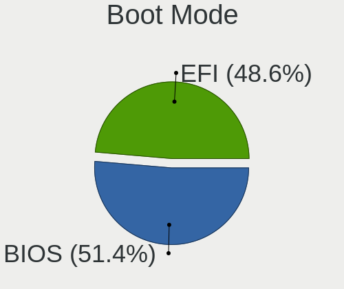
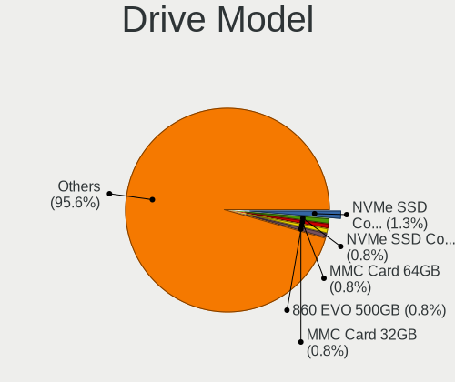
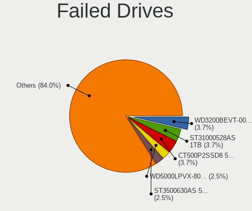
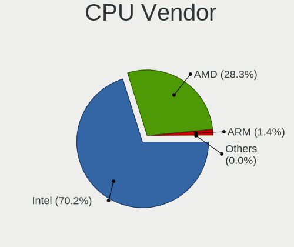
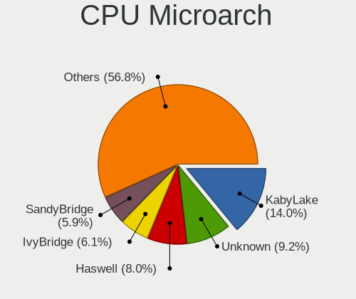
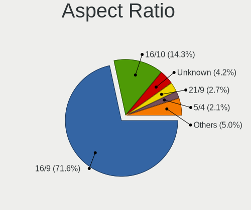

Linux in USA - Tested Hardware & Statistics
-------------------------------------------

A project to collect tested hardware configurations for Linux in USA.

Anyone can contribute to this report by the [hw-probe](https://github.com/linuxhw/hw-probe) tool:

    sudo -E hw-probe -all -upload

Please contribute! Especially if your hardware is rare.

This is a report for all computer types. See also reports for [desktops](/Location/USA/Desktop/README.md) and [notebooks](/Location/USA/Notebook/README.md).

Contents
--------

* [ Test Cases ](#test-cases)

* [ System ](#system)
  - [ OS                       ](#os)
  - [ OS Family                ](#os-family)
  - [ Kernel                   ](#kernel)
  - [ Kernel Family            ](#kernel-family)
  - [ Kernel Major Ver.        ](#kernel-major-ver)
  - [ Arch                     ](#arch)
  - [ DE                       ](#de)
  - [ Display Server           ](#display-server)
  - [ Display Manager          ](#display-manager)
  - [ OS Lang                  ](#os-lang)
  - [ Boot Mode                ](#boot-mode)
  - [ Filesystem               ](#filesystem)
  - [ Part. scheme             ](#part-scheme)
  - [ Dual Boot with Linux/BSD ](#dual-boot-with-linuxbsd)
  - [ Dual Boot (Win)          ](#dual-boot-win)

* [ Board ](#board)
  - [ Vendor                   ](#vendor)
  - [ Model                    ](#model)
  - [ Model Family             ](#model-family)
  - [ MFG Year                 ](#mfg-year)
  - [ Form Factor              ](#form-factor)
  - [ Secure Boot              ](#secure-boot)
  - [ Coreboot                 ](#coreboot)
  - [ RAM Size                 ](#ram-size)
  - [ RAM Used                 ](#ram-used)
  - [ Total Drives             ](#total-drives)
  - [ Has CD-ROM               ](#has-cd-rom)
  - [ Has Ethernet             ](#has-ethernet)
  - [ Has WiFi                 ](#has-wifi)
  - [ Has Bluetooth            ](#has-bluetooth)

* [ Location ](#location)
  - [ Country                  ](#country)
  - [ City                     ](#city)

* [ Drives ](#drives)
  - [ Drive Vendor             ](#drive-vendor)
  - [ Drive Model              ](#drive-model)
  - [ HDD Vendor               ](#hdd-vendor)
  - [ SSD Vendor               ](#ssd-vendor)
  - [ Drive Kind               ](#drive-kind)
  - [ Drive Connector          ](#drive-connector)
  - [ Drive Size               ](#drive-size)
  - [ Space Total              ](#space-total)
  - [ Space Used               ](#space-used)
  - [ Malfunc. Drives          ](#malfunc-drives)
  - [ Malfunc. Drive Vendor    ](#malfunc-drive-vendor)
  - [ Malfunc. HDD Vendor      ](#malfunc-hdd-vendor)
  - [ Malfunc. Drive Kind      ](#malfunc-drive-kind)
  - [ Failed Drives            ](#failed-drives)
  - [ Failed Drive Vendor      ](#failed-drive-vendor)
  - [ Drive Status             ](#drive-status)

* [ Storage controller ](#storage-controller)
  - [ Storage Vendor           ](#storage-vendor)
  - [ Storage Model            ](#storage-model)
  - [ Storage Kind             ](#storage-kind)

* [ Processor ](#processor)
  - [ CPU Vendor               ](#cpu-vendor)
  - [ CPU Model                ](#cpu-model)
  - [ CPU Model Family         ](#cpu-model-family)
  - [ CPU Cores                ](#cpu-cores)
  - [ CPU Sockets              ](#cpu-sockets)
  - [ CPU Threads              ](#cpu-threads)
  - [ CPU Op-Modes             ](#cpu-op-modes)
  - [ CPU Microcode            ](#cpu-microcode)
  - [ CPU Microarch            ](#cpu-microarch)

* [ Graphics ](#graphics)
  - [ GPU Vendor               ](#gpu-vendor)
  - [ GPU Model                ](#gpu-model)
  - [ GPU Combo                ](#gpu-combo)
  - [ GPU Driver               ](#gpu-driver)
  - [ GPU Memory               ](#gpu-memory)

* [ Monitor ](#monitor)
  - [ Monitor Vendor           ](#monitor-vendor)
  - [ Monitor Model            ](#monitor-model)
  - [ Monitor Resolution       ](#monitor-resolution)
  - [ Monitor Diagonal         ](#monitor-diagonal)
  - [ Monitor Width            ](#monitor-width)
  - [ Aspect Ratio             ](#aspect-ratio)
  - [ Monitor Area             ](#monitor-area)
  - [ Pixel Density            ](#pixel-density)
  - [ Multiple Monitors        ](#multiple-monitors)

* [ Network ](#network)
  - [ Net Controller Vendor    ](#net-controller-vendor)
  - [ Net Controller Model     ](#net-controller-model)
  - [ Wireless Vendor          ](#wireless-vendor)
  - [ Wireless Model           ](#wireless-model)
  - [ Ethernet Vendor          ](#ethernet-vendor)
  - [ Ethernet Model           ](#ethernet-model)
  - [ Net Controller Kind      ](#net-controller-kind)
  - [ Used Controller          ](#used-controller)
  - [ NICs                     ](#nics)
  - [ IPv6                     ](#ipv6)

* [ Bluetooth ](#bluetooth)
  - [ Bluetooth Vendor         ](#bluetooth-vendor)
  - [ Bluetooth Model          ](#bluetooth-model)

* [ Sound ](#sound)
  - [ Sound Vendor             ](#sound-vendor)
  - [ Sound Model              ](#sound-model)

* [ Memory ](#memory)
  - [ Memory Vendor            ](#memory-vendor)
  - [ Memory Model             ](#memory-model)
  - [ Memory Kind              ](#memory-kind)
  - [ Memory Form Factor       ](#memory-form-factor)
  - [ Memory Size              ](#memory-size)
  - [ Memory Speed             ](#memory-speed)

* [ Printers & scanners ](#printers--scanners)
  - [ Printer Vendor           ](#printer-vendor)
  - [ Printer Model            ](#printer-model)
  - [ Scanner Vendor           ](#scanner-vendor)
  - [ Scanner Model            ](#scanner-model)

* [ Camera ](#camera)
  - [ Camera Vendor            ](#camera-vendor)
  - [ Camera Model             ](#camera-model)

* [ Security ](#security)
  - [ Fingerprint Vendor       ](#fingerprint-vendor)
  - [ Fingerprint Model        ](#fingerprint-model)
  - [ Chipcard Vendor          ](#chipcard-vendor)
  - [ Chipcard Model           ](#chipcard-model)

* [ Unsupported ](#unsupported)
  - [ Unsupported Devices      ](#unsupported-devices)
  - [ Unsupported Device Types ](#unsupported-device-types)

Test Cases
----------

Total: 53666

| Vendor        | Model                       | Form-Factor | Probe                                                      | Date         |
|---------------|-----------------------------|-------------|------------------------------------------------------------|--------------|
| Gateway       | IPISB-VR                    | Desktop     | [4bed351eee](https://linux-hardware.org/?probe=4bed351eee) | Sep 07, 2023 |
| HP            | 89E9 0100                   | All in one  | [bb05bcc902](https://linux-hardware.org/?probe=bb05bcc902) | Sep 07, 2023 |
| ASUSTek       | TUF Gaming B550-PLUS WIF... | Desktop     | [5330a96ef6](https://linux-hardware.org/?probe=5330a96ef6) | Sep 07, 2023 |
| Dell          | 0WMJ54 A01                  | Desktop     | [034ff4bc7e](https://linux-hardware.org/?probe=034ff4bc7e) | Sep 07, 2023 |
| HP            | EliteBook 8760w             | Notebook    | [d061b57b29](https://linux-hardware.org/?probe=d061b57b29) | Sep 07, 2023 |
| NZXT          | N7 Z370                     | Desktop     | [34a23bdc5f](https://linux-hardware.org/?probe=34a23bdc5f) | Sep 07, 2023 |
| HP            | Laptop 14-dq1xxx            | Notebook    | [125a7f7c0d](https://linux-hardware.org/?probe=125a7f7c0d) | Sep 07, 2023 |
| Dell          | 0Y2MRG A00                  | Desktop     | [34ae665da1](https://linux-hardware.org/?probe=34ae665da1) | Sep 07, 2023 |
| MSI           | MAG Z490 TOMAHAWK           | Desktop     | [bacfcd3028](https://linux-hardware.org/?probe=bacfcd3028) | Sep 07, 2023 |
| Dell          | 088DT1 A01                  | Desktop     | [e7d12d040e](https://linux-hardware.org/?probe=e7d12d040e) | Sep 07, 2023 |
| Supermicro    | H12SSL-i                    | Server      | [c0498360ff](https://linux-hardware.org/?probe=c0498360ff) | Sep 07, 2023 |
| ASUSTek       | ProArt B550-CREATOR         | Desktop     | [5b276b13a8](https://linux-hardware.org/?probe=5b276b13a8) | Sep 07, 2023 |
| Lenovo        | ThinkPad X1 Extreme 2nd ... | Notebook    | [eeb4e7afd8](https://linux-hardware.org/?probe=eeb4e7afd8) | Sep 07, 2023 |
| ASRockRack    | B650D4U-2L2T/BCM            | Server      | [6cc92a61b2](https://linux-hardware.org/?probe=6cc92a61b2) | Sep 07, 2023 |
| HP            | Pavilion Gaming Laptop 1... | Notebook    | [5254176a5a](https://linux-hardware.org/?probe=5254176a5a) | Sep 07, 2023 |
| MSI           | Bravo 17 A4DDR              | Notebook    | [2592f883ef](https://linux-hardware.org/?probe=2592f883ef) | Sep 07, 2023 |
| Intel         | NUC5i3RYB H41000-503        | Mini pc     | [67e211cb5d](https://linux-hardware.org/?probe=67e211cb5d) | Sep 07, 2023 |
| Dell          | Latitude E6500              | Notebook    | [b4b035c4f7](https://linux-hardware.org/?probe=b4b035c4f7) | Sep 07, 2023 |
| Unknown       | Unknown                     | Soc         | [ee68830f56](https://linux-hardware.org/?probe=ee68830f56) | Sep 07, 2023 |
| Lenovo        | 3704 SDK0R32862 WIN 3258... | Desktop     | [907edde95a](https://linux-hardware.org/?probe=907edde95a) | Sep 07, 2023 |
| Dell          | 0WN7Y6 A02                  | Desktop     | [aaf64e4624](https://linux-hardware.org/?probe=aaf64e4624) | Sep 07, 2023 |
| ASUSTek       | ASUS TUF Dash F15 FX517Z... | Notebook    | [f33c62ab06](https://linux-hardware.org/?probe=f33c62ab06) | Sep 07, 2023 |
| HP            | 18E5                        | Desktop     | [b0210e782a](https://linux-hardware.org/?probe=b0210e782a) | Sep 07, 2023 |
| HP            | EliteBook 2740p             | Notebook    | [0bada236bc](https://linux-hardware.org/?probe=0bada236bc) | Sep 07, 2023 |
| HP            | Laptop 14-dk1xxx            | Notebook    | [c7bea10745](https://linux-hardware.org/?probe=c7bea10745) | Sep 07, 2023 |
| ALLDOCUBE     | i1025P                      | Tablet      | [987d1bc40e](https://linux-hardware.org/?probe=987d1bc40e) | Sep 06, 2023 |
| Apple         | MacBookAir8,2               | Notebook    | [e9e8da1eea](https://linux-hardware.org/?probe=e9e8da1eea) | Sep 06, 2023 |
| HP            | ProBook 445 G7              | Notebook    | [373ba724e4](https://linux-hardware.org/?probe=373ba724e4) | Sep 06, 2023 |
| HC Technol... | HCAR5000-MI                 | Desktop     | [3f98176bb7](https://linux-hardware.org/?probe=3f98176bb7) | Sep 06, 2023 |
| Lenovo        | Legion 5 15ARH05H 82B1      | Notebook    | [84368e642c](https://linux-hardware.org/?probe=84368e642c) | Sep 06, 2023 |
| Dell          | Inspiron 15 7000 Gaming     | Notebook    | [6192c839f5](https://linux-hardware.org/?probe=6192c839f5) | Sep 06, 2023 |
| Dell          | 02YYK5 A01                  | Desktop     | [6bb77310bf](https://linux-hardware.org/?probe=6bb77310bf) | Sep 06, 2023 |
| ASUSTek       | Maximus V FORMULA           | Desktop     | [694ffed41f](https://linux-hardware.org/?probe=694ffed41f) | Sep 06, 2023 |
| Raspberry ... | Raspberry Pi 3 Model B R... | Soc         | [34f019cf50](https://linux-hardware.org/?probe=34f019cf50) | Sep 06, 2023 |
| Acer          | Aspire GX-785               | Desktop     | [e33b7b35bf](https://linux-hardware.org/?probe=e33b7b35bf) | Sep 06, 2023 |
| ASUSTek       | PRIME B550M-A               | Desktop     | [b17a5edce5](https://linux-hardware.org/?probe=b17a5edce5) | Sep 06, 2023 |
| Biostar       | A58MD                       | Desktop     | [40f078fcfc](https://linux-hardware.org/?probe=40f078fcfc) | Sep 06, 2023 |
| HP            | 81B3                        | Desktop     | [b04c59ca3e](https://linux-hardware.org/?probe=b04c59ca3e) | Sep 06, 2023 |
| ASUSTek       | ROG Maximus XII APEX        | Desktop     | [f735c5a6e7](https://linux-hardware.org/?probe=f735c5a6e7) | Sep 06, 2023 |
| GPU Compan... | GWNR71517                   | Notebook    | [b6a521128f](https://linux-hardware.org/?probe=b6a521128f) | Sep 06, 2023 |
| Apple         | Mac-BE088AF8C5EB4FA2 iMa... | All in one  | [69bf752a4a](https://linux-hardware.org/?probe=69bf752a4a) | Sep 06, 2023 |
| Lenovo        | IdeaCentre K330B            | Desktop     | [a53977eb83](https://linux-hardware.org/?probe=a53977eb83) | Sep 06, 2023 |
| ASUSTek       | Z87M-PLUS                   | Desktop     | [30368099b8](https://linux-hardware.org/?probe=30368099b8) | Sep 06, 2023 |
| HP            | ProBook 6470b               | Notebook    | [4bb5a6911f](https://linux-hardware.org/?probe=4bb5a6911f) | Sep 06, 2023 |
| Dell          | Inspiron 5559               | Notebook    | [0428af4d14](https://linux-hardware.org/?probe=0428af4d14) | Sep 06, 2023 |
| Gigabyte      | B650 AORUS ELITE AX         | Desktop     | [97bacd8975](https://linux-hardware.org/?probe=97bacd8975) | Sep 06, 2023 |
| Dell          | 0RN4PJ A01                  | Server      | [342dfcbde0](https://linux-hardware.org/?probe=342dfcbde0) | Sep 06, 2023 |
| System76      | Pangolin                    | Notebook    | [43dbf49440](https://linux-hardware.org/?probe=43dbf49440) | Sep 06, 2023 |
| Dell          | 0F3KHR A00                  | Desktop     | [21a1983dcc](https://linux-hardware.org/?probe=21a1983dcc) | Sep 06, 2023 |
| MSI           | 2A9Ch                       | Desktop     | [68fe74d684](https://linux-hardware.org/?probe=68fe74d684) | Sep 06, 2023 |
| HP            | ProBook 650 G5              | Notebook    | [5e6e5cd047](https://linux-hardware.org/?probe=5e6e5cd047) | Sep 06, 2023 |
| Lenovo        | 3717 SDK0J40700 WIN 3258... | Desktop     | [e47f10b579](https://linux-hardware.org/?probe=e47f10b579) | Sep 06, 2023 |
| Dell          | 0F3KHR A00                  | Desktop     | [53bfbec77e](https://linux-hardware.org/?probe=53bfbec77e) | Sep 06, 2023 |
| Microsoft     | Surface Book 2              | Tablet      | [de36160f60](https://linux-hardware.org/?probe=de36160f60) | Sep 06, 2023 |
| HP            | EliteBook 845 14 inch G9... | Notebook    | [6c4c9936b0](https://linux-hardware.org/?probe=6c4c9936b0) | Sep 06, 2023 |
| ASUSTek       | Zephyrus S GX502GV_GX502... | Notebook    | [3429c55014](https://linux-hardware.org/?probe=3429c55014) | Sep 06, 2023 |
| ASUSTek       | Zephyrus S GX502GV_GX502... | Notebook    | [72fb0f052e](https://linux-hardware.org/?probe=72fb0f052e) | Sep 06, 2023 |
| Dell          | 0Y2MRG A00                  | Desktop     | [ad6d3dd867](https://linux-hardware.org/?probe=ad6d3dd867) | Sep 06, 2023 |
| ASUSTek       | ROG CROSSHAIR VIII HERO     | Desktop     | [fafd1b4cf2](https://linux-hardware.org/?probe=fafd1b4cf2) | Sep 06, 2023 |
| ASUSTek       | PRIME B450M-A II            | Desktop     | [07f51e668b](https://linux-hardware.org/?probe=07f51e668b) | Sep 06, 2023 |
| Lenovo        | Legion Pro 7 16IRX8 82WR    | Notebook    | [f946665a24](https://linux-hardware.org/?probe=f946665a24) | Sep 06, 2023 |
| Lenovo        | ThinkPad X1 Extreme 2nd ... | Notebook    | [3fe52a0e75](https://linux-hardware.org/?probe=3fe52a0e75) | Sep 06, 2023 |
| ASUSTek       | PRIME B550-PLUS             | Desktop     | [7fa390fcc4](https://linux-hardware.org/?probe=7fa390fcc4) | Sep 06, 2023 |
| ASRock        | B550M Pro4                  | Desktop     | [afba6fc1eb](https://linux-hardware.org/?probe=afba6fc1eb) | Sep 06, 2023 |
| Pegatron      | TRUCKEE                     | Desktop     | [145414b8e3](https://linux-hardware.org/?probe=145414b8e3) | Sep 06, 2023 |
| ASUSTek       | PRIME B550M-A               | Desktop     | [7b99e058ff](https://linux-hardware.org/?probe=7b99e058ff) | Sep 06, 2023 |
| Notebook      | W230SS                      | Notebook    | [3d9af4f57a](https://linux-hardware.org/?probe=3d9af4f57a) | Sep 06, 2023 |
| Lenovo        | 3717 SDK0J40700 WIN 3258... | Desktop     | [d1cf42c68c](https://linux-hardware.org/?probe=d1cf42c68c) | Sep 06, 2023 |
| ASUSTek       | ROG STRIX Z790-E GAMING ... | Desktop     | [4d1ca2eb79](https://linux-hardware.org/?probe=4d1ca2eb79) | Sep 06, 2023 |
| MSI           | MPG X570 GAMING PLUS        | Desktop     | [f04f6fc2a6](https://linux-hardware.org/?probe=f04f6fc2a6) | Sep 06, 2023 |
| Acer          | Swift SFX14-41G             | Notebook    | [611bb4fe1a](https://linux-hardware.org/?probe=611bb4fe1a) | Sep 06, 2023 |
| AZW           | U59                         | Desktop     | [0971b3ceb2](https://linux-hardware.org/?probe=0971b3ceb2) | Sep 06, 2023 |
| MSI           | MPG B650I EDGE WIFI         | Desktop     | [b395463f0e](https://linux-hardware.org/?probe=b395463f0e) | Sep 06, 2023 |
| Dell          | Precision 5570              | Notebook    | [9baca62616](https://linux-hardware.org/?probe=9baca62616) | Sep 06, 2023 |
| Gigabyte      | 970A-DS3P                   | Desktop     | [3227a8a6bc](https://linux-hardware.org/?probe=3227a8a6bc) | Sep 06, 2023 |
| MSI           | MS-7995                     | Notebook    | [3269e143a3](https://linux-hardware.org/?probe=3269e143a3) | Sep 06, 2023 |
| ASUSTek       | Maximus V FORMULA           | Desktop     | [039aa353eb](https://linux-hardware.org/?probe=039aa353eb) | Sep 06, 2023 |
| Foxconn       | 2AB1                        | Desktop     | [bf3a43c945](https://linux-hardware.org/?probe=bf3a43c945) | Sep 06, 2023 |
| Microsoft     | Surface Pro 6               | Tablet      | [4ae2ea34c2](https://linux-hardware.org/?probe=4ae2ea34c2) | Sep 06, 2023 |
| Dell          | Inspiron 5567               | Notebook    | [56c33713a8](https://linux-hardware.org/?probe=56c33713a8) | Sep 06, 2023 |
| Gigabyte      | X570 AORUS ELITE            | Desktop     | [995b1f100d](https://linux-hardware.org/?probe=995b1f100d) | Sep 06, 2023 |
| ASUSTek       | TUF Gaming Z590-PLUS WIF... | Desktop     | [d2ae9b900d](https://linux-hardware.org/?probe=d2ae9b900d) | Sep 06, 2023 |
| Pegatron      | 2AD3                        | Desktop     | [07cfb5b967](https://linux-hardware.org/?probe=07cfb5b967) | Sep 05, 2023 |
| HP            | Laptop 15-dy1xxx            | Notebook    | [99dd75f86a](https://linux-hardware.org/?probe=99dd75f86a) | Sep 05, 2023 |
| Purism        | Librem 15 v3                | Notebook    | [d3a66abc8b](https://linux-hardware.org/?probe=d3a66abc8b) | Sep 05, 2023 |
| ASUSTek       | X99-DELUXE                  | Desktop     | [0035cdf446](https://linux-hardware.org/?probe=0035cdf446) | Sep 05, 2023 |
| HP            | 81C9                        | Desktop     | [e80c7bf9d5](https://linux-hardware.org/?probe=e80c7bf9d5) | Sep 05, 2023 |
| Acer          | Swift SFX14-41G             | Notebook    | [38f9d1abd9](https://linux-hardware.org/?probe=38f9d1abd9) | Sep 05, 2023 |
| ASUSTek       | PRIME X470-PRO              | Desktop     | [f081f44bda](https://linux-hardware.org/?probe=f081f44bda) | Sep 05, 2023 |
| Acer          | Aspire E5-575G              | Notebook    | [054c5e3dc5](https://linux-hardware.org/?probe=054c5e3dc5) | Sep 05, 2023 |
| Gigabyte      | 970A-DS3P                   | Desktop     | [4322b8da26](https://linux-hardware.org/?probe=4322b8da26) | Sep 05, 2023 |
| HP            | ZBook Studio G3             | Notebook    | [208f21a716](https://linux-hardware.org/?probe=208f21a716) | Sep 05, 2023 |
| HP            | EliteBook 845 14 inch G9... | Notebook    | [25ec8e4a16](https://linux-hardware.org/?probe=25ec8e4a16) | Sep 05, 2023 |
| Dell          | Latitude E5570              | Notebook    | [10d8ad7a3d](https://linux-hardware.org/?probe=10d8ad7a3d) | Sep 05, 2023 |
| HP            | Laptop 15-da0xxx            | Notebook    | [326d057e96](https://linux-hardware.org/?probe=326d057e96) | Sep 05, 2023 |
| Framework     | Laptop (13th Gen Intel C... | Notebook    | [1bcf7b95c6](https://linux-hardware.org/?probe=1bcf7b95c6) | Sep 05, 2023 |
| ASUSTek       | ROG STRIX Z790-E GAMING ... | Desktop     | [b1329d0cc1](https://linux-hardware.org/?probe=b1329d0cc1) | Sep 05, 2023 |
| System76      | Pangolin                    | Notebook    | [461b8d48ba](https://linux-hardware.org/?probe=461b8d48ba) | Sep 05, 2023 |
| Lenovo        | ThinkPad L13 Yoga 20R5A0... | Convertible | [8aa97e8393](https://linux-hardware.org/?probe=8aa97e8393) | Sep 05, 2023 |
| ASUSTek       | E402SA                      | Notebook    | [efad2958a0](https://linux-hardware.org/?probe=efad2958a0) | Sep 05, 2023 |
| Samsung       | 950QED                      | Convertible | [e15539dd35](https://linux-hardware.org/?probe=e15539dd35) | Sep 05, 2023 |
| ASUSTek       | SABERTOOTH X58              | Desktop     | [9139773ff9](https://linux-hardware.org/?probe=9139773ff9) | Sep 05, 2023 |
| Dell          | Precision 7740              | Notebook    | [392ca47879](https://linux-hardware.org/?probe=392ca47879) | Sep 05, 2023 |
| Dell          | 0GY6Y8 A03                  | Desktop     | [da9dc1f5d9](https://linux-hardware.org/?probe=da9dc1f5d9) | Sep 05, 2023 |
| Lenovo        | ThinkPad T490 20N2001YUS    | Notebook    | [75c15ac2e8](https://linux-hardware.org/?probe=75c15ac2e8) | Sep 05, 2023 |
| Panasonic     | CF-C2CUGZXKM                | Notebook    | [12ed8aee3f](https://linux-hardware.org/?probe=12ed8aee3f) | Sep 05, 2023 |
| Panasonic     | CF-C2CUGZXKM                | Notebook    | [fdcab89946](https://linux-hardware.org/?probe=fdcab89946) | Sep 05, 2023 |
| Gigabyte      | Z370XP SLI-CF               | Desktop     | [7139ad27f1](https://linux-hardware.org/?probe=7139ad27f1) | Sep 05, 2023 |
| Toshiba       | Satellite L455D             | Notebook    | [1d49ff24ad](https://linux-hardware.org/?probe=1d49ff24ad) | Sep 05, 2023 |
| Apple         | MacBookPro16,3              | Notebook    | [7f61d6c898](https://linux-hardware.org/?probe=7f61d6c898) | Sep 05, 2023 |
| Intel         | NUC5i3RYB H41000-503        | Mini pc     | [05ad9c1b7b](https://linux-hardware.org/?probe=05ad9c1b7b) | Sep 05, 2023 |
| Apple         | MacBookPro11,4              | Notebook    | [1cd7fc15b1](https://linux-hardware.org/?probe=1cd7fc15b1) | Sep 05, 2023 |
| Supermicro    | H12SSL-i                    | Server      | [f06bf24212](https://linux-hardware.org/?probe=f06bf24212) | Sep 05, 2023 |
| Dell          | Precision 5680              | Notebook    | [fdcb7ce5d4](https://linux-hardware.org/?probe=fdcb7ce5d4) | Sep 05, 2023 |
| AZW           | SER V1.0                    | Mini pc     | [8c0e6613ee](https://linux-hardware.org/?probe=8c0e6613ee) | Sep 05, 2023 |
| Microsoft     | Surface Pro 6               | Tablet      | [1a3b5fb063](https://linux-hardware.org/?probe=1a3b5fb063) | Sep 05, 2023 |
| ASRockRack    | B650D4U-2L2T/BCM            | Server      | [167ab1eb1c](https://linux-hardware.org/?probe=167ab1eb1c) | Sep 05, 2023 |
| ASRock        | B550 Phantom Gaming-ITX/... | Desktop     | [5a4f7a4641](https://linux-hardware.org/?probe=5a4f7a4641) | Sep 05, 2023 |
| AZW           | MINI S                      | Desktop     | [a2a1414ea6](https://linux-hardware.org/?probe=a2a1414ea6) | Sep 05, 2023 |
| Foxconn       | 2AB1                        | Desktop     | [5c43d49876](https://linux-hardware.org/?probe=5c43d49876) | Sep 05, 2023 |
| Dell          | XPS 13 7390                 | Notebook    | [5154be8883](https://linux-hardware.org/?probe=5154be8883) | Sep 05, 2023 |
| HP            | 0B54h D                     | Desktop     | [6fc93ef4ee](https://linux-hardware.org/?probe=6fc93ef4ee) | Sep 05, 2023 |
| MSI           | GS75 Stealth 8SG            | Notebook    | [fc603fc196](https://linux-hardware.org/?probe=fc603fc196) | Sep 05, 2023 |
| AZW           | SER V01                     | Mini pc     | [b744dfb20a](https://linux-hardware.org/?probe=b744dfb20a) | Sep 05, 2023 |
| HP            | EliteBook 845 G7 Noteboo... | Notebook    | [0131d0a313](https://linux-hardware.org/?probe=0131d0a313) | Sep 05, 2023 |
| Intel         | NUC8BEB J72692-303          | Mini pc     | [a66c2d8e50](https://linux-hardware.org/?probe=a66c2d8e50) | Sep 05, 2023 |
| HP            | ENVY x360 Convertible 15... | Convertible | [bf7eead9e6](https://linux-hardware.org/?probe=bf7eead9e6) | Sep 05, 2023 |
| Apple         | MacBookPro16,2              | Notebook    | [b47ac62db2](https://linux-hardware.org/?probe=b47ac62db2) | Sep 05, 2023 |
| ASUSTek       | TUF Gaming Z790-PLUS WIF... | Desktop     | [f8ec276ea3](https://linux-hardware.org/?probe=f8ec276ea3) | Sep 05, 2023 |
| Apple         | MacBookPro10,1              | Notebook    | [11c016fb1b](https://linux-hardware.org/?probe=11c016fb1b) | Sep 05, 2023 |
| ASUSTek       | M4A785-M                    | Desktop     | [0e073fb229](https://linux-hardware.org/?probe=0e073fb229) | Sep 05, 2023 |
| Gigabyte      | 970A-DS3P                   | Desktop     | [8a98029595](https://linux-hardware.org/?probe=8a98029595) | Sep 05, 2023 |
| Samsung       | 750QUA                      | Convertible | [d409932f7d](https://linux-hardware.org/?probe=d409932f7d) | Sep 05, 2023 |
| Gigabyte      | AORUS 17 XE4                | Notebook    | [7987abcc44](https://linux-hardware.org/?probe=7987abcc44) | Sep 04, 2023 |
| MSI           | B350 GAMING PRO CARBON      | Desktop     | [c2257ed5b8](https://linux-hardware.org/?probe=c2257ed5b8) | Sep 04, 2023 |
| Gigabyte      | 970A-DS3P                   | Desktop     | [788841792b](https://linux-hardware.org/?probe=788841792b) | Sep 04, 2023 |
| Apple         | MacBookPro9,2               | Notebook    | [106e2d1e98](https://linux-hardware.org/?probe=106e2d1e98) | Sep 04, 2023 |
| Lenovo        | ThinkPad T470 20HD000RUS    | Notebook    | [f7250cb3ae](https://linux-hardware.org/?probe=f7250cb3ae) | Sep 04, 2023 |
| Dell          | Precision 5570              | Notebook    | [abddf843dd](https://linux-hardware.org/?probe=abddf843dd) | Sep 04, 2023 |
| ASUSTek       | VivoBook_ASUSLaptop M160... | Notebook    | [08e7b606c8](https://linux-hardware.org/?probe=08e7b606c8) | Sep 04, 2023 |
| ASRock        | H310M-STX                   | Desktop     | [5585353638](https://linux-hardware.org/?probe=5585353638) | Sep 04, 2023 |
| ASUSTek       | ProArt X670E-CREATOR WIF... | Desktop     | [cda189c68a](https://linux-hardware.org/?probe=cda189c68a) | Sep 04, 2023 |
| Inventec      | Z CLASS A02                 | Desktop     | [7f0254a775](https://linux-hardware.org/?probe=7f0254a775) | Sep 04, 2023 |
| HP            | ENVY x360 2-in-1 Laptop ... | Convertible | [606f54ecca](https://linux-hardware.org/?probe=606f54ecca) | Sep 04, 2023 |
| Dell          | 06D7TR A02                  | Desktop     | [a99e7ffcb1](https://linux-hardware.org/?probe=a99e7ffcb1) | Sep 04, 2023 |
| Apple         | MacBookPro8,2               | Notebook    | [371c148953](https://linux-hardware.org/?probe=371c148953) | Sep 04, 2023 |
| ASRock        | B460M-HDV                   | Desktop     | [2380eeae30](https://linux-hardware.org/?probe=2380eeae30) | Sep 04, 2023 |
| ASUSTek       | X99-M WS                    | Desktop     | [f324b3dd33](https://linux-hardware.org/?probe=f324b3dd33) | Sep 04, 2023 |
| HP            | Pavilion dv9000 (RP249UA... | Notebook    | [ea5e3bac5f](https://linux-hardware.org/?probe=ea5e3bac5f) | Sep 04, 2023 |
| Dell          | Latitude E6530              | Notebook    | [e1aa22b8b9](https://linux-hardware.org/?probe=e1aa22b8b9) | Sep 04, 2023 |
| Dell          | 06D7TR A00                  | Desktop     | [ce82ba5660](https://linux-hardware.org/?probe=ce82ba5660) | Sep 04, 2023 |
| Acer          | Aspire A315-24P             | Notebook    | [d082fdd668](https://linux-hardware.org/?probe=d082fdd668) | Sep 04, 2023 |
| Gigabyte      | B450 AORUS PRO WIFI-CF      | Desktop     | [834b31e663](https://linux-hardware.org/?probe=834b31e663) | Sep 04, 2023 |
| Dell          | Inspiron 16 5625            | Notebook    | [f3cbaf1a86](https://linux-hardware.org/?probe=f3cbaf1a86) | Sep 04, 2023 |
| Dell          | Inspiron 16 5625            | Notebook    | [b0e01251ca](https://linux-hardware.org/?probe=b0e01251ca) | Sep 04, 2023 |
| Dell          | XPS 13 9380                 | Notebook    | [94e7b43fe2](https://linux-hardware.org/?probe=94e7b43fe2) | Sep 04, 2023 |
| Gigabyte      | B650M AORUS ELITE AX        | Desktop     | [71da9ea288](https://linux-hardware.org/?probe=71da9ea288) | Sep 04, 2023 |
| Valve         | Jupiter                     | Notebook    | [20541373d1](https://linux-hardware.org/?probe=20541373d1) | Sep 04, 2023 |
| ASUSTek       | M5A97 R2.0                  | Desktop     | [39c78902f1](https://linux-hardware.org/?probe=39c78902f1) | Sep 04, 2023 |
| Seeed Stud... | ODYSSEY-X86J41X5 SD-BS-C... | Desktop     | [69fec63660](https://linux-hardware.org/?probe=69fec63660) | Sep 04, 2023 |
| Dell          | Vostro 15 5510              | Notebook    | [7223b751c4](https://linux-hardware.org/?probe=7223b751c4) | Sep 04, 2023 |
| Seeed Stud... | ODYSSEY-X86J41X5 SD-BS-C... | Desktop     | [ea00f871b9](https://linux-hardware.org/?probe=ea00f871b9) | Sep 04, 2023 |
| ASRock        | Z490 Phantom Gaming 4/ac    | Desktop     | [5fa23571c9](https://linux-hardware.org/?probe=5fa23571c9) | Sep 04, 2023 |
| Acer          | Predator G3-571             | Notebook    | [972f320a9d](https://linux-hardware.org/?probe=972f320a9d) | Sep 04, 2023 |
| Dell          | Inspiron 7537               | Notebook    | [036c877144](https://linux-hardware.org/?probe=036c877144) | Sep 04, 2023 |
| Lenovo        | ThinkPad L14 Gen 1 20U10... | Notebook    | [68e90ee0cb](https://linux-hardware.org/?probe=68e90ee0cb) | Sep 04, 2023 |
| HP            | 8449 00100                  | All in one  | [fa5e880618](https://linux-hardware.org/?probe=fa5e880618) | Sep 04, 2023 |
| Dell          | 0M6C7G A00                  | Desktop     | [8645b925c9](https://linux-hardware.org/?probe=8645b925c9) | Sep 04, 2023 |
| Unknown       | Unknown                     | Notebook    | [9441e027c6](https://linux-hardware.org/?probe=9441e027c6) | Sep 04, 2023 |
| Valve         | Jupiter                     | Notebook    | [fb306539b2](https://linux-hardware.org/?probe=fb306539b2) | Sep 04, 2023 |
| MSI           | PRO X670-P WIFI             | Desktop     | [326596a962](https://linux-hardware.org/?probe=326596a962) | Sep 04, 2023 |
| Supermicro    | H12SSL-i                    | Server      | [dc9d1ca231](https://linux-hardware.org/?probe=dc9d1ca231) | Sep 04, 2023 |
| HP            | Pavilion g7                 | Notebook    | [a2a69279d6](https://linux-hardware.org/?probe=a2a69279d6) | Sep 04, 2023 |
| Hardkernel    | ODROID-H3                   | Desktop     | [30f66c7581](https://linux-hardware.org/?probe=30f66c7581) | Sep 04, 2023 |
| Gigabyte      | AB350M-DS3H V2-CF           | Desktop     | [08a80ee482](https://linux-hardware.org/?probe=08a80ee482) | Sep 04, 2023 |
| ASUSTek       | N56JN                       | Notebook    | [eb9458de08](https://linux-hardware.org/?probe=eb9458de08) | Sep 04, 2023 |
| ASRockRack    | B650D4U-2L2T/BCM            | Server      | [b980688633](https://linux-hardware.org/?probe=b980688633) | Sep 04, 2023 |
| MSI           | B360M BAZOOKA               | Desktop     | [bdb68056ae](https://linux-hardware.org/?probe=bdb68056ae) | Sep 04, 2023 |
| Dell          | Inspiron 5759               | Notebook    | [8a8a236a44](https://linux-hardware.org/?probe=8a8a236a44) | Sep 04, 2023 |
| ECS           | Nettle2                     | Desktop     | [8492f01e46](https://linux-hardware.org/?probe=8492f01e46) | Sep 04, 2023 |
| AZW           | MINI S                      | Desktop     | [331702f893](https://linux-hardware.org/?probe=331702f893) | Sep 04, 2023 |
| ASUSTek       | PRIME X570-P                | Desktop     | [922ff6eddb](https://linux-hardware.org/?probe=922ff6eddb) | Sep 04, 2023 |
| ASUSTek       | SABERTOOTH X58              | Desktop     | [edc8896f06](https://linux-hardware.org/?probe=edc8896f06) | Sep 04, 2023 |
| Gigabyte      | B650M AORUS ELITE AX        | Desktop     | [31cb6a887e](https://linux-hardware.org/?probe=31cb6a887e) | Sep 04, 2023 |
| Dell          | Latitude 5480               | Notebook    | [3a25585a10](https://linux-hardware.org/?probe=3a25585a10) | Sep 04, 2023 |
| Lenovo        | SHARKBAY NOK                | Desktop     | [1cc4b106a4](https://linux-hardware.org/?probe=1cc4b106a4) | Sep 04, 2023 |
| ASRock        | A520M-HDV                   | Desktop     | [8da6b89260](https://linux-hardware.org/?probe=8da6b89260) | Sep 04, 2023 |
| Apple         | MacBookAir5,1               | Notebook    | [e24382ee44](https://linux-hardware.org/?probe=e24382ee44) | Sep 04, 2023 |
| Dell          | Latitude E6500              | Notebook    | [6199709334](https://linux-hardware.org/?probe=6199709334) | Sep 04, 2023 |
| ASUSTek       | PRIME B550M-A               | Desktop     | [2252b35243](https://linux-hardware.org/?probe=2252b35243) | Sep 03, 2023 |
| ASUSTek       | PRIME Z690-P D4             | Desktop     | [81f816e956](https://linux-hardware.org/?probe=81f816e956) | Sep 03, 2023 |
| ASUSTek       | Maximus VIII HERO           | Desktop     | [d208a16a1b](https://linux-hardware.org/?probe=d208a16a1b) | Sep 03, 2023 |
| ASUSTek       | ASUSLaptop_Q540VJ           | Notebook    | [39ed316bb6](https://linux-hardware.org/?probe=39ed316bb6) | Sep 03, 2023 |
| AMI           | Aptio CRB                   | Mini pc     | [e9512e994e](https://linux-hardware.org/?probe=e9512e994e) | Sep 03, 2023 |
| AMI           | Aptio CRB                   | Mini pc     | [235744f7fa](https://linux-hardware.org/?probe=235744f7fa) | Sep 03, 2023 |
| Valve         | Jupiter                     | Notebook    | [e172cd5895](https://linux-hardware.org/?probe=e172cd5895) | Sep 03, 2023 |
| ASUSTek       | Zenbook UX3404VA_Q420VA     | Notebook    | [f9ae8ae2db](https://linux-hardware.org/?probe=f9ae8ae2db) | Sep 03, 2023 |
| HP            | OMEN by Laptop              | Notebook    | [a135074689](https://linux-hardware.org/?probe=a135074689) | Sep 03, 2023 |
| Gigabyte      | Z97X-UD5H                   | Desktop     | [2c9b64c445](https://linux-hardware.org/?probe=2c9b64c445) | Sep 03, 2023 |
| ASUSTek       | ROG Maximus Z790 HERO       | Desktop     | [2eed39fb24](https://linux-hardware.org/?probe=2eed39fb24) | Sep 03, 2023 |
| ASRock        | B365 Pro4                   | Desktop     | [d6be71642e](https://linux-hardware.org/?probe=d6be71642e) | Sep 03, 2023 |
| ASUSTek       | A88X-PRO                    | Desktop     | [79ca2081a1](https://linux-hardware.org/?probe=79ca2081a1) | Sep 03, 2023 |
| ASUSTek       | X555LAB                     | Notebook    | [b8aba55b59](https://linux-hardware.org/?probe=b8aba55b59) | Sep 03, 2023 |
| Dell          | 0D441T A03                  | Desktop     | [3ba5173eb2](https://linux-hardware.org/?probe=3ba5173eb2) | Sep 03, 2023 |
| Dell          | Latitude 5414               | Notebook    | [704d861366](https://linux-hardware.org/?probe=704d861366) | Sep 03, 2023 |
| HP            | OMEN by Laptop 17-an0xx     | Notebook    | [884eaad43c](https://linux-hardware.org/?probe=884eaad43c) | Sep 03, 2023 |
| Apple         | MacBookPro9,2               | Notebook    | [a6d272539a](https://linux-hardware.org/?probe=a6d272539a) | Sep 03, 2023 |
| Dell          | Latitude 5410               | Notebook    | [e45d7975d2](https://linux-hardware.org/?probe=e45d7975d2) | Sep 03, 2023 |
| Acer          | Aspire ES1-711              | Notebook    | [36b5fac615](https://linux-hardware.org/?probe=36b5fac615) | Sep 03, 2023 |
| BESSTAR Te... | Cherry Trail CR             | Desktop     | [3ad034200f](https://linux-hardware.org/?probe=3ad034200f) | Sep 03, 2023 |
| Unknown       | Unknown                     | Notebook    | [8d7616fae8](https://linux-hardware.org/?probe=8d7616fae8) | Sep 03, 2023 |
| ASUSTek       | ROG STRIX B450-F GAMING     | Desktop     | [926751fb6e](https://linux-hardware.org/?probe=926751fb6e) | Sep 03, 2023 |
| MSI           | B350M PRO-VDH               | Desktop     | [4ee783a52f](https://linux-hardware.org/?probe=4ee783a52f) | Sep 03, 2023 |
| ASRock        | J4205-ITX                   | Desktop     | [8831793b97](https://linux-hardware.org/?probe=8831793b97) | Sep 03, 2023 |
| Valve         | Jupiter                     | Notebook    | [413ea68e2d](https://linux-hardware.org/?probe=413ea68e2d) | Sep 03, 2023 |
| HP            | Pavilion Gaming Laptop 1... | Notebook    | [858212c01d](https://linux-hardware.org/?probe=858212c01d) | Sep 03, 2023 |
| HP            | Laptop 14-fq0xxx            | Notebook    | [d68ec21cac](https://linux-hardware.org/?probe=d68ec21cac) | Sep 03, 2023 |
| AZW           | SER V1.0                    | Mini pc     | [4cb41c4eb3](https://linux-hardware.org/?probe=4cb41c4eb3) | Sep 03, 2023 |
| Acer          | Aspire 5349                 | Notebook    | [62f941ff29](https://linux-hardware.org/?probe=62f941ff29) | Sep 03, 2023 |
| Lenovo        | IdeaPad Flex-14API 81SS     | Notebook    | [b9c93a8c15](https://linux-hardware.org/?probe=b9c93a8c15) | Sep 03, 2023 |
| ASRock        | B450 Gaming K4              | Desktop     | [96dbf56986](https://linux-hardware.org/?probe=96dbf56986) | Sep 03, 2023 |
| Gigabyte      | X79-UP4                     | Desktop     | [3593994f4e](https://linux-hardware.org/?probe=3593994f4e) | Sep 03, 2023 |
| Valve         | Jupiter                     | Notebook    | [0f61122c7a](https://linux-hardware.org/?probe=0f61122c7a) | Sep 03, 2023 |
| Dell          | Inspiron N4010              | Notebook    | [78f4fd9711](https://linux-hardware.org/?probe=78f4fd9711) | Sep 03, 2023 |
| ASUSTek       | TUF Gaming Z790-PLUS WIF... | Desktop     | [eee58fd067](https://linux-hardware.org/?probe=eee58fd067) | Sep 03, 2023 |
| Dell          | Latitude E6500              | Notebook    | [308d8d0f19](https://linux-hardware.org/?probe=308d8d0f19) | Sep 03, 2023 |
| HP            | Pavilion dv5                | Notebook    | [977c253ff5](https://linux-hardware.org/?probe=977c253ff5) | Sep 02, 2023 |
| Hardkernel    | ODROID-M1                   | Soc         | [1901f4aad9](https://linux-hardware.org/?probe=1901f4aad9) | Sep 02, 2023 |
| Dell          | Latitude E6410              | Notebook    | [bd6242d5b8](https://linux-hardware.org/?probe=bd6242d5b8) | Sep 02, 2023 |
| Lenovo        | IdeaPad S540-13IML 81XA     | Notebook    | [246a993eb7](https://linux-hardware.org/?probe=246a993eb7) | Sep 02, 2023 |
| Dell          | Latitude E6410              | Notebook    | [9e2aa5e0e5](https://linux-hardware.org/?probe=9e2aa5e0e5) | Sep 02, 2023 |
| Gigabyte      | F2A88X-UP4                  | Desktop     | [37bfab5442](https://linux-hardware.org/?probe=37bfab5442) | Sep 02, 2023 |
| Gigabyte      | P67A-UD3P-B3                | Desktop     | [cf62b3f40c](https://linux-hardware.org/?probe=cf62b3f40c) | Sep 02, 2023 |
| Alienware     | m15 R3                      | Notebook    | [c2e00a5341](https://linux-hardware.org/?probe=c2e00a5341) | Sep 02, 2023 |
| Unknown       | Unknown                     | Notebook    | [c72be678a2](https://linux-hardware.org/?probe=c72be678a2) | Sep 02, 2023 |
| HP            | ProBook 4540s               | Notebook    | [816a4241fb](https://linux-hardware.org/?probe=816a4241fb) | Sep 02, 2023 |
| Dell          | Latitude E6540              | Notebook    | [f9e2147255](https://linux-hardware.org/?probe=f9e2147255) | Sep 02, 2023 |
| Dell          | 0HHV7N A00                  | Desktop     | [9ae746229d](https://linux-hardware.org/?probe=9ae746229d) | Sep 02, 2023 |
| MSI           | MPG X570 GAMING PLUS        | Desktop     | [4fa68712c5](https://linux-hardware.org/?probe=4fa68712c5) | Sep 02, 2023 |
| Apple         | MacBookPro11,4              | Notebook    | [ac1293fbf6](https://linux-hardware.org/?probe=ac1293fbf6) | Sep 02, 2023 |
| Apple         | MacBookPro11,4              | Notebook    | [1273e75666](https://linux-hardware.org/?probe=1273e75666) | Sep 02, 2023 |
| Lenovo        | ThinkPad T460s 20F9003CU... | Notebook    | [8c94711a27](https://linux-hardware.org/?probe=8c94711a27) | Sep 02, 2023 |
| HP            | Stream Laptop 14-cb1xxx     | Notebook    | [515e1f4bce](https://linux-hardware.org/?probe=515e1f4bce) | Sep 02, 2023 |
| HP            | 0B4Ch D                     | Desktop     | [1521626729](https://linux-hardware.org/?probe=1521626729) | Sep 02, 2023 |
| Dell          | 088DT1 A01                  | Desktop     | [2df9675af1](https://linux-hardware.org/?probe=2df9675af1) | Sep 02, 2023 |
| MSI           | MPG B550 GAMING PLUS        | Desktop     | [9ab3e57ab7](https://linux-hardware.org/?probe=9ab3e57ab7) | Sep 02, 2023 |
| Dell          | Latitude 5400               | Notebook    | [aac8791780](https://linux-hardware.org/?probe=aac8791780) | Sep 02, 2023 |
| ASUSTek       | PRIME X299-A II             | Desktop     | [80a93a9457](https://linux-hardware.org/?probe=80a93a9457) | Sep 02, 2023 |
| HP            | ProLiant DL360 G7           | Server      | [315510322c](https://linux-hardware.org/?probe=315510322c) | Sep 02, 2023 |
| ASUSTek       | M5A78L-M LX PLUS            | Desktop     | [b4907a6220](https://linux-hardware.org/?probe=b4907a6220) | Sep 02, 2023 |
| Raspberry ... | Raspberry Pi 4 Model B R... | Soc         | [a200aa5407](https://linux-hardware.org/?probe=a200aa5407) | Sep 02, 2023 |
| Acer          | Aspire TC-875 V:1.0         | Desktop     | [a25ba0bd0c](https://linux-hardware.org/?probe=a25ba0bd0c) | Sep 02, 2023 |
| Dell          | Inspiron 5482               | Convertible | [05c6ec6d26](https://linux-hardware.org/?probe=05c6ec6d26) | Sep 02, 2023 |
| Dell          | Inspiron 5720               | Notebook    | [9b802cfff6](https://linux-hardware.org/?probe=9b802cfff6) | Sep 02, 2023 |
| ASUSTek       | SABERTOOTH X58              | Desktop     | [0c99b66fde](https://linux-hardware.org/?probe=0c99b66fde) | Sep 02, 2023 |
| ASUSTek       | TUF Gaming FX505DU_TUF50... | Notebook    | [dd49edce58](https://linux-hardware.org/?probe=dd49edce58) | Sep 02, 2023 |
| MSI           | PRO B550M-VC WIFI           | Desktop     | [3a7f86cf53](https://linux-hardware.org/?probe=3a7f86cf53) | Sep 02, 2023 |
| Valve         | Jupiter                     | Notebook    | [df8dfd608f](https://linux-hardware.org/?probe=df8dfd608f) | Sep 02, 2023 |
| ASUSTek       | TUF Gaming B550M-PLUS       | Desktop     | [7e93b2a981](https://linux-hardware.org/?probe=7e93b2a981) | Sep 02, 2023 |
| Lenovo        | SHARKBAY NOK                | Desktop     | [6fb1aaaab8](https://linux-hardware.org/?probe=6fb1aaaab8) | Sep 02, 2023 |
| Hardkernel    | ODROID-H3                   | Desktop     | [33a04d3a73](https://linux-hardware.org/?probe=33a04d3a73) | Sep 02, 2023 |
| Dell          | Inspiron 1545               | Notebook    | [8ba55e98ec](https://linux-hardware.org/?probe=8ba55e98ec) | Sep 02, 2023 |
| Valve         | Jupiter                     | Notebook    | [8313f463cf](https://linux-hardware.org/?probe=8313f463cf) | Sep 02, 2023 |
| Foxconn       | 2ABF                        | Desktop     | [f3655da9eb](https://linux-hardware.org/?probe=f3655da9eb) | Sep 01, 2023 |
| Dell          | XPS 15 9500                 | Notebook    | [88b6546b70](https://linux-hardware.org/?probe=88b6546b70) | Sep 01, 2023 |
| Dell          | Precision 7560              | Notebook    | [d9d73d82f2](https://linux-hardware.org/?probe=d9d73d82f2) | Sep 01, 2023 |
| Pegatron      | 2AD5                        | Desktop     | [644b70347e](https://linux-hardware.org/?probe=644b70347e) | Sep 01, 2023 |
| ASUSTek       | X555LJ                      | Notebook    | [571cdd8ecf](https://linux-hardware.org/?probe=571cdd8ecf) | Sep 01, 2023 |
| Gigabyte      | Z370 AORUS Gaming 7         | Desktop     | [6ddc9b767d](https://linux-hardware.org/?probe=6ddc9b767d) | Sep 01, 2023 |
| ASUSTek       | ROG Maximus XI HERO         | Desktop     | [a19ece12f0](https://linux-hardware.org/?probe=a19ece12f0) | Sep 01, 2023 |
| Lenovo        | ThinkPad 11e 5th Gen 20L... | Notebook    | [f7e029febe](https://linux-hardware.org/?probe=f7e029febe) | Sep 01, 2023 |
| HP            | 82F1                        | Desktop     | [6fca2da71a](https://linux-hardware.org/?probe=6fca2da71a) | Sep 01, 2023 |
| GPU Compan... | GWTC116-2                   | Notebook    | [455a21dde9](https://linux-hardware.org/?probe=455a21dde9) | Sep 01, 2023 |
| Intel         | NUC10i7FNB M38062-307       | Mini pc     | [bfb348ab81](https://linux-hardware.org/?probe=bfb348ab81) | Sep 01, 2023 |
| Dell          | 030VXY A02                  | Desktop     | [ff787e57bc](https://linux-hardware.org/?probe=ff787e57bc) | Sep 01, 2023 |
| HP            | ProLiant DL360 G7           | Server      | [e7c4150ded](https://linux-hardware.org/?probe=e7c4150ded) | Sep 01, 2023 |
| ASUSTek       | M5A78L-M/USB3               | Desktop     | [90be513b41](https://linux-hardware.org/?probe=90be513b41) | Sep 01, 2023 |
| ALLDOCUBE     | i1025P                      | Tablet      | [2528493f15](https://linux-hardware.org/?probe=2528493f15) | Sep 01, 2023 |
| HP            | 82F1                        | Desktop     | [2b601bfc6a](https://linux-hardware.org/?probe=2b601bfc6a) | Sep 01, 2023 |
| HP            | 82F1                        | Desktop     | [fe3e193418](https://linux-hardware.org/?probe=fe3e193418) | Sep 01, 2023 |
| System76      | Thelio thelio-r3            | Desktop     | [d0cdea5d23](https://linux-hardware.org/?probe=d0cdea5d23) | Sep 01, 2023 |
| libre-comp... | aml-s905x-cc                | Soc         | [a4356f45fe](https://linux-hardware.org/?probe=a4356f45fe) | Sep 01, 2023 |
| Sony          | SVS1512DCXB                 | Notebook    | [b712723d6c](https://linux-hardware.org/?probe=b712723d6c) | Sep 01, 2023 |
| HP            | EliteBook 8440p             | Notebook    | [2107ba0ad7](https://linux-hardware.org/?probe=2107ba0ad7) | Sep 01, 2023 |
| HP            | ENVY x360 Convertible 15... | Convertible | [9249854374](https://linux-hardware.org/?probe=9249854374) | Sep 01, 2023 |
| MSI           | Z390-A PRO                  | Desktop     | [183c66be85](https://linux-hardware.org/?probe=183c66be85) | Sep 01, 2023 |
| ASUSTek       | TUF Gaming X570-PLUS        | Desktop     | [c865cde7a2](https://linux-hardware.org/?probe=c865cde7a2) | Sep 01, 2023 |
| AOpen         | i65HMx-D R1.04AL            | Desktop     | [aef1de4c53](https://linux-hardware.org/?probe=aef1de4c53) | Sep 01, 2023 |
| Apple         | MacBookAir4,1               | Notebook    | [61da3436a8](https://linux-hardware.org/?probe=61da3436a8) | Sep 01, 2023 |
| Dell          | Inspiron 13-7353            | Notebook    | [021bbea0d4](https://linux-hardware.org/?probe=021bbea0d4) | Sep 01, 2023 |
| Acer          | Swift SFX14-41G             | Notebook    | [67f553625a](https://linux-hardware.org/?probe=67f553625a) | Sep 01, 2023 |
| ASUSTek       | ROG STRIX B450-F GAMING     | Desktop     | [81e9e055de](https://linux-hardware.org/?probe=81e9e055de) | Sep 01, 2023 |
| Lenovo        | Legion Pro 7 16IRX8 82WR    | Notebook    | [239b46961f](https://linux-hardware.org/?probe=239b46961f) | Sep 01, 2023 |
| Lenovo        | IdeaPad Y510P 20217         | Notebook    | [10951f0a65](https://linux-hardware.org/?probe=10951f0a65) | Sep 01, 2023 |
| Lenovo        | IdeaPad Y510P 20217         | Notebook    | [ac6c5c8969](https://linux-hardware.org/?probe=ac6c5c8969) | Sep 01, 2023 |
| Dell          | Inspiron 7786               | Convertible | [bde311c07c](https://linux-hardware.org/?probe=bde311c07c) | Sep 01, 2023 |
| Lenovo        | IdeaPad 3 14ALC6 82KT       | Notebook    | [9de67aa419](https://linux-hardware.org/?probe=9de67aa419) | Sep 01, 2023 |
| Toshiba       | Satellite P55t-C            | Notebook    | [3dd1896d54](https://linux-hardware.org/?probe=3dd1896d54) | Sep 01, 2023 |
| Lenovo        | ThinkPad X270 20HMS6AT00    | Notebook    | [e111bad271](https://linux-hardware.org/?probe=e111bad271) | Sep 01, 2023 |
| Lenovo        | IdeaPad 3 15ITL6 82H8       | Notebook    | [499b5c3b2f](https://linux-hardware.org/?probe=499b5c3b2f) | Sep 01, 2023 |
| Lenovo        | ThinkPad L390 20NR000FUS    | Notebook    | [b4d7adfb97](https://linux-hardware.org/?probe=b4d7adfb97) | Sep 01, 2023 |
| Raspberry ... | Raspberry Pi 400 Rev 1.0    | Soc         | [e4b016857a](https://linux-hardware.org/?probe=e4b016857a) | Sep 01, 2023 |
| MSI           | MS-7390                     | Desktop     | [7115ad031a](https://linux-hardware.org/?probe=7115ad031a) | Sep 01, 2023 |
| Unknown       | Orange Pi 5 Plus            | Soc         | [d675d2e459](https://linux-hardware.org/?probe=d675d2e459) | Sep 01, 2023 |
| Lenovo        | 310B SDK0J40697 WIN 3305... | Desktop     | [a4ee14b9ac](https://linux-hardware.org/?probe=a4ee14b9ac) | Sep 01, 2023 |
| ASUSTek       | PRIME B550M-A AC            | Desktop     | [da19202792](https://linux-hardware.org/?probe=da19202792) | Sep 01, 2023 |
| Foxconn       | 2A92                        | Desktop     | [50ca8342d7](https://linux-hardware.org/?probe=50ca8342d7) | Sep 01, 2023 |
| HP            | ENVY x360 2-in-1 Laptop ... | Convertible | [9d8f7c345f](https://linux-hardware.org/?probe=9d8f7c345f) | Sep 01, 2023 |
| ASUSTek       | PRIME B550M-A AC            | Desktop     | [e65f42e0d6](https://linux-hardware.org/?probe=e65f42e0d6) | Sep 01, 2023 |
| HP            | ENVY x360 2-in-1 Laptop ... | Convertible | [9b797b1d18](https://linux-hardware.org/?probe=9b797b1d18) | Sep 01, 2023 |
| ASUSTek       | VivoBook_ASUSLaptop X712... | Notebook    | [082d8a2ebf](https://linux-hardware.org/?probe=082d8a2ebf) | Sep 01, 2023 |
| Dell          | Latitude 3320               | Notebook    | [7c40b4eb0d](https://linux-hardware.org/?probe=7c40b4eb0d) | Sep 01, 2023 |
| Dynabook      | TECRA A50-J                 | Notebook    | [0b59bbf6db](https://linux-hardware.org/?probe=0b59bbf6db) | Sep 01, 2023 |
| Foxconn       | 2AB1                        | Desktop     | [c140c2b911](https://linux-hardware.org/?probe=c140c2b911) | Sep 01, 2023 |
| Dynabook      | TECRA A50-J                 | Notebook    | [4ea2422b26](https://linux-hardware.org/?probe=4ea2422b26) | Sep 01, 2023 |
| ASUSTek       | M2N68-AM SE2                | Desktop     | [78cb25f581](https://linux-hardware.org/?probe=78cb25f581) | Aug 31, 2023 |
| Lenovo        | ThinkPad T450 20BUS0B000    | Notebook    | [1213d3bf46](https://linux-hardware.org/?probe=1213d3bf46) | Aug 31, 2023 |
| Apple         | MacBook9,1                  | Notebook    | [b6a28c1e1a](https://linux-hardware.org/?probe=b6a28c1e1a) | Aug 31, 2023 |
| Valve         | Jupiter                     | Notebook    | [4a61e467d0](https://linux-hardware.org/?probe=4a61e467d0) | Aug 31, 2023 |
| Apple         | MacBookAir6,2               | Notebook    | [783d0f51f5](https://linux-hardware.org/?probe=783d0f51f5) | Aug 31, 2023 |
| Lenovo        | ThinkPad 13 2nd Gen 20J1... | Notebook    | [f98a2afc33](https://linux-hardware.org/?probe=f98a2afc33) | Aug 31, 2023 |
| Lenovo        | ThinkPad X390 Yoga 20NQS... | Convertible | [b2b8a6ed8b](https://linux-hardware.org/?probe=b2b8a6ed8b) | Aug 31, 2023 |
| Lenovo        | ThinkPad X390 Yoga 20NQS... | Convertible | [aeb2ecfe12](https://linux-hardware.org/?probe=aeb2ecfe12) | Aug 31, 2023 |
| Toshiba       | Satellite S75-B             | Notebook    | [2ffc319636](https://linux-hardware.org/?probe=2ffc319636) | Aug 31, 2023 |
| Lenovo        | ThinkPad X220 4290EC9       | Notebook    | [6ebd4f0bbf](https://linux-hardware.org/?probe=6ebd4f0bbf) | Aug 31, 2023 |
| HP            | 8592                        | Desktop     | [667f4402e7](https://linux-hardware.org/?probe=667f4402e7) | Aug 31, 2023 |
| Lenovo        | IdeaPad 320-15ABR 80XS      | Notebook    | [a5847ee104](https://linux-hardware.org/?probe=a5847ee104) | Aug 31, 2023 |
| Dell          | XPS 9315                    | Notebook    | [5676f0c210](https://linux-hardware.org/?probe=5676f0c210) | Aug 31, 2023 |
| ASUSTek       | H81M-K                      | Desktop     | [4b7cee7673](https://linux-hardware.org/?probe=4b7cee7673) | Aug 31, 2023 |
| Lenovo        | Legion Y920-17IKB Laptop... | Notebook    | [5976d2d9e9](https://linux-hardware.org/?probe=5976d2d9e9) | Aug 31, 2023 |
| ASUSTek       | PRIME H310M-E R2.0          | Desktop     | [be8b002a45](https://linux-hardware.org/?probe=be8b002a45) | Aug 31, 2023 |
| Framework     | Laptop (12th Gen Intel C... | Notebook    | [3b890e064f](https://linux-hardware.org/?probe=3b890e064f) | Aug 31, 2023 |
| MSI           | 880G-E45                    | Desktop     | [f10edf60fd](https://linux-hardware.org/?probe=f10edf60fd) | Aug 31, 2023 |
| MSI           | B360M BAZOOKA               | Desktop     | [7d7d03eb25](https://linux-hardware.org/?probe=7d7d03eb25) | Aug 31, 2023 |
| ASUSTek       | PRIME A320M-K               | Desktop     | [8c1eeceddd](https://linux-hardware.org/?probe=8c1eeceddd) | Aug 31, 2023 |
| Microsoft     | Surface Pro                 | Tablet      | [3d736730c7](https://linux-hardware.org/?probe=3d736730c7) | Aug 31, 2023 |
| Lenovo        | ThinkPad T480s 20L70025U... | Notebook    | [917664de79](https://linux-hardware.org/?probe=917664de79) | Aug 31, 2023 |
| ASUSTek       | TUF Gaming B550-PLUS        | Desktop     | [88b6c0365c](https://linux-hardware.org/?probe=88b6c0365c) | Aug 31, 2023 |
| Lenovo        | ThinkPad T480s 20L70028U... | Notebook    | [b065e9bda2](https://linux-hardware.org/?probe=b065e9bda2) | Aug 31, 2023 |
| Dell          | G3 3590                     | Notebook    | [810c7d1698](https://linux-hardware.org/?probe=810c7d1698) | Aug 31, 2023 |
| Dell          | 0KRC95 A02                  | Desktop     | [9173d00240](https://linux-hardware.org/?probe=9173d00240) | Aug 31, 2023 |
| ASUSTek       | M5A99X EVO R2.0             | Desktop     | [1a3fdd076f](https://linux-hardware.org/?probe=1a3fdd076f) | Aug 31, 2023 |
| Lenovo        | 3716 SDK0R32862 WIN 3258... | Desktop     | [0464aa909a](https://linux-hardware.org/?probe=0464aa909a) | Aug 31, 2023 |
| ASUSTek       | PHOENIX                     | Desktop     | [5fa96dfd97](https://linux-hardware.org/?probe=5fa96dfd97) | Aug 31, 2023 |
| Sony          | VPCEC390X                   | Notebook    | [ddad567e2a](https://linux-hardware.org/?probe=ddad567e2a) | Aug 31, 2023 |
| Notebook      | W230SS                      | Notebook    | [97cc6cc17f](https://linux-hardware.org/?probe=97cc6cc17f) | Aug 31, 2023 |
| Dell          | Latitude 7230 Rugged Ext... | Convertible | [eedd1f9605](https://linux-hardware.org/?probe=eedd1f9605) | Aug 31, 2023 |
| ASUSTek       | PRIME X299-DELUXE           | Desktop     | [d9a8673516](https://linux-hardware.org/?probe=d9a8673516) | Aug 31, 2023 |
| Google        | Kefka                       | Notebook    | [284517c2b3](https://linux-hardware.org/?probe=284517c2b3) | Aug 31, 2023 |
| HP            | 89B5 A                      | Desktop     | [1364f50166](https://linux-hardware.org/?probe=1364f50166) | Aug 31, 2023 |
| ASUSTek       | X555LJ                      | Notebook    | [49b0bd793d](https://linux-hardware.org/?probe=49b0bd793d) | Aug 31, 2023 |
| Lenovo        | ThinkPad E575 20H8000HUS    | Notebook    | [6af4b49ea2](https://linux-hardware.org/?probe=6af4b49ea2) | Aug 31, 2023 |
| Google        | Enguarde                    | Notebook    | [d67a18c110](https://linux-hardware.org/?probe=d67a18c110) | Aug 30, 2023 |
| HP            | OMEN by Gaming Laptop 16... | Notebook    | [b68a6514c4](https://linux-hardware.org/?probe=b68a6514c4) | Aug 30, 2023 |
| Dell          | OptiPlex 7050               | Desktop     | [a35a9d7d8a](https://linux-hardware.org/?probe=a35a9d7d8a) | Aug 30, 2023 |
| Acer          | Aspire V3-112P              | Notebook    | [d0d0600273](https://linux-hardware.org/?probe=d0d0600273) | Aug 30, 2023 |
| Apple         | Mac-F60DEB81FF30ACF6 Mac... | Desktop     | [45f86c066d](https://linux-hardware.org/?probe=45f86c066d) | Aug 30, 2023 |
| Sony          | VPCEE23FX                   | Notebook    | [65714e4d48](https://linux-hardware.org/?probe=65714e4d48) | Aug 30, 2023 |
| Gigabyte      | X570 AORUS ULTRA            | Desktop     | [c5469a2eaf](https://linux-hardware.org/?probe=c5469a2eaf) | Aug 30, 2023 |
| Lenovo        | 81CA                        | Convertible | [a289ed0457](https://linux-hardware.org/?probe=a289ed0457) | Aug 30, 2023 |
| Lenovo        | 3716 SDK0T76463 WIN 3422... | Desktop     | [3aefc3000a](https://linux-hardware.org/?probe=3aefc3000a) | Aug 30, 2023 |
| ASRock        | B365 Pro4                   | Desktop     | [6d0b6e95ba](https://linux-hardware.org/?probe=6d0b6e95ba) | Aug 30, 2023 |
| ASUSTek       | A88X-PRO                    | Desktop     | [9327ae4f97](https://linux-hardware.org/?probe=9327ae4f97) | Aug 30, 2023 |
| ASUSTek       | X555LAB                     | Notebook    | [ce793ccb8d](https://linux-hardware.org/?probe=ce793ccb8d) | Aug 30, 2023 |
| Dell          | Inspiron 16 7610            | Notebook    | [57c65a2bc8](https://linux-hardware.org/?probe=57c65a2bc8) | Aug 30, 2023 |
| HP            | ProBook 440 14 inch G9 N... | Notebook    | [b37cf7f8cf](https://linux-hardware.org/?probe=b37cf7f8cf) | Aug 30, 2023 |
| HP            | EliteBook 845 14 inch G9... | Notebook    | [4c595a576a](https://linux-hardware.org/?probe=4c595a576a) | Aug 30, 2023 |
| HP            | Compaq Presario CQ60        | Notebook    | [ac9c55fcb3](https://linux-hardware.org/?probe=ac9c55fcb3) | Aug 30, 2023 |
| ASUSTek       | P6T                         | Desktop     | [69879aca23](https://linux-hardware.org/?probe=69879aca23) | Aug 30, 2023 |
| Dell          | Latitude E6440              | Notebook    | [0b63ef8851](https://linux-hardware.org/?probe=0b63ef8851) | Aug 30, 2023 |
| Lenovo        | Legion 5 Pro 16ACH6H 82J... | Notebook    | [aa23e296ad](https://linux-hardware.org/?probe=aa23e296ad) | Aug 30, 2023 |
| HP            | ZBook 15 G3                 | Notebook    | [d88312e34b](https://linux-hardware.org/?probe=d88312e34b) | Aug 30, 2023 |
| Apple         | Mac-77EB7D7DAF985301 iMa... | All in one  | [c7fe7f6c55](https://linux-hardware.org/?probe=c7fe7f6c55) | Aug 30, 2023 |
| HP            | ZBook 15 G3                 | Notebook    | [7943c070cc](https://linux-hardware.org/?probe=7943c070cc) | Aug 30, 2023 |
| Google        | Liara                       | Notebook    | [e92684405f](https://linux-hardware.org/?probe=e92684405f) | Aug 30, 2023 |
| Lenovo        | ThinkPad L13 Yoga 20R6S0... | Convertible | [52582bbad0](https://linux-hardware.org/?probe=52582bbad0) | Aug 30, 2023 |
| Google        | Kefka                       | Notebook    | [a018ae3fb5](https://linux-hardware.org/?probe=a018ae3fb5) | Aug 30, 2023 |
| Lenovo        | ThinkPad X1 Extreme Gen ... | Notebook    | [15c048cb00](https://linux-hardware.org/?probe=15c048cb00) | Aug 30, 2023 |
| ASUSTek       | PRIME Z490-A                | Desktop     | [3cfa79235e](https://linux-hardware.org/?probe=3cfa79235e) | Aug 30, 2023 |
| HP            | Dragonfly Pro Laptop PC     | Notebook    | [2b08121ea1](https://linux-hardware.org/?probe=2b08121ea1) | Aug 30, 2023 |
| Acer          | Aspire TC-895 V:1.0         | Desktop     | [20bd10b5f4](https://linux-hardware.org/?probe=20bd10b5f4) | Aug 30, 2023 |
| Foxconn       | D180S/D190S/D290S Series... | Desktop     | [5f6030cb69](https://linux-hardware.org/?probe=5f6030cb69) | Aug 30, 2023 |
| Lenovo        | Yoga 710-14IKB 80V4         | Convertible | [1cc890fd91](https://linux-hardware.org/?probe=1cc890fd91) | Aug 30, 2023 |
| ASUSTek       | TUF Z370-PLUS GAMING        | Desktop     | [b93e0fc32b](https://linux-hardware.org/?probe=b93e0fc32b) | Aug 30, 2023 |
| Dell          | 07KY25 A00                  | Desktop     | [9346896df5](https://linux-hardware.org/?probe=9346896df5) | Aug 30, 2023 |
| ASUSTek       | M5A97 R2.0                  | Desktop     | [c1514e209a](https://linux-hardware.org/?probe=c1514e209a) | Aug 30, 2023 |
| Lenovo        | Slim 7 ProX 14ARH7 82V2     | Notebook    | [d37f105f74](https://linux-hardware.org/?probe=d37f105f74) | Aug 30, 2023 |
| MSI           | Z270M MORTAR                | Desktop     | [416723b60c](https://linux-hardware.org/?probe=416723b60c) | Aug 30, 2023 |
| Dell          | 02KGF7 A00                  | Desktop     | [d3573cf0aa](https://linux-hardware.org/?probe=d3573cf0aa) | Aug 30, 2023 |
| Google        | Enguarde                    | Notebook    | [08ff2764b2](https://linux-hardware.org/?probe=08ff2764b2) | Aug 30, 2023 |
| HP            | Pavilion Laptop 15-cw0xx... | Notebook    | [90a72df8ef](https://linux-hardware.org/?probe=90a72df8ef) | Aug 29, 2023 |
| HP            | Laptop 17-by0xxx            | Notebook    | [4617fe766a](https://linux-hardware.org/?probe=4617fe766a) | Aug 29, 2023 |
| Apple         | MacBook4,1                  | Notebook    | [04424409ef](https://linux-hardware.org/?probe=04424409ef) | Aug 29, 2023 |
| Dell          | 0XHGV1 A01                  | Desktop     | [a5f30ecf01](https://linux-hardware.org/?probe=a5f30ecf01) | Aug 29, 2023 |
| ASUSTek       | ROG Zephyrus G15 GA503RW... | Notebook    | [7d74c2bc61](https://linux-hardware.org/?probe=7d74c2bc61) | Aug 29, 2023 |
| ASUSTek       | ROG Zephyrus G15 GA503RW... | Notebook    | [dcceb74a56](https://linux-hardware.org/?probe=dcceb74a56) | Aug 29, 2023 |
| Gigabyte      | B650M DS3H                  | Desktop     | [bd11422cd5](https://linux-hardware.org/?probe=bd11422cd5) | Aug 29, 2023 |
| Gigabyte      | Z97X-UD5H                   | Desktop     | [3fb03adafb](https://linux-hardware.org/?probe=3fb03adafb) | Aug 29, 2023 |
| ASUSTek       | H97M-PLUS                   | Desktop     | [c5fb822b1c](https://linux-hardware.org/?probe=c5fb822b1c) | Aug 29, 2023 |
| Unknown       | Unknown                     | Notebook    | [3718299cea](https://linux-hardware.org/?probe=3718299cea) | Aug 29, 2023 |
| Google        | Enguarde                    | Notebook    | [e2e5a3dadc](https://linux-hardware.org/?probe=e2e5a3dadc) | Aug 29, 2023 |
| Dell          | Latitude 5480               | Notebook    | [88c6621b31](https://linux-hardware.org/?probe=88c6621b31) | Aug 29, 2023 |
| Intel         | DG45ID AAE27729-312         | Desktop     | [add370815d](https://linux-hardware.org/?probe=add370815d) | Aug 29, 2023 |
| Google        | Enguarde                    | Notebook    | [e7a59ac286](https://linux-hardware.org/?probe=e7a59ac286) | Aug 29, 2023 |
| Dell          | Inspiron 7791 2n1           | Convertible | [f209f11620](https://linux-hardware.org/?probe=f209f11620) | Aug 29, 2023 |
| Unknown       | Unknown                     | Desktop     | [ebebe5ddf7](https://linux-hardware.org/?probe=ebebe5ddf7) | Aug 29, 2023 |
| Valve         | Jupiter                     | Notebook    | [ea71d4832d](https://linux-hardware.org/?probe=ea71d4832d) | Aug 29, 2023 |
| Lenovo        | Legion 5 15ACH6 82JW        | Notebook    | [265430a40c](https://linux-hardware.org/?probe=265430a40c) | Aug 29, 2023 |
| Lenovo        | IdeaPad 1 15ADA7 82R1       | Notebook    | [9ed16c423b](https://linux-hardware.org/?probe=9ed16c423b) | Aug 29, 2023 |
| Dell          | 0JCTF8 A00                  | Desktop     | [c76c74b017](https://linux-hardware.org/?probe=c76c74b017) | Aug 29, 2023 |
| Gigabyte      | Z390 AORUS PRO WIFI-CF      | Desktop     | [2b9741ce87](https://linux-hardware.org/?probe=2b9741ce87) | Aug 29, 2023 |
| Dell          | Precision 7710              | Notebook    | [9b92626f63](https://linux-hardware.org/?probe=9b92626f63) | Aug 29, 2023 |
| Lenovo        | IdeaPad 3 14ALC6 82KT       | Notebook    | [fc7834595f](https://linux-hardware.org/?probe=fc7834595f) | Aug 29, 2023 |
| Apple         | MacBookPro11,3              | Notebook    | [561b652278](https://linux-hardware.org/?probe=561b652278) | Aug 29, 2023 |
| HP            | Pavilion x360 m3 Convert... | Convertible | [072a35b927](https://linux-hardware.org/?probe=072a35b927) | Aug 29, 2023 |
| Dell          | 0GXM1W A01                  | Desktop     | [00207aee12](https://linux-hardware.org/?probe=00207aee12) | Aug 29, 2023 |
| Lenovo        | ThinkPad T430s 2356CU8      | Notebook    | [2f669d797f](https://linux-hardware.org/?probe=2f669d797f) | Aug 29, 2023 |
| Dell          | Inspiron 16 7635 2-in-1     | Convertible | [3ebe1769c0](https://linux-hardware.org/?probe=3ebe1769c0) | Aug 29, 2023 |
| Lenovo        | ThinkPad T430s 2356CU8      | Notebook    | [39f2feeed5](https://linux-hardware.org/?probe=39f2feeed5) | Aug 29, 2023 |
| HP            | ZBook Studio G3             | Notebook    | [bdaea6156d](https://linux-hardware.org/?probe=bdaea6156d) | Aug 29, 2023 |
| Dell          | Inspiron 16 7635 2-in-1     | Convertible | [2e6f42e754](https://linux-hardware.org/?probe=2e6f42e754) | Aug 29, 2023 |
| HP            | Pavilion x360 m3 Convert... | Convertible | [f52ec15364](https://linux-hardware.org/?probe=f52ec15364) | Aug 29, 2023 |
| Gigabyte      | A320M-HD2-CF                | Desktop     | [7d9c3aa2ad](https://linux-hardware.org/?probe=7d9c3aa2ad) | Aug 29, 2023 |
| MSI           | Z370-A PRO                  | Desktop     | [d9a6d27a28](https://linux-hardware.org/?probe=d9a6d27a28) | Aug 29, 2023 |
| Huanan        | H610M-PLUS V1.2             | Desktop     | [083aaaf1eb](https://linux-hardware.org/?probe=083aaaf1eb) | Aug 29, 2023 |
| GPU Compan... | GWNC21524                   | Notebook    | [4a38e28073](https://linux-hardware.org/?probe=4a38e28073) | Aug 29, 2023 |
| ASUSTek       | TUF Z370-PLUS GAMING        | Desktop     | [7da432892e](https://linux-hardware.org/?probe=7da432892e) | Aug 29, 2023 |
| HP            | 8448 1000                   | All in one  | [a2aff5eaa7](https://linux-hardware.org/?probe=a2aff5eaa7) | Aug 29, 2023 |
| Valve         | Jupiter                     | Notebook    | [b23a3244d0](https://linux-hardware.org/?probe=b23a3244d0) | Aug 29, 2023 |
| HP            | 212B                        | Desktop     | [80b2496334](https://linux-hardware.org/?probe=80b2496334) | Aug 29, 2023 |
| HP            | Pavilion TS Sleekbook 14    | Notebook    | [c7108a7a23](https://linux-hardware.org/?probe=c7108a7a23) | Aug 29, 2023 |
| Valve         | Jupiter                     | Notebook    | [fff7e4f400](https://linux-hardware.org/?probe=fff7e4f400) | Aug 29, 2023 |
| HP            | EliteBook x360 1040 G6      | Convertible | [e4b73c6be1](https://linux-hardware.org/?probe=e4b73c6be1) | Aug 29, 2023 |
| Lenovo        | 102F SDK0Q40081 WIN 3305... | Desktop     | [b6478eb429](https://linux-hardware.org/?probe=b6478eb429) | Aug 29, 2023 |
| HP            | Pavilion Laptop 15t-eg30... | Notebook    | [aa2e067c2d](https://linux-hardware.org/?probe=aa2e067c2d) | Aug 29, 2023 |
| HP            | 89B4 A                      | Desktop     | [e70b3a2352](https://linux-hardware.org/?probe=e70b3a2352) | Aug 29, 2023 |
| Lenovo        | Legion 5 Pro 16ITH6 82JF    | Notebook    | [0ccccd5c9d](https://linux-hardware.org/?probe=0ccccd5c9d) | Aug 28, 2023 |
| Gigabyte      | X570 AORUS ULTRA            | Desktop     | [0af7d6ee0b](https://linux-hardware.org/?probe=0af7d6ee0b) | Aug 28, 2023 |
| Lenovo        | 3717 SDK0J40700 WIN 3258... | Desktop     | [5df3abe62e](https://linux-hardware.org/?probe=5df3abe62e) | Aug 28, 2023 |
| Panasonic     | CF-54-2                     | Notebook    | [7d2f4f34c9](https://linux-hardware.org/?probe=7d2f4f34c9) | Aug 28, 2023 |
| Apple         | Mac-942B59F58194171B iMa... | All in one  | [6d2186fdd9](https://linux-hardware.org/?probe=6d2186fdd9) | Aug 28, 2023 |
| HP            | ZBook 14 G2                 | Notebook    | [e56fcd0532](https://linux-hardware.org/?probe=e56fcd0532) | Aug 28, 2023 |
| Lenovo        | ThinkPad L13 Yoga Gen 2 ... | Convertible | [2a473fdb4a](https://linux-hardware.org/?probe=2a473fdb4a) | Aug 28, 2023 |
| Acer          | Aspire 7250                 | Notebook    | [5cae957ee6](https://linux-hardware.org/?probe=5cae957ee6) | Aug 28, 2023 |
| Lenovo        | ThinkPad L13 Yoga Gen 2 ... | Convertible | [95128ee415](https://linux-hardware.org/?probe=95128ee415) | Aug 28, 2023 |
| Lenovo        | ThinkPad L13 Yoga Gen 2 ... | Convertible | [b54f472d37](https://linux-hardware.org/?probe=b54f472d37) | Aug 28, 2023 |
| Lenovo        | IdeaPadFlex 5 14ITL05 82... | Convertible | [07d9ceca83](https://linux-hardware.org/?probe=07d9ceca83) | Aug 28, 2023 |
| Dell          | 0GY6Y8 A02                  | Desktop     | [fffbca3973](https://linux-hardware.org/?probe=fffbca3973) | Aug 28, 2023 |
| HP            | Laptop 14-dq1xxx            | Notebook    | [8e13da67ed](https://linux-hardware.org/?probe=8e13da67ed) | Aug 28, 2023 |
| HP            | ProBook 640 G2              | Notebook    | [456146b506](https://linux-hardware.org/?probe=456146b506) | Aug 28, 2023 |
| HP            | ProBook 640 G2              | Notebook    | [2679609644](https://linux-hardware.org/?probe=2679609644) | Aug 28, 2023 |
| Lenovo        | ThinkPad L13 Yoga Gen 2 ... | Convertible | [9d10db6fe6](https://linux-hardware.org/?probe=9d10db6fe6) | Aug 28, 2023 |
| HP            | 8955                        | Mini pc     | [b80c4d0245](https://linux-hardware.org/?probe=b80c4d0245) | Aug 28, 2023 |
| Lenovo        | ThinkPad L13 Yoga Gen 2 ... | Convertible | [03402979d2](https://linux-hardware.org/?probe=03402979d2) | Aug 28, 2023 |
| Lenovo        | ThinkPad L13 Yoga Gen 2 ... | Convertible | [2b71412aa1](https://linux-hardware.org/?probe=2b71412aa1) | Aug 28, 2023 |
| Lenovo        | ThinkPad L13 Yoga Gen 2 ... | Convertible | [d816edb954](https://linux-hardware.org/?probe=d816edb954) | Aug 28, 2023 |
| Dell          | 0TTDMJ A00                  | Desktop     | [3dc47e2b77](https://linux-hardware.org/?probe=3dc47e2b77) | Aug 28, 2023 |
| HP            | 1791                        | Desktop     | [09c2abafde](https://linux-hardware.org/?probe=09c2abafde) | Aug 28, 2023 |
| Acidanther... | Mac-27AD2F918AE68F61 Mac... | Desktop     | [b68e4634b7](https://linux-hardware.org/?probe=b68e4634b7) | Aug 28, 2023 |
| Lenovo        | Yoga 3 14 80JH              | Notebook    | [5268d75df2](https://linux-hardware.org/?probe=5268d75df2) | Aug 28, 2023 |
| Dell          | XPS 15 7590                 | Notebook    | [ef97f75590](https://linux-hardware.org/?probe=ef97f75590) | Aug 28, 2023 |
| Apple         | MacBookPro9,2               | Notebook    | [11d516749d](https://linux-hardware.org/?probe=11d516749d) | Aug 28, 2023 |
| Apple         | MacBookPro9,2               | Notebook    | [960039f680](https://linux-hardware.org/?probe=960039f680) | Aug 28, 2023 |
| Microsoft     | Surface Pro 9               | Tablet      | [d6a04f712b](https://linux-hardware.org/?probe=d6a04f712b) | Aug 28, 2023 |
| Lenovo        | ThinkPad T14s Gen 2i 20W... | Notebook    | [101a39c37a](https://linux-hardware.org/?probe=101a39c37a) | Aug 28, 2023 |
| Dell          | 0J3C2F A02                  | Desktop     | [fcc6b1f4f5](https://linux-hardware.org/?probe=fcc6b1f4f5) | Aug 28, 2023 |
| ASUSTek       | ROG Strix G733PY_G733PY     | Notebook    | [b886de0613](https://linux-hardware.org/?probe=b886de0613) | Aug 28, 2023 |
| HP            | ProBook 6550b               | Notebook    | [2906ded48c](https://linux-hardware.org/?probe=2906ded48c) | Aug 28, 2023 |
| Gigabyte      | B560 DS3H AC-Y1             | Desktop     | [1838cb8b9f](https://linux-hardware.org/?probe=1838cb8b9f) | Aug 28, 2023 |
| ASUSTek       | PRIME X470-PRO              | Desktop     | [eef69bf730](https://linux-hardware.org/?probe=eef69bf730) | Aug 28, 2023 |
| Dell          | Inspiron 7786               | Convertible | [7c0752795f](https://linux-hardware.org/?probe=7c0752795f) | Aug 28, 2023 |
| Dell          | Inspiron 3537               | Notebook    | [2b79052692](https://linux-hardware.org/?probe=2b79052692) | Aug 28, 2023 |
| Dell          | 0C0YYY A00                  | Desktop     | [1ac938e884](https://linux-hardware.org/?probe=1ac938e884) | Aug 28, 2023 |
| Google        | Banjo                       | Notebook    | [fcac9f460e](https://linux-hardware.org/?probe=fcac9f460e) | Aug 28, 2023 |
| Dell          | Inspiron 16 7620 2-in-1     | Convertible | [590de6cfc8](https://linux-hardware.org/?probe=590de6cfc8) | Aug 28, 2023 |
| HP            | 15 Notebook PC              | Notebook    | [bb75fbb42b](https://linux-hardware.org/?probe=bb75fbb42b) | Aug 28, 2023 |
| HP            | 0AACh                       | Desktop     | [3522f0be02](https://linux-hardware.org/?probe=3522f0be02) | Aug 28, 2023 |
| Lenovo        | 3132 SDK0J40697 WIN 3305... | Desktop     | [cbf222bbf8](https://linux-hardware.org/?probe=cbf222bbf8) | Aug 28, 2023 |
| Lenovo        | ThinkPad T470 20HES2RC00    | Notebook    | [390104a086](https://linux-hardware.org/?probe=390104a086) | Aug 28, 2023 |
| HP            | Laptop 15-ef0xxx            | Notebook    | [b948af0216](https://linux-hardware.org/?probe=b948af0216) | Aug 27, 2023 |
| HP            | 2B18                        | Desktop     | [891ce74167](https://linux-hardware.org/?probe=891ce74167) | Aug 27, 2023 |
| Dell          | Inspiron 1501               | Notebook    | [a021a98920](https://linux-hardware.org/?probe=a021a98920) | Aug 27, 2023 |
| Apple         | Mac-F2268DAE                | All in one  | [8db29b3719](https://linux-hardware.org/?probe=8db29b3719) | Aug 27, 2023 |
| Gateway       | RS780                       | Desktop     | [aecf72fc15](https://linux-hardware.org/?probe=aecf72fc15) | Aug 27, 2023 |
| Framework     | Laptop                      | Notebook    | [b3e9d2d48d](https://linux-hardware.org/?probe=b3e9d2d48d) | Aug 27, 2023 |
| Dell          | Precision 5510              | Notebook    | [c6d08d9c28](https://linux-hardware.org/?probe=c6d08d9c28) | Aug 27, 2023 |
| Dell          | Wyse 5470                   | Notebook    | [6d45205020](https://linux-hardware.org/?probe=6d45205020) | Aug 27, 2023 |
| Gigabyte      | 970A-D3P                    | Desktop     | [e178a50d54](https://linux-hardware.org/?probe=e178a50d54) | Aug 27, 2023 |
| HP            | 21D0                        | Desktop     | [c6cd8d13bc](https://linux-hardware.org/?probe=c6cd8d13bc) | Aug 27, 2023 |
| HP            | EliteBook 865 16 inch G9... | Notebook    | [b07775a194](https://linux-hardware.org/?probe=b07775a194) | Aug 27, 2023 |
| HP            | Laptop 15-db0xxx            | Notebook    | [2c0f5739a3](https://linux-hardware.org/?probe=2c0f5739a3) | Aug 27, 2023 |
| Valve         | Jupiter                     | Notebook    | [fda85e8d96](https://linux-hardware.org/?probe=fda85e8d96) | Aug 27, 2023 |
| System76      | Gazelle                     | Notebook    | [83bc87f8fc](https://linux-hardware.org/?probe=83bc87f8fc) | Aug 27, 2023 |
| HP            | EliteBook 840 G5            | Notebook    | [cd64a75511](https://linux-hardware.org/?probe=cd64a75511) | Aug 27, 2023 |
| ASUSTek       | Pro B550M-C                 | Desktop     | [3c68838457](https://linux-hardware.org/?probe=3c68838457) | Aug 27, 2023 |
| HP            | Compaq nx6325 (EN188UT#A... | Notebook    | [4324feffa1](https://linux-hardware.org/?probe=4324feffa1) | Aug 27, 2023 |
| Toshiba       | Satellite C55-A             | Notebook    | [20dc6d4044](https://linux-hardware.org/?probe=20dc6d4044) | Aug 27, 2023 |
| Valve         | Jupiter                     | Notebook    | [11f20f1134](https://linux-hardware.org/?probe=11f20f1134) | Aug 27, 2023 |
| Dell          | Precision M4700             | Notebook    | [c65acacce9](https://linux-hardware.org/?probe=c65acacce9) | Aug 27, 2023 |
| Dell          | 0XHGV1 A01                  | Desktop     | [d03180d370](https://linux-hardware.org/?probe=d03180d370) | Aug 27, 2023 |
| Samsung       | 930QCG                      | Convertible | [3fb44943e6](https://linux-hardware.org/?probe=3fb44943e6) | Aug 27, 2023 |
| Google        | Epaulette                   | Notebook    | [2633079a97](https://linux-hardware.org/?probe=2633079a97) | Aug 27, 2023 |
| Samsung       | R530/R730/R540              | Notebook    | [1112486ef3](https://linux-hardware.org/?probe=1112486ef3) | Aug 27, 2023 |
| Dell          | XPS 13 9310                 | Notebook    | [9dddd0c80b](https://linux-hardware.org/?probe=9dddd0c80b) | Aug 27, 2023 |
| HP            | Pavilion x360 Convertibl... | Convertible | [bc180f5143](https://linux-hardware.org/?probe=bc180f5143) | Aug 27, 2023 |
| Dell          | Inspiron 5570               | Notebook    | [0baf10cd76](https://linux-hardware.org/?probe=0baf10cd76) | Aug 27, 2023 |
| Apple         | MacBookPro9,2               | Notebook    | [f1422f4092](https://linux-hardware.org/?probe=f1422f4092) | Aug 27, 2023 |
| Samsung       | R530/R730/R540              | Notebook    | [99e5a7a753](https://linux-hardware.org/?probe=99e5a7a753) | Aug 27, 2023 |
| Dell          | Latitude E5470              | Notebook    | [b1efa66e79](https://linux-hardware.org/?probe=b1efa66e79) | Aug 27, 2023 |
| HUAWEI        | CREF-XX                     | Notebook    | [2d9703804d](https://linux-hardware.org/?probe=2d9703804d) | Aug 27, 2023 |
| HP            | Pavilion 15                 | Notebook    | [1731ba4ae5](https://linux-hardware.org/?probe=1731ba4ae5) | Aug 27, 2023 |
| HP            | Pavilion 15                 | Notebook    | [0f51268684](https://linux-hardware.org/?probe=0f51268684) | Aug 27, 2023 |
| Dell          | Precision M4700             | Notebook    | [8f4eef8a36](https://linux-hardware.org/?probe=8f4eef8a36) | Aug 27, 2023 |
| eMachines     | EL1352                      | Desktop     | [5f9258beb2](https://linux-hardware.org/?probe=5f9258beb2) | Aug 27, 2023 |
| Framework     | Laptop (12th Gen Intel C... | Notebook    | [cfbb311c97](https://linux-hardware.org/?probe=cfbb311c97) | Aug 27, 2023 |
| Lenovo        | ThinkPad X1 Carbon Gen 1... | Notebook    | [a8600db157](https://linux-hardware.org/?probe=a8600db157) | Aug 27, 2023 |
| Lenovo        | ThinkPad P50 20ENCTO1WW     | Notebook    | [80851b7836](https://linux-hardware.org/?probe=80851b7836) | Aug 27, 2023 |
| HP            | ENVY x360 2-in-1 Laptop ... | Convertible | [fe372a098d](https://linux-hardware.org/?probe=fe372a098d) | Aug 27, 2023 |
| Gigabyte      | X570 AORUS MASTER           | Desktop     | [8ee512db27](https://linux-hardware.org/?probe=8ee512db27) | Aug 27, 2023 |
| Apple         | MacBookPro6,2               | Notebook    | [e25e18e9b1](https://linux-hardware.org/?probe=e25e18e9b1) | Aug 27, 2023 |
| ATOPNUC       | MA90                        | Mini pc     | [3d024df7cc](https://linux-hardware.org/?probe=3d024df7cc) | Aug 27, 2023 |
| HP            | ENVY x360 2-in-1 Laptop ... | Convertible | [623f136c0f](https://linux-hardware.org/?probe=623f136c0f) | Aug 27, 2023 |
| Intel         | NUC7i5BNB J31144-311        | Mini pc     | [5af1e720cc](https://linux-hardware.org/?probe=5af1e720cc) | Aug 27, 2023 |
| HP            | Pavilion x360 Convertibl... | Convertible | [93df8f4352](https://linux-hardware.org/?probe=93df8f4352) | Aug 27, 2023 |
| ASRock        | X570 Phantom Gaming 4S      | Desktop     | [1be18fe99f](https://linux-hardware.org/?probe=1be18fe99f) | Aug 27, 2023 |
| Valve         | Jupiter                     | Notebook    | [41823ead70](https://linux-hardware.org/?probe=41823ead70) | Aug 27, 2023 |
| Lenovo        | 3717 SDK0J40700 WIN 3258... | Desktop     | [512429f429](https://linux-hardware.org/?probe=512429f429) | Aug 27, 2023 |
| Valve         | Jupiter                     | Notebook    | [3c1874890b](https://linux-hardware.org/?probe=3c1874890b) | Aug 26, 2023 |
| Google        | Nautilus                    | Notebook    | [3f96b35cae](https://linux-hardware.org/?probe=3f96b35cae) | Aug 26, 2023 |
| Lenovo        | IdeaPad Z570 1024DCU        | Notebook    | [8a11757d37](https://linux-hardware.org/?probe=8a11757d37) | Aug 26, 2023 |
| Dell          | Inspiron 5558               | Notebook    | [bf1d0a62ed](https://linux-hardware.org/?probe=bf1d0a62ed) | Aug 26, 2023 |
| ASUSTek       | PRIME Z690-P WIFI D4        | Desktop     | [cf2cba5c59](https://linux-hardware.org/?probe=cf2cba5c59) | Aug 26, 2023 |
| Microsoft     | Surface Pro 3               | Tablet      | [dfc08f880c](https://linux-hardware.org/?probe=dfc08f880c) | Aug 26, 2023 |
| Panasonic     | CF53-4                      | Notebook    | [6228d53ef2](https://linux-hardware.org/?probe=6228d53ef2) | Aug 26, 2023 |
| HP            | 2000                        | Notebook    | [a63dd6e0f1](https://linux-hardware.org/?probe=a63dd6e0f1) | Aug 26, 2023 |
| MSI           | H110I PRO                   | Desktop     | [49da08efbd](https://linux-hardware.org/?probe=49da08efbd) | Aug 26, 2023 |
| Apple         | MacBookPro8,1               | Notebook    | [4f185f17ec](https://linux-hardware.org/?probe=4f185f17ec) | Aug 26, 2023 |
| Biostar       | B550GTA                     | Desktop     | [218cce14a5](https://linux-hardware.org/?probe=218cce14a5) | Aug 26, 2023 |
| Lenovo        | IdeaPadFlex 5 14IAU7 82R... | Convertible | [821972776e](https://linux-hardware.org/?probe=821972776e) | Aug 26, 2023 |
| Dell          | 088DT1 A01                  | Desktop     | [b69a80ea82](https://linux-hardware.org/?probe=b69a80ea82) | Aug 26, 2023 |
| ASUSTek       | ROG STRIX B550-F GAMING     | Desktop     | [17a7fc84be](https://linux-hardware.org/?probe=17a7fc84be) | Aug 26, 2023 |
| Lenovo        | Legion 5 15ARH05H 82B1      | Notebook    | [5b1ded5f9e](https://linux-hardware.org/?probe=5b1ded5f9e) | Aug 26, 2023 |
| Lenovo        | ThinkPad P50 20EN001CUS     | Notebook    | [ba41fd65f9](https://linux-hardware.org/?probe=ba41fd65f9) | Aug 26, 2023 |
| Lenovo        | ThinkPad P50 20EN001CUS     | Notebook    | [e4e1b91970](https://linux-hardware.org/?probe=e4e1b91970) | Aug 26, 2023 |
| AZW           | U59                         | Desktop     | [ea7bf087cc](https://linux-hardware.org/?probe=ea7bf087cc) | Aug 26, 2023 |
| AZW           | U59                         | Desktop     | [d35717e2e4](https://linux-hardware.org/?probe=d35717e2e4) | Aug 26, 2023 |
| ASUSTek       | H97M-E                      | Desktop     | [ff832aca4a](https://linux-hardware.org/?probe=ff832aca4a) | Aug 26, 2023 |
| Apple         | MacBookPro7,1               | Notebook    | [a8d794f4bb](https://linux-hardware.org/?probe=a8d794f4bb) | Aug 26, 2023 |
| Alienware     | m16 R1                      | Notebook    | [75f20a1519](https://linux-hardware.org/?probe=75f20a1519) | Aug 26, 2023 |
| Dell          | 0Y2MRG A00                  | Desktop     | [451af13730](https://linux-hardware.org/?probe=451af13730) | Aug 26, 2023 |
| Google        | Madoo                       | Notebook    | [6644bab363](https://linux-hardware.org/?probe=6644bab363) | Aug 26, 2023 |
| HP            | ProBook 4730s               | Notebook    | [32f610b810](https://linux-hardware.org/?probe=32f610b810) | Aug 26, 2023 |
| Alienware     | m16 R1                      | Notebook    | [89cffc75ea](https://linux-hardware.org/?probe=89cffc75ea) | Aug 26, 2023 |
| HP            | Laptop 15-ef2xxx            | Notebook    | [b0dbfa8a76](https://linux-hardware.org/?probe=b0dbfa8a76) | Aug 26, 2023 |
| HP            | Laptop 15-ef2xxx            | Notebook    | [da3f894af1](https://linux-hardware.org/?probe=da3f894af1) | Aug 26, 2023 |
| ASUSTek       | ROG STRIX X670E-E GAMING... | Desktop     | [16790cbb5f](https://linux-hardware.org/?probe=16790cbb5f) | Aug 26, 2023 |
| AZW           | SER V1.0                    | Mini pc     | [228c4e2d02](https://linux-hardware.org/?probe=228c4e2d02) | Aug 26, 2023 |
| Acer          | Aspire TC-780               | Desktop     | [70d914b85a](https://linux-hardware.org/?probe=70d914b85a) | Aug 26, 2023 |
| AZW           | SER V1.0                    | Mini pc     | [d494dfa98f](https://linux-hardware.org/?probe=d494dfa98f) | Aug 26, 2023 |
| MSI           | MPG B550 GAMING EDGE WIF... | Desktop     | [5febb12d66](https://linux-hardware.org/?probe=5febb12d66) | Aug 26, 2023 |
| Dell          | Latitude E6440              | Notebook    | [b2f6ae2fdd](https://linux-hardware.org/?probe=b2f6ae2fdd) | Aug 26, 2023 |
| Dell          | Latitude E6440              | Notebook    | [1a9a8b3267](https://linux-hardware.org/?probe=1a9a8b3267) | Aug 26, 2023 |
| HP            | 1589                        | Desktop     | [3c19bc74f7](https://linux-hardware.org/?probe=3c19bc74f7) | Aug 26, 2023 |
| Dell          | 03NVJ6 A01                  | Desktop     | [6bbb1d2e62](https://linux-hardware.org/?probe=6bbb1d2e62) | Aug 26, 2023 |
| Dell          | 03NVJ6 A01                  | Desktop     | [ccfb67648a](https://linux-hardware.org/?probe=ccfb67648a) | Aug 26, 2023 |
| ASUSTek       | VivoBook_ASUSLaptop M160... | Notebook    | [b7cd2c007f](https://linux-hardware.org/?probe=b7cd2c007f) | Aug 26, 2023 |
| ASUSTek       | PRIME H370M-PLUS            | Desktop     | [77f5b147cc](https://linux-hardware.org/?probe=77f5b147cc) | Aug 26, 2023 |
| ASUSTek       | PRIME H370M-PLUS            | Desktop     | [16d6c4f014](https://linux-hardware.org/?probe=16d6c4f014) | Aug 26, 2023 |
| MSI           | 990FXA GAMING               | Desktop     | [813d9c9c10](https://linux-hardware.org/?probe=813d9c9c10) | Aug 26, 2023 |
| Dell          | Inspiron 7375               | Notebook    | [32e62fd188](https://linux-hardware.org/?probe=32e62fd188) | Aug 26, 2023 |
| ASRock        | X570 Steel Legend           | Desktop     | [65b6b29fc7](https://linux-hardware.org/?probe=65b6b29fc7) | Aug 26, 2023 |
| MSI           | MS-B9321                    | Desktop     | [07564a2fc4](https://linux-hardware.org/?probe=07564a2fc4) | Aug 25, 2023 |
| Dell          | 0HHV7N A00                  | Desktop     | [1bcc49b615](https://linux-hardware.org/?probe=1bcc49b615) | Aug 25, 2023 |
| MSI           | MS-B9321                    | Desktop     | [df54486a48](https://linux-hardware.org/?probe=df54486a48) | Aug 25, 2023 |
| ASUSTek       | P8Z77-V LK                  | Desktop     | [ddc22c204d](https://linux-hardware.org/?probe=ddc22c204d) | Aug 25, 2023 |
| ASUSTek       | M5A97 R2.0                  | Desktop     | [b031f8f693](https://linux-hardware.org/?probe=b031f8f693) | Aug 25, 2023 |
| ASUSTek       | ASUS TUF Gaming F17 FX70... | Notebook    | [f30251883f](https://linux-hardware.org/?probe=f30251883f) | Aug 25, 2023 |
| ASUSTek       | K53SD                       | Notebook    | [a8bb2fa11d](https://linux-hardware.org/?probe=a8bb2fa11d) | Aug 25, 2023 |
| ASUSTek       | PRIME B450M-A II            | Desktop     | [607925cb89](https://linux-hardware.org/?probe=607925cb89) | Aug 25, 2023 |
| Lenovo        | ThinkPad L13 Yoga Gen 2 ... | Convertible | [2e662cc73a](https://linux-hardware.org/?probe=2e662cc73a) | Aug 25, 2023 |
| Gigabyte      | Z77X-UD5H                   | Desktop     | [98a1dbe051](https://linux-hardware.org/?probe=98a1dbe051) | Aug 25, 2023 |
| ASUSTek       | X99-DELUXE                  | Desktop     | [d4d9345d6f](https://linux-hardware.org/?probe=d4d9345d6f) | Aug 25, 2023 |
| Lenovo        | ThinkPad L13 Yoga Gen 2 ... | Convertible | [1ec5f419d8](https://linux-hardware.org/?probe=1ec5f419d8) | Aug 25, 2023 |
| HP            | 89D8 SMVB                   | Desktop     | [d9898111f8](https://linux-hardware.org/?probe=d9898111f8) | Aug 25, 2023 |
| System76      | Gazelle                     | Notebook    | [b3fb438915](https://linux-hardware.org/?probe=b3fb438915) | Aug 25, 2023 |
| ASUSTek       | PRIME B365M-A               | Desktop     | [8d952e28e1](https://linux-hardware.org/?probe=8d952e28e1) | Aug 25, 2023 |
| HP            | OMEN by Laptop 15-dh1xxx    | Notebook    | [6e84e686ec](https://linux-hardware.org/?probe=6e84e686ec) | Aug 25, 2023 |
| Dell          | 0658N7 A01                  | Server      | [0b0ac21b18](https://linux-hardware.org/?probe=0b0ac21b18) | Aug 25, 2023 |
| Dell          | G3 3579                     | Notebook    | [843084a77c](https://linux-hardware.org/?probe=843084a77c) | Aug 25, 2023 |
| Dell          | Latitude 5590               | Notebook    | [57e6618c1f](https://linux-hardware.org/?probe=57e6618c1f) | Aug 25, 2023 |
| System76      | Thelio Major thelio-majo... | Desktop     | [e5caa63b77](https://linux-hardware.org/?probe=e5caa63b77) | Aug 25, 2023 |
| Dell          | Latitude 5590               | Notebook    | [7e84349262](https://linux-hardware.org/?probe=7e84349262) | Aug 25, 2023 |
| HP            | Laptop 15-dy1xxx            | Notebook    | [03fbbf3d84](https://linux-hardware.org/?probe=03fbbf3d84) | Aug 25, 2023 |
| Lenovo        | ThinkPad 13 2nd Gen 20J1... | Notebook    | [4ca70b63ef](https://linux-hardware.org/?probe=4ca70b63ef) | Aug 25, 2023 |
| Apple         | MacBookPro13,2              | Notebook    | [3372d36e7e](https://linux-hardware.org/?probe=3372d36e7e) | Aug 25, 2023 |
| Toshiba       | Satellite C55D-B            | Notebook    | [b7dce1f6e0](https://linux-hardware.org/?probe=b7dce1f6e0) | Aug 25, 2023 |
| ASRock        | X570 Phantom Gaming-ITX/... | Notebook    | [2956ecb7bf](https://linux-hardware.org/?probe=2956ecb7bf) | Aug 25, 2023 |
| HP            | Pavilion Laptop 15-cc5xx    | Notebook    | [1bdd23422a](https://linux-hardware.org/?probe=1bdd23422a) | Aug 25, 2023 |
| HP            | EliteBook 645 14 inch G9... | Notebook    | [d02a7851a6](https://linux-hardware.org/?probe=d02a7851a6) | Aug 25, 2023 |
| Lenovo        | IdeaPadFlex 5 14ABR8 82X... | Convertible | [243def9aa8](https://linux-hardware.org/?probe=243def9aa8) | Aug 25, 2023 |
| Star Labs     | Lite                        | Notebook    | [0d0821a7dd](https://linux-hardware.org/?probe=0d0821a7dd) | Aug 25, 2023 |
| Dell          | 0C4Y3R A00                  | Server      | [565f6e8dcc](https://linux-hardware.org/?probe=565f6e8dcc) | Aug 25, 2023 |
| Dell          | Latitude 5400               | Notebook    | [88f6a1eac2](https://linux-hardware.org/?probe=88f6a1eac2) | Aug 25, 2023 |
| Gigabyte      | GA-78LMT-USB3 R2 sex        | Desktop     | [e3c32f6873](https://linux-hardware.org/?probe=e3c32f6873) | Aug 25, 2023 |
| MSI           | X470 GAMING PLUS MAX        | Desktop     | [254f8aee40](https://linux-hardware.org/?probe=254f8aee40) | Aug 25, 2023 |
| MSI           | X470 GAMING PLUS MAX        | Desktop     | [6f72852248](https://linux-hardware.org/?probe=6f72852248) | Aug 25, 2023 |
| HP            | 158A                        | Desktop     | [e154a48901](https://linux-hardware.org/?probe=e154a48901) | Aug 25, 2023 |
| Lenovo        | IdeaPad 5 15ITL05 82FG      | Notebook    | [810ccd6f4f](https://linux-hardware.org/?probe=810ccd6f4f) | Aug 25, 2023 |
| Dell          | G5 5590                     | Notebook    | [c13a60889c](https://linux-hardware.org/?probe=c13a60889c) | Aug 25, 2023 |
| Microsoft     | Surface Pro                 | Tablet      | [acc5fdd0f3](https://linux-hardware.org/?probe=acc5fdd0f3) | Aug 25, 2023 |
| HUAWEI        | KPL-W0X                     | Notebook    | [0cb8d58c01](https://linux-hardware.org/?probe=0cb8d58c01) | Aug 25, 2023 |
| ASUSTek       | PRIME X570-P                | Desktop     | [555c7d17f0](https://linux-hardware.org/?probe=555c7d17f0) | Aug 25, 2023 |
| Notebook      | W230SS                      | Notebook    | [a479847abb](https://linux-hardware.org/?probe=a479847abb) | Aug 25, 2023 |
| Dell          | 0CRWCR A01                  | All in one  | [a3d8a29e32](https://linux-hardware.org/?probe=a3d8a29e32) | Aug 25, 2023 |
| ASUSTek       | PRIME X570-P                | Desktop     | [2668db7570](https://linux-hardware.org/?probe=2668db7570) | Aug 25, 2023 |
| Dell          | XPS 15 9520                 | Notebook    | [16aa1ac3af](https://linux-hardware.org/?probe=16aa1ac3af) | Aug 25, 2023 |
| ASUSTek       | ROG Maximus XII EXTREME     | Desktop     | [815a77392c](https://linux-hardware.org/?probe=815a77392c) | Aug 25, 2023 |
| Toshiba       | Satellite A505              | Notebook    | [a7b1465809](https://linux-hardware.org/?probe=a7b1465809) | Aug 25, 2023 |
| ASUSTek       | TUF Gaming X570-PLUS        | Desktop     | [3a86d43941](https://linux-hardware.org/?probe=3a86d43941) | Aug 25, 2023 |
| ASUSTek       | Zenbook UM3402YAR_UM3402... | Notebook    | [da3ab01b3a](https://linux-hardware.org/?probe=da3ab01b3a) | Aug 25, 2023 |
| eMachines     | EL1852G                     | Desktop     | [68db025f09](https://linux-hardware.org/?probe=68db025f09) | Aug 25, 2023 |
| Dell          | XPS 13 9360                 | Notebook    | [f5e13ec783](https://linux-hardware.org/?probe=f5e13ec783) | Aug 25, 2023 |
| HP            | EliteBook 865 16 inch G9... | Notebook    | [34fc2a5f83](https://linux-hardware.org/?probe=34fc2a5f83) | Aug 24, 2023 |
| Apple         | MacBookPro8,1               | Notebook    | [e133e7c62b](https://linux-hardware.org/?probe=e133e7c62b) | Aug 24, 2023 |
| HP            | ENVY x360 2-in-1 Laptop ... | Convertible | [30ee0ec0ba](https://linux-hardware.org/?probe=30ee0ec0ba) | Aug 24, 2023 |
| HP            | 3047h                       | Desktop     | [d5b03c1a66](https://linux-hardware.org/?probe=d5b03c1a66) | Aug 24, 2023 |
| Dell          | Latitude 3440               | Notebook    | [ec46985a7b](https://linux-hardware.org/?probe=ec46985a7b) | Aug 24, 2023 |
| Toshiba       | PORTEGE R705                | Notebook    | [cae49b36a8](https://linux-hardware.org/?probe=cae49b36a8) | Aug 24, 2023 |
| Dell          | Latitude E5570              | Notebook    | [2694b6c409](https://linux-hardware.org/?probe=2694b6c409) | Aug 24, 2023 |
| Dell          | 0P096C A01                  | Desktop     | [3efa99668a](https://linux-hardware.org/?probe=3efa99668a) | Aug 24, 2023 |
| Pegatron      | 2ACF                        | Desktop     | [38f3df41d7](https://linux-hardware.org/?probe=38f3df41d7) | Aug 24, 2023 |
| Lenovo        | ThinkPad T480 20L5CTO1WW    | Notebook    | [44e328b3a0](https://linux-hardware.org/?probe=44e328b3a0) | Aug 24, 2023 |
| eMachines     | EL1852G                     | Desktop     | [ea782989fd](https://linux-hardware.org/?probe=ea782989fd) | Aug 24, 2023 |
| Dell          | 0P096C A01                  | Desktop     | [1f67d435b7](https://linux-hardware.org/?probe=1f67d435b7) | Aug 24, 2023 |
| Dell          | Inspiron 5379               | Notebook    | [df7d53dd55](https://linux-hardware.org/?probe=df7d53dd55) | Aug 24, 2023 |
| Dell          | 088DT1 A01                  | Desktop     | [0d9ddb7de2](https://linux-hardware.org/?probe=0d9ddb7de2) | Aug 24, 2023 |
| Lenovo        | ThinkPad L13 Yoga Gen 2 ... | Convertible | [172876d77a](https://linux-hardware.org/?probe=172876d77a) | Aug 24, 2023 |
| Lenovo        | ThinkPad X12 Detachable ... | Tablet      | [0d42a5e51d](https://linux-hardware.org/?probe=0d42a5e51d) | Aug 24, 2023 |
| Samsung       | 960QFG                      | Convertible | [400b83d634](https://linux-hardware.org/?probe=400b83d634) | Aug 24, 2023 |
| Apple         | Mac-F2208EC8                | Mini pc     | [928ea69caf](https://linux-hardware.org/?probe=928ea69caf) | Aug 24, 2023 |
| MSI           | Z87 MPOWER MAX              | Desktop     | [42d3a714ac](https://linux-hardware.org/?probe=42d3a714ac) | Aug 24, 2023 |
| Acer          | Aspire TC-115               | Desktop     | [1c22aff012](https://linux-hardware.org/?probe=1c22aff012) | Aug 24, 2023 |
| ASUSTek       | PRIME X470-PRO              | Desktop     | [b490084efc](https://linux-hardware.org/?probe=b490084efc) | Aug 24, 2023 |
| ASUSTek       | PRIME X470-PRO              | Desktop     | [e75a175580](https://linux-hardware.org/?probe=e75a175580) | Aug 24, 2023 |
| HP            | Spectre x360 Convertible    | Convertible | [18a531aaaf](https://linux-hardware.org/?probe=18a531aaaf) | Aug 24, 2023 |
| Acer          | Iconia Tab W500             | Tablet      | [ac15cca834](https://linux-hardware.org/?probe=ac15cca834) | Aug 24, 2023 |
| Intel         | DN2820FYK H24582-201        | Desktop     | [bb1402894c](https://linux-hardware.org/?probe=bb1402894c) | Aug 24, 2023 |
| Lenovo        | ThinkPad L13 Yoga Gen 2 ... | Convertible | [9c25696a2d](https://linux-hardware.org/?probe=9c25696a2d) | Aug 24, 2023 |
| ASUSTek       | TUF Gaming X570-PLUS        | Desktop     | [3acc953bde](https://linux-hardware.org/?probe=3acc953bde) | Aug 24, 2023 |
| Apple         | MacBookAir8,1               | Notebook    | [a1a9178606](https://linux-hardware.org/?probe=a1a9178606) | Aug 24, 2023 |
| ASUSTek       | TUF Gaming X570-PLUS        | Desktop     | [ccdc0814a8](https://linux-hardware.org/?probe=ccdc0814a8) | Aug 24, 2023 |
| ASUSTek       | M5A97 R2.0                  | Desktop     | [0161911081](https://linux-hardware.org/?probe=0161911081) | Aug 24, 2023 |
| AZW           | MINI S                      | Desktop     | [7712e558c5](https://linux-hardware.org/?probe=7712e558c5) | Aug 24, 2023 |
| AZW           | MINI S                      | Desktop     | [6296a4f71d](https://linux-hardware.org/?probe=6296a4f71d) | Aug 24, 2023 |
| Lenovo        | ThinkPad X220 4286CTO       | Notebook    | [64859dd75d](https://linux-hardware.org/?probe=64859dd75d) | Aug 24, 2023 |
| Dell          | Latitude E5470              | Notebook    | [637ccef7bd](https://linux-hardware.org/?probe=637ccef7bd) | Aug 24, 2023 |
| HP            | EliteBook 840 G1            | Notebook    | [1bae9647d1](https://linux-hardware.org/?probe=1bae9647d1) | Aug 24, 2023 |
| MSI           | PRO B660-A DDR4             | Desktop     | [8cab090504](https://linux-hardware.org/?probe=8cab090504) | Aug 24, 2023 |
| Dell          | Inspiron 5748               | Notebook    | [ea2d298b05](https://linux-hardware.org/?probe=ea2d298b05) | Aug 24, 2023 |
| ASUSTek       | ROG STRIX B350-F GAMING     | Desktop     | [34a96cbdc8](https://linux-hardware.org/?probe=34a96cbdc8) | Aug 24, 2023 |
| ASUSTek       | ROG STRIX B550-F GAMING     | Desktop     | [58d50740e7](https://linux-hardware.org/?probe=58d50740e7) | Aug 24, 2023 |
| ASUSTek       | ROG Maximus XII FORMULA     | Desktop     | [69df93b6b4](https://linux-hardware.org/?probe=69df93b6b4) | Aug 24, 2023 |
| ASUSTek       | ROG Maximus XII FORMULA     | Desktop     | [8cd328af00](https://linux-hardware.org/?probe=8cd328af00) | Aug 24, 2023 |
| AZW           | GTR V02                     | Desktop     | [6c91212b1a](https://linux-hardware.org/?probe=6c91212b1a) | Aug 24, 2023 |
| Dell          | Precision 5680              | Notebook    | [3ef7298733](https://linux-hardware.org/?probe=3ef7298733) | Aug 24, 2023 |
| MSI           | H110I PRO                   | Desktop     | [12891f2138](https://linux-hardware.org/?probe=12891f2138) | Aug 24, 2023 |
| Toshiba       | Satellite L655              | Notebook    | [18df557333](https://linux-hardware.org/?probe=18df557333) | Aug 24, 2023 |
| Valve         | Jupiter                     | Notebook    | [0b773e8e0c](https://linux-hardware.org/?probe=0b773e8e0c) | Aug 24, 2023 |
| Intel         | NUC7i7DNB J83500-204        | Mini pc     | [de9c4fce3c](https://linux-hardware.org/?probe=de9c4fce3c) | Aug 24, 2023 |
| HP            | Laptop 17-by4xxx            | Notebook    | [9fd582b91e](https://linux-hardware.org/?probe=9fd582b91e) | Aug 24, 2023 |
| Pegatron      | 2AC2                        | Desktop     | [7b0af9060e](https://linux-hardware.org/?probe=7b0af9060e) | Aug 23, 2023 |
| Lenovo        | IdeaPad 3 15ITL05 81X8      | Notebook    | [ef3454780b](https://linux-hardware.org/?probe=ef3454780b) | Aug 23, 2023 |
| Acer          | Predator PT715-51           | Notebook    | [e187e199c9](https://linux-hardware.org/?probe=e187e199c9) | Aug 23, 2023 |
| HP            | Pavilion Notebook           | Notebook    | [b0ca2ee250](https://linux-hardware.org/?probe=b0ca2ee250) | Aug 23, 2023 |
| Lenovo        | ThinkPad Yoga 14 20FY000... | Convertible | [f2285e1033](https://linux-hardware.org/?probe=f2285e1033) | Aug 23, 2023 |
| HP            | 8906 SMVB                   | Desktop     | [f11b353da6](https://linux-hardware.org/?probe=f11b353da6) | Aug 23, 2023 |
| ASUSTek       | TUF Gaming X570-PLUS        | Desktop     | [60588f77af](https://linux-hardware.org/?probe=60588f77af) | Aug 23, 2023 |
| ASUSTek       | Q550LF                      | Notebook    | [f6531bb92a](https://linux-hardware.org/?probe=f6531bb92a) | Aug 23, 2023 |
| Gigabyte      | GA-78LMT-USB3 R2 sex        | Desktop     | [368f9f947b](https://linux-hardware.org/?probe=368f9f947b) | Aug 23, 2023 |
| Dell          | 0C4Y3R A00                  | Server      | [7756b185b7](https://linux-hardware.org/?probe=7756b185b7) | Aug 23, 2023 |
| Supermicro    | X10DRG-Q                    | Desktop     | [45ef204e3e](https://linux-hardware.org/?probe=45ef204e3e) | Aug 23, 2023 |
| Gigabyte      | Z790 AORUS MASTER           | Desktop     | [202017a190](https://linux-hardware.org/?probe=202017a190) | Aug 23, 2023 |
| Dell          | XPS 15 9550                 | Notebook    | [3c5cdd0318](https://linux-hardware.org/?probe=3c5cdd0318) | Aug 23, 2023 |
| HP            | Pavilion Gaming Laptop 1... | Notebook    | [1d0505af7f](https://linux-hardware.org/?probe=1d0505af7f) | Aug 23, 2023 |
| ASUSTek       | ROG STRIX B650E-E GAMING... | Desktop     | [210fe127bf](https://linux-hardware.org/?probe=210fe127bf) | Aug 23, 2023 |
| Valve         | Jupiter                     | Notebook    | [3439659413](https://linux-hardware.org/?probe=3439659413) | Aug 23, 2023 |
| Dell          | 0F896N A02                  | Desktop     | [3c1e848d33](https://linux-hardware.org/?probe=3c1e848d33) | Aug 23, 2023 |
| Chuwi         | GemiBook Pro                | Notebook    | [95b9733408](https://linux-hardware.org/?probe=95b9733408) | Aug 23, 2023 |
| Gigabyte      | Z390 AORUS MASTER-CF        | Desktop     | [aa959925b8](https://linux-hardware.org/?probe=aa959925b8) | Aug 23, 2023 |
| Unknown       | Unknown                     | Phone       | [e90f9744e0](https://linux-hardware.org/?probe=e90f9744e0) | Aug 23, 2023 |
| Samsung       | 750TDA                      | Notebook    | [7b1ec96afa](https://linux-hardware.org/?probe=7b1ec96afa) | Aug 23, 2023 |
| ASUSTek       | Zenbook UX3402ZA_Q409ZA     | Notebook    | [4cd19df49e](https://linux-hardware.org/?probe=4cd19df49e) | Aug 23, 2023 |
| Gigabyte      | GA-970A-UD3                 | Desktop     | [796925bf51](https://linux-hardware.org/?probe=796925bf51) | Aug 23, 2023 |
| Lenovo        | 300e 2nd Gen 82GK           | Convertible | [b0df126062](https://linux-hardware.org/?probe=b0df126062) | Aug 23, 2023 |
| Lenovo        | ThinkPad T450 20BV0001US    | Notebook    | [34532a7998](https://linux-hardware.org/?probe=34532a7998) | Aug 23, 2023 |
| Gigabyte      | B550 VISION D-P             | Desktop     | [145d800029](https://linux-hardware.org/?probe=145d800029) | Aug 23, 2023 |
| MSI           | Z270 GAMING PRO CARBON      | Desktop     | [78bfc9060d](https://linux-hardware.org/?probe=78bfc9060d) | Aug 23, 2023 |
| Gigabyte      | AORUS 5 KE                  | Notebook    | [abfb96067f](https://linux-hardware.org/?probe=abfb96067f) | Aug 23, 2023 |
| Apple         | Mac-8ED6AF5B48C039E1 Mac... | Mini pc     | [0112053569](https://linux-hardware.org/?probe=0112053569) | Aug 23, 2023 |
| HP            | 8299                        | Desktop     | [aa27bed4f1](https://linux-hardware.org/?probe=aa27bed4f1) | Aug 23, 2023 |
| MSI           | MAG B550 TOMAHAWK MAX WI... | Desktop     | [d094cbc19c](https://linux-hardware.org/?probe=d094cbc19c) | Aug 23, 2023 |
| MSI           | X470 GAMING PLUS MAX        | Desktop     | [6c9f647d44](https://linux-hardware.org/?probe=6c9f647d44) | Aug 23, 2023 |
| Dell          | 0D6H9T A00                  | Desktop     | [81b8c378f7](https://linux-hardware.org/?probe=81b8c378f7) | Aug 23, 2023 |
| Dell          | Latitude E5420              | Notebook    | [102bee1da1](https://linux-hardware.org/?probe=102bee1da1) | Aug 23, 2023 |
| ASRock        | X570 Steel Legend           | Desktop     | [7bd62bca50](https://linux-hardware.org/?probe=7bd62bca50) | Aug 23, 2023 |
| System76      | Darter Pro                  | Notebook    | [a244cb8283](https://linux-hardware.org/?probe=a244cb8283) | Aug 22, 2023 |
| HP            | Pavilion dm4                | Notebook    | [36ad86af35](https://linux-hardware.org/?probe=36ad86af35) | Aug 22, 2023 |
| HP            | Laptop 17-by0xxx            | Notebook    | [5de161ca2f](https://linux-hardware.org/?probe=5de161ca2f) | Aug 22, 2023 |
| Lenovo        | ThinkPad L13 Yoga Gen 2 ... | Convertible | [94440c6201](https://linux-hardware.org/?probe=94440c6201) | Aug 22, 2023 |
| Dell          | Latitude E5470              | Notebook    | [8033ce619e](https://linux-hardware.org/?probe=8033ce619e) | Aug 22, 2023 |
| Dell          | Latitude E5470              | Notebook    | [2fa90c8f06](https://linux-hardware.org/?probe=2fa90c8f06) | Aug 22, 2023 |
| Gigabyte      | 990FXA-UD5                  | Desktop     | [5e141011cd](https://linux-hardware.org/?probe=5e141011cd) | Aug 22, 2023 |
| IP3 Tech      | PCBA-IP3_ACB20015           | Mini pc     | [57f24399d5](https://linux-hardware.org/?probe=57f24399d5) | Aug 22, 2023 |
| Lenovo        | ThinkPad L13 Yoga Gen 2 ... | Convertible | [9df41d9b29](https://linux-hardware.org/?probe=9df41d9b29) | Aug 22, 2023 |
| MSI           | B550M PRO-VDH WIFI          | Desktop     | [086c2d91c1](https://linux-hardware.org/?probe=086c2d91c1) | Aug 22, 2023 |
| ASUSTek       | ROG STRIX X670E-E GAMING... | Desktop     | [80c67a4432](https://linux-hardware.org/?probe=80c67a4432) | Aug 22, 2023 |
| Gigabyte      | X299 AORUS Gaming-CF        | Desktop     | [e99aa2e4d7](https://linux-hardware.org/?probe=e99aa2e4d7) | Aug 22, 2023 |
| Dell          | Inspiron 5759               | Notebook    | [353c7bca5a](https://linux-hardware.org/?probe=353c7bca5a) | Aug 22, 2023 |
| Apple         | Mac-031B6874CF7F642A iMa... | All in one  | [3f2ff7e9c7](https://linux-hardware.org/?probe=3f2ff7e9c7) | Aug 22, 2023 |
| Dell          | Inspiron 1720               | Notebook    | [577e8e228f](https://linux-hardware.org/?probe=577e8e228f) | Aug 22, 2023 |
| Gigabyte      | X299 AORUS Gaming-CF        | Desktop     | [d39f8430ac](https://linux-hardware.org/?probe=d39f8430ac) | Aug 22, 2023 |
| Compal        | PBL20                       | Notebook    | [ae09076b4e](https://linux-hardware.org/?probe=ae09076b4e) | Aug 22, 2023 |
| HP            | 1850                        | Desktop     | [d9b3f59f97](https://linux-hardware.org/?probe=d9b3f59f97) | Aug 22, 2023 |
| Acer          | Aspire A715-75G             | Notebook    | [54794fb9e8](https://linux-hardware.org/?probe=54794fb9e8) | Aug 22, 2023 |
| Unknown       | Unknown                     | Desktop     | [9b52370ec1](https://linux-hardware.org/?probe=9b52370ec1) | Aug 22, 2023 |
| Apple         | MacBook8,1                  | Notebook    | [f80e3a844a](https://linux-hardware.org/?probe=f80e3a844a) | Aug 22, 2023 |
| Red Hat       | RHEL RHEL-9.2.0 PC          | Desktop     | [48f65a86aa](https://linux-hardware.org/?probe=48f65a86aa) | Aug 22, 2023 |
| Apple         | Mac-F42386C8 PVT            | All in one  | [fcc49817bc](https://linux-hardware.org/?probe=fcc49817bc) | Aug 22, 2023 |
| Apple         | Mac-031AEE4D24BFF0B1 Mac... | Mini pc     | [f2a8934b0b](https://linux-hardware.org/?probe=f2a8934b0b) | Aug 22, 2023 |
| Supermicro    | X12SPA-TF                   | Server      | [b0d65c559f](https://linux-hardware.org/?probe=b0d65c559f) | Aug 22, 2023 |
| Dell          | Precision M4800             | Notebook    | [195210825b](https://linux-hardware.org/?probe=195210825b) | Aug 22, 2023 |
| HP            | 8448 1000                   | All in one  | [4b9736d63b](https://linux-hardware.org/?probe=4b9736d63b) | Aug 22, 2023 |
| Dell          | Latitude 5400               | Notebook    | [462247f3b0](https://linux-hardware.org/?probe=462247f3b0) | Aug 22, 2023 |
| Lenovo        | Yoga 7 14ITL5 82BH          | Convertible | [dfa9d2ddd8](https://linux-hardware.org/?probe=dfa9d2ddd8) | Aug 22, 2023 |
| Supermicro    | X10DRG-Q                    | Desktop     | [ea3995e7d5](https://linux-hardware.org/?probe=ea3995e7d5) | Aug 22, 2023 |
| Unknown       | Unknown                     | Desktop     | [51e91dd03e](https://linux-hardware.org/?probe=51e91dd03e) | Aug 22, 2023 |
| Dell          | 0VNGWR A00                  | All in one  | [51aaf9d1fa](https://linux-hardware.org/?probe=51aaf9d1fa) | Aug 22, 2023 |
| Dell          | Inspiron 3537               | Notebook    | [1ad6c0c6d3](https://linux-hardware.org/?probe=1ad6c0c6d3) | Aug 22, 2023 |
| HP            | Laptop 15z-ef3xxx           | Notebook    | [cf603a20c0](https://linux-hardware.org/?probe=cf603a20c0) | Aug 22, 2023 |
| HP            | ZBook Studio G3             | Notebook    | [cc07dc8140](https://linux-hardware.org/?probe=cc07dc8140) | Aug 22, 2023 |
| Dell          | 088DT1 A01                  | Desktop     | [15020bffbb](https://linux-hardware.org/?probe=15020bffbb) | Aug 22, 2023 |
| Apple         | MacBookPro11,4              | Notebook    | [11416c14af](https://linux-hardware.org/?probe=11416c14af) | Aug 22, 2023 |
| Lenovo        | ThinkPad T460s 20F90036U... | Notebook    | [f30e9be6d0](https://linux-hardware.org/?probe=f30e9be6d0) | Aug 22, 2023 |
| Apple         | MacBookPro9,2               | Notebook    | [cc8234f447](https://linux-hardware.org/?probe=cc8234f447) | Aug 22, 2023 |
| Acer          | TMP255-M                    | Notebook    | [4d5632e2d0](https://linux-hardware.org/?probe=4d5632e2d0) | Aug 22, 2023 |
| IP3 Tech      | PCBA-IP3_ACB20015           | Mini pc     | [a7c7baada2](https://linux-hardware.org/?probe=a7c7baada2) | Aug 22, 2023 |
| Touch Dyna... | D93 V1.0                    | All in one  | [bb02f5ba31](https://linux-hardware.org/?probe=bb02f5ba31) | Aug 22, 2023 |
| Touch Dyna... | D93 V1.0                    | All in one  | [33990ece5e](https://linux-hardware.org/?probe=33990ece5e) | Aug 21, 2023 |
| IP3 Tech      | PCBA-IP3_ACB20015           | Mini pc     | [8b42955659](https://linux-hardware.org/?probe=8b42955659) | Aug 21, 2023 |
| Intel         | DH77EB AAG39073-304         | Desktop     | [70399bc4c6](https://linux-hardware.org/?probe=70399bc4c6) | Aug 21, 2023 |
| Lenovo        | 3111 SDK0J40697 WIN 3305... | Mini pc     | [0091cd8a97](https://linux-hardware.org/?probe=0091cd8a97) | Aug 21, 2023 |
| HP            | Laptop 14-dk1xxx            | Notebook    | [fa27d6ca35](https://linux-hardware.org/?probe=fa27d6ca35) | Aug 21, 2023 |
| Dell          | 07JJ74 A01                  | Server      | [d86049c586](https://linux-hardware.org/?probe=d86049c586) | Aug 21, 2023 |
| Apple         | Mac-F221BEC8                | Desktop     | [907a1d574b](https://linux-hardware.org/?probe=907a1d574b) | Aug 21, 2023 |
| Lenovo        | ThinkPad X1 Carbon 3rd 2... | Notebook    | [62ca959d73](https://linux-hardware.org/?probe=62ca959d73) | Aug 21, 2023 |
| ASUSTek       | P8H61-I R2.0                | Desktop     | [510cd25b0e](https://linux-hardware.org/?probe=510cd25b0e) | Aug 21, 2023 |
| Lenovo        | ThinkPad L13 Yoga Gen 2 ... | Convertible | [f144b0be1c](https://linux-hardware.org/?probe=f144b0be1c) | Aug 21, 2023 |
| ASRock        | J4125B-ITX                  | Desktop     | [93853db701](https://linux-hardware.org/?probe=93853db701) | Aug 21, 2023 |
| ASRock        | J4125B-ITX                  | Desktop     | [f9058bcea1](https://linux-hardware.org/?probe=f9058bcea1) | Aug 21, 2023 |
| Dell          | OptiPlex 5050               | Desktop     | [045411a33d](https://linux-hardware.org/?probe=045411a33d) | Aug 21, 2023 |
| Unknown       | Unknown                     | Soc         | [3ce0ebee92](https://linux-hardware.org/?probe=3ce0ebee92) | Aug 21, 2023 |
| HP            | Laptop 15-fc0xxx            | Notebook    | [d2378787ac](https://linux-hardware.org/?probe=d2378787ac) | Aug 21, 2023 |
| HP            | 158A                        | Desktop     | [4b006f4db6](https://linux-hardware.org/?probe=4b006f4db6) | Aug 21, 2023 |
| Dell          | Latitude 3301               | Notebook    | [69389fff09](https://linux-hardware.org/?probe=69389fff09) | Aug 21, 2023 |
| MSI           | B450-A PRO MAX              | Desktop     | [352d5c780f](https://linux-hardware.org/?probe=352d5c780f) | Aug 21, 2023 |
| Lenovo        | ThinkPad L13 Yoga Gen 2 ... | Convertible | [6a7f21ab63](https://linux-hardware.org/?probe=6a7f21ab63) | Aug 21, 2023 |
| Dell          | 0D881F A05                  | Desktop     | [8c6f4a2e1c](https://linux-hardware.org/?probe=8c6f4a2e1c) | Aug 21, 2023 |
| Lenovo        | ThinkPad L13 Yoga Gen 2 ... | Convertible | [31be3dd9f9](https://linux-hardware.org/?probe=31be3dd9f9) | Aug 21, 2023 |
| ASUSTek       | P8Z77-I DELUXE              | Desktop     | [09d57c6701](https://linux-hardware.org/?probe=09d57c6701) | Aug 21, 2023 |
| Lenovo        | ThinkPad L13 Yoga Gen 2 ... | Convertible | [003f15dcd3](https://linux-hardware.org/?probe=003f15dcd3) | Aug 21, 2023 |
| Intel         | NUC7i3BNB J22859-314        | Mini pc     | [ce4752c5b7](https://linux-hardware.org/?probe=ce4752c5b7) | Aug 21, 2023 |
| Apple         | MacBookPro9,2               | Notebook    | [63b37fd7f7](https://linux-hardware.org/?probe=63b37fd7f7) | Aug 21, 2023 |
| Lenovo        | ThinkPad T430 2347C32       | Notebook    | [6956f76011](https://linux-hardware.org/?probe=6956f76011) | Aug 21, 2023 |
| Toshiba       | Satellite C55-A             | Notebook    | [ef61a3ae6a](https://linux-hardware.org/?probe=ef61a3ae6a) | Aug 21, 2023 |
| MSI           | B450-A PRO MAX              | Desktop     | [c0e3693248](https://linux-hardware.org/?probe=c0e3693248) | Aug 21, 2023 |
| Apple         | Mac-942B59F58194171B iMa... | All in one  | [be53b5931f](https://linux-hardware.org/?probe=be53b5931f) | Aug 21, 2023 |
| Lenovo        | ThinkPad L13 Yoga Gen 2 ... | Convertible | [dbf7a1d1a0](https://linux-hardware.org/?probe=dbf7a1d1a0) | Aug 21, 2023 |
| Lenovo        | ThinkPad L13 Yoga Gen 2 ... | Convertible | [f6d0755d11](https://linux-hardware.org/?probe=f6d0755d11) | Aug 21, 2023 |
| Lenovo        | ThinkPad L13 Yoga Gen 2 ... | Convertible | [9159447894](https://linux-hardware.org/?probe=9159447894) | Aug 21, 2023 |
| Lenovo        | ThinkPad L13 Yoga Gen 2 ... | Convertible | [470aee52f3](https://linux-hardware.org/?probe=470aee52f3) | Aug 21, 2023 |
| Lenovo        | ThinkPad L13 Yoga Gen 2 ... | Convertible | [69bd11ee78](https://linux-hardware.org/?probe=69bd11ee78) | Aug 21, 2023 |
| Lenovo        | ThinkPad L13 Yoga Gen 2 ... | Convertible | [c9ea975568](https://linux-hardware.org/?probe=c9ea975568) | Aug 21, 2023 |
| Dell          | 0GY6Y8 A02                  | Desktop     | [409855b61b](https://linux-hardware.org/?probe=409855b61b) | Aug 21, 2023 |
| Unknown       | Unknown                     | Desktop     | [4d4fcc02f3](https://linux-hardware.org/?probe=4d4fcc02f3) | Aug 21, 2023 |
| Dell          | Inspiron 5720               | Notebook    | [c2ca279bdd](https://linux-hardware.org/?probe=c2ca279bdd) | Aug 21, 2023 |
| Gigabyte      | A320M-S2H-CF                | Desktop     | [ac041357b0](https://linux-hardware.org/?probe=ac041357b0) | Aug 21, 2023 |
| Dell          | 088DT1 A01                  | Desktop     | [762f9cfed0](https://linux-hardware.org/?probe=762f9cfed0) | Aug 21, 2023 |
| HP            | 0B40h                       | Desktop     | [c5eafc1bbf](https://linux-hardware.org/?probe=c5eafc1bbf) | Aug 21, 2023 |
| HP            | ENVY x360 2-in-1 Laptop ... | Convertible | [63fe7075af](https://linux-hardware.org/?probe=63fe7075af) | Aug 21, 2023 |
| Lenovo        | ThinkPad T430 2349UKM       | Notebook    | [ad27162219](https://linux-hardware.org/?probe=ad27162219) | Aug 21, 2023 |
| Lenovo        | Legion 5 82B5               | Notebook    | [6047cef31c](https://linux-hardware.org/?probe=6047cef31c) | Aug 21, 2023 |
| Lenovo        | Legion 5 82B5               | Notebook    | [986599dc77](https://linux-hardware.org/?probe=986599dc77) | Aug 21, 2023 |
| HP            | ENVY x360 2-in-1 Laptop ... | Convertible | [82222ddb39](https://linux-hardware.org/?probe=82222ddb39) | Aug 21, 2023 |
| HP            | ENVY x360 Convertible 15... | Convertible | [2a468a2183](https://linux-hardware.org/?probe=2a468a2183) | Aug 21, 2023 |
| AZW           | GTR V02                     | Desktop     | [d699113f95](https://linux-hardware.org/?probe=d699113f95) | Aug 21, 2023 |
| ASUSTek       | ROG STRIX B650E-I GAMING... | Desktop     | [f19c5a2bde](https://linux-hardware.org/?probe=f19c5a2bde) | Aug 21, 2023 |
| Lenovo        | ThinkPad P15s Gen 1 20T4... | Notebook    | [ceb8407c9a](https://linux-hardware.org/?probe=ceb8407c9a) | Aug 21, 2023 |
| MSI           | Katana 15 B13VGK            | Notebook    | [c21afd5e9f](https://linux-hardware.org/?probe=c21afd5e9f) | Aug 21, 2023 |
| Alienware     | m16 R1 AMD                  | Notebook    | [eacd8a0633](https://linux-hardware.org/?probe=eacd8a0633) | Aug 21, 2023 |
| Google        | Shyvana                     | Notebook    | [eb07bd67db](https://linux-hardware.org/?probe=eb07bd67db) | Aug 21, 2023 |
| Dell          | Studio 1558                 | Notebook    | [cbc26edae2](https://linux-hardware.org/?probe=cbc26edae2) | Aug 21, 2023 |
| ASUSTek       | M4A88TD-V EVO/USB3          | Desktop     | [33ad1ac951](https://linux-hardware.org/?probe=33ad1ac951) | Aug 21, 2023 |
| Acer          | Aspire A515-56              | Notebook    | [4253b4a27e](https://linux-hardware.org/?probe=4253b4a27e) | Aug 21, 2023 |
| GPU Compan... | GWTN156-5                   | Notebook    | [22efc40cfd](https://linux-hardware.org/?probe=22efc40cfd) | Aug 21, 2023 |
| ASUSTek       | X99-DELUXE II               | Desktop     | [d59b79adfe](https://linux-hardware.org/?probe=d59b79adfe) | Aug 21, 2023 |
| ASUSTek       | K53E                        | Notebook    | [9cce7a150e](https://linux-hardware.org/?probe=9cce7a150e) | Aug 21, 2023 |
| HP            | EliteBook 840 G6            | Notebook    | [9fa60a1eba](https://linux-hardware.org/?probe=9fa60a1eba) | Aug 21, 2023 |
| Supermicro    | X9DRi-LN4+/X9DR3-LN4+       | Server      | [b944d2f235](https://linux-hardware.org/?probe=b944d2f235) | Aug 21, 2023 |
| ASUSTek       | TUF Gaming B650-PLUS WIF... | Desktop     | [735e03f0f9](https://linux-hardware.org/?probe=735e03f0f9) | Aug 21, 2023 |
| HP            | Pavilion Laptop 15-cc5xx    | Notebook    | [d39c6a5d81](https://linux-hardware.org/?probe=d39c6a5d81) | Aug 21, 2023 |
| IP3 Tech      | GB3B                        | Mini pc     | [4a31e00b81](https://linux-hardware.org/?probe=4a31e00b81) | Aug 21, 2023 |
| Dell          | Latitude E6520              | Notebook    | [923d01a34f](https://linux-hardware.org/?probe=923d01a34f) | Aug 21, 2023 |
| HP            | Laptop 14-dk1xxx            | Notebook    | [aadb6b25b1](https://linux-hardware.org/?probe=aadb6b25b1) | Aug 21, 2023 |
| ASUSTek       | ASUSLaptop_Q540VJ           | Notebook    | [3e90075bb2](https://linux-hardware.org/?probe=3e90075bb2) | Aug 20, 2023 |
| Acer          | Aspire E5-573G              | Notebook    | [005b310c55](https://linux-hardware.org/?probe=005b310c55) | Aug 20, 2023 |
| HP            | Notebook                    | Notebook    | [5b7ff7f278](https://linux-hardware.org/?probe=5b7ff7f278) | Aug 20, 2023 |
| ASUSTek       | ASUS TUF Gaming A15 FA50... | Notebook    | [b6aa75cb80](https://linux-hardware.org/?probe=b6aa75cb80) | Aug 20, 2023 |
| Dell          | 06X1TJ A00                  | Desktop     | [85ba56b138](https://linux-hardware.org/?probe=85ba56b138) | Aug 20, 2023 |
| HP            | Notebook                    | Notebook    | [11d2993965](https://linux-hardware.org/?probe=11d2993965) | Aug 20, 2023 |
| MSI           | A520M-A PRO                 | Desktop     | [88f3fb7f10](https://linux-hardware.org/?probe=88f3fb7f10) | Aug 20, 2023 |
| Pegatron      | TRUCKEE                     | Desktop     | [c3a8668cee](https://linux-hardware.org/?probe=c3a8668cee) | Aug 20, 2023 |
| Pegatron      | TRUCKEE                     | Desktop     | [7da89c9360](https://linux-hardware.org/?probe=7da89c9360) | Aug 20, 2023 |
| ASUSTek       | Benicia                     | Desktop     | [29f90f4d18](https://linux-hardware.org/?probe=29f90f4d18) | Aug 20, 2023 |
| Apple         | Mac-BE088AF8C5EB4FA2 iMa... | All in one  | [19a3daf111](https://linux-hardware.org/?probe=19a3daf111) | Aug 20, 2023 |
| Apple         | MacBookPro13,3              | Notebook    | [7b2cc4a14c](https://linux-hardware.org/?probe=7b2cc4a14c) | Aug 20, 2023 |
| ASUSTek       | ROG STRIX B350-F GAMING     | Desktop     | [71853f1c36](https://linux-hardware.org/?probe=71853f1c36) | Aug 20, 2023 |
| Gigabyte      | AX370-Gaming 3-CF           | Desktop     | [13bcbc11d7](https://linux-hardware.org/?probe=13bcbc11d7) | Aug 20, 2023 |
| Dell          | Inspiron 15 7000 Gaming     | Notebook    | [8be90f267b](https://linux-hardware.org/?probe=8be90f267b) | Aug 20, 2023 |
| Dell          | Latitude E5550              | Notebook    | [0f3afef2ac](https://linux-hardware.org/?probe=0f3afef2ac) | Aug 20, 2023 |
| Gigabyte      | X570 AORUS MASTER           | Desktop     | [fde9e1a454](https://linux-hardware.org/?probe=fde9e1a454) | Aug 20, 2023 |
| Gigabyte      | G41M-ES2L                   | Desktop     | [a38d849208](https://linux-hardware.org/?probe=a38d849208) | Aug 20, 2023 |
| Valve         | Jupiter                     | Notebook    | [36e4b2146b](https://linux-hardware.org/?probe=36e4b2146b) | Aug 20, 2023 |
| HP            | Victus by Gaming Laptop ... | Notebook    | [872053c50b](https://linux-hardware.org/?probe=872053c50b) | Aug 20, 2023 |
| Dell          | Vostro 15 5510              | Notebook    | [10dca460fd](https://linux-hardware.org/?probe=10dca460fd) | Aug 20, 2023 |
| MSI           | B550M PRO-VDH WIFI          | Desktop     | [113728e1be](https://linux-hardware.org/?probe=113728e1be) | Aug 20, 2023 |
| MSI           | MEG Z390 ACE                | Desktop     | [5ab219fbd1](https://linux-hardware.org/?probe=5ab219fbd1) | Aug 20, 2023 |
| Valve         | Jupiter                     | Notebook    | [5fd29eeb8a](https://linux-hardware.org/?probe=5fd29eeb8a) | Aug 20, 2023 |
| NZXT          | N7 B550                     | Desktop     | [1f105eadd8](https://linux-hardware.org/?probe=1f105eadd8) | Aug 20, 2023 |
| Gigabyte      | X470 AORUS ULTRA GAMING-... | Desktop     | [c78c246642](https://linux-hardware.org/?probe=c78c246642) | Aug 20, 2023 |
| System76      | Kudu Pro                    | Notebook    | [0fc481c5fc](https://linux-hardware.org/?probe=0fc481c5fc) | Aug 20, 2023 |
| Dell          | 06D7TR A02                  | Desktop     | [dac6078c1b](https://linux-hardware.org/?probe=dac6078c1b) | Aug 20, 2023 |
| ASUSTek       | Rampage V EXTREME           | Desktop     | [1b7a1416fc](https://linux-hardware.org/?probe=1b7a1416fc) | Aug 20, 2023 |
| HP            | Pavilion Laptop 15-eh0xx... | Notebook    | [e5512efda4](https://linux-hardware.org/?probe=e5512efda4) | Aug 20, 2023 |
| HP            | EliteBook 845 G8 Noteboo... | Notebook    | [58eff7a9fb](https://linux-hardware.org/?probe=58eff7a9fb) | Aug 20, 2023 |
| HP            | 18E4                        | Desktop     | [e7d94d93c6](https://linux-hardware.org/?probe=e7d94d93c6) | Aug 20, 2023 |
| ASUSTek       | PRIME X570-P                | Desktop     | [6c5abd788f](https://linux-hardware.org/?probe=6c5abd788f) | Aug 20, 2023 |
| Lenovo        | IdeaPadFlex 5 14IAU7 82R... | Convertible | [5ca28d9b12](https://linux-hardware.org/?probe=5ca28d9b12) | Aug 20, 2023 |
| HP            | 82A2                        | Desktop     | [423cf0d1c4](https://linux-hardware.org/?probe=423cf0d1c4) | Aug 20, 2023 |
| ASRock        | X370 Taichi                 | Desktop     | [9a7f33c81b](https://linux-hardware.org/?probe=9a7f33c81b) | Aug 20, 2023 |
| MSI           | B450M BAZOOKA               | Desktop     | [569655b0f2](https://linux-hardware.org/?probe=569655b0f2) | Aug 20, 2023 |
| HP            | 339A                        | Desktop     | [fe5a02e559](https://linux-hardware.org/?probe=fe5a02e559) | Aug 20, 2023 |
| Lenovo        | ThinkPad X1 Yoga 3rd 20L... | Convertible | [d79d66d11e](https://linux-hardware.org/?probe=d79d66d11e) | Aug 20, 2023 |
| Google        | Madoo                       | Notebook    | [8eea1017dc](https://linux-hardware.org/?probe=8eea1017dc) | Aug 20, 2023 |
| HP            | 15 TouchSmart               | Notebook    | [d756b77e06](https://linux-hardware.org/?probe=d756b77e06) | Aug 20, 2023 |
| Unknown       | Unknown                     | Desktop     | [4bd818cb75](https://linux-hardware.org/?probe=4bd818cb75) | Aug 20, 2023 |
| AZW           | SER V2.0                    | Mini pc     | [61ae2e27b8](https://linux-hardware.org/?probe=61ae2e27b8) | Aug 20, 2023 |
| Dell          | XPS 13 9365                 | Convertible | [3e81047335](https://linux-hardware.org/?probe=3e81047335) | Aug 20, 2023 |
| Lenovo        | ThinkPad X1 Yoga 3rd 20L... | Convertible | [2561456785](https://linux-hardware.org/?probe=2561456785) | Aug 20, 2023 |
| Acer          | Aspire 7250                 | Notebook    | [53122e5bc1](https://linux-hardware.org/?probe=53122e5bc1) | Aug 20, 2023 |
| ASUSTek       | PRIME H370M-PLUS            | Desktop     | [73ae467f5d](https://linux-hardware.org/?probe=73ae467f5d) | Aug 20, 2023 |
| Dell          | 0VNP2H A01                  | Desktop     | [5724c221b8](https://linux-hardware.org/?probe=5724c221b8) | Aug 19, 2023 |
| Lenovo        | IdeaPad 3 15ALC6 82KU       | Notebook    | [e8aa871617](https://linux-hardware.org/?probe=e8aa871617) | Aug 19, 2023 |
| Dell          | 0427JK A00                  | Desktop     | [857e3132c1](https://linux-hardware.org/?probe=857e3132c1) | Aug 19, 2023 |
| Intel         | NUC7i7BNB J31145-310        | Mini pc     | [5d5c525bd4](https://linux-hardware.org/?probe=5d5c525bd4) | Aug 19, 2023 |
| ASUSTek       | PRIME H310M-E R2.0          | Desktop     | [2ac06099d8](https://linux-hardware.org/?probe=2ac06099d8) | Aug 19, 2023 |
| ASUSTek       | 1015PX                      | Notebook    | [9917375ef0](https://linux-hardware.org/?probe=9917375ef0) | Aug 19, 2023 |
| Chuwi         | GemiBook                    | Notebook    | [64a2767d60](https://linux-hardware.org/?probe=64a2767d60) | Aug 19, 2023 |
| MSI           | H270M BAZOOKA               | Desktop     | [f51f1ce129](https://linux-hardware.org/?probe=f51f1ce129) | Aug 19, 2023 |
| ASUSTek       | ROG STRIX B650E-F GAMING... | Desktop     | [a5af576c52](https://linux-hardware.org/?probe=a5af576c52) | Aug 19, 2023 |
| Lenovo        | ThinkPad T430 23426QU       | Notebook    | [344dab6e5e](https://linux-hardware.org/?probe=344dab6e5e) | Aug 19, 2023 |
| HP            | Notebook                    | Notebook    | [f6e4865586](https://linux-hardware.org/?probe=f6e4865586) | Aug 19, 2023 |
| MSI           | KA790GX-M                   | Desktop     | [050157c33b](https://linux-hardware.org/?probe=050157c33b) | Aug 19, 2023 |
| ASUSTek       | ROG STRIX X470-I GAMING     | Desktop     | [dedf0b23a3](https://linux-hardware.org/?probe=dedf0b23a3) | Aug 19, 2023 |
| Intel         | D53427RKE G87971-406        | Desktop     | [f3510370a9](https://linux-hardware.org/?probe=f3510370a9) | Aug 19, 2023 |
| Dell          | Inspiron 1501               | Notebook    | [48f17500e2](https://linux-hardware.org/?probe=48f17500e2) | Aug 19, 2023 |
| Gigabyte      | B650 AORUS ELITE AX         | Desktop     | [a15e796833](https://linux-hardware.org/?probe=a15e796833) | Aug 19, 2023 |
| HP            | 2B52                        | Desktop     | [0fa19228b7](https://linux-hardware.org/?probe=0fa19228b7) | Aug 19, 2023 |
| ASUSTek       | B250 MINING EXPERT          | Desktop     | [676140f030](https://linux-hardware.org/?probe=676140f030) | Aug 19, 2023 |
| Dell          | Precision 7740              | Notebook    | [e386da5d08](https://linux-hardware.org/?probe=e386da5d08) | Aug 19, 2023 |
| Dell          | Latitude E5470              | Notebook    | [ca95c6f5bc](https://linux-hardware.org/?probe=ca95c6f5bc) | Aug 19, 2023 |
| Lenovo        | ThinkPad T420 4177Q5U       | Notebook    | [28a17aaa12](https://linux-hardware.org/?probe=28a17aaa12) | Aug 19, 2023 |
| ASUSTek       | TUF Gaming Z490-PLUS        | Desktop     | [c99b76f9fe](https://linux-hardware.org/?probe=c99b76f9fe) | Aug 19, 2023 |
| Lenovo        | ThinkPad X1 Carbon Gen 9... | Notebook    | [ab5bc08964](https://linux-hardware.org/?probe=ab5bc08964) | Aug 19, 2023 |
| Dell          | 06X1TJ A00                  | Desktop     | [9580f6451c](https://linux-hardware.org/?probe=9580f6451c) | Aug 19, 2023 |
| ASRock        | X570 Taichi                 | Desktop     | [f59c0429a1](https://linux-hardware.org/?probe=f59c0429a1) | Aug 19, 2023 |
| HP            | Pavilion g7                 | Notebook    | [05c25f464a](https://linux-hardware.org/?probe=05c25f464a) | Aug 19, 2023 |
| ASUSTek       | ROG Zephyrus G15 GA503QR    | Notebook    | [5d063a6e59](https://linux-hardware.org/?probe=5d063a6e59) | Aug 19, 2023 |
| HP            | 3047h                       | Desktop     | [91d9eaa1de](https://linux-hardware.org/?probe=91d9eaa1de) | Aug 19, 2023 |
| ASUSTek       | ROG Flow Z13 GZ301VU_GZ3... | Tablet      | [27b64dd7dc](https://linux-hardware.org/?probe=27b64dd7dc) | Aug 19, 2023 |
| ASUSTek       | ROG Flow Z13 GZ301VU_GZ3... | Tablet      | [f084ef34d9](https://linux-hardware.org/?probe=f084ef34d9) | Aug 19, 2023 |
| MSI           | MPG X570 GAMING EDGE WIF... | Desktop     | [d8de59f346](https://linux-hardware.org/?probe=d8de59f346) | Aug 19, 2023 |
| HPE           | ProLiant MicroServer Gen... | Desktop     | [467b1475ec](https://linux-hardware.org/?probe=467b1475ec) | Aug 19, 2023 |
| ASUSTek       | TUF Gaming X570-PLUS        | Desktop     | [e797880ede](https://linux-hardware.org/?probe=e797880ede) | Aug 19, 2023 |
| HP            | 8266                        | Desktop     | [22a06599a1](https://linux-hardware.org/?probe=22a06599a1) | Aug 19, 2023 |
| Intel         | NUC7i5BNB J31144-305        | Mini pc     | [8b347c4d9d](https://linux-hardware.org/?probe=8b347c4d9d) | Aug 19, 2023 |
| Dell          | XPS L521X                   | Notebook    | [fdd6adb89a](https://linux-hardware.org/?probe=fdd6adb89a) | Aug 18, 2023 |
| HP            | ProBook 4540s               | Notebook    | [f92f21e212](https://linux-hardware.org/?probe=f92f21e212) | Aug 18, 2023 |
| Raspberry ... | Raspberry Pi Zero 2 W Re... | Soc         | [e985a45e95](https://linux-hardware.org/?probe=e985a45e95) | Aug 18, 2023 |
| Dell          | 0GY6Y8 A02                  | Desktop     | [a4747bf8ea](https://linux-hardware.org/?probe=a4747bf8ea) | Aug 18, 2023 |
| Gigabyte      | X670 AORUS ELITE AX         | Desktop     | [f7d3395ffc](https://linux-hardware.org/?probe=f7d3395ffc) | Aug 18, 2023 |
| ASUSTek       | ROG STRIX B550-F GAMING     | Desktop     | [3c0bf7ce7b](https://linux-hardware.org/?probe=3c0bf7ce7b) | Aug 18, 2023 |
| Dell          | Latitude E6500              | Notebook    | [5d1f16198a](https://linux-hardware.org/?probe=5d1f16198a) | Aug 18, 2023 |
| HP            | 3047h                       | Desktop     | [a6a9afac2a](https://linux-hardware.org/?probe=a6a9afac2a) | Aug 18, 2023 |
| HP            | Laptop 14-fq0xxx            | Notebook    | [950ffc31ff](https://linux-hardware.org/?probe=950ffc31ff) | Aug 18, 2023 |
| Gigabyte      | Z390 M GAMING-CF            | Desktop     | [b5973b3c67](https://linux-hardware.org/?probe=b5973b3c67) | Aug 18, 2023 |
| HP            | 3047h                       | Desktop     | [762697d775](https://linux-hardware.org/?probe=762697d775) | Aug 18, 2023 |
| ASUSTek       | ROG STRIX Z690-A GAMING ... | Desktop     | [5f5f5280d8](https://linux-hardware.org/?probe=5f5f5280d8) | Aug 18, 2023 |
| Lenovo        | Legion R9000P ARX8 82WM     | Notebook    | [47b747684d](https://linux-hardware.org/?probe=47b747684d) | Aug 18, 2023 |
| Dell          | OptiPlex 5050               | Desktop     | [e2c9cecddd](https://linux-hardware.org/?probe=e2c9cecddd) | Aug 18, 2023 |
| Lenovo        | ThinkPad L13 Yoga Gen 2 ... | Convertible | [1888a07128](https://linux-hardware.org/?probe=1888a07128) | Aug 18, 2023 |
| Lenovo        | ThinkPad L13 Yoga Gen 2 ... | Convertible | [a732f9384c](https://linux-hardware.org/?probe=a732f9384c) | Aug 18, 2023 |
| Lenovo        | ThinkPad 13 2nd Gen 20J1... | Notebook    | [95c536cff4](https://linux-hardware.org/?probe=95c536cff4) | Aug 18, 2023 |
| Dell          | Latitude E6430              | Notebook    | [27d598d911](https://linux-hardware.org/?probe=27d598d911) | Aug 18, 2023 |
| Dell          | Precision M4700             | Notebook    | [50cb31f3c0](https://linux-hardware.org/?probe=50cb31f3c0) | Aug 18, 2023 |
| Gateway       | NE71B                       | Notebook    | [ba5e9df4ec](https://linux-hardware.org/?probe=ba5e9df4ec) | Aug 18, 2023 |
| Intel         | NUC13ANBi7 N13084-202       | Mini pc     | [f5c73b3526](https://linux-hardware.org/?probe=f5c73b3526) | Aug 18, 2023 |
| Dell          | Latitude 7320               | Notebook    | [a51289d9dd](https://linux-hardware.org/?probe=a51289d9dd) | Aug 18, 2023 |
| Raspberry ... | Raspberry Pi 4 Model B R... | Soc         | [0aaecbe0a9](https://linux-hardware.org/?probe=0aaecbe0a9) | Aug 18, 2023 |
| HP            | Pavilion Laptop 15-cw1xx... | Notebook    | [a1ab007f7f](https://linux-hardware.org/?probe=a1ab007f7f) | Aug 18, 2023 |
| Gigabyte      | Z77-D3H                     | Desktop     | [49d0f197aa](https://linux-hardware.org/?probe=49d0f197aa) | Aug 18, 2023 |
| ASUSTek       | P8Z77-I DELUXE              | Desktop     | [53c4af621d](https://linux-hardware.org/?probe=53c4af621d) | Aug 18, 2023 |
| HP            | 3047h                       | Desktop     | [a4aa888c24](https://linux-hardware.org/?probe=a4aa888c24) | Aug 18, 2023 |
| ASUSTek       | VivoBook_ASUSLaptop X712... | Notebook    | [faaba537ca](https://linux-hardware.org/?probe=faaba537ca) | Aug 18, 2023 |
| Supermicro    | X10DRi-T4+                  | Desktop     | [2d10353983](https://linux-hardware.org/?probe=2d10353983) | Aug 18, 2023 |
| ASUSTek       | CM1630                      | Desktop     | [c1fd29e307](https://linux-hardware.org/?probe=c1fd29e307) | Aug 18, 2023 |
| HP            | ProBook 445 G8 Notebook ... | Notebook    | [540a2db767](https://linux-hardware.org/?probe=540a2db767) | Aug 18, 2023 |
| Gigabyte      | B550 AORUS ELITE            | Desktop     | [28b621194b](https://linux-hardware.org/?probe=28b621194b) | Aug 18, 2023 |
| HP            | ProBook 450 G3              | Notebook    | [c156f586f5](https://linux-hardware.org/?probe=c156f586f5) | Aug 18, 2023 |
| HP            | Pavilion dv5                | Notebook    | [edaeac5770](https://linux-hardware.org/?probe=edaeac5770) | Aug 18, 2023 |
| Acer          | Aspire 5534                 | Notebook    | [f007a289ff](https://linux-hardware.org/?probe=f007a289ff) | Aug 18, 2023 |
| Lenovo        | ThinkBook 13s G3 ACN 20Y... | Notebook    | [1289521063](https://linux-hardware.org/?probe=1289521063) | Aug 18, 2023 |
| HP            | ProBook 445 G8 Notebook ... | Notebook    | [99b060481a](https://linux-hardware.org/?probe=99b060481a) | Aug 18, 2023 |
| HP            | Laptop 15-dy0xxx            | Notebook    | [f938725821](https://linux-hardware.org/?probe=f938725821) | Aug 18, 2023 |
| Acer          | Aspire 5534                 | Notebook    | [a26436f976](https://linux-hardware.org/?probe=a26436f976) | Aug 18, 2023 |
| Apple         | Mac-F2218FA9                | All in one  | [74c9a0d8cd](https://linux-hardware.org/?probe=74c9a0d8cd) | Aug 18, 2023 |
| Dell          | Latitude 5414               | Notebook    | [0716b41629](https://linux-hardware.org/?probe=0716b41629) | Aug 18, 2023 |
| Acer          | Aspire M5-583P              | Notebook    | [9af5e802dc](https://linux-hardware.org/?probe=9af5e802dc) | Aug 18, 2023 |
| Lenovo        | ThinkPad T14 Gen 2i 20W1... | Notebook    | [748298f0c8](https://linux-hardware.org/?probe=748298f0c8) | Aug 18, 2023 |
| ASUSTek       | ROG STRIX Z390-E GAMING     | Desktop     | [92ae579bec](https://linux-hardware.org/?probe=92ae579bec) | Aug 18, 2023 |
| HP            | 0B4Ch D                     | Desktop     | [e21dbce888](https://linux-hardware.org/?probe=e21dbce888) | Aug 17, 2023 |
| Lenovo        | Legion R9000P ARX8 82WM     | Notebook    | [753e0098e5](https://linux-hardware.org/?probe=753e0098e5) | Aug 17, 2023 |
| MSI           | Katana GF76 11UD            | Notebook    | [17bc04111e](https://linux-hardware.org/?probe=17bc04111e) | Aug 17, 2023 |
| Lenovo        | ThinkPad L13 Yoga Gen 2 ... | Convertible | [5c79b899f3](https://linux-hardware.org/?probe=5c79b899f3) | Aug 17, 2023 |
| ATOPNUC       | MA90                        | Mini pc     | [b7ae4d22b3](https://linux-hardware.org/?probe=b7ae4d22b3) | Aug 17, 2023 |
| ASUSTek       | SABERTOOTH 990FX R2.0       | Desktop     | [7658411c87](https://linux-hardware.org/?probe=7658411c87) | Aug 17, 2023 |
| Intel         | NUC13ANBi5 N13061-202       | Mini pc     | [0a0fee9565](https://linux-hardware.org/?probe=0a0fee9565) | Aug 17, 2023 |
| ASUSTek       | TUF Gaming B760M-PLUS WI... | Desktop     | [c956862ccd](https://linux-hardware.org/?probe=c956862ccd) | Aug 17, 2023 |
| AZW           | SER V1.0                    | Mini pc     | [5a62fd8541](https://linux-hardware.org/?probe=5a62fd8541) | Aug 17, 2023 |
| HP            | 8768 A                      | Desktop     | [a2b7f6905c](https://linux-hardware.org/?probe=a2b7f6905c) | Aug 17, 2023 |
| Dell          | Inspiron 1545               | Notebook    | [29c2bc1929](https://linux-hardware.org/?probe=29c2bc1929) | Aug 17, 2023 |
| Gateway       | FX6840                      | Desktop     | [b0b3962785](https://linux-hardware.org/?probe=b0b3962785) | Aug 17, 2023 |
| HP            | 2AF7                        | Desktop     | [4e55d08586](https://linux-hardware.org/?probe=4e55d08586) | Aug 17, 2023 |
| Intel         | NUC5i3RYB H41000-503        | Mini pc     | [3f0d1e0d44](https://linux-hardware.org/?probe=3f0d1e0d44) | Aug 17, 2023 |
| Lenovo        | ThinkPad L13 Yoga Gen 2 ... | Convertible | [d78bb8f579](https://linux-hardware.org/?probe=d78bb8f579) | Aug 17, 2023 |
| Lenovo        | ThinkPad L13 Yoga Gen 2 ... | Convertible | [b54e97094d](https://linux-hardware.org/?probe=b54e97094d) | Aug 17, 2023 |
| Lenovo        | ThinkPad L13 Yoga Gen 2 ... | Convertible | [e12c89f151](https://linux-hardware.org/?probe=e12c89f151) | Aug 17, 2023 |
| Lenovo        | ThinkPad L13 Yoga Gen 2 ... | Convertible | [e299c08bce](https://linux-hardware.org/?probe=e299c08bce) | Aug 17, 2023 |
| Lenovo        | ThinkPad L13 Yoga Gen 2 ... | Convertible | [e2de45e4e9](https://linux-hardware.org/?probe=e2de45e4e9) | Aug 17, 2023 |
| Lenovo        | ThinkPad L13 Yoga Gen 2 ... | Convertible | [bc68909e3a](https://linux-hardware.org/?probe=bc68909e3a) | Aug 17, 2023 |
| Lenovo        | ThinkPad L13 Yoga Gen 2 ... | Convertible | [14cab7625e](https://linux-hardware.org/?probe=14cab7625e) | Aug 17, 2023 |
| Dell          | 0YP74G A00                  | All in one  | [bcbe597c6d](https://linux-hardware.org/?probe=bcbe597c6d) | Aug 17, 2023 |
| Razer         | Blade 14 - RZ09-0370        | Notebook    | [3f0a5a32cf](https://linux-hardware.org/?probe=3f0a5a32cf) | Aug 17, 2023 |
| Microsoft     | Surface 3                   | Tablet      | [de9a1cb848](https://linux-hardware.org/?probe=de9a1cb848) | Aug 17, 2023 |
| Dell          | 0HN7XN A01                  | Desktop     | [6376619639](https://linux-hardware.org/?probe=6376619639) | Aug 17, 2023 |
| Dell          | Inspiron 15-3552            | Notebook    | [91d473eb35](https://linux-hardware.org/?probe=91d473eb35) | Aug 17, 2023 |
| Lenovo        | K14 Gen 1 21CUS02600        | Notebook    | [6fedf0eae5](https://linux-hardware.org/?probe=6fedf0eae5) | Aug 17, 2023 |
| ASUSTek       | TUF Gaming X570-PLUS        | Desktop     | [db86583c86](https://linux-hardware.org/?probe=db86583c86) | Aug 17, 2023 |
| ASUSTek       | ZenBook UX482EG_UX482EG     | Notebook    | [c753cfdb08](https://linux-hardware.org/?probe=c753cfdb08) | Aug 17, 2023 |
| ASUSTek       | G75VW                       | Notebook    | [5ad85ede3b](https://linux-hardware.org/?probe=5ad85ede3b) | Aug 17, 2023 |
| Google        | Reef                        | Notebook    | [39c0a2d33c](https://linux-hardware.org/?probe=39c0a2d33c) | Aug 17, 2023 |
| Apple         | Mac-27AD2F918AE68F61 Mac... | Desktop     | [2dcf46780c](https://linux-hardware.org/?probe=2dcf46780c) | Aug 17, 2023 |
| Gateway       | ZX4931                      | All in one  | [953740388e](https://linux-hardware.org/?probe=953740388e) | Aug 17, 2023 |
| Google        | Reef                        | Notebook    | [67909b7748](https://linux-hardware.org/?probe=67909b7748) | Aug 17, 2023 |
| HP            | Laptop 15-dw3xxx            | Notebook    | [e3cff96263](https://linux-hardware.org/?probe=e3cff96263) | Aug 17, 2023 |
| ASUSTek       | ROG Maximus XII EXTREME     | Desktop     | [1742c682fc](https://linux-hardware.org/?probe=1742c682fc) | Aug 16, 2023 |
| Dell          | Inspiron 1545               | Notebook    | [c758f82cd9](https://linux-hardware.org/?probe=c758f82cd9) | Aug 16, 2023 |
| Lenovo        | ThinkPad L13 Yoga Gen 2 ... | Convertible | [d727b73287](https://linux-hardware.org/?probe=d727b73287) | Aug 16, 2023 |
| GPU Compan... | GWTN141-1                   | Notebook    | [97416e9fda](https://linux-hardware.org/?probe=97416e9fda) | Aug 16, 2023 |
| Lenovo        | ThinkPad L13 Yoga Gen 2 ... | Convertible | [6db1970bd6](https://linux-hardware.org/?probe=6db1970bd6) | Aug 16, 2023 |
| Lenovo        | ThinkPad L13 Yoga Gen 2 ... | Convertible | [5d6f8fade6](https://linux-hardware.org/?probe=5d6f8fade6) | Aug 16, 2023 |
| Lenovo        | ThinkPad L13 Yoga Gen 2 ... | Convertible | [ee260f72ef](https://linux-hardware.org/?probe=ee260f72ef) | Aug 16, 2023 |
| Unknown       | V00                         | Mini pc     | [cfd52d26cd](https://linux-hardware.org/?probe=cfd52d26cd) | Aug 16, 2023 |
| Lenovo        | ThinkPad L13 Yoga Gen 2 ... | Convertible | [280336fd4f](https://linux-hardware.org/?probe=280336fd4f) | Aug 16, 2023 |
| Lenovo        | ThinkPad L13 Yoga Gen 2 ... | Convertible | [f4e527bf3c](https://linux-hardware.org/?probe=f4e527bf3c) | Aug 16, 2023 |
| Lenovo        | ThinkPad L13 Yoga Gen 2 ... | Convertible | [e36ddd7ea0](https://linux-hardware.org/?probe=e36ddd7ea0) | Aug 16, 2023 |
| Lenovo        | ThinkPad L13 Yoga Gen 2 ... | Convertible | [2f24332f97](https://linux-hardware.org/?probe=2f24332f97) | Aug 16, 2023 |
| Lenovo        | ThinkPad L13 Yoga Gen 2 ... | Convertible | [8acff47e76](https://linux-hardware.org/?probe=8acff47e76) | Aug 16, 2023 |
| Lenovo        | ThinkPad L13 Yoga Gen 2 ... | Convertible | [b237d71268](https://linux-hardware.org/?probe=b237d71268) | Aug 16, 2023 |
| Lenovo        | ThinkPad L13 Yoga Gen 2 ... | Convertible | [5b96fd204a](https://linux-hardware.org/?probe=5b96fd204a) | Aug 16, 2023 |
| Lenovo        | ThinkPad L13 Yoga Gen 2 ... | Convertible | [57e50d645f](https://linux-hardware.org/?probe=57e50d645f) | Aug 16, 2023 |
| Lenovo        | ThinkPad L13 Yoga Gen 2 ... | Convertible | [7574c3c944](https://linux-hardware.org/?probe=7574c3c944) | Aug 16, 2023 |
| Lenovo        | ThinkPad L13 Yoga Gen 2 ... | Convertible | [b41d66568b](https://linux-hardware.org/?probe=b41d66568b) | Aug 16, 2023 |
| Unknown       | V00                         | Mini pc     | [f1e480adbe](https://linux-hardware.org/?probe=f1e480adbe) | Aug 16, 2023 |
| Dell          | 0CRWCR A01                  | All in one  | [1ed920cd72](https://linux-hardware.org/?probe=1ed920cd72) | Aug 16, 2023 |
| Lenovo        | 1048 SDK0J40697 WIN 3305... | Desktop     | [e584e6c368](https://linux-hardware.org/?probe=e584e6c368) | Aug 16, 2023 |
| Lenovo        | ThinkPad L13 Yoga Gen 2 ... | Convertible | [dda2263ded](https://linux-hardware.org/?probe=dda2263ded) | Aug 16, 2023 |
| Lenovo        | ThinkPad L13 Yoga Gen 2 ... | Convertible | [97311bdbdc](https://linux-hardware.org/?probe=97311bdbdc) | Aug 16, 2023 |
| Lenovo        | ThinkPad L13 Yoga Gen 2 ... | Convertible | [1cc8cf3629](https://linux-hardware.org/?probe=1cc8cf3629) | Aug 16, 2023 |
| Lenovo        | ThinkPad L13 Yoga Gen 2 ... | Convertible | [10afc68b3b](https://linux-hardware.org/?probe=10afc68b3b) | Aug 16, 2023 |
| Lenovo        | ThinkPad L13 Yoga Gen 2 ... | Convertible | [3b14ad433f](https://linux-hardware.org/?probe=3b14ad433f) | Aug 16, 2023 |
| Lenovo        | ThinkPad L13 Yoga Gen 2 ... | Convertible | [ed03ef6d95](https://linux-hardware.org/?probe=ed03ef6d95) | Aug 16, 2023 |

...

See full list of test cases in the file [Test_Cases.md](</Location/USA/All/Test_Cases.md>).

System
------

OS
--

Installed operating systems

| Name               | Computers | Percent |
|--------------------|-----------|---------|
| Ubuntu 20.04       | 4489      | 11.99%  |
| Ubuntu 22.04       | 2116      | 5.65%   |
| Ubuntu 18.04       | 2085      | 5.57%   |
| Debian 11          | 1731      | 4.62%   |
| Pop!_OS 22.04      | 1035      | 2.76%   |
| Zorin 16           | 815       | 2.18%   |
| Arch Rolling       | 682       | 1.82%   |
| Arch               | 617       | 1.65%   |
| Manjaro            | 592       | 1.58%   |
| Pop!_OS 21.04      | 585       | 1.56%   |
| Linux Mint 20.3    | 579       | 1.55%   |
| Pop!_OS 20.04      | 577       | 1.54%   |
| KDE neon 20.04     | 561       | 1.5%    |
| Pop!_OS 20.10      | 533       | 1.42%   |
| OpenMandriva 4.3   | 522       | 1.39%   |
| OpenMandriva 4.2   | 454       | 1.21%   |
| Linux Mint 21.1    | 446       | 1.19%   |
| Fedora 36          | 444       | 1.19%   |
| Ubuntu 20.10       | 440       | 1.18%   |
| ArcoLinux Rolling  | 432       | 1.15%   |
| Linux Mint 20.1    | 415       | 1.11%   |
| Linux Mint 20.2    | 397       | 1.06%   |
| Ubuntu 21.10       | 386       | 1.03%   |
| Ubuntu 19.10       | 376       | 1%      |
| Fedora 38          | 372       | 0.99%   |
| Fedora 37          | 367       | 0.98%   |
| Xubuntu 20.04      | 360       | 0.96%   |
| Linux Mint 19.3    | 344       | 0.92%   |
| Zorin 15           | 339       | 0.91%   |
| Pop!_OS 21.10      | 333       | 0.89%   |
| Linux Mint 20      | 329       | 0.88%   |
| Ubuntu 21.04       | 316       | 0.84%   |
| Fedora 35          | 314       | 0.84%   |
| Ubuntu 22.10       | 305       | 0.81%   |
| Fedora 33          | 305       | 0.81%   |
| Ubuntu 19.04       | 300       | 0.8%    |
| Fedora 34          | 300       | 0.8%    |
| OpenMandriva 23.01 | 298       | 0.8%    |
| Fedora 32          | 297       | 0.79%   |
| Debian 12          | 275       | 0.73%   |

OS Family
---------

OS without a version

| Name          | Computers | Percent |
|---------------|-----------|---------|
| Ubuntu        | 10729     | 30.35%  |
| Linux Mint    | 2939      | 8.31%   |
| Pop!_OS       | 2907      | 8.22%   |
| Fedora        | 2442      | 6.91%   |
| Debian        | 2300      | 6.51%   |
| OpenMandriva  | 1787      | 5.05%   |
| Arch          | 1280      | 3.62%   |
| Zorin         | 1202      | 3.4%    |
| Manjaro       | 1170      | 3.31%   |
| KDE neon      | 803       | 2.27%   |
| Kubuntu       | 790       | 2.23%   |
| Xubuntu       | 657       | 1.86%   |
| ArcoLinux     | 474       | 1.34%   |
| SteamOS       | 442       | 1.25%   |
| openSUSE      | 416       | 1.18%   |
| Kali          | 392       | 1.11%   |
| Gentoo        | 328       | 0.93%   |
| Endless       | 291       | 0.82%   |
| EndeavourOS   | 239       | 0.68%   |
| Elementary    | 234       | 0.66%   |
| Clear Linux   | 215       | 0.61%   |
| Lubuntu       | 202       | 0.57%   |
| ROSA          | 197       | 0.56%   |
| Ubuntu MATE   | 195       | 0.55%   |
| Ubuntu Unity  | 187       | 0.53%   |
| Nobara        | 184       | 0.52%   |
| CentOS        | 163       | 0.46%   |
| Parrot        | 159       | 0.45%   |
| Garuda Linux  | 145       | 0.41%   |
| MX            | 139       | 0.39%   |
| BlackPanther  | 136       | 0.38%   |
| LMDE          | 133       | 0.38%   |
| Ubuntu Budgie | 120       | 0.34%   |
| Peppermint    | 88        | 0.25%   |
| RHEL          | 73        | 0.21%   |
| Raspbian      | 66        | 0.19%   |
| Xero          | 52        | 0.15%   |
| Rocky Linux   | 49        | 0.14%   |
| LinuxFX       | 48        | 0.14%   |
| Ubuntu Studio | 45        | 0.13%   |

Kernel
------

Version of the Linux kernel

| Version                  | Computers | Percent |
|--------------------------|-----------|---------|
| 5.4.0-42-generic         | 618       | 1.49%   |
| 5.10.0-8-amd64           | 491       | 1.18%   |
| 5.16.7-desktop-1omv4003  | 488       | 1.17%   |
| 5.10.14-desktop-1omv4002 | 435       | 1.05%   |
| 5.10.0-10-amd64          | 426       | 1.02%   |
| 5.15.0-56-generic        | 423       | 1.02%   |
| 5.4.0-58-generic         | 309       | 0.74%   |
| 5.15.0-58-generic        | 296       | 0.71%   |
| 5.11.0-7620-generic      | 287       | 0.69%   |
| 6.2.6-76060206-generic   | 278       | 0.67%   |
| 6.1.1-desktop-1omv2290   | 275       | 0.66%   |
| 5.15.0-52-generic        | 261       | 0.63%   |
| 5.4.0-48-generic         | 253       | 0.61%   |
| 5.4.0-26-generic         | 250       | 0.6%    |
| 5.4.0-29-generic         | 246       | 0.59%   |
| 5.4.0-52-generic         | 242       | 0.58%   |
| 6.2.6-desktop-1omv2390   | 238       | 0.57%   |
| 5.15.0-46-generic        | 226       | 0.54%   |
| 5.3.0-28-generic         | 224       | 0.54%   |
| 5.8.0-7630-generic       | 222       | 0.53%   |
| 5.4.0-40-generic         | 216       | 0.52%   |
| 5.10.0-16-amd64          | 210       | 0.5%    |
| 5.15.0-48-generic        | 206       | 0.5%    |
| 5.15.0-41-generic        | 193       | 0.46%   |
| 5.13.0-valve36-1-neptune | 189       | 0.45%   |
| 5.4.0-7634-generic       | 188       | 0.45%   |
| 5.3.0-40-generic         | 185       | 0.44%   |
| 5.11.0-38-generic        | 185       | 0.44%   |
| 5.4.0-91-generic         | 180       | 0.43%   |
| 5.4.0-54-generic         | 179       | 0.43%   |
| 5.8.0-43-generic         | 177       | 0.43%   |
| 5.3.0-46-generic         | 177       | 0.43%   |
| 5.4.0-37-generic         | 175       | 0.42%   |
| 5.13.0-39-generic        | 173       | 0.42%   |
| 5.15.0-43-generic        | 172       | 0.41%   |
| 5.13.0-30-generic        | 171       | 0.41%   |
| 6.0.12-76060006-generic  | 170       | 0.41%   |
| 5.19.0-35-generic        | 168       | 0.4%    |
| 5.11.0-27-generic        | 168       | 0.4%    |
| 5.11.0-37-generic        | 167       | 0.4%    |

Kernel Family
-------------

Linux kernel without a distro release

| Version | Computers | Percent |
|---------|-----------|---------|
| 5.4.0   | 5876      | 15.14%  |
| 5.15.0  | 3439      | 8.86%   |
| 5.13.0  | 2131      | 5.49%   |
| 5.11.0  | 2061      | 5.31%   |
| 5.8.0   | 2055      | 5.3%    |
| 5.10.0  | 1845      | 4.75%   |
| 4.15.0  | 1537      | 3.96%   |
| 5.19.0  | 1395      | 3.59%   |
| 5.3.0   | 1338      | 3.45%   |
| 5.0.0   | 803       | 2.07%   |
| 4.18.0  | 618       | 1.59%   |
| 6.2.6   | 553       | 1.43%   |
| 5.16.7  | 495       | 1.28%   |
| 6.2.0   | 474       | 1.22%   |
| 5.10.14 | 446       | 1.15%   |
| 6.1.0   | 422       | 1.09%   |
| 6.1.1   | 329       | 0.85%   |
| 4.19.0  | 276       | 0.71%   |
| 6.0.12  | 229       | 0.59%   |
| 5.17.5  | 217       | 0.56%   |
| 5.14.0  | 193       | 0.5%    |
| 5.18.0  | 140       | 0.36%   |
| 6.0.0   | 138       | 0.36%   |
| 5.16.11 | 122       | 0.31%   |
| 6.4.11  | 118       | 0.3%    |
| 4.18.16 | 109       | 0.28%   |
| 5.18.10 | 106       | 0.27%   |
| 3.10.0  | 101       | 0.26%   |
| 6.1.11  | 100       | 0.26%   |
| 4.4.0   | 96        | 0.25%   |
| 6.3.5   | 94        | 0.24%   |
| 6.0.6   | 91        | 0.23%   |
| 5.9.16  | 90        | 0.23%   |
| 5.15.5  | 90        | 0.23%   |
| 5.15.15 | 90        | 0.23%   |
| 5.16.0  | 89        | 0.23%   |
| 5.18.12 | 87        | 0.22%   |
| 6.4.6   | 83        | 0.21%   |
| 5.6.0   | 76        | 0.2%    |
| 5.12.4  | 76        | 0.2%    |

Kernel Major Ver.
-----------------

Linux kernel major version

| Version | Computers | Percent |
|---------|-----------|---------|
| 5.4     | 6291      | 16.47%  |
| 5.15    | 4502      | 11.78%  |
| 5.10    | 2897      | 7.58%   |
| 5.8     | 2551      | 6.68%   |
| 5.13    | 2427      | 6.35%   |
| 5.11    | 2365      | 6.19%   |
| 5.19    | 1812      | 4.74%   |
| 4.15    | 1545      | 4.04%   |
| 5.3     | 1514      | 3.96%   |
| 6.2     | 1492      | 3.91%   |
| 6.1     | 1404      | 3.68%   |
| 5.16    | 1142      | 2.99%   |
| 6.0     | 878       | 2.3%    |
| 5.0     | 858       | 2.25%   |
| 4.18    | 742       | 1.94%   |
| 5.18    | 693       | 1.81%   |
| 5.17    | 655       | 1.71%   |
| 6.4     | 540       | 1.41%   |
| 6.3     | 538       | 1.41%   |
| 5.14    | 520       | 1.36%   |
| 5.9     | 430       | 1.13%   |
| 5.6     | 387       | 1.01%   |
| 4.19    | 379       | 0.99%   |
| 5.12    | 336       | 0.88%   |
| 5.7     | 307       | 0.8%    |
| 4.9     | 187       | 0.49%   |
| 5.5     | 184       | 0.48%   |
| 4.4     | 116       | 0.3%    |
| 3.10    | 104       | 0.27%   |
| 5.2     | 85        | 0.22%   |
| 5.1     | 55        | 0.14%   |
| 4.12    | 42        | 0.11%   |
| 4.16    | 29        | 0.08%   |
| 4.14    | 29        | 0.08%   |
| 4.1     | 29        | 0.08%   |
| 6.5     | 26        | 0.07%   |
| 4.13    | 17        | 0.04%   |
| 4.10    | 17        | 0.04%   |
| 4.20    | 16        | 0.04%   |
| 4.8     | 10        | 0.03%   |

Arch
----

OS architecture (x86_64, i586, etc.)

| Name    | Computers | Percent |
|---------|-----------|---------|
| x86_64  | 32851     | 96.95%  |
| i686    | 483       | 1.43%   |
| aarch64 | 428       | 1.26%   |
| armv7l  | 100       | 0.3%    |
| armv8l  | 10        | 0.03%   |
| armv6l  | 4         | 0.01%   |
| riscv64 | 3         | 0.01%   |
| ppc64le | 2         | 0.01%   |
| s390x   | 1         | 0.003%  |
| ppc64   | 1         | 0.003%  |
| ppc     | 1         | 0.003%  |
| i586    | 1         | 0.003%  |

DE
--

Desktop Environment

| Name             | Computers | Percent |
|------------------|-----------|---------|
| GNOME            | 16008     | 45.12%  |
| KDE5             | 5814      | 16.39%  |
| Unknown          | 4753      | 13.4%   |
| X-Cinnamon       | 2403      | 6.77%   |
| XFCE             | 2396      | 6.75%   |
| KDE              | 920       | 2.59%   |
| MATE             | 860       | 2.42%   |
| Cinnamon         | 357       | 1.01%   |
| LXQt             | 273       | 0.77%   |
| Pantheon         | 218       | 0.61%   |
| Budgie           | 203       | 0.57%   |
| Unity            | 188       | 0.53%   |
| LXDE             | 173       | 0.49%   |
| i3               | 169       | 0.48%   |
| KDE4             | 104       | 0.29%   |
| GNOME Flashback  | 103       | 0.29%   |
| Deepin           | 74        | 0.21%   |
| GNOME Classic    | 56        | 0.16%   |
| awesome          | 47        | 0.13%   |
| Openbox          | 43        | 0.12%   |
| sway             | 40        | 0.11%   |
| Hyprland         | 32        | 0.09%   |
| lightdm-xsession | 29        | 0.08%   |
| bspwm            | 26        | 0.07%   |
| Enlightenment    | 21        | 0.06%   |
| dwm              | 20        | 0.06%   |
| xmonad           | 16        | 0.05%   |
| Trinity          | 16        | 0.05%   |
| LeftWM           | 12        | 0.03%   |
| icewm            | 12        | 0.03%   |
| qtile            | 10        | 0.03%   |
| BunsenLabs       | 7         | 0.02%   |
| Phosh:GNOME      | 5         | 0.01%   |
| i3-with-shmlog   | 5         | 0.01%   |
| fluxbox          | 5         | 0.01%   |
| Xsession         | 4         | 0.01%   |
| Xpra             | 4         | 0.01%   |
| none+i3          | 4         | 0.01%   |
| GNUstep          | 3         | 0.01%   |
| gamescope        | 3         | 0.01%   |

Display Server
--------------

X11 or Wayland

| Name        | Computers | Percent |
|-------------|-----------|---------|
| X11         | 25669     | 73.54%  |
| Wayland     | 5535      | 15.86%  |
| Unknown     | 2850      | 8.17%   |
| Tty         | 842       | 2.41%   |
| Web         | 6         | 0.02%   |
| Unspecified | 3         | 0.01%   |

Display Manager
---------------

SDDM, LightDM, etc.

| Name    | Computers | Percent |
|---------|-----------|---------|
| Unknown | 19500     | 55.37%  |
| SDDM    | 4336      | 12.31%  |
| GDM3    | 3848      | 10.93%  |
| GDM     | 3255      | 9.24%   |
| LightDM | 3100      | 8.8%    |
| TDM     | 862       | 2.45%   |
| KDM     | 105       | 0.3%    |
| XDM     | 78        | 0.22%   |
| SLiM    | 42        | 0.12%   |
| LXDM    | 41        | 0.12%   |
| Ly      | 16        | 0.05%   |
| GREETD  | 11        | 0.03%   |
| MDM     | 9         | 0.03%   |
| NODM    | 7         | 0.02%   |
| EMPTTY  | 5         | 0.01%   |
| SU      | 1         | 0.003%  |
| SLIMSKI | 1         | 0.003%  |
| LYNDE   | 1         | 0.003%  |
| LY-DM   | 1         | 0.003%  |
| LDM     | 1         | 0.003%  |

OS Lang
-------

Language

| Lang        | Computers | Percent |
|-------------|-----------|---------|
| en_US       | 28988     | 84.41%  |
| Unknown     | 3850      | 11.21%  |
| C           | 767       | 2.23%   |
| en_CA       | 184       | 0.54%   |
| en_GB       | 130       | 0.38%   |
| zh_CN       | 47        | 0.14%   |
| POSIX       | 43        | 0.13%   |
| C.UTF8      | 38        | 0.11%   |
| es_US       | 28        | 0.08%   |
| en_AU       | 23        | 0.07%   |
| ru_RU       | 19        | 0.06%   |
| en_IN       | 19        | 0.06%   |
| de_DE       | 18        | 0.05%   |
| fr_FR       | 15        | 0.04%   |
| es_ES       | 13        | 0.04%   |
| it_IT       | 10        | 0.03%   |
| es_MX       | 10        | 0.03%   |
| en_US.UTF8  | 10        | 0.03%   |
| pl_PL       | 8         | 0.02%   |
| es_VE       | 8         | 0.02%   |
| pt_BR       | 7         | 0.02%   |
| fr_CA       | 6         | 0.02%   |
| zh_TW       | 4         | 0.01%   |
| unm_US      | 4         | 0.01%   |
| uk_UA       | 4         | 0.01%   |
| nl_NL       | 4         | 0.01%   |
| ko_KR       | 4         | 0.01%   |
| ja_JP       | 4         | 0.01%   |
| en_IE       | 4         | 0.01%   |
| ru_UA       | 3         | 0.01%   |
| en_US.UTf-8 | 3         | 0.01%   |
| en_PH       | 3         | 0.01%   |
| en_HK       | 3         | 0.01%   |
| en_AG       | 3         | 0.01%   |
| en-US       | 3         | 0.01%   |
| Default     | 3         | 0.01%   |
| sv_SE       | 2         | 0.01%   |
| ro_RO       | 2         | 0.01%   |
| osa_US      | 2         | 0.01%   |
| es_SV       | 2         | 0.01%   |

Boot Mode
---------

EFI or BIOS

| Mode | Computers | Percent |
|------|-----------|---------|
| BIOS | 17724     | 50.94%  |
| EFI  | 17069     | 49.06%  |

Filesystem
----------

Type of filesystem

| Type                | Computers | Percent |
|---------------------|-----------|---------|
| Ext4                | 25021     | 71.82%  |
| Btrfs               | 3860      | 11.08%  |
| Overlay             | 3064      | 8.8%    |
| Unknown             | 923       | 2.65%   |
| Tmpfs               | 682       | 1.96%   |
| Xfs                 | 655       | 1.88%   |
| Zfs                 | 406       | 1.17%   |
| Ext2                | 73        | 0.21%   |
| Ext3                | 53        | 0.15%   |
| F2fs                | 40        | 0.11%   |
| Reiserfs            | 14        | 0.04%   |
| Jfs                 | 12        | 0.03%   |
| Aufs                | 10        | 0.03%   |
| Rootfs              | 5         | 0.01%   |
| XXXXXXX             | 4         | 0.01%   |
| Fuse.fuse-overlayfs | 3         | 0.01%   |
| XXXXX               | 2         | 0.01%   |
| XXX                 | 2         | 0.01%   |
| Ubifs               | 2         | 0.01%   |
| XXXX                | 1         | 0.003%  |
| XXXfs               | 1         | 0.003%  |
| XXX4                | 1         | 0.003%  |
| Xtrfs               | 1         | 0.003%  |
| SquasXfs            | 1         | 0.003%  |
| Nilfs2              | 1         | 0.003%  |

Part. scheme
------------

Scheme of partitioning

| Type    | Computers | Percent |
|---------|-----------|---------|
| Unknown | 19219     | 55.29%  |
| GPT     | 12776     | 36.75%  |
| MBR     | 2768      | 7.96%   |

Dual Boot with Linux/BSD
------------------------

Hosting more than one Linux/BSD

| Dual boot | Computers | Percent |
|-----------|-----------|---------|
| No        | 29537     | 85.42%  |
| Yes       | 5042      | 14.58%  |

Dual Boot (Win)
---------------

Hosting Linux and Windows

| Dual boot | Computers | Percent |
|-----------|-----------|---------|
| No        | 26807     | 77.77%  |
| Yes       | 7663      | 22.23%  |

Board
-----

Vendor
------

Motherboard manufacturer

| Name                    | Computers | Percent |
|-------------------------|-----------|---------|
| Dell                    | 6180      | 18.25%  |
| Hewlett-Packard         | 5073      | 14.98%  |
| ASUSTek Computer        | 4344      | 12.83%  |
| Lenovo                  | 4119      | 12.16%  |
| MSI                     | 1964      | 5.8%    |
| Gigabyte Technology     | 1855      | 5.48%   |
| Apple                   | 1835      | 5.42%   |
| ASRock                  | 1167      | 3.45%   |
| Acer                    | 915       | 2.7%    |
| Toshiba                 | 579       | 1.71%   |
| Intel                   | 511       | 1.51%   |
| Google                  | 470       | 1.39%   |
| Valve                   | 358       | 1.06%   |
| Raspberry Pi Foundation | 350       | 1.03%   |
| System76                | 311       | 0.92%   |
| Unknown                 | 271       | 0.8%    |
| Alienware               | 242       | 0.71%   |
| Supermicro              | 238       | 0.7%    |
| Microsoft               | 234       | 0.69%   |
| Pegatron                | 229       | 0.68%   |
| Gateway                 | 184       | 0.54%   |
| Samsung Electronics     | 166       | 0.49%   |
| Foxconn                 | 162       | 0.48%   |
| Sony                    | 148       | 0.44%   |
| GPU Company             | 112       | 0.33%   |
| AZW                     | 110       | 0.32%   |
| Framework               | 85        | 0.25%   |
| Razer                   | 78        | 0.23%   |
| Biostar                 | 78        | 0.23%   |
| Notebook                | 68        | 0.2%    |
| Panasonic               | 65        | 0.19%   |
| ECS                     | 62        | 0.18%   |
| eMachines               | 60        | 0.18%   |
| Fujitsu                 | 48        | 0.14%   |
| AMI                     | 48        | 0.14%   |
| EVGA                    | 42        | 0.12%   |
| BESSTAR Tech            | 40        | 0.12%   |
| Pine Microsystems       | 37        | 0.11%   |
| LG Electronics          | 33        | 0.1%    |
| HUAWEI                  | 33        | 0.1%    |

Model
-----

Motherboard model

| Name                                      | Computers | Percent |
|-------------------------------------------|-----------|---------|
| Apple MacBook5,2                          | 366       | 1.08%   |
| Valve Jupiter                             | 358       | 1.06%   |
| Unknown                                   | 318       | 0.94%   |
| ASUS All Series                           | 234       | 0.69%   |
| ASUS TUF Gaming X570-PLUS                 | 162       | 0.48%   |
| Dell OptiPlex 7010                        | 153       | 0.45%   |
| Dell OptiPlex 9020                        | 129       | 0.38%   |
| RPi Raspberry Pi                          | 126       | 0.37%   |
| Apple MacBookAir7,2                       | 122       | 0.36%   |
| HP Notebook                               | 117       | 0.35%   |
| Lenovo ThinkPad L13 Yoga Gen 2 20VK0019US | 114       | 0.34%   |
| Apple MacBookAir7,1                       | 88        | 0.26%   |
| MSI MS-7C37                               | 87        | 0.26%   |
| HP Pavilion dv7                           | 84        | 0.25%   |
| MSI MS-7C02                               | 82        | 0.24%   |
| Dell Latitude E6420                       | 82        | 0.24%   |
| Google Enguarde                           | 79        | 0.23%   |
| Dell Latitude E6430                       | 77        | 0.23%   |
| Dell OptiPlex 790                         | 74        | 0.22%   |
| Gigabyte B450M DS3H                       | 69        | 0.2%    |
| Dell OptiPlex 990                         | 68        | 0.2%    |
| Dell OptiPlex 3020                        | 68        | 0.2%    |
| ASUS ROG STRIX B550-F GAMING              | 68        | 0.2%    |
| RPi Raspberry Pi 4 Model B Rev 1.4        | 67        | 0.2%    |
| HP 2000                                   | 67        | 0.2%    |
| Framework Laptop                          | 66        | 0.19%   |
| ASUS ROG STRIX B450-F GAMING              | 66        | 0.19%   |
| MSI MS-7693                               | 64        | 0.19%   |
| HP Pavilion Notebook                      | 64        | 0.19%   |
| Dell OptiPlex 780                         | 64        | 0.19%   |
| Apple MacBook2,1                          | 60        | 0.18%   |
| ASRock B450M Pro4                         | 59        | 0.17%   |
| Apple MacBookPro9,2                       | 58        | 0.17%   |
| HP Pavilion dv6                           | 57        | 0.17%   |
| HP 15 Notebook PC                         | 57        | 0.17%   |
| MSI MS-7B79                               | 56        | 0.17%   |
| Apple MacBookPro8,1                       | 56        | 0.17%   |
| Supermicro Super Server                   | 54        | 0.16%   |
| MSI MS-7C56                               | 53        | 0.16%   |
| MSI MS-7C91                               | 52        | 0.15%   |

Model Family
------------

Motherboard model prefix

| Name               | Computers | Percent |
|--------------------|-----------|---------|
| Lenovo ThinkPad    | 2090      | 6.17%   |
| Dell Inspiron      | 1610      | 4.75%   |
| Dell Latitude      | 1267      | 3.74%   |
| Dell OptiPlex      | 1164      | 3.44%   |
| HP Pavilion        | 886       | 2.62%   |
| ASUS ROG           | 819       | 2.42%   |
| Dell XPS           | 787       | 2.32%   |
| Dell Precision     | 676       | 2%      |
| Lenovo IdeaPad     | 626       | 1.85%   |
| Acer Aspire        | 608       | 1.8%    |
| HP Laptop          | 582       | 1.72%   |
| Toshiba Satellite  | 531       | 1.57%   |
| ASUS PRIME         | 488       | 1.44%   |
| HP Compaq          | 465       | 1.37%   |
| HP EliteBook       | 462       | 1.36%   |
| ASUS TUF           | 416       | 1.23%   |
| HP ENVY            | 408       | 1.2%    |
| Apple MacBook5     | 381       | 1.13%   |
| Valve Jupiter      | 358       | 1.06%   |
| RPi Raspberry      | 350       | 1.03%   |
| Lenovo ThinkCentre | 329       | 0.97%   |
| Unknown            | 318       | 0.94%   |
| HP ProBook         | 262       | 0.77%   |
| Microsoft Surface  | 234       | 0.69%   |
| ASUS All           | 234       | 0.69%   |
| Lenovo Yoga        | 231       | 0.68%   |
| Apple MacBookAir7  | 210       | 0.62%   |
| ASUS VivoBook      | 194       | 0.57%   |
| Dell PowerEdge     | 174       | 0.51%   |
| Gigabyte X570      | 172       | 0.51%   |
| HP EliteDesk       | 161       | 0.48%   |
| Lenovo Legion      | 157       | 0.46%   |
| Lenovo IdeaPadFlex | 133       | 0.39%   |
| HP ZBook           | 129       | 0.38%   |
| HP Stream          | 127       | 0.38%   |
| Dell Vostro        | 125       | 0.37%   |
| HP OMEN            | 123       | 0.36%   |
| HP Notebook        | 117       | 0.35%   |
| HP Spectre         | 116       | 0.34%   |
| HP 15              | 112       | 0.33%   |

MFG Year
--------

Motherboard manufacture year

| Year    | Computers | Percent |
|---------|-----------|---------|
| 2020    | 3259      | 9.62%   |
| 2018    | 3184      | 9.4%    |
| 2019    | 3168      | 9.35%   |
| 2012    | 2488      | 7.35%   |
| 2011    | 2279      | 6.73%   |
| 2021    | 2247      | 6.63%   |
| 2013    | 2238      | 6.61%   |
| 2017    | 2038      | 6.02%   |
| 2015    | 1900      | 5.61%   |
| 2014    | 1777      | 5.25%   |
| 2022    | 1728      | 5.1%    |
| 2016    | 1637      | 4.83%   |
| 2009    | 1526      | 4.51%   |
| 2010    | 1455      | 4.3%    |
| 2008    | 1136      | 3.35%   |
| 2007    | 692       | 2.04%   |
| Unknown | 470       | 1.39%   |
| 2023    | 241       | 0.71%   |
| 2006    | 227       | 0.67%   |
| 2005    | 107       | 0.32%   |
| 2004    | 36        | 0.11%   |
| 2003    | 25        | 0.07%   |
| 2002    | 6         | 0.02%   |
| 2001    | 1         | 0.003%  |
| 2000    | 1         | 0.003%  |

Form Factor
-----------

Physical design of the computer

| Name           | Computers | Percent |
|----------------|-----------|---------|
| Notebook       | 16440     | 48.54%  |
| Desktop        | 13507     | 39.88%  |
| Convertible    | 1371      | 4.05%   |
| Mini pc        | 640       | 1.89%   |
| All in one     | 575       | 1.7%    |
| System on chip | 481       | 1.42%   |
| Server         | 463       | 1.37%   |
| Tablet         | 350       | 1.03%   |
| Phone          | 33        | 0.1%    |
| Stick pc       | 5         | 0.01%   |
| Firewall       | 1         | 0.003%  |

Secure Boot
-----------

Enabled or disabled

| State    | Computers | Percent |
|----------|-----------|---------|
| Disabled | 31739     | 92.92%  |
| Enabled  | 2418      | 7.08%   |

Coreboot
--------

Have coreboot on board

| Used | Computers | Percent |
|------|-----------|---------|
| No   | 33202     | 98.03%  |
| Yes  | 668       | 1.97%   |

RAM Size
--------

Total RAM memory

| Size in GB      | Computers | Percent |
|-----------------|-----------|---------|
| 16.01-24.0      | 7516      | 21.7%   |
| 4.01-8.0        | 6737      | 19.45%  |
| 8.01-16.0       | 6076      | 17.54%  |
| 3.01-4.0        | 5326      | 15.37%  |
| 32.01-64.0      | 4497      | 12.98%  |
| 64.01-256.0     | 1728      | 4.99%   |
| 1.01-2.0        | 1279      | 3.69%   |
| 24.01-32.0      | 743       | 2.14%   |
| 2.01-3.0        | 399       | 1.15%   |
| 0.51-1.0        | 182       | 0.53%   |
| More than 256.0 | 114       | 0.33%   |
| 0.01-0.5        | 33        | 0.1%    |
| Unknown         | 13        | 0.04%   |

RAM Used
--------

Used RAM memory

| Used GB         | Computers | Percent |
|-----------------|-----------|---------|
| 1.01-2.0        | 13140     | 34.58%  |
| 2.01-3.0        | 9347      | 24.6%   |
| 4.01-8.0        | 5841      | 15.37%  |
| 3.01-4.0        | 5063      | 13.33%  |
| 0.51-1.0        | 1943      | 5.11%   |
| 8.01-16.0       | 1681      | 4.42%   |
| 0.01-0.5        | 410       | 1.08%   |
| 16.01-24.0      | 294       | 0.77%   |
| 24.01-32.0      | 116       | 0.31%   |
| 32.01-64.0      | 87        | 0.23%   |
| 64.01-256.0     | 38        | 0.1%    |
| Unknown         | 28        | 0.07%   |
| More than 256.0 | 6         | 0.02%   |
| 0               | 1         | 0.003%  |

Total Drives
------------

Number of drives on board

| Drives  | Computers | Percent |
|---------|-----------|---------|
| 1       | 20343     | 57.59%  |
| 2       | 8527      | 24.14%  |
| 3       | 2892      | 8.19%   |
| 4       | 1418      | 4.01%   |
| 5       | 796       | 2.25%   |
| 0       | 409       | 1.16%   |
| 6       | 348       | 0.99%   |
| 7       | 221       | 0.63%   |
| 8       | 102       | 0.29%   |
| 9       | 53        | 0.15%   |
| Unknown | 39        | 0.11%   |
| 11      | 36        | 0.1%    |
| 10      | 35        | 0.1%    |
| 13      | 20        | 0.06%   |
| 12      | 20        | 0.06%   |
| 14      | 11        | 0.03%   |
| 19      | 7         | 0.02%   |
| 16      | 7         | 0.02%   |
| 15      | 6         | 0.02%   |
| 27      | 3         | 0.01%   |
| 25      | 3         | 0.01%   |
| 21      | 3         | 0.01%   |
| 20      | 3         | 0.01%   |
| 18      | 3         | 0.01%   |
| 17      | 3         | 0.01%   |
| 97      | 2         | 0.01%   |
| 93      | 2         | 0.01%   |
| 36      | 2         | 0.01%   |
| 26      | 2         | 0.01%   |
| 71      | 1         | 0.003%  |
| 68      | 1         | 0.003%  |
| 47      | 1         | 0.003%  |
| 45      | 1         | 0.003%  |
| 38      | 1         | 0.003%  |
| 30      | 1         | 0.003%  |
| 28      | 1         | 0.003%  |
| 24      | 1         | 0.003%  |
| 23      | 1         | 0.003%  |
| 22      | 1         | 0.003%  |

Has CD-ROM
----------

Has CD-ROM on board

| Presented | Computers | Percent |
|-----------|-----------|---------|
| No        | 20540     | 60.04%  |
| Yes       | 13671     | 39.96%  |

Has Ethernet
------------

Has Ethernet on board

| Presented | Computers | Percent |
|-----------|-----------|---------|
| Yes       | 28228     | 83.03%  |
| No        | 5770      | 16.97%  |

Has WiFi
--------

Has WiFi module

| Presented | Computers | Percent |
|-----------|-----------|---------|
| Yes       | 26802     | 78.47%  |
| No        | 7354      | 21.53%  |

Has Bluetooth
-------------

Has Bluetooth module

| Presented | Computers | Percent |
|-----------|-----------|---------|
| Yes       | 20916     | 60.98%  |
| No        | 13384     | 39.02%  |

Location
--------

Country
-------

Geographic location (country)

| Country | Computers | Percent |
|---------|-----------|---------|
| USA     | 33866     | 100%    |

City
----

Geographic location (city)

| City           | Computers | Percent |
|----------------|-----------|---------|
| Bangor         | 801       | 2.23%   |
| New York       | 486       | 1.35%   |
| Los Angeles    | 454       | 1.26%   |
| Chicago        | 451       | 1.26%   |
| Seattle        | 429       | 1.19%   |
| Dallas         | 401       | 1.12%   |
| Denver         | 345       | 0.96%   |
| Portland       | 344       | 0.96%   |
| Houston        | 336       | 0.94%   |
| Dover-Foxcroft | 305       | 0.85%   |
| Atlanta        | 286       | 0.8%    |
| Phoenix        | 280       | 0.78%   |
| Miami          | 265       | 0.74%   |
| San Jose       | 230       | 0.64%   |
| Austin         | 230       | 0.64%   |
| Brooklyn       | 209       | 0.58%   |
| San Antonio    | 208       | 0.58%   |
| Minneapolis    | 197       | 0.55%   |
| Las Vegas      | 194       | 0.54%   |
| San Francisco  | 180       | 0.5%    |
| San Diego      | 178       | 0.5%    |
| Washington     | 169       | 0.47%   |
| Orlando        | 157       | 0.44%   |
| Kansas City    | 142       | 0.4%    |
| Tucson         | 140       | 0.39%   |
| Columbus       | 134       | 0.37%   |
| Charlotte      | 133       | 0.37%   |
| Jacksonville   | 132       | 0.37%   |
| Pittsburgh     | 131       | 0.36%   |
| St Louis       | 130       | 0.36%   |
| Salt Lake City | 128       | 0.36%   |
| Rochester      | 127       | 0.35%   |
| Albuquerque    | 126       | 0.35%   |
| Philadelphia   | 123       | 0.34%   |
| Indianapolis   | 123       | 0.34%   |
| Springfield    | 120       | 0.33%   |
| Saint Paul     | 119       | 0.33%   |
| Raleigh        | 114       | 0.32%   |
| Ashburn        | 112       | 0.31%   |
| Queens         | 111       | 0.31%   |

Drives
------

Drive Vendor
------------

Hard drive vendors

| Vendor                      | Computers | Drives | Percent |
|-----------------------------|-----------|--------|---------|
| Samsung Electronics         | 7857      | 12818  | 15.56%  |
| WDC                         | 7350      | 12519  | 14.56%  |
| Seagate                     | 7123      | 12206  | 14.11%  |
| SanDisk                     | 3019      | 4075   | 5.98%   |
| Toshiba                     | 2996      | 4011   | 5.93%   |
| Unknown                     | 2961      | 3997   | 5.86%   |
| Hitachi                     | 1703      | 2407   | 3.37%   |
| Crucial                     | 1639      | 2369   | 3.25%   |
| Intel                       | 1372      | 2103   | 2.72%   |
| SK hynix                    | 1369      | 1725   | 2.71%   |
| Kingston                    | 1247      | 1647   | 2.47%   |
| HGST                        | 983       | 1732   | 1.95%   |
| Apple                       | 776       | 1000   | 1.54%   |
| PNY                         | 764       | 1024   | 1.51%   |
| Phison                      | 651       | 943    | 1.29%   |
| Micron Technology           | 638       | 809    | 1.26%   |
| A-DATA Technology           | 555       | 755    | 1.1%    |
| China                       | 495       | 708    | 0.98%   |
| SPCC                        | 467       | 591    | 0.92%   |
| Fujitsu                     | 440       | 472    | 0.87%   |
| Phison Electronics          | 390       | 515    | 0.77%   |
| Micron/Crucial Technology   | 294       | 399    | 0.58%   |
| KIOXIA                      | 280       | 370    | 0.55%   |
| Silicon Motion              | 264       | 349    | 0.52%   |
| Team                        | 252       | 334    | 0.5%    |
| Unknown                     | 251       | 299    | 0.5%    |
| SABRENT                     | 222       | 279    | 0.44%   |
| Hewlett-Packard             | 203       | 330    | 0.4%    |
| LITEON                      | 197       | 231    | 0.39%   |
| OCZ                         | 174       | 226    | 0.34%   |
| ASMT                        | 156       | 238    | 0.31%   |
| Kingston Technology Company | 150       | 191    | 0.3%    |
| Mushkin                     | 144       | 213    | 0.29%   |
| JMicron Technology          | 144       | 183    | 0.29%   |
| LITEONIT                    | 143       | 173    | 0.28%   |
| Patriot                     | 115       | 152    | 0.23%   |
| Corsair                     | 107       | 157    | 0.21%   |
| Transcend                   | 101       | 138    | 0.2%    |
| Realtek Semiconductor       | 89        | 116    | 0.18%   |
| Maxtor                      | 89        | 114    | 0.18%   |

Drive Model
-----------

Hard drive models

| Model                                                 | Computers | Percent |
|-------------------------------------------------------|-----------|---------|
| Samsung SSD 860 EVO 500GB                             | 472       | 0.83%   |
| Unknown MMC Card  32GB                                | 464       | 0.81%   |
| Samsung SSD 860 EVO 1TB                               | 441       | 0.77%   |
| Samsung NVMe SSD Controller SM981/PM981/PM983 500GB   | 436       | 0.77%   |
| Unknown MMC Card  64GB                                | 430       | 0.75%   |
| Seagate ST2000DM008-2FR102 2TB                        | 380       | 0.67%   |
| Samsung SSD 850 EVO 500GB                             | 361       | 0.63%   |
| Samsung NVMe SSD Drive 1TB                            | 339       | 0.59%   |
| Seagate ST500DM002-1BD142 500GB                       | 331       | 0.58%   |
| WDC WD10EZEX-08WN4A0 1TB                              | 325       | 0.57%   |
| Unknown MMC Card  128GB                               | 310       | 0.54%   |
| Unknown SD/MMC/MS PRO 1GB                             | 308       | 0.54%   |
| Samsung NVMe SSD Drive 500GB                          | 308       | 0.54%   |
| Samsung SSD 850 EVO 250GB                             | 304       | 0.53%   |
| Seagate ST1000LM035-1RK172 1TB                        | 303       | 0.53%   |
| Samsung NVMe SSD Controller PM9A1/PM9A3/980PRO 1024GB | 278       | 0.49%   |
| Crucial CT1000MX500SSD1 1TB                           | 267       | 0.47%   |
| Toshiba MQ01ABD100 1TB                                | 265       | 0.47%   |
| SanDisk NVMe SSD Drive 1TB                            | 253       | 0.44%   |
| Samsung NVMe SSD Drive 512GB                          | 253       | 0.44%   |
| HGST HTS721010A9E630 1TB                              | 253       | 0.44%   |
| Unknown                                               | 251       | 0.44%   |
| Fujitsu MHZ2160BH FFS G1 160GB                        | 242       | 0.42%   |
| Kingston SA400S37240G 240GB SSD                       | 227       | 0.4%    |
| Toshiba DT01ACA100 1TB                                | 220       | 0.39%   |
| Seagate ST1000LM024 HN-M101MBB 1TB                    | 211       | 0.37%   |
| Toshiba MQ01ABF050 500GB                              | 199       | 0.35%   |
| SanDisk NVMe SSD Drive 500GB                          | 197       | 0.35%   |
| Crucial CT500MX500SSD1 500GB                          | 197       | 0.35%   |
| Samsung SSD 970 EVO Plus 1TB                          | 193       | 0.34%   |
| Samsung PM963 2.5" NVMe PCIe SSD 256GB                | 193       | 0.34%   |
| SABRENT Disk 1TB                                      | 193       | 0.34%   |
| Seagate ST1000DM003-1CH162 1TB                        | 175       | 0.31%   |
| Seagate ST1000DM003-1ER162 1TB                        | 172       | 0.3%    |
| WDC WD10EZEX-00BN5A0 1TB                              | 167       | 0.29%   |
| Unknown MMC Card  16GB                                | 166       | 0.29%   |
| Seagate ST500LT012-1DG142 500GB                       | 163       | 0.29%   |
| PNY CS900 240GB SSD                                   | 158       | 0.28%   |
| Seagate ST31000528AS 1TB                              | 156       | 0.27%   |
| Samsung SSD 860 EVO 250GB                             | 154       | 0.27%   |

HDD Vendor
----------

Hard disk drive vendors

| Vendor              | Computers | Drives | Percent |
|---------------------|-----------|--------|---------|
| Seagate             | 6891      | 11693  | 35.02%  |
| WDC                 | 5866      | 10167  | 29.81%  |
| Toshiba             | 2225      | 3013   | 11.31%  |
| Hitachi             | 1703      | 2407   | 8.65%   |
| HGST                | 979       | 1583   | 4.98%   |
| Fujitsu             | 440       | 472    | 2.24%   |
| Unknown             | 336       | 528    | 1.71%   |
| Samsung Electronics | 308       | 397    | 1.57%   |
| Apple               | 216       | 249    | 1.1%    |
| SABRENT             | 208       | 262    | 1.06%   |
| Maxtor              | 86        | 109    | 0.44%   |
| ASMT                | 55        | 109    | 0.28%   |
| Hewlett-Packard     | 39        | 91     | 0.2%    |
| JMicron Technology  | 35        | 57     | 0.18%   |
| SSK                 | 31        | 35     | 0.16%   |
| External            | 27        | 30     | 0.14%   |
| USB3.0              | 21        | 26     | 0.11%   |
| WD MediaMax         | 19        | 36     | 0.1%    |
| ASMedia             | 14        | 24     | 0.07%   |
| IBM/Hitachi         | 12        | 16     | 0.06%   |
| Apricorn            | 12        | 14     | 0.06%   |
| PHD 3.0             | 11        | 11     | 0.06%   |
| LaCie               | 11        | 22     | 0.06%   |
| RSH-319             | 9         | 9      | 0.05%   |
| USB                 | 8         | 12     | 0.04%   |
| HGST HTS            | 8         | 10     | 0.04%   |
| MaxDigital          | 7         | 9      | 0.04%   |
| MARVELL             | 7         | 11     | 0.04%   |
| Pioneer             | 6         | 7      | 0.03%   |
| Maxone              | 6         | 8      | 0.03%   |
| Inateck             | 6         | 14     | 0.03%   |
| HPE                 | 6         | 12     | 0.03%   |
| ASMT109x            | 6         | 13     | 0.03%   |
| USB 3.0             | 5         | 9      | 0.03%   |
| Fantom              | 5         | 11     | 0.03%   |
| RSH-339             | 4         | 4      | 0.02%   |
| KESU                | 4         | 5      | 0.02%   |
| StoreJet            | 3         | 3      | 0.02%   |
| H/W                 | 3         | 4      | 0.02%   |
| Unknown             | 3         | 4      | 0.02%   |

SSD Vendor
----------

Solid state drive vendors

| Vendor              | Computers | Drives | Percent |
|---------------------|-----------|--------|---------|
| Samsung Electronics | 3994      | 6059   | 25.69%  |
| SanDisk             | 1572      | 2112   | 10.11%  |
| Crucial             | 1451      | 2113   | 9.33%   |
| WDC                 | 1075      | 1482   | 6.92%   |
| Kingston            | 982       | 1316   | 6.32%   |
| PNY                 | 737       | 989    | 4.74%   |
| China               | 495       | 708    | 3.18%   |
| A-DATA Technology   | 475       | 643    | 3.06%   |
| Intel               | 458       | 601    | 2.95%   |
| SPCC                | 407       | 521    | 2.62%   |
| Apple               | 364       | 422    | 2.34%   |
| SK hynix            | 333       | 411    | 2.14%   |
| Micron Technology   | 316       | 399    | 2.03%   |
| Team                | 223       | 289    | 1.43%   |
| Toshiba             | 222       | 299    | 1.43%   |
| LITEON              | 181       | 215    | 1.16%   |
| OCZ                 | 172       | 224    | 1.11%   |
| LITEONIT            | 143       | 173    | 0.92%   |
| Hewlett-Packard     | 128       | 183    | 0.82%   |
| Mushkin             | 126       | 193    | 0.81%   |
| Patriot             | 109       | 145    | 0.7%    |
| Transcend           | 95        | 128    | 0.61%   |
| ASMT                | 95        | 121    | 0.61%   |
| Seagate             | 78        | 121    | 0.5%    |
| Corsair             | 69        | 92     | 0.44%   |
| Dogfish             | 55        | 66     | 0.35%   |
| Lexar               | 48        | 57     | 0.31%   |
| Netac               | 46        | 56     | 0.3%    |
| JMicron Technology  | 44        | 50     | 0.28%   |
| OWC                 | 43        | 54     | 0.28%   |
| Unknown             | 41        | 48     | 0.26%   |
| Plextor             | 40        | 62     | 0.26%   |
| Unknown             | 37        | 41     | 0.24%   |
| KingSpec            | 37        | 52     | 0.24%   |
| KingFast            | 36        | 43     | 0.23%   |
| BHT                 | 33        | 41     | 0.21%   |
| TO Exter            | 31        | 44     | 0.2%    |
| T-FORCE             | 26        | 37     | 0.17%   |
| PNY USB             | 25        | 33     | 0.16%   |
| BIWIN               | 25        | 29     | 0.16%   |

Drive Kind
----------

HDD or SSD

| Kind    | Computers | Drives | Percent |
|---------|-----------|--------|---------|
| HDD     | 16252     | 31559  | 36.53%  |
| SSD     | 13311     | 21501  | 29.92%  |
| NVMe    | 11398     | 18008  | 25.62%  |
| MMC     | 2671      | 3428   | 6%      |
| Unknown | 852       | 1394   | 1.92%   |

Drive Connector
---------------

SATA, SAS, NVMe, etc.

| Type | Computers | Drives | Percent |
|------|-----------|--------|---------|
| SATA | 24187     | 49413  | 58.99%  |
| NVMe | 11384     | 17946  | 27.77%  |
| SAS  | 2759      | 5103   | 6.73%   |
| MMC  | 2671      | 3428   | 6.51%   |

Drive Size
----------

Size of hard drive

| Size in TB | Computers | Drives  | Percent |
|------------|-----------|---------|---------|
| 0.01-0.5   | 16694     | 26033   | 51.49%  |
| 0.51-1.0   | 9708      | 15304   | 29.94%  |
| 1.01-2.0   | 3248      | 5351    | 10.02%  |
| 3.01-4.0   | 1083      | 2220    | 3.34%   |
| 4.01-10.0  | 908       | 2274    | 2.8%    |
| 2.01-3.0   | 592       | 1161    | 1.83%   |
| 10.01-20.0 | 186       | 716     | 0.57%   |
| 20.01-50.0 | 1         | 1       | 0.003%  |
| 0          | 1         | Unknown | 0.003%  |

Space Total
-----------

Amount of disk space available on the file system

| Size in GB     | Computers | Percent |
|----------------|-----------|---------|
| 101-250        | 8140      | 22.47%  |
| 251-500        | 7437      | 20.53%  |
| 501-1000       | 6155      | 16.99%  |
| 1001-2000      | 3151      | 8.7%    |
| More than 3000 | 2866      | 7.91%   |
| 1-20           | 2465      | 6.8%    |
| 51-100         | 1812      | 5%      |
| Unknown        | 1727      | 4.77%   |
| 21-50          | 1238      | 3.42%   |
| 2001-3000      | 1237      | 3.41%   |
| 0              | 1         | 0.003%  |

Space Used
----------

Amount of used disk space

| Used GB        | Computers | Percent |
|----------------|-----------|---------|
| 1-20           | 14397     | 38.17%  |
| 21-50          | 6361      | 16.87%  |
| 101-250        | 4177      | 11.08%  |
| 51-100         | 3942      | 10.45%  |
| 251-500        | 2517      | 6.67%   |
| 501-1000       | 1895      | 5.02%   |
| Unknown        | 1727      | 4.58%   |
| 1001-2000      | 1254      | 3.32%   |
| More than 3000 | 913       | 2.42%   |
| 2001-3000      | 516       | 1.37%   |
| 0              | 16        | 0.04%   |

Malfunc. Drives
---------------

Drive models with a malfunction

| Model                                 | Computers | Drives | Percent |
|---------------------------------------|-----------|--------|---------|
| Seagate ST500DM002-1BD142 500GB       | 38        | 43     | 1.54%   |
| HGST HTS721010A9E630 1TB              | 37        | 43     | 1.5%    |
| Fujitsu MHZ2160BH FFS G1 160GB        | 25        | 25     | 1.01%   |
| Seagate ST1000LM024 HN-M101MBB 1TB    | 23        | 25     | 0.93%   |
| Toshiba MQ01ABD100 1TB                | 22        | 25     | 0.89%   |
| Seagate ST500LT012-9WS142 500GB       | 22        | 24     | 0.89%   |
| Seagate ST31000528AS 1TB              | 21        | 28     | 0.85%   |
| HGST HTS725050A7E630 500GB            | 20        | 20     | 0.81%   |
| Seagate ST9500325AS 500GB             | 18        | 19     | 0.73%   |
| Seagate ST500LT012-1DG142 500GB       | 17        | 19     | 0.69%   |
| Seagate ST2000DM008-2FR102 2TB        | 15        | 16     | 0.61%   |
| Seagate ST1000LM035-1RK172 1TB        | 15        | 16     | 0.61%   |
| Samsung Electronics SSD 870 EVO 1TB   | 15        | 24     | 0.61%   |
| HGST HTS541010A9E680 1TB              | 15        | 17     | 0.61%   |
| Seagate ST320LT007-9ZV142 320GB       | 14        | 16     | 0.57%   |
| Seagate ST31000524AS 1TB              | 14        | 15     | 0.57%   |
| Toshiba MQ01ABF050 500GB              | 13        | 13     | 0.53%   |
| Seagate ST31500341AS 1TB              | 13        | 16     | 0.53%   |
| Seagate ST1000LX015-1U7172 1TB        | 13        | 14     | 0.53%   |
| HGST HTS545050A7E680 500GB            | 13        | 13     | 0.53%   |
| Seagate ST9750420AS 752GB             | 12        | 15     | 0.49%   |
| Seagate ST3500418AS 500GB             | 12        | 15     | 0.49%   |
| Kingston SV300S37A120G 120GB SSD      | 12        | 13     | 0.49%   |
| Hitachi HDS721010CLA332 1TB           | 12        | 14     | 0.49%   |
| Hitachi HTS547575A9E384 752GB         | 11        | 12     | 0.45%   |
| Hitachi HTS545050B9A300 500GB         | 11        | 12     | 0.45%   |
| Hitachi HTS543216L9SA02 160GB         | 11        | 11     | 0.45%   |
| Crucial CT525MX300SSD1 528GB          | 11        | 12     | 0.45%   |
| WDC WD30EFRX-68EUZN0 3TB              | 9         | 10     | 0.36%   |
| WDC WD10EZEX-00BN5A0 1TB              | 9         | 10     | 0.36%   |
| Toshiba MQ04ABF100 1TB                | 9         | 9      | 0.36%   |
| Toshiba MK1655GSXF 160GB              | 9         | 9      | 0.36%   |
| Toshiba MK1653GSX 160GB               | 9         | 9      | 0.36%   |
| Toshiba DT01ACA100 1TB                | 9         | 10     | 0.36%   |
| Seagate ST9500420AS 500GB             | 9         | 9      | 0.36%   |
| Seagate ST2000DL003-9VT166 2TB        | 9         | 11     | 0.36%   |
| SanDisk SSD PLUS 240GB                | 9         | 9      | 0.36%   |
| Samsung Electronics SSD 870 EVO 500GB | 9         | 11     | 0.36%   |
| Hitachi HTS542512K9SA00 120GB         | 9         | 11     | 0.36%   |
| HGST HTS545050A7E380 500GB            | 9         | 9      | 0.36%   |

Malfunc. Drive Vendor
---------------------

Vendors of faulty drives

| Vendor                | Computers | Drives | Percent |
|-----------------------|-----------|--------|---------|
| Seagate               | 594       | 738    | 24.83%  |
| WDC                   | 491       | 619    | 20.53%  |
| Hitachi               | 230       | 269    | 9.62%   |
| Toshiba               | 193       | 222    | 8.07%   |
| Samsung Electronics   | 161       | 229    | 6.73%   |
| HGST                  | 121       | 136    | 5.06%   |
| Intel                 | 73        | 92     | 3.05%   |
| Crucial               | 64        | 87     | 2.68%   |
| Kingston              | 58        | 72     | 2.42%   |
| SanDisk               | 55        | 64     | 2.3%    |
| SK hynix              | 54        | 62     | 2.26%   |
| Fujitsu               | 44        | 44     | 1.84%   |
| A-DATA Technology     | 28        | 34     | 1.17%   |
| Micron Technology     | 25        | 43     | 1.05%   |
| SPCC                  | 18        | 20     | 0.75%   |
| Apple                 | 18        | 19     | 0.75%   |
| Maxtor                | 13        | 15     | 0.54%   |
| OCZ                   | 11        | 13     | 0.46%   |
| LITEON                | 11        | 12     | 0.46%   |
| Hewlett-Packard       | 11        | 11     | 0.46%   |
| ASMT                  | 11        | 20     | 0.46%   |
| LITEONIT              | 8         | 9      | 0.33%   |
| Corsair               | 7         | 8      | 0.29%   |
| Mushkin               | 6         | 6      | 0.25%   |
| IBM/Hitachi           | 6         | 7      | 0.25%   |
| Unknown               | 6         | 7      | 0.25%   |
| Transcend             | 4         | 6      | 0.17%   |
| Team                  | 4         | 7      | 0.17%   |
| SSSTC                 | 4         | 4      | 0.17%   |
| PNY                   | 4         | 4      | 0.17%   |
| Netac                 | 4         | 5      | 0.17%   |
| KingSpec              | 3         | 3      | 0.13%   |
| China                 | 3         | 4      | 0.13%   |
| Silicon Motion        | 2         | 2      | 0.08%   |
| Realtek Semiconductor | 2         | 5      | 0.08%   |
| Plextor               | 2         | 2      | 0.08%   |
| OWC                   | 2         | 3      | 0.08%   |
| JMicron Technology    | 2         | 2      | 0.08%   |
| HGST HTS              | 2         | 4      | 0.08%   |
| ASMedia               | 2         | 5      | 0.08%   |

Malfunc. HDD Vendor
-------------------

Vendors of faulty HDD drives

| Vendor              | Computers | Drives | Percent |
|---------------------|-----------|--------|---------|
| Seagate             | 594       | 738    | 34.28%  |
| WDC                 | 474       | 596    | 27.35%  |
| Hitachi             | 230       | 269    | 13.27%  |
| Toshiba             | 181       | 207    | 10.44%  |
| HGST                | 121       | 136    | 6.98%   |
| Fujitsu             | 44        | 44     | 2.54%   |
| Samsung Electronics | 37        | 41     | 2.14%   |
| Maxtor              | 13        | 15     | 0.75%   |
| Apple               | 10        | 11     | 0.58%   |
| IBM/Hitachi         | 6         | 7      | 0.35%   |
| ASMT                | 6         | 11     | 0.35%   |
| Hewlett-Packard     | 4         | 4      | 0.23%   |
| JMicron Technology  | 2         | 2      | 0.12%   |
| HGST HTS            | 2         | 4      | 0.12%   |
| ASMedia             | 2         | 5      | 0.12%   |
| WD MediaMax         | 1         | 2      | 0.06%   |
| SABRENT             | 1         | 1      | 0.06%   |
| RSH-339             | 1         | 1      | 0.06%   |
| RSH-319             | 1         | 1      | 0.06%   |
| LaCie               | 1         | 1      | 0.06%   |
| IBM                 | 1         | 1      | 0.06%   |
| Apricorn            | 1         | 1      | 0.06%   |

Malfunc. Drive Kind
-------------------

Kinds of faulty drives

| Kind | Computers | Drives | Percent |
|------|-----------|--------|---------|
| HDD  | 1624      | 2098   | 71.29%  |
| SSD  | 531       | 679    | 23.31%  |
| NVMe | 123       | 175    | 5.4%    |

Failed Drives
-------------

Failed drive models

| Model                                   | Computers | Drives | Percent |
|-----------------------------------------|-----------|--------|---------|
| Crucial CT500P2SSD8 500GB               | 3         | 3      | 5.66%   |
| WDC WD5000LPVX-80V0TT0 500GB            | 2         | 2      | 3.77%   |
| Seagate ST3500630AS 500GB               | 2         | 3      | 3.77%   |
| Samsung Electronics SSD 960 EVO 250GB   | 2         | 2      | 3.77%   |
| Kingston SV300S37A120G 120GB SSD        | 2         | 2      | 3.77%   |
| HGST HTS541010A9E680 1TB                | 2         | 2      | 3.77%   |
| WDC WDS256G1X0C-00ENX0 256GB            | 1         | 1      | 1.89%   |
| WDC WD5000LPLX-75ZNTT0 500GB            | 1         | 1      | 1.89%   |
| WDC WD5000AVDS-63U7B1 500GB             | 1         | 1      | 1.89%   |
| WDC WD5000AADS-00S9B0 500GB             | 1         | 1      | 1.89%   |
| WDC WD4001FFSX-68JNUN0 4TB              | 1         | 1      | 1.89%   |
| WDC WD2500BEVT-75A23T0 250GB            | 1         | 2      | 1.89%   |
| WDC WD2500BEVT-60ZCT1 250GB             | 1         | 1      | 1.89%   |
| WDC WD2500BEVT-22A23T0 208GB            | 1         | 1      | 1.89%   |
| WDC WD20EADS-00R6B0 2TB                 | 1         | 1      | 1.89%   |
| WDC WD10JPVT-75A1YT0 1TB                | 1         | 1      | 1.89%   |
| WDC WD10EZEX-00BN5A0 1TB                | 1         | 1      | 1.89%   |
| WDC WD10EAVS-00D7B1 1TB                 | 1         | 1      | 1.89%   |
| WDC WD10EARX-22N0YB0 1TB                | 1         | 1      | 1.89%   |
| Toshiba THNSN5512GPU7 512GB             | 1         | 1      | 1.89%   |
| Toshiba MQ01ABF032 320GB                | 1         | 1      | 1.89%   |
| Toshiba MQ01ABD100 1TB                  | 1         | 1      | 1.89%   |
| Toshiba MK6465GSX 640GB                 | 1         | 1      | 1.89%   |
| Toshiba MK3261GSYN 320GB                | 1         | 1      | 1.89%   |
| Toshiba DT01ACA100 1TB                  | 1         | 1      | 1.89%   |
| SK hynix BC501 HFM256GDJTNG-8310A 256GB | 1         | 1      | 1.89%   |
| Seagate ST9500420AS 500GB               | 1         | 1      | 1.89%   |
| Seagate ST500LT012-1DG142 500GB         | 1         | 1      | 1.89%   |
| Seagate ST32000644NS 2TB                | 1         | 1      | 1.89%   |
| Seagate ST32000641AS 2TB                | 1         | 2      | 1.89%   |
| Seagate ST31000528AS 1TB                | 1         | 2      | 1.89%   |
| SanDisk SSD i100 24GB                   | 1         | 1      | 1.89%   |
| Samsung Electronics SSD 980 500GB       | 1         | 1      | 1.89%   |
| Samsung Electronics SSD 980 250GB       | 1         | 1      | 1.89%   |
| Samsung Electronics HD321HJ 320GB       | 1         | 1      | 1.89%   |
| Samsung Electronics HD160JJ 160GB       | 1         | 1      | 1.89%   |
| Patriot Pyro SSD 120GB                  | 1         | 2      | 1.89%   |
| Inland SATA SSD 128GB                   | 1         | 1      | 1.89%   |
| Hitachi HTS721010G9SA00 100GB           | 1         | 1      | 1.89%   |
| Hitachi HTS547575A9E384 752GB           | 1         | 2      | 1.89%   |

Failed Drive Vendor
-------------------

Failed drive vendors

| Vendor              | Computers | Drives | Percent |
|---------------------|-----------|--------|---------|
| WDC                 | 15        | 16     | 28.3%   |
| Seagate             | 7         | 10     | 13.21%  |
| Toshiba             | 6         | 6      | 11.32%  |
| Samsung Electronics | 6         | 6      | 11.32%  |
| Hitachi             | 4         | 5      | 7.55%   |
| HGST                | 4         | 4      | 7.55%   |
| Crucial             | 3         | 3      | 5.66%   |
| Kingston            | 2         | 2      | 3.77%   |
| SK hynix            | 1         | 1      | 1.89%   |
| SanDisk             | 1         | 1      | 1.89%   |
| Patriot             | 1         | 2      | 1.89%   |
| Inland              | 1         | 1      | 1.89%   |
| External            | 1         | 1      | 1.89%   |
| Apple               | 1         | 1      | 1.89%   |

Drive Status
------------

Number of failed and malfunc. drives

| Status   | Computers | Drives | Percent |
|----------|-----------|--------|---------|
| Detected | 22355     | 48838  | 61.23%  |
| Works    | 11874     | 24038  | 32.53%  |
| Malfunc  | 2222      | 2952   | 6.09%   |
| Failed   | 53        | 59     | 0.15%   |
| Limited  | 3         | 3      | 0.01%   |

Storage controller
------------------

Storage Vendor
--------------

Storage controller vendors

| Vendor                           | Computers | Percent |
|----------------------------------|-----------|---------|
| Intel                            | 19911     | 46.11%  |
| AMD                              | 7636      | 17.68%  |
| Samsung Electronics              | 4523      | 10.47%  |
| SanDisk                          | 2019      | 4.68%   |
| Phison Electronics               | 1115      | 2.58%   |
| SK hynix                         | 1018      | 2.36%   |
| Nvidia                           | 1004      | 2.33%   |
| ASMedia Technology               | 938       | 2.17%   |
| Toshiba America Info Systems     | 575       | 1.33%   |
| Marvell Technology Group         | 550       | 1.27%   |
| Micron/Crucial Technology        | 468       | 1.08%   |
| Kingston Technology Company      | 416       | 0.96%   |
| Silicon Motion                   | 343       | 0.79%   |
| Micron Technology                | 331       | 0.77%   |
| JMicron Technology               | 326       | 0.75%   |
| KIOXIA                           | 277       | 0.64%   |
| LSI Logic / Symbios Logic        | 249       | 0.58%   |
| Broadcom / LSI                   | 224       | 0.52%   |
| Apple                            | 197       | 0.46%   |
| ADATA Technology                 | 152       | 0.35%   |
| Realtek Semiconductor            | 145       | 0.34%   |
| Silicon Image                    | 66        | 0.15%   |
| Seagate Technology               | 64        | 0.15%   |
| Union Memory (Shenzhen)          | 61        | 0.14%   |
| Hewlett-Packard                  | 57        | 0.13%   |
| Lite-On Technology               | 54        | 0.13%   |
| Solid State Storage Technology   | 53        | 0.12%   |
| VIA Technologies                 | 52        | 0.12%   |
| O2 Micro                         | 52        | 0.12%   |
| MAXIO Technology (Hangzhou)      | 41        | 0.09%   |
| Adaptec                          | 40        | 0.09%   |
| Lenovo                           | 28        | 0.06%   |
| Biwin Storage Technology         | 27        | 0.06%   |
| Shenzhen Longsys Electronics     | 25        | 0.06%   |
| INNOGRIT                         | 25        | 0.06%   |
| Integrated Technology Express    | 13        | 0.03%   |
| HighPoint Technologies           | 11        | 0.03%   |
| Yangtze Memory Technologies      | 10        | 0.02%   |
| Silicon Integrated Systems [SiS] | 10        | 0.02%   |
| Solidigm                         | 9         | 0.02%   |

Storage Model
-------------

Storage controller models

| Model                                                                          | Computers | Percent |
|--------------------------------------------------------------------------------|-----------|---------|
| AMD FCH SATA Controller [AHCI mode]                                            | 5128      | 10.25%  |
| Samsung NVMe SSD Controller SM981/PM981/PM983                                  | 2330      | 4.66%   |
| Intel 8 Series/C220 Series Chipset Family 6-port SATA Controller 1 [AHCI mode] | 1361      | 2.72%   |
| Intel 82801 Mobile SATA Controller [RAID mode]                                 | 1358      | 2.72%   |
| Intel Sunrise Point-LP SATA Controller [AHCI mode]                             | 1306      | 2.61%   |
| AMD 400 Series Chipset SATA Controller                                         | 1086      | 2.17%   |
| Intel 7 Series Chipset Family 6-port SATA Controller [AHCI mode]               | 1022      | 2.04%   |
| AMD SB7x0/SB8x0/SB9x0 SATA Controller [AHCI mode]                              | 947       | 1.89%   |
| Intel 6 Series/C200 Series Chipset Family 6 port Mobile SATA AHCI Controller   | 902       | 1.8%    |
| Intel SATA Controller [RAID mode]                                              | 869       | 1.74%   |
| ASMedia ASM1062 Serial ATA Controller                                          | 852       | 1.7%    |
| AMD SB7x0/SB8x0/SB9x0 IDE Controller                                           | 795       | 1.59%   |
| Intel Q170/Q150/B150/H170/H110/Z170/CM236 Chipset SATA Controller [AHCI Mode]  | 763       | 1.53%   |
| Samsung NVMe SSD Controller PM9A1/PM9A3/980PRO                                 | 689       | 1.38%   |
| Intel 6 Series/C200 Series Chipset Family 6 port Desktop SATA AHCI Controller  | 679       | 1.36%   |
| Intel Volume Management Device NVMe RAID Controller                            | 644       | 1.29%   |
| Samsung NVMe SSD Controller 980                                                | 634       | 1.27%   |
| Intel 7 Series/C210 Series Chipset Family 6-port SATA Controller [AHCI mode]   | 623       | 1.25%   |
| AMD 500 Series Chipset SATA Controller                                         | 611       | 1.22%   |
| Intel 200 Series PCH SATA controller [AHCI mode]                               | 594       | 1.19%   |
| Intel 8 Series SATA Controller 1 [AHCI mode]                                   | 568       | 1.14%   |
| AMD SB7x0/SB8x0/SB9x0 SATA Controller [IDE mode]                               | 544       | 1.09%   |
| Samsung NVMe SSD Controller SM961/PM961/SM963                                  | 526       | 1.05%   |
| Phison E12 NVMe Controller                                                     | 514       | 1.03%   |
| SanDisk WD Black SN750 / PC SN730 NVMe SSD                                     | 501       | 1%      |
| Intel Cannon Lake Mobile PCH SATA AHCI Controller                              | 501       | 1%      |
| Nvidia MCP79 AHCI Controller                                                   | 498       | 1%      |
| Intel Cannon Lake PCH SATA AHCI Controller                                     | 494       | 0.99%   |
| Intel Wildcat Point-LP SATA Controller [AHCI Mode]                             | 473       | 0.95%   |
| Intel 82801IBM/IEM (ICH9M/ICH9M-E) 4 port SATA Controller [AHCI mode]          | 457       | 0.91%   |
| SanDisk WD Blue SN550 NVMe SSD                                                 | 442       | 0.88%   |
| SK hynix Gold P31/BC711/PC711 NVMe Solid State Drive                           | 406       | 0.81%   |
| Intel Celeron/Pentium Silver Processor SATA Controller                         | 372       | 0.74%   |
| Intel Comet Lake SATA AHCI Controller                                          | 369       | 0.74%   |
| Intel 82801HM/HEM (ICH8M/ICH8M-E) IDE Controller                               | 365       | 0.73%   |
| Intel 5 Series/3400 Series Chipset 6 port SATA AHCI Controller                 | 363       | 0.73%   |
| Intel 82801G (ICH7 Family) IDE Controller                                      | 340       | 0.68%   |
| Intel SSD 660P Series                                                          | 332       | 0.66%   |
| Intel 82801HM/HEM (ICH8M/ICH8M-E) SATA Controller [AHCI mode]                  | 306       | 0.61%   |
| Intel HM170/QM170 Chipset SATA Controller [AHCI Mode]                          | 295       | 0.59%   |

Storage Kind
------------

Kind of storage controller (IDE, SATA, NVMe, SAS, ...)

| Kind | Computers | Percent |
|------|-----------|---------|
| SATA | 23568     | 54.49%  |
| NVMe | 11485     | 26.55%  |
| IDE  | 4194      | 9.7%    |
| RAID | 3588      | 8.3%    |
| SAS  | 315       | 0.73%   |
| SCSI | 104       | 0.24%   |

Processor
---------

CPU Vendor
----------

Processor vendors

| Vendor                   | Computers | Percent |
|--------------------------|-----------|---------|
| Intel                    | 24108     | 71.18%  |
| AMD                      | 9208      | 27.19%  |
| ARM                      | 507       | 1.5%    |
| QUALCOMM                 | 21        | 0.06%   |
| Unknown                  | 15        | 0.04%   |
| sifive,u74-mc            | 3         | 0.01%   |
| PowerNV C1P9S01 REV 1.01 | 2         | 0.01%   |
| CentaurHauls             | 2         | 0.01%   |
| PowerMac8,1              | 1         | 0.003%  |
| PowerBook5,5             | 1         | 0.003%  |
| IBM/S390                 | 1         | 0.003%  |

CPU Model
---------

Processor models

| Model                                   | Computers | Percent |
|-----------------------------------------|-----------|---------|
| ARM Processor                           | 395       | 1.16%   |
| Intel 11th Gen Core i7-1165G7 @ 2.80GHz | 377       | 1.11%   |
| Intel Core 2 Duo CPU P7450 @ 2.13GHz    | 367       | 1.08%   |
| AMD Custom APU 0405                     | 358       | 1.05%   |
| AMD Ryzen 7 3700X 8-Core Processor      | 307       | 0.9%    |
| AMD Ryzen 5 3600 6-Core Processor       | 300       | 0.88%   |
| Intel Core i7-8550U CPU @ 1.80GHz       | 266       | 0.78%   |
| Intel 11th Gen Core i5-1135G7 @ 2.40GHz | 260       | 0.77%   |
| Intel Core i5-8250U CPU @ 1.60GHz       | 259       | 0.76%   |
| Intel Core i7-9750H CPU @ 2.60GHz       | 255       | 0.75%   |
| AMD Ryzen 9 3900X 12-Core Processor     | 223       | 0.66%   |
| Intel Core i7-8750H CPU @ 2.20GHz       | 217       | 0.64%   |
| Intel Core i7-7700HQ CPU @ 2.80GHz      | 203       | 0.6%    |
| Intel Core i5-7200U CPU @ 2.50GHz       | 202       | 0.59%   |
| Intel Core i5-3470 CPU @ 3.20GHz        | 197       | 0.58%   |
| Intel Core i5-2400 CPU @ 3.10GHz        | 190       | 0.56%   |
| Intel Core i5-2520M CPU @ 2.50GHz       | 189       | 0.56%   |
| Intel Core i5-5250U CPU @ 1.60GHz       | 188       | 0.55%   |
| AMD FX-8350 Eight-Core Processor        | 186       | 0.55%   |
| Intel Core i7-8565U CPU @ 1.80GHz       | 181       | 0.53%   |
| Intel Core i5-6300U CPU @ 2.40GHz       | 180       | 0.53%   |
| Intel Celeron CPU N2840 @ 2.16GHz       | 180       | 0.53%   |
| AMD Ryzen 7 2700X Eight-Core Processor  | 178       | 0.52%   |
| AMD Ryzen 5 2600 Six-Core Processor     | 178       | 0.52%   |
| Intel Core i7-3770 CPU @ 3.40GHz        | 175       | 0.51%   |
| Intel Core i7-4790 CPU @ 3.60GHz        | 174       | 0.51%   |
| Intel Core i7-10750H CPU @ 2.60GHz      | 174       | 0.51%   |
| Intel Core i5-3210M CPU @ 2.50GHz       | 169       | 0.5%    |
| Intel Celeron CPU N3060 @ 1.60GHz       | 169       | 0.5%    |
| Intel Celeron N4020 CPU @ 1.10GHz       | 167       | 0.49%   |
| Intel Core i5-6200U CPU @ 2.30GHz       | 159       | 0.47%   |
| Intel Core i5-3320M CPU @ 2.60GHz       | 159       | 0.47%   |
| Intel Core i7-7500U CPU @ 2.70GHz       | 154       | 0.45%   |
| AMD Ryzen 5 5600X 6-Core Processor      | 154       | 0.45%   |
| Intel Core i7-8650U CPU @ 1.90GHz       | 152       | 0.45%   |
| AMD Ryzen 7 5800X 8-Core Processor      | 149       | 0.44%   |
| Intel Core 2 Duo CPU E8400 @ 3.00GHz    | 147       | 0.43%   |
| AMD Ryzen 9 5900X 12-Core Processor     | 146       | 0.43%   |
| Intel Core i7-10510U CPU @ 1.80GHz      | 141       | 0.41%   |
| AMD FX-6300 Six-Core Processor          | 137       | 0.4%    |

CPU Model Family
----------------

Processor model prefix

| Model                   | Computers | Percent |
|-------------------------|-----------|---------|
| Intel Core i7           | 6824      | 20.11%  |
| Intel Core i5           | 6506      | 19.17%  |
| Other                   | 2912      | 8.58%   |
| AMD Ryzen 5             | 1825      | 5.38%   |
| AMD Ryzen 7             | 1717      | 5.06%   |
| Intel Core i3           | 1696      | 5%      |
| Intel Core 2 Duo        | 1640      | 4.83%   |
| Intel Celeron           | 1537      | 4.53%   |
| Intel Xeon              | 1219      | 3.59%   |
| AMD Ryzen 9             | 863       | 2.54%   |
| AMD FX                  | 725       | 2.14%   |
| Intel Pentium           | 639       | 1.88%   |
| AMD A6                  | 379       | 1.12%   |
| AMD Ryzen 3             | 378       | 1.11%   |
| Intel Core i9           | 371       | 1.09%   |
| Intel Atom              | 346       | 1.02%   |
| AMD A10                 | 291       | 0.86%   |
| AMD A8                  | 288       | 0.85%   |
| Intel Core 2 Quad       | 252       | 0.74%   |
| Intel Pentium Dual-Core | 243       | 0.72%   |
| Intel Core 2            | 202       | 0.6%    |
| AMD Phenom II X4        | 192       | 0.57%   |
| AMD Ryzen Threadripper  | 184       | 0.54%   |
| AMD A4                  | 163       | 0.48%   |
| AMD Athlon II X2        | 143       | 0.42%   |
| AMD Athlon 64 X2        | 129       | 0.38%   |
| AMD Ryzen 7 PRO         | 125       | 0.37%   |
| AMD E                   | 119       | 0.35%   |
| Intel Pentium Silver    | 110       | 0.32%   |
| AMD Athlon II X4        | 110       | 0.32%   |
| Intel Pentium Dual      | 108       | 0.32%   |
| AMD Athlon              | 103       | 0.3%    |
| Intel Pentium 4         | 94        | 0.28%   |
| AMD E2                  | 94        | 0.28%   |
| AMD Phenom II X6        | 85        | 0.25%   |
| ARM BCM                 | 84        | 0.25%   |
| Intel Genuine           | 74        | 0.22%   |
| AMD E1                  | 69        | 0.2%    |
| AMD Phenom              | 63        | 0.19%   |
| Intel Pentium D         | 59        | 0.17%   |

CPU Cores
---------

Number of processor cores

| Number  | Computers | Percent |
|---------|-----------|---------|
| 4       | 12312     | 36.25%  |
| 2       | 12020     | 35.39%  |
| 6       | 3492      | 10.28%  |
| 8       | 3066      | 9.03%   |
| 12      | 830       | 2.44%   |
| 1       | 679       | 2%      |
| 16      | 484       | 1.43%   |
| 10      | 268       | 0.79%   |
| 3       | 247       | 0.73%   |
| 14      | 197       | 0.58%   |
| 24      | 94        | 0.28%   |
| 32      | 72        | 0.21%   |
| Unknown | 58        | 0.17%   |
| 20      | 46        | 0.14%   |
| 28      | 19        | 0.06%   |
| 18      | 15        | 0.04%   |
| 64      | 12        | 0.04%   |
| 48      | 10        | 0.03%   |
| 40      | 9         | 0.03%   |
| 36      | 6         | 0.02%   |
| 5       | 6         | 0.02%   |
| 44      | 5         | 0.01%   |
| 128     | 3         | 0.01%   |
| 96      | 2         | 0.01%   |
| 22      | 2         | 0.01%   |
| 384     | 1         | 0.003%  |
| 104     | 1         | 0.003%  |
| 56      | 1         | 0.003%  |
| 52      | 1         | 0.003%  |
| 26      | 1         | 0.003%  |
| 7       | 1         | 0.003%  |

CPU Sockets
-----------

Number of sockets

| Number  | Computers | Percent |
|---------|-----------|---------|
| 1       | 33159     | 97.88%  |
| 2       | 633       | 1.87%   |
| Unknown | 56        | 0.17%   |
| 4       | 19        | 0.06%   |
| 3       | 9         | 0.03%   |
| 14      | 1         | 0.003%  |
| 8       | 1         | 0.003%  |

CPU Threads
-----------

Threads per core (Hyper-Threading)

| Number  | Computers | Percent |
|---------|-----------|---------|
| 2       | 22656     | 66.75%  |
| 1       | 11211     | 33.03%  |
| Unknown | 58        | 0.17%   |
| 4       | 9         | 0.03%   |
| 8       | 4         | 0.01%   |
| 112     | 1         | 0.003%  |
| 16      | 1         | 0.003%  |
| 12      | 1         | 0.003%  |

CPU Op-Modes
------------

CPU Operation Modes (32-bit, 64-bit)

| Op mode        | Computers | Percent |
|----------------|-----------|---------|
| 32-bit, 64-bit | 32841     | 96.73%  |
| Unknown        | 828       | 2.44%   |
| 32-bit         | 215       | 0.63%   |
| 64-bit         | 68        | 0.2%    |

CPU Microcode
-------------

Microcode number

| Number     | Computers | Percent |
|------------|-----------|---------|
| Unknown    | 11070     | 31.25%  |
| 0x206a7    | 1561      | 4.41%   |
| 0x306a9    | 1483      | 4.19%   |
| 0x306c3    | 1346      | 3.8%    |
| 0x1067a    | 1303      | 3.68%   |
| 0x906ea    | 802       | 2.26%   |
| 0x506e3    | 651       | 1.84%   |
| 0x806ea    | 643       | 1.82%   |
| 0x806c1    | 623       | 1.76%   |
| 0x306d4    | 589       | 1.66%   |
| 0x08701021 | 535       | 1.51%   |
| 0x806e9    | 530       | 1.5%    |
| 0x906e9    | 522       | 1.47%   |
| 0x406e3    | 517       | 1.46%   |
| 0x40651    | 517       | 1.46%   |
| 0x806ec    | 502       | 1.42%   |
| 0x20655    | 372       | 1.05%   |
| 0x06000852 | 361       | 1.02%   |
| 0x30678    | 353       | 1%      |
| 0x0800820d | 345       | 0.97%   |
| 0x406c4    | 296       | 0.84%   |
| 0x08701013 | 290       | 0.82%   |
| 0x0a50000c | 284       | 0.8%    |
| 0x08108109 | 276       | 0.78%   |
| 0xa0652    | 268       | 0.76%   |
| 0x010000c8 | 267       | 0.75%   |
| 0x06001119 | 264       | 0.75%   |
| 0x10676    | 245       | 0.69%   |
| 0x906ed    | 243       | 0.69%   |
| 0x6fd      | 239       | 0.67%   |
| 0x706e5    | 237       | 0.67%   |
| 0x706a8    | 200       | 0.56%   |
| 0x6fb      | 176       | 0.5%    |
| 0x206c2    | 173       | 0.49%   |
| 0x08108102 | 170       | 0.48%   |
| 0x20652    | 160       | 0.45%   |
| 0x07030105 | 152       | 0.43%   |
| 0x906a3    | 150       | 0.42%   |
| 0x506c9    | 148       | 0.42%   |
| 0x806d1    | 147       | 0.41%   |

CPU Microarch
-------------

Microarchitecture

| Name             | Computers | Percent |
|------------------|-----------|---------|
| KabyLake         | 4881      | 14.38%  |
| Haswell          | 2837      | 8.36%   |
| SandyBridge      | 2235      | 6.58%   |
| IvyBridge        | 2149      | 6.33%   |
| Penryn           | 1894      | 5.58%   |
| Unknown          | 1875      | 5.52%   |
| Skylake          | 1782      | 5.25%   |
| Zen 2            | 1612      | 4.75%   |
| Zen 3            | 1231      | 3.63%   |
| Zen+             | 1201      | 3.54%   |
| Silvermont       | 991       | 2.92%   |
| Piledriver       | 948       | 2.79%   |
| TigerLake        | 934       | 2.75%   |
| Broadwell        | 915       | 2.69%   |
| Westmere         | 912       | 2.69%   |
| CometLake        | 857       | 2.52%   |
| K10              | 791       | 2.33%   |
| Core             | 777       | 2.29%   |
| Zen              | 713       | 2.1%    |
| Icelake          | 557       | 1.64%   |
| Goldmont plus    | 491       | 1.45%   |
| Excavator        | 448       | 1.32%   |
| Alderlake Hybrid | 438       | 1.29%   |
| Nehalem          | 382       | 1.13%   |
| K8 Hammer        | 292       | 0.86%   |
| Puma             | 233       | 0.69%   |
| Goldmont         | 222       | 0.65%   |
| Bobcat           | 218       | 0.64%   |
| NetBurst         | 175       | 0.52%   |
| Steamroller      | 160       | 0.47%   |
| Jaguar           | 157       | 0.46%   |
| K10 Llano        | 151       | 0.44%   |
| Bulldozer        | 137       | 0.4%    |
| Bonnell          | 112       | 0.33%   |
| P6               | 104       | 0.31%   |
| Tremont          | 70        | 0.21%   |
| K8 & K10 hybrid  | 61        | 0.18%   |
| K6               | 6         | 0.02%   |
| Gracemont        | 2         | 0.01%   |
| Sapphire Rapids  | 1         | 0.003%  |

Graphics
--------

GPU Vendor
----------

Vendors of graphics cards

| Vendor                                       | Computers | Percent |
|----------------------------------------------|-----------|---------|
| Intel                                        | 17920     | 46.73%  |
| Nvidia                                       | 10600     | 27.64%  |
| AMD                                          | 9353      | 24.39%  |
| Matrox Electronics Systems                   | 239       | 0.62%   |
| ASPEED Technology                            | 198       | 0.52%   |
| ATI Technologies                             | 12        | 0.03%   |
| XGI Technology (eXtreme Graphics Innovation) | 6         | 0.02%   |
| VIA Technologies                             | 5         | 0.01%   |
| Silicon Integrated Systems [SiS]             | 5         | 0.01%   |
| S3 Graphics                                  | 5         | 0.01%   |
| NVidia / SGS Thomson (Joint Venture)         | 2         | 0.01%   |
| Red Hat                                      | 1         | 0.003%  |

GPU Model
---------

Graphics card models

| Model                                                                                    | Computers | Percent |
|------------------------------------------------------------------------------------------|-----------|---------|
| Intel 2nd Generation Core Processor Family Integrated Graphics Controller                | 1568      | 3.96%   |
| Intel 3rd Gen Core processor Graphics Controller                                         | 1084      | 2.74%   |
| AMD Ellesmere [Radeon RX 470/480/570/570X/580/580X/590]                                  | 849       | 2.14%   |
| Intel TigerLake-LP GT2 [Iris Xe Graphics]                                                | 824       | 2.08%   |
| Intel UHD Graphics 620                                                                   | 822       | 2.08%   |
| Intel Haswell-ULT Integrated Graphics Controller                                         | 685       | 1.73%   |
| Intel CoffeeLake-H GT2 [UHD Graphics 630]                                                | 683       | 1.73%   |
| Intel Xeon E3-1200 v3/4th Gen Core Processor Integrated Graphics Controller              | 677       | 1.71%   |
| Intel Skylake GT2 [HD Graphics 520]                                                      | 638       | 1.61%   |
| AMD Picasso/Raven 2 [Radeon Vega Series / Radeon Vega Mobile Series]                     | 620       | 1.57%   |
| Intel HD Graphics 620                                                                    | 568       | 1.43%   |
| Intel HD Graphics 530                                                                    | 525       | 1.33%   |
| Intel Atom/Celeron/Pentium Processor x5-E8000/J3xxx/N3xxx Integrated Graphics Controller | 516       | 1.3%    |
| Intel Core Processor Integrated Graphics Controller                                      | 505       | 1.28%   |
| Intel HD Graphics 5500                                                                   | 484       | 1.22%   |
| Intel 4th Gen Core Processor Integrated Graphics Controller                              | 476       | 1.2%    |
| Intel Atom Processor Z36xxx/Z37xxx Series Graphics & Display                             | 469       | 1.18%   |
| Intel WhiskeyLake-U GT2 [UHD Graphics 620]                                               | 460       | 1.16%   |
| Intel HD Graphics 630                                                                    | 450       | 1.14%   |
| Intel Mobile 4 Series Chipset Integrated Graphics Controller                             | 447       | 1.13%   |
| AMD Cezanne [Radeon Vega Series / Radeon Vega Mobile Series]                             | 432       | 1.09%   |
| AMD Renoir                                                                               | 399       | 1.01%   |
| Intel GeminiLake [UHD Graphics 600]                                                      | 394       | 1%      |
| Intel Xeon E3-1200 v2/3rd Gen Core processor Graphics Controller                         | 372       | 0.94%   |
| Intel CometLake-H GT2 [UHD Graphics]                                                     | 372       | 0.94%   |
| Nvidia C79 [GeForce 9400M G]                                                             | 368       | 0.93%   |
| AMD VanGogh [AMD Custom GPU 0405]                                                        | 358       | 0.9%    |
| Intel CoffeeLake-S GT2 [UHD Graphics 630]                                                | 355       | 0.9%    |
| Intel CometLake-U GT2 [UHD Graphics]                                                     | 347       | 0.88%   |
| AMD Navi 10 [Radeon RX 5600 OEM/5600 XT / 5700/5700 XT]                                  | 346       | 0.87%   |
| Nvidia GP107 [GeForce GTX 1050 Ti]                                                       | 288       | 0.73%   |
| Intel 4 Series Chipset Integrated Graphics Controller                                    | 286       | 0.72%   |
| Intel Alder Lake-P Integrated Graphics Controller                                        | 262       | 0.66%   |
| AMD Raven Ridge [Radeon Vega Series / Radeon Vega Mobile Series]                         | 245       | 0.62%   |
| Nvidia GK208B [GeForce GT 710]                                                           | 241       | 0.61%   |
| Intel Mobile GM965/GL960 Integrated Graphics Controller (secondary)                      | 234       | 0.59%   |
| Intel Mobile GM965/GL960 Integrated Graphics Controller (primary)                        | 234       | 0.59%   |
| AMD Stoney [Radeon R2/R3/R4/R5 Graphics]                                                 | 229       | 0.58%   |
| Intel HD Graphics 6000                                                                   | 221       | 0.56%   |
| Nvidia GP104 [GeForce GTX 1080]                                                          | 217       | 0.55%   |

GPU Combo
---------

Combinations of graphics cards

| Name                                     | Computers | Percent |
|------------------------------------------|-----------|---------|
| 1 x Intel                                | 13768     | 40.24%  |
| 1 x AMD                                  | 7833      | 22.89%  |
| 1 x Nvidia                               | 6776      | 19.8%   |
| Intel + Nvidia                           | 3040      | 8.88%   |
| Other                                    | 592       | 1.73%   |
| Intel + AMD                              | 545       | 1.59%   |
| AMD + Nvidia                             | 545       | 1.59%   |
| 2 x AMD                                  | 398       | 1.16%   |
| 1 x Matrox                               | 186       | 0.54%   |
| 1 x ASPEED                               | 141       | 0.41%   |
| 2 x Nvidia                               | 134       | 0.39%   |
| 2 x Intel                                | 68        | 0.2%    |
| Nvidia + ASPEED                          | 36        | 0.11%   |
| Nvidia + Matrox                          | 35        | 0.1%    |
| AMD + Matrox                             | 19        | 0.06%   |
| AMD + ASPEED                             | 16        | 0.05%   |
| Intel + 2 x Nvidia                       | 13        | 0.04%   |
| Intel + AMD + 1 x Nvidia                 | 7         | 0.02%   |
| 1 x XGI                                  | 5         | 0.01%   |
| 1 x VIA                                  | 5         | 0.01%   |
| 1 x SiS                                  | 5         | 0.01%   |
| Intel + 2 x AMD                          | 5         | 0.01%   |
| AMD + 2 x Nvidia                         | 5         | 0.01%   |
| 3 x Nvidia                               | 4         | 0.01%   |
| 3 x AMD                                  | 4         | 0.01%   |
| 2 x Nvidia + 1 x ASPEED                  | 4         | 0.01%   |
| 2 x AMD + 1 x Nvidia                     | 4         | 0.01%   |
| 1 x S3 Graphics                          | 4         | 0.01%   |
| 4 x Nvidia                               | 2         | 0.01%   |
| 1 x NVidia / SGS Thomson (Joint Venture) | 2         | 0.01%   |
| 6 x Nvidia                               | 1         | 0.003%  |
| 3 x Nvidia + 1 x ASPEED                  | 1         | 0.003%  |
| 3 x AMD + 1 x Nvidia                     | 1         | 0.003%  |
| 2 x Intel + 1 x AMD                      | 1         | 0.003%  |
| 2 x AMD + 2 x Nvidia + 1 x Matrox        | 1         | 0.003%  |
| 2 x AMD + 1 x Nvidia + 1 x ASPEED        | 1         | 0.003%  |
| 2 x AMD + 1 x ASPEED                     | 1         | 0.003%  |
| 1 x Red Hat                              | 1         | 0.003%  |
| Nvidia + XGI                             | 1         | 0.003%  |
| Intel + 5 x AMD + Nvidia                 | 1         | 0.003%  |

GPU Driver
----------

Free vs proprietary

| Driver      | Computers | Percent |
|-------------|-----------|---------|
| Free        | 26877     | 78.02%  |
| Proprietary | 5957      | 17.29%  |
| Unknown     | 1615      | 4.69%   |

GPU Memory
----------

Total video memory

| Size in GB | Computers | Percent |
|------------|-----------|---------|
| Unknown    | 20384     | 58.21%  |
| 0.01-0.5   | 3748      | 10.7%   |
| 1.01-2.0   | 3024      | 8.64%   |
| 3.01-4.0   | 2120      | 6.05%   |
| 0.51-1.0   | 1994      | 5.69%   |
| 7.01-8.0   | 1921      | 5.49%   |
| 5.01-6.0   | 838       | 2.39%   |
| 8.01-16.0  | 605       | 1.73%   |
| 2.01-3.0   | 267       | 0.76%   |
| 16.01-24.0 | 94        | 0.27%   |
| 4.01-5.0   | 12        | 0.03%   |
| 32.01-64.0 | 6         | 0.02%   |
| 24.01-32.0 | 3         | 0.01%   |
| 0          | 1         | 0.003%  |

Monitor
-------

Monitor Vendor
--------------

Monitor vendors

| Vendor                  | Computers | Percent |
|-------------------------|-----------|---------|
| Samsung Electronics     | 3952      | 10.71%  |
| AU Optronics            | 3773      | 10.22%  |
| Dell                    | 3282      | 8.89%   |
| LG Display              | 2812      | 7.62%   |
| BOE                     | 2436      | 6.6%    |
| Chimei Innolux          | 2225      | 6.03%   |
| Hewlett-Packard         | 1968      | 5.33%   |
| Acer                    | 1805      | 4.89%   |
| Apple                   | 1618      | 4.38%   |
| Goldstar                | 1454      | 3.94%   |
| Ancor Communications    | 1141      | 3.09%   |
| Sharp                   | 941       | 2.55%   |
| ViewSonic               | 690       | 1.87%   |
| AOC                     | 598       | 1.62%   |
| Vizio                   | 583       | 1.58%   |
| Lenovo                  | 540       | 1.46%   |
| Sceptre Tech            | 468       | 1.27%   |
| ASUSTek Computer        | 425       | 1.15%   |
| Chi Mei Optoelectronics | 406       | 1.1%    |
| BenQ                    | 302       | 0.82%   |
| Sony                    | 297       | 0.8%    |
| PANDA                   | 263       | 0.71%   |
| Unknown                 | 258       | 0.7%    |
| InfoVision              | 249       | 0.67%   |
| Valve                   | 223       | 0.6%    |
| Insignia                | 212       | 0.57%   |
| LG Electronics          | 208       | 0.56%   |
| MSI                     | 161       | 0.44%   |
| LG Philips              | 142       | 0.38%   |
| HannStar                | 142       | 0.38%   |
| Philips                 | 130       | 0.35%   |
| Panasonic               | 130       | 0.35%   |
| Toshiba                 | 125       | 0.34%   |
| NEC Computers           | 118       | 0.32%   |
| ONN                     | 106       | 0.29%   |
| Gigabyte Technology     | 99        | 0.27%   |
| Gateway                 | 93        | 0.25%   |
| CSO                     | 85        | 0.23%   |
| Westinghouse            | 75        | 0.2%    |
| Unknown                 | 72        | 0.2%    |

Monitor Model
-------------

Monitor models

| Model                                                                 | Computers | Percent |
|-----------------------------------------------------------------------|-----------|---------|
| Apple Color LCD APP9C5B 1280x800 286x179mm 13.3-inch                  | 217       | 0.56%   |
| Apple LCD Monitor APP9C5F 1280x800 286x179mm 13.3-inch                | 215       | 0.56%   |
| Valve ANX7530 U VLV3001 800x1280 100x150mm 7.1-inch                   | 208       | 0.54%   |
| Samsung Electronics LCD Monitor SEC5441 1280x800 331x207mm 15.4-inch  | 166       | 0.43%   |
| AU Optronics LCD Monitor AUO10EC 1366x768 344x193mm 15.5-inch         | 151       | 0.39%   |
| Chimei Innolux LCD Monitor CMN14D4 1920x1080 309x173mm 13.9-inch      | 114       | 0.3%    |
| AU Optronics LCD Monitor AUO592D 1920x1080 293x165mm 13.2-inch        | 112       | 0.29%   |
| AU Optronics LCD Monitor AUO21ED 1920x1080 344x193mm 15.5-inch        | 107       | 0.28%   |
| Goldstar ULTRAWIDE GSM59F1 2560x1080 673x284mm 28.8-inch              | 97        | 0.25%   |
| Goldstar FULL HD GSM5B55 1920x1080 480x270mm 21.7-inch                | 96        | 0.25%   |
| AU Optronics LCD Monitor AUO235C 1366x768 256x144mm 11.6-inch         | 96        | 0.25%   |
| Samsung Electronics C27F390 SAM0D32 1920x1080 598x336mm 27.0-inch     | 93        | 0.24%   |
| BOE LCD Monitor BOE095F 2256x1504 285x190mm 13.5-inch                 | 86        | 0.22%   |
| Goldstar Ultra HD GSM5B09 3840x2160 600x340mm 27.2-inch               | 84        | 0.22%   |
| Chimei Innolux LCD Monitor CMN1132 1366x768 256x144mm 11.6-inch       | 80        | 0.21%   |
| ONN 100002480 ONN0101 1920x1080 474x296mm 22.0-inch                   | 79        | 0.21%   |
| LG Display LCD Monitor LGD02DC 1366x768 344x194mm 15.5-inch           | 76        | 0.2%    |
| AU Optronics LCD Monitor AUO22EC 1366x768 344x193mm 15.5-inch         | 74        | 0.19%   |
| Apple Color LCD APP9CDF 1440x900 286x179mm 13.3-inch                  | 74        | 0.19%   |
| Sceptre Tech E24 SPT099D 1920x1080 521x293mm 23.5-inch                | 72        | 0.19%   |
| Unknown                                                               | 72        | 0.19%   |
| Acer SB220Q ACR06AB 1920x1080 476x268mm 21.5-inch                     | 71        | 0.18%   |
| Panasonic TDM13O56 MEI96A2 3000x2000 285x190mm 13.5-inch              | 69        | 0.18%   |
| Chimei Innolux LCD Monitor CMN15DB 1366x768 344x193mm 15.5-inch       | 69        | 0.18%   |
| Analogix ANX7530 U ANX7539 800x1280                                   | 69        | 0.18%   |
| LG Display LCD Monitor LGD046F 1920x1080 345x194mm 15.6-inch          | 66        | 0.17%   |
| BOE LCD Monitor BOE06A4 1366x768 344x194mm 15.5-inch                  | 64        | 0.17%   |
| Samsung Electronics LCD Monitor SEC544B 1600x900 382x214mm 17.2-inch  | 63        | 0.16%   |
| LG Display LCD Monitor LGD0555 2736x1824 260x173mm 12.3-inch          | 63        | 0.16%   |
| Goldstar Ultra HD GSM5B08 3840x2160 600x340mm 27.2-inch               | 62        | 0.16%   |
| AU Optronics LCD Monitor AUO20EC 1366x768 344x193mm 15.5-inch         | 62        | 0.16%   |
| Ancor Communications ASUS VS247 ACI249A 1920x1080 521x293mm 23.5-inch | 60        | 0.16%   |
| AU Optronics LCD Monitor AUO139E 1600x900 382x214mm 17.2-inch         | 59        | 0.15%   |
| Dell U2412M DELA07A 1920x1200 518x324mm 24.1-inch                     | 58        | 0.15%   |
| AU Optronics LCD Monitor AUO38ED 1920x1080 344x193mm 15.5-inch        | 58        | 0.15%   |
| Samsung Electronics LCD Monitor SDC4C48 1920x1080 344x194mm 15.5-inch | 57        | 0.15%   |
| Apple Color LCD APP9CF0 1440x900 290x180mm 13.4-inch                  | 57        | 0.15%   |
| PANDA LCD Monitor NCP004D 1920x1080 344x194mm 15.5-inch               | 56        | 0.15%   |
| Dell SE2717H/HX DELD0A1 1920x1080 598x336mm 27.0-inch                 | 56        | 0.15%   |
| BOE LCD Monitor BOE0609 1366x768 256x144mm 11.6-inch                  | 55        | 0.14%   |

Monitor Resolution
------------------

Monitor screen resolution

| Resolution         | Computers | Percent |
|--------------------|-----------|---------|
| 1920x1080 (FHD)    | 14499     | 40.77%  |
| 1366x768 (WXGA)    | 5532      | 15.55%  |
| 3840x2160 (4K)     | 2703      | 7.6%    |
| 1600x900 (HD+)     | 1765      | 4.96%   |
| 2560x1440 (QHD)    | 1682      | 4.73%   |
| 1280x800 (WXGA)    | 1139      | 3.2%    |
| 1440x900 (WXGA+)   | 996       | 2.8%    |
| 1920x1200 (WUXGA)  | 925       | 2.6%    |
| 1280x1024 (SXGA)   | 844       | 2.37%   |
| 1680x1050 (WSXGA+) | 836       | 2.35%   |
| Unknown            | 560       | 1.57%   |
| 3440x1440          | 454       | 1.28%   |
| 2560x1080          | 388       | 1.09%   |
| 2560x1600          | 316       | 0.89%   |
| 1360x768           | 283       | 0.8%    |
| 800x1280           | 273       | 0.77%   |
| 3840x1080          | 261       | 0.73%   |
| 1920x540           | 219       | 0.62%   |
| 2880x1800          | 172       | 0.48%   |
| 1024x768 (XGA)     | 157       | 0.44%   |
| 3840x2400          | 148       | 0.42%   |
| 2256x1504          | 102       | 0.29%   |
| 2736x1824          | 96        | 0.27%   |
| 3200x1800 (QHD+)   | 93        | 0.26%   |
| 1600x1200          | 85        | 0.24%   |
| 1024x600           | 80        | 0.22%   |
| 3840x1600          | 53        | 0.15%   |
| 2160x1440          | 53        | 0.15%   |
| 1280x720 (HD)      | 47        | 0.13%   |
| 1920x1280          | 43        | 0.12%   |
| 3840x1200          | 35        | 0.1%    |
| 3072x1920          | 34        | 0.1%    |
| 3000x2000          | 32        | 0.09%   |
| 2288x1287          | 31        | 0.09%   |
| 2048x1152          | 28        | 0.08%   |
| 5760x1080          | 27        | 0.08%   |
| 4480x1440          | 24        | 0.07%   |
| 1400x1050          | 22        | 0.06%   |
| 2240x1400          | 21        | 0.06%   |
| 7680x2160          | 20        | 0.06%   |

Monitor Diagonal
----------------

Diagonal size in inches

| Inches  | Computers | Percent |
|---------|-----------|---------|
| 15      | 7467      | 20.34%  |
| 13      | 3555      | 9.69%   |
| 27      | 3012      | 8.21%   |
| 24      | 2517      | 6.86%   |
| 14      | 2321      | 6.32%   |
| 23      | 2178      | 5.93%   |
| 17      | 2171      | 5.91%   |
| Unknown | 2010      | 5.48%   |
| 21      | 1672      | 4.56%   |
| 31      | 1375      | 3.75%   |
| 19      | 952       | 2.59%   |
| 20      | 813       | 2.21%   |
| 11      | 781       | 2.13%   |
| 34      | 689       | 1.88%   |
| 12      | 563       | 1.53%   |
| 22      | 522       | 1.42%   |
| 18      | 430       | 1.17%   |
| 32      | 327       | 0.89%   |
| 84      | 275       | 0.75%   |
| 72      | 242       | 0.66%   |
| 16      | 242       | 0.66%   |
| 7       | 215       | 0.59%   |
| 40      | 213       | 0.58%   |
| 54      | 202       | 0.55%   |
| 26      | 189       | 0.51%   |
| 25      | 137       | 0.37%   |
| 49      | 132       | 0.36%   |
| 10      | 123       | 0.34%   |
| 29      | 119       | 0.32%   |
| 48      | 106       | 0.29%   |
| 37      | 90        | 0.25%   |
| 42      | 86        | 0.23%   |
| 28      | 83        | 0.23%   |
| 74      | 75        | 0.2%    |
| 3       | 70        | 0.19%   |
| 36      | 68        | 0.19%   |
| 38      | 64        | 0.17%   |
| 52      | 61        | 0.17%   |
| 46      | 56        | 0.15%   |
| 69      | 50        | 0.14%   |

Monitor Width
-------------

Physical width

| Width in mm    | Computers | Percent |
|----------------|-----------|---------|
| 301-350        | 11315     | 31.45%  |
| 501-600        | 7144      | 19.85%  |
| 401-500        | 3840      | 10.67%  |
| 201-300        | 3788      | 10.53%  |
| 351-400        | 2518      | 7%      |
| Unknown        | 2010      | 5.59%   |
| 601-700        | 1938      | 5.39%   |
| 701-800        | 1097      | 3.05%   |
| 1001-1500      | 726       | 2.02%   |
| 1501-2000      | 652       | 1.81%   |
| 801-900        | 452       | 1.26%   |
| 1-100          | 274       | 0.76%   |
| 901-1000       | 165       | 0.46%   |
| 101-200        | 41        | 0.11%   |
| More than 2000 | 22        | 0.06%   |

Aspect Ratio
------------

Proportional relationship between the width and the height

| Ratio   | Computers | Percent |
|---------|-----------|---------|
| 16/9    | 23954     | 71.95%  |
| 16/10   | 4631      | 13.91%  |
| Unknown | 1715      | 5.15%   |
| 21/9    | 816       | 2.45%   |
| 5/4     | 781       | 2.35%   |
| 3/2     | 427       | 1.28%   |
| 4/3     | 316       | 0.95%   |
| 0.67    | 208       | 0.62%   |
| 32/9    | 162       | 0.49%   |
| 6/5     | 138       | 0.41%   |
| 1.96    | 42        | 0.13%   |
| 1.00    | 22        | 0.07%   |
| 0.62    | 16        | 0.05%   |
| 0.45    | 13        | 0.04%   |
| 2.65    | 12        | 0.04%   |
| 3.20    | 7         | 0.02%   |
| 3.40    | 6         | 0.02%   |
| 2.12    | 6         | 0.02%   |
| 0.56    | 6         | 0.02%   |
| 0.58    | 3         | 0.01%   |
| 2.01    | 2         | 0.01%   |
| 2.00    | 2         | 0.01%   |
| 0.89    | 2         | 0.01%   |
| 0.63    | 2         | 0.01%   |
| 3.73    | 1         | 0.003%  |
| 11/10   | 1         | 0.003%  |
| 0.80    | 1         | 0.003%  |
| 0.57    | 1         | 0.003%  |
| 0.25    | 1         | 0.003%  |

Monitor Area
------------

Area in inch

| Area in inch | Computers | Percent |
|----------------|-----------|---------|
| 101-110        | 7379      | 20.33%  |
| 201-250        | 5346      | 14.73%  |
| 81-90          | 4423      | 12.18%  |
| 301-350        | 3134      | 8.63%   |
| 351-500        | 2472      | 6.81%   |
| 151-200        | 2377      | 6.55%   |
| Unknown        | 2010      | 5.54%   |
| 121-130        | 1528      | 4.21%   |
| 71-80          | 1472      | 4.05%   |
| More than 1000 | 1197      | 3.3%    |
| 251-300        | 1049      | 2.89%   |
| 501-1000       | 887       | 2.44%   |
| 51-60          | 801       | 2.21%   |
| 141-150        | 685       | 1.89%   |
| 61-70          | 478       | 1.32%   |
| 1-40           | 315       | 0.87%   |
| 111-120        | 302       | 0.83%   |
| 131-140        | 254       | 0.7%    |
| 41-50          | 110       | 0.3%    |
| 91-100         | 85        | 0.23%   |

Pixel Density
-------------

Pixels per inch

| Density       | Computers | Percent |
|---------------|-----------|---------|
| 51-100        | 11682     | 33.28%  |
| 101-120       | 8481      | 24.16%  |
| 121-160       | 8031      | 22.88%  |
| 161-240       | 2468      | 7.03%   |
| Unknown       | 2010      | 5.73%   |
| 1-50          | 1247      | 3.55%   |
| More than 240 | 1185      | 3.38%   |

Multiple Monitors
-----------------

Total monitors connected

| Total | Computers | Percent |
|-------|-----------|---------|
| 1     | 27275     | 78.34%  |
| 2     | 5129      | 14.73%  |
| 0     | 1601      | 4.6%    |
| 3     | 717       | 2.06%   |
| 4     | 79        | 0.23%   |
| 5     | 8         | 0.02%   |
| 6     | 4         | 0.01%   |
| 7     | 1         | 0.003%  |

Network
-------

Net Controller Vendor
---------------------

Controller vendors

| Vendor                                | Computers | Percent |
|---------------------------------------|-----------|---------|
| Intel                                 | 18253     | 35.71%  |
| Realtek Semiconductor                 | 15951     | 31.2%   |
| Qualcomm Atheros                      | 4555      | 8.91%   |
| Broadcom                              | 3625      | 7.09%   |
| Broadcom Limited                      | 944       | 1.85%   |
| Nvidia                                | 894       | 1.75%   |
| Ralink Technology                     | 717       | 1.4%    |
| MediaTek                              | 643       | 1.26%   |
| Marvell Technology Group              | 626       | 1.22%   |
| Ralink                                | 467       | 0.91%   |
| NetGear                               | 435       | 0.85%   |
| ASIX Electronics                      | 424       | 0.83%   |
| TP-Link                               | 367       | 0.72%   |
| Samsung Electronics                   | 275       | 0.54%   |
| Aquantia                              | 180       | 0.35%   |
| Linksys                               | 176       | 0.34%   |
| Microsoft                             | 167       | 0.33%   |
| DisplayLink                           | 152       | 0.3%    |
| ASUSTek Computer                      | 147       | 0.29%   |
| Belkin Components                     | 128       | 0.25%   |
| Qualcomm                              | 125       | 0.24%   |
| Edimax Technology                     | 108       | 0.21%   |
| Qualcomm Atheros Communications       | 105       | 0.21%   |
| Motorola PCS                          | 105       | 0.21%   |
| Google                                | 98        | 0.19%   |
| Lenovo                                | 92        | 0.18%   |
| D-Link System                         | 76        | 0.15%   |
| Mellanox Technologies                 | 74        | 0.14%   |
| Apple                                 | 70        | 0.14%   |
| Microchip Technology                  | 69        | 0.13%   |
| Dell                                  | 61        | 0.12%   |
| InterBiometrics                       | 51        | 0.1%    |
| Sierra Wireless                       | 43        | 0.08%   |
| D-Link                                | 43        | 0.08%   |
| Arduino SA                            | 39        | 0.08%   |
| LG Electronics                        | 33        | 0.06%   |
| 802.11g Adapter [Linksys WUSB54GC v3] | 33        | 0.06%   |
| U-Blox                                | 32        | 0.06%   |
| T & A Mobile Phones                   | 29        | 0.06%   |
| Hewlett-Packard                       | 28        | 0.05%   |

Net Controller Model
--------------------

Controller models

| Model                                                             | Computers | Percent |
|-------------------------------------------------------------------|-----------|---------|
| Realtek RTL8111/8168/8411 PCI Express Gigabit Ethernet Controller | 9629      | 15.78%  |
| Realtek RTL810xE PCI Express Fast Ethernet controller             | 1903      | 3.12%   |
| Intel Wi-Fi 6 AX200                                               | 1835      | 3.01%   |
| Intel 82579LM Gigabit Network Connection (Lewisville)             | 1682      | 2.76%   |
| Intel I211 Gigabit Network Connection                             | 1212      | 1.99%   |
| Realtek RTL8153 Gigabit Ethernet Adapter                          | 1033      | 1.69%   |
| Intel Wireless 7260                                               | 942       | 1.54%   |
| Intel Wireless 8265 / 8275                                        | 932       | 1.53%   |
| Intel Wireless 7265                                               | 923       | 1.51%   |
| Realtek RTL8125 2.5GbE Controller                                 | 845       | 1.38%   |
| Intel Ethernet Connection I217-LM                                 | 733       | 1.2%    |
| Realtek RTL8822CE 802.11ac PCIe Wireless Network Adapter          | 730       | 1.2%    |
| Intel Wireless 8260                                               | 686       | 1.12%   |
| Realtek RTL8821CE 802.11ac PCIe Wireless Network Adapter          | 670       | 1.1%    |
| Intel Wi-Fi 6 AX201                                               | 670       | 1.1%    |
| Qualcomm Atheros QCA6174 802.11ac Wireless Network Adapter        | 660       | 1.08%   |
| Intel Dual Band Wireless-AC 3168NGW [Stone Peak]                  | 614       | 1.01%   |
| Qualcomm Atheros AR9485 Wireless Network Adapter                  | 574       | 0.94%   |
| Intel Cannon Lake PCH CNVi WiFi                                   | 572       | 0.94%   |
| Intel Ethernet Connection (2) I219-V                              | 548       | 0.9%    |
| Broadcom BCM4322 802.11a/b/g/n Wireless LAN Controller            | 541       | 0.89%   |
| Qualcomm Atheros QCA9377 802.11ac Wireless Network Adapter        | 532       | 0.87%   |
| Intel Ethernet Controller I225-V                                  | 530       | 0.87%   |
| Intel Wi-Fi 6 AX210/AX211/AX411 160MHz                            | 519       | 0.85%   |
| Nvidia MCP79 Ethernet                                             | 505       | 0.83%   |
| Qualcomm Atheros QCA9565 / AR9565 Wireless Network Adapter        | 500       | 0.82%   |
| Intel Centrino Advanced-N 6205 [Taylor Peak]                      | 493       | 0.81%   |
| Intel Wireless-AC 9260                                            | 478       | 0.78%   |
| Intel Comet Lake PCH CNVi WiFi                                    | 448       | 0.73%   |
| Intel Wireless 3165                                               | 434       | 0.71%   |
| Realtek RTL88x2bu [AC1200 Techkey]                                | 393       | 0.64%   |
| Intel Comet Lake PCH-LP CNVi WiFi                                 | 358       | 0.59%   |
| ASIX AX88179 Gigabit Ethernet                                     | 351       | 0.58%   |
| Intel Ethernet Connection (7) I219-V                              | 340       | 0.56%   |
| Realtek RTL8822BE 802.11a/b/g/n/ac WiFi adapter                   | 333       | 0.55%   |
| Intel Alder Lake-P PCH CNVi WiFi                                  | 327       | 0.54%   |
| Realtek RTL8188EE Wireless Network Adapter                        | 326       | 0.53%   |
| Broadcom Limited BCM4360 802.11ac Wireless Network Adapter        | 323       | 0.53%   |
| Realtek 802.11ac NIC                                              | 319       | 0.52%   |
| Intel Cannon Point-LP CNVi [Wireless-AC]                          | 319       | 0.52%   |

Wireless Vendor
---------------

Wireless vendors

| Vendor                                | Computers | Percent |
|---------------------------------------|-----------|---------|
| Intel                                 | 13202     | 46.01%  |
| Realtek Semiconductor                 | 4777      | 16.65%  |
| Qualcomm Atheros                      | 3532      | 12.31%  |
| Broadcom                              | 2559      | 8.92%   |
| Ralink Technology                     | 717       | 2.5%    |
| Broadcom Limited                      | 711       | 2.48%   |
| MediaTek                              | 606       | 2.11%   |
| Ralink                                | 467       | 1.63%   |
| NetGear                               | 427       | 1.49%   |
| TP-Link                               | 325       | 1.13%   |
| Linksys                               | 167       | 0.58%   |
| Marvell Technology Group              | 163       | 0.57%   |
| ASUSTek Computer                      | 136       | 0.47%   |
| Microsoft                             | 135       | 0.47%   |
| Belkin Components                     | 124       | 0.43%   |
| Edimax Technology                     | 108       | 0.38%   |
| Qualcomm Atheros Communications       | 105       | 0.37%   |
| Qualcomm                              | 70        | 0.24%   |
| Dell                                  | 52        | 0.18%   |
| D-Link System                         | 49        | 0.17%   |
| Sierra Wireless                       | 43        | 0.15%   |
| D-Link                                | 40        | 0.14%   |
| 802.11g Adapter [Linksys WUSB54GC v3] | 33        | 0.12%   |
| Gemtek                                | 17        | 0.06%   |
| ZyDAS                                 | 14        | 0.05%   |
| Wilocity                              | 14        | 0.05%   |
| Micro Star International              | 12        | 0.04%   |
| TRENDnet                              | 9         | 0.03%   |
| BUFFALO                               | 6         | 0.02%   |
| Samsung Electronics                   | 5         | 0.02%   |
| Panasonic (Matsushita)                | 5         | 0.02%   |
| ZyXEL Communications                  | 4         | 0.01%   |
| Tenda                                 | 4         | 0.01%   |
| Senao                                 | 4         | 0.01%   |
| Qualcomm Technologies                 | 4         | 0.01%   |
| Hawking Technologies                  | 4         | 0.01%   |
| Accton Technology                     | 4         | 0.01%   |
| Wacom                                 | 3         | 0.01%   |
| Texas Instruments                     | 3         | 0.01%   |
| IMC Networks                          | 3         | 0.01%   |

Wireless Model
--------------

Wireless models

| Model                                                          | Computers | Percent |
|----------------------------------------------------------------|-----------|---------|
| Intel Wi-Fi 6 AX200                                            | 1835      | 6.31%   |
| Intel Wireless 7260                                            | 942       | 3.24%   |
| Intel Wireless 8265 / 8275                                     | 932       | 3.2%    |
| Intel Wireless 7265                                            | 923       | 3.17%   |
| Realtek RTL8822CE 802.11ac PCIe Wireless Network Adapter       | 730       | 2.51%   |
| Intel Wireless 8260                                            | 686       | 2.36%   |
| Realtek RTL8821CE 802.11ac PCIe Wireless Network Adapter       | 670       | 2.3%    |
| Intel Wi-Fi 6 AX201                                            | 670       | 2.3%    |
| Qualcomm Atheros QCA6174 802.11ac Wireless Network Adapter     | 660       | 2.27%   |
| Intel Dual Band Wireless-AC 3168NGW [Stone Peak]               | 614       | 2.11%   |
| Qualcomm Atheros AR9485 Wireless Network Adapter               | 574       | 1.97%   |
| Intel Cannon Lake PCH CNVi WiFi                                | 572       | 1.97%   |
| Broadcom BCM4322 802.11a/b/g/n Wireless LAN Controller         | 541       | 1.86%   |
| Qualcomm Atheros QCA9377 802.11ac Wireless Network Adapter     | 532       | 1.83%   |
| Intel Wi-Fi 6 AX210/AX211/AX411 160MHz                         | 519       | 1.78%   |
| Qualcomm Atheros QCA9565 / AR9565 Wireless Network Adapter     | 500       | 1.72%   |
| Intel Centrino Advanced-N 6205 [Taylor Peak]                   | 493       | 1.69%   |
| Intel Wireless-AC 9260                                         | 478       | 1.64%   |
| Intel Comet Lake PCH CNVi WiFi                                 | 448       | 1.54%   |
| Intel Wireless 3165                                            | 434       | 1.49%   |
| Realtek RTL88x2bu [AC1200 Techkey]                             | 393       | 1.35%   |
| Intel Comet Lake PCH-LP CNVi WiFi                              | 358       | 1.23%   |
| Realtek RTL8822BE 802.11a/b/g/n/ac WiFi adapter                | 333       | 1.14%   |
| Intel Alder Lake-P PCH CNVi WiFi                               | 327       | 1.12%   |
| Realtek RTL8188EE Wireless Network Adapter                     | 326       | 1.12%   |
| Broadcom Limited BCM4360 802.11ac Wireless Network Adapter     | 323       | 1.11%   |
| Realtek 802.11ac NIC                                           | 319       | 1.1%    |
| Intel Cannon Point-LP CNVi [Wireless-AC]                       | 319       | 1.1%    |
| Qualcomm Atheros AR9285 Wireless Network Adapter (PCI-Express) | 308       | 1.06%   |
| Broadcom BCM4313 802.11bgn Wireless Network Adapter            | 296       | 1.02%   |
| Broadcom BCM4360 802.11ac Wireless Network Adapter             | 279       | 0.96%   |
| Intel Wireless 3160                                            | 246       | 0.85%   |
| Intel Centrino Ultimate-N 6300                                 | 243       | 0.84%   |
| Realtek RTL8188CE 802.11b/g/n WiFi Adapter                     | 241       | 0.83%   |
| Intel Ice Lake-LP PCH CNVi WiFi                                | 241       | 0.83%   |
| Realtek RTL8188EUS 802.11n Wireless Network Adapter            | 236       | 0.81%   |
| Broadcom BCM4331 802.11a/b/g/n                                 | 232       | 0.8%    |
| Qualcomm Atheros AR9462 Wireless Network Adapter               | 226       | 0.78%   |
| MediaTek MT7921 802.11ax PCI Express Wireless Network Adapter  | 203       | 0.7%    |
| Intel Tiger Lake PCH CNVi WiFi                                 | 200       | 0.69%   |

Ethernet Vendor
---------------

Ethernet vendors

| Vendor                        | Computers | Percent |
|-------------------------------|-----------|---------|
| Realtek Semiconductor         | 13612     | 44.78%  |
| Intel                         | 10163     | 33.43%  |
| Broadcom                      | 1623      | 5.34%   |
| Qualcomm Atheros              | 1364      | 4.49%   |
| Nvidia                        | 891       | 2.93%   |
| Marvell Technology Group      | 463       | 1.52%   |
| ASIX Electronics              | 424       | 1.39%   |
| Samsung Electronics           | 270       | 0.89%   |
| Broadcom Limited              | 255       | 0.84%   |
| Aquantia                      | 180       | 0.59%   |
| DisplayLink                   | 152       | 0.5%    |
| Google                        | 94        | 0.31%   |
| Lenovo                        | 89        | 0.29%   |
| Motorola PCS                  | 65        | 0.21%   |
| Apple                         | 63        | 0.21%   |
| Mellanox Technologies         | 54        | 0.18%   |
| Qualcomm                      | 48        | 0.16%   |
| TP-Link                       | 42        | 0.14%   |
| Microchip Technology          | 39        | 0.13%   |
| MediaTek                      | 33        | 0.11%   |
| Microsoft                     | 31        | 0.1%    |
| LG Electronics                | 29        | 0.1%    |
| D-Link System                 | 27        | 0.09%   |
| Cypress Semiconductor         | 25        | 0.08%   |
| 3Com                          | 22        | 0.07%   |
| T & A Mobile Phones           | 17        | 0.06%   |
| Hewlett-Packard               | 16        | 0.05%   |
| VIA Technologies              | 15        | 0.05%   |
| JMicron Technology            | 15        | 0.05%   |
| American Megatrends           | 15        | 0.05%   |
| OnePlus Technology (Shenzhen) | 14        | 0.05%   |
| Insyde Software               | 13        | 0.04%   |
| ADMtek                        | 13        | 0.04%   |
| Xiaomi                        | 12        | 0.04%   |
| OPPO Electronics              | 12        | 0.04%   |
| ASUSTek Computer              | 11        | 0.04%   |
| ZTE WCDMA Technologies MSM    | 10        | 0.03%   |
| Standard Microsystems         | 10        | 0.03%   |
| Solarflare Communications     | 9         | 0.03%   |
| Linksys                       | 9         | 0.03%   |

Ethernet Model
--------------

Ethernet models

| Model                                                             | Computers | Percent |
|-------------------------------------------------------------------|-----------|---------|
| Realtek RTL8111/8168/8411 PCI Express Gigabit Ethernet Controller | 9629      | 30.7%   |
| Realtek RTL810xE PCI Express Fast Ethernet controller             | 1903      | 6.07%   |
| Intel 82579LM Gigabit Network Connection (Lewisville)             | 1682      | 5.36%   |
| Intel I211 Gigabit Network Connection                             | 1212      | 3.86%   |
| Realtek RTL8153 Gigabit Ethernet Adapter                          | 1033      | 3.29%   |
| Realtek RTL8125 2.5GbE Controller                                 | 845       | 2.69%   |
| Intel Ethernet Connection I217-LM                                 | 733       | 2.34%   |
| Intel Ethernet Connection (2) I219-V                              | 548       | 1.75%   |
| Intel Ethernet Controller I225-V                                  | 530       | 1.69%   |
| Nvidia MCP79 Ethernet                                             | 505       | 1.61%   |
| ASIX AX88179 Gigabit Ethernet                                     | 351       | 1.12%   |
| Intel Ethernet Connection (7) I219-V                              | 340       | 1.08%   |
| Intel Ethernet Connection (2) I219-LM                             | 316       | 1.01%   |
| Intel Ethernet Connection (4) I219-LM                             | 301       | 0.96%   |
| Broadcom NetXtreme BCM57765 Gigabit Ethernet PCIe                 | 260       | 0.83%   |
| Intel 82579V Gigabit Network Connection                           | 258       | 0.82%   |
| Intel 82574L Gigabit Network Connection                           | 258       | 0.82%   |
| Intel I210 Gigabit Network Connection                             | 251       | 0.8%    |
| Intel 82577LM Gigabit Network Connection                          | 243       | 0.77%   |
| Intel Ethernet Connection I219-LM                                 | 235       | 0.75%   |
| Intel Ethernet Connection (7) I219-LM                             | 210       | 0.67%   |
| Intel 82567LM-3 Gigabit Network Connection                        | 208       | 0.66%   |
| Intel Ethernet Connection (2) I218-V                              | 203       | 0.65%   |
| Qualcomm Atheros Killer E2500 Gigabit Ethernet Controller         | 201       | 0.64%   |
| Qualcomm Atheros Killer E220x Gigabit Ethernet Controller         | 196       | 0.62%   |
| Broadcom NetXtreme BCM57766 Gigabit Ethernet PCIe                 | 195       | 0.62%   |
| Intel Ethernet Connection I218-LM                                 | 191       | 0.61%   |
| Intel Ethernet Connection (3) I218-LM                             | 187       | 0.6%    |
| Intel Ethernet Connection I217-V                                  | 173       | 0.55%   |
| Nvidia MCP61 Ethernet                                             | 172       | 0.55%   |
| Samsung Galaxy series, misc. (tethering mode)                     | 170       | 0.54%   |
| Intel 82567LM Gigabit Network Connection                          | 168       | 0.54%   |
| Qualcomm Atheros AR8151 v2.0 Gigabit Ethernet                     | 158       | 0.5%    |
| Intel Ethernet Connection (13) I219-V                             | 149       | 0.48%   |
| Qualcomm Atheros AR8161 Gigabit Ethernet                          | 141       | 0.45%   |
| Qualcomm Atheros Killer E2400 Gigabit Ethernet Controller         | 140       | 0.45%   |
| Intel Ethernet Connection (4) I219-V                              | 131       | 0.42%   |
| Intel I350 Gigabit Network Connection                             | 129       | 0.41%   |
| Broadcom NetXtreme BCM5764M Gigabit Ethernet PCIe                 | 129       | 0.41%   |
| Broadcom NetXtreme BCM5761 Gigabit Ethernet PCIe                  | 122       | 0.39%   |

Net Controller Kind
-------------------

Ethernet, WiFi or modem

| Kind     | Computers | Percent |
|----------|-----------|---------|
| Ethernet | 28176     | 50.77%  |
| WiFi     | 26763     | 48.22%  |
| Modem    | 440       | 0.79%   |
| Unknown  | 122       | 0.22%   |

Used Controller
---------------

Currently used network controller

| Kind     | Computers | Percent |
|----------|-----------|---------|
| WiFi     | 20320     | 57.59%  |
| Ethernet | 14946     | 42.36%  |
| Unknown  | 15        | 0.04%   |
| Modem    | 5         | 0.01%   |

NICs
----

Total network controllers on board

| Total | Computers | Percent |
|-------|-----------|---------|
| 2     | 18162     | 53.26%  |
| 1     | 13408     | 39.32%  |
| 3     | 1129      | 3.31%   |
| 0     | 908       | 2.66%   |
| 4     | 324       | 0.95%   |
| 5     | 66        | 0.19%   |
| 6     | 64        | 0.19%   |
| 8     | 13        | 0.04%   |
| 7     | 8         | 0.02%   |
| 10    | 6         | 0.02%   |
| 9     | 3         | 0.01%   |
| 132   | 2         | 0.01%   |
| 20    | 2         | 0.01%   |
| 13    | 2         | 0.01%   |
| 66    | 1         | 0.003%  |
| 18    | 1         | 0.003%  |
| 14    | 1         | 0.003%  |
| 12    | 1         | 0.003%  |

IPv6
----

IPv6 vs IPv4

| Used | Computers | Percent |
|------|-----------|---------|
| No   | 26958     | 77.61%  |
| Yes  | 7777      | 22.39%  |

Bluetooth
---------

Bluetooth Vendor
----------------

Controller vendors

| Vendor                          | Computers | Percent |
|---------------------------------|-----------|---------|
| Intel                           | 10899     | 51.21%  |
| Realtek Semiconductor           | 1843      | 8.66%   |
| Apple                           | 1721      | 8.09%   |
| Qualcomm Atheros Communications | 1450      | 6.81%   |
| Broadcom                        | 1124      | 5.28%   |
| Cambridge Silicon Radio         | 870       | 4.09%   |
| IMC Networks                    | 827       | 3.89%   |
| Foxconn / Hon Hai               | 420       | 1.97%   |
| ASUSTek Computer                | 383       | 1.8%    |
| Lite-On Technology              | 372       | 1.75%   |
| Dell                            | 324       | 1.52%   |
| MediaTek                        | 183       | 0.86%   |
| Marvell Semiconductor           | 156       | 0.73%   |
| Hewlett-Packard                 | 152       | 0.71%   |
| Toshiba                         | 95        | 0.45%   |
| Dynex                           | 94        | 0.44%   |
| Ralink                          | 74        | 0.35%   |
| Alps Electric                   | 40        | 0.19%   |
| Edimax Technology               | 35        | 0.16%   |
| Realtek                         | 34        | 0.16%   |
| TP-Link                         | 26        | 0.12%   |
| HTC (High Tech Computer)        | 19        | 0.09%   |
| USI                             | 16        | 0.08%   |
| Micro Star International        | 15        | 0.07%   |
| Primax Electronics              | 14        | 0.07%   |
| Ralink Technology               | 13        | 0.06%   |
| Taiyo Yuden                     | 11        | 0.05%   |
| Foxconn International           | 10        | 0.05%   |
| Integrated System Solution      | 9         | 0.04%   |
| Kensington                      | 7         | 0.03%   |
| SINO WEALTH                     | 6         | 0.03%   |
| Logitech                        | 6         | 0.03%   |
| Fujitsu                         | 5         | 0.02%   |
| Unknown                         | 3         | 0.01%   |
| Askey Computer                  | 3         | 0.01%   |
| Actions                         | 3         | 0.01%   |
| Unknown                         | 3         | 0.01%   |
| Opticis                         | 2         | 0.01%   |
| Mobile Action Technology        | 2         | 0.01%   |
| Cypress Semiconductor           | 2         | 0.01%   |

Bluetooth Model
---------------

Controller models

| Model                                                    | Computers | Percent |
|----------------------------------------------------------|-----------|---------|
| Intel Bluetooth wireless interface                       | 3902      | 18.29%  |
| Intel AX201 Bluetooth                                    | 1762      | 8.26%   |
| Intel AX200 Bluetooth                                    | 1732      | 8.12%   |
| Intel Bluetooth 9460/9560 Jefferson Peak (JfP)           | 1223      | 5.73%   |
| Realtek Bluetooth Radio                                  | 1057      | 4.95%   |
| Intel Bluetooth Device                                   | 960       | 4.5%    |
| Cambridge Silicon Radio Bluetooth Dongle (HCI mode)      | 870       | 4.08%   |
| Qualcomm Atheros  Bluetooth Device                       | 807       | 3.78%   |
| Realtek  Bluetooth 4.2 Adapter                           | 623       | 2.92%   |
| Apple Built-in Bluetooth 2.0+EDR HCI                     | 548       | 2.57%   |
| IMC Networks Bluetooth Radio                             | 537       | 2.52%   |
| Apple Bluetooth Host Controller                          | 532       | 2.49%   |
| Intel AX210 Bluetooth                                    | 497       | 2.33%   |
| Intel Wireless-AC 9260 Bluetooth Adapter                 | 462       | 2.17%   |
| Apple Bluetooth USB Host Controller                      | 445       | 2.09%   |
| Broadcom BCM20702A0 Bluetooth 4.0                        | 384       | 1.8%    |
| Intel Centrino Bluetooth Wireless Transceiver            | 281       | 1.32%   |
| Qualcomm Atheros QCA61x4 Bluetooth 4.0                   | 191       | 0.9%    |
| MediaTek Wireless_Device                                 | 179       | 0.84%   |
| Foxconn / Hon Hai Bluetooth Device                       | 171       | 0.8%    |
| Qualcomm Atheros AR9462 Bluetooth                        | 161       | 0.75%   |
| IMC Networks Wireless_Device                             | 128       | 0.6%    |
| Broadcom BCM2045B (BDC-2.1)                              | 125       | 0.59%   |
| Dell DW375 Bluetooth Module                              | 122       | 0.57%   |
| Lite-On Bluetooth Device                                 | 121       | 0.57%   |
| Intel Centrino Advanced-N 6230 Bluetooth adapter         | 120       | 0.56%   |
| Marvell Bluetooth and Wireless LAN Composite             | 109       | 0.51%   |
| Qualcomm Atheros AR3012 Bluetooth 4.0                    | 106       | 0.5%    |
| Broadcom BCM20702 Bluetooth 4.0 [ThinkPad]               | 104       | 0.49%   |
| Apple Bluetooth HCI                                      | 104       | 0.49%   |
| Lite-On Qualcomm Atheros QCA9377 Bluetooth               | 96        | 0.45%   |
| HP Broadcom 2070 Bluetooth Combo                         | 94        | 0.44%   |
| Dynex Bluetooth 4.0 Adapter [Broadcom, 1.12, BCM20702A0] | 94        | 0.44%   |
| Apple Bluetooth HCI MacBookPro (HID mode)                | 94        | 0.44%   |
| Qualcomm Atheros AR3011 Bluetooth                        | 92        | 0.43%   |
| ASUS ASUS USB-BT500                                      | 91        | 0.43%   |
| Foxconn / Hon Hai Wireless_Device                        | 89        | 0.42%   |
| ASUS Broadcom BCM20702A0 Bluetooth                       | 83        | 0.39%   |
| Realtek RTL8821A Bluetooth                               | 82        | 0.38%   |
| IMC Networks Bluetooth Device                            | 78        | 0.37%   |

Sound
-----

Sound Vendor
------------

Sound card vendors

| Vendor                     | Computers | Percent |
|----------------------------|-----------|---------|
| Intel                      | 22538     | 47.15%  |
| AMD                        | 10742     | 22.47%  |
| Nvidia                     | 8783      | 18.37%  |
| C-Media Electronics        | 859       | 1.8%    |
| Logitech                   | 476       | 1%      |
| Creative Labs              | 329       | 0.69%   |
| Texas Instruments          | 257       | 0.54%   |
| JMTek                      | 207       | 0.43%   |
| Realtek Semiconductor      | 194       | 0.41%   |
| Corsair                    | 170       | 0.36%   |
| Razer USA                  | 166       | 0.35%   |
| ASUSTek Computer           | 164       | 0.34%   |
| Kingston Technology        | 156       | 0.33%   |
| SteelSeries ApS            | 153       | 0.32%   |
| Blue Microphones           | 151       | 0.32%   |
| Focusrite-Novation         | 144       | 0.3%    |
| Lenovo                     | 114       | 0.24%   |
| Plantronics                | 106       | 0.22%   |
| Generalplus Technology     | 100       | 0.21%   |
| Apple                      | 100       | 0.21%   |
| GN Netcom                  | 99        | 0.21%   |
| Creative Technology        | 94        | 0.2%    |
| Tenx Technology            | 85        | 0.18%   |
| Micro Star International   | 64        | 0.13%   |
| Sony                       | 61        | 0.13%   |
| Samson Technologies        | 54        | 0.11%   |
| Dell                       | 47        | 0.1%    |
| Giga-Byte Technology       | 43        | 0.09%   |
| VIA Technologies           | 42        | 0.09%   |
| Hewlett-Packard            | 42        | 0.09%   |
| Audio-Technica             | 37        | 0.08%   |
| GYROCOM C&C                | 35        | 0.07%   |
| Cambridge Silicon Radio    | 35        | 0.07%   |
| Astro Gaming               | 33        | 0.07%   |
| SAVITECH                   | 31        | 0.06%   |
| BlackWeb                   | 31        | 0.06%   |
| PreSonus Audio Electronics | 30        | 0.06%   |
| XMOS                       | 29        | 0.06%   |
| Valve Software             | 29        | 0.06%   |
| Schiit Audio               | 28        | 0.06%   |

Sound Model
-----------

Sound card models

| Model                                                                      | Computers | Percent |
|----------------------------------------------------------------------------|-----------|---------|
| AMD Family 17h/19h HD Audio Controller                                     | 2371      | 4.16%   |
| Intel Sunrise Point-LP HD Audio                                            | 2298      | 4.03%   |
| Intel 7 Series/C216 Chipset Family High Definition Audio Controller        | 2013      | 3.53%   |
| Intel 6 Series/C200 Series Chipset Family High Definition Audio Controller | 1981      | 3.48%   |
| AMD Starship/Matisse HD Audio Controller                                   | 1752      | 3.08%   |
| Intel 8 Series/C220 Series Chipset High Definition Audio Controller        | 1651      | 2.9%    |
| AMD SBx00 Azalia (Intel HDA)                                               | 1498      | 2.63%   |
| Intel Cannon Lake PCH cAVS                                                 | 1325      | 2.33%   |
| Intel Xeon E3-1200 v3/4th Gen Core Processor HD Audio Controller           | 1216      | 2.13%   |
| AMD FCH Azalia Controller                                                  | 1152      | 2.02%   |
| AMD Renoir Radeon High Definition Audio Controller                         | 1088      | 1.91%   |
| AMD Family 17h (Models 00h-0fh) HD Audio Controller                        | 958       | 1.68%   |
| Intel 100 Series/C230 Series Chipset Family HD Audio Controller            | 938       | 1.65%   |
| Intel Tiger Lake-LP Smart Sound Technology Audio Controller                | 933       | 1.64%   |
| AMD Ellesmere HDMI Audio [Radeon RX 470/480 / 570/580/590]                 | 870       | 1.53%   |
| Intel 5 Series/3400 Series Chipset High Definition Audio                   | 837       | 1.47%   |
| AMD Raven/Raven2/Fenghuang HDMI/DP Audio Controller                        | 832       | 1.46%   |
| Intel 82801I (ICH9 Family) HD Audio Controller                             | 800       | 1.4%    |
| Intel Broadwell-U Audio Controller                                         | 797       | 1.4%    |
| Intel Wildcat Point-LP High Definition Audio Controller                    | 767       | 1.35%   |
| Intel 8 Series HD Audio Controller                                         | 709       | 1.24%   |
| Intel Haswell-ULT HD Audio Controller                                      | 702       | 1.23%   |
| Intel 200 Series PCH HD Audio                                              | 662       | 1.16%   |
| AMD Rembrandt Radeon High Definition Audio Controller                      | 617       | 1.08%   |
| Intel Comet Lake PCH cAVS                                                  | 599       | 1.05%   |
| Nvidia GP104 High Definition Audio Controller                              | 591       | 1.04%   |
| Nvidia GP107GL High Definition Audio Controller                            | 574       | 1.01%   |
| AMD Kabini HDMI/DP Audio                                                   | 573       | 1.01%   |
| Intel Cannon Point-LP High Definition Audio Controller                     | 550       | 0.97%   |
| Nvidia MCP79 High Definition Audio                                         | 513       | 0.9%    |
| AMD Oland/Hainan/Cape Verde/Pitcairn HDMI Audio [Radeon HD 7000 Series]    | 498       | 0.87%   |
| AMD Navi 21/23 HDMI/DP Audio Controller                                    | 497       | 0.87%   |
| Intel NM10/ICH7 Family High Definition Audio Controller                    | 493       | 0.87%   |
| Nvidia TU106 High Definition Audio Controller                              | 492       | 0.86%   |
| Intel Celeron/Pentium Silver Processor High Definition Audio               | 488       | 0.86%   |
| Nvidia GP106 High Definition Audio Controller                              | 486       | 0.85%   |
| Nvidia TU116 High Definition Audio Controller                              | 463       | 0.81%   |
| Intel 82801H (ICH8 Family) HD Audio Controller                             | 462       | 0.81%   |
| AMD Navi 10 HDMI Audio                                                     | 450       | 0.79%   |
| Intel 82801JI (ICH10 Family) HD Audio Controller                           | 449       | 0.79%   |

Memory
------

Memory Vendor
-------------

Memory module vendors

| Vendor                       | Computers | Percent |
|------------------------------|-----------|---------|
| Samsung Electronics          | 4239      | 22.54%  |
| SK hynix                     | 3722      | 19.79%  |
| Micron Technology            | 1974      | 10.49%  |
| Crucial                      | 1360      | 7.23%   |
| Unknown                      | 1319      | 7.01%   |
| G.Skill                      | 1279      | 6.8%    |
| Kingston                     | 1178      | 6.26%   |
| Corsair                      | 1145      | 6.09%   |
| Elpida                       | 298       | 1.58%   |
| A-DATA Technology            | 276       | 1.47%   |
| Team                         | 256       | 1.36%   |
| Ramaxel Technology           | 245       | 1.3%    |
| Nanya Technology             | 236       | 1.25%   |
| Unknown (ABCD)               | 183       | 0.97%   |
| Patriot                      | 152       | 0.81%   |
| Unknown                      | 136       | 0.72%   |
| PNY                          | 102       | 0.54%   |
| Avant                        | 59        | 0.31%   |
| Neo Forza                    | 45        | 0.24%   |
| Goldkey                      | 41        | 0.22%   |
| Timetec                      | 39        | 0.21%   |
| Silicon Power                | 38        | 0.2%    |
| Sesame                       | 28        | 0.15%   |
| Qimonda                      | 23        | 0.12%   |
| Unifosa                      | 18        | 0.1%    |
| Transcend                    | 18        | 0.1%    |
| Apacer                       | 18        | 0.1%    |
| Golden Empire                | 14        | 0.07%   |
| CSX                          | 14        | 0.07%   |
| 4ea5                         | 13        | 0.07%   |
| fef5                         | 12        | 0.06%   |
| V-Color                      | 11        | 0.06%   |
| Hewlett-Packard              | 11        | 0.06%   |
| ASint Technology             | 11        | 0.06%   |
| Wodposit                     | 9         | 0.05%   |
| Patriot Memory (PDP Systems) | 9         | 0.05%   |
| EVGA                         | 9         | 0.05%   |
| Super Talent                 | 8         | 0.04%   |
| OCZ                          | 8         | 0.04%   |
| Micro Memory Bank            | 8         | 0.04%   |

Memory Model
------------

Memory module models

| Model                                                            | Computers | Percent |
|------------------------------------------------------------------|-----------|---------|
| SK hynix RAM Module 1GB SODIMM DDR2 800MT/s                      | 265       | 1.32%   |
| Samsung RAM M471A1G44AB0-CWE 8GB SODIMM DDR4 3200MT/s            | 208       | 1.03%   |
| SK hynix RAM HMA81GS6AFR8N-UH 8GB SODIMM DDR4 2667MT/s           | 152       | 0.75%   |
| Samsung RAM M471B5173DB0-YK0 4GB SODIMM DDR3 1600MT/s            | 140       | 0.7%    |
| Unknown                                                          | 136       | 0.68%   |
| Samsung RAM M471A5244CB0-CTD 4GB SODIMM DDR4 3266MT/s            | 133       | 0.66%   |
| G.Skill RAM F4-3200C16-16GVK 16384MB DIMM DDR4 3600MT/s          | 124       | 0.62%   |
| Unknown (ABCD) RAM 123456789012345678 4GB SODIMM LPDDR4 2400MT/s | 122       | 0.61%   |
| SK hynix RAM HMT451S6BFR8A-PB 4GB SODIMM DDR3 1600MT/s           | 118       | 0.59%   |
| Corsair RAM CMK16GX4M2B3200C16 8GB DIMM DDR4 3600MT/s            | 112       | 0.56%   |
| Samsung RAM M471A1K43CB1-CTD 8GB SODIMM DDR4 2667MT/s            | 108       | 0.54%   |
| SK hynix RAM HMT351S6CFR8C-PB 4GB SODIMM DDR3 1600MT/s           | 107       | 0.53%   |
| Samsung RAM M471A5244CB0-CWE 4GB SODIMM DDR4 3200MT/s            | 106       | 0.53%   |
| Corsair RAM CMK16GX4M2B3000C15 8GB DIMM DDR4 3533MT/s            | 103       | 0.51%   |
| Samsung RAM M471B5173QH0-YK0 4GB SODIMM DDR3 1600MT/s            | 96        | 0.48%   |
| Samsung RAM M471A1K43DB1-CWE 8GB SODIMM DDR4 3200MT/s            | 96        | 0.48%   |
| Samsung RAM M471B5273DH0-CH9 4GB SODIMM DDR3 1334MT/s            | 86        | 0.43%   |
| Samsung RAM M471A1K43CB1-CRC 8GB SODIMM DDR4 2667MT/s            | 84        | 0.42%   |
| Samsung RAM M471B1G73DB0-YK0 8GB SODIMM DDR3 1600MT/s            | 81        | 0.4%    |
| G.Skill RAM F4-3200C16-8GVKB 8192MB DIMM DDR4 3866MT/s           | 77        | 0.38%   |
| Samsung RAM M471B5674QH0-YK0 2048MB SODIMM DDR3 1600MT/s         | 76        | 0.38%   |
| SK hynix RAM HMA81GS6CJR8N-VK 8GB SODIMM DDR4 2667MT/s           | 72        | 0.36%   |
| Samsung RAM M471A1K43BB1-CRC 8GB SODIMM DDR4 2667MT/s            | 72        | 0.36%   |
| SK hynix RAM Module 1GB SODIMM DDR2 667MT/s                      | 71        | 0.35%   |
| SK hynix RAM HMAA1GS6CJR6N-XN 8GB SODIMM DDR4 3200MT/s           | 71        | 0.35%   |
| Samsung RAM M471B5173EB0-YK0 4GB SODIMM DDR3 1600MT/s            | 71        | 0.35%   |
| Micron RAM 4ATF51264HZ-2G6E1 4GB SODIMM DDR4 2667MT/s            | 70        | 0.35%   |
| Samsung RAM Module 2GB SODIMM DDR3 1600MT/s                      | 65        | 0.32%   |
| Samsung RAM M471A1K43EB1-CWE 8GB SODIMM DDR4 3200MT/s            | 63        | 0.31%   |
| Samsung RAM M471A1G44AB0-CWE 8GB Row Of Chips DDR4 3200MT/s      | 63        | 0.31%   |
| SK hynix RAM HMT41GS6BFR8A-PB 8192MB SODIMM DDR3 1600MT/s        | 62        | 0.31%   |
| Unknown (ABCD) RAM 123456789012345678 2GB DIMM LPDDR4 2400MT/s   | 61        | 0.3%    |
| Samsung RAM M471A5244CB0-CRC 4GB SODIMM DDR4 2667MT/s            | 61        | 0.3%    |
| SK hynix RAM Module 4GB SODIMM DDR3 1600MT/s                     | 60        | 0.3%    |
| Samsung RAM M471B1G73EB0-YK0 8GB SODIMM DDR3 1600MT/s            | 60        | 0.3%    |
| SK hynix RAM HMT451S6AFR8A-PB 4GB SODIMM DDR3 1600MT/s           | 59        | 0.29%   |
| Samsung RAM M471B5273CH0-CH9 4GB SODIMM DDR3 1334MT/s            | 59        | 0.29%   |
| SK hynix RAM HMA81GS6DJR8N-XN 8GB SODIMM DDR4 3200MT/s           | 57        | 0.28%   |
| Micron RAM 8JTF51264AZ-1G6E1 4GB DIMM DDR3 1600MT/s              | 57        | 0.28%   |
| SK hynix RAM H9CCNNNCLGALAR-NVD 8GB Row Of Chips LPDDR3 2133MT/s | 55        | 0.27%   |

Memory Kind
-----------

Memory module kinds

| Kind            | Computers | Percent |
|-----------------|-----------|---------|
| DDR4            | 7545      | 45.69%  |
| DDR3            | 5335      | 32.31%  |
| DDR2            | 1069      | 6.47%   |
| LPDDR4          | 666       | 4.03%   |
| LPDDR3          | 604       | 3.66%   |
| SDRAM           | 372       | 2.25%   |
| Unknown         | 328       | 1.99%   |
| DDR5            | 293       | 1.77%   |
| LPDDR5          | 139       | 0.84%   |
| DDR             | 121       | 0.73%   |
| DRAM            | 39        | 0.24%   |
| RAM             | 1         | 0.01%   |
| Logical non-vol | 1         | 0.01%   |
| DDR2 FB-DIMM    | 1         | 0.01%   |

Memory Form Factor
------------------

Physical design of the memory module

| Name         | Computers | Percent |
|--------------|-----------|---------|
| SODIMM       | 8806      | 53.77%  |
| DIMM         | 6107      | 37.29%  |
| Row Of Chips | 1135      | 6.93%   |
| Unknown      | 175       | 1.07%   |
| Chip         | 95        | 0.58%   |
| RIMM         | 31        | 0.19%   |
| FB-DIMM      | 29        | 0.18%   |

Memory Size
-----------

Memory module size

| Size    | Computers | Percent |
|---------|-----------|---------|
| 8192    | 6579      | 36.72%  |
| 4096    | 4403      | 24.57%  |
| 16384   | 2856      | 15.94%  |
| 2048    | 2130      | 11.89%  |
| 32768   | 941       | 5.25%   |
| 1024    | 868       | 4.84%   |
| 512     | 75        | 0.42%   |
| 65536   | 30        | 0.17%   |
| 256     | 23        | 0.13%   |
| 1536    | 4         | 0.02%   |
| 49152   | 2         | 0.01%   |
| 129408  | 1         | 0.01%   |
| 12333   | 1         | 0.01%   |
| 6144    | 1         | 0.01%   |
| 128     | 1         | 0.01%   |
| 64      | 1         | 0.01%   |
| 32      | 1         | 0.01%   |
| Unknown | 1         | 0.01%   |

Memory Speed
------------

Memory module speed

| Speed   | Computers | Percent |
|---------|-----------|---------|
| 1600    | 3563      | 20.07%  |
| 3200    | 2497      | 14.07%  |
| 2667    | 2214      | 12.47%  |
| 2400    | 1204      | 6.78%   |
| 1333    | 1127      | 6.35%   |
| 2133    | 935       | 5.27%   |
| 800     | 659       | 3.71%   |
| 3600    | 639       | 3.6%    |
| 1867    | 459       | 2.59%   |
| 667     | 425       | 2.39%   |
| 1334    | 351       | 1.98%   |
| 4267    | 283       | 1.59%   |
| 1067    | 235       | 1.32%   |
| 4800    | 219       | 1.23%   |
| Unknown | 180       | 1.01%   |
| 3266    | 168       | 0.95%   |
| 3733    | 165       | 0.93%   |
| 1066    | 157       | 0.88%   |
| 6400    | 151       | 0.85%   |
| 3000    | 140       | 0.79%   |
| 1800    | 137       | 0.77%   |
| 3800    | 122       | 0.69%   |
| 1866    | 116       | 0.65%   |
| 2933    | 113       | 0.64%   |
| 3866    | 112       | 0.63%   |
| 3533    | 106       | 0.6%    |
| 2666    | 101       | 0.57%   |
| 3400    | 97        | 0.55%   |
| 2048    | 95        | 0.54%   |
| 533     | 75        | 0.42%   |
| 4199    | 66        | 0.37%   |
| 3666    | 60        | 0.34%   |
| 975     | 55        | 0.31%   |
| 2800    | 52        | 0.29%   |
| 4266    | 44        | 0.25%   |
| 8400    | 41        | 0.23%   |
| 3534    | 37        | 0.21%   |
| 49926   | 29        | 0.16%   |
| 400     | 27        | 0.15%   |
| 2200    | 24        | 0.14%   |

Printers & scanners
-------------------

Printer Vendor
--------------

Printer device vendors

| Vendor                             | Computers | Percent |
|------------------------------------|-----------|---------|
| Hewlett-Packard                    | 372       | 36.4%   |
| Brother Industries                 | 274       | 26.81%  |
| Canon                              | 172       | 16.83%  |
| Samsung Electronics                | 49        | 4.79%   |
| Seiko Epson                        | 33        | 3.23%   |
| Dymo-CoStar                        | 26        | 2.54%   |
| Zebra                              | 15        | 1.47%   |
| Prolific Technology                | 14        | 1.37%   |
| QinHeng Electronics                | 11        | 1.08%   |
| Xerox                              | 9         | 0.88%   |
| Dell                               | 9         | 0.88%   |
| Lexmark International              | 7         | 0.68%   |
| Pantum                             | 6         | 0.59%   |
| STMicroelectronics                 | 5         | 0.49%   |
| Star Micronics                     | 3         | 0.29%   |
| Kyocera                            | 2         | 0.2%    |
| BESTEASY                           | 2         | 0.2%    |
| Apple                              | 2         | 0.2%    |
| TSC Auto ID Technology             | 1         | 0.1%    |
| Sharp                              | 1         | 0.1%    |
| Ricoh                              | 1         | 0.1%    |
| Printer                            | 1         | 0.1%    |
| Omnidirectional Control Technology | 1         | 0.1%    |
| MIIIW                              | 1         | 0.1%    |
| Konica Minolta                     | 1         | 0.1%    |
| ICS Advent                         | 1         | 0.1%    |
| Gprinter                           | 1         | 0.1%    |
| GCC                                | 1         | 0.1%    |
| Boca Systems                       | 1         | 0.1%    |

Printer Model
-------------

Printer device models

| Model                                  | Computers | Percent |
|----------------------------------------|-----------|---------|
| Brother Printer                        | 26        | 2.49%   |
| Canon PIXMA MG2500 Series              | 18        | 1.72%   |
| Brother HL-2270DW Laser Printer        | 15        | 1.44%   |
| Prolific PL2305 Parallel Port          | 14        | 1.34%   |
| HP LaserJet 3050                       | 14        | 1.34%   |
| Canon PIXMA MX920 Series               | 13        | 1.25%   |
| HP DeskJet 2600 series                 | 12        | 1.15%   |
| Brother HL-L2300D series               | 12        | 1.15%   |
| QinHeng CH340S                         | 11        | 1.05%   |
| Brother HL-L2340D series               | 11        | 1.05%   |
| Brother HL-L2320D series               | 11        | 1.05%   |
| HP LaserJet 1012                       | 10        | 0.96%   |
| Dymo-CoStar DYMO LabelWriter 450 Turbo | 10        | 0.96%   |
| Brother DCP-L2540DW                    | 10        | 0.96%   |
| HP LaserJet 400 M401a                  | 9         | 0.86%   |
| Brother HL-L2390DW                     | 9         | 0.86%   |
| Samsung SCX-3400 Series                | 8         | 0.77%   |
| HP OfficeJet 5200 series               | 8         | 0.77%   |
| HP Officejet 4500 G510n-z              | 8         | 0.77%   |
| HP OfficeJet 3830 series               | 8         | 0.77%   |
| HP ENVY 4520 series                    | 8         | 0.77%   |
| HP DeskJet 3700 series                 | 8         | 0.77%   |
| Canon PIXMA MG3600 Series              | 8         | 0.77%   |
| Brother HL-L2360D series               | 8         | 0.77%   |
| HP OfficeJet Pro 8020 series           | 7         | 0.67%   |
| HP OfficeJet Pro 7740 series           | 7         | 0.67%   |
| HP LaserJet Professional P1102w        | 7         | 0.67%   |
| HP LaserJet P1006                      | 7         | 0.67%   |
| HP DeskJet 3630 series                 | 7         | 0.67%   |
| HP Deskjet 2540 series                 | 7         | 0.67%   |
| HP DeskJet 2130 series                 | 7         | 0.67%   |
| Canon TR4500 series                    | 7         | 0.67%   |
| Samsung ML-191x/ML-252x Laser Printer  | 6         | 0.57%   |
| HP Officejet 6600                      | 6         | 0.57%   |
| HP Officejet 4500 G510g-m              | 6         | 0.57%   |
| HP LaserJet 1200                       | 6         | 0.57%   |
| HP LaserJet 1020                       | 6         | 0.57%   |
| HP ENVY 5000 series                    | 6         | 0.57%   |
| Brother HL-3140CW series               | 6         | 0.57%   |
| Brother HL-2140 series                 | 6         | 0.57%   |

Scanner Vendor
--------------

Scanner device vendors

| Vendor                 | Computers | Percent |
|------------------------|-----------|---------|
| Seiko Epson            | 55        | 43.65%  |
| Canon                  | 49        | 38.89%  |
| Hewlett-Packard        | 18        | 14.29%  |
| Visioneer              | 1         | 0.79%   |
| UMAX                   | 1         | 0.79%   |
| Plustek                | 1         | 0.79%   |
| Microtek International | 1         | 0.79%   |

Scanner Model
-------------

Scanner device models

| Model                                                       | Computers | Percent |
|-------------------------------------------------------------|-----------|---------|
| Seiko Epson GT-X820 [Perfection V600 Photo]                 | 14        | 11.02%  |
| Canon CanoScan LiDE 110                                     | 11        | 8.66%   |
| Seiko Epson GT-X770 [Perfection V500]                       | 7         | 5.51%   |
| Canon CanoScan LiDE 210                                     | 7         | 5.51%   |
| Seiko Epson ES-D200 [GT-S50]                                | 5         | 3.94%   |
| Canon CanoScan LiDE 120                                     | 5         | 3.94%   |
| Seiko Epson GT-X900 [Perfection V700/V750 Photo]            | 4         | 3.15%   |
| Canon CanoScan LIDE 25                                      | 4         | 3.15%   |
| Canon CanoScan LiDE 220                                     | 4         | 3.15%   |
| Seiko Epson Scanner                                         | 3         | 2.36%   |
| Seiko Epson GT-F720 [GT-S620/Perfection V30/V300 Photo]     | 3         | 2.36%   |
| Seiko Epson GT-8300UF [Perfection 1660 PHOTO]               | 3         | 2.36%   |
| HP ScanJet 82x0C                                            | 3         | 2.36%   |
| Canon CanoScan N670U/N676U/LiDE 20                          | 3         | 2.36%   |
| Canon CanoScan N1240U/LiDE 30                               | 3         | 2.36%   |
| Seiko Epson GT-X750 [Perfection 4490 Photo]                 | 2         | 1.57%   |
| Seiko Epson GT-F730 [GT-S630/Perfection V33/V330 Photo]     | 2         | 1.57%   |
| Seiko Epson GT-9700F [Perfection 2450 PHOTO]                | 2         | 1.57%   |
| Seiko Epson GT-9300UF [Perfection 2400 PHOTO]               | 2         | 1.57%   |
| Seiko Epson GT-8200U/GT-8200UF [Perfection 1650/1650 PHOTO] | 2         | 1.57%   |
| Canon CanoScan LiDE 60                                      | 2         | 1.57%   |
| Canon CanoScan LiDE 200                                     | 2         | 1.57%   |
| Visioneer OneTouch 5300 USB                                 | 1         | 0.79%   |
| UMAX Astra 2200/2200SU                                      | 1         | 0.79%   |
| Seiko Epson GT-X800 [Perfection 4990 PHOTO]                 | 1         | 0.79%   |
| Seiko Epson GT-X700 [Perfection 4870]                       | 1         | 0.79%   |
| Seiko Epson GT-F670 [Perfection V200 Photo]                 | 1         | 0.79%   |
| Seiko Epson GT-9800F [Perfection 3200]                      | 1         | 0.79%   |
| Seiko Epson GT-9400UF [Perfection 3170]                     | 1         | 0.79%   |
| Seiko Epson GT-7700U [Perfection 1240U]                     | 1         | 0.79%   |
| Seiko Epson GT-7200U [Perfection 1250/1250 PHOTO]           | 1         | 0.79%   |
| Plustek 600dpi USB Scanner                                  | 1         | 0.79%   |
| Microtek International ScanMaker V6USL                      | 1         | 0.79%   |
| HP Scanjet N6010                                            | 1         | 0.79%   |
| HP ScanJet G4050                                            | 1         | 0.79%   |
| HP ScanJet G4010                                            | 1         | 0.79%   |
| HP ScanJet 7650                                             | 1         | 0.79%   |
| HP ScanJet 7400c                                            | 1         | 0.79%   |
| HP ScanJet 6200c                                            | 1         | 0.79%   |
| HP ScanJet 5590                                             | 1         | 0.79%   |

Camera
------

Camera Vendor
-------------

Camera device vendors

| Vendor                                 | Computers | Percent |
|----------------------------------------|-----------|---------|
| Chicony Electronics                    | 3462      | 18.53%  |
| Microdia                               | 1848      | 9.89%   |
| Logitech                               | 1606      | 8.6%    |
| Realtek Semiconductor                  | 1446      | 7.74%   |
| IMC Networks                           | 1282      | 6.86%   |
| Sunplus Innovation Technology          | 1096      | 5.87%   |
| Bison Electronics                      | 1094      | 5.86%   |
| Apple                                  | 1009      | 5.4%    |
| Quanta                                 | 851       | 4.56%   |
| Cheng Uei Precision Industry (Foxlink) | 736       | 3.94%   |
| Suyin                                  | 482       | 2.58%   |
| Lite-On Technology                     | 339       | 1.81%   |
| Syntek                                 | 301       | 1.61%   |
| Samsung Electronics                    | 283       | 1.51%   |
| Luxvisions Innotech Limited            | 283       | 1.51%   |
| Microsoft                              | 249       | 1.33%   |
| Acer                                   | 248       | 1.33%   |
| Ricoh                                  | 166       | 0.89%   |
| Alcor Micro                            | 137       | 0.73%   |
| Importek                               | 125       | 0.67%   |
| Silicon Motion                         | 105       | 0.56%   |
| Lenovo                                 | 96        | 0.51%   |
| ARC International                      | 87        | 0.47%   |
| Primax Electronics                     | 60        | 0.32%   |
| LG Electronics                         | 58        | 0.31%   |
| SunplusIT                              | 57        | 0.31%   |
| Z-Star Microelectronics                | 56        | 0.3%    |
| Sonix Technology                       | 54        | 0.29%   |
| OmniVision Technologies                | 54        | 0.29%   |
| MacroSilicon                           | 54        | 0.29%   |
| Generalplus Technology                 | 47        | 0.25%   |
| Razer USA                              | 44        | 0.24%   |
| Shenzhen Kingcome Optoelectronic       | 42        | 0.22%   |
| Intel                                  | 42        | 0.22%   |
| GEMBIRD                                | 37        | 0.2%    |
| Huawei Technologies                    | 32        | 0.17%   |
| Hewlett-Packard                        | 32        | 0.17%   |
| 2M UVC CAMERA                          | 31        | 0.17%   |
| Creative Technology                    | 29        | 0.16%   |
| icSpring                               | 28        | 0.15%   |

Camera Model
------------

Camera device models

| Model                                                          | Computers | Percent |
|----------------------------------------------------------------|-----------|---------|
| Chicony Integrated Camera                                      | 803       | 4.25%   |
| Microdia Integrated_Webcam_HD                                  | 712       | 3.77%   |
| Realtek Integrated_Webcam_HD                                   | 600       | 3.17%   |
| Bison Integrated Camera                                        | 431       | 2.28%   |
| IMC Networks Integrated Camera                                 | 417       | 2.21%   |
| Logitech HD Pro Webcam C920                                    | 403       | 2.13%   |
| IMC Networks USB2.0 HD UVC WebCam                              | 376       | 1.99%   |
| Sunplus Integrated_Webcam_HD                                   | 361       | 1.91%   |
| Apple iPhone 5/5C/5S/6/SE/7/8/X                                | 286       | 1.51%   |
| Samsung Galaxy series, misc. (MTP mode)                        | 278       | 1.47%   |
| Logitech Webcam C270                                           | 257       | 1.36%   |
| Apple Built-in iSight                                          | 251       | 1.33%   |
| Apple FaceTime HD Camera (Built-in)                            | 227       | 1.2%    |
| Chicony HD WebCam                                              | 220       | 1.16%   |
| Syntek Integrated Camera                                       | 197       | 1.04%   |
| Microdia Integrated Webcam                                     | 196       | 1.04%   |
| Apple FaceTime HD Camera                                       | 176       | 0.93%   |
| Microdia Webcam Vitade AF                                      | 164       | 0.87%   |
| Chicony HP Truevision HD                                       | 163       | 0.86%   |
| Quanta HP TrueVision HD Camera                                 | 157       | 0.83%   |
| Logitech HD Webcam C615                                        | 144       | 0.76%   |
| Chicony USB2.0 Camera                                          | 125       | 0.66%   |
| Lite-On Integrated Camera                                      | 122       | 0.65%   |
| Chicony HP TrueVision HD Camera                                | 120       | 0.63%   |
| Chicony HP Wide Vision HD Camera                               | 115       | 0.61%   |
| Chicony HP HD Camera                                           | 115       | 0.61%   |
| Quanta HP Wide Vision HD Camera                                | 108       | 0.57%   |
| Logitech C922 Pro Stream Webcam                                | 108       | 0.57%   |
| Realtek Integrated Webcam HD                                   | 106       | 0.56%   |
| Bison HD Webcam                                                | 106       | 0.56%   |
| Luxvisions Innotech Limited HP TrueVision HD Camera            | 104       | 0.55%   |
| Bison BisonCam,NB Pro                                          | 102       | 0.54%   |
| Cheng Uei Precision Industry (Foxlink) HP Webcam               | 101       | 0.53%   |
| Cheng Uei Precision Industry (Foxlink) HP Truevision HD        | 100       | 0.53%   |
| Quanta HD User Facing                                          | 99        | 0.52%   |
| Chicony TOSHIBA Web Camera - HD                                | 98        | 0.52%   |
| Microdia Laptop_Integrated_Webcam_HD                           | 97        | 0.51%   |
| Chicony EasyCamera                                             | 97        | 0.51%   |
| Cheng Uei Precision Industry (Foxlink) HP TrueVision HD Camera | 96        | 0.51%   |
| Chicony USB2.0 HD UVC WebCam                                   | 95        | 0.5%    |

Security
--------

Fingerprint Vendor
------------------

Fingerprint sensor vendors

| Vendor                             | Computers | Percent |
|------------------------------------|-----------|---------|
| Synaptics                          | 1170      | 34.12%  |
| Validity Sensors                   | 1151      | 33.57%  |
| Shenzhen Goodix Technology         | 413       | 12.04%  |
| Elan Microelectronics              | 168       | 4.9%    |
| AuthenTec                          | 147       | 4.29%   |
| Upek                               | 144       | 4.2%    |
| LighTuning Technology              | 85        | 2.48%   |
| STMicroelectronics                 | 64        | 1.87%   |
| Samsung Electronics                | 31        | 0.9%    |
| Focal-systems.Corp                 | 25        | 0.73%   |
| DigitalPersona                     | 12        | 0.35%   |
| Realtek USB2.0 Finger Print Bridge | 5         | 0.15%   |
| HOLTEK                             | 4         | 0.12%   |
| Microsoft                          | 3         | 0.09%   |
| Gingytech                          | 3         | 0.09%   |
| Dell                               | 3         | 0.09%   |
| Next Biometrics                    | 1         | 0.03%   |

Fingerprint Model
-----------------

Fingerprint sensor models

| Model                                                                      | Computers | Percent |
|----------------------------------------------------------------------------|-----------|---------|
| Synaptics Prometheus MIS Touch Fingerprint Reader                          | 403       | 11.75%  |
| Validity Sensors VFS495 Fingerprint Reader                                 | 197       | 5.75%   |
| Synaptics Metallica MIS Touch Fingerprint Reader                           | 185       | 5.4%    |
| Validity Sensors VFS 5011 fingerprint sensor                               | 159       | 4.64%   |
| Shenzhen Goodix Fingerprint Reader                                         | 159       | 4.64%   |
| Shenzhen Goodix FingerPrint                                                | 146       | 4.26%   |
| Upek Biometric Touchchip/Touchstrip Fingerprint Sensor                     | 136       | 3.97%   |
| Synaptics UWP WBDI                                                         | 119       | 3.47%   |
| Validity Sensors Fingerprint scanner                                       | 116       | 3.38%   |
| Shenzhen Goodix  FingerPrint Device                                        | 108       | 3.15%   |
| Validity Sensors Synaptics WBDI                                            | 106       | 3.09%   |
| Synaptics WBDI                                                             | 104       | 3.03%   |
| Synaptics  WBDI                                                            | 93        | 2.71%   |
| Validity Sensors VFS7500 Touch Fingerprint Sensor                          | 85        | 2.48%   |
| Validity Sensors VFS491                                                    | 83        | 2.42%   |
| Validity Sensors VFS471 Fingerprint Reader                                 | 82        | 2.39%   |
| Elan ELAN:Fingerprint                                                      | 81        | 2.36%   |
| Validity Sensors VFS5011 Fingerprint Reader                                | 71        | 2.07%   |
| Elan ELAN:ARM-M4                                                           | 63        | 1.84%   |
| STMicroelectronics Fingerprint Reader                                      | 62        | 1.81%   |
| AuthenTec AES2810                                                          | 61        | 1.78%   |
| Synaptics Fingerprint reader [HP G6]                                       | 54        | 1.57%   |
| Validity Sensors Synaptics VFS7552 Touch Fingerprint Sensor with PurePrint | 52        | 1.52%   |
| Validity Sensors Swipe Fingerprint Sensor                                  | 51        | 1.49%   |
| Validity Sensors VFS7552 Touch Fingerprint Sensor                          | 45        | 1.31%   |
| Validity Sensors VFS451 Fingerprint Reader                                 | 45        | 1.31%   |
| LighTuning ES603 Swipe Fingerprint Sensor                                  | 37        | 1.08%   |
| Synaptics FS7604 Touch Fingerprint Sensor with PurePrint                   | 36        | 1.05%   |
| Synaptics UWP WBDI Device                                                  | 35        | 1.02%   |
| AuthenTec AES2501 Fingerprint Sensor                                       | 27        | 0.79%   |
| Validity Sensors VFS301 Fingerprint Reader                                 | 26        | 0.76%   |
| LighTuning EgisTec Touch Fingerprint Sensor                                | 26        | 0.76%   |
| Synaptics WBDI Fingerprint Reader USB 102                                  | 25        | 0.73%   |
| Synaptics WBDI Device                                                      | 25        | 0.73%   |
| Focal-systems.Corp FT9201Fingerprint.                                      | 25        | 0.73%   |
| Synaptics  FS7604 Touch Fingerprint Sensor with PurePrint                  | 23        | 0.67%   |
| AuthenTec Fingerprint Sensor                                               | 23        | 0.67%   |
| Samsung Fingerprint Sensor Device - 730B                                   | 21        | 0.61%   |
| Synaptics Metallica MOH Touch Fingerprint Reader                           | 20        | 0.58%   |
| AuthenTec AES2550 Fingerprint Sensor                                       | 20        | 0.58%   |

Chipcard Vendor
---------------

Chipcard module vendors

| Vendor                    | Computers | Percent |
|---------------------------|-----------|---------|
| Broadcom                  | 861       | 61.15%  |
| Alcor Micro               | 184       | 13.07%  |
| Upek                      | 100       | 7.1%    |
| O2 Micro                  | 92        | 6.53%   |
| SCM Microsystems          | 59        | 4.19%   |
| Lenovo                    | 41        | 2.91%   |
| Realtek Semiconductor     | 14        | 0.99%   |
| OmniKey                   | 12        | 0.85%   |
| Yubico.com                | 11        | 0.78%   |
| Gemalto (was Gemplus)     | 8         | 0.57%   |
| Advanced Card Systems     | 5         | 0.36%   |
| Chicony Electronics       | 4         | 0.28%   |
| Cherry                    | 4         | 0.28%   |
| Hewlett-Packard           | 3         | 0.21%   |
| Purism, SPC               | 2         | 0.14%   |
| Aladdin Knowledge Systems | 2         | 0.14%   |
| NXP Semiconductors        | 1         | 0.07%   |
| Mako Technologies         | 1         | 0.07%   |
| MagTek                    | 1         | 0.07%   |
| Jing-Mold Enterprise      | 1         | 0.07%   |
| HID Global                | 1         | 0.07%   |
| BLUTRONICS                | 1         | 0.07%   |

Chipcard Model
--------------

Chipcard module models

| Model                                                                        | Computers | Percent |
|------------------------------------------------------------------------------|-----------|---------|
| Broadcom BCM5880 Secure Applications Processor                               | 402       | 28.47%  |
| Broadcom 5880                                                                | 201       | 14.24%  |
| Alcor Micro AU9540 Smartcard Reader                                          | 177       | 12.54%  |
| Broadcom BCM5880 Secure Applications Processor with fingerprint swipe sensor | 146       | 10.34%  |
| Broadcom 58200                                                               | 103       | 7.29%   |
| Upek TouchChip Fingerprint Coprocessor (WBF advanced mode)                   | 100       | 7.08%   |
| O2 Micro OZ776 CCID Smartcard Reader                                         | 76        | 5.38%   |
| Lenovo Integrated Smart Card Reader                                          | 41        | 2.9%    |
| SCM Microsystems SCR331-LC1 / SCR3310 SmartCard Reader                       | 38        | 2.69%   |
| O2 Micro Oz776 SmartCard Reader                                              | 16        | 1.13%   |
| Realtek Semiconductor Smart Card Reader Interface                            | 14        | 0.99%   |
| Broadcom BCM5880 Secure Applications Processor with fingerprint touch sensor | 12        | 0.85%   |
| Yubico.com Yubikey 4/5 U2F+CCID                                              | 8         | 0.57%   |
| SCM Microsystems SCR331 SmartCard Reader                                     | 8         | 0.57%   |
| Alcor Micro Watchdata W 1981                                                 | 6         | 0.42%   |
| OmniKey CardMan 3021 / 3121                                                  | 4         | 0.28%   |
| Gemalto (was Gemplus) GemPC Twin SmartCard Reader                            | 4         | 0.28%   |
| Chicony Electronics HP Skylab USB Smartcard Keyboard                         | 4         | 0.28%   |
| Cherry SmartCard Reader Keyboard KC 1000 SC                                  | 4         | 0.28%   |
| SCM Microsystems SCR35xx Smart Card Reader                                   | 3         | 0.21%   |
| Hewlett-Packard SC Keyboard - Apollo (Liteon)                                | 3         | 0.21%   |
| Gemalto (was Gemplus) Compact Smart Card Reader Writer                       | 3         | 0.21%   |
| Advanced Card Systems ACR38 SmartCard Reader                                 | 3         | 0.21%   |
| Yubico.com Yubikey NEO(-N) OTP+CCID                                          | 2         | 0.14%   |
| SCM Microsystems SCR3500 C Contact Reader                                    | 2         | 0.14%   |
| SCM Microsystems SCR3500 A Contact Reader                                    | 2         | 0.14%   |
| SCM Microsystems SCR3340 - ExpressCard54 Smart Card Reader                   | 2         | 0.14%   |
| Purism, SPC Librem Key                                                       | 2         | 0.14%   |
| OmniKey CardMan 3121 (HID Technologies)                                      | 2         | 0.14%   |
| OmniKey 3x21 Smart Card Reader                                               | 2         | 0.14%   |
| Aladdin Knowledge Systems Token JC                                           | 2         | 0.14%   |
| Yubico.com Yubikey 4/5 CCID                                                  | 1         | 0.07%   |
| SCM Microsystems uTrust FIDO2 Security Key                                   | 1         | 0.07%   |
| SCM Microsystems SCR3311 Smart Card Reader                                   | 1         | 0.07%   |
| SCM Microsystems Elektra331-USB SmartCard Reader                             | 1         | 0.07%   |
| SCM Microsystems CLOUD 2900 R Smart Card Reader                              | 1         | 0.07%   |
| SCM Microsystems CLOUD 2700 F Smart Card Reader                              | 1         | 0.07%   |
| OmniKey Smart Card Reader USB                                                | 1         | 0.07%   |
| OmniKey CardMan Smart@Link                                                   | 1         | 0.07%   |
| OmniKey CardMan 4321                                                         | 1         | 0.07%   |

Unsupported
-----------

Unsupported Devices
-------------------

Total unsupported devices on board

| Total | Computers | Percent |
|-------|-----------|---------|
| 0     | 23909     | 68.52%  |
| 1     | 8832      | 25.31%  |
| 2     | 1688      | 4.84%   |
| 3     | 297       | 0.85%   |
| 4     | 84        | 0.24%   |
| 5     | 43        | 0.12%   |
| 6     | 24        | 0.07%   |
| 7     | 10        | 0.03%   |
| 8     | 7         | 0.02%   |
| 9     | 1         | 0.003%  |

Unsupported Device Types
------------------------

Types of unsupported devices

| Type                     | Computers | Percent |
|--------------------------|-----------|---------|
| Fingerprint reader       | 3376      | 25.83%  |
| Graphics card            | 2538      | 19.42%  |
| Net/wireless             | 2096      | 16.04%  |
| Chipcard                 | 1252      | 9.58%   |
| Multimedia controller    | 958       | 7.33%   |
| Communication controller | 764       | 5.85%   |
| Unassigned class         | 387       | 2.96%   |
| Camera                   | 330       | 2.53%   |
| Bluetooth                | 266       | 2.04%   |
| Sound                    | 250       | 1.91%   |
| Storage                  | 229       | 1.75%   |
| Net/ethernet             | 160       | 1.22%   |
| Network                  | 114       | 0.87%   |
| Card reader              | 83        | 0.64%   |
| Modem                    | 79        | 0.6%    |
| Storage/raid             | 51        | 0.39%   |
| Dvb card                 | 30        | 0.23%   |
| Storage/ide              | 29        | 0.22%   |
| Firewire controller      | 26        | 0.2%    |
| Storage/nvme             | 16        | 0.12%   |
| Storage/ata              | 12        | 0.09%   |
| Tv card                  | 8         | 0.06%   |
| Flash memory             | 8         | 0.06%   |
| Wireless                 | 3         | 0.02%   |
| Unclassified device      | 3         | 0.02%   |

