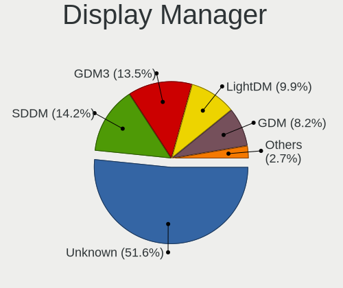
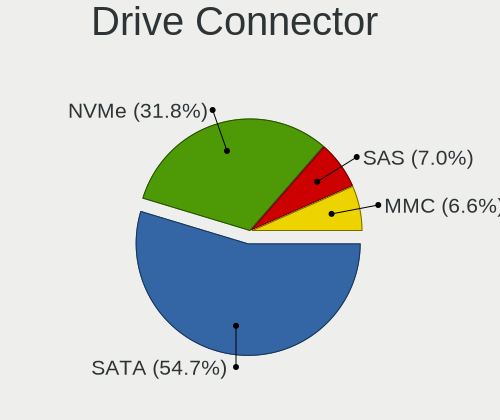
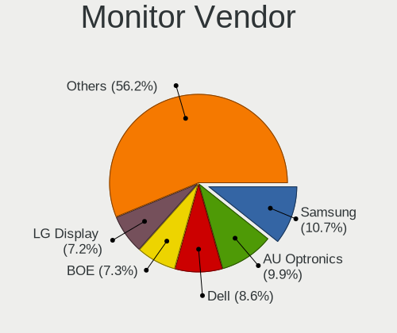
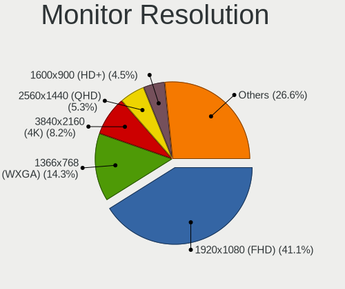

Linux in USA - Tested Hardware & Statistics
-------------------------------------------

A project to collect tested hardware configurations for Linux in USA.

Anyone can contribute to this report by the [hw-probe](https://github.com/linuxhw/hw-probe) tool:

    sudo -E hw-probe -all -upload

Please contribute! Especially if your hardware is rare.

This is a report for all computer types. See also reports for [desktops](/Location/USA/Desktop/README.md) and [notebooks](/Location/USA/Notebook/README.md).

Contents
--------

* [ Test Cases ](#test-cases)

* [ System ](#system)
  - [ OS                       ](#os)
  - [ OS Family                ](#os-family)
  - [ Kernel                   ](#kernel)
  - [ Kernel Family            ](#kernel-family)
  - [ Kernel Major Ver.        ](#kernel-major-ver)
  - [ Arch                     ](#arch)
  - [ DE                       ](#de)
  - [ Display Server           ](#display-server)
  - [ Display Manager          ](#display-manager)
  - [ OS Lang                  ](#os-lang)
  - [ Boot Mode                ](#boot-mode)
  - [ Filesystem               ](#filesystem)
  - [ Part. scheme             ](#part-scheme)
  - [ Dual Boot with Linux/BSD ](#dual-boot-with-linuxbsd)
  - [ Dual Boot (Win)          ](#dual-boot-win)

* [ Board ](#board)
  - [ Vendor                   ](#vendor)
  - [ Model                    ](#model)
  - [ Model Family             ](#model-family)
  - [ MFG Year                 ](#mfg-year)
  - [ Form Factor              ](#form-factor)
  - [ Secure Boot              ](#secure-boot)
  - [ Coreboot                 ](#coreboot)
  - [ RAM Size                 ](#ram-size)
  - [ RAM Used                 ](#ram-used)
  - [ Total Drives             ](#total-drives)
  - [ Has CD-ROM               ](#has-cd-rom)
  - [ Has Ethernet             ](#has-ethernet)
  - [ Has WiFi                 ](#has-wifi)
  - [ Has Bluetooth            ](#has-bluetooth)

* [ Location ](#location)
  - [ Country                  ](#country)
  - [ City                     ](#city)

* [ Drives ](#drives)
  - [ Drive Vendor             ](#drive-vendor)
  - [ Drive Model              ](#drive-model)
  - [ HDD Vendor               ](#hdd-vendor)
  - [ SSD Vendor               ](#ssd-vendor)
  - [ Drive Kind               ](#drive-kind)
  - [ Drive Connector          ](#drive-connector)
  - [ Drive Size               ](#drive-size)
  - [ Space Total              ](#space-total)
  - [ Space Used               ](#space-used)
  - [ Malfunc. Drives          ](#malfunc-drives)
  - [ Malfunc. Drive Vendor    ](#malfunc-drive-vendor)
  - [ Malfunc. HDD Vendor      ](#malfunc-hdd-vendor)
  - [ Malfunc. Drive Kind      ](#malfunc-drive-kind)
  - [ Failed Drives            ](#failed-drives)
  - [ Failed Drive Vendor      ](#failed-drive-vendor)
  - [ Drive Status             ](#drive-status)

* [ Storage controller ](#storage-controller)
  - [ Storage Vendor           ](#storage-vendor)
  - [ Storage Model            ](#storage-model)
  - [ Storage Kind             ](#storage-kind)

* [ Processor ](#processor)
  - [ CPU Vendor               ](#cpu-vendor)
  - [ CPU Model                ](#cpu-model)
  - [ CPU Model Family         ](#cpu-model-family)
  - [ CPU Cores                ](#cpu-cores)
  - [ CPU Sockets              ](#cpu-sockets)
  - [ CPU Threads              ](#cpu-threads)
  - [ CPU Op-Modes             ](#cpu-op-modes)
  - [ CPU Microcode            ](#cpu-microcode)
  - [ CPU Microarch            ](#cpu-microarch)

* [ Graphics ](#graphics)
  - [ GPU Vendor               ](#gpu-vendor)
  - [ GPU Model                ](#gpu-model)
  - [ GPU Combo                ](#gpu-combo)
  - [ GPU Driver               ](#gpu-driver)
  - [ GPU Memory               ](#gpu-memory)

* [ Monitor ](#monitor)
  - [ Monitor Vendor           ](#monitor-vendor)
  - [ Monitor Model            ](#monitor-model)
  - [ Monitor Resolution       ](#monitor-resolution)
  - [ Monitor Diagonal         ](#monitor-diagonal)
  - [ Monitor Width            ](#monitor-width)
  - [ Aspect Ratio             ](#aspect-ratio)
  - [ Monitor Area             ](#monitor-area)
  - [ Pixel Density            ](#pixel-density)
  - [ Multiple Monitors        ](#multiple-monitors)

* [ Network ](#network)
  - [ Net Controller Vendor    ](#net-controller-vendor)
  - [ Net Controller Model     ](#net-controller-model)
  - [ Wireless Vendor          ](#wireless-vendor)
  - [ Wireless Model           ](#wireless-model)
  - [ Ethernet Vendor          ](#ethernet-vendor)
  - [ Ethernet Model           ](#ethernet-model)
  - [ Net Controller Kind      ](#net-controller-kind)
  - [ Used Controller          ](#used-controller)
  - [ NICs                     ](#nics)
  - [ IPv6                     ](#ipv6)

* [ Bluetooth ](#bluetooth)
  - [ Bluetooth Vendor         ](#bluetooth-vendor)
  - [ Bluetooth Model          ](#bluetooth-model)

* [ Sound ](#sound)
  - [ Sound Vendor             ](#sound-vendor)
  - [ Sound Model              ](#sound-model)

* [ Memory ](#memory)
  - [ Memory Vendor            ](#memory-vendor)
  - [ Memory Model             ](#memory-model)
  - [ Memory Kind              ](#memory-kind)
  - [ Memory Form Factor       ](#memory-form-factor)
  - [ Memory Size              ](#memory-size)
  - [ Memory Speed             ](#memory-speed)

* [ Printers & scanners ](#printers--scanners)
  - [ Printer Vendor           ](#printer-vendor)
  - [ Printer Model            ](#printer-model)
  - [ Scanner Vendor           ](#scanner-vendor)
  - [ Scanner Model            ](#scanner-model)

* [ Camera ](#camera)
  - [ Camera Vendor            ](#camera-vendor)
  - [ Camera Model             ](#camera-model)

* [ Security ](#security)
  - [ Fingerprint Vendor       ](#fingerprint-vendor)
  - [ Fingerprint Model        ](#fingerprint-model)
  - [ Chipcard Vendor          ](#chipcard-vendor)
  - [ Chipcard Model           ](#chipcard-model)

* [ Unsupported ](#unsupported)
  - [ Unsupported Devices      ](#unsupported-devices)
  - [ Unsupported Device Types ](#unsupported-device-types)

Test Cases
----------

Total: 50682

| Vendor        | Model                       | Form-Factor | Probe                                                      | Date         |
|---------------|-----------------------------|-------------|------------------------------------------------------------|--------------|
| Lenovo        | Yoga 9 14IAP7 82LU          | Convertible | [cb6f37ea2b](https://linux-hardware.org/?probe=cb6f37ea2b) | Jul 01, 2023 |
| Dell          | 0HC3G4 A00                  | Mini pc     | [c111f0f4be](https://linux-hardware.org/?probe=c111f0f4be) | Jul 01, 2023 |
| Dell          | Inspiron 3537               | Notebook    | [43b81e38cd](https://linux-hardware.org/?probe=43b81e38cd) | Jul 01, 2023 |
| Dell          | Inspiron 16 5625            | Notebook    | [bf36f89d32](https://linux-hardware.org/?probe=bf36f89d32) | Jul 01, 2023 |
| Google        | Kohaku                      | Notebook    | [e533de07bd](https://linux-hardware.org/?probe=e533de07bd) | Jul 01, 2023 |
| Lenovo        | ThinkPad P14s Gen 1 20Y1... | Notebook    | [4d377fc8b8](https://linux-hardware.org/?probe=4d377fc8b8) | Jul 01, 2023 |
| Dell          | Precision M4800             | Notebook    | [d85b2b94d6](https://linux-hardware.org/?probe=d85b2b94d6) | Jun 30, 2023 |
| Pegatron      | 2ACB                        | Desktop     | [ceb2b4c1c5](https://linux-hardware.org/?probe=ceb2b4c1c5) | Jun 30, 2023 |
| HP            | 1998                        | Desktop     | [91f6e54877](https://linux-hardware.org/?probe=91f6e54877) | Jun 30, 2023 |
| HP            | Pavilion dv6                | Notebook    | [9e3a0f3a0b](https://linux-hardware.org/?probe=9e3a0f3a0b) | Jun 30, 2023 |
| Gigabyte      | B650 AORUS PRO AX           | Notebook    | [f8ced52649](https://linux-hardware.org/?probe=f8ced52649) | Jun 30, 2023 |
| ASUSTek       | PRIME Z790-A WIFI           | Desktop     | [fa055ceb7c](https://linux-hardware.org/?probe=fa055ceb7c) | Jun 30, 2023 |
| Acer          | Spin SP314-54N              | Convertible | [446ce08df0](https://linux-hardware.org/?probe=446ce08df0) | Jun 30, 2023 |
| HP            | ProLiant DL360 G7           | Server      | [7e37520061](https://linux-hardware.org/?probe=7e37520061) | Jun 30, 2023 |
| Apple         | MacBookAir7,2               | Notebook    | [cb1bcce659](https://linux-hardware.org/?probe=cb1bcce659) | Jun 30, 2023 |
| Gigabyte      | GA-78LMT-USB3 SEx           | Desktop     | [af3e6790e4](https://linux-hardware.org/?probe=af3e6790e4) | Jun 30, 2023 |
| Acer          | Predator PO5-640            | Desktop     | [416b01c954](https://linux-hardware.org/?probe=416b01c954) | Jun 30, 2023 |
| Lenovo        | ThinkPad T430 2347AT2       | Notebook    | [951adb91cd](https://linux-hardware.org/?probe=951adb91cd) | Jun 30, 2023 |
| Gigabyte      | Z87X-UD5H-CF                | Desktop     | [3749bda51b](https://linux-hardware.org/?probe=3749bda51b) | Jun 30, 2023 |
| ASUSTek       | ROG CROSSHAIR X670E GENE    | Desktop     | [c93f4f0d0b](https://linux-hardware.org/?probe=c93f4f0d0b) | Jun 30, 2023 |
| Dell          | Inspiron 1545               | Notebook    | [cfcc86ddd5](https://linux-hardware.org/?probe=cfcc86ddd5) | Jun 30, 2023 |
| Gigabyte      | Z87X-UD5H-CF                | Desktop     | [6ee8476c0e](https://linux-hardware.org/?probe=6ee8476c0e) | Jun 30, 2023 |
| HP            | 8056                        | Desktop     | [32d1199c51](https://linux-hardware.org/?probe=32d1199c51) | Jun 30, 2023 |
| Google        | Fleex                       | Notebook    | [7e3eb2d4f9](https://linux-hardware.org/?probe=7e3eb2d4f9) | Jun 30, 2023 |
| HP            | ProBook 650 G5              | Notebook    | [99a03772fb](https://linux-hardware.org/?probe=99a03772fb) | Jun 30, 2023 |
| Gateway       | MD7309U                     | Notebook    | [e21ff27153](https://linux-hardware.org/?probe=e21ff27153) | Jun 30, 2023 |
| Gateway       | MD7309U                     | Notebook    | [8d97d507d1](https://linux-hardware.org/?probe=8d97d507d1) | Jun 30, 2023 |
| AZW           | U59                         | Desktop     | [2b5d4dd033](https://linux-hardware.org/?probe=2b5d4dd033) | Jun 30, 2023 |
| Dell          | Latitude 7350               | Notebook    | [95fc412b55](https://linux-hardware.org/?probe=95fc412b55) | Jun 30, 2023 |
| Teclast       | F7 Plus                     | Notebook    | [cebd3b027c](https://linux-hardware.org/?probe=cebd3b027c) | Jun 30, 2023 |
| ATOPNUC       | MA90                        | Mini pc     | [c959833db6](https://linux-hardware.org/?probe=c959833db6) | Jun 30, 2023 |
| Dell          | Precision M4800             | Notebook    | [769a982a68](https://linux-hardware.org/?probe=769a982a68) | Jun 30, 2023 |
| Lenovo        | 0B98401 WIN                 | Desktop     | [35871c9acc](https://linux-hardware.org/?probe=35871c9acc) | Jun 30, 2023 |
| ASUSTek       | ROG Strix G533ZW_G533ZW     | Notebook    | [bbd5ba331d](https://linux-hardware.org/?probe=bbd5ba331d) | Jun 30, 2023 |
| Google        | Eldrid                      | Notebook    | [4e08107dd6](https://linux-hardware.org/?probe=4e08107dd6) | Jun 30, 2023 |
| HP            | Laptop 15-dy2xxx            | Notebook    | [12871de62d](https://linux-hardware.org/?probe=12871de62d) | Jun 30, 2023 |
| Dell          | G3 3779                     | Notebook    | [a6c5553133](https://linux-hardware.org/?probe=a6c5553133) | Jun 30, 2023 |
| Supermicro    | H12SSL-i                    | Server      | [52b4c086dc](https://linux-hardware.org/?probe=52b4c086dc) | Jun 30, 2023 |
| Dell          | 0KYJ8C A02                  | Desktop     | [f4fff60df3](https://linux-hardware.org/?probe=f4fff60df3) | Jun 30, 2023 |
| HP            | 89B5 A                      | Desktop     | [f0330163de](https://linux-hardware.org/?probe=f0330163de) | Jun 30, 2023 |
| ASRock        | X570 Taichi                 | Desktop     | [af8af2c7e8](https://linux-hardware.org/?probe=af8af2c7e8) | Jun 30, 2023 |
| Gigabyte      | X570 AORUS ELITE WIFI       | Desktop     | [cdb77bf9b6](https://linux-hardware.org/?probe=cdb77bf9b6) | Jun 30, 2023 |
| ASUSTek       | M51AC                       | Desktop     | [d32d060e9c](https://linux-hardware.org/?probe=d32d060e9c) | Jun 30, 2023 |
| Dell          | Inspiron 16 5625            | Notebook    | [cbbe256fa2](https://linux-hardware.org/?probe=cbbe256fa2) | Jun 30, 2023 |
| Dell          | 0M6C7G A00                  | Desktop     | [d7dfcc4a38](https://linux-hardware.org/?probe=d7dfcc4a38) | Jun 30, 2023 |
| Apple         | MacBookPro12,1              | Notebook    | [997b1fe1f8](https://linux-hardware.org/?probe=997b1fe1f8) | Jun 30, 2023 |
| Lenovo        | ThinkPad X1 Yoga 3rd 20L... | Convertible | [394788bdc8](https://linux-hardware.org/?probe=394788bdc8) | Jun 30, 2023 |
| Dell          | 0KYJ8C A02                  | Desktop     | [c860545122](https://linux-hardware.org/?probe=c860545122) | Jun 30, 2023 |
| HP            | 2129                        | Desktop     | [73daf1de6b](https://linux-hardware.org/?probe=73daf1de6b) | Jun 30, 2023 |
| Gigabyte      | X670E AORUS MASTER          | Desktop     | [70ddebe460](https://linux-hardware.org/?probe=70ddebe460) | Jun 30, 2023 |
| Gigabyte      | X670E AORUS MASTER          | Desktop     | [7ae106bfd6](https://linux-hardware.org/?probe=7ae106bfd6) | Jun 30, 2023 |
| HP            | Laptop 15-db1xxx            | Notebook    | [6d3d6e002f](https://linux-hardware.org/?probe=6d3d6e002f) | Jun 30, 2023 |
| MSI           | GS65 Stealth 9SD            | Notebook    | [568380fd59](https://linux-hardware.org/?probe=568380fd59) | Jun 30, 2023 |
| MSI           | GS65 Stealth 9SD            | Notebook    | [54013b2dfd](https://linux-hardware.org/?probe=54013b2dfd) | Jun 30, 2023 |
| Dell          | XPS 15 9570                 | Notebook    | [e0492d6173](https://linux-hardware.org/?probe=e0492d6173) | Jun 29, 2023 |
| Dell          | Latitude 7350               | Notebook    | [8ae13e8fdb](https://linux-hardware.org/?probe=8ae13e8fdb) | Jun 29, 2023 |
| Apple         | Mac-BE088AF8C5EB4FA2 iMa... | All in one  | [1e30b2ea59](https://linux-hardware.org/?probe=1e30b2ea59) | Jun 29, 2023 |
| MSI           | MPG Z390 GAMING EDGE AC     | Desktop     | [5a6b149eb4](https://linux-hardware.org/?probe=5a6b149eb4) | Jun 29, 2023 |
| HP            | ProBook 6560b               | Notebook    | [e8e8e6881d](https://linux-hardware.org/?probe=e8e8e6881d) | Jun 29, 2023 |
| Dell          | 0T568R A00                  | Desktop     | [cf98a8a69b](https://linux-hardware.org/?probe=cf98a8a69b) | Jun 29, 2023 |
| Lenovo        | 3000 G530 4151/200          | Notebook    | [f3482421c4](https://linux-hardware.org/?probe=f3482421c4) | Jun 29, 2023 |
| ASUSTek       | PRIME X299-DELUXE           | Desktop     | [4df7190c46](https://linux-hardware.org/?probe=4df7190c46) | Jun 29, 2023 |
| Acer          | Aspire XC-830               | Desktop     | [eccf186dfd](https://linux-hardware.org/?probe=eccf186dfd) | Jun 29, 2023 |
| Gigabyte      | Z390 AORUS PRO WIFI-CF      | Desktop     | [304ff06fc0](https://linux-hardware.org/?probe=304ff06fc0) | Jun 29, 2023 |
| ASUSTek       | PRIME X299-DELUXE           | Desktop     | [6388cc47ae](https://linux-hardware.org/?probe=6388cc47ae) | Jun 29, 2023 |
| Dell          | Precision M6500             | Notebook    | [199e90722c](https://linux-hardware.org/?probe=199e90722c) | Jun 29, 2023 |
| ASUSTek       | ROG STRIX X670E-E GAMING... | Desktop     | [95fb20193a](https://linux-hardware.org/?probe=95fb20193a) | Jun 29, 2023 |
| HP            | 1589                        | Desktop     | [dcb3289360](https://linux-hardware.org/?probe=dcb3289360) | Jun 29, 2023 |
| MSI           | B450 TOMAHAWK               | Desktop     | [86866241cd](https://linux-hardware.org/?probe=86866241cd) | Jun 29, 2023 |
| ASUSTek       | TUF Gaming Z690-PLUS WIF... | Desktop     | [a996f391dc](https://linux-hardware.org/?probe=a996f391dc) | Jun 29, 2023 |
| ASUSTek       | PRIME B550M-A               | Desktop     | [5bb4af3f8b](https://linux-hardware.org/?probe=5bb4af3f8b) | Jun 29, 2023 |
| MSI           | B550-A PRO                  | Desktop     | [722b0302f4](https://linux-hardware.org/?probe=722b0302f4) | Jun 29, 2023 |
| Acer          | Swift SF313-53              | Notebook    | [17ea716a87](https://linux-hardware.org/?probe=17ea716a87) | Jun 29, 2023 |
| Raspberry ... | Raspberry Pi 4 Model B R... | Soc         | [a536b66fc6](https://linux-hardware.org/?probe=a536b66fc6) | Jun 29, 2023 |
| ASUSTek       | Z170-E                      | Desktop     | [8be9720ca6](https://linux-hardware.org/?probe=8be9720ca6) | Jun 29, 2023 |
| Lenovo        | ThinkPad P14s Gen 3 21J5... | Notebook    | [2d16f5be74](https://linux-hardware.org/?probe=2d16f5be74) | Jun 29, 2023 |
| Apple         | MacBookPro9,2               | Notebook    | [0a8268aae6](https://linux-hardware.org/?probe=0a8268aae6) | Jun 29, 2023 |
| HP            | Laptop 15-dy2xxx            | Notebook    | [ea4a5ccb1a](https://linux-hardware.org/?probe=ea4a5ccb1a) | Jun 29, 2023 |
| Lenovo        | ThinkPad X1 Yoga 3rd 20L... | Convertible | [2a5ae27f54](https://linux-hardware.org/?probe=2a5ae27f54) | Jun 29, 2023 |
| ASUSTek       | PRIME Z590-P                | Desktop     | [6147d58cdf](https://linux-hardware.org/?probe=6147d58cdf) | Jun 29, 2023 |
| Shuttle       | FS61                        | Desktop     | [a67d2edea8](https://linux-hardware.org/?probe=a67d2edea8) | Jun 28, 2023 |
| Lenovo        | 3111 SDK0J40697 WIN 3305... | Desktop     | [323464eebb](https://linux-hardware.org/?probe=323464eebb) | Jun 28, 2023 |
| Microsoft     | Surface Laptop 4            | Tablet      | [6e6779c5d6](https://linux-hardware.org/?probe=6e6779c5d6) | Jun 28, 2023 |
| MSI           | H110M GAMING                | Desktop     | [23de26f1b2](https://linux-hardware.org/?probe=23de26f1b2) | Jun 28, 2023 |
| Intel         | NUC8BEB J72688-304          | Mini pc     | [5bc93ff20d](https://linux-hardware.org/?probe=5bc93ff20d) | Jun 28, 2023 |
| ASUSTek       | ROG STRIX X370-F GAMING     | Desktop     | [793ee1e44c](https://linux-hardware.org/?probe=793ee1e44c) | Jun 28, 2023 |
| ASUSTek       | ROG STRIX X470-I GAMING     | Desktop     | [b8194aee09](https://linux-hardware.org/?probe=b8194aee09) | Jun 28, 2023 |
| ASUSTek       | VivoBook_ASUSLaptop TN34... | Convertible | [c6402add6a](https://linux-hardware.org/?probe=c6402add6a) | Jun 28, 2023 |
| ASUSTek       | P8Z77-V LE                  | Desktop     | [802b3686d4](https://linux-hardware.org/?probe=802b3686d4) | Jun 28, 2023 |
| ATOPNUC       | MA90                        | Mini pc     | [73b2087727](https://linux-hardware.org/?probe=73b2087727) | Jun 28, 2023 |
| ASUSTek       | PRIME B550M-A               | Desktop     | [d6823d5ec7](https://linux-hardware.org/?probe=d6823d5ec7) | Jun 28, 2023 |
| ASUSTek       | VivoBook E14 E402YA_L402... | Notebook    | [54dfdc8842](https://linux-hardware.org/?probe=54dfdc8842) | Jun 28, 2023 |
| Lenovo        | ThinkPad X1 Tablet Gen 3... | Tablet      | [e2ea94e083](https://linux-hardware.org/?probe=e2ea94e083) | Jun 28, 2023 |
| ATOPNUC       | MA90                        | Mini pc     | [ed5faedbe1](https://linux-hardware.org/?probe=ed5faedbe1) | Jun 28, 2023 |
| Lenovo        | Win8 Pro DPK TPG            | Desktop     | [0efc49ca3a](https://linux-hardware.org/?probe=0efc49ca3a) | Jun 28, 2023 |
| Dell          | 02YYK5 A01                  | Desktop     | [4054ebeac8](https://linux-hardware.org/?probe=4054ebeac8) | Jun 28, 2023 |
| Apple         | MacBookAir7,2               | Notebook    | [98ad52d973](https://linux-hardware.org/?probe=98ad52d973) | Jun 28, 2023 |
| Dell          | Precision M6500             | Notebook    | [1db851fd5d](https://linux-hardware.org/?probe=1db851fd5d) | Jun 28, 2023 |
| COLORFUL      | X16 Pro 23                  | Notebook    | [656cf52198](https://linux-hardware.org/?probe=656cf52198) | Jun 28, 2023 |
| Raspberry ... | Raspberry Pi 2 Model B R... | Soc         | [04d1ab025a](https://linux-hardware.org/?probe=04d1ab025a) | Jun 28, 2023 |
| Apple         | MacBookPro8,3               | Notebook    | [4846eae54f](https://linux-hardware.org/?probe=4846eae54f) | Jun 28, 2023 |
| Gigabyte      | B550M AORUS PRO-P           | Desktop     | [e29021ab76](https://linux-hardware.org/?probe=e29021ab76) | Jun 28, 2023 |
| Apple         | MacBookPro8,3               | Notebook    | [f5c922b6d3](https://linux-hardware.org/?probe=f5c922b6d3) | Jun 28, 2023 |
| MSI           | S3361                       | Server      | [81c0a2f5b6](https://linux-hardware.org/?probe=81c0a2f5b6) | Jun 28, 2023 |
| Lenovo        | Win8 Pro DPK TPG            | Desktop     | [72514911c8](https://linux-hardware.org/?probe=72514911c8) | Jun 28, 2023 |
| Intel         | NUC7i5DNB J57626-509        | Mini pc     | [a8ee980594](https://linux-hardware.org/?probe=a8ee980594) | Jun 28, 2023 |
| OEM           | Unknown                     | Desktop     | [0448bbee67](https://linux-hardware.org/?probe=0448bbee67) | Jun 28, 2023 |
| MSI           | B550M PRO-VDH WIFI          | Desktop     | [cd0c241308](https://linux-hardware.org/?probe=cd0c241308) | Jun 28, 2023 |
| Dell          | Inspiron 3501               | Notebook    | [afc9f56d8d](https://linux-hardware.org/?probe=afc9f56d8d) | Jun 28, 2023 |
| ASRock        | X570 Taichi                 | Desktop     | [75cb221d91](https://linux-hardware.org/?probe=75cb221d91) | Jun 28, 2023 |
| HP            | EliteBook 745 G2            | Notebook    | [f64e6dd56e](https://linux-hardware.org/?probe=f64e6dd56e) | Jun 28, 2023 |
| HP            | 86F3 00100                  | All in one  | [8895116a7d](https://linux-hardware.org/?probe=8895116a7d) | Jun 28, 2023 |
| MSI           | GE75 Raider 10SF            | Notebook    | [c2a5aeb291](https://linux-hardware.org/?probe=c2a5aeb291) | Jun 28, 2023 |
| HP            | 86F3 00100                  | All in one  | [8e3236446c](https://linux-hardware.org/?probe=8e3236446c) | Jun 28, 2023 |
| Acer          | Aspire A515-56              | Notebook    | [78b59f70ff](https://linux-hardware.org/?probe=78b59f70ff) | Jun 28, 2023 |
| AZW           | GTR V02                     | Desktop     | [d8a1975328](https://linux-hardware.org/?probe=d8a1975328) | Jun 27, 2023 |
| MSI           | B550M PRO-VDH WIFI          | Desktop     | [6f96789257](https://linux-hardware.org/?probe=6f96789257) | Jun 27, 2023 |
| MSI           | B550M PRO-VDH WIFI          | Desktop     | [f46408c9b6](https://linux-hardware.org/?probe=f46408c9b6) | Jun 27, 2023 |
| HP            | Laptop 17-by2xxx            | Notebook    | [55682b5871](https://linux-hardware.org/?probe=55682b5871) | Jun 27, 2023 |
| Dell          | Precision M6600             | Notebook    | [bcc4817c8b](https://linux-hardware.org/?probe=bcc4817c8b) | Jun 27, 2023 |
| Dell          | 0F6X5P A00                  | Desktop     | [cad43414b4](https://linux-hardware.org/?probe=cad43414b4) | Jun 27, 2023 |
| HP            | ZBook Studio G3             | Notebook    | [f51bc4a275](https://linux-hardware.org/?probe=f51bc4a275) | Jun 27, 2023 |
| Apple         | MacBookAir7,1               | Notebook    | [37b4621542](https://linux-hardware.org/?probe=37b4621542) | Jun 27, 2023 |
| Intel         | NUC6i3SYB H81132-503        | Mini pc     | [07941536c0](https://linux-hardware.org/?probe=07941536c0) | Jun 27, 2023 |
| HP            | 802F                        | Desktop     | [585f9bf338](https://linux-hardware.org/?probe=585f9bf338) | Jun 27, 2023 |
| HP            | Laptop 17-bs0xx             | Notebook    | [638a0571c3](https://linux-hardware.org/?probe=638a0571c3) | Jun 27, 2023 |
| HP            | 802F                        | Desktop     | [efceba0028](https://linux-hardware.org/?probe=efceba0028) | Jun 27, 2023 |
| HP            | 821D                        | Desktop     | [9b007c8a3f](https://linux-hardware.org/?probe=9b007c8a3f) | Jun 27, 2023 |
| Lenovo        | IdeaPadFlex 5 14ITL05 82... | Convertible | [c77b479e22](https://linux-hardware.org/?probe=c77b479e22) | Jun 27, 2023 |
| Lenovo        | Legion Y7000 81FW           | Notebook    | [c0af461776](https://linux-hardware.org/?probe=c0af461776) | Jun 27, 2023 |
| ASUSTek       | VivoBook_ASUSLaptop M760... | Notebook    | [abf9b9909f](https://linux-hardware.org/?probe=abf9b9909f) | Jun 27, 2023 |
| Dell          | 00010C A00                  | Desktop     | [f965b0f028](https://linux-hardware.org/?probe=f965b0f028) | Jun 27, 2023 |
| Dell          | Inspiron 7520               | Notebook    | [6754aac0be](https://linux-hardware.org/?probe=6754aac0be) | Jun 27, 2023 |
| Dell          | Inspiron 7520               | Notebook    | [4ff818e0cb](https://linux-hardware.org/?probe=4ff818e0cb) | Jun 27, 2023 |
| HP            | ENVY Laptop 17-ch2xxx       | Notebook    | [41e22753cc](https://linux-hardware.org/?probe=41e22753cc) | Jun 27, 2023 |
| HP            | Laptop 15-dy1xxx            | Notebook    | [6958b0e619](https://linux-hardware.org/?probe=6958b0e619) | Jun 27, 2023 |
| MSI           | B450M GAMING PLUS           | Desktop     | [57e792219c](https://linux-hardware.org/?probe=57e792219c) | Jun 27, 2023 |
| Dell          | Inspiron 7720               | Notebook    | [89858274fd](https://linux-hardware.org/?probe=89858274fd) | Jun 27, 2023 |
| HP            | 0A9Ch                       | Desktop     | [08eccac462](https://linux-hardware.org/?probe=08eccac462) | Jun 27, 2023 |
| HP            | 8653 A                      | Desktop     | [076dd9a4b8](https://linux-hardware.org/?probe=076dd9a4b8) | Jun 27, 2023 |
| Lenovo        | ThinkPad P53 20QNS00X00     | Notebook    | [a4b38b88cc](https://linux-hardware.org/?probe=a4b38b88cc) | Jun 27, 2023 |
| Dell          | 0R6PCT A01                  | Desktop     | [2fd7aa28db](https://linux-hardware.org/?probe=2fd7aa28db) | Jun 27, 2023 |
| Lenovo        | ThinkPad Yoga 11e 20DA50... | Notebook    | [b756e54029](https://linux-hardware.org/?probe=b756e54029) | Jun 27, 2023 |
| Lenovo        | ThinkPad P53 20QNS00X00     | Notebook    | [e28a0d43ed](https://linux-hardware.org/?probe=e28a0d43ed) | Jun 27, 2023 |
| Valve         | Jupiter                     | Notebook    | [650287f33d](https://linux-hardware.org/?probe=650287f33d) | Jun 27, 2023 |
| ASUSTek       | ROG STRIX Z590-E GAMING ... | Desktop     | [962cd7b905](https://linux-hardware.org/?probe=962cd7b905) | Jun 27, 2023 |
| GPU Compan... | GWTN141-10                  | Notebook    | [474833dcec](https://linux-hardware.org/?probe=474833dcec) | Jun 27, 2023 |
| Apple         | Mac-F2268DAE                | All in one  | [7a5a27ddd7](https://linux-hardware.org/?probe=7a5a27ddd7) | Jun 27, 2023 |
| ASUSTek       | ROG STRIX B650E-E GAMING... | Desktop     | [0a35c3c750](https://linux-hardware.org/?probe=0a35c3c750) | Jun 27, 2023 |
| Valve         | Jupiter                     | Notebook    | [9262a02e0e](https://linux-hardware.org/?probe=9262a02e0e) | Jun 26, 2023 |
| Gigabyte      | GA-78LMT-USB3 x.x           | Desktop     | [baf77629c1](https://linux-hardware.org/?probe=baf77629c1) | Jun 26, 2023 |
| Gigabyte      | B550M AORUS PRO-P           | Desktop     | [91b5e02477](https://linux-hardware.org/?probe=91b5e02477) | Jun 26, 2023 |
| Acer          | AOA150                      | Notebook    | [61f8e3c7d2](https://linux-hardware.org/?probe=61f8e3c7d2) | Jun 26, 2023 |
| ASUSTek       | PRIME B560M-A AC            | Desktop     | [b598080123](https://linux-hardware.org/?probe=b598080123) | Jun 26, 2023 |
| HP            | EliteBook x360 1030 G4      | Convertible | [740bd03ee0](https://linux-hardware.org/?probe=740bd03ee0) | Jun 26, 2023 |
| MSI           | GP72MVR 7RGX                | Notebook    | [7fa12ec2d8](https://linux-hardware.org/?probe=7fa12ec2d8) | Jun 26, 2023 |
| ASUSTek       | VivoBook_ASUSLaptop X160... | Notebook    | [85c3968edc](https://linux-hardware.org/?probe=85c3968edc) | Jun 26, 2023 |
| GEEKOM        | MiniAir 11                  | Server      | [98c7079daa](https://linux-hardware.org/?probe=98c7079daa) | Jun 26, 2023 |
| MSI           | Crosshair 15 A11UEK         | Notebook    | [8ce4fd5481](https://linux-hardware.org/?probe=8ce4fd5481) | Jun 26, 2023 |
| Lenovo        | ThinkPad X1 Extreme 2nd ... | Notebook    | [178ed56625](https://linux-hardware.org/?probe=178ed56625) | Jun 26, 2023 |
| MSI           | Crosshair 15 A11UEK         | Notebook    | [bdb7d2c45e](https://linux-hardware.org/?probe=bdb7d2c45e) | Jun 26, 2023 |
| ASUSTek       | GL752VW                     | Notebook    | [1256645a67](https://linux-hardware.org/?probe=1256645a67) | Jun 26, 2023 |
| HP            | EliteBook 8540w             | Notebook    | [2f2e5281ef](https://linux-hardware.org/?probe=2f2e5281ef) | Jun 26, 2023 |
| HP            | EliteBook 8540w             | Notebook    | [ca160c2c1c](https://linux-hardware.org/?probe=ca160c2c1c) | Jun 26, 2023 |
| Dell          | PowerEdge R720xd            | Server      | [4570023480](https://linux-hardware.org/?probe=4570023480) | Jun 26, 2023 |
| BESSTAR Te... | X400                        | Notebook    | [8e98b345cf](https://linux-hardware.org/?probe=8e98b345cf) | Jun 26, 2023 |
| Apple         | MacBookAir6,1               | Notebook    | [6b44c8513d](https://linux-hardware.org/?probe=6b44c8513d) | Jun 26, 2023 |
| MSI           | B550M PRO-VDH WIFI          | Desktop     | [544c014552](https://linux-hardware.org/?probe=544c014552) | Jun 26, 2023 |
| Apple         | MacBook2,1                  | Notebook    | [f5c0a2fd49](https://linux-hardware.org/?probe=f5c0a2fd49) | Jun 26, 2023 |
| ASUSTek       | TUF Gaming X570-PLUS        | Desktop     | [3df76bbd0e](https://linux-hardware.org/?probe=3df76bbd0e) | Jun 26, 2023 |
| Gigabyte      | Z390 AORUS PRO WIFI-CF      | Desktop     | [baeab145a2](https://linux-hardware.org/?probe=baeab145a2) | Jun 26, 2023 |
| HP            | Compaq Mini 110c-1100       | Notebook    | [0dc147bd7c](https://linux-hardware.org/?probe=0dc147bd7c) | Jun 26, 2023 |
| HP            | ENVY m6 Notebook            | Notebook    | [ee31bf4efe](https://linux-hardware.org/?probe=ee31bf4efe) | Jun 26, 2023 |
| ASUSTek       | X510UAR                     | Notebook    | [22372b435f](https://linux-hardware.org/?probe=22372b435f) | Jun 26, 2023 |
| Supermicro    | H12SSL-i                    | Server      | [c7e845c965](https://linux-hardware.org/?probe=c7e845c965) | Jun 26, 2023 |
| Lenovo        | IdeaPad 520-15IKB 80YL      | Notebook    | [ed89cd0d05](https://linux-hardware.org/?probe=ed89cd0d05) | Jun 26, 2023 |
| Lenovo        | IdeaPad 520-15IKB 80YL      | Notebook    | [62665eec25](https://linux-hardware.org/?probe=62665eec25) | Jun 26, 2023 |
| Gigabyte      | GA-78LMT-S2 sex             | Desktop     | [49172baecf](https://linux-hardware.org/?probe=49172baecf) | Jun 26, 2023 |
| Dell          | Inspiron 14 7420 2-in-1     | Convertible | [c243b40ffb](https://linux-hardware.org/?probe=c243b40ffb) | Jun 26, 2023 |
| MSI           | MPG X570 GAMING EDGE WIF... | Desktop     | [f0268ac6a8](https://linux-hardware.org/?probe=f0268ac6a8) | Jun 26, 2023 |
| ASUSTek       | VivoBook_ASUSLaptop X515... | Notebook    | [0a233c34b3](https://linux-hardware.org/?probe=0a233c34b3) | Jun 26, 2023 |
| Dell          | Precision 7670              | Notebook    | [4138a39697](https://linux-hardware.org/?probe=4138a39697) | Jun 26, 2023 |
| Lenovo        | ThinkPad T460s 20F90036U... | Notebook    | [70a6547925](https://linux-hardware.org/?probe=70a6547925) | Jun 26, 2023 |
| Dell          | Inspiron 15 7000 Gaming     | Notebook    | [8db0a77e13](https://linux-hardware.org/?probe=8db0a77e13) | Jun 26, 2023 |
| Lenovo        | ThinkPad A485 20MU000TUS    | Notebook    | [5e67041129](https://linux-hardware.org/?probe=5e67041129) | Jun 26, 2023 |
| Apple         | Mac-F2268DAE                | All in one  | [16c312b7be](https://linux-hardware.org/?probe=16c312b7be) | Jun 26, 2023 |
| Lenovo        | IdeaPad L340-15API 81LW     | Notebook    | [03153f31b2](https://linux-hardware.org/?probe=03153f31b2) | Jun 26, 2023 |
| Dell          | Latitude 3189               | Notebook    | [ad7c98c905](https://linux-hardware.org/?probe=ad7c98c905) | Jun 26, 2023 |
| Gigabyte      | GA-78LMT-S2P                | Desktop     | [713bfcdf62](https://linux-hardware.org/?probe=713bfcdf62) | Jun 26, 2023 |
| ASRock        | B450 Steel Legend           | Desktop     | [734e60af76](https://linux-hardware.org/?probe=734e60af76) | Jun 25, 2023 |
| Lenovo        | ThinkPad T480s 20L8S1R70... | Notebook    | [047bdacac5](https://linux-hardware.org/?probe=047bdacac5) | Jun 25, 2023 |
| Gigabyte      | Z390 AORUS PRO WIFI-CF      | Desktop     | [3486e43434](https://linux-hardware.org/?probe=3486e43434) | Jun 25, 2023 |
| MSI           | B450M MORTAR                | Desktop     | [b9e6c5d81b](https://linux-hardware.org/?probe=b9e6c5d81b) | Jun 25, 2023 |
| Dell          | 0WMJ54 A01                  | Desktop     | [8fb0e7a710](https://linux-hardware.org/?probe=8fb0e7a710) | Jun 25, 2023 |
| HP            | Notebook                    | Notebook    | [ea00ce6c5b](https://linux-hardware.org/?probe=ea00ce6c5b) | Jun 25, 2023 |
| Sony          | VGN-Z520N                   | Notebook    | [d1b8aa8d53](https://linux-hardware.org/?probe=d1b8aa8d53) | Jun 25, 2023 |
| HP            | Pavilion Laptop 14-bk0xx    | Notebook    | [e6184368a0](https://linux-hardware.org/?probe=e6184368a0) | Jun 25, 2023 |
| Dell          | 0GY6Y8 A03                  | Desktop     | [a712129580](https://linux-hardware.org/?probe=a712129580) | Jun 25, 2023 |
| HP            | Laptop 14-dq0xxx            | Notebook    | [695dd94347](https://linux-hardware.org/?probe=695dd94347) | Jun 25, 2023 |
| HP            | Laptop 15-dw3xxx            | Notebook    | [a80704a116](https://linux-hardware.org/?probe=a80704a116) | Jun 25, 2023 |
| Sony          | VGN-Z520N                   | Notebook    | [093ca7f305](https://linux-hardware.org/?probe=093ca7f305) | Jun 25, 2023 |
| Apple         | Mac-F2268CC8                | All in one  | [3ff8f73ac7](https://linux-hardware.org/?probe=3ff8f73ac7) | Jun 25, 2023 |
| Dell          | Latitude 3189               | Notebook    | [8547503af5](https://linux-hardware.org/?probe=8547503af5) | Jun 25, 2023 |
| ASUSTek       | 970 PRO GAMING/AURA         | Desktop     | [a729d9a4a8](https://linux-hardware.org/?probe=a729d9a4a8) | Jun 25, 2023 |
| Dell          | Latitude 3189               | Notebook    | [3f44430a36](https://linux-hardware.org/?probe=3f44430a36) | Jun 25, 2023 |
| HP            | Pavilion dv6                | Notebook    | [d699670acc](https://linux-hardware.org/?probe=d699670acc) | Jun 25, 2023 |
| JINGSHA       | Unknown                     | Desktop     | [2ae6ac9599](https://linux-hardware.org/?probe=2ae6ac9599) | Jun 25, 2023 |
| MSI           | MPG B550 GAMING PLUS        | Desktop     | [eefd044b2b](https://linux-hardware.org/?probe=eefd044b2b) | Jun 25, 2023 |
| Dell          | 0HY9JP A00                  | Desktop     | [92293568ae](https://linux-hardware.org/?probe=92293568ae) | Jun 25, 2023 |
| HP            | EliteBook 8740w             | Notebook    | [e460d017ec](https://linux-hardware.org/?probe=e460d017ec) | Jun 25, 2023 |
| Lenovo        | ThinkPad T460s 20F90036U... | Notebook    | [1809b4709e](https://linux-hardware.org/?probe=1809b4709e) | Jun 25, 2023 |
| Gigabyte      | Z390 AORUS PRO WIFI-CF      | Desktop     | [9aa214f70a](https://linux-hardware.org/?probe=9aa214f70a) | Jun 25, 2023 |
| Dell          | Latitude D430               | Notebook    | [4e832147f4](https://linux-hardware.org/?probe=4e832147f4) | Jun 25, 2023 |
| Lenovo        | ThinkPad T450 20BUS0EW1K    | Notebook    | [43f405f4ce](https://linux-hardware.org/?probe=43f405f4ce) | Jun 25, 2023 |
| Dell          | XPS 15 9500                 | Notebook    | [81937f18f4](https://linux-hardware.org/?probe=81937f18f4) | Jun 25, 2023 |
| Dell          | Latitude E6520              | Notebook    | [bd3986fb04](https://linux-hardware.org/?probe=bd3986fb04) | Jun 25, 2023 |
| ASUSTek       | ROG Zephyrus G15 GA503QR... | Notebook    | [047aac4298](https://linux-hardware.org/?probe=047aac4298) | Jun 25, 2023 |
| Supermicro    | H12SSL-i                    | Server      | [d56f78f3ca](https://linux-hardware.org/?probe=d56f78f3ca) | Jun 25, 2023 |
| Gigabyte      | B450M DS3H-CF               | Desktop     | [14bd8b577f](https://linux-hardware.org/?probe=14bd8b577f) | Jun 25, 2023 |
| HP            | Spectre Folio Convertibl... | Convertible | [123d2215a1](https://linux-hardware.org/?probe=123d2215a1) | Jun 25, 2023 |
| Lenovo        | 3130 SDK0J40697 WIN 3305... | Mini pc     | [227abe2f5c](https://linux-hardware.org/?probe=227abe2f5c) | Jun 25, 2023 |
| HP            | EliteBook 840 G4            | Notebook    | [2e20ab8996](https://linux-hardware.org/?probe=2e20ab8996) | Jun 25, 2023 |
| ASRock        | Z170 Pro4S                  | Desktop     | [e28483cca4](https://linux-hardware.org/?probe=e28483cca4) | Jun 25, 2023 |
| AMI           | Unknown                     | Notebook    | [88da6b0232](https://linux-hardware.org/?probe=88da6b0232) | Jun 25, 2023 |
| Google        | Nami                        | Notebook    | [f9f785f70d](https://linux-hardware.org/?probe=f9f785f70d) | Jun 25, 2023 |
| Intel         | NUC6i7KYB H90766-402        | Mini pc     | [94afcaf73d](https://linux-hardware.org/?probe=94afcaf73d) | Jun 25, 2023 |
| Google        | Blooglet                    | Notebook    | [88fae074d1](https://linux-hardware.org/?probe=88fae074d1) | Jun 25, 2023 |
| HP            | ENVY NOTEBOOK PC            | Notebook    | [8bd62ffdf1](https://linux-hardware.org/?probe=8bd62ffdf1) | Jun 25, 2023 |
| MSI           | MPG B550 GAMING PLUS        | Desktop     | [f84d78f3cf](https://linux-hardware.org/?probe=f84d78f3cf) | Jun 24, 2023 |
| Lenovo        | ThinkPad X13 Yoga Gen 2 ... | Convertible | [dc36b0a5e7](https://linux-hardware.org/?probe=dc36b0a5e7) | Jun 24, 2023 |
| ASUSTek       | PRIME B450M-A II            | Desktop     | [31d19c3462](https://linux-hardware.org/?probe=31d19c3462) | Jun 24, 2023 |
| AZW           | SER                         | Mini pc     | [719900681e](https://linux-hardware.org/?probe=719900681e) | Jun 24, 2023 |
| ASUSTek       | P9X79 PRO                   | Desktop     | [3d1eeda7fa](https://linux-hardware.org/?probe=3d1eeda7fa) | Jun 24, 2023 |
| ASUSTek       | PRIME B450M-A II            | Desktop     | [85221c654f](https://linux-hardware.org/?probe=85221c654f) | Jun 24, 2023 |
| HP            | Laptop 15-dy2xxx            | Notebook    | [0ff31b18c2](https://linux-hardware.org/?probe=0ff31b18c2) | Jun 24, 2023 |
| Dell          | 088DT1 A01                  | Desktop     | [755d1f8c03](https://linux-hardware.org/?probe=755d1f8c03) | Jun 24, 2023 |
| HP            | ZBook Studio 15.6 inch G... | Notebook    | [f043aedf3c](https://linux-hardware.org/?probe=f043aedf3c) | Jun 24, 2023 |
| Lenovo        | 30FD SDK0J40697 WIN 3305... | Mini pc     | [279f2cedcc](https://linux-hardware.org/?probe=279f2cedcc) | Jun 24, 2023 |
| ASUSTek       | M5A78L-M/USB3               | Desktop     | [1c0d2d86f3](https://linux-hardware.org/?probe=1c0d2d86f3) | Jun 24, 2023 |
| Dell          | 00V62H A01                  | Desktop     | [23134d6c71](https://linux-hardware.org/?probe=23134d6c71) | Jun 24, 2023 |
| Gigabyte      | B550 AORUS PRO AC           | Desktop     | [cafe332307](https://linux-hardware.org/?probe=cafe332307) | Jun 24, 2023 |
| Gigabyte      | Z390 AORUS PRO WIFI-CF      | Desktop     | [a19fc9dde8](https://linux-hardware.org/?probe=a19fc9dde8) | Jun 24, 2023 |
| HP            | 0A9Ch                       | Desktop     | [4bd59bd633](https://linux-hardware.org/?probe=4bd59bd633) | Jun 24, 2023 |
| HP            | Convertible x360            | Convertible | [83dec03aa9](https://linux-hardware.org/?probe=83dec03aa9) | Jun 24, 2023 |
| MSI           | MPG X570 GAMING PLUS        | Desktop     | [0e23ab4ba9](https://linux-hardware.org/?probe=0e23ab4ba9) | Jun 24, 2023 |
| HP            | ENVY x360 2-in-1 Laptop ... | Convertible | [1bee09e212](https://linux-hardware.org/?probe=1bee09e212) | Jun 24, 2023 |
| System76      | Desktop leox5               | Desktop     | [210eb3f1e8](https://linux-hardware.org/?probe=210eb3f1e8) | Jun 24, 2023 |
| Intel         | DH77EB AAG39073-304         | Desktop     | [6936a9ca21](https://linux-hardware.org/?probe=6936a9ca21) | Jun 24, 2023 |
| Google        | Kip                         | Notebook    | [4e1bfd359e](https://linux-hardware.org/?probe=4e1bfd359e) | Jun 24, 2023 |
| Lenovo        | IdeaPad 330-15IKB 81DE      | Notebook    | [bc2b97d0a8](https://linux-hardware.org/?probe=bc2b97d0a8) | Jun 24, 2023 |
| HP            | Convertible x360            | Convertible | [d752c240a8](https://linux-hardware.org/?probe=d752c240a8) | Jun 24, 2023 |
| Samsung       | 530XBB                      | Notebook    | [51007aebd3](https://linux-hardware.org/?probe=51007aebd3) | Jun 24, 2023 |
| Lenovo        | ThinkPad W530 244723U       | Notebook    | [724255c291](https://linux-hardware.org/?probe=724255c291) | Jun 24, 2023 |
| Acer          | Swift SF314-512             | Notebook    | [12f361cd8c](https://linux-hardware.org/?probe=12f361cd8c) | Jun 24, 2023 |
| Lenovo        | ThinkPad W530 244723U       | Notebook    | [4d125f041b](https://linux-hardware.org/?probe=4d125f041b) | Jun 24, 2023 |
| Lenovo        | 30FD SDK0J40697 WIN 3305... | Mini pc     | [f83de9c7b9](https://linux-hardware.org/?probe=f83de9c7b9) | Jun 24, 2023 |
| Apple         | Mac-27AD2F918AE68F61 Mac... | Desktop     | [45575cf0cc](https://linux-hardware.org/?probe=45575cf0cc) | Jun 24, 2023 |
| Apple         | Mac-27AD2F918AE68F61 Mac... | Desktop     | [77d2d05995](https://linux-hardware.org/?probe=77d2d05995) | Jun 24, 2023 |
| Lenovo        | IdeaPad 330-15IKB 81DE      | Notebook    | [e0c5a18b09](https://linux-hardware.org/?probe=e0c5a18b09) | Jun 24, 2023 |
| Alienware     | 18                          | Notebook    | [047bc74541](https://linux-hardware.org/?probe=047bc74541) | Jun 24, 2023 |
| HP            | 15 Notebook PC              | Notebook    | [440f4bbf29](https://linux-hardware.org/?probe=440f4bbf29) | Jun 24, 2023 |
| Valve         | Jupiter                     | Notebook    | [20678f1d9f](https://linux-hardware.org/?probe=20678f1d9f) | Jun 24, 2023 |
| Seeed Stud... | ODYSSEY-X86J41X5 CJ41GV2... | Desktop     | [79a2c321e8](https://linux-hardware.org/?probe=79a2c321e8) | Jun 24, 2023 |
| Lenovo        | ThinkPad P53s 20N6001UUS    | Notebook    | [0834c21488](https://linux-hardware.org/?probe=0834c21488) | Jun 24, 2023 |
| Lenovo        | ThinkPad T14 Gen 1 20UDC... | Notebook    | [737204f453](https://linux-hardware.org/?probe=737204f453) | Jun 24, 2023 |
| Google        | Kohaku                      | Notebook    | [f9c3a3efb6](https://linux-hardware.org/?probe=f9c3a3efb6) | Jun 23, 2023 |
| ASUSTek       | P8Z77-V LK                  | Desktop     | [bcfc1fe2de](https://linux-hardware.org/?probe=bcfc1fe2de) | Jun 23, 2023 |
| ASUSTek       | Zenbook UX3402ZA_Q409ZA     | Notebook    | [2812cf43d0](https://linux-hardware.org/?probe=2812cf43d0) | Jun 23, 2023 |
| HP            | 215 G1                      | Notebook    | [0b651dad7d](https://linux-hardware.org/?probe=0b651dad7d) | Jun 23, 2023 |
| HP            | 304Bh                       | Desktop     | [234bedfab1](https://linux-hardware.org/?probe=234bedfab1) | Jun 23, 2023 |
| MSI           | H270-A PRO                  | Desktop     | [169bbe5f04](https://linux-hardware.org/?probe=169bbe5f04) | Jun 23, 2023 |
| ASUSTek       | K30BF_M32BF                 | Desktop     | [46a7aaf9f1](https://linux-hardware.org/?probe=46a7aaf9f1) | Jun 23, 2023 |
| ASRockRack    | X470D4U                     | Desktop     | [2d49269787](https://linux-hardware.org/?probe=2d49269787) | Jun 23, 2023 |
| Lenovo        | ThinkPad X1 Carbon 5th 2... | Notebook    | [7b187eac86](https://linux-hardware.org/?probe=7b187eac86) | Jun 23, 2023 |
| ASRock        | B450M Pro4                  | Desktop     | [54d4fa843c](https://linux-hardware.org/?probe=54d4fa843c) | Jun 23, 2023 |
| AZW           | GTR V01                     | Mini pc     | [1d14e2e2d4](https://linux-hardware.org/?probe=1d14e2e2d4) | Jun 23, 2023 |
| Lenovo        | ThinkPad L13 Yoga Gen 2 ... | Convertible | [71f114122e](https://linux-hardware.org/?probe=71f114122e) | Jun 23, 2023 |
| Dell          | Latitude E6420              | Notebook    | [162293d893](https://linux-hardware.org/?probe=162293d893) | Jun 23, 2023 |
| HP            | 2820h                       | Desktop     | [3406c7aac4](https://linux-hardware.org/?probe=3406c7aac4) | Jun 23, 2023 |
| HP            | 2820h                       | Desktop     | [cab2d08c26](https://linux-hardware.org/?probe=cab2d08c26) | Jun 23, 2023 |
| ASUSTek       | Maximus V FORMULA           | Desktop     | [190d408bc2](https://linux-hardware.org/?probe=190d408bc2) | Jun 23, 2023 |
| Lenovo        | ThinkPad L15 Gen 2a 20X7... | Notebook    | [ed127d8c21](https://linux-hardware.org/?probe=ed127d8c21) | Jun 23, 2023 |
| Lenovo        | ThinkPad L15 Gen 2a 20X7... | Notebook    | [e4f7f39784](https://linux-hardware.org/?probe=e4f7f39784) | Jun 23, 2023 |
| Valve         | Jupiter                     | Notebook    | [d8f3d630c3](https://linux-hardware.org/?probe=d8f3d630c3) | Jun 23, 2023 |
| Valve         | Jupiter                     | Notebook    | [4da7495332](https://linux-hardware.org/?probe=4da7495332) | Jun 23, 2023 |
| Lenovo        | ThinkPad T540p 20BFS1D70... | Notebook    | [c0e41e35f8](https://linux-hardware.org/?probe=c0e41e35f8) | Jun 23, 2023 |
| HP            | Stream 11 Pro G4 EE         | Notebook    | [8add1110e7](https://linux-hardware.org/?probe=8add1110e7) | Jun 23, 2023 |
| ASUSTek       | Maximus V FORMULA           | Desktop     | [fa49028492](https://linux-hardware.org/?probe=fa49028492) | Jun 23, 2023 |
| Foxconn       | nT-iBT18/nT-iBT19/nT-iBT... | Desktop     | [51b5eb0fa2](https://linux-hardware.org/?probe=51b5eb0fa2) | Jun 23, 2023 |
| Dell          | 0HC3G4 A00                  | Mini pc     | [23723983da](https://linux-hardware.org/?probe=23723983da) | Jun 23, 2023 |
| Intel         | NUC8BEB J72692-303          | Mini pc     | [521a8a0da0](https://linux-hardware.org/?probe=521a8a0da0) | Jun 23, 2023 |
| Google        | Kefka                       | Notebook    | [c5d9002e23](https://linux-hardware.org/?probe=c5d9002e23) | Jun 23, 2023 |
| Apple         | Mac-F2268DAE                | All in one  | [e5efed1ac5](https://linux-hardware.org/?probe=e5efed1ac5) | Jun 23, 2023 |
| MSI           | PRO B660-A DDR4             | Desktop     | [1ecefb98f7](https://linux-hardware.org/?probe=1ecefb98f7) | Jun 23, 2023 |
| Valve         | Jupiter                     | Notebook    | [73e80c2b31](https://linux-hardware.org/?probe=73e80c2b31) | Jun 23, 2023 |
| ASUSTek       | K30BF_M32BF                 | Desktop     | [655b20a34b](https://linux-hardware.org/?probe=655b20a34b) | Jun 23, 2023 |
| Valve         | Jupiter                     | Notebook    | [196d127382](https://linux-hardware.org/?probe=196d127382) | Jun 23, 2023 |
| MSI           | GL73 8RD                    | Notebook    | [2739b46bbe](https://linux-hardware.org/?probe=2739b46bbe) | Jun 23, 2023 |
| HP            | 0A9Ch                       | Desktop     | [2f48843246](https://linux-hardware.org/?probe=2f48843246) | Jun 23, 2023 |
| Foxconn       | ALOE X3                     | Desktop     | [ec9afb2155](https://linux-hardware.org/?probe=ec9afb2155) | Jun 23, 2023 |
| Lenovo        | ThinkPad A485 20MU000TUS    | Notebook    | [305e202fd3](https://linux-hardware.org/?probe=305e202fd3) | Jun 22, 2023 |
| MSI           | MPG B550 GAMING PLUS        | Desktop     | [d08acec85f](https://linux-hardware.org/?probe=d08acec85f) | Jun 22, 2023 |
| MSI           | B360M BAZOOKA               | Desktop     | [2807f81cc7](https://linux-hardware.org/?probe=2807f81cc7) | Jun 22, 2023 |
| Lenovo        | ThinkPad X1 Carbon 5th 2... | Notebook    | [06977283b8](https://linux-hardware.org/?probe=06977283b8) | Jun 22, 2023 |
| HP            | EliteBook 8560p             | Notebook    | [177d2fe509](https://linux-hardware.org/?probe=177d2fe509) | Jun 22, 2023 |
| Dell          | 0HD5W2 A01                  | Desktop     | [bbdbdd30a9](https://linux-hardware.org/?probe=bbdbdd30a9) | Jun 22, 2023 |
| HP            | Compaq 6710b (GF940AT#AB... | Notebook    | [75199aaf80](https://linux-hardware.org/?probe=75199aaf80) | Jun 22, 2023 |
| Valve         | Jupiter                     | Notebook    | [329518de92](https://linux-hardware.org/?probe=329518de92) | Jun 22, 2023 |
| ASRockRack    | X470D4U                     | Desktop     | [d419086209](https://linux-hardware.org/?probe=d419086209) | Jun 22, 2023 |
| MSI           | 760GM-E51                   | Desktop     | [078c1805bd](https://linux-hardware.org/?probe=078c1805bd) | Jun 22, 2023 |
| ASUSTek       | ROG STRIX Z590-E GAMING ... | Desktop     | [379c36642b](https://linux-hardware.org/?probe=379c36642b) | Jun 22, 2023 |
| Lenovo        | Yoga 7 14ITL5 82BH          | Convertible | [c1858efd7e](https://linux-hardware.org/?probe=c1858efd7e) | Jun 22, 2023 |
| Lenovo        | Yoga 7 14ITL5 82BH          | Convertible | [90bb825e51](https://linux-hardware.org/?probe=90bb825e51) | Jun 22, 2023 |
| ASUSTek       | TUF Gaming X670E-PLUS WI... | Desktop     | [082d9a4988](https://linux-hardware.org/?probe=082d9a4988) | Jun 22, 2023 |
| Gigabyte      | H110M-A-CF                  | Desktop     | [e2ed397728](https://linux-hardware.org/?probe=e2ed397728) | Jun 22, 2023 |
| ASUSTek       | X551MA                      | Notebook    | [5b2b7d4a7f](https://linux-hardware.org/?probe=5b2b7d4a7f) | Jun 22, 2023 |
| MSI           | PRO B550M-VC WIFI           | Desktop     | [c9f86c15b7](https://linux-hardware.org/?probe=c9f86c15b7) | Jun 22, 2023 |
| HP            | Notebook                    | Notebook    | [35b8a2a187](https://linux-hardware.org/?probe=35b8a2a187) | Jun 22, 2023 |
| ASUSTek       | Q534UXK                     | Convertible | [56cf3a68b0](https://linux-hardware.org/?probe=56cf3a68b0) | Jun 22, 2023 |
| Lenovo        | ThinkServer TS140           | Desktop     | [5043d686d8](https://linux-hardware.org/?probe=5043d686d8) | Jun 22, 2023 |
| ASUSTek       | ROG STRIX B650E-F GAMING... | Desktop     | [b07361bc89](https://linux-hardware.org/?probe=b07361bc89) | Jun 22, 2023 |
| Lenovo        | 3730 SDK0T76465 WIN 3422... | Desktop     | [5199a5d1f8](https://linux-hardware.org/?probe=5199a5d1f8) | Jun 22, 2023 |
| Gigabyte      | GA-78LMT-S2 sex             | Desktop     | [198b248306](https://linux-hardware.org/?probe=198b248306) | Jun 22, 2023 |
| Lenovo        | ThinkPad X1 Yoga 4th 20S... | Convertible | [31d17d4d65](https://linux-hardware.org/?probe=31d17d4d65) | Jun 22, 2023 |
| HP            | Spectre x360 Convertible... | Convertible | [71d10fdd86](https://linux-hardware.org/?probe=71d10fdd86) | Jun 22, 2023 |
| HP            | Pavilion dv5                | Notebook    | [4a0db4b1ba](https://linux-hardware.org/?probe=4a0db4b1ba) | Jun 22, 2023 |
| ASRock        | H61M-VG3                    | Desktop     | [955228e9e5](https://linux-hardware.org/?probe=955228e9e5) | Jun 22, 2023 |
| HP            | Pavilion dv5                | Notebook    | [902335f2cb](https://linux-hardware.org/?probe=902335f2cb) | Jun 22, 2023 |
| AOpen         | iBDWMUx-MD R1.04            | Desktop     | [2656caf6b8](https://linux-hardware.org/?probe=2656caf6b8) | Jun 22, 2023 |
| Google        | Link                        | Notebook    | [b8284753ca](https://linux-hardware.org/?probe=b8284753ca) | Jun 22, 2023 |
| Lenovo        | SHARKBAY 0B98401 WIN        | Desktop     | [1c465408de](https://linux-hardware.org/?probe=1c465408de) | Jun 22, 2023 |
| HP            | EliteBook 835 G8 Noteboo... | Notebook    | [60124528c7](https://linux-hardware.org/?probe=60124528c7) | Jun 22, 2023 |
| ASUSTek       | PRIME Z490-A                | Desktop     | [f7c2ec659b](https://linux-hardware.org/?probe=f7c2ec659b) | Jun 22, 2023 |
| Gigabyte      | F2A88XM-D3H                 | Desktop     | [6c43b99ec8](https://linux-hardware.org/?probe=6c43b99ec8) | Jun 22, 2023 |
| Apple         | MacBookAir7,2               | Notebook    | [ae8c13c6fd](https://linux-hardware.org/?probe=ae8c13c6fd) | Jun 22, 2023 |
| Dell          | Inspiron 5567               | Notebook    | [8634954b1c](https://linux-hardware.org/?probe=8634954b1c) | Jun 22, 2023 |
| ASRock        | X670E PG Lightning          | Desktop     | [b8e19a16f9](https://linux-hardware.org/?probe=b8e19a16f9) | Jun 22, 2023 |
| AZW           | GTR V01                     | Mini pc     | [d3922c3f77](https://linux-hardware.org/?probe=d3922c3f77) | Jun 22, 2023 |
| Dell          | 0YXG0N A00                  | Desktop     | [546af4a5d6](https://linux-hardware.org/?probe=546af4a5d6) | Jun 22, 2023 |
| Inventec      | 0W63N3 A01                  | Mini pc     | [2e4e948549](https://linux-hardware.org/?probe=2e4e948549) | Jun 22, 2023 |
| Dell          | Inspiron 15 3525            | Notebook    | [09f4615df6](https://linux-hardware.org/?probe=09f4615df6) | Jun 22, 2023 |
| System76      | Gazelle                     | Notebook    | [858e408027](https://linux-hardware.org/?probe=858e408027) | Jun 21, 2023 |
| HP            | EliteBook 850 G6            | Notebook    | [a68e387274](https://linux-hardware.org/?probe=a68e387274) | Jun 21, 2023 |
| Dell          | G3 3590                     | Notebook    | [14ab83043b](https://linux-hardware.org/?probe=14ab83043b) | Jun 21, 2023 |
| Dell          | Latitude E5550              | Notebook    | [72f4d53246](https://linux-hardware.org/?probe=72f4d53246) | Jun 21, 2023 |
| Dell          | 09KPNV A01                  | Desktop     | [eaa3017d03](https://linux-hardware.org/?probe=eaa3017d03) | Jun 21, 2023 |
| Acer          | Spin SP314-54N              | Convertible | [2805733dcd](https://linux-hardware.org/?probe=2805733dcd) | Jun 21, 2023 |
| Acer          | Aspire E5-575G              | Notebook    | [0fb6c61a2b](https://linux-hardware.org/?probe=0fb6c61a2b) | Jun 21, 2023 |
| Lenovo        | ThinkPad P14s Gen 3 21J5... | Notebook    | [12153cd235](https://linux-hardware.org/?probe=12153cd235) | Jun 21, 2023 |
| HP            | Laptop 14-fq1xxx            | Notebook    | [eba6a24be2](https://linux-hardware.org/?probe=eba6a24be2) | Jun 21, 2023 |
| Toshiba       | TECRA R850                  | Notebook    | [a75e6d35da](https://linux-hardware.org/?probe=a75e6d35da) | Jun 21, 2023 |
| Apple         | MacBookPro10,1              | Notebook    | [9841bf505c](https://linux-hardware.org/?probe=9841bf505c) | Jun 21, 2023 |
| Dell          | 08K0X7 A00                  | Desktop     | [c7fdebd823](https://linux-hardware.org/?probe=c7fdebd823) | Jun 21, 2023 |
| Apple         | MacBookAir7,2               | Notebook    | [9f3829c99f](https://linux-hardware.org/?probe=9f3829c99f) | Jun 21, 2023 |
| Apple         | MacBookAir7,2               | Notebook    | [379e3473e2](https://linux-hardware.org/?probe=379e3473e2) | Jun 21, 2023 |
| Apple         | MacBookAir7,2               | Notebook    | [8a2a9fd293](https://linux-hardware.org/?probe=8a2a9fd293) | Jun 21, 2023 |
| Google        | Barla                       | Notebook    | [43df74a8c1](https://linux-hardware.org/?probe=43df74a8c1) | Jun 21, 2023 |
| HP            | 89B5 A                      | Desktop     | [01e8a85a35](https://linux-hardware.org/?probe=01e8a85a35) | Jun 21, 2023 |
| HP            | 1998                        | Desktop     | [efcccef24e](https://linux-hardware.org/?probe=efcccef24e) | Jun 21, 2023 |
| HP            | 1998                        | Desktop     | [71bee9f013](https://linux-hardware.org/?probe=71bee9f013) | Jun 21, 2023 |
| Dell          | Latitude E5550              | Notebook    | [e1fdcf84b3](https://linux-hardware.org/?probe=e1fdcf84b3) | Jun 21, 2023 |
| Dell          | 0NDYHG A01                  | Desktop     | [55873c7a70](https://linux-hardware.org/?probe=55873c7a70) | Jun 21, 2023 |
| Dell          | XPS 9320                    | Notebook    | [6a60a308d1](https://linux-hardware.org/?probe=6a60a308d1) | Jun 21, 2023 |
| HP            | EliteBook 840 G6            | Notebook    | [784d676a8d](https://linux-hardware.org/?probe=784d676a8d) | Jun 21, 2023 |
| Lenovo        | ThinkPad X1 Carbon 7th 2... | Notebook    | [26a3b9b3e9](https://linux-hardware.org/?probe=26a3b9b3e9) | Jun 21, 2023 |
| Lenovo        | ThinkPad T14 Gen 2i 20W1... | Notebook    | [b255195205](https://linux-hardware.org/?probe=b255195205) | Jun 21, 2023 |
| Acer          | Spin SP314-54N              | Convertible | [370e948985](https://linux-hardware.org/?probe=370e948985) | Jun 21, 2023 |
| Apple         | Mac-7BA5B2DFE22DDD8C Mac... | Mini pc     | [35ecc89b13](https://linux-hardware.org/?probe=35ecc89b13) | Jun 21, 2023 |
| MSI           | MPG Z390 GAMING EDGE AC     | Desktop     | [86ee4e619f](https://linux-hardware.org/?probe=86ee4e619f) | Jun 21, 2023 |
| ASUSTek       | PRIME B550M-A               | Desktop     | [a5e833c54e](https://linux-hardware.org/?probe=a5e833c54e) | Jun 21, 2023 |
| MSI           | B450 TOMAHAWK MAX           | Desktop     | [5a583f77d8](https://linux-hardware.org/?probe=5a583f77d8) | Jun 21, 2023 |
| HP            | EliteBook Folio 9470m       | Notebook    | [8503c5d0fe](https://linux-hardware.org/?probe=8503c5d0fe) | Jun 21, 2023 |
| Intel         | NUC7i3BNB J22859-308        | Mini pc     | [3b9990b59d](https://linux-hardware.org/?probe=3b9990b59d) | Jun 21, 2023 |
| Lenovo        | IdeaPad Gaming 3 15ACH6 ... | Notebook    | [8a61f834dd](https://linux-hardware.org/?probe=8a61f834dd) | Jun 21, 2023 |
| Dell          | Latitude E6410              | Notebook    | [0d9054df1e](https://linux-hardware.org/?probe=0d9054df1e) | Jun 21, 2023 |
| Dell          | 0YXG0N A00                  | Desktop     | [b64e30a95b](https://linux-hardware.org/?probe=b64e30a95b) | Jun 21, 2023 |
| HP            | 339A                        | Desktop     | [420903b9cc](https://linux-hardware.org/?probe=420903b9cc) | Jun 21, 2023 |
| HP            | 18E7                        | Desktop     | [3b872d2a88](https://linux-hardware.org/?probe=3b872d2a88) | Jun 20, 2023 |
| HP            | Notebook                    | Notebook    | [db641e216c](https://linux-hardware.org/?probe=db641e216c) | Jun 20, 2023 |
| Dell          | Inspiron 16 7630 2-in-1     | Convertible | [d003b60677](https://linux-hardware.org/?probe=d003b60677) | Jun 20, 2023 |
| Dell          | XPS 13 9350                 | Notebook    | [3aa5f3f213](https://linux-hardware.org/?probe=3aa5f3f213) | Jun 20, 2023 |
| HP            | Notebook                    | Notebook    | [3460bcb864](https://linux-hardware.org/?probe=3460bcb864) | Jun 20, 2023 |
| Gigabyte      | Z270X-Gaming 7              | Desktop     | [84cab7b427](https://linux-hardware.org/?probe=84cab7b427) | Jun 20, 2023 |
| Apple         | MacBook6,1                  | Notebook    | [c7e1912b55](https://linux-hardware.org/?probe=c7e1912b55) | Jun 20, 2023 |
| Apple         | MacBook5,2                  | Notebook    | [53f708517b](https://linux-hardware.org/?probe=53f708517b) | Jun 20, 2023 |
| MAXSUN        | MS-H81IL TR M.2             | Desktop     | [72c79949e0](https://linux-hardware.org/?probe=72c79949e0) | Jun 20, 2023 |
| Foxconn       | Napa HP P/N                 | Desktop     | [df7eb832b4](https://linux-hardware.org/?probe=df7eb832b4) | Jun 20, 2023 |
| Google        | Stout                       | Notebook    | [cb67ad655e](https://linux-hardware.org/?probe=cb67ad655e) | Jun 20, 2023 |
| Lenovo        | ThinkPad X1 Yoga 1st 20F... | Convertible | [7a4754357e](https://linux-hardware.org/?probe=7a4754357e) | Jun 20, 2023 |
| ASUSTek       | PRIME B450M-A               | Desktop     | [681556b12c](https://linux-hardware.org/?probe=681556b12c) | Jun 20, 2023 |
| MECHREVO      | WUJIE 14                    | Notebook    | [a55e31b287](https://linux-hardware.org/?probe=a55e31b287) | Jun 20, 2023 |
| Lenovo        | MAHOBAY Win8 STD MM DPK ... | Desktop     | [19c5a44099](https://linux-hardware.org/?probe=19c5a44099) | Jun 20, 2023 |
| Dell          | 0RW203                      | Desktop     | [6872d8e6c5](https://linux-hardware.org/?probe=6872d8e6c5) | Jun 20, 2023 |
| Framework     | Laptop (12th Gen Intel C... | Notebook    | [bfa769b311](https://linux-hardware.org/?probe=bfa769b311) | Jun 20, 2023 |
| ASUSTek       | Rampage V EXTREME           | Desktop     | [e7bb42d6d4](https://linux-hardware.org/?probe=e7bb42d6d4) | Jun 20, 2023 |
| Apple         | MacBookPro11,1              | Notebook    | [4850296b9d](https://linux-hardware.org/?probe=4850296b9d) | Jun 20, 2023 |
| Apple         | MacBookPro13,1              | Notebook    | [95a82b40ce](https://linux-hardware.org/?probe=95a82b40ce) | Jun 20, 2023 |
| Lenovo        | ThinkPad X1 Yoga 1st 20F... | Convertible | [a7238c71a7](https://linux-hardware.org/?probe=a7238c71a7) | Jun 20, 2023 |
| HP            | Pavilion dv8                | Notebook    | [e728738ec6](https://linux-hardware.org/?probe=e728738ec6) | Jun 20, 2023 |
| ASUSTek       | Rampage V EXTREME           | Desktop     | [2fe4bf8ad2](https://linux-hardware.org/?probe=2fe4bf8ad2) | Jun 20, 2023 |
| GPU Compan... | GWTC116-2                   | Convertible | [d043c3bd02](https://linux-hardware.org/?probe=d043c3bd02) | Jun 20, 2023 |
| Dell          | 0X9M3X A01                  | Desktop     | [1d14950f1e](https://linux-hardware.org/?probe=1d14950f1e) | Jun 20, 2023 |
| ATOPNUC       | MA90                        | Mini pc     | [40cbaad1bf](https://linux-hardware.org/?probe=40cbaad1bf) | Jun 20, 2023 |
| Dell          | 0X9M3X A01                  | Desktop     | [46baecef13](https://linux-hardware.org/?probe=46baecef13) | Jun 20, 2023 |
| GPU Compan... | GWTC116-2                   | Convertible | [d2e3734724](https://linux-hardware.org/?probe=d2e3734724) | Jun 20, 2023 |
| MSI           | Z270-A PRO                  | Desktop     | [0d8b3d7c32](https://linux-hardware.org/?probe=0d8b3d7c32) | Jun 20, 2023 |
| Google        | Blooguard                   | Notebook    | [f1d90deb53](https://linux-hardware.org/?probe=f1d90deb53) | Jun 20, 2023 |
| Lenovo        | ThinkPad Yoga 11e 5th Ge... | Convertible | [2a1262580e](https://linux-hardware.org/?probe=2a1262580e) | Jun 20, 2023 |
| Lenovo        | Yoga 720-15IKB 80X7         | Convertible | [226b3173fe](https://linux-hardware.org/?probe=226b3173fe) | Jun 20, 2023 |
| HP            | ENVY x360 Convertible 15... | Convertible | [06a28c4a80](https://linux-hardware.org/?probe=06a28c4a80) | Jun 20, 2023 |
| Valve         | Jupiter                     | Notebook    | [a5439e3b2a](https://linux-hardware.org/?probe=a5439e3b2a) | Jun 20, 2023 |
| Lenovo        | IdeaPad 100-15IBD 80QQ      | Notebook    | [5b07ca8390](https://linux-hardware.org/?probe=5b07ca8390) | Jun 20, 2023 |
| HP            | Pavilion Laptop 14-bk0xx    | Notebook    | [063ce55dd5](https://linux-hardware.org/?probe=063ce55dd5) | Jun 20, 2023 |
| HP            | EliteBook 850 G3            | Notebook    | [3055046330](https://linux-hardware.org/?probe=3055046330) | Jun 20, 2023 |
| MSI           | GE75 Raider 10SE            | Notebook    | [f7a3caaef1](https://linux-hardware.org/?probe=f7a3caaef1) | Jun 20, 2023 |
| MSI           | GE75 Raider 10SE            | Notebook    | [f11d231c6a](https://linux-hardware.org/?probe=f11d231c6a) | Jun 20, 2023 |
| Lenovo        | Yoga 720-15IKB 80X7         | Convertible | [97fb6e5a1b](https://linux-hardware.org/?probe=97fb6e5a1b) | Jun 20, 2023 |
| HP            | Pavilion Laptop 15-cs0xx... | Notebook    | [c3f77cf346](https://linux-hardware.org/?probe=c3f77cf346) | Jun 20, 2023 |
| Apple         | Mac-F2268DAE                | All in one  | [7cb19a32ac](https://linux-hardware.org/?probe=7cb19a32ac) | Jun 20, 2023 |
| TaNix         | T3 MRD                      | Notebook    | [fea0fcfd44](https://linux-hardware.org/?probe=fea0fcfd44) | Jun 20, 2023 |
| TaNix         | T3 MRD                      | Notebook    | [5479ceec5f](https://linux-hardware.org/?probe=5479ceec5f) | Jun 20, 2023 |
| ASUSTek       | ASUS TUF Dash F15 FX516P... | Notebook    | [3e09affd03](https://linux-hardware.org/?probe=3e09affd03) | Jun 20, 2023 |
| BESSTAR Te... | HM90                        | Desktop     | [796769b68a](https://linux-hardware.org/?probe=796769b68a) | Jun 20, 2023 |
| ASUSTek       | VivoBook_ASUSLaptop X712... | Notebook    | [67c63af138](https://linux-hardware.org/?probe=67c63af138) | Jun 19, 2023 |
| Pegatron      | JESSE                       | Desktop     | [fa09a247a7](https://linux-hardware.org/?probe=fa09a247a7) | Jun 19, 2023 |
| Lenovo        | ThinkServer TS140           | Desktop     | [9210e713ff](https://linux-hardware.org/?probe=9210e713ff) | Jun 19, 2023 |
| Lenovo        | IdeaPad 3 17IIL05 81WF      | Notebook    | [f52b994470](https://linux-hardware.org/?probe=f52b994470) | Jun 19, 2023 |
| HP            | 86F3 00100                  | All in one  | [b80bd491de](https://linux-hardware.org/?probe=b80bd491de) | Jun 19, 2023 |
| ASUSTek       | ROG STRIX X399-E GAMING     | Desktop     | [405e91f460](https://linux-hardware.org/?probe=405e91f460) | Jun 19, 2023 |
| Lenovo        | ThinkPad T590 20N5S14V00    | Notebook    | [6f81cc6d57](https://linux-hardware.org/?probe=6f81cc6d57) | Jun 19, 2023 |
| Dell          | 0CRH6C A02                  | Desktop     | [6ae5e917b4](https://linux-hardware.org/?probe=6ae5e917b4) | Jun 19, 2023 |
| Lenovo        | SHARKBAY NOK                | Desktop     | [0173559ed0](https://linux-hardware.org/?probe=0173559ed0) | Jun 19, 2023 |
| Valve         | Jupiter                     | Notebook    | [6858460566](https://linux-hardware.org/?probe=6858460566) | Jun 19, 2023 |
| Gigabyte      | B450 AORUS PRO WIFI-CF      | Desktop     | [fe3bb60acc](https://linux-hardware.org/?probe=fe3bb60acc) | Jun 19, 2023 |
| Gigabyte      | 2AC8                        | Desktop     | [bfacacbca8](https://linux-hardware.org/?probe=bfacacbca8) | Jun 19, 2023 |
| Dell          | 0DF42J A00                  | Desktop     | [c1db29329c](https://linux-hardware.org/?probe=c1db29329c) | Jun 19, 2023 |
| Supermicro    | H12DSG-O-CPUA               | Server      | [0eff104f09](https://linux-hardware.org/?probe=0eff104f09) | Jun 19, 2023 |
| TYAN Compu... | S7109GM2NR-2T               | Server      | [d65a72f49b](https://linux-hardware.org/?probe=d65a72f49b) | Jun 19, 2023 |
| System76      | Lemur Pro                   | Notebook    | [5074769fee](https://linux-hardware.org/?probe=5074769fee) | Jun 19, 2023 |
| Dell          | Inspiron 3185               | Notebook    | [f53e8d1094](https://linux-hardware.org/?probe=f53e8d1094) | Jun 19, 2023 |
| Shuttle       | SA76 V10                    | Desktop     | [fbcf156e7e](https://linux-hardware.org/?probe=fbcf156e7e) | Jun 19, 2023 |
| Acer          | Predator PH317-54           | Notebook    | [49b9c71af7](https://linux-hardware.org/?probe=49b9c71af7) | Jun 19, 2023 |
| Gigabyte      | AB350-Gaming 3-CF           | Desktop     | [647597be95](https://linux-hardware.org/?probe=647597be95) | Jun 19, 2023 |
| Dell          | Inspiron 7347               | Notebook    | [026935ac8f](https://linux-hardware.org/?probe=026935ac8f) | Jun 19, 2023 |
| Acer          | Aspire A515-46              | Notebook    | [e40e63fa5f](https://linux-hardware.org/?probe=e40e63fa5f) | Jun 19, 2023 |
| HP            | Notebook                    | Notebook    | [6cc93c4c8a](https://linux-hardware.org/?probe=6cc93c4c8a) | Jun 19, 2023 |
| Lenovo        | ThinkPad P53 20QNS00X00     | Notebook    | [696e673b71](https://linux-hardware.org/?probe=696e673b71) | Jun 19, 2023 |
| Lenovo        | ThinkPad X1 Yoga 1st 20F... | Convertible | [8031890e56](https://linux-hardware.org/?probe=8031890e56) | Jun 19, 2023 |
| Dell          | G7 7588                     | Notebook    | [2cdb34b778](https://linux-hardware.org/?probe=2cdb34b778) | Jun 19, 2023 |
| Lenovo        | Legion 5 82B5               | Notebook    | [146ef72817](https://linux-hardware.org/?probe=146ef72817) | Jun 19, 2023 |
| Lenovo        | IdeaPad S340-15APITouch ... | Notebook    | [fe617b45f8](https://linux-hardware.org/?probe=fe617b45f8) | Jun 19, 2023 |
| Alienware     | 0CPDXD A00                  | Desktop     | [3e1923b97a](https://linux-hardware.org/?probe=3e1923b97a) | Jun 19, 2023 |
| HP            | Laptop 15-dy2xxx            | Notebook    | [0699537327](https://linux-hardware.org/?probe=0699537327) | Jun 19, 2023 |
| Unknown       | T3 MRD                      | Desktop     | [0e766af6dd](https://linux-hardware.org/?probe=0e766af6dd) | Jun 19, 2023 |
| HP            | 829A                        | Mini pc     | [0ca8c646bb](https://linux-hardware.org/?probe=0ca8c646bb) | Jun 19, 2023 |
| ASRock        | Z77 Extreme4                | Desktop     | [78207fbf49](https://linux-hardware.org/?probe=78207fbf49) | Jun 19, 2023 |
| Dell          | Inspiron 7737               | Notebook    | [ba4c6aac1c](https://linux-hardware.org/?probe=ba4c6aac1c) | Jun 19, 2023 |
| Dell          | Inspiron 7737               | Notebook    | [b1daf8dda0](https://linux-hardware.org/?probe=b1daf8dda0) | Jun 19, 2023 |
| MSI           | Raider GE66 12UGS           | Notebook    | [73b20b76a3](https://linux-hardware.org/?probe=73b20b76a3) | Jun 19, 2023 |
| Dell          | Inspiron 7352               | Notebook    | [dd9c020f92](https://linux-hardware.org/?probe=dd9c020f92) | Jun 19, 2023 |
| MSI           | B350M MORTAR                | Desktop     | [dde719cb99](https://linux-hardware.org/?probe=dde719cb99) | Jun 19, 2023 |
| Dell          | 02YYK5 A01                  | Desktop     | [50efda9604](https://linux-hardware.org/?probe=50efda9604) | Jun 19, 2023 |
| HP            | Pavilion Laptop 15-eg2xx... | Notebook    | [8a88cbb916](https://linux-hardware.org/?probe=8a88cbb916) | Jun 19, 2023 |
| AZW           | GTR V02                     | Desktop     | [f9bee18426](https://linux-hardware.org/?probe=f9bee18426) | Jun 19, 2023 |
| HP            | EliteBook 850 G3            | Notebook    | [2102fc8523](https://linux-hardware.org/?probe=2102fc8523) | Jun 19, 2023 |
| HP            | Notebook                    | Notebook    | [6df5e3f6ff](https://linux-hardware.org/?probe=6df5e3f6ff) | Jun 19, 2023 |
| Toshiba       | TECRA R850                  | Notebook    | [c40116d0de](https://linux-hardware.org/?probe=c40116d0de) | Jun 19, 2023 |
| ASUSTek       | G71GX                       | Notebook    | [b6ae9bfdd4](https://linux-hardware.org/?probe=b6ae9bfdd4) | Jun 19, 2023 |
| Timi          | A30                         | Notebook    | [34d77f385a](https://linux-hardware.org/?probe=34d77f385a) | Jun 19, 2023 |
| ASRock        | B450 Pro4                   | Desktop     | [3acc831573](https://linux-hardware.org/?probe=3acc831573) | Jun 19, 2023 |
| Dell          | Studio 1555                 | Notebook    | [d9337bf223](https://linux-hardware.org/?probe=d9337bf223) | Jun 19, 2023 |
| GPU Compan... | GWNC21524                   | Notebook    | [46bd956cbf](https://linux-hardware.org/?probe=46bd956cbf) | Jun 19, 2023 |
| Dell          | Inspiron 16 7630 2-in-1     | Convertible | [66607910c0](https://linux-hardware.org/?probe=66607910c0) | Jun 19, 2023 |
| HP            | Stream Laptop 14-cb1xxx     | Notebook    | [7546cac791](https://linux-hardware.org/?probe=7546cac791) | Jun 19, 2023 |
| Lenovo        | IdeaPadFlex 5 14IIL05 81... | Convertible | [57d511fdb3](https://linux-hardware.org/?probe=57d511fdb3) | Jun 18, 2023 |
| XFX           | MI-9300-7AS9                | Desktop     | [e2c3a51177](https://linux-hardware.org/?probe=e2c3a51177) | Jun 18, 2023 |
| ASUSTek       | P5LD2                       | Desktop     | [7038963b77](https://linux-hardware.org/?probe=7038963b77) | Jun 18, 2023 |
| Dell          | 0C2XKD A01                  | Desktop     | [15331b91ed](https://linux-hardware.org/?probe=15331b91ed) | Jun 18, 2023 |
| Lenovo        | Flex 2-15 20405             | Notebook    | [ae0a1a134a](https://linux-hardware.org/?probe=ae0a1a134a) | Jun 18, 2023 |
| ATOPNUC       | MA90                        | Mini pc     | [2b08fa7bf9](https://linux-hardware.org/?probe=2b08fa7bf9) | Jun 18, 2023 |
| HP            | Pavilion m6                 | Notebook    | [7b2ce10c8a](https://linux-hardware.org/?probe=7b2ce10c8a) | Jun 18, 2023 |
| Dell          | Inspiron 5559               | Notebook    | [7dc6f3af4b](https://linux-hardware.org/?probe=7dc6f3af4b) | Jun 18, 2023 |
| HP            | 8949 11                     | Desktop     | [bd6b95fc23](https://linux-hardware.org/?probe=bd6b95fc23) | Jun 18, 2023 |
| ASUSTek       | M5A97 R2.0                  | Desktop     | [6ff9be62b8](https://linux-hardware.org/?probe=6ff9be62b8) | Jun 18, 2023 |
| Apple         | Mac-F227BEC8 PVT            | All in one  | [3bfb1e7b04](https://linux-hardware.org/?probe=3bfb1e7b04) | Jun 18, 2023 |
| Lenovo        | MAHOBAY Win8 STD MM DPK ... | Desktop     | [68e00c1869](https://linux-hardware.org/?probe=68e00c1869) | Jun 18, 2023 |
| HP            | ENVY x360 2-in-1 Laptop ... | Convertible | [f4cf5bef09](https://linux-hardware.org/?probe=f4cf5bef09) | Jun 18, 2023 |
| HP            | ENVY x360 2-in-1 Laptop ... | Convertible | [9fe2c6961e](https://linux-hardware.org/?probe=9fe2c6961e) | Jun 18, 2023 |
| MSI           | 2AE0                        | Desktop     | [fdfc88e5da](https://linux-hardware.org/?probe=fdfc88e5da) | Jun 18, 2023 |
| HP            | Pavilion Laptop 15-cc6xx    | Notebook    | [ecf90f8368](https://linux-hardware.org/?probe=ecf90f8368) | Jun 18, 2023 |
| Intel         | H81                         | Desktop     | [5cda43eb30](https://linux-hardware.org/?probe=5cda43eb30) | Jun 18, 2023 |
| ASUSTek       | ROG STRIX B550-I GAMING     | Desktop     | [9493891426](https://linux-hardware.org/?probe=9493891426) | Jun 18, 2023 |
| Dell          | 0N4YC8 A00                  | Desktop     | [154f9809e6](https://linux-hardware.org/?probe=154f9809e6) | Jun 18, 2023 |
| Dell          | 0N4YC8 A00                  | Desktop     | [66ce1a98a8](https://linux-hardware.org/?probe=66ce1a98a8) | Jun 18, 2023 |
| Panasonic     | CF-54-2                     | Notebook    | [48b7e4f212](https://linux-hardware.org/?probe=48b7e4f212) | Jun 18, 2023 |
| Dell          | 0HN7XN A01                  | Desktop     | [7348297d40](https://linux-hardware.org/?probe=7348297d40) | Jun 18, 2023 |
| HP            | ENVY m6 Notebook            | Notebook    | [464db6c1df](https://linux-hardware.org/?probe=464db6c1df) | Jun 18, 2023 |
| Lenovo        | 0x36A017AA SDK0J40709 WI... | Desktop     | [c409de5ebd](https://linux-hardware.org/?probe=c409de5ebd) | Jun 18, 2023 |
| ASRock        | Z77 Extreme4                | Desktop     | [c45aea7474](https://linux-hardware.org/?probe=c45aea7474) | Jun 18, 2023 |
| ASUSTek       | ROG STRIX X670E-E GAMING... | Desktop     | [231a3aeb2e](https://linux-hardware.org/?probe=231a3aeb2e) | Jun 18, 2023 |
| Dell          | 06JWJY A01                  | Desktop     | [2131eadb5b](https://linux-hardware.org/?probe=2131eadb5b) | Jun 18, 2023 |
| Lenovo        | STA7B38870 02               | Server      | [80a2f3d367](https://linux-hardware.org/?probe=80a2f3d367) | Jun 18, 2023 |
| Lenovo        | IdeaPad Gaming 3 15ACH6 ... | Notebook    | [ed43d5454c](https://linux-hardware.org/?probe=ed43d5454c) | Jun 18, 2023 |
| Lenovo        | ThinkPad T61 765803U        | Notebook    | [2c989696aa](https://linux-hardware.org/?probe=2c989696aa) | Jun 18, 2023 |
| HP            | ZBook 15                    | Notebook    | [80caa07733](https://linux-hardware.org/?probe=80caa07733) | Jun 18, 2023 |
| BESSTAR Te... | B550                        | Desktop     | [6c2811bbf5](https://linux-hardware.org/?probe=6c2811bbf5) | Jun 18, 2023 |
| ASUSTek       | ROG STRIX B450-F GAMING     | Desktop     | [176bffae78](https://linux-hardware.org/?probe=176bffae78) | Jun 18, 2023 |
| Fujitsu       | FujitsuTP7000 -1            | Desktop     | [231d7f8182](https://linux-hardware.org/?probe=231d7f8182) | Jun 18, 2023 |
| GEEKOM        | MiniAir 11                  | Server      | [ac5a7b3810](https://linux-hardware.org/?probe=ac5a7b3810) | Jun 18, 2023 |
| MSI           | GS66 Stealth 10SF           | Notebook    | [8385742d7d](https://linux-hardware.org/?probe=8385742d7d) | Jun 18, 2023 |
| Gigabyte      | A320M-S2H-CF                | Desktop     | [7cefb01373](https://linux-hardware.org/?probe=7cefb01373) | Jun 18, 2023 |
| ASUSTek       | K53SD                       | Notebook    | [ac006b8cb7](https://linux-hardware.org/?probe=ac006b8cb7) | Jun 18, 2023 |
| Sony          | SVF14N13CXB                 | Notebook    | [468f2143a0](https://linux-hardware.org/?probe=468f2143a0) | Jun 18, 2023 |
| HP            | EliteBook 850 G4            | Notebook    | [3b78bd33e1](https://linux-hardware.org/?probe=3b78bd33e1) | Jun 17, 2023 |
| ASUSTek       | ROG STRIX B550-I GAMING     | Desktop     | [cd87a6b19f](https://linux-hardware.org/?probe=cd87a6b19f) | Jun 17, 2023 |
| Lenovo        | IdeaPad 1 15ADA7 82R1       | Notebook    | [83d17fd3bd](https://linux-hardware.org/?probe=83d17fd3bd) | Jun 17, 2023 |
| Lenovo        | IdeaPad 1 15ADA7 82R1       | Notebook    | [739c466bf0](https://linux-hardware.org/?probe=739c466bf0) | Jun 17, 2023 |
| HP            | EliteBook 840 G3            | Notebook    | [75bb32cc26](https://linux-hardware.org/?probe=75bb32cc26) | Jun 17, 2023 |
| ASUSTek       | PRIME X470-PRO              | Desktop     | [c2f10ad55c](https://linux-hardware.org/?probe=c2f10ad55c) | Jun 17, 2023 |
| Gigabyte      | B450M DS3H V2               | Desktop     | [434d06d1ea](https://linux-hardware.org/?probe=434d06d1ea) | Jun 17, 2023 |
| HP            | Victus by Laptop 16-e0xx... | Notebook    | [bb6859a141](https://linux-hardware.org/?probe=bb6859a141) | Jun 17, 2023 |
| Shenzhen M... | F7BFD                       | Desktop     | [0b079f1414](https://linux-hardware.org/?probe=0b079f1414) | Jun 17, 2023 |
| Dell          | Inspiron 5567               | Notebook    | [92ace6e5ab](https://linux-hardware.org/?probe=92ace6e5ab) | Jun 17, 2023 |
| HP            | ProBook 650 G5              | Notebook    | [1d158627b0](https://linux-hardware.org/?probe=1d158627b0) | Jun 17, 2023 |
| Lenovo        | IdeaPad Gaming 3 15ACH6 ... | Notebook    | [e4c418382a](https://linux-hardware.org/?probe=e4c418382a) | Jun 17, 2023 |
| MSI           | MPG X570 GAMING EDGE WIF... | Desktop     | [3050f49c99](https://linux-hardware.org/?probe=3050f49c99) | Jun 17, 2023 |
| ASUSTek       | ROG CROSSHAIR X670E EXTR... | Desktop     | [c555238190](https://linux-hardware.org/?probe=c555238190) | Jun 17, 2023 |
| Framework     | Laptop                      | Notebook    | [3df2b82bc3](https://linux-hardware.org/?probe=3df2b82bc3) | Jun 17, 2023 |
| HP            | 2B38                        | Desktop     | [b84e03e083](https://linux-hardware.org/?probe=b84e03e083) | Jun 17, 2023 |
| Unknown       | Unknown                     | Notebook    | [c3aaea0987](https://linux-hardware.org/?probe=c3aaea0987) | Jun 17, 2023 |
| Acer          | Aspire A515-46              | Notebook    | [dc64dc75dc](https://linux-hardware.org/?probe=dc64dc75dc) | Jun 17, 2023 |
| Acer          | Aspire A515-46              | Notebook    | [42ab827d04](https://linux-hardware.org/?probe=42ab827d04) | Jun 17, 2023 |
| Dell          | G5 5505                     | Notebook    | [7204581f59](https://linux-hardware.org/?probe=7204581f59) | Jun 17, 2023 |
| Apple         | MacBookPro5,5               | Notebook    | [22e0a1e0cc](https://linux-hardware.org/?probe=22e0a1e0cc) | Jun 17, 2023 |
| Dell          | Precision M6800             | Notebook    | [ba177cb64b](https://linux-hardware.org/?probe=ba177cb64b) | Jun 17, 2023 |
| Gigabyte      | MMLP5AP-00                  | Notebook    | [1f59319cc3](https://linux-hardware.org/?probe=1f59319cc3) | Jun 17, 2023 |
| Unknown       | Unknown                     | Soc         | [92f385e306](https://linux-hardware.org/?probe=92f385e306) | Jun 17, 2023 |
| ASUSTek       | PRIME B550M-A               | Desktop     | [7e135be518](https://linux-hardware.org/?probe=7e135be518) | Jun 17, 2023 |
| Google        | Cave                        | Notebook    | [31c31973e1](https://linux-hardware.org/?probe=31c31973e1) | Jun 17, 2023 |
| ASUSTek       | TUF Gaming X570-PLUS        | Desktop     | [2278cd4d03](https://linux-hardware.org/?probe=2278cd4d03) | Jun 17, 2023 |
| Dell          | Latitude 7430               | Notebook    | [e25ec87b40](https://linux-hardware.org/?probe=e25ec87b40) | Jun 17, 2023 |
| Lenovo        | ThinkPad A485 20MU000TUS    | Notebook    | [10cf405f89](https://linux-hardware.org/?probe=10cf405f89) | Jun 17, 2023 |
| Dell          | Latitude 5491               | Notebook    | [0673ab5ff5](https://linux-hardware.org/?probe=0673ab5ff5) | Jun 17, 2023 |
| Dell          | Latitude 7430               | Notebook    | [35c6e2b80e](https://linux-hardware.org/?probe=35c6e2b80e) | Jun 17, 2023 |
| HP            | ProBook 650 G5              | Notebook    | [9c53e4cd72](https://linux-hardware.org/?probe=9c53e4cd72) | Jun 17, 2023 |
| Microsoft     | Surface Book 2              | Tablet      | [b72660e9a4](https://linux-hardware.org/?probe=b72660e9a4) | Jun 17, 2023 |
| ASRock        | 970M Pro3                   | Desktop     | [777a9e4f49](https://linux-hardware.org/?probe=777a9e4f49) | Jun 17, 2023 |
| Dell          | Precision 7510              | Notebook    | [cbbfdafd46](https://linux-hardware.org/?probe=cbbfdafd46) | Jun 17, 2023 |
| Lenovo        | ThinkPad P50 20EQS0VV03     | Notebook    | [c2a4d4d2c0](https://linux-hardware.org/?probe=c2a4d4d2c0) | Jun 17, 2023 |
| Dell          | Inspiron 3501               | Notebook    | [e4c0eeb007](https://linux-hardware.org/?probe=e4c0eeb007) | Jun 17, 2023 |
| HP            | OMEN Laptop 15-en0xxx       | Notebook    | [5b54def91d](https://linux-hardware.org/?probe=5b54def91d) | Jun 16, 2023 |
| Valve         | Jupiter                     | Notebook    | [b684643576](https://linux-hardware.org/?probe=b684643576) | Jun 16, 2023 |
| Lenovo        | G580 20157                  | Notebook    | [8c47ad5e92](https://linux-hardware.org/?probe=8c47ad5e92) | Jun 16, 2023 |
| Dell          | Precision 5530              | Notebook    | [29ec4c7e1d](https://linux-hardware.org/?probe=29ec4c7e1d) | Jun 16, 2023 |
| Dell          | 07HXY6 A01                  | Desktop     | [ec3adcbe42](https://linux-hardware.org/?probe=ec3adcbe42) | Jun 16, 2023 |
| ASUSTek       | K30BF_M32BF_A_F_K31BF_6     | Desktop     | [7a56496149](https://linux-hardware.org/?probe=7a56496149) | Jun 16, 2023 |
| MSI           | X58 Pro-E                   | Desktop     | [abd2765191](https://linux-hardware.org/?probe=abd2765191) | Jun 16, 2023 |
| ASRock        | Z370 Gaming-ITX/ac          | Desktop     | [e05a90c6c5](https://linux-hardware.org/?probe=e05a90c6c5) | Jun 16, 2023 |
| Dell          | Precision 5530              | Notebook    | [cff5125fb6](https://linux-hardware.org/?probe=cff5125fb6) | Jun 16, 2023 |
| HP            | 212B                        | Desktop     | [134ff203c4](https://linux-hardware.org/?probe=134ff203c4) | Jun 16, 2023 |
| Dell          | Inspiron 5481               | Convertible | [4e24ca3b12](https://linux-hardware.org/?probe=4e24ca3b12) | Jun 16, 2023 |
| HP            | 886C                        | Desktop     | [ef429234c7](https://linux-hardware.org/?probe=ef429234c7) | Jun 16, 2023 |
| Apple         | Mac-DB15BD556843C820 iMa... | All in one  | [6ecfbb88a0](https://linux-hardware.org/?probe=6ecfbb88a0) | Jun 16, 2023 |
| MSI           | GF63 Thin 10SC              | Notebook    | [cd928f7cc4](https://linux-hardware.org/?probe=cd928f7cc4) | Jun 16, 2023 |
| Apple         | MacBookPro9,2               | Notebook    | [1412c501d2](https://linux-hardware.org/?probe=1412c501d2) | Jun 16, 2023 |
| MSI           | GF63 Thin 10SC              | Notebook    | [3204bd2215](https://linux-hardware.org/?probe=3204bd2215) | Jun 16, 2023 |
| ASUSTek       | ROG CROSSHAIR VIII HERO     | Desktop     | [5844f8b39b](https://linux-hardware.org/?probe=5844f8b39b) | Jun 16, 2023 |
| Biostar       | A880GZ                      | Desktop     | [0ab2ec8924](https://linux-hardware.org/?probe=0ab2ec8924) | Jun 16, 2023 |
| HP            | Pavilion Plus Laptop 14-... | Notebook    | [eb9232a196](https://linux-hardware.org/?probe=eb9232a196) | Jun 16, 2023 |
| Toshiba       | Satellite C55D-B            | Notebook    | [341da36529](https://linux-hardware.org/?probe=341da36529) | Jun 16, 2023 |
| Acer          | Nitro AN517-54              | Notebook    | [bba6f237f0](https://linux-hardware.org/?probe=bba6f237f0) | Jun 16, 2023 |
| Supermicro    | X10DRi                      | Server      | [2adac716cd](https://linux-hardware.org/?probe=2adac716cd) | Jun 16, 2023 |
| MSI           | Prestige 15 A10SC           | Notebook    | [a2426b801a](https://linux-hardware.org/?probe=a2426b801a) | Jun 16, 2023 |
| CompuLab      | fitlet                      | Mini pc     | [82c3257031](https://linux-hardware.org/?probe=82c3257031) | Jun 16, 2023 |
| HP            | 1496                        | Desktop     | [ccc9943e2d](https://linux-hardware.org/?probe=ccc9943e2d) | Jun 16, 2023 |
| ASUSTek       | M5A78L-M/USB3               | Desktop     | [c5491fb02f](https://linux-hardware.org/?probe=c5491fb02f) | Jun 16, 2023 |
| Gigabyte      | Z370 AORUS Ultra Gaming-... | Desktop     | [9c3bb21706](https://linux-hardware.org/?probe=9c3bb21706) | Jun 16, 2023 |
| HP            | Stream Notebook PC 13       | Notebook    | [e5f0ea5412](https://linux-hardware.org/?probe=e5f0ea5412) | Jun 16, 2023 |
| MSI           | Z170A GAMING M5             | Desktop     | [a0d460b4a3](https://linux-hardware.org/?probe=a0d460b4a3) | Jun 16, 2023 |
| ASUSTek       | ROG Strix G512LW_G512LW     | Notebook    | [a6a2463b97](https://linux-hardware.org/?probe=a6a2463b97) | Jun 16, 2023 |
| Lenovo        | IdeaPad 5 14ALC05 82LM      | Notebook    | [0d90e728fe](https://linux-hardware.org/?probe=0d90e728fe) | Jun 16, 2023 |
| MSI           | B360M BAZOOKA               | Desktop     | [4448a99385](https://linux-hardware.org/?probe=4448a99385) | Jun 16, 2023 |
| Lenovo        | ThinkPad L13 Yoga Gen 2 ... | Convertible | [1cabb1c87f](https://linux-hardware.org/?probe=1cabb1c87f) | Jun 15, 2023 |
| Dell          | Precision 3551              | Notebook    | [f65ccf6171](https://linux-hardware.org/?probe=f65ccf6171) | Jun 15, 2023 |
| Dell          | Precision 3551              | Notebook    | [bc3299a9d7](https://linux-hardware.org/?probe=bc3299a9d7) | Jun 15, 2023 |
| MSI           | B450 TOMAHAWK MAX           | Desktop     | [15842a2029](https://linux-hardware.org/?probe=15842a2029) | Jun 15, 2023 |
| Lenovo        | 312A SDK0J40697 WIN 3305... | Desktop     | [2b4d4506c2](https://linux-hardware.org/?probe=2b4d4506c2) | Jun 15, 2023 |
| MSI           | X299 GAMING PRO CARBON A... | Desktop     | [6385c09651](https://linux-hardware.org/?probe=6385c09651) | Jun 15, 2023 |
| HP            | 8054                        | Desktop     | [97a4b34236](https://linux-hardware.org/?probe=97a4b34236) | Jun 15, 2023 |
| ASUSTek       | TUF Gaming X570-PLUS        | Desktop     | [13c74e7a46](https://linux-hardware.org/?probe=13c74e7a46) | Jun 15, 2023 |
| Intel         | NUC6i7KYB H90766-410        | Mini pc     | [b4677c0332](https://linux-hardware.org/?probe=b4677c0332) | Jun 15, 2023 |
| Lenovo        | ThinkBook 15 G3 ACL 21A4    | Notebook    | [940ab1af2a](https://linux-hardware.org/?probe=940ab1af2a) | Jun 15, 2023 |
| Lenovo        | ThinkBook 15 G3 ACL 21A4    | Notebook    | [4d81fc8320](https://linux-hardware.org/?probe=4d81fc8320) | Jun 15, 2023 |
| Apple         | MacBookAir7,2               | Notebook    | [2db615249d](https://linux-hardware.org/?probe=2db615249d) | Jun 15, 2023 |
| Apple         | MacBookAir7,2               | Notebook    | [138e2807af](https://linux-hardware.org/?probe=138e2807af) | Jun 15, 2023 |
| Apple         | MacBookAir7,1               | Notebook    | [5d8061c350](https://linux-hardware.org/?probe=5d8061c350) | Jun 15, 2023 |
| HP            | 1589                        | Desktop     | [6bfe1d5b63](https://linux-hardware.org/?probe=6bfe1d5b63) | Jun 15, 2023 |
| HP            | EliteBook 845 G7 Noteboo... | Notebook    | [b1e56a3c92](https://linux-hardware.org/?probe=b1e56a3c92) | Jun 15, 2023 |
| Gateway       | SX2110GA                    | Desktop     | [e47130d966](https://linux-hardware.org/?probe=e47130d966) | Jun 15, 2023 |
| HP            | Elite x2 1012 G1            | Notebook    | [ec3a1e921b](https://linux-hardware.org/?probe=ec3a1e921b) | Jun 15, 2023 |
| Intel         | DG33SXG2 AAD94468-500       | Desktop     | [8feb530340](https://linux-hardware.org/?probe=8feb530340) | Jun 15, 2023 |
| ASUSTek       | Rev                         | Desktop     | [6c5d91db68](https://linux-hardware.org/?probe=6c5d91db68) | Jun 15, 2023 |
| Acer          | Aspire XC-830               | Desktop     | [ca0cba861a](https://linux-hardware.org/?probe=ca0cba861a) | Jun 15, 2023 |
| Lenovo        | Win8 STD MM DPK IPG         | All in one  | [c503081708](https://linux-hardware.org/?probe=c503081708) | Jun 15, 2023 |
| Dell          | Inspiron 14 7435 2-in-1     | Convertible | [b6b86a1205](https://linux-hardware.org/?probe=b6b86a1205) | Jun 15, 2023 |
| HP            | 86F0 11000                  | All in one  | [45026f50ef](https://linux-hardware.org/?probe=45026f50ef) | Jun 15, 2023 |
| HP            | 86F0 11000                  | All in one  | [f074cca59a](https://linux-hardware.org/?probe=f074cca59a) | Jun 15, 2023 |
| HP            | Spectre x360 Convertible... | Convertible | [721dc95455](https://linux-hardware.org/?probe=721dc95455) | Jun 15, 2023 |
| MSI           | Stealth GS77 12UE           | Notebook    | [48df655e45](https://linux-hardware.org/?probe=48df655e45) | Jun 15, 2023 |
| HP            | Spectre x360 Convertible... | Convertible | [699dd5b23e](https://linux-hardware.org/?probe=699dd5b23e) | Jun 15, 2023 |
| Lenovo        | Legion Pro 5 16IRX8 82WK    | Notebook    | [2b5dc6187c](https://linux-hardware.org/?probe=2b5dc6187c) | Jun 15, 2023 |
| GPU Compan... | GWNC21524                   | Notebook    | [5a31ac8b21](https://linux-hardware.org/?probe=5a31ac8b21) | Jun 15, 2023 |
| Lenovo        | ThinkPad E14 Gen 2 20T60... | Notebook    | [f92cfc0ad7](https://linux-hardware.org/?probe=f92cfc0ad7) | Jun 15, 2023 |
| Dell          | Latitude E7470              | Notebook    | [c4bd47b182](https://linux-hardware.org/?probe=c4bd47b182) | Jun 15, 2023 |
| Microsoft     | Surface Laptop              | Tablet      | [2111a059f3](https://linux-hardware.org/?probe=2111a059f3) | Jun 15, 2023 |
| Dell          | Inspiron 14 7435 2-in-1     | Convertible | [d6108344f5](https://linux-hardware.org/?probe=d6108344f5) | Jun 15, 2023 |
| Dell          | Latitude D430               | Notebook    | [ecf3763cf7](https://linux-hardware.org/?probe=ecf3763cf7) | Jun 15, 2023 |
| HP            | 21B4 A01                    | Desktop     | [16b576ebea](https://linux-hardware.org/?probe=16b576ebea) | Jun 15, 2023 |
| ASUSTek       | TUF X470-PLUS GAMING        | Desktop     | [7df89b77f2](https://linux-hardware.org/?probe=7df89b77f2) | Jun 15, 2023 |
| ASUSTek       | M5A97 R2.0                  | Desktop     | [f802893b92](https://linux-hardware.org/?probe=f802893b92) | Jun 15, 2023 |
| MSI           | PRO B550M-VC WIFI           | Desktop     | [64e0ce279b](https://linux-hardware.org/?probe=64e0ce279b) | Jun 15, 2023 |
| Dell          | 0HY9JP A00                  | Desktop     | [d7689b11ad](https://linux-hardware.org/?probe=d7689b11ad) | Jun 14, 2023 |
| HP            | Laptop 14-dk0xxx            | Notebook    | [1e6fdd560b](https://linux-hardware.org/?probe=1e6fdd560b) | Jun 14, 2023 |
| ASRock        | B650E Steel Legend WiFi     | Desktop     | [3edca35793](https://linux-hardware.org/?probe=3edca35793) | Jun 14, 2023 |
| Google        | Nightfury                   | Notebook    | [02badb166b](https://linux-hardware.org/?probe=02badb166b) | Jun 14, 2023 |
| ASUSTek       | Maximus VIII FORMULA        | Desktop     | [00a862ae7c](https://linux-hardware.org/?probe=00a862ae7c) | Jun 14, 2023 |
| HP            | 2820h                       | Desktop     | [77b54a0343](https://linux-hardware.org/?probe=77b54a0343) | Jun 14, 2023 |
| HP            | 2820h                       | Desktop     | [40e65d7a30](https://linux-hardware.org/?probe=40e65d7a30) | Jun 14, 2023 |
| Dell          | Latitude E6420              | Notebook    | [f05e0e10e5](https://linux-hardware.org/?probe=f05e0e10e5) | Jun 14, 2023 |
| Apple         | MacBookPro11,2              | Notebook    | [1bb2844504](https://linux-hardware.org/?probe=1bb2844504) | Jun 14, 2023 |
| HP            | ProBook 650 G2              | Notebook    | [535950bae5](https://linux-hardware.org/?probe=535950bae5) | Jun 14, 2023 |
| Unknown       | Unknown                     | Soc         | [a2aca34ffc](https://linux-hardware.org/?probe=a2aca34ffc) | Jun 14, 2023 |
| HP            | EliteBook 1040 14 inch G... | Notebook    | [47b86a7e60](https://linux-hardware.org/?probe=47b86a7e60) | Jun 14, 2023 |
| ZOTAC         | ZBOX-AD04                   | Mini pc     | [c7c537bd79](https://linux-hardware.org/?probe=c7c537bd79) | Jun 14, 2023 |
| Dell          | 0PTTT9 A01                  | Desktop     | [0fd0fd8195](https://linux-hardware.org/?probe=0fd0fd8195) | Jun 14, 2023 |
| HP            | 212B                        | Desktop     | [b107461bdd](https://linux-hardware.org/?probe=b107461bdd) | Jun 14, 2023 |
| ASUSTek       | ASUS TUF Gaming A17 FA70... | Notebook    | [b30634c1ba](https://linux-hardware.org/?probe=b30634c1ba) | Jun 14, 2023 |
| MSI           | X470 GAMING PLUS MAX        | Desktop     | [c05a02e77b](https://linux-hardware.org/?probe=c05a02e77b) | Jun 14, 2023 |
| Dell          | 0427JK A00                  | Desktop     | [8c2d768cae](https://linux-hardware.org/?probe=8c2d768cae) | Jun 14, 2023 |
| ASUSTek       | ROG Strix G733ZW_G733ZW     | Notebook    | [cb6681d609](https://linux-hardware.org/?probe=cb6681d609) | Jun 14, 2023 |
| Intel         | DG41TY AAE47335-203         | Desktop     | [4f1d844d48](https://linux-hardware.org/?probe=4f1d844d48) | Jun 14, 2023 |
| Dell          | 0D28YY A00                  | Desktop     | [572840f1e9](https://linux-hardware.org/?probe=572840f1e9) | Jun 14, 2023 |
| ASUSTek       | ROG STRIX B450-F GAMING     | Desktop     | [284344e775](https://linux-hardware.org/?probe=284344e775) | Jun 14, 2023 |
| Lenovo        | ThinkCentre M55p 8808D8U    | Desktop     | [3117d89b20](https://linux-hardware.org/?probe=3117d89b20) | Jun 14, 2023 |
| ZOTAC         | ZBOX-AD04                   | Mini pc     | [42e6a44062](https://linux-hardware.org/?probe=42e6a44062) | Jun 14, 2023 |
| Lenovo        | ThinkBook 16 G4+ ARA 21D... | Notebook    | [d717e0aca1](https://linux-hardware.org/?probe=d717e0aca1) | Jun 14, 2023 |
| ASUSTek       | ROG Strix G512LW_G512LW     | Notebook    | [b9d120642c](https://linux-hardware.org/?probe=b9d120642c) | Jun 14, 2023 |
| MSI           | MAG B550 TOMAHAWK MAX WI... | Desktop     | [6e241e56cf](https://linux-hardware.org/?probe=6e241e56cf) | Jun 14, 2023 |
| Lenovo        | ThinkCentre M55p 8808D8U    | Desktop     | [3feaf0bd19](https://linux-hardware.org/?probe=3feaf0bd19) | Jun 14, 2023 |
| HUAWEI        | MACH-WX9                    | Notebook    | [b6998602c8](https://linux-hardware.org/?probe=b6998602c8) | Jun 14, 2023 |
| Lenovo        | ThinkCentre M55p 8808D8U    | Desktop     | [5fc5be3367](https://linux-hardware.org/?probe=5fc5be3367) | Jun 14, 2023 |
| Lenovo        | ThinkCentre M55p 8808D8U    | Desktop     | [aba284328c](https://linux-hardware.org/?probe=aba284328c) | Jun 14, 2023 |
| Dell          | XPS M1530                   | Notebook    | [252d777fa0](https://linux-hardware.org/?probe=252d777fa0) | Jun 14, 2023 |
| Lenovo        | ThinkCentre M55p 8808D8U    | Desktop     | [b899120507](https://linux-hardware.org/?probe=b899120507) | Jun 14, 2023 |
| Foxconn       | 2ADA                        | Desktop     | [4402afe7ad](https://linux-hardware.org/?probe=4402afe7ad) | Jun 14, 2023 |
| Foxconn       | 2ADA                        | Desktop     | [78c4871863](https://linux-hardware.org/?probe=78c4871863) | Jun 14, 2023 |
| Lenovo        | 316C SDK0L22692 WIN 3792... | Mini pc     | [978d60881d](https://linux-hardware.org/?probe=978d60881d) | Jun 14, 2023 |
| Lenovo        | ThinkPad P53s 20N6001UUS    | Notebook    | [667f0a20c1](https://linux-hardware.org/?probe=667f0a20c1) | Jun 14, 2023 |
| Dell          | 0C2XKD A01                  | Desktop     | [a4ecbb165e](https://linux-hardware.org/?probe=a4ecbb165e) | Jun 14, 2023 |
| Valve         | Jupiter                     | Notebook    | [d68b6167ae](https://linux-hardware.org/?probe=d68b6167ae) | Jun 14, 2023 |
| HP            | Laptop 14-fq1xxx            | Notebook    | [0e499971b7](https://linux-hardware.org/?probe=0e499971b7) | Jun 14, 2023 |
| Supermicro    | X11DPU                      | Server      | [f7937cfbf6](https://linux-hardware.org/?probe=f7937cfbf6) | Jun 14, 2023 |
| Supermicro    | X11DPH-T                    | Server      | [ed5dc59bc2](https://linux-hardware.org/?probe=ed5dc59bc2) | Jun 14, 2023 |
| Dell          | 0KRC95 A02                  | Desktop     | [5f9a1aafe0](https://linux-hardware.org/?probe=5f9a1aafe0) | Jun 14, 2023 |
| Dell          | 06NWYK A01                  | Desktop     | [c731dec189](https://linux-hardware.org/?probe=c731dec189) | Jun 14, 2023 |
| Apple         | MacBookAir4,1               | Notebook    | [ac4f715f77](https://linux-hardware.org/?probe=ac4f715f77) | Jun 14, 2023 |
| Dell          | Inspiron 3521               | Notebook    | [aa2fcde594](https://linux-hardware.org/?probe=aa2fcde594) | Jun 14, 2023 |
| Dell          | 0WMJ54 A01                  | Desktop     | [3bf8d20351](https://linux-hardware.org/?probe=3bf8d20351) | Jun 14, 2023 |
| Dell          | 0KC9NP A01                  | Desktop     | [b00d413241](https://linux-hardware.org/?probe=b00d413241) | Jun 14, 2023 |
| Dell          | 0KC9NP A01                  | Desktop     | [1d487a1ed5](https://linux-hardware.org/?probe=1d487a1ed5) | Jun 14, 2023 |
| Gigabyte      | AORUS 17X AXF               | Notebook    | [3715cf9513](https://linux-hardware.org/?probe=3715cf9513) | Jun 14, 2023 |
| Dell          | 0WR7PY A02                  | Desktop     | [eab79964fb](https://linux-hardware.org/?probe=eab79964fb) | Jun 14, 2023 |
| MSI           | B450 TOMAHAWK               | Desktop     | [e8ed28dba0](https://linux-hardware.org/?probe=e8ed28dba0) | Jun 14, 2023 |
| Lenovo        | ThinkPad T440p 20AN009CU... | Notebook    | [54fd87b596](https://linux-hardware.org/?probe=54fd87b596) | Jun 14, 2023 |
| Gigabyte      | Z390 AORUS PRO WIFI-CF      | Desktop     | [f4f3c59e6b](https://linux-hardware.org/?probe=f4f3c59e6b) | Jun 14, 2023 |
| Lenovo        | MAHOBAY Win8 Pro DPK TPG    | Desktop     | [bc10401eda](https://linux-hardware.org/?probe=bc10401eda) | Jun 14, 2023 |
| Gigabyte      | Z170-HD3P-CF                | Desktop     | [367c951ecf](https://linux-hardware.org/?probe=367c951ecf) | Jun 14, 2023 |
| Intel         | NUC10i3FNB M38070-307       | Mini pc     | [a0cdda9a4d](https://linux-hardware.org/?probe=a0cdda9a4d) | Jun 14, 2023 |
| ASUSTek       | X750JN                      | Notebook    | [f6f21e895a](https://linux-hardware.org/?probe=f6f21e895a) | Jun 14, 2023 |
| System76      | Gazelle                     | Notebook    | [117f199b15](https://linux-hardware.org/?probe=117f199b15) | Jun 14, 2023 |
| Samsung       | 930QDB                      | Convertible | [f513cc35ed](https://linux-hardware.org/?probe=f513cc35ed) | Jun 14, 2023 |
| ASUSTek       | P9X79 PRO                   | Desktop     | [4bab6db53f](https://linux-hardware.org/?probe=4bab6db53f) | Jun 14, 2023 |
| ATOPNUC       | MA90                        | Mini pc     | [384ee8b42e](https://linux-hardware.org/?probe=384ee8b42e) | Jun 13, 2023 |
| Lenovo        | ThinkCentre M55p 8808D8U    | Desktop     | [221a4431e2](https://linux-hardware.org/?probe=221a4431e2) | Jun 13, 2023 |
| HP            | Pavilion Gaming Laptop 1... | Notebook    | [e68730cae4](https://linux-hardware.org/?probe=e68730cae4) | Jun 13, 2023 |
| Lenovo        | ThinkCentre M55p 8808D8U    | Desktop     | [85abf9e475](https://linux-hardware.org/?probe=85abf9e475) | Jun 13, 2023 |
| Lenovo        | ThinkCentre M55p 8808D8U    | Desktop     | [40df819ebb](https://linux-hardware.org/?probe=40df819ebb) | Jun 13, 2023 |
| GPU Compan... | GWTN156-5                   | Notebook    | [b0afd2fa7b](https://linux-hardware.org/?probe=b0afd2fa7b) | Jun 13, 2023 |
| Lenovo        | ThinkCentre M55p 8808D8U    | Desktop     | [9ed186ba56](https://linux-hardware.org/?probe=9ed186ba56) | Jun 13, 2023 |
| Acer          | Aspire E5-575G              | Notebook    | [0b917dc778](https://linux-hardware.org/?probe=0b917dc778) | Jun 13, 2023 |
| HP            | Laptop 15z-ef3xxx           | Notebook    | [8ef61f4720](https://linux-hardware.org/?probe=8ef61f4720) | Jun 13, 2023 |
| Foxconn       | 2ABF                        | Desktop     | [61a0229bdd](https://linux-hardware.org/?probe=61a0229bdd) | Jun 13, 2023 |
| Lenovo        | ThinkCentre M55p 8808D8U    | Desktop     | [2a4d82175c](https://linux-hardware.org/?probe=2a4d82175c) | Jun 13, 2023 |
| Google        | Blooglet                    | Notebook    | [3dedc16acb](https://linux-hardware.org/?probe=3dedc16acb) | Jun 13, 2023 |
| Lenovo        | ThinkCentre M55p 8808D8U    | Desktop     | [1df32db310](https://linux-hardware.org/?probe=1df32db310) | Jun 13, 2023 |
| HP            | ProLiant DL360 G7           | Server      | [84cd8a6537](https://linux-hardware.org/?probe=84cd8a6537) | Jun 13, 2023 |
| Valve         | Jupiter                     | Notebook    | [f4bace1d39](https://linux-hardware.org/?probe=f4bace1d39) | Jun 13, 2023 |
| Dell          | Latitude E6540              | Notebook    | [7e731e731c](https://linux-hardware.org/?probe=7e731e731c) | Jun 13, 2023 |
| Lenovo        | ThinkCentre M55p 8808D8U    | Desktop     | [9949220d98](https://linux-hardware.org/?probe=9949220d98) | Jun 13, 2023 |
| ASUSTek       | VivoBook 12_ASUS Laptop ... | Notebook    | [b737ce6557](https://linux-hardware.org/?probe=b737ce6557) | Jun 13, 2023 |
| Lenovo        | ThinkCentre M55p 8808D8U    | Desktop     | [d801927769](https://linux-hardware.org/?probe=d801927769) | Jun 13, 2023 |
| MSI           | B450 TOMAHAWK               | Desktop     | [bd6a04d15d](https://linux-hardware.org/?probe=bd6a04d15d) | Jun 13, 2023 |
| MSI           | B450 TOMAHAWK               | Desktop     | [507d8cc765](https://linux-hardware.org/?probe=507d8cc765) | Jun 13, 2023 |
| ASUSTek       | K30DA                       | Desktop     | [b7a8c584c2](https://linux-hardware.org/?probe=b7a8c584c2) | Jun 13, 2023 |
| HP            | 2AE5 A01                    | Desktop     | [992b755286](https://linux-hardware.org/?probe=992b755286) | Jun 13, 2023 |
| MSI           | Modern 15 A5M               | Notebook    | [5ee74ab6af](https://linux-hardware.org/?probe=5ee74ab6af) | Jun 13, 2023 |
| HP            | 2AE5 A01                    | Desktop     | [43cce62781](https://linux-hardware.org/?probe=43cce62781) | Jun 13, 2023 |
| MSI           | Z390-A PRO                  | Desktop     | [488d6c38b8](https://linux-hardware.org/?probe=488d6c38b8) | Jun 13, 2023 |
| Apple         | MacBookAir7,1               | Notebook    | [d4780e9674](https://linux-hardware.org/?probe=d4780e9674) | Jun 13, 2023 |
| Acer          | Aspire A515-54              | Notebook    | [a15cb3f487](https://linux-hardware.org/?probe=a15cb3f487) | Jun 13, 2023 |
| Acidanther... | Mac-AF89B6D9451A490B iMa... | All in one  | [b9e0fd4223](https://linux-hardware.org/?probe=b9e0fd4223) | Jun 13, 2023 |
| ASUSTek       | P9X79 PRO                   | Desktop     | [9e6d8db2d3](https://linux-hardware.org/?probe=9e6d8db2d3) | Jun 13, 2023 |
| Unknown       | Unknown                     | Notebook    | [8c81783d26](https://linux-hardware.org/?probe=8c81783d26) | Jun 13, 2023 |
| HP            | Elite x2 1012 G2            | Tablet      | [0ec1b06d0c](https://linux-hardware.org/?probe=0ec1b06d0c) | Jun 13, 2023 |
| Microsoft     | Surface Pro 7               | Tablet      | [f46f1000c0](https://linux-hardware.org/?probe=f46f1000c0) | Jun 13, 2023 |
| MSI           | Pulse GL66 12UGKV           | Notebook    | [53e418d7e1](https://linux-hardware.org/?probe=53e418d7e1) | Jun 13, 2023 |
| Razer         | Blade 14 - RZ09-0370        | Notebook    | [4932ae40b6](https://linux-hardware.org/?probe=4932ae40b6) | Jun 13, 2023 |
| ASUSTek       | ASUS TUF Gaming A15 FA50... | Notebook    | [21a8144a2e](https://linux-hardware.org/?probe=21a8144a2e) | Jun 13, 2023 |
| Apple         | Mac-F2238AC8                | All in one  | [51a3b444dd](https://linux-hardware.org/?probe=51a3b444dd) | Jun 13, 2023 |
| ASUSTek       | ProArt X570-CREATOR WIFI    | Desktop     | [5281ad2271](https://linux-hardware.org/?probe=5281ad2271) | Jun 13, 2023 |
| Microsoft     | Surface Pro 7               | Tablet      | [535d3d42b7](https://linux-hardware.org/?probe=535d3d42b7) | Jun 13, 2023 |
| Google        | Blooglet                    | Notebook    | [80ce635393](https://linux-hardware.org/?probe=80ce635393) | Jun 13, 2023 |
| Dell          | Inspiron 1521               | Notebook    | [b4a1eae7be](https://linux-hardware.org/?probe=b4a1eae7be) | Jun 12, 2023 |
| Unknown       | Unknown                     | Soc         | [f8bb076c65](https://linux-hardware.org/?probe=f8bb076c65) | Jun 12, 2023 |
| Dell          | Inspiron 7786               | Convertible | [d6fa177357](https://linux-hardware.org/?probe=d6fa177357) | Jun 12, 2023 |
| Lenovo        | ThinkPad T490 20RY0002US    | Notebook    | [2a6a7f9099](https://linux-hardware.org/?probe=2a6a7f9099) | Jun 12, 2023 |
| Dell          | 0YF8P5 A00                  | Desktop     | [5ac4a46c16](https://linux-hardware.org/?probe=5ac4a46c16) | Jun 12, 2023 |
| MSI           | Z97 PC Mate                 | Desktop     | [5cfb578ee0](https://linux-hardware.org/?probe=5cfb578ee0) | Jun 12, 2023 |
| MSI           | B450 TOMAHAWK               | Desktop     | [58235def6c](https://linux-hardware.org/?probe=58235def6c) | Jun 12, 2023 |
| Raspberry ... | Raspberry Pi 3 Model B R... | Soc         | [43d4eb74be](https://linux-hardware.org/?probe=43d4eb74be) | Jun 12, 2023 |
| ASRock        | Z390 Pro4                   | Desktop     | [067d0e5da5](https://linux-hardware.org/?probe=067d0e5da5) | Jun 12, 2023 |
| Razer         | Blade                       | Notebook    | [108bd4a5d6](https://linux-hardware.org/?probe=108bd4a5d6) | Jun 12, 2023 |
| Lenovo        | ThinkPad P53 20QNS00X00     | Notebook    | [aa551ee6d7](https://linux-hardware.org/?probe=aa551ee6d7) | Jun 12, 2023 |
| Dell          | Inspiron 7786               | Convertible | [afd9c5a18f](https://linux-hardware.org/?probe=afd9c5a18f) | Jun 12, 2023 |
| HP            | ENVY m6 Notebook            | Notebook    | [dbf4a1d57c](https://linux-hardware.org/?probe=dbf4a1d57c) | Jun 12, 2023 |
| Notebook      | PCX0DX                      | Notebook    | [9030773fa9](https://linux-hardware.org/?probe=9030773fa9) | Jun 12, 2023 |
| ASRock        | H310CM-HDV                  | Desktop     | [a810b267ef](https://linux-hardware.org/?probe=a810b267ef) | Jun 12, 2023 |
| ASUSTek       | ASUS BR1100FKA BR1100FKA    | Convertible | [2c990e1b7b](https://linux-hardware.org/?probe=2c990e1b7b) | Jun 12, 2023 |
| Notebook      | PCX0DX                      | Notebook    | [689901fd34](https://linux-hardware.org/?probe=689901fd34) | Jun 12, 2023 |
| Gigabyte      | Z390 AORUS PRO WIFI-CF      | Desktop     | [4b419cd833](https://linux-hardware.org/?probe=4b419cd833) | Jun 12, 2023 |
| Pegatron      | NARRA5                      | Desktop     | [3e7cbbb991](https://linux-hardware.org/?probe=3e7cbbb991) | Jun 12, 2023 |
| Apple         | Mac-DB15BD556843C820 iMa... | All in one  | [787fa3215e](https://linux-hardware.org/?probe=787fa3215e) | Jun 12, 2023 |
| ASUSTek       | ROG Zephyrus G15 GA503RM... | Notebook    | [455727703e](https://linux-hardware.org/?probe=455727703e) | Jun 12, 2023 |
| Lenovo        | Yoga 6 13ALC7 82UD          | Convertible | [fd51db661f](https://linux-hardware.org/?probe=fd51db661f) | Jun 12, 2023 |
| Shenzhen M... | F7BFD                       | Desktop     | [8f43ad0e76](https://linux-hardware.org/?probe=8f43ad0e76) | Jun 12, 2023 |
| Unknown       | Unknown                     | Soc         | [8118e2fdc3](https://linux-hardware.org/?probe=8118e2fdc3) | Jun 12, 2023 |
| Dell          | Latitude E7470              | Notebook    | [1253de4554](https://linux-hardware.org/?probe=1253de4554) | Jun 12, 2023 |
| Dell          | Inspiron 5515               | Notebook    | [9ac2f1ed7e](https://linux-hardware.org/?probe=9ac2f1ed7e) | Jun 12, 2023 |
| Dell          | 0M5DCD A00                  | Desktop     | [ae7b392070](https://linux-hardware.org/?probe=ae7b392070) | Jun 12, 2023 |
| HP            | 2B16                        | Desktop     | [0f2ea937e9](https://linux-hardware.org/?probe=0f2ea937e9) | Jun 12, 2023 |
| HP            | Laptop 14-fq0xxx            | Notebook    | [41526d21bc](https://linux-hardware.org/?probe=41526d21bc) | Jun 12, 2023 |
| ASUSTek       | ASUS BR1100FKA BR1100FKA    | Convertible | [933d2b1063](https://linux-hardware.org/?probe=933d2b1063) | Jun 12, 2023 |
| HP            | Laptop 14-fq0xxx            | Notebook    | [6154060edd](https://linux-hardware.org/?probe=6154060edd) | Jun 12, 2023 |
| Dell          | Latitude 7350               | Notebook    | [1f5f117feb](https://linux-hardware.org/?probe=1f5f117feb) | Jun 12, 2023 |
| Dell          | Latitude 7350               | Notebook    | [bad2e8b0b2](https://linux-hardware.org/?probe=bad2e8b0b2) | Jun 12, 2023 |
| HP            | Pavilion Laptop 15-cw1xx... | Notebook    | [effdc6a5a3](https://linux-hardware.org/?probe=effdc6a5a3) | Jun 12, 2023 |
| HP            | Laptop 17z-ca300            | Notebook    | [e34ff97445](https://linux-hardware.org/?probe=e34ff97445) | Jun 12, 2023 |
| ASUSTek       | M4N68T-M                    | Desktop     | [f0b58c9f4e](https://linux-hardware.org/?probe=f0b58c9f4e) | Jun 12, 2023 |
| HP            | Laptop 17z-ca300            | Notebook    | [23024c94f1](https://linux-hardware.org/?probe=23024c94f1) | Jun 12, 2023 |
| MSI           | MPG X570 GAMING PLUS        | Desktop     | [a9bb4cfb62](https://linux-hardware.org/?probe=a9bb4cfb62) | Jun 12, 2023 |
| MSI           | MPG X570 GAMING PLUS        | Desktop     | [9c0f9bf219](https://linux-hardware.org/?probe=9c0f9bf219) | Jun 12, 2023 |
| HP            | 1497                        | Desktop     | [396e1ec78e](https://linux-hardware.org/?probe=396e1ec78e) | Jun 11, 2023 |
| ASUSTek       | ROG STRIX B550-F GAMING ... | Desktop     | [7480d3ed9c](https://linux-hardware.org/?probe=7480d3ed9c) | Jun 11, 2023 |
| Valve         | Jupiter                     | Notebook    | [19d9c2a44a](https://linux-hardware.org/?probe=19d9c2a44a) | Jun 11, 2023 |
| Dell          | 0D441T A03                  | Desktop     | [f3c0f56e59](https://linux-hardware.org/?probe=f3c0f56e59) | Jun 11, 2023 |
| Toshiba       | Satellite P55t-B            | Notebook    | [efc0f87778](https://linux-hardware.org/?probe=efc0f87778) | Jun 11, 2023 |
| ASUSTek       | M4A89GTD-PRO/USB3           | Desktop     | [8363538b57](https://linux-hardware.org/?probe=8363538b57) | Jun 11, 2023 |
| Intel         | DQ67EP AAG12529-308         | Desktop     | [a47237c452](https://linux-hardware.org/?probe=a47237c452) | Jun 11, 2023 |
| Lenovo        | IdeaPad 5 15ITL05 82FG      | Notebook    | [66a01fdc35](https://linux-hardware.org/?probe=66a01fdc35) | Jun 11, 2023 |
| ASUSTek       | M5A78L-M/USB3               | Desktop     | [cf9274f969](https://linux-hardware.org/?probe=cf9274f969) | Jun 11, 2023 |
| Dell          | 0FDY5C A00                  | Desktop     | [21ad2d85dc](https://linux-hardware.org/?probe=21ad2d85dc) | Jun 11, 2023 |
| HP            | Pavilion Gaming Laptop 1... | Notebook    | [9cb593e9e1](https://linux-hardware.org/?probe=9cb593e9e1) | Jun 11, 2023 |
| Apple         | Mac-F4238CC8 PVT            | All in one  | [d675395634](https://linux-hardware.org/?probe=d675395634) | Jun 11, 2023 |
| Dell          | Latitude 5580               | Notebook    | [1e37ff326f](https://linux-hardware.org/?probe=1e37ff326f) | Jun 11, 2023 |
| SDZ           | X133                        | Notebook    | [83b402146d](https://linux-hardware.org/?probe=83b402146d) | Jun 11, 2023 |
| HP            | OMEN by Laptop 15t-en000    | Notebook    | [cdda8d0103](https://linux-hardware.org/?probe=cdda8d0103) | Jun 11, 2023 |
| ASUSTek       | P9X79 PRO                   | Desktop     | [a280f19bb2](https://linux-hardware.org/?probe=a280f19bb2) | Jun 11, 2023 |
| Dell          | Inspiron 5481               | Convertible | [ff9d9d8929](https://linux-hardware.org/?probe=ff9d9d8929) | Jun 11, 2023 |
| HP            | 2B0D A01                    | All in one  | [b4f5677d00](https://linux-hardware.org/?probe=b4f5677d00) | Jun 11, 2023 |
| Gigabyte      | 990FXA-UD3                  | Desktop     | [756a317dd6](https://linux-hardware.org/?probe=756a317dd6) | Jun 11, 2023 |
| Dell          | Latitude 7480               | Notebook    | [03b8f5a162](https://linux-hardware.org/?probe=03b8f5a162) | Jun 11, 2023 |
| Pegatron      | NARRA5                      | Desktop     | [609c2921d3](https://linux-hardware.org/?probe=609c2921d3) | Jun 11, 2023 |
| HP            | 158A                        | Desktop     | [ce5c3c88d4](https://linux-hardware.org/?probe=ce5c3c88d4) | Jun 11, 2023 |
| HP            | Notebook                    | Notebook    | [1ce7986145](https://linux-hardware.org/?probe=1ce7986145) | Jun 11, 2023 |
| HP            | ENVY x360 2-in-1 Laptop ... | Convertible | [77310a6741](https://linux-hardware.org/?probe=77310a6741) | Jun 11, 2023 |
| Raspberry ... | Raspberry Pi                | Soc         | [c733d1a361](https://linux-hardware.org/?probe=c733d1a361) | Jun 11, 2023 |
| Lenovo        | 312A SDK0R32862 WIN 3258... | Desktop     | [1e8ab337a5](https://linux-hardware.org/?probe=1e8ab337a5) | Jun 11, 2023 |
| ASUSTek       | CM6850                      | Desktop     | [33579719ed](https://linux-hardware.org/?probe=33579719ed) | Jun 11, 2023 |
| Dell          | Latitude E5470              | Notebook    | [cc81f6c74c](https://linux-hardware.org/?probe=cc81f6c74c) | Jun 11, 2023 |
| HP            | EliteBook Folio 9470m       | Notebook    | [ab83a7d817](https://linux-hardware.org/?probe=ab83a7d817) | Jun 11, 2023 |
| Dell          | Inspiron 7506 2n1           | Convertible | [bdb57b974f](https://linux-hardware.org/?probe=bdb57b974f) | Jun 11, 2023 |
| ASUSTek       | M5A99FX PRO R2.0            | Desktop     | [2cd4d2c377](https://linux-hardware.org/?probe=2cd4d2c377) | Jun 11, 2023 |
| ASUSTek       | M5A99FX PRO R2.0            | Desktop     | [3544b34815](https://linux-hardware.org/?probe=3544b34815) | Jun 11, 2023 |
| Apple         | Mac-F2218EA9                | All in one  | [75285a62bd](https://linux-hardware.org/?probe=75285a62bd) | Jun 11, 2023 |
| Dell          | 0FDY5C A00                  | Desktop     | [100d556664](https://linux-hardware.org/?probe=100d556664) | Jun 11, 2023 |
| Supermicro    | H12SSL-i                    | Server      | [2256046a01](https://linux-hardware.org/?probe=2256046a01) | Jun 11, 2023 |
| Valve         | Jupiter                     | Notebook    | [bcc3eb4ffe](https://linux-hardware.org/?probe=bcc3eb4ffe) | Jun 11, 2023 |
| Dell          | 0RN4PJ A01                  | Server      | [d318d770a8](https://linux-hardware.org/?probe=d318d770a8) | Jun 11, 2023 |
| Biostar       | TPower I45                  | Desktop     | [b88767bce0](https://linux-hardware.org/?probe=b88767bce0) | Jun 11, 2023 |
| BESSTAR Te... | HM90                        | Desktop     | [86c52dcc7a](https://linux-hardware.org/?probe=86c52dcc7a) | Jun 11, 2023 |
| Dell          | 0WMJ54 A01                  | Desktop     | [a396add68b](https://linux-hardware.org/?probe=a396add68b) | Jun 11, 2023 |
| Gigabyte      | B550I AORUS PRO AX          | Desktop     | [798d8e8914](https://linux-hardware.org/?probe=798d8e8914) | Jun 11, 2023 |
| ASUSTek       | SABERTOOTH Z77              | Desktop     | [74e0ea4d38](https://linux-hardware.org/?probe=74e0ea4d38) | Jun 11, 2023 |
| ASRock        | Z68 Extreme3 Gen3           | Desktop     | [7849965aa1](https://linux-hardware.org/?probe=7849965aa1) | Jun 11, 2023 |
| Dell          | Inspiron 7506 2n1           | Convertible | [d08556f55b](https://linux-hardware.org/?probe=d08556f55b) | Jun 11, 2023 |
| HP            | EliteBook 840 G2            | Notebook    | [80bc2607fb](https://linux-hardware.org/?probe=80bc2607fb) | Jun 11, 2023 |
| Gigabyte      | X570S I AORUS PRO AX        | Desktop     | [5275807836](https://linux-hardware.org/?probe=5275807836) | Jun 11, 2023 |
| Razer         | Blade 17 (2022) - RZ09-0... | Notebook    | [e32527d720](https://linux-hardware.org/?probe=e32527d720) | Jun 11, 2023 |
| HP            | Pavilion g7                 | Notebook    | [c599527484](https://linux-hardware.org/?probe=c599527484) | Jun 11, 2023 |
| Lenovo        | ThinkPad P1 20MD001VUS      | Notebook    | [c74425abce](https://linux-hardware.org/?probe=c74425abce) | Jun 11, 2023 |
| ASUSTek       | TUF Gaming B650M-PLUS WI... | Desktop     | [153ae28a9e](https://linux-hardware.org/?probe=153ae28a9e) | Jun 11, 2023 |
| HP            | 89B5 A                      | Desktop     | [7bf638dc35](https://linux-hardware.org/?probe=7bf638dc35) | Jun 10, 2023 |
| Acer          | Aspire 5734Z                | Notebook    | [dd7a524e59](https://linux-hardware.org/?probe=dd7a524e59) | Jun 10, 2023 |
| MSI           | X99A GODLIKE GAMING         | Desktop     | [19511501c7](https://linux-hardware.org/?probe=19511501c7) | Jun 10, 2023 |
| Intel         | SHARKBAY                    | Desktop     | [8772d55075](https://linux-hardware.org/?probe=8772d55075) | Jun 10, 2023 |
| ASRock        | B450 Pro4                   | Desktop     | [49ebfc0459](https://linux-hardware.org/?probe=49ebfc0459) | Jun 10, 2023 |
| Lenovo        | ThinkPad T480 20L50010US    | Notebook    | [aa44c2c8b9](https://linux-hardware.org/?probe=aa44c2c8b9) | Jun 10, 2023 |
| Samsung       | 730QCJ/730QCR               | Notebook    | [96b21d42f1](https://linux-hardware.org/?probe=96b21d42f1) | Jun 10, 2023 |
| Gigabyte      | Z87X-UD4H-CF                | Desktop     | [abd31d2f92](https://linux-hardware.org/?probe=abd31d2f92) | Jun 10, 2023 |
| Lenovo        | ThinkPad T440p 20AN0069U... | Notebook    | [a2ddfa44e7](https://linux-hardware.org/?probe=a2ddfa44e7) | Jun 10, 2023 |
| MSI           | X370 GAMING M7 ACK          | Desktop     | [450b8ab5a7](https://linux-hardware.org/?probe=450b8ab5a7) | Jun 10, 2023 |
| Lenovo        | ThinkPad T480 20L50010US    | Notebook    | [398d708c85](https://linux-hardware.org/?probe=398d708c85) | Jun 10, 2023 |
| HP            | 81B4                        | Desktop     | [2d7748536f](https://linux-hardware.org/?probe=2d7748536f) | Jun 10, 2023 |
| ASUSTek       | TUF Gaming FX505GD_FX505... | Notebook    | [03660fb140](https://linux-hardware.org/?probe=03660fb140) | Jun 10, 2023 |
| Gigabyte      | GA-880GM-D2H                | Desktop     | [2e46385299](https://linux-hardware.org/?probe=2e46385299) | Jun 10, 2023 |
| MSI           | Prestige 13Evo A13M         | Notebook    | [3feb3bce01](https://linux-hardware.org/?probe=3feb3bce01) | Jun 10, 2023 |
| Dell          | G3 3779                     | Notebook    | [0190c87b35](https://linux-hardware.org/?probe=0190c87b35) | Jun 10, 2023 |
| HP            | 339A                        | Desktop     | [d1fa07d03f](https://linux-hardware.org/?probe=d1fa07d03f) | Jun 10, 2023 |
| HP            | ENVY x360 2-in-1 Laptop ... | Convertible | [d3480eedcd](https://linux-hardware.org/?probe=d3480eedcd) | Jun 10, 2023 |
| HP            | ENVY x360 2-in-1 Laptop ... | Convertible | [8d07581960](https://linux-hardware.org/?probe=8d07581960) | Jun 10, 2023 |
| HP            | Pavilion Laptop 15-cc5xx    | Notebook    | [68af03eefe](https://linux-hardware.org/?probe=68af03eefe) | Jun 10, 2023 |
| Apple         | Mac-942B5BF58194151B        | All in one  | [e3cb803f4e](https://linux-hardware.org/?probe=e3cb803f4e) | Jun 10, 2023 |
| Dell          | Inspiron 7506 2n1           | Convertible | [392ff8bfbb](https://linux-hardware.org/?probe=392ff8bfbb) | Jun 10, 2023 |
| Gigabyte      | B550 GAMING X V2            | Desktop     | [03ef8fea42](https://linux-hardware.org/?probe=03ef8fea42) | Jun 10, 2023 |
| Lenovo        | ThinkPad T570 20H9000UUS    | Notebook    | [606989ab70](https://linux-hardware.org/?probe=606989ab70) | Jun 10, 2023 |
| Dell          | Inspiron 7506 2n1           | Convertible | [b3e01203b0](https://linux-hardware.org/?probe=b3e01203b0) | Jun 10, 2023 |
| Dell          | Latitude 3580               | Notebook    | [9c02d2c4c4](https://linux-hardware.org/?probe=9c02d2c4c4) | Jun 10, 2023 |
| Lenovo        | ThinkPad T440 20B6005RUS    | Notebook    | [e7ea5a9368](https://linux-hardware.org/?probe=e7ea5a9368) | Jun 10, 2023 |
| ASUSTek       | ASUS BR1100FKA BR1100FKA    | Convertible | [0239123977](https://linux-hardware.org/?probe=0239123977) | Jun 10, 2023 |
| ASUSTek       | K30BF_M32BF                 | Desktop     | [65b3c16165](https://linux-hardware.org/?probe=65b3c16165) | Jun 10, 2023 |
| Supermicro    | H12SSL-i                    | Server      | [15fb7b8736](https://linux-hardware.org/?probe=15fb7b8736) | Jun 10, 2023 |
| ASUSTek       | Zenbook UP6502ZA_Q529ZA     | Convertible | [3a1bc7a415](https://linux-hardware.org/?probe=3a1bc7a415) | Jun 10, 2023 |
| Dell          | Precision 7520              | Notebook    | [c52fb2f851](https://linux-hardware.org/?probe=c52fb2f851) | Jun 10, 2023 |
| Pegatron      | 2A99                        | Desktop     | [0a25cd49a5](https://linux-hardware.org/?probe=0a25cd49a5) | Jun 10, 2023 |
| Apple         | MacBookPro9,2               | Notebook    | [3554e00d28](https://linux-hardware.org/?probe=3554e00d28) | Jun 10, 2023 |
| Dell          | Inspiron 5515               | Notebook    | [36016c0c6b](https://linux-hardware.org/?probe=36016c0c6b) | Jun 10, 2023 |
| HP            | 8949 11                     | Desktop     | [f5e1f4b6c9](https://linux-hardware.org/?probe=f5e1f4b6c9) | Jun 10, 2023 |
| ASUSTek       | ASUS BR1100FKA BR1100FKA    | Convertible | [e45eaed9f1](https://linux-hardware.org/?probe=e45eaed9f1) | Jun 10, 2023 |
| ASUSTek       | ROG STRIX B450-F GAMING     | Desktop     | [cac24c37e5](https://linux-hardware.org/?probe=cac24c37e5) | Jun 10, 2023 |
| ASUSTek       | ROG STRIX X670E-E GAMING... | Desktop     | [5446a0003e](https://linux-hardware.org/?probe=5446a0003e) | Jun 10, 2023 |
| MSI           | AM1M                        | Desktop     | [42a7d49c03](https://linux-hardware.org/?probe=42a7d49c03) | Jun 10, 2023 |
| Lenovo        | IdeaPad Gaming 3 15ACH6 ... | Notebook    | [3eb12fd9bc](https://linux-hardware.org/?probe=3eb12fd9bc) | Jun 10, 2023 |
| ASUSTek       | M5A97 R2.0                  | Desktop     | [d9e9a51e48](https://linux-hardware.org/?probe=d9e9a51e48) | Jun 10, 2023 |
| HP            | ZBook 15 G6                 | Notebook    | [eb23ebb0b8](https://linux-hardware.org/?probe=eb23ebb0b8) | Jun 10, 2023 |
| Lenovo        | ThinkPad T540p 20BFS4P80... | Notebook    | [4160d59c4f](https://linux-hardware.org/?probe=4160d59c4f) | Jun 10, 2023 |
| Dell          | 0C4Y3R A02                  | Server      | [976d5e0a08](https://linux-hardware.org/?probe=976d5e0a08) | Jun 10, 2023 |
| Gigabyte      | GA-890GPA-UD3H              | Desktop     | [f04b28a0e5](https://linux-hardware.org/?probe=f04b28a0e5) | Jun 10, 2023 |
| Gigabyte      | P57V6                       | Notebook    | [a2ce7ccc80](https://linux-hardware.org/?probe=a2ce7ccc80) | Jun 09, 2023 |
| Lenovo        | ThinkPad P1 20MD001VUS      | Notebook    | [9765261d02](https://linux-hardware.org/?probe=9765261d02) | Jun 09, 2023 |
| Gigabyte      | B460M DS3H                  | Desktop     | [63c9d6c822](https://linux-hardware.org/?probe=63c9d6c822) | Jun 09, 2023 |
| Lenovo        | IdeaPadFlex 5 14ITL05 82... | Convertible | [7bc800675d](https://linux-hardware.org/?probe=7bc800675d) | Jun 09, 2023 |
| ASUSTek       | ROG ZENITH EXTREME          | Desktop     | [b4de2ccda4](https://linux-hardware.org/?probe=b4de2ccda4) | Jun 09, 2023 |
| Gigabyte      | B450 AORUS M                | Desktop     | [280baa2765](https://linux-hardware.org/?probe=280baa2765) | Jun 09, 2023 |
| ASUSTek       | M2N68-AM SE2                | Desktop     | [4f69ba649a](https://linux-hardware.org/?probe=4f69ba649a) | Jun 09, 2023 |
| Lenovo        | ThinkStation E20 422237U    | Desktop     | [2756905647](https://linux-hardware.org/?probe=2756905647) | Jun 09, 2023 |
| Gigabyte      | AORUS 17X AXF               | Notebook    | [685ba556b4](https://linux-hardware.org/?probe=685ba556b4) | Jun 09, 2023 |
| Dell          | 07T4MC A02                  | Desktop     | [ad310dd147](https://linux-hardware.org/?probe=ad310dd147) | Jun 09, 2023 |
| ASRock        | AB350M Pro4                 | Desktop     | [8f0087d741](https://linux-hardware.org/?probe=8f0087d741) | Jun 09, 2023 |
| Gigabyte      | B550 AORUS PRO              | Desktop     | [61a0a2ea5f](https://linux-hardware.org/?probe=61a0a2ea5f) | Jun 09, 2023 |
| Gigabyte      | B450 AORUS M                | Desktop     | [50b022f065](https://linux-hardware.org/?probe=50b022f065) | Jun 09, 2023 |
| Lenovo        | ThinkPad P1 Gen 3 20TJS1... | Notebook    | [c47936b50c](https://linux-hardware.org/?probe=c47936b50c) | Jun 09, 2023 |
| Dell          | Inspiron 14 7420 2-in-1     | Convertible | [d7b5162532](https://linux-hardware.org/?probe=d7b5162532) | Jun 09, 2023 |
| MSI           | MPG X570S CARBON MAX WIF... | Desktop     | [5833483fe2](https://linux-hardware.org/?probe=5833483fe2) | Jun 09, 2023 |
| MSI           | MAG Z490 TOMAHAWK           | Desktop     | [40f18ae1f4](https://linux-hardware.org/?probe=40f18ae1f4) | Jun 09, 2023 |
| Acer          | Aspire 7750                 | Notebook    | [b0daafa057](https://linux-hardware.org/?probe=b0daafa057) | Jun 09, 2023 |
| Lenovo        | ThinkPad T440p 20AWS43W0... | Notebook    | [69e5497306](https://linux-hardware.org/?probe=69e5497306) | Jun 09, 2023 |
| ASUSTek       | TUF Gaming B650M-PLUS WI... | Desktop     | [26262445d4](https://linux-hardware.org/?probe=26262445d4) | Jun 09, 2023 |
| Toshiba       | PORTEGE R705                | Notebook    | [c7a032c5cf](https://linux-hardware.org/?probe=c7a032c5cf) | Jun 09, 2023 |
| ASUSTek       | M2N68-AM Plus               | Desktop     | [7411937d5b](https://linux-hardware.org/?probe=7411937d5b) | Jun 09, 2023 |
| Dell          | Inspiron 15-5568            | Notebook    | [19b686b7d7](https://linux-hardware.org/?probe=19b686b7d7) | Jun 09, 2023 |
| Gigabyte      | Z790 AORUS ELITE AX         | Desktop     | [f4f543eaa6](https://linux-hardware.org/?probe=f4f543eaa6) | Jun 09, 2023 |
| HP            | 2B0D A01                    | All in one  | [84275606e0](https://linux-hardware.org/?probe=84275606e0) | Jun 09, 2023 |
| Gigabyte      | GA-78LMT-USB3 SEx           | Desktop     | [1189f6696f](https://linux-hardware.org/?probe=1189f6696f) | Jun 09, 2023 |
| HP            | Spectre x360 Convertible... | Convertible | [1256480fca](https://linux-hardware.org/?probe=1256480fca) | Jun 09, 2023 |
| Dell          | 0FDY5C A00                  | Desktop     | [1caf029f79](https://linux-hardware.org/?probe=1caf029f79) | Jun 09, 2023 |
| AZW           | SEi                         | Desktop     | [2b085e7ed2](https://linux-hardware.org/?probe=2b085e7ed2) | Jun 09, 2023 |
| HP            | Elite Dragonfly G2          | Convertible | [f36fbdace7](https://linux-hardware.org/?probe=f36fbdace7) | Jun 09, 2023 |
| HP            | 3646h                       | Desktop     | [046f5d1a5b](https://linux-hardware.org/?probe=046f5d1a5b) | Jun 09, 2023 |
| Apple         | MacBookPro8,1               | Notebook    | [70fea7478a](https://linux-hardware.org/?probe=70fea7478a) | Jun 08, 2023 |
| Supermicro    | C7H61                       | Desktop     | [7eef5b7873](https://linux-hardware.org/?probe=7eef5b7873) | Jun 08, 2023 |
| Dell          | XPS 17 9730                 | Notebook    | [bb7335618d](https://linux-hardware.org/?probe=bb7335618d) | Jun 08, 2023 |
| Dell          | Latitude 5175               | Notebook    | [63d6fcf641](https://linux-hardware.org/?probe=63d6fcf641) | Jun 08, 2023 |
| Dell          | 0KRC95 A02                  | Desktop     | [585c31e8d3](https://linux-hardware.org/?probe=585c31e8d3) | Jun 08, 2023 |
| HP            | ZBook Studio G3             | Notebook    | [4fb38ec480](https://linux-hardware.org/?probe=4fb38ec480) | Jun 08, 2023 |
| HP            | ZBook Studio G3             | Notebook    | [09260f0742](https://linux-hardware.org/?probe=09260f0742) | Jun 08, 2023 |
| Dell          | Precision 5540              | Notebook    | [0e925c8b3c](https://linux-hardware.org/?probe=0e925c8b3c) | Jun 08, 2023 |
| ASUSTek       | Zenbook UP6502ZA_Q529ZA     | Convertible | [a585b9c57c](https://linux-hardware.org/?probe=a585b9c57c) | Jun 08, 2023 |
| Lenovo        | IdeaPadFlex 5 14ITL05 82... | Convertible | [0c923e1174](https://linux-hardware.org/?probe=0c923e1174) | Jun 08, 2023 |
| ASRock        | H81M-HDS                    | Desktop     | [e1ff6f4e2f](https://linux-hardware.org/?probe=e1ff6f4e2f) | Jun 08, 2023 |
| Lenovo        | Slim 7 ProX 14ARH7 82V2     | Notebook    | [e8b6d763e4](https://linux-hardware.org/?probe=e8b6d763e4) | Jun 08, 2023 |
| Dell          | Latitude E6420              | Notebook    | [d408418ddd](https://linux-hardware.org/?probe=d408418ddd) | Jun 08, 2023 |
| HP            | Notebook                    | Notebook    | [1b099710b7](https://linux-hardware.org/?probe=1b099710b7) | Jun 08, 2023 |
| HP            | Notebook                    | Notebook    | [9bf82397c3](https://linux-hardware.org/?probe=9bf82397c3) | Jun 08, 2023 |
| Acer          | Aspire A515-45              | Notebook    | [975246674d](https://linux-hardware.org/?probe=975246674d) | Jun 08, 2023 |
| Acer          | Aspire A515-45              | Notebook    | [348173e172](https://linux-hardware.org/?probe=348173e172) | Jun 08, 2023 |
| MSI           | A55M-E35                    | Desktop     | [7800efb785](https://linux-hardware.org/?probe=7800efb785) | Jun 08, 2023 |
| MSI           | A55M-E35                    | Desktop     | [fa4eba3787](https://linux-hardware.org/?probe=fa4eba3787) | Jun 08, 2023 |
| Apple         | MacBookPro8,1               | Notebook    | [d487214e2a](https://linux-hardware.org/?probe=d487214e2a) | Jun 08, 2023 |
| Dell          | 088DT1 A01                  | Desktop     | [173e9a0e0c](https://linux-hardware.org/?probe=173e9a0e0c) | Jun 08, 2023 |
| Gigabyte      | Z170X-Gaming 6              | Desktop     | [21eaab076a](https://linux-hardware.org/?probe=21eaab076a) | Jun 08, 2023 |
| MSI           | X58M                        | Desktop     | [7f0ef36058](https://linux-hardware.org/?probe=7f0ef36058) | Jun 08, 2023 |
| Lenovo        | ThinkPad T580 20L90047US    | Notebook    | [bee34052a3](https://linux-hardware.org/?probe=bee34052a3) | Jun 08, 2023 |
| AZW           | SER V01                     | Mini pc     | [6b694e4b4a](https://linux-hardware.org/?probe=6b694e4b4a) | Jun 08, 2023 |
| HPE           | ProLiant MicroServer Gen... | Desktop     | [e95900bc0c](https://linux-hardware.org/?probe=e95900bc0c) | Jun 08, 2023 |
| ASUSTek       | PRIME X570-P                | Desktop     | [a91f24af7a](https://linux-hardware.org/?probe=a91f24af7a) | Jun 08, 2023 |
| ASUSTek       | PRIME X570-P                | Desktop     | [96e1e7ea7e](https://linux-hardware.org/?probe=96e1e7ea7e) | Jun 08, 2023 |
| Google        | Lick                        | Notebook    | [d220804cab](https://linux-hardware.org/?probe=d220804cab) | Jun 08, 2023 |
| Valve         | Jupiter                     | Notebook    | [f41491d8ac](https://linux-hardware.org/?probe=f41491d8ac) | Jun 08, 2023 |
| Dell          | 0HN7XN A01                  | Desktop     | [c44abee9e7](https://linux-hardware.org/?probe=c44abee9e7) | Jun 08, 2023 |
| ASUSTek       | ROG STRIX B550-F GAMING     | Desktop     | [cc54139aa6](https://linux-hardware.org/?probe=cc54139aa6) | Jun 08, 2023 |
| MSI           | PRO B550M-VC WIFI           | Desktop     | [ac442da472](https://linux-hardware.org/?probe=ac442da472) | Jun 08, 2023 |
| MSI           | PRO B550M-VC WIFI           | Desktop     | [70c409a2b8](https://linux-hardware.org/?probe=70c409a2b8) | Jun 08, 2023 |
| Apple         | MacBookPro5,5               | Notebook    | [ed70e1854d](https://linux-hardware.org/?probe=ed70e1854d) | Jun 08, 2023 |
| Lenovo        | ThinkPad L420 7829W1R       | Notebook    | [25d96d98f8](https://linux-hardware.org/?probe=25d96d98f8) | Jun 08, 2023 |
| Shenzhen M... | F7BFD                       | Desktop     | [74cf1d0b63](https://linux-hardware.org/?probe=74cf1d0b63) | Jun 08, 2023 |
| Shenzhen M... | F7BFD                       | Desktop     | [88cbeea389](https://linux-hardware.org/?probe=88cbeea389) | Jun 08, 2023 |
| MSI           | MPG Z390 GAMING PRO CARB... | Desktop     | [ddefeff960](https://linux-hardware.org/?probe=ddefeff960) | Jun 08, 2023 |
| Lenovo        | ThinkServer TS140           | Desktop     | [e9ca405eff](https://linux-hardware.org/?probe=e9ca405eff) | Jun 08, 2023 |
| ASRock        | M3A770DE                    | Desktop     | [aa9ddf538e](https://linux-hardware.org/?probe=aa9ddf538e) | Jun 08, 2023 |
| HP            | Stream Notebook PC 11       | Notebook    | [fd037bb738](https://linux-hardware.org/?probe=fd037bb738) | Jun 08, 2023 |
| HP            | ENVY m6 Notebook            | Notebook    | [f72410be27](https://linux-hardware.org/?probe=f72410be27) | Jun 08, 2023 |
| AZW           | SER V01                     | Mini pc     | [0b7fb76a0b](https://linux-hardware.org/?probe=0b7fb76a0b) | Jun 08, 2023 |
| Lenovo        | ThinkPad X1 Carbon Gen 9... | Notebook    | [ef71a1641b](https://linux-hardware.org/?probe=ef71a1641b) | Jun 08, 2023 |
| HP            | 2000                        | Notebook    | [4ae1384345](https://linux-hardware.org/?probe=4ae1384345) | Jun 07, 2023 |
| Lenovo        | Slim 7 ProX 14ARH7 82V2     | Notebook    | [810e331444](https://linux-hardware.org/?probe=810e331444) | Jun 07, 2023 |
| HP            | Pavilion 17                 | Notebook    | [da809f90cc](https://linux-hardware.org/?probe=da809f90cc) | Jun 07, 2023 |
| HP            | 3033h                       | Desktop     | [86a8a0bf1a](https://linux-hardware.org/?probe=86a8a0bf1a) | Jun 07, 2023 |
| Apple         | Mac-F2238BAE iMac11,3       | All in one  | [8bfed00d06](https://linux-hardware.org/?probe=8bfed00d06) | Jun 07, 2023 |
| MSI           | B450 TOMAHAWK MAX II        | Desktop     | [2ad7aefc45](https://linux-hardware.org/?probe=2ad7aefc45) | Jun 07, 2023 |
| Gigabyte      | Z87X-UD5H-CF                | Desktop     | [fd156e669f](https://linux-hardware.org/?probe=fd156e669f) | Jun 07, 2023 |
| Lenovo        | Legion 5 Pro 16ARH7H 82R... | Notebook    | [f6fddfcd65](https://linux-hardware.org/?probe=f6fddfcd65) | Jun 07, 2023 |
| Apple         | Mac-F4208DC8 PVT            | Desktop     | [1b2b9fd7f2](https://linux-hardware.org/?probe=1b2b9fd7f2) | Jun 07, 2023 |
| HP            | Stream Laptop 11-ah0XX      | Notebook    | [2f5adf59a3](https://linux-hardware.org/?probe=2f5adf59a3) | Jun 07, 2023 |
| Lenovo        | ThinkPad X220 Tablet 429... | Notebook    | [ea8584cbda](https://linux-hardware.org/?probe=ea8584cbda) | Jun 07, 2023 |
| Apple         | MacBookPro9,2               | Notebook    | [2a0add5b7e](https://linux-hardware.org/?probe=2a0add5b7e) | Jun 07, 2023 |
| ASUSTek       | ROG CROSSHAIR VII HERO      | Desktop     | [12736be80e](https://linux-hardware.org/?probe=12736be80e) | Jun 07, 2023 |
| MSI           | MPG B550 GAMING PLUS        | Desktop     | [793b86c807](https://linux-hardware.org/?probe=793b86c807) | Jun 07, 2023 |
| ASUSTek       | VivoBook_ASUSLaptop X150... | Notebook    | [1f4ef72dbd](https://linux-hardware.org/?probe=1f4ef72dbd) | Jun 07, 2023 |
| Dell          | Latitude 3190 2-in-1        | Convertible | [a692e30aea](https://linux-hardware.org/?probe=a692e30aea) | Jun 07, 2023 |
| Acer          | Predator PT515-51           | Notebook    | [0a6efd54ad](https://linux-hardware.org/?probe=0a6efd54ad) | Jun 07, 2023 |
| Gigabyte      | AORUS 17X AXF               | Notebook    | [87bd8323b6](https://linux-hardware.org/?probe=87bd8323b6) | Jun 07, 2023 |
| System76      | Thelio Mira thelio-mira-... | Desktop     | [d7d155d89d](https://linux-hardware.org/?probe=d7d155d89d) | Jun 07, 2023 |
| HP            | Pavilion Notebook           | Notebook    | [9ef95ad480](https://linux-hardware.org/?probe=9ef95ad480) | Jun 07, 2023 |
| Acer          | Aspire A515-47              | Notebook    | [db7f17cbe1](https://linux-hardware.org/?probe=db7f17cbe1) | Jun 07, 2023 |
| Lenovo        | Slim 7 16IAH7 82VB          | Notebook    | [c60acf1322](https://linux-hardware.org/?probe=c60acf1322) | Jun 07, 2023 |
| Valve         | Jupiter                     | Notebook    | [2a6ad8df3c](https://linux-hardware.org/?probe=2a6ad8df3c) | Jun 07, 2023 |
| Dell          | Latitude E6420              | Notebook    | [620ca905d2](https://linux-hardware.org/?probe=620ca905d2) | Jun 07, 2023 |
| MSI           | MPG B650I EDGE WIFI         | Desktop     | [d43ce99616](https://linux-hardware.org/?probe=d43ce99616) | Jun 07, 2023 |
| Acer          | Swift SF314-43              | Notebook    | [9636ea4dc5](https://linux-hardware.org/?probe=9636ea4dc5) | Jun 07, 2023 |
| Dell          | 0R6PCT A01                  | Desktop     | [e1623fbc8e](https://linux-hardware.org/?probe=e1623fbc8e) | Jun 07, 2023 |
| Lenovo        | ThinkPad P1 20MD001VUS      | Notebook    | [8c505b5d84](https://linux-hardware.org/?probe=8c505b5d84) | Jun 06, 2023 |
| Dell          | 0H500Y A00                  | All in one  | [30557b9e70](https://linux-hardware.org/?probe=30557b9e70) | Jun 06, 2023 |
| MSI           | GS63VR 6RF                  | Notebook    | [4bc33968d1](https://linux-hardware.org/?probe=4bc33968d1) | Jun 06, 2023 |
| Dell          | Latitude E6540              | Notebook    | [b6cc99410f](https://linux-hardware.org/?probe=b6cc99410f) | Jun 06, 2023 |
| Apple         | Mac-8ED6AF5B48C039E1 Mac... | Mini pc     | [bd4156867b](https://linux-hardware.org/?probe=bd4156867b) | Jun 06, 2023 |
| ASUSTek       | G750JM                      | Notebook    | [b2281ad2cb](https://linux-hardware.org/?probe=b2281ad2cb) | Jun 06, 2023 |
| HP            | 822A                        | Desktop     | [8cf8694f03](https://linux-hardware.org/?probe=8cf8694f03) | Jun 06, 2023 |
| Dell          | 06D7TR A01                  | Desktop     | [8db1a8c132](https://linux-hardware.org/?probe=8db1a8c132) | Jun 06, 2023 |
| MSI           | GE70 2PE                    | Notebook    | [c62d13879f](https://linux-hardware.org/?probe=c62d13879f) | Jun 06, 2023 |
| MSI           | MPG X570 GAMING EDGE WIF... | Desktop     | [bc00b26e0a](https://linux-hardware.org/?probe=bc00b26e0a) | Jun 06, 2023 |
| MSI           | MPG X570 GAMING EDGE WIF... | Desktop     | [ee25039289](https://linux-hardware.org/?probe=ee25039289) | Jun 06, 2023 |
| HP            | 3646h                       | Desktop     | [02353b5e9f](https://linux-hardware.org/?probe=02353b5e9f) | Jun 06, 2023 |
| Dell          | 0427JK A00                  | Desktop     | [addb15771e](https://linux-hardware.org/?probe=addb15771e) | Jun 06, 2023 |
| HP            | 8643 SMVB                   | Desktop     | [0fd8af3392](https://linux-hardware.org/?probe=0fd8af3392) | Jun 06, 2023 |
| HP            | 8617                        | Desktop     | [7f5df3475c](https://linux-hardware.org/?probe=7f5df3475c) | Jun 06, 2023 |
| Supermicro    | X11SSL-F                    | Server      | [e32da0a962](https://linux-hardware.org/?probe=e32da0a962) | Jun 06, 2023 |
| Lenovo        | ThinkPad T480s 20L8S3JE0... | Notebook    | [2834fee64f](https://linux-hardware.org/?probe=2834fee64f) | Jun 06, 2023 |
| HP            | 8053                        | Desktop     | [29a84ce224](https://linux-hardware.org/?probe=29a84ce224) | Jun 06, 2023 |
| Dell          | Inspiron 5759               | Notebook    | [249f9343d0](https://linux-hardware.org/?probe=249f9343d0) | Jun 06, 2023 |
| Valve         | Jupiter                     | Notebook    | [0d22bd5256](https://linux-hardware.org/?probe=0d22bd5256) | Jun 06, 2023 |
| HP            | EliteBook 840 G3            | Notebook    | [18eeac2fc1](https://linux-hardware.org/?probe=18eeac2fc1) | Jun 06, 2023 |
| Dell          | 06X1TJ A00                  | Desktop     | [c3f02841f4](https://linux-hardware.org/?probe=c3f02841f4) | Jun 06, 2023 |
| Dell          | 06X1TJ A00                  | Desktop     | [4cec4f0517](https://linux-hardware.org/?probe=4cec4f0517) | Jun 06, 2023 |
| Valve         | Jupiter                     | Notebook    | [6e40377338](https://linux-hardware.org/?probe=6e40377338) | Jun 06, 2023 |
| HP            | EliteBook 845 G8 Noteboo... | Notebook    | [2508cbfdd2](https://linux-hardware.org/?probe=2508cbfdd2) | Jun 06, 2023 |
| Apple         | MacBookPro9,2               | Notebook    | [7394a9d94b](https://linux-hardware.org/?probe=7394a9d94b) | Jun 06, 2023 |
| ASUSTek       | ROG STRIX X470-I GAMING     | Desktop     | [77e1fa9533](https://linux-hardware.org/?probe=77e1fa9533) | Jun 06, 2023 |
| Gigabyte      | H310M M.2 x.x               | Desktop     | [602e1c8875](https://linux-hardware.org/?probe=602e1c8875) | Jun 06, 2023 |
| ASUSTek       | ROG STRIX X470-I GAMING     | Desktop     | [c33bc572fd](https://linux-hardware.org/?probe=c33bc572fd) | Jun 06, 2023 |
| MSI           | 2AE0                        | Desktop     | [15b3c478d3](https://linux-hardware.org/?probe=15b3c478d3) | Jun 06, 2023 |
| MSI           | B450 TOMAHAWK MAX II        | Desktop     | [79f63dcf8e](https://linux-hardware.org/?probe=79f63dcf8e) | Jun 06, 2023 |
| ASUSTek       | K50IJ                       | Notebook    | [b06a0c9b89](https://linux-hardware.org/?probe=b06a0c9b89) | Jun 06, 2023 |
| Apple         | Mac-942B59F58194171B iMa... | All in one  | [3d0f46c6ed](https://linux-hardware.org/?probe=3d0f46c6ed) | Jun 06, 2023 |
| Supermicro    | H12SSL-i                    | Server      | [a777ee9e06](https://linux-hardware.org/?probe=a777ee9e06) | Jun 06, 2023 |
| ASUSTek       | ROG Zephyrus G14 GA401QM... | Notebook    | [bdfe605b6a](https://linux-hardware.org/?probe=bdfe605b6a) | Jun 06, 2023 |
| Notebook      | P65xHP                      | Notebook    | [bf35e218d7](https://linux-hardware.org/?probe=bf35e218d7) | Jun 06, 2023 |
| MSI           | MPG Z390 GAMING PRO CARB... | Desktop     | [77fe6db865](https://linux-hardware.org/?probe=77fe6db865) | Jun 06, 2023 |
| ATOPNUC       | MA90                        | Mini pc     | [25a598e2dc](https://linux-hardware.org/?probe=25a598e2dc) | Jun 06, 2023 |
| Acer          | WMCP78M                     | Desktop     | [a7a466de8a](https://linux-hardware.org/?probe=a7a466de8a) | Jun 06, 2023 |
| Acer          | Aspire 5736Z                | Notebook    | [a98deb1f54](https://linux-hardware.org/?probe=a98deb1f54) | Jun 06, 2023 |
| HP            | Laptop 14-cf2xxx            | Notebook    | [e6bf4ead0a](https://linux-hardware.org/?probe=e6bf4ead0a) | Jun 06, 2023 |

...

See full list of test cases in the file [Test_Cases.md](</Location/USA/All/Test_Cases.md>).

System
------

OS
--

Installed operating systems

| Name               | Computers | Percent |
|--------------------|-----------|---------|
| Ubuntu 20.04       | 4461      | 12.6%   |
| Ubuntu 18.04       | 2078      | 5.87%   |
| Ubuntu 22.04       | 1859      | 5.25%   |
| Debian 11          | 1704      | 4.81%   |
| Pop!_OS 22.04      | 936       | 2.64%   |
| Zorin 16           | 753       | 2.13%   |
| Arch               | 617       | 1.74%   |
| Arch Rolling       | 613       | 1.73%   |
| Pop!_OS 21.04      | 585       | 1.65%   |
| Pop!_OS 20.04      | 575       | 1.62%   |
| Manjaro            | 570       | 1.61%   |
| Linux Mint 20.3    | 568       | 1.6%    |
| KDE neon 20.04     | 561       | 1.58%   |
| Pop!_OS 20.10      | 533       | 1.51%   |
| OpenMandriva 4.3   | 514       | 1.45%   |
| OpenMandriva 4.2   | 453       | 1.28%   |
| Fedora 36          | 444       | 1.25%   |
| Ubuntu 20.10       | 440       | 1.24%   |
| Linux Mint 20.1    | 414       | 1.17%   |
| Linux Mint 20.2    | 395       | 1.12%   |
| Ubuntu 21.10       | 386       | 1.09%   |
| ArcoLinux Rolling  | 383       | 1.08%   |
| Linux Mint 21.1    | 380       | 1.07%   |
| Ubuntu 19.10       | 376       | 1.06%   |
| Xubuntu 20.04      | 356       | 1.01%   |
| Fedora 37          | 351       | 0.99%   |
| Linux Mint 19.3    | 344       | 0.97%   |
| Zorin 15           | 338       | 0.95%   |
| Pop!_OS 21.10      | 333       | 0.94%   |
| Linux Mint 20      | 327       | 0.92%   |
| Ubuntu 21.04       | 316       | 0.89%   |
| Fedora 35          | 314       | 0.89%   |
| Fedora 33          | 305       | 0.86%   |
| Ubuntu 19.04       | 300       | 0.85%   |
| Fedora 34          | 299       | 0.84%   |
| Fedora 32          | 297       | 0.84%   |
| Ubuntu 22.10       | 293       | 0.83%   |
| OpenMandriva 23.01 | 293       | 0.83%   |
| Debian 10          | 258       | 0.73%   |
| Kubuntu 20.04      | 257       | 0.73%   |

OS Family
---------

OS without a version

| Name          | Computers | Percent |
|---------------|-----------|---------|
| Ubuntu        | 10367     | 30.88%  |
| Pop!_OS       | 2808      | 8.36%   |
| Linux Mint    | 2772      | 8.26%   |
| Fedora        | 2280      | 6.79%   |
| Debian        | 2185      | 6.51%   |
| OpenMandriva  | 1628      | 4.85%   |
| Arch          | 1212      | 3.61%   |
| Zorin         | 1139      | 3.39%   |
| Manjaro       | 1129      | 3.36%   |
| KDE neon      | 778       | 2.32%   |
| Kubuntu       | 747       | 2.23%   |
| Xubuntu       | 642       | 1.91%   |
| ArcoLinux     | 424       | 1.26%   |
| SteamOS       | 388       | 1.16%   |
| openSUSE      | 372       | 1.11%   |
| Kali          | 365       | 1.09%   |
| Gentoo        | 312       | 0.93%   |
| Endless       | 290       | 0.86%   |
| Elementary    | 218       | 0.65%   |
| EndeavourOS   | 212       | 0.63%   |
| Clear Linux   | 211       | 0.63%   |
| ROSA          | 194       | 0.58%   |
| Lubuntu       | 191       | 0.57%   |
| Ubuntu MATE   | 189       | 0.56%   |
| Ubuntu Unity  | 185       | 0.55%   |
| CentOS        | 162       | 0.48%   |
| Nobara        | 158       | 0.47%   |
| Parrot        | 149       | 0.44%   |
| BlackPanther  | 136       | 0.41%   |
| MX            | 132       | 0.39%   |
| Garuda Linux  | 132       | 0.39%   |
| LMDE          | 123       | 0.37%   |
| Ubuntu Budgie | 119       | 0.35%   |
| Peppermint    | 86        | 0.26%   |
| RHEL          | 71        | 0.21%   |
| Raspbian      | 62        | 0.18%   |
| LinuxFX       | 48        | 0.14%   |
| Ubuntu Studio | 42        | 0.13%   |
| Reborn OS     | 38        | 0.11%   |
| Rocky Linux   | 37        | 0.11%   |

Kernel
------

Version of the Linux kernel

| Version                  | Computers | Percent |
|--------------------------|-----------|---------|
| 5.4.0-42-generic         | 618       | 1.57%   |
| 5.10.0-8-amd64           | 491       | 1.25%   |
| 5.16.7-desktop-1omv4003  | 485       | 1.23%   |
| 5.10.14-desktop-1omv4002 | 434       | 1.1%    |
| 5.10.0-10-amd64          | 426       | 1.08%   |
| 5.15.0-56-generic        | 413       | 1.05%   |
| 5.4.0-58-generic         | 308       | 0.78%   |
| 5.15.0-58-generic        | 293       | 0.75%   |
| 5.11.0-7620-generic      | 286       | 0.73%   |
| 6.1.1-desktop-1omv2290   | 270       | 0.69%   |
| 5.15.0-52-generic        | 261       | 0.66%   |
| 5.4.0-48-generic         | 253       | 0.64%   |
| 5.4.0-26-generic         | 250       | 0.64%   |
| 5.4.0-29-generic         | 246       | 0.63%   |
| 5.4.0-52-generic         | 242       | 0.62%   |
| 5.15.0-46-generic        | 225       | 0.57%   |
| 5.3.0-28-generic         | 224       | 0.57%   |
| 5.8.0-7630-generic       | 222       | 0.56%   |
| 5.4.0-40-generic         | 216       | 0.55%   |
| 5.10.0-16-amd64          | 209       | 0.53%   |
| 5.15.0-48-generic        | 205       | 0.52%   |
| 6.2.6-desktop-1omv2390   | 201       | 0.51%   |
| 6.2.6-76060206-generic   | 201       | 0.51%   |
| 5.15.0-41-generic        | 191       | 0.49%   |
| 5.4.0-7634-generic       | 188       | 0.48%   |
| 5.3.0-40-generic         | 185       | 0.47%   |
| 5.11.0-38-generic        | 185       | 0.47%   |
| 5.4.0-91-generic         | 179       | 0.46%   |
| 5.4.0-54-generic         | 178       | 0.45%   |
| 5.3.0-46-generic         | 177       | 0.45%   |
| 5.8.0-43-generic         | 175       | 0.45%   |
| 5.4.0-37-generic         | 175       | 0.45%   |
| 5.13.0-39-generic        | 173       | 0.44%   |
| 5.13.0-30-generic        | 171       | 0.44%   |
| 6.0.12-76060006-generic  | 169       | 0.43%   |
| 5.15.0-43-generic        | 169       | 0.43%   |
| 5.19.0-35-generic        | 168       | 0.43%   |
| 5.11.0-27-generic        | 168       | 0.43%   |
| 5.11.0-37-generic        | 167       | 0.42%   |
| 5.4.0-65-generic         | 162       | 0.41%   |

Kernel Family
-------------

Linux kernel without a distro release

| Version | Computers | Percent |
|---------|-----------|---------|
| 5.4.0   | 5853      | 15.97%  |
| 5.15.0  | 3158      | 8.62%   |
| 5.13.0  | 2085      | 5.69%   |
| 5.11.0  | 2060      | 5.62%   |
| 5.8.0   | 2052      | 5.6%    |
| 5.10.0  | 1817      | 4.96%   |
| 4.15.0  | 1532      | 4.18%   |
| 5.3.0   | 1338      | 3.65%   |
| 5.19.0  | 1219      | 3.33%   |
| 5.0.0   | 803       | 2.19%   |
| 4.18.0  | 612       | 1.67%   |
| 5.16.7  | 492       | 1.34%   |
| 5.10.14 | 445       | 1.21%   |
| 6.2.6   | 439       | 1.2%    |
| 6.1.1   | 324       | 0.88%   |
| 4.19.0  | 276       | 0.75%   |
| 6.0.12  | 226       | 0.62%   |
| 5.17.5  | 217       | 0.59%   |
| 6.2.0   | 213       | 0.58%   |
| 6.1.0   | 197       | 0.54%   |
| 5.14.0  | 183       | 0.5%    |
| 5.18.0  | 140       | 0.38%   |
| 6.0.0   | 137       | 0.37%   |
| 5.16.11 | 122       | 0.33%   |
| 4.18.16 | 109       | 0.3%    |
| 5.18.10 | 106       | 0.29%   |
| 6.1.11  | 100       | 0.27%   |
| 3.10.0  | 100       | 0.27%   |
| 4.4.0   | 96        | 0.26%   |
| 6.0.6   | 91        | 0.25%   |
| 5.9.16  | 90        | 0.25%   |
| 5.15.5  | 90        | 0.25%   |
| 5.15.15 | 90        | 0.25%   |
| 5.18.12 | 87        | 0.24%   |
| 5.16.0  | 87        | 0.24%   |
| 5.6.0   | 76        | 0.21%   |
| 5.12.4  | 76        | 0.21%   |
| 5.7.0   | 74        | 0.2%    |
| 5.17.15 | 69        | 0.19%   |
| 5.17.0  | 69        | 0.19%   |

Kernel Major Ver.
-----------------

Linux kernel major version

| Version | Computers | Percent |
|---------|-----------|---------|
| 5.4     | 6264      | 17.35%  |
| 5.15    | 4209      | 11.66%  |
| 5.10    | 2863      | 7.93%   |
| 5.8     | 2547      | 7.06%   |
| 5.13    | 2381      | 6.6%    |
| 5.11    | 2364      | 6.55%   |
| 5.19    | 1635      | 4.53%   |
| 4.15    | 1540      | 4.27%   |
| 5.3     | 1514      | 4.19%   |
| 5.16    | 1132      | 3.14%   |
| 6.1     | 1102      | 3.05%   |
| 6.2     | 1088      | 3.01%   |
| 6.0     | 872       | 2.42%   |
| 5.0     | 858       | 2.38%   |
| 4.18    | 736       | 2.04%   |
| 5.18    | 690       | 1.91%   |
| 5.17    | 650       | 1.8%    |
| 5.14    | 498       | 1.38%   |
| 5.9     | 430       | 1.19%   |
| 5.6     | 387       | 1.07%   |
| 4.19    | 379       | 1.05%   |
| 6.3     | 340       | 0.94%   |
| 5.12    | 336       | 0.93%   |
| 5.7     | 307       | 0.85%   |
| 5.5     | 184       | 0.51%   |
| 4.9     | 184       | 0.51%   |
| 4.4     | 116       | 0.32%   |
| 3.10    | 103       | 0.29%   |
| 5.2     | 85        | 0.24%   |
| 5.1     | 55        | 0.15%   |
| 4.12    | 42        | 0.12%   |
| 4.16    | 29        | 0.08%   |
| 4.14    | 29        | 0.08%   |
| 4.1     | 29        | 0.08%   |
| 4.13    | 17        | 0.05%   |
| 4.10    | 17        | 0.05%   |
| 4.20    | 16        | 0.04%   |
| 4.8     | 10        | 0.03%   |
| 6.4     | 8         | 0.02%   |
| 4.17    | 8         | 0.02%   |

Arch
----

OS architecture (x86_64, i586, etc.)

| Name    | Computers | Percent |
|---------|-----------|---------|
| x86_64  | 31208     | 96.9%   |
| i686    | 477       | 1.48%   |
| aarch64 | 403       | 1.25%   |
| armv7l  | 97        | 0.3%    |
| armv8l  | 10        | 0.03%   |
| armv6l  | 4         | 0.01%   |
| riscv64 | 3         | 0.01%   |
| ppc64le | 2         | 0.01%   |
| s390x   | 1         | 0.003%  |
| ppc64   | 1         | 0.003%  |
| ppc     | 1         | 0.003%  |
| i586    | 1         | 0.003%  |

DE
--

Desktop Environment

| Name             | Computers | Percent |
|------------------|-----------|---------|
| GNOME            | 15261     | 45.28%  |
| KDE5             | 5310      | 15.76%  |
| Unknown          | 4693      | 13.92%  |
| XFCE             | 2278      | 6.76%   |
| X-Cinnamon       | 2238      | 6.64%   |
| KDE              | 917       | 2.72%   |
| MATE             | 813       | 2.41%   |
| Cinnamon         | 343       | 1.02%   |
| LXQt             | 248       | 0.74%   |
| Pantheon         | 201       | 0.6%    |
| Budgie           | 193       | 0.57%   |
| Unity            | 186       | 0.55%   |
| LXDE             | 167       | 0.5%    |
| i3               | 154       | 0.46%   |
| KDE4             | 103       | 0.31%   |
| GNOME Flashback  | 100       | 0.3%    |
| Deepin           | 71        | 0.21%   |
| GNOME Classic    | 52        | 0.15%   |
| awesome          | 45        | 0.13%   |
| Openbox          | 42        | 0.12%   |
| sway             | 36        | 0.11%   |
| bspwm            | 26        | 0.08%   |
| hyprland         | 25        | 0.07%   |
| lightdm-xsession | 23        | 0.07%   |
| Enlightenment    | 21        | 0.06%   |
| DWM              | 17        | 0.05%   |
| xmonad           | 16        | 0.05%   |
| Trinity          | 16        | 0.05%   |
| LeftWM           | 12        | 0.04%   |
| icewm            | 12        | 0.04%   |
| qtile            | 10        | 0.03%   |
| i3-with-shmlog   | 5         | 0.01%   |
| fluxbox          | 5         | 0.01%   |
| Xsession         | 4         | 0.01%   |
| Phosh:GNOME      | 4         | 0.01%   |
| BunsenLabs       | 4         | 0.01%   |
| none+i3          | 3         | 0.01%   |
| GNUstep          | 3         | 0.01%   |
| fvwm             | 3         | 0.01%   |
| xubuntu          | 2         | 0.01%   |

Display Server
--------------

X11 or Wayland

| Name        | Computers | Percent |
|-------------|-----------|---------|
| X11         | 24637     | 74.37%  |
| Wayland     | 4888      | 14.75%  |
| Unknown     | 2801      | 8.45%   |
| Tty         | 794       | 2.4%    |
| Web         | 6         | 0.02%   |
| Unspecified | 3         | 0.01%   |

Display Manager
---------------

SDDM, LightDM, etc.

| Name    | Computers | Percent |
|---------|-----------|---------|
| Unknown | 18789     | 56.15%  |
| SDDM    | 3978      | 11.89%  |
| GDM3    | 3516      | 10.51%  |
| GDM     | 3148      | 9.41%   |
| LightDM | 2861      | 8.55%   |
| TDM     | 862       | 2.58%   |
| KDM     | 104       | 0.31%   |
| XDM     | 78        | 0.23%   |
| SLiM    | 40        | 0.12%   |
| LXDM    | 40        | 0.12%   |
| Ly      | 13        | 0.04%   |
| MDM     | 9         | 0.03%   |
| GREETD  | 9         | 0.03%   |
| NODM    | 7         | 0.02%   |
| EMPTTY  | 4         | 0.01%   |
| SU      | 1         | 0.003%  |
| SLIMSKI | 1         | 0.003%  |
| LYNDE   | 1         | 0.003%  |
| LDM     | 1         | 0.003%  |

OS Lang
-------

Language

| Lang        | Computers | Percent |
|-------------|-----------|---------|
| en_US       | 27413     | 83.96%  |
| Unknown     | 3832      | 11.74%  |
| C           | 721       | 2.21%   |
| en_CA       | 174       | 0.53%   |
| en_GB       | 113       | 0.35%   |
| zh_CN       | 46        | 0.14%   |
| POSIX       | 39        | 0.12%   |
| C.UTF8      | 37        | 0.11%   |
| es_US       | 28        | 0.09%   |
| en_AU       | 22        | 0.07%   |
| ru_RU       | 18        | 0.06%   |
| en_IN       | 18        | 0.06%   |
| de_DE       | 16        | 0.05%   |
| fr_FR       | 14        | 0.04%   |
| es_ES       | 13        | 0.04%   |
| es_MX       | 10        | 0.03%   |
| en_US.UTF8  | 9         | 0.03%   |
| es_VE       | 8         | 0.02%   |
| pl_PL       | 7         | 0.02%   |
| it_IT       | 7         | 0.02%   |
| pt_BR       | 6         | 0.02%   |
| fr_CA       | 5         | 0.02%   |
| zh_TW       | 4         | 0.01%   |
| unm_US      | 4         | 0.01%   |
| uk_UA       | 4         | 0.01%   |
| ko_KR       | 4         | 0.01%   |
| ja_JP       | 4         | 0.01%   |
| ru_UA       | 3         | 0.01%   |
| en_US.UTf-8 | 3         | 0.01%   |
| en_PH       | 3         | 0.01%   |
| en_IE       | 3         | 0.01%   |
| en-US       | 3         | 0.01%   |
| sv_SE       | 2         | 0.01%   |
| ro_RO       | 2         | 0.01%   |
| osa_US      | 2         | 0.01%   |
| es_SV       | 2         | 0.01%   |
| es_CU       | 2         | 0.01%   |
| es_CR       | 2         | 0.01%   |
| es_CO       | 2         | 0.01%   |
| es_AR       | 2         | 0.01%   |

Boot Mode
---------

EFI or BIOS

| Mode | Computers | Percent |
|------|-----------|---------|
| BIOS | 16915     | 51.17%  |
| EFI  | 16142     | 48.83%  |

Filesystem
----------

Type of filesystem

| Type                | Computers | Percent |
|---------------------|-----------|---------|
| Ext4                | 24067     | 72.87%  |
| Btrfs               | 3488      | 10.56%  |
| Overlay             | 2960      | 8.96%   |
| Unknown             | 922       | 2.79%   |
| Xfs                 | 607       | 1.84%   |
| Zfs                 | 389       | 1.18%   |
| Tmpfs               | 382       | 1.16%   |
| Ext2                | 73        | 0.22%   |
| Ext3                | 50        | 0.15%   |
| F2fs                | 35        | 0.11%   |
| Reiserfs            | 14        | 0.04%   |
| Jfs                 | 9         | 0.03%   |
| Aufs                | 9         | 0.03%   |
| Rootfs              | 5         | 0.02%   |
| XXXXXXX             | 4         | 0.01%   |
| Fuse.fuse-overlayfs | 3         | 0.01%   |
| XXXXX               | 2         | 0.01%   |
| XXX                 | 2         | 0.01%   |
| Ubifs               | 2         | 0.01%   |
| XXXX                | 1         | 0.003%  |
| XXXfs               | 1         | 0.003%  |
| Xtrfs               | 1         | 0.003%  |
| SquasXfs            | 1         | 0.003%  |

Part. scheme
------------

Scheme of partitioning

| Type    | Computers | Percent |
|---------|-----------|---------|
| Unknown | 18564     | 56.23%  |
| GPT     | 11814     | 35.79%  |
| MBR     | 2634      | 7.98%   |

Dual Boot with Linux/BSD
------------------------

Hosting more than one Linux/BSD

| Dual boot | Computers | Percent |
|-----------|-----------|---------|
| No        | 28066     | 85.43%  |
| Yes       | 4788      | 14.57%  |

Dual Boot (Win)
---------------

Hosting Linux and Windows

| Dual boot | Computers | Percent |
|-----------|-----------|---------|
| No        | 25422     | 77.61%  |
| Yes       | 7332      | 22.39%  |

Board
-----

Vendor
------

Motherboard manufacturer

| Name                    | Computers | Percent |
|-------------------------|-----------|---------|
| Dell                    | 5905      | 18.34%  |
| Hewlett-Packard         | 4833      | 15.01%  |
| ASUSTek Computer        | 4136      | 12.85%  |
| Lenovo                  | 3921      | 12.18%  |
| MSI                     | 1870      | 5.81%   |
| Gigabyte Technology     | 1766      | 5.49%   |
| Apple                   | 1729      | 5.37%   |
| ASRock                  | 1120      | 3.48%   |
| Acer                    | 868       | 2.7%    |
| Toshiba                 | 562       | 1.75%   |
| Intel                   | 481       | 1.49%   |
| Google                  | 444       | 1.38%   |
| Raspberry Pi Foundation | 340       | 1.06%   |
| Valve                   | 313       | 0.97%   |
| System76                | 298       | 0.93%   |
| Unknown                 | 242       | 0.75%   |
| Supermicro              | 230       | 0.71%   |
| Pegatron                | 224       | 0.7%    |
| Alienware               | 224       | 0.7%    |
| Microsoft               | 214       | 0.66%   |
| Gateway                 | 177       | 0.55%   |
| Foxconn                 | 158       | 0.49%   |
| Samsung Electronics     | 152       | 0.47%   |
| Sony                    | 142       | 0.44%   |
| GPU Company             | 102       | 0.32%   |
| AZW                     | 90        | 0.28%   |
| Framework               | 78        | 0.24%   |
| Razer                   | 76        | 0.24%   |
| Biostar                 | 75        | 0.23%   |
| Notebook                | 64        | 0.2%    |
| Panasonic               | 61        | 0.19%   |
| ECS                     | 61        | 0.19%   |
| eMachines               | 58        | 0.18%   |
| Fujitsu                 | 47        | 0.15%   |
| AMI                     | 46        | 0.14%   |
| EVGA                    | 42        | 0.13%   |
| BESSTAR Tech            | 39        | 0.12%   |
| Pine Microsystems       | 37        | 0.11%   |
| LG Electronics          | 31        | 0.1%    |
| HUAWEI                  | 31        | 0.1%    |

Model
-----

Motherboard model

| Name                                      | Computers | Percent |
|-------------------------------------------|-----------|---------|
| Apple MacBook5,2                          | 365       | 1.13%   |
| Valve Jupiter                             | 313       | 0.97%   |
| Unknown                                   | 289       | 0.9%    |
| ASUS All Series                           | 224       | 0.7%    |
| ASUS TUF Gaming X570-PLUS                 | 153       | 0.48%   |
| Dell OptiPlex 7010                        | 145       | 0.45%   |
| RPi Raspberry Pi                          | 126       | 0.39%   |
| Dell OptiPlex 9020                        | 122       | 0.38%   |
| Apple MacBookAir7,2                       | 120       | 0.37%   |
| Lenovo ThinkPad L13 Yoga Gen 2 20VK0019US | 114       | 0.35%   |
| HP Notebook                               | 114       | 0.35%   |
| Apple MacBookAir7,1                       | 88        | 0.27%   |
| MSI MS-7C37                               | 84        | 0.26%   |
| HP Pavilion dv7                           | 84        | 0.26%   |
| Dell Latitude E6420                       | 81        | 0.25%   |
| MSI MS-7C02                               | 79        | 0.25%   |
| Google Enguarde                           | 79        | 0.25%   |
| Dell Latitude E6430                       | 75        | 0.23%   |
| Dell OptiPlex 790                         | 73        | 0.23%   |
| Gigabyte B450M DS3H                       | 69        | 0.21%   |
| HP 2000                                   | 66        | 0.21%   |
| Dell OptiPlex 990                         | 65        | 0.2%    |
| Dell OptiPlex 3020                        | 65        | 0.2%    |
| ASUS ROG STRIX B450-F GAMING              | 65        | 0.2%    |
| RPi Raspberry Pi 4 Model B Rev 1.4        | 64        | 0.2%    |
| Framework Laptop                          | 64        | 0.2%    |
| MSI MS-7693                               | 63        | 0.2%    |
| ASUS ROG STRIX B550-F GAMING              | 63        | 0.2%    |
| HP Pavilion Notebook                      | 62        | 0.19%   |
| Dell OptiPlex 780                         | 61        | 0.19%   |
| Apple MacBook2,1                          | 60        | 0.19%   |
| HP 15 Notebook PC                         | 57        | 0.18%   |
| ASRock B450M Pro4                         | 56        | 0.17%   |
| MSI MS-7B79                               | 55        | 0.17%   |
| HP Pavilion dv6                           | 55        | 0.17%   |
| Supermicro Super Server                   | 54        | 0.17%   |
| Dell OptiPlex 9010                        | 51        | 0.16%   |
| Dell OptiPlex 3010                        | 51        | 0.16%   |
| Dell Latitude E6410                       | 51        | 0.16%   |
| Dell OptiPlex 390                         | 50        | 0.16%   |

Model Family
------------

Motherboard model prefix

| Name               | Computers | Percent |
|--------------------|-----------|---------|
| Lenovo ThinkPad    | 1989      | 6.18%   |
| Dell Inspiron      | 1534      | 4.77%   |
| Dell Latitude      | 1207      | 3.75%   |
| Dell OptiPlex      | 1107      | 3.44%   |
| HP Pavilion        | 852       | 2.65%   |
| ASUS ROG           | 757       | 2.35%   |
| Dell XPS           | 754       | 2.34%   |
| Dell Precision     | 650       | 2.02%   |
| Lenovo IdeaPad     | 605       | 1.88%   |
| Acer Aspire        | 581       | 1.8%    |
| HP Laptop          | 544       | 1.69%   |
| Toshiba Satellite  | 516       | 1.6%    |
| ASUS PRIME         | 460       | 1.43%   |
| HP Compaq          | 453       | 1.41%   |
| HP EliteBook       | 441       | 1.37%   |
| ASUS TUF           | 390       | 1.21%   |
| HP ENVY            | 383       | 1.19%   |
| Apple MacBook5     | 379       | 1.18%   |
| RPi Raspberry      | 340       | 1.06%   |
| Lenovo ThinkCentre | 314       | 0.98%   |
| Valve Jupiter      | 313       | 0.97%   |
| Unknown            | 289       | 0.9%    |
| HP ProBook         | 247       | 0.77%   |
| ASUS All           | 224       | 0.7%    |
| Lenovo Yoga        | 217       | 0.67%   |
| Microsoft Surface  | 214       | 0.66%   |
| Apple MacBookAir7  | 208       | 0.65%   |
| ASUS VivoBook      | 183       | 0.57%   |
| Gigabyte X570      | 164       | 0.51%   |
| Dell PowerEdge     | 164       | 0.51%   |
| HP EliteDesk       | 148       | 0.46%   |
| Lenovo Legion      | 140       | 0.43%   |
| Lenovo IdeaPadFlex | 125       | 0.39%   |
| HP Stream          | 124       | 0.39%   |
| HP ZBook           | 123       | 0.38%   |
| Dell Vostro        | 119       | 0.37%   |
| HP OMEN            | 115       | 0.36%   |
| HP Notebook        | 114       | 0.35%   |
| HP Spectre         | 111       | 0.34%   |
| Dell Studio        | 109       | 0.34%   |

MFG Year
--------

Motherboard manufacture year

| Year    | Computers | Percent |
|---------|-----------|---------|
| 2020    | 3105      | 9.65%   |
| 2019    | 3059      | 9.5%    |
| 2018    | 3041      | 9.45%   |
| 2012    | 2376      | 7.38%   |
| 2011    | 2202      | 6.84%   |
| 2013    | 2134      | 6.63%   |
| 2021    | 2086      | 6.48%   |
| 2017    | 1952      | 6.06%   |
| 2015    | 1837      | 5.71%   |
| 2014    | 1701      | 5.28%   |
| 2016    | 1569      | 4.87%   |
| 2009    | 1493      | 4.64%   |
| 2022    | 1475      | 4.58%   |
| 2010    | 1397      | 4.34%   |
| 2008    | 1107      | 3.44%   |
| 2007    | 677       | 2.1%    |
| Unknown | 446       | 1.39%   |
| 2006    | 226       | 0.7%    |
| 2023    | 135       | 0.42%   |
| 2005    | 106       | 0.33%   |
| 2004    | 34        | 0.11%   |
| 2003    | 25        | 0.08%   |
| 2002    | 6         | 0.02%   |
| 2001    | 1         | 0.003%  |
| 2000    | 1         | 0.003%  |

Form Factor
-----------

Physical design of the computer

| Name           | Computers | Percent |
|----------------|-----------|---------|
| Notebook       | 15654     | 48.63%  |
| Desktop        | 12871     | 39.98%  |
| Convertible    | 1284      | 3.99%   |
| Mini pc        | 586       | 1.82%   |
| All in one     | 542       | 1.68%   |
| System on chip | 454       | 1.41%   |
| Server         | 441       | 1.37%   |
| Tablet         | 322       | 1%      |
| Phone          | 32        | 0.1%    |
| Stick pc       | 4         | 0.01%   |
| Firewall       | 1         | 0.003%  |

Secure Boot
-----------

Enabled or disabled

| State    | Computers | Percent |
|----------|-----------|---------|
| Disabled | 30163     | 92.89%  |
| Enabled  | 2308      | 7.11%   |

Coreboot
--------

Have coreboot on board

| Used | Computers | Percent |
|------|-----------|---------|
| No   | 31560     | 98.03%  |
| Yes  | 633       | 1.97%   |

RAM Size
--------

Total RAM memory

| Size in GB      | Computers | Percent |
|-----------------|-----------|---------|
| 16.01-24.0      | 7094      | 21.62%  |
| 4.01-8.0        | 6393      | 19.49%  |
| 8.01-16.0       | 5650      | 17.22%  |
| 3.01-4.0        | 5186      | 15.81%  |
| 32.01-64.0      | 4237      | 12.92%  |
| 64.01-256.0     | 1593      | 4.86%   |
| 1.01-2.0        | 1255      | 3.83%   |
| 24.01-32.0      | 689       | 2.1%    |
| 2.01-3.0        | 385       | 1.17%   |
| 0.51-1.0        | 178       | 0.54%   |
| More than 256.0 | 102       | 0.31%   |
| 0.01-0.5        | 31        | 0.09%   |
| Unknown         | 13        | 0.04%   |

RAM Used
--------

Used RAM memory

| Used GB         | Computers | Percent |
|-----------------|-----------|---------|
| 1.01-2.0        | 12666     | 35.16%  |
| 2.01-3.0        | 8838      | 24.53%  |
| 4.01-8.0        | 5453      | 15.14%  |
| 3.01-4.0        | 4712      | 13.08%  |
| 0.51-1.0        | 1886      | 5.23%   |
| 8.01-16.0       | 1547      | 4.29%   |
| 0.01-0.5        | 394       | 1.09%   |
| 16.01-24.0      | 277       | 0.77%   |
| 24.01-32.0      | 109       | 0.3%    |
| 32.01-64.0      | 77        | 0.21%   |
| 64.01-256.0     | 35        | 0.1%    |
| Unknown         | 28        | 0.08%   |
| More than 256.0 | 5         | 0.01%   |
| 0               | 1         | 0.003%  |

Total Drives
------------

Number of drives on board

| Drives  | Computers | Percent |
|---------|-----------|---------|
| 1       | 19371     | 57.73%  |
| 2       | 8079      | 24.08%  |
| 3       | 2736      | 8.15%   |
| 4       | 1336      | 3.98%   |
| 5       | 754       | 2.25%   |
| 0       | 386       | 1.15%   |
| 6       | 328       | 0.98%   |
| 7       | 209       | 0.62%   |
| 8       | 94        | 0.28%   |
| 9       | 52        | 0.15%   |
| Unknown | 39        | 0.12%   |
| 11      | 34        | 0.1%    |
| 10      | 31        | 0.09%   |
| 12      | 20        | 0.06%   |
| 13      | 18        | 0.05%   |
| 14      | 11        | 0.03%   |
| 16      | 7         | 0.02%   |
| 19      | 6         | 0.02%   |
| 15      | 6         | 0.02%   |
| 25      | 3         | 0.01%   |
| 21      | 3         | 0.01%   |
| 20      | 3         | 0.01%   |
| 18      | 3         | 0.01%   |
| 17      | 3         | 0.01%   |
| 97      | 2         | 0.01%   |
| 93      | 2         | 0.01%   |
| 36      | 2         | 0.01%   |
| 27      | 2         | 0.01%   |
| 26      | 2         | 0.01%   |
| 71      | 1         | 0.003%  |
| 68      | 1         | 0.003%  |
| 47      | 1         | 0.003%  |
| 45      | 1         | 0.003%  |
| 38      | 1         | 0.003%  |
| 30      | 1         | 0.003%  |
| 28      | 1         | 0.003%  |
| 24      | 1         | 0.003%  |
| 23      | 1         | 0.003%  |
| 22      | 1         | 0.003%  |

Has CD-ROM
----------

Has CD-ROM on board

| Presented | Computers | Percent |
|-----------|-----------|---------|
| No        | 19318     | 59.4%   |
| Yes       | 13202     | 40.6%   |

Has Ethernet
------------

Has Ethernet on board

| Presented | Computers | Percent |
|-----------|-----------|---------|
| Yes       | 26863     | 83.14%  |
| No        | 5447      | 16.86%  |

Has WiFi
--------

Has WiFi module

| Presented | Computers | Percent |
|-----------|-----------|---------|
| Yes       | 25415     | 78.31%  |
| No        | 7040      | 21.69%  |

Has Bluetooth
-------------

Has Bluetooth module

| Presented | Computers | Percent |
|-----------|-----------|---------|
| Yes       | 19715     | 60.49%  |
| No        | 12877     | 39.51%  |

Location
--------

Country
-------

Geographic location (country)

| Country | Computers | Percent |
|---------|-----------|---------|
| USA     | 32191     | 100%    |

City
----

Geographic location (city)

| City           | Computers | Percent |
|----------------|-----------|---------|
| Bangor         | 794       | 2.33%   |
| New York       | 462       | 1.36%   |
| Chicago        | 432       | 1.27%   |
| Los Angeles    | 415       | 1.22%   |
| Seattle        | 399       | 1.17%   |
| Dallas         | 389       | 1.14%   |
| Portland       | 326       | 0.96%   |
| Denver         | 326       | 0.96%   |
| Houston        | 319       | 0.94%   |
| Dover-Foxcroft | 305       | 0.89%   |
| Phoenix        | 265       | 0.78%   |
| Atlanta        | 261       | 0.77%   |
| Miami          | 253       | 0.74%   |
| San Jose       | 223       | 0.65%   |
| Austin         | 221       | 0.65%   |
| Brooklyn       | 199       | 0.58%   |
| San Antonio    | 196       | 0.57%   |
| Minneapolis    | 185       | 0.54%   |
| Las Vegas      | 177       | 0.52%   |
| San Diego      | 175       | 0.51%   |
| San Francisco  | 170       | 0.5%    |
| Washington     | 164       | 0.48%   |
| Orlando        | 146       | 0.43%   |
| Kansas City    | 137       | 0.4%    |
| Tucson         | 132       | 0.39%   |
| Columbus       | 127       | 0.37%   |
| Jacksonville   | 126       | 0.37%   |
| Salt Lake City | 125       | 0.37%   |
| Pittsburgh     | 124       | 0.36%   |
| Rochester      | 123       | 0.36%   |
| Albuquerque    | 123       | 0.36%   |
| Charlotte      | 122       | 0.36%   |
| St Louis       | 120       | 0.35%   |
| Philadelphia   | 119       | 0.35%   |
| Indianapolis   | 117       | 0.34%   |
| Springfield    | 115       | 0.34%   |
| Saint Paul     | 111       | 0.33%   |
| Queens         | 111       | 0.33%   |
| Raleigh        | 108       | 0.32%   |
| Madison        | 105       | 0.31%   |

Drives
------

Drive Vendor
------------

Hard drive vendors

| Vendor                      | Computers | Drives | Percent |
|-----------------------------|-----------|--------|---------|
| Samsung Electronics         | 7458      | 11973  | 15.57%  |
| WDC                         | 7073      | 11963  | 14.77%  |
| Seagate                     | 6849      | 11724  | 14.3%   |
| Toshiba                     | 2896      | 3852   | 6.05%   |
| Unknown                     | 2810      | 3797   | 5.87%   |
| SanDisk                     | 2786      | 3727   | 5.82%   |
| Hitachi                     | 1656      | 2330   | 3.46%   |
| Crucial                     | 1532      | 2217   | 3.2%    |
| Intel                       | 1293      | 1967   | 2.7%    |
| SK hynix                    | 1271      | 1590   | 2.65%   |
| Kingston                    | 1192      | 1566   | 2.49%   |
| HGST                        | 952       | 1674   | 1.99%   |
| PNY                         | 722       | 965    | 1.51%   |
| Apple                       | 718       | 921    | 1.5%    |
| Phison                      | 636       | 926    | 1.33%   |
| Micron Technology           | 588       | 742    | 1.23%   |
| A-DATA Technology           | 539       | 729    | 1.13%   |
| China                       | 459       | 663    | 0.96%   |
| SPCC                        | 436       | 554    | 0.91%   |
| Fujitsu                     | 433       | 459    | 0.9%    |
| Phison Electronics          | 331       | 430    | 0.69%   |
| KIOXIA                      | 249       | 328    | 0.52%   |
| Silicon Motion              | 245       | 325    | 0.51%   |
| Micron/Crucial Technology   | 245       | 331    | 0.51%   |
| Team                        | 229       | 305    | 0.48%   |
| Unknown                     | 224       | 256    | 0.47%   |
| SABRENT                     | 211       | 266    | 0.44%   |
| Hewlett-Packard             | 190       | 315    | 0.4%    |
| LITEON                      | 187       | 215    | 0.39%   |
| OCZ                         | 169       | 221    | 0.35%   |
| ASMT                        | 145       | 224    | 0.3%    |
| Mushkin                     | 140       | 207    | 0.29%   |
| LITEONIT                    | 138       | 166    | 0.29%   |
| JMicron Technology          | 134       | 170    | 0.28%   |
| Kingston Technology Company | 131       | 162    | 0.27%   |
| Patriot                     | 110       | 146    | 0.23%   |
| Corsair                     | 105       | 155    | 0.22%   |
| Transcend                   | 98        | 133    | 0.2%    |
| Maxtor                      | 85        | 109    | 0.18%   |
| Realtek Semiconductor       | 79        | 102    | 0.16%   |

Drive Model
-----------

Hard drive models

| Model                                               | Computers | Percent |
|-----------------------------------------------------|-----------|---------|
| Samsung SSD 860 EVO 500GB                           | 456       | 0.84%   |
| Unknown MMC Card  32GB                              | 447       | 0.83%   |
| Samsung SSD 860 EVO 1TB                             | 427       | 0.79%   |
| Unknown MMC Card  64GB                              | 408       | 0.76%   |
| Samsung NVMe SSD Controller SM981/PM981/PM983 250GB | 361       | 0.67%   |
| Seagate ST2000DM008-2FR102 2TB                      | 357       | 0.66%   |
| Samsung SSD 850 EVO 500GB                           | 343       | 0.63%   |
| Samsung NVMe SSD Drive 1TB                          | 339       | 0.63%   |
| Seagate ST500DM002-1BD142 500GB                     | 320       | 0.59%   |
| WDC WD10EZEX-08WN4A0 1TB                            | 313       | 0.58%   |
| Samsung NVMe SSD Drive 500GB                        | 308       | 0.57%   |
| Unknown SD/MMC/MS PRO 250GB                         | 293       | 0.54%   |
| Unknown MMC Card  128GB                             | 291       | 0.54%   |
| Samsung SSD 850 EVO 250GB                           | 291       | 0.54%   |
| Seagate ST1000LM035-1RK172 1TB                      | 289       | 0.53%   |
| Toshiba MQ01ABD100 1TB                              | 257       | 0.48%   |
| Samsung NVMe SSD Drive 512GB                        | 253       | 0.47%   |
| Crucial CT1000MX500SSD1 1TB                         | 249       | 0.46%   |
| HGST HTS721010A9E630 1TB                            | 245       | 0.45%   |
| SanDisk NVMe SSD Drive 1TB                          | 242       | 0.45%   |
| Fujitsu MHZ2160BH FFS G1 160GB                      | 241       | 0.45%   |
| Unknown                                             | 224       | 0.41%   |
| Kingston SA400S37240G 240GB SSD                     | 218       | 0.4%    |
| Samsung NVMe SSD Controller PM9A1/PM9A3/980PRO 2TB  | 216       | 0.4%    |
| Toshiba DT01ACA100 1TB                              | 209       | 0.39%   |
| Seagate ST1000LM024 HN-M101MBB 1TB                  | 206       | 0.38%   |
| Toshiba MQ01ABF050 500GB                            | 195       | 0.36%   |
| Samsung NVMe SSD Drive 256GB                        | 193       | 0.36%   |
| SanDisk NVMe SSD Drive 500GB                        | 190       | 0.35%   |
| Samsung SSD 970 EVO Plus 1TB                        | 187       | 0.35%   |
| Crucial CT500MX500SSD1 500GB                        | 185       | 0.34%   |
| SABRENT Disk 1TB                                    | 183       | 0.34%   |
| Seagate ST1000DM003-1CH162 1TB                      | 169       | 0.31%   |
| Seagate ST1000DM003-1ER162 1TB                      | 165       | 0.31%   |
| Unknown MMC Card  16GB                              | 160       | 0.3%    |
| Seagate ST500LT012-1DG142 500GB                     | 160       | 0.3%    |
| WDC WD10EZEX-00BN5A0 1TB                            | 159       | 0.29%   |
| Seagate ST31000528AS 1TB                            | 151       | 0.28%   |
| Kingston SA400S37120G 120GB SSD                     | 151       | 0.28%   |
| Samsung SSD 860 EVO 250GB                           | 149       | 0.28%   |

HDD Vendor
----------

Hard disk drive vendors

| Vendor              | Computers | Drives | Percent |
|---------------------|-----------|--------|---------|
| Seagate             | 6629      | 11240  | 35.31%  |
| WDC                 | 5660      | 9740   | 30.14%  |
| Toshiba             | 2155      | 2899   | 11.48%  |
| Hitachi             | 1656      | 2330   | 8.82%   |
| HGST                | 948       | 1525   | 5.05%   |
| Fujitsu             | 433       | 459    | 2.31%   |
| Unknown             | 319       | 506    | 1.7%    |
| Samsung Electronics | 300       | 383    | 1.6%    |
| Apple               | 200       | 227    | 1.07%   |
| Maxtor              | 82        | 105    | 0.44%   |
| ASMT                | 52        | 103    | 0.28%   |
| JMicron Technology  | 35        | 57     | 0.19%   |
| Hewlett-Packard     | 34        | 84     | 0.18%   |
| SSK                 | 28        | 32     | 0.15%   |
| USB3.0              | 20        | 25     | 0.11%   |
| WD MediaMax         | 18        | 34     | 0.1%    |
| SABRENT             | 17        | 26     | 0.09%   |
| ASMedia             | 15        | 25     | 0.08%   |
| Apricorn            | 12        | 14     | 0.06%   |
| IBM/Hitachi         | 11        | 15     | 0.06%   |
| RSH-319             | 9         | 9      | 0.05%   |
| PHD 3.0             | 9         | 9      | 0.05%   |
| USB                 | 8         | 12     | 0.04%   |
| LaCie               | 8         | 18     | 0.04%   |
| HGST HTS            | 8         | 10     | 0.04%   |
| MARVELL             | 7         | 11     | 0.04%   |
| HPE                 | 7         | 13     | 0.04%   |
| Pioneer             | 6         | 7      | 0.03%   |
| Maxone              | 6         | 7      | 0.03%   |
| Inateck             | 6         | 14     | 0.03%   |
| ASMT109x            | 6         | 13     | 0.03%   |
| USB 3.0             | 5         | 9      | 0.03%   |
| Super Talent        | 5         | 6      | 0.03%   |
| Fantom              | 5         | 11     | 0.03%   |
| RSH-339             | 4         | 4      | 0.02%   |
| KESU                | 4         | 5      | 0.02%   |
| External            | 4         | 4      | 0.02%   |
| StoreJet            | 3         | 3      | 0.02%   |
| MaxDigital          | 3         | 4      | 0.02%   |
| H/W                 | 3         | 4      | 0.02%   |

SSD Vendor
----------

Solid state drive vendors

| Vendor              | Computers | Drives | Percent |
|---------------------|-----------|--------|---------|
| Samsung Electronics | 3815      | 5752   | 25.95%  |
| SanDisk             | 1499      | 2001   | 10.2%   |
| Crucial             | 1358      | 1978   | 9.24%   |
| WDC                 | 1011      | 1385   | 6.88%   |
| Kingston            | 943       | 1259   | 6.41%   |
| PNY                 | 696       | 932    | 4.73%   |
| A-DATA Technology   | 460       | 619    | 3.13%   |
| China               | 459       | 663    | 3.12%   |
| Intel               | 442       | 567    | 3.01%   |
| SPCC                | 386       | 495    | 2.63%   |
| Apple               | 337       | 390    | 2.29%   |
| SK hynix            | 308       | 383    | 2.09%   |
| Micron Technology   | 299       | 378    | 2.03%   |
| Toshiba             | 215       | 288    | 1.46%   |
| Team                | 203       | 264    | 1.38%   |
| LITEON              | 171       | 199    | 1.16%   |
| OCZ                 | 167       | 219    | 1.14%   |
| LITEONIT            | 138       | 166    | 0.94%   |
| Mushkin             | 122       | 187    | 0.83%   |
| Hewlett-Packard     | 120       | 175    | 0.82%   |
| Patriot             | 106       | 141    | 0.72%   |
| Transcend           | 92        | 123    | 0.63%   |
| ASMT                | 89        | 115    | 0.61%   |
| Seagate             | 75        | 118    | 0.51%   |
| Corsair             | 68        | 91     | 0.46%   |
| Dogfish             | 53        | 64     | 0.36%   |
| Lexar               | 45        | 53     | 0.31%   |
| OWC                 | 43        | 51     | 0.29%   |
| Plextor             | 39        | 60     | 0.27%   |
| Unknown             | 38        | 44     | 0.26%   |
| Unknown             | 37        | 41     | 0.25%   |
| Netac               | 37        | 44     | 0.25%   |
| KingSpec            | 35        | 49     | 0.24%   |
| KingFast            | 32        | 39     | 0.22%   |
| TO Exter            | 31        | 44     | 0.21%   |
| BHT                 | 31        | 37     | 0.21%   |
| PNY USB             | 24        | 32     | 0.16%   |
| BIWIN               | 24        | 28     | 0.16%   |
| FORESEE             | 23        | 30     | 0.16%   |
| External            | 23        | 26     | 0.16%   |

Drive Kind
----------

HDD or SSD

| Kind    | Computers | Drives | Percent |
|---------|-----------|--------|---------|
| HDD     | 15585     | 30066  | 36.92%  |
| SSD     | 12590     | 20269  | 29.82%  |
| NVMe    | 10710     | 16736  | 25.37%  |
| MMC     | 2526      | 3241   | 5.98%   |
| Unknown | 807       | 1322   | 1.91%   |

Drive Connector
---------------

SATA, SAS, NVMe, etc.

| Type | Computers | Drives | Percent |
|------|-----------|--------|---------|
| SATA | 23154     | 47106  | 59.58%  |
| NVMe | 10566     | 16422  | 27.19%  |
| SAS  | 2615      | 4865   | 6.73%   |
| MMC  | 2526      | 3241   | 6.5%    |

Drive Size
----------

Size of hard drive

| Size in TB | Computers | Drives  | Percent |
|------------|-----------|---------|---------|
| 0.01-0.5   | 16035     | 24960   | 52.01%  |
| 0.51-1.0   | 9130      | 14326   | 29.61%  |
| 1.01-2.0   | 2987      | 4912    | 9.69%   |
| 3.01-4.0   | 989       | 2051    | 3.21%   |
| 4.01-10.0  | 950       | 2290    | 3.08%   |
| 2.01-3.0   | 571       | 1117    | 1.85%   |
| 10.01-20.0 | 168       | 679     | 0.54%   |
| 0          | 1         | Unknown | 0.003%  |

Space Total
-----------

Amount of disk space available on the file system

| Size in GB     | Computers | Percent |
|----------------|-----------|---------|
| 101-250        | 7786      | 22.65%  |
| 251-500        | 7079      | 20.59%  |
| 501-1000       | 5817      | 16.92%  |
| 1001-2000      | 2938      | 8.55%   |
| More than 3000 | 2663      | 7.75%   |
| 1-20           | 2350      | 6.84%   |
| 51-100         | 1738      | 5.06%   |
| Unknown        | 1664      | 4.84%   |
| 21-50          | 1183      | 3.44%   |
| 2001-3000      | 1162      | 3.38%   |
| 0              | 1         | 0.003%  |

Space Used
----------

Amount of used disk space

| Used GB        | Computers | Percent |
|----------------|-----------|---------|
| 1-20           | 13775     | 38.52%  |
| 21-50          | 5992      | 16.75%  |
| 101-250        | 3932      | 10.99%  |
| 51-100         | 3724      | 10.41%  |
| 251-500        | 2371      | 6.63%   |
| 501-1000       | 1786      | 4.99%   |
| Unknown        | 1664      | 4.65%   |
| 1001-2000      | 1172      | 3.28%   |
| More than 3000 | 855       | 2.39%   |
| 2001-3000      | 478       | 1.34%   |
| 0              | 16        | 0.04%   |

Malfunc. Drives
---------------

Drive models with a malfunction

| Model                               | Computers | Drives | Percent |
|-------------------------------------|-----------|--------|---------|
| Seagate ST500DM002-1BD142 500GB     | 36        | 40     | 1.54%   |
| HGST HTS721010A9E630 1TB            | 36        | 41     | 1.54%   |
| Fujitsu MHZ2160BH FFS G1 160GB      | 25        | 25     | 1.07%   |
| Seagate ST1000LM024 HN-M101MBB 1TB  | 23        | 25     | 0.98%   |
| Seagate ST500LT012-9WS142 500GB     | 21        | 23     | 0.9%    |
| Seagate ST31000528AS 1TB            | 21        | 28     | 0.9%    |
| Toshiba MQ01ABD100 1TB              | 20        | 23     | 0.86%   |
| HGST HTS725050A7E630 500GB          | 20        | 20     | 0.86%   |
| Seagate ST9500325AS 500GB           | 16        | 16     | 0.68%   |
| Seagate ST500LT012-1DG142 500GB     | 16        | 18     | 0.68%   |
| Seagate ST2000DM008-2FR102 2TB      | 15        | 16     | 0.64%   |
| Seagate ST31000524AS 1TB            | 14        | 15     | 0.6%    |
| Samsung Electronics SSD 870 EVO 1TB | 14        | 23     | 0.6%    |
| HGST HTS541010A9E680 1TB            | 14        | 14     | 0.6%    |
| Toshiba MQ01ABF050 500GB            | 13        | 13     | 0.56%   |
| Seagate ST320LT007-9ZV142 320GB     | 13        | 15     | 0.56%   |
| Seagate ST31500341AS 1TB            | 13        | 16     | 0.56%   |
| Seagate ST1000LX015-1U7172 1TB      | 13        | 14     | 0.56%   |
| Seagate ST1000LM035-1RK172 1TB      | 13        | 13     | 0.56%   |
| HGST HTS545050A7E680 500GB          | 13        | 13     | 0.56%   |
| Seagate ST3500418AS 500GB           | 12        | 14     | 0.51%   |
| Kingston SV300S37A120G 120GB SSD    | 12        | 12     | 0.51%   |
| Hitachi HDS721010CLA332 1TB         | 12        | 14     | 0.51%   |
| Seagate ST9750420AS 752GB           | 11        | 14     | 0.47%   |
| Hitachi HTS547575A9E384 752GB       | 11        | 12     | 0.47%   |
| Hitachi HTS545050B9A300 500GB       | 11        | 11     | 0.47%   |
| Hitachi HTS543216L9SA02 160GB       | 11        | 11     | 0.47%   |
| Crucial CT525MX300SSD1 528GB        | 10        | 11     | 0.43%   |
| WDC WD30EFRX-68EUZN0 3TB            | 9         | 10     | 0.38%   |
| Toshiba MQ04ABF100 1TB              | 9         | 9      | 0.38%   |
| Toshiba MK1655GSXF 160GB            | 9         | 9      | 0.38%   |
| Toshiba MK1653GSX 160GB             | 9         | 9      | 0.38%   |
| Seagate ST9500420AS 500GB           | 9         | 9      | 0.38%   |
| Hitachi HTS542512K9SA00 120GB       | 9         | 10     | 0.38%   |
| HGST HTS545050A7E380 500GB          | 9         | 9      | 0.38%   |
| WDC WD10EZEX-00BN5A0 1TB            | 8         | 9      | 0.34%   |
| Seagate ST2000DM001-9YN164 2TB      | 8         | 9      | 0.34%   |
| Seagate ST2000DL003-9VT166 2TB      | 8         | 10     | 0.34%   |
| Seagate ST1000DM003-9YN162 1TB      | 8         | 8      | 0.34%   |
| SanDisk SSD PLUS 240GB              | 8         | 8      | 0.34%   |

Malfunc. Drive Vendor
---------------------

Vendors of faulty drives

| Vendor                | Computers | Drives | Percent |
|-----------------------|-----------|--------|---------|
| Seagate               | 561       | 691    | 24.79%  |
| WDC                   | 464       | 575    | 20.5%   |
| Hitachi               | 224       | 260    | 9.9%    |
| Toshiba               | 180       | 207    | 7.95%   |
| Samsung Electronics   | 147       | 210    | 6.5%    |
| HGST                  | 119       | 131    | 5.26%   |
| Intel                 | 68        | 86     | 3%      |
| Crucial               | 57        | 79     | 2.52%   |
| Kingston              | 56        | 67     | 2.47%   |
| SK hynix              | 52        | 59     | 2.3%    |
| SanDisk               | 52        | 61     | 2.3%    |
| Fujitsu               | 43        | 43     | 1.9%    |
| A-DATA Technology     | 26        | 32     | 1.15%   |
| Micron Technology     | 24        | 42     | 1.06%   |
| SPCC                  | 17        | 19     | 0.75%   |
| Apple                 | 17        | 18     | 0.75%   |
| Maxtor                | 12        | 14     | 0.53%   |
| OCZ                   | 11        | 13     | 0.49%   |
| Hewlett-Packard       | 11        | 11     | 0.49%   |
| ASMT                  | 11        | 20     | 0.49%   |
| LITEON                | 10        | 11     | 0.44%   |
| LITEONIT              | 7         | 8      | 0.31%   |
| Corsair               | 7         | 8      | 0.31%   |
| Mushkin               | 6         | 6      | 0.27%   |
| IBM/Hitachi           | 5         | 6      | 0.22%   |
| Unknown               | 5         | 6      | 0.22%   |
| Transcend             | 4         | 6      | 0.18%   |
| Team                  | 4         | 7      | 0.18%   |
| Netac                 | 4         | 5      | 0.18%   |
| SSSTC                 | 3         | 3      | 0.13%   |
| PNY                   | 3         | 3      | 0.13%   |
| KingSpec              | 3         | 3      | 0.13%   |
| China                 | 3         | 4      | 0.13%   |
| Silicon Motion        | 2         | 2      | 0.09%   |
| Realtek Semiconductor | 2         | 3      | 0.09%   |
| Plextor               | 2         | 2      | 0.09%   |
| OWC                   | 2         | 3      | 0.09%   |
| JMicron Technology    | 2         | 2      | 0.09%   |
| HGST HTS              | 2         | 4      | 0.09%   |
| ASMedia               | 2         | 5      | 0.09%   |

Malfunc. HDD Vendor
-------------------

Vendors of faulty HDD drives

| Vendor              | Computers | Drives | Percent |
|---------------------|-----------|--------|---------|
| Seagate             | 561       | 691    | 34.02%  |
| WDC                 | 450       | 556    | 27.29%  |
| Hitachi             | 224       | 260    | 13.58%  |
| Toshiba             | 170       | 194    | 10.31%  |
| HGST                | 119       | 131    | 7.22%   |
| Fujitsu             | 43        | 43     | 2.61%   |
| Samsung Electronics | 34        | 35     | 2.06%   |
| Maxtor              | 12        | 14     | 0.73%   |
| Apple               | 9         | 10     | 0.55%   |
| ASMT                | 6         | 11     | 0.36%   |
| IBM/Hitachi         | 5         | 6      | 0.3%    |
| Hewlett-Packard     | 4         | 4      | 0.24%   |
| JMicron Technology  | 2         | 2      | 0.12%   |
| HGST HTS            | 2         | 4      | 0.12%   |
| ASMedia             | 2         | 5      | 0.12%   |
| WD MediaMax         | 1         | 2      | 0.06%   |
| RSH-339             | 1         | 1      | 0.06%   |
| RSH-319             | 1         | 1      | 0.06%   |
| LaCie               | 1         | 1      | 0.06%   |
| IBM                 | 1         | 1      | 0.06%   |
| Apricorn            | 1         | 1      | 0.06%   |

Malfunc. Drive Kind
-------------------

Kinds of faulty drives

| Kind | Computers | Drives | Percent |
|------|-----------|--------|---------|
| HDD  | 1551      | 1973   | 71.81%  |
| SSD  | 497       | 639    | 23.01%  |
| NVMe | 112       | 158    | 5.19%   |

Failed Drives
-------------

Failed drive models

| Model                                   | Computers | Drives | Percent |
|-----------------------------------------|-----------|--------|---------|
| Crucial CT500P2SSD8 500GB               | 3         | 3      | 5.88%   |
| WDC WD5000LPVX-80V0TT0 500GB            | 2         | 2      | 3.92%   |
| Samsung Electronics SSD 960 EVO 250GB   | 2         | 2      | 3.92%   |
| Kingston SV300S37A120G 120GB SSD        | 2         | 2      | 3.92%   |
| HGST HTS541010A9E680 1TB                | 2         | 2      | 3.92%   |
| WDC WDS256G1X0C-00ENX0 256GB            | 1         | 1      | 1.96%   |
| WDC WD5000LPLX-75ZNTT0 500GB            | 1         | 1      | 1.96%   |
| WDC WD5000AVDS-63U7B1 500GB             | 1         | 1      | 1.96%   |
| WDC WD5000AADS-00S9B0 500GB             | 1         | 1      | 1.96%   |
| WDC WD4001FFSX-68JNUN0 4TB              | 1         | 1      | 1.96%   |
| WDC WD2500BEVT-75A23T0 250GB            | 1         | 2      | 1.96%   |
| WDC WD2500BEVT-60ZCT1 250GB             | 1         | 1      | 1.96%   |
| WDC WD2500BEVT-22A23T0 250GB            | 1         | 1      | 1.96%   |
| WDC WD20EADS-00R6B0 2TB                 | 1         | 1      | 1.96%   |
| WDC WD10JPVT-75A1YT0 1TB                | 1         | 1      | 1.96%   |
| WDC WD10EAVS-00D7B1 1TB                 | 1         | 1      | 1.96%   |
| WDC WD10EARX-22N0YB0 1TB                | 1         | 1      | 1.96%   |
| Toshiba THNSN5512GPU7 512GB             | 1         | 1      | 1.96%   |
| Toshiba MQ01ABF032 320GB                | 1         | 1      | 1.96%   |
| Toshiba MQ01ABD100 1TB                  | 1         | 1      | 1.96%   |
| Toshiba MK6465GSX 640GB                 | 1         | 1      | 1.96%   |
| Toshiba MK3261GSYN 320GB                | 1         | 1      | 1.96%   |
| Toshiba DT01ACA100 1TB                  | 1         | 1      | 1.96%   |
| SK hynix BC501 HFM256GDJTNG-8310A 256GB | 1         | 1      | 1.96%   |
| Seagate ST9500420AS 500GB               | 1         | 1      | 1.96%   |
| Seagate ST500LT012-1DG142 500GB         | 1         | 1      | 1.96%   |
| Seagate ST3500630AS 500GB               | 1         | 2      | 1.96%   |
| Seagate ST32000644NS 2TB                | 1         | 1      | 1.96%   |
| Seagate ST32000641AS 2TB                | 1         | 2      | 1.96%   |
| Seagate ST31000528AS 1TB                | 1         | 2      | 1.96%   |
| SanDisk SSD i100 24GB                   | 1         | 1      | 1.96%   |
| Samsung Electronics SSD 980 500GB       | 1         | 1      | 1.96%   |
| Samsung Electronics SSD 980 250GB       | 1         | 1      | 1.96%   |
| Samsung Electronics HD321HJ 320GB       | 1         | 1      | 1.96%   |
| Samsung Electronics HD160JJ 160GB       | 1         | 1      | 1.96%   |
| Patriot Pyro SSD 120GB                  | 1         | 2      | 1.96%   |
| Inland SATA SSD 128GB                   | 1         | 1      | 1.96%   |
| Hitachi HTS721010G9SA00 100GB           | 1         | 1      | 1.96%   |
| Hitachi HTS547575A9E384 752GB           | 1         | 2      | 1.96%   |
| Hitachi HTS547550A9E384 500GB           | 1         | 1      | 1.96%   |

Failed Drive Vendor
-------------------

Failed drive vendors

| Vendor              | Computers | Drives | Percent |
|---------------------|-----------|--------|---------|
| WDC                 | 14        | 15     | 27.45%  |
| Toshiba             | 6         | 6      | 11.76%  |
| Seagate             | 6         | 9      | 11.76%  |
| Samsung Electronics | 6         | 6      | 11.76%  |
| Hitachi             | 4         | 5      | 7.84%   |
| HGST                | 4         | 4      | 7.84%   |
| Crucial             | 3         | 3      | 5.88%   |
| Kingston            | 2         | 2      | 3.92%   |
| SK hynix            | 1         | 1      | 1.96%   |
| SanDisk             | 1         | 1      | 1.96%   |
| Patriot             | 1         | 2      | 1.96%   |
| Inland              | 1         | 1      | 1.96%   |
| External            | 1         | 1      | 1.96%   |
| Apple               | 1         | 1      | 1.96%   |

Drive Status
------------

Number of failed and malfunc. drives

| Status   | Computers | Drives | Percent |
|----------|-----------|--------|---------|
| Detected | 21339     | 46438  | 61.61%  |
| Works    | 11139     | 22366  | 32.16%  |
| Malfunc  | 2103      | 2770   | 6.07%   |
| Failed   | 51        | 57     | 0.15%   |
| Limited  | 3         | 3      | 0.01%   |

Storage controller
------------------

Storage Vendor
--------------

Storage controller vendors

| Vendor                           | Computers | Percent |
|----------------------------------|-----------|---------|
| Intel                            | 18985     | 46.47%  |
| AMD                              | 7286      | 17.83%  |
| Samsung Electronics              | 4251      | 10.4%   |
| SanDisk                          | 1843      | 4.51%   |
| Phison Electronics               | 1042      | 2.55%   |
| Nvidia                           | 984       | 2.41%   |
| SK hynix                         | 945       | 2.31%   |
| ASMedia Technology               | 890       | 2.18%   |
| Toshiba America Info Systems     | 549       | 1.34%   |
| Marvell Technology Group         | 527       | 1.29%   |
| Micron/Crucial Technology        | 406       | 0.99%   |
| Kingston Technology Company      | 380       | 0.93%   |
| Silicon Motion                   | 319       | 0.78%   |
| JMicron Technology               | 314       | 0.77%   |
| Micron Technology                | 299       | 0.73%   |
| KIOXIA                           | 245       | 0.6%    |
| LSI Logic / Symbios Logic        | 233       | 0.57%   |
| Broadcom / LSI                   | 213       | 0.52%   |
| Apple                            | 182       | 0.45%   |
| ADATA Technology                 | 145       | 0.35%   |
| Realtek Semiconductor            | 127       | 0.31%   |
| Silicon Image                    | 61        | 0.15%   |
| Union Memory (Shenzhen)          | 58        | 0.14%   |
| Seagate Technology               | 58        | 0.14%   |
| Lite-On Technology               | 53        | 0.13%   |
| Hewlett-Packard                  | 53        | 0.13%   |
| VIA Technologies                 | 50        | 0.12%   |
| Solid State Storage Technology   | 48        | 0.12%   |
| O2 Micro                         | 44        | 0.11%   |
| Adaptec                          | 40        | 0.1%    |
| MAXIO Technology (Hangzhou)      | 28        | 0.07%   |
| Lenovo                           | 27        | 0.07%   |
| Biwin Storage Technology         | 23        | 0.06%   |
| Shenzhen Longsys Electronics     | 21        | 0.05%   |
| INNOGRIT                         | 21        | 0.05%   |
| Integrated Technology Express    | 13        | 0.03%   |
| HighPoint Technologies           | 11        | 0.03%   |
| Silicon Integrated Systems [SiS] | 10        | 0.02%   |
| Yangtze Memory Technologies      | 8         | 0.02%   |
| OCZ Technology Group             | 7         | 0.02%   |

Storage Model
-------------

Storage controller models

| Model                                                                          | Computers | Percent |
|--------------------------------------------------------------------------------|-----------|---------|
| AMD FCH SATA Controller [AHCI mode]                                            | 4887      | 10.31%  |
| Samsung NVMe SSD Controller SM981/PM981/PM983                                  | 2226      | 4.7%    |
| Intel 82801 Mobile SATA Controller [RAID mode]                                 | 1310      | 2.76%   |
| Intel 8 Series/C220 Series Chipset Family 6-port SATA Controller 1 [AHCI mode] | 1302      | 2.75%   |
| Intel Sunrise Point-LP SATA Controller [AHCI mode]                             | 1241      | 2.62%   |
| AMD 400 Series Chipset SATA Controller                                         | 1044      | 2.2%    |
| Intel 7 Series Chipset Family 6-port SATA Controller [AHCI mode]               | 964       | 2.03%   |
| AMD SB7x0/SB8x0/SB9x0 SATA Controller [AHCI mode]                              | 921       | 1.94%   |
| Intel 6 Series/C200 Series Chipset Family 6 port Mobile SATA AHCI Controller   | 867       | 1.83%   |
| Intel SATA Controller [RAID mode]                                              | 827       | 1.74%   |
| ASMedia ASM1062 Serial ATA Controller                                          | 810       | 1.71%   |
| AMD SB7x0/SB8x0/SB9x0 IDE Controller                                           | 774       | 1.63%   |
| Intel Q170/Q150/B150/H170/H110/Z170/CM236 Chipset SATA Controller [AHCI Mode]  | 721       | 1.52%   |
| Intel 6 Series/C200 Series Chipset Family 6 port Desktop SATA AHCI Controller  | 655       | 1.38%   |
| Samsung NVMe SSD Controller PM9A1/PM9A3/980PRO                                 | 609       | 1.28%   |
| Intel 7 Series/C210 Series Chipset Family 6-port SATA Controller [AHCI mode]   | 600       | 1.27%   |
| Samsung NVMe SSD Controller 980                                                | 592       | 1.25%   |
| Intel Volume Management Device NVMe RAID Controller                            | 577       | 1.22%   |
| AMD 500 Series Chipset SATA Controller                                         | 556       | 1.17%   |
| Intel 200 Series PCH SATA controller [AHCI mode]                               | 554       | 1.17%   |
| Intel 8 Series SATA Controller 1 [AHCI mode]                                   | 548       | 1.16%   |
| AMD SB7x0/SB8x0/SB9x0 SATA Controller [IDE mode]                               | 529       | 1.12%   |
| Samsung NVMe SSD Controller SM961/PM961/SM963                                  | 508       | 1.07%   |
| Phison E12 NVMe Controller                                                     | 492       | 1.04%   |
| Nvidia MCP79 AHCI Controller                                                   | 488       | 1.03%   |
| Intel Cannon Lake Mobile PCH SATA AHCI Controller                              | 488       | 1.03%   |
| Intel Cannon Lake PCH SATA AHCI Controller                                     | 474       | 1%      |
| SanDisk WD Black SN750 / PC SN730 NVMe SSD                                     | 468       | 0.99%   |
| Intel Wildcat Point-LP SATA Controller [AHCI Mode]                             | 453       | 0.96%   |
| Intel 82801IBM/IEM (ICH9M/ICH9M-E) 4 port SATA Controller [AHCI mode]          | 446       | 0.94%   |
| SanDisk WD Blue SN550 NVMe SSD                                                 | 415       | 0.88%   |
| SK hynix Gold P31/BC711/PC711 NVMe Solid State Drive                           | 378       | 0.8%    |
| Intel 82801HM/HEM (ICH8M/ICH8M-E) IDE Controller                               | 355       | 0.75%   |
| Intel Celeron/Pentium Silver Processor SATA Controller                         | 352       | 0.74%   |
| Intel 5 Series/3400 Series Chipset 6 port SATA AHCI Controller                 | 349       | 0.74%   |
| Intel Comet Lake SATA AHCI Controller                                          | 347       | 0.73%   |
| Intel 82801G (ICH7 Family) IDE Controller                                      | 337       | 0.71%   |
| Intel SSD 660P Series                                                          | 312       | 0.66%   |
| Intel 82801HM/HEM (ICH8M/ICH8M-E) SATA Controller [AHCI mode]                  | 296       | 0.62%   |
| Intel HM170/QM170 Chipset SATA Controller [AHCI Mode]                          | 283       | 0.6%    |

Storage Kind
------------

Kind of storage controller (IDE, SATA, NVMe, SAS, ...)

| Kind | Computers | Percent |
|------|-----------|---------|
| SATA | 22455     | 54.77%  |
| NVMe | 10666     | 26.01%  |
| IDE  | 4094      | 9.98%   |
| RAID | 3395      | 8.28%   |
| SAS  | 293       | 0.71%   |
| SCSI | 99        | 0.24%   |

Processor
---------

CPU Vendor
----------

Processor vendors

| Vendor                   | Computers | Percent |
|--------------------------|-----------|---------|
| Intel                    | 22961     | 71.32%  |
| AMD                      | 8708      | 27.05%  |
| ARM                      | 480       | 1.49%   |
| Qualcomm                 | 20        | 0.06%   |
| Unknown                  | 15        | 0.05%   |
| sifive,u74-mc            | 3         | 0.01%   |
| PowerNV C1P9S01 REV 1.01 | 2         | 0.01%   |
| CentaurHauls             | 2         | 0.01%   |
| PowerMac8,1              | 1         | 0.003%  |
| PowerBook5,5             | 1         | 0.003%  |
| IBM/S390                 | 1         | 0.003%  |

CPU Model
---------

Processor models

| Model                                   | Computers | Percent |
|-----------------------------------------|-----------|---------|
| ARM Processor                           | 373       | 1.15%   |
| Intel Core 2 Duo CPU P7450 @ 2.13GHz    | 366       | 1.13%   |
| Intel 11th Gen Core i7-1165G7 @ 2.80GHz | 359       | 1.11%   |
| AMD Custom APU 0405                     | 313       | 0.97%   |
| AMD Ryzen 7 3700X 8-Core Processor      | 296       | 0.92%   |
| AMD Ryzen 5 3600 6-Core Processor       | 286       | 0.89%   |
| Intel Core i7-8550U CPU @ 1.80GHz       | 250       | 0.77%   |
| Intel Core i5-8250U CPU @ 1.60GHz       | 248       | 0.77%   |
| Intel Core i7-9750H CPU @ 2.60GHz       | 244       | 0.76%   |
| Intel 11th Gen Core i5-1135G7 @ 2.40GHz | 240       | 0.74%   |
| Intel Core i7-8750H CPU @ 2.20GHz       | 214       | 0.66%   |
| AMD Ryzen 9 3900X 12-Core Processor     | 213       | 0.66%   |
| Intel Core i5-7200U CPU @ 2.50GHz       | 197       | 0.61%   |
| Intel Core i7-7700HQ CPU @ 2.80GHz      | 195       | 0.6%    |
| Intel Core i5-3470 CPU @ 3.20GHz        | 193       | 0.6%    |
| Intel Core i5-5250U CPU @ 1.60GHz       | 187       | 0.58%   |
| Intel Core i5-2400 CPU @ 3.10GHz        | 185       | 0.57%   |
| Intel Core i5-2520M CPU @ 2.50GHz       | 184       | 0.57%   |
| AMD FX-8350 Eight-Core Processor        | 183       | 0.57%   |
| Intel Celeron CPU N2840 @ 2.16GHz       | 176       | 0.54%   |
| AMD Ryzen 7 2700X Eight-Core Processor  | 173       | 0.54%   |
| Intel Core i7-8565U CPU @ 1.80GHz       | 170       | 0.53%   |
| Intel Core i7-3770 CPU @ 3.40GHz        | 170       | 0.53%   |
| AMD Ryzen 5 2600 Six-Core Processor     | 170       | 0.53%   |
| Intel Core i5-6300U CPU @ 2.40GHz       | 167       | 0.52%   |
| Intel Celeron CPU N3060 @ 1.60GHz       | 167       | 0.52%   |
| Intel Core i7-10750H CPU @ 2.60GHz      | 165       | 0.51%   |
| Intel Core i7-4790 CPU @ 3.60GHz        | 163       | 0.5%    |
| Intel Celeron N4020 CPU @ 1.10GHz       | 155       | 0.48%   |
| Intel Core i5-3210M CPU @ 2.50GHz       | 154       | 0.48%   |
| Intel Core i5-3320M CPU @ 2.60GHz       | 153       | 0.47%   |
| Intel Core i7-7500U CPU @ 2.70GHz       | 151       | 0.47%   |
| Intel Core i5-6200U CPU @ 2.30GHz       | 148       | 0.46%   |
| Intel Core 2 Duo CPU E8400 @ 3.00GHz    | 143       | 0.44%   |
| AMD Ryzen 5 5600X 6-Core Processor      | 141       | 0.44%   |
| AMD Ryzen 7 5800X 8-Core Processor      | 139       | 0.43%   |
| Intel Core i7-10510U CPU @ 1.80GHz      | 138       | 0.43%   |
| Intel Core i7-8650U CPU @ 1.90GHz       | 136       | 0.42%   |
| AMD Ryzen 9 5900X 12-Core Processor     | 135       | 0.42%   |
| Intel Core i7-6700HQ CPU @ 2.60GHz      | 131       | 0.41%   |

CPU Model Family
----------------

Processor model prefix

| Model                   | Computers | Percent |
|-------------------------|-----------|---------|
| Intel Core i7           | 6523      | 20.22%  |
| Intel Core i5           | 6179      | 19.16%  |
| Other                   | 2624      | 8.14%   |
| AMD Ryzen 5             | 1713      | 5.31%   |
| Intel Core i3           | 1624      | 5.04%   |
| Intel Core 2 Duo        | 1601      | 4.96%   |
| AMD Ryzen 7             | 1582      | 4.9%    |
| Intel Celeron           | 1463      | 4.54%   |
| Intel Xeon              | 1159      | 3.59%   |
| AMD Ryzen 9             | 790       | 2.45%   |
| AMD FX                  | 707       | 2.19%   |
| Intel Pentium           | 619       | 1.92%   |
| AMD A6                  | 369       | 1.14%   |
| AMD Ryzen 3             | 362       | 1.12%   |
| Intel Core i9           | 360       | 1.12%   |
| Intel Atom              | 337       | 1.04%   |
| AMD A8                  | 287       | 0.89%   |
| AMD A10                 | 284       | 0.88%   |
| Intel Core 2 Quad       | 246       | 0.76%   |
| Intel Pentium Dual-Core | 237       | 0.73%   |
| Intel Core 2            | 200       | 0.62%   |
| AMD Phenom II X4        | 188       | 0.58%   |
| AMD Ryzen Threadripper  | 178       | 0.55%   |
| AMD A4                  | 157       | 0.49%   |
| AMD Athlon II X2        | 140       | 0.43%   |
| AMD Athlon 64 X2        | 125       | 0.39%   |
| AMD Ryzen 7 PRO         | 116       | 0.36%   |
| AMD E                   | 115       | 0.36%   |
| AMD Athlon II X4        | 109       | 0.34%   |
| Intel Pentium Dual      | 107       | 0.33%   |
| Intel Pentium Silver    | 106       | 0.33%   |
| AMD Athlon              | 96        | 0.3%    |
| Intel Pentium 4         | 94        | 0.29%   |
| AMD E2                  | 92        | 0.29%   |
| AMD Phenom II X6        | 85        | 0.26%   |
| ARM BCM                 | 80        | 0.25%   |
| Intel Genuine           | 74        | 0.23%   |
| AMD E1                  | 66        | 0.2%    |
| AMD Phenom              | 61        | 0.19%   |
| Intel Pentium D         | 59        | 0.18%   |

CPU Cores
---------

Number of processor cores

| Number  | Computers | Percent |
|---------|-----------|---------|
| 4       | 11717     | 36.31%  |
| 2       | 11573     | 35.86%  |
| 6       | 3304      | 10.24%  |
| 8       | 2855      | 8.85%   |
| 12      | 762       | 2.36%   |
| 1       | 665       | 2.06%   |
| 16      | 436       | 1.35%   |
| 3       | 237       | 0.73%   |
| 10      | 229       | 0.71%   |
| 14      | 167       | 0.52%   |
| 24      | 80        | 0.25%   |
| 32      | 70        | 0.22%   |
| 20      | 46        | 0.14%   |
| Unknown | 45        | 0.14%   |
| 28      | 17        | 0.05%   |
| 18      | 14        | 0.04%   |
| 64      | 11        | 0.03%   |
| 48      | 10        | 0.03%   |
| 40      | 9         | 0.03%   |
| 36      | 5         | 0.02%   |
| 5       | 5         | 0.02%   |
| 44      | 4         | 0.01%   |
| 128     | 3         | 0.01%   |
| 22      | 2         | 0.01%   |
| 384     | 1         | 0.003%  |
| 104     | 1         | 0.003%  |
| 96      | 1         | 0.003%  |
| 56      | 1         | 0.003%  |
| 52      | 1         | 0.003%  |
| 26      | 1         | 0.003%  |
| 7       | 1         | 0.003%  |

CPU Sockets
-----------

Number of sockets

| Number  | Computers | Percent |
|---------|-----------|---------|
| 1       | 31533     | 97.92%  |
| 2       | 602       | 1.87%   |
| Unknown | 43        | 0.13%   |
| 4       | 17        | 0.05%   |
| 3       | 7         | 0.02%   |
| 8       | 1         | 0.003%  |

CPU Threads
-----------

Threads per core (Hyper-Threading)

| Number  | Computers | Percent |
|---------|-----------|---------|
| 2       | 21400     | 66.34%  |
| 1       | 10799     | 33.47%  |
| Unknown | 45        | 0.14%   |
| 4       | 9         | 0.03%   |
| 8       | 4         | 0.01%   |
| 112     | 1         | 0.003%  |
| 16      | 1         | 0.003%  |
| 12      | 1         | 0.003%  |

CPU Op-Modes
------------

CPU Operation Modes (32-bit, 64-bit)

| Op mode        | Computers | Percent |
|----------------|-----------|---------|
| 32-bit, 64-bit | 31183     | 96.61%  |
| Unknown        | 822       | 2.55%   |
| 32-bit         | 212       | 0.66%   |
| 64-bit         | 60        | 0.19%   |

CPU Microcode
-------------

Microcode number

| Number     | Computers | Percent |
|------------|-----------|---------|
| Unknown    | 9963      | 29.64%  |
| 0x206a7    | 1533      | 4.56%   |
| 0x306a9    | 1455      | 4.33%   |
| 0x306c3    | 1315      | 3.91%   |
| 0x1067a    | 1292      | 3.84%   |
| 0x906ea    | 793       | 2.36%   |
| 0x506e3    | 628       | 1.87%   |
| 0x806ea    | 627       | 1.87%   |
| 0x806c1    | 611       | 1.82%   |
| 0x306d4    | 578       | 1.72%   |
| 0x806e9    | 518       | 1.54%   |
| 0x906e9    | 512       | 1.52%   |
| 0x40651    | 511       | 1.52%   |
| 0x08701021 | 511       | 1.52%   |
| 0x406e3    | 506       | 1.51%   |
| 0x806ec    | 493       | 1.47%   |
| 0x20655    | 365       | 1.09%   |
| 0x06000852 | 354       | 1.05%   |
| 0x30678    | 348       | 1.04%   |
| 0x0800820d | 337       | 1%      |
| 0x406c4    | 291       | 0.87%   |
| 0x08701013 | 288       | 0.86%   |
| 0xa0652    | 267       | 0.79%   |
| 0x010000c8 | 262       | 0.78%   |
| 0x0a50000c | 260       | 0.77%   |
| 0x08108109 | 259       | 0.77%   |
| 0x06001119 | 259       | 0.77%   |
| 0x10676    | 244       | 0.73%   |
| 0x906ed    | 240       | 0.71%   |
| 0x6fd      | 239       | 0.71%   |
| 0x706e5    | 233       | 0.69%   |
| 0x706a8    | 192       | 0.57%   |
| 0x6fb      | 171       | 0.51%   |
| 0x206c2    | 170       | 0.51%   |
| 0x08108102 | 168       | 0.5%    |
| 0x20652    | 156       | 0.46%   |
| 0x07030105 | 150       | 0.45%   |
| 0x906a3    | 146       | 0.43%   |
| 0x206d7    | 142       | 0.42%   |
| 0xa0655    | 141       | 0.42%   |

CPU Microarch
-------------

Microarchitecture

| Name             | Computers | Percent |
|------------------|-----------|---------|
| KabyLake         | 4647      | 14.4%   |
| Haswell          | 2712      | 8.4%    |
| SandyBridge      | 2152      | 6.67%   |
| IvyBridge        | 2053      | 6.36%   |
| Penryn           | 1852      | 5.74%   |
| Skylake          | 1670      | 5.18%   |
| Unknown          | 1637      | 5.07%   |
| Zen 2            | 1554      | 4.82%   |
| Zen+             | 1153      | 3.57%   |
| Zen 3            | 1099      | 3.41%   |
| Silvermont       | 967       | 3%      |
| Piledriver       | 928       | 2.88%   |
| TigerLake        | 876       | 2.71%   |
| Broadwell        | 875       | 2.71%   |
| Westmere         | 871       | 2.7%    |
| CometLake        | 813       | 2.52%   |
| K10              | 775       | 2.4%    |
| Core             | 762       | 2.36%   |
| Zen              | 684       | 2.12%   |
| IceLake          | 530       | 1.64%   |
| Goldmont plus    | 460       | 1.43%   |
| Excavator        | 431       | 1.34%   |
| Nehalem          | 369       | 1.14%   |
| Alderlake Hybrid | 365       | 1.13%   |
| K8 Hammer        | 285       | 0.88%   |
| Puma             | 229       | 0.71%   |
| Goldmont         | 210       | 0.65%   |
| Bobcat           | 210       | 0.65%   |
| NetBurst         | 175       | 0.54%   |
| Steamroller      | 153       | 0.47%   |
| Jaguar           | 153       | 0.47%   |
| K10 Llano        | 148       | 0.46%   |
| Bulldozer        | 133       | 0.41%   |
| Bonnell          | 110       | 0.34%   |
| P6               | 102       | 0.32%   |
| K8 & K10 hybrid  | 59        | 0.18%   |
| Tremont          | 58        | 0.18%   |
| K6               | 5         | 0.02%   |
| Sapphire Rapids  | 1         | 0.003%  |
| Geode            | 1         | 0.003%  |

Graphics
--------

GPU Vendor
----------

Vendors of graphics cards

| Vendor                                       | Computers | Percent |
|----------------------------------------------|-----------|---------|
| Intel                                        | 17054     | 46.82%  |
| Nvidia                                       | 10105     | 27.74%  |
| AMD                                          | 8822      | 24.22%  |
| Matrox Electronics Systems                   | 223       | 0.61%   |
| ASPEED Technology                            | 189       | 0.52%   |
| ATI Technologies                             | 10        | 0.03%   |
| XGI Technology (eXtreme Graphics Innovation) | 6         | 0.02%   |
| VIA Technologies                             | 5         | 0.01%   |
| Silicon Integrated Systems [SiS]             | 5         | 0.01%   |
| S3 Graphics                                  | 5         | 0.01%   |
| NVidia / SGS Thomson (Joint Venture)         | 1         | 0.003%  |

GPU Model
---------

Graphics card models

| Model                                                                                    | Computers | Percent |
|------------------------------------------------------------------------------------------|-----------|---------|
| Intel 2nd Generation Core Processor Family Integrated Graphics Controller                | 1513      | 4.02%   |
| Intel 3rd Gen Core processor Graphics Controller                                         | 1028      | 2.73%   |
| AMD Ellesmere [Radeon RX 470/480/570/570X/580/580X/590]                                  | 820       | 2.18%   |
| Intel UHD Graphics 620                                                                   | 774       | 2.06%   |
| Intel TigerLake-LP GT2 [Iris Xe Graphics]                                                | 770       | 2.05%   |
| Intel CoffeeLake-H GT2 [UHD Graphics 630]                                                | 663       | 1.76%   |
| Intel Haswell-ULT Integrated Graphics Controller                                         | 655       | 1.74%   |
| Intel Xeon E3-1200 v3/4th Gen Core Processor Integrated Graphics Controller              | 653       | 1.74%   |
| Intel Skylake GT2 [HD Graphics 520]                                                      | 596       | 1.58%   |
| AMD Picasso/Raven 2 [Radeon Vega Series / Radeon Vega Mobile Series]                     | 588       | 1.56%   |
| Intel HD Graphics 620                                                                    | 542       | 1.44%   |
| Intel Atom/Celeron/Pentium Processor x5-E8000/J3xxx/N3xxx Integrated Graphics Controller | 503       | 1.34%   |
| Intel HD Graphics 530                                                                    | 493       | 1.31%   |
| Intel Core Processor Integrated Graphics Controller                                      | 480       | 1.28%   |
| Intel HD Graphics 5500                                                                   | 461       | 1.23%   |
| Intel Atom Processor Z36xxx/Z37xxx Series Graphics & Display                             | 459       | 1.22%   |
| Intel 4th Gen Core Processor Integrated Graphics Controller                              | 459       | 1.22%   |
| Intel Mobile 4 Series Chipset Integrated Graphics Controller                             | 437       | 1.16%   |
| Intel WhiskeyLake-U GT2 [UHD Graphics 620]                                               | 433       | 1.15%   |
| Intel HD Graphics 630                                                                    | 424       | 1.13%   |
| AMD Renoir                                                                               | 386       | 1.03%   |
| AMD Cezanne [Radeon Vega Series / Radeon Vega Mobile Series]                             | 385       | 1.02%   |
| Nvidia C79 [GeForce 9400M G]                                                             | 367       | 0.98%   |
| Intel GeminiLake [UHD Graphics 600]                                                      | 366       | 0.97%   |
| Intel CometLake-H GT2 [UHD Graphics]                                                     | 362       | 0.96%   |
| Intel Xeon E3-1200 v2/3rd Gen Core processor Graphics Controller                         | 358       | 0.95%   |
| Intel CoffeeLake-S GT2 [UHD Graphics 630]                                                | 341       | 0.91%   |
| AMD Navi 10 [Radeon RX 5600 OEM/5600 XT / 5700/5700 XT]                                  | 336       | 0.89%   |
| Intel CometLake-U GT2 [UHD Graphics]                                                     | 333       | 0.89%   |
| AMD VanGogh [AMD Custom GPU 0405]                                                        | 313       | 0.83%   |
| Intel 4 Series Chipset Integrated Graphics Controller                                    | 279       | 0.74%   |
| Nvidia GP107 [GeForce GTX 1050 Ti]                                                       | 275       | 0.73%   |
| Nvidia GK208B [GeForce GT 710]                                                           | 236       | 0.63%   |
| AMD Raven Ridge [Radeon Vega Series / Radeon Vega Mobile Series]                         | 234       | 0.62%   |
| Intel Alder Lake-P Integrated Graphics Controller                                        | 233       | 0.62%   |
| Intel Mobile GM965/GL960 Integrated Graphics Controller (secondary)                      | 230       | 0.61%   |
| Intel Mobile GM965/GL960 Integrated Graphics Controller (primary)                        | 230       | 0.61%   |
| Intel HD Graphics 6000                                                                   | 219       | 0.58%   |
| AMD Stoney [Radeon R2/R3/R4/R5 Graphics]                                                 | 217       | 0.58%   |
| Nvidia GP104 [GeForce GTX 1080]                                                          | 208       | 0.55%   |

GPU Combo
---------

Combinations of graphics cards

| Name                                     | Computers | Percent |
|------------------------------------------|-----------|---------|
| 1 x Intel                                | 13110     | 40.32%  |
| 1 x AMD                                  | 7413      | 22.8%   |
| 1 x Nvidia                               | 6490      | 19.96%  |
| Intel + Nvidia                           | 2892      | 8.89%   |
| Other                                    | 557       | 1.71%   |
| Intel + AMD                              | 515       | 1.58%   |
| AMD + Nvidia                             | 496       | 1.53%   |
| 2 x AMD                                  | 365       | 1.12%   |
| 1 x Matrox                               | 174       | 0.54%   |
| 1 x ASPEED                               | 137       | 0.42%   |
| 2 x Nvidia                               | 127       | 0.39%   |
| 2 x Intel                                | 60        | 0.18%   |
| Nvidia + ASPEED                          | 33        | 0.1%    |
| Nvidia + Matrox                          | 32        | 0.1%    |
| AMD + Matrox                             | 18        | 0.06%   |
| AMD + ASPEED                             | 14        | 0.04%   |
| Intel + 2 x Nvidia                       | 13        | 0.04%   |
| Intel + AMD + 1 x Nvidia                 | 6         | 0.02%   |
| 1 x XGI                                  | 5         | 0.02%   |
| 1 x VIA                                  | 5         | 0.02%   |
| 1 x SiS                                  | 5         | 0.02%   |
| Intel + 2 x AMD                          | 5         | 0.02%   |
| AMD + 2 x Nvidia                         | 5         | 0.02%   |
| 3 x Nvidia                               | 4         | 0.01%   |
| 3 x AMD                                  | 4         | 0.01%   |
| 2 x Nvidia + 1 x ASPEED                  | 4         | 0.01%   |
| 2 x AMD + 1 x Nvidia                     | 4         | 0.01%   |
| 1 x S3 Graphics                          | 4         | 0.01%   |
| 4 x Nvidia                               | 2         | 0.01%   |
| 6 x Nvidia                               | 1         | 0.003%  |
| 3 x Nvidia + 1 x ASPEED                  | 1         | 0.003%  |
| 3 x AMD + 1 x Nvidia                     | 1         | 0.003%  |
| 2 x Intel + 1 x AMD                      | 1         | 0.003%  |
| 2 x AMD + 2 x Nvidia + 1 x Matrox        | 1         | 0.003%  |
| 2 x AMD + 1 x Nvidia + 1 x ASPEED        | 1         | 0.003%  |
| 2 x AMD + 1 x ASPEED                     | 1         | 0.003%  |
| 1 x NVidia / SGS Thomson (Joint Venture) | 1         | 0.003%  |
| Nvidia + XGI                             | 1         | 0.003%  |
| Intel + 5 x AMD + Nvidia                 | 1         | 0.003%  |
| 1 x Intel + 4 x Nvidia                   | 1         | 0.003%  |

GPU Driver
----------

Free vs proprietary

| Driver      | Computers | Percent |
|-------------|-----------|---------|
| Free        | 25535     | 78%     |
| Proprietary | 5671      | 17.32%  |
| Unknown     | 1533      | 4.68%   |

GPU Memory
----------

Total video memory

| Size in GB | Computers | Percent |
|------------|-----------|---------|
| Unknown    | 19243     | 57.81%  |
| 0.01-0.5   | 3613      | 10.85%  |
| 1.01-2.0   | 2939      | 8.83%   |
| 3.01-4.0   | 2045      | 6.14%   |
| 0.51-1.0   | 1923      | 5.78%   |
| 7.01-8.0   | 1820      | 5.47%   |
| 5.01-6.0   | 805       | 2.42%   |
| 8.01-16.0  | 554       | 1.66%   |
| 2.01-3.0   | 249       | 0.75%   |
| 16.01-24.0 | 76        | 0.23%   |
| 4.01-5.0   | 10        | 0.03%   |
| 32.01-64.0 | 6         | 0.02%   |
| 24.01-32.0 | 3         | 0.01%   |
| 0          | 1         | 0.003%  |

Monitor
-------

Monitor Vendor
--------------

Monitor vendors

| Vendor                  | Computers | Percent |
|-------------------------|-----------|---------|
| Samsung Electronics     | 3751      | 10.71%  |
| AU Optronics            | 3584      | 10.23%  |
| Dell                    | 3129      | 8.93%   |
| LG Display              | 2683      | 7.66%   |
| BOE                     | 2292      | 6.54%   |
| Chimei Innolux          | 2102      | 6%      |
| Hewlett-Packard         | 1877      | 5.36%   |
| Acer                    | 1723      | 4.92%   |
| Apple                   | 1522      | 4.34%   |
| Goldstar                | 1354      | 3.86%   |
| Ancor Communications    | 1092      | 3.12%   |
| Sharp                   | 894       | 2.55%   |
| ViewSonic               | 661       | 1.89%   |
| AOC                     | 577       | 1.65%   |
| Vizio                   | 564       | 1.61%   |
| Lenovo                  | 521       | 1.49%   |
| Sceptre Tech            | 437       | 1.25%   |
| Chi Mei Optoelectronics | 397       | 1.13%   |
| ASUSTek Computer        | 391       | 1.12%   |
| BenQ                    | 283       | 0.81%   |
| Sony                    | 282       | 0.8%    |
| PANDA                   | 252       | 0.72%   |
| Unknown                 | 251       | 0.72%   |
| InfoVision              | 238       | 0.68%   |
| LG Electronics          | 204       | 0.58%   |
| Insignia                | 203       | 0.58%   |
| Valve                   | 179       | 0.51%   |
| MSI                     | 145       | 0.41%   |
| LG Philips              | 139       | 0.4%    |
| HannStar                | 135       | 0.39%   |
| Panasonic               | 127       | 0.36%   |
| Philips                 | 121       | 0.35%   |
| Toshiba                 | 119       | 0.34%   |
| NEC Computers           | 117       | 0.33%   |
| ONN                     | 103       | 0.29%   |
| Gateway                 | 92        | 0.26%   |
| Gigabyte Technology     | 88        | 0.25%   |
| CSO                     | 79        | 0.23%   |
| Westinghouse            | 75        | 0.21%   |
| Analogix                | 68        | 0.19%   |

Monitor Model
-------------

Monitor models

| Model                                                                 | Computers | Percent |
|-----------------------------------------------------------------------|-----------|---------|
| Apple Color LCD APP9C5B 1280x800 286x179mm 13.3-inch                  | 216       | 0.59%   |
| Apple LCD Monitor APP9C5F 1280x800 286x179mm 13.3-inch                | 214       | 0.59%   |
| Valve ANX7530 U VLV3001 800x1280 100x150mm 7.1-inch                   | 165       | 0.45%   |
| Samsung Electronics LCD Monitor SEC5441 1366x768 293x165mm 13.2-inch  | 162       | 0.44%   |
| AU Optronics LCD Monitor AUO10EC 1366x768 344x193mm 15.5-inch         | 145       | 0.4%    |
| AU Optronics LCD Monitor AUO592D 1920x1080 293x165mm 13.2-inch        | 111       | 0.3%    |
| Chimei Innolux LCD Monitor CMN14D4 1920x1080 309x173mm 13.9-inch      | 109       | 0.3%    |
| AU Optronics LCD Monitor AUO21ED 1920x1080 344x194mm 15.5-inch        | 103       | 0.28%   |
| AU Optronics LCD Monitor AUO235C 1366x768 256x144mm 11.6-inch         | 94        | 0.26%   |
| Goldstar ULTRAWIDE GSM59F1 2560x1080 673x284mm 28.8-inch              | 91        | 0.25%   |
| Goldstar FULL HD GSM5B55 1920x1080 480x270mm 21.7-inch                | 89        | 0.24%   |
| Samsung Electronics C27F390 SAM0D32 1920x1080 598x336mm 27.0-inch     | 86        | 0.24%   |
| BOE LCD Monitor BOE095F 2256x1504 285x190mm 13.5-inch                 | 82        | 0.22%   |
| Goldstar Ultra HD GSM5B09 3840x2160 600x340mm 27.2-inch               | 81        | 0.22%   |
| Chimei Innolux LCD Monitor CMN1132 1366x768 256x144mm 11.6-inch       | 77        | 0.21%   |
| ONN ONA24HB19T01 ONN0101 1920x1080 517x323mm 24.0-inch                | 76        | 0.21%   |
| LG Display LCD Monitor LGD02DC 1366x768 344x194mm 15.5-inch           | 73        | 0.2%    |
| Apple Color LCD APP9CDF 1440x900 286x179mm 13.3-inch                  | 73        | 0.2%    |
| Sceptre Tech E24 SPT099D 1920x1080 521x293mm 23.5-inch                | 71        | 0.19%   |
| AU Optronics LCD Monitor AUO22EC 1366x768 344x193mm 15.5-inch         | 70        | 0.19%   |
| Analogix ANX7530 U ANX7539 800x1280 60x50mm 3.1-inch                  | 68        | 0.19%   |
| Panasonic VVX14T092N00 MEI96A2 2256x1504 285x190mm 13.5-inch          | 66        | 0.18%   |
| Chimei Innolux LCD Monitor CMN15DB 1366x768 344x193mm 15.5-inch       | 66        | 0.18%   |
| Acer SB220Q ACR06AB 1920x1080 476x268mm 21.5-inch                     | 66        | 0.18%   |
| LG Display LCD Monitor LGD046F 1920x1080 350x190mm 15.7-inch          | 64        | 0.18%   |
| Unknown                                                               | 64        | 0.18%   |
| Samsung Electronics LCD Monitor SEC544B 1600x900 382x215mm 17.3-inch  | 63        | 0.17%   |
| BOE LCD Monitor BOE06A4 1366x768 344x194mm 15.5-inch                  | 61        | 0.17%   |
| AU Optronics LCD Monitor AUO20EC 1366x768 344x193mm 15.5-inch         | 61        | 0.17%   |
| Goldstar LG Ultra HD GSM5B08 3840x2160 600x340mm 27.2-inch            | 59        | 0.16%   |
| Ancor Communications ASUS VS247 ACI249A 1920x1080 521x293mm 23.5-inch | 58        | 0.16%   |
| Dell U2412M DELA07A 1920x1200 518x324mm 24.1-inch                     | 56        | 0.15%   |
| AU Optronics LCD Monitor AUO38ED 1920x1080 344x193mm 15.5-inch        | 56        | 0.15%   |
| AU Optronics LCD Monitor AUO139E 1600x900 382x214mm 17.2-inch         | 56        | 0.15%   |
| Samsung Electronics LCD Monitor SDC4C48 1920x1080 409x230mm 18.5-inch | 55        | 0.15%   |
| LG Display LCD Monitor LGD0555 1536x1024 263x175mm 12.4-inch          | 55        | 0.15%   |
| BOE LCD Monitor BOE0609 1366x768 256x144mm 11.6-inch                  | 55        | 0.15%   |
| PANDA LCD Monitor NCP004D 1920x1080 344x194mm 15.5-inch               | 54        | 0.15%   |
| Apple Color LCD APP9CF3 1366x768 260x140mm 11.6-inch                  | 54        | 0.15%   |
| Apple Color LCD APP9CF0 1440x900 290x180mm 13.4-inch                  | 54        | 0.15%   |

Monitor Resolution
------------------

Monitor screen resolution

| Resolution         | Computers | Percent |
|--------------------|-----------|---------|
| 1920x1080 (FHD)    | 13746     | 40.71%  |
| 1366x768 (WXGA)    | 5327      | 15.77%  |
| 3840x2160 (4K)     | 2498      | 7.4%    |
| 1600x900 (HD+)     | 1702      | 5.04%   |
| 2560x1440 (QHD)    | 1576      | 4.67%   |
| 1280x800 (WXGA)    | 1107      | 3.28%   |
| 1440x900 (WXGA+)   | 956       | 2.83%   |
| 1920x1200 (WUXGA)  | 862       | 2.55%   |
| 1280x1024 (SXGA)   | 829       | 2.45%   |
| 1680x1050 (WSXGA+) | 797       | 2.36%   |
| Unknown            | 545       | 1.61%   |
| 3440x1440          | 424       | 1.26%   |
| 2560x1080          | 368       | 1.09%   |
| 1360x768           | 287       | 0.85%   |
| 2560x1600          | 281       | 0.83%   |
| 3840x1080          | 252       | 0.75%   |
| 800x1280           | 229       | 0.68%   |
| 1920x540           | 210       | 0.62%   |
| 1024x768 (XGA)     | 153       | 0.45%   |
| 2880x1800          | 151       | 0.45%   |
| 3840x2400          | 141       | 0.42%   |
| 2256x1504          | 94        | 0.28%   |
| 3200x1800 (QHD+)   | 91        | 0.27%   |
| 2736x1824          | 85        | 0.25%   |
| 1600x1200          | 85        | 0.25%   |
| 1024x600           | 76        | 0.23%   |
| 3840x1600          | 49        | 0.15%   |
| 2160x1440          | 47        | 0.14%   |
| 1280x720 (HD)      | 45        | 0.13%   |
| 1920x1280          | 39        | 0.12%   |
| 3840x1200          | 34        | 0.1%    |
| 3000x2000          | 32        | 0.09%   |
| 2288x1287          | 29        | 0.09%   |
| 3072x1920          | 28        | 0.08%   |
| 2048x1152          | 27        | 0.08%   |
| 5760x1080          | 25        | 0.07%   |
| 4480x1440          | 22        | 0.07%   |
| 1400x1050          | 22        | 0.07%   |
| 7680x2160          | 20        | 0.06%   |
| 3520x1080          | 20        | 0.06%   |

Monitor Diagonal
----------------

Diagonal size in inches

| Inches  | Computers | Percent |
|---------|-----------|---------|
| 15      | 7106      | 20.41%  |
| 13      | 3412      | 9.8%    |
| 27      | 2829      | 8.13%   |
| 24      | 2396      | 6.88%   |
| 14      | 2188      | 6.28%   |
| 17      | 2076      | 5.96%   |
| 23      | 2062      | 5.92%   |
| Unknown | 1947      | 5.59%   |
| 21      | 1585      | 4.55%   |
| 31      | 1276      | 3.66%   |
| 19      | 919       | 2.64%   |
| 20      | 781       | 2.24%   |
| 11      | 756       | 2.17%   |
| 34      | 643       | 1.85%   |
| 12      | 526       | 1.51%   |
| 22      | 501       | 1.44%   |
| 18      | 416       | 1.19%   |
| 32      | 313       | 0.9%    |
| 84      | 251       | 0.72%   |
| 72      | 234       | 0.67%   |
| 40      | 200       | 0.57%   |
| 16      | 199       | 0.57%   |
| 7       | 171       | 0.49%   |
| 26      | 169       | 0.49%   |
| 54      | 157       | 0.45%   |
| 25      | 134       | 0.38%   |
| 49      | 130       | 0.37%   |
| 10      | 118       | 0.34%   |
| 29      | 111       | 0.32%   |
| 48      | 103       | 0.3%    |
| 37      | 87        | 0.25%   |
| 42      | 79        | 0.23%   |
| 28      | 72        | 0.21%   |
| 74      | 71        | 0.2%    |
| 3       | 69        | 0.2%    |
| 36      | 67        | 0.19%   |
| 47      | 62        | 0.18%   |
| 38      | 57        | 0.16%   |
| 52      | 55        | 0.16%   |
| 46      | 51        | 0.15%   |

Monitor Width
-------------

Physical width

| Width in mm    | Computers | Percent |
|----------------|-----------|---------|
| 301-350        | 10724     | 31.41%  |
| 501-600        | 6754      | 19.78%  |
| 401-500        | 3673      | 10.76%  |
| 201-300        | 3634      | 10.64%  |
| 351-400        | 2414      | 7.07%   |
| Unknown        | 1947      | 5.7%    |
| 601-700        | 1813      | 5.31%   |
| 701-800        | 1023      | 3%      |
| 1001-1500      | 685       | 2.01%   |
| 1501-2000      | 613       | 1.8%    |
| 801-900        | 423       | 1.24%   |
| 1-100          | 230       | 0.67%   |
| 901-1000       | 153       | 0.45%   |
| 101-200        | 38        | 0.11%   |
| More than 2000 | 20        | 0.06%   |

Aspect Ratio
------------

Proportional relationship between the width and the height

| Ratio   | Computers | Percent |
|---------|-----------|---------|
| 16/9    | 22766     | 72%     |
| 16/10   | 4381      | 13.85%  |
| Unknown | 1666      | 5.27%   |
| 21/9    | 761       | 2.41%   |
| 5/4     | 759       | 2.4%    |
| 3/2     | 390       | 1.23%   |
| 4/3     | 308       | 0.97%   |
| 0.67    | 165       | 0.52%   |
| 32/9    | 156       | 0.49%   |
| 6/5     | 135       | 0.43%   |
| 1.96    | 41        | 0.13%   |
| 1.00    | 19        | 0.06%   |
| 0.62    | 14        | 0.04%   |
| 2.65    | 12        | 0.04%   |
| 0.45    | 10        | 0.03%   |
| 3.40    | 6         | 0.02%   |
| 3.20    | 6         | 0.02%   |
| 2.12    | 6         | 0.02%   |
| 0.56    | 5         | 0.02%   |
| 2.01    | 2         | 0.01%   |
| 2.00    | 2         | 0.01%   |
| 0.89    | 2         | 0.01%   |
| 0.63    | 2         | 0.01%   |
| 0.58    | 2         | 0.01%   |
| 3.73    | 1         | 0.003%  |
| 11/10   | 1         | 0.003%  |
| 0.80    | 1         | 0.003%  |
| 0.57    | 1         | 0.003%  |
| 0.25    | 1         | 0.003%  |

Monitor Area
------------

Area in inch

| Area in inch | Computers | Percent |
|----------------|-----------|---------|
| 101-110        | 7021      | 20.39%  |
| 201-250        | 5073      | 14.73%  |
| 81-90          | 4197      | 12.19%  |
| 301-350        | 2933      | 8.52%   |
| 351-500        | 2301      | 6.68%   |
| 151-200        | 2294      | 6.66%   |
| Unknown        | 1947      | 5.65%   |
| 121-130        | 1454      | 4.22%   |
| 71-80          | 1416      | 4.11%   |
| More than 1000 | 1090      | 3.16%   |
| 251-300        | 1001      | 2.91%   |
| 501-1000       | 870       | 2.53%   |
| 51-60          | 775       | 2.25%   |
| 141-150        | 663       | 1.93%   |
| 61-70          | 450       | 1.31%   |
| 1-40           | 268       | 0.78%   |
| 111-120        | 256       | 0.74%   |
| 131-140        | 246       | 0.71%   |
| 41-50          | 106       | 0.31%   |
| 91-100         | 79        | 0.23%   |

Pixel Density
-------------

Pixels per inch

| Density       | Computers | Percent |
|---------------|-----------|---------|
| 51-100        | 11106     | 33.35%  |
| 101-120       | 8086      | 24.28%  |
| 121-160       | 7576      | 22.75%  |
| 161-240       | 2254      | 6.77%   |
| Unknown       | 1947      | 5.85%   |
| 1-50          | 1204      | 3.61%   |
| More than 240 | 1133      | 3.4%    |

Multiple Monitors
-----------------

Total monitors connected

| Total | Computers | Percent |
|-------|-----------|---------|
| 1     | 25911     | 78.36%  |
| 2     | 4863      | 14.71%  |
| 0     | 1531      | 4.63%   |
| 3     | 676       | 2.04%   |
| 4     | 74        | 0.22%   |
| 5     | 7         | 0.02%   |
| 6     | 3         | 0.01%   |
| 7     | 1         | 0.003%  |

Network
-------

Net Controller Vendor
---------------------

Controller vendors

| Vendor                                | Computers | Percent |
|---------------------------------------|-----------|---------|
| Intel                                 | 17324     | 35.67%  |
| Realtek Semiconductor                 | 15144     | 31.18%  |
| Qualcomm Atheros                      | 4395      | 9.05%   |
| Broadcom                              | 3456      | 7.12%   |
| Broadcom Limited                      | 909       | 1.87%   |
| Nvidia                                | 878       | 1.81%   |
| Ralink Technology                     | 697       | 1.44%   |
| Marvell Technology Group              | 597       | 1.23%   |
| MediaTek                              | 541       | 1.11%   |
| Ralink                                | 460       | 0.95%   |
| NetGear                               | 421       | 0.87%   |
| ASIX Electronics                      | 378       | 0.78%   |
| TP-Link                               | 342       | 0.7%    |
| Samsung Electronics                   | 257       | 0.53%   |
| Linksys                               | 168       | 0.35%   |
| Aquantia                              | 161       | 0.33%   |
| Microsoft                             | 157       | 0.32%   |
| DisplayLink                           | 143       | 0.29%   |
| ASUSTek Computer                      | 136       | 0.28%   |
| Belkin Components                     | 124       | 0.26%   |
| Qualcomm                              | 113       | 0.23%   |
| Qualcomm Atheros Communications       | 105       | 0.22%   |
| Edimax Technology                     | 101       | 0.21%   |
| Motorola PCS                          | 96        | 0.2%    |
| Google                                | 93        | 0.19%   |
| Lenovo                                | 86        | 0.18%   |
| D-Link System                         | 75        | 0.15%   |
| Microchip Technology                  | 68        | 0.14%   |
| Mellanox Technologies                 | 67        | 0.14%   |
| Apple                                 | 65        | 0.13%   |
| Dell                                  | 57        | 0.12%   |
| InterBiometrics                       | 48        | 0.1%    |
| Sierra Wireless                       | 41        | 0.08%   |
| D-Link                                | 40        | 0.08%   |
| Arduino SA                            | 37        | 0.08%   |
| LG Electronics                        | 33        | 0.07%   |
| 802.11g Adapter [Linksys WUSB54GC v3] | 33        | 0.07%   |
| U-Blox                                | 29        | 0.06%   |
| T & A Mobile Phones                   | 27        | 0.06%   |
| Hewlett-Packard                       | 27        | 0.06%   |

Net Controller Model
--------------------

Controller models

| Model                                                             | Computers | Percent |
|-------------------------------------------------------------------|-----------|---------|
| Realtek RTL8111/8168/8411 PCI Express Gigabit Ethernet Controller | 9213      | 15.89%  |
| Realtek RTL810xE PCI Express Fast Ethernet controller             | 1853      | 3.2%    |
| Intel Wi-Fi 6 AX200                                               | 1737      | 3%      |
| Intel 82579LM Gigabit Network Connection (Lewisville)             | 1620      | 2.79%   |
| Intel I211 Gigabit Network Connection                             | 1168      | 2.02%   |
| Realtek RTL8153 Gigabit Ethernet Adapter                          | 959       | 1.65%   |
| Intel Wireless 7260                                               | 909       | 1.57%   |
| Intel Wireless 8265 / 8275                                        | 875       | 1.51%   |
| Intel Wireless 7265                                               | 870       | 1.5%    |
| Realtek RTL8125 2.5GbE Controller                                 | 747       | 1.29%   |
| Intel Ethernet Connection I217-LM                                 | 704       | 1.21%   |
| Realtek RTL8822CE 802.11ac PCIe Wireless Network Adapter          | 657       | 1.13%   |
| Intel Wireless 8260                                               | 649       | 1.12%   |
| Intel Wi-Fi 6 AX201                                               | 636       | 1.1%    |
| Qualcomm Atheros QCA6174 802.11ac Wireless Network Adapter        | 627       | 1.08%   |
| Realtek RTL8821CE 802.11ac PCIe Wireless Network Adapter          | 624       | 1.08%   |
| Intel Dual Band Wireless-AC 3168NGW [Stone Peak]                  | 584       | 1.01%   |
| Intel Cannon Lake PCH CNVi WiFi                                   | 556       | 0.96%   |
| Qualcomm Atheros AR9485 Wireless Network Adapter                  | 552       | 0.95%   |
| Intel Ethernet Connection (2) I219-V                              | 525       | 0.91%   |
| Broadcom BCM4322 802.11a/b/g/n Wireless LAN Controller            | 525       | 0.91%   |
| Qualcomm Atheros QCA9377 802.11ac Wireless Network Adapter        | 512       | 0.88%   |
| Nvidia MCP79 Ethernet                                             | 495       | 0.85%   |
| Qualcomm Atheros QCA9565 / AR9565 Wireless Network Adapter        | 486       | 0.84%   |
| Intel Ethernet Controller I225-V                                  | 477       | 0.82%   |
| Intel Centrino Advanced-N 6205 [Taylor Peak]                      | 473       | 0.82%   |
| Intel Wi-Fi 6 AX210/AX211/AX411 160MHz                            | 461       | 0.8%    |
| Intel Wireless-AC 9260                                            | 454       | 0.78%   |
| Intel Comet Lake PCH CNVi WiFi                                    | 430       | 0.74%   |
| Intel Wireless 3165                                               | 417       | 0.72%   |
| Realtek RTL88x2bu [AC1200 Techkey]                                | 373       | 0.64%   |
| Intel Comet Lake PCH-LP CNVi WiFi                                 | 347       | 0.6%    |
| Intel Ethernet Connection (7) I219-V                              | 325       | 0.56%   |
| Realtek RTL8822BE 802.11a/b/g/n/ac WiFi adapter                   | 322       | 0.56%   |
| Realtek RTL8188EE Wireless Network Adapter                        | 313       | 0.54%   |
| ASIX AX88179 Gigabit Ethernet                                     | 311       | 0.54%   |
| Broadcom Limited BCM4360 802.11ac Wireless Network Adapter        | 310       | 0.53%   |
| Intel Ethernet Connection (2) I219-LM                             | 299       | 0.52%   |
| Intel Cannon Point-LP CNVi [Wireless-AC]                          | 298       | 0.51%   |
| Qualcomm Atheros AR9285 Wireless Network Adapter (PCI-Express)    | 293       | 0.51%   |

Wireless Vendor
---------------

Wireless vendors

| Vendor                                | Computers | Percent |
|---------------------------------------|-----------|---------|
| Intel                                 | 12507     | 45.98%  |
| Realtek Semiconductor                 | 4493      | 16.52%  |
| Qualcomm Atheros                      | 3406      | 12.52%  |
| Broadcom                              | 2430      | 8.93%   |
| Ralink Technology                     | 697       | 2.56%   |
| Broadcom Limited                      | 683       | 2.51%   |
| MediaTek                              | 505       | 1.86%   |
| Ralink                                | 460       | 1.69%   |
| NetGear                               | 413       | 1.52%   |
| TP-Link                               | 302       | 1.11%   |
| Linksys                               | 159       | 0.58%   |
| Marvell Technology Group              | 149       | 0.55%   |
| ASUSTek Computer                      | 128       | 0.47%   |
| Microsoft                             | 127       | 0.47%   |
| Belkin Components                     | 120       | 0.44%   |
| Qualcomm Atheros Communications       | 105       | 0.39%   |
| Edimax Technology                     | 101       | 0.37%   |
| Qualcomm                              | 69        | 0.25%   |
| Dell                                  | 48        | 0.18%   |
| D-Link System                         | 48        | 0.18%   |
| Sierra Wireless                       | 41        | 0.15%   |
| D-Link                                | 37        | 0.14%   |
| 802.11g Adapter [Linksys WUSB54GC v3] | 33        | 0.12%   |
| Gemtek                                | 17        | 0.06%   |
| ZyDAS                                 | 14        | 0.05%   |
| Wilocity                              | 13        | 0.05%   |
| Micro Star International              | 11        | 0.04%   |
| TRENDnet                              | 8         | 0.03%   |
| Samsung Electronics                   | 5         | 0.02%   |
| Realtek                               | 5         | 0.02%   |
| Panasonic (Matsushita)                | 5         | 0.02%   |
| BUFFALO                               | 5         | 0.02%   |
| ZyXEL Communications                  | 4         | 0.01%   |
| Senao                                 | 4         | 0.01%   |
| Hawking Technologies                  | 4         | 0.01%   |
| Accton Technology                     | 4         | 0.01%   |
| Wacom                                 | 3         | 0.01%   |
| Texas Instruments                     | 3         | 0.01%   |
| IMC Networks                          | 3         | 0.01%   |
| Hewlett-Packard                       | 3         | 0.01%   |

Wireless Model
--------------

Wireless models

| Model                                                          | Computers | Percent |
|----------------------------------------------------------------|-----------|---------|
| Intel Wi-Fi 6 AX200                                            | 1737      | 6.3%    |
| Intel Wireless 7260                                            | 909       | 3.3%    |
| Intel Wireless 8265 / 8275                                     | 875       | 3.17%   |
| Intel Wireless 7265                                            | 870       | 3.15%   |
| Realtek RTL8822CE 802.11ac PCIe Wireless Network Adapter       | 657       | 2.38%   |
| Intel Wireless 8260                                            | 649       | 2.35%   |
| Intel Wi-Fi 6 AX201                                            | 636       | 2.31%   |
| Qualcomm Atheros QCA6174 802.11ac Wireless Network Adapter     | 627       | 2.27%   |
| Realtek RTL8821CE 802.11ac PCIe Wireless Network Adapter       | 624       | 2.26%   |
| Intel Dual Band Wireless-AC 3168NGW [Stone Peak]               | 584       | 2.12%   |
| Intel Cannon Lake PCH CNVi WiFi                                | 556       | 2.02%   |
| Qualcomm Atheros AR9485 Wireless Network Adapter               | 552       | 2%      |
| Broadcom BCM4322 802.11a/b/g/n Wireless LAN Controller         | 525       | 1.9%    |
| Qualcomm Atheros QCA9377 802.11ac Wireless Network Adapter     | 512       | 1.86%   |
| Qualcomm Atheros QCA9565 / AR9565 Wireless Network Adapter     | 486       | 1.76%   |
| Intel Centrino Advanced-N 6205 [Taylor Peak]                   | 473       | 1.72%   |
| Intel Wi-Fi 6 AX210/AX211/AX411 160MHz                         | 461       | 1.67%   |
| Intel Wireless-AC 9260                                         | 454       | 1.65%   |
| Intel Comet Lake PCH CNVi WiFi                                 | 430       | 1.56%   |
| Intel Wireless 3165                                            | 417       | 1.51%   |
| Realtek RTL88x2bu [AC1200 Techkey]                             | 373       | 1.35%   |
| Intel Comet Lake PCH-LP CNVi WiFi                              | 347       | 1.26%   |
| Realtek RTL8822BE 802.11a/b/g/n/ac WiFi adapter                | 322       | 1.17%   |
| Realtek RTL8188EE Wireless Network Adapter                     | 313       | 1.14%   |
| Broadcom Limited BCM4360 802.11ac Wireless Network Adapter     | 310       | 1.12%   |
| Intel Cannon Point-LP CNVi [Wireless-AC]                       | 298       | 1.08%   |
| Qualcomm Atheros AR9285 Wireless Network Adapter (PCI-Express) | 293       | 1.06%   |
| Realtek 802.11ac NIC                                           | 292       | 1.06%   |
| Broadcom BCM4313 802.11bgn Wireless Network Adapter            | 290       | 1.05%   |
| Intel Alder Lake-P PCH CNVi WiFi                               | 286       | 1.04%   |
| Broadcom BCM4360 802.11ac Wireless Network Adapter             | 259       | 0.94%   |
| Intel Wireless 3160                                            | 239       | 0.87%   |
| Intel Centrino Ultimate-N 6300                                 | 237       | 0.86%   |
| Intel Ice Lake-LP PCH CNVi WiFi                                | 235       | 0.85%   |
| Realtek RTL8188CE 802.11b/g/n WiFi Adapter                     | 233       | 0.84%   |
| Realtek RTL8188EUS 802.11n Wireless Network Adapter            | 227       | 0.82%   |
| Qualcomm Atheros AR9462 Wireless Network Adapter               | 218       | 0.79%   |
| Broadcom BCM4331 802.11a/b/g/n                                 | 207       | 0.75%   |
| Ralink MT7601U Wireless Adapter                                | 192       | 0.7%    |
| Broadcom BCM43142 802.11b/g/n                                  | 186       | 0.67%   |

Ethernet Vendor
---------------

Ethernet vendors

| Vendor                        | Computers | Percent |
|-------------------------------|-----------|---------|
| Realtek Semiconductor         | 12969     | 45%     |
| Intel                         | 9666      | 33.54%  |
| Broadcom                      | 1537      | 5.33%   |
| Qualcomm Atheros              | 1315      | 4.56%   |
| Nvidia                        | 875       | 3.04%   |
| Marvell Technology Group      | 448       | 1.55%   |
| ASIX Electronics              | 378       | 1.31%   |
| Broadcom Limited              | 247       | 0.86%   |
| Aquantia                      | 161       | 0.56%   |
| Samsung Electronics           | 156       | 0.54%   |
| DisplayLink                   | 143       | 0.5%    |
| Google                        | 90        | 0.31%   |
| Lenovo                        | 83        | 0.29%   |
| Apple                         | 59        | 0.2%    |
| Motorola PCS                  | 57        | 0.2%    |
| Mellanox Technologies         | 49        | 0.17%   |
| TP-Link                       | 40        | 0.14%   |
| Microchip Technology          | 38        | 0.13%   |
| Qualcomm                      | 37        | 0.13%   |
| MediaTek                      | 32        | 0.11%   |
| Microsoft                     | 29        | 0.1%    |
| LG Electronics                | 29        | 0.1%    |
| D-Link System                 | 27        | 0.09%   |
| Cypress Semiconductor         | 24        | 0.08%   |
| 3Com                          | 20        | 0.07%   |
| VIA Technologies              | 15        | 0.05%   |
| JMicron Technology            | 15        | 0.05%   |
| Hewlett-Packard               | 15        | 0.05%   |
| OnePlus Technology (Shenzhen) | 14        | 0.05%   |
| ADMtek                        | 13        | 0.05%   |
| American Megatrends           | 12        | 0.04%   |
| Xiaomi                        | 11        | 0.04%   |
| Insyde Software               | 11        | 0.04%   |
| Standard Microsystems         | 10        | 0.03%   |
| ZTE WCDMA Technologies MSM    | 9         | 0.03%   |
| T & A Mobile Phones           | 9         | 0.03%   |
| Linksys                       | 9         | 0.03%   |
| ICS Advent                    | 9         | 0.03%   |
| IBM                           | 9         | 0.03%   |
| Emulex                        | 9         | 0.03%   |

Ethernet Model
--------------

Ethernet models

| Model                                                             | Computers | Percent |
|-------------------------------------------------------------------|-----------|---------|
| Realtek RTL8111/8168/8411 PCI Express Gigabit Ethernet Controller | 9213      | 30.98%  |
| Realtek RTL810xE PCI Express Fast Ethernet controller             | 1853      | 6.23%   |
| Intel 82579LM Gigabit Network Connection (Lewisville)             | 1620      | 5.45%   |
| Intel I211 Gigabit Network Connection                             | 1168      | 3.93%   |
| Realtek RTL8153 Gigabit Ethernet Adapter                          | 959       | 3.22%   |
| Realtek RTL8125 2.5GbE Controller                                 | 747       | 2.51%   |
| Intel Ethernet Connection I217-LM                                 | 704       | 2.37%   |
| Intel Ethernet Connection (2) I219-V                              | 525       | 1.77%   |
| Nvidia MCP79 Ethernet                                             | 495       | 1.66%   |
| Intel Ethernet Controller I225-V                                  | 477       | 1.6%    |
| Intel Ethernet Connection (7) I219-V                              | 325       | 1.09%   |
| ASIX AX88179 Gigabit Ethernet                                     | 311       | 1.05%   |
| Intel Ethernet Connection (2) I219-LM                             | 299       | 1.01%   |
| Intel Ethernet Connection (4) I219-LM                             | 279       | 0.94%   |
| Intel 82574L Gigabit Network Connection                           | 251       | 0.84%   |
| Intel 82579V Gigabit Network Connection                           | 242       | 0.81%   |
| Intel 82577LM Gigabit Network Connection                          | 239       | 0.8%    |
| Intel I210 Gigabit Network Connection                             | 238       | 0.8%    |
| Broadcom NetXtreme BCM57765 Gigabit Ethernet PCIe                 | 232       | 0.78%   |
| Intel Ethernet Connection I219-LM                                 | 215       | 0.72%   |
| Intel Ethernet Connection (7) I219-LM                             | 203       | 0.68%   |
| Intel 82567LM-3 Gigabit Network Connection                        | 203       | 0.68%   |
| Intel Ethernet Connection (2) I218-V                              | 196       | 0.66%   |
| Qualcomm Atheros Killer E2500 Gigabit Ethernet Controller         | 193       | 0.65%   |
| Qualcomm Atheros Killer E220x Gigabit Ethernet Controller         | 186       | 0.63%   |
| Broadcom NetXtreme BCM57766 Gigabit Ethernet PCIe                 | 185       | 0.62%   |
| Intel Ethernet Connection I218-LM                                 | 184       | 0.62%   |
| Intel Ethernet Connection (3) I218-LM                             | 178       | 0.6%    |
| Nvidia MCP61 Ethernet                                             | 168       | 0.56%   |
| Intel Ethernet Connection I217-V                                  | 168       | 0.56%   |
| Intel 82567LM Gigabit Network Connection                          | 164       | 0.55%   |
| Samsung Galaxy series, misc. (tethering mode)                     | 156       | 0.52%   |
| Qualcomm Atheros AR8151 v2.0 Gigabit Ethernet                     | 149       | 0.5%    |
| Intel Ethernet Connection (13) I219-V                             | 146       | 0.49%   |
| Qualcomm Atheros Killer E2400 Gigabit Ethernet Controller         | 138       | 0.46%   |
| Qualcomm Atheros AR8161 Gigabit Ethernet                          | 134       | 0.45%   |
| Intel I350 Gigabit Network Connection                             | 123       | 0.41%   |
| Intel Ethernet Connection (4) I219-V                              | 120       | 0.4%    |
| Broadcom NetXtreme BCM5764M Gigabit Ethernet PCIe                 | 119       | 0.4%    |
| Broadcom NetXtreme BCM5761 Gigabit Ethernet PCIe                  | 119       | 0.4%    |

Net Controller Kind
-------------------

Ethernet, WiFi or modem

| Kind     | Computers | Percent |
|----------|-----------|---------|
| Ethernet | 26817     | 50.76%  |
| WiFi     | 25376     | 48.04%  |
| Modem    | 514       | 0.97%   |
| Unknown  | 119       | 0.23%   |

Used Controller
---------------

Currently used network controller

| Kind     | Computers | Percent |
|----------|-----------|---------|
| WiFi     | 19312     | 57.62%  |
| Ethernet | 14179     | 42.3%   |
| Modem    | 14        | 0.04%   |
| Unknown  | 13        | 0.04%   |

NICs
----

Total network controllers on board

| Total | Computers | Percent |
|-------|-----------|---------|
| 2     | 17291     | 53.36%  |
| 1     | 12714     | 39.23%  |
| 3     | 1065      | 3.29%   |
| 0     | 867       | 2.68%   |
| 4     | 309       | 0.95%   |
| 5     | 63        | 0.19%   |
| 6     | 60        | 0.19%   |
| 8     | 12        | 0.04%   |
| 7     | 8         | 0.02%   |
| 10    | 6         | 0.02%   |
| 20    | 2         | 0.01%   |
| 13    | 2         | 0.01%   |
| 9     | 2         | 0.01%   |
| 132   | 1         | 0.003%  |
| 66    | 1         | 0.003%  |
| 18    | 1         | 0.003%  |
| 14    | 1         | 0.003%  |
| 12    | 1         | 0.003%  |

IPv6
----

IPv6 vs IPv4

| Used | Computers | Percent |
|------|-----------|---------|
| No   | 25840     | 78.34%  |
| Yes  | 7143      | 21.66%  |

Bluetooth
---------

Bluetooth Vendor
----------------

Controller vendors

| Vendor                          | Computers | Percent |
|---------------------------------|-----------|---------|
| Intel                           | 10275     | 51.25%  |
| Realtek Semiconductor           | 1717      | 8.56%   |
| Apple                           | 1631      | 8.13%   |
| Qualcomm Atheros Communications | 1385      | 6.91%   |
| Broadcom                        | 1095      | 5.46%   |
| Cambridge Silicon Radio         | 839       | 4.18%   |
| IMC Networks                    | 743       | 3.71%   |
| Foxconn / Hon Hai               | 372       | 1.86%   |
| ASUSTek Computer                | 361       | 1.8%    |
| Lite-On Technology              | 357       | 1.78%   |
| Dell                            | 315       | 1.57%   |
| Hewlett-Packard                 | 147       | 0.73%   |
| MediaTek                        | 144       | 0.72%   |
| Marvell Semiconductor           | 143       | 0.71%   |
| Toshiba                         | 93        | 0.46%   |
| Dynex                           | 86        | 0.43%   |
| Ralink                          | 71        | 0.35%   |
| Alps Electric                   | 38        | 0.19%   |
| Edimax Technology               | 33        | 0.16%   |
| Realtek                         | 30        | 0.15%   |
| TP-Link                         | 21        | 0.1%    |
| HTC (High Tech Computer)        | 18        | 0.09%   |
| Micro Star International        | 14        | 0.07%   |
| USI                             | 13        | 0.06%   |
| Ralink Technology               | 13        | 0.06%   |
| Primax Electronics              | 12        | 0.06%   |
| Taiyo Yuden                     | 11        | 0.05%   |
| Foxconn International           | 10        | 0.05%   |
| Integrated System Solution      | 9         | 0.04%   |
| Kensington                      | 7         | 0.03%   |
| SINO WEALTH                     | 6         | 0.03%   |
| Logitech                        | 6         | 0.03%   |
| Unknown                         | 3         | 0.01%   |
| Fujitsu                         | 3         | 0.01%   |
| Askey Computer                  | 3         | 0.01%   |
| Actions                         | 3         | 0.01%   |
| Unknown                         | 3         | 0.01%   |
| Opticis                         | 2         | 0.01%   |
| Mobile Action Technology        | 2         | 0.01%   |
| Cypress Semiconductor           | 2         | 0.01%   |

Bluetooth Model
---------------

Controller models

| Model                                                    | Computers | Percent |
|----------------------------------------------------------|-----------|---------|
| Intel Bluetooth wireless interface                       | 3708      | 18.45%  |
| Intel AX201 Bluetooth                                    | 1661      | 8.26%   |
| Intel AX200 Bluetooth                                    | 1636      | 8.14%   |
| Intel Bluetooth 9460/9560 Jefferson Peak (JfP)           | 1174      | 5.84%   |
| Realtek Bluetooth Radio                                  | 933       | 4.64%   |
| Cambridge Silicon Radio Bluetooth Dongle (HCI mode)      | 839       | 4.17%   |
| Qualcomm Atheros  Bluetooth Device                       | 776       | 3.86%   |
| Realtek  Bluetooth 4.2 Adapter                           | 599       | 2.98%   |
| Intel Wireless-AC 3168 Bluetooth                         | 564       | 2.81%   |
| Apple Built-in Bluetooth 2.0+EDR HCI                     | 532       | 2.65%   |
| Apple Bluetooth USB Host Controller                      | 508       | 2.53%   |
| IMC Networks Bluetooth Radio                             | 475       | 2.36%   |
| Intel AX210 Bluetooth                                    | 441       | 2.19%   |
| Intel Wireless-AC 9260 Bluetooth Adapter                 | 439       | 2.18%   |
| Apple Bluetooth Host Controller                          | 399       | 1.98%   |
| Broadcom BCM20702A0 Bluetooth 4.0                        | 373       | 1.86%   |
| Intel Bluetooth Device                                   | 298       | 1.48%   |
| Intel Centrino Bluetooth Wireless Transceiver            | 271       | 1.35%   |
| Qualcomm Atheros QCA61x4 Bluetooth 4.0                   | 181       | 0.9%    |
| Foxconn / Hon Hai Bluetooth Device                       | 157       | 0.78%   |
| Qualcomm Atheros AR9462 Bluetooth                        | 151       | 0.75%   |
| MediaTek Wireless_Device                                 | 140       | 0.7%    |
| Broadcom BCM2045B (BDC-2.1)                              | 121       | 0.6%    |
| Intel Centrino Advanced-N 6230 Bluetooth adapter         | 120       | 0.6%    |
| Dell DW375 Bluetooth Module                              | 119       | 0.59%   |
| Lite-On Bluetooth Device                                 | 117       | 0.58%   |
| IMC Networks Wireless_Device                             | 112       | 0.56%   |
| Broadcom BCM20702 Bluetooth 4.0 [ThinkPad]               | 102       | 0.51%   |
| Qualcomm Atheros AR3012 Bluetooth 4.0                    | 101       | 0.5%    |
| Apple Bluetooth HCI                                      | 101       | 0.5%    |
| Marvell Bluetooth and Wireless LAN Composite             | 98        | 0.49%   |
| Lite-On Qualcomm Atheros QCA9377 Bluetooth               | 95        | 0.47%   |
| Apple Bluetooth HCI MacBookPro (HID mode)                | 93        | 0.46%   |
| HP Broadcom 2070 Bluetooth Combo                         | 91        | 0.45%   |
| Qualcomm Atheros AR3011 Bluetooth                        | 88        | 0.44%   |
| Dynex Bluetooth 4.0 Adapter [Broadcom, 1.12, BCM20702A0] | 86        | 0.43%   |
| Realtek RTL8821A Bluetooth                               | 81        | 0.4%    |
| ASUS Broadcom BCM20702A0 Bluetooth                       | 81        | 0.4%    |
| ASUS ASUS USB-BT500                                      | 81        | 0.4%    |
| IMC Networks Bluetooth Device                            | 75        | 0.37%   |

Sound
-----

Sound Vendor
------------

Sound card vendors

| Vendor                     | Computers | Percent |
|----------------------------|-----------|---------|
| Intel                      | 21437     | 47.32%  |
| AMD                        | 10147     | 22.4%   |
| Nvidia                     | 8358      | 18.45%  |
| C-Media Electronics        | 821       | 1.81%   |
| Logitech                   | 443       | 0.98%   |
| Creative Labs              | 322       | 0.71%   |
| Texas Instruments          | 239       | 0.53%   |
| JMTek                      | 194       | 0.43%   |
| Realtek Semiconductor      | 177       | 0.39%   |
| Corsair                    | 162       | 0.36%   |
| Razer USA                  | 153       | 0.34%   |
| Blue Microphones           | 148       | 0.33%   |
| SteelSeries ApS            | 144       | 0.32%   |
| ASUSTek Computer           | 142       | 0.31%   |
| Kingston Technology        | 139       | 0.31%   |
| Lenovo                     | 107       | 0.24%   |
| Plantronics                | 100       | 0.22%   |
| Focusrite-Novation         | 100       | 0.22%   |
| GN Netcom                  | 92        | 0.2%    |
| Generalplus Technology     | 88        | 0.19%   |
| Apple                      | 86        | 0.19%   |
| Creative Technology        | 85        | 0.19%   |
| Tenx Technology            | 82        | 0.18%   |
| Sony                       | 57        | 0.13%   |
| Samson Technologies        | 51        | 0.11%   |
| Micro Star International   | 51        | 0.11%   |
| Dell                       | 45        | 0.1%    |
| VIA Technologies           | 42        | 0.09%   |
| Giga-Byte Technology       | 42        | 0.09%   |
| GYROCOM C&C                | 35        | 0.08%   |
| Hewlett-Packard            | 34        | 0.08%   |
| Cambridge Silicon Radio    | 34        | 0.08%   |
| Audio-Technica             | 34        | 0.08%   |
| Scarlett                   | 33        | 0.07%   |
| Astro Gaming               | 33        | 0.07%   |
| XMOS                       | 29        | 0.06%   |
| SAVITECH                   | 29        | 0.06%   |
| Valve Software             | 28        | 0.06%   |
| PreSonus Audio Electronics | 27        | 0.06%   |
| Schiit Audio               | 26        | 0.06%   |

Sound Model
-----------

Sound card models

| Model                                                                      | Computers | Percent |
|----------------------------------------------------------------------------|-----------|---------|
| Intel Sunrise Point-LP HD Audio                                            | 2168      | 4.02%   |
| AMD Family 17h/19h HD Audio Controller                                     | 2149      | 3.98%   |
| Intel 7 Series/C216 Chipset Family High Definition Audio Controller        | 1923      | 3.56%   |
| Intel 6 Series/C200 Series Chipset Family High Definition Audio Controller | 1911      | 3.54%   |
| AMD Starship/Matisse HD Audio Controller                                   | 1662      | 3.08%   |
| Intel 8 Series/C220 Series Chipset High Definition Audio Controller        | 1572      | 2.91%   |
| AMD SBx00 Azalia (Intel HDA)                                               | 1458      | 2.7%    |
| Intel Cannon Lake PCH cAVS                                                 | 1280      | 2.37%   |
| Intel Xeon E3-1200 v3/4th Gen Core Processor HD Audio Controller           | 1168      | 2.16%   |
| AMD FCH Azalia Controller                                                  | 1125      | 2.08%   |
| AMD Renoir Radeon High Definition Audio Controller                         | 983       | 1.82%   |
| AMD Family 17h (Models 00h-0fh) HD Audio Controller                        | 925       | 1.71%   |
| Intel 100 Series/C230 Series Chipset Family HD Audio Controller            | 893       | 1.65%   |
| Intel Tiger Lake-LP Smart Sound Technology Audio Controller                | 875       | 1.62%   |
| AMD Ellesmere HDMI Audio [Radeon RX 470/480 / 570/580/590]                 | 837       | 1.55%   |
| Intel 5 Series/3400 Series Chipset High Definition Audio                   | 803       | 1.49%   |
| AMD Raven/Raven2/Fenghuang HDMI/DP Audio Controller                        | 789       | 1.46%   |
| Intel 82801I (ICH9 Family) HD Audio Controller                             | 783       | 1.45%   |
| Intel Broadwell-U Audio Controller                                         | 767       | 1.42%   |
| Intel Wildcat Point-LP High Definition Audio Controller                    | 739       | 1.37%   |
| Intel 8 Series HD Audio Controller                                         | 678       | 1.26%   |
| Intel Haswell-ULT HD Audio Controller                                      | 671       | 1.24%   |
| Intel 200 Series PCH HD Audio                                              | 614       | 1.14%   |
| Intel Comet Lake PCH cAVS                                                  | 571       | 1.06%   |
| Nvidia GP104 High Definition Audio Controller                              | 565       | 1.05%   |
| AMD Kabini HDMI/DP Audio                                                   | 560       | 1.04%   |
| Nvidia GP107GL High Definition Audio Controller                            | 548       | 1.02%   |
| Intel Cannon Point-LP High Definition Audio Controller                     | 516       | 0.96%   |
| AMD Rembrandt Radeon High Definition Audio Controller                      | 508       | 0.94%   |
| Nvidia MCP79 High Definition Audio                                         | 503       | 0.93%   |
| Intel NM10/ICH7 Family High Definition Audio Controller                    | 485       | 0.9%    |
| AMD Oland/Hainan/Cape Verde/Pitcairn HDMI Audio [Radeon HD 7000 Series]    | 483       | 0.89%   |
| Nvidia TU106 High Definition Audio Controller                              | 474       | 0.88%   |
| Nvidia GP106 High Definition Audio Controller                              | 465       | 0.86%   |
| Intel Celeron/Pentium Silver Processor High Definition Audio               | 458       | 0.85%   |
| Intel 82801H (ICH8 Family) HD Audio Controller                             | 451       | 0.84%   |
| Nvidia TU116 High Definition Audio Controller                              | 442       | 0.82%   |
| AMD Navi 21/23 HDMI/DP Audio Controller                                    | 439       | 0.81%   |
| AMD Navi 10 HDMI Audio                                                     | 432       | 0.8%    |
| Intel 82801JI (ICH10 Family) HD Audio Controller                           | 428       | 0.79%   |

Memory
------

Memory Vendor
-------------

Memory module vendors

| Vendor                       | Computers | Percent |
|------------------------------|-----------|---------|
| Samsung Electronics          | 4021      | 22.64%  |
| SK hynix                     | 3531      | 19.88%  |
| Micron Technology            | 1842      | 10.37%  |
| Crucial                      | 1285      | 7.24%   |
| Unknown                      | 1264      | 7.12%   |
| G.Skill                      | 1208      | 6.8%    |
| Kingston                     | 1120      | 6.31%   |
| Corsair                      | 1066      | 6%      |
| Elpida                       | 289       | 1.63%   |
| A-DATA Technology            | 262       | 1.48%   |
| Team                         | 236       | 1.33%   |
| Ramaxel Technology           | 233       | 1.31%   |
| Nanya Technology             | 224       | 1.26%   |
| Unknown (ABCD)               | 168       | 0.95%   |
| Patriot                      | 147       | 0.83%   |
| Unknown                      | 114       | 0.64%   |
| PNY                          | 95        | 0.53%   |
| Avant                        | 55        | 0.31%   |
| Neo Forza                    | 45        | 0.25%   |
| Goldkey                      | 39        | 0.22%   |
| Silicon Power                | 35        | 0.2%    |
| Timetec                      | 34        | 0.19%   |
| Sesame                       | 28        | 0.16%   |
| Qimonda                      | 23        | 0.13%   |
| Transcend                    | 18        | 0.1%    |
| Unifosa                      | 17        | 0.1%    |
| Apacer                       | 17        | 0.1%    |
| CSX                          | 14        | 0.08%   |
| Golden Empire                | 13        | 0.07%   |
| fef5                         | 11        | 0.06%   |
| V-Color                      | 10        | 0.06%   |
| ASint Technology             | 10        | 0.06%   |
| 4ea5                         | 10        | 0.06%   |
| Hewlett-Packard              | 9         | 0.05%   |
| EVGA                         | 9         | 0.05%   |
| Patriot Memory (PDP Systems) | 8         | 0.05%   |
| OCZ                          | 8         | 0.05%   |
| Micro Memory Bank            | 8         | 0.05%   |
| Innodisk                     | 8         | 0.05%   |
| Infineon                     | 8         | 0.05%   |

Memory Model
------------

Memory module models

| Model                                                            | Computers | Percent |
|------------------------------------------------------------------|-----------|---------|
| SK hynix RAM Module 1GB SODIMM DDR2 800MT/s                      | 264       | 1.39%   |
| Samsung RAM M471A1G44AB0-CWE 8GB SODIMM DDR4 3200MT/s            | 201       | 1.06%   |
| SK hynix RAM HMA81GS6AFR8N-UH 8GB SODIMM DDR4 2667MT/s           | 144       | 0.76%   |
| Samsung RAM M471B5173DB0-YK0 4GB SODIMM DDR3 1600MT/s            | 136       | 0.72%   |
| Samsung RAM M471A5244CB0-CTD 4GB SODIMM DDR4 3266MT/s            | 127       | 0.67%   |
| G.Skill RAM F4-3200C16-16GVK 16GB DIMM DDR4 3600MT/s             | 119       | 0.63%   |
| Unknown                                                          | 114       | 0.6%    |
| Unknown (ABCD) RAM 123456789012345678 3GB SODIMM LPDDR4 2400MT/s | 112       | 0.59%   |
| SK hynix RAM HMT451S6BFR8A-PB 4GB SODIMM DDR3 1600MT/s           | 111       | 0.58%   |
| Corsair RAM CMK16GX4M2B3200C16 8192MB DIMM DDR4 3600MT/s         | 104       | 0.55%   |
| SK hynix RAM HMT351S6CFR8C-PB 4GB SODIMM DDR3 1600MT/s           | 100       | 0.53%   |
| Samsung RAM M471A1K43CB1-CTD 8GB SODIMM DDR4 2667MT/s            | 100       | 0.53%   |
| Samsung RAM M471A5244CB0-CWE 4GB SODIMM DDR4 3200MT/s            | 98        | 0.52%   |
| Corsair RAM CMK16GX4M2B3000C15 8GB DIMM DDR4 3533MT/s            | 97        | 0.51%   |
| Samsung RAM M471B5173QH0-YK0 4GB SODIMM DDR3 1600MT/s            | 90        | 0.47%   |
| Samsung RAM M471A1K43DB1-CWE 8GB SODIMM DDR4 3200MT/s            | 89        | 0.47%   |
| Samsung RAM M471B5273DH0-CH9 4GB SODIMM DDR3 1334MT/s            | 84        | 0.44%   |
| SK hynix RAM HMT41GS6BFR8A-PB 8GB SODIMM DDR3 1600MT/s           | 83        | 0.44%   |
| Samsung RAM M471A1K43CB1-CRC 8GB SODIMM DDR4 2667MT/s            | 81        | 0.43%   |
| Samsung RAM M471B1G73DB0-YK0 8GB SODIMM DDR3 1600MT/s            | 77        | 0.41%   |
| Samsung RAM M471B5674QH0-YK0 2GB SODIMM DDR3 1600MT/s            | 75        | 0.39%   |
| G.Skill RAM F4-3200C16-8GVKB 8GB DIMM DDR4 3866MT/s              | 75        | 0.39%   |
| SK hynix RAM Module 1GB SODIMM DDR2 667MT/s                      | 71        | 0.37%   |
| Samsung RAM M471A1K43BB1-CRC 8GB SODIMM DDR4 2667MT/s            | 70        | 0.37%   |
| SK hynix RAM HMAA1GS6CJR6N-XN 8GB SODIMM DDR4 3200MT/s           | 68        | 0.36%   |
| Samsung RAM Module 2GB SODIMM DDR3 1600MT/s                      | 65        | 0.34%   |
| Samsung RAM M471B5173EB0-YK0 4096MB SODIMM DDR3 1600MT/s         | 65        | 0.34%   |
| Micron RAM 4ATF51264HZ-2G6E1 4GB SODIMM DDR4 2667MT/s            | 65        | 0.34%   |
| SK hynix RAM HMA81GS6CJR8N-VK 8192MB SODIMM DDR4 2667MT/s        | 60        | 0.32%   |
| Samsung RAM M471A1G44AB0-CWE 8GB Row Of Chips DDR4 3200MT/s      | 59        | 0.31%   |
| SK hynix RAM HMT451S6AFR8A-PB 4GB SODIMM DDR3 1600MT/s           | 58        | 0.31%   |
| Samsung RAM M471A5244CB0-CRC 4GB SODIMM DDR4 2667MT/s            | 58        | 0.31%   |
| SK hynix RAM Module 4GB SODIMM DDR3 1600MT/s                     | 57        | 0.3%    |
| Samsung RAM M471B1G73EB0-YK0 8GB SODIMM DDR3 1600MT/s            | 57        | 0.3%    |
| Unknown (ABCD) RAM 123456789012345678 2GB DIMM LPDDR4 2400MT/s   | 56        | 0.29%   |
| Samsung RAM M471B5273CH0-CH9 4GB SODIMM DDR3 1334MT/s            | 56        | 0.29%   |
| SK hynix RAM HMA81GS6DJR8N-XN 8GB SODIMM DDR4 3200MT/s           | 55        | 0.29%   |
| Micron RAM 8JTF51264AZ-1G6E1 4GB DIMM DDR3 1600MT/s              | 55        | 0.29%   |
| SK hynix RAM H9CCNNNCLGALAR-NVD 8GB Row Of Chips LPDDR3 2133MT/s | 54        | 0.28%   |
| Samsung RAM M471B5773DH0-CH9 2GB SODIMM DDR3 1600MT/s            | 54        | 0.28%   |

Memory Kind
-----------

Memory module kinds

| Kind            | Computers | Percent |
|-----------------|-----------|---------|
| DDR4            | 7107      | 45.53%  |
| DDR3            | 5093      | 32.63%  |
| DDR2            | 1052      | 6.74%   |
| LPDDR4          | 613       | 3.93%   |
| LPDDR3          | 576       | 3.69%   |
| SDRAM           | 357       | 2.29%   |
| Unknown         | 313       | 2.01%   |
| DDR5            | 240       | 1.54%   |
| DDR             | 119       | 0.76%   |
| LPDDR5          | 109       | 0.7%    |
| DRAM            | 27        | 0.17%   |
| Logical non-vol | 1         | 0.01%   |
| DDR2 FB-DIMM    | 1         | 0.01%   |

Memory Form Factor
------------------

Physical design of the memory module

| Name         | Computers | Percent |
|--------------|-----------|---------|
| SODIMM       | 8322      | 53.78%  |
| DIMM         | 5791      | 37.42%  |
| Row Of Chips | 1056      | 6.82%   |
| Unknown      | 158       | 1.02%   |
| Chip         | 91        | 0.59%   |
| RIMM         | 29        | 0.19%   |
| FB-DIMM      | 28        | 0.18%   |

Memory Size
-----------

Memory module size

| Size    | Computers | Percent |
|---------|-----------|---------|
| 8192    | 6060      | 35.93%  |
| 4096    | 4242      | 25.15%  |
| 16384   | 2680      | 15.89%  |
| 2048    | 2061      | 12.22%  |
| 1024    | 854       | 5.06%   |
| 32768   | 840       | 4.98%   |
| 512     | 72        | 0.43%   |
| 65536   | 27        | 0.16%   |
| 256     | 23        | 0.14%   |
| 1536    | 4         | 0.02%   |
| 129408  | 1         | 0.01%   |
| 128     | 1         | 0.01%   |
| 64      | 1         | 0.01%   |
| 32      | 1         | 0.01%   |
| Unknown | 1         | 0.01%   |

Memory Speed
------------

Memory module speed

| Speed   | Computers | Percent |
|---------|-----------|---------|
| 1600    | 3416      | 20.39%  |
| 3200    | 2282      | 13.62%  |
| 2667    | 2107      | 12.58%  |
| 2400    | 1146      | 6.84%   |
| 1333    | 1081      | 6.45%   |
| 2133    | 883       | 5.27%   |
| 800     | 649       | 3.87%   |
| 3600    | 601       | 3.59%   |
| 1867    | 434       | 2.59%   |
| 667     | 414       | 2.47%   |
| 1334    | 332       | 1.98%   |
| 4267    | 262       | 1.56%   |
| 1067    | 227       | 1.35%   |
| 4800    | 189       | 1.13%   |
| Unknown | 171       | 1.02%   |
| 3266    | 158       | 0.94%   |
| 3733    | 154       | 0.92%   |
| 1066    | 154       | 0.92%   |
| 3000    | 135       | 0.81%   |
| 6400    | 117       | 0.7%    |
| 1800    | 113       | 0.67%   |
| 3800    | 112       | 0.67%   |
| 3866    | 110       | 0.66%   |
| 1866    | 105       | 0.63%   |
| 2933    | 103       | 0.61%   |
| 3533    | 102       | 0.61%   |
| 2666    | 102       | 0.61%   |
| 3400    | 95        | 0.57%   |
| 2048    | 93        | 0.56%   |
| 533     | 74        | 0.44%   |
| 4199    | 62        | 0.37%   |
| 3666    | 57        | 0.34%   |
| 975     | 54        | 0.32%   |
| 2800    | 49        | 0.29%   |
| 8400    | 38        | 0.23%   |
| 4266    | 36        | 0.21%   |
| 3534    | 33        | 0.2%    |
| 49926   | 29        | 0.17%   |
| 400     | 27        | 0.16%   |
| 2200    | 24        | 0.14%   |

Printers & scanners
-------------------

Printer Vendor
--------------

Printer device vendors

| Vendor                             | Computers | Percent |
|------------------------------------|-----------|---------|
| Hewlett-Packard                    | 358       | 36.38%  |
| Brother Industries                 | 264       | 26.83%  |
| Canon                              | 166       | 16.87%  |
| Samsung Electronics                | 48        | 4.88%   |
| Seiko Epson                        | 31        | 3.15%   |
| Dymo-CoStar                        | 24        | 2.44%   |
| Zebra                              | 14        | 1.42%   |
| Prolific Technology                | 14        | 1.42%   |
| QinHeng Electronics                | 11        | 1.12%   |
| Xerox                              | 8         | 0.81%   |
| Dell                               | 8         | 0.81%   |
| Lexmark International              | 7         | 0.71%   |
| Pantum                             | 6         | 0.61%   |
| STMicroelectronics                 | 5         | 0.51%   |
| Star Micronics                     | 3         | 0.3%    |
| Kyocera                            | 2         | 0.2%    |
| BESTEASY                           | 2         | 0.2%    |
| Apple                              | 2         | 0.2%    |
| TSC Auto ID Technology             | 1         | 0.1%    |
| Sharp                              | 1         | 0.1%    |
| Ricoh                              | 1         | 0.1%    |
| Printer                            | 1         | 0.1%    |
| Omnidirectional Control Technology | 1         | 0.1%    |
| MIIIW                              | 1         | 0.1%    |
| Konica Minolta                     | 1         | 0.1%    |
| ICS Advent                         | 1         | 0.1%    |
| Gprinter                           | 1         | 0.1%    |
| GCC                                | 1         | 0.1%    |
| Boca Systems                       | 1         | 0.1%    |

Printer Model
-------------

Printer device models

| Model                                  | Computers | Percent |
|----------------------------------------|-----------|---------|
| Brother Printer                        | 26        | 2.59%   |
| Canon PIXMA MG2500 Series              | 17        | 1.69%   |
| Brother HL-2270DW Laser Printer        | 15        | 1.49%   |
| Prolific PL2305 Parallel Port          | 14        | 1.39%   |
| HP LaserJet 3050                       | 14        | 1.39%   |
| Canon PIXMA MX920 Series               | 13        | 1.29%   |
| HP DeskJet 2620 All-in-One Printer     | 12        | 1.19%   |
| QinHeng CH340S                         | 11        | 1.09%   |
| Brother HL-L2320D series               | 11        | 1.09%   |
| Brother HL-L2300D series               | 11        | 1.09%   |
| HP LaserJet 1012                       | 10        | 1%      |
| Brother HL-L2340D series               | 10        | 1%      |
| Brother DCP-L2540DW                    | 10        | 1%      |
| HP LaserJet 400 M401a                  | 9         | 0.9%    |
| Dymo-CoStar DYMO LabelWriter 450 Turbo | 9         | 0.9%    |
| Brother HL-L2390DW                     | 9         | 0.9%    |
| Samsung SCX-3400 Series                | 8         | 0.8%    |
| HP OfficeJet 5200 series               | 8         | 0.8%    |
| HP Officejet 4500 G510n-z              | 8         | 0.8%    |
| HP OfficeJet 3830 series               | 8         | 0.8%    |
| HP ENVY 4520 series                    | 8         | 0.8%    |
| HP DeskJet 3700 series                 | 8         | 0.8%    |
| Brother HL-L2360D series               | 8         | 0.8%    |
| HP OfficeJet Pro 7740 series           | 7         | 0.7%    |
| HP LaserJet Professional P1102w        | 7         | 0.7%    |
| HP LaserJet P1006                      | 7         | 0.7%    |
| HP DeskJet 2130 series                 | 7         | 0.7%    |
| Canon TR4500 series                    | 7         | 0.7%    |
| Canon PIXMA MG3600 Series              | 7         | 0.7%    |
| Samsung ML-191x/ML-252x Laser Printer  | 6         | 0.6%    |
| HP OfficeJet Pro 8020 series           | 6         | 0.6%    |
| HP Officejet 6600                      | 6         | 0.6%    |
| HP Officejet 4500 G510g-m              | 6         | 0.6%    |
| HP LaserJet 1200                       | 6         | 0.6%    |
| HP LaserJet 1020                       | 6         | 0.6%    |
| HP ENVY 5000 series                    | 6         | 0.6%    |
| HP DeskJet 3630 series                 | 6         | 0.6%    |
| HP Deskjet 2540 series                 | 6         | 0.6%    |
| Brother HL-2140 series                 | 6         | 0.6%    |
| Zebra ZP 450 Printer                   | 5         | 0.5%    |

Scanner Vendor
--------------

Scanner device vendors

| Vendor                 | Computers | Percent |
|------------------------|-----------|---------|
| Seiko Epson            | 51        | 42.86%  |
| Canon                  | 47        | 39.5%   |
| Hewlett-Packard        | 18        | 15.13%  |
| Visioneer              | 1         | 0.84%   |
| UMAX                   | 1         | 0.84%   |
| Microtek International | 1         | 0.84%   |

Scanner Model
-------------

Scanner device models

| Model                                                       | Computers | Percent |
|-------------------------------------------------------------|-----------|---------|
| Seiko Epson GT-X820 [Perfection V600 Photo]                 | 14        | 11.67%  |
| Canon CanoScan LiDE 110                                     | 10        | 8.33%   |
| Seiko Epson GT-X770 [Perfection V500]                       | 7         | 5.83%   |
| Canon CanoScan LiDE 210                                     | 6         | 5%      |
| Seiko Epson ES-D200 [GT-S50]                                | 5         | 4.17%   |
| Canon CanoScan LiDE 120                                     | 5         | 4.17%   |
| Seiko Epson GT-X900 [Perfection V700/V750 Photo]            | 4         | 3.33%   |
| Canon CanoScan LIDE 25                                      | 4         | 3.33%   |
| Canon CanoScan LiDE 220                                     | 4         | 3.33%   |
| Seiko Epson GT-F720 [GT-S620/Perfection V30/V300 Photo]     | 3         | 2.5%    |
| HP ScanJet 82x0C                                            | 3         | 2.5%    |
| Canon CanoScan N670U/N676U/LiDE 20                          | 3         | 2.5%    |
| Canon CanoScan N1240U/LiDE 30                               | 3         | 2.5%    |
| Seiko Epson Scanner                                         | 2         | 1.67%   |
| Seiko Epson GT-F730 [GT-S630/Perfection V33/V330 Photo]     | 2         | 1.67%   |
| Seiko Epson GT-9700F [Perfection 2450 PHOTO]                | 2         | 1.67%   |
| Seiko Epson GT-9300UF [Perfection 2400 PHOTO]               | 2         | 1.67%   |
| Seiko Epson GT-8300UF [Perfection 1660 PHOTO]               | 2         | 1.67%   |
| Seiko Epson GT-8200U/GT-8200UF [Perfection 1650/1650 PHOTO] | 2         | 1.67%   |
| Canon CanoScan LiDE 60                                      | 2         | 1.67%   |
| Canon CanoScan LiDE 200                                     | 2         | 1.67%   |
| Visioneer OneTouch 5300 USB                                 | 1         | 0.83%   |
| UMAX Astra 2200/2200SU                                      | 1         | 0.83%   |
| Seiko Epson GT-X800 [Perfection 4990 PHOTO]                 | 1         | 0.83%   |
| Seiko Epson GT-X750 [Perfection 4490 Photo]                 | 1         | 0.83%   |
| Seiko Epson GT-X700 [Perfection 4870]                       | 1         | 0.83%   |
| Seiko Epson GT-F670 [Perfection V200 Photo]                 | 1         | 0.83%   |
| Seiko Epson GT-9800F [Perfection 3200]                      | 1         | 0.83%   |
| Seiko Epson GT-9400UF [Perfection 3170]                     | 1         | 0.83%   |
| Seiko Epson GT-7700U [Perfection 1240U]                     | 1         | 0.83%   |
| Microtek International ScanMaker V6USL                      | 1         | 0.83%   |
| HP Scanjet N6010                                            | 1         | 0.83%   |
| HP ScanJet G4050                                            | 1         | 0.83%   |
| HP ScanJet G4010                                            | 1         | 0.83%   |
| HP ScanJet 7650                                             | 1         | 0.83%   |
| HP ScanJet 7400c                                            | 1         | 0.83%   |
| HP ScanJet 6200c                                            | 1         | 0.83%   |
| HP ScanJet 5590                                             | 1         | 0.83%   |
| HP ScanJet 5470c/5490c                                      | 1         | 0.83%   |
| HP ScanJet 5300c/5370c                                      | 1         | 0.83%   |

Camera
------

Camera Vendor
-------------

Camera device vendors

| Vendor                                 | Computers | Percent |
|----------------------------------------|-----------|---------|
| Chicony Electronics                    | 3319      | 18.68%  |
| Microdia                               | 1752      | 9.86%   |
| Logitech                               | 1544      | 8.69%   |
| Realtek Semiconductor                  | 1368      | 7.7%    |
| IMC Networks                           | 1215      | 6.84%   |
| Sunplus Innovation Technology          | 1033      | 5.81%   |
| Apple                                  | 934       | 5.26%   |
| Quanta                                 | 801       | 4.51%   |
| Bison Electronics                      | 754       | 4.24%   |
| Cheng Uei Precision Industry (Foxlink) | 697       | 3.92%   |
| Acer                                   | 542       | 3.05%   |
| Suyin                                  | 473       | 2.66%   |
| Lite-On Technology                     | 324       | 1.82%   |
| Syntek                                 | 288       | 1.62%   |
| Samsung Electronics                    | 274       | 1.54%   |
| Luxvisions Innotech Limited            | 251       | 1.41%   |
| Microsoft                              | 230       | 1.29%   |
| Ricoh                                  | 164       | 0.92%   |
| Alcor Micro                            | 135       | 0.76%   |
| Importek                               | 120       | 0.68%   |
| Silicon Motion                         | 99        | 0.56%   |
| Lenovo                                 | 94        | 0.53%   |
| ARC International                      | 81        | 0.46%   |
| Primax Electronics                     | 58        | 0.33%   |
| LG Electronics                         | 57        | 0.32%   |
| Z-Star Microelectronics                | 55        | 0.31%   |
| OmniVision Technologies                | 53        | 0.3%    |
| MacroSilicon                           | 48        | 0.27%   |
| Generalplus Technology                 | 47        | 0.26%   |
| SunplusIT                              | 46        | 0.26%   |
| Sonix Technology                       | 44        | 0.25%   |
| Shenzhen Kingcome Optoelectronic       | 40        | 0.23%   |
| Razer USA                              | 40        | 0.23%   |
| Intel                                  | 40        | 0.23%   |
| GEMBIRD                                | 36        | 0.2%    |
| Huawei Technologies                    | 31        | 0.17%   |
| Hewlett-Packard                        | 30        | 0.17%   |
| 2M UVC CAMERA                          | 29        | 0.16%   |
| Creative Technology                    | 28        | 0.16%   |
| USB Camera                             | 27        | 0.15%   |

Camera Model
------------

Camera device models

| Model                                                          | Computers | Percent |
|----------------------------------------------------------------|-----------|---------|
| Chicony Integrated Camera                                      | 760       | 4.23%   |
| Microdia Integrated_Webcam_HD                                  | 671       | 3.73%   |
| Realtek Integrated_Webcam_HD                                   | 577       | 3.21%   |
| IMC Networks Integrated Camera                                 | 395       | 2.2%    |
| IMC Networks USB2.0 HD UVC WebCam                              | 349       | 1.94%   |
| Logitech HD Pro Webcam C920                                    | 345       | 1.92%   |
| Sunplus Integrated_Webcam_HD                                   | 344       | 1.91%   |
| Bison Integrated Camera                                        | 277       | 1.54%   |
| Apple iPhone 5/5C/5S/6/SE/7/8/X                                | 271       | 1.51%   |
| Samsung Galaxy A5 (MTP)                                        | 269       | 1.5%    |
| Logitech Webcam C270                                           | 249       | 1.38%   |
| Chicony HD WebCam                                              | 232       | 1.29%   |
| Apple Built-in iSight                                          | 232       | 1.29%   |
| Apple FaceTime HD Camera (Built-in)                            | 210       | 1.17%   |
| Microdia Integrated Webcam                                     | 189       | 1.05%   |
| Syntek Integrated Camera                                       | 188       | 1.05%   |
| Acer Integrated Camera                                         | 177       | 0.98%   |
| Chicony HP Truevision HD                                       | 162       | 0.9%    |
| Microdia Webcam Vitade AF                                      | 157       | 0.87%   |
| Apple FaceTime HD Camera                                       | 156       | 0.87%   |
| Quanta HP TrueVision HD Camera                                 | 151       | 0.84%   |
| Logitech HD Webcam C615                                        | 141       | 0.78%   |
| Chicony USB2.0 Camera                                          | 122       | 0.68%   |
| Lite-On Integrated Camera                                      | 115       | 0.64%   |
| Chicony HP Wide Vision HD Camera                               | 109       | 0.61%   |
| Chicony HP TrueVision HD Camera                                | 109       | 0.61%   |
| Chicony HP HD Camera                                           | 108       | 0.6%    |
| Logitech C922 Pro Stream Webcam                                | 104       | 0.58%   |
| Realtek Integrated Webcam HD                                   | 101       | 0.56%   |
| Quanta HP Wide Vision HD Camera                                | 99        | 0.55%   |
| Cheng Uei Precision Industry (Foxlink) HP Webcam               | 99        | 0.55%   |
| Bison BisonCam,NB Pro                                          | 99        | 0.55%   |
| Acer HD Webcam                                                 | 97        | 0.54%   |
| Luxvisions Innotech Limited HP TrueVision HD Camera            | 96        | 0.53%   |
| Chicony EasyCamera                                             | 95        | 0.53%   |
| Chicony TOSHIBA Web Camera - HD                                | 94        | 0.52%   |
| Cheng Uei Precision Industry (Foxlink) HP TrueVision HD        | 93        | 0.52%   |
| Microdia Laptop_Integrated_Webcam_HD                           | 92        | 0.51%   |
| Chicony USB2.0 HD UVC WebCam                                   | 92        | 0.51%   |
| Cheng Uei Precision Industry (Foxlink) HP TrueVision HD Camera | 91        | 0.51%   |

Security
--------

Fingerprint Vendor
------------------

Fingerprint sensor vendors

| Vendor                             | Computers | Percent |
|------------------------------------|-----------|---------|
| Validity Sensors                   | 1102      | 33.75%  |
| Synaptics                          | 1101      | 33.72%  |
| Shenzhen Goodix Technology         | 392       | 12.01%  |
| Elan Microelectronics              | 162       | 4.96%   |
| AuthenTec                          | 144       | 4.41%   |
| Upek                               | 141       | 4.32%   |
| LighTuning Technology              | 83        | 2.54%   |
| STMicroelectronics                 | 63        | 1.93%   |
| Samsung Electronics                | 30        | 0.92%   |
| Focal-systems.Corp                 | 19        | 0.58%   |
| DigitalPersona                     | 10        | 0.31%   |
| Realtek USB2.0 Finger Print Bridge | 4         | 0.12%   |
| HOLTEK                             | 4         | 0.12%   |
| Microsoft                          | 3         | 0.09%   |
| Gingytech                          | 3         | 0.09%   |
| Dell                               | 3         | 0.09%   |
| Next Biometrics                    | 1         | 0.03%   |

Fingerprint Model
-----------------

Fingerprint sensor models

| Model                                                                      | Computers | Percent |
|----------------------------------------------------------------------------|-----------|---------|
| Synaptics Prometheus MIS Touch Fingerprint Reader                          | 387       | 11.85%  |
| Validity Sensors VFS495 Fingerprint Reader                                 | 185       | 5.67%   |
| Synaptics Metallica MIS Touch Fingerprint Reader                           | 171       | 5.24%   |
| Validity Sensors VFS 5011 fingerprint sensor                               | 152       | 4.66%   |
| Shenzhen Goodix Fingerprint Reader                                         | 146       | 4.47%   |
| Shenzhen Goodix FingerPrint                                                | 144       | 4.41%   |
| Upek Biometric Touchchip/Touchstrip Fingerprint Sensor                     | 134       | 4.1%    |
| Synaptics UWP WBDI                                                         | 116       | 3.55%   |
| Validity Sensors Fingerprint scanner                                       | 114       | 3.49%   |
| Validity Sensors Synaptics WBDI                                            | 102       | 3.12%   |
| Shenzhen Goodix  FingerPrint Device                                        | 102       | 3.12%   |
| Synaptics WBDI                                                             | 97        | 2.97%   |
| Elan ELAN:Fingerprint                                                      | 94        | 2.88%   |
| Synaptics  WBDI                                                            | 89        | 2.73%   |
| Validity Sensors VFS491                                                    | 82        | 2.51%   |
| Validity Sensors VFS7500 Touch Fingerprint Sensor                          | 80        | 2.45%   |
| Validity Sensors VFS471 Fingerprint Reader                                 | 79        | 2.42%   |
| Validity Sensors VFS5011 Fingerprint Reader                                | 67        | 2.05%   |
| STMicroelectronics Fingerprint Reader                                      | 61        | 1.87%   |
| AuthenTec AES2810                                                          | 60        | 1.84%   |
| Elan ELAN:ARM-M4                                                           | 58        | 1.78%   |
| Synaptics  VFS7552 Touch Fingerprint Sensor with PurePrint                 | 52        | 1.59%   |
| Validity Sensors Synaptics VFS7552 Touch Fingerprint Sensor with PurePrint | 50        | 1.53%   |
| Validity Sensors Swipe Fingerprint Sensor                                  | 49        | 1.5%    |
| Validity Sensors VFS7552 Touch Fingerprint Sensor                          | 43        | 1.32%   |
| Validity Sensors VFS451 Fingerprint Reader                                 | 43        | 1.32%   |
| LighTuning ES603 Swipe Fingerprint Sensor                                  | 37        | 1.13%   |
| Synaptics UWP WBDI Device                                                  | 31        | 0.95%   |
| Synaptics FS7604 Touch Fingerprint Sensor with PurePrint                   | 31        | 0.95%   |
| LighTuning EgisTec Touch Fingerprint Sensor                                | 26        | 0.8%    |
| Validity Sensors VFS301 Fingerprint Reader                                 | 25        | 0.77%   |
| Synaptics WBDI Fingerprint Reader USB 102                                  | 25        | 0.77%   |
| AuthenTec AES2501 Fingerprint Sensor                                       | 25        | 0.77%   |
| Synaptics WBDI Device                                                      | 24        | 0.74%   |
| AuthenTec Fingerprint Sensor                                               | 23        | 0.7%    |
| Synaptics  FS7604 Touch Fingerprint Sensor with PurePrint                  | 21        | 0.64%   |
| Samsung Fingerprint Sensor Device - 730B                                   | 20        | 0.61%   |
| AuthenTec AES2550 Fingerprint Sensor                                       | 20        | 0.61%   |
| Focal-systems.Corp FT9201Fingerprint.                                      | 19        | 0.58%   |
| Synaptics WBDI Fingerprint Reader USB 086                                  | 18        | 0.55%   |

Chipcard Vendor
---------------

Chipcard module vendors

| Vendor                    | Computers | Percent |
|---------------------------|-----------|---------|
| Broadcom                  | 827       | 61.26%  |
| Alcor Micro               | 180       | 13.33%  |
| Upek                      | 92        | 6.81%   |
| O2 Micro                  | 91        | 6.74%   |
| SCM Microsystems          | 53        | 3.93%   |
| Lenovo                    | 41        | 3.04%   |
| Realtek Semiconductor     | 13        | 0.96%   |
| Yubico.com                | 11        | 0.81%   |
| OmniKey                   | 11        | 0.81%   |
| Gemalto (was Gemplus)     | 8         | 0.59%   |
| Chicony Electronics       | 4         | 0.3%    |
| Advanced Card Systems     | 4         | 0.3%    |
| Hewlett-Packard           | 3         | 0.22%   |
| Cherry                    | 3         | 0.22%   |
| Purism, SPC               | 2         | 0.15%   |
| NXP Semiconductors        | 1         | 0.07%   |
| Mako Technologies         | 1         | 0.07%   |
| MagTek                    | 1         | 0.07%   |
| Jing-Mold Enterprise      | 1         | 0.07%   |
| HID Global                | 1         | 0.07%   |
| BLUTRONICS                | 1         | 0.07%   |
| Aladdin Knowledge Systems | 1         | 0.07%   |

Chipcard Model
--------------

Chipcard module models

| Model                                                                        | Computers | Percent |
|------------------------------------------------------------------------------|-----------|---------|
| Broadcom BCM5880 Secure Applications Processor                               | 394       | 29.1%   |
| Broadcom 5880                                                                | 184       | 13.59%  |
| Alcor Micro AU9540 Smartcard Reader                                          | 173       | 12.78%  |
| Broadcom BCM5880 Secure Applications Processor with fingerprint swipe sensor | 143       | 10.56%  |
| Broadcom 58200                                                               | 97        | 7.16%   |
| Upek TouchChip Fingerprint Coprocessor (WBF advanced mode)                   | 92        | 6.79%   |
| O2 Micro OZ776 CCID Smartcard Reader                                         | 76        | 5.61%   |
| Lenovo Integrated Smart Card Reader                                          | 41        | 3.03%   |
| SCM Microsystems SCR331-LC1 / SCR3310 SmartCard Reader                       | 33        | 2.44%   |
| O2 Micro Oz776 SmartCard Reader                                              | 15        | 1.11%   |
| Realtek Semiconductor Smart Card Reader Interface                            | 13        | 0.96%   |
| Broadcom BCM5880 Secure Applications Processor with fingerprint touch sensor | 12        | 0.89%   |
| Yubico.com Yubikey 4/5 U2F+CCID                                              | 8         | 0.59%   |
| SCM Microsystems SCR331 SmartCard Reader                                     | 8         | 0.59%   |
| Alcor Micro Watchdata W 1981                                                 | 6         | 0.44%   |
| Gemalto (was Gemplus) GemPC Twin SmartCard Reader                            | 4         | 0.3%    |
| Chicony Electronics HP Skylab USB Smartcard Keyboard                         | 4         | 0.3%    |
| SCM Microsystems SCR35xx Smart Card Reader                                   | 3         | 0.22%   |
| OmniKey CardMan 3021 / 3121                                                  | 3         | 0.22%   |
| Hewlett-Packard SC Keyboard - Apollo (Liteon)                                | 3         | 0.22%   |
| Gemalto (was Gemplus) Compact Smart Card Reader Writer                       | 3         | 0.22%   |
| Cherry SmartCard Reader Keyboard KC 1000 SC                                  | 3         | 0.22%   |
| Yubico.com Yubikey NEO(-N) OTP+CCID                                          | 2         | 0.15%   |
| SCM Microsystems SCR3500 C Contact Reader                                    | 2         | 0.15%   |
| SCM Microsystems SCR3500 A Contact Reader                                    | 2         | 0.15%   |
| Purism, SPC Librem Key                                                       | 2         | 0.15%   |
| OmniKey CardMan 3121 (HID Technologies)                                      | 2         | 0.15%   |
| OmniKey 3x21 Smart Card Reader                                               | 2         | 0.15%   |
| Advanced Card Systems ACR38 SmartCard Reader                                 | 2         | 0.15%   |
| Yubico.com Yubikey 4/5 CCID                                                  | 1         | 0.07%   |
| SCM Microsystems uTrust FIDO2 Security Key                                   | 1         | 0.07%   |
| SCM Microsystems SCR3340 - ExpressCard54 Smart Card Reader                   | 1         | 0.07%   |
| SCM Microsystems SCR3311 Smart Card Reader                                   | 1         | 0.07%   |
| SCM Microsystems Elektra331-USB SmartCard Reader                             | 1         | 0.07%   |
| SCM Microsystems CLOUD 2900 R Smart Card Reader                              | 1         | 0.07%   |
| SCM Microsystems CLOUD 2700 F Smart Card Reader                              | 1         | 0.07%   |
| OmniKey Smart Card Reader USB                                                | 1         | 0.07%   |
| OmniKey CardMan Smart@Link                                                   | 1         | 0.07%   |
| OmniKey CardMan 4321                                                         | 1         | 0.07%   |
| OmniKey 5022 Smart Card Reader                                               | 1         | 0.07%   |

Unsupported
-----------

Unsupported Devices
-------------------

Total unsupported devices on board

| Total | Computers | Percent |
|-------|-----------|---------|
| 0     | 22773     | 68.7%   |
| 1     | 8376      | 25.27%  |
| 2     | 1573      | 4.75%   |
| 3     | 270       | 0.81%   |
| 4     | 76        | 0.23%   |
| 5     | 42        | 0.13%   |
| 6     | 23        | 0.07%   |
| 7     | 8         | 0.02%   |
| 8     | 6         | 0.02%   |
| 9     | 1         | 0.003%  |

Unsupported Device Types
------------------------

Types of unsupported devices

| Type                     | Computers | Percent |
|--------------------------|-----------|---------|
| Fingerprint reader       | 3213      | 26.11%  |
| Graphics card            | 2304      | 18.73%  |
| Net/wireless             | 1992      | 16.19%  |
| Chipcard                 | 1204      | 9.79%   |
| Multimedia controller    | 891       | 7.24%   |
| Communication controller | 731       | 5.94%   |
| Unassigned class         | 361       | 2.93%   |
| Camera                   | 316       | 2.57%   |
| Bluetooth                | 243       | 1.97%   |
| Sound                    | 227       | 1.84%   |
| Storage                  | 224       | 1.82%   |
| Net/ethernet             | 154       | 1.25%   |
| Network                  | 109       | 0.89%   |
| Card reader              | 80        | 0.65%   |
| Modem                    | 76        | 0.62%   |
| Storage/raid             | 49        | 0.4%    |
| Dvb card                 | 30        | 0.24%   |
| Storage/ide              | 28        | 0.23%   |
| Firewire controller      | 24        | 0.2%    |
| Storage/nvme             | 14        | 0.11%   |
| Storage/ata              | 12        | 0.1%    |
| Tv card                  | 8         | 0.07%   |
| Flash memory             | 8         | 0.07%   |
| Wireless                 | 3         | 0.02%   |
| Unclassified device      | 3         | 0.02%   |

