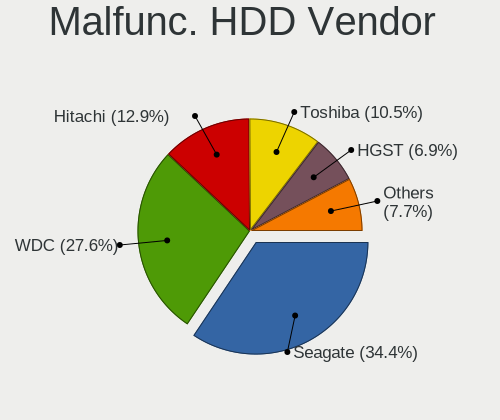
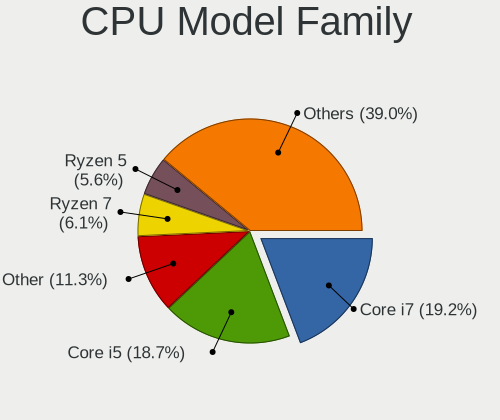
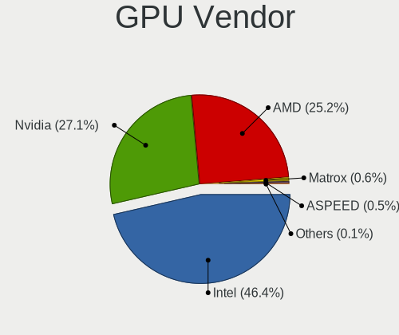
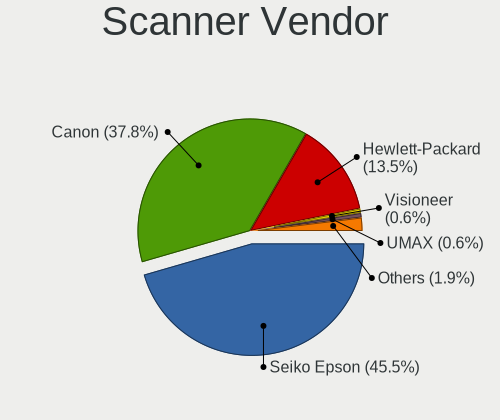

Linux in USA - Tested Hardware & Statistics
-------------------------------------------

A project to collect tested hardware configurations for Linux in USA.

Anyone can contribute to this report by the [hw-probe](https://github.com/linuxhw/hw-probe) tool:

    sudo -E hw-probe -all -upload

Please contribute! Especially if your hardware is rare.

This is a report for all computer types. See also reports for [desktops](/Location/USA/Desktop/README.md) and [notebooks](/Location/USA/Notebook/README.md).

Contents
--------

* [ Test Cases ](#test-cases)

* [ System ](#system)
  - [ OS                       ](#os)
  - [ OS Family                ](#os-family)
  - [ Kernel                   ](#kernel)
  - [ Kernel Family            ](#kernel-family)
  - [ Kernel Major Ver.        ](#kernel-major-ver)
  - [ Arch                     ](#arch)
  - [ DE                       ](#de)
  - [ Display Server           ](#display-server)
  - [ Display Manager          ](#display-manager)
  - [ OS Lang                  ](#os-lang)
  - [ Boot Mode                ](#boot-mode)
  - [ Filesystem               ](#filesystem)
  - [ Part. scheme             ](#part-scheme)
  - [ Dual Boot with Linux/BSD ](#dual-boot-with-linuxbsd)
  - [ Dual Boot (Win)          ](#dual-boot-win)

* [ Board ](#board)
  - [ Vendor                   ](#vendor)
  - [ Model                    ](#model)
  - [ Model Family             ](#model-family)
  - [ MFG Year                 ](#mfg-year)
  - [ Form Factor              ](#form-factor)
  - [ Secure Boot              ](#secure-boot)
  - [ Coreboot                 ](#coreboot)
  - [ RAM Size                 ](#ram-size)
  - [ RAM Used                 ](#ram-used)
  - [ Total Drives             ](#total-drives)
  - [ Has CD-ROM               ](#has-cd-rom)
  - [ Has Ethernet             ](#has-ethernet)
  - [ Has WiFi                 ](#has-wifi)
  - [ Has Bluetooth            ](#has-bluetooth)

* [ Location ](#location)
  - [ Country                  ](#country)
  - [ City                     ](#city)

* [ Drives ](#drives)
  - [ Drive Vendor             ](#drive-vendor)
  - [ Drive Model              ](#drive-model)
  - [ HDD Vendor               ](#hdd-vendor)
  - [ SSD Vendor               ](#ssd-vendor)
  - [ Drive Kind               ](#drive-kind)
  - [ Drive Connector          ](#drive-connector)
  - [ Drive Size               ](#drive-size)
  - [ Space Total              ](#space-total)
  - [ Space Used               ](#space-used)
  - [ Malfunc. Drives          ](#malfunc-drives)
  - [ Malfunc. Drive Vendor    ](#malfunc-drive-vendor)
  - [ Malfunc. HDD Vendor      ](#malfunc-hdd-vendor)
  - [ Malfunc. Drive Kind      ](#malfunc-drive-kind)
  - [ Failed Drives            ](#failed-drives)
  - [ Failed Drive Vendor      ](#failed-drive-vendor)
  - [ Drive Status             ](#drive-status)

* [ Storage controller ](#storage-controller)
  - [ Storage Vendor           ](#storage-vendor)
  - [ Storage Model            ](#storage-model)
  - [ Storage Kind             ](#storage-kind)

* [ Processor ](#processor)
  - [ CPU Vendor               ](#cpu-vendor)
  - [ CPU Model                ](#cpu-model)
  - [ CPU Model Family         ](#cpu-model-family)
  - [ CPU Cores                ](#cpu-cores)
  - [ CPU Sockets              ](#cpu-sockets)
  - [ CPU Threads              ](#cpu-threads)
  - [ CPU Op-Modes             ](#cpu-op-modes)
  - [ CPU Microcode            ](#cpu-microcode)
  - [ CPU Microarch            ](#cpu-microarch)

* [ Graphics ](#graphics)
  - [ GPU Vendor               ](#gpu-vendor)
  - [ GPU Model                ](#gpu-model)
  - [ GPU Combo                ](#gpu-combo)
  - [ GPU Driver               ](#gpu-driver)
  - [ GPU Memory               ](#gpu-memory)

* [ Monitor ](#monitor)
  - [ Monitor Vendor           ](#monitor-vendor)
  - [ Monitor Model            ](#monitor-model)
  - [ Monitor Resolution       ](#monitor-resolution)
  - [ Monitor Diagonal         ](#monitor-diagonal)
  - [ Monitor Width            ](#monitor-width)
  - [ Aspect Ratio             ](#aspect-ratio)
  - [ Monitor Area             ](#monitor-area)
  - [ Pixel Density            ](#pixel-density)
  - [ Multiple Monitors        ](#multiple-monitors)

* [ Network ](#network)
  - [ Net Controller Vendor    ](#net-controller-vendor)
  - [ Net Controller Model     ](#net-controller-model)
  - [ Wireless Vendor          ](#wireless-vendor)
  - [ Wireless Model           ](#wireless-model)
  - [ Ethernet Vendor          ](#ethernet-vendor)
  - [ Ethernet Model           ](#ethernet-model)
  - [ Net Controller Kind      ](#net-controller-kind)
  - [ Used Controller          ](#used-controller)
  - [ NICs                     ](#nics)
  - [ IPv6                     ](#ipv6)

* [ Bluetooth ](#bluetooth)
  - [ Bluetooth Vendor         ](#bluetooth-vendor)
  - [ Bluetooth Model          ](#bluetooth-model)

* [ Sound ](#sound)
  - [ Sound Vendor             ](#sound-vendor)
  - [ Sound Model              ](#sound-model)

* [ Memory ](#memory)
  - [ Memory Vendor            ](#memory-vendor)
  - [ Memory Model             ](#memory-model)
  - [ Memory Kind              ](#memory-kind)
  - [ Memory Form Factor       ](#memory-form-factor)
  - [ Memory Size              ](#memory-size)
  - [ Memory Speed             ](#memory-speed)

* [ Printers & scanners ](#printers--scanners)
  - [ Printer Vendor           ](#printer-vendor)
  - [ Printer Model            ](#printer-model)
  - [ Scanner Vendor           ](#scanner-vendor)
  - [ Scanner Model            ](#scanner-model)

* [ Camera ](#camera)
  - [ Camera Vendor            ](#camera-vendor)
  - [ Camera Model             ](#camera-model)

* [ Security ](#security)
  - [ Fingerprint Vendor       ](#fingerprint-vendor)
  - [ Fingerprint Model        ](#fingerprint-model)
  - [ Chipcard Vendor          ](#chipcard-vendor)
  - [ Chipcard Model           ](#chipcard-model)

* [ Unsupported ](#unsupported)
  - [ Unsupported Devices      ](#unsupported-devices)
  - [ Unsupported Device Types ](#unsupported-device-types)

Test Cases
----------

Total: 35661

| Vendor        | Model                       | Form-Factor | Probe                                                      | Date         |
|---------------|-----------------------------|-------------|------------------------------------------------------------|--------------|
| Supermicro    | A2SAN-E-WOHSA               | Desktop     | [f8d0b19c1e](https://linux-hardware.org/?probe=f8d0b19c1e) | Jul 01, 2022 |
| MSI           | X370 GAMING PRO CARBON      | Desktop     | [5763cb4576](https://linux-hardware.org/?probe=5763cb4576) | Jul 01, 2022 |
| Lenovo        | ThinkPad P14s Gen 1 20Y1... | Notebook    | [16413aeb23](https://linux-hardware.org/?probe=16413aeb23) | Jul 01, 2022 |
| Apple         | MacBookPro16,1              | Notebook    | [05c07aba75](https://linux-hardware.org/?probe=05c07aba75) | Jul 01, 2022 |
| Samsung       | 930XED                      | Notebook    | [56a04fa69d](https://linux-hardware.org/?probe=56a04fa69d) | Jul 01, 2022 |
| Apple         | MacBookPro16,1              | Notebook    | [3eb50f5177](https://linux-hardware.org/?probe=3eb50f5177) | Jul 01, 2022 |
| Gigabyte      | X570 I AORUS PRO WIFI       | Desktop     | [d979555615](https://linux-hardware.org/?probe=d979555615) | Jul 01, 2022 |
| Dell          | Precision 5530              | Notebook    | [d6dc0ecd91](https://linux-hardware.org/?probe=d6dc0ecd91) | Jul 01, 2022 |
| ASRock        | B450 Gaming K4              | Desktop     | [2bdfc5f472](https://linux-hardware.org/?probe=2bdfc5f472) | Jul 01, 2022 |
| MSI           | X399 GAMING PRO CARBON A... | Desktop     | [153a698b74](https://linux-hardware.org/?probe=153a698b74) | Jul 01, 2022 |
| ASUSTek       | PRIME H670-PLUS D4          | Desktop     | [8f90bed577](https://linux-hardware.org/?probe=8f90bed577) | Jul 01, 2022 |
| HP            | 8459                        | Desktop     | [f43fdff127](https://linux-hardware.org/?probe=f43fdff127) | Jul 01, 2022 |
| Lenovo        | ThinkPad X1 Yoga Gen 7 2... | Convertible | [5f076638f4](https://linux-hardware.org/?probe=5f076638f4) | Jul 01, 2022 |
| Lenovo        | ThinkPad T480 20L5000UUS    | Notebook    | [60c86ea9e1](https://linux-hardware.org/?probe=60c86ea9e1) | Jul 01, 2022 |
| ASRock        | H570M Pro4                  | Desktop     | [7edf16eeea](https://linux-hardware.org/?probe=7edf16eeea) | Jul 01, 2022 |
| ASUSTek       | Maximus IX FORMULA          | Desktop     | [8c29343495](https://linux-hardware.org/?probe=8c29343495) | Jul 01, 2022 |
| ASUSTek       | Maximus IX FORMULA          | Desktop     | [2631bf2ae1](https://linux-hardware.org/?probe=2631bf2ae1) | Jul 01, 2022 |
| Apple         | Mac-7BA5B2DFE22DDD8C Mac... | Mini pc     | [ed5f328d6a](https://linux-hardware.org/?probe=ed5f328d6a) | Jul 01, 2022 |
| Lenovo        | ThinkPad T430 23501F9       | Notebook    | [e4bd671886](https://linux-hardware.org/?probe=e4bd671886) | Jul 01, 2022 |
| ASUSTek       | PRIME B550M-A               | Desktop     | [9f4f6d2323](https://linux-hardware.org/?probe=9f4f6d2323) | Jul 01, 2022 |
| Biostar       | B550GTA                     | Desktop     | [5d9da072f0](https://linux-hardware.org/?probe=5d9da072f0) | Jul 01, 2022 |
| Dell          | Inspiron 1764               | Notebook    | [dd5c77d711](https://linux-hardware.org/?probe=dd5c77d711) | Jul 01, 2022 |
| Pegatron      | 2ACD                        | Desktop     | [3979af0018](https://linux-hardware.org/?probe=3979af0018) | Jul 01, 2022 |
| Raspberry ... | Raspberry Pi 4 Model B R... | Soc         | [d83a0aa24f](https://linux-hardware.org/?probe=d83a0aa24f) | Jul 01, 2022 |
| Raspberry ... | Raspberry Pi 4 Model B R... | Soc         | [7ffd41ce5c](https://linux-hardware.org/?probe=7ffd41ce5c) | Jul 01, 2022 |
| HP            | 2B0D A01                    | All in one  | [43b3fd0fd4](https://linux-hardware.org/?probe=43b3fd0fd4) | Jul 01, 2022 |
| Lenovo        | ThinkPad W510 4318CTO       | Notebook    | [27cd378ed6](https://linux-hardware.org/?probe=27cd378ed6) | Jul 01, 2022 |
| HP            | Laptop 14-fq1xxx            | Notebook    | [9aa0a38b17](https://linux-hardware.org/?probe=9aa0a38b17) | Jul 01, 2022 |
| HP            | Laptop 14-fq1xxx            | Notebook    | [b9b09609b8](https://linux-hardware.org/?probe=b9b09609b8) | Jul 01, 2022 |
| HP            | 18E7                        | Desktop     | [1808b6dee4](https://linux-hardware.org/?probe=1808b6dee4) | Jul 01, 2022 |
| Lenovo        | ThinkPad T430 2342CTO       | Notebook    | [eaba15d64b](https://linux-hardware.org/?probe=eaba15d64b) | Jul 01, 2022 |
| ASUSTek       | PRIME B550-PLUS AC-HES      | Desktop     | [dde2246ae8](https://linux-hardware.org/?probe=dde2246ae8) | Jul 01, 2022 |
| Dell          | Precision 7510              | Notebook    | [c82cc3cb0f](https://linux-hardware.org/?probe=c82cc3cb0f) | Jul 01, 2022 |
| Gigabyte      | Z590I AORUS ULTRA           | Desktop     | [febb798e92](https://linux-hardware.org/?probe=febb798e92) | Jul 01, 2022 |
| ASUSTek       | K30BF_M32BF                 | Desktop     | [dac4b154d6](https://linux-hardware.org/?probe=dac4b154d6) | Jul 01, 2022 |
| Gigabyte      | AM1M-S2H                    | Desktop     | [fb2500cc2d](https://linux-hardware.org/?probe=fb2500cc2d) | Jul 01, 2022 |
| Dell          | Precision 5530              | Notebook    | [cc30de04b0](https://linux-hardware.org/?probe=cc30de04b0) | Jul 01, 2022 |
| Dell          | 0M9KCM A00                  | Desktop     | [e72232ee43](https://linux-hardware.org/?probe=e72232ee43) | Jul 01, 2022 |
| Dell          | 0M9KCM A00                  | Desktop     | [5e80242b43](https://linux-hardware.org/?probe=5e80242b43) | Jun 30, 2022 |
| Dell          | Latitude E5430 non-vPro     | Notebook    | [ae786e567a](https://linux-hardware.org/?probe=ae786e567a) | Jun 30, 2022 |
| Dell          | Latitude E5430 non-vPro     | Notebook    | [c4942af0bc](https://linux-hardware.org/?probe=c4942af0bc) | Jun 30, 2022 |
| Unknown       | Unknown                     | Notebook    | [b1a8d360fb](https://linux-hardware.org/?probe=b1a8d360fb) | Jun 30, 2022 |
| Dell          | Precision 5530              | Notebook    | [383cbca466](https://linux-hardware.org/?probe=383cbca466) | Jun 30, 2022 |
| MicroByte     | ezbook                      | Notebook    | [47939ef544](https://linux-hardware.org/?probe=47939ef544) | Jun 30, 2022 |
| MicroByte     | ezbook                      | Notebook    | [760be1c133](https://linux-hardware.org/?probe=760be1c133) | Jun 30, 2022 |
| Dell          | XPS M1330                   | Notebook    | [b891e49fac](https://linux-hardware.org/?probe=b891e49fac) | Jun 30, 2022 |
| Acer          | Spin SP313-51N              | Convertible | [2049536427](https://linux-hardware.org/?probe=2049536427) | Jun 30, 2022 |
| Matsushita... | CF-52AJCBDBM                | Notebook    | [19a4ef134d](https://linux-hardware.org/?probe=19a4ef134d) | Jun 30, 2022 |
| Dell          | Inspiron 1720               | Notebook    | [67853c7ab3](https://linux-hardware.org/?probe=67853c7ab3) | Jun 30, 2022 |
| Dell          | Latitude 3520               | Notebook    | [da25da1ece](https://linux-hardware.org/?probe=da25da1ece) | Jun 30, 2022 |
| Apple         | MacBookAir3,2               | Notebook    | [ee189c9ba2](https://linux-hardware.org/?probe=ee189c9ba2) | Jun 30, 2022 |
| ASUSTek       | ZenBook UX435EG_UX435EG     | Notebook    | [8a63aad484](https://linux-hardware.org/?probe=8a63aad484) | Jun 30, 2022 |
| ASUSTek       | ZenBook UX435EG_UX435EG     | Notebook    | [1aafce44d8](https://linux-hardware.org/?probe=1aafce44d8) | Jun 30, 2022 |
| HP            | 339A                        | Desktop     | [7cfe4b70f8](https://linux-hardware.org/?probe=7cfe4b70f8) | Jun 30, 2022 |
| Gigabyte      | GA-78LMT-USB3 SEx           | Desktop     | [530c44caa8](https://linux-hardware.org/?probe=530c44caa8) | Jun 30, 2022 |
| System76      | Gazelle                     | Notebook    | [9cc76ec569](https://linux-hardware.org/?probe=9cc76ec569) | Jun 30, 2022 |
| MOTILE        | M141                        | Notebook    | [59c616a04e](https://linux-hardware.org/?probe=59c616a04e) | Jun 30, 2022 |
| Dell          | Inspiron 5521               | Notebook    | [e9948fff52](https://linux-hardware.org/?probe=e9948fff52) | Jun 30, 2022 |
| Toshiba       | Satellite A665              | Notebook    | [72011aa2aa](https://linux-hardware.org/?probe=72011aa2aa) | Jun 30, 2022 |
| Supermicro    | X9DBS-F                     | Desktop     | [7aeeacc12c](https://linux-hardware.org/?probe=7aeeacc12c) | Jun 30, 2022 |
| Lenovo        | IdeaPad L340-15IWL 81LG     | Notebook    | [99c4a61b01](https://linux-hardware.org/?probe=99c4a61b01) | Jun 30, 2022 |
| Lenovo        | ThinkPad T495 20NKS0PG00    | Notebook    | [ee35a21db4](https://linux-hardware.org/?probe=ee35a21db4) | Jun 30, 2022 |
| Dell          | Latitude E5430 non-vPro     | Notebook    | [c4ef403aed](https://linux-hardware.org/?probe=c4ef403aed) | Jun 30, 2022 |
| Dell          | Inspiron 5570               | Notebook    | [de7ac7a3a5](https://linux-hardware.org/?probe=de7ac7a3a5) | Jun 30, 2022 |
| Lenovo        | ThinkPad E15 Gen 2 20TDC... | Notebook    | [87eecce08e](https://linux-hardware.org/?probe=87eecce08e) | Jun 30, 2022 |
| EVGA          | X299 FTW K                  | Desktop     | [bde570c9f5](https://linux-hardware.org/?probe=bde570c9f5) | Jun 30, 2022 |
| HP            | EliteBook Folio 9470m       | Notebook    | [7c7fdefa8d](https://linux-hardware.org/?probe=7c7fdefa8d) | Jun 30, 2022 |
| Raspberry ... | Raspberry Pi 4 Model B R... | Soc         | [fce5196d19](https://linux-hardware.org/?probe=fce5196d19) | Jun 30, 2022 |
| Dell          | Latitude 5511               | Notebook    | [c76790a345](https://linux-hardware.org/?probe=c76790a345) | Jun 30, 2022 |
| Acer          | Aspire E5-521               | Notebook    | [717281a3f9](https://linux-hardware.org/?probe=717281a3f9) | Jun 29, 2022 |
| Acer          | Aspire E5-521               | Notebook    | [f532d90f38](https://linux-hardware.org/?probe=f532d90f38) | Jun 29, 2022 |
| Intel         | D410PT AAE76528-404         | Desktop     | [b7c62fc4a8](https://linux-hardware.org/?probe=b7c62fc4a8) | Jun 29, 2022 |
| Lenovo        | ThinkPad L13 Yoga Gen 2 ... | Convertible | [8eb132916c](https://linux-hardware.org/?probe=8eb132916c) | Jun 29, 2022 |
| Dell          | Inspiron 7573               | Notebook    | [40125eaa3a](https://linux-hardware.org/?probe=40125eaa3a) | Jun 29, 2022 |
| HP            | Spectre x360 Convertible... | Convertible | [e594fe8eb6](https://linux-hardware.org/?probe=e594fe8eb6) | Jun 29, 2022 |
| ASUSTek       | ROG Maximus XIII HERO       | Desktop     | [0983817c84](https://linux-hardware.org/?probe=0983817c84) | Jun 29, 2022 |
| Lenovo        | ThinkPad L13 Yoga Gen 2 ... | Convertible | [4ba6826e21](https://linux-hardware.org/?probe=4ba6826e21) | Jun 29, 2022 |
| Protectli     | FW6                         | Desktop     | [c129601645](https://linux-hardware.org/?probe=c129601645) | Jun 29, 2022 |
| ASUSTek       | ROG STRIX Z370-E GAMING     | Desktop     | [349dc94a13](https://linux-hardware.org/?probe=349dc94a13) | Jun 29, 2022 |
| Protectli     | FW6                         | Desktop     | [f7d331dfcb](https://linux-hardware.org/?probe=f7d331dfcb) | Jun 29, 2022 |
| MSI           | MEG Z490 UNIFY              | Desktop     | [2c7a50869d](https://linux-hardware.org/?probe=2c7a50869d) | Jun 29, 2022 |
| Dell          | 0M5DCD A00                  | Desktop     | [7ff0a3f172](https://linux-hardware.org/?probe=7ff0a3f172) | Jun 29, 2022 |
| Dell          | 0M5DCD A00                  | Desktop     | [483d6a9299](https://linux-hardware.org/?probe=483d6a9299) | Jun 29, 2022 |
| Gigabyte      | X570 AORUS MASTER           | Desktop     | [6b034bb489](https://linux-hardware.org/?probe=6b034bb489) | Jun 29, 2022 |
| Dell          | Latitude D610               | Notebook    | [0d55e1e388](https://linux-hardware.org/?probe=0d55e1e388) | Jun 29, 2022 |
| Dell          | 0D441T A01                  | Desktop     | [b205bc201e](https://linux-hardware.org/?probe=b205bc201e) | Jun 29, 2022 |
| ASUSTek       | ProArt Z690-CREATOR WIFI    | Desktop     | [392d5c7c12](https://linux-hardware.org/?probe=392d5c7c12) | Jun 29, 2022 |
| ASUSTek       | P5LD2                       | Desktop     | [4fdebc2b9c](https://linux-hardware.org/?probe=4fdebc2b9c) | Jun 29, 2022 |
| Lenovo        | ThinkPad P50 20EQS5M100     | Notebook    | [d0b6aa0a1a](https://linux-hardware.org/?probe=d0b6aa0a1a) | Jun 29, 2022 |
| System76      | Oryx Pro                    | Notebook    | [7fa7a1ca82](https://linux-hardware.org/?probe=7fa7a1ca82) | Jun 29, 2022 |
| Toshiba       | Satellite L755D             | Notebook    | [87bdccce5e](https://linux-hardware.org/?probe=87bdccce5e) | Jun 29, 2022 |
| ASUSTek       | P5LD2                       | Desktop     | [c7f67d9347](https://linux-hardware.org/?probe=c7f67d9347) | Jun 29, 2022 |
| MicroByte     | ezbook                      | Notebook    | [5a90fc7dc4](https://linux-hardware.org/?probe=5a90fc7dc4) | Jun 29, 2022 |
| MicroByte     | ezbook                      | Notebook    | [139b8a650b](https://linux-hardware.org/?probe=139b8a650b) | Jun 29, 2022 |
| HP            | Pavilion Gaming Laptop 1... | Notebook    | [43c87260b2](https://linux-hardware.org/?probe=43c87260b2) | Jun 29, 2022 |
| ASUSTek       | ROG ZENITH EXTREME          | Desktop     | [33c8a42a4d](https://linux-hardware.org/?probe=33c8a42a4d) | Jun 29, 2022 |
| Dell          | 0WMJ54 A01                  | Desktop     | [a55837dc17](https://linux-hardware.org/?probe=a55837dc17) | Jun 29, 2022 |
| Valve         | Jupiter                     | Notebook    | [261590e542](https://linux-hardware.org/?probe=261590e542) | Jun 29, 2022 |
| HP            | ENVY TS 17                  | Notebook    | [7b5d021513](https://linux-hardware.org/?probe=7b5d021513) | Jun 29, 2022 |
| Valve         | Jupiter                     | Notebook    | [7c233f0a07](https://linux-hardware.org/?probe=7c233f0a07) | Jun 29, 2022 |
| Toshiba       | Satellite M305              | Notebook    | [0f42d5a8ef](https://linux-hardware.org/?probe=0f42d5a8ef) | Jun 29, 2022 |
| Lenovo        | IdeaPad 100S-14IBR 80R9     | Notebook    | [e8d42a5f3b](https://linux-hardware.org/?probe=e8d42a5f3b) | Jun 29, 2022 |
| Dell          | Inspiron 11 - 3147          | Notebook    | [82e2b1519c](https://linux-hardware.org/?probe=82e2b1519c) | Jun 29, 2022 |
| Gigabyte      | Z97X-SLI-CF                 | Desktop     | [0a66ce61c6](https://linux-hardware.org/?probe=0a66ce61c6) | Jun 29, 2022 |
| MSI           | MEG X570 UNIFY              | Desktop     | [0fbd5ca967](https://linux-hardware.org/?probe=0fbd5ca967) | Jun 29, 2022 |
| Dell          | Inspiron 11 - 3147          | Notebook    | [c661afa5d3](https://linux-hardware.org/?probe=c661afa5d3) | Jun 29, 2022 |
| Dell          | 0VHWTR A02                  | Desktop     | [ee144de507](https://linux-hardware.org/?probe=ee144de507) | Jun 29, 2022 |
| Gigabyte      | Z97X-SLI-CF                 | Desktop     | [f2b790de57](https://linux-hardware.org/?probe=f2b790de57) | Jun 29, 2022 |
| Alienware     | 17                          | Notebook    | [715b5b0dce](https://linux-hardware.org/?probe=715b5b0dce) | Jun 29, 2022 |
| HP            | 8643 SMVB                   | Desktop     | [a0bf95fa0c](https://linux-hardware.org/?probe=a0bf95fa0c) | Jun 29, 2022 |
| Apple         | Mac-AA95B1DDAB278B95 iMa... | All in one  | [37e3958fbc](https://linux-hardware.org/?probe=37e3958fbc) | Jun 29, 2022 |
| Framework     | Laptop                      | Notebook    | [d4cd42f3af](https://linux-hardware.org/?probe=d4cd42f3af) | Jun 28, 2022 |
| Dell          | XPS 13 9310                 | Notebook    | [6a2b56796c](https://linux-hardware.org/?probe=6a2b56796c) | Jun 28, 2022 |
| HP            | Stream Laptop 11-ak0xxx     | Notebook    | [d2f3d5aefd](https://linux-hardware.org/?probe=d2f3d5aefd) | Jun 28, 2022 |
| System76      | Bonobo Extreme              | Notebook    | [8872466072](https://linux-hardware.org/?probe=8872466072) | Jun 28, 2022 |
| Gigabyte      | B550 AORUS MASTER           | Desktop     | [be4dd3360f](https://linux-hardware.org/?probe=be4dd3360f) | Jun 28, 2022 |
| Dell          | Inspiron 5570               | Notebook    | [bb61360dae](https://linux-hardware.org/?probe=bb61360dae) | Jun 28, 2022 |
| Dell          | Inspiron 5570               | Notebook    | [4119b5740c](https://linux-hardware.org/?probe=4119b5740c) | Jun 28, 2022 |
| Eluktronic... | MECH-15 G3                  | Notebook    | [d307b13800](https://linux-hardware.org/?probe=d307b13800) | Jun 28, 2022 |
| HP            | G60                         | Notebook    | [a56da1a08a](https://linux-hardware.org/?probe=a56da1a08a) | Jun 28, 2022 |
| Dell          | Latitude 7350               | Notebook    | [427cc37d76](https://linux-hardware.org/?probe=427cc37d76) | Jun 28, 2022 |
| Dell          | Latitude 7350               | Notebook    | [65d1c5c6f5](https://linux-hardware.org/?probe=65d1c5c6f5) | Jun 28, 2022 |
| Dell          | 0TP406                      | Desktop     | [4f0f2b2e05](https://linux-hardware.org/?probe=4f0f2b2e05) | Jun 28, 2022 |
| ASUSTek       | ROG ZENITH EXTREME          | Desktop     | [efb8cff806](https://linux-hardware.org/?probe=efb8cff806) | Jun 28, 2022 |
| Dell          | Inspiron 1720               | Notebook    | [dff7498f41](https://linux-hardware.org/?probe=dff7498f41) | Jun 28, 2022 |
| Lenovo        | IdeaPad S340-15IWL 81N8     | Notebook    | [c4dea8fa5d](https://linux-hardware.org/?probe=c4dea8fa5d) | Jun 28, 2022 |
| ASUSTek       | X750JN                      | Notebook    | [4ba4d14a1a](https://linux-hardware.org/?probe=4ba4d14a1a) | Jun 28, 2022 |
| ASUSTek       | TUF Gaming X570-PLUS        | Desktop     | [87b9ce1db1](https://linux-hardware.org/?probe=87b9ce1db1) | Jun 28, 2022 |
| EVGA          | X299 FTW K                  | Desktop     | [2fac0d5ea2](https://linux-hardware.org/?probe=2fac0d5ea2) | Jun 28, 2022 |
| SLIMBOOK      | PROX14-AMD                  | Notebook    | [1b58bbb69c](https://linux-hardware.org/?probe=1b58bbb69c) | Jun 28, 2022 |
| Dell          | XPS 15 9520                 | Notebook    | [3a354ab130](https://linux-hardware.org/?probe=3a354ab130) | Jun 28, 2022 |
| ASUSTek       | VivoBook_ASUSLaptop E410... | Notebook    | [464a37068f](https://linux-hardware.org/?probe=464a37068f) | Jun 28, 2022 |
| Apple         | MacBookPro12,1              | Notebook    | [ed7338a47a](https://linux-hardware.org/?probe=ed7338a47a) | Jun 28, 2022 |
| MSI           | B450M PRO-VDH MAX           | Desktop     | [291139aa4f](https://linux-hardware.org/?probe=291139aa4f) | Jun 28, 2022 |
| HP            | ENVY x360 Convertible 13... | Convertible | [8b55dcfd2d](https://linux-hardware.org/?probe=8b55dcfd2d) | Jun 28, 2022 |
| HP            | ENVY x360 Convertible 13... | Convertible | [d4969dd4f5](https://linux-hardware.org/?probe=d4969dd4f5) | Jun 28, 2022 |
| Apple         | MacBook7,1                  | Notebook    | [2818c11c12](https://linux-hardware.org/?probe=2818c11c12) | Jun 28, 2022 |
| Raspberry ... | Raspberry Pi 4 Model B R... | Soc         | [e841ca8572](https://linux-hardware.org/?probe=e841ca8572) | Jun 28, 2022 |
| MSI           | B450M PRO-VDH MAX           | Desktop     | [369f504484](https://linux-hardware.org/?probe=369f504484) | Jun 28, 2022 |
| Dell          | Inspiron N5110              | Notebook    | [239e8c86c0](https://linux-hardware.org/?probe=239e8c86c0) | Jun 28, 2022 |
| HP            | G60                         | Notebook    | [94e4b7d021](https://linux-hardware.org/?probe=94e4b7d021) | Jun 28, 2022 |
| HP            | Pavilion Laptop 17-ar0xx    | Notebook    | [a767fd4cb1](https://linux-hardware.org/?probe=a767fd4cb1) | Jun 28, 2022 |
| HUAWEI        | WRT-WX9                     | Notebook    | [8ddbebd4b1](https://linux-hardware.org/?probe=8ddbebd4b1) | Jun 28, 2022 |
| Dell          | 0WN7Y6 A01                  | Desktop     | [a07a657c67](https://linux-hardware.org/?probe=a07a657c67) | Jun 28, 2022 |
| Lenovo        | Yoga C740-15IML 81TD        | Convertible | [c450ce45a6](https://linux-hardware.org/?probe=c450ce45a6) | Jun 28, 2022 |
| Lenovo        | Yoga C740-15IML 81TD        | Convertible | [5d2f94f859](https://linux-hardware.org/?probe=5d2f94f859) | Jun 28, 2022 |
| ASUSTek       | X551MA                      | Notebook    | [9bdb2a5577](https://linux-hardware.org/?probe=9bdb2a5577) | Jun 28, 2022 |
| HP            | Laptop 14-dk1xxx            | Notebook    | [6932a00eed](https://linux-hardware.org/?probe=6932a00eed) | Jun 28, 2022 |
| Unknown       | Unknown                     | Desktop     | [8eb0d6165a](https://linux-hardware.org/?probe=8eb0d6165a) | Jun 28, 2022 |
| ASRock        | 970M Pro3                   | Desktop     | [f817d55df3](https://linux-hardware.org/?probe=f817d55df3) | Jun 28, 2022 |
| Dell          | 02YYK5 A01                  | Desktop     | [ab6a2f07c6](https://linux-hardware.org/?probe=ab6a2f07c6) | Jun 28, 2022 |
| GPU Compan... | GWTC116-2                   | Notebook    | [183f3e59fb](https://linux-hardware.org/?probe=183f3e59fb) | Jun 28, 2022 |
| Dell          | Vostro 3550                 | Notebook    | [5c998424fb](https://linux-hardware.org/?probe=5c998424fb) | Jun 27, 2022 |
| ASUSTek       | PRIME Z690-P WIFI           | Desktop     | [0441b2cf28](https://linux-hardware.org/?probe=0441b2cf28) | Jun 27, 2022 |
| Dell          | 0TT740 A00                  | Server      | [14defa3569](https://linux-hardware.org/?probe=14defa3569) | Jun 27, 2022 |
| HP            | 0B4Ch D                     | Desktop     | [6e28eeb447](https://linux-hardware.org/?probe=6e28eeb447) | Jun 27, 2022 |
| ASUSTek       | PRIME Z690-P WIFI           | Desktop     | [ca055793c5](https://linux-hardware.org/?probe=ca055793c5) | Jun 27, 2022 |
| Intel         | NUC6i7KYB H90766-402        | Mini pc     | [8e03a02104](https://linux-hardware.org/?probe=8e03a02104) | Jun 27, 2022 |
| Dell          | Latitude E6520              | Notebook    | [f688527838](https://linux-hardware.org/?probe=f688527838) | Jun 27, 2022 |
| HP            | Pavilion x360 Convertibl... | Convertible | [52299903e5](https://linux-hardware.org/?probe=52299903e5) | Jun 27, 2022 |
| Dell          | Latitude 7480               | Notebook    | [87a2e9762f](https://linux-hardware.org/?probe=87a2e9762f) | Jun 27, 2022 |
| HP            | 3047h                       | Desktop     | [32eb7049a1](https://linux-hardware.org/?probe=32eb7049a1) | Jun 27, 2022 |
| Acer          | UI2H                        | All in one  | [136c387973](https://linux-hardware.org/?probe=136c387973) | Jun 27, 2022 |
| HP            | Stream Laptop 11-ak0xxx     | Notebook    | [f39c4bd8a0](https://linux-hardware.org/?probe=f39c4bd8a0) | Jun 27, 2022 |
| ASUSTek       | ROG Strix G512LW_G512LW     | Notebook    | [843cbccc63](https://linux-hardware.org/?probe=843cbccc63) | Jun 27, 2022 |
| ZOTAC         | ZBOX-ID84                   | Mini pc     | [6162be584a](https://linux-hardware.org/?probe=6162be584a) | Jun 27, 2022 |
| HP            | 15 Notebook PC              | Notebook    | [5bf5fec549](https://linux-hardware.org/?probe=5bf5fec549) | Jun 27, 2022 |
| HP            | 15 Notebook PC              | Notebook    | [b88589b731](https://linux-hardware.org/?probe=b88589b731) | Jun 27, 2022 |
| Dell          | Latitude E5530 non-vPro     | Notebook    | [613ca6c2b5](https://linux-hardware.org/?probe=613ca6c2b5) | Jun 27, 2022 |
| Dell          | Latitude E5530 non-vPro     | Notebook    | [c4da661982](https://linux-hardware.org/?probe=c4da661982) | Jun 27, 2022 |
| ASUSTek       | X550IU                      | Notebook    | [785dae349d](https://linux-hardware.org/?probe=785dae349d) | Jun 27, 2022 |
| Raspberry ... | Raspberry Pi 4 Model B R... | Soc         | [cd22036876](https://linux-hardware.org/?probe=cd22036876) | Jun 27, 2022 |
| MSI           | MPG Z390 GAMING PLUS        | Desktop     | [3d575e19b6](https://linux-hardware.org/?probe=3d575e19b6) | Jun 27, 2022 |
| EVGA          | 151-HE-E999                 | Desktop     | [2725b53d0c](https://linux-hardware.org/?probe=2725b53d0c) | Jun 27, 2022 |
| ASUSTek       | TUF Gaming B550M-PLUS       | Desktop     | [da1c9472bd](https://linux-hardware.org/?probe=da1c9472bd) | Jun 27, 2022 |
| Supermicro    | X10SRA                      | Server      | [4646cb2fae](https://linux-hardware.org/?probe=4646cb2fae) | Jun 27, 2022 |
| Dell          | Inspiron 5770               | Notebook    | [431ad8bfb0](https://linux-hardware.org/?probe=431ad8bfb0) | Jun 27, 2022 |
| Dell          | XPS 15 9570                 | Notebook    | [8cf2281f01](https://linux-hardware.org/?probe=8cf2281f01) | Jun 27, 2022 |
| Apple         | Mac-4B682C642B45593E iMa... | All in one  | [b48ce81bfa](https://linux-hardware.org/?probe=b48ce81bfa) | Jun 27, 2022 |
| Dell          | 0GDG8Y A00                  | Desktop     | [d36f5ea260](https://linux-hardware.org/?probe=d36f5ea260) | Jun 27, 2022 |
| Valve         | Jupiter                     | Notebook    | [e80815c8d4](https://linux-hardware.org/?probe=e80815c8d4) | Jun 27, 2022 |
| MSI           | Z170A GAMING PRO            | Desktop     | [70e3e75c86](https://linux-hardware.org/?probe=70e3e75c86) | Jun 27, 2022 |
| Dell          | Inspiron 13-7378            | Notebook    | [cc5a145cac](https://linux-hardware.org/?probe=cc5a145cac) | Jun 27, 2022 |
| ASRock        | B450 Gaming K4              | Desktop     | [6ecc609381](https://linux-hardware.org/?probe=6ecc609381) | Jun 27, 2022 |
| Lenovo        | 3098 0B98401 PRO            | Desktop     | [9923c241d9](https://linux-hardware.org/?probe=9923c241d9) | Jun 27, 2022 |
| Lenovo        | ThinkPad W520 4270CTO       | Notebook    | [3d239f8254](https://linux-hardware.org/?probe=3d239f8254) | Jun 27, 2022 |
| Lenovo        | ThinkBook 13s G2 ITL 20V... | Notebook    | [20054c6da2](https://linux-hardware.org/?probe=20054c6da2) | Jun 27, 2022 |
| Dell          | Precision M3800             | Notebook    | [95a0805f35](https://linux-hardware.org/?probe=95a0805f35) | Jun 27, 2022 |
| Dell          | 0U880P A00                  | Desktop     | [e14832f09c](https://linux-hardware.org/?probe=e14832f09c) | Jun 26, 2022 |
| Dell          | Latitude E6430              | Notebook    | [76c22c2645](https://linux-hardware.org/?probe=76c22c2645) | Jun 26, 2022 |
| Lenovo        | ThinkPad T580 20LAS6XC00    | Notebook    | [a4b9098138](https://linux-hardware.org/?probe=a4b9098138) | Jun 26, 2022 |
| Dell          | Inspiron 7558               | Notebook    | [d34cfa83d3](https://linux-hardware.org/?probe=d34cfa83d3) | Jun 26, 2022 |
| Dell          | 0YNVJG A02                  | Desktop     | [e272328867](https://linux-hardware.org/?probe=e272328867) | Jun 26, 2022 |
| HP            | Laptop 17-by4xxx            | Notebook    | [8e280af34e](https://linux-hardware.org/?probe=8e280af34e) | Jun 26, 2022 |
| ASUSTek       | PRIME B350-PLUS             | Desktop     | [583a217093](https://linux-hardware.org/?probe=583a217093) | Jun 26, 2022 |
| Valve         | Jupiter                     | Notebook    | [e51f5d8645](https://linux-hardware.org/?probe=e51f5d8645) | Jun 26, 2022 |
| Lenovo        | Yoga 710-15IKB 80V5         | Convertible | [088e3e2f28](https://linux-hardware.org/?probe=088e3e2f28) | Jun 26, 2022 |
| HP            | 82A2                        | Desktop     | [cbc788e1d4](https://linux-hardware.org/?probe=cbc788e1d4) | Jun 26, 2022 |
| Lenovo        | ThinkPad P1 Gen 3 20TJS5... | Notebook    | [de3ca4e422](https://linux-hardware.org/?probe=de3ca4e422) | Jun 26, 2022 |
| Dell          | Inspiron 13-7378            | Notebook    | [a9fdf3f471](https://linux-hardware.org/?probe=a9fdf3f471) | Jun 26, 2022 |
| Dell          | Inspiron 7506 2n1           | Convertible | [b65aaee9eb](https://linux-hardware.org/?probe=b65aaee9eb) | Jun 26, 2022 |
| ASUSTek       | All Series                  | Notebook    | [19dde83002](https://linux-hardware.org/?probe=19dde83002) | Jun 26, 2022 |
| Lenovo        | IdeaPadFlex 5-1570 81CA     | Convertible | [c3c3da1bcc](https://linux-hardware.org/?probe=c3c3da1bcc) | Jun 26, 2022 |
| ASUSTek       | P8H61-I                     | Desktop     | [15b8beca14](https://linux-hardware.org/?probe=15b8beca14) | Jun 26, 2022 |
| Dell          | 0YNVJG A02                  | Desktop     | [9a39e5ea0d](https://linux-hardware.org/?probe=9a39e5ea0d) | Jun 26, 2022 |
| Gigabyte      | 990FXA-UD5 R5               | Desktop     | [9a853085ea](https://linux-hardware.org/?probe=9a853085ea) | Jun 26, 2022 |
| ASRock        | Z77 Extreme4                | Desktop     | [b397f63621](https://linux-hardware.org/?probe=b397f63621) | Jun 26, 2022 |
| Gigabyte      | 970A-DS3P                   | Desktop     | [c45dba9246](https://linux-hardware.org/?probe=c45dba9246) | Jun 26, 2022 |
| ASRock        | 990FX Killer                | Desktop     | [1e18ee882c](https://linux-hardware.org/?probe=1e18ee882c) | Jun 26, 2022 |
| Lenovo        | Yoga 6 13ALC6 82ND          | Convertible | [7436c506a2](https://linux-hardware.org/?probe=7436c506a2) | Jun 26, 2022 |
| ASUSTek       | ROG Zephyrus G14 GA402RJ... | Notebook    | [400eaba39f](https://linux-hardware.org/?probe=400eaba39f) | Jun 26, 2022 |
| Acer          | Swift SF314-512             | Notebook    | [510f23fce0](https://linux-hardware.org/?probe=510f23fce0) | Jun 26, 2022 |
| Lenovo        | IdeaPad 3 15ITL05 81X8      | Notebook    | [240018e48a](https://linux-hardware.org/?probe=240018e48a) | Jun 26, 2022 |
| Lenovo        | SKYBAY SDK0J40697 WIN 33... | All in one  | [f2d64b50fc](https://linux-hardware.org/?probe=f2d64b50fc) | Jun 26, 2022 |
| ASUSTek       | TUF Gaming X570-PLUS        | Desktop     | [bb3f7f9534](https://linux-hardware.org/?probe=bb3f7f9534) | Jun 26, 2022 |
| Dell          | 0HD5W2 A01                  | Desktop     | [9f87421952](https://linux-hardware.org/?probe=9f87421952) | Jun 26, 2022 |
| Lenovo        | ThinkPad T420s 417152U      | Notebook    | [cc52ed5e41](https://linux-hardware.org/?probe=cc52ed5e41) | Jun 26, 2022 |
| Alienware     | 02XRCM A01                  | Desktop     | [c70647bab0](https://linux-hardware.org/?probe=c70647bab0) | Jun 26, 2022 |
| Google        | Banon                       | Notebook    | [9f0ec67d85](https://linux-hardware.org/?probe=9f0ec67d85) | Jun 26, 2022 |
| Dell          | XPS 15 9510                 | Notebook    | [09295615d9](https://linux-hardware.org/?probe=09295615d9) | Jun 26, 2022 |
| HP            | Pavilion Notebook           | Notebook    | [8e17cfd388](https://linux-hardware.org/?probe=8e17cfd388) | Jun 26, 2022 |
| ASUSTek       | VM40B                       | Desktop     | [35f67bace1](https://linux-hardware.org/?probe=35f67bace1) | Jun 26, 2022 |
| ASUSTek       | ROG CROSSHAIR VIII HERO     | Desktop     | [c78b132d02](https://linux-hardware.org/?probe=c78b132d02) | Jun 26, 2022 |
| Dell          | 0D6H9T A00                  | Desktop     | [fd65f44d25](https://linux-hardware.org/?probe=fd65f44d25) | Jun 26, 2022 |
| ASUSTek       | ROG CROSSHAIR VIII HERO     | Desktop     | [55fc30c7a5](https://linux-hardware.org/?probe=55fc30c7a5) | Jun 26, 2022 |
| Gigabyte      | X570 GAMING X               | Desktop     | [b66ac35391](https://linux-hardware.org/?probe=b66ac35391) | Jun 26, 2022 |
| ASUSTek       | TUF Gaming X570-PRO WIFI... | Desktop     | [b232a434fd](https://linux-hardware.org/?probe=b232a434fd) | Jun 26, 2022 |
| HP            | Laptop 15-dy0xxx            | Notebook    | [125a4a06bf](https://linux-hardware.org/?probe=125a4a06bf) | Jun 26, 2022 |
| Toshiba       | TECRA M11                   | Notebook    | [27cafca97e](https://linux-hardware.org/?probe=27cafca97e) | Jun 25, 2022 |
| ASUSTek       | Pro WS WRX80E-SAGE SE WI... | Desktop     | [f440505698](https://linux-hardware.org/?probe=f440505698) | Jun 25, 2022 |
| Lenovo        | Edge 15 80K9                | Notebook    | [9399fd58cc](https://linux-hardware.org/?probe=9399fd58cc) | Jun 25, 2022 |
| Gigabyte      | GA-890GPA-UD3H              | Desktop     | [f6faa2d944](https://linux-hardware.org/?probe=f6faa2d944) | Jun 25, 2022 |
| ASUSTek       | Maximus VII HERO            | Desktop     | [69dc6b3a5f](https://linux-hardware.org/?probe=69dc6b3a5f) | Jun 25, 2022 |
| Lenovo        | ThinkPad X1 Extreme 20MF... | Notebook    | [68e2e0bbdb](https://linux-hardware.org/?probe=68e2e0bbdb) | Jun 25, 2022 |
| ASRock        | B550 Taichi                 | Desktop     | [a84e0d9197](https://linux-hardware.org/?probe=a84e0d9197) | Jun 25, 2022 |
| Dell          | 040DDP A00                  | Desktop     | [02721926a7](https://linux-hardware.org/?probe=02721926a7) | Jun 25, 2022 |
| Lenovo        | ThinkPad E14 Gen 2 20T60... | Notebook    | [81a9b9847d](https://linux-hardware.org/?probe=81a9b9847d) | Jun 25, 2022 |
| Lenovo        | Yoga 9 14ITL5 82BG          | Convertible | [78a37e2d4c](https://linux-hardware.org/?probe=78a37e2d4c) | Jun 25, 2022 |
| ASUSTek       | P6T DELUXE V2               | Desktop     | [2dbe28adc6](https://linux-hardware.org/?probe=2dbe28adc6) | Jun 25, 2022 |
| ASUSTek       | TUF Gaming Z690-PLUS WIF... | Desktop     | [c3c48bb18e](https://linux-hardware.org/?probe=c3c48bb18e) | Jun 25, 2022 |
| MSI           | B85I                        | Desktop     | [886f971d22](https://linux-hardware.org/?probe=886f971d22) | Jun 25, 2022 |
| HP            | 8457                        | Mini pc     | [9b6e5bb6ea](https://linux-hardware.org/?probe=9b6e5bb6ea) | Jun 25, 2022 |
| HP            | 8457                        | Mini pc     | [55d5331958](https://linux-hardware.org/?probe=55d5331958) | Jun 25, 2022 |
| Intel         | AB2L .A001                  | All in one  | [2368b40c21](https://linux-hardware.org/?probe=2368b40c21) | Jun 25, 2022 |
| HP            | EliteBook 8740w             | Notebook    | [3d88d48a84](https://linux-hardware.org/?probe=3d88d48a84) | Jun 25, 2022 |
| Gigabyte      | 970A-DS3P                   | Desktop     | [3d36beed4b](https://linux-hardware.org/?probe=3d36beed4b) | Jun 25, 2022 |
| Google        | Candy                       | Notebook    | [8888e44843](https://linux-hardware.org/?probe=8888e44843) | Jun 25, 2022 |
| Valve         | Jupiter                     | Notebook    | [b4dd19f939](https://linux-hardware.org/?probe=b4dd19f939) | Jun 25, 2022 |
| GPU Compan... | GWTC116-2                   | Notebook    | [c90d6bd560](https://linux-hardware.org/?probe=c90d6bd560) | Jun 25, 2022 |
| Dell          | Latitude 5420               | Notebook    | [2149a24612](https://linux-hardware.org/?probe=2149a24612) | Jun 25, 2022 |
| GPU Compan... | GWTC116-2                   | Notebook    | [52404c379f](https://linux-hardware.org/?probe=52404c379f) | Jun 25, 2022 |
| Unknown       | Unknown                     | Soc         | [953f1d5b3d](https://linux-hardware.org/?probe=953f1d5b3d) | Jun 25, 2022 |
| Unknown       | Unknown                     | Notebook    | [6e62883390](https://linux-hardware.org/?probe=6e62883390) | Jun 25, 2022 |
| Dell          | Latitude 5490               | Notebook    | [4c3d48724c](https://linux-hardware.org/?probe=4c3d48724c) | Jun 25, 2022 |
| Dell          | Latitude 5490               | Notebook    | [3bb8a81dbf](https://linux-hardware.org/?probe=3bb8a81dbf) | Jun 25, 2022 |
| ASUSTek       | ROG Zephyrus G14 GA401IV... | Notebook    | [490c1074fe](https://linux-hardware.org/?probe=490c1074fe) | Jun 25, 2022 |
| ASUSTek       | ROG Zephyrus G14 GA401IV... | Notebook    | [51d3a22bf6](https://linux-hardware.org/?probe=51d3a22bf6) | Jun 25, 2022 |
| HP            | 339A                        | Desktop     | [822467af7f](https://linux-hardware.org/?probe=822467af7f) | Jun 25, 2022 |
| Toshiba       | Satellite C655D             | Notebook    | [35596a473f](https://linux-hardware.org/?probe=35596a473f) | Jun 24, 2022 |
| HP            | ZBook 15 G5 QEB19A          | Notebook    | [87a3d94edb](https://linux-hardware.org/?probe=87a3d94edb) | Jun 24, 2022 |
| HP            | 89D8 SMVB                   | Desktop     | [f92ff0c37f](https://linux-hardware.org/?probe=f92ff0c37f) | Jun 24, 2022 |
| ASUSTek       | G551JM                      | Notebook    | [2d8e7ffcb2](https://linux-hardware.org/?probe=2d8e7ffcb2) | Jun 24, 2022 |
| ASUSTek       | TUF Gaming X570-PLUS        | Desktop     | [554ba1726f](https://linux-hardware.org/?probe=554ba1726f) | Jun 24, 2022 |
| ASUSTek       | TUF Gaming X570-PLUS        | Desktop     | [3dffa312da](https://linux-hardware.org/?probe=3dffa312da) | Jun 24, 2022 |
| HP            | ZBook 15 G5 QEB19A          | Notebook    | [09b12eda27](https://linux-hardware.org/?probe=09b12eda27) | Jun 24, 2022 |
| ASUSTek       | ASUS TUF Dash F15 FX516P... | Notebook    | [e575e05b18](https://linux-hardware.org/?probe=e575e05b18) | Jun 24, 2022 |
| Acer          | Nitro AN515-57              | Notebook    | [10d0c2a6ea](https://linux-hardware.org/?probe=10d0c2a6ea) | Jun 24, 2022 |
| ASUSTek       | LEUCITE                     | Desktop     | [c4d2ed5723](https://linux-hardware.org/?probe=c4d2ed5723) | Jun 24, 2022 |
| HP            | Laptop 15-db0xxx            | Notebook    | [26cd390b15](https://linux-hardware.org/?probe=26cd390b15) | Jun 24, 2022 |
| AZW           | SER V01                     | Mini pc     | [295a32d26e](https://linux-hardware.org/?probe=295a32d26e) | Jun 24, 2022 |
| MSI           | MAG B550M MORTAR            | Desktop     | [4140ae9d15](https://linux-hardware.org/?probe=4140ae9d15) | Jun 24, 2022 |
| Gigabyte      | EP45-UD3P                   | Desktop     | [05449d9e5c](https://linux-hardware.org/?probe=05449d9e5c) | Jun 24, 2022 |
| ASUSTek       | ZenBook UX534FTC_UX534FT    | Notebook    | [bb8541d805](https://linux-hardware.org/?probe=bb8541d805) | Jun 24, 2022 |
| Dell          | Latitude E7470              | Notebook    | [c2a22e5a3d](https://linux-hardware.org/?probe=c2a22e5a3d) | Jun 24, 2022 |
| Dell          | Latitude E7470              | Notebook    | [962571591a](https://linux-hardware.org/?probe=962571591a) | Jun 24, 2022 |
| HP            | 2AF7                        | Desktop     | [86ecfeb9e2](https://linux-hardware.org/?probe=86ecfeb9e2) | Jun 24, 2022 |
| HP            | 81BB                        | All in one  | [6586fa1ae2](https://linux-hardware.org/?probe=6586fa1ae2) | Jun 24, 2022 |
| Dell          | 0XR1GT A00                  | Desktop     | [319b0094a5](https://linux-hardware.org/?probe=319b0094a5) | Jun 24, 2022 |
| Dell          | 0VRWRC A00                  | Desktop     | [373df03a96](https://linux-hardware.org/?probe=373df03a96) | Jun 24, 2022 |
| Gigabyte      | GA-MA785GM-US2H             | Desktop     | [d9e6c94ff9](https://linux-hardware.org/?probe=d9e6c94ff9) | Jun 24, 2022 |
| Dell          | Precision 7550              | Notebook    | [4779d18806](https://linux-hardware.org/?probe=4779d18806) | Jun 24, 2022 |
| Acer          | Nitro AN715-51              | Notebook    | [a8df58056b](https://linux-hardware.org/?probe=a8df58056b) | Jun 24, 2022 |
| Gigabyte      | H470M DS3H                  | Desktop     | [624ad307fc](https://linux-hardware.org/?probe=624ad307fc) | Jun 24, 2022 |
| Dell          | 018D1Y A00                  | Desktop     | [8344a8b783](https://linux-hardware.org/?probe=8344a8b783) | Jun 24, 2022 |
| Lenovo        | ThinkPad T580 20LAS6XC00    | Notebook    | [55e631d9b6](https://linux-hardware.org/?probe=55e631d9b6) | Jun 24, 2022 |
| HP            | ENVY x360 Convertible 15... | Convertible | [a4d7f0fbeb](https://linux-hardware.org/?probe=a4d7f0fbeb) | Jun 24, 2022 |
| HP            | Laptop 17-by4xxx            | Notebook    | [da0fba3690](https://linux-hardware.org/?probe=da0fba3690) | Jun 24, 2022 |
| Dell          | 0WMJ54 A01                  | Desktop     | [ee865231c1](https://linux-hardware.org/?probe=ee865231c1) | Jun 24, 2022 |
| Foxconn       | 2AB1                        | Desktop     | [389a1d6185](https://linux-hardware.org/?probe=389a1d6185) | Jun 23, 2022 |
| HP            | ENVY x360 Convertible 15... | Convertible | [6348a01f19](https://linux-hardware.org/?probe=6348a01f19) | Jun 23, 2022 |
| Acer          | Swift SFX14-41G             | Notebook    | [c3c9ce7e40](https://linux-hardware.org/?probe=c3c9ce7e40) | Jun 23, 2022 |
| HP            | 830C                        | Desktop     | [7e34e5c70d](https://linux-hardware.org/?probe=7e34e5c70d) | Jun 23, 2022 |
| Lenovo        | Yoga 7 14ITL5 82BH          | Convertible | [830e98eb6e](https://linux-hardware.org/?probe=830e98eb6e) | Jun 23, 2022 |
| ASRock        | H97M Anniversary            | Desktop     | [c207afc887](https://linux-hardware.org/?probe=c207afc887) | Jun 23, 2022 |
| Dell          | 0M877N A01                  | Server      | [107b5509e6](https://linux-hardware.org/?probe=107b5509e6) | Jun 23, 2022 |
| Dell          | 07N90W A00                  | Desktop     | [16fe9be88b](https://linux-hardware.org/?probe=16fe9be88b) | Jun 23, 2022 |
| ASUSTek       | CROSSHAIR V FORMULA-Z       | Desktop     | [dbfad9b8fe](https://linux-hardware.org/?probe=dbfad9b8fe) | Jun 23, 2022 |
| Gigabyte      | G1.Sniper M3-CF             | Desktop     | [055977bdee](https://linux-hardware.org/?probe=055977bdee) | Jun 23, 2022 |
| Valve         | Jupiter                     | Notebook    | [c9ed3cf311](https://linux-hardware.org/?probe=c9ed3cf311) | Jun 23, 2022 |
| Apple         | Mac-F226BEC8 PVT            | All in one  | [50e049e6fb](https://linux-hardware.org/?probe=50e049e6fb) | Jun 23, 2022 |
| Gigabyte      | X570 AORUS ELITE            | Desktop     | [0bd1e7d592](https://linux-hardware.org/?probe=0bd1e7d592) | Jun 23, 2022 |
| ASUSTek       | CROSSHAIR V FORMULA-Z       | Desktop     | [6f13e0f8a0](https://linux-hardware.org/?probe=6f13e0f8a0) | Jun 23, 2022 |
| HP            | EliteBook 8540w             | Notebook    | [b2d1469a45](https://linux-hardware.org/?probe=b2d1469a45) | Jun 23, 2022 |
| Apple         | Mac-35C5E08120C7EEAF Mac... | Mini pc     | [ff3a4ef65f](https://linux-hardware.org/?probe=ff3a4ef65f) | Jun 23, 2022 |
| Apple         | Mac-35C5E08120C7EEAF Mac... | Mini pc     | [cdef675015](https://linux-hardware.org/?probe=cdef675015) | Jun 23, 2022 |
| Dell          | Latitude E5570              | Notebook    | [7f3b4b77f7](https://linux-hardware.org/?probe=7f3b4b77f7) | Jun 23, 2022 |
| Dell          | 0J8885                      | Desktop     | [06e5e2fe54](https://linux-hardware.org/?probe=06e5e2fe54) | Jun 23, 2022 |
| HP            | 620                         | Notebook    | [4476f5f677](https://linux-hardware.org/?probe=4476f5f677) | Jun 23, 2022 |
| Acer          | Swift SFX14-41G             | Notebook    | [5efac1a416](https://linux-hardware.org/?probe=5efac1a416) | Jun 23, 2022 |
| Unknown       | HX90                        | Desktop     | [837e70229a](https://linux-hardware.org/?probe=837e70229a) | Jun 23, 2022 |
| ASUSTek       | ROG STRIX Z590-E GAMING ... | Desktop     | [3cfb6f7ee5](https://linux-hardware.org/?probe=3cfb6f7ee5) | Jun 23, 2022 |
| ASUSTek       | Q524UQK                     | Convertible | [fd5f128747](https://linux-hardware.org/?probe=fd5f128747) | Jun 23, 2022 |
| Dell          | XPS 15 7590                 | Notebook    | [28b27f6df4](https://linux-hardware.org/?probe=28b27f6df4) | Jun 23, 2022 |
| ASUSTek       | ZenBook UX534FTC_UX534FT    | Notebook    | [5dd91493a8](https://linux-hardware.org/?probe=5dd91493a8) | Jun 23, 2022 |
| Apple         | MacBookPro11,1              | Notebook    | [58bec264ab](https://linux-hardware.org/?probe=58bec264ab) | Jun 23, 2022 |
| ASUSTek       | PRIME B550M-A               | Desktop     | [d4492d1e5d](https://linux-hardware.org/?probe=d4492d1e5d) | Jun 23, 2022 |
| Dell          | G15 5510                    | Notebook    | [9c5777f505](https://linux-hardware.org/?probe=9c5777f505) | Jun 23, 2022 |
| Microsoft     | Surface with Windows 8 P... | Tablet      | [ee06b837b0](https://linux-hardware.org/?probe=ee06b837b0) | Jun 23, 2022 |
| ASUSTek       | TUF Gaming X570-PRO         | Desktop     | [c5a5527f1d](https://linux-hardware.org/?probe=c5a5527f1d) | Jun 23, 2022 |
| ASUSTek       | Z97-K                       | Desktop     | [486601dc33](https://linux-hardware.org/?probe=486601dc33) | Jun 23, 2022 |
| Apple         | Mac-F221BEC8                | Desktop     | [ba64ef130a](https://linux-hardware.org/?probe=ba64ef130a) | Jun 23, 2022 |
| Apple         | Mac-F42C88C8 Proto1         | Desktop     | [4ce77b6a35](https://linux-hardware.org/?probe=4ce77b6a35) | Jun 23, 2022 |
| HP            | 8053                        | Desktop     | [ff703fcbf1](https://linux-hardware.org/?probe=ff703fcbf1) | Jun 23, 2022 |
| HP            | Laptop 15-dy1xxx            | Notebook    | [00b3a0e19d](https://linux-hardware.org/?probe=00b3a0e19d) | Jun 23, 2022 |
| MSI           | PRO B660M-A DDR4            | Desktop     | [1d719d4b2d](https://linux-hardware.org/?probe=1d719d4b2d) | Jun 23, 2022 |
| MSI           | A75A-G35                    | Desktop     | [9e3dd8051c](https://linux-hardware.org/?probe=9e3dd8051c) | Jun 23, 2022 |
| ASUSTek       | PRIME X570-PRO              | Desktop     | [a24305d670](https://linux-hardware.org/?probe=a24305d670) | Jun 23, 2022 |
| ASUSTek       | PRIME X370-PRO              | Desktop     | [165a04e05f](https://linux-hardware.org/?probe=165a04e05f) | Jun 23, 2022 |
| Gigabyte      | Z590 UD                     | Desktop     | [74060af6fc](https://linux-hardware.org/?probe=74060af6fc) | Jun 23, 2022 |
| Lenovo        | ThinkPad T460s 20F90076U... | Notebook    | [f6a965ff8c](https://linux-hardware.org/?probe=f6a965ff8c) | Jun 22, 2022 |
| Dell          | Latitude E5430 non-vPro     | Notebook    | [8c556790c6](https://linux-hardware.org/?probe=8c556790c6) | Jun 22, 2022 |
| Lenovo        | MAHOBAY                     | Desktop     | [8f7a233327](https://linux-hardware.org/?probe=8f7a233327) | Jun 22, 2022 |
| Lenovo        | Yoga 710-11IKB 80V6         | Notebook    | [f6f825d83a](https://linux-hardware.org/?probe=f6f825d83a) | Jun 22, 2022 |
| ASUSTek       | PRIME X570-PRO              | Desktop     | [ecea2bb4ad](https://linux-hardware.org/?probe=ecea2bb4ad) | Jun 22, 2022 |
| ASUSTek       | PRIME Z690-P                | Desktop     | [6302e38583](https://linux-hardware.org/?probe=6302e38583) | Jun 22, 2022 |
| ASRock        | B550M Pro4                  | Desktop     | [45871f6d61](https://linux-hardware.org/?probe=45871f6d61) | Jun 22, 2022 |
| System76      | Thelio Mira thelio-mira-... | Desktop     | [58c9da7f20](https://linux-hardware.org/?probe=58c9da7f20) | Jun 22, 2022 |
| HP            | EliteBook 840 G2            | Notebook    | [2eda6d5691](https://linux-hardware.org/?probe=2eda6d5691) | Jun 22, 2022 |
| Gigabyte      | EP45-UD3P                   | Desktop     | [56959468cc](https://linux-hardware.org/?probe=56959468cc) | Jun 22, 2022 |
| Lenovo        | ThinkPad X1 Yoga Gen 6 2... | Convertible | [e02fbb350d](https://linux-hardware.org/?probe=e02fbb350d) | Jun 22, 2022 |
| Dell          | Precision 5520              | Notebook    | [2216faa750](https://linux-hardware.org/?probe=2216faa750) | Jun 22, 2022 |
| LG Electro... | 15Z95N-G.AAC6U1             | Notebook    | [c5b4596c19](https://linux-hardware.org/?probe=c5b4596c19) | Jun 22, 2022 |
| HP            | 2AF7                        | Desktop     | [f4eccffc76](https://linux-hardware.org/?probe=f4eccffc76) | Jun 22, 2022 |
| Apple         | MacBookPro5,5               | Notebook    | [6d6e301920](https://linux-hardware.org/?probe=6d6e301920) | Jun 22, 2022 |
| ASUSTek       | H97I-PLUS                   | Desktop     | [982df0dba9](https://linux-hardware.org/?probe=982df0dba9) | Jun 22, 2022 |
| ASUSTek       | M5A97 LE R2.0               | Desktop     | [f22d3d0fd3](https://linux-hardware.org/?probe=f22d3d0fd3) | Jun 22, 2022 |
| Dell          | 0200DY A01                  | Desktop     | [bc8030c1d5](https://linux-hardware.org/?probe=bc8030c1d5) | Jun 22, 2022 |
| HP            | Laptop 15-dy0xxx            | Notebook    | [b124bc6727](https://linux-hardware.org/?probe=b124bc6727) | Jun 22, 2022 |
| HP            | Stream Notebook PC 11       | Notebook    | [cdd05194d4](https://linux-hardware.org/?probe=cdd05194d4) | Jun 22, 2022 |
| HP            | Pavilion Gaming Laptop 1... | Notebook    | [d81d180baf](https://linux-hardware.org/?probe=d81d180baf) | Jun 22, 2022 |
| ASUSTek       | ROG STRIX X570-F GAMING     | Desktop     | [27bc9defca](https://linux-hardware.org/?probe=27bc9defca) | Jun 22, 2022 |
| ASUSTek       | ROG STRIX X570-F GAMING     | Desktop     | [941b96e6ab](https://linux-hardware.org/?probe=941b96e6ab) | Jun 22, 2022 |
| Dell          | Inspiron 5770               | Notebook    | [64eab36ead](https://linux-hardware.org/?probe=64eab36ead) | Jun 22, 2022 |
| Dell          | 0WN7Y6 A02                  | Desktop     | [3e2f6e6e1c](https://linux-hardware.org/?probe=3e2f6e6e1c) | Jun 22, 2022 |
| ASUSTek       | TUF Gaming B450-PLUS II     | Desktop     | [5fc2a02e85](https://linux-hardware.org/?probe=5fc2a02e85) | Jun 22, 2022 |
| Dell          | Latitude 5431               | Notebook    | [000b99b243](https://linux-hardware.org/?probe=000b99b243) | Jun 22, 2022 |
| ASUSTek       | TUF Z390-PLUS GAMING        | Desktop     | [04927da7b6](https://linux-hardware.org/?probe=04927da7b6) | Jun 22, 2022 |
| HP            | ZBook 17 G4                 | Notebook    | [bf03eb0fa7](https://linux-hardware.org/?probe=bf03eb0fa7) | Jun 22, 2022 |
| Valve         | Jupiter                     | Notebook    | [f8722866b2](https://linux-hardware.org/?probe=f8722866b2) | Jun 22, 2022 |
| Valve         | Jupiter                     | Notebook    | [aa18022bce](https://linux-hardware.org/?probe=aa18022bce) | Jun 22, 2022 |
| HP            | Notebook                    | Notebook    | [03c703cc7f](https://linux-hardware.org/?probe=03c703cc7f) | Jun 21, 2022 |
| Dell          | Latitude E6420              | Notebook    | [35f1a1ea69](https://linux-hardware.org/?probe=35f1a1ea69) | Jun 21, 2022 |
| Lenovo        | V14-IIL 82C4                | Notebook    | [c288025720](https://linux-hardware.org/?probe=c288025720) | Jun 21, 2022 |
| HP            | Dev One Notebook PC         | Notebook    | [3086580cf5](https://linux-hardware.org/?probe=3086580cf5) | Jun 21, 2022 |
| HP            | Dev One Notebook PC         | Notebook    | [0bc7456f92](https://linux-hardware.org/?probe=0bc7456f92) | Jun 21, 2022 |
| Samsung       | 950XDB/951XDB/950XDY        | Notebook    | [f51131f21a](https://linux-hardware.org/?probe=f51131f21a) | Jun 21, 2022 |
| ASUSTek       | ROG CROSSHAIR VIII HERO     | Desktop     | [d5fd58e3b0](https://linux-hardware.org/?probe=d5fd58e3b0) | Jun 21, 2022 |
| Raspberry ... | Raspberry Pi                | Soc         | [72831de308](https://linux-hardware.org/?probe=72831de308) | Jun 21, 2022 |
| HP            | Laptop 15-bs1xx             | Notebook    | [11f173103f](https://linux-hardware.org/?probe=11f173103f) | Jun 21, 2022 |
| ASRock        | Z690M-ITX/ax                | Desktop     | [cc8224a123](https://linux-hardware.org/?probe=cc8224a123) | Jun 21, 2022 |
| ASRock        | Z690M-ITX/ax                | Desktop     | [1d3eb4348d](https://linux-hardware.org/?probe=1d3eb4348d) | Jun 21, 2022 |
| ASRock        | Z690M-ITX/ax                | Desktop     | [35bec2520a](https://linux-hardware.org/?probe=35bec2520a) | Jun 21, 2022 |
| Gigabyte      | X570 AORUS PRO WIFI         | Desktop     | [73aff9ca4a](https://linux-hardware.org/?probe=73aff9ca4a) | Jun 21, 2022 |
| HP            | Laptop 15-bs0xx             | Notebook    | [30befabf68](https://linux-hardware.org/?probe=30befabf68) | Jun 21, 2022 |
| System76      | Thelio thelio-r2            | Desktop     | [b9b9d5ffda](https://linux-hardware.org/?probe=b9b9d5ffda) | Jun 21, 2022 |
| ASUSTek       | P8Z68-V LX                  | Desktop     | [a91bf1aff7](https://linux-hardware.org/?probe=a91bf1aff7) | Jun 21, 2022 |
| HP            | 86F3 00100                  | All in one  | [6d9da7b893](https://linux-hardware.org/?probe=6d9da7b893) | Jun 21, 2022 |
| Lenovo        | 316E SDK0J40697 WIN 3305... | Mini pc     | [a28e24023d](https://linux-hardware.org/?probe=a28e24023d) | Jun 21, 2022 |
| Intel         | CD952                       | Desktop     | [da181703fa](https://linux-hardware.org/?probe=da181703fa) | Jun 21, 2022 |
| Intel         | B75                         | Desktop     | [5e9768ed1a](https://linux-hardware.org/?probe=5e9768ed1a) | Jun 21, 2022 |
| Dell          | 0XR1GT A00                  | Desktop     | [9a2a323056](https://linux-hardware.org/?probe=9a2a323056) | Jun 21, 2022 |
| Gateway       | Sonic-C                     | Notebook    | [6bec9c80ea](https://linux-hardware.org/?probe=6bec9c80ea) | Jun 21, 2022 |
| Gigabyte      | B450M DS3H WIFI V2-CF       | Desktop     | [37f7936cd9](https://linux-hardware.org/?probe=37f7936cd9) | Jun 21, 2022 |
| System76      | Lemur Pro                   | Notebook    | [0350f8d8f7](https://linux-hardware.org/?probe=0350f8d8f7) | Jun 21, 2022 |
| Gigabyte      | EX58-UD3R                   | Desktop     | [4014366c8a](https://linux-hardware.org/?probe=4014366c8a) | Jun 21, 2022 |
| ASUSTek       | Q87M-E                      | Desktop     | [9f37139898](https://linux-hardware.org/?probe=9f37139898) | Jun 21, 2022 |
| Lenovo        | ThinkPad T430s 23539MU      | Notebook    | [cb159502de](https://linux-hardware.org/?probe=cb159502de) | Jun 21, 2022 |
| Intel         | NUC10i7FNB K61360-303       | Mini pc     | [bc2045689e](https://linux-hardware.org/?probe=bc2045689e) | Jun 21, 2022 |
| Lenovo        | ThinkPad X1 Yoga 3rd 20L... | Convertible | [735876125d](https://linux-hardware.org/?probe=735876125d) | Jun 21, 2022 |
| Lenovo        | ThinkPad X1 Yoga 3rd 20L... | Convertible | [7367dc137b](https://linux-hardware.org/?probe=7367dc137b) | Jun 21, 2022 |
| GEO           | GeoBook 240                 | Notebook    | [f08637137c](https://linux-hardware.org/?probe=f08637137c) | Jun 21, 2022 |
| Apple         | MacBookPro16,1              | Notebook    | [35f551b127](https://linux-hardware.org/?probe=35f551b127) | Jun 21, 2022 |
| HP            | EliteBook 8570w             | Notebook    | [2530e2e400](https://linux-hardware.org/?probe=2530e2e400) | Jun 21, 2022 |
| Lenovo        | ThinkPad L15 Gen 2a 20X7... | Notebook    | [9a9dd8fa0c](https://linux-hardware.org/?probe=9a9dd8fa0c) | Jun 21, 2022 |
| MSI           | B450 TOMAHAWK               | Notebook    | [b9a8ce148e](https://linux-hardware.org/?probe=b9a8ce148e) | Jun 21, 2022 |
| ASRock        | X299 Taichi CLX             | Desktop     | [ee5ad45d8b](https://linux-hardware.org/?probe=ee5ad45d8b) | Jun 21, 2022 |
| Microsoft     | Surface Laptop 3            | Tablet      | [18f31eae70](https://linux-hardware.org/?probe=18f31eae70) | Jun 21, 2022 |
| MSI           | MPG X570 GAMING EDGE WIF... | Desktop     | [7063b6a7ef](https://linux-hardware.org/?probe=7063b6a7ef) | Jun 21, 2022 |
| Dell          | Latitude E6530              | Notebook    | [d456333df9](https://linux-hardware.org/?probe=d456333df9) | Jun 21, 2022 |
| Dell          | XPS 13 9380                 | Notebook    | [dc134b17e9](https://linux-hardware.org/?probe=dc134b17e9) | Jun 21, 2022 |
| Dell          | 0F896N A02                  | Desktop     | [223cbe95f4](https://linux-hardware.org/?probe=223cbe95f4) | Jun 20, 2022 |
| ASUSTek       | P8Z77-V                     | Desktop     | [16d7a07f8f](https://linux-hardware.org/?probe=16d7a07f8f) | Jun 20, 2022 |
| System76      | Oryx Pro                    | Notebook    | [c623d50d29](https://linux-hardware.org/?probe=c623d50d29) | Jun 20, 2022 |
| HP            | Spectre x360 Convertible... | Convertible | [eb1a559011](https://linux-hardware.org/?probe=eb1a559011) | Jun 20, 2022 |
| Dell          | 0TP406                      | Desktop     | [3798b45f67](https://linux-hardware.org/?probe=3798b45f67) | Jun 20, 2022 |
| Dell          | 0DR845                      | Desktop     | [56b4af8d26](https://linux-hardware.org/?probe=56b4af8d26) | Jun 20, 2022 |
| Lenovo        | ThinkPad X1 Extreme Gen ... | Notebook    | [6d9cd593ce](https://linux-hardware.org/?probe=6d9cd593ce) | Jun 20, 2022 |
| Apple         | Mac-942B59F58194171B iMa... | All in one  | [d4fe508304](https://linux-hardware.org/?probe=d4fe508304) | Jun 20, 2022 |
| GPU Compan... | GWTC116-2                   | Notebook    | [bafe5e1b83](https://linux-hardware.org/?probe=bafe5e1b83) | Jun 20, 2022 |
| MSI           | MEG X570 UNIFY              | Desktop     | [6d5fdb800a](https://linux-hardware.org/?probe=6d5fdb800a) | Jun 20, 2022 |
| System76      | Lemur Pro                   | Notebook    | [81f0e790fd](https://linux-hardware.org/?probe=81f0e790fd) | Jun 20, 2022 |
| Google        | Eve                         | Convertible | [c989750df7](https://linux-hardware.org/?probe=c989750df7) | Jun 20, 2022 |
| HP            | Pavilion Notebook           | Notebook    | [9b350b9918](https://linux-hardware.org/?probe=9b350b9918) | Jun 20, 2022 |
| MSI           | A320M PRO-M2                | Desktop     | [8ffdebb12e](https://linux-hardware.org/?probe=8ffdebb12e) | Jun 20, 2022 |
| ASUSTek       | SABERTOOTH X99              | Desktop     | [1052591535](https://linux-hardware.org/?probe=1052591535) | Jun 20, 2022 |
| ASRock        | X470 Gaming-ITX/ac          | Desktop     | [ff99319454](https://linux-hardware.org/?probe=ff99319454) | Jun 20, 2022 |
| ASUSTek       | TUF Gaming Z690-PLUS WIF... | Desktop     | [a384703b5e](https://linux-hardware.org/?probe=a384703b5e) | Jun 20, 2022 |
| HP            | 1495                        | Desktop     | [23d2147ac4](https://linux-hardware.org/?probe=23d2147ac4) | Jun 20, 2022 |
| Lenovo        | ThinkPad T14 Gen 1 20UDC... | Notebook    | [fd1361c7b9](https://linux-hardware.org/?probe=fd1361c7b9) | Jun 20, 2022 |
| Apple         | Mac-942B59F58194171B iMa... | All in one  | [81ac43c82d](https://linux-hardware.org/?probe=81ac43c82d) | Jun 20, 2022 |
| HP            | Pavilion Gaming Laptop 1... | Notebook    | [16a7e0d439](https://linux-hardware.org/?probe=16a7e0d439) | Jun 20, 2022 |
| Dell          | 0C4Y3R A00                  | Server      | [b0af33c159](https://linux-hardware.org/?probe=b0af33c159) | Jun 20, 2022 |
| ASRock        | B450 Gaming K4              | Desktop     | [230bdf84a1](https://linux-hardware.org/?probe=230bdf84a1) | Jun 20, 2022 |
| MSI           | MPG Z490 GAMING PLUS        | Desktop     | [ec3bc83e7a](https://linux-hardware.org/?probe=ec3bc83e7a) | Jun 20, 2022 |
| Gigabyte      | 970A-D3P                    | Desktop     | [d0b9dab8ea](https://linux-hardware.org/?probe=d0b9dab8ea) | Jun 20, 2022 |
| Valve         | Jupiter                     | Notebook    | [000682313d](https://linux-hardware.org/?probe=000682313d) | Jun 20, 2022 |
| MSI           | B560M PRO-VDH WIFI [CEC]    | Desktop     | [8654086b85](https://linux-hardware.org/?probe=8654086b85) | Jun 20, 2022 |
| HP            | ENVY dv7                    | Notebook    | [22dec86487](https://linux-hardware.org/?probe=22dec86487) | Jun 20, 2022 |
| ASUSTek       | TUF Gaming FX505DY_FX505... | Notebook    | [a4027cc5e4](https://linux-hardware.org/?probe=a4027cc5e4) | Jun 20, 2022 |
| HP            | EliteBook 865 16 inch G9... | Notebook    | [9a543a0273](https://linux-hardware.org/?probe=9a543a0273) | Jun 20, 2022 |
| Valve         | Jupiter                     | Notebook    | [363ab9e4ea](https://linux-hardware.org/?probe=363ab9e4ea) | Jun 20, 2022 |
| ASRock        | B550 Taichi                 | Desktop     | [ddd610d863](https://linux-hardware.org/?probe=ddd610d863) | Jun 20, 2022 |
| Dell          | Inspiron 15-7568            | Notebook    | [289df144af](https://linux-hardware.org/?probe=289df144af) | Jun 20, 2022 |
| HP            | Laptop 17-by4xxx            | Notebook    | [13fd86fd67](https://linux-hardware.org/?probe=13fd86fd67) | Jun 20, 2022 |
| Lenovo        | ThinkPad T460 20FMS421US    | Notebook    | [b290cf5fe0](https://linux-hardware.org/?probe=b290cf5fe0) | Jun 19, 2022 |
| Dell          | Inspiron 7590 2n1           | Convertible | [3c26fdb170](https://linux-hardware.org/?probe=3c26fdb170) | Jun 19, 2022 |
| HP            | Pavilion dv6                | Notebook    | [53a1dbd5d7](https://linux-hardware.org/?probe=53a1dbd5d7) | Jun 19, 2022 |
| Panasonic     | CF-31-5                     | Notebook    | [01297ef169](https://linux-hardware.org/?probe=01297ef169) | Jun 19, 2022 |
| MSI           | B550-A PRO                  | Desktop     | [a7a76f04f9](https://linux-hardware.org/?probe=a7a76f04f9) | Jun 19, 2022 |
| Google        | Cyan                        | Notebook    | [2bc717cb69](https://linux-hardware.org/?probe=2bc717cb69) | Jun 19, 2022 |
| Samsung       | 730QDA                      | Convertible | [e1b88eae79](https://linux-hardware.org/?probe=e1b88eae79) | Jun 19, 2022 |
| MSI           | B450 TOMAHAWK MAX II        | Desktop     | [4fc1134f6d](https://linux-hardware.org/?probe=4fc1134f6d) | Jun 19, 2022 |
| Toshiba       | Satellite A215              | Notebook    | [f609309a08](https://linux-hardware.org/?probe=f609309a08) | Jun 19, 2022 |
| ASUSTek       | G10DK                       | Desktop     | [3882552921](https://linux-hardware.org/?probe=3882552921) | Jun 19, 2022 |
| ASUSTek       | M5A97                       | Desktop     | [bcca05b660](https://linux-hardware.org/?probe=bcca05b660) | Jun 19, 2022 |
| Dell          | 09M8Y8 A01                  | Desktop     | [fbb695f8cf](https://linux-hardware.org/?probe=fbb695f8cf) | Jun 19, 2022 |
| Lenovo        | ThinkPad X1 Carbon 34483... | Notebook    | [fa20ff88e1](https://linux-hardware.org/?probe=fa20ff88e1) | Jun 19, 2022 |
| ASUSTek       | ROG STRIX X570-E GAMING     | Desktop     | [75d908e7db](https://linux-hardware.org/?probe=75d908e7db) | Jun 19, 2022 |
| HP            | Spectre x360 Convertible... | Convertible | [e53eec31f7](https://linux-hardware.org/?probe=e53eec31f7) | Jun 19, 2022 |
| Micro Elec... | MG-VCP17I-3070              | Notebook    | [e09cfb9236](https://linux-hardware.org/?probe=e09cfb9236) | Jun 19, 2022 |
| HP            | Spectre x360 Convertible... | Convertible | [67faa5fcd3](https://linux-hardware.org/?probe=67faa5fcd3) | Jun 19, 2022 |
| Lenovo        | 3132 SDK0R32862 WIN 3258... | Desktop     | [473e2262b2](https://linux-hardware.org/?probe=473e2262b2) | Jun 19, 2022 |
| Lenovo        | 3132 SDK0R32862 WIN 3258... | Desktop     | [83858f351b](https://linux-hardware.org/?probe=83858f351b) | Jun 19, 2022 |
| ASUSTek       | X99-A/USB                   | Desktop     | [d9808cc5aa](https://linux-hardware.org/?probe=d9808cc5aa) | Jun 19, 2022 |
| Dell          | 00V62H A00                  | Desktop     | [b902ece510](https://linux-hardware.org/?probe=b902ece510) | Jun 19, 2022 |
| HP            | 15 Notebook PC              | Notebook    | [b3efe3d4b5](https://linux-hardware.org/?probe=b3efe3d4b5) | Jun 19, 2022 |
| ASUSTek       | KGPE-D16                    | Desktop     | [8a0bcff648](https://linux-hardware.org/?probe=8a0bcff648) | Jun 19, 2022 |
| ASUSTek       | KGPE-D16                    | Desktop     | [2ce805f758](https://linux-hardware.org/?probe=2ce805f758) | Jun 19, 2022 |
| Lenovo        | 110520U ThinkServer TS13... | Desktop     | [850ed5aa51](https://linux-hardware.org/?probe=850ed5aa51) | Jun 19, 2022 |
| Acer          | Aspire V5-571               | Notebook    | [694dbcacc1](https://linux-hardware.org/?probe=694dbcacc1) | Jun 19, 2022 |
| ASUSTek       | U46E                        | Notebook    | [ba4afe1c9e](https://linux-hardware.org/?probe=ba4afe1c9e) | Jun 19, 2022 |
| Apple         | MacBookPro11,5              | Notebook    | [b04866cc36](https://linux-hardware.org/?probe=b04866cc36) | Jun 19, 2022 |
| Lenovo        | IdeaPad 5 15ITL05 82FG      | Notebook    | [0953b74855](https://linux-hardware.org/?probe=0953b74855) | Jun 19, 2022 |
| Lenovo        | IdeaPad 5 15ITL05 82FG      | Notebook    | [b12c8ae0c2](https://linux-hardware.org/?probe=b12c8ae0c2) | Jun 18, 2022 |
| Valve         | Jupiter                     | Notebook    | [dd5765a418](https://linux-hardware.org/?probe=dd5765a418) | Jun 18, 2022 |
| Intel         | NUC8BEB J72693-305          | Mini pc     | [1820538c80](https://linux-hardware.org/?probe=1820538c80) | Jun 18, 2022 |
| MSI           | H510I PRO WIFI              | Desktop     | [b9d3cb4755](https://linux-hardware.org/?probe=b9d3cb4755) | Jun 18, 2022 |
| ASRock        | H270 Pro4                   | Desktop     | [189e8805a4](https://linux-hardware.org/?probe=189e8805a4) | Jun 18, 2022 |
| Dell          | 09M8Y8 A02                  | Desktop     | [a029173d31](https://linux-hardware.org/?probe=a029173d31) | Jun 18, 2022 |
| Acer          | Aspire X3950                | Desktop     | [7a70838628](https://linux-hardware.org/?probe=7a70838628) | Jun 18, 2022 |
| Dell          | Inspiron 5402               | Notebook    | [13967d8a50](https://linux-hardware.org/?probe=13967d8a50) | Jun 18, 2022 |
| Acer          | Predator PT515-51           | Notebook    | [24bd2a69db](https://linux-hardware.org/?probe=24bd2a69db) | Jun 18, 2022 |
| Dell          | 0PC5F7 A03                  | Desktop     | [66c542496c](https://linux-hardware.org/?probe=66c542496c) | Jun 18, 2022 |
| ASUSTek       | CROSSHAIR VI HERO           | Desktop     | [3e7ce078c6](https://linux-hardware.org/?probe=3e7ce078c6) | Jun 18, 2022 |
| HP            | Pavilion dv7                | Notebook    | [add98928e5](https://linux-hardware.org/?probe=add98928e5) | Jun 18, 2022 |
| HP            | Pavilion dv7                | Notebook    | [bfecf091a6](https://linux-hardware.org/?probe=bfecf091a6) | Jun 18, 2022 |
| Acer          | Aspire E5-571               | Notebook    | [e82a61eb39](https://linux-hardware.org/?probe=e82a61eb39) | Jun 18, 2022 |
| Apple         | MacBookPro7,1               | Notebook    | [41eb5a7de2](https://linux-hardware.org/?probe=41eb5a7de2) | Jun 18, 2022 |
| Dell          | 0YNVJG A01                  | Desktop     | [b75bebfda2](https://linux-hardware.org/?probe=b75bebfda2) | Jun 18, 2022 |
| ASUSTek       | ROG CROSSHAIR VII HERO      | Desktop     | [a698baa5f6](https://linux-hardware.org/?probe=a698baa5f6) | Jun 18, 2022 |
| Unknown       | Unknown                     | Notebook    | [3b7ffa4a35](https://linux-hardware.org/?probe=3b7ffa4a35) | Jun 18, 2022 |
| ASRock        | X470 Gaming K4              | Desktop     | [cbd28eb0ed](https://linux-hardware.org/?probe=cbd28eb0ed) | Jun 18, 2022 |
| Dell          | 0Y5DDC A00                  | Desktop     | [c59a0a5413](https://linux-hardware.org/?probe=c59a0a5413) | Jun 18, 2022 |
| ASUSTek       | ROG Zephyrus G14 GA402RJ... | Notebook    | [91af0ec6df](https://linux-hardware.org/?probe=91af0ec6df) | Jun 18, 2022 |
| Gigabyte      | F2A68HM-H                   | Desktop     | [3adcbf0255](https://linux-hardware.org/?probe=3adcbf0255) | Jun 18, 2022 |
| HP            | 1825                        | Desktop     | [493985b52d](https://linux-hardware.org/?probe=493985b52d) | Jun 18, 2022 |
| Lenovo        | ThinkPad T450 20BUS1110E    | Notebook    | [77dd393da8](https://linux-hardware.org/?probe=77dd393da8) | Jun 18, 2022 |
| MSI           | B450 GAMING PRO CARBON A... | Desktop     | [b0cc04798d](https://linux-hardware.org/?probe=b0cc04798d) | Jun 18, 2022 |
| Acer          | Aspire E5-575G              | Notebook    | [dc04d6eb1a](https://linux-hardware.org/?probe=dc04d6eb1a) | Jun 18, 2022 |
| MSI           | MPG B550 GAMING PLUS        | Desktop     | [a104454c2d](https://linux-hardware.org/?probe=a104454c2d) | Jun 18, 2022 |
| Apple         | MacBookPro7,1               | Notebook    | [d542c2f694](https://linux-hardware.org/?probe=d542c2f694) | Jun 18, 2022 |
| Lenovo        | SHARKBAY SDK0E50510 PRO     | Desktop     | [474c946289](https://linux-hardware.org/?probe=474c946289) | Jun 17, 2022 |
| Apple         | MacBookAir7,2               | Notebook    | [13d72fd6f0](https://linux-hardware.org/?probe=13d72fd6f0) | Jun 17, 2022 |
| ASUSTek       | ROG STRIX B550-F GAMING     | Desktop     | [995a6e5aff](https://linux-hardware.org/?probe=995a6e5aff) | Jun 17, 2022 |
| HP            | ENVY x360 Convertible 15... | Convertible | [99eb49831a](https://linux-hardware.org/?probe=99eb49831a) | Jun 17, 2022 |
| Lenovo        | ThinkPad P70 20ESS04S00     | Notebook    | [fc29967bed](https://linux-hardware.org/?probe=fc29967bed) | Jun 17, 2022 |
| Samsung       | Galaxy Book 12              | Tablet      | [a3295fd104](https://linux-hardware.org/?probe=a3295fd104) | Jun 17, 2022 |
| Lenovo        | 31900058 STD                | Desktop     | [2f6356a177](https://linux-hardware.org/?probe=2f6356a177) | Jun 17, 2022 |
| ASUSTek       | X555LAB                     | Notebook    | [e47cf70de1](https://linux-hardware.org/?probe=e47cf70de1) | Jun 17, 2022 |
| HP            | Spectre x360 Convertible... | Convertible | [261466af7b](https://linux-hardware.org/?probe=261466af7b) | Jun 17, 2022 |
| Apple         | Mac-FC02E91DDD3FA6A4 iMa... | All in one  | [ee03ec1eae](https://linux-hardware.org/?probe=ee03ec1eae) | Jun 17, 2022 |
| Valve         | Jupiter                     | Notebook    | [8e293bb4b1](https://linux-hardware.org/?probe=8e293bb4b1) | Jun 17, 2022 |
| HP            | 1998                        | Desktop     | [86d621451f](https://linux-hardware.org/?probe=86d621451f) | Jun 17, 2022 |
| HP            | 2B29                        | Desktop     | [a845bb9ffa](https://linux-hardware.org/?probe=a845bb9ffa) | Jun 17, 2022 |
| HP            | 1589                        | Desktop     | [1d686eba5c](https://linux-hardware.org/?probe=1d686eba5c) | Jun 17, 2022 |
| Dell          | Inspiron 15-3552            | Notebook    | [d89b7877a0](https://linux-hardware.org/?probe=d89b7877a0) | Jun 17, 2022 |
| ASUSTek       | ASUS TUF Gaming F15 FX50... | Notebook    | [a20ee1d5b6](https://linux-hardware.org/?probe=a20ee1d5b6) | Jun 17, 2022 |
| Dell          | 0Y2G6P A03                  | Server      | [927cc06dcd](https://linux-hardware.org/?probe=927cc06dcd) | Jun 17, 2022 |
| Microsoft     | Surface Book 2              | Tablet      | [bda6d42323](https://linux-hardware.org/?probe=bda6d42323) | Jun 17, 2022 |
| ASUSTek       | ROG STRIX B550-F GAMING     | Desktop     | [4a8163d07f](https://linux-hardware.org/?probe=4a8163d07f) | Jun 17, 2022 |
| HP            | Laptop 17-cp0xxx            | Notebook    | [124d4a2353](https://linux-hardware.org/?probe=124d4a2353) | Jun 17, 2022 |
| Dell          | Precision 7760              | Notebook    | [f80762d743](https://linux-hardware.org/?probe=f80762d743) | Jun 17, 2022 |
| MSI           | MAG B460M MORTAR            | Desktop     | [9074247e52](https://linux-hardware.org/?probe=9074247e52) | Jun 17, 2022 |
| Sony          | VGN-NW310F                  | Notebook    | [318b17f951](https://linux-hardware.org/?probe=318b17f951) | Jun 17, 2022 |
| Apple         | MacBookPro5,3               | Notebook    | [aace637cfc](https://linux-hardware.org/?probe=aace637cfc) | Jun 17, 2022 |
| ASUSTek       | ZenBook Q406DA              | Convertible | [1674f72bb9](https://linux-hardware.org/?probe=1674f72bb9) | Jun 17, 2022 |
| MSI           | GS66 Stealth 10SE           | Notebook    | [fbdc7a2279](https://linux-hardware.org/?probe=fbdc7a2279) | Jun 17, 2022 |
| MSI           | A68HM-E33 V2                | Desktop     | [244067b8a7](https://linux-hardware.org/?probe=244067b8a7) | Jun 17, 2022 |
| HP            | EliteBook 8470p             | Notebook    | [f72ab26d6f](https://linux-hardware.org/?probe=f72ab26d6f) | Jun 17, 2022 |
| Gigabyte      | B450M DS3H WIFI-CF          | Desktop     | [5241a60357](https://linux-hardware.org/?probe=5241a60357) | Jun 17, 2022 |
| Acer          | Nitro AN515-51              | Notebook    | [51caf7f2a3](https://linux-hardware.org/?probe=51caf7f2a3) | Jun 16, 2022 |
| MSI           | B450-A PRO MAX              | Desktop     | [24ecffb555](https://linux-hardware.org/?probe=24ecffb555) | Jun 16, 2022 |
| Lenovo        | 3148 SDK0J40709 WIN 3259... | Desktop     | [475e980cb3](https://linux-hardware.org/?probe=475e980cb3) | Jun 16, 2022 |
| Lenovo        | Yoga C740-15IML 81TD        | Convertible | [8916654d1b](https://linux-hardware.org/?probe=8916654d1b) | Jun 16, 2022 |
| Lenovo        | ThinkPad X140e 20BLS0040... | Notebook    | [f4c9e183da](https://linux-hardware.org/?probe=f4c9e183da) | Jun 16, 2022 |
| Dell          | Latitude E7470              | Notebook    | [38f779438a](https://linux-hardware.org/?probe=38f779438a) | Jun 16, 2022 |
| Dell          | 08NPPY A00                  | Desktop     | [93eb00c3c5](https://linux-hardware.org/?probe=93eb00c3c5) | Jun 16, 2022 |
| Lenovo        | 30D9 SDK0J40705 WIN 3425... | Desktop     | [63ba339f77](https://linux-hardware.org/?probe=63ba339f77) | Jun 16, 2022 |
| HP            | Pavilion Notebook           | Notebook    | [8f1d8fcd39](https://linux-hardware.org/?probe=8f1d8fcd39) | Jun 16, 2022 |
| Dell          | 0TP412                      | Desktop     | [aa585dda89](https://linux-hardware.org/?probe=aa585dda89) | Jun 16, 2022 |
| Dell          | 0XC7MM A01                  | Desktop     | [8c8a1ef522](https://linux-hardware.org/?probe=8c8a1ef522) | Jun 16, 2022 |
| Lenovo        | Yoga 6 13ALC7 82UD          | Convertible | [8b759eef12](https://linux-hardware.org/?probe=8b759eef12) | Jun 16, 2022 |
| Dell          | 0U880P A00                  | Desktop     | [463ec26d1e](https://linux-hardware.org/?probe=463ec26d1e) | Jun 16, 2022 |
| ASRock        | EP2C602-4L/D16              | Desktop     | [2016b3da9a](https://linux-hardware.org/?probe=2016b3da9a) | Jun 16, 2022 |
| Dell          | 0U880P A00                  | Desktop     | [468b364f5a](https://linux-hardware.org/?probe=468b364f5a) | Jun 16, 2022 |
| Dell          | Latitude E7440              | Notebook    | [612f30d834](https://linux-hardware.org/?probe=612f30d834) | Jun 16, 2022 |
| Dell          | 0NDYHG A01                  | Desktop     | [c4ed1ece70](https://linux-hardware.org/?probe=c4ed1ece70) | Jun 16, 2022 |
| Dell          | 0HHV7N A00                  | Desktop     | [3a13a87397](https://linux-hardware.org/?probe=3a13a87397) | Jun 16, 2022 |
| Gigabyte      | B560M DS3H AC               | Desktop     | [f0b95571fd](https://linux-hardware.org/?probe=f0b95571fd) | Jun 16, 2022 |
| MSI           | B550M PRO-VDH WIFI          | Desktop     | [58e8e1ab87](https://linux-hardware.org/?probe=58e8e1ab87) | Jun 16, 2022 |
| HP            | Stream Laptop 14-cb1xxx     | Notebook    | [ae0f4dd18b](https://linux-hardware.org/?probe=ae0f4dd18b) | Jun 16, 2022 |
| HP            | Stream Laptop 14-cb1xxx     | Notebook    | [71b772c834](https://linux-hardware.org/?probe=71b772c834) | Jun 16, 2022 |
| System76      | Oryx Pro                    | Notebook    | [4daa6c7d77](https://linux-hardware.org/?probe=4daa6c7d77) | Jun 16, 2022 |
| Lenovo        | SHARKBAY 0B98401 WIN        | Desktop     | [24140a62de](https://linux-hardware.org/?probe=24140a62de) | Jun 16, 2022 |
| Supermicro    | X10DRi                      | Server      | [0cf218f7bf](https://linux-hardware.org/?probe=0cf218f7bf) | Jun 16, 2022 |
| Dell          | Inspiron 7506 2n1           | Convertible | [5fcd2432a0](https://linux-hardware.org/?probe=5fcd2432a0) | Jun 16, 2022 |
| Pegatron      | 2ACD                        | Desktop     | [8c8275099b](https://linux-hardware.org/?probe=8c8275099b) | Jun 16, 2022 |
| Micro Elec... | MG-VCP17I-3070              | Notebook    | [c6d123b5ec](https://linux-hardware.org/?probe=c6d123b5ec) | Jun 16, 2022 |
| Lenovo        | ThinkPad X230 232032U       | Notebook    | [5485a88d4c](https://linux-hardware.org/?probe=5485a88d4c) | Jun 16, 2022 |
| Micro Elec... | MG-VCP17I-3070              | Notebook    | [d28d429121](https://linux-hardware.org/?probe=d28d429121) | Jun 16, 2022 |
| Google        | Lick                        | Notebook    | [4afa3f3535](https://linux-hardware.org/?probe=4afa3f3535) | Jun 16, 2022 |
| Lenovo        | Yoga C740-15IML 81TD        | Convertible | [82a66444ec](https://linux-hardware.org/?probe=82a66444ec) | Jun 16, 2022 |
| MSI           | MEG Z690 UNIFY              | Desktop     | [b005cba622](https://linux-hardware.org/?probe=b005cba622) | Jun 16, 2022 |
| System76      | Galago Pro                  | Notebook    | [440ba53ef9](https://linux-hardware.org/?probe=440ba53ef9) | Jun 16, 2022 |
| Gigabyte      | 990FXA-UD5 R5               | Desktop     | [08527d664b](https://linux-hardware.org/?probe=08527d664b) | Jun 16, 2022 |
| Apple         | MacBookPro5,3               | Notebook    | [06bef31587](https://linux-hardware.org/?probe=06bef31587) | Jun 16, 2022 |
| ASUSTek       | PRIME B550M-A               | Desktop     | [738709ae5d](https://linux-hardware.org/?probe=738709ae5d) | Jun 16, 2022 |
| Lenovo        | ThinkPad P51 20HHCTO1WW     | Notebook    | [f83da947b8](https://linux-hardware.org/?probe=f83da947b8) | Jun 16, 2022 |
| ASUSTek       | ROG STRIX X470-I GAMING     | Desktop     | [dab54fda61](https://linux-hardware.org/?probe=dab54fda61) | Jun 16, 2022 |
| HP            | 212B                        | Desktop     | [ca201e628f](https://linux-hardware.org/?probe=ca201e628f) | Jun 16, 2022 |
| Dell          | Inspiron 5770               | Notebook    | [ddf6a54881](https://linux-hardware.org/?probe=ddf6a54881) | Jun 16, 2022 |
| Apple         | Mac-F2208EC8                | Mini pc     | [497fb48a4a](https://linux-hardware.org/?probe=497fb48a4a) | Jun 16, 2022 |
| ASRock        | EP2C602-4L/D16              | Desktop     | [efd37423d6](https://linux-hardware.org/?probe=efd37423d6) | Jun 16, 2022 |
| HP            | Pavilion Notebook           | Notebook    | [5e7d518df1](https://linux-hardware.org/?probe=5e7d518df1) | Jun 16, 2022 |
| MSI           | MPG B550I GAMING EDGE MA... | Desktop     | [69b95cc638](https://linux-hardware.org/?probe=69b95cc638) | Jun 16, 2022 |
| Lenovo        | IdeaPad 3 15IIL05 81WE      | Notebook    | [4cafd85b65](https://linux-hardware.org/?probe=4cafd85b65) | Jun 15, 2022 |
| HP            | Stream Laptop 11-y0XX       | Notebook    | [1ab0513045](https://linux-hardware.org/?probe=1ab0513045) | Jun 15, 2022 |
| Gigabyte      | B450M DS3H V2               | Desktop     | [5d2c867af6](https://linux-hardware.org/?probe=5d2c867af6) | Jun 15, 2022 |
| HP            | ProBook 450 G1              | Notebook    | [623bb542e3](https://linux-hardware.org/?probe=623bb542e3) | Jun 15, 2022 |
| GPD           | MicroPC                     | Notebook    | [f6470f2f08](https://linux-hardware.org/?probe=f6470f2f08) | Jun 15, 2022 |
| Lenovo        | ThinkPad P15s Gen 2i 20W... | Notebook    | [b61e91e363](https://linux-hardware.org/?probe=b61e91e363) | Jun 15, 2022 |
| Gigabyte      | GA-990FXA-UD5               | Desktop     | [7803ca2a79](https://linux-hardware.org/?probe=7803ca2a79) | Jun 15, 2022 |
| Dell          | 0X501H A02                  | Desktop     | [b9cb2a1e48](https://linux-hardware.org/?probe=b9cb2a1e48) | Jun 15, 2022 |
| HP            | Laptop 17-ak0xx             | Notebook    | [7065eb875e](https://linux-hardware.org/?probe=7065eb875e) | Jun 15, 2022 |
| Apple         | Mac-35C5E08120C7EEAF Mac... | Mini pc     | [6ccbb12f8c](https://linux-hardware.org/?probe=6ccbb12f8c) | Jun 15, 2022 |
| Dell          | XPS 13 9310                 | Notebook    | [380770f287](https://linux-hardware.org/?probe=380770f287) | Jun 15, 2022 |
| MSI           | GF63 8RC                    | Notebook    | [73d80896f9](https://linux-hardware.org/?probe=73d80896f9) | Jun 15, 2022 |
| MSI           | Z390-A PRO                  | Desktop     | [3074e50dff](https://linux-hardware.org/?probe=3074e50dff) | Jun 15, 2022 |
| Lenovo        | 3148 SDK0J40709 WIN 3259... | Desktop     | [8d5ba3c58c](https://linux-hardware.org/?probe=8d5ba3c58c) | Jun 15, 2022 |
| Chuwi         | Hi10 pro tablet             | Tablet      | [c9fee22a4e](https://linux-hardware.org/?probe=c9fee22a4e) | Jun 15, 2022 |
| Samsung       | Lumpy                       | Notebook    | [50dad22fb3](https://linux-hardware.org/?probe=50dad22fb3) | Jun 15, 2022 |
| MSI           | PRO Z690-A WIFI DDR4        | Desktop     | [da44ae8ded](https://linux-hardware.org/?probe=da44ae8ded) | Jun 15, 2022 |
| ASUSTek       | GR8                         | Notebook    | [3cdc341eda](https://linux-hardware.org/?probe=3cdc341eda) | Jun 15, 2022 |
| ASUSTek       | TUF Gaming Z590-PLUS WIF... | Desktop     | [5be4039515](https://linux-hardware.org/?probe=5be4039515) | Jun 15, 2022 |
| HP            | Laptop 15-dy0xxx            | Notebook    | [35b5b0d570](https://linux-hardware.org/?probe=35b5b0d570) | Jun 15, 2022 |
| Apple         | MacBookPro8,2               | Notebook    | [ead1ba12f9](https://linux-hardware.org/?probe=ead1ba12f9) | Jun 15, 2022 |
| Google        | Celes                       | Notebook    | [7f6beef1e7](https://linux-hardware.org/?probe=7f6beef1e7) | Jun 15, 2022 |
| Dell          | Inspiron 5770               | Notebook    | [c554815c0e](https://linux-hardware.org/?probe=c554815c0e) | Jun 15, 2022 |
| Gigabyte      | 970A-DS3P FX                | Desktop     | [81b8e44cca](https://linux-hardware.org/?probe=81b8e44cca) | Jun 15, 2022 |
| ASUSTek       | CROSSHAIR VI HERO           | Desktop     | [8bf8ec8bd0](https://linux-hardware.org/?probe=8bf8ec8bd0) | Jun 15, 2022 |
| Dell          | Latitude E6540              | Notebook    | [03fb6fa23c](https://linux-hardware.org/?probe=03fb6fa23c) | Jun 15, 2022 |
| Acer          | Aspire 7720                 | Notebook    | [3f098cc493](https://linux-hardware.org/?probe=3f098cc493) | Jun 15, 2022 |
| Acer          | Aspire 7720                 | Notebook    | [d60aee8a9c](https://linux-hardware.org/?probe=d60aee8a9c) | Jun 15, 2022 |
| HP            | ENVY x360 m6 Convertible    | Convertible | [80582b8ef7](https://linux-hardware.org/?probe=80582b8ef7) | Jun 15, 2022 |
| ASUSTek       | PRIME B450M-A               | Desktop     | [16a9126560](https://linux-hardware.org/?probe=16a9126560) | Jun 15, 2022 |
| ASUSTek       | ROG CROSSHAIR VII HERO      | Desktop     | [9418d283c9](https://linux-hardware.org/?probe=9418d283c9) | Jun 15, 2022 |
| Dell          | 0YXT71 A01                  | Desktop     | [bff4742605](https://linux-hardware.org/?probe=bff4742605) | Jun 15, 2022 |
| MSI           | GF63 8RC                    | Notebook    | [0783338132](https://linux-hardware.org/?probe=0783338132) | Jun 15, 2022 |
| Dell          | 0YXT71 A01                  | Desktop     | [2b5fdf4b81](https://linux-hardware.org/?probe=2b5fdf4b81) | Jun 15, 2022 |
| HP            | Notebook                    | Notebook    | [266c98b143](https://linux-hardware.org/?probe=266c98b143) | Jun 15, 2022 |
| ASUSTek       | TUF X299 MARK 2             | Desktop     | [507c214577](https://linux-hardware.org/?probe=507c214577) | Jun 15, 2022 |
| MSI           | B450 GAMING PRO CARBON M... | Desktop     | [971f310609](https://linux-hardware.org/?probe=971f310609) | Jun 15, 2022 |
| ASRock        | X299 Taichi CLX             | Desktop     | [d349f8b0f5](https://linux-hardware.org/?probe=d349f8b0f5) | Jun 15, 2022 |
| Dell          | Inspiron 7590               | Notebook    | [a9a7f681bc](https://linux-hardware.org/?probe=a9a7f681bc) | Jun 14, 2022 |
| Dell          | Latitude E6510              | Notebook    | [d0ec96cd37](https://linux-hardware.org/?probe=d0ec96cd37) | Jun 14, 2022 |
| HP            | 1905                        | Desktop     | [b3d0170095](https://linux-hardware.org/?probe=b3d0170095) | Jun 14, 2022 |
| Dell          | Latitude E5430 non-vPro     | Notebook    | [8ea353673b](https://linux-hardware.org/?probe=8ea353673b) | Jun 14, 2022 |
| Supermicro    | X11SSW-F                    | Server      | [83a6dfff47](https://linux-hardware.org/?probe=83a6dfff47) | Jun 14, 2022 |
| Unknown       | Unknown                     | Notebook    | [80289b06c1](https://linux-hardware.org/?probe=80289b06c1) | Jun 14, 2022 |
| Lenovo        | 31900058 STD                | Desktop     | [582fd88dbe](https://linux-hardware.org/?probe=582fd88dbe) | Jun 14, 2022 |
| Google        | sentry                      | Notebook    | [15c61aaa04](https://linux-hardware.org/?probe=15c61aaa04) | Jun 14, 2022 |
| ASUSTek       | PRIME Z370-A                | Desktop     | [1bb2aa2c68](https://linux-hardware.org/?probe=1bb2aa2c68) | Jun 14, 2022 |
| Lenovo        | IdeaPad 3 15IIL05 81WE      | Notebook    | [39351344b4](https://linux-hardware.org/?probe=39351344b4) | Jun 14, 2022 |
| Samsung       | Lumpy                       | Notebook    | [4137bf9757](https://linux-hardware.org/?probe=4137bf9757) | Jun 14, 2022 |
| Microsoft     | Surface Laptop 3            | Tablet      | [44eccb41e1](https://linux-hardware.org/?probe=44eccb41e1) | Jun 14, 2022 |
| Dell          | Precision 7720              | Notebook    | [8b4da2326e](https://linux-hardware.org/?probe=8b4da2326e) | Jun 14, 2022 |
| Dell          | Precision 7720              | Notebook    | [bf25929cec](https://linux-hardware.org/?probe=bf25929cec) | Jun 14, 2022 |
| Lenovo        | IdeaPad Gaming 3 15ACH6 ... | Notebook    | [78310f030f](https://linux-hardware.org/?probe=78310f030f) | Jun 14, 2022 |
| HP            | Laptop 15-dy0xxx            | Notebook    | [d63a037918](https://linux-hardware.org/?probe=d63a037918) | Jun 14, 2022 |
| Toshiba       | Satellite C75D-B            | Notebook    | [4aadb94aa0](https://linux-hardware.org/?probe=4aadb94aa0) | Jun 14, 2022 |
| GPU Compan... | GWTC116-2                   | Notebook    | [e849fd55ad](https://linux-hardware.org/?probe=e849fd55ad) | Jun 14, 2022 |
| ASUSTek       | VivoBook_ASUSLaptop E410... | Notebook    | [31cc15c58b](https://linux-hardware.org/?probe=31cc15c58b) | Jun 14, 2022 |
| Dell          | 0HD5W2 A00                  | Desktop     | [45014b0ff8](https://linux-hardware.org/?probe=45014b0ff8) | Jun 14, 2022 |
| Dell          | XPS 15 9520                 | Notebook    | [bdbae6c543](https://linux-hardware.org/?probe=bdbae6c543) | Jun 14, 2022 |
| Apple         | MacBook7,1                  | Notebook    | [f14133e69e](https://linux-hardware.org/?probe=f14133e69e) | Jun 14, 2022 |
| Dell          | Latitude E6540              | Notebook    | [44b876534d](https://linux-hardware.org/?probe=44b876534d) | Jun 14, 2022 |
| ASUSTek       | PRIME B550-PLUS             | Desktop     | [5b8ae292bf](https://linux-hardware.org/?probe=5b8ae292bf) | Jun 14, 2022 |
| ASUSTek       | VivoBook_ASUSLaptop X515... | Notebook    | [e2385e525c](https://linux-hardware.org/?probe=e2385e525c) | Jun 14, 2022 |
| Lenovo        | ThinkBook 16 G4+ IAP 21C... | Notebook    | [605cab3041](https://linux-hardware.org/?probe=605cab3041) | Jun 14, 2022 |
| Lenovo        | Z50-75 80EC                 | Notebook    | [2600b8aa7a](https://linux-hardware.org/?probe=2600b8aa7a) | Jun 14, 2022 |
| HP            | Compaq Presario CQ41        | Notebook    | [95ffc69f82](https://linux-hardware.org/?probe=95ffc69f82) | Jun 14, 2022 |
| MSI           | Z170A GAMING PRO            | Desktop     | [73b3e29101](https://linux-hardware.org/?probe=73b3e29101) | Jun 14, 2022 |
| Dell          | Inspiron 7737               | Notebook    | [6fa74e19b1](https://linux-hardware.org/?probe=6fa74e19b1) | Jun 13, 2022 |
| ASUSTek       | SABERTOOTH 990FX R2.0       | Desktop     | [cdbe0685be](https://linux-hardware.org/?probe=cdbe0685be) | Jun 13, 2022 |
| ASUSTek       | X55U                        | Notebook    | [187c8f0949](https://linux-hardware.org/?probe=187c8f0949) | Jun 13, 2022 |
| Intel         | NUC8BEB J72688-303          | Mini pc     | [2aa8fd5583](https://linux-hardware.org/?probe=2aa8fd5583) | Jun 13, 2022 |
| Lenovo        | 3717 SDK0J40709 WIN 3259... | Desktop     | [aa63e13a60](https://linux-hardware.org/?probe=aa63e13a60) | Jun 13, 2022 |
| Dell          | Latitude 5590               | Notebook    | [94ae0e9ac7](https://linux-hardware.org/?probe=94ae0e9ac7) | Jun 13, 2022 |
| Dell          | Latitude 5590               | Notebook    | [d32d19aad4](https://linux-hardware.org/?probe=d32d19aad4) | Jun 13, 2022 |
| Lenovo        | 3717 SDK0J40709 WIN 3259... | Desktop     | [ba6786bbe8](https://linux-hardware.org/?probe=ba6786bbe8) | Jun 13, 2022 |
| Intel         | NUC10i5FNB K61361-303       | Mini pc     | [f2618cb934](https://linux-hardware.org/?probe=f2618cb934) | Jun 13, 2022 |
| Toshiba       | Satellite C655              | Notebook    | [e0d79b002e](https://linux-hardware.org/?probe=e0d79b002e) | Jun 13, 2022 |
| Lenovo        | Legion 5 17ACH6 82K0        | Notebook    | [67dece9099](https://linux-hardware.org/?probe=67dece9099) | Jun 13, 2022 |
| Microsoft     | Surface Laptop 2            | Tablet      | [39ea8517ca](https://linux-hardware.org/?probe=39ea8517ca) | Jun 13, 2022 |
| ASRock        | B450M/ac R2.0               | Desktop     | [bc509480d2](https://linux-hardware.org/?probe=bc509480d2) | Jun 13, 2022 |
| Dell          | 09KPNV A00                  | Desktop     | [ed59551343](https://linux-hardware.org/?probe=ed59551343) | Jun 13, 2022 |
| ASUSTek       | K55A                        | Notebook    | [ed21f4bcd4](https://linux-hardware.org/?probe=ed21f4bcd4) | Jun 13, 2022 |
| Dell          | Vostro 3500                 | Notebook    | [cd4a50586f](https://linux-hardware.org/?probe=cd4a50586f) | Jun 13, 2022 |
| Dell          | Vostro 3500                 | Notebook    | [ab6653d9a1](https://linux-hardware.org/?probe=ab6653d9a1) | Jun 13, 2022 |
| Dell          | 073MMW A03                  | Desktop     | [3e206d2462](https://linux-hardware.org/?probe=3e206d2462) | Jun 13, 2022 |
| Lenovo        | IdeaPad 330-15AST 81D6      | Notebook    | [e9bb69a4bd](https://linux-hardware.org/?probe=e9bb69a4bd) | Jun 13, 2022 |
| Lenovo        | IdeaPad 330-15AST 81D6      | Notebook    | [a577ed815b](https://linux-hardware.org/?probe=a577ed815b) | Jun 13, 2022 |
| Dell          | XPS 13 9310                 | Notebook    | [248f252b2a](https://linux-hardware.org/?probe=248f252b2a) | Jun 13, 2022 |
| Microsoft     | Surface Book 3              | Tablet      | [45cdadbdb0](https://linux-hardware.org/?probe=45cdadbdb0) | Jun 13, 2022 |
| Apple         | MacBookPro11,1              | Notebook    | [7222fb776a](https://linux-hardware.org/?probe=7222fb776a) | Jun 13, 2022 |
| Apple         | MacBook4,1                  | Notebook    | [83cac56441](https://linux-hardware.org/?probe=83cac56441) | Jun 13, 2022 |
| ASUSTek       | Q550LF                      | Notebook    | [d484b61500](https://linux-hardware.org/?probe=d484b61500) | Jun 13, 2022 |
| ASUSTek       | Z87-K                       | Desktop     | [cafc34944d](https://linux-hardware.org/?probe=cafc34944d) | Jun 13, 2022 |
| Dell          | Inspiron 14 5410            | Notebook    | [51223823bd](https://linux-hardware.org/?probe=51223823bd) | Jun 13, 2022 |
| ASUSTek       | Q550LF                      | Notebook    | [8849df72cf](https://linux-hardware.org/?probe=8849df72cf) | Jun 13, 2022 |
| Acer          | Aspire 5552                 | Notebook    | [909cdd1a0e](https://linux-hardware.org/?probe=909cdd1a0e) | Jun 12, 2022 |
| Lenovo        | IdeaPad 3 15ADA05 81W1      | Notebook    | [b65abaf14a](https://linux-hardware.org/?probe=b65abaf14a) | Jun 12, 2022 |
| Gigabyte      | GA-MA78LMT-S2               | Desktop     | [be77f2ffd4](https://linux-hardware.org/?probe=be77f2ffd4) | Jun 12, 2022 |
| HP            | Notebook                    | Notebook    | [3862d56f64](https://linux-hardware.org/?probe=3862d56f64) | Jun 12, 2022 |
| Foxconn       | G31MX Series                | Desktop     | [9d80d2cb7e](https://linux-hardware.org/?probe=9d80d2cb7e) | Jun 12, 2022 |
| Foxconn       | G31MX Series                | Desktop     | [0b0c87bfe5](https://linux-hardware.org/?probe=0b0c87bfe5) | Jun 12, 2022 |
| Dell          | Inspiron 3521               | Notebook    | [13a04a66d8](https://linux-hardware.org/?probe=13a04a66d8) | Jun 12, 2022 |
| Raspberry ... | Raspberry Pi                | Soc         | [efc9e12c05](https://linux-hardware.org/?probe=efc9e12c05) | Jun 12, 2022 |
| HP            | 15 Notebook PC              | Notebook    | [7f939e6bec](https://linux-hardware.org/?probe=7f939e6bec) | Jun 12, 2022 |
| Gigabyte      | P55A-UD3                    | Desktop     | [66062b5350](https://linux-hardware.org/?probe=66062b5350) | Jun 12, 2022 |
| MSI           | MAG X570 TOMAHAWK WIFI      | Desktop     | [feca5f6bb5](https://linux-hardware.org/?probe=feca5f6bb5) | Jun 12, 2022 |
| Biostar       | A320MH                      | Desktop     | [f9c8923f35](https://linux-hardware.org/?probe=f9c8923f35) | Jun 12, 2022 |
| Dell          | Latitude E6540              | Notebook    | [91e07b8f2d](https://linux-hardware.org/?probe=91e07b8f2d) | Jun 12, 2022 |
| Lenovo        | ThinkPad X12 Detachable ... | Tablet      | [08a04e0c7c](https://linux-hardware.org/?probe=08a04e0c7c) | Jun 12, 2022 |
| ASUSTek       | ROG STRIX B450-F GAMING     | Desktop     | [8109a04ffa](https://linux-hardware.org/?probe=8109a04ffa) | Jun 12, 2022 |
| Dell          | Latitude E5440              | Notebook    | [1b298e03e4](https://linux-hardware.org/?probe=1b298e03e4) | Jun 12, 2022 |
| MSI           | MEG Z690 UNIFY              | Desktop     | [4e227cff8b](https://linux-hardware.org/?probe=4e227cff8b) | Jun 12, 2022 |
| HP            | 255 G7 Notebook PC          | Notebook    | [0ebaae147d](https://linux-hardware.org/?probe=0ebaae147d) | Jun 12, 2022 |
| Dell          | 0YF8P5 A00                  | Desktop     | [01080c1f01](https://linux-hardware.org/?probe=01080c1f01) | Jun 12, 2022 |
| Lenovo        | ThinkPad T460s 20F90039U... | Notebook    | [13c169d0d3](https://linux-hardware.org/?probe=13c169d0d3) | Jun 12, 2022 |
| Razer         | Blade                       | Notebook    | [5c32fa6f6d](https://linux-hardware.org/?probe=5c32fa6f6d) | Jun 12, 2022 |
| Raspberry ... | Raspberry Pi 400 Rev 1.0    | Soc         | [29f82fbdc3](https://linux-hardware.org/?probe=29f82fbdc3) | Jun 12, 2022 |
| Raspberry ... | Raspberry Pi 400 Rev 1.0    | Soc         | [54b1c230d3](https://linux-hardware.org/?probe=54b1c230d3) | Jun 12, 2022 |
| Apple         | MacBookPro6,2               | Notebook    | [a677849f96](https://linux-hardware.org/?probe=a677849f96) | Jun 12, 2022 |
| Gigabyte      | 990FXA-UD3                  | Desktop     | [df35df715a](https://linux-hardware.org/?probe=df35df715a) | Jun 12, 2022 |
| MSI           | MEG X570 UNIFY              | Desktop     | [d26f08ea88](https://linux-hardware.org/?probe=d26f08ea88) | Jun 12, 2022 |
| ASUSTek       | PRIME B550M-A               | Desktop     | [d8ae63f677](https://linux-hardware.org/?probe=d8ae63f677) | Jun 12, 2022 |
| Apple         | MacBookPro14,1              | Notebook    | [88294cb5aa](https://linux-hardware.org/?probe=88294cb5aa) | Jun 12, 2022 |
| Gigabyte      | F2A88XN-WIFI                | Desktop     | [4a67ad74b7](https://linux-hardware.org/?probe=4a67ad74b7) | Jun 12, 2022 |
| Apple         | MacBookPro14,1              | Notebook    | [281724432e](https://linux-hardware.org/?probe=281724432e) | Jun 12, 2022 |
| HP            | EliteBook 8540w             | Notebook    | [e608a37bdf](https://linux-hardware.org/?probe=e608a37bdf) | Jun 12, 2022 |
| EVGA          | X299 MICRO                  | Desktop     | [aa50ff9fd5](https://linux-hardware.org/?probe=aa50ff9fd5) | Jun 12, 2022 |
| HP            | EliteBook 8540w             | Notebook    | [9a6d5b6597](https://linux-hardware.org/?probe=9a6d5b6597) | Jun 12, 2022 |
| HP            | 1850                        | Desktop     | [0048661597](https://linux-hardware.org/?probe=0048661597) | Jun 12, 2022 |
| Dell          | System XPS L702X            | Notebook    | [b79115e065](https://linux-hardware.org/?probe=b79115e065) | Jun 12, 2022 |
| GPU Compan... | GWTN141-4                   | Notebook    | [ba579cb383](https://linux-hardware.org/?probe=ba579cb383) | Jun 11, 2022 |
| Dell          | Latitude E6430              | Notebook    | [f1f41d19bd](https://linux-hardware.org/?probe=f1f41d19bd) | Jun 11, 2022 |
| ASUSTek       | SABERTOOTH X99              | Desktop     | [564e15d66b](https://linux-hardware.org/?probe=564e15d66b) | Jun 11, 2022 |
| ASUSTek       | X750JN                      | Notebook    | [519b2526f2](https://linux-hardware.org/?probe=519b2526f2) | Jun 11, 2022 |
| ASUSTek       | X750JN                      | Notebook    | [6748bf6f1e](https://linux-hardware.org/?probe=6748bf6f1e) | Jun 11, 2022 |
| Matsushita... | CF-W5LWEZZBM                | Notebook    | [380c6df037](https://linux-hardware.org/?probe=380c6df037) | Jun 11, 2022 |
| HP            | Laptop 17-cn0xxx            | Notebook    | [f1791f8dd5](https://linux-hardware.org/?probe=f1791f8dd5) | Jun 11, 2022 |
| MSI           | Alpha 17 A4DEK              | Notebook    | [42171e02bb](https://linux-hardware.org/?probe=42171e02bb) | Jun 11, 2022 |
| HP            | Pavilion Gaming Laptop 1... | Notebook    | [df3f1b5d8f](https://linux-hardware.org/?probe=df3f1b5d8f) | Jun 11, 2022 |
| HP            | 15 Notebook PC              | Notebook    | [c76783e6c4](https://linux-hardware.org/?probe=c76783e6c4) | Jun 11, 2022 |
| Lenovo        | ThinkPad T420 4180BE1       | Notebook    | [a3c2ffc8e0](https://linux-hardware.org/?probe=a3c2ffc8e0) | Jun 11, 2022 |
| ASUSTek       | ROG STRIX B450-F GAMING     | Desktop     | [8a7401e54a](https://linux-hardware.org/?probe=8a7401e54a) | Jun 11, 2022 |
| ASUSTek       | P8Z68-V LX                  | Desktop     | [673e51fdac](https://linux-hardware.org/?probe=673e51fdac) | Jun 11, 2022 |
| System76      | Oryx Pro                    | Notebook    | [8488dcacf9](https://linux-hardware.org/?probe=8488dcacf9) | Jun 11, 2022 |
| Gigabyte      | Z97-HD3P                    | Desktop     | [9ecc25b156](https://linux-hardware.org/?probe=9ecc25b156) | Jun 11, 2022 |
| MSI           | MEG X570 UNIFY              | Desktop     | [0123caa2f3](https://linux-hardware.org/?probe=0123caa2f3) | Jun 11, 2022 |
| HP            | ProBook 6470b               | Notebook    | [0f2aa7cfb3](https://linux-hardware.org/?probe=0f2aa7cfb3) | Jun 11, 2022 |
| Dell          | Latitude E6330              | Notebook    | [ddc13ef10e](https://linux-hardware.org/?probe=ddc13ef10e) | Jun 11, 2022 |
| MSI           | B450 GAMING PLUS MAX        | Desktop     | [ca6ea930ff](https://linux-hardware.org/?probe=ca6ea930ff) | Jun 11, 2022 |
| Gigabyte      | G1.Sniper M3-CF             | Desktop     | [d02f89642d](https://linux-hardware.org/?probe=d02f89642d) | Jun 11, 2022 |
| ASUSTek       | VivoBook_ASUSLaptop TP41... | Convertible | [2ec536b60f](https://linux-hardware.org/?probe=2ec536b60f) | Jun 11, 2022 |
| ASUSTek       | VivoBook_ASUSLaptop TP41... | Convertible | [23eaebc72d](https://linux-hardware.org/?probe=23eaebc72d) | Jun 11, 2022 |
| ASUSTek       | CROSSHAIR VI HERO           | Desktop     | [a3dcf1b0d6](https://linux-hardware.org/?probe=a3dcf1b0d6) | Jun 11, 2022 |
| ASUSTek       | ROG Strix G533QS_G533QS     | Notebook    | [0f2467dc08](https://linux-hardware.org/?probe=0f2467dc08) | Jun 11, 2022 |
| Dell          | Latitude E6410              | Notebook    | [6449b60d3e](https://linux-hardware.org/?probe=6449b60d3e) | Jun 11, 2022 |
| MSI           | MEG X570 ACE                | Desktop     | [d88374c06d](https://linux-hardware.org/?probe=d88374c06d) | Jun 11, 2022 |
| Valve         | Jupiter                     | Notebook    | [17406c8741](https://linux-hardware.org/?probe=17406c8741) | Jun 11, 2022 |
| Dell          | Inspiron 14 5410            | Notebook    | [4f422725bc](https://linux-hardware.org/?probe=4f422725bc) | Jun 11, 2022 |
| ASUSTek       | PRIME X470-PRO              | Desktop     | [712464602f](https://linux-hardware.org/?probe=712464602f) | Jun 11, 2022 |
| Dell          | 0HJ859 A01                  | Server      | [9a384def54](https://linux-hardware.org/?probe=9a384def54) | Jun 10, 2022 |
| Dell          | Inspiron 13 5310            | Notebook    | [b27aa3ff7c](https://linux-hardware.org/?probe=b27aa3ff7c) | Jun 10, 2022 |
| Dell          | Latitude E5550              | Notebook    | [381a88b9fb](https://linux-hardware.org/?probe=381a88b9fb) | Jun 10, 2022 |
| Dell          | XPS 15 9560                 | Notebook    | [56356db832](https://linux-hardware.org/?probe=56356db832) | Jun 10, 2022 |
| Dell          | XPS 15 9560                 | Notebook    | [2b5507c4c1](https://linux-hardware.org/?probe=2b5507c4c1) | Jun 10, 2022 |
| Dell          | Latitude E6400              | Notebook    | [f3f4bd0c13](https://linux-hardware.org/?probe=f3f4bd0c13) | Jun 10, 2022 |
| Apple         | MacBookAir5,1               | Notebook    | [d35d8ec2b2](https://linux-hardware.org/?probe=d35d8ec2b2) | Jun 10, 2022 |
| Lenovo        | IdeaPad 3 15IIL05 81WE      | Notebook    | [2a3c65eda7](https://linux-hardware.org/?probe=2a3c65eda7) | Jun 10, 2022 |
| Lenovo        | ThinkServer TS140           | Desktop     | [23515284b5](https://linux-hardware.org/?probe=23515284b5) | Jun 10, 2022 |
| ASUSTek       | ROG STRIX X570-E GAMING     | Desktop     | [0dd5653fc1](https://linux-hardware.org/?probe=0dd5653fc1) | Jun 10, 2022 |
| Unknown       | Unknown                     | Notebook    | [4588bf49bf](https://linux-hardware.org/?probe=4588bf49bf) | Jun 10, 2022 |
| ASUSTek       | M5A99X EVO                  | Desktop     | [e54c226fed](https://linux-hardware.org/?probe=e54c226fed) | Jun 10, 2022 |
| Dell          | 0654JC A01                  | Desktop     | [4e2df23454](https://linux-hardware.org/?probe=4e2df23454) | Jun 10, 2022 |
| HP            | Laptop 14-cm0xxx            | Notebook    | [e931a06edd](https://linux-hardware.org/?probe=e931a06edd) | Jun 10, 2022 |
| Samsung       | 355V4C/355V4X/355V5C/355... | Notebook    | [29bf5546d5](https://linux-hardware.org/?probe=29bf5546d5) | Jun 10, 2022 |
| Lenovo        | ThinkBook 14 G2 ITL 20VD    | Notebook    | [ffd6243fea](https://linux-hardware.org/?probe=ffd6243fea) | Jun 10, 2022 |
| ASUSTek       | CROSSHAIR VI HERO           | Desktop     | [f00af11f1c](https://linux-hardware.org/?probe=f00af11f1c) | Jun 10, 2022 |
| HP            | Stream 11 Pro               | Notebook    | [c41b9d6ea0](https://linux-hardware.org/?probe=c41b9d6ea0) | Jun 10, 2022 |
| Acer          | Aspire 5736Z                | Notebook    | [dcaa9a66f4](https://linux-hardware.org/?probe=dcaa9a66f4) | Jun 10, 2022 |
| Dell          | Latitude D630               | Notebook    | [7e2c04fe28](https://linux-hardware.org/?probe=7e2c04fe28) | Jun 10, 2022 |
| ASUSTek       | SABERTOOTH 990FX R2.0       | Desktop     | [238e30f096](https://linux-hardware.org/?probe=238e30f096) | Jun 10, 2022 |
| MicroByte     | ezbook                      | Notebook    | [277d917598](https://linux-hardware.org/?probe=277d917598) | Jun 10, 2022 |
| MicroByte     | ezbook                      | Notebook    | [84c8480158](https://linux-hardware.org/?probe=84c8480158) | Jun 10, 2022 |
| Apple         | Mac-35C5E08120C7EEAF Mac... | Mini pc     | [7ccfe2d3a7](https://linux-hardware.org/?probe=7ccfe2d3a7) | Jun 10, 2022 |
| ASRock        | 970 Performance             | Desktop     | [d017602bb8](https://linux-hardware.org/?probe=d017602bb8) | Jun 10, 2022 |
| EVGA          | X299 MICRO                  | Desktop     | [816ef26671](https://linux-hardware.org/?probe=816ef26671) | Jun 10, 2022 |
| Dell          | Latitude E5430 non-vPro     | Notebook    | [1522067ebd](https://linux-hardware.org/?probe=1522067ebd) | Jun 10, 2022 |
| ASUSTek       | PRIME B360M-A               | Desktop     | [272c6283d4](https://linux-hardware.org/?probe=272c6283d4) | Jun 10, 2022 |
| ASRock        | 970 Performance             | Desktop     | [a2afdf2651](https://linux-hardware.org/?probe=a2afdf2651) | Jun 10, 2022 |
| HP            | Stream Laptop 14-cb1xxx     | Notebook    | [c76f63fb68](https://linux-hardware.org/?probe=c76f63fb68) | Jun 10, 2022 |
| HP            | 0A98h                       | Desktop     | [d3c54ab2d6](https://linux-hardware.org/?probe=d3c54ab2d6) | Jun 10, 2022 |
| Lenovo        | ThinkPad X230 2325TXV       | Notebook    | [67f152d520](https://linux-hardware.org/?probe=67f152d520) | Jun 10, 2022 |
| ASUSTek       | CROSSHAIR V FORMULA-Z       | Desktop     | [9deff6136b](https://linux-hardware.org/?probe=9deff6136b) | Jun 10, 2022 |
| Dell          | Latitude E6410              | Notebook    | [6e26870ebe](https://linux-hardware.org/?probe=6e26870ebe) | Jun 10, 2022 |
| Valve         | Jupiter                     | Notebook    | [715e914cba](https://linux-hardware.org/?probe=715e914cba) | Jun 10, 2022 |
| Lenovo        | IdeaPad 5-15IIL05 81YK      | Notebook    | [b194866bb7](https://linux-hardware.org/?probe=b194866bb7) | Jun 10, 2022 |
| MSI           | Katana GF66 11UD            | Notebook    | [61c5f26bf8](https://linux-hardware.org/?probe=61c5f26bf8) | Jun 10, 2022 |
| Apple         | Mac-F2268DAE                | All in one  | [8cef4990b1](https://linux-hardware.org/?probe=8cef4990b1) | Jun 10, 2022 |
| Apple         | Mac-F221BEC8                | Desktop     | [5262c21105](https://linux-hardware.org/?probe=5262c21105) | Jun 09, 2022 |
| MSI           | B450 TOMAHAWK               | Notebook    | [ed5235f3f4](https://linux-hardware.org/?probe=ed5235f3f4) | Jun 09, 2022 |
| Toshiba       | Satellite L775D             | Notebook    | [5f31e595c1](https://linux-hardware.org/?probe=5f31e595c1) | Jun 09, 2022 |
| Unknown       | Unknown                     | Desktop     | [4a2f4f8cb1](https://linux-hardware.org/?probe=4a2f4f8cb1) | Jun 09, 2022 |
| ASUSTek       | PRIME B660-PLUS D4          | Desktop     | [4458c8a8ca](https://linux-hardware.org/?probe=4458c8a8ca) | Jun 09, 2022 |
| HP            | EliteBook 8460p             | Notebook    | [81563f56b6](https://linux-hardware.org/?probe=81563f56b6) | Jun 09, 2022 |
| HP            | 87C3                        | Desktop     | [1383f85e70](https://linux-hardware.org/?probe=1383f85e70) | Jun 09, 2022 |
| Biostar       | A320MH                      | Desktop     | [470c22417a](https://linux-hardware.org/?probe=470c22417a) | Jun 09, 2022 |
| HP            | ZBook 15                    | Notebook    | [540fada7d4](https://linux-hardware.org/?probe=540fada7d4) | Jun 09, 2022 |
| HP            | ZBook 15                    | Notebook    | [5e3ff70430](https://linux-hardware.org/?probe=5e3ff70430) | Jun 09, 2022 |
| HP            | 255 G5 Notebook PC          | Notebook    | [519a18864f](https://linux-hardware.org/?probe=519a18864f) | Jun 09, 2022 |
| GPU Compan... | GWTN116-3                   | Notebook    | [bd0f56a43c](https://linux-hardware.org/?probe=bd0f56a43c) | Jun 09, 2022 |
| ASRock        | X470 Gaming-ITX/ac          | Desktop     | [edc1ff0544](https://linux-hardware.org/?probe=edc1ff0544) | Jun 09, 2022 |
| Lenovo        | ThinkPad T430 2349BZ7       | Notebook    | [9bdfb4461b](https://linux-hardware.org/?probe=9bdfb4461b) | Jun 09, 2022 |
| Gigabyte      | AB350-Gaming-CF             | Desktop     | [bda08758b5](https://linux-hardware.org/?probe=bda08758b5) | Jun 09, 2022 |
| Hardkernel    | ODROID-H2                   | Desktop     | [a2a5c1a659](https://linux-hardware.org/?probe=a2a5c1a659) | Jun 09, 2022 |
| ASUSTek       | ROG STRIX B450-F GAMING     | Desktop     | [80a6dc4a46](https://linux-hardware.org/?probe=80a6dc4a46) | Jun 09, 2022 |
| HP            | Laptop 14-dk1xxx            | Notebook    | [f895a113f9](https://linux-hardware.org/?probe=f895a113f9) | Jun 09, 2022 |
| HP            | Laptop 14-dk1xxx            | Notebook    | [e29eb57530](https://linux-hardware.org/?probe=e29eb57530) | Jun 09, 2022 |
| HP            | EliteBook 840 G2            | Notebook    | [074aca9a2b](https://linux-hardware.org/?probe=074aca9a2b) | Jun 09, 2022 |
| MSI           | NF980-G65                   | Desktop     | [81348124ff](https://linux-hardware.org/?probe=81348124ff) | Jun 09, 2022 |
| HP            | Elite x2 1012 G1            | Notebook    | [ad03ec2516](https://linux-hardware.org/?probe=ad03ec2516) | Jun 09, 2022 |
| MSI           | Prestige 15 A12UD           | Notebook    | [b431907e86](https://linux-hardware.org/?probe=b431907e86) | Jun 09, 2022 |
| ASUSTek       | P5Q-EM                      | Desktop     | [2fb7b5b2dc](https://linux-hardware.org/?probe=2fb7b5b2dc) | Jun 09, 2022 |
| Dell          | G7 7790                     | Notebook    | [58cfc35862](https://linux-hardware.org/?probe=58cfc35862) | Jun 09, 2022 |
| Dell          | G7 7790                     | Notebook    | [495cfbb6f3](https://linux-hardware.org/?probe=495cfbb6f3) | Jun 09, 2022 |
| Gigabyte      | Z97X-SLI-CF                 | Desktop     | [9534e8a56f](https://linux-hardware.org/?probe=9534e8a56f) | Jun 09, 2022 |
| HP            | Stream 11 Pro               | Notebook    | [dad1114af5](https://linux-hardware.org/?probe=dad1114af5) | Jun 09, 2022 |
| HP            | ENVY dv7                    | Notebook    | [f7401e6566](https://linux-hardware.org/?probe=f7401e6566) | Jun 09, 2022 |
| System76      | Oryx Pro                    | Notebook    | [bf9c9467d3](https://linux-hardware.org/?probe=bf9c9467d3) | Jun 08, 2022 |
| System76      | Oryx Pro                    | Notebook    | [2f96b6b08d](https://linux-hardware.org/?probe=2f96b6b08d) | Jun 08, 2022 |
| ASUSTek       | ROG Flow X13 GV301RE_GV3... | Convertible | [e0505ec400](https://linux-hardware.org/?probe=e0505ec400) | Jun 08, 2022 |
| ASUSTek       | Benicia                     | Desktop     | [4b56f8a972](https://linux-hardware.org/?probe=4b56f8a972) | Jun 08, 2022 |
| Raspberry ... | Raspberry Pi 3 Model B P... | Soc         | [1a3648f4dc](https://linux-hardware.org/?probe=1a3648f4dc) | Jun 08, 2022 |
| ASUSTek       | ROG STRIX X570-E GAMING     | Desktop     | [15f48b1e64](https://linux-hardware.org/?probe=15f48b1e64) | Jun 08, 2022 |
| System76      | Kudu Professional           | Notebook    | [4ffc6fc358](https://linux-hardware.org/?probe=4ffc6fc358) | Jun 08, 2022 |
| System76      | Kudu Professional           | Notebook    | [0c0e2ed5b2](https://linux-hardware.org/?probe=0c0e2ed5b2) | Jun 08, 2022 |
| Acer          | Aspire 7720                 | Notebook    | [640b757bc8](https://linux-hardware.org/?probe=640b757bc8) | Jun 08, 2022 |
| Lenovo        | ThinkPad T530 2359CTO       | Notebook    | [80f593be1b](https://linux-hardware.org/?probe=80f593be1b) | Jun 08, 2022 |
| Dell          | Inspiron 13-7378            | Notebook    | [347f139fde](https://linux-hardware.org/?probe=347f139fde) | Jun 08, 2022 |
| HP            | EliteBook 840 G2            | Notebook    | [78e19a174b](https://linux-hardware.org/?probe=78e19a174b) | Jun 08, 2022 |
| Google        | Kohaku                      | Notebook    | [f43841c5e0](https://linux-hardware.org/?probe=f43841c5e0) | Jun 08, 2022 |
| Google        | Kohaku                      | Notebook    | [740a608274](https://linux-hardware.org/?probe=740a608274) | Jun 08, 2022 |
| MSI           | X470 GAMING PLUS            | Desktop     | [7965e7ba3d](https://linux-hardware.org/?probe=7965e7ba3d) | Jun 08, 2022 |
| Google        | Cyan                        | Notebook    | [8000f8c752](https://linux-hardware.org/?probe=8000f8c752) | Jun 08, 2022 |
| Lenovo        | ThinkPad T440s 20ARS0MV0... | Notebook    | [3c23c9dfc6](https://linux-hardware.org/?probe=3c23c9dfc6) | Jun 08, 2022 |
| Lenovo        | ThinkPad T400 6475AJ1       | Notebook    | [3ef905b44a](https://linux-hardware.org/?probe=3ef905b44a) | Jun 08, 2022 |
| ASUSTek       | PRIME B550M-A               | Desktop     | [f2b810d97f](https://linux-hardware.org/?probe=f2b810d97f) | Jun 08, 2022 |
| Intel         | NUC12EDBi9 M27907-302       | Mini pc     | [0d87deee9d](https://linux-hardware.org/?probe=0d87deee9d) | Jun 08, 2022 |
| Foxconn       | 2ADA                        | Desktop     | [469b57fa93](https://linux-hardware.org/?probe=469b57fa93) | Jun 08, 2022 |
| Acer          | Aspire E5-521               | Notebook    | [62f3062226](https://linux-hardware.org/?probe=62f3062226) | Jun 08, 2022 |
| HP            | Pavilion Laptop 15-eh1xx... | Notebook    | [77a5e1c6f9](https://linux-hardware.org/?probe=77a5e1c6f9) | Jun 08, 2022 |
| Gigabyte      | AB350N-Gaming WIFI-CF       | Desktop     | [ee0fb46764](https://linux-hardware.org/?probe=ee0fb46764) | Jun 08, 2022 |
| Acer          | Aspire 7720                 | Notebook    | [ac4362743a](https://linux-hardware.org/?probe=ac4362743a) | Jun 07, 2022 |
| Microsoft     | Surface 3                   | Tablet      | [7f2eeb5b16](https://linux-hardware.org/?probe=7f2eeb5b16) | Jun 07, 2022 |
| AMI           | Intel                       | Notebook    | [79b1f29bc4](https://linux-hardware.org/?probe=79b1f29bc4) | Jun 07, 2022 |
| HP            | ENVY x360 Convertible 13... | Convertible | [ffb41db26d](https://linux-hardware.org/?probe=ffb41db26d) | Jun 07, 2022 |
| AMI           | Intel                       | Notebook    | [d7746ec6d5](https://linux-hardware.org/?probe=d7746ec6d5) | Jun 07, 2022 |
| ASUSTek       | VivoBook E14 E402YA_L402... | Notebook    | [e904df65f2](https://linux-hardware.org/?probe=e904df65f2) | Jun 07, 2022 |
| Alienware     | m15                         | Notebook    | [0e4b4aaefa](https://linux-hardware.org/?probe=0e4b4aaefa) | Jun 07, 2022 |
| Lenovo        | ThinkPad L15 Gen 2 20X30... | Notebook    | [82222c1913](https://linux-hardware.org/?probe=82222c1913) | Jun 07, 2022 |
| HP            | 3397                        | Desktop     | [55bcbdbc1f](https://linux-hardware.org/?probe=55bcbdbc1f) | Jun 07, 2022 |
| HP            | 8245 001                    | All in one  | [93b119eb91](https://linux-hardware.org/?probe=93b119eb91) | Jun 07, 2022 |
| HP            | ENVY x360 Convertible 15... | Convertible | [7ca8395543](https://linux-hardware.org/?probe=7ca8395543) | Jun 07, 2022 |
| MSI           | MAG X570 TOMAHAWK WIFI      | Desktop     | [25213ed098](https://linux-hardware.org/?probe=25213ed098) | Jun 07, 2022 |
| ASRock        | X470 Gaming-ITX/ac          | Desktop     | [e153b47b05](https://linux-hardware.org/?probe=e153b47b05) | Jun 07, 2022 |
| Dell          | Inspiron 11-3168            | Notebook    | [9651975542](https://linux-hardware.org/?probe=9651975542) | Jun 07, 2022 |
| Dell          | Inspiron 11-3168            | Notebook    | [b43b02cdeb](https://linux-hardware.org/?probe=b43b02cdeb) | Jun 07, 2022 |
| Gigabyte      | Z690 AORUS MASTER           | Desktop     | [9ab2042d74](https://linux-hardware.org/?probe=9ab2042d74) | Jun 07, 2022 |
| ASUSTek       | M5A97                       | Desktop     | [adc58c941b](https://linux-hardware.org/?probe=adc58c941b) | Jun 07, 2022 |
| Gigabyte      | Z370XP SLI-CF               | Desktop     | [23191e0c1d](https://linux-hardware.org/?probe=23191e0c1d) | Jun 07, 2022 |
| MSI           | MPG B550 GAMING PLUS        | Desktop     | [021ceda1f4](https://linux-hardware.org/?probe=021ceda1f4) | Jun 07, 2022 |
| ASUSTek       | ROG Maximus XI HERO         | Desktop     | [44a6f3e33d](https://linux-hardware.org/?probe=44a6f3e33d) | Jun 07, 2022 |
| HP            | OMEN by Laptop 17-cb0xxx    | Notebook    | [1dea88e6b2](https://linux-hardware.org/?probe=1dea88e6b2) | Jun 07, 2022 |
| Raspberry ... | Raspberry Pi 4 Model B R... | Soc         | [1eff494eb2](https://linux-hardware.org/?probe=1eff494eb2) | Jun 07, 2022 |
| Dell          | Latitude E7440              | Notebook    | [a658ddb5b0](https://linux-hardware.org/?probe=a658ddb5b0) | Jun 07, 2022 |
| Raspberry ... | Raspberry Pi 4 Model B R... | Soc         | [0ef635f153](https://linux-hardware.org/?probe=0ef635f153) | Jun 07, 2022 |
| Gigabyte      | Z390 UD                     | Desktop     | [cd4b8b609f](https://linux-hardware.org/?probe=cd4b8b609f) | Jun 07, 2022 |
| Apple         | MacBook4,1                  | Notebook    | [c8e7bd54a3](https://linux-hardware.org/?probe=c8e7bd54a3) | Jun 07, 2022 |
| HP            | Laptop 14-dq0xxx            | Notebook    | [39cfb21bae](https://linux-hardware.org/?probe=39cfb21bae) | Jun 07, 2022 |
| Lenovo        | IdeaPad Gaming 3 15ACH6 ... | Notebook    | [4eb8e0924d](https://linux-hardware.org/?probe=4eb8e0924d) | Jun 07, 2022 |
| Apple         | MacBook4,1                  | Notebook    | [1608d3bbd6](https://linux-hardware.org/?probe=1608d3bbd6) | Jun 07, 2022 |
| Samsung       | 740U5M                      | Convertible | [df817ce700](https://linux-hardware.org/?probe=df817ce700) | Jun 07, 2022 |
| HP            | 81BB                        | All in one  | [c6557e74bd](https://linux-hardware.org/?probe=c6557e74bd) | Jun 07, 2022 |
| Apple         | Mac-7BA5B2DFE22DDD8C Mac... | Mini pc     | [8446232909](https://linux-hardware.org/?probe=8446232909) | Jun 07, 2022 |
| ASUSTek       | P5B                         | Desktop     | [e9ac251f37](https://linux-hardware.org/?probe=e9ac251f37) | Jun 07, 2022 |
| HP            | Notebook                    | Notebook    | [e0d3324088](https://linux-hardware.org/?probe=e0d3324088) | Jun 06, 2022 |
| Pegatron      | 2ACE                        | Desktop     | [838cad5bc2](https://linux-hardware.org/?probe=838cad5bc2) | Jun 06, 2022 |
| Apple         | MacBookPro14,3              | Notebook    | [0d56225d08](https://linux-hardware.org/?probe=0d56225d08) | Jun 06, 2022 |
| Lenovo        | ThinkPad P1 Gen 3 20TH00... | Notebook    | [42aaad44bc](https://linux-hardware.org/?probe=42aaad44bc) | Jun 06, 2022 |
| ASUSTek       | M5A99FX PRO R2.0            | Desktop     | [4924d1fa99](https://linux-hardware.org/?probe=4924d1fa99) | Jun 06, 2022 |
| HP            | EliteBook 8740w             | Notebook    | [178b330cc1](https://linux-hardware.org/?probe=178b330cc1) | Jun 06, 2022 |
| HP            | 8245 001                    | All in one  | [8e1194e311](https://linux-hardware.org/?probe=8e1194e311) | Jun 06, 2022 |
| ASUSTek       | TUF Gaming B550M-PLUS       | Desktop     | [9fe17edc24](https://linux-hardware.org/?probe=9fe17edc24) | Jun 06, 2022 |
| HP            | Pavilion Laptop 15-eh2xx... | Notebook    | [15884c96c2](https://linux-hardware.org/?probe=15884c96c2) | Jun 06, 2022 |
| Dell          | Inspiron 7391 2n1           | Convertible | [acf0372bdc](https://linux-hardware.org/?probe=acf0372bdc) | Jun 06, 2022 |
| Gigabyte      | B550 AORUS ELITE V2         | Desktop     | [8f5dae3cd7](https://linux-hardware.org/?probe=8f5dae3cd7) | Jun 06, 2022 |
| Dell          | 0XC7MM A01                  | Desktop     | [ed376c819b](https://linux-hardware.org/?probe=ed376c819b) | Jun 06, 2022 |
| Dell          | Inspiron One 2320           | All in one  | [7e982d03dc](https://linux-hardware.org/?probe=7e982d03dc) | Jun 06, 2022 |
| Intel         | NUC7i3DNB J57625-512        | Mini pc     | [e27ce32e76](https://linux-hardware.org/?probe=e27ce32e76) | Jun 06, 2022 |
| Shuttle       | FS61                        | Desktop     | [4f4bd19a2d](https://linux-hardware.org/?probe=4f4bd19a2d) | Jun 06, 2022 |
| Lenovo        | SHARKBAY 0B98401 WIN        | Desktop     | [56c4428636](https://linux-hardware.org/?probe=56c4428636) | Jun 06, 2022 |
| Dell          | 08K0X7 A00                  | Desktop     | [28a29e32c6](https://linux-hardware.org/?probe=28a29e32c6) | Jun 06, 2022 |
| Dell          | 06JWJY A00                  | Desktop     | [577bbe62e1](https://linux-hardware.org/?probe=577bbe62e1) | Jun 06, 2022 |
| Dell          | XPS 13 9370                 | Notebook    | [568a879289](https://linux-hardware.org/?probe=568a879289) | Jun 06, 2022 |
| HP            | Laptop 17z-ca100            | Notebook    | [700d19ab97](https://linux-hardware.org/?probe=700d19ab97) | Jun 06, 2022 |
| Apple         | Mac-F42C88C8 Proto1         | Desktop     | [553f79a7f0](https://linux-hardware.org/?probe=553f79a7f0) | Jun 06, 2022 |
| Dell          | 0C2XKD A01                  | Desktop     | [e82c37f339](https://linux-hardware.org/?probe=e82c37f339) | Jun 06, 2022 |
| Framework     | Laptop                      | Notebook    | [ed8e682778](https://linux-hardware.org/?probe=ed8e682778) | Jun 06, 2022 |
| Apple         | MacBookAir5,1               | Notebook    | [f9ac66019f](https://linux-hardware.org/?probe=f9ac66019f) | Jun 06, 2022 |
| Apple         | MacBookPro14,3              | Notebook    | [8fbfe75f53](https://linux-hardware.org/?probe=8fbfe75f53) | Jun 06, 2022 |
| Intel         | AB2L .A001                  | All in one  | [21da21e426](https://linux-hardware.org/?probe=21da21e426) | Jun 06, 2022 |
| Alienware     | M15x                        | Notebook    | [6d4e513283](https://linux-hardware.org/?probe=6d4e513283) | Jun 06, 2022 |
| ASUSTek       | Q87M-E                      | Desktop     | [3c8c0d1998](https://linux-hardware.org/?probe=3c8c0d1998) | Jun 06, 2022 |
| Lenovo        | ThinkPad T420 4177CTO       | Notebook    | [fe28db8adc](https://linux-hardware.org/?probe=fe28db8adc) | Jun 06, 2022 |
| Gigabyte      | B85-HD3-A                   | Desktop     | [5a7eff8826](https://linux-hardware.org/?probe=5a7eff8826) | Jun 06, 2022 |
| Lenovo        | IdeaPad Gaming 3 15ACH6 ... | Notebook    | [15c1f80370](https://linux-hardware.org/?probe=15c1f80370) | Jun 06, 2022 |
| Lenovo        | 1046 SDK0T08861 WIN 3305... | Desktop     | [027d4bc0af](https://linux-hardware.org/?probe=027d4bc0af) | Jun 06, 2022 |
| GPU Compan... | GWTN156-11                  | Notebook    | [3923104fee](https://linux-hardware.org/?probe=3923104fee) | Jun 06, 2022 |
| ASUSTek       | PRIME B550M-A               | Desktop     | [d944531fed](https://linux-hardware.org/?probe=d944531fed) | Jun 06, 2022 |
| Toshiba       | Satellite C75D-A            | Notebook    | [a5aee20b56](https://linux-hardware.org/?probe=a5aee20b56) | Jun 06, 2022 |
| Samsung       | 760XDA                      | Notebook    | [46350b515c](https://linux-hardware.org/?probe=46350b515c) | Jun 06, 2022 |
| Insyde        | GeminiLake                  | Notebook    | [4f2f6240b1](https://linux-hardware.org/?probe=4f2f6240b1) | Jun 06, 2022 |
| Dell          | 0Y2MRG A00                  | Desktop     | [11bba01e79](https://linux-hardware.org/?probe=11bba01e79) | Jun 06, 2022 |
| ASUSTek       | Q87M-E                      | Desktop     | [4b3fedcb8a](https://linux-hardware.org/?probe=4b3fedcb8a) | Jun 06, 2022 |
| Insyde        | GeminiLake                  | Notebook    | [1c308cac35](https://linux-hardware.org/?probe=1c308cac35) | Jun 05, 2022 |
| MSI           | GS75 Stealth 9SF            | Notebook    | [9d18e7094e](https://linux-hardware.org/?probe=9d18e7094e) | Jun 05, 2022 |
| Unknown       | Unknown                     | Soc         | [0c5a37efd2](https://linux-hardware.org/?probe=0c5a37efd2) | Jun 05, 2022 |
| HP            | 2215                        | Desktop     | [a61d73aa0c](https://linux-hardware.org/?probe=a61d73aa0c) | Jun 05, 2022 |
| Gigabyte      | B550I AORUS PRO AX          | Desktop     | [a0c155ffb9](https://linux-hardware.org/?probe=a0c155ffb9) | Jun 05, 2022 |
| Dell          | Inspiron 15 3511            | Notebook    | [8f0924eb80](https://linux-hardware.org/?probe=8f0924eb80) | Jun 05, 2022 |
| Dell          | XPS 17 9710                 | Notebook    | [b0b64b93bf](https://linux-hardware.org/?probe=b0b64b93bf) | Jun 05, 2022 |
| Lenovo        | ThinkPad T450 20BVA02TCD    | Notebook    | [1485986503](https://linux-hardware.org/?probe=1485986503) | Jun 05, 2022 |
| Dell          | Latitude E6430              | Notebook    | [0ebbfb5b74](https://linux-hardware.org/?probe=0ebbfb5b74) | Jun 05, 2022 |
| Raspberry ... | Raspberry Pi                | Soc         | [a061dd483a](https://linux-hardware.org/?probe=a061dd483a) | Jun 05, 2022 |
| ASUSTek       | SABERTOOTH X99              | Desktop     | [5c7a9690cf](https://linux-hardware.org/?probe=5c7a9690cf) | Jun 05, 2022 |
| HP            | 2B4B                        | Desktop     | [7babce438a](https://linux-hardware.org/?probe=7babce438a) | Jun 05, 2022 |
| Acer          | Aspire A315-21              | Notebook    | [43ba232aa8](https://linux-hardware.org/?probe=43ba232aa8) | Jun 05, 2022 |
| ASUSTek       | K30AD_M31AD_M51AD_M32AD     | Desktop     | [07808a7cbf](https://linux-hardware.org/?probe=07808a7cbf) | Jun 05, 2022 |
| Dell          | 0HHV7N A00                  | Desktop     | [45bdcd9b5c](https://linux-hardware.org/?probe=45bdcd9b5c) | Jun 05, 2022 |
| Lenovo        | ThinkPad T450 20BVA02TCD    | Notebook    | [2f60fd04bf](https://linux-hardware.org/?probe=2f60fd04bf) | Jun 05, 2022 |
| Gigabyte      | B75M-HD3                    | Desktop     | [63a565a5e1](https://linux-hardware.org/?probe=63a565a5e1) | Jun 05, 2022 |
| Lenovo        | ThinkCentre M57p 9088B2U    | Desktop     | [0c3fae8149](https://linux-hardware.org/?probe=0c3fae8149) | Jun 05, 2022 |
| Lenovo        | ThinkCentre M57p 9088B2U    | Desktop     | [b8e8ac24b4](https://linux-hardware.org/?probe=b8e8ac24b4) | Jun 05, 2022 |
| Raspberry ... | Raspberry Pi                | Soc         | [e36025a8c6](https://linux-hardware.org/?probe=e36025a8c6) | Jun 05, 2022 |
| Dell          | 0C3YXR A00                  | Desktop     | [5c72365ea3](https://linux-hardware.org/?probe=5c72365ea3) | Jun 05, 2022 |
| ASRock        | 880GM-LE FX                 | Desktop     | [cd7a02b187](https://linux-hardware.org/?probe=cd7a02b187) | Jun 05, 2022 |
| ASUSTek       | P6X58D PREMIUM              | Desktop     | [816b4e757d](https://linux-hardware.org/?probe=816b4e757d) | Jun 05, 2022 |
| Dell          | 0K3CM7 A00                  | Desktop     | [d90f0bb618](https://linux-hardware.org/?probe=d90f0bb618) | Jun 05, 2022 |
| AZW           | GT-R                        | Notebook    | [42e09b9443](https://linux-hardware.org/?probe=42e09b9443) | Jun 05, 2022 |
| Dell          | Latitude 7490               | Notebook    | [feb1fc06d4](https://linux-hardware.org/?probe=feb1fc06d4) | Jun 05, 2022 |
| Dell          | Precision M6600             | Notebook    | [bb044c066c](https://linux-hardware.org/?probe=bb044c066c) | Jun 05, 2022 |
| Lenovo        | ThinkPad T470 20HES1SA00    | Notebook    | [805fb427ef](https://linux-hardware.org/?probe=805fb427ef) | Jun 05, 2022 |
| Dell          | Inspiron 1440               | Notebook    | [6218061a84](https://linux-hardware.org/?probe=6218061a84) | Jun 05, 2022 |
| Unknown       | Unknown                     | Desktop     | [e10faf271c](https://linux-hardware.org/?probe=e10faf271c) | Jun 05, 2022 |
| Gigabyte      | H110M-A-CF                  | Desktop     | [0115daceb4](https://linux-hardware.org/?probe=0115daceb4) | Jun 05, 2022 |
| ASUSTek       | Rampage V EDITION 10        | Desktop     | [e92e195362](https://linux-hardware.org/?probe=e92e195362) | Jun 05, 2022 |
| HP            | EliteBook 8540w             | Notebook    | [241652096d](https://linux-hardware.org/?probe=241652096d) | Jun 05, 2022 |
| Dell          | Inspiron 15-7568            | Notebook    | [ea49cd1e8d](https://linux-hardware.org/?probe=ea49cd1e8d) | Jun 05, 2022 |
| Gigabyte      | GA-78LMT-USB3 SEx           | Desktop     | [d1335327ef](https://linux-hardware.org/?probe=d1335327ef) | Jun 05, 2022 |
| Lenovo        | 3098 SDK0E50510 WIN 2625... | Desktop     | [16f3fff6ad](https://linux-hardware.org/?probe=16f3fff6ad) | Jun 05, 2022 |
| ASUSTek       | VivoBook E14 E402YA_L402... | Notebook    | [cb13f37895](https://linux-hardware.org/?probe=cb13f37895) | Jun 05, 2022 |
| IP3 Tech      | KN1-NB133                   | Notebook    | [88a8285f6d](https://linux-hardware.org/?probe=88a8285f6d) | Jun 04, 2022 |
| ASUSTek       | P8Z68-V LX                  | Desktop     | [e7e3608105](https://linux-hardware.org/?probe=e7e3608105) | Jun 04, 2022 |
| Gigabyte      | H97M-D3H                    | Desktop     | [5159501e3a](https://linux-hardware.org/?probe=5159501e3a) | Jun 04, 2022 |
| GPU Compan... | GWTN156-11                  | Notebook    | [3593ab268c](https://linux-hardware.org/?probe=3593ab268c) | Jun 04, 2022 |
| Dell          | Inspiron 3502               | Notebook    | [afa1c5cd74](https://linux-hardware.org/?probe=afa1c5cd74) | Jun 04, 2022 |
| Purism        | Librem 14                   | Notebook    | [6dad17c85e](https://linux-hardware.org/?probe=6dad17c85e) | Jun 04, 2022 |
| ASUSTek       | CROSSHAIR V FORMULA-Z       | Desktop     | [feec15b490](https://linux-hardware.org/?probe=feec15b490) | Jun 04, 2022 |
| Raspberry ... | Raspberry Pi                | Soc         | [4e6dfbd0eb](https://linux-hardware.org/?probe=4e6dfbd0eb) | Jun 04, 2022 |
| MSI           | H510I PRO WIFI              | Desktop     | [39d9bd396f](https://linux-hardware.org/?probe=39d9bd396f) | Jun 04, 2022 |
| Razer         | Blade 15 (2022) - RZ09-0... | Notebook    | [1c0171143f](https://linux-hardware.org/?probe=1c0171143f) | Jun 04, 2022 |
| HP            | Victus by Laptop 16z-e00... | Notebook    | [577c6ab744](https://linux-hardware.org/?probe=577c6ab744) | Jun 04, 2022 |
| ASUSTek       | 970 PRO GAMING/AURA         | Desktop     | [a65dd5834e](https://linux-hardware.org/?probe=a65dd5834e) | Jun 04, 2022 |
| HP            | Victus by Laptop 16z-e00... | Notebook    | [ac91896c8d](https://linux-hardware.org/?probe=ac91896c8d) | Jun 04, 2022 |
| Lenovo        | 3098 SDK0E50510 WIN 2625... | Desktop     | [b3d970d061](https://linux-hardware.org/?probe=b3d970d061) | Jun 04, 2022 |
| Apple         | Mac-F42C88C8 Proto1         | Desktop     | [747101297e](https://linux-hardware.org/?probe=747101297e) | Jun 04, 2022 |
| ASUSTek       | P5GC-MX                     | Desktop     | [1ef6a0b961](https://linux-hardware.org/?probe=1ef6a0b961) | Jun 04, 2022 |
| ASUSTek       | K30AD_M31AD_M51AD_M32AD     | Desktop     | [94c2c3411a](https://linux-hardware.org/?probe=94c2c3411a) | Jun 04, 2022 |
| Apple         | MacBookAir7,2               | Notebook    | [9de74ba486](https://linux-hardware.org/?probe=9de74ba486) | Jun 04, 2022 |
| Apple         | MacBookAir7,2               | Notebook    | [eb704f99ee](https://linux-hardware.org/?probe=eb704f99ee) | Jun 04, 2022 |
| ASUSTek       | P6X58D PREMIUM              | Desktop     | [81bfe17cb5](https://linux-hardware.org/?probe=81bfe17cb5) | Jun 04, 2022 |
| Lenovo        | ThinkPad P14s Gen 2a 21A... | Notebook    | [41f2ca65e1](https://linux-hardware.org/?probe=41f2ca65e1) | Jun 04, 2022 |
| Dell          | Inspiron 15-5578            | Notebook    | [d88547de78](https://linux-hardware.org/?probe=d88547de78) | Jun 04, 2022 |
| TUXEDO        | Book_XA1510                 | Notebook    | [6738253853](https://linux-hardware.org/?probe=6738253853) | Jun 04, 2022 |
| Raspberry ... | Raspberry Pi                | Soc         | [e72bb071dc](https://linux-hardware.org/?probe=e72bb071dc) | Jun 04, 2022 |
| Sony          | VPCSB4AFX                   | Notebook    | [b676e37b94](https://linux-hardware.org/?probe=b676e37b94) | Jun 04, 2022 |
| Unknown       | Apple MacBook Air (M1, 2... | Notebook    | [d300751b6a](https://linux-hardware.org/?probe=d300751b6a) | Jun 04, 2022 |
| Dell          | Precision 7740              | Notebook    | [641a9a19f4](https://linux-hardware.org/?probe=641a9a19f4) | Jun 04, 2022 |
| ASUSTek       | H110M-E/M.2                 | Desktop     | [cb5ea65a1d](https://linux-hardware.org/?probe=cb5ea65a1d) | Jun 04, 2022 |
| Raspberry ... | Raspberry Pi 4 Model B R... | Soc         | [36951a7dad](https://linux-hardware.org/?probe=36951a7dad) | Jun 04, 2022 |
| Lenovo        | ThinkPad T460 20FMS2A200    | Notebook    | [4fdc64b516](https://linux-hardware.org/?probe=4fdc64b516) | Jun 04, 2022 |
| ASRock        | X470 Gaming-ITX/ac          | Desktop     | [9ba43fcb7b](https://linux-hardware.org/?probe=9ba43fcb7b) | Jun 04, 2022 |
| Dell          | Inspiron 13 5310            | Notebook    | [5a1a71dcfd](https://linux-hardware.org/?probe=5a1a71dcfd) | Jun 03, 2022 |
| Alienware     | 07W25T A01                  | Desktop     | [78e4c5710a](https://linux-hardware.org/?probe=78e4c5710a) | Jun 03, 2022 |
| ASUSTek       | UX461UN                     | Convertible | [e75c214872](https://linux-hardware.org/?probe=e75c214872) | Jun 03, 2022 |
| Alienware     | 0C92D0 A00                  | Desktop     | [a01dd3ccab](https://linux-hardware.org/?probe=a01dd3ccab) | Jun 03, 2022 |
| Dell          | Latitude E5430 non-vPro     | Notebook    | [222fe6c73e](https://linux-hardware.org/?probe=222fe6c73e) | Jun 03, 2022 |
| ASUSTek       | PRIME Z690-P                | Desktop     | [ce610351c3](https://linux-hardware.org/?probe=ce610351c3) | Jun 03, 2022 |
| Dell          | Latitude E5430 non-vPro     | Notebook    | [5c161b1f0a](https://linux-hardware.org/?probe=5c161b1f0a) | Jun 03, 2022 |
| Dell          | 0HY9JP A00                  | Desktop     | [7fd4f7327f](https://linux-hardware.org/?probe=7fd4f7327f) | Jun 03, 2022 |
| Alienware     | 0N43JM A01                  | Desktop     | [f70beb9bab](https://linux-hardware.org/?probe=f70beb9bab) | Jun 03, 2022 |
| Dell          | Latitude E5470              | Notebook    | [e858488f6f](https://linux-hardware.org/?probe=e858488f6f) | Jun 03, 2022 |
| ASUSTek       | X202EP                      | Notebook    | [58fed0acb4](https://linux-hardware.org/?probe=58fed0acb4) | Jun 03, 2022 |
| HP            | Pavilion Laptop 15-cs3xx... | Notebook    | [c07bc79afc](https://linux-hardware.org/?probe=c07bc79afc) | Jun 03, 2022 |
| HP            | ZBook Fury 17.3 inch G8 ... | Notebook    | [2b704f7e81](https://linux-hardware.org/?probe=2b704f7e81) | Jun 03, 2022 |
| Dell          | Inspiron 5515               | Notebook    | [997f034219](https://linux-hardware.org/?probe=997f034219) | Jun 03, 2022 |
| HP            | ENVY x360 Convertible 15... | Convertible | [c21cd1f8f3](https://linux-hardware.org/?probe=c21cd1f8f3) | Jun 03, 2022 |
| Acer          | Aspire A515-51              | Notebook    | [fe3077da22](https://linux-hardware.org/?probe=fe3077da22) | Jun 03, 2022 |
| Acer          | Aspire A515-51              | Notebook    | [da6a60caab](https://linux-hardware.org/?probe=da6a60caab) | Jun 03, 2022 |
| Dell          | Latitude E6330              | Notebook    | [775f5f5b15](https://linux-hardware.org/?probe=775f5f5b15) | Jun 03, 2022 |
| Pegatron      | NARRA5                      | Desktop     | [1111bdbd75](https://linux-hardware.org/?probe=1111bdbd75) | Jun 03, 2022 |
| Gigabyte      | X99-UD5 WIFI-CF             | Desktop     | [11caa7f012](https://linux-hardware.org/?probe=11caa7f012) | Jun 03, 2022 |
| ASUSTek       | ZenBook UX534FTC_UX534FT    | Notebook    | [bee032d58f](https://linux-hardware.org/?probe=bee032d58f) | Jun 03, 2022 |
| Dell          | Inspiron 7506 2n1           | Convertible | [7785918028](https://linux-hardware.org/?probe=7785918028) | Jun 03, 2022 |
| ASUSTek       | VivoBook_ASUSLaptop TP41... | Convertible | [c2da97b0df](https://linux-hardware.org/?probe=c2da97b0df) | Jun 03, 2022 |
| Lenovo        | IdeaPad 3 15IIL05 81WE      | Notebook    | [b7ff235a14](https://linux-hardware.org/?probe=b7ff235a14) | Jun 03, 2022 |
| ASUSTek       | VivoBook_ASUSLaptop TP41... | Convertible | [00f81bfa1b](https://linux-hardware.org/?probe=00f81bfa1b) | Jun 03, 2022 |
| ASUSTek       | GL703VD                     | Notebook    | [3a9d836e5e](https://linux-hardware.org/?probe=3a9d836e5e) | Jun 03, 2022 |
| ASUSTek       | GL703VD                     | Notebook    | [531d7297d9](https://linux-hardware.org/?probe=531d7297d9) | Jun 03, 2022 |
| MSI           | GL63 8RD                    | Notebook    | [c28afe26a9](https://linux-hardware.org/?probe=c28afe26a9) | Jun 03, 2022 |
| Dell          | Latitude E6330              | Notebook    | [e471e0e49d](https://linux-hardware.org/?probe=e471e0e49d) | Jun 03, 2022 |
| ASUSTek       | U52F                        | Notebook    | [7c956a7bb0](https://linux-hardware.org/?probe=7c956a7bb0) | Jun 03, 2022 |
| Acer          | Aspire A515-43              | Notebook    | [a8c04eea72](https://linux-hardware.org/?probe=a8c04eea72) | Jun 03, 2022 |
| MSI           | B85I                        | Desktop     | [5f29683d93](https://linux-hardware.org/?probe=5f29683d93) | Jun 03, 2022 |
| Lenovo        | IdeaPadFlex 5 15ITL05 82... | Convertible | [058a25279d](https://linux-hardware.org/?probe=058a25279d) | Jun 03, 2022 |
| Intel         | AB2L .A001                  | All in one  | [84023f2b4d](https://linux-hardware.org/?probe=84023f2b4d) | Jun 03, 2022 |
| Dell          | 0X3D66 A07                  | Server      | [220ae61057](https://linux-hardware.org/?probe=220ae61057) | Jun 03, 2022 |
| ASUSTek       | ROG STRIX X570-E GAMING     | Desktop     | [051dd28c75](https://linux-hardware.org/?probe=051dd28c75) | Jun 03, 2022 |
| MSI           | CX61 2PC                    | Notebook    | [d3decdad4c](https://linux-hardware.org/?probe=d3decdad4c) | Jun 03, 2022 |
| Lenovo        | S21e-20 80M4                | Notebook    | [f58679fbe0](https://linux-hardware.org/?probe=f58679fbe0) | Jun 03, 2022 |
| HP            | Pavilion Laptop 15-cs3xx... | Notebook    | [f36e14f4e5](https://linux-hardware.org/?probe=f36e14f4e5) | Jun 03, 2022 |
| Dell          | Latitude 5480               | Notebook    | [e78587e156](https://linux-hardware.org/?probe=e78587e156) | Jun 03, 2022 |
| Lenovo        | IdeaPad 3 14ALC6 82KT       | Notebook    | [562348dd07](https://linux-hardware.org/?probe=562348dd07) | Jun 03, 2022 |
| ASUSTek       | TUF Gaming X570-PRO         | Desktop     | [d8348d5353](https://linux-hardware.org/?probe=d8348d5353) | Jun 03, 2022 |
| Dell          | 0X3D66 A07                  | Server      | [cd7e159ae9](https://linux-hardware.org/?probe=cd7e159ae9) | Jun 03, 2022 |
| ASUSTek       | ROG STRIX TRX40-E GAMING    | Desktop     | [78d5b26183](https://linux-hardware.org/?probe=78d5b26183) | Jun 03, 2022 |
| Lenovo        | S21e-20 80M4                | Notebook    | [e33c821418](https://linux-hardware.org/?probe=e33c821418) | Jun 03, 2022 |
| Valve         | Jupiter                     | Notebook    | [322bdc2ce3](https://linux-hardware.org/?probe=322bdc2ce3) | Jun 03, 2022 |
| Ematic        | EWT935DK                    | Notebook    | [13c5b6c48c](https://linux-hardware.org/?probe=13c5b6c48c) | Jun 03, 2022 |
| ASRock        | B450M Steel Legend          | Desktop     | [dc55488146](https://linux-hardware.org/?probe=dc55488146) | Jun 03, 2022 |
| ASUSTek       | PRIME B550M-A               | Desktop     | [84d1d3efdc](https://linux-hardware.org/?probe=84d1d3efdc) | Jun 03, 2022 |
| HP            | ENVY x360 Convertible 15... | Convertible | [eaff4f6db6](https://linux-hardware.org/?probe=eaff4f6db6) | Jun 03, 2022 |
| HP            | Pavilion g7                 | Notebook    | [4b91aeb69b](https://linux-hardware.org/?probe=4b91aeb69b) | Jun 03, 2022 |
| ASRock        | B450M Steel Legend          | Desktop     | [3574e0211a](https://linux-hardware.org/?probe=3574e0211a) | Jun 03, 2022 |
| MSI           | MAG B560 TORPEDO            | Desktop     | [9d4abcec1c](https://linux-hardware.org/?probe=9d4abcec1c) | Jun 03, 2022 |
| MSI           | MAG B560 TORPEDO            | Desktop     | [77296ab464](https://linux-hardware.org/?probe=77296ab464) | Jun 03, 2022 |
| ASUSTek       | Z87-K                       | Desktop     | [915e2819c0](https://linux-hardware.org/?probe=915e2819c0) | Jun 02, 2022 |
| Dell          | Inspiron N4010              | Notebook    | [49e472d67e](https://linux-hardware.org/?probe=49e472d67e) | Jun 02, 2022 |
| HP            | Pavilion Notebook           | Notebook    | [0fe589689b](https://linux-hardware.org/?probe=0fe589689b) | Jun 02, 2022 |
| Lenovo        | IdeaPad 3 14ALC6 82KT       | Notebook    | [f1f4aec562](https://linux-hardware.org/?probe=f1f4aec562) | Jun 02, 2022 |
| Dell          | 0XR1GT A00                  | Desktop     | [45162be5bc](https://linux-hardware.org/?probe=45162be5bc) | Jun 02, 2022 |
| Dell          | 0WR7PY A03                  | Desktop     | [47b4570cb7](https://linux-hardware.org/?probe=47b4570cb7) | Jun 02, 2022 |
| Dell          | OptiPlex 9020 AIO           | All in one  | [c8e2700624](https://linux-hardware.org/?probe=c8e2700624) | Jun 02, 2022 |
| Dell          | XPS 15 9560                 | Notebook    | [38de8409ef](https://linux-hardware.org/?probe=38de8409ef) | Jun 02, 2022 |
| Framework     | Laptop                      | Notebook    | [625917cfcd](https://linux-hardware.org/?probe=625917cfcd) | Jun 02, 2022 |
| Lenovo        | ThinkBook 14 G2 ITL 20VD    | Notebook    | [9299688b01](https://linux-hardware.org/?probe=9299688b01) | Jun 02, 2022 |
| GPU Compan... | GWNR71517                   | Notebook    | [89a074e539](https://linux-hardware.org/?probe=89a074e539) | Jun 02, 2022 |
| HP            | 8714                        | Desktop     | [f2959a67ae](https://linux-hardware.org/?probe=f2959a67ae) | Jun 02, 2022 |
| ASUSTek       | PRIME Z690-P                | Desktop     | [1e0c1bed2a](https://linux-hardware.org/?probe=1e0c1bed2a) | Jun 02, 2022 |
| Lenovo        | 110520U ThinkServer TS13... | Desktop     | [e01686ab31](https://linux-hardware.org/?probe=e01686ab31) | Jun 02, 2022 |
| HP            | ProBook 4720s               | Notebook    | [686dfdc2c0](https://linux-hardware.org/?probe=686dfdc2c0) | Jun 02, 2022 |
| Cincoze       | P1101.01.001                | Desktop     | [d571bf7edf](https://linux-hardware.org/?probe=d571bf7edf) | Jun 02, 2022 |
| Cincoze       | P1101.01.001                | Desktop     | [c11e85fd97](https://linux-hardware.org/?probe=c11e85fd97) | Jun 02, 2022 |
| Dell          | 0655KV                      | Notebook    | [3fbdb195e5](https://linux-hardware.org/?probe=3fbdb195e5) | Jun 02, 2022 |
| Dell          | 0655KV                      | Notebook    | [fc28c40cef](https://linux-hardware.org/?probe=fc28c40cef) | Jun 02, 2022 |
| Toshiba       | Satellite L775D             | Notebook    | [d8ce39c9fa](https://linux-hardware.org/?probe=d8ce39c9fa) | Jun 02, 2022 |
| HP            | ENVY x360 m6 Convertible    | Convertible | [7e3fc5fe06](https://linux-hardware.org/?probe=7e3fc5fe06) | Jun 02, 2022 |
| HP            | ENVY x360 m6 Convertible    | Convertible | [02ace99875](https://linux-hardware.org/?probe=02ace99875) | Jun 02, 2022 |
| Lenovo        | Legion S7 15ACH6 82K8       | Notebook    | [ff63d0c19b](https://linux-hardware.org/?probe=ff63d0c19b) | Jun 02, 2022 |
| Valve         | Jupiter                     | Notebook    | [780d6b923a](https://linux-hardware.org/?probe=780d6b923a) | Jun 02, 2022 |
| Dell          | 0WG855                      | Desktop     | [729ea1be7d](https://linux-hardware.org/?probe=729ea1be7d) | Jun 02, 2022 |
| FriendlyEl... | NanoPi R2S                  | Soc         | [515a8a3ea2](https://linux-hardware.org/?probe=515a8a3ea2) | Jun 02, 2022 |
| Dell          | XPS 17 9710                 | Notebook    | [d17975e27b](https://linux-hardware.org/?probe=d17975e27b) | Jun 02, 2022 |
| HP            | EliteBook 840 G2            | Notebook    | [4d848a8124](https://linux-hardware.org/?probe=4d848a8124) | Jun 02, 2022 |
| ASRock        | Z390 Phantom Gaming SLI/... | Desktop     | [5f40da7ae9](https://linux-hardware.org/?probe=5f40da7ae9) | Jun 02, 2022 |
| Raspberry ... | Raspberry Pi                | Soc         | [8cb57b5006](https://linux-hardware.org/?probe=8cb57b5006) | Jun 02, 2022 |
| AZW           | GT-R                        | Notebook    | [abcf23f69b](https://linux-hardware.org/?probe=abcf23f69b) | Jun 02, 2022 |
| ASUSTek       | TUF Gaming B550M-PLUS       | Desktop     | [829ee446bd](https://linux-hardware.org/?probe=829ee446bd) | Jun 02, 2022 |
| HP            | EliteBook 840 G2            | Notebook    | [fe3edfb930](https://linux-hardware.org/?probe=fe3edfb930) | Jun 02, 2022 |
| Lenovo        | 3132 SDK0R32862 WIN 3258... | Desktop     | [459a6a7c75](https://linux-hardware.org/?probe=459a6a7c75) | Jun 02, 2022 |
| ASUSTek       | ROG STRIX B550-I GAMING     | Desktop     | [17752552c6](https://linux-hardware.org/?probe=17752552c6) | Jun 02, 2022 |
| HP            | ProBook 4720s               | Notebook    | [6bb3cec68c](https://linux-hardware.org/?probe=6bb3cec68c) | Jun 02, 2022 |
| MSI           | B350 TOMAHAWK               | Desktop     | [b9cdc775ea](https://linux-hardware.org/?probe=b9cdc775ea) | Jun 02, 2022 |
| HP            | EliteBook 2560p             | Notebook    | [f666d8a4bc](https://linux-hardware.org/?probe=f666d8a4bc) | Jun 02, 2022 |
| ASUSTek       | PRIME Z690-P WIFI           | Desktop     | [bfd781966f](https://linux-hardware.org/?probe=bfd781966f) | Jun 02, 2022 |
| Dell          | Latitude 7420               | Notebook    | [b2ba370a59](https://linux-hardware.org/?probe=b2ba370a59) | Jun 02, 2022 |
| Lenovo        | 30D9 SDK0J40705 WIN 3425... | Desktop     | [b9eb4d507e](https://linux-hardware.org/?probe=b9eb4d507e) | Jun 02, 2022 |
| ASUSTek       | P8Z68-V LX                  | Desktop     | [329bbbce82](https://linux-hardware.org/?probe=329bbbce82) | Jun 02, 2022 |
| Lenovo        | ThinkCentre M58p 7479AD4    | Desktop     | [d607aa45ad](https://linux-hardware.org/?probe=d607aa45ad) | Jun 02, 2022 |
| ASRock        | B250M-HDV                   | Desktop     | [a4aa661ab1](https://linux-hardware.org/?probe=a4aa661ab1) | Jun 01, 2022 |
| Supermicro    | X10DAL-i                    | Server      | [a40c079c9e](https://linux-hardware.org/?probe=a40c079c9e) | Jun 01, 2022 |
| Dell          | Precision 3560              | Notebook    | [61a40987bb](https://linux-hardware.org/?probe=61a40987bb) | Jun 01, 2022 |
| Lenovo        | ThinkPad L412 0553A13       | Notebook    | [5eaab81b28](https://linux-hardware.org/?probe=5eaab81b28) | Jun 01, 2022 |
| Lenovo        | ThinkPad L412 0553A13       | Notebook    | [3468475871](https://linux-hardware.org/?probe=3468475871) | Jun 01, 2022 |
| Lenovo        | Legion Y540-15IRH 81SX      | Notebook    | [09fcdacb15](https://linux-hardware.org/?probe=09fcdacb15) | Jun 01, 2022 |
| Dell          | Latitude E6540              | Notebook    | [de2e1727bc](https://linux-hardware.org/?probe=de2e1727bc) | Jun 01, 2022 |
| Dell          | 0J8885                      | Desktop     | [1b1eafbd15](https://linux-hardware.org/?probe=1b1eafbd15) | Jun 01, 2022 |
| Dell          | Precision M6500             | Notebook    | [1b68d2ca74](https://linux-hardware.org/?probe=1b68d2ca74) | Jun 01, 2022 |
| Supermicro    | X10DAL-i                    | Server      | [083ae605c6](https://linux-hardware.org/?probe=083ae605c6) | Jun 01, 2022 |
| ASUSTek       | TUF Gaming B550M-PLUS       | Desktop     | [5348dd6576](https://linux-hardware.org/?probe=5348dd6576) | Jun 01, 2022 |
| Gigabyte      | B450 AORUS PRO WIFI-CF      | Desktop     | [1474d25b90](https://linux-hardware.org/?probe=1474d25b90) | Jun 01, 2022 |
| Dell          | 00V62H A00                  | Desktop     | [7622f595c6](https://linux-hardware.org/?probe=7622f595c6) | Jun 01, 2022 |
| ASRock        | X470 Gaming-ITX/ac          | Desktop     | [fe262c145d](https://linux-hardware.org/?probe=fe262c145d) | Jun 01, 2022 |
| HP            | Spectre x360 Convertible... | Convertible | [7afe9ceac7](https://linux-hardware.org/?probe=7afe9ceac7) | Jun 01, 2022 |
| Dell          | 084J0R A00                  | Desktop     | [2cd23f63f0](https://linux-hardware.org/?probe=2cd23f63f0) | Jun 01, 2022 |
| Dell          | XPS 15 9560                 | Notebook    | [52d59f2e3c](https://linux-hardware.org/?probe=52d59f2e3c) | Jun 01, 2022 |
| Supermicro    | H8SCM                       | Server      | [c425ce191d](https://linux-hardware.org/?probe=c425ce191d) | Jun 01, 2022 |
| HP            | 18E7                        | Desktop     | [9ac6453b0c](https://linux-hardware.org/?probe=9ac6453b0c) | Jun 01, 2022 |
| Microsoft     | Surface Book 2              | Tablet      | [39e5f4ba2a](https://linux-hardware.org/?probe=39e5f4ba2a) | Jun 01, 2022 |
| Dell          | Inspiron 15-5578            | Notebook    | [7c1c1fa1ce](https://linux-hardware.org/?probe=7c1c1fa1ce) | Jun 01, 2022 |
| HP            | OMEN Laptop 15-ek0xxx       | Notebook    | [5a584e3f70](https://linux-hardware.org/?probe=5a584e3f70) | Jun 01, 2022 |
| ASUSTek       | ROG STRIX B550-F GAMING     | Desktop     | [b3a08001ed](https://linux-hardware.org/?probe=b3a08001ed) | Jun 01, 2022 |
| HP            | OMEN Laptop 15-ek0xxx       | Notebook    | [1e3f021750](https://linux-hardware.org/?probe=1e3f021750) | Jun 01, 2022 |
| HP            | ENVY x360 Convertible 13... | Convertible | [449fc46111](https://linux-hardware.org/?probe=449fc46111) | Jun 01, 2022 |
| ASUSTek       | PRIME B550M-A               | Desktop     | [58051fe7e2](https://linux-hardware.org/?probe=58051fe7e2) | Jun 01, 2022 |
| Dell          | 0YNVJG A02                  | Desktop     | [9b84f171eb](https://linux-hardware.org/?probe=9b84f171eb) | Jun 01, 2022 |
| Lenovo        | ThinkPad T510 4313CTU       | Notebook    | [d5c0252c4b](https://linux-hardware.org/?probe=d5c0252c4b) | Jun 01, 2022 |
| Lenovo        | ThinkPad T440s 20AQ008FU... | Notebook    | [3b5255ec2c](https://linux-hardware.org/?probe=3b5255ec2c) | Jun 01, 2022 |
| Supermicro    | X10DAL-i                    | Server      | [ec2ed0ad86](https://linux-hardware.org/?probe=ec2ed0ad86) | Jun 01, 2022 |
| ASUSTek       | PRIME Z590-A                | Desktop     | [fa29e357fa](https://linux-hardware.org/?probe=fa29e357fa) | Jun 01, 2022 |
| Apple         | MacBook2,1                  | Notebook    | [12cfa4cdb2](https://linux-hardware.org/?probe=12cfa4cdb2) | Jun 01, 2022 |
| MSI           | MAG B560 TORPEDO            | Desktop     | [72181d6834](https://linux-hardware.org/?probe=72181d6834) | Jun 01, 2022 |
| ASUSTek       | PRIME B560M-A               | Desktop     | [b68bcf6b84](https://linux-hardware.org/?probe=b68bcf6b84) | Jun 01, 2022 |
| Dell          | XPS 17 9710                 | Notebook    | [d33b756434](https://linux-hardware.org/?probe=d33b756434) | Jun 01, 2022 |
| Lenovo        | ThinkPad X380 Yoga 20LJS... | Convertible | [1ab6112525](https://linux-hardware.org/?probe=1ab6112525) | Jun 01, 2022 |
| MSI           | B250M BAZOOKA               | Desktop     | [45d3300158](https://linux-hardware.org/?probe=45d3300158) | Jun 01, 2022 |
| Unknown       | Unknown                     | Desktop     | [2b7ddd025b](https://linux-hardware.org/?probe=2b7ddd025b) | May 31, 2022 |
| ASUSTek       | ROG Strix G533QS_G533QS     | Notebook    | [7099867859](https://linux-hardware.org/?probe=7099867859) | May 31, 2022 |
| Sony          | VPCF11JFX                   | Notebook    | [17d6b6b0bb](https://linux-hardware.org/?probe=17d6b6b0bb) | May 31, 2022 |
| Lenovo        | ThinkPad Edge E530 32597... | Notebook    | [4cf2bedfe7](https://linux-hardware.org/?probe=4cf2bedfe7) | May 31, 2022 |
| Pegatron      | 2AED                        | Desktop     | [67df0b1c08](https://linux-hardware.org/?probe=67df0b1c08) | May 31, 2022 |
| MSI           | Z170A MPOWER GAMING TITA... | Desktop     | [538feade4f](https://linux-hardware.org/?probe=538feade4f) | May 31, 2022 |
| Dell          | 0HY9JP A01                  | Desktop     | [ddaf2f5f45](https://linux-hardware.org/?probe=ddaf2f5f45) | May 31, 2022 |
| MSI           | A320M-HDV R4.0              | Desktop     | [c6f912a3cd](https://linux-hardware.org/?probe=c6f912a3cd) | May 31, 2022 |
| HP            | EliteBook 840 G2            | Notebook    | [2f6bce8773](https://linux-hardware.org/?probe=2f6bce8773) | May 31, 2022 |
| MSI           | B450-A PRO MAX              | Desktop     | [72484e859d](https://linux-hardware.org/?probe=72484e859d) | May 31, 2022 |
| Dell          | Inspiron 7590 2n1           | Convertible | [30a0d0ec81](https://linux-hardware.org/?probe=30a0d0ec81) | May 31, 2022 |
| MSI           | B450-A PRO MAX              | Desktop     | [9f7d224ed7](https://linux-hardware.org/?probe=9f7d224ed7) | May 31, 2022 |
| Apple         | MacBookPro8,3               | Notebook    | [38f4cc4c5a](https://linux-hardware.org/?probe=38f4cc4c5a) | May 31, 2022 |
| ASUSTek       | ROG STRIX X570-E GAMING     | Desktop     | [6560268d80](https://linux-hardware.org/?probe=6560268d80) | May 31, 2022 |
| Toshiba       | Satellite M305D             | Notebook    | [6d558c3665](https://linux-hardware.org/?probe=6d558c3665) | May 31, 2022 |
| HP            | 158A                        | Desktop     | [7f7c6ae514](https://linux-hardware.org/?probe=7f7c6ae514) | May 31, 2022 |
| ASRock        | B450 Pro4                   | Desktop     | [394d112de5](https://linux-hardware.org/?probe=394d112de5) | May 31, 2022 |
| Microsoft     | Surface Laptop 3            | Tablet      | [e7d02810c1](https://linux-hardware.org/?probe=e7d02810c1) | May 31, 2022 |
| Toshiba       | Satellite M305D             | Notebook    | [43315304ac](https://linux-hardware.org/?probe=43315304ac) | May 31, 2022 |
| Microsoft     | Surface Laptop 3            | Tablet      | [56929c3f8f](https://linux-hardware.org/?probe=56929c3f8f) | May 31, 2022 |
| ASUSTek       | TUF Gaming B450-PLUS II     | Desktop     | [eb660008d7](https://linux-hardware.org/?probe=eb660008d7) | May 31, 2022 |
| ASUSTek       | ROG Strix G533QS_G533QS     | Notebook    | [aeb3a20df7](https://linux-hardware.org/?probe=aeb3a20df7) | May 31, 2022 |
| Alienware     | 15 R2                       | Notebook    | [776abe61ea](https://linux-hardware.org/?probe=776abe61ea) | May 31, 2022 |
| Acer          | Aspire E5-575G              | Notebook    | [7c44163245](https://linux-hardware.org/?probe=7c44163245) | May 31, 2022 |
| ASUSTek       | Rampage V EDITION 10        | Desktop     | [ab6fb60b96](https://linux-hardware.org/?probe=ab6fb60b96) | May 31, 2022 |
| ASUSTek       | TUF Gaming B450-PLUS II     | Desktop     | [53dbc2fe14](https://linux-hardware.org/?probe=53dbc2fe14) | May 31, 2022 |
| ASUSTek       | PRIME B550M-A               | Desktop     | [f2500a22ea](https://linux-hardware.org/?probe=f2500a22ea) | May 31, 2022 |
| System76      | Thelio Major thelio-majo... | Desktop     | [291730a3bb](https://linux-hardware.org/?probe=291730a3bb) | May 31, 2022 |
| Dell          | Inspiron 3541               | Notebook    | [20b5815ca3](https://linux-hardware.org/?probe=20b5815ca3) | May 31, 2022 |
| Purism        | Librem Mini v2              | Desktop     | [a0a090240d](https://linux-hardware.org/?probe=a0a090240d) | May 30, 2022 |
| ASRock        | B550 PG Velocita            | Desktop     | [0d7f71a24d](https://linux-hardware.org/?probe=0d7f71a24d) | May 30, 2022 |
| HP            | 2B02                        | Desktop     | [d7c68e4767](https://linux-hardware.org/?probe=d7c68e4767) | May 30, 2022 |
| Dell          | Vostro 3590                 | Notebook    | [e7f7489e9e](https://linux-hardware.org/?probe=e7f7489e9e) | May 30, 2022 |
| Google        | Coral                       | Notebook    | [c517ad03c1](https://linux-hardware.org/?probe=c517ad03c1) | May 30, 2022 |
| ASUSTek       | ROG STRIX Z690-A GAMING ... | Desktop     | [11882c80d6](https://linux-hardware.org/?probe=11882c80d6) | May 30, 2022 |
| Google        | Droid                       | Notebook    | [35e3edeab3](https://linux-hardware.org/?probe=35e3edeab3) | May 30, 2022 |
| HP            | ZBook Firefly 14 inch G8... | Notebook    | [55e99cb697](https://linux-hardware.org/?probe=55e99cb697) | May 30, 2022 |
| Dell          | Precision 7710              | Notebook    | [f24e29d104](https://linux-hardware.org/?probe=f24e29d104) | May 30, 2022 |
| Dell          | Latitude E6510              | Notebook    | [4fe104ba1c](https://linux-hardware.org/?probe=4fe104ba1c) | May 30, 2022 |
| Framework     | Laptop                      | Notebook    | [f1c2a80b70](https://linux-hardware.org/?probe=f1c2a80b70) | May 30, 2022 |
| Dell          | Latitude 7320               | Notebook    | [63c6f252ab](https://linux-hardware.org/?probe=63c6f252ab) | May 30, 2022 |
| Dell          | Precision 7710              | Notebook    | [1bae5a0bf0](https://linux-hardware.org/?probe=1bae5a0bf0) | May 30, 2022 |
| MSI           | FM2-A75MA-E35               | Desktop     | [b19d5dd73f](https://linux-hardware.org/?probe=b19d5dd73f) | May 30, 2022 |
| Dell          | 0Y2MRG A00                  | Desktop     | [013e0da975](https://linux-hardware.org/?probe=013e0da975) | May 30, 2022 |
| ASUSTek       | ROG STRIX B550-F GAMING     | Desktop     | [7b27373492](https://linux-hardware.org/?probe=7b27373492) | May 30, 2022 |
| Dell          | 0GDG8Y A00                  | Desktop     | [623aaff733](https://linux-hardware.org/?probe=623aaff733) | May 30, 2022 |
| MSI           | FM2-A75MA-E35               | Desktop     | [586597ee3b](https://linux-hardware.org/?probe=586597ee3b) | May 30, 2022 |
| HP            | Spectre x360 Convertible... | Convertible | [6b394ac051](https://linux-hardware.org/?probe=6b394ac051) | May 30, 2022 |
| MSI           | MPG Z690 EDGE WIFI DDR4     | Desktop     | [415752672c](https://linux-hardware.org/?probe=415752672c) | May 30, 2022 |
| Lenovo        | Yoga 910-13IKB 80VF         | Convertible | [7167a72758](https://linux-hardware.org/?probe=7167a72758) | May 30, 2022 |
| HP            | EliteBook 8470p             | Notebook    | [d5d9d52b83](https://linux-hardware.org/?probe=d5d9d52b83) | May 30, 2022 |
| ASUSTek       | X540LA                      | Notebook    | [57e0b15d17](https://linux-hardware.org/?probe=57e0b15d17) | May 30, 2022 |
| GPU Compan... | GWTC116-2                   | Notebook    | [dbf473f0a0](https://linux-hardware.org/?probe=dbf473f0a0) | May 30, 2022 |
| HP            | Spectre x360 Convertible... | Convertible | [5766b308a7](https://linux-hardware.org/?probe=5766b308a7) | May 30, 2022 |
| Lenovo        | SHARKBAY NOK                | Desktop     | [2292ca3341](https://linux-hardware.org/?probe=2292ca3341) | May 30, 2022 |
| Dell          | 0D02VH A01                  | Desktop     | [fc97b0a5bf](https://linux-hardware.org/?probe=fc97b0a5bf) | May 30, 2022 |
| GPU Compan... | GWTC116-2                   | Notebook    | [574439c3c6](https://linux-hardware.org/?probe=574439c3c6) | May 30, 2022 |
| HP            | 8711                        | Mini pc     | [e6822ab801](https://linux-hardware.org/?probe=e6822ab801) | May 30, 2022 |
| ASUSTek       | PRIME Z590-A                | Desktop     | [1058cdf867](https://linux-hardware.org/?probe=1058cdf867) | May 30, 2022 |
| Lenovo        | ThinkCentre M90p 5536WAZ    | Desktop     | [c6c32dc36b](https://linux-hardware.org/?probe=c6c32dc36b) | May 30, 2022 |
| HP            | Laptop 15-da0xxx            | Notebook    | [1780281b4c](https://linux-hardware.org/?probe=1780281b4c) | May 30, 2022 |
| MSI           | A68HM-E33 V2                | Desktop     | [c7d90aab1f](https://linux-hardware.org/?probe=c7d90aab1f) | May 30, 2022 |
| MSI           | A68HM-E33 V2                | Desktop     | [4df785d4ff](https://linux-hardware.org/?probe=4df785d4ff) | May 30, 2022 |
| ASUSTek       | X99-E-10G WS                | Desktop     | [83e525ca4e](https://linux-hardware.org/?probe=83e525ca4e) | May 30, 2022 |
| HP            | EliteBook 840 G8 Noteboo... | Notebook    | [15fb1b0353](https://linux-hardware.org/?probe=15fb1b0353) | May 30, 2022 |
| Dell          | 0R6PCT A01                  | Desktop     | [23c83c37e6](https://linux-hardware.org/?probe=23c83c37e6) | May 29, 2022 |
| Dell          | 0R790T A00                  | Desktop     | [f9388b2163](https://linux-hardware.org/?probe=f9388b2163) | May 29, 2022 |
| ASUSTek       | ROG CROSSHAIR VIII DARK ... | Desktop     | [5d899f8fc5](https://linux-hardware.org/?probe=5d899f8fc5) | May 29, 2022 |
| Gigabyte      | H97N-WIFI                   | Desktop     | [031d4a8f7f](https://linux-hardware.org/?probe=031d4a8f7f) | May 29, 2022 |
| ASUSTek       | ROG STRIX X570-E GAMING     | Desktop     | [d1923db949](https://linux-hardware.org/?probe=d1923db949) | May 29, 2022 |
| Dell          | 0PM2CW A00                  | Server      | [2b559392cc](https://linux-hardware.org/?probe=2b559392cc) | May 29, 2022 |
| Lenovo        | ThinkPad T480s 20L8S34C0... | Notebook    | [c272fc283f](https://linux-hardware.org/?probe=c272fc283f) | May 29, 2022 |
| System76      | Lemur Pro                   | Notebook    | [4a6174b7a4](https://linux-hardware.org/?probe=4a6174b7a4) | May 29, 2022 |
| HP            | Laptop 15-dy2xxx            | Notebook    | [1c71dac18b](https://linux-hardware.org/?probe=1c71dac18b) | May 29, 2022 |
| System76      | Oryx Pro                    | Notebook    | [5f84134f5d](https://linux-hardware.org/?probe=5f84134f5d) | May 29, 2022 |
| HP            | Laptop 14-dq0xxx            | Notebook    | [fac9e55ae9](https://linux-hardware.org/?probe=fac9e55ae9) | May 29, 2022 |
| Acer          | Aspire E5-571               | Notebook    | [8767a79d4a](https://linux-hardware.org/?probe=8767a79d4a) | May 29, 2022 |
| MSI           | Z590-A PRO                  | Desktop     | [55a37b3d9c](https://linux-hardware.org/?probe=55a37b3d9c) | May 29, 2022 |
| ASUSTek       | K55A                        | Notebook    | [0eb5e9ea50](https://linux-hardware.org/?probe=0eb5e9ea50) | May 29, 2022 |
| ASUSTek       | TUF Gaming X570-PLUS        | Desktop     | [0050247c85](https://linux-hardware.org/?probe=0050247c85) | May 29, 2022 |
| ASUSTek       | GL502VSK                    | Notebook    | [44fb5da9d6](https://linux-hardware.org/?probe=44fb5da9d6) | May 29, 2022 |
| Valve         | Jupiter                     | Notebook    | [e415de106f](https://linux-hardware.org/?probe=e415de106f) | May 29, 2022 |
| Lenovo        | Legion S7 15ACH6 82K8       | Notebook    | [10ade1b182](https://linux-hardware.org/?probe=10ade1b182) | May 29, 2022 |
| HP            | ENVY x360 Convertible 15... | Convertible | [ced26bb73e](https://linux-hardware.org/?probe=ced26bb73e) | May 29, 2022 |
| HP            | Pavilion Laptop 15t-eg10... | Notebook    | [e24b789c03](https://linux-hardware.org/?probe=e24b789c03) | May 29, 2022 |
| Gigabyte      | X570 AORUS MASTER           | Desktop     | [91508b9375](https://linux-hardware.org/?probe=91508b9375) | May 29, 2022 |
| Dell          | 0HN7XN A01                  | Desktop     | [9ebd09a280](https://linux-hardware.org/?probe=9ebd09a280) | May 29, 2022 |
| Google        | Guado                       | Desktop     | [d026c0565d](https://linux-hardware.org/?probe=d026c0565d) | May 29, 2022 |
| ASUSTek       | X555LAB                     | Notebook    | [24d84de091](https://linux-hardware.org/?probe=24d84de091) | May 29, 2022 |
| Toshiba       | Satellite C675              | Notebook    | [72daf96a34](https://linux-hardware.org/?probe=72daf96a34) | May 28, 2022 |
| HP            | 2B29                        | Desktop     | [d2ab16d631](https://linux-hardware.org/?probe=d2ab16d631) | May 28, 2022 |
| Biostar       | X470GTQ                     | Desktop     | [44e1072418](https://linux-hardware.org/?probe=44e1072418) | May 28, 2022 |
| HP            | OMEN by Laptop 15z-en100    | Notebook    | [35e3478a5d](https://linux-hardware.org/?probe=35e3478a5d) | May 28, 2022 |
| ASUSTek       | PRIME B550M-A               | Desktop     | [c84d9cc3c4](https://linux-hardware.org/?probe=c84d9cc3c4) | May 28, 2022 |
| ASRock        | X470 Gaming-ITX/ac          | Desktop     | [c01dbfddee](https://linux-hardware.org/?probe=c01dbfddee) | May 28, 2022 |
| ASUSTek       | PRIME X570-P                | Desktop     | [6b3439b423](https://linux-hardware.org/?probe=6b3439b423) | May 28, 2022 |
| HP            | 213D A01                    | Desktop     | [1be94a04b6](https://linux-hardware.org/?probe=1be94a04b6) | May 28, 2022 |
| HP            | 8245 001                    | All in one  | [809b3fb754](https://linux-hardware.org/?probe=809b3fb754) | May 28, 2022 |
| AMI           | Aptio CRB                   | Mini pc     | [63ccee44b1](https://linux-hardware.org/?probe=63ccee44b1) | May 28, 2022 |
| Gigabyte      | F2A58M-DS2                  | Desktop     | [3b95da87e9](https://linux-hardware.org/?probe=3b95da87e9) | May 28, 2022 |
| Dell          | Inspiron 1545               | Notebook    | [ce0e24a314](https://linux-hardware.org/?probe=ce0e24a314) | May 28, 2022 |
| ASUSTek       | TUF Gaming X570-PLUS        | Desktop     | [c0399b42b7](https://linux-hardware.org/?probe=c0399b42b7) | May 28, 2022 |
| Lenovo        | Yoga 910-13IKB 80VF         | Convertible | [f36cd0847f](https://linux-hardware.org/?probe=f36cd0847f) | May 28, 2022 |
| Valve         | Jupiter                     | Notebook    | [06b56d54d4](https://linux-hardware.org/?probe=06b56d54d4) | May 28, 2022 |
| ASUSTek       | Maximus IV Extreme-Z        | Desktop     | [57a20bde9f](https://linux-hardware.org/?probe=57a20bde9f) | May 28, 2022 |
| Pegatron      | Benicia                     | Desktop     | [64aa376623](https://linux-hardware.org/?probe=64aa376623) | May 28, 2022 |
| MSI           | B450M GAMING PLUS           | Desktop     | [4b57fddd32](https://linux-hardware.org/?probe=4b57fddd32) | May 28, 2022 |
| Raspberry ... | Raspberry Pi                | Soc         | [87b4d5df31](https://linux-hardware.org/?probe=87b4d5df31) | May 28, 2022 |
| HP            | 15                          | Notebook    | [d44aca33f7](https://linux-hardware.org/?probe=d44aca33f7) | May 28, 2022 |
| HP            | Laptop 14-dq0xxx            | Notebook    | [7d47123b6c](https://linux-hardware.org/?probe=7d47123b6c) | May 28, 2022 |
| Intel         | X99                         | Desktop     | [bda2610780](https://linux-hardware.org/?probe=bda2610780) | May 28, 2022 |
| ASUSTek       | PRIME B550M-A               | Desktop     | [1238dba054](https://linux-hardware.org/?probe=1238dba054) | May 28, 2022 |
| MSI           | MS-7D52                     | Notebook    | [f70c160542](https://linux-hardware.org/?probe=f70c160542) | May 28, 2022 |
| HP            | 8643 SMVB                   | Desktop     | [cf38cf9584](https://linux-hardware.org/?probe=cf38cf9584) | May 28, 2022 |
| ASUSTek       | G750JX                      | Notebook    | [dfb08cef0b](https://linux-hardware.org/?probe=dfb08cef0b) | May 28, 2022 |
| Google        | Phaser360                   | Notebook    | [1795c158e4](https://linux-hardware.org/?probe=1795c158e4) | May 28, 2022 |
| Pegatron      | 2AC2                        | Desktop     | [ab5d6c08d5](https://linux-hardware.org/?probe=ab5d6c08d5) | May 28, 2022 |
| Dell          | 0C2XKD A01                  | Desktop     | [2aaa53dd85](https://linux-hardware.org/?probe=2aaa53dd85) | May 28, 2022 |
| Gigabyte      | AB350-Gaming-CF             | Desktop     | [5458522367](https://linux-hardware.org/?probe=5458522367) | May 28, 2022 |
| MSI           | MPG X570 GAMING EDGE WIF... | Desktop     | [ce112fb9d2](https://linux-hardware.org/?probe=ce112fb9d2) | May 28, 2022 |
| Gigabyte      | X570 AORUS MASTER           | Desktop     | [bd7aea9bfd](https://linux-hardware.org/?probe=bd7aea9bfd) | May 28, 2022 |
| HP            | 2B36                        | Desktop     | [7a6bff3398](https://linux-hardware.org/?probe=7a6bff3398) | May 28, 2022 |
| HP            | G60                         | Notebook    | [a577d64352](https://linux-hardware.org/?probe=a577d64352) | May 28, 2022 |
| Protectli     | FW4A Ver                    | Desktop     | [5484bd3167](https://linux-hardware.org/?probe=5484bd3167) | May 28, 2022 |
| ASUSTek       | PRIME B550M-A               | Desktop     | [74c7a449f9](https://linux-hardware.org/?probe=74c7a449f9) | May 27, 2022 |
| Dell          | 096JG8 A01                  | Desktop     | [c932e2dd60](https://linux-hardware.org/?probe=c932e2dd60) | May 27, 2022 |
| Dell          | 0T7D40 A00                  | Desktop     | [c9c3fd7a7e](https://linux-hardware.org/?probe=c9c3fd7a7e) | May 27, 2022 |
| MSI           | Z270 SLI PLUS               | Desktop     | [c0a846ffe7](https://linux-hardware.org/?probe=c0a846ffe7) | May 27, 2022 |
| HP            | Pavilion Laptop 15-eh0xx... | Notebook    | [0000ab45a7](https://linux-hardware.org/?probe=0000ab45a7) | May 27, 2022 |
| HP            | Berknip                     | Notebook    | [c81d3442c2](https://linux-hardware.org/?probe=c81d3442c2) | May 27, 2022 |
| Timi          | A35S                        | Notebook    | [8a1bee3210](https://linux-hardware.org/?probe=8a1bee3210) | May 27, 2022 |
| MSI           | B360I GMAING PRO AC         | Desktop     | [b2057f21bd](https://linux-hardware.org/?probe=b2057f21bd) | May 27, 2022 |
| Dell          | Studio 1749                 | Notebook    | [ac564826fe](https://linux-hardware.org/?probe=ac564826fe) | May 27, 2022 |
| Dell          | Latitude E7450              | Notebook    | [929e69f0ad](https://linux-hardware.org/?probe=929e69f0ad) | May 27, 2022 |
| ASUSTek       | PRIME B450M-A II            | Desktop     | [c9d649d5c7](https://linux-hardware.org/?probe=c9d649d5c7) | May 27, 2022 |
| ASUSTek       | CROSSHAIR VI HERO           | Desktop     | [f5beaba229](https://linux-hardware.org/?probe=f5beaba229) | May 27, 2022 |
| Dell          | 0KP561                      | Desktop     | [2435960bba](https://linux-hardware.org/?probe=2435960bba) | May 27, 2022 |
| ASUSTek       | CROSSHAIR VI HERO           | Desktop     | [2624ebd3a1](https://linux-hardware.org/?probe=2624ebd3a1) | May 27, 2022 |
| Lenovo        | Yoga C740-15IML 81TD        | Convertible | [d17aaf4cc5](https://linux-hardware.org/?probe=d17aaf4cc5) | May 27, 2022 |
| Lenovo        | SHARKBAY 0B98401 WIN        | Desktop     | [f5195788f8](https://linux-hardware.org/?probe=f5195788f8) | May 27, 2022 |
| ASUSTek       | K30AD_M31AD_M51AD_M32AD     | Desktop     | [4e77d22694](https://linux-hardware.org/?probe=4e77d22694) | May 27, 2022 |
| Valve         | Jupiter                     | Notebook    | [1e966da4f8](https://linux-hardware.org/?probe=1e966da4f8) | May 27, 2022 |
| Gigabyte      | AORUS 15 XE4                | Notebook    | [f56ba4f49d](https://linux-hardware.org/?probe=f56ba4f49d) | May 27, 2022 |
| Microsoft     | Surface Book 2              | Tablet      | [bc517297a6](https://linux-hardware.org/?probe=bc517297a6) | May 27, 2022 |
| Intel         | NUC5i5RYB H40999-502        | Mini pc     | [3edceaf423](https://linux-hardware.org/?probe=3edceaf423) | May 27, 2022 |
| Lenovo        | ThinkPad X1 Carbon Gen 9... | Notebook    | [d2581e2c05](https://linux-hardware.org/?probe=d2581e2c05) | May 27, 2022 |
| Apple         | MacBookPro5,5               | Notebook    | [75eebad111](https://linux-hardware.org/?probe=75eebad111) | May 27, 2022 |
| Lenovo        | IdeaPad Flex-14IWL 81SQ     | Convertible | [650e81d0df](https://linux-hardware.org/?probe=650e81d0df) | May 27, 2022 |
| MSI           | Katana GF66 11UD            | Notebook    | [f3ee20f625](https://linux-hardware.org/?probe=f3ee20f625) | May 27, 2022 |
| Dell          | 0GDG8Y A00                  | Desktop     | [6fddb5c0b2](https://linux-hardware.org/?probe=6fddb5c0b2) | May 27, 2022 |
| Google        | Kasumi                      | Notebook    | [112d887e7a](https://linux-hardware.org/?probe=112d887e7a) | May 27, 2022 |
| Google        | Kasumi                      | Notebook    | [9c5ae593d2](https://linux-hardware.org/?probe=9c5ae593d2) | May 27, 2022 |
| ASUSTek       | PRIME Z270-A                | Desktop     | [5d1ee4048a](https://linux-hardware.org/?probe=5d1ee4048a) | May 27, 2022 |
| Dell          | Inspiron 15 3510            | Notebook    | [860cd7b1f5](https://linux-hardware.org/?probe=860cd7b1f5) | May 27, 2022 |
| Dell          | Inspiron 15 3510            | Notebook    | [3d9ff1d25f](https://linux-hardware.org/?probe=3d9ff1d25f) | May 27, 2022 |
| HP            | Stream Laptop 14-cb1xxx     | Notebook    | [50f70bc9af](https://linux-hardware.org/?probe=50f70bc9af) | May 27, 2022 |
| ASUSTek       | Z170-A                      | Desktop     | [86021dcc38](https://linux-hardware.org/?probe=86021dcc38) | May 27, 2022 |
| Dell          | Inspiron One 2320           | All in one  | [82b5a900c4](https://linux-hardware.org/?probe=82b5a900c4) | May 27, 2022 |
| HP            | Pavilion Gaming Laptop 1... | Notebook    | [e879d3c292](https://linux-hardware.org/?probe=e879d3c292) | May 27, 2022 |
| ASUSTek       | TUF B365M-PLUS GAMING       | Desktop     | [1137f80fcd](https://linux-hardware.org/?probe=1137f80fcd) | May 27, 2022 |
| ASUSTek       | TUF B365M-PLUS GAMING       | Desktop     | [57dbc86807](https://linux-hardware.org/?probe=57dbc86807) | May 27, 2022 |
| Lenovo        | ThinkPad P1 Gen 3 20TJS3... | Notebook    | [88aabea122](https://linux-hardware.org/?probe=88aabea122) | May 27, 2022 |
| ASUSTek       | G20AJ                       | Desktop     | [72ead90cb6](https://linux-hardware.org/?probe=72ead90cb6) | May 26, 2022 |
| HP            | ENVY x360 Convertible 15... | Convertible | [05bcc31b5d](https://linux-hardware.org/?probe=05bcc31b5d) | May 26, 2022 |
| HP            | 212B                        | Desktop     | [14db1a01c5](https://linux-hardware.org/?probe=14db1a01c5) | May 26, 2022 |
| Dell          | 0N4YC8 A00                  | Desktop     | [74525891a0](https://linux-hardware.org/?probe=74525891a0) | May 26, 2022 |
| ASUSTek       | TUF Gaming B550M-PLUS       | Desktop     | [bf3f9d0ed3](https://linux-hardware.org/?probe=bf3f9d0ed3) | May 26, 2022 |
| ASUSTek       | ROG STRIX Z690-I GAMING ... | Desktop     | [084dab5bd4](https://linux-hardware.org/?probe=084dab5bd4) | May 26, 2022 |
| ASUSTek       | P9X79 PRO                   | Desktop     | [cd6886f1d3](https://linux-hardware.org/?probe=cd6886f1d3) | May 26, 2022 |
| HP            | Laptop 14-dq0xxx            | Notebook    | [f1707ab670](https://linux-hardware.org/?probe=f1707ab670) | May 26, 2022 |
| ASUSTek       | P9X79 PRO                   | Desktop     | [60cf709d09](https://linux-hardware.org/?probe=60cf709d09) | May 26, 2022 |
| ASUSTek       | M2N68-AM                    | Desktop     | [9038c662b6](https://linux-hardware.org/?probe=9038c662b6) | May 26, 2022 |
| Dell          | 0RY007                      | Desktop     | [2d0a227175](https://linux-hardware.org/?probe=2d0a227175) | May 26, 2022 |
| Dell          | Inspiron 7559               | Notebook    | [61fe0db491](https://linux-hardware.org/?probe=61fe0db491) | May 26, 2022 |
| Dell          | Inspiron 7559               | Notebook    | [47f48c626a](https://linux-hardware.org/?probe=47f48c626a) | May 26, 2022 |
| Dell          | Inspiron 1420               | Notebook    | [4ca4bb715c](https://linux-hardware.org/?probe=4ca4bb715c) | May 26, 2022 |
| Acer          | Swift SF314-43              | Notebook    | [640f9226a1](https://linux-hardware.org/?probe=640f9226a1) | May 26, 2022 |
| HP            | Laptop 14-dq0xxx            | Notebook    | [d55ccb53e4](https://linux-hardware.org/?probe=d55ccb53e4) | May 26, 2022 |
| Dell          | Latitude E6540              | Notebook    | [9171fd4d35](https://linux-hardware.org/?probe=9171fd4d35) | May 26, 2022 |
| ASUSTek       | P5QPL-AM                    | Desktop     | [938ab3ec5c](https://linux-hardware.org/?probe=938ab3ec5c) | May 26, 2022 |
| Dell          | Latitude E6540              | Notebook    | [e7a078f1a1](https://linux-hardware.org/?probe=e7a078f1a1) | May 26, 2022 |
| ASUSTek       | 1005HA                      | Notebook    | [0948f30719](https://linux-hardware.org/?probe=0948f30719) | May 26, 2022 |
| ASRock        | H570M Pro4                  | Desktop     | [fe647f8d6c](https://linux-hardware.org/?probe=fe647f8d6c) | May 26, 2022 |
| ASUSTek       | ROG CROSSHAIR VIII DARK ... | Desktop     | [c035632382](https://linux-hardware.org/?probe=c035632382) | May 26, 2022 |
| ASUSTek       | Z170-A                      | Desktop     | [b8603fccc0](https://linux-hardware.org/?probe=b8603fccc0) | May 26, 2022 |
| Lenovo        | ThinkPad T420 4236MBU       | Notebook    | [7a7ef6ced7](https://linux-hardware.org/?probe=7a7ef6ced7) | May 26, 2022 |
| ASUSTek       | TUF B450M-PLUS GAMING       | Desktop     | [ae0ada290a](https://linux-hardware.org/?probe=ae0ada290a) | May 26, 2022 |
| Panasonic     | CF53-4                      | Notebook    | [5ca3312ac9](https://linux-hardware.org/?probe=5ca3312ac9) | May 26, 2022 |
| Lenovo        | Legion 5 15IMH05H 81Y6      | Notebook    | [ab2cd65153](https://linux-hardware.org/?probe=ab2cd65153) | May 26, 2022 |
| IBM           | 00D4062                     | Server      | [57c6388ef2](https://linux-hardware.org/?probe=57c6388ef2) | May 26, 2022 |
| Lenovo        | ThinkPad T14s Gen 1 20UH... | Notebook    | [3f8118956b](https://linux-hardware.org/?probe=3f8118956b) | May 26, 2022 |
| Lenovo        | ThinkPad T14s Gen 1 20UH... | Notebook    | [b96c4ebd01](https://linux-hardware.org/?probe=b96c4ebd01) | May 26, 2022 |
| System76      | Galago Pro                  | Notebook    | [3baddb9faa](https://linux-hardware.org/?probe=3baddb9faa) | May 26, 2022 |
| HP            | ENVY x360 Convertible 15... | Convertible | [f08ef13508](https://linux-hardware.org/?probe=f08ef13508) | May 26, 2022 |
| HP            | 8245 001                    | All in one  | [8c163f2937](https://linux-hardware.org/?probe=8c163f2937) | May 25, 2022 |
| Lenovo        | MAHOBAY                     | Desktop     | [ba204646ba](https://linux-hardware.org/?probe=ba204646ba) | May 25, 2022 |
| BESSTAR Te... | UM700                       | Desktop     | [f754f78f66](https://linux-hardware.org/?probe=f754f78f66) | May 25, 2022 |
| Acer          | Nitro AN515-54              | Notebook    | [4c0609eff4](https://linux-hardware.org/?probe=4c0609eff4) | May 25, 2022 |
| Lenovo        | ThinkPad X220 4286CTO       | Notebook    | [4c0d37687e](https://linux-hardware.org/?probe=4c0d37687e) | May 25, 2022 |
| Dell          | 088DT1 A01                  | Desktop     | [19d760099e](https://linux-hardware.org/?probe=19d760099e) | May 25, 2022 |
| Lenovo        | ThinkPad S1 Yoga 12 20DK... | Notebook    | [fc05deca82](https://linux-hardware.org/?probe=fc05deca82) | May 25, 2022 |
| Dell          | 088DT1 A01                  | Desktop     | [3334efe1e7](https://linux-hardware.org/?probe=3334efe1e7) | May 25, 2022 |
| Lenovo        | ThinkPad 25 20K70004US      | Notebook    | [8984183801](https://linux-hardware.org/?probe=8984183801) | May 25, 2022 |
| Lenovo        | 30D9 SDK0J40705 WIN 3425... | Desktop     | [9d9a7dc189](https://linux-hardware.org/?probe=9d9a7dc189) | May 25, 2022 |
| ASUSTek       | 1005HA                      | Notebook    | [1d5fe9025a](https://linux-hardware.org/?probe=1d5fe9025a) | May 25, 2022 |
| Alienware     | m15 R7                      | Notebook    | [d8155181ec](https://linux-hardware.org/?probe=d8155181ec) | May 25, 2022 |
| Lenovo        | Legion 5 15ACH6 82JW        | Notebook    | [dbf37b46f6](https://linux-hardware.org/?probe=dbf37b46f6) | May 25, 2022 |
| Lenovo        | Legion 5 15ACH6 82JW        | Notebook    | [9fcb918138](https://linux-hardware.org/?probe=9fcb918138) | May 25, 2022 |
| Framework     | Laptop                      | Notebook    | [f8790adbf2](https://linux-hardware.org/?probe=f8790adbf2) | May 25, 2022 |
| System76      | Oryx Pro                    | Notebook    | [2652ac64a4](https://linux-hardware.org/?probe=2652ac64a4) | May 25, 2022 |
| HP            | Pavilion Laptop 15-eh2xx... | Notebook    | [364356854c](https://linux-hardware.org/?probe=364356854c) | May 25, 2022 |
| Gigabyte      | B450M DS3H-CF               | Desktop     | [06e3526c59](https://linux-hardware.org/?probe=06e3526c59) | May 25, 2022 |
| HP            | 8643 SMVB                   | Desktop     | [fc5aa62215](https://linux-hardware.org/?probe=fc5aa62215) | May 25, 2022 |
| HP            | ENVY x360 Convertible 15... | Convertible | [c5b5b092a6](https://linux-hardware.org/?probe=c5b5b092a6) | May 25, 2022 |
| Lenovo        | ThinkPad T470 W10DG 20JM... | Notebook    | [284a30af50](https://linux-hardware.org/?probe=284a30af50) | May 25, 2022 |
| ASUSTek       | STRIX Z270F GAMING          | Desktop     | [aea91adcbf](https://linux-hardware.org/?probe=aea91adcbf) | May 25, 2022 |
| ASUSTek       | STRIX Z270F GAMING          | Desktop     | [c2eb6bb974](https://linux-hardware.org/?probe=c2eb6bb974) | May 25, 2022 |
| HP            | Pavilion Gaming Laptop 1... | Notebook    | [b672eefb50](https://linux-hardware.org/?probe=b672eefb50) | May 25, 2022 |
| ASUSTek       | TP500LA                     | Notebook    | [d72b249f1a](https://linux-hardware.org/?probe=d72b249f1a) | May 25, 2022 |
| Acer          | Aspire S3-391               | Notebook    | [d7289b7bd6](https://linux-hardware.org/?probe=d7289b7bd6) | May 25, 2022 |
| Apple         | MacBookPro14,3              | Notebook    | [ca090207b8](https://linux-hardware.org/?probe=ca090207b8) | May 25, 2022 |
| AMI           | Intel                       | Notebook    | [6f43f8000f](https://linux-hardware.org/?probe=6f43f8000f) | May 25, 2022 |
| ASUSTek       | ROG STRIX Z390-E GAMING     | Desktop     | [13006f8cc4](https://linux-hardware.org/?probe=13006f8cc4) | May 25, 2022 |
| Dell          | Precision 5560              | Notebook    | [117f0ea357](https://linux-hardware.org/?probe=117f0ea357) | May 25, 2022 |
| Dell          | Precision 5560              | Notebook    | [326ecde715](https://linux-hardware.org/?probe=326ecde715) | May 25, 2022 |
| Dell          | Inspiron 15-7568            | Notebook    | [7e52decd6c](https://linux-hardware.org/?probe=7e52decd6c) | May 25, 2022 |
| Dell          | Latitude 7480               | Notebook    | [4ba0a0ec3c](https://linux-hardware.org/?probe=4ba0a0ec3c) | May 24, 2022 |
| ASUSTek       | G551JM                      | Notebook    | [3db2e28ef2](https://linux-hardware.org/?probe=3db2e28ef2) | May 24, 2022 |
| ASUSTek       | KCMA-D8                     | Desktop     | [2d8bea4f55](https://linux-hardware.org/?probe=2d8bea4f55) | May 24, 2022 |
| Dell          | Latitude 7480               | Notebook    | [33c94e6121](https://linux-hardware.org/?probe=33c94e6121) | May 24, 2022 |
| Dell          | G15 5520                    | Notebook    | [6725c0ec16](https://linux-hardware.org/?probe=6725c0ec16) | May 24, 2022 |
| HP            | Laptop 14-fq0xxx            | Notebook    | [cce2c3d087](https://linux-hardware.org/?probe=cce2c3d087) | May 24, 2022 |
| ASUSTek       | TUF Gaming X570-PRO         | Notebook    | [a6626edfaa](https://linux-hardware.org/?probe=a6626edfaa) | May 24, 2022 |
| Dell          | Venue 8 Pro 5830            | Notebook    | [c07937f5ea](https://linux-hardware.org/?probe=c07937f5ea) | May 24, 2022 |
| HP            | Laptop 14-fq0xxx            | Notebook    | [a26b5f2e62](https://linux-hardware.org/?probe=a26b5f2e62) | May 24, 2022 |
| ASUSTek       | TUF Gaming X570-PRO         | Notebook    | [fca93c5473](https://linux-hardware.org/?probe=fca93c5473) | May 24, 2022 |
| HP            | 86EE                        | All in one  | [0870a9cf1a](https://linux-hardware.org/?probe=0870a9cf1a) | May 24, 2022 |
| Acer          | Nitro AN515-42              | Notebook    | [c755d907ca](https://linux-hardware.org/?probe=c755d907ca) | May 24, 2022 |
| Lenovo        | Remore CRB Win8 STD MM D... | Desktop     | [eb96be3541](https://linux-hardware.org/?probe=eb96be3541) | May 24, 2022 |
| Lenovo        | Remore CRB Win8 STD MM D... | Desktop     | [f1a79871f7](https://linux-hardware.org/?probe=f1a79871f7) | May 24, 2022 |
| ASUSTek       | VivoBook_ASUSLaptop TP40... | Convertible | [540416deba](https://linux-hardware.org/?probe=540416deba) | May 24, 2022 |
| Dell          | G15 5520                    | Notebook    | [93c48c8560](https://linux-hardware.org/?probe=93c48c8560) | May 24, 2022 |
| HP            | Pavilion TS 14 Sleekbook    | Notebook    | [18a9e78640](https://linux-hardware.org/?probe=18a9e78640) | May 24, 2022 |
| Gigabyte      | B550I AORUS PRO AX          | Desktop     | [7375e6d7ec](https://linux-hardware.org/?probe=7375e6d7ec) | May 24, 2022 |
| LG Electro... | 15Z95P-P.AAE8U1             | Notebook    | [b6f94c26a6](https://linux-hardware.org/?probe=b6f94c26a6) | May 24, 2022 |
| Lenovo        | IdeaPad 330-17IKB 81DM      | Notebook    | [53475a6004](https://linux-hardware.org/?probe=53475a6004) | May 24, 2022 |
| ROCK Pi       | Unknown                     | Notebook    | [aa891c0178](https://linux-hardware.org/?probe=aa891c0178) | May 24, 2022 |
| Dell          | 0Y2MRG A00                  | Desktop     | [08527b166e](https://linux-hardware.org/?probe=08527b166e) | May 24, 2022 |
| Gigabyte      | B550M AORUS PRO-P           | Desktop     | [1122022ae1](https://linux-hardware.org/?probe=1122022ae1) | May 24, 2022 |
| HP            | EliteBook 840 G8 Noteboo... | Notebook    | [eccd990241](https://linux-hardware.org/?probe=eccd990241) | May 24, 2022 |
| Toshiba       | Satellite L75D-A            | Notebook    | [0a4b6bedbf](https://linux-hardware.org/?probe=0a4b6bedbf) | May 24, 2022 |
| Valve         | Jupiter                     | Notebook    | [c34173715a](https://linux-hardware.org/?probe=c34173715a) | May 24, 2022 |
| Dell          | Latitude E5440              | Notebook    | [21f0eba93a](https://linux-hardware.org/?probe=21f0eba93a) | May 24, 2022 |
| Lenovo        | Yoga 9 14ITL5 82BG          | Convertible | [4f43d0fc78](https://linux-hardware.org/?probe=4f43d0fc78) | May 24, 2022 |
| Apple         | MacBookPro8,2               | Notebook    | [764a660c33](https://linux-hardware.org/?probe=764a660c33) | May 24, 2022 |
| HP            | 83EF                        | Desktop     | [4f52313cee](https://linux-hardware.org/?probe=4f52313cee) | May 24, 2022 |
| ASUSTek       | M5A78L-M LX                 | Desktop     | [6c5438b4b4](https://linux-hardware.org/?probe=6c5438b4b4) | May 24, 2022 |
| Lenovo        | MAHOBAY Win8 STD MM DPK ... | Desktop     | [b3958742aa](https://linux-hardware.org/?probe=b3958742aa) | May 24, 2022 |
| System76      | Oryx Pro                    | Notebook    | [f95bed2419](https://linux-hardware.org/?probe=f95bed2419) | May 24, 2022 |
| ASUSTek       | Zephyrus G GU502DU_GA502... | Notebook    | [bd95cdf1cd](https://linux-hardware.org/?probe=bd95cdf1cd) | May 24, 2022 |
| Dell          | 0N4YC8 A00                  | Desktop     | [76789ea4f5](https://linux-hardware.org/?probe=76789ea4f5) | May 24, 2022 |
| HP            | Laptop 14-df0xxx            | Notebook    | [94992083bc](https://linux-hardware.org/?probe=94992083bc) | May 24, 2022 |
| ASUSTek       | TUF Gaming X570-PRO         | Desktop     | [5076d170e0](https://linux-hardware.org/?probe=5076d170e0) | May 24, 2022 |
| System76      | Oryx Pro                    | Notebook    | [10502c5379](https://linux-hardware.org/?probe=10502c5379) | May 24, 2022 |
| Lenovo        | Yoga C930-13IKB 81C4        | Convertible | [63a10ce1e0](https://linux-hardware.org/?probe=63a10ce1e0) | May 23, 2022 |
| Dell          | Latitude E6510              | Notebook    | [52b94e68a9](https://linux-hardware.org/?probe=52b94e68a9) | May 23, 2022 |
| Gigabyte      | Z97X-UD3H-CF                | Desktop     | [a1315854db](https://linux-hardware.org/?probe=a1315854db) | May 23, 2022 |
| ASUSTek       | PRIME B550M-A               | Desktop     | [65710bb1bc](https://linux-hardware.org/?probe=65710bb1bc) | May 23, 2022 |
| Intel         | NUC8BEB J72692-310          | Mini pc     | [8dccf1be64](https://linux-hardware.org/?probe=8dccf1be64) | May 23, 2022 |
| HP            | OMEN by Laptop 16-b0xxx     | Notebook    | [9eef1e277c](https://linux-hardware.org/?probe=9eef1e277c) | May 23, 2022 |
| Dell          | Inspiron 3502               | Notebook    | [b934f2b201](https://linux-hardware.org/?probe=b934f2b201) | May 23, 2022 |
| Lenovo        | MAHOBAY                     | Desktop     | [dbfb736222](https://linux-hardware.org/?probe=dbfb736222) | May 23, 2022 |
| Raspberry ... | Raspberry Pi                | Soc         | [86440c2017](https://linux-hardware.org/?probe=86440c2017) | May 23, 2022 |
| Apple         | Mac-F221BEC8                | Desktop     | [e254f29ffd](https://linux-hardware.org/?probe=e254f29ffd) | May 23, 2022 |
| ASUSTek       | X99-A II                    | Desktop     | [288a6b3b20](https://linux-hardware.org/?probe=288a6b3b20) | May 23, 2022 |
| Valve         | Jupiter                     | Notebook    | [6ca95b630c](https://linux-hardware.org/?probe=6ca95b630c) | May 23, 2022 |
| HP            | Laptop 14-dk1xxx            | Notebook    | [6f78dba14b](https://linux-hardware.org/?probe=6f78dba14b) | May 23, 2022 |
| Dell          | Precision M4400             | Notebook    | [681a684aa6](https://linux-hardware.org/?probe=681a684aa6) | May 23, 2022 |
| ASUSTek       | TUF Gaming B550-PLUS        | Desktop     | [da563697c4](https://linux-hardware.org/?probe=da563697c4) | May 23, 2022 |
| Google        | Guado                       | Desktop     | [3245615e95](https://linux-hardware.org/?probe=3245615e95) | May 23, 2022 |
| Apple         | MacBook5,1                  | Notebook    | [74e6dbe9af](https://linux-hardware.org/?probe=74e6dbe9af) | May 23, 2022 |
| Apple         | MacBook5,1                  | Notebook    | [a53d746d08](https://linux-hardware.org/?probe=a53d746d08) | May 23, 2022 |
| Gigabyte      | B550 AORUS ELITE AX         | Desktop     | [b81dd29850](https://linux-hardware.org/?probe=b81dd29850) | May 23, 2022 |
| Dell          | 0T2HR0 A00                  | Desktop     | [bc174d82db](https://linux-hardware.org/?probe=bc174d82db) | May 23, 2022 |
| Dell          | 0T2HR0 A00                  | Desktop     | [3cd038705c](https://linux-hardware.org/?probe=3cd038705c) | May 23, 2022 |
| ASUSTek       | Rampage V EXTREME           | Desktop     | [ce350dd874](https://linux-hardware.org/?probe=ce350dd874) | May 23, 2022 |
| ASUSTek       | M4A88T-M/USB3               | Desktop     | [51ce08137b](https://linux-hardware.org/?probe=51ce08137b) | May 23, 2022 |
| Dell          | System Inspiron 17 7000 ... | Notebook    | [5f646f4e8c](https://linux-hardware.org/?probe=5f646f4e8c) | May 23, 2022 |
| Dell          | G7 7588                     | Notebook    | [6224d3a656](https://linux-hardware.org/?probe=6224d3a656) | May 23, 2022 |
| ASUSTek       | ROG CROSSHAIR VIII DARK ... | Desktop     | [78bb2ba75c](https://linux-hardware.org/?probe=78bb2ba75c) | May 23, 2022 |
| Acer          | Aspire A115-32              | Notebook    | [c850b0c266](https://linux-hardware.org/?probe=c850b0c266) | May 23, 2022 |
| Apple         | MacBookPro11,1              | Notebook    | [1d4f3a60c0](https://linux-hardware.org/?probe=1d4f3a60c0) | May 23, 2022 |
| Acer          | Aspire A515-55              | Notebook    | [52dce4d0c3](https://linux-hardware.org/?probe=52dce4d0c3) | May 23, 2022 |
| HP            | Notebook                    | Notebook    | [efacf04654](https://linux-hardware.org/?probe=efacf04654) | May 23, 2022 |
| Supermicro    | C9Z390-CG-IW                | Server      | [8648fc0825](https://linux-hardware.org/?probe=8648fc0825) | May 23, 2022 |
| Apple         | Mac-F2268CC8                | All in one  | [5ec2b88c83](https://linux-hardware.org/?probe=5ec2b88c83) | May 22, 2022 |
| Apple         | Mac-F2268CC8                | All in one  | [5a2f6291b5](https://linux-hardware.org/?probe=5a2f6291b5) | May 22, 2022 |
| ASUSTek       | VivoBook_ASUS Laptop E21... | Notebook    | [601cffe31d](https://linux-hardware.org/?probe=601cffe31d) | May 22, 2022 |
| Apple         | MacBookPro11,4              | Notebook    | [1f931afa11](https://linux-hardware.org/?probe=1f931afa11) | May 22, 2022 |
| ASUSTek       | H170M-E D3                  | Desktop     | [279a2c9102](https://linux-hardware.org/?probe=279a2c9102) | May 22, 2022 |
| Toshiba       | Satellite L755D             | Notebook    | [3614e30a7e](https://linux-hardware.org/?probe=3614e30a7e) | May 22, 2022 |
| MSI           | B350 TOMAHAWK               | Desktop     | [0a640ad729](https://linux-hardware.org/?probe=0a640ad729) | May 22, 2022 |
| MSI           | H81M-P33                    | Desktop     | [5694eb0d0e](https://linux-hardware.org/?probe=5694eb0d0e) | May 22, 2022 |
| Samsung       | 950XDB/951XDB/950XDY        | Notebook    | [fc970670a8](https://linux-hardware.org/?probe=fc970670a8) | May 22, 2022 |
| ASUSTek       | G752VL                      | Notebook    | [6cb02316f1](https://linux-hardware.org/?probe=6cb02316f1) | May 22, 2022 |
| Lenovo        | ThinkPad T530 2359CTO       | Notebook    | [277734b1fe](https://linux-hardware.org/?probe=277734b1fe) | May 22, 2022 |
| ASUSTek       | ROG Strix G513QY_G513QY     | Notebook    | [bdb9536c9c](https://linux-hardware.org/?probe=bdb9536c9c) | May 22, 2022 |
| Apple         | MacBook4,1                  | Notebook    | [27f751618e](https://linux-hardware.org/?probe=27f751618e) | May 22, 2022 |
| ASUSTek       | ROG STRIX Z390-E GAMING     | Desktop     | [21818b99b4](https://linux-hardware.org/?probe=21818b99b4) | May 22, 2022 |
| Lenovo        | ThinkPad T530 2359CTO       | Notebook    | [9a7b6da037](https://linux-hardware.org/?probe=9a7b6da037) | May 22, 2022 |
| Google        | Glimmer                     | Notebook    | [f16458e3ea](https://linux-hardware.org/?probe=f16458e3ea) | May 22, 2022 |
| ASUSTek       | ROG STRIX Z390-E GAMING     | Desktop     | [f1db82519f](https://linux-hardware.org/?probe=f1db82519f) | May 22, 2022 |
| ASRock        | Z77 Extreme4                | Desktop     | [198a8b039a](https://linux-hardware.org/?probe=198a8b039a) | May 22, 2022 |
| ASRock        | Z77 Extreme4                | Desktop     | [3c45f702eb](https://linux-hardware.org/?probe=3c45f702eb) | May 22, 2022 |
| Toshiba       | Satellite Radius P55W-B     | Notebook    | [5b9c197c67](https://linux-hardware.org/?probe=5b9c197c67) | May 22, 2022 |
| Microsoft     | Surface Book 2              | Tablet      | [6668780f77](https://linux-hardware.org/?probe=6668780f77) | May 22, 2022 |
| ASUSTek       | VivoBook_ASUSLaptop X521... | Notebook    | [f9f00f46cc](https://linux-hardware.org/?probe=f9f00f46cc) | May 22, 2022 |
| Lenovo        | SHARKBAY 31900058 STD       | Desktop     | [850fd67788](https://linux-hardware.org/?probe=850fd67788) | May 22, 2022 |
| Google        | Quawks                      | Notebook    | [cb763161cf](https://linux-hardware.org/?probe=cb763161cf) | May 22, 2022 |
| Gigabyte      | B450 AORUS PRO WIFI-CF      | Desktop     | [5ebbcedcc1](https://linux-hardware.org/?probe=5ebbcedcc1) | May 22, 2022 |
| MSI           | MEG Z390 ACE                | Desktop     | [0065576586](https://linux-hardware.org/?probe=0065576586) | May 22, 2022 |
| HP            | Laptop 15-bs0xx             | Notebook    | [40e9bdb15d](https://linux-hardware.org/?probe=40e9bdb15d) | May 22, 2022 |
| MSI           | MEG Z390 GODLIKE            | Desktop     | [4249d49f41](https://linux-hardware.org/?probe=4249d49f41) | May 22, 2022 |
| HP            | 18E4                        | Desktop     | [e8bc371de1](https://linux-hardware.org/?probe=e8bc371de1) | May 22, 2022 |
| ASRock        | X470 Taichi                 | Desktop     | [114aa0b977](https://linux-hardware.org/?probe=114aa0b977) | May 22, 2022 |
| Pegatron      | 2AC2                        | Desktop     | [4875ed5eaf](https://linux-hardware.org/?probe=4875ed5eaf) | May 22, 2022 |
| Dell          | 0KWVT8 A03                  | Desktop     | [01b1caa77a](https://linux-hardware.org/?probe=01b1caa77a) | May 21, 2022 |
| Apple         | Mac-35C5E08120C7EEAF Mac... | Mini pc     | [722a69de0d](https://linux-hardware.org/?probe=722a69de0d) | May 21, 2022 |
| Intel         | Q3XXG4-P V1.0               | Desktop     | [5f6635f148](https://linux-hardware.org/?probe=5f6635f148) | May 21, 2022 |
| HP            | ProBook 470 G5              | Notebook    | [4be19d46e1](https://linux-hardware.org/?probe=4be19d46e1) | May 21, 2022 |
| Google        | Lulu                        | Notebook    | [e7a0842114](https://linux-hardware.org/?probe=e7a0842114) | May 21, 2022 |
| MSI           | MAG Z690 TOMAHAWK WIFI D... | Desktop     | [f0fb1b2fc1](https://linux-hardware.org/?probe=f0fb1b2fc1) | May 21, 2022 |
| Lenovo        | 31900058 STD                | Desktop     | [cb4959b996](https://linux-hardware.org/?probe=cb4959b996) | May 21, 2022 |
| Supermicro    | H12SSL-NT                   | Server      | [6492614879](https://linux-hardware.org/?probe=6492614879) | May 21, 2022 |
| MSI           | CX61 2PC                    | Notebook    | [0efd671877](https://linux-hardware.org/?probe=0efd671877) | May 21, 2022 |
| Google        | Kasumi                      | Notebook    | [6e04238da2](https://linux-hardware.org/?probe=6e04238da2) | May 21, 2022 |
| Gigabyte      | GA-990FXA-UD3               | Desktop     | [db04e4f9dc](https://linux-hardware.org/?probe=db04e4f9dc) | May 21, 2022 |
| Gigabyte      | X99-Designare EX-CF         | Desktop     | [365368c750](https://linux-hardware.org/?probe=365368c750) | May 21, 2022 |
| Dell          | Inspiron 3541               | Notebook    | [9869bcac0c](https://linux-hardware.org/?probe=9869bcac0c) | May 21, 2022 |
| ASUSTek       | Z97-DELUXE                  | Desktop     | [084bacdad3](https://linux-hardware.org/?probe=084bacdad3) | May 21, 2022 |
| Lenovo        | ThinkPad T460 20FMS421US    | Notebook    | [47297bafb5](https://linux-hardware.org/?probe=47297bafb5) | May 21, 2022 |
| Lenovo        | ThinkPad T460 20FMS421US    | Notebook    | [7b878500c1](https://linux-hardware.org/?probe=7b878500c1) | May 21, 2022 |
| Dell          | System Inspiron N7110       | Notebook    | [d96cf27a36](https://linux-hardware.org/?probe=d96cf27a36) | May 21, 2022 |
| ASUSTek       | P7P55D-E LX                 | Desktop     | [358e85c524](https://linux-hardware.org/?probe=358e85c524) | May 21, 2022 |
| ASUSTek       | PRIME B550M-A               | Desktop     | [77ee982546](https://linux-hardware.org/?probe=77ee982546) | May 21, 2022 |
| Dell          | XPS 13 7390 2-in-1          | Convertible | [c90fe96957](https://linux-hardware.org/?probe=c90fe96957) | May 21, 2022 |
| HP            | 18E4                        | Desktop     | [e567895819](https://linux-hardware.org/?probe=e567895819) | May 21, 2022 |
| Lenovo        | ThinkPad E550 20DF002YUS    | Notebook    | [fe9f7989ef](https://linux-hardware.org/?probe=fe9f7989ef) | May 21, 2022 |
| HP            | ProBook 470 G5              | Notebook    | [1557d1e15f](https://linux-hardware.org/?probe=1557d1e15f) | May 21, 2022 |
| Valve         | Jupiter                     | Notebook    | [d706d00651](https://linux-hardware.org/?probe=d706d00651) | May 21, 2022 |
| Valve         | Jupiter                     | Notebook    | [317e492fa3](https://linux-hardware.org/?probe=317e492fa3) | May 21, 2022 |
| MSI           | MS-7D52                     | Notebook    | [1144b23f51](https://linux-hardware.org/?probe=1144b23f51) | May 21, 2022 |
| Gigabyte      | B450M DS3H-CF               | Desktop     | [fb7cb376e9](https://linux-hardware.org/?probe=fb7cb376e9) | May 21, 2022 |
| ASRock        | TRX40 Creator               | Desktop     | [a810336f3f](https://linux-hardware.org/?probe=a810336f3f) | May 20, 2022 |
| ASRock        | TRX40 Creator               | Desktop     | [6993400976](https://linux-hardware.org/?probe=6993400976) | May 20, 2022 |
| Supermicro    | X12SPO-F                    | Server      | [1cdd61e1cc](https://linux-hardware.org/?probe=1cdd61e1cc) | May 20, 2022 |
| Supermicro    | X12SPO-F                    | Server      | [5b5ab34565](https://linux-hardware.org/?probe=5b5ab34565) | May 20, 2022 |
| Samsung       | 930QDB                      | Convertible | [ecaa182549](https://linux-hardware.org/?probe=ecaa182549) | May 20, 2022 |
| ASUSTek       | VivoBook_ASUSLaptop X513... | Notebook    | [f2c0dedc02](https://linux-hardware.org/?probe=f2c0dedc02) | May 20, 2022 |
| Lenovo        | ThinkPad X1 Carbon Gen 9... | Notebook    | [d5b9f1fd4a](https://linux-hardware.org/?probe=d5b9f1fd4a) | May 20, 2022 |
| Lenovo        | ThinkPad X1 Carbon Gen 9... | Notebook    | [567c91351f](https://linux-hardware.org/?probe=567c91351f) | May 20, 2022 |
| Raspberry ... | Raspberry Pi                | Soc         | [3af76337a4](https://linux-hardware.org/?probe=3af76337a4) | May 20, 2022 |
| Gigabyte      | GA-MA770-UD3                | Desktop     | [0861065332](https://linux-hardware.org/?probe=0861065332) | May 20, 2022 |
| Raspberry ... | Raspberry Pi                | Soc         | [f644b30d69](https://linux-hardware.org/?probe=f644b30d69) | May 20, 2022 |
| HP            | EliteBook 840 G8 Noteboo... | Notebook    | [42bb303b25](https://linux-hardware.org/?probe=42bb303b25) | May 20, 2022 |
| Dell          | Latitude E6410              | Notebook    | [b098a84988](https://linux-hardware.org/?probe=b098a84988) | May 20, 2022 |
| ASUSTek       | H61M-E                      | Desktop     | [97e497505a](https://linux-hardware.org/?probe=97e497505a) | May 20, 2022 |
| HP            | 255 G7 Notebook PC          | Notebook    | [f11383a8cc](https://linux-hardware.org/?probe=f11383a8cc) | May 20, 2022 |
| HP            | 255 G7 Notebook PC          | Notebook    | [5d2713e2f0](https://linux-hardware.org/?probe=5d2713e2f0) | May 20, 2022 |
| ASRock        | Z390 Phantom Gaming 4-IB    | Desktop     | [543ab770e8](https://linux-hardware.org/?probe=543ab770e8) | May 20, 2022 |
| ASRock        | A320M/ac                    | Desktop     | [78ee9c8853](https://linux-hardware.org/?probe=78ee9c8853) | May 20, 2022 |
| Raspberry ... | Raspberry Pi                | Soc         | [a69b44dedb](https://linux-hardware.org/?probe=a69b44dedb) | May 20, 2022 |
| MSI           | B550-A PRO                  | Desktop     | [373569ca56](https://linux-hardware.org/?probe=373569ca56) | May 20, 2022 |
| ASUSTek       | P8H61-I                     | Desktop     | [2b589c0488](https://linux-hardware.org/?probe=2b589c0488) | May 20, 2022 |
| Dell          | 09M8Y8 A01                  | Desktop     | [f4894739f4](https://linux-hardware.org/?probe=f4894739f4) | May 20, 2022 |
| HP            | 212B                        | Desktop     | [a52da35d02](https://linux-hardware.org/?probe=a52da35d02) | May 20, 2022 |
| Gigabyte      | B550I AORUS PRO AX          | Desktop     | [96b24b0640](https://linux-hardware.org/?probe=96b24b0640) | May 20, 2022 |
| Google        | Glimmer                     | Notebook    | [78c39ceda9](https://linux-hardware.org/?probe=78c39ceda9) | May 20, 2022 |
| System76      | Oryx Pro                    | Notebook    | [d705be052a](https://linux-hardware.org/?probe=d705be052a) | May 20, 2022 |
| HP            | 3647h                       | Desktop     | [eccb82bec8](https://linux-hardware.org/?probe=eccb82bec8) | May 20, 2022 |
| Microsoft     | Surface Pro 7               | Tablet      | [d06ddc54ef](https://linux-hardware.org/?probe=d06ddc54ef) | May 20, 2022 |
| MSI           | X470 GAMING PLUS            | Desktop     | [5b52af46b1](https://linux-hardware.org/?probe=5b52af46b1) | May 20, 2022 |
| Dell          | Inspiron 5555               | Notebook    | [35c2610913](https://linux-hardware.org/?probe=35c2610913) | May 20, 2022 |
| ASUSTek       | VivoBook_ASUSLaptop X515... | Notebook    | [586933cfe0](https://linux-hardware.org/?probe=586933cfe0) | May 20, 2022 |
| Apple         | Mac-F221BEC8                | Desktop     | [15f66f87a5](https://linux-hardware.org/?probe=15f66f87a5) | May 20, 2022 |
| HP            | 8767 A                      | Desktop     | [a1b50431fa](https://linux-hardware.org/?probe=a1b50431fa) | May 19, 2022 |
| MSI           | MPG B550I GAMING EDGE MA... | Desktop     | [407d3e4f43](https://linux-hardware.org/?probe=407d3e4f43) | May 19, 2022 |
| ASRock        | X470 Gaming-ITX/ac          | Desktop     | [551deb38cb](https://linux-hardware.org/?probe=551deb38cb) | May 19, 2022 |
| MSI           | 760GM-P21                   | Desktop     | [b6b5e0738c](https://linux-hardware.org/?probe=b6b5e0738c) | May 19, 2022 |
| ASRock        | Z390 Taichi Ultimate        | Desktop     | [68d0cdd597](https://linux-hardware.org/?probe=68d0cdd597) | May 19, 2022 |
| Dell          | XPS 17 9720                 | Notebook    | [4481be171e](https://linux-hardware.org/?probe=4481be171e) | May 19, 2022 |
| Dell          | Inspiron 7506 2n1           | Convertible | [dd7489603b](https://linux-hardware.org/?probe=dd7489603b) | May 19, 2022 |
| Lenovo        | Yoga 730-13IKB 81CT         | Convertible | [e05dd4d3f6](https://linux-hardware.org/?probe=e05dd4d3f6) | May 19, 2022 |
| Lenovo        | MAHOBAY                     | Desktop     | [fa1f318919](https://linux-hardware.org/?probe=fa1f318919) | May 19, 2022 |
| Acer          | Aspire TC-780               | Desktop     | [8392fa13b2](https://linux-hardware.org/?probe=8392fa13b2) | May 19, 2022 |
| Acer          | Swift SF314-42              | Notebook    | [6ea1e6d50a](https://linux-hardware.org/?probe=6ea1e6d50a) | May 19, 2022 |
| Apple         | MacBookPro8,1               | Notebook    | [e9a6f0bd85](https://linux-hardware.org/?probe=e9a6f0bd85) | May 19, 2022 |
| MSI           | B450-A PRO MAX              | Desktop     | [7b1a855704](https://linux-hardware.org/?probe=7b1a855704) | May 19, 2022 |
| Google        | Caroline                    | Notebook    | [2b665e84d3](https://linux-hardware.org/?probe=2b665e84d3) | May 19, 2022 |
| Lenovo        | IdeaPad 110S-11IBR 80WG     | Notebook    | [c17842aaa6](https://linux-hardware.org/?probe=c17842aaa6) | May 19, 2022 |
| Toshiba       | PORTEGE Z10t-A              | Notebook    | [8266843e53](https://linux-hardware.org/?probe=8266843e53) | May 19, 2022 |
| ASUSTek       | ROG STRIX X570-E GAMING ... | Desktop     | [3f9a21ddc1](https://linux-hardware.org/?probe=3f9a21ddc1) | May 19, 2022 |
| Dell          | Inspiron 7506 2n1           | Convertible | [6d97ad191a](https://linux-hardware.org/?probe=6d97ad191a) | May 19, 2022 |
| Lenovo        | IdeaPad Slim 1-14AST-05 ... | Notebook    | [6528155c00](https://linux-hardware.org/?probe=6528155c00) | May 19, 2022 |
| Lenovo        | IdeaPad Slim 1-14AST-05 ... | Notebook    | [53219da3f5](https://linux-hardware.org/?probe=53219da3f5) | May 19, 2022 |
| MSI           | Z270 GAMING PLUS            | Desktop     | [659f9524f5](https://linux-hardware.org/?probe=659f9524f5) | May 19, 2022 |
| Dell          | Precision M4500             | Notebook    | [8f3b6f7e89](https://linux-hardware.org/?probe=8f3b6f7e89) | May 19, 2022 |
| Samsung       | 930QDB                      | Convertible | [42c8637cfa](https://linux-hardware.org/?probe=42c8637cfa) | May 19, 2022 |
| Gigabyte      | B450 AORUS M                | Desktop     | [5ddfbf547b](https://linux-hardware.org/?probe=5ddfbf547b) | May 19, 2022 |
| Dell          | XPS 15 9510                 | Notebook    | [c913032cb7](https://linux-hardware.org/?probe=c913032cb7) | May 19, 2022 |
| HP            | EliteBook 840 G4            | Notebook    | [2864dc6f0a](https://linux-hardware.org/?probe=2864dc6f0a) | May 19, 2022 |
| Dell          | 0HY9JP A01                  | Desktop     | [d845952849](https://linux-hardware.org/?probe=d845952849) | May 19, 2022 |
| Gigabyte      | AX370M-DS3H-CF              | Desktop     | [39fb6cd4e3](https://linux-hardware.org/?probe=39fb6cd4e3) | May 19, 2022 |
| Google        | Celes                       | Notebook    | [ca6be0abba](https://linux-hardware.org/?probe=ca6be0abba) | May 19, 2022 |
| Lenovo        | ThinkPad P50 20EQS1DD00     | Notebook    | [819420bd66](https://linux-hardware.org/?probe=819420bd66) | May 19, 2022 |
| Lenovo        | ThinkPad P50 20EQS1DD00     | Notebook    | [479ab8b5d7](https://linux-hardware.org/?probe=479ab8b5d7) | May 19, 2022 |
| Dell          | Inspiron 5770               | Notebook    | [9ad815929d](https://linux-hardware.org/?probe=9ad815929d) | May 19, 2022 |
| ASUSTek       | TUF Gaming B560M-PLUS WI... | Desktop     | [ac02a18c73](https://linux-hardware.org/?probe=ac02a18c73) | May 19, 2022 |
| ASUSTek       | TUF Gaming B560M-PLUS WI... | Desktop     | [b687cbc301](https://linux-hardware.org/?probe=b687cbc301) | May 19, 2022 |
| System76      | Kudu                        | Notebook    | [78ce5e3b3e](https://linux-hardware.org/?probe=78ce5e3b3e) | May 19, 2022 |
| Samsung       | 730QCJ/730QCR               | Notebook    | [08452b3686](https://linux-hardware.org/?probe=08452b3686) | May 19, 2022 |
| Alienware     | m15                         | Notebook    | [88f12bc13a](https://linux-hardware.org/?probe=88f12bc13a) | May 18, 2022 |
| Dell          | Inspiron 5755               | Notebook    | [f0e2daf83f](https://linux-hardware.org/?probe=f0e2daf83f) | May 18, 2022 |
| EVGA          | 151-IB-E699                 | Desktop     | [7df0c6167d](https://linux-hardware.org/?probe=7df0c6167d) | May 18, 2022 |
| Dell          | Latitude 5580               | Notebook    | [4ffe20fd16](https://linux-hardware.org/?probe=4ffe20fd16) | May 18, 2022 |
| HP            | 8767 A                      | Desktop     | [0f564fe004](https://linux-hardware.org/?probe=0f564fe004) | May 18, 2022 |
| HP            | 8906 SMVB                   | Desktop     | [0bc568827c](https://linux-hardware.org/?probe=0bc568827c) | May 18, 2022 |
| Supermicro    | X12SCZ-TLN4FA               | Desktop     | [d29a88fa1f](https://linux-hardware.org/?probe=d29a88fa1f) | May 18, 2022 |
| Supermicro    | X12SCZ-TLN4FA               | Desktop     | [d87dcc4dff](https://linux-hardware.org/?probe=d87dcc4dff) | May 18, 2022 |
| AZW           | SER                         | Mini pc     | [9da3c6ca34](https://linux-hardware.org/?probe=9da3c6ca34) | May 18, 2022 |
| MSI           | GS63 Stealth 8RE            | Notebook    | [fead5c194e](https://linux-hardware.org/?probe=fead5c194e) | May 18, 2022 |
| MSI           | GS63 Stealth 8RE            | Notebook    | [da579f24ed](https://linux-hardware.org/?probe=da579f24ed) | May 18, 2022 |
| Acer          | Nitro AN515-54              | Notebook    | [8ab9ee4b18](https://linux-hardware.org/?probe=8ab9ee4b18) | May 18, 2022 |
| Microsoft     | Surface 3                   | Tablet      | [37b1a8f178](https://linux-hardware.org/?probe=37b1a8f178) | May 18, 2022 |
| Supermicro    | X8SIL                       | Desktop     | [66e8a4001f](https://linux-hardware.org/?probe=66e8a4001f) | May 18, 2022 |
| Supermicro    | X8SIL                       | Desktop     | [5cb6f1067b](https://linux-hardware.org/?probe=5cb6f1067b) | May 18, 2022 |
| HP            | Laptop 15-dy2xxx            | Notebook    | [75ec4a948b](https://linux-hardware.org/?probe=75ec4a948b) | May 18, 2022 |
| Dell          | Latitude E6420              | Notebook    | [0f06571934](https://linux-hardware.org/?probe=0f06571934) | May 18, 2022 |
| Lenovo        | ThinkPad X1 Carbon 7th 2... | Notebook    | [c9a82e1be0](https://linux-hardware.org/?probe=c9a82e1be0) | May 18, 2022 |
| MSI           | B85I                        | Desktop     | [c822196290](https://linux-hardware.org/?probe=c822196290) | May 18, 2022 |
| ASUSTek       | ROG STRIX X570-I GAMING     | Desktop     | [05c3d14729](https://linux-hardware.org/?probe=05c3d14729) | May 18, 2022 |
| Apple         | Mac-942B5BF58194151B        | All in one  | [f400995910](https://linux-hardware.org/?probe=f400995910) | May 18, 2022 |
| MSI           | Z270-A PRO                  | Desktop     | [b1212b11ed](https://linux-hardware.org/?probe=b1212b11ed) | May 18, 2022 |
| Dell          | 0DF42J A00                  | Desktop     | [ac9f539524](https://linux-hardware.org/?probe=ac9f539524) | May 18, 2022 |
| Raspberry ... | Raspberry Pi 4 Model B      | Soc         | [5e6298871c](https://linux-hardware.org/?probe=5e6298871c) | May 18, 2022 |
| Raspberry ... | Raspberry Pi 4 Model B R... | Soc         | [e6c6f42dd7](https://linux-hardware.org/?probe=e6c6f42dd7) | May 18, 2022 |
| Lenovo        | 110520U ThinkServer TS13... | Desktop     | [367c5ee71a](https://linux-hardware.org/?probe=367c5ee71a) | May 18, 2022 |
| ASUSTek       | F2A85-M PRO                 | Desktop     | [99e949c3e8](https://linux-hardware.org/?probe=99e949c3e8) | May 18, 2022 |
| HP            | 8767 A                      | Desktop     | [caad4001f1](https://linux-hardware.org/?probe=caad4001f1) | May 18, 2022 |
| ASUSTek       | ROG Zephyrus G14 GA402RJ... | Notebook    | [8ef2235464](https://linux-hardware.org/?probe=8ef2235464) | May 17, 2022 |
| Acer          | Aspire one 1-431            | Notebook    | [216bdf2075](https://linux-hardware.org/?probe=216bdf2075) | May 17, 2022 |
| ASUSTek       | P8Z68-V                     | Desktop     | [4e8ebb2b51](https://linux-hardware.org/?probe=4e8ebb2b51) | May 17, 2022 |
| Dell          | Latitude 7480               | Notebook    | [b30f6ca8ed](https://linux-hardware.org/?probe=b30f6ca8ed) | May 17, 2022 |
| Dell          | 0M9KCM A00                  | Desktop     | [f34124f7e4](https://linux-hardware.org/?probe=f34124f7e4) | May 17, 2022 |
| Lenovo        | ThinkPad X1 Carbon 6th 2... | Notebook    | [a76c24b01b](https://linux-hardware.org/?probe=a76c24b01b) | May 17, 2022 |
| Lenovo        | IdeaPad Y500 20193          | Notebook    | [a3931c5e60](https://linux-hardware.org/?probe=a3931c5e60) | May 17, 2022 |
| ASUSTek       | GA15DH                      | Desktop     | [ca68812bf2](https://linux-hardware.org/?probe=ca68812bf2) | May 17, 2022 |
| MSI           | Z270-A PRO                  | Desktop     | [f005623f03](https://linux-hardware.org/?probe=f005623f03) | May 17, 2022 |
| ASUSTek       | ASUS TUF Dash F15 FX516P... | Notebook    | [aac3b4ad27](https://linux-hardware.org/?probe=aac3b4ad27) | May 17, 2022 |
| Apple         | MacBookPro11,4              | Notebook    | [8bf515d1d3](https://linux-hardware.org/?probe=8bf515d1d3) | May 17, 2022 |
| Dell          | 0MWYPT A02                  | Desktop     | [8038517efe](https://linux-hardware.org/?probe=8038517efe) | May 17, 2022 |
| Shuttle       | FZ87                        | Desktop     | [ce4198da70](https://linux-hardware.org/?probe=ce4198da70) | May 17, 2022 |
| Dell          | XPS 15 9570                 | Notebook    | [ce6b14cd55](https://linux-hardware.org/?probe=ce6b14cd55) | May 17, 2022 |
| HP            | 1905                        | Desktop     | [eae1688df4](https://linux-hardware.org/?probe=eae1688df4) | May 17, 2022 |
| HP            | Pavilion dm3                | Notebook    | [2cbaf3ea69](https://linux-hardware.org/?probe=2cbaf3ea69) | May 17, 2022 |
| ASRock        | 970M Pro3                   | Desktop     | [f08826b5b4](https://linux-hardware.org/?probe=f08826b5b4) | May 17, 2022 |
| HP            | Laptop 14-dk1xxx            | Notebook    | [77a8cae8a0](https://linux-hardware.org/?probe=77a8cae8a0) | May 17, 2022 |
| ASUSTek       | PRIME X570-P                | Desktop     | [0e0b2d38d8](https://linux-hardware.org/?probe=0e0b2d38d8) | May 17, 2022 |
| Lenovo        | IdeaPad 330S-15IKB 81F5     | Notebook    | [39581d3868](https://linux-hardware.org/?probe=39581d3868) | May 17, 2022 |
| Dell          | 07N90W A01                  | Desktop     | [09d256b2ea](https://linux-hardware.org/?probe=09d256b2ea) | May 17, 2022 |
| Microsoft     | Surface 3                   | Tablet      | [9159a8f839](https://linux-hardware.org/?probe=9159a8f839) | May 17, 2022 |
| Lenovo        | ThinkCentre M90p 5536WAZ    | Desktop     | [45d6eb4008](https://linux-hardware.org/?probe=45d6eb4008) | May 17, 2022 |
| ASUSTek       | G73Jh                       | Notebook    | [2d96e5ecba](https://linux-hardware.org/?probe=2d96e5ecba) | May 17, 2022 |
| Dell          | 040DDP A00                  | Desktop     | [4806ca2a7e](https://linux-hardware.org/?probe=4806ca2a7e) | May 17, 2022 |
| Acer          | Aspire A515-56              | Notebook    | [a32b5ba574](https://linux-hardware.org/?probe=a32b5ba574) | May 17, 2022 |
| Acer          | Aspire A515-56              | Notebook    | [27366d5566](https://linux-hardware.org/?probe=27366d5566) | May 17, 2022 |
| MSI           | B150M MORTAR                | Desktop     | [a2124255a2](https://linux-hardware.org/?probe=a2124255a2) | May 17, 2022 |
| Lenovo        | IdeaPad Slim 7 14ITL05 8... | Notebook    | [2179a16a87](https://linux-hardware.org/?probe=2179a16a87) | May 17, 2022 |
| Lenovo        | IdeaPad 330S-15IKB 81F5     | Notebook    | [dd2fb5f70b](https://linux-hardware.org/?probe=dd2fb5f70b) | May 17, 2022 |
| Microsoft     | Surface Book 3              | Tablet      | [343a0ed611](https://linux-hardware.org/?probe=343a0ed611) | May 17, 2022 |
| Acer          | Aspire one 1-431            | Notebook    | [33b2da3e70](https://linux-hardware.org/?probe=33b2da3e70) | May 17, 2022 |
| ASUSTek       | G752VL                      | Notebook    | [8295577f79](https://linux-hardware.org/?probe=8295577f79) | May 17, 2022 |
| ASUSTek       | PRIME X570-P                | Desktop     | [a80d230e6e](https://linux-hardware.org/?probe=a80d230e6e) | May 17, 2022 |
| HP            | ProBook 6470b               | Notebook    | [0581bb1005](https://linux-hardware.org/?probe=0581bb1005) | May 17, 2022 |
| Dell          | Precision 5560              | Notebook    | [f7b7c1b7ac](https://linux-hardware.org/?probe=f7b7c1b7ac) | May 17, 2022 |
| Samsung       | 730QDA                      | Convertible | [c46de205cd](https://linux-hardware.org/?probe=c46de205cd) | May 17, 2022 |
| Alienware     | 18                          | Notebook    | [7aa82b2786](https://linux-hardware.org/?probe=7aa82b2786) | May 17, 2022 |
| ASUSTek       | X55U                        | Notebook    | [29fe54133b](https://linux-hardware.org/?probe=29fe54133b) | May 17, 2022 |
| Dell          | 0C27VV A01                  | Desktop     | [aea8e14bff](https://linux-hardware.org/?probe=aea8e14bff) | May 17, 2022 |
| ASUSTek       | ROG Strix G713IM_G713IM     | Notebook    | [eb1da20105](https://linux-hardware.org/?probe=eb1da20105) | May 17, 2022 |
| HP            | 3047h                       | Desktop     | [cc184c817b](https://linux-hardware.org/?probe=cc184c817b) | May 16, 2022 |
| Dell          | Latitude E6410              | Notebook    | [0d8d2a0cef](https://linux-hardware.org/?probe=0d8d2a0cef) | May 16, 2022 |
| Dell          | Latitude E6410              | Notebook    | [ae757ea3a4](https://linux-hardware.org/?probe=ae757ea3a4) | May 16, 2022 |
| Microsoft     | Surface 3                   | Tablet      | [94494528f6](https://linux-hardware.org/?probe=94494528f6) | May 16, 2022 |
| Lenovo        | IdeaPad 110-15ACL 80TJ      | Notebook    | [eb5345a5c6](https://linux-hardware.org/?probe=eb5345a5c6) | May 16, 2022 |
| Dell          | 0NKW6Y A02                  | Desktop     | [ffee0745b6](https://linux-hardware.org/?probe=ffee0745b6) | May 16, 2022 |
| GPU Compan... | GWTC116-2                   | Notebook    | [e0c17d6d85](https://linux-hardware.org/?probe=e0c17d6d85) | May 16, 2022 |
| Dell          | Precision 5540              | Notebook    | [02576569ce](https://linux-hardware.org/?probe=02576569ce) | May 16, 2022 |
| Google        | Lulu                        | Notebook    | [c402204a03](https://linux-hardware.org/?probe=c402204a03) | May 16, 2022 |
| HP            | 0A98h                       | Desktop     | [9b081ee4ad](https://linux-hardware.org/?probe=9b081ee4ad) | May 16, 2022 |
| Lenovo        | IdeaPad Y700-17ISK 80Q0     | Notebook    | [cee7de1ac8](https://linux-hardware.org/?probe=cee7de1ac8) | May 16, 2022 |
| HP            | EliteBook 840 G2            | Notebook    | [329c389208](https://linux-hardware.org/?probe=329c389208) | May 16, 2022 |
| Dell          | Precision 5560              | Notebook    | [7942d71040](https://linux-hardware.org/?probe=7942d71040) | May 16, 2022 |
| Lenovo        | ThinkPad W520 4270CTO       | Notebook    | [bc304649a7](https://linux-hardware.org/?probe=bc304649a7) | May 16, 2022 |
| Samsung       | Lumpy                       | Notebook    | [84a78226dd](https://linux-hardware.org/?probe=84a78226dd) | May 16, 2022 |
| Dell          | Latitude 7480               | Notebook    | [72c4d9450d](https://linux-hardware.org/?probe=72c4d9450d) | May 16, 2022 |
| ASUSTek       | ROG Maximus XIII APEX       | Desktop     | [56fb967887](https://linux-hardware.org/?probe=56fb967887) | May 16, 2022 |
| MSI           | GE66 Raider 11UE            | Notebook    | [d1a9527039](https://linux-hardware.org/?probe=d1a9527039) | May 16, 2022 |
| ASUSTek       | PRIME B450M-A               | Desktop     | [47bac4aae9](https://linux-hardware.org/?probe=47bac4aae9) | May 16, 2022 |
| MSI           | GE66 Raider 11UE            | Notebook    | [d675d89c8a](https://linux-hardware.org/?probe=d675d89c8a) | May 16, 2022 |
| HP            | 18E7                        | Desktop     | [68a129b7be](https://linux-hardware.org/?probe=68a129b7be) | May 16, 2022 |
| Notebook      | N8xEJEK                     | Notebook    | [e214afb251](https://linux-hardware.org/?probe=e214afb251) | May 16, 2022 |
| ASUSTek       | TUF Gaming X570-PRO         | Desktop     | [500c6d2ddf](https://linux-hardware.org/?probe=500c6d2ddf) | May 16, 2022 |
| ASUSTek       | Z87-K                       | Desktop     | [2daea316b2](https://linux-hardware.org/?probe=2daea316b2) | May 16, 2022 |
| Unknown       | Unknown                     | Notebook    | [bb968f8b83](https://linux-hardware.org/?probe=bb968f8b83) | May 16, 2022 |
| MSI           | MPG B560I GAMING EDGE WI... | Desktop     | [ad085c0d4e](https://linux-hardware.org/?probe=ad085c0d4e) | May 16, 2022 |
| HP            | ProBook 6550b               | Notebook    | [30fe7aecd2](https://linux-hardware.org/?probe=30fe7aecd2) | May 16, 2022 |
| Gigabyte      | Z370P D3-CF                 | Desktop     | [16571dec25](https://linux-hardware.org/?probe=16571dec25) | May 16, 2022 |
| HP            | Laptop 17-by4xxx            | Notebook    | [4b63d98b33](https://linux-hardware.org/?probe=4b63d98b33) | May 16, 2022 |
| HP            | Pavilion Gaming Laptop 1... | Notebook    | [b19acfed46](https://linux-hardware.org/?probe=b19acfed46) | May 16, 2022 |
| Lenovo        | ThinkPad W510 4318CTO       | Notebook    | [00acddbf24](https://linux-hardware.org/?probe=00acddbf24) | May 16, 2022 |
| Raspberry ... | Raspberry Pi                | Soc         | [e4933544b7](https://linux-hardware.org/?probe=e4933544b7) | May 16, 2022 |
| ASUSTek       | ROG STRIX X470-I GAMING     | Desktop     | [fa17134027](https://linux-hardware.org/?probe=fa17134027) | May 16, 2022 |
| ASUSTek       | ROG STRIX B550-E GAMING     | Desktop     | [33bbcf2ca0](https://linux-hardware.org/?probe=33bbcf2ca0) | May 16, 2022 |
| ASUSTek       | ROG STRIX X470-I GAMING     | Desktop     | [16bd9d3c6d](https://linux-hardware.org/?probe=16bd9d3c6d) | May 16, 2022 |
| MSI           | MAG X570S TOMAHAWK MAX W... | Desktop     | [9afc74ed46](https://linux-hardware.org/?probe=9afc74ed46) | May 16, 2022 |
| Lenovo        | ThinkPad T530 23594LU       | Notebook    | [cbed91f90e](https://linux-hardware.org/?probe=cbed91f90e) | May 16, 2022 |
| Dell          | 0Y2MRG A00                  | Desktop     | [1cf635a476](https://linux-hardware.org/?probe=1cf635a476) | May 16, 2022 |
| MSI           | Alpha 15 A4DEK              | Notebook    | [71b7fc78c3](https://linux-hardware.org/?probe=71b7fc78c3) | May 15, 2022 |
| HP            | 2B36                        | Desktop     | [390784f8e5](https://linux-hardware.org/?probe=390784f8e5) | May 15, 2022 |
| HP            | ENVY 14                     | Notebook    | [9fe635b800](https://linux-hardware.org/?probe=9fe635b800) | May 15, 2022 |
| Gigabyte      | Z97-HD3P                    | Desktop     | [930f69def5](https://linux-hardware.org/?probe=930f69def5) | May 15, 2022 |
| Alienware     | m15                         | Notebook    | [1cadce5105](https://linux-hardware.org/?probe=1cadce5105) | May 15, 2022 |
| Lenovo        | IdeaPad 3 15ITL6 82H8       | Notebook    | [71e5fcaa52](https://linux-hardware.org/?probe=71e5fcaa52) | May 15, 2022 |
| Supermicro    | X9SRA/X9SRA-3               | Server      | [7ae64fe38b](https://linux-hardware.org/?probe=7ae64fe38b) | May 15, 2022 |
| Dell          | XPS 17 9710                 | Notebook    | [449c90c9dd](https://linux-hardware.org/?probe=449c90c9dd) | May 15, 2022 |
| MSI           | X470 GAMING PLUS MAX        | Desktop     | [63950495b3](https://linux-hardware.org/?probe=63950495b3) | May 15, 2022 |
| ASUSTek       | ROG STRIX B550-F GAMING     | Desktop     | [39824d4e4d](https://linux-hardware.org/?probe=39824d4e4d) | May 15, 2022 |
| HP            | 1497                        | Desktop     | [8e1f6e127f](https://linux-hardware.org/?probe=8e1f6e127f) | May 15, 2022 |
| Microsoft     | Surface Pro 6               | Tablet      | [aa531d1bf8](https://linux-hardware.org/?probe=aa531d1bf8) | May 15, 2022 |
| Apple         | MacBookPro14,1              | Notebook    | [2d4d81086f](https://linux-hardware.org/?probe=2d4d81086f) | May 15, 2022 |
| ASRock        | A88M-G                      | Desktop     | [81d094b2ec](https://linux-hardware.org/?probe=81d094b2ec) | May 15, 2022 |
| ASRock        | A88M-G                      | Desktop     | [8883591354](https://linux-hardware.org/?probe=8883591354) | May 15, 2022 |
| Google        | Droid                       | Notebook    | [e938864c93](https://linux-hardware.org/?probe=e938864c93) | May 15, 2022 |
| Dell          | Inspiron 3520               | Notebook    | [a045c6d50f](https://linux-hardware.org/?probe=a045c6d50f) | May 15, 2022 |
| Raspberry ... | Raspberry Pi 3 Model B P... | Soc         | [354cccfdea](https://linux-hardware.org/?probe=354cccfdea) | May 15, 2022 |
| ASUSTek       | Z87-K                       | Desktop     | [bb296e5f39](https://linux-hardware.org/?probe=bb296e5f39) | May 15, 2022 |
| MSI           | MPG X570 GAMING PLUS        | Desktop     | [91d8b47a30](https://linux-hardware.org/?probe=91d8b47a30) | May 15, 2022 |
| Dell          | Vostro 5471                 | Notebook    | [62e934492d](https://linux-hardware.org/?probe=62e934492d) | May 15, 2022 |
| ASRock        | B550 Phantom Gaming-ITX/... | Desktop     | [608664ce7a](https://linux-hardware.org/?probe=608664ce7a) | May 15, 2022 |
| ASUSTek       | P8Z77-V LX                  | Desktop     | [5ae90596ad](https://linux-hardware.org/?probe=5ae90596ad) | May 15, 2022 |
| Lenovo        | MAHOBAY 0C48431 PRO         | Desktop     | [980c2e7362](https://linux-hardware.org/?probe=980c2e7362) | May 15, 2022 |
| ASUSTek       | K55A                        | Notebook    | [3391d004a7](https://linux-hardware.org/?probe=3391d004a7) | May 15, 2022 |
| Lenovo        | ThinkPad X1 Extreme 2nd ... | Notebook    | [6c635e0f3d](https://linux-hardware.org/?probe=6c635e0f3d) | May 15, 2022 |
| MSI           | Z97 GAMING 5                | Desktop     | [92fd051a13](https://linux-hardware.org/?probe=92fd051a13) | May 15, 2022 |
| Dell          | 0655KV                      | Notebook    | [e915ef4c60](https://linux-hardware.org/?probe=e915ef4c60) | May 15, 2022 |
| HP            | ProBook 450 G1              | Notebook    | [c9da66f0e8](https://linux-hardware.org/?probe=c9da66f0e8) | May 15, 2022 |
| ASRock        | 970M Pro3                   | Desktop     | [5f67a595f4](https://linux-hardware.org/?probe=5f67a595f4) | May 15, 2022 |
| ASUSTek       | PRIME B550M-A               | Desktop     | [97dd9d44d5](https://linux-hardware.org/?probe=97dd9d44d5) | May 15, 2022 |
| eMachines     | EL1352                      | Desktop     | [562e729c18](https://linux-hardware.org/?probe=562e729c18) | May 15, 2022 |
| Dell          | Inspiron 5559               | Notebook    | [4b0c466a88](https://linux-hardware.org/?probe=4b0c466a88) | May 15, 2022 |
| ASUSTek       | PRIME B660M-A D4            | Desktop     | [9decd37b78](https://linux-hardware.org/?probe=9decd37b78) | May 15, 2022 |
| Google        | Candy                       | Notebook    | [5d6a19a743](https://linux-hardware.org/?probe=5d6a19a743) | May 15, 2022 |
| HP            | Laptop 15-bs1xx             | Notebook    | [d247cf55a1](https://linux-hardware.org/?probe=d247cf55a1) | May 15, 2022 |
| ASUSTek       | Pro WS X570-ACE             | Desktop     | [6fc56522d6](https://linux-hardware.org/?probe=6fc56522d6) | May 14, 2022 |
| ASUSTek       | ROG STRIX X570-E GAMING     | Desktop     | [1bde2ca3e7](https://linux-hardware.org/?probe=1bde2ca3e7) | May 14, 2022 |
| HP            | 87C3                        | Desktop     | [2eaf9b9407](https://linux-hardware.org/?probe=2eaf9b9407) | May 14, 2022 |
| MSI           | PRO Z690-A DDR4             | Desktop     | [5ce4d54b58](https://linux-hardware.org/?probe=5ce4d54b58) | May 14, 2022 |
| ASUSTek       | PRIME B660M-A D4            | Desktop     | [3ee75c8524](https://linux-hardware.org/?probe=3ee75c8524) | May 14, 2022 |
| Intel         | NUC11DBBi7 M17027-402       | Mini pc     | [eb66ae7323](https://linux-hardware.org/?probe=eb66ae7323) | May 14, 2022 |
| Dell          | 0654JC A01                  | Desktop     | [ed0864a499](https://linux-hardware.org/?probe=ed0864a499) | May 14, 2022 |
| Dell          | 0654JC A01                  | Desktop     | [ed8e9e61b7](https://linux-hardware.org/?probe=ed8e9e61b7) | May 14, 2022 |
| Dell          | 0N83VF A03                  | Server      | [c479c3eea8](https://linux-hardware.org/?probe=c479c3eea8) | May 14, 2022 |
| Dell          | 01V648 A01                  | Server      | [4dec278347](https://linux-hardware.org/?probe=4dec278347) | May 14, 2022 |
| MSI           | CSM-B85M-E45                | Desktop     | [85abf64cf5](https://linux-hardware.org/?probe=85abf64cf5) | May 14, 2022 |
| MSI           | MPG B560I GAMING EDGE WI... | Desktop     | [08ba1e652c](https://linux-hardware.org/?probe=08ba1e652c) | May 14, 2022 |
| Apple         | MacBookPro13,2              | Notebook    | [68e687c794](https://linux-hardware.org/?probe=68e687c794) | May 14, 2022 |
| Dell          | 0CRH6C A00                  | Desktop     | [fe2648c1f7](https://linux-hardware.org/?probe=fe2648c1f7) | May 14, 2022 |
| Dell          | 0C27VV A01                  | Desktop     | [bf0f5c5d07](https://linux-hardware.org/?probe=bf0f5c5d07) | May 14, 2022 |
| HP            | ENVY x360 Convertible       | Convertible | [4521ae6617](https://linux-hardware.org/?probe=4521ae6617) | May 14, 2022 |
| ASUSTek       | H61M-E                      | Desktop     | [ac4b2e2c74](https://linux-hardware.org/?probe=ac4b2e2c74) | May 14, 2022 |
| HP            | ENVY x360 Convertible       | Convertible | [513d1e2c73](https://linux-hardware.org/?probe=513d1e2c73) | May 14, 2022 |
| ASUSTek       | CROSSHAIR V FORMULA-Z       | Desktop     | [e39a3d8da2](https://linux-hardware.org/?probe=e39a3d8da2) | May 14, 2022 |
| Lenovo        | ThinkPad T410 2522W6S       | Notebook    | [79cd5bf620](https://linux-hardware.org/?probe=79cd5bf620) | May 14, 2022 |
| HP            | Laptop 15-da0xxx            | Notebook    | [3700b9d8b6](https://linux-hardware.org/?probe=3700b9d8b6) | May 14, 2022 |
| ASUSTek       | M4A89GTD-PRO/USB3           | Desktop     | [a049c51989](https://linux-hardware.org/?probe=a049c51989) | May 14, 2022 |
| Raspberry ... | Raspberry Pi 4 Model B R... | Soc         | [eab2c9895a](https://linux-hardware.org/?probe=eab2c9895a) | May 14, 2022 |
| MSI           | Creator TRX40               | Desktop     | [9ba6032977](https://linux-hardware.org/?probe=9ba6032977) | May 14, 2022 |
| HP            | 87C3                        | Desktop     | [17153dee80](https://linux-hardware.org/?probe=17153dee80) | May 14, 2022 |
| HP            | Pavilion g7                 | Notebook    | [d08c014458](https://linux-hardware.org/?probe=d08c014458) | May 14, 2022 |
| Lenovo        | ThinkPad X1 Yoga 2nd 20J... | Convertible | [37e8088329](https://linux-hardware.org/?probe=37e8088329) | May 14, 2022 |
| System76      | Oryx Pro                    | Notebook    | [d740686b5e](https://linux-hardware.org/?probe=d740686b5e) | May 14, 2022 |
| ASUSTek       | TUF Gaming X570-PRO         | Desktop     | [fccf22ebe1](https://linux-hardware.org/?probe=fccf22ebe1) | May 14, 2022 |
| Dell          | Precision M6300             | Notebook    | [874055cf5b](https://linux-hardware.org/?probe=874055cf5b) | May 14, 2022 |
| Dell          | 060K5C A06                  | Server      | [c8be539d80](https://linux-hardware.org/?probe=c8be539d80) | May 14, 2022 |
| Lenovo        | 3717 SDK0J40700 WIN 3258... | Desktop     | [8039d6b252](https://linux-hardware.org/?probe=8039d6b252) | May 14, 2022 |
| ASRock        | X570 Phantom Gaming 4       | Desktop     | [d85be75174](https://linux-hardware.org/?probe=d85be75174) | May 14, 2022 |
| Acer          | Aspire E5-575G              | Notebook    | [55a5fb9d6e](https://linux-hardware.org/?probe=55a5fb9d6e) | May 14, 2022 |
| Dell          | 0VHWTR A02                  | Desktop     | [42d4e8089b](https://linux-hardware.org/?probe=42d4e8089b) | May 14, 2022 |
| Acer          | Aspire R5-571T              | Notebook    | [4d1362123c](https://linux-hardware.org/?probe=4d1362123c) | May 14, 2022 |
| Dell          | Inspiron 7380               | Notebook    | [ce19144efb](https://linux-hardware.org/?probe=ce19144efb) | May 14, 2022 |
| Dell          | 0FM586                      | Desktop     | [82aefc332b](https://linux-hardware.org/?probe=82aefc332b) | May 14, 2022 |
| MSI           | MS-7260                     | Desktop     | [835ab9042d](https://linux-hardware.org/?probe=835ab9042d) | May 13, 2022 |
| Dell          | Inspiron 5584               | Notebook    | [88414fb6bb](https://linux-hardware.org/?probe=88414fb6bb) | May 13, 2022 |
| Dell          | 0J3C2F A02                  | Desktop     | [07e2cea31c](https://linux-hardware.org/?probe=07e2cea31c) | May 13, 2022 |
| Sony          | VGN-SZ430N                  | Notebook    | [7cb5638ef4](https://linux-hardware.org/?probe=7cb5638ef4) | May 13, 2022 |
| ASUSTek       | N80Vb                       | Notebook    | [74cb7e076b](https://linux-hardware.org/?probe=74cb7e076b) | May 13, 2022 |
| HP            | Pavilion dm1                | Notebook    | [7acb944db2](https://linux-hardware.org/?probe=7acb944db2) | May 13, 2022 |
| Lenovo        | Yoga 920-13IKB 80Y7         | Convertible | [b04a0b8046](https://linux-hardware.org/?probe=b04a0b8046) | May 13, 2022 |
| Dell          | System Inspiron N7110       | Notebook    | [f397801c5f](https://linux-hardware.org/?probe=f397801c5f) | May 13, 2022 |
| HP            | OMEN Laptop 15-en0xxx       | Notebook    | [98db0dde2a](https://linux-hardware.org/?probe=98db0dde2a) | May 13, 2022 |
| HP            | OMEN Laptop 15-en0xxx       | Notebook    | [66e43801f0](https://linux-hardware.org/?probe=66e43801f0) | May 13, 2022 |
| ASRock        | B560M-C                     | Desktop     | [b4946d836b](https://linux-hardware.org/?probe=b4946d836b) | May 13, 2022 |
| ASRock        | B560M-C                     | Desktop     | [16360de6cd](https://linux-hardware.org/?probe=16360de6cd) | May 13, 2022 |
| Apple         | MacBookPro13,2              | Notebook    | [5693f5ee45](https://linux-hardware.org/?probe=5693f5ee45) | May 13, 2022 |
| Dell          | 0Y2MRG A00                  | Desktop     | [e2e34a352e](https://linux-hardware.org/?probe=e2e34a352e) | May 13, 2022 |
| Dell          | XPS 15 9510                 | Notebook    | [836b9e0442](https://linux-hardware.org/?probe=836b9e0442) | May 13, 2022 |
| Google        | Lulu                        | Notebook    | [8d7f1657d0](https://linux-hardware.org/?probe=8d7f1657d0) | May 13, 2022 |
| Lenovo        | ThinkPad T14 Gen 2a 20XL... | Notebook    | [8c71a3bd1b](https://linux-hardware.org/?probe=8c71a3bd1b) | May 13, 2022 |
| ASUSTek       | ROG STRIX X299-E GAMING ... | Desktop     | [0cc824e2a5](https://linux-hardware.org/?probe=0cc824e2a5) | May 13, 2022 |
| Dell          | XPS 17 9710                 | Notebook    | [919abd9078](https://linux-hardware.org/?probe=919abd9078) | May 13, 2022 |
| Dell          | XPS 17 9710                 | Notebook    | [15bc7f6757](https://linux-hardware.org/?probe=15bc7f6757) | May 13, 2022 |
| HP            | ENVY x360 Convertible 13... | Convertible | [96940c6436](https://linux-hardware.org/?probe=96940c6436) | May 13, 2022 |
| ASUSTek       | PRIME H670-PLUS D4          | Desktop     | [c448855879](https://linux-hardware.org/?probe=c448855879) | May 13, 2022 |
| Lenovo        | ThinkPad L390 Yoga 20NT0... | Convertible | [952fd1b0ac](https://linux-hardware.org/?probe=952fd1b0ac) | May 13, 2022 |
| Gigabyte      | Z370P D3-CF                 | Desktop     | [a4f8229667](https://linux-hardware.org/?probe=a4f8229667) | May 13, 2022 |
| ASUSTek       | PRIME X370-PRO              | Desktop     | [73317b73f5](https://linux-hardware.org/?probe=73317b73f5) | May 13, 2022 |
| Apple         | Mac-F221BEC8                | Desktop     | [5de59dcaf5](https://linux-hardware.org/?probe=5de59dcaf5) | May 13, 2022 |
| Intel         | NUC11DBBi7 M17027-402       | Mini pc     | [bf859bebee](https://linux-hardware.org/?probe=bf859bebee) | May 13, 2022 |
| ASRock        | G41C-GS R2.0                | Desktop     | [9c3a386393](https://linux-hardware.org/?probe=9c3a386393) | May 13, 2022 |
| Lenovo        | IdeaPad Slim 1-14AST-05 ... | Notebook    | [68ee4b094a](https://linux-hardware.org/?probe=68ee4b094a) | May 13, 2022 |
| Raspberry ... | Raspberry Pi 3 Model B P... | Soc         | [acf7264faf](https://linux-hardware.org/?probe=acf7264faf) | May 13, 2022 |
| Howard Com... | R7X                         | Notebook    | [bc6d6a31eb](https://linux-hardware.org/?probe=bc6d6a31eb) | May 13, 2022 |
| ASUSTek       | STRIX X99 GAMING            | Desktop     | [5731fe7eb9](https://linux-hardware.org/?probe=5731fe7eb9) | May 13, 2022 |
| Intel         | NUC11DBBi7 M17027-402       | Mini pc     | [70ec843de0](https://linux-hardware.org/?probe=70ec843de0) | May 13, 2022 |
| HP            | Pavilion 17                 | Notebook    | [60fbd20766](https://linux-hardware.org/?probe=60fbd20766) | May 13, 2022 |
| Raspberry ... | Raspberry Pi                | Soc         | [ff2faf9bb7](https://linux-hardware.org/?probe=ff2faf9bb7) | May 13, 2022 |
| Raspberry ... | Raspberry Pi                | Soc         | [7d7287d1b8](https://linux-hardware.org/?probe=7d7287d1b8) | May 13, 2022 |
| HP            | Stream Laptop 14-cb1xxx     | Notebook    | [c0e150d349](https://linux-hardware.org/?probe=c0e150d349) | May 13, 2022 |
| HP            | Stream Laptop 14-cb1xxx     | Notebook    | [919200b122](https://linux-hardware.org/?probe=919200b122) | May 13, 2022 |
| ASUSTek       | VivoBook_ASUSLaptop E410... | Notebook    | [c109401c09](https://linux-hardware.org/?probe=c109401c09) | May 13, 2022 |
| ASUSTek       | VivoBook_ASUSLaptop E410... | Notebook    | [1b312c5c1d](https://linux-hardware.org/?probe=1b312c5c1d) | May 13, 2022 |
| Lenovo        | ThinkPad T420s 4170CTO      | Notebook    | [4e58c3e210](https://linux-hardware.org/?probe=4e58c3e210) | May 13, 2022 |
| ASUSTek       | ROG Strix G533QS_G533QS     | Notebook    | [a2abab3a72](https://linux-hardware.org/?probe=a2abab3a72) | May 13, 2022 |
| HP            | Stream Laptop 14-cb0XX      | Notebook    | [3b0408920d](https://linux-hardware.org/?probe=3b0408920d) | May 13, 2022 |
| Gigabyte      | B550M DS3H                  | Desktop     | [50b99639cd](https://linux-hardware.org/?probe=50b99639cd) | May 13, 2022 |
| Lenovo        | IdeaPad 510-15ISK 80SR      | Notebook    | [deb6fa57ef](https://linux-hardware.org/?probe=deb6fa57ef) | May 12, 2022 |
| Pegatron      | VIOLET6                     | Desktop     | [dbbdea4231](https://linux-hardware.org/?probe=dbbdea4231) | May 12, 2022 |
| Intel         | DH77EB AAG39073-304         | Desktop     | [f45bf21321](https://linux-hardware.org/?probe=f45bf21321) | May 12, 2022 |
| HP            | 0A64h                       | Desktop     | [887159cb85](https://linux-hardware.org/?probe=887159cb85) | May 12, 2022 |
| NZXT          | N7 B550                     | Desktop     | [73441bbfc4](https://linux-hardware.org/?probe=73441bbfc4) | May 12, 2022 |
| Unknown       | BTC79X5                     | Desktop     | [42b222eb65](https://linux-hardware.org/?probe=42b222eb65) | May 12, 2022 |
| Apple         | MacBookPro8,1               | Notebook    | [f3ad419505](https://linux-hardware.org/?probe=f3ad419505) | May 12, 2022 |
| ASUSTek       | ROG Strix G533QS_G533QS     | Notebook    | [1c358bb926](https://linux-hardware.org/?probe=1c358bb926) | May 12, 2022 |
| ASUSTek       | PRIME X370-PRO              | Desktop     | [2a1de528d0](https://linux-hardware.org/?probe=2a1de528d0) | May 12, 2022 |
| Dell          | XPS 13 9310 2-in-1          | Convertible | [50946adee3](https://linux-hardware.org/?probe=50946adee3) | May 12, 2022 |
| System76      | Pangolin                    | Notebook    | [0f05fa93a8](https://linux-hardware.org/?probe=0f05fa93a8) | May 12, 2022 |
| ASUSTek       | H81M-C                      | Desktop     | [58a679ba1e](https://linux-hardware.org/?probe=58a679ba1e) | May 12, 2022 |
| ASRock        | X570 Steel Legend WiFi a... | Desktop     | [a4d1144db8](https://linux-hardware.org/?probe=a4d1144db8) | May 12, 2022 |
| Acer          | Nitro AN515-55              | Notebook    | [eaefbf2773](https://linux-hardware.org/?probe=eaefbf2773) | May 12, 2022 |
| Dell          | XPS 17 9710                 | Notebook    | [ff27218d11](https://linux-hardware.org/?probe=ff27218d11) | May 12, 2022 |
| Shuttle       | FH87                        | Desktop     | [42cb5c0ef7](https://linux-hardware.org/?probe=42cb5c0ef7) | May 12, 2022 |
| ASUSTek       | Z170 PRO GAMING             | Desktop     | [2484d9989f](https://linux-hardware.org/?probe=2484d9989f) | May 12, 2022 |
| Raspberry ... | Raspberry Pi 3 Model B R... | Soc         | [2987b3409c](https://linux-hardware.org/?probe=2987b3409c) | May 12, 2022 |
| ASRock        | X570 Steel Legend WiFi a... | Desktop     | [72a9fed8ab](https://linux-hardware.org/?probe=72a9fed8ab) | May 12, 2022 |
| HP            | ENVY x360 Convertible 15... | Convertible | [6212c4d612](https://linux-hardware.org/?probe=6212c4d612) | May 12, 2022 |
| Microsoft     | Surface Pro 3               | Tablet      | [0b95d0a5d8](https://linux-hardware.org/?probe=0b95d0a5d8) | May 12, 2022 |
| Inventec      | Dell Wyse Thin Client De... | Mini pc     | [ac2dfe7138](https://linux-hardware.org/?probe=ac2dfe7138) | May 12, 2022 |
| Apple         | MacBookAir7,2               | Notebook    | [114ef2756f](https://linux-hardware.org/?probe=114ef2756f) | May 12, 2022 |
| Gigabyte      | B550 GAMING X V2            | Desktop     | [41e7969ff2](https://linux-hardware.org/?probe=41e7969ff2) | May 12, 2022 |
| Dell          | Inspiron 5770               | Notebook    | [05fd82be96](https://linux-hardware.org/?probe=05fd82be96) | May 12, 2022 |
| ASRock        | AM1B-ITX                    | Desktop     | [622db6a0da](https://linux-hardware.org/?probe=622db6a0da) | May 12, 2022 |
| ASUSTek       | ProArt Z490-CREATOR 10G     | Desktop     | [4d68e6fd8d](https://linux-hardware.org/?probe=4d68e6fd8d) | May 12, 2022 |
| Pegatron      | 2AC2                        | Desktop     | [5e36699061](https://linux-hardware.org/?probe=5e36699061) | May 11, 2022 |
| ASUSTek       | PRIME X570-PRO              | Desktop     | [23b8b07484](https://linux-hardware.org/?probe=23b8b07484) | May 11, 2022 |
| Lenovo        | ThinkPad L380 Yoga 20M70... | Notebook    | [dd8a564470](https://linux-hardware.org/?probe=dd8a564470) | May 11, 2022 |
| ASUSTek       | G750JM                      | Notebook    | [1bcf5cc7ea](https://linux-hardware.org/?probe=1bcf5cc7ea) | May 11, 2022 |
| ASUSTek       | PRIME X570-PRO              | Desktop     | [3fa341f81f](https://linux-hardware.org/?probe=3fa341f81f) | May 11, 2022 |
| Lenovo        | ThinkPad L13 Yoga Gen 2 ... | Convertible | [4a63c97cb8](https://linux-hardware.org/?probe=4a63c97cb8) | May 11, 2022 |
| MSI           | Z97S SLI Krait Edition      | Desktop     | [861cbb7b6e](https://linux-hardware.org/?probe=861cbb7b6e) | May 11, 2022 |
| ASUSTek       | SABERTOOTH X99              | Desktop     | [b627953ad4](https://linux-hardware.org/?probe=b627953ad4) | May 11, 2022 |
| Lenovo        | ThinkPad X395 20NL0007US    | Notebook    | [aea9571086](https://linux-hardware.org/?probe=aea9571086) | May 11, 2022 |
| GPU Compan... | GWTC116-2                   | Notebook    | [365b5a7ab2](https://linux-hardware.org/?probe=365b5a7ab2) | May 11, 2022 |
| Dell          | Latitude E6430              | Notebook    | [52f06b3b9e](https://linux-hardware.org/?probe=52f06b3b9e) | May 11, 2022 |
| Gigabyte      | Z590 UD                     | Desktop     | [2fcf37c00a](https://linux-hardware.org/?probe=2fcf37c00a) | May 11, 2022 |
| Gigabyte      | B75M-D3H                    | Desktop     | [cfae917826](https://linux-hardware.org/?probe=cfae917826) | May 11, 2022 |
| Lenovo        | ThinkPad X1 Carbon 6th 2... | Notebook    | [b0951956fa](https://linux-hardware.org/?probe=b0951956fa) | May 11, 2022 |
| Google        | Cyan                        | Notebook    | [cec3bd0a88](https://linux-hardware.org/?probe=cec3bd0a88) | May 11, 2022 |
| LG Electro... | 17Z990-R.AAC9U1             | Notebook    | [dfacdafc7f](https://linux-hardware.org/?probe=dfacdafc7f) | May 11, 2022 |
| Dell          | 0XNJ2Y A00                  | Desktop     | [52e1e36724](https://linux-hardware.org/?probe=52e1e36724) | May 11, 2022 |
| ASUSTek       | TUF Gaming X570-PRO         | Desktop     | [58c936ec28](https://linux-hardware.org/?probe=58c936ec28) | May 11, 2022 |
| Lenovo        | ThinkPad P1 Gen 3 20TJS2... | Notebook    | [607c0a2833](https://linux-hardware.org/?probe=607c0a2833) | May 11, 2022 |
| Lenovo        | IdeaPad 5 15ITL05 82FG      | Notebook    | [73b4b6a015](https://linux-hardware.org/?probe=73b4b6a015) | May 11, 2022 |
| Dell          | Latitude E6540              | Notebook    | [422c7a9209](https://linux-hardware.org/?probe=422c7a9209) | May 11, 2022 |
| Microsoft     | Surface Pro                 | Tablet      | [78ee3350a8](https://linux-hardware.org/?probe=78ee3350a8) | May 11, 2022 |
| ASRock        | X470 Taichi                 | Desktop     | [9ead3d53b0](https://linux-hardware.org/?probe=9ead3d53b0) | May 11, 2022 |
| Dell          | Latitude E6410              | Notebook    | [a14c28c93f](https://linux-hardware.org/?probe=a14c28c93f) | May 11, 2022 |
| Acer          | Aspire 6930                 | Notebook    | [18c49ee073](https://linux-hardware.org/?probe=18c49ee073) | May 11, 2022 |
| Lenovo        | Legion 5 Pro 16ACH6H 82J... | Notebook    | [581d5f46ec](https://linux-hardware.org/?probe=581d5f46ec) | May 11, 2022 |
| HP            | ZBook Studio G7 Mobile W... | Notebook    | [4f25a82453](https://linux-hardware.org/?probe=4f25a82453) | May 11, 2022 |
| Dell          | 0655KV                      | Notebook    | [cb92f56b29](https://linux-hardware.org/?probe=cb92f56b29) | May 11, 2022 |
| Dell          | 0YXT71 A01                  | Desktop     | [57a2cdf9a0](https://linux-hardware.org/?probe=57a2cdf9a0) | May 11, 2022 |
| Gigabyte      | B660 AORUS MASTER DDR4      | Desktop     | [e5981a9f20](https://linux-hardware.org/?probe=e5981a9f20) | May 11, 2022 |
| Apple         | MacBook5,2                  | Notebook    | [0913ac4c8e](https://linux-hardware.org/?probe=0913ac4c8e) | May 11, 2022 |
| System76      | Pangolin                    | Notebook    | [da80a33b86](https://linux-hardware.org/?probe=da80a33b86) | May 11, 2022 |
| HP            | ProLiant DL360 G7           | Server      | [9b1eeab864](https://linux-hardware.org/?probe=9b1eeab864) | May 11, 2022 |
| ASUSTek       | ROG STRIX B550-F GAMING     | Desktop     | [65c4ec5d82](https://linux-hardware.org/?probe=65c4ec5d82) | May 11, 2022 |
| Acer          | Nitro AN515-54              | Notebook    | [db343a530d](https://linux-hardware.org/?probe=db343a530d) | May 11, 2022 |
| Notebook      | NS50_70MU                   | Notebook    | [40fe0416f5](https://linux-hardware.org/?probe=40fe0416f5) | May 11, 2022 |
| HP            | 15                          | Notebook    | [c54400b509](https://linux-hardware.org/?probe=c54400b509) | May 11, 2022 |
| Dell          | Inspiron 3542               | Notebook    | [9762e9155b](https://linux-hardware.org/?probe=9762e9155b) | May 11, 2022 |
| Lenovo        | Yoga 3 Pro-1370 80HE        | Notebook    | [3f587813b0](https://linux-hardware.org/?probe=3f587813b0) | May 11, 2022 |
| Acer          | Switch SW713-51GNP          | Tablet      | [d3f7b1e638](https://linux-hardware.org/?probe=d3f7b1e638) | May 10, 2022 |
| Gigabyte      | B450M DS3H-CF               | Desktop     | [41ee4b77ce](https://linux-hardware.org/?probe=41ee4b77ce) | May 10, 2022 |
| Google        | Rabbid                      | Notebook    | [2cabce6789](https://linux-hardware.org/?probe=2cabce6789) | May 10, 2022 |
| NZXT          | N7 B550                     | Desktop     | [147247dfb6](https://linux-hardware.org/?probe=147247dfb6) | May 10, 2022 |
| Dell          | Precision M4400             | Notebook    | [e6329a5fba](https://linux-hardware.org/?probe=e6329a5fba) | May 10, 2022 |
| HP            | Pavilion Laptop 14-ec0xx... | Notebook    | [1745c245c9](https://linux-hardware.org/?probe=1745c245c9) | May 10, 2022 |
| ASUSTek       | ROG Zephyrus G14 GA402RJ... | Notebook    | [ee9f39e915](https://linux-hardware.org/?probe=ee9f39e915) | May 10, 2022 |
| HP            | Pavilion Notebook           | Notebook    | [9bb460dd86](https://linux-hardware.org/?probe=9bb460dd86) | May 10, 2022 |
| HP            | 1905                        | Desktop     | [91a5807da1](https://linux-hardware.org/?probe=91a5807da1) | May 10, 2022 |
| HP            | ENVY TS 17                  | Notebook    | [2423c94072](https://linux-hardware.org/?probe=2423c94072) | May 10, 2022 |
| Gigabyte      | EX58-EXTREME                | Desktop     | [b558000bcc](https://linux-hardware.org/?probe=b558000bcc) | May 10, 2022 |
| ASRock        | X470 Gaming K4              | Desktop     | [469d81fb89](https://linux-hardware.org/?probe=469d81fb89) | May 10, 2022 |
| HP            | 1905                        | Desktop     | [40dbe34df3](https://linux-hardware.org/?probe=40dbe34df3) | May 10, 2022 |
| Dell          | Latitude 5414               | Notebook    | [dcc032e592](https://linux-hardware.org/?probe=dcc032e592) | May 10, 2022 |
| Gigabyte      | Z170-HD3P-CF                | Desktop     | [396a39e5a6](https://linux-hardware.org/?probe=396a39e5a6) | May 10, 2022 |
| Lenovo        | ThinkPad T430 2347AT2       | Notebook    | [2ba7ecdb55](https://linux-hardware.org/?probe=2ba7ecdb55) | May 10, 2022 |
| Dell          | Latitude E6540              | Notebook    | [a5bb9f2b58](https://linux-hardware.org/?probe=a5bb9f2b58) | May 10, 2022 |
| Apple         | Mac-F221BEC8                | Desktop     | [56eda08b05](https://linux-hardware.org/?probe=56eda08b05) | May 10, 2022 |
| ASUSTek       | Rampage III GENE            | Desktop     | [798c1f07f6](https://linux-hardware.org/?probe=798c1f07f6) | May 10, 2022 |
| ASUSTek       | STRIX Z270E GAMING          | Desktop     | [036daac317](https://linux-hardware.org/?probe=036daac317) | May 10, 2022 |
| ASRock        | X370 Professional Gaming    | Desktop     | [1e22ba0468](https://linux-hardware.org/?probe=1e22ba0468) | May 10, 2022 |
| Acer          | Swift SF314-52              | Notebook    | [ee252c0c42](https://linux-hardware.org/?probe=ee252c0c42) | May 10, 2022 |
| Raspberry ... | Raspberry Pi 4 Model B R... | Soc         | [ec67204e7c](https://linux-hardware.org/?probe=ec67204e7c) | May 10, 2022 |
| HP            | Pavilion Laptop 15z-cw10... | Notebook    | [67b3694f6a](https://linux-hardware.org/?probe=67b3694f6a) | May 10, 2022 |
| ASUSTek       | P8Z68-V LX                  | Desktop     | [2b8fb395fe](https://linux-hardware.org/?probe=2b8fb395fe) | May 10, 2022 |
| Lenovo        | Legion S7 15ACH6 82K8       | Notebook    | [37806600f2](https://linux-hardware.org/?probe=37806600f2) | May 10, 2022 |
| HP            | 15 Notebook PC              | Notebook    | [d88f833b65](https://linux-hardware.org/?probe=d88f833b65) | May 10, 2022 |
| Lenovo        | 0B98401 WIN                 | Desktop     | [34cb3eed39](https://linux-hardware.org/?probe=34cb3eed39) | May 10, 2022 |
| MSI           | B450 TOMAHAWK MAX           | Desktop     | [fe92976577](https://linux-hardware.org/?probe=fe92976577) | May 10, 2022 |
| ASUSTek       | PRIME B450M-A               | Desktop     | [0b3cda16db](https://linux-hardware.org/?probe=0b3cda16db) | May 10, 2022 |
| Pegatron      | 2AC2                        | Desktop     | [ad111d1090](https://linux-hardware.org/?probe=ad111d1090) | May 10, 2022 |
| ASUSTek       | ROG STRIX B550-F GAMING     | Desktop     | [730c246f44](https://linux-hardware.org/?probe=730c246f44) | May 10, 2022 |
| HP            | 1998                        | Desktop     | [7f82a04d73](https://linux-hardware.org/?probe=7f82a04d73) | May 10, 2022 |
| Acer          | Aspire 6930                 | Notebook    | [ed0189e5ec](https://linux-hardware.org/?probe=ed0189e5ec) | May 10, 2022 |
| Gigabyte      | B450M DS3H-CF               | Desktop     | [f60ba0abd7](https://linux-hardware.org/?probe=f60ba0abd7) | May 10, 2022 |
| Google        | Droid                       | Notebook    | [35d0a5a944](https://linux-hardware.org/?probe=35d0a5a944) | May 10, 2022 |
| MSI           | MAG B550 TOMAHAWK           | Desktop     | [9a7b248f26](https://linux-hardware.org/?probe=9a7b248f26) | May 10, 2022 |
| MSI           | X470 GAMING PLUS MAX        | Desktop     | [bf8ea76f0a](https://linux-hardware.org/?probe=bf8ea76f0a) | May 10, 2022 |
| Raspberry ... | Raspberry Pi                | Soc         | [66e2cf708d](https://linux-hardware.org/?probe=66e2cf708d) | May 10, 2022 |
| Acer          | Aspire 6930                 | Notebook    | [5a43e79289](https://linux-hardware.org/?probe=5a43e79289) | May 09, 2022 |
| HP            | 1497                        | Desktop     | [f3ec5981f7](https://linux-hardware.org/?probe=f3ec5981f7) | May 09, 2022 |
| Supermicro    | X9DR3-F                     | Desktop     | [fdfe337a3c](https://linux-hardware.org/?probe=fdfe337a3c) | May 09, 2022 |
| Apple         | MacBookPro7,1               | Notebook    | [e2430a36a4](https://linux-hardware.org/?probe=e2430a36a4) | May 09, 2022 |
| ASUSTek       | TUF Gaming B450-PLUS II     | Desktop     | [e44c7da45a](https://linux-hardware.org/?probe=e44c7da45a) | May 09, 2022 |
| HP            | Notebook                    | Notebook    | [200c1dabff](https://linux-hardware.org/?probe=200c1dabff) | May 09, 2022 |
| Unknown       | Unknown                     | Desktop     | [aa961e1d63](https://linux-hardware.org/?probe=aa961e1d63) | May 09, 2022 |
| ASRock        | A88M-G                      | Desktop     | [d67df6ff7d](https://linux-hardware.org/?probe=d67df6ff7d) | May 09, 2022 |
| HP            | Laptop 15-db0xxx            | Notebook    | [42f2a531b5](https://linux-hardware.org/?probe=42f2a531b5) | May 09, 2022 |
| HP            | 2AF7                        | Desktop     | [57c5e74cb1](https://linux-hardware.org/?probe=57c5e74cb1) | May 09, 2022 |
| Notebook      | W65_W67RC                   | Notebook    | [9174f5a532](https://linux-hardware.org/?probe=9174f5a532) | May 09, 2022 |
| Acer          | Nitro AN515-57              | Notebook    | [b93966ec3c](https://linux-hardware.org/?probe=b93966ec3c) | May 09, 2022 |
| DTRI          | DT592BU                     | Notebook    | [dcfbac9737](https://linux-hardware.org/?probe=dcfbac9737) | May 09, 2022 |
| iEi           | B572 V1.00                  | Desktop     | [325961fc1d](https://linux-hardware.org/?probe=325961fc1d) | May 09, 2022 |
| BESSTAR Te... | UM350                       | Desktop     | [c5234552de](https://linux-hardware.org/?probe=c5234552de) | May 09, 2022 |
| Dell          | Precision 5540              | Notebook    | [1744609574](https://linux-hardware.org/?probe=1744609574) | May 09, 2022 |
| Gateway       | P-7805u                     | Notebook    | [0192b23d62](https://linux-hardware.org/?probe=0192b23d62) | May 09, 2022 |
| HP            | Pavilion Notebook           | Notebook    | [0f04e6b439](https://linux-hardware.org/?probe=0f04e6b439) | May 09, 2022 |
| HP            | 1825                        | Desktop     | [fe93966c1c](https://linux-hardware.org/?probe=fe93966c1c) | May 09, 2022 |
| ASUSTek       | Z97-AR                      | Desktop     | [29c93ea162](https://linux-hardware.org/?probe=29c93ea162) | May 09, 2022 |
| LG Electro... | 16Z90P-K.AAS9U1             | Notebook    | [26536e15bf](https://linux-hardware.org/?probe=26536e15bf) | May 09, 2022 |
| Dell          | XPS 15 9570                 | Notebook    | [43760b2df8](https://linux-hardware.org/?probe=43760b2df8) | May 09, 2022 |
| Gateway       | SX2185                      | Desktop     | [ddb64bc283](https://linux-hardware.org/?probe=ddb64bc283) | May 09, 2022 |
| Dell          | Precision M6300             | Notebook    | [6cb903a178](https://linux-hardware.org/?probe=6cb903a178) | May 09, 2022 |
| Dell          | Studio 1555                 | Notebook    | [2c7f124d3f](https://linux-hardware.org/?probe=2c7f124d3f) | May 09, 2022 |
| Dell          | Inspiron 13-7378            | Notebook    | [768b19f0ff](https://linux-hardware.org/?probe=768b19f0ff) | May 09, 2022 |
| HP            | Laptop 15-dy1xxx            | Notebook    | [fd022c446e](https://linux-hardware.org/?probe=fd022c446e) | May 09, 2022 |
| CompuLab      | SBC-ATCFL                   | Mini pc     | [bb0c0e7b99](https://linux-hardware.org/?probe=bb0c0e7b99) | May 09, 2022 |
| ASUSTek       | G74Sx                       | Notebook    | [0ed6635d41](https://linux-hardware.org/?probe=0ed6635d41) | May 09, 2022 |
| ASUSTek       | M4A79T Deluxe               | Desktop     | [92e7a68e33](https://linux-hardware.org/?probe=92e7a68e33) | May 09, 2022 |
| Dell          | 0J3C2F A02                  | Desktop     | [bd6c3ca5b4](https://linux-hardware.org/?probe=bd6c3ca5b4) | May 09, 2022 |
| HP            | ProBook 650 G2              | Notebook    | [aa7c15cb1a](https://linux-hardware.org/?probe=aa7c15cb1a) | May 09, 2022 |
| HP            | 1998                        | Desktop     | [bb8d501109](https://linux-hardware.org/?probe=bb8d501109) | May 09, 2022 |
| HP            | ProBook 650 G2              | Notebook    | [a42f9094ec](https://linux-hardware.org/?probe=a42f9094ec) | May 09, 2022 |
| HP            | Pavilion Laptop 15-cc0xx    | Notebook    | [324d23305d](https://linux-hardware.org/?probe=324d23305d) | May 09, 2022 |
| HP            | ENVY x360 Convertible 15... | Convertible | [b7bb0f72a0](https://linux-hardware.org/?probe=b7bb0f72a0) | May 09, 2022 |
| Lenovo        | IdeaPad Yoga 13 20175       | Notebook    | [019117605e](https://linux-hardware.org/?probe=019117605e) | May 08, 2022 |
| ASUSTek       | U43F                        | Notebook    | [ad1a88d120](https://linux-hardware.org/?probe=ad1a88d120) | May 08, 2022 |
| Apple         | Mac-F2268DC8                | All in one  | [6b8870d38c](https://linux-hardware.org/?probe=6b8870d38c) | May 08, 2022 |
| Lenovo        | IdeaPad 5 15ARE05 81YQ      | Notebook    | [296dc11e4b](https://linux-hardware.org/?probe=296dc11e4b) | May 08, 2022 |
| Lenovo        | ThinkStation S20 4105L1U    | Desktop     | [d4ee99041e](https://linux-hardware.org/?probe=d4ee99041e) | May 08, 2022 |
| Pegatron      | 2AC2                        | Desktop     | [05638ec2a9](https://linux-hardware.org/?probe=05638ec2a9) | May 08, 2022 |
| Unknown       | Unknown                     | Notebook    | [f802e84b8e](https://linux-hardware.org/?probe=f802e84b8e) | May 08, 2022 |
| Dell          | Inspiron 7573               | Convertible | [c09d9d45e5](https://linux-hardware.org/?probe=c09d9d45e5) | May 08, 2022 |
| Lenovo        | ThinkPad T480 20L6S8H100    | Notebook    | [5eefaba8d3](https://linux-hardware.org/?probe=5eefaba8d3) | May 08, 2022 |
| Dell          | Latitude E6410              | Notebook    | [0cac068895](https://linux-hardware.org/?probe=0cac068895) | May 08, 2022 |
| ASRock        | FM2A88X-ITX+                | Desktop     | [c0fa8189f0](https://linux-hardware.org/?probe=c0fa8189f0) | May 08, 2022 |
| AAEON         | MedPC-2000 V1.0             | Desktop     | [2375c6016b](https://linux-hardware.org/?probe=2375c6016b) | May 08, 2022 |
| ASUSTek       | ROG Maximus X HERO          | Desktop     | [3ddad532a9](https://linux-hardware.org/?probe=3ddad532a9) | May 08, 2022 |
| ASRock        | X299 Taichi CLX             | Desktop     | [47a45fca48](https://linux-hardware.org/?probe=47a45fca48) | May 08, 2022 |
| ECS           | Nettle3                     | Desktop     | [36f8cde007](https://linux-hardware.org/?probe=36f8cde007) | May 08, 2022 |
| Lenovo        | ThinkPad X1 Carbon 3rd 2... | Notebook    | [dcdc07525d](https://linux-hardware.org/?probe=dcdc07525d) | May 08, 2022 |
| MSI           | A320M-HDV R4.0              | Desktop     | [837a74d32f](https://linux-hardware.org/?probe=837a74d32f) | May 08, 2022 |
| Dell          | 08NPPY A00                  | Desktop     | [76412ef04e](https://linux-hardware.org/?probe=76412ef04e) | May 08, 2022 |
| ASUSTek       | PRIME X570-P                | Desktop     | [65d94c8458](https://linux-hardware.org/?probe=65d94c8458) | May 08, 2022 |
| Dell          | Inspiron 13-7378            | Notebook    | [7a8fd14c85](https://linux-hardware.org/?probe=7a8fd14c85) | May 08, 2022 |
| Lenovo        | Y40-70 20347                | Notebook    | [3c9abd80e9](https://linux-hardware.org/?probe=3c9abd80e9) | May 08, 2022 |
| Lenovo        | MAHOBAY Win8 STD MM DPK ... | Desktop     | [5c2fec5833](https://linux-hardware.org/?probe=5c2fec5833) | May 08, 2022 |
| Lenovo        | ThinkPad T480 20L6S8H100    | Notebook    | [892d07e5cf](https://linux-hardware.org/?probe=892d07e5cf) | May 08, 2022 |
| Gigabyte      | H310M S2P                   | Desktop     | [9c3fe6427a](https://linux-hardware.org/?probe=9c3fe6427a) | May 08, 2022 |
| Alienware     | Area-51m R2                 | Notebook    | [73f52aff10](https://linux-hardware.org/?probe=73f52aff10) | May 08, 2022 |
| Dell          | Latitude E6420              | Notebook    | [fc0e9182b3](https://linux-hardware.org/?probe=fc0e9182b3) | May 08, 2022 |
| Toshiba       | Satellite C650D             | Notebook    | [8aefcd7551](https://linux-hardware.org/?probe=8aefcd7551) | May 08, 2022 |
| ASUSTek       | TUF Gaming B550M-PLUS       | Desktop     | [c16ef97196](https://linux-hardware.org/?probe=c16ef97196) | May 08, 2022 |
| Timi          | TM1613                      | Notebook    | [114752ffeb](https://linux-hardware.org/?probe=114752ffeb) | May 08, 2022 |
| Timi          | TM1613                      | Notebook    | [b714f7dbd8](https://linux-hardware.org/?probe=b714f7dbd8) | May 08, 2022 |
| MSI           | MPG X570 GAMING PLUS        | Desktop     | [d24bbea844](https://linux-hardware.org/?probe=d24bbea844) | May 08, 2022 |
| Dell          | Inspiron 3180               | Notebook    | [30cfb22760](https://linux-hardware.org/?probe=30cfb22760) | May 07, 2022 |
| ECS           | Nettle3                     | Desktop     | [646fb53a2c](https://linux-hardware.org/?probe=646fb53a2c) | May 07, 2022 |
| Alienware     | 0N43JM A00                  | Desktop     | [ec934dd53b](https://linux-hardware.org/?probe=ec934dd53b) | May 07, 2022 |
| Pegatron      | NARRA5                      | Desktop     | [bfe1e3f80d](https://linux-hardware.org/?probe=bfe1e3f80d) | May 07, 2022 |
| Dell          | Latitude 7420               | Convertible | [c2cd549150](https://linux-hardware.org/?probe=c2cd549150) | May 07, 2022 |
| Dell          | Latitude E6400              | Notebook    | [be975db380](https://linux-hardware.org/?probe=be975db380) | May 07, 2022 |
| Dell          | Latitude E6410              | Notebook    | [361bcaa4cc](https://linux-hardware.org/?probe=361bcaa4cc) | May 07, 2022 |
| Google        | Lulu                        | Notebook    | [18ecc4a6e7](https://linux-hardware.org/?probe=18ecc4a6e7) | May 07, 2022 |
| Gigabyte      | Z170X-Gaming 3              | Desktop     | [48cfd98488](https://linux-hardware.org/?probe=48cfd98488) | May 07, 2022 |
| Razer         | Blade                       | Notebook    | [0e1cc80117](https://linux-hardware.org/?probe=0e1cc80117) | May 07, 2022 |
| ASUSTek       | PRIME X570-P                | Desktop     | [7514d343ef](https://linux-hardware.org/?probe=7514d343ef) | May 07, 2022 |
| Gigabyte      | GA-MA770-UD3                | Desktop     | [44e7203a5b](https://linux-hardware.org/?probe=44e7203a5b) | May 07, 2022 |
| Gigabyte      | X570 AORUS PRO WIFI         | Desktop     | [61a4daec98](https://linux-hardware.org/?probe=61a4daec98) | May 07, 2022 |
| HP            | Pavilion Gaming Laptop 1... | Notebook    | [6e0ebf856b](https://linux-hardware.org/?probe=6e0ebf856b) | May 07, 2022 |
| Lenovo        | IdeaPad S145-14IWL 81MU     | Notebook    | [ca08dea33b](https://linux-hardware.org/?probe=ca08dea33b) | May 07, 2022 |
| Dell          | 0654JC A01                  | Desktop     | [ffd1f62dd4](https://linux-hardware.org/?probe=ffd1f62dd4) | May 07, 2022 |
| MSI           | Z590-A PRO                  | Desktop     | [f4f7118a5a](https://linux-hardware.org/?probe=f4f7118a5a) | May 07, 2022 |
| MSI           | Z590-A PRO                  | Desktop     | [68130c42bb](https://linux-hardware.org/?probe=68130c42bb) | May 07, 2022 |
| ASUSTek       | G74Sx                       | Notebook    | [44f45ca8ea](https://linux-hardware.org/?probe=44f45ca8ea) | May 07, 2022 |
| ASUSTek       | VivoBook E14 E402YA_L402... | Notebook    | [57e085245c](https://linux-hardware.org/?probe=57e085245c) | May 07, 2022 |
| ASRock        | 970M Pro3                   | Desktop     | [fcb2ca0b6e](https://linux-hardware.org/?probe=fcb2ca0b6e) | May 07, 2022 |
| Dell          | Precision 5510              | Notebook    | [749eb5ff32](https://linux-hardware.org/?probe=749eb5ff32) | May 07, 2022 |
| ASUSTek       | P5N7A-VM                    | Desktop     | [44d168e79c](https://linux-hardware.org/?probe=44d168e79c) | May 07, 2022 |
| Dell          | Latitude 7400               | Notebook    | [7214a2058e](https://linux-hardware.org/?probe=7214a2058e) | May 07, 2022 |
| ASUSTek       | N550JV                      | Notebook    | [09480b1677](https://linux-hardware.org/?probe=09480b1677) | May 07, 2022 |
| Dell          | Inspiron 3521               | Notebook    | [9ba6326bdc](https://linux-hardware.org/?probe=9ba6326bdc) | May 07, 2022 |
| Lenovo        | ThinkPad Yoga 370 20JJS1... | Convertible | [b345350038](https://linux-hardware.org/?probe=b345350038) | May 07, 2022 |
| ASUSTek       | Z97M-PLUS                   | Desktop     | [d5210f6852](https://linux-hardware.org/?probe=d5210f6852) | May 07, 2022 |
| ASUSTek       | PRIME B660-PLUS D4          | Desktop     | [7e14e0a766](https://linux-hardware.org/?probe=7e14e0a766) | May 07, 2022 |
| HP            | 802F                        | Desktop     | [5afe279c1b](https://linux-hardware.org/?probe=5afe279c1b) | May 07, 2022 |
| Dell          | 0D6H9T A00                  | Desktop     | [d9c26e7eee](https://linux-hardware.org/?probe=d9c26e7eee) | May 07, 2022 |
| ASUSTek       | PRIME B660-PLUS D4          | Desktop     | [047f75af38](https://linux-hardware.org/?probe=047f75af38) | May 07, 2022 |
| HP            | Spectre x360 Convertible... | Convertible | [f5c19a4d13](https://linux-hardware.org/?probe=f5c19a4d13) | May 07, 2022 |
| ASRock        | X370 Taichi                 | Desktop     | [256b60b267](https://linux-hardware.org/?probe=256b60b267) | May 07, 2022 |
| Google        | Droid                       | Notebook    | [422252faa5](https://linux-hardware.org/?probe=422252faa5) | May 07, 2022 |
| ASRock        | X570 Phantom Gaming 4       | Desktop     | [e7ad5ed098](https://linux-hardware.org/?probe=e7ad5ed098) | May 06, 2022 |
| Toshiba       | TECRA A50-E                 | Notebook    | [29935ac4c6](https://linux-hardware.org/?probe=29935ac4c6) | May 06, 2022 |
| ASUSTek       | N501VW                      | Notebook    | [71d02059fa](https://linux-hardware.org/?probe=71d02059fa) | May 06, 2022 |
| Lenovo        | ThinkPad W540 20BG0011US    | Notebook    | [1679543d3d](https://linux-hardware.org/?probe=1679543d3d) | May 06, 2022 |
| Lenovo        | ThinkPad L13 Yoga Gen 2 ... | Convertible | [3ad1c93995](https://linux-hardware.org/?probe=3ad1c93995) | May 06, 2022 |
| Lenovo        | Legion 5 15ARH05H 82B1      | Notebook    | [53e5fa5fd0](https://linux-hardware.org/?probe=53e5fa5fd0) | May 06, 2022 |
| Acer          | Nitro AN515-45              | Notebook    | [6ae88a39dd](https://linux-hardware.org/?probe=6ae88a39dd) | May 06, 2022 |
| Intel         | NUC8BEB J72693-305          | Mini pc     | [4071a1a35e](https://linux-hardware.org/?probe=4071a1a35e) | May 06, 2022 |
| HP            | Pavilion Laptop 15-eh1xx... | Notebook    | [0ff6d83ec3](https://linux-hardware.org/?probe=0ff6d83ec3) | May 06, 2022 |
| Dell          | 025M63 A00                  | All in one  | [515f746557](https://linux-hardware.org/?probe=515f746557) | May 06, 2022 |
| HP            | Laptop 17-by4xxx            | Notebook    | [f9fa385bcf](https://linux-hardware.org/?probe=f9fa385bcf) | May 06, 2022 |
| Dell          | 08NPPY A00                  | Desktop     | [7fbe03b837](https://linux-hardware.org/?probe=7fbe03b837) | May 06, 2022 |
| HP            | Mini 110-1000               | Notebook    | [e1a5afc203](https://linux-hardware.org/?probe=e1a5afc203) | May 06, 2022 |
| Framework     | Laptop                      | Notebook    | [67c58248dd](https://linux-hardware.org/?probe=67c58248dd) | May 06, 2022 |
| ASRock        | Z390 Taichi Ultimate        | Desktop     | [738ea70d2a](https://linux-hardware.org/?probe=738ea70d2a) | May 06, 2022 |
| ASRock        | Z390 Taichi Ultimate        | Desktop     | [a97d89680b](https://linux-hardware.org/?probe=a97d89680b) | May 06, 2022 |
| ASUSTek       | TUF Gaming X570-PRO         | Desktop     | [52d956751f](https://linux-hardware.org/?probe=52d956751f) | May 06, 2022 |
| Lenovo        | IdeaPad 3 15ITL05 81X8      | Notebook    | [0ca81980a3](https://linux-hardware.org/?probe=0ca81980a3) | May 06, 2022 |
| Lenovo        | ThinkPad Twist 33472YU      | Notebook    | [710c086b29](https://linux-hardware.org/?probe=710c086b29) | May 06, 2022 |
| Lenovo        | ThinkPad Twist 33472YU      | Notebook    | [76fb8bb966](https://linux-hardware.org/?probe=76fb8bb966) | May 06, 2022 |
| Google        | Panther                     | Desktop     | [4b7366ed94](https://linux-hardware.org/?probe=4b7366ed94) | May 06, 2022 |
| MSI           | A320M-HDV R4.0              | Desktop     | [43b827546c](https://linux-hardware.org/?probe=43b827546c) | May 06, 2022 |
| Lenovo        | Z710 20250                  | Notebook    | [955a89377b](https://linux-hardware.org/?probe=955a89377b) | May 06, 2022 |
| Dell          | Inspiron 5575               | Notebook    | [0240c458be](https://linux-hardware.org/?probe=0240c458be) | May 06, 2022 |
| Dell          | XPS 13 9300                 | Notebook    | [080b4f2667](https://linux-hardware.org/?probe=080b4f2667) | May 06, 2022 |
| Intel         | NUC8i7HVB J68196-504        | Mini pc     | [66a01dfd2d](https://linux-hardware.org/?probe=66a01dfd2d) | May 05, 2022 |
| Apple         | MacBookPro6,2               | Notebook    | [7e44142aac](https://linux-hardware.org/?probe=7e44142aac) | May 05, 2022 |
| Dell          | Precision 3520              | Notebook    | [2d5c4aa671](https://linux-hardware.org/?probe=2d5c4aa671) | May 05, 2022 |
| Apple         | MacBookPro6,2               | Notebook    | [8e99db77e1](https://linux-hardware.org/?probe=8e99db77e1) | May 05, 2022 |
| ASUSTek       | ASUS TUF Dash F15 FX517Z... | Notebook    | [9df718b88f](https://linux-hardware.org/?probe=9df718b88f) | May 05, 2022 |
| Gigabyte      | GA-78LMT-S2P                | Desktop     | [a6fcd090d0](https://linux-hardware.org/?probe=a6fcd090d0) | May 05, 2022 |
| ASRock        | X99 Taichi                  | Desktop     | [4d8cad2c31](https://linux-hardware.org/?probe=4d8cad2c31) | May 05, 2022 |
| ASUSTek       | TUF Gaming B460M-PLUS       | Desktop     | [71c0c4f257](https://linux-hardware.org/?probe=71c0c4f257) | May 05, 2022 |
| IP3 Tech      | GB3B                        | Mini pc     | [9e2f057ead](https://linux-hardware.org/?probe=9e2f057ead) | May 05, 2022 |
| ASRock        | AB350 Pro4                  | Desktop     | [2ce796a070](https://linux-hardware.org/?probe=2ce796a070) | May 05, 2022 |
| IP3 Tech      | GB3B                        | Mini pc     | [6452e690a7](https://linux-hardware.org/?probe=6452e690a7) | May 05, 2022 |
| Dell          | XPS 13 9310                 | Notebook    | [fcfb95470e](https://linux-hardware.org/?probe=fcfb95470e) | May 05, 2022 |
| Lenovo        | IdeaPad 3 17IIL05 81WF      | Notebook    | [f9bb1a20a9](https://linux-hardware.org/?probe=f9bb1a20a9) | May 05, 2022 |
| ASRock        | H77 Pro4-M                  | Desktop     | [6dbce2b58e](https://linux-hardware.org/?probe=6dbce2b58e) | May 05, 2022 |
| Apple         | Mac-F60DEB81FF30ACF6 Mac... | Desktop     | [35aa84c6f4](https://linux-hardware.org/?probe=35aa84c6f4) | May 05, 2022 |
| Toshiba       | Satellite C655              | Notebook    | [791bf14da8](https://linux-hardware.org/?probe=791bf14da8) | May 05, 2022 |
| Intel         | NUC11PABi5 K90634-305       | Mini pc     | [3c83210e52](https://linux-hardware.org/?probe=3c83210e52) | May 05, 2022 |
| Lenovo        | IdeaPad S340-15API 81NC     | Notebook    | [be10abdbfc](https://linux-hardware.org/?probe=be10abdbfc) | May 05, 2022 |
| HP            | 2000                        | Notebook    | [1616d82d8e](https://linux-hardware.org/?probe=1616d82d8e) | May 05, 2022 |
| HP            | Stream Laptop 14-ds0xxx     | Notebook    | [13c20da3be](https://linux-hardware.org/?probe=13c20da3be) | May 05, 2022 |
| HP            | 2000                        | Notebook    | [f6f20fd25e](https://linux-hardware.org/?probe=f6f20fd25e) | May 05, 2022 |
| MSI           | X470 GAMING PLUS MAX        | Desktop     | [0b27354c9c](https://linux-hardware.org/?probe=0b27354c9c) | May 05, 2022 |
| Dell          | Latitude E7440              | Notebook    | [8496c35f54](https://linux-hardware.org/?probe=8496c35f54) | May 05, 2022 |
| Dell          | Inspiron 7506 2n1           | Convertible | [3112ea6d6a](https://linux-hardware.org/?probe=3112ea6d6a) | May 05, 2022 |
| Inventec      | Dell Wyse Thin Client De... | Mini pc     | [6dbe28a107](https://linux-hardware.org/?probe=6dbe28a107) | May 05, 2022 |
| Google        | Auron_Yuna                  | Notebook    | [795d9af5a7](https://linux-hardware.org/?probe=795d9af5a7) | May 05, 2022 |
| Apple         | MacBookPro14,1              | Notebook    | [fd19fe90e5](https://linux-hardware.org/?probe=fd19fe90e5) | May 05, 2022 |
| Lenovo        | IdeaPad Slim 1-14AST-05 ... | Notebook    | [4682643304](https://linux-hardware.org/?probe=4682643304) | May 05, 2022 |
| ASUSTek       | PRIME B450-PLUS             | Desktop     | [60d50d3190](https://linux-hardware.org/?probe=60d50d3190) | May 05, 2022 |
| ASUSTek       | PRIME B450-PLUS             | Desktop     | [fa5e301933](https://linux-hardware.org/?probe=fa5e301933) | May 05, 2022 |
| HP            | EliteBook 840 G2            | Notebook    | [26feab407f](https://linux-hardware.org/?probe=26feab407f) | May 05, 2022 |
| Dell          | Inspiron 1750               | Notebook    | [1c70ba9e33](https://linux-hardware.org/?probe=1c70ba9e33) | May 05, 2022 |
| HP            | Laptop 14-fq0xxx            | Notebook    | [29abb73f0b](https://linux-hardware.org/?probe=29abb73f0b) | May 05, 2022 |
| Intel         | NUC8i7HNB J68197-503        | Mini pc     | [54e4287d25](https://linux-hardware.org/?probe=54e4287d25) | May 05, 2022 |
| HP            | Laptop 14-fq0xxx            | Notebook    | [5be2ebf3e2](https://linux-hardware.org/?probe=5be2ebf3e2) | May 05, 2022 |
| Dell          | Studio 1749                 | Notebook    | [aa0fee4460](https://linux-hardware.org/?probe=aa0fee4460) | May 05, 2022 |
| MSI           | X470 GAMING PLUS            | Desktop     | [51cb15494c](https://linux-hardware.org/?probe=51cb15494c) | May 05, 2022 |
| Gigabyte      | B150N-GSM-CF                | Desktop     | [b49d3deec3](https://linux-hardware.org/?probe=b49d3deec3) | May 05, 2022 |
| Dell          | 0WG855                      | Desktop     | [da01c6ab1d](https://linux-hardware.org/?probe=da01c6ab1d) | May 04, 2022 |
| Google        | Candy                       | Notebook    | [d461281743](https://linux-hardware.org/?probe=d461281743) | May 04, 2022 |
| Dell          | Latitude 3420               | Notebook    | [9cb2524716](https://linux-hardware.org/?probe=9cb2524716) | May 04, 2022 |
| HP            | ProBook 650 G2              | Notebook    | [b07b2b3c9d](https://linux-hardware.org/?probe=b07b2b3c9d) | May 04, 2022 |
| Azulle        | Access4                     | Stick pc    | [c54b619851](https://linux-hardware.org/?probe=c54b619851) | May 04, 2022 |
| Dell          | 082WXT A01                  | Desktop     | [97fe4a05c4](https://linux-hardware.org/?probe=97fe4a05c4) | May 04, 2022 |
| ASUSTek       | G752VT                      | Notebook    | [b007cf4ed2](https://linux-hardware.org/?probe=b007cf4ed2) | May 04, 2022 |
| Lenovo        | ThinkPad L13 Yoga Gen 2 ... | Convertible | [ab2a599951](https://linux-hardware.org/?probe=ab2a599951) | May 04, 2022 |
| Azulle        | Access4                     | Stick pc    | [d8472da434](https://linux-hardware.org/?probe=d8472da434) | May 04, 2022 |
| HP            | Pavilion g7                 | Notebook    | [e213ff845c](https://linux-hardware.org/?probe=e213ff845c) | May 04, 2022 |
| Supermicro    | X9DR3-F                     | Desktop     | [3150d3df19](https://linux-hardware.org/?probe=3150d3df19) | May 04, 2022 |
| Lenovo        | ThinkPad L412 0553A13       | Notebook    | [bd3cf16002](https://linux-hardware.org/?probe=bd3cf16002) | May 04, 2022 |
| Gigabyte      | P65                         | Notebook    | [0bbc07114a](https://linux-hardware.org/?probe=0bbc07114a) | May 04, 2022 |
| ASUSTek       | Maximus VI HERO             | Desktop     | [540a55671c](https://linux-hardware.org/?probe=540a55671c) | May 04, 2022 |
| Acer          | Spin SP315-51               | Convertible | [b96494c3bc](https://linux-hardware.org/?probe=b96494c3bc) | May 04, 2022 |
| Apple         | MacBookPro14,1              | Notebook    | [dc913baa2b](https://linux-hardware.org/?probe=dc913baa2b) | May 04, 2022 |
| Dell          | Inspiron 7506 2n1           | Convertible | [d9ec0c5eea](https://linux-hardware.org/?probe=d9ec0c5eea) | May 04, 2022 |
| ASRock        | A320M/ac                    | Desktop     | [297c3bf935](https://linux-hardware.org/?probe=297c3bf935) | May 04, 2022 |
| Lenovo        | MAHOBAY NO DPK              | Desktop     | [d9ed530aa9](https://linux-hardware.org/?probe=d9ed530aa9) | May 04, 2022 |
| Raspberry ... | Raspberry Pi                | Soc         | [6c1a4b1bc6](https://linux-hardware.org/?probe=6c1a4b1bc6) | May 04, 2022 |
| ASUSTek       | Z170-E                      | Desktop     | [99d850c205](https://linux-hardware.org/?probe=99d850c205) | May 04, 2022 |
| ASRock        | X470 Taichi                 | Desktop     | [bd151331c1](https://linux-hardware.org/?probe=bd151331c1) | May 04, 2022 |
| HP            | Pavilion dv7                | Notebook    | [978f98cef3](https://linux-hardware.org/?probe=978f98cef3) | May 04, 2022 |
| Dell          | Latitude E6530              | Notebook    | [089da6b706](https://linux-hardware.org/?probe=089da6b706) | May 04, 2022 |
| HP            | ENVY x360 Convertible 15... | Convertible | [404c22feca](https://linux-hardware.org/?probe=404c22feca) | May 04, 2022 |
| MSI           | Z87-G45 GAMING              | Desktop     | [c642093ad4](https://linux-hardware.org/?probe=c642093ad4) | May 04, 2022 |
| ASRock        | Z87M Extreme4               | Desktop     | [f07e1c9d1c](https://linux-hardware.org/?probe=f07e1c9d1c) | May 04, 2022 |
| Alienware     | 17                          | Notebook    | [1a4cd056f8](https://linux-hardware.org/?probe=1a4cd056f8) | May 04, 2022 |
| Dell          | XPS 13 7390 2-in-1          | Convertible | [b6437729be](https://linux-hardware.org/?probe=b6437729be) | May 04, 2022 |
| HP            | 212B                        | Desktop     | [d6deb6ed52](https://linux-hardware.org/?probe=d6deb6ed52) | May 04, 2022 |
| Dell          | 082WXT A01                  | Desktop     | [fa58b1d93f](https://linux-hardware.org/?probe=fa58b1d93f) | May 04, 2022 |
| Razer         | Blade 14 (2022) - RZ09-0... | Notebook    | [cf2375fae1](https://linux-hardware.org/?probe=cf2375fae1) | May 04, 2022 |
| Google        | Candy                       | Notebook    | [2c41b3e736](https://linux-hardware.org/?probe=2c41b3e736) | May 04, 2022 |
| Pegatron      | 2ACD                        | Desktop     | [96f5ffc8ba](https://linux-hardware.org/?probe=96f5ffc8ba) | May 04, 2022 |
| HP            | Pavilion 13 x360 PC         | Notebook    | [5de9e1d61f](https://linux-hardware.org/?probe=5de9e1d61f) | May 04, 2022 |
| ASUSTek       | TUF Gaming X570-PLUS        | Desktop     | [7eb149a2ac](https://linux-hardware.org/?probe=7eb149a2ac) | May 04, 2022 |
| Dell          | Studio 1749                 | Notebook    | [c72c5ef974](https://linux-hardware.org/?probe=c72c5ef974) | May 04, 2022 |
| Lenovo        | Yoga C940-14IIL 81Q9        | Convertible | [ee2487bbfc](https://linux-hardware.org/?probe=ee2487bbfc) | May 04, 2022 |
| HP            | Pavilion Laptop 15z-cw10... | Notebook    | [923eb0c417](https://linux-hardware.org/?probe=923eb0c417) | May 03, 2022 |
| HP            | 2B47                        | Desktop     | [e7433db9d1](https://linux-hardware.org/?probe=e7433db9d1) | May 03, 2022 |
| Gigabyte      | X570 I AORUS PRO WIFI       | Desktop     | [1d475f29ce](https://linux-hardware.org/?probe=1d475f29ce) | May 03, 2022 |
| HP            | Laptop 17-by3xxx            | Notebook    | [86c82d9ca0](https://linux-hardware.org/?probe=86c82d9ca0) | May 03, 2022 |
| HP            | Laptop 17-by3xxx            | Notebook    | [a55c5c5c9f](https://linux-hardware.org/?probe=a55c5c5c9f) | May 03, 2022 |
| Dell          | 073Y7Y A00                  | Desktop     | [6a5b9ba1c0](https://linux-hardware.org/?probe=6a5b9ba1c0) | May 03, 2022 |
| Dell          | Latitude E6420              | Notebook    | [19833f6b84](https://linux-hardware.org/?probe=19833f6b84) | May 03, 2022 |
| Dell          | Latitude E6420              | Notebook    | [593afa280b](https://linux-hardware.org/?probe=593afa280b) | May 03, 2022 |
| Dell          | Inspiron 7573               | Convertible | [b9d41d47e5](https://linux-hardware.org/?probe=b9d41d47e5) | May 03, 2022 |
| Supermicro    | X10DAL-i                    | Server      | [3db85b0e2e](https://linux-hardware.org/?probe=3db85b0e2e) | May 03, 2022 |
| Lenovo        | ThinkPad T14 Gen 2a 20XK... | Notebook    | [744b50ab3b](https://linux-hardware.org/?probe=744b50ab3b) | May 03, 2022 |
| Dell          | XPS 17 9710                 | Notebook    | [5d62fcaf51](https://linux-hardware.org/?probe=5d62fcaf51) | May 03, 2022 |
| ASUSTek       | ROG STRIX B450-I GAMING     | Desktop     | [65a2309744](https://linux-hardware.org/?probe=65a2309744) | May 03, 2022 |
| Toshiba       | Satellite C650D             | Notebook    | [ce16326df2](https://linux-hardware.org/?probe=ce16326df2) | May 03, 2022 |
| Apple         | MacBookAir6,2               | Notebook    | [0f8065fda6](https://linux-hardware.org/?probe=0f8065fda6) | May 03, 2022 |
| Apple         | Mac-F2268DC8                | All in one  | [e9ad2578c3](https://linux-hardware.org/?probe=e9ad2578c3) | May 03, 2022 |
| Lenovo        | 3111 SDK0J40697 WIN 3305... | Desktop     | [7354dedb38](https://linux-hardware.org/?probe=7354dedb38) | May 03, 2022 |
| ASRock        | B450 Pro4                   | Desktop     | [bcc65ca336](https://linux-hardware.org/?probe=bcc65ca336) | May 03, 2022 |
| ASRock        | B450 Pro4                   | Desktop     | [e40e784775](https://linux-hardware.org/?probe=e40e784775) | May 03, 2022 |
| ASUSTek       | ROG STRIX B550-F GAMING     | Desktop     | [2089066a7d](https://linux-hardware.org/?probe=2089066a7d) | May 03, 2022 |
| HP            | ENVY x360 Convertible 15... | Convertible | [1f33fda19d](https://linux-hardware.org/?probe=1f33fda19d) | May 03, 2022 |
| Acer          | Spin SP315-51               | Convertible | [227f2d9f45](https://linux-hardware.org/?probe=227f2d9f45) | May 03, 2022 |
| Azulle        | Access4                     | Stick pc    | [3fce0e8ce2](https://linux-hardware.org/?probe=3fce0e8ce2) | May 03, 2022 |
| MSI           | MAG Z690 TOMAHAWK WIFI D... | Desktop     | [26aa108efd](https://linux-hardware.org/?probe=26aa108efd) | May 03, 2022 |
| HP            | Pavilion Gaming Laptop 1... | Notebook    | [e126640b3b](https://linux-hardware.org/?probe=e126640b3b) | May 03, 2022 |
| Hardkernel    | ODROID-M1                   | Soc         | [6156fc41a9](https://linux-hardware.org/?probe=6156fc41a9) | May 03, 2022 |
| ASUSTek       | PRIME X570-PRO              | Desktop     | [142c1f1a2f](https://linux-hardware.org/?probe=142c1f1a2f) | May 03, 2022 |
| Acer          | Swift SF314-54              | Notebook    | [e32cfbd1a0](https://linux-hardware.org/?probe=e32cfbd1a0) | May 03, 2022 |
| ASUSTek       | CROSSHAIR VI HERO           | Desktop     | [1fea9af929](https://linux-hardware.org/?probe=1fea9af929) | May 03, 2022 |
| ASUSTek       | CROSSHAIR VI HERO           | Desktop     | [d49d0283d4](https://linux-hardware.org/?probe=d49d0283d4) | May 03, 2022 |
| Lenovo        | IdeaPad 100S-14IBR 80R9     | Notebook    | [d8b5fec9fe](https://linux-hardware.org/?probe=d8b5fec9fe) | May 03, 2022 |
| Dell          | 0NDYHG A01                  | Desktop     | [2c2fd29320](https://linux-hardware.org/?probe=2c2fd29320) | May 03, 2022 |
| Lenovo        | IdeaPad Slim 7 14ITL05 8... | Notebook    | [3eaa8fece6](https://linux-hardware.org/?probe=3eaa8fece6) | May 03, 2022 |
| Apple         | Mac-4B682C642B45593E iMa... | All in one  | [9505d0e8b7](https://linux-hardware.org/?probe=9505d0e8b7) | May 03, 2022 |
| Dell          | XPS M1530                   | Notebook    | [760cae00c1](https://linux-hardware.org/?probe=760cae00c1) | May 03, 2022 |
| Dell          | Inspiron 5755               | Notebook    | [5ae0d07e61](https://linux-hardware.org/?probe=5ae0d07e61) | May 03, 2022 |
| Dell          | Latitude E6520              | Notebook    | [fa055124dd](https://linux-hardware.org/?probe=fa055124dd) | May 03, 2022 |
| Acer          | Nitro AN515-57              | Notebook    | [b32500381a](https://linux-hardware.org/?probe=b32500381a) | May 03, 2022 |
| ASUSTek       | P5G41T-M LX2/GB             | Desktop     | [72c0b48dc2](https://linux-hardware.org/?probe=72c0b48dc2) | May 03, 2022 |
| ASRock        | X470 Gaming-ITX/ac          | Desktop     | [b9864b6d4b](https://linux-hardware.org/?probe=b9864b6d4b) | May 03, 2022 |
| Lenovo        | IdeaPad Slim 7 14ITL05 8... | Notebook    | [4b44c67cde](https://linux-hardware.org/?probe=4b44c67cde) | May 02, 2022 |
| Google        | Edgar                       | Notebook    | [fef9eeb5db](https://linux-hardware.org/?probe=fef9eeb5db) | May 02, 2022 |
| ASUSTek       | VivoBook_ASUSLaptop TP41... | Convertible | [f83ae845fe](https://linux-hardware.org/?probe=f83ae845fe) | May 02, 2022 |
| HP            | Spectre x360 Convertible... | Convertible | [8af6378145](https://linux-hardware.org/?probe=8af6378145) | May 02, 2022 |
| Dell          | Precision 5520              | Notebook    | [bcd6d0d584](https://linux-hardware.org/?probe=bcd6d0d584) | May 02, 2022 |
| Pepper Job... | GLK-UC2X                    | Desktop     | [114a368438](https://linux-hardware.org/?probe=114a368438) | May 02, 2022 |
| HP            | 0B54h D                     | Desktop     | [a90845be26](https://linux-hardware.org/?probe=a90845be26) | May 02, 2022 |
| Acer          | Aspire 6930                 | Notebook    | [ab42c723ad](https://linux-hardware.org/?probe=ab42c723ad) | May 02, 2022 |
| Dell          | XPS 13 9310                 | Notebook    | [d98dcbfa7d](https://linux-hardware.org/?probe=d98dcbfa7d) | May 02, 2022 |
| Supermicro    | X8ST3                       | Desktop     | [a94462f4b5](https://linux-hardware.org/?probe=a94462f4b5) | May 02, 2022 |
| ASRock        | B550AM Gaming               | Desktop     | [e31ad2a03f](https://linux-hardware.org/?probe=e31ad2a03f) | May 02, 2022 |
| Apple         | MacBookAir5,2               | Notebook    | [7bee091d47](https://linux-hardware.org/?probe=7bee091d47) | May 02, 2022 |
| Toshiba       | Satellite L755              | Notebook    | [6c38249bc4](https://linux-hardware.org/?probe=6c38249bc4) | May 02, 2022 |
| ASUSTek       | ROG STRIX B550-F GAMING     | Desktop     | [45a9821bc8](https://linux-hardware.org/?probe=45a9821bc8) | May 02, 2022 |
| Dell          | Precision M4800             | Notebook    | [44583b1142](https://linux-hardware.org/?probe=44583b1142) | May 02, 2022 |
| HP            | 1497                        | Desktop     | [16c772cb33](https://linux-hardware.org/?probe=16c772cb33) | May 02, 2022 |
| MSI           | X370 GAMING PRO CARBON      | Desktop     | [4a09f5d3f3](https://linux-hardware.org/?probe=4a09f5d3f3) | May 02, 2022 |
| MSI           | X370 GAMING PRO CARBON      | Desktop     | [ab716981c3](https://linux-hardware.org/?probe=ab716981c3) | May 02, 2022 |
| HP            | 1497                        | Desktop     | [a680758da3](https://linux-hardware.org/?probe=a680758da3) | May 02, 2022 |
| Lenovo        | ThinkPad T420 4177Q5U       | Notebook    | [b4c3ba0e32](https://linux-hardware.org/?probe=b4c3ba0e32) | May 02, 2022 |
| Alienware     | 07JNH0 A02                  | Desktop     | [d39a57aed6](https://linux-hardware.org/?probe=d39a57aed6) | May 02, 2022 |
| Lenovo        | ThinkPad T420 4177Q5U       | Notebook    | [81a02f0bb6](https://linux-hardware.org/?probe=81a02f0bb6) | May 02, 2022 |
| Lenovo        | Yoga 730-15IKB 81CU         | Convertible | [2b35f16b31](https://linux-hardware.org/?probe=2b35f16b31) | May 02, 2022 |
| ASUSTek       | Z8NA-D6                     | Desktop     | [0ec6cf5c64](https://linux-hardware.org/?probe=0ec6cf5c64) | May 02, 2022 |
| Acer          | Nitro AN515-45              | Notebook    | [8115992c41](https://linux-hardware.org/?probe=8115992c41) | May 02, 2022 |
| ASUSTek       | TUF Gaming X570-PRO         | Desktop     | [b7709ed1c5](https://linux-hardware.org/?probe=b7709ed1c5) | May 02, 2022 |
| Panasonic     | CF-31-5                     | Notebook    | [d17d17b778](https://linux-hardware.org/?probe=d17d17b778) | May 02, 2022 |
| Dell          | 09M8Y8 A01                  | Desktop     | [301694185a](https://linux-hardware.org/?probe=301694185a) | May 02, 2022 |
| ASRock        | X399 Taichi                 | Desktop     | [510cfcefd5](https://linux-hardware.org/?probe=510cfcefd5) | May 02, 2022 |
| Alienware     | 0P0JWX A00                  | Desktop     | [e6e1548aa1](https://linux-hardware.org/?probe=e6e1548aa1) | May 02, 2022 |
| System76      | Oryx Pro                    | Notebook    | [96251b761b](https://linux-hardware.org/?probe=96251b761b) | May 02, 2022 |
| HP            | 8446                        | All in one  | [b13e626d1a](https://linux-hardware.org/?probe=b13e626d1a) | May 02, 2022 |
| ASUSTek       | ROG CROSSHAIR VIII FORMU... | Desktop     | [a456619489](https://linux-hardware.org/?probe=a456619489) | May 02, 2022 |
| HP            | 8446                        | All in one  | [14d68e146a](https://linux-hardware.org/?probe=14d68e146a) | May 02, 2022 |
| Toshiba       | Satellite C650D             | Notebook    | [6a29f83afe](https://linux-hardware.org/?probe=6a29f83afe) | May 02, 2022 |
| HP            | EliteBook 840 G2            | Notebook    | [e76fc542d8](https://linux-hardware.org/?probe=e76fc542d8) | May 02, 2022 |
| AZW           | GTR V01                     | Mini pc     | [8b16cdb8b3](https://linux-hardware.org/?probe=8b16cdb8b3) | May 02, 2022 |
| Toshiba       | Satellite C650D             | Notebook    | [dd85719ec6](https://linux-hardware.org/?probe=dd85719ec6) | May 02, 2022 |
| Dell          | Latitude E5570              | Notebook    | [372feb146c](https://linux-hardware.org/?probe=372feb146c) | May 02, 2022 |
| Framework     | Laptop                      | Notebook    | [4de04607db](https://linux-hardware.org/?probe=4de04607db) | May 02, 2022 |
| Dell          | 0HHV7N A00                  | Desktop     | [7636489d8e](https://linux-hardware.org/?probe=7636489d8e) | May 01, 2022 |
| HP            | Pavilion 15                 | Notebook    | [d6bd192469](https://linux-hardware.org/?probe=d6bd192469) | May 01, 2022 |
| HP            | Pavilion 15                 | Notebook    | [ec8a9ceb87](https://linux-hardware.org/?probe=ec8a9ceb87) | May 01, 2022 |
| Lenovo        | N22 80S6                    | Notebook    | [f08359857b](https://linux-hardware.org/?probe=f08359857b) | May 01, 2022 |
| ASUSTek       | ROG Strix G512LW_G512LW     | Notebook    | [73396d4b0b](https://linux-hardware.org/?probe=73396d4b0b) | May 01, 2022 |
| ASUSTek       | H97I-PLUS                   | Desktop     | [c8e857524b](https://linux-hardware.org/?probe=c8e857524b) | May 01, 2022 |
| HP            | 255 G1                      | Notebook    | [48c43a229d](https://linux-hardware.org/?probe=48c43a229d) | May 01, 2022 |
| Apple         | MacBookPro6,2               | Notebook    | [ebaaf4a69b](https://linux-hardware.org/?probe=ebaaf4a69b) | May 01, 2022 |
| Lenovo        | Legion 5 15IMH05H 81Y6      | Notebook    | [c224bc180c](https://linux-hardware.org/?probe=c224bc180c) | May 01, 2022 |
| ASUSTek       | M5A97 LE R2.0               | Desktop     | [965ebad5cb](https://linux-hardware.org/?probe=965ebad5cb) | May 01, 2022 |
| Apple         | MacBookPro4,1               | Notebook    | [be68c0201a](https://linux-hardware.org/?probe=be68c0201a) | May 01, 2022 |
| Raspberry ... | Raspberry Pi                | Soc         | [2d06b54d63](https://linux-hardware.org/?probe=2d06b54d63) | May 01, 2022 |
| MSI           | MEG X570 ACE                | Desktop     | [4ab59c4f2e](https://linux-hardware.org/?probe=4ab59c4f2e) | May 01, 2022 |
| Apple         | MacBookPro4,1               | Notebook    | [83a8bbb313](https://linux-hardware.org/?probe=83a8bbb313) | May 01, 2022 |
| Dell          | Latitude 3410               | Notebook    | [1f33e5ca08](https://linux-hardware.org/?probe=1f33e5ca08) | May 01, 2022 |
| Lenovo        | Legion 7 16ITHg6 82K6       | Notebook    | [48afcac3f0](https://linux-hardware.org/?probe=48afcac3f0) | May 01, 2022 |
| Dell          | 0G919G A00                  | Desktop     | [f70b64d6b4](https://linux-hardware.org/?probe=f70b64d6b4) | May 01, 2022 |
| HP            | EliteBook 8440p             | Notebook    | [89a959efc4](https://linux-hardware.org/?probe=89a959efc4) | May 01, 2022 |
| ASUSTek       | Zephyrus G GU502DU_GA502... | Notebook    | [36bd67db48](https://linux-hardware.org/?probe=36bd67db48) | May 01, 2022 |
| Lenovo        | ThinkPad T14 Gen 1 20UDC... | Notebook    | [acdc37bb16](https://linux-hardware.org/?probe=acdc37bb16) | May 01, 2022 |
| HP            | 3047h                       | Desktop     | [ce68f3ee8c](https://linux-hardware.org/?probe=ce68f3ee8c) | May 01, 2022 |
| HP            | Laptop 14-dq2xxx            | Notebook    | [6cefd4f4de](https://linux-hardware.org/?probe=6cefd4f4de) | May 01, 2022 |
| ASUSTek       | PRIME B550M-A               | Desktop     | [0132f4f349](https://linux-hardware.org/?probe=0132f4f349) | May 01, 2022 |
| ASUSTek       | PRIME B550M-A               | Desktop     | [f2dccc8fb8](https://linux-hardware.org/?probe=f2dccc8fb8) | May 01, 2022 |
| Lenovo        | ThinkPad Yoga 11e 20DAS0... | Notebook    | [55402e38ae](https://linux-hardware.org/?probe=55402e38ae) | May 01, 2022 |
| ASUSTek       | PRIME B550M-A               | Desktop     | [379c6be15c](https://linux-hardware.org/?probe=379c6be15c) | May 01, 2022 |
| ASUSTek       | PRIME B550M-A               | Desktop     | [620c550b04](https://linux-hardware.org/?probe=620c550b04) | May 01, 2022 |
| HP            | 0B48h                       | Desktop     | [4c6e5824f2](https://linux-hardware.org/?probe=4c6e5824f2) | Apr 30, 2022 |
| Lenovo        | ThinkPad T420 4177QKU       | Notebook    | [215758ad8a](https://linux-hardware.org/?probe=215758ad8a) | Apr 30, 2022 |
| Gigabyte      | B550 AORUS ELITE AX V2      | Desktop     | [cb6d49fe71](https://linux-hardware.org/?probe=cb6d49fe71) | Apr 30, 2022 |
| Dell          | Precision M2800             | Notebook    | [deffc81ac5](https://linux-hardware.org/?probe=deffc81ac5) | Apr 30, 2022 |
| Dell          | Inspiron 3793               | Notebook    | [9d2383d1f8](https://linux-hardware.org/?probe=9d2383d1f8) | Apr 30, 2022 |
| ASUSTek       | TUF Gaming B550-PLUS        | Desktop     | [57241594ad](https://linux-hardware.org/?probe=57241594ad) | Apr 30, 2022 |
| Alienware     | x17 R2                      | Notebook    | [d78db966bc](https://linux-hardware.org/?probe=d78db966bc) | Apr 30, 2022 |
| LattePanda    | Alpha                       | Desktop     | [4e0dc573e1](https://linux-hardware.org/?probe=4e0dc573e1) | Apr 30, 2022 |
| Lenovo        | ThinkPad X1 Tablet Gen 3... | Tablet      | [76ee3be416](https://linux-hardware.org/?probe=76ee3be416) | Apr 30, 2022 |
| HP            | Presario C500 (GF581UA#A... | Notebook    | [0e01914db4](https://linux-hardware.org/?probe=0e01914db4) | Apr 30, 2022 |
| Lenovo        | MAHOBAY                     | Desktop     | [5a54ce639c](https://linux-hardware.org/?probe=5a54ce639c) | Apr 30, 2022 |
| ASUSTek       | Z8NA-D6                     | Desktop     | [5f540a16c9](https://linux-hardware.org/?probe=5f540a16c9) | Apr 30, 2022 |
| Lenovo        | 81VS                        | Notebook    | [1ff46f7cdc](https://linux-hardware.org/?probe=1ff46f7cdc) | Apr 30, 2022 |
| Lenovo        | 81VS                        | Notebook    | [ea23b0e852](https://linux-hardware.org/?probe=ea23b0e852) | Apr 30, 2022 |
| MSI           | B450M GAMING PLUS           | Desktop     | [0929d58de7](https://linux-hardware.org/?probe=0929d58de7) | Apr 30, 2022 |
| IBM           | 00D4062                     | Server      | [d18004b017](https://linux-hardware.org/?probe=d18004b017) | Apr 30, 2022 |
| Dell          | XPS M1530                   | Notebook    | [757d1b099e](https://linux-hardware.org/?probe=757d1b099e) | Apr 30, 2022 |
| MSI           | B560M-A PRO                 | Desktop     | [21dbd84bbc](https://linux-hardware.org/?probe=21dbd84bbc) | Apr 30, 2022 |
| Gigabyte      | B550 AORUS ELITE AX V2      | Desktop     | [83e47f9c91](https://linux-hardware.org/?probe=83e47f9c91) | Apr 30, 2022 |
| ASUSTek       | Pro WS WRX80E-SAGE SE WI... | Desktop     | [10975a661b](https://linux-hardware.org/?probe=10975a661b) | Apr 30, 2022 |
| Lenovo        | ThinkPad Yoga 11e 20DAS0... | Notebook    | [df7b5507c1](https://linux-hardware.org/?probe=df7b5507c1) | Apr 30, 2022 |
| ASUSTek       | PRIME Z390-A                | Desktop     | [c4d7dc5e80](https://linux-hardware.org/?probe=c4d7dc5e80) | Apr 30, 2022 |
| HP            | 1791                        | Desktop     | [877270ede6](https://linux-hardware.org/?probe=877270ede6) | Apr 30, 2022 |
| ASRock        | X99 Extreme4                | Desktop     | [d45e1e88db](https://linux-hardware.org/?probe=d45e1e88db) | Apr 30, 2022 |
| ASRock        | X99 Extreme4                | Desktop     | [41cec63ac6](https://linux-hardware.org/?probe=41cec63ac6) | Apr 30, 2022 |
| Toshiba       | Dakar10FW8                  | Notebook    | [fbe2aaac31](https://linux-hardware.org/?probe=fbe2aaac31) | Apr 30, 2022 |
| ASRock        | A300M-STX                   | Desktop     | [1c72c0839b](https://linux-hardware.org/?probe=1c72c0839b) | Apr 30, 2022 |
| Lenovo        | ThinkPad P1 Gen 2 20QUS1... | Notebook    | [2065a3c2f3](https://linux-hardware.org/?probe=2065a3c2f3) | Apr 30, 2022 |
| HP            | EliteBook 840 G1            | Notebook    | [47c28082e8](https://linux-hardware.org/?probe=47c28082e8) | Apr 30, 2022 |
| Dell          | 09KPNV A00                  | Desktop     | [6ae554c455](https://linux-hardware.org/?probe=6ae554c455) | Apr 30, 2022 |
| Dell          | XPS 13 9343                 | Notebook    | [b48ccc106e](https://linux-hardware.org/?probe=b48ccc106e) | Apr 30, 2022 |
| ASUSTek       | A55M-E                      | Desktop     | [eed78fb5ab](https://linux-hardware.org/?probe=eed78fb5ab) | Apr 30, 2022 |
| Intel         | NUC9VXQNB K47179-403        | Mini pc     | [c99c3cdac6](https://linux-hardware.org/?probe=c99c3cdac6) | Apr 30, 2022 |
| MSI           | MPG Z390 GAMING PRO CARB... | Desktop     | [07a115654d](https://linux-hardware.org/?probe=07a115654d) | Apr 30, 2022 |
| Google        | Fleex                       | Notebook    | [212ff0673f](https://linux-hardware.org/?probe=212ff0673f) | Apr 30, 2022 |
| Lenovo        | 3098 SDK0E50510 WIN 2625... | Desktop     | [3b9e57fc42](https://linux-hardware.org/?probe=3b9e57fc42) | Apr 30, 2022 |
| Dell          | 0K068D A00                  | Desktop     | [a73170db03](https://linux-hardware.org/?probe=a73170db03) | Apr 30, 2022 |
| Pegatron      | 2AC2                        | Desktop     | [a87f5d4c6e](https://linux-hardware.org/?probe=a87f5d4c6e) | Apr 30, 2022 |
| HP            | Laptop 17-by3xxx            | Notebook    | [087399e252](https://linux-hardware.org/?probe=087399e252) | Apr 30, 2022 |
| ASUSTek       | ROG STRIX B550-A GAMING     | Desktop     | [297dca51b9](https://linux-hardware.org/?probe=297dca51b9) | Apr 30, 2022 |
| ASUSTek       | P8Z68-V                     | Desktop     | [e6557824cb](https://linux-hardware.org/?probe=e6557824cb) | Apr 30, 2022 |
| ASUSTek       | ROG STRIX B450-F GAMING     | Desktop     | [da04f72dfc](https://linux-hardware.org/?probe=da04f72dfc) | Apr 30, 2022 |
| Lenovo        | SHARKBAY 0B98405 STD        | Desktop     | [4842f5aef2](https://linux-hardware.org/?probe=4842f5aef2) | Apr 30, 2022 |
| Foxconn       | 2A92                        | Desktop     | [298326d530](https://linux-hardware.org/?probe=298326d530) | Apr 30, 2022 |
| ASRock        | Z370 Gaming K6              | Desktop     | [63d2d272b6](https://linux-hardware.org/?probe=63d2d272b6) | Apr 30, 2022 |
| Foxconn       | 2A92                        | Desktop     | [a710d4a58f](https://linux-hardware.org/?probe=a710d4a58f) | Apr 30, 2022 |
| MSI           | MAG B460M MORTAR            | Desktop     | [07cb268e5e](https://linux-hardware.org/?probe=07cb268e5e) | Apr 30, 2022 |
| EVGA          | X58 SLI Classified Tyler... | Desktop     | [07254f2dbb](https://linux-hardware.org/?probe=07254f2dbb) | Apr 30, 2022 |
| HP            | 0B54h D                     | Desktop     | [2023024a05](https://linux-hardware.org/?probe=2023024a05) | Apr 29, 2022 |
| Gigabyte      | GA-MA770-UD3                | Desktop     | [4924979f39](https://linux-hardware.org/?probe=4924979f39) | Apr 29, 2022 |
| HP            | Spectre x360 Convertible... | Convertible | [58dfeebbb5](https://linux-hardware.org/?probe=58dfeebbb5) | Apr 29, 2022 |
| HP            | Laptop 17-by4xxx            | Notebook    | [767590ac38](https://linux-hardware.org/?probe=767590ac38) | Apr 29, 2022 |
| Supermicro    | X9DRW-7TPF+                 | Server      | [6bd590bc17](https://linux-hardware.org/?probe=6bd590bc17) | Apr 29, 2022 |
| Dell          | Precision M6600             | Notebook    | [bb40a22dd3](https://linux-hardware.org/?probe=bb40a22dd3) | Apr 29, 2022 |
| TUXEDO        | Book BM15 Gen10             | Notebook    | [45b5b1bba9](https://linux-hardware.org/?probe=45b5b1bba9) | Apr 29, 2022 |
| Dell          | 0GY6Y8 A03                  | Desktop     | [b4946e7399](https://linux-hardware.org/?probe=b4946e7399) | Apr 29, 2022 |
| ASUSTek       | ROG STRIX X299-E GAMING ... | Desktop     | [bce425f138](https://linux-hardware.org/?probe=bce425f138) | Apr 29, 2022 |
| Supermicro    | X7DB8                       | Desktop     | [a2dd962374](https://linux-hardware.org/?probe=a2dd962374) | Apr 29, 2022 |
| Google        | Enguarde                    | Notebook    | [878203f099](https://linux-hardware.org/?probe=878203f099) | Apr 29, 2022 |
| ASUSTek       | ROG STRIX Z370-E GAMING     | Desktop     | [fafda83c57](https://linux-hardware.org/?probe=fafda83c57) | Apr 29, 2022 |
| Supermicro    | X11SSH-F                    | Desktop     | [0d475e91f3](https://linux-hardware.org/?probe=0d475e91f3) | Apr 29, 2022 |
| Intel         | NUC8BEB J72693-305          | Mini pc     | [ea3b16fcfd](https://linux-hardware.org/?probe=ea3b16fcfd) | Apr 29, 2022 |
| HP            | 158A                        | Desktop     | [11b5037897](https://linux-hardware.org/?probe=11b5037897) | Apr 29, 2022 |
| Dell          | 0RN4PJ A00                  | Server      | [72d2aa925f](https://linux-hardware.org/?probe=72d2aa925f) | Apr 29, 2022 |
| HP            | ZBook 15 G3                 | Notebook    | [ced6ab1ae8](https://linux-hardware.org/?probe=ced6ab1ae8) | Apr 29, 2022 |
| Pine Micro... | Pine64 Pinebook Pro         | Notebook    | [65c9d1ca57](https://linux-hardware.org/?probe=65c9d1ca57) | Apr 29, 2022 |
| Dell          | XPS 13 9360                 | Notebook    | [5df7751e99](https://linux-hardware.org/?probe=5df7751e99) | Apr 29, 2022 |
| Acer          | AOD270                      | Notebook    | [d0fae524f9](https://linux-hardware.org/?probe=d0fae524f9) | Apr 29, 2022 |
| Acer          | AOD270                      | Notebook    | [44d897bc15](https://linux-hardware.org/?probe=44d897bc15) | Apr 29, 2022 |
| Pepper Job... | GLK-UC2X                    | Desktop     | [28495f32bd](https://linux-hardware.org/?probe=28495f32bd) | Apr 29, 2022 |
| Gigabyte      | Z170X-UD3-CF                | Desktop     | [ca711b9db0](https://linux-hardware.org/?probe=ca711b9db0) | Apr 29, 2022 |
| Lenovo        | 3136 SDK0K17763 WIN 1801... | Mini pc     | [7b13bcb624](https://linux-hardware.org/?probe=7b13bcb624) | Apr 29, 2022 |
| ASRock        | A520M Pro4                  | Desktop     | [45630a42df](https://linux-hardware.org/?probe=45630a42df) | Apr 29, 2022 |
| Fanless Mi... | Rev GMLR1                   | Mini pc     | [1c8e1b39cb](https://linux-hardware.org/?probe=1c8e1b39cb) | Apr 29, 2022 |
| Lenovo        | ThinkPad X390 20Q1SCDR00    | Notebook    | [41a3cac1f4](https://linux-hardware.org/?probe=41a3cac1f4) | Apr 29, 2022 |
| MSI           | MAG Z690 TOMAHAWK WIFI D... | Desktop     | [e37bc471b1](https://linux-hardware.org/?probe=e37bc471b1) | Apr 29, 2022 |
| Dell          | Latitude E7450              | Notebook    | [ed6e7a9362](https://linux-hardware.org/?probe=ed6e7a9362) | Apr 29, 2022 |
| ASUSTek       | PRIME H310M-E R2.0          | Desktop     | [2b7167b16e](https://linux-hardware.org/?probe=2b7167b16e) | Apr 29, 2022 |
| Lenovo        | ThinkPad X1 Extreme 2nd ... | Notebook    | [12a0105da3](https://linux-hardware.org/?probe=12a0105da3) | Apr 29, 2022 |
| Pegatron      | 2AC2                        | Desktop     | [2b0042d784](https://linux-hardware.org/?probe=2b0042d784) | Apr 29, 2022 |
| MSI           | MAG Z490 TOMAHAWK           | Desktop     | [27df4d83ea](https://linux-hardware.org/?probe=27df4d83ea) | Apr 29, 2022 |
| System76      | Oryx Pro                    | Notebook    | [cf999d4581](https://linux-hardware.org/?probe=cf999d4581) | Apr 29, 2022 |
| MSI           | A78M-E35                    | Desktop     | [8f9bf75a08](https://linux-hardware.org/?probe=8f9bf75a08) | Apr 29, 2022 |
| HP            | 8704                        | Desktop     | [41d896b51d](https://linux-hardware.org/?probe=41d896b51d) | Apr 29, 2022 |
| ASUSTek       | H81M-E                      | Desktop     | [4cf62cf9a3](https://linux-hardware.org/?probe=4cf62cf9a3) | Apr 29, 2022 |
| ASUSTek       | ROG STRIX B450-F GAMING     | Desktop     | [aed5ee3ded](https://linux-hardware.org/?probe=aed5ee3ded) | Apr 28, 2022 |
| Google        | Enguarde                    | Notebook    | [194e2eb81b](https://linux-hardware.org/?probe=194e2eb81b) | Apr 28, 2022 |
| Lenovo        | ThinkPad L412 440332U       | Notebook    | [6616ce20ee](https://linux-hardware.org/?probe=6616ce20ee) | Apr 28, 2022 |
| Dell          | Precision 7510              | Notebook    | [afaea67857](https://linux-hardware.org/?probe=afaea67857) | Apr 28, 2022 |
| Google        | Enguarde                    | Notebook    | [37794c3d3a](https://linux-hardware.org/?probe=37794c3d3a) | Apr 28, 2022 |
| Lenovo        | ThinkPad L13 Yoga Gen 2 ... | Convertible | [f3eb7d23b1](https://linux-hardware.org/?probe=f3eb7d23b1) | Apr 28, 2022 |
| Lenovo        | ThinkPad T431s 20ACS03P0... | Notebook    | [3c0878aee3](https://linux-hardware.org/?probe=3c0878aee3) | Apr 28, 2022 |
| ASUSTek       | ROG CROSSHAIR VIII HERO     | Desktop     | [29e1e28903](https://linux-hardware.org/?probe=29e1e28903) | Apr 28, 2022 |
| System76      | Oryx Pro                    | Notebook    | [ae46ece731](https://linux-hardware.org/?probe=ae46ece731) | Apr 28, 2022 |
| IBM           | 00D4062                     | Server      | [cd977a86ce](https://linux-hardware.org/?probe=cd977a86ce) | Apr 28, 2022 |
| Dell          | XPS 13 9360                 | Notebook    | [1126937638](https://linux-hardware.org/?probe=1126937638) | Apr 28, 2022 |
| HP            | 8299                        | Desktop     | [7a54bfae05](https://linux-hardware.org/?probe=7a54bfae05) | Apr 28, 2022 |
| Dell          | Inspiron MP061              | Notebook    | [e41e5725a7](https://linux-hardware.org/?probe=e41e5725a7) | Apr 28, 2022 |
| Samsung       | 730QDA                      | Convertible | [6d4573984e](https://linux-hardware.org/?probe=6d4573984e) | Apr 28, 2022 |
| ASUSTek       | ROG Flow Z13 GZ301ZE_GZ3... | Tablet      | [2bf0ef0725](https://linux-hardware.org/?probe=2bf0ef0725) | Apr 28, 2022 |
| Toshiba       | Satellite C855              | Notebook    | [703a704f72](https://linux-hardware.org/?probe=703a704f72) | Apr 28, 2022 |
| MSI           | X470 GAMING PLUS            | Desktop     | [b483bb308e](https://linux-hardware.org/?probe=b483bb308e) | Apr 28, 2022 |
| MSI           | MAG Z690 TOMAHAWK WIFI D... | Desktop     | [46430e1117](https://linux-hardware.org/?probe=46430e1117) | Apr 28, 2022 |
| Dell          | 09KPNV A00                  | Desktop     | [5046e0575b](https://linux-hardware.org/?probe=5046e0575b) | Apr 28, 2022 |
| Qualcomm T... | SDM845 v2.1 MTP PVT         | Soc         | [1efe3337b5](https://linux-hardware.org/?probe=1efe3337b5) | Apr 28, 2022 |
| Lenovo        | Z50-75 80EC                 | Notebook    | [3e88e21f3c](https://linux-hardware.org/?probe=3e88e21f3c) | Apr 28, 2022 |
| Lenovo        | IdeaPad 320-15ABR 80XS      | Notebook    | [94defd50ef](https://linux-hardware.org/?probe=94defd50ef) | Apr 28, 2022 |
| Dell          | 0NW73C A00                  | Desktop     | [344e2b816e](https://linux-hardware.org/?probe=344e2b816e) | Apr 28, 2022 |
| ASUSTek       | ROG CROSSHAIR VIII HERO     | Desktop     | [6f7b2f6a78](https://linux-hardware.org/?probe=6f7b2f6a78) | Apr 28, 2022 |
| Apple         | MacBookPro10,2              | Notebook    | [2d79aab0aa](https://linux-hardware.org/?probe=2d79aab0aa) | Apr 28, 2022 |
| Lenovo        | ThinkPad T470 W10DG 20JN... | Notebook    | [16f0860d82](https://linux-hardware.org/?probe=16f0860d82) | Apr 28, 2022 |
| Dell          | 088DT1 A01                  | Desktop     | [b664b8720e](https://linux-hardware.org/?probe=b664b8720e) | Apr 28, 2022 |
| HP            | 255 G6 Notebook PC          | Notebook    | [d52cf822df](https://linux-hardware.org/?probe=d52cf822df) | Apr 28, 2022 |
| Lenovo        | ThinkPad P14s Gen 1 20Y1... | Notebook    | [6f26e0d7bd](https://linux-hardware.org/?probe=6f26e0d7bd) | Apr 28, 2022 |
| HP            | Pavilion 13 x360 PC         | Notebook    | [d48ed77abc](https://linux-hardware.org/?probe=d48ed77abc) | Apr 28, 2022 |
| Dell          | Inspiron 3135               | Notebook    | [6ca6980f06](https://linux-hardware.org/?probe=6ca6980f06) | Apr 28, 2022 |
| ASUSTek       | P9X79 LE                    | Desktop     | [ad35094812](https://linux-hardware.org/?probe=ad35094812) | Apr 28, 2022 |
| Microsoft     | Surface Pro 7               | Tablet      | [998ef3a4fe](https://linux-hardware.org/?probe=998ef3a4fe) | Apr 27, 2022 |
| Dell          | 0YJHYD A00                  | Desktop     | [6111a9976e](https://linux-hardware.org/?probe=6111a9976e) | Apr 27, 2022 |
| ASUSTek       | P5Q-E                       | Desktop     | [f70215ac5e](https://linux-hardware.org/?probe=f70215ac5e) | Apr 27, 2022 |
| Dell          | 0M5DCD A00                  | Desktop     | [f420f53eca](https://linux-hardware.org/?probe=f420f53eca) | Apr 27, 2022 |
| Dell          | Inspiron N4010              | Notebook    | [820098c075](https://linux-hardware.org/?probe=820098c075) | Apr 27, 2022 |
| HP            | Pavilion 13 x360 PC         | Notebook    | [3e5933fe0d](https://linux-hardware.org/?probe=3e5933fe0d) | Apr 27, 2022 |
| Lenovo        | G575 4383                   | Notebook    | [2f6fdef961](https://linux-hardware.org/?probe=2f6fdef961) | Apr 27, 2022 |
| Dell          | 0M5DCD A00                  | Desktop     | [a8752656c1](https://linux-hardware.org/?probe=a8752656c1) | Apr 27, 2022 |
| HP            | ProBook 455 G8 Notebook ... | Notebook    | [fc0cea6830](https://linux-hardware.org/?probe=fc0cea6830) | Apr 27, 2022 |
| Lenovo        | Unknown                     | Notebook    | [869b7e6d8d](https://linux-hardware.org/?probe=869b7e6d8d) | Apr 27, 2022 |
| Dell          | 0WR7PY A01                  | Desktop     | [0212dc3208](https://linux-hardware.org/?probe=0212dc3208) | Apr 27, 2022 |
| Dell          | Inspiron N4010              | Notebook    | [4d84b677ae](https://linux-hardware.org/?probe=4d84b677ae) | Apr 27, 2022 |
| Dell          | Inspiron 7506 2n1           | Convertible | [b2bddaf1b1](https://linux-hardware.org/?probe=b2bddaf1b1) | Apr 27, 2022 |
| Dell          | Inspiron 7506 2n1           | Convertible | [02b0c35fed](https://linux-hardware.org/?probe=02b0c35fed) | Apr 27, 2022 |
| HP            | Laptop 15-bw0xx             | Notebook    | [dc46901a64](https://linux-hardware.org/?probe=dc46901a64) | Apr 27, 2022 |
| Lenovo        | ThinkPad L460 20FVS3X800    | Notebook    | [adbec7ed2e](https://linux-hardware.org/?probe=adbec7ed2e) | Apr 27, 2022 |
| HP            | 15                          | Notebook    | [63e5782bc3](https://linux-hardware.org/?probe=63e5782bc3) | Apr 27, 2022 |
| Lenovo        | ThinkPad T470 W10DG 20JM... | Notebook    | [81aed15a37](https://linux-hardware.org/?probe=81aed15a37) | Apr 27, 2022 |
| ASUSTek       | PRIME Z690-P WIFI D4        | Desktop     | [97a2717eb9](https://linux-hardware.org/?probe=97a2717eb9) | Apr 27, 2022 |
| Toshiba       | Satellite C55t-C            | Notebook    | [1fe2032839](https://linux-hardware.org/?probe=1fe2032839) | Apr 27, 2022 |
| Apple         | Mac-F42C88C8 Proto1         | Desktop     | [56da721176](https://linux-hardware.org/?probe=56da721176) | Apr 27, 2022 |
| Apple         | Mac-F42C88C8 Proto1         | Desktop     | [1619af58d4](https://linux-hardware.org/?probe=1619af58d4) | Apr 27, 2022 |
| Toshiba       | Satellite C55t-C            | Notebook    | [cabf0c7464](https://linux-hardware.org/?probe=cabf0c7464) | Apr 27, 2022 |
| MSI           | GS66 Stealth 10UG           | Notebook    | [77b699045a](https://linux-hardware.org/?probe=77b699045a) | Apr 27, 2022 |
| Foxconn       | 2AB1                        | Desktop     | [2d6ef9c4b6](https://linux-hardware.org/?probe=2d6ef9c4b6) | Apr 27, 2022 |
| Gigabyte      | Z370P D3-CF                 | Desktop     | [fd2b7d1fe2](https://linux-hardware.org/?probe=fd2b7d1fe2) | Apr 27, 2022 |
| ASUSTek       | GA15DH                      | Desktop     | [30a22d7be3](https://linux-hardware.org/?probe=30a22d7be3) | Apr 27, 2022 |
| MSI           | MPG X570 GAMING EDGE WIF... | Desktop     | [a547974d27](https://linux-hardware.org/?probe=a547974d27) | Apr 27, 2022 |
| Dell          | 00V62H A01                  | Desktop     | [7c7b023841](https://linux-hardware.org/?probe=7c7b023841) | Apr 27, 2022 |
| MSI           | MPG X570 GAMING EDGE WIF... | Desktop     | [7be2e51c84](https://linux-hardware.org/?probe=7be2e51c84) | Apr 27, 2022 |
| Lenovo        | IdeaPad Y470 0855           | Notebook    | [ee26833b58](https://linux-hardware.org/?probe=ee26833b58) | Apr 27, 2022 |
| ASUSTek       | TUF Gaming X570-PLUS        | Desktop     | [31b5451ae1](https://linux-hardware.org/?probe=31b5451ae1) | Apr 27, 2022 |
| Intel         | NUC8BEB J72688-307          | Mini pc     | [e408254cc8](https://linux-hardware.org/?probe=e408254cc8) | Apr 27, 2022 |
| ASUSTek       | P5Q-E                       | Desktop     | [1a2453d50d](https://linux-hardware.org/?probe=1a2453d50d) | Apr 27, 2022 |
| Gigabyte      | B450M DS3H-CF               | Desktop     | [a7eeea4f7c](https://linux-hardware.org/?probe=a7eeea4f7c) | Apr 27, 2022 |
| Dell          | 00V62H A01                  | Desktop     | [eddac3b03f](https://linux-hardware.org/?probe=eddac3b03f) | Apr 27, 2022 |
| Dell          | 0DR845                      | Desktop     | [5f00785e45](https://linux-hardware.org/?probe=5f00785e45) | Apr 26, 2022 |
| Raspberry ... | Raspberry Pi 4 Model B R... | Soc         | [0f8a6e887d](https://linux-hardware.org/?probe=0f8a6e887d) | Apr 26, 2022 |
| Intel         | NUC11TNBv5 M11900-404       | Mini pc     | [d21f47aef8](https://linux-hardware.org/?probe=d21f47aef8) | Apr 26, 2022 |
| HP            | ProBook 440 G8 Notebook ... | Notebook    | [753e3fda7d](https://linux-hardware.org/?probe=753e3fda7d) | Apr 26, 2022 |
| ASRock        | X300M-STX                   | Desktop     | [35a063e4e9](https://linux-hardware.org/?probe=35a063e4e9) | Apr 26, 2022 |
| ASUSTek       | P5G41T-M LX2/GB             | Desktop     | [36ae8140f9](https://linux-hardware.org/?probe=36ae8140f9) | Apr 26, 2022 |
| Unknown       | 1.0                         | Desktop     | [7c17b2186e](https://linux-hardware.org/?probe=7c17b2186e) | Apr 26, 2022 |
| ASUSTek       | ROG Zephyrus G14 GA401QE... | Notebook    | [fa07d6f127](https://linux-hardware.org/?probe=fa07d6f127) | Apr 26, 2022 |
| Lenovo        | ThinkPad W541 20EFCTO1WW    | Notebook    | [8f61feb9d0](https://linux-hardware.org/?probe=8f61feb9d0) | Apr 26, 2022 |
| Gigabyte      | Z370 HD3P-CF                | Desktop     | [faee56dd80](https://linux-hardware.org/?probe=faee56dd80) | Apr 26, 2022 |
| Lenovo        | ThinkPad X1 Extreme 2nd ... | Notebook    | [e466d79804](https://linux-hardware.org/?probe=e466d79804) | Apr 26, 2022 |
| HP            | Pavilion Notebook           | Notebook    | [6a34230d87](https://linux-hardware.org/?probe=6a34230d87) | Apr 26, 2022 |
| Dell          | Latitude E6540              | Notebook    | [c3e7bcf701](https://linux-hardware.org/?probe=c3e7bcf701) | Apr 26, 2022 |
| Unknown       | Unknown                     | Notebook    | [885f468161](https://linux-hardware.org/?probe=885f468161) | Apr 26, 2022 |
| ASUSTek       | PRIME X570-P                | Desktop     | [6bee5ac8c6](https://linux-hardware.org/?probe=6bee5ac8c6) | Apr 26, 2022 |
| ASUSTek       | PRIME X570-PRO              | Desktop     | [ed0065a715](https://linux-hardware.org/?probe=ed0065a715) | Apr 26, 2022 |
| Dell          | 0WMJ54 A01                  | Desktop     | [ff9f82ef2d](https://linux-hardware.org/?probe=ff9f82ef2d) | Apr 26, 2022 |
| ASUSTek       | PRIME X570-P                | Desktop     | [a304ccdfb1](https://linux-hardware.org/?probe=a304ccdfb1) | Apr 26, 2022 |
| Alienware     | 02XRCM A01                  | Desktop     | [90cc83b1aa](https://linux-hardware.org/?probe=90cc83b1aa) | Apr 26, 2022 |
| System76      | Thelio thelio-r2            | Desktop     | [aae937be8b](https://linux-hardware.org/?probe=aae937be8b) | Apr 25, 2022 |
| Lenovo        | Reno                        | Server      | [02fecd4d4a](https://linux-hardware.org/?probe=02fecd4d4a) | Apr 25, 2022 |
| HP            | Stream Laptop 14-ax0XX      | Notebook    | [40b23da6dc](https://linux-hardware.org/?probe=40b23da6dc) | Apr 25, 2022 |
| Dell          | G15 5510                    | Notebook    | [ef1787abc5](https://linux-hardware.org/?probe=ef1787abc5) | Apr 25, 2022 |
| Lenovo        | ThinkBook 13s-IWL 20R9      | Notebook    | [604488642b](https://linux-hardware.org/?probe=604488642b) | Apr 25, 2022 |
| ASUSTek       | ROG Zephyrus G14 GA402RJ... | Notebook    | [0d3c8ed904](https://linux-hardware.org/?probe=0d3c8ed904) | Apr 25, 2022 |
| Dell          | 042P49 A02                  | Desktop     | [cc2266d5aa](https://linux-hardware.org/?probe=cc2266d5aa) | Apr 25, 2022 |
| HP            | 82FE 11                     | Desktop     | [1b7d145108](https://linux-hardware.org/?probe=1b7d145108) | Apr 25, 2022 |
| Lenovo        | IdeaPadFlex 5-1470 81C9     | Convertible | [038b7bda71](https://linux-hardware.org/?probe=038b7bda71) | Apr 25, 2022 |
| Google        | Enguarde                    | Notebook    | [9b28418435](https://linux-hardware.org/?probe=9b28418435) | Apr 25, 2022 |
| EVGA          | X299 MICRO                  | Desktop     | [924977085d](https://linux-hardware.org/?probe=924977085d) | Apr 25, 2022 |
| Dell          | 0HN7XN A01                  | Desktop     | [a282e15540](https://linux-hardware.org/?probe=a282e15540) | Apr 25, 2022 |
| ASUSTek       | VivoBook_ASUSLaptop M350... | Notebook    | [4c3bf947f5](https://linux-hardware.org/?probe=4c3bf947f5) | Apr 25, 2022 |
| Gigabyte      | AB350-Gaming 3-CF           | Desktop     | [9236e9bc93](https://linux-hardware.org/?probe=9236e9bc93) | Apr 25, 2022 |
| HP            | 82FE 11                     | Desktop     | [895a0442d0](https://linux-hardware.org/?probe=895a0442d0) | Apr 25, 2022 |
| HP            | 212B                        | Desktop     | [f202f01728](https://linux-hardware.org/?probe=f202f01728) | Apr 25, 2022 |
| HP            | Laptop 15-db0xxx            | Notebook    | [127dd69ddf](https://linux-hardware.org/?probe=127dd69ddf) | Apr 25, 2022 |
| Pegatron      | Narra6                      | Desktop     | [0bfaba2999](https://linux-hardware.org/?probe=0bfaba2999) | Apr 25, 2022 |
| Lenovo        | ThinkPad T530 2359CTO       | Notebook    | [58199da0ee](https://linux-hardware.org/?probe=58199da0ee) | Apr 25, 2022 |
| Dell          | 0KP561                      | Desktop     | [0467bf679e](https://linux-hardware.org/?probe=0467bf679e) | Apr 25, 2022 |
| MSI           | Z97 GAMING 5                | Desktop     | [f41f324f01](https://linux-hardware.org/?probe=f41f324f01) | Apr 25, 2022 |
| Gigabyte      | GA-870A-UD3                 | Desktop     | [37314a1343](https://linux-hardware.org/?probe=37314a1343) | Apr 25, 2022 |
| ASUSTek       | PRIME B460M-A               | Desktop     | [d1d705c163](https://linux-hardware.org/?probe=d1d705c163) | Apr 25, 2022 |
| ASUSTek       | PRIME B460M-A               | Desktop     | [97ff7b7591](https://linux-hardware.org/?probe=97ff7b7591) | Apr 25, 2022 |
| Intel         | DH61CR AAG14064-204         | Desktop     | [82d6475ef3](https://linux-hardware.org/?probe=82d6475ef3) | Apr 25, 2022 |
| Apple         | MacBookAir6,2               | Notebook    | [fe067fc3d4](https://linux-hardware.org/?probe=fe067fc3d4) | Apr 25, 2022 |
| HP            | 2B47                        | Desktop     | [3805de3dc4](https://linux-hardware.org/?probe=3805de3dc4) | Apr 25, 2022 |
| HP            | ENVY Laptop 17-ch0xxx       | Notebook    | [256f703e7e](https://linux-hardware.org/?probe=256f703e7e) | Apr 25, 2022 |
| Acer          | Nitro AN515-53              | Notebook    | [8a96f457bb](https://linux-hardware.org/?probe=8a96f457bb) | Apr 25, 2022 |
| Apple         | MacBookAir6,2               | Notebook    | [fb26f3ab65](https://linux-hardware.org/?probe=fb26f3ab65) | Apr 25, 2022 |
| Apple         | Mac-F42C88C8 Proto1         | Desktop     | [be64d5f610](https://linux-hardware.org/?probe=be64d5f610) | Apr 25, 2022 |
| Dell          | Precision M3800             | Notebook    | [7b63874768](https://linux-hardware.org/?probe=7b63874768) | Apr 25, 2022 |
| Lenovo        | ThinkPad T420 41786VU       | Notebook    | [e2b4c2327b](https://linux-hardware.org/?probe=e2b4c2327b) | Apr 25, 2022 |
| ASUSTek       | ASUS TUF Gaming F15 FX50... | Notebook    | [8104edaf22](https://linux-hardware.org/?probe=8104edaf22) | Apr 24, 2022 |
| Foxconn       | 2ABF                        | Desktop     | [a7f5507dcd](https://linux-hardware.org/?probe=a7f5507dcd) | Apr 24, 2022 |
| ASUSTek       | X550VX                      | Notebook    | [2e5a3b2158](https://linux-hardware.org/?probe=2e5a3b2158) | Apr 24, 2022 |
| Foxconn       | 2ABF                        | Desktop     | [e039df74b3](https://linux-hardware.org/?probe=e039df74b3) | Apr 24, 2022 |
| Dell          | 08HPGT A01                  | Desktop     | [9c9601a864](https://linux-hardware.org/?probe=9c9601a864) | Apr 24, 2022 |
| MSI           | 760GM-P21                   | Desktop     | [3582362347](https://linux-hardware.org/?probe=3582362347) | Apr 24, 2022 |
| Dell          | 06NWYK A01                  | Desktop     | [14b3e7c65a](https://linux-hardware.org/?probe=14b3e7c65a) | Apr 24, 2022 |
| Lenovo        | G570 4334                   | Notebook    | [0abccb142a](https://linux-hardware.org/?probe=0abccb142a) | Apr 24, 2022 |
| Lenovo        | IdeaPad L340-15IRH Gamin... | Notebook    | [54aa68a653](https://linux-hardware.org/?probe=54aa68a653) | Apr 24, 2022 |
| Lenovo        | ThinkPad L14 Gen 1 20U5S... | Notebook    | [228ec1a5f7](https://linux-hardware.org/?probe=228ec1a5f7) | Apr 24, 2022 |
| ASUSTek       | H97I-PLUS                   | Desktop     | [1b392b96c3](https://linux-hardware.org/?probe=1b392b96c3) | Apr 24, 2022 |
| Lenovo        | ThinkPad W700 275236U       | Notebook    | [b7c7a5216b](https://linux-hardware.org/?probe=b7c7a5216b) | Apr 24, 2022 |
| Lenovo        | ThinkPad W700 275236U       | Notebook    | [4d31fc069f](https://linux-hardware.org/?probe=4d31fc069f) | Apr 24, 2022 |
| Lenovo        | ThinkPad X220 42875TU       | Notebook    | [6748d74892](https://linux-hardware.org/?probe=6748d74892) | Apr 24, 2022 |
| Dell          | Precision M3800             | Notebook    | [fbabacd835](https://linux-hardware.org/?probe=fbabacd835) | Apr 24, 2022 |
| MSI           | Katana GF76 11UD            | Notebook    | [2e4a211c66](https://linux-hardware.org/?probe=2e4a211c66) | Apr 24, 2022 |
| Lenovo        | Yoga 7 15ITL5 82BJ          | Convertible | [ccb4d8201f](https://linux-hardware.org/?probe=ccb4d8201f) | Apr 24, 2022 |
| Dell          | 0WMJ54 A01                  | Desktop     | [2e3ae2a664](https://linux-hardware.org/?probe=2e3ae2a664) | Apr 24, 2022 |
| Lenovo        | IdeaPad 330S-15IKB 81F5     | Notebook    | [9877ddeaf6](https://linux-hardware.org/?probe=9877ddeaf6) | Apr 24, 2022 |
| MSI           | MAG Z490 TOMAHAWK           | Desktop     | [88318f48e8](https://linux-hardware.org/?probe=88318f48e8) | Apr 24, 2022 |
| Gigabyte      | Z370P D3-CF                 | Desktop     | [df7e090d9c](https://linux-hardware.org/?probe=df7e090d9c) | Apr 24, 2022 |
| Apple         | MacBookPro14,1              | Notebook    | [ce4f3d8ec8](https://linux-hardware.org/?probe=ce4f3d8ec8) | Apr 24, 2022 |
| HP            | EliteBook x360 1030 G3      | Convertible | [30bac0dca3](https://linux-hardware.org/?probe=30bac0dca3) | Apr 24, 2022 |
| Dell          | Inspiron 11-3168            | Notebook    | [79460e1288](https://linux-hardware.org/?probe=79460e1288) | Apr 24, 2022 |
| Gigabyte      | GA-78LMT-USB3 R2 sex        | Desktop     | [a1eaf40bdb](https://linux-hardware.org/?probe=a1eaf40bdb) | Apr 24, 2022 |
| ASUSTek       | X750JN                      | Notebook    | [343a4c47a6](https://linux-hardware.org/?probe=343a4c47a6) | Apr 24, 2022 |
| HP            | ENVY x360 Convertible       | Convertible | [34ac6fff67](https://linux-hardware.org/?probe=34ac6fff67) | Apr 24, 2022 |
| Dell          | 0GY6Y8 A03                  | Desktop     | [58065270dd](https://linux-hardware.org/?probe=58065270dd) | Apr 24, 2022 |
| HP            | Pavilion g6                 | Notebook    | [83eab02369](https://linux-hardware.org/?probe=83eab02369) | Apr 24, 2022 |
| ASUSTek       | F2A85-M PRO                 | Desktop     | [e0298dd8f0](https://linux-hardware.org/?probe=e0298dd8f0) | Apr 24, 2022 |
| ASRock        | B550M Pro4                  | Desktop     | [3d46ae9ba9](https://linux-hardware.org/?probe=3d46ae9ba9) | Apr 23, 2022 |
| ASUSTek       | TUF B450-PLUS GAMING        | Desktop     | [f7838121d2](https://linux-hardware.org/?probe=f7838121d2) | Apr 23, 2022 |
| Dell          | 018D1Y A00                  | Desktop     | [705fbe0501](https://linux-hardware.org/?probe=705fbe0501) | Apr 23, 2022 |
| HP            | Pavilion Gaming Laptop 1... | Notebook    | [2bb4e3b744](https://linux-hardware.org/?probe=2bb4e3b744) | Apr 23, 2022 |
| HP            | Pavilion Gaming Laptop 1... | Notebook    | [9beab176cd](https://linux-hardware.org/?probe=9beab176cd) | Apr 23, 2022 |
| ASRock        | B550 Phantom Gaming-ITX/... | Desktop     | [81f1c06851](https://linux-hardware.org/?probe=81f1c06851) | Apr 23, 2022 |
| HP            | EliteBook 840 G7 Noteboo... | Notebook    | [f57f07921b](https://linux-hardware.org/?probe=f57f07921b) | Apr 23, 2022 |
| Alienware     | 07HV66 A00                  | Desktop     | [7b889c5010](https://linux-hardware.org/?probe=7b889c5010) | Apr 23, 2022 |
| ASUSTek       | ZenBook UX325EA_UX325EA     | Notebook    | [36f385210f](https://linux-hardware.org/?probe=36f385210f) | Apr 23, 2022 |
| HP            | 15                          | Notebook    | [d9ed47d44c](https://linux-hardware.org/?probe=d9ed47d44c) | Apr 23, 2022 |
| Lenovo        | Yoga 910-13IKB 80VF         | Convertible | [d0a5573598](https://linux-hardware.org/?probe=d0a5573598) | Apr 23, 2022 |
| HP            | Pavilion Laptop 17-ar0xx    | Notebook    | [c1c54ece08](https://linux-hardware.org/?probe=c1c54ece08) | Apr 23, 2022 |
| MSI           | PRO B660M-A WIFI DDR4       | Desktop     | [0534d32a13](https://linux-hardware.org/?probe=0534d32a13) | Apr 23, 2022 |
| Dell          | 0KJCC5 A00                  | Desktop     | [00181fd144](https://linux-hardware.org/?probe=00181fd144) | Apr 23, 2022 |
| HP            | Pavilion Laptop 17-ar0xx    | Notebook    | [9f7348e2ec](https://linux-hardware.org/?probe=9f7348e2ec) | Apr 23, 2022 |
| Dell          | 0HD5W2 A00                  | Desktop     | [3b01c4a4a5](https://linux-hardware.org/?probe=3b01c4a4a5) | Apr 23, 2022 |
| Dell          | Inspiron 7506 2n1           | Convertible | [47cbc95032](https://linux-hardware.org/?probe=47cbc95032) | Apr 23, 2022 |
| Dell          | Latitude 3190 2-in-1        | Convertible | [cba75446b8](https://linux-hardware.org/?probe=cba75446b8) | Apr 23, 2022 |
| Dell          | Latitude 3190 2-in-1        | Convertible | [8ed6b948aa](https://linux-hardware.org/?probe=8ed6b948aa) | Apr 23, 2022 |
| Dell          | 0XR1GT A00                  | Desktop     | [fb3d31a363](https://linux-hardware.org/?probe=fb3d31a363) | Apr 23, 2022 |
| MSI           | PRO B660M-A WIFI DDR4       | Desktop     | [8ae54427ca](https://linux-hardware.org/?probe=8ae54427ca) | Apr 23, 2022 |
| Dell          | 0XR1GT A00                  | Desktop     | [a0eb199a0c](https://linux-hardware.org/?probe=a0eb199a0c) | Apr 23, 2022 |
| Dell          | Latitude 7400               | Notebook    | [189ae3d755](https://linux-hardware.org/?probe=189ae3d755) | Apr 23, 2022 |
| Lenovo        | ThinkPad X220 42875TU       | Notebook    | [2dd8baa591](https://linux-hardware.org/?probe=2dd8baa591) | Apr 23, 2022 |
| Dell          | Precision 3560              | Notebook    | [58f2749e54](https://linux-hardware.org/?probe=58f2749e54) | Apr 23, 2022 |
| Dell          | Precision 3560              | Notebook    | [72129eb241](https://linux-hardware.org/?probe=72129eb241) | Apr 23, 2022 |
| ASUSTek       | TUF Gaming X570-PRO         | Desktop     | [afcef911ce](https://linux-hardware.org/?probe=afcef911ce) | Apr 23, 2022 |
| Raspberry ... | Raspberry Pi                | Soc         | [c46c916a16](https://linux-hardware.org/?probe=c46c916a16) | Apr 23, 2022 |
| MSI           | Z590-A PRO                  | Desktop     | [5b78ae1e5e](https://linux-hardware.org/?probe=5b78ae1e5e) | Apr 23, 2022 |
| Gigabyte      | B450 I AORUS PRO WIFI-CF    | Desktop     | [3cb8eac116](https://linux-hardware.org/?probe=3cb8eac116) | Apr 23, 2022 |
| Hardkernel    | ODROID-M1                   | Soc         | [69b46ca57d](https://linux-hardware.org/?probe=69b46ca57d) | Apr 23, 2022 |
| Framework     | Laptop                      | Notebook    | [dbc00cbd42](https://linux-hardware.org/?probe=dbc00cbd42) | Apr 23, 2022 |
| Dell          | 0GY6Y8 A00                  | Desktop     | [cb93a4a05d](https://linux-hardware.org/?probe=cb93a4a05d) | Apr 23, 2022 |
| Apple         | MacBookPro9,2               | Notebook    | [967eac195b](https://linux-hardware.org/?probe=967eac195b) | Apr 23, 2022 |
| Pegatron      | 2A86E01                     | Desktop     | [9c1149c9f7](https://linux-hardware.org/?probe=9c1149c9f7) | Apr 23, 2022 |
| HP            | Pavilion g7                 | Notebook    | [40588f77cb](https://linux-hardware.org/?probe=40588f77cb) | Apr 23, 2022 |
| Dell          | 0WR7PY A01                  | Desktop     | [66c6e57421](https://linux-hardware.org/?probe=66c6e57421) | Apr 23, 2022 |
| Lenovo        | IdeaPad 3 15ITL6 82H8       | Notebook    | [d1111c70c7](https://linux-hardware.org/?probe=d1111c70c7) | Apr 23, 2022 |
| Apple         | MacBookPro10,2              | Notebook    | [477b1e873f](https://linux-hardware.org/?probe=477b1e873f) | Apr 23, 2022 |
| Dell          | Inspiron 3583               | Notebook    | [d9c8361847](https://linux-hardware.org/?probe=d9c8361847) | Apr 23, 2022 |
| Intel         | NUC11TNBv7 K87766-404       | Mini pc     | [291cbe0513](https://linux-hardware.org/?probe=291cbe0513) | Apr 23, 2022 |
| Seco          | C40 C                       | Desktop     | [3e1fffcda7](https://linux-hardware.org/?probe=3e1fffcda7) | Apr 22, 2022 |
| Dell          | Inspiron 7391 2n1           | Convertible | [0c1628930f](https://linux-hardware.org/?probe=0c1628930f) | Apr 22, 2022 |
| HP            | 8768 A                      | Desktop     | [a939560d30](https://linux-hardware.org/?probe=a939560d30) | Apr 22, 2022 |
| Dell          | 088DT1 A01                  | Desktop     | [9e72ff0940](https://linux-hardware.org/?probe=9e72ff0940) | Apr 22, 2022 |
| Lenovo        | Yoga 730-15IKB 81CU         | Convertible | [26727e92e4](https://linux-hardware.org/?probe=26727e92e4) | Apr 22, 2022 |
| Supermicro    | X5DP8                       | Desktop     | [991180636d](https://linux-hardware.org/?probe=991180636d) | Apr 22, 2022 |
| Dell          | Latitude E5440              | Notebook    | [91744e20c7](https://linux-hardware.org/?probe=91744e20c7) | Apr 22, 2022 |
| Lenovo        | Unknown                     | Notebook    | [f582eb96bb](https://linux-hardware.org/?probe=f582eb96bb) | Apr 22, 2022 |
| Google        | Enguarde                    | Notebook    | [d23e0dd7ea](https://linux-hardware.org/?probe=d23e0dd7ea) | Apr 22, 2022 |
| Supermicro    | X5DP8                       | Desktop     | [3e50d9b6b4](https://linux-hardware.org/?probe=3e50d9b6b4) | Apr 22, 2022 |
| Raspberry ... | Raspberry Pi 4 Model B R... | Soc         | [46ae253039](https://linux-hardware.org/?probe=46ae253039) | Apr 22, 2022 |
| ASUSTek       | SABERTOOTH X99              | Desktop     | [51cc264c62](https://linux-hardware.org/?probe=51cc264c62) | Apr 22, 2022 |
| HP            | ProBook 440 G8 Notebook ... | Notebook    | [c8f16c0d16](https://linux-hardware.org/?probe=c8f16c0d16) | Apr 22, 2022 |
| Raspberry ... | Raspberry Pi                | Soc         | [6718ac3459](https://linux-hardware.org/?probe=6718ac3459) | Apr 22, 2022 |
| Dell          | 0GDG8Y A00                  | Desktop     | [a0ab7e8078](https://linux-hardware.org/?probe=a0ab7e8078) | Apr 22, 2022 |
| Apple         | MacBookPro4,1               | Notebook    | [0773779335](https://linux-hardware.org/?probe=0773779335) | Apr 22, 2022 |
| HP            | ZBook 15 G5                 | Notebook    | [3b1d5e2bb8](https://linux-hardware.org/?probe=3b1d5e2bb8) | Apr 22, 2022 |
| ASUSTek       | PRIME B560M-A AC            | Desktop     | [cf250660ab](https://linux-hardware.org/?probe=cf250660ab) | Apr 22, 2022 |
| Dell          | Latitude E5500              | Notebook    | [500b4b5ee2](https://linux-hardware.org/?probe=500b4b5ee2) | Apr 22, 2022 |
| ASUSTek       | PRIME B560M-A AC            | Desktop     | [1ca3d685bc](https://linux-hardware.org/?probe=1ca3d685bc) | Apr 22, 2022 |
| HP            | 158B                        | Desktop     | [af3f62d027](https://linux-hardware.org/?probe=af3f62d027) | Apr 22, 2022 |
| Dell          | 0HY9JP A00                  | Desktop     | [40d59bce4b](https://linux-hardware.org/?probe=40d59bce4b) | Apr 22, 2022 |
| MSI           | MEG X570 GODLIKE            | Desktop     | [db3046a43d](https://linux-hardware.org/?probe=db3046a43d) | Apr 22, 2022 |
| Apple         | Mac-F22C86C8                | Mini pc     | [bcd53f4be6](https://linux-hardware.org/?probe=bcd53f4be6) | Apr 22, 2022 |
| Dell          | Inspiron 7506 2n1           | Convertible | [8009de24c8](https://linux-hardware.org/?probe=8009de24c8) | Apr 22, 2022 |
| ASRock        | Z370 Pro4-IB                | Desktop     | [c0c51e4d53](https://linux-hardware.org/?probe=c0c51e4d53) | Apr 22, 2022 |
| HP            | Folio 13 - 2000             | Notebook    | [e6bd30864d](https://linux-hardware.org/?probe=e6bd30864d) | Apr 22, 2022 |
| Lenovo        | IdeaPad 330-15IKB 81DE      | Notebook    | [8abbc8a322](https://linux-hardware.org/?probe=8abbc8a322) | Apr 22, 2022 |
| Apple         | MacBookPro10,2              | Notebook    | [9936062b3c](https://linux-hardware.org/?probe=9936062b3c) | Apr 22, 2022 |
| HP            | Folio 13 - 2000             | Notebook    | [801488394d](https://linux-hardware.org/?probe=801488394d) | Apr 22, 2022 |
| Google        | Candy                       | Notebook    | [5a31bd1da8](https://linux-hardware.org/?probe=5a31bd1da8) | Apr 22, 2022 |
| HP            | 2B4B                        | Desktop     | [c3dd8ed52a](https://linux-hardware.org/?probe=c3dd8ed52a) | Apr 22, 2022 |
| ASUSTek       | PRIME TRX40-PRO S           | Desktop     | [017717599c](https://linux-hardware.org/?probe=017717599c) | Apr 22, 2022 |
| Lenovo        | 31900058 STD                | Desktop     | [0e3c909996](https://linux-hardware.org/?probe=0e3c909996) | Apr 22, 2022 |
| Dell          | 0HD5W2 A00                  | Desktop     | [ddfd89e9dc](https://linux-hardware.org/?probe=ddfd89e9dc) | Apr 22, 2022 |
| Lenovo        | IdeaPad 5 Pro 16ACH6 82L... | Notebook    | [35e11e3e60](https://linux-hardware.org/?probe=35e11e3e60) | Apr 22, 2022 |
| Sony          | VPCEB3PGX                   | Notebook    | [1771623608](https://linux-hardware.org/?probe=1771623608) | Apr 22, 2022 |
| A-DATA Tec... | XENIAXe15TI7G11GXELX        | Notebook    | [a1e3d6d19a](https://linux-hardware.org/?probe=a1e3d6d19a) | Apr 22, 2022 |
| Google        | Droid                       | Notebook    | [b7b4dc6117](https://linux-hardware.org/?probe=b7b4dc6117) | Apr 22, 2022 |
| Lenovo        | Yoga C740-15IML 81TD        | Convertible | [0dc3df4e7e](https://linux-hardware.org/?probe=0dc3df4e7e) | Apr 22, 2022 |
| Biostar       | TB250-BTC                   | Desktop     | [dd7f66f6dc](https://linux-hardware.org/?probe=dd7f66f6dc) | Apr 22, 2022 |
| HP            | Stream Laptop 14-ds0xxx     | Notebook    | [288f415604](https://linux-hardware.org/?probe=288f415604) | Apr 22, 2022 |
| HP            | ProBook 440 G8 Notebook ... | Notebook    | [ff77bbf8ae](https://linux-hardware.org/?probe=ff77bbf8ae) | Apr 22, 2022 |
| ASRock        | B550M Pro4                  | Desktop     | [b82721163b](https://linux-hardware.org/?probe=b82721163b) | Apr 22, 2022 |
| Dell          | 0X9M3X A01                  | Desktop     | [29a508398a](https://linux-hardware.org/?probe=29a508398a) | Apr 22, 2022 |
| Intel         | DQ45CB AAE30148-206         | Desktop     | [c4278ebcaa](https://linux-hardware.org/?probe=c4278ebcaa) | Apr 22, 2022 |
| Google        | Enguarde                    | Notebook    | [dbace8fc61](https://linux-hardware.org/?probe=dbace8fc61) | Apr 22, 2022 |
| Dell          | XPS M1530                   | Notebook    | [f22a6a2c55](https://linux-hardware.org/?probe=f22a6a2c55) | Apr 21, 2022 |
| MSI           | MAG B460 TOMAHAWK           | Desktop     | [8ef18c7ea4](https://linux-hardware.org/?probe=8ef18c7ea4) | Apr 21, 2022 |
| MSI           | 970A-G45                    | Desktop     | [35f8f0652d](https://linux-hardware.org/?probe=35f8f0652d) | Apr 21, 2022 |
| SiS Techno... | 741                         | Desktop     | [46a25ce1d0](https://linux-hardware.org/?probe=46a25ce1d0) | Apr 21, 2022 |
| SiS Techno... | 741                         | Desktop     | [7cf3dd5251](https://linux-hardware.org/?probe=7cf3dd5251) | Apr 21, 2022 |
| Dell          | Inspiron 1764               | Notebook    | [4c6e3f36dd](https://linux-hardware.org/?probe=4c6e3f36dd) | Apr 21, 2022 |
| Gigabyte      | B550 AORUS ELITE AX V2      | Desktop     | [bb2195b690](https://linux-hardware.org/?probe=bb2195b690) | Apr 21, 2022 |
| Microsoft     | Surface Pro 4               | Tablet      | [4e74006288](https://linux-hardware.org/?probe=4e74006288) | Apr 21, 2022 |
| Gigabyte      | X570 AORUS ELITE WIFI       | Desktop     | [82b11931ed](https://linux-hardware.org/?probe=82b11931ed) | Apr 21, 2022 |
| ASUSTek       | CROSSHAIR V FORMULA-Z       | Desktop     | [d2ba372696](https://linux-hardware.org/?probe=d2ba372696) | Apr 21, 2022 |
| Samsung       | 730QDA                      | Convertible | [3a9f66fbd6](https://linux-hardware.org/?probe=3a9f66fbd6) | Apr 21, 2022 |
| ASUSTek       | CROSSHAIR V FORMULA-Z       | Desktop     | [753f5d4e22](https://linux-hardware.org/?probe=753f5d4e22) | Apr 21, 2022 |
| Gigabyte      | B550 AORUS ELITE AX V2      | Desktop     | [074f40a67b](https://linux-hardware.org/?probe=074f40a67b) | Apr 21, 2022 |
| Gigabyte      | Z270XP-SLI-CF               | Desktop     | [f1a2e57e22](https://linux-hardware.org/?probe=f1a2e57e22) | Apr 21, 2022 |
| HP            | 8054                        | Desktop     | [f9ec7b0896](https://linux-hardware.org/?probe=f9ec7b0896) | Apr 21, 2022 |
| HP            | ZBook 15 G3                 | Notebook    | [664867989b](https://linux-hardware.org/?probe=664867989b) | Apr 21, 2022 |
| Dell          | Inspiron 15-3567            | Notebook    | [761f4046fa](https://linux-hardware.org/?probe=761f4046fa) | Apr 21, 2022 |
| ASUSTek       | TUF Gaming FX705DT_FX705... | Notebook    | [329905cab9](https://linux-hardware.org/?probe=329905cab9) | Apr 21, 2022 |
| MSI           | Z97 GAMING 5                | Desktop     | [180e1b4ab7](https://linux-hardware.org/?probe=180e1b4ab7) | Apr 21, 2022 |
| HP            | 2AF7                        | Desktop     | [0a92bfa831](https://linux-hardware.org/?probe=0a92bfa831) | Apr 21, 2022 |
| Hardkernel    | ODROID-M1                   | Soc         | [481e87aa23](https://linux-hardware.org/?probe=481e87aa23) | Apr 21, 2022 |
| ASRock        | B560M Pro4                  | Desktop     | [ab9982c327](https://linux-hardware.org/?probe=ab9982c327) | Apr 21, 2022 |
| ASUSTek       | TUF Gaming X570-PLUS        | Desktop     | [93a5ff0ad9](https://linux-hardware.org/?probe=93a5ff0ad9) | Apr 21, 2022 |
| ASUSTek       | Z87-K                       | Desktop     | [480a64a95a](https://linux-hardware.org/?probe=480a64a95a) | Apr 21, 2022 |
| Wiltronic     | iVIEW i896QW                | Notebook    | [34e1873984](https://linux-hardware.org/?probe=34e1873984) | Apr 21, 2022 |
| Toshiba       | Satellite P75-A             | Notebook    | [7530153886](https://linux-hardware.org/?probe=7530153886) | Apr 21, 2022 |
| Toshiba       | Satellite P75-A             | Notebook    | [c9e373245c](https://linux-hardware.org/?probe=c9e373245c) | Apr 21, 2022 |
| Dell          | 042P49 A02                  | Desktop     | [40c3ccc42c](https://linux-hardware.org/?probe=40c3ccc42c) | Apr 21, 2022 |
| ASUSTek       | ROG STRIX B550-F GAMING     | Desktop     | [ff5e15c4d9](https://linux-hardware.org/?probe=ff5e15c4d9) | Apr 21, 2022 |
| Gateway       | NV59C                       | Notebook    | [c7f652c9f8](https://linux-hardware.org/?probe=c7f652c9f8) | Apr 21, 2022 |
| MSI           | Modern 15 A11MU             | Notebook    | [9fc8be1cac](https://linux-hardware.org/?probe=9fc8be1cac) | Apr 21, 2022 |
| ASUSTek       | B85M-E                      | Desktop     | [b59670505a](https://linux-hardware.org/?probe=b59670505a) | Apr 21, 2022 |
| Dell          | Latitude E7250              | Notebook    | [fa677cf244](https://linux-hardware.org/?probe=fa677cf244) | Apr 21, 2022 |
| HP            | Notebook                    | Notebook    | [65e86d0311](https://linux-hardware.org/?probe=65e86d0311) | Apr 21, 2022 |
| ASRock        | B560 Pro4                   | Desktop     | [5fdc5a8e7b](https://linux-hardware.org/?probe=5fdc5a8e7b) | Apr 21, 2022 |
| Google        | Celes                       | Notebook    | [a1a2262b88](https://linux-hardware.org/?probe=a1a2262b88) | Apr 21, 2022 |
| Dell          | Latitude 7320 Detachable    | Tablet      | [c5158da48f](https://linux-hardware.org/?probe=c5158da48f) | Apr 21, 2022 |
| Dell          | Precision M4600             | Notebook    | [0ac2adfe5a](https://linux-hardware.org/?probe=0ac2adfe5a) | Apr 21, 2022 |
| Dell          | Precision M4800             | Notebook    | [fb13b19803](https://linux-hardware.org/?probe=fb13b19803) | Apr 21, 2022 |
| Apple         | Mac-F42C88C8 Proto1         | Desktop     | [2e19ae4498](https://linux-hardware.org/?probe=2e19ae4498) | Apr 21, 2022 |
| ASUSTek       | P6T DELUXE V2               | Desktop     | [ef169ddb1d](https://linux-hardware.org/?probe=ef169ddb1d) | Apr 20, 2022 |
| Dell          | 00VTMF A01                  | Desktop     | [5c93377fd1](https://linux-hardware.org/?probe=5c93377fd1) | Apr 20, 2022 |
| MSI           | X470 GAMING PLUS            | Desktop     | [33bcd3ec01](https://linux-hardware.org/?probe=33bcd3ec01) | Apr 20, 2022 |
| Apple         | Mac-F42C88C8 Proto1         | Desktop     | [5fbb55d515](https://linux-hardware.org/?probe=5fbb55d515) | Apr 20, 2022 |
| Google        | Enguarde                    | Notebook    | [2bad463aa0](https://linux-hardware.org/?probe=2bad463aa0) | Apr 20, 2022 |
| Dell          | XPS 15 7590                 | Notebook    | [7338b3ccc3](https://linux-hardware.org/?probe=7338b3ccc3) | Apr 20, 2022 |
| Dell          | 02KGF7 A00                  | Desktop     | [960e7981ca](https://linux-hardware.org/?probe=960e7981ca) | Apr 20, 2022 |
| Google        | Enguarde                    | Notebook    | [d39dbe919e](https://linux-hardware.org/?probe=d39dbe919e) | Apr 20, 2022 |
| ASUSTek       | TUF Gaming X570-PLUS        | Desktop     | [4daf24b44d](https://linux-hardware.org/?probe=4daf24b44d) | Apr 20, 2022 |
| Lenovo        | ThinkBook 14 G2 ARE 20VF    | Notebook    | [e87dfd05bc](https://linux-hardware.org/?probe=e87dfd05bc) | Apr 20, 2022 |
| Lenovo        | ThinkBook 14 G2 ARE 20VF    | Notebook    | [fae46ae55c](https://linux-hardware.org/?probe=fae46ae55c) | Apr 20, 2022 |
| ASUSTek       | PRIME Z390-P                | Desktop     | [c9ef889715](https://linux-hardware.org/?probe=c9ef889715) | Apr 20, 2022 |
| Google        | Enguarde                    | Notebook    | [63afa83513](https://linux-hardware.org/?probe=63afa83513) | Apr 20, 2022 |
| Dell          | Inspiron 3593               | Notebook    | [0e990c65f0](https://linux-hardware.org/?probe=0e990c65f0) | Apr 20, 2022 |
| Dell          | Inspiron 3593               | Notebook    | [f42bf105dc](https://linux-hardware.org/?probe=f42bf105dc) | Apr 20, 2022 |
| eMachines     | MCP61PM-GM                  | Desktop     | [16c4522843](https://linux-hardware.org/?probe=16c4522843) | Apr 20, 2022 |
| Toshiba       | Satellite S75-A             | Notebook    | [90ba54ad32](https://linux-hardware.org/?probe=90ba54ad32) | Apr 20, 2022 |
| Google        | Enguarde                    | Notebook    | [75c049c0a1](https://linux-hardware.org/?probe=75c049c0a1) | Apr 20, 2022 |
| Dell          | 0HD5W2 A01                  | Desktop     | [d493d2cda0](https://linux-hardware.org/?probe=d493d2cda0) | Apr 20, 2022 |
| Dell          | 0FGK1C A00                  | Desktop     | [b8fe9256d0](https://linux-hardware.org/?probe=b8fe9256d0) | Apr 20, 2022 |
| Google        | Enguarde                    | Notebook    | [181bb3b047](https://linux-hardware.org/?probe=181bb3b047) | Apr 20, 2022 |
| Google        | Enguarde                    | Notebook    | [9b62ce9d7f](https://linux-hardware.org/?probe=9b62ce9d7f) | Apr 20, 2022 |
| Google        | Enguarde                    | Notebook    | [3e6dd7d3ee](https://linux-hardware.org/?probe=3e6dd7d3ee) | Apr 20, 2022 |
| Dell          | XPS 13 9360                 | Notebook    | [ffb9cf10be](https://linux-hardware.org/?probe=ffb9cf10be) | Apr 20, 2022 |
| Dell          | Inspiron 5570               | Notebook    | [f7102a5d2b](https://linux-hardware.org/?probe=f7102a5d2b) | Apr 20, 2022 |
| Dell          | XPS 13 9360                 | Notebook    | [f174d4ced7](https://linux-hardware.org/?probe=f174d4ced7) | Apr 20, 2022 |
| HP            | Pavilion g6                 | Notebook    | [ee4c469a07](https://linux-hardware.org/?probe=ee4c469a07) | Apr 20, 2022 |
| Lenovo        | 31900058 STD                | Desktop     | [a6e1c8829e](https://linux-hardware.org/?probe=a6e1c8829e) | Apr 20, 2022 |
| Dell          | Latitude E6510              | Notebook    | [f082fd7a23](https://linux-hardware.org/?probe=f082fd7a23) | Apr 20, 2022 |
| Foxconn       | 2AB1                        | Desktop     | [f32b27ae86](https://linux-hardware.org/?probe=f32b27ae86) | Apr 20, 2022 |
| Dell          | 0YF8P5 A00                  | Desktop     | [11d8a53dd0](https://linux-hardware.org/?probe=11d8a53dd0) | Apr 20, 2022 |
| HP            | ENVY x360 Convertible       | Convertible | [ce9f79fdbe](https://linux-hardware.org/?probe=ce9f79fdbe) | Apr 20, 2022 |
| HP            | ENVY x360 Convertible       | Convertible | [e65ff110bb](https://linux-hardware.org/?probe=e65ff110bb) | Apr 20, 2022 |
| ASUSTek       | ROG STRIX B550-F GAMING     | Desktop     | [466f67adb3](https://linux-hardware.org/?probe=466f67adb3) | Apr 20, 2022 |
| HP            | Laptop 17-cn0xxx            | Notebook    | [2851261ddb](https://linux-hardware.org/?probe=2851261ddb) | Apr 20, 2022 |
| ASRock        | B550 Pro4                   | Desktop     | [a1806b3e86](https://linux-hardware.org/?probe=a1806b3e86) | Apr 20, 2022 |
| Gigabyte      | B450 AORUS M                | Desktop     | [ff11434d18](https://linux-hardware.org/?probe=ff11434d18) | Apr 20, 2022 |
| MSI           | GS60 2PE Ghost Pro          | Notebook    | [89a2ef83fd](https://linux-hardware.org/?probe=89a2ef83fd) | Apr 20, 2022 |
| Dell          | 06D7TR A01                  | Desktop     | [fe1217f09c](https://linux-hardware.org/?probe=fe1217f09c) | Apr 20, 2022 |
| Lenovo        | ThinkBook 13s-IWL 20R9      | Notebook    | [2fecc1fd76](https://linux-hardware.org/?probe=2fecc1fd76) | Apr 20, 2022 |
| MSI           | Z390-A PRO                  | Desktop     | [4121c8fcc2](https://linux-hardware.org/?probe=4121c8fcc2) | Apr 20, 2022 |
| ASUSTek       | ROG CROSSHAIR VIII HERO     | Desktop     | [4a4df2dc70](https://linux-hardware.org/?probe=4a4df2dc70) | Apr 20, 2022 |
| Dell          | XPS M1530                   | Notebook    | [60d3e4f97f](https://linux-hardware.org/?probe=60d3e4f97f) | Apr 20, 2022 |
| ASUSTek       | Q87M-E                      | Desktop     | [e409d7a8df](https://linux-hardware.org/?probe=e409d7a8df) | Apr 20, 2022 |
| Dell          | Studio 1555                 | Notebook    | [0bb6e11e4f](https://linux-hardware.org/?probe=0bb6e11e4f) | Apr 19, 2022 |
| Google        | Enguarde                    | Notebook    | [ad9cda8c65](https://linux-hardware.org/?probe=ad9cda8c65) | Apr 19, 2022 |
| GPU Compan... | GWTN141-10                  | Notebook    | [6c4022059c](https://linux-hardware.org/?probe=6c4022059c) | Apr 19, 2022 |
| Lenovo        | 3000 N100 076835U           | Notebook    | [31a5dc6cf6](https://linux-hardware.org/?probe=31a5dc6cf6) | Apr 19, 2022 |
| Google        | Enguarde                    | Notebook    | [8a92222bf2](https://linux-hardware.org/?probe=8a92222bf2) | Apr 19, 2022 |
| MSI           | 2AE0                        | Desktop     | [da90dbf2f2](https://linux-hardware.org/?probe=da90dbf2f2) | Apr 19, 2022 |
| Dell          | Precision 5550              | Notebook    | [949f4a7658](https://linux-hardware.org/?probe=949f4a7658) | Apr 19, 2022 |
| Lenovo        | ThinkPad T440p 20AWS03H0... | Notebook    | [0458ae6c71](https://linux-hardware.org/?probe=0458ae6c71) | Apr 19, 2022 |
| Dell          | XPS 15 9560                 | Notebook    | [a6cd5f07ee](https://linux-hardware.org/?probe=a6cd5f07ee) | Apr 19, 2022 |
| ASUSTek       | ASUS TUF Gaming A15 FA50... | Notebook    | [7f4254b1b1](https://linux-hardware.org/?probe=7f4254b1b1) | Apr 19, 2022 |
| Pine Micro... | Pine64 PinePhonePro         | Phone       | [5a75c038d2](https://linux-hardware.org/?probe=5a75c038d2) | Apr 19, 2022 |
| ASUSTek       | M5A97                       | Desktop     | [8a262ac580](https://linux-hardware.org/?probe=8a262ac580) | Apr 19, 2022 |
| Dell          | 0M5DCD A00                  | Desktop     | [d985c073a1](https://linux-hardware.org/?probe=d985c073a1) | Apr 19, 2022 |
| HP            | 18E7                        | Desktop     | [5f675779f1](https://linux-hardware.org/?probe=5f675779f1) | Apr 19, 2022 |
| MSI           | Z170A GAMING M5             | Desktop     | [9cabfec30b](https://linux-hardware.org/?probe=9cabfec30b) | Apr 19, 2022 |
| HP            | 3397                        | Desktop     | [feeb7b4a56](https://linux-hardware.org/?probe=feeb7b4a56) | Apr 19, 2022 |
| Dell          | 0C522T A00                  | Desktop     | [8684c390a7](https://linux-hardware.org/?probe=8684c390a7) | Apr 19, 2022 |
| ASRock        | N3150M                      | Desktop     | [0ee71f6582](https://linux-hardware.org/?probe=0ee71f6582) | Apr 19, 2022 |
| HP            | Laptop 15-db1xxx            | Notebook    | [93159530ba](https://linux-hardware.org/?probe=93159530ba) | Apr 19, 2022 |
| Sony          | VGN-SZ120P                  | Notebook    | [550f0939eb](https://linux-hardware.org/?probe=550f0939eb) | Apr 19, 2022 |
| Lenovo        | IdeaPadFlex 5 15ITL05 82... | Convertible | [e44ad7d84e](https://linux-hardware.org/?probe=e44ad7d84e) | Apr 19, 2022 |
| Dell          | 0CU568 A00                  | Desktop     | [b544c48421](https://linux-hardware.org/?probe=b544c48421) | Apr 19, 2022 |
| Dell          | 0CU568 A00                  | Desktop     | [84f7029c22](https://linux-hardware.org/?probe=84f7029c22) | Apr 19, 2022 |
| Apple         | MacBookPro11,1              | Notebook    | [a010271a3d](https://linux-hardware.org/?probe=a010271a3d) | Apr 19, 2022 |
| ASUSTek       | M5A97                       | Desktop     | [3a20d298f9](https://linux-hardware.org/?probe=3a20d298f9) | Apr 19, 2022 |
| Dell          | Inspiron M5010              | Notebook    | [eff0448051](https://linux-hardware.org/?probe=eff0448051) | Apr 19, 2022 |
| Raspberry ... | Raspberry Pi                | Soc         | [fc4ba6c008](https://linux-hardware.org/?probe=fc4ba6c008) | Apr 19, 2022 |
| Razer         | Blade 15 (2022) - RZ09-0... | Notebook    | [4fe85803b7](https://linux-hardware.org/?probe=4fe85803b7) | Apr 19, 2022 |
| Toshiba       | Satellite L455              | Notebook    | [7f0bad47af](https://linux-hardware.org/?probe=7f0bad47af) | Apr 19, 2022 |
| Toshiba       | Satellite L455              | Notebook    | [3a0c54144d](https://linux-hardware.org/?probe=3a0c54144d) | Apr 19, 2022 |
| HP            | Spectre x360 Convertible... | Convertible | [cb11a3f634](https://linux-hardware.org/?probe=cb11a3f634) | Apr 19, 2022 |
| HP            | Notebook                    | Notebook    | [b746d96b41](https://linux-hardware.org/?probe=b746d96b41) | Apr 19, 2022 |
| Dell          | Inspiron 5521               | Notebook    | [7290650d08](https://linux-hardware.org/?probe=7290650d08) | Apr 19, 2022 |
| Alienware     | 0VDT73 A00                  | Desktop     | [1053bd7904](https://linux-hardware.org/?probe=1053bd7904) | Apr 18, 2022 |
| Sony          | VGN-SZ120P                  | Notebook    | [d8af65a51a](https://linux-hardware.org/?probe=d8af65a51a) | Apr 18, 2022 |
| ASUSTek       | TUF Gaming X570-PLUS        | Desktop     | [dc42beaa8d](https://linux-hardware.org/?probe=dc42beaa8d) | Apr 18, 2022 |
| Apple         | Mac-F221BEC8                | Desktop     | [f01fe0dd05](https://linux-hardware.org/?probe=f01fe0dd05) | Apr 18, 2022 |
| Razer         | Blade 15 (2022) - RZ09-0... | Notebook    | [fa995794ba](https://linux-hardware.org/?probe=fa995794ba) | Apr 18, 2022 |
| MSI           | B450 TOMAHAWK MAX           | Desktop     | [5d0b8a14f2](https://linux-hardware.org/?probe=5d0b8a14f2) | Apr 18, 2022 |
| ASRock        | AB350 Gaming-ITX/ac         | Desktop     | [c8b6437680](https://linux-hardware.org/?probe=c8b6437680) | Apr 18, 2022 |
| Dell          | XPS 13 9310                 | Notebook    | [e6f96a585c](https://linux-hardware.org/?probe=e6f96a585c) | Apr 18, 2022 |
| Dell          | Latitude 7490               | Notebook    | [c1a1427ad0](https://linux-hardware.org/?probe=c1a1427ad0) | Apr 18, 2022 |
| MSI           | Z170M MORTAR                | Desktop     | [90597097b2](https://linux-hardware.org/?probe=90597097b2) | Apr 18, 2022 |
| Dell          | 06D7TR A01                  | Desktop     | [36f481beb4](https://linux-hardware.org/?probe=36f481beb4) | Apr 18, 2022 |
| Dell          | 0X574R                      | Notebook    | [6da5c2339f](https://linux-hardware.org/?probe=6da5c2339f) | Apr 18, 2022 |
| Apple         | MacBookAir5,2               | Notebook    | [2cca37f312](https://linux-hardware.org/?probe=2cca37f312) | Apr 18, 2022 |
| HP            | G42                         | Notebook    | [18486c3d27](https://linux-hardware.org/?probe=18486c3d27) | Apr 18, 2022 |
| Dell          | 09M8Y8 A01                  | Desktop     | [8b989c82a2](https://linux-hardware.org/?probe=8b989c82a2) | Apr 18, 2022 |
| MSI           | Z370-A PRO                  | Desktop     | [9f5287d8cb](https://linux-hardware.org/?probe=9f5287d8cb) | Apr 18, 2022 |
| Dell          | 09M8Y8 A01                  | Desktop     | [fff624b795](https://linux-hardware.org/?probe=fff624b795) | Apr 18, 2022 |
| ASRock        | X570 Taichi Razer Editio... | Desktop     | [b3f2a146ea](https://linux-hardware.org/?probe=b3f2a146ea) | Apr 18, 2022 |
| ASRock        | X570 Taichi Razer Editio... | Desktop     | [d597e4df9c](https://linux-hardware.org/?probe=d597e4df9c) | Apr 18, 2022 |
| ASRock        | X99X Killer                 | Desktop     | [c6d6bddd17](https://linux-hardware.org/?probe=c6d6bddd17) | Apr 18, 2022 |
| Lenovo        | IdeaPad 3 15IML05 81WB      | Notebook    | [ab4247484f](https://linux-hardware.org/?probe=ab4247484f) | Apr 18, 2022 |
| Lenovo        | IdeaPad 3 15IML05 81WB      | Notebook    | [3bf424720c](https://linux-hardware.org/?probe=3bf424720c) | Apr 18, 2022 |
| Lenovo        | NOK                         | Desktop     | [bbb26b6822](https://linux-hardware.org/?probe=bbb26b6822) | Apr 18, 2022 |
| HP            | 15 Notebook PC              | Notebook    | [e1d2871cd8](https://linux-hardware.org/?probe=e1d2871cd8) | Apr 18, 2022 |
| Raspberry ... | Raspberry Pi 400 Rev 1.0    | Soc         | [f11d63b866](https://linux-hardware.org/?probe=f11d63b866) | Apr 18, 2022 |
| Raspberry ... | Raspberry Pi 400 Rev 1.0    | Soc         | [add6d454bd](https://linux-hardware.org/?probe=add6d454bd) | Apr 18, 2022 |
| Apple         | MacBookPro11,1              | Notebook    | [c9e6f401ab](https://linux-hardware.org/?probe=c9e6f401ab) | Apr 18, 2022 |
| ASUSTek       | Rampage V EDITION 10        | Desktop     | [028f7e340b](https://linux-hardware.org/?probe=028f7e340b) | Apr 18, 2022 |
| ASUSTek       | ROG Zephyrus G14 GA402RJ... | Notebook    | [81b837dc13](https://linux-hardware.org/?probe=81b837dc13) | Apr 18, 2022 |
| MSI           | Z590-A PRO                  | Desktop     | [ebe60e3c9e](https://linux-hardware.org/?probe=ebe60e3c9e) | Apr 18, 2022 |
| MSI           | B350M BAZOOKA               | Desktop     | [3a370d720b](https://linux-hardware.org/?probe=3a370d720b) | Apr 18, 2022 |
| Apple         | MacBookPro8,2               | Notebook    | [a315b0490b](https://linux-hardware.org/?probe=a315b0490b) | Apr 18, 2022 |
| HP            | OMEN by Laptop              | Notebook    | [7178bd9e1d](https://linux-hardware.org/?probe=7178bd9e1d) | Apr 18, 2022 |
| Acer          | TMP645-M                    | Notebook    | [9b20e644dd](https://linux-hardware.org/?probe=9b20e644dd) | Apr 18, 2022 |
| ASUSTek       | ROG CROSSHAIR VIII HERO     | Desktop     | [ff70aec1ae](https://linux-hardware.org/?probe=ff70aec1ae) | Apr 18, 2022 |
| Lenovo        | G50-45 80E3                 | Notebook    | [bd331015ea](https://linux-hardware.org/?probe=bd331015ea) | Apr 18, 2022 |
| Acer          | Aspire A515-43              | Notebook    | [c661d7a105](https://linux-hardware.org/?probe=c661d7a105) | Apr 18, 2022 |
| HP            | Spectre Notebook            | Notebook    | [42d4ceac84](https://linux-hardware.org/?probe=42d4ceac84) | Apr 18, 2022 |
| Dell          | XPS 15 9575                 | Convertible | [7bac0abf51](https://linux-hardware.org/?probe=7bac0abf51) | Apr 18, 2022 |
| ASUSTek       | U47A                        | Notebook    | [575ed9230d](https://linux-hardware.org/?probe=575ed9230d) | Apr 17, 2022 |
| ASUSTek       | PRIME H410M-E               | Desktop     | [583693a1a9](https://linux-hardware.org/?probe=583693a1a9) | Apr 17, 2022 |
| HP            | Laptop 14-dq4xxx            | Notebook    | [4d29f7d8eb](https://linux-hardware.org/?probe=4d29f7d8eb) | Apr 17, 2022 |
| Gigabyte      | Z490I AORUS ULTRA           | Desktop     | [7b61fb0ba4](https://linux-hardware.org/?probe=7b61fb0ba4) | Apr 17, 2022 |
| HP            | 339A                        | Desktop     | [7949378026](https://linux-hardware.org/?probe=7949378026) | Apr 17, 2022 |
| Timi          | A7S                         | Notebook    | [a9d2b97739](https://linux-hardware.org/?probe=a9d2b97739) | Apr 17, 2022 |
| ASUSTek       | Zephyrus M GU502GV_GU502... | Notebook    | [10a97e42a3](https://linux-hardware.org/?probe=10a97e42a3) | Apr 17, 2022 |
| HP            | 1850                        | Desktop     | [7c24268bc3](https://linux-hardware.org/?probe=7c24268bc3) | Apr 17, 2022 |
| Dell          | Latitude 5490               | Notebook    | [04964a95f3](https://linux-hardware.org/?probe=04964a95f3) | Apr 17, 2022 |
| MSI           | Z590-A PRO                  | Desktop     | [52a97f186f](https://linux-hardware.org/?probe=52a97f186f) | Apr 17, 2022 |
| Framework     | Laptop                      | Notebook    | [acad8f1ccb](https://linux-hardware.org/?probe=acad8f1ccb) | Apr 17, 2022 |
| HP            | Laptop 17-cn0xxx            | Notebook    | [abdd8db787](https://linux-hardware.org/?probe=abdd8db787) | Apr 17, 2022 |
| HP            | Laptop 15-bw0xx             | Notebook    | [f11c0320c0](https://linux-hardware.org/?probe=f11c0320c0) | Apr 17, 2022 |
| HP            | Pavilion Laptop 15-cc6xx    | Notebook    | [42836ca452](https://linux-hardware.org/?probe=42836ca452) | Apr 17, 2022 |
| Unknown       | Unknown                     | Notebook    | [170b2f2002](https://linux-hardware.org/?probe=170b2f2002) | Apr 17, 2022 |
| CompuLab      | fitlet                      | Mini pc     | [556d51f12c](https://linux-hardware.org/?probe=556d51f12c) | Apr 17, 2022 |
| HP            | Pavilion g6                 | Notebook    | [0ca03714c7](https://linux-hardware.org/?probe=0ca03714c7) | Apr 17, 2022 |
| Lenovo        | ThinkPad X1 Carbon Gen 8... | Notebook    | [cd9d75f503](https://linux-hardware.org/?probe=cd9d75f503) | Apr 17, 2022 |
| HP            | 18E4                        | Desktop     | [695c520694](https://linux-hardware.org/?probe=695c520694) | Apr 17, 2022 |
| Dell          | Inspiron 15-5578            | Notebook    | [4e70c05231](https://linux-hardware.org/?probe=4e70c05231) | Apr 17, 2022 |
| Dell          | Inspiron 1501               | Notebook    | [ef65603ba9](https://linux-hardware.org/?probe=ef65603ba9) | Apr 17, 2022 |
| MSI           | MAG B460M MORTAR            | Desktop     | [278ccbaf44](https://linux-hardware.org/?probe=278ccbaf44) | Apr 17, 2022 |
| MSI           | B450I GAMING PLUS MAX WI... | Desktop     | [f0d5c82d74](https://linux-hardware.org/?probe=f0d5c82d74) | Apr 17, 2022 |
| TUXEDO        | Book_XA1510                 | Notebook    | [441b2fd4ab](https://linux-hardware.org/?probe=441b2fd4ab) | Apr 17, 2022 |
| ASUSTek       | ROG STRIX B450-F GAMING ... | Desktop     | [601e55a0a8](https://linux-hardware.org/?probe=601e55a0a8) | Apr 17, 2022 |
| TUXEDO        | Book_XA1510                 | Notebook    | [b109942662](https://linux-hardware.org/?probe=b109942662) | Apr 17, 2022 |
| HP            | OMEN by Laptop 15-dc0xxx    | Notebook    | [49f90b075b](https://linux-hardware.org/?probe=49f90b075b) | Apr 17, 2022 |
| Apple         | MacBookPro8,2               | Notebook    | [f273c6051a](https://linux-hardware.org/?probe=f273c6051a) | Apr 17, 2022 |
| Google        | Candy                       | Notebook    | [77b6731597](https://linux-hardware.org/?probe=77b6731597) | Apr 17, 2022 |
| MSI           | B350M BAZOOKA               | Desktop     | [30cb790818](https://linux-hardware.org/?probe=30cb790818) | Apr 17, 2022 |
| Lenovo        | MAHOBAY Win8 Pro DPK TPG    | Desktop     | [4dbd302f8c](https://linux-hardware.org/?probe=4dbd302f8c) | Apr 17, 2022 |
| HP            | Pavilion dv6500             | Notebook    | [000a991767](https://linux-hardware.org/?probe=000a991767) | Apr 17, 2022 |
| HP            | ENVY x360 Convertible 15... | Convertible | [f4151908bf](https://linux-hardware.org/?probe=f4151908bf) | Apr 17, 2022 |
| Dell          | Inspiron 5555               | Notebook    | [9123d206b0](https://linux-hardware.org/?probe=9123d206b0) | Apr 16, 2022 |
| HP            | ENVY TS 17                  | Notebook    | [83c35e58d5](https://linux-hardware.org/?probe=83c35e58d5) | Apr 16, 2022 |
| ASUSTek       | H110M-A/M.2                 | Desktop     | [1cfc273a11](https://linux-hardware.org/?probe=1cfc273a11) | Apr 16, 2022 |
| Lenovo        | ThinkPad X1 Carbon Gen 9... | Notebook    | [1f7292b20a](https://linux-hardware.org/?probe=1f7292b20a) | Apr 16, 2022 |
| Lenovo        | ThinkBook 14p Gen 2 20YN    | Notebook    | [800aefa57e](https://linux-hardware.org/?probe=800aefa57e) | Apr 16, 2022 |
| MSI           | 970 GAMING                  | Desktop     | [1ed579d3d1](https://linux-hardware.org/?probe=1ed579d3d1) | Apr 16, 2022 |
| HP            | Laptop 17-cp0xxx            | Notebook    | [e9fccc0549](https://linux-hardware.org/?probe=e9fccc0549) | Apr 16, 2022 |
| MSI           | 970 GAMING                  | Desktop     | [dae8a4db62](https://linux-hardware.org/?probe=dae8a4db62) | Apr 16, 2022 |
| ASUSTek       | M5A78L-M/USB3               | Desktop     | [f20c2c3665](https://linux-hardware.org/?probe=f20c2c3665) | Apr 16, 2022 |
| AZW           | U59                         | Desktop     | [fc7e5f0c5c](https://linux-hardware.org/?probe=fc7e5f0c5c) | Apr 16, 2022 |
| Lenovo        | IdeaPad 5 Pro 16ACH6 82L... | Notebook    | [a37c8a7b48](https://linux-hardware.org/?probe=a37c8a7b48) | Apr 16, 2022 |
| AZW           | U59                         | Desktop     | [377d280037](https://linux-hardware.org/?probe=377d280037) | Apr 16, 2022 |
| Alienware     | Area-51m R2                 | Notebook    | [e6a7b0ef42](https://linux-hardware.org/?probe=e6a7b0ef42) | Apr 16, 2022 |
| Dell          | Latitude 7480               | Notebook    | [7c543b7a6e](https://linux-hardware.org/?probe=7c543b7a6e) | Apr 16, 2022 |
| GMKTEC        | NucBox4                     | Mini pc     | [d29e9757d0](https://linux-hardware.org/?probe=d29e9757d0) | Apr 16, 2022 |
| Apple         | Mac-F221BEC8                | Desktop     | [32bdb05198](https://linux-hardware.org/?probe=32bdb05198) | Apr 16, 2022 |
| Lenovo        | IdeaPad 5 Pro 16ACH6 82L... | Notebook    | [0d918922ac](https://linux-hardware.org/?probe=0d918922ac) | Apr 16, 2022 |
| Gigabyte      | GA-990FX-GAMING             | Desktop     | [dc1e145cf3](https://linux-hardware.org/?probe=dc1e145cf3) | Apr 16, 2022 |
| Apple         | MacBookPro8,1               | Notebook    | [a8c0eeb473](https://linux-hardware.org/?probe=a8c0eeb473) | Apr 16, 2022 |
| MSI           | GS65 Stealth 9SE            | Notebook    | [d789592552](https://linux-hardware.org/?probe=d789592552) | Apr 16, 2022 |
| ASUSTek       | ROG STRIX B560-A GAMING ... | Desktop     | [9a5d59c375](https://linux-hardware.org/?probe=9a5d59c375) | Apr 16, 2022 |
| Dell          | Venue 11 Pro 5130           | Notebook    | [333287a94f](https://linux-hardware.org/?probe=333287a94f) | Apr 16, 2022 |
| Gigabyte      | Z390 GAMING X-CF            | Desktop     | [65b68d5bb9](https://linux-hardware.org/?probe=65b68d5bb9) | Apr 16, 2022 |
| Dell          | 06D7TR A01                  | Desktop     | [9a21a6c0f4](https://linux-hardware.org/?probe=9a21a6c0f4) | Apr 16, 2022 |
| Lenovo        | IdeaPad 3 15ITL6 82H8       | Notebook    | [e3658d7c35](https://linux-hardware.org/?probe=e3658d7c35) | Apr 16, 2022 |
| Dell          | 0DN075                      | Desktop     | [05bd1b50f1](https://linux-hardware.org/?probe=05bd1b50f1) | Apr 16, 2022 |
| Apple         | Mac-63001698E7A34814 iMa... | All in one  | [2ed6fa2459](https://linux-hardware.org/?probe=2ed6fa2459) | Apr 16, 2022 |
| HP            | Pavilion m7                 | Notebook    | [ed02e5b37c](https://linux-hardware.org/?probe=ed02e5b37c) | Apr 16, 2022 |
| Lenovo        | ThinkPad P50s 20FL000MUS    | Notebook    | [99fbb4446c](https://linux-hardware.org/?probe=99fbb4446c) | Apr 16, 2022 |
| Supermicro    | H8QG6                       | Desktop     | [060f1e3d34](https://linux-hardware.org/?probe=060f1e3d34) | Apr 16, 2022 |
| Dell          | 0VYXHD A00                  | Desktop     | [4280de633d](https://linux-hardware.org/?probe=4280de633d) | Apr 16, 2022 |
| Google        | Phaser360                   | Notebook    | [ab97623a21](https://linux-hardware.org/?probe=ab97623a21) | Apr 16, 2022 |
| Acer          | Swift SF315-52              | Notebook    | [90c143abed](https://linux-hardware.org/?probe=90c143abed) | Apr 16, 2022 |
| ASUSTek       | PRIME Z690-P WIFI D4        | Desktop     | [b0a5b307c9](https://linux-hardware.org/?probe=b0a5b307c9) | Apr 16, 2022 |
| Lenovo        | ThinkPad T440p 20AWS03H0... | Notebook    | [64fb4146d0](https://linux-hardware.org/?probe=64fb4146d0) | Apr 16, 2022 |
| Lenovo        | IdeaPad 3 15IML05 81WR      | Notebook    | [81dced5e0a](https://linux-hardware.org/?probe=81dced5e0a) | Apr 16, 2022 |
| Dell          | XPS 15 9520                 | Notebook    | [4cf57abb44](https://linux-hardware.org/?probe=4cf57abb44) | Apr 16, 2022 |
| ASUSTek       | M5A97 R2.0                  | Desktop     | [6f358d55e7](https://linux-hardware.org/?probe=6f358d55e7) | Apr 16, 2022 |
| HP            | 14                          | Notebook    | [2a8a40d96b](https://linux-hardware.org/?probe=2a8a40d96b) | Apr 16, 2022 |
| Gigabyte      | B550 AORUS MASTER           | Desktop     | [9ba73648b1](https://linux-hardware.org/?probe=9ba73648b1) | Apr 16, 2022 |
| Gigabyte      | G5 GD                       | Notebook    | [2b2833576e](https://linux-hardware.org/?probe=2b2833576e) | Apr 16, 2022 |
| Dell          | Inspiron 7300 2n1           | Convertible | [17b7ab1ae3](https://linux-hardware.org/?probe=17b7ab1ae3) | Apr 16, 2022 |
| Gigabyte      | X99P-SLI-CF                 | Desktop     | [19055b80bc](https://linux-hardware.org/?probe=19055b80bc) | Apr 16, 2022 |
| MSI           | 2AE0                        | Desktop     | [b1059198e0](https://linux-hardware.org/?probe=b1059198e0) | Apr 15, 2022 |
| HP            | Laptop 14-dq4xxx            | Notebook    | [a892a2412c](https://linux-hardware.org/?probe=a892a2412c) | Apr 15, 2022 |
| HP            | Pavilion Laptop 15-eg0xx... | Notebook    | [53cc2d28a7](https://linux-hardware.org/?probe=53cc2d28a7) | Apr 15, 2022 |
| Gigabyte      | B450M DS3H-CF               | Desktop     | [c8161370ea](https://linux-hardware.org/?probe=c8161370ea) | Apr 15, 2022 |
| ASUSTek       | M5A99FX PRO R2.0            | Desktop     | [d7f72a830c](https://linux-hardware.org/?probe=d7f72a830c) | Apr 15, 2022 |
| Google        | Enguarde                    | Notebook    | [6e1d5488f8](https://linux-hardware.org/?probe=6e1d5488f8) | Apr 15, 2022 |
| Unknown       | HX90                        | Desktop     | [a9b1d5a579](https://linux-hardware.org/?probe=a9b1d5a579) | Apr 15, 2022 |
| HP            | Pavilion Laptop 15-eg0xx... | Notebook    | [b1e71b5b4c](https://linux-hardware.org/?probe=b1e71b5b4c) | Apr 15, 2022 |
| Lenovo        | ThinkPad T14s Gen 2i 20W... | Notebook    | [539ce7e59a](https://linux-hardware.org/?probe=539ce7e59a) | Apr 15, 2022 |
| Alienware     | x17 R1                      | Notebook    | [86a2d88704](https://linux-hardware.org/?probe=86a2d88704) | Apr 15, 2022 |
| Gigabyte      | GA-78LMT-USB3 SEx           | Desktop     | [623024de22](https://linux-hardware.org/?probe=623024de22) | Apr 15, 2022 |
| Google        | Enguarde                    | Notebook    | [7c4a4092d5](https://linux-hardware.org/?probe=7c4a4092d5) | Apr 15, 2022 |
| Lenovo        | Yoga 910-13IKB 80VF         | Convertible | [b95a9bcbf0](https://linux-hardware.org/?probe=b95a9bcbf0) | Apr 15, 2022 |
| Google        | Enguarde                    | Notebook    | [26c2f26771](https://linux-hardware.org/?probe=26c2f26771) | Apr 15, 2022 |
| Lenovo        | Gardenia CRB SDK0J40700 ... | All in one  | [521cf503e2](https://linux-hardware.org/?probe=521cf503e2) | Apr 15, 2022 |
| Sony          | VPCF115FM                   | Notebook    | [b174df5915](https://linux-hardware.org/?probe=b174df5915) | Apr 15, 2022 |
| Dell          | Latitude E6540              | Notebook    | [94fbc5408f](https://linux-hardware.org/?probe=94fbc5408f) | Apr 15, 2022 |
| Apple         | MacBookPro11,5              | Notebook    | [5cd59453b1](https://linux-hardware.org/?probe=5cd59453b1) | Apr 15, 2022 |
| HP            | 2129                        | Desktop     | [be64efcffd](https://linux-hardware.org/?probe=be64efcffd) | Apr 15, 2022 |
| ASUSTek       | GRYPHON Z87                 | Desktop     | [557390f9cf](https://linux-hardware.org/?probe=557390f9cf) | Apr 15, 2022 |
| HP            | 21B4 A01                    | Desktop     | [ddd3a601b3](https://linux-hardware.org/?probe=ddd3a601b3) | Apr 15, 2022 |
| Google        | Enguarde                    | Notebook    | [f0ec477b78](https://linux-hardware.org/?probe=f0ec477b78) | Apr 15, 2022 |
| Dell          | 0C522T A00                  | Desktop     | [593941cc0a](https://linux-hardware.org/?probe=593941cc0a) | Apr 15, 2022 |
| ASUSTek       | ROG STRIX X470-F GAMING     | Desktop     | [d14605acc1](https://linux-hardware.org/?probe=d14605acc1) | Apr 15, 2022 |
| Dell          | 06X1TJ A00                  | Desktop     | [d92d515d6b](https://linux-hardware.org/?probe=d92d515d6b) | Apr 15, 2022 |
| Dell          | 06X1TJ A00                  | Desktop     | [32b40d296d](https://linux-hardware.org/?probe=32b40d296d) | Apr 15, 2022 |
| Toshiba       | Satellite P755              | Notebook    | [fc39ac9f46](https://linux-hardware.org/?probe=fc39ac9f46) | Apr 15, 2022 |
| Apple         | Mac-4B682C642B45593E iMa... | All in one  | [96eae556f2](https://linux-hardware.org/?probe=96eae556f2) | Apr 15, 2022 |
| Valve         | Jupiter                     | Notebook    | [48aacdeee8](https://linux-hardware.org/?probe=48aacdeee8) | Apr 15, 2022 |
| Lenovo        | IdeaPad Flex-14API 81SS     | Notebook    | [e9969def2d](https://linux-hardware.org/?probe=e9969def2d) | Apr 15, 2022 |
| ASUSTek       | ROG CROSSHAIR VIII HERO     | Desktop     | [96faf32841](https://linux-hardware.org/?probe=96faf32841) | Apr 15, 2022 |
| Dell          | Inspiron 3542               | Notebook    | [78da1f043b](https://linux-hardware.org/?probe=78da1f043b) | Apr 15, 2022 |
| HP            | Laptop 14-dq2xxx            | Notebook    | [2477951c04](https://linux-hardware.org/?probe=2477951c04) | Apr 15, 2022 |
| Dell          | Studio 1537                 | Notebook    | [56c84908d2](https://linux-hardware.org/?probe=56c84908d2) | Apr 15, 2022 |
| Gigabyte      | B85-HD3                     | Desktop     | [89fb08092b](https://linux-hardware.org/?probe=89fb08092b) | Apr 15, 2022 |
| Dell          | Precision 5560              | Notebook    | [54914c0033](https://linux-hardware.org/?probe=54914c0033) | Apr 15, 2022 |
| ASUSTek       | ROG CROSSHAIR VIII HERO     | Desktop     | [edca3eae97](https://linux-hardware.org/?probe=edca3eae97) | Apr 15, 2022 |
| ASUSTek       | P5QL/EPU                    | Desktop     | [d7c378ac40](https://linux-hardware.org/?probe=d7c378ac40) | Apr 15, 2022 |
| Intel         | DQ67EP AAG12529-307         | Desktop     | [8e345bbb6a](https://linux-hardware.org/?probe=8e345bbb6a) | Apr 15, 2022 |
| Supermicro    | X11SSL-F                    | Server      | [f9b54f42f5](https://linux-hardware.org/?probe=f9b54f42f5) | Apr 15, 2022 |
| Dell          | 00V62H A00                  | Desktop     | [499a00bcf8](https://linux-hardware.org/?probe=499a00bcf8) | Apr 15, 2022 |
| Dell          | Precision M4700             | Notebook    | [850dba476c](https://linux-hardware.org/?probe=850dba476c) | Apr 15, 2022 |
| Acer          | Aspire A515-51              | Notebook    | [dcae73146f](https://linux-hardware.org/?probe=dcae73146f) | Apr 15, 2022 |
| Lenovo        | ThinkPad X1 Carbon 6th 2... | Notebook    | [7e8c906437](https://linux-hardware.org/?probe=7e8c906437) | Apr 15, 2022 |
| Dell          | Latitude E6540              | Notebook    | [939dbc38d3](https://linux-hardware.org/?probe=939dbc38d3) | Apr 15, 2022 |
| Toshiba       | Satellite L505              | Notebook    | [92da438638](https://linux-hardware.org/?probe=92da438638) | Apr 15, 2022 |
| ASUSTek       | Q302LA                      | Notebook    | [9bcb945cba](https://linux-hardware.org/?probe=9bcb945cba) | Apr 15, 2022 |
| Nvidia        | Jetson Xavier NX Develop... | Soc         | [a786d1f74e](https://linux-hardware.org/?probe=a786d1f74e) | Apr 15, 2022 |
| Dell          | Latitude E5470              | Notebook    | [9391400fc7](https://linux-hardware.org/?probe=9391400fc7) | Apr 14, 2022 |
| Samsung       | RV411/RV511/E3511/S3511/... | Notebook    | [eec6d07447](https://linux-hardware.org/?probe=eec6d07447) | Apr 14, 2022 |
| Samsung       | RV411/RV511/E3511/S3511/... | Notebook    | [5b4d5a6e7a](https://linux-hardware.org/?probe=5b4d5a6e7a) | Apr 14, 2022 |
| Lenovo        | ThinkPad T440 20B7S1970B    | Notebook    | [055812a1f1](https://linux-hardware.org/?probe=055812a1f1) | Apr 14, 2022 |
| Getac         | S410                        | Notebook    | [a0ec8cd50e](https://linux-hardware.org/?probe=a0ec8cd50e) | Apr 14, 2022 |
| Acer          | Aspire TC-895 V:1.0         | Desktop     | [22a1a17a81](https://linux-hardware.org/?probe=22a1a17a81) | Apr 14, 2022 |
| Valve         | Jupiter                     | Notebook    | [6a042646dd](https://linux-hardware.org/?probe=6a042646dd) | Apr 14, 2022 |
| Google        | Enguarde                    | Notebook    | [d8235b139b](https://linux-hardware.org/?probe=d8235b139b) | Apr 14, 2022 |
| Google        | Enguarde                    | Notebook    | [3f5020068f](https://linux-hardware.org/?probe=3f5020068f) | Apr 14, 2022 |
| Lenovo        | Legion 5 Pro 16ACH6H 82J... | Notebook    | [832620cf67](https://linux-hardware.org/?probe=832620cf67) | Apr 14, 2022 |
| Dell          | 0WPG9H A01                  | All in one  | [f5abf0c2d1](https://linux-hardware.org/?probe=f5abf0c2d1) | Apr 14, 2022 |
| Framework     | Laptop                      | Notebook    | [a5950266d1](https://linux-hardware.org/?probe=a5950266d1) | Apr 14, 2022 |
| HP            | Laptop 15-db0xxx            | Notebook    | [ffe2d9db36](https://linux-hardware.org/?probe=ffe2d9db36) | Apr 14, 2022 |
| Google        | Enguarde                    | Notebook    | [c54f344fdb](https://linux-hardware.org/?probe=c54f344fdb) | Apr 14, 2022 |
| Sony          | VPCF115FM                   | Notebook    | [03f96804b2](https://linux-hardware.org/?probe=03f96804b2) | Apr 14, 2022 |
| ASRock        | B550M Pro4                  | Desktop     | [0bd7facf9b](https://linux-hardware.org/?probe=0bd7facf9b) | Apr 14, 2022 |
| HP            | 21EF                        | Desktop     | [f619d0dfc0](https://linux-hardware.org/?probe=f619d0dfc0) | Apr 14, 2022 |
| ASRock        | X570 Steel Legend           | Desktop     | [17622a538e](https://linux-hardware.org/?probe=17622a538e) | Apr 14, 2022 |
| Lenovo        | ThinkPad T14 Gen 1 20S00... | Notebook    | [cc1fade012](https://linux-hardware.org/?probe=cc1fade012) | Apr 14, 2022 |
| NZXT          | N7 B550                     | Desktop     | [71e92a4807](https://linux-hardware.org/?probe=71e92a4807) | Apr 14, 2022 |
| Dell          | Inspiron 7375               | Notebook    | [aa96823ff7](https://linux-hardware.org/?probe=aa96823ff7) | Apr 14, 2022 |
| Lenovo        | ThinkPad W541 20EGS0UB03    | Notebook    | [f566cb7f4c](https://linux-hardware.org/?probe=f566cb7f4c) | Apr 14, 2022 |
| Lenovo        | ThinkPad X1 Carbon 7th 2... | Notebook    | [c49c891a78](https://linux-hardware.org/?probe=c49c891a78) | Apr 14, 2022 |
| Google        | Enguarde                    | Notebook    | [089fb5aac7](https://linux-hardware.org/?probe=089fb5aac7) | Apr 14, 2022 |
| Lenovo        | ThinkPad T450 20BV000AUS    | Notebook    | [85267dc4f7](https://linux-hardware.org/?probe=85267dc4f7) | Apr 14, 2022 |
| ASUSTek       | TUF Gaming X570-PLUS        | Desktop     | [b30795783f](https://linux-hardware.org/?probe=b30795783f) | Apr 14, 2022 |
| Google        | Enguarde                    | Notebook    | [f0cbf88366](https://linux-hardware.org/?probe=f0cbf88366) | Apr 14, 2022 |
| Framework     | Laptop                      | Notebook    | [6846ee88e0](https://linux-hardware.org/?probe=6846ee88e0) | Apr 14, 2022 |
| Apple         | Mac-F42386C8 PVT            | All in one  | [819cf0afbc](https://linux-hardware.org/?probe=819cf0afbc) | Apr 14, 2022 |
| Apple         | Mac-F42386C8 PVT            | All in one  | [893e3f4940](https://linux-hardware.org/?probe=893e3f4940) | Apr 14, 2022 |
| HP            | Compaq Presario CQ50        | Notebook    | [bfa1733e6a](https://linux-hardware.org/?probe=bfa1733e6a) | Apr 14, 2022 |
| Google        | Enguarde                    | Notebook    | [411f63de57](https://linux-hardware.org/?probe=411f63de57) | Apr 14, 2022 |
| Valve         | Jupiter                     | Notebook    | [d4c9dba2a1](https://linux-hardware.org/?probe=d4c9dba2a1) | Apr 14, 2022 |
| Google        | Enguarde                    | Notebook    | [3fd74b2f86](https://linux-hardware.org/?probe=3fd74b2f86) | Apr 14, 2022 |
| Google        | Enguarde                    | Notebook    | [b06b81bc8f](https://linux-hardware.org/?probe=b06b81bc8f) | Apr 14, 2022 |
| Apple         | MacBookPro14,1              | Notebook    | [7bdc6ca6ed](https://linux-hardware.org/?probe=7bdc6ca6ed) | Apr 14, 2022 |
| MSI           | MEG X570 GODLIKE            | Desktop     | [184356c1d7](https://linux-hardware.org/?probe=184356c1d7) | Apr 14, 2022 |
| Dell          | Latitude 5480               | Notebook    | [41b0487e91](https://linux-hardware.org/?probe=41b0487e91) | Apr 14, 2022 |
| MSI           | FM2-A75IA-E53               | Desktop     | [25ffe3d211](https://linux-hardware.org/?probe=25ffe3d211) | Apr 14, 2022 |
| HP            | Pavilion Laptop 15-cs3xx... | Notebook    | [3e09de906e](https://linux-hardware.org/?probe=3e09de906e) | Apr 14, 2022 |
| Lenovo        | ThinkPad X1 Carbon 4th 2... | Notebook    | [7204116754](https://linux-hardware.org/?probe=7204116754) | Apr 14, 2022 |
| Dell          | Precision 5540              | Notebook    | [cc5b5069ae](https://linux-hardware.org/?probe=cc5b5069ae) | Apr 14, 2022 |
| HP            | 158B                        | Desktop     | [01b455c74a](https://linux-hardware.org/?probe=01b455c74a) | Apr 14, 2022 |
| Lenovo        | ThinkPad T420 41786UU       | Notebook    | [2211278055](https://linux-hardware.org/?probe=2211278055) | Apr 14, 2022 |
| Dell          | 0773VG A00                  | Desktop     | [3f0d544715](https://linux-hardware.org/?probe=3f0d544715) | Apr 14, 2022 |
| Foxconn       | 2AB1                        | Desktop     | [0276364302](https://linux-hardware.org/?probe=0276364302) | Apr 14, 2022 |
| MSI           | MEG X570 GODLIKE            | Desktop     | [b7df514e20](https://linux-hardware.org/?probe=b7df514e20) | Apr 14, 2022 |
| Dell          | 014GRG A00                  | Desktop     | [1783efe96b](https://linux-hardware.org/?probe=1783efe96b) | Apr 14, 2022 |
| Dell          | G5 5505                     | Notebook    | [7c8b949b95](https://linux-hardware.org/?probe=7c8b949b95) | Apr 14, 2022 |
| Dell          | XPS 15 9500                 | Notebook    | [d873b2d218](https://linux-hardware.org/?probe=d873b2d218) | Apr 14, 2022 |
| ASUSTek       | PRO H410M-C                 | Desktop     | [6d4e35a28f](https://linux-hardware.org/?probe=6d4e35a28f) | Apr 14, 2022 |
| Sun Micros... | Sun Ultra 40 M2 Workstat... | Server      | [7cc89d3cba](https://linux-hardware.org/?probe=7cc89d3cba) | Apr 14, 2022 |
| Sun Micros... | Sun Ultra 40 M2 Workstat... | Server      | [5cd6adf199](https://linux-hardware.org/?probe=5cd6adf199) | Apr 14, 2022 |
| Lenovo        | ThinkPad P51 20HH000AUS     | Notebook    | [b7365a4abd](https://linux-hardware.org/?probe=b7365a4abd) | Apr 14, 2022 |
| MSI           | B550-A PRO                  | Desktop     | [d0933b6a76](https://linux-hardware.org/?probe=d0933b6a76) | Apr 14, 2022 |
| Lenovo        | ThinkPad T550 20CKCTO1WW    | Notebook    | [81d6a811d5](https://linux-hardware.org/?probe=81d6a811d5) | Apr 14, 2022 |
| Lenovo        | ThinkPad T490 20N2CTO1WW    | Notebook    | [6e22aff30c](https://linux-hardware.org/?probe=6e22aff30c) | Apr 14, 2022 |
| ASRock        | AB350M                      | Desktop     | [f79bfabcf5](https://linux-hardware.org/?probe=f79bfabcf5) | Apr 14, 2022 |
| MSI           | 970A-G43 PLUS               | Desktop     | [9200891771](https://linux-hardware.org/?probe=9200891771) | Apr 14, 2022 |
| Lenovo        | ThinkPad W541 20EFCTO1WW    | Notebook    | [84815ec94e](https://linux-hardware.org/?probe=84815ec94e) | Apr 14, 2022 |
| Dell          | 0D28YY A02                  | Desktop     | [c1ff26008f](https://linux-hardware.org/?probe=c1ff26008f) | Apr 14, 2022 |
| Dell          | 0GN6JF A01                  | Desktop     | [c215aa8e06](https://linux-hardware.org/?probe=c215aa8e06) | Apr 14, 2022 |
| Dell          | 0Y2MRG A00                  | Desktop     | [47f495eda5](https://linux-hardware.org/?probe=47f495eda5) | Apr 14, 2022 |
| Dell          | Inspiron 3180               | Notebook    | [9d280b4678](https://linux-hardware.org/?probe=9d280b4678) | Apr 14, 2022 |
| Lenovo        | ThinkPad P53 20QNS01C00     | Notebook    | [b320a8cca8](https://linux-hardware.org/?probe=b320a8cca8) | Apr 14, 2022 |
| Dell          | Inspiron One 2320           | All in one  | [dfdb90274e](https://linux-hardware.org/?probe=dfdb90274e) | Apr 14, 2022 |
| ASUSTek       | X79-DELUXE                  | Desktop     | [77d75fd5b2](https://linux-hardware.org/?probe=77d75fd5b2) | Apr 14, 2022 |
| Dell          | XPS 13 9300                 | Notebook    | [e579135b1d](https://linux-hardware.org/?probe=e579135b1d) | Apr 14, 2022 |
| MSI           | Z370-A PRO                  | Desktop     | [4296dc030e](https://linux-hardware.org/?probe=4296dc030e) | Apr 14, 2022 |
| ASUSTek       | ROG STRIX X570-I GAMING     | Desktop     | [7e080e5205](https://linux-hardware.org/?probe=7e080e5205) | Apr 14, 2022 |
| Framework     | Laptop                      | Notebook    | [16d27bad7a](https://linux-hardware.org/?probe=16d27bad7a) | Apr 14, 2022 |
| System76      | Serval WS                   | Notebook    | [f02bcd64a2](https://linux-hardware.org/?probe=f02bcd64a2) | Apr 14, 2022 |
| Framework     | Laptop                      | Notebook    | [b9a5212f6c](https://linux-hardware.org/?probe=b9a5212f6c) | Apr 14, 2022 |
| Dell          | XPS 13 9300                 | Notebook    | [a21bd26d1e](https://linux-hardware.org/?probe=a21bd26d1e) | Apr 14, 2022 |
| ASUSTek       | M4A78T-E                    | Desktop     | [3cbf78454e](https://linux-hardware.org/?probe=3cbf78454e) | Apr 14, 2022 |
| Gigabyte      | B75M-D3P                    | Desktop     | [cfb6502298](https://linux-hardware.org/?probe=cfb6502298) | Apr 14, 2022 |
| Lenovo        | IdeaPad 710S Plus Touch-... | Notebook    | [f4578ea652](https://linux-hardware.org/?probe=f4578ea652) | Apr 13, 2022 |
| ASUSTek       | ROG STRIX B450-F GAMING     | Desktop     | [1a7a8bf92e](https://linux-hardware.org/?probe=1a7a8bf92e) | Apr 13, 2022 |
| Lenovo        | ThinkPad X1 Carbon 7th 2... | Notebook    | [52d05bca1d](https://linux-hardware.org/?probe=52d05bca1d) | Apr 13, 2022 |
| ASRock        | A320M-ITX                   | Desktop     | [eaf6bbd74e](https://linux-hardware.org/?probe=eaf6bbd74e) | Apr 13, 2022 |
| Lenovo        | ThinkPad X1 Extreme 2nd ... | Notebook    | [744144c472](https://linux-hardware.org/?probe=744144c472) | Apr 13, 2022 |
| Purism        | Librem 15 v4                | Notebook    | [061aeeecf7](https://linux-hardware.org/?probe=061aeeecf7) | Apr 13, 2022 |
| Dell          | Inspiron 7375               | Notebook    | [14bf6ad207](https://linux-hardware.org/?probe=14bf6ad207) | Apr 13, 2022 |
| Dell          | XPS 13 9300                 | Notebook    | [1771fcfd14](https://linux-hardware.org/?probe=1771fcfd14) | Apr 13, 2022 |
| Google        | Enguarde                    | Notebook    | [7accbcbfdb](https://linux-hardware.org/?probe=7accbcbfdb) | Apr 13, 2022 |
| Lenovo        | ThinkPad X1 Extreme 2nd ... | Notebook    | [479b8d48fc](https://linux-hardware.org/?probe=479b8d48fc) | Apr 13, 2022 |
| Dell          | System Inspiron N7110       | Notebook    | [aa67c47f23](https://linux-hardware.org/?probe=aa67c47f23) | Apr 13, 2022 |
| HP            | EliteBook 840 G1            | Notebook    | [5620bf468d](https://linux-hardware.org/?probe=5620bf468d) | Apr 13, 2022 |
| Dell          | 0773VG A00                  | Desktop     | [e0ebd58f3d](https://linux-hardware.org/?probe=e0ebd58f3d) | Apr 13, 2022 |
| Dell          | Inspiron 3521               | Notebook    | [b7043f3712](https://linux-hardware.org/?probe=b7043f3712) | Apr 13, 2022 |
| Dell          | XPS 13 9370                 | Notebook    | [20ed59527a](https://linux-hardware.org/?probe=20ed59527a) | Apr 13, 2022 |
| HP            | ProLiant DL380 G7           | Server      | [8f3e545e28](https://linux-hardware.org/?probe=8f3e545e28) | Apr 13, 2022 |
| Intel         | D945GCL AAD82064-200        | Desktop     | [c6d6c5a3df](https://linux-hardware.org/?probe=c6d6c5a3df) | Apr 13, 2022 |
| Gigabyte      | Z77-HD4                     | Desktop     | [f6323a1611](https://linux-hardware.org/?probe=f6323a1611) | Apr 13, 2022 |
| Dell          | 0RY007                      | Desktop     | [f4384d4c1e](https://linux-hardware.org/?probe=f4384d4c1e) | Apr 13, 2022 |
| Lenovo        | ThinkPad T440p 20AN006GU... | Notebook    | [8c26cf3ce0](https://linux-hardware.org/?probe=8c26cf3ce0) | Apr 13, 2022 |
| Dell          | 0YC03K A04                  | Desktop     | [4fd6bd10ff](https://linux-hardware.org/?probe=4fd6bd10ff) | Apr 13, 2022 |
| Dell          | 084YMW A05                  | Server      | [f08f5999ac](https://linux-hardware.org/?probe=f08f5999ac) | Apr 13, 2022 |
| MSI           | GF63 Thin 9SCX              | Notebook    | [db7617dfb0](https://linux-hardware.org/?probe=db7617dfb0) | Apr 13, 2022 |
| Dell          | Precision 7540              | Notebook    | [2aff9a81ff](https://linux-hardware.org/?probe=2aff9a81ff) | Apr 13, 2022 |
| Toshiba       | Satellite C855D             | Notebook    | [aada4d4d5e](https://linux-hardware.org/?probe=aada4d4d5e) | Apr 13, 2022 |
| HP            | EliteBook 840 G5            | Notebook    | [3cc44dcc8f](https://linux-hardware.org/?probe=3cc44dcc8f) | Apr 13, 2022 |
| HP            | 83E0                        | Desktop     | [6d3109eba8](https://linux-hardware.org/?probe=6d3109eba8) | Apr 13, 2022 |
| ASUSTek       | PRIME X570-P                | Desktop     | [50d2e86de8](https://linux-hardware.org/?probe=50d2e86de8) | Apr 13, 2022 |
| Lenovo        | IdeaPad 5 15ARE05 81YQ      | Notebook    | [01e2f073c1](https://linux-hardware.org/?probe=01e2f073c1) | Apr 13, 2022 |
| Foxconn       | 2AB7                        | Desktop     | [1f974543fc](https://linux-hardware.org/?probe=1f974543fc) | Apr 13, 2022 |
| Dell          | 0GY6Y8 A02                  | Desktop     | [5f2f221d6c](https://linux-hardware.org/?probe=5f2f221d6c) | Apr 13, 2022 |
| Dell          | Precision 5760              | Notebook    | [546a52d1a9](https://linux-hardware.org/?probe=546a52d1a9) | Apr 13, 2022 |
| MSI           | GX70 3BE                    | Notebook    | [995842e632](https://linux-hardware.org/?probe=995842e632) | Apr 13, 2022 |
| HP            | Pavilion Notebook           | Notebook    | [2d62a54d55](https://linux-hardware.org/?probe=2d62a54d55) | Apr 13, 2022 |
| Gigabyte      | Z170MX-Gaming 5             | Desktop     | [d1b267f496](https://linux-hardware.org/?probe=d1b267f496) | Apr 13, 2022 |
| Raspberry ... | Raspberry Pi 3 Model B R... | Soc         | [43769378a7](https://linux-hardware.org/?probe=43769378a7) | Apr 13, 2022 |
| Dell          | Precision 5760              | Notebook    | [11cd26ed64](https://linux-hardware.org/?probe=11cd26ed64) | Apr 13, 2022 |
| Gigabyte      | B450 AORUS M                | Desktop     | [c1beed0e9b](https://linux-hardware.org/?probe=c1beed0e9b) | Apr 13, 2022 |
| Lenovo        | IdeaPadFlex 5 14ARE05 81... | Convertible | [315cbe72dd](https://linux-hardware.org/?probe=315cbe72dd) | Apr 13, 2022 |
| Dell          | XPS 13 7390                 | Notebook    | [dcca838772](https://linux-hardware.org/?probe=dcca838772) | Apr 13, 2022 |
| ASRockRack    | ROMED8-2T                   | Desktop     | [600b198520](https://linux-hardware.org/?probe=600b198520) | Apr 13, 2022 |
| Lenovo        | ThinkPad T470s 20HGS00P0... | Notebook    | [2c9878c68b](https://linux-hardware.org/?probe=2c9878c68b) | Apr 13, 2022 |
| Gigabyte      | B450 AORUS M                | Desktop     | [e5a9e99dbc](https://linux-hardware.org/?probe=e5a9e99dbc) | Apr 13, 2022 |
| Dell          | 0D6H9T A03                  | Desktop     | [964485a193](https://linux-hardware.org/?probe=964485a193) | Apr 13, 2022 |
| Apple         | MacBookPro11,1              | Notebook    | [3f181a161f](https://linux-hardware.org/?probe=3f181a161f) | Apr 13, 2022 |
| System76      | Thelio Major thelio-majo... | Desktop     | [5924b8c844](https://linux-hardware.org/?probe=5924b8c844) | Apr 13, 2022 |
| Lenovo        | NOK                         | Desktop     | [f99d93fc1e](https://linux-hardware.org/?probe=f99d93fc1e) | Apr 13, 2022 |
| HP            | OMEN Laptop 15-en0xxx       | Notebook    | [de2cf28654](https://linux-hardware.org/?probe=de2cf28654) | Apr 13, 2022 |
| Supermicro    | X9DRi-LN4+/X9DR3-LN4+       | Server      | [bceb7ff5a3](https://linux-hardware.org/?probe=bceb7ff5a3) | Apr 13, 2022 |
| Lenovo        | IdeaPad 5 15ALC05 82LN      | Notebook    | [b076cac85d](https://linux-hardware.org/?probe=b076cac85d) | Apr 13, 2022 |
| HP            | ZBook 17 G3                 | Notebook    | [24b2dc344a](https://linux-hardware.org/?probe=24b2dc344a) | Apr 13, 2022 |
| System76      | Pangolin                    | Notebook    | [3976805ed7](https://linux-hardware.org/?probe=3976805ed7) | Apr 13, 2022 |
| Lenovo        | ThinkPad T14s Gen 2a 20X... | Notebook    | [b2fc1649d1](https://linux-hardware.org/?probe=b2fc1649d1) | Apr 13, 2022 |
| Dell          | 0WVYMC A00                  | Desktop     | [e2f9d3638d](https://linux-hardware.org/?probe=e2f9d3638d) | Apr 13, 2022 |
| Lenovo        | ThinkPad X230 Tablet 343... | Notebook    | [8a64db97de](https://linux-hardware.org/?probe=8a64db97de) | Apr 13, 2022 |
| Lenovo        | ThinkPad T420 N1004Z1       | Notebook    | [b92e24104f](https://linux-hardware.org/?probe=b92e24104f) | Apr 13, 2022 |
| ASRock        | X570 Taichi                 | Desktop     | [e048f91515](https://linux-hardware.org/?probe=e048f91515) | Apr 13, 2022 |
| Lenovo        | ThinkPad T480s 20L7CTO1W... | Notebook    | [dd7183fda2](https://linux-hardware.org/?probe=dd7183fda2) | Apr 13, 2022 |
| Gigabyte      | 990FXA-UD5                  | Desktop     | [79b33f857d](https://linux-hardware.org/?probe=79b33f857d) | Apr 13, 2022 |
| System76      | Thelio Mira thelio-mira-... | Desktop     | [70b154b039](https://linux-hardware.org/?probe=70b154b039) | Apr 13, 2022 |
| Dell          | 03V3TG A00                  | Desktop     | [a91e96515c](https://linux-hardware.org/?probe=a91e96515c) | Apr 13, 2022 |
| Lenovo        | ThinkPad 13 2nd Gen 20J1... | Notebook    | [7f3347b13e](https://linux-hardware.org/?probe=7f3347b13e) | Apr 13, 2022 |
| Lenovo        | ThinkPad 13 2nd Gen 20J1... | Notebook    | [dbe88a4373](https://linux-hardware.org/?probe=dbe88a4373) | Apr 13, 2022 |
| MSI           | MAG X570 TOMAHAWK WIFI      | Desktop     | [11ca71a8e4](https://linux-hardware.org/?probe=11ca71a8e4) | Apr 13, 2022 |
| Dell          | Latitude E6410              | Notebook    | [e5e350a4a8](https://linux-hardware.org/?probe=e5e350a4a8) | Apr 13, 2022 |
| Dell          | Latitude 5580               | Notebook    | [3d7b173021](https://linux-hardware.org/?probe=3d7b173021) | Apr 13, 2022 |
| ASUSTek       | ROG CROSSHAIR VIII HERO     | Desktop     | [5aa4b5ec65](https://linux-hardware.org/?probe=5aa4b5ec65) | Apr 13, 2022 |
| Gigabyte      | B450 AORUS M                | Desktop     | [dba21fb2d0](https://linux-hardware.org/?probe=dba21fb2d0) | Apr 13, 2022 |
| Gigabyte      | X570S I AORUS PRO AX        | Desktop     | [47267431ed](https://linux-hardware.org/?probe=47267431ed) | Apr 13, 2022 |
| HP            | Pavilion Notebook           | Notebook    | [95a47dfd7f](https://linux-hardware.org/?probe=95a47dfd7f) | Apr 13, 2022 |
| System76      | Oryx Pro                    | Notebook    | [bfba9dbec0](https://linux-hardware.org/?probe=bfba9dbec0) | Apr 13, 2022 |
| ASUSTek       | Z87-PLUS                    | Desktop     | [01f7261143](https://linux-hardware.org/?probe=01f7261143) | Apr 13, 2022 |
| ASRock        | B550 Taichi                 | Desktop     | [28c58dfde0](https://linux-hardware.org/?probe=28c58dfde0) | Apr 13, 2022 |
| Dell          | G5 5505                     | Notebook    | [ce1fc33387](https://linux-hardware.org/?probe=ce1fc33387) | Apr 13, 2022 |
| Lenovo        | ThinkPad T15g Gen 2i 20Y... | Notebook    | [6dc94a82ab](https://linux-hardware.org/?probe=6dc94a82ab) | Apr 13, 2022 |
| HP            | 829A                        | Mini pc     | [82d14c37b5](https://linux-hardware.org/?probe=82d14c37b5) | Apr 13, 2022 |
| Dell          | Precision 7550              | Notebook    | [624c231f19](https://linux-hardware.org/?probe=624c231f19) | Apr 13, 2022 |
| Dell          | Precision 5550              | Notebook    | [08ecd3525d](https://linux-hardware.org/?probe=08ecd3525d) | Apr 13, 2022 |
| MSI           | MEG X570 ACE                | Desktop     | [0af514ea2b](https://linux-hardware.org/?probe=0af514ea2b) | Apr 13, 2022 |
| Lenovo        | Yoga 6 13ALC6 82ND          | Convertible | [fa4a611c3a](https://linux-hardware.org/?probe=fa4a611c3a) | Apr 13, 2022 |
| Framework     | Laptop                      | Notebook    | [6de996aa1e](https://linux-hardware.org/?probe=6de996aa1e) | Apr 13, 2022 |
| HP            | 18E4                        | Desktop     | [83cf0afd92](https://linux-hardware.org/?probe=83cf0afd92) | Apr 13, 2022 |
| HP            | 18E4                        | Desktop     | [61a163f744](https://linux-hardware.org/?probe=61a163f744) | Apr 13, 2022 |
| Gigabyte      | B450M DS3H-CF               | Desktop     | [81ef10ca5d](https://linux-hardware.org/?probe=81ef10ca5d) | Apr 13, 2022 |
| MSI           | B450M PRO-VDH MAX           | Desktop     | [5792134e78](https://linux-hardware.org/?probe=5792134e78) | Apr 13, 2022 |
| Apple         | MacBookAir6,1               | Notebook    | [e2d3867bd4](https://linux-hardware.org/?probe=e2d3867bd4) | Apr 13, 2022 |
| Foxconn       | 2ABF                        | Desktop     | [6267f2f88d](https://linux-hardware.org/?probe=6267f2f88d) | Apr 13, 2022 |
| Dell          | 0HY9JP A02                  | Desktop     | [ee1ec3e09d](https://linux-hardware.org/?probe=ee1ec3e09d) | Apr 13, 2022 |
| Acer          | Swift SF314-59              | Notebook    | [a6c665d142](https://linux-hardware.org/?probe=a6c665d142) | Apr 13, 2022 |
| ASUSTek       | X550VX                      | Notebook    | [be27a452e2](https://linux-hardware.org/?probe=be27a452e2) | Apr 13, 2022 |
| HP            | Laptop 15-db0xxx            | Notebook    | [5adcbc1b64](https://linux-hardware.org/?probe=5adcbc1b64) | Apr 13, 2022 |
| ASUSTek       | X550VX                      | Notebook    | [19bfd91984](https://linux-hardware.org/?probe=19bfd91984) | Apr 13, 2022 |
| ASUSTek       | SABERTOOTH 990FX R2.0       | Desktop     | [13a7544bd3](https://linux-hardware.org/?probe=13a7544bd3) | Apr 13, 2022 |
| ASUSTek       | G752VL                      | Notebook    | [910e126de2](https://linux-hardware.org/?probe=910e126de2) | Apr 13, 2022 |
| ASUSTek       | P5G41T-M LX2/GB             | Desktop     | [a37b2c860f](https://linux-hardware.org/?probe=a37b2c860f) | Apr 13, 2022 |
| System76      | Thelio thelio-r2            | Desktop     | [d2672b76fa](https://linux-hardware.org/?probe=d2672b76fa) | Apr 13, 2022 |
| Unknown       | Unknown                     | Desktop     | [4d5c3fc937](https://linux-hardware.org/?probe=4d5c3fc937) | Apr 13, 2022 |
| Unknown       | Unknown                     | Soc         | [58b8028451](https://linux-hardware.org/?probe=58b8028451) | Apr 13, 2022 |
| HP            | Stream Laptop 14-ax0XX      | Notebook    | [4a6bf4ec79](https://linux-hardware.org/?probe=4a6bf4ec79) | Apr 13, 2022 |
| System76      | Thelio Mira thelio-mira-... | Desktop     | [46ce27bfa6](https://linux-hardware.org/?probe=46ce27bfa6) | Apr 13, 2022 |
| ASUSTek       | VivoBook_ASUS Laptop E40... | Notebook    | [ce5b3c38ab](https://linux-hardware.org/?probe=ce5b3c38ab) | Apr 13, 2022 |
| Apple         | MacBookPro15,1              | Notebook    | [b9187e8521](https://linux-hardware.org/?probe=b9187e8521) | Apr 13, 2022 |
| HP            | Stream Laptop 11-y0XX       | Notebook    | [0b0db918aa](https://linux-hardware.org/?probe=0b0db918aa) | Apr 13, 2022 |
| Dell          | 00NH4P A14                  | Server      | [274931609f](https://linux-hardware.org/?probe=274931609f) | Apr 13, 2022 |
| Dell          | XPS 13 9380                 | Notebook    | [3385b17dd8](https://linux-hardware.org/?probe=3385b17dd8) | Apr 13, 2022 |
| Dell          | Latitude E6420              | Notebook    | [db57e5f43d](https://linux-hardware.org/?probe=db57e5f43d) | Apr 13, 2022 |
| MSI           | 970A-G43 PLUS               | Desktop     | [5a0a8374bd](https://linux-hardware.org/?probe=5a0a8374bd) | Apr 12, 2022 |
| HP            | 255 G6 Notebook PC          | Notebook    | [0d300b2fc3](https://linux-hardware.org/?probe=0d300b2fc3) | Apr 12, 2022 |
| HP            | Presario CQ57               | Notebook    | [ece28d4d57](https://linux-hardware.org/?probe=ece28d4d57) | Apr 12, 2022 |
| Foxconn       | 2AB7                        | Desktop     | [7a75548677](https://linux-hardware.org/?probe=7a75548677) | Apr 12, 2022 |
| Lenovo        | ThinkCentre M71e 5033A3U    | Desktop     | [9b0b83369e](https://linux-hardware.org/?probe=9b0b83369e) | Apr 12, 2022 |
| Dell          | 0M5DCD A00                  | Desktop     | [cabbac0657](https://linux-hardware.org/?probe=cabbac0657) | Apr 12, 2022 |
| Acer          | Aspire E5-575G              | Notebook    | [07bdcd6978](https://linux-hardware.org/?probe=07bdcd6978) | Apr 12, 2022 |
| ASUSTek       | VivoBook_ASUSLaptop TP42... | Convertible | [32f07398c4](https://linux-hardware.org/?probe=32f07398c4) | Apr 12, 2022 |
| Gigabyte      | X570 I AORUS PRO WIFI       | Desktop     | [52828f419f](https://linux-hardware.org/?probe=52828f419f) | Apr 12, 2022 |
| Pegatron      | 2A86E01                     | Desktop     | [605526fdad](https://linux-hardware.org/?probe=605526fdad) | Apr 12, 2022 |
| Dell          | Latitude E6430              | Notebook    | [88e38083ac](https://linux-hardware.org/?probe=88e38083ac) | Apr 12, 2022 |
| Intel         | DN2820FYK H24582-201        | Desktop     | [401c412e61](https://linux-hardware.org/?probe=401c412e61) | Apr 12, 2022 |
| Apple         | MacBookAir6,1               | Notebook    | [9b5a7ca73e](https://linux-hardware.org/?probe=9b5a7ca73e) | Apr 12, 2022 |
| HP            | 255 G6 Notebook PC          | Notebook    | [4d7659bd74](https://linux-hardware.org/?probe=4d7659bd74) | Apr 12, 2022 |
| Gigabyte      | X570 AORUS ELITE WIFI       | Desktop     | [68dd0c90a1](https://linux-hardware.org/?probe=68dd0c90a1) | Apr 12, 2022 |
| MSI           | GE66 Raider 11UE            | Notebook    | [45472dad72](https://linux-hardware.org/?probe=45472dad72) | Apr 12, 2022 |
| HP            | Stream Laptop 11-ak0xxx     | Notebook    | [93ec29bb99](https://linux-hardware.org/?probe=93ec29bb99) | Apr 12, 2022 |
| Toshiba       | Satellite A505              | Notebook    | [2c0a8e3ad5](https://linux-hardware.org/?probe=2c0a8e3ad5) | Apr 12, 2022 |
| MSI           | GL65 9SC                    | Notebook    | [2a533aa287](https://linux-hardware.org/?probe=2a533aa287) | Apr 12, 2022 |
| ASUSTek       | P5G41T-M LX2/GB             | Desktop     | [6ad3d2d565](https://linux-hardware.org/?probe=6ad3d2d565) | Apr 12, 2022 |
| Foxconn       | 2AB1                        | Desktop     | [e43f2609cc](https://linux-hardware.org/?probe=e43f2609cc) | Apr 12, 2022 |
| System76      | Darter Pro                  | Notebook    | [669d3cf4e4](https://linux-hardware.org/?probe=669d3cf4e4) | Apr 12, 2022 |
| ASRock        | B560 Pro4                   | Desktop     | [bbaa6e145b](https://linux-hardware.org/?probe=bbaa6e145b) | Apr 12, 2022 |
| Lenovo        | Y70-70 Touch 80DU           | Notebook    | [9ae1f72e77](https://linux-hardware.org/?probe=9ae1f72e77) | Apr 12, 2022 |
| ASUSTek       | ROG Maximus XIII APEX       | Desktop     | [7a26d3fc81](https://linux-hardware.org/?probe=7a26d3fc81) | Apr 12, 2022 |
| Lenovo        | ThinkCentre M91P 7034A2U    | Desktop     | [a5b9a57a64](https://linux-hardware.org/?probe=a5b9a57a64) | Apr 12, 2022 |
| MSI           | Z170A GAMING M5             | Desktop     | [8f2e10cbf3](https://linux-hardware.org/?probe=8f2e10cbf3) | Apr 12, 2022 |
| Howard Com... | R7X                         | Notebook    | [e0f3701b1b](https://linux-hardware.org/?probe=e0f3701b1b) | Apr 12, 2022 |
| Razer         | Blade                       | Notebook    | [13c7eb09fa](https://linux-hardware.org/?probe=13c7eb09fa) | Apr 12, 2022 |
| ASUSTek       | K30AD_M31AD_M51AD_M32AD     | Desktop     | [ba5d8c783b](https://linux-hardware.org/?probe=ba5d8c783b) | Apr 12, 2022 |
| Raspberry ... | Raspberry Pi                | Soc         | [dc635b2efb](https://linux-hardware.org/?probe=dc635b2efb) | Apr 12, 2022 |
| Gigabyte      | Z87X-UD4H-CF                | Desktop     | [ceb55f32d7](https://linux-hardware.org/?probe=ceb55f32d7) | Apr 12, 2022 |
| Supermicro    | X10SRL-FB                   | Server      | [617c029290](https://linux-hardware.org/?probe=617c029290) | Apr 12, 2022 |
| ASRock        | Z97E-ITX/ac                 | Desktop     | [082a102be9](https://linux-hardware.org/?probe=082a102be9) | Apr 12, 2022 |
| ASRockRack    | X470D4U                     | Desktop     | [69fbad2150](https://linux-hardware.org/?probe=69fbad2150) | Apr 12, 2022 |
| ASRock        | AB350 Gaming-ITX/ac         | Desktop     | [b9f39d99ba](https://linux-hardware.org/?probe=b9f39d99ba) | Apr 12, 2022 |
| Framework     | Laptop                      | Notebook    | [02b837b78a](https://linux-hardware.org/?probe=02b837b78a) | Apr 12, 2022 |
| MSI           | GE76 Raider 11UE            | Notebook    | [3072e065a3](https://linux-hardware.org/?probe=3072e065a3) | Apr 12, 2022 |
| Supermicro    | X8DTN                       | Server      | [6668785c6e](https://linux-hardware.org/?probe=6668785c6e) | Apr 12, 2022 |
| Lenovo        | Yoga710-14ISK 80TY          | Notebook    | [839b9579c3](https://linux-hardware.org/?probe=839b9579c3) | Apr 12, 2022 |
| HP            | ENVY x360 Convertible 13... | Convertible | [cee28f4953](https://linux-hardware.org/?probe=cee28f4953) | Apr 12, 2022 |
| ASUSTek       | M11BB                       | Desktop     | [6e0e26d007](https://linux-hardware.org/?probe=6e0e26d007) | Apr 12, 2022 |
| Intel         | DN2820FYK H24582-201        | Desktop     | [9618216033](https://linux-hardware.org/?probe=9618216033) | Apr 11, 2022 |
| Dell          | 0HD5W2 A00                  | Desktop     | [ee2c10f4b2](https://linux-hardware.org/?probe=ee2c10f4b2) | Apr 11, 2022 |
| Dell          | Latitude E6430              | Notebook    | [14cec557dd](https://linux-hardware.org/?probe=14cec557dd) | Apr 11, 2022 |
| Acer          | Aspire C27-1655             | All in one  | [aff1557d72](https://linux-hardware.org/?probe=aff1557d72) | Apr 11, 2022 |
| Dell          | Latitude E6430              | Notebook    | [fd26a6f906](https://linux-hardware.org/?probe=fd26a6f906) | Apr 11, 2022 |
| Intel         | DN2820FYK H24582-201        | Desktop     | [10d0131978](https://linux-hardware.org/?probe=10d0131978) | Apr 11, 2022 |
| Gigabyte      | Z97X-UD3H-BK-CF             | Desktop     | [8c6cc15607](https://linux-hardware.org/?probe=8c6cc15607) | Apr 11, 2022 |
| Toshiba       | Satellite E55-A             | Notebook    | [dc9e2fd729](https://linux-hardware.org/?probe=dc9e2fd729) | Apr 11, 2022 |
| Dell          | 0HJ054                      | Desktop     | [77ae3bc631](https://linux-hardware.org/?probe=77ae3bc631) | Apr 11, 2022 |
| ASUSTek       | P5B                         | Desktop     | [c8191103ef](https://linux-hardware.org/?probe=c8191103ef) | Apr 11, 2022 |
| Notebook      | X170KM-G                    | Notebook    | [4ecba03d19](https://linux-hardware.org/?probe=4ecba03d19) | Apr 11, 2022 |
| Razer         | Blade 15 Base Model (Ear... | Notebook    | [0832404b40](https://linux-hardware.org/?probe=0832404b40) | Apr 11, 2022 |
| ASUSTek       | ROG CROSSHAIR VIII DARK ... | Desktop     | [285b194f70](https://linux-hardware.org/?probe=285b194f70) | Apr 11, 2022 |
| Dell          | Latitude E6430              | Notebook    | [17dd873118](https://linux-hardware.org/?probe=17dd873118) | Apr 11, 2022 |
| Lenovo        | ThinkCentre M55p 8808D8U    | Desktop     | [7536bcd98d](https://linux-hardware.org/?probe=7536bcd98d) | Apr 11, 2022 |
| Gigabyte      | Z170X-Gaming 3              | Desktop     | [69eac21427](https://linux-hardware.org/?probe=69eac21427) | Apr 11, 2022 |
| ASUSTek       | Z87-K                       | Desktop     | [c80f104836](https://linux-hardware.org/?probe=c80f104836) | Apr 11, 2022 |
| TUXEDO        | Polaris AMD Gen2 (REN)      | Notebook    | [20e831b4af](https://linux-hardware.org/?probe=20e831b4af) | Apr 11, 2022 |
| Apple         | MacBookPro7,1               | Notebook    | [3f5e320c89](https://linux-hardware.org/?probe=3f5e320c89) | Apr 11, 2022 |
| Apple         | MacBookPro7,1               | Notebook    | [af85d08115](https://linux-hardware.org/?probe=af85d08115) | Apr 11, 2022 |
| MSI           | B350 TOMAHAWK               | Desktop     | [b1a322fa38](https://linux-hardware.org/?probe=b1a322fa38) | Apr 11, 2022 |
| Intel         | powered classmate PC        | Notebook    | [39f9a3dcac](https://linux-hardware.org/?probe=39f9a3dcac) | Apr 11, 2022 |
| ASRock        | X99X Killer                 | Desktop     | [3be92995ff](https://linux-hardware.org/?probe=3be92995ff) | Apr 11, 2022 |
| Dell          | Studio 1537                 | Notebook    | [048fceac96](https://linux-hardware.org/?probe=048fceac96) | Apr 11, 2022 |

...

See full list of test cases in the file [Test_Cases.md](</Location/USA/All/Test_Cases.md>).

System
------

OS
--

Installed operating systems

| Name                         | Computers | Percent |
|------------------------------|-----------|---------|
| Ubuntu 20.04                 | 4192      | 16.78%  |
| Ubuntu 18.04                 | 2063      | 8.26%   |
| Debian 11                    | 1197      | 4.79%   |
| Pop!_OS 21.04                | 582       | 2.33%   |
| Pop!_OS 20.04                | 568       | 2.27%   |
| Arch                         | 547       | 2.19%   |
| Pop!_OS 20.10                | 533       | 2.13%   |
| KDE neon 20.04               | 487       | 1.95%   |
| OpenMandriva 4.2             | 443       | 1.77%   |
| Ubuntu 20.10                 | 439       | 1.76%   |
| Manjaro                      | 420       | 1.68%   |
| Linux Mint 20.1              | 402       | 1.61%   |
| Zorin 16                     | 401       | 1.6%    |
| Ubuntu 19.10                 | 379       | 1.52%   |
| Ubuntu 21.10                 | 375       | 1.5%    |
| Linux Mint 20.2              | 369       | 1.48%   |
| Linux Mint 20.3              | 357       | 1.43%   |
| Linux Mint 19.3              | 334       | 1.34%   |
| Pop!_OS 21.10                | 329       | 1.32%   |
| Zorin 15                     | 325       | 1.3%    |
| Xubuntu 20.04                | 322       | 1.29%   |
| Linux Mint 20                | 317       | 1.27%   |
| Ubuntu 21.04                 | 314       | 1.26%   |
| Fedora 35                    | 310       | 1.24%   |
| Arch Rolling                 | 308       | 1.23%   |
| Fedora 33                    | 303       | 1.21%   |
| Ubuntu 19.04                 | 300       | 1.2%    |
| Fedora 32                    | 297       | 1.19%   |
| Fedora 34                    | 294       | 1.18%   |
| OpenMandriva 4.3             | 292       | 1.17%   |
| Ubuntu 22.04                 | 288       | 1.15%   |
| Debian 10                    | 250       | 1%      |
| Kubuntu 20.04                | 240       | 0.96%   |
| ArcoLinux Rolling            | 234       | 0.94%   |
| Fedora 31                    | 187       | 0.75%   |
| Ubuntu 16.04                 | 178       | 0.71%   |
| Pop!_OS 22.04                | 177       | 0.71%   |
| Fedora 36                    | 140       | 0.56%   |
| openSUSE Tumbleweed-XXXXXXXX | 137       | 0.55%   |
| Linux Mint 19.1              | 136       | 0.54%   |
| Linux Mint 19.2              | 131       | 0.52%   |
| Ubuntu 18.10                 | 127       | 0.51%   |
| BlackPanther 18.1            | 127       | 0.51%   |
| Xubuntu 18.04                | 111       | 0.44%   |
| Gentoo 2.7                   | 97        | 0.39%   |
| EndeavourOS Rolling          | 96        | 0.38%   |
| Endless 3.7.8                | 90        | 0.36%   |
| CentOS 7                     | 79        | 0.32%   |
| Gentoo 2.6                   | 77        | 0.31%   |
| Ubuntu MATE 20.04            | 76        | 0.3%    |
| OpenMandriva 4.50            | 76        | 0.3%    |
| CentOS 8                     | 68        | 0.27%   |
| Peppermint 10                | 66        | 0.26%   |
| KDE neon 18.04               | 66        | 0.26%   |
| Fedora 30                    | 66        | 0.26%   |
| Lubuntu 20.04                | 61        | 0.24%   |
| Debian Testing               | 61        | 0.24%   |
| Zorin 12                     | 56        | 0.22%   |
| Elementary 6.1               | 55        | 0.22%   |
| ROSA R10                     | 54        | 0.22%   |

OS Family
---------

OS without a version

| Name          | Computers | Percent |
|---------------|-----------|---------|
| Ubuntu        | 8331      | 34.91%  |
| Pop!_OS       | 2077      | 8.7%    |
| Linux Mint    | 1957      | 8.2%    |
| Debian        | 1569      | 6.58%   |
| Fedora        | 1504      | 6.3%    |
| Manjaro       | 857       | 3.59%   |
| Arch          | 851       | 3.57%   |
| OpenMandriva  | 810       | 3.39%   |
| Zorin         | 777       | 3.26%   |
| KDE neon      | 552       | 2.31%   |
| Xubuntu       | 526       | 2.2%    |
| Kubuntu       | 449       | 1.88%   |
| Endless       | 269       | 1.13%   |
| ArcoLinux     | 265       | 1.11%   |
| openSUSE      | 238       | 1%      |
| Kali          | 211       | 0.88%   |
| Gentoo        | 204       | 0.85%   |
| Clear Linux   | 184       | 0.77%   |
| ROSA          | 179       | 0.75%   |
| CentOS        | 152       | 0.64%   |
| Ubuntu MATE   | 143       | 0.6%    |
| Elementary    | 137       | 0.57%   |
| BlackPanther  | 130       | 0.54%   |
| Lubuntu       | 127       | 0.53%   |
| EndeavourOS   | 124       | 0.52%   |
| Parrot        | 92        | 0.39%   |
| Ubuntu Budgie | 90        | 0.38%   |
| MX            | 82        | 0.34%   |
| Peppermint    | 77        | 0.32%   |
| Garuda Linux  | 77        | 0.32%   |
| LMDE          | 69        | 0.29%   |
| RHEL          | 54        | 0.23%   |
| Raspbian      | 41        | 0.17%   |
| LinuxFX       | 39        | 0.16%   |
| SteamOS       | 34        | 0.14%   |
| Reborn OS     | 31        | 0.13%   |
| Solus         | 27        | 0.11%   |
| Artix         | 27        | 0.11%   |
| Slackware     | 25        | 0.1%    |
| Manjaro-ARM   | 25        | 0.1%    |
| Ubuntu Studio | 23        | 0.1%    |
| Void Linux    | 22        | 0.09%   |
| SkiffOS       | 21        | 0.09%   |
| Alpine        | 21        | 0.09%   |
| Xero          | 17        | 0.07%   |
| GalliumOS     | 17        | 0.07%   |
| Feren OS      | 17        | 0.07%   |
| UbuntuDDE     | 16        | 0.07%   |
| Android       | 16        | 0.07%   |
| Rocky Linux   | 14        | 0.06%   |
| Oracle Linux  | 14        | 0.06%   |
| Mageia        | 12        | 0.05%   |
| Deepin        | 12        | 0.05%   |
| NixOS         | 11        | 0.05%   |
| Linux Lite    | 11        | 0.05%   |
| Chrome OS     | 11        | 0.05%   |
| Makulu        | 10        | 0.04%   |
| PureOS        | 9         | 0.04%   |
| antiX         | 9         | 0.04%   |
| Sparky        | 8         | 0.03%   |

Kernel
------

Version of the Linux kernel

| Version                  | Computers | Percent |
|--------------------------|-----------|---------|
| 5.4.0-42-generic         | 615       | 2.23%   |
| 5.10.0-8-amd64           | 491       | 1.78%   |
| 5.10.0-10-amd64          | 425       | 1.54%   |
| 5.10.14-desktop-1omv4002 | 424       | 1.54%   |
| 5.4.0-58-generic         | 308       | 1.12%   |
| 5.11.0-7620-generic      | 286       | 1.04%   |
| 5.16.7-desktop-1omv4003  | 285       | 1.03%   |
| 5.4.0-48-generic         | 253       | 0.92%   |
| 5.4.0-29-generic         | 246       | 0.89%   |
| 5.4.0-26-generic         | 245       | 0.89%   |
| 5.4.0-52-generic         | 242       | 0.88%   |
| 5.3.0-28-generic         | 224       | 0.81%   |
| 5.8.0-7630-generic       | 222       | 0.8%    |
| 5.4.0-40-generic         | 216       | 0.78%   |
| 5.4.0-7634-generic       | 188       | 0.68%   |
| 5.3.0-40-generic         | 185       | 0.67%   |
| 5.11.0-38-generic        | 184       | 0.67%   |
| 5.4.0-54-generic         | 177       | 0.64%   |
| 5.3.0-46-generic         | 177       | 0.64%   |
| 5.4.0-37-generic         | 175       | 0.63%   |
| 5.8.0-43-generic         | 173       | 0.63%   |
| 5.13.0-39-generic        | 171       | 0.62%   |
| 5.11.0-37-generic        | 166       | 0.6%    |
| 5.11.0-27-generic        | 164       | 0.59%   |
| 5.4.0-65-generic         | 161       | 0.58%   |
| 5.11.0-40-generic        | 160       | 0.58%   |
| 5.0.0-37-generic         | 160       | 0.58%   |
| 5.4.0-91-generic         | 159       | 0.58%   |
| 5.13.0-30-generic        | 157       | 0.57%   |
| 5.8.0-7642-generic       | 155       | 0.56%   |
| 5.4.0-47-generic         | 154       | 0.56%   |
| 5.11.0-7614-generic      | 144       | 0.52%   |
| 5.13.0-28-generic        | 140       | 0.51%   |
| 5.17.5-76051705-generic  | 139       | 0.5%    |
| 5.13.0-7614-generic      | 139       | 0.5%    |
| 5.4.0-31-generic         | 136       | 0.49%   |
| 5.8.0-50-generic         | 135       | 0.49%   |
| 5.8.0-44-generic         | 132       | 0.48%   |
| 5.11.0-43-generic        | 131       | 0.47%   |
| 5.4.0-7642-generic       | 130       | 0.47%   |
| 5.13.0-7620-generic      | 130       | 0.47%   |
| 5.4.0-74-generic         | 128       | 0.46%   |
| 5.4.0-56-generic         | 123       | 0.45%   |
| 5.4.0-33-generic         | 122       | 0.44%   |
| 5.11.0-41-generic        | 122       | 0.44%   |
| 5.4.0-66-generic         | 120       | 0.43%   |
| 5.11.0-25-generic        | 120       | 0.43%   |
| 5.3.0-42-generic         | 118       | 0.43%   |
| 5.13.0-35-generic        | 117       | 0.42%   |
| 5.8.0-59-generic         | 116       | 0.42%   |
| 5.4.0-73-generic         | 111       | 0.4%    |
| 5.13.0-40-generic        | 111       | 0.4%    |
| 5.13.0-27-generic        | 109       | 0.39%   |
| 5.8.0-48-generic         | 108       | 0.39%   |
| 5.11.0-34-generic        | 108       | 0.39%   |
| 5.4.0-72-generic         | 107       | 0.39%   |
| 5.0.0-32-generic         | 104       | 0.38%   |
| 5.4.0-70-generic         | 99        | 0.36%   |
| 5.8.0-53-generic         | 97        | 0.35%   |
| 5.3.0-51-generic         | 94        | 0.34%   |

Kernel Family
-------------

Linux kernel without a distro release

| Version | Computers | Percent |
|---------|-----------|---------|
| 5.4.0   | 5480      | 21.27%  |
| 5.8.0   | 2042      | 7.93%   |
| 5.11.0  | 2025      | 7.86%   |
| 5.13.0  | 1662      | 6.45%   |
| 4.15.0  | 1498      | 5.81%   |
| 5.3.0   | 1336      | 5.19%   |
| 5.10.0  | 1332      | 5.17%   |
| 5.0.0   | 801       | 3.11%   |
| 4.18.0  | 599       | 2.33%   |
| 5.10.14 | 435       | 1.69%   |
| 5.15.0  | 395       | 1.53%   |
| 5.16.7  | 292       | 1.13%   |
| 4.19.0  | 264       | 1.02%   |
| 5.17.5  | 187       | 0.73%   |
| 5.16.11 | 122       | 0.47%   |
| 5.14.0  | 112       | 0.43%   |
| 4.18.16 | 104       | 0.4%    |
| 3.10.0  | 97        | 0.38%   |
| 5.15.15 | 91        | 0.35%   |
| 5.9.16  | 90        | 0.35%   |
| 5.15.5  | 90        | 0.35%   |
| 4.4.0   | 89        | 0.35%   |
| 5.6.0   | 76        | 0.3%    |
| 5.12.4  | 76        | 0.3%    |
| 5.7.0   | 74        | 0.29%   |
| 5.16.0  | 69        | 0.27%   |
| 5.16.15 | 68        | 0.26%   |
| 5.16.19 | 67        | 0.26%   |
| 5.13.19 | 67        | 0.26%   |
| 5.15.8  | 66        | 0.26%   |
| 5.17.1  | 63        | 0.24%   |
| 5.15.11 | 60        | 0.23%   |
| 5.9.0   | 58        | 0.23%   |
| 5.3.18  | 58        | 0.23%   |
| 5.6.14  | 57        | 0.22%   |
| 5.15.12 | 56        | 0.22%   |
| 5.13.13 | 55        | 0.21%   |
| 5.8.11  | 53        | 0.21%   |
| 5.15.7  | 48        | 0.19%   |
| 5.8.6   | 47        | 0.18%   |
| 5.9.14  | 46        | 0.18%   |
| 5.8.5   | 44        | 0.17%   |
| 5.17.9  | 44        | 0.17%   |
| 5.16.18 | 44        | 0.17%   |
| 5.9.11  | 43        | 0.17%   |
| 5.17.0  | 42        | 0.16%   |
| 5.15.6  | 42        | 0.16%   |
| 5.11.12 | 42        | 0.16%   |
| 4.9.60  | 42        | 0.16%   |
| 5.15.32 | 41        | 0.16%   |
| 5.14.10 | 41        | 0.16%   |
| 5.11.11 | 41        | 0.16%   |
| 4.12.14 | 41        | 0.16%   |
| 5.13.12 | 40        | 0.16%   |
| 5.8.14  | 39        | 0.15%   |
| 5.8.4   | 38        | 0.15%   |
| 5.12.13 | 38        | 0.15%   |
| 5.9.10  | 37        | 0.14%   |
| 5.9.1   | 37        | 0.14%   |
| 5.8.15  | 37        | 0.14%   |

Kernel Major Ver.
-----------------

Linux kernel major version

| Version | Computers | Percent |
|---------|-----------|---------|
| 5.4     | 5881      | 23.12%  |
| 5.8     | 2537      | 9.97%   |
| 5.10    | 2336      | 9.18%   |
| 5.11    | 2325      | 9.14%   |
| 5.13    | 1957      | 7.69%   |
| 5.3     | 1508      | 5.93%   |
| 4.15    | 1505      | 5.92%   |
| 5.15    | 1152      | 4.53%   |
| 5.16    | 873       | 3.43%   |
| 5.0     | 856       | 3.36%   |
| 4.18    | 718       | 2.82%   |
| 5.17    | 522       | 2.05%   |
| 5.9     | 427       | 1.68%   |
| 5.14    | 399       | 1.57%   |
| 5.6     | 384       | 1.51%   |
| 4.19    | 365       | 1.43%   |
| 5.12    | 336       | 1.32%   |
| 5.7     | 306       | 1.2%    |
| 5.5     | 181       | 0.71%   |
| 4.9     | 177       | 0.7%    |
| 5.18    | 121       | 0.48%   |
| 4.4     | 106       | 0.42%   |
| 3.10    | 99        | 0.39%   |
| 5.2     | 85        | 0.33%   |
| 5.1     | 55        | 0.22%   |
| 4.12    | 42        | 0.17%   |
| 4.14    | 29        | 0.11%   |
| 4.1     | 29        | 0.11%   |
| 4.16    | 27        | 0.11%   |
| 4.13    | 17        | 0.07%   |
| 4.10    | 17        | 0.07%   |
| 4.20    | 16        | 0.06%   |
| 4.8     | 10        | 0.04%   |
| 4.17    | 8         | 0.03%   |
| 4.7     | 5         | 0.02%   |
| 3.13    | 4         | 0.02%   |
| 2.6     | 4         | 0.02%   |
| 4.6     | 3         | 0.01%   |
| 4.3     | 3         | 0.01%   |
| 3.18    | 3         | 0.01%   |
| 3.16    | 3         | 0.01%   |
| 4.11    | 2         | 0.01%   |
| 3.4     | 2         | 0.01%   |
| Unknown | 2         | 0.01%   |
| 5.19    | 1         | 0.004%  |
| 5.15.6  | 1         | 0.004%  |
| 5       | 1         | 0.004%  |
| 4.5     | 1         | 0.004%  |
| 3.14    | 1         | 0.004%  |

Arch
----

OS architecture (x86_64, i586, etc.)

| Name    | Computers | Percent |
|---------|-----------|---------|
| x86_64  | 22205     | 96.4%   |
| i686    | 439       | 1.91%   |
| aarch64 | 306       | 1.33%   |
| armv7l  | 67        | 0.29%   |
| armv8l  | 10        | 0.04%   |
| armv6l  | 3         | 0.01%   |
| ppc64le | 2         | 0.01%   |
| riscv64 | 1         | 0.004%  |
| ppc64   | 1         | 0.004%  |
| ppc     | 1         | 0.004%  |

DE
--

Desktop Environment

| Name                     | Computers | Percent |
|--------------------------|-----------|---------|
| GNOME                    | 11037     | 45.83%  |
| Unknown                  | 4179      | 17.35%  |
| KDE5                     | 2707      | 11.24%  |
| XFCE                     | 1624      | 6.74%   |
| X-Cinnamon               | 1492      | 6.2%    |
| KDE                      | 904       | 3.75%   |
| MATE                     | 572       | 2.38%   |
| Cinnamon                 | 281       | 1.17%   |
| Unity                    | 151       | 0.63%   |
| LXQt                     | 151       | 0.63%   |
| Budgie                   | 148       | 0.61%   |
| LXDE                     | 124       | 0.51%   |
| Pantheon                 | 120       | 0.5%    |
| i3                       | 113       | 0.47%   |
| KDE4                     | 101       | 0.42%   |
| GNOME Flashback          | 80        | 0.33%   |
| Deepin                   | 60        | 0.25%   |
| awesome                  | 31        | 0.13%   |
| GNOME Classic            | 30        | 0.12%   |
| Openbox                  | 29        | 0.12%   |
| Enlightenment            | 16        | 0.07%   |
| bspwm                    | 14        | 0.06%   |
| xmonad                   | 13        | 0.05%   |
| sway                     | 12        | 0.05%   |
| DWM                      | 12        | 0.05%   |
| lightdm-xsession         | 11        | 0.05%   |
| Trinity                  | 10        | 0.04%   |
| icewm                    | 9         | 0.04%   |
| qtile                    | 8         | 0.03%   |
| LeftWM                   | 5         | 0.02%   |
| GNUstep                  | 3         | 0.01%   |
| fluxbox                  | 3         | 0.01%   |
| xubuntu                  | 2         | 0.01%   |
| Xsession                 | 2         | 0.01%   |
| i3-with-shmlog           | 2         | 0.01%   |
| herbstluftwm             | 2         | 0.01%   |
| fvwm                     | 2         | 0.01%   |
| default                  | 2         | 0.01%   |
| Yaru:ubuntu:GNOME        | 1         | 0.004%  |
| xwmconfig                | 1         | 0.004%  |
| Xpra                     | 1         | 0.004%  |
| WindowMaker              | 1         | 0.004%  |
| Wayfire                  | 1         | 0.004%  |
| UKUI                     | 1         | 0.004%  |
| sway-dbus                | 1         | 0.004%  |
| qtile-default            | 1         | 0.004%  |
| plasma5                  | 1         | 0.004%  |
| Phosh:GNOME              | 1         | 0.004%  |
| pearl:GNOME              | 1         | 0.004%  |
| none+xmonad              | 1         | 0.004%  |
| none+i3                  | 1         | 0.004%  |
| matchbox                 | 1         | 0.004%  |
| Lumina                   | 1         | 0.004%  |
| jwm                      | 1         | 0.004%  |
| fvwm2                    | 1         | 0.004%  |
| cwm                      | 1         | 0.004%  |
| Core                     | 1         | 0.004%  |
| /usr/bin/openbox-session | 1         | 0.004%  |

Display Server
--------------

X11 or Wayland

| Name    | Computers | Percent |
|---------|-----------|---------|
| X11     | 18286     | 77.54%  |
| Unknown | 2497      | 10.59%  |
| Wayland | 2312      | 9.8%    |
| Tty     | 483       | 2.05%   |
| Web     | 4         | 0.02%   |

Display Manager
---------------

SDDM, LightDM, etc.

| Name    | Computers | Percent |
|---------|-----------|---------|
| Unknown | 15015     | 63.11%  |
| GDM     | 2480      | 10.42%  |
| SDDM    | 2313      | 9.72%   |
| LightDM | 1501      | 6.31%   |
| GDM3    | 1381      | 5.8%    |
| TDM     | 864       | 3.63%   |
| KDM     | 101       | 0.42%   |
| XDM     | 60        | 0.25%   |
| LXDM    | 26        | 0.11%   |
| SLiM    | 25        | 0.11%   |
| MDM     | 9         | 0.04%   |
| Ly      | 7         | 0.03%   |
| NODM    | 5         | 0.02%   |
| GREETD  | 3         | 0.01%   |
| LDM     | 1         | 0.004%  |
| EMPTTY  | 1         | 0.004%  |

OS Lang
-------

Language

| Lang              | Computers | Percent |
|-------------------|-----------|---------|
| en_US             | 18770     | 80.28%  |
| Unknown           | 3626      | 15.51%  |
| C                 | 541       | 2.31%   |
| en_CA             | 125       | 0.53%   |
| en_GB             | 68        | 0.29%   |
| POSIX             | 28        | 0.12%   |
| zh_CN             | 25        | 0.11%   |
| C.UTF8            | 19        | 0.08%   |
| es_US             | 18        | 0.08%   |
| en_AU             | 16        | 0.07%   |
| en_IN             | 15        | 0.06%   |
| ru_RU             | 11        | 0.05%   |
| de_DE             | 11        | 0.05%   |
| fr_FR             | 8         | 0.03%   |
| es_MX             | 6         | 0.03%   |
| en_US.UTF8        | 6         | 0.03%   |
| es_VE             | 5         | 0.02%   |
| es_ES             | 5         | 0.02%   |
| unm_US            | 4         | 0.02%   |
| pt_BR             | 4         | 0.02%   |
| pl_PL             | 4         | 0.02%   |
| ko_KR             | 4         | 0.02%   |
| ja_JP             | 4         | 0.02%   |
| zh_TW             | 3         | 0.01%   |
| en-US             | 3         | 0.01%   |
| uk_UA             | 2         | 0.01%   |
| sv_SE             | 2         | 0.01%   |
| ru_UA             | 2         | 0.01%   |
| it_IT             | 2         | 0.01%   |
| fr_CA             | 2         | 0.01%   |
| es_SV             | 2         | 0.01%   |
| es_CU             | 2         | 0.01%   |
| es_CR             | 2         | 0.01%   |
| es_CO             | 2         | 0.01%   |
| es_AR             | 2         | 0.01%   |
| eo_US             | 2         | 0.01%   |
| eo                | 2         | 0.01%   |
| en_ZA             | 2         | 0.01%   |
| en_US.utf-8       | 2         | 0.01%   |
| en_IE             | 2         | 0.01%   |
| en_001            | 2         | 0.01%   |
| tr_TR             | 1         | 0.004%  |
| ro_RO             | 1         | 0.004%  |
| osa_US            | 1         | 0.004%  |
| nl_NL             | 1         | 0.004%  |
| he_IL             | 1         | 0.004%  |
| fr_CH             | 1         | 0.004%  |
| es_UY             | 1         | 0.004%  |
| es_PR             | 1         | 0.004%  |
| es_CL             | 1         | 0.004%  |
| en_XX@POSIX       | 1         | 0.004%  |
| en_US.UTF.8       | 1         | 0.004%  |
| en_US.ISO-8859-15 | 1         | 0.004%  |
| en_PH             | 1         | 0.004%  |
| en_IL             | 1         | 0.004%  |
| en_HK             | 1         | 0.004%  |
| en_BW             | 1         | 0.004%  |
| Default           | 1         | 0.004%  |
| da_DK             | 1         | 0.004%  |
| cinnamon.desktop  | 1         | 0.004%  |

Boot Mode
---------

EFI or BIOS

| Mode | Computers | Percent |
|------|-----------|---------|
| BIOS | 12293     | 52.1%   |
| EFI  | 11303     | 47.9%   |

Filesystem
----------

Type of filesystem

| Type                | Computers | Percent |
|---------------------|-----------|---------|
| Ext4                | 17886     | 76.15%  |
| Overlay             | 2102      | 8.95%   |
| Btrfs               | 1664      | 7.08%   |
| Unknown             | 917       | 3.9%    |
| Xfs                 | 448       | 1.91%   |
| Zfs                 | 257       | 1.09%   |
| Ext2                | 69        | 0.29%   |
| Ext3                | 44        | 0.19%   |
| Tmpfs               | 36        | 0.15%   |
| F2fs                | 22        | 0.09%   |
| Reiserfs            | 13        | 0.06%   |
| Jfs                 | 7         | 0.03%   |
| Aufs                | 7         | 0.03%   |
| Rootfs              | 3         | 0.01%   |
| Fuse.fuse-overlayfs | 3         | 0.01%   |
| XXX                 | 2         | 0.01%   |
| Ubifs               | 2         | 0.01%   |
| XXXXXXX             | 1         | 0.004%  |
| XXXXX               | 1         | 0.004%  |
| XXXX                | 1         | 0.004%  |
| XXXfs               | 1         | 0.004%  |
| Xtrfs               | 1         | 0.004%  |
| SquasXfs            | 1         | 0.004%  |

Part. scheme
------------

Scheme of partitioning

| Type    | Computers | Percent |
|---------|-----------|---------|
| Unknown | 14910     | 63.71%  |
| GPT     | 6697      | 28.61%  |
| MBR     | 1797      | 7.68%   |

Dual Boot with Linux/BSD
------------------------

Hosting more than one Linux/BSD

| Dual boot | Computers | Percent |
|-----------|-----------|---------|
| No        | 20070     | 85.67%  |
| Yes       | 3358      | 14.33%  |

Dual Boot (Win)
---------------

Hosting Linux and Windows

| Dual boot | Computers | Percent |
|-----------|-----------|---------|
| No        | 18090     | 77.31%  |
| Yes       | 5310      | 22.69%  |

Board
-----

Vendor
------

Motherboard manufacturer

| Name                           | Computers | Percent |
|--------------------------------|-----------|---------|
| Dell                           | 4397      | 19.1%   |
| Hewlett-Packard                | 3450      | 14.99%  |
| ASUSTek Computer               | 2910      | 12.64%  |
| Lenovo                         | 2821      | 12.25%  |
| Apple                          | 1304      | 5.66%   |
| Gigabyte Technology            | 1297      | 5.63%   |
| MSI                            | 1272      | 5.53%   |
| ASRock                         | 849       | 3.69%   |
| Acer                           | 622       | 2.7%    |
| Toshiba                        | 474       | 2.06%   |
| Intel                          | 352       | 1.53%   |
| Raspberry Pi Foundation        | 273       | 1.19%   |
| Google                         | 261       | 1.13%   |
| System76                       | 222       | 0.96%   |
| Supermicro                     | 183       | 0.79%   |
| Pegatron                       | 172       | 0.75%   |
| Alienware                      | 165       | 0.72%   |
| Microsoft                      | 148       | 0.64%   |
| Gateway                        | 142       | 0.62%   |
| Unknown                        | 138       | 0.6%    |
| Foxconn                        | 120       | 0.52%   |
| Sony                           | 113       | 0.49%   |
| Samsung Electronics            | 112       | 0.49%   |
| Biostar                        | 61        | 0.26%   |
| ECS                            | 54        | 0.23%   |
| Razer                          | 51        | 0.22%   |
| Notebook                       | 49        | 0.21%   |
| Framework                      | 47        | 0.2%    |
| eMachines                      | 47        | 0.2%    |
| Panasonic                      | 44        | 0.19%   |
| GPU Company                    | 39        | 0.17%   |
| EVGA                           | 38        | 0.17%   |
| Fujitsu                        | 35        | 0.15%   |
| AMI                            | 35        | 0.15%   |
| Pine Microsystems              | 31        | 0.13%   |
| Nvidia                         | 25        | 0.11%   |
| Valve                          | 24        | 0.1%    |
| ZOTAC                          | 23        | 0.1%    |
| HUAWEI                         | 23        | 0.1%    |
| LG Electronics                 | 22        | 0.1%    |
| Shuttle                        | 19        | 0.08%   |
| Hardkernel                     | 19        | 0.08%   |
| Chuwi                          | 19        | 0.08%   |
| AZW                            | 18        | 0.08%   |
| Eluktronics                    | 14        | 0.06%   |
| BESSTAR Tech                   | 14        | 0.06%   |
| ASRockRack                     | 14        | 0.06%   |
| MOTILE                         | 13        | 0.06%   |
| IBM                            | 13        | 0.06%   |
| AAEON                          | 13        | 0.06%   |
| TYAN Computer                  | 12        | 0.05%   |
| Purism                         | 12        | 0.05%   |
| EVOO                           | 11        | 0.05%   |
| CompuLab                       | 11        | 0.05%   |
| Matsushita Electric Industrial | 10        | 0.04%   |
| AWOW                           | 10        | 0.04%   |
| GPD                            | 8         | 0.03%   |
| Quanta                         | 7         | 0.03%   |
| Minix                          | 7         | 0.03%   |
| Inventec                       | 7         | 0.03%   |

Model
-----

Motherboard model

| Name                                      | Computers | Percent |
|-------------------------------------------|-----------|---------|
| Apple MacBook5,2                          | 314       | 1.36%   |
| ASUS All Series                           | 173       | 0.75%   |
| Unknown                                   | 172       | 0.75%   |
| Lenovo ThinkPad L13 Yoga Gen 2 20VK0019US | 110       | 0.48%   |
| Dell OptiPlex 7010                        | 109       | 0.47%   |
| RPi Raspberry Pi                          | 106       | 0.46%   |
| ASUS TUF Gaming X570-PLUS                 | 101       | 0.44%   |
| HP Notebook                               | 96        | 0.42%   |
| Apple MacBookAir7,2                       | 96        | 0.42%   |
| Dell OptiPlex 9020                        | 86        | 0.37%   |
| Apple MacBookAir7,1                       | 85        | 0.37%   |
| Google Enguarde                           | 78        | 0.34%   |
| HP Pavilion dv7                           | 70        | 0.3%    |
| Dell Latitude E6420                       | 68        | 0.3%    |
| MSI MS-7C02                               | 61        | 0.26%   |
| Apple MacBook2,1                          | 59        | 0.26%   |
| MSI MS-7C37                               | 57        | 0.25%   |
| Gigabyte B450M DS3H                       | 57        | 0.25%   |
| Dell OptiPlex 790                         | 57        | 0.25%   |
| HP 2000                                   | 55        | 0.24%   |
| RPi Raspberry Pi 4 Model B Rev 1.4        | 54        | 0.23%   |
| Dell Latitude E6430                       | 54        | 0.23%   |
| HP Pavilion Notebook                      | 49        | 0.21%   |
| Dell OptiPlex 990                         | 49        | 0.21%   |
| MSI MS-7693                               | 47        | 0.2%    |
| Framework Laptop                          | 47        | 0.2%    |
| Dell OptiPlex 3020                        | 47        | 0.2%    |
| HP Pavilion dv6                           | 46        | 0.2%    |
| Dell OptiPlex 780                         | 45        | 0.2%    |
| Dell Latitude E6410                       | 45        | 0.2%    |
| MSI MS-7B79                               | 43        | 0.19%   |
| HP 15 Notebook PC                         | 43        | 0.19%   |
| ASRock B450M Pro4                         | 43        | 0.19%   |
| Dell OptiPlex 390                         | 41        | 0.18%   |
| Dell Inspiron 3847                        | 41        | 0.18%   |
| Supermicro Super Server                   | 40        | 0.17%   |
| Dell OptiPlex 3010                        | 40        | 0.17%   |
| ASUS ROG STRIX B450-F GAMING              | 40        | 0.17%   |
| System76 Oryx Pro                         | 39        | 0.17%   |
| Dell XPS 13 9370                          | 39        | 0.17%   |
| RPi Raspberry Pi 4 Model B Rev 1.2        | 37        | 0.16%   |
| Dell OptiPlex 9010                        | 37        | 0.16%   |
| Dell XPS 15 7590                          | 36        | 0.16%   |
| ASUS ROG STRIX B550-F GAMING              | 36        | 0.16%   |
| Gigabyte B450 AORUS M                     | 34        | 0.15%   |
| Dell XPS 15 9560                          | 34        | 0.15%   |
| Dell XPS 13 9300                          | 34        | 0.15%   |
| Apple MacBookPro8,1                       | 34        | 0.15%   |
| Apple MacBook4,1                          | 34        | 0.15%   |
| MSI MS-7A34                               | 33        | 0.14%   |
| Lenovo IdeaPadFlex 5 14ARE05 81X2         | 33        | 0.14%   |
| HP Pavilion g7                            | 33        | 0.14%   |
| HP 15                                     | 33        | 0.14%   |
| Dell Latitude E6400                       | 33        | 0.14%   |
| Dell Latitude D630                        | 33        | 0.14%   |
| Dell XPS 15 9500                          | 32        | 0.14%   |
| Dell Latitude E6510                       | 32        | 0.14%   |
| Dell Inspiron 1545                        | 32        | 0.14%   |
| HP Compaq Elite 8300 SFF                  | 31        | 0.13%   |
| MSI MS-7721                               | 30        | 0.13%   |

Model Family
------------

Motherboard model prefix

| Name                   | Computers | Percent |
|------------------------|-----------|---------|
| Lenovo ThinkPad        | 1478      | 6.42%   |
| Dell Inspiron          | 1162      | 5.05%   |
| Dell Latitude          | 900       | 3.91%   |
| Dell OptiPlex          | 808       | 3.51%   |
| HP Pavilion            | 627       | 2.72%   |
| Dell XPS               | 554       | 2.41%   |
| Dell Precision         | 467       | 2.03%   |
| ASUS ROG               | 445       | 1.93%   |
| Lenovo IdeaPad         | 443       | 1.92%   |
| Toshiba Satellite      | 437       | 1.9%    |
| Acer Aspire            | 419       | 1.82%   |
| HP Laptop              | 361       | 1.57%   |
| HP Compaq              | 345       | 1.5%    |
| Apple MacBook5         | 324       | 1.41%   |
| HP EliteBook           | 317       | 1.38%   |
| ASUS PRIME             | 298       | 1.29%   |
| RPi Raspberry          | 273       | 1.19%   |
| HP ENVY                | 258       | 1.12%   |
| ASUS TUF               | 251       | 1.09%   |
| Lenovo ThinkCentre     | 213       | 0.93%   |
| Apple MacBookAir7      | 181       | 0.79%   |
| HP ProBook             | 175       | 0.76%   |
| ASUS All               | 173       | 0.75%   |
| Unknown                | 172       | 0.75%   |
| Lenovo Yoga            | 153       | 0.66%   |
| Microsoft Surface      | 148       | 0.64%   |
| Dell PowerEdge         | 123       | 0.53%   |
| Gigabyte X570          | 119       | 0.52%   |
| HP Notebook            | 96        | 0.42%   |
| ASUS VivoBook          | 96        | 0.42%   |
| Dell Studio            | 93        | 0.4%    |
| Lenovo IdeaPadFlex     | 91        | 0.4%    |
| HP EliteDesk           | 90        | 0.39%   |
| Dell Vostro            | 90        | 0.39%   |
| HP Stream              | 86        | 0.37%   |
| HP OMEN                | 82        | 0.36%   |
| HP 15                  | 82        | 0.36%   |
| Gigabyte B450          | 82        | 0.36%   |
| HP ZBook               | 80        | 0.35%   |
| Lenovo Legion          | 78        | 0.34%   |
| Google Enguarde        | 78        | 0.34%   |
| Gigabyte B450M         | 78        | 0.34%   |
| HP Spectre             | 76        | 0.33%   |
| ASRock X570            | 72        | 0.31%   |
| ASRock B450M           | 71        | 0.31%   |
| Apple MacBookPro8      | 68        | 0.3%    |
| Gigabyte GA-78LMT-USB3 | 65        | 0.28%   |
| ASUS M5A97             | 64        | 0.28%   |
| MSI MS-7C02            | 61        | 0.26%   |
| ASUS M5A78L-M          | 59        | 0.26%   |
| Apple MacBook2         | 59        | 0.26%   |
| MSI MS-7C37            | 57        | 0.25%   |
| ASUS SABERTOOTH        | 57        | 0.25%   |
| Lenovo IdeaCentre      | 56        | 0.24%   |
| HP 2000                | 55        | 0.24%   |
| Apple MacBookPro11     | 52        | 0.23%   |
| Acer Nitro             | 51        | 0.22%   |
| Razer Blade            | 50        | 0.22%   |
| MSI MS-7693            | 47        | 0.2%    |
| Framework Laptop       | 47        | 0.2%    |

MFG Year
--------

Motherboard manufacture year

| Year    | Computers | Percent |
|---------|-----------|---------|
| 2018    | 2313      | 10.05%  |
| 2019    | 2310      | 10.03%  |
| 2020    | 2154      | 9.36%   |
| 2012    | 1784      | 7.75%   |
| 2011    | 1735      | 7.54%   |
| 2013    | 1566      | 6.8%    |
| 2017    | 1454      | 6.32%   |
| 2014    | 1327      | 5.76%   |
| 2016    | 1318      | 5.73%   |
| 2015    | 1305      | 5.67%   |
| 2009    | 1238      | 5.38%   |
| 2010    | 1126      | 4.89%   |
| 2021    | 1113      | 4.83%   |
| 2008    | 901       | 3.91%   |
| 2007    | 565       | 2.45%   |
| Unknown | 349       | 1.52%   |
| 2006    | 190       | 0.83%   |
| 2022    | 129       | 0.56%   |
| 2005    | 87        | 0.38%   |
| 2004    | 28        | 0.12%   |
| 2003    | 23        | 0.1%    |
| 2002    | 5         | 0.02%   |
| 2000    | 1         | 0.004%  |

Form Factor
-----------

Physical design of the computer

| Name           | Computers | Percent |
|----------------|-----------|---------|
| Notebook       | 11192     | 48.62%  |
| Desktop        | 9316      | 40.47%  |
| Convertible    | 871       | 3.78%   |
| All in one     | 372       | 1.62%   |
| Mini pc        | 347       | 1.51%   |
| System on chip | 340       | 1.48%   |
| Server         | 333       | 1.45%   |
| Tablet         | 220       | 0.96%   |
| Phone          | 27        | 0.12%   |
| Stick pc       | 3         | 0.01%   |

Secure Boot
-----------

Enabled or disabled

| State    | Computers | Percent |
|----------|-----------|---------|
| Disabled | 21536     | 92.82%  |
| Enabled  | 1666      | 7.18%   |

Coreboot
--------

Have coreboot on board

| Used | Computers | Percent |
|------|-----------|---------|
| No   | 22635     | 98.32%  |
| Yes  | 386       | 1.68%   |

RAM Size
--------

Total RAM memory

| Size in GB      | Computers | Percent |
|-----------------|-----------|---------|
| 16.01-24.0      | 5078      | 21.69%  |
| 4.01-8.0        | 4549      | 19.43%  |
| 3.01-4.0        | 4006      | 17.11%  |
| 8.01-16.0       | 3972      | 16.97%  |
| 32.01-64.0      | 2755      | 11.77%  |
| 1.01-2.0        | 1078      | 4.6%    |
| 64.01-256.0     | 1008      | 4.31%   |
| 24.01-32.0      | 409       | 1.75%   |
| 2.01-3.0        | 312       | 1.33%   |
| 0.51-1.0        | 146       | 0.62%   |
| More than 256.0 | 66        | 0.28%   |
| 0.01-0.5        | 20        | 0.09%   |
| Unknown         | 13        | 0.06%   |

RAM Used
--------

Used RAM memory

| Used GB         | Computers | Percent |
|-----------------|-----------|---------|
| 1.01-2.0        | 9900      | 38.63%  |
| 2.01-3.0        | 6106      | 23.83%  |
| 4.01-8.0        | 3469      | 13.54%  |
| 3.01-4.0        | 3014      | 11.76%  |
| 0.51-1.0        | 1520      | 5.93%   |
| 8.01-16.0       | 978       | 3.82%   |
| 0.01-0.5        | 276       | 1.08%   |
| 16.01-24.0      | 187       | 0.73%   |
| 24.01-32.0      | 74        | 0.29%   |
| 32.01-64.0      | 54        | 0.21%   |
| Unknown         | 24        | 0.09%   |
| 64.01-256.0     | 23        | 0.09%   |
| More than 256.0 | 2         | 0.01%   |

Total Drives
------------

Number of drives on board

| Drives  | Computers | Percent |
|---------|-----------|---------|
| 1       | 13945     | 58.27%  |
| 2       | 5630      | 23.52%  |
| 3       | 1927      | 8.05%   |
| 4       | 948       | 3.96%   |
| 5       | 526       | 2.2%    |
| 0       | 316       | 1.32%   |
| 6       | 239       | 1%      |
| 7       | 150       | 0.63%   |
| 8       | 66        | 0.28%   |
| Unknown | 39        | 0.16%   |
| 9       | 36        | 0.15%   |
| 11      | 22        | 0.09%   |
| 10      | 18        | 0.08%   |
| 13      | 15        | 0.06%   |
| 12      | 11        | 0.05%   |
| 14      | 8         | 0.03%   |
| 16      | 5         | 0.02%   |
| 15      | 5         | 0.02%   |
| 20      | 3         | 0.01%   |
| 19      | 3         | 0.01%   |
| 97      | 2         | 0.01%   |
| 93      | 2         | 0.01%   |
| 36      | 2         | 0.01%   |
| 25      | 2         | 0.01%   |
| 17      | 2         | 0.01%   |
| 71      | 1         | 0.004%  |
| 68      | 1         | 0.004%  |
| 45      | 1         | 0.004%  |
| 30      | 1         | 0.004%  |
| 28      | 1         | 0.004%  |
| 27      | 1         | 0.004%  |
| 26      | 1         | 0.004%  |
| 24      | 1         | 0.004%  |
| 23      | 1         | 0.004%  |
| 21      | 1         | 0.004%  |
| 18      | 1         | 0.004%  |

Has CD-ROM
----------

Has CD-ROM on board

| Presented | Computers | Percent |
|-----------|-----------|---------|
| No        | 12924     | 55.53%  |
| Yes       | 10350     | 44.47%  |

Has Ethernet
------------

Has Ethernet on board

| Presented | Computers | Percent |
|-----------|-----------|---------|
| Yes       | 19559     | 84.73%  |
| No        | 3524      | 15.27%  |

Has WiFi
--------

Has WiFi module

| Presented | Computers | Percent |
|-----------|-----------|---------|
| Yes       | 17885     | 77.09%  |
| No        | 5316      | 22.91%  |

Has Bluetooth
-------------

Has Bluetooth module

| Presented | Computers | Percent |
|-----------|-----------|---------|
| Yes       | 13459     | 57.77%  |
| No        | 9839      | 42.23%  |

Location
--------

Country
-------

Geographic location (country)

| Country | Computers | Percent |
|---------|-----------|---------|
| USA     | 23021     | 100%    |

City
----

Geographic location (city)

| City             | Computers | Percent |
|------------------|-----------|---------|
| Bangor           | 553       | 2.29%   |
| Chicago          | 317       | 1.31%   |
| New York         | 309       | 1.28%   |
| Dover-Foxcroft   | 306       | 1.27%   |
| Dallas           | 276       | 1.14%   |
| Los Angeles      | 269       | 1.12%   |
| Seattle          | 253       | 1.05%   |
| Portland         | 247       | 1.02%   |
| Denver           | 226       | 0.94%   |
| Houston          | 223       | 0.92%   |
| Phoenix          | 191       | 0.79%   |
| Atlanta          | 183       | 0.76%   |
| Miami            | 177       | 0.73%   |
| San Jose         | 162       | 0.67%   |
| Brooklyn         | 153       | 0.63%   |
| Austin           | 153       | 0.63%   |
| Minneapolis      | 143       | 0.59%   |
| San Antonio      | 130       | 0.54%   |
| Las Vegas        | 126       | 0.52%   |
| Washington       | 123       | 0.51%   |
| San Francisco    | 123       | 0.51%   |
| San Diego        | 121       | 0.5%    |
| Orlando          | 113       | 0.47%   |
| Tucson           | 96        | 0.4%    |
| Rochester        | 92        | 0.38%   |
| Queens           | 90        | 0.37%   |
| Albuquerque      | 90        | 0.37%   |
| Salt Lake City   | 87        | 0.36%   |
| Kansas City      | 87        | 0.36%   |
| Columbus         | 85        | 0.35%   |
| Pittsburgh       | 84        | 0.35%   |
| Saint Paul       | 82        | 0.34%   |
| Charlotte        | 80        | 0.33%   |
| Rockville        | 77        | 0.32%   |
| Madison          | 77        | 0.32%   |
| Raleigh          | 76        | 0.32%   |
| Jacksonville     | 76        | 0.32%   |
| St Louis         | 75        | 0.31%   |
| Springfield      | 75        | 0.31%   |
| Indianapolis     | 75        | 0.31%   |
| Ashburn          | 74        | 0.31%   |
| Tampa            | 70        | 0.29%   |
| Colorado Springs | 70        | 0.29%   |
| Fort Worth       | 68        | 0.28%   |
| Spokane          | 67        | 0.28%   |
| Cleveland        | 67        | 0.28%   |
| Richmond         | 65        | 0.27%   |
| Cincinnati       | 62        | 0.26%   |
| Arlington        | 62        | 0.26%   |
| Philadelphia     | 61        | 0.25%   |
| Sacramento       | 55        | 0.23%   |
| Dayton           | 55        | 0.23%   |
| Buffalo          | 55        | 0.23%   |
| Louisville       | 54        | 0.22%   |
| Lexington        | 54        | 0.22%   |
| Omaha            | 53        | 0.22%   |
| Oklahoma City    | 53        | 0.22%   |
| Aurora           | 52        | 0.22%   |
| Oakland          | 51        | 0.21%   |
| Eugene           | 51        | 0.21%   |

Drives
------

Drive Vendor
------------

Hard drive vendors

| Vendor                    | Computers | Drives | Percent |
|---------------------------|-----------|--------|---------|
| WDC                       | 5374      | 8958   | 15.97%  |
| Seagate                   | 5235      | 8802   | 15.56%  |
| Samsung Electronics       | 5127      | 8071   | 15.24%  |
| Toshiba                   | 2244      | 2929   | 6.67%   |
| Unknown                   | 1882      | 2533   | 5.59%   |
| SanDisk                   | 1750      | 2260   | 5.2%    |
| Hitachi                   | 1293      | 1814   | 3.84%   |
| Crucial                   | 1059      | 1513   | 3.15%   |
| Intel                     | 927       | 1401   | 2.75%   |
| SK hynix                  | 778       | 958    | 2.31%   |
| Kingston                  | 773       | 999    | 2.3%    |
| HGST                      | 730       | 1329   | 2.17%   |
| PNY                       | 513       | 667    | 1.52%   |
| Phison                    | 510       | 747    | 1.52%   |
| Apple                     | 496       | 608    | 1.47%   |
| A-DATA Technology         | 405       | 536    | 1.2%    |
| Fujitsu                   | 366       | 385    | 1.09%   |
| Micron Technology         | 341       | 422    | 1.01%   |
| SPCC                      | 299       | 377    | 0.89%   |
| China                     | 271       | 372    | 0.81%   |
| SABRENT                   | 149       | 181    | 0.44%   |
| LITEON                    | 148       | 169    | 0.44%   |
| Silicon Motion            | 143       | 199    | 0.42%   |
| Hewlett-Packard           | 138       | 236    | 0.41%   |
| OCZ                       | 137       | 173    | 0.41%   |
| Team                      | 133       | 177    | 0.4%    |
| KIOXIA                    | 125       | 162    | 0.37%   |
| Micron/Crucial Technology | 124       | 163    | 0.37%   |
| LITEONIT                  | 114       | 136    | 0.34%   |
| ASMT                      | 107       | 150    | 0.32%   |
| Mushkin                   | 101       | 153    | 0.3%    |
| JMicron Technology        | 91        | 109    | 0.27%   |
| Patriot                   | 87        | 119    | 0.26%   |
| Corsair                   | 77        | 116    | 0.23%   |
| Transcend                 | 73        | 104    | 0.22%   |
| Maxtor                    | 73        | 93     | 0.22%   |
| Unknown                   | 64        | 72     | 0.19%   |
| XPG                       | 54        | 83     | 0.16%   |
| Phison Electronics        | 50        | 67     | 0.15%   |
| Dogfish                   | 40        | 47     | 0.12%   |
| Realtek Semiconductor     | 38        | 51     | 0.11%   |
| OWC                       | 35        | 40     | 0.1%    |
| Plextor                   | 34        | 52     | 0.1%    |
| KingSpec                  | 32        | 43     | 0.1%    |
| KingFast                  | 32        | 41     | 0.1%    |
| Lenovo                    | 28        | 31     | 0.08%   |
| BIWIN                     | 28        | 32     | 0.08%   |
| Lite-On                   | 26        | 30     | 0.08%   |
| BHT                       | 26        | 29     | 0.08%   |
| Lexar                     | 25        | 25     | 0.07%   |
| TO Exter                  | 23        | 33     | 0.07%   |
| External                  | 22        | 25     | 0.07%   |
| WD MediaMax               | 21        | 36     | 0.06%   |
| PNY USB                   | 21        | 29     | 0.06%   |
| T-FORCE                   | 20        | 24     | 0.06%   |
| Dell                      | 19        | 22     | 0.06%   |
| Zheino                    | 18        | 19     | 0.05%   |
| LaCie                     | 18        | 35     | 0.05%   |
| KingDian                  | 18        | 23     | 0.05%   |
| FORESEE                   | 17        | 22     | 0.05%   |

Drive Model
-----------

Hard drive models

| Model                                  | Computers | Percent |
|----------------------------------------|-----------|---------|
| Samsung SSD 860 EVO 500GB              | 350       | 0.92%   |
| Unknown MMC Card  32GB                 | 333       | 0.88%   |
| Samsung SSD 860 EVO 1TB                | 325       | 0.86%   |
| Samsung NVMe SSD Drive 1TB             | 292       | 0.77%   |
| Samsung SM963 2.5" NVMe PCIe SSD 500GB | 287       | 0.76%   |
| Unknown MMC Card  64GB                 | 274       | 0.72%   |
| Samsung SSD 850 EVO 500GB              | 258       | 0.68%   |
| Seagate ST500DM002-1BD142 500GB        | 250       | 0.66%   |
| WDC WD10EZEX-08WN4A0 1TB               | 247       | 0.65%   |
| Samsung NVMe SSD Drive 512GB           | 236       | 0.62%   |
| Seagate ST2000DM008-2FR102 2TB         | 230       | 0.61%   |
| Seagate ST1000LM035-1RK172 1TB         | 218       | 0.57%   |
| Samsung SSD 850 EVO 250GB              | 214       | 0.56%   |
| Unknown SD/MMC/MS PRO 128GB            | 213       | 0.56%   |
| Fujitsu MHZ2160BH FFS G1 160GB         | 202       | 0.53%   |
| Toshiba MQ01ABD100 1TB                 | 200       | 0.53%   |
| Unknown MMC Card  128GB                | 192       | 0.51%   |
| HGST HTS721010A9E630 1TB               | 183       | 0.48%   |
| Samsung NVMe SSD Drive 256GB           | 174       | 0.46%   |
| SanDisk NVMe SSD Drive 1TB             | 166       | 0.44%   |
| Seagate ST1000LM024 HN-M101MBB 1TB     | 159       | 0.42%   |
| Crucial CT1000MX500SSD1 1TB            | 154       | 0.41%   |
| Toshiba MQ01ABF050 500GB               | 152       | 0.4%    |
| SanDisk NVMe SSD Drive 500GB           | 150       | 0.4%    |
| Toshiba DT01ACA100 1TB                 | 149       | 0.39%   |
| Kingston SA400S37240G 240GB SSD        | 136       | 0.36%   |
| Intel NVMe SSD Drive 512GB             | 133       | 0.35%   |
| WDC WD10EZEX-00BN5A0 1TB               | 132       | 0.35%   |
| Crucial CT500MX500SSD1 500GB           | 132       | 0.35%   |
| Seagate ST1000DM003-1ER162 1TB         | 130       | 0.34%   |
| Seagate ST1000DM003-1CH162 1TB         | 130       | 0.34%   |
| Samsung SSD 970 EVO Plus 1TB           | 129       | 0.34%   |
| Seagate ST500LT012-1DG142 500GB        | 127       | 0.33%   |
| Samsung MZVLB512HBJQ-000L7 512GB       | 127       | 0.33%   |
| SABRENT Disk 1TB                       | 126       | 0.33%   |
| Unknown MMC Card  16GB                 | 123       | 0.32%   |
| Seagate ST31000528AS 1TB               | 118       | 0.31%   |
| Kingston SA400S37120G 120GB SSD        | 118       | 0.31%   |
| Samsung SSD 860 EVO 250GB              | 115       | 0.3%    |
| PNY CS900 240GB SSD                    | 114       | 0.3%    |
| Toshiba KBG30ZMS128G 128GB NVMe SSD    | 109       | 0.29%   |
| SanDisk NVMe SSD Drive 512GB           | 109       | 0.29%   |
| WDC WDS500G2B0A-00SM50 500GB SSD       | 108       | 0.28%   |
| Seagate Expansion+ Desk 4TB            | 106       | 0.28%   |
| SK hynix NVMe SSD Drive 256GB          | 105       | 0.28%   |
| Toshiba MQ04ABF100 1TB                 | 103       | 0.27%   |
| Samsung NVMe SSD Drive 1024GB          | 101       | 0.27%   |
| WDC WDBNCE5000PNC 500GB SSD            | 100       | 0.26%   |
| Phison NVMe SSD Drive 1TB              | 100       | 0.26%   |
| Seagate ST2000DM001-1ER164 2TB         | 99        | 0.26%   |
| Seagate ST1000DM010-2EP102 1TB         | 97        | 0.26%   |
| SK hynix NVMe SSD Drive 512GB          | 96        | 0.25%   |
| Intel NVMe SSD Drive 1024GB            | 95        | 0.25%   |
| SanDisk NVMe SSD Drive 256GB           | 94        | 0.25%   |
| Apple SSD SM0128G 121GB                | 94        | 0.25%   |
| Samsung SSD 970 EVO 500GB              | 93        | 0.25%   |
| Seagate ST3500418AS 500GB              | 92        | 0.24%   |
| Seagate ST2000DM006-2DM164 2TB         | 92        | 0.24%   |
| PNY CS900 120GB SSD                    | 92        | 0.24%   |
| Toshiba NVMe SSD Drive 512GB           | 89        | 0.23%   |

HDD Vendor
----------

Hard disk drive vendors

| Vendor              | Computers | Drives  | Percent |
|---------------------|-----------|---------|---------|
| Seagate             | 5075      | 8446    | 35.13%  |
| WDC                 | 4363      | 7413    | 30.2%   |
| Toshiba             | 1671      | 2199    | 11.57%  |
| Hitachi             | 1293      | 1814    | 8.95%   |
| HGST                | 727       | 1186    | 5.03%   |
| Fujitsu             | 366       | 385     | 2.53%   |
| Samsung Electronics | 249       | 316     | 1.72%   |
| Unknown             | 232       | 377     | 1.61%   |
| Apple               | 131       | 148     | 0.91%   |
| ASMT                | 74        | 107     | 0.51%   |
| Maxtor              | 72        | 92      | 0.5%    |
| Hewlett-Packard     | 25        | 65      | 0.17%   |
| JMicron Technology  | 23        | 28      | 0.16%   |
| SABRENT             | 12        | 18      | 0.08%   |
| Apricorn            | 11        | 13      | 0.08%   |
| WD MediaMax         | 10        | 18      | 0.07%   |
| IBM/Hitachi         | 9         | 11      | 0.06%   |
| USB                 | 7         | 10      | 0.05%   |
| MARVELL             | 6         | 10      | 0.04%   |
| ASMT109x            | 6         | 13      | 0.04%   |
| USB 3.0             | 5         | 9       | 0.03%   |
| Inateck             | 5         | 10      | 0.03%   |
| HPE                 | 5         | 8       | 0.03%   |
| HGST HTS            | 5         | 5       | 0.03%   |
| PHD 3.0             | 4         | 4       | 0.03%   |
| LaCie               | 4         | 14      | 0.03%   |
| KESU                | 4         | 4       | 0.03%   |
| Fantom              | 4         | 6       | 0.03%   |
| USB3.0              | 3         | 3       | 0.02%   |
| RSH-339             | 3         | 3       | 0.02%   |
| RSH-319             | 3         | 3       | 0.02%   |
| Maxone              | 3         | 3       | 0.02%   |
| MaxDigital          | 3         | 4       | 0.02%   |
| ASMedia             | 3         | 5       | 0.02%   |
| Sun                 | 2         | 6       | 0.01%   |
| StoreJet            | 2         | 2       | 0.01%   |
| H/W                 | 2         | 2       | 0.01%   |
| DELLBOSS            | 2         | 2       | 0.01%   |
| Dell                | 2         | 2       | 0.01%   |
| DAS                 | 2         | 6       | 0.01%   |
| TrueNAS             | 1         | 1       | 0.01%   |
| SCST_FIO            | 1         | 9       | 0.01%   |
| Quantum             | 1         | 2       | 0.01%   |
| OEM                 | 1         | 1       | 0.01%   |
| Maxtor 6            | 1         | 1       | 0.01%   |
| Magnetic Data       | 1         | 2       | 0.01%   |
| Lenovo              | 1         | 2       | 0.01%   |
| Intenso             | 1         | 1       | 0.01%   |
| Innodisk            | 1         | 1       | 0.01%   |
| IBM                 | 1         | 1       | 0.01%   |
| HGST HUS            | 1         | 1       | 0.01%   |
| HGST HDN            | 1         | 1       | 0.01%   |
| Glyph               | 1         | 2       | 0.01%   |
| Emphase             | 1         | 2       | 0.01%   |
| ASMT106x            | 1         | 1       | 0.01%   |
| ACASIS              | 1         | 1       | 0.01%   |
| AAPL                | 1         | Unknown | 0.01%   |
| 3ware               | 1         | 4       | 0.01%   |

SSD Vendor
----------

Solid state drive vendors

| Vendor              | Computers | Drives | Percent |
|---------------------|-----------|--------|---------|
| Samsung Electronics | 2800      | 4197   | 26.58%  |
| SanDisk             | 1105      | 1428   | 10.49%  |
| Crucial             | 956       | 1372   | 9.08%   |
| WDC                 | 730       | 965    | 6.93%   |
| Kingston            | 658       | 859    | 6.25%   |
| PNY                 | 497       | 646    | 4.72%   |
| Intel               | 345       | 446    | 3.28%   |
| A-DATA Technology   | 344       | 450    | 3.27%   |
| China               | 271       | 372    | 2.57%   |
| SPCC                | 269       | 343    | 2.55%   |
| Apple               | 239       | 269    | 2.27%   |
| Micron Technology   | 223       | 271    | 2.12%   |
| SK hynix            | 218       | 260    | 2.07%   |
| Toshiba             | 169       | 228    | 1.6%    |
| OCZ                 | 135       | 171    | 1.28%   |
| LITEON              | 134       | 155    | 1.27%   |
| Team                | 121       | 157    | 1.15%   |
| LITEONIT            | 114       | 136    | 1.08%   |
| Mushkin             | 91        | 143    | 0.86%   |
| Hewlett-Packard     | 86        | 125    | 0.82%   |
| Patriot             | 83        | 114    | 0.79%   |
| Transcend           | 69        | 96     | 0.66%   |
| Seagate             | 60        | 92     | 0.57%   |
| Corsair             | 55        | 72     | 0.52%   |
| Dogfish             | 40        | 47     | 0.38%   |
| OWC                 | 32        | 35     | 0.3%    |
| Unknown             | 30        | 34     | 0.28%   |
| Plextor             | 30        | 48     | 0.28%   |
| KingSpec            | 30        | 40     | 0.28%   |
| JMicron Technology  | 28        | 40     | 0.27%   |
| ASMT                | 27        | 35     | 0.26%   |
| BHT                 | 26        | 29     | 0.25%   |
| TO Exter            | 23        | 33     | 0.22%   |
| Lexar               | 23        | 23     | 0.22%   |
| PNY USB             | 21        | 29     | 0.2%    |
| BIWIN               | 21        | 24     | 0.2%    |
| KingFast            | 18        | 19     | 0.17%   |
| KingDian            | 17        | 22     | 0.16%   |
| MyDigitalSSD        | 16        | 24     | 0.15%   |
| FORESEE             | 16        | 21     | 0.15%   |
| Pioneer             | 14        | 21     | 0.13%   |
| Dell                | 14        | 16     | 0.13%   |
| Super Talent        | 13        | 17     | 0.12%   |
| Netac               | 13        | 14     | 0.12%   |
| Unknown             | 12        | 14     | 0.11%   |
| Apacer              | 11        | 17     | 0.1%    |
| Zheino              | 10        | 11     | 0.09%   |
| Drevo               | 10        | 13     | 0.09%   |
| USB3.0              | 9         | 9      | 0.09%   |
| Hoodisk             | 9         | 10     | 0.09%   |
| Mercury             | 8         | 9      | 0.08%   |
| ASMedia             | 8         | 12     | 0.08%   |
| T-FORCE             | 7         | 9      | 0.07%   |
| Vaseky              | 6         | 7      | 0.06%   |
| Union Memory        | 6         | 8      | 0.06%   |
| TCSUNBOW            | 6         | 7      | 0.06%   |
| EDGE                | 6         | 8      | 0.06%   |
| INDMEM              | 5         | 6      | 0.05%   |
| Gigabyte Technology | 5         | 5      | 0.05%   |
| ADATA SU            | 5         | 5      | 0.05%   |

Drive Kind
----------

HDD or SSD

| Kind    | Computers | Drives | Percent |
|---------|-----------|--------|---------|
| HDD     | 12063     | 22803  | 40.46%  |
| SSD     | 9097      | 14308  | 30.52%  |
| NVMe    | 6478      | 9884   | 21.73%  |
| MMC     | 1599      | 2033   | 5.36%   |
| Unknown | 574       | 967    | 1.93%   |

Drive Connector
---------------

SATA, SAS, NVMe, etc.

| Type | Computers | Drives | Percent |
|------|-----------|--------|---------|
| SATA | 17495     | 34863  | 64.19%  |
| NVMe | 6376      | 9698   | 23.4%   |
| SAS  | 1783      | 3401   | 6.54%   |
| MMC  | 1599      | 2033   | 5.87%   |

Drive Size
----------

Size of hard drive

| Size in TB | Computers | Drives  | Percent |
|------------|-----------|---------|---------|
| 0.01-0.5   | 12351     | 18923   | 53.54%  |
| 0.51-1.0   | 6741      | 10423   | 29.22%  |
| 1.01-2.0   | 2083      | 3336    | 9.03%   |
| 3.01-4.0   | 775       | 1627    | 3.36%   |
| 4.01-10.0  | 578       | 1499    | 2.51%   |
| 2.01-3.0   | 438       | 892     | 1.9%    |
| 10.01-20.0 | 101       | 411     | 0.44%   |
| 0          | 1         | Unknown | 0.004%  |

Space Total
-----------

Amount of disk space available on the file system

| Size in GB     | Computers | Percent |
|----------------|-----------|---------|
| 101-250        | 5749      | 23.55%  |
| 251-500        | 5144      | 21.07%  |
| 501-1000       | 4084      | 16.73%  |
| 1001-2000      | 1996      | 8.18%   |
| More than 3000 | 1737      | 7.12%   |
| 1-20           | 1578      | 6.46%   |
| 51-100         | 1248      | 5.11%   |
| Unknown        | 1184      | 4.85%   |
| 21-50          | 896       | 3.67%   |
| 2001-3000      | 796       | 3.26%   |

Space Used
----------

Amount of used disk space

| Used GB        | Computers | Percent |
|----------------|-----------|---------|
| 1-20           | 10242     | 40.37%  |
| 21-50          | 4163      | 16.41%  |
| 101-250        | 2731      | 10.76%  |
| 51-100         | 2559      | 10.09%  |
| 251-500        | 1565      | 6.17%   |
| 501-1000       | 1195      | 4.71%   |
| Unknown        | 1184      | 4.67%   |
| 1001-2000      | 816       | 3.22%   |
| More than 3000 | 575       | 2.27%   |
| 2001-3000      | 333       | 1.31%   |
| 0              | 10        | 0.04%   |

Malfunc. Drives
---------------

Drive models with a malfunction

| Model                              | Computers | Drives | Percent |
|------------------------------------|-----------|--------|---------|
| HGST HTS721010A9E630 1TB           | 29        | 32     | 1.85%   |
| Seagate ST500DM002-1BD142 500GB    | 25        | 27     | 1.59%   |
| Fujitsu MHZ2160BH FFS G1 160GB     | 20        | 20     | 1.27%   |
| Seagate ST31000528AS 1TB           | 18        | 23     | 1.15%   |
| Seagate ST1000LM024 HN-M101MBB 1TB | 17        | 19     | 1.08%   |
| Toshiba MQ01ABD100 1TB             | 15        | 18     | 0.95%   |
| HGST HTS725050A7E630 500GB         | 15        | 15     | 0.95%   |
| Seagate ST500LT012-9WS142 500GB    | 12        | 14     | 0.76%   |
| Seagate ST500LT012-1DG142 500GB    | 12        | 14     | 0.76%   |
| Seagate ST31000524AS 1TB           | 11        | 12     | 0.7%    |
| HGST HTS545050A7E680 500GB         | 11        | 11     | 0.7%    |
| Hitachi HDS721010CLA332 1TB        | 10        | 12     | 0.64%   |
| Toshiba MK1653GSX 160GB            | 9         | 9      | 0.57%   |
| Seagate ST31500341AS 1TB           | 9         | 12     | 0.57%   |
| Seagate ST1000LX015-1U7172 1TB     | 9         | 9      | 0.57%   |
| HGST HTS541010A9E680 1TB           | 9         | 9      | 0.57%   |
| Toshiba MQ01ABF050 500GB           | 8         | 8      | 0.51%   |
| Toshiba MK1655GSXF 160GB           | 8         | 8      | 0.51%   |
| Seagate ST9750420AS 752GB          | 8         | 8      | 0.51%   |
| Seagate ST9500325AS 500GB          | 8         | 8      | 0.51%   |
| Seagate ST3500418AS 500GB          | 8         | 9      | 0.51%   |
| Seagate ST320LT007-9ZV142 320GB    | 8         | 8      | 0.51%   |
| Seagate ST2000DM001-9YN164 2TB     | 8         | 9      | 0.51%   |
| Seagate ST1000LM035-1RK172 1TB     | 8         | 8      | 0.51%   |
| Hitachi HTS547575A9E384 752GB      | 8         | 8      | 0.51%   |
| Hitachi HTS542512K9SA00 120GB      | 8         | 9      | 0.51%   |
| HGST HTS545050A7E380 500GB         | 8         | 8      | 0.51%   |
| WDC WD10EZEX-00BN5A0 1TB           | 7         | 8      | 0.45%   |
| Seagate ST9500420AS 500GB          | 7         | 7      | 0.45%   |
| Seagate ST250DM000-1BD141 250GB    | 7         | 9      | 0.45%   |
| Hitachi HTS545050B9A300 500GB      | 7         | 7      | 0.45%   |
| Crucial CT525MX300SSD1 528GB       | 7         | 8      | 0.45%   |
| WDC WD1003FZEX-00MK2A0 1TB         | 6         | 7      | 0.38%   |
| Kingston SV300S37A120G 120GB SSD   | 6         | 6      | 0.38%   |
| Hitachi HTS543216L9SA02 160GB      | 6         | 6      | 0.38%   |
| WDC WD30EFRX-68EUZN0 3TB           | 5         | 6      | 0.32%   |
| WDC WD10EZEX-60ZF5A0 1TB           | 5         | 6      | 0.32%   |
| WDC WD10EADS-65M2B1 1TB            | 5         | 8      | 0.32%   |
| WDC WD1002FAEX-00Z3A0 1TB          | 5         | 7      | 0.32%   |
| Toshiba MQ04ABF100 1TB             | 5         | 5      | 0.32%   |
| Toshiba MK3275GSX 320GB            | 5         | 7      | 0.32%   |
| Toshiba DT01ACA050 500GB           | 5         | 5      | 0.32%   |
| Seagate ST9320325AS 320GB          | 5         | 5      | 0.32%   |
| Seagate ST2000DM008-2FR102 2TB     | 5         | 6      | 0.32%   |
| Seagate ST2000DM001-1ER164 2TB     | 5         | 6      | 0.32%   |
| Seagate ST2000DM001-1CH164 2TB     | 5         | 6      | 0.32%   |
| Seagate ST2000DL003-9VT166 2TB     | 5         | 6      | 0.32%   |
| Seagate ST1000DM003-1SB102 1TB     | 5         | 6      | 0.32%   |
| SanDisk SSD PLUS 240GB             | 5         | 5      | 0.32%   |
| Hitachi HUA722020ALA331 2TB        | 5         | 5      | 0.32%   |
| Hitachi HTS725032A9A364 320GB      | 5         | 6      | 0.32%   |
| Hitachi HTS547564A9E384 640GB      | 5         | 5      | 0.32%   |
| Hitachi HTS543216L9A300 160GB      | 5         | 5      | 0.32%   |
| Hitachi HDS722020ALA330 2TB        | 5         | 6      | 0.32%   |
| Crucial CT240M500SSD1 240GB        | 5         | 5      | 0.32%   |
| WDC WD5000AAKX-753CA1 500GB        | 4         | 4      | 0.25%   |
| WDC WD20EARS-00MVWB0 2TB           | 4         | 4      | 0.25%   |
| WDC WD1600BUDT-63DPZY0 160GB       | 4         | 4      | 0.25%   |
| WDC WD10JPVX-22JC3T0 1TB           | 4         | 4      | 0.25%   |
| WDC WD10EZEX-00WN4A0 1TB           | 4         | 4      | 0.25%   |

Malfunc. Drive Vendor
---------------------

Vendors of faulty drives

| Vendor              | Computers | Drives | Percent |
|---------------------|-----------|--------|---------|
| Seagate             | 380       | 450    | 24.9%   |
| WDC                 | 321       | 397    | 21.04%  |
| Hitachi             | 155       | 177    | 10.16%  |
| Toshiba             | 139       | 153    | 9.11%   |
| Samsung Electronics | 93        | 123    | 6.09%   |
| HGST                | 88        | 93     | 5.77%   |
| Intel               | 48        | 59     | 3.15%   |
| Crucial             | 40        | 52     | 2.62%   |
| SanDisk             | 34        | 41     | 2.23%   |
| Fujitsu             | 34        | 34     | 2.23%   |
| Kingston            | 32        | 37     | 2.1%    |
| SK hynix            | 21        | 26     | 1.38%   |
| Micron Technology   | 15        | 23     | 0.98%   |
| A-DATA Technology   | 14        | 16     | 0.92%   |
| SPCC                | 12        | 14     | 0.79%   |
| Apple               | 10        | 11     | 0.66%   |
| Maxtor              | 9         | 11     | 0.59%   |
| OCZ                 | 8         | 10     | 0.52%   |
| LITEON              | 7         | 8      | 0.46%   |
| ASMT                | 7         | 11     | 0.46%   |
| LITEONIT            | 6         | 7      | 0.39%   |
| Corsair             | 6         | 7      | 0.39%   |
| Mushkin             | 5         | 5      | 0.33%   |
| Hewlett-Packard     | 5         | 5      | 0.33%   |
| IBM/Hitachi         | 4         | 4      | 0.26%   |
| Transcend           | 2         | 4      | 0.13%   |
| SSSTC               | 2         | 2      | 0.13%   |
| PNY                 | 2         | 2      | 0.13%   |
| Plextor             | 2         | 2      | 0.13%   |
| KingSpec            | 2         | 2      | 0.13%   |
| WD MediaMax         | 1         | 2      | 0.07%   |
| Unknown             | 1         | 1      | 0.07%   |
| Team                | 1         | 4      | 0.07%   |
| SSD                 | 1         | 1      | 0.07%   |
| Silicon Motion      | 1         | 1      | 0.07%   |
| RSH-339             | 1         | 1      | 0.07%   |
| Phison              | 1         | 2      | 0.07%   |
| Patriot             | 1         | 1      | 0.07%   |
| OWC                 | 1         | 1      | 0.07%   |
| ORICO               | 1         | 1      | 0.07%   |
| Neo Forza           | 1         | 1      | 0.07%   |
| Lenovo              | 1         | 1      | 0.07%   |
| KingDian            | 1         | 1      | 0.07%   |
| JMicron Technology  | 1         | 1      | 0.07%   |
| Innodisk            | 1         | 1      | 0.07%   |
| IBM                 | 1         | 1      | 0.07%   |
| Eluktro             | 1         | 1      | 0.07%   |
| China               | 1         | 1      | 0.07%   |
| ASMedia             | 1         | 2      | 0.07%   |
| Apricorn            | 1         | 1      | 0.07%   |
| Apacer              | 1         | 1      | 0.07%   |
| 240G                | 1         | 1      | 0.07%   |
| Unknown             | 1         | 1      | 0.07%   |

Malfunc. HDD Vendor
-------------------

Vendors of faulty HDD drives

| Vendor              | Computers | Drives | Percent |
|---------------------|-----------|--------|---------|
| Seagate             | 380       | 450    | 32.73%  |
| WDC                 | 317       | 391    | 27.3%   |
| Hitachi             | 155       | 177    | 13.35%  |
| Toshiba             | 131       | 144    | 11.28%  |
| HGST                | 88        | 93     | 7.58%   |
| Fujitsu             | 34        | 34     | 2.93%   |
| Samsung Electronics | 27        | 27     | 2.33%   |
| Maxtor              | 9         | 11     | 0.78%   |
| Apple               | 6         | 7      | 0.52%   |
| ASMT                | 5         | 5      | 0.43%   |
| IBM/Hitachi         | 4         | 4      | 0.34%   |
| WD MediaMax         | 1         | 2      | 0.09%   |
| RSH-339             | 1         | 1      | 0.09%   |
| IBM                 | 1         | 1      | 0.09%   |
| Hewlett-Packard     | 1         | 1      | 0.09%   |
| Apricorn            | 1         | 1      | 0.09%   |

Malfunc. Drive Kind
-------------------

Kinds of faulty drives

| Kind | Computers | Drives | Percent |
|------|-----------|--------|---------|
| HDD  | 1089      | 1349   | 74.95%  |
| SSD  | 305       | 377    | 20.99%  |
| NVMe | 59        | 89     | 4.06%   |

Failed Drives
-------------

Failed drive models

| Model                             | Computers | Drives | Percent |
|-----------------------------------|-----------|--------|---------|
| Crucial CT500P2SSD8 500GB         | 3         | 3      | 7.89%   |
| WDC WD5000LPVX-80V0TT0 500GB      | 2         | 2      | 5.26%   |
| Kingston SV300S37A120G 120GB SSD  | 2         | 2      | 5.26%   |
| HGST HTS541010A9E680 1TB          | 2         | 2      | 5.26%   |
| WDC WDS256G1X0C-00ENX0 256GB      | 1         | 1      | 2.63%   |
| WDC WD5000LPLX-75ZNTT0 500GB      | 1         | 1      | 2.63%   |
| WDC WD5000AVDS-63U7B1 500GB       | 1         | 1      | 2.63%   |
| WDC WD5000AADS-00S9B0 500GB       | 1         | 1      | 2.63%   |
| WDC WD2500BEVT-75A23T0 250GB      | 1         | 2      | 2.63%   |
| WDC WD2500BEVT-60ZCT1 250GB       | 1         | 1      | 2.63%   |
| WDC WD2500BEVT-22A23T0 250GB      | 1         | 1      | 2.63%   |
| WDC WD20EADS-00R6B0 2TB           | 1         | 1      | 2.63%   |
| WDC WD10JPVT-75A1YT0 1TB          | 1         | 1      | 2.63%   |
| WDC WD10EAVS-00D7B1 1TB           | 1         | 1      | 2.63%   |
| Toshiba THNSN5512GPU7 512GB       | 1         | 1      | 2.63%   |
| Toshiba MQ01ABF032 320GB          | 1         | 1      | 2.63%   |
| Toshiba MQ01ABD100 1TB            | 1         | 1      | 2.63%   |
| Toshiba MK6465GSX 640GB           | 1         | 1      | 2.63%   |
| Seagate ST500LT012-1DG142 500GB   | 1         | 1      | 2.63%   |
| Seagate ST3500630AS 500GB         | 1         | 2      | 2.63%   |
| Seagate ST32000644NS 2TB          | 1         | 1      | 2.63%   |
| Seagate ST32000641AS 2TB          | 1         | 2      | 2.63%   |
| SanDisk SSD i100 24GB             | 1         | 1      | 2.63%   |
| Samsung Electronics SSD 980 500GB | 1         | 1      | 2.63%   |
| Samsung Electronics HD321HJ 320GB | 1         | 1      | 2.63%   |
| Samsung Electronics HD160JJ 160GB | 1         | 1      | 2.63%   |
| Patriot Pyro SSD 120GB            | 1         | 2      | 2.63%   |
| Hitachi HTS721010G9SA00 100GB     | 1         | 1      | 2.63%   |
| Hitachi HTS547575A9E384 752GB     | 1         | 2      | 2.63%   |
| Hitachi HTS547550A9E384 500GB     | 1         | 1      | 2.63%   |
| HGST HUS724040ALA640 4TB          | 1         | 1      | 2.63%   |
| HGST HDN724040ALE640 4TB          | 1         | 1      | 2.63%   |
| Apple HDD HTS541010A9E662 1TB     | 1         | 1      | 2.63%   |

Failed Drive Vendor
-------------------

Failed drive vendors

| Vendor              | Computers | Drives | Percent |
|---------------------|-----------|--------|---------|
| WDC                 | 12        | 13     | 31.58%  |
| Toshiba             | 4         | 4      | 10.53%  |
| Seagate             | 4         | 6      | 10.53%  |
| HGST                | 4         | 4      | 10.53%  |
| Samsung Electronics | 3         | 3      | 7.89%   |
| Hitachi             | 3         | 4      | 7.89%   |
| Crucial             | 3         | 3      | 7.89%   |
| Kingston            | 2         | 2      | 5.26%   |
| SanDisk             | 1         | 1      | 2.63%   |
| Patriot             | 1         | 2      | 2.63%   |
| Apple               | 1         | 1      | 2.63%   |

Drive Status
------------

Number of failed and malfunc. drives

| Status   | Computers | Drives | Percent |
|----------|-----------|--------|---------|
| Detected | 15712     | 33802  | 64.16%  |
| Works    | 7315      | 14335  | 29.87%  |
| Malfunc  | 1422      | 1815   | 5.81%   |
| Failed   | 38        | 43     | 0.16%   |

Storage controller
------------------

Storage Vendor
--------------

Storage controller vendors

| Vendor                           | Computers | Percent |
|----------------------------------|-----------|---------|
| Intel                            | 14026     | 49.12%  |
| AMD                              | 5200      | 18.21%  |
| Samsung Electronics              | 2737      | 9.59%   |
| SanDisk                          | 1039      | 3.64%   |
| Nvidia                           | 809       | 2.83%   |
| ASMedia Technology               | 624       | 2.19%   |
| Phison Electronics               | 619       | 2.17%   |
| SK hynix                         | 545       | 1.91%   |
| Toshiba America Info Systems     | 420       | 1.47%   |
| Marvell Technology Group         | 409       | 1.43%   |
| JMicron Technology               | 266       | 0.93%   |
| Micron/Crucial Technology        | 219       | 0.77%   |
| Silicon Motion                   | 199       | 0.7%    |
| LSI Logic / Symbios Logic        | 181       | 0.63%   |
| Broadcom / LSI                   | 156       | 0.55%   |
| Apple                            | 130       | 0.46%   |
| Micron Technology                | 127       | 0.44%   |
| KIOXIA                           | 126       | 0.44%   |
| Kingston Technology Company      | 119       | 0.42%   |
| ADATA Technology                 | 110       | 0.39%   |
| Realtek Semiconductor            | 63        | 0.22%   |
| Silicon Image                    | 45        | 0.16%   |
| Lite-On Technology               | 44        | 0.15%   |
| VIA Technologies                 | 41        | 0.14%   |
| Seagate Technology               | 39        | 0.14%   |
| Hewlett-Packard                  | 35        | 0.12%   |
| Adaptec                          | 35        | 0.12%   |
| Union Memory (Shenzhen)          | 33        | 0.12%   |
| Solid State Storage Technology   | 24        | 0.08%   |
| Lenovo                           | 24        | 0.08%   |
| Integrated Technology Express    | 13        | 0.05%   |
| Unknown                          | 10        | 0.04%   |
| Shenzhen Longsys Electronics     | 10        | 0.04%   |
| Biwin Storage Technology         | 9         | 0.03%   |
| HighPoint Technologies           | 8         | 0.03%   |
| MAXIO Technology (Hangzhou)      | 7         | 0.02%   |
| Silicon Integrated Systems [SiS] | 6         | 0.02%   |
| Promise Technology               | 5         | 0.02%   |
| OCZ Technology Group             | 5         | 0.02%   |
| Dell                             | 5         | 0.02%   |
| 3ware                            | 5         | 0.02%   |
| ULi Electronics                  | 3         | 0.01%   |
| O2 Micro                         | 3         | 0.01%   |
| Broadcom                         | 3         | 0.01%   |
| ATTO Technology                  | 3         | 0.01%   |
| Yangtze Memory Technologies      | 2         | 0.01%   |
| Western Digital                  | 2         | 0.01%   |
| Toshiba                          | 2         | 0.01%   |
| Lite-On IT Corp. / Plextor       | 2         | 0.01%   |
| Areca Technology                 | 2         | 0.01%   |
| ScaleFlux                        | 1         | 0.004%  |
| PMC-Sierra                       | 1         | 0.004%  |
| Unknown                          | 1         | 0.004%  |

Storage Model
-------------

Storage controller models

| Model                                                                                   | Computers | Percent |
|-----------------------------------------------------------------------------------------|-----------|---------|
| AMD FCH SATA Controller [AHCI mode]                                                     | 3488      | 10.4%   |
| Samsung NVMe SSD Controller SM981/PM981/PM983                                           | 1609      | 4.8%    |
| Intel 82801 Mobile SATA Controller [RAID mode]                                          | 1000      | 2.98%   |
| Intel 8 Series/C220 Series Chipset Family 6-port SATA Controller 1 [AHCI mode]          | 939       | 2.8%    |
| Intel Sunrise Point-LP SATA Controller [AHCI mode]                                      | 920       | 2.74%   |
| AMD 400 Series Chipset SATA Controller                                                  | 779       | 2.32%   |
| AMD SB7x0/SB8x0/SB9x0 SATA Controller [AHCI mode]                                       | 752       | 2.24%   |
| Intel 7 Series Chipset Family 6-port SATA Controller [AHCI mode]                        | 728       | 2.17%   |
| Intel 6 Series/C200 Series Chipset Family 6 port Mobile SATA AHCI Controller            | 698       | 2.08%   |
| AMD SB7x0/SB8x0/SB9x0 IDE Controller                                                    | 611       | 1.82%   |
| Intel SATA Controller [RAID mode]                                                       | 604       | 1.8%    |
| ASMedia ASM1062 Serial ATA Controller                                                   | 576       | 1.72%   |
| Intel Q170/Q150/B150/H170/H110/Z170/CM236 Chipset SATA Controller [AHCI Mode]           | 512       | 1.53%   |
| Intel 6 Series/C200 Series Chipset Family 6 port Desktop SATA AHCI Controller           | 500       | 1.49%   |
| Intel 7 Series/C210 Series Chipset Family 6-port SATA Controller [AHCI mode]            | 443       | 1.32%   |
| Intel 8 Series SATA Controller 1 [AHCI mode]                                            | 437       | 1.3%    |
| AMD SB7x0/SB8x0/SB9x0 SATA Controller [IDE mode]                                        | 417       | 1.24%   |
| Nvidia MCP79 AHCI Controller                                                            | 408       | 1.22%   |
| Intel 200 Series PCH SATA controller [AHCI mode]                                        | 402       | 1.2%    |
| Intel 82801IBM/IEM (ICH9M/ICH9M-E) 4 port SATA Controller [AHCI mode]                   | 384       | 1.15%   |
| Intel Cannon Lake Mobile PCH SATA AHCI Controller                                       | 378       | 1.13%   |
| Samsung NVMe SSD Controller SM961/PM961/SM963                                           | 371       | 1.11%   |
| Phison E12 NVMe Controller                                                              | 360       | 1.07%   |
| Intel Wildcat Point-LP SATA Controller [AHCI Mode]                                      | 354       | 1.06%   |
| Intel Cannon Lake PCH SATA AHCI Controller                                              | 337       | 1.01%   |
| SanDisk WD Black SN750 / PC SN730 NVMe SSD                                              | 324       | 0.97%   |
| Intel 82801G (ICH7 Family) IDE Controller                                               | 301       | 0.9%    |
| Intel 82801HM/HEM (ICH8M/ICH8M-E) IDE Controller                                        | 293       | 0.87%   |
| AMD 500 Series Chipset SATA Controller                                                  | 281       | 0.84%   |
| Intel 5 Series/3400 Series Chipset 6 port SATA AHCI Controller                          | 275       | 0.82%   |
| Samsung NVMe SSD Controller 980                                                         | 271       | 0.81%   |
| SanDisk WD Blue SN550 NVMe SSD                                                          | 254       | 0.76%   |
| Intel Volume Management Device NVMe RAID Controller                                     | 252       | 0.75%   |
| Intel 82801HM/HEM (ICH8M/ICH8M-E) SATA Controller [AHCI mode]                           | 245       | 0.73%   |
| Intel Comet Lake SATA AHCI Controller                                                   | 243       | 0.72%   |
| Intel HM170/QM170 Chipset SATA Controller [AHCI Mode]                                   | 228       | 0.68%   |
| Samsung NVMe SSD Controller PM9A1/PM9A3/980PRO                                          | 227       | 0.68%   |
| Intel SSD 660P Series                                                                   | 224       | 0.67%   |
| Intel 5 Series/3400 Series Chipset 4 port SATA AHCI Controller                          | 211       | 0.63%   |
| Intel NM10/ICH7 Family SATA Controller [IDE mode]                                       | 210       | 0.63%   |
| Intel Atom Processor E3800 Series SATA AHCI Controller                                  | 200       | 0.6%    |
| AMD 300 Series Chipset SATA Controller                                                  | 192       | 0.57%   |
| Intel Celeron/Pentium Silver Processor SATA Controller                                  | 190       | 0.57%   |
| Intel 9 Series Chipset Family SATA Controller [AHCI Mode]                               | 190       | 0.57%   |
| Intel 82801JI (ICH10 Family) SATA AHCI Controller                                       | 176       | 0.52%   |
| Intel 82801JI (ICH10 Family) 4 port SATA IDE Controller #1                              | 164       | 0.49%   |
| SK hynix Gold P31 SSD                                                                   | 160       | 0.48%   |
| Nvidia MCP61 SATA Controller                                                            | 159       | 0.47%   |
| Intel C600/X79 series chipset 6-Port SATA AHCI Controller                               | 156       | 0.47%   |
| Intel 6 Series/C200 Series Chipset Family Desktop SATA Controller (IDE mode, ports 4-5) | 156       | 0.47%   |
| Intel 6 Series/C200 Series Chipset Family Desktop SATA Controller (IDE mode, ports 0-3) | 155       | 0.46%   |
| Phison E16 PCIe4 NVMe Controller                                                        | 152       | 0.45%   |
| Samsung Electronics SATA controller                                                     | 150       | 0.45%   |
| Intel Non-Volatile memory controller                                                    | 145       | 0.43%   |
| Intel C610/X99 series chipset sSATA Controller [AHCI mode]                              | 144       | 0.43%   |
| Toshiba America Info Systems XG6 NVMe SSD Controller                                    | 143       | 0.43%   |
| Intel C610/X99 series chipset 6-Port SATA Controller [AHCI mode]                        | 143       | 0.43%   |
| SanDisk WD Black 2018/SN750 / PC SN720 NVMe SSD                                         | 142       | 0.42%   |
| Intel 82801JI (ICH10 Family) 2 port SATA IDE Controller #2                              | 142       | 0.42%   |
| Samsung NVMe SSD Controller SM951/PM951                                                 | 139       | 0.41%   |

Storage Kind
------------

Kind of storage controller (IDE, SATA, NVMe, SAS, ...)

| Kind | Computers | Percent |
|------|-----------|---------|
| SATA | 16419     | 56.89%  |
| NVMe | 6476      | 22.44%  |
| IDE  | 3325      | 11.52%  |
| RAID | 2349      | 8.14%   |
| SAS  | 208       | 0.72%   |
| SCSI | 84        | 0.29%   |

Processor
---------

CPU Vendor
----------

Processor vendors

| Vendor                   | Computers | Percent |
|--------------------------|-----------|---------|
| Intel                    | 16752     | 72.77%  |
| AMD                      | 5876      | 25.52%  |
| ARM                      | 363       | 1.58%   |
| QUALCOMM                 | 16        | 0.07%   |
| Unknown                  | 8         | 0.03%   |
| PowerNV C1P9S01 REV 1.01 | 2         | 0.01%   |
| sifive,u74-mc            | 1         | 0.004%  |
| PowerMac8,1              | 1         | 0.004%  |
| PowerBook5,5             | 1         | 0.004%  |
| CentaurHauls             | 1         | 0.004%  |

CPU Model
---------

Processor models

| Model                                         | Computers | Percent |
|-----------------------------------------------|-----------|---------|
| Intel Core 2 Duo CPU P7450 @ 2.13GHz          | 315       | 1.36%   |
| ARM Processor                                 | 285       | 1.23%   |
| Intel 11th Gen Core i7-1165G7 @ 2.80GHz       | 264       | 1.14%   |
| AMD Ryzen 7 3700X 8-Core Processor            | 229       | 0.99%   |
| AMD Ryzen 5 3600 6-Core Processor             | 223       | 0.97%   |
| Intel Core i5-8250U CPU @ 1.60GHz             | 197       | 0.85%   |
| Intel Core i7-8550U CPU @ 1.80GHz             | 192       | 0.83%   |
| Intel Core i7-9750H CPU @ 2.60GHz             | 191       | 0.83%   |
| Intel Core i5-5250U CPU @ 1.60GHz             | 168       | 0.73%   |
| AMD Ryzen 9 3900X 12-Core Processor           | 166       | 0.72%   |
| Intel Core i7-8750H CPU @ 2.20GHz             | 160       | 0.69%   |
| Intel Core i7-7700HQ CPU @ 2.80GHz            | 157       | 0.68%   |
| Intel Core i5-2520M CPU @ 2.50GHz             | 152       | 0.66%   |
| Intel Celeron CPU N2840 @ 2.16GHz             | 152       | 0.66%   |
| AMD FX-8350 Eight-Core Processor              | 147       | 0.64%   |
| Intel Core i5-3470 CPU @ 3.20GHz              | 146       | 0.63%   |
| Intel Core i5-7200U CPU @ 2.50GHz             | 143       | 0.62%   |
| Intel Core i5-2400 CPU @ 3.10GHz              | 143       | 0.62%   |
| Intel 11th Gen Core i5-1135G7 @ 2.40GHz       | 141       | 0.61%   |
| AMD Ryzen 7 2700X Eight-Core Processor        | 133       | 0.58%   |
| Intel Core i7-8565U CPU @ 1.80GHz             | 130       | 0.56%   |
| AMD Ryzen 5 2600 Six-Core Processor           | 129       | 0.56%   |
| Intel Core i5-6300U CPU @ 2.40GHz             | 127       | 0.55%   |
| Intel Core i7-4790 CPU @ 3.60GHz              | 118       | 0.51%   |
| Intel Core i7-7500U CPU @ 2.70GHz             | 116       | 0.5%    |
| Intel Core i5-3320M CPU @ 2.60GHz             | 116       | 0.5%    |
| Intel Core i7-3770 CPU @ 3.40GHz              | 115       | 0.5%    |
| Intel Core 2 Duo CPU E8400 @ 3.00GHz          | 115       | 0.5%    |
| Intel Core i5-3210M CPU @ 2.50GHz             | 114       | 0.49%   |
| Intel Core i7-10750H CPU @ 2.60GHz            | 111       | 0.48%   |
| Intel Core i5-6200U CPU @ 2.30GHz             | 107       | 0.46%   |
| Intel Core i7-6700HQ CPU @ 2.60GHz            | 104       | 0.45%   |
| Intel Core i7-10510U CPU @ 1.80GHz            | 104       | 0.45%   |
| AMD FX-6300 Six-Core Processor                | 102       | 0.44%   |
| AMD Ryzen 5 1600 Six-Core Processor           | 99        | 0.43%   |
| Intel Core i7-1065G7 CPU @ 1.30GHz            | 97        | 0.42%   |
| Intel Core i5-4590 CPU @ 3.30GHz              | 97        | 0.42%   |
| Intel Core i7-8650U CPU @ 1.90GHz             | 95        | 0.41%   |
| Intel Core i7-2600 CPU @ 3.40GHz              | 94        | 0.41%   |
| Intel Core i5-5300U CPU @ 2.30GHz             | 94        | 0.41%   |
| Intel Celeron CPU N3060 @ 1.60GHz             | 94        | 0.41%   |
| Intel Core i7-6700K CPU @ 4.00GHz             | 91        | 0.39%   |
| Intel Core i5-10210U CPU @ 1.60GHz            | 91        | 0.39%   |
| Intel Core i7-6500U CPU @ 2.50GHz             | 89        | 0.39%   |
| Intel Core i5-8265U CPU @ 1.60GHz             | 88        | 0.38%   |
| AMD Ryzen 5 3500U with Radeon Vega Mobile Gfx | 86        | 0.37%   |
| Intel Core i7-5500U CPU @ 2.40GHz             | 83        | 0.36%   |
| Intel Core i5-1035G1 CPU @ 1.00GHz            | 83        | 0.36%   |
| Intel Core i7-4790K CPU @ 4.00GHz             | 82        | 0.36%   |
| Intel Atom x5-Z8350 CPU @ 1.44GHz             | 81        | 0.35%   |
| Intel Core i5-5200U CPU @ 2.20GHz             | 79        | 0.34%   |
| Intel Core i5 CPU M 520 @ 2.40GHz             | 79        | 0.34%   |
| Intel Core 2 Duo CPU P8600 @ 2.40GHz          | 79        | 0.34%   |
| Intel Core i5-4570 CPU @ 3.20GHz              | 78        | 0.34%   |
| Intel Core i7-8700K CPU @ 3.70GHz             | 77        | 0.33%   |
| Intel Core i7-6600U CPU @ 2.60GHz             | 77        | 0.33%   |
| Intel Core i5-4200U CPU @ 1.60GHz             | 75        | 0.32%   |
| Intel Core i3-2120 CPU @ 3.30GHz              | 75        | 0.32%   |
| Intel Core 2 CPU T7200 @ 2.00GHz              | 73        | 0.32%   |
| Intel Core i9-9900K CPU @ 3.60GHz             | 72        | 0.31%   |

CPU Model Family
----------------

Processor model prefix

| Model                          | Computers | Percent |
|--------------------------------|-----------|---------|
| Intel Core i7                  | 4869      | 21.11%  |
| Intel Core i5                  | 4647      | 20.15%  |
| Intel Core 2 Duo               | 1322      | 5.73%   |
| Intel Core i3                  | 1228      | 5.33%   |
| Other                          | 1201      | 5.21%   |
| AMD Ryzen 5                    | 1116      | 4.84%   |
| AMD Ryzen 7                    | 999       | 4.33%   |
| Intel Celeron                  | 950       | 4.12%   |
| Intel Xeon                     | 880       | 3.82%   |
| AMD FX                         | 563       | 2.44%   |
| Intel Pentium                  | 483       | 2.09%   |
| AMD Ryzen 9                    | 421       | 1.83%   |
| AMD A6                         | 291       | 1.26%   |
| Intel Atom                     | 276       | 1.2%    |
| Intel Core i9                  | 262       | 1.14%   |
| AMD Ryzen 3                    | 262       | 1.14%   |
| AMD A8                         | 225       | 0.98%   |
| AMD A10                        | 215       | 0.93%   |
| Intel Pentium Dual-Core        | 203       | 0.88%   |
| Intel Core 2 Quad              | 199       | 0.86%   |
| Intel Core 2                   | 166       | 0.72%   |
| AMD Phenom II X4               | 158       | 0.69%   |
| AMD Ryzen Threadripper         | 136       | 0.59%   |
| AMD A4                         | 123       | 0.53%   |
| AMD Athlon II X2               | 107       | 0.46%   |
| AMD Athlon 64 X2               | 104       | 0.45%   |
| AMD E                          | 94        | 0.41%   |
| AMD Athlon II X4               | 90        | 0.39%   |
| Intel Pentium 4                | 86        | 0.37%   |
| Intel Pentium Dual             | 84        | 0.36%   |
| AMD E2                         | 78        | 0.34%   |
| Intel Genuine                  | 69        | 0.3%    |
| AMD Phenom II X6               | 66        | 0.29%   |
| AMD Ryzen 7 PRO                | 65        | 0.28%   |
| ARM BCM                        | 58        | 0.25%   |
| Intel Pentium Silver           | 57        | 0.25%   |
| AMD Athlon                     | 57        | 0.25%   |
| AMD Phenom                     | 53        | 0.23%   |
| Intel Pentium D                | 49        | 0.21%   |
| AMD E1                         | 47        | 0.2%    |
| AMD Turion 64 X2 Mobile        | 43        | 0.19%   |
| AMD A12                        | 39        | 0.17%   |
| Intel Core m3                  | 38        | 0.16%   |
| AMD Sempron                    | 36        | 0.16%   |
| AMD Opteron                    | 28        | 0.12%   |
| AMD Ryzen 5 PRO                | 27        | 0.12%   |
| AMD Athlon II                  | 27        | 0.12%   |
| Intel Pentium M                | 26        | 0.11%   |
| AMD Phenom II X2               | 24        | 0.1%    |
| AMD Phenom II                  | 20        | 0.09%   |
| Intel Celeron M                | 17        | 0.07%   |
| AMD GX                         | 17        | 0.07%   |
| AMD Athlon X2                  | 17        | 0.07%   |
| AMD Turion X2 Dual-Core Mobile | 16        | 0.07%   |
| AMD Athlon II X3               | 15        | 0.07%   |
| AMD Athlon 64                  | 15        | 0.07%   |
| Intel Core 2 Extreme           | 14        | 0.06%   |
| AMD EPYC                       | 14        | 0.06%   |
| AMD C-50                       | 14        | 0.06%   |
| Intel Xeon Silver              | 13        | 0.06%   |

CPU Cores
---------

Number of processor cores

| Number  | Computers | Percent |
|---------|-----------|---------|
| 2       | 8886      | 38.51%  |
| 4       | 8406      | 36.43%  |
| 6       | 2254      | 9.77%   |
| 8       | 1820      | 7.89%   |
| 1       | 546       | 2.37%   |
| 12      | 422       | 1.83%   |
| 16      | 239       | 1.04%   |
| 3       | 189       | 0.82%   |
| 10      | 86        | 0.37%   |
| 32      | 48        | 0.21%   |
| 24      | 48        | 0.21%   |
| 20      | 34        | 0.15%   |
| 14      | 18        | 0.08%   |
| Unknown | 18        | 0.08%   |
| 64      | 11        | 0.05%   |
| 18      | 11        | 0.05%   |
| 28      | 9         | 0.04%   |
| 40      | 7         | 0.03%   |
| 48      | 6         | 0.03%   |
| 5       | 4         | 0.02%   |
| 44      | 3         | 0.01%   |
| 22      | 2         | 0.01%   |
| 128     | 1         | 0.004%  |
| 96      | 1         | 0.004%  |
| 56      | 1         | 0.004%  |
| 52      | 1         | 0.004%  |
| 36      | 1         | 0.004%  |

CPU Sockets
-----------

Number of sockets

| Number  | Computers | Percent |
|---------|-----------|---------|
| 1       | 22524     | 97.81%  |
| 2       | 469       | 2.04%   |
| Unknown | 16        | 0.07%   |
| 4       | 15        | 0.07%   |
| 3       | 4         | 0.02%   |

CPU Threads
-----------

Threads per core (Hyper-Threading)

| Number  | Computers | Percent |
|---------|-----------|---------|
| 2       | 14856     | 64.41%  |
| 1       | 8184      | 35.48%  |
| Unknown | 18        | 0.08%   |
| 8       | 3         | 0.01%   |
| 4       | 2         | 0.01%   |
| 112     | 1         | 0.004%  |

CPU Op-Modes
------------

CPU Operation Modes (32-bit, 64-bit)

| Op mode        | Computers | Percent |
|----------------|-----------|---------|
| 32-bit, 64-bit | 22100     | 95.69%  |
| Unknown        | 767       | 3.32%   |
| 32-bit         | 191       | 0.83%   |
| 64-bit         | 37        | 0.16%   |

CPU Microcode
-------------

Microcode number

| Number     | Computers | Percent |
|------------|-----------|---------|
| Unknown    | 5713      | 23.92%  |
| 0x206a7    | 1290      | 5.4%    |
| 0x306a9    | 1170      | 4.9%    |
| 0x1067a    | 1113      | 4.66%   |
| 0x306c3    | 1037      | 4.34%   |
| 0x906ea    | 637       | 2.67%   |
| 0x306d4    | 499       | 2.09%   |
| 0x806ea    | 489       | 2.05%   |
| 0x506e3    | 486       | 2.03%   |
| 0x40651    | 421       | 1.76%   |
| 0x806c1    | 420       | 1.76%   |
| 0x406e3    | 412       | 1.72%   |
| 0x906e9    | 405       | 1.7%    |
| 0x806e9    | 402       | 1.68%   |
| 0x08701021 | 387       | 1.62%   |
| 0x806ec    | 369       | 1.54%   |
| 0x20655    | 311       | 1.3%    |
| 0x30678    | 302       | 1.26%   |
| 0x06000852 | 298       | 1.25%   |
| 0x0800820d | 261       | 1.09%   |
| 0x08701013 | 250       | 1.05%   |
| 0x010000c8 | 228       | 0.95%   |
| 0x06001119 | 217       | 0.91%   |
| 0x10676    | 216       | 0.9%    |
| 0x6fd      | 203       | 0.85%   |
| 0x406c4    | 202       | 0.85%   |
| 0xa0652    | 197       | 0.82%   |
| 0x906ed    | 187       | 0.78%   |
| 0x706e5    | 180       | 0.75%   |
| 0x08108109 | 166       | 0.69%   |
| 0x6fb      | 150       | 0.63%   |
| 0x08108102 | 142       | 0.59%   |
| 0x206c2    | 139       | 0.58%   |
| 0x20652    | 138       | 0.58%   |
| 0x6f6      | 131       | 0.55%   |
| 0x0a50000c | 121       | 0.51%   |
| 0x106e5    | 118       | 0.49%   |
| 0x206d7    | 117       | 0.49%   |
| 0x07030105 | 115       | 0.48%   |
| 0x106a5    | 114       | 0.48%   |
| 0x05000119 | 111       | 0.46%   |
| 0x806eb    | 105       | 0.44%   |
| 0x706a1    | 105       | 0.44%   |
| 0xa0655    | 103       | 0.43%   |
| 0x306f2    | 103       | 0.43%   |
| 0x06006705 | 102       | 0.43%   |
| 0x03000027 | 99        | 0.41%   |
| 0x706a8    | 96        | 0.4%    |
| 0x0810100b | 93        | 0.39%   |
| 0x08001137 | 91        | 0.38%   |
| 0x08001138 | 90        | 0.38%   |
| 0x406c3    | 89        | 0.37%   |
| 0x0700010f | 88        | 0.37%   |
| 0x08600106 | 87        | 0.36%   |
| 0x506c9    | 86        | 0.36%   |
| 0x0600063e | 83        | 0.35%   |
| 0x806d1    | 82        | 0.34%   |
| 0x306e4    | 80        | 0.33%   |
| 0x0a201009 | 80        | 0.33%   |
| 0x010000db | 80        | 0.33%   |

CPU Microarch
-------------

Microarchitecture

| Name             | Computers | Percent |
|------------------|-----------|---------|
| KabyLake         | 3395      | 14.73%  |
| Haswell          | 2027      | 8.79%   |
| SandyBridge      | 1706      | 7.4%    |
| Penryn           | 1541      | 6.68%   |
| IvyBridge        | 1537      | 6.67%   |
| Skylake          | 1218      | 5.28%   |
| Zen 2            | 1196      | 5.19%   |
| Zen+             | 838       | 3.63%   |
| Silvermont       | 744       | 3.23%   |
| Piledriver       | 721       | 3.13%   |
| Westmere         | 700       | 3.04%   |
| Broadwell        | 687       | 2.98%   |
| K10              | 632       | 2.74%   |
| Core             | 624       | 2.71%   |
| Unknown          | 605       | 2.62%   |
| CometLake        | 566       | 2.46%   |
| Zen              | 542       | 2.35%   |
| TigerLake        | 527       | 2.29%   |
| Zen 3            | 429       | 1.86%   |
| IceLake          | 342       | 1.48%   |
| Excavator        | 328       | 1.42%   |
| Nehalem          | 298       | 1.29%   |
| Goldmont plus    | 243       | 1.05%   |
| K8 Hammer        | 226       | 0.98%   |
| Puma             | 176       | 0.76%   |
| Bobcat           | 175       | 0.76%   |
| NetBurst         | 156       | 0.68%   |
| Goldmont         | 131       | 0.57%   |
| Jaguar           | 125       | 0.54%   |
| K10 Llano        | 117       | 0.51%   |
| Bulldozer        | 113       | 0.49%   |
| Steamroller      | 110       | 0.48%   |
| Bonnell          | 94        | 0.41%   |
| P6               | 88        | 0.38%   |
| K8 & K10 hybrid  | 50        | 0.22%   |
| Alderlake Hybrid | 42        | 0.18%   |
| K6               | 5         | 0.02%   |

Graphics
--------

GPU Vendor
----------

Vendors of graphics cards

| Vendor                                       | Computers | Percent |
|----------------------------------------------|-----------|---------|
| Intel                                        | 12252     | 47.37%  |
| Nvidia                                       | 7277      | 28.14%  |
| AMD                                          | 5999      | 23.2%   |
| Matrox Electronics Systems                   | 170       | 0.66%   |
| ASPEED Technology                            | 134       | 0.52%   |
| ATI Technologies                             | 10        | 0.04%   |
| XGI Technology (eXtreme Graphics Innovation) | 6         | 0.02%   |
| Silicon Integrated Systems [SiS]             | 5         | 0.02%   |
| S3 Graphics                                  | 5         | 0.02%   |
| VIA Technologies                             | 3         | 0.01%   |
| NVidia / SGS Thomson (Joint Venture)         | 1         | 0.004%  |

GPU Model
---------

Graphics card models

| Model                                                                                    | Computers | Percent |
|------------------------------------------------------------------------------------------|-----------|---------|
| Intel 2nd Generation Core Processor Family Integrated Graphics Controller                | 1210      | 4.53%   |
| Intel 3rd Gen Core processor Graphics Controller                                         | 783       | 2.93%   |
| AMD Ellesmere [Radeon RX 470/480/570/570X/580/580X/590]                                  | 613       | 2.29%   |
| Intel UHD Graphics 620                                                                   | 577       | 2.16%   |
| Intel CoffeeLake-H GT2 [UHD Graphics 630]                                                | 511       | 1.91%   |
| Intel Haswell-ULT Integrated Graphics Controller                                         | 505       | 1.89%   |
| Intel TigerLake-LP GT2 [Iris Xe Graphics]                                                | 493       | 1.84%   |
| Intel Xeon E3-1200 v3/4th Gen Core Processor Integrated Graphics Controller              | 475       | 1.78%   |
| Intel Skylake GT2 [HD Graphics 520]                                                      | 456       | 1.71%   |
| AMD Picasso/Raven 2 [Radeon Vega Series / Radeon Vega Mobile Series]                     | 404       | 1.51%   |
| Intel Core Processor Integrated Graphics Controller                                      | 393       | 1.47%   |
| Intel Atom Processor Z36xxx/Z37xxx Series Graphics & Display                             | 385       | 1.44%   |
| Intel HD Graphics 620                                                                    | 382       | 1.43%   |
| Intel HD Graphics 5500                                                                   | 365       | 1.37%   |
| Intel Mobile 4 Series Chipset Integrated Graphics Controller                             | 363       | 1.36%   |
| Intel Atom/Celeron/Pentium Processor x5-E8000/J3xxx/N3xxx Integrated Graphics Controller | 354       | 1.32%   |
| Intel HD Graphics 530                                                                    | 343       | 1.28%   |
| Intel 4th Gen Core Processor Integrated Graphics Controller                              | 330       | 1.23%   |
| Intel WhiskeyLake-U GT2 [UHD Graphics 620]                                               | 325       | 1.22%   |
| Nvidia C79 [GeForce 9400M G]                                                             | 316       | 1.18%   |
| Intel HD Graphics 630                                                                    | 313       | 1.17%   |
| AMD Renoir                                                                               | 293       | 1.1%    |
| Intel Xeon E3-1200 v2/3rd Gen Core processor Graphics Controller                         | 269       | 1.01%   |
| AMD Navi 10 [Radeon RX 5600 OEM/5600 XT / 5700/5700 XT]                                  | 254       | 0.95%   |
| Intel CometLake-H GT2 [UHD Graphics]                                                     | 248       | 0.93%   |
| Intel CoffeeLake-S GT2 [UHD Graphics 630]                                                | 239       | 0.89%   |
| Intel CometLake-U GT2 [UHD Graphics]                                                     | 235       | 0.88%   |
| Intel 4 Series Chipset Integrated Graphics Controller                                    | 226       | 0.85%   |
| Nvidia GK208B [GeForce GT 710]                                                           | 201       | 0.75%   |
| Intel Mobile GM965/GL960 Integrated Graphics Controller (secondary)                      | 195       | 0.73%   |
| Intel Mobile GM965/GL960 Integrated Graphics Controller (primary)                        | 195       | 0.73%   |
| Nvidia GP107 [GeForce GTX 1050 Ti]                                                       | 191       | 0.71%   |
| Intel HD Graphics 6000                                                                   | 190       | 0.71%   |
| Intel GeminiLake [UHD Graphics 600]                                                      | 186       | 0.7%    |
| AMD Raven Ridge [Radeon Vega Series / Radeon Vega Mobile Series]                         | 178       | 0.67%   |
| Nvidia GP104 [GeForce GTX 1080]                                                          | 166       | 0.62%   |
| AMD Cezanne                                                                              | 165       | 0.62%   |
| Intel Mobile 945GM/GMS/GME, 943/940GML Express Integrated Graphics Controller            | 164       | 0.61%   |
| AMD Stoney [Radeon R2/R3/R4/R5 Graphics]                                                 | 160       | 0.6%    |
| AMD Cedar [Radeon HD 5000/6000/7350/8350 Series]                                         | 156       | 0.58%   |
| AMD Wani [Radeon R5/R6/R7 Graphics]                                                      | 155       | 0.58%   |
| Nvidia GP104 [GeForce GTX 1070]                                                          | 152       | 0.57%   |
| Nvidia GP106 [GeForce GTX 1060 6GB]                                                      | 146       | 0.55%   |
| ASPEED Technology ASPEED Graphics Family                                                 | 134       | 0.5%    |
| AMD Mullins [Radeon R4/R5 Graphics]                                                      | 132       | 0.49%   |
| Nvidia GM204 [GeForce GTX 970]                                                           | 126       | 0.47%   |
| Intel Mobile 945GM/GMS, 943/940GML Express Integrated Graphics Controller                | 126       | 0.47%   |
| Nvidia GP108 [GeForce GT 1030]                                                           | 123       | 0.46%   |
| AMD Baffin [Radeon RX 460/560D / Pro 450/455/460/555/555X/560/560X]                      | 123       | 0.46%   |
| Intel Iris Plus Graphics G1 (Ice Lake)                                                   | 119       | 0.45%   |
| Nvidia GP107M [GeForce GTX 1050 Mobile]                                                  | 118       | 0.44%   |
| Nvidia GP102 [GeForce GTX 1080 Ti]                                                       | 118       | 0.44%   |
| Intel CometLake-S GT2 [UHD Graphics 630]                                                 | 115       | 0.43%   |
| Nvidia GP107M [GeForce GTX 1050 Ti Mobile]                                               | 114       | 0.43%   |
| Nvidia TU117M [GeForce GTX 1650 Mobile / Max-Q]                                          | 110       | 0.41%   |
| Intel IvyBridge GT2 [HD Graphics 4000]                                                   | 109       | 0.41%   |
| Nvidia TU116M [GeForce GTX 1660 Ti Mobile]                                               | 103       | 0.39%   |
| Intel Iris Plus Graphics G7                                                              | 103       | 0.39%   |
| Intel TigerLake-H GT1 [UHD Graphics]                                                     | 100       | 0.37%   |
| Nvidia GP106 [GeForce GTX 1060 3GB]                                                      | 99        | 0.37%   |

GPU Combo
---------

Combinations of graphics cards

| Name                                     | Computers | Percent |
|------------------------------------------|-----------|---------|
| 1 x Intel                                | 9534      | 41.06%  |
| 1 x AMD                                  | 5089      | 21.91%  |
| 1 x Nvidia                               | 4872      | 20.98%  |
| Intel + Nvidia                           | 1978      | 8.52%   |
| Other                                    | 400       | 1.72%   |
| Intel + AMD                              | 389       | 1.68%   |
| AMD + Nvidia                             | 258       | 1.11%   |
| 2 x AMD                                  | 230       | 0.99%   |
| 1 x Matrox                               | 134       | 0.58%   |
| 1 x ASPEED                               | 104       | 0.45%   |
| 2 x Nvidia                               | 96        | 0.41%   |
| Nvidia + ASPEED                          | 22        | 0.09%   |
| Nvidia + Matrox                          | 21        | 0.09%   |
| AMD + Matrox                             | 17        | 0.07%   |
| Intel + 2 x Nvidia                       | 11        | 0.05%   |
| 2 x Intel                                | 8         | 0.03%   |
| AMD + ASPEED                             | 6         | 0.03%   |
| 1 x XGI                                  | 5         | 0.02%   |
| 1 x SiS                                  | 5         | 0.02%   |
| Intel + 2 x AMD                          | 5         | 0.02%   |
| Intel + AMD + 1 x Nvidia                 | 5         | 0.02%   |
| 2 x AMD + 1 x Nvidia                     | 4         | 0.02%   |
| 1 x S3 Graphics                          | 4         | 0.02%   |
| 3 x Nvidia                               | 3         | 0.01%   |
| 1 x VIA                                  | 3         | 0.01%   |
| AMD + 2 x Nvidia                         | 3         | 0.01%   |
| 3 x AMD                                  | 2         | 0.01%   |
| 6 x Nvidia                               | 1         | 0.004%  |
| 4 x Nvidia                               | 1         | 0.004%  |
| 3 x AMD + 1 x Nvidia                     | 1         | 0.004%  |
| 2 x Nvidia + 1 x ASPEED                  | 1         | 0.004%  |
| 2 x AMD + 2 x Nvidia + 1 x Matrox        | 1         | 0.004%  |
| 2 x AMD + 1 x Nvidia + 1 x ASPEED        | 1         | 0.004%  |
| 2 x AMD + 1 x ASPEED                     | 1         | 0.004%  |
| 1 x NVidia / SGS Thomson (Joint Venture) | 1         | 0.004%  |
| Nvidia + XGI                             | 1         | 0.004%  |
| Intel + 5 x AMD + Nvidia                 | 1         | 0.004%  |
| 1 x Intel + 4 x Nvidia                   | 1         | 0.004%  |
| Intel + ASPEED                           | 1         | 0.004%  |
| Intel + AMD + 2 x Nvidia                 | 1         | 0.004%  |
| AMD + S3 Graphics                        | 1         | 0.004%  |

GPU Driver
----------

Free vs proprietary

| Driver      | Computers | Percent |
|-------------|-----------|---------|
| Free        | 18191     | 77.77%  |
| Proprietary | 4070      | 17.4%   |
| Unknown     | 1131      | 4.83%   |

GPU Memory
----------

Total video memory

| Size in GB | Computers | Percent |
|------------|-----------|---------|
| Unknown    | 12885     | 54.26%  |
| 0.01-0.5   | 2866      | 12.07%  |
| 1.01-2.0   | 2397      | 10.09%  |
| 3.01-4.0   | 1560      | 6.57%   |
| 0.51-1.0   | 1554      | 6.54%   |
| 7.01-8.0   | 1332      | 5.61%   |
| 5.01-6.0   | 616       | 2.59%   |
| 8.01-16.0  | 304       | 1.28%   |
| 2.01-3.0   | 190       | 0.8%    |
| 16.01-24.0 | 26        | 0.11%   |
| 4.01-5.0   | 8         | 0.03%   |
| 32.01-64.0 | 5         | 0.02%   |
| 24.01-32.0 | 1         | 0.004%  |
| 0          | 1         | 0.004%  |

Monitor
-------

Monitor Vendor
--------------

Monitor vendors

| Vendor                  | Computers | Percent |
|-------------------------|-----------|---------|
| Samsung Electronics     | 2805      | 11.13%  |
| AU Optronics            | 2610      | 10.36%  |
| Dell                    | 2320      | 9.21%   |
| LG Display              | 2045      | 8.11%   |
| BOE                     | 1478      | 5.86%   |
| Chimei Innolux          | 1464      | 5.81%   |
| Hewlett-Packard         | 1370      | 5.44%   |
| Acer                    | 1281      | 5.08%   |
| Apple                   | 1176      | 4.67%   |
| Goldstar                | 940       | 3.73%   |
| Ancor Communications    | 803       | 3.19%   |
| Sharp                   | 639       | 2.54%   |
| ViewSonic               | 493       | 1.96%   |
| AOC                     | 426       | 1.69%   |
| Vizio                   | 410       | 1.63%   |
| Lenovo                  | 392       | 1.56%   |
| Chi Mei Optoelectronics | 332       | 1.32%   |
| Sceptre Tech            | 296       | 1.17%   |
| ASUSTek Computer        | 233       | 0.92%   |
| Unknown                 | 216       | 0.86%   |
| Sony                    | 213       | 0.85%   |
| BenQ                    | 201       | 0.8%    |
| LG Electronics          | 168       | 0.67%   |
| PANDA                   | 152       | 0.6%    |
| Insignia                | 145       | 0.58%   |
| InfoVision              | 132       | 0.52%   |
| LG Philips              | 111       | 0.44%   |
| HannStar                | 105       | 0.42%   |
| NEC Computers           | 94        | 0.37%   |
| Panasonic               | 93        | 0.37%   |
| Toshiba                 | 82        | 0.33%   |
| MSI                     | 80        | 0.32%   |
| Philips                 | 78        | 0.31%   |
| ONN                     | 71        | 0.28%   |
| Gateway                 | 71        | 0.28%   |
| Westinghouse            | 60        | 0.24%   |
| VIZ                     | 45        | 0.18%   |
| Element                 | 44        | 0.17%   |
| Gigabyte Technology     | 39        | 0.15%   |
| SANYO                   | 38        | 0.15%   |
| Planar                  | 37        | 0.15%   |
| Sceptre                 | 36        | 0.14%   |
| Pixio                   | 36        | 0.14%   |
| Hitachi                 | 35        | 0.14%   |
| Viotek                  | 33        | 0.13%   |
| RTK                     | 33        | 0.13%   |
| CPT                     | 31        | 0.12%   |
| Seiki                   | 29        | 0.12%   |
| LGD                     | 29        | 0.12%   |
| CSO                     | 29        | 0.12%   |
| AUS                     | 28        | 0.11%   |
| eMachines               | 27        | 0.11%   |
| MStar                   | 26        | 0.1%    |
| HPN                     | 26        | 0.1%    |
| Lenovo Group Limited    | 25        | 0.1%    |
| Envision                | 25        | 0.1%    |
| InnoLux Display         | 24        | 0.1%    |
| ANX                     | 23        | 0.09%   |
| Seiko/Epson             | 20        | 0.08%   |
| STD                     | 19        | 0.08%   |

Monitor Model
-------------

Monitor models

| Model                                                                    | Computers | Percent |
|--------------------------------------------------------------------------|-----------|---------|
| Apple Color LCD APP9C5B 1280x800 290x180mm 13.4-inch                     | 205       | 0.78%   |
| Apple LCD Monitor APP9C5F 1280x800 286x179mm 13.3-inch                   | 171       | 0.65%   |
| Samsung Electronics LCD Monitor SEC5441 1366x768 344x194mm 15.5-inch     | 126       | 0.48%   |
| AU Optronics LCD Monitor AUO10EC 1366x768 344x193mm 15.5-inch            | 114       | 0.43%   |
| AU Optronics LCD Monitor AUO592D 1920x1080 293x165mm 13.2-inch           | 107       | 0.41%   |
| Chimei Innolux LCD Monitor CMN14D4 1920x1080 309x173mm 13.9-inch         | 82        | 0.31%   |
| AU Optronics LCD Monitor AUO21ED 1920x1080 344x193mm 15.5-inch           | 74        | 0.28%   |
| Goldstar ULTRAWIDE GSM59F1 2560x1080 673x284mm 28.8-inch                 | 65        | 0.25%   |
| Samsung Electronics C27F390 SAM0D32 1920x1080 598x336mm 27.0-inch        | 62        | 0.24%   |
| Apple Color LCD APP9CDF 1440x900 286x179mm 13.3-inch                     | 62        | 0.24%   |
| LG Display LCD Monitor LGD02DC 1366x768 344x194mm 15.5-inch              | 59        | 0.22%   |
| ONN ONA18HO015 ONN0101 1920x1080 698x393mm 31.5-inch                     | 56        | 0.21%   |
| AU Optronics LCD Monitor AUO235C 1366x768 256x144mm 11.6-inch            | 55        | 0.21%   |
| Goldstar Ultra HD GSM5B09 3840x2160 600x340mm 27.2-inch                  | 53        | 0.2%    |
| Panasonic LCD Monitor MEI96A2 2560x1440 309x173mm 13.9-inch              | 52        | 0.2%    |
| Goldstar FULL HD GSM5B55 1920x1080 480x270mm 21.7-inch                   | 52        | 0.2%    |
| AU Optronics LCD Monitor AUO22EC 1366x768 344x193mm 15.5-inch            | 52        | 0.2%    |
| BOE LCD Monitor BOE0609 1366x768 256x144mm 11.6-inch                     | 51        | 0.19%   |
| Samsung Electronics LCD Monitor SEC544B 1600x900 310x174mm 14.0-inch     | 50        | 0.19%   |
| Chimei Innolux LCD Monitor CMN15DB 1366x768 344x193mm 15.5-inch          | 50        | 0.19%   |
| BOE LCD Monitor BOE06A4 1366x768 344x194mm 15.5-inch                     | 50        | 0.19%   |
| Apple Color LCD APP9CF3 1366x768 260x140mm 11.6-inch                     | 50        | 0.19%   |
| Acer SB220Q ACR06AB 1920x1080 476x268mm 21.5-inch                        | 50        | 0.19%   |
| Sceptre Tech E24 SPT099D 1920x1080 521x293mm 23.5-inch                   | 49        | 0.19%   |
| Chimei Innolux LCD Monitor CMN1132 1366x768 256x144mm 11.6-inch          | 49        | 0.19%   |
| Apple Color LCD APP9CF2 1366x768 256x144mm 11.6-inch                     | 49        | 0.19%   |
| BOE LCD Monitor BOE095F 2256x1504 285x190mm 13.5-inch                    | 48        | 0.18%   |
| LG Display LCD Monitor LGD046F 1920x1080 344x194mm 15.5-inch             | 47        | 0.18%   |
| Goldstar HDR 4K GSM7707 3840x2160 600x340mm 27.2-inch                    | 47        | 0.18%   |
| Dell U2412M DELA07A 1920x1200 518x324mm 24.1-inch                        | 46        | 0.17%   |
| AU Optronics LCD Monitor AUO38ED 1920x1080 344x193mm 15.5-inch           | 46        | 0.17%   |
| Samsung Electronics Color LCD SDCA029 2160x1440 252x168mm 11.9-inch      | 45        | 0.17%   |
| Chimei Innolux LCD Monitor CMN15E8 1920x1080 340x190mm 15.3-inch         | 45        | 0.17%   |
| AU Optronics LCD Monitor AUO139E 1600x900 382x214mm 17.2-inch            | 45        | 0.17%   |
| AU Optronics LCD Monitor AUO20EC 1366x768 344x193mm 15.5-inch            | 44        | 0.17%   |
| Ancor Communications ASUS VS247 ACI249A 1920x1080 521x293mm 23.5-inch    | 43        | 0.16%   |
| Apple Color LCD APP9CF0 1440x900 290x180mm 13.4-inch                     | 42        | 0.16%   |
| Samsung Electronics LCD Monitor SDC4C48 1920x1080 344x194mm 15.5-inch    | 41        | 0.16%   |
| Goldstar Ultra HD GSM5B08 3840x2160 600x340mm 27.2-inch                  | 41        | 0.16%   |
| Chi Mei Optoelectronics LCD Monitor CMO15A7 1366x768 344x193mm 15.5-inch | 41        | 0.16%   |
| LG Display LCD Monitor LGD033A 1366x768 344x194mm 15.5-inch              | 39        | 0.15%   |
| AU Optronics LCD Monitor AUO159E 1600x900 382x214mm 17.2-inch            | 39        | 0.15%   |
| PANDA LCD Monitor NCP004D 1920x1080 344x194mm 15.5-inch                  | 38        | 0.14%   |
| Samsung Electronics C24F390 SAM0D2C 1920x1080 521x293mm 23.5-inch        | 37        | 0.14%   |
| Hewlett-Packard VH240a HPN3499 1920x1080 530x300mm 24.0-inch             | 37        | 0.14%   |
| Dell SE2717H/HX DELD0A1 1920x1080 598x336mm 27.0-inch                    | 37        | 0.14%   |
| Ancor Communications VE248 ACI2494 1920x1080 530x300mm 24.0-inch         | 37        | 0.14%   |
| Ancor Communications ASUS VE278 ACI27F6 1920x1080 598x336mm 27.0-inch    | 37        | 0.14%   |
| Vizio D32x-D1 VIZ1005 1920x1080 700x390mm 31.5-inch                      | 36        | 0.14%   |
| AU Optronics LCD Monitor AUO26EC 1366x768 344x193mm 15.5-inch            | 36        | 0.14%   |
| Samsung Electronics C32F391 SAM0D34 1920x1080 698x393mm 31.5-inch        | 35        | 0.13%   |
| MSI Optix MAG27C MSI1462 1920x1080 598x336mm 27.0-inch                   | 35        | 0.13%   |
| Lenovo LCD Monitor LEN40B1 1600x900 344x194mm 15.5-inch                  | 35        | 0.13%   |
| AU Optronics LCD Monitor AUO313C 1366x768 309x173mm 13.9-inch            | 35        | 0.13%   |
| Goldstar ULTRAWIDE GSM76F9 2560x1080 531x298mm 24.0-inch                 | 34        | 0.13%   |
| Chimei Innolux LCD Monitor CMN15E6 1366x768 344x193mm 15.5-inch          | 34        | 0.13%   |
| LG Display LCD Monitor LGD0555 2736x1824 260x173mm 12.3-inch             | 33        | 0.13%   |
| Hewlett-Packard 22cwa HWP3183 1920x1080 476x268mm 21.5-inch              | 33        | 0.13%   |
| AU Optronics LCD Monitor AUO213E 1600x900 309x174mm 14.0-inch            | 33        | 0.13%   |
| Vizio M260VA VIZ0067 1360x768 575x323mm 26.0-inch                        | 32        | 0.12%   |

Monitor Resolution
------------------

Monitor screen resolution

| Resolution         | Computers | Percent |
|--------------------|-----------|---------|
| 1920x1080 (FHD)    | 9666      | 39.66%  |
| 1366x768 (WXGA)    | 4062      | 16.66%  |
| 3840x2160 (4K)     | 1725      | 7.08%   |
| 1600x900 (HD+)     | 1372      | 5.63%   |
| 2560x1440 (QHD)    | 1035      | 4.25%   |
| 1280x800 (WXGA)    | 908       | 3.73%   |
| 1440x900 (WXGA+)   | 782       | 3.21%   |
| 1280x1024 (SXGA)   | 666       | 2.73%   |
| 1680x1050 (WSXGA+) | 637       | 2.61%   |
| 1920x1200 (WUXGA)  | 583       | 2.39%   |
| Unknown            | 454       | 1.86%   |
| 3440x1440          | 262       | 1.07%   |
| 2560x1080          | 252       | 1.03%   |
| 1360x768           | 226       | 0.93%   |
| 3840x1080          | 195       | 0.8%    |
| 1920x540           | 154       | 0.63%   |
| 2560x1600          | 139       | 0.57%   |
| 1024x768 (XGA)     | 118       | 0.48%   |
| 3840x2400          | 87        | 0.36%   |
| 2880x1800          | 75        | 0.31%   |
| 3200x1800 (QHD+)   | 73        | 0.3%    |
| 1024x600           | 65        | 0.27%   |
| 1600x1200          | 64        | 0.26%   |
| 2736x1824          | 55        | 0.23%   |
| 2256x1504          | 53        | 0.22%   |
| 1280x720 (HD)      | 36        | 0.15%   |
| 2160x1440          | 34        | 0.14%   |
| 3840x1600          | 28        | 0.11%   |
| 3840x1200          | 27        | 0.11%   |
| 800x1280           | 24        | 0.1%    |
| 1920x1280          | 24        | 0.1%    |
| 3000x2000          | 23        | 0.09%   |
| 5760x1080          | 21        | 0.09%   |
| 7680x2160          | 20        | 0.08%   |
| 4480x1440          | 19        | 0.08%   |
| 2048x1152          | 19        | 0.08%   |
| 5760x2160          | 17        | 0.07%   |
| 3520x1080          | 17        | 0.07%   |
| 1400x1050          | 16        | 0.07%   |
| 2288x1287          | 14        | 0.06%   |
| 3600x1080          | 13        | 0.05%   |
| 3072x1920          | 13        | 0.05%   |
| 1280x960           | 13        | 0.05%   |
| 5120x1440          | 11        | 0.05%   |
| 2400x1600          | 11        | 0.05%   |
| 3200x1080          | 10        | 0.04%   |
| 1800x1200          | 9         | 0.04%   |
| 1280x768           | 9         | 0.04%   |
| 2800x1752          | 8         | 0.03%   |
| 6400x1440          | 7         | 0.03%   |
| 3286x1080          | 7         | 0.03%   |
| 1680x945           | 7         | 0.03%   |
| 5120x1080          | 6         | 0.02%   |
| 2240x1400          | 6         | 0.02%   |
| 6400x2160          | 5         | 0.02%   |
| 5360x1440          | 5         | 0.02%   |
| 4480x1080          | 5         | 0.02%   |
| 3456x2160          | 5         | 0.02%   |
| 3280x1080          | 5         | 0.02%   |
| 3240x2160          | 5         | 0.02%   |

Monitor Diagonal
----------------

Diagonal size in inches

| Inches  | Computers | Percent |
|---------|-----------|---------|
| 15      | 5209      | 20.85%  |
| 13      | 2503      | 10.02%  |
| 27      | 2020      | 8.08%   |
| 24      | 1705      | 6.82%   |
| Unknown | 1612      | 6.45%   |
| 17      | 1540      | 6.16%   |
| 14      | 1527      | 6.11%   |
| 23      | 1475      | 5.9%    |
| 21      | 1095      | 4.38%   |
| 31      | 840       | 3.36%   |
| 19      | 727       | 2.91%   |
| 20      | 614       | 2.46%   |
| 11      | 529       | 2.12%   |
| 34      | 415       | 1.66%   |
| 12      | 392       | 1.57%   |
| 22      | 391       | 1.56%   |
| 18      | 336       | 1.34%   |
| 32      | 223       | 0.89%   |
| 72      | 168       | 0.67%   |
| 84      | 163       | 0.65%   |
| 54      | 125       | 0.5%    |
| 26      | 117       | 0.47%   |
| 25      | 102       | 0.41%   |
| 10      | 101       | 0.4%    |
| 49      | 99        | 0.4%    |
| 40      | 92        | 0.37%   |
| 16      | 70        | 0.28%   |
| 29      | 68        | 0.27%   |
| 48      | 67        | 0.27%   |
| 37      | 59        | 0.24%   |
| 42      | 55        | 0.22%   |
| 74      | 47        | 0.19%   |
| 28      | 45        | 0.18%   |
| 52      | 39        | 0.16%   |
| 46      | 39        | 0.16%   |
| 39      | 35        | 0.14%   |
| 36      | 34        | 0.14%   |
| 38      | 31        | 0.12%   |
| 47      | 29        | 0.12%   |
| 41      | 28        | 0.11%   |
| 35      | 25        | 0.1%    |
| 65      | 22        | 0.09%   |
| 43      | 19        | 0.08%   |
| 8       | 19        | 0.08%   |
| 44      | 16        | 0.06%   |
| 30      | 16        | 0.06%   |
| 60      | 15        | 0.06%   |
| 57      | 15        | 0.06%   |
| 69      | 13        | 0.05%   |
| 66      | 8         | 0.03%   |
| 64      | 8         | 0.03%   |
| 142     | 6         | 0.02%   |
| 55      | 6         | 0.02%   |
| 75      | 4         | 0.02%   |
| 7       | 4         | 0.02%   |
| 100     | 3         | 0.01%   |
| 61      | 3         | 0.01%   |
| 59      | 3         | 0.01%   |
| 50      | 3         | 0.01%   |
| 33      | 3         | 0.01%   |

Monitor Width
-------------

Physical width

| Width in mm    | Computers | Percent |
|----------------|-----------|---------|
| 301-350        | 7682      | 31.32%  |
| 501-600        | 4832      | 19.7%   |
| 401-500        | 2740      | 11.17%  |
| 201-300        | 2696      | 10.99%  |
| 351-400        | 1808      | 7.37%   |
| Unknown        | 1612      | 6.57%   |
| 601-700        | 1226      | 5%      |
| 701-800        | 674       | 2.75%   |
| 1001-1500      | 475       | 1.94%   |
| 1501-2000      | 397       | 1.62%   |
| 801-900        | 235       | 0.96%   |
| 901-1000       | 119       | 0.49%   |
| 101-200        | 24        | 0.1%    |
| More than 2000 | 9         | 0.04%   |
| 1-100          | 2         | 0.01%   |

Aspect Ratio
------------

Proportional relationship between the width and the height

| Ratio   | Computers | Percent |
|---------|-----------|---------|
| 16/9    | 16307     | 71.64%  |
| 16/10   | 3228      | 14.18%  |
| Unknown | 1394      | 6.12%   |
| 5/4     | 604       | 2.65%   |
| 21/9    | 484       | 2.13%   |
| 3/2     | 252       | 1.11%   |
| 4/3     | 233       | 1.02%   |
| 32/9    | 106       | 0.47%   |
| 6/5     | 58        | 0.25%   |
| 1.96    | 31        | 0.14%   |
| 0.62    | 28        | 0.12%   |
| 1.00    | 8         | 0.04%   |
| 0.45    | 8         | 0.04%   |
| 2.65    | 6         | 0.03%   |
| 3.40    | 4         | 0.02%   |
| 3.20    | 4         | 0.02%   |
| 2.01    | 2         | 0.01%   |
| 2.00    | 2         | 0.01%   |
| 11/10   | 2         | 0.01%   |
| 1.98    | 1         | 0.004%  |
| 0.57    | 1         | 0.004%  |
| 0.56    | 1         | 0.004%  |

Monitor Area
------------

Area in inch

| Area in inch | Computers | Percent |
|----------------|-----------|---------|
| 101-110        | 5192      | 20.99%  |
| 201-250        | 3586      | 14.5%   |
| 81-90          | 2990      | 12.09%  |
| 301-350        | 2086      | 8.43%   |
| 151-200        | 1799      | 7.27%   |
| Unknown        | 1612      | 6.52%   |
| 351-500        | 1518      | 6.14%   |
| 71-80          | 1051      | 4.25%   |
| 121-130        | 1047      | 4.23%   |
| 251-300        | 742       | 3%      |
| More than 1000 | 732       | 2.96%   |
| 501-1000       | 545       | 2.2%    |
| 51-60          | 539       | 2.18%   |
| 141-150        | 525       | 2.12%   |
| 61-70          | 345       | 1.39%   |
| 131-140        | 187       | 0.76%   |
| 41-50          | 95        | 0.38%   |
| 111-120        | 69        | 0.28%   |
| 91-100         | 52        | 0.21%   |
| 1-40           | 26        | 0.11%   |

Pixel Density
-------------

Pixels per inch

| Density       | Computers | Percent |
|---------------|-----------|---------|
| 51-100        | 8082      | 33.78%  |
| 101-120       | 6016      | 25.15%  |
| 121-160       | 5233      | 21.88%  |
| Unknown       | 1612      | 6.74%   |
| 161-240       | 1377      | 5.76%   |
| 1-50          | 863       | 3.61%   |
| More than 240 | 739       | 3.09%   |

Multiple Monitors
-----------------

Total monitors connected

| Total | Computers | Percent |
|-------|-----------|---------|
| 1     | 18567     | 78.65%  |
| 2     | 3441      | 14.58%  |
| 0     | 1091      | 4.62%   |
| 3     | 454       | 1.92%   |
| 4     | 47        | 0.2%    |
| 5     | 5         | 0.02%   |
| 6     | 3         | 0.01%   |

Network
-------

Net Controller Vendor
---------------------

Controller vendors

| Vendor                                | Computers | Percent |
|---------------------------------------|-----------|---------|
| Intel                                 | 12217     | 35.18%  |
| Realtek Semiconductor                 | 10558     | 30.41%  |
| Qualcomm Atheros                      | 3462      | 9.97%   |
| Broadcom                              | 2640      | 7.6%    |
| Nvidia                                | 731       | 2.11%   |
| Broadcom Limited                      | 708       | 2.04%   |
| Ralink Technology                     | 531       | 1.53%   |
| Marvell Technology Group              | 500       | 1.44%   |
| Ralink                                | 370       | 1.07%   |
| NetGear                               | 307       | 0.88%   |
| TP-Link                               | 235       | 0.68%   |
| ASIX Electronics                      | 191       | 0.55%   |
| Samsung Electronics                   | 175       | 0.5%    |
| MediaTek                              | 153       | 0.44%   |
| Linksys                               | 127       | 0.37%   |
| Microsoft                             | 108       | 0.31%   |
| Aquantia                              | 104       | 0.3%    |
| DisplayLink                           | 101       | 0.29%   |
| Belkin Components                     | 96        | 0.28%   |
| ASUSTek Computer                      | 95        | 0.27%   |
| Qualcomm Atheros Communications       | 77        | 0.22%   |
| Edimax Technology                     | 77        | 0.22%   |
| Motorola PCS                          | 64        | 0.18%   |
| Google                                | 64        | 0.18%   |
| D-Link System                         | 61        | 0.18%   |
| Qualcomm                              | 60        | 0.17%   |
| Lenovo                                | 59        | 0.17%   |
| Microchip Technology                  | 47        | 0.14%   |
| Mellanox Technologies                 | 46        | 0.13%   |
| Apple                                 | 42        | 0.12%   |
| Dell                                  | 40        | 0.12%   |
| InterBiometrics                       | 33        | 0.1%    |
| Arduino SA                            | 28        | 0.08%   |
| LG Electronics                        | 27        | 0.08%   |
| D-Link                                | 27        | 0.08%   |
| Sierra Wireless                       | 26        | 0.07%   |
| 802.11g Adapter [Linksys WUSB54GC v3] | 25        | 0.07%   |
| Hewlett-Packard                       | 20        | 0.06%   |
| Cypress Semiconductor                 | 18        | 0.05%   |
| 3Com                                  | 17        | 0.05%   |
| Gemtek                                | 15        | 0.04%   |
| VIA Technologies                      | 14        | 0.04%   |
| U-Blox                                | 14        | 0.04%   |
| T & A Mobile Phones                   | 14        | 0.04%   |
| Sigma Designs                         | 13        | 0.04%   |
| JMicron Technology                    | 13        | 0.04%   |
| AMD                                   | 13        | 0.04%   |
| OnePlus Technology (Shenzhen)         | 12        | 0.03%   |
| ADMtek                                | 12        | 0.03%   |
| ZyDAS                                 | 11        | 0.03%   |
| Micro Star International              | 11        | 0.03%   |
| ZTE WCDMA Technologies MSM            | 10        | 0.03%   |
| Xiaomi                                | 10        | 0.03%   |
| Wilocity                              | 9         | 0.03%   |
| Standard Microsystems                 | 8         | 0.02%   |
| Solarflare Communications             | 8         | 0.02%   |
| Accton Technology                     | 8         | 0.02%   |
| TRENDnet                              | 7         | 0.02%   |
| Input Club                            | 7         | 0.02%   |
| Huawei Technologies                   | 7         | 0.02%   |

Net Controller Model
--------------------

Controller models

| Model                                                             | Computers | Percent |
|-------------------------------------------------------------------|-----------|---------|
| Realtek RTL8111/8168/8411 PCI Express Gigabit Ethernet Controller | 6682      | 16.14%  |
| Realtek RTL810xE PCI Express Fast Ethernet controller             | 1490      | 3.6%    |
| Intel 82579LM Gigabit Network Connection (Lewisville)             | 1240      | 2.99%   |
| Intel Wi-Fi 6 AX200                                               | 1226      | 2.96%   |
| Intel I211 Gigabit Network Connection                             | 877       | 2.12%   |
| Intel Wireless 7260                                               | 714       | 1.72%   |
| Intel Wireless 8265 / 8275                                        | 619       | 1.49%   |
| Intel Wireless 7265                                               | 590       | 1.42%   |
| Realtek RTL8153 Gigabit Ethernet Adapter                          | 580       | 1.4%    |
| Intel Ethernet Connection I217-LM                                 | 497       | 1.2%    |
| Intel Wireless 8260                                               | 483       | 1.17%   |
| Qualcomm Atheros QCA6174 802.11ac Wireless Network Adapter        | 473       | 1.14%   |
| Qualcomm Atheros AR9485 Wireless Network Adapter                  | 437       | 1.06%   |
| Broadcom BCM4322 802.11a/b/g/n Wireless LAN Controller            | 435       | 1.05%   |
| Intel Dual Band Wireless-AC 3168NGW [Stone Peak]                  | 419       | 1.01%   |
| Nvidia MCP79 Ethernet                                             | 413       | 1%      |
| Intel Cannon Lake PCH CNVi WiFi                                   | 413       | 1%      |
| Qualcomm Atheros QCA9377 802.11ac Wireless Network Adapter        | 400       | 0.97%   |
| Intel Ethernet Connection (2) I219-V                              | 399       | 0.96%   |
| Intel Wi-Fi 6 AX201                                               | 397       | 0.96%   |
| Qualcomm Atheros QCA9565 / AR9565 Wireless Network Adapter        | 388       | 0.94%   |
| Realtek RTL8821CE 802.11ac PCIe Wireless Network Adapter          | 386       | 0.93%   |
| Intel Centrino Advanced-N 6205 [Taylor Peak]                      | 382       | 0.92%   |
| Realtek RTL8125 2.5GbE Controller                                 | 378       | 0.91%   |
| Intel Wireless-AC 9260                                            | 338       | 0.82%   |
| Intel Wireless 3165                                               | 306       | 0.74%   |
| Intel Comet Lake PCH CNVi WiFi                                    | 295       | 0.71%   |
| Realtek RTL88x2bu [AC1200 Techkey]                                | 258       | 0.62%   |
| Realtek RTL8822BE 802.11a/b/g/n/ac WiFi adapter                   | 254       | 0.61%   |
| Realtek RTL8188EE Wireless Network Adapter                        | 252       | 0.61%   |
| Broadcom Limited BCM4360 802.11ac Wireless Network Adapter        | 250       | 0.6%    |
| Qualcomm Atheros AR9285 Wireless Network Adapter (PCI-Express)    | 245       | 0.59%   |
| Intel Comet Lake PCH-LP CNVi WiFi                                 | 245       | 0.59%   |
| Intel Ethernet Connection (7) I219-V                              | 236       | 0.57%   |
| Broadcom BCM4313 802.11bgn Wireless Network Adapter               | 234       | 0.57%   |
| Intel Cannon Point-LP CNVi [Wireless-AC]                          | 227       | 0.55%   |
| Realtek RTL8822CE 802.11ac PCIe Wireless Network Adapter          | 225       | 0.54%   |
| Intel Ethernet Connection (2) I219-LM                             | 202       | 0.49%   |
| Intel 82577LM Gigabit Network Connection                          | 200       | 0.48%   |
| Intel 82574L Gigabit Network Connection                           | 196       | 0.47%   |
| Intel Ethernet Controller I225-V                                  | 195       | 0.47%   |
| Realtek RTL8188CE 802.11b/g/n WiFi Adapter                        | 192       | 0.46%   |
| Intel Wireless 3160                                               | 191       | 0.46%   |
| Broadcom BCM4360 802.11ac Wireless Network Adapter                | 190       | 0.46%   |
| Intel Wi-Fi 6 AX210/AX211/AX411 160MHz                            | 189       | 0.46%   |
| Intel Centrino Ultimate-N 6300                                    | 187       | 0.45%   |
| Intel 82579V Gigabit Network Connection                           | 186       | 0.45%   |
| Intel Ethernet Connection (4) I219-LM                             | 179       | 0.43%   |
| Realtek 802.11ac NIC                                              | 176       | 0.43%   |
| Intel I210 Gigabit Network Connection                             | 172       | 0.42%   |
| Realtek RTL8188EUS 802.11n Wireless Network Adapter               | 170       | 0.41%   |
| Intel Ice Lake-LP PCH CNVi WiFi                                   | 170       | 0.41%   |
| Qualcomm Atheros AR9462 Wireless Network Adapter                  | 168       | 0.41%   |
| Intel 82567LM-3 Gigabit Network Connection                        | 161       | 0.39%   |
| Intel Ethernet Connection (2) I218-V                              | 157       | 0.38%   |
| Intel Ethernet Connection I219-LM                                 | 156       | 0.38%   |
| Qualcomm Atheros Killer E220x Gigabit Ethernet Controller         | 155       | 0.37%   |
| Intel Ethernet Connection (7) I219-LM                             | 154       | 0.37%   |
| Broadcom NetXtreme BCM57765 Gigabit Ethernet PCIe                 | 151       | 0.36%   |
| Qualcomm Atheros Killer E2500 Gigabit Ethernet Controller         | 145       | 0.35%   |

Wireless Vendor
---------------

Wireless vendors

| Vendor                                | Computers | Percent |
|---------------------------------------|-----------|---------|
| Intel                                 | 8700      | 45.43%  |
| Realtek Semiconductor                 | 2901      | 15.15%  |
| Qualcomm Atheros                      | 2675      | 13.97%  |
| Broadcom                              | 1863      | 9.73%   |
| Ralink Technology                     | 531       | 2.77%   |
| Broadcom Limited                      | 528       | 2.76%   |
| Ralink                                | 370       | 1.93%   |
| NetGear                               | 300       | 1.57%   |
| TP-Link                               | 208       | 1.09%   |
| MediaTek                              | 127       | 0.66%   |
| Linksys                               | 121       | 0.63%   |
| Marvell Technology Group              | 114       | 0.6%    |
| Belkin Components                     | 93        | 0.49%   |
| ASUSTek Computer                      | 92        | 0.48%   |
| Microsoft                             | 84        | 0.44%   |
| Qualcomm Atheros Communications       | 77        | 0.4%    |
| Edimax Technology                     | 77        | 0.4%    |
| D-Link System                         | 40        | 0.21%   |
| Dell                                  | 34        | 0.18%   |
| Qualcomm                              | 31        | 0.16%   |
| Sierra Wireless                       | 26        | 0.14%   |
| D-Link                                | 25        | 0.13%   |
| 802.11g Adapter [Linksys WUSB54GC v3] | 25        | 0.13%   |
| Gemtek                                | 15        | 0.08%   |
| ZyDAS                                 | 11        | 0.06%   |
| Micro Star International              | 11        | 0.06%   |
| Wilocity                              | 9         | 0.05%   |
| TRENDnet                              | 7         | 0.04%   |
| BUFFALO                               | 5         | 0.03%   |
| Samsung Electronics                   | 4         | 0.02%   |
| Panasonic (Matsushita)                | 4         | 0.02%   |
| Hawking Technologies                  | 4         | 0.02%   |
| Accton Technology                     | 4         | 0.02%   |
| ZyXEL Communications                  | 3         | 0.02%   |
| Texas Instruments                     | 3         | 0.02%   |
| Tenda                                 | 3         | 0.02%   |
| Senao                                 | 3         | 0.02%   |
| Belkin                                | 3         | 0.02%   |
| Apple                                 | 3         | 0.02%   |
| Z-Com                                 | 1         | 0.01%   |
| Xiaomi                                | 1         | 0.01%   |
| Wacom                                 | 1         | 0.01%   |
| U.S. Robotics                         | 1         | 0.01%   |
| Thales Norway A/S                     | 1         | 0.01%   |
| Realtek                               | 1         | 0.01%   |
| IMC Networks                          | 1         | 0.01%   |
| Hewlett-Packard                       | 1         | 0.01%   |
| Elecom                                | 1         | 0.01%   |
| Comneon                               | 1         | 0.01%   |
| Cinterion                             | 1         | 0.01%   |
| Atmel                                 | 1         | 0.01%   |
| AirVast                               | 1         | 0.01%   |
| AboCom Systems                        | 1         | 0.01%   |
| 3Com                                  | 1         | 0.01%   |

Wireless Model
--------------

Wireless models

| Model                                                                   | Computers | Percent |
|-------------------------------------------------------------------------|-----------|---------|
| Intel Wi-Fi 6 AX200                                                     | 1226      | 6.32%   |
| Intel Wireless 7260                                                     | 714       | 3.68%   |
| Intel Wireless 8265 / 8275                                              | 619       | 3.19%   |
| Intel Wireless 7265                                                     | 590       | 3.04%   |
| Intel Wireless 8260                                                     | 483       | 2.49%   |
| Qualcomm Atheros QCA6174 802.11ac Wireless Network Adapter              | 473       | 2.44%   |
| Qualcomm Atheros AR9485 Wireless Network Adapter                        | 437       | 2.25%   |
| Broadcom BCM4322 802.11a/b/g/n Wireless LAN Controller                  | 435       | 2.24%   |
| Intel Dual Band Wireless-AC 3168NGW [Stone Peak]                        | 419       | 2.16%   |
| Intel Cannon Lake PCH CNVi WiFi                                         | 413       | 2.13%   |
| Qualcomm Atheros QCA9377 802.11ac Wireless Network Adapter              | 400       | 2.06%   |
| Intel Wi-Fi 6 AX201                                                     | 397       | 2.05%   |
| Qualcomm Atheros QCA9565 / AR9565 Wireless Network Adapter              | 388       | 2%      |
| Realtek RTL8821CE 802.11ac PCIe Wireless Network Adapter                | 386       | 1.99%   |
| Intel Centrino Advanced-N 6205 [Taylor Peak]                            | 382       | 1.97%   |
| Intel Wireless-AC 9260                                                  | 338       | 1.74%   |
| Intel Wireless 3165                                                     | 306       | 1.58%   |
| Intel Comet Lake PCH CNVi WiFi                                          | 295       | 1.52%   |
| Realtek RTL88x2bu [AC1200 Techkey]                                      | 258       | 1.33%   |
| Realtek RTL8822BE 802.11a/b/g/n/ac WiFi adapter                         | 254       | 1.31%   |
| Realtek RTL8188EE Wireless Network Adapter                              | 252       | 1.3%    |
| Broadcom Limited BCM4360 802.11ac Wireless Network Adapter              | 250       | 1.29%   |
| Qualcomm Atheros AR9285 Wireless Network Adapter (PCI-Express)          | 245       | 1.26%   |
| Intel Comet Lake PCH-LP CNVi WiFi                                       | 245       | 1.26%   |
| Broadcom BCM4313 802.11bgn Wireless Network Adapter                     | 234       | 1.21%   |
| Intel Cannon Point-LP CNVi [Wireless-AC]                                | 227       | 1.17%   |
| Realtek RTL8822CE 802.11ac PCIe Wireless Network Adapter                | 225       | 1.16%   |
| Realtek RTL8188CE 802.11b/g/n WiFi Adapter                              | 192       | 0.99%   |
| Intel Wireless 3160                                                     | 191       | 0.98%   |
| Broadcom BCM4360 802.11ac Wireless Network Adapter                      | 190       | 0.98%   |
| Intel Wi-Fi 6 AX210/AX211/AX411 160MHz                                  | 189       | 0.97%   |
| Intel Centrino Ultimate-N 6300                                          | 187       | 0.96%   |
| Realtek 802.11ac NIC                                                    | 176       | 0.91%   |
| Realtek RTL8188EUS 802.11n Wireless Network Adapter                     | 170       | 0.88%   |
| Intel Ice Lake-LP PCH CNVi WiFi                                         | 170       | 0.88%   |
| Qualcomm Atheros AR9462 Wireless Network Adapter                        | 168       | 0.87%   |
| Broadcom BCM4331 802.11a/b/g/n                                          | 141       | 0.73%   |
| Broadcom BCM43142 802.11b/g/n                                           | 140       | 0.72%   |
| Ralink MT7601U Wireless Adapter                                         | 138       | 0.71%   |
| Qualcomm Atheros AR928X Wireless Network Adapter (PCI-Express)          | 138       | 0.71%   |
| Intel Centrino Advanced-N 6200                                          | 136       | 0.7%    |
| Qualcomm Atheros AR93xx Wireless Network Adapter                        | 130       | 0.67%   |
| Realtek RTL8723BE PCIe Wireless Network Adapter                         | 127       | 0.65%   |
| Intel Centrino Advanced-N 6235                                          | 118       | 0.61%   |
| Qualcomm Atheros AR242x / AR542x Wireless Network Adapter (PCI-Express) | 107       | 0.55%   |
| Marvell Group 88W8897 [AVASTAR] 802.11ac Wireless                       | 107       | 0.55%   |
| Intel Centrino Wireless-N 2230                                          | 107       | 0.55%   |
| Realtek RTL8821AE 802.11ac PCIe Wireless Network Adapter                | 104       | 0.54%   |
| Intel Centrino Wireless-N 1000 [Condor Peak]                            | 103       | 0.53%   |
| Intel Tiger Lake PCH CNVi WiFi                                          | 101       | 0.52%   |
| Broadcom BCM43224 802.11a/b/g/n                                         | 100       | 0.52%   |
| Ralink RT5370 Wireless Adapter                                          | 98        | 0.51%   |
| Broadcom BCM4321 802.11a/b/g/n                                          | 97        | 0.5%    |
| Intel WiFi Link 5100                                                    | 94        | 0.48%   |
| Broadcom Limited BCM4312 802.11b/g LP-PHY                               | 92        | 0.47%   |
| Ralink RT5372 Wireless Adapter                                          | 89        | 0.46%   |
| Ralink RT5390 Wireless 802.11n 1T/1R PCIe                               | 89        | 0.46%   |
| Intel PRO/Wireless 3945ABG [Golan] Network Connection                   | 88        | 0.45%   |
| Broadcom BCM43228 802.11a/b/g/n                                         | 86        | 0.44%   |
| Ralink RT2870/RT3070 Wireless Adapter                                   | 83        | 0.43%   |

Ethernet Vendor
---------------

Ethernet vendors

| Vendor                           | Computers | Percent |
|----------------------------------|-----------|---------|
| Realtek Semiconductor            | 9262      | 44.17%  |
| Intel                            | 7000      | 33.38%  |
| Broadcom                         | 1139      | 5.43%   |
| Qualcomm Atheros                 | 1055      | 5.03%   |
| Nvidia                           | 731       | 3.49%   |
| Marvell Technology Group         | 386       | 1.84%   |
| Broadcom Limited                 | 198       | 0.94%   |
| ASIX Electronics                 | 191       | 0.91%   |
| Samsung Electronics              | 171       | 0.82%   |
| Aquantia                         | 104       | 0.5%    |
| DisplayLink                      | 101       | 0.48%   |
| Lenovo                           | 59        | 0.28%   |
| Google                           | 51        | 0.24%   |
| Apple                            | 39        | 0.19%   |
| Motorola PCS                     | 38        | 0.18%   |
| Mellanox Technologies            | 32        | 0.15%   |
| TP-Link                          | 27        | 0.13%   |
| LG Electronics                   | 25        | 0.12%   |
| Microsoft                        | 24        | 0.11%   |
| Qualcomm                         | 23        | 0.11%   |
| MediaTek                         | 23        | 0.11%   |
| Microchip Technology             | 22        | 0.1%    |
| D-Link System                    | 21        | 0.1%    |
| Cypress Semiconductor            | 18        | 0.09%   |
| 3Com                             | 16        | 0.08%   |
| VIA Technologies                 | 13        | 0.06%   |
| JMicron Technology               | 13        | 0.06%   |
| Hewlett-Packard                  | 12        | 0.06%   |
| ADMtek                           | 12        | 0.06%   |
| OnePlus Technology (Shenzhen)    | 10        | 0.05%   |
| ZTE WCDMA Technologies MSM       | 9         | 0.04%   |
| Xiaomi                           | 9         | 0.04%   |
| Standard Microsystems            | 8         | 0.04%   |
| Solarflare Communications        | 8         | 0.04%   |
| NetGear                          | 7         | 0.03%   |
| Emulex                           | 7         | 0.03%   |
| Tehuti Networks                  | 6         | 0.03%   |
| Novatel Wireless                 | 6         | 0.03%   |
| Linksys                          | 6         | 0.03%   |
| IBM                              | 6         | 0.03%   |
| T & A Mobile Phones              | 5         | 0.02%   |
| Silicon Integrated Systems [SiS] | 5         | 0.02%   |
| Netchip Technology               | 4         | 0.02%   |
| National Semiconductor           | 4         | 0.02%   |
| Insyde Software                  | 4         | 0.02%   |
| ICS Advent                       | 4         | 0.02%   |
| Huawei Technologies              | 4         | 0.02%   |
| Accton Technology                | 4         | 0.02%   |
| QLogic                           | 3         | 0.01%   |
| NetXen Incorporated              | 3         | 0.01%   |
| Lite-On Communications           | 3         | 0.01%   |
| Davicom Semiconductor            | 3         | 0.01%   |
| Belkin Components                | 3         | 0.01%   |
| ASUSTek Computer                 | 3         | 0.01%   |
| ZyXEL Communications             | 2         | 0.01%   |
| Unknown                          | 2         | 0.01%   |
| Kyocera                          | 2         | 0.01%   |
| D-Link                           | 2         | 0.01%   |
| American Megatrends              | 2         | 0.01%   |
| Yulong                           | 1         | 0.005%  |

Ethernet Model
--------------

Ethernet models

| Model                                                             | Computers | Percent |
|-------------------------------------------------------------------|-----------|---------|
| Realtek RTL8111/8168/8411 PCI Express Gigabit Ethernet Controller | 6682      | 30.91%  |
| Realtek RTL810xE PCI Express Fast Ethernet controller             | 1490      | 6.89%   |
| Intel 82579LM Gigabit Network Connection (Lewisville)             | 1240      | 5.74%   |
| Intel I211 Gigabit Network Connection                             | 877       | 4.06%   |
| Realtek RTL8153 Gigabit Ethernet Adapter                          | 580       | 2.68%   |
| Intel Ethernet Connection I217-LM                                 | 497       | 2.3%    |
| Nvidia MCP79 Ethernet                                             | 413       | 1.91%   |
| Intel Ethernet Connection (2) I219-V                              | 399       | 1.85%   |
| Realtek RTL8125 2.5GbE Controller                                 | 378       | 1.75%   |
| Intel Ethernet Connection (7) I219-V                              | 236       | 1.09%   |
| Intel Ethernet Connection (2) I219-LM                             | 202       | 0.93%   |
| Intel 82577LM Gigabit Network Connection                          | 200       | 0.93%   |
| Intel 82574L Gigabit Network Connection                           | 196       | 0.91%   |
| Intel Ethernet Controller I225-V                                  | 195       | 0.9%    |
| Intel 82579V Gigabit Network Connection                           | 186       | 0.86%   |
| Intel Ethernet Connection (4) I219-LM                             | 179       | 0.83%   |
| Intel I210 Gigabit Network Connection                             | 172       | 0.8%    |
| Intel 82567LM-3 Gigabit Network Connection                        | 161       | 0.74%   |
| Intel Ethernet Connection (2) I218-V                              | 157       | 0.73%   |
| Intel Ethernet Connection I219-LM                                 | 156       | 0.72%   |
| Qualcomm Atheros Killer E220x Gigabit Ethernet Controller         | 155       | 0.72%   |
| Intel Ethernet Connection (7) I219-LM                             | 154       | 0.71%   |
| Broadcom NetXtreme BCM57765 Gigabit Ethernet PCIe                 | 151       | 0.7%    |
| Qualcomm Atheros Killer E2500 Gigabit Ethernet Controller         | 145       | 0.67%   |
| Intel Ethernet Connection I218-LM                                 | 143       | 0.66%   |
| ASIX AX88179 Gigabit Ethernet                                     | 143       | 0.66%   |
| Nvidia MCP61 Ethernet                                             | 141       | 0.65%   |
| Intel Ethernet Connection (3) I218-LM                             | 133       | 0.62%   |
| Intel 82567LM Gigabit Network Connection                          | 132       | 0.61%   |
| Intel Ethernet Connection (13) I219-V                             | 128       | 0.59%   |
| Intel Ethernet Connection I217-V                                  | 126       | 0.58%   |
| Qualcomm Atheros AR8151 v2.0 Gigabit Ethernet                     | 122       | 0.56%   |
| Qualcomm Atheros AR8161 Gigabit Ethernet                          | 112       | 0.52%   |
| Broadcom NetXtreme BCM57766 Gigabit Ethernet PCIe                 | 111       | 0.51%   |
| Samsung Galaxy series, misc. (tethering mode)                     | 102       | 0.47%   |
| Qualcomm Atheros Killer E2400 Gigabit Ethernet Controller         | 102       | 0.47%   |
| Intel I350 Gigabit Network Connection                             | 100       | 0.46%   |
| Broadcom NetXtreme BCM5761 Gigabit Ethernet PCIe                  | 98        | 0.45%   |
| Broadcom NetXtreme BCM5764M Gigabit Ethernet PCIe                 | 95        | 0.44%   |
| Intel Ethernet Connection (4) I219-V                              | 85        | 0.39%   |
| Marvell Group 88E8053 PCI-E Gigabit Ethernet Controller           | 84        | 0.39%   |
| Marvell Group 88E8058 PCI-E Gigabit Ethernet Controller           | 80        | 0.37%   |
| Qualcomm Atheros AR8152 v2.0 Fast Ethernet                        | 78        | 0.36%   |
| Qualcomm Atheros QCA8171 Gigabit Ethernet                         | 72        | 0.33%   |
| Aquantia AQC107 NBase-T/IEEE 802.3bz Ethernet Controller [AQtion] | 72        | 0.33%   |
| Samsung GT-I9070 (network tethering, USB debugging enabled)       | 71        | 0.33%   |
| Intel Ethernet Connection (6) I219-V                              | 71        | 0.33%   |
| Intel Ethernet Connection (10) I219-V                             | 71        | 0.33%   |
| Marvell Group 88E8040 PCI-E Fast Ethernet Controller              | 70        | 0.32%   |
| Realtek RTL-8100/8101L/8139 PCI Fast Ethernet Adapter             | 68        | 0.31%   |
| Qualcomm Atheros AR8162 Fast Ethernet                             | 62        | 0.29%   |
| Broadcom NetLink BCM57780 Gigabit Ethernet PCIe                   | 62        | 0.29%   |
| Intel 82566DM-2 Gigabit Network Connection                        | 55        | 0.25%   |
| Intel 82562V-2 10/100 Network Connection                          | 54        | 0.25%   |
| Intel 82576 Gigabit Network Connection                            | 52        | 0.24%   |
| Intel Ethernet Connection (6) I219-LM                             | 51        | 0.24%   |
| Intel Ethernet Connection I219-V                                  | 50        | 0.23%   |
| Realtek RTL8169 PCI Gigabit Ethernet Controller                   | 49        | 0.23%   |
| Broadcom NetLink BCM5784M Gigabit Ethernet PCIe                   | 49        | 0.23%   |
| Broadcom NetLink BCM57788 Gigabit Ethernet PCIe                   | 49        | 0.23%   |

Net Controller Kind
-------------------

Ethernet, WiFi or modem

| Kind     | Computers | Percent |
|----------|-----------|---------|
| Ethernet | 19534     | 51.7%   |
| WiFi     | 17865     | 47.28%  |
| Modem    | 311       | 0.82%   |
| Unknown  | 75        | 0.2%    |

Used Controller
---------------

Currently used network controller

| Kind     | Computers | Percent |
|----------|-----------|---------|
| WiFi     | 13704     | 57.27%  |
| Ethernet | 10212     | 42.67%  |
| Unknown  | 10        | 0.04%   |
| Modem    | 4         | 0.02%   |

NICs
----

Total network controllers on board

| Total | Computers | Percent |
|-------|-----------|---------|
| 2     | 12657     | 54.67%  |
| 1     | 8831      | 38.14%  |
| 3     | 725       | 3.13%   |
| 0     | 609       | 2.63%   |
| 4     | 220       | 0.95%   |
| 6     | 46        | 0.2%    |
| 5     | 43        | 0.19%   |
| 8     | 9         | 0.04%   |
| 10    | 3         | 0.01%   |
| 9     | 2         | 0.01%   |
| 7     | 2         | 0.01%   |
| 132   | 1         | 0.004%  |
| 66    | 1         | 0.004%  |
| 18    | 1         | 0.004%  |
| 14    | 1         | 0.004%  |
| 13    | 1         | 0.004%  |
| 12    | 1         | 0.004%  |

IPv6
----

IPv6 vs IPv4

| Used | Computers | Percent |
|------|-----------|---------|
| No   | 19793     | 84.33%  |
| Yes  | 3679      | 15.67%  |

Bluetooth
---------

Bluetooth Vendor
----------------

Controller vendors

| Vendor                          | Computers | Percent |
|---------------------------------|-----------|---------|
| Intel                           | 6928      | 50.71%  |
| Apple                           | 1253      | 9.17%   |
| Realtek Semiconductor           | 1093      | 8%      |
| Qualcomm Atheros Communications | 1083      | 7.93%   |
| Broadcom                        | 867       | 6.35%   |
| Cambridge Silicon Radio         | 610       | 4.46%   |
| IMC Networks                    | 273       | 2%      |
| Dell                            | 252       | 1.84%   |
| ASUSTek Computer                | 244       | 1.79%   |
| Lite-On Technology              | 242       | 1.77%   |
| Foxconn / Hon Hai               | 206       | 1.51%   |
| Marvell Semiconductor           | 110       | 0.81%   |
| Hewlett-Packard                 | 106       | 0.78%   |
| Toshiba                         | 75        | 0.55%   |
| Dynex                           | 66        | 0.48%   |
| Ralink                          | 58        | 0.42%   |
| Alps Electric                   | 28        | 0.2%    |
| Edimax Technology               | 23        | 0.17%   |
| MediaTek                        | 20        | 0.15%   |
| Realtek                         | 18        | 0.13%   |
| HTC (High Tech Computer)        | 16        | 0.12%   |
| Micro Star International        | 12        | 0.09%   |
| Ralink Technology               | 11        | 0.08%   |
| Primax Electronics              | 9         | 0.07%   |
| Foxconn International           | 9         | 0.07%   |
| Taiyo Yuden                     | 8         | 0.06%   |
| Integrated System Solution      | 6         | 0.04%   |
| TP-Link                         | 5         | 0.04%   |
| Kensington                      | 5         | 0.04%   |
| Unknown                         | 3         | 0.02%   |
| Logitech                        | 3         | 0.02%   |
| Fujitsu                         | 3         | 0.02%   |
| Askey Computer                  | 3         | 0.02%   |
| Mobile Action Technology        | 2         | 0.01%   |
| Conwise Technology              | 2         | 0.01%   |
| Chicony Electronics             | 2         | 0.01%   |
| Roper                           | 1         | 0.01%   |
| Qcom                            | 1         | 0.01%   |
| Opticis                         | 1         | 0.01%   |
| Motorola PCS                    | 1         | 0.01%   |
| Microsoft                       | 1         | 0.01%   |
| Cypress Semiconductor           | 1         | 0.01%   |
| Corsair                         | 1         | 0.01%   |
| Unknown                         | 1         | 0.01%   |

Bluetooth Model
---------------

Controller models

| Model                                                                               | Computers | Percent |
|-------------------------------------------------------------------------------------|-----------|---------|
| Intel Bluetooth wireless interface                                                  | 2692      | 19.66%  |
| Intel AX200 Bluetooth                                                               | 1151      | 8.4%    |
| Intel Bluetooth Device                                                              | 1062      | 7.75%   |
| Intel Bluetooth 9460/9560 Jefferson Peak (JfP)                                      | 826       | 6.03%   |
| Cambridge Silicon Radio Bluetooth Dongle (HCI mode)                                 | 610       | 4.45%   |
| Qualcomm Atheros  Bluetooth Device                                                  | 603       | 4.4%    |
| Realtek Bluetooth Radio                                                             | 525       | 3.83%   |
| Realtek  Bluetooth 4.2 Adapter                                                      | 428       | 3.13%   |
| Apple Built-in Bluetooth 2.0+EDR HCI                                                | 428       | 3.13%   |
| Intel Wireless-AC 3168 Bluetooth                                                    | 406       | 2.96%   |
| Apple Bluetooth USB Host Controller                                                 | 372       | 2.72%   |
| Intel Wireless-AC 9260 Bluetooth Adapter                                            | 326       | 2.38%   |
| Broadcom BCM20702A0 Bluetooth 4.0                                                   | 303       | 2.21%   |
| Apple Bluetooth Host Controller                                                     | 282       | 2.06%   |
| Intel Centrino Bluetooth Wireless Transceiver                                       | 206       | 1.5%    |
| Intel AX210 Bluetooth                                                               | 180       | 1.31%   |
| Qualcomm Atheros QCA61x4 Bluetooth 4.0                                              | 136       | 0.99%   |
| Qualcomm Atheros AR9462 Bluetooth                                                   | 118       | 0.86%   |
| Foxconn / Hon Hai Bluetooth Device                                                  | 117       | 0.85%   |
| IMC Networks Bluetooth Radio                                                        | 115       | 0.84%   |
| Intel Centrino Advanced-N 6230 Bluetooth adapter                                    | 100       | 0.73%   |
| Dell DW375 Bluetooth Module                                                         | 98        | 0.72%   |
| Broadcom BCM2045B (BDC-2.1)                                                         | 94        | 0.69%   |
| Apple Bluetooth HCI MacBookPro (HID mode)                                           | 90        | 0.66%   |
| Qualcomm Atheros AR3012 Bluetooth 4.0                                               | 87        | 0.64%   |
| Lite-On Bluetooth Device                                                            | 83        | 0.61%   |
| Apple Bluetooth HCI                                                                 | 83        | 0.61%   |
| Broadcom BCM20702 Bluetooth 4.0 [ThinkPad]                                          | 79        | 0.58%   |
| Qualcomm Atheros AR3011 Bluetooth                                                   | 75        | 0.55%   |
| Marvell Bluetooth and Wireless LAN Composite                                        | 74        | 0.54%   |
| Lite-On Qualcomm Atheros QCA9377 Bluetooth                                          | 72        | 0.53%   |
| Dynex BCM20702A0                                                                    | 66        | 0.48%   |
| ASUS Broadcom BCM20702A0 Bluetooth                                                  | 64        | 0.47%   |
| HP Broadcom 2070 Bluetooth Combo                                                    | 62        | 0.45%   |
| Realtek RTL8821A Bluetooth                                                          | 60        | 0.44%   |
| Ralink RT3290 Bluetooth                                                             | 58        | 0.42%   |
| Realtek RTL8822BE Bluetooth 4.2 Adapter                                             | 56        | 0.41%   |
| IMC Networks Bluetooth Device                                                       | 56        | 0.41%   |
| Dell BCM20702A0 Bluetooth Module                                                    | 55        | 0.4%    |
| Lite-On Atheros AR3012 Bluetooth                                                    | 51        | 0.37%   |
| ASUS Bluetooth Radio                                                                | 48        | 0.35%   |
| Qualcomm Atheros Bluetooth USB Host Controller                                      | 46        | 0.34%   |
| Broadcom HP Portable SoftSailing                                                    | 45        | 0.33%   |
| IMC Networks Wireless_Device                                                        | 41        | 0.3%    |
| Marvell Bluetooth and Wireless LAN Composite Device                                 | 36        | 0.26%   |
| HP Bluetooth 2.0 Interface [Broadcom BCM2045]                                       | 34        | 0.25%   |
| Broadcom BCM43142 Bluetooth 4.0                                                     | 32        | 0.23%   |
| Broadcom BCM20702A0                                                                 | 32        | 0.23%   |
| Broadcom BCM43142A0 Bluetooth 4.0                                                   | 31        | 0.23%   |
| ASUS ASUS USB-BT500                                                                 | 31        | 0.23%   |
| Toshiba Bluetooth Device                                                            | 29        | 0.21%   |
| Broadcom BCM92046DG-CL1ROM Bluetooth 2.1 Adapter                                    | 28        | 0.2%    |
| Broadcom BCM43142A0 Bluetooth Device                                                | 28        | 0.2%    |
| Dell Wireless 370 Bluetooth Mini-card                                               | 27        | 0.2%    |
| Toshiba BCM43142A0                                                                  | 23        | 0.17%   |
| IMC Networks Atheros AR3012 Bluetooth 4.0 Adapter                                   | 23        | 0.17%   |
| Foxconn / Hon Hai Foxconn T77H114 BCM2070 [Single-Chip Bluetooth 2.1 + EDR Adapter] | 23        | 0.17%   |
| Foxconn / Hon Hai BCM20702A0                                                        | 23        | 0.17%   |
| Dell Wireless 365 Bluetooth                                                         | 23        | 0.17%   |
| ASUS BCM20702A0                                                                     | 23        | 0.17%   |

Sound
-----

Sound Vendor
------------

Sound card vendors

| Vendor                                          | Computers | Percent |
|-------------------------------------------------|-----------|---------|
| Intel                                           | 15531     | 48.56%  |
| AMD                                             | 6914      | 21.62%  |
| Nvidia                                          | 6003      | 18.77%  |
| C-Media Electronics                             | 566       | 1.77%   |
| Logitech                                        | 308       | 0.96%   |
| Creative Labs                                   | 237       | 0.74%   |
| Texas Instruments                               | 173       | 0.54%   |
| JMTek                                           | 135       | 0.42%   |
| Corsair                                         | 118       | 0.37%   |
| Realtek Semiconductor                           | 115       | 0.36%   |
| Blue Microphones                                | 107       | 0.33%   |
| SteelSeries ApS                                 | 96        | 0.3%    |
| Kingston Technology                             | 89        | 0.28%   |
| Focusrite-Novation                              | 87        | 0.27%   |
| Razer USA                                       | 85        | 0.27%   |
| Plantronics                                     | 75        | 0.23%   |
| Lenovo                                          | 67        | 0.21%   |
| Creative Technology                             | 65        | 0.2%    |
| GN Netcom                                       | 60        | 0.19%   |
| ASUSTek Computer                                | 60        | 0.19%   |
| Tenx Technology                                 | 59        | 0.18%   |
| Apple                                           | 45        | 0.14%   |
| Generalplus Technology                          | 42        | 0.13%   |
| VIA Technologies                                | 37        | 0.12%   |
| Dell                                            | 35        | 0.11%   |
| Sony                                            | 32        | 0.1%    |
| GYROCOM C&C                                     | 28        | 0.09%   |
| Sennheiser Communications                       | 25        | 0.08%   |
| Giga-Byte Technology                            | 25        | 0.08%   |
| Samson Technologies                             | 24        | 0.08%   |
| Audio-Technica                                  | 24        | 0.08%   |
| Microsoft                                       | 23        | 0.07%   |
| Unknown                                         | 20        | 0.06%   |
| PreSonus Audio Electronics                      | 20        | 0.06%   |
| XMOS                                            | 18        | 0.06%   |
| Valve Software                                  | 18        | 0.06%   |
| Turtle Beach                                    | 18        | 0.06%   |
| SAVITECH                                        | 18        | 0.06%   |
| Licensed by Sony Computer Entertainment America | 18        | 0.06%   |
| ONN                                             | 17        | 0.05%   |
| Cambridge Silicon Radio                         | 17        | 0.05%   |
| No brand                                        | 16        | 0.05%   |
| Astro Gaming                                    | 16        | 0.05%   |
| M-Audio                                         | 15        | 0.05%   |
| BEHRINGER International                         | 15        | 0.05%   |
| Micro Star International                        | 14        | 0.04%   |
| Hewlett-Packard                                 | 14        | 0.04%   |
| FiiO Electronics Technology                     | 14        | 0.04%   |
| Schiit Audio                                    | 13        | 0.04%   |
| Asahi Kasei Microsystems                        | 13        | 0.04%   |
| Thesycon Systemsoftware & Consulting            | 12        | 0.04%   |
| Yamaha                                          | 11        | 0.03%   |
| Samsung Electronics                             | 11        | 0.03%   |
| Bose                                            | 10        | 0.03%   |
| Alesis                                          | 10        | 0.03%   |
| AKAI Professional M.I.                          | 10        | 0.03%   |
| ROCCAT                                          | 9         | 0.03%   |
| Ensoniq                                         | 8         | 0.03%   |
| Conexant Systems                                | 8         | 0.03%   |
| Antlion Audio                                   | 8         | 0.03%   |

Sound Model
-----------

Sound card models

| Model                                                                                             | Computers | Percent |
|---------------------------------------------------------------------------------------------------|-----------|---------|
| Intel Sunrise Point-LP HD Audio                                                                   | 1587      | 4.17%   |
| Intel 6 Series/C200 Series Chipset Family High Definition Audio Controller                        | 1512      | 3.97%   |
| Intel 7 Series/C216 Chipset Family High Definition Audio Controller                               | 1449      | 3.81%   |
| AMD Family 17h/19h HD Audio Controller                                                            | 1187      | 3.12%   |
| AMD SBx00 Azalia (Intel HDA)                                                                      | 1170      | 3.07%   |
| Intel 8 Series/C220 Series Chipset High Definition Audio Controller                               | 1138      | 2.99%   |
| AMD Starship/Matisse HD Audio Controller                                                          | 1087      | 2.86%   |
| Intel Cannon Lake PCH cAVS                                                                        | 948       | 2.49%   |
| AMD FCH Azalia Controller                                                                         | 877       | 2.3%    |
| Intel Xeon E3-1200 v3/4th Gen Core Processor HD Audio Controller                                  | 849       | 2.23%   |
| AMD Family 17h (Models 00h-0fh) HD Audio Controller                                               | 729       | 1.92%   |
| Intel 82801I (ICH9 Family) HD Audio Controller                                                    | 652       | 1.71%   |
| Intel 5 Series/3400 Series Chipset High Definition Audio                                          | 651       | 1.71%   |
| Intel 100 Series/C230 Series Chipset Family HD Audio Controller                                   | 646       | 1.7%    |
| AMD Ellesmere HDMI Audio [Radeon RX 470/480 / 570/580/590]                                        | 624       | 1.64%   |
| Intel Broadwell-U Audio Controller                                                                | 615       | 1.62%   |
| Intel Wildcat Point-LP High Definition Audio Controller                                           | 594       | 1.56%   |
| AMD Raven/Raven2/Fenghuang HDMI/DP Audio Controller                                               | 563       | 1.48%   |
| Intel Tiger Lake-LP Smart Sound Technology Audio Controller                                       | 527       | 1.39%   |
| Intel 8 Series HD Audio Controller                                                                | 526       | 1.38%   |
| Intel Haswell-ULT HD Audio Controller                                                             | 519       | 1.36%   |
| AMD Renoir Radeon High Definition Audio Controller                                                | 486       | 1.28%   |
| AMD Kabini HDMI/DP Audio                                                                          | 442       | 1.16%   |
| Nvidia GP104 High Definition Audio Controller                                                     | 438       | 1.15%   |
| Intel 200 Series PCH HD Audio                                                                     | 431       | 1.13%   |
| Intel NM10/ICH7 Family High Definition Audio Controller                                           | 426       | 1.12%   |
| Nvidia MCP79 High Definition Audio                                                                | 418       | 1.1%    |
| Nvidia GP107GL High Definition Audio Controller                                                   | 401       | 1.05%   |
| Intel Comet Lake PCH cAVS                                                                         | 399       | 1.05%   |
| AMD Oland/Hainan/Cape Verde/Pitcairn HDMI Audio [Radeon HD 7000 Series]                           | 382       | 1%      |
| Intel Cannon Point-LP High Definition Audio Controller                                            | 377       | 0.99%   |
| Intel 82801H (ICH8 Family) HD Audio Controller                                                    | 364       | 0.96%   |
| Nvidia GP106 High Definition Audio Controller                                                     | 349       | 0.92%   |
| Intel Atom Processor Z36xxx/Z37xxx Series High Definition Audio Controller                        | 345       | 0.91%   |
| Nvidia TU106 High Definition Audio Controller                                                     | 343       | 0.9%    |
| Intel 82801JI (ICH10 Family) HD Audio Controller                                                  | 339       | 0.89%   |
| AMD Family 15h (Models 60h-6fh) Audio Controller                                                  | 321       | 0.84%   |
| AMD Navi 10 HDMI Audio                                                                            | 318       | 0.84%   |
| Nvidia GK208 HDMI/DP Audio Controller                                                             | 310       | 0.81%   |
| Intel Comet Lake PCH-LP cAVS                                                                      | 307       | 0.81%   |
| Nvidia TU116 High Definition Audio Controller                                                     | 304       | 0.8%    |
| Nvidia High Definition Audio Controller                                                           | 263       | 0.69%   |
| Nvidia TU104 HD Audio Controller                                                                  | 256       | 0.67%   |
| Intel CM238 HD Audio Controller                                                                   | 253       | 0.66%   |
| AMD Baffin HDMI/DP Audio [Radeon RX 550 640SP / RX 560/560X]                                      | 250       | 0.66%   |
| Nvidia GM107 High Definition Audio Controller [GeForce 940MX]                                     | 248       | 0.65%   |
| Nvidia GF108 High Definition Audio Controller                                                     | 248       | 0.65%   |
| Intel Atom/Celeron/Pentium Processor x5-E8000/J3xxx/N3xxx Series High Definition Audio Controller | 244       | 0.64%   |
| Nvidia GK107 HDMI Audio Controller                                                                | 241       | 0.63%   |
| Intel Celeron/Pentium Silver Processor High Definition Audio                                      | 241       | 0.63%   |
| Intel Ice Lake-LP Smart Sound Technology Audio Controller                                         | 228       | 0.6%    |
| AMD Trinity HDMI Audio Controller                                                                 | 206       | 0.54%   |
| Nvidia GM204 High Definition Audio Controller                                                     | 205       | 0.54%   |
| Intel 9 Series Chipset Family HD Audio Controller                                                 | 201       | 0.53%   |
| Nvidia GF119 HDMI Audio Controller                                                                | 200       | 0.53%   |
| Nvidia TU107 GeForce GTX 1650 High Definition Audio Controller                                    | 194       | 0.51%   |
| AMD Cedar HDMI Audio [Radeon HD 5400/6300/7300 Series]                                            | 181       | 0.48%   |
| AMD Caicos HDMI Audio [Radeon HD 6450 / 7450/8450/8490 OEM / R5 230/235/235X OEM]                 | 172       | 0.45%   |
| Intel 82801JD/DO (ICH10 Family) HD Audio Controller                                               | 170       | 0.45%   |
| Intel C610/X99 series chipset HD Audio Controller                                                 | 162       | 0.43%   |

Memory
------

Memory Vendor
-------------

Memory module vendors

| Vendor                       | Computers | Percent |
|------------------------------|-----------|---------|
| Samsung Electronics          | 2784      | 23.09%  |
| SK hynix                     | 2457      | 20.38%  |
| Micron Technology            | 1178      | 9.77%   |
| Unknown                      | 947       | 7.85%   |
| Crucial                      | 859       | 7.12%   |
| G.Skill                      | 814       | 6.75%   |
| Kingston                     | 795       | 6.59%   |
| Corsair                      | 706       | 5.86%   |
| Elpida                       | 235       | 1.95%   |
| Ramaxel Technology           | 165       | 1.37%   |
| A-DATA Technology            | 165       | 1.37%   |
| Nanya Technology             | 159       | 1.32%   |
| Team                         | 123       | 1.02%   |
| Patriot                      | 108       | 0.9%    |
| Unknown (ABCD)               | 79        | 0.66%   |
| PNY                          | 55        | 0.46%   |
| Avant                        | 35        | 0.29%   |
| Unknown                      | 33        | 0.27%   |
| Neo Forza                    | 30        | 0.25%   |
| Goldkey                      | 30        | 0.25%   |
| Silicon Power                | 22        | 0.18%   |
| Qimonda                      | 17        | 0.14%   |
| Sesame                       | 16        | 0.13%   |
| Transcend                    | 15        | 0.12%   |
| Timetec                      | 12        | 0.1%    |
| Apacer                       | 10        | 0.08%   |
| Golden Empire                | 9         | 0.07%   |
| CSX                          | 9         | 0.07%   |
| ASint Technology             | 9         | 0.07%   |
| EVGA                         | 8         | 0.07%   |
| Unifosa                      | 7         | 0.06%   |
| SHARETRONIC                  | 7         | 0.06%   |
| OCZ                          | 7         | 0.06%   |
| GeIL                         | 7         | 0.06%   |
| Infineon                     | 6         | 0.05%   |
| Hewlett-Packard              | 6         | 0.05%   |
| Super Talent                 | 5         | 0.04%   |
| OLOY                         | 5         | 0.04%   |
| Innodisk                     | 5         | 0.04%   |
| V-Color                      | 4         | 0.03%   |
| Toshiba                      | 4         | 0.03%   |
| Axiom                        | 4         | 0.03%   |
| Unknown (0x8551)             | 3         | 0.02%   |
| Unknown (0x02BA)             | 3         | 0.02%   |
| S                            | 3         | 0.02%   |
| Mushkin                      | 3         | 0.02%   |
| H                            | 3         | 0.02%   |
| Centon                       | 3         | 0.02%   |
| Unknown (F785)               | 2         | 0.02%   |
| Unknown (AB)                 | 2         | 0.02%   |
| Unknown (0x8319)             | 2         | 0.02%   |
| Unknown (0x0C26)             | 2         | 0.02%   |
| Unknown (02BA)               | 2         | 0.02%   |
| Ramos Technology             | 2         | 0.02%   |
| Patriot Memory (PDP Systems) | 2         | 0.02%   |
| Patriot Memory               | 2         | 0.02%   |
| M                            | 2         | 0.02%   |
| KomputerBay                  | 2         | 0.02%   |
| ISD Technology Limited       | 2         | 0.02%   |
| HPE                          | 2         | 0.02%   |

Memory Model
------------

Memory module models

| Model                                                               | Computers | Percent |
|---------------------------------------------------------------------|-----------|---------|
| SK hynix RAM Module 1GB SODIMM DDR2 800MT/s                         | 256       | 1.98%   |
| Samsung RAM M471A1G44AB0-CWE 8192MB SODIMM DDR4 3200MT/s            | 159       | 1.23%   |
| SK hynix RAM HMA81GS6AFR8N-UH 8GB SODIMM DDR4 2667MT/s              | 96        | 0.74%   |
| Samsung RAM M471A5244CB0-CTD 4GB SODIMM DDR4 3266MT/s               | 92        | 0.71%   |
| Samsung RAM M471B5173DB0-YK0 4GB SODIMM DDR3 1600MT/s               | 89        | 0.69%   |
| G.Skill RAM F4-3200C16-16GVK 16GB DIMM DDR4 3600MT/s                | 81        | 0.63%   |
| Corsair RAM CMK16GX4M2B3000C15 8192MB DIMM DDR4 3000MT/s            | 74        | 0.57%   |
| Samsung RAM M471A1K43CB1-CTD 8GB SODIMM DDR4 2667MT/s               | 72        | 0.56%   |
| Corsair RAM CMK16GX4M2B3200C16 8GB DIMM DDR4 3600MT/s               | 72        | 0.56%   |
| Samsung RAM M471B5674QH0-YK0 2GB SODIMM DDR3 1600MT/s               | 70        | 0.54%   |
| SK hynix RAM Module 1GB SODIMM DDR2 667MT/s                         | 69        | 0.53%   |
| SK hynix RAM HMT351S6CFR8C-PB 4GB SODIMM DDR3 1600MT/s              | 67        | 0.52%   |
| Samsung RAM M471B5273DH0-CH9 4GB SODIMM DDR3 1334MT/s               | 66        | 0.51%   |
| Samsung RAM M471B5173QH0-YK0 4GB SODIMM DDR3 1600MT/s               | 66        | 0.51%   |
| Samsung RAM Module 2GB SODIMM DDR3 1600MT/s                         | 61        | 0.47%   |
| Samsung RAM M471A1K43CB1-CRC 8192MB SODIMM DDR4 2667MT/s            | 61        | 0.47%   |
| Samsung RAM M471A1K43DB1-CWE 8GB SODIMM DDR4 3200MT/s               | 59        | 0.46%   |
| SK hynix RAM HMT41GS6BFR8A-PB 8GB SODIMM DDR3 1600MT/s              | 58        | 0.45%   |
| Samsung RAM M471B1G73DB0-YK0 8GB SODIMM DDR3 1600MT/s               | 57        | 0.44%   |
| G.Skill RAM F4-3200C16-8GVKB 8GB DIMM DDR4 3200MT/s                 | 57        | 0.44%   |
| SK hynix RAM HMT451S6BFR8A-PB 4096MB SODIMM DDR3 1600MT/s           | 54        | 0.42%   |
| Unknown (ABCD) RAM 123456789012345678 2048MB SODIMM LPDDR4 2400MT/s | 51        | 0.39%   |
| SK hynix RAM HMA81GS6CJR8N-VK 8GB SODIMM DDR4 2667MT/s              | 49        | 0.38%   |
| Samsung RAM M471B5173EB0-YK0 4GB SODIMM DDR3 1600MT/s               | 49        | 0.38%   |
| Samsung RAM M471A1K43BB1-CRC 8GB SODIMM DDR4 2667MT/s               | 47        | 0.36%   |
| Samsung RAM M471A1G44AB0-CWE 8GB Row Of Chips DDR4 3200MT/s         | 47        | 0.36%   |
| Samsung RAM M471A5244CB0-CWE 4GB SODIMM DDR4 3200MT/s               | 45        | 0.35%   |
| Micron RAM 4ATF51264HZ-2G6E1 4GB SODIMM DDR4 2667MT/s               | 45        | 0.35%   |
| SK hynix RAM H9CCNNNCLGALAR-NVD 8GB Row Of Chips LPDDR3 2133MT/s    | 44        | 0.34%   |
| Samsung RAM M471B5773DH0-CH9 2GB SODIMM DDR3 1600MT/s               | 44        | 0.34%   |
| Samsung RAM M471A5244CB0-CRC 4GB SODIMM DDR4 2667MT/s               | 44        | 0.34%   |
| SK hynix RAM HMT451S6AFR8A-PB 4GB SODIMM DDR3 1600MT/s              | 42        | 0.32%   |
| Samsung RAM M471B1G73EB0-YK0 8GB SODIMM DDR3 1600MT/s               | 42        | 0.32%   |
| Samsung RAM M471B5273CH0-CH9 4GB SODIMM DDR3 1334MT/s               | 41        | 0.32%   |
| Samsung RAM M471B1G73QH0-YK0 8GB SODIMM DDR3 1600MT/s               | 40        | 0.31%   |
| Micron RAM 8ATF1G64HZ-3G2J1 8GB SODIMM DDR4 3200MT/s                | 40        | 0.31%   |
| SK hynix RAM Module 4GB SODIMM DDR3 1600MT/s                        | 38        | 0.29%   |
| Samsung RAM M471A1K43DB1-CTD 8GB SODIMM DDR4 2667MT/s               | 37        | 0.29%   |
| Elpida RAM Module 4GB SODIMM DDR3 1600MT/s                          | 37        | 0.29%   |
| SK hynix RAM HMA82GS6JJR8N-VK 16GB SODIMM DDR4 2667MT/s             | 36        | 0.28%   |
| Micron RAM 8KTF51264HZ-1G6E1 4096MB SODIMM DDR3 1600MT/s            | 36        | 0.28%   |
| Crucial RAM CT102464BF160B.M16 8GB SODIMM DDR3 1600MT/s             | 36        | 0.28%   |
| SK hynix RAM HMA41GS6AFR8N-TF 8GB SODIMM DDR4 2667MT/s              | 35        | 0.27%   |
| Samsung RAM M471B5273DH0-CK0 4GB SODIMM DDR3 1600MT/s               | 33        | 0.26%   |
| Unknown                                                             | 33        | 0.26%   |
| SK hynix RAM HMT351U6CFR8C-PB 4GB DIMM DDR3 1800MT/s                | 32        | 0.25%   |
| Samsung RAM M471A4G43MB1-CTD 32GB SODIMM DDR4 2667MT/s              | 32        | 0.25%   |
| Crucial RAM CT102464BF160B.C16 8GB SODIMM DDR3 1600MT/s             | 32        | 0.25%   |
| Micron RAM 8JTF51264AZ-1G6E1 4GB DIMM DDR3 1600MT/s                 | 31        | 0.24%   |
| SK hynix RAM HMT451U6AFR8C-PB 4GB DIMM DDR3 1600MT/s                | 30        | 0.23%   |
| SK hynix RAM HMA81GS6JJR8N-VK 8GB SODIMM DDR4 2667MT/s              | 30        | 0.23%   |
| Samsung RAM Module 1GB SODIMM DDR2 800MT/s                          | 30        | 0.23%   |
| Micron RAM MT52L1G32D4PG-093 8GB Row Of Chips LPDDR3 2133MT/s       | 30        | 0.23%   |
| Corsair RAM CMK32GX4M2B3200C16 16GB DIMM DDR4 3400MT/s              | 30        | 0.23%   |
| Samsung RAM M378B5273DH0-CH9 4GB DIMM DDR3 2133MT/s                 | 29        | 0.22%   |
| Micron RAM 8ATF1G64HZ-2G6E1 8192MB SODIMM DDR4 2667MT/s             | 29        | 0.22%   |
| Crucial RAM CT8G4SFS824A.M8FE 8192MB SODIMM DDR4 2667MT/s           | 29        | 0.22%   |
| Corsair RAM CMZ16GX3M2A1600C10 8GB DIMM DDR3 1600MT/s               | 29        | 0.22%   |
| Unknown (ABCD) RAM 123456789012345678 2GB DIMM LPDDR4 2400MT/s      | 28        | 0.22%   |
| Crucial RAM BLS8G3D1609DS1S00. 8192MB DIMM DDR3 1600MT/s            | 28        | 0.22%   |

Memory Kind
-----------

Memory module kinds

| Kind         | Computers | Percent |
|--------------|-----------|---------|
| DDR4         | 4705      | 44.12%  |
| DDR3         | 3769      | 35.35%  |
| DDR2         | 853       | 8%      |
| LPDDR3       | 378       | 3.54%   |
| LPDDR4       | 332       | 3.11%   |
| Unknown      | 256       | 2.4%    |
| SDRAM        | 253       | 2.37%   |
| DDR          | 95        | 0.89%   |
| DRAM         | 21        | 0.2%    |
| DDR2 FB-DIMM | 1         | 0.01%   |

Memory Form Factor
------------------

Physical design of the memory module

| Name         | Computers | Percent |
|--------------|-----------|---------|
| SODIMM       | 5736      | 54.29%  |
| DIMM         | 3993      | 37.79%  |
| Row Of Chips | 665       | 6.29%   |
| Chip         | 70        | 0.66%   |
| Unknown      | 56        | 0.53%   |
| FB-DIMM      | 25        | 0.24%   |
| RIMM         | 20        | 0.19%   |

Memory Size
-----------

Memory module size

| Size  | Computers | Percent |
|-------|-----------|---------|
| 8192  | 4030      | 34.96%  |
| 4096  | 3110      | 26.98%  |
| 16384 | 1593      | 13.82%  |
| 2048  | 1517      | 13.16%  |
| 1024  | 717       | 6.22%   |
| 32768 | 454       | 3.94%   |
| 512   | 64        | 0.56%   |
| 256   | 19        | 0.16%   |
| 65536 | 15        | 0.13%   |
| 1536  | 4         | 0.03%   |
| 128   | 1         | 0.01%   |
| 64    | 1         | 0.01%   |
| 32    | 1         | 0.01%   |

Memory Speed
------------

Memory module speed

| Speed   | Computers | Percent |
|---------|-----------|---------|
| 1600    | 2551      | 22.37%  |
| 2667    | 1483      | 13.01%  |
| 3200    | 1358      | 11.91%  |
| 1333    | 818       | 7.17%   |
| 2400    | 767       | 6.73%   |
| 2133    | 647       | 5.67%   |
| 800     | 531       | 4.66%   |
| 3600    | 422       | 3.7%    |
| 667     | 318       | 2.79%   |
| 1867    | 271       | 2.38%   |
| 1334    | 246       | 2.16%   |
| 4267    | 158       | 1.39%   |
| 1067    | 158       | 1.39%   |
| 3466    | 147       | 1.29%   |
| Unknown | 135       | 1.18%   |
| 1066    | 118       | 1.03%   |
| 3000    | 110       | 0.96%   |
| 3266    | 103       | 0.9%    |
| 2666    | 82        | 0.72%   |
| 3733    | 80        | 0.7%    |
| 2048    | 76        | 0.67%   |
| 2933    | 66        | 0.58%   |
| 1866    | 64        | 0.56%   |
| 533     | 62        | 0.54%   |
| 1800    | 49        | 0.43%   |
| 975     | 43        | 0.38%   |
| 4199    | 42        | 0.37%   |
| 3400    | 41        | 0.36%   |
| 2800    | 34        | 0.3%    |
| 3866    | 25        | 0.22%   |
| 49926   | 24        | 0.21%   |
| 400     | 24        | 0.21%   |
| 4800    | 23        | 0.2%    |
| 3800    | 21        | 0.18%   |
| 2200    | 18        | 0.16%   |
| 4266    | 17        | 0.15%   |
| 333     | 17        | 0.15%   |
| 3100    | 15        | 0.13%   |
| 3067    | 15        | 0.13%   |
| 266     | 15        | 0.13%   |
| 3333    | 14        | 0.12%   |
| 2000    | 13        | 0.11%   |
| 4000    | 10        | 0.09%   |
| 2733    | 10        | 0.09%   |
| 2465    | 10        | 0.09%   |
| 1639    | 10        | 0.09%   |
| 3334    | 8         | 0.07%   |
| 4333    | 7         | 0.06%   |
| 3066    | 7         | 0.06%   |
| 3007    | 7         | 0.06%   |
| 2132    | 7         | 0.06%   |
| 3666    | 6         | 0.05%   |
| 3500    | 6         | 0.05%   |
| 2134    | 6         | 0.05%   |
| 1400    | 6         | 0.05%   |
| 4400    | 5         | 0.04%   |
| 3533    | 5         | 0.04%   |
| 8400    | 4         | 0.04%   |
| 6400    | 4         | 0.04%   |
| 2473    | 4         | 0.04%   |

Printers & scanners
-------------------

Printer Vendor
--------------

Printer device vendors

| Vendor                             | Computers | Percent |
|------------------------------------|-----------|---------|
| Hewlett-Packard                    | 281       | 38.65%  |
| Brother Industries                 | 187       | 25.72%  |
| Canon                              | 123       | 16.92%  |
| Samsung Electronics                | 37        | 5.09%   |
| Seiko Epson                        | 17        | 2.34%   |
| Dymo-CoStar                        | 14        | 1.93%   |
| Zebra                              | 11        | 1.51%   |
| QinHeng Electronics                | 10        | 1.38%   |
| Prolific Technology                | 10        | 1.38%   |
| Dell                               | 6         | 0.83%   |
| Xerox                              | 5         | 0.69%   |
| STMicroelectronics                 | 5         | 0.69%   |
| Pantum                             | 5         | 0.69%   |
| Lexmark International              | 3         | 0.41%   |
| Apple                              | 2         | 0.28%   |
| TSC Auto ID Technology             | 1         | 0.14%   |
| Star Micronics                     | 1         | 0.14%   |
| Sharp                              | 1         | 0.14%   |
| SAT                                | 1         | 0.14%   |
| Ricoh                              | 1         | 0.14%   |
| Omnidirectional Control Technology | 1         | 0.14%   |
| MIIIW                              | 1         | 0.14%   |
| Kyocera                            | 1         | 0.14%   |
| Konica Minolta                     | 1         | 0.14%   |
| ICS Advent                         | 1         | 0.14%   |
| Boca Systems                       | 1         | 0.14%   |

Printer Model
-------------

Printer device models

| Model                                                     | Computers | Percent |
|-----------------------------------------------------------|-----------|---------|
| Brother Printer                                           | 20        | 2.69%   |
| Canon PIXMA MG2500 Series                                 | 14        | 1.88%   |
| HP LaserJet 3050                                          | 13        | 1.75%   |
| Brother HL-2270DW Laser Printer                           | 11        | 1.48%   |
| QinHeng CH340S                                            | 10        | 1.35%   |
| Prolific PL2305 Parallel Port                             | 10        | 1.35%   |
| HP DeskJet 2620 All-in-One Printer                        | 10        | 1.35%   |
| Canon PIXMA MX920 Series                                  | 9         | 1.21%   |
| Brother HL-L2340D series                                  | 9         | 1.21%   |
| Samsung SCX-3400 Series                                   | 8         | 1.08%   |
| HP OfficeJet 5200 series                                  | 8         | 1.08%   |
| Brother HL-L2320D series                                  | 8         | 1.08%   |
| Brother HL-L2300D series                                  | 8         | 1.08%   |
| Brother DCP-L2540DW                                       | 8         | 1.08%   |
| HP OfficeJet 3830 series                                  | 7         | 0.94%   |
| HP LaserJet 400 M401dne                                   | 7         | 0.94%   |
| HP ENVY 4520 series                                       | 7         | 0.94%   |
| HP Officejet 4500 G510g-m                                 | 6         | 0.81%   |
| HP LaserJet P1006                                         | 6         | 0.81%   |
| HP DeskJet 3630 series                                    | 6         | 0.81%   |
| HP Deskjet 2540 series                                    | 6         | 0.81%   |
| Dymo-CoStar DYMO LabelWriter 450 Turbo                    | 6         | 0.81%   |
| Canon PIXMA MG3600 Series                                 | 6         | 0.81%   |
| Pantum P2500W series                                      | 5         | 0.67%   |
| HP Printing Support                                       | 5         | 0.67%   |
| HP Officejet 4500 G510n-z                                 | 5         | 0.67%   |
| HP LaserJet Professional P1102w                           | 5         | 0.67%   |
| HP LaserJet 1200                                          | 5         | 0.67%   |
| HP LaserJet 1020                                          | 5         | 0.67%   |
| HP LaserJet 1012                                          | 5         | 0.67%   |
| HP DeskJet 2130 series                                    | 5         | 0.67%   |
| HP Deskjet 1050 J410                                      | 5         | 0.67%   |
| Brother MFC-J485DW                                        | 5         | 0.67%   |
| Brother MFC-J470DW                                        | 5         | 0.67%   |
| Brother HL-L2380DW                                        | 5         | 0.67%   |
| Brother HL-2240 series                                    | 5         | 0.67%   |
| Brother HL-2140 series                                    | 5         | 0.67%   |
| STMicroelectronics LED badge -- mini LED display -- 11x44 | 4         | 0.54%   |
| HP OfficeJet Pro 8020 series                              | 4         | 0.54%   |
| HP OfficeJet Pro 69                                       | 4         | 0.54%   |
| HP Officejet 6600                                         | 4         | 0.54%   |
| HP OfficeJet 4650 series                                  | 4         | 0.54%   |
| HP LaserJet M14-M17                                       | 4         | 0.54%   |
| HP LaserJet M101-M106                                     | 4         | 0.54%   |
| HP DeskJet 3700 series                                    | 4         | 0.54%   |
| HP DeskJet 1110 series                                    | 4         | 0.54%   |
| Canon TS3300 series                                       | 4         | 0.54%   |
| Brother MFC-L2710DW series                                | 4         | 0.54%   |
| Brother HL-L2360D series                                  | 4         | 0.54%   |
| Brother HL-L2305 series                                   | 4         | 0.54%   |
| Brother HL-5250DN Printer                                 | 4         | 0.54%   |
| Brother HL-3170CDW series                                 | 4         | 0.54%   |
| Brother HL-2240D series                                   | 4         | 0.54%   |
| Zebra ZTC ZP 500 (ZPL)                                    | 3         | 0.4%    |
| Zebra ZP 450 Printer                                      | 3         | 0.4%    |
| Samsung ML-191x/ML-252x Laser Printer                     | 3         | 0.4%    |
| Samsung M2070 Series                                      | 3         | 0.4%    |
| Samsung M2020 Series                                      | 3         | 0.4%    |
| HP OfficeJet Pro 7740 series                              | 3         | 0.4%    |
| HP OfficeJet Pro 6960                                     | 3         | 0.4%    |

Scanner Vendor
--------------

Scanner device vendors

| Vendor                 | Computers | Percent |
|------------------------|-----------|---------|
| Canon                  | 39        | 43.33%  |
| Seiko Epson            | 34        | 37.78%  |
| Hewlett-Packard        | 14        | 15.56%  |
| Visioneer              | 1         | 1.11%   |
| UMAX                   | 1         | 1.11%   |
| Microtek International | 1         | 1.11%   |

Scanner Model
-------------

Scanner device models

| Model                                                       | Computers | Percent |
|-------------------------------------------------------------|-----------|---------|
| Seiko Epson GT-X820 [Perfection V600 Photo]                 | 9         | 9.89%   |
| Canon CanoScan LiDE 110                                     | 9         | 9.89%   |
| Canon CanoScan LiDE 210                                     | 5         | 5.49%   |
| Canon CanoScan LIDE 25                                      | 4         | 4.4%    |
| Seiko Epson GT-X900 [Perfection V700/V750 Photo]            | 3         | 3.3%    |
| Seiko Epson GT-X770 [Perfection V500]                       | 3         | 3.3%    |
| Seiko Epson GT-F720 [GT-S620/Perfection V30/V300 Photo]     | 3         | 3.3%    |
| HP ScanJet 82x0C                                            | 3         | 3.3%    |
| Canon CanoScan N670U/N676U/LiDE 20                          | 3         | 3.3%    |
| Canon CanoScan N1240U/LiDE 30                               | 3         | 3.3%    |
| Canon CanoScan LiDE 220                                     | 3         | 3.3%    |
| Seiko Epson Scanner                                         | 2         | 2.2%    |
| Seiko Epson GT-F730 [GT-S630/Perfection V33/V330 Photo]     | 2         | 2.2%    |
| Seiko Epson GT-9700F [Perfection 2450 PHOTO]                | 2         | 2.2%    |
| Seiko Epson GT-8200U/GT-8200UF [Perfection 1650/1650 PHOTO] | 2         | 2.2%    |
| Seiko Epson ES-D200 [GT-S50]                                | 2         | 2.2%    |
| Canon CanoScan LiDE 60                                      | 2         | 2.2%    |
| Canon CanoScan LiDE 200                                     | 2         | 2.2%    |
| Canon CanoScan LiDE 120                                     | 2         | 2.2%    |
| Visioneer OneTouch 5300 USB                                 | 1         | 1.1%    |
| UMAX Astra 2200/2200SU                                      | 1         | 1.1%    |
| Seiko Epson GT-X800 [Perfection 4990 PHOTO]                 | 1         | 1.1%    |
| Seiko Epson GT-X750 [Perfection 4490 Photo]                 | 1         | 1.1%    |
| Seiko Epson GT-X700 [Perfection 4870]                       | 1         | 1.1%    |
| Seiko Epson GT-F670 [Perfection V200 Photo]                 | 1         | 1.1%    |
| Seiko Epson GT-9800F [Perfection 3200]                      | 1         | 1.1%    |
| Seiko Epson GT-9400UF [Perfection 3170]                     | 1         | 1.1%    |
| Seiko Epson GT-8300UF [Perfection 1660 PHOTO]               | 1         | 1.1%    |
| Microtek International ScanMaker V6USL                      | 1         | 1.1%    |
| HP ScanJet G4050                                            | 1         | 1.1%    |
| HP ScanJet 7650                                             | 1         | 1.1%    |
| HP ScanJet 7400c                                            | 1         | 1.1%    |
| HP ScanJet 6200c                                            | 1         | 1.1%    |
| HP ScanJet 5590                                             | 1         | 1.1%    |
| HP ScanJet 5470c/5490c                                      | 1         | 1.1%    |
| HP ScanJet 5300c/5370c                                      | 1         | 1.1%    |
| HP ScanJet 4850C/4890C                                      | 1         | 1.1%    |
| HP PSC-2100                                                 | 1         | 1.1%    |
| HP PSC 1200                                                 | 1         | 1.1%    |
| HP HP4470C                                                  | 1         | 1.1%    |
| Canon CanoScan N650U/N656U                                  | 1         | 1.1%    |
| Canon CanoScan LiDE 70                                      | 1         | 1.1%    |
| Canon CanoScan LiDE 500F                                    | 1         | 1.1%    |
| Canon CanoScan LiDE 100                                     | 1         | 1.1%    |
| Canon CanoScan 9950F                                        | 1         | 1.1%    |
| Canon CanoScan 8800F                                        | 1         | 1.1%    |

Camera
------

Camera Vendor
-------------

Camera device vendors

| Vendor                                 | Computers | Percent |
|----------------------------------------|-----------|---------|
| Chicony Electronics                    | 2479      | 19.54%  |
| Microdia                               | 1217      | 9.59%   |
| Logitech                               | 1125      | 8.87%   |
| Realtek Semiconductor                  | 1007      | 7.94%   |
| Acer                                   | 938       | 7.4%    |
| IMC Networks                           | 814       | 6.42%   |
| Sunplus Innovation Technology          | 777       | 6.13%   |
| Apple                                  | 660       | 5.2%    |
| Cheng Uei Precision Industry (Foxlink) | 525       | 4.14%   |
| Quanta                                 | 504       | 3.97%   |
| Suyin                                  | 369       | 2.91%   |
| Lite-On Technology                     | 235       | 1.85%   |
| Samsung Electronics                    | 205       | 1.62%   |
| Syntek                                 | 195       | 1.54%   |
| Microsoft                              | 166       | 1.31%   |
| Ricoh                                  | 137       | 1.08%   |
| Luxvisions Innotech Limited            | 104       | 0.82%   |
| Importek                               | 96        | 0.76%   |
| Alcor Micro                            | 96        | 0.76%   |
| Silicon Motion                         | 77        | 0.61%   |
| Lenovo                                 | 72        | 0.57%   |
| ARC International                      | 55        | 0.43%   |
| LG Electronics                         | 51        | 0.4%    |
| OmniVision Technologies                | 43        | 0.34%   |
| Z-Star Microelectronics                | 41        | 0.32%   |
| Unknown                                | 41        | 0.32%   |
| Primax Electronics                     | 41        | 0.32%   |
| MacroSilicon                           | 36        | 0.28%   |
| Intel                                  | 32        | 0.25%   |
| Razer USA                              | 27        | 0.21%   |
| Generalplus Technology                 | 27        | 0.21%   |
| SunplusIT                              | 25        | 0.2%    |
| GEMBIRD                                | 24        | 0.19%   |
| Creative Technology                    | 24        | 0.19%   |
| Cubeternet                             | 22        | 0.17%   |
| ALi                                    | 22        | 0.17%   |
| Huawei Technologies                    | 21        | 0.17%   |
| Hewlett-Packard                        | 21        | 0.17%   |
| KYE Systems (Mouse Systems)            | 18        | 0.14%   |
| Valve Software                         | 17        | 0.13%   |
| 2M UVC CAMERA                          | 15        | 0.12%   |
| Sonix Technology                       | 11        | 0.09%   |
| Jieli Technology                       | 11        | 0.09%   |
| Tobii Technology AB                    | 10        | 0.08%   |
| AVerMedia Technologies                 | 10        | 0.08%   |
| icSpring                               | 9         | 0.07%   |
| GenesysLogic Technology                | 9         | 0.07%   |
| Genesys Logic                          | 9         | 0.07%   |
| Sunplus Technology                     | 8         | 0.06%   |
| Novatek Microelectronics               | 8         | 0.06%   |
| Ruision                                | 7         | 0.06%   |
| Pixart Imaging                         | 7         | 0.06%   |
| Linux Foundation                       | 7         | 0.06%   |
| Dynex                                  | 7         | 0.06%   |
| Arkmicro Technologies                  | 7         | 0.06%   |
| Magic Control Technology               | 6         | 0.05%   |
| HD WEBCAM                              | 6         | 0.05%   |
| HD USB Camera                          | 5         | 0.04%   |
| Google                                 | 5         | 0.04%   |
| DigiTech                               | 5         | 0.04%   |

Camera Model
------------

Camera device models

| Model                                                          | Computers | Percent |
|----------------------------------------------------------------|-----------|---------|
| Chicony Integrated Camera                                      | 559       | 4.35%   |
| Microdia Integrated_Webcam_HD                                  | 453       | 3.52%   |
| Realtek Integrated_Webcam_HD                                   | 428       | 3.33%   |
| Acer Integrated Camera                                         | 332       | 2.58%   |
| IMC Networks Integrated Camera                                 | 283       | 2.2%    |
| Logitech HD Pro Webcam C920                                    | 275       | 2.14%   |
| Sunplus Integrated_Webcam_HD                                   | 265       | 2.06%   |
| Samsung Galaxy series, misc. (MTP mode)                        | 200       | 1.56%   |
| Apple iPhone 5/5C/5S/6/SE                                      | 197       | 1.53%   |
| IMC Networks USB2.0 HD UVC WebCam                              | 187       | 1.45%   |
| Logitech Webcam C270                                           | 178       | 1.38%   |
| Apple Built-in iSight                                          | 177       | 1.38%   |
| Chicony HD WebCam                                              | 176       | 1.37%   |
| Microdia Integrated Webcam                                     | 141       | 1.1%    |
| Apple FaceTime HD Camera (Built-in)                            | 129       | 1%      |
| Chicony HP Truevision HD                                       | 126       | 0.98%   |
| Quanta HP TrueVision HD Camera                                 | 116       | 0.9%    |
| Syntek Integrated Camera                                       | 113       | 0.88%   |
| Microdia Webcam Vitade AF                                      | 106       | 0.82%   |
| Logitech HD Webcam C615                                        | 106       | 0.82%   |
| Apple FaceTime HD Camera                                       | 106       | 0.82%   |
| Chicony USB2.0 Camera                                          | 85        | 0.66%   |
| Realtek USB Camera                                             | 84        | 0.65%   |
| Lite-On Integrated Camera                                      | 83        | 0.65%   |
| Chicony TOSHIBA Web Camera - HD                                | 82        | 0.64%   |
| Chicony EasyCamera                                             | 81        | 0.63%   |
| Chicony HP Wide Vision HD Camera                               | 80        | 0.62%   |
| Acer BisonCam,NB Pro                                           | 80        | 0.62%   |
| Cheng Uei Precision Industry (Foxlink) HP Truevision HD        | 76        | 0.59%   |
| Chicony HP HD Camera                                           | 75        | 0.58%   |
| Cheng Uei Precision Industry (Foxlink) HP Webcam               | 74        | 0.58%   |
| Realtek Integrated Webcam HD                                   | 71        | 0.55%   |
| Microdia Laptop_Integrated_Webcam_HD                           | 71        | 0.55%   |
| Suyin HP TrueVision HD                                         | 70        | 0.54%   |
| Chicony HP TrueVision HD Camera                                | 69        | 0.54%   |
| Acer Integrated 5M Camera                                      | 69        | 0.54%   |
| Acer HD Webcam                                                 | 67        | 0.52%   |
| Logitech Webcam C310                                           | 65        | 0.51%   |
| Cheng Uei Precision Industry (Foxlink) HP TrueVision HD Camera | 64        | 0.5%    |
| Chicony USB2.0 HD UVC WebCam                                   | 62        | 0.48%   |
| Quanta Chromebook HD Camera                                    | 60        | 0.47%   |
| Logitech C922 Pro Stream Webcam                                | 60        | 0.47%   |
| Chicony HP Webcam                                              | 59        | 0.46%   |
| Acer Lenovo EasyCamera                                         | 58        | 0.45%   |
| Chicony Lenovo EasyCamera                                      | 56        | 0.44%   |
| Realtek Integrated Webcam                                      | 54        | 0.42%   |
| IMC Networks USB2.0 VGA UVC WebCam                             | 54        | 0.42%   |
| Chicony USB 2.0 Camera                                         | 54        | 0.42%   |
| Acer BisonCam, NB Pro                                          | 54        | 0.42%   |
| Quanta HP Wide Vision HD Camera                                | 53        | 0.41%   |
| Importek TOSHIBA Web Camera - HD                               | 53        | 0.41%   |
| Acer EasyCamera                                                | 53        | 0.41%   |
| Sunplus HD WebCam                                              | 51        | 0.4%    |
| Cheng Uei Precision Industry (Foxlink) Webcam                  | 51        | 0.4%    |
| ARC International Camera                                       | 51        | 0.4%    |
| Luxvisions Innotech Limited HP TrueVision HD Camera            | 49        | 0.38%   |
| Microdia Integrated Webcam HD                                  | 48        | 0.37%   |
| Chicony Integrated Camera (1280x720@30)                        | 48        | 0.37%   |
| Quanta HD User Facing                                          | 47        | 0.37%   |
| Acer SunplusIT Integrated Camera                               | 47        | 0.37%   |

Security
--------

Fingerprint Vendor
------------------

Fingerprint sensor vendors

| Vendor                     | Computers | Percent |
|----------------------------|-----------|---------|
| Validity Sensors           | 823       | 34.39%  |
| Synaptics                  | 813       | 33.97%  |
| Shenzhen Goodix Technology | 276       | 11.53%  |
| AuthenTec                  | 121       | 5.06%   |
| Upek                       | 111       | 4.64%   |
| Elan Microelectronics      | 105       | 4.39%   |
| LighTuning Technology      | 59        | 2.47%   |
| STMicroelectronics         | 54        | 2.26%   |
| Samsung Electronics        | 21        | 0.88%   |
| DigitalPersona             | 5         | 0.21%   |
| Focal-systems.Corp         | 2         | 0.08%   |
| HOLTEK                     | 1         | 0.04%   |
| Gingytech                  | 1         | 0.04%   |
| Dell                       | 1         | 0.04%   |

Fingerprint Model
-----------------

Fingerprint sensor models

| Model                                                                      | Computers | Percent |
|----------------------------------------------------------------------------|-----------|---------|
| Synaptics Prometheus MIS Touch Fingerprint Reader                          | 312       | 13.04%  |
| Unknown                                                                    | 213       | 8.9%    |
| Validity Sensors VFS495 Fingerprint Reader                                 | 135       | 5.64%   |
| Synaptics Metallica MIS Touch Fingerprint Reader                           | 124       | 5.18%   |
| Validity Sensors VFS 5011 fingerprint sensor                               | 112       | 4.68%   |
| Shenzhen Goodix FingerPrint                                                | 110       | 4.6%    |
| Upek Biometric Touchchip/Touchstrip Fingerprint Sensor                     | 106       | 4.43%   |
| Shenzhen Goodix Fingerprint Reader                                         | 98        | 4.1%    |
| Validity Sensors Fingerprint scanner                                       | 95        | 3.97%   |
| Elan ELAN:Fingerprint                                                      | 78        | 3.26%   |
| Synaptics  WBDI                                                            | 72        | 3.01%   |
| Shenzhen Goodix  FingerPrint Device                                        | 68        | 2.84%   |
| Validity Sensors VFS491                                                    | 64        | 2.67%   |
| Validity Sensors Synaptics WBDI                                            | 63        | 2.63%   |
| Validity Sensors VFS7500 Touch Fingerprint Sensor                          | 55        | 2.3%    |
| Validity Sensors VFS5011 Fingerprint Reader                                | 54        | 2.26%   |
| Validity Sensors VFS471 Fingerprint Reader                                 | 54        | 2.26%   |
| STMicroelectronics Fingerprint Reader                                      | 52        | 2.17%   |
| AuthenTec AES2810                                                          | 51        | 2.13%   |
| Synaptics  VFS7552 Touch Fingerprint Sensor with PurePrint                 | 41        | 1.71%   |
| Validity Sensors Swipe Fingerprint Sensor                                  | 40        | 1.67%   |
| Validity Sensors Synaptics VFS7552 Touch Fingerprint Sensor with PurePrint | 38        | 1.59%   |
| Validity Sensors VFS7552 Touch Fingerprint Sensor                          | 34        | 1.42%   |
| Validity Sensors VFS451 Fingerprint Reader                                 | 34        | 1.42%   |
| LighTuning ES603 Swipe Fingerprint Sensor                                  | 31        | 1.3%    |
| Elan ELAN:ARM-M4                                                           | 26        | 1.09%   |
| LighTuning EgisTec Touch Fingerprint Sensor                                | 23        | 0.96%   |
| AuthenTec AES2501 Fingerprint Sensor                                       | 21        | 0.88%   |
| Synaptics WBDI Device                                                      | 20        | 0.84%   |
| Validity Sensors VFS301 Fingerprint Reader                                 | 19        | 0.79%   |
| AuthenTec Fingerprint Sensor                                               | 18        | 0.75%   |
| Samsung Fingerprint Sensor Device - 730B                                   | 17        | 0.71%   |
| AuthenTec AES2550 Fingerprint Sensor                                       | 16        | 0.67%   |
| Synaptics Metallica MOH Touch Fingerprint Reader                           | 15        | 0.63%   |
| AuthenTec AES1600                                                          | 13        | 0.54%   |
| Synaptics  FS7604 Touch Fingerprint Sensor with PurePrint                  | 11        | 0.46%   |
| Validity Sensors VFS101 Fingerprint Reader                                 | 10        | 0.42%   |
| Validity Sensors VFS Fingerprint sensor                                    | 8         | 0.33%   |
| Validity Sensors Synaptics VFS7552 Touch Fingerprint Sensor                | 5         | 0.21%   |
| Synaptics  WBDI Fingerprint Reader - USB 052                               | 5         | 0.21%   |
| DigitalPersona Fingerprint Reader                                          | 5         | 0.21%   |
| Upek TCS5B Fingerprint sensor                                              | 4         | 0.17%   |
| Samsung Fingerprint Device                                                 | 4         | 0.17%   |
| Validity Sensors VFS300 Fingerprint Reader                                 | 3         | 0.13%   |
| LighTuning Fingerprint Sensor                                              | 3         | 0.13%   |
| STMicroelectronics TouchChip Fingerprint Reader                          | 2         | 0.08%   |
| LighTuning Fingerprint Reader                                              | 2         | 0.08%   |
| Focal-systems.Corp FT9201Fingerprint.                                      | 2         | 0.08%   |
| AuthenTec AES1660 Fingerprint Sensor                                       | 2         | 0.08%   |
| Upek TCS1C EIM/STM32 Fingerprint sensor                                    | 1         | 0.04%   |
| HOLTEK FocalTech Fingerprint Device                                        | 1         | 0.04%   |
| Gingytech Fingerprint sensor                                               | 1         | 0.04%   |
| Elan Elan Security-WBF Fingerprint Sensor                                  | 1         | 0.04%   |
| Dell MS819 Wired Mouse With Fingerprint Reader                             | 1         | 0.04%   |

Chipcard Vendor
---------------

Chipcard module vendors

| Vendor                | Computers | Percent |
|-----------------------|-----------|---------|
| Broadcom              | 620       | 61.51%  |
| Alcor Micro           | 129       | 12.8%   |
| O2 Micro              | 75        | 7.44%   |
| Upek                  | 70        | 6.94%   |
| SCM Microsystems      | 37        | 3.67%   |
| Lenovo                | 34        | 3.37%   |
| OmniKey               | 8         | 0.79%   |
| Yubico.com            | 7         | 0.69%   |
| Realtek Semiconductor | 7         | 0.69%   |
| Advanced Card Systems | 4         | 0.4%    |
| Gemalto (was Gemplus) | 3         | 0.3%    |
| Chicony Electronics   | 3         | 0.3%    |
| Cherry                | 3         | 0.3%    |
| Hewlett-Packard       | 2         | 0.2%    |
| NXP Semiconductors    | 1         | 0.1%    |
| Mako Technologies     | 1         | 0.1%    |
| MagTek                | 1         | 0.1%    |
| Jing-Mold Enterprise  | 1         | 0.1%    |
| HID Global            | 1         | 0.1%    |
| BLUTRONICS            | 1         | 0.1%    |

Chipcard Model
--------------

Chipcard module models

| Model                                                                        | Computers | Percent |
|------------------------------------------------------------------------------|-----------|---------|
| Broadcom BCM5880 Secure Applications Processor                               | 312       | 30.89%  |
| Alcor Micro AU9540 Smartcard Reader                                          | 125       | 12.38%  |
| Broadcom 5880                                                                | 124       | 12.28%  |
| Broadcom BCM5880 Secure Applications Processor with fingerprint swipe sensor | 118       | 11.68%  |
| Upek TouchChip Fingerprint Coprocessor (WBF advanced mode)                   | 70        | 6.93%   |
| O2 Micro OZ776 CCID Smartcard Reader                                         | 63        | 6.24%   |
| Broadcom 58200                                                               | 60        | 5.94%   |
| Lenovo Integrated Smart Card Reader                                          | 34        | 3.37%   |
| SCM Microsystems SCR331-LC1 / SCR3310 SmartCard Reader                       | 22        | 2.18%   |
| O2 Micro Oz776 SmartCard Reader                                              | 12        | 1.19%   |
| Broadcom BCM5880 Secure Applications Processor with fingerprint touch sensor | 8         | 0.79%   |
| Realtek Semiconductor Smart Card Reader Interface                            | 7         | 0.69%   |
| SCM Microsystems SCR331 SmartCard Reader                                     | 6         | 0.59%   |
| Yubico.com Yubikey 4/5 U2F+CCID                                              | 5         | 0.5%    |
| Alcor Micro Watchdata W 1981                                                 | 4         | 0.4%    |
| SCM Microsystems SCR35xx Smart Card Reader                                   | 3         | 0.3%    |
| Chicony Electronics HP Skylab USB Smartcard Keyboard                         | 3         | 0.3%    |
| Cherry SmartCard Reader Keyboard KC 1000 SC                                  | 3         | 0.3%    |
| Yubico.com Yubikey NEO(-N) OTP+CCID                                          | 2         | 0.2%    |
| OmniKey CardMan 3121 (HID Technologies)                                      | 2         | 0.2%    |
| OmniKey CardMan 3021 / 3121                                                  | 2         | 0.2%    |
| Hewlett-Packard SC Keyboard - Apollo (Liteon)                                | 2         | 0.2%    |
| Gemalto (was Gemplus) GemPC Twin SmartCard Reader                            | 2         | 0.2%    |
| Advanced Card Systems ACR38 SmartCard Reader                                 | 2         | 0.2%    |
| SCM Microsystems uTrust FIDO2 Security Key                                   | 1         | 0.1%    |
| SCM Microsystems SCR3500 C Contact Reader                                    | 1         | 0.1%    |
| SCM Microsystems SCR3500 A Contact Reader                                    | 1         | 0.1%    |
| SCM Microsystems SCR3340 - ExpressCard54 Smart Card Reader                   | 1         | 0.1%    |
| SCM Microsystems SCR3311 Smart Card Reader                                   | 1         | 0.1%    |
| SCM Microsystems CLOUD 2900 R Smart Card Reader                              | 1         | 0.1%    |
| OmniKey Smart Card Reader USB                                                | 1         | 0.1%    |
| OmniKey CardMan Smart@Link                                                   | 1         | 0.1%    |
| OmniKey CardMan 4321                                                         | 1         | 0.1%    |
| OmniKey 3x21 Smart Card Reader                                               | 1         | 0.1%    |
| NXP Semiconductors PR533                                                     | 1         | 0.1%    |
| Mako Technologies SZZCS-ZCS80                                                | 1         | 0.1%    |
| MagTek ZCS160-PCSC                                                           | 1         | 0.1%    |
| Jing-Mold Enterprise HP USB Business Slim Smartcard CCID Keyboard            | 1         | 0.1%    |
| HID Global USB Reader V3                                                     | 1         | 0.1%    |
| Gemalto (was Gemplus) Compact Smart Card Reader Writer                       | 1         | 0.1%    |
| BLUTRONICS BLUDRIVE II CCID                                                  | 1         | 0.1%    |
| Advanced Card Systems ACR39U                                                 | 1         | 0.1%    |
| Advanced Card Systems ACR122U                                                | 1         | 0.1%    |

Unsupported
-----------

Unsupported Devices
-------------------

Total unsupported devices on board

| Total | Computers | Percent |
|-------|-----------|---------|
| 0     | 16355     | 69.2%   |
| 1     | 5927      | 25.08%  |
| 2     | 1076      | 4.55%   |
| 3     | 184       | 0.78%   |
| 4     | 48        | 0.2%    |
| 5     | 25        | 0.11%   |
| 6     | 12        | 0.05%   |
| 7     | 5         | 0.02%   |
| 8     | 3         | 0.01%   |

Unsupported Device Types
------------------------

Types of unsupported devices

| Type                     | Computers | Percent |
|--------------------------|-----------|---------|
| Fingerprint reader       | 2358      | 27.54%  |
| Graphics card            | 1422      | 16.61%  |
| Net/wireless             | 1393      | 16.27%  |
| Chipcard                 | 912       | 10.65%  |
| Multimedia controller    | 606       | 7.08%   |
| Communication controller | 541       | 6.32%   |
| Unassigned class         | 264       | 3.08%   |
| Storage                  | 189       | 2.21%   |
| Camera                   | 178       | 2.08%   |
| Bluetooth                | 163       | 1.9%    |
| Sound                    | 137       | 1.6%    |
| Net/ethernet             | 106       | 1.24%   |
| Network                  | 66        | 0.77%   |
| Card reader              | 60        | 0.7%    |
| Modem                    | 52        | 0.61%   |
| Storage/raid             | 32        | 0.37%   |
| Storage/ide              | 21        | 0.25%   |
| Firewire controller      | 17        | 0.2%    |
| Dvb card                 | 16        | 0.19%   |
| Storage/nvme             | 8         | 0.09%   |
| Storage/ata              | 8         | 0.09%   |
| Tv card                  | 6         | 0.07%   |
| Flash memory             | 5         | 0.06%   |
| Wireless                 | 1         | 0.01%   |
| Unclassified device      | 1         | 0.01%   |

