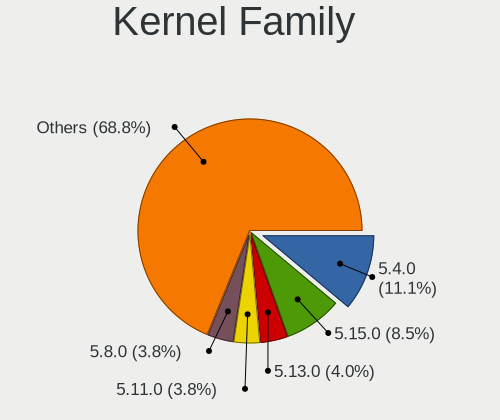
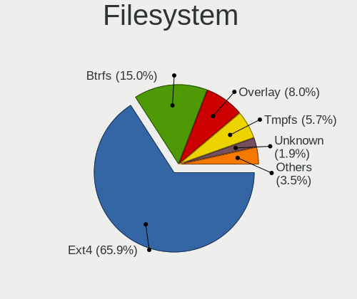
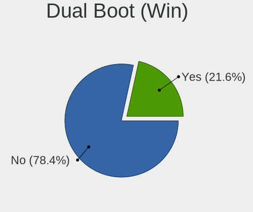
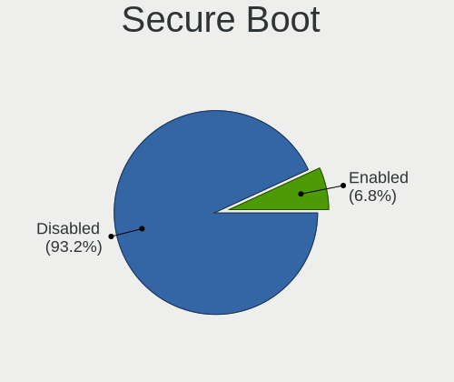
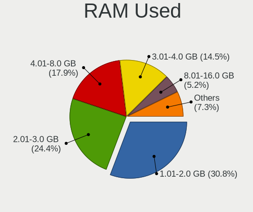
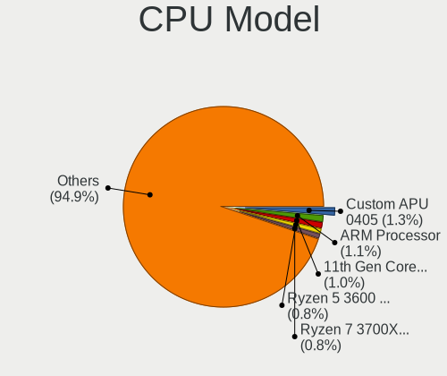
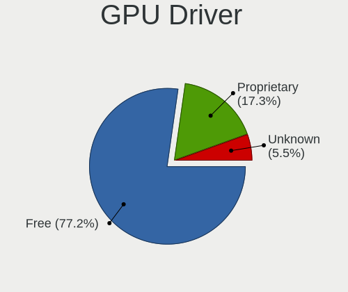
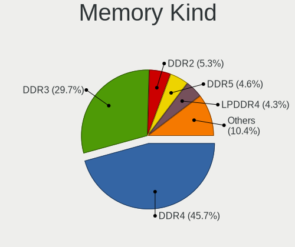

Linux in USA - Tested Hardware & Statistics
-------------------------------------------

A project to collect tested hardware configurations for Linux in USA.

Anyone can contribute to this report by the [hw-probe](https://github.com/linuxhw/hw-probe) tool:

    sudo -E hw-probe -all -upload

Please contribute! Especially if your hardware is rare.

This is a report for all computer types. See also reports for [desktops](/Location/USA/Desktop/README.md) and [notebooks](/Location/USA/Notebook/README.md).

Contents
--------

* [ Test Cases ](#test-cases)

* [ System ](#system)
  - [ OS                       ](#os)
  - [ OS Family                ](#os-family)
  - [ Kernel                   ](#kernel)
  - [ Kernel Family            ](#kernel-family)
  - [ Kernel Major Ver.        ](#kernel-major-ver)
  - [ Arch                     ](#arch)
  - [ DE                       ](#de)
  - [ Display Server           ](#display-server)
  - [ Display Manager          ](#display-manager)
  - [ OS Lang                  ](#os-lang)
  - [ Boot Mode                ](#boot-mode)
  - [ Filesystem               ](#filesystem)
  - [ Part. scheme             ](#part-scheme)
  - [ Dual Boot with Linux/BSD ](#dual-boot-with-linuxbsd)
  - [ Dual Boot (Win)          ](#dual-boot-win)

* [ Board ](#board)
  - [ Vendor                   ](#vendor)
  - [ Model                    ](#model)
  - [ Model Family             ](#model-family)
  - [ MFG Year                 ](#mfg-year)
  - [ Form Factor              ](#form-factor)
  - [ Secure Boot              ](#secure-boot)
  - [ Coreboot                 ](#coreboot)
  - [ RAM Size                 ](#ram-size)
  - [ RAM Used                 ](#ram-used)
  - [ Total Drives             ](#total-drives)
  - [ Has CD-ROM               ](#has-cd-rom)
  - [ Has Ethernet             ](#has-ethernet)
  - [ Has WiFi                 ](#has-wifi)
  - [ Has Bluetooth            ](#has-bluetooth)

* [ Location ](#location)
  - [ Country                  ](#country)
  - [ City                     ](#city)

* [ Drives ](#drives)
  - [ Drive Vendor             ](#drive-vendor)
  - [ Drive Model              ](#drive-model)
  - [ HDD Vendor               ](#hdd-vendor)
  - [ SSD Vendor               ](#ssd-vendor)
  - [ Drive Kind               ](#drive-kind)
  - [ Drive Connector          ](#drive-connector)
  - [ Drive Size               ](#drive-size)
  - [ Space Total              ](#space-total)
  - [ Space Used               ](#space-used)
  - [ Malfunc. Drives          ](#malfunc-drives)
  - [ Malfunc. Drive Vendor    ](#malfunc-drive-vendor)
  - [ Malfunc. HDD Vendor      ](#malfunc-hdd-vendor)
  - [ Malfunc. Drive Kind      ](#malfunc-drive-kind)
  - [ Failed Drives            ](#failed-drives)
  - [ Failed Drive Vendor      ](#failed-drive-vendor)
  - [ Drive Status             ](#drive-status)

* [ Storage controller ](#storage-controller)
  - [ Storage Vendor           ](#storage-vendor)
  - [ Storage Model            ](#storage-model)
  - [ Storage Kind             ](#storage-kind)

* [ Processor ](#processor)
  - [ CPU Vendor               ](#cpu-vendor)
  - [ CPU Model                ](#cpu-model)
  - [ CPU Model Family         ](#cpu-model-family)
  - [ CPU Cores                ](#cpu-cores)
  - [ CPU Sockets              ](#cpu-sockets)
  - [ CPU Threads              ](#cpu-threads)
  - [ CPU Op-Modes             ](#cpu-op-modes)
  - [ CPU Microcode            ](#cpu-microcode)
  - [ CPU Microarch            ](#cpu-microarch)

* [ Graphics ](#graphics)
  - [ GPU Vendor               ](#gpu-vendor)
  - [ GPU Model                ](#gpu-model)
  - [ GPU Combo                ](#gpu-combo)
  - [ GPU Driver               ](#gpu-driver)
  - [ GPU Memory               ](#gpu-memory)

* [ Monitor ](#monitor)
  - [ Monitor Vendor           ](#monitor-vendor)
  - [ Monitor Model            ](#monitor-model)
  - [ Monitor Resolution       ](#monitor-resolution)
  - [ Monitor Diagonal         ](#monitor-diagonal)
  - [ Monitor Width            ](#monitor-width)
  - [ Aspect Ratio             ](#aspect-ratio)
  - [ Monitor Area             ](#monitor-area)
  - [ Pixel Density            ](#pixel-density)
  - [ Multiple Monitors        ](#multiple-monitors)

* [ Network ](#network)
  - [ Net Controller Vendor    ](#net-controller-vendor)
  - [ Net Controller Model     ](#net-controller-model)
  - [ Wireless Vendor          ](#wireless-vendor)
  - [ Wireless Model           ](#wireless-model)
  - [ Ethernet Vendor          ](#ethernet-vendor)
  - [ Ethernet Model           ](#ethernet-model)
  - [ Net Controller Kind      ](#net-controller-kind)
  - [ Used Controller          ](#used-controller)
  - [ NICs                     ](#nics)
  - [ IPv6                     ](#ipv6)

* [ Bluetooth ](#bluetooth)
  - [ Bluetooth Vendor         ](#bluetooth-vendor)
  - [ Bluetooth Model          ](#bluetooth-model)

* [ Sound ](#sound)
  - [ Sound Vendor             ](#sound-vendor)
  - [ Sound Model              ](#sound-model)

* [ Memory ](#memory)
  - [ Memory Vendor            ](#memory-vendor)
  - [ Memory Model             ](#memory-model)
  - [ Memory Kind              ](#memory-kind)
  - [ Memory Form Factor       ](#memory-form-factor)
  - [ Memory Size              ](#memory-size)
  - [ Memory Speed             ](#memory-speed)

* [ Printers & scanners ](#printers--scanners)
  - [ Printer Vendor           ](#printer-vendor)
  - [ Printer Model            ](#printer-model)
  - [ Scanner Vendor           ](#scanner-vendor)
  - [ Scanner Model            ](#scanner-model)

* [ Camera ](#camera)
  - [ Camera Vendor            ](#camera-vendor)
  - [ Camera Model             ](#camera-model)

* [ Security ](#security)
  - [ Fingerprint Vendor       ](#fingerprint-vendor)
  - [ Fingerprint Model        ](#fingerprint-model)
  - [ Chipcard Vendor          ](#chipcard-vendor)
  - [ Chipcard Model           ](#chipcard-model)

* [ Unsupported ](#unsupported)
  - [ Unsupported Devices      ](#unsupported-devices)
  - [ Unsupported Device Types ](#unsupported-device-types)

Test Cases
----------

Total: 47119

| Vendor        | Model                       | Form-Factor | Probe                                                      | Date         |
|---------------|-----------------------------|-------------|------------------------------------------------------------|--------------|
| HP            | 1495                        | Desktop     | [96283c0a09](https://linux-hardware.org/?probe=96283c0a09) | Apr 01, 2023 |
| HP            | 1495                        | Desktop     | [f25125625a](https://linux-hardware.org/?probe=f25125625a) | Apr 01, 2023 |
| Dell          | Inspiron 15 5510            | Notebook    | [e169cd0886](https://linux-hardware.org/?probe=e169cd0886) | Apr 01, 2023 |
| Unknown       | Unknown                     | Soc         | [15a1a38207](https://linux-hardware.org/?probe=15a1a38207) | Apr 01, 2023 |
| Lenovo        | ThinkPad E14 20RA004YUS     | Notebook    | [36b592e607](https://linux-hardware.org/?probe=36b592e607) | Apr 01, 2023 |
| Unknown       | ACB20                       | Notebook    | [6e70bacda5](https://linux-hardware.org/?probe=6e70bacda5) | Apr 01, 2023 |
| HP            | EliteBook 8470p             | Notebook    | [178ccc8d4d](https://linux-hardware.org/?probe=178ccc8d4d) | Apr 01, 2023 |
| ASUSTek       | PRIME B550M-A               | Desktop     | [79d44a9e66](https://linux-hardware.org/?probe=79d44a9e66) | Apr 01, 2023 |
| AZW           | Green G3                    | Desktop     | [a987d9a5c1](https://linux-hardware.org/?probe=a987d9a5c1) | Apr 01, 2023 |
| Lenovo        | 4030                        | Desktop     | [7a23fd4fb4](https://linux-hardware.org/?probe=7a23fd4fb4) | Apr 01, 2023 |
| Toshiba       | Satellite C55-B             | Notebook    | [250e5371c1](https://linux-hardware.org/?probe=250e5371c1) | Apr 01, 2023 |
| ASUSTek       | PRIME A320M-K               | Desktop     | [16f87cd333](https://linux-hardware.org/?probe=16f87cd333) | Apr 01, 2023 |
| ASUSTek       | SABERTOOTH 990FX R2.0       | Desktop     | [d80d075b91](https://linux-hardware.org/?probe=d80d075b91) | Apr 01, 2023 |
| Lenovo        | ThinkPad X230 2325DV4       | Notebook    | [6cff5cd5d1](https://linux-hardware.org/?probe=6cff5cd5d1) | Apr 01, 2023 |
| Dell          | Latitude 5580               | Notebook    | [10cbd4c04d](https://linux-hardware.org/?probe=10cbd4c04d) | Apr 01, 2023 |
| HP            | Pavilion Gaming Laptop 1... | Notebook    | [7e8bd9a529](https://linux-hardware.org/?probe=7e8bd9a529) | Apr 01, 2023 |
| Supermicro    | H12SSL-i                    | Server      | [61297d4bc4](https://linux-hardware.org/?probe=61297d4bc4) | Apr 01, 2023 |
| HP            | 18E7                        | Desktop     | [98319f4504](https://linux-hardware.org/?probe=98319f4504) | Apr 01, 2023 |
| Sony          | VPCEA3BFX                   | Notebook    | [6215c985dd](https://linux-hardware.org/?probe=6215c985dd) | Apr 01, 2023 |
| Dell          | 0GY6Y8 A03                  | Desktop     | [7754565ec1](https://linux-hardware.org/?probe=7754565ec1) | Apr 01, 2023 |
| Lenovo        | ThinkPad T440p              | Notebook    | [4057e0c5e9](https://linux-hardware.org/?probe=4057e0c5e9) | Apr 01, 2023 |
| Dell          | 0M5DCD A00                  | Desktop     | [91cc314380](https://linux-hardware.org/?probe=91cc314380) | Apr 01, 2023 |
| ASUSTek       | Leonite2                    | Desktop     | [41353f6a59](https://linux-hardware.org/?probe=41353f6a59) | Apr 01, 2023 |
| Star Labs     | StarBook                    | Notebook    | [8712994e3c](https://linux-hardware.org/?probe=8712994e3c) | Apr 01, 2023 |
| Pegatron      | 2AC2                        | Desktop     | [ca0b0464d7](https://linux-hardware.org/?probe=ca0b0464d7) | Apr 01, 2023 |
| Intel         | NUC11PABi7 K90104-305       | Mini pc     | [f7cdc4223d](https://linux-hardware.org/?probe=f7cdc4223d) | Apr 01, 2023 |
| Dell          | 04YP6J A02                  | Desktop     | [0223f7bb3e](https://linux-hardware.org/?probe=0223f7bb3e) | Mar 31, 2023 |
| ECS           | GeForce 8000 series         | Desktop     | [32e951a2ca](https://linux-hardware.org/?probe=32e951a2ca) | Mar 31, 2023 |
| Dell          | Latitude E6320              | Notebook    | [a6a0d01947](https://linux-hardware.org/?probe=a6a0d01947) | Mar 31, 2023 |
| System76      | Lemur Pro                   | Notebook    | [5d57a3397e](https://linux-hardware.org/?probe=5d57a3397e) | Mar 31, 2023 |
| Gateway       | IPIMB-ARA                   | Desktop     | [9c300aea89](https://linux-hardware.org/?probe=9c300aea89) | Mar 31, 2023 |
| ASUSTek       | ROG STRIX B450-F GAMING     | Desktop     | [9e09a54915](https://linux-hardware.org/?probe=9e09a54915) | Mar 31, 2023 |
| ASUSTek       | TUF Gaming Z590-PLUS WIF... | Desktop     | [acfff71638](https://linux-hardware.org/?probe=acfff71638) | Mar 31, 2023 |
| ASUSTek       | ROG STRIX B650E-F GAMING... | Desktop     | [8326806aa6](https://linux-hardware.org/?probe=8326806aa6) | Mar 31, 2023 |
| Dell          | XPS 13 9380                 | Notebook    | [47557561a9](https://linux-hardware.org/?probe=47557561a9) | Mar 31, 2023 |
| Dell          | 00F82W A02                  | Desktop     | [8bf22304e0](https://linux-hardware.org/?probe=8bf22304e0) | Mar 31, 2023 |
| HP            | ProBook 640 G2              | Notebook    | [11b902ad5d](https://linux-hardware.org/?probe=11b902ad5d) | Mar 31, 2023 |
| Lenovo        | ThinkPad T440p              | Notebook    | [1063ba3fb9](https://linux-hardware.org/?probe=1063ba3fb9) | Mar 31, 2023 |
| Dell          | Inspiron 1545               | Notebook    | [ca44e7f419](https://linux-hardware.org/?probe=ca44e7f419) | Mar 31, 2023 |
| BESSTAR Te... | GB7                         | Mini pc     | [6f4a645737](https://linux-hardware.org/?probe=6f4a645737) | Mar 31, 2023 |
| ASUSTek       | ROG STRIX B550-F GAMING     | Desktop     | [61e2653466](https://linux-hardware.org/?probe=61e2653466) | Mar 31, 2023 |
| Dell          | 0WMJ54 A00                  | Desktop     | [d11328af2a](https://linux-hardware.org/?probe=d11328af2a) | Mar 31, 2023 |
| Lenovo        | ThinkPad T430 2347EP7       | Notebook    | [6fd7423cb6](https://linux-hardware.org/?probe=6fd7423cb6) | Mar 31, 2023 |
| MSI           | B450 TOMAHAWK MAX           | Desktop     | [c27e3be5ba](https://linux-hardware.org/?probe=c27e3be5ba) | Mar 31, 2023 |
| ASUSTek       | VivoBook_ASUSLaptop X515... | Notebook    | [29c4ba04a1](https://linux-hardware.org/?probe=29c4ba04a1) | Mar 31, 2023 |
| MSI           | Z270-A PRO                  | Desktop     | [a5d218b9a6](https://linux-hardware.org/?probe=a5d218b9a6) | Mar 31, 2023 |
| ASUSTek       | ROG STRIX B450-F GAMING     | Desktop     | [09679af7dc](https://linux-hardware.org/?probe=09679af7dc) | Mar 31, 2023 |
| ASUSTek       | ROG STRIX B450-F GAMING     | Desktop     | [1e78d2454c](https://linux-hardware.org/?probe=1e78d2454c) | Mar 31, 2023 |
| HP            | OMEN by Laptop 17-cb1xxx    | Notebook    | [db1a67682b](https://linux-hardware.org/?probe=db1a67682b) | Mar 31, 2023 |
| ASRock        | B550M-C                     | Desktop     | [c0fcfbc0ed](https://linux-hardware.org/?probe=c0fcfbc0ed) | Mar 31, 2023 |
| Lenovo        | ThinkPad Z13 Gen 1 21D2C... | Notebook    | [0ab4f4cd55](https://linux-hardware.org/?probe=0ab4f4cd55) | Mar 31, 2023 |
| HP            | Laptop 17-cp2xxx            | Notebook    | [854de8a433](https://linux-hardware.org/?probe=854de8a433) | Mar 31, 2023 |
| Dell          | 0FG47G A02                  | Desktop     | [d1cf6fa11e](https://linux-hardware.org/?probe=d1cf6fa11e) | Mar 31, 2023 |
| Acer          | Aspire TC-875 V:1.0         | Desktop     | [8f9f4fb295](https://linux-hardware.org/?probe=8f9f4fb295) | Mar 31, 2023 |
| Supermicro    | X10SLV                      | Server      | [b61612a8a8](https://linux-hardware.org/?probe=b61612a8a8) | Mar 31, 2023 |
| Dell          | Latitude E6330              | Notebook    | [ae7a7254b8](https://linux-hardware.org/?probe=ae7a7254b8) | Mar 31, 2023 |
| Dell          | Latitude E6330              | Notebook    | [2239e12384](https://linux-hardware.org/?probe=2239e12384) | Mar 31, 2023 |
| HP            | Pavilion dm4                | Notebook    | [b7f2f9e2ab](https://linux-hardware.org/?probe=b7f2f9e2ab) | Mar 31, 2023 |
| MSI           | GS66 Stealth 10SF           | Notebook    | [a2589dd6f5](https://linux-hardware.org/?probe=a2589dd6f5) | Mar 31, 2023 |
| Google        | Cave                        | Notebook    | [8bd24407be](https://linux-hardware.org/?probe=8bd24407be) | Mar 31, 2023 |
| HP            | 8767 A                      | Desktop     | [186bad76b7](https://linux-hardware.org/?probe=186bad76b7) | Mar 31, 2023 |
| Acer          | Aspire 5720Z                | Notebook    | [ca2b750eeb](https://linux-hardware.org/?probe=ca2b750eeb) | Mar 31, 2023 |
| Gigabyte      | H310M A-CF                  | Desktop     | [c26786d423](https://linux-hardware.org/?probe=c26786d423) | Mar 31, 2023 |
| Apple         | Mac-BE088AF8C5EB4FA2 iMa... | All in one  | [19b2ae81ff](https://linux-hardware.org/?probe=19b2ae81ff) | Mar 31, 2023 |
| Dell          | Precision M4700             | Notebook    | [7c93bc178e](https://linux-hardware.org/?probe=7c93bc178e) | Mar 31, 2023 |
| ASUSTek       | M5A99FX PRO R2.0            | Desktop     | [0e374d0aea](https://linux-hardware.org/?probe=0e374d0aea) | Mar 31, 2023 |
| ASUSTek       | TUF B365M-PLUS GAMING       | Desktop     | [8d4ef602e5](https://linux-hardware.org/?probe=8d4ef602e5) | Mar 31, 2023 |
| Dell          | 0PP150 A00                  | Desktop     | [fdc879a486](https://linux-hardware.org/?probe=fdc879a486) | Mar 31, 2023 |
| Lenovo        | ThinkPad X270 20HMS0T000    | Notebook    | [702223a4b1](https://linux-hardware.org/?probe=702223a4b1) | Mar 31, 2023 |
| Dell          | 0K240Y A02                  | Desktop     | [ca6aacf14e](https://linux-hardware.org/?probe=ca6aacf14e) | Mar 31, 2023 |
| Gigabyte      | X670E AORUS MASTER          | Desktop     | [68731ac4ec](https://linux-hardware.org/?probe=68731ac4ec) | Mar 31, 2023 |
| Acer          | TravelMate B311-31          | Notebook    | [3345b754b7](https://linux-hardware.org/?probe=3345b754b7) | Mar 31, 2023 |
| ASUSTek       | Maximus VIII IMPACT         | Desktop     | [deab2a5eac](https://linux-hardware.org/?probe=deab2a5eac) | Mar 31, 2023 |
| Samsung       | 950QDB                      | Convertible | [09717388fb](https://linux-hardware.org/?probe=09717388fb) | Mar 31, 2023 |
| OEM_MB        | NARRA3                      | Desktop     | [75050a4d2e](https://linux-hardware.org/?probe=75050a4d2e) | Mar 31, 2023 |
| ASUSTek       | ASUS BR1100CKA BR1100CKA... | Notebook    | [d7f3354ce9](https://linux-hardware.org/?probe=d7f3354ce9) | Mar 31, 2023 |
| Gigabyte      | F2A88X-UP4                  | Desktop     | [72c4b553b4](https://linux-hardware.org/?probe=72c4b553b4) | Mar 31, 2023 |
| Star Labs     | Lite                        | Notebook    | [e3689ef845](https://linux-hardware.org/?probe=e3689ef845) | Mar 31, 2023 |
| ASUSTek       | M5A78L-M LX PLUS            | Desktop     | [deedee079c](https://linux-hardware.org/?probe=deedee079c) | Mar 31, 2023 |
| HP            | Pavilion Laptop 15-cc5xx    | Notebook    | [c6bbbbb7d8](https://linux-hardware.org/?probe=c6bbbbb7d8) | Mar 31, 2023 |
| ASRock        | H310CM-HDV                  | Desktop     | [a9a41a38ed](https://linux-hardware.org/?probe=a9a41a38ed) | Mar 30, 2023 |
| Dell          | Latitude 7370               | Notebook    | [b8a0b25983](https://linux-hardware.org/?probe=b8a0b25983) | Mar 30, 2023 |
| Unknown       | iKoolCore R1 iKoolCore R... | Desktop     | [050875ba5f](https://linux-hardware.org/?probe=050875ba5f) | Mar 30, 2023 |
| Toshiba       | Satellite P875              | Notebook    | [aba8c03541](https://linux-hardware.org/?probe=aba8c03541) | Mar 30, 2023 |
| Gigabyte      | Z170XP-SLI-CF               | Desktop     | [70efcb81e9](https://linux-hardware.org/?probe=70efcb81e9) | Mar 30, 2023 |
| Google        | Lillipup                    | Notebook    | [09292890c9](https://linux-hardware.org/?probe=09292890c9) | Mar 30, 2023 |
| Dell          | 0KV62T A02                  | Desktop     | [c7765df604](https://linux-hardware.org/?probe=c7765df604) | Mar 30, 2023 |
| Acer          | Nitro AN515-58              | Notebook    | [27befad01f](https://linux-hardware.org/?probe=27befad01f) | Mar 30, 2023 |
| Dell          | Precision 3520              | Notebook    | [78a49d244d](https://linux-hardware.org/?probe=78a49d244d) | Mar 30, 2023 |
| Apple         | MacBookPro10,2              | Notebook    | [2f56ac98c1](https://linux-hardware.org/?probe=2f56ac98c1) | Mar 30, 2023 |
| ASUSTek       | M4A79T Deluxe               | Desktop     | [9828b40ec9](https://linux-hardware.org/?probe=9828b40ec9) | Mar 30, 2023 |
| Dell          | XPS 17 9710                 | Notebook    | [6b37881138](https://linux-hardware.org/?probe=6b37881138) | Mar 30, 2023 |
| libre-comp... | aml-s905x-cc                | Soc         | [41da6a7bfb](https://linux-hardware.org/?probe=41da6a7bfb) | Mar 30, 2023 |
| Dell          | 0T7D40 A01                  | Desktop     | [dc44647f41](https://linux-hardware.org/?probe=dc44647f41) | Mar 30, 2023 |
| ASUSTek       | Benicia                     | Desktop     | [7332efabad](https://linux-hardware.org/?probe=7332efabad) | Mar 30, 2023 |
| Google        | Caroline                    | Notebook    | [8018db87e9](https://linux-hardware.org/?probe=8018db87e9) | Mar 30, 2023 |
| HP            | Laptop 15-ef2xxx            | Notebook    | [278ed0e013](https://linux-hardware.org/?probe=278ed0e013) | Mar 30, 2023 |
| ATOPNUC       | MA90                        | Mini pc     | [3a2e8fcdaa](https://linux-hardware.org/?probe=3a2e8fcdaa) | Mar 30, 2023 |
| Dell          | Precision 5510              | Notebook    | [15954887b1](https://linux-hardware.org/?probe=15954887b1) | Mar 30, 2023 |
| ASUSTek       | Leonite2                    | Desktop     | [21eb6fba07](https://linux-hardware.org/?probe=21eb6fba07) | Mar 30, 2023 |
| Dell          | Latitude E7450              | Notebook    | [63e8748d1f](https://linux-hardware.org/?probe=63e8748d1f) | Mar 30, 2023 |
| Dell          | XPS 13 9305                 | Notebook    | [9e60f40931](https://linux-hardware.org/?probe=9e60f40931) | Mar 30, 2023 |
| Lenovo        | ThinkPad X250 20CLS2A100    | Notebook    | [2e8eab25be](https://linux-hardware.org/?probe=2e8eab25be) | Mar 30, 2023 |
| HP            | kip                         | Notebook    | [fe84eac39e](https://linux-hardware.org/?probe=fe84eac39e) | Mar 30, 2023 |
| HP            | 213D A01                    | Desktop     | [d5fb38a71b](https://linux-hardware.org/?probe=d5fb38a71b) | Mar 30, 2023 |
| HP            | 213D A01                    | Desktop     | [79d8e1b64f](https://linux-hardware.org/?probe=79d8e1b64f) | Mar 30, 2023 |
| ECS           | H81H3-WM                    | Desktop     | [cbf3d55d63](https://linux-hardware.org/?probe=cbf3d55d63) | Mar 30, 2023 |
| HP            | OMEN by Laptop              | Notebook    | [c6e4da00ac](https://linux-hardware.org/?probe=c6e4da00ac) | Mar 30, 2023 |
| Framework     | Laptop                      | Notebook    | [ef17714efa](https://linux-hardware.org/?probe=ef17714efa) | Mar 30, 2023 |
| Foxconn       | 2AB1 DVT                    | Desktop     | [a9e8e4d4b0](https://linux-hardware.org/?probe=a9e8e4d4b0) | Mar 30, 2023 |
| Google        | Dragonair                   | Notebook    | [3f9f70991f](https://linux-hardware.org/?probe=3f9f70991f) | Mar 30, 2023 |
| Microsoft     | Surface Pro 4               | Tablet      | [2fb43e55c2](https://linux-hardware.org/?probe=2fb43e55c2) | Mar 30, 2023 |
| Dell          | Latitude E6430              | Notebook    | [086b5d0f79](https://linux-hardware.org/?probe=086b5d0f79) | Mar 30, 2023 |
| HP            | 3048h                       | Desktop     | [1a4d86fca8](https://linux-hardware.org/?probe=1a4d86fca8) | Mar 30, 2023 |
| ASUSTek       | VivoBook_ASUSLaptop X515... | Notebook    | [e85544a3d7](https://linux-hardware.org/?probe=e85544a3d7) | Mar 30, 2023 |
| HP            | 8591                        | Desktop     | [b887990c12](https://linux-hardware.org/?probe=b887990c12) | Mar 30, 2023 |
| HP            | Laptop 15-dy2xxx            | Notebook    | [50f1a552d8](https://linux-hardware.org/?probe=50f1a552d8) | Mar 30, 2023 |
| MSI           | FM2-A75MA-E35               | Desktop     | [10de0ae048](https://linux-hardware.org/?probe=10de0ae048) | Mar 30, 2023 |
| ASUSTek       | TUF Gaming B550M-PLUS       | Desktop     | [82118905ba](https://linux-hardware.org/?probe=82118905ba) | Mar 30, 2023 |
| ATOPNUC       | MA90                        | Mini pc     | [65782ab3d1](https://linux-hardware.org/?probe=65782ab3d1) | Mar 30, 2023 |
| ASUSTek       | TUF Z270 MARK 2             | Desktop     | [4976f6b6b2](https://linux-hardware.org/?probe=4976f6b6b2) | Mar 30, 2023 |
| Dell          | Inspiron One 2320           | All in one  | [225e42d432](https://linux-hardware.org/?probe=225e42d432) | Mar 30, 2023 |
| Gigabyte      | AB350-Gaming 3-CF           | Desktop     | [81dda92e58](https://linux-hardware.org/?probe=81dda92e58) | Mar 30, 2023 |
| ASUSTek       | TUF Gaming X570-PLUS        | Desktop     | [bc798d371a](https://linux-hardware.org/?probe=bc798d371a) | Mar 30, 2023 |
| Microsoft     | Surface Pro 3               | Tablet      | [5f3a9edb3b](https://linux-hardware.org/?probe=5f3a9edb3b) | Mar 30, 2023 |
| Lenovo        | ThinkPad E485 20KU001KUS    | Notebook    | [220764e9f2](https://linux-hardware.org/?probe=220764e9f2) | Mar 30, 2023 |
| Lenovo        | 30D2 SDK0J40697 WIN 3305... | Desktop     | [185cb6df15](https://linux-hardware.org/?probe=185cb6df15) | Mar 30, 2023 |
| Lenovo        | ThinkPad X395 20NLS0J400    | Notebook    | [e9d9710ef9](https://linux-hardware.org/?probe=e9d9710ef9) | Mar 30, 2023 |
| Lenovo        | IdeaPad 5 15ALC05 82LN      | Notebook    | [7554f35f1d](https://linux-hardware.org/?probe=7554f35f1d) | Mar 30, 2023 |
| ASUSTek       | Pro WS X570-ACE             | Desktop     | [6cc34607d1](https://linux-hardware.org/?probe=6cc34607d1) | Mar 30, 2023 |
| Lenovo        | ThinkPad T60 195143U        | Notebook    | [4de196550b](https://linux-hardware.org/?probe=4de196550b) | Mar 30, 2023 |
| MSI           | B450 TOMAHAWK               | Desktop     | [9251f2d561](https://linux-hardware.org/?probe=9251f2d561) | Mar 30, 2023 |
| MSI           | B450 TOMAHAWK               | Desktop     | [2d28ba397e](https://linux-hardware.org/?probe=2d28ba397e) | Mar 29, 2023 |
| ASUSTek       | ROG STRIX B450-F GAMING     | Desktop     | [cd308ca372](https://linux-hardware.org/?probe=cd308ca372) | Mar 29, 2023 |
| System76      | Thelio Mira thelio-mira-... | Desktop     | [4915a172bd](https://linux-hardware.org/?probe=4915a172bd) | Mar 29, 2023 |
| MSI           | 2AE0                        | Desktop     | [29c86e9653](https://linux-hardware.org/?probe=29c86e9653) | Mar 29, 2023 |
| Gigabyte      | X670E AORUS MASTER          | Desktop     | [872733b74c](https://linux-hardware.org/?probe=872733b74c) | Mar 29, 2023 |
| MSI           | 2AE0                        | Desktop     | [53e6254c56](https://linux-hardware.org/?probe=53e6254c56) | Mar 29, 2023 |
| Dell          | Precision M4500             | Notebook    | [cf7e033a17](https://linux-hardware.org/?probe=cf7e033a17) | Mar 29, 2023 |
| Apple         | Mac-BE088AF8C5EB4FA2 iMa... | All in one  | [0805df69aa](https://linux-hardware.org/?probe=0805df69aa) | Mar 29, 2023 |
| Microsoft     | Surface Pro 3               | Tablet      | [9da2e607a3](https://linux-hardware.org/?probe=9da2e607a3) | Mar 29, 2023 |
| Gigabyte      | AERO 15-X9                  | Notebook    | [49f246c5e7](https://linux-hardware.org/?probe=49f246c5e7) | Mar 29, 2023 |
| Lenovo        | 3111 NOK                    | Desktop     | [f6004f6817](https://linux-hardware.org/?probe=f6004f6817) | Mar 29, 2023 |
| ASUSTek       | TUF Gaming FX705DT_FX705... | Notebook    | [803a180064](https://linux-hardware.org/?probe=803a180064) | Mar 29, 2023 |
| Dell          | G5 5505                     | Notebook    | [2552b456b6](https://linux-hardware.org/?probe=2552b456b6) | Mar 29, 2023 |
| Dell          | Latitude E7440              | Notebook    | [1159c854cd](https://linux-hardware.org/?probe=1159c854cd) | Mar 29, 2023 |
| MSI           | MPG Z390 GAMING PRO CARB... | Desktop     | [fb2605e6fa](https://linux-hardware.org/?probe=fb2605e6fa) | Mar 29, 2023 |
| HP            | Victus by Laptop 16-d0xx... | Notebook    | [d96583e702](https://linux-hardware.org/?probe=d96583e702) | Mar 29, 2023 |
| ASUSTek       | TUF Gaming FX705DT_FX705... | Notebook    | [f33059ab6b](https://linux-hardware.org/?probe=f33059ab6b) | Mar 29, 2023 |
| ASUSTek       | CM1630                      | Desktop     | [d28e40c64b](https://linux-hardware.org/?probe=d28e40c64b) | Mar 29, 2023 |
| ASUSTek       | ROG Strix G513QY_G513QY     | Notebook    | [2f6655b77c](https://linux-hardware.org/?probe=2f6655b77c) | Mar 29, 2023 |
| HP            | 806A                        | Desktop     | [477b1e2d83](https://linux-hardware.org/?probe=477b1e2d83) | Mar 29, 2023 |
| Dell          | Latitude 3590               | Notebook    | [9b5971401c](https://linux-hardware.org/?probe=9b5971401c) | Mar 29, 2023 |
| Sony          | VGN-AW330J                  | Notebook    | [f5afc7ab6f](https://linux-hardware.org/?probe=f5afc7ab6f) | Mar 29, 2023 |
| HP            | Notebook                    | Notebook    | [ea7c0e1a2c](https://linux-hardware.org/?probe=ea7c0e1a2c) | Mar 29, 2023 |
| ASUSTek       | Zenbook UX5401ZA_UX5401Z... | Notebook    | [c8f2b78c09](https://linux-hardware.org/?probe=c8f2b78c09) | Mar 29, 2023 |
| ASUSTek       | PRIME B350-PLUS             | Desktop     | [634c2e1e74](https://linux-hardware.org/?probe=634c2e1e74) | Mar 29, 2023 |
| Lenovo        | 3111 NOK                    | Desktop     | [6ef94ade27](https://linux-hardware.org/?probe=6ef94ade27) | Mar 29, 2023 |
| Dell          | Inspiron 5505               | Notebook    | [1802e07a9e](https://linux-hardware.org/?probe=1802e07a9e) | Mar 29, 2023 |
| Dell          | Latitude 5420               | Notebook    | [d714c46c4f](https://linux-hardware.org/?probe=d714c46c4f) | Mar 29, 2023 |
| Dell          | 0200DY A01                  | Desktop     | [095eb7be41](https://linux-hardware.org/?probe=095eb7be41) | Mar 29, 2023 |
| Microsoft     | Surface Laptop Go           | Tablet      | [25909cf566](https://linux-hardware.org/?probe=25909cf566) | Mar 29, 2023 |
| AZW           | SER V1.0                    | Mini pc     | [1deca47347](https://linux-hardware.org/?probe=1deca47347) | Mar 29, 2023 |
| Win elemen... | M600                        | Desktop     | [7cf2343b6f](https://linux-hardware.org/?probe=7cf2343b6f) | Mar 29, 2023 |
| Valve         | Jupiter                     | Notebook    | [395ff0d196](https://linux-hardware.org/?probe=395ff0d196) | Mar 29, 2023 |
| Acer          | Nitro N50-610               | Desktop     | [937d1bc73a](https://linux-hardware.org/?probe=937d1bc73a) | Mar 29, 2023 |
| ASRock        | B450 Pro4                   | Desktop     | [c77fc70f0c](https://linux-hardware.org/?probe=c77fc70f0c) | Mar 29, 2023 |
| HP            | 2B3E                        | All in one  | [c87eebfd5f](https://linux-hardware.org/?probe=c87eebfd5f) | Mar 29, 2023 |
| AWOW          | AL34                        | Notebook    | [19f60f27c8](https://linux-hardware.org/?probe=19f60f27c8) | Mar 29, 2023 |
| HP            | Mini 1103                   | Notebook    | [f28121cfc6](https://linux-hardware.org/?probe=f28121cfc6) | Mar 29, 2023 |
| Dell          | Latitude 3520               | Notebook    | [a175e08fce](https://linux-hardware.org/?probe=a175e08fce) | Mar 28, 2023 |
| Google        | Caroline                    | Notebook    | [80f01f2a87](https://linux-hardware.org/?probe=80f01f2a87) | Mar 28, 2023 |
| HP            | ENVY x360 Convertible 15... | Convertible | [adabf81daa](https://linux-hardware.org/?probe=adabf81daa) | Mar 28, 2023 |
| Dell          | Latitude 3520               | Notebook    | [9c7a9b9282](https://linux-hardware.org/?probe=9c7a9b9282) | Mar 28, 2023 |
| Lenovo        | ThinkPad P14s Gen 2a 21A... | Notebook    | [af48722867](https://linux-hardware.org/?probe=af48722867) | Mar 28, 2023 |
| Dell          | 0200DY A01                  | Desktop     | [722b28547b](https://linux-hardware.org/?probe=722b28547b) | Mar 28, 2023 |
| ASRock        | B550 Taichi                 | Desktop     | [94d97c5e0c](https://linux-hardware.org/?probe=94d97c5e0c) | Mar 28, 2023 |
| HP            | ENVY Notebook               | Notebook    | [98cd32ea44](https://linux-hardware.org/?probe=98cd32ea44) | Mar 28, 2023 |
| ASUSTek       | ASUS TUF Gaming A15 FA50... | Notebook    | [0667374075](https://linux-hardware.org/?probe=0667374075) | Mar 28, 2023 |
| Lenovo        | ThinkPad X1 Yoga 2nd 20J... | Convertible | [548224967e](https://linux-hardware.org/?probe=548224967e) | Mar 28, 2023 |
| ASRock        | B550 Taichi                 | Desktop     | [b46a569742](https://linux-hardware.org/?probe=b46a569742) | Mar 28, 2023 |
| HP            | 82BF                        | Mini pc     | [305883be65](https://linux-hardware.org/?probe=305883be65) | Mar 28, 2023 |
| HP            | EliteBook 840 G5            | Notebook    | [65671e15cb](https://linux-hardware.org/?probe=65671e15cb) | Mar 28, 2023 |
| ASUSTek       | PRIME Z690-P WIFI           | Desktop     | [898059efa5](https://linux-hardware.org/?probe=898059efa5) | Mar 28, 2023 |
| Gigabyte      | B550M AORUS PRO-P           | Desktop     | [c97dbb0917](https://linux-hardware.org/?probe=c97dbb0917) | Mar 28, 2023 |
| Lenovo        | Legion 5 Pro 16ARH7H 82R... | Notebook    | [7939320fa4](https://linux-hardware.org/?probe=7939320fa4) | Mar 28, 2023 |
| Lenovo        | ThinkPad X1 Carbon 7th 2... | Notebook    | [78e2b83e31](https://linux-hardware.org/?probe=78e2b83e31) | Mar 28, 2023 |
| Lenovo        | SHARKBAY NOK                | Desktop     | [0cbe19c074](https://linux-hardware.org/?probe=0cbe19c074) | Mar 28, 2023 |
| HUAWEI        | NBLB-WAX9N                  | Notebook    | [c393e49ce3](https://linux-hardware.org/?probe=c393e49ce3) | Mar 28, 2023 |
| Thomson       | WWNEO14C-4BK32F             | Notebook    | [90fa9585c9](https://linux-hardware.org/?probe=90fa9585c9) | Mar 28, 2023 |
| HUAWEI        | NBLB-WAX9N                  | Notebook    | [e7608e5c20](https://linux-hardware.org/?probe=e7608e5c20) | Mar 28, 2023 |
| Valve         | Jupiter                     | Notebook    | [a195a1f983](https://linux-hardware.org/?probe=a195a1f983) | Mar 28, 2023 |
| HP            | 09F0h                       | Desktop     | [540ec71101](https://linux-hardware.org/?probe=540ec71101) | Mar 28, 2023 |
| Unknown       | Unknown                     | Notebook    | [d89991a0f3](https://linux-hardware.org/?probe=d89991a0f3) | Mar 28, 2023 |
| MSI           | MAG B550 TOMAHAWK           | Desktop     | [fd1273ed2e](https://linux-hardware.org/?probe=fd1273ed2e) | Mar 28, 2023 |
| Razer         | Blade                       | Notebook    | [ffa791eb4a](https://linux-hardware.org/?probe=ffa791eb4a) | Mar 28, 2023 |
| Dell          | 0YXG0N A00                  | Desktop     | [d3875b50ac](https://linux-hardware.org/?probe=d3875b50ac) | Mar 28, 2023 |
| MSI           | X370 GAMING PRO CARBON      | Desktop     | [151a527b35](https://linux-hardware.org/?probe=151a527b35) | Mar 28, 2023 |
| Lenovo        | ThinkPad E14 20RA004YUS     | Notebook    | [18226d4ded](https://linux-hardware.org/?probe=18226d4ded) | Mar 28, 2023 |
| ASRock        | B650M PG Riptide WiFi       | Desktop     | [f17c95f91b](https://linux-hardware.org/?probe=f17c95f91b) | Mar 28, 2023 |
| ASRock        | X470 Taichi                 | Desktop     | [79d0ee9715](https://linux-hardware.org/?probe=79d0ee9715) | Mar 28, 2023 |
| ASRock        | B650M PG Riptide WiFi       | Desktop     | [1b67e2c4fd](https://linux-hardware.org/?probe=1b67e2c4fd) | Mar 28, 2023 |
| Dell          | Inspiron 14 5410 2-in-1     | Convertible | [d6a9697313](https://linux-hardware.org/?probe=d6a9697313) | Mar 28, 2023 |
| HP            | ElitePad 1000 G2            | Notebook    | [4b16a78f3e](https://linux-hardware.org/?probe=4b16a78f3e) | Mar 28, 2023 |
| Lenovo        | ThinkPad T540p 20BE004EU... | Notebook    | [988731ac8d](https://linux-hardware.org/?probe=988731ac8d) | Mar 28, 2023 |
| Lenovo        | SHARKBAY SDK0J40709 WIN ... | Desktop     | [22e3e1831c](https://linux-hardware.org/?probe=22e3e1831c) | Mar 28, 2023 |
| ASUSTek       | PRIME B550M-A               | Desktop     | [4b0ae8033f](https://linux-hardware.org/?probe=4b0ae8033f) | Mar 28, 2023 |
| Lenovo        | ThinkPad T540p 20BE004EU... | Notebook    | [8406000835](https://linux-hardware.org/?probe=8406000835) | Mar 28, 2023 |
| Pegatron      | 2AE3                        | Desktop     | [806b4e1780](https://linux-hardware.org/?probe=806b4e1780) | Mar 28, 2023 |
| Pegatron      | 2AE3                        | Desktop     | [23ce0f4fd5](https://linux-hardware.org/?probe=23ce0f4fd5) | Mar 28, 2023 |
| HP            | Pavilion Gaming Laptop 1... | Notebook    | [4c2dd89a20](https://linux-hardware.org/?probe=4c2dd89a20) | Mar 28, 2023 |
| ASUSTek       | TUF Gaming B550M-PLUS       | Desktop     | [5969fea8f0](https://linux-hardware.org/?probe=5969fea8f0) | Mar 28, 2023 |
| MSI           | MPG X670E CARBON WIFI       | Desktop     | [cde470cb39](https://linux-hardware.org/?probe=cde470cb39) | Mar 28, 2023 |
| Dell          | Latitude E5570              | Notebook    | [5b3d1ab8b9](https://linux-hardware.org/?probe=5b3d1ab8b9) | Mar 28, 2023 |
| ASUSTek       | X550CA                      | Notebook    | [a449827256](https://linux-hardware.org/?probe=a449827256) | Mar 28, 2023 |
| Intel         | NUC11PABi7 K90104-305       | Mini pc     | [35510eaf63](https://linux-hardware.org/?probe=35510eaf63) | Mar 28, 2023 |
| ASUSTek       | TUF Gaming X570-PLUS        | Desktop     | [c4bba42d7b](https://linux-hardware.org/?probe=c4bba42d7b) | Mar 28, 2023 |
| MSI           | B450 TOMAHAWK MAX           | Desktop     | [398927f75d](https://linux-hardware.org/?probe=398927f75d) | Mar 28, 2023 |
| HP            | Pavilion Laptop 15-cs2xx... | Notebook    | [8921171c40](https://linux-hardware.org/?probe=8921171c40) | Mar 28, 2023 |
| HP            | ZBook Studio G3             | Notebook    | [3da1eddc9e](https://linux-hardware.org/?probe=3da1eddc9e) | Mar 28, 2023 |
| Lenovo        | ThinkPad P50 20EQS0T400     | Notebook    | [5b4466c085](https://linux-hardware.org/?probe=5b4466c085) | Mar 28, 2023 |
| Lenovo        | ThinkPad T420 4180AP3       | Notebook    | [8ddee342c9](https://linux-hardware.org/?probe=8ddee342c9) | Mar 28, 2023 |
| Dell          | Inspiron 3558               | Notebook    | [c80d4c15ce](https://linux-hardware.org/?probe=c80d4c15ce) | Mar 28, 2023 |
| Gigabyte      | X570 AORUS MASTER           | Desktop     | [adee3bbdde](https://linux-hardware.org/?probe=adee3bbdde) | Mar 28, 2023 |
| Dell          | Inspiron 5515               | Notebook    | [13a0d1426d](https://linux-hardware.org/?probe=13a0d1426d) | Mar 28, 2023 |
| Lenovo        | ThinkPad W520 4284E79       | Notebook    | [2d9875ca24](https://linux-hardware.org/?probe=2d9875ca24) | Mar 28, 2023 |
| Unknown       | Unknown                     | Notebook    | [be297867f3](https://linux-hardware.org/?probe=be297867f3) | Mar 28, 2023 |
| Dell          | 06X1TJ A01                  | Desktop     | [7e99e3d73e](https://linux-hardware.org/?probe=7e99e3d73e) | Mar 28, 2023 |
| HP            | Pavilion Laptop 15-cc5xx    | Notebook    | [7a9cf507e6](https://linux-hardware.org/?probe=7a9cf507e6) | Mar 28, 2023 |
| ASRock        | Z68 Pro3-M                  | Desktop     | [60f0809fbf](https://linux-hardware.org/?probe=60f0809fbf) | Mar 28, 2023 |
| Dell          | 08HPGT A01                  | Desktop     | [451ccd93f2](https://linux-hardware.org/?probe=451ccd93f2) | Mar 27, 2023 |
| Dell          | 08HPGT A01                  | Desktop     | [e38a63e793](https://linux-hardware.org/?probe=e38a63e793) | Mar 27, 2023 |
| Acer          | Aspire E5-575               | Notebook    | [5964caaa02](https://linux-hardware.org/?probe=5964caaa02) | Mar 27, 2023 |
| Dell          | 0YXG0N A00                  | Desktop     | [07527593cd](https://linux-hardware.org/?probe=07527593cd) | Mar 27, 2023 |
| ASUSTek       | TUF B450M-PLUS GAMING       | Desktop     | [dcbcf69a04](https://linux-hardware.org/?probe=dcbcf69a04) | Mar 27, 2023 |
| Dell          | 0W2F8G A02                  | Desktop     | [511510b501](https://linux-hardware.org/?probe=511510b501) | Mar 27, 2023 |
| HP            | Pavilion x360 Convertibl... | Convertible | [fc1af1a499](https://linux-hardware.org/?probe=fc1af1a499) | Mar 27, 2023 |
| HP            | Pavilion x360 Convertibl... | Convertible | [ccc0edffff](https://linux-hardware.org/?probe=ccc0edffff) | Mar 27, 2023 |
| Dell          | 0YXG0N A00                  | Desktop     | [9059f37aa1](https://linux-hardware.org/?probe=9059f37aa1) | Mar 27, 2023 |
| Gateway       | IPIMB-ARA                   | Desktop     | [6b2eb0b9f7](https://linux-hardware.org/?probe=6b2eb0b9f7) | Mar 27, 2023 |
| HP            | Pavilion Laptop 15-eh2xx... | Notebook    | [d80388d7ef](https://linux-hardware.org/?probe=d80388d7ef) | Mar 27, 2023 |
| MSI           | GS66 Stealth 10SF           | Notebook    | [cb72b15b20](https://linux-hardware.org/?probe=cb72b15b20) | Mar 27, 2023 |
| Acer          | Aspire A515-45              | Notebook    | [d480257689](https://linux-hardware.org/?probe=d480257689) | Mar 27, 2023 |
| ASUSTek       | Pro WS WRX80E-SAGE SE WI... | Desktop     | [79dc82b50b](https://linux-hardware.org/?probe=79dc82b50b) | Mar 27, 2023 |
| Lenovo        | ThinkPad L13 Yoga Gen 2 ... | Convertible | [c1e74d51ee](https://linux-hardware.org/?probe=c1e74d51ee) | Mar 27, 2023 |
| HP            | 3029h                       | Desktop     | [153b913406](https://linux-hardware.org/?probe=153b913406) | Mar 27, 2023 |
| AZW           | U59                         | Desktop     | [7674bb8dc9](https://linux-hardware.org/?probe=7674bb8dc9) | Mar 27, 2023 |
| Toshiba       | QOSMIO F750                 | Notebook    | [b52a3268f6](https://linux-hardware.org/?probe=b52a3268f6) | Mar 27, 2023 |
| Unknown       | 1.0                         | Desktop     | [e09cc1385b](https://linux-hardware.org/?probe=e09cc1385b) | Mar 27, 2023 |
| Dell          | Inspiron 3543               | Notebook    | [d714304a67](https://linux-hardware.org/?probe=d714304a67) | Mar 27, 2023 |
| Valve         | Jupiter                     | Notebook    | [b4e942862a](https://linux-hardware.org/?probe=b4e942862a) | Mar 27, 2023 |
| HP            | ZBook Fury 16 G9 Mobile ... | Notebook    | [dd84425bc7](https://linux-hardware.org/?probe=dd84425bc7) | Mar 27, 2023 |
| ASRock        | X570 Steel Legend           | Desktop     | [490155a63a](https://linux-hardware.org/?probe=490155a63a) | Mar 27, 2023 |
| Valve         | Jupiter                     | Notebook    | [1a7531860b](https://linux-hardware.org/?probe=1a7531860b) | Mar 27, 2023 |
| Dell          | Inspiron 3543               | Notebook    | [f733f5b792](https://linux-hardware.org/?probe=f733f5b792) | Mar 27, 2023 |
| Dell          | Inspiron 5555               | Notebook    | [cf226d028d](https://linux-hardware.org/?probe=cf226d028d) | Mar 27, 2023 |
| MSI           | PRO B660-A DDR4             | Desktop     | [6a882b7826](https://linux-hardware.org/?probe=6a882b7826) | Mar 27, 2023 |
| MSI           | H410M PRO-C                 | Desktop     | [95cb5acf9e](https://linux-hardware.org/?probe=95cb5acf9e) | Mar 27, 2023 |
| Supermicro    | H12SSL-i                    | Server      | [586decd061](https://linux-hardware.org/?probe=586decd061) | Mar 27, 2023 |
| Dell          | 01TJ2K A03                  | Desktop     | [f390eb34f6](https://linux-hardware.org/?probe=f390eb34f6) | Mar 27, 2023 |
| Dell          | Studio 1537                 | Notebook    | [64676c7b1a](https://linux-hardware.org/?probe=64676c7b1a) | Mar 27, 2023 |
| Toshiba       | Satellite C55-C             | Notebook    | [d7ec0eb4b1](https://linux-hardware.org/?probe=d7ec0eb4b1) | Mar 27, 2023 |
| HP            | Pavilion TS 11              | Notebook    | [e13254735b](https://linux-hardware.org/?probe=e13254735b) | Mar 27, 2023 |
| Gigabyte      | B650 AORUS ELITE AX         | Desktop     | [29ec74ac8b](https://linux-hardware.org/?probe=29ec74ac8b) | Mar 27, 2023 |
| Acer          | Predator PT515-51           | Notebook    | [2ac6541cf1](https://linux-hardware.org/?probe=2ac6541cf1) | Mar 27, 2023 |
| MSI           | B550-A PRO                  | Desktop     | [ebb59fa31d](https://linux-hardware.org/?probe=ebb59fa31d) | Mar 27, 2023 |
| ASRockRack    | D1541D4U-2T8R               | Desktop     | [012c10ae8c](https://linux-hardware.org/?probe=012c10ae8c) | Mar 27, 2023 |
| Intel         | X58M                        | Desktop     | [823813881b](https://linux-hardware.org/?probe=823813881b) | Mar 27, 2023 |
| HP            | Pavilion g6                 | Notebook    | [4b08001481](https://linux-hardware.org/?probe=4b08001481) | Mar 27, 2023 |
| HP            | 8430 1000                   | All in one  | [c0d9a96bbf](https://linux-hardware.org/?probe=c0d9a96bbf) | Mar 27, 2023 |
| HP            | Laptop 15-bs2xx             | Notebook    | [b6160f7688](https://linux-hardware.org/?probe=b6160f7688) | Mar 27, 2023 |
| HP            | Laptop 15-bs2xx             | Notebook    | [85966e5691](https://linux-hardware.org/?probe=85966e5691) | Mar 27, 2023 |
| Dell          | Latitude E5570              | Notebook    | [350e781679](https://linux-hardware.org/?probe=350e781679) | Mar 27, 2023 |
| Dell          | 0JVY7H A00                  | Desktop     | [4fb29c4b54](https://linux-hardware.org/?probe=4fb29c4b54) | Mar 27, 2023 |
| HP            | EliteBook 8460p             | Notebook    | [ccae23c5a7](https://linux-hardware.org/?probe=ccae23c5a7) | Mar 27, 2023 |
| Intel         | NUC10i7FNB M38062-307       | Mini pc     | [8e1c758a05](https://linux-hardware.org/?probe=8e1c758a05) | Mar 26, 2023 |
| Razer         | Blade Pro 17 (Early 2020... | Notebook    | [36d75e1d7f](https://linux-hardware.org/?probe=36d75e1d7f) | Mar 26, 2023 |
| Acer          | TravelMate P653-M           | Notebook    | [625243d39f](https://linux-hardware.org/?probe=625243d39f) | Mar 26, 2023 |
| HPE           | ProLiant MicroServer Gen... | Desktop     | [66394c054f](https://linux-hardware.org/?probe=66394c054f) | Mar 26, 2023 |
| Razer         | Blade Pro 17 (Early 2020... | Notebook    | [244b228a30](https://linux-hardware.org/?probe=244b228a30) | Mar 26, 2023 |
| Toshiba       | Satellite C55t-C            | Notebook    | [758abe1fb4](https://linux-hardware.org/?probe=758abe1fb4) | Mar 26, 2023 |
| Lenovo        | G580 20157                  | Notebook    | [98df8e769b](https://linux-hardware.org/?probe=98df8e769b) | Mar 26, 2023 |
| Dell          | XPS 15 9520                 | Notebook    | [35718792af](https://linux-hardware.org/?probe=35718792af) | Mar 26, 2023 |
| Lenovo        | ThinkCentre M90p 3282A8U    | Desktop     | [5edac0955d](https://linux-hardware.org/?probe=5edac0955d) | Mar 26, 2023 |
| ASUSTek       | PRIME Z690-P WIFI           | Desktop     | [1821e3657a](https://linux-hardware.org/?probe=1821e3657a) | Mar 26, 2023 |
| Dell          | XPS 15 9500                 | Notebook    | [cebc7c547a](https://linux-hardware.org/?probe=cebc7c547a) | Mar 26, 2023 |
| Lenovo        | ThinkPad X230 Tablet 343... | Notebook    | [6ac9c53a7e](https://linux-hardware.org/?probe=6ac9c53a7e) | Mar 26, 2023 |
| Dell          | XPS 15 9500                 | Notebook    | [4391dcbdd2](https://linux-hardware.org/?probe=4391dcbdd2) | Mar 26, 2023 |
| Acer          | Aspire VN7-791              | Notebook    | [eb75a9c480](https://linux-hardware.org/?probe=eb75a9c480) | Mar 26, 2023 |
| Lenovo        | Legion 5 15ACH6 82JW        | Notebook    | [0180776452](https://linux-hardware.org/?probe=0180776452) | Mar 26, 2023 |
| ASUSTek       | TUF Gaming Z690-PLUS WIF... | Desktop     | [aaae412a63](https://linux-hardware.org/?probe=aaae412a63) | Mar 26, 2023 |
| Lenovo        | ThinkPad P51 20HHCTO1WW     | Notebook    | [85fb1a6778](https://linux-hardware.org/?probe=85fb1a6778) | Mar 26, 2023 |
| HP            | EliteBook Folio 9480m       | Notebook    | [1be38b1b49](https://linux-hardware.org/?probe=1be38b1b49) | Mar 26, 2023 |
| Lenovo        | ThinkPad T550 20CK000GCA    | Notebook    | [946f550eb7](https://linux-hardware.org/?probe=946f550eb7) | Mar 26, 2023 |
| Apple         | MacBookPro5,1               | Notebook    | [10eec43a14](https://linux-hardware.org/?probe=10eec43a14) | Mar 26, 2023 |
| Valve         | Jupiter                     | Notebook    | [58c3c0e668](https://linux-hardware.org/?probe=58c3c0e668) | Mar 26, 2023 |
| Dell          | 0MGK50 A02                  | Desktop     | [75b4691fd2](https://linux-hardware.org/?probe=75b4691fd2) | Mar 26, 2023 |
| Pegatron      | Acacia                      | Desktop     | [4ce0966b14](https://linux-hardware.org/?probe=4ce0966b14) | Mar 26, 2023 |
| Pegatron      | Acacia                      | Desktop     | [4faa2a52d3](https://linux-hardware.org/?probe=4faa2a52d3) | Mar 26, 2023 |
| Pine Micro... | Pine64 Pinebook Pro         | Notebook    | [5b53728575](https://linux-hardware.org/?probe=5b53728575) | Mar 26, 2023 |
| Dell          | 0HY9JP A00                  | Desktop     | [d1c982b241](https://linux-hardware.org/?probe=d1c982b241) | Mar 26, 2023 |
| Lenovo        | ThinkPad Z13 Gen 1 21D2C... | Notebook    | [0933beb0f7](https://linux-hardware.org/?probe=0933beb0f7) | Mar 26, 2023 |
| Valve         | Jupiter                     | Notebook    | [2b40215d5b](https://linux-hardware.org/?probe=2b40215d5b) | Mar 26, 2023 |
| HP            | Pavilion Notebook           | Notebook    | [5bf55c7664](https://linux-hardware.org/?probe=5bf55c7664) | Mar 26, 2023 |
| Supermicro    | H12SSL-i                    | Server      | [56d537b480](https://linux-hardware.org/?probe=56d537b480) | Mar 26, 2023 |
| Dell          | Latitude 3590               | Notebook    | [5d1ac262f4](https://linux-hardware.org/?probe=5d1ac262f4) | Mar 26, 2023 |
| HP            | Pavilion Notebook           | Notebook    | [46626fe2c4](https://linux-hardware.org/?probe=46626fe2c4) | Mar 26, 2023 |
| MSI           | MAG B550 TOMAHAWK           | Desktop     | [c08caf1dee](https://linux-hardware.org/?probe=c08caf1dee) | Mar 26, 2023 |
| Apple         | MacBookPro8,1               | Notebook    | [0f1954d5c6](https://linux-hardware.org/?probe=0f1954d5c6) | Mar 26, 2023 |
| Gigabyte      | X670E AORUS MASTER          | Desktop     | [2e813c4a68](https://linux-hardware.org/?probe=2e813c4a68) | Mar 26, 2023 |
| HP            | 83E2                        | Desktop     | [00f64e69cd](https://linux-hardware.org/?probe=00f64e69cd) | Mar 26, 2023 |
| Lenovo        | ThinkCentre M90p 3282A8U    | Desktop     | [40b8057336](https://linux-hardware.org/?probe=40b8057336) | Mar 26, 2023 |
| Apple         | MacBookPro9,2               | Notebook    | [35eaaaac45](https://linux-hardware.org/?probe=35eaaaac45) | Mar 26, 2023 |
| MSI           | MAG B550 TOMAHAWK           | Desktop     | [f6f4996c63](https://linux-hardware.org/?probe=f6f4996c63) | Mar 26, 2023 |
| ASUSTek       | ROG STRIX Z390-E GAMING     | Desktop     | [a57839f702](https://linux-hardware.org/?probe=a57839f702) | Mar 26, 2023 |
| Dell          | Precision 5570              | Notebook    | [454590a1a8](https://linux-hardware.org/?probe=454590a1a8) | Mar 26, 2023 |
| HP            | 339A                        | Desktop     | [1009c2d048](https://linux-hardware.org/?probe=1009c2d048) | Mar 26, 2023 |
| ASUSTek       | M5A78L-M LX PLUS            | Desktop     | [7a2bce56b1](https://linux-hardware.org/?probe=7a2bce56b1) | Mar 26, 2023 |
| Gigabyte      | X58A-UD3R                   | Desktop     | [2325b601fe](https://linux-hardware.org/?probe=2325b601fe) | Mar 25, 2023 |
| Dell          | 02YYK5 A01                  | Desktop     | [92e64e0e8c](https://linux-hardware.org/?probe=92e64e0e8c) | Mar 25, 2023 |
| Gigabyte      | X570 AORUS ELITE            | Desktop     | [0f7d28bd43](https://linux-hardware.org/?probe=0f7d28bd43) | Mar 25, 2023 |
| HP            | Laptop 14-dk0xxx            | Notebook    | [a6d543292b](https://linux-hardware.org/?probe=a6d543292b) | Mar 25, 2023 |
| HP            | Laptop 14-dk0xxx            | Notebook    | [d334e1dd57](https://linux-hardware.org/?probe=d334e1dd57) | Mar 25, 2023 |
| ASUSTek       | Maximus VIII GENE           | Desktop     | [71ba42d727](https://linux-hardware.org/?probe=71ba42d727) | Mar 25, 2023 |
| ASUSTek       | Maximus VIII GENE           | Desktop     | [33ba03aebe](https://linux-hardware.org/?probe=33ba03aebe) | Mar 25, 2023 |
| HP            | Laptop 15-ef2xxx            | Notebook    | [2246abad85](https://linux-hardware.org/?probe=2246abad85) | Mar 25, 2023 |
| HP            | ZBook Studio G5             | Notebook    | [3e4bb7249f](https://linux-hardware.org/?probe=3e4bb7249f) | Mar 25, 2023 |
| ASUSTek       | H81I-PLUS                   | Desktop     | [98dc4bb06b](https://linux-hardware.org/?probe=98dc4bb06b) | Mar 25, 2023 |
| ASUSTek       | H81I-PLUS                   | Desktop     | [bb353ccddf](https://linux-hardware.org/?probe=bb353ccddf) | Mar 25, 2023 |
| Lenovo        | ThinkCentre M58p 6137A2U    | Desktop     | [cc740804d7](https://linux-hardware.org/?probe=cc740804d7) | Mar 25, 2023 |
| ASUSTek       | PRIME B450M-A               | Desktop     | [6601de8aae](https://linux-hardware.org/?probe=6601de8aae) | Mar 25, 2023 |
| Dell          | XPS 13 9380                 | Notebook    | [72bf3db096](https://linux-hardware.org/?probe=72bf3db096) | Mar 25, 2023 |
| MSI           | PRO B660-A DDR4             | Desktop     | [ef9408ce57](https://linux-hardware.org/?probe=ef9408ce57) | Mar 25, 2023 |
| ASUSTek       | X510UAR                     | Notebook    | [728805785d](https://linux-hardware.org/?probe=728805785d) | Mar 25, 2023 |
| Lenovo        | ThinkPad E15 Gen 4 21EES... | Notebook    | [257fa4c383](https://linux-hardware.org/?probe=257fa4c383) | Mar 25, 2023 |
| Dell          | 01TKCC A01                  | Desktop     | [c250d03840](https://linux-hardware.org/?probe=c250d03840) | Mar 25, 2023 |
| HP            | 18E9                        | Desktop     | [f015f44555](https://linux-hardware.org/?probe=f015f44555) | Mar 25, 2023 |
| Dell          | Inspiron 7400               | Notebook    | [a0bba69c40](https://linux-hardware.org/?probe=a0bba69c40) | Mar 25, 2023 |
| Dell          | Inspiron 7400               | Notebook    | [98d0daa764](https://linux-hardware.org/?probe=98d0daa764) | Mar 25, 2023 |
| MSI           | H81M-E33                    | Desktop     | [47f031e68c](https://linux-hardware.org/?probe=47f031e68c) | Mar 25, 2023 |
| Apple         | Mac-4B682C642B45593E iMa... | All in one  | [5e78103251](https://linux-hardware.org/?probe=5e78103251) | Mar 25, 2023 |
| Sony          | VPCF1390X                   | Notebook    | [328d720f61](https://linux-hardware.org/?probe=328d720f61) | Mar 25, 2023 |
| HP            | OMEN by Laptop 17-cb1xxx    | Notebook    | [b1cab7b897](https://linux-hardware.org/?probe=b1cab7b897) | Mar 25, 2023 |
| HP            | 83E2                        | Desktop     | [cd40c6aa18](https://linux-hardware.org/?probe=cd40c6aa18) | Mar 25, 2023 |
| Gigabyte      | X399 AORUS PRO-CF           | Desktop     | [99da9866a9](https://linux-hardware.org/?probe=99da9866a9) | Mar 25, 2023 |
| ASUSTek       | H81T R2.0                   | Desktop     | [92b97834aa](https://linux-hardware.org/?probe=92b97834aa) | Mar 25, 2023 |
| Carbon Sys... | Iridium 14                  | Notebook    | [e7f9195a1d](https://linux-hardware.org/?probe=e7f9195a1d) | Mar 25, 2023 |
| Lenovo        | SHARKBAY SDK0E50510 PRO     | Desktop     | [e7b44d994b](https://linux-hardware.org/?probe=e7b44d994b) | Mar 25, 2023 |
| Dell          | Latitude E7450              | Notebook    | [7154586794](https://linux-hardware.org/?probe=7154586794) | Mar 25, 2023 |
| Lenovo        | ThinkPad T480s 20L8S0C40... | Notebook    | [39b2a59543](https://linux-hardware.org/?probe=39b2a59543) | Mar 25, 2023 |
| ASUSTek       | SABERTOOTH Z77              | Desktop     | [d5d190db2f](https://linux-hardware.org/?probe=d5d190db2f) | Mar 25, 2023 |
| AZW           | Green G3                    | Desktop     | [a0789502ab](https://linux-hardware.org/?probe=a0789502ab) | Mar 25, 2023 |
| ASRock        | B550AM Gaming               | Desktop     | [be6e8f17cc](https://linux-hardware.org/?probe=be6e8f17cc) | Mar 25, 2023 |
| HP            | 8906 SMVB                   | Desktop     | [7650a804d9](https://linux-hardware.org/?probe=7650a804d9) | Mar 25, 2023 |
| ASUSTek       | G750JM                      | Notebook    | [98ba3a9ce6](https://linux-hardware.org/?probe=98ba3a9ce6) | Mar 25, 2023 |
| ASUSTek       | PRIME X470-PRO              | Desktop     | [a05e768cca](https://linux-hardware.org/?probe=a05e768cca) | Mar 25, 2023 |
| HP            | ProBook 645 G1              | Notebook    | [98ac3d1b90](https://linux-hardware.org/?probe=98ac3d1b90) | Mar 24, 2023 |
| ASUSTek       | Basswood3G                  | Desktop     | [d71f476c72](https://linux-hardware.org/?probe=d71f476c72) | Mar 24, 2023 |
| Lenovo        | Legion Y530-15ICH 81FV      | Notebook    | [edb27720ee](https://linux-hardware.org/?probe=edb27720ee) | Mar 24, 2023 |
| Gigabyte      | Z690 AORUS PRO              | Desktop     | [9b8ddda3c3](https://linux-hardware.org/?probe=9b8ddda3c3) | Mar 24, 2023 |
| AZW           | Green G3                    | Desktop     | [7dcacb9c15](https://linux-hardware.org/?probe=7dcacb9c15) | Mar 24, 2023 |
| Apple         | MacBookPro11,3              | Notebook    | [21c3ce9508](https://linux-hardware.org/?probe=21c3ce9508) | Mar 24, 2023 |
| Samsung       | 950QDB                      | Convertible | [cf8d7b5959](https://linux-hardware.org/?probe=cf8d7b5959) | Mar 24, 2023 |
| Lenovo        | ThinkPad 13 2nd Gen 20J1... | Notebook    | [9b9a21b7da](https://linux-hardware.org/?probe=9b9a21b7da) | Mar 24, 2023 |
| Dell          | 0PC5F7 A01                  | Desktop     | [61550296b7](https://linux-hardware.org/?probe=61550296b7) | Mar 24, 2023 |
| ASUSTek       | VivoBook_ASUSLaptop X512... | Notebook    | [ac415822b8](https://linux-hardware.org/?probe=ac415822b8) | Mar 24, 2023 |
| Dell          | Precision 7550              | Notebook    | [31d29d86f3](https://linux-hardware.org/?probe=31d29d86f3) | Mar 24, 2023 |
| HP            | ENVY Laptop 17-ce1xxx       | Notebook    | [f9ff96064b](https://linux-hardware.org/?probe=f9ff96064b) | Mar 24, 2023 |
| HP            | 3397                        | Desktop     | [aa383880bd](https://linux-hardware.org/?probe=aa383880bd) | Mar 24, 2023 |
| Dell          | 0TP406                      | Desktop     | [a58cf3b551](https://linux-hardware.org/?probe=a58cf3b551) | Mar 24, 2023 |
| HP            | ENVY x360 Convertible 15... | Convertible | [36fece4941](https://linux-hardware.org/?probe=36fece4941) | Mar 24, 2023 |
| ALLDOCUBE     | i1025P                      | Tablet      | [d4acdf3439](https://linux-hardware.org/?probe=d4acdf3439) | Mar 24, 2023 |
| HP            | 86F3 00100                  | All in one  | [4cf13e2cd3](https://linux-hardware.org/?probe=4cf13e2cd3) | Mar 24, 2023 |
| HP            | 212A                        | Desktop     | [df28b0fdb0](https://linux-hardware.org/?probe=df28b0fdb0) | Mar 24, 2023 |
| Acer          | Aspire R5-471T              | Notebook    | [a08f9a9f41](https://linux-hardware.org/?probe=a08f9a9f41) | Mar 24, 2023 |
| ASUSTek       | ROG Strix G512LW_G512LW     | Notebook    | [cbb1418cfa](https://linux-hardware.org/?probe=cbb1418cfa) | Mar 24, 2023 |
| ASUSTek       | ZenBook UX434IQ_Q407IQ      | Notebook    | [ad5da9f087](https://linux-hardware.org/?probe=ad5da9f087) | Mar 24, 2023 |
| HP            | Laptop 15-db0xxx            | Notebook    | [ad0e5c0483](https://linux-hardware.org/?probe=ad0e5c0483) | Mar 24, 2023 |
| Lenovo        | ThinkPad 13 2nd Gen 20J1... | Notebook    | [58f8d5849a](https://linux-hardware.org/?probe=58f8d5849a) | Mar 24, 2023 |
| MSI           | MPG X570 GAMING PLUS        | Desktop     | [360866bcc5](https://linux-hardware.org/?probe=360866bcc5) | Mar 24, 2023 |
| ASUSTek       | H110M-E/M.2                 | Desktop     | [177089e2e0](https://linux-hardware.org/?probe=177089e2e0) | Mar 24, 2023 |
| TUXEDO        | Aura 15 Gen1                | Notebook    | [1584039ca8](https://linux-hardware.org/?probe=1584039ca8) | Mar 24, 2023 |
| TUXEDO        | Aura 15 Gen1                | Notebook    | [a8e6ba1268](https://linux-hardware.org/?probe=a8e6ba1268) | Mar 24, 2023 |
| HP            | Laptop 15-dw0xxx            | Notebook    | [299c20969c](https://linux-hardware.org/?probe=299c20969c) | Mar 24, 2023 |
| HP            | 212B                        | Desktop     | [266912cedd](https://linux-hardware.org/?probe=266912cedd) | Mar 24, 2023 |
| Biostar       | B150GT5                     | Desktop     | [e054bb7f91](https://linux-hardware.org/?probe=e054bb7f91) | Mar 24, 2023 |
| Dell          | 0HD5W2 A01                  | Desktop     | [e859e77bc7](https://linux-hardware.org/?probe=e859e77bc7) | Mar 24, 2023 |
| Apple         | MacBookAir4,1               | Notebook    | [6b09e87ee2](https://linux-hardware.org/?probe=6b09e87ee2) | Mar 24, 2023 |
| HP            | Pavilion Laptop 15-eh2xx... | Notebook    | [5377aa4b23](https://linux-hardware.org/?probe=5377aa4b23) | Mar 24, 2023 |
| AZW           | U59                         | Desktop     | [b4058b773d](https://linux-hardware.org/?probe=b4058b773d) | Mar 24, 2023 |
| HP            | Pavilion Laptop 15-eh2xx... | Notebook    | [498bb39808](https://linux-hardware.org/?probe=498bb39808) | Mar 24, 2023 |
| ASUSTek       | TUF Gaming B550-PLUS        | Desktop     | [dbf0b56c64](https://linux-hardware.org/?probe=dbf0b56c64) | Mar 24, 2023 |
| Dell          | Inspiron 5555               | Notebook    | [efab305a00](https://linux-hardware.org/?probe=efab305a00) | Mar 24, 2023 |
| HP            | EliteBook 745 G6            | Notebook    | [96fe7c184c](https://linux-hardware.org/?probe=96fe7c184c) | Mar 24, 2023 |
| HP            | Laptop 17-by3xxx            | Notebook    | [01cac0e411](https://linux-hardware.org/?probe=01cac0e411) | Mar 24, 2023 |
| Dell          | Latitude 5290 2-in-1        | Tablet      | [88900a37b9](https://linux-hardware.org/?probe=88900a37b9) | Mar 24, 2023 |
| Dell          | 0HD5W2 A01                  | Desktop     | [ce7e17cb45](https://linux-hardware.org/?probe=ce7e17cb45) | Mar 24, 2023 |
| ASUSTek       | P8Z77-V LE                  | Desktop     | [c50deee021](https://linux-hardware.org/?probe=c50deee021) | Mar 24, 2023 |
| ASRock        | Z690 Taichi                 | Desktop     | [fbad15ab18](https://linux-hardware.org/?probe=fbad15ab18) | Mar 24, 2023 |
| Microsoft     | Surface Book 2              | Tablet      | [4eceaeb7c1](https://linux-hardware.org/?probe=4eceaeb7c1) | Mar 24, 2023 |
| ASRock        | X570 Steel Legend           | Desktop     | [05d4059f59](https://linux-hardware.org/?probe=05d4059f59) | Mar 24, 2023 |
| MSI           | B450 TOMAHAWK               | Desktop     | [29fce46770](https://linux-hardware.org/?probe=29fce46770) | Mar 24, 2023 |
| TUXEDO        | InfinityBook Pro Gen7 (M... | Notebook    | [885b757cdc](https://linux-hardware.org/?probe=885b757cdc) | Mar 24, 2023 |
| MSI           | B360M BAZOOKA               | Desktop     | [6d1a1f7bd2](https://linux-hardware.org/?probe=6d1a1f7bd2) | Mar 24, 2023 |
| Valve         | Jupiter                     | Notebook    | [dc0f21bf9e](https://linux-hardware.org/?probe=dc0f21bf9e) | Mar 24, 2023 |
| Gigabyte      | B450M DS3H WIFI-CF          | Desktop     | [10b7d76bff](https://linux-hardware.org/?probe=10b7d76bff) | Mar 24, 2023 |
| Apple         | Mac-27ADBB7B4CEE8E61 iMa... | All in one  | [e923cf7edb](https://linux-hardware.org/?probe=e923cf7edb) | Mar 24, 2023 |
| Dell          | Latitude E7440              | Notebook    | [1a986dbeb8](https://linux-hardware.org/?probe=1a986dbeb8) | Mar 24, 2023 |
| MSI           | Z390-A PRO                  | Desktop     | [36d6fdda74](https://linux-hardware.org/?probe=36d6fdda74) | Mar 24, 2023 |
| GPU Compan... | GWTN141-10                  | Notebook    | [9007c1d23f](https://linux-hardware.org/?probe=9007c1d23f) | Mar 24, 2023 |
| HP            | Laptop 15-ef2xxx            | Notebook    | [9b048b064d](https://linux-hardware.org/?probe=9b048b064d) | Mar 24, 2023 |
| Dell          | Latitude E6530              | Notebook    | [e1bd7a9751](https://linux-hardware.org/?probe=e1bd7a9751) | Mar 24, 2023 |
| ALLDOCUBE     | i1025P                      | Tablet      | [080e9de73f](https://linux-hardware.org/?probe=080e9de73f) | Mar 23, 2023 |
| Raspberry ... | Raspberry Pi Compute Mod... | Soc         | [6be57a7e6f](https://linux-hardware.org/?probe=6be57a7e6f) | Mar 23, 2023 |
| Acer          | Aspire A515-57              | Notebook    | [748d918a61](https://linux-hardware.org/?probe=748d918a61) | Mar 23, 2023 |
| Dell          | Latitude 5285               | Notebook    | [a8114ded15](https://linux-hardware.org/?probe=a8114ded15) | Mar 23, 2023 |
| Gigabyte      | AERO 15WV8                  | Notebook    | [379c88860a](https://linux-hardware.org/?probe=379c88860a) | Mar 23, 2023 |
| Dell          | Inspiron 3721               | Notebook    | [e992b8f3a0](https://linux-hardware.org/?probe=e992b8f3a0) | Mar 23, 2023 |
| HP            | ENVY x360 2-in-1 Laptop ... | Convertible | [c765da0238](https://linux-hardware.org/?probe=c765da0238) | Mar 23, 2023 |
| Dell          | Latitude 5285               | Notebook    | [baa8f358cf](https://linux-hardware.org/?probe=baa8f358cf) | Mar 23, 2023 |
| ASRock        | X300M-STX                   | Desktop     | [0393d25a9d](https://linux-hardware.org/?probe=0393d25a9d) | Mar 23, 2023 |
| ASRock        | X300M-STX                   | Desktop     | [296411b749](https://linux-hardware.org/?probe=296411b749) | Mar 23, 2023 |
| Dell          | Inspiron 5590               | Notebook    | [f9651795c2](https://linux-hardware.org/?probe=f9651795c2) | Mar 23, 2023 |
| Dell          | Precision 7710              | Notebook    | [25a4797475](https://linux-hardware.org/?probe=25a4797475) | Mar 23, 2023 |
| Dell          | Latitude D630               | Notebook    | [95a44067f1](https://linux-hardware.org/?probe=95a44067f1) | Mar 23, 2023 |
| Lenovo        | ThinkPad L13 Yoga Gen 2 ... | Convertible | [c9a721f7d1](https://linux-hardware.org/?probe=c9a721f7d1) | Mar 23, 2023 |
| Dell          | Latitude D630               | Notebook    | [45e100abf8](https://linux-hardware.org/?probe=45e100abf8) | Mar 23, 2023 |
| HP            | 1497                        | Desktop     | [2238b69c99](https://linux-hardware.org/?probe=2238b69c99) | Mar 23, 2023 |
| Lenovo        | ThinkPad T570 W10DG 20JX... | Notebook    | [d40284254e](https://linux-hardware.org/?probe=d40284254e) | Mar 23, 2023 |
| Lenovo        | ThinkPad T570 W10DG 20JX... | Notebook    | [26521abccd](https://linux-hardware.org/?probe=26521abccd) | Mar 23, 2023 |
| HP            | Pavilion x360 Convertibl... | Convertible | [78fab808a1](https://linux-hardware.org/?probe=78fab808a1) | Mar 23, 2023 |
| Dell          | Latitude 5480               | Notebook    | [ff60b91842](https://linux-hardware.org/?probe=ff60b91842) | Mar 23, 2023 |
| MSI           | H81M-E33                    | Desktop     | [e66321b896](https://linux-hardware.org/?probe=e66321b896) | Mar 23, 2023 |
| ASRockRack    | E3C242D4U2-2T               | Desktop     | [05eb6d08bd](https://linux-hardware.org/?probe=05eb6d08bd) | Mar 23, 2023 |
| Apple         | Mac-F2238BAE iMac11,3       | All in one  | [35bfc8316b](https://linux-hardware.org/?probe=35bfc8316b) | Mar 23, 2023 |
| Dell          | Inspiron 15 3511            | Notebook    | [7aa41dd248](https://linux-hardware.org/?probe=7aa41dd248) | Mar 23, 2023 |
| ASRock        | X79 Extreme6                | Desktop     | [1287699f09](https://linux-hardware.org/?probe=1287699f09) | Mar 23, 2023 |
| eMachines     | EL1360G                     | Desktop     | [b302aa1f47](https://linux-hardware.org/?probe=b302aa1f47) | Mar 23, 2023 |
| Toshiba       | Satellite U845W             | Notebook    | [27e67eea9d](https://linux-hardware.org/?probe=27e67eea9d) | Mar 23, 2023 |
| MSI           | A68HM-E33 V2                | Desktop     | [973daceeaa](https://linux-hardware.org/?probe=973daceeaa) | Mar 23, 2023 |
| MSI           | A320M-HDV R4.0              | Desktop     | [a04e0acbcf](https://linux-hardware.org/?probe=a04e0acbcf) | Mar 23, 2023 |
| Lenovo        | ThinkPad P1 Gen 5 21DC00... | Notebook    | [b286fb0216](https://linux-hardware.org/?probe=b286fb0216) | Mar 23, 2023 |
| ASUSTek       | ROG STRIX X570-I GAMING     | Desktop     | [5b6af55009](https://linux-hardware.org/?probe=5b6af55009) | Mar 23, 2023 |
| Gigabyte      | X670E AORUS MASTER          | Desktop     | [4077bee378](https://linux-hardware.org/?probe=4077bee378) | Mar 23, 2023 |
| Gigabyte      | X670E AORUS MASTER          | Desktop     | [4bf7fa5f9c](https://linux-hardware.org/?probe=4bf7fa5f9c) | Mar 23, 2023 |
| ASUSTek       | T100HAN                     | Notebook    | [5f0061dd7b](https://linux-hardware.org/?probe=5f0061dd7b) | Mar 23, 2023 |
| HP            | Pavilion Laptop 15-eh1xx... | Notebook    | [32a4fc1880](https://linux-hardware.org/?probe=32a4fc1880) | Mar 23, 2023 |
| ASUSTek       | PRIME X670-P WIFI           | Desktop     | [5bd922e142](https://linux-hardware.org/?probe=5bd922e142) | Mar 23, 2023 |
| Dell          | Latitude 7480               | Notebook    | [35b30305ec](https://linux-hardware.org/?probe=35b30305ec) | Mar 23, 2023 |
| Lenovo        | IdeaPadFlex 5-1570 81CA     | Convertible | [a2cd4564bd](https://linux-hardware.org/?probe=a2cd4564bd) | Mar 23, 2023 |
| Notebook      | NV4xPZ                      | Notebook    | [74d70a3568](https://linux-hardware.org/?probe=74d70a3568) | Mar 23, 2023 |
| Dell          | Latitude 7480               | Notebook    | [0301ad09f6](https://linux-hardware.org/?probe=0301ad09f6) | Mar 23, 2023 |
| Unknown       | Unknown                     | Soc         | [61d82af735](https://linux-hardware.org/?probe=61d82af735) | Mar 23, 2023 |
| Acer          | Aspire E5-575G              | Notebook    | [c9b2447011](https://linux-hardware.org/?probe=c9b2447011) | Mar 23, 2023 |
| Gigabyte      | X570 AORUS ULTRA            | Desktop     | [c06eaca849](https://linux-hardware.org/?probe=c06eaca849) | Mar 23, 2023 |
| Acer          | Aspire E5-575G              | Notebook    | [01d9296283](https://linux-hardware.org/?probe=01d9296283) | Mar 23, 2023 |
| Intel Clie... | LAPQC71C                    | Notebook    | [36ad9b07b6](https://linux-hardware.org/?probe=36ad9b07b6) | Mar 23, 2023 |
| ASUSTek       | TUF Gaming FX505DV_FX505... | Notebook    | [f383688a79](https://linux-hardware.org/?probe=f383688a79) | Mar 23, 2023 |
| MSI           | A68HM-E33 V2                | Desktop     | [2b00f56890](https://linux-hardware.org/?probe=2b00f56890) | Mar 23, 2023 |
| HP            | 0A68h                       | Desktop     | [527cad6ad0](https://linux-hardware.org/?probe=527cad6ad0) | Mar 23, 2023 |
| MSI           | MPG X570 GAMING EDGE WIF... | Desktop     | [20267be489](https://linux-hardware.org/?probe=20267be489) | Mar 23, 2023 |
| HP            | ProLiant DL380p Gen8        | Server      | [517da38f28](https://linux-hardware.org/?probe=517da38f28) | Mar 23, 2023 |
| HP            | ZBook 15 G6                 | Notebook    | [631968d54b](https://linux-hardware.org/?probe=631968d54b) | Mar 23, 2023 |
| ASUSTek       | H110M-E/M.2                 | Desktop     | [78b4f9cbbd](https://linux-hardware.org/?probe=78b4f9cbbd) | Mar 22, 2023 |
| Lenovo        | Legion 5 82B5               | Notebook    | [5298c41263](https://linux-hardware.org/?probe=5298c41263) | Mar 22, 2023 |
| Apple         | MacBook5,1                  | Notebook    | [bc6e3fa274](https://linux-hardware.org/?probe=bc6e3fa274) | Mar 22, 2023 |
| Unknown       | BQ-H616                     | Soc         | [ba0b4036b6](https://linux-hardware.org/?probe=ba0b4036b6) | Mar 22, 2023 |
| HP            | 2B3E                        | All in one  | [c6dd260a92](https://linux-hardware.org/?probe=c6dd260a92) | Mar 22, 2023 |
| Lenovo        | SHARKBAY NOK                | Desktop     | [e1783f9cd4](https://linux-hardware.org/?probe=e1783f9cd4) | Mar 22, 2023 |
| HP            | 828A                        | Desktop     | [cce5214801](https://linux-hardware.org/?probe=cce5214801) | Mar 22, 2023 |
| Lenovo        | SHARKBAY NOK                | Desktop     | [1a2e1919ee](https://linux-hardware.org/?probe=1a2e1919ee) | Mar 22, 2023 |
| TUXEDO        | InfinityBook Pro Gen7 (M... | Notebook    | [5e01f2c134](https://linux-hardware.org/?probe=5e01f2c134) | Mar 22, 2023 |
| Getac         | B300-X                      | Notebook    | [82ea6e2287](https://linux-hardware.org/?probe=82ea6e2287) | Mar 22, 2023 |
| Apple         | MacBookAir7,2               | Notebook    | [627590f38c](https://linux-hardware.org/?probe=627590f38c) | Mar 22, 2023 |
| HP            | ZBook 15 G6                 | Notebook    | [61dcde6523](https://linux-hardware.org/?probe=61dcde6523) | Mar 22, 2023 |
| MSI           | PRO B650-P WIFI             | Desktop     | [f0901a6af0](https://linux-hardware.org/?probe=f0901a6af0) | Mar 22, 2023 |
| ASUSTek       | X99-E                       | Desktop     | [62535f81e4](https://linux-hardware.org/?probe=62535f81e4) | Mar 22, 2023 |
| Lenovo        | ThinkStation S20 4157E92    | Desktop     | [db2bde56b1](https://linux-hardware.org/?probe=db2bde56b1) | Mar 22, 2023 |
| HP            | 158A                        | Desktop     | [4bcb73e1bf](https://linux-hardware.org/?probe=4bcb73e1bf) | Mar 22, 2023 |
| Apple         | Mac-F2238BAE iMac11,3       | All in one  | [170ebcea1c](https://linux-hardware.org/?probe=170ebcea1c) | Mar 22, 2023 |
| HP            | EliteBook 745 G6            | Notebook    | [caf636a252](https://linux-hardware.org/?probe=caf636a252) | Mar 22, 2023 |
| Sony          | VGN-NW270F                  | Notebook    | [48080babd0](https://linux-hardware.org/?probe=48080babd0) | Mar 22, 2023 |
| Toshiba       | Satellite U845W             | Notebook    | [65958975b3](https://linux-hardware.org/?probe=65958975b3) | Mar 22, 2023 |
| ASUSTek       | X99-E                       | Desktop     | [eb6fe4121d](https://linux-hardware.org/?probe=eb6fe4121d) | Mar 22, 2023 |
| ASUSTek       | ROG Strix G512LW_G512LW     | Notebook    | [c27a11ed35](https://linux-hardware.org/?probe=c27a11ed35) | Mar 22, 2023 |
| Acer          | Aspire R5-471T              | Notebook    | [1970e6ac31](https://linux-hardware.org/?probe=1970e6ac31) | Mar 22, 2023 |
| ASRock        | Z690 Taichi                 | Desktop     | [76159d5fc4](https://linux-hardware.org/?probe=76159d5fc4) | Mar 22, 2023 |
| Lenovo        | Legion 5 82B5               | Notebook    | [8dfc670e24](https://linux-hardware.org/?probe=8dfc670e24) | Mar 22, 2023 |
| HP            | 3048h                       | Desktop     | [5163f9de22](https://linux-hardware.org/?probe=5163f9de22) | Mar 22, 2023 |
| Lenovo        | Legion Y530-15ICH 81FV      | Notebook    | [7932852d27](https://linux-hardware.org/?probe=7932852d27) | Mar 22, 2023 |
| HP            | EliteBook 8560w             | Notebook    | [f886dec5e7](https://linux-hardware.org/?probe=f886dec5e7) | Mar 22, 2023 |
| Gigabyte      | B150M-D3H-CF                | Desktop     | [866008d461](https://linux-hardware.org/?probe=866008d461) | Mar 22, 2023 |
| Gateway       | EC14 Series                 | Notebook    | [fdeb2e4e3b](https://linux-hardware.org/?probe=fdeb2e4e3b) | Mar 22, 2023 |
| MSI           | GE70 2PE                    | Notebook    | [5e68fcc30d](https://linux-hardware.org/?probe=5e68fcc30d) | Mar 22, 2023 |
| Dell          | 082WXT A01                  | Desktop     | [f97f117502](https://linux-hardware.org/?probe=f97f117502) | Mar 22, 2023 |
| HP            | 3048h                       | Desktop     | [cd326ce9fa](https://linux-hardware.org/?probe=cd326ce9fa) | Mar 22, 2023 |
| Lenovo        | G580 20150                  | Notebook    | [489b8775b6](https://linux-hardware.org/?probe=489b8775b6) | Mar 22, 2023 |
| Lenovo        | IdeaPad 1 15AMN7 82VG       | Notebook    | [104f6a754e](https://linux-hardware.org/?probe=104f6a754e) | Mar 22, 2023 |
| Lenovo        | ThinkPad X1 Carbon 4th 2... | Notebook    | [d39b3565ca](https://linux-hardware.org/?probe=d39b3565ca) | Mar 22, 2023 |
| ASUSTek       | TUF Gaming B550M-PLUS WI... | Desktop     | [d0b0015eb2](https://linux-hardware.org/?probe=d0b0015eb2) | Mar 22, 2023 |
| Intel Clie... | LAPQC71C                    | Notebook    | [9cbe204a59](https://linux-hardware.org/?probe=9cbe204a59) | Mar 22, 2023 |
| Lenovo        | ThinkPad X250 20CLS2A100    | Notebook    | [e7b50c8f22](https://linux-hardware.org/?probe=e7b50c8f22) | Mar 22, 2023 |
| ASUSTek       | PRIME B550M-A               | Desktop     | [aede16096d](https://linux-hardware.org/?probe=aede16096d) | Mar 22, 2023 |
| Lenovo        | IdeaPad 5 14ARE05 81YM      | Notebook    | [88d49f423d](https://linux-hardware.org/?probe=88d49f423d) | Mar 22, 2023 |
| HP            | Pavilion 17                 | Notebook    | [cb6b6bc8d2](https://linux-hardware.org/?probe=cb6b6bc8d2) | Mar 22, 2023 |
| ASUSTek       | Zephyrus M GU502GW_GU502... | Notebook    | [b618258a5c](https://linux-hardware.org/?probe=b618258a5c) | Mar 22, 2023 |
| HP            | Laptop 17-by2xxx            | Notebook    | [e8c5422a4f](https://linux-hardware.org/?probe=e8c5422a4f) | Mar 22, 2023 |
| HP            | 89DC 0100                   | All in one  | [d8afbb81f9](https://linux-hardware.org/?probe=d8afbb81f9) | Mar 21, 2023 |
| Apple         | MacBookAir7,2               | Notebook    | [3b3376e72c](https://linux-hardware.org/?probe=3b3376e72c) | Mar 21, 2023 |
| Valve         | Jupiter                     | Notebook    | [10f53ece03](https://linux-hardware.org/?probe=10f53ece03) | Mar 21, 2023 |
| HP            | 339A                        | Desktop     | [f1a067a512](https://linux-hardware.org/?probe=f1a067a512) | Mar 21, 2023 |
| Valve         | Jupiter                     | Notebook    | [6107d0ad44](https://linux-hardware.org/?probe=6107d0ad44) | Mar 21, 2023 |
| Dell          | 042P49 A01                  | Desktop     | [935f81d160](https://linux-hardware.org/?probe=935f81d160) | Mar 21, 2023 |
| ASRock        | Z390M-ITX/ac                | Desktop     | [5c07e530e9](https://linux-hardware.org/?probe=5c07e530e9) | Mar 21, 2023 |
| HP            | ProBook 6565b               | Notebook    | [d11a93367e](https://linux-hardware.org/?probe=d11a93367e) | Mar 21, 2023 |
| Lenovo        | ThinkPad T420 4180AP3       | Notebook    | [3c100c55be](https://linux-hardware.org/?probe=3c100c55be) | Mar 21, 2023 |
| Lenovo        | ThinkPad T420 4180AP3       | Notebook    | [039724e2c2](https://linux-hardware.org/?probe=039724e2c2) | Mar 21, 2023 |
| HP            | ZBook Firefly 14 inch G9... | Notebook    | [35030027f5](https://linux-hardware.org/?probe=35030027f5) | Mar 21, 2023 |
| Dell          | 0XR1GT A00                  | Desktop     | [0912041935](https://linux-hardware.org/?probe=0912041935) | Mar 21, 2023 |
| Xunlong       | Orange Pi Zero              | Soc         | [94a5a8790e](https://linux-hardware.org/?probe=94a5a8790e) | Mar 21, 2023 |
| Framework     | Laptop (12th Gen Intel C... | Notebook    | [3a8692d4cf](https://linux-hardware.org/?probe=3a8692d4cf) | Mar 21, 2023 |
| ASUSTek       | Zephyrus M GU502GW_GU502... | Notebook    | [c87a678cf5](https://linux-hardware.org/?probe=c87a678cf5) | Mar 21, 2023 |
| HP            | 8053                        | Desktop     | [82eb90837f](https://linux-hardware.org/?probe=82eb90837f) | Mar 21, 2023 |
| HP            | Dev One Notebook PC         | Notebook    | [d6ff521952](https://linux-hardware.org/?probe=d6ff521952) | Mar 21, 2023 |
| Acer          | Nitro AN517-55              | Notebook    | [d6393f5710](https://linux-hardware.org/?probe=d6393f5710) | Mar 21, 2023 |
| ASUSTek       | ROG STRIX Z390-E GAMING     | Desktop     | [d9c0447b0d](https://linux-hardware.org/?probe=d9c0447b0d) | Mar 21, 2023 |
| Dell          | 0NK70N A03                  | Desktop     | [7c5f606c7d](https://linux-hardware.org/?probe=7c5f606c7d) | Mar 21, 2023 |
| HP            | Dev One Notebook PC         | Notebook    | [404c84b0ea](https://linux-hardware.org/?probe=404c84b0ea) | Mar 21, 2023 |
| System76      | Oryx Pro                    | Notebook    | [b784685da3](https://linux-hardware.org/?probe=b784685da3) | Mar 21, 2023 |
| MSI           | X570-A PRO                  | Desktop     | [a9c58c1f47](https://linux-hardware.org/?probe=a9c58c1f47) | Mar 21, 2023 |
| ASUSTek       | ROG Maximus X HERO          | Desktop     | [e7ff5cdaae](https://linux-hardware.org/?probe=e7ff5cdaae) | Mar 21, 2023 |
| Apple         | MacBookPro8,1               | Notebook    | [d9477678dd](https://linux-hardware.org/?probe=d9477678dd) | Mar 21, 2023 |
| HP            | 0AE4h C                     | Desktop     | [fe2502088a](https://linux-hardware.org/?probe=fe2502088a) | Mar 21, 2023 |
| Gigabyte      | Z77X-UD3H                   | Desktop     | [3b06195ff0](https://linux-hardware.org/?probe=3b06195ff0) | Mar 21, 2023 |
| ASUSTek       | TUF Gaming X570-PLUS        | Desktop     | [96c3f3ecc4](https://linux-hardware.org/?probe=96c3f3ecc4) | Mar 21, 2023 |
| ASUSTek       | PRIME X670E-PRO WIFI        | Desktop     | [d4e033725b](https://linux-hardware.org/?probe=d4e033725b) | Mar 21, 2023 |
| Dell          | 0HR330                      | Desktop     | [40e315b128](https://linux-hardware.org/?probe=40e315b128) | Mar 21, 2023 |
| Supermicro    | X9SAE                       | Desktop     | [01195f072e](https://linux-hardware.org/?probe=01195f072e) | Mar 21, 2023 |
| Acer          | Nitro AN517-55              | Notebook    | [edf722e245](https://linux-hardware.org/?probe=edf722e245) | Mar 21, 2023 |
| Dell          | 0C2KJT A00                  | Desktop     | [54bdc4bbd0](https://linux-hardware.org/?probe=54bdc4bbd0) | Mar 21, 2023 |
| Google        | Teemo                       | Desktop     | [3e60b11752](https://linux-hardware.org/?probe=3e60b11752) | Mar 21, 2023 |
| Gigabyte      | C621-WD12-IPMI M18907       | Server      | [030b77c94d](https://linux-hardware.org/?probe=030b77c94d) | Mar 21, 2023 |
| Gigabyte      | A320M-S2H-CF                | Notebook    | [2ff2eab844](https://linux-hardware.org/?probe=2ff2eab844) | Mar 21, 2023 |
| Dell          | 0XR1GT A00                  | Desktop     | [61e1c5eff9](https://linux-hardware.org/?probe=61e1c5eff9) | Mar 21, 2023 |
| ASUSTek       | ASUS BR1100FKA BR1100FKA... | Convertible | [0acde77545](https://linux-hardware.org/?probe=0acde77545) | Mar 21, 2023 |
| MSI           | PRO B660M-A WIFI            | Desktop     | [2184cf01f3](https://linux-hardware.org/?probe=2184cf01f3) | Mar 21, 2023 |
| Intel         | NUC12WSBv7 M36952-400       | Mini pc     | [f7ecd6ff17](https://linux-hardware.org/?probe=f7ecd6ff17) | Mar 21, 2023 |
| ASUSTek       | PRIME X370-PRO              | Desktop     | [9409e4e133](https://linux-hardware.org/?probe=9409e4e133) | Mar 20, 2023 |
| Gigabyte      | X670E AORUS MASTER          | Desktop     | [0c0bff4f29](https://linux-hardware.org/?probe=0c0bff4f29) | Mar 20, 2023 |
| Acidanther... | Mac-7BA5B2D9E42DDD94 iMa... | All in one  | [eba8868f8b](https://linux-hardware.org/?probe=eba8868f8b) | Mar 20, 2023 |
| ASRock        | B450M Pro4                  | Desktop     | [79f61fec56](https://linux-hardware.org/?probe=79f61fec56) | Mar 20, 2023 |
| Gigabyte      | B550M DS3H                  | Desktop     | [9e538c7837](https://linux-hardware.org/?probe=9e538c7837) | Mar 20, 2023 |
| HP            | Laptop 15-dy1xxx            | Notebook    | [1686ba2df4](https://linux-hardware.org/?probe=1686ba2df4) | Mar 20, 2023 |
| HP            | ProBook 640 G4              | Notebook    | [2787c4bf42](https://linux-hardware.org/?probe=2787c4bf42) | Mar 20, 2023 |
| HP            | ProLiant DL380p Gen8        | Server      | [1d9fe6158b](https://linux-hardware.org/?probe=1d9fe6158b) | Mar 20, 2023 |
| Supermicro    | X10DRi-T4+                  | Desktop     | [3aa5aebaee](https://linux-hardware.org/?probe=3aa5aebaee) | Mar 20, 2023 |
| Apple         | Mac-FA842E06C61E91C5 iMa... | All in one  | [0cfaf0934d](https://linux-hardware.org/?probe=0cfaf0934d) | Mar 20, 2023 |
| ASUSTek       | ROG STRIX B650E-F GAMING... | Desktop     | [cb21d30b9e](https://linux-hardware.org/?probe=cb21d30b9e) | Mar 20, 2023 |
| Google        | Sand                        | Notebook    | [cac2f4493e](https://linux-hardware.org/?probe=cac2f4493e) | Mar 20, 2023 |
| Dell          | Latitude 7480               | Notebook    | [00d8228ec6](https://linux-hardware.org/?probe=00d8228ec6) | Mar 20, 2023 |
| HP            | 1497                        | Desktop     | [f4e72aa79c](https://linux-hardware.org/?probe=f4e72aa79c) | Mar 20, 2023 |
| ASRock        | X570 Phantom Gaming 4       | Notebook    | [c9b4e3cf00](https://linux-hardware.org/?probe=c9b4e3cf00) | Mar 20, 2023 |
| MSI           | GS63VR 7RF                  | Notebook    | [8d13f6eef9](https://linux-hardware.org/?probe=8d13f6eef9) | Mar 20, 2023 |
| MSI           | GS63VR 7RF                  | Notebook    | [5b4e0532f8](https://linux-hardware.org/?probe=5b4e0532f8) | Mar 20, 2023 |
| Apple         | Mac-F2268CC8                | All in one  | [61efbd972c](https://linux-hardware.org/?probe=61efbd972c) | Mar 20, 2023 |
| Dell          | Latitude E7240              | Notebook    | [3baa6de271](https://linux-hardware.org/?probe=3baa6de271) | Mar 20, 2023 |
| MSI           | B75MA-E33                   | Desktop     | [cddf0b016f](https://linux-hardware.org/?probe=cddf0b016f) | Mar 20, 2023 |
| HP            | 1497                        | Desktop     | [e017207fa8](https://linux-hardware.org/?probe=e017207fa8) | Mar 20, 2023 |
| HP            | Laptop 15-dy2xxx            | Notebook    | [e0317127ea](https://linux-hardware.org/?probe=e0317127ea) | Mar 20, 2023 |
| MSI           | MAG B550 TOMAHAWK MAX WI... | Desktop     | [1a21f25ce5](https://linux-hardware.org/?probe=1a21f25ce5) | Mar 20, 2023 |
| ASRock        | 970A-G                      | Desktop     | [52b0aa69ba](https://linux-hardware.org/?probe=52b0aa69ba) | Mar 20, 2023 |
| Lenovo        | ThinkPad X1 Carbon 5th 2... | Notebook    | [0c7e919608](https://linux-hardware.org/?probe=0c7e919608) | Mar 20, 2023 |
| ASUSTek       | A88X-PRO                    | Desktop     | [ea415770cb](https://linux-hardware.org/?probe=ea415770cb) | Mar 20, 2023 |
| Lenovo        | ThinkPad X1 Carbon Gen 9... | Notebook    | [3c0b6b8fdf](https://linux-hardware.org/?probe=3c0b6b8fdf) | Mar 20, 2023 |
| Lenovo        | ThinkPad W510 4318CTO       | Notebook    | [edb5102fd3](https://linux-hardware.org/?probe=edb5102fd3) | Mar 20, 2023 |
| Intel         | DX58OG AAG10926-203         | Desktop     | [f5e2774fb9](https://linux-hardware.org/?probe=f5e2774fb9) | Mar 20, 2023 |
| HP            | EliteBook 8560p             | Notebook    | [c990bd18a4](https://linux-hardware.org/?probe=c990bd18a4) | Mar 20, 2023 |
| ASUSTek       | X551MA                      | Notebook    | [0a5358e690](https://linux-hardware.org/?probe=0a5358e690) | Mar 20, 2023 |
| Dell          | XPS MXC062                  | Notebook    | [a1913f3e4a](https://linux-hardware.org/?probe=a1913f3e4a) | Mar 20, 2023 |
| Dell          | Inspiron 7537               | Notebook    | [4206af54dd](https://linux-hardware.org/?probe=4206af54dd) | Mar 20, 2023 |
| Dell          | Inspiron 7537               | Notebook    | [2f49af2368](https://linux-hardware.org/?probe=2f49af2368) | Mar 20, 2023 |
| ASUSTek       | PRIME X370-PRO              | Desktop     | [75996f8bcf](https://linux-hardware.org/?probe=75996f8bcf) | Mar 19, 2023 |
| HP            | 806A                        | Desktop     | [573fdc1908](https://linux-hardware.org/?probe=573fdc1908) | Mar 19, 2023 |
| HP            | ENVY x360 2-in-1 Laptop ... | Convertible | [29a6043fa7](https://linux-hardware.org/?probe=29a6043fa7) | Mar 19, 2023 |
| Microsoft     | Surface Laptop 2            | Tablet      | [58900f0caa](https://linux-hardware.org/?probe=58900f0caa) | Mar 19, 2023 |
| Dell          | 01TKCC A01                  | Desktop     | [fd02c2aade](https://linux-hardware.org/?probe=fd02c2aade) | Mar 19, 2023 |
| Dell          | Latitude 7480               | Notebook    | [bbdb75bdce](https://linux-hardware.org/?probe=bbdb75bdce) | Mar 19, 2023 |
| Gateway       | SX2370                      | Desktop     | [c0e43c3894](https://linux-hardware.org/?probe=c0e43c3894) | Mar 19, 2023 |
| Gateway       | SX2370                      | Desktop     | [315ae91f70](https://linux-hardware.org/?probe=315ae91f70) | Mar 19, 2023 |
| Gigabyte      | H170-D3HP-CF                | Desktop     | [619a36ed2f](https://linux-hardware.org/?probe=619a36ed2f) | Mar 19, 2023 |
| Dell          | XPS 15 9570                 | Notebook    | [729a1432a0](https://linux-hardware.org/?probe=729a1432a0) | Mar 19, 2023 |
| Samsung       | 950QDB                      | Convertible | [e16175f1c5](https://linux-hardware.org/?probe=e16175f1c5) | Mar 19, 2023 |
| HP            | Laptop 14-dq0xxx            | Notebook    | [0486774825](https://linux-hardware.org/?probe=0486774825) | Mar 19, 2023 |
| ASUSTek       | PRIME B450M-A II            | Desktop     | [eab4473d9f](https://linux-hardware.org/?probe=eab4473d9f) | Mar 19, 2023 |
| Dell          | 0YXT71 A00                  | Desktop     | [7a4669a603](https://linux-hardware.org/?probe=7a4669a603) | Mar 19, 2023 |
| Supermicro    | A2SDi-4C-HLN4F              | Server      | [cdca826585](https://linux-hardware.org/?probe=cdca826585) | Mar 19, 2023 |
| Dell          | XPS 15 9570                 | Notebook    | [4ad2d5c249](https://linux-hardware.org/?probe=4ad2d5c249) | Mar 19, 2023 |
| Gigabyte      | X470 AORUS ULTRA GAMING-... | Desktop     | [d0079fa594](https://linux-hardware.org/?probe=d0079fa594) | Mar 19, 2023 |
| Lenovo        | ThinkBook 14p Gen 3 21EJ    | Notebook    | [dfc02dad7e](https://linux-hardware.org/?probe=dfc02dad7e) | Mar 19, 2023 |
| ASUSTek       | ROG STRIX X670E-I GAMING... | Desktop     | [40372e4af3](https://linux-hardware.org/?probe=40372e4af3) | Mar 19, 2023 |
| MSI           | 990FXA-GD80                 | Desktop     | [e79acda971](https://linux-hardware.org/?probe=e79acda971) | Mar 19, 2023 |
| Acer          | Aspire V5-552PG             | Notebook    | [d895f0f391](https://linux-hardware.org/?probe=d895f0f391) | Mar 19, 2023 |
| HP            | 86F3 00100                  | All in one  | [cfcfec3d95](https://linux-hardware.org/?probe=cfcfec3d95) | Mar 19, 2023 |
| Acer          | Aspire 5570Z                | Notebook    | [a5ba989714](https://linux-hardware.org/?probe=a5ba989714) | Mar 19, 2023 |
| HP            | EliteBook 8560w             | Notebook    | [da8abe8a8e](https://linux-hardware.org/?probe=da8abe8a8e) | Mar 19, 2023 |
| Lenovo        | IdeaPad Gaming 3 15IHU6 ... | Notebook    | [6b6ceb1a1a](https://linux-hardware.org/?probe=6b6ceb1a1a) | Mar 19, 2023 |
| ASRock        | B360M Pro4                  | Desktop     | [e5be65dd5e](https://linux-hardware.org/?probe=e5be65dd5e) | Mar 19, 2023 |
| Lenovo        | ThinkPad P52s 20LBS0FH00    | Notebook    | [aa4184ac0c](https://linux-hardware.org/?probe=aa4184ac0c) | Mar 19, 2023 |
| Lenovo        | ThinkPad X1 Carbon 6th 2... | Notebook    | [e3410282c5](https://linux-hardware.org/?probe=e3410282c5) | Mar 19, 2023 |
| Lenovo        | ThinkPad P52s 20LBS0FH00    | Notebook    | [00de843c75](https://linux-hardware.org/?probe=00de843c75) | Mar 19, 2023 |
| Dell          | Latitude E7470              | Notebook    | [d9108aaeab](https://linux-hardware.org/?probe=d9108aaeab) | Mar 19, 2023 |
| HP            | ENVY x360 Convertible 15... | Convertible | [c91ccf2b52](https://linux-hardware.org/?probe=c91ccf2b52) | Mar 19, 2023 |
| HP            | ENVY x360 Convertible 15... | Convertible | [0ba6e99b9f](https://linux-hardware.org/?probe=0ba6e99b9f) | Mar 19, 2023 |
| Supermicro    | H12SSL-i                    | Server      | [0fc5cf1944](https://linux-hardware.org/?probe=0fc5cf1944) | Mar 19, 2023 |
| Intel         | STK2M3W64CC H89289-506      | Desktop     | [5386cc221b](https://linux-hardware.org/?probe=5386cc221b) | Mar 19, 2023 |
| HP            | 18E5                        | Desktop     | [9e00986d29](https://linux-hardware.org/?probe=9e00986d29) | Mar 19, 2023 |
| Dell          | G5 5500                     | Notebook    | [f44acc9d0f](https://linux-hardware.org/?probe=f44acc9d0f) | Mar 19, 2023 |
| Intel         | NUC6i5SYB H81131-506        | Mini pc     | [c1c61c8ca3](https://linux-hardware.org/?probe=c1c61c8ca3) | Mar 19, 2023 |
| MSI           | B450-A PRO MAX              | Desktop     | [15f0543609](https://linux-hardware.org/?probe=15f0543609) | Mar 19, 2023 |
| Lenovo        | ThinkPad T420 4180H34       | Notebook    | [9764f25017](https://linux-hardware.org/?probe=9764f25017) | Mar 19, 2023 |
| HP            | 0AE4h C                     | Desktop     | [71bdbbb36f](https://linux-hardware.org/?probe=71bdbbb36f) | Mar 19, 2023 |
| MSI           | GP66 Leopard 11UG           | Notebook    | [7210f8c423](https://linux-hardware.org/?probe=7210f8c423) | Mar 19, 2023 |
| Dell          | 0HY9JP A00                  | Desktop     | [3d56af3ce1](https://linux-hardware.org/?probe=3d56af3ce1) | Mar 19, 2023 |
| Gigabyte      | X79-UD3                     | Desktop     | [0139691951](https://linux-hardware.org/?probe=0139691951) | Mar 19, 2023 |
| MSI           | PRO Z790-A WIFI DDR4        | Desktop     | [67c7623e3d](https://linux-hardware.org/?probe=67c7623e3d) | Mar 19, 2023 |
| Toshiba       | Satellite C655              | Notebook    | [229dcc2cb0](https://linux-hardware.org/?probe=229dcc2cb0) | Mar 19, 2023 |
| Toshiba       | Satellite C655              | Notebook    | [5037090da8](https://linux-hardware.org/?probe=5037090da8) | Mar 19, 2023 |
| MSI           | PRO Z790-A WIFI DDR4        | Desktop     | [f702e1b68f](https://linux-hardware.org/?probe=f702e1b68f) | Mar 19, 2023 |
| Dell          | 0WMJ54 A00                  | Desktop     | [bcb1a34cf2](https://linux-hardware.org/?probe=bcb1a34cf2) | Mar 19, 2023 |
| ASUSTek       | PRIME Z690-P D4             | Desktop     | [5308592de8](https://linux-hardware.org/?probe=5308592de8) | Mar 19, 2023 |
| Dell          | 0KWVT8 A03                  | Desktop     | [06cc7499e0](https://linux-hardware.org/?probe=06cc7499e0) | Mar 19, 2023 |
| HP            | 2B01                        | Desktop     | [1a096f9b36](https://linux-hardware.org/?probe=1a096f9b36) | Mar 19, 2023 |
| System76      | Pangolin                    | Notebook    | [ee7dd00fbf](https://linux-hardware.org/?probe=ee7dd00fbf) | Mar 19, 2023 |
| ASUSTek       | ASUS BR1100FKA BR1100FKA... | Convertible | [67f2f46825](https://linux-hardware.org/?probe=67f2f46825) | Mar 19, 2023 |
| Lenovo        | ThinkPad P50 20EQS0VV03     | Notebook    | [bd4f99c8f7](https://linux-hardware.org/?probe=bd4f99c8f7) | Mar 19, 2023 |
| Lenovo        | ThinkPad X1 Extreme 2nd ... | Notebook    | [135aa0e418](https://linux-hardware.org/?probe=135aa0e418) | Mar 18, 2023 |
| Gigabyte      | B450 AORUS M                | Desktop     | [efaf7d4a30](https://linux-hardware.org/?probe=efaf7d4a30) | Mar 18, 2023 |
| Valve         | Jupiter                     | Notebook    | [f1790d6f33](https://linux-hardware.org/?probe=f1790d6f33) | Mar 18, 2023 |
| Apple         | Mac-27AD2F918AE68F61 Mac... | Desktop     | [452408ee0f](https://linux-hardware.org/?probe=452408ee0f) | Mar 18, 2023 |
| Apple         | MacBookPro14,1              | Notebook    | [00f4c23b35](https://linux-hardware.org/?probe=00f4c23b35) | Mar 18, 2023 |
| ASUSTek       | PRIME B550M-A               | Desktop     | [b63ad62fc2](https://linux-hardware.org/?probe=b63ad62fc2) | Mar 18, 2023 |
| Lenovo        | ThinkPad P1 Gen 4i 20Y30... | Notebook    | [97af59e728](https://linux-hardware.org/?probe=97af59e728) | Mar 18, 2023 |
| Lenovo        | 3111 SDK0J40697 WIN 3305... | Mini pc     | [baa64255ca](https://linux-hardware.org/?probe=baa64255ca) | Mar 18, 2023 |
| AMI           | Intel                       | Notebook    | [ea9d1f6cf4](https://linux-hardware.org/?probe=ea9d1f6cf4) | Mar 18, 2023 |
| GPU Compan... | GWTN141-10                  | Notebook    | [ff8db61ccf](https://linux-hardware.org/?probe=ff8db61ccf) | Mar 18, 2023 |
| Dell          | Inspiron 5521               | Notebook    | [4f90aa2a13](https://linux-hardware.org/?probe=4f90aa2a13) | Mar 18, 2023 |
| Gigabyte      | Q270M-D3H                   | Desktop     | [b244f2a8fd](https://linux-hardware.org/?probe=b244f2a8fd) | Mar 18, 2023 |
| ASRock        | X570 PG Velocita            | Desktop     | [bc3f2240b9](https://linux-hardware.org/?probe=bc3f2240b9) | Mar 18, 2023 |
| Dell          | 0MM599                      | Desktop     | [df3a1bd31b](https://linux-hardware.org/?probe=df3a1bd31b) | Mar 18, 2023 |
| HP            | Spectre x360 Convertible... | Convertible | [3a461eb40e](https://linux-hardware.org/?probe=3a461eb40e) | Mar 18, 2023 |
| ASUSTek       | ROG STRIX X670E-I GAMING... | Desktop     | [9d10f13efc](https://linux-hardware.org/?probe=9d10f13efc) | Mar 18, 2023 |
| Foxconn       | ALOE                        | Desktop     | [5b3b117c06](https://linux-hardware.org/?probe=5b3b117c06) | Mar 18, 2023 |
| ASRock        | X570 Phantom Gaming 4       | Notebook    | [dd296a8801](https://linux-hardware.org/?probe=dd296a8801) | Mar 18, 2023 |
| HP            | 1850                        | Desktop     | [49f25fb749](https://linux-hardware.org/?probe=49f25fb749) | Mar 18, 2023 |
| ASUSTek       | ROG STRIX B650E-F GAMING... | Desktop     | [501c72715a](https://linux-hardware.org/?probe=501c72715a) | Mar 18, 2023 |
| Dell          | Inspiron 3721               | Notebook    | [c7b5ea67bb](https://linux-hardware.org/?probe=c7b5ea67bb) | Mar 18, 2023 |
| Carbon Sys... | Iridium 14                  | Notebook    | [c70e1d7e98](https://linux-hardware.org/?probe=c70e1d7e98) | Mar 18, 2023 |
| Gateway       | EC14 Series                 | Notebook    | [c6ea9d7f10](https://linux-hardware.org/?probe=c6ea9d7f10) | Mar 18, 2023 |
| ASUSTek       | ROG STRIX B650-A GAMING ... | Desktop     | [d7d5c10d9b](https://linux-hardware.org/?probe=d7d5c10d9b) | Mar 18, 2023 |
| ASUSTek       | ASUS BR1100FKA BR1100FKA... | Convertible | [262faf6d70](https://linux-hardware.org/?probe=262faf6d70) | Mar 18, 2023 |
| Lenovo        | IdeaPad 5 14ARE05 81YM      | Notebook    | [f35715c399](https://linux-hardware.org/?probe=f35715c399) | Mar 18, 2023 |
| HP            | ZBook 15 G6                 | Notebook    | [5a429f93a7](https://linux-hardware.org/?probe=5a429f93a7) | Mar 18, 2023 |
| Supermicro    | H12SSL-i                    | Server      | [173e6ad8bf](https://linux-hardware.org/?probe=173e6ad8bf) | Mar 18, 2023 |
| Gigabyte      | F2A68HM-H                   | Desktop     | [a77d320c80](https://linux-hardware.org/?probe=a77d320c80) | Mar 18, 2023 |
| ASUSTek       | X750JN                      | Notebook    | [7dd8257bc8](https://linux-hardware.org/?probe=7dd8257bc8) | Mar 18, 2023 |
| Apple         | MacBookAir5,2               | Notebook    | [ae4d8ba68c](https://linux-hardware.org/?probe=ae4d8ba68c) | Mar 18, 2023 |
| Gigabyte      | B650M AORUS ELITE AX        | Desktop     | [5f4a932bcd](https://linux-hardware.org/?probe=5f4a932bcd) | Mar 18, 2023 |
| Lenovo        | ThinkPad T480 20L6S11N00    | Notebook    | [60d80937ea](https://linux-hardware.org/?probe=60d80937ea) | Mar 18, 2023 |
| Dell          | Latitude 7410               | Notebook    | [de1187cd64](https://linux-hardware.org/?probe=de1187cd64) | Mar 18, 2023 |
| HP            | Pavilion Laptop 15-cc5xx    | Notebook    | [5ede1a1bf2](https://linux-hardware.org/?probe=5ede1a1bf2) | Mar 18, 2023 |
| HP            | Spectre x360 Convertible... | Convertible | [c54afc26b5](https://linux-hardware.org/?probe=c54afc26b5) | Mar 18, 2023 |
| Dell          | 0GY6Y8 A01                  | Desktop     | [3b10072541](https://linux-hardware.org/?probe=3b10072541) | Mar 18, 2023 |
| AZW           | U59                         | Desktop     | [76be282df9](https://linux-hardware.org/?probe=76be282df9) | Mar 18, 2023 |
| Pegatron      | 2AD4                        | Desktop     | [e6de3943c5](https://linux-hardware.org/?probe=e6de3943c5) | Mar 18, 2023 |
| Lenovo        | ThinkPad L13 Yoga Gen 1 ... | Convertible | [50a0f284c5](https://linux-hardware.org/?probe=50a0f284c5) | Mar 18, 2023 |
| Lenovo        | ThinkPad L13 Yoga Gen 1 ... | Convertible | [afaa46fead](https://linux-hardware.org/?probe=afaa46fead) | Mar 18, 2023 |
| AZW           | U59                         | Desktop     | [ce6bd37711](https://linux-hardware.org/?probe=ce6bd37711) | Mar 18, 2023 |
| Dell          | XPS 9320                    | Notebook    | [d52e0d9e06](https://linux-hardware.org/?probe=d52e0d9e06) | Mar 18, 2023 |
| ASRock        | X670E Steel Legend          | Desktop     | [7891e82ac4](https://linux-hardware.org/?probe=7891e82ac4) | Mar 17, 2023 |
| Dell          | Inspiron 7573               | Convertible | [c89a114562](https://linux-hardware.org/?probe=c89a114562) | Mar 17, 2023 |
| MSI           | 760GMA-P34                  | Desktop     | [b43ea7bb6e](https://linux-hardware.org/?probe=b43ea7bb6e) | Mar 17, 2023 |
| Foxconn       | 2AB1                        | Desktop     | [23c3c64afa](https://linux-hardware.org/?probe=23c3c64afa) | Mar 17, 2023 |
| Foxconn       | 2AB1                        | Desktop     | [bc6f32a856](https://linux-hardware.org/?probe=bc6f32a856) | Mar 17, 2023 |
| ASUSTek       | ROG STRIX B550-I GAMING     | Desktop     | [c4bebd7028](https://linux-hardware.org/?probe=c4bebd7028) | Mar 17, 2023 |
| MSI           | MPG Z490 GAMING EDGE WIF... | Desktop     | [4f8bd2d95e](https://linux-hardware.org/?probe=4f8bd2d95e) | Mar 17, 2023 |
| Dell          | PowerEdge M620              | Desktop     | [c628cb7f90](https://linux-hardware.org/?probe=c628cb7f90) | Mar 17, 2023 |
| Apple         | MacBook5,2                  | Notebook    | [2020cf3584](https://linux-hardware.org/?probe=2020cf3584) | Mar 17, 2023 |
| Apple         | MacBook5,2                  | Notebook    | [e7ebc0ec0e](https://linux-hardware.org/?probe=e7ebc0ec0e) | Mar 17, 2023 |
| Apple         | MacBook5,2                  | Notebook    | [c343e79a84](https://linux-hardware.org/?probe=c343e79a84) | Mar 17, 2023 |
| Apple         | MacBook5,2                  | Notebook    | [5391c84cf4](https://linux-hardware.org/?probe=5391c84cf4) | Mar 17, 2023 |
| HP            | ZBook Studio G3             | Notebook    | [d71ca99f7c](https://linux-hardware.org/?probe=d71ca99f7c) | Mar 17, 2023 |
| Dell          | XPS 9320                    | Notebook    | [b48509f3c6](https://linux-hardware.org/?probe=b48509f3c6) | Mar 17, 2023 |
| MSI           | GF65 Thin 10UE              | Notebook    | [8d2db4b0fe](https://linux-hardware.org/?probe=8d2db4b0fe) | Mar 17, 2023 |
| Acer          | Aspire 7740                 | Notebook    | [a625fd3d4b](https://linux-hardware.org/?probe=a625fd3d4b) | Mar 17, 2023 |
| Apple         | MacBook5,2                  | Notebook    | [8fcb466fab](https://linux-hardware.org/?probe=8fcb466fab) | Mar 17, 2023 |
| Apple         | MacBook5,2                  | Notebook    | [7aa3efb2fd](https://linux-hardware.org/?probe=7aa3efb2fd) | Mar 17, 2023 |
| Apple         | MacBook5,2                  | Notebook    | [8319fcb9da](https://linux-hardware.org/?probe=8319fcb9da) | Mar 17, 2023 |
| Apple         | MacBook5,2                  | Notebook    | [6bf9694348](https://linux-hardware.org/?probe=6bf9694348) | Mar 17, 2023 |
| Apple         | MacBook5,2                  | Notebook    | [c3c0ef4a31](https://linux-hardware.org/?probe=c3c0ef4a31) | Mar 17, 2023 |
| Lenovo        | ThinkPad L13 Yoga Gen 2 ... | Convertible | [551bb0a214](https://linux-hardware.org/?probe=551bb0a214) | Mar 17, 2023 |
| Gigabyte      | Z68A-D3H-B3                 | Desktop     | [dfd6e0e620](https://linux-hardware.org/?probe=dfd6e0e620) | Mar 17, 2023 |
| Dell          | Precision 7540              | Notebook    | [9ce80342cf](https://linux-hardware.org/?probe=9ce80342cf) | Mar 17, 2023 |
| Dell          | Precision 7540              | Notebook    | [445287508e](https://linux-hardware.org/?probe=445287508e) | Mar 17, 2023 |
| Dell          | Precision M3800             | Notebook    | [1d20598cc5](https://linux-hardware.org/?probe=1d20598cc5) | Mar 17, 2023 |
| ASUSTek       | WS Z390 PRO                 | Desktop     | [b09959cc0b](https://linux-hardware.org/?probe=b09959cc0b) | Mar 17, 2023 |
| Lenovo        | ThinkBook 13s-IML 20RR      | Notebook    | [a174d9ea53](https://linux-hardware.org/?probe=a174d9ea53) | Mar 17, 2023 |
| ASUSTek       | M5A78L-M/USB3               | Desktop     | [261bcbfc32](https://linux-hardware.org/?probe=261bcbfc32) | Mar 17, 2023 |
| ASUSTek       | X750JN                      | Notebook    | [7ee3dac323](https://linux-hardware.org/?probe=7ee3dac323) | Mar 17, 2023 |
| Lenovo        | ThinkPad L13 Yoga Gen 2 ... | Convertible | [7a45a46793](https://linux-hardware.org/?probe=7a45a46793) | Mar 17, 2023 |
| Unknown       | Amlogic Meson8B, model: ... | Other       | [c564829ae4](https://linux-hardware.org/?probe=c564829ae4) | Mar 17, 2023 |
| Dell          | Latitude 7480               | Notebook    | [ee6015f962](https://linux-hardware.org/?probe=ee6015f962) | Mar 17, 2023 |
| ASUSTek       | ROG STRIX X570-E GAMING     | Desktop     | [0341dc41c9](https://linux-hardware.org/?probe=0341dc41c9) | Mar 17, 2023 |
| ASUSTek       | ROG STRIX Z370-G GAMING     | Desktop     | [27356d58d5](https://linux-hardware.org/?probe=27356d58d5) | Mar 17, 2023 |
| AZW           | Green G3                    | Desktop     | [cabe11ead0](https://linux-hardware.org/?probe=cabe11ead0) | Mar 17, 2023 |
| HP            | 843F                        | Desktop     | [e444e0d76a](https://linux-hardware.org/?probe=e444e0d76a) | Mar 17, 2023 |
| Dell          | Inspiron 3593               | Notebook    | [d983398383](https://linux-hardware.org/?probe=d983398383) | Mar 17, 2023 |
| HP            | ProBook 4530s               | Notebook    | [f0abd32fe4](https://linux-hardware.org/?probe=f0abd32fe4) | Mar 17, 2023 |
| HP            | Laptop 15-dw0xxx            | Notebook    | [f52bd099e3](https://linux-hardware.org/?probe=f52bd099e3) | Mar 17, 2023 |
| Apple         | MacBookPro11,3              | Notebook    | [1ade706194](https://linux-hardware.org/?probe=1ade706194) | Mar 17, 2023 |
| Lenovo        | IdeaPad Gaming 3 15IHU6 ... | Notebook    | [7e6ae6ba16](https://linux-hardware.org/?probe=7e6ae6ba16) | Mar 17, 2023 |
| Apple         | MacBookPro11,3              | Notebook    | [45537ae306](https://linux-hardware.org/?probe=45537ae306) | Mar 17, 2023 |
| Lenovo        | ThinkPad P15v Gen 3 21D8... | Notebook    | [0927eb4ba9](https://linux-hardware.org/?probe=0927eb4ba9) | Mar 17, 2023 |
| Dell          | Latitude 5400               | Notebook    | [ad4f5d5a60](https://linux-hardware.org/?probe=ad4f5d5a60) | Mar 17, 2023 |
| Acer          | Batman A01                  | Desktop     | [0d7671ef18](https://linux-hardware.org/?probe=0d7671ef18) | Mar 17, 2023 |
| HP            | 8299                        | Desktop     | [160716473a](https://linux-hardware.org/?probe=160716473a) | Mar 17, 2023 |
| Dell          | Latitude E5530 non-vPro     | Notebook    | [dd58f68013](https://linux-hardware.org/?probe=dd58f68013) | Mar 17, 2023 |
| ASUSTek       | TUF Gaming B650-PLUS WIF... | Desktop     | [b20fcd6878](https://linux-hardware.org/?probe=b20fcd6878) | Mar 17, 2023 |
| ASUSTek       | TUF Gaming X570-PRO         | Desktop     | [fc2a6e486c](https://linux-hardware.org/?probe=fc2a6e486c) | Mar 17, 2023 |
| Apple         | Mac-F4218EC8 DVT            | All in one  | [fe5cfbcd29](https://linux-hardware.org/?probe=fe5cfbcd29) | Mar 17, 2023 |
| ASRock        | FM2A88X+ BTC                | Desktop     | [a9b10b44a8](https://linux-hardware.org/?probe=a9b10b44a8) | Mar 17, 2023 |
| ASRock        | FM2A88X+ BTC                | Desktop     | [45c8edfa30](https://linux-hardware.org/?probe=45c8edfa30) | Mar 17, 2023 |
| ASRock        | A300M-STX                   | Desktop     | [133fb3bed5](https://linux-hardware.org/?probe=133fb3bed5) | Mar 17, 2023 |
| HP            | Spectre x360 2-in-1 Lapt... | Convertible | [c325d4fcb0](https://linux-hardware.org/?probe=c325d4fcb0) | Mar 17, 2023 |
| HP            | ZBook Studio G3             | Notebook    | [db6c4ae697](https://linux-hardware.org/?probe=db6c4ae697) | Mar 17, 2023 |
| Gigabyte      | X399 AORUS PRO-CF           | Desktop     | [fff0c55980](https://linux-hardware.org/?probe=fff0c55980) | Mar 17, 2023 |
| HP            | Notebook                    | Notebook    | [e901631805](https://linux-hardware.org/?probe=e901631805) | Mar 17, 2023 |
| Gigabyte      | X399 AORUS PRO-CF           | Desktop     | [538477684f](https://linux-hardware.org/?probe=538477684f) | Mar 17, 2023 |
| Gigabyte      | B460M DS3H AC V2-Y1         | Desktop     | [b21cd49226](https://linux-hardware.org/?probe=b21cd49226) | Mar 16, 2023 |
| MSI           | MPG X570 GAMING PRO CARB... | Desktop     | [4d82c078c8](https://linux-hardware.org/?probe=4d82c078c8) | Mar 16, 2023 |
| Google        | Whitetip                    | Notebook    | [ab4b2b789a](https://linux-hardware.org/?probe=ab4b2b789a) | Mar 16, 2023 |
| HP            | Spectre x360 Convertible... | Convertible | [085225021b](https://linux-hardware.org/?probe=085225021b) | Mar 16, 2023 |
| Gigabyte      | MZ92-FS0-00 01010101        | Server      | [f1a315b89b](https://linux-hardware.org/?probe=f1a315b89b) | Mar 16, 2023 |
| AZW           | GTR V01                     | Mini pc     | [70db001cc5](https://linux-hardware.org/?probe=70db001cc5) | Mar 16, 2023 |
| Lenovo        | 30FD SDK0J40697 WIN 3305... | Mini pc     | [ab9d7b857f](https://linux-hardware.org/?probe=ab9d7b857f) | Mar 16, 2023 |
| Lenovo        | 30FD SDK0J40697 WIN 3305... | Mini pc     | [7659c07b7c](https://linux-hardware.org/?probe=7659c07b7c) | Mar 16, 2023 |
| Dell          | Precision M6800             | Notebook    | [db62a370ed](https://linux-hardware.org/?probe=db62a370ed) | Mar 16, 2023 |
| ASUSTek       | CG5290                      | Desktop     | [e0ab58dbfe](https://linux-hardware.org/?probe=e0ab58dbfe) | Mar 16, 2023 |
| HP            | EliteBook 8460p             | Notebook    | [e8d00684ac](https://linux-hardware.org/?probe=e8d00684ac) | Mar 16, 2023 |
| Lenovo        | ThinkPad T540p 20BFS1N00... | Notebook    | [03b210c1f8](https://linux-hardware.org/?probe=03b210c1f8) | Mar 16, 2023 |
| Dell          | 0WR7PY A01                  | Desktop     | [b34a55307e](https://linux-hardware.org/?probe=b34a55307e) | Mar 16, 2023 |
| Dell          | Latitude 7480               | Notebook    | [72069037ca](https://linux-hardware.org/?probe=72069037ca) | Mar 16, 2023 |
| ASUSTek       | PRIME X370-PRO              | Desktop     | [ab4a88037a](https://linux-hardware.org/?probe=ab4a88037a) | Mar 16, 2023 |
| ASUSTek       | ASUS TUF Gaming A15 FA50... | Notebook    | [d6f5cd9505](https://linux-hardware.org/?probe=d6f5cd9505) | Mar 16, 2023 |
| Star Labs     | StarBook                    | Notebook    | [0b249699ba](https://linux-hardware.org/?probe=0b249699ba) | Mar 16, 2023 |
| Pegatron      | 2ACB                        | Desktop     | [d36124f8d9](https://linux-hardware.org/?probe=d36124f8d9) | Mar 16, 2023 |
| ASUSTek       | ROG STRIX Z390-E GAMING     | Desktop     | [062ba6c2b9](https://linux-hardware.org/?probe=062ba6c2b9) | Mar 16, 2023 |
| ATOPNUC       | MA90                        | Mini pc     | [163f7d0923](https://linux-hardware.org/?probe=163f7d0923) | Mar 16, 2023 |
| ASRock        | 970 Extreme4                | Desktop     | [42391e1ac6](https://linux-hardware.org/?probe=42391e1ac6) | Mar 16, 2023 |
| ASRock        | H310M-STX                   | Desktop     | [ea6af9ac0b](https://linux-hardware.org/?probe=ea6af9ac0b) | Mar 16, 2023 |
| ASRock        | H310M-STX                   | Desktop     | [56c7261b06](https://linux-hardware.org/?probe=56c7261b06) | Mar 16, 2023 |
| Dell          | 02GDWG A00                  | Desktop     | [c81ac4434e](https://linux-hardware.org/?probe=c81ac4434e) | Mar 16, 2023 |
| Gigabyte      | Q270M-D3H                   | Desktop     | [8841b23ef7](https://linux-hardware.org/?probe=8841b23ef7) | Mar 16, 2023 |
| Acer          | Aspire 5570Z                | Notebook    | [74cf43f3e2](https://linux-hardware.org/?probe=74cf43f3e2) | Mar 16, 2023 |
| Acer          | Aspire 5570Z                | Notebook    | [afe4b0baa5](https://linux-hardware.org/?probe=afe4b0baa5) | Mar 16, 2023 |
| ASUSTek       | PRIME B550M-A               | Desktop     | [f48398a1e2](https://linux-hardware.org/?probe=f48398a1e2) | Mar 16, 2023 |
| Dell          | Inspiron 5579               | Notebook    | [2854150d6e](https://linux-hardware.org/?probe=2854150d6e) | Mar 16, 2023 |
| ASRock        | X570 PG Velocita            | Desktop     | [bd8bc5740e](https://linux-hardware.org/?probe=bd8bc5740e) | Mar 16, 2023 |
| Gigabyte      | Z77X-UD3H                   | Desktop     | [c483268c88](https://linux-hardware.org/?probe=c483268c88) | Mar 16, 2023 |
| HP            | 0B40h                       | Desktop     | [b26ab9fc5d](https://linux-hardware.org/?probe=b26ab9fc5d) | Mar 16, 2023 |
| Unknown       | V00                         | Mini pc     | [3a2e981385](https://linux-hardware.org/?probe=3a2e981385) | Mar 16, 2023 |
| Foxconn       | 2AB1                        | Desktop     | [ca561adb8b](https://linux-hardware.org/?probe=ca561adb8b) | Mar 16, 2023 |
| Acer          | Aspire 5736Z                | Notebook    | [d9e1bb3da7](https://linux-hardware.org/?probe=d9e1bb3da7) | Mar 16, 2023 |
| Dell          | Latitude E6430              | Notebook    | [e48fceb5f2](https://linux-hardware.org/?probe=e48fceb5f2) | Mar 16, 2023 |
| Lenovo        | ThinkPad X1 Carbon 6th 2... | Notebook    | [4b60a30117](https://linux-hardware.org/?probe=4b60a30117) | Mar 16, 2023 |
| HP            | EliteBook 2570p             | Notebook    | [c87e2c7e16](https://linux-hardware.org/?probe=c87e2c7e16) | Mar 16, 2023 |
| Lenovo        | IdeaPad 5 15ABA7 82SG       | Notebook    | [182bd8cca1](https://linux-hardware.org/?probe=182bd8cca1) | Mar 16, 2023 |
| HP            | EliteBook 8560w             | Notebook    | [8bab1523ae](https://linux-hardware.org/?probe=8bab1523ae) | Mar 16, 2023 |
| HP            | EliteBook 2570p             | Notebook    | [3edca09442](https://linux-hardware.org/?probe=3edca09442) | Mar 16, 2023 |
| ASUSTek       | ProArt X670E-CREATOR WIF... | Desktop     | [fab37d7522](https://linux-hardware.org/?probe=fab37d7522) | Mar 16, 2023 |
| MSI           | X470 GAMING PLUS MAX        | Desktop     | [897879b2c7](https://linux-hardware.org/?probe=897879b2c7) | Mar 16, 2023 |
| MSI           | X470 GAMING PLUS MAX        | Desktop     | [bf303c0c16](https://linux-hardware.org/?probe=bf303c0c16) | Mar 16, 2023 |
| Dell          | XPS 15 9520                 | Notebook    | [b4d62a4f2a](https://linux-hardware.org/?probe=b4d62a4f2a) | Mar 15, 2023 |
| Lenovo        | ThinkPad T470 W10DG 20JN... | Notebook    | [90b20cc9a1](https://linux-hardware.org/?probe=90b20cc9a1) | Mar 15, 2023 |
| NEWSMAY       | Unknown                     | Desktop     | [c4cab7022b](https://linux-hardware.org/?probe=c4cab7022b) | Mar 15, 2023 |
| AZW           | GTR V01                     | Mini pc     | [98d84656e8](https://linux-hardware.org/?probe=98d84656e8) | Mar 15, 2023 |
| Dell          | 0WR7PY A01                  | Desktop     | [73a4a38e57](https://linux-hardware.org/?probe=73a4a38e57) | Mar 15, 2023 |
| Gigabyte      | Z68A-D3H-B3                 | Desktop     | [13234c0f6d](https://linux-hardware.org/?probe=13234c0f6d) | Mar 15, 2023 |
| Gigabyte      | Z77X-UD3H                   | Desktop     | [a22bba0e53](https://linux-hardware.org/?probe=a22bba0e53) | Mar 15, 2023 |
| HP            | Presario CQ62               | Notebook    | [de3f9781c1](https://linux-hardware.org/?probe=de3f9781c1) | Mar 15, 2023 |
| ASUSTek       | Z87-K                       | Desktop     | [fe2d844bfb](https://linux-hardware.org/?probe=fe2d844bfb) | Mar 15, 2023 |
| ASUSTek       | P9X79-E WS                  | Desktop     | [e16021b874](https://linux-hardware.org/?probe=e16021b874) | Mar 15, 2023 |
| Razer         | Blade Stealth 13 (Early ... | Notebook    | [eb1d71edb4](https://linux-hardware.org/?probe=eb1d71edb4) | Mar 15, 2023 |
| Acer          | AO756                       | Notebook    | [21ba8b2996](https://linux-hardware.org/?probe=21ba8b2996) | Mar 15, 2023 |
| Dell          | Inspiron 5575               | Notebook    | [0ace5375f4](https://linux-hardware.org/?probe=0ace5375f4) | Mar 15, 2023 |
| HP            | EliteBook 840 G8 Noteboo... | Notebook    | [590a3ca248](https://linux-hardware.org/?probe=590a3ca248) | Mar 15, 2023 |
| Dell          | 0NW6H5 A00                  | Desktop     | [400732bc40](https://linux-hardware.org/?probe=400732bc40) | Mar 15, 2023 |
| HP            | Presario CQ62               | Notebook    | [7067f4d820](https://linux-hardware.org/?probe=7067f4d820) | Mar 15, 2023 |
| Apple         | MacBookPro5,5               | Notebook    | [c6ff6d14a0](https://linux-hardware.org/?probe=c6ff6d14a0) | Mar 15, 2023 |
| Intel         | JSL MRD                     | Desktop     | [c381bdf142](https://linux-hardware.org/?probe=c381bdf142) | Mar 15, 2023 |
| Pegatron      | 2ACF                        | Desktop     | [7e97ed3ca3](https://linux-hardware.org/?probe=7e97ed3ca3) | Mar 15, 2023 |
| Apple         | MacBook5,2                  | Notebook    | [c8c6ab5fce](https://linux-hardware.org/?probe=c8c6ab5fce) | Mar 15, 2023 |
| Dell          | Latitude 5401               | Notebook    | [4944e9a44c](https://linux-hardware.org/?probe=4944e9a44c) | Mar 15, 2023 |
| Google        | Bluebird                    | Notebook    | [2d18088551](https://linux-hardware.org/?probe=2d18088551) | Mar 15, 2023 |
| Apple         | MacBookPro15,2              | Notebook    | [26ab8620d9](https://linux-hardware.org/?probe=26ab8620d9) | Mar 15, 2023 |
| ASUSTek       | M5A78L-M/USB3               | Desktop     | [79c13317c6](https://linux-hardware.org/?probe=79c13317c6) | Mar 15, 2023 |
| Lenovo        | SHARKBAY NOK                | Desktop     | [adb5a907d1](https://linux-hardware.org/?probe=adb5a907d1) | Mar 15, 2023 |
| Acer          | Aspire Z3101                | All in one  | [e0b8f5d54b](https://linux-hardware.org/?probe=e0b8f5d54b) | Mar 15, 2023 |
| BESSTAR Te... | JB9                         | Desktop     | [169b9f8bab](https://linux-hardware.org/?probe=169b9f8bab) | Mar 15, 2023 |
| ASUSTek       | PRIME X370-PRO              | Desktop     | [23e21d1440](https://linux-hardware.org/?probe=23e21d1440) | Mar 15, 2023 |
| HP            | x2 Detachable 10-p0XX       | Tablet      | [60bd2eeae4](https://linux-hardware.org/?probe=60bd2eeae4) | Mar 15, 2023 |
| Dell          | 04YP6J A02                  | Desktop     | [183b46131c](https://linux-hardware.org/?probe=183b46131c) | Mar 15, 2023 |
| SAGER         | X8100                       | Notebook    | [90aaefeb9e](https://linux-hardware.org/?probe=90aaefeb9e) | Mar 15, 2023 |
| ASRock        | X99 OC Formula              | Desktop     | [5a5387b8be](https://linux-hardware.org/?probe=5a5387b8be) | Mar 15, 2023 |
| Star Labs     | StarBook                    | Notebook    | [13efc22826](https://linux-hardware.org/?probe=13efc22826) | Mar 15, 2023 |
| ASUSTek       | ROG STRIX B650E-I GAMING... | Desktop     | [88c4c221af](https://linux-hardware.org/?probe=88c4c221af) | Mar 15, 2023 |
| ASUSTek       | ROG STRIX B450-F GAMING     | Desktop     | [29f50579db](https://linux-hardware.org/?probe=29f50579db) | Mar 15, 2023 |
| ASUSTek       | PRIME Z790-P WIFI D4        | Desktop     | [e8bbe7a962](https://linux-hardware.org/?probe=e8bbe7a962) | Mar 15, 2023 |
| ASUSTek       | VC62B                       | Desktop     | [9bf2d226a8](https://linux-hardware.org/?probe=9bf2d226a8) | Mar 15, 2023 |
| Dell          | Precision M3800             | Notebook    | [4c945c1a11](https://linux-hardware.org/?probe=4c945c1a11) | Mar 15, 2023 |
| HP            | ZBook 15                    | Notebook    | [c34b49ba46](https://linux-hardware.org/?probe=c34b49ba46) | Mar 15, 2023 |
| ASUSTek       | ROG STRIX B650E-I GAMING... | Desktop     | [0c74f7b048](https://linux-hardware.org/?probe=0c74f7b048) | Mar 15, 2023 |
| Lenovo        | Yoga 6 13ALC7 82UD          | Convertible | [f54f39b460](https://linux-hardware.org/?probe=f54f39b460) | Mar 15, 2023 |
| HP            | EliteBook 8560w             | Notebook    | [02015c3c38](https://linux-hardware.org/?probe=02015c3c38) | Mar 15, 2023 |
| Lenovo        | ThinkCentre M58 7360C12     | Desktop     | [04ef67f0f8](https://linux-hardware.org/?probe=04ef67f0f8) | Mar 15, 2023 |
| Apple         | Mac-942B59F58194171B iMa... | All in one  | [66e755d482](https://linux-hardware.org/?probe=66e755d482) | Mar 15, 2023 |
| Lenovo        | ThinkCentre M58 7360C12     | Desktop     | [82c42e8e76](https://linux-hardware.org/?probe=82c42e8e76) | Mar 15, 2023 |
| Lenovo        | Yoga 6 13ALC7 82UD          | Convertible | [0469763f95](https://linux-hardware.org/?probe=0469763f95) | Mar 15, 2023 |
| HP            | 828A                        | Desktop     | [9d6df1b56e](https://linux-hardware.org/?probe=9d6df1b56e) | Mar 15, 2023 |
| Gigabyte      | A320M-S2H-CF                | Desktop     | [bf2b5490ba](https://linux-hardware.org/?probe=bf2b5490ba) | Mar 15, 2023 |
| Dell          | Latitude 7320 Detachable    | Tablet      | [5e287bbd8b](https://linux-hardware.org/?probe=5e287bbd8b) | Mar 15, 2023 |
| Gigabyte      | Z68XP-UD4                   | Desktop     | [404f1199e2](https://linux-hardware.org/?probe=404f1199e2) | Mar 15, 2023 |
| Unknown       | Unknown                     | Soc         | [946622b351](https://linux-hardware.org/?probe=946622b351) | Mar 15, 2023 |
| Valve         | Jupiter                     | Notebook    | [aa4a922afc](https://linux-hardware.org/?probe=aa4a922afc) | Mar 15, 2023 |
| HP            | 1495                        | Desktop     | [72769abb34](https://linux-hardware.org/?probe=72769abb34) | Mar 15, 2023 |
| System76      | Pangolin                    | Notebook    | [4f39796131](https://linux-hardware.org/?probe=4f39796131) | Mar 15, 2023 |
| AMI           | Intel                       | Desktop     | [c2c28fa7e4](https://linux-hardware.org/?probe=c2c28fa7e4) | Mar 15, 2023 |
| HP            | Laptop 17-cp2xxx            | Notebook    | [ddfcba1265](https://linux-hardware.org/?probe=ddfcba1265) | Mar 14, 2023 |
| Dell          | Inspiron 7375               | Notebook    | [430599b2da](https://linux-hardware.org/?probe=430599b2da) | Mar 14, 2023 |
| Dell          | 04YP6J A02                  | Desktop     | [048aa1cb05](https://linux-hardware.org/?probe=048aa1cb05) | Mar 14, 2023 |
| Lenovo        | ThinkPad T450s 20BWS14G0... | Notebook    | [1161c07721](https://linux-hardware.org/?probe=1161c07721) | Mar 14, 2023 |
| Apple         | MacBook5,2                  | Notebook    | [634ae1ae2b](https://linux-hardware.org/?probe=634ae1ae2b) | Mar 14, 2023 |
| Apple         | MacBook5,2                  | Notebook    | [a897cf713a](https://linux-hardware.org/?probe=a897cf713a) | Mar 14, 2023 |
| Apple         | MacBook5,2                  | Notebook    | [63cbbd1f57](https://linux-hardware.org/?probe=63cbbd1f57) | Mar 14, 2023 |
| ASUSTek       | ROG STRIX X570-E GAMING     | Desktop     | [0b359b0d6c](https://linux-hardware.org/?probe=0b359b0d6c) | Mar 14, 2023 |
| Apple         | MacBook5,2                  | Notebook    | [aeb56fbebc](https://linux-hardware.org/?probe=aeb56fbebc) | Mar 14, 2023 |
| Apple         | MacBook5,2                  | Notebook    | [ee034131c0](https://linux-hardware.org/?probe=ee034131c0) | Mar 14, 2023 |
| Apple         | MacBook5,2                  | Notebook    | [438caf3588](https://linux-hardware.org/?probe=438caf3588) | Mar 14, 2023 |
| Apple         | MacBook5,2                  | Notebook    | [57d173995a](https://linux-hardware.org/?probe=57d173995a) | Mar 14, 2023 |
| Lenovo        | ThinkPad P53 20QN002LUS     | Notebook    | [77022cf63c](https://linux-hardware.org/?probe=77022cf63c) | Mar 14, 2023 |
| Acer          | Aspire 5100                 | Notebook    | [5142811e2b](https://linux-hardware.org/?probe=5142811e2b) | Mar 14, 2023 |
| Lenovo        | IdeaPad 700-15ISK 80RU      | Notebook    | [b4f32e23c4](https://linux-hardware.org/?probe=b4f32e23c4) | Mar 14, 2023 |
| BESSTAR Te... | JB9                         | Desktop     | [8e1a662f53](https://linux-hardware.org/?probe=8e1a662f53) | Mar 14, 2023 |
| Apple         | MacBook5,2                  | Notebook    | [27c3c24dfc](https://linux-hardware.org/?probe=27c3c24dfc) | Mar 14, 2023 |
| Apple         | MacBook5,2                  | Notebook    | [714f8e1321](https://linux-hardware.org/?probe=714f8e1321) | Mar 14, 2023 |
| Apple         | MacBook5,2                  | Notebook    | [500bee4bb7](https://linux-hardware.org/?probe=500bee4bb7) | Mar 14, 2023 |
| Apple         | MacBook5,2                  | Notebook    | [189b1a8ec7](https://linux-hardware.org/?probe=189b1a8ec7) | Mar 14, 2023 |
| Apple         | MacBook5,2                  | Notebook    | [9be2c9ee2b](https://linux-hardware.org/?probe=9be2c9ee2b) | Mar 14, 2023 |
| HP            | 843B                        | Desktop     | [2e7bf7ff44](https://linux-hardware.org/?probe=2e7bf7ff44) | Mar 14, 2023 |
| HP            | EliteBook 8560w             | Notebook    | [44d9ce8acb](https://linux-hardware.org/?probe=44d9ce8acb) | Mar 14, 2023 |
| HP            | EliteBook 8560w             | Notebook    | [986fe8c418](https://linux-hardware.org/?probe=986fe8c418) | Mar 14, 2023 |
| Dell          | Latitude E6430              | Notebook    | [fec667360c](https://linux-hardware.org/?probe=fec667360c) | Mar 14, 2023 |
| Dell          | Precision 7770              | Notebook    | [b13d6bed73](https://linux-hardware.org/?probe=b13d6bed73) | Mar 14, 2023 |
| Valve         | Jupiter                     | Notebook    | [2329bb2492](https://linux-hardware.org/?probe=2329bb2492) | Mar 14, 2023 |
| Dell          | Precision 7770              | Notebook    | [38f84c4cfc](https://linux-hardware.org/?probe=38f84c4cfc) | Mar 14, 2023 |
| System76      | Gazelle                     | Notebook    | [d45f36e46f](https://linux-hardware.org/?probe=d45f36e46f) | Mar 14, 2023 |
| MSI           | Katana GF76 11UD            | Notebook    | [37edbdcce5](https://linux-hardware.org/?probe=37edbdcce5) | Mar 14, 2023 |
| Lenovo        | ThinkPad T430 23426QU       | Notebook    | [b588252431](https://linux-hardware.org/?probe=b588252431) | Mar 14, 2023 |
| HP            | EliteBook 840 G6            | Notebook    | [874706952d](https://linux-hardware.org/?probe=874706952d) | Mar 14, 2023 |
| Lenovo        | ThinkPad X1 Carbon 3448B... | Notebook    | [b428d6d41a](https://linux-hardware.org/?probe=b428d6d41a) | Mar 14, 2023 |
| HP            | EliteBook 8470p             | Notebook    | [ff14bacd9a](https://linux-hardware.org/?probe=ff14bacd9a) | Mar 14, 2023 |
| Apple         | Mac-7BA5B2794B2CDB12 Mac... | Mini pc     | [28b0acd34f](https://linux-hardware.org/?probe=28b0acd34f) | Mar 14, 2023 |
| Star Labs     | StarBook                    | Notebook    | [3e534c533a](https://linux-hardware.org/?probe=3e534c533a) | Mar 14, 2023 |
| MSI           | X470 GAMING PLUS MAX        | Desktop     | [c026e8dcbe](https://linux-hardware.org/?probe=c026e8dcbe) | Mar 14, 2023 |
| Dell          | Inspiron 16 Plus 7620       | Notebook    | [2906d8ad11](https://linux-hardware.org/?probe=2906d8ad11) | Mar 14, 2023 |
| HP            | ENVY x360 Convertible 15... | Convertible | [d5e05afbad](https://linux-hardware.org/?probe=d5e05afbad) | Mar 14, 2023 |
| HP            | Pavilion dv8                | Notebook    | [105a616a39](https://linux-hardware.org/?probe=105a616a39) | Mar 14, 2023 |
| MSI           | X470 GAMING PLUS            | Desktop     | [727390b14d](https://linux-hardware.org/?probe=727390b14d) | Mar 14, 2023 |
| HP            | Notebook                    | Notebook    | [3c18b73112](https://linux-hardware.org/?probe=3c18b73112) | Mar 14, 2023 |
| Gigabyte      | Z270X-Ultra Gaming-CF       | Desktop     | [c5a25ab496](https://linux-hardware.org/?probe=c5a25ab496) | Mar 14, 2023 |
| Gateway       | M-1634U                     | Notebook    | [2c8551dd63](https://linux-hardware.org/?probe=2c8551dd63) | Mar 14, 2023 |
| ASUSTek       | VivoBook_ASUSLaptop X512... | Notebook    | [a6dfc47e7b](https://linux-hardware.org/?probe=a6dfc47e7b) | Mar 14, 2023 |
| Lenovo        | ThinkPad X220 Tablet 429... | Notebook    | [de22b8a7e6](https://linux-hardware.org/?probe=de22b8a7e6) | Mar 14, 2023 |
| HP            | Laptop 17-cp2xxx            | Notebook    | [20111a6b57](https://linux-hardware.org/?probe=20111a6b57) | Mar 14, 2023 |
| MSI           | MPG Z390 GAMING PLUS        | Desktop     | [532c5768ad](https://linux-hardware.org/?probe=532c5768ad) | Mar 14, 2023 |
| ASUSTek       | ROG STRIX B650E-F GAMING... | Desktop     | [06d54f03f9](https://linux-hardware.org/?probe=06d54f03f9) | Mar 13, 2023 |
| Dell          | Inspiron 7348               | Notebook    | [7459d24035](https://linux-hardware.org/?probe=7459d24035) | Mar 13, 2023 |
| ASUSTek       | ASUS TUF Gaming A17 FA70... | Notebook    | [21fc92246e](https://linux-hardware.org/?probe=21fc92246e) | Mar 13, 2023 |
| Apple         | MacBook5,2                  | Notebook    | [5c4b7a9754](https://linux-hardware.org/?probe=5c4b7a9754) | Mar 13, 2023 |
| Apple         | MacBookPro9,1               | Notebook    | [f85095c103](https://linux-hardware.org/?probe=f85095c103) | Mar 13, 2023 |
| HP            | ZBook 15 G2                 | Notebook    | [e262c9e978](https://linux-hardware.org/?probe=e262c9e978) | Mar 13, 2023 |
| Panasonic     | FZ40-1                      | Notebook    | [1dfcc0c545](https://linux-hardware.org/?probe=1dfcc0c545) | Mar 13, 2023 |
| Razer         | Blade 15 Base Model (Lat... | Notebook    | [c868e1f95d](https://linux-hardware.org/?probe=c868e1f95d) | Mar 13, 2023 |
| Apple         | MacBook5,2                  | Notebook    | [481073d13f](https://linux-hardware.org/?probe=481073d13f) | Mar 13, 2023 |
| Gateway       | SX2370                      | Desktop     | [8cf80b6723](https://linux-hardware.org/?probe=8cf80b6723) | Mar 13, 2023 |
| Gateway       | SX2370                      | Desktop     | [b26b134dbf](https://linux-hardware.org/?probe=b26b134dbf) | Mar 13, 2023 |
| Apple         | MacBook5,2                  | Notebook    | [497a7bdef5](https://linux-hardware.org/?probe=497a7bdef5) | Mar 13, 2023 |
| ASUSTek       | Z87-K                       | Desktop     | [4edc1a61c3](https://linux-hardware.org/?probe=4edc1a61c3) | Mar 13, 2023 |
| Apple         | MacBook5,2                  | Notebook    | [07ceb1e102](https://linux-hardware.org/?probe=07ceb1e102) | Mar 13, 2023 |
| Apple         | MacBook5,2                  | Notebook    | [79fdcb1951](https://linux-hardware.org/?probe=79fdcb1951) | Mar 13, 2023 |
| Apple         | MacBook5,2                  | Notebook    | [73e4261a63](https://linux-hardware.org/?probe=73e4261a63) | Mar 13, 2023 |
| Apple         | MacBook5,2                  | Notebook    | [44784531d4](https://linux-hardware.org/?probe=44784531d4) | Mar 13, 2023 |
| Apple         | MacBook5,2                  | Notebook    | [e58e88f5fd](https://linux-hardware.org/?probe=e58e88f5fd) | Mar 13, 2023 |
| Apple         | MacBook5,2                  | Notebook    | [267c6693a0](https://linux-hardware.org/?probe=267c6693a0) | Mar 13, 2023 |
| Apple         | MacBook5,2                  | Notebook    | [bdb4c28449](https://linux-hardware.org/?probe=bdb4c28449) | Mar 13, 2023 |
| Apple         | MacBook5,2                  | Notebook    | [d9226f0ad6](https://linux-hardware.org/?probe=d9226f0ad6) | Mar 13, 2023 |
| Apple         | MacBook5,2                  | Notebook    | [906f70a5e9](https://linux-hardware.org/?probe=906f70a5e9) | Mar 13, 2023 |
| ASUSTek       | PRIME H270M-PLUS            | Desktop     | [406ea57f9c](https://linux-hardware.org/?probe=406ea57f9c) | Mar 13, 2023 |
| HP            | Laptop 14-fq0xxx            | Notebook    | [bd0549ec48](https://linux-hardware.org/?probe=bd0549ec48) | Mar 13, 2023 |
| ASUSTek       | M3N-HT DELUXE               | Desktop     | [daa247b93e](https://linux-hardware.org/?probe=daa247b93e) | Mar 13, 2023 |
| HP            | ZBook Studio G3             | Notebook    | [9c71a73687](https://linux-hardware.org/?probe=9c71a73687) | Mar 13, 2023 |
| HP            | Pavilion Notebook           | Notebook    | [34e902c00b](https://linux-hardware.org/?probe=34e902c00b) | Mar 13, 2023 |
| Gigabyte      | Z390 AORUS ULTRA-CF         | Desktop     | [7320131972](https://linux-hardware.org/?probe=7320131972) | Mar 13, 2023 |
| Supermicro    | X10SLL-F                    | Server      | [f53ad14ea5](https://linux-hardware.org/?probe=f53ad14ea5) | Mar 13, 2023 |
| HP            | Pavilion dv7                | Notebook    | [b0834fe20e](https://linux-hardware.org/?probe=b0834fe20e) | Mar 13, 2023 |
| ASUSTek       | M3A78-CM                    | Desktop     | [7271007b96](https://linux-hardware.org/?probe=7271007b96) | Mar 13, 2023 |
| HP            | Pavilion x360 Convertibl... | Convertible | [4d7dad3628](https://linux-hardware.org/?probe=4d7dad3628) | Mar 13, 2023 |
| ASUSTek       | ASUS TUF Dash F15 FX517Z... | Notebook    | [87331b21e8](https://linux-hardware.org/?probe=87331b21e8) | Mar 13, 2023 |
| ASUSTek       | X510UAR                     | Notebook    | [815dfc26ec](https://linux-hardware.org/?probe=815dfc26ec) | Mar 13, 2023 |
| Acer          | Nitro AN515-58              | Notebook    | [7f2ecd927d](https://linux-hardware.org/?probe=7f2ecd927d) | Mar 13, 2023 |
| ASUSTek       | ASUS BR1100FKA BR1100FKA... | Convertible | [475474380c](https://linux-hardware.org/?probe=475474380c) | Mar 13, 2023 |
| Lenovo        | Yoga 6 13ALC7 82UD          | Convertible | [aa74d34d26](https://linux-hardware.org/?probe=aa74d34d26) | Mar 13, 2023 |
| Lenovo        | Yoga 6 13ALC7 82UD          | Convertible | [12423f96f6](https://linux-hardware.org/?probe=12423f96f6) | Mar 13, 2023 |
| MSI           | PRO B550M-VC WIFI           | Desktop     | [c3a62d14b3](https://linux-hardware.org/?probe=c3a62d14b3) | Mar 13, 2023 |
| Gigabyte      | B650 AORUS PRO AX           | Desktop     | [e245557641](https://linux-hardware.org/?probe=e245557641) | Mar 13, 2023 |
| Dell          | Latitude E7470              | Notebook    | [09bef8e5cd](https://linux-hardware.org/?probe=09bef8e5cd) | Mar 13, 2023 |
| Intel         | DH55TC AAE70932-302         | Desktop     | [1ca0e70d0e](https://linux-hardware.org/?probe=1ca0e70d0e) | Mar 13, 2023 |
| Gigabyte      | 990FXA-UD5 R5               | Desktop     | [532bf1dca2](https://linux-hardware.org/?probe=532bf1dca2) | Mar 13, 2023 |
| ASRock        | 970M Pro3                   | Desktop     | [a35e76c9bf](https://linux-hardware.org/?probe=a35e76c9bf) | Mar 13, 2023 |
| Gateway       | WG43M                       | Desktop     | [c1ab165971](https://linux-hardware.org/?probe=c1ab165971) | Mar 13, 2023 |
| Apple         | MacBookPro15,1              | Notebook    | [663f73a08e](https://linux-hardware.org/?probe=663f73a08e) | Mar 13, 2023 |
| Dell          | XPS 15 9520                 | Notebook    | [0f3b7bd317](https://linux-hardware.org/?probe=0f3b7bd317) | Mar 13, 2023 |
| Gigabyte      | H97M-D3H                    | Desktop     | [fd864ce3e8](https://linux-hardware.org/?probe=fd864ce3e8) | Mar 13, 2023 |
| Apple         | MacBookPro15,1              | Notebook    | [5d1a30091e](https://linux-hardware.org/?probe=5d1a30091e) | Mar 13, 2023 |
| AZW           | Green G3                    | Desktop     | [6f19e0234a](https://linux-hardware.org/?probe=6f19e0234a) | Mar 13, 2023 |
| Dell          | 0HHV7N A00                  | Desktop     | [8553f4abea](https://linux-hardware.org/?probe=8553f4abea) | Mar 13, 2023 |
| MSI           | H110M PRO-VH PLUS           | Desktop     | [2d0688b56c](https://linux-hardware.org/?probe=2d0688b56c) | Mar 13, 2023 |
| Dell          | Latitude 5400               | Notebook    | [0c8a47fde6](https://linux-hardware.org/?probe=0c8a47fde6) | Mar 13, 2023 |
| Dell          | 0HHV7N A00                  | Desktop     | [7d9e6e46db](https://linux-hardware.org/?probe=7d9e6e46db) | Mar 13, 2023 |
| ASUSTek       | TUF Gaming X570-PLUS        | Notebook    | [7f58d0d0a0](https://linux-hardware.org/?probe=7f58d0d0a0) | Mar 13, 2023 |
| ASUSTek       | ROG STRIX B550-F GAMING     | Desktop     | [1e2dd83baa](https://linux-hardware.org/?probe=1e2dd83baa) | Mar 13, 2023 |
| ASUSTek       | TUF Gaming X570-PLUS        | Notebook    | [0c58b8ebad](https://linux-hardware.org/?probe=0c58b8ebad) | Mar 13, 2023 |
| HP            | 8767 A                      | Desktop     | [1e76ecbaa7](https://linux-hardware.org/?probe=1e76ecbaa7) | Mar 12, 2023 |
| Acidanther... | Mac-27AD2F918AE68F61 Mac... | Desktop     | [7c00691824](https://linux-hardware.org/?probe=7c00691824) | Mar 12, 2023 |
| Lenovo        | 3000 N500 423353U           | Notebook    | [240375d7f3](https://linux-hardware.org/?probe=240375d7f3) | Mar 12, 2023 |
| HP            | 81C7 MVB 0C                 | Server      | [50cca471c5](https://linux-hardware.org/?probe=50cca471c5) | Mar 12, 2023 |
| Gigabyte      | H97M-D3H                    | Desktop     | [178af6e35b](https://linux-hardware.org/?probe=178af6e35b) | Mar 12, 2023 |
| HP            | 8433 11                     | Desktop     | [5ff8aa6d61](https://linux-hardware.org/?probe=5ff8aa6d61) | Mar 12, 2023 |
| Apple         | Mac-F65AE981FFA204ED Mac... | Mini pc     | [7bdb3010e1](https://linux-hardware.org/?probe=7bdb3010e1) | Mar 12, 2023 |
| Dell          | Latitude E6420              | Notebook    | [6fe2914b41](https://linux-hardware.org/?probe=6fe2914b41) | Mar 12, 2023 |
| Intel         | STCK1A8LFC H67494-302       | Notebook    | [bbce56dcee](https://linux-hardware.org/?probe=bbce56dcee) | Mar 12, 2023 |
| Apple         | MacBookPro14,1              | Notebook    | [999c455869](https://linux-hardware.org/?probe=999c455869) | Mar 12, 2023 |
| Apple         | Mac-7BA5B2794B2CDB12 Mac... | Mini pc     | [ec77c7aefb](https://linux-hardware.org/?probe=ec77c7aefb) | Mar 12, 2023 |
| Google        | Kefka                       | Notebook    | [4817109a3d](https://linux-hardware.org/?probe=4817109a3d) | Mar 12, 2023 |
| Apple         | MacBookPro11,5              | Notebook    | [09d3cb5314](https://linux-hardware.org/?probe=09d3cb5314) | Mar 12, 2023 |
| ASRock        | B550 Phantom Gaming-ITX/... | Desktop     | [c1a757a07a](https://linux-hardware.org/?probe=c1a757a07a) | Mar 12, 2023 |
| HP            | 8053                        | Desktop     | [273a6c822b](https://linux-hardware.org/?probe=273a6c822b) | Mar 12, 2023 |
| ASUSTek       | PRIME Z690-P D4             | Desktop     | [9e9d31abe8](https://linux-hardware.org/?probe=9e9d31abe8) | Mar 12, 2023 |
| EVGA          | X570 FTW WIFI.0             | Desktop     | [ebb7252eb5](https://linux-hardware.org/?probe=ebb7252eb5) | Mar 12, 2023 |
| ASUSTek       | Maximus V FORMULA           | Desktop     | [9aecd96100](https://linux-hardware.org/?probe=9aecd96100) | Mar 12, 2023 |
| Framework     | Laptop (12th Gen Intel C... | Notebook    | [fbe7aabd96](https://linux-hardware.org/?probe=fbe7aabd96) | Mar 12, 2023 |
| Google        | Kefka                       | Notebook    | [4a54e34e44](https://linux-hardware.org/?probe=4a54e34e44) | Mar 12, 2023 |
| Dell          | 0GM819                      | Desktop     | [1db4004d05](https://linux-hardware.org/?probe=1db4004d05) | Mar 12, 2023 |
| EVGA          | X570 FTW WIFI.0             | Desktop     | [74001bfcc3](https://linux-hardware.org/?probe=74001bfcc3) | Mar 12, 2023 |
| Lenovo        | IdeaPad Flex-14IWL 81SQ     | Convertible | [3f0e3da589](https://linux-hardware.org/?probe=3f0e3da589) | Mar 12, 2023 |
| Pegatron      | Benicia                     | Desktop     | [5cbae84e37](https://linux-hardware.org/?probe=5cbae84e37) | Mar 12, 2023 |
| HP            | Pavilion dv6                | Notebook    | [c556c32400](https://linux-hardware.org/?probe=c556c32400) | Mar 12, 2023 |
| Dell          | Inspiron 3593               | Notebook    | [ee9887a6a5](https://linux-hardware.org/?probe=ee9887a6a5) | Mar 12, 2023 |
| Gigabyte      | EX58-EXTREME                | Desktop     | [f45a0d4c01](https://linux-hardware.org/?probe=f45a0d4c01) | Mar 12, 2023 |
| Samsung       | 950QDB                      | Convertible | [525ce83d74](https://linux-hardware.org/?probe=525ce83d74) | Mar 12, 2023 |
| Lenovo        | B560 433028U                | Notebook    | [58753ca6d7](https://linux-hardware.org/?probe=58753ca6d7) | Mar 12, 2023 |
| HP            | 1497                        | Desktop     | [50bc6749fc](https://linux-hardware.org/?probe=50bc6749fc) | Mar 12, 2023 |
| Lenovo        | SHARKBAY NOK                | Desktop     | [e3a9c91eea](https://linux-hardware.org/?probe=e3a9c91eea) | Mar 12, 2023 |
| HP            | 1497                        | Desktop     | [d7cb083b9f](https://linux-hardware.org/?probe=d7cb083b9f) | Mar 12, 2023 |
| HP            | 1495                        | Desktop     | [058beaa7d1](https://linux-hardware.org/?probe=058beaa7d1) | Mar 12, 2023 |
| MSI           | X470 GAMING PLUS            | Desktop     | [cf7697d455](https://linux-hardware.org/?probe=cf7697d455) | Mar 12, 2023 |
| HP            | 1495                        | Desktop     | [517a7a6401](https://linux-hardware.org/?probe=517a7a6401) | Mar 12, 2023 |
| ATOPNUC       | MA90                        | Mini pc     | [3f428ae5b9](https://linux-hardware.org/?probe=3f428ae5b9) | Mar 12, 2023 |
| MSI           | Pulse GL66 11UGKV           | Notebook    | [1abb09da1a](https://linux-hardware.org/?probe=1abb09da1a) | Mar 12, 2023 |
| MSI           | B365M PRO-VH                | Desktop     | [023f42d6d1](https://linux-hardware.org/?probe=023f42d6d1) | Mar 12, 2023 |
| Google        | Kefka                       | Notebook    | [58abcf00e9](https://linux-hardware.org/?probe=58abcf00e9) | Mar 12, 2023 |
| Dell          | Latitude 5290 2-in-1        | Tablet      | [03c104f5f3](https://linux-hardware.org/?probe=03c104f5f3) | Mar 12, 2023 |
| Gigabyte      | B550M DS3H                  | Desktop     | [1e4ee8faac](https://linux-hardware.org/?probe=1e4ee8faac) | Mar 12, 2023 |
| Razer         | Blade 14 - RZ09-0370        | Notebook    | [a081c489c9](https://linux-hardware.org/?probe=a081c489c9) | Mar 12, 2023 |
| ASUSTek       | X99-PRO/USB                 | Desktop     | [f4d8b766a9](https://linux-hardware.org/?probe=f4d8b766a9) | Mar 12, 2023 |
| Apple         | MacBookPro14,1              | Notebook    | [593c3e084d](https://linux-hardware.org/?probe=593c3e084d) | Mar 12, 2023 |
| Dell          | Inspiron N5110              | Notebook    | [5949721a87](https://linux-hardware.org/?probe=5949721a87) | Mar 12, 2023 |
| Dell          | 00V62H A01                  | Desktop     | [a45ebd1b85](https://linux-hardware.org/?probe=a45ebd1b85) | Mar 12, 2023 |
| Valve         | Jupiter                     | Notebook    | [fbf28a7019](https://linux-hardware.org/?probe=fbf28a7019) | Mar 12, 2023 |
| Supermicro    | H12SSL-i                    | Server      | [43b58e51b4](https://linux-hardware.org/?probe=43b58e51b4) | Mar 12, 2023 |
| MSI           | MPG B650I EDGE WIFI         | Desktop     | [9f40b861a5](https://linux-hardware.org/?probe=9f40b861a5) | Mar 12, 2023 |
| ASUSTek       | PRIME B450M-A               | Desktop     | [1ad75bea9c](https://linux-hardware.org/?probe=1ad75bea9c) | Mar 12, 2023 |
| Lenovo        | IdeaPad 330-15IKB 81DE      | Notebook    | [e4e5c5674c](https://linux-hardware.org/?probe=e4e5c5674c) | Mar 12, 2023 |
| HP            | Laptop 15-dw3xxx            | Notebook    | [cc73320a47](https://linux-hardware.org/?probe=cc73320a47) | Mar 12, 2023 |
| Dell          | Latitude E4200              | Notebook    | [ee5731713f](https://linux-hardware.org/?probe=ee5731713f) | Mar 12, 2023 |
| Unknown       | Apple MacBook Pro (14-in... | Notebook    | [8a8b88087b](https://linux-hardware.org/?probe=8a8b88087b) | Mar 12, 2023 |
| Dell          | XPS 13 9350                 | Notebook    | [ad078c5445](https://linux-hardware.org/?probe=ad078c5445) | Mar 12, 2023 |
| Dell          | Precision 7720              | Notebook    | [dbe0d4c5c4](https://linux-hardware.org/?probe=dbe0d4c5c4) | Mar 12, 2023 |
| Dell          | Latitude E5470              | Notebook    | [86adaddcae](https://linux-hardware.org/?probe=86adaddcae) | Mar 12, 2023 |
| Dell          | 0F428D A00                  | Desktop     | [b175f76585](https://linux-hardware.org/?probe=b175f76585) | Mar 12, 2023 |
| HP            | ProBook 4415s               | Notebook    | [8b974a2717](https://linux-hardware.org/?probe=8b974a2717) | Mar 12, 2023 |
| ASUSTek       | TUF Gaming B650M-PLUS WI... | Desktop     | [0932f02541](https://linux-hardware.org/?probe=0932f02541) | Mar 12, 2023 |

...

See full list of test cases in the file [Test_Cases.md](</Location/USA/All/Test_Cases.md>).

System
------

OS
--

Installed operating systems

| Name               | Computers | Percent |
|--------------------|-----------|---------|
| Ubuntu 20.04       | 4400      | 13.38%  |
| Ubuntu 18.04       | 2069      | 6.29%   |
| Debian 11          | 1618      | 4.92%   |
| Ubuntu 22.04       | 1532      | 4.66%   |
| Pop!_OS 22.04      | 757       | 2.3%    |
| Zorin 16           | 671       | 2.04%   |
| Arch               | 617       | 1.88%   |
| Pop!_OS 21.04      | 585       | 1.78%   |
| Pop!_OS 20.04      | 575       | 1.75%   |
| KDE neon 20.04     | 561       | 1.71%   |
| Linux Mint 20.3    | 550       | 1.67%   |
| Manjaro            | 545       | 1.66%   |
| Pop!_OS 20.10      | 533       | 1.62%   |
| Arch Rolling       | 528       | 1.61%   |
| OpenMandriva 4.3   | 500       | 1.52%   |
| OpenMandriva 4.2   | 451       | 1.37%   |
| Ubuntu 20.10       | 440       | 1.34%   |
| Fedora 36          | 439       | 1.33%   |
| Linux Mint 20.1    | 413       | 1.26%   |
| Linux Mint 20.2    | 388       | 1.18%   |
| Ubuntu 21.10       | 386       | 1.17%   |
| Ubuntu 19.10       | 376       | 1.14%   |
| Xubuntu 20.04      | 352       | 1.07%   |
| Linux Mint 19.3    | 344       | 1.05%   |
| Zorin 15           | 337       | 1.02%   |
| Pop!_OS 21.10      | 333       | 1.01%   |
| Linux Mint 20      | 325       | 0.99%   |
| Ubuntu 21.04       | 316       | 0.96%   |
| Fedora 35          | 313       | 0.95%   |
| ArcoLinux Rolling  | 313       | 0.95%   |
| Fedora 37          | 310       | 0.94%   |
| Fedora 33          | 304       | 0.92%   |
| Ubuntu 19.04       | 300       | 0.91%   |
| Fedora 34          | 298       | 0.91%   |
| Fedora 32          | 297       | 0.9%    |
| OpenMandriva 23.01 | 278       | 0.85%   |
| Kubuntu 20.04      | 256       | 0.78%   |
| Debian 10          | 256       | 0.78%   |
| Ubuntu 22.10       | 249       | 0.76%   |
| Linux Mint 21      | 221       | 0.67%   |

OS Family
---------

OS without a version

| Name          | Computers | Percent |
|---------------|-----------|---------|
| Ubuntu        | 9855      | 31.53%  |
| Pop!_OS       | 2635      | 8.43%   |
| Linux Mint    | 2583      | 8.26%   |
| Fedora        | 2055      | 6.57%   |
| Debian        | 2047      | 6.55%   |
| OpenMandriva  | 1451      | 4.64%   |
| Arch          | 1128      | 3.61%   |
| Manjaro       | 1081      | 3.46%   |
| Zorin         | 1056      | 3.38%   |
| KDE neon      | 733       | 2.34%   |
| Kubuntu       | 680       | 2.18%   |
| Xubuntu       | 616       | 1.97%   |
| ArcoLinux     | 354       | 1.13%   |
| openSUSE      | 326       | 1.04%   |
| SteamOS       | 322       | 1.03%   |
| Kali          | 321       | 1.03%   |
| Endless       | 286       | 0.91%   |
| Gentoo        | 282       | 0.9%    |
| Clear Linux   | 208       | 0.67%   |
| Elementary    | 202       | 0.65%   |
| EndeavourOS   | 194       | 0.62%   |
| ROSA          | 189       | 0.6%    |
| Ubuntu MATE   | 182       | 0.58%   |
| Ubuntu Unity  | 178       | 0.57%   |
| Lubuntu       | 177       | 0.57%   |
| CentOS        | 161       | 0.52%   |
| BlackPanther  | 135       | 0.43%   |
| Parrot        | 132       | 0.42%   |
| Garuda Linux  | 123       | 0.39%   |
| Nobara        | 118       | 0.38%   |
| MX            | 116       | 0.37%   |
| Ubuntu Budgie | 113       | 0.36%   |
| LMDE          | 111       | 0.36%   |
| Peppermint    | 84        | 0.27%   |
| RHEL          | 67        | 0.21%   |
| Raspbian      | 56        | 0.18%   |
| LinuxFX       | 47        | 0.15%   |
| Reborn OS     | 36        | 0.12%   |
| Ubuntu Studio | 35        | 0.11%   |
| Artix         | 35        | 0.11%   |

Kernel
------

Version of the Linux kernel

| Version                  | Computers | Percent |
|--------------------------|-----------|---------|
| 5.4.0-42-generic         | 618       | 1.69%   |
| 5.10.0-8-amd64           | 492       | 1.35%   |
| 5.16.7-desktop-1omv4003  | 475       | 1.3%    |
| 5.10.14-desktop-1omv4002 | 432       | 1.18%   |
| 5.10.0-10-amd64          | 426       | 1.17%   |
| 5.15.0-56-generic        | 394       | 1.08%   |
| 5.4.0-58-generic         | 308       | 0.84%   |
| 5.15.0-58-generic        | 287       | 0.79%   |
| 5.11.0-7620-generic      | 286       | 0.78%   |
| 6.1.1-desktop-1omv2290   | 258       | 0.71%   |
| 5.15.0-52-generic        | 258       | 0.71%   |
| 5.4.0-48-generic         | 253       | 0.69%   |
| 5.4.0-26-generic         | 249       | 0.68%   |
| 5.4.0-29-generic         | 246       | 0.67%   |
| 5.4.0-52-generic         | 242       | 0.66%   |
| 5.15.0-46-generic        | 225       | 0.62%   |
| 5.3.0-28-generic         | 224       | 0.61%   |
| 5.8.0-7630-generic       | 222       | 0.61%   |
| 5.4.0-40-generic         | 216       | 0.59%   |
| 5.10.0-16-amd64          | 208       | 0.57%   |
| 5.15.0-48-generic        | 204       | 0.56%   |
| 5.15.0-41-generic        | 189       | 0.52%   |
| 5.4.0-7634-generic       | 188       | 0.51%   |
| 5.3.0-40-generic         | 185       | 0.51%   |
| 5.11.0-38-generic        | 185       | 0.51%   |
| 5.4.0-91-generic         | 177       | 0.48%   |
| 5.4.0-54-generic         | 177       | 0.48%   |
| 5.3.0-46-generic         | 177       | 0.48%   |
| 5.8.0-43-generic         | 175       | 0.48%   |
| 5.4.0-37-generic         | 175       | 0.48%   |
| 5.13.0-39-generic        | 173       | 0.47%   |
| 5.13.0-30-generic        | 170       | 0.47%   |
| 5.15.0-43-generic        | 168       | 0.46%   |
| 5.11.0-27-generic        | 168       | 0.46%   |
| 5.11.0-37-generic        | 167       | 0.46%   |
| 5.19.0-35-generic        | 165       | 0.45%   |
| 6.0.12-76060006-generic  | 164       | 0.45%   |
| 5.4.0-65-generic         | 162       | 0.44%   |
| 5.11.0-40-generic        | 160       | 0.44%   |
| 5.0.0-37-generic         | 160       | 0.44%   |

Kernel Family
-------------

Linux kernel without a distro release

| Version | Computers | Percent |
|---------|-----------|---------|
| 5.4.0   | 5802      | 17.06%  |
| 5.15.0  | 2774      | 8.16%   |
| 5.11.0  | 2060      | 6.06%   |
| 5.8.0   | 2052      | 6.03%   |
| 5.13.0  | 2028      | 5.96%   |
| 5.10.0  | 1723      | 5.07%   |
| 4.15.0  | 1529      | 4.5%    |
| 5.3.0   | 1338      | 3.93%   |
| 5.0.0   | 802       | 2.36%   |
| 5.19.0  | 769       | 2.26%   |
| 4.18.0  | 610       | 1.79%   |
| 5.16.7  | 482       | 1.42%   |
| 5.10.14 | 443       | 1.3%    |
| 6.1.1   | 312       | 0.92%   |
| 4.19.0  | 275       | 0.81%   |
| 6.0.12  | 219       | 0.64%   |
| 5.17.5  | 217       | 0.64%   |
| 5.14.0  | 173       | 0.51%   |
| 5.18.0  | 139       | 0.41%   |
| 6.0.0   | 125       | 0.37%   |
| 5.16.11 | 122       | 0.36%   |
| 4.18.16 | 108       | 0.32%   |
| 5.18.10 | 105       | 0.31%   |
| 3.10.0  | 100       | 0.29%   |
| 6.1.11  | 99        | 0.29%   |
| 6.2.6   | 98        | 0.29%   |
| 4.4.0   | 94        | 0.28%   |
| 6.0.6   | 90        | 0.26%   |
| 5.9.16  | 90        | 0.26%   |
| 5.15.5  | 90        | 0.26%   |
| 5.15.15 | 90        | 0.26%   |
| 5.16.0  | 86        | 0.25%   |
| 5.18.12 | 84        | 0.25%   |
| 5.6.0   | 76        | 0.22%   |
| 5.12.4  | 76        | 0.22%   |
| 5.7.0   | 74        | 0.22%   |
| 5.17.15 | 69        | 0.2%    |
| 5.16.19 | 69        | 0.2%    |
| 5.16.15 | 69        | 0.2%    |
| 5.13.19 | 68        | 0.2%    |

Kernel Major Ver.
-----------------

Linux kernel major version

| Version | Computers | Percent |
|---------|-----------|---------|
| 5.4     | 6212      | 18.53%  |
| 5.15    | 3802      | 11.34%  |
| 5.10    | 2758      | 8.23%   |
| 5.8     | 2547      | 7.6%    |
| 5.11    | 2364      | 7.05%   |
| 5.13    | 2324      | 6.93%   |
| 4.15    | 1537      | 4.59%   |
| 5.3     | 1514      | 4.52%   |
| 5.19    | 1184      | 3.53%   |
| 5.16    | 1116      | 3.33%   |
| 5.0     | 857       | 2.56%   |
| 6.0     | 839       | 2.5%    |
| 6.1     | 837       | 2.5%    |
| 4.18    | 733       | 2.19%   |
| 5.18    | 685       | 2.04%   |
| 5.17    | 647       | 1.93%   |
| 5.14    | 477       | 1.42%   |
| 5.9     | 429       | 1.28%   |
| 5.6     | 386       | 1.15%   |
| 4.19    | 376       | 1.12%   |
| 5.12    | 336       | 1%      |
| 5.7     | 307       | 0.92%   |
| 6.2     | 288       | 0.86%   |
| 5.5     | 184       | 0.55%   |
| 4.9     | 183       | 0.55%   |
| 4.4     | 114       | 0.34%   |
| 3.10    | 103       | 0.31%   |
| 5.2     | 85        | 0.25%   |
| 5.1     | 55        | 0.16%   |
| 4.12    | 42        | 0.13%   |
| 4.16    | 29        | 0.09%   |
| 4.14    | 29        | 0.09%   |
| 4.1     | 29        | 0.09%   |
| 4.13    | 17        | 0.05%   |
| 4.10    | 17        | 0.05%   |
| 4.20    | 16        | 0.05%   |
| 4.8     | 10        | 0.03%   |
| 4.17    | 8         | 0.02%   |
| 4.7     | 5         | 0.01%   |
| 3.13    | 5         | 0.01%   |

Arch
----

OS architecture (x86_64, i586, etc.)

| Name    | Computers | Percent |
|---------|-----------|---------|
| x86_64  | 29077     | 96.8%   |
| i686    | 471       | 1.57%   |
| aarch64 | 377       | 1.26%   |
| armv7l  | 91        | 0.3%    |
| armv8l  | 10        | 0.03%   |
| armv6l  | 4         | 0.01%   |
| riscv64 | 3         | 0.01%   |
| ppc64le | 2         | 0.01%   |
| s390x   | 1         | 0.003%  |
| ppc64   | 1         | 0.003%  |
| ppc     | 1         | 0.003%  |
| i586    | 1         | 0.003%  |

DE
--

Desktop Environment

| Name             | Computers | Percent |
|------------------|-----------|---------|
| GNOME            | 14231     | 45.3%   |
| KDE5             | 4716      | 15.01%  |
| Unknown          | 4575      | 14.56%  |
| XFCE             | 2119      | 6.75%   |
| X-Cinnamon       | 2070      | 6.59%   |
| KDE              | 914       | 2.91%   |
| MATE             | 754       | 2.4%    |
| Cinnamon         | 330       | 1.05%   |
| LXQt             | 216       | 0.69%   |
| Pantheon         | 185       | 0.59%   |
| Budgie           | 182       | 0.58%   |
| Unity            | 179       | 0.57%   |
| LXDE             | 157       | 0.5%    |
| i3               | 146       | 0.46%   |
| KDE4             | 103       | 0.33%   |
| GNOME Flashback  | 94        | 0.3%    |
| Deepin           | 69        | 0.22%   |
| GNOME Classic    | 45        | 0.14%   |
| awesome          | 43        | 0.14%   |
| openbox          | 38        | 0.12%   |
| sway             | 30        | 0.1%    |
| bspwm            | 22        | 0.07%   |
| lightdm-xsession | 21        | 0.07%   |
| Enlightenment    | 19        | 0.06%   |
| xmonad           | 16        | 0.05%   |
| Trinity          | 16        | 0.05%   |
| DWM              | 16        | 0.05%   |
| ICEWM            | 11        | 0.04%   |
| Hyprland         | 11        | 0.04%   |
| qtile            | 10        | 0.03%   |
| LeftWM           | 10        | 0.03%   |
| fluxbox          | 5         | 0.02%   |
| Phosh:GNOME      | 4         | 0.01%   |
| i3-with-shmlog   | 4         | 0.01%   |
| GNUstep          | 3         | 0.01%   |
| fvwm             | 3         | 0.01%   |
| BunsenLabs       | 3         | 0.01%   |
| xubuntu          | 2         | 0.01%   |
| Xsession         | 2         | 0.01%   |
| UKUI             | 2         | 0.01%   |

Display Server
--------------

X11 or Wayland

| Name        | Computers | Percent |
|-------------|-----------|---------|
| X11         | 23197     | 75.17%  |
| Wayland     | 4198      | 13.6%   |
| Unknown     | 2734      | 8.86%   |
| Tty         | 722       | 2.34%   |
| Web         | 6         | 0.02%   |
| Unspecified | 1         | 0.003%  |

Display Manager
---------------

SDDM, LightDM, etc.

| Name    | Computers | Percent |
|---------|-----------|---------|
| Unknown | 17905     | 57.46%  |
| SDDM    | 3549      | 11.39%  |
| GDM3    | 3022      | 9.7%    |
| GDM     | 2983      | 9.57%   |
| LightDM | 2550      | 8.18%   |
| TDM     | 861       | 2.76%   |
| KDM     | 104       | 0.33%   |
| XDM     | 75        | 0.24%   |
| LXDM    | 37        | 0.12%   |
| SLiM    | 34        | 0.11%   |
| Ly      | 13        | 0.04%   |
| MDM     | 9         | 0.03%   |
| NODM    | 7         | 0.02%   |
| GREETD  | 7         | 0.02%   |
| EMPTTY  | 3         | 0.01%   |
| LYNDE   | 1         | 0.003%  |
| LDM     | 1         | 0.003%  |

OS Lang
-------

Language

| Lang        | Computers | Percent |
|-------------|-----------|---------|
| en_US       | 25370     | 83.29%  |
| Unknown     | 3791      | 12.45%  |
| C           | 676       | 2.22%   |
| en_CA       | 162       | 0.53%   |
| en_GB       | 97        | 0.32%   |
| POSIX       | 38        | 0.12%   |
| zh_CN       | 37        | 0.12%   |
| C.UTF8      | 34        | 0.11%   |
| es_US       | 27        | 0.09%   |
| en_AU       | 21        | 0.07%   |
| ru_RU       | 19        | 0.06%   |
| en_IN       | 16        | 0.05%   |
| fr_FR       | 13        | 0.04%   |
| de_DE       | 13        | 0.04%   |
| es_ES       | 10        | 0.03%   |
| es_MX       | 9         | 0.03%   |
| en_US.UTF8  | 9         | 0.03%   |
| pl_PL       | 7         | 0.02%   |
| pt_BR       | 6         | 0.02%   |
| it_IT       | 6         | 0.02%   |
| es_VE       | 6         | 0.02%   |
| zh_TW       | 4         | 0.01%   |
| unm_US      | 4         | 0.01%   |
| ko_KR       | 4         | 0.01%   |
| ja_JP       | 4         | 0.01%   |
| fr_CA       | 4         | 0.01%   |
| uk_UA       | 3         | 0.01%   |
| ru_UA       | 3         | 0.01%   |
| en_US.utf-8 | 3         | 0.01%   |
| en_PH       | 3         | 0.01%   |
| en_IE       | 3         | 0.01%   |
| en-US       | 3         | 0.01%   |
| sv_SE       | 2         | 0.01%   |
| ro_RO       | 2         | 0.01%   |
| osa_US      | 2         | 0.01%   |
| es_SV       | 2         | 0.01%   |
| es_CU       | 2         | 0.01%   |
| es_CR       | 2         | 0.01%   |
| es_CO       | 2         | 0.01%   |
| es_AR       | 2         | 0.01%   |

Boot Mode
---------

EFI or BIOS

| Mode | Computers | Percent |
|------|-----------|---------|
| BIOS | 15837     | 51.39%  |
| EFI  | 14980     | 48.61%  |

Filesystem
----------

Type of filesystem

| Type                | Computers | Percent |
|---------------------|-----------|---------|
| Ext4                | 22786     | 74.25%  |
| Btrfs               | 2967      | 9.67%   |
| Overlay             | 2833      | 9.23%   |
| Unknown             | 918       | 2.99%   |
| Xfs                 | 571       | 1.86%   |
| Zfs                 | 368       | 1.2%    |
| Ext2                | 73        | 0.24%   |
| Ext3                | 49        | 0.16%   |
| Tmpfs               | 44        | 0.14%   |
| F2fs                | 29        | 0.09%   |
| Reiserfs            | 13        | 0.04%   |
| Aufs                | 8         | 0.03%   |
| Jfs                 | 7         | 0.02%   |
| XXXXXXX             | 4         | 0.01%   |
| Rootfs              | 4         | 0.01%   |
| Fuse.fuse-overlayfs | 3         | 0.01%   |
| XXXXX               | 2         | 0.01%   |
| XXX                 | 2         | 0.01%   |
| Ubifs               | 2         | 0.01%   |
| XXXX                | 1         | 0.003%  |
| XXXfs               | 1         | 0.003%  |
| Xtrfs               | 1         | 0.003%  |
| SquasXfs            | 1         | 0.003%  |

Part. scheme
------------

Scheme of partitioning

| Type    | Computers | Percent |
|---------|-----------|---------|
| Unknown | 17788     | 57.86%  |
| GPT     | 10500     | 34.15%  |
| MBR     | 2456      | 7.99%   |

Dual Boot with Linux/BSD
------------------------

Hosting more than one Linux/BSD

| Dual boot | Computers | Percent |
|-----------|-----------|---------|
| No        | 26164     | 85.44%  |
| Yes       | 4459      | 14.56%  |

Dual Boot (Win)
---------------

Hosting Linux and Windows

| Dual boot | Computers | Percent |
|-----------|-----------|---------|
| No        | 23709     | 77.62%  |
| Yes       | 6834      | 22.38%  |

Board
-----

Vendor
------

Motherboard manufacturer

| Name                    | Computers | Percent |
|-------------------------|-----------|---------|
| Dell                    | 5544      | 18.47%  |
| Hewlett-Packard         | 4517      | 15.05%  |
| ASUSTek Computer        | 3831      | 12.76%  |
| Lenovo                  | 3642      | 12.13%  |
| MSI                     | 1720      | 5.73%   |
| Apple                   | 1648      | 5.49%   |
| Gigabyte Technology     | 1645      | 5.48%   |
| ASRock                  | 1061      | 3.53%   |
| Acer                    | 812       | 2.7%    |
| Toshiba                 | 548       | 1.83%   |
| Intel                   | 450       | 1.5%    |
| Google                  | 409       | 1.36%   |
| Raspberry Pi Foundation | 322       | 1.07%   |
| System76                | 279       | 0.93%   |
| Valve                   | 260       | 0.87%   |
| Supermicro              | 220       | 0.73%   |
| Unknown                 | 219       | 0.73%   |
| Pegatron                | 212       | 0.71%   |
| Alienware               | 211       | 0.7%    |
| Microsoft               | 195       | 0.65%   |
| Gateway                 | 170       | 0.57%   |
| Foxconn                 | 149       | 0.5%    |
| Samsung Electronics     | 139       | 0.46%   |
| Sony                    | 137       | 0.46%   |
| GPU Company             | 84        | 0.28%   |
| AZW                     | 74        | 0.25%   |
| Framework               | 71        | 0.24%   |
| Razer                   | 70        | 0.23%   |
| Biostar                 | 70        | 0.23%   |
| ECS                     | 61        | 0.2%    |
| Notebook                | 59        | 0.2%    |
| Panasonic               | 57        | 0.19%   |
| eMachines               | 55        | 0.18%   |
| Fujitsu                 | 45        | 0.15%   |
| EVGA                    | 42        | 0.14%   |
| AMI                     | 42        | 0.14%   |
| Pine Microsystems       | 36        | 0.12%   |
| BESSTAR Tech            | 36        | 0.12%   |
| LG Electronics          | 31        | 0.1%    |
| ZOTAC                   | 27        | 0.09%   |

Model
-----

Motherboard model

| Name                                      | Computers | Percent |
|-------------------------------------------|-----------|---------|
| Apple MacBook5,2                          | 365       | 1.22%   |
| Unknown                                   | 262       | 0.87%   |
| Valve Jupiter                             | 260       | 0.87%   |
| ASUS All Series                           | 213       | 0.71%   |
| ASUS TUF Gaming X570-PLUS                 | 140       | 0.47%   |
| Dell OptiPlex 7010                        | 135       | 0.45%   |
| RPi Raspberry Pi                          | 123       | 0.41%   |
| Apple MacBookAir7,2                       | 115       | 0.38%   |
| Lenovo ThinkPad L13 Yoga Gen 2 20VK0019US | 114       | 0.38%   |
| HP Notebook                               | 108       | 0.36%   |
| Dell OptiPlex 9020                        | 108       | 0.36%   |
| Apple MacBookAir7,1                       | 87        | 0.29%   |
| HP Pavilion dv7                           | 81        | 0.27%   |
| MSI MS-7C37                               | 80        | 0.27%   |
| Google Enguarde                           | 79        | 0.26%   |
| Dell Latitude E6420                       | 76        | 0.25%   |
| MSI MS-7C02                               | 73        | 0.24%   |
| Dell OptiPlex 790                         | 70        | 0.23%   |
| Dell Latitude E6430                       | 69        | 0.23%   |
| Gigabyte B450M DS3H                       | 64        | 0.21%   |
| HP 2000                                   | 63        | 0.21%   |
| RPi Raspberry Pi 4 Model B Rev 1.4        | 62        | 0.21%   |
| ASUS ROG STRIX B450-F GAMING              | 62        | 0.21%   |
| MSI MS-7693                               | 61        | 0.2%    |
| Framework Laptop                          | 61        | 0.2%    |
| Dell OptiPlex 3020                        | 61        | 0.2%    |
| HP Pavilion Notebook                      | 60        | 0.2%    |
| Dell OptiPlex 990                         | 59        | 0.2%    |
| Dell OptiPlex 780                         | 59        | 0.2%    |
| Apple MacBook2,1                          | 59        | 0.2%    |
| ASUS ROG STRIX B550-F GAMING              | 58        | 0.19%   |
| MSI MS-7B79                               | 54        | 0.18%   |
| HP 15 Notebook PC                         | 54        | 0.18%   |
| ASRock B450M Pro4                         | 54        | 0.18%   |
| HP Pavilion dv6                           | 52        | 0.17%   |
| Supermicro Super Server                   | 51        | 0.17%   |
| Dell OptiPlex 3010                        | 50        | 0.17%   |
| Dell OptiPlex 9010                        | 49        | 0.16%   |
| Dell OptiPlex 390                         | 49        | 0.16%   |
| Dell Latitude E6410                       | 47        | 0.16%   |

Model Family
------------

Motherboard model prefix

| Name               | Computers | Percent |
|--------------------|-----------|---------|
| Lenovo ThinkPad    | 1855      | 6.18%   |
| Dell Inspiron      | 1440      | 4.8%    |
| Dell Latitude      | 1136      | 3.78%   |
| Dell OptiPlex      | 1026      | 3.42%   |
| HP Pavilion        | 804       | 2.68%   |
| Dell XPS           | 717       | 2.39%   |
| ASUS ROG           | 673       | 2.24%   |
| Dell Precision     | 600       | 2%      |
| Lenovo IdeaPad     | 570       | 1.9%    |
| Acer Aspire        | 542       | 1.81%   |
| Toshiba Satellite  | 504       | 1.68%   |
| HP Laptop          | 499       | 1.66%   |
| HP Compaq          | 427       | 1.42%   |
| HP EliteBook       | 413       | 1.38%   |
| ASUS PRIME         | 412       | 1.37%   |
| Apple MacBook5     | 378       | 1.26%   |
| HP ENVY            | 356       | 1.19%   |
| ASUS TUF           | 356       | 1.19%   |
| RPi Raspberry      | 322       | 1.07%   |
| Lenovo ThinkCentre | 287       | 0.96%   |
| Unknown            | 262       | 0.87%   |
| Valve Jupiter      | 260       | 0.87%   |
| HP ProBook         | 232       | 0.77%   |
| ASUS All           | 213       | 0.71%   |
| Apple MacBookAir7  | 202       | 0.67%   |
| Lenovo Yoga        | 200       | 0.67%   |
| Microsoft Surface  | 195       | 0.65%   |
| ASUS VivoBook      | 163       | 0.54%   |
| Dell PowerEdge     | 155       | 0.52%   |
| Gigabyte X570      | 154       | 0.51%   |
| HP EliteDesk       | 134       | 0.45%   |
| Lenovo Legion      | 127       | 0.42%   |
| HP Stream          | 118       | 0.39%   |
| Lenovo IdeaPadFlex | 117       | 0.39%   |
| HP ZBook           | 114       | 0.38%   |
| Dell Vostro        | 113       | 0.38%   |
| HP Notebook        | 108       | 0.36%   |
| Dell Studio        | 107       | 0.36%   |
| HP OMEN            | 106       | 0.35%   |
| HP 15              | 103       | 0.34%   |

MFG Year
--------

Motherboard manufacture year

| Year    | Computers | Percent |
|---------|-----------|---------|
| 2019    | 2895      | 9.64%   |
| 2020    | 2890      | 9.63%   |
| 2018    | 2861      | 9.53%   |
| 2012    | 2255      | 7.51%   |
| 2011    | 2094      | 6.97%   |
| 2013    | 2004      | 6.67%   |
| 2021    | 1872      | 6.24%   |
| 2017    | 1853      | 6.17%   |
| 2015    | 1756      | 5.85%   |
| 2014    | 1598      | 5.32%   |
| 2016    | 1471      | 4.9%    |
| 2009    | 1438      | 4.79%   |
| 2010    | 1336      | 4.45%   |
| 2022    | 1143      | 3.81%   |
| 2008    | 1064      | 3.54%   |
| 2007    | 647       | 2.16%   |
| Unknown | 416       | 1.39%   |
| 2006    | 225       | 0.75%   |
| 2005    | 102       | 0.34%   |
| 2023    | 37        | 0.12%   |
| 2004    | 33        | 0.11%   |
| 2003    | 25        | 0.08%   |
| 2002    | 6         | 0.02%   |
| 2001    | 1         | 0.003%  |
| 2000    | 1         | 0.003%  |

Form Factor
-----------

Physical design of the computer

| Name           | Computers | Percent |
|----------------|-----------|---------|
| Notebook       | 14628     | 48.72%  |
| Desktop        | 12007     | 39.99%  |
| Convertible    | 1184      | 3.94%   |
| Mini pc        | 533       | 1.78%   |
| All in one     | 504       | 1.68%   |
| System on chip | 424       | 1.41%   |
| Server         | 414       | 1.38%   |
| Tablet         | 291       | 0.97%   |
| Phone          | 32        | 0.11%   |
| Stick pc       | 4         | 0.01%   |
| Other          | 1         | 0.003%  |
| Firewall       | 1         | 0.003%  |

Secure Boot
-----------

Enabled or disabled

| State    | Computers | Percent |
|----------|-----------|---------|
| Disabled | 28111     | 92.84%  |
| Enabled  | 2167      | 7.16%   |

Coreboot
--------

Have coreboot on board

| Used | Computers | Percent |
|------|-----------|---------|
| No   | 29442     | 98.06%  |
| Yes  | 583       | 1.94%   |

RAM Size
--------

Total RAM memory

| Size in GB      | Computers | Percent |
|-----------------|-----------|---------|
| 16.01-24.0      | 6647      | 21.74%  |
| 4.01-8.0        | 5946      | 19.44%  |
| 8.01-16.0       | 5274      | 17.25%  |
| 3.01-4.0        | 4936      | 16.14%  |
| 32.01-64.0      | 3838      | 12.55%  |
| 64.01-256.0     | 1427      | 4.67%   |
| 1.01-2.0        | 1221      | 3.99%   |
| 24.01-32.0      | 620       | 2.03%   |
| 2.01-3.0        | 367       | 1.2%    |
| 0.51-1.0        | 170       | 0.56%   |
| More than 256.0 | 90        | 0.29%   |
| 0.01-0.5        | 30        | 0.1%    |
| Unknown         | 13        | 0.04%   |

RAM Used
--------

Used RAM memory

| Used GB         | Computers | Percent |
|-----------------|-----------|---------|
| 1.01-2.0        | 12081     | 36.03%  |
| 2.01-3.0        | 8200      | 24.46%  |
| 4.01-8.0        | 4942      | 14.74%  |
| 3.01-4.0        | 4278      | 12.76%  |
| 0.51-1.0        | 1807      | 5.39%   |
| 8.01-16.0       | 1368      | 4.08%   |
| 0.01-0.5        | 361       | 1.08%   |
| 16.01-24.0      | 255       | 0.76%   |
| 24.01-32.0      | 102       | 0.3%    |
| 32.01-64.0      | 68        | 0.2%    |
| 64.01-256.0     | 31        | 0.09%   |
| Unknown         | 28        | 0.08%   |
| More than 256.0 | 5         | 0.01%   |

Total Drives
------------

Number of drives on board

| Drives  | Computers | Percent |
|---------|-----------|---------|
| 1       | 18092     | 57.9%   |
| 2       | 7479      | 23.93%  |
| 3       | 2537      | 8.12%   |
| 4       | 1247      | 3.99%   |
| 5       | 695       | 2.22%   |
| 0       | 372       | 1.19%   |
| 6       | 306       | 0.98%   |
| 7       | 194       | 0.62%   |
| 8       | 87        | 0.28%   |
| 9       | 49        | 0.16%   |
| Unknown | 39        | 0.12%   |
| 11      | 32        | 0.1%    |
| 10      | 26        | 0.08%   |
| 13      | 18        | 0.06%   |
| 12      | 16        | 0.05%   |
| 14      | 10        | 0.03%   |
| 16      | 7         | 0.02%   |
| 15      | 6         | 0.02%   |
| 19      | 5         | 0.02%   |
| 20      | 3         | 0.01%   |
| 18      | 3         | 0.01%   |
| 17      | 3         | 0.01%   |
| 97      | 2         | 0.01%   |
| 93      | 2         | 0.01%   |
| 36      | 2         | 0.01%   |
| 27      | 2         | 0.01%   |
| 26      | 2         | 0.01%   |
| 25      | 2         | 0.01%   |
| 21      | 2         | 0.01%   |
| 71      | 1         | 0.003%  |
| 68      | 1         | 0.003%  |
| 45      | 1         | 0.003%  |
| 38      | 1         | 0.003%  |
| 30      | 1         | 0.003%  |
| 28      | 1         | 0.003%  |
| 24      | 1         | 0.003%  |
| 23      | 1         | 0.003%  |
| 22      | 1         | 0.003%  |

Has CD-ROM
----------

Has CD-ROM on board

| Presented | Computers | Percent |
|-----------|-----------|---------|
| No        | 17756     | 58.53%  |
| Yes       | 12578     | 41.47%  |

Has Ethernet
------------

Has Ethernet on board

| Presented | Computers | Percent |
|-----------|-----------|---------|
| Yes       | 25144     | 83.46%  |
| No        | 4982      | 16.54%  |

Has WiFi
--------

Has WiFi module

| Presented | Computers | Percent |
|-----------|-----------|---------|
| Yes       | 23632     | 78.07%  |
| No        | 6637      | 21.93%  |

Has Bluetooth
-------------

Has Bluetooth module

| Presented | Computers | Percent |
|-----------|-----------|---------|
| Yes       | 18206     | 59.91%  |
| No        | 12184     | 40.09%  |

Location
--------

Country
-------

Geographic location (country)

| Country | Computers | Percent |
|---------|-----------|---------|
| USA     | 30023     | 100%    |

City
----

Geographic location (city)

| City           | Computers | Percent |
|----------------|-----------|---------|
| Bangor         | 766       | 2.42%   |
| New York       | 420       | 1.33%   |
| Chicago        | 416       | 1.31%   |
| Los Angeles    | 384       | 1.21%   |
| Dallas         | 366       | 1.15%   |
| Seattle        | 358       | 1.13%   |
| Denver         | 309       | 0.97%   |
| Portland       | 308       | 0.97%   |
| Dover-Foxcroft | 306       | 0.97%   |
| Houston        | 295       | 0.93%   |
| Phoenix        | 253       | 0.8%    |
| Miami          | 241       | 0.76%   |
| Atlanta        | 239       | 0.75%   |
| San Jose       | 211       | 0.67%   |
| Austin         | 208       | 0.66%   |
| Brooklyn       | 188       | 0.59%   |
| Minneapolis    | 180       | 0.57%   |
| San Antonio    | 178       | 0.56%   |
| San Diego      | 163       | 0.51%   |
| Las Vegas      | 160       | 0.5%    |
| Washington     | 153       | 0.48%   |
| San Francisco  | 153       | 0.48%   |
| Orlando        | 136       | 0.43%   |
| Kansas City    | 132       | 0.42%   |
| Tucson         | 126       | 0.4%    |
| Queens         | 117       | 0.37%   |
| Columbus       | 117       | 0.37%   |
| Rochester      | 116       | 0.37%   |
| Albuquerque    | 115       | 0.36%   |
| Salt Lake City | 113       | 0.36%   |
| Pittsburgh     | 113       | 0.36%   |
| Indianapolis   | 113       | 0.36%   |
| Jacksonville   | 112       | 0.35%   |
| Charlotte      | 110       | 0.35%   |
| St Louis       | 108       | 0.34%   |
| Philadelphia   | 106       | 0.33%   |
| Springfield    | 103       | 0.32%   |
| Raleigh        | 101       | 0.32%   |
| Saint Paul     | 100       | 0.32%   |
| Madison        | 100       | 0.32%   |

Drives
------

Drive Vendor
------------

Hard drive vendors

| Vendor                      | Computers | Drives | Percent |
|-----------------------------|-----------|--------|---------|
| Samsung Electronics         | 6867      | 11003  | 15.45%  |
| WDC                         | 6674      | 11236  | 15.02%  |
| Seagate                     | 6488      | 11088  | 14.6%   |
| Toshiba                     | 2745      | 3638   | 6.18%   |
| Unknown                     | 2601      | 3525   | 5.85%   |
| SanDisk                     | 2501      | 3320   | 5.63%   |
| Hitachi                     | 1571      | 2202   | 3.53%   |
| Crucial                     | 1413      | 2016   | 3.18%   |
| Intel                       | 1212      | 1853   | 2.73%   |
| SK hynix                    | 1135      | 1427   | 2.55%   |
| Kingston                    | 1101      | 1442   | 2.48%   |
| HGST                        | 908       | 1608   | 2.04%   |
| Apple                       | 671       | 845    | 1.51%   |
| PNY                         | 666       | 893    | 1.5%    |
| Phison                      | 624       | 906    | 1.4%    |
| A-DATA Technology           | 516       | 692    | 1.16%   |
| Micron Technology           | 515       | 645    | 1.16%   |
| Fujitsu                     | 424       | 445    | 0.95%   |
| China                       | 418       | 603    | 0.94%   |
| SPCC                        | 406       | 512    | 0.91%   |
| Phison Electronics          | 249       | 318    | 0.56%   |
| Silicon Motion              | 226       | 304    | 0.51%   |
| KIOXIA                      | 214       | 280    | 0.48%   |
| Team                        | 207       | 275    | 0.47%   |
| Micron/Crucial Technology   | 206       | 272    | 0.46%   |
| SABRENT                     | 195       | 240    | 0.44%   |
| Unknown                     | 187       | 210    | 0.42%   |
| Hewlett-Packard             | 182       | 295    | 0.41%   |
| LITEON                      | 177       | 202    | 0.4%    |
| OCZ                         | 162       | 212    | 0.36%   |
| ASMT                        | 137       | 200    | 0.31%   |
| LITEONIT                    | 135       | 162    | 0.3%    |
| Mushkin                     | 128       | 191    | 0.29%   |
| JMicron Technology          | 128       | 163    | 0.29%   |
| Patriot                     | 103       | 138    | 0.23%   |
| Corsair                     | 101       | 147    | 0.23%   |
| Kingston Technology Company | 92        | 108    | 0.21%   |
| Transcend                   | 89        | 123    | 0.2%    |
| Maxtor                      | 82        | 106    | 0.18%   |
| Realtek Semiconductor       | 68        | 88     | 0.15%   |

Drive Model
-----------

Hard drive models

| Model                                               | Computers | Percent |
|-----------------------------------------------------|-----------|---------|
| Samsung SSD 860 EVO 500GB                           | 431       | 0.86%   |
| Unknown MMC Card  32GB                              | 421       | 0.84%   |
| Samsung SSD 860 EVO 1TB                             | 404       | 0.81%   |
| Unknown MMC Card  64GB                              | 376       | 0.75%   |
| Samsung NVMe SSD Drive 1TB                          | 339       | 0.68%   |
| Seagate ST2000DM008-2FR102 2TB                      | 329       | 0.66%   |
| Samsung SSD 850 EVO 500GB                           | 329       | 0.66%   |
| Samsung NVMe SSD Drive 500GB                        | 308       | 0.61%   |
| Seagate ST500DM002-1BD142 500GB                     | 304       | 0.61%   |
| WDC WD10EZEX-08WN4A0 1TB                            | 298       | 0.59%   |
| Unknown SD/MMC/MS PRO 64GB                          | 280       | 0.56%   |
| Samsung SSD 850 EVO 250GB                           | 275       | 0.55%   |
| Seagate ST1000LM035-1RK172 1TB                      | 269       | 0.54%   |
| Unknown MMC Card  128GB                             | 264       | 0.53%   |
| Samsung NVMe SSD Drive 512GB                        | 253       | 0.5%    |
| Samsung NVMe SSD Controller SM981/PM981/PM983 250GB | 253       | 0.5%    |
| Toshiba MQ01ABD100 1TB                              | 244       | 0.49%   |
| Fujitsu MHZ2160BH FFS G1 160GB                      | 241       | 0.48%   |
| HGST HTS721010A9E630 1TB                            | 234       | 0.47%   |
| Crucial CT1000MX500SSD1 1TB                         | 225       | 0.45%   |
| SanDisk NVMe SSD Drive 1TB                          | 224       | 0.45%   |
| Kingston SA400S37240G 240GB SSD                     | 203       | 0.4%    |
| Seagate ST1000LM024 HN-M101MBB 1TB                  | 202       | 0.4%    |
| Samsung SM963 2.5" NVMe PCIe SSD 256GB              | 193       | 0.38%   |
| Toshiba DT01ACA100 1TB                              | 190       | 0.38%   |
| Toshiba MQ01ABF050 500GB                            | 188       | 0.37%   |
| Unknown                                             | 187       | 0.37%   |
| SanDisk NVMe SSD Drive 500GB                        | 185       | 0.37%   |
| Samsung SSD 970 EVO Plus 1TB                        | 175       | 0.35%   |
| Crucial CT500MX500SSD1 500GB                        | 172       | 0.34%   |
| SABRENT Disk 160GB                                  | 168       | 0.33%   |
| Seagate ST1000DM003-1ER162 1TB                      | 160       | 0.32%   |
| Seagate ST1000DM003-1CH162 1TB                      | 156       | 0.31%   |
| WDC WD10EZEX-00BN5A0 1TB                            | 150       | 0.3%    |
| Unknown MMC Card  16GB                              | 150       | 0.3%    |
| Seagate ST500LT012-1DG142 500GB                     | 149       | 0.3%    |
| Samsung NVMe SSD Controller PM9A1/PM9A3/980PRO 1TB  | 149       | 0.3%    |
| Intel NVMe SSD Drive 512GB                          | 146       | 0.29%   |
| Seagate ST31000528AS 1TB                            | 142       | 0.28%   |
| Samsung SSD 860 EVO 250GB                           | 140       | 0.28%   |

HDD Vendor
----------

Hard disk drive vendors

| Vendor              | Computers | Drives | Percent |
|---------------------|-----------|--------|---------|
| Seagate             | 6284      | 10642  | 34.89%  |
| WDC                 | 5351      | 9168   | 29.71%  |
| Toshiba             | 2042      | 2736   | 11.34%  |
| Hitachi             | 1571      | 2202   | 8.72%   |
| HGST                | 904       | 1459   | 5.02%   |
| Fujitsu             | 424       | 445    | 2.35%   |
| Unknown             | 306       | 488    | 1.7%    |
| Samsung Electronics | 288       | 365    | 1.6%    |
| Apple               | 185       | 210    | 1.03%   |
| SABRENT             | 183       | 225    | 1.02%   |
| ASMT                | 109       | 168    | 0.61%   |
| Maxtor              | 80        | 103    | 0.44%   |
| JMicron Technology  | 35        | 54     | 0.19%   |
| Hewlett-Packard     | 34        | 78     | 0.19%   |
| USB3.0              | 18        | 21     | 0.1%    |
| WD MediaMax         | 16        | 26     | 0.09%   |
| ASMedia             | 14        | 23     | 0.08%   |
| Apricorn            | 12        | 14     | 0.07%   |
| IBM/Hitachi         | 11        | 15     | 0.06%   |
| PHD 3.0             | 9         | 9      | 0.05%   |
| HGST HTS            | 8         | 10     | 0.04%   |
| USB                 | 7         | 10     | 0.04%   |
| RSH-319             | 7         | 7      | 0.04%   |
| MARVELL             | 7         | 11     | 0.04%   |
| HPE                 | 7         | 13     | 0.04%   |
| ASMT109x            | 7         | 14     | 0.04%   |
| Pioneer             | 6         | 7      | 0.03%   |
| LaCie               | 6         | 16     | 0.03%   |
| USB 3.0             | 5         | 9      | 0.03%   |
| Super Talent        | 5         | 6      | 0.03%   |
| Maxone              | 5         | 6      | 0.03%   |
| RSH-339             | 4         | 4      | 0.02%   |
| KESU                | 4         | 5      | 0.02%   |
| Fantom              | 4         | 9      | 0.02%   |
| External            | 4         | 4      | 0.02%   |
| StoreJet            | 3         | 3      | 0.02%   |
| MaxDigital          | 3         | 4      | 0.02%   |
| H/W                 | 3         | 4      | 0.02%   |
| T-CREATE            | 2         | 2      | 0.01%   |
| Sun                 | 2         | 6      | 0.01%   |

SSD Vendor
----------

Solid state drive vendors

| Vendor              | Computers | Drives | Percent |
|---------------------|-----------|--------|---------|
| Samsung Electronics | 3546      | 5343   | 26%     |
| SanDisk             | 1404      | 1868   | 10.29%  |
| Crucial             | 1262      | 1812   | 9.25%   |
| WDC                 | 945       | 1285   | 6.93%   |
| Kingston            | 875       | 1169   | 6.41%   |
| PNY                 | 642       | 862    | 4.71%   |
| A-DATA Technology   | 440       | 585    | 3.23%   |
| China               | 418       | 603    | 3.06%   |
| Intel               | 415       | 535    | 3.04%   |
| SPCC                | 360       | 460    | 2.64%   |
| Apple               | 316       | 359    | 2.32%   |
| SK hynix            | 288       | 357    | 2.11%   |
| Micron Technology   | 277       | 346    | 2.03%   |
| Toshiba             | 205       | 274    | 1.5%    |
| Team                | 184       | 240    | 1.35%   |
| LITEON              | 161       | 186    | 1.18%   |
| OCZ                 | 160       | 210    | 1.17%   |
| LITEONIT            | 135       | 162    | 0.99%   |
| Hewlett-Packard     | 115       | 165    | 0.84%   |
| Mushkin             | 112       | 175    | 0.82%   |
| Patriot             | 99        | 133    | 0.73%   |
| Transcend           | 84        | 114    | 0.62%   |
| Seagate             | 70        | 108    | 0.51%   |
| Corsair             | 68        | 89     | 0.5%    |
| Dogfish             | 50        | 59     | 0.37%   |
| OWC                 | 42        | 49     | 0.31%   |
| Lexar               | 38        | 44     | 0.28%   |
| Unknown             | 37        | 41     | 0.27%   |
| Plextor             | 37        | 57     | 0.27%   |
| JMicron Technology  | 36        | 40     | 0.26%   |
| KingSpec            | 34        | 47     | 0.25%   |
| Unknown             | 34        | 39     | 0.25%   |
| Netac               | 32        | 36     | 0.23%   |
| TO Exter            | 30        | 43     | 0.22%   |
| BHT                 | 29        | 34     | 0.21%   |
| KingFast            | 27        | 32     | 0.2%    |
| PNY USB             | 24        | 32     | 0.18%   |
| BIWIN               | 23        | 26     | 0.17%   |
| ASMT                | 23        | 26     | 0.17%   |
| KingDian            | 20        | 25     | 0.15%   |

Drive Kind
----------

HDD or SSD

| Kind    | Computers | Drives | Percent |
|---------|-----------|--------|---------|
| HDD     | 14890     | 28661  | 37.96%  |
| SSD     | 11732     | 18737  | 29.91%  |
| NVMe    | 9509      | 14740  | 24.24%  |
| MMC     | 2314      | 2962   | 5.9%    |
| Unknown | 780       | 1277   | 1.99%   |

Drive Connector
---------------

SATA, SAS, NVMe, etc.

| Type | Computers | Drives | Percent |
|------|-----------|--------|---------|
| SATA | 21842     | 44226  | 60.55%  |
| NVMe | 9485      | 14675  | 26.29%  |
| SAS  | 2433      | 4514   | 6.74%   |
| MMC  | 2314      | 2962   | 6.41%   |

Drive Size
----------

Size of hard drive

| Size in TB      | Computers | Drives  | Percent |
|-----------------|-----------|---------|---------|
| 0.01-0.5        | 15298     | 23808   | 52.53%  |
| 0.51-1.0        | 8449      | 13224   | 29.01%  |
| 1.01-2.0        | 2845      | 4570    | 9.77%   |
| 3.01-4.0        | 920       | 1911    | 3.16%   |
| 4.01-10.0       | 907       | 2185    | 3.11%   |
| 2.01-3.0        | 542       | 1067    | 1.86%   |
| 10.01-20.0      | 151       | 625     | 0.52%   |
| More than 100.0 | 7         | 8       | 0.02%   |
| 0               | 1         | Unknown | 0.003%  |

Space Total
-----------

Amount of disk space available on the file system

| Size in GB     | Computers | Percent |
|----------------|-----------|---------|
| 101-250        | 7314      | 22.86%  |
| 251-500        | 6608      | 20.66%  |
| 501-1000       | 5375      | 16.8%   |
| 1001-2000      | 2694      | 8.42%   |
| More than 3000 | 2391      | 7.47%   |
| 1-20           | 2206      | 6.9%    |
| 51-100         | 1647      | 5.15%   |
| Unknown        | 1577      | 4.93%   |
| 21-50          | 1109      | 3.47%   |
| 2001-3000      | 1069      | 3.34%   |
| 0              | 1         | 0.003%  |

Space Used
----------

Amount of used disk space

| Used GB        | Computers | Percent |
|----------------|-----------|---------|
| 1-20           | 12971     | 38.99%  |
| 21-50          | 5504      | 16.54%  |
| 101-250        | 3636      | 10.93%  |
| 51-100         | 3455      | 10.39%  |
| 251-500        | 2188      | 6.58%   |
| 501-1000       | 1627      | 4.89%   |
| Unknown        | 1577      | 4.74%   |
| 1001-2000      | 1082      | 3.25%   |
| More than 3000 | 787       | 2.37%   |
| 2001-3000      | 427       | 1.28%   |
| 0              | 15        | 0.05%   |

Malfunc. Drives
---------------

Drive models with a malfunction

| Model                               | Computers | Drives | Percent |
|-------------------------------------|-----------|--------|---------|
| HGST HTS721010A9E630 1TB            | 35        | 40     | 1.63%   |
| Seagate ST500DM002-1BD142 500GB     | 32        | 35     | 1.49%   |
| Fujitsu MHZ2160BH FFS G1 160GB      | 25        | 25     | 1.17%   |
| Seagate ST1000LM024 HN-M101MBB 1TB  | 23        | 25     | 1.07%   |
| Seagate ST500LT012-9WS142 500GB     | 21        | 23     | 0.98%   |
| Seagate ST31000528AS 1TB            | 21        | 27     | 0.98%   |
| HGST HTS725050A7E630 500GB          | 20        | 20     | 0.93%   |
| Toshiba MQ01ABD100 1TB              | 17        | 20     | 0.79%   |
| Seagate ST500LT012-1DG142 500GB     | 15        | 17     | 0.7%    |
| Seagate ST31000524AS 1TB            | 14        | 15     | 0.65%   |
| Seagate ST2000DM008-2FR102 2TB      | 14        | 15     | 0.65%   |
| HGST HTS541010A9E680 1TB            | 14        | 14     | 0.65%   |
| Toshiba MQ01ABF050 500GB            | 12        | 12     | 0.56%   |
| Seagate ST9500325AS 500GB           | 12        | 12     | 0.56%   |
| Seagate ST320LT007-9ZV142 320GB     | 12        | 14     | 0.56%   |
| Seagate ST31500341AS 1TB            | 12        | 15     | 0.56%   |
| HGST HTS545050A7E680 500GB          | 12        | 12     | 0.56%   |
| Seagate ST9750420AS 752GB           | 11        | 13     | 0.51%   |
| Seagate ST3500418AS 500GB           | 11        | 12     | 0.51%   |
| Seagate ST1000LM035-1RK172 1TB      | 11        | 11     | 0.51%   |
| Hitachi HTS543216L9SA02 160GB       | 11        | 11     | 0.51%   |
| Hitachi HDS721010CLA332 1TB         | 11        | 13     | 0.51%   |
| Seagate ST1000LX015-1U7172 1TB      | 10        | 10     | 0.47%   |
| Kingston SV300S37A120G 120GB SSD    | 10        | 10     | 0.47%   |
| Hitachi HTS545050B9A300 500GB       | 10        | 10     | 0.47%   |
| WDC WD30EFRX-68EUZN0 3TB            | 9         | 10     | 0.42%   |
| Toshiba MK1655GSXF 160GB            | 9         | 9      | 0.42%   |
| Toshiba MK1653GSX 160GB             | 9         | 9      | 0.42%   |
| Seagate ST9500420AS 500GB           | 9         | 9      | 0.42%   |
| Hitachi HTS547575A9E384 752GB       | 9         | 9      | 0.42%   |
| Hitachi HTS542512K9SA00 120GB       | 9         | 10     | 0.42%   |
| Seagate ST2000DM001-9YN164 2TB      | 8         | 9      | 0.37%   |
| Seagate ST2000DL003-9VT166 2TB      | 8         | 9      | 0.37%   |
| Seagate ST1000DM003-9YN162 1TB      | 8         | 8      | 0.37%   |
| Samsung Electronics SSD 870 EVO 1TB | 8         | 9      | 0.37%   |
| HGST HTS545050A7E380 500GB          | 8         | 8      | 0.37%   |
| Crucial CT525MX300SSD1 528GB        | 8         | 9      | 0.37%   |
| WDC WD40EFRX-68WT0N0 4TB            | 7         | 11     | 0.33%   |
| WDC WD10EZEX-60ZF5A0 1TB            | 7         | 8      | 0.33%   |
| WDC WD10EZEX-00BN5A0 1TB            | 7         | 8      | 0.33%   |

Malfunc. Drive Vendor
---------------------

Vendors of faulty drives

| Vendor                | Computers | Drives | Percent |
|-----------------------|-----------|--------|---------|
| Seagate               | 521       | 636    | 25.11%  |
| WDC                   | 427       | 528    | 20.58%  |
| Hitachi               | 205       | 236    | 9.88%   |
| Toshiba               | 165       | 190    | 7.95%   |
| Samsung Electronics   | 131       | 173    | 6.31%   |
| HGST                  | 113       | 125    | 5.45%   |
| Intel                 | 61        | 77     | 2.94%   |
| Kingston              | 50        | 61     | 2.41%   |
| Crucial               | 49        | 69     | 2.36%   |
| SK hynix              | 47        | 54     | 2.27%   |
| SanDisk               | 47        | 56     | 2.27%   |
| Fujitsu               | 40        | 40     | 1.93%   |
| A-DATA Technology     | 24        | 26     | 1.16%   |
| Micron Technology     | 21        | 36     | 1.01%   |
| SPCC                  | 17        | 19     | 0.82%   |
| Apple                 | 16        | 17     | 0.77%   |
| Maxtor                | 12        | 14     | 0.58%   |
| ASMT                  | 11        | 20     | 0.53%   |
| OCZ                   | 10        | 12     | 0.48%   |
| Hewlett-Packard       | 10        | 10     | 0.48%   |
| LITEON                | 9         | 10     | 0.43%   |
| LITEONIT              | 7         | 8      | 0.34%   |
| Corsair               | 7         | 8      | 0.34%   |
| Mushkin               | 6         | 6      | 0.29%   |
| IBM/Hitachi           | 5         | 6      | 0.24%   |
| Unknown               | 5         | 6      | 0.24%   |
| Transcend             | 4         | 6      | 0.19%   |
| Team                  | 4         | 7      | 0.19%   |
| SSSTC                 | 3         | 3      | 0.14%   |
| Netac                 | 3         | 4      | 0.14%   |
| Realtek Semiconductor | 2         | 3      | 0.1%    |
| PNY                   | 2         | 2      | 0.1%    |
| Plextor               | 2         | 2      | 0.1%    |
| OWC                   | 2         | 2      | 0.1%    |
| KingSpec              | 2         | 2      | 0.1%    |
| JMicron Technology    | 2         | 2      | 0.1%    |
| HGST HTS              | 2         | 4      | 0.1%    |
| China                 | 2         | 2      | 0.1%    |
| ASMedia               | 2         | 4      | 0.1%    |
| Apacer                | 2         | 2      | 0.1%    |

Malfunc. HDD Vendor
-------------------

Vendors of faulty HDD drives

| Vendor              | Computers | Drives | Percent |
|---------------------|-----------|--------|---------|
| Seagate             | 521       | 636    | 33.92%  |
| WDC                 | 415       | 514    | 27.02%  |
| Hitachi             | 205       | 236    | 13.35%  |
| Toshiba             | 156       | 179    | 10.16%  |
| HGST                | 113       | 125    | 7.36%   |
| Fujitsu             | 40        | 40     | 2.6%    |
| Samsung Electronics | 34        | 35     | 2.21%   |
| Maxtor              | 12        | 14     | 0.78%   |
| ASMT                | 10        | 19     | 0.65%   |
| Apple               | 9         | 10     | 0.59%   |
| IBM/Hitachi         | 5         | 6      | 0.33%   |
| Hewlett-Packard     | 4         | 4      | 0.26%   |
| JMicron Technology  | 2         | 2      | 0.13%   |
| HGST HTS            | 2         | 4      | 0.13%   |
| ASMedia             | 2         | 4      | 0.13%   |
| WD MediaMax         | 1         | 2      | 0.07%   |
| SABRENT             | 1         | 1      | 0.07%   |
| RSH-339             | 1         | 1      | 0.07%   |
| LaCie               | 1         | 1      | 0.07%   |
| IBM                 | 1         | 1      | 0.07%   |
| Apricorn            | 1         | 1      | 0.07%   |

Malfunc. Drive Kind
-------------------

Kinds of faulty drives

| Kind | Computers | Drives | Percent |
|------|-----------|--------|---------|
| HDD  | 1445      | 1835   | 72.91%  |
| SSD  | 433       | 537    | 21.85%  |
| NVMe | 104       | 143    | 5.25%   |

Failed Drives
-------------

Failed drive models

| Model                                 | Computers | Drives | Percent |
|---------------------------------------|-----------|--------|---------|
| Crucial CT500P2SSD8 500GB             | 3         | 3      | 6.38%   |
| WDC WD5000LPVX-80V0TT0 500GB          | 2         | 2      | 4.26%   |
| Samsung Electronics SSD 960 EVO 250GB | 2         | 2      | 4.26%   |
| Kingston SV300S37A120G 120GB SSD      | 2         | 2      | 4.26%   |
| HGST HTS541010A9E680 1TB              | 2         | 2      | 4.26%   |
| WDC WDS256G1X0C-00ENX0 256GB          | 1         | 1      | 2.13%   |
| WDC WD5000LPLX-75ZNTT0 500GB          | 1         | 1      | 2.13%   |
| WDC WD5000AVDS-63U7B1 500GB           | 1         | 1      | 2.13%   |
| WDC WD5000AADS-00S9B0 500GB           | 1         | 1      | 2.13%   |
| WDC WD4001FFSX-68JNUN0 4TB            | 1         | 1      | 2.13%   |
| WDC WD2500BEVT-75A23T0 250GB          | 1         | 2      | 2.13%   |
| WDC WD2500BEVT-60ZCT1 250GB           | 1         | 1      | 2.13%   |
| WDC WD2500BEVT-22A23T0 250GB          | 1         | 1      | 2.13%   |
| WDC WD20EADS-00R6B0 2TB               | 1         | 1      | 2.13%   |
| WDC WD10JPVT-75A1YT0 1TB              | 1         | 1      | 2.13%   |
| WDC WD10EAVS-00D7B1 1TB               | 1         | 1      | 2.13%   |
| WDC WD10EARX-22N0YB0 1TB              | 1         | 1      | 2.13%   |
| Toshiba THNSN5512GPU7 512GB           | 1         | 1      | 2.13%   |
| Toshiba MQ01ABF032 320GB              | 1         | 1      | 2.13%   |
| Toshiba MQ01ABD100 1TB                | 1         | 1      | 2.13%   |
| Toshiba MK6465GSX 640GB               | 1         | 1      | 2.13%   |
| Toshiba DT01ACA100 1TB                | 1         | 1      | 2.13%   |
| Seagate ST9500420AS 500GB             | 1         | 1      | 2.13%   |
| Seagate ST500LT012-1DG142 500GB       | 1         | 1      | 2.13%   |
| Seagate ST3500630AS 500GB             | 1         | 2      | 2.13%   |
| Seagate ST32000644NS 2TB              | 1         | 1      | 2.13%   |
| Seagate ST32000641AS 2TB              | 1         | 2      | 2.13%   |
| SanDisk SSD i100 24GB                 | 1         | 1      | 2.13%   |
| Samsung Electronics SSD 980 500GB     | 1         | 1      | 2.13%   |
| Samsung Electronics SSD 980 250GB     | 1         | 1      | 2.13%   |
| Samsung Electronics HD321HJ 320GB     | 1         | 1      | 2.13%   |
| Samsung Electronics HD160JJ/ 160GB    | 1         | 1      | 2.13%   |
| Patriot Pyro SSD 120GB                | 1         | 2      | 2.13%   |
| Hitachi HTS721010G9SA00 100GB         | 1         | 1      | 2.13%   |
| Hitachi HTS547575A9E384 752GB         | 1         | 2      | 2.13%   |
| Hitachi HTS547550A9E384 500GB         | 1         | 1      | 2.13%   |
| Hitachi HDS721050CLA362 500GB         | 1         | 1      | 2.13%   |
| HGST HUS724040ALA640 4TB              | 1         | 1      | 2.13%   |
| HGST HDN724040ALE640 4TB              | 1         | 1      | 2.13%   |
| External USB3.0 512GB                 | 1         | 1      | 2.13%   |

Failed Drive Vendor
-------------------

Failed drive vendors

| Vendor              | Computers | Drives | Percent |
|---------------------|-----------|--------|---------|
| WDC                 | 14        | 15     | 29.79%  |
| Samsung Electronics | 6         | 6      | 12.77%  |
| Toshiba             | 5         | 5      | 10.64%  |
| Seagate             | 5         | 7      | 10.64%  |
| Hitachi             | 4         | 5      | 8.51%   |
| HGST                | 4         | 4      | 8.51%   |
| Crucial             | 3         | 3      | 6.38%   |
| Kingston            | 2         | 2      | 4.26%   |
| SanDisk             | 1         | 1      | 2.13%   |
| Patriot             | 1         | 2      | 2.13%   |
| External            | 1         | 1      | 2.13%   |
| Apple               | 1         | 1      | 2.13%   |

Drive Status
------------

Number of failed and malfunc. drives

| Status   | Computers | Drives | Percent |
|----------|-----------|--------|---------|
| Detected | 20020     | 43420  | 62.14%  |
| Works    | 10210     | 20387  | 31.69%  |
| Malfunc  | 1937      | 2515   | 6.01%   |
| Failed   | 47        | 52     | 0.15%   |
| Limited  | 3         | 3      | 0.01%   |

Storage controller
------------------

Storage Vendor
--------------

Storage controller vendors

| Vendor                           | Computers | Percent |
|----------------------------------|-----------|---------|
| Intel                            | 17833     | 47.11%  |
| AMD                              | 6781      | 17.91%  |
| Samsung Electronics              | 3880      | 10.25%  |
| Sandisk                          | 1614      | 4.26%   |
| Nvidia                           | 956       | 2.53%   |
| Phison Electronics               | 946       | 2.5%    |
| SK hynix                         | 830       | 2.19%   |
| ASMedia Technology               | 826       | 2.18%   |
| Toshiba America Info Systems     | 522       | 1.38%   |
| Marvell Technology Group         | 508       | 1.34%   |
| Micron/Crucial Technology        | 344       | 0.91%   |
| Kingston Technology Company      | 317       | 0.84%   |
| JMicron Technology               | 304       | 0.8%    |
| Silicon Motion                   | 293       | 0.77%   |
| Micron Technology                | 247       | 0.65%   |
| LSI Logic / Symbios Logic        | 221       | 0.58%   |
| KIOXIA                           | 208       | 0.55%   |
| Broadcom / LSI                   | 196       | 0.52%   |
| Apple                            | 172       | 0.45%   |
| ADATA Technology                 | 135       | 0.36%   |
| Realtek Semiconductor            | 108       | 0.29%   |
| Silicon Image                    | 58        | 0.15%   |
| Seagate Technology               | 52        | 0.14%   |
| Hewlett-Packard                  | 51        | 0.13%   |
| Union Memory (Shenzhen)          | 50        | 0.13%   |
| VIA Technologies                 | 49        | 0.13%   |
| Lite-On Technology               | 49        | 0.13%   |
| Solid State Storage Technology   | 42        | 0.11%   |
| Adaptec                          | 38        | 0.1%    |
| O2 Micro                         | 34        | 0.09%   |
| Lenovo                           | 27        | 0.07%   |
| Shenzhen Longsys Electronics     | 19        | 0.05%   |
| MAXIO Technology (Hangzhou)      | 19        | 0.05%   |
| Biwin Storage Technology         | 19        | 0.05%   |
| INNOGRIT                         | 17        | 0.04%   |
| Integrated Technology Express    | 13        | 0.03%   |
| Silicon Integrated Systems [SiS] | 9         | 0.02%   |
| HighPoint Technologies           | 9         | 0.02%   |
| OCZ Technology Group             | 7         | 0.02%   |
| 3ware                            | 6         | 0.02%   |

Storage Model
-------------

Storage controller models

| Model                                                                          | Computers | Percent |
|--------------------------------------------------------------------------------|-----------|---------|
| AMD FCH SATA Controller [AHCI mode]                                            | 4552      | 10.34%  |
| Samsung NVMe SSD Controller SM981/PM981/PM983                                  | 2090      | 4.75%   |
| Intel 82801 Mobile SATA Controller [RAID mode]                                 | 1251      | 2.84%   |
| Intel 8 Series/C220 Series Chipset Family 6-port SATA Controller 1 [AHCI mode] | 1217      | 2.77%   |
| Intel Sunrise Point-LP SATA Controller [AHCI mode]                             | 1158      | 2.63%   |
| AMD 400 Series Chipset SATA Controller                                         | 990       | 2.25%   |
| Intel 7 Series Chipset Family 6-port SATA Controller [AHCI mode]               | 925       | 2.1%    |
| AMD SB7x0/SB8x0/SB9x0 SATA Controller [AHCI mode]                              | 888       | 2.02%   |
| Intel 6 Series/C200 Series Chipset Family 6 port Mobile SATA AHCI Controller   | 825       | 1.87%   |
| Intel SATA Controller [RAID mode]                                              | 762       | 1.73%   |
| ASMedia ASM1062 Serial ATA Controller                                          | 757       | 1.72%   |
| AMD SB7x0/SB8x0/SB9x0 IDE Controller                                           | 732       | 1.66%   |
| Intel Q170/Q150/B150/H170/H110/Z170/CM236 Chipset SATA Controller [AHCI Mode]  | 673       | 1.53%   |
| Intel 6 Series/C200 Series Chipset Family 6 port Desktop SATA AHCI Controller  | 621       | 1.41%   |
| Intel 7 Series/C210 Series Chipset Family 6-port SATA Controller [AHCI mode]   | 563       | 1.28%   |
| Intel 8 Series SATA Controller 1 [AHCI mode]                                   | 524       | 1.19%   |
| Intel 200 Series PCH SATA controller [AHCI mode]                               | 512       | 1.16%   |
| Samsung NVMe SSD Controller 980                                                | 506       | 1.15%   |
| Samsung NVMe SSD Controller PM9A1/PM9A3/980PRO                                 | 505       | 1.15%   |
| Intel Volume Management Device NVMe RAID Controller                            | 500       | 1.14%   |
| AMD SB7x0/SB8x0/SB9x0 SATA Controller [IDE mode]                               | 498       | 1.13%   |
| AMD 500 Series Chipset SATA Controller                                         | 480       | 1.09%   |
| Nvidia MCP79 AHCI Controller                                                   | 478       | 1.09%   |
| Samsung NVMe SSD Controller SM961/PM961/SM963                                  | 474       | 1.08%   |
| Phison E12 NVMe Controller                                                     | 466       | 1.06%   |
| Intel Cannon Lake Mobile PCH SATA AHCI Controller                              | 460       | 1.05%   |
| Intel Cannon Lake PCH SATA AHCI Controller                                     | 437       | 0.99%   |
| SanDisk WD Black SN750 / PC SN730 NVMe SSD                                     | 434       | 0.99%   |
| Intel 82801IBM/IEM (ICH9M/ICH9M-E) 4 port SATA Controller [AHCI mode]          | 431       | 0.98%   |
| Intel Wildcat Point-LP SATA Controller [AHCI Mode]                             | 430       | 0.98%   |
| SanDisk WD Blue SN550 NVMe SSD                                                 | 376       | 0.85%   |
| Intel 82801HM/HEM (ICH8M/ICH8M-E) IDE Controller                               | 341       | 0.77%   |
| Intel 82801G (ICH7 Family) IDE Controller                                      | 331       | 0.75%   |
| Intel 5 Series/3400 Series Chipset 6 port SATA AHCI Controller                 | 330       | 0.75%   |
| Intel Comet Lake SATA AHCI Controller                                          | 326       | 0.74%   |
| Intel Celeron/Pentium Silver Processor SATA Controller                         | 316       | 0.72%   |
| SK hynix Gold P31/PC711 NVMe Solid State Drive                                 | 311       | 0.71%   |
| Intel SSD 660P Series                                                          | 298       | 0.68%   |
| Intel 82801HM/HEM (ICH8M/ICH8M-E) SATA Controller [AHCI mode]                  | 285       | 0.65%   |
| Intel HM170/QM170 Chipset SATA Controller [AHCI Mode]                          | 265       | 0.6%    |

Storage Kind
------------

Kind of storage controller (IDE, SATA, NVMe, SAS, ...)

| Kind | Computers | Percent |
|------|-----------|---------|
| SATA | 21022     | 55.24%  |
| NVMe | 9585      | 25.19%  |
| IDE  | 3930      | 10.33%  |
| RAID | 3157      | 8.3%    |
| SAS  | 269       | 0.71%   |
| SCSI | 95        | 0.25%   |

Processor
---------

CPU Vendor
----------

Processor vendors

| Vendor                   | Computers | Percent |
|--------------------------|-----------|---------|
| Intel                    | 21496     | 71.6%   |
| AMD                      | 8035      | 26.76%  |
| ARM                      | 449       | 1.5%    |
| Qualcomm                 | 20        | 0.07%   |
| Unknown                  | 14        | 0.05%   |
| sifive,u74-mc            | 3         | 0.01%   |
| PowerNV C1P9S01 REV 1.01 | 2         | 0.01%   |
| CentaurHauls             | 2         | 0.01%   |
| PowerMac8,1              | 1         | 0.003%  |
| PowerBook5,5             | 1         | 0.003%  |
| IBM/S390                 | 1         | 0.003%  |

CPU Model
---------

Processor models

| Model                                   | Computers | Percent |
|-----------------------------------------|-----------|---------|
| Intel Core 2 Duo CPU P7450 @ 2.13GHz    | 366       | 1.22%   |
| ARM Processor                           | 349       | 1.16%   |
| Intel 11th Gen Core i7-1165G7 @ 2.80GHz | 346       | 1.15%   |
| AMD Ryzen 7 3700X 8-Core Processor      | 283       | 0.94%   |
| AMD Ryzen 5 3600 6-Core Processor       | 278       | 0.92%   |
| AMD Custom APU 0405                     | 260       | 0.86%   |
| Intel Core i7-8550U CPU @ 1.80GHz       | 240       | 0.8%    |
| Intel Core i5-8250U CPU @ 1.60GHz       | 238       | 0.79%   |
| Intel Core i7-9750H CPU @ 2.60GHz       | 235       | 0.78%   |
| Intel 11th Gen Core i5-1135G7 @ 2.40GHz | 217       | 0.72%   |
| AMD Ryzen 9 3900X 12-Core Processor     | 206       | 0.68%   |
| Intel Core i7-8750H CPU @ 2.20GHz       | 197       | 0.65%   |
| Intel Core i7-7700HQ CPU @ 2.80GHz      | 184       | 0.61%   |
| Intel Core i5-5250U CPU @ 1.60GHz       | 182       | 0.6%    |
| Intel Core i5-7200U CPU @ 2.50GHz       | 180       | 0.6%    |
| Intel Core i5-3470 CPU @ 3.20GHz        | 178       | 0.59%   |
| Intel Core i5-2400 CPU @ 3.10GHz        | 177       | 0.59%   |
| AMD FX-8350 Eight-Core Processor        | 175       | 0.58%   |
| Intel Core i5-2520M CPU @ 2.50GHz       | 174       | 0.58%   |
| Intel Celeron CPU N2840 @ 2.16GHz       | 169       | 0.56%   |
| AMD Ryzen 7 2700X Eight-Core Processor  | 168       | 0.56%   |
| AMD Ryzen 5 2600 Six-Core Processor     | 163       | 0.54%   |
| Intel Core i7-8565U CPU @ 1.80GHz       | 161       | 0.53%   |
| Intel Celeron CPU N3060 @ 1.60GHz       | 160       | 0.53%   |
| Intel Core i7-3770 CPU @ 3.40GHz        | 159       | 0.53%   |
| Intel Core i5-6300U CPU @ 2.40GHz       | 156       | 0.52%   |
| Intel Core i7-10750H CPU @ 2.60GHz      | 153       | 0.51%   |
| Intel Core i7-4790 CPU @ 3.60GHz        | 148       | 0.49%   |
| Intel Core i5-3320M CPU @ 2.60GHz       | 146       | 0.48%   |
| Intel Core i5-3210M CPU @ 2.50GHz       | 146       | 0.48%   |
| Intel Core i7-7500U CPU @ 2.70GHz       | 142       | 0.47%   |
| Intel Core 2 Duo CPU E8400 @ 3.00GHz    | 138       | 0.46%   |
| Intel Core i5-6200U CPU @ 2.30GHz       | 132       | 0.44%   |
| Intel Celeron N4020 CPU @ 1.10GHz       | 132       | 0.44%   |
| Intel Core i7-10510U CPU @ 1.80GHz      | 131       | 0.43%   |
| Intel Core i7-8650U CPU @ 1.90GHz       | 124       | 0.41%   |
| AMD FX-6300 Six-Core Processor          | 124       | 0.41%   |
| AMD Ryzen 5 5600X 6-Core Processor      | 122       | 0.41%   |
| Intel Core i7-6700HQ CPU @ 2.60GHz      | 121       | 0.4%    |
| Intel Core i7-1065G7 CPU @ 1.30GHz      | 120       | 0.4%    |

CPU Model Family
----------------

Processor model prefix

| Model                   | Computers | Percent |
|-------------------------|-----------|---------|
| Intel Core i7           | 6121      | 20.35%  |
| Intel Core i5           | 5818      | 19.34%  |
| Other                   | 2265      | 7.53%   |
| AMD Ryzen 5             | 1573      | 5.23%   |
| Intel Core 2 Duo        | 1548      | 5.15%   |
| Intel Core i3           | 1531      | 5.09%   |
| AMD Ryzen 7             | 1428      | 4.75%   |
| Intel Celeron           | 1371      | 4.56%   |
| Intel Xeon              | 1100      | 3.66%   |
| AMD Ryzen 9             | 683       | 2.27%   |
| AMD FX                  | 673       | 2.24%   |
| Intel Pentium           | 590       | 1.96%   |
| AMD A6                  | 352       | 1.17%   |
| Intel Core i9           | 342       | 1.14%   |
| AMD Ryzen 3             | 340       | 1.13%   |
| Intel Atom              | 322       | 1.07%   |
| AMD A8                  | 275       | 0.91%   |
| AMD A10                 | 267       | 0.89%   |
| Intel Core 2 Quad       | 238       | 0.79%   |
| Intel Pentium Dual-Core | 225       | 0.75%   |
| Intel Core 2            | 187       | 0.62%   |
| AMD Phenom II X4        | 178       | 0.59%   |
| AMD Ryzen Threadripper  | 169       | 0.56%   |
| AMD A4                  | 151       | 0.5%    |
| AMD Athlon II X2        | 131       | 0.44%   |
| AMD Athlon 64 X2        | 122       | 0.41%   |
| AMD E                   | 109       | 0.36%   |
| AMD Athlon II X4        | 107       | 0.36%   |
| AMD Ryzen 7 PRO         | 106       | 0.35%   |
| Intel Pentium Dual      | 102       | 0.34%   |
| Intel Pentium Silver    | 95        | 0.32%   |
| Intel Pentium 4         | 92        | 0.31%   |
| AMD E2                  | 88        | 0.29%   |
| AMD Phenom II X6        | 84        | 0.28%   |
| AMD Athlon              | 81        | 0.27%   |
| Intel Genuine           | 73        | 0.24%   |
| ARM BCM                 | 73        | 0.24%   |
| AMD E1                  | 64        | 0.21%   |
| AMD Phenom              | 61        | 0.2%    |
| Intel Pentium D         | 58        | 0.19%   |

CPU Cores
---------

Number of processor cores

| Number  | Computers | Percent |
|---------|-----------|---------|
| 4       | 10979     | 36.48%  |
| 2       | 10958     | 36.41%  |
| 6       | 3052      | 10.14%  |
| 8       | 2589      | 8.6%    |
| 12      | 680       | 2.26%   |
| 1       | 647       | 2.15%   |
| 16      | 379       | 1.26%   |
| 3       | 225       | 0.75%   |
| 10      | 185       | 0.61%   |
| 14      | 123       | 0.41%   |
| 32      | 66        | 0.22%   |
| 24      | 59        | 0.2%    |
| 20      | 44        | 0.15%   |
| Unknown | 37        | 0.12%   |
| 28      | 15        | 0.05%   |
| 18      | 12        | 0.04%   |
| 64      | 11        | 0.04%   |
| 48      | 9         | 0.03%   |
| 40      | 9         | 0.03%   |
| 5       | 5         | 0.02%   |
| 44      | 4         | 0.01%   |
| 36      | 3         | 0.01%   |
| 128     | 2         | 0.01%   |
| 22      | 2         | 0.01%   |
| 96      | 1         | 0.003%  |
| 56      | 1         | 0.003%  |
| 52      | 1         | 0.003%  |
| 26      | 1         | 0.003%  |

CPU Sockets
-----------

Number of sockets

| Number  | Computers | Percent |
|---------|-----------|---------|
| 1       | 29402     | 97.9%   |
| 2       | 573       | 1.91%   |
| Unknown | 35        | 0.12%   |
| 4       | 17        | 0.06%   |
| 3       | 6         | 0.02%   |

CPU Threads
-----------

Threads per core (Hyper-Threading)

| Number  | Computers | Percent |
|---------|-----------|---------|
| 2       | 19814     | 65.86%  |
| 1       | 10222     | 33.98%  |
| Unknown | 37        | 0.12%   |
| 4       | 7         | 0.02%   |
| 8       | 4         | 0.01%   |
| 112     | 1         | 0.003%  |
| 12      | 1         | 0.003%  |

CPU Op-Modes
------------

CPU Operation Modes (32-bit, 64-bit)

| Op mode        | Computers | Percent |
|----------------|-----------|---------|
| 32-bit, 64-bit | 29032     | 96.43%  |
| Unknown        | 813       | 2.7%    |
| 32-bit         | 209       | 0.69%   |
| 64-bit         | 52        | 0.17%   |

CPU Microcode
-------------

Microcode number

| Number     | Computers | Percent |
|------------|-----------|---------|
| Unknown    | 8613      | 27.54%  |
| 0x206a7    | 1501      | 4.8%    |
| 0x306a9    | 1419      | 4.54%   |
| 0x1067a    | 1273      | 4.07%   |
| 0x306c3    | 1270      | 4.06%   |
| 0x906ea    | 773       | 2.47%   |
| 0x806ea    | 613       | 1.96%   |
| 0x506e3    | 604       | 1.93%   |
| 0x806c1    | 587       | 1.88%   |
| 0x306d4    | 563       | 1.8%    |
| 0x806e9    | 502       | 1.61%   |
| 0x40651    | 500       | 1.6%    |
| 0x906e9    | 498       | 1.59%   |
| 0x08701021 | 492       | 1.57%   |
| 0x406e3    | 489       | 1.56%   |
| 0x806ec    | 468       | 1.5%    |
| 0x20655    | 358       | 1.14%   |
| 0x30678    | 340       | 1.09%   |
| 0x06000852 | 340       | 1.09%   |
| 0x0800820d | 323       | 1.03%   |
| 0x08701013 | 279       | 0.89%   |
| 0x406c4    | 276       | 0.88%   |
| 0xa0652    | 262       | 0.84%   |
| 0x010000c8 | 252       | 0.81%   |
| 0x06001119 | 250       | 0.8%    |
| 0x10676    | 240       | 0.77%   |
| 0x0a50000c | 234       | 0.75%   |
| 0x906ed    | 233       | 0.75%   |
| 0x6fd      | 233       | 0.75%   |
| 0x08108109 | 232       | 0.74%   |
| 0x706e5    | 224       | 0.72%   |
| 0x706a8    | 176       | 0.56%   |
| 0x6fb      | 167       | 0.53%   |
| 0x206c2    | 166       | 0.53%   |
| 0x08108102 | 158       | 0.51%   |
| 0x20652    | 153       | 0.49%   |
| 0x07030105 | 143       | 0.46%   |
| 0x6f6      | 140       | 0.45%   |
| 0x206d7    | 140       | 0.45%   |
| 0xa0655    | 138       | 0.44%   |

CPU Microarch
-------------

Microarchitecture

| Name             | Computers | Percent |
|------------------|-----------|---------|
| KabyLake         | 4351      | 14.46%  |
| Haswell          | 2555      | 8.49%   |
| SandyBridge      | 2055      | 6.83%   |
| IvyBridge        | 1947      | 6.47%   |
| Penryn           | 1787      | 5.94%   |
| Skylake          | 1532      | 5.09%   |
| Zen 2            | 1487      | 4.94%   |
| Unknown          | 1368      | 4.55%   |
| Zen+             | 1087      | 3.61%   |
| Silvermont       | 928       | 3.08%   |
| Zen 3            | 914       | 3.04%   |
| Piledriver       | 881       | 2.93%   |
| Westmere         | 836       | 2.78%   |
| Broadwell        | 831       | 2.76%   |
| TigerLake        | 793       | 2.64%   |
| CometLake        | 759       | 2.52%   |
| K10              | 743       | 2.47%   |
| Core             | 728       | 2.42%   |
| Zen              | 655       | 2.18%   |
| IceLake          | 488       | 1.62%   |
| Excavator        | 410       | 1.36%   |
| Goldmont plus    | 403       | 1.34%   |
| Nehalem          | 352       | 1.17%   |
| K8 Hammer        | 277       | 0.92%   |
| Alderlake Hybrid | 254       | 0.84%   |
| Puma             | 217       | 0.72%   |
| Bobcat           | 201       | 0.67%   |
| Goldmont         | 197       | 0.65%   |
| NetBurst         | 172       | 0.57%   |
| Jaguar           | 145       | 0.48%   |
| Steamroller      | 144       | 0.48%   |
| K10 Llano        | 143       | 0.48%   |
| Bulldozer        | 129       | 0.43%   |
| Bonnell          | 108       | 0.36%   |
| P6               | 101       | 0.34%   |
| K8 & K10 hybrid  | 56        | 0.19%   |
| Tremont          | 49        | 0.16%   |
| K6               | 5         | 0.02%   |
| Geode            | 1         | 0.003%  |

Graphics
--------

GPU Vendor
----------

Vendors of graphics cards

| Vendor                                       | Computers | Percent |
|----------------------------------------------|-----------|---------|
| Intel                                        | 15904     | 46.94%  |
| Nvidia                                       | 9430      | 27.83%  |
| AMD                                          | 8132      | 24%     |
| Matrox Electronics Systems                   | 212       | 0.63%   |
| ASPEED Technology                            | 172       | 0.51%   |
| ATI Technologies                             | 10        | 0.03%   |
| XGI Technology (eXtreme Graphics Innovation) | 6         | 0.02%   |
| VIA Technologies                             | 5         | 0.01%   |
| Silicon Integrated Systems [SiS]             | 5         | 0.01%   |
| S3 Graphics                                  | 5         | 0.01%   |
| NVidia / SGS Thomson (Joint Venture)         | 1         | 0.003%  |

GPU Model
---------

Graphics card models

| Model                                                                                    | Computers | Percent |
|------------------------------------------------------------------------------------------|-----------|---------|
| Intel 2nd Generation Core Processor Family Integrated Graphics Controller                | 1447      | 4.14%   |
| Intel 3rd Gen Core processor Graphics Controller                                         | 986       | 2.82%   |
| AMD Ellesmere [Radeon RX 470/480/570/570X/580/580X/590]                                  | 770       | 2.2%    |
| Intel UHD Graphics 620                                                                   | 733       | 2.1%    |
| Intel TigerLake-LP GT2 [Iris Xe Graphics]                                                | 708       | 2.02%   |
| Intel CoffeeLake-H GT2 [UHD Graphics 630]                                                | 624       | 1.78%   |
| Intel Haswell-ULT Integrated Graphics Controller                                         | 622       | 1.78%   |
| Intel Xeon E3-1200 v3/4th Gen Core Processor Integrated Graphics Controller              | 607       | 1.73%   |
| Intel Skylake GT2 [HD Graphics 520]                                                      | 552       | 1.58%   |
| AMD Picasso/Raven 2 [Radeon Vega Series / Radeon Vega Mobile Series]                     | 546       | 1.56%   |
| Intel HD Graphics 620                                                                    | 500       | 1.43%   |
| Intel Atom/Celeron/Pentium Processor x5-E8000/J3xxx/N3xxx Integrated Graphics Controller | 480       | 1.37%   |
| Intel Core Processor Integrated Graphics Controller                                      | 467       | 1.33%   |
| Intel HD Graphics 530                                                                    | 449       | 1.28%   |
| Intel Atom Processor Z36xxx/Z37xxx Series Graphics & Display                             | 443       | 1.27%   |
| Intel HD Graphics 5500                                                                   | 439       | 1.25%   |
| Intel 4th Gen Core Processor Integrated Graphics Controller                              | 426       | 1.22%   |
| Intel Mobile 4 Series Chipset Integrated Graphics Controller                             | 422       | 1.21%   |
| Intel WhiskeyLake-U GT2 [UHD Graphics 620]                                               | 404       | 1.15%   |
| Intel HD Graphics 630                                                                    | 400       | 1.14%   |
| Nvidia C79 [GeForce 9400M G]                                                             | 367       | 1.05%   |
| AMD Renoir                                                                               | 362       | 1.03%   |
| Intel CometLake-H GT2 [UHD Graphics]                                                     | 335       | 0.96%   |
| AMD Cezanne [Radeon Vega Series / Radeon Vega Mobile Series]                             | 333       | 0.95%   |
| Intel Xeon E3-1200 v2/3rd Gen Core processor Graphics Controller                         | 332       | 0.95%   |
| AMD Navi 10 [Radeon RX 5600 OEM/5600 XT / 5700/5700 XT]                                  | 323       | 0.92%   |
| Intel GeminiLake [UHD Graphics 600]                                                      | 319       | 0.91%   |
| Intel CometLake-U GT2 [UHD Graphics]                                                     | 310       | 0.89%   |
| Intel CoffeeLake-S GT2 [UHD Graphics 630]                                                | 308       | 0.88%   |
| Intel 4 Series Chipset Integrated Graphics Controller                                    | 268       | 0.77%   |
| Nvidia GP107 [GeForce GTX 1050 Ti]                                                       | 262       | 0.75%   |
| AMD VanGogh [AMD Custom GPU 0405]                                                        | 260       | 0.74%   |
| Nvidia GK208B [GeForce GT 710]                                                           | 231       | 0.66%   |
| Intel Mobile GM965/GL960 Integrated Graphics Controller (secondary)                      | 221       | 0.63%   |
| Intel Mobile GM965/GL960 Integrated Graphics Controller (primary)                        | 221       | 0.63%   |
| AMD Raven Ridge [Radeon Vega Series / Radeon Vega Mobile Series]                         | 219       | 0.63%   |
| Intel HD Graphics 6000                                                                   | 212       | 0.61%   |
| AMD Stoney [Radeon R2/R3/R4/R5 Graphics]                                                 | 205       | 0.59%   |
| Nvidia GP104 [GeForce GTX 1080]                                                          | 196       | 0.56%   |
| Nvidia GP104 [GeForce GTX 1070]                                                          | 188       | 0.54%   |

GPU Combo
---------

Combinations of graphics cards

| Name                                     | Computers | Percent |
|------------------------------------------|-----------|---------|
| 1 x Intel                                | 12280     | 40.51%  |
| 1 x AMD                                  | 6863      | 22.64%  |
| 1 x Nvidia                               | 6131      | 20.23%  |
| Intel + Nvidia                           | 2658      | 8.77%   |
| Other                                    | 518       | 1.71%   |
| Intel + AMD                              | 480       | 1.58%   |
| AMD + Nvidia                             | 425       | 1.4%    |
| 2 x AMD                                  | 333       | 1.1%    |
| 1 x Matrox                               | 165       | 0.54%   |
| 1 x ASPEED                               | 126       | 0.42%   |
| 2 x Nvidia                               | 122       | 0.4%    |
| 2 x Intel                                | 45        | 0.15%   |
| Nvidia + Matrox                          | 31        | 0.1%    |
| Nvidia + ASPEED                          | 30        | 0.1%    |
| AMD + Matrox                             | 18        | 0.06%   |
| Intel + 2 x Nvidia                       | 13        | 0.04%   |
| AMD + ASPEED                             | 12        | 0.04%   |
| Intel + AMD + 1 x Nvidia                 | 6         | 0.02%   |
| 1 x XGI                                  | 5         | 0.02%   |
| 1 x VIA                                  | 5         | 0.02%   |
| 1 x SiS                                  | 5         | 0.02%   |
| Intel + 2 x AMD                          | 5         | 0.02%   |
| 3 x Nvidia                               | 4         | 0.01%   |
| 2 x AMD + 1 x Nvidia                     | 4         | 0.01%   |
| 1 x S3 Graphics                          | 4         | 0.01%   |
| AMD + 2 x Nvidia                         | 4         | 0.01%   |
| 3 x AMD                                  | 3         | 0.01%   |
| 2 x Nvidia + 1 x ASPEED                  | 3         | 0.01%   |
| 4 x Nvidia                               | 2         | 0.01%   |
| 6 x Nvidia                               | 1         | 0.003%  |
| 3 x AMD + 1 x Nvidia                     | 1         | 0.003%  |
| 2 x AMD + 2 x Nvidia + 1 x Matrox        | 1         | 0.003%  |
| 2 x AMD + 1 x Nvidia + 1 x ASPEED        | 1         | 0.003%  |
| 2 x AMD + 1 x ASPEED                     | 1         | 0.003%  |
| 1 x NVidia / SGS Thomson (Joint Venture) | 1         | 0.003%  |
| Nvidia + XGI                             | 1         | 0.003%  |
| Intel + 5 x AMD + Nvidia                 | 1         | 0.003%  |
| 1 x Intel + 4 x Nvidia                   | 1         | 0.003%  |
| Intel + ASPEED                           | 1         | 0.003%  |
| Intel + AMD + 2 x Nvidia                 | 1         | 0.003%  |

GPU Driver
----------

Free vs proprietary

| Driver      | Computers | Percent |
|-------------|-----------|---------|
| Free        | 23818     | 78.03%  |
| Proprietary | 5267      | 17.25%  |
| Unknown     | 1441      | 4.72%   |

GPU Memory
----------

Total video memory

| Size in GB | Computers | Percent |
|------------|-----------|---------|
| Unknown    | 17733     | 57.16%  |
| 0.01-0.5   | 3434      | 11.07%  |
| 1.01-2.0   | 2810      | 9.06%   |
| 3.01-4.0   | 1936      | 6.24%   |
| 0.51-1.0   | 1840      | 5.93%   |
| 7.01-8.0   | 1707      | 5.5%    |
| 5.01-6.0   | 759       | 2.45%   |
| 8.01-16.0  | 492       | 1.59%   |
| 2.01-3.0   | 236       | 0.76%   |
| 16.01-24.0 | 58        | 0.19%   |
| 4.01-5.0   | 10        | 0.03%   |
| 32.01-64.0 | 6         | 0.02%   |
| 24.01-32.0 | 3         | 0.01%   |
| 0          | 1         | 0.003%  |

Monitor
-------

Monitor Vendor
--------------

Monitor vendors

| Vendor                  | Computers | Percent |
|-------------------------|-----------|---------|
| Samsung Electronics     | 3510      | 10.76%  |
| AU Optronics            | 3337      | 10.23%  |
| Dell                    | 2922      | 8.95%   |
| LG Display              | 2548      | 7.81%   |
| BOE                     | 2093      | 6.41%   |
| Chimei Innolux          | 1939      | 5.94%   |
| Hewlett-Packard         | 1771      | 5.43%   |
| Acer                    | 1615      | 4.95%   |
| Apple                   | 1458      | 4.47%   |
| Goldstar                | 1229      | 3.77%   |
| Ancor Communications    | 1004      | 3.08%   |
| Sharp                   | 838       | 2.57%   |
| ViewSonic               | 627       | 1.92%   |
| AOC                     | 536       | 1.64%   |
| Vizio                   | 527       | 1.62%   |
| Lenovo                  | 494       | 1.51%   |
| Sceptre Tech            | 392       | 1.2%    |
| Chi Mei Optoelectronics | 386       | 1.18%   |
| ASUSTek Computer        | 348       | 1.07%   |
| Sony                    | 265       | 0.81%   |
| BenQ                    | 265       | 0.81%   |
| Unknown                 | 241       | 0.74%   |
| PANDA                   | 229       | 0.7%    |
| InfoVision              | 215       | 0.66%   |
| LG Electronics          | 195       | 0.6%    |
| Insignia                | 184       | 0.56%   |
| MSI                     | 131       | 0.4%    |
| HannStar                | 131       | 0.4%    |
| LG Philips              | 130       | 0.4%    |
| Valve                   | 121       | 0.37%   |
| Panasonic               | 117       | 0.36%   |
| Philips                 | 116       | 0.36%   |
| NEC Computers           | 112       | 0.34%   |
| Toshiba                 | 110       | 0.34%   |
| ONN                     | 94        | 0.29%   |
| Gateway                 | 91        | 0.28%   |
| Gigabyte Technology     | 74        | 0.23%   |
| Westinghouse            | 72        | 0.22%   |
| Analogix                | 68        | 0.21%   |
| CSO                     | 64        | 0.2%    |

Monitor Model
-------------

Monitor models

| Model                                                                 | Computers | Percent |
|-----------------------------------------------------------------------|-----------|---------|
| Apple Color LCD APP9C5B 1280x800 286x179mm 13.3-inch                  | 216       | 0.63%   |
| Apple LCD Monitor APP9C5F 1280x800 286x179mm 13.3-inch                | 213       | 0.63%   |
| Samsung Electronics LCD Monitor SEC5441 1366x768 344x194mm 15.5-inch  | 152       | 0.45%   |
| AU Optronics LCD Monitor AUO10EC 1366x768 344x193mm 15.5-inch         | 137       | 0.4%    |
| AU Optronics LCD Monitor AUO592D 1920x1080 293x165mm 13.2-inch        | 111       | 0.33%   |
| Valve ANX7530 U VLV3001 800x1280 100x150mm 7.1-inch                   | 109       | 0.32%   |
| Chimei Innolux LCD Monitor CMN14D4 1920x1080 309x173mm 13.9-inch      | 105       | 0.31%   |
| AU Optronics LCD Monitor AUO21ED 1920x1080 344x194mm 15.5-inch        | 96        | 0.28%   |
| AU Optronics LCD Monitor AUO235C 1366x768 256x144mm 11.6-inch         | 92        | 0.27%   |
| Goldstar ULTRAWIDE GSM59F1 2560x1080 673x284mm 28.8-inch              | 87        | 0.26%   |
| Goldstar FULL HD GSM5B55 1920x1080 480x270mm 21.7-inch                | 84        | 0.25%   |
| Samsung Electronics C27F390 SAM0D32 1920x1080 598x336mm 27.0-inch     | 78        | 0.23%   |
| BOE LCD Monitor BOE095F 2256x1504 285x190mm 13.5-inch                 | 73        | 0.21%   |
| Goldstar Ultra HD GSM5B09 3840x2160 600x340mm 27.2-inch               | 72        | 0.21%   |
| LG Display LCD Monitor LGD02DC 1366x768 344x194mm 15.5-inch           | 71        | 0.21%   |
| Chimei Innolux LCD Monitor CMN1132 1366x768 256x144mm 11.6-inch       | 70        | 0.21%   |
| Apple Color LCD APP9CDF 1440x900 286x179mm 13.3-inch                  | 70        | 0.21%   |
| ONN 100002487 ONN0101 1920x1080 517x323mm 24.0-inch                   | 68        | 0.2%    |
| Analogix ANX7530 U ANX7539 800x1280                                   | 68        | 0.2%    |
| AU Optronics LCD Monitor AUO22EC 1366x768 344x193mm 15.5-inch         | 67        | 0.2%    |
| Acer SB220Q ACR06AB 1920x1080 476x268mm 21.5-inch                     | 64        | 0.19%   |
| Sceptre Tech E24 SPT099D 1920x1080 409x230mm 18.5-inch                | 63        | 0.19%   |
| LG Display LCD Monitor LGD046F 1920x1080 344x194mm 15.5-inch          | 62        | 0.18%   |
| Chimei Innolux LCD Monitor CMN15DB 1366x768 344x193mm 15.5-inch       | 62        | 0.18%   |
| Samsung Electronics LCD Monitor SEC544B 1600x900 310x174mm 14.0-inch  | 61        | 0.18%   |
| Panasonic VVX16T029D00 MEI96A2 2880x1620 344x193mm 15.5-inch          | 61        | 0.18%   |
| Goldstar Ultra HD GSM5B08 3840x2160 600x340mm 27.2-inch               | 57        | 0.17%   |
| BOE LCD Monitor BOE06A4 1366x768 344x194mm 15.5-inch                  | 57        | 0.17%   |
| Dell U2412M DELA07A 1920x1200 518x324mm 24.1-inch                     | 56        | 0.16%   |
| Unknown                                                               | 55        | 0.16%   |
| BOE LCD Monitor BOE0609 1366x768 256x144mm 11.6-inch                  | 54        | 0.16%   |
| AU Optronics LCD Monitor AUO20EC 1366x768 344x193mm 15.5-inch         | 54        | 0.16%   |
| AU Optronics LCD Monitor AUO139E 1600x900 382x214mm 17.2-inch         | 54        | 0.16%   |
| Apple Color LCD APP9CF3 1366x768 260x140mm 11.6-inch                  | 54        | 0.16%   |
| Apple Color LCD APP9CF0 1440x900 290x180mm 13.4-inch                  | 53        | 0.16%   |
| Ancor Communications ASUS VS247 ACI249A 1920x1080 521x293mm 23.5-inch | 53        | 0.16%   |
| PANDA LCD Monitor NCP004D 1920x1080 344x194mm 15.5-inch               | 52        | 0.15%   |
| Samsung Electronics LCD Monitor SDC4C48 1920x1080 309x174mm 14.0-inch | 51        | 0.15%   |
| AU Optronics LCD Monitor AUO38ED 1920x1080 344x193mm 15.5-inch        | 51        | 0.15%   |
| Vizio E241i-A1 VIZ1005 1920x1080 521x293mm 23.5-inch                  | 50        | 0.15%   |

Monitor Resolution
------------------

Monitor screen resolution

| Resolution         | Computers | Percent |
|--------------------|-----------|---------|
| 1920x1080 (FHD)    | 12730     | 40.45%  |
| 1366x768 (WXGA)    | 5047      | 16.04%  |
| 3840x2160 (4K)     | 2301      | 7.31%   |
| 1600x900 (HD+)     | 1618      | 5.14%   |
| 2560x1440 (QHD)    | 1424      | 4.52%   |
| 1280x800 (WXGA)    | 1071      | 3.4%    |
| 1440x900 (WXGA+)   | 918       | 2.92%   |
| 1280x1024 (SXGA)   | 803       | 2.55%   |
| 1920x1200 (WUXGA)  | 785       | 2.49%   |
| 1680x1050 (WSXGA+) | 766       | 2.43%   |
| Unknown            | 522       | 1.66%   |
| 3440x1440          | 384       | 1.22%   |
| 2560x1080          | 337       | 1.07%   |
| 1360x768           | 272       | 0.86%   |
| 2560x1600          | 251       | 0.8%    |
| 3840x1080          | 234       | 0.74%   |
| 1920x540           | 197       | 0.63%   |
| 800x1280           | 176       | 0.56%   |
| 1024x768 (XGA)     | 146       | 0.46%   |
| 2880x1800          | 134       | 0.43%   |
| 3840x2400          | 125       | 0.4%    |
| 3200x1800 (QHD+)   | 85        | 0.27%   |
| 2256x1504          | 81        | 0.26%   |
| 1600x1200          | 79        | 0.25%   |
| 2736x1824          | 75        | 0.24%   |
| 1024x600           | 74        | 0.24%   |
| 2160x1440          | 45        | 0.14%   |
| 3840x1600          | 43        | 0.14%   |
| 1280x720 (HD)      | 42        | 0.13%   |
| 1920x1280          | 37        | 0.12%   |
| 3840x1200          | 32        | 0.1%    |
| 3000x2000          | 30        | 0.1%    |
| 2288x1287          | 26        | 0.08%   |
| 5760x1080          | 25        | 0.08%   |
| 3072x1920          | 25        | 0.08%   |
| 2048x1152          | 24        | 0.08%   |
| 4480x1440          | 22        | 0.07%   |
| 1400x1050          | 21        | 0.07%   |
| 7680x2160          | 20        | 0.06%   |
| 3520x1080          | 20        | 0.06%   |

Monitor Diagonal
----------------

Diagonal size in inches

| Inches  | Computers | Percent |
|---------|-----------|---------|
| 15      | 6641      | 20.49%  |
| 13      | 3228      | 9.96%   |
| 27      | 2583      | 7.97%   |
| 24      | 2206      | 6.81%   |
| 14      | 2029      | 6.26%   |
| 17      | 1963      | 6.06%   |
| 23      | 1940      | 5.98%   |
| Unknown | 1935      | 5.97%   |
| 21      | 1446      | 4.46%   |
| 31      | 1171      | 3.61%   |
| 19      | 881       | 2.72%   |
| 20      | 738       | 2.28%   |
| 11      | 697       | 2.15%   |
| 34      | 586       | 1.81%   |
| 12      | 495       | 1.53%   |
| 22      | 478       | 1.47%   |
| 18      | 398       | 1.23%   |
| 32      | 296       | 0.91%   |
| 84      | 221       | 0.68%   |
| 72      | 213       | 0.66%   |
| 40      | 184       | 0.57%   |
| 16      | 163       | 0.5%    |
| 26      | 157       | 0.48%   |
| 54      | 145       | 0.45%   |
| 25      | 130       | 0.4%    |
| 49      | 124       | 0.38%   |
| 7       | 115       | 0.35%   |
| 10      | 111       | 0.34%   |
| 29      | 104       | 0.32%   |
| 48      | 91        | 0.28%   |
| 37      | 80        | 0.25%   |
| 42      | 73        | 0.23%   |
| 74      | 68        | 0.21%   |
| 28      | 65        | 0.2%    |
| 36      | 62        | 0.19%   |
| 47      | 58        | 0.18%   |
| 38      | 51        | 0.16%   |
| 46      | 46        | 0.14%   |
| 52      | 45        | 0.14%   |
| 69      | 43        | 0.13%   |

Monitor Width
-------------

Physical width

| Width in mm    | Computers | Percent |
|----------------|-----------|---------|
| 301-350        | 10000     | 31.43%  |
| 501-600        | 6258      | 19.67%  |
| 401-500        | 3432      | 10.79%  |
| 201-300        | 3423      | 10.76%  |
| 351-400        | 2282      | 7.17%   |
| Unknown        | 1935      | 6.08%   |
| 601-700        | 1669      | 5.25%   |
| 701-800        | 945       | 2.97%   |
| 1001-1500      | 630       | 1.98%   |
| 1501-2000      | 553       | 1.74%   |
| 801-900        | 388       | 1.22%   |
| 901-1000       | 141       | 0.44%   |
| 1-100          | 111       | 0.35%   |
| 101-200        | 33        | 0.1%    |
| More than 2000 | 17        | 0.05%   |

Aspect Ratio
------------

Proportional relationship between the width and the height

| Ratio   | Computers | Percent |
|---------|-----------|---------|
| 16/9    | 21188     | 71.89%  |
| 16/10   | 4107      | 13.94%  |
| Unknown | 1606      | 5.45%   |
| 5/4     | 737       | 2.5%    |
| 21/9    | 691       | 2.34%   |
| 3/2     | 357       | 1.21%   |
| 4/3     | 293       | 0.99%   |
| 32/9    | 140       | 0.48%   |
| 0.67    | 109       | 0.37%   |
| 0.62    | 77        | 0.26%   |
| 6/5     | 65        | 0.22%   |
| 1.96    | 37        | 0.13%   |
| 1.00    | 16        | 0.05%   |
| 2.65    | 11        | 0.04%   |
| 0.45    | 8         | 0.03%   |
| 3.40    | 5         | 0.02%   |
| 3.20    | 5         | 0.02%   |
| 0.56    | 5         | 0.02%   |
| 2.01    | 2         | 0.01%   |
| 2.00    | 2         | 0.01%   |
| 0.58    | 2         | 0.01%   |
| 3.73    | 1         | 0.003%  |
| 2.12    | 1         | 0.003%  |
| 11/10   | 1         | 0.003%  |
| 0.89    | 1         | 0.003%  |
| 0.80    | 1         | 0.003%  |
| 0.63    | 1         | 0.003%  |
| 0.57    | 1         | 0.003%  |
| 0.25    | 1         | 0.003%  |

Monitor Area
------------

Area in inch

| Area in inch | Computers | Percent |
|----------------|-----------|---------|
| 101-110        | 6609      | 20.6%   |
| 201-250        | 4694      | 14.63%  |
| 81-90          | 3909      | 12.19%  |
| 301-350        | 2687      | 8.38%   |
| 151-200        | 2192      | 6.83%   |
| 351-500        | 2111      | 6.58%   |
| Unknown        | 1935      | 6.03%   |
| 121-130        | 1381      | 4.31%   |
| 71-80          | 1354      | 4.22%   |
| More than 1000 | 993       | 3.1%    |
| 251-300        | 932       | 2.91%   |
| 501-1000       | 799       | 2.49%   |
| 51-60          | 715       | 2.23%   |
| 141-150        | 638       | 1.99%   |
| 61-70          | 430       | 1.34%   |
| 131-140        | 212       | 0.66%   |
| 111-120        | 171       | 0.53%   |
| 1-40           | 144       | 0.45%   |
| 41-50          | 98        | 0.31%   |
| 91-100         | 74        | 0.23%   |

Pixel Density
-------------

Pixels per inch

| Density       | Computers | Percent |
|---------------|-----------|---------|
| 51-100        | 10390     | 33.5%   |
| 101-120       | 7587      | 24.46%  |
| 121-160       | 7003      | 22.58%  |
| 161-240       | 2009      | 6.48%   |
| Unknown       | 1935      | 6.24%   |
| 1-50          | 1113      | 3.59%   |
| More than 240 | 982       | 3.17%   |

Multiple Monitors
-----------------

Total monitors connected

| Total | Computers | Percent |
|-------|-----------|---------|
| 1     | 24178     | 78.43%  |
| 2     | 4516      | 14.65%  |
| 0     | 1442      | 4.68%   |
| 3     | 615       | 2%      |
| 4     | 66        | 0.21%   |
| 5     | 6         | 0.02%   |
| 6     | 3         | 0.01%   |
| 7     | 1         | 0.003%  |

Network
-------

Net Controller Vendor
---------------------

Controller vendors

| Vendor                                | Computers | Percent |
|---------------------------------------|-----------|---------|
| Intel                                 | 16100     | 35.58%  |
| Realtek Semiconductor                 | 14047     | 31.04%  |
| Qualcomm Atheros                      | 4190      | 9.26%   |
| Broadcom                              | 3283      | 7.25%   |
| Broadcom Limited                      | 874       | 1.93%   |
| Nvidia                                | 857       | 1.89%   |
| Ralink Technology                     | 655       | 1.45%   |
| Marvell Technology Group              | 575       | 1.27%   |
| Ralink                                | 443       | 0.98%   |
| MediaTek                              | 400       | 0.88%   |
| NetGear                               | 396       | 0.88%   |
| ASIX Electronics                      | 338       | 0.75%   |
| TP-Link                               | 316       | 0.7%    |
| Samsung Electronics                   | 237       | 0.52%   |
| Linksys                               | 162       | 0.36%   |
| Microsoft                             | 146       | 0.32%   |
| Aquantia                              | 140       | 0.31%   |
| DisplayLink                           | 130       | 0.29%   |
| ASUSTek Computer                      | 120       | 0.27%   |
| Belkin Components                     | 114       | 0.25%   |
| Qualcomm Atheros Communications       | 99        | 0.22%   |
| Qualcomm                              | 98        | 0.22%   |
| Edimax Technology                     | 93        | 0.21%   |
| Motorola PCS                          | 91        | 0.2%    |
| Google                                | 89        | 0.2%    |
| Lenovo                                | 80        | 0.18%   |
| D-Link System                         | 70        | 0.15%   |
| Apple                                 | 63        | 0.14%   |
| Microchip Technology                  | 61        | 0.13%   |
| Mellanox Technologies                 | 56        | 0.12%   |
| Dell                                  | 53        | 0.12%   |
| InterBiometrics                       | 45        | 0.1%    |
| Sierra Wireless                       | 37        | 0.08%   |
| D-Link                                | 37        | 0.08%   |
| Arduino SA                            | 34        | 0.08%   |
| LG Electronics                        | 33        | 0.07%   |
| U-Blox                                | 28        | 0.06%   |
| 802.11g Adapter [Linksys WUSB54GC v3] | 28        | 0.06%   |
| Hewlett-Packard                       | 26        | 0.06%   |
| T & A Mobile Phones                   | 25        | 0.06%   |

Net Controller Model
--------------------

Controller models

| Model                                                             | Computers | Percent |
|-------------------------------------------------------------------|-----------|---------|
| Realtek RTL8111/8168/8411 PCI Express Gigabit Ethernet Controller | 8621      | 15.97%  |
| Realtek RTL810xE PCI Express Fast Ethernet controller             | 1772      | 3.28%   |
| Intel Wi-Fi 6 AX200                                               | 1630      | 3.02%   |
| Intel 82579LM Gigabit Network Connection (Lewisville)             | 1535      | 2.84%   |
| Intel I211 Gigabit Network Connection                             | 1112      | 2.06%   |
| Intel Wireless 7260                                               | 864       | 1.6%    |
| Realtek RTL8153 Gigabit Ethernet Adapter                          | 856       | 1.59%   |
| Intel Wireless 7265                                               | 817       | 1.51%   |
| Intel Wireless 8265 / 8275                                        | 811       | 1.5%    |
| Realtek RTL8125 2.5GbE Controller                                 | 647       | 1.2%    |
| Intel Ethernet Connection I217-LM                                 | 643       | 1.19%   |
| Intel Wireless 8260                                               | 601       | 1.11%   |
| Qualcomm Atheros QCA6174 802.11ac Wireless Network Adapter        | 594       | 1.1%    |
| Intel Wi-Fi 6 AX201                                               | 582       | 1.08%   |
| Realtek RTL8821CE 802.11ac PCIe Wireless Network Adapter          | 577       | 1.07%   |
| Realtek RTL8822CE 802.11ac PCIe Wireless Network Adapter          | 572       | 1.06%   |
| Intel Dual Band Wireless-AC 3168NGW [Stone Peak]                  | 551       | 1.02%   |
| Qualcomm Atheros AR9485 Wireless Network Adapter                  | 535       | 0.99%   |
| Intel Cannon Lake PCH CNVi WiFi                                   | 523       | 0.97%   |
| Broadcom BCM4322 802.11a/b/g/n Wireless LAN Controller            | 512       | 0.95%   |
| Intel Ethernet Connection (2) I219-V                              | 494       | 0.92%   |
| Nvidia MCP79 Ethernet                                             | 485       | 0.9%    |
| Qualcomm Atheros QCA9377 802.11ac Wireless Network Adapter        | 482       | 0.89%   |
| Qualcomm Atheros QCA9565 / AR9565 Wireless Network Adapter        | 464       | 0.86%   |
| Intel Centrino Advanced-N 6205 [Taylor Peak]                      | 450       | 0.83%   |
| Intel Wireless-AC 9260                                            | 430       | 0.8%    |
| Intel Ethernet Controller I225-V                                  | 400       | 0.74%   |
| Intel Comet Lake PCH CNVi WiFi                                    | 395       | 0.73%   |
| Intel Wireless 3165                                               | 391       | 0.72%   |
| Intel Wi-Fi 6 AX210/AX211/AX411 160MHz                            | 387       | 0.72%   |
| Realtek RTL88x2bu [AC1200 Techkey]                                | 342       | 0.63%   |
| Intel Comet Lake PCH-LP CNVi WiFi                                 | 323       | 0.6%    |
| Realtek RTL8822BE 802.11a/b/g/n/ac WiFi adapter                   | 308       | 0.57%   |
| Realtek RTL8188EE Wireless Network Adapter                        | 302       | 0.56%   |
| Intel Ethernet Connection (7) I219-V                              | 297       | 0.55%   |
| Broadcom Limited BCM4360 802.11ac Wireless Network Adapter        | 297       | 0.55%   |
| Qualcomm Atheros AR9285 Wireless Network Adapter (PCI-Express)    | 285       | 0.53%   |
| Broadcom BCM4313 802.11bgn Wireless Network Adapter               | 283       | 0.52%   |
| Intel Cannon Point-LP CNVi [Wireless-AC]                          | 282       | 0.52%   |
| Intel Ethernet Connection (2) I219-LM                             | 278       | 0.51%   |

Wireless Vendor
---------------

Wireless vendors

| Vendor                                | Computers | Percent |
|---------------------------------------|-----------|---------|
| Intel                                 | 11594     | 45.89%  |
| Realtek Semiconductor                 | 4117      | 16.29%  |
| Qualcomm Atheros                      | 3249      | 12.86%  |
| Broadcom                              | 2319      | 9.18%   |
| Ralink Technology                     | 655       | 2.59%   |
| Broadcom Limited                      | 655       | 2.59%   |
| Ralink                                | 443       | 1.75%   |
| NetGear                               | 388       | 1.54%   |
| MediaTek                              | 366       | 1.45%   |
| TP-Link                               | 279       | 1.1%    |
| Linksys                               | 153       | 0.61%   |
| Marvell Technology Group              | 140       | 0.55%   |
| Microsoft                             | 116       | 0.46%   |
| ASUSTek Computer                      | 113       | 0.45%   |
| Belkin Components                     | 110       | 0.44%   |
| Qualcomm Atheros Communications       | 99        | 0.39%   |
| Edimax Technology                     | 93        | 0.37%   |
| Qualcomm                              | 59        | 0.23%   |
| D-Link System                         | 46        | 0.18%   |
| Dell                                  | 45        | 0.18%   |
| Sierra Wireless                       | 37        | 0.15%   |
| D-Link                                | 34        | 0.13%   |
| 802.11g Adapter [Linksys WUSB54GC v3] | 28        | 0.11%   |
| Gemtek                                | 17        | 0.07%   |
| ZyDAS                                 | 14        | 0.06%   |
| Micro Star International              | 11        | 0.04%   |
| Wilocity                              | 10        | 0.04%   |
| TRENDnet                              | 7         | 0.03%   |
| Panasonic (Matsushita)                | 5         | 0.02%   |
| BUFFALO                               | 5         | 0.02%   |
| ZyXEL Communications                  | 4         | 0.02%   |
| Senao                                 | 4         | 0.02%   |
| Samsung Electronics                   | 4         | 0.02%   |
| Hawking Technologies                  | 4         | 0.02%   |
| Accton Technology                     | 4         | 0.02%   |
| Texas Instruments                     | 3         | 0.01%   |
| Tenda                                 | 3         | 0.01%   |
| IMC Networks                          | 3         | 0.01%   |
| Belkin                                | 3         | 0.01%   |
| Apple                                 | 3         | 0.01%   |

Wireless Model
--------------

Wireless models

| Model                                                          | Computers | Percent |
|----------------------------------------------------------------|-----------|---------|
| Intel Wi-Fi 6 AX200                                            | 1630      | 6.36%   |
| Intel Wireless 7260                                            | 864       | 3.37%   |
| Intel Wireless 7265                                            | 817       | 3.19%   |
| Intel Wireless 8265 / 8275                                     | 811       | 3.17%   |
| Intel Wireless 8260                                            | 601       | 2.35%   |
| Qualcomm Atheros QCA6174 802.11ac Wireless Network Adapter     | 594       | 2.32%   |
| Intel Wi-Fi 6 AX201                                            | 582       | 2.27%   |
| Realtek RTL8821CE 802.11ac PCIe Wireless Network Adapter       | 577       | 2.25%   |
| Realtek RTL8822CE 802.11ac PCIe Wireless Network Adapter       | 572       | 2.23%   |
| Intel Dual Band Wireless-AC 3168NGW [Stone Peak]               | 551       | 2.15%   |
| Qualcomm Atheros AR9485 Wireless Network Adapter               | 535       | 2.09%   |
| Intel Cannon Lake PCH CNVi WiFi                                | 523       | 2.04%   |
| Broadcom BCM4322 802.11a/b/g/n Wireless LAN Controller         | 512       | 2%      |
| Qualcomm Atheros QCA9377 802.11ac Wireless Network Adapter     | 482       | 1.88%   |
| Qualcomm Atheros QCA9565 / AR9565 Wireless Network Adapter     | 464       | 1.81%   |
| Intel Centrino Advanced-N 6205 [Taylor Peak]                   | 450       | 1.76%   |
| Intel Wireless-AC 9260                                         | 430       | 1.68%   |
| Intel Comet Lake PCH CNVi WiFi                                 | 395       | 1.54%   |
| Intel Wireless 3165                                            | 391       | 1.53%   |
| Intel Wi-Fi 6 AX210/AX211/AX411 160MHz                         | 387       | 1.51%   |
| Realtek RTL88x2bu [AC1200 Techkey]                             | 342       | 1.34%   |
| Intel Comet Lake PCH-LP CNVi WiFi                              | 323       | 1.26%   |
| Realtek RTL8822BE 802.11a/b/g/n/ac WiFi adapter                | 308       | 1.2%    |
| Realtek RTL8188EE Wireless Network Adapter                     | 302       | 1.18%   |
| Broadcom Limited BCM4360 802.11ac Wireless Network Adapter     | 297       | 1.16%   |
| Qualcomm Atheros AR9285 Wireless Network Adapter (PCI-Express) | 285       | 1.11%   |
| Broadcom BCM4313 802.11bgn Wireless Network Adapter            | 283       | 1.1%    |
| Intel Cannon Point-LP CNVi [Wireless-AC]                       | 282       | 1.1%    |
| Realtek 802.11ac NIC                                           | 262       | 1.02%   |
| Broadcom BCM4360 802.11ac Wireless Network Adapter             | 245       | 0.96%   |
| Intel Wireless 3160                                            | 231       | 0.9%    |
| Realtek RTL8188CE 802.11b/g/n WiFi Adapter                     | 226       | 0.88%   |
| Intel Centrino Ultimate-N 6300                                 | 226       | 0.88%   |
| Intel Ice Lake-LP PCH CNVi WiFi                                | 219       | 0.86%   |
| Intel Alder Lake-P PCH CNVi WiFi                               | 217       | 0.85%   |
| Realtek RTL8188EUS 802.11n Wireless Network Adapter            | 214       | 0.84%   |
| Qualcomm Atheros AR9462 Wireless Network Adapter               | 209       | 0.82%   |
| Broadcom BCM4331 802.11a/b/g/n                                 | 192       | 0.75%   |
| Ralink MT7601U Wireless Adapter                                | 179       | 0.7%    |
| Broadcom BCM43142 802.11b/g/n                                  | 178       | 0.7%    |

Ethernet Vendor
---------------

Ethernet vendors

| Vendor                        | Computers | Percent |
|-------------------------------|-----------|---------|
| Realtek Semiconductor         | 12075     | 44.72%  |
| Intel                         | 9002      | 33.34%  |
| Broadcom                      | 1447      | 5.36%   |
| Qualcomm Atheros              | 1256      | 4.65%   |
| Nvidia                        | 854       | 3.16%   |
| Marvell Technology Group      | 435       | 1.61%   |
| ASIX Electronics              | 338       | 1.25%   |
| Broadcom Limited              | 239       | 0.89%   |
| Samsung Electronics           | 233       | 0.86%   |
| Aquantia                      | 140       | 0.52%   |
| DisplayLink                   | 130       | 0.48%   |
| Google                        | 86        | 0.32%   |
| Lenovo                        | 77        | 0.29%   |
| Apple                         | 59        | 0.22%   |
| Motorola PCS                  | 54        | 0.2%    |
| Mellanox Technologies         | 38        | 0.14%   |
| TP-Link                       | 37        | 0.14%   |
| Qualcomm                      | 33        | 0.12%   |
| Microchip Technology          | 33        | 0.12%   |
| MediaTek                      | 30        | 0.11%   |
| Microsoft                     | 29        | 0.11%   |
| LG Electronics                | 29        | 0.11%   |
| D-Link System                 | 24        | 0.09%   |
| Cypress Semiconductor         | 23        | 0.09%   |
| 3Com                          | 17        | 0.06%   |
| VIA Technologies              | 15        | 0.06%   |
| JMicron Technology            | 15        | 0.06%   |
| Hewlett-Packard               | 15        | 0.06%   |
| OnePlus Technology (Shenzhen) | 14        | 0.05%   |
| ADMtek                        | 13        | 0.05%   |
| Xiaomi                        | 11        | 0.04%   |
| ZTE WCDMA Technologies MSM    | 9         | 0.03%   |
| Standard Microsystems         | 9         | 0.03%   |
| Linksys                       | 9         | 0.03%   |
| Insyde Software               | 9         | 0.03%   |
| ICS Advent                    | 9         | 0.03%   |
| Tehuti Networks               | 8         | 0.03%   |
| T & A Mobile Phones           | 8         | 0.03%   |
| Solarflare Communications     | 8         | 0.03%   |
| NetGear                       | 8         | 0.03%   |

Ethernet Model
--------------

Ethernet models

| Model                                                             | Computers | Percent |
|-------------------------------------------------------------------|-----------|---------|
| Realtek RTL8111/8168/8411 PCI Express Gigabit Ethernet Controller | 8621      | 30.95%  |
| Realtek RTL810xE PCI Express Fast Ethernet controller             | 1772      | 6.36%   |
| Intel 82579LM Gigabit Network Connection (Lewisville)             | 1535      | 5.51%   |
| Intel I211 Gigabit Network Connection                             | 1112      | 3.99%   |
| Realtek RTL8153 Gigabit Ethernet Adapter                          | 856       | 3.07%   |
| Realtek RTL8125 2.5GbE Controller                                 | 647       | 2.32%   |
| Intel Ethernet Connection I217-LM                                 | 643       | 2.31%   |
| Intel Ethernet Connection (2) I219-V                              | 494       | 1.77%   |
| Nvidia MCP79 Ethernet                                             | 485       | 1.74%   |
| Intel Ethernet Controller I225-V                                  | 400       | 1.44%   |
| Intel Ethernet Connection (7) I219-V                              | 297       | 1.07%   |
| Intel Ethernet Connection (2) I219-LM                             | 278       | 1%      |
| ASIX AX88179 Gigabit Ethernet                                     | 275       | 0.99%   |
| Intel Ethernet Connection (4) I219-LM                             | 254       | 0.91%   |
| Intel 82574L Gigabit Network Connection                           | 239       | 0.86%   |
| Intel 82579V Gigabit Network Connection                           | 231       | 0.83%   |
| Intel 82577LM Gigabit Network Connection                          | 230       | 0.83%   |
| Intel I210 Gigabit Network Connection                             | 226       | 0.81%   |
| Broadcom NetXtreme BCM57765 Gigabit Ethernet PCIe                 | 215       | 0.77%   |
| Intel Ethernet Connection I219-LM                                 | 195       | 0.7%    |
| Intel 82567LM-3 Gigabit Network Connection                        | 195       | 0.7%    |
| Intel Ethernet Connection (7) I219-LM                             | 192       | 0.69%   |
| Intel Ethernet Connection (2) I218-V                              | 188       | 0.67%   |
| Qualcomm Atheros Killer E2500 Gigabit Ethernet Controller         | 183       | 0.66%   |
| Qualcomm Atheros Killer E220x Gigabit Ethernet Controller         | 180       | 0.65%   |
| Intel Ethernet Connection I218-LM                                 | 175       | 0.63%   |
| Broadcom NetXtreme BCM57766 Gigabit Ethernet PCIe                 | 173       | 0.62%   |
| Intel Ethernet Connection (3) I218-LM                             | 167       | 0.6%    |
| Nvidia MCP61 Ethernet                                             | 163       | 0.59%   |
| Intel 82567LM Gigabit Network Connection                          | 159       | 0.57%   |
| Intel Ethernet Connection I217-V                                  | 155       | 0.56%   |
| Samsung Galaxy series, misc. (tethering mode)                     | 143       | 0.51%   |
| Intel Ethernet Connection (13) I219-V                             | 143       | 0.51%   |
| Qualcomm Atheros AR8151 v2.0 Gigabit Ethernet                     | 140       | 0.5%    |
| Qualcomm Atheros AR8161 Gigabit Ethernet                          | 131       | 0.47%   |
| Qualcomm Atheros Killer E2400 Gigabit Ethernet Controller         | 125       | 0.45%   |
| Intel I350 Gigabit Network Connection                             | 118       | 0.42%   |
| Broadcom NetXtreme BCM5761 Gigabit Ethernet PCIe                  | 114       | 0.41%   |
| Intel Ethernet Connection (4) I219-V                              | 112       | 0.4%    |
| Broadcom NetXtreme BCM5764M Gigabit Ethernet PCIe                 | 110       | 0.39%   |

Net Controller Kind
-------------------

Ethernet, WiFi or modem

| Kind     | Computers | Percent |
|----------|-----------|---------|
| Ethernet | 25107     | 51.03%  |
| WiFi     | 23594     | 47.95%  |
| Modem    | 392       | 0.8%    |
| Unknown  | 110       | 0.22%   |

Used Controller
---------------

Currently used network controller

| Kind     | Computers | Percent |
|----------|-----------|---------|
| WiFi     | 17972     | 57.54%  |
| Ethernet | 13246     | 42.41%  |
| Unknown  | 12        | 0.04%   |
| Modem    | 5         | 0.02%   |

NICs
----

Total network controllers on board

| Total | Computers | Percent |
|-------|-----------|---------|
| 2     | 16188     | 53.58%  |
| 1     | 11803     | 39.07%  |
| 3     | 992       | 3.28%   |
| 0     | 801       | 2.65%   |
| 4     | 283       | 0.94%   |
| 6     | 57        | 0.19%   |
| 5     | 57        | 0.19%   |
| 8     | 10        | 0.03%   |
| 7     | 7         | 0.02%   |
| 10    | 5         | 0.02%   |
| 20    | 2         | 0.01%   |
| 9     | 2         | 0.01%   |
| 132   | 1         | 0.003%  |
| 66    | 1         | 0.003%  |
| 18    | 1         | 0.003%  |
| 14    | 1         | 0.003%  |
| 13    | 1         | 0.003%  |
| 12    | 1         | 0.003%  |

IPv6
----

IPv6 vs IPv4

| Used | Computers | Percent |
|------|-----------|---------|
| No   | 24452     | 79.58%  |
| Yes  | 6276      | 20.42%  |

Bluetooth
---------

Bluetooth Vendor
----------------

Controller vendors

| Vendor                          | Computers | Percent |
|---------------------------------|-----------|---------|
| Intel                           | 9463      | 51.12%  |
| Realtek Semiconductor           | 1559      | 8.42%   |
| Apple                           | 1559      | 8.42%   |
| Qualcomm Atheros Communications | 1318      | 7.12%   |
| Broadcom                        | 1043      | 5.63%   |
| Cambridge Silicon Radio         | 785       | 4.24%   |
| IMC Networks                    | 652       | 3.52%   |
| ASUSTek Computer                | 326       | 1.76%   |
| Foxconn / Hon Hai               | 324       | 1.75%   |
| Lite-On Technology              | 317       | 1.71%   |
| Dell                            | 304       | 1.64%   |
| Hewlett-Packard                 | 141       | 0.76%   |
| Marvell Semiconductor           | 135       | 0.73%   |
| MediaTek                        | 94        | 0.51%   |
| Toshiba                         | 91        | 0.49%   |
| Dynex                           | 81        | 0.44%   |
| Ralink                          | 67        | 0.36%   |
| Alps Electric                   | 37        | 0.2%    |
| Edimax Technology               | 33        | 0.18%   |
| Realtek                         | 27        | 0.15%   |
| HTC (High Tech Computer)        | 18        | 0.1%    |
| TP-Link                         | 16        | 0.09%   |
| Ralink Technology               | 13        | 0.07%   |
| Micro Star International        | 13        | 0.07%   |
| Taiyo Yuden                     | 11        | 0.06%   |
| Primax Electronics              | 11        | 0.06%   |
| Foxconn International           | 10        | 0.05%   |
| USI                             | 8         | 0.04%   |
| Integrated System Solution      | 8         | 0.04%   |
| SINO WEALTH                     | 6         | 0.03%   |
| Kensington                      | 6         | 0.03%   |
| Logitech                        | 5         | 0.03%   |
| Unknown                         | 3         | 0.02%   |
| Fujitsu                         | 3         | 0.02%   |
| Askey Computer                  | 3         | 0.02%   |
| Opticis                         | 2         | 0.01%   |
| Mobile Action Technology        | 2         | 0.01%   |
| Cypress Semiconductor           | 2         | 0.01%   |
| Conwise Technology              | 2         | 0.01%   |
| Chicony Electronics             | 2         | 0.01%   |

Bluetooth Model
---------------

Controller models

| Model                                                    | Computers | Percent |
|----------------------------------------------------------|-----------|---------|
| Intel Bluetooth wireless interface                       | 3463      | 18.66%  |
| Intel AX200 Bluetooth                                    | 1530      | 8.24%   |
| Intel AX201 Bluetooth                                    | 1520      | 8.19%   |
| Intel Bluetooth 9460/9560 Jefferson Peak (JfP)           | 1087      | 5.86%   |
| Realtek Bluetooth Radio                                  | 812       | 4.38%   |
| Cambridge Silicon Radio Bluetooth Dongle (HCI mode)      | 785       | 4.23%   |
| Qualcomm Atheros  Bluetooth Device                       | 733       | 3.95%   |
| Realtek  Bluetooth 4.2 Adapter                           | 568       | 3.06%   |
| Intel Wireless-AC 3168 Bluetooth                         | 533       | 2.87%   |
| Apple Built-in Bluetooth 2.0+EDR HCI                     | 515       | 2.77%   |
| Apple Bluetooth Host Controller                          | 456       | 2.46%   |
| Intel Wireless-AC 9260 Bluetooth Adapter                 | 416       | 2.24%   |
| IMC Networks Bluetooth Radio                             | 408       | 2.2%    |
| Apple Bluetooth USB Host Controller                      | 401       | 2.16%   |
| Intel AX210 Bluetooth                                    | 372       | 2%      |
| Broadcom BCM20702A0 Bluetooth 4.0                        | 357       | 1.92%   |
| Intel Centrino Bluetooth Wireless Transceiver            | 258       | 1.39%   |
| Intel Bluetooth Device                                   | 205       | 1.1%    |
| Qualcomm Atheros QCA61x4 Bluetooth 4.0                   | 172       | 0.93%   |
| Foxconn / Hon Hai Bluetooth Device                       | 152       | 0.82%   |
| Qualcomm Atheros AR9462 Bluetooth                        | 145       | 0.78%   |
| Intel Centrino Advanced-N 6230 Bluetooth adapter         | 115       | 0.62%   |
| Dell DW375 Bluetooth Module                              | 112       | 0.6%    |
| Broadcom BCM2045B (BDC-2.1)                              | 112       | 0.6%    |
| Lite-On Bluetooth Device                                 | 109       | 0.59%   |
| Qualcomm Atheros AR3012 Bluetooth 4.0                    | 99        | 0.53%   |
| Broadcom BCM20702 Bluetooth 4.0 [ThinkPad]               | 97        | 0.52%   |
| Apple Bluetooth HCI                                      | 96        | 0.52%   |
| IMC Networks Wireless_Device                             | 93        | 0.5%    |
| Apple Bluetooth HCI MacBookPro (HID mode)                | 93        | 0.5%    |
| Marvell Bluetooth and Wireless LAN Composite             | 92        | 0.5%    |
| MediaTek Wireless_Device                                 | 90        | 0.48%   |
| Qualcomm Atheros AR3011 Bluetooth                        | 87        | 0.47%   |
| Lite-On Qualcomm Atheros QCA9377 Bluetooth               | 85        | 0.46%   |
| HP Broadcom 2070 Bluetooth Combo                         | 85        | 0.46%   |
| Dynex Bluetooth 4.0 Adapter [Broadcom, 1.12, BCM20702A0] | 81        | 0.44%   |
| ASUS Broadcom BCM20702A0 Bluetooth                       | 78        | 0.42%   |
| Realtek RTL8821A Bluetooth                               | 76        | 0.41%   |
| IMC Networks Bluetooth Device                            | 73        | 0.39%   |
| Foxconn / Hon Hai Wireless_Device                        | 73        | 0.39%   |

Sound
-----

Sound Vendor
------------

Sound card vendors

| Vendor                     | Computers | Percent |
|----------------------------|-----------|---------|
| Intel                      | 20034     | 47.56%  |
| AMD                        | 9374      | 22.25%  |
| Nvidia                     | 7802      | 18.52%  |
| C-Media Electronics        | 752       | 1.79%   |
| Logitech                   | 401       | 0.95%   |
| Creative Labs              | 300       | 0.71%   |
| Texas Instruments          | 228       | 0.54%   |
| JMTek                      | 179       | 0.42%   |
| Realtek Semiconductor      | 164       | 0.39%   |
| Corsair                    | 157       | 0.37%   |
| Blue Microphones           | 141       | 0.33%   |
| Razer USA                  | 138       | 0.33%   |
| SteelSeries ApS            | 132       | 0.31%   |
| Kingston Technology        | 125       | 0.3%    |
| Focusrite-Novation         | 119       | 0.28%   |
| ASUSTek Computer           | 110       | 0.26%   |
| Lenovo                     | 100       | 0.24%   |
| Plantronics                | 95        | 0.23%   |
| GN Netcom                  | 85        | 0.2%    |
| Creative Technology        | 82        | 0.19%   |
| Apple                      | 79        | 0.19%   |
| Generalplus Technology     | 76        | 0.18%   |
| Tenx Technology            | 75        | 0.18%   |
| Sony                       | 53        | 0.13%   |
| Samson Technologies        | 44        | 0.1%    |
| VIA Technologies           | 41        | 0.1%    |
| Micro Star International   | 41        | 0.1%    |
| Dell                       | 41        | 0.1%    |
| Giga-Byte Technology       | 38        | 0.09%   |
| GYROCOM C&C                | 32        | 0.08%   |
| Audio-Technica             | 32        | 0.08%   |
| Cambridge Silicon Radio    | 29        | 0.07%   |
| Astro Gaming               | 28        | 0.07%   |
| XMOS                       | 27        | 0.06%   |
| SAVITECH                   | 27        | 0.06%   |
| Hewlett-Packard            | 27        | 0.06%   |
| Valve Software             | 26        | 0.06%   |
| PreSonus Audio Electronics | 26        | 0.06%   |
| Microsoft                  | 26        | 0.06%   |
| Best Buy                   | 25        | 0.06%   |

Sound Model
-----------

Sound card models

| Model                                                                      | Computers | Percent |
|----------------------------------------------------------------------------|-----------|---------|
| Intel Sunrise Point-LP HD Audio                                            | 2020      | 4.03%   |
| AMD Family 17h/19h HD Audio Controller                                     | 1881      | 3.75%   |
| Intel 7 Series/C216 Chipset Family High Definition Audio Controller        | 1833      | 3.66%   |
| Intel 6 Series/C200 Series Chipset Family High Definition Audio Controller | 1817      | 3.62%   |
| AMD Starship/Matisse HD Audio Controller                                   | 1527      | 3.05%   |
| Intel 8 Series/C220 Series Chipset High Definition Audio Controller        | 1471      | 2.93%   |
| AMD SBx00 Azalia (Intel HDA)                                               | 1392      | 2.78%   |
| Intel Cannon Lake PCH cAVS                                                 | 1195      | 2.38%   |
| Intel Xeon E3-1200 v3/4th Gen Core Processor HD Audio Controller           | 1086      | 2.17%   |
| AMD FCH Azalia Controller                                                  | 1070      | 2.13%   |
| AMD Family 17h (Models 00h-0fh) HD Audio Controller                        | 894       | 1.78%   |
| AMD Renoir Radeon High Definition Audio Controller                         | 850       | 1.7%    |
| Intel 100 Series/C230 Series Chipset Family HD Audio Controller            | 831       | 1.66%   |
| Intel Tiger Lake-LP Smart Sound Technology Audio Controller                | 793       | 1.58%   |
| AMD Ellesmere HDMI Audio [Radeon RX 470/480 / 570/580/590]                 | 785       | 1.57%   |
| Intel 5 Series/3400 Series Chipset High Definition Audio                   | 767       | 1.53%   |
| Intel 82801I (ICH9 Family) HD Audio Controller                             | 752       | 1.5%    |
| AMD Raven/Raven2/Fenghuang HDMI/DP Audio Controller                        | 735       | 1.47%   |
| Intel Broadwell-U Audio Controller                                         | 731       | 1.46%   |
| Intel Wildcat Point-LP High Definition Audio Controller                    | 705       | 1.41%   |
| Intel 8 Series HD Audio Controller                                         | 644       | 1.28%   |
| Intel Haswell-ULT HD Audio Controller                                      | 637       | 1.27%   |
| Intel 200 Series PCH HD Audio                                              | 571       | 1.14%   |
| Nvidia GP104 High Definition Audio Controller                              | 539       | 1.08%   |
| AMD Kabini HDMI/DP Audio                                                   | 533       | 1.06%   |
| Intel Comet Lake PCH cAVS                                                  | 530       | 1.06%   |
| Nvidia GP107GL High Definition Audio Controller                            | 518       | 1.03%   |
| Nvidia MCP79 High Definition Audio                                         | 492       | 0.98%   |
| Intel Cannon Point-LP High Definition Audio Controller                     | 480       | 0.96%   |
| Intel NM10/ICH7 Family High Definition Audio Controller                    | 476       | 0.95%   |
| AMD Oland/Hainan/Cape Verde/Pitcairn HDMI Audio [Radeon HD 7000 Series]    | 456       | 0.91%   |
| Nvidia TU106 High Definition Audio Controller                              | 447       | 0.89%   |
| Nvidia GP106 High Definition Audio Controller                              | 435       | 0.87%   |
| Intel 82801H (ICH8 Family) HD Audio Controller                             | 424       | 0.85%   |
| AMD Navi 10 HDMI Audio                                                     | 416       | 0.83%   |
| Intel 82801JI (ICH10 Family) HD Audio Controller                           | 410       | 0.82%   |
| Nvidia TU116 High Definition Audio Controller                              | 407       | 0.81%   |
| Intel Celeron/Pentium Silver Processor High Definition Audio               | 401       | 0.8%    |
| Intel Comet Lake PCH-LP cAVS                                               | 398       | 0.79%   |
| AMD Family 15h (Models 60h-6fh) Audio Controller                           | 397       | 0.79%   |

Memory
------

Memory Vendor
-------------

Memory module vendors

| Vendor                       | Computers | Percent |
|------------------------------|-----------|---------|
| Samsung Electronics          | 3720      | 22.75%  |
| SK hynix                     | 3264      | 19.96%  |
| Micron Technology            | 1674      | 10.24%  |
| Unknown                      | 1207      | 7.38%   |
| Crucial                      | 1175      | 7.19%   |
| G.Skill                      | 1101      | 6.73%   |
| Kingston                     | 1039      | 6.35%   |
| Corsair                      | 962       | 5.88%   |
| Elpida                       | 276       | 1.69%   |
| A-DATA Technology            | 248       | 1.52%   |
| Ramaxel Technology           | 216       | 1.32%   |
| Nanya Technology             | 212       | 1.3%    |
| Team                         | 202       | 1.24%   |
| Unknown (ABCD)               | 150       | 0.92%   |
| Patriot                      | 138       | 0.84%   |
| Unknown                      | 98        | 0.6%    |
| PNY                          | 89        | 0.54%   |
| Avant                        | 50        | 0.31%   |
| Neo Forza                    | 41        | 0.25%   |
| Goldkey                      | 39        | 0.24%   |
| Timetec                      | 30        | 0.18%   |
| Silicon Power                | 30        | 0.18%   |
| Sesame                       | 25        | 0.15%   |
| Qimonda                      | 22        | 0.13%   |
| Transcend                    | 18        | 0.11%   |
| Apacer                       | 17        | 0.1%    |
| CSX                          | 13        | 0.08%   |
| Unifosa                      | 11        | 0.07%   |
| Golden Empire                | 11        | 0.07%   |
| fef5                         | 10        | 0.06%   |
| ASint Technology             | 10        | 0.06%   |
| EVGA                         | 9         | 0.06%   |
| Infineon                     | 8         | 0.05%   |
| Hewlett-Packard              | 8         | 0.05%   |
| GeIL                         | 8         | 0.05%   |
| Super Talent                 | 7         | 0.04%   |
| SHARETRONIC                  | 7         | 0.04%   |
| Patriot Memory (PDP Systems) | 7         | 0.04%   |
| OCZ                          | 7         | 0.04%   |
| Innodisk                     | 7         | 0.04%   |

Memory Model
------------

Memory module models

| Model                                                            | Computers | Percent |
|------------------------------------------------------------------|-----------|---------|
| SK hynix RAM Module 1GB SODIMM DDR2 800MT/s                      | 264       | 1.51%   |
| Samsung RAM M471A1G44AB0-CWE 8GB SODIMM DDR4 3200MT/s            | 190       | 1.09%   |
| SK hynix RAM HMA81GS6AFR8N-UH 8GB SODIMM DDR4 2667MT/s           | 131       | 0.75%   |
| Samsung RAM M471B5173DB0-YK0 4GB SODIMM DDR3 1600MT/s            | 128       | 0.73%   |
| Samsung RAM M471A5244CB0-CTD 4GB SODIMM DDR4 3266MT/s            | 120       | 0.69%   |
| G.Skill RAM F4-3200C16-16GVK 16GB DIMM DDR4 3600MT/s             | 108       | 0.62%   |
| SK hynix RAM HMT451S6BFR8A-PB 4GB SODIMM DDR3 1600MT/s           | 102       | 0.58%   |
| Unknown                                                          | 98        | 0.56%   |
| Unknown (ABCD) RAM 123456789012345678 2GB SODIMM LPDDR4 2400MT/s | 97        | 0.55%   |
| Corsair RAM CMK16GX4M2B3200C16 8GB DIMM DDR4 3600MT/s            | 96        | 0.55%   |
| Corsair RAM CMK16GX4M2B3000C15 8GB DIMM DDR4 3200MT/s            | 95        | 0.54%   |
| Samsung RAM M471A1K43CB1-CTD 8GB SODIMM DDR4 2667MT/s            | 92        | 0.53%   |
| Samsung RAM M471B5173QH0-YK0 4GB SODIMM DDR3 1600MT/s            | 88        | 0.5%    |
| Samsung RAM M471A1K43DB1-CWE 8GB SODIMM DDR4 3200MT/s            | 86        | 0.49%   |
| SK hynix RAM HMT351S6CFR8C-PB 4GB SODIMM DDR3 1600MT/s           | 84        | 0.48%   |
| Samsung RAM M471B5273DH0-CH9 4GB SODIMM DDR3 1334MT/s            | 82        | 0.47%   |
| Samsung RAM M471A5244CB0-CWE 4GB SODIMM DDR4 3200MT/s            | 82        | 0.47%   |
| SK hynix RAM HMT41GS6BFR8A-PB 8GB SODIMM DDR3 1600MT/s           | 78        | 0.45%   |
| Samsung RAM M471A1K43CB1-CRC 8GB SODIMM DDR4 2667MT/s            | 78        | 0.45%   |
| Samsung RAM M471B1G73DB0-YK0 8GB SODIMM DDR3 1600MT/s            | 75        | 0.43%   |
| Samsung RAM M471B5674QH0-YK0 2GB SODIMM DDR3 1600MT/s            | 74        | 0.42%   |
| G.Skill RAM F4-3200C16-8GVKB 8GB DIMM DDR4 3866MT/s              | 71        | 0.41%   |
| SK hynix RAM Module 1GB SODIMM DDR2 667MT/s                      | 70        | 0.4%    |
| SK hynix RAM HMA81GS6CJR8N-VK 8GB SODIMM DDR4 2667MT/s           | 65        | 0.37%   |
| Samsung RAM Module 2GB SODIMM DDR3 1600MT/s                      | 65        | 0.37%   |
| Samsung RAM M471B5173EB0-YK0 4GB SODIMM DDR3 1600MT/s            | 61        | 0.35%   |
| Samsung RAM M471A1K43BB1-CRC 8GB SODIMM DDR4 2667MT/s            | 61        | 0.35%   |
| Micron RAM 4ATF51264HZ-2G6E1 4GB SODIMM DDR4 2667MT/s            | 61        | 0.35%   |
| Samsung RAM M471A1G44AB0-CWE 8GB Row Of Chips DDR4 3200MT/s      | 56        | 0.32%   |
| SK hynix RAM HMAA1GS6CJR6N-XN 8GB SODIMM DDR4 3200MT/s           | 55        | 0.31%   |
| SK hynix RAM Module 4GB SODIMM DDR3 1600MT/s                     | 54        | 0.31%   |
| SK hynix RAM HMT451S6AFR8A-PB 4GB SODIMM DDR3 1600MT/s           | 54        | 0.31%   |
| SK hynix RAM H9CCNNNCLGALAR-NVD 8GB Row Of Chips LPDDR3 2133MT/s | 54        | 0.31%   |
| Samsung RAM M471B5273CH0-CH9 4GB SODIMM DDR3 1334MT/s            | 54        | 0.31%   |
| Samsung RAM M471A5244CB0-CRC 4GB SODIMM DDR4 2667MT/s            | 54        | 0.31%   |
| Unknown (ABCD) RAM 123456789012345678 1GB DIMM DDR3 2400MT/s     | 53        | 0.3%    |
| Samsung RAM M471B5773DH0-CH9 2GB SODIMM DDR3 1600MT/s            | 53        | 0.3%    |
| SK hynix RAM HMT351S6EFR8A-PB 4GB SODIMM DDR3 1600MT/s           | 51        | 0.29%   |
| Samsung RAM M471B1G73QH0-YK0 8GB SODIMM DDR3 1867MT/s            | 51        | 0.29%   |
| Samsung RAM M471B1G73EB0-YK0 8GB SODIMM DDR3 1600MT/s            | 51        | 0.29%   |

Memory Kind
-----------

Memory module kinds

| Kind         | Computers | Percent |
|--------------|-----------|---------|
| DDR4         | 6508      | 45.2%   |
| DDR3         | 4822      | 33.49%  |
| DDR2         | 1007      | 6.99%   |
| LPDDR4       | 544       | 3.78%   |
| LPDDR3       | 516       | 3.58%   |
| SDRAM        | 331       | 2.3%    |
| Unknown      | 301       | 2.09%   |
| DDR5         | 154       | 1.07%   |
| DDR          | 116       | 0.81%   |
| LPDDR5       | 70        | 0.49%   |
| DRAM         | 27        | 0.19%   |
| DDR2 FB-DIMM | 1         | 0.01%   |

Memory Form Factor
------------------

Physical design of the memory module

| Name         | Computers | Percent |
|--------------|-----------|---------|
| SODIMM       | 7706      | 54.01%  |
| DIMM         | 5353      | 37.51%  |
| Row Of Chips | 957       | 6.71%   |
| Unknown      | 117       | 0.82%   |
| Chip         | 84        | 0.59%   |
| FB-DIMM      | 27        | 0.19%   |
| RIMM         | 25        | 0.18%   |

Memory Size
-----------

Memory module size

| Size    | Computers | Percent |
|---------|-----------|---------|
| 8192    | 5586      | 35.96%  |
| 4096    | 4036      | 25.98%  |
| 16384   | 2310      | 14.87%  |
| 2048    | 1925      | 12.39%  |
| 1024    | 825       | 5.31%   |
| 32768   | 731       | 4.71%   |
| 512     | 70        | 0.45%   |
| 65536   | 23        | 0.15%   |
| 256     | 22        | 0.14%   |
| 1536    | 4         | 0.03%   |
| 128     | 1         | 0.01%   |
| 64      | 1         | 0.01%   |
| 32      | 1         | 0.01%   |
| Unknown | 1         | 0.01%   |

Memory Speed
------------

Memory module speed

| Speed   | Computers | Percent |
|---------|-----------|---------|
| 1600    | 3232      | 20.94%  |
| 3200    | 2037      | 13.2%   |
| 2667    | 1933      | 12.52%  |
| 2400    | 1068      | 6.92%   |
| 1333    | 1032      | 6.69%   |
| 2133    | 822       | 5.33%   |
| 800     | 630       | 4.08%   |
| 3600    | 539       | 3.49%   |
| 1867    | 395       | 2.56%   |
| 667     | 386       | 2.5%    |
| 1334    | 310       | 2.01%   |
| 4267    | 232       | 1.5%    |
| 1067    | 210       | 1.36%   |
| Unknown | 165       | 1.07%   |
| 3266    | 154       | 1%      |
| 1066    | 148       | 0.96%   |
| 4800    | 138       | 0.89%   |
| 3000    | 136       | 0.88%   |
| 3733    | 134       | 0.87%   |
| 3466    | 113       | 0.73%   |
| 3866    | 105       | 0.68%   |
| 3400    | 103       | 0.67%   |
| 2933    | 98        | 0.63%   |
| 2666    | 98        | 0.63%   |
| 3800    | 95        | 0.62%   |
| 1866    | 95        | 0.62%   |
| 2048    | 88        | 0.57%   |
| 6400    | 77        | 0.5%    |
| 533     | 75        | 0.49%   |
| 1800    | 69        | 0.45%   |
| 4199    | 59        | 0.38%   |
| 3666    | 52        | 0.34%   |
| 975     | 51        | 0.33%   |
| 2800    | 46        | 0.3%    |
| 8400    | 35        | 0.23%   |
| 49926   | 28        | 0.18%   |
| 4266    | 27        | 0.17%   |
| 400     | 27        | 0.17%   |
| 3534    | 24        | 0.16%   |
| 333     | 23        | 0.15%   |

Printers & scanners
-------------------

Printer Vendor
--------------

Printer device vendors

| Vendor                             | Computers | Percent |
|------------------------------------|-----------|---------|
| Hewlett-Packard                    | 338       | 36.23%  |
| Brother Industries                 | 249       | 26.69%  |
| Canon                              | 160       | 17.15%  |
| Samsung Electronics                | 45        | 4.82%   |
| Seiko Epson                        | 30        | 3.22%   |
| Dymo-CoStar                        | 21        | 2.25%   |
| Zebra                              | 14        | 1.5%    |
| Prolific Technology                | 14        | 1.5%    |
| QinHeng Electronics                | 11        | 1.18%   |
| Xerox                              | 8         | 0.86%   |
| Dell                               | 7         | 0.75%   |
| Pantum                             | 6         | 0.64%   |
| Lexmark International              | 6         | 0.64%   |
| STMicroelectronics                 | 5         | 0.54%   |
| Star Micronics                     | 2         | 0.21%   |
| Kyocera                            | 2         | 0.21%   |
| BESTEASY                           | 2         | 0.21%   |
| Apple                              | 2         | 0.21%   |
| TSC Auto ID Technology             | 1         | 0.11%   |
| Sharp                              | 1         | 0.11%   |
| Ricoh                              | 1         | 0.11%   |
| Printer                            | 1         | 0.11%   |
| Omnidirectional Control Technology | 1         | 0.11%   |
| MIIIW                              | 1         | 0.11%   |
| Konica Minolta                     | 1         | 0.11%   |
| ICS Advent                         | 1         | 0.11%   |
| Gprinter                           | 1         | 0.11%   |
| GCC                                | 1         | 0.11%   |
| Boca Systems                       | 1         | 0.11%   |

Printer Model
-------------

Printer device models

| Model                                  | Computers | Percent |
|----------------------------------------|-----------|---------|
| Brother Printer                        | 25        | 2.63%   |
| Canon PIXMA MG2500 Series              | 17        | 1.79%   |
| Brother HL-2270DW Laser Printer        | 15        | 1.58%   |
| Prolific PL2305 Parallel Port          | 14        | 1.47%   |
| HP LaserJet 3050                       | 14        | 1.47%   |
| Canon PIXMA MX920 Series               | 13        | 1.37%   |
| QinHeng CH340S                         | 11        | 1.16%   |
| HP DeskJet 2600 series                 | 11        | 1.16%   |
| Brother HL-L2300D series               | 11        | 1.16%   |
| Brother HL-L2340D series               | 10        | 1.05%   |
| Brother HL-L2320D series               | 10        | 1.05%   |
| Brother DCP-L2540DW                    | 10        | 1.05%   |
| HP LaserJet 400 M401a                  | 9         | 0.95%   |
| HP LaserJet 1012                       | 9         | 0.95%   |
| Samsung SCX-3400 Series                | 8         | 0.84%   |
| HP OfficeJet 5200 series               | 8         | 0.84%   |
| HP OfficeJet 3830 series               | 8         | 0.84%   |
| HP ENVY 4520 series                    | 8         | 0.84%   |
| Brother HL-L2360D series               | 8         | 0.84%   |
| HP Officejet 4500 G510n-z              | 7         | 0.74%   |
| HP LaserJet Professional P1102w        | 7         | 0.74%   |
| HP LaserJet P1006                      | 7         | 0.74%   |
| HP DeskJet 2130 series                 | 7         | 0.74%   |
| Dymo-CoStar DYMO LabelWriter 450 Turbo | 7         | 0.74%   |
| Canon PIXMA MG3600 Series              | 7         | 0.74%   |
| Brother HL-L2390DW                     | 7         | 0.74%   |
| Samsung ML-191x/ML-252x Laser Printer  | 6         | 0.63%   |
| HP OfficeJet Pro 8020 series           | 6         | 0.63%   |
| HP OfficeJet Pro 7740 series           | 6         | 0.63%   |
| HP Officejet 6600                      | 6         | 0.63%   |
| HP Officejet 4500 G510g-m              | 6         | 0.63%   |
| HP DeskJet 3700 series                 | 6         | 0.63%   |
| HP DeskJet 3630 series                 | 6         | 0.63%   |
| HP Deskjet 2540 series                 | 6         | 0.63%   |
| Canon TR4500 series                    | 6         | 0.63%   |
| Brother HL-2140 series                 | 6         | 0.63%   |
| Zebra ZP 450 Printer                   | 5         | 0.53%   |
| Pantum P2500W series                   | 5         | 0.53%   |
| HP Printing Support                    | 5         | 0.53%   |
| HP OfficeJet 4650 series               | 5         | 0.53%   |

Scanner Vendor
--------------

Scanner device vendors

| Vendor                 | Computers | Percent |
|------------------------|-----------|---------|
| Seiko Epson            | 50        | 43.86%  |
| Canon                  | 43        | 37.72%  |
| Hewlett-Packard        | 18        | 15.79%  |
| Visioneer              | 1         | 0.88%   |
| UMAX                   | 1         | 0.88%   |
| Microtek International | 1         | 0.88%   |

Scanner Model
-------------

Scanner device models

| Model                                                       | Computers | Percent |
|-------------------------------------------------------------|-----------|---------|
| Seiko Epson GT-X820 [Perfection V600 Photo]                 | 14        | 12.17%  |
| Canon CanoScan LiDE 110                                     | 9         | 7.83%   |
| Seiko Epson GT-X770 [Perfection V500]                       | 7         | 6.09%   |
| Canon CanoScan LiDE 210                                     | 6         | 5.22%   |
| Seiko Epson ES-D200 [GT-S50]                                | 5         | 4.35%   |
| Canon CanoScan LiDE 120                                     | 5         | 4.35%   |
| Seiko Epson GT-X900 [Perfection V700/V750 Photo]            | 4         | 3.48%   |
| Canon CanoScan LIDE 25                                      | 4         | 3.48%   |
| Seiko Epson GT-F720 [GT-S620/Perfection V30/V300 Photo]     | 3         | 2.61%   |
| HP ScanJet 82x0C                                            | 3         | 2.61%   |
| Canon CanoScan N670U/N676U/LiDE 20                          | 3         | 2.61%   |
| Canon CanoScan N1240U/LiDE 30                               | 3         | 2.61%   |
| Canon CanoScan LiDE 220                                     | 3         | 2.61%   |
| Seiko Epson Scanner                                         | 2         | 1.74%   |
| Seiko Epson GT-F730 [GT-S630/Perfection V33/V330 Photo]     | 2         | 1.74%   |
| Seiko Epson GT-9700F [Perfection 2450 PHOTO]                | 2         | 1.74%   |
| Seiko Epson GT-9300UF [Perfection 2400 PHOTO]               | 2         | 1.74%   |
| Seiko Epson GT-8200U/GT-8200UF [Perfection 1650/1650 PHOTO] | 2         | 1.74%   |
| Canon CanoScan LiDE 60                                      | 2         | 1.74%   |
| Canon CanoScan LiDE 200                                     | 2         | 1.74%   |
| Visioneer OneTouch 5300 USB                                 | 1         | 0.87%   |
| UMAX Astra 2200/2200SU                                      | 1         | 0.87%   |
| Seiko Epson GT-X800 [Perfection 4990 PHOTO]                 | 1         | 0.87%   |
| Seiko Epson GT-X750 [Perfection 4490 Photo]                 | 1         | 0.87%   |
| Seiko Epson GT-X700 [Perfection 4870]                       | 1         | 0.87%   |
| Seiko Epson GT-F670 [Perfection V200 Photo]                 | 1         | 0.87%   |
| Seiko Epson GT-9800F [Perfection 3200]                      | 1         | 0.87%   |
| Seiko Epson GT-9400UF [Perfection 3170]                     | 1         | 0.87%   |
| Seiko Epson GT-8300UF [Perfection 1660 PHOTO]               | 1         | 0.87%   |
| Seiko Epson GT-7700U [Perfection 1240U]                     | 1         | 0.87%   |
| Microtek International ScanMaker V6USL                      | 1         | 0.87%   |
| HP Scanjet N6010                                            | 1         | 0.87%   |
| HP ScanJet G4050                                            | 1         | 0.87%   |
| HP ScanJet G4010                                            | 1         | 0.87%   |
| HP ScanJet 7650                                             | 1         | 0.87%   |
| HP ScanJet 7400c                                            | 1         | 0.87%   |
| HP ScanJet 6200c                                            | 1         | 0.87%   |
| HP ScanJet 5590                                             | 1         | 0.87%   |
| HP ScanJet 5470c/5490c                                      | 1         | 0.87%   |
| HP ScanJet 5300c/5370c                                      | 1         | 0.87%   |

Camera
------

Camera Vendor
-------------

Camera device vendors

| Vendor                                 | Computers | Percent |
|----------------------------------------|-----------|---------|
| Chicony Electronics                    | 3122      | 18.9%   |
| Microdia                               | 1625      | 9.84%   |
| Logitech                               | 1451      | 8.78%   |
| Realtek Semiconductor                  | 1288      | 7.8%    |
| IMC Networks                           | 1127      | 6.82%   |
| Sunplus Innovation Technology          | 968       | 5.86%   |
| Acer                                   | 926       | 5.6%    |
| Apple                                  | 873       | 5.28%   |
| Quanta                                 | 737       | 4.46%   |
| Cheng Uei Precision Industry (Foxlink) | 654       | 3.96%   |
| Suyin                                  | 451       | 2.73%   |
| Lite-On Technology                     | 303       | 1.83%   |
| Syntek                                 | 269       | 1.63%   |
| Samsung Electronics                    | 256       | 1.55%   |
| Bison Electronics                      | 245       | 1.48%   |
| Microsoft                              | 216       | 1.31%   |
| Luxvisions Innotech Limited            | 205       | 1.24%   |
| Ricoh                                  | 155       | 0.94%   |
| Alcor Micro                            | 125       | 0.76%   |
| Importek                               | 117       | 0.71%   |
| Silicon Motion                         | 91        | 0.55%   |
| Lenovo                                 | 90        | 0.54%   |
| ARC International                      | 75        | 0.45%   |
| Primax Electronics                     | 56        | 0.34%   |
| LG Electronics                         | 56        | 0.34%   |
| Z-Star Microelectronics                | 53        | 0.32%   |
| OmniVision Technologies                | 49        | 0.3%    |
| SunplusIT                              | 46        | 0.28%   |
| Generalplus Technology                 | 44        | 0.27%   |
| MacroSilicon                           | 43        | 0.26%   |
| Razer USA                              | 38        | 0.23%   |
| Shenzhen Kingcome Optoelectronic       | 36        | 0.22%   |
| Intel                                  | 36        | 0.22%   |
| GEMBIRD                                | 35        | 0.21%   |
| Sonix Technology                       | 34        | 0.21%   |
| Huawei Technologies                    | 28        | 0.17%   |
| Hewlett-Packard                        | 28        | 0.17%   |
| webcam                                 | 27        | 0.16%   |
| ALi                                    | 27        | 0.16%   |
| Creative Technology                    | 26        | 0.16%   |

Camera Model
------------

Camera device models

| Model                                                          | Computers | Percent |
|----------------------------------------------------------------|-----------|---------|
| Chicony Integrated Camera                                      | 734       | 4.38%   |
| Microdia Integrated_Webcam_HD                                  | 616       | 3.68%   |
| Realtek Integrated_Webcam_HD                                   | 565       | 3.37%   |
| IMC Networks Integrated Camera                                 | 368       | 2.2%    |
| Logitech HD Pro Webcam C920                                    | 333       | 1.99%   |
| Sunplus Integrated_Webcam_HD                                   | 327       | 1.95%   |
| IMC Networks USB2.0 HD UVC WebCam                              | 316       | 1.89%   |
| Acer Integrated Camera                                         | 275       | 1.64%   |
| Apple iPhone 5/5C/5S/6/SE/7/8/X                                | 253       | 1.51%   |
| Samsung Galaxy A5 (MTP)                                        | 251       | 1.5%    |
| Logitech Webcam C270                                           | 234       | 1.4%    |
| Chicony HD WebCam                                              | 213       | 1.27%   |
| Apple Built-in iSight                                          | 212       | 1.27%   |
| Apple FaceTime HD Camera (Built-in)                            | 199       | 1.19%   |
| Microdia Integrated Webcam                                     | 183       | 1.09%   |
| Syntek Integrated Camera                                       | 173       | 1.03%   |
| Chicony HP Truevision HD                                       | 155       | 0.93%   |
| Microdia Webcam Vitade AF                                      | 145       | 0.87%   |
| Apple FaceTime HD Camera                                       | 145       | 0.87%   |
| Quanta HP TrueVision HD Camera                                 | 144       | 0.86%   |
| Bison Integrated Camera                                        | 142       | 0.85%   |
| Logitech HD Webcam C615                                        | 137       | 0.82%   |
| Chicony USB2.0 Camera                                          | 117       | 0.7%    |
| Lite-On Integrated Camera                                      | 107       | 0.64%   |
| Chicony HP Wide Vision HD Camera                               | 103       | 0.62%   |
| Acer BisonCam,NB Pro                                           | 101       | 0.6%    |
| Chicony HP HD Camera                                           | 100       | 0.6%    |
| Chicony HP TrueVision HD Camera                                | 97        | 0.58%   |
| Cheng Uei Precision Industry (Foxlink) HP Webcam               | 97        | 0.58%   |
| Acer HD Webcam                                                 | 97        | 0.58%   |
| Logitech C922 Pro Stream Webcam                                | 95        | 0.57%   |
| Chicony TOSHIBA Web Camera - HD                                | 94        | 0.56%   |
| Chicony EasyCamera                                             | 92        | 0.55%   |
| Quanta HP Wide Vision HD Camera                                | 89        | 0.53%   |
| Chicony USB2.0 HD UVC WebCam                                   | 89        | 0.53%   |
| Microdia Laptop_Integrated_Webcam_HD                           | 88        | 0.53%   |
| Cheng Uei Precision Industry (Foxlink) HP Truevision HD        | 87        | 0.52%   |
| Suyin HP TrueVision HD                                         | 86        | 0.51%   |
| Microdia USB 2.0 Camera                                        | 85        | 0.51%   |
| Cheng Uei Precision Industry (Foxlink) HP TrueVision HD Camera | 85        | 0.51%   |

Security
--------

Fingerprint Vendor
------------------

Fingerprint sensor vendors

| Vendor                             | Computers | Percent |
|------------------------------------|-----------|---------|
| Synaptics                          | 1035      | 33.82%  |
| Validity Sensors                   | 1032      | 33.73%  |
| Shenzhen Goodix Technology         | 366       | 11.96%  |
| Elan Microelectronics              | 154       | 5.03%   |
| AuthenTec                          | 139       | 4.54%   |
| Upek                               | 133       | 4.35%   |
| LighTuning Technology              | 76        | 2.48%   |
| STMicroelectronics                 | 61        | 1.99%   |
| Samsung Electronics                | 27        | 0.88%   |
| Focal-systems.Corp                 | 14        | 0.46%   |
| DigitalPersona                     | 10        | 0.33%   |
| Microsoft                          | 3         | 0.1%    |
| HOLTEK                             | 3         | 0.1%    |
| Realtek USB2.0 Finger Print Bridge | 2         | 0.07%   |
| Gingytech                          | 2         | 0.07%   |
| Dell                               | 2         | 0.07%   |
| Next Biometrics                    | 1         | 0.03%   |

Fingerprint Model
-----------------

Fingerprint sensor models

| Model                                                                      | Computers | Percent |
|----------------------------------------------------------------------------|-----------|---------|
| Synaptics Prometheus MIS Touch Fingerprint Reader                          | 368       | 12.03%  |
| Validity Sensors VFS495 Fingerprint Reader                                 | 168       | 5.49%   |
| Synaptics Metallica MIS Touch Fingerprint Reader                           | 154       | 5.03%   |
| Validity Sensors VFS 5011 fingerprint sensor                               | 139       | 4.54%   |
| Shenzhen Goodix FingerPrint                                                | 138       | 4.51%   |
| Shenzhen Goodix Fingerprint Reader                                         | 132       | 4.31%   |
| Upek Biometric Touchchip/Touchstrip Fingerprint Sensor                     | 127       | 4.15%   |
| Synaptics UWP WBDI                                                         | 113       | 3.69%   |
| Validity Sensors Fingerprint scanner                                       | 110       | 3.59%   |
| Shenzhen Goodix  Fingerprint Device                                        | 96        | 3.14%   |
| Synaptics WBDI                                                             | 93        | 3.04%   |
| Validity Sensors Synaptics WBDI                                            | 92        | 3.01%   |
| Elan ELAN:Fingerprint                                                      | 90        | 2.94%   |
| Synaptics  WBDI                                                            | 85        | 2.78%   |
| Validity Sensors VFS491                                                    | 81        | 2.65%   |
| Validity Sensors VFS471 Fingerprint Reader                                 | 75        | 2.45%   |
| Validity Sensors VFS7500 Touch Fingerprint Sensor                          | 70        | 2.29%   |
| Validity Sensors VFS5011 Fingerprint Reader                                | 65        | 2.12%   |
| STMicroelectronics Fingerprint Reader                                      | 59        | 1.93%   |
| AuthenTec AES2810                                                          | 58        | 1.9%    |
| Elan ELAN:ARM-M4                                                           | 54        | 1.76%   |
| Validity Sensors Synaptics VFS7552 Touch Fingerprint Sensor with PurePrint | 50        | 1.63%   |
| Synaptics  VFS7552 Touch Fingerprint Sensor with PurePrint                 | 49        | 1.6%    |
| Validity Sensors Swipe Fingerprint Sensor                                  | 47        | 1.54%   |
| Validity Sensors VFS7552 Touch Fingerprint Sensor                          | 41        | 1.34%   |
| Validity Sensors VFS451 Fingerprint Reader                                 | 40        | 1.31%   |
| LighTuning ES603 Swipe Fingerprint Sensor                                  | 33        | 1.08%   |
| Synaptics UWP WBDI Device                                                  | 27        | 0.88%   |
| Synaptics FS7604 Touch Fingerprint Sensor with PurePrint                   | 26        | 0.85%   |
| LighTuning EgisTec Touch Fingerprint Sensor                                | 26        | 0.85%   |
| Validity Sensors VFS301 Fingerprint Reader                                 | 25        | 0.82%   |
| Synaptics WBDI Fingerprint Reader USB 102                                  | 25        | 0.82%   |
| AuthenTec AES2501 Fingerprint Sensor                                       | 24        | 0.78%   |
| Synaptics WBDI Device                                                      | 23        | 0.75%   |
| AuthenTec Fingerprint Sensor                                               | 21        | 0.69%   |
| Synaptics  FS7604 Touch Fingerprint Sensor with PurePrint                  | 20        | 0.65%   |
| AuthenTec AES2550 Fingerprint Sensor                                       | 20        | 0.65%   |
| Samsung Fingerprint Sensor Device - 730B                                   | 18        | 0.59%   |
| Synaptics Metallica MOH Touch Fingerprint Reader                           | 17        | 0.56%   |
| Synaptics WBDI Fingerprint Reader USB 086                                  | 15        | 0.49%   |

Chipcard Vendor
---------------

Chipcard module vendors

| Vendor                    | Computers | Percent |
|---------------------------|-----------|---------|
| Broadcom                  | 775       | 61.26%  |
| Alcor Micro               | 165       | 13.04%  |
| O2 Micro                  | 87        | 6.88%   |
| Upek                      | 85        | 6.72%   |
| SCM Microsystems          | 52        | 4.11%   |
| Lenovo                    | 39        | 3.08%   |
| Realtek Semiconductor     | 12        | 0.95%   |
| OmniKey                   | 11        | 0.87%   |
| Yubico.com                | 10        | 0.79%   |
| Gemalto (was Gemplus)     | 7         | 0.55%   |
| Chicony Electronics       | 4         | 0.32%   |
| Advanced Card Systems     | 4         | 0.32%   |
| Cherry                    | 3         | 0.24%   |
| Purism, SPC               | 2         | 0.16%   |
| Hewlett-Packard           | 2         | 0.16%   |
| NXP Semiconductors        | 1         | 0.08%   |
| Mako Technologies         | 1         | 0.08%   |
| MagTek                    | 1         | 0.08%   |
| Jing-Mold Enterprise      | 1         | 0.08%   |
| HID Global                | 1         | 0.08%   |
| BLUTRONICS                | 1         | 0.08%   |
| Aladdin Knowledge Systems | 1         | 0.08%   |

Chipcard Model
--------------

Chipcard module models

| Model                                                                        | Computers | Percent |
|------------------------------------------------------------------------------|-----------|---------|
| Broadcom BCM5880 Secure Applications Processor                               | 372       | 29.31%  |
| Broadcom 5880                                                                | 168       | 13.24%  |
| Alcor Micro AU9540 Smartcard Reader                                          | 159       | 12.53%  |
| Broadcom BCM5880 Secure Applications Processor with fingerprint swipe sensor | 140       | 11.03%  |
| Broadcom 58200                                                               | 87        | 6.86%   |
| Upek TouchChip Fingerprint Coprocessor (WBF advanced mode)                   | 85        | 6.7%    |
| O2 Micro OZ776 CCID Smartcard Reader                                         | 72        | 5.67%   |
| Lenovo Integrated Smart Card Reader                                          | 39        | 3.07%   |
| SCM Microsystems SCR331-LC1 / SCR3310 SmartCard Reader                       | 33        | 2.6%    |
| O2 Micro Oz776 SmartCard Reader                                              | 15        | 1.18%   |
| Realtek Semiconductor Smart Card Reader Interface                            | 12        | 0.95%   |
| Broadcom BCM5880 Secure Applications Processor with fingerprint touch sensor | 11        | 0.87%   |
| Yubico.com Yubikey 4/5 U2F+CCID                                              | 7         | 0.55%   |
| SCM Microsystems SCR331 SmartCard Reader                                     | 7         | 0.55%   |
| Alcor Micro Watchdata W 1981                                                 | 5         | 0.39%   |
| Chicony Electronics HP Skylab USB Smartcard Keyboard                         | 4         | 0.32%   |
| SCM Microsystems SCR35xx Smart Card Reader                                   | 3         | 0.24%   |
| OmniKey CardMan 3021 / 3121                                                  | 3         | 0.24%   |
| Gemalto (was Gemplus) GemPC Twin SmartCard Reader                            | 3         | 0.24%   |
| Gemalto (was Gemplus) Compact Smart Card Reader Writer                       | 3         | 0.24%   |
| Cherry SmartCard Reader Keyboard KC 1000 SC                                  | 3         | 0.24%   |
| Yubico.com Yubikey NEO(-N) OTP+CCID                                          | 2         | 0.16%   |
| SCM Microsystems SCR3500 C Contact Reader                                    | 2         | 0.16%   |
| SCM Microsystems SCR3500 A Contact Reader                                    | 2         | 0.16%   |
| Purism, SPC Librem Key                                                       | 2         | 0.16%   |
| OmniKey CardMan 3121 (HID Technologies)                                      | 2         | 0.16%   |
| OmniKey 3x21 Smart Card Reader                                               | 2         | 0.16%   |
| Hewlett-Packard SC Keyboard - Apollo (Liteon)                                | 2         | 0.16%   |
| Advanced Card Systems ACR38 SmartCard Reader                                 | 2         | 0.16%   |
| Yubico.com Yubikey 4/5 CCID                                                  | 1         | 0.08%   |
| SCM Microsystems uTrust FIDO2 Security Key                                   | 1         | 0.08%   |
| SCM Microsystems SCR3340 - ExpressCard54 Smart Card Reader                   | 1         | 0.08%   |
| SCM Microsystems SCR3311 Smart Card Reader                                   | 1         | 0.08%   |
| SCM Microsystems Elektra331-USB SmartCard Reader                             | 1         | 0.08%   |
| SCM Microsystems CLOUD 2900 R Smart Card Reader                              | 1         | 0.08%   |
| SCM Microsystems CLOUD 2700 F Smart Card Reader                              | 1         | 0.08%   |
| OmniKey Smart Card Reader USB                                                | 1         | 0.08%   |
| OmniKey CardMan Smart@Link                                                   | 1         | 0.08%   |
| OmniKey CardMan 4321                                                         | 1         | 0.08%   |
| OmniKey 5022 Smart Card Reader                                               | 1         | 0.08%   |

Unsupported
-----------

Unsupported Devices
-------------------

Total unsupported devices on board

| Total | Computers | Percent |
|-------|-----------|---------|
| 0     | 21154     | 68.5%   |
| 1     | 7838      | 25.38%  |
| 2     | 1507      | 4.88%   |
| 3     | 243       | 0.79%   |
| 4     | 72        | 0.23%   |
| 5     | 38        | 0.12%   |
| 6     | 18        | 0.06%   |
| 7     | 7         | 0.02%   |
| 8     | 5         | 0.02%   |
| 9     | 1         | 0.003%  |

Unsupported Device Types
------------------------

Types of unsupported devices

| Type                     | Computers | Percent |
|--------------------------|-----------|---------|
| Fingerprint reader       | 3012      | 26.09%  |
| Graphics card            | 2268      | 19.64%  |
| Net/wireless             | 1821      | 15.77%  |
| Chipcard                 | 1137      | 9.85%   |
| Multimedia controller    | 817       | 7.08%   |
| Communication controller | 681       | 5.9%    |
| Unassigned class         | 338       | 2.93%   |
| Camera                   | 271       | 2.35%   |
| Bluetooth                | 219       | 1.9%    |
| Storage                  | 212       | 1.84%   |
| Sound                    | 210       | 1.82%   |
| Net/ethernet             | 147       | 1.27%   |
| Network                  | 99        | 0.86%   |
| Card reader              | 77        | 0.67%   |
| Modem                    | 72        | 0.62%   |
| Storage/raid             | 46        | 0.4%    |
| Storage/ide              | 26        | 0.23%   |
| Dvb card                 | 26        | 0.23%   |
| Firewire controller      | 23        | 0.2%    |
| Storage/nvme             | 13        | 0.11%   |
| Storage/ata              | 10        | 0.09%   |
| Tv card                  | 8         | 0.07%   |
| Flash memory             | 8         | 0.07%   |
| Wireless                 | 2         | 0.02%   |
| Unclassified device      | 2         | 0.02%   |

