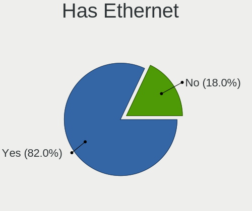
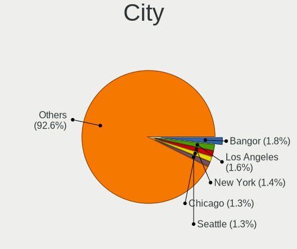
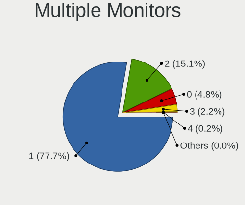

Linux in USA - Tested Hardware & Statistics
-------------------------------------------

A project to collect tested hardware configurations for Linux in USA.

Anyone can contribute to this report by the [hw-probe](https://github.com/linuxhw/hw-probe) tool:

    sudo -E hw-probe -all -upload

Please contribute! Especially if your hardware is rare.

This is a report for all computer types. See also reports for [desktops](/Location/USA/Desktop/README.md) and [notebooks](/Location/USA/Notebook/README.md).

Contents
--------

* [ Test Cases ](#test-cases)

* [ System ](#system)
  - [ OS                       ](#os)
  - [ OS Family                ](#os-family)
  - [ Kernel                   ](#kernel)
  - [ Kernel Family            ](#kernel-family)
  - [ Kernel Major Ver.        ](#kernel-major-ver)
  - [ Arch                     ](#arch)
  - [ DE                       ](#de)
  - [ Display Server           ](#display-server)
  - [ Display Manager          ](#display-manager)
  - [ OS Lang                  ](#os-lang)
  - [ Boot Mode                ](#boot-mode)
  - [ Filesystem               ](#filesystem)
  - [ Part. scheme             ](#part-scheme)
  - [ Dual Boot with Linux/BSD ](#dual-boot-with-linuxbsd)
  - [ Dual Boot (Win)          ](#dual-boot-win)

* [ Board ](#board)
  - [ Vendor                   ](#vendor)
  - [ Model                    ](#model)
  - [ Model Family             ](#model-family)
  - [ MFG Year                 ](#mfg-year)
  - [ Form Factor              ](#form-factor)
  - [ Secure Boot              ](#secure-boot)
  - [ Coreboot                 ](#coreboot)
  - [ RAM Size                 ](#ram-size)
  - [ RAM Used                 ](#ram-used)
  - [ Total Drives             ](#total-drives)
  - [ Has CD-ROM               ](#has-cd-rom)
  - [ Has Ethernet             ](#has-ethernet)
  - [ Has WiFi                 ](#has-wifi)
  - [ Has Bluetooth            ](#has-bluetooth)

* [ Location ](#location)
  - [ Country                  ](#country)
  - [ City                     ](#city)

* [ Drives ](#drives)
  - [ Drive Vendor             ](#drive-vendor)
  - [ Drive Model              ](#drive-model)
  - [ HDD Vendor               ](#hdd-vendor)
  - [ SSD Vendor               ](#ssd-vendor)
  - [ Drive Kind               ](#drive-kind)
  - [ Drive Connector          ](#drive-connector)
  - [ Drive Size               ](#drive-size)
  - [ Space Total              ](#space-total)
  - [ Space Used               ](#space-used)
  - [ Malfunc. Drives          ](#malfunc-drives)
  - [ Malfunc. Drive Vendor    ](#malfunc-drive-vendor)
  - [ Malfunc. HDD Vendor      ](#malfunc-hdd-vendor)
  - [ Malfunc. Drive Kind      ](#malfunc-drive-kind)
  - [ Failed Drives            ](#failed-drives)
  - [ Failed Drive Vendor      ](#failed-drive-vendor)
  - [ Drive Status             ](#drive-status)

* [ Storage controller ](#storage-controller)
  - [ Storage Vendor           ](#storage-vendor)
  - [ Storage Model            ](#storage-model)
  - [ Storage Kind             ](#storage-kind)

* [ Processor ](#processor)
  - [ CPU Vendor               ](#cpu-vendor)
  - [ CPU Model                ](#cpu-model)
  - [ CPU Model Family         ](#cpu-model-family)
  - [ CPU Cores                ](#cpu-cores)
  - [ CPU Sockets              ](#cpu-sockets)
  - [ CPU Threads              ](#cpu-threads)
  - [ CPU Op-Modes             ](#cpu-op-modes)
  - [ CPU Microcode            ](#cpu-microcode)
  - [ CPU Microarch            ](#cpu-microarch)

* [ Graphics ](#graphics)
  - [ GPU Vendor               ](#gpu-vendor)
  - [ GPU Model                ](#gpu-model)
  - [ GPU Combo                ](#gpu-combo)
  - [ GPU Driver               ](#gpu-driver)
  - [ GPU Memory               ](#gpu-memory)

* [ Monitor ](#monitor)
  - [ Monitor Vendor           ](#monitor-vendor)
  - [ Monitor Model            ](#monitor-model)
  - [ Monitor Resolution       ](#monitor-resolution)
  - [ Monitor Diagonal         ](#monitor-diagonal)
  - [ Monitor Width            ](#monitor-width)
  - [ Aspect Ratio             ](#aspect-ratio)
  - [ Monitor Area             ](#monitor-area)
  - [ Pixel Density            ](#pixel-density)
  - [ Multiple Monitors        ](#multiple-monitors)

* [ Network ](#network)
  - [ Net Controller Vendor    ](#net-controller-vendor)
  - [ Net Controller Model     ](#net-controller-model)
  - [ Wireless Vendor          ](#wireless-vendor)
  - [ Wireless Model           ](#wireless-model)
  - [ Ethernet Vendor          ](#ethernet-vendor)
  - [ Ethernet Model           ](#ethernet-model)
  - [ Net Controller Kind      ](#net-controller-kind)
  - [ Used Controller          ](#used-controller)
  - [ NICs                     ](#nics)
  - [ IPv6                     ](#ipv6)

* [ Bluetooth ](#bluetooth)
  - [ Bluetooth Vendor         ](#bluetooth-vendor)
  - [ Bluetooth Model          ](#bluetooth-model)

* [ Sound ](#sound)
  - [ Sound Vendor             ](#sound-vendor)
  - [ Sound Model              ](#sound-model)

* [ Memory ](#memory)
  - [ Memory Vendor            ](#memory-vendor)
  - [ Memory Model             ](#memory-model)
  - [ Memory Kind              ](#memory-kind)
  - [ Memory Form Factor       ](#memory-form-factor)
  - [ Memory Size              ](#memory-size)
  - [ Memory Speed             ](#memory-speed)

* [ Printers & scanners ](#printers--scanners)
  - [ Printer Vendor           ](#printer-vendor)
  - [ Printer Model            ](#printer-model)
  - [ Scanner Vendor           ](#scanner-vendor)
  - [ Scanner Model            ](#scanner-model)

* [ Camera ](#camera)
  - [ Camera Vendor            ](#camera-vendor)
  - [ Camera Model             ](#camera-model)

* [ Security ](#security)
  - [ Fingerprint Vendor       ](#fingerprint-vendor)
  - [ Fingerprint Model        ](#fingerprint-model)
  - [ Chipcard Vendor          ](#chipcard-vendor)
  - [ Chipcard Model           ](#chipcard-model)

* [ Unsupported ](#unsupported)
  - [ Unsupported Devices      ](#unsupported-devices)
  - [ Unsupported Device Types ](#unsupported-device-types)

Test Cases
----------

Total: 64083

| Vendor        | Model                       | Form-Factor | Probe                                                      | Date         |
|---------------|-----------------------------|-------------|------------------------------------------------------------|--------------|
| Gigabyte      | Z390 AORUS PRO WIFI-CF      | Desktop     | [f88f22a1b9](https://linux-hardware.org/?probe=f88f22a1b9) | May 09, 2024 |
| HP            | 3396                        | Desktop     | [5e68a536f2](https://linux-hardware.org/?probe=5e68a536f2) | May 09, 2024 |
| HP            | ProBook 650 G3              | Notebook    | [9bfb6a8afd](https://linux-hardware.org/?probe=9bfb6a8afd) | May 09, 2024 |
| Supermicro    | H12SSL-i                    | Server      | [d5cf0eca85](https://linux-hardware.org/?probe=d5cf0eca85) | May 09, 2024 |
| ASRockRack    | B650D4U-2L2T/BCM            | Server      | [236ac0d0ed](https://linux-hardware.org/?probe=236ac0d0ed) | May 09, 2024 |
| Dell          | Inspiron 7706 2n1           | Convertible | [958dc9b878](https://linux-hardware.org/?probe=958dc9b878) | May 09, 2024 |
| ASUSTek       | X551MA                      | Notebook    | [6ce58b40cb](https://linux-hardware.org/?probe=6ce58b40cb) | May 09, 2024 |
| HP            | Dev One Notebook PC         | Notebook    | [095bc08ae2](https://linux-hardware.org/?probe=095bc08ae2) | May 09, 2024 |
| Dell          | 0VNP2H A00                  | Desktop     | [28953f7c6a](https://linux-hardware.org/?probe=28953f7c6a) | May 09, 2024 |
| Foxconn       | 2AB1                        | Desktop     | [11beb142c3](https://linux-hardware.org/?probe=11beb142c3) | May 09, 2024 |
| Apple         | MacBookAir6,2               | Notebook    | [dc5b4c6be8](https://linux-hardware.org/?probe=dc5b4c6be8) | May 09, 2024 |
| Unknown       | Unknown                     | Notebook    | [64e1e4cc73](https://linux-hardware.org/?probe=64e1e4cc73) | May 09, 2024 |
| ASRock        | B450M/ac R2.0               | Desktop     | [a20443a9d6](https://linux-hardware.org/?probe=a20443a9d6) | May 09, 2024 |
| Dell          | 051FJ8 A02                  | Desktop     | [1c1caf7a19](https://linux-hardware.org/?probe=1c1caf7a19) | May 09, 2024 |
| Getac         | V110G3                      | Notebook    | [f2bd63cfb8](https://linux-hardware.org/?probe=f2bd63cfb8) | May 09, 2024 |
| Intel         | NUC7i5BNB J31144-311        | Mini pc     | [2de4ca3c36](https://linux-hardware.org/?probe=2de4ca3c36) | May 09, 2024 |
| Panasonic     | FZ55-1                      | Notebook    | [5709bdb252](https://linux-hardware.org/?probe=5709bdb252) | May 09, 2024 |
| ASRock        | X399 Taichi                 | Desktop     | [c82214d90a](https://linux-hardware.org/?probe=c82214d90a) | May 09, 2024 |
| Dell          | 051FJ8 A02                  | Desktop     | [5a8f86b17c](https://linux-hardware.org/?probe=5a8f86b17c) | May 09, 2024 |
| HP            | 8711                        | Mini pc     | [dd252958ea](https://linux-hardware.org/?probe=dd252958ea) | May 09, 2024 |
| MSI           | B450 TOMAHAWK MAX II        | Desktop     | [813f68dad3](https://linux-hardware.org/?probe=813f68dad3) | May 08, 2024 |
| ATOPNUC       | MA90                        | Mini pc     | [8098193095](https://linux-hardware.org/?probe=8098193095) | May 08, 2024 |
| Micro Comp... | V3                          | Tablet      | [8a0c0d99f9](https://linux-hardware.org/?probe=8a0c0d99f9) | May 08, 2024 |
| Lenovo        | ThinkBook 15 G4 IAP 21DJ    | Notebook    | [259fba9825](https://linux-hardware.org/?probe=259fba9825) | May 08, 2024 |
| HP            | 18E7                        | Desktop     | [fa637b3b9a](https://linux-hardware.org/?probe=fa637b3b9a) | May 08, 2024 |
| Dell          | 0M5DCD A00                  | Desktop     | [3c353c281f](https://linux-hardware.org/?probe=3c353c281f) | May 08, 2024 |
| Micro Elec... | MG-VCP15I-3070              | Notebook    | [11e90f3f8f](https://linux-hardware.org/?probe=11e90f3f8f) | May 08, 2024 |
| ASUSTek       | Zenbook S 13 UX5304VA_UX... | Notebook    | [d77842b741](https://linux-hardware.org/?probe=d77842b741) | May 08, 2024 |
| ASUSTek       | VivoBook_ASUSLaptop M160... | Notebook    | [b18d2c1ec2](https://linux-hardware.org/?probe=b18d2c1ec2) | May 08, 2024 |
| Dell          | Precision 5560              | Notebook    | [9ad14a0547](https://linux-hardware.org/?probe=9ad14a0547) | May 08, 2024 |
| HP            | ENVY x360 Convertible 13... | Convertible | [6c7c8f37e0](https://linux-hardware.org/?probe=6c7c8f37e0) | May 08, 2024 |
| Valve         | Jupiter                     | Notebook    | [c0eded1dbf](https://linux-hardware.org/?probe=c0eded1dbf) | May 08, 2024 |
| ASUSTek       | ProArt Z690-CREATOR WIFI    | Desktop     | [7cc03eaae9](https://linux-hardware.org/?probe=7cc03eaae9) | May 08, 2024 |
| Lenovo        | IdeaPadFlex 5 14ALC7 82R... | Convertible | [796a659b4e](https://linux-hardware.org/?probe=796a659b4e) | May 08, 2024 |
| Apple         | MacBookPro5,5               | Notebook    | [8d2df2d585](https://linux-hardware.org/?probe=8d2df2d585) | May 08, 2024 |
| ASUSTek       | ROG Strix G513QY_G513QY     | Notebook    | [964b717d95](https://linux-hardware.org/?probe=964b717d95) | May 08, 2024 |
| HP            | EliteBook 8560p             | Notebook    | [fa48702e03](https://linux-hardware.org/?probe=fa48702e03) | May 08, 2024 |
| Lenovo        | ThinkPad T15 Gen 2i 20W5... | Notebook    | [c4d3aa24cf](https://linux-hardware.org/?probe=c4d3aa24cf) | May 08, 2024 |
| Dell          | 0HHV7N A00                  | Desktop     | [63a26dac69](https://linux-hardware.org/?probe=63a26dac69) | May 08, 2024 |
| MSI           | B250M PRO-VDH               | Desktop     | [d11117aeae](https://linux-hardware.org/?probe=d11117aeae) | May 08, 2024 |
| Valve         | Jupiter                     | Notebook    | [cdb467c650](https://linux-hardware.org/?probe=cdb467c650) | May 08, 2024 |
| Gigabyte      | B550M AORUS ELITE AX        | Desktop     | [422cc265d3](https://linux-hardware.org/?probe=422cc265d3) | May 08, 2024 |
| ASUSTek       | X540SA                      | Notebook    | [456909c790](https://linux-hardware.org/?probe=456909c790) | May 08, 2024 |
| AZW           | SER V1.0                    | Mini pc     | [511ee9983e](https://linux-hardware.org/?probe=511ee9983e) | May 08, 2024 |
| Matsushita... | CF-74GCDADBM                | Notebook    | [f353aa5d7c](https://linux-hardware.org/?probe=f353aa5d7c) | May 08, 2024 |
| MSI           | MPG X570 GAMING PRO CARB... | Desktop     | [1be8775956](https://linux-hardware.org/?probe=1be8775956) | May 08, 2024 |
| ASUSTek       | UX430UQ                     | Notebook    | [7b9134699a](https://linux-hardware.org/?probe=7b9134699a) | May 08, 2024 |
| MSI           | PRO B760-P WIFI DDR4        | Desktop     | [35d60afe01](https://linux-hardware.org/?probe=35d60afe01) | May 07, 2024 |
| Dell          | Precision 7540              | Notebook    | [4703617413](https://linux-hardware.org/?probe=4703617413) | May 07, 2024 |
| Lenovo        | ThinkPad T490 20N2003PUS    | Notebook    | [7f484baa22](https://linux-hardware.org/?probe=7f484baa22) | May 07, 2024 |
| Dell          | Precision 7540              | Notebook    | [37638500df](https://linux-hardware.org/?probe=37638500df) | May 07, 2024 |
| Dell          | Inspiron 7558               | Notebook    | [6d19146c49](https://linux-hardware.org/?probe=6d19146c49) | May 07, 2024 |
| Lenovo        | 1046 SDK0T08861 WIN 3305... | Desktop     | [91c857f51e](https://linux-hardware.org/?probe=91c857f51e) | May 07, 2024 |
| Acer          | Aspire A515-54              | Notebook    | [f7d068c059](https://linux-hardware.org/?probe=f7d068c059) | May 07, 2024 |
| Acer          | Aspire A515-54              | Notebook    | [f9375ff03c](https://linux-hardware.org/?probe=f9375ff03c) | May 07, 2024 |
| ASUSTek       | ROG STRIX X570-E GAMING ... | Desktop     | [6b97d23143](https://linux-hardware.org/?probe=6b97d23143) | May 07, 2024 |
| ASUSTek       | PRIME Z790-P WIFI           | Desktop     | [54b9c594a0](https://linux-hardware.org/?probe=54b9c594a0) | May 07, 2024 |
| Lenovo        | IdeaPad 1 14IGL7 82V6       | Notebook    | [8c2b9bb30a](https://linux-hardware.org/?probe=8c2b9bb30a) | May 07, 2024 |
| ASUSTek       | PRIME Z490-A                | Desktop     | [a68c1a8752](https://linux-hardware.org/?probe=a68c1a8752) | May 07, 2024 |
| Lenovo        | ThinkPad T420s 417032U      | Notebook    | [e6839a3d70](https://linux-hardware.org/?probe=e6839a3d70) | May 07, 2024 |
| Toshiba       | TECRA R850                  | Notebook    | [a4fae83513](https://linux-hardware.org/?probe=a4fae83513) | May 07, 2024 |
| Dell          | 048DY8 A01                  | Desktop     | [a81f44c8b4](https://linux-hardware.org/?probe=a81f44c8b4) | May 07, 2024 |
| MSI           | X570-A PRO                  | Desktop     | [e061b752c8](https://linux-hardware.org/?probe=e061b752c8) | May 07, 2024 |
| Apple         | MacBookAir7,2               | Notebook    | [de2ed6e188](https://linux-hardware.org/?probe=de2ed6e188) | May 07, 2024 |
| Lenovo        | ThinkServer TS140           | Desktop     | [be7444624d](https://linux-hardware.org/?probe=be7444624d) | May 07, 2024 |
| ASRock        | A300M-STX                   | Desktop     | [cdf544ca1d](https://linux-hardware.org/?probe=cdf544ca1d) | May 07, 2024 |
| Dell          | 088DT1 A00                  | Desktop     | [edb955bd5e](https://linux-hardware.org/?probe=edb955bd5e) | May 07, 2024 |
| ASUSTek       | VivoBook_ASUSLaptop X712... | Notebook    | [9849982066](https://linux-hardware.org/?probe=9849982066) | May 07, 2024 |
| Intel         | DQ45CB AAE30148-207         | Desktop     | [263e934dc2](https://linux-hardware.org/?probe=263e934dc2) | May 07, 2024 |
| ASRock        | B550 Phantom Gaming 4/ac    | Desktop     | [72d8d32749](https://linux-hardware.org/?probe=72d8d32749) | May 07, 2024 |
| Gigabyte      | Z77-D3H                     | Desktop     | [01099601fe](https://linux-hardware.org/?probe=01099601fe) | May 07, 2024 |
| Dell          | 02YRK5 A02                  | Desktop     | [fea15ab44c](https://linux-hardware.org/?probe=fea15ab44c) | May 07, 2024 |
| Dell          | Precision 5520              | Notebook    | [3b0c11a9ff](https://linux-hardware.org/?probe=3b0c11a9ff) | May 07, 2024 |
| HP            | Pavilion Gaming Laptop 1... | Notebook    | [643f150579](https://linux-hardware.org/?probe=643f150579) | May 07, 2024 |
| Dell          | Precision 5520              | Notebook    | [bf1f2486cd](https://linux-hardware.org/?probe=bf1f2486cd) | May 07, 2024 |
| Unknown       | Edgepoint Tactical (Ketz... | Soc         | [686788fe19](https://linux-hardware.org/?probe=686788fe19) | May 07, 2024 |
| Shenzhen M... | F7BAA                       | Desktop     | [69aa3dca70](https://linux-hardware.org/?probe=69aa3dca70) | May 06, 2024 |
| HP            | ProLiant DL20 Gen9          | Server      | [d270509755](https://linux-hardware.org/?probe=d270509755) | May 06, 2024 |
| Dell          | 02YYK5 A01                  | Desktop     | [09b75f38cd](https://linux-hardware.org/?probe=09b75f38cd) | May 06, 2024 |
| Dell          | 03KWTV A00                  | Desktop     | [68f465c06a](https://linux-hardware.org/?probe=68f465c06a) | May 06, 2024 |
| ASUSTek       | M4A78T-E                    | Desktop     | [2cee8d14ab](https://linux-hardware.org/?probe=2cee8d14ab) | May 06, 2024 |
| Dell          | 03KWTV A00                  | Desktop     | [1b3f32baf6](https://linux-hardware.org/?probe=1b3f32baf6) | May 06, 2024 |
| HP            | 2000                        | Notebook    | [71d3942f81](https://linux-hardware.org/?probe=71d3942f81) | May 06, 2024 |
| ASUSTek       | TUF Gaming X570-PLUS        | Desktop     | [70346cc510](https://linux-hardware.org/?probe=70346cc510) | May 06, 2024 |
| System76      | Darter Pro                  | Notebook    | [e6da92d97e](https://linux-hardware.org/?probe=e6da92d97e) | May 06, 2024 |
| Dell          | 042P49 A02                  | Desktop     | [4b9e2674de](https://linux-hardware.org/?probe=4b9e2674de) | May 06, 2024 |
| Dell          | 042P49 A02                  | Desktop     | [146a7db97f](https://linux-hardware.org/?probe=146a7db97f) | May 06, 2024 |
| Dell          | Latitude E5410              | Notebook    | [0038eadd32](https://linux-hardware.org/?probe=0038eadd32) | May 06, 2024 |
| Dell          | 0YXT71 A00                  | Desktop     | [b451487b59](https://linux-hardware.org/?probe=b451487b59) | May 06, 2024 |
| Dell          | 0C2KJT A00                  | Desktop     | [a884cd0cf5](https://linux-hardware.org/?probe=a884cd0cf5) | May 06, 2024 |
| Framework     | Laptop 16 (AMD Ryzen 704... | Notebook    | [3679c79ac4](https://linux-hardware.org/?probe=3679c79ac4) | May 06, 2024 |
| ASUSTek       | TUF Gaming Z790-PLUS WIF... | Desktop     | [326b0babab](https://linux-hardware.org/?probe=326b0babab) | May 06, 2024 |
| ASUSTek       | TUF Gaming Z790-PLUS WIF... | Desktop     | [38b9f94aeb](https://linux-hardware.org/?probe=38b9f94aeb) | May 06, 2024 |
| Notebook      | NS5x_NS7xPU                 | Notebook    | [657a003a54](https://linux-hardware.org/?probe=657a003a54) | May 06, 2024 |
| ASUSTek       | P8H67-M PRO                 | Desktop     | [2af49854e2](https://linux-hardware.org/?probe=2af49854e2) | May 06, 2024 |
| Dell          | 0HH807                      | Desktop     | [743dea0fc3](https://linux-hardware.org/?probe=743dea0fc3) | May 06, 2024 |
| Dell          | Precision M4700             | Notebook    | [db0b8eb10b](https://linux-hardware.org/?probe=db0b8eb10b) | May 06, 2024 |
| Dell          | Inspiron N7010              | Notebook    | [538f6e2c91](https://linux-hardware.org/?probe=538f6e2c91) | May 06, 2024 |
| HP            | ZBook Studio G3             | Notebook    | [be52b86bc0](https://linux-hardware.org/?probe=be52b86bc0) | May 06, 2024 |
| Unknown       | Orange Pi 5                 | Soc         | [b81f4223f3](https://linux-hardware.org/?probe=b81f4223f3) | May 06, 2024 |
| ASUSTek       | P2540UA                     | Notebook    | [ea9ddf3f6e](https://linux-hardware.org/?probe=ea9ddf3f6e) | May 06, 2024 |
| Apple         | MacBookPro15,2              | Notebook    | [4720f69696](https://linux-hardware.org/?probe=4720f69696) | May 06, 2024 |
| HP            | Spectre x360 Convertible... | Convertible | [66c6c3e199](https://linux-hardware.org/?probe=66c6c3e199) | May 06, 2024 |
| HP            | Spectre x360 Convertible... | Convertible | [24ef78e496](https://linux-hardware.org/?probe=24ef78e496) | May 06, 2024 |
| Gigabyte      | B650 AORUS ELITE AX         | Desktop     | [12afc4ec37](https://linux-hardware.org/?probe=12afc4ec37) | May 06, 2024 |
| Unknown       | X570 Phantom Gaming-ITX/... | Notebook    | [a02a58b376](https://linux-hardware.org/?probe=a02a58b376) | May 06, 2024 |
| Lenovo        | ThinkPad P17 Gen 1 20SQS... | Notebook    | [8c2af338dc](https://linux-hardware.org/?probe=8c2af338dc) | May 06, 2024 |
| Valve         | Jupiter                     | Notebook    | [9a90343d3e](https://linux-hardware.org/?probe=9a90343d3e) | May 06, 2024 |
| HP            | 8906 SMVB                   | Desktop     | [16dcd59b91](https://linux-hardware.org/?probe=16dcd59b91) | May 06, 2024 |
| MSI           | MPG Z490 GAMING EDGE WIF... | Desktop     | [91fcd08046](https://linux-hardware.org/?probe=91fcd08046) | May 06, 2024 |
| HP            | 8767 A                      | Desktop     | [c5fd3ea1e4](https://linux-hardware.org/?probe=c5fd3ea1e4) | May 06, 2024 |
| Dell          | Latitude 5400               | Notebook    | [cf78549103](https://linux-hardware.org/?probe=cf78549103) | May 06, 2024 |
| Apple         | MacBookPro5,5               | Notebook    | [ef61efd227](https://linux-hardware.org/?probe=ef61efd227) | May 06, 2024 |
| ASUSTek       | CM1831                      | Desktop     | [c228565f48](https://linux-hardware.org/?probe=c228565f48) | May 06, 2024 |
| ASUSTek       | ROG Ally RC71L_RC71L        | Tablet      | [6bb4152903](https://linux-hardware.org/?probe=6bb4152903) | May 06, 2024 |
| HP            | 829A                        | Mini pc     | [c9a6161e36](https://linux-hardware.org/?probe=c9a6161e36) | May 06, 2024 |
| ASUSTek       | CM1831                      | Desktop     | [cc97798ac4](https://linux-hardware.org/?probe=cc97798ac4) | May 06, 2024 |
| Lenovo        | IdeaPad 1 14IGL7 82V6       | Notebook    | [083cfcc0f3](https://linux-hardware.org/?probe=083cfcc0f3) | May 06, 2024 |
| Alienware     | 17 R4                       | Notebook    | [99e296d142](https://linux-hardware.org/?probe=99e296d142) | May 06, 2024 |
| Valve         | Jupiter                     | Notebook    | [829ef0c2ba](https://linux-hardware.org/?probe=829ef0c2ba) | May 06, 2024 |
| Unknown       | Orange Pi 5 Plus            | Soc         | [f22091b0c8](https://linux-hardware.org/?probe=f22091b0c8) | May 06, 2024 |
| Apple         | MacBookPro11,4              | Notebook    | [3c0f7c8c00](https://linux-hardware.org/?probe=3c0f7c8c00) | May 06, 2024 |
| Lenovo        | IdeaPad 1 14IGL7 82V6       | Notebook    | [657538061d](https://linux-hardware.org/?probe=657538061d) | May 06, 2024 |
| Lenovo        | ThinkPad X200s 74695GU      | Notebook    | [9ea7304023](https://linux-hardware.org/?probe=9ea7304023) | May 06, 2024 |
| ASUSTek       | PRIME X570-PRO              | Desktop     | [02dec94612](https://linux-hardware.org/?probe=02dec94612) | May 05, 2024 |
| Apple         | MacBookPro15,2              | Notebook    | [568bb3b863](https://linux-hardware.org/?probe=568bb3b863) | May 05, 2024 |
| Intel         | DG45ID AAE27729-312         | Desktop     | [9610cedb7b](https://linux-hardware.org/?probe=9610cedb7b) | May 05, 2024 |
| MSI           | MEG Z690 UNIFY              | Desktop     | [614bab5cb0](https://linux-hardware.org/?probe=614bab5cb0) | May 05, 2024 |
| Foxconn       | PANGU-B 1A32N3500-600-G     | Desktop     | [e2c56e50f1](https://linux-hardware.org/?probe=e2c56e50f1) | May 05, 2024 |
| Lenovo        | IdeaPad Slim 5 16IRL8 82... | Notebook    | [2cace801f8](https://linux-hardware.org/?probe=2cace801f8) | May 05, 2024 |
| Lenovo        | ThinkPad X1 Nano Gen 1 2... | Notebook    | [c5f9a761a9](https://linux-hardware.org/?probe=c5f9a761a9) | May 05, 2024 |
| Lenovo        | ThinkPad T420s 41732AU      | Notebook    | [be5eeed803](https://linux-hardware.org/?probe=be5eeed803) | May 05, 2024 |
| MSI           | PRO B650-VC WIFI            | Desktop     | [5ba462d421](https://linux-hardware.org/?probe=5ba462d421) | May 05, 2024 |
| HP            | 1495                        | Desktop     | [f0e80863a7](https://linux-hardware.org/?probe=f0e80863a7) | May 05, 2024 |
| Dell          | Inspiron 5502               | Notebook    | [43fee6a80f](https://linux-hardware.org/?probe=43fee6a80f) | May 05, 2024 |
| Amlogic       | Meson GXL (S905X) P212 D... | Soc         | [1df5ef59da](https://linux-hardware.org/?probe=1df5ef59da) | May 05, 2024 |
| HP            | Laptop 14-fq0xxx            | Notebook    | [528dc99ca7](https://linux-hardware.org/?probe=528dc99ca7) | May 05, 2024 |
| Dell          | 0J9VVP A00                  | Desktop     | [5971526cf6](https://linux-hardware.org/?probe=5971526cf6) | May 05, 2024 |
| Dell          | 0J9VVP A00                  | Desktop     | [f75406b494](https://linux-hardware.org/?probe=f75406b494) | May 05, 2024 |
| Micro Comp... | V3                          | Tablet      | [4d2b3ac262](https://linux-hardware.org/?probe=4d2b3ac262) | May 05, 2024 |
| Dell          | 03X6X0 A06                  | Server      | [2e6f46fe60](https://linux-hardware.org/?probe=2e6f46fe60) | May 05, 2024 |
| Lenovo        | Flex 3-1130 80LY            | Notebook    | [3786d9e8e2](https://linux-hardware.org/?probe=3786d9e8e2) | May 05, 2024 |
| Acer          | Swift SFA16-41              | Notebook    | [df5596b6b2](https://linux-hardware.org/?probe=df5596b6b2) | May 05, 2024 |
| MSI           | MAG Z590 TORPEDO            | Desktop     | [19cb329ead](https://linux-hardware.org/?probe=19cb329ead) | May 05, 2024 |
| Microsoft     | Surface Go 2                | Tablet      | [27703b6ab1](https://linux-hardware.org/?probe=27703b6ab1) | May 05, 2024 |
| Alienware     | 17 R4                       | Notebook    | [4ad46d150c](https://linux-hardware.org/?probe=4ad46d150c) | May 05, 2024 |
| Lenovo        | ThinkPad P16 Gen 1 21D60... | Notebook    | [bc053b7c75](https://linux-hardware.org/?probe=bc053b7c75) | May 05, 2024 |
| ASUSTek       | VivoBook_ASUSLaptop M160... | Notebook    | [3602db941f](https://linux-hardware.org/?probe=3602db941f) | May 05, 2024 |
| Supermicro    | H12SSL-NT                   | Server      | [e156a869a2](https://linux-hardware.org/?probe=e156a869a2) | May 05, 2024 |
| Dell          | Latitude 5290 2-in-1        | Tablet      | [466c94724a](https://linux-hardware.org/?probe=466c94724a) | May 05, 2024 |
| Gigabyte      | F2A88XM-D3HP                | Desktop     | [e362e7892b](https://linux-hardware.org/?probe=e362e7892b) | May 05, 2024 |
| ASRock        | B450M-HDV R4.0              | Desktop     | [fc52b48b01](https://linux-hardware.org/?probe=fc52b48b01) | May 05, 2024 |
| Lenovo        | 0B98401 WIN                 | Desktop     | [8d1ee988ad](https://linux-hardware.org/?probe=8d1ee988ad) | May 05, 2024 |
| MSI           | MPG Z690 FORCE WIFI         | Desktop     | [4e837501bb](https://linux-hardware.org/?probe=4e837501bb) | May 05, 2024 |
| Dell          | Precision M4700             | Notebook    | [7b8ccefbed](https://linux-hardware.org/?probe=7b8ccefbed) | May 05, 2024 |
| ASUSTek       | VivoBook_ASUSLaptop M650... | Notebook    | [5f2d3291b5](https://linux-hardware.org/?probe=5f2d3291b5) | May 05, 2024 |
| Dell          | 088DT1 A01                  | Desktop     | [9cdeec0464](https://linux-hardware.org/?probe=9cdeec0464) | May 05, 2024 |
| ASRock        | B450M Pro4                  | Desktop     | [af898c03a5](https://linux-hardware.org/?probe=af898c03a5) | May 05, 2024 |
| Lenovo        | ThinkPad Edge E530 32597... | Notebook    | [a216f0b6d5](https://linux-hardware.org/?probe=a216f0b6d5) | May 05, 2024 |
| MSI           | MAG Z590 TORPEDO            | Desktop     | [da37bf116d](https://linux-hardware.org/?probe=da37bf116d) | May 04, 2024 |
| Dell          | 06FW8P A01                  | Desktop     | [41be164658](https://linux-hardware.org/?probe=41be164658) | May 04, 2024 |
| Dell          | Precision 3510              | Notebook    | [c57923e0ff](https://linux-hardware.org/?probe=c57923e0ff) | May 04, 2024 |
| Apple         | MacBookAir4,1               | Notebook    | [2e67b6ba22](https://linux-hardware.org/?probe=2e67b6ba22) | May 04, 2024 |
| Dell          | Latitude 3400               | Notebook    | [259b0b8cbf](https://linux-hardware.org/?probe=259b0b8cbf) | May 04, 2024 |
| Intel         | NUC13ANBi3 N13056-202       | Mini pc     | [282e1b1f01](https://linux-hardware.org/?probe=282e1b1f01) | May 04, 2024 |
| Dell          | 0J3492                      | Desktop     | [0bf461dd56](https://linux-hardware.org/?probe=0bf461dd56) | May 04, 2024 |
| HP            | ProBook 470 G5              | Notebook    | [66da43e604](https://linux-hardware.org/?probe=66da43e604) | May 04, 2024 |
| Raspberry ... | Raspberry Pi 5 Model B R... | Soc         | [b3bbc669ec](https://linux-hardware.org/?probe=b3bbc669ec) | May 04, 2024 |
| Raspberry ... | Raspberry Pi                | Soc         | [128b15cf8a](https://linux-hardware.org/?probe=128b15cf8a) | May 04, 2024 |
| Dell          | Precision 3510              | Notebook    | [0c006aad0f](https://linux-hardware.org/?probe=0c006aad0f) | May 04, 2024 |
| Intel         | NUC7i5BNB J31144-309        | Mini pc     | [b05731fd5b](https://linux-hardware.org/?probe=b05731fd5b) | May 04, 2024 |
| ASUSTek       | TUF Gaming X570-PLUS        | Desktop     | [f9daac6faa](https://linux-hardware.org/?probe=f9daac6faa) | May 04, 2024 |
| Intel         | NUC7i5BNB J31144-309        | Mini pc     | [3d777f43db](https://linux-hardware.org/?probe=3d777f43db) | May 04, 2024 |
| Acer          | Nitro AN515-57              | Notebook    | [de8582fd4b](https://linux-hardware.org/?probe=de8582fd4b) | May 04, 2024 |
| Intel         | NUC13ANBi7 M89645-203       | Mini pc     | [147f6a0701](https://linux-hardware.org/?probe=147f6a0701) | May 04, 2024 |
| HP            | Laptop 15-dw1xxx            | Notebook    | [deab0f1e98](https://linux-hardware.org/?probe=deab0f1e98) | May 04, 2024 |
| Dell          | 0HHV7N A00                  | Desktop     | [bec2f2a916](https://linux-hardware.org/?probe=bec2f2a916) | May 04, 2024 |
| ASUSTek       | ROG STRIX X570-E GAMING ... | Desktop     | [9ca1c7c92f](https://linux-hardware.org/?probe=9ca1c7c92f) | May 04, 2024 |
| Dell          | Latitude 7480               | Notebook    | [f81955d784](https://linux-hardware.org/?probe=f81955d784) | May 04, 2024 |
| Dell          | Inspiron 5520               | Notebook    | [bb83948d6a](https://linux-hardware.org/?probe=bb83948d6a) | May 04, 2024 |
| MSI           | GF75 Thin 10SCSXR           | Notebook    | [588a1bf985](https://linux-hardware.org/?probe=588a1bf985) | May 04, 2024 |
| MSI           | B450M BAZOOKA V2            | Desktop     | [654421979a](https://linux-hardware.org/?probe=654421979a) | May 04, 2024 |
| HP            | EliteBook 820 G3            | Notebook    | [1b076b8ed2](https://linux-hardware.org/?probe=1b076b8ed2) | May 04, 2024 |
| HP            | EliteBook 820 G3            | Notebook    | [4e2e6c3667](https://linux-hardware.org/?probe=4e2e6c3667) | May 04, 2024 |
| Dell          | Latitude E6430              | Notebook    | [3ea51c9416](https://linux-hardware.org/?probe=3ea51c9416) | May 04, 2024 |
| Chuwi         | MiniBook X                  | Notebook    | [64c7ac113f](https://linux-hardware.org/?probe=64c7ac113f) | May 04, 2024 |
| Lenovo        | IdeaPad Slim 5 16ABR8 82... | Notebook    | [bcb2994b33](https://linux-hardware.org/?probe=bcb2994b33) | May 04, 2024 |
| Lenovo        | SKYBAY SDK0J40709 WIN 32... | Desktop     | [316673b817](https://linux-hardware.org/?probe=316673b817) | May 04, 2024 |
| Dell          | Latitude E6430              | Notebook    | [0e3b2e7c55](https://linux-hardware.org/?probe=0e3b2e7c55) | May 04, 2024 |
| MSI           | PRO Z790-A MAX WIFI         | Desktop     | [534c77cdb0](https://linux-hardware.org/?probe=534c77cdb0) | May 04, 2024 |
| Shenzhen M... | F7BRC                       | Desktop     | [de61b5eba6](https://linux-hardware.org/?probe=de61b5eba6) | May 04, 2024 |
| Dell          | 0C2XKD A01                  | Desktop     | [a246668749](https://linux-hardware.org/?probe=a246668749) | May 04, 2024 |
| Acer          | Aspire R5-571TG             | Convertible | [b054fa0ea6](https://linux-hardware.org/?probe=b054fa0ea6) | May 04, 2024 |
| HP            | ENVY x360 Convertible       | Convertible | [a38a8efc6b](https://linux-hardware.org/?probe=a38a8efc6b) | May 04, 2024 |
| Lenovo        | ThinkPad T530 23942C2       | Notebook    | [f906a50af0](https://linux-hardware.org/?probe=f906a50af0) | May 03, 2024 |
| HP            | ZBook 15 G2                 | Notebook    | [21c0d7fe7e](https://linux-hardware.org/?probe=21c0d7fe7e) | May 03, 2024 |
| HP            | Pavilion Laptop 17-ar0xx    | Notebook    | [cf570f28e9](https://linux-hardware.org/?probe=cf570f28e9) | May 03, 2024 |
| Dell          | Latitude 5289               | Convertible | [fe9312926c](https://linux-hardware.org/?probe=fe9312926c) | May 03, 2024 |
| Acer          | Veriton N4640G              | Desktop     | [ce50a47462](https://linux-hardware.org/?probe=ce50a47462) | May 03, 2024 |
| Gateway       | IPIMB-ARA                   | Desktop     | [daf7403459](https://linux-hardware.org/?probe=daf7403459) | May 03, 2024 |
| Toshiba       | Satellite L55t-A            | Notebook    | [9197d3146e](https://linux-hardware.org/?probe=9197d3146e) | May 03, 2024 |
| Dell          | 0773VG A02                  | Desktop     | [2eb962e78c](https://linux-hardware.org/?probe=2eb962e78c) | May 03, 2024 |
| Lenovo        | ThinkPad T14s Gen 1 20T1... | Notebook    | [f6152a7042](https://linux-hardware.org/?probe=f6152a7042) | May 03, 2024 |
| HP            | 339A                        | Desktop     | [c19ffbdcb6](https://linux-hardware.org/?probe=c19ffbdcb6) | May 03, 2024 |
| ASUSTek       | PRIME B550-PLUS             | Desktop     | [01e99b1acd](https://linux-hardware.org/?probe=01e99b1acd) | May 03, 2024 |
| MSI           | MEG Z390 ACE                | Desktop     | [d564c1c05f](https://linux-hardware.org/?probe=d564c1c05f) | May 03, 2024 |
| Dell          | 0D881F A05                  | Desktop     | [9dfc8fb5b7](https://linux-hardware.org/?probe=9dfc8fb5b7) | May 03, 2024 |
| Valve         | Jupiter                     | Notebook    | [9a03d01cbc](https://linux-hardware.org/?probe=9a03d01cbc) | May 03, 2024 |
| Razer         | Blade Stealth               | Notebook    | [1728a1a500](https://linux-hardware.org/?probe=1728a1a500) | May 03, 2024 |
| ASUSTek       | P8H67-M PRO                 | Desktop     | [001c04c64f](https://linux-hardware.org/?probe=001c04c64f) | May 03, 2024 |
| ASUSTek       | TUF Gaming X570-PLUS        | Desktop     | [fb0da29f4d](https://linux-hardware.org/?probe=fb0da29f4d) | May 03, 2024 |
| Gigabyte      | 970A-DS3P                   | Desktop     | [2512d113c2](https://linux-hardware.org/?probe=2512d113c2) | May 03, 2024 |
| HP            | Laptop 15-dy2xxx            | Notebook    | [2837d61bc4](https://linux-hardware.org/?probe=2837d61bc4) | May 03, 2024 |
| Apple         | MacBookAir7,2               | Notebook    | [4e2a6ab271](https://linux-hardware.org/?probe=4e2a6ab271) | May 03, 2024 |
| Dell          | G5 5590                     | Notebook    | [b32e4a3fcc](https://linux-hardware.org/?probe=b32e4a3fcc) | May 03, 2024 |
| Lenovo        | 102F SBB0M45864 WIN 3305... | Desktop     | [55c596ead8](https://linux-hardware.org/?probe=55c596ead8) | May 03, 2024 |
| ASUSTek       | TUF Gaming X570-PLUS        | Desktop     | [5e3b7c6308](https://linux-hardware.org/?probe=5e3b7c6308) | May 03, 2024 |
| Dell          | 0M5DCD A00                  | Desktop     | [f390e47ea1](https://linux-hardware.org/?probe=f390e47ea1) | May 03, 2024 |
| Lenovo        | Yoga 720-15IKB 80X7         | Convertible | [9b4c380b5e](https://linux-hardware.org/?probe=9b4c380b5e) | May 03, 2024 |
| Dell          | Latitude E7250              | Notebook    | [2fd31f177e](https://linux-hardware.org/?probe=2fd31f177e) | May 03, 2024 |
| MSI           | PRO Z790-A WIFI             | Desktop     | [b7cb9e7573](https://linux-hardware.org/?probe=b7cb9e7573) | May 03, 2024 |
| Dell          | Precision 7740              | Notebook    | [9219d78a85](https://linux-hardware.org/?probe=9219d78a85) | May 03, 2024 |
| Intel         | X79 (INTEL Xeon E5/Corei... | Desktop     | [257f9cdad4](https://linux-hardware.org/?probe=257f9cdad4) | May 03, 2024 |
| Gigabyte      | B660 DS3H AC DDR4-Y1        | Desktop     | [fecf38db22](https://linux-hardware.org/?probe=fecf38db22) | May 02, 2024 |
| Dell          | Latitude E7250              | Notebook    | [5c97b5c2ee](https://linux-hardware.org/?probe=5c97b5c2ee) | May 02, 2024 |
| HP            | ZBook 15 G5                 | Notebook    | [899eac8513](https://linux-hardware.org/?probe=899eac8513) | May 02, 2024 |
| Supermicro    | X11SSL-F                    | Server      | [b1803e347c](https://linux-hardware.org/?probe=b1803e347c) | May 02, 2024 |
| Lenovo        | ThinkPad X131e 33711H3      | Notebook    | [45d5d58c8d](https://linux-hardware.org/?probe=45d5d58c8d) | May 02, 2024 |
| Intel         | X79 (INTEL Xeon E5/Corei... | Desktop     | [1a3ebd462f](https://linux-hardware.org/?probe=1a3ebd462f) | May 02, 2024 |
| Alienware     | M14xR1                      | Notebook    | [501de2a1ec](https://linux-hardware.org/?probe=501de2a1ec) | May 02, 2024 |
| Gigabyte      | B450M DS3H-CF               | Desktop     | [f229e6b124](https://linux-hardware.org/?probe=f229e6b124) | May 02, 2024 |
| Soyo          | SY-Classic B450M            | Desktop     | [e82641ba3c](https://linux-hardware.org/?probe=e82641ba3c) | May 02, 2024 |
| HP            | ENVY x360 2-in-1 Laptop ... | Convertible | [cfc2e7d323](https://linux-hardware.org/?probe=cfc2e7d323) | May 02, 2024 |
| Apple         | MacBookAir7,2               | Notebook    | [2672483f38](https://linux-hardware.org/?probe=2672483f38) | May 02, 2024 |
| Acer          | Veriton N4640G              | Desktop     | [d18d5f8d9d](https://linux-hardware.org/?probe=d18d5f8d9d) | May 02, 2024 |
| HP            | 15 Notebook PC              | Notebook    | [675934d0b6](https://linux-hardware.org/?probe=675934d0b6) | May 02, 2024 |
| HP            | 1494                        | Desktop     | [7fb0be6459](https://linux-hardware.org/?probe=7fb0be6459) | May 02, 2024 |
| Lenovo        | ThinkBook 14 G6+ IMH 21L... | Notebook    | [e218d7ac14](https://linux-hardware.org/?probe=e218d7ac14) | May 02, 2024 |
| HP            | 2B13 A01                    | All in one  | [884d3aff6d](https://linux-hardware.org/?probe=884d3aff6d) | May 02, 2024 |
| Gigabyte      | B550 AORUS ELITE AX V2      | Desktop     | [1ef79831c6](https://linux-hardware.org/?probe=1ef79831c6) | May 02, 2024 |
| HP            | 1825                        | Desktop     | [c6cd93d0ea](https://linux-hardware.org/?probe=c6cd93d0ea) | May 02, 2024 |
| ASUSTek       | ROG Maximus Z790 HERO       | Desktop     | [40caf612c2](https://linux-hardware.org/?probe=40caf612c2) | May 02, 2024 |
| Dell          | 085F29 A02                  | All in one  | [2d2c667873](https://linux-hardware.org/?probe=2d2c667873) | May 02, 2024 |
| Lenovo        | ThinkPad Twist 33472RU      | Notebook    | [88c46ca8d7](https://linux-hardware.org/?probe=88c46ca8d7) | May 02, 2024 |
| Lenovo        | IdeaPad Y580 20132          | Notebook    | [30987effea](https://linux-hardware.org/?probe=30987effea) | May 02, 2024 |
| Dell          | XPS 13 9365                 | Convertible | [8f2ba6ebed](https://linux-hardware.org/?probe=8f2ba6ebed) | May 02, 2024 |
| ASUSTek       | ROG STRIX X470-F GAMING     | Desktop     | [5f2e9277ad](https://linux-hardware.org/?probe=5f2e9277ad) | May 02, 2024 |
| Dell          | Precision 5530              | Notebook    | [373556c210](https://linux-hardware.org/?probe=373556c210) | May 02, 2024 |
| Lenovo        | IdeaPad 1 15AMN7 82VG       | Notebook    | [0740dd4f54](https://linux-hardware.org/?probe=0740dd4f54) | May 02, 2024 |
| HP            | EliteBook Revolve 810 G3    | Notebook    | [21309bf461](https://linux-hardware.org/?probe=21309bf461) | May 02, 2024 |
| HP            | 2129                        | Desktop     | [3a5c2b8ae5](https://linux-hardware.org/?probe=3a5c2b8ae5) | May 02, 2024 |
| HP            | 158B                        | Desktop     | [d5727d0cfb](https://linux-hardware.org/?probe=d5727d0cfb) | May 02, 2024 |
| ASUSTek       | TUF Gaming FX505DU_FX95D... | Notebook    | [c179f8fa01](https://linux-hardware.org/?probe=c179f8fa01) | May 01, 2024 |
| ASUSTek       | TUF Gaming FX505DU_FX95D... | Notebook    | [fd7c9392ce](https://linux-hardware.org/?probe=fd7c9392ce) | May 01, 2024 |
| Gigabyte      | Z790 UD AC                  | Desktop     | [0386514a20](https://linux-hardware.org/?probe=0386514a20) | May 01, 2024 |
| Lenovo        | ThinkPad X220 4291H76       | Notebook    | [55dc1b37c5](https://linux-hardware.org/?probe=55dc1b37c5) | May 01, 2024 |
| Valve         | Jupiter                     | Notebook    | [912546851a](https://linux-hardware.org/?probe=912546851a) | May 01, 2024 |
| ASUSTek       | ROG Ally RC71L_RC71L        | Tablet      | [851f0630cc](https://linux-hardware.org/?probe=851f0630cc) | May 01, 2024 |
| HP            | 2AF7                        | Desktop     | [6e5ea827da](https://linux-hardware.org/?probe=6e5ea827da) | May 01, 2024 |
| HP            | Pavilion x360 Convertibl... | Convertible | [31b06308f0](https://linux-hardware.org/?probe=31b06308f0) | May 01, 2024 |
| Apple         | Mac-F60DEB81FF30ACF6 Mac... | Desktop     | [32d8346d26](https://linux-hardware.org/?probe=32d8346d26) | May 01, 2024 |
| MSI           | MPG X570S EDGE MAX WIFI     | Desktop     | [0299f8321b](https://linux-hardware.org/?probe=0299f8321b) | May 01, 2024 |
| MSI           | MPG X570S EDGE MAX WIFI     | Desktop     | [569772c380](https://linux-hardware.org/?probe=569772c380) | May 01, 2024 |
| Lenovo        | IdeaPad 1 15ALC7 82R4       | Notebook    | [cbd3101c16](https://linux-hardware.org/?probe=cbd3101c16) | May 01, 2024 |
| Lenovo        | IdeaPad 1 15ALC7 82R4       | Notebook    | [6aca55ce35](https://linux-hardware.org/?probe=6aca55ce35) | May 01, 2024 |
| Micro Comp... | V3                          | Tablet      | [159bd001f3](https://linux-hardware.org/?probe=159bd001f3) | May 01, 2024 |
| HP            | Laptop 17-by2xxx            | Notebook    | [45443c04f2](https://linux-hardware.org/?probe=45443c04f2) | May 01, 2024 |
| HP            | Stream Laptop 14-cb1xxx     | Notebook    | [b30b733ae9](https://linux-hardware.org/?probe=b30b733ae9) | May 01, 2024 |
| Framework     | Laptop 16 (AMD Ryzen 704... | Notebook    | [28e6be5f86](https://linux-hardware.org/?probe=28e6be5f86) | May 01, 2024 |
| HP            | ENVY x360 Convertible 15... | Convertible | [4386528195](https://linux-hardware.org/?probe=4386528195) | May 01, 2024 |
| Lenovo        | IdeaPad 5 14ARE05 81YM      | Notebook    | [90807317fb](https://linux-hardware.org/?probe=90807317fb) | May 01, 2024 |
| HP            | 805D                        | Desktop     | [facf891056](https://linux-hardware.org/?probe=facf891056) | May 01, 2024 |
| ASUSTek       | X99-E WS/USB                | Desktop     | [a4df75c4bc](https://linux-hardware.org/?probe=a4df75c4bc) | May 01, 2024 |
| HP            | 1494                        | Desktop     | [1e2a110b7c](https://linux-hardware.org/?probe=1e2a110b7c) | May 01, 2024 |
| Unknown       | OnePlus 6T                  | Soc         | [965bb80e7d](https://linux-hardware.org/?probe=965bb80e7d) | May 01, 2024 |
| Dell          | Latitude 9440 2-in-1        | Convertible | [3dacf4b4dd](https://linux-hardware.org/?probe=3dacf4b4dd) | May 01, 2024 |
| ASUSTek       | TUF Gaming X570-PRO         | Desktop     | [2ffc5da09f](https://linux-hardware.org/?probe=2ffc5da09f) | May 01, 2024 |
| Apple         | MacBookPro8,3               | Notebook    | [a4db0f550f](https://linux-hardware.org/?probe=a4db0f550f) | May 01, 2024 |
| MSI           | B550-A PRO                  | Desktop     | [e4727af25c](https://linux-hardware.org/?probe=e4727af25c) | May 01, 2024 |
| ASUSTek       | ROG STRIX B550-F GAMING     | Desktop     | [c8b695f80c](https://linux-hardware.org/?probe=c8b695f80c) | May 01, 2024 |
| Google        | Bluebird                    | Notebook    | [75db9dc248](https://linux-hardware.org/?probe=75db9dc248) | May 01, 2024 |
| Acer          | Aspire GX-785               | Desktop     | [9237b7c910](https://linux-hardware.org/?probe=9237b7c910) | May 01, 2024 |
| Unknown       | ROUTER                      | Desktop     | [1889de9474](https://linux-hardware.org/?probe=1889de9474) | May 01, 2024 |
| Acer          | Aspire GX-785               | Desktop     | [1134c5fd30](https://linux-hardware.org/?probe=1134c5fd30) | May 01, 2024 |
| ASRock        | B550M-C                     | Desktop     | [926f0b0f52](https://linux-hardware.org/?probe=926f0b0f52) | May 01, 2024 |
| Dell          | 0N867P A02                  | Desktop     | [7b2f6946b9](https://linux-hardware.org/?probe=7b2f6946b9) | May 01, 2024 |
| Gigabyte      | Z690 GAMING X               | Desktop     | [abd215cdb3](https://linux-hardware.org/?probe=abd215cdb3) | May 01, 2024 |
| Gigabyte      | Z690 GAMING X               | Desktop     | [0d6f66a0d7](https://linux-hardware.org/?probe=0d6f66a0d7) | May 01, 2024 |
| MSI           | MAG B650M MORTAR WIFI       | Desktop     | [c86e158ede](https://linux-hardware.org/?probe=c86e158ede) | May 01, 2024 |
| HP            | 8906 SMVB                   | Desktop     | [6c9a72d2cb](https://linux-hardware.org/?probe=6c9a72d2cb) | May 01, 2024 |
| ASRock        | X570 Phantom Gaming-ITX/... | Desktop     | [dbb2e90b8c](https://linux-hardware.org/?probe=dbb2e90b8c) | May 01, 2024 |
| HP            | EliteBook x360 1030 G2      | Convertible | [423f3e887e](https://linux-hardware.org/?probe=423f3e887e) | May 01, 2024 |
| HP            | 3397                        | Desktop     | [3c25b70b50](https://linux-hardware.org/?probe=3c25b70b50) | May 01, 2024 |
| AZW           | SER V2.0                    | Mini pc     | [88658fa4bd](https://linux-hardware.org/?probe=88658fa4bd) | May 01, 2024 |
| Dell          | Inspiron 1525               | Notebook    | [8e9c51790c](https://linux-hardware.org/?probe=8e9c51790c) | May 01, 2024 |
| Supermicro    | X9SPU-F                     | Desktop     | [ec236a99ac](https://linux-hardware.org/?probe=ec236a99ac) | Apr 30, 2024 |
| AZW           | SER V2.0                    | Mini pc     | [45938caf5b](https://linux-hardware.org/?probe=45938caf5b) | Apr 30, 2024 |
| Dell          | Inspiron 1525               | Notebook    | [ca6bde2e75](https://linux-hardware.org/?probe=ca6bde2e75) | Apr 30, 2024 |
| Dell          | 0427JK A00                  | Desktop     | [6c93b7fabf](https://linux-hardware.org/?probe=6c93b7fabf) | Apr 30, 2024 |
| Gigabyte      | Z790 UD AC                  | Desktop     | [e9f80cea34](https://linux-hardware.org/?probe=e9f80cea34) | Apr 30, 2024 |
| Lenovo        | ThinkPad T570 20H9CTO1WW    | Notebook    | [433a701205](https://linux-hardware.org/?probe=433a701205) | Apr 30, 2024 |
| Apple         | MacBookPro15,2              | Notebook    | [5d0cceea3e](https://linux-hardware.org/?probe=5d0cceea3e) | Apr 30, 2024 |
| Lenovo        | Yoga 710-11IKB 80V6         | Notebook    | [bac49afb7f](https://linux-hardware.org/?probe=bac49afb7f) | Apr 30, 2024 |
| ASUSTek       | ROG Zephyrus G14 GA402RJ... | Notebook    | [568e826f4b](https://linux-hardware.org/?probe=568e826f4b) | Apr 30, 2024 |
| MSI           | Raider GE76 12UE            | Notebook    | [6c23378280](https://linux-hardware.org/?probe=6c23378280) | Apr 30, 2024 |
| Dell          | Latitude 3570               | Notebook    | [17e5cf551d](https://linux-hardware.org/?probe=17e5cf551d) | Apr 30, 2024 |
| Dell          | 00F82W A00                  | Desktop     | [850344d254](https://linux-hardware.org/?probe=850344d254) | Apr 30, 2024 |
| Apple         | MacBookPro12,1              | Notebook    | [89a84d0398](https://linux-hardware.org/?probe=89a84d0398) | Apr 30, 2024 |
| HP            | 8459                        | Desktop     | [9d3aa648fa](https://linux-hardware.org/?probe=9d3aa648fa) | Apr 30, 2024 |
| Lenovo        | IdeaPadFlex 5 14ARE05 81... | Convertible | [3a1e56a0c6](https://linux-hardware.org/?probe=3a1e56a0c6) | Apr 30, 2024 |
| HP            | ProBook x360 11 G1 EE       | Notebook    | [85b180a3db](https://linux-hardware.org/?probe=85b180a3db) | Apr 30, 2024 |
| Apple         | MacBookPro11,2              | Notebook    | [5cd273406c](https://linux-hardware.org/?probe=5cd273406c) | Apr 30, 2024 |
| ASUSTek       | VivoBook_ASUSLaptop X150... | Notebook    | [c981d78681](https://linux-hardware.org/?probe=c981d78681) | Apr 30, 2024 |
| Alienware     | 0C92D0 A00                  | Desktop     | [73fe41cfe5](https://linux-hardware.org/?probe=73fe41cfe5) | Apr 30, 2024 |
| ASRock        | B450M Pro4                  | Desktop     | [04c8e87ca3](https://linux-hardware.org/?probe=04c8e87ca3) | Apr 30, 2024 |
| Apple         | Mac-031AEE4D24BFF0B1 Mac... | Mini pc     | [1780065067](https://linux-hardware.org/?probe=1780065067) | Apr 30, 2024 |
| Dell          | 0T7D40 A01                  | Desktop     | [8de750aabf](https://linux-hardware.org/?probe=8de750aabf) | Apr 30, 2024 |
| Dell          | Latitude 5510               | Notebook    | [1dcf4bdf1f](https://linux-hardware.org/?probe=1dcf4bdf1f) | Apr 30, 2024 |
| Lenovo        | ThinkCentre M91p 7005AK8    | Desktop     | [8eeaa81159](https://linux-hardware.org/?probe=8eeaa81159) | Apr 30, 2024 |
| EVGA          | Z790 CLASSIFIED.0           | Desktop     | [10ac75bfd8](https://linux-hardware.org/?probe=10ac75bfd8) | Apr 30, 2024 |
| ASUSTek       | VivoBook_ASUSLaptop M160... | Notebook    | [701927cf4d](https://linux-hardware.org/?probe=701927cf4d) | Apr 30, 2024 |
| MSI           | Z97 GAMING 3                | Desktop     | [c703e6f53a](https://linux-hardware.org/?probe=c703e6f53a) | Apr 30, 2024 |
| Lenovo        | 30C9 SEK0N11843 IOT 3806... | Desktop     | [517daa7c85](https://linux-hardware.org/?probe=517daa7c85) | Apr 30, 2024 |
| Supermicro    | X9DRW-7TPF+                 | Server      | [258840ed31](https://linux-hardware.org/?probe=258840ed31) | Apr 30, 2024 |
| HP            | EliteBook 840 G4            | Notebook    | [86a58844a8](https://linux-hardware.org/?probe=86a58844a8) | Apr 30, 2024 |
| Win elemen... | M600                        | Desktop     | [ed51b3e831](https://linux-hardware.org/?probe=ed51b3e831) | Apr 30, 2024 |
| HP            | Pavilion dv5000 (ET805UA... | Notebook    | [b269162f6f](https://linux-hardware.org/?probe=b269162f6f) | Apr 30, 2024 |
| Gigabyte      | B550M DS3H AC               | Desktop     | [0a5a41e025](https://linux-hardware.org/?probe=0a5a41e025) | Apr 30, 2024 |
| MSI           | MPG B550 GAMING PLUS        | Desktop     | [e2ec2b51c8](https://linux-hardware.org/?probe=e2ec2b51c8) | Apr 30, 2024 |
| ASUSTek       | PRIME B550M-A AC            | Desktop     | [199c1abd04](https://linux-hardware.org/?probe=199c1abd04) | Apr 30, 2024 |
| Gigabyte      | Z790 AORUS ELITE AX         | Desktop     | [e0cb14de08](https://linux-hardware.org/?probe=e0cb14de08) | Apr 30, 2024 |
| MSI           | Z68A-G43                    | Desktop     | [9acdb88f98](https://linux-hardware.org/?probe=9acdb88f98) | Apr 30, 2024 |
| Dell          | Latitude E6530              | Notebook    | [6e04062057](https://linux-hardware.org/?probe=6e04062057) | Apr 30, 2024 |
| Dell          | 0F6X5P A00                  | Desktop     | [d860ea2ea1](https://linux-hardware.org/?probe=d860ea2ea1) | Apr 30, 2024 |
| ASUSTek       | KGPE-D16                    | Desktop     | [f199ccf950](https://linux-hardware.org/?probe=f199ccf950) | Apr 30, 2024 |
| ASUSTek       | SABERTOOTH 990FX            | Desktop     | [cd98023b83](https://linux-hardware.org/?probe=cd98023b83) | Apr 30, 2024 |
| Apple         | MacBookAir7,2               | Notebook    | [1af69fe222](https://linux-hardware.org/?probe=1af69fe222) | Apr 30, 2024 |
| HP            | ENVY 17                     | Notebook    | [23518d52f8](https://linux-hardware.org/?probe=23518d52f8) | Apr 30, 2024 |
| AWS Elemen... | 04F3CJ A03                  | Server      | [ce34f45f28](https://linux-hardware.org/?probe=ce34f45f28) | Apr 30, 2024 |
| Dell          | Latitude 9520               | Notebook    | [25d6f4ff3b](https://linux-hardware.org/?probe=25d6f4ff3b) | Apr 29, 2024 |
| Lenovo        | ThinkBook 13x G4 IMH 21K... | Notebook    | [eface5275d](https://linux-hardware.org/?probe=eface5275d) | Apr 29, 2024 |
| Lenovo        | IdeaPad 330-15IKB 81DE      | Notebook    | [af95facf65](https://linux-hardware.org/?probe=af95facf65) | Apr 29, 2024 |
| Lenovo        | ThinkPad Yoga 11e 3rd Ge... | Convertible | [4fec10d450](https://linux-hardware.org/?probe=4fec10d450) | Apr 29, 2024 |
| Dell          | G5 5505                     | Notebook    | [4ecf1f44e4](https://linux-hardware.org/?probe=4ecf1f44e4) | Apr 29, 2024 |
| ASUSTek       | M5A78L-M PLUS/USB3          | Desktop     | [a036c4124f](https://linux-hardware.org/?probe=a036c4124f) | Apr 29, 2024 |
| ASUSTek       | VivoBook_ASUSLaptop K650... | Notebook    | [14bb0e630b](https://linux-hardware.org/?probe=14bb0e630b) | Apr 29, 2024 |
| ASUSTek       | X99-DELUXE                  | Desktop     | [71069616b0](https://linux-hardware.org/?probe=71069616b0) | Apr 29, 2024 |
| Pegatron      | NARRA3                      | Desktop     | [ca94843c0a](https://linux-hardware.org/?probe=ca94843c0a) | Apr 29, 2024 |
| ASUSTek       | ROG Maximus XI HERO         | Desktop     | [c8d1f19fe6](https://linux-hardware.org/?probe=c8d1f19fe6) | Apr 29, 2024 |
| ASRock        | B660-ITX                    | Desktop     | [b0d7ab9acf](https://linux-hardware.org/?probe=b0d7ab9acf) | Apr 29, 2024 |
| AZW           | EQ                          | Desktop     | [dc09b0ecbc](https://linux-hardware.org/?probe=dc09b0ecbc) | Apr 29, 2024 |
| AZW           | EQ                          | Desktop     | [9e4f615d36](https://linux-hardware.org/?probe=9e4f615d36) | Apr 29, 2024 |
| ASRock        | A320M/ac                    | Desktop     | [aeafdb6795](https://linux-hardware.org/?probe=aeafdb6795) | Apr 29, 2024 |
| Acer          | Aspire A515-43              | Notebook    | [42e399d200](https://linux-hardware.org/?probe=42e399d200) | Apr 29, 2024 |
| AZW           | SER V10                     | Mini pc     | [efddeb4c76](https://linux-hardware.org/?probe=efddeb4c76) | Apr 29, 2024 |
| Lenovo        | ThinkPad L13 Yoga Gen 2 ... | Convertible | [8d9161d10f](https://linux-hardware.org/?probe=8d9161d10f) | Apr 29, 2024 |
| Alienware     | M14xR1                      | Notebook    | [dc1461c536](https://linux-hardware.org/?probe=dc1461c536) | Apr 29, 2024 |
| ASUSTek       | M5A78L-M PLUS/USB3          | Desktop     | [9b8290696d](https://linux-hardware.org/?probe=9b8290696d) | Apr 29, 2024 |
| Gigabyte      | B550M DS3H AC               | Desktop     | [2d51e08cd6](https://linux-hardware.org/?probe=2d51e08cd6) | Apr 29, 2024 |
| Apple         | MacBookPro9,2               | Notebook    | [3b4127bc96](https://linux-hardware.org/?probe=3b4127bc96) | Apr 29, 2024 |
| Acer          | Aspire R5-571TG             | Convertible | [1adb2d58e4](https://linux-hardware.org/?probe=1adb2d58e4) | Apr 29, 2024 |
| ASRock        | Z790 PG Riptide             | Desktop     | [937704be25](https://linux-hardware.org/?probe=937704be25) | Apr 29, 2024 |
| ASUSTek       | ROG Maximus XI HERO         | Desktop     | [d72dcf834b](https://linux-hardware.org/?probe=d72dcf834b) | Apr 29, 2024 |
| Toshiba       | Satellite L775D             | Notebook    | [507b5ac196](https://linux-hardware.org/?probe=507b5ac196) | Apr 29, 2024 |
| Gigabyte      | Z790 D DDR4                 | Desktop     | [8e6a5285a6](https://linux-hardware.org/?probe=8e6a5285a6) | Apr 29, 2024 |
| Dell          | Latitude E6420              | Notebook    | [96a7d85c67](https://linux-hardware.org/?probe=96a7d85c67) | Apr 29, 2024 |
| HP            | EliteBook 840 14 inch G9... | Notebook    | [6d0a2c142b](https://linux-hardware.org/?probe=6d0a2c142b) | Apr 29, 2024 |
| Acer          | Aspire ES1-512              | Notebook    | [2663c13afc](https://linux-hardware.org/?probe=2663c13afc) | Apr 29, 2024 |
| Lenovo        | ThinkPad L420 7827W1U       | Notebook    | [b6839d25f6](https://linux-hardware.org/?probe=b6839d25f6) | Apr 29, 2024 |
| MSI           | PRO H610M-G DDR4            | Desktop     | [1492484deb](https://linux-hardware.org/?probe=1492484deb) | Apr 29, 2024 |
| Dell          | Latitude E6420              | Notebook    | [0fa22b02d0](https://linux-hardware.org/?probe=0fa22b02d0) | Apr 29, 2024 |
| Lenovo        | Legion Pro 5 16IRX8 82WK    | Notebook    | [82a20d0525](https://linux-hardware.org/?probe=82a20d0525) | Apr 29, 2024 |
| Lenovo        | Legion Pro 5 16IRX8 82WK    | Notebook    | [c56c98c58e](https://linux-hardware.org/?probe=c56c98c58e) | Apr 29, 2024 |
| MSI           | GF75 Thin 10UE              | Notebook    | [07b5ec9d5d](https://linux-hardware.org/?probe=07b5ec9d5d) | Apr 29, 2024 |
| Gigabyte      | GA-MA785GMT-UD2H            | Desktop     | [b1f251b92c](https://linux-hardware.org/?probe=b1f251b92c) | Apr 29, 2024 |
| Lenovo        | IdeaPad 5 15ABA7 82SG       | Notebook    | [26e856b70a](https://linux-hardware.org/?probe=26e856b70a) | Apr 29, 2024 |
| Supermicro    | X12SPA-TF                   | Server      | [965ec5db00](https://linux-hardware.org/?probe=965ec5db00) | Apr 29, 2024 |
| Dell          | XPS 13 7390                 | Notebook    | [ec7fc4cf5a](https://linux-hardware.org/?probe=ec7fc4cf5a) | Apr 29, 2024 |
| ASUSTek       | ET2031I                     | Notebook    | [d27647c450](https://linux-hardware.org/?probe=d27647c450) | Apr 29, 2024 |
| HP            | Pavilion Laptop 15-cc5xx    | Notebook    | [107cd303fd](https://linux-hardware.org/?probe=107cd303fd) | Apr 29, 2024 |
| HP            | 89EB 11                     | Desktop     | [dd5549c4d7](https://linux-hardware.org/?probe=dd5549c4d7) | Apr 28, 2024 |
| ASUSTek       | M5A97 R2.0                  | Desktop     | [a5697195ec](https://linux-hardware.org/?probe=a5697195ec) | Apr 28, 2024 |
| Lenovo        | ThinkPad L420 7827W1U       | Notebook    | [9455f8e9de](https://linux-hardware.org/?probe=9455f8e9de) | Apr 28, 2024 |
| ASUSTek       | ROG Zephyrus G14 GA401QH... | Notebook    | [eef1270128](https://linux-hardware.org/?probe=eef1270128) | Apr 28, 2024 |
| Google        | Gandof                      | Notebook    | [539c66172b](https://linux-hardware.org/?probe=539c66172b) | Apr 28, 2024 |
| ASUSTek       | ROG CROSSHAIR X670E HERO    | Desktop     | [b9693bfaa8](https://linux-hardware.org/?probe=b9693bfaa8) | Apr 28, 2024 |
| Acer          | Aspire ES1-512              | Notebook    | [87f1fc413c](https://linux-hardware.org/?probe=87f1fc413c) | Apr 28, 2024 |
| Apple         | MacBookPro11,3              | Notebook    | [3e372c3652](https://linux-hardware.org/?probe=3e372c3652) | Apr 28, 2024 |
| HP            | Notebook                    | Notebook    | [0f3465e86c](https://linux-hardware.org/?probe=0f3465e86c) | Apr 28, 2024 |
| Apple         | MacBookPro11,3              | Notebook    | [881eaab6c1](https://linux-hardware.org/?probe=881eaab6c1) | Apr 28, 2024 |
| ASRock        | B650 PG Lightning           | Desktop     | [2afe25d1f8](https://linux-hardware.org/?probe=2afe25d1f8) | Apr 28, 2024 |
| ASUSTek       | Maximus VII HERO            | Desktop     | [51efe9cdc9](https://linux-hardware.org/?probe=51efe9cdc9) | Apr 28, 2024 |
| Lenovo        | ThinkPad T14 Gen 2i 20W0... | Notebook    | [e2a9d44509](https://linux-hardware.org/?probe=e2a9d44509) | Apr 28, 2024 |
| Gigabyte      | B450M DS3H-CF               | Desktop     | [c85c3d59df](https://linux-hardware.org/?probe=c85c3d59df) | Apr 28, 2024 |
| HP            | OMEN by Laptop 15-dc0xxx    | Notebook    | [a9b063c17b](https://linux-hardware.org/?probe=a9b063c17b) | Apr 28, 2024 |
| Lenovo        | FLEX-14IWL Laptop 81SQ      | Convertible | [afc8b7bd9f](https://linux-hardware.org/?probe=afc8b7bd9f) | Apr 28, 2024 |
| Lenovo        | ThinkPad L520 786035U       | Notebook    | [711272241a](https://linux-hardware.org/?probe=711272241a) | Apr 28, 2024 |
| ASRock        | B450M Pro4                  | Desktop     | [aded29632d](https://linux-hardware.org/?probe=aded29632d) | Apr 28, 2024 |
| Dell          | 04GJJT A00                  | Desktop     | [b336911f53](https://linux-hardware.org/?probe=b336911f53) | Apr 28, 2024 |
| Intel         | NUC6i7KYB H90766-404        | Mini pc     | [4bd7b42a5a](https://linux-hardware.org/?probe=4bd7b42a5a) | Apr 28, 2024 |
| MSI           | MAG B550 TOMAHAWK           | Desktop     | [25abfac8b7](https://linux-hardware.org/?probe=25abfac8b7) | Apr 28, 2024 |
| Lenovo        | Slim Pro 7 14ARP8 83AX      | Notebook    | [15fdd20de0](https://linux-hardware.org/?probe=15fdd20de0) | Apr 28, 2024 |
| Dell          | Inspiron 16 7610            | Notebook    | [2427197c56](https://linux-hardware.org/?probe=2427197c56) | Apr 28, 2024 |
| MSI           | 970A-G46                    | Desktop     | [156b1bab44](https://linux-hardware.org/?probe=156b1bab44) | Apr 28, 2024 |
| ASUSTek       | VivoBook_ASUSLaptop M160... | Notebook    | [b024eb05d1](https://linux-hardware.org/?probe=b024eb05d1) | Apr 28, 2024 |
| HP            | ENVY x360 2-in-1 Laptop ... | Convertible | [ffc336849d](https://linux-hardware.org/?probe=ffc336849d) | Apr 28, 2024 |
| ASUSTek       | VivoBook_ASUSLaptop X712... | Notebook    | [ea2746d610](https://linux-hardware.org/?probe=ea2746d610) | Apr 28, 2024 |
| HP            | ENVY x360 2-in-1 Laptop ... | Convertible | [cd0143ba78](https://linux-hardware.org/?probe=cd0143ba78) | Apr 28, 2024 |
| Apple         | Mac-F42386C8 PVT            | All in one  | [16169fa717](https://linux-hardware.org/?probe=16169fa717) | Apr 28, 2024 |
| Apple         | Mac-F60DEB81FF30ACF6 Mac... | Desktop     | [1af94235a9](https://linux-hardware.org/?probe=1af94235a9) | Apr 28, 2024 |
| ASUSTek       | TUF Gaming B550M-PLUS WI... | Desktop     | [73f586776d](https://linux-hardware.org/?probe=73f586776d) | Apr 28, 2024 |
| HP            | 8768 A                      | Desktop     | [aba3b50d67](https://linux-hardware.org/?probe=aba3b50d67) | Apr 28, 2024 |
| Toshiba       | Satellite P755              | Notebook    | [2e2a03f963](https://linux-hardware.org/?probe=2e2a03f963) | Apr 28, 2024 |
| ASRock        | Z790 Lightning WiFi         | Desktop     | [4ed8b47fbe](https://linux-hardware.org/?probe=4ed8b47fbe) | Apr 28, 2024 |
| Gigabyte      | B75M-D3H                    | Desktop     | [48a48b4523](https://linux-hardware.org/?probe=48a48b4523) | Apr 28, 2024 |
| Lenovo        | IdeaPad Slim 7 Pro 14IHU... | Notebook    | [d01c00759c](https://linux-hardware.org/?probe=d01c00759c) | Apr 28, 2024 |
| Valve         | Jupiter                     | Notebook    | [42fe2e9ed4](https://linux-hardware.org/?probe=42fe2e9ed4) | Apr 28, 2024 |
| Lenovo        | ThinkPad T430 23492F5       | Notebook    | [8d26be4497](https://linux-hardware.org/?probe=8d26be4497) | Apr 28, 2024 |
| HP            | Pavilion dv6                | Notebook    | [3663f38683](https://linux-hardware.org/?probe=3663f38683) | Apr 28, 2024 |
| Lenovo        | Slim Pro 7 14ARP8 83AX      | Notebook    | [1856484488](https://linux-hardware.org/?probe=1856484488) | Apr 27, 2024 |
| HP            | 2B47                        | Desktop     | [3a165a34a7](https://linux-hardware.org/?probe=3a165a34a7) | Apr 27, 2024 |
| HP            | ENVY x360 Convertible 13... | Convertible | [1e3318a5f1](https://linux-hardware.org/?probe=1e3318a5f1) | Apr 27, 2024 |
| Valve         | Jupiter                     | Notebook    | [db12022c45](https://linux-hardware.org/?probe=db12022c45) | Apr 27, 2024 |
| ASUSTek       | ROG Maximus XI HERO         | Desktop     | [7c970a2e6f](https://linux-hardware.org/?probe=7c970a2e6f) | Apr 27, 2024 |
| Lenovo        | ThinkPad P16s Gen 1 21CK... | Notebook    | [801a6bafe7](https://linux-hardware.org/?probe=801a6bafe7) | Apr 27, 2024 |
| System76      | Thelio Mira thelio-mira-... | Desktop     | [14dbfab450](https://linux-hardware.org/?probe=14dbfab450) | Apr 27, 2024 |
| Dell          | Inspiron 3583               | Notebook    | [27c5b7b8d8](https://linux-hardware.org/?probe=27c5b7b8d8) | Apr 27, 2024 |
| Dell          | 0KRC95 A00                  | Desktop     | [8a4d88627a](https://linux-hardware.org/?probe=8a4d88627a) | Apr 27, 2024 |
| Lenovo        | ThinkPad T520 42424WU       | Notebook    | [f54ef8bc01](https://linux-hardware.org/?probe=f54ef8bc01) | Apr 27, 2024 |
| Dell          | 0HD5W2 A01                  | Desktop     | [21e5ae7f3e](https://linux-hardware.org/?probe=21e5ae7f3e) | Apr 27, 2024 |
| Dell          | Inspiron 5770               | Notebook    | [9194ac8af9](https://linux-hardware.org/?probe=9194ac8af9) | Apr 27, 2024 |
| HP            | Notebook                    | Notebook    | [1918273411](https://linux-hardware.org/?probe=1918273411) | Apr 27, 2024 |
| Biostar       | Hi-Fi Z87X 3D               | Desktop     | [09d7331f2b](https://linux-hardware.org/?probe=09d7331f2b) | Apr 27, 2024 |
| ASUSTek       | ROG Zephyrus G14 GA401IV... | Notebook    | [70ce1e3cee](https://linux-hardware.org/?probe=70ce1e3cee) | Apr 27, 2024 |
| HP            | Notebook                    | Notebook    | [91c53e6cc1](https://linux-hardware.org/?probe=91c53e6cc1) | Apr 27, 2024 |
| Acer          | Aspire A717-72G             | Notebook    | [b386005b8e](https://linux-hardware.org/?probe=b386005b8e) | Apr 27, 2024 |
| ASRock        | Z97 Extreme4                | Desktop     | [611e146e9e](https://linux-hardware.org/?probe=611e146e9e) | Apr 27, 2024 |
| Valve         | Jupiter                     | Notebook    | [7a58749308](https://linux-hardware.org/?probe=7a58749308) | Apr 27, 2024 |
| HP            | EliteBook 8440p             | Notebook    | [0dbed15c85](https://linux-hardware.org/?probe=0dbed15c85) | Apr 27, 2024 |
| Lenovo        | ThinkPad W520 4270CTO       | Notebook    | [ab9e430693](https://linux-hardware.org/?probe=ab9e430693) | Apr 27, 2024 |
| ASUSTek       | ASUS TUF Gaming F15 FX50... | Notebook    | [1699679c97](https://linux-hardware.org/?probe=1699679c97) | Apr 27, 2024 |
| ASUSTek       | ExpertBook B9450FAV         | Notebook    | [ea600fc105](https://linux-hardware.org/?probe=ea600fc105) | Apr 27, 2024 |
| Gigabyte      | Z590 UD AC                  | Desktop     | [1cad57b859](https://linux-hardware.org/?probe=1cad57b859) | Apr 27, 2024 |
| Lenovo        | ThinkPad W520 4270CTO       | Notebook    | [e192aa886d](https://linux-hardware.org/?probe=e192aa886d) | Apr 27, 2024 |
| Lenovo        | 318D                        | All in one  | [c85d113322](https://linux-hardware.org/?probe=c85d113322) | Apr 27, 2024 |
| HP            | ENVY TS m6 Sleekbook        | Notebook    | [a428d5e1d9](https://linux-hardware.org/?probe=a428d5e1d9) | Apr 27, 2024 |
| Lenovo        | 318D                        | All in one  | [0d2c921580](https://linux-hardware.org/?probe=0d2c921580) | Apr 27, 2024 |
| MSI           | Crosshair 15 A11UEK         | Notebook    | [c99f9c7e61](https://linux-hardware.org/?probe=c99f9c7e61) | Apr 27, 2024 |
| Valve         | Jupiter                     | Notebook    | [bca2851ff6](https://linux-hardware.org/?probe=bca2851ff6) | Apr 27, 2024 |
| HUAWEI        | VGHH-XX                     | Notebook    | [aafd3db575](https://linux-hardware.org/?probe=aafd3db575) | Apr 27, 2024 |
| HUAWEI        | VGHH-XX                     | Notebook    | [15fc366121](https://linux-hardware.org/?probe=15fc366121) | Apr 27, 2024 |
| Lenovo        | ThinkStation D20 4155CTO    | Desktop     | [54cae1f375](https://linux-hardware.org/?probe=54cae1f375) | Apr 27, 2024 |
| Dell          | 0KJCC5 A00                  | Desktop     | [04c8546395](https://linux-hardware.org/?probe=04c8546395) | Apr 27, 2024 |
| MSI           | A6200                       | Notebook    | [a5f3b5f02c](https://linux-hardware.org/?probe=a5f3b5f02c) | Apr 27, 2024 |
| Lenovo        | Flex 7 14IRU8 82Y2          | Convertible | [93ed75aa98](https://linux-hardware.org/?probe=93ed75aa98) | Apr 27, 2024 |
| Valve         | Jupiter                     | Notebook    | [93f380bf3e](https://linux-hardware.org/?probe=93f380bf3e) | Apr 27, 2024 |
| ASUSTek       | VivoBook_ASUSLaptop X512... | Notebook    | [ab7e7e4331](https://linux-hardware.org/?probe=ab7e7e4331) | Apr 27, 2024 |
| Lenovo        | Yoga 9 14ITL5 82BG          | Convertible | [5de3b21779](https://linux-hardware.org/?probe=5de3b21779) | Apr 27, 2024 |
| Gigabyte      | B650 AORUS ELITE AX V2      | Desktop     | [8076b425cd](https://linux-hardware.org/?probe=8076b425cd) | Apr 27, 2024 |
| Lenovo        | IdeaPad 1 15IJL7 82LX       | Notebook    | [3fbd54c33d](https://linux-hardware.org/?probe=3fbd54c33d) | Apr 27, 2024 |
| Dell          | Latitude 5300               | Notebook    | [dfae5f452a](https://linux-hardware.org/?probe=dfae5f452a) | Apr 27, 2024 |
| Gigabyte      | X570 AORUS PRO WIFI         | Desktop     | [3d5ac136c2](https://linux-hardware.org/?probe=3d5ac136c2) | Apr 27, 2024 |
| Alienware     | M11x R2                     | Notebook    | [a9c788cf5a](https://linux-hardware.org/?probe=a9c788cf5a) | Apr 27, 2024 |
| Alienware     | M11x R2                     | Notebook    | [c46c801bbe](https://linux-hardware.org/?probe=c46c801bbe) | Apr 27, 2024 |
| Acer          | Swift SFG14-72T             | Notebook    | [fcb16747e5](https://linux-hardware.org/?probe=fcb16747e5) | Apr 27, 2024 |
| Apple         | MacBookPro9,2               | Notebook    | [3c61d5b617](https://linux-hardware.org/?probe=3c61d5b617) | Apr 27, 2024 |
| ASUSTek       | ROG Maximus XI HERO         | Desktop     | [33f2b78f07](https://linux-hardware.org/?probe=33f2b78f07) | Apr 27, 2024 |
| ASUSTek       | ROG STRIX B550-F GAMING     | Desktop     | [5b1e05942f](https://linux-hardware.org/?probe=5b1e05942f) | Apr 27, 2024 |
| Samsung       | 730QDA                      | Convertible | [43fdcef4be](https://linux-hardware.org/?probe=43fdcef4be) | Apr 27, 2024 |
| HP            | Dragonfly 13.5 inch G4 N... | Notebook    | [932af82a52](https://linux-hardware.org/?probe=932af82a52) | Apr 27, 2024 |
| HP            | Dragonfly 13.5 inch G4 N... | Notebook    | [daddd21635](https://linux-hardware.org/?probe=daddd21635) | Apr 27, 2024 |
| ASUSTek       | ASUS Zenbook 14 UX3405MA... | Notebook    | [dc503c161a](https://linux-hardware.org/?probe=dc503c161a) | Apr 27, 2024 |
| Gigabyte      | Z77P-D3                     | Desktop     | [7cb2c25d22](https://linux-hardware.org/?probe=7cb2c25d22) | Apr 27, 2024 |
| ASUSTek       | ROG STRIX X670E-E GAMING... | Desktop     | [0bd0a47e34](https://linux-hardware.org/?probe=0bd0a47e34) | Apr 27, 2024 |
| ASUSTek       | ROG STRIX X670E-E GAMING... | Desktop     | [b912438c97](https://linux-hardware.org/?probe=b912438c97) | Apr 27, 2024 |
| HP            | 8704                        | Desktop     | [9637e112ef](https://linux-hardware.org/?probe=9637e112ef) | Apr 27, 2024 |
| HP            | 8704                        | Desktop     | [bc67b63fb1](https://linux-hardware.org/?probe=bc67b63fb1) | Apr 27, 2024 |
| Lenovo        | ThinkPad E15 Gen 2 20T80... | Notebook    | [0ff3e84a1c](https://linux-hardware.org/?probe=0ff3e84a1c) | Apr 27, 2024 |
| AMI           | Intel                       | Desktop     | [a1842e7e12](https://linux-hardware.org/?probe=a1842e7e12) | Apr 27, 2024 |
| Dell          | Inspiron 7415 2-in-1        | Convertible | [9036d0b261](https://linux-hardware.org/?probe=9036d0b261) | Apr 26, 2024 |
| Lenovo        | IdeaPad 1 14IGL7 82V6       | Notebook    | [551ccdf911](https://linux-hardware.org/?probe=551ccdf911) | Apr 26, 2024 |
| ASUSTek       | Q87M-E                      | Desktop     | [2b0d58047a](https://linux-hardware.org/?probe=2b0d58047a) | Apr 26, 2024 |
| Dell          | Inspiron 15-7568            | Notebook    | [bc2dfb0b2f](https://linux-hardware.org/?probe=bc2dfb0b2f) | Apr 26, 2024 |
| Toshiba       | Satellite A505              | Notebook    | [d26d7bf4ec](https://linux-hardware.org/?probe=d26d7bf4ec) | Apr 26, 2024 |
| Dell          | Inspiron 3558               | Notebook    | [1fe97163aa](https://linux-hardware.org/?probe=1fe97163aa) | Apr 26, 2024 |
| MSI           | MPG Z690 EDGE WIFI DDR4     | Desktop     | [de866879b7](https://linux-hardware.org/?probe=de866879b7) | Apr 26, 2024 |
| HP            | 87D6 SMVB                   | Desktop     | [fd5b7a9db1](https://linux-hardware.org/?probe=fd5b7a9db1) | Apr 26, 2024 |
| ASUSTek       | ROG Zephyrus G14 GA402XV... | Notebook    | [7982a1cc5b](https://linux-hardware.org/?probe=7982a1cc5b) | Apr 26, 2024 |
| Apple         | Mac-F60DEB81FF30ACF6 Mac... | Desktop     | [55a3147182](https://linux-hardware.org/?probe=55a3147182) | Apr 26, 2024 |
| HP            | EliteBook 840 G6            | Notebook    | [6b247b5b1f](https://linux-hardware.org/?probe=6b247b5b1f) | Apr 26, 2024 |
| HP            | Elite x2 G8 Tablet          | Tablet      | [ce51f2c1ab](https://linux-hardware.org/?probe=ce51f2c1ab) | Apr 26, 2024 |
| Apple         | Mac-63001698E7A34814 iMa... | All in one  | [6e8b711750](https://linux-hardware.org/?probe=6e8b711750) | Apr 26, 2024 |
| HP            | Spectre x360 Convertible... | Convertible | [762f6f8322](https://linux-hardware.org/?probe=762f6f8322) | Apr 26, 2024 |
| Dell          | 0KRC95 A00                  | Desktop     | [b049b821e7](https://linux-hardware.org/?probe=b049b821e7) | Apr 26, 2024 |
| Lenovo        | ThinkPad X13s Gen 1 21BY... | Notebook    | [93cbc84be7](https://linux-hardware.org/?probe=93cbc84be7) | Apr 26, 2024 |
| Dell          | Latitude E5520              | Notebook    | [6e98bca2be](https://linux-hardware.org/?probe=6e98bca2be) | Apr 26, 2024 |
| System76      | Oryx Pro                    | Notebook    | [b9369f0ebc](https://linux-hardware.org/?probe=b9369f0ebc) | Apr 26, 2024 |
| Gigabyte      | B85M-Gaming 3               | Desktop     | [201dbfaede](https://linux-hardware.org/?probe=201dbfaede) | Apr 26, 2024 |
| Lenovo        | Yoga 920-13IKB 80Y7         | Convertible | [b8227ad8d4](https://linux-hardware.org/?probe=b8227ad8d4) | Apr 26, 2024 |
| MSI           | B450 GAMING PLUS MAX        | Desktop     | [12d718eb1b](https://linux-hardware.org/?probe=12d718eb1b) | Apr 26, 2024 |
| MobileDema... | Cherry Trail CR             | Notebook    | [45127b07b2](https://linux-hardware.org/?probe=45127b07b2) | Apr 26, 2024 |
| HP            | 339A                        | Desktop     | [a90b0a68d4](https://linux-hardware.org/?probe=a90b0a68d4) | Apr 26, 2024 |
| Google        | Peppy                       | Notebook    | [98a1054e36](https://linux-hardware.org/?probe=98a1054e36) | Apr 26, 2024 |
| HP            | EliteBook 845 G8 Noteboo... | Notebook    | [f809ebf517](https://linux-hardware.org/?probe=f809ebf517) | Apr 26, 2024 |
| Lenovo        | 3743 SDK0T76461 WIN 3422... | Desktop     | [1f3abb751c](https://linux-hardware.org/?probe=1f3abb751c) | Apr 26, 2024 |
| MSI           | Katana GF66 12UD            | Notebook    | [78e64ec169](https://linux-hardware.org/?probe=78e64ec169) | Apr 26, 2024 |
| Dell          | XPS 15 9560                 | Notebook    | [ec025f4541](https://linux-hardware.org/?probe=ec025f4541) | Apr 26, 2024 |
| ASUSTek       | TUF X470-PLUS GAMING        | Desktop     | [6609c77480](https://linux-hardware.org/?probe=6609c77480) | Apr 26, 2024 |
| Lenovo        | IdeaPadFlex 5-1570 81CA     | Convertible | [a910dd6a31](https://linux-hardware.org/?probe=a910dd6a31) | Apr 26, 2024 |
| Dell          | Latitude E6400              | Notebook    | [ab58a2d0bd](https://linux-hardware.org/?probe=ab58a2d0bd) | Apr 26, 2024 |
| Dell          | Latitude 7480               | Notebook    | [7427bb7450](https://linux-hardware.org/?probe=7427bb7450) | Apr 26, 2024 |
| Dell          | 06X1TJ A00                  | Notebook    | [fc0fca88fa](https://linux-hardware.org/?probe=fc0fca88fa) | Apr 26, 2024 |
| Dell          | 0K240Y A01                  | Desktop     | [6b932e4eb7](https://linux-hardware.org/?probe=6b932e4eb7) | Apr 26, 2024 |
| Lenovo        | IdeaPadFlex 5-1570 80XB     | Convertible | [1cb2c89af1](https://linux-hardware.org/?probe=1cb2c89af1) | Apr 26, 2024 |
| Lenovo        | MAHOBAY 0B98401 PRO         | Desktop     | [a2f7e0ec28](https://linux-hardware.org/?probe=a2f7e0ec28) | Apr 26, 2024 |
| MSI           | PRO B550M-VC WIFI           | Desktop     | [fa2cc2126e](https://linux-hardware.org/?probe=fa2cc2126e) | Apr 26, 2024 |
| Lenovo        | IdeaPad Flex-15IWL 81SR     | Convertible | [3a9322c013](https://linux-hardware.org/?probe=3a9322c013) | Apr 25, 2024 |
| Apple         | MacBookAir5,1               | Notebook    | [dec330ffa3](https://linux-hardware.org/?probe=dec330ffa3) | Apr 25, 2024 |
| Acer          | Aspire AV14-51              | Notebook    | [de04e40a68](https://linux-hardware.org/?probe=de04e40a68) | Apr 25, 2024 |
| Acer          | Aspire XC-605               | Desktop     | [d1ebb51ac8](https://linux-hardware.org/?probe=d1ebb51ac8) | Apr 25, 2024 |
| Gigabyte      | B450 AORUS M                | Desktop     | [ff40fe2120](https://linux-hardware.org/?probe=ff40fe2120) | Apr 25, 2024 |
| Dell          | Latitude E6530              | Notebook    | [ef156e14fe](https://linux-hardware.org/?probe=ef156e14fe) | Apr 25, 2024 |
| HP            | 2B36                        | Desktop     | [d52be34009](https://linux-hardware.org/?probe=d52be34009) | Apr 25, 2024 |
| Dell          | 0KRC95 A00                  | Desktop     | [4f768499f5](https://linux-hardware.org/?probe=4f768499f5) | Apr 25, 2024 |
| ASUSTek       | SABERTOOTH 990FX            | Desktop     | [dc7cef1fe5](https://linux-hardware.org/?probe=dc7cef1fe5) | Apr 25, 2024 |
| Dell          | 0J3492                      | Desktop     | [c6a3cf9465](https://linux-hardware.org/?probe=c6a3cf9465) | Apr 25, 2024 |
| ASUSTek       | TUF Gaming B660M-PLUS WI... | Desktop     | [fbeb4be390](https://linux-hardware.org/?probe=fbeb4be390) | Apr 25, 2024 |
| Dell          | 02YYK5 A01                  | Desktop     | [9850b81106](https://linux-hardware.org/?probe=9850b81106) | Apr 25, 2024 |
| Dell          | 0KYJ8C A02                  | Desktop     | [7118fd628f](https://linux-hardware.org/?probe=7118fd628f) | Apr 25, 2024 |
| ASRock        | A320M/ac                    | Desktop     | [6441ba6000](https://linux-hardware.org/?probe=6441ba6000) | Apr 25, 2024 |
| Itronix       | GD8200                      | Notebook    | [8ef185190e](https://linux-hardware.org/?probe=8ef185190e) | Apr 25, 2024 |
| Dell          | Unidentified System         | Notebook    | [3adeaf17e6](https://linux-hardware.org/?probe=3adeaf17e6) | Apr 25, 2024 |
| Dell          | Inspiron N7010              | Notebook    | [adce00a04d](https://linux-hardware.org/?probe=adce00a04d) | Apr 25, 2024 |
| Dell          | Inspiron N7010              | Notebook    | [fa7c038b74](https://linux-hardware.org/?probe=fa7c038b74) | Apr 25, 2024 |
| Dell          | Unidentified System         | Notebook    | [d39d12f48e](https://linux-hardware.org/?probe=d39d12f48e) | Apr 25, 2024 |
| Google        | Peppy                       | Notebook    | [c3d1025bd9](https://linux-hardware.org/?probe=c3d1025bd9) | Apr 25, 2024 |
| HP            | 8704                        | Desktop     | [deeb399937](https://linux-hardware.org/?probe=deeb399937) | Apr 25, 2024 |
| ASUSTek       | X550LA                      | Notebook    | [e2d624d7b2](https://linux-hardware.org/?probe=e2d624d7b2) | Apr 25, 2024 |
| HP            | EliteBook x360 1030 G2      | Convertible | [c4f721acff](https://linux-hardware.org/?probe=c4f721acff) | Apr 25, 2024 |
| NZXT          | N7 B550                     | Desktop     | [7db93b1587](https://linux-hardware.org/?probe=7db93b1587) | Apr 25, 2024 |
| Dell          | Latitude 7330 Rugged Ext... | Notebook    | [787276b922](https://linux-hardware.org/?probe=787276b922) | Apr 25, 2024 |
| Unknown       | Unknown                     | Notebook    | [b94dba38c0](https://linux-hardware.org/?probe=b94dba38c0) | Apr 25, 2024 |
| HP            | EliteBook 745 G6            | Notebook    | [5354993cb7](https://linux-hardware.org/?probe=5354993cb7) | Apr 25, 2024 |
| HP            | EliteBook 745 G6            | Notebook    | [3b5f41d264](https://linux-hardware.org/?probe=3b5f41d264) | Apr 25, 2024 |
| Apple         | MacBookPro9,2               | Notebook    | [f5622b9451](https://linux-hardware.org/?probe=f5622b9451) | Apr 25, 2024 |
| Unknown       | 04N3DF A05                  | Server      | [e9a95e8e1a](https://linux-hardware.org/?probe=e9a95e8e1a) | Apr 25, 2024 |
| BANGHO        | MOV                         | Notebook    | [bb71d25f54](https://linux-hardware.org/?probe=bb71d25f54) | Apr 25, 2024 |
| Gigabyte      | F2A55M-DS2                  | Desktop     | [8252280757](https://linux-hardware.org/?probe=8252280757) | Apr 25, 2024 |
| HP            | Spectre x360 Convertible... | Convertible | [8f3a138fa5](https://linux-hardware.org/?probe=8f3a138fa5) | Apr 25, 2024 |
| ASRock        | X99 OC Formula              | Desktop     | [68d724907d](https://linux-hardware.org/?probe=68d724907d) | Apr 25, 2024 |
| Dell          | 0K240Y A01                  | Desktop     | [554822996a](https://linux-hardware.org/?probe=554822996a) | Apr 24, 2024 |
| Apple         | Mac-00BE6ED71E35EB86 iMa... | All in one  | [f93253fdd3](https://linux-hardware.org/?probe=f93253fdd3) | Apr 24, 2024 |
| Acer          | Aspire VX5-591G             | Notebook    | [598f3696dc](https://linux-hardware.org/?probe=598f3696dc) | Apr 24, 2024 |
| AZW           | SER V01                     | Mini pc     | [3f7a818870](https://linux-hardware.org/?probe=3f7a818870) | Apr 24, 2024 |
| Acer          | Aspire A315-58              | Notebook    | [4f5fda04fe](https://linux-hardware.org/?probe=4f5fda04fe) | Apr 24, 2024 |
| Gigabyte      | X570 AORUS ELITE WIFI       | Desktop     | [31bdb0d059](https://linux-hardware.org/?probe=31bdb0d059) | Apr 24, 2024 |
| ASUSTek       | X551MA                      | Notebook    | [462203c835](https://linux-hardware.org/?probe=462203c835) | Apr 24, 2024 |
| Intel Clie... | LAPBC710                    | Notebook    | [8a2e6ee6ff](https://linux-hardware.org/?probe=8a2e6ee6ff) | Apr 24, 2024 |
| Intel Clie... | LAPBC710                    | Notebook    | [1853edd88a](https://linux-hardware.org/?probe=1853edd88a) | Apr 24, 2024 |
| Lenovo        | ThinkPad L15 Gen 1 20U70... | Notebook    | [12ddaeaf33](https://linux-hardware.org/?probe=12ddaeaf33) | Apr 24, 2024 |
| Vizio         | CT14                        | Notebook    | [557643cae2](https://linux-hardware.org/?probe=557643cae2) | Apr 24, 2024 |
| Dell          | Inspiron 7573               | Convertible | [1d334171b7](https://linux-hardware.org/?probe=1d334171b7) | Apr 24, 2024 |
| Apple         | Mac-F2208EC8                | Mini pc     | [a3427938d4](https://linux-hardware.org/?probe=a3427938d4) | Apr 24, 2024 |
| MSI           | B450 GAMING PLUS MAX        | Desktop     | [c91825f450](https://linux-hardware.org/?probe=c91825f450) | Apr 24, 2024 |
| ASUSTek       | Maximus IV GENE-Z           | Desktop     | [858d6537b1](https://linux-hardware.org/?probe=858d6537b1) | Apr 24, 2024 |
| HP            | EliteBook Folio 9470m       | Notebook    | [04e8d2bb6b](https://linux-hardware.org/?probe=04e8d2bb6b) | Apr 24, 2024 |
| Apple         | MacBookPro5,2               | Notebook    | [ebae8ff385](https://linux-hardware.org/?probe=ebae8ff385) | Apr 24, 2024 |
| Gigabyte      | Z790 UD AC                  | Desktop     | [59fff37f7f](https://linux-hardware.org/?probe=59fff37f7f) | Apr 24, 2024 |
| Lenovo        | IdeaPadFlex 14 20308        | Notebook    | [bb56600612](https://linux-hardware.org/?probe=bb56600612) | Apr 24, 2024 |
| Toshiba       | Satellite E45t-B            | Notebook    | [4abd9d698a](https://linux-hardware.org/?probe=4abd9d698a) | Apr 24, 2024 |
| Dell          | 0C1R19 A02                  | Desktop     | [de862a6d95](https://linux-hardware.org/?probe=de862a6d95) | Apr 24, 2024 |
| Carbon Sys... | Iridium 16 Pro              | Notebook    | [b35260710f](https://linux-hardware.org/?probe=b35260710f) | Apr 24, 2024 |
| MSI           | MEG X670E ACE               | Desktop     | [4d5bed42bc](https://linux-hardware.org/?probe=4d5bed42bc) | Apr 24, 2024 |
| Acer          | Revo M2-601 A01             | Desktop     | [54a18aaccb](https://linux-hardware.org/?probe=54a18aaccb) | Apr 24, 2024 |
| Lenovo        | ThinkPad X1 Carbon 3448A... | Notebook    | [280fa2d735](https://linux-hardware.org/?probe=280fa2d735) | Apr 24, 2024 |
| Lenovo        | 3741 SDK0T76463 WIN 3422... | Desktop     | [aa663bafa4](https://linux-hardware.org/?probe=aa663bafa4) | Apr 24, 2024 |
| Dell          | Precision M6700             | Notebook    | [cc8f317f9d](https://linux-hardware.org/?probe=cc8f317f9d) | Apr 24, 2024 |
| Dell          | Inspiron 15 3511            | Notebook    | [4168907e54](https://linux-hardware.org/?probe=4168907e54) | Apr 24, 2024 |
| Lenovo        | ThinkPad X1 Tablet Gen 3... | Tablet      | [ae663e3731](https://linux-hardware.org/?probe=ae663e3731) | Apr 24, 2024 |
| ASUSTek       | ROG Strix G513QM_G513QM     | Notebook    | [7bb8c6f187](https://linux-hardware.org/?probe=7bb8c6f187) | Apr 24, 2024 |
| Unknown       | Unknown                     | Notebook    | [8dec2bd904](https://linux-hardware.org/?probe=8dec2bd904) | Apr 24, 2024 |
| HP            | Laptop 14-dq0xxx            | Notebook    | [4652a98a00](https://linux-hardware.org/?probe=4652a98a00) | Apr 24, 2024 |
| HP            | 21D0                        | Desktop     | [fe5b1a679c](https://linux-hardware.org/?probe=fe5b1a679c) | Apr 24, 2024 |
| HP            | Laptop 14-dq0xxx            | Notebook    | [3feeb1bdac](https://linux-hardware.org/?probe=3feeb1bdac) | Apr 24, 2024 |
| ASUSTek       | PRIME B450M-A               | Desktop     | [1572659f68](https://linux-hardware.org/?probe=1572659f68) | Apr 24, 2024 |
| ASUSTek       | PRIME B450M-A               | Desktop     | [71acf13c6c](https://linux-hardware.org/?probe=71acf13c6c) | Apr 24, 2024 |
| ASUSTek       | X550LA                      | Notebook    | [2b25065840](https://linux-hardware.org/?probe=2b25065840) | Apr 24, 2024 |
| Dell          | Latitude 5410               | Notebook    | [1f501048f1](https://linux-hardware.org/?probe=1f501048f1) | Apr 24, 2024 |
| Lenovo        | ThinkPad X1 Carbon 7th 2... | Notebook    | [2bc3bf2f34](https://linux-hardware.org/?probe=2bc3bf2f34) | Apr 23, 2024 |
| Valve         | Jupiter                     | Notebook    | [7c8a53ecb1](https://linux-hardware.org/?probe=7c8a53ecb1) | Apr 23, 2024 |
| Lenovo        | LOQ 15APH8 82XT             | Notebook    | [0fb0456833](https://linux-hardware.org/?probe=0fb0456833) | Apr 23, 2024 |
| Acer          | Aspire A515-43              | Notebook    | [ff74a6262e](https://linux-hardware.org/?probe=ff74a6262e) | Apr 23, 2024 |
| Apple         | Mac-942B5BF58194151B        | All in one  | [e2f6ad6b51](https://linux-hardware.org/?probe=e2f6ad6b51) | Apr 23, 2024 |
| ASUSTek       | ProArt Z790-CREATOR WIFI    | Desktop     | [755ed51be8](https://linux-hardware.org/?probe=755ed51be8) | Apr 23, 2024 |
| HP            | Spectre x360 Convertible    | Convertible | [8c026d4d3e](https://linux-hardware.org/?probe=8c026d4d3e) | Apr 23, 2024 |
| ASUSTek       | ROG Zephyrus G15 GA503RW... | Notebook    | [bcc2955a52](https://linux-hardware.org/?probe=bcc2955a52) | Apr 23, 2024 |
| Lenovo        | IdeaPadFlex 6-14IKB 81EM    | Convertible | [9862f03e3e](https://linux-hardware.org/?probe=9862f03e3e) | Apr 23, 2024 |
| Dell          | G15 5511                    | Notebook    | [82f96ae6f0](https://linux-hardware.org/?probe=82f96ae6f0) | Apr 23, 2024 |
| Lenovo        | G50-80 80L0                 | Notebook    | [882a343fea](https://linux-hardware.org/?probe=882a343fea) | Apr 23, 2024 |
| HP            | Laptop 17z-ca100            | Notebook    | [80cb3eace6](https://linux-hardware.org/?probe=80cb3eace6) | Apr 23, 2024 |
| Lenovo        | IdeaPad 1 15IJL7 82LX       | Notebook    | [0e17097ee4](https://linux-hardware.org/?probe=0e17097ee4) | Apr 23, 2024 |
| HP            | 158B                        | Desktop     | [de46c9cc60](https://linux-hardware.org/?probe=de46c9cc60) | Apr 23, 2024 |
| ASRock        | FM2A68M-HD+                 | Notebook    | [74967df09a](https://linux-hardware.org/?probe=74967df09a) | Apr 23, 2024 |
| ASUSTek       | TUF Gaming A520M-PLUS WI... | Desktop     | [9e7d5daf63](https://linux-hardware.org/?probe=9e7d5daf63) | Apr 23, 2024 |
| Framework     | Laptop 16 (AMD Ryzen 704... | Notebook    | [cac3e53fbd](https://linux-hardware.org/?probe=cac3e53fbd) | Apr 23, 2024 |
| Dell          | Latitude 3420               | Notebook    | [918db208c4](https://linux-hardware.org/?probe=918db208c4) | Apr 23, 2024 |
| Raspberry ... | Raspberry Pi                | Soc         | [6e06285e5a](https://linux-hardware.org/?probe=6e06285e5a) | Apr 23, 2024 |
| Google        | Kohaku                      | Notebook    | [da381d459f](https://linux-hardware.org/?probe=da381d459f) | Apr 23, 2024 |
| Gigabyte      | B460M DS3H V2               | Desktop     | [5b43a749ef](https://linux-hardware.org/?probe=5b43a749ef) | Apr 23, 2024 |
| Lenovo        | ThinkPad Twist 33474HU      | Notebook    | [98b9979ec3](https://linux-hardware.org/?probe=98b9979ec3) | Apr 23, 2024 |
| Acer          | Aspire A315-24P             | Notebook    | [21c5354e14](https://linux-hardware.org/?probe=21c5354e14) | Apr 23, 2024 |
| Lenovo        | ThinkPad Edge E431 62775... | Notebook    | [ad67ecab25](https://linux-hardware.org/?probe=ad67ecab25) | Apr 23, 2024 |
| HP            | 895C                        | Desktop     | [08b147d945](https://linux-hardware.org/?probe=08b147d945) | Apr 23, 2024 |
| Apple         | MacBookPro10,1              | Notebook    | [6c32f9323b](https://linux-hardware.org/?probe=6c32f9323b) | Apr 23, 2024 |
| MSI           | PRO B650-P WIFI             | Desktop     | [2edbe2e138](https://linux-hardware.org/?probe=2edbe2e138) | Apr 23, 2024 |
| MSI           | PRO Z690-A DDR4             | Desktop     | [12bdb201f1](https://linux-hardware.org/?probe=12bdb201f1) | Apr 23, 2024 |
| ASUSTek       | P5Q DELUXE                  | Desktop     | [88b1a5568e](https://linux-hardware.org/?probe=88b1a5568e) | Apr 23, 2024 |
| MSI           | MPG X670E CARBON WIFI       | Desktop     | [d525938452](https://linux-hardware.org/?probe=d525938452) | Apr 23, 2024 |
| Gigabyte      | X570S AORUS MASTER          | Desktop     | [864cdaee54](https://linux-hardware.org/?probe=864cdaee54) | Apr 23, 2024 |
| Apple         | Mac-942B5BF58194151B        | All in one  | [28cc5a5993](https://linux-hardware.org/?probe=28cc5a5993) | Apr 23, 2024 |
| Gigabyte      | Z390 UD                     | Desktop     | [36a382f0da](https://linux-hardware.org/?probe=36a382f0da) | Apr 23, 2024 |
| Dell          | Inspiron 3501               | Notebook    | [faae79a749](https://linux-hardware.org/?probe=faae79a749) | Apr 23, 2024 |
| Unknown       | Unknown                     | Soc         | [dfb6d9c269](https://linux-hardware.org/?probe=dfb6d9c269) | Apr 23, 2024 |
| Apple         | Mac-942B5BF58194151B        | All in one  | [1d431b3c1c](https://linux-hardware.org/?probe=1d431b3c1c) | Apr 23, 2024 |
| HP            | ENVY 17                     | Notebook    | [cefc9da64e](https://linux-hardware.org/?probe=cefc9da64e) | Apr 23, 2024 |
| Acer          | Aspire A315-24P             | Notebook    | [fec51df86d](https://linux-hardware.org/?probe=fec51df86d) | Apr 23, 2024 |
| Acer          | Nitro AN515-57              | Notebook    | [51750c5be2](https://linux-hardware.org/?probe=51750c5be2) | Apr 23, 2024 |
| Acer          | Nitro AN515-57              | Notebook    | [5c4ca92786](https://linux-hardware.org/?probe=5c4ca92786) | Apr 23, 2024 |
| MSI           | GE62VR 6RF                  | Notebook    | [68b99dae1a](https://linux-hardware.org/?probe=68b99dae1a) | Apr 23, 2024 |
| Lenovo        | IdeaPad 3 15ABA7 82RN       | Notebook    | [e99cd50084](https://linux-hardware.org/?probe=e99cd50084) | Apr 23, 2024 |
| HP            | ENVY x360 Convertible 15... | Convertible | [70467b9616](https://linux-hardware.org/?probe=70467b9616) | Apr 22, 2024 |
| ASUSTek       | PRIME Z590-A                | Desktop     | [ab2310f0d6](https://linux-hardware.org/?probe=ab2310f0d6) | Apr 22, 2024 |
| Gigabyte      | Z170XP-SLI-CF               | Desktop     | [90e696166f](https://linux-hardware.org/?probe=90e696166f) | Apr 22, 2024 |
| Microsoft     | Surface Pro 9               | Tablet      | [d3bf170f28](https://linux-hardware.org/?probe=d3bf170f28) | Apr 22, 2024 |
| HP            | EliteBook 840 G6            | Notebook    | [6bebd095f0](https://linux-hardware.org/?probe=6bebd095f0) | Apr 22, 2024 |
| Unknown       | Unknown                     | Desktop     | [41d6261b80](https://linux-hardware.org/?probe=41d6261b80) | Apr 22, 2024 |
| ASUSTek       | TUF Gaming X570-PRO         | Desktop     | [c2d77decab](https://linux-hardware.org/?probe=c2d77decab) | Apr 22, 2024 |
| ASUSTek       | ASUS TUF Gaming F15 FX50... | Notebook    | [a399c9a39f](https://linux-hardware.org/?probe=a399c9a39f) | Apr 22, 2024 |
| MSI           | PRO Z790-P WIFI DDR4        | Desktop     | [de98480f12](https://linux-hardware.org/?probe=de98480f12) | Apr 22, 2024 |
| INET          | Z12B                        | Mini pc     | [5fbb33ad1d](https://linux-hardware.org/?probe=5fbb33ad1d) | Apr 22, 2024 |
| ASUSTek       | ROG Strix SCAR 18 G834JZ... | Notebook    | [28007aea7c](https://linux-hardware.org/?probe=28007aea7c) | Apr 22, 2024 |
| Lenovo        | ThinkPad T480 20L5CTO1WW    | Notebook    | [bf31c1e8e2](https://linux-hardware.org/?probe=bf31c1e8e2) | Apr 22, 2024 |
| ASRock        | Z790 PG SONIC               | Desktop     | [6426fb59eb](https://linux-hardware.org/?probe=6426fb59eb) | Apr 22, 2024 |
| MSI           | MAG B550 TOMAHAWK           | Desktop     | [8a9bcf9b7f](https://linux-hardware.org/?probe=8a9bcf9b7f) | Apr 22, 2024 |
| Dell          | 0N185P A02                  | Desktop     | [1193feda44](https://linux-hardware.org/?probe=1193feda44) | Apr 22, 2024 |
| ASUSTek       | ROG Strix G513QM_G513QM     | Notebook    | [3b1f047a27](https://linux-hardware.org/?probe=3b1f047a27) | Apr 22, 2024 |
| ASUSTek       | ROG STRIX Z690-A GAMING ... | Desktop     | [0cac32bd87](https://linux-hardware.org/?probe=0cac32bd87) | Apr 22, 2024 |
| Apple         | Mac-27ADBB7B4CEE8E61 iMa... | All in one  | [8436ef6ebc](https://linux-hardware.org/?probe=8436ef6ebc) | Apr 22, 2024 |
| Gigabyte      | Z270X-Gaming 8              | Desktop     | [00e056103f](https://linux-hardware.org/?probe=00e056103f) | Apr 22, 2024 |
| Unknown       | Unknown                     | Soc         | [baffd71e56](https://linux-hardware.org/?probe=baffd71e56) | Apr 22, 2024 |
| MSI           | MEG Z790 ACE MAX            | Desktop     | [b10bbe2874](https://linux-hardware.org/?probe=b10bbe2874) | Apr 22, 2024 |
| AZW           | SER V10                     | Mini pc     | [f8795eab03](https://linux-hardware.org/?probe=f8795eab03) | Apr 22, 2024 |
| ASUSTek       | ROG Strix G713PV_G713PV     | Notebook    | [d7a06f7d8d](https://linux-hardware.org/?probe=d7a06f7d8d) | Apr 22, 2024 |
| Supermicro    | C7Q67 V1.01                 | Desktop     | [e63cba3bfa](https://linux-hardware.org/?probe=e63cba3bfa) | Apr 22, 2024 |
| AMI           | Intel                       | Desktop     | [212fd4a0d8](https://linux-hardware.org/?probe=212fd4a0d8) | Apr 22, 2024 |
| AMI           | Intel                       | Desktop     | [2044003b5c](https://linux-hardware.org/?probe=2044003b5c) | Apr 22, 2024 |
| ASRock        | X570 Taichi                 | Desktop     | [30d16327b6](https://linux-hardware.org/?probe=30d16327b6) | Apr 22, 2024 |
| Dell          | Latitude 7490               | Notebook    | [5c2a2e98b4](https://linux-hardware.org/?probe=5c2a2e98b4) | Apr 22, 2024 |
| ASUSTek       | ROG CROSSHAIR X670E EXTR... | Desktop     | [9f8a1748ce](https://linux-hardware.org/?probe=9f8a1748ce) | Apr 22, 2024 |
| Dell          | 0VHXCD A01                  | Desktop     | [4b7a01c41a](https://linux-hardware.org/?probe=4b7a01c41a) | Apr 22, 2024 |
| ASUSTek       | TUF Gaming X570-PRO         | Desktop     | [f089892bd0](https://linux-hardware.org/?probe=f089892bd0) | Apr 22, 2024 |
| Microsoft     | Surface Laptop 2            | Tablet      | [3264909418](https://linux-hardware.org/?probe=3264909418) | Apr 22, 2024 |
| MSI           | MEG Z790 GODLIKE            | Desktop     | [23bca8eb91](https://linux-hardware.org/?probe=23bca8eb91) | Apr 21, 2024 |
| Biostar       | Hi-Fi Z87X 3D               | Desktop     | [8c77d98a43](https://linux-hardware.org/?probe=8c77d98a43) | Apr 21, 2024 |
| Lenovo        | IdeaPad Duet 5 12IAU7 82... | Tablet      | [b359e67d9e](https://linux-hardware.org/?probe=b359e67d9e) | Apr 21, 2024 |
| ASUSTek       | PRIME B660M-A AC D4         | Desktop     | [6c6b1a2edd](https://linux-hardware.org/?probe=6c6b1a2edd) | Apr 21, 2024 |
| ASUSTek       | PRIME B660M-A AC D4         | Desktop     | [7f5ce15d32](https://linux-hardware.org/?probe=7f5ce15d32) | Apr 21, 2024 |
| Alienware     | 0C92D0 A00                  | Desktop     | [e0870386d0](https://linux-hardware.org/?probe=e0870386d0) | Apr 21, 2024 |
| Lenovo        | 3136 SDK0J40697 WIN 3305... | Mini pc     | [c4ae0be9f2](https://linux-hardware.org/?probe=c4ae0be9f2) | Apr 21, 2024 |
| ASUSTek       | M5A99X EVO                  | Desktop     | [afb6abad8d](https://linux-hardware.org/?probe=afb6abad8d) | Apr 21, 2024 |
| HP            | 8265                        | Desktop     | [17dd357578](https://linux-hardware.org/?probe=17dd357578) | Apr 21, 2024 |
| MSI           | PRO Z790-P WIFI             | Desktop     | [2596bf65b4](https://linux-hardware.org/?probe=2596bf65b4) | Apr 21, 2024 |
| Unknown       | MAGNUS III                  | Tablet      | [d70dd67075](https://linux-hardware.org/?probe=d70dd67075) | Apr 21, 2024 |
| Lenovo        | ThinkPad T570 W10DG 20JX... | Notebook    | [458a4bd2b2](https://linux-hardware.org/?probe=458a4bd2b2) | Apr 21, 2024 |
| Lenovo        | ThinkPad X1 Carbon Gen 8... | Notebook    | [3639d72221](https://linux-hardware.org/?probe=3639d72221) | Apr 21, 2024 |
| HP            | EliteBook 840 G6            | Notebook    | [8bcd83b05a](https://linux-hardware.org/?probe=8bcd83b05a) | Apr 21, 2024 |
| Lenovo        | Yoga 9 14IAP7 82LU          | Convertible | [0dc4bf1a19](https://linux-hardware.org/?probe=0dc4bf1a19) | Apr 21, 2024 |
| Acer          | Swift SF314-512             | Notebook    | [2a5722f801](https://linux-hardware.org/?probe=2a5722f801) | Apr 21, 2024 |
| HP            | ProBook 4530s               | Notebook    | [11f3df5775](https://linux-hardware.org/?probe=11f3df5775) | Apr 21, 2024 |
| Unknown       | MAGNUS III                  | Tablet      | [9796ca9436](https://linux-hardware.org/?probe=9796ca9436) | Apr 21, 2024 |
| MSI           | B450 TOMAHAWK MAX II        | Desktop     | [9287fd48fd](https://linux-hardware.org/?probe=9287fd48fd) | Apr 21, 2024 |
| Notebook      | NP5x_NP6x_NP7xPNP           | Notebook    | [16b4e64118](https://linux-hardware.org/?probe=16b4e64118) | Apr 21, 2024 |
| HP            | EliteBook 840 G4            | Notebook    | [5030d63cae](https://linux-hardware.org/?probe=5030d63cae) | Apr 21, 2024 |
| System76      | Lemur Pro                   | Notebook    | [3b7243efe7](https://linux-hardware.org/?probe=3b7243efe7) | Apr 21, 2024 |
| ASUSTek       | Amberine                    | Desktop     | [618eece8ca](https://linux-hardware.org/?probe=618eece8ca) | Apr 21, 2024 |
| AZW           | SER V01                     | Mini pc     | [7f19b4f305](https://linux-hardware.org/?probe=7f19b4f305) | Apr 21, 2024 |
| HP            | Laptop 14-fq0xxx            | Notebook    | [6dc8bf5698](https://linux-hardware.org/?probe=6dc8bf5698) | Apr 21, 2024 |
| HP            | 2B36                        | Desktop     | [4b5101fd25](https://linux-hardware.org/?probe=4b5101fd25) | Apr 21, 2024 |
| Lenovo        | V15 G2 IJL 82QY             | Notebook    | [0ed46b158b](https://linux-hardware.org/?probe=0ed46b158b) | Apr 21, 2024 |
| MSI           | B350 TOMAHAWK               | Desktop     | [1d96ad2788](https://linux-hardware.org/?probe=1d96ad2788) | Apr 21, 2024 |
| Dell          | Latitude 7490               | Notebook    | [46cb3d1473](https://linux-hardware.org/?probe=46cb3d1473) | Apr 21, 2024 |
| Dell          | 00F82W A00                  | Desktop     | [8d86d9c0a6](https://linux-hardware.org/?probe=8d86d9c0a6) | Apr 21, 2024 |
| MSI           | MAG X570S TOMAHAWK MAX W... | Desktop     | [dc0120c1ae](https://linux-hardware.org/?probe=dc0120c1ae) | Apr 21, 2024 |
| ASUSTek       | G75VW                       | Notebook    | [1853702bed](https://linux-hardware.org/?probe=1853702bed) | Apr 21, 2024 |
| MSI           | MAG Z790 TOMAHAWK WIFI      | Desktop     | [186ef10f3d](https://linux-hardware.org/?probe=186ef10f3d) | Apr 21, 2024 |
| Lenovo        | ThinkPad R61e 7650DHU       | Notebook    | [93e4fe440f](https://linux-hardware.org/?probe=93e4fe440f) | Apr 21, 2024 |
| HP            | Laptop 17-cn0xxx            | Notebook    | [f9b7f5d81b](https://linux-hardware.org/?probe=f9b7f5d81b) | Apr 21, 2024 |
| Razer         | Blade 14 - RZ09-0508        | Notebook    | [cc1f5421e7](https://linux-hardware.org/?probe=cc1f5421e7) | Apr 21, 2024 |
| Dell          | 088DT1 A01                  | Desktop     | [0e5806e0fb](https://linux-hardware.org/?probe=0e5806e0fb) | Apr 21, 2024 |
| Lenovo        | ThinkCentre M58 7360C12     | Desktop     | [a1a3ba50dd](https://linux-hardware.org/?probe=a1a3ba50dd) | Apr 21, 2024 |
| Dell          | 0XFN1D A00                  | All in one  | [99aa3181a2](https://linux-hardware.org/?probe=99aa3181a2) | Apr 21, 2024 |
| ASUSTek       | TUF Gaming Z790-PLUS WIF... | Desktop     | [84aa58d0c4](https://linux-hardware.org/?probe=84aa58d0c4) | Apr 21, 2024 |
| MSI           | MPG B550 GAMING PLUS        | Desktop     | [549ac56060](https://linux-hardware.org/?probe=549ac56060) | Apr 21, 2024 |
| HP            | ProBook 470 G5              | Notebook    | [0c1225132c](https://linux-hardware.org/?probe=0c1225132c) | Apr 21, 2024 |
| Gigabyte      | F2A85X-D3H                  | Desktop     | [b01680adc8](https://linux-hardware.org/?probe=b01680adc8) | Apr 20, 2024 |
| Dell          | Latitude E6510              | Notebook    | [b44dd02c4f](https://linux-hardware.org/?probe=b44dd02c4f) | Apr 20, 2024 |
| ASRock        | B650E Taichi                | Desktop     | [cdd2468f64](https://linux-hardware.org/?probe=cdd2468f64) | Apr 20, 2024 |
| Dell          | 0KWVT8 A03                  | Desktop     | [0c00a4bf3d](https://linux-hardware.org/?probe=0c00a4bf3d) | Apr 20, 2024 |
| HP            | ZBook 15 G2                 | Notebook    | [af8df0069b](https://linux-hardware.org/?probe=af8df0069b) | Apr 20, 2024 |
| Apple         | MacBookPro14,1              | Notebook    | [bc73a30917](https://linux-hardware.org/?probe=bc73a30917) | Apr 20, 2024 |
| Apple         | MacBookAir7,1               | Notebook    | [71cd16b516](https://linux-hardware.org/?probe=71cd16b516) | Apr 20, 2024 |
| HP            | ENVY TS 17                  | Notebook    | [eafd63648e](https://linux-hardware.org/?probe=eafd63648e) | Apr 20, 2024 |
| Gigabyte      | X570 AORUS ELITE WIFI       | Desktop     | [a343ca7f17](https://linux-hardware.org/?probe=a343ca7f17) | Apr 20, 2024 |
| Dell          | Studio 1537                 | Notebook    | [75870c0b13](https://linux-hardware.org/?probe=75870c0b13) | Apr 20, 2024 |
| Gigabyte      | X570 AORUS ELITE WIFI       | Desktop     | [9836019d80](https://linux-hardware.org/?probe=9836019d80) | Apr 20, 2024 |
| ASUSTek       | GL503VM                     | Notebook    | [fe02ba00a0](https://linux-hardware.org/?probe=fe02ba00a0) | Apr 20, 2024 |
| ASUSTek       | ROG Maximus Z790 HERO       | Desktop     | [f673dc2fdf](https://linux-hardware.org/?probe=f673dc2fdf) | Apr 20, 2024 |
| HP            | ENVY Laptop 17-ch2xxx       | Notebook    | [2532aaf12b](https://linux-hardware.org/?probe=2532aaf12b) | Apr 20, 2024 |
| ParTech       | Everserv 7000 Ivy Bridge... | Desktop     | [2d3657d514](https://linux-hardware.org/?probe=2d3657d514) | Apr 20, 2024 |
| ASRock        | Z77 Extreme4                | Desktop     | [52009ffcd0](https://linux-hardware.org/?probe=52009ffcd0) | Apr 20, 2024 |
| ASUSTek       | VivoBook_ASUSLaptop K660... | Notebook    | [38925681ab](https://linux-hardware.org/?probe=38925681ab) | Apr 20, 2024 |
| HP            | Pavilion Notebook           | Notebook    | [10939e0163](https://linux-hardware.org/?probe=10939e0163) | Apr 20, 2024 |
| ASUSTek       | N501VW                      | Notebook    | [6f95eaeb2c](https://linux-hardware.org/?probe=6f95eaeb2c) | Apr 20, 2024 |
| ASUSTek       | N501VW                      | Notebook    | [6d00b1b12f](https://linux-hardware.org/?probe=6d00b1b12f) | Apr 20, 2024 |
| Lenovo        | ThinkPad T430 2347AY1       | Notebook    | [b3392ca7e4](https://linux-hardware.org/?probe=b3392ca7e4) | Apr 20, 2024 |
| Dell          | 072T6D A01                  | Server      | [e859cef6c8](https://linux-hardware.org/?probe=e859cef6c8) | Apr 20, 2024 |
| Lenovo        | ThinkPad E14 Gen 2 20TA0... | Notebook    | [a890a5a9b1](https://linux-hardware.org/?probe=a890a5a9b1) | Apr 20, 2024 |
| Lenovo        | ThinkPad L570 20J80013US    | Notebook    | [0f79928572](https://linux-hardware.org/?probe=0f79928572) | Apr 20, 2024 |
| Apple         | MacBookPro14,1              | Notebook    | [e215f07c2d](https://linux-hardware.org/?probe=e215f07c2d) | Apr 20, 2024 |
| Dell          | Latitude 7390 2-in-1        | Notebook    | [08a2cf2960](https://linux-hardware.org/?probe=08a2cf2960) | Apr 20, 2024 |
| Microsoft     | Surface Pro 8               | Tablet      | [0041e3f059](https://linux-hardware.org/?probe=0041e3f059) | Apr 20, 2024 |
| ASUSTek       | ROG Zephyrus G14 GA401QM... | Notebook    | [a5bdfd5d15](https://linux-hardware.org/?probe=a5bdfd5d15) | Apr 20, 2024 |
| Lenovo        | Yoga Slim 7 14ITL05 82A3    | Notebook    | [1726cd6edd](https://linux-hardware.org/?probe=1726cd6edd) | Apr 20, 2024 |
| ASUSTek       | ROG Zephyrus G14 GA401QM... | Notebook    | [1a7bf4158b](https://linux-hardware.org/?probe=1a7bf4158b) | Apr 20, 2024 |
| Microsoft     | Surface Laptop Go 2         | Tablet      | [1091b6a34e](https://linux-hardware.org/?probe=1091b6a34e) | Apr 20, 2024 |
| MSI           | MEG X570 UNIFY              | Desktop     | [1e5130ce4b](https://linux-hardware.org/?probe=1e5130ce4b) | Apr 20, 2024 |
| HP            | Laptop 17-cn0xxx            | Notebook    | [6f3c85173f](https://linux-hardware.org/?probe=6f3c85173f) | Apr 20, 2024 |
| Gigabyte      | Z790 AORUS ELITE AX         | Desktop     | [ef45ce093c](https://linux-hardware.org/?probe=ef45ce093c) | Apr 20, 2024 |
| Microsoft     | Surface Pro 8               | Tablet      | [b81dc938a9](https://linux-hardware.org/?probe=b81dc938a9) | Apr 20, 2024 |
| Acer          | Nitro AN515-54              | Notebook    | [17aeeed6cf](https://linux-hardware.org/?probe=17aeeed6cf) | Apr 20, 2024 |
| ASUSTek       | ROG STRIX X470-F GAMING     | Desktop     | [5a11f3a5ea](https://linux-hardware.org/?probe=5a11f3a5ea) | Apr 20, 2024 |
| Lenovo        | ThinkPad T440p 20AWS4EG0... | Notebook    | [2496364031](https://linux-hardware.org/?probe=2496364031) | Apr 20, 2024 |
| Dell          | Latitude E6430              | Notebook    | [6c19db1434](https://linux-hardware.org/?probe=6c19db1434) | Apr 20, 2024 |
| MSI           | MAG B550 TOMAHAWK           | Desktop     | [4b3ef47f33](https://linux-hardware.org/?probe=4b3ef47f33) | Apr 20, 2024 |
| MSI           | Prestige 14 A12UC           | Notebook    | [82ab31e090](https://linux-hardware.org/?probe=82ab31e090) | Apr 19, 2024 |
| Trigkey       | S5 V2.0                     | Mini pc     | [c71e66ecb4](https://linux-hardware.org/?probe=c71e66ecb4) | Apr 19, 2024 |
| MSI           | MEG X570 UNIFY              | Desktop     | [e79a40955f](https://linux-hardware.org/?probe=e79a40955f) | Apr 19, 2024 |
| ASRock        | 970 Extreme4                | Desktop     | [30d0e5d49e](https://linux-hardware.org/?probe=30d0e5d49e) | Apr 19, 2024 |
| Lenovo        | ThinkPad T16 Gen 1 21CH0... | Notebook    | [3426b632ad](https://linux-hardware.org/?probe=3426b632ad) | Apr 19, 2024 |
| Raspberry ... | Raspberry Pi                | Soc         | [17b95a6776](https://linux-hardware.org/?probe=17b95a6776) | Apr 19, 2024 |
| MSI           | PRO B650-P WIFI             | Desktop     | [a9259df109](https://linux-hardware.org/?probe=a9259df109) | Apr 19, 2024 |
| Dell          | Latitude 7490               | Notebook    | [3051df2105](https://linux-hardware.org/?probe=3051df2105) | Apr 19, 2024 |
| Framework     | Laptop (13th Gen Intel C... | Notebook    | [2bb3d4f699](https://linux-hardware.org/?probe=2bb3d4f699) | Apr 19, 2024 |
| Dell          | Latitude E6420              | Notebook    | [88731c458f](https://linux-hardware.org/?probe=88731c458f) | Apr 19, 2024 |
| Clevo         | M66xN                       | Notebook    | [e25bed6466](https://linux-hardware.org/?probe=e25bed6466) | Apr 19, 2024 |
| Carbon Sys... | Iridium 16                  | Notebook    | [dc8742a30f](https://linux-hardware.org/?probe=dc8742a30f) | Apr 19, 2024 |
| Lenovo        | ThinkPad X140e 20BLS0040... | Notebook    | [028ee7ca9d](https://linux-hardware.org/?probe=028ee7ca9d) | Apr 19, 2024 |
| HP            | Notebook                    | Notebook    | [982806e31a](https://linux-hardware.org/?probe=982806e31a) | Apr 19, 2024 |
| Dell          | Latitude D620               | Notebook    | [9ebcfcc532](https://linux-hardware.org/?probe=9ebcfcc532) | Apr 19, 2024 |
| Valve         | Galileo                     | Notebook    | [c3c28433cd](https://linux-hardware.org/?probe=c3c28433cd) | Apr 19, 2024 |
| Alienware     | m15 R7                      | Notebook    | [e3f2c4e9c3](https://linux-hardware.org/?probe=e3f2c4e9c3) | Apr 19, 2024 |
| Framework     | Laptop 16 (AMD Ryzen 704... | Notebook    | [88f29dbdc6](https://linux-hardware.org/?probe=88f29dbdc6) | Apr 19, 2024 |
| Acer          | Aspire A314-23P             | Notebook    | [c4ffec3162](https://linux-hardware.org/?probe=c4ffec3162) | Apr 19, 2024 |
| Dell          | Latitude E6440              | Notebook    | [82713456e1](https://linux-hardware.org/?probe=82713456e1) | Apr 19, 2024 |
| Acer          | Aspire A314-23P             | Notebook    | [28496633f1](https://linux-hardware.org/?probe=28496633f1) | Apr 19, 2024 |
| Dell          | 0D9JG3 A00                  | Desktop     | [b5c9c5d6b0](https://linux-hardware.org/?probe=b5c9c5d6b0) | Apr 19, 2024 |
| Unknown       | Unknown                     | Notebook    | [4c1ff1ccf5](https://linux-hardware.org/?probe=4c1ff1ccf5) | Apr 19, 2024 |
| Lenovo        | ThinkBook 14s Yoga ITL 2... | Convertible | [20a1b474e5](https://linux-hardware.org/?probe=20a1b474e5) | Apr 19, 2024 |
| Microsoft     | Surface Pro                 | Tablet      | [7f26f09fac](https://linux-hardware.org/?probe=7f26f09fac) | Apr 19, 2024 |
| HP            | 8299                        | Desktop     | [aecdc0598b](https://linux-hardware.org/?probe=aecdc0598b) | Apr 19, 2024 |
| AZW           | U59                         | Desktop     | [3923393266](https://linux-hardware.org/?probe=3923393266) | Apr 19, 2024 |
| Lenovo        | ThinkPad E16 Gen 1 21JT0... | Notebook    | [1a8e5b4d4c](https://linux-hardware.org/?probe=1a8e5b4d4c) | Apr 19, 2024 |
| Toshiba       | Satellite L755D             | Notebook    | [47d623ed44](https://linux-hardware.org/?probe=47d623ed44) | Apr 19, 2024 |
| ASUSTek       | PRIME Z370-A                | Desktop     | [3c0df82050](https://linux-hardware.org/?probe=3c0df82050) | Apr 19, 2024 |
| Dell          | 0HJ054                      | Desktop     | [d00812b3e5](https://linux-hardware.org/?probe=d00812b3e5) | Apr 19, 2024 |
| Gigabyte      | X570 AORUS ELITE WIFI       | Desktop     | [4406405ed5](https://linux-hardware.org/?probe=4406405ed5) | Apr 19, 2024 |
| Lenovo        | Yoga 710-15IKB 80V5         | Convertible | [41b47f5435](https://linux-hardware.org/?probe=41b47f5435) | Apr 19, 2024 |
| Framework     | Laptop 16 (AMD Ryzen 704... | Notebook    | [d447a24dc3](https://linux-hardware.org/?probe=d447a24dc3) | Apr 18, 2024 |
| Gigabyte      | Z390 AORUS MASTER-CF        | Desktop     | [886d3b50ff](https://linux-hardware.org/?probe=886d3b50ff) | Apr 18, 2024 |
| DFI           | HD101-H81D                  | Desktop     | [a6b195fbc8](https://linux-hardware.org/?probe=a6b195fbc8) | Apr 18, 2024 |
| Dell          | Precision 3560              | Notebook    | [2f847b171f](https://linux-hardware.org/?probe=2f847b171f) | Apr 18, 2024 |
| Google        | Robo360                     | Notebook    | [684bae9a26](https://linux-hardware.org/?probe=684bae9a26) | Apr 18, 2024 |
| Acer          | Aspire XC-605               | Desktop     | [d9014cb8e6](https://linux-hardware.org/?probe=d9014cb8e6) | Apr 18, 2024 |
| Unknown       | Unknown                     | Desktop     | [8424abb1e7](https://linux-hardware.org/?probe=8424abb1e7) | Apr 18, 2024 |
| ASRock        | B450 Pro4                   | Desktop     | [78d6c9eb2c](https://linux-hardware.org/?probe=78d6c9eb2c) | Apr 18, 2024 |
| Dell          | 0KYJ8C A02                  | Desktop     | [c828676922](https://linux-hardware.org/?probe=c828676922) | Apr 18, 2024 |
| HP            | ZBook Fury 17.3 inch G8 ... | Notebook    | [14f65496dc](https://linux-hardware.org/?probe=14f65496dc) | Apr 18, 2024 |
| Lenovo        | ThinkPad X1 Extreme Gen ... | Notebook    | [43a3e3b36d](https://linux-hardware.org/?probe=43a3e3b36d) | Apr 18, 2024 |
| Lenovo        | ThinkPad X1 Extreme Gen ... | Notebook    | [8c079004f7](https://linux-hardware.org/?probe=8c079004f7) | Apr 18, 2024 |
| Shenzhen M... | DRFXI                       | Desktop     | [951a976cb0](https://linux-hardware.org/?probe=951a976cb0) | Apr 18, 2024 |
| HP            | 8949 11                     | Desktop     | [ab13748833](https://linux-hardware.org/?probe=ab13748833) | Apr 18, 2024 |
| Dell          | Precision M4800             | Notebook    | [e1bbe5bf56](https://linux-hardware.org/?probe=e1bbe5bf56) | Apr 18, 2024 |
| Framework     | Laptop                      | Notebook    | [ce27218533](https://linux-hardware.org/?probe=ce27218533) | Apr 18, 2024 |
| MSI           | GE60 2PE                    | Notebook    | [38cce299c6](https://linux-hardware.org/?probe=38cce299c6) | Apr 18, 2024 |
| HP            | 8949 11                     | Desktop     | [3f180801bd](https://linux-hardware.org/?probe=3f180801bd) | Apr 18, 2024 |
| Lenovo        | 361A SDK0K17763 WIN         | Desktop     | [e15581aafc](https://linux-hardware.org/?probe=e15581aafc) | Apr 18, 2024 |
| HP            | ZBook 14u G6                | Notebook    | [6ceedde566](https://linux-hardware.org/?probe=6ceedde566) | Apr 18, 2024 |
| Apple         | MacBookPro5,3               | Notebook    | [333256d6dd](https://linux-hardware.org/?probe=333256d6dd) | Apr 18, 2024 |
| Samsung       | 730QED                      | Convertible | [c4f2b15449](https://linux-hardware.org/?probe=c4f2b15449) | Apr 18, 2024 |
| HP            | 3031h                       | Desktop     | [1d9c5e06d3](https://linux-hardware.org/?probe=1d9c5e06d3) | Apr 18, 2024 |
| ASUSTek       | GL503VD                     | Notebook    | [aad7908b9b](https://linux-hardware.org/?probe=aad7908b9b) | Apr 18, 2024 |
| HP            | Laptop 15-dy5xxx            | Notebook    | [bb34072490](https://linux-hardware.org/?probe=bb34072490) | Apr 18, 2024 |
| Gigabyte      | Z790 UD AC                  | Desktop     | [340a3e1a78](https://linux-hardware.org/?probe=340a3e1a78) | Apr 18, 2024 |
| MSI           | Z790 GAMING PRO WIFI        | Desktop     | [0a6383a334](https://linux-hardware.org/?probe=0a6383a334) | Apr 18, 2024 |
| ASUSTek       | ROG STRIX B650-A GAMING ... | Desktop     | [980252a20c](https://linux-hardware.org/?probe=980252a20c) | Apr 18, 2024 |
| Dell          | 0478VN A00                  | Desktop     | [ffdcce4d7e](https://linux-hardware.org/?probe=ffdcce4d7e) | Apr 18, 2024 |
| GPU Compan... | GWTN116-3                   | Notebook    | [30fba12411](https://linux-hardware.org/?probe=30fba12411) | Apr 18, 2024 |
| GPU Compan... | GWTN116-3                   | Notebook    | [a11ace542b](https://linux-hardware.org/?probe=a11ace542b) | Apr 18, 2024 |
| Lenovo        | ThinkPad T430s 2352CTO      | Notebook    | [738789766c](https://linux-hardware.org/?probe=738789766c) | Apr 18, 2024 |
| Apple         | MacBookPro11,5              | Notebook    | [52efce758f](https://linux-hardware.org/?probe=52efce758f) | Apr 18, 2024 |
| ASUSTek       | VivoBook_ASUSLaptop X150... | Notebook    | [bf5c40b060](https://linux-hardware.org/?probe=bf5c40b060) | Apr 18, 2024 |
| Intel         | DH67CL AAG10212-207         | Desktop     | [276f923b44](https://linux-hardware.org/?probe=276f923b44) | Apr 18, 2024 |
| Gigabyte      | B650 GAMING X AX V2         | Desktop     | [8aadec7135](https://linux-hardware.org/?probe=8aadec7135) | Apr 18, 2024 |
| Supermicro    | X11DPH-T                    | Server      | [ebc998b080](https://linux-hardware.org/?probe=ebc998b080) | Apr 18, 2024 |
| Framework     | Laptop 13 (AMD Ryzen 704... | Notebook    | [c100880ad7](https://linux-hardware.org/?probe=c100880ad7) | Apr 18, 2024 |
| ASUSTek       | PRIME X299-DELUXE           | Desktop     | [6b14b793c5](https://linux-hardware.org/?probe=6b14b793c5) | Apr 17, 2024 |
| Dell          | Latitude E5430 non-vPro     | Notebook    | [d9d6b6fd6e](https://linux-hardware.org/?probe=d9d6b6fd6e) | Apr 17, 2024 |
| Dell          | Inspiron 15 3511            | Notebook    | [33431a38d1](https://linux-hardware.org/?probe=33431a38d1) | Apr 17, 2024 |
| Valve         | Jupiter                     | Notebook    | [37f71f57a0](https://linux-hardware.org/?probe=37f71f57a0) | Apr 17, 2024 |
| MSI           | P65 Creator 8SF             | Notebook    | [4765243dd1](https://linux-hardware.org/?probe=4765243dd1) | Apr 17, 2024 |
| ASUSTek       | PRIME Z370-A                | Notebook    | [aba856ce1c](https://linux-hardware.org/?probe=aba856ce1c) | Apr 17, 2024 |
| Gigabyte      | GA-78LMT-USB3               | Desktop     | [87fcdea752](https://linux-hardware.org/?probe=87fcdea752) | Apr 17, 2024 |
| Dell          | XPS 15 7590                 | Notebook    | [5b510f5ccd](https://linux-hardware.org/?probe=5b510f5ccd) | Apr 17, 2024 |
| Lenovo        | ThinkPad X61 7673V4Q        | Notebook    | [ae6092f0a5](https://linux-hardware.org/?probe=ae6092f0a5) | Apr 17, 2024 |
| Lenovo        | ThinkPad X61 7673V4Q        | Notebook    | [de573ef4aa](https://linux-hardware.org/?probe=de573ef4aa) | Apr 17, 2024 |
| HP            | Laptop 15-dy2xxx            | Notebook    | [0e9bf013da](https://linux-hardware.org/?probe=0e9bf013da) | Apr 17, 2024 |
| Lenovo        | G50-80 80L0                 | Notebook    | [43b22a1d84](https://linux-hardware.org/?probe=43b22a1d84) | Apr 17, 2024 |
| ASUSTek       | K42F                        | Notebook    | [d127923f98](https://linux-hardware.org/?probe=d127923f98) | Apr 17, 2024 |
| ASRock        | B550 Phantom Gaming 4/ac    | Desktop     | [344e87c2a8](https://linux-hardware.org/?probe=344e87c2a8) | Apr 17, 2024 |
| Dell          | Latitude E6400              | Notebook    | [02a9b84151](https://linux-hardware.org/?probe=02a9b84151) | Apr 17, 2024 |
| Lenovo        | Yoga Pro 9 16IMH9 83DN      | Notebook    | [dbe698ff64](https://linux-hardware.org/?probe=dbe698ff64) | Apr 17, 2024 |
| Lenovo        | ThinkPad X1 Carbon 6th 2... | Notebook    | [43770a02e0](https://linux-hardware.org/?probe=43770a02e0) | Apr 17, 2024 |
| Dell          | Latitude E5420              | Notebook    | [29150a7b19](https://linux-hardware.org/?probe=29150a7b19) | Apr 17, 2024 |
| MSI           | MPG B560I GAMING EDGE WI... | Desktop     | [fba354840f](https://linux-hardware.org/?probe=fba354840f) | Apr 17, 2024 |
| MSI           | GP75 Leopard 10SFK          | Notebook    | [31ffa81a38](https://linux-hardware.org/?probe=31ffa81a38) | Apr 17, 2024 |
| OrangePi      | Zero3                       | Soc         | [e6bc29d5ae](https://linux-hardware.org/?probe=e6bc29d5ae) | Apr 17, 2024 |
| Chuwi         | MiniBook X                  | Notebook    | [f3d26ec489](https://linux-hardware.org/?probe=f3d26ec489) | Apr 17, 2024 |
| HP            | ENVY TS 15                  | Notebook    | [ef90289a1a](https://linux-hardware.org/?probe=ef90289a1a) | Apr 17, 2024 |
| ASUSTek       | Strix GL504GS_GL504GS       | Notebook    | [fafcb22109](https://linux-hardware.org/?probe=fafcb22109) | Apr 17, 2024 |
| ASUSTek       | P8P67                       | Desktop     | [249f9c8ae9](https://linux-hardware.org/?probe=249f9c8ae9) | Apr 17, 2024 |
| Acer          | Spin SP314-54N              | Convertible | [4c9c9bdfa3](https://linux-hardware.org/?probe=4c9c9bdfa3) | Apr 17, 2024 |
| HP            | 255 G8 Notebook PC          | Notebook    | [9945f26789](https://linux-hardware.org/?probe=9945f26789) | Apr 17, 2024 |
| Dell          | Latitude E5470              | Notebook    | [5d8e161314](https://linux-hardware.org/?probe=5d8e161314) | Apr 17, 2024 |
| Microsoft     | Surface Pro                 | Tablet      | [1233f9c380](https://linux-hardware.org/?probe=1233f9c380) | Apr 17, 2024 |
| Lenovo        | ThinkBook 14 G4+ ARA 21D... | Notebook    | [eea2672841](https://linux-hardware.org/?probe=eea2672841) | Apr 17, 2024 |
| Chuwi         | GemiBook XPro               | Notebook    | [9ebacb4cf9](https://linux-hardware.org/?probe=9ebacb4cf9) | Apr 17, 2024 |
| Dell          | Latitude E6400              | Notebook    | [6a6279d4c0](https://linux-hardware.org/?probe=6a6279d4c0) | Apr 17, 2024 |
| Unknown       | Orange Pi 5 Plus            | Soc         | [719391b5e0](https://linux-hardware.org/?probe=719391b5e0) | Apr 17, 2024 |
| ASRock        | B550M Pro4                  | Notebook    | [2a69ec7381](https://linux-hardware.org/?probe=2a69ec7381) | Apr 17, 2024 |
| ASUSTek       | PRIME Z490-A                | Desktop     | [1e41083adc](https://linux-hardware.org/?probe=1e41083adc) | Apr 17, 2024 |
| Apple         | Mac-942B5BF58194151B        | All in one  | [1aa89aefa2](https://linux-hardware.org/?probe=1aa89aefa2) | Apr 17, 2024 |
| Acer          | Nitro AN515-57              | Notebook    | [f4cdb12814](https://linux-hardware.org/?probe=f4cdb12814) | Apr 17, 2024 |
| Notebook      | PD5x_7xSNC_SND_SNE          | Notebook    | [1672551a61](https://linux-hardware.org/?probe=1672551a61) | Apr 17, 2024 |
| Acer          | Nitro AN515-54              | Notebook    | [e578380a3e](https://linux-hardware.org/?probe=e578380a3e) | Apr 17, 2024 |
| ASUSTek       | TUF Gaming X570-PRO         | Desktop     | [86e82df824](https://linux-hardware.org/?probe=86e82df824) | Apr 17, 2024 |
| Lenovo        | IdeaPad S340-15IWL 81N8     | Notebook    | [f61bc8b75c](https://linux-hardware.org/?probe=f61bc8b75c) | Apr 17, 2024 |
| Lenovo        | ThinkPad X13s Gen 1 21BY... | Notebook    | [f56632a8e0](https://linux-hardware.org/?probe=f56632a8e0) | Apr 16, 2024 |
| HP            | Laptop 17-bs0xx             | Notebook    | [2de1af4835](https://linux-hardware.org/?probe=2de1af4835) | Apr 16, 2024 |
| Lenovo        | Yoga 7 16IRL8 82YN          | Convertible | [4ca70a3152](https://linux-hardware.org/?probe=4ca70a3152) | Apr 16, 2024 |
| HP            | ENVY Laptop 17-cw0xxx       | Notebook    | [c1ac91bae5](https://linux-hardware.org/?probe=c1ac91bae5) | Apr 16, 2024 |
| HP            | Laptop 15-dy2xxx            | Notebook    | [8f9e16592c](https://linux-hardware.org/?probe=8f9e16592c) | Apr 16, 2024 |
| ASUSTek       | ROG Maximus Z790 DARK HE... | Desktop     | [8cbd221eb0](https://linux-hardware.org/?probe=8cbd221eb0) | Apr 16, 2024 |
| Lenovo        | IdeaPad 3 15IML05 81WR      | Notebook    | [e6888546ba](https://linux-hardware.org/?probe=e6888546ba) | Apr 16, 2024 |
| Acer          | Aspire A515-43              | Notebook    | [fcd5e8e59d](https://linux-hardware.org/?probe=fcd5e8e59d) | Apr 16, 2024 |
| Apple         | Mac-27ADBB7B4CEE8E61 iMa... | All in one  | [6110ef887b](https://linux-hardware.org/?probe=6110ef887b) | Apr 16, 2024 |
| Notebook      | PD5x_7xSNC_SND_SNE          | Notebook    | [a0b18d9fe1](https://linux-hardware.org/?probe=a0b18d9fe1) | Apr 16, 2024 |
| Lenovo        | 1030 SBB0J05441 WIN 3305... | Desktop     | [3370e4360d](https://linux-hardware.org/?probe=3370e4360d) | Apr 16, 2024 |
| Lenovo        | ThinkPad E590 20NB005MUS    | Notebook    | [2f76e25729](https://linux-hardware.org/?probe=2f76e25729) | Apr 16, 2024 |
| Apple         | MacBookPro16,1              | Notebook    | [40fd2c63cb](https://linux-hardware.org/?probe=40fd2c63cb) | Apr 16, 2024 |
| ASUSTek       | ASUS Zenbook 14 UX3405MA... | Notebook    | [92ce992eb4](https://linux-hardware.org/?probe=92ce992eb4) | Apr 16, 2024 |
| ASRock        | B550 Phantom Gaming 4/ac    | Desktop     | [5be1a4715b](https://linux-hardware.org/?probe=5be1a4715b) | Apr 16, 2024 |
| Dell          | 0D24M8 A02                  | Desktop     | [96b0ae2f86](https://linux-hardware.org/?probe=96b0ae2f86) | Apr 16, 2024 |
| ASUSTek       | X551MA                      | Notebook    | [9ef43fd0f2](https://linux-hardware.org/?probe=9ef43fd0f2) | Apr 16, 2024 |
| ASUSTek       | ROG Zephyrus G14 GA402XV... | Notebook    | [6291093e82](https://linux-hardware.org/?probe=6291093e82) | Apr 16, 2024 |
| Gigabyte      | B75M-D3H                    | Desktop     | [a70dd63e0f](https://linux-hardware.org/?probe=a70dd63e0f) | Apr 16, 2024 |
| MSI           | MAG B650 TOMAHAWK WIFI      | Desktop     | [d74cf44500](https://linux-hardware.org/?probe=d74cf44500) | Apr 16, 2024 |
| ASRock        | B550 Phantom Gaming 4/ac    | Desktop     | [a97022d975](https://linux-hardware.org/?probe=a97022d975) | Apr 15, 2024 |
| Raspberry ... | Raspberry Pi 5 Model B R... | Soc         | [80386e5109](https://linux-hardware.org/?probe=80386e5109) | Apr 15, 2024 |
| ASUSTek       | ROG STRIX Z390-E GAMING     | Desktop     | [8a95e3759a](https://linux-hardware.org/?probe=8a95e3759a) | Apr 15, 2024 |
| Chuwi         | MiniBook X                  | Notebook    | [0236998832](https://linux-hardware.org/?probe=0236998832) | Apr 15, 2024 |
| Apple         | MacBookPro9,2               | Notebook    | [8ffae057e8](https://linux-hardware.org/?probe=8ffae057e8) | Apr 15, 2024 |
| Dell          | XPS 13 9370                 | Notebook    | [2ff2120005](https://linux-hardware.org/?probe=2ff2120005) | Apr 15, 2024 |
| Samsung       | 730QCJ/730QCR               | Notebook    | [0d6a3363b8](https://linux-hardware.org/?probe=0d6a3363b8) | Apr 15, 2024 |
| ASUSTek       | ROG Strix G513QY_G513QY     | Notebook    | [7c4f1e45c9](https://linux-hardware.org/?probe=7c4f1e45c9) | Apr 15, 2024 |
| Microsoft     | Surface Pro 4               | Tablet      | [9e42a69ea4](https://linux-hardware.org/?probe=9e42a69ea4) | Apr 15, 2024 |
| MSI           | MAG Z590 TOMAHAWK WIFI      | Desktop     | [4fd674a060](https://linux-hardware.org/?probe=4fd674a060) | Apr 15, 2024 |
| ASUSTek       | PRIME Z370-A                | Desktop     | [a8d2383fa0](https://linux-hardware.org/?probe=a8d2383fa0) | Apr 15, 2024 |
| Dell          | XPS 13 9340                 | Notebook    | [02b603ef6e](https://linux-hardware.org/?probe=02b603ef6e) | Apr 15, 2024 |
| OrangePi      | Zero2 W                     | Soc         | [cda8cc07a5](https://linux-hardware.org/?probe=cda8cc07a5) | Apr 15, 2024 |
| AZW           | GTR V01                     | Mini pc     | [61665e4bac](https://linux-hardware.org/?probe=61665e4bac) | Apr 15, 2024 |
| Lenovo        | ThinkPad W540 20BHS0KY08    | Notebook    | [2628bdee23](https://linux-hardware.org/?probe=2628bdee23) | Apr 15, 2024 |
| Dell          | 0KJCC5 A00                  | Desktop     | [688001e950](https://linux-hardware.org/?probe=688001e950) | Apr 15, 2024 |
| Lenovo        | Legion 5-15IMH05H 81Y6      | Notebook    | [057fa9dd1a](https://linux-hardware.org/?probe=057fa9dd1a) | Apr 15, 2024 |
| Dell          | Inspiron 14 5435            | Notebook    | [9b225b530e](https://linux-hardware.org/?probe=9b225b530e) | Apr 15, 2024 |
| Dell          | XPS 13 9350                 | Notebook    | [2265cd3c40](https://linux-hardware.org/?probe=2265cd3c40) | Apr 15, 2024 |
| HP            | Stream Laptop 14-cb1xxx     | Notebook    | [02724e5adf](https://linux-hardware.org/?probe=02724e5adf) | Apr 15, 2024 |
| Acer          | Aspire E1-572               | Notebook    | [a91f9fc37a](https://linux-hardware.org/?probe=a91f9fc37a) | Apr 15, 2024 |
| Dell          | Inspiron 5406 2n1           | Convertible | [e2706ff7ea](https://linux-hardware.org/?probe=e2706ff7ea) | Apr 15, 2024 |
| Apple         | MacBookPro9,2               | Notebook    | [60e642d93c](https://linux-hardware.org/?probe=60e642d93c) | Apr 15, 2024 |
| MSI           | Z270M MORTAR                | Desktop     | [2d81483fa4](https://linux-hardware.org/?probe=2d81483fa4) | Apr 15, 2024 |
| HP            | ENVY TS 15                  | Notebook    | [2cf9b070a4](https://linux-hardware.org/?probe=2cf9b070a4) | Apr 15, 2024 |
| HP            | Laptop 15-fd0xxx            | Notebook    | [7674249513](https://linux-hardware.org/?probe=7674249513) | Apr 15, 2024 |
| ASUSTek       | X551CA                      | Notebook    | [d050fff27d](https://linux-hardware.org/?probe=d050fff27d) | Apr 15, 2024 |
| Gigabyte      | B650M DS3H                  | Desktop     | [f9d81ca296](https://linux-hardware.org/?probe=f9d81ca296) | Apr 15, 2024 |
| Gigabyte      | B650M DS3H                  | Desktop     | [dd91aab086](https://linux-hardware.org/?probe=dd91aab086) | Apr 15, 2024 |
| Lenovo        | Flex 3-1470 80JK            | Notebook    | [3c33b5194f](https://linux-hardware.org/?probe=3c33b5194f) | Apr 15, 2024 |
| ASUSTek       | ROG Zephyrus G14 GA401QM... | Notebook    | [b160ab4b5b](https://linux-hardware.org/?probe=b160ab4b5b) | Apr 15, 2024 |
| HP            | Laptop 15-ef0xxx            | Notebook    | [dbbb032e1b](https://linux-hardware.org/?probe=dbbb032e1b) | Apr 15, 2024 |
| Fujitsu       | LIFEBOOK T5010              | Notebook    | [89bd2f34e8](https://linux-hardware.org/?probe=89bd2f34e8) | Apr 15, 2024 |
| MSI           | MEG X570 UNIFY              | Desktop     | [dc3552e118](https://linux-hardware.org/?probe=dc3552e118) | Apr 14, 2024 |
| AWOW          | AL34                        | Desktop     | [ee79d2f909](https://linux-hardware.org/?probe=ee79d2f909) | Apr 14, 2024 |
| Acer          | Spin SP314-54N              | Convertible | [745ac651f0](https://linux-hardware.org/?probe=745ac651f0) | Apr 14, 2024 |
| Dell          | Latitude 7490               | Notebook    | [9f01d423bc](https://linux-hardware.org/?probe=9f01d423bc) | Apr 14, 2024 |
| ASUSTek       | K30BF_M32BF_A_F_K31BF       | Desktop     | [8e1ce3b695](https://linux-hardware.org/?probe=8e1ce3b695) | Apr 14, 2024 |
| Dell          | Precision 5520              | Notebook    | [6a85a306b8](https://linux-hardware.org/?probe=6a85a306b8) | Apr 14, 2024 |
| ASUSTek       | TUF Gaming B550M-PLUS WI... | Desktop     | [b3fc204759](https://linux-hardware.org/?probe=b3fc204759) | Apr 14, 2024 |
| Dell          | 09WH54 A01                  | Desktop     | [a444b54a3b](https://linux-hardware.org/?probe=a444b54a3b) | Apr 14, 2024 |
| HP            | 8643 SMVB                   | Desktop     | [de6f248fc2](https://linux-hardware.org/?probe=de6f248fc2) | Apr 14, 2024 |
| Dell          | 09WH54 A01                  | Desktop     | [bc7aeec1d0](https://linux-hardware.org/?probe=bc7aeec1d0) | Apr 14, 2024 |
| ASUSTek       | X550ZA                      | Notebook    | [70801be4fe](https://linux-hardware.org/?probe=70801be4fe) | Apr 14, 2024 |
| OrangePi      | Zero2 W                     | Soc         | [927b8684b1](https://linux-hardware.org/?probe=927b8684b1) | Apr 14, 2024 |
| AMI           | Intel                       | Desktop     | [d8aa9b61b5](https://linux-hardware.org/?probe=d8aa9b61b5) | Apr 14, 2024 |
| HP            | EliteBook x360 1030 G3      | Convertible | [38168a41b4](https://linux-hardware.org/?probe=38168a41b4) | Apr 14, 2024 |
| Lenovo        | ThinkPad L14 Gen 2a 20X6... | Notebook    | [0e240e7a70](https://linux-hardware.org/?probe=0e240e7a70) | Apr 14, 2024 |
| HP            | EliteBook x360 1030 G3      | Convertible | [4a91844828](https://linux-hardware.org/?probe=4a91844828) | Apr 14, 2024 |
| Dell          | G15 5530                    | Notebook    | [8f4e471788](https://linux-hardware.org/?probe=8f4e471788) | Apr 14, 2024 |
| Dell          | Inspiron 15 5510            | Notebook    | [6f93eb6232](https://linux-hardware.org/?probe=6f93eb6232) | Apr 14, 2024 |
| ASUSTek       | ROG STRIX X570-E GAMING     | Desktop     | [c0a20b5a39](https://linux-hardware.org/?probe=c0a20b5a39) | Apr 14, 2024 |
| Apple         | MacBookAir7,1               | Notebook    | [c1be5d2dd6](https://linux-hardware.org/?probe=c1be5d2dd6) | Apr 14, 2024 |
| ASUSTek       | ROG Zephyrus G14 GA401IV... | Notebook    | [476daae154](https://linux-hardware.org/?probe=476daae154) | Apr 14, 2024 |
| Raspberry ... | Raspberry Pi 3 Model B R... | Soc         | [bb4bd37938](https://linux-hardware.org/?probe=bb4bd37938) | Apr 14, 2024 |
| ASUSTek       | PRIME Z790-P WIFI           | Desktop     | [6b8bceb5c0](https://linux-hardware.org/?probe=6b8bceb5c0) | Apr 14, 2024 |
| Apple         | Mac-942B5BF58194151B        | All in one  | [b53fa92247](https://linux-hardware.org/?probe=b53fa92247) | Apr 14, 2024 |
| ASUSTek       | TUF Gaming Z690-PLUS WIF... | Desktop     | [635072047d](https://linux-hardware.org/?probe=635072047d) | Apr 14, 2024 |
| Dell          | Latitude 3540               | Notebook    | [fcfe26dc90](https://linux-hardware.org/?probe=fcfe26dc90) | Apr 14, 2024 |
| Dell          | 0GXM1W A02                  | Desktop     | [7acfaf7395](https://linux-hardware.org/?probe=7acfaf7395) | Apr 14, 2024 |
| Foxconn       | 2AB1 DVT                    | Desktop     | [3b22939d9e](https://linux-hardware.org/?probe=3b22939d9e) | Apr 14, 2024 |
| Unknown       | Unknown                     | Notebook    | [da4225e583](https://linux-hardware.org/?probe=da4225e583) | Apr 14, 2024 |
| Dell          | 0GXM1W A02                  | Desktop     | [e10d403882](https://linux-hardware.org/?probe=e10d403882) | Apr 14, 2024 |
| Dell          | 0NK5PH A00                  | Desktop     | [f0cf8ecdba](https://linux-hardware.org/?probe=f0cf8ecdba) | Apr 14, 2024 |
| Dell          | Inspiron 7506 2n1           | Convertible | [369270e464](https://linux-hardware.org/?probe=369270e464) | Apr 13, 2024 |
| Alienware     | m15                         | Notebook    | [477ee79b04](https://linux-hardware.org/?probe=477ee79b04) | Apr 13, 2024 |
| Alienware     | m15                         | Notebook    | [9feac0d1be](https://linux-hardware.org/?probe=9feac0d1be) | Apr 13, 2024 |
| Acer          | Predator PH315-52           | Notebook    | [6af03923d8](https://linux-hardware.org/?probe=6af03923d8) | Apr 13, 2024 |
| MSI           | Katana GF76 11UD            | Notebook    | [e2b9854e87](https://linux-hardware.org/?probe=e2b9854e87) | Apr 13, 2024 |
| Unknown       | Unknown                     | Notebook    | [7dbc8ebb37](https://linux-hardware.org/?probe=7dbc8ebb37) | Apr 13, 2024 |
| Valve         | Jupiter                     | Notebook    | [0043fe12b0](https://linux-hardware.org/?probe=0043fe12b0) | Apr 13, 2024 |
| Gigabyte      | B550 UD AC                  | Desktop     | [241b4589b5](https://linux-hardware.org/?probe=241b4589b5) | Apr 13, 2024 |
| ASUSTek       | ROG Zephyrus M15 GU502LU... | Notebook    | [4623f15133](https://linux-hardware.org/?probe=4623f15133) | Apr 13, 2024 |
| Toshiba       | TECRA R850                  | Notebook    | [8e11067c28](https://linux-hardware.org/?probe=8e11067c28) | Apr 13, 2024 |
| ASUSTek       | VivoBook_ASUSLaptop X140... | Notebook    | [b4cd318c86](https://linux-hardware.org/?probe=b4cd318c86) | Apr 13, 2024 |
| MSI           | B550M PRO-VDH WIFI          | Desktop     | [ad14cabff5](https://linux-hardware.org/?probe=ad14cabff5) | Apr 13, 2024 |
| HP            | 158B                        | Desktop     | [3feac8009d](https://linux-hardware.org/?probe=3feac8009d) | Apr 13, 2024 |
| Acer          | Aspire A115-32              | Notebook    | [0aa771edc1](https://linux-hardware.org/?probe=0aa771edc1) | Apr 13, 2024 |
| Gigabyte      | B650M AORUS ELITE AX        | Desktop     | [67a625ad88](https://linux-hardware.org/?probe=67a625ad88) | Apr 13, 2024 |
| Gigabyte      | P55-UD5                     | Desktop     | [736814c1df](https://linux-hardware.org/?probe=736814c1df) | Apr 13, 2024 |
| Unknown       | X570 Phantom Gaming-ITX/... | Notebook    | [44b48f5aa1](https://linux-hardware.org/?probe=44b48f5aa1) | Apr 13, 2024 |
| A-DATA Tec... | XENIA 15                    | Notebook    | [08552dc593](https://linux-hardware.org/?probe=08552dc593) | Apr 13, 2024 |
| Lenovo        | IdeaPadFlex 5 14ARE05 81... | Convertible | [8ac09a4b58](https://linux-hardware.org/?probe=8ac09a4b58) | Apr 13, 2024 |
| HP            | Laptop 14-cf2xxx            | Notebook    | [bc17e5113b](https://linux-hardware.org/?probe=bc17e5113b) | Apr 13, 2024 |
| HP            | Laptop 14-cf2xxx            | Notebook    | [bef6cb8975](https://linux-hardware.org/?probe=bef6cb8975) | Apr 13, 2024 |
| Lenovo        | ThinkPad L14 Gen 2a 20X6... | Notebook    | [b120a1a8eb](https://linux-hardware.org/?probe=b120a1a8eb) | Apr 13, 2024 |
| Acer          | Swift SF314-512             | Notebook    | [7b8fbddc0d](https://linux-hardware.org/?probe=7b8fbddc0d) | Apr 13, 2024 |
| Biostar       | B560M-SILVER                | Desktop     | [5a452f7d1c](https://linux-hardware.org/?probe=5a452f7d1c) | Apr 13, 2024 |
| MSI           | GP63 Leopard 8RE            | Notebook    | [31525e1fa0](https://linux-hardware.org/?probe=31525e1fa0) | Apr 13, 2024 |
| System76      | Lemur Pro                   | Notebook    | [7c9425e33a](https://linux-hardware.org/?probe=7c9425e33a) | Apr 13, 2024 |
| HP            | Laptop 15-dy5xxx            | Notebook    | [3bc3db4169](https://linux-hardware.org/?probe=3bc3db4169) | Apr 13, 2024 |
| Dell          | 0K068D A00                  | Desktop     | [6511c0d75a](https://linux-hardware.org/?probe=6511c0d75a) | Apr 13, 2024 |
| MSI           | B450M MORTAR MAX            | Desktop     | [bebccc0dd1](https://linux-hardware.org/?probe=bebccc0dd1) | Apr 13, 2024 |
| GPU Compan... | GWNR71517                   | Notebook    | [89dbdfd53e](https://linux-hardware.org/?probe=89dbdfd53e) | Apr 13, 2024 |
| Gigabyte      | Z270X-UD3-CF                | Desktop     | [b3a5999470](https://linux-hardware.org/?probe=b3a5999470) | Apr 13, 2024 |
| MSI           | PRO Z690-A DDR4             | Desktop     | [6a5745be54](https://linux-hardware.org/?probe=6a5745be54) | Apr 13, 2024 |
| Google        | Atlas                       | Notebook    | [9073524bfb](https://linux-hardware.org/?probe=9073524bfb) | Apr 13, 2024 |
| Apple         | MacBookPro8,2               | Notebook    | [e57c02860c](https://linux-hardware.org/?probe=e57c02860c) | Apr 13, 2024 |
| HP            | Laptop 17-by4xxx            | Notebook    | [1fa13c5e79](https://linux-hardware.org/?probe=1fa13c5e79) | Apr 13, 2024 |
| MSI           | X99A RAIDER                 | Desktop     | [84a01ab668](https://linux-hardware.org/?probe=84a01ab668) | Apr 13, 2024 |
| ASUSTek       | ROG Zephyrus G15 GA503RW... | Notebook    | [b64d99620b](https://linux-hardware.org/?probe=b64d99620b) | Apr 12, 2024 |
| Apple         | MacBookPro14,1              | Notebook    | [02b8d8e933](https://linux-hardware.org/?probe=02b8d8e933) | Apr 12, 2024 |
| HP            | 1905                        | Desktop     | [64d13b2833](https://linux-hardware.org/?probe=64d13b2833) | Apr 12, 2024 |
| ASUSTek       | PRIME Z790-P WIFI           | Desktop     | [18c55ab168](https://linux-hardware.org/?probe=18c55ab168) | Apr 12, 2024 |
| HP            | Laptop 15-dy2xxx            | Notebook    | [b93bba8226](https://linux-hardware.org/?probe=b93bba8226) | Apr 12, 2024 |
| Lenovo        | ThinkPad E14 Gen 3 20YE0... | Notebook    | [7f863fa91c](https://linux-hardware.org/?probe=7f863fa91c) | Apr 12, 2024 |
| HP            | Victus by Gaming Laptop ... | Notebook    | [e0ff52d20a](https://linux-hardware.org/?probe=e0ff52d20a) | Apr 12, 2024 |
| ASRock        | Z690 PG Riptide             | Desktop     | [b5891958b5](https://linux-hardware.org/?probe=b5891958b5) | Apr 12, 2024 |
| HP            | 8053                        | Desktop     | [7518745fe0](https://linux-hardware.org/?probe=7518745fe0) | Apr 12, 2024 |
| HP            | Victus by Gaming Laptop ... | Notebook    | [580425d3b2](https://linux-hardware.org/?probe=580425d3b2) | Apr 12, 2024 |
| MSI           | MAG B550 TOMAHAWK           | Desktop     | [da4ef61179](https://linux-hardware.org/?probe=da4ef61179) | Apr 12, 2024 |
| ASUSTek       | M51BC                       | Desktop     | [ce7e5d9028](https://linux-hardware.org/?probe=ce7e5d9028) | Apr 12, 2024 |
| Gigabyte      | Z77X-UD3H                   | Desktop     | [716fbdb5b2](https://linux-hardware.org/?probe=716fbdb5b2) | Apr 12, 2024 |
| ASUSTek       | TUF Gaming Z590-PLUS WIF... | Desktop     | [6612c73c17](https://linux-hardware.org/?probe=6612c73c17) | Apr 12, 2024 |
| Apple         | Mac-F2238AC8                | All in one  | [42ced68cba](https://linux-hardware.org/?probe=42ced68cba) | Apr 12, 2024 |
| MSI           | PRO Z790-P WIFI             | Desktop     | [3385707131](https://linux-hardware.org/?probe=3385707131) | Apr 12, 2024 |
| Unknown       | Unknown                     | Desktop     | [806b19f738](https://linux-hardware.org/?probe=806b19f738) | Apr 12, 2024 |
| Gigabyte      | F2A55M-DS2                  | Desktop     | [2791ddf5ed](https://linux-hardware.org/?probe=2791ddf5ed) | Apr 12, 2024 |
| ASUSTek       | ROG ZENITH EXTREME          | Desktop     | [4f51073d9c](https://linux-hardware.org/?probe=4f51073d9c) | Apr 12, 2024 |
| HP            | ProBook 450 G8 Notebook ... | Notebook    | [1b7b943c5d](https://linux-hardware.org/?probe=1b7b943c5d) | Apr 12, 2024 |
| HP            | 8A98                        | Desktop     | [595bcc4bc8](https://linux-hardware.org/?probe=595bcc4bc8) | Apr 12, 2024 |
| MSI           | B350 TOMAHAWK               | Desktop     | [e80bbf7d11](https://linux-hardware.org/?probe=e80bbf7d11) | Apr 12, 2024 |
| MSI           | B350M GAMING PRO            | Desktop     | [448a1d81fb](https://linux-hardware.org/?probe=448a1d81fb) | Apr 12, 2024 |
| Notebook      | N141CU                      | Notebook    | [a89a8ed543](https://linux-hardware.org/?probe=a89a8ed543) | Apr 12, 2024 |
| MSI           | B350M GAMING PRO            | Desktop     | [25ed2372d0](https://linux-hardware.org/?probe=25ed2372d0) | Apr 12, 2024 |

...

See full list of test cases in the file [Test_Cases.md](</Location/USA/All/Test_Cases.md>).

System
------

OS
--

Installed operating systems

| Name                         | Computers | Percent |
|------------------------------|-----------|---------|
| Ubuntu 20.04                 | 4605      | 10.26%  |
| Ubuntu 22.04                 | 3095      | 6.9%    |
| Ubuntu 18.04                 | 2106      | 4.69%   |
| Debian 11                    | 1780      | 3.97%   |
| Pop!_OS 22.04                | 1354      | 3.02%   |
| Arch Rolling                 | 980       | 2.18%   |
| Zorin 16                     | 937       | 2.09%   |
| Debian 12                    | 816       | 1.82%   |
| Manjaro                      | 676       | 1.51%   |
| Arch                         | 618       | 1.38%   |
| Linux Mint 20.3              | 610       | 1.36%   |
| Fedora 39                    | 595       | 1.33%   |
| ArcoLinux Rolling            | 594       | 1.32%   |
| Pop!_OS 21.04                | 586       | 1.31%   |
| Pop!_OS 20.04                | 578       | 1.29%   |
| Fedora 38                    | 569       | 1.27%   |
| KDE neon 20.04               | 561       | 1.25%   |
| OpenMandriva 4.3             | 538       | 1.2%    |
| Pop!_OS 20.10                | 533       | 1.19%   |
| Linux Mint 21.1              | 478       | 1.07%   |
| OpenMandriva 4.2             | 454       | 1.01%   |
| Fedora 36                    | 445       | 0.99%   |
| Linux Mint 21.2              | 443       | 0.99%   |
| Ubuntu 20.10                 | 442       | 0.98%   |
| Linux Mint 20.1              | 417       | 0.93%   |
| Linux Mint 20.2              | 404       | 0.9%    |
| Ubuntu 21.10                 | 387       | 0.86%   |
| Ubuntu 19.10                 | 376       | 0.84%   |
| Fedora 37                    | 373       | 0.83%   |
| Xubuntu 20.04                | 367       | 0.82%   |
| openSUSE Tumbleweed-XXXXXXXX | 366       | 0.82%   |
| Linux Mint 19.3              | 348       | 0.78%   |
| Zorin 15                     | 343       | 0.76%   |
| KDE neon 22.04               | 340       | 0.76%   |
| Linux Mint 20                | 336       | 0.75%   |
| Pop!_OS 21.10                | 334       | 0.74%   |
| Ubuntu 22.10                 | 316       | 0.7%    |
| Ubuntu 21.04                 | 316       | 0.7%    |
| Fedora 35                    | 315       | 0.7%    |
| Kubuntu 22.04                | 309       | 0.69%   |

OS Family
---------

OS without a version

| Name          | Computers | Percent |
|---------------|-----------|---------|
| Ubuntu        | 12178     | 28.87%  |
| Linux Mint    | 3478      | 8.25%   |
| Fedora        | 3260      | 7.73%   |
| Pop!_OS       | 3218      | 7.63%   |
| Debian        | 2819      | 6.68%   |
| OpenMandriva  | 2185      | 5.18%   |
| Arch          | 1575      | 3.73%   |
| Zorin         | 1508      | 3.58%   |
| Manjaro       | 1311      | 3.11%   |
| Kubuntu       | 980       | 2.32%   |
| KDE neon      | 949       | 2.25%   |
| Xubuntu       | 729       | 1.73%   |
| ArcoLinux     | 638       | 1.51%   |
| SteamOS       | 636       | 1.51%   |
| openSUSE      | 550       | 1.3%    |
| Kali          | 498       | 1.18%   |
| Gentoo        | 376       | 0.89%   |
| EndeavourOS   | 331       | 0.78%   |
| Endless       | 297       | 0.7%    |
| Nobara        | 294       | 0.7%    |
| Elementary    | 279       | 0.66%   |
| Lubuntu       | 244       | 0.58%   |
| Clear Linux   | 226       | 0.54%   |
| Ubuntu MATE   | 223       | 0.53%   |
| Ubuntu Unity  | 202       | 0.48%   |
| ROSA          | 199       | 0.47%   |
| MX            | 188       | 0.45%   |
| LMDE          | 188       | 0.45%   |
| Parrot        | 187       | 0.44%   |
| Garuda Linux  | 180       | 0.43%   |
| CentOS        | 173       | 0.41%   |
| BlackPanther  | 140       | 0.33%   |
| Ubuntu Budgie | 129       | 0.31%   |
| NixOS         | 97        | 0.23%   |
| Peppermint    | 91        | 0.22%   |
| RHEL          | 89        | 0.21%   |
| Xero          | 84        | 0.2%    |
| ChimeraOS     | 83        | 0.2%    |
| Raspbian      | 76        | 0.18%   |
| Rocky Linux   | 71        | 0.17%   |

Kernel
------

Version of the Linux kernel

| Version                  | Computers | Percent |
|--------------------------|-----------|---------|
| 5.4.0-42-generic         | 617       | 1.24%   |
| 5.16.7-desktop-1omv4003  | 503       | 1.01%   |
| 5.10.0-8-amd64           | 491       | 0.98%   |
| 5.15.0-56-generic        | 435       | 0.87%   |
| 5.10.14-desktop-1omv4002 | 435       | 0.87%   |
| 5.10.0-10-amd64          | 426       | 0.85%   |
| 5.4.0-58-generic         | 308       | 0.62%   |
| 5.15.0-58-generic        | 300       | 0.6%    |
| 5.11.0-7620-generic      | 288       | 0.58%   |
| 6.2.6-76060206-generic   | 285       | 0.57%   |
| 6.1.1-desktop-1omv2290   | 281       | 0.56%   |
| 5.15.0-52-generic        | 262       | 0.52%   |
| 6.2.6-desktop-1omv2390   | 257       | 0.51%   |
| 5.4.0-48-generic         | 253       | 0.51%   |
| 5.4.0-26-generic         | 250       | 0.5%    |
| 5.4.0-29-generic         | 246       | 0.49%   |
| 5.4.0-52-generic         | 242       | 0.48%   |
| 6.4.11-desktop-1omv2390  | 233       | 0.47%   |
| 5.15.0-46-generic        | 226       | 0.45%   |
| 5.3.0-28-generic         | 224       | 0.45%   |
| 6.5.0-14-generic         | 223       | 0.45%   |
| 5.8.0-7630-generic       | 222       | 0.44%   |
| 5.4.0-40-generic         | 216       | 0.43%   |
| 5.15.0-91-generic        | 213       | 0.43%   |
| 5.10.0-16-amd64          | 211       | 0.42%   |
| 6.2.0-39-generic         | 208       | 0.42%   |
| 5.15.0-48-generic        | 208       | 0.42%   |
| 6.2.0-26-generic         | 204       | 0.41%   |
| 6.5.0-26-generic         | 193       | 0.39%   |
| 5.15.0-41-generic        | 193       | 0.39%   |
| 5.13.0-valve36-1-neptune | 193       | 0.39%   |
| 6.6.2-desktop-1omv2390   | 189       | 0.38%   |
| 5.4.0-7634-generic       | 189       | 0.38%   |
| 5.3.0-40-generic         | 185       | 0.37%   |
| 5.11.0-38-generic        | 184       | 0.37%   |
| 5.4.0-91-generic         | 180       | 0.36%   |
| 5.4.0-54-generic         | 179       | 0.36%   |
| 5.3.0-46-generic         | 177       | 0.35%   |
| 5.13.0-39-generic        | 177       | 0.35%   |
| 5.8.0-43-generic         | 176       | 0.35%   |

Kernel Family
-------------

Linux kernel without a distro release

| Version | Computers | Percent |
|---------|-----------|---------|
| 5.4.0   | 5956      | 12.77%  |
| 5.15.0  | 4262      | 9.14%   |
| 5.13.0  | 2171      | 4.65%   |
| 5.11.0  | 2065      | 4.43%   |
| 5.8.0   | 2059      | 4.41%   |
| 5.10.0  | 1901      | 4.07%   |
| 4.15.0  | 1559      | 3.34%   |
| 5.19.0  | 1433      | 3.07%   |
| 5.3.0   | 1338      | 2.87%   |
| 6.2.0   | 1317      | 2.82%   |
| 6.5.0   | 1306      | 2.8%    |
| 6.1.0   | 1014      | 2.17%   |
| 5.0.0   | 804       | 1.72%   |
| 4.18.0  | 634       | 1.36%   |
| 6.2.6   | 580       | 1.24%   |
| 5.16.7  | 509       | 1.09%   |
| 5.10.14 | 445       | 0.95%   |
| 6.1.1   | 337       | 0.72%   |
| 6.4.11  | 287       | 0.62%   |
| 4.19.0  | 277       | 0.59%   |
| 6.6.2   | 243       | 0.52%   |
| 6.5.6   | 234       | 0.5%    |
| 6.0.12  | 232       | 0.5%    |
| 5.14.0  | 231       | 0.5%    |
| 5.17.5  | 220       | 0.47%   |
| 6.1.52  | 165       | 0.35%   |
| 6.0.0   | 144       | 0.31%   |
| 5.18.0  | 142       | 0.3%    |
| 6.6.10  | 138       | 0.3%    |
| 6.4.6   | 127       | 0.27%   |
| 6.5.5   | 124       | 0.27%   |
| 6.6.6   | 123       | 0.26%   |
| 5.16.11 | 123       | 0.26%   |
| 6.8.0   | 119       | 0.26%   |
| 6.8.7   | 115       | 0.25%   |
| 4.18.16 | 113       | 0.24%   |
| 6.6.9   | 112       | 0.24%   |
| 5.18.10 | 107       | 0.23%   |
| 3.10.0  | 105       | 0.23%   |
| 6.1.11  | 101       | 0.22%   |

Kernel Major Ver.
-----------------

Linux kernel major version

| Version | Computers | Percent |
|---------|-----------|---------|
| 5.4     | 6375      | 13.89%  |
| 5.15    | 5343      | 11.64%  |
| 5.10    | 2962      | 6.45%   |
| 5.8     | 2557      | 5.57%   |
| 5.13    | 2467      | 5.38%   |
| 6.2     | 2400      | 5.23%   |
| 5.11    | 2369      | 5.16%   |
| 6.1     | 2302      | 5.02%   |
| 6.5     | 2069      | 4.51%   |
| 5.19    | 1853      | 4.04%   |
| 4.15    | 1567      | 3.41%   |
| 5.3     | 1515      | 3.3%    |
| 5.16    | 1163      | 2.53%   |
| 6.6     | 1118      | 2.44%   |
| 6.0     | 896       | 1.95%   |
| 6.4     | 888       | 1.94%   |
| 5.0     | 859       | 1.87%   |
| 4.18    | 762       | 1.66%   |
| 5.18    | 700       | 1.53%   |
| 5.17    | 661       | 1.44%   |
| 6.3     | 590       | 1.29%   |
| 5.14    | 588       | 1.28%   |
| 6.7     | 564       | 1.23%   |
| 6.8     | 488       | 1.06%   |
| 5.9     | 431       | 0.94%   |
| 5.6     | 389       | 0.85%   |
| 4.19    | 380       | 0.83%   |
| 5.12    | 337       | 0.73%   |
| 5.7     | 307       | 0.67%   |
| 4.9     | 191       | 0.42%   |
| 5.5     | 184       | 0.4%    |
| 4.4     | 119       | 0.26%   |
| 3.10    | 108       | 0.24%   |
| 5.2     | 85        | 0.19%   |
| 5.1     | 55        | 0.12%   |
| 4.12    | 42        | 0.09%   |
| 4.14    | 30        | 0.07%   |
| 4.16    | 29        | 0.06%   |
| 4.1     | 29        | 0.06%   |
| 4.13    | 17        | 0.04%   |

Arch
----

OS architecture (x86_64, i586, etc.)

| Name    | Computers | Percent |
|---------|-----------|---------|
| x86_64  | 39150     | 97.13%  |
| i686    | 513       | 1.27%   |
| aarch64 | 508       | 1.26%   |
| armv7l  | 107       | 0.27%   |
| armv8l  | 10        | 0.02%   |
| armv6l  | 7         | 0.02%   |
| riscv64 | 3         | 0.01%   |
| ppc64le | 2         | 0.005%  |
| ppc     | 2         | 0.005%  |
| s390x   | 1         | 0.002%  |
| ppc64   | 1         | 0.002%  |
| i586    | 1         | 0.002%  |

DE
--

Desktop Environment

| Name             | Computers | Percent |
|------------------|-----------|---------|
| GNOME            | 18926     | 44.73%  |
| KDE5             | 7455      | 17.62%  |
| Unknown          | 5149      | 12.17%  |
| X-Cinnamon       | 2935      | 6.94%   |
| XFCE             | 2834      | 6.7%    |
| MATE             | 1007      | 2.38%   |
| KDE              | 940       | 2.22%   |
| Cinnamon         | 407       | 0.96%   |
| LXQt             | 379       | 0.9%    |
| Pantheon         | 265       | 0.63%   |
| KDE6             | 246       | 0.58%   |
| Budgie           | 246       | 0.58%   |
| i3               | 214       | 0.51%   |
| Unity            | 203       | 0.48%   |
| LXDE             | 191       | 0.45%   |
| GNOME Flashback  | 115       | 0.27%   |
| KDE4             | 106       | 0.25%   |
| Deepin           | 92        | 0.22%   |
| GNOME Classic    | 70        | 0.17%   |
| Hyprland         | 67        | 0.16%   |
| sway             | 54        | 0.13%   |
| openbox          | 53        | 0.13%   |
| awesome          | 53        | 0.13%   |
| lightdm-xsession | 34        | 0.08%   |
| bspwm            | 27        | 0.06%   |
| Trinity          | 24        | 0.06%   |
| Enlightenment    | 24        | 0.06%   |
| dwm              | 21        | 0.05%   |
| xmonad           | 16        | 0.04%   |
| ICEWM            | 15        | 0.04%   |
| qtile            | 12        | 0.03%   |
| LeftWM           | 12        | 0.03%   |
| BunsenLabs       | 8         | 0.02%   |
| LXDE-pi-wayfire  | 7         | 0.02%   |
| fluxbox          | 6         | 0.01%   |
| Endless:GNOME    | 6         | 0.01%   |
| Xsession         | 5         | 0.01%   |
| Phosh:GNOME      | 5         | 0.01%   |
| i3-with-shmlog   | 5         | 0.01%   |
| Xpra             | 4         | 0.01%   |

Display Server
--------------

X11 or Wayland

| Name        | Computers | Percent |
|-------------|-----------|---------|
| X11         | 29101     | 69.69%  |
| Wayland     | 8471      | 20.29%  |
| Unknown     | 3092      | 7.4%    |
| Tty         | 1084      | 2.6%    |
| Web         | 6         | 0.01%   |
| Unspecified | 3         | 0.01%   |

Display Manager
---------------

SDDM, LightDM, etc.

| Name    | Computers | Percent |
|---------|-----------|---------|
| Unknown | 22252     | 52.96%  |
| SDDM    | 5545      | 13.2%   |
| GDM3    | 5337      | 12.7%   |
| LightDM | 3998      | 9.51%   |
| GDM     | 3650      | 8.69%   |
| TDM     | 875       | 2.08%   |
| KDM     | 105       | 0.25%   |
| XDM     | 81        | 0.19%   |
| SLiM    | 52        | 0.12%   |
| LXDM    | 48        | 0.11%   |
| GREETD  | 23        | 0.05%   |
| Ly      | 18        | 0.04%   |
| MDM     | 9         | 0.02%   |
| NODM    | 7         | 0.02%   |
| LY-DM   | 6         | 0.01%   |
| EMPTTY  | 6         | 0.01%   |
| SLIMSKI | 3         | 0.01%   |
| SU      | 1         | 0.002%  |
| LYNDE   | 1         | 0.002%  |
| LEMURS  | 1         | 0.002%  |
| LDM     | 1         | 0.002%  |

OS Lang
-------

Language

| Lang        | Computers | Percent |
|-------------|-----------|---------|
| en_US       | 34895     | 85.37%  |
| Unknown     | 4007      | 9.8%    |
| C           | 1035      | 2.53%   |
| en_CA       | 219       | 0.54%   |
| en_GB       | 179       | 0.44%   |
| zh_CN       | 57        | 0.14%   |
| POSIX       | 55        | 0.13%   |
| C.UTF8      | 49        | 0.12%   |
| es_US       | 34        | 0.08%   |
| en_AU       | 28        | 0.07%   |
| de_DE       | 27        | 0.07%   |
| ru_RU       | 26        | 0.06%   |
| fr_FR       | 21        | 0.05%   |
| en_IN       | 21        | 0.05%   |
| es_ES       | 19        | 0.05%   |
| it_IT       | 17        | 0.04%   |
| es_MX       | 15        | 0.04%   |
| es_VE       | 10        | 0.02%   |
| en_US.UTF8  | 10        | 0.02%   |
| pt_BR       | 9         | 0.02%   |
| pl_PL       | 9         | 0.02%   |
| fr_CA       | 7         | 0.02%   |
| zh_TW       | 6         | 0.01%   |
| nl_NL       | 5         | 0.01%   |
| en_IE       | 5         | 0.01%   |
| unm_US      | 4         | 0.01%   |
| uk_UA       | 4         | 0.01%   |
| ru_UA       | 4         | 0.01%   |
| ko_KR       | 4         | 0.01%   |
| ja_JP       | 4         | 0.01%   |
| es_CO       | 4         | 0.01%   |
| en_US.utf-8 | 4         | 0.01%   |
| en-US       | 4         | 0.01%   |
| eo          | 3         | 0.01%   |
| en_ZA       | 3         | 0.01%   |
| en_PH       | 3         | 0.01%   |
| en_HK       | 3         | 0.01%   |
| en_AG       | 3         | 0.01%   |
| Default     | 3         | 0.01%   |
| sv_SE       | 2         | 0.005%  |

Boot Mode
---------

EFI or BIOS

| Mode | Computers | Percent |
|------|-----------|---------|
| BIOS | 20964     | 50.54%  |
| EFI  | 20513     | 49.46%  |

Filesystem
----------

Type of filesystem

| Type                | Computers | Percent |
|---------------------|-----------|---------|
| Ext4                | 28544     | 68.51%  |
| Btrfs               | 5428      | 13.03%  |
| Overlay             | 3441      | 8.26%   |
| Tmpfs               | 1817      | 4.36%   |
| Unknown             | 925       | 2.22%   |
| Xfs                 | 773       | 1.86%   |
| Zfs                 | 471       | 1.13%   |
| Ext2                | 79        | 0.19%   |
| Ext3                | 63        | 0.15%   |
| F2fs                | 58        | 0.14%   |
| Jfs                 | 15        | 0.04%   |
| Reiserfs            | 14        | 0.03%   |
| Aufs                | 11        | 0.03%   |
| Rootfs              | 5         | 0.01%   |
| XXXXXXX             | 4         | 0.01%   |
| Fuse.fuse-overlayfs | 3         | 0.01%   |
| XXXXX               | 2         | 0.005%  |
| XXX                 | 2         | 0.005%  |
| Ubifs               | 2         | 0.005%  |
| Bcachefs            | 2         | 0.005%  |
| XXXX                | 1         | 0.002%  |
| XXXfs               | 1         | 0.002%  |
| XXX4                | 1         | 0.002%  |
| Xtrfs               | 1         | 0.002%  |
| SquasXfs            | 1         | 0.002%  |
| Nilfs2              | 1         | 0.002%  |

Part. scheme
------------

Scheme of partitioning

| Type    | Computers | Percent |
|---------|-----------|---------|
| Unknown | 21623     | 52.13%  |
| GPT     | 16600     | 40.02%  |
| MBR     | 3254      | 7.85%   |

Dual Boot with Linux/BSD
------------------------

Hosting more than one Linux/BSD

| Dual boot | Computers | Percent |
|-----------|-----------|---------|
| No        | 35287     | 85.68%  |
| Yes       | 5896      | 14.32%  |

Dual Boot (Win)
---------------

Hosting Linux and Windows

| Dual boot | Computers | Percent |
|-----------|-----------|---------|
| No        | 32047     | 78.05%  |
| Yes       | 9015      | 21.95%  |

Board
-----

Vendor
------

Motherboard manufacturer

| Name                    | Computers | Percent |
|-------------------------|-----------|---------|
| Dell                    | 7197      | 17.86%  |
| Hewlett-Packard         | 5997      | 14.89%  |
| ASUSTek Computer        | 5180      | 12.86%  |
| Lenovo                  | 4935      | 12.25%  |
| MSI                     | 2365      | 5.87%   |
| Gigabyte Technology     | 2172      | 5.39%   |
| Apple                   | 2169      | 5.38%   |
| ASRock                  | 1388      | 3.45%   |
| Acer                    | 1067      | 2.65%   |
| Toshiba                 | 654       | 1.62%   |
| Google                  | 615       | 1.53%   |
| Intel                   | 587       | 1.46%   |
| Valve                   | 535       | 1.33%   |
| Raspberry Pi Foundation | 397       | 0.99%   |
| Unknown                 | 358       | 0.89%   |
| System76                | 350       | 0.87%   |
| Microsoft               | 307       | 0.76%   |
| Supermicro              | 282       | 0.7%    |
| Alienware               | 278       | 0.69%   |
| Pegatron                | 251       | 0.62%   |
| Gateway                 | 196       | 0.49%   |
| Samsung Electronics     | 194       | 0.48%   |
| Foxconn                 | 183       | 0.45%   |
| AZW                     | 180       | 0.45%   |
| Sony                    | 161       | 0.4%    |
| GPU Company             | 136       | 0.34%   |
| Framework               | 126       | 0.31%   |
| Razer                   | 91        | 0.23%   |
| Biostar                 | 88        | 0.22%   |
| Notebook                | 86        | 0.21%   |
| Panasonic               | 83        | 0.21%   |
| eMachines               | 70        | 0.17%   |
| ECS                     | 67        | 0.17%   |
| Fujitsu                 | 58        | 0.14%   |
| AMI                     | 58        | 0.14%   |
| EVGA                    | 49        | 0.12%   |
| BESSTAR Tech            | 49        | 0.12%   |
| LG Electronics          | 44        | 0.11%   |
| Pine Microsystems       | 40        | 0.1%    |
| Chuwi                   | 39        | 0.1%    |

Model
-----

Motherboard model

| Name                                      | Computers | Percent |
|-------------------------------------------|-----------|---------|
| Valve Jupiter                             | 497       | 1.23%   |
| Unknown                                   | 411       | 1.02%   |
| Apple MacBook5,2                          | 366       | 0.91%   |
| ASUS All Series                           | 266       | 0.66%   |
| ASUS TUF Gaming X570-PLUS                 | 192       | 0.48%   |
| Dell OptiPlex 7010                        | 178       | 0.44%   |
| Dell OptiPlex 9020                        | 157       | 0.39%   |
| HP Notebook                               | 138       | 0.34%   |
| Apple MacBookAir7,2                       | 138       | 0.34%   |
| RPi Raspberry Pi                          | 135       | 0.34%   |
| Lenovo ThinkPad L13 Yoga Gen 2 20VK0019US | 114       | 0.28%   |
| MSI MS-7C37                               | 106       | 0.26%   |
| Apple MacBookAir7,1                       | 93        | 0.23%   |
| MSI MS-7C02                               | 92        | 0.23%   |
| HP Pavilion dv7                           | 91        | 0.23%   |
| Dell Latitude E6420                       | 89        | 0.22%   |
| Dell Latitude E6430                       | 83        | 0.21%   |
| Dell OptiPlex 790                         | 82        | 0.2%    |
| ASUS ROG STRIX B550-F GAMING              | 82        | 0.2%    |
| Google Enguarde                           | 79        | 0.2%    |
| Apple MacBookPro9,2                       | 77        | 0.19%   |
| HP 2000                                   | 76        | 0.19%   |
| Gigabyte B450M DS3H                       | 76        | 0.19%   |
| Dell OptiPlex 990                         | 76        | 0.19%   |
| Framework Laptop                          | 74        | 0.18%   |
| ASUS ROG STRIX B450-F GAMING              | 73        | 0.18%   |
| RPi Raspberry Pi 4 Model B Rev 1.4        | 72        | 0.18%   |
| Dell OptiPlex 780                         | 71        | 0.18%   |
| Dell OptiPlex 3020                        | 71        | 0.18%   |
| MSI MS-7C91                               | 70        | 0.17%   |
| MSI MS-7C56                               | 70        | 0.17%   |
| MSI MS-7693                               | 70        | 0.17%   |
| HP Pavilion Notebook                      | 70        | 0.17%   |
| ASRock B450M Pro4                         | 70        | 0.17%   |
| AZW SER                                   | 67        | 0.17%   |
| HP 15 Notebook PC                         | 65        | 0.16%   |
| Dell OptiPlex 9010                        | 65        | 0.16%   |
| Dell OptiPlex 3010                        | 65        | 0.16%   |
| Apple MacBookPro8,1                       | 64        | 0.16%   |
| MSI MS-7B79                               | 63        | 0.16%   |

Model Family
------------

Motherboard model prefix

| Name               | Computers | Percent |
|--------------------|-----------|---------|
| Lenovo ThinkPad    | 2476      | 6.15%   |
| Dell Inspiron      | 1833      | 4.55%   |
| Dell Latitude      | 1523      | 3.78%   |
| Dell OptiPlex      | 1370      | 3.4%    |
| ASUS ROG           | 1063      | 2.64%   |
| HP Pavilion        | 1024      | 2.54%   |
| Dell XPS           | 887       | 2.2%    |
| Dell Precision     | 793       | 1.97%   |
| Lenovo IdeaPad     | 761       | 1.89%   |
| HP Laptop          | 714       | 1.77%   |
| Acer Aspire        | 710       | 1.76%   |
| ASUS PRIME         | 600       | 1.49%   |
| Toshiba Satellite  | 597       | 1.48%   |
| HP EliteBook       | 561       | 1.39%   |
| HP Compaq          | 508       | 1.26%   |
| ASUS TUF           | 508       | 1.26%   |
| Valve Jupiter      | 497       | 1.23%   |
| HP ENVY            | 489       | 1.21%   |
| Unknown            | 411       | 1.02%   |
| RPi Raspberry      | 397       | 0.99%   |
| Lenovo ThinkCentre | 392       | 0.97%   |
| Apple MacBook5     | 382       | 0.95%   |
| HP ProBook         | 312       | 0.77%   |
| Microsoft Surface  | 307       | 0.76%   |
| Lenovo Yoga        | 287       | 0.71%   |
| ASUS All           | 266       | 0.66%   |
| ASUS VivoBook      | 253       | 0.63%   |
| Apple MacBookAir7  | 231       | 0.57%   |
| Dell PowerEdge     | 218       | 0.54%   |
| HP EliteDesk       | 211       | 0.52%   |
| Gigabyte X570      | 198       | 0.49%   |
| Lenovo Legion      | 196       | 0.49%   |
| Lenovo IdeaPadFlex | 166       | 0.41%   |
| HP OMEN            | 157       | 0.39%   |
| HP ZBook           | 153       | 0.38%   |
| HP Stream          | 145       | 0.36%   |
| Dell Vostro        | 142       | 0.35%   |
| HP Spectre         | 139       | 0.35%   |
| HP Notebook        | 138       | 0.34%   |
| HP 15              | 130       | 0.32%   |

MFG Year
--------

Motherboard manufacture year

| Year    | Computers | Percent |
|---------|-----------|---------|
| 2020    | 3826      | 9.5%    |
| 2019    | 3646      | 9.05%   |
| 2018    | 3614      | 8.97%   |
| 2012    | 2928      | 7.27%   |
| 2021    | 2829      | 7.02%   |
| 2011    | 2568      | 6.37%   |
| 2013    | 2562      | 6.36%   |
| 2022    | 2426      | 6.02%   |
| 2017    | 2394      | 5.94%   |
| 2015    | 2091      | 5.19%   |
| 2014    | 2083      | 5.17%   |
| 2016    | 1754      | 4.35%   |
| 2009    | 1638      | 4.07%   |
| 2010    | 1622      | 4.03%   |
| 2008    | 1273      | 3.16%   |
| 2023    | 1079      | 2.68%   |
| 2007    | 895       | 2.22%   |
| Unknown | 558       | 1.39%   |
| 2006    | 251       | 0.62%   |
| 2005    | 115       | 0.29%   |
| 2024    | 59        | 0.15%   |
| 2004    | 38        | 0.09%   |
| 2003    | 25        | 0.06%   |
| 2002    | 7         | 0.02%   |
| 2001    | 3         | 0.01%   |
| 2000    | 2         | 0.005%  |

Form Factor
-----------

Physical design of the computer

| Name           | Computers | Percent |
|----------------|-----------|---------|
| Notebook       | 19503     | 48.41%  |
| Desktop        | 15962     | 39.62%  |
| Convertible    | 1665      | 4.13%   |
| Mini pc        | 803       | 1.99%   |
| All in one     | 706       | 1.75%   |
| Server         | 570       | 1.41%   |
| System on chip | 557       | 1.38%   |
| Tablet         | 477       | 1.18%   |
| Phone          | 34        | 0.08%   |
| Stick pc       | 6         | 0.01%   |
| Other          | 2         | 0.005%  |
| Firewall       | 1         | 0.002%  |

Secure Boot
-----------

Enabled or disabled

| State    | Computers | Percent |
|----------|-----------|---------|
| Disabled | 37794     | 92.99%  |
| Enabled  | 2849      | 7.01%   |

Coreboot
--------

Have coreboot on board

| Used | Computers | Percent |
|------|-----------|---------|
| No   | 39449     | 97.91%  |
| Yes  | 841       | 2.09%   |

RAM Size
--------

Total RAM memory

| Size in GB      | Computers | Percent |
|-----------------|-----------|---------|
| 16.01-24.0      | 8840      | 21.43%  |
| 4.01-8.0        | 7971      | 19.33%  |
| 8.01-16.0       | 7210      | 17.48%  |
| 3.01-4.0        | 6021      | 14.6%   |
| 32.01-64.0      | 5712      | 13.85%  |
| 64.01-256.0     | 2284      | 5.54%   |
| 1.01-2.0        | 1355      | 3.29%   |
| 24.01-32.0      | 1007      | 2.44%   |
| 2.01-3.0        | 455       | 1.1%    |
| 0.51-1.0        | 191       | 0.46%   |
| More than 256.0 | 142       | 0.34%   |
| 0.01-0.5        | 42        | 0.1%    |
| Unknown         | 13        | 0.03%   |

RAM Used
--------

Used RAM memory

| Used GB         | Computers | Percent |
|-----------------|-----------|---------|
| 1.01-2.0        | 14796     | 32.63%  |
| 2.01-3.0        | 11204     | 24.71%  |
| 4.01-8.0        | 7540      | 16.63%  |
| 3.01-4.0        | 6278      | 13.84%  |
| 0.51-1.0        | 2170      | 4.79%   |
| 8.01-16.0       | 2158      | 4.76%   |
| 0.01-0.5        | 473       | 1.04%   |
| 16.01-24.0      | 387       | 0.85%   |
| 24.01-32.0      | 142       | 0.31%   |
| 32.01-64.0      | 113       | 0.25%   |
| 64.01-256.0     | 52        | 0.11%   |
| Unknown         | 28        | 0.06%   |
| More than 256.0 | 7         | 0.02%   |
| 0               | 2         | 0.004%  |

Total Drives
------------

Number of drives on board

| Drives  | Computers | Percent |
|---------|-----------|---------|
| 1       | 24198     | 57.53%  |
| 2       | 10165     | 24.17%  |
| 3       | 3463      | 8.23%   |
| 4       | 1686      | 4.01%   |
| 5       | 954       | 2.27%   |
| 0       | 459       | 1.09%   |
| 6       | 434       | 1.03%   |
| 7       | 254       | 0.6%    |
| 8       | 121       | 0.29%   |
| 9       | 71        | 0.17%   |
| 10      | 43        | 0.1%    |
| 11      | 42        | 0.1%    |
| Unknown | 39        | 0.09%   |
| 13      | 25        | 0.06%   |
| 12      | 24        | 0.06%   |
| 14      | 13        | 0.03%   |
| 19      | 8         | 0.02%   |
| 15      | 8         | 0.02%   |
| 16      | 7         | 0.02%   |
| 18      | 5         | 0.01%   |
| 21      | 4         | 0.01%   |
| 27      | 3         | 0.01%   |
| 26      | 3         | 0.01%   |
| 25      | 3         | 0.01%   |
| 20      | 3         | 0.01%   |
| 17      | 3         | 0.01%   |
| 97      | 2         | 0.005%  |
| 93      | 2         | 0.005%  |
| 36      | 2         | 0.005%  |
| 24      | 2         | 0.005%  |
| 23      | 2         | 0.005%  |
| 22      | 2         | 0.005%  |
| 101     | 1         | 0.002%  |
| 71      | 1         | 0.002%  |
| 68      | 1         | 0.002%  |
| 47      | 1         | 0.002%  |
| 45      | 1         | 0.002%  |
| 38      | 1         | 0.002%  |
| 33      | 1         | 0.002%  |
| 30      | 1         | 0.002%  |

Has CD-ROM
----------

Has CD-ROM on board

| Presented | Computers | Percent |
|-----------|-----------|---------|
| No        | 25266     | 62.09%  |
| Yes       | 15426     | 37.91%  |

Has Ethernet
------------

Has Ethernet on board

| Presented | Computers | Percent |
|-----------|-----------|---------|
| Yes       | 33339     | 82.38%  |
| No        | 7130      | 17.62%  |

Has WiFi
--------

Has WiFi module

| Presented | Computers | Percent |
|-----------|-----------|---------|
| Yes       | 32215     | 79.27%  |
| No        | 8424      | 20.73%  |

Has Bluetooth
-------------

Has Bluetooth module

| Presented | Computers | Percent |
|-----------|-----------|---------|
| Yes       | 25469     | 62.41%  |
| No        | 15337     | 37.59%  |

Location
--------

Country
-------

Geographic location (country)

| Country | Computers | Percent |
|---------|-----------|---------|
| USA     | 40286     | 100%    |

City
----

Geographic location (city)

| City           | Computers | Percent |
|----------------|-----------|---------|
| Bangor         | 878       | 2.05%   |
| Los Angeles    | 622       | 1.45%   |
| New York       | 603       | 1.41%   |
| Chicago        | 540       | 1.26%   |
| Seattle        | 526       | 1.23%   |
| Dallas         | 469       | 1.09%   |
| Denver         | 419       | 0.98%   |
| Portland       | 416       | 0.97%   |
| Houston        | 382       | 0.89%   |
| Atlanta        | 340       | 0.79%   |
| Phoenix        | 332       | 0.77%   |
| Miami          | 306       | 0.71%   |
| Dover-Foxcroft | 305       | 0.71%   |
| Austin         | 279       | 0.65%   |
| San Jose       | 262       | 0.61%   |
| San Antonio    | 249       | 0.58%   |
| Minneapolis    | 249       | 0.58%   |
| Las Vegas      | 244       | 0.57%   |
| Brooklyn       | 233       | 0.54%   |
| San Francisco  | 209       | 0.49%   |
| San Diego      | 208       | 0.49%   |
| Washington     | 196       | 0.46%   |
| Charlotte      | 187       | 0.44%   |
| Jacksonville   | 174       | 0.41%   |
| Orlando        | 172       | 0.4%    |
| Kansas City    | 172       | 0.4%    |
| Tucson         | 168       | 0.39%   |
| Columbus       | 167       | 0.39%   |
| Salt Lake City | 166       | 0.39%   |
| St Louis       | 156       | 0.36%   |
| Rochester      | 156       | 0.36%   |
| Philadelphia   | 155       | 0.36%   |
| Pittsburgh     | 154       | 0.36%   |
| Albuquerque    | 149       | 0.35%   |
| Indianapolis   | 145       | 0.34%   |
| Raleigh        | 142       | 0.33%   |
| Springfield    | 141       | 0.33%   |
| Saint Paul     | 136       | 0.32%   |
| Ashburn        | 130       | 0.3%    |
| Madison        | 126       | 0.29%   |

Drives
------

Drive Vendor
------------

Hard drive vendors

| Vendor                      | Computers | Drives | Percent |
|-----------------------------|-----------|--------|---------|
| Samsung Electronics         | 9484      | 15736  | 15.7%   |
| WDC                         | 8404      | 14495  | 13.91%  |
| Seagate                     | 8085      | 14119  | 13.38%  |
| SanDisk                     | 3833      | 5285   | 6.34%   |
| Unknown                     | 3547      | 4868   | 5.87%   |
| Toshiba                     | 3395      | 4601   | 5.62%   |
| Crucial                     | 1993      | 2867   | 3.3%    |
| Hitachi                     | 1923      | 2738   | 3.18%   |
| SK hynix                    | 1735      | 2210   | 2.87%   |
| Intel                       | 1616      | 2487   | 2.67%   |
| Kingston                    | 1451      | 1960   | 2.4%    |
| HGST                        | 1128      | 2007   | 1.87%   |
| Apple                       | 975       | 1271   | 1.61%   |
| PNY                         | 892       | 1231   | 1.48%   |
| Micron Technology           | 887       | 1108   | 1.47%   |
| Phison                      | 678       | 980    | 1.12%   |
| China                       | 631       | 905    | 1.04%   |
| Phison Electronics          | 618       | 836    | 1.02%   |
| A-DATA Technology           | 611       | 837    | 1.01%   |
| SPCC                        | 555       | 728    | 0.92%   |
| Micron/Crucial Technology   | 459       | 646    | 0.76%   |
| Fujitsu                     | 455       | 503    | 0.75%   |
| Unknown                     | 412       | 495    | 0.68%   |
| KIOXIA                      | 405       | 521    | 0.67%   |
| Silicon Motion              | 319       | 416    | 0.53%   |
| Team                        | 317       | 430    | 0.52%   |
| Hewlett-Packard             | 303       | 534    | 0.5%    |
| SABRENT                     | 277       | 348    | 0.46%   |
| Kingston Technology Company | 251       | 339    | 0.42%   |
| LITEON                      | 224       | 265    | 0.37%   |
| OCZ                         | 197       | 257    | 0.33%   |
| ASMT                        | 180       | 285    | 0.3%    |
| JMicron Technology          | 161       | 203    | 0.27%   |
| Mushkin                     | 159       | 230    | 0.26%   |
| LITEONIT                    | 157       | 192    | 0.26%   |
| Realtek Semiconductor       | 140       | 178    | 0.23%   |
| Patriot                     | 132       | 177    | 0.22%   |
| Corsair                     | 125       | 192    | 0.21%   |
| Transcend                   | 117       | 160    | 0.19%   |
| T-FORCE                     | 97        | 123    | 0.16%   |

Drive Model
-----------

Hard drive models

| Model                                              | Computers | Percent |
|----------------------------------------------------|-----------|---------|
| Samsung NVMe SSD Controller SM981/PM981/PM983 1TB  | 762       | 1.12%   |
| Samsung SSD 860 EVO 500GB                          | 536       | 0.79%   |
| Unknown MMC Card  64GB                             | 526       | 0.77%   |
| Unknown MMC Card  32GB                             | 521       | 0.76%   |
| Samsung SSD 860 EVO 1TB                            | 500       | 0.73%   |
| Samsung NVMe SSD Controller PM9A1/PM9A3/980PRO 1TB | 487       | 0.71%   |
| Seagate ST2000DM008-2FR102 2TB                     | 443       | 0.65%   |
| Samsung SSD 850 EVO 500GB                          | 415       | 0.61%   |
| Unknown                                            | 412       | 0.6%    |
| WDC WD10EZEX-08WN4A0 1TB                           | 374       | 0.55%   |
| Unknown MMC Card  128GB                            | 370       | 0.54%   |
| Unknown SD/MMC/MS PRO 128GB                        | 363       | 0.53%   |
| Seagate ST500DM002-1BD142 500GB                    | 360       | 0.53%   |
| Samsung SSD 850 EVO 250GB                          | 348       | 0.51%   |
| Seagate ST1000LM035-1RK172 1TB                     | 340       | 0.5%    |
| Samsung NVMe SSD Drive 1TB                         | 339       | 0.5%    |
| Crucial CT1000MX500SSD1 1TB                        | 337       | 0.49%   |
| Samsung NVMe SSD Drive 500GB                       | 308       | 0.45%   |
| Toshiba MQ01ABD100 1TB                             | 297       | 0.44%   |
| SanDisk NVMe SSD Drive 1TB                         | 289       | 0.42%   |
| HGST HTS721010A9E630 1TB                           | 280       | 0.41%   |
| Kingston SA400S37240G 240GB SSD                    | 266       | 0.39%   |
| Toshiba DT01ACA100 1TB                             | 258       | 0.38%   |
| Samsung NVMe SSD Drive 512GB                       | 253       | 0.37%   |
| Fujitsu MHZ2160BH FFS G1 160GB                     | 242       | 0.35%   |
| Seagate ST1000LM024 HN-M101MBB 1TB                 | 236       | 0.35%   |
| SABRENT Disk 1TB                                   | 236       | 0.35%   |
| Crucial CT500MX500SSD1 500GB                       | 229       | 0.34%   |
| Samsung SSD 970 EVO Plus 1TB                       | 225       | 0.33%   |
| Toshiba MQ01ABF050 500GB                           | 219       | 0.32%   |
| SanDisk NVMe SSD Drive 500GB                       | 216       | 0.32%   |
| Micron/Crucial P2 NVMe PCIe SSD 4TB                | 215       | 0.32%   |
| Samsung SSD 870 EVO 1TB                            | 210       | 0.31%   |
| Seagate ST1000DM003-1CH162 1TB                     | 199       | 0.29%   |
| Samsung SSD 980 1TB                                | 198       | 0.29%   |
| Seagate ST1000DM003-1ER162 1TB                     | 193       | 0.28%   |
| Samsung PM963 2.5" NVMe PCIe SSD 256GB             | 193       | 0.28%   |
| WDC WD10EZEX-00BN5A0 1TB                           | 188       | 0.28%   |
| Unknown MMC Card  16GB                             | 186       | 0.27%   |
| Seagate ST500LT012-1DG142 500GB                    | 181       | 0.27%   |

HDD Vendor
----------

Hard disk drive vendors

| Vendor              | Computers | Drives | Percent |
|---------------------|-----------|--------|---------|
| Seagate             | 7809      | 13512  | 34.84%  |
| WDC                 | 6686      | 11736  | 29.83%  |
| Toshiba             | 2493      | 3422   | 11.12%  |
| Hitachi             | 1923      | 2738   | 8.58%   |
| HGST                | 1121      | 1832   | 5%      |
| Fujitsu             | 455       | 503    | 2.03%   |
| Unknown             | 394       | 602    | 1.76%   |
| Samsung Electronics | 344       | 445    | 1.53%   |
| Apple               | 274       | 317    | 1.22%   |
| SABRENT             | 262       | 330    | 1.17%   |
| Hewlett-Packard     | 96        | 245    | 0.43%   |
| Maxtor              | 92        | 118    | 0.41%   |
| JMicron Technology  | 88        | 117    | 0.39%   |
| ASMT                | 63        | 134    | 0.28%   |
| TO Exter            | 39        | 54     | 0.17%   |
| WD MediaMax         | 23        | 43     | 0.1%    |
| ASMedia             | 16        | 31     | 0.07%   |
| IBM/Hitachi         | 13        | 18     | 0.06%   |
| Apricorn            | 13        | 15     | 0.06%   |
| MaxDigital          | 12        | 17     | 0.05%   |
| LaCie               | 12        | 24     | 0.05%   |
| USB3.0              | 9         | 12     | 0.04%   |
| USB                 | 9         | 14     | 0.04%   |
| RSH-319             | 9         | 9      | 0.04%   |
| HPE                 | 9         | 15     | 0.04%   |
| HGST HTS            | 9         | 11     | 0.04%   |
| Maxone              | 8         | 14     | 0.04%   |
| MARVELL             | 8         | 12     | 0.04%   |
| KESU                | 7         | 8      | 0.03%   |
| Inateck             | 7         | 18     | 0.03%   |
| ASMT109x            | 6         | 13     | 0.03%   |
| Unknown             | 6         | 8      | 0.03%   |
| USB 3.0             | 5         | 9      | 0.02%   |
| HPQ                 | 5         | 5      | 0.02%   |
| Fantom              | 5         | 12     | 0.02%   |
| RSH-339             | 4         | 4      | 0.02%   |
| External            | 4         | 4      | 0.02%   |
| DELLBOSS            | 4         | 4      | 0.02%   |
| StoreJet            | 3         | 3      | 0.01%   |
| QUANTUM             | 3         | 4      | 0.01%   |

SSD Vendor
----------

Solid state drive vendors

| Vendor              | Computers | Drives | Percent |
|---------------------|-----------|--------|---------|
| Samsung Electronics | 4636      | 7151   | 25.28%  |
| SanDisk             | 1804      | 2454   | 9.84%   |
| Crucial             | 1728      | 2503   | 9.42%   |
| WDC                 | 1282      | 1780   | 6.99%   |
| Kingston            | 1124      | 1536   | 6.13%   |
| PNY                 | 864       | 1195   | 4.71%   |
| China               | 631       | 905    | 3.44%   |
| Intel               | 532       | 699    | 2.9%    |
| A-DATA Technology   | 523       | 715    | 2.85%   |
| SPCC                | 478       | 635    | 2.61%   |
| Apple               | 453       | 526    | 2.47%   |
| SK hynix            | 405       | 514    | 2.21%   |
| Micron Technology   | 388       | 487    | 2.12%   |
| Team                | 272       | 364    | 1.48%   |
| Toshiba             | 257       | 341    | 1.4%    |
| LITEON              | 207       | 248    | 1.13%   |
| OCZ                 | 195       | 255    | 1.06%   |
| Hewlett-Packard     | 160       | 223    | 0.87%   |
| LITEONIT            | 157       | 192    | 0.86%   |
| Mushkin             | 140       | 209    | 0.76%   |
| Patriot             | 123       | 167    | 0.67%   |
| Transcend           | 110       | 149    | 0.6%    |
| ASMT                | 105       | 136    | 0.57%   |
| Seagate             | 91        | 143    | 0.5%    |
| Corsair             | 82        | 117    | 0.45%   |
| Lexar               | 71        | 86     | 0.39%   |
| Dogfish             | 65        | 77     | 0.35%   |
| Netac               | 63        | 82     | 0.34%   |
| KingFast            | 52        | 60     | 0.28%   |
| Unknown             | 51        | 61     | 0.28%   |
| OWC                 | 47        | 60     | 0.26%   |
| Plextor             | 44        | 66     | 0.24%   |
| KingSpec            | 43        | 60     | 0.23%   |
| BHT                 | 41        | 51     | 0.22%   |
| T-FORCE             | 39        | 52     | 0.21%   |
| Unknown             | 37        | 41     | 0.2%    |
| SSK                 | 37        | 42     | 0.2%    |
| Fanxiang            | 36        | 48     | 0.2%    |
| PNY USB             | 33        | 43     | 0.18%   |
| BIWIN               | 29        | 33     | 0.16%   |

Drive Kind
----------

HDD or SSD

| Kind    | Computers | Drives | Percent |
|---------|-----------|--------|---------|
| HDD     | 18454     | 36556  | 34.73%  |
| SSD     | 15677     | 25630  | 29.51%  |
| NVMe    | 14678     | 23576  | 27.63%  |
| MMC     | 3250      | 4193   | 6.12%   |
| Unknown | 1070      | 1781   | 2.01%   |

Drive Connector
---------------

SATA, SAS, NVMe, etc.

| Type | Computers | Drives | Percent |
|------|-----------|--------|---------|
| SATA | 27843     | 57698  | 56.65%  |
| NVMe | 14647     | 23448  | 29.8%   |
| SAS  | 3407      | 6397   | 6.93%   |
| MMC  | 3250      | 4193   | 6.61%   |

Drive Size
----------

Size of hard drive

| Size in TB | Computers | Drives  | Percent |
|------------|-----------|---------|---------|
| 0.01-0.5   | 19081     | 30115   | 50.85%  |
| 0.51-1.0   | 11155     | 17790   | 29.73%  |
| 1.01-2.0   | 3821      | 6362    | 10.18%  |
| 3.01-4.0   | 1488      | 2992    | 3.97%   |
| 4.01-10.0  | 1030      | 2583    | 2.74%   |
| 2.01-3.0   | 674       | 1356    | 1.8%    |
| 10.01-20.0 | 273       | 985     | 0.73%   |
| 20.01-50.0 | 2         | 3       | 0.01%   |
| 0          | 1         | Unknown | 0.003%  |

Space Total
-----------

Amount of disk space available on the file system

| Size in GB     | Computers | Percent |
|----------------|-----------|---------|
| 101-250        | 9438      | 21.8%   |
| 251-500        | 8722      | 20.15%  |
| 501-1000       | 7446      | 17.2%   |
| 1001-2000      | 4021      | 9.29%   |
| More than 3000 | 3645      | 8.42%   |
| 1-20           | 2947      | 6.81%   |
| 51-100         | 2158      | 4.98%   |
| Unknown        | 1984      | 4.58%   |
| 2001-3000      | 1522      | 3.52%   |
| 21-50          | 1410      | 3.26%   |
| 0              | 1         | 0.002%  |

Space Used
----------

Amount of used disk space

| Used GB        | Computers | Percent |
|----------------|-----------|---------|
| 1-20           | 16738     | 37.13%  |
| 21-50          | 7708      | 17.1%   |
| 101-250        | 5104      | 11.32%  |
| 51-100         | 4746      | 10.53%  |
| 251-500        | 3104      | 6.89%   |
| 501-1000       | 2356      | 5.23%   |
| Unknown        | 1984      | 4.4%    |
| 1001-2000      | 1542      | 3.42%   |
| More than 3000 | 1134      | 2.52%   |
| 2001-3000      | 635       | 1.41%   |
| 0              | 25        | 0.06%   |

Malfunc. Drives
---------------

Drive models with a malfunction

| Model                                 | Computers | Drives | Percent |
|---------------------------------------|-----------|--------|---------|
| Seagate ST500DM002-1BD142 500GB       | 44        | 50     | 1.51%   |
| HGST HTS721010A9E630 1TB              | 39        | 45     | 1.34%   |
| Toshiba MQ01ABD100 1TB                | 27        | 37     | 0.93%   |
| Seagate ST31000528AS 1TB              | 25        | 32     | 0.86%   |
| Seagate ST1000LM024 HN-M101MBB 1TB    | 25        | 27     | 0.86%   |
| Fujitsu MHZ2160BH FFS G1 160GB        | 25        | 25     | 0.86%   |
| HGST HTS725050A7E630 500GB            | 23        | 23     | 0.79%   |
| Seagate ST500LT012-9WS142 500GB       | 22        | 25     | 0.76%   |
| Seagate ST9500325AS 500GB             | 20        | 27     | 0.69%   |
| Seagate ST500LT012-1DG142 500GB       | 20        | 23     | 0.69%   |
| Seagate ST1000LM035-1RK172 1TB        | 19        | 21     | 0.65%   |
| Seagate ST2000DM008-2FR102 2TB        | 18        | 20     | 0.62%   |
| Samsung Electronics SSD 870 EVO 1TB   | 18        | 33     | 0.62%   |
| HGST HTS541010A9E680 1TB              | 17        | 25     | 0.58%   |
| Seagate ST3500418AS 500GB             | 15        | 22     | 0.52%   |
| Seagate ST31000524AS 1TB              | 15        | 17     | 0.52%   |
| Hitachi HDS721010CLA332 1TB           | 15        | 17     | 0.52%   |
| HGST HTS545050A7E680 500GB            | 15        | 16     | 0.52%   |
| Seagate ST320LT007-9ZV142 320GB       | 14        | 17     | 0.48%   |
| Seagate ST31500341AS 1TB              | 14        | 17     | 0.48%   |
| Seagate ST1000LX015-1U7172 1TB        | 14        | 16     | 0.48%   |
| Hitachi HTS545050B9A300 500GB         | 14        | 15     | 0.48%   |
| Crucial CT525MX300SSD1 528GB          | 14        | 16     | 0.48%   |
| Toshiba MQ01ABF050 500GB              | 13        | 13     | 0.45%   |
| Kingston SV300S37A120G 120GB SSD      | 13        | 14     | 0.45%   |
| Seagate ST9750420AS 752GB             | 12        | 15     | 0.41%   |
| WDC WD10EZEX-00BN5A0 1TB              | 11        | 12     | 0.38%   |
| Toshiba DT01ACA100 1TB                | 11        | 13     | 0.38%   |
| SanDisk SSD PLUS 240GB                | 11        | 12     | 0.38%   |
| Samsung Electronics SSD 870 EVO 500GB | 11        | 14     | 0.38%   |
| Hitachi HTS547575A9E384 752GB         | 11        | 12     | 0.38%   |
| Hitachi HTS543216L9SA02 160GB         | 11        | 11     | 0.38%   |
| Seagate ST9500420AS 500GB             | 10        | 10     | 0.34%   |
| Seagate ST2000DM001-9YN164 2TB        | 10        | 11     | 0.34%   |
| Seagate ST2000DL003-9VT166 2TB        | 10        | 12     | 0.34%   |
| Samsung Electronics SSD 980 1TB       | 10        | 19     | 0.34%   |
| Hitachi HUA722020ALA331 2TB           | 10        | 14     | 0.34%   |
| WDC WD30EFRX-68EUZN0 3TB              | 9         | 10     | 0.31%   |
| Toshiba MQ04ABF100 1TB                | 9         | 9      | 0.31%   |
| Toshiba MK1655GSXF 160GB              | 9         | 9      | 0.31%   |

Malfunc. Drive Vendor
---------------------

Vendors of faulty drives

| Vendor                | Computers | Drives | Percent |
|-----------------------|-----------|--------|---------|
| Seagate               | 694       | 887    | 24.6%   |
| WDC                   | 577       | 746    | 20.45%  |
| Hitachi               | 269       | 319    | 9.54%   |
| Toshiba               | 225       | 271    | 7.98%   |
| Samsung Electronics   | 205       | 291    | 7.27%   |
| HGST                  | 134       | 163    | 4.75%   |
| Intel                 | 86        | 111    | 3.05%   |
| Crucial               | 78        | 103    | 2.76%   |
| SK hynix              | 68        | 78     | 2.41%   |
| SanDisk               | 66        | 79     | 2.34%   |
| Kingston              | 60        | 76     | 2.13%   |
| Fujitsu               | 45        | 45     | 1.6%    |
| A-DATA Technology     | 34        | 40     | 1.21%   |
| Apple                 | 30        | 31     | 1.06%   |
| Micron Technology     | 28        | 46     | 0.99%   |
| SPCC                  | 18        | 20     | 0.64%   |
| Maxtor                | 15        | 17     | 0.53%   |
| Hewlett-Packard       | 15        | 16     | 0.53%   |
| LITEON                | 13        | 14     | 0.46%   |
| ASMT                  | 12        | 22     | 0.43%   |
| OCZ                   | 11        | 14     | 0.39%   |
| Corsair               | 11        | 12     | 0.39%   |
| LITEONIT              | 10        | 11     | 0.35%   |
| Mushkin               | 8         | 8      | 0.28%   |
| SSSTC                 | 7         | 7      | 0.25%   |
| IBM/Hitachi           | 7         | 9      | 0.25%   |
| Unknown               | 6         | 7      | 0.21%   |
| Transcend             | 5         | 7      | 0.18%   |
| Netac                 | 5         | 6      | 0.18%   |
| Team                  | 4         | 7      | 0.14%   |
| PNY                   | 4         | 7      | 0.14%   |
| China                 | 4         | 5      | 0.14%   |
| KingSpec              | 3         | 3      | 0.11%   |
| ASMedia               | 3         | 8      | 0.11%   |
| Silicon Motion        | 2         | 2      | 0.07%   |
| SABRENT               | 2         | 2      | 0.07%   |
| Realtek Semiconductor | 2         | 5      | 0.07%   |
| Plextor               | 2         | 2      | 0.07%   |
| Phison Electronics    | 2         | 2      | 0.07%   |
| Patriot               | 2         | 2      | 0.07%   |

Malfunc. HDD Vendor
-------------------

Vendors of faulty HDD drives

| Vendor              | Computers | Drives | Percent |
|---------------------|-----------|--------|---------|
| Seagate             | 694       | 887    | 34.37%  |
| WDC                 | 557       | 720    | 27.59%  |
| Hitachi             | 269       | 319    | 13.32%  |
| Toshiba             | 209       | 250    | 10.35%  |
| HGST                | 134       | 163    | 6.64%   |
| Fujitsu             | 45        | 45     | 2.23%   |
| Samsung Electronics | 43        | 49     | 2.13%   |
| Apple               | 19        | 20     | 0.94%   |
| Maxtor              | 15        | 17     | 0.74%   |
| IBM/Hitachi         | 7         | 9      | 0.35%   |
| ASMT                | 6         | 11     | 0.3%    |
| Hewlett-Packard     | 5         | 6      | 0.25%   |
| ASMedia             | 3         | 8      | 0.15%   |
| SABRENT             | 2         | 2      | 0.1%    |
| JMicron Technology  | 2         | 2      | 0.1%    |
| HGST HTS            | 2         | 4      | 0.1%    |
| WD MediaMax         | 1         | 2      | 0.05%   |
| RSH-339             | 1         | 1      | 0.05%   |
| RSH-319             | 1         | 1      | 0.05%   |
| MaxDigital          | 1         | 1      | 0.05%   |
| LaCie               | 1         | 1      | 0.05%   |
| IBM                 | 1         | 1      | 0.05%   |
| Apricorn            | 1         | 1      | 0.05%   |

Malfunc. Drive Kind
-------------------

Kinds of faulty drives

| Kind | Computers | Drives | Percent |
|------|-----------|--------|---------|
| HDD  | 1899      | 2520   | 70.46%  |
| SSD  | 643       | 827    | 23.86%  |
| NVMe | 153       | 213    | 5.68%   |

Failed Drives
-------------

Failed drive models

| Model                                       | Computers | Drives | Percent |
|---------------------------------------------|-----------|--------|---------|
| Crucial CT500P2SSD8 500GB                   | 3         | 3      | 4.41%   |
| WDC WD5000LPVX-80V0TT0 500GB                | 2         | 2      | 2.94%   |
| Seagate ST3500630AS 500GB                   | 2         | 3      | 2.94%   |
| Samsung Electronics SSD 960 EVO 250GB       | 2         | 2      | 2.94%   |
| Kingston SV300S37A120G 120GB SSD            | 2         | 2      | 2.94%   |
| HGST HTS541010A9E680 1TB                    | 2         | 2      | 2.94%   |
| Apple HDD HTS541010A9E662 1TB               | 2         | 2      | 2.94%   |
| WDC WDS256G1X0C-00ENX0 256GB                | 1         | 1      | 1.47%   |
| WDC WD5000LPLX-75ZNTT0 500GB                | 1         | 1      | 1.47%   |
| WDC WD5000AVDS-63U7B1 500GB                 | 1         | 1      | 1.47%   |
| WDC WD5000AADS-00S9B0 500GB                 | 1         | 1      | 1.47%   |
| WDC WD4001FFSX-68JNUN0 4TB                  | 1         | 1      | 1.47%   |
| WDC WD3200AAJS-60Z0A0 320GB                 | 1         | 3      | 1.47%   |
| WDC WD30 EZRS-00J99B0 3TB                   | 1         | 1      | 1.47%   |
| WDC WD2500BEVT-75A23T0 250GB                | 1         | 2      | 1.47%   |
| WDC WD2500BEVT-60ZCT1 250GB                 | 1         | 1      | 1.47%   |
| WDC WD2500BEVT-22A23T0 250GB                | 1         | 1      | 1.47%   |
| WDC WD20EADS-00R6B0 2TB                     | 1         | 1      | 1.47%   |
| WDC WD10JPVT-75A1YT0 1TB                    | 1         | 1      | 1.47%   |
| WDC WD10EZEX-00BN5A0 1TB                    | 1         | 1      | 1.47%   |
| WDC WD10EAVS-00D7B1 1TB                     | 1         | 1      | 1.47%   |
| WDC WD10EARX-22N0YB0 1TB                    | 1         | 1      | 1.47%   |
| Toshiba XG6 NVMe SSD Controller 1024GB      | 1         | 1      | 1.47%   |
| Toshiba THNSN5512GPU7 512GB                 | 1         | 1      | 1.47%   |
| Toshiba THNSN5256GPUK NVMe 256GB            | 1         | 1      | 1.47%   |
| Toshiba MQ01ABF032 320GB                    | 1         | 1      | 1.47%   |
| Toshiba MQ01ABD100 1TB                      | 1         | 1      | 1.47%   |
| Toshiba MK6465GSX 640GB                     | 1         | 1      | 1.47%   |
| Toshiba MK3261GSYN 320GB                    | 1         | 1      | 1.47%   |
| Toshiba MK2565GSXN 250GB                    | 1         | 1      | 1.47%   |
| Toshiba DT01ACA100 1TB                      | 1         | 1      | 1.47%   |
| SK hynix SC308 SATA 512GB SSD               | 1         | 1      | 1.47%   |
| SK hynix PC401 NVMe Solid State Drive 256GB | 1         | 1      | 1.47%   |
| SK hynix BC501 HFM256GDJTNG-8310A 256GB     | 1         | 1      | 1.47%   |
| Seagate ST9500420AS 500GB                   | 1         | 1      | 1.47%   |
| Seagate ST91000430AS 1TB                    | 1         | 1      | 1.47%   |
| Seagate ST500LT012-1DG142 500GB             | 1         | 1      | 1.47%   |
| Seagate ST32000644NS 2TB                    | 1         | 1      | 1.47%   |
| Seagate ST32000641AS 2TB                    | 1         | 2      | 1.47%   |
| Seagate ST31000528AS 1TB                    | 1         | 2      | 1.47%   |

Failed Drive Vendor
-------------------

Failed drive vendors

| Vendor              | Computers | Drives | Percent |
|---------------------|-----------|--------|---------|
| WDC                 | 17        | 20     | 25%     |
| Toshiba             | 9         | 9      | 13.24%  |
| Seagate             | 9         | 12     | 13.24%  |
| Samsung Electronics | 6         | 6      | 8.82%   |
| Hitachi             | 5         | 6      | 7.35%   |
| HGST                | 5         | 5      | 7.35%   |
| SK hynix            | 3         | 3      | 4.41%   |
| Crucial             | 3         | 3      | 4.41%   |
| Kingston            | 2         | 2      | 2.94%   |
| Apple               | 2         | 2      | 2.94%   |
| SanDisk             | 1         | 1      | 1.47%   |
| Patriot             | 1         | 2      | 1.47%   |
| Mushkin             | 1         | 1      | 1.47%   |
| Intenso             | 1         | 1      | 1.47%   |
| Intel               | 1         | 1      | 1.47%   |
| Inland              | 1         | 1      | 1.47%   |
| External            | 1         | 1      | 1.47%   |

Drive Status
------------

Number of failed and malfunc. drives

| Status   | Computers | Drives | Percent |
|----------|-----------|--------|---------|
| Detected | 26449     | 58194  | 60.59%  |
| Works    | 14503     | 29902  | 33.22%  |
| Malfunc  | 2632      | 3560   | 6.03%   |
| Failed   | 68        | 76     | 0.16%   |
| Limited  | 3         | 3      | 0.01%   |
| Fixed    | 1         | 1      | 0.002%  |

Storage controller
------------------

Storage Vendor
--------------

Storage controller vendors

| Vendor                           | Computers | Percent |
|----------------------------------|-----------|---------|
| Intel                            | 23375     | 44.85%  |
| AMD                              | 8975      | 17.22%  |
| Samsung Electronics              | 5640      | 10.82%  |
| SanDisk                          | 2673      | 5.13%   |
| Phison Electronics               | 1388      | 2.66%   |
| SK hynix                         | 1312      | 2.52%   |
| ASMedia Technology               | 1164      | 2.23%   |
| Nvidia                           | 1069      | 2.05%   |
| Micron/Crucial Technology        | 697       | 1.34%   |
| Toshiba America Info Systems     | 680       | 1.3%    |
| Marvell Technology Group         | 641       | 1.23%   |
| Kingston Technology Company      | 575       | 1.1%    |
| Micron Technology                | 512       | 0.98%   |
| Silicon Motion                   | 424       | 0.81%   |
| KIOXIA                           | 392       | 0.75%   |
| JMicron Technology               | 366       | 0.7%    |
| LSI Logic / Symbios Logic        | 286       | 0.55%   |
| Broadcom / LSI                   | 273       | 0.52%   |
| Apple                            | 252       | 0.48%   |
| Realtek Semiconductor            | 211       | 0.4%    |
| ADATA Technology                 | 184       | 0.35%   |
| MAXIO Technology (Hangzhou)      | 101       | 0.19%   |
| O2 Micro                         | 80        | 0.15%   |
| Union Memory (Shenzhen)          | 76        | 0.15%   |
| Seagate Technology               | 75        | 0.14%   |
| Silicon Image                    | 71        | 0.14%   |
| Lite-On Technology               | 63        | 0.12%   |
| Solid State Storage Technology   | 62        | 0.12%   |
| Hewlett-Packard                  | 62        | 0.12%   |
| VIA Technologies                 | 55        | 0.11%   |
| INNOGRIT                         | 50        | 0.1%    |
| Shenzhen Longsys Electronics     | 43        | 0.08%   |
| Adaptec                          | 40        | 0.08%   |
| Solidigm                         | 35        | 0.07%   |
| Biwin Storage Technology         | 35        | 0.07%   |
| Lenovo                           | 32        | 0.06%   |
| Integrated Technology Express    | 14        | 0.03%   |
| HighPoint Technologies           | 14        | 0.03%   |
| Yangtze Memory Technologies      | 13        | 0.02%   |
| Silicon Integrated Systems [SiS] | 10        | 0.02%   |

Storage Model
-------------

Storage controller models

| Model                                                                          | Computers | Percent |
|--------------------------------------------------------------------------------|-----------|---------|
| AMD FCH SATA Controller [AHCI mode]                                            | 5745      | 9.58%   |
| Samsung NVMe SSD Controller SM981/PM981/PM983                                  | 2764      | 4.61%   |
| Intel 8 Series/C220 Series Chipset Family 6-port SATA Controller 1 [AHCI mode] | 1570      | 2.62%   |
| Intel 82801 Mobile SATA Controller [RAID mode]                                 | 1566      | 2.61%   |
| Intel Sunrise Point-LP SATA Controller [AHCI mode]                             | 1510      | 2.52%   |
| AMD 400 Series Chipset SATA Controller                                         | 1237      | 2.06%   |
| Intel 7 Series Chipset Family 6-port SATA Controller [AHCI mode]               | 1214      | 2.02%   |
| Intel SATA Controller [RAID mode]                                              | 1169      | 1.95%   |
| AMD SB7x0/SB8x0/SB9x0 SATA Controller [AHCI mode]                              | 1048      | 1.75%   |
| ASMedia ASM1061/ASM1062 Serial ATA Controller                                  | 1042      | 1.74%   |
| Intel 6 Series/C200 Series Chipset Family 6 port Mobile SATA AHCI Controller   | 1019      | 1.7%    |
| Samsung NVMe SSD Controller PM9A1/PM9A3/980PRO                                 | 983       | 1.64%   |
| Intel Q170/Q150/B150/H170/H110/Z170/CM236 Chipset SATA Controller [AHCI Mode]  | 913       | 1.52%   |
| AMD SB7x0/SB8x0/SB9x0 IDE Controller                                           | 867       | 1.45%   |
| Intel Volume Management Device NVMe RAID Controller                            | 853       | 1.42%   |
| AMD 500 Series Chipset SATA Controller                                         | 831       | 1.39%   |
| Samsung NVMe SSD Controller 980 (DRAM-less)                                    | 823       | 1.37%   |
| Intel 6 Series/C200 Series Chipset Family 6 port Desktop SATA AHCI Controller  | 789       | 1.32%   |
| Intel 7 Series/C210 Series Chipset Family 6-port SATA Controller [AHCI mode]   | 719       | 1.2%    |
| Intel 200 Series PCH SATA controller [AHCI mode]                               | 706       | 1.18%   |
| Intel 8 Series SATA Controller 1 [AHCI mode]                                   | 676       | 1.13%   |
| Samsung NVMe SSD Controller SM961/PM961/SM963                                  | 596       | 0.99%   |
| AMD SB7x0/SB8x0/SB9x0 SATA Controller [IDE mode]                               | 583       | 0.97%   |
| Phison E12 NVMe Controller                                                     | 569       | 0.95%   |
| Intel Cannon Lake PCH SATA AHCI Controller                                     | 569       | 0.95%   |
| SanDisk Extreme Pro / WD Black SN750 / PC SN730 / Red SN700 NVMe SSD           | 568       | 0.95%   |
| Intel Cannon Lake Mobile PCH SATA AHCI Controller                              | 563       | 0.94%   |
| Intel Wildcat Point-LP SATA Controller [AHCI Mode]                             | 555       | 0.93%   |
| SanDisk Ultra 3D / WD Blue SN550 NVMe SSD                                      | 530       | 0.88%   |
| Nvidia MCP79 AHCI Controller                                                   | 523       | 0.87%   |
| SK hynix Gold P31/BC711/PC711 NVMe Solid State Drive                           | 511       | 0.85%   |
| Intel 82801IBM/IEM (ICH9M/ICH9M-E) 4 port SATA Controller [AHCI mode]          | 487       | 0.81%   |
| Intel Celeron/Pentium Silver Processor SATA Controller                         | 474       | 0.79%   |
| Intel Comet Lake SATA AHCI Controller                                          | 432       | 0.72%   |
| Intel 5 Series/3400 Series Chipset 6 port SATA AHCI Controller                 | 403       | 0.67%   |
| Intel 82801HM/HEM (ICH8M/ICH8M-E) IDE Controller                               | 397       | 0.66%   |
| Intel SSD 660P Series                                                          | 378       | 0.63%   |
| Micron/Crucial P2 [Nick P2] / P3 / P3 Plus NVMe PCIe SSD (DRAM-less)           | 365       | 0.61%   |
| Intel 82801G (ICH7 Family) IDE Controller                                      | 361       | 0.6%    |
| Intel HM170/QM170 Chipset SATA Controller [AHCI Mode]                          | 333       | 0.56%   |

Storage Kind
------------

Kind of storage controller (IDE, SATA, NVMe, SAS, ...)

| Kind | Computers | Percent |
|------|-----------|---------|
| SATA | 27663     | 53.32%  |
| NVMe | 14749     | 28.43%  |
| IDE  | 4615      | 8.9%    |
| RAID | 4365      | 8.41%   |
| SAS  | 368       | 0.71%   |
| SCSI | 118       | 0.23%   |

Processor
---------

CPU Vendor
----------

Processor vendors

| Vendor                   | Computers | Percent |
|--------------------------|-----------|---------|
| Intel                    | 28493     | 70.72%  |
| AMD                      | 11153     | 27.68%  |
| ARM                      | 588       | 1.46%   |
| Qualcomm                 | 25        | 0.06%   |
| Unknown                  | 20        | 0.05%   |
| sifive,u74-mc            | 3         | 0.01%   |
| CentaurHauls             | 3         | 0.01%   |
| PowerNV C1P9S01 REV 1.01 | 2         | 0.005%  |
| PowerMac8,1              | 1         | 0.002%  |
| PowerBook5,5             | 1         | 0.002%  |
| PowerBook3,5             | 1         | 0.002%  |
| IBM/S390                 | 1         | 0.002%  |

CPU Model
---------

Processor models

| Model                                   | Computers | Percent |
|-----------------------------------------|-----------|---------|
| AMD Custom APU 0405                     | 524       | 1.3%    |
| ARM Processor                           | 464       | 1.15%   |
| Intel 11th Gen Core i7-1165G7 @ 2.80GHz | 426       | 1.05%   |
| Intel Core 2 Duo CPU P7450 @ 2.13GHz    | 367       | 0.91%   |
| AMD Ryzen 5 3600 6-Core Processor       | 351       | 0.87%   |
| AMD Ryzen 7 3700X 8-Core Processor      | 343       | 0.85%   |
| Intel 11th Gen Core i5-1135G7 @ 2.40GHz | 319       | 0.79%   |
| Intel Core i7-8550U CPU @ 1.80GHz       | 296       | 0.73%   |
| Intel Core i5-8250U CPU @ 1.60GHz       | 290       | 0.72%   |
| Intel Core i7-9750H CPU @ 2.60GHz       | 286       | 0.71%   |
| AMD Ryzen 9 3900X 12-Core Processor     | 249       | 0.62%   |
| Intel Core i7-8750H CPU @ 2.20GHz       | 236       | 0.58%   |
| Intel Core i5-7200U CPU @ 2.50GHz       | 234       | 0.58%   |
| Intel Core i7-7700HQ CPU @ 2.80GHz      | 228       | 0.56%   |
| Intel Core i5-3470 CPU @ 3.20GHz        | 228       | 0.56%   |
| Intel Celeron N4020 CPU @ 1.10GHz       | 228       | 0.56%   |
| Intel Core i5-6300U CPU @ 2.40GHz       | 219       | 0.54%   |
| Intel Core i5-2400 CPU @ 3.10GHz        | 217       | 0.54%   |
| Intel Core i5-2520M CPU @ 2.50GHz       | 215       | 0.53%   |
| AMD Ryzen 5 5600X 6-Core Processor      | 211       | 0.52%   |
| Intel Celeron CPU N3060 @ 1.60GHz       | 210       | 0.52%   |
| Intel Core i7-10750H CPU @ 2.60GHz      | 209       | 0.52%   |
| Intel Core i7-3770 CPU @ 3.40GHz        | 208       | 0.51%   |
| Intel Core i5-5250U CPU @ 1.60GHz       | 205       | 0.51%   |
| Intel Core i5-3210M CPU @ 2.50GHz       | 205       | 0.51%   |
| AMD FX-8350 Eight-Core Processor        | 203       | 0.5%    |
| Intel Core i7-8650U CPU @ 1.90GHz       | 198       | 0.49%   |
| AMD Ryzen 7 5800X 8-Core Processor      | 196       | 0.48%   |
| Intel Core i7-8565U CPU @ 1.80GHz       | 195       | 0.48%   |
| Intel Core i7-4790 CPU @ 3.60GHz        | 194       | 0.48%   |
| AMD Ryzen 7 2700X Eight-Core Processor  | 194       | 0.48%   |
| Intel Celeron CPU N2840 @ 2.16GHz       | 193       | 0.48%   |
| AMD Ryzen 5 2600 Six-Core Processor     | 193       | 0.48%   |
| AMD Ryzen 9 5900X 12-Core Processor     | 189       | 0.47%   |
| Intel Core i5-6200U CPU @ 2.30GHz       | 180       | 0.45%   |
| Intel Core i7-7500U CPU @ 2.70GHz       | 177       | 0.44%   |
| Intel Core i5-3320M CPU @ 2.60GHz       | 173       | 0.43%   |
| Intel Core i7-10510U CPU @ 1.80GHz      | 169       | 0.42%   |
| Intel Core 2 Duo CPU E8400 @ 3.00GHz    | 162       | 0.4%    |
| AMD FX-6300 Six-Core Processor          | 155       | 0.38%   |

CPU Model Family
----------------

Processor model prefix

| Model                   | Computers | Percent |
|-------------------------|-----------|---------|
| Intel Core i7           | 7897      | 19.56%  |
| Intel Core i5           | 7686      | 19.04%  |
| Other                   | 4100      | 10.16%  |
| AMD Ryzen 5             | 2230      | 5.52%   |
| AMD Ryzen 7             | 2217      | 5.49%   |
| Intel Core i3           | 1926      | 4.77%   |
| Intel Celeron           | 1874      | 4.64%   |
| Intel Core 2 Duo        | 1764      | 4.37%   |
| Intel Xeon              | 1432      | 3.55%   |
| AMD Ryzen 9             | 1141      | 2.83%   |
| AMD FX                  | 809       | 2%      |
| Intel Pentium           | 714       | 1.77%   |
| AMD Ryzen 3             | 450       | 1.11%   |
| Intel Core i9           | 435       | 1.08%   |
| AMD A6                  | 420       | 1.04%   |
| Intel Atom              | 378       | 0.94%   |
| AMD A8                  | 330       | 0.82%   |
| AMD A10                 | 322       | 0.8%    |
| Intel Core 2 Quad       | 274       | 0.68%   |
| Intel Pentium Dual-Core | 265       | 0.66%   |
| Intel Core 2            | 218       | 0.54%   |
| AMD Ryzen Threadripper  | 208       | 0.52%   |
| AMD Phenom II X4        | 200       | 0.5%    |
| AMD A4                  | 186       | 0.46%   |
| AMD Ryzen 7 PRO         | 167       | 0.41%   |
| AMD Athlon II X2        | 156       | 0.39%   |
| AMD Athlon 64 X2        | 139       | 0.34%   |
| Intel Pentium Silver    | 134       | 0.33%   |
| AMD E                   | 129       | 0.32%   |
| AMD Athlon              | 127       | 0.31%   |
| Intel Pentium Dual      | 116       | 0.29%   |
| AMD Athlon II X4        | 115       | 0.28%   |
| AMD E2                  | 110       | 0.27%   |
| Intel Pentium 4         | 100       | 0.25%   |
| ARM BCM                 | 93        | 0.23%   |
| AMD Phenom II X6        | 93        | 0.23%   |
| Intel Genuine           | 82        | 0.2%    |
| AMD Ryzen 5 PRO         | 81        | 0.2%    |
| AMD E1                  | 75        | 0.19%   |
| AMD Phenom              | 69        | 0.17%   |

CPU Cores
---------

Number of processor cores

| Number  | Computers | Percent |
|---------|-----------|---------|
| 4       | 14432     | 35.72%  |
| 2       | 13771     | 34.09%  |
| 6       | 4214      | 10.43%  |
| 8       | 3879      | 9.6%    |
| 12      | 1087      | 2.69%   |
| 1       | 740       | 1.83%   |
| 16      | 669       | 1.66%   |
| 10      | 447       | 1.11%   |
| 14      | 322       | 0.8%    |
| 3       | 273       | 0.68%   |
| 24      | 186       | 0.46%   |
| Unknown | 105       | 0.26%   |
| 32      | 77        | 0.19%   |
| 20      | 59        | 0.15%   |
| 28      | 24        | 0.06%   |
| 64      | 22        | 0.05%   |
| 18      | 20        | 0.05%   |
| 40      | 17        | 0.04%   |
| 48      | 14        | 0.03%   |
| 36      | 14        | 0.03%   |
| 5       | 8         | 0.02%   |
| 44      | 6         | 0.01%   |
| 128     | 3         | 0.01%   |
| 22      | 3         | 0.01%   |
| 96      | 2         | 0.005%  |
| 56      | 2         | 0.005%  |
| 384     | 1         | 0.002%  |
| 104     | 1         | 0.002%  |
| 52      | 1         | 0.002%  |
| 26      | 1         | 0.002%  |
| 7       | 1         | 0.002%  |

CPU Sockets
-----------

Number of sockets

| Number  | Computers | Percent |
|---------|-----------|---------|
| 1       | 39408     | 97.79%  |
| 2       | 755       | 1.87%   |
| Unknown | 103       | 0.26%   |
| 4       | 23        | 0.06%   |
| 3       | 9         | 0.02%   |
| 14      | 1         | 0.002%  |
| 8       | 1         | 0.002%  |

CPU Threads
-----------

Threads per core (Hyper-Threading)

| Number  | Computers | Percent |
|---------|-----------|---------|
| 2       | 27410     | 67.87%  |
| 1       | 12851     | 31.82%  |
| Unknown | 105       | 0.26%   |
| 4       | 10        | 0.02%   |
| 8       | 7         | 0.02%   |
| 112     | 1         | 0.002%  |
| 16      | 1         | 0.002%  |
| 12      | 1         | 0.002%  |

CPU Op-Modes
------------

CPU Operation Modes (32-bit, 64-bit)

| Op mode        | Computers | Percent |
|----------------|-----------|---------|
| 32-bit, 64-bit | 39186     | 97.06%  |
| Unknown        | 848       | 2.1%    |
| 32-bit         | 236       | 0.58%   |
| 64-bit         | 104       | 0.26%   |

CPU Microcode
-------------

Microcode number

| Number     | Computers | Percent |
|------------|-----------|---------|
| Unknown    | 15883     | 37.6%   |
| 0x206a7    | 1632      | 3.86%   |
| 0x306a9    | 1581      | 3.74%   |
| 0x306c3    | 1414      | 3.35%   |
| 0x1067a    | 1341      | 3.17%   |
| 0x906ea    | 836       | 1.98%   |
| 0x506e3    | 685       | 1.62%   |
| 0x806ea    | 678       | 1.61%   |
| 0x806c1    | 656       | 1.55%   |
| 0x306d4    | 610       | 1.44%   |
| 0x08701021 | 579       | 1.37%   |
| 0x40651    | 559       | 1.32%   |
| 0x806e9    | 552       | 1.31%   |
| 0x906e9    | 550       | 1.3%    |
| 0x406e3    | 539       | 1.28%   |
| 0x806ec    | 533       | 1.26%   |
| 0x06000852 | 392       | 0.93%   |
| 0x20655    | 388       | 0.92%   |
| 0x0800820d | 373       | 0.88%   |
| 0x30678    | 360       | 0.85%   |
| 0x406c4    | 337       | 0.8%    |
| 0x0a50000c | 328       | 0.78%   |
| 0x08108109 | 311       | 0.74%   |
| 0x08701013 | 303       | 0.72%   |
| 0x010000c8 | 284       | 0.67%   |
| 0x06001119 | 283       | 0.67%   |
| 0xa0652    | 277       | 0.66%   |
| 0x906ed    | 255       | 0.6%    |
| 0x706e5    | 253       | 0.6%    |
| 0x10676    | 251       | 0.59%   |
| 0x6fd      | 247       | 0.58%   |
| 0x706a8    | 225       | 0.53%   |
| 0x0a50000d | 202       | 0.48%   |
| 0x08108102 | 186       | 0.44%   |
| 0x6fb      | 181       | 0.43%   |
| 0x206c2    | 179       | 0.42%   |
| 0x20652    | 168       | 0.4%    |
| 0x906a3    | 165       | 0.39%   |
| 0x07030105 | 162       | 0.38%   |
| 0x06006705 | 159       | 0.38%   |

CPU Microarch
-------------

Microarchitecture

| Name              | Computers | Percent |
|-------------------|-----------|---------|
| KabyLake          | 5712      | 14.13%  |
| Haswell           | 3313      | 8.19%   |
| Unknown           | 2875      | 7.11%   |
| IvyBridge         | 2532      | 6.26%   |
| SandyBridge       | 2526      | 6.25%   |
| Skylake           | 2112      | 5.22%   |
| Penryn            | 2040      | 5.05%   |
| Zen 2             | 1864      | 4.61%   |
| Zen 3             | 1707      | 4.22%   |
| Zen+              | 1357      | 3.36%   |
| TigerLake         | 1136      | 2.81%   |
| Silvermont        | 1108      | 2.74%   |
| Broadwell         | 1070      | 2.65%   |
| Piledriver        | 1056      | 2.61%   |
| Westmere          | 1022      | 2.53%   |
| CometLake         | 1008      | 2.49%   |
| K10               | 849       | 2.1%    |
| Core              | 846       | 2.09%   |
| Alderlake Hybrid  | 821       | 2.03%   |
| Zen               | 803       | 1.99%   |
| IceLake           | 696       | 1.72%   |
| Goldmont plus     | 635       | 1.57%   |
| Excavator         | 529       | 1.31%   |
| Nehalem           | 430       | 1.06%   |
| K8 Hammer         | 308       | 0.76%   |
| Goldmont          | 273       | 0.68%   |
| Puma              | 265       | 0.66%   |
| Bobcat            | 234       | 0.58%   |
| NetBurst          | 187       | 0.46%   |
| Steamroller       | 174       | 0.43%   |
| Jaguar            | 174       | 0.43%   |
| K10 Llano         | 170       | 0.42%   |
| Bulldozer         | 154       | 0.38%   |
| Bonnell           | 123       | 0.3%    |
| P6                | 119       | 0.29%   |
| Tremont           | 94        | 0.23%   |
| K8 & K10 hybrid   | 64        | 0.16%   |
| Gracemont         | 29        | 0.07%   |
| Meteorlake Hybrid | 9         | 0.02%   |
| K6                | 6         | 0.01%   |

Graphics
--------

GPU Vendor
----------

Vendors of graphics cards

| Vendor                                       | Computers | Percent |
|----------------------------------------------|-----------|---------|
| Intel                                        | 21350     | 46.68%  |
| Nvidia                                       | 12445     | 27.21%  |
| AMD                                          | 11351     | 24.82%  |
| Matrox Electronics Systems                   | 307       | 0.67%   |
| ASPEED Technology                            | 239       | 0.52%   |
| ATI Technologies                             | 13        | 0.03%   |
| XGI Technology (eXtreme Graphics Innovation) | 6         | 0.01%   |
| VIA Technologies                             | 6         | 0.01%   |
| S3 Graphics                                  | 6         | 0.01%   |
| Silicon Integrated Systems [SiS]             | 5         | 0.01%   |
| NVidia / SGS Thomson (Joint Venture)         | 4         | 0.01%   |
| Red Hat                                      | 2         | 0.004%  |

GPU Model
---------

Graphics card models

| Model                                                                                    | Computers | Percent |
|------------------------------------------------------------------------------------------|-----------|---------|
| Intel 2nd Generation Core Processor Family Integrated Graphics Controller                | 1774      | 3.75%   |
| Intel 3rd Gen Core processor Graphics Controller                                         | 1285      | 2.72%   |
| Intel UHD Graphics 620                                                                   | 980       | 2.07%   |
| Intel TigerLake-LP GT2 [Iris Xe Graphics]                                                | 980       | 2.07%   |
| AMD Ellesmere [Radeon RX 470/480/570/570X/580/580X/590]                                  | 954       | 2.02%   |
| Intel Haswell-ULT Integrated Graphics Controller                                         | 826       | 1.75%   |
| Intel Xeon E3-1200 v3/4th Gen Core Processor Integrated Graphics Controller              | 789       | 1.67%   |
| Intel CoffeeLake-H GT2 [UHD Graphics 630]                                                | 767       | 1.62%   |
| Intel Skylake GT2 [HD Graphics 520]                                                      | 740       | 1.57%   |
| AMD Picasso/Raven 2 [Radeon Vega Series / Radeon Vega Mobile Series]                     | 718       | 1.52%   |
| Intel HD Graphics 620                                                                    | 673       | 1.42%   |
| Intel HD Graphics 530                                                                    | 646       | 1.37%   |
| Intel Atom/Celeron/Pentium Processor x5-E8000/J3xxx/N3xxx Integrated Graphics Controller | 597       | 1.26%   |
| AMD Cezanne [Radeon Vega Series / Radeon Vega Mobile Series]                             | 591       | 1.25%   |
| Intel HD Graphics 5500                                                                   | 564       | 1.19%   |
| Intel Core Processor Integrated Graphics Controller                                      | 563       | 1.19%   |
| Intel 4th Gen Core Processor Integrated Graphics Controller                              | 537       | 1.14%   |
| Intel WhiskeyLake-U GT2 [UHD Graphics 620]                                               | 530       | 1.12%   |
| Intel HD Graphics 630                                                                    | 522       | 1.1%    |
| Intel GeminiLake [UHD Graphics 600]                                                      | 518       | 1.1%    |
| Intel Atom Processor Z36xxx/Z37xxx Series Graphics & Display                             | 503       | 1.06%   |
| AMD VanGogh [AMD Custom GPU 0405]                                                        | 497       | 1.05%   |
| Intel Mobile 4 Series Chipset Integrated Graphics Controller                             | 485       | 1.03%   |
| AMD Renoir [Radeon RX Vega 6 (Ryzen 4000/5000 Mobile Series)]                            | 476       | 1.01%   |
| Intel CometLake-H GT2 [UHD Graphics]                                                     | 441       | 0.93%   |
| Intel Xeon E3-1200 v2/3rd Gen Core processor Graphics Controller                         | 432       | 0.91%   |
| Intel CoffeeLake-S GT2 [UHD Graphics 630]                                                | 429       | 0.91%   |
| Intel CometLake-U GT2 [UHD Graphics]                                                     | 416       | 0.88%   |
| AMD Navi 10 [Radeon RX 5600 OEM/5600 XT / 5700/5700 XT]                                  | 387       | 0.82%   |
| Nvidia C79 [GeForce 9400M G]                                                             | 369       | 0.78%   |
| Intel Alder Lake-P GT2 [Iris Xe Graphics]                                                | 341       | 0.72%   |
| Nvidia GP107 [GeForce GTX 1050 Ti]                                                       | 325       | 0.69%   |
| Intel 4 Series Chipset Integrated Graphics Controller                                    | 314       | 0.66%   |
| AMD Stoney [Radeon R2/R3/R4/R5 Graphics]                                                 | 282       | 0.6%    |
| AMD Raven Ridge [Radeon Vega Series / Radeon Vega Mobile Series]                         | 277       | 0.59%   |
| Nvidia TU117M [GeForce GTX 1650 Mobile / Max-Q]                                          | 273       | 0.58%   |
| Nvidia GK208B [GeForce GT 710]                                                           | 273       | 0.58%   |
| AMD Lucienne                                                                             | 260       | 0.55%   |
| Intel TigerLake-H GT1 [UHD Graphics]                                                     | 254       | 0.54%   |
| Intel Mobile GM965/GL960 Integrated Graphics Controller (secondary)                      | 253       | 0.54%   |

GPU Combo
---------

Combinations of graphics cards

| Name                                     | Computers | Percent |
|------------------------------------------|-----------|---------|
| 1 x Intel                                | 16381     | 40.21%  |
| 1 x AMD                                  | 9384      | 23.04%  |
| 1 x Nvidia                               | 7799      | 19.15%  |
| Intel + Nvidia                           | 3617      | 8.88%   |
| AMD + Nvidia                             | 737       | 1.81%   |
| Other                                    | 703       | 1.73%   |
| Intel + AMD                              | 652       | 1.6%    |
| 2 x AMD                                  | 545       | 1.34%   |
| 1 x Matrox                               | 234       | 0.57%   |
| 2 x Nvidia                               | 165       | 0.41%   |
| 1 x ASPEED                               | 164       | 0.4%    |
| 2 x Intel                                | 105       | 0.26%   |
| Nvidia + Matrox                          | 49        | 0.12%   |
| Nvidia + ASPEED                          | 46        | 0.11%   |
| AMD + ASPEED                             | 24        | 0.06%   |
| AMD + Matrox                             | 22        | 0.05%   |
| Intel + 2 x Nvidia                       | 18        | 0.04%   |
| AMD + 2 x Nvidia                         | 10        | 0.02%   |
| 2 x AMD + 1 x Nvidia                     | 7         | 0.02%   |
| Intel + AMD + 1 x Nvidia                 | 7         | 0.02%   |
| 3 x AMD                                  | 6         | 0.01%   |
| Intel + 2 x AMD                          | 6         | 0.01%   |
| 1 x XGI                                  | 5         | 0.01%   |
| 1 x VIA                                  | 5         | 0.01%   |
| 1 x SiS                                  | 5         | 0.01%   |
| 1 x S3 Graphics                          | 5         | 0.01%   |
| 3 x Nvidia                               | 4         | 0.01%   |
| 2 x Nvidia + 1 x ASPEED                  | 4         | 0.01%   |
| 1 x NVidia / SGS Thomson (Joint Venture) | 3         | 0.01%   |
| 4 x Nvidia                               | 2         | 0.005%  |
| 2 x Nvidia + 1 x Matrox                  | 2         | 0.005%  |
| 1 x Red Hat                              | 2         | 0.005%  |
| Intel + ASPEED                           | 2         | 0.005%  |
| AMD + Nvidia + 1 x Matrox                | 2         | 0.005%  |
| 6 x Nvidia                               | 1         | 0.002%  |
| 3 x Nvidia + 1 x ASPEED                  | 1         | 0.002%  |
| 3 x AMD + 1 x Nvidia                     | 1         | 0.002%  |
| 2 x Intel + 1 x AMD                      | 1         | 0.002%  |
| 2 x AMD + 2 x Nvidia + 1 x Matrox        | 1         | 0.002%  |
| 2 x AMD + 1 x Nvidia + 1 x ASPEED        | 1         | 0.002%  |

GPU Driver
----------

Free vs proprietary

| Driver      | Computers | Percent |
|-------------|-----------|---------|
| Free        | 31996     | 77.97%  |
| Proprietary | 7033      | 17.14%  |
| Unknown     | 2006      | 4.89%   |

GPU Memory
----------

Total video memory

| Size in GB | Computers | Percent |
|------------|-----------|---------|
| Unknown    | 25026     | 60.06%  |
| 0.01-0.5   | 4191      | 10.06%  |
| 1.01-2.0   | 3307      | 7.94%   |
| 3.01-4.0   | 2395      | 5.75%   |
| 7.01-8.0   | 2253      | 5.41%   |
| 0.51-1.0   | 2214      | 5.31%   |
| 5.01-6.0   | 961       | 2.31%   |
| 8.01-16.0  | 820       | 1.97%   |
| 2.01-3.0   | 313       | 0.75%   |
| 16.01-24.0 | 166       | 0.4%    |
| 4.01-5.0   | 13        | 0.03%   |
| 32.01-64.0 | 6         | 0.01%   |
| 24.01-32.0 | 2         | 0.005%  |
| 0          | 1         | 0.002%  |

Monitor
-------

Monitor Vendor
--------------

Monitor vendors

| Vendor                  | Computers | Percent |
|-------------------------|-----------|---------|
| Samsung Electronics     | 4718      | 10.7%   |
| AU Optronics            | 4437      | 10.06%  |
| Dell                    | 3912      | 8.87%   |
| LG Display              | 3255      | 7.38%   |
| BOE                     | 3050      | 6.92%   |
| Chimei Innolux          | 2712      | 6.15%   |
| Hewlett-Packard         | 2318      | 5.26%   |
| Acer                    | 2146      | 4.87%   |
| Apple                   | 1897      | 4.3%    |
| Goldstar                | 1803      | 4.09%   |
| Ancor Communications    | 1321      | 3%      |
| Sharp                   | 1082      | 2.45%   |
| ViewSonic               | 821       | 1.86%   |
| AOC                     | 698       | 1.58%   |
| Vizio                   | 685       | 1.55%   |
| Lenovo                  | 632       | 1.43%   |
| Sceptre Tech            | 573       | 1.3%    |
| ASUSTek Computer        | 556       | 1.26%   |
| Chi Mei Optoelectronics | 445       | 1.01%   |
| Valve                   | 399       | 0.9%    |
| Sony                    | 347       | 0.79%   |
| BenQ                    | 342       | 0.78%   |
| InfoVision              | 334       | 0.76%   |
| PANDA                   | 318       | 0.72%   |
| Unknown                 | 292       | 0.66%   |
| Insignia                | 253       | 0.57%   |
| LG Electronics          | 219       | 0.5%    |
| MSI                     | 206       | 0.47%   |
| Panasonic               | 159       | 0.36%   |
| HannStar                | 157       | 0.36%   |
| LG Philips              | 155       | 0.35%   |
| Philips                 | 153       | 0.35%   |
| Toshiba                 | 149       | 0.34%   |
| Gigabyte Technology     | 133       | 0.3%    |
| NEC Computers           | 128       | 0.29%   |
| ONN                     | 124       | 0.28%   |
| CSO                     | 118       | 0.27%   |
| Gateway                 | 109       | 0.25%   |
| Unknown                 | 96        | 0.22%   |
| Westinghouse            | 91        | 0.21%   |

Monitor Model
-------------

Monitor models

| Model                                                                 | Computers | Percent |
|-----------------------------------------------------------------------|-----------|---------|
| Valve ANX7530 U VLV3001 800x1280 100x150mm 7.1-inch                   | 339       | 0.74%   |
| Apple Color LCD APP9C5B 1280x800 286x179mm 13.3-inch                  | 217       | 0.47%   |
| Apple LCD Monitor APP9C5F 1280x800 286x179mm 13.3-inch                | 216       | 0.47%   |
| Samsung Electronics LCD Monitor SEC5441 1366x768 344x194mm 15.5-inch  | 184       | 0.4%    |
| AU Optronics LCD Monitor AUO10EC 1366x768 344x193mm 15.5-inch         | 168       | 0.37%   |
| Chimei Innolux LCD Monitor CMN14D4 1920x1080 309x173mm 13.9-inch      | 134       | 0.29%   |
| AU Optronics LCD Monitor AUO21ED 1920x1080 344x193mm 15.5-inch        | 128       | 0.28%   |
| Samsung Electronics C27F390 SAM0D32 1920x1080 598x336mm 27.0-inch     | 119       | 0.26%   |
| Goldstar FULL HD GSM5B55 1920x1080 480x270mm 21.7-inch                | 116       | 0.25%   |
| Goldstar ULTRAWIDE GSM59F1 2560x1080 673x284mm 28.8-inch              | 115       | 0.25%   |
| AU Optronics LCD Monitor AUO592D 1920x1080 293x165mm 13.2-inch        | 112       | 0.24%   |
| BOE LCD Monitor BOE095F 2256x1504 285x190mm 13.5-inch                 | 105       | 0.23%   |
| Goldstar Ultra HD GSM5B09 3840x2160 600x340mm 27.2-inch               | 103       | 0.22%   |
| AU Optronics LCD Monitor AUO235C 1366x768 256x144mm 11.6-inch         | 100       | 0.22%   |
| Chimei Innolux LCD Monitor CMN1132 1366x768 256x144mm 11.6-inch       | 99        | 0.22%   |
| Unknown                                                               | 96        | 0.21%   |
| Acer SB220Q ACR06AB 1920x1080 476x268mm 21.5-inch                     | 91        | 0.2%    |
| ONN ONA18HO015 ONN0101 1920x1080 698x393mm 31.5-inch                  | 90        | 0.2%    |
| Apple Color LCD APP9CDF 1440x900 286x179mm 13.3-inch                  | 88        | 0.19%   |
| LG Display LCD Monitor LGD0555 2736x1824 260x170mm 12.2-inch          | 86        | 0.19%   |
| AU Optronics LCD Monitor AUO22EC 1366x768 344x193mm 15.5-inch         | 84        | 0.18%   |
| Sceptre Tech E24 SPT099D 1920x1080 530x300mm 24.0-inch                | 81        | 0.18%   |
| Panasonic VVX13F009G00 MEI96A2 1920x1080 344x193mm 15.5-inch          | 81        | 0.18%   |
| LG Display LCD Monitor LGD02DC 1366x768 344x194mm 15.5-inch           | 79        | 0.17%   |
| Chimei Innolux LCD Monitor CMN15DB 1366x768 344x193mm 15.5-inch       | 77        | 0.17%   |
| Samsung Electronics LCD Monitor SEC544B 1600x900 310x174mm 14.0-inch  | 76        | 0.17%   |
| LG Display LCD Monitor LGD046F 1920x1080 340x190mm 15.3-inch          | 75        | 0.16%   |
| Goldstar Ultra HD GSM5B08 3840x2160 600x340mm 27.2-inch               | 75        | 0.16%   |
| BOE LCD Monitor BOE06A4 1366x768 344x194mm 15.5-inch                  | 75        | 0.16%   |
| AU Optronics LCD Monitor AUO20EC 1366x768 344x193mm 15.5-inch         | 75        | 0.16%   |
| BOE LCD Monitor BOE0609 1366x768 256x144mm 11.6-inch                  | 71        | 0.15%   |
| Ancor Communications ASUS VS247 ACI249A 1920x1080 521x293mm 23.5-inch | 71        | 0.15%   |
| Dell U2412M DELA07A 1920x1200 518x324mm 24.1-inch                     | 69        | 0.15%   |
| Apple Color LCD APP9CF0 1440x900 290x180mm 13.4-inch                  | 69        | 0.15%   |
| Analogix ANX7530 U ANX7539 800x1280                                   | 69        | 0.15%   |
| Samsung Electronics C24F390 SAM0D2C 1920x1080 521x293mm 23.5-inch     | 68        | 0.15%   |
| AU Optronics LCD Monitor AUO38ED 1920x1080 344x193mm 15.5-inch        | 68        | 0.15%   |
| Chimei Innolux LCD Monitor CMN14D6 1366x768 309x173mm 13.9-inch       | 67        | 0.15%   |
| Sceptre Tech Sceptre F24 SPT09AB 1920x1080 530x290mm 23.8-inch        | 63        | 0.14%   |
| Samsung Electronics LCD Monitor SDC4C48 1920x1080 344x194mm 15.5-inch | 63        | 0.14%   |

Monitor Resolution
------------------

Monitor screen resolution

| Resolution         | Computers | Percent |
|--------------------|-----------|---------|
| 1920x1080 (FHD)    | 17402     | 41.06%  |
| 1366x768 (WXGA)    | 6330      | 14.94%  |
| 3840x2160 (4K)     | 3362      | 7.93%   |
| 2560x1440 (QHD)    | 2074      | 4.89%   |
| 1600x900 (HD+)     | 1989      | 4.69%   |
| 1280x800 (WXGA)    | 1217      | 2.87%   |
| 1920x1200 (WUXGA)  | 1178      | 2.78%   |
| 1440x900 (WXGA+)   | 1136      | 2.68%   |
| 1280x1024 (SXGA)   | 958       | 2.26%   |
| 1680x1050 (WSXGA+) | 956       | 2.26%   |
| 3440x1440          | 611       | 1.44%   |
| Unknown            | 610       | 1.44%   |
| 2560x1080          | 457       | 1.08%   |
| 2560x1600          | 447       | 1.05%   |
| 800x1280           | 442       | 1.04%   |
| 1360x768           | 317       | 0.75%   |
| 3840x1080          | 304       | 0.72%   |
| 1920x540           | 250       | 0.59%   |
| 2880x1800          | 240       | 0.57%   |
| 3840x2400          | 185       | 0.44%   |
| 1024x768 (XGA)     | 175       | 0.41%   |
| 2256x1504          | 148       | 0.35%   |
| 2736x1824          | 127       | 0.3%    |
| 3200x1800 (QHD+)   | 106       | 0.25%   |
| 1600x1200          | 100       | 0.24%   |
| 1024x600           | 84        | 0.2%    |
| 2160x1440          | 69        | 0.16%   |
| 3840x1600          | 64        | 0.15%   |
| 1920x1280          | 64        | 0.15%   |
| 2288x1287          | 59        | 0.14%   |
| 1280x720 (HD)      | 51        | 0.12%   |
| 3072x1920          | 50        | 0.12%   |
| 3000x2000          | 38        | 0.09%   |
| 3840x1200          | 37        | 0.09%   |
| 2048x1152          | 32        | 0.08%   |
| 2240x1400          | 29        | 0.07%   |
| 5760x1080          | 28        | 0.07%   |
| 1400x1050          | 27        | 0.06%   |
| 4480x1440          | 26        | 0.06%   |
| 3456x2160          | 23        | 0.05%   |

Monitor Diagonal
----------------

Diagonal size in inches

| Inches  | Computers | Percent |
|---------|-----------|---------|
| 15      | 8742      | 19.92%  |
| 13      | 4190      | 9.55%   |
| 27      | 3680      | 8.39%   |
| 24      | 3087      | 7.04%   |
| 14      | 2840      | 6.47%   |
| 23      | 2563      | 5.84%   |
| 17      | 2491      | 5.68%   |
| Unknown | 2195      | 5%      |
| 21      | 1998      | 4.55%   |
| 31      | 1756      | 4%      |
| 19      | 1106      | 2.52%   |
| 20      | 922       | 2.1%    |
| 11      | 917       | 2.09%   |
| 34      | 878       | 2%      |
| 12      | 675       | 1.54%   |
| 22      | 602       | 1.37%   |
| 18      | 466       | 1.06%   |
| 32      | 418       | 0.95%   |
| 16      | 412       | 0.94%   |
| 7       | 395       | 0.9%    |
| 84      | 339       | 0.77%   |
| 54      | 303       | 0.69%   |
| 40      | 293       | 0.67%   |
| 72      | 287       | 0.65%   |
| 26      | 210       | 0.48%   |
| 25      | 160       | 0.36%   |
| 29      | 146       | 0.33%   |
| 48      | 137       | 0.31%   |
| 10      | 136       | 0.31%   |
| 49      | 123       | 0.28%   |
| 37      | 107       | 0.24%   |
| 42      | 102       | 0.23%   |
| 28      | 101       | 0.23%   |
| 74      | 92        | 0.21%   |
| 36      | 79        | 0.18%   |
| 38      | 75        | 0.17%   |
| 52      | 74        | 0.17%   |
| 3       | 70        | 0.16%   |
| 69      | 69        | 0.16%   |
| 46      | 68        | 0.15%   |

Monitor Width
-------------

Physical width

| Width in mm    | Computers | Percent |
|----------------|-----------|---------|
| 301-350        | 13530     | 31.48%  |
| 501-600        | 8598      | 20%     |
| 401-500        | 4465      | 10.39%  |
| 201-300        | 4407      | 10.25%  |
| 351-400        | 2920      | 6.79%   |
| 601-700        | 2435      | 5.67%   |
| Unknown        | 2195      | 5.11%   |
| 701-800        | 1382      | 3.22%   |
| 1001-1500      | 926       | 2.15%   |
| 1501-2000      | 807       | 1.88%   |
| 801-900        | 582       | 1.35%   |
| 1-100          | 442       | 1.03%   |
| 901-1000       | 188       | 0.44%   |
| 101-200        | 55        | 0.13%   |
| More than 2000 | 49        | 0.11%   |

Aspect Ratio
------------

Proportional relationship between the width and the height

| Ratio   | Computers | Percent |
|---------|-----------|---------|
| 16/9    | 28517     | 71.83%  |
| 16/10   | 5556      | 13.99%  |
| Unknown | 1841      | 4.64%   |
| 21/9    | 1040      | 2.62%   |
| 5/4     | 887       | 2.23%   |
| 3/2     | 569       | 1.43%   |
| 4/3     | 351       | 0.88%   |
| 0.67    | 340       | 0.86%   |
| 32/9    | 205       | 0.52%   |
| 6/5     | 143       | 0.36%   |
| 0.62    | 57        | 0.14%   |
| 1.00    | 50        | 0.13%   |
| 1.96    | 46        | 0.12%   |
| 0.56    | 19        | 0.05%   |
| 2.65    | 17        | 0.04%   |
| 0.45    | 14        | 0.04%   |
| 3.40    | 9         | 0.02%   |
| 3.20    | 9         | 0.02%   |
| 2.12    | 8         | 0.02%   |
| 0.89    | 5         | 0.01%   |
| 2.01    | 3         | 0.01%   |
| 0.58    | 3         | 0.01%   |
| 2.00    | 2         | 0.01%   |
| 0.63    | 2         | 0.01%   |
| 3.73    | 1         | 0.003%  |
| 2.69    | 1         | 0.003%  |
| 2.50    | 1         | 0.003%  |
| 11/10   | 1         | 0.003%  |
| 0.80    | 1         | 0.003%  |
| 0.79    | 1         | 0.003%  |
| 0.57    | 1         | 0.003%  |
| 0.31    | 1         | 0.003%  |
| 0.25    | 1         | 0.003%  |

Monitor Area
------------

Area in inch

| Area in inch | Computers | Percent |
|----------------|-----------|---------|
| 101-110        | 8657      | 19.96%  |
| 201-250        | 6375      | 14.7%   |
| 81-90          | 5334      | 12.3%   |
| 301-350        | 3811      | 8.79%   |
| 351-500        | 3160      | 7.29%   |
| 151-200        | 2722      | 6.28%   |
| Unknown        | 2195      | 5.06%   |
| 121-130        | 1788      | 4.12%   |
| 71-80          | 1717      | 3.96%   |
| More than 1000 | 1512      | 3.49%   |
| 251-300        | 1280      | 2.95%   |
| 501-1000       | 1099      | 2.53%   |
| 51-60          | 947       | 2.18%   |
| 141-150        | 752       | 1.73%   |
| 61-70          | 560       | 1.29%   |
| 1-40           | 497       | 1.15%   |
| 111-120        | 451       | 1.04%   |
| 131-140        | 289       | 0.67%   |
| 41-50          | 117       | 0.27%   |
| 91-100         | 110       | 0.25%   |

Pixel Density
-------------

Pixels per inch

| Density       | Computers | Percent |
|---------------|-----------|---------|
| 51-100        | 13834     | 33%     |
| 101-120       | 9902      | 23.62%  |
| 121-160       | 9810      | 23.4%   |
| 161-240       | 3231      | 7.71%   |
| Unknown       | 2195      | 5.24%   |
| 1-50          | 1524      | 3.64%   |
| More than 240 | 1426      | 3.4%    |

Multiple Monitors
-----------------

Total monitors connected

| Total | Computers | Percent |
|-------|-----------|---------|
| 1     | 32291     | 77.92%  |
| 2     | 6204      | 14.97%  |
| 0     | 1946      | 4.7%    |
| 3     | 887       | 2.14%   |
| 4     | 96        | 0.23%   |
| 5     | 10        | 0.02%   |
| 6     | 6         | 0.01%   |
| 7     | 1         | 0.002%  |

Network
-------

Net Controller Vendor
---------------------

Controller vendors

| Vendor                                | Computers | Percent |
|---------------------------------------|-----------|---------|
| Intel                                 | 21799     | 35.79%  |
| Realtek Semiconductor                 | 19156     | 31.45%  |
| Qualcomm Atheros                      | 5130      | 8.42%   |
| Broadcom                              | 4177      | 6.86%   |
| Broadcom Limited                      | 1085      | 1.78%   |
| MediaTek                              | 1060      | 1.74%   |
| Nvidia                                | 947       | 1.55%   |
| Ralink Technology                     | 797       | 1.31%   |
| Marvell Technology Group              | 707       | 1.16%   |
| ASIX Electronics                      | 578       | 0.95%   |
| Ralink                                | 516       | 0.85%   |
| NetGear                               | 508       | 0.83%   |
| TP-Link                               | 476       | 0.78%   |
| Samsung Electronics                   | 312       | 0.51%   |
| Aquantia                              | 234       | 0.38%   |
| DisplayLink                           | 216       | 0.35%   |
| Linksys                               | 213       | 0.35%   |
| Microsoft                             | 210       | 0.34%   |
| Qualcomm                              | 202       | 0.33%   |
| ASUSTek Computer                      | 178       | 0.29%   |
| Belkin Components                     | 146       | 0.24%   |
| Motorola PCS                          | 133       | 0.22%   |
| Google                                | 126       | 0.21%   |
| Edimax Technology                     | 124       | 0.2%    |
| Qualcomm Atheros Communications       | 118       | 0.19%   |
| Lenovo                                | 107       | 0.18%   |
| Mellanox Technologies                 | 93        | 0.15%   |
| D-Link System                         | 86        | 0.14%   |
| Apple                                 | 84        | 0.14%   |
| Dell                                  | 75        | 0.12%   |
| Microchip Technology                  | 74        | 0.12%   |
| InterBiometrics                       | 57        | 0.09%   |
| Sierra Wireless                       | 54        | 0.09%   |
| D-Link                                | 54        | 0.09%   |
| Arduino SA                            | 47        | 0.08%   |
| 802.11g Adapter [Linksys WUSB54GC v3] | 44        | 0.07%   |
| U-Blox                                | 43        | 0.07%   |
| Hewlett-Packard                       | 34        | 0.06%   |
| LG Electronics                        | 33        | 0.05%   |
| T & A Mobile Phones                   | 32        | 0.05%   |

Net Controller Model
--------------------

Controller models

| Model                                                                  | Computers | Percent |
|------------------------------------------------------------------------|-----------|---------|
| Realtek RTL8111/8168/8211/8411 PCI Express Gigabit Ethernet Controller | 11290     | 15.5%   |
| Realtek RTL810xE PCI Express Fast Ethernet controller                  | 2148      | 2.95%   |
| Intel Wi-Fi 6 AX200                                                    | 2144      | 2.94%   |
| Intel 82579LM Gigabit Network Connection (Lewisville)                  | 1910      | 2.62%   |
| Intel I211 Gigabit Network Connection                                  | 1367      | 1.88%   |
| Realtek RTL8153 Gigabit Ethernet Adapter                               | 1288      | 1.77%   |
| Realtek RTL8125 2.5GbE Controller                                      | 1192      | 1.64%   |
| Intel Wireless 8265 / 8275                                             | 1140      | 1.57%   |
| Intel Wireless 7265                                                    | 1110      | 1.52%   |
| Intel Wireless 7260                                                    | 1060      | 1.46%   |
| Realtek RTL8822CE 802.11ac PCIe Wireless Network Adapter               | 982       | 1.35%   |
| Realtek RTL8821CE 802.11ac PCIe Wireless Network Adapter               | 871       | 1.2%    |
| Intel Ethernet Connection I217-LM                                      | 869       | 1.19%   |
| Intel Wi-Fi 6 AX201                                                    | 806       | 1.11%   |
| Intel Wireless 8260                                                    | 787       | 1.08%   |
| Intel Ethernet Controller I225-V                                       | 766       | 1.05%   |
| Qualcomm Atheros QCA6174 802.11ac Wireless Network Adapter             | 753       | 1.03%   |
| Intel Wi-Fi 6E(802.11ax) AX210/AX1675* 2x2 [Typhoon Peak]              | 752       | 1.03%   |
| Intel Dual Band Wireless-AC 3168NGW [Stone Peak]                       | 730       | 1%      |
| Intel Cannon Lake PCH CNVi WiFi                                        | 647       | 0.89%   |
| Qualcomm Atheros AR9485 Wireless Network Adapter                       | 642       | 0.88%   |
| Intel Ethernet Connection (2) I219-V                                   | 628       | 0.86%   |
| Qualcomm Atheros QCA9377 802.11ac Wireless Network Adapter             | 596       | 0.82%   |
| Broadcom BCM4322 802.11a/b/g/n Wireless LAN Controller                 | 570       | 0.78%   |
| Intel Centrino Advanced-N 6205 [Taylor Peak]                           | 565       | 0.78%   |
| Qualcomm Atheros QCA9565 / AR9565 Wireless Network Adapter             | 561       | 0.77%   |
| Intel Wi-Fi 5(802.11ac) Wireless-AC 9x6x [Thunder Peak]                | 547       | 0.75%   |
| Intel Comet Lake PCH CNVi WiFi                                         | 534       | 0.73%   |
| Nvidia MCP79 Ethernet                                                  | 532       | 0.73%   |
| ASIX AX88179 Gigabit Ethernet                                          | 495       | 0.68%   |
| Intel Wireless 3165                                                    | 491       | 0.67%   |
| Intel Alder Lake-P PCH CNVi WiFi                                       | 471       | 0.65%   |
| Realtek RTL88x2bu [AC1200 Techkey]                                     | 457       | 0.63%   |
| Intel Comet Lake PCH-LP CNVi WiFi                                      | 425       | 0.58%   |
| Intel Ethernet Connection (4) I219-LM                                  | 402       | 0.55%   |
| Realtek 802.11ac NIC                                                   | 393       | 0.54%   |
| Realtek RTL8822BE 802.11a/b/g/n/ac WiFi adapter                        | 385       | 0.53%   |
| Intel Ethernet Connection (2) I219-LM                                  | 384       | 0.53%   |
| Broadcom Limited BCM4360 802.11ac Dual Band Wireless Network Adapter   | 380       | 0.52%   |
| Intel Ethernet Connection (7) I219-V                                   | 376       | 0.52%   |

Wireless Vendor
---------------

Wireless vendors

| Vendor                                | Computers | Percent |
|---------------------------------------|-----------|---------|
| Intel                                 | 15888     | 46.05%  |
| Realtek Semiconductor                 | 5916      | 17.15%  |
| Qualcomm Atheros                      | 3981      | 11.54%  |
| Broadcom                              | 2939      | 8.52%   |
| MediaTek                              | 1010      | 2.93%   |
| Broadcom Limited                      | 830       | 2.41%   |
| Ralink Technology                     | 797       | 2.31%   |
| Ralink                                | 516       | 1.5%    |
| NetGear                               | 499       | 1.45%   |
| TP-Link                               | 426       | 1.23%   |
| Marvell Technology Group              | 200       | 0.58%   |
| Linksys                               | 198       | 0.57%   |
| Microsoft                             | 166       | 0.48%   |
| ASUSTek Computer                      | 163       | 0.47%   |
| Qualcomm                              | 146       | 0.42%   |
| Belkin Components                     | 141       | 0.41%   |
| Edimax Technology                     | 124       | 0.36%   |
| Qualcomm Atheros Communications       | 118       | 0.34%   |
| Dell                                  | 62        | 0.18%   |
| Sierra Wireless                       | 54        | 0.16%   |
| D-Link System                         | 54        | 0.16%   |
| D-Link                                | 50        | 0.14%   |
| 802.11g Adapter [Linksys WUSB54GC v3] | 44        | 0.13%   |
| Gemtek                                | 18        | 0.05%   |
| Wilocity                              | 17        | 0.05%   |
| ZyDAS                                 | 16        | 0.05%   |
| Qualcomm Technologies                 | 12        | 0.03%   |
| Micro Star International              | 12        | 0.03%   |
| TRENDnet                              | 10        | 0.03%   |
| BUFFALO                               | 8         | 0.02%   |
| ZyXEL Communications                  | 6         | 0.02%   |
| Samsung Electronics                   | 6         | 0.02%   |
| Panasonic (Matsushita)                | 6         | 0.02%   |
| Senao                                 | 5         | 0.01%   |
| IMC Networks                          | 5         | 0.01%   |
| Wacom                                 | 4         | 0.01%   |
| Texas Instruments                     | 4         | 0.01%   |
| Tenda                                 | 4         | 0.01%   |
| Hawking Technologies                  | 4         | 0.01%   |
| Accton Technology                     | 4         | 0.01%   |

Wireless Model
--------------

Wireless models

| Model                                                                | Computers | Percent |
|----------------------------------------------------------------------|-----------|---------|
| Intel Wi-Fi 6 AX200                                                  | 2144      | 6.13%   |
| Intel Wireless 8265 / 8275                                           | 1140      | 3.26%   |
| Intel Wireless 7265                                                  | 1110      | 3.17%   |
| Intel Wireless 7260                                                  | 1060      | 3.03%   |
| Realtek RTL8822CE 802.11ac PCIe Wireless Network Adapter             | 982       | 2.81%   |
| Realtek RTL8821CE 802.11ac PCIe Wireless Network Adapter             | 871       | 2.49%   |
| Intel Wi-Fi 6 AX201                                                  | 806       | 2.31%   |
| Intel Wireless 8260                                                  | 787       | 2.25%   |
| Qualcomm Atheros QCA6174 802.11ac Wireless Network Adapter           | 753       | 2.15%   |
| Intel Wi-Fi 6E(802.11ax) AX210/AX1675* 2x2 [Typhoon Peak]            | 752       | 2.15%   |
| Intel Dual Band Wireless-AC 3168NGW [Stone Peak]                     | 730       | 2.09%   |
| Intel Cannon Lake PCH CNVi WiFi                                      | 647       | 1.85%   |
| Qualcomm Atheros AR9485 Wireless Network Adapter                     | 642       | 1.84%   |
| Qualcomm Atheros QCA9377 802.11ac Wireless Network Adapter           | 596       | 1.7%    |
| Broadcom BCM4322 802.11a/b/g/n Wireless LAN Controller               | 570       | 1.63%   |
| Intel Centrino Advanced-N 6205 [Taylor Peak]                         | 565       | 1.62%   |
| Qualcomm Atheros QCA9565 / AR9565 Wireless Network Adapter           | 561       | 1.6%    |
| Intel Wi-Fi 5(802.11ac) Wireless-AC 9x6x [Thunder Peak]              | 547       | 1.56%   |
| Intel Comet Lake PCH CNVi WiFi                                       | 534       | 1.53%   |
| Intel Wireless 3165                                                  | 491       | 1.4%    |
| Intel Alder Lake-P PCH CNVi WiFi                                     | 471       | 1.35%   |
| Realtek RTL88x2bu [AC1200 Techkey]                                   | 457       | 1.31%   |
| Intel Comet Lake PCH-LP CNVi WiFi                                    | 425       | 1.22%   |
| Realtek 802.11ac NIC                                                 | 393       | 1.12%   |
| Realtek RTL8822BE 802.11a/b/g/n/ac WiFi adapter                      | 385       | 1.1%    |
| Broadcom Limited BCM4360 802.11ac Dual Band Wireless Network Adapter | 380       | 1.09%   |
| Realtek RTL8188EE Wireless Network Adapter                           | 372       | 1.06%   |
| Intel Cannon Point-LP CNVi [Wireless-AC]                             | 363       | 1.04%   |
| MediaTek MT7922 802.11ax PCI Express Wireless Network Adapter        | 346       | 0.99%   |
| Qualcomm Atheros AR9285 Wireless Network Adapter (PCI-Express)       | 334       | 0.96%   |
| Broadcom BCM4313 802.11bgn Wireless Network Adapter                  | 333       | 0.95%   |
| Broadcom BCM4360 802.11ac Dual Band Wireless Network Adapter         | 332       | 0.95%   |
| MediaTek MT7921 802.11ax PCI Express Wireless Network Adapter        | 295       | 0.84%   |
| Intel Ice Lake-LP PCH CNVi WiFi                                      | 289       | 0.83%   |
| Broadcom BCM4331 802.11a/b/g/n                                       | 289       | 0.83%   |
| Intel Wireless 3160                                                  | 278       | 0.8%    |
| Qualcomm Atheros AR9462 Wireless Network Adapter                     | 277       | 0.79%   |
| Realtek RTL8188CE 802.11b/g/n WiFi Adapter                           | 276       | 0.79%   |
| Intel Centrino Ultimate-N 6300                                       | 273       | 0.78%   |
| Realtek RTL8188EUS 802.11n Wireless Network Adapter                  | 263       | 0.75%   |

Ethernet Vendor
---------------

Ethernet vendors

| Vendor                        | Computers | Percent |
|-------------------------------|-----------|---------|
| Realtek Semiconductor         | 16205     | 45.03%  |
| Intel                         | 12049     | 33.48%  |
| Broadcom                      | 1929      | 5.36%   |
| Qualcomm Atheros              | 1521      | 4.23%   |
| Nvidia                        | 947       | 2.63%   |
| ASIX Electronics              | 578       | 1.61%   |
| Marvell Technology Group      | 507       | 1.41%   |
| Samsung Electronics           | 306       | 0.85%   |
| Broadcom Limited              | 278       | 0.77%   |
| Aquantia                      | 234       | 0.65%   |
| DisplayLink                   | 216       | 0.6%    |
| Google                        | 122       | 0.34%   |
| Lenovo                        | 103       | 0.29%   |
| Motorola PCS                  | 80        | 0.22%   |
| Apple                         | 77        | 0.21%   |
| Mellanox Technologies         | 62        | 0.17%   |
| TP-Link                       | 50        | 0.14%   |
| Qualcomm                      | 49        | 0.14%   |
| Microchip Technology          | 43        | 0.12%   |
| MediaTek                      | 42        | 0.12%   |
| Microsoft                     | 41        | 0.11%   |
| D-Link System                 | 32        | 0.09%   |
| Cypress Semiconductor         | 30        | 0.08%   |
| LG Electronics                | 29        | 0.08%   |
| American Megatrends           | 25        | 0.07%   |
| 3Com                          | 23        | 0.06%   |
| T & A Mobile Phones           | 20        | 0.06%   |
| Hewlett-Packard               | 20        | 0.06%   |
| OPPO Electronics              | 19        | 0.05%   |
| JMicron Technology            | 17        | 0.05%   |
| VIA Technologies              | 16        | 0.04%   |
| Insyde Software               | 16        | 0.04%   |
| Linksys                       | 15        | 0.04%   |
| ASUSTek Computer              | 15        | 0.04%   |
| ADMtek                        | 15        | 0.04%   |
| Xiaomi                        | 14        | 0.04%   |
| OnePlus Technology (Shenzhen) | 14        | 0.04%   |
| ZTE WCDMA Technologies MSM    | 13        | 0.04%   |
| Standard Microsystems         | 12        | 0.03%   |
| ICS Advent                    | 12        | 0.03%   |

Ethernet Model
--------------

Ethernet models

| Model                                                                  | Computers | Percent |
|------------------------------------------------------------------------|-----------|---------|
| Realtek RTL8111/8168/8211/8411 PCI Express Gigabit Ethernet Controller | 11290     | 30.37%  |
| Realtek RTL810xE PCI Express Fast Ethernet controller                  | 2148      | 5.78%   |
| Intel 82579LM Gigabit Network Connection (Lewisville)                  | 1910      | 5.14%   |
| Intel I211 Gigabit Network Connection                                  | 1367      | 3.68%   |
| Realtek RTL8153 Gigabit Ethernet Adapter                               | 1288      | 3.47%   |
| Realtek RTL8125 2.5GbE Controller                                      | 1192      | 3.21%   |
| Intel Ethernet Connection I217-LM                                      | 869       | 2.34%   |
| Intel Ethernet Controller I225-V                                       | 766       | 2.06%   |
| Intel Ethernet Connection (2) I219-V                                   | 628       | 1.69%   |
| Nvidia MCP79 Ethernet                                                  | 532       | 1.43%   |
| ASIX AX88179 Gigabit Ethernet                                          | 495       | 1.33%   |
| Intel Ethernet Connection (4) I219-LM                                  | 402       | 1.08%   |
| Intel Ethernet Connection (2) I219-LM                                  | 384       | 1.03%   |
| Intel Ethernet Connection (7) I219-V                                   | 376       | 1.01%   |
| Broadcom NetXtreme BCM57765 Gigabit Ethernet PCIe                      | 320       | 0.86%   |
| Intel I210 Gigabit Network Connection                                  | 310       | 0.83%   |
| Intel 82574L Gigabit Network Connection                                | 297       | 0.8%    |
| Intel 82579V Gigabit Network Connection                                | 289       | 0.78%   |
| Intel Ethernet Connection I219-LM                                      | 279       | 0.75%   |
| Broadcom NetXtreme BCM57766 Gigabit Ethernet PCIe                      | 267       | 0.72%   |
| Intel 82577LM Gigabit Network Connection                               | 265       | 0.71%   |
| Intel Ethernet Connection (7) I219-LM                                  | 256       | 0.69%   |
| Intel Ethernet Connection (2) I218-V                                   | 229       | 0.62%   |
| Intel 82567LM-3 Gigabit Network Connection                             | 227       | 0.61%   |
| Intel Ethernet Connection I218-LM                                      | 220       | 0.59%   |
| Intel Ethernet Connection (3) I218-LM                                  | 220       | 0.59%   |
| Qualcomm Atheros Killer E2500 Gigabit Ethernet Controller              | 217       | 0.58%   |
| Qualcomm Atheros Killer E220x Gigabit Ethernet Controller              | 214       | 0.58%   |
| Samsung Galaxy series, misc. (tethering mode)                          | 197       | 0.53%   |
| Intel Ethernet Connection I217-V                                       | 193       | 0.52%   |
| Intel 82567LM Gigabit Network Connection                               | 188       | 0.51%   |
| Nvidia MCP61 Ethernet                                                  | 184       | 0.5%    |
| Qualcomm Atheros AR8151 v2.0 Gigabit Ethernet                          | 179       | 0.48%   |
| Qualcomm Atheros AR8161 Gigabit Ethernet                               | 167       | 0.45%   |
| Qualcomm Atheros Killer E2400 Gigabit Ethernet Controller              | 158       | 0.43%   |
| Intel Ethernet Connection (4) I219-V                                   | 158       | 0.43%   |
| Intel Ethernet Connection (13) I219-V                                  | 155       | 0.42%   |
| Intel I350 Gigabit Network Connection                                  | 153       | 0.41%   |
| Broadcom NetXtreme BCM5764M Gigabit Ethernet PCIe                      | 146       | 0.39%   |
| Intel Ethernet Connection (5) I219-LM                                  | 143       | 0.38%   |

Net Controller Kind
-------------------

Ethernet, WiFi or modem

| Kind     | Computers | Percent |
|----------|-----------|---------|
| Ethernet | 33259     | 50.31%  |
| WiFi     | 32163     | 48.65%  |
| Modem    | 520       | 0.79%   |
| Unknown  | 165       | 0.25%   |

Used Controller
---------------

Currently used network controller

| Kind     | Computers | Percent |
|----------|-----------|---------|
| WiFi     | 24327     | 57.91%  |
| Ethernet | 17657     | 42.03%  |
| Unknown  | 18        | 0.04%   |
| Modem    | 4         | 0.01%   |

NICs
----

Total network controllers on board

| Total | Computers | Percent |
|-------|-----------|---------|
| 2     | 21518     | 53.04%  |
| 1     | 15993     | 39.42%  |
| 3     | 1406      | 3.47%   |
| 0     | 1051      | 2.59%   |
| 4     | 393       | 0.97%   |
| 5     | 84        | 0.21%   |
| 6     | 76        | 0.19%   |
| 8     | 14        | 0.03%   |
| 7     | 10        | 0.02%   |
| 10    | 6         | 0.01%   |
| 12    | 3         | 0.01%   |
| 9     | 3         | 0.01%   |
| 132   | 2         | 0.005%  |
| 20    | 2         | 0.005%  |
| 13    | 2         | 0.005%  |
| 66    | 1         | 0.002%  |
| 18    | 1         | 0.002%  |
| 14    | 1         | 0.002%  |
| 11    | 1         | 0.002%  |

IPv6
----

IPv6 vs IPv4

| Used | Computers | Percent |
|------|-----------|---------|
| No   | 31195     | 75.36%  |
| Yes  | 10199     | 24.64%  |

Bluetooth
---------

Bluetooth Vendor
----------------

Controller vendors

| Vendor                          | Computers | Percent |
|---------------------------------|-----------|---------|
| Intel                           | 13262     | 51.12%  |
| Realtek Semiconductor           | 2370      | 9.14%   |
| Apple                           | 1996      | 7.69%   |
| Qualcomm Atheros Communications | 1657      | 6.39%   |
| Broadcom                        | 1266      | 4.88%   |
| IMC Networks                    | 1138      | 4.39%   |
| Cambridge Silicon Radio         | 994       | 3.83%   |
| Foxconn / Hon Hai               | 568       | 2.19%   |
| ASUSTek Computer                | 468       | 1.8%    |
| Lite-On Technology              | 436       | 1.68%   |
| Dell                            | 363       | 1.4%    |
| MediaTek                        | 359       | 1.38%   |
| Marvell Semiconductor           | 195       | 0.75%   |
| Hewlett-Packard                 | 173       | 0.67%   |
| Toshiba                         | 111       | 0.43%   |
| Dynex                           | 106       | 0.41%   |
| Ralink                          | 85        | 0.33%   |
| TP-Link                         | 51        | 0.2%    |
| Realtek                         | 49        | 0.19%   |
| Edimax Technology               | 46        | 0.18%   |
| Alps Electric                   | 46        | 0.18%   |
| USI                             | 32        | 0.12%   |
| HTC (High Tech Computer)        | 22        | 0.08%   |
| Primax Electronics              | 15        | 0.06%   |
| Micro Star International        | 15        | 0.06%   |
| Taiyo Yuden                     | 14        | 0.05%   |
| Ralink Technology               | 14        | 0.05%   |
| Actions                         | 11        | 0.04%   |
| Foxconn International           | 10        | 0.04%   |
| Integrated System Solution      | 9         | 0.03%   |
| SINO WEALTH                     | 8         | 0.03%   |
| Kensington                      | 8         | 0.03%   |
| Logitech                        | 6         | 0.02%   |
| Fujitsu                         | 5         | 0.02%   |
| Askey Computer                  | 4         | 0.02%   |
| Unknown                         | 4         | 0.02%   |
| Unknown                         | 3         | 0.01%   |
| Conwise Technology              | 3         | 0.01%   |
| Belkin Components               | 3         | 0.01%   |
| Opticis                         | 2         | 0.01%   |

Bluetooth Model
---------------

Controller models

| Model                                                    | Computers | Percent |
|----------------------------------------------------------|-----------|---------|
| Intel Bluetooth wireless interface                       | 2823      | 10.86%  |
| Intel AX201 Bluetooth                                    | 2200      | 8.46%   |
| Intel AX200 Bluetooth                                    | 2023      | 7.78%   |
| Intel Bluetooth Device                                   | 1753      | 6.74%   |
| Intel Bluetooth 9460/9560 Jefferson Peak (JfP)           | 1414      | 5.44%   |
| Realtek Bluetooth Radio                                  | 1353      | 5.2%    |
| Cambridge Silicon Radio Bluetooth Dongle (HCI mode)      | 994       | 3.82%   |
| Qualcomm Atheros  Bluetooth Device                       | 919       | 3.53%   |
| IMC Networks Bluetooth Radio                             | 744       | 2.86%   |
| Intel AX210 Bluetooth                                    | 715       | 2.75%   |
| Intel Wireless-AC 3168 Bluetooth                         | 707       | 2.72%   |
| Intel AX211 Bluetooth                                    | 693       | 2.66%   |
| Apple Bluetooth Host Controller                          | 644       | 2.48%   |
| Apple Built-in Bluetooth 2.0+EDR HCI                     | 592       | 2.28%   |
| Apple Bluetooth USB Host Controller                      | 552       | 2.12%   |
| Realtek  Bluetooth 4.2 Adapter                           | 532       | 2.05%   |
| Intel Wireless-AC 9260 Bluetooth Adapter                 | 530       | 2.04%   |
| Broadcom BCM20702A0 Bluetooth 4.0                        | 429       | 1.65%   |
| MediaTek Wireless_Device                                 | 355       | 1.37%   |
| Intel Centrino Bluetooth Wireless Transceiver            | 324       | 1.25%   |
| Realtek 802.11ac WLAN Adapter                            | 260       | 1%      |
| Qualcomm Atheros QCA61x4 Bluetooth 4.0                   | 213       | 0.82%   |
| IMC Networks Wireless_Device                             | 210       | 0.81%   |
| Foxconn / Hon Hai Bluetooth Device                       | 201       | 0.77%   |
| Qualcomm Atheros AR9462 Bluetooth                        | 184       | 0.71%   |
| Foxconn / Hon Hai Wireless_Device                        | 165       | 0.63%   |
| Broadcom BCM2045B (BDC-2.1)                              | 147       | 0.57%   |
| Lite-On Bluetooth Device                                 | 146       | 0.56%   |
| Marvell Bluetooth and Wireless LAN Composite             | 136       | 0.52%   |
| Dell DW375 Bluetooth Module                              | 135       | 0.52%   |
| Qualcomm Atheros AR3012 Bluetooth 4.0                    | 129       | 0.5%    |
| Intel Centrino Advanced-N 6230 Bluetooth adapter         | 129       | 0.5%    |
| ASUS ASUS USB-BT500                                      | 125       | 0.48%   |
| Broadcom BCM20702 Bluetooth 4.0 [ThinkPad]               | 117       | 0.45%   |
| Apple Bluetooth HCI                                      | 114       | 0.44%   |
| Lite-On Qualcomm Atheros QCA9377 Bluetooth               | 111       | 0.43%   |
| HP Broadcom 2070 Bluetooth Combo                         | 111       | 0.43%   |
| Dynex Bluetooth 4.0 Adapter [Broadcom, 1.12, BCM20702A0] | 106       | 0.41%   |
| Qualcomm Atheros AR3011 Bluetooth                        | 104       | 0.4%    |
| ASUS Broadcom BCM20702A0 Bluetooth                       | 98        | 0.38%   |

Sound
-----

Sound Vendor
------------

Sound card vendors

| Vendor                     | Computers | Percent |
|----------------------------|-----------|---------|
| Intel                      | 26726     | 46.71%  |
| AMD                        | 13006     | 22.73%  |
| Nvidia                     | 10370     | 18.12%  |
| C-Media Electronics        | 991       | 1.73%   |
| Logitech                   | 560       | 0.98%   |
| Creative Labs              | 382       | 0.67%   |
| Texas Instruments          | 296       | 0.52%   |
| JMTek                      | 256       | 0.45%   |
| ASUSTek Computer           | 243       | 0.42%   |
| Realtek Semiconductor      | 224       | 0.39%   |
| Razer USA                  | 222       | 0.39%   |
| Corsair                    | 199       | 0.35%   |
| Kingston Technology        | 191       | 0.33%   |
| SteelSeries ApS            | 190       | 0.33%   |
| Blue Microphones           | 180       | 0.31%   |
| Focusrite-Novation         | 178       | 0.31%   |
| Apple                      | 143       | 0.25%   |
| Generalplus Technology     | 141       | 0.25%   |
| Lenovo                     | 134       | 0.23%   |
| Micro Star International   | 131       | 0.23%   |
| GN Netcom                  | 131       | 0.23%   |
| Plantronics                | 128       | 0.22%   |
| Creative Technology        | 115       | 0.2%    |
| Tenx Technology            | 100       | 0.17%   |
| Sony                       | 90        | 0.16%   |
| Hewlett-Packard            | 69        | 0.12%   |
| Samson Technologies        | 62        | 0.11%   |
| Dell                       | 55        | 0.1%    |
| Giga-Byte Technology       | 50        | 0.09%   |
| Audio-Technica             | 48        | 0.08%   |
| VIA Technologies           | 47        | 0.08%   |
| Schiit Audio               | 44        | 0.08%   |
| Astro Gaming               | 42        | 0.07%   |
| Cambridge Silicon Radio    | 40        | 0.07%   |
| Valve Software             | 39        | 0.07%   |
| GYROCOM C&C                | 39        | 0.07%   |
| SAVITECH                   | 37        | 0.06%   |
| PreSonus Audio Electronics | 37        | 0.06%   |
| ONN                        | 36        | 0.06%   |
| Microsoft                  | 35        | 0.06%   |

Sound Model
-----------

Sound card models

| Model                                                                      | Computers | Percent |
|----------------------------------------------------------------------------|-----------|---------|
| AMD Family 17h/19h HD Audio Controller                                     | 3204      | 4.69%   |
| Intel Sunrise Point-LP HD Audio                                            | 2722      | 3.98%   |
| Intel 7 Series/C216 Chipset Family High Definition Audio Controller        | 2353      | 3.44%   |
| Intel 6 Series/C200 Series Chipset Family High Definition Audio Controller | 2255      | 3.3%    |
| AMD Starship/Matisse HD Audio Controller                                   | 2123      | 3.11%   |
| Intel 8 Series/C220 Series Chipset High Definition Audio Controller        | 1911      | 2.8%    |
| AMD SBx00 Azalia (Intel HDA)                                               | 1633      | 2.39%   |
| Intel Cannon Lake PCH cAVS                                                 | 1515      | 2.22%   |
| AMD Renoir Radeon High Definition Audio Controller                         | 1449      | 2.12%   |
| Intel Xeon E3-1200 v3/4th Gen Core Processor HD Audio Controller           | 1392      | 2.04%   |
| AMD FCH Azalia Controller                                                  | 1281      | 1.87%   |
| Intel Tiger Lake-LP Smart Sound Technology Audio Controller                | 1135      | 1.66%   |
| AMD Rembrandt Radeon High Definition Audio Controller                      | 1115      | 1.63%   |
| Intel 100 Series/C230 Series Chipset Family HD Audio Controller            | 1097      | 1.6%    |
| AMD Family 17h (Models 00h-0fh) HD Audio Controller                        | 1065      | 1.56%   |
| AMD Ellesmere HDMI Audio [Radeon RX 470/480 / 570/580/590]                 | 1002      | 1.47%   |
| AMD Raven/Raven2/Fenghuang HDMI/DP Audio Controller                        | 955       | 1.4%    |
| Intel 5 Series/3400 Series Chipset High Definition Audio                   | 931       | 1.36%   |
| Intel Broadwell-U Audio Controller                                         | 925       | 1.35%   |
| Intel Wildcat Point-LP High Definition Audio Controller                    | 883       | 1.29%   |
| Intel 82801I (ICH9 Family) HD Audio Controller                             | 866       | 1.27%   |
| Intel 8 Series HD Audio Controller                                         | 849       | 1.24%   |
| Intel Haswell-ULT HD Audio Controller                                      | 842       | 1.23%   |
| Intel 200 Series PCH HD Audio                                              | 794       | 1.16%   |
| AMD Navi 21/23 HDMI/DP Audio Controller                                    | 718       | 1.05%   |
| Intel Comet Lake PCH cAVS                                                  | 715       | 1.05%   |
| Nvidia GP104 High Definition Audio Controller                              | 666       | 0.97%   |
| Nvidia GP107GL High Definition Audio Controller                            | 651       | 0.95%   |
| AMD Kabini HDMI/DP Audio                                                   | 646       | 0.94%   |
| Intel Cannon Point-LP High Definition Audio Controller                     | 637       | 0.93%   |
| Intel Celeron/Pentium Silver Processor High Definition Audio               | 632       | 0.92%   |
| AMD Oland/Hainan/Cape Verde/Pitcairn HDMI Audio [Radeon HD 7000 Series]    | 575       | 0.84%   |
| Nvidia TU106 High Definition Audio Controller                              | 572       | 0.84%   |
| Nvidia TU116 High Definition Audio Controller                              | 552       | 0.81%   |
| Nvidia GP106 High Definition Audio Controller                              | 550       | 0.8%    |
| Intel Alder Lake PCH-P High Definition Audio Controller                    | 542       | 0.79%   |
| Nvidia MCP79 High Definition Audio                                         | 541       | 0.79%   |
| Intel NM10/ICH7 Family High Definition Audio Controller                    | 536       | 0.78%   |
| Intel Comet Lake PCH-LP cAVS                                               | 518       | 0.76%   |
| AMD Navi 10 HDMI Audio                                                     | 517       | 0.76%   |

Memory
------

Memory Vendor
-------------

Memory module vendors

| Vendor                       | Computers | Percent |
|------------------------------|-----------|---------|
| Samsung Electronics          | 5069      | 22.41%  |
| SK hynix                     | 4404      | 19.47%  |
| Micron Technology            | 2417      | 10.69%  |
| Crucial                      | 1616      | 7.14%   |
| G.Skill                      | 1533      | 6.78%   |
| Unknown                      | 1490      | 6.59%   |
| Corsair                      | 1432      | 6.33%   |
| Kingston                     | 1388      | 6.14%   |
| Elpida                       | 341       | 1.51%   |
| A-DATA Technology            | 338       | 1.49%   |
| Team                         | 335       | 1.48%   |
| Ramaxel Technology           | 287       | 1.27%   |
| Nanya Technology             | 272       | 1.2%    |
| Unknown                      | 257       | 1.14%   |
| Unknown (ABCD)               | 240       | 1.06%   |
| Patriot                      | 169       | 0.75%   |
| PNY                          | 118       | 0.52%   |
| Avant                        | 70        | 0.31%   |
| Timetec                      | 59        | 0.26%   |
| Neo Forza                    | 58        | 0.26%   |
| Silicon Power                | 44        | 0.19%   |
| Goldkey                      | 44        | 0.19%   |
| Sesame                       | 38        | 0.17%   |
| Transcend                    | 27        | 0.12%   |
| Qimonda                      | 23        | 0.1%    |
| Apacer                       | 23        | 0.1%    |
| 4ea5                         | 21        | 0.09%   |
| Unifosa                      | 18        | 0.08%   |
| Hewlett-Packard              | 16        | 0.07%   |
| fef5                         | 16        | 0.07%   |
| ASint Technology             | 16        | 0.07%   |
| Golden Empire                | 15        | 0.07%   |
| CSX                          | 15        | 0.07%   |
| Wodposit                     | 13        | 0.06%   |
| V-Color                      | 12        | 0.05%   |
| Patriot Memory (PDP Systems) | 12        | 0.05%   |
| Innodisk                     | 11        | 0.05%   |
| OLOY                         | 10        | 0.04%   |
| ff                           | 10        | 0.04%   |
| OCZ                          | 9         | 0.04%   |

Memory Model
------------

Memory module models

| Model                                                            | Computers | Percent |
|------------------------------------------------------------------|-----------|---------|
| SK hynix RAM Module 1GB SODIMM DDR2 800MT/s                      | 265       | 1.1%    |
| Unknown                                                          | 257       | 1.06%   |
| Samsung RAM M471A1G44AB0-CWE 8192MB SODIMM DDR4 3200MT/s         | 223       | 0.92%   |
| SK hynix RAM HMA81GS6AFR8N-UH 8GB SODIMM DDR4 2667MT/s           | 171       | 0.71%   |
| Unknown (ABCD) RAM 123456789012345678 2GB SODIMM LPDDR4 2400MT/s | 167       | 0.69%   |
| Samsung RAM M471A5244CB0-CTD 4GB SODIMM DDR4 3266MT/s            | 159       | 0.66%   |
| Samsung RAM M471B5173DB0-YK0 4GB SODIMM DDR3 1600MT/s            | 156       | 0.64%   |
| G.Skill RAM F4-3200C16-16GVK 16GB DIMM DDR4 3600MT/s             | 142       | 0.59%   |
| Samsung RAM M471A5244CB0-CWE 4GB SODIMM DDR4 3200MT/s            | 136       | 0.56%   |
| SK hynix RAM HMT451S6BFR8A-PB 4GB SODIMM DDR3 1600MT/s           | 134       | 0.55%   |
| Corsair RAM CMK16GX4M2B3200C16 8GB DIMM DDR4 3600MT/s            | 129       | 0.53%   |
| Samsung RAM M471A1K43CB1-CTD 8GB SODIMM DDR4 2667MT/s            | 125       | 0.52%   |
| Corsair RAM CMK16GX4M2B3000C15 8GB DIMM DDR4 3600MT/s            | 121       | 0.5%    |
| SK hynix RAM HMT351S6CFR8C-PB 4GB SODIMM DDR3 1600MT/s           | 119       | 0.49%   |
| Samsung RAM M471A1K43DB1-CWE 8GB SODIMM DDR4 3200MT/s            | 115       | 0.48%   |
| Samsung RAM M471B5173QH0-YK0 4GB SODIMM DDR3 1600MT/s            | 111       | 0.46%   |
| SK hynix RAM HMT41GS6BFR8A-PB 8GB SODIMM DDR3 1600MT/s           | 101       | 0.42%   |
| Samsung RAM M471B5273DH0-CH9 4GB SODIMM DDR3 1334MT/s            | 101       | 0.42%   |
| Samsung RAM M471A1K43CB1-CRC 8GB SODIMM DDR4 2667MT/s            | 97        | 0.4%    |
| SK hynix RAM HMAA1GS6CJR6N-XN 8GB SODIMM DDR4 3200MT/s           | 89        | 0.37%   |
| Samsung RAM M471B1G73DB0-YK0 8GB SODIMM DDR3 1600MT/s            | 89        | 0.37%   |
| G.Skill RAM F4-3200C16-8GVKB 8GB DIMM DDR4 3866MT/s              | 84        | 0.35%   |
| SK hynix RAM Module 4GB SODIMM DDR3 1600MT/s                     | 83        | 0.34%   |
| SK hynix RAM HMA81GS6CJR8N-VK 8GB SODIMM DDR4 2667MT/s           | 82        | 0.34%   |
| Samsung RAM M471A1K43BB1-CRC 8192MB SODIMM DDR4 2667MT/s         | 81        | 0.33%   |
| Samsung RAM M471B5173EB0-YK0 4GB SODIMM DDR3 1600MT/s            | 80        | 0.33%   |
| Samsung RAM M471B5674QH0-YK0 2GB SODIMM DDR3 3200MT/s            | 79        | 0.33%   |
| Micron RAM 4ATF51264HZ-2G6E1 4GB SODIMM DDR4 2667MT/s            | 79        | 0.33%   |
| Samsung RAM M471A1G44AB0-CWE 8GB Row Of Chips DDR4 3200MT/s      | 78        | 0.32%   |
| Samsung RAM M471A1K43EB1-CWE 8GB SODIMM DDR4 3200MT/s            | 77        | 0.32%   |
| Unknown (ABCD) RAM 123456789012345678 4GB DIMM DDR4 2400MT/s     | 73        | 0.3%    |
| SK hynix RAM Module 1GB SODIMM DDR2 667MT/s                      | 73        | 0.3%    |
| Samsung RAM M471B1G73EB0-YK0 8GB SODIMM DDR3 1600MT/s            | 71        | 0.29%   |
| Samsung RAM M471A1K43DB1-CTD 8GB SODIMM DDR4 2667MT/s            | 70        | 0.29%   |
| Samsung RAM M471B1G73QH0-YK0 8GB SODIMM DDR3 1600MT/s            | 69        | 0.29%   |
| Samsung RAM M471A5244CB0-CRC 4GB SODIMM DDR4 2667MT/s            | 68        | 0.28%   |
| Samsung RAM K4E8E324EB-EGCF 2GB LPDDR3 1867MT/s                  | 68        | 0.28%   |
| Micron RAM 8JTF51264AZ-1G6E1 4GB DIMM DDR3 1600MT/s              | 67        | 0.28%   |
| Samsung RAM Module 2GB SODIMM DDR3 1600MT/s                      | 66        | 0.27%   |
| Micron RAM 8ATF1G64HZ-3G2J1 8GB SODIMM DDR4 3200MT/s             | 66        | 0.27%   |

Memory Kind
-----------

Memory module kinds

| Kind            | Computers | Percent |
|-----------------|-----------|---------|
| DDR4            | 9068      | 45.67%  |
| DDR3            | 6166      | 31.06%  |
| DDR2            | 1149      | 5.79%   |
| LPDDR4          | 863       | 4.35%   |
| LPDDR3          | 722       | 3.64%   |
| DDR5            | 606       | 3.05%   |
| SDRAM           | 406       | 2.04%   |
| Unknown         | 374       | 1.88%   |
| LPDDR5          | 291       | 1.47%   |
| DDR             | 137       | 0.69%   |
| DRAM            | 68        | 0.34%   |
| RAM             | 2         | 0.01%   |
| Logical non-vol | 1         | 0.01%   |
| DDR2 FB-DIMM    | 1         | 0.01%   |

Memory Form Factor
------------------

Physical design of the memory module

| Name            | Computers | Percent |
|-----------------|-----------|---------|
| SODIMM          | 10486     | 53.22%  |
| DIMM            | 7302      | 37.06%  |
| Row Of Chips    | 1475      | 7.49%   |
| Unknown         | 255       | 1.29%   |
| Chip            | 111       | 0.56%   |
| RIMM            | 37        | 0.19%   |
| FB-DIMM         | 34        | 0.17%   |
| Proprietary Car | 1         | 0.01%   |
| DIP             | 1         | 0.01%   |

Memory Size
-----------

Memory module size

| Size    | Computers | Percent |
|---------|-----------|---------|
| 8192    | 7762      | 36.03%  |
| 4096    | 5168      | 23.99%  |
| 16384   | 3791      | 17.59%  |
| 2048    | 2416      | 11.21%  |
| 32768   | 1282      | 5.95%   |
| 1024    | 950       | 4.41%   |
| 512     | 83        | 0.39%   |
| 65536   | 40        | 0.19%   |
| 256     | 24        | 0.11%   |
| 49152   | 13        | 0.06%   |
| 1536    | 4         | 0.02%   |
| 24576   | 3         | 0.01%   |
| 6144    | 2         | 0.01%   |
| 128     | 2         | 0.01%   |
| 129408  | 1         | 0.005%  |
| 12333   | 1         | 0.005%  |
| 3072    | 1         | 0.005%  |
| 64      | 1         | 0.005%  |
| 32      | 1         | 0.005%  |
| Unknown | 1         | 0.005%  |

Memory Speed
------------

Memory module speed

| Speed   | Computers | Percent |
|---------|-----------|---------|
| 1600    | 4043      | 18.93%  |
| 3200    | 3219      | 15.07%  |
| 2667    | 2592      | 12.14%  |
| 2400    | 1478      | 6.92%   |
| 1333    | 1273      | 5.96%   |
| 2133    | 1086      | 5.09%   |
| 3600    | 883       | 4.14%   |
| 800     | 695       | 3.25%   |
| 1867    | 570       | 2.67%   |
| 667     | 471       | 2.21%   |
| 1334    | 402       | 1.88%   |
| 4267    | 352       | 1.65%   |
| 4800    | 340       | 1.59%   |
| 6400    | 304       | 1.42%   |
| 1067    | 252       | 1.18%   |
| 3733    | 217       | 1.02%   |
| 3800    | 203       | 0.95%   |
| Unknown | 202       | 0.95%   |
| 3266    | 182       | 0.85%   |
| 1066    | 182       | 0.85%   |
| 3866    | 164       | 0.77%   |
| 1800    | 164       | 0.77%   |
| 3000    | 139       | 0.65%   |
| 1866    | 136       | 0.64%   |
| 2933    | 127       | 0.59%   |
| 2666    | 126       | 0.59%   |
| 2048    | 105       | 0.49%   |
| 3400    | 103       | 0.48%   |
| 5600    | 97        | 0.45%   |
| 533     | 82        | 0.38%   |
| 3666    | 81        | 0.38%   |
| 6000    | 73        | 0.34%   |
| 4199    | 72        | 0.34%   |
| 4266    | 63        | 0.3%    |
| 975     | 62        | 0.29%   |
| 3534    | 58        | 0.27%   |
| 8400    | 53        | 0.25%   |
| 2800    | 39        | 0.18%   |
| 5200    | 37        | 0.17%   |
| 4000    | 32        | 0.15%   |

Printers & scanners
-------------------

Printer Vendor
--------------

Printer device vendors

| Vendor                             | Computers | Percent |
|------------------------------------|-----------|---------|
| Hewlett-Packard                    | 414       | 35.03%  |
| Brother Industries                 | 327       | 27.66%  |
| Canon                              | 198       | 16.75%  |
| Samsung Electronics                | 51        | 4.31%   |
| Seiko Epson                        | 45        | 3.81%   |
| Dymo-CoStar                        | 33        | 2.79%   |
| Zebra                              | 17        | 1.44%   |
| Prolific Technology                | 15        | 1.27%   |
| Lexmark International              | 13        | 1.1%    |
| Xerox                              | 12        | 1.02%   |
| QinHeng Electronics                | 12        | 1.02%   |
| Dell                               | 10        | 0.85%   |
| Pantum                             | 7         | 0.59%   |
| STMicroelectronics                 | 5         | 0.42%   |
| Star Micronics                     | 3         | 0.25%   |
| SAT                                | 2         | 0.17%   |
| Printer                            | 2         | 0.17%   |
| Kyocera                            | 2         | 0.17%   |
| Apple                              | 2         | 0.17%   |
| Zhuhai Poskey Technology           | 1         | 0.08%   |
| TSC Auto ID Technology             | 1         | 0.08%   |
| Sharp                              | 1         | 0.08%   |
| Ricoh                              | 1         | 0.08%   |
| Omnidirectional Control Technology | 1         | 0.08%   |
| MIIIW                              | 1         | 0.08%   |
| Konica Minolta                     | 1         | 0.08%   |
| ICS Advent                         | 1         | 0.08%   |
| Gprinter                           | 1         | 0.08%   |
| GCC                                | 1         | 0.08%   |
| Boca Systems                       | 1         | 0.08%   |
| Belkin Components                  | 1         | 0.08%   |

Printer Model
-------------

Printer device models

| Model                                  | Computers | Percent |
|----------------------------------------|-----------|---------|
| Brother Printer                        | 29        | 2.4%    |
| Canon PIXMA MG2500 Series              | 21        | 1.74%   |
| Brother HL-2270DW Laser Printer        | 18        | 1.49%   |
| Brother HL-L2320D series               | 17        | 1.41%   |
| Prolific PL2305 Parallel Port          | 15        | 1.24%   |
| HP LaserJet 3050                       | 14        | 1.16%   |
| Canon PIXMA MX920 Series               | 14        | 1.16%   |
| Brother HL-L2300D series               | 14        | 1.16%   |
| HP DeskJet 2600 series                 | 13        | 1.08%   |
| Brother HL-L2340D series               | 13        | 1.08%   |
| QinHeng CH340S                         | 12        | 0.99%   |
| Brother HL-L2390DW                     | 12        | 0.99%   |
| Dymo-CoStar DYMO LabelWriter 450 Turbo | 11        | 0.91%   |
| HP LaserJet 400 M401dne                | 10        | 0.83%   |
| HP LaserJet 1012                       | 10        | 0.83%   |
| HP DeskJet 3700 series                 | 10        | 0.83%   |
| Brother DCP-L2540DW                    | 10        | 0.83%   |
| Canon PIXMA MG3600 Series              | 9         | 0.75%   |
| Brother HL-L2360D series               | 9         | 0.75%   |
| Samsung SCX-3400 Series                | 8         | 0.66%   |
| HP OfficeJet Pro 8020 series           | 8         | 0.66%   |
| HP OfficeJet Pro 7740 series           | 8         | 0.66%   |
| HP OfficeJet 5200 series               | 8         | 0.66%   |
| HP Officejet 4500 G510n-z              | 8         | 0.66%   |
| HP OfficeJet 3830 series               | 8         | 0.66%   |
| HP HP LaserJet M14-M17                 | 8         | 0.66%   |
| HP ENVY 4520 series                    | 8         | 0.66%   |
| HP Deskjet 2540 series                 | 8         | 0.66%   |
| HP LaserJet Professional P1102w        | 7         | 0.58%   |
| HP LaserJet P1006                      | 7         | 0.58%   |
| HP LaserJet 1020                       | 7         | 0.58%   |
| HP DeskJet 3630 series                 | 7         | 0.58%   |
| HP DeskJet 2130 series                 | 7         | 0.58%   |
| Canon TR4500 series                    | 7         | 0.58%   |
| Canon MF230 Series UFRII LT            | 7         | 0.58%   |
| Brother MFC-L2710DW series             | 7         | 0.58%   |
| Brother HL-L2380DW                     | 7         | 0.58%   |
| Brother HL-L2370DW series              | 7         | 0.58%   |
| Brother HL-2240 series                 | 7         | 0.58%   |
| Brother HL-2140 series                 | 7         | 0.58%   |

Scanner Vendor
--------------

Scanner device vendors

| Vendor                 | Computers | Percent |
|------------------------|-----------|---------|
| Seiko Epson            | 62        | 44.93%  |
| Canon                  | 52        | 37.68%  |
| Hewlett-Packard        | 19        | 13.77%  |
| Visioneer              | 1         | 0.72%   |
| UMAX                   | 1         | 0.72%   |
| Plustek                | 1         | 0.72%   |
| Mustek Systems         | 1         | 0.72%   |
| Microtek International | 1         | 0.72%   |

Scanner Model
-------------

Scanner device models

| Model                                                       | Computers | Percent |
|-------------------------------------------------------------|-----------|---------|
| Seiko Epson GT-X820 [Perfection V600 Photo]                 | 18        | 12.95%  |
| Canon CanoScan LiDE 110                                     | 11        | 7.91%   |
| Seiko Epson GT-X770 [Perfection V500]                       | 7         | 5.04%   |
| Canon CanoScan LiDE 210                                     | 7         | 5.04%   |
| Seiko Epson GT-8300UF [Perfection 1660 PHOTO]               | 5         | 3.6%    |
| Seiko Epson ES-D200 [GT-S50]                                | 5         | 3.6%    |
| Canon CanoScan LiDE 220                                     | 5         | 3.6%    |
| Canon CanoScan LiDE 120                                     | 5         | 3.6%    |
| Seiko Epson Scanner                                         | 4         | 2.88%   |
| Seiko Epson GT-X900 [Perfection V700/V750 Photo]            | 4         | 2.88%   |
| Canon CanoScan LIDE 25                                      | 4         | 2.88%   |
| Seiko Epson GT-F720 [GT-S620/Perfection V30/V300 Photo]     | 3         | 2.16%   |
| HP ScanJet 82x0C                                            | 3         | 2.16%   |
| Canon CanoScan N670U/N676U/LiDE 20                          | 3         | 2.16%   |
| Canon CanoScan N1240U/LiDE 30                               | 3         | 2.16%   |
| Seiko Epson GT-X750 [Perfection 4490 Photo]                 | 2         | 1.44%   |
| Seiko Epson GT-F730 [GT-S630/Perfection V33/V330 Photo]     | 2         | 1.44%   |
| Seiko Epson GT-9700F [Perfection 2450 PHOTO]                | 2         | 1.44%   |
| Seiko Epson GT-9300UF [Perfection 2400 PHOTO]               | 2         | 1.44%   |
| Seiko Epson GT-8200U/GT-8200UF [Perfection 1650/1650 PHOTO] | 2         | 1.44%   |
| HP ScanJet 4850C/4890C                                      | 2         | 1.44%   |
| Canon CanoScan LiDE 70                                      | 2         | 1.44%   |
| Canon CanoScan LiDE 60                                      | 2         | 1.44%   |
| Canon CanoScan LiDE 200                                     | 2         | 1.44%   |
| Visioneer OneTouch 5300 USB                                 | 1         | 0.72%   |
| UMAX Astra 2200/2200SU                                      | 1         | 0.72%   |
| Seiko Epson GT-X800 [Perfection 4990 PHOTO]                 | 1         | 0.72%   |
| Seiko Epson GT-X700 [Perfection 4870]                       | 1         | 0.72%   |
| Seiko Epson GT-F670 [Perfection V200 Photo]                 | 1         | 0.72%   |
| Seiko Epson GT-9800F [Perfection 3200]                      | 1         | 0.72%   |
| Seiko Epson GT-9400UF [Perfection 3170]                     | 1         | 0.72%   |
| Seiko Epson GT-7700U [Perfection 1240U]                     | 1         | 0.72%   |
| Seiko Epson GT-7200U [Perfection 1250/1250 PHOTO]           | 1         | 0.72%   |
| Plustek 600dpi USB Scanner                                  | 1         | 0.72%   |
| Mustek Systems BearPaw 1200 TA/CS                           | 1         | 0.72%   |
| Microtek International ScanMaker V6USL                      | 1         | 0.72%   |
| HP Scanjet N6010                                            | 1         | 0.72%   |
| HP ScanJet G4050                                            | 1         | 0.72%   |
| HP ScanJet G4010                                            | 1         | 0.72%   |
| HP ScanJet 7650                                             | 1         | 0.72%   |

Camera
------

Camera Vendor
-------------

Camera device vendors

| Vendor                                 | Computers | Percent |
|----------------------------------------|-----------|---------|
| Chicony Electronics                    | 4072      | 18.31%  |
| Microdia                               | 2155      | 9.69%   |
| Logitech                               | 1920      | 8.63%   |
| Realtek Semiconductor                  | 1700      | 7.65%   |
| IMC Networks                           | 1506      | 6.77%   |
| Sunplus Innovation Technology          | 1303      | 5.86%   |
| Bison Electronics                      | 1223      | 5.5%    |
| Apple                                  | 1214      | 5.46%   |
| Quanta                                 | 1080      | 4.86%   |
| Cheng Uei Precision Industry (Foxlink) | 852       | 3.83%   |
| Suyin                                  | 551       | 2.48%   |
| Luxvisions Innotech Limited            | 400       | 1.8%    |
| Lite-On Technology                     | 400       | 1.8%    |
| Acer                                   | 393       | 1.77%   |
| Syntek                                 | 355       | 1.6%    |
| Samsung Electronics                    | 330       | 1.48%   |
| Microsoft                              | 286       | 1.29%   |
| Ricoh                                  | 185       | 0.83%   |
| Alcor Micro                            | 157       | 0.71%   |
| Importek                               | 144       | 0.65%   |
| Silicon Motion                         | 121       | 0.54%   |
| Lenovo                                 | 108       | 0.49%   |
| Sonix Technology                       | 106       | 0.48%   |
| ARC International                      | 101       | 0.45%   |
| SunplusIT                              | 69        | 0.31%   |
| Primax Electronics                     | 67        | 0.3%    |
| MacroSilicon                           | 63        | 0.28%   |
| Z-Star Microelectronics                | 62        | 0.28%   |
| OmniVision Technologies                | 62        | 0.28%   |
| LG Electronics                         | 59        | 0.27%   |
| Razer USA                              | 57        | 0.26%   |
| Generalplus Technology                 | 54        | 0.24%   |
| icSpring                               | 50        | 0.22%   |
| Shenzhen Kingcome Optoelectronic       | 46        | 0.21%   |
| Intel                                  | 45        | 0.2%    |
| GEMBIRD                                | 45        | 0.2%    |
| 2M UVC CAMERA                          | 43        | 0.19%   |
| Valve Software                         | 36        | 0.16%   |
| Hewlett-Packard                        | 36        | 0.16%   |
| Creative Technology                    | 35        | 0.16%   |

Camera Model
------------

Camera device models

| Model                                                   | Computers | Percent |
|---------------------------------------------------------|-----------|---------|
| Chicony Integrated Camera                               | 988       | 4.39%   |
| Microdia Integrated_Webcam_HD                           | 824       | 3.66%   |
| Realtek Integrated_Webcam_HD                            | 716       | 3.18%   |
| IMC Networks Integrated Camera                          | 497       | 2.21%   |
| Bison Integrated Camera                                 | 472       | 2.1%    |
| IMC Networks USB2.0 HD UVC WebCam                       | 450       | 2%      |
| Sunplus Integrated_Webcam_HD                            | 413       | 1.83%   |
| Logitech HD Pro Webcam C920                             | 408       | 1.81%   |
| Apple iPhone 5/5C/5S/6/SE/7/8/X                         | 331       | 1.47%   |
| Samsung Galaxy series, misc. (MTP mode)                 | 325       | 1.44%   |
| Apple FaceTime HD Camera (Built-in)                     | 301       | 1.34%   |
| Logitech Webcam C270                                    | 300       | 1.33%   |
| Apple Built-in iSight                                   | 291       | 1.29%   |
| Chicony HD WebCam                                       | 260       | 1.15%   |
| Syntek Integrated Camera                                | 239       | 1.06%   |
| Microdia Integrated Webcam                              | 222       | 0.99%   |
| Apple FaceTime HD Camera                                | 216       | 0.96%   |
| Microdia Webcam Vitade AF                               | 191       | 0.85%   |
| Chicony HP Truevision HD                                | 182       | 0.81%   |
| Quanta HP TrueVision HD Camera                          | 180       | 0.8%    |
| Realtek USB Camera                                      | 163       | 0.72%   |
| Chicony HP TrueVision HD Camera                         | 160       | 0.71%   |
| Logitech HD Webcam C615                                 | 159       | 0.71%   |
| Logitech C922 Pro Stream Webcam                         | 146       | 0.65%   |
| Acer Integrated Camera                                  | 145       | 0.64%   |
| Chicony HP HD Camera                                    | 144       | 0.64%   |
| Lite-On Integrated Camera                               | 141       | 0.63%   |
| Quanta HP Wide Vision HD Camera                         | 136       | 0.6%    |
| Chicony HP Wide Vision HD Camera                        | 136       | 0.6%    |
| Bison BisonCam,NB Pro                                   | 135       | 0.6%    |
| Quanta HD User Facing                                   | 134       | 0.6%    |
| Luxvisions Innotech Limited HP TrueVision HD Camera     | 132       | 0.59%   |
| Microdia USB 2.0 Camera                                 | 130       | 0.58%   |
| Realtek Integrated Webcam HD                            | 126       | 0.56%   |
| Chicony USB2.0 Camera                                   | 126       | 0.56%   |
| Bison HD Webcam                                         | 124       | 0.55%   |
| Microdia Laptop_Integrated_Webcam_HD                    | 119       | 0.53%   |
| Cheng Uei Precision Industry (Foxlink) HP Truevision HD | 115       | 0.51%   |
| Logitech BRIO Ultra HD Webcam                           | 113       | 0.5%    |
| Cheng Uei Precision Industry (Foxlink) HP Webcam        | 113       | 0.5%    |

Security
--------

Fingerprint Vendor
------------------

Fingerprint sensor vendors

| Vendor                             | Computers | Percent |
|------------------------------------|-----------|---------|
| Synaptics                          | 1396      | 34.86%  |
| Validity Sensors                   | 1324      | 33.06%  |
| Shenzhen Goodix Technology         | 484       | 12.08%  |
| Elan Microelectronics              | 194       | 4.84%   |
| Upek                               | 167       | 4.17%   |
| AuthenTec                          | 163       | 4.07%   |
| LighTuning Technology              | 98        | 2.45%   |
| STMicroelectronics                 | 71        | 1.77%   |
| Samsung Electronics                | 37        | 0.92%   |
| Focal-systems.Corp                 | 29        | 0.72%   |
| DigitalPersona                     | 18        | 0.45%   |
| Realtek USB2.0 Finger Print Bridge | 7         | 0.17%   |
| HOLTEK                             | 6         | 0.15%   |
| Microsoft                          | 3         | 0.07%   |
| Gingytech                          | 3         | 0.07%   |
| Dell                               | 3         | 0.07%   |
| Next Biometrics                    | 1         | 0.02%   |
| FocalTech                          | 1         | 0.02%   |

Fingerprint Model
-----------------

Fingerprint sensor models

| Model                                                                      | Computers | Percent |
|----------------------------------------------------------------------------|-----------|---------|
| Synaptics Prometheus MIS Touch Fingerprint Reader                          | 456       | 11.39%  |
| Validity Sensors VFS495 Fingerprint Reader                                 | 235       | 5.87%   |
| Synaptics Metallica MIS Touch Fingerprint Reader                           | 229       | 5.72%   |
| Shenzhen Goodix Fingerprint Reader                                         | 194       | 4.84%   |
| Validity Sensors VFS 5011 fingerprint sensor                               | 183       | 4.57%   |
| Upek Biometric Touchchip/Touchstrip Fingerprint Sensor                     | 159       | 3.97%   |
| Shenzhen Goodix FingerPrint                                                | 159       | 3.97%   |
| Validity Sensors Synaptics WBDI                                            | 132       | 3.3%    |
| Shenzhen Goodix  FingerPrint Device                                        | 131       | 3.27%   |
| Synaptics WBDI                                                             | 129       | 3.22%   |
| Validity Sensors Fingerprint scanner                                       | 124       | 3.1%    |
| Synaptics UWP WBDI                                                         | 108       | 2.7%    |
| Synaptics  WBDI                                                            | 107       | 2.67%   |
| Elan ELAN:Fingerprint                                                      | 106       | 2.65%   |
| Validity Sensors VFS491                                                    | 94        | 2.35%   |
| Validity Sensors VFS7500 Touch Fingerprint Sensor                          | 93        | 2.32%   |
| Validity Sensors VFS471 Fingerprint Reader                                 | 92        | 2.3%    |
| Validity Sensors VFS5011 Fingerprint Reader                                | 80        | 2%      |
| Elan ELAN:ARM-M4                                                           | 78        | 1.95%   |
| STMicroelectronics Fingerprint Reader                                      | 69        | 1.72%   |
| AuthenTec AES2810                                                          | 66        | 1.65%   |
| Synaptics Fingerprint reader [HP G6]                                       | 64        | 1.6%    |
| Validity Sensors Synaptics VFS7552 Touch Fingerprint Sensor with PurePrint | 61        | 1.52%   |
| Validity Sensors Swipe Fingerprint Sensor                                  | 60        | 1.5%    |
| Synaptics FS7604 Touch Fingerprint Sensor with PurePrint                   | 52        | 1.3%    |
| Validity Sensors VFS7552 Touch Fingerprint Sensor                          | 51        | 1.27%   |
| Synaptics UWP WBDI Device                                                  | 49        | 1.22%   |
| Validity Sensors VFS451 Fingerprint Reader                                 | 46        | 1.15%   |
| LighTuning ES603 Swipe Fingerprint Sensor                                  | 43        | 1.07%   |
| Synaptics TouchPad                                                         | 32        | 0.8%    |
| Synaptics  FS7604 Touch Fingerprint Sensor with PurePrint                  | 31        | 0.77%   |
| Validity Sensors VFS301 Fingerprint Reader                                 | 30        | 0.75%   |
| Synaptics WBDI Device                                                      | 30        | 0.75%   |
| Synaptics WBDI Fingerprint Reader USB 102                                  | 29        | 0.72%   |
| Focal-systems.Corp FT9201Fingerprint.                                      | 29        | 0.72%   |
| AuthenTec AES2501 Fingerprint Sensor                                       | 29        | 0.72%   |
| LighTuning EgisTec Touch Fingerprint Sensor                                | 27        | 0.67%   |
| AuthenTec Fingerprint Sensor                                               | 27        | 0.67%   |
| Synaptics Metallica MOH Touch Fingerprint Reader                           | 25        | 0.62%   |
| Samsung Fingerprint Sensor Device - 730B                                   | 25        | 0.62%   |

Chipcard Vendor
---------------

Chipcard module vendors

| Vendor                    | Computers | Percent |
|---------------------------|-----------|---------|
| Broadcom                  | 1025      | 61.93%  |
| Alcor Micro               | 214       | 12.93%  |
| Upek                      | 113       | 6.83%   |
| O2 Micro                  | 106       | 6.4%    |
| SCM Microsystems          | 67        | 4.05%   |
| Lenovo                    | 44        | 2.66%   |
| Realtek Semiconductor     | 15        | 0.91%   |
| OmniKey                   | 15        | 0.91%   |
| Yubico.com                | 12        | 0.73%   |
| Gemalto (was Gemplus)     | 11        | 0.66%   |
| Chicony Electronics       | 6         | 0.36%   |
| CHERRY                    | 6         | 0.36%   |
| Advanced Card Systems     | 5         | 0.3%    |
| Hewlett-Packard           | 4         | 0.24%   |
| Purism, SPC               | 2         | 0.12%   |
| NXP Semiconductors        | 2         | 0.12%   |
| Aladdin Knowledge Systems | 2         | 0.12%   |
| Reiner SCT Kartensysteme  | 1         | 0.06%   |
| Mako Technologies         | 1         | 0.06%   |
| MagTek                    | 1         | 0.06%   |
| Jing-Mold Enterprise      | 1         | 0.06%   |
| HID Global                | 1         | 0.06%   |
| BLUTRONICS                | 1         | 0.06%   |

Chipcard Model
--------------

Chipcard module models

| Model                                                                        | Computers | Percent |
|------------------------------------------------------------------------------|-----------|---------|
| Broadcom BCM5880 Secure Applications Processor                               | 443       | 26.7%   |
| Broadcom 5880                                                                | 259       | 15.61%  |
| Alcor Micro AU9540 Smartcard Reader                                          | 205       | 12.36%  |
| Broadcom BCM5880 Secure Applications Processor with fingerprint swipe sensor | 168       | 10.13%  |
| Broadcom 58200                                                               | 143       | 8.62%   |
| Upek TouchChip Fingerprint Coprocessor (WBF advanced mode)                   | 113       | 6.81%   |
| O2 Micro OZ776 CCID Smartcard Reader                                         | 84        | 5.06%   |
| SCM Microsystems SCR331-LC1 / SCR3310 SmartCard Reader                       | 45        | 2.71%   |
| Lenovo Integrated Smart Card Reader                                          | 44        | 2.65%   |
| O2 Micro Oz776 SmartCard Reader                                              | 22        | 1.33%   |
| Realtek Semiconductor Smart Card Reader Interface                            | 15        | 0.9%    |
| Broadcom BCM5880 Secure Applications Processor with fingerprint touch sensor | 15        | 0.9%    |
| Yubico.com Yubikey 4/5 U2F+CCID                                              | 9         | 0.54%   |
| SCM Microsystems SCR331 SmartCard Reader                                     | 8         | 0.48%   |
| Alcor Micro Watchdata W 1981                                                 | 8         | 0.48%   |
| Gemalto (was Gemplus) GemPC Twin SmartCard Reader                            | 6         | 0.36%   |
| Chicony Electronics HP Skylab USB Smartcard Keyboard                         | 6         | 0.36%   |
| CHERRY SmartCard Reader Keyboard KC 1000 SC                                  | 5         | 0.3%    |
| OmniKey CardMan 3021 / 3121                                                  | 4         | 0.24%   |
| OmniKey 3x21 Smart Card Reader                                               | 4         | 0.24%   |
| Hewlett-Packard SC Keyboard - Apollo (Liteon)                                | 4         | 0.24%   |
| Gemalto (was Gemplus) Compact Smart Card Reader Writer                       | 4         | 0.24%   |
| SCM Microsystems SCR35xx Smart Card Reader                                   | 3         | 0.18%   |
| SCM Microsystems SCR3340 - ExpressCard54 Smart Card Reader                   | 3         | 0.18%   |
| Advanced Card Systems ACR38 SmartCard Reader                                 | 3         | 0.18%   |
| Yubico.com Yubikey NEO(-N) OTP+CCID                                          | 2         | 0.12%   |
| SCM Microsystems SCR3500 C Contact Reader                                    | 2         | 0.12%   |
| SCM Microsystems SCR3500 A Contact Reader                                    | 2         | 0.12%   |
| Purism, SPC Librem Key                                                       | 2         | 0.12%   |
| OmniKey CardMan Smart@Link                                                   | 2         | 0.12%   |
| OmniKey CardMan 3121 (HID Technologies)                                      | 2         | 0.12%   |
| NXP Semiconductors PR533                                                     | 2         | 0.12%   |
| Aladdin Knowledge Systems Token JC                                           | 2         | 0.12%   |
| Yubico.com Yubikey 4/5 CCID                                                  | 1         | 0.06%   |
| SCM Microsystems uTrust FIDO2 Security Key                                   | 1         | 0.06%   |
| SCM Microsystems SCR3311 Smart Card Reader                                   | 1         | 0.06%   |
| SCM Microsystems Elektra331-USB SmartCard Reader                             | 1         | 0.06%   |
| SCM Microsystems CLOUD 2900 R Smart Card Reader                              | 1         | 0.06%   |
| SCM Microsystems CLOUD 2700 F Smart Card Reader                              | 1         | 0.06%   |
| Reiner SCT Kartensysteme cyberJack RFID basis contactless smartcard reader   | 1         | 0.06%   |

Unsupported
-----------

Unsupported Devices
-------------------

Total unsupported devices on board

| Total | Computers | Percent |
|-------|-----------|---------|
| 0     | 28419     | 68.35%  |
| 1     | 10567     | 25.42%  |
| 2     | 2042      | 4.91%   |
| 3     | 347       | 0.83%   |
| 4     | 102       | 0.25%   |
| 5     | 48        | 0.12%   |
| 6     | 27        | 0.06%   |
| 7     | 13        | 0.03%   |
| 8     | 8         | 0.02%   |
| 9     | 4         | 0.01%   |

Unsupported Device Types
------------------------

Types of unsupported devices

| Type                     | Computers | Percent |
|--------------------------|-----------|---------|
| Fingerprint reader       | 3946      | 25.2%   |
| Graphics card            | 3164      | 20.21%  |
| Net/wireless             | 2456      | 15.69%  |
| Chipcard                 | 1457      | 9.31%   |
| Multimedia controller    | 1216      | 7.77%   |
| Communication controller | 890       | 5.68%   |
| Unassigned class         | 475       | 3.03%   |
| Camera                   | 402       | 2.57%   |
| Bluetooth                | 320       | 2.04%   |
| Sound                    | 316       | 2.02%   |
| Storage                  | 264       | 1.69%   |
| Net/ethernet             | 199       | 1.27%   |
| Network                  | 138       | 0.88%   |
| Card reader              | 100       | 0.64%   |
| Modem                    | 93        | 0.59%   |
| Storage/raid             | 72        | 0.46%   |
| Storage/ide              | 35        | 0.22%   |
| Dvb card                 | 30        | 0.19%   |
| Firewire controller      | 29        | 0.19%   |
| Storage/nvme             | 17        | 0.11%   |
| Storage/ata              | 12        | 0.08%   |
| Tv card                  | 9         | 0.06%   |
| Flash memory             | 8         | 0.05%   |
| Wireless                 | 6         | 0.04%   |
| Unclassified device      | 3         | 0.02%   |
| Video                    | 1         | 0.01%   |

