Linux in USA - Tested Hardware & Statistics (Desktops)
------------------------------------------------------

A project to collect tested hardware configurations for Linux in USA.

Anyone can contribute to this report by the [hw-probe](https://github.com/linuxhw/hw-probe) tool:

    sudo -E hw-probe -all -upload

Please contribute! Especially if your hardware is rare.

Contents
--------

* [ Test Cases ](#test-cases)

* [ System ](#system)
  - [ OS                       ](#os)
  - [ OS Family                ](#os-family)
  - [ Kernel                   ](#kernel)
  - [ Kernel Family            ](#kernel-family)
  - [ Kernel Major Ver.        ](#kernel-major-ver)
  - [ Arch                     ](#arch)
  - [ DE                       ](#de)
  - [ Display Server           ](#display-server)
  - [ Display Manager          ](#display-manager)
  - [ OS Lang                  ](#os-lang)
  - [ Boot Mode                ](#boot-mode)
  - [ Filesystem               ](#filesystem)
  - [ Part. scheme             ](#part-scheme)
  - [ Dual Boot with Linux/BSD ](#dual-boot-with-linuxbsd)
  - [ Dual Boot (Win)          ](#dual-boot-win)

* [ Board ](#board)
  - [ Vendor                   ](#vendor)
  - [ Model                    ](#model)
  - [ Model Family             ](#model-family)
  - [ MFG Year                 ](#mfg-year)
  - [ Form Factor              ](#form-factor)
  - [ Secure Boot              ](#secure-boot)
  - [ Coreboot                 ](#coreboot)
  - [ RAM Size                 ](#ram-size)
  - [ RAM Used                 ](#ram-used)
  - [ Total Drives             ](#total-drives)
  - [ Has CD-ROM               ](#has-cd-rom)
  - [ Has Ethernet             ](#has-ethernet)
  - [ Has WiFi                 ](#has-wifi)
  - [ Has Bluetooth            ](#has-bluetooth)

* [ Location ](#location)
  - [ Country                  ](#country)
  - [ City                     ](#city)

* [ Drives ](#drives)
  - [ Drive Vendor             ](#drive-vendor)
  - [ Drive Model              ](#drive-model)
  - [ HDD Vendor               ](#hdd-vendor)
  - [ SSD Vendor               ](#ssd-vendor)
  - [ Drive Kind               ](#drive-kind)
  - [ Drive Connector          ](#drive-connector)
  - [ Drive Size               ](#drive-size)
  - [ Space Total              ](#space-total)
  - [ Space Used               ](#space-used)
  - [ Malfunc. Drives          ](#malfunc-drives)
  - [ Malfunc. Drive Vendor    ](#malfunc-drive-vendor)
  - [ Malfunc. HDD Vendor      ](#malfunc-hdd-vendor)
  - [ Malfunc. Drive Kind      ](#malfunc-drive-kind)
  - [ Failed Drives            ](#failed-drives)
  - [ Failed Drive Vendor      ](#failed-drive-vendor)
  - [ Drive Status             ](#drive-status)

* [ Storage controller ](#storage-controller)
  - [ Storage Vendor           ](#storage-vendor)
  - [ Storage Model            ](#storage-model)
  - [ Storage Kind             ](#storage-kind)

* [ Processor ](#processor)
  - [ CPU Vendor               ](#cpu-vendor)
  - [ CPU Model                ](#cpu-model)
  - [ CPU Model Family         ](#cpu-model-family)
  - [ CPU Cores                ](#cpu-cores)
  - [ CPU Sockets              ](#cpu-sockets)
  - [ CPU Threads              ](#cpu-threads)
  - [ CPU Op-Modes             ](#cpu-op-modes)
  - [ CPU Microcode            ](#cpu-microcode)
  - [ CPU Microarch            ](#cpu-microarch)

* [ Graphics ](#graphics)
  - [ GPU Vendor               ](#gpu-vendor)
  - [ GPU Model                ](#gpu-model)
  - [ GPU Combo                ](#gpu-combo)
  - [ GPU Driver               ](#gpu-driver)
  - [ GPU Memory               ](#gpu-memory)

* [ Monitor ](#monitor)
  - [ Monitor Vendor           ](#monitor-vendor)
  - [ Monitor Model            ](#monitor-model)
  - [ Monitor Resolution       ](#monitor-resolution)
  - [ Monitor Diagonal         ](#monitor-diagonal)
  - [ Monitor Width            ](#monitor-width)
  - [ Aspect Ratio             ](#aspect-ratio)
  - [ Monitor Area             ](#monitor-area)
  - [ Pixel Density            ](#pixel-density)
  - [ Multiple Monitors        ](#multiple-monitors)

* [ Network ](#network)
  - [ Net Controller Vendor    ](#net-controller-vendor)
  - [ Net Controller Model     ](#net-controller-model)
  - [ Wireless Vendor          ](#wireless-vendor)
  - [ Wireless Model           ](#wireless-model)
  - [ Ethernet Vendor          ](#ethernet-vendor)
  - [ Ethernet Model           ](#ethernet-model)
  - [ Net Controller Kind      ](#net-controller-kind)
  - [ Used Controller          ](#used-controller)
  - [ NICs                     ](#nics)
  - [ IPv6                     ](#ipv6)

* [ Bluetooth ](#bluetooth)
  - [ Bluetooth Vendor         ](#bluetooth-vendor)
  - [ Bluetooth Model          ](#bluetooth-model)

* [ Sound ](#sound)
  - [ Sound Vendor             ](#sound-vendor)
  - [ Sound Model              ](#sound-model)

* [ Memory ](#memory)
  - [ Memory Vendor            ](#memory-vendor)
  - [ Memory Model             ](#memory-model)
  - [ Memory Kind              ](#memory-kind)
  - [ Memory Form Factor       ](#memory-form-factor)
  - [ Memory Size              ](#memory-size)
  - [ Memory Speed             ](#memory-speed)

* [ Printers & scanners ](#printers--scanners)
  - [ Printer Vendor           ](#printer-vendor)
  - [ Printer Model            ](#printer-model)
  - [ Scanner Vendor           ](#scanner-vendor)
  - [ Scanner Model            ](#scanner-model)

* [ Camera ](#camera)
  - [ Camera Vendor            ](#camera-vendor)
  - [ Camera Model             ](#camera-model)

* [ Security ](#security)
  - [ Fingerprint Vendor       ](#fingerprint-vendor)
  - [ Fingerprint Model        ](#fingerprint-model)
  - [ Chipcard Vendor          ](#chipcard-vendor)
  - [ Chipcard Model           ](#chipcard-model)

* [ Unsupported ](#unsupported)
  - [ Unsupported Devices      ](#unsupported-devices)
  - [ Unsupported Device Types ](#unsupported-device-types)

Test Cases
----------

Total: 38007

| Vendor        | Model                       | Probe                                                      | Date         |
|---------------|-----------------------------|------------------------------------------------------------|--------------|
| Gigabyte      | B450M DS3H-CF               | [eebc85c938](https://linux-hardware.org/?probe=eebc85c938) | Jan 03, 2026 |
| MSI           | MAG X570 TOMAHAWK WIFI      | [070189938e](https://linux-hardware.org/?probe=070189938e) | Jan 03, 2026 |
| ASUSTek       | ROG Maximus Z790 DARK HE... | [35341b48a9](https://linux-hardware.org/?probe=35341b48a9) | Jan 03, 2026 |
| MSI           | B450 TOMAHAWK MAX II        | [0a534903b3](https://linux-hardware.org/?probe=0a534903b3) | Jan 03, 2026 |
| Intel         | HM570                       | [9251ef1b3e](https://linux-hardware.org/?probe=9251ef1b3e) | Jan 03, 2026 |
| ASRock        | Z390 Pro4                   | [142f8a178c](https://linux-hardware.org/?probe=142f8a178c) | Jan 03, 2026 |
| ASRock        | B550M-HDV                   | [766409fb1c](https://linux-hardware.org/?probe=766409fb1c) | Jan 03, 2026 |
| ASUSTek       | ROG STRIX X870E-E GAMING... | [0a19cf5315](https://linux-hardware.org/?probe=0a19cf5315) | Jan 02, 2026 |
| Dell          | 033C7N A00                  | [e7451420d5](https://linux-hardware.org/?probe=e7451420d5) | Jan 02, 2026 |
| MSI           | Z77MA-G45                   | [1d364a6571](https://linux-hardware.org/?probe=1d364a6571) | Jan 02, 2026 |
| Medion        | H61H2-LM3 V1.0              | [838de99f60](https://linux-hardware.org/?probe=838de99f60) | Jan 02, 2026 |
| Gigabyte      | H97N                        | [f79ad4eb7b](https://linux-hardware.org/?probe=f79ad4eb7b) | Jan 02, 2026 |
| Gigabyte      | X570 AORUS MASTER           | [f0b2576842](https://linux-hardware.org/?probe=f0b2576842) | Jan 02, 2026 |
| Pegatron      | JESSE                       | [50c33bc9e3](https://linux-hardware.org/?probe=50c33bc9e3) | Jan 02, 2026 |
| MSI           | MPG B850I EDGE TI WIFI      | [7f67f42acc](https://linux-hardware.org/?probe=7f67f42acc) | Jan 02, 2026 |
| MSI           | PRO B650-VC WIFI            | [3e8068ce5d](https://linux-hardware.org/?probe=3e8068ce5d) | Jan 02, 2026 |
| ASUSTek       | ROG STRIX B550-F GAMING     | [1788176335](https://linux-hardware.org/?probe=1788176335) | Jan 02, 2026 |
| MSI           | MPG X570 GAMING EDGE WIF... | [abf54f4741](https://linux-hardware.org/?probe=abf54f4741) | Jan 02, 2026 |
| MSI           | MAG B850 TOMAHAWK MAX WI... | [d607f051b6](https://linux-hardware.org/?probe=d607f051b6) | Jan 02, 2026 |
| Gigabyte      | X570S AERO G                | [fdabecd5cb](https://linux-hardware.org/?probe=fdabecd5cb) | Jan 02, 2026 |
| Dell          | 088DT1 A01                  | [bae99b6912](https://linux-hardware.org/?probe=bae99b6912) | Jan 02, 2026 |
| WeiBu         | ADL-N Prod                  | [ec8b464350](https://linux-hardware.org/?probe=ec8b464350) | Jan 02, 2026 |
| MSI           | PRO B650-VC WIFI III        | [c35b31d0d6](https://linux-hardware.org/?probe=c35b31d0d6) | Jan 02, 2026 |
| ASRock        | 970 Extreme4                | [2c76513dbb](https://linux-hardware.org/?probe=2c76513dbb) | Jan 02, 2026 |
| Gigabyte      | B550 UD AC-Y1               | [ad0309952e](https://linux-hardware.org/?probe=ad0309952e) | Jan 02, 2026 |
| ASRock        | 970 Extreme4                | [9ca7b2d407](https://linux-hardware.org/?probe=9ca7b2d407) | Jan 02, 2026 |
| MSI           | B450 TOMAHAWK MAX           | [5d8cb6284e](https://linux-hardware.org/?probe=5d8cb6284e) | Jan 01, 2026 |
| HP            | 8A98                        | [526423f9a0](https://linux-hardware.org/?probe=526423f9a0) | Jan 01, 2026 |
| ASUSTek       | PRIME B550M-A WIFI II       | [66d1dcd7d5](https://linux-hardware.org/?probe=66d1dcd7d5) | Jan 01, 2026 |
| MSI           | PRO B650-VC WIFI III        | [5def865fd8](https://linux-hardware.org/?probe=5def865fd8) | Jan 01, 2026 |
| Lenovo        | SHARKBAY 0B98401 WIN        | [71a9a4d890](https://linux-hardware.org/?probe=71a9a4d890) | Jan 01, 2026 |
| Lenovo        | SHARKBAY NOK                | [82b2d22781](https://linux-hardware.org/?probe=82b2d22781) | Jan 01, 2026 |
| MSI           | PRO X870E-P WIFI            | [48ffb14169](https://linux-hardware.org/?probe=48ffb14169) | Jan 01, 2026 |
| MSI           | A520M-A PRO                 | [84e9314956](https://linux-hardware.org/?probe=84e9314956) | Jan 01, 2026 |
| Dell          | 08NPPY A00                  | [d065643b99](https://linux-hardware.org/?probe=d065643b99) | Jan 01, 2026 |
| MSI           | MAG X570 TOMAHAWK WIFI      | [3b7f9b3274](https://linux-hardware.org/?probe=3b7f9b3274) | Jan 01, 2026 |
| Lenovo        | 31900058 STD                | [4919dcca6c](https://linux-hardware.org/?probe=4919dcca6c) | Jan 01, 2026 |
| HP            | 8753                        | [1fcc729c9f](https://linux-hardware.org/?probe=1fcc729c9f) | Dec 31, 2025 |
| ASUSTek       | ProArt X870E-CREATOR WIF... | [322e141a7d](https://linux-hardware.org/?probe=322e141a7d) | Dec 31, 2025 |
| Dell          | 0HHV7N A00                  | [9ec2b2ff06](https://linux-hardware.org/?probe=9ec2b2ff06) | Dec 31, 2025 |
| Lenovo        | SHARKBAY 0B98401 WIN        | [f106f3b650](https://linux-hardware.org/?probe=f106f3b650) | Dec 31, 2025 |
| Gigabyte      | Z370P D3-CF                 | [36427cc561](https://linux-hardware.org/?probe=36427cc561) | Dec 31, 2025 |
| ASUSTek       | Z87-A                       | [98dee05ef3](https://linux-hardware.org/?probe=98dee05ef3) | Dec 31, 2025 |
| ASRock        | X570 Phantom Gaming 4       | [fe25d63580](https://linux-hardware.org/?probe=fe25d63580) | Dec 31, 2025 |
| HP            | 81C5 MVB                    | [b1fcbdb039](https://linux-hardware.org/?probe=b1fcbdb039) | Dec 31, 2025 |
| MSI           | X99A SLI PLUS               | [dbfeaa0bb5](https://linux-hardware.org/?probe=dbfeaa0bb5) | Dec 31, 2025 |
| Dell          | 0RM5DR A00                  | [f29b727a4f](https://linux-hardware.org/?probe=f29b727a4f) | Dec 31, 2025 |
| Unknown       | Unknown                     | [a86b4abd40](https://linux-hardware.org/?probe=a86b4abd40) | Dec 31, 2025 |
| ASUSTek       | TUF Gaming B550-PLUS        | [00f1359f93](https://linux-hardware.org/?probe=00f1359f93) | Dec 31, 2025 |
| Dell          | 040DDP A00                  | [aee238d8c6](https://linux-hardware.org/?probe=aee238d8c6) | Dec 31, 2025 |
| HP            | 81C9                        | [b18f2db042](https://linux-hardware.org/?probe=b18f2db042) | Dec 31, 2025 |
| ASUSTek       | B650E MAX GAMING WIFI       | [44fccd1cef](https://linux-hardware.org/?probe=44fccd1cef) | Dec 31, 2025 |
| MSI           | X470 GAMING PLUS            | [874d7f31fa](https://linux-hardware.org/?probe=874d7f31fa) | Dec 31, 2025 |
| Gigabyte      | A320M-S2H-CF                | [4ec737b3b6](https://linux-hardware.org/?probe=4ec737b3b6) | Dec 31, 2025 |
| Dell          | 0200DY A02                  | [d761ba87da](https://linux-hardware.org/?probe=d761ba87da) | Dec 31, 2025 |
| Lenovo        | SKYBAY SDK0J40705 WIN 34... | [4882b0ce73](https://linux-hardware.org/?probe=4882b0ce73) | Dec 31, 2025 |
| Dell          | 0TTDMJ A00                  | [431a100468](https://linux-hardware.org/?probe=431a100468) | Dec 31, 2025 |
| MSI           | MPG B550 GAMING PLUS        | [681f6adbc8](https://linux-hardware.org/?probe=681f6adbc8) | Dec 31, 2025 |
| Gigabyte      | X870E AORUS MASTER          | [8c7d334222](https://linux-hardware.org/?probe=8c7d334222) | Dec 31, 2025 |
| MSI           | PRO Z790-P WIFI             | [08e2cb99cd](https://linux-hardware.org/?probe=08e2cb99cd) | Dec 31, 2025 |
| ASUSTek       | ROG CROSSHAIR VIII EXTRE... | [135bb1ccd9](https://linux-hardware.org/?probe=135bb1ccd9) | Dec 31, 2025 |
| ASUSTek       | Z170-A                      | [6ec42a46f4](https://linux-hardware.org/?probe=6ec42a46f4) | Dec 31, 2025 |
| ASUSTek       | Z87-PRO                     | [66ed29ea77](https://linux-hardware.org/?probe=66ed29ea77) | Dec 31, 2025 |
| MSI           | Z97 GAMING 3                | [5d3b4c0bbe](https://linux-hardware.org/?probe=5d3b4c0bbe) | Dec 31, 2025 |
| ASRock        | X370 Killer SLI/ac          | [93c30ecada](https://linux-hardware.org/?probe=93c30ecada) | Dec 31, 2025 |
| Dell          | 0YNVJG A02                  | [34a2d32117](https://linux-hardware.org/?probe=34a2d32117) | Dec 31, 2025 |
| Gigabyte      | B650 AORUS ELITE AX ICE     | [9baaa4b62a](https://linux-hardware.org/?probe=9baaa4b62a) | Dec 31, 2025 |
| ASUSTek       | TUF Gaming B850M-PLUS WI... | [7175233dd0](https://linux-hardware.org/?probe=7175233dd0) | Dec 31, 2025 |
| ASUSTek       | K30BF_M32BF                 | [30c7679d70](https://linux-hardware.org/?probe=30c7679d70) | Dec 30, 2025 |
| HP            | 81C5 MVB                    | [f65aebcb8b](https://linux-hardware.org/?probe=f65aebcb8b) | Dec 30, 2025 |
| ASRock        | B650M Pro RS WiFi           | [177b6dc152](https://linux-hardware.org/?probe=177b6dc152) | Dec 30, 2025 |
| Gigabyte      | Z170X-Gaming 3              | [09cf08c980](https://linux-hardware.org/?probe=09cf08c980) | Dec 30, 2025 |
| Gigabyte      | X870 AORUS ELITE WIFI7 I... | [cff2d3c343](https://linux-hardware.org/?probe=cff2d3c343) | Dec 30, 2025 |
| BESSTAR Te... | UM700                       | [49600d1511](https://linux-hardware.org/?probe=49600d1511) | Dec 30, 2025 |
| MSI           | Z590-A PRO                  | [bdba8fe5a3](https://linux-hardware.org/?probe=bdba8fe5a3) | Dec 30, 2025 |
| ASUSTek       | TUF Gaming B550-PRO         | [4b3e5ed9b9](https://linux-hardware.org/?probe=4b3e5ed9b9) | Dec 30, 2025 |
| ASUSTek       | PRIME H610I-PLUS D4         | [5cd8b26a87](https://linux-hardware.org/?probe=5cd8b26a87) | Dec 30, 2025 |
| MSI           | Z87-G45 GAMING              | [3fcbbdeed1](https://linux-hardware.org/?probe=3fcbbdeed1) | Dec 30, 2025 |
| Dell          | 0HHV7N A00                  | [c28ce9f23a](https://linux-hardware.org/?probe=c28ce9f23a) | Dec 30, 2025 |
| MSI           | Z77 MPower                  | [4d7fb78fa5](https://linux-hardware.org/?probe=4d7fb78fa5) | Dec 30, 2025 |
| ASUSTek       | PRIME H610I-PLUS D4         | [0a5103bce4](https://linux-hardware.org/?probe=0a5103bce4) | Dec 30, 2025 |
| ASUSTek       | B650E MAX GAMING WIFI       | [9c92ad13b6](https://linux-hardware.org/?probe=9c92ad13b6) | Dec 30, 2025 |
| Gigabyte      | X99-Phoenix SLI-CF          | [77926ceeef](https://linux-hardware.org/?probe=77926ceeef) | Dec 30, 2025 |
| ASUSTek       | PRIME Z590-P                | [8aeb4a419d](https://linux-hardware.org/?probe=8aeb4a419d) | Dec 30, 2025 |
| HP            | 88C1                        | [95e6a6a18a](https://linux-hardware.org/?probe=95e6a6a18a) | Dec 30, 2025 |
| Gigabyte      | X670 AORUS ELITE AX         | [d0c2089079](https://linux-hardware.org/?probe=d0c2089079) | Dec 30, 2025 |
| ASRock        | A320M/ac                    | [d446de9bdb](https://linux-hardware.org/?probe=d446de9bdb) | Dec 30, 2025 |
| ASRock        | X870 Pro RS WiFi            | [d8e41e75bf](https://linux-hardware.org/?probe=d8e41e75bf) | Dec 30, 2025 |
| GMKtec        | NucBox K6                   | [01e3c4a554](https://linux-hardware.org/?probe=01e3c4a554) | Dec 30, 2025 |
| Quanta        | 2ABB 101                    | [a6af373ff1](https://linux-hardware.org/?probe=a6af373ff1) | Dec 30, 2025 |
| Quanta        | 2ABB 101                    | [7e6a7330df](https://linux-hardware.org/?probe=7e6a7330df) | Dec 30, 2025 |
| ASUSTek       | PRIME Z690-P WIFI           | [ca50250538](https://linux-hardware.org/?probe=ca50250538) | Dec 30, 2025 |
| HP            | 1825                        | [054e025d8d](https://linux-hardware.org/?probe=054e025d8d) | Dec 30, 2025 |
| HP            | 802F                        | [664ac5acd1](https://linux-hardware.org/?probe=664ac5acd1) | Dec 30, 2025 |
| ASUSTek       | PRIME H310-PLUS             | [460d9c4172](https://linux-hardware.org/?probe=460d9c4172) | Dec 30, 2025 |
| ASUSTek       | PRIME H310-PLUS             | [37cc6e1521](https://linux-hardware.org/?probe=37cc6e1521) | Dec 30, 2025 |
| Dell          | 0XJ8C4 A00                  | [e4617ec8bc](https://linux-hardware.org/?probe=e4617ec8bc) | Dec 29, 2025 |
| MSI           | A68HM-E33                   | [b2ffdfedb2](https://linux-hardware.org/?probe=b2ffdfedb2) | Dec 29, 2025 |
| Gigabyte      | X870E AORUS XTREME AI TO... | [3706804c22](https://linux-hardware.org/?probe=3706804c22) | Dec 29, 2025 |
| ASRock        | B650E Taichi Lite           | [70790c7363](https://linux-hardware.org/?probe=70790c7363) | Dec 29, 2025 |
| MSI           | X370 GAMING PRO             | [b3d79359b7](https://linux-hardware.org/?probe=b3d79359b7) | Dec 29, 2025 |
| MSI           | X370 GAMING PRO             | [e92551c901](https://linux-hardware.org/?probe=e92551c901) | Dec 29, 2025 |
| MSI           | B760M BOMBER WIFI           | [a1d4199be1](https://linux-hardware.org/?probe=a1d4199be1) | Dec 29, 2025 |
| ASRock        | X570 Pro4                   | [0939b4b56a](https://linux-hardware.org/?probe=0939b4b56a) | Dec 29, 2025 |
| ASRock        | Z170 Pro4S                  | [9afe1e4378](https://linux-hardware.org/?probe=9afe1e4378) | Dec 29, 2025 |
| Gigabyte      | B650M GAMING PLUS WIFI      | [45db476f3e](https://linux-hardware.org/?probe=45db476f3e) | Dec 29, 2025 |
| ASUSTek       | TUF Gaming B650-PLUS WIF... | [9f6dc397e2](https://linux-hardware.org/?probe=9f6dc397e2) | Dec 29, 2025 |
| Gigabyte      | X570 AORUS ELITE            | [5ffd279ab1](https://linux-hardware.org/?probe=5ffd279ab1) | Dec 29, 2025 |
| ASUSTek       | ROG STRIX X870E-E GAMING... | [cfa122640f](https://linux-hardware.org/?probe=cfa122640f) | Dec 29, 2025 |
| ASUSTek       | ROG STRIX B550-A GAMING     | [989036210f](https://linux-hardware.org/?probe=989036210f) | Dec 29, 2025 |
| ASUSTek       | M5A78L-M/USB3               | [b3b768b131](https://linux-hardware.org/?probe=b3b768b131) | Dec 29, 2025 |
| ASRock        | X570 Creator                | [e68d2ef6e3](https://linux-hardware.org/?probe=e68d2ef6e3) | Dec 29, 2025 |
| MSI           | B450M GAMING PLUS           | [f665f5f502](https://linux-hardware.org/?probe=f665f5f502) | Dec 29, 2025 |
| ASUSTek       | ROG Maximus Z690 EXTREME    | [a728844833](https://linux-hardware.org/?probe=a728844833) | Dec 29, 2025 |
| MSI           | MAG B650 TOMAHAWK WIFI      | [d979493a4f](https://linux-hardware.org/?probe=d979493a4f) | Dec 29, 2025 |
| Gigabyte      | X870 AORUS ELITE WIFI7 I... | [e4a2088d7d](https://linux-hardware.org/?probe=e4a2088d7d) | Dec 29, 2025 |
| ASUSTek       | PRIME B450M-K II            | [f9b9f56641](https://linux-hardware.org/?probe=f9b9f56641) | Dec 29, 2025 |
| ASRock        | B550 Extreme4               | [5441fcc076](https://linux-hardware.org/?probe=5441fcc076) | Dec 29, 2025 |
| MSI           | MAG B760M MORTAR WIFI II    | [1fa537195f](https://linux-hardware.org/?probe=1fa537195f) | Dec 29, 2025 |
| Gigabyte      | B550 UD AC-Y1               | [3f204849d7](https://linux-hardware.org/?probe=3f204849d7) | Dec 29, 2025 |
| ASUSTek       | H110M-R                     | [3764580e8a](https://linux-hardware.org/?probe=3764580e8a) | Dec 29, 2025 |
| ASRock        | B360M IB-R1                 | [38a6afd2fc](https://linux-hardware.org/?probe=38a6afd2fc) | Dec 28, 2025 |
| ASRock        | X99E-ITX/ac                 | [4df23e4f38](https://linux-hardware.org/?probe=4df23e4f38) | Dec 28, 2025 |
| SHANGZHAOY... | X99 PR9                     | [630c2e23d4](https://linux-hardware.org/?probe=630c2e23d4) | Dec 28, 2025 |
| ASUSTek       | H110M-R                     | [6014066454](https://linux-hardware.org/?probe=6014066454) | Dec 28, 2025 |
| Gigabyte      | B850M GAMING X WIFI6E       | [090b6bd3e9](https://linux-hardware.org/?probe=090b6bd3e9) | Dec 28, 2025 |
| Pegatron      | 2AC2A                       | [2d48ba08e1](https://linux-hardware.org/?probe=2d48ba08e1) | Dec 28, 2025 |
| ASRock        | B550M-ITX/ac                | [e751fbdc80](https://linux-hardware.org/?probe=e751fbdc80) | Dec 28, 2025 |
| Gigabyte      | X570 AORUS ULTRA            | [8a12d75387](https://linux-hardware.org/?probe=8a12d75387) | Dec 28, 2025 |
| Dell          | 04Y8V0 A02                  | [7d844ec9de](https://linux-hardware.org/?probe=7d844ec9de) | Dec 28, 2025 |
| Gigabyte      | B650M AORUS ELITE AX        | [1bd546d478](https://linux-hardware.org/?probe=1bd546d478) | Dec 28, 2025 |
| ASUSTek       | ROG STRIX X870E-E GAMING... | [8c9be3a3ba](https://linux-hardware.org/?probe=8c9be3a3ba) | Dec 28, 2025 |
| MSI           | MAG B760M MORTAR WIFI II    | [7e9dd90892](https://linux-hardware.org/?probe=7e9dd90892) | Dec 28, 2025 |
| Pegatron      | JESSE                       | [7a2622878d](https://linux-hardware.org/?probe=7a2622878d) | Dec 28, 2025 |
| MSI           | B760 GAMING PLUS WIFI       | [ee5da75386](https://linux-hardware.org/?probe=ee5da75386) | Dec 28, 2025 |
| ASUSTek       | Rampage V EXTREME           | [c78f5c148b](https://linux-hardware.org/?probe=c78f5c148b) | Dec 28, 2025 |
| ASUSTek       | Rampage V EXTREME           | [fc3be168c8](https://linux-hardware.org/?probe=fc3be168c8) | Dec 28, 2025 |
| Gigabyte      | Z490I AORUS ULTRA           | [2b15a10630](https://linux-hardware.org/?probe=2b15a10630) | Dec 28, 2025 |
| ASUSTek       | PRIME X570-PRO              | [6842845677](https://linux-hardware.org/?probe=6842845677) | Dec 28, 2025 |
| Dell          | 0R790T A00                  | [4b5f2f0d77](https://linux-hardware.org/?probe=4b5f2f0d77) | Dec 28, 2025 |
| Dell          | 0R790T A00                  | [276a5377e5](https://linux-hardware.org/?probe=276a5377e5) | Dec 28, 2025 |
| Unknown       | HX90                        | [e7d99097af](https://linux-hardware.org/?probe=e7d99097af) | Dec 28, 2025 |
| MSI           | P45 Neo-F                   | [69786494c3](https://linux-hardware.org/?probe=69786494c3) | Dec 28, 2025 |
| ASUSTek       | Z790 GAMING WIFI7           | [ae434bf4ee](https://linux-hardware.org/?probe=ae434bf4ee) | Dec 28, 2025 |
| Gigabyte      | X870E AORUS ELITE WIFI7     | [8dd29f9fe6](https://linux-hardware.org/?probe=8dd29f9fe6) | Dec 28, 2025 |
| HP            | 81C5 MVB                    | [63150d6e99](https://linux-hardware.org/?probe=63150d6e99) | Dec 28, 2025 |
| HP            | 8D35 A                      | [23df420f28](https://linux-hardware.org/?probe=23df420f28) | Dec 28, 2025 |
| Gigabyte      | B450M DS3H-CF               | [a320475a38](https://linux-hardware.org/?probe=a320475a38) | Dec 28, 2025 |
| ASUSTek       | M5A78L-M/USB3               | [b18db0e7d2](https://linux-hardware.org/?probe=b18db0e7d2) | Dec 28, 2025 |
| HP            | 339A                        | [5d06134198](https://linux-hardware.org/?probe=5d06134198) | Dec 28, 2025 |
| MSI           | PRO B650-P WIFI             | [1a0b00e6ba](https://linux-hardware.org/?probe=1a0b00e6ba) | Dec 28, 2025 |
| Dell          | 05XGC8 A00                  | [ac71733fc8](https://linux-hardware.org/?probe=ac71733fc8) | Dec 28, 2025 |
| HP            | 89B5 A                      | [0cb50748a6](https://linux-hardware.org/?probe=0cb50748a6) | Dec 28, 2025 |
| HP            | 0B4Ch D                     | [af9297c022](https://linux-hardware.org/?probe=af9297c022) | Dec 28, 2025 |
| Gigabyte      | B650 UD AX-Y1               | [246383b980](https://linux-hardware.org/?probe=246383b980) | Dec 27, 2025 |
| HP            | 8A96 11                     | [3c2c74af43](https://linux-hardware.org/?probe=3c2c74af43) | Dec 27, 2025 |
| ASUSTek       | Z170M-PLUS                  | [1f4baab7fc](https://linux-hardware.org/?probe=1f4baab7fc) | Dec 27, 2025 |
| ASRock        | B250M Pro4                  | [e96bca37df](https://linux-hardware.org/?probe=e96bca37df) | Dec 27, 2025 |
| HP            | 82F2 A01                    | [8c43379bba](https://linux-hardware.org/?probe=8c43379bba) | Dec 27, 2025 |
| ASRock        | Z97 Extreme6                | [b6322b1c6d](https://linux-hardware.org/?probe=b6322b1c6d) | Dec 27, 2025 |
| Intel         | JSL MRD                     | [63201b69fc](https://linux-hardware.org/?probe=63201b69fc) | Dec 27, 2025 |
| Gigabyte      | B450M DS3H V2               | [7510c413c1](https://linux-hardware.org/?probe=7510c413c1) | Dec 27, 2025 |
| Dell          | 02K9CR A02                  | [6aabbefa1b](https://linux-hardware.org/?probe=6aabbefa1b) | Dec 27, 2025 |
| ASUSTek       | PRIME H610I-PLUS D4         | [ba3ec7b85f](https://linux-hardware.org/?probe=ba3ec7b85f) | Dec 27, 2025 |
| ASUSTek       | PRIME H610I-PLUS D4         | [766e9e171f](https://linux-hardware.org/?probe=766e9e171f) | Dec 27, 2025 |
| ASUSTek       | ROG STRIX B450-I GAMING     | [8534f1117c](https://linux-hardware.org/?probe=8534f1117c) | Dec 27, 2025 |
| ASUSTek       | ROG STRIX X570-E GAMING ... | [2dcdfcdbb9](https://linux-hardware.org/?probe=2dcdfcdbb9) | Dec 27, 2025 |
| HP            | 8463                        | [e5efd305e9](https://linux-hardware.org/?probe=e5efd305e9) | Dec 27, 2025 |
| ASUSTek       | TUF Gaming X570-PLUS        | [e03c1bc83f](https://linux-hardware.org/?probe=e03c1bc83f) | Dec 27, 2025 |
| Gigabyte      | B550 GAMING X V2            | [0f7d2dea79](https://linux-hardware.org/?probe=0f7d2dea79) | Dec 27, 2025 |
| Dell          | 0WPMFG A00                  | [a842e5a5e0](https://linux-hardware.org/?probe=a842e5a5e0) | Dec 27, 2025 |
| Gigabyte      | B650M AORUS ELITE AX        | [7472e3a1ce](https://linux-hardware.org/?probe=7472e3a1ce) | Dec 27, 2025 |
| Acer          | Aspire TC-780               | [40400b4ed0](https://linux-hardware.org/?probe=40400b4ed0) | Dec 27, 2025 |
| HP            | 8D37 A                      | [48bb5372e0](https://linux-hardware.org/?probe=48bb5372e0) | Dec 27, 2025 |
| HP            | 2AE5 A01                    | [731d1231b6](https://linux-hardware.org/?probe=731d1231b6) | Dec 27, 2025 |
| MSI           | B550M PRO-VDH WIFI          | [0e7d6df7de](https://linux-hardware.org/?probe=0e7d6df7de) | Dec 27, 2025 |
| MSI           | PRO B550M-VC WIFI           | [5dc6665a42](https://linux-hardware.org/?probe=5dc6665a42) | Dec 27, 2025 |
| ASRock        | X870E Taichi                | [36d42e43ed](https://linux-hardware.org/?probe=36d42e43ed) | Dec 27, 2025 |
| ASUSTek       | TUF Gaming B650-PLUS WIF... | [55bc36a829](https://linux-hardware.org/?probe=55bc36a829) | Dec 27, 2025 |
| ASUSTek       | PRIME A620-PLUS WIFI6       | [f9dfa29b34](https://linux-hardware.org/?probe=f9dfa29b34) | Dec 27, 2025 |
| MSI           | X570-A PRO                  | [2a4224c91a](https://linux-hardware.org/?probe=2a4224c91a) | Dec 27, 2025 |
| Dell          | 055H3G A01                  | [ac800f988f](https://linux-hardware.org/?probe=ac800f988f) | Dec 27, 2025 |
| MSI           | MPG X870E CARBON WIFI       | [5f7b11aca7](https://linux-hardware.org/?probe=5f7b11aca7) | Dec 27, 2025 |
| Minix         | NEO G41V-4 Max              | [e80119c5a1](https://linux-hardware.org/?probe=e80119c5a1) | Dec 27, 2025 |
| Dell          | 00V62H A00                  | [e7d7c0660b](https://linux-hardware.org/?probe=e7d7c0660b) | Dec 27, 2025 |
| Intel         | DQ67SW AAG12527-310         | [8350b370fa](https://linux-hardware.org/?probe=8350b370fa) | Dec 27, 2025 |
| Dell          | 0HN7XN A01                  | [f558575672](https://linux-hardware.org/?probe=f558575672) | Dec 26, 2025 |
| ASUSTek       | ProArt X870E-CREATOR WIF... | [098e61e334](https://linux-hardware.org/?probe=098e61e334) | Dec 26, 2025 |
| Dell          | 0R6PCT A02                  | [3273045608](https://linux-hardware.org/?probe=3273045608) | Dec 26, 2025 |
| ASUSTek       | TUF Gaming X570-PLUS        | [b5eaa8c55a](https://linux-hardware.org/?probe=b5eaa8c55a) | Dec 26, 2025 |
| ASUSTek       | TUF Gaming X570-PLUS        | [5d368d5c45](https://linux-hardware.org/?probe=5d368d5c45) | Dec 26, 2025 |
| MSI           | B450-A PRO MAX              | [e08227724b](https://linux-hardware.org/?probe=e08227724b) | Dec 26, 2025 |
| ASUSTek       | PRIME B550-PLUS             | [e3ffe0f91b](https://linux-hardware.org/?probe=e3ffe0f91b) | Dec 26, 2025 |
| Dell          | 0R6PCT A02                  | [4b3fbbde74](https://linux-hardware.org/?probe=4b3fbbde74) | Dec 26, 2025 |
| ASUSTek       | TUF Gaming B550-PLUS        | [880111656f](https://linux-hardware.org/?probe=880111656f) | Dec 26, 2025 |
| Dell          | 0KV3RP A00                  | [0906fd9f94](https://linux-hardware.org/?probe=0906fd9f94) | Dec 26, 2025 |
| ASRock        | B650M Pro RS                | [6eb8daf1f0](https://linux-hardware.org/?probe=6eb8daf1f0) | Dec 26, 2025 |
| ASRock        | X870E Taichi                | [572b2812ad](https://linux-hardware.org/?probe=572b2812ad) | Dec 26, 2025 |
| Gigabyte      | 970-GAMING                  | [ae09a4f096](https://linux-hardware.org/?probe=ae09a4f096) | Dec 26, 2025 |
| ASRock        | X670E Taichi                | [59b6fced17](https://linux-hardware.org/?probe=59b6fced17) | Dec 26, 2025 |
| ASUSTek       | ROG STRIX B650E-F GAMING... | [64c4725089](https://linux-hardware.org/?probe=64c4725089) | Dec 26, 2025 |
| Gigabyte      | B450 AORUS M                | [6779b5d22c](https://linux-hardware.org/?probe=6779b5d22c) | Dec 26, 2025 |
| Dell          | 0KWVT8 A00                  | [b99229a5af](https://linux-hardware.org/?probe=b99229a5af) | Dec 26, 2025 |
| Gigabyte      | B650 GAMING X AX V2         | [b34f2cce45](https://linux-hardware.org/?probe=b34f2cce45) | Dec 26, 2025 |
| ASUSTek       | PRIME Z490-V                | [c509f4c611](https://linux-hardware.org/?probe=c509f4c611) | Dec 26, 2025 |
| Gigabyte      | GA-MA785GM-US2H             | [2b3c916175](https://linux-hardware.org/?probe=2b3c916175) | Dec 26, 2025 |
| MSI           | MPG X570 GAMING EDGE WIF... | [0354f3a510](https://linux-hardware.org/?probe=0354f3a510) | Dec 26, 2025 |
| Gigabyte      | 970A-DS3P                   | [00bc455187](https://linux-hardware.org/?probe=00bc455187) | Dec 26, 2025 |
| ASUSTek       | TUF Gaming X570-PLUS        | [a8807a455d](https://linux-hardware.org/?probe=a8807a455d) | Dec 26, 2025 |
| Lenovo        | Dory CRB                    | [18948f2673](https://linux-hardware.org/?probe=18948f2673) | Dec 26, 2025 |
| ASUSTek       | Maximus VI GENE             | [35fea44d4a](https://linux-hardware.org/?probe=35fea44d4a) | Dec 26, 2025 |
| MSI           | B550-A PRO[CEC]             | [f479da3d55](https://linux-hardware.org/?probe=f479da3d55) | Dec 26, 2025 |
| ASUSTek       | TUF Gaming B450-PLUS II     | [a36b063235](https://linux-hardware.org/?probe=a36b063235) | Dec 25, 2025 |
| ASRock        | Z270M Extreme4              | [d4e4c78ea0](https://linux-hardware.org/?probe=d4e4c78ea0) | Dec 25, 2025 |
| ASUSTek       | PRIME A320M-K               | [565d3c1077](https://linux-hardware.org/?probe=565d3c1077) | Dec 25, 2025 |
| HP            | 89D8 SMVB                   | [04dba1a4a8](https://linux-hardware.org/?probe=04dba1a4a8) | Dec 25, 2025 |
| HP            | 8653 A                      | [e0ce3d28c7](https://linux-hardware.org/?probe=e0ce3d28c7) | Dec 25, 2025 |
| ASUSTek       | TUF Gaming B450-PLUS II     | [2c2cb1c2bb](https://linux-hardware.org/?probe=2c2cb1c2bb) | Dec 25, 2025 |
| ASRock        | Z890 Taichi AQUA            | [f1e8a792bc](https://linux-hardware.org/?probe=f1e8a792bc) | Dec 25, 2025 |
| ASRock        | Z890 Taichi AQUA            | [56d301678b](https://linux-hardware.org/?probe=56d301678b) | Dec 25, 2025 |
| ASUSTek       | TUF Gaming X570-PLUS        | [092fd0a233](https://linux-hardware.org/?probe=092fd0a233) | Dec 25, 2025 |
| ASUSTek       | TUF Gaming B560M-PLUS WI... | [e05c5f89d2](https://linux-hardware.org/?probe=e05c5f89d2) | Dec 25, 2025 |
| HP            | 18E7                        | [4b8a262c68](https://linux-hardware.org/?probe=4b8a262c68) | Dec 25, 2025 |
| ASUSTek       | Maximus VIII HERO           | [476f1cb044](https://linux-hardware.org/?probe=476f1cb044) | Dec 25, 2025 |
| AZW           | GTi                         | [ec89103d62](https://linux-hardware.org/?probe=ec89103d62) | Dec 25, 2025 |
| AZW           | GTi                         | [23dc0227ef](https://linux-hardware.org/?probe=23dc0227ef) | Dec 25, 2025 |
| ASUSTek       | P8H77-V LE                  | [77dbe5ff6e](https://linux-hardware.org/?probe=77dbe5ff6e) | Dec 25, 2025 |
| ASUSTek       | M5A97 R2.0                  | [5b1e1c26d3](https://linux-hardware.org/?probe=5b1e1c26d3) | Dec 25, 2025 |
| ASUSTek       | ROG STRIX Z690-F GAMING ... | [bc9db686b2](https://linux-hardware.org/?probe=bc9db686b2) | Dec 25, 2025 |
| Gigabyte      | B450M DS3H WIFI-CF          | [6bfbb555fd](https://linux-hardware.org/?probe=6bfbb555fd) | Dec 25, 2025 |
| Gigabyte      | 970A-DS3P                   | [2b9dfa203a](https://linux-hardware.org/?probe=2b9dfa203a) | Dec 25, 2025 |
| Dell          | 088DT1 A01                  | [1db4677a03](https://linux-hardware.org/?probe=1db4677a03) | Dec 25, 2025 |
| Dell          | 0654JC A01                  | [064b189587](https://linux-hardware.org/?probe=064b189587) | Dec 24, 2025 |
| ASRock        | B450M Pro4                  | [0095e1e988](https://linux-hardware.org/?probe=0095e1e988) | Dec 24, 2025 |
| Alienware     | 07W25T A00                  | [de32afdef0](https://linux-hardware.org/?probe=de32afdef0) | Dec 24, 2025 |
| MSI           | X370 GAMING PRO CARBON A... | [55fe86ac38](https://linux-hardware.org/?probe=55fe86ac38) | Dec 24, 2025 |
| Gigabyte      | X570 AORUS ELITE WIFI       | [fab657d6ba](https://linux-hardware.org/?probe=fab657d6ba) | Dec 24, 2025 |
| HP            | 8643 SMVB                   | [f9571ce94b](https://linux-hardware.org/?probe=f9571ce94b) | Dec 24, 2025 |
| Gigabyte      | B650 UD AC-Y1               | [e53b73db18](https://linux-hardware.org/?probe=e53b73db18) | Dec 24, 2025 |
| MSI           | MPG Z490 GAMING EDGE WIF... | [99d88c37cc](https://linux-hardware.org/?probe=99d88c37cc) | Dec 24, 2025 |
| MSI           | MAG B850M MORTAR WIFI       | [a53fdd258a](https://linux-hardware.org/?probe=a53fdd258a) | Dec 24, 2025 |
| MSI           | MAG B650 TOMAHAWK WIFI      | [eb6944e730](https://linux-hardware.org/?probe=eb6944e730) | Dec 24, 2025 |
| ASUSTek       | P8H61-M LE/CSM R2.0         | [f600576ddf](https://linux-hardware.org/?probe=f600576ddf) | Dec 24, 2025 |
| ASUSTek       | PRIME B350-PLUS             | [6e068a2f66](https://linux-hardware.org/?probe=6e068a2f66) | Dec 24, 2025 |
| Unknown       | Unknown                     | [bb81c8fdb5](https://linux-hardware.org/?probe=bb81c8fdb5) | Dec 24, 2025 |
| Unknown       | Unknown                     | [c118183251](https://linux-hardware.org/?probe=c118183251) | Dec 24, 2025 |
| ASUSTek       | ROG CROSSHAIR X670E GENE    | [272ddba6f7](https://linux-hardware.org/?probe=272ddba6f7) | Dec 24, 2025 |
| ASUSTek       | ROG CROSSHAIR X670E GENE    | [c1349647db](https://linux-hardware.org/?probe=c1349647db) | Dec 24, 2025 |
| ASUSTek       | CM6850                      | [4198bd5c65](https://linux-hardware.org/?probe=4198bd5c65) | Dec 24, 2025 |
| ASUSTek       | TUF Gaming X570-PLUS        | [67131879bf](https://linux-hardware.org/?probe=67131879bf) | Dec 24, 2025 |
| Gigabyte      | Z790 AORUS ELITE AX ICE     | [f058a0fe82](https://linux-hardware.org/?probe=f058a0fe82) | Dec 24, 2025 |
| ASRock        | 970 Extreme4                | [f72c7d8e07](https://linux-hardware.org/?probe=f72c7d8e07) | Dec 24, 2025 |
| Dell          | 09M8Y8 A01                  | [d2c6f7c2cb](https://linux-hardware.org/?probe=d2c6f7c2cb) | Dec 24, 2025 |
| ASRock        | Z690 Pro RS                 | [5ff5881e1a](https://linux-hardware.org/?probe=5ff5881e1a) | Dec 23, 2025 |
| MSI           | B850 MLG EDITION            | [d5c0f51b73](https://linux-hardware.org/?probe=d5c0f51b73) | Dec 23, 2025 |
| ASUSTek       | UN65H                       | [5de4b66763](https://linux-hardware.org/?probe=5de4b66763) | Dec 23, 2025 |
| ASUSTek       | M3A78-EM                    | [900352ee25](https://linux-hardware.org/?probe=900352ee25) | Dec 23, 2025 |
| Dell          | 0KWVT8 A00                  | [641a29456a](https://linux-hardware.org/?probe=641a29456a) | Dec 23, 2025 |
| MSI           | MAG B550 TOMAHAWK           | [4288792570](https://linux-hardware.org/?probe=4288792570) | Dec 23, 2025 |
| Gigabyte      | B550 GAMING X V2            | [46e2b9bbb1](https://linux-hardware.org/?probe=46e2b9bbb1) | Dec 23, 2025 |
| ASUSTek       | TUF Gaming X570-PLUS        | [98acfa2c5c](https://linux-hardware.org/?probe=98acfa2c5c) | Dec 23, 2025 |
| HP            | 212B                        | [3e479a7863](https://linux-hardware.org/?probe=3e479a7863) | Dec 23, 2025 |
| ASUSTek       | ROG STRIX B550-F GAMING ... | [e7374e4d94](https://linux-hardware.org/?probe=e7374e4d94) | Dec 23, 2025 |
| Huanan        | X99-QD4 V0.1 693H           | [c46def18fd](https://linux-hardware.org/?probe=c46def18fd) | Dec 23, 2025 |
| ASRock        | B450M/ac R2.0               | [e7aa6f843d](https://linux-hardware.org/?probe=e7aa6f843d) | Dec 23, 2025 |
| ASUSTek       | Pro WS W790E-SAGE SE        | [145a2b9a46](https://linux-hardware.org/?probe=145a2b9a46) | Dec 23, 2025 |
| ASRock        | B360M Xtreme                | [44640a5d0e](https://linux-hardware.org/?probe=44640a5d0e) | Dec 23, 2025 |
| ASRock        | B760M-C R2.0                | [f3af022f83](https://linux-hardware.org/?probe=f3af022f83) | Dec 23, 2025 |
| MSI           | Creator X299                | [483b047bc1](https://linux-hardware.org/?probe=483b047bc1) | Dec 23, 2025 |
| Gigabyte      | 970A-DS3P                   | [974926e98e](https://linux-hardware.org/?probe=974926e98e) | Dec 23, 2025 |
| MSI           | MAG X870E TOMAHAWK WIFI     | [6465a23375](https://linux-hardware.org/?probe=6465a23375) | Dec 23, 2025 |
| GEEKOM        | A6                          | [790823a4c8](https://linux-hardware.org/?probe=790823a4c8) | Dec 23, 2025 |
| HP            | 2AF7                        | [1bffbe7b11](https://linux-hardware.org/?probe=1bffbe7b11) | Dec 23, 2025 |
| ASUSTek       | ROG Maximus XI CODE         | [7d83666636](https://linux-hardware.org/?probe=7d83666636) | Dec 22, 2025 |
| Gigabyte      | X570S AORUS ELITE AX        | [23756bfe0d](https://linux-hardware.org/?probe=23756bfe0d) | Dec 22, 2025 |
| Gateway       | SX2110GA                    | [a73dd2f633](https://linux-hardware.org/?probe=a73dd2f633) | Dec 22, 2025 |
| MSI           | MPG X570 GAMING EDGE WIF... | [c815fe997d](https://linux-hardware.org/?probe=c815fe997d) | Dec 22, 2025 |
| ASUSTek       | TUF Gaming X570-PLUS        | [b1c636859c](https://linux-hardware.org/?probe=b1c636859c) | Dec 22, 2025 |
| HP            | 3646h                       | [fd754e5078](https://linux-hardware.org/?probe=fd754e5078) | Dec 22, 2025 |
| HP            | 3646h                       | [6650474f07](https://linux-hardware.org/?probe=6650474f07) | Dec 22, 2025 |
| ASUSTek       | PRIME B660-PLUS D4          | [f8134ceb9f](https://linux-hardware.org/?probe=f8134ceb9f) | Dec 22, 2025 |
| ASUSTek       | PRIME B550M-A               | [89f56a9dcc](https://linux-hardware.org/?probe=89f56a9dcc) | Dec 22, 2025 |
| Gigabyte      | X670 AORUS ELITE AX         | [bb45871fd8](https://linux-hardware.org/?probe=bb45871fd8) | Dec 22, 2025 |
| ASUSTek       | ROG STRIX B550-XE GAMING... | [6f3ed8e1ff](https://linux-hardware.org/?probe=6f3ed8e1ff) | Dec 22, 2025 |
| MSI           | MAG B550 TOMAHAWK           | [0c512107fb](https://linux-hardware.org/?probe=0c512107fb) | Dec 22, 2025 |
| MSI           | PRO B760-VC WIFI 7 BULK     | [faaba10e4d](https://linux-hardware.org/?probe=faaba10e4d) | Dec 21, 2025 |
| ASUSTek       | TUF Gaming B650-E WIFI      | [caa1c42d16](https://linux-hardware.org/?probe=caa1c42d16) | Dec 21, 2025 |
| ASUSTek       | ROG STRIX B450-F GAMING     | [59cf8c3a56](https://linux-hardware.org/?probe=59cf8c3a56) | Dec 21, 2025 |
| Gigabyte      | B460M DS3H AC V2-Y1         | [7c13817021](https://linux-hardware.org/?probe=7c13817021) | Dec 21, 2025 |
| MSI           | B450 GAMING PRO CARBON A... | [8da20a34c6](https://linux-hardware.org/?probe=8da20a34c6) | Dec 21, 2025 |
| Gigabyte      | X870 AORUS ELITE WIFI7      | [4e14db0632](https://linux-hardware.org/?probe=4e14db0632) | Dec 21, 2025 |
| MSI           | PRO B760-VC WIFI 7 BULK     | [33cb98e4a3](https://linux-hardware.org/?probe=33cb98e4a3) | Dec 21, 2025 |
| Dell          | 042P49 A01                  | [7e8e0f2179](https://linux-hardware.org/?probe=7e8e0f2179) | Dec 21, 2025 |
| Gigabyte      | Z390 AORUS PRO WIFI-CF      | [ee1630f17c](https://linux-hardware.org/?probe=ee1630f17c) | Dec 21, 2025 |
| ASRock        | X670E Taichi                | [0fa40a1456](https://linux-hardware.org/?probe=0fa40a1456) | Dec 21, 2025 |
| ASRock        | B450M/ac R2.0               | [ad03d79f3e](https://linux-hardware.org/?probe=ad03d79f3e) | Dec 21, 2025 |
| Lenovo        | 312A SDK0J40697 WIN 3305... | [26785f4225](https://linux-hardware.org/?probe=26785f4225) | Dec 21, 2025 |
| MSI           | 2AE0                        | [bd29fdc205](https://linux-hardware.org/?probe=bd29fdc205) | Dec 21, 2025 |
| ASUSTek       | B650E MAX GAMING WIFI       | [e90c22bad5](https://linux-hardware.org/?probe=e90c22bad5) | Dec 21, 2025 |
| Pegatron      | Maureen                     | [6687db4ed0](https://linux-hardware.org/?probe=6687db4ed0) | Dec 21, 2025 |
| MSI           | MEG X570 GODLIKE            | [d1346c3f02](https://linux-hardware.org/?probe=d1346c3f02) | Dec 21, 2025 |
| ASUSTek       | P8H77-V LE                  | [efe0e66fee](https://linux-hardware.org/?probe=efe0e66fee) | Dec 21, 2025 |
| ASRock        | Z390 Phantom Gaming 4       | [c57237b8ed](https://linux-hardware.org/?probe=c57237b8ed) | Dec 21, 2025 |
| Intel         | X99E V1.0                   | [4e2035f82e](https://linux-hardware.org/?probe=4e2035f82e) | Dec 21, 2025 |
| ASUSTek       | PRIME X570-PRO              | [ec52a63866](https://linux-hardware.org/?probe=ec52a63866) | Dec 21, 2025 |
| ASRock        | B550 Pro4                   | [804cad9eee](https://linux-hardware.org/?probe=804cad9eee) | Dec 21, 2025 |
| MSI           | PRO B650M-P                 | [a9a383654e](https://linux-hardware.org/?probe=a9a383654e) | Dec 21, 2025 |
| MSI           | MAG B850 TOMAHAWK MAX WI... | [6dd37a9a9c](https://linux-hardware.org/?probe=6dd37a9a9c) | Dec 21, 2025 |
| ASRock        | B660M-C                     | [4c795e4a3d](https://linux-hardware.org/?probe=4c795e4a3d) | Dec 21, 2025 |
| ASUSTek       | PRIME Z790-V WIFI           | [c044a4da7a](https://linux-hardware.org/?probe=c044a4da7a) | Dec 21, 2025 |
| HP            | 82F2 A01                    | [3050c22944](https://linux-hardware.org/?probe=3050c22944) | Dec 21, 2025 |
| Gigabyte      | B650 AORUS ELITE AX         | [dc5c6b0f68](https://linux-hardware.org/?probe=dc5c6b0f68) | Dec 21, 2025 |
| ASUSTek       | TUF Gaming B560M-PLUS WI... | [be3c56c465](https://linux-hardware.org/?probe=be3c56c465) | Dec 21, 2025 |
| ASUSTek       | K30AD_M31AD_M51AD_M32AD     | [de70b382af](https://linux-hardware.org/?probe=de70b382af) | Dec 21, 2025 |
| Pegatron      | Eureka3                     | [cf097cd08b](https://linux-hardware.org/?probe=cf097cd08b) | Dec 21, 2025 |
| ASRock        | Z490 Phantom Gaming-ITX/... | [81c6649e46](https://linux-hardware.org/?probe=81c6649e46) | Dec 21, 2025 |
| Gigabyte      | B550M DS3H                  | [f82ab28f2c](https://linux-hardware.org/?probe=f82ab28f2c) | Dec 20, 2025 |
| ASUSTek       | M5A99X EVO R2.0             | [7760c29926](https://linux-hardware.org/?probe=7760c29926) | Dec 20, 2025 |
| Gigabyte      | AB350M-DS3H-CF              | [076e24f3f9](https://linux-hardware.org/?probe=076e24f3f9) | Dec 20, 2025 |
| MSI           | MAG B550 TOMAHAWK           | [629fa5510e](https://linux-hardware.org/?probe=629fa5510e) | Dec 20, 2025 |
| MSI           | B450 GAMING PRO CARBON M... | [c04b0df333](https://linux-hardware.org/?probe=c04b0df333) | Dec 20, 2025 |
| MSI           | X670E GAMING PLUS WIFI      | [5214cf3b41](https://linux-hardware.org/?probe=5214cf3b41) | Dec 20, 2025 |
| ASUSTek       | ROG Maximus X CODE          | [406ceeaba9](https://linux-hardware.org/?probe=406ceeaba9) | Dec 20, 2025 |
| ASRock        | A620M-C R2.0                | [a3200dc1a9](https://linux-hardware.org/?probe=a3200dc1a9) | Dec 20, 2025 |
| ASRock        | A620M-C R2.0                | [8491e98b9c](https://linux-hardware.org/?probe=8491e98b9c) | Dec 20, 2025 |
| Gigabyte      | P55-UD5                     | [8f11178806](https://linux-hardware.org/?probe=8f11178806) | Dec 20, 2025 |
| ASRock        | B550 PG Velocita            | [5f735cc297](https://linux-hardware.org/?probe=5f735cc297) | Dec 20, 2025 |
| ASUSTek       | PRIME B650M-A AX II         | [c7dd8cb223](https://linux-hardware.org/?probe=c7dd8cb223) | Dec 20, 2025 |
| Lenovo        | SHARKBAY SDK0E50512 STD     | [1180c6f846](https://linux-hardware.org/?probe=1180c6f846) | Dec 20, 2025 |
| ASUSTek       | ROG CROSSHAIR X870E EXTR... | [8dbc448d82](https://linux-hardware.org/?probe=8dbc448d82) | Dec 20, 2025 |
| ASUSTek       | ROG STRIX B650E-F GAMING... | [8e0212c9c0](https://linux-hardware.org/?probe=8e0212c9c0) | Dec 20, 2025 |
| MSI           | PRO X870E-P WIFI            | [13efb8a1e0](https://linux-hardware.org/?probe=13efb8a1e0) | Dec 20, 2025 |
| MSI           | MEG X570 UNIFY              | [88f4293e7a](https://linux-hardware.org/?probe=88f4293e7a) | Dec 20, 2025 |
| Gigabyte      | Z390 AORUS PRO WIFI-CF      | [7e6f582647](https://linux-hardware.org/?probe=7e6f582647) | Dec 20, 2025 |
| Dell          | 08NPPY A00                  | [dd9ca00b27](https://linux-hardware.org/?probe=dd9ca00b27) | Dec 20, 2025 |
| ASUSTek       | TUF Gaming X870-PLUS WIF... | [9a0df0185f](https://linux-hardware.org/?probe=9a0df0185f) | Dec 20, 2025 |
| Lenovo        | ThinkStation E30 7783AH9    | [b0ba4ee7d7](https://linux-hardware.org/?probe=b0ba4ee7d7) | Dec 20, 2025 |
| Gigabyte      | B550I AORUS PRO AX          | [f70ee4c49c](https://linux-hardware.org/?probe=f70ee4c49c) | Dec 20, 2025 |
| MSI           | MAG X570 TOMAHAWK WIFI      | [13d3f5d638](https://linux-hardware.org/?probe=13d3f5d638) | Dec 20, 2025 |
| ASUSTek       | PRIME B450-PLUS             | [63aed5dc35](https://linux-hardware.org/?probe=63aed5dc35) | Dec 20, 2025 |
| ASUSTek       | ROG STRIX B650-A GAMING ... | [9a84b4182d](https://linux-hardware.org/?probe=9a84b4182d) | Dec 19, 2025 |
| Gigabyte      | Z890 AORUS ELITE WIFI7      | [4b7526574f](https://linux-hardware.org/?probe=4b7526574f) | Dec 19, 2025 |
| Gigabyte      | B85M-D3H                    | [cccd9b0dea](https://linux-hardware.org/?probe=cccd9b0dea) | Dec 19, 2025 |
| MSI           | Z170A SLI                   | [23538b468b](https://linux-hardware.org/?probe=23538b468b) | Dec 19, 2025 |
| MSI           | P67A-GD80                   | [83ee5e3d15](https://linux-hardware.org/?probe=83ee5e3d15) | Dec 19, 2025 |
| HP            | 8592                        | [6978bdce95](https://linux-hardware.org/?probe=6978bdce95) | Dec 19, 2025 |
| MSI           | P67A-GD80                   | [281af40ed2](https://linux-hardware.org/?probe=281af40ed2) | Dec 19, 2025 |
| Gigabyte      | B650 GAMING X AX            | [016933c87d](https://linux-hardware.org/?probe=016933c87d) | Dec 19, 2025 |
| HP            | 8906 SMVB                   | [2b7ea480fe](https://linux-hardware.org/?probe=2b7ea480fe) | Dec 19, 2025 |
| MSI           | MAG B660M BAZOOKA DDR4      | [b7346083ad](https://linux-hardware.org/?probe=b7346083ad) | Dec 19, 2025 |
| AZW           | EQ                          | [01e24e2262](https://linux-hardware.org/?probe=01e24e2262) | Dec 19, 2025 |
| HP            | 3396                        | [dab642e85c](https://linux-hardware.org/?probe=dab642e85c) | Dec 19, 2025 |
| HP            | 3396                        | [2a58d46ce1](https://linux-hardware.org/?probe=2a58d46ce1) | Dec 19, 2025 |
| AMD           | B450M                       | [6d7d79d789](https://linux-hardware.org/?probe=6d7d79d789) | Dec 19, 2025 |
| Dell          | 00CV7F A00                  | [9c4810d877](https://linux-hardware.org/?probe=9c4810d877) | Dec 19, 2025 |
| ASUSTek       | PRIME Z790-V AX             | [1e59a8b3fc](https://linux-hardware.org/?probe=1e59a8b3fc) | Dec 19, 2025 |
| Dell          | 088DT1 A01                  | [db92b8f9f4](https://linux-hardware.org/?probe=db92b8f9f4) | Dec 19, 2025 |
| MSI           | MAG X670E TOMAHAWK WIFI     | [9d72195265](https://linux-hardware.org/?probe=9d72195265) | Dec 19, 2025 |
| ASUSTek       | SABERTOOTH X79              | [a495a1bef1](https://linux-hardware.org/?probe=a495a1bef1) | Dec 19, 2025 |
| ASUSTek       | Benicia                     | [f874a42769](https://linux-hardware.org/?probe=f874a42769) | Dec 19, 2025 |
| Gigabyte      | X570S AORUS PRO AX          | [79646f014d](https://linux-hardware.org/?probe=79646f014d) | Dec 19, 2025 |
| ASRock        | B850M Steel Legend WiFi     | [c27216eb23](https://linux-hardware.org/?probe=c27216eb23) | Dec 19, 2025 |
| HP            | 3048h                       | [1a94d7854a](https://linux-hardware.org/?probe=1a94d7854a) | Dec 19, 2025 |
| MSI           | MAG X570 TOMAHAWK WIFI      | [fc122e006e](https://linux-hardware.org/?probe=fc122e006e) | Dec 19, 2025 |
| Gigabyte      | B450 AORUS PRO WIFI-CF      | [1cebc4e9bd](https://linux-hardware.org/?probe=1cebc4e9bd) | Dec 19, 2025 |
| Dell          | 0MWYPT A02                  | [dcafbfb1a6](https://linux-hardware.org/?probe=dcafbfb1a6) | Dec 19, 2025 |
| Acer          | Aspire TC-895 V:1.0         | [1f796f6802](https://linux-hardware.org/?probe=1f796f6802) | Dec 19, 2025 |
| Gigabyte      | Z790 AORUS ELITE AX ICE     | [88c058d9f8](https://linux-hardware.org/?probe=88c058d9f8) | Dec 18, 2025 |
| MSI           | PRO H610M-G DDR4            | [c7b7c143a0](https://linux-hardware.org/?probe=c7b7c143a0) | Dec 18, 2025 |
| AMD           | B450M                       | [bdf4c47478](https://linux-hardware.org/?probe=bdf4c47478) | Dec 18, 2025 |
| IceWhale T... | ZimaBoard 832 ZMB           | [9473885a41](https://linux-hardware.org/?probe=9473885a41) | Dec 18, 2025 |
| Gigabyte      | AB350-Gaming-CF             | [1a4380adeb](https://linux-hardware.org/?probe=1a4380adeb) | Dec 18, 2025 |
| Biostar       | H61MGV3                     | [51313ba3e8](https://linux-hardware.org/?probe=51313ba3e8) | Dec 18, 2025 |
| ASUSTek       | PRIME B650M-A AX II         | [698d6cdb20](https://linux-hardware.org/?probe=698d6cdb20) | Dec 18, 2025 |
| MSI           | X470 GAMING PLUS            | [d0969363be](https://linux-hardware.org/?probe=d0969363be) | Dec 18, 2025 |
| MSI           | B360M PRO-VH                | [173d2f4d27](https://linux-hardware.org/?probe=173d2f4d27) | Dec 18, 2025 |
| MSI           | MPG X870E CARBON WIFI       | [acf5237fc5](https://linux-hardware.org/?probe=acf5237fc5) | Dec 18, 2025 |
| Gigabyte      | Z270X-UD3-CF                | [6279616824](https://linux-hardware.org/?probe=6279616824) | Dec 18, 2025 |
| Gigabyte      | Z270X-UD3-CF                | [14a7fde1cf](https://linux-hardware.org/?probe=14a7fde1cf) | Dec 18, 2025 |
| SHANGZHAOY... | X99 PR9                     | [2021c0c095](https://linux-hardware.org/?probe=2021c0c095) | Dec 18, 2025 |
| ASUSTek       | PRIME Z790-V WIFI           | [305fb21e1d](https://linux-hardware.org/?probe=305fb21e1d) | Dec 18, 2025 |
| ASUSTek       | PRIME Z790-P WIFI           | [29b39caa2a](https://linux-hardware.org/?probe=29b39caa2a) | Dec 18, 2025 |
| MSI           | MAG X670E TOMAHAWK WIFI     | [f73b629f40](https://linux-hardware.org/?probe=f73b629f40) | Dec 18, 2025 |
| HP            | 339A                        | [60c613b3a1](https://linux-hardware.org/?probe=60c613b3a1) | Dec 18, 2025 |
| ASUSTek       | SABERTOOTH 990FX R2.0       | [c1f999dbb6](https://linux-hardware.org/?probe=c1f999dbb6) | Dec 18, 2025 |
| Gigabyte      | B450M DS3H-CF               | [eac9437415](https://linux-hardware.org/?probe=eac9437415) | Dec 18, 2025 |
| Gigabyte      | B450M DS3H-CF               | [1ceabfa0fa](https://linux-hardware.org/?probe=1ceabfa0fa) | Dec 17, 2025 |
| MSI           | B450M PRO-M2                | [555e9de341](https://linux-hardware.org/?probe=555e9de341) | Dec 17, 2025 |
| Gigabyte      | X870 EAGLE WIFI7            | [8e122f3cde](https://linux-hardware.org/?probe=8e122f3cde) | Dec 17, 2025 |
| ASRock        | X570 Taichi Razer Editio... | [ac7e72c6cc](https://linux-hardware.org/?probe=ac7e72c6cc) | Dec 17, 2025 |
| ASUSTek       | ROG STRIX B550-F GAMING ... | [c6cc763dd6](https://linux-hardware.org/?probe=c6cc763dd6) | Dec 17, 2025 |
| Gigabyte      | B550M AORUS PRO-P           | [63d35fca2a](https://linux-hardware.org/?probe=63d35fca2a) | Dec 17, 2025 |
| Pegatron      | 2ACE                        | [ff1bd8db7d](https://linux-hardware.org/?probe=ff1bd8db7d) | Dec 17, 2025 |
| HP            | 1497                        | [5c5ccb5a9c](https://linux-hardware.org/?probe=5c5ccb5a9c) | Dec 17, 2025 |
| Gigabyte      | P55A-UD3                    | [67a6cdab27](https://linux-hardware.org/?probe=67a6cdab27) | Dec 17, 2025 |
| Gigabyte      | Q370M D3H GSM PLUS          | [ec583b1478](https://linux-hardware.org/?probe=ec583b1478) | Dec 17, 2025 |
| MSI           | MAG Z390 TOMAHAWK           | [07a9330306](https://linux-hardware.org/?probe=07a9330306) | Dec 17, 2025 |
| HP            | 8D37 A                      | [90f682525a](https://linux-hardware.org/?probe=90f682525a) | Dec 17, 2025 |
| Gigabyte      | B450 AORUS ELITE V2         | [48e3c7833d](https://linux-hardware.org/?probe=48e3c7833d) | Dec 17, 2025 |
| Dell          | 05YDCW A01                  | [f9c736c129](https://linux-hardware.org/?probe=f9c736c129) | Dec 17, 2025 |
| Dell          | 05YDCW A01                  | [0b5ca58f67](https://linux-hardware.org/?probe=0b5ca58f67) | Dec 17, 2025 |
| Gigabyte      | B150M-D2V-CF                | [f75e5f986d](https://linux-hardware.org/?probe=f75e5f986d) | Dec 17, 2025 |
| Dell          | 0Y56T3 A00                  | [7c944c14d8](https://linux-hardware.org/?probe=7c944c14d8) | Dec 17, 2025 |
| ASRock        | X570 Pro4                   | [394e9e17a5](https://linux-hardware.org/?probe=394e9e17a5) | Dec 17, 2025 |
| Lenovo        | 3717 SDK0J40700 WIN 3258... | [01286f8137](https://linux-hardware.org/?probe=01286f8137) | Dec 17, 2025 |
| Dell          | 07WP95 A01                  | [52514104c4](https://linux-hardware.org/?probe=52514104c4) | Dec 17, 2025 |
| PELADN        | WO4                         | [1f124ac3c6](https://linux-hardware.org/?probe=1f124ac3c6) | Dec 17, 2025 |
| Unknown       | Unknown                     | [638e38b67f](https://linux-hardware.org/?probe=638e38b67f) | Dec 17, 2025 |
| Dell          | 0VD5HY A07                  | [21519d351e](https://linux-hardware.org/?probe=21519d351e) | Dec 17, 2025 |
| Dell          | 0VD5HY A07                  | [59f6372820](https://linux-hardware.org/?probe=59f6372820) | Dec 17, 2025 |
| GEEKOM        | A8                          | [5b70209376](https://linux-hardware.org/?probe=5b70209376) | Dec 17, 2025 |
| ASUSTek       | TUF Gaming B850-PLUS WIF... | [38c112bc96](https://linux-hardware.org/?probe=38c112bc96) | Dec 16, 2025 |
| ASUSTek       | ROG STRIX X870E-E GAMING... | [120d017996](https://linux-hardware.org/?probe=120d017996) | Dec 16, 2025 |
| ASUSTek       | PRIME B550-PLUS AC-HES      | [969845aad2](https://linux-hardware.org/?probe=969845aad2) | Dec 16, 2025 |
| Gigabyte      | B450 AORUS PRO WIFI-CF      | [acfc001d37](https://linux-hardware.org/?probe=acfc001d37) | Dec 16, 2025 |
| Dell          | 0VYXHD A00                  | [08692848fd](https://linux-hardware.org/?probe=08692848fd) | Dec 16, 2025 |
| Gigabyte      | B650 AORUS ELITE AX         | [b24bd4b1ac](https://linux-hardware.org/?probe=b24bd4b1ac) | Dec 16, 2025 |
| Lenovo        | 0B98401 PRO                 | [0561e227af](https://linux-hardware.org/?probe=0561e227af) | Dec 16, 2025 |
| ASUSTek       | Maximus VIII HERO ALPHA     | [895c23473e](https://linux-hardware.org/?probe=895c23473e) | Dec 16, 2025 |
| MSI           | MAG B550 TOMAHAWK           | [a06353a3f7](https://linux-hardware.org/?probe=a06353a3f7) | Dec 16, 2025 |
| ASUSTek       | ROG STRIX Z790-A GAMING ... | [17ca5f848b](https://linux-hardware.org/?probe=17ca5f848b) | Dec 16, 2025 |
| MSI           | B550M PRO-VDH WIFI [CEC]    | [0dc93357d3](https://linux-hardware.org/?probe=0dc93357d3) | Dec 16, 2025 |
| Gigabyte      | Z590 AORUS MASTER           | [9802e6ad33](https://linux-hardware.org/?probe=9802e6ad33) | Dec 16, 2025 |
| Gigabyte      | B650 GAMING X AX            | [1e3423893a](https://linux-hardware.org/?probe=1e3423893a) | Dec 16, 2025 |
| Gigabyte      | Z790 AORUS ELITE AX         | [c9fbd77cc2](https://linux-hardware.org/?probe=c9fbd77cc2) | Dec 16, 2025 |
| MSI           | B550M PRO-VDH WIFI          | [f73f17160b](https://linux-hardware.org/?probe=f73f17160b) | Dec 16, 2025 |
| MSI           | B550M PRO-VDH WIFI          | [58c9061c04](https://linux-hardware.org/?probe=58c9061c04) | Dec 16, 2025 |
| ASUSTek       | PRIME Z590-P                | [662a13c7ad](https://linux-hardware.org/?probe=662a13c7ad) | Dec 16, 2025 |
| Gigabyte      | H110M-S2H-CF                | [1b15fa788c](https://linux-hardware.org/?probe=1b15fa788c) | Dec 16, 2025 |
| ASUSTek       | ROG STRIX Z690-E GAMING ... | [35a34dc0e1](https://linux-hardware.org/?probe=35a34dc0e1) | Dec 16, 2025 |
| MSI           | X870 GAMING PLUS WIFI       | [030244a6ec](https://linux-hardware.org/?probe=030244a6ec) | Dec 16, 2025 |
| MSI           | PRO Z890-A WIFI             | [f670a8542c](https://linux-hardware.org/?probe=f670a8542c) | Dec 16, 2025 |
| Pegatron      | 2A86E01                     | [9c6b15f8a2](https://linux-hardware.org/?probe=9c6b15f8a2) | Dec 15, 2025 |
| MSI           | MAG B550 TOMAHAWK           | [8383240fb6](https://linux-hardware.org/?probe=8383240fb6) | Dec 15, 2025 |
| ASRock        | H81 Pro BTC R2.0            | [4b5d4bb9ec](https://linux-hardware.org/?probe=4b5d4bb9ec) | Dec 15, 2025 |
| MSI           | Z97 PC Mate                 | [217d5de07c](https://linux-hardware.org/?probe=217d5de07c) | Dec 15, 2025 |
| Gigabyte      | Z390 DESIGNARE-CF           | [e67afb7463](https://linux-hardware.org/?probe=e67afb7463) | Dec 15, 2025 |
| AMD           | 990FXA-UD3                  | [9634dbe392](https://linux-hardware.org/?probe=9634dbe392) | Dec 15, 2025 |
| ASUSTek       | Benicia                     | [9f6ab40de5](https://linux-hardware.org/?probe=9f6ab40de5) | Dec 15, 2025 |
| ASUSTek       | TUF Gaming X570-PLUS        | [03a642e473](https://linux-hardware.org/?probe=03a642e473) | Dec 15, 2025 |
| Gigabyte      | X570 AORUS MASTER           | [e1e8b5e0a2](https://linux-hardware.org/?probe=e1e8b5e0a2) | Dec 15, 2025 |
| ASRock        | Z790 LiveMixer              | [95b3dc2222](https://linux-hardware.org/?probe=95b3dc2222) | Dec 15, 2025 |
| ASRock        | Z790 LiveMixer              | [1de6ed547e](https://linux-hardware.org/?probe=1de6ed547e) | Dec 15, 2025 |
| ASUSTek       | ROG STRIX X870E-E GAMING... | [dacdfff06b](https://linux-hardware.org/?probe=dacdfff06b) | Dec 15, 2025 |
| MSI           | B360M BAZOOKA               | [a0a014ed6e](https://linux-hardware.org/?probe=a0a014ed6e) | Dec 15, 2025 |
| Gigabyte      | Z790I AORUS ULTRA           | [01f87c2d09](https://linux-hardware.org/?probe=01f87c2d09) | Dec 15, 2025 |
| Dell          | 0GY6Y8 A02                  | [8927de3e68](https://linux-hardware.org/?probe=8927de3e68) | Dec 15, 2025 |
| MSI           | Z370 PC PRO                 | [acc2f3f17b](https://linux-hardware.org/?probe=acc2f3f17b) | Dec 15, 2025 |
| ASRock        | AMD BC-250                  | [aec5bbe859](https://linux-hardware.org/?probe=aec5bbe859) | Dec 15, 2025 |
| HP            | 1497                        | [aa2e95decf](https://linux-hardware.org/?probe=aa2e95decf) | Dec 14, 2025 |
| ASUSTek       | ROG STRIX X870E-E GAMING... | [19c70885bc](https://linux-hardware.org/?probe=19c70885bc) | Dec 14, 2025 |
| Dell          | 0XCR8D A00                  | [294c07a943](https://linux-hardware.org/?probe=294c07a943) | Dec 14, 2025 |
| ASUSTek       | TUF Gaming B560M-PLUS WI... | [8e128934c2](https://linux-hardware.org/?probe=8e128934c2) | Dec 14, 2025 |
| ASUSTek       | PRIME X670-P WIFI           | [a3838e636e](https://linux-hardware.org/?probe=a3838e636e) | Dec 14, 2025 |
| Tianbei       | GEM12                       | [45d452b88c](https://linux-hardware.org/?probe=45d452b88c) | Dec 14, 2025 |
| HP            | 0AE8h C                     | [d51a13406e](https://linux-hardware.org/?probe=d51a13406e) | Dec 14, 2025 |
| MSI           | Z170A SLI                   | [be9741eb97](https://linux-hardware.org/?probe=be9741eb97) | Dec 14, 2025 |
| Gigabyte      | X570 AORUS MASTER           | [095c5a2c19](https://linux-hardware.org/?probe=095c5a2c19) | Dec 14, 2025 |
| Dell          | 0D6H9T A00                  | [fea5885991](https://linux-hardware.org/?probe=fea5885991) | Dec 14, 2025 |
| MSI           | MPG X570 GAMING PLUS        | [ffc5c9d84e](https://linux-hardware.org/?probe=ffc5c9d84e) | Dec 14, 2025 |
| Lenovo        | 0B98401 PRO                 | [b782f1ce5e](https://linux-hardware.org/?probe=b782f1ce5e) | Dec 14, 2025 |
| Gigabyte      | X570 AORUS PRO WIFI         | [43851e99ed](https://linux-hardware.org/?probe=43851e99ed) | Dec 14, 2025 |
| MSI           | B450 TOMAHAWK MAX           | [ba6482536d](https://linux-hardware.org/?probe=ba6482536d) | Dec 14, 2025 |
| ASUSTek       | ROG STRIX B450-F GAMING     | [10bfc13e2e](https://linux-hardware.org/?probe=10bfc13e2e) | Dec 14, 2025 |
| ASRock        | AMD BC-250                  | [79b76b54c6](https://linux-hardware.org/?probe=79b76b54c6) | Dec 14, 2025 |
| ASUSTek       | ROG Maximus XII FORMULA     | [2d4656fbc3](https://linux-hardware.org/?probe=2d4656fbc3) | Dec 14, 2025 |
| HP            | 89D8 SMVB                   | [bd163bff28](https://linux-hardware.org/?probe=bd163bff28) | Dec 14, 2025 |
| Acer          | Aspire TC-705               | [077bec4751](https://linux-hardware.org/?probe=077bec4751) | Dec 14, 2025 |
| MSI           | PRO B660-A DDR4             | [56aec953b0](https://linux-hardware.org/?probe=56aec953b0) | Dec 14, 2025 |
| ASUSTek       | 970 PRO GAMING/AURA         | [bfde438fef](https://linux-hardware.org/?probe=bfde438fef) | Dec 14, 2025 |
| ASUSTek       | M5A78L-M/USB3               | [87c1ddfb1c](https://linux-hardware.org/?probe=87c1ddfb1c) | Dec 14, 2025 |
| ASUSTek       | M4N68T-M-V2                 | [30ccb550fb](https://linux-hardware.org/?probe=30ccb550fb) | Dec 14, 2025 |
| ASRock        | X470 Taichi                 | [486188ffb5](https://linux-hardware.org/?probe=486188ffb5) | Dec 14, 2025 |
| Gigabyte      | B850 GAMING WIFI6           | [e321f3bc40](https://linux-hardware.org/?probe=e321f3bc40) | Dec 14, 2025 |
| ASUSTek       | Z890 AYW GAMING WIFI W      | [85a7c9f044](https://linux-hardware.org/?probe=85a7c9f044) | Dec 14, 2025 |
| Gigabyte      | X870E AORUS PRO ICE         | [c218cb1e3a](https://linux-hardware.org/?probe=c218cb1e3a) | Dec 14, 2025 |
| ASRock        | B650M Pro X3D WiFi          | [2a4e7964f0](https://linux-hardware.org/?probe=2a4e7964f0) | Dec 14, 2025 |
| ASUSTek       | PRIME B550M-A               | [f30549905c](https://linux-hardware.org/?probe=f30549905c) | Dec 14, 2025 |
| Lenovo        | 1048 SDK0T08861 WIN 3305... | [a4989eea28](https://linux-hardware.org/?probe=a4989eea28) | Dec 14, 2025 |
| ASUSTek       | ROG STRIX B550-I GAMING     | [e4f8a30a17](https://linux-hardware.org/?probe=e4f8a30a17) | Dec 14, 2025 |
| Acer          | Aspire TC-705               | [74dcbd5a17](https://linux-hardware.org/?probe=74dcbd5a17) | Dec 13, 2025 |
| MSI           | Z87-G41 PC Mate             | [e800fc774b](https://linux-hardware.org/?probe=e800fc774b) | Dec 13, 2025 |
| ASUSTek       | H97M-E                      | [36e88521db](https://linux-hardware.org/?probe=36e88521db) | Dec 13, 2025 |
| MSI           | MPG Z490M GAMING EDGE WI... | [af91683df0](https://linux-hardware.org/?probe=af91683df0) | Dec 13, 2025 |
| HP            | 8653 A                      | [171013bdf0](https://linux-hardware.org/?probe=171013bdf0) | Dec 13, 2025 |
| Gigabyte      | X870E AORUS ELITE WIFI7     | [26fc1ec347](https://linux-hardware.org/?probe=26fc1ec347) | Dec 13, 2025 |
| MSI           | FM2-A75MA-E35               | [e9a24502c1](https://linux-hardware.org/?probe=e9a24502c1) | Dec 13, 2025 |
| Intel         | DH61BF AAG81311-102         | [a4b618d4c3](https://linux-hardware.org/?probe=a4b618d4c3) | Dec 13, 2025 |
| ASRock        | X570 Steel Legend           | [11df60d54f](https://linux-hardware.org/?probe=11df60d54f) | Dec 13, 2025 |
| ASUSTek       | TUF Gaming X570-PRO         | [bfd573946a](https://linux-hardware.org/?probe=bfd573946a) | Dec 13, 2025 |
| PELADN        | HA-3                        | [e861a94e6d](https://linux-hardware.org/?probe=e861a94e6d) | Dec 13, 2025 |
| MSI           | MPG Z490 GAMING PLUS        | [ee31e647dd](https://linux-hardware.org/?probe=ee31e647dd) | Dec 13, 2025 |
| Lenovo        | 333B SDK0T76465 WIN 3422... | [930d693b5e](https://linux-hardware.org/?probe=930d693b5e) | Dec 13, 2025 |
| MSI           | MAG B650 TOMAHAWK WIFI      | [426fbdf971](https://linux-hardware.org/?probe=426fbdf971) | Dec 13, 2025 |
| ASRock        | X870 Riptide WiFi           | [7b8d5fcfd8](https://linux-hardware.org/?probe=7b8d5fcfd8) | Dec 13, 2025 |
| HP            | 1495                        | [06b7d83d73](https://linux-hardware.org/?probe=06b7d83d73) | Dec 13, 2025 |
| HP            | 2ADC                        | [94f850443f](https://linux-hardware.org/?probe=94f850443f) | Dec 13, 2025 |
| MSI           | PRO B660M-A WIFI DDR4       | [24ddab7edf](https://linux-hardware.org/?probe=24ddab7edf) | Dec 13, 2025 |
| ASUSTek       | PRIME X370-A                | [476fcd9561](https://linux-hardware.org/?probe=476fcd9561) | Dec 13, 2025 |
| ASUSTek       | ROG STRIX X870E-E GAMING... | [34fd4223c9](https://linux-hardware.org/?probe=34fd4223c9) | Dec 13, 2025 |
| HP            | 1495                        | [855b490d20](https://linux-hardware.org/?probe=855b490d20) | Dec 13, 2025 |
| Dell          | 0GDG8Y A00                  | [140e39dc69](https://linux-hardware.org/?probe=140e39dc69) | Dec 13, 2025 |
| ASUSTek       | PRIME Z790-V AX             | [b478e8a922](https://linux-hardware.org/?probe=b478e8a922) | Dec 13, 2025 |
| ASUSTek       | B760M MAX GAMING WIFI       | [d1594ced6e](https://linux-hardware.org/?probe=d1594ced6e) | Dec 13, 2025 |
| MSI           | B450 TOMAHAWK MAX           | [683b98eaf6](https://linux-hardware.org/?probe=683b98eaf6) | Dec 13, 2025 |
| Alienware     | 0RF96M A02                  | [476c36fa59](https://linux-hardware.org/?probe=476c36fa59) | Dec 13, 2025 |
| Dell          | 0XR1GT A00                  | [cacd7c9d52](https://linux-hardware.org/?probe=cacd7c9d52) | Dec 13, 2025 |
| Dell          | 0XR1GT A00                  | [c9d76de46b](https://linux-hardware.org/?probe=c9d76de46b) | Dec 13, 2025 |
| MSI           | B360M Pro4                  | [ef61bc8a16](https://linux-hardware.org/?probe=ef61bc8a16) | Dec 13, 2025 |
| ASRock        | Z77 Pro3                    | [54b85a230f](https://linux-hardware.org/?probe=54b85a230f) | Dec 13, 2025 |
| ASRock        | B365 Phantom Gaming 4       | [6a7efda68c](https://linux-hardware.org/?probe=6a7efda68c) | Dec 13, 2025 |
| MSI           | AM1I                        | [d417a20279](https://linux-hardware.org/?probe=d417a20279) | Dec 13, 2025 |
| ASUSTek       | ROG STRIX Z790-E GAMING ... | [2da52221ca](https://linux-hardware.org/?probe=2da52221ca) | Dec 13, 2025 |
| MSI           | PRO B760-VC WIFI II         | [0628d28326](https://linux-hardware.org/?probe=0628d28326) | Dec 13, 2025 |
| GMKtec        | NucBox K11                  | [43bb7f7819](https://linux-hardware.org/?probe=43bb7f7819) | Dec 12, 2025 |
| Dell          | 0GDG8Y A00                  | [74489bc996](https://linux-hardware.org/?probe=74489bc996) | Dec 12, 2025 |
| MSI           | MAG X670E TOMAHAWK WIFI     | [d408860ae8](https://linux-hardware.org/?probe=d408860ae8) | Dec 12, 2025 |
| MSI           | PRO Z790-A MAX WIFI         | [8d56eb67aa](https://linux-hardware.org/?probe=8d56eb67aa) | Dec 12, 2025 |
| ASUSTek       | P10S-M WS Series            | [bd38923462](https://linux-hardware.org/?probe=bd38923462) | Dec 12, 2025 |
| MSI           | Z97 PC Mate                 | [4eb9656ea1](https://linux-hardware.org/?probe=4eb9656ea1) | Dec 12, 2025 |
| AZW           | EQ                          | [9449d2ff9f](https://linux-hardware.org/?probe=9449d2ff9f) | Dec 12, 2025 |
| ASUSTek       | Pro WS WRX90E-SAGE SE       | [c2de2aa2f9](https://linux-hardware.org/?probe=c2de2aa2f9) | Dec 12, 2025 |
| ASUSTek       | ROG STRIX X870E-H GAMING... | [f45293f101](https://linux-hardware.org/?probe=f45293f101) | Dec 12, 2025 |
| ASUSTek       | ROG STRIX X870E-H GAMING... | [9cdd43764f](https://linux-hardware.org/?probe=9cdd43764f) | Dec 12, 2025 |
| ASUSTek       | PRIME B560M-A AC            | [c47593f976](https://linux-hardware.org/?probe=c47593f976) | Dec 12, 2025 |
| ASUSTek       | H110M-E/M.2                 | [ceb624d843](https://linux-hardware.org/?probe=ceb624d843) | Dec 12, 2025 |
| ASUSTek       | TUF Gaming B650-PLUS WIF... | [32bedbfaf6](https://linux-hardware.org/?probe=32bedbfaf6) | Dec 12, 2025 |
| ASRock        | X670E Pro RS                | [5668cbda62](https://linux-hardware.org/?probe=5668cbda62) | Dec 12, 2025 |
| Dell          | 0KWVT8 A03                  | [0ab3673180](https://linux-hardware.org/?probe=0ab3673180) | Dec 12, 2025 |
| HP            | 1497                        | [2ab5fbeeaa](https://linux-hardware.org/?probe=2ab5fbeeaa) | Dec 12, 2025 |
| System76      | Thelio Mira thelio-mira-... | [6deebf3acf](https://linux-hardware.org/?probe=6deebf3acf) | Dec 12, 2025 |
| System76      | Thelio Mira thelio-mira-... | [fa9d9671cf](https://linux-hardware.org/?probe=fa9d9671cf) | Dec 12, 2025 |
| HP            | 8617                        | [5b0d5cae2b](https://linux-hardware.org/?probe=5b0d5cae2b) | Dec 12, 2025 |
| MSI           | B550M PRO-VDH WIFI          | [666554e30a](https://linux-hardware.org/?probe=666554e30a) | Dec 12, 2025 |
| MSI           | MAG B550 TOMAHAWK MAX WI... | [e47f94963b](https://linux-hardware.org/?probe=e47f94963b) | Dec 12, 2025 |
| MSI           | B360M BAZOOKA               | [cd078ec75d](https://linux-hardware.org/?probe=cd078ec75d) | Dec 12, 2025 |
| HP            | 8617                        | [2111879e2d](https://linux-hardware.org/?probe=2111879e2d) | Dec 12, 2025 |
| Gigabyte      | B760I AORUS PRO             | [9154692dfd](https://linux-hardware.org/?probe=9154692dfd) | Dec 12, 2025 |
| HP            | 18E7                        | [4de9e03be4](https://linux-hardware.org/?probe=4de9e03be4) | Dec 12, 2025 |
| Gigabyte      | Z390 AORUS PRO WIFI-CF      | [df745ab51f](https://linux-hardware.org/?probe=df745ab51f) | Dec 12, 2025 |
| Dell          | 0K240Y A01                  | [8bf516899d](https://linux-hardware.org/?probe=8bf516899d) | Dec 12, 2025 |
| ASUSTek       | Rampage V EDITION 10        | [0b2b76a9ea](https://linux-hardware.org/?probe=0b2b76a9ea) | Dec 12, 2025 |
| ASUSTek       | 970 PRO GAMING/AURA         | [52d018594d](https://linux-hardware.org/?probe=52d018594d) | Dec 11, 2025 |
| Dell          | 0D24M8 A01                  | [80cca69e61](https://linux-hardware.org/?probe=80cca69e61) | Dec 11, 2025 |
| HP            | ProLiant ML310e Gen8 v2     | [281a8cddf4](https://linux-hardware.org/?probe=281a8cddf4) | Dec 11, 2025 |
| ASRock        | B650E Taichi Lite           | [a557ceca85](https://linux-hardware.org/?probe=a557ceca85) | Dec 11, 2025 |
| ASUSTek       | TUF Gaming X570-PLUS        | [41d0987196](https://linux-hardware.org/?probe=41d0987196) | Dec 11, 2025 |
| MSI           | MAG X570S TOMAHAWK MAX W... | [1b0938394e](https://linux-hardware.org/?probe=1b0938394e) | Dec 11, 2025 |
| ASRock        | B650E Taichi Lite           | [6b4dc00297](https://linux-hardware.org/?probe=6b4dc00297) | Dec 11, 2025 |
| Gigabyte      | B550 AORUS ELITE            | [03af447604](https://linux-hardware.org/?probe=03af447604) | Dec 11, 2025 |
| HP            | 89D8 SMVB                   | [314751990d](https://linux-hardware.org/?probe=314751990d) | Dec 11, 2025 |
| HP            | 0A1Ch E                     | [d8a078f17b](https://linux-hardware.org/?probe=d8a078f17b) | Dec 11, 2025 |
| ASUSTek       | ROG STRIX B650E-F GAMING... | [b89be95bf5](https://linux-hardware.org/?probe=b89be95bf5) | Dec 11, 2025 |
| MSI           | MPG B650I EDGE WIFI         | [c6c68f5d47](https://linux-hardware.org/?probe=c6c68f5d47) | Dec 11, 2025 |
| MSI           | PRO B850M-P WIFI            | [1f78366e6c](https://linux-hardware.org/?probe=1f78366e6c) | Dec 11, 2025 |
| HP            | 83EC                        | [5d8888af12](https://linux-hardware.org/?probe=5d8888af12) | Dec 11, 2025 |
| GEEKOM        | IT15                        | [e82a1325e1](https://linux-hardware.org/?probe=e82a1325e1) | Dec 11, 2025 |
| ASUSTek       | ROG STRIX B350-F GAMING     | [746d1f2f1a](https://linux-hardware.org/?probe=746d1f2f1a) | Dec 11, 2025 |
| Gigabyte      | X570 AORUS ELITE            | [2bf30a2a46](https://linux-hardware.org/?probe=2bf30a2a46) | Dec 11, 2025 |
| Lenovo        | 1066 NOK                    | [3f6467951f](https://linux-hardware.org/?probe=3f6467951f) | Dec 11, 2025 |
| Acer          | Nitro N50-600 V:1.1         | [9ec6784370](https://linux-hardware.org/?probe=9ec6784370) | Dec 11, 2025 |
| MSI           | Z87-G45 GAMING              | [6741138436](https://linux-hardware.org/?probe=6741138436) | Dec 11, 2025 |
| Gigabyte      | X870I AORUS PRO ICE         | [e074efea98](https://linux-hardware.org/?probe=e074efea98) | Dec 11, 2025 |
| Lenovo        | H415                        | [13941a5acc](https://linux-hardware.org/?probe=13941a5acc) | Dec 11, 2025 |
| GMKtec        | NucBox K11                  | [f3a480c29d](https://linux-hardware.org/?probe=f3a480c29d) | Dec 10, 2025 |
| Dell          | 0D28YY A02                  | [8d87bb4f0f](https://linux-hardware.org/?probe=8d87bb4f0f) | Dec 10, 2025 |
| Dell          | 0D28YY A02                  | [93af888e2a](https://linux-hardware.org/?probe=93af888e2a) | Dec 10, 2025 |
| MSI           | MAG B850 TOMAHAWK MAX WI... | [c20c648e18](https://linux-hardware.org/?probe=c20c648e18) | Dec 10, 2025 |
| ASRock        | B550M Phantom Gaming 4      | [d942ac89cc](https://linux-hardware.org/?probe=d942ac89cc) | Dec 10, 2025 |
| Gigabyte      | W480 VISION W               | [8bfd787845](https://linux-hardware.org/?probe=8bfd787845) | Dec 10, 2025 |
| ASRock        | B850 Steel Legend WiFi      | [2ef0fc7259](https://linux-hardware.org/?probe=2ef0fc7259) | Dec 10, 2025 |
| MSI           | MAG X670E TOMAHAWK WIFI     | [71953281d5](https://linux-hardware.org/?probe=71953281d5) | Dec 10, 2025 |
| ASUSTek       | Rampage II Extreme          | [59a9a62717](https://linux-hardware.org/?probe=59a9a62717) | Dec 10, 2025 |
| Gigabyte      | X670E AORUS PRO X           | [4094002427](https://linux-hardware.org/?probe=4094002427) | Dec 10, 2025 |
| MSI           | MS-7390                     | [1f57ceafc1](https://linux-hardware.org/?probe=1f57ceafc1) | Dec 10, 2025 |
| ASUSTek       | TUF Gaming B550M-PLUS       | [eb9a92efa0](https://linux-hardware.org/?probe=eb9a92efa0) | Dec 10, 2025 |
| Gateway       | SX2110GA                    | [9e5b2eeaac](https://linux-hardware.org/?probe=9e5b2eeaac) | Dec 10, 2025 |
| Dell          | 0HHV7N A00                  | [6a83f3452d](https://linux-hardware.org/?probe=6a83f3452d) | Dec 10, 2025 |
| Dell          | 0WR7PY A03                  | [7b32997cf2](https://linux-hardware.org/?probe=7b32997cf2) | Dec 10, 2025 |
| Gigabyte      | H110M-Gaming3-CF            | [9c6c9201cb](https://linux-hardware.org/?probe=9c6c9201cb) | Dec 10, 2025 |
| MSI           | MAG B550 TOMAHAWK           | [776d7ce967](https://linux-hardware.org/?probe=776d7ce967) | Dec 10, 2025 |
| ASUSTek       | ROG STRIX Z890-H GAMING ... | [d63e8a0e84](https://linux-hardware.org/?probe=d63e8a0e84) | Dec 10, 2025 |
| Gigabyte      | X670E AORUS PRO X           | [606a67fef4](https://linux-hardware.org/?probe=606a67fef4) | Dec 10, 2025 |
| ASUSTek       | ROG CROSSHAIR X870E HERO... | [42d34857cd](https://linux-hardware.org/?probe=42d34857cd) | Dec 10, 2025 |
| ASRock        | X570 Phantom Gaming 4 Wi... | [c8f67b4c2e](https://linux-hardware.org/?probe=c8f67b4c2e) | Dec 10, 2025 |
| Gigabyte      | X570 AORUS ULTRA            | [a7f6a142e5](https://linux-hardware.org/?probe=a7f6a142e5) | Dec 10, 2025 |
| MSI           | MPG X570 GAMING PLUS        | [2181f5485b](https://linux-hardware.org/?probe=2181f5485b) | Dec 10, 2025 |
| ASUSTek       | B650EM MAX GAMING WIFI      | [a6e08c369f](https://linux-hardware.org/?probe=a6e08c369f) | Dec 10, 2025 |
| ASRock        | B550 Steel Legend           | [6a742b8fbf](https://linux-hardware.org/?probe=6a742b8fbf) | Dec 10, 2025 |
| MSI           | Z87-G45 GAMING              | [364fba5c8a](https://linux-hardware.org/?probe=364fba5c8a) | Dec 10, 2025 |
| GEEKOM        | A8                          | [797f34749e](https://linux-hardware.org/?probe=797f34749e) | Dec 10, 2025 |
| MSI           | MPG B550 GAMING EDGE WIF... | [920ace7e38](https://linux-hardware.org/?probe=920ace7e38) | Dec 10, 2025 |
| Gigabyte      | Z790 UD AC                  | [32ccdd12cd](https://linux-hardware.org/?probe=32ccdd12cd) | Dec 09, 2025 |
| ASUSTek       | PRIME Z590-A                | [7180c39c0f](https://linux-hardware.org/?probe=7180c39c0f) | Dec 09, 2025 |
| ASRock        | B850M Steel Legend WiFi     | [0755cc8e1c](https://linux-hardware.org/?probe=0755cc8e1c) | Dec 09, 2025 |
| AZW           | SER V1.0                    | [5796459d00](https://linux-hardware.org/?probe=5796459d00) | Dec 09, 2025 |
| ASRock        | H370M Pro4                  | [d7d5df04e8](https://linux-hardware.org/?probe=d7d5df04e8) | Dec 09, 2025 |
| ASUSTek       | ROG CROSSHAIR VIII DARK ... | [9f7c94cc59](https://linux-hardware.org/?probe=9f7c94cc59) | Dec 09, 2025 |
| ASUSTek       | ROG CROSSHAIR X870E HERO    | [bccb10f54d](https://linux-hardware.org/?probe=bccb10f54d) | Dec 09, 2025 |
| BESSTAR Te... | UM350                       | [b11637ab1f](https://linux-hardware.org/?probe=b11637ab1f) | Dec 09, 2025 |
| HP            | 8CF4                        | [55fbdc2f84](https://linux-hardware.org/?probe=55fbdc2f84) | Dec 09, 2025 |
| MSI           | MS-7390                     | [841c2fd00b](https://linux-hardware.org/?probe=841c2fd00b) | Dec 09, 2025 |
| GEEKOM        | A5                          | [0e6a68c570](https://linux-hardware.org/?probe=0e6a68c570) | Dec 09, 2025 |
| Dell          | 0KHVV7 A02                  | [8868bd6797](https://linux-hardware.org/?probe=8868bd6797) | Dec 09, 2025 |
| MSI           | B450M GAMING PLUS           | [f4ccd345aa](https://linux-hardware.org/?probe=f4ccd345aa) | Dec 09, 2025 |
| MSI           | PRO B650-P WIFI             | [f2bcef4b32](https://linux-hardware.org/?probe=f2bcef4b32) | Dec 09, 2025 |
| Dell          | 0HHV7N A00                  | [89e0c7912e](https://linux-hardware.org/?probe=89e0c7912e) | Dec 09, 2025 |
| ASUSTek       | ROG STRIX B550-F GAMING ... | [d2ce74b6c1](https://linux-hardware.org/?probe=d2ce74b6c1) | Dec 09, 2025 |
| Gigabyte      | Q370M D3H GSM PLUS          | [e379b2b452](https://linux-hardware.org/?probe=e379b2b452) | Dec 09, 2025 |
| MSI           | MAG X870 TOMAHAWK WIFI      | [3063e0990a](https://linux-hardware.org/?probe=3063e0990a) | Dec 09, 2025 |
| AZW           | GTR V02                     | [67454495ba](https://linux-hardware.org/?probe=67454495ba) | Dec 09, 2025 |
| ASUSTek       | ROG CROSSHAIR X670E HERO    | [53590e9d66](https://linux-hardware.org/?probe=53590e9d66) | Dec 09, 2025 |
| MSI           | MAG B550 TOMAHAWK MAX WI... | [b7ffb2ba91](https://linux-hardware.org/?probe=b7ffb2ba91) | Dec 09, 2025 |
| Gigabyte      | B650M AORUS ELITE AX ICE    | [5309ac37b6](https://linux-hardware.org/?probe=5309ac37b6) | Dec 09, 2025 |
| Gigabyte      | X870E AORUS ELITE WIFI7     | [a5fdc3252e](https://linux-hardware.org/?probe=a5fdc3252e) | Dec 09, 2025 |
| Dell          | 0H0P0M A00                  | [259f831d77](https://linux-hardware.org/?probe=259f831d77) | Dec 09, 2025 |
| MSI           | PRO Z690-A WIFI             | [5c3a59f1e1](https://linux-hardware.org/?probe=5c3a59f1e1) | Dec 09, 2025 |
| Dell          | 0PTTT9 A01                  | [a58ff97f6f](https://linux-hardware.org/?probe=a58ff97f6f) | Dec 09, 2025 |
| ASUSTek       | ROG STRIX B550-F GAMING     | [3b5c7b7f1c](https://linux-hardware.org/?probe=3b5c7b7f1c) | Dec 09, 2025 |
| MSI           | PRO Z690-A WIFI             | [7fbaee4fa9](https://linux-hardware.org/?probe=7fbaee4fa9) | Dec 09, 2025 |
| ASUSTek       | ROG CROSSHAIR VIII DARK ... | [4eb6b901b6](https://linux-hardware.org/?probe=4eb6b901b6) | Dec 09, 2025 |
| ASRock        | A520M-HDV                   | [dd7dbdae05](https://linux-hardware.org/?probe=dd7dbdae05) | Dec 09, 2025 |
| ASUSTek       | ROG CROSSHAIR X870E HERO    | [29b4ebf81c](https://linux-hardware.org/?probe=29b4ebf81c) | Dec 09, 2025 |
| Dell          | 0PTTT9 A01                  | [5ad3ab745c](https://linux-hardware.org/?probe=5ad3ab745c) | Dec 09, 2025 |
| Gigabyte      | X670 AORUS ELITE AX         | [c6767663a4](https://linux-hardware.org/?probe=c6767663a4) | Dec 09, 2025 |
| Lenovo        | ThinkServer TS140           | [65abe0f084](https://linux-hardware.org/?probe=65abe0f084) | Dec 08, 2025 |
| ASUSTek       | PRIME B660M-A AC D4         | [c86f323faf](https://linux-hardware.org/?probe=c86f323faf) | Dec 08, 2025 |
| Gigabyte      | Z890 AORUS ELITE WIFI7      | [791dd48baf](https://linux-hardware.org/?probe=791dd48baf) | Dec 08, 2025 |
| MSI           | B350 PC MATE                | [c793e5d96c](https://linux-hardware.org/?probe=c793e5d96c) | Dec 08, 2025 |
| ASUSTek       | ROG STRIX B550-F GAMING ... | [fbc8b24431](https://linux-hardware.org/?probe=fbc8b24431) | Dec 08, 2025 |
| ASRock        | B450M-HDV R4.0              | [ae9a20ed9e](https://linux-hardware.org/?probe=ae9a20ed9e) | Dec 08, 2025 |
| Gigabyte      | X58A-UD7                    | [a42fef94bc](https://linux-hardware.org/?probe=a42fef94bc) | Dec 08, 2025 |
| MSI           | MAG B550 TOMAHAWK           | [be3c87941c](https://linux-hardware.org/?probe=be3c87941c) | Dec 08, 2025 |
| Gigabyte      | B450 AORUS M                | [31c15e3573](https://linux-hardware.org/?probe=31c15e3573) | Dec 08, 2025 |
| ASUSTek       | TUF Gaming X870-PLUS WIF... | [aca22d9d97](https://linux-hardware.org/?probe=aca22d9d97) | Dec 08, 2025 |
| MSI           | B360M BAZOOKA               | [1463002e47](https://linux-hardware.org/?probe=1463002e47) | Dec 08, 2025 |
| ASUSTek       | ROG STRIX X470-F GAMING     | [a939a13351](https://linux-hardware.org/?probe=a939a13351) | Dec 08, 2025 |
| ASUSTek       | ROG STRIX X470-F GAMING     | [5b52f39a8b](https://linux-hardware.org/?probe=5b52f39a8b) | Dec 08, 2025 |
| Gigabyte      | Z690 UD DDR4                | [5149256742](https://linux-hardware.org/?probe=5149256742) | Dec 08, 2025 |
| MSI           | MAG X870E TOMAHAWK WIFI     | [ac2b0f9bf9](https://linux-hardware.org/?probe=ac2b0f9bf9) | Dec 08, 2025 |
| ASUSTek       | Pro WS X570-ACE             | [95b48d7e46](https://linux-hardware.org/?probe=95b48d7e46) | Dec 08, 2025 |
| ASUSTek       | ROG STRIX B550-F GAMING ... | [8f67fecdd0](https://linux-hardware.org/?probe=8f67fecdd0) | Dec 08, 2025 |
| Gigabyte      | X570 AORUS ELITE            | [b6383325a1](https://linux-hardware.org/?probe=b6383325a1) | Dec 08, 2025 |
| Lenovo        | 30D9 SDK0J40705 WIN 3425... | [eef5bd860d](https://linux-hardware.org/?probe=eef5bd860d) | Dec 08, 2025 |
| MSI           | MAG B550M MORTAR WIFI       | [87e318cf2b](https://linux-hardware.org/?probe=87e318cf2b) | Dec 08, 2025 |
| Biostar       | H61MU3                      | [d9f6e0d701](https://linux-hardware.org/?probe=d9f6e0d701) | Dec 08, 2025 |
| Intel         | X99 V1.0                    | [69320d4ba8](https://linux-hardware.org/?probe=69320d4ba8) | Dec 08, 2025 |
| Gigabyte      | B650 EAGLE AX               | [9a213e827d](https://linux-hardware.org/?probe=9a213e827d) | Dec 07, 2025 |
| Gigabyte      | X870E AORUS PRO ICE         | [de348a620f](https://linux-hardware.org/?probe=de348a620f) | Dec 07, 2025 |
| ASRock        | B560M-C                     | [03e016df2f](https://linux-hardware.org/?probe=03e016df2f) | Dec 07, 2025 |
| HP            | 83E1                        | [6c92b5ba5b](https://linux-hardware.org/?probe=6c92b5ba5b) | Dec 07, 2025 |
| Unknown       | Unknown                     | [065f057e4f](https://linux-hardware.org/?probe=065f057e4f) | Dec 07, 2025 |
| Dell          | 0T7D40 A01                  | [4e283b28a6](https://linux-hardware.org/?probe=4e283b28a6) | Dec 07, 2025 |
| Lenovo        | SHARKBAY 0B98401 WIN        | [70f88a9b1d](https://linux-hardware.org/?probe=70f88a9b1d) | Dec 07, 2025 |
| ASUSTek       | M5A78L-M/USB3               | [5e735e9df9](https://linux-hardware.org/?probe=5e735e9df9) | Dec 07, 2025 |
| HP            | 0A80h                       | [b5fac4c2b0](https://linux-hardware.org/?probe=b5fac4c2b0) | Dec 07, 2025 |
| NZXT          | N7 B550                     | [e71d24464e](https://linux-hardware.org/?probe=e71d24464e) | Dec 07, 2025 |
| ASRock        | Z170 Pro4S                  | [699daf729e](https://linux-hardware.org/?probe=699daf729e) | Dec 07, 2025 |
| ASUSTek       | TUF Gaming X570-PLUS        | [42df2f8393](https://linux-hardware.org/?probe=42df2f8393) | Dec 07, 2025 |
| MSI           | Z270 PC MATE                | [688c502294](https://linux-hardware.org/?probe=688c502294) | Dec 07, 2025 |
| Gigabyte      | H410M S2H                   | [db825e7af0](https://linux-hardware.org/?probe=db825e7af0) | Dec 07, 2025 |
| Unknown       | Unknown                     | [5507f67378](https://linux-hardware.org/?probe=5507f67378) | Dec 07, 2025 |
| ASUSTek       | ROG STRIX B550-F GAMING     | [f741375f5c](https://linux-hardware.org/?probe=f741375f5c) | Dec 07, 2025 |
| MSI           | Z270 PC MATE                | [665f4e24e6](https://linux-hardware.org/?probe=665f4e24e6) | Dec 07, 2025 |
| MSI           | PRO Z790-A MAX WIFI         | [9e018cf089](https://linux-hardware.org/?probe=9e018cf089) | Dec 07, 2025 |
| Lenovo        | 1066 NOK                    | [c25ceb76ec](https://linux-hardware.org/?probe=c25ceb76ec) | Dec 07, 2025 |
| MSI           | PRO B650M-A WIFI            | [4aa3b32f1a](https://linux-hardware.org/?probe=4aa3b32f1a) | Dec 07, 2025 |
| MSI           | MAG X870 TOMAHAWK WIFI      | [6994d18861](https://linux-hardware.org/?probe=6994d18861) | Dec 07, 2025 |
| MSI           | MPG X570 GAMING PLUS        | [5ea1e08a0b](https://linux-hardware.org/?probe=5ea1e08a0b) | Dec 07, 2025 |
| ASUSTek       | TUF Gaming X570-PRO         | [e6b3227a36](https://linux-hardware.org/?probe=e6b3227a36) | Dec 07, 2025 |
| ASUSTek       | Pro WS WRX90E-SAGE SE       | [f7e760bb91](https://linux-hardware.org/?probe=f7e760bb91) | Dec 07, 2025 |
| ASUSTek       | Pro WS WRX90E-SAGE SE       | [deeb928978](https://linux-hardware.org/?probe=deeb928978) | Dec 07, 2025 |
| MSI           | MAG B650 TOMAHAWK WIFI      | [fc68e93a10](https://linux-hardware.org/?probe=fc68e93a10) | Dec 07, 2025 |
| ASRock        | B550M Phantom Gaming 4      | [f24886a5d6](https://linux-hardware.org/?probe=f24886a5d6) | Dec 07, 2025 |
| ASUSTek       | PRIME Z390-P                | [5e702a49ee](https://linux-hardware.org/?probe=5e702a49ee) | Dec 07, 2025 |
| Gigabyte      | X570S AORUS ELITE AX        | [9fcd9d698c](https://linux-hardware.org/?probe=9fcd9d698c) | Dec 07, 2025 |
| ASUSTek       | PRIME Z790-P WIFI           | [2f928e36b2](https://linux-hardware.org/?probe=2f928e36b2) | Dec 07, 2025 |
| Gigabyte      | B850 GAMING WIFI6           | [67ae416ce7](https://linux-hardware.org/?probe=67ae416ce7) | Dec 07, 2025 |
| MSI           | MPG X870E EDGE TI WIFI      | [4d025e023e](https://linux-hardware.org/?probe=4d025e023e) | Dec 07, 2025 |
| HP            | 82B4                        | [9b348dac20](https://linux-hardware.org/?probe=9b348dac20) | Dec 07, 2025 |
| MSI           | MAG B550 TOMAHAWK           | [36a4e01bcf](https://linux-hardware.org/?probe=36a4e01bcf) | Dec 07, 2025 |
| Gigabyte      | B650 GAMING X AX V2         | [9647fdd3c8](https://linux-hardware.org/?probe=9647fdd3c8) | Dec 07, 2025 |
| Gigabyte      | X570 AORUS ULTRA            | [94b26b818c](https://linux-hardware.org/?probe=94b26b818c) | Dec 07, 2025 |
| Gigabyte      | AX370-Gaming K5-CF          | [fcbf05c830](https://linux-hardware.org/?probe=fcbf05c830) | Dec 07, 2025 |
| Unknown       | Unknown                     | [5d1c156238](https://linux-hardware.org/?probe=5d1c156238) | Dec 07, 2025 |
| Gigabyte      | X870E AORUS PRO ICE         | [6981bedde2](https://linux-hardware.org/?probe=6981bedde2) | Dec 07, 2025 |
| MSI           | MAG B550M MORTAR WIFI       | [a397d5a01a](https://linux-hardware.org/?probe=a397d5a01a) | Dec 06, 2025 |
| Gigabyte      | AB350-Gaming 3-CF           | [de8cddaf48](https://linux-hardware.org/?probe=de8cddaf48) | Dec 06, 2025 |
| ASUSTek       | PRIME X470-PRO              | [3cb10357be](https://linux-hardware.org/?probe=3cb10357be) | Dec 06, 2025 |
| ASUSTek       | TUF Gaming B550M-PLUS       | [4267f9aaa0](https://linux-hardware.org/?probe=4267f9aaa0) | Dec 06, 2025 |
| ASRock        | B650M-HDV/M.2               | [40da75336e](https://linux-hardware.org/?probe=40da75336e) | Dec 06, 2025 |
| Gigabyte      | B550M AORUS ELITE AX        | [770a4147bf](https://linux-hardware.org/?probe=770a4147bf) | Dec 06, 2025 |
| MSI           | B550-A PRO                  | [7f3b60d218](https://linux-hardware.org/?probe=7f3b60d218) | Dec 06, 2025 |
| MSI           | PRO X670-P WIFI             | [bdef4fbb6f](https://linux-hardware.org/?probe=bdef4fbb6f) | Dec 06, 2025 |
| MSI           | B550M PRO-VDH WIFI          | [c53b3937c5](https://linux-hardware.org/?probe=c53b3937c5) | Dec 06, 2025 |
| MSI           | MAG X670E TOMAHAWK WIFI     | [0351517f02](https://linux-hardware.org/?probe=0351517f02) | Dec 06, 2025 |
| ASUSTek       | M51AC                       | [3fe54e8ec1](https://linux-hardware.org/?probe=3fe54e8ec1) | Dec 06, 2025 |
| MSI           | H410M PRO-C                 | [1e5c51d411](https://linux-hardware.org/?probe=1e5c51d411) | Dec 06, 2025 |
| Intel         | HM570                       | [0d057e130a](https://linux-hardware.org/?probe=0d057e130a) | Dec 06, 2025 |
| MSI           | PRO B550M-VC WIFI           | [01ecf707b6](https://linux-hardware.org/?probe=01ecf707b6) | Dec 06, 2025 |
| MSI           | MPG X870E CARBON WIFI       | [c503a71479](https://linux-hardware.org/?probe=c503a71479) | Dec 06, 2025 |
| ASRock        | B560M Pro4                  | [637dda86cc](https://linux-hardware.org/?probe=637dda86cc) | Dec 06, 2025 |
| ASRock        | B560M Pro4                  | [2ddce42aff](https://linux-hardware.org/?probe=2ddce42aff) | Dec 06, 2025 |
| MSI           | MEG Z690 ACE                | [22d4da1d55](https://linux-hardware.org/?probe=22d4da1d55) | Dec 06, 2025 |
| ASUSTek       | PRIME H610I-PLUS D4         | [8a75487518](https://linux-hardware.org/?probe=8a75487518) | Dec 06, 2025 |
| Gigabyte      | B550 AORUS ELITE V2         | [dcaa6b079f](https://linux-hardware.org/?probe=dcaa6b079f) | Dec 06, 2025 |
| Gigabyte      | B650M C-Y1                  | [4f456788ed](https://linux-hardware.org/?probe=4f456788ed) | Dec 06, 2025 |
| Gigabyte      | X870 GAMING WIFI6           | [83c50c49c6](https://linux-hardware.org/?probe=83c50c49c6) | Dec 06, 2025 |
| MSI           | PRO B550M-VC WIFI           | [3150bf7a02](https://linux-hardware.org/?probe=3150bf7a02) | Dec 06, 2025 |
| MSI           | B450M-A PRO MAX II          | [4e57d2a11e](https://linux-hardware.org/?probe=4e57d2a11e) | Dec 06, 2025 |
| MSI           | MPG Z790 EDGE WIFI          | [65864fe2ae](https://linux-hardware.org/?probe=65864fe2ae) | Dec 06, 2025 |
| Gigabyte      | B85-HD3                     | [cca4984325](https://linux-hardware.org/?probe=cca4984325) | Dec 06, 2025 |
| Gigabyte      | B650 EAGLE AX               | [06e1a2878e](https://linux-hardware.org/?probe=06e1a2878e) | Dec 06, 2025 |
| MSI           | B450 GAMING PRO CARBON M... | [30a762aea1](https://linux-hardware.org/?probe=30a762aea1) | Dec 06, 2025 |
| MSI           | PRO B550M-VC WIFI           | [53788855d0](https://linux-hardware.org/?probe=53788855d0) | Dec 06, 2025 |
| ASUSTek       | PRIME Z690-P D4             | [4ee11435ef](https://linux-hardware.org/?probe=4ee11435ef) | Dec 06, 2025 |
| ASUSTek       | PRIME B550-PLUS             | [f20233635b](https://linux-hardware.org/?probe=f20233635b) | Dec 06, 2025 |
| MSI           | MS-B0A81                    | [23dfbd8454](https://linux-hardware.org/?probe=23dfbd8454) | Dec 06, 2025 |
| Dell          | 0TNDVR A02                  | [002d237d1f](https://linux-hardware.org/?probe=002d237d1f) | Dec 06, 2025 |
| Dell          | 040DDP A01                  | [ba8d81891b](https://linux-hardware.org/?probe=ba8d81891b) | Dec 06, 2025 |
| ASUSTek       | PRIME B650-PLUS WIFI        | [9ddba82947](https://linux-hardware.org/?probe=9ddba82947) | Dec 06, 2025 |
| ASRock        | Z790 Taichi Carrara         | [1006f29a57](https://linux-hardware.org/?probe=1006f29a57) | Dec 06, 2025 |
| ASRock        | Z690 Pro RS                 | [392ab2a2c8](https://linux-hardware.org/?probe=392ab2a2c8) | Dec 06, 2025 |
| ASUSTek       | TUF B450M-PLUS GAMING       | [add99fc0bd](https://linux-hardware.org/?probe=add99fc0bd) | Dec 06, 2025 |
| ASRock        | X870 Pro RS WiFi            | [22e6605eca](https://linux-hardware.org/?probe=22e6605eca) | Dec 06, 2025 |
| Dell          | 0WPMFG A00                  | [d033d26511](https://linux-hardware.org/?probe=d033d26511) | Dec 06, 2025 |
| ASRock        | B650M Pro RS                | [6deb6d0e85](https://linux-hardware.org/?probe=6deb6d0e85) | Dec 06, 2025 |
| Gigabyte      | B650M K                     | [465092e5c7](https://linux-hardware.org/?probe=465092e5c7) | Dec 06, 2025 |
| Gigabyte      | A520I AC                    | [a554ba4c68](https://linux-hardware.org/?probe=a554ba4c68) | Dec 06, 2025 |
| ASRock        | X370 Killer SLI             | [458461c57d](https://linux-hardware.org/?probe=458461c57d) | Dec 06, 2025 |
| Gigabyte      | X870E AORUS MASTER X3D I... | [2d7af4a362](https://linux-hardware.org/?probe=2d7af4a362) | Dec 06, 2025 |
| Gigabyte      | Z790 AORUS ELITE AX         | [1ad33c7e2c](https://linux-hardware.org/?probe=1ad33c7e2c) | Dec 06, 2025 |
| ASUSTek       | PRIME Z370-A                | [57c9985606](https://linux-hardware.org/?probe=57c9985606) | Dec 06, 2025 |
| Gigabyte      | X870 AORUS ELITE WIFI7      | [c7b9a0ba42](https://linux-hardware.org/?probe=c7b9a0ba42) | Dec 06, 2025 |
| Gigabyte      | AB350-Gaming 3-CF           | [0efe24287c](https://linux-hardware.org/?probe=0efe24287c) | Dec 06, 2025 |
| Dell          | 0KWVT8 A03                  | [6da67b15e9](https://linux-hardware.org/?probe=6da67b15e9) | Dec 06, 2025 |
| Lenovo        | MAHOBAY NO DPK              | [479ecf2419](https://linux-hardware.org/?probe=479ecf2419) | Dec 06, 2025 |
| ASUSTek       | TUF Gaming B850M-PLUS WI... | [28f37537b9](https://linux-hardware.org/?probe=28f37537b9) | Dec 06, 2025 |
| Shenzhen M... | F7BRC                       | [654c8df5dd](https://linux-hardware.org/?probe=654c8df5dd) | Dec 06, 2025 |
| ASRock        | X399 Professional Gaming    | [de04f35a17](https://linux-hardware.org/?probe=de04f35a17) | Dec 06, 2025 |
| Dell          | 0Y7WYT A00                  | [ce8b226cc2](https://linux-hardware.org/?probe=ce8b226cc2) | Dec 06, 2025 |
| MSI           | MAG B550M BAZOOKA           | [2971d295fd](https://linux-hardware.org/?probe=2971d295fd) | Dec 06, 2025 |
| ASRock        | X399 Professional Gaming    | [78c6ce8e10](https://linux-hardware.org/?probe=78c6ce8e10) | Dec 06, 2025 |
| ASUSTek       | PRIME X570-P                | [e0d741aa52](https://linux-hardware.org/?probe=e0d741aa52) | Dec 06, 2025 |
| ASUSTek       | TUF Gaming B560M-PLUS WI... | [40142ac254](https://linux-hardware.org/?probe=40142ac254) | Dec 06, 2025 |
| ASUSTek       | TUF Gaming X570-PLUS        | [1b8eeb212f](https://linux-hardware.org/?probe=1b8eeb212f) | Dec 06, 2025 |
| Gigabyte      | B560 DS3H AC-Y1             | [175a995080](https://linux-hardware.org/?probe=175a995080) | Dec 06, 2025 |
| ASRock        | Z77 Pro4-M                  | [c4004885da](https://linux-hardware.org/?probe=c4004885da) | Dec 06, 2025 |
| ASUSTek       | G10AJ                       | [679f5f24a8](https://linux-hardware.org/?probe=679f5f24a8) | Dec 06, 2025 |
| ASUSTek       | H110M-E/M.2                 | [5082859414](https://linux-hardware.org/?probe=5082859414) | Dec 06, 2025 |
| ASUSTek       | PRIME B660M-A D4            | [eaa1aed2dc](https://linux-hardware.org/?probe=eaa1aed2dc) | Dec 06, 2025 |
| HP            | 0A1Ch E                     | [6f776bb678](https://linux-hardware.org/?probe=6f776bb678) | Dec 05, 2025 |
| Dell          | 0YC03K A02                  | [80185d1a77](https://linux-hardware.org/?probe=80185d1a77) | Dec 05, 2025 |
| Gigabyte      | X870E AORUS ELITE WIFI7     | [f667ecc8de](https://linux-hardware.org/?probe=f667ecc8de) | Dec 05, 2025 |
| Gigabyte      | B650 AORUS ELITE AX         | [3aa3bf6b19](https://linux-hardware.org/?probe=3aa3bf6b19) | Dec 05, 2025 |
| Unknown       | Unknown                     | [84e6b0d4a4](https://linux-hardware.org/?probe=84e6b0d4a4) | Dec 05, 2025 |
| Biostar       | TA880GU3+                   | [655a547ed5](https://linux-hardware.org/?probe=655a547ed5) | Dec 05, 2025 |
| Dell          | 0KWVT8 A03                  | [249cd9b155](https://linux-hardware.org/?probe=249cd9b155) | Dec 05, 2025 |
| MSI           | B350 TOMAHAWK               | [a975d00fb5](https://linux-hardware.org/?probe=a975d00fb5) | Dec 05, 2025 |
| Gigabyte      | B650 AORUS ELITE AX ICE     | [f3a6d095a7](https://linux-hardware.org/?probe=f3a6d095a7) | Dec 05, 2025 |
| Gigabyte      | Z97X-UD3H-CF                | [ab5b6a7159](https://linux-hardware.org/?probe=ab5b6a7159) | Dec 05, 2025 |
| HP            | 8591                        | [9fb52f86f6](https://linux-hardware.org/?probe=9fb52f86f6) | Dec 05, 2025 |
| Supermicro    | M12SWA-TF                   | [209781ac90](https://linux-hardware.org/?probe=209781ac90) | Dec 05, 2025 |
| Unknown       | WZBTDT1 R110                | [7de02d798e](https://linux-hardware.org/?probe=7de02d798e) | Dec 05, 2025 |
| ASUSTek       | ProArt X870E-CREATOR WIF... | [115b11e85d](https://linux-hardware.org/?probe=115b11e85d) | Dec 05, 2025 |
| ASUSTek       | ROG STRIX Z490-F GAMING     | [ad35045f6c](https://linux-hardware.org/?probe=ad35045f6c) | Dec 05, 2025 |
| ASUSTek       | Pro WS WRX90E-SAGE SE       | [24a4caf098](https://linux-hardware.org/?probe=24a4caf098) | Dec 05, 2025 |
| ASRock        | B660-ITX                    | [d1e9421f39](https://linux-hardware.org/?probe=d1e9421f39) | Dec 05, 2025 |
| MSI           | Z97 PC Mate                 | [eceabc15c9](https://linux-hardware.org/?probe=eceabc15c9) | Dec 05, 2025 |
| Tianbei       | GEM12                       | [e66e7660fa](https://linux-hardware.org/?probe=e66e7660fa) | Dec 05, 2025 |
| Gigabyte      | B850 AI TOP                 | [ddb3967a2f](https://linux-hardware.org/?probe=ddb3967a2f) | Dec 05, 2025 |
| ASRock        | B450M-HDV R4.0              | [15b9f9432f](https://linux-hardware.org/?probe=15b9f9432f) | Dec 04, 2025 |
| MSI           | B450M GAMING PLUS           | [d824797e92](https://linux-hardware.org/?probe=d824797e92) | Dec 04, 2025 |
| Gigabyte      | X870I AORUS PRO ICE         | [cdc16c5fa2](https://linux-hardware.org/?probe=cdc16c5fa2) | Dec 04, 2025 |
| ASRock        | B365 Phantom Gaming 4       | [91f689de5a](https://linux-hardware.org/?probe=91f689de5a) | Dec 04, 2025 |
| Gigabyte      | AB350-Gaming 3-CF           | [88c8704e10](https://linux-hardware.org/?probe=88c8704e10) | Dec 04, 2025 |
| ASUSTek       | P8Z68-V LX                  | [79240b194c](https://linux-hardware.org/?probe=79240b194c) | Dec 04, 2025 |
| ASUSTek       | TUF Gaming X670E-PLUS WI... | [de8f2138f4](https://linux-hardware.org/?probe=de8f2138f4) | Dec 04, 2025 |
| HP            | 843F                        | [723384ed58](https://linux-hardware.org/?probe=723384ed58) | Dec 04, 2025 |
| ASUSTek       | TUF Gaming B850-PLUS WIF... | [fd8d248f67](https://linux-hardware.org/?probe=fd8d248f67) | Dec 04, 2025 |
| Gigabyte      | B250-HD3-CF                 | [7237ca84ff](https://linux-hardware.org/?probe=7237ca84ff) | Dec 04, 2025 |
| ASUSTek       | PRIME B550M-A               | [90a224f92b](https://linux-hardware.org/?probe=90a224f92b) | Dec 04, 2025 |
| HP            | 83E1                        | [3f6e5e0e68](https://linux-hardware.org/?probe=3f6e5e0e68) | Dec 04, 2025 |
| Lenovo        | 0B98401 PRO                 | [e5f5c6bf89](https://linux-hardware.org/?probe=e5f5c6bf89) | Dec 04, 2025 |
| MSI           | PRO Z690-P DDR4             | [50cebbe877](https://linux-hardware.org/?probe=50cebbe877) | Dec 04, 2025 |
| ASRock        | B550 Steel Legend           | [7bf474e01a](https://linux-hardware.org/?probe=7bf474e01a) | Dec 04, 2025 |
| ASUSTek       | ROG CROSSHAIR VIII HERO     | [4d0135606a](https://linux-hardware.org/?probe=4d0135606a) | Dec 04, 2025 |
| ASUSTek       | ROG STRIX X570-E GAMING     | [db3c9a81a4](https://linux-hardware.org/?probe=db3c9a81a4) | Dec 04, 2025 |
| ASUSTek       | ROG STRIX X870-A GAMING ... | [1ca95e0616](https://linux-hardware.org/?probe=1ca95e0616) | Dec 04, 2025 |
| ASUSTek       | ROG STRIX X470-F GAMING     | [d276eb195b](https://linux-hardware.org/?probe=d276eb195b) | Dec 04, 2025 |
| MSI           | B450M GAMING PLUS           | [5814653315](https://linux-hardware.org/?probe=5814653315) | Dec 04, 2025 |
| ASRock        | X370 Taichi                 | [eb36e2f00b](https://linux-hardware.org/?probe=eb36e2f00b) | Dec 04, 2025 |
| MSI           | X870 GAMING PLUS WIFI       | [d76e598117](https://linux-hardware.org/?probe=d76e598117) | Dec 04, 2025 |
| MSI           | MPG Z390 GAMING PLUS        | [3ffcc8f588](https://linux-hardware.org/?probe=3ffcc8f588) | Dec 04, 2025 |
| ASUSTek       | TUF Gaming B850M-E WIFI     | [1ff9274cf0](https://linux-hardware.org/?probe=1ff9274cf0) | Dec 04, 2025 |
| MSI           | PRO X870E-P WIFI            | [20092b9491](https://linux-hardware.org/?probe=20092b9491) | Dec 04, 2025 |
| ASUSTek       | TUF Gaming B850-PLUS WIF... | [6409badf83](https://linux-hardware.org/?probe=6409badf83) | Dec 04, 2025 |
| ASUSTek       | ROG Maximus XII EXTREME     | [38acd962c8](https://linux-hardware.org/?probe=38acd962c8) | Dec 04, 2025 |
| MSI           | MAG B650 TOMAHAWK WIFI      | [0bd1a3af76](https://linux-hardware.org/?probe=0bd1a3af76) | Dec 04, 2025 |
| MSI           | B350M PRO-VDH               | [2e07ebfbe2](https://linux-hardware.org/?probe=2e07ebfbe2) | Dec 04, 2025 |
| ASUSTek       | ProArt B550-CREATOR         | [f8eb74cf4a](https://linux-hardware.org/?probe=f8eb74cf4a) | Dec 04, 2025 |
| MSI           | B350M PRO-VDH               | [06ee32e0fe](https://linux-hardware.org/?probe=06ee32e0fe) | Dec 04, 2025 |
| Gigabyte      | Z97-HD3                     | [3323c33b9f](https://linux-hardware.org/?probe=3323c33b9f) | Dec 04, 2025 |
| ASRock        | B360 Pro4                   | [3e7cb7e39f](https://linux-hardware.org/?probe=3e7cb7e39f) | Dec 04, 2025 |
| ASRock        | X670E PG Lightning          | [d043928036](https://linux-hardware.org/?probe=d043928036) | Dec 04, 2025 |
| ASUSTek       | SABERTOOTH Z87              | [289bfaf3d9](https://linux-hardware.org/?probe=289bfaf3d9) | Dec 04, 2025 |
| Gigabyte      | B550 AORUS ELITE AX         | [68f0f9cf7c](https://linux-hardware.org/?probe=68f0f9cf7c) | Dec 04, 2025 |
| MSI           | PRO Z790-P WIFI             | [dc409233b1](https://linux-hardware.org/?probe=dc409233b1) | Dec 04, 2025 |
| ASUSTek       | ROG STRIX X670E-F GAMING... | [3da7c919b1](https://linux-hardware.org/?probe=3da7c919b1) | Dec 04, 2025 |
| MSI           | X99A SLI PLUS               | [bea983b4e0](https://linux-hardware.org/?probe=bea983b4e0) | Dec 03, 2025 |
| ASUSTek       | TUF Gaming B550M-PLUS       | [38c9488612](https://linux-hardware.org/?probe=38c9488612) | Dec 03, 2025 |
| ASUSTek       | TUF Gaming X570-PRO         | [b4758e0e43](https://linux-hardware.org/?probe=b4758e0e43) | Dec 03, 2025 |
| ASUSTek       | Z87-PLUS                    | [9efb0026cd](https://linux-hardware.org/?probe=9efb0026cd) | Dec 03, 2025 |
| ASUSTek       | Maximus VI HERO             | [c45b24e101](https://linux-hardware.org/?probe=c45b24e101) | Dec 03, 2025 |
| ASUSTek       | ROG STRIX X870E-E GAMING... | [73b305eb93](https://linux-hardware.org/?probe=73b305eb93) | Dec 03, 2025 |
| HP            | 1790                        | [12de4752fb](https://linux-hardware.org/?probe=12de4752fb) | Dec 03, 2025 |
| Lenovo        | 3102 SDK0J40697 WIN 3305... | [999db9e3ea](https://linux-hardware.org/?probe=999db9e3ea) | Dec 03, 2025 |
| ASRock        | Z790-C                      | [a1d8e8246d](https://linux-hardware.org/?probe=a1d8e8246d) | Dec 03, 2025 |
| Gigabyte      | Z490I AORUS ULTRA           | [2a7c023dc6](https://linux-hardware.org/?probe=2a7c023dc6) | Dec 03, 2025 |
| MSI           | PRO Z790-P WIFI             | [1ba88a97b1](https://linux-hardware.org/?probe=1ba88a97b1) | Dec 03, 2025 |
| Gigabyte      | B650M DS3H                  | [71d90e3a1f](https://linux-hardware.org/?probe=71d90e3a1f) | Dec 03, 2025 |
| MSI           | PRO B650-P WIFI             | [a9c834ee99](https://linux-hardware.org/?probe=a9c834ee99) | Dec 03, 2025 |
| MSI           | PRO B650-VC WIFI III        | [472308ddbd](https://linux-hardware.org/?probe=472308ddbd) | Dec 03, 2025 |
| MSI           | B450 TOMAHAWK MAX           | [caf2b001b5](https://linux-hardware.org/?probe=caf2b001b5) | Dec 03, 2025 |
| MSI           | B450 TOMAHAWK MAX           | [3931c4ca92](https://linux-hardware.org/?probe=3931c4ca92) | Dec 03, 2025 |
| MSI           | MAG X870 TOMAHAWK WIFI      | [8b29604de6](https://linux-hardware.org/?probe=8b29604de6) | Dec 03, 2025 |
| MSI           | B360M BAZOOKA               | [d6e69003aa](https://linux-hardware.org/?probe=d6e69003aa) | Dec 03, 2025 |
| Dell          | 0XJ8C4 A00                  | [39863498e6](https://linux-hardware.org/?probe=39863498e6) | Dec 03, 2025 |
| ASUSTek       | PRIME B365M-A               | [baa7021f9e](https://linux-hardware.org/?probe=baa7021f9e) | Dec 03, 2025 |
| HP            | 8AB6 SMVB                   | [ea97c66bb6](https://linux-hardware.org/?probe=ea97c66bb6) | Dec 03, 2025 |
| Pegatron      | 2AC2                        | [8ab4f6f390](https://linux-hardware.org/?probe=8ab4f6f390) | Dec 03, 2025 |
| MSI           | MPG Z390 GAMING PLUS        | [74cbecb5e0](https://linux-hardware.org/?probe=74cbecb5e0) | Dec 03, 2025 |
| MSI           | A58M-E33                    | [68c8c7aee3](https://linux-hardware.org/?probe=68c8c7aee3) | Dec 03, 2025 |
| Acer          | aFender AXC100A             | [08b48d7b0d](https://linux-hardware.org/?probe=08b48d7b0d) | Dec 02, 2025 |
| ASUSTek       | TUF Gaming X570-PLUS        | [9182681230](https://linux-hardware.org/?probe=9182681230) | Dec 02, 2025 |
| MSI           | B650 GAMING PLUS WIFI       | [9f0ff29d57](https://linux-hardware.org/?probe=9f0ff29d57) | Dec 02, 2025 |
| MSI           | B650 GAMING PLUS WIFI       | [8e26ad606a](https://linux-hardware.org/?probe=8e26ad606a) | Dec 02, 2025 |
| Gigabyte      | P55-UD5                     | [c1f4437d90](https://linux-hardware.org/?probe=c1f4437d90) | Dec 02, 2025 |
| MSI           | MAG X570 TOMAHAWK WIFI      | [953334b85b](https://linux-hardware.org/?probe=953334b85b) | Dec 02, 2025 |
| Gigabyte      | Z270MX-Gaming5              | [bb29b1c445](https://linux-hardware.org/?probe=bb29b1c445) | Dec 02, 2025 |
| Gigabyte      | Z270MX-Gaming5              | [82da4d6d61](https://linux-hardware.org/?probe=82da4d6d61) | Dec 02, 2025 |
| ASRock        | Z390 Pro4                   | [ff99fca8d9](https://linux-hardware.org/?probe=ff99fca8d9) | Dec 02, 2025 |
| ASUSTek       | M5A97 R2.0                  | [73c4ec0233](https://linux-hardware.org/?probe=73c4ec0233) | Dec 02, 2025 |
| HP            | 2129                        | [c7cd0bd662](https://linux-hardware.org/?probe=c7cd0bd662) | Dec 02, 2025 |
| ASUSTek       | ROG STRIX X670E-F GAMING... | [f767c1ed2d](https://linux-hardware.org/?probe=f767c1ed2d) | Dec 02, 2025 |
| MSI           | B550-A PRO                  | [9569374514](https://linux-hardware.org/?probe=9569374514) | Dec 02, 2025 |
| Gigabyte      | B850M GAMING X WIFI6E       | [50e1859096](https://linux-hardware.org/?probe=50e1859096) | Dec 02, 2025 |
| MSI           | MAG X870 TOMAHAWK WIFI      | [ee1a908c2a](https://linux-hardware.org/?probe=ee1a908c2a) | Dec 02, 2025 |
| Dell          | 0FDY5C A00                  | [89d73bb559](https://linux-hardware.org/?probe=89d73bb559) | Dec 02, 2025 |
| MSI           | PRO B760-VC WIFI            | [7a9080fbd3](https://linux-hardware.org/?probe=7a9080fbd3) | Dec 02, 2025 |
| MSI           | PRO B760-VC WIFI            | [a4f92a82fd](https://linux-hardware.org/?probe=a4f92a82fd) | Dec 02, 2025 |
| ASRock        | X570 Creator                | [e8761c4b90](https://linux-hardware.org/?probe=e8761c4b90) | Dec 02, 2025 |
| ASRock        | H110M-HDV PS                | [46c39a24bc](https://linux-hardware.org/?probe=46c39a24bc) | Dec 02, 2025 |
| Gigabyte      | B760I AORUS PRO             | [1d3e73bfba](https://linux-hardware.org/?probe=1d3e73bfba) | Dec 02, 2025 |
| ASUSTek       | PRIME X570-P                | [ef2751df64](https://linux-hardware.org/?probe=ef2751df64) | Dec 02, 2025 |
| HP            | 3397                        | [0d46b84a31](https://linux-hardware.org/?probe=0d46b84a31) | Dec 02, 2025 |
| MSI           | Z590-A PRO                  | [11600f64f8](https://linux-hardware.org/?probe=11600f64f8) | Dec 02, 2025 |
| Gigabyte      | Z370 AORUS Gaming 5-CF      | [607f3b7ff4](https://linux-hardware.org/?probe=607f3b7ff4) | Dec 01, 2025 |
| ASUSTek       | TUF Gaming B650M-PLUS WI... | [cda90d03d9](https://linux-hardware.org/?probe=cda90d03d9) | Dec 01, 2025 |
| Dell          | 0KWVT8 A03                  | [c7a91f0de4](https://linux-hardware.org/?probe=c7a91f0de4) | Dec 01, 2025 |
| Gigabyte      | MTGU3CS-SD                  | [116dd23ca9](https://linux-hardware.org/?probe=116dd23ca9) | Dec 01, 2025 |
| HP            | 3397                        | [7dc19d4eb3](https://linux-hardware.org/?probe=7dc19d4eb3) | Dec 01, 2025 |
| MSI           | B550-A PRO                  | [ef2e5333d8](https://linux-hardware.org/?probe=ef2e5333d8) | Dec 01, 2025 |
| ASUSTek       | TUF Gaming Z690-PLUS WIF... | [1adfa71132](https://linux-hardware.org/?probe=1adfa71132) | Dec 01, 2025 |
| PELADN        | WI-6                        | [b09ba1d898](https://linux-hardware.org/?probe=b09ba1d898) | Dec 01, 2025 |
| MSI           | B350 PC MATE                | [b9ac6748b3](https://linux-hardware.org/?probe=b9ac6748b3) | Dec 01, 2025 |
| HC Technol... | HCAR5000-MI                 | [a41a80d798](https://linux-hardware.org/?probe=a41a80d798) | Dec 01, 2025 |
| MSI           | Z370 TOMAHAWK               | [1899d75b60](https://linux-hardware.org/?probe=1899d75b60) | Dec 01, 2025 |
| MSI           | Z370M MORTAR                | [1bb9d23991](https://linux-hardware.org/?probe=1bb9d23991) | Dec 01, 2025 |
| Lenovo        | 0B98401 PRO                 | [4d73152bb7](https://linux-hardware.org/?probe=4d73152bb7) | Dec 01, 2025 |
| Dell          | 077RRV A00                  | [113c84b16e](https://linux-hardware.org/?probe=113c84b16e) | Dec 01, 2025 |
| Pegatron      | 2ACF                        | [78d574c758](https://linux-hardware.org/?probe=78d574c758) | Dec 01, 2025 |
| System76      | Thelio thelio-r1            | [3be8f52f2b](https://linux-hardware.org/?probe=3be8f52f2b) | Dec 01, 2025 |
| MSI           | B360M BAZOOKA               | [1c43b167b1](https://linux-hardware.org/?probe=1c43b167b1) | Dec 01, 2025 |
| Shenzhen M... | DRFXL                       | [1c9d086d83](https://linux-hardware.org/?probe=1c9d086d83) | Dec 01, 2025 |
| HP            | 339A                        | [2fd209ddfe](https://linux-hardware.org/?probe=2fd209ddfe) | Dec 01, 2025 |
| Intel         | B75                         | [8098a7c057](https://linux-hardware.org/?probe=8098a7c057) | Dec 01, 2025 |
| ASUSTek       | PRIME Z790-A WIFI           | [a78be84ed6](https://linux-hardware.org/?probe=a78be84ed6) | Dec 01, 2025 |
| ASUSTek       | Maximus VII HERO            | [b4cc2d8ce7](https://linux-hardware.org/?probe=b4cc2d8ce7) | Nov 30, 2025 |
| ASUSTek       | P9X79 LE                    | [c5b9a13b87](https://linux-hardware.org/?probe=c5b9a13b87) | Nov 30, 2025 |
| MSI           | B350 PC MATE                | [d7d04c7e51](https://linux-hardware.org/?probe=d7d04c7e51) | Nov 30, 2025 |
| Gigabyte      | B550 UD AC-Y1               | [8a6f925af3](https://linux-hardware.org/?probe=8a6f925af3) | Nov 30, 2025 |
| Dell          | 0F3KHR A01                  | [1b017a9f8a](https://linux-hardware.org/?probe=1b017a9f8a) | Nov 30, 2025 |
| Dell          | 0F3KHR A01                  | [d1e45e1549](https://linux-hardware.org/?probe=d1e45e1549) | Nov 30, 2025 |
| ASRock        | B550 Phantom Gaming 4       | [923ccb1aac](https://linux-hardware.org/?probe=923ccb1aac) | Nov 30, 2025 |
| ASUSTek       | M5A97 R2.0                  | [e660ca2bef](https://linux-hardware.org/?probe=e660ca2bef) | Nov 30, 2025 |
| Gigabyte      | B550M K                     | [4d21930213](https://linux-hardware.org/?probe=4d21930213) | Nov 30, 2025 |
| ASUSTek       | PRIME Z790-V AX             | [013d7902fa](https://linux-hardware.org/?probe=013d7902fa) | Nov 30, 2025 |
| Gigabyte      | X870I AORUS PRO ICE         | [a87d4a13b3](https://linux-hardware.org/?probe=a87d4a13b3) | Nov 30, 2025 |
| Gigabyte      | Z97X-UD5H                   | [40e4c88a80](https://linux-hardware.org/?probe=40e4c88a80) | Nov 30, 2025 |
| ASUSTek       | PRIME X570-PRO              | [62c41f0449](https://linux-hardware.org/?probe=62c41f0449) | Nov 30, 2025 |
| Dell          | 0T10XW A01                  | [5bc3a2f132](https://linux-hardware.org/?probe=5bc3a2f132) | Nov 30, 2025 |
| ASUSTek       | STRIX Z270I GAMING          | [15cb3dfd1d](https://linux-hardware.org/?probe=15cb3dfd1d) | Nov 30, 2025 |
| ASRock        | B660-ITX                    | [5b640b5883](https://linux-hardware.org/?probe=5b640b5883) | Nov 30, 2025 |
| ASRock        | X570 Steel Legend WiFi a... | [825eb466b8](https://linux-hardware.org/?probe=825eb466b8) | Nov 30, 2025 |
| ASUSTek       | PRIME Z890-P                | [8a09ccff18](https://linux-hardware.org/?probe=8a09ccff18) | Nov 30, 2025 |
| Gigabyte      | B150M-D3H-CF                | [4d041663b2](https://linux-hardware.org/?probe=4d041663b2) | Nov 30, 2025 |
| Gigabyte      | H310N                       | [6694998fe5](https://linux-hardware.org/?probe=6694998fe5) | Nov 30, 2025 |
| ASUSTek       | PRIME H610M-E D4            | [26e95f9e80](https://linux-hardware.org/?probe=26e95f9e80) | Nov 29, 2025 |
| MSI           | Z87-G41 PC Mate             | [c183c02370](https://linux-hardware.org/?probe=c183c02370) | Nov 29, 2025 |
| ASUSTek       | TUF Gaming X570-PLUS        | [ac902066e2](https://linux-hardware.org/?probe=ac902066e2) | Nov 29, 2025 |
| Gigabyte      | 990FXA-UD3                  | [1aa9b37d2d](https://linux-hardware.org/?probe=1aa9b37d2d) | Nov 29, 2025 |
| ASRock        | B550M Steel Legend          | [1b4d25d2eb](https://linux-hardware.org/?probe=1b4d25d2eb) | Nov 29, 2025 |
| ASUSTek       | ROG STRIX B550-F GAMING     | [7233ed9879](https://linux-hardware.org/?probe=7233ed9879) | Nov 29, 2025 |
| Dell          | 0PC5F7 A03                  | [24fefaac6e](https://linux-hardware.org/?probe=24fefaac6e) | Nov 29, 2025 |
| ASUSTek       | P7H55-M PRO                 | [0e7ade2b54](https://linux-hardware.org/?probe=0e7ade2b54) | Nov 29, 2025 |
| HP            | 8595                        | [a37ffe2e31](https://linux-hardware.org/?probe=a37ffe2e31) | Nov 29, 2025 |
| Dell          | 0KWVT8 A03                  | [30e74d20b3](https://linux-hardware.org/?probe=30e74d20b3) | Nov 29, 2025 |
| ASUSTek       | PRIME B650M-A               | [fd87d5b77a](https://linux-hardware.org/?probe=fd87d5b77a) | Nov 29, 2025 |
| ASRock        | H170M Pro4S                 | [8e2528f9e2](https://linux-hardware.org/?probe=8e2528f9e2) | Nov 29, 2025 |
| ASUSTek       | ROG CROSSHAIR VIII HERO     | [45050f3ebf](https://linux-hardware.org/?probe=45050f3ebf) | Nov 29, 2025 |
| Gigabyte      | X470 AORUS ULTRA GAMING-... | [dec90112ea](https://linux-hardware.org/?probe=dec90112ea) | Nov 29, 2025 |
| GMKtec        | NucBox K8 Plus              | [0f15a46d4e](https://linux-hardware.org/?probe=0f15a46d4e) | Nov 29, 2025 |
| Gigabyte      | A520I AC                    | [a0ea9c645f](https://linux-hardware.org/?probe=a0ea9c645f) | Nov 29, 2025 |
| Gigabyte      | A520I AC                    | [1525ff5787](https://linux-hardware.org/?probe=1525ff5787) | Nov 29, 2025 |
| MSI           | MPG B850 EDGE TI WIFI       | [a6b2e5fc7b](https://linux-hardware.org/?probe=a6b2e5fc7b) | Nov 29, 2025 |
| Gigabyte      | X570 AORUS ELITE            | [b216e01019](https://linux-hardware.org/?probe=b216e01019) | Nov 29, 2025 |
| MSI           | MAG B550 TOMAHAWK MAX WI... | [ad68f60dd4](https://linux-hardware.org/?probe=ad68f60dd4) | Nov 29, 2025 |
| ASUSTek       | ROG CROSSHAIR VIII DARK ... | [eeec55e6ec](https://linux-hardware.org/?probe=eeec55e6ec) | Nov 29, 2025 |
| ASUSTek       | TUF Gaming B550-PLUS WIF... | [c5ee043d40](https://linux-hardware.org/?probe=c5ee043d40) | Nov 29, 2025 |
| ASUSTek       | B650E MAX GAMING WIFI       | [3d5782bcf5](https://linux-hardware.org/?probe=3d5782bcf5) | Nov 29, 2025 |
| Gigabyte      | X870 AORUS ELITE WIFI7      | [eed8223c24](https://linux-hardware.org/?probe=eed8223c24) | Nov 29, 2025 |
| ASRock        | 970 Extreme3                | [b40eb194e0](https://linux-hardware.org/?probe=b40eb194e0) | Nov 29, 2025 |
| Lenovo        | 7834                        | [75ae5150f1](https://linux-hardware.org/?probe=75ae5150f1) | Nov 29, 2025 |
| ASUSTek       | Maximus V FORMULA           | [2015d94397](https://linux-hardware.org/?probe=2015d94397) | Nov 29, 2025 |
| ASUSTek       | ROG STRIX B850-G GAMING ... | [83dd529a78](https://linux-hardware.org/?probe=83dd529a78) | Nov 29, 2025 |
| ASUSTek       | ROG STRIX B550-F GAMING     | [fbc94ef9b7](https://linux-hardware.org/?probe=fbc94ef9b7) | Nov 29, 2025 |
| HP            | 81B3                        | [f17ff682ee](https://linux-hardware.org/?probe=f17ff682ee) | Nov 29, 2025 |
| Dell          | 0X501H A03                  | [1ffa529577](https://linux-hardware.org/?probe=1ffa529577) | Nov 29, 2025 |
| Kllisre       | E5-X99 V1.0                 | [063285bc11](https://linux-hardware.org/?probe=063285bc11) | Nov 29, 2025 |
| MSI           | Z87-G45 GAMING              | [27fe7af73a](https://linux-hardware.org/?probe=27fe7af73a) | Nov 29, 2025 |
| ASUSTek       | ROG STRIX B550-E GAMING     | [46ac3727a3](https://linux-hardware.org/?probe=46ac3727a3) | Nov 29, 2025 |
| ASUSTek       | TUF Gaming B550-PLUS WIF... | [6250c94246](https://linux-hardware.org/?probe=6250c94246) | Nov 28, 2025 |
| ASUSTek       | P8H77-V LE                  | [f9656912ba](https://linux-hardware.org/?probe=f9656912ba) | Nov 28, 2025 |
| Lenovo        | MAHOBAY NO DPK              | [6f691d6f96](https://linux-hardware.org/?probe=6f691d6f96) | Nov 28, 2025 |
| MSI           | MAG X870 TOMAHAWK WIFI      | [95f1ea04dc](https://linux-hardware.org/?probe=95f1ea04dc) | Nov 28, 2025 |
| Dell          | 0HR330                      | [4be3f21b70](https://linux-hardware.org/?probe=4be3f21b70) | Nov 28, 2025 |
| ASRock        | B550 Steel Legend           | [7c7149544f](https://linux-hardware.org/?probe=7c7149544f) | Nov 28, 2025 |
| ASUSTek       | P7P55D-E                    | [55a21561be](https://linux-hardware.org/?probe=55a21561be) | Nov 28, 2025 |
| Gigabyte      | B550 EAGLE WIFI6            | [7daf16db97](https://linux-hardware.org/?probe=7daf16db97) | Nov 28, 2025 |
| MSI           | PRO B650-VC WIFI III        | [e444a12608](https://linux-hardware.org/?probe=e444a12608) | Nov 28, 2025 |
| MSI           | X399 SLI PLUS               | [a72e2f79b7](https://linux-hardware.org/?probe=a72e2f79b7) | Nov 28, 2025 |
| Gigabyte      | X570 AORUS ELITE            | [ad32a8b3c3](https://linux-hardware.org/?probe=ad32a8b3c3) | Nov 28, 2025 |
| ASRock        | B550AM Gaming               | [db060dba72](https://linux-hardware.org/?probe=db060dba72) | Nov 28, 2025 |
| Kllisre       | E5-X99 V1.0                 | [16c2db011b](https://linux-hardware.org/?probe=16c2db011b) | Nov 28, 2025 |
| Gigabyte      | Z270X-DESIGNARE-CF          | [2292e6a7e8](https://linux-hardware.org/?probe=2292e6a7e8) | Nov 28, 2025 |
| Gigabyte      | B760M DS3H DDR4             | [2f8d2d7e35](https://linux-hardware.org/?probe=2f8d2d7e35) | Nov 28, 2025 |
| MSI           | B550M PRO-VDH WIFI          | [03d24b830c](https://linux-hardware.org/?probe=03d24b830c) | Nov 28, 2025 |
| ASUSTek       | F2A85-V PRO                 | [7211d78b53](https://linux-hardware.org/?probe=7211d78b53) | Nov 28, 2025 |
| HP            | 81B3                        | [c165ebdcac](https://linux-hardware.org/?probe=c165ebdcac) | Nov 28, 2025 |
| ASRock        | X870 Steel Legend WiFi      | [b8323b233c](https://linux-hardware.org/?probe=b8323b233c) | Nov 28, 2025 |
| Tianbei       | GEM12                       | [3d36d41386](https://linux-hardware.org/?probe=3d36d41386) | Nov 28, 2025 |
| ASUSTek       | ROG STRIX B650E-F GAMING... | [321a52fef2](https://linux-hardware.org/?probe=321a52fef2) | Nov 28, 2025 |
| Apple         | Mac-F221BEC8                | [f8071ede0e](https://linux-hardware.org/?probe=f8071ede0e) | Nov 28, 2025 |
| HP            | 2B47                        | [f63115ddc1](https://linux-hardware.org/?probe=f63115ddc1) | Nov 28, 2025 |
| MSI           | Z87-G41 PC Mate             | [af75f36866](https://linux-hardware.org/?probe=af75f36866) | Nov 27, 2025 |
| ASUSTek       | P8Z77-V LK                  | [1a2d1f5b1d](https://linux-hardware.org/?probe=1a2d1f5b1d) | Nov 27, 2025 |
| ASUSTek       | TUF Gaming X570-PLUS        | [061fc341f2](https://linux-hardware.org/?probe=061fc341f2) | Nov 27, 2025 |
| MSI           | MAG X670E TOMAHAWK WIFI     | [18c3473dbe](https://linux-hardware.org/?probe=18c3473dbe) | Nov 27, 2025 |
| HP            | 83E9                        | [3e9918a41a](https://linux-hardware.org/?probe=3e9918a41a) | Nov 27, 2025 |
| ASUSTek       | ROG STRIX B650E-F GAMING... | [de97578e06](https://linux-hardware.org/?probe=de97578e06) | Nov 27, 2025 |
| ASUSTek       | X99-A                       | [a0309c3cca](https://linux-hardware.org/?probe=a0309c3cca) | Nov 27, 2025 |
| ASUSTek       | PRIME B450M-A               | [00fa29af58](https://linux-hardware.org/?probe=00fa29af58) | Nov 27, 2025 |
| ASRock        | B550 PG Velocita            | [52eceb20c0](https://linux-hardware.org/?probe=52eceb20c0) | Nov 27, 2025 |
| HP            | 1825                        | [2a901d5cca](https://linux-hardware.org/?probe=2a901d5cca) | Nov 27, 2025 |
| ASRock        | B250M Performance           | [562a4ea7fd](https://linux-hardware.org/?probe=562a4ea7fd) | Nov 27, 2025 |
| Gigabyte      | 970-GAMING                  | [ec56933a1f](https://linux-hardware.org/?probe=ec56933a1f) | Nov 27, 2025 |
| Lenovo        | 310B SDK0J40697 WIN 3305... | [e4302a942a](https://linux-hardware.org/?probe=e4302a942a) | Nov 27, 2025 |
| Gigabyte      | B550M K                     | [33bc4db2d0](https://linux-hardware.org/?probe=33bc4db2d0) | Nov 27, 2025 |
| Hardkernel    | ODROID-H4                   | [87c9945f8d](https://linux-hardware.org/?probe=87c9945f8d) | Nov 27, 2025 |
| Alienware     | 0P0JWX A00                  | [89478694db](https://linux-hardware.org/?probe=89478694db) | Nov 27, 2025 |
| MACHINIST     | X99-MR9S V6.2               | [e307ab50be](https://linux-hardware.org/?probe=e307ab50be) | Nov 27, 2025 |
| JGINYUE       | B650M GAMING PLUS Ver:      | [d1ce219e79](https://linux-hardware.org/?probe=d1ce219e79) | Nov 27, 2025 |
| ASUSTek       | ROG STRIX X470-F GAMING     | [c0668296ca](https://linux-hardware.org/?probe=c0668296ca) | Nov 27, 2025 |
| MSI           | MAG B660M MORTAR WIFI DD... | [80ffbe20ea](https://linux-hardware.org/?probe=80ffbe20ea) | Nov 27, 2025 |
| HP            | 2B5B                        | [48fbae115b](https://linux-hardware.org/?probe=48fbae115b) | Nov 27, 2025 |
| Dell          | 0Y2V0C A03                  | [20d465ac11](https://linux-hardware.org/?probe=20d465ac11) | Nov 27, 2025 |
| MSI           | PRO B850-P WIFI             | [10f1e8cb24](https://linux-hardware.org/?probe=10f1e8cb24) | Nov 27, 2025 |
| ASRock        | B550 Phantom Gaming 4       | [87d31af2c0](https://linux-hardware.org/?probe=87d31af2c0) | Nov 27, 2025 |
| HP            | 212B                        | [547693099a](https://linux-hardware.org/?probe=547693099a) | Nov 27, 2025 |
| MSI           | PRO Z790-P WIFI DDR4        | [2b58ec5b31](https://linux-hardware.org/?probe=2b58ec5b31) | Nov 27, 2025 |
| Lenovo        | SHARKBAY NOK                | [8b69444c22](https://linux-hardware.org/?probe=8b69444c22) | Nov 27, 2025 |
| Lenovo        | ThinkCentre M81 5049A7J     | [d85728cc69](https://linux-hardware.org/?probe=d85728cc69) | Nov 27, 2025 |
| Lenovo        | Bantry CRB SDK0J40705 WI... | [0cc21bb99f](https://linux-hardware.org/?probe=0cc21bb99f) | Nov 27, 2025 |
| ASUSTek       | PRIME H310-PLUS R2.0        | [0f65b73091](https://linux-hardware.org/?probe=0f65b73091) | Nov 26, 2025 |
| ASUSTek       | ProArt X870E-CREATOR WIF... | [a4f40477c4](https://linux-hardware.org/?probe=a4f40477c4) | Nov 26, 2025 |
| Gigabyte      | B650M AORUS ELITE AX        | [5c1287269b](https://linux-hardware.org/?probe=5c1287269b) | Nov 26, 2025 |
| ASRock        | B650M-HDV/M.2               | [619e465ed0](https://linux-hardware.org/?probe=619e465ed0) | Nov 26, 2025 |
| System76      | Thelio Major thelio-majo... | [1f89720610](https://linux-hardware.org/?probe=1f89720610) | Nov 26, 2025 |
| HP            | 339A                        | [5cdaaab7b5](https://linux-hardware.org/?probe=5cdaaab7b5) | Nov 26, 2025 |
| Gigabyte      | B460M DS3H AC-Y1            | [8b3ea003ac](https://linux-hardware.org/?probe=8b3ea003ac) | Nov 26, 2025 |
| ASRock        | A320M/ac                    | [5c28081eff](https://linux-hardware.org/?probe=5c28081eff) | Nov 26, 2025 |
| Dell          | Dimension E521              | [68b80a6518](https://linux-hardware.org/?probe=68b80a6518) | Nov 26, 2025 |
| HP            | 1589                        | [1c7465f7df](https://linux-hardware.org/?probe=1c7465f7df) | Nov 26, 2025 |
| HP            | 2B29                        | [4c674ed191](https://linux-hardware.org/?probe=4c674ed191) | Nov 26, 2025 |
| MSI           | PRO B550M-VC WIFI           | [1746c9ac98](https://linux-hardware.org/?probe=1746c9ac98) | Nov 26, 2025 |
| ASUSTek       | TUF Gaming X570-PLUS        | [c873dd1aa0](https://linux-hardware.org/?probe=c873dd1aa0) | Nov 26, 2025 |
| HP            | 885F A                      | [7c868fc923](https://linux-hardware.org/?probe=7c868fc923) | Nov 26, 2025 |
| ASUSTek       | TUF Gaming X570-PLUS        | [2750bffe90](https://linux-hardware.org/?probe=2750bffe90) | Nov 26, 2025 |
| MSI           | B550-A PRO[CEC]             | [a82ade1ef3](https://linux-hardware.org/?probe=a82ade1ef3) | Nov 26, 2025 |
| Gigabyte      | AX370M-DS3H-CF              | [dd79dc57d7](https://linux-hardware.org/?probe=dd79dc57d7) | Nov 26, 2025 |

...

See full list of test cases in the file [Test_Cases.md](</Location/USA/Desktop/Test_Cases.md>).

System
------

OS
--

Installed operating systems

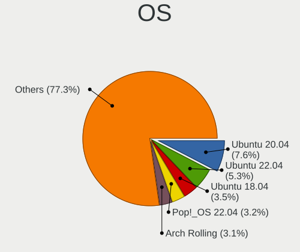

| Name                         | Desktops | Percent |
|------------------------------|----------|---------|
| Ubuntu 20.04                 | 2055     | 7.61%   |
| Ubuntu 22.04                 | 1430     | 5.3%    |
| Ubuntu 18.04                 | 944      | 3.5%    |
| Pop!_OS 22.04                | 873      | 3.23%   |
| Arch Rolling                 | 838      | 3.1%    |
| Ubuntu 24.04                 | 770      | 2.85%   |
| Debian 12                    | 529      | 1.96%   |
| Debian 11                    | 407      | 1.51%   |
| Zorin 16                     | 396      | 1.47%   |
| OpenMandriva 24.12           | 384      | 1.42%   |
| Manjaro                      | 357      | 1.32%   |
| Zorin 17                     | 353      | 1.31%   |
| ArcoLinux Rolling            | 333      | 1.23%   |
| Fedora 40                    | 330      | 1.22%   |
| Linux Mint 22.1              | 320      | 1.19%   |
| Bazzite 42                   | 304      | 1.13%   |
| OpenMandriva 25.06           | 301      | 1.11%   |
| Fedora 42                    | 296      | 1.1%    |
| Pop!_OS 20.04                | 283      | 1.05%   |
| OpenMandriva 4.3             | 277      | 1.03%   |
| OpenMandriva 6.0             | 276      | 1.02%   |
| Linux Mint 20.3              | 275      | 1.02%   |
| OpenMandriva 25.90           | 259      | 0.96%   |
| Pop!_OS 21.04                | 257      | 0.95%   |
| Fedora 41                    | 257      | 0.95%   |
| Fedora 39                    | 250      | 0.93%   |
| Pop!_OS 20.10                | 247      | 0.91%   |
| KDE neon 20.04               | 237      | 0.88%   |
| Arch                         | 235      | 0.87%   |
| OpenMandriva 4.2             | 226      | 0.84%   |
| Linux Mint 21.1              | 220      | 0.81%   |
| openSUSE Tumbleweed-XXXXXXXX | 214      | 0.79%   |
| Fedora 38                    | 211      | 0.78%   |
| Linux Mint 21.3              | 199      | 0.74%   |
| Linux Mint 21.2              | 194      | 0.72%   |
| EndeavourOS Rolling          | 190      | 0.7%    |
| OpenMandriva 25.01           | 183      | 0.68%   |
| Linux Mint 22.2              | 179      | 0.66%   |
| Linux Mint 20.1              | 176      | 0.65%   |
| Xubuntu 20.04                | 172      | 0.64%   |

OS Family
---------

OS without a version

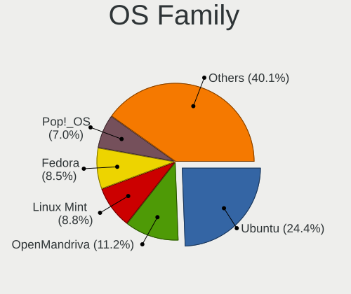

| Name          | Desktops | Percent |
|---------------|----------|---------|
| Ubuntu        | 6151     | 24.39%  |
| OpenMandriva  | 2824     | 11.2%   |
| Linux Mint    | 2212     | 8.77%   |
| Fedora        | 2141     | 8.49%   |
| Pop!_OS       | 1765     | 7%      |
| Debian        | 1200     | 4.76%   |
| Arch          | 1065     | 4.22%   |
| Zorin         | 955      | 3.79%   |
| Manjaro       | 691      | 2.74%   |
| Kubuntu       | 657      | 2.61%   |
| Bazzite       | 625      | 2.48%   |
| KDE neon      | 474      | 1.88%   |
| Xubuntu       | 359      | 1.42%   |
| ArcoLinux     | 352      | 1.4%    |
| openSUSE      | 323      | 1.28%   |
| Nobara        | 301      | 1.19%   |
| Gentoo        | 235      | 0.93%   |
| EndeavourOS   | 206      | 0.82%   |
| Garuda Linux  | 147      | 0.58%   |
| Kali          | 132      | 0.52%   |
| CachyOS       | 126      | 0.5%    |
| LMDE          | 122      | 0.48%   |
| Ubuntu MATE   | 114      | 0.45%   |
| Endless       | 113      | 0.45%   |
| Lubuntu       | 106      | 0.42%   |
| MX            | 101      | 0.4%    |
| Elementary    | 98       | 0.39%   |
| ROSA          | 95       | 0.38%   |
| SteamOS       | 93       | 0.37%   |
| CentOS        | 91       | 0.36%   |
| NixOS         | 90       | 0.36%   |
| Clear Linux   | 90       | 0.36%   |
| Ubuntu Unity  | 75       | 0.3%    |
| Parrot        | 63       | 0.25%   |
| ChimeraOS     | 62       | 0.25%   |
| BlackPanther  | 62       | 0.25%   |
| Ubuntu Budgie | 61       | 0.24%   |
| Dts-distro    | 51       | 0.2%    |
| Rocky Linux   | 45       | 0.18%   |
| Peppermint    | 39       | 0.15%   |

Kernel
------

Version of the Linux kernel

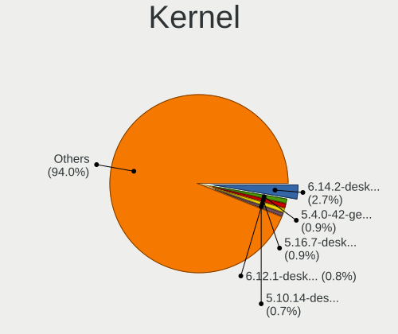

| Version                  | Desktops | Percent |
|--------------------------|----------|---------|
| 6.14.2-desktop-3omv2590  | 808      | 2.68%   |
| 5.4.0-42-generic         | 273      | 0.91%   |
| 5.16.7-desktop-1omv4003  | 258      | 0.86%   |
| 6.12.1-desktop-1omv2490  | 254      | 0.84%   |
| 5.10.14-desktop-1omv4002 | 221      | 0.73%   |
| 6.9.3-76060903-generic   | 202      | 0.67%   |
| 6.12.9-desktop-1omv2490  | 201      | 0.67%   |
| 6.8.0-51-generic         | 198      | 0.66%   |
| 6.6.2-desktop-1omv2390   | 186      | 0.62%   |
| 5.15.0-56-generic        | 182      | 0.6%    |
| 6.1.1-desktop-1omv2290   | 147      | 0.49%   |
| 6.4.11-desktop-1omv2390  | 128      | 0.42%   |
| 5.4.0-58-generic         | 128      | 0.42%   |
| 5.15.0-58-generic        | 122      | 0.4%    |
| 5.15.0-52-generic        | 119      | 0.39%   |
| 5.11.0-7620-generic      | 118      | 0.39%   |
| 6.2.6-desktop-1omv2390   | 117      | 0.39%   |
| 5.4.0-52-generic         | 114      | 0.38%   |
| 5.4.0-40-generic         | 114      | 0.38%   |
| 6.8.0-60-generic         | 113      | 0.37%   |
| 5.4.0-48-generic         | 113      | 0.37%   |
| 6.8.0-52-generic         | 110      | 0.36%   |
| 5.15.0-91-generic        | 109      | 0.36%   |
| 6.2.6-76060206-generic   | 107      | 0.35%   |
| 6.12.6-desktop-1omv2490  | 107      | 0.35%   |
| 5.8.0-7630-generic       | 106      | 0.35%   |
| 6.12.10-76061203-generic | 104      | 0.34%   |
| 5.4.0-26-generic         | 104      | 0.34%   |
| 5.15.0-46-generic        | 103      | 0.34%   |
| 6.5.0-14-generic         | 101      | 0.33%   |
| 5.4.0-29-generic         | 99       | 0.33%   |
| 5.3.0-40-generic         | 96       | 0.32%   |
| 5.4.0-7634-generic       | 94       | 0.31%   |
| 6.8.0-49-generic         | 93       | 0.31%   |
| 6.8.0-45-generic         | 91       | 0.3%    |
| 6.14.0-33-generic        | 91       | 0.3%    |
| 5.4.0-54-generic         | 91       | 0.3%    |
| 5.4.0-37-generic         | 91       | 0.3%    |
| 5.3.0-28-generic         | 91       | 0.3%    |
| 5.15.0-48-generic        | 89       | 0.3%    |

Kernel Family
-------------

Linux kernel without a distro release

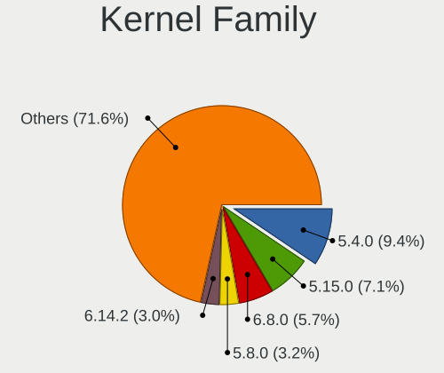

| Version | Desktops | Percent |
|---------|----------|---------|
| 5.4.0   | 2669     | 9.45%   |
| 5.15.0  | 2003     | 7.09%   |
| 6.8.0   | 1615     | 5.72%   |
| 5.8.0   | 893      | 3.16%   |
| 6.14.2  | 855      | 3.03%   |
| 5.11.0  | 829      | 2.93%   |
| 5.13.0  | 732      | 2.59%   |
| 4.15.0  | 703      | 2.49%   |
| 6.5.0   | 649      | 2.3%    |
| 6.14.0  | 596      | 2.11%   |
| 5.19.0  | 581      | 2.06%   |
| 6.1.0   | 575      | 2.03%   |
| 5.3.0   | 560      | 1.98%   |
| 6.2.0   | 511      | 1.81%   |
| 5.10.0  | 415      | 1.47%   |
| 6.11.0  | 377      | 1.33%   |
| 5.0.0   | 349      | 1.24%   |
| 6.12.1  | 278      | 0.98%   |
| 4.18.0  | 269      | 0.95%   |
| 5.16.7  | 260      | 0.92%   |
| 6.2.6   | 241      | 0.85%   |
| 6.12.9  | 240      | 0.85%   |
| 6.9.3   | 225      | 0.8%    |
| 5.10.14 | 225      | 0.8%    |
| 6.17.7  | 218      | 0.77%   |
| 6.6.2   | 209      | 0.74%   |
| 6.1.1   | 170      | 0.6%    |
| 6.4.11  | 153      | 0.54%   |
| 6.12.10 | 139      | 0.49%   |
| 6.12.6  | 135      | 0.48%   |
| 6.16.4  | 131      | 0.46%   |
| 4.19.0  | 117      | 0.41%   |
| 6.13.5  | 106      | 0.38%   |
| 5.17.5  | 102      | 0.36%   |
| 6.0.12  | 101      | 0.36%   |
| 6.5.6   | 99       | 0.35%   |
| 6.17.9  | 91       | 0.32%   |
| 6.14.6  | 86       | 0.3%    |
| 5.14.0  | 84       | 0.3%    |
| 6.15.6  | 83       | 0.29%   |

Kernel Major Ver.
-----------------

Linux kernel major version

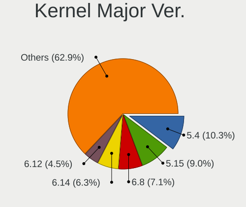

| Version | Desktops | Percent |
|---------|----------|---------|
| 5.4     | 2862     | 10.31%  |
| 5.15    | 2489     | 8.97%   |
| 6.8     | 1958     | 7.05%   |
| 6.14    | 1741     | 6.27%   |
| 6.12    | 1240     | 4.47%   |
| 5.8     | 1151     | 4.15%   |
| 6.1     | 1082     | 3.9%    |
| 6.5     | 974      | 3.51%   |
| 5.11    | 961      | 3.46%   |
| 6.2     | 953      | 3.43%   |
| 5.10    | 872      | 3.14%   |
| 5.13    | 837      | 3.02%   |
| 5.19    | 764      | 2.75%   |
| 4.15    | 709      | 2.55%   |
| 6.6     | 689      | 2.48%   |
| 6.11    | 686      | 2.47%   |
| 5.3     | 640      | 2.31%   |
| 6.17    | 597      | 2.15%   |
| 5.16    | 529      | 1.91%   |
| 6.9     | 493      | 1.78%   |
| 6.4     | 455      | 1.64%   |
| 6.15    | 401      | 1.44%   |
| 6.13    | 401      | 1.44%   |
| 5.0     | 371      | 1.34%   |
| 6.0     | 365      | 1.31%   |
| 6.10    | 364      | 1.31%   |
| 6.16    | 361      | 1.3%    |
| 4.18    | 328      | 1.18%   |
| 5.17    | 276      | 0.99%   |
| 5.18    | 258      | 0.93%   |
| 6.7     | 244      | 0.88%   |
| 6.3     | 234      | 0.84%   |
| 5.14    | 223      | 0.8%    |
| 5.9     | 185      | 0.67%   |
| 5.6     | 175      | 0.63%   |
| 5.12    | 152      | 0.55%   |
| 4.19    | 143      | 0.52%   |
| 5.7     | 141      | 0.51%   |
| 6.18    | 71       | 0.26%   |
| 5.5     | 70       | 0.25%   |

Arch
----

OS architecture (x86_64, i586, etc.)

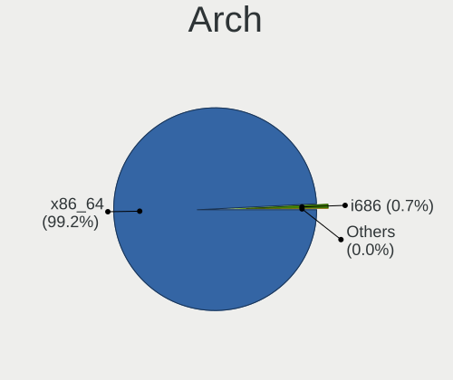

| Name        | Desktops | Percent |
|-------------|----------|---------|
| x86_64      | 23815    | 99.2%   |
| i686        | 174      | 0.72%   |
| armv7l      | 4        | 0.02%   |
| riscv64     | 3        | 0.01%   |
| ppc64le     | 3        | 0.01%   |
| ppc64       | 2        | 0.01%   |
| ppc         | 2        | 0.01%   |
| loongarch64 | 2        | 0.01%   |
| s390x       | 1        | 0.004%  |
| i586        | 1        | 0.004%  |
| aarch64     | 1        | 0.004%  |

DE
--

Desktop Environment

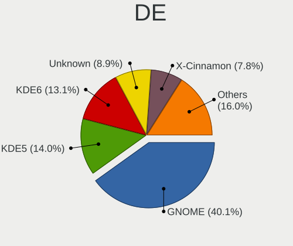

| Name             | Desktops | Percent |
|------------------|----------|---------|
| GNOME            | 10199    | 40.11%  |
| KDE5             | 3556     | 13.98%  |
| KDE6             | 3334     | 13.11%  |
| Unknown          | 2270     | 8.93%   |
| X-Cinnamon       | 1996     | 7.85%   |
| XFCE             | 1425     | 5.6%    |
| KDE              | 517      | 2.03%   |
| MATE             | 509      | 2%      |
| LXQt             | 279      | 1.1%    |
| Cinnamon         | 194      | 0.76%   |
| Budgie           | 139      | 0.55%   |
| i3               | 112      | 0.44%   |
| Pantheon         | 101      | 0.4%    |
| KDE4             | 100      | 0.39%   |
| Hyprland         | 94       | 0.37%   |
| Unity            | 75       | 0.29%   |
| COSMIC           | 74       | 0.29%   |
| LXDE             | 68       | 0.27%   |
| GNOME Classic    | 50       | 0.2%    |
| GNOME Flashback  | 49       | 0.19%   |
| Deepin           | 47       | 0.18%   |
| sway             | 30       | 0.12%   |
| awesome          | 24       | 0.09%   |
| openbox          | 22       | 0.09%   |
| bspwm            | 20       | 0.08%   |
| lightdm-xsession | 14       | 0.06%   |
| Trinity          | 11       | 0.04%   |
| Enlightenment    | 9        | 0.04%   |
| Endless:GNOME    | 8        | 0.03%   |
| LeftWM           | 7        | 0.03%   |
| xmonad           | 6        | 0.02%   |
| qtile            | 6        | 0.02%   |
| ICEWM            | 6        | 0.02%   |
| fluxbox          | 6        | 0.02%   |
| DWM              | 6        | 0.02%   |
| onyx:GNOME       | 5        | 0.02%   |
| niri             | 5        | 0.02%   |
| Xpra             | 4        | 0.02%   |
| BunsenLabs       | 4        | 0.02%   |
| GNUstep          | 3        | 0.01%   |

Display Server
--------------

X11 or Wayland

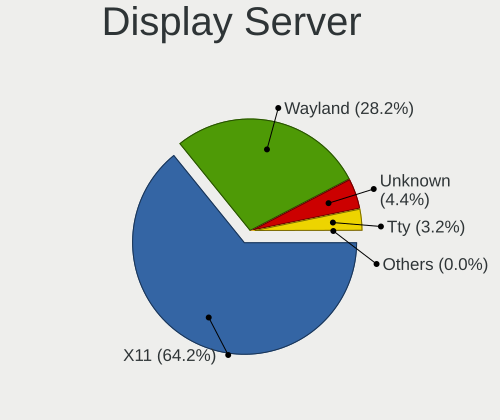

| Name        | Desktops | Percent |
|-------------|----------|---------|
| X11         | 16064    | 64.17%  |
| Wayland     | 7055     | 28.18%  |
| Unknown     | 1112     | 4.44%   |
| Tty         | 792      | 3.16%   |
| Web         | 8        | 0.03%   |
| Unspecified | 1        | 0.004%  |

Display Manager
---------------

SDDM, LightDM, etc.

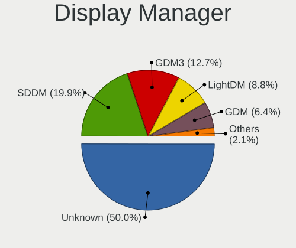

| Name                  | Desktops | Percent |
|-----------------------|----------|---------|
| Unknown               | 12549    | 50.03%  |
| SDDM                  | 4995     | 19.91%  |
| GDM3                  | 3194     | 12.73%  |
| LightDM               | 2207     | 8.8%    |
| GDM                   | 1600     | 6.38%   |
| TDM                   | 347      | 1.38%   |
| KDM                   | 51       | 0.2%    |
| XDM                   | 37       | 0.15%   |
| SLiM                  | 23       | 0.09%   |
| GREETD                | 20       | 0.08%   |
| LXDM                  | 17       | 0.07%   |
| LY-DM                 | 10       | 0.04%   |
| Ly                    | 10       | 0.04%   |
| COSMIC-GREETER        | 10       | 0.04%   |
| MDM                   | 4        | 0.02%   |
| NODM                  | 2        | 0.01%   |
| SU                    | 1        | 0.004%  |
| SLIMSKI               | 1        | 0.004%  |
| LYNDE                 | 1        | 0.004%  |
| LEMURS                | 1        | 0.004%  |
| EMPTTY                | 1        | 0.004%  |
| DISPLAY-MANAGER-START | 1        | 0.004%  |

OS Lang
-------

Language

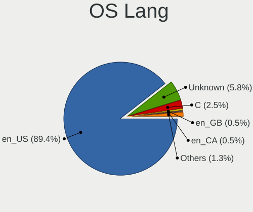

| Lang        | Desktops | Percent |
|-------------|----------|---------|
| en_US       | 21730    | 89.42%  |
| Unknown     | 1418     | 5.84%   |
| C           | 597      | 2.46%   |
| en_GB       | 124      | 0.51%   |
| en_CA       | 112      | 0.46%   |
| C.UTF8      | 28       | 0.12%   |
| POSIX       | 27       | 0.11%   |
| de_DE       | 27       | 0.11%   |
| zh_CN       | 25       | 0.1%    |
| es_US       | 23       | 0.09%   |
| en_AU       | 19       | 0.08%   |
| es_ES       | 15       | 0.06%   |
| it_IT       | 13       | 0.05%   |
| ru_RU       | 12       | 0.05%   |
| fr_FR       | 10       | 0.04%   |
| pt_BR       | 8        | 0.03%   |
| en_IN       | 7        | 0.03%   |
| es_VE       | 6        | 0.02%   |
| es_MX       | 6        | 0.02%   |
| en_US.UTF8  | 6        | 0.02%   |
| zh_TW       | 5        | 0.02%   |
| nl_NL       | 5        | 0.02%   |
| fr_CA       | 5        | 0.02%   |
| en_US.utf-8 | 5        | 0.02%   |
| en_DK       | 4        | 0.02%   |
| uk_UA       | 3        | 0.01%   |
| ja_JP       | 3        | 0.01%   |
| en_ZA       | 3        | 0.01%   |
| de_AT       | 3        | 0.01%   |
| th_TH       | 2        | 0.01%   |
| ru_UA       | 2        | 0.01%   |
| pt_PT       | 2        | 0.01%   |
| pl_PL       | 2        | 0.01%   |
| nb_NO       | 2        | 0.01%   |
| ko_KR       | 2        | 0.01%   |
| es_CO       | 2        | 0.01%   |
| es_AR       | 2        | 0.01%   |
| en_ZW       | 2        | 0.01%   |
| en_XX@POSIX | 2        | 0.01%   |
| en_US.UTF.8 | 2        | 0.01%   |

Boot Mode
---------

EFI or BIOS

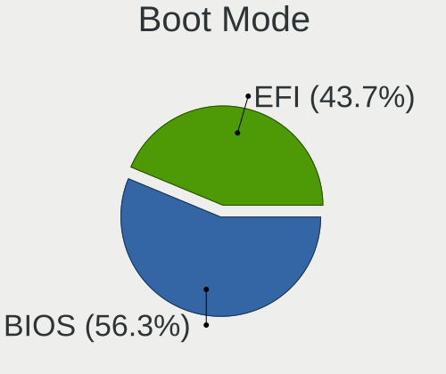

| Mode | Desktops | Percent |
|------|----------|---------|
| BIOS | 13937    | 56.27%  |
| EFI  | 10832    | 43.73%  |

Filesystem
----------

Type of filesystem

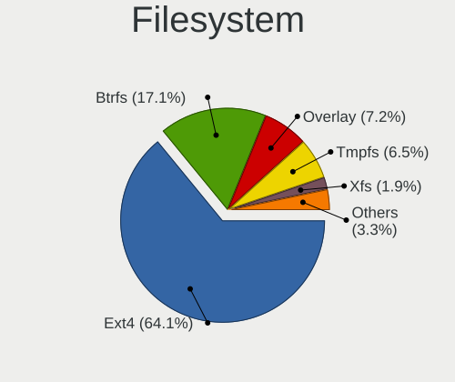

| Type                | Desktops | Percent |
|---------------------|----------|---------|
| Ext4                | 16019    | 64.07%  |
| Btrfs               | 4266     | 17.06%  |
| Overlay             | 1793     | 7.17%   |
| Tmpfs               | 1621     | 6.48%   |
| Xfs                 | 481      | 1.92%   |
| Unknown             | 400      | 1.6%    |
| Zfs                 | 258      | 1.03%   |
| F2fs                | 42       | 0.17%   |
| Ext2                | 35       | 0.14%   |
| Ext3                | 30       | 0.12%   |
| Rootfs              | 13       | 0.05%   |
| Reiserfs            | 10       | 0.04%   |
| Jfs                 | 10       | 0.04%   |
| Aufs                | 9        | 0.04%   |
| XXXXXXX             | 3        | 0.01%   |
| Bcachefs            | 3        | 0.01%   |
| XXX4                | 2        | 0.01%   |
| XXX                 | 2        | 0.01%   |
| XXXXX               | 1        | 0.004%  |
| XXXX                | 1        | 0.004%  |
| XXXfs               | 1        | 0.004%  |
| Nilfs2              | 1        | 0.004%  |
| Fuse.fuse-overlayfs | 1        | 0.004%  |

Part. scheme
------------

Scheme of partitioning

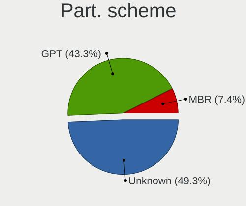

| Type    | Desktops | Percent |
|---------|----------|---------|
| Unknown | 12222    | 49.34%  |
| GPT     | 10717    | 43.26%  |
| MBR     | 1833     | 7.4%    |

Dual Boot with Linux/BSD
------------------------

Hosting more than one Linux/BSD

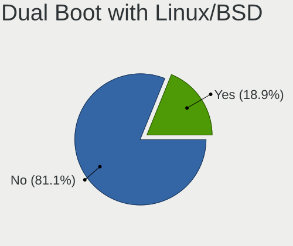

| Dual boot | Desktops | Percent |
|-----------|----------|---------|
| No        | 20083    | 81.13%  |
| Yes       | 4672     | 18.87%  |

Dual Boot (Win)
---------------

Hosting Linux and Windows

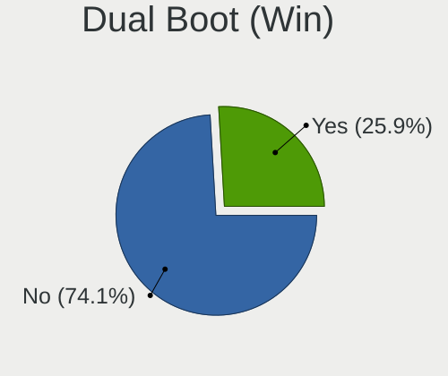

| Dual boot | Desktops | Percent |
|-----------|----------|---------|
| No        | 18214    | 74.08%  |
| Yes       | 6373     | 25.92%  |

Board
-----

Vendor
------

Motherboard manufacturer

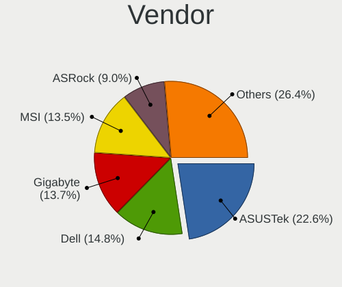

| Name                                 | Desktops | Percent |
|--------------------------------------|----------|---------|
| ASUSTek Computer                     | 5424     | 22.6%   |
| Dell                                 | 3540     | 14.75%  |
| Gigabyte Technology                  | 3294     | 13.73%  |
| MSI                                  | 3249     | 13.54%  |
| ASRock                               | 2158     | 8.99%   |
| Hewlett-Packard                      | 2146     | 8.94%   |
| Lenovo                               | 896      | 3.73%   |
| Intel                                | 350      | 1.46%   |
| Pegatron                             | 310      | 1.29%   |
| Unknown                              | 245      | 1.02%   |
| Foxconn                              | 203      | 0.85%   |
| Acer                                 | 193      | 0.8%    |
| Alienware                            | 166      | 0.69%   |
| Apple                                | 164      | 0.68%   |
| AZW                                  | 156      | 0.65%   |
| Supermicro                           | 133      | 0.55%   |
| Gateway                              | 109      | 0.45%   |
| Biostar                              | 109      | 0.45%   |
| System76                             | 90       | 0.38%   |
| Shenzhen Meigao Electronic Equipment | 87       | 0.36%   |
| ECS                                  | 84       | 0.35%   |
| eMachines                            | 68       | 0.28%   |
| EVGA                                 | 60       | 0.25%   |
| BESSTAR Tech                         | 48       | 0.2%    |
| Google                               | 40       | 0.17%   |
| ASRockRack                           | 37       | 0.15%   |
| Shuttle                              | 31       | 0.13%   |
| HC Technology.                       | 27       | 0.11%   |
| GEEKOM                               | 23       | 0.1%    |
| NZXT                                 | 22       | 0.09%   |
| MACHINIST                            | 21       | 0.09%   |
| GMKtec                               | 21       | 0.09%   |
| AAEON                                | 18       | 0.08%   |
| Huanan                               | 15       | 0.06%   |
| TianBei                              | 13       | 0.05%   |
| Protectli                            | 13       | 0.05%   |
| Inventec                             | 13       | 0.05%   |
| Fujitsu                              | 13       | 0.05%   |
| AMI                                  | 13       | 0.05%   |
| PELADN                               | 12       | 0.05%   |

Model
-----

Motherboard model

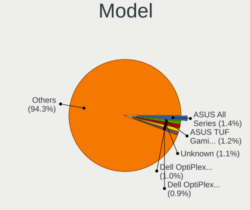

| Name                         | Desktops | Percent |
|------------------------------|----------|---------|
| ASUS All Series              | 346      | 1.44%   |
| ASUS TUF Gaming X570-PLUS    | 283      | 1.18%   |
| Unknown                      | 259      | 1.08%   |
| Dell OptiPlex 7010           | 248      | 1.03%   |
| Dell OptiPlex 9020           | 222      | 0.93%   |
| MSI MS-7C91                  | 158      | 0.66%   |
| MSI MS-7C37                  | 150      | 0.63%   |
| MSI MS-7C56                  | 136      | 0.57%   |
| MSI MS-7C02                  | 134      | 0.56%   |
| ASUS ROG STRIX B550-F GAMING | 130      | 0.54%   |
| Dell OptiPlex 790            | 110      | 0.46%   |
| Dell OptiPlex 3020           | 100      | 0.42%   |
| ASUS ROG STRIX B450-F GAMING | 100      | 0.42%   |
| MSI MS-7C95                  | 95       | 0.4%    |
| Dell OptiPlex 990            | 95       | 0.4%    |
| MSI MS-7693                  | 92       | 0.38%   |
| Gigabyte B450M DS3H          | 91       | 0.38%   |
| MSI MS-7B86                  | 89       | 0.37%   |
| Dell OptiPlex 7040           | 88       | 0.37%   |
| Dell Inspiron 3847           | 88       | 0.37%   |
| Dell OptiPlex 9010           | 85       | 0.35%   |
| ASRock B450M Pro4            | 85       | 0.35%   |
| MSI MS-7B79                  | 82       | 0.34%   |
| Dell OptiPlex 3010           | 82       | 0.34%   |
| Dell OptiPlex 780            | 80       | 0.33%   |
| Dell OptiPlex 7050           | 76       | 0.32%   |
| MSI MS-7D25                  | 75       | 0.31%   |
| Dell XPS 8700                | 70       | 0.29%   |
| ASUS ROG CROSSHAIR VIII HERO | 70       | 0.29%   |
| Apple MacPro5,1              | 69       | 0.29%   |
| HP Compaq Elite 8300 SFF     | 67       | 0.28%   |
| Dell OptiPlex 390            | 67       | 0.28%   |
| ASUS ROG STRIX X570-E GAMING | 60       | 0.25%   |
| ASUS M5A97 R2.0              | 60       | 0.25%   |
| Gigabyte X570 AORUS MASTER   | 58       | 0.24%   |
| HP EliteDesk 800 G1 SFF      | 57       | 0.24%   |
| Dell Precision Tower 5810    | 57       | 0.24%   |
| Dell OptiPlex 7020           | 57       | 0.24%   |
| MSI MS-7D78                  | 56       | 0.23%   |
| MSI MS-7721                  | 54       | 0.23%   |

Model Family
------------

Motherboard model prefix

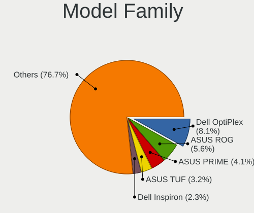

| Name                   | Desktops | Percent |
|------------------------|----------|---------|
| Dell OptiPlex          | 1943     | 8.1%    |
| ASUS ROG               | 1346     | 5.61%   |
| ASUS PRIME             | 981      | 4.09%   |
| ASUS TUF               | 759      | 3.16%   |
| Dell Inspiron          | 562      | 2.34%   |
| HP Compaq              | 512      | 2.13%   |
| Lenovo ThinkCentre     | 500      | 2.08%   |
| Dell Precision         | 481      | 2%      |
| ASUS All               | 346      | 1.44%   |
| HP EliteDesk           | 315      | 1.31%   |
| Gigabyte X570          | 282      | 1.18%   |
| Dell XPS               | 259      | 1.08%   |
| Unknown                | 259      | 1.08%   |
| HP Pavilion            | 180      | 0.75%   |
| ASRock X570            | 170      | 0.71%   |
| HP ProDesk             | 169      | 0.7%    |
| ASRock B450M           | 161      | 0.67%   |
| MSI MS-7C91            | 158      | 0.66%   |
| Gigabyte B450M         | 158      | 0.66%   |
| MSI MS-7C37            | 150      | 0.63%   |
| Gigabyte B550          | 149      | 0.62%   |
| Gigabyte B450          | 143      | 0.6%    |
| Acer Aspire            | 143      | 0.6%    |
| MSI MS-7C56            | 136      | 0.57%   |
| MSI MS-7C02            | 134      | 0.56%   |
| Gigabyte B650          | 123      | 0.51%   |
| ASUS M5A97             | 122      | 0.51%   |
| Alienware Aurora       | 119      | 0.5%    |
| Lenovo IdeaCentre      | 116      | 0.48%   |
| Lenovo ThinkStation    | 115      | 0.48%   |
| Gigabyte GA-78LMT-USB3 | 109      | 0.45%   |
| Gigabyte B550M         | 105      | 0.44%   |
| ASUS M5A78L-M          | 104      | 0.43%   |
| ASUS SABERTOOTH        | 102      | 0.43%   |
| Gigabyte Z390          | 101      | 0.42%   |
| ASRock B550            | 96       | 0.4%    |
| MSI MS-7C95            | 95       | 0.4%    |
| MSI MS-7693            | 92       | 0.38%   |
| MSI MS-7B86            | 89       | 0.37%   |
| HP OMEN                | 87       | 0.36%   |

MFG Year
--------

Motherboard manufacture year

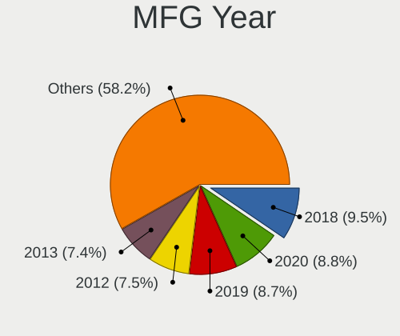

| Year    | Desktops | Percent |
|---------|----------|---------|
| 2018    | 2281     | 9.5%    |
| 2020    | 2107     | 8.78%   |
| 2019    | 2079     | 8.66%   |
| 2012    | 1801     | 7.5%    |
| 2013    | 1766     | 7.36%   |
| 2022    | 1520     | 6.33%   |
| 2021    | 1438     | 5.99%   |
| 2017    | 1385     | 5.77%   |
| 2014    | 1337     | 5.57%   |
| 2011    | 1315     | 5.48%   |
| 2015    | 1017     | 4.24%   |
| 2023    | 991      | 4.13%   |
| 2016    | 933      | 3.89%   |
| 2009    | 922      | 3.84%   |
| 2010    | 877      | 3.65%   |
| 2024    | 813      | 3.39%   |
| 2008    | 524      | 2.18%   |
| 2007    | 431      | 1.8%    |
| 2025    | 163      | 0.68%   |
| 2006    | 162      | 0.68%   |
| 2005    | 70       | 0.29%   |
| Unknown | 25       | 0.1%    |
| 2004    | 23       | 0.1%    |
| 2003    | 10       | 0.04%   |
| 2002    | 4        | 0.02%   |
| 2001    | 3        | 0.01%   |
| 2000    | 1        | 0.004%  |

Form Factor
-----------

Physical design of the computer

| Name    | Desktops | Percent |
|---------|----------|---------|
| Desktop | 23998    | 100%    |

Secure Boot
-----------

Enabled or disabled

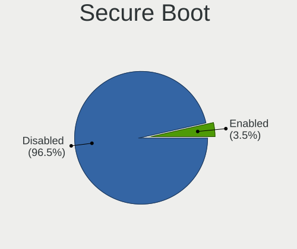

| State    | Desktops | Percent |
|----------|----------|---------|
| Disabled | 23276    | 96.46%  |
| Enabled  | 854      | 3.54%   |

Coreboot
--------

Have coreboot on board

| Used | Desktops | Percent |
|------|----------|---------|
| No   | 23942    | 99.77%  |
| Yes  | 56       | 0.23%   |

RAM Size
--------

Total RAM memory

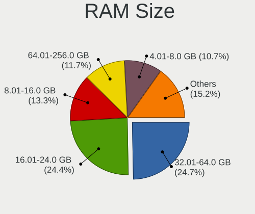

| Size in GB      | Desktops | Percent |
|-----------------|----------|---------|
| 32.01-64.0      | 6101     | 24.7%   |
| 16.01-24.0      | 6025     | 24.39%  |
| 8.01-16.0       | 3282     | 13.29%  |
| 64.01-256.0     | 2902     | 11.75%  |
| 4.01-8.0        | 2642     | 10.7%   |
| 3.01-4.0        | 1732     | 7.01%   |
| 24.01-32.0      | 1413     | 5.72%   |
| 1.01-2.0        | 301      | 1.22%   |
| 2.01-3.0        | 162      | 0.66%   |
| More than 256.0 | 94       | 0.38%   |
| 0.51-1.0        | 25       | 0.1%    |
| 0.01-0.5        | 11       | 0.04%   |
| Unknown         | 11       | 0.04%   |

RAM Used
--------

Used RAM memory

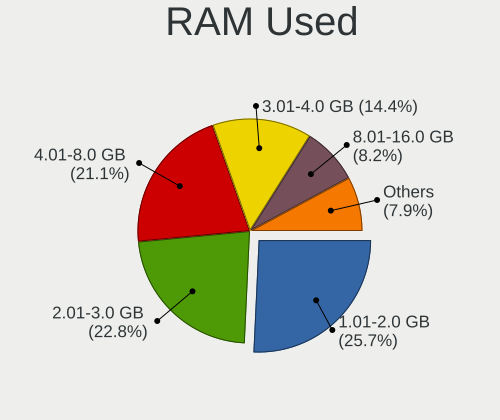

| Used GB         | Desktops | Percent |
|-----------------|----------|---------|
| 1.01-2.0        | 7059     | 25.74%  |
| 2.01-3.0        | 6241     | 22.76%  |
| 4.01-8.0        | 5786     | 21.1%   |
| 3.01-4.0        | 3936     | 14.35%  |
| 8.01-16.0       | 2247     | 8.19%   |
| 0.51-1.0        | 1098     | 4%      |
| 16.01-24.0      | 475      | 1.73%   |
| 0.01-0.5        | 216      | 0.79%   |
| 24.01-32.0      | 170      | 0.62%   |
| 32.01-64.0      | 130      | 0.47%   |
| 64.01-256.0     | 44       | 0.16%   |
| Unknown         | 19       | 0.07%   |
| More than 256.0 | 2        | 0.01%   |
| 0               | 1        | 0.004%  |

Total Drives
------------

Number of drives on board

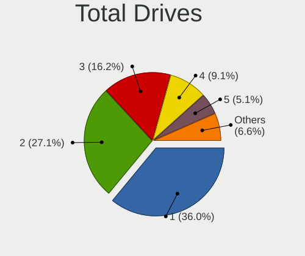

| Drives  | Desktops | Percent |
|---------|----------|---------|
| 1       | 9188     | 35.98%  |
| 2       | 6930     | 27.14%  |
| 3       | 4130     | 16.17%  |
| 4       | 2312     | 9.05%   |
| 5       | 1295     | 5.07%   |
| 6       | 643      | 2.52%   |
| 7       | 328      | 1.28%   |
| 0       | 217      | 0.85%   |
| 8       | 167      | 0.65%   |
| 9       | 94       | 0.37%   |
| 10      | 55       | 0.22%   |
| 11      | 46       | 0.18%   |
| 12      | 32       | 0.13%   |
| 13      | 26       | 0.1%    |
| 14      | 14       | 0.05%   |
| 16      | 9        | 0.04%   |
| 15      | 8        | 0.03%   |
| 19      | 6        | 0.02%   |
| Unknown | 6        | 0.02%   |
| 21      | 5        | 0.02%   |
| 20      | 4        | 0.02%   |
| 27      | 3        | 0.01%   |
| 22      | 3        | 0.01%   |
| 18      | 3        | 0.01%   |
| 17      | 3        | 0.01%   |
| 25      | 2        | 0.01%   |
| 101     | 1        | 0.004%  |
| 71      | 1        | 0.004%  |
| 68      | 1        | 0.004%  |
| 45      | 1        | 0.004%  |
| 38      | 1        | 0.004%  |
| 33      | 1        | 0.004%  |
| 26      | 1        | 0.004%  |
| 23      | 1        | 0.004%  |

Has CD-ROM
----------

Has CD-ROM on board

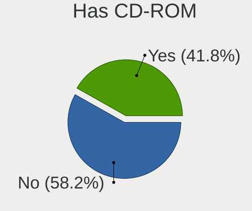

| Presented | Desktops | Percent |
|-----------|----------|---------|
| No        | 14196    | 58.19%  |
| Yes       | 10200    | 41.81%  |

Has Ethernet
------------

Has Ethernet on board

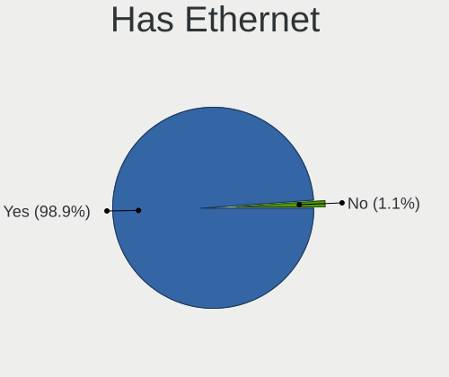

| Presented | Desktops | Percent |
|-----------|----------|---------|
| Yes       | 23725    | 98.86%  |
| No        | 274      | 1.14%   |

Has WiFi
--------

Has WiFi module

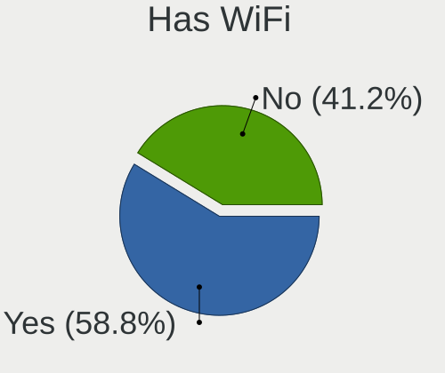

| Presented | Desktops | Percent |
|-----------|----------|---------|
| Yes       | 14337    | 58.76%  |
| No        | 10064    | 41.24%  |

Has Bluetooth
-------------

Has Bluetooth module

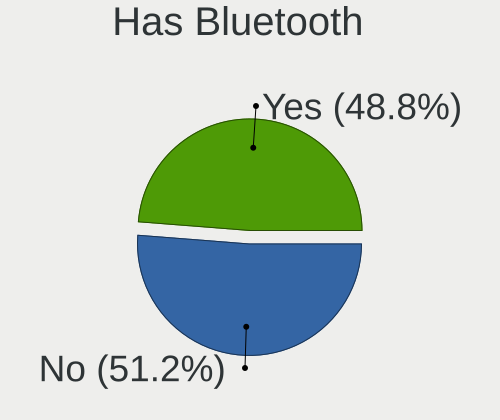

| Presented | Desktops | Percent |
|-----------|----------|---------|
| No        | 12505    | 51.24%  |
| Yes       | 11899    | 48.76%  |

Location
--------

Country
-------

Geographic location (country)

| Country | Desktops | Percent |
|---------|----------|---------|
| USA     | 23998    | 100%    |

City
----

Geographic location (city)

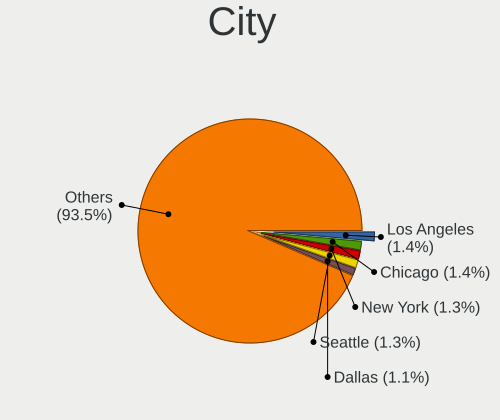

| City             | Desktops | Percent |
|------------------|----------|---------|
| Los Angeles      | 356      | 1.4%    |
| Chicago          | 352      | 1.38%   |
| New York         | 337      | 1.32%   |
| Seattle          | 328      | 1.29%   |
| Dallas           | 272      | 1.07%   |
| Denver           | 242      | 0.95%   |
| Atlanta          | 239      | 0.94%   |
| Portland         | 232      | 0.91%   |
| Houston          | 207      | 0.81%   |
| Phoenix          | 198      | 0.78%   |
| Miami            | 190      | 0.75%   |
| Minneapolis      | 162      | 0.64%   |
| San Jose         | 159      | 0.62%   |
| Austin           | 158      | 0.62%   |
| Las Vegas        | 145      | 0.57%   |
| San Antonio      | 121      | 0.48%   |
| Salt Lake City   | 119      | 0.47%   |
| Jacksonville     | 117      | 0.46%   |
| Columbus         | 114      | 0.45%   |
| San Diego        | 113      | 0.44%   |
| Kansas City      | 108      | 0.42%   |
| Charlotte        | 105      | 0.41%   |
| Albuquerque      | 103      | 0.4%    |
| San Francisco    | 102      | 0.4%    |
| Brooklyn         | 102      | 0.4%    |
| Cleveland        | 100      | 0.39%   |
| Springfield      | 97       | 0.38%   |
| Indianapolis     | 97       | 0.38%   |
| Tucson           | 95       | 0.37%   |
| St Louis         | 93       | 0.37%   |
| Philadelphia     | 93       | 0.37%   |
| Rochester        | 92       | 0.36%   |
| Orlando          | 89       | 0.35%   |
| Washington       | 88       | 0.35%   |
| Ashburn          | 83       | 0.33%   |
| Pittsburgh       | 80       | 0.31%   |
| Oklahoma City    | 79       | 0.31%   |
| Colorado Springs | 79       | 0.31%   |
| Louisville       | 78       | 0.31%   |
| Spokane          | 77       | 0.3%    |

Drives
------

Drive Vendor
------------

Hard drive vendors

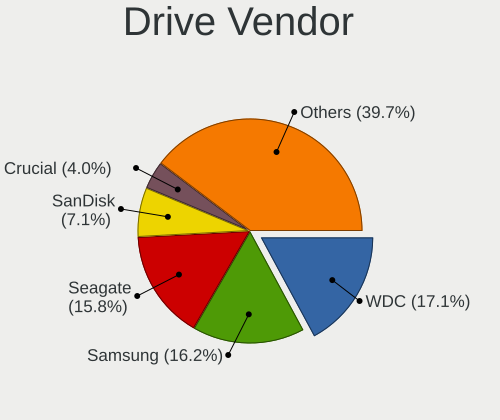

| Vendor                      | Desktops | Drives | Percent |
|-----------------------------|----------|--------|---------|
| WDC                         | 7844     | 14683  | 17.12%  |
| Samsung Electronics         | 7428     | 13787  | 16.21%  |
| Seagate                     | 7242     | 13434  | 15.81%  |
| SanDisk                     | 3273     | 4791   | 7.14%   |
| Crucial                     | 1842     | 2694   | 4.02%   |
| Toshiba                     | 1756     | 2618   | 3.83%   |
| Hitachi                     | 1427     | 2185   | 3.12%   |
| Kingston                    | 1105     | 1563   | 2.41%   |
| Intel                       | 908      | 1327   | 1.98%   |
| PNY                         | 849      | 1227   | 1.85%   |
| Phison Electronics          | 787      | 1146   | 1.72%   |
| Micron/Crucial Technology   | 739      | 1062   | 1.61%   |
| Unknown                     | 694      | 1222   | 1.51%   |
| SK hynix                    | 685      | 987    | 1.5%    |
| China                       | 616      | 945    | 1.34%   |
| HGST                        | 552      | 1105   | 1.2%    |
| SPCC                        | 526      | 714    | 1.15%   |
| A-DATA Technology           | 519      | 712    | 1.13%   |
| Phison                      | 496      | 751    | 1.08%   |
| Micron Technology           | 466      | 603    | 1.02%   |
| Team                        | 384      | 563    | 0.84%   |
| Silicon Motion              | 312      | 413    | 0.68%   |
| Realtek Semiconductor       | 277      | 359    | 0.6%    |
| MAXIO Technology (Hangzhou) | 267      | 359    | 0.58%   |
| Hewlett-Packard             | 235      | 364    | 0.51%   |
| T-FORCE                     | 226      | 284    | 0.49%   |
| Kingston Technology Company | 213      | 268    | 0.46%   |
| OCZ                         | 187      | 260    | 0.41%   |
| SABRENT                     | 164      | 226    | 0.36%   |
| Patriot                     | 148      | 199    | 0.32%   |
| Mushkin                     | 146      | 202    | 0.32%   |
| ASMT                        | 138      | 235    | 0.3%    |
| Unknown                     | 129      | 165    | 0.28%   |
| Corsair                     | 125      | 174    | 0.27%   |
| ADATA Technology            | 124      | 170    | 0.27%   |
| JMicron Technology          | 117      | 167    | 0.26%   |
| Maxtor                      | 103      | 139    | 0.22%   |
| KIOXIA                      | 96       | 133    | 0.21%   |
| KingFast                    | 94       | 115    | 0.21%   |
| Lexar                       | 93       | 137    | 0.2%    |

Drive Model
-----------

Hard drive models

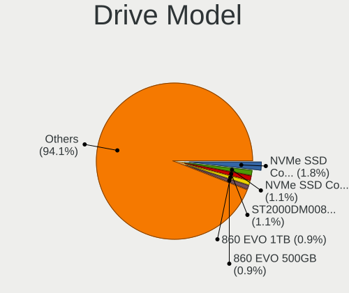

| Model                                                | Desktops | Percent |
|------------------------------------------------------|----------|---------|
| Samsung NVMe SSD Controller SM981/PM981/PM983 1TB    | 995      | 1.82%   |
| Samsung NVMe SSD Controller PM9A1/PM9A3/980PRO 1TB   | 628      | 1.15%   |
| Seagate ST2000DM008-2FR102 2TB                       | 597      | 1.09%   |
| Samsung SSD 860 EVO 1TB                              | 514      | 0.94%   |
| Samsung SSD 860 EVO 500GB                            | 509      | 0.93%   |
| WDC WD10EZEX-08WN4A0 1TB                             | 479      | 0.88%   |
| Samsung SSD 850 EVO 500GB                            | 454      | 0.83%   |
| Seagate ST500DM002-1BD142 500GB                      | 434      | 0.79%   |
| Samsung SSD 850 EVO 250GB                            | 355      | 0.65%   |
| Crucial CT1000MX500SSD1 1TB                          | 327      | 0.6%    |
| Toshiba DT01ACA100 1TB                               | 325      | 0.59%   |
| Micron/Crucial P2 NVMe PCIe SSD 2TB                  | 309      | 0.56%   |
| Samsung SSD 870 EVO 1TB                              | 306      | 0.56%   |
| Samsung SSD 990 PRO 2TB                              | 271      | 0.5%    |
| Kingston SA400S37240G 240GB SSD                      | 259      | 0.47%   |
| Seagate ST1000DM003-1CH162 1TB                       | 252      | 0.46%   |
| Seagate ST4000DM004-2CV104 4TB                       | 246      | 0.45%   |
| Unknown SD/MMC/MS PRO 2GB                            | 243      | 0.44%   |
| Seagate ST1000DM010-2EP102 1TB                       | 236      | 0.43%   |
| WDC WD10EZEX-00BN5A0 1TB                             | 234      | 0.43%   |
| SanDisk NVMe SSD Drive 1TB                           | 229      | 0.42%   |
| Seagate ST1000DM003-1ER162 1TB                       | 227      | 0.41%   |
| Phison E12 NVMe Controller 1TB                       | 226      | 0.41%   |
| Crucial CT500MX500SSD1 500GB                         | 225      | 0.41%   |
| Sandisk WD Blue SN550 NVMe SSD 1024GB                | 224      | 0.41%   |
| Samsung SSD 980 1TB                                  | 223      | 0.41%   |
| Samsung NVMe SSD Drive 1TB                           | 214      | 0.39%   |
| Seagate ST2000DM001-1ER164 2TB                       | 206      | 0.38%   |
| Samsung NVMe SSD Drive 500GB                         | 203      | 0.37%   |
| Seagate ST31000528AS 1TB                             | 190      | 0.35%   |
| Seagate ST1000DM003-1SB102 1TB                       | 190      | 0.35%   |
| Seagate ST2000DM006-2DM164 2TB                       | 178      | 0.33%   |
| PNY CS900 500GB SSD                                  | 171      | 0.31%   |
| Samsung NVMe SSD Controller SM961/PM961/SM963 1024GB | 169      | 0.31%   |
| WDC WDS500G2B0A-00SM50 500GB                         | 168      | 0.31%   |
| Toshiba DT01ACA200 2TB                               | 164      | 0.3%    |
| Sandisk WD Black SN750 / PC SN730 NVMe SSD 500GB     | 161      | 0.29%   |
| SanDisk NVMe SSD Drive 500GB                         | 160      | 0.29%   |
| Phison E16 PCIe4 NVMe Controller 1TB                 | 160      | 0.29%   |
| Samsung SSD 970 EVO Plus 1TB                         | 150      | 0.27%   |

HDD Vendor
----------

Hard disk drive vendors

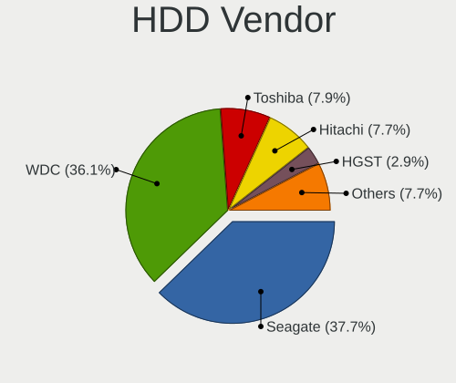

| Vendor              | Desktops | Drives | Percent |
|---------------------|----------|--------|---------|
| Seagate             | 7023     | 12892  | 37.74%  |
| WDC                 | 6714     | 12524  | 36.08%  |
| Toshiba             | 1475     | 2225   | 7.93%   |
| Hitachi             | 1427     | 2185   | 7.67%   |
| HGST                | 546      | 1024   | 2.93%   |
| Samsung Electronics | 315      | 436    | 1.69%   |
| Unknown             | 280      | 405    | 1.5%    |
| Maxtor              | 101      | 136    | 0.54%   |
| ASMT                | 65       | 133    | 0.35%   |
| Hewlett-Packard     | 59       | 120    | 0.32%   |
| JMicron Technology  | 58       | 92     | 0.31%   |
| Apple               | 53       | 63     | 0.28%   |
| T-FORCE             | 49       | 65     | 0.26%   |
| Fujitsu             | 41       | 49     | 0.22%   |
| TO Exter            | 38       | 65     | 0.2%    |
| WD MediaMax         | 35       | 66     | 0.19%   |
| External            | 30       | 42     | 0.16%   |
| SABRENT             | 26       | 41     | 0.14%   |
| SSK                 | 25       | 27     | 0.13%   |
| Unknown             | 23       | 37     | 0.12%   |
| ASMedia             | 18       | 33     | 0.1%    |
| HPE                 | 17       | 25     | 0.09%   |
| USB3.0              | 14       | 16     | 0.08%   |
| MaxDigital          | 13       | 19     | 0.07%   |
| Inateck             | 11       | 20     | 0.06%   |
| LaCie               | 10       | 23     | 0.05%   |
| RSH-319             | 9        | 10     | 0.05%   |
| MARVELL             | 9        | 13     | 0.05%   |
| USB                 | 8        | 13     | 0.04%   |
| Maxone              | 6        | 9      | 0.03%   |
| ASMT109x            | 6        | 13     | 0.03%   |
| SATAFIRM            | 5        | 5      | 0.03%   |
| HPQ                 | 5        | 5      | 0.03%   |
| Fantom              | 5        | 5      | 0.03%   |
| USB 3.0             | 4        | 8      | 0.02%   |
| TerraMas            | 4        | 27     | 0.02%   |
| RSH-339             | 4        | 4      | 0.02%   |
| KESU                | 4        | 6      | 0.02%   |
| IBM/Hitachi         | 4        | 6      | 0.02%   |
| HGST HTS            | 4        | 4      | 0.02%   |

SSD Vendor
----------

Solid state drive vendors

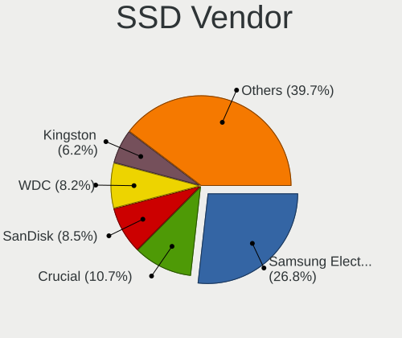

| Vendor              | Desktops | Drives | Percent |
|---------------------|----------|--------|---------|
| Samsung Electronics | 4036     | 6584   | 26.78%  |
| Crucial             | 1609     | 2351   | 10.68%  |
| SanDisk             | 1284     | 1766   | 8.52%   |
| WDC                 | 1229     | 1726   | 8.16%   |
| Kingston            | 930      | 1317   | 6.17%   |
| PNY                 | 828      | 1198   | 5.49%   |
| China               | 613      | 942    | 4.07%   |
| A-DATA Technology   | 454      | 622    | 3.01%   |
| SPCC                | 450      | 614    | 2.99%   |
| Intel               | 360      | 512    | 2.39%   |
| Team                | 319      | 467    | 2.12%   |
| Micron Technology   | 225      | 299    | 1.49%   |
| SK hynix            | 204      | 292    | 1.35%   |
| OCZ                 | 186      | 259    | 1.23%   |
| Hewlett-Packard     | 138      | 188    | 0.92%   |
| SABRENT             | 133      | 179    | 0.88%   |
| Patriot             | 130      | 179    | 0.86%   |
| Mushkin             | 129      | 183    | 0.86%   |
| Toshiba             | 121      | 169    | 0.8%    |
| T-FORCE             | 112      | 134    | 0.74%   |
| Corsair             | 84       | 118    | 0.56%   |
| Seagate             | 82       | 124    | 0.54%   |
| Lexar               | 79       | 111    | 0.52%   |
| Transcend           | 68       | 89     | 0.45%   |
| LITEON              | 64       | 81     | 0.42%   |
| ASMT                | 62       | 89     | 0.41%   |
| Fanxiang            | 52       | 79     | 0.35%   |
| KingFast            | 51       | 60     | 0.34%   |
| LITEONIT            | 50       | 60     | 0.33%   |
| KingSpec            | 45       | 59     | 0.3%    |
| Netac               | 39       | 50     | 0.26%   |
| Unknown             | 34       | 43     | 0.23%   |
| Apple               | 30       | 42     | 0.2%    |
| Dogfish             | 29       | 36     | 0.19%   |
| Timetec             | 28       | 51     | 0.19%   |
| Plextor             | 26       | 42     | 0.17%   |
| Leven               | 26       | 41     | 0.17%   |
| Inland              | 25       | 29     | 0.17%   |
| OWC                 | 24       | 32     | 0.16%   |
| Unknown             | 23       | 30     | 0.15%   |

Drive Kind
----------

HDD or SSD

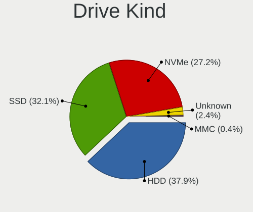

| Kind    | Desktops | Drives | Percent |
|---------|----------|--------|---------|
| HDD     | 14229    | 33011  | 37.95%  |
| SSD     | 12031    | 22069  | 32.08%  |
| NVMe    | 10201    | 19028  | 27.2%   |
| Unknown | 886      | 1510   | 2.36%   |
| MMC     | 152      | 190    | 0.41%   |

Drive Connector
---------------

SATA, SAS, NVMe, etc.

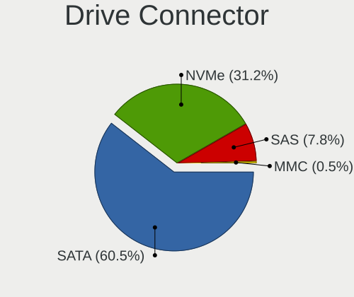

| Type | Desktops | Drives | Percent |
|------|----------|--------|---------|
| SATA | 19758    | 51691  | 60.55%  |
| NVMe | 10171    | 18862  | 31.17%  |
| SAS  | 2550     | 5065   | 7.81%   |
| MMC  | 152      | 190    | 0.47%   |

Drive Size
----------

Size of hard drive

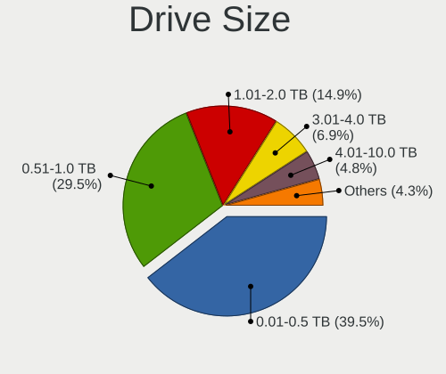

| Size in TB | Desktops | Drives  | Percent |
|------------|----------|---------|---------|
| 0.01-0.5   | 12109    | 21827   | 39.51%  |
| 0.51-1.0   | 9046     | 15580   | 29.52%  |
| 1.01-2.0   | 4574     | 7606    | 14.92%  |
| 3.01-4.0   | 2116     | 3905    | 6.9%    |
| 4.01-10.0  | 1478     | 3246    | 4.82%   |
| 2.01-3.0   | 877      | 1601    | 2.86%   |
| 10.01-20.0 | 425      | 1287    | 1.39%   |
| 20.01-50.0 | 21       | 28      | 0.07%   |
| 0          | 1        | Unknown | 0.003%  |

Space Total
-----------

Amount of disk space available on the file system

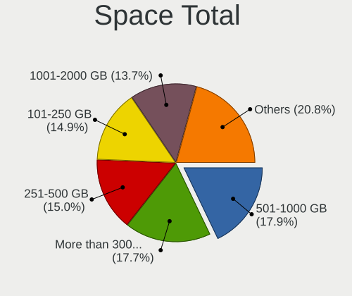

| Size in GB     | Desktops | Percent |
|----------------|----------|---------|
| 501-1000       | 4669     | 17.88%  |
| More than 3000 | 4631     | 17.73%  |
| 251-500        | 3930     | 15.05%  |
| 101-250        | 3880     | 14.86%  |
| 1001-2000      | 3572     | 13.68%  |
| 2001-3000      | 1584     | 6.07%   |
| 1-20           | 1564     | 5.99%   |
| Unknown        | 1077     | 4.12%   |
| 51-100         | 780      | 2.99%   |
| 21-50          | 426      | 1.63%   |
| 0              | 1        | 0.004%  |

Space Used
----------

Amount of used disk space

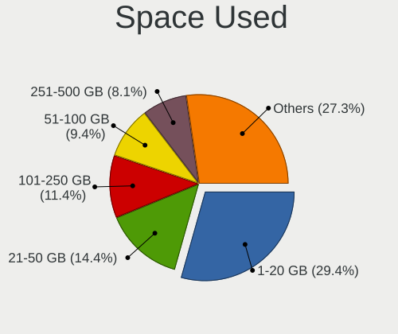

| Used GB        | Desktops | Percent |
|----------------|----------|---------|
| 1-20           | 8012     | 29.36%  |
| 21-50          | 3941     | 14.44%  |
| 101-250        | 3102     | 11.37%  |
| 51-100         | 2569     | 9.41%   |
| 251-500        | 2214     | 8.11%   |
| 501-1000       | 2160     | 7.91%   |
| 1001-2000      | 1810     | 6.63%   |
| More than 3000 | 1533     | 5.62%   |
| Unknown        | 1077     | 3.95%   |
| 2001-3000      | 808      | 2.96%   |
| 0              | 64       | 0.23%   |

Malfunc. Drives
---------------

Drive models with a malfunction

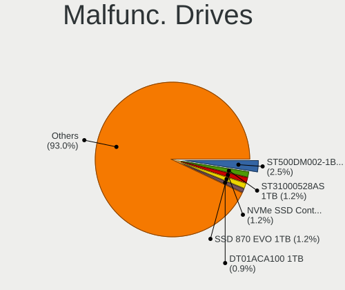

| Model                                                          | Desktops | Drives | Percent |
|----------------------------------------------------------------|----------|--------|---------|
| Seagate ST500DM002-1BD142 500GB                                | 63       | 73     | 2.49%   |
| Seagate ST31000528AS 1TB                                       | 31       | 40     | 1.23%   |
| Samsung Electronics NVMe SSD Controller SM981/PM981/PM983 1TB  | 31       | 41     | 1.23%   |
| Samsung Electronics SSD 870 EVO 1TB                            | 30       | 42     | 1.19%   |
| Toshiba DT01ACA100 1TB                                         | 23       | 26     | 0.91%   |
| Seagate ST2000DM008-2FR102 2TB                                 | 23       | 28     | 0.91%   |
| Hitachi HDS721010CLA332 1TB                                    | 21       | 25     | 0.83%   |
| Seagate ST31000524AS 1TB                                       | 20       | 25     | 0.79%   |
| Seagate ST3500418AS 500GB                                      | 18       | 25     | 0.71%   |
| WDC WD10EZEX-00BN5A0 1TB                                       | 15       | 17     | 0.59%   |
| Seagate ST31500341AS 1TB                                       | 14       | 18     | 0.55%   |
| Seagate ST2000DM006-2DM164 2TB                                 | 14       | 16     | 0.55%   |
| WDC WD40EFRX-68WT0N0 4TB                                       | 13       | 23     | 0.51%   |
| Seagate ST2000DM001-9YN164 2TB                                 | 13       | 14     | 0.51%   |
| Seagate ST2000DL003-9VT166 2TB                                 | 13       | 15     | 0.51%   |
| Samsung Electronics SSD 870 EVO 500GB                          | 13       | 17     | 0.51%   |
| Crucial CT525MX300SSD1 528GB                                   | 13       | 15     | 0.51%   |
| WDC WD20EARS-00MVWB0 2TB                                       | 12       | 13     | 0.47%   |
| Seagate ST3750528AS 752GB                                      | 12       | 15     | 0.47%   |
| Seagate ST2000DM001-1ER164 2TB                                 | 12       | 15     | 0.47%   |
| Seagate ST1000DM003-1CH162 1TB                                 | 12       | 13     | 0.47%   |
| WDC WD30EFRX-68EUZN0 3TB                                       | 11       | 13     | 0.44%   |
| Seagate ST1000DM010-2EP102 1TB                                 | 11       | 11     | 0.44%   |
| SanDisk SSD PLUS 240GB                                         | 11       | 12     | 0.44%   |
| Samsung Electronics SSD 980 1TB                                | 11       | 20     | 0.44%   |
| Hitachi HUA722020ALA331 2TB                                    | 11       | 15     | 0.44%   |
| Toshiba MQ01ABD100 1TB                                         | 10       | 14     | 0.4%    |
| Seagate ST1000DM003-1SB102 1TB                                 | 10       | 12     | 0.4%    |
| SanDisk SSD PLUS 1000GB                                        | 10       | 13     | 0.4%    |
| Samsung Electronics SSD 870 EVO 2TB                            | 10       | 13     | 0.4%    |
| Samsung Electronics SSD 850 EVO 1TB                            | 10       | 12     | 0.4%    |
| Samsung Electronics NVMe SSD Controller PM9A1/PM9A3/980PRO 1TB | 10       | 25     | 0.4%    |
| Kingston SV300S37A120G 120GB SSD                               | 10       | 11     | 0.4%    |
| WDC WD5000AAKX-001CA0 500GB                                    | 9        | 9      | 0.36%   |
| WDC WD10EZEX-08WN4A0 1TB                                       | 9        | 10     | 0.36%   |
| Toshiba DT01ACA300 3TB                                         | 9        | 13     | 0.36%   |
| Seagate ST8000DM004-2CX188 8TB                                 | 9        | 15     | 0.36%   |
| Seagate ST3500413AS 500GB                                      | 9        | 9      | 0.36%   |
| Seagate ST2000DM001-1CH164 2TB                                 | 9        | 10     | 0.36%   |
| Hitachi HDS722020ALA330 2TB                                    | 9        | 12     | 0.36%   |

Malfunc. Drive Vendor
---------------------

Vendors of faulty drives

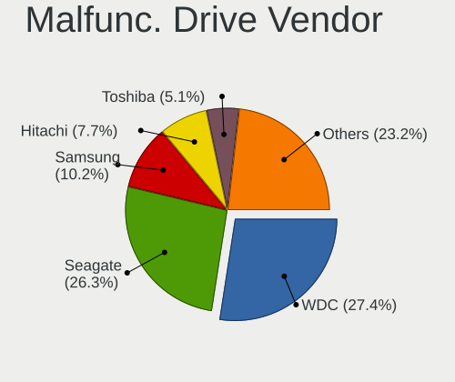

| Vendor                | Desktops | Drives | Percent |
|-----------------------|----------|--------|---------|
| WDC                   | 663      | 882    | 27.44%  |
| Seagate               | 635      | 857    | 26.28%  |
| Samsung Electronics   | 247      | 351    | 10.22%  |
| Hitachi               | 187      | 235    | 7.74%   |
| Toshiba               | 124      | 151    | 5.13%   |
| Crucial               | 69       | 80     | 2.86%   |
| SanDisk               | 60       | 71     | 2.48%   |
| Intel                 | 58       | 76     | 2.4%    |
| Kingston              | 40       | 52     | 1.66%   |
| HGST                  | 39       | 78     | 1.61%   |
| A-DATA Technology     | 38       | 41     | 1.57%   |
| SK hynix              | 21       | 26     | 0.87%   |
| SPCC                  | 17       | 19     | 0.7%    |
| Micron Technology     | 17       | 32     | 0.7%    |
| Maxtor                | 17       | 20     | 0.7%    |
| Hewlett-Packard       | 17       | 18     | 0.7%    |
| OCZ                   | 12       | 14     | 0.5%    |
| Realtek Semiconductor | 11       | 13     | 0.46%   |
| Corsair               | 11       | 12     | 0.46%   |
| China                 | 9        | 10     | 0.37%   |
| ASMT                  | 7        | 14     | 0.29%   |
| Mushkin               | 6        | 6      | 0.25%   |
| Team                  | 5        | 8      | 0.21%   |
| PNY                   | 5        | 10     | 0.21%   |
| LITEON                | 5        | 5      | 0.21%   |
| Transcend             | 4        | 6      | 0.17%   |
| SABRENT               | 4        | 4      | 0.17%   |
| LITEONIT              | 4        | 4      | 0.17%   |
| Unknown               | 4        | 5      | 0.17%   |
| WD MediaMax           | 3        | 5      | 0.12%   |
| Unknown               | 3        | 3      | 0.12%   |
| T-FORCE               | 3        | 3      | 0.12%   |
| Super Talent          | 3        | 3      | 0.12%   |
| SSSTC                 | 3        | 3      | 0.12%   |
| Silicon Motion        | 3        | 3      | 0.12%   |
| Patriot               | 3        | 3      | 0.12%   |
| IBM/Hitachi           | 3        | 5      | 0.12%   |
| ASMedia               | 3        | 8      | 0.12%   |
| Apple                 | 3        | 3      | 0.12%   |
| Plextor               | 2        | 2      | 0.08%   |

Malfunc. HDD Vendor
-------------------

Vendors of faulty HDD drives

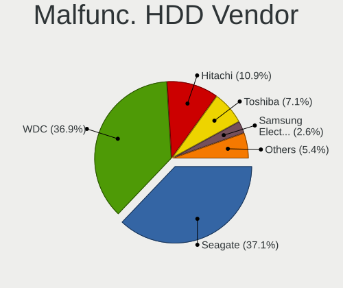

| Vendor              | Desktops | Drives | Percent |
|---------------------|----------|--------|---------|
| Seagate             | 635      | 856    | 37.11%  |
| WDC                 | 632      | 837    | 36.94%  |
| Hitachi             | 187      | 235    | 10.93%  |
| Toshiba             | 121      | 148    | 7.07%   |
| Samsung Electronics | 44       | 52     | 2.57%   |
| HGST                | 39       | 78     | 2.28%   |
| Maxtor              | 17       | 20     | 0.99%   |
| Hewlett-Packard     | 7        | 8      | 0.41%   |
| WD MediaMax         | 3        | 5      | 0.18%   |
| IBM/Hitachi         | 3        | 5      | 0.18%   |
| ASMT                | 3        | 6      | 0.18%   |
| ASMedia             | 3        | 8      | 0.18%   |
| Apple               | 3        | 3      | 0.18%   |
| Unknown             | 2        | 2      | 0.12%   |
| MaxDigital          | 2        | 2      | 0.12%   |
| Unknown             | 2        | 2      | 0.12%   |
| SABRENT             | 1        | 1      | 0.06%   |
| RSH-339             | 1        | 1      | 0.06%   |
| RSH-319             | 1        | 1      | 0.06%   |
| LaCie               | 1        | 1      | 0.06%   |
| IBM                 | 1        | 1      | 0.06%   |
| HPE                 | 1        | 1      | 0.06%   |
| HGST HUS            | 1        | 1      | 0.06%   |
| ExcelStor           | 1        | 1      | 0.06%   |

Malfunc. Drive Kind
-------------------

Kinds of faulty drives

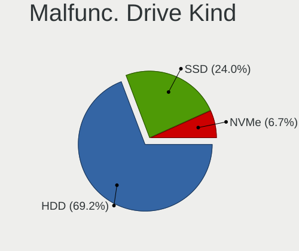

| Kind | Desktops | Drives | Percent |
|------|----------|--------|---------|
| HDD  | 1571     | 2275   | 69.24%  |
| SSD  | 545      | 697    | 24.02%  |
| NVMe | 153      | 223    | 6.74%   |

Failed Drives
-------------

Failed drive models

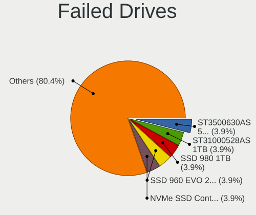

| Model                                                          | Desktops | Drives | Percent |
|----------------------------------------------------------------|----------|--------|---------|
| Seagate ST3500630AS 500GB                                      | 2        | 3      | 3.92%   |
| Seagate ST31000528AS 1TB                                       | 2        | 3      | 3.92%   |
| Samsung Electronics SSD 980 1TB                                | 2        | 2      | 3.92%   |
| Samsung Electronics SSD 960 EVO 250GB                          | 2        | 2      | 3.92%   |
| Samsung Electronics NVMe SSD Controller PM9A1/PM9A3/980PRO 1TB | 2        | 5      | 3.92%   |
| WDC WDS256G1X0C-00ENX0 256GB                                   | 1        | 1      | 1.96%   |
| WDC WD5003ABYX-70WERA0 500GB                                   | 1        | 1      | 1.96%   |
| WDC WD5000AVDS-63U7B1 500GB                                    | 1        | 1      | 1.96%   |
| WDC WD5000AADS-00S9B0 500GB                                    | 1        | 1      | 1.96%   |
| WDC WD4001FFSX-68JNUN0 4TB                                     | 1        | 1      | 1.96%   |
| WDC WD30EZRS-11J99B1 3TB                                       | 1        | 1      | 1.96%   |
| WDC WD30 EZRS-00J99B0 3TB                                      | 1        | 1      | 1.96%   |
| WDC WD20EADS-00R6B0 2TB                                        | 1        | 1      | 1.96%   |
| WDC WD10JPVT-75A1YT0 1TB                                       | 1        | 1      | 1.96%   |
| WDC WD10EZEX-60WN4A0 1TB                                       | 1        | 1      | 1.96%   |
| WDC WD10EZEX-00BN5A0 1TB                                       | 1        | 1      | 1.96%   |
| WDC WD10EAVS-00D7B1 1TB                                        | 1        | 1      | 1.96%   |
| WD MediaMax WL1000GSA1672 1TB                                  | 1        | 1      | 1.96%   |
| Toshiba MK5065GSXF 500GB                                       | 1        | 1      | 1.96%   |
| Toshiba DT01ACA100 1TB                                         | 1        | 1      | 1.96%   |
| SK hynix SHGS31-1000GS-2 1TB SSD                               | 1        | 8      | 1.96%   |
| Seagate ST91000430AS 1TB                                       | 1        | 2      | 1.96%   |
| Seagate ST750LX003-1AC154 752GB                                | 1        | 1      | 1.96%   |
| Seagate ST32000644NS 2TB                                       | 1        | 1      | 1.96%   |
| Seagate ST32000641AS 2TB                                       | 1        | 2      | 1.96%   |
| Seagate ST32000542AS 2TB                                       | 1        | 1      | 1.96%   |
| Seagate ST31500541AS 1TB                                       | 1        | 1      | 1.96%   |
| Seagate ST31500341AS 1TB                                       | 1        | 1      | 1.96%   |
| Seagate ST2000NM0011 2TB                                       | 1        | 1      | 1.96%   |
| Samsung Electronics SSD 980 500GB                              | 1        | 1      | 1.96%   |
| Samsung Electronics NVMe SSD Controller 980 (DRAM-less) 256GB  | 1        | 2      | 1.96%   |
| Samsung Electronics HD321HJ 320GB                              | 1        | 1      | 1.96%   |
| Samsung Electronics HD160JJ 160GB                              | 1        | 1      | 1.96%   |
| Patriot Pyro SSD 120GB                                         | 1        | 2      | 1.96%   |
| Mushkin MKNSSDEC120GB                                          | 1        | 1      | 1.96%   |
| Kingston SV300S37A120G 120GB SSD                               | 1        | 1      | 1.96%   |
| Kingston RBU-SNS8350DES3128GP 128GB SSD                        | 1        | 1      | 1.96%   |
| Inland SATA SSD 128GB                                          | 1        | 1      | 1.96%   |
| Hitachi HUS724040ALE640 4TB                                    | 1        | 1      | 1.96%   |
| Hitachi HUA722020ALA330 2TB                                    | 1        | 1      | 1.96%   |

Failed Drive Vendor
-------------------

Failed drive vendors

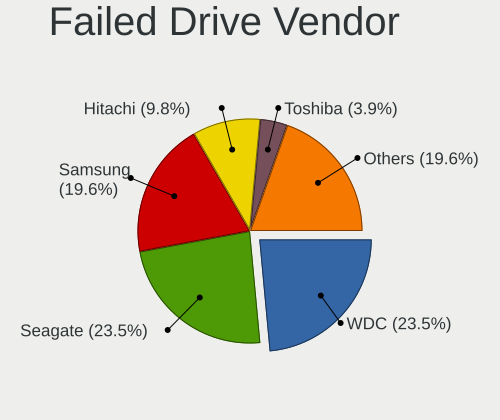

| Vendor              | Desktops | Drives | Percent |
|---------------------|----------|--------|---------|
| WDC                 | 12       | 12     | 23.53%  |
| Seagate             | 12       | 16     | 23.53%  |
| Samsung Electronics | 10       | 14     | 19.61%  |
| Hitachi             | 5        | 5      | 9.8%    |
| Toshiba             | 2        | 2      | 3.92%   |
| Kingston            | 2        | 2      | 3.92%   |
| HGST                | 2        | 2      | 3.92%   |
| WD MediaMax         | 1        | 1      | 1.96%   |
| SK hynix            | 1        | 8      | 1.96%   |
| Patriot             | 1        | 2      | 1.96%   |
| Mushkin             | 1        | 1      | 1.96%   |
| Inland              | 1        | 1      | 1.96%   |
| Crucial             | 1        | 1      | 1.96%   |

Drive Status
------------

Number of failed and malfunc. drives

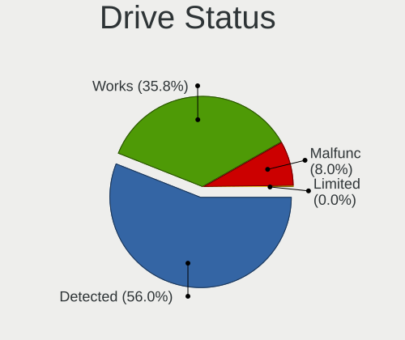

| Status   | Desktops | Drives | Percent |
|----------|----------|--------|---------|
| Detected | 15185    | 45631  | 56.01%  |
| Works    | 9696     | 26911  | 35.76%  |
| Malfunc  | 2176     | 3195   | 8.03%   |
| Failed   | 50       | 67     | 0.18%   |
| Limited  | 4        | 4      | 0.01%   |

Storage controller
------------------

Storage Vendor
--------------

Storage controller vendors

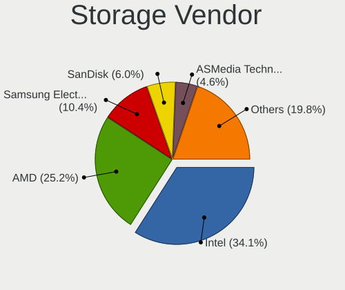

| Vendor                         | Desktops | Percent |
|--------------------------------|----------|---------|
| Intel                          | 13441    | 34.05%  |
| AMD                            | 9927     | 25.15%  |
| Samsung Electronics            | 4115     | 10.43%  |
| SanDisk                        | 2369     | 6%      |
| ASMedia Technology             | 1814     | 4.6%    |
| Phison Electronics             | 1371     | 3.47%   |
| Micron/Crucial Technology      | 945      | 2.39%   |
| Marvell Technology Group       | 680      | 1.72%   |
| SK hynix                       | 484      | 1.23%   |
| Nvidia                         | 474      | 1.2%    |
| JMicron Technology             | 424      | 1.07%   |
| Silicon Motion                 | 395      | 1%      |
| Kingston Technology Company    | 393      | 1%      |
| Realtek Semiconductor          | 351      | 0.89%   |
| MAXIO Technology (Hangzhou)    | 314      | 0.8%    |
| Micron Technology              | 267      | 0.68%   |
| ADATA Technology               | 218      | 0.55%   |
| Broadcom / LSI                 | 215      | 0.54%   |
| Toshiba America Info Systems   | 184      | 0.47%   |
| LSI Logic / Symbios Logic      | 184      | 0.47%   |
| INNOGRIT                       | 118      | 0.3%    |
| Seagate Technology             | 103      | 0.26%   |
| KIOXIA                         | 88       | 0.22%   |
| Silicon Image                  | 78       | 0.2%    |
| Shenzhen Longsys Electronics   | 74       | 0.19%   |
| Solidigm                       | 69       | 0.17%   |
| VIA Technologies               | 59       | 0.15%   |
| Adaptec                        | 45       | 0.11%   |
| Biwin Storage Technology       | 33       | 0.08%   |
| Lite-On Technology             | 26       | 0.07%   |
| Hosin Global Electronics       | 19       | 0.05%   |
| Integrated Technology Express  | 16       | 0.04%   |
| Nextorage                      | 15       | 0.04%   |
| TenaFe                         | 14       | 0.04%   |
| Solid State Storage Technology | 13       | 0.03%   |
| Hewlett-Packard                | 13       | 0.03%   |
| HighPoint Technologies         | 12       | 0.03%   |
| OCZ Technology Group           | 9        | 0.02%   |
| Apple                          | 9        | 0.02%   |
| Unknown                        | 9        | 0.02%   |

Storage Model
-------------

Storage controller models

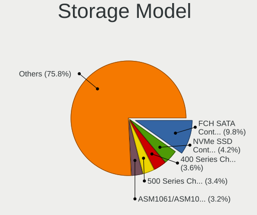

| Model                                                                                   | Desktops | Percent |
|-----------------------------------------------------------------------------------------|----------|---------|
| AMD FCH SATA Controller [AHCI mode]                                                     | 4651     | 9.81%   |
| Samsung NVMe SSD Controller SM981/PM981/PM983                                           | 1975     | 4.17%   |
| AMD 400 Series Chipset SATA Controller                                                  | 1717     | 3.62%   |
| AMD 500 Series Chipset SATA Controller                                                  | 1601     | 3.38%   |
| ASMedia ASM1061/ASM1062 Serial ATA Controller                                           | 1532     | 3.23%   |
| Intel SATA Controller [RAID mode]                                                       | 1469     | 3.1%    |
| AMD 600 Series Chipset SATA Controller                                                  | 1422     | 3%      |
| Intel 8 Series/C220 Series Chipset Family 6-port SATA Controller 1 [AHCI mode]          | 1416     | 2.99%   |
| AMD SB7x0/SB8x0/SB9x0 SATA Controller [AHCI mode]                                       | 1006     | 2.12%   |
| Intel 200 Series PCH SATA controller [AHCI mode]                                        | 998      | 2.11%   |
| AMD SB7x0/SB8x0/SB9x0 IDE Controller                                                    | 982      | 2.07%   |
| Intel Q170/Q150/B150/H170/H110/Z170/CM236 Chipset SATA Controller [AHCI Mode]           | 962      | 2.03%   |
| Samsung NVMe SSD Controller PM9A1/PM9A3/980PRO                                          | 940      | 1.98%   |
| Intel 7 Series/C210 Series Chipset Family 6-port SATA Controller [AHCI mode]            | 916      | 1.93%   |
| Intel 6 Series/C200 Series Chipset Family 6 port Desktop SATA AHCI Controller           | 891      | 1.88%   |
| Intel Cannon Lake PCH SATA AHCI Controller                                              | 761      | 1.61%   |
| AMD SB7x0/SB8x0/SB9x0 SATA Controller [IDE mode]                                        | 671      | 1.42%   |
| Intel Alder Lake-S PCH SATA Controller [AHCI Mode]                                      | 600      | 1.27%   |
| Phison E12 NVMe Controller                                                              | 529      | 1.12%   |
| Intel Raptor Lake SATA AHCI Controller                                                  | 508      | 1.07%   |
| Samsung NVMe SSD Controller S4LV008[Pascal]                                             | 506      | 1.07%   |
| SanDisk WD SN560/SN740/SN770/SN5000 NVMe SSD                                            | 437      | 0.92%   |
| Micron/Crucial P2 [Nick P2] / P3 / P3 Plus NVMe PCIe SSD (DRAM-less)                    | 423      | 0.89%   |
| AMD 300 Series Chipset SATA Controller                                                  | 395      | 0.83%   |
| SanDisk Ultra 3D / WD PC SN530, IX SN530, Blue SN550 NVMe SSD (DRAM-less)               | 394      | 0.83%   |
| Samsung NVMe SSD Controller SM961/PM961/SM963                                           | 386      | 0.81%   |
| Sandisk WD Black SN850X NVMe SSD                                                        | 369      | 0.78%   |
| Samsung NVMe SSD Controller 980 (DRAM-less)                                             | 354      | 0.75%   |
| Intel 9 Series Chipset Family SATA Controller [AHCI Mode]                               | 348      | 0.73%   |
| Phison E16 PCIe4 NVMe Controller                                                        | 344      | 0.73%   |
| Intel 500 Series Chipset Family SATA AHCI Controller                                    | 343      | 0.72%   |
| SanDisk Extreme Pro / WD Black SN750 / PC SN730 / Red SN700 NVMe SSD                    | 342      | 0.72%   |
| Intel 82801JI (ICH10 Family) SATA AHCI Controller                                       | 317      | 0.67%   |
| Intel Comet Lake SATA AHCI Controller                                                   | 306      | 0.65%   |
| Intel NM10/ICH7 Family SATA Controller [IDE mode]                                       | 296      | 0.62%   |
| Intel C610/X99 series chipset 6-Port SATA Controller [AHCI mode]                        | 285      | 0.6%    |
| Intel C610/X99 series chipset sSATA Controller [AHCI mode]                              | 272      | 0.57%   |
| Intel Volume Management Device NVMe RAID Controller                                     | 267      | 0.56%   |
| Intel 6 Series/C200 Series Chipset Family Desktop SATA Controller (IDE mode, ports 4-5) | 267      | 0.56%   |
| Intel 6 Series/C200 Series Chipset Family Desktop SATA Controller (IDE mode, ports 0-3) | 266      | 0.56%   |

Storage Kind
------------

Kind of storage controller (IDE, SATA, NVMe, SAS, ...)

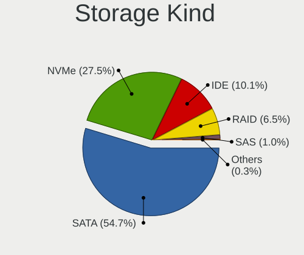

| Kind | Desktops | Percent |
|------|----------|---------|
| SATA | 20328    | 54.68%  |
| NVMe | 10216    | 27.48%  |
| IDE  | 3749     | 10.08%  |
| RAID | 2406     | 6.47%   |
| SAS  | 358      | 0.96%   |
| SCSI | 118      | 0.32%   |

Processor
---------

CPU Vendor
----------

Processor vendors

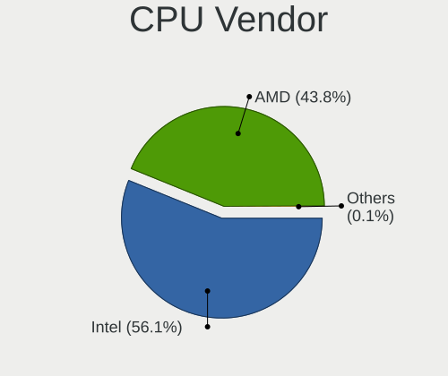

| Vendor                   | Desktops | Percent |
|--------------------------|----------|---------|
| Intel                    | 13473    | 56.14%  |
| AMD                      | 10503    | 43.77%  |
| ARM                      | 4        | 0.02%   |
| sifive,u74-mc            | 3        | 0.01%   |
| Unknown                  | 3        | 0.01%   |
| PowerNV C1P9S01 REV 1.01 | 2        | 0.01%   |
| Loongson                 | 2        | 0.01%   |
| CentaurHauls             | 2        | 0.01%   |
| Xenon Game Console       | 1        | 0.004%  |
| PowerNV C1P9S01 REV 1.02 | 1        | 0.004%  |
| PowerMac8,1              | 1        | 0.004%  |
| PowerBook5,5             | 1        | 0.004%  |
| PowerBook3,5             | 1        | 0.004%  |
| IBM/S390                 | 1        | 0.004%  |

CPU Model
---------

Processor models

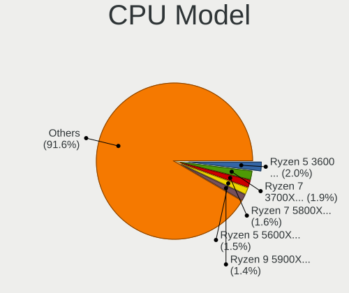

| Model                                  | Desktops | Percent |
|----------------------------------------|----------|---------|
| AMD Ryzen 5 3600 6-Core Processor      | 474      | 1.96%   |
| AMD Ryzen 7 3700X 8-Core Processor     | 461      | 1.9%    |
| AMD Ryzen 7 5800X 8-Core Processor     | 391      | 1.62%   |
| AMD Ryzen 5 5600X 6-Core Processor     | 368      | 1.52%   |
| AMD Ryzen 9 5900X 12-Core Processor    | 343      | 1.42%   |
| Intel Core i5-3470 CPU @ 3.20GHz       | 310      | 1.28%   |
| AMD Ryzen 9 3900X 12-Core Processor    | 310      | 1.28%   |
| Intel Core i7-3770 CPU @ 3.40GHz       | 290      | 1.2%    |
| Intel Core i7-4790 CPU @ 3.60GHz       | 283      | 1.17%   |
| AMD Ryzen 7 2700X Eight-Core Processor | 266      | 1.1%    |
| AMD FX-8350 Eight-Core Processor       | 259      | 1.07%   |
| Intel Core i5-2400 CPU @ 3.10GHz       | 257      | 1.06%   |
| AMD Ryzen 5 5600G with Radeon Graphics | 247      | 1.02%   |
| AMD Ryzen 5 2600 Six-Core Processor    | 247      | 1.02%   |
| AMD Ryzen 9 5950X 16-Core Processor    | 240      | 0.99%   |
| AMD Ryzen 7 5700G with Radeon Graphics | 236      | 0.98%   |
| Intel Core i7-6700 CPU @ 3.40GHz       | 219      | 0.9%    |
| Intel Core i5-6500 CPU @ 3.20GHz       | 205      | 0.85%   |
| Intel Core i7-6700K CPU @ 4.00GHz      | 204      | 0.84%   |
| Intel Core i5-4590 CPU @ 3.30GHz       | 204      | 0.84%   |
| AMD FX-6300 Six-Core Processor         | 203      | 0.84%   |
| AMD Ryzen 7 7800X3D 8-Core Processor   | 191      | 0.79%   |
| AMD Ryzen 5 1600 Six-Core Processor    | 182      | 0.75%   |
| Intel Core 2 Duo CPU E8400 @ 3.00GHz   | 181      | 0.75%   |
| Intel Core i7-2600 CPU @ 3.40GHz       | 179      | 0.74%   |
| Intel Core i7-8700K CPU @ 3.70GHz      | 170      | 0.7%    |
| Intel Core i7-4770 CPU @ 3.40GHz       | 168      | 0.69%   |
| AMD Ryzen 7 7700X 8-Core Processor     | 166      | 0.69%   |
| Intel Core i7-4790K CPU @ 4.00GHz      | 165      | 0.68%   |
| Intel Core i5-4570 CPU @ 3.20GHz       | 164      | 0.68%   |
| Intel Core i7-8700 CPU @ 3.20GHz       | 161      | 0.67%   |
| Intel Core i7-7700K CPU @ 4.20GHz      | 146      | 0.6%    |
| Intel Core i7-7700 CPU @ 3.60GHz       | 145      | 0.6%    |
| AMD Ryzen 7 9800X3D 8-Core Processor   | 140      | 0.58%   |
| AMD Ryzen 9 7950X 16-Core Processor    | 129      | 0.53%   |
| AMD Ryzen 7 5700X 8-Core Processor     | 127      | 0.52%   |
| Intel Core i9-9900K CPU @ 3.60GHz      | 125      | 0.52%   |
| Intel Core i7-9700K CPU @ 3.60GHz      | 125      | 0.52%   |
| Intel Core i3-2120 CPU @ 3.30GHz       | 124      | 0.51%   |
| AMD Ryzen 9 7900X 12-Core Processor    | 123      | 0.51%   |

CPU Model Family
----------------

Processor model prefix

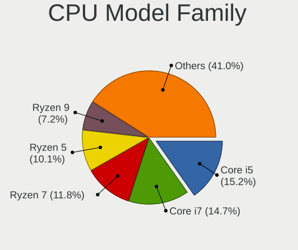

| Model                   | Desktops | Percent |
|-------------------------|----------|---------|
| Intel Core i5           | 3672     | 15.23%  |
| Intel Core i7           | 3556     | 14.75%  |
| AMD Ryzen 7             | 2839     | 11.77%  |
| AMD Ryzen 5             | 2431     | 10.08%  |
| AMD Ryzen 9             | 1726     | 7.16%   |
| Other                   | 1443     | 5.98%   |
| Intel Xeon              | 1313     | 5.45%   |
| AMD FX                  | 979      | 4.06%   |
| Intel Core i3           | 946      | 3.92%   |
| Intel Core 2 Duo        | 486      | 2.02%   |
| Intel Core i9           | 448      | 1.86%   |
| Intel Celeron           | 409      | 1.7%    |
| Intel Core 2 Quad       | 307      | 1.27%   |
| AMD Ryzen 3             | 286      | 1.19%   |
| Intel Pentium           | 279      | 1.16%   |
| AMD Ryzen Threadripper  | 264      | 1.09%   |
| AMD Phenom II X4        | 245      | 1.02%   |
| AMD A10                 | 212      | 0.88%   |
| Intel Pentium Dual-Core | 178      | 0.74%   |
| AMD Athlon II X2        | 162      | 0.67%   |
| AMD A8                  | 157      | 0.65%   |
| AMD Athlon 64 X2        | 145      | 0.6%    |
| AMD Athlon II X4        | 135      | 0.56%   |
| AMD Phenom II X6        | 123      | 0.51%   |
| AMD A6                  | 111      | 0.46%   |
| Intel Atom              | 99       | 0.41%   |
| Intel Core 2            | 94       | 0.39%   |
| Intel Pentium 4         | 87       | 0.36%   |
| AMD A4                  | 85       | 0.35%   |
| AMD Phenom              | 75       | 0.31%   |
| Intel Pentium D         | 74       | 0.31%   |
| Intel Pentium Dual      | 66       | 0.27%   |
| AMD Ryzen 5 PRO         | 62       | 0.26%   |
| AMD Athlon              | 59       | 0.24%   |
| Intel Core              | 45       | 0.19%   |
| AMD Phenom II X2        | 38       | 0.16%   |
| AMD E1                  | 36       | 0.15%   |
| AMD Sempron             | 33       | 0.14%   |
| AMD GX                  | 31       | 0.13%   |
| AMD E                   | 29       | 0.12%   |

CPU Cores
---------

Number of processor cores

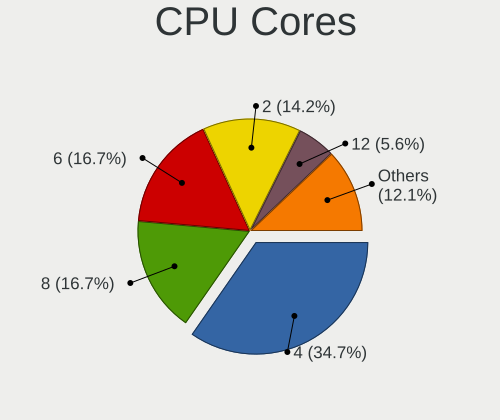

| Number  | Desktops | Percent |
|---------|----------|---------|
| 4       | 8377     | 34.67%  |
| 8       | 4047     | 16.75%  |
| 6       | 4047     | 16.75%  |
| 2       | 3429     | 14.19%  |
| 12      | 1341     | 5.55%   |
| 16      | 1144     | 4.73%   |
| 1       | 352      | 1.46%   |
| 10      | 347      | 1.44%   |
| 24      | 319      | 1.32%   |
| 3       | 301      | 1.25%   |
| 14      | 138      | 0.57%   |
| 20      | 130      | 0.54%   |
| 32      | 78       | 0.32%   |
| 18      | 31       | 0.13%   |
| 64      | 19       | 0.08%   |
| 28      | 19       | 0.08%   |
| 36      | 12       | 0.05%   |
| 5       | 8        | 0.03%   |
| Unknown | 7        | 0.03%   |
| 44      | 5        | 0.02%   |
| 22      | 4        | 0.02%   |
| 7       | 2        | 0.01%   |
| 192     | 1        | 0.004%  |
| 112     | 1        | 0.004%  |
| 48      | 1        | 0.004%  |
| 40      | 1        | 0.004%  |
| 9       | 1        | 0.004%  |

CPU Sockets
-----------

Number of sockets

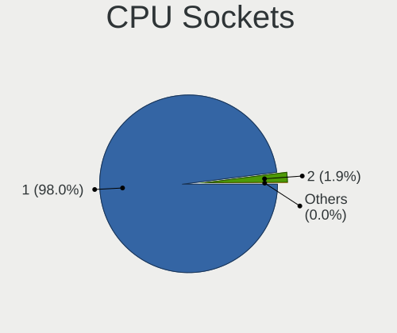

| Number  | Desktops | Percent |
|---------|----------|---------|
| 1       | 23516    | 97.98%  |
| 2       | 465      | 1.94%   |
| 4       | 8        | 0.03%   |
| Unknown | 5        | 0.02%   |
| 24      | 2        | 0.01%   |
| 20      | 2        | 0.01%   |
| 14      | 2        | 0.01%   |
| 12      | 1        | 0.004%  |

CPU Threads
-----------

Threads per core (Hyper-Threading)

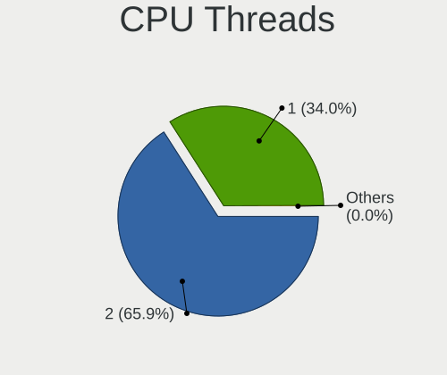

| Number  | Desktops | Percent |
|---------|----------|---------|
| 2       | 15895    | 65.95%  |
| 1       | 8191     | 33.98%  |
| Unknown | 7        | 0.03%   |
| 4       | 4        | 0.02%   |
| 8       | 3        | 0.01%   |
| 12      | 2        | 0.01%   |
| 3       | 1        | 0.004%  |

CPU Op-Modes
------------

CPU Operation Modes (32-bit, 64-bit)

| Op mode        | Desktops | Percent |
|----------------|----------|---------|
| 32-bit, 64-bit | 23748    | 98.83%  |
| Unknown        | 225      | 0.94%   |
| 32-bit         | 57       | 0.24%   |

CPU Microcode
-------------

Microcode number

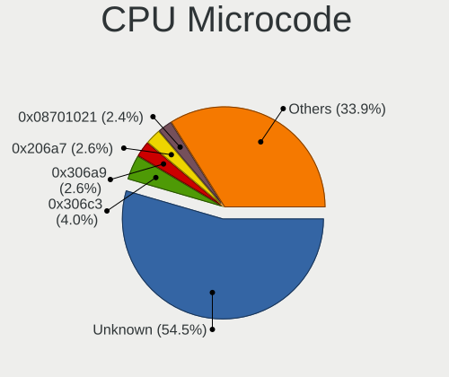

| Number     | Desktops | Percent |
|------------|----------|---------|
| Unknown    | 13758    | 54.5%   |
| 0x306c3    | 1021     | 4.04%   |
| 0x306a9    | 656      | 2.6%    |
| 0x206a7    | 650      | 2.57%   |
| 0x08701021 | 597      | 2.36%   |
| 0x1067a    | 464      | 1.84%   |
| 0x506e3    | 462      | 1.83%   |
| 0x06000852 | 399      | 1.58%   |
| 0x0800820d | 385      | 1.53%   |
| 0x906ea    | 327      | 1.3%    |
| 0x08701013 | 292      | 1.16%   |
| 0x906e9    | 289      | 1.14%   |
| 0x010000c8 | 228      | 0.9%    |
| 0x06001119 | 173      | 0.69%   |
| 0x906ed    | 164      | 0.65%   |
| 0x0a201016 | 159      | 0.63%   |
| 0xa0655    | 145      | 0.57%   |
| 0x0a601203 | 144      | 0.57%   |
| 0x08001138 | 138      | 0.55%   |
| 0x106a5    | 132      | 0.52%   |
| 0x0a20120a | 131      | 0.52%   |
| 0x306f2    | 127      | 0.5%    |
| 0x08108109 | 120      | 0.48%   |
| 0x0a201009 | 118      | 0.47%   |
| 0x08001137 | 118      | 0.47%   |
| 0x90672    | 114      | 0.45%   |
| 0x6fb      | 113      | 0.45%   |
| 0x206d7    | 107      | 0.42%   |
| 0x206c2    | 106      | 0.42%   |
| 0xa0653    | 103      | 0.41%   |
| 0x010000db | 100      | 0.4%    |
| 0x0600063e | 99       | 0.39%   |
| 0x0a50000d | 97       | 0.38%   |
| 0x0a50000c | 97       | 0.38%   |
| 0x6fd      | 94       | 0.37%   |
| 0x306e4    | 94       | 0.37%   |
| 0x06003106 | 90       | 0.36%   |
| 0x10676    | 89       | 0.35%   |
| 0xa0671    | 81       | 0.32%   |
| 0x010000dc | 78       | 0.31%   |

CPU Microarch
-------------

Microarchitecture

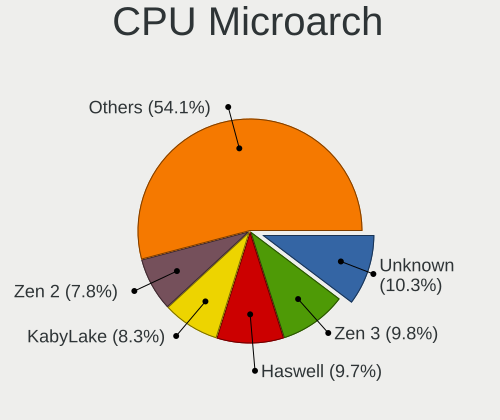

| Name             | Desktops | Percent |
|------------------|----------|---------|
| Unknown          | 2490     | 10.3%   |
| Zen 3            | 2371     | 9.81%   |
| Haswell          | 2349     | 9.72%   |
| KabyLake         | 2007     | 8.3%    |
| Zen 2            | 1879     | 7.77%   |
| IvyBridge        | 1461     | 6.04%   |
| SandyBridge      | 1291     | 5.34%   |
| Skylake          | 1270     | 5.25%   |
| Piledriver       | 1089     | 4.51%   |
| Zen+             | 1059     | 4.38%   |
| K10              | 862      | 3.57%   |
| Penryn           | 859      | 3.55%   |
| Zen              | 761      | 3.15%   |
| CometLake        | 647      | 2.68%   |
| Alderlake Hybrid | 642      | 2.66%   |
| Core             | 426      | 1.76%   |
| Nehalem          | 387      | 1.6%    |
| Westmere         | 340      | 1.41%   |
| K8 Hammer        | 221      | 0.91%   |
| Broadwell        | 199      | 0.82%   |
| Bulldozer        | 179      | 0.74%   |
| NetBurst         | 178      | 0.74%   |
| Steamroller      | 169      | 0.7%    |
| Silvermont       | 150      | 0.62%   |
| Icelake          | 140      | 0.58%   |
| Excavator        | 91       | 0.38%   |
| K10 Llano        | 86       | 0.36%   |
| Gracemont        | 80       | 0.33%   |
| Goldmont plus    | 79       | 0.33%   |
| Jaguar           | 70       | 0.29%   |
| Bobcat           | 69       | 0.29%   |
| Goldmont         | 68       | 0.28%   |
| Tremont          | 64       | 0.26%   |
| Bonnell          | 36       | 0.15%   |
| Puma             | 33       | 0.14%   |
| Lunarlake Hybrid | 28       | 0.12%   |
| TigerLake        | 23       | 0.1%    |
| P6               | 6        | 0.02%   |
| K6               | 6        | 0.02%   |
| Sapphire Rapids  | 4        | 0.02%   |

Graphics
--------

GPU Vendor
----------

Vendors of graphics cards

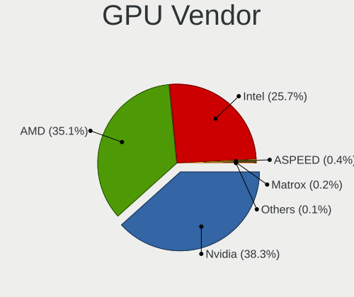

| Vendor                                       | Desktops | Percent |
|----------------------------------------------|----------|---------|
| Nvidia                                       | 10204    | 38.33%  |
| AMD                                          | 9346     | 35.11%  |
| Intel                                        | 6854     | 25.75%  |
| ASPEED Technology                            | 113      | 0.42%   |
| Matrox Electronics Systems                   | 65       | 0.24%   |
| Red Hat                                      | 11       | 0.04%   |
| XGI Technology (eXtreme Graphics Innovation) | 7        | 0.03%   |
| S3 Graphics                                  | 5        | 0.02%   |
| VIA Technologies                             | 4        | 0.02%   |
| NVidia / SGS Thomson (Joint Venture)         | 4        | 0.02%   |
| Silicon Integrated Systems [SiS]             | 3        | 0.01%   |
| ATI Technologies                             | 2        | 0.01%   |
| Zhaoxin                                      | 1        | 0.004%  |
| Microsoft                                    | 1        | 0.004%  |
| Loongson Technology                          | 1        | 0.004%  |

GPU Model
---------

Graphics card models

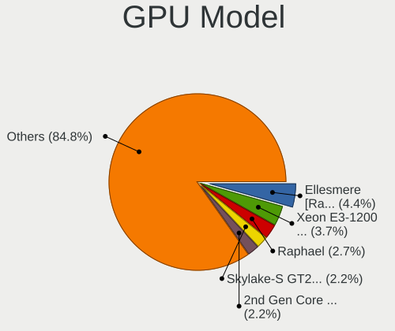

| Model                                                                       | Desktops | Percent |
|-----------------------------------------------------------------------------|----------|---------|
| AMD Ellesmere [Radeon RX 470/480/570/570X/580/580X/590]                     | 1241     | 4.39%   |
| Intel Xeon E3-1200 v3/4th Gen Core Processor Integrated Graphics Controller | 1056     | 3.74%   |
| AMD Raphael                                                                 | 762      | 2.7%    |
| Intel Skylake-S GT2 [HD Graphics 530]                                       | 622      | 2.2%    |
| Intel 2nd Generation Core Processor Family Integrated Graphics Controller   | 620      | 2.19%   |
| Intel CoffeeLake-S GT2 [UHD Graphics 630]                                   | 589      | 2.08%   |
| Intel Xeon E3-1200 v2/3rd Gen Core processor Graphics Controller            | 557      | 1.97%   |
| AMD Navi 10 [Radeon RX 5600 OEM/5600 XT / 5700/5700 XT]                     | 474      | 1.68%   |
| Nvidia GP107 [GeForce GTX 1050 Ti]                                          | 415      | 1.47%   |
| AMD Cezanne [Radeon Vega Series / Radeon Vega Mobile Series]                | 393      | 1.39%   |
| AMD Navi 22 [Radeon RX 6700/6700 XT/6750 XT / 6800M/6850M XT]               | 388      | 1.37%   |
| AMD Granite Ridge [Radeon Graphics]                                         | 387      | 1.37%   |
| AMD Navi 31 [Radeon RX 7900 XT/7900 XTX/7900 GRE/7900M]                     | 374      | 1.32%   |
| AMD Navi 23 [Radeon RX 6600/6600 XT/6600M]                                  | 357      | 1.26%   |
| Intel 4 Series Chipset Integrated Graphics Controller                       | 354      | 1.25%   |
| Nvidia GA106 [GeForce RTX 3060 Lite Hash Rate]                              | 328      | 1.16%   |
| Nvidia GK208B [GeForce GT 710]                                              | 325      | 1.15%   |
| AMD Navi 21 [Radeon RX 6800/6800 XT / 6900 XT]                              | 324      | 1.15%   |
| Nvidia GP104 [GeForce GTX 1070]                                             | 323      | 1.14%   |
| Nvidia GP104 [GeForce GTX 1080]                                             | 322      | 1.14%   |
| Intel Kaby Lake-S GT2 [HD Graphics 630]                                     | 320      | 1.13%   |
| Nvidia GP106 [GeForce GTX 1060 6GB]                                         | 296      | 1.05%   |
| Nvidia GP108 [GeForce GT 1030]                                              | 270      | 0.96%   |
| Intel CometLake-S GT2 [UHD Graphics 630]                                    | 265      | 0.94%   |
| AMD Cedar [Radeon HD 5000/6000/7350/8350 Series]                            | 263      | 0.93%   |
| Intel IvyBridge GT2 [HD Graphics 4000]                                      | 233      | 0.82%   |
| Intel Alder Lake-S GT1 [UHD Graphics 770]                                   | 223      | 0.79%   |
| Nvidia GM204 [GeForce GTX 970]                                              | 220      | 0.78%   |
| Intel Raptor Lake-S GT1 [UHD Graphics 770]                                  | 217      | 0.77%   |
| Nvidia GP102 [GeForce GTX 1080 Ti]                                          | 212      | 0.75%   |
| AMD Picasso/Raven 2 [Radeon Vega Series / Radeon Vega Mobile Series]        | 198      | 0.7%    |
| Nvidia GP106 [GeForce GTX 1060 3GB]                                         | 191      | 0.68%   |
| Nvidia TU116 [GeForce GTX 1660 SUPER]                                       | 187      | 0.66%   |
| Nvidia GM107 [GeForce GTX 750 Ti]                                           | 185      | 0.65%   |
| Nvidia AD102 [GeForce RTX 4090]                                             | 183      | 0.65%   |
| Nvidia TU104 [GeForce RTX 2070 SUPER]                                       | 179      | 0.63%   |
| AMD Navi 32 [Radeon RX 7700 XT / 7800 XT]                                   | 177      | 0.63%   |
| Nvidia GA102 [GeForce RTX 3090]                                             | 175      | 0.62%   |
| Nvidia GM206 [GeForce GTX 960]                                              | 173      | 0.61%   |
| Intel 4th Generation Core Processor Family Integrated Graphics Controller   | 173      | 0.61%   |

GPU Combo
---------

Combinations of graphics cards

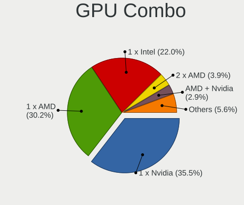

| Name                                     | Desktops | Percent |
|------------------------------------------|----------|---------|
| 1 x Nvidia                               | 8720     | 35.49%  |
| 1 x AMD                                  | 7417     | 30.19%  |
| 1 x Intel                                | 5393     | 21.95%  |
| 2 x AMD                                  | 950      | 3.87%   |
| AMD + Nvidia                             | 705      | 2.87%   |
| Intel + Nvidia                           | 515      | 2.1%    |
| Intel + AMD                              | 270      | 1.1%    |
| 2 x Nvidia                               | 200      | 0.81%   |
| 2 x Intel                                | 75       | 0.31%   |
| 1 x ASPEED                               | 73       | 0.3%    |
| 1 x Matrox                               | 47       | 0.19%   |
| Nvidia + ASPEED                          | 25       | 0.1%    |
| Other                                    | 22       | 0.09%   |
| Intel + 2 x Nvidia                       | 17       | 0.07%   |
| 2 x AMD + 1 x Nvidia                     | 13       | 0.05%   |
| AMD + 2 x Nvidia                         | 13       | 0.05%   |
| 3 x AMD                                  | 11       | 0.04%   |
| 1 x Red Hat                              | 11       | 0.04%   |
| Nvidia + Matrox                          | 11       | 0.04%   |
| AMD + ASPEED                             | 10       | 0.04%   |
| Intel + AMD + 1 x Nvidia                 | 9        | 0.04%   |
| Intel + 2 x AMD                          | 8        | 0.03%   |
| 1 x XGI                                  | 6        | 0.02%   |
| AMD + Matrox                             | 6        | 0.02%   |
| 3 x Nvidia                               | 5        | 0.02%   |
| 1 x S3 Graphics                          | 4        | 0.02%   |
| 1 x VIA                                  | 3        | 0.01%   |
| 1 x SiS                                  | 3        | 0.01%   |
| 1 x NVidia / SGS Thomson (Joint Venture) | 3        | 0.01%   |
| 2 x Nvidia + 1 x ASPEED                  | 2        | 0.01%   |
| Intel + AMD + 2 x Nvidia                 | 2        | 0.01%   |
| 6 x Nvidia                               | 1        | 0.004%  |
| 4 x Nvidia                               | 1        | 0.004%  |
| 4 x AMD                                  | 1        | 0.004%  |
| 3 x AMD + 1 x Nvidia                     | 1        | 0.004%  |
| 2 x Intel + 1 x AMD                      | 1        | 0.004%  |
| 2 x AMD + 1 x Nvidia + 1 x ASPEED        | 1        | 0.004%  |
| 2 x AMD + 1 x ASPEED                     | 1        | 0.004%  |
| 1 x Zhaoxin                              | 1        | 0.004%  |
| Nvidia + XGI                             | 1        | 0.004%  |

GPU Driver
----------

Free vs proprietary

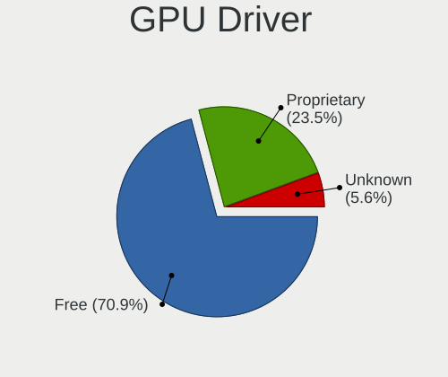

| Driver      | Desktops | Percent |
|-------------|----------|---------|
| Free        | 17469    | 70.91%  |
| Proprietary | 5784     | 23.48%  |
| Unknown     | 1383     | 5.61%   |

GPU Memory
----------

Total video memory

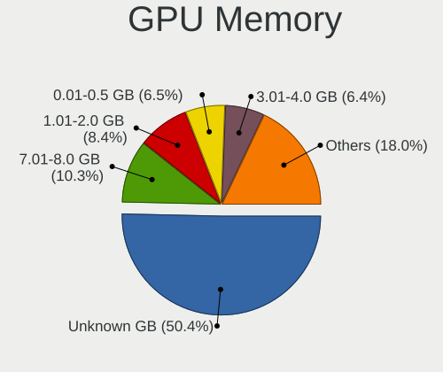

| Size in GB     | Desktops | Percent |
|----------------|----------|---------|
| Unknown        | 12681    | 50.35%  |
| 7.01-8.0       | 2595     | 10.3%   |
| 1.01-2.0       | 2124     | 8.43%   |
| 0.01-0.5       | 1637     | 6.5%    |
| 3.01-4.0       | 1621     | 6.44%   |
| 0.51-1.0       | 1607     | 6.38%   |
| 8.01-16.0      | 1508     | 5.99%   |
| 5.01-6.0       | 752      | 2.99%   |
| 16.01-24.0     | 385      | 1.53%   |
| 2.01-3.0       | 245      | 0.97%   |
| 4.01-5.0       | 12       | 0.05%   |
| 24.01-32.0     | 9        | 0.04%   |
| 32.01-64.0     | 7        | 0.03%   |
| More than 64.0 | 1        | 0.004%  |
| 6.01-7.0       | 1        | 0.004%  |

Monitor
-------

Monitor Vendor
--------------

Monitor vendors

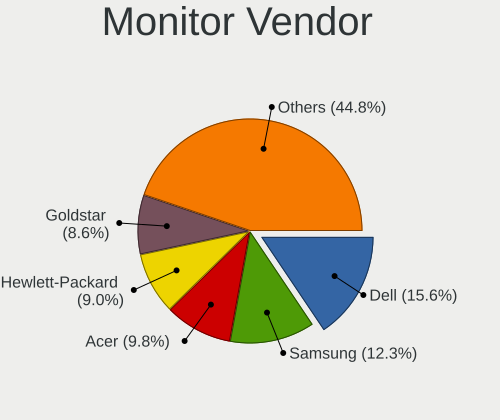

| Vendor               | Desktops | Percent |
|----------------------|----------|---------|
| Dell                 | 4204     | 15.59%  |
| Samsung Electronics  | 3314     | 12.29%  |
| Acer                 | 2642     | 9.8%    |
| Hewlett-Packard      | 2423     | 8.98%   |
| Goldstar             | 2308     | 8.56%   |
| Ancor Communications | 1454     | 5.39%   |
| ViewSonic            | 884      | 3.28%   |
| ASUSTek Computer     | 879      | 3.26%   |
| AOC                  | 854      | 3.17%   |
| Sceptre Tech         | 751      | 2.78%   |
| Vizio                | 684      | 2.54%   |
| MSI                  | 447      | 1.66%   |
| BenQ                 | 417      | 1.55%   |
| Unknown              | 349      | 1.29%   |
| Sony                 | 347      | 1.29%   |
| Lenovo               | 324      | 1.2%    |
| Gigabyte Technology  | 287      | 1.06%   |
| Insignia             | 273      | 1.01%   |
| LG Electronics       | 227      | 0.84%   |
| Philips              | 176      | 0.65%   |
| ONN                  | 143      | 0.53%   |
| HannStar             | 130      | 0.48%   |
| NEC Computers        | 118      | 0.44%   |
| Toshiba              | 116      | 0.43%   |
| Gateway              | 113      | 0.42%   |
| Unknown              | 107      | 0.4%    |
| Hitachi              | 89       | 0.33%   |
| Westinghouse         | 86       | 0.32%   |
| Sharp                | 83       | 0.31%   |
| Pixio                | 82       | 0.3%    |
| Element              | 82       | 0.3%    |
| Apple                | 81       | 0.3%    |
| Viotek               | 76       | 0.28%   |
| Panasonic            | 66       | 0.24%   |
| RTK                  | 63       | 0.23%   |
| HKC                  | 63       | 0.23%   |
| VIZ                  | 61       | 0.23%   |
| Unknown (XXX)        | 57       | 0.21%   |
| Planar               | 57       | 0.21%   |
| SANYO                | 52       | 0.19%   |

Monitor Model
-------------

Monitor models

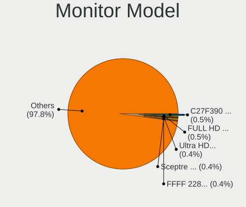

| Model                                                                 | Desktops | Percent |
|-----------------------------------------------------------------------|----------|---------|
| Samsung Electronics C27F390 SAM0D32 1920x1080 598x336mm 27.0-inch     | 156      | 0.53%   |
| Goldstar FULL HD GSM5B55 1920x1080 480x270mm 21.7-inch                | 139      | 0.48%   |
| Goldstar Ultra HD GSM5B09 3840x2160 600x340mm 27.2-inch               | 119      | 0.41%   |
| Sceptre Tech Sceptre F24 SPT09AB 1920x1080 530x290mm 23.8-inch        | 111      | 0.38%   |
| Unknown LCD Monitor FFFF 2288x1287 2550x2550mm 142.0-inch             | 108      | 0.37%   |
| Unknown                                                               | 107      | 0.37%   |
| Goldstar LG ULTRAWIDE GSM59F1 2560x1080 670x280mm 28.6-inch           | 105      | 0.36%   |
| ONN ONA18HO015 ONN0101 1920x1080 698x393mm 31.5-inch                  | 94       | 0.32%   |
| Acer SB220Q ACR06AB 1920x1080 476x268mm 21.5-inch                     | 92       | 0.31%   |
| Sceptre Tech Sceptre E24 SPT099D 1920x1080 521x293mm 23.5-inch        | 83       | 0.28%   |
| Samsung Electronics C24F390 SAM0D2C 1920x1080 521x293mm 23.5-inch     | 79       | 0.27%   |
| Goldstar 27GL850 GSM5B7F 2560x1440 597x336mm 27.0-inch                | 79       | 0.27%   |
| Ancor Communications VG248 ACI24A4 1920x1080 531x299mm 24.0-inch      | 74       | 0.25%   |
| Ancor Communications ASUS VS247 ACI249A 1920x1080 521x293mm 23.5-inch | 74       | 0.25%   |
| Sceptre Tech Sceptre J20 SPT080D 1600x900 435x237mm 19.5-inch         | 73       | 0.25%   |
| MSI Optix MAG27CQ MSI1462 2560x1440 597x336mm 27.0-inch               | 73       | 0.25%   |
| Goldstar LG TV SSCR2 GSMC0C8 3840x2160                                | 72       | 0.25%   |
| Dell U2412M DELA07A 1920x1200 518x324mm 24.1-inch                     | 71       | 0.24%   |
| Ancor Communications VE247 ACI2493 1920x1080 530x300mm 24.0-inch      | 66       | 0.23%   |
| Goldstar Ultra HD GSM5B08 3840x2160 600x340mm 27.2-inch               | 64       | 0.22%   |
| Dell SE2717H/HX DELD0A1 1920x1080 598x336mm 27.0-inch                 | 62       | 0.21%   |
| Goldstar ULTRAGEAR GSM7766 2560x1440 697x392mm 31.5-inch              | 61       | 0.21%   |
| Goldstar HDR 4K GSM7706 3840x2160 600x340mm 27.2-inch                 | 60       | 0.21%   |
| Sceptre Tech Sceptre F27 SPT0AD7 1920x1080 600x330mm 27.0-inch        | 57       | 0.19%   |
| Acer H236HL ACR0318 1920x1080 509x286mm 23.0-inch                     | 57       | 0.19%   |
| Goldstar HDR 4K GSM7707 3840x2160 600x340mm 27.2-inch                 | 56       | 0.19%   |
| ASUSTek Computer VG245 AUS24A1 1920x1080 531x299mm 24.0-inch          | 56       | 0.19%   |
| Ancor Communications ASUS VS228 ACI22FD 1920x1080 476x268mm 21.5-inch | 55       | 0.19%   |
| Dell S2716DG DELA0D1 2560x1440 598x336mm 27.0-inch                    | 53       | 0.18%   |
| Hewlett-Packard VH240a HPN3499 1920x1080 527x296mm 23.8-inch          | 51       | 0.17%   |
| AOC 27G2G4 AOC2702 1920x1080 598x336mm 27.0-inch                      | 51       | 0.17%   |
| Ancor Communications VE248 ACI2494 1920x1080 531x299mm 24.0-inch      | 51       | 0.17%   |
| Vizio D43f-F1 VIZ1027 1920x1080 940x529mm 42.5-inch                   | 49       | 0.17%   |
| Toshiba TV TSB0206 1920x1080                                          | 49       | 0.17%   |
| Samsung Electronics U28E590 SAM0C4D 3840x2160 607x345mm 27.5-inch     | 49       | 0.17%   |
| Gigabyte Technology M27Q GBT270D 2560x1440 597x336mm 27.0-inch        | 49       | 0.17%   |
| Acer R240HY ACR046F 1920x1080 527x296mm 23.8-inch                     | 49       | 0.17%   |
| Vizio E500i-B1 VIZ1004 1920x1080 1095x616mm 49.5-inch                 | 48       | 0.16%   |
| Vizio D24-D1 VIZ1005 1920x1080 521x293mm 23.5-inch                    | 47       | 0.16%   |
| Sceptre Tech Sceptre F27 SPT0ABF 1920x1080 409x230mm 18.5-inch        | 47       | 0.16%   |

Monitor Resolution
------------------

Monitor screen resolution

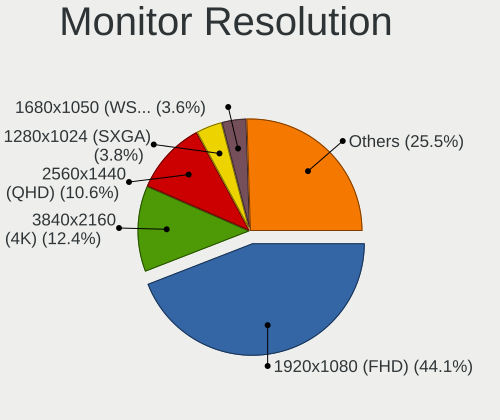

| Resolution         | Desktops | Percent |
|--------------------|----------|---------|
| 1920x1080 (FHD)    | 11441    | 44.1%   |
| 3840x2160 (4K)     | 3228     | 12.44%  |
| 2560x1440 (QHD)    | 2745     | 10.58%  |
| 1280x1024 (SXGA)   | 989      | 3.81%   |
| 1680x1050 (WSXGA+) | 921      | 3.55%   |
| 3440x1440          | 899      | 3.47%   |
| 1600x900 (HD+)     | 895      | 3.45%   |
| 1440x900 (WXGA+)   | 652      | 2.51%   |
| 1920x1200 (WUXGA)  | 622      | 2.4%    |
| Unknown            | 592      | 2.28%   |
| 1366x768 (WXGA)    | 510      | 1.97%   |
| 2560x1080          | 439      | 1.69%   |
| 3840x1080          | 397      | 1.53%   |
| 1360x768           | 284      | 1.09%   |
| 1920x540           | 230      | 0.89%   |
| 1024x768 (XGA)     | 128      | 0.49%   |
| 2288x1287          | 117      | 0.45%   |
| 1600x1200          | 94       | 0.36%   |
| 2560x1600          | 82       | 0.32%   |
| 3840x1600          | 74       | 0.29%   |
| 1280x720 (HD)      | 49       | 0.19%   |
| 3840x1200          | 35       | 0.13%   |
| 4480x1440          | 29       | 0.11%   |
| 5760x1080          | 28       | 0.11%   |
| 2048x1152          | 27       | 0.1%    |
| 1280x960           | 22       | 0.08%   |
| 5760x2160          | 20       | 0.08%   |
| 7680x2160          | 18       | 0.07%   |
| 5120x1440          | 17       | 0.07%   |
| 3520x1080          | 17       | 0.07%   |
| 1400x1050          | 16       | 0.06%   |
| 3600x1080          | 15       | 0.06%   |
| 6400x1440          | 11       | 0.04%   |
| 2560x1397          | 11       | 0.04%   |
| 2160x1200          | 11       | 0.04%   |
| 3200x1080          | 10       | 0.04%   |
| 4480x1080          | 9        | 0.03%   |
| 2560x2880          | 9        | 0.03%   |
| 2160x1440          | 8        | 0.03%   |
| 3200x900           | 7        | 0.03%   |

Monitor Diagonal
----------------

Diagonal size in inches

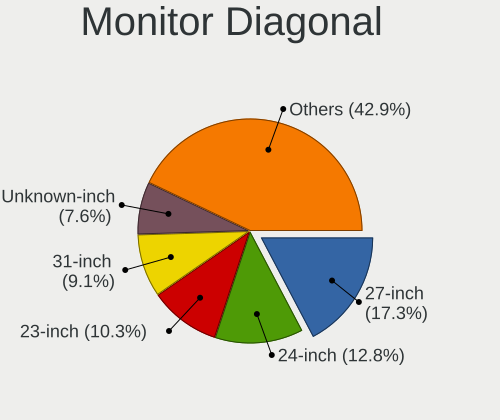

| Inches  | Desktops | Percent |
|---------|----------|---------|
| 27      | 4642     | 17.3%   |
| 24      | 3427     | 12.77%  |
| 23      | 2766     | 10.31%  |
| 31      | 2452     | 9.14%   |
| Unknown | 2031     | 7.57%   |
| 21      | 1842     | 6.86%   |
| 19      | 1150     | 4.29%   |
| 34      | 1138     | 4.24%   |
| 20      | 935      | 3.48%   |
| 22      | 689      | 2.57%   |
| 17      | 523      | 1.95%   |
| 32      | 521      | 1.94%   |
| 84      | 395      | 1.47%   |
| 18      | 371      | 1.38%   |
| 72      | 328      | 1.22%   |
| 40      | 325      | 1.21%   |
| 54      | 304      | 1.13%   |
| 15      | 274      | 1.02%   |
| 26      | 251      | 0.94%   |
| 48      | 201      | 0.75%   |
| 25      | 177      | 0.66%   |
| 49      | 176      | 0.66%   |
| 74      | 164      | 0.61%   |
| 29      | 152      | 0.57%   |
| 42      | 138      | 0.51%   |
| 63      | 120      | 0.45%   |
| 28      | 118      | 0.44%   |
| 142     | 108      | 0.4%    |
| 37      | 107      | 0.4%    |
| 36      | 102      | 0.38%   |
| 38      | 88       | 0.33%   |
| 46      | 80       | 0.3%    |
| 35      | 70       | 0.26%   |
| 52      | 61       | 0.23%   |
| 39      | 50       | 0.19%   |
| 65      | 44       | 0.16%   |
| 43      | 44       | 0.16%   |
| 16      | 39       | 0.15%   |
| 47      | 35       | 0.13%   |
| 57      | 34       | 0.13%   |

Monitor Width
-------------

Physical width

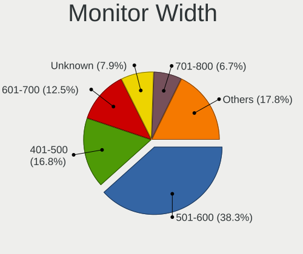

| Width in mm    | Desktops | Percent |
|----------------|----------|---------|
| 501-600        | 9859     | 38.34%  |
| 401-500        | 4331     | 16.84%  |
| 601-700        | 3204     | 12.46%  |
| Unknown        | 2031     | 7.9%    |
| 701-800        | 1725     | 6.71%   |
| 1001-1500      | 1175     | 4.57%   |
| 1501-2000      | 947      | 3.68%   |
| 301-350        | 755      | 2.94%   |
| 801-900        | 657      | 2.55%   |
| 351-400        | 609      | 2.37%   |
| 901-1000       | 224      | 0.87%   |
| More than 2000 | 113      | 0.44%   |
| 201-300        | 78       | 0.3%    |
| 101-200        | 6        | 0.02%   |
| 1-100          | 1        | 0.004%  |

Aspect Ratio
------------

Proportional relationship between the width and the height

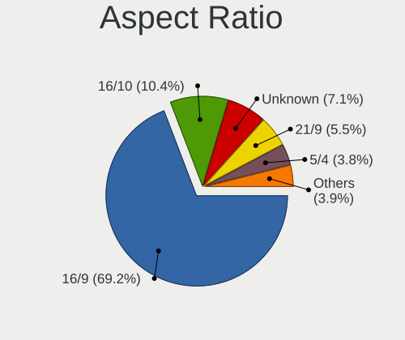

| Ratio   | Desktops | Percent |
|---------|----------|---------|
| 16/9    | 16450    | 69.18%  |
| 16/10   | 2483     | 10.44%  |
| Unknown | 1685     | 7.09%   |
| 21/9    | 1315     | 5.53%   |
| 5/4     | 910      | 3.83%   |
| 32/9    | 307      | 1.29%   |
| 4/3     | 285      | 1.2%    |
| 1.00    | 116      | 0.49%   |
| 6/5     | 63       | 0.26%   |
| 3/2     | 62       | 0.26%   |
| 1.96    | 44       | 0.19%   |
| 2.12    | 13       | 0.05%   |
| 0.89    | 9        | 0.04%   |
| 3.20    | 8        | 0.03%   |
| 3.75    | 5        | 0.02%   |
| 0.56    | 5        | 0.02%   |
| 2.01    | 4        | 0.02%   |
| 2.00    | 2        | 0.01%   |
| 0.57    | 2        | 0.01%   |
| 0.22    | 2        | 0.01%   |
| 2.70    | 1        | 0.004%  |
| 2.69    | 1        | 0.004%  |
| 2.51    | 1        | 0.004%  |
| 11/10   | 1        | 0.004%  |
| 0.80    | 1        | 0.004%  |
| 0.62    | 1        | 0.004%  |
| 0.25    | 1        | 0.004%  |

Monitor Area
------------

Area in inch²

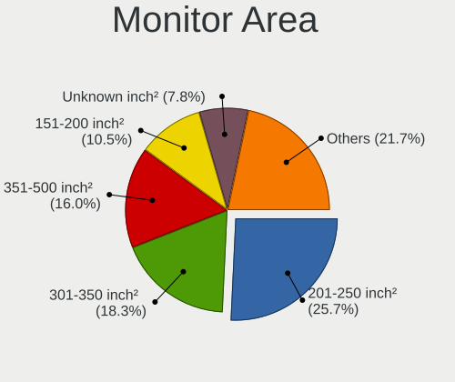

| Area in inch² | Desktops | Percent |
|----------------|----------|---------|
| 201-250        | 6735     | 25.75%  |
| 301-350        | 4786     | 18.3%   |
| 351-500        | 4191     | 16.02%  |
| 151-200        | 2734     | 10.45%  |
| Unknown        | 2031     | 7.76%   |
| More than 1000 | 1814     | 6.93%   |
| 251-300        | 1391     | 5.32%   |
| 501-1000       | 1341     | 5.13%   |
| 141-150        | 669      | 2.56%   |
| 101-110        | 253      | 0.97%   |
| 131-140        | 48       | 0.18%   |
| 111-120        | 48       | 0.18%   |
| 71-80          | 25       | 0.1%    |
| 121-130        | 21       | 0.08%   |
| 51-60          | 20       | 0.08%   |
| 81-90          | 19       | 0.07%   |
| 91-100         | 19       | 0.07%   |
| 1-40           | 7        | 0.03%   |
| 41-50          | 4        | 0.02%   |
| 61-70          | 2        | 0.01%   |

Pixel Density
-------------

Pixels per inch

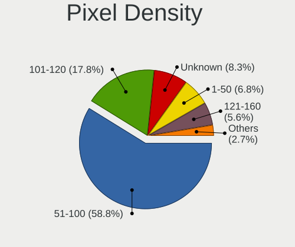

| Density       | Desktops | Percent |
|---------------|----------|---------|
| 51-100        | 14486    | 58.84%  |
| 101-120       | 4386     | 17.81%  |
| Unknown       | 2033     | 8.26%   |
| 1-50          | 1675     | 6.8%    |
| 121-160       | 1386     | 5.63%   |
| 161-240       | 643      | 2.61%   |
| More than 240 | 12       | 0.05%   |

Multiple Monitors
-----------------

Total monitors connected

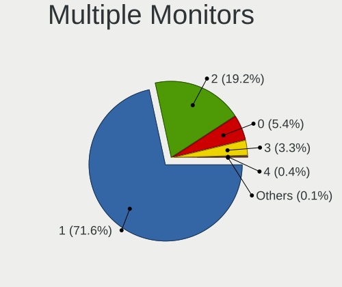

| Total | Desktops | Percent |
|-------|----------|---------|
| 1     | 17778    | 71.63%  |
| 2     | 4763     | 19.19%  |
| 0     | 1346     | 5.42%   |
| 3     | 813      | 3.28%   |
| 4     | 102      | 0.41%   |
| 5     | 9        | 0.04%   |
| 6     | 7        | 0.03%   |
| 7     | 1        | 0.004%  |

Network
-------

Net Controller Vendor
---------------------

Controller vendors

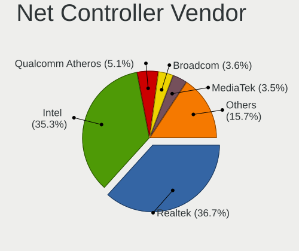

| Vendor                                | Desktops | Percent |
|---------------------------------------|----------|---------|
| Realtek Semiconductor                 | 13740    | 36.71%  |
| Intel                                 | 13216    | 35.31%  |
| Qualcomm Atheros                      | 1907     | 5.09%   |
| Broadcom                              | 1360     | 3.63%   |
| MediaTek                              | 1322     | 3.53%   |
| Ralink Technology                     | 660      | 1.76%   |
| NetGear                               | 475      | 1.27%   |
| Ralink                                | 428      | 1.14%   |
| TP-Link                               | 426      | 1.14%   |
| Nvidia                                | 393      | 1.05%   |
| Aquantia                              | 342      | 0.91%   |
| Microsoft                             | 235      | 0.63%   |
| Samsung Electronics                   | 208      | 0.56%   |
| Broadcom Limited                      | 200      | 0.53%   |
| Linksys                               | 182      | 0.49%   |
| ASIX Electronics                      | 170      | 0.45%   |
| ASUSTek Computer                      | 145      | 0.39%   |
| Marvell Technology Group              | 130      | 0.35%   |
| Qualcomm Technologies                 | 129      | 0.34%   |
| Belkin Components                     | 115      | 0.31%   |
| Mellanox Technologies                 | 91       | 0.24%   |
| D-Link System                         | 89       | 0.24%   |
| Motorola PCS                          | 88       | 0.24%   |
| Edimax Technology                     | 87       | 0.23%   |
| Qualcomm Atheros Communications       | 86       | 0.23%   |
| Google                                | 75       | 0.2%    |
| InterBiometrics                       | 74       | 0.2%    |
| DisplayLink                           | 72       | 0.19%   |
| Microchip Technology                  | 43       | 0.11%   |
| 802.11g Adapter [Linksys WUSB54GC v3] | 42       | 0.11%   |
| D-Link                                | 40       | 0.11%   |
| Qualcomm                              | 38       | 0.1%    |
| Apple                                 | 36       | 0.1%    |
| Arduino SA                            | 35       | 0.09%   |
| American Future Technology            | 30       | 0.08%   |
| QinHeng Electronics                   | 28       | 0.07%   |
| U-Blox                                | 25       | 0.07%   |
| Gemtek                                | 23       | 0.06%   |
| Realtek                               | 21       | 0.06%   |
| American Megatrends                   | 21       | 0.06%   |

Net Controller Model
--------------------

Controller models

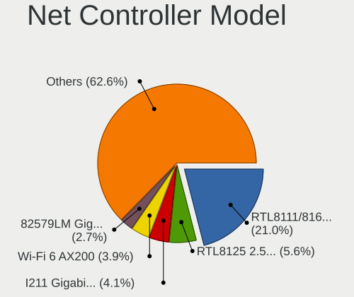

| Model                                                                  | Desktops | Percent |
|------------------------------------------------------------------------|----------|---------|
| Realtek RTL8111/8168/8211/8411 PCI Express Gigabit Ethernet Controller | 9317     | 21.01%  |
| Realtek RTL8125 2.5GbE Controller                                      | 2492     | 5.62%   |
| Intel I211 Gigabit Network Connection                                  | 1835     | 4.14%   |
| Intel Wi-Fi 6 AX200                                                    | 1711     | 3.86%   |
| Intel 82579LM Gigabit Network Connection (Lewisville)                  | 1209     | 2.73%   |
| Intel Ethernet Controller I225-V                                       | 1206     | 2.72%   |
| Intel Ethernet Connection (2) I219-V                                   | 889      | 2%      |
| Intel Dual Band Wireless-AC 3168NGW [Stone Peak]                       | 839      | 1.89%   |
| Intel Ethernet Connection I217-LM                                      | 805      | 1.82%   |
| Intel Wi-Fi 6E(802.11ax) AX210/AX1675* 2x2 [Typhoon Peak]              | 801      | 1.81%   |
| MediaTek MT7922 802.11ax PCI Express Wireless Network Adapter          | 582      | 1.31%   |
| Intel Wi-Fi 5(802.11ac) Wireless-AC 9x6x [Thunder Peak]                | 495      | 1.12%   |
| Realtek RTL8821CE 802.11ac PCIe Wireless Network Adapter               | 459      | 1.04%   |
| Intel Ethernet Connection (7) I219-V                                   | 458      | 1.03%   |
| Realtek RTL88x2bu [AC1200 Techkey]                                     | 422      | 0.95%   |
| Intel Ethernet Controller I226-V                                       | 389      | 0.88%   |
| Intel Ethernet Connection (2) I219-LM                                  | 358      | 0.81%   |
| Realtek 802.11ac NIC                                                   | 351      | 0.79%   |
| Intel 82574L Gigabit Network Connection                                | 337      | 0.76%   |
| Broadcom BCM4360 802.11ac Dual Band Wireless Network Adapter           | 311      | 0.7%    |
| MediaTek MT7921K (RZ608) Wi-Fi 6E 80MHz                                | 307      | 0.69%   |
| Intel 82579V Gigabit Network Connection                                | 299      | 0.67%   |
| Realtek RTL8153 Gigabit Ethernet Adapter                               | 298      | 0.67%   |
| Intel Ethernet Connection (2) I218-V                                   | 288      | 0.65%   |
| Intel Cannon Lake PCH CNVi WiFi                                        | 285      | 0.64%   |
| Intel 700 Series Chipset CNVi WiFi                                     | 280      | 0.63%   |
| Intel Alder Lake-S PCH CNVi WiFi                                       | 278      | 0.63%   |
| Intel 82567LM-3 Gigabit Network Connection                             | 267      | 0.6%    |
| Intel Wireless 7260                                                    | 241      | 0.54%   |
| Realtek RTL810xE PCI Express Fast Ethernet controller                  | 240      | 0.54%   |
| Qualcomm Atheros AR9485 Wireless Network Adapter                       | 237      | 0.53%   |
| Intel Wireless 7265                                                    | 235      | 0.53%   |
| Intel I210 Gigabit Network Connection                                  | 235      | 0.53%   |
| Realtek RTL8188EUS 802.11n Wireless Network Adapter                    | 220      | 0.5%    |
| Intel Wireless 3165                                                    | 216      | 0.49%   |
| Intel Ethernet Connection I217-V                                       | 211      | 0.48%   |
| Nvidia MCP61 Ethernet                                                  | 207      | 0.47%   |
| Qualcomm Atheros QCA9565 / AR9565 Wireless Network Adapter             | 204      | 0.46%   |
| Intel Wireless 8260                                                    | 200      | 0.45%   |
| Ralink MT7601U Wireless Adapter                                        | 197      | 0.44%   |

Wireless Vendor
---------------

Wireless vendors

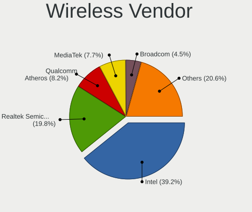

| Vendor                                | Desktops | Percent |
|---------------------------------------|----------|---------|
| Intel                                 | 6135     | 39.23%  |
| Realtek Semiconductor                 | 3095     | 19.79%  |
| Qualcomm Atheros                      | 1285     | 8.22%   |
| MediaTek                              | 1199     | 7.67%   |
| Broadcom                              | 697      | 4.46%   |
| Ralink Technology                     | 660      | 4.22%   |
| NetGear                               | 473      | 3.02%   |
| Ralink                                | 428      | 2.74%   |
| TP-Link                               | 416      | 2.66%   |
| Microsoft                             | 229      | 1.46%   |
| Linksys                               | 174      | 1.11%   |
| ASUSTek Computer                      | 136      | 0.87%   |
| Belkin Components                     | 111      | 0.71%   |
| Edimax Technology                     | 87       | 0.56%   |
| Qualcomm Atheros Communications       | 86       | 0.55%   |
| Broadcom Limited                      | 84       | 0.54%   |
| D-Link System                         | 51       | 0.33%   |
| 802.11g Adapter [Linksys WUSB54GC v3] | 42       | 0.27%   |
| D-Link                                | 39       | 0.25%   |
| Qualcomm Technologies                 | 26       | 0.17%   |
| Gemtek                                | 23       | 0.15%   |
| Realtek                               | 21       | 0.13%   |
| Wilocity                              | 19       | 0.12%   |
| Micro Star International              | 16       | 0.1%    |
| ZyDAS                                 | 13       | 0.08%   |
| Marvell Technology Group              | 11       | 0.07%   |
| Wacom                                 | 6        | 0.04%   |
| Senao                                 | 6        | 0.04%   |
| BUFFALO                               | 6        | 0.04%   |
| TRENDnet                              | 5        | 0.03%   |
| Panasonic (Matsushita)                | 5        | 0.03%   |
| IMC Networks                          | 5        | 0.03%   |
| Accton Technology                     | 5        | 0.03%   |
| ZyXEL Communications                  | 4        | 0.03%   |
| Texas Instruments                     | 4        | 0.03%   |
| Samsung Electronics                   | 4        | 0.03%   |
| Belkin                                | 4        | 0.03%   |
| LG Electronics                        | 3        | 0.02%   |
| Dell                                  | 3        | 0.02%   |
| Apple                                 | 3        | 0.02%   |

Wireless Model
--------------

Wireless models

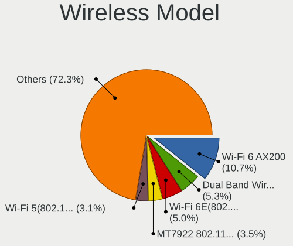

| Model                                                          | Desktops | Percent |
|----------------------------------------------------------------|----------|---------|
| Intel Wi-Fi 6 AX200                                            | 1711     | 10.75%  |
| Intel Dual Band Wireless-AC 3168NGW [Stone Peak]               | 839      | 5.27%   |
| Intel Wi-Fi 6E(802.11ax) AX210/AX1675* 2x2 [Typhoon Peak]      | 801      | 5.03%   |
| MediaTek MT7922 802.11ax PCI Express Wireless Network Adapter  | 560      | 3.52%   |
| Intel Wi-Fi 5(802.11ac) Wireless-AC 9x6x [Thunder Peak]        | 495      | 3.11%   |
| Realtek RTL8821CE 802.11ac PCIe Wireless Network Adapter       | 459      | 2.88%   |
| Realtek RTL88x2bu [AC1200 Techkey]                             | 422      | 2.65%   |
| Realtek 802.11ac NIC                                           | 351      | 2.2%    |
| Broadcom BCM4360 802.11ac Dual Band Wireless Network Adapter   | 311      | 1.95%   |
| MediaTek MT7921K (RZ608) Wi-Fi 6E 80MHz                        | 307      | 1.93%   |
| Intel Cannon Lake PCH CNVi WiFi                                | 285      | 1.79%   |
| Intel 700 Series Chipset CNVi WiFi                             | 275      | 1.73%   |
| Intel Wireless 7260                                            | 241      | 1.51%   |
| Qualcomm Atheros AR9485 Wireless Network Adapter               | 237      | 1.49%   |
| Intel Wireless 7265                                            | 235      | 1.48%   |
| Realtek RTL8188EUS 802.11n Wireless Network Adapter            | 220      | 1.38%   |
| Intel Wireless 3165                                            | 216      | 1.36%   |
| Qualcomm Atheros QCA9565 / AR9565 Wireless Network Adapter     | 204      | 1.28%   |
| Intel Wireless 8260                                            | 200      | 1.26%   |
| Ralink MT7601U Wireless Adapter                                | 197      | 1.24%   |
| Qualcomm Atheros AR93xx Wireless Network Adapter               | 174      | 1.09%   |
| Intel Wireless 8265 / 8275                                     | 162      | 1.02%   |
| Intel Comet Lake PCH CNVi WiFi                                 | 162      | 1.02%   |
| Intel Alder Lake-S PCH CNVi WiFi                               | 149      | 0.94%   |
| Realtek RTL8852CE PCIe 802.11ax Wireless Network Controller    | 148      | 0.93%   |
| Qualcomm Atheros QCA6174 802.11ac Wireless Network Adapter     | 145      | 0.91%   |
| Realtek RTL8822CE 802.11ac PCIe Wireless Network Adapter       | 124      | 0.78%   |
| Qualcomm Atheros QCA9377 802.11ac Wireless Network Adapter     | 124      | 0.78%   |
| Realtek RTL8822BE 802.11a/b/g/n/ac WiFi adapter                | 117      | 0.73%   |
| Qualcomm Atheros AR9462 Wireless Network Adapter               | 117      | 0.73%   |
| NetGear A6100 AC600 DB Wireless Adapter [Realtek RTL8811AU]    | 112      | 0.7%    |
| Realtek RTL8852BE PCIe 802.11ax Wireless Network Controller    | 111      | 0.7%    |
| Realtek RTL8812AE 802.11ac PCIe Wireless Network Adapter       | 111      | 0.7%    |
| Ralink RT5370 Wireless Adapter                                 | 110      | 0.69%   |
| NetGear A6210                                                  | 109      | 0.68%   |
| Realtek RTL8821AE 802.11ac PCIe Wireless Network Adapter       | 106      | 0.67%   |
| Intel Tiger Lake PCH CNVi WiFi                                 | 100      | 0.63%   |
| Realtek RTL8812AU 802.11a/b/g/n/ac 2T2R DB WLAN Adapter        | 97       | 0.61%   |
| Ralink RT5372 Wireless Adapter                                 | 95       | 0.6%    |
| Qualcomm Atheros AR928X Wireless Network Adapter (PCI-Express) | 95       | 0.6%    |

Ethernet Vendor
---------------

Ethernet vendors

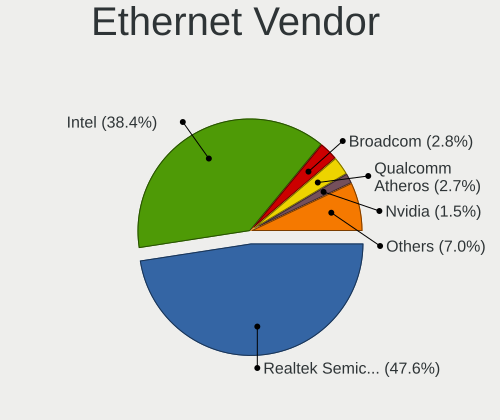

| Vendor                     | Desktops | Percent |
|----------------------------|----------|---------|
| Realtek Semiconductor      | 12595    | 47.57%  |
| Intel                      | 10175    | 38.43%  |
| Broadcom                   | 731      | 2.76%   |
| Qualcomm Atheros           | 721      | 2.72%   |
| Nvidia                     | 393      | 1.48%   |
| Aquantia                   | 342      | 1.29%   |
| Samsung Electronics        | 202      | 0.76%   |
| ASIX Electronics           | 170      | 0.64%   |
| Marvell Technology Group   | 119      | 0.45%   |
| Broadcom Limited           | 117      | 0.44%   |
| MediaTek                   | 106      | 0.4%    |
| Qualcomm Technologies      | 103      | 0.39%   |
| Motorola PCS               | 88       | 0.33%   |
| Mellanox Technologies      | 77       | 0.29%   |
| DisplayLink                | 72       | 0.27%   |
| Google                     | 71       | 0.27%   |
| D-Link System              | 38       | 0.14%   |
| Qualcomm                   | 37       | 0.14%   |
| Apple                      | 28       | 0.11%   |
| American Megatrends        | 21       | 0.08%   |
| 3Com                       | 21       | 0.08%   |
| OPPO Electronics           | 18       | 0.07%   |
| VIA Technologies           | 17       | 0.06%   |
| ADMtek                     | 14       | 0.05%   |
| T & A Mobile Phones        | 12       | 0.05%   |
| Solarflare Communications  | 11       | 0.04%   |
| LG Electronics             | 11       | 0.04%   |
| TP-Link                    | 10       | 0.04%   |
| Accton Technology          | 10       | 0.04%   |
| Tehuti Networks            | 9        | 0.03%   |
| ASUSTek Computer           | 9        | 0.03%   |
| Linksys                    | 8        | 0.03%   |
| Emulex                     | 8        | 0.03%   |
| Lenovo                     | 7        | 0.03%   |
| Insyde Software            | 7        | 0.03%   |
| ZTE WCDMA Technologies MSM | 5        | 0.02%   |
| Spreadtrum Communications  | 5        | 0.02%   |
| QLogic                     | 5        | 0.02%   |
| Novatel Wireless           | 5        | 0.02%   |
| Microsoft                  | 5        | 0.02%   |

Ethernet Model
--------------

Ethernet models

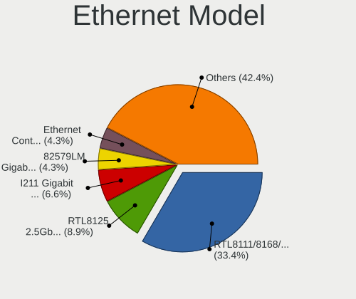

| Model                                                                           | Desktops | Percent |
|---------------------------------------------------------------------------------|----------|---------|
| Realtek RTL8111/8168/8211/8411 PCI Express Gigabit Ethernet Controller          | 9317     | 33.42%  |
| Realtek RTL8125 2.5GbE Controller                                               | 2492     | 8.94%   |
| Intel I211 Gigabit Network Connection                                           | 1835     | 6.58%   |
| Intel 82579LM Gigabit Network Connection (Lewisville)                           | 1209     | 4.34%   |
| Intel Ethernet Controller I225-V                                                | 1206     | 4.33%   |
| Intel Ethernet Connection (2) I219-V                                            | 889      | 3.19%   |
| Intel Ethernet Connection I217-LM                                               | 805      | 2.89%   |
| Intel Ethernet Connection (7) I219-V                                            | 458      | 1.64%   |
| Intel Ethernet Controller I226-V                                                | 389      | 1.4%    |
| Intel Ethernet Connection (2) I219-LM                                           | 358      | 1.28%   |
| Intel 82574L Gigabit Network Connection                                         | 337      | 1.21%   |
| Intel 82579V Gigabit Network Connection                                         | 299      | 1.07%   |
| Realtek RTL8153 Gigabit Ethernet Adapter                                        | 298      | 1.07%   |
| Intel Ethernet Connection (2) I218-V                                            | 288      | 1.03%   |
| Intel 82567LM-3 Gigabit Network Connection                                      | 267      | 0.96%   |
| Realtek RTL810xE PCI Express Fast Ethernet controller                           | 240      | 0.86%   |
| Intel I210 Gigabit Network Connection                                           | 235      | 0.84%   |
| Intel Ethernet Connection I217-V                                                | 211      | 0.76%   |
| Nvidia MCP61 Ethernet                                                           | 207      | 0.74%   |
| Qualcomm Atheros Killer E220x Gigabit Ethernet Controller                       | 196      | 0.7%    |
| Realtek RTL8126 5GbE Controller                                                 | 178      | 0.64%   |
| Intel Ethernet Connection (7) I219-LM                                           | 172      | 0.62%   |
| Aquantia AQtion AQC107 NBase-T/IEEE 802.3an Ethernet Controller [Atlantic 10G]  | 154      | 0.55%   |
| Realtek Killer E3000 2.5GbE Controller                                          | 149      | 0.53%   |
| ASIX AX88179 Gigabit Ethernet                                                   | 137      | 0.49%   |
| Intel Ethernet Connection (5) I219-LM                                           | 135      | 0.48%   |
| Samsung Galaxy series, misc. (tethering mode)                                   | 131      | 0.47%   |
| Intel Alder Lake-S PCH CNVi WiFi                                                | 129      | 0.46%   |
| Qualcomm Atheros Killer E2400 Gigabit Ethernet Controller                       | 115      | 0.41%   |
| Broadcom NetXtreme BCM5761 Gigabit Ethernet PCIe                                | 114      | 0.41%   |
| Qualcomm Atheros Killer E2500 Gigabit Ethernet Controller                       | 107      | 0.38%   |
| Qualcomm Atheros AR8161 Gigabit Ethernet                                        | 107      | 0.38%   |
| Aquantia AQtion AQC113CS NBase-T/IEEE 802.3an Ethernet Controller [Antigua 10G] | 105      | 0.38%   |
| Qualcomm WCN785x Wi-Fi 7(802.11be) 320MHz 2x2 [FastConnect 7800]                | 103      | 0.37%   |
| Intel Ethernet Connection (2) I218-LM                                           | 100      | 0.36%   |
| Intel 82566DM-2 Gigabit Network Connection                                      | 88       | 0.32%   |
| Broadcom NetXtreme BCM5764M Gigabit Ethernet PCIe                               | 87       | 0.31%   |
| Broadcom NetLink BCM57788 Gigabit Ethernet PCIe                                 | 79       | 0.28%   |
| Intel 82562V-2 10/100 Network Connection                                        | 78       | 0.28%   |
| Realtek RTL8169 PCI Gigabit Ethernet Controller                                 | 77       | 0.28%   |

Net Controller Kind
-------------------

Ethernet, WiFi or modem

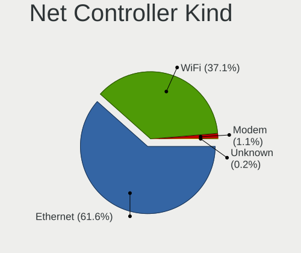

| Kind     | Desktops | Percent |
|----------|----------|---------|
| Ethernet | 23723    | 61.57%  |
| WiFi     | 14291    | 37.09%  |
| Modem    | 440      | 1.14%   |
| Unknown  | 76       | 0.2%    |

Used Controller
---------------

Currently used network controller

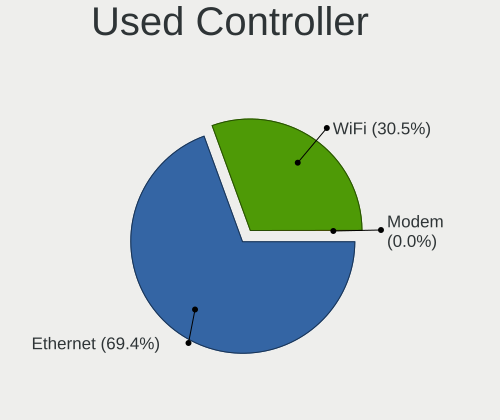

| Kind     | Desktops | Percent |
|----------|----------|---------|
| Ethernet | 17653    | 69.44%  |
| WiFi     | 7762     | 30.53%  |
| Unknown  | 5        | 0.02%   |
| Modem    | 1        | 0.004%  |

NICs
----

Total network controllers on board

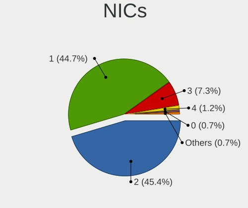

| Total | Desktops | Percent |
|-------|----------|---------|
| 2     | 11038    | 45.38%  |
| 1     | 10878    | 44.72%  |
| 3     | 1765     | 7.26%   |
| 4     | 298      | 1.23%   |
| 0     | 169      | 0.69%   |
| 5     | 95       | 0.39%   |
| 6     | 51       | 0.21%   |
| 7     | 12       | 0.05%   |
| 8     | 5        | 0.02%   |
| 10    | 4        | 0.02%   |
| 9     | 3        | 0.01%   |
| 11    | 2        | 0.01%   |
| 18    | 1        | 0.004%  |
| 14    | 1        | 0.004%  |
| 13    | 1        | 0.004%  |

IPv6
----

IPv6 vs IPv4

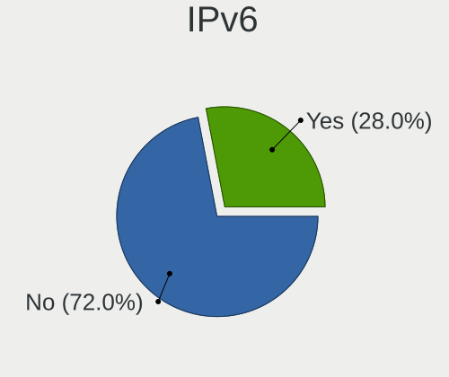

| Used | Desktops | Percent |
|------|----------|---------|
| No   | 17751    | 72%     |
| Yes  | 6904     | 28%     |

Bluetooth
---------

Bluetooth Vendor
----------------

Controller vendors

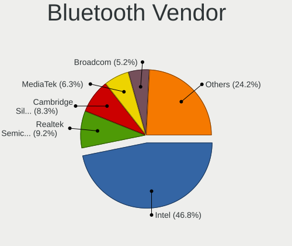

| Vendor                          | Desktops | Percent |
|---------------------------------|----------|---------|
| Intel                           | 5814     | 46.83%  |
| Realtek Semiconductor           | 1144     | 9.21%   |
| Cambridge Silicon Radio         | 1036     | 8.34%   |
| MediaTek                        | 776      | 6.25%   |
| Broadcom                        | 643      | 5.18%   |
| ASUSTek Computer                | 617      | 4.97%   |
| Qualcomm Atheros Communications | 505      | 4.07%   |
| Foxconn / Hon Hai               | 485      | 3.91%   |
| IMC Networks                    | 480      | 3.87%   |
| Apple                           | 196      | 1.58%   |
| TP-Link                         | 160      | 1.29%   |
| Dynex                           | 118      | 0.95%   |
| Realtek                         | 78       | 0.63%   |
| Lite-On Technology              | 46       | 0.37%   |
| Edimax Technology               | 44       | 0.35%   |
| Ralink                          | 37       | 0.3%    |
| Actions                         | 37       | 0.3%    |
| HTC (High Tech Computer)        | 30       | 0.24%   |
| Unknown                         | 25       | 0.2%    |
| Hewlett-Packard                 | 22       | 0.18%   |
| Primax Electronics              | 18       | 0.14%   |
| Dell                            | 17       | 0.14%   |
| Micro Star International        | 15       | 0.12%   |
| Integrated System Solution      | 12       | 0.1%    |
| Kensington                      | 10       | 0.08%   |
| SINO WEALTH                     | 8        | 0.06%   |
| Fujitsu                         | 6        | 0.05%   |
| Belkin Components               | 6        | 0.05%   |
| Logitech                        | 5        | 0.04%   |
| Plugable                        | 4        | 0.03%   |
| Toshiba                         | 3        | 0.02%   |
| Roper                           | 3        | 0.02%   |
| Conwise Technology              | 3        | 0.02%   |
| Unknown                         | 2        | 0.02%   |
| Mobile Action Technology        | 2        | 0.02%   |
| Cypress Semiconductor           | 2        | 0.02%   |
| SiW                             | 1        | 0.01%   |
| Quectel Wireless Solutions      | 1        | 0.01%   |
| Motorola PCS                    | 1        | 0.01%   |
| Microsoft                       | 1        | 0.01%   |

Bluetooth Model
---------------

Controller models

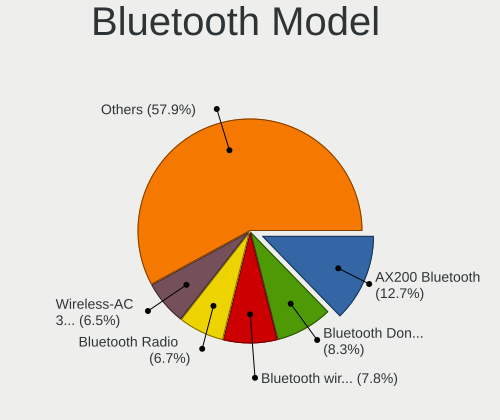

| Model                                                    | Desktops | Percent |
|----------------------------------------------------------|----------|---------|
| Intel AX200 Bluetooth                                    | 1587     | 12.73%  |
| Cambridge Silicon Radio Bluetooth Dongle (HCI mode)      | 1036     | 8.31%   |
| Intel Bluetooth wireless interface                       | 978      | 7.84%   |
| Realtek Bluetooth Radio                                  | 835      | 6.7%    |
| Intel Wireless-AC 3168 Bluetooth                         | 809      | 6.49%   |
| MediaTek Wireless_Device                                 | 775      | 6.22%   |
| Intel AX210 Bluetooth                                    | 736      | 5.9%    |
| Intel Wireless-AC 9260 Bluetooth Adapter                 | 479      | 3.84%   |
| Intel AX201 Bluetooth                                    | 444      | 3.56%   |
| Intel Bluetooth Device                                   | 437      | 3.5%    |
| Broadcom BCM20702A0 Bluetooth 4.0                        | 428      | 3.43%   |
| Intel Bluetooth 9460/9560 Jefferson Peak (JfP)           | 347      | 2.78%   |
| IMC Networks Bluetooth Radio                             | 309      | 2.48%   |
| Foxconn / Hon Hai Wireless_Device                        | 245      | 1.96%   |
| Qualcomm Atheros  Bluetooth Device                       | 224      | 1.8%    |
| ASUS ASUS USB-BT500                                      | 196      | 1.57%   |
| Foxconn / Hon Hai Bluetooth Device                       | 191      | 1.53%   |
| Realtek  Bluetooth 4.2 Adapter                           | 188      | 1.51%   |
| TP-Link TP-T@- UB500 Adapter                             | 160      | 1.28%   |
| IMC Networks Wireless_Device                             | 146      | 1.17%   |
| ASUS Bluetooth Radio                                     | 120      | 0.96%   |
| Dynex Bluetooth 4.0 Adapter [Broadcom, 1.12, BCM20702A0] | 118      | 0.95%   |
| Qualcomm Atheros AR9462 Bluetooth                        | 115      | 0.92%   |
| ASUS Broadcom BCM20702A0 Bluetooth                       | 112      | 0.9%    |
| Apple Bluetooth Host Controller                          | 82       | 0.66%   |
| Realtek Bluetooth Radio                                  | 78       | 0.63%   |
| Apple Built-in Bluetooth 2.0+EDR HCI                     | 74       | 0.59%   |
| Qualcomm Atheros Bluetooth USB Host Controller           | 73       | 0.59%   |
| Realtek RTL8821A Bluetooth                               | 49       | 0.39%   |
| Qualcomm Atheros AR3011 Bluetooth                        | 49       | 0.39%   |
| ASUS Qualcomm Bluetooth 4.1                              | 43       | 0.34%   |
| ASUS BCM20702A0                                          | 41       | 0.33%   |
| Realtek Bluetooth 5.3 Radio                              | 39       | 0.31%   |
| Broadcom BCM92046DG-CL1ROM Bluetooth 2.1 Adapter         | 39       | 0.31%   |
| ASUS Broadcom BCM20702 Single-Chip Bluetooth 4.0 + LE    | 39       | 0.31%   |
| ASUS Bluetooth Device                                    | 38       | 0.3%    |
| Ralink RT3290 Bluetooth                                  | 37       | 0.3%    |
| Actions general adapter                                  | 37       | 0.3%    |
| Edimax Bluetooth Device                                  | 36       | 0.29%   |
| Intel Centrino Bluetooth Wireless Transceiver            | 34       | 0.27%   |

Sound
-----

Sound Vendor
------------

Sound card vendors

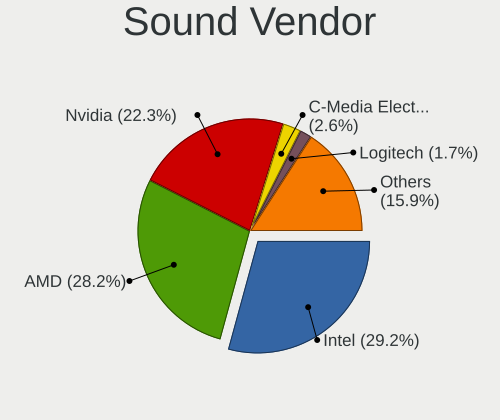

| Vendor                                       | Desktops | Percent |
|----------------------------------------------|----------|---------|
| Intel                                        | 12910    | 29.24%  |
| AMD                                          | 12464    | 28.23%  |
| Nvidia                                       | 9858     | 22.33%  |
| C-Media Electronics                          | 1162     | 2.63%   |
| Logitech                                     | 755      | 1.71%   |
| Creative Labs                                | 470      | 1.06%   |
| ASUSTek Computer                             | 451      | 1.02%   |
| Razer USA                                    | 352      | 0.8%    |
| Micro Star International                     | 323      | 0.73%   |
| SteelSeries ApS                              | 302      | 0.68%   |
| Focusrite-Novation                           | 296      | 0.67%   |
| Texas Instruments                            | 292      | 0.66%   |
| JMTek                                        | 271      | 0.61%   |
| Corsair                                      | 255      | 0.58%   |
| Kingston Technology                          | 247      | 0.56%   |
| Blue Microphones                             | 225      | 0.51%   |
| Creative Technology                          | 146      | 0.33%   |
| Hewlett-Packard                              | 136      | 0.31%   |
| Tenx Technology                              | 134      | 0.3%    |
| Generalplus Technology                       | 112      | 0.25%   |
| Sony                                         | 107      | 0.24%   |
| GN Netcom                                    | 103      | 0.23%   |
| Realtek Semiconductor                        | 92       | 0.21%   |
| Plantronics                                  | 88       | 0.2%    |
| Samson Technologies                          | 87       | 0.2%    |
| KTMicro                                      | 87       | 0.2%    |
| Giga-Byte Technology                         | 85       | 0.19%   |
| Schiit Audio                                 | 81       | 0.18%   |
| ASRock                                       | 81       | 0.18%   |
| Valve Software                               | 70       | 0.16%   |
| Audio-Technica                               | 69       | 0.16%   |
| Zoran Co. Personal Media Division (Nogatech) | 68       | 0.15%   |
| Astro Gaming                                 | 66       | 0.15%   |
| Jieli Technology                             | 63       | 0.14%   |
| Dell                                         | 62       | 0.14%   |
| PreSonus Audio Electronics                   | 51       | 0.12%   |
| VIA Technologies                             | 48       | 0.11%   |
| Turtle Beach                                 | 46       | 0.1%    |
| FiiO Electronics Technology                  | 46       | 0.1%    |
| BEHRINGER International                      | 45       | 0.1%    |

Sound Model
-----------

Sound card models

| Model                                                                      | Desktops | Percent |
|----------------------------------------------------------------------------|----------|---------|
| AMD Starship/Matisse HD Audio Controller                                   | 3377     | 6.34%   |
| AMD Ryzen HD Audio Controller                                              | 2471     | 4.64%   |
| AMD SBx00 Azalia (Intel HDA)                                               | 1657     | 3.11%   |
| Intel 8 Series/C220 Series Chipset High Definition Audio Controller        | 1620     | 3.04%   |
| AMD Family 17h (Models 00h-0fh) HD Audio Controller                        | 1353     | 2.54%   |
| AMD Navi 21/23 HDMI/DP Audio Controller                                    | 1346     | 2.53%   |
| AMD Ellesmere HDMI Audio [Radeon RX 470/480 / 570/580/590]                 | 1330     | 2.5%    |
| AMD Radeon High Definition Audio Controller                                | 1313     | 2.46%   |
| Intel 6 Series/C200 Series Chipset Family High Definition Audio Controller | 1223     | 2.3%    |
| Intel Xeon E3-1200 v3/4th Gen Core Processor HD Audio Controller           | 1184     | 2.22%   |
| Intel 200 Series PCH HD Audio                                              | 1146     | 2.15%   |
| Intel 7 Series/C216 Chipset Family High Definition Audio Controller        | 1106     | 2.08%   |
| Intel 100 Series/C230 Series Chipset Family HD Audio Controller            | 1072     | 2.01%   |
| Intel Cannon Lake PCH cAVS                                                 | 883      | 1.66%   |
| Nvidia GP104 High Definition Audio Controller                              | 758      | 1.42%   |
| AMD Renoir/Cezanne HDMI/DP Audio Controller                                | 743      | 1.39%   |
| AMD Navi 31 HDMI/DP Audio                                                  | 667      | 1.25%   |
| AMD FCH Azalia Controller                                                  | 638      | 1.2%    |
| AMD Oland/Hainan/Cape Verde/Pitcairn HDMI Audio [Radeon HD 7000 Series]    | 621      | 1.17%   |
| Intel 82801JI (ICH10 Family) HD Audio Controller                           | 601      | 1.13%   |
| Nvidia GA104 High Definition Audio Controller                              | 600      | 1.13%   |
| Intel Alder Lake-S HD Audio Controller                                     | 596      | 1.12%   |
| AMD Navi 10 HDMI Audio                                                     | 595      | 1.12%   |
| Nvidia GA102 High Definition Audio Controller                              | 592      | 1.11%   |
| Nvidia GP107GL High Definition Audio Controller                            | 591      | 1.11%   |
| Nvidia TU116 High Definition Audio Controller                              | 560      | 1.05%   |
| Nvidia GP106 High Definition Audio Controller                              | 519      | 0.97%   |
| Nvidia GK208 HDMI/DP Audio Controller                                      | 517      | 0.97%   |
| Intel Raptor Lake High Definition Audio Controller                         | 502      | 0.94%   |
| Nvidia TU104 HD Audio Controller                                           | 479      | 0.9%    |
| Nvidia GA106 High Definition Audio Controller                              | 454      | 0.85%   |
| AMD Baffin HDMI/DP Audio [Radeon RX 550 640SP / RX 560/560X]               | 447      | 0.84%   |
| ASUSTek Computer USB Audio                                                 | 401      | 0.75%   |
| Intel C610/X99 series chipset HD Audio Controller                          | 395      | 0.74%   |
| Nvidia GM107 High Definition Audio Controller [GeForce 940MX]              | 394      | 0.74%   |
| Nvidia TU106 High Definition Audio Controller                              | 389      | 0.73%   |
| Intel 9 Series Chipset Family HD Audio Controller                          | 367      | 0.69%   |
| AMD Raven/Raven2/Fenghuang HDMI/DP Audio Controller                        | 354      | 0.66%   |
| Nvidia GM204 High Definition Audio Controller                              | 326      | 0.61%   |
| Intel C600/X79 series chipset High Definition Audio Controller             | 323      | 0.61%   |

Memory
------

Memory Vendor
-------------

Memory module vendors

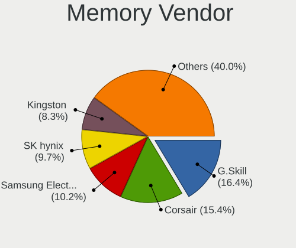

| Vendor                                  | Desktops | Percent |
|-----------------------------------------|----------|---------|
| G.Skill                                 | 2210     | 16.39%  |
| Corsair                                 | 2076     | 15.4%   |
| Samsung Electronics                     | 1370     | 10.16%  |
| SK hynix                                | 1310     | 9.72%   |
| Kingston                                | 1117     | 8.29%   |
| Crucial                                 | 1106     | 8.2%    |
| Unknown                                 | 1051     | 7.8%    |
| Micron Technology                       | 820      | 6.08%   |
| Team                                    | 472      | 3.5%    |
| Unknown                                 | 325      | 2.41%   |
| A-DATA Technology                       | 214      | 1.59%   |
| Patriot                                 | 180      | 1.34%   |
| Nanya Technology                        | 148      | 1.1%    |
| Ramaxel Technology                      | 107      | 0.79%   |
| PNY                                     | 92       | 0.68%   |
| Elpida                                  | 76       | 0.56%   |
| Unknown (ABCD)                          | 48       | 0.36%   |
| Timetec                                 | 46       | 0.34%   |
| Silicon Power                           | 46       | 0.34%   |
| Avant                                   | 39       | 0.29%   |
| Neo Forza                               | 30       | 0.22%   |
| Patriot Memory (PDP Systems)            | 27       | 0.2%    |
| Sesame                                  | 23       | 0.17%   |
| Transcend                               | 22       | 0.16%   |
| Golden Empire                           | 22       | 0.16%   |
| Unifosa                                 | 21       | 0.16%   |
| OLOY                                    | 19       | 0.14%   |
| Qimonda                                 | 18       | 0.13%   |
| GeIL                                    | 18       | 0.13%   |
| Apacer                                  | 18       | 0.13%   |
| TeamGroup                               | 17       | 0.13%   |
| Unknown (0x0E9D)                        | 15       | 0.11%   |
| Patriot Memory                          | 15       | 0.11%   |
| ASint Technology                        | 13       | 0.1%    |
| Silicon Power Computer & Communications | 12       | 0.09%   |
| V-Color                                 | 11       | 0.08%   |
| Mushkin                                 | 11       | 0.08%   |
| EVGA                                    | 11       | 0.08%   |
| Unknown (AB)                            | 10       | 0.07%   |
| Unknown (0x0DD5)                        | 9        | 0.07%   |

Memory Model
------------

Memory module models

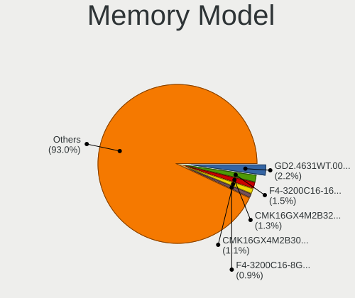

| Model                                                          | Desktops | Percent |
|----------------------------------------------------------------|----------|---------|
| Unknown                                                        | 325      | 2.23%   |
| G.Skill RAM F4-3200C16-16GVK 16GB DIMM DDR4 3600MT/s           | 216      | 1.48%   |
| Corsair RAM CMK16GX4M2B3200C16 8GB DIMM DDR4 3600MT/s          | 192      | 1.31%   |
| Corsair RAM CMK16GX4M2B3000C15 8GB DIMM DDR4 3600MT/s          | 160      | 1.1%    |
| G.Skill RAM F4-3200C16-8GVKB 8GB DIMM DDR4 4000MT/s            | 126      | 0.86%   |
| Corsair RAM CMK32GX4M2E3200C16 16GB DIMM DDR4 3600MT/s         | 126      | 0.86%   |
| G.Skill RAM F5-6000J3636F16G 16GB DIMM DDR5 6400MT/s           | 114      | 0.78%   |
| Team RAM TEAMGROUP-UD4-3200 8GB DIMM DDR4 3800MT/s             | 109      | 0.75%   |
| Team RAM TEAMGROUP-UD4-3200 8GB DIMM DDR4 3733MT/s             | 95       | 0.65%   |
| Micron RAM 8JTF51264AZ-1G6E1 4GB DIMM DDR3 1600MT/s            | 93       | 0.64%   |
| Corsair RAM CMK32GX4M2D3600C18 16GB DIMM DDR4 3800MT/s         | 80       | 0.55%   |
| G.Skill RAM F5-6000J3040G32G 32GB DIMM DDR5 6200MT/s           | 77       | 0.53%   |
| SK hynix RAM HMT351U6CFR8C-PB 4GB DIMM DDR3 1800MT/s           | 74       | 0.51%   |
| SK hynix RAM HMT451U6AFR8C-PB 4GB DIMM DDR3 1600MT/s           | 70       | 0.48%   |
| G.Skill RAM F4-3600C16-16GVKC 16GB DIMM DDR4 3866MT/s          | 67       | 0.46%   |
| Corsair RAM CMK16GX4M2D3600C18 8GB DIMM DDR4 4000MT/s          | 66       | 0.45%   |
| G.Skill RAM F4-3600C16-16GTZNC 16GiB DIMM DDR4 3600MT/s        | 63       | 0.43%   |
| Corsair RAM CMK32GX4M2B3200C16 16GB DIMM DDR4 3800MT/s         | 63       | 0.43%   |
| Crucial RAM BLS8G3D1609DS1S00. 8GB DIMM DDR3 1800MT/s          | 61       | 0.42%   |
| Unknown RAM Module 4GB DIMM 1333MT/s                           | 60       | 0.41%   |
| Samsung RAM M378B5173DB0-CK0 4096MB DIMM DDR3 1600MT/s         | 58       | 0.4%    |
| Samsung RAM M378B5273DH0-CH9 4GB DIMM DDR3 2133MT/s            | 54       | 0.37%   |
| G.Skill RAM F4-3600C18-32GVK 32GiB DIMM DDR4 3600MT/s          | 51       | 0.35%   |
| Samsung RAM M378B5173QH0-CK0 4GB DIMM DDR3                     | 49       | 0.34%   |
| Unknown (ABCD) RAM 123456789012345678 2GB DIMM LPDDR4 2133MT/s | 48       | 0.33%   |
| G.Skill RAM F5-6000J3238F16G 16GB DIMM DDR5 12800MT/s          | 46       | 0.31%   |
| SK hynix RAM HMT451U6BFR8C-PB 4GB DIMM DDR3 1600MT/s           | 45       | 0.31%   |
| Crucial RAM BLS4G3D1609DS1S00. 4GB DIMM DDR3 1600MT/s          | 45       | 0.31%   |
| Corsair RAM CMZ16GX3M2A1600C10 8GB DIMM DDR3 1600MT/s          | 45       | 0.31%   |
| SK hynix RAM HMT451U6BFR8A-PB 4GB DIMM DDR3 1600MT/s           | 44       | 0.3%    |
| Team RAM TEAMGROUP-UD4-3600 16GB DIMM DDR4 3600MT/s            | 43       | 0.29%   |
| Corsair RAM CMW16GX4M2C3200C16 8GB DIMM DDR4 3733MT/s          | 43       | 0.29%   |
| Corsair RAM CMK64GX4M2E3200C16 32GB DIMM DDR4 3600MT/s         | 43       | 0.29%   |
| Samsung RAM M378B5673FH0-CH9 2GB DIMM DDR3 1600MT/s            | 42       | 0.29%   |
| G.Skill RAM F5-6000J3038F16G 16GB DIMM DDR5 6000MT/s           | 42       | 0.29%   |
| Corsair RAM CMW32GX4M2C3200C16 16GB DIMM DDR4 3400MT/s         | 41       | 0.28%   |
| Team RAM TEAMGROUP-UD4-3000 8GB DIMM DDR4 3200MT/s             | 40       | 0.27%   |
| SK hynix RAM HMT351U6EFR8C-PB 4GB DIMM DDR3 1600MT/s           | 40       | 0.27%   |
| SK hynix RAM HMA81GU6AFR8N-UH 8GB DIMM DDR4 2400MT/s           | 39       | 0.27%   |
| G.Skill RAM F4-3600C16-8GVKC 8GB DIMM DDR4 3600MT/s            | 39       | 0.27%   |

Memory Kind
-----------

Memory module kinds

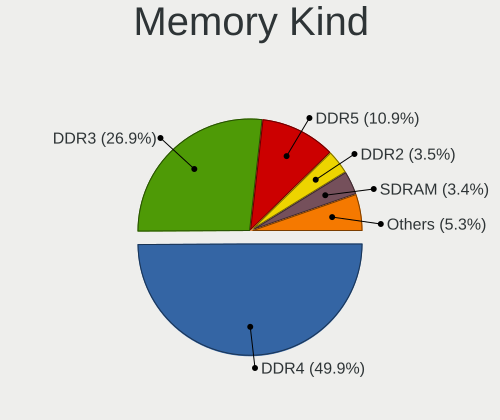

| Kind         | Desktops | Percent |
|--------------|----------|---------|
| DDR4         | 5978     | 49.92%  |
| DDR3         | 3217     | 26.86%  |
| DDR5         | 1306     | 10.91%  |
| DDR2         | 422      | 3.52%   |
| SDRAM        | 413      | 3.45%   |
| Unknown      | 399      | 3.33%   |
| DDR          | 79       | 0.66%   |
| LPDDR4       | 77       | 0.64%   |
| DRAM         | 36       | 0.3%    |
| LPDDR5       | 25       | 0.21%   |
| RAM          | 11       | 0.09%   |
| LPDDR3       | 9        | 0.08%   |
| DDR2 FB-DIMM | 2        | 0.02%   |
| HBM2         | 1        | 0.01%   |

Memory Form Factor
------------------

Physical design of the memory module

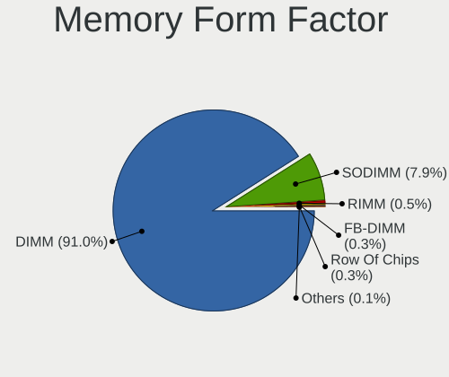

| Name         | Desktops | Percent |
|--------------|----------|---------|
| DIMM         | 10678    | 91.02%  |
| SODIMM       | 924      | 7.88%   |
| RIMM         | 55       | 0.47%   |
| FB-DIMM      | 34       | 0.29%   |
| Row Of Chips | 33       | 0.28%   |
| Unknown      | 5        | 0.04%   |
| Chip         | 2        | 0.02%   |
| Die          | 1        | 0.01%   |

Memory Size
-----------

Memory module size

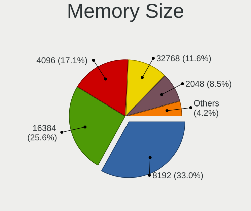

| Size    | Desktops | Percent |
|---------|----------|---------|
| 8192    | 4248     | 33.03%  |
| 16384   | 3296     | 25.63%  |
| 4096    | 2193     | 17.05%  |
| 32768   | 1487     | 11.56%  |
| 2048    | 1094     | 8.51%   |
| 1024    | 318      | 2.47%   |
| 49152   | 87       | 0.68%   |
| 512     | 51       | 0.4%    |
| 65536   | 37       | 0.29%   |
| 24576   | 28       | 0.22%   |
| 256     | 5        | 0.04%   |
| 12288   | 2        | 0.02%   |
| 3072    | 2        | 0.02%   |
| 1536    | 2        | 0.02%   |
| 128     | 2        | 0.02%   |
| 32      | 2        | 0.02%   |
| 131072  | 1        | 0.01%   |
| 12333   | 1        | 0.01%   |
| 6144    | 1        | 0.01%   |
| 4000    | 1        | 0.01%   |
| 3814    | 1        | 0.01%   |
| 616     | 1        | 0.01%   |
| 64      | 1        | 0.01%   |
| Unknown | 1        | 0.01%   |

Memory Speed
------------

Memory module speed

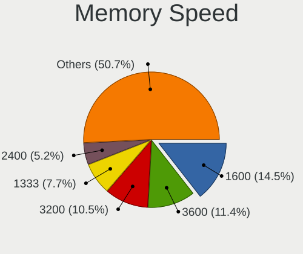

| Speed   | Desktops | Percent |
|---------|----------|---------|
| 1600    | 1913     | 14.47%  |
| 3600    | 1507     | 11.4%   |
| 3200    | 1383     | 10.46%  |
| 1333    | 1021     | 7.72%   |
| 2400    | 689      | 5.21%   |
| 2667    | 628      | 4.75%   |
| 2133    | 611      | 4.62%   |
| 3800    | 353      | 2.67%   |
| 6000    | 351      | 2.65%   |
| 800     | 306      | 2.31%   |
| 4000    | 274      | 2.07%   |
| 3733    | 269      | 2.03%   |
| 6400    | 236      | 1.78%   |
| 4800    | 236      | 1.78%   |
| 1867    | 218      | 1.65%   |
| 1866    | 217      | 1.64%   |
| 3000    | 211      | 1.6%    |
| 667     | 206      | 1.56%   |
| 5600    | 200      | 1.51%   |
| 1800    | 196      | 1.48%   |
| 2666    | 182      | 1.38%   |
| 3866    | 144      | 1.09%   |
| 3400    | 140      | 1.06%   |
| 1066    | 129      | 0.98%   |
| 2933    | 109      | 0.82%   |
| Unknown | 91       | 0.69%   |
| 6200    | 86       | 0.65%   |
| 5200    | 81       | 0.61%   |
| 12800   | 66       | 0.5%    |
| 3466    | 64       | 0.48%   |
| 1067    | 63       | 0.48%   |
| 2800    | 56       | 0.42%   |
| 2048    | 55       | 0.42%   |
| 533     | 47       | 0.36%   |
| 2000    | 44       | 0.33%   |
| 3666    | 42       | 0.32%   |
| 3266    | 38       | 0.29%   |
| 2733    | 36       | 0.27%   |
| 1648    | 36       | 0.27%   |
| 49926   | 34       | 0.26%   |

Printers & scanners
-------------------

Printer Vendor
--------------

Printer device vendors

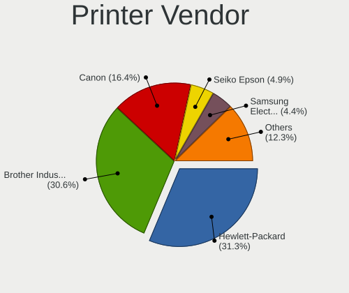

| Vendor                   | Desktops | Percent |
|--------------------------|----------|---------|
| Hewlett-Packard          | 404      | 31.32%  |
| Brother Industries       | 395      | 30.62%  |
| Canon                    | 212      | 16.43%  |
| Seiko Epson              | 63       | 4.88%   |
| Samsung Electronics      | 57       | 4.42%   |
| Dymo-CoStar              | 34       | 2.64%   |
| Prolific Technology      | 16       | 1.24%   |
| Lexmark International    | 16       | 1.24%   |
| Zebra                    | 14       | 1.09%   |
| QinHeng Electronics      | 12       | 0.93%   |
| Dell                     | 12       | 0.93%   |
| Xerox                    | 10       | 0.78%   |
| Pantum                   | 7        | 0.54%   |
| Printer                  | 4        | 0.31%   |
| Zhuhai Poskey Technology | 3        | 0.23%   |
| Zebra Technologies       | 3        | 0.23%   |
| STMicroelectronics       | 3        | 0.23%   |
| Star Micronics           | 3        | 0.23%   |
| iDPRT                    | 3        | 0.23%   |
| PM                       | 2        | 0.16%   |
| Oki Data                 | 2        | 0.16%   |
| Kyocera                  | 2        | 0.16%   |
| ICS Advent               | 2        | 0.16%   |
| Apple                    | 2        | 0.16%   |
| Sharp                    | 1        | 0.08%   |
| Seiko Instruments        | 1        | 0.08%   |
| Ricoh                    | 1        | 0.08%   |
| MIIIW                    | 1        | 0.08%   |
| Konica Minolta           | 1        | 0.08%   |
| Gprinter                 | 1        | 0.08%   |
| Boca Systems             | 1        | 0.08%   |
| Belkin Components        | 1        | 0.08%   |
| Beeprt Printer           | 1        | 0.08%   |

Printer Model
-------------

Printer device models

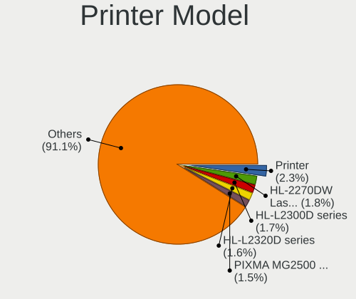

| Model                                  | Desktops | Percent |
|----------------------------------------|----------|---------|
| Brother Printer                        | 30       | 2.28%   |
| Brother HL-2270DW Laser Printer        | 24       | 1.83%   |
| Brother HL-L2300D series               | 22       | 1.67%   |
| Brother HL-L2320D series               | 21       | 1.6%    |
| Canon PIXMA MG2500 Series              | 20       | 1.52%   |
| Prolific PL2305 Parallel Port          | 16       | 1.22%   |
| Canon PIXMA MX920 Series               | 14       | 1.07%   |
| Brother HL-L2390DW                     | 14       | 1.07%   |
| Brother HL-L2340D series               | 14       | 1.07%   |
| QinHeng CH340S                         | 12       | 0.91%   |
| HP DeskJet 2600 series                 | 12       | 0.91%   |
| Dymo-CoStar DYMO LabelWriter 450 Turbo | 12       | 0.91%   |
| Brother HL-L2380DW                     | 12       | 0.91%   |
| HP LaserJet 400 M401dne                | 11       | 0.84%   |
| HP OfficeJet 5200 series               | 10       | 0.76%   |
| HP LaserJet 1012                       | 10       | 0.76%   |
| HP DeskJet 3700 series                 | 10       | 0.76%   |
| Brother HL-L2360D series               | 10       | 0.76%   |
| HP LaserJet P1006                      | 9        | 0.68%   |
| HP Deskjet 2540 series                 | 9        | 0.68%   |
| Brother DCP-L2540DW                    | 9        | 0.68%   |
| HP OfficeJet Pro 6970                  | 8        | 0.61%   |
| HP OfficeJet 3830 series               | 8        | 0.61%   |
| HP LaserJet M14-M17                    | 8        | 0.61%   |
| HP HP OfficeJet Pro 8020 series        | 8        | 0.61%   |
| HP DeskJet 2700 series                 | 8        | 0.61%   |
| Brother MFC-J475DW                     | 8        | 0.61%   |
| Brother HL-L2315D series               | 8        | 0.61%   |
| Brother HL-L2305 series                | 8        | 0.61%   |
| Brother HL-3140CW series               | 8        | 0.61%   |
| Brother HL-2240 series                 | 8        | 0.61%   |
| HP OfficeJet 4650 series               | 7        | 0.53%   |
| HP Officejet 4500 G510n-z              | 7        | 0.53%   |
| HP LaserJet 1020                       | 7        | 0.53%   |
| HP ENVY 4520 series                    | 7        | 0.53%   |
| HP ENVY 4500 series                    | 7        | 0.53%   |
| Canon TR4500 series                    | 7        | 0.53%   |
| Canon PIXMA MG3600 Series              | 7        | 0.53%   |
| Canon MF230 Series UFRII LT            | 7        | 0.53%   |
| Canon LiDE 400                         | 7        | 0.53%   |

Scanner Vendor
--------------

Scanner device vendors

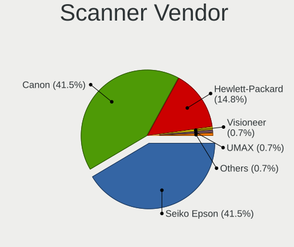

| Vendor          | Desktops | Percent |
|-----------------|----------|---------|
| Seiko Epson     | 56       | 41.48%  |
| Canon           | 56       | 41.48%  |
| Hewlett-Packard | 20       | 14.81%  |
| Visioneer       | 1        | 0.74%   |
| UMAX            | 1        | 0.74%   |
| Plustek         | 1        | 0.74%   |

Scanner Model
-------------

Scanner device models

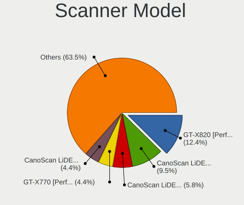

| Model                                                       | Desktops | Percent |
|-------------------------------------------------------------|----------|---------|
| Seiko Epson GT-X820 [Perfection V600 Photo]                 | 17       | 12.41%  |
| Canon CanoScan LiDE 110                                     | 13       | 9.49%   |
| Canon CanoScan LiDE 220                                     | 8        | 5.84%   |
| Seiko Epson GT-X770 [Perfection V500]                       | 6        | 4.38%   |
| Canon CanoScan LiDE 210                                     | 6        | 4.38%   |
| Canon CanoScan LiDE 120                                     | 6        | 4.38%   |
| Canon CanoScan N1240U/LiDE 30                               | 5        | 3.65%   |
| Canon CanoScan LIDE 25                                      | 5        | 3.65%   |
| Seiko Epson Perfection V37/V370                             | 4        | 2.92%   |
| Seiko Epson ES-D200 [GT-S50]                                | 4        | 2.92%   |
| HP ScanJet 82x0C                                            | 4        | 2.92%   |
| Seiko Epson GT-X750 [Perfection 4490 Photo]                 | 3        | 2.19%   |
| Seiko Epson GT-F720 [GT-S620/Perfection V30/V300 Photo]     | 3        | 2.19%   |
| Seiko Epson GT-9300UF [Perfection 2400 PHOTO]               | 3        | 2.19%   |
| Seiko Epson Scanner                                         | 2        | 1.46%   |
| Seiko Epson GT-X900 [Perfection V700/V750 Photo]            | 2        | 1.46%   |
| Seiko Epson GT-F670 [Perfection V200 Photo]                 | 2        | 1.46%   |
| Seiko Epson GT-9700F [Perfection 2450 PHOTO]                | 2        | 1.46%   |
| Seiko Epson GT-8300UF [Perfection 1660 PHOTO]               | 2        | 1.46%   |
| HP ScanJet 7650                                             | 2        | 1.46%   |
| HP ScanJet 4850C/4890C                                      | 2        | 1.46%   |
| Canon CanoScan N670U/N676U/LiDE 20                          | 2        | 1.46%   |
| Canon CanoScan LiDE 200                                     | 2        | 1.46%   |
| Canon CanoScan 4400F                                        | 2        | 1.46%   |
| Visioneer OneTouch 5300 USB                                 | 1        | 0.73%   |
| UMAX Astra 2200/2200SU                                      | 1        | 0.73%   |
| Seiko Epson GT-X800 [Perfection 4990 PHOTO]                 | 1        | 0.73%   |
| Seiko Epson GT-X700 [Perfection 4870]                       | 1        | 0.73%   |
| Seiko Epson GT-9800F [Perfection 3200]                      | 1        | 0.73%   |
| Seiko Epson GT-9400UF [Perfection 3170]                     | 1        | 0.73%   |
| Seiko Epson GT-8200U/GT-8200UF [Perfection 1650/1650 PHOTO] | 1        | 0.73%   |
| Seiko Epson GT-7700U [Perfection 1240U]                     | 1        | 0.73%   |
| Seiko Epson GT-7200U [Perfection 1250/1250 PHOTO]           | 1        | 0.73%   |
| Seiko Epson GT-1500 [GT-D1000]                              | 1        | 0.73%   |
| Plustek 600dpi USB Scanner                                  | 1        | 0.73%   |
| HP Scanjet N6010                                            | 1        | 0.73%   |
| HP ScanJet G4050                                            | 1        | 0.73%   |
| HP ScanJet G4010                                            | 1        | 0.73%   |
| HP ScanJet 7400c                                            | 1        | 0.73%   |
| HP ScanJet 6200c                                            | 1        | 0.73%   |

Camera
------

Camera Vendor
-------------

Camera device vendors

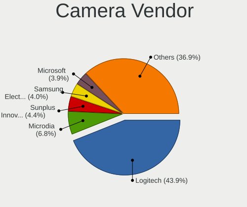

| Vendor                                 | Desktops | Percent |
|----------------------------------------|----------|---------|
| Logitech                               | 2264     | 43.94%  |
| Microdia                               | 351      | 6.81%   |
| Sunplus Innovation Technology          | 225      | 4.37%   |
| Samsung Electronics                    | 208      | 4.04%   |
| Microsoft                              | 201      | 3.9%    |
| Apple                                  | 198      | 3.84%   |
| Chicony Electronics                    | 127      | 2.47%   |
| ARC International                      | 99       | 1.92%   |
| Razer USA                              | 93       | 1.81%   |
| MacroSilicon                           | 89       | 1.73%   |
| Realtek Semiconductor                  | 83       | 1.61%   |
| webcam                                 | 64       | 1.24%   |
| eMeet                                  | 64       | 1.24%   |
| Valve Software                         | 57       | 1.11%   |
| Generalplus Technology                 | 56       | 1.09%   |
| AVerMedia Technologies                 | 43       | 0.83%   |
| Huawei Technologies                    | 39       | 0.76%   |
| Creative Technology                    | 38       | 0.74%   |
| LG Electronics                         | 36       | 0.7%    |
| GEMBIRD                                | 36       | 0.7%    |
| Hewlett-Packard                        | 35       | 0.68%   |
| Z-Star Microelectronics                | 33       | 0.64%   |
| Cubeternet                             | 27       | 0.52%   |
| Sonix Technology                       | 26       | 0.5%    |
| Anker PowerConf C200                   | 24       | 0.47%   |
| KYE Systems (Mouse Systems)            | 22       | 0.43%   |
| Elgato Systems                         | 22       | 0.43%   |
| SunplusIT                              | 21       | 0.41%   |
| Tobii Technology AB                    | 20       | 0.39%   |
| Linux Foundation                       | 20       | 0.39%   |
| Jieli Technology                       | 17       | 0.33%   |
| Magic Control Technology               | 16       | 0.31%   |
| Lenovo                                 | 16       | 0.31%   |
| Intel                                  | 13       | 0.25%   |
| EVGA                                   | 13       | 0.25%   |
| Cheng Uei Precision Industry (Foxlink) | 13       | 0.25%   |
| webcamvendor                           | 12       | 0.23%   |
| WaveRider Communications               | 12       | 0.23%   |
| Ruision                                | 12       | 0.23%   |
| OmniVision Technologies                | 12       | 0.23%   |

Camera Model
------------

Camera device models

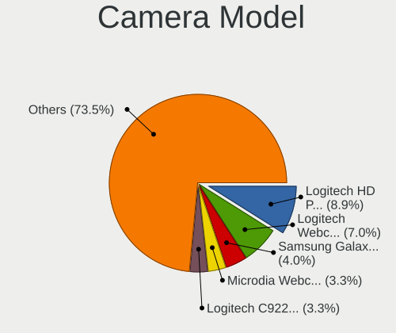

| Model                                                 | Desktops | Percent |
|-------------------------------------------------------|----------|---------|
| Logitech HD Pro Webcam C920                           | 464      | 8.93%   |
| Logitech Webcam C270                                  | 362      | 6.96%   |
| Samsung Galaxy series, misc. (MTP mode)               | 206      | 3.96%   |
| Microdia Webcam Vitade AF                             | 174      | 3.35%   |
| Logitech C922 Pro Stream Webcam                       | 172      | 3.31%   |
| Apple iPhone 5/5C/5S/6/SE/7/8/X                       | 171      | 3.29%   |
| Logitech HD Webcam C615                               | 157      | 3.02%   |
| Logitech BRIO Ultra HD Webcam                         | 154      | 2.96%   |
| Logitech C920 PRO HD Webcam                           | 134      | 2.58%   |
| Logitech Webcam C310                                  | 99       | 1.9%    |
| ARC International Camera                              | 97       | 1.87%   |
| Microdia USB 2.0 Camera                               | 91       | 1.75%   |
| Logitech HD Webcam C525                               | 76       | 1.46%   |
| Sunplus Full HD webcam                                | 69       | 1.33%   |
| MacroSilicon USB Video                                | 65       | 1.25%   |
| webcam webcam                                         | 64       | 1.23%   |
| Razer USA Gaming Webcam [Kiyo]                        | 62       | 1.19%   |
| Logitech CrystalCam                                   | 58       | 1.12%   |
| Valve Software 3D Camera                              | 57       | 1.1%    |
| Logitech HD Webcam C910                               | 55       | 1.06%   |
| Logitech Webcam C930e                                 | 53       | 1.02%   |
| Logitech Logitech Webcam C925e                        | 51       | 0.98%   |
| Sunplus Integrated Camera                             | 49       | 0.94%   |
| Logitech Webcam Pro 9000                              | 47       | 0.9%    |
| Microsoft LifeCam Cinema                              | 46       | 0.88%   |
| Microsoft LifeCam HD-3000                             | 45       | 0.87%   |
| Chicony HP High Definition 1MP Webcam                 | 44       | 0.85%   |
| Logitech QuickCam Pro 9000                            | 42       | 0.81%   |
| Huawei HiCamera                                       | 39       | 0.75%   |
| Sunplus USB 2.0 Camera                                | 37       | 0.71%   |
| Logitech Logi Webcam C920e                            | 36       | 0.69%   |
| eMeet HD Webcam C960                                  | 34       | 0.65%   |
| Microsoft LifeCam Studio                              | 26       | 0.5%    |
| LG LM-X420xxx/G2/G3 Android Phone (MTP/download mode) | 25       | 0.48%   |
| Razer USA Razer Kiyo Pro                              | 24       | 0.46%   |
| Logitech StreamCam                                    | 24       | 0.46%   |
| Generalplus 808 Camera #9 (web-cam mode)              | 24       | 0.46%   |
| Anker PowerConf C200 Anker PowerConf C200             | 24       | 0.46%   |
| Logitech HD Webcam C510                               | 22       | 0.42%   |
| GEMBIRD USB2.0 PC CAMERA                              | 22       | 0.42%   |

Security
--------

Fingerprint Vendor
------------------

Fingerprint sensor vendors

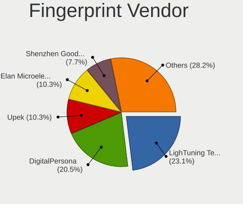

| Vendor                     | Desktops | Percent |
|----------------------------|----------|---------|
| LighTuning Technology      | 18       | 23.08%  |
| DigitalPersona             | 16       | 20.51%  |
| Upek                       | 8        | 10.26%  |
| Elan Microelectronics      | 8        | 10.26%  |
| Shenzhen Goodix Technology | 6        | 7.69%   |
| Synaptics                  | 5        | 6.41%   |
| AuthenTec                  | 5        | 6.41%   |
| STMicroelectronics         | 4        | 5.13%   |
| Microsoft                  | 3        | 3.85%   |
| Dell                       | 3        | 3.85%   |
| Unknown                    | 2        | 2.56%   |

Fingerprint Model
-----------------

Fingerprint sensor models

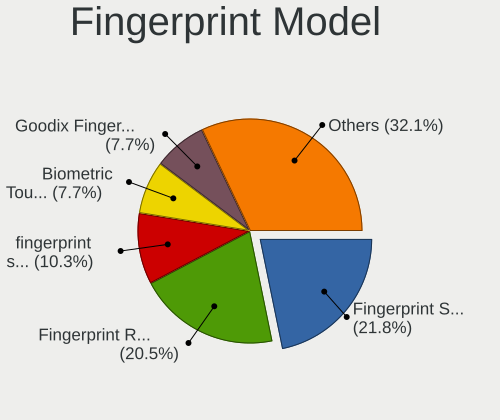

| Model                                                     | Desktops | Percent |
|-----------------------------------------------------------|----------|---------|
| LighTuning Fingerprint Sensor                             | 17       | 21.79%  |
| DigitalPersona Fingerprint Reader                         | 16       | 20.51%  |
| Elan fingerprint sensor [FeinTech FPS00200]               | 8        | 10.26%  |
| Upek Biometric Touchchip/Touchstrip Fingerprint Sensor    | 6        | 7.69%   |
| Shenzhen Goodix  Fingerprint Device                       | 6        | 7.69%   |
| Synaptics  WBDI Fingerprint Reader - USB 052              | 4        | 5.13%   |
| STMicroelectronics Fingerprint Reader                     | 4        | 5.13%   |
| Microsoft Fingerprint Reader                              | 3        | 3.85%   |
| Dell MS819 Wired Mouse With Fingerprint Reader            | 3        | 3.85%   |
| AuthenTec Fingerprint Sensor                              | 3        | 3.85%   |
| Upek TCS1C EIM/STM32 Fingerprint sensor                   | 2        | 2.56%   |
| AuthenTec AES2550 Fingerprint Sensor                      | 2        | 2.56%   |
| Unknown                                                   | 2        | 2.56%   |
| Synaptics  FS7604 Touch Fingerprint Sensor with PurePrint | 1        | 1.28%   |
| LighTuning EgisTec Touch Fingerprint Sensor               | 1        | 1.28%   |

Chipcard Vendor
---------------

Chipcard module vendors

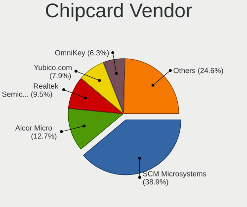

| Vendor                    | Desktops | Percent |
|---------------------------|----------|---------|
| SCM Microsystems          | 49       | 38.89%  |
| Alcor Micro               | 16       | 12.7%   |
| Realtek Semiconductor     | 12       | 9.52%   |
| Yubico.com                | 10       | 7.94%   |
| OmniKey                   | 8        | 6.35%   |
| Chicony Electronics       | 7        | 5.56%   |
| Advanced Card Systems     | 6        | 4.76%   |
| Aladdin Knowledge Systems | 4        | 3.17%   |
| Jing-Mold Enterprise      | 3        | 2.38%   |
| Thetis                    | 2        | 1.59%   |
| Hewlett-Packard           | 2        | 1.59%   |
| Reiner SCT Kartensysteme  | 1        | 0.79%   |
| Purism, SPC               | 1        | 0.79%   |
| Mako Technologies         | 1        | 0.79%   |
| HID Global                | 1        | 0.79%   |
| Gemalto (was Gemplus)     | 1        | 0.79%   |
| Cherry                    | 1        | 0.79%   |
| BLUTRONICS                | 1        | 0.79%   |

Chipcard Model
--------------

Chipcard module models

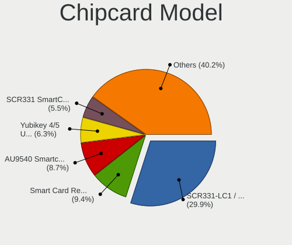

| Model                                                                      | Desktops | Percent |
|----------------------------------------------------------------------------|----------|---------|
| SCM Microsystems SCR331-LC1 / SCR3310 SmartCard Reader                     | 38       | 29.92%  |
| Realtek Semiconductor Smart Card Reader Interface                          | 12       | 9.45%   |
| Alcor Micro AU9540 Smartcard Reader                                        | 11       | 8.66%   |
| Yubico.com Yubikey 4/5 U2F+CCID                                            | 8        | 6.3%    |
| SCM Microsystems SCR331 SmartCard Reader                                   | 7        | 5.51%   |
| Chicony Electronics HP Skylab USB Smartcard Keyboard                       | 7        | 5.51%   |
| Alcor Micro Watchdata W 1981                                               | 5        | 3.94%   |
| Aladdin Knowledge Systems Token JC                                         | 4        | 3.15%   |
| OmniKey CardMan 3021 / 3121                                                | 3        | 2.36%   |
| Jing-Mold Enterprise HP USB Business Slim Smartcard CCID Keyboard          | 3        | 2.36%   |
| Thetis Security Key(F829)                                                  | 2        | 1.57%   |
| SCM Microsystems SCR3500 A Contact Reader                                  | 2        | 1.57%   |
| OmniKey 3x21 Smart Card Reader                                             | 2        | 1.57%   |
| Hewlett-Packard SC Keyboard - Apollo (Liteon)                              | 2        | 1.57%   |
| Advanced Card Systems ACR39U                                               | 2        | 1.57%   |
| Advanced Card Systems ACR38 SmartCard Reader                               | 2        | 1.57%   |
| Yubico.com Yubikey NEO(-N) OTP+CCID                                        | 1        | 0.79%   |
| Yubico.com Yubikey 4/5 CCID                                                | 1        | 0.79%   |
| SCM Microsystems uTrust FIDO2 Security Key                                 | 1        | 0.79%   |
| SCM Microsystems Elektra331-USB SmartCard Reader                           | 1        | 0.79%   |
| SCM Microsystems CLOUD 2700 F Smart Card Reader                            | 1        | 0.79%   |
| Reiner SCT Kartensysteme cyberJack RFID basis contactless smartcard reader | 1        | 0.79%   |
| Purism, SPC Librem Key                                                     | 1        | 0.79%   |
| OmniKey Smart Card Reader USB                                              | 1        | 0.79%   |
| OmniKey CardMan 5022                                                       | 1        | 0.79%   |
| OmniKey CardMan 3121 (HID Technologies)                                    | 1        | 0.79%   |
| Mako Technologies SZZCS-ZCS80                                              | 1        | 0.79%   |
| HID Global USB Reader V3                                                   | 1        | 0.79%   |
| Gemalto (was Gemplus) GemPC Key SmartCard Reader                           | 1        | 0.79%   |
| Cherry SmartCard Reader Keyboard KC 1000 SC                                | 1        | 0.79%   |
| BLUTRONICS BLUDRIVE II CCID                                                | 1        | 0.79%   |
| Advanced Card Systems ACR1252 Dual Reader                                  | 1        | 0.79%   |
| Advanced Card Systems ACR122U                                              | 1        | 0.79%   |

Unsupported
-----------

Unsupported Devices
-------------------

Total unsupported devices on board

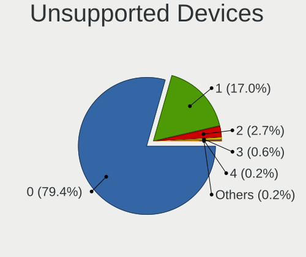

| Total | Desktops | Percent |
|-------|----------|---------|
| 0     | 19665    | 79.37%  |
| 1     | 4211     | 17%     |
| 2     | 664      | 2.68%   |
| 3     | 139      | 0.56%   |
| 4     | 44       | 0.18%   |
| 5     | 26       | 0.1%    |
| 6     | 18       | 0.07%   |
| 7     | 6        | 0.02%   |
| 8     | 2        | 0.01%   |

Unsupported Device Types
------------------------

Types of unsupported devices

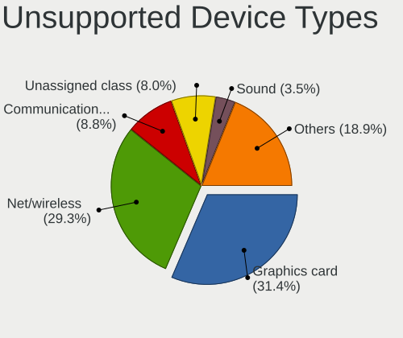

| Type                     | Desktops | Percent |
|--------------------------|----------|---------|
| Graphics card            | 1858     | 31.44%  |
| Net/wireless             | 1733     | 29.33%  |
| Communication controller | 519      | 8.78%   |
| Unassigned class         | 472      | 7.99%   |
| Sound                    | 208      | 3.52%   |
| Bluetooth                | 203      | 3.44%   |
| Multimedia controller    | 168      | 2.84%   |
| Net/ethernet             | 133      | 2.25%   |
| Camera                   | 111      | 1.88%   |
| Network                  | 109      | 1.84%   |
| Storage/raid             | 94       | 1.59%   |
| Fingerprint reader       | 68       | 1.15%   |
| Chipcard                 | 68       | 1.15%   |
| Modem                    | 48       | 0.81%   |
| Dvb card                 | 26       | 0.44%   |
| Storage/ide              | 23       | 0.39%   |
| Firewire controller      | 19       | 0.32%   |
| Storage/ata              | 13       | 0.22%   |
| Card reader              | 10       | 0.17%   |
| Storage/nvme             | 9        | 0.15%   |
| Tv card                  | 6        | 0.1%    |
| Storage                  | 6        | 0.1%    |
| Wireless                 | 2        | 0.03%   |
| Unclassified device      | 2        | 0.03%   |
| Video                    | 1        | 0.02%   |

