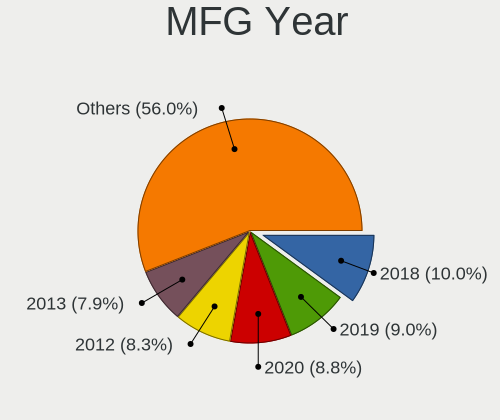
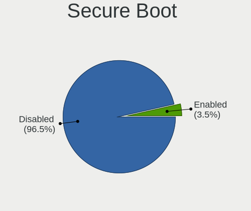
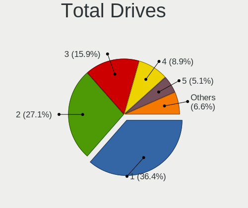
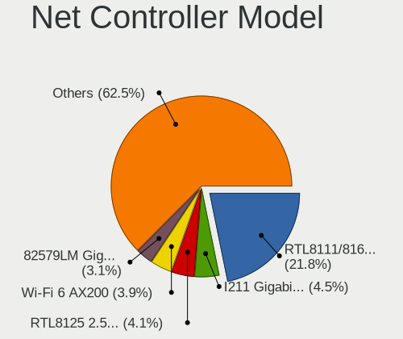
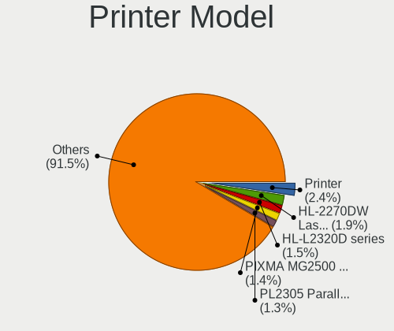

Linux in USA - Tested Hardware & Statistics (Desktops)
------------------------------------------------------

A project to collect tested hardware configurations for Linux in USA.

Anyone can contribute to this report by the [hw-probe](https://github.com/linuxhw/hw-probe) tool:

    sudo -E hw-probe -all -upload

Please contribute! Especially if your hardware is rare.

Contents
--------

* [ Test Cases ](#test-cases)

* [ System ](#system)
  - [ OS                       ](#os)
  - [ OS Family                ](#os-family)
  - [ Kernel                   ](#kernel)
  - [ Kernel Family            ](#kernel-family)
  - [ Kernel Major Ver.        ](#kernel-major-ver)
  - [ Arch                     ](#arch)
  - [ DE                       ](#de)
  - [ Display Server           ](#display-server)
  - [ Display Manager          ](#display-manager)
  - [ OS Lang                  ](#os-lang)
  - [ Boot Mode                ](#boot-mode)
  - [ Filesystem               ](#filesystem)
  - [ Part. scheme             ](#part-scheme)
  - [ Dual Boot with Linux/BSD ](#dual-boot-with-linuxbsd)
  - [ Dual Boot (Win)          ](#dual-boot-win)

* [ Board ](#board)
  - [ Vendor                   ](#vendor)
  - [ Model                    ](#model)
  - [ Model Family             ](#model-family)
  - [ MFG Year                 ](#mfg-year)
  - [ Form Factor              ](#form-factor)
  - [ Secure Boot              ](#secure-boot)
  - [ Coreboot                 ](#coreboot)
  - [ RAM Size                 ](#ram-size)
  - [ RAM Used                 ](#ram-used)
  - [ Total Drives             ](#total-drives)
  - [ Has CD-ROM               ](#has-cd-rom)
  - [ Has Ethernet             ](#has-ethernet)
  - [ Has WiFi                 ](#has-wifi)
  - [ Has Bluetooth            ](#has-bluetooth)

* [ Location ](#location)
  - [ Country                  ](#country)
  - [ City                     ](#city)

* [ Drives ](#drives)
  - [ Drive Vendor             ](#drive-vendor)
  - [ Drive Model              ](#drive-model)
  - [ HDD Vendor               ](#hdd-vendor)
  - [ SSD Vendor               ](#ssd-vendor)
  - [ Drive Kind               ](#drive-kind)
  - [ Drive Connector          ](#drive-connector)
  - [ Drive Size               ](#drive-size)
  - [ Space Total              ](#space-total)
  - [ Space Used               ](#space-used)
  - [ Malfunc. Drives          ](#malfunc-drives)
  - [ Malfunc. Drive Vendor    ](#malfunc-drive-vendor)
  - [ Malfunc. HDD Vendor      ](#malfunc-hdd-vendor)
  - [ Malfunc. Drive Kind      ](#malfunc-drive-kind)
  - [ Failed Drives            ](#failed-drives)
  - [ Failed Drive Vendor      ](#failed-drive-vendor)
  - [ Drive Status             ](#drive-status)

* [ Storage controller ](#storage-controller)
  - [ Storage Vendor           ](#storage-vendor)
  - [ Storage Model            ](#storage-model)
  - [ Storage Kind             ](#storage-kind)

* [ Processor ](#processor)
  - [ CPU Vendor               ](#cpu-vendor)
  - [ CPU Model                ](#cpu-model)
  - [ CPU Model Family         ](#cpu-model-family)
  - [ CPU Cores                ](#cpu-cores)
  - [ CPU Sockets              ](#cpu-sockets)
  - [ CPU Threads              ](#cpu-threads)
  - [ CPU Op-Modes             ](#cpu-op-modes)
  - [ CPU Microcode            ](#cpu-microcode)
  - [ CPU Microarch            ](#cpu-microarch)

* [ Graphics ](#graphics)
  - [ GPU Vendor               ](#gpu-vendor)
  - [ GPU Model                ](#gpu-model)
  - [ GPU Combo                ](#gpu-combo)
  - [ GPU Driver               ](#gpu-driver)
  - [ GPU Memory               ](#gpu-memory)

* [ Monitor ](#monitor)
  - [ Monitor Vendor           ](#monitor-vendor)
  - [ Monitor Model            ](#monitor-model)
  - [ Monitor Resolution       ](#monitor-resolution)
  - [ Monitor Diagonal         ](#monitor-diagonal)
  - [ Monitor Width            ](#monitor-width)
  - [ Aspect Ratio             ](#aspect-ratio)
  - [ Monitor Area             ](#monitor-area)
  - [ Pixel Density            ](#pixel-density)
  - [ Multiple Monitors        ](#multiple-monitors)

* [ Network ](#network)
  - [ Net Controller Vendor    ](#net-controller-vendor)
  - [ Net Controller Model     ](#net-controller-model)
  - [ Wireless Vendor          ](#wireless-vendor)
  - [ Wireless Model           ](#wireless-model)
  - [ Ethernet Vendor          ](#ethernet-vendor)
  - [ Ethernet Model           ](#ethernet-model)
  - [ Net Controller Kind      ](#net-controller-kind)
  - [ Used Controller          ](#used-controller)
  - [ NICs                     ](#nics)
  - [ IPv6                     ](#ipv6)

* [ Bluetooth ](#bluetooth)
  - [ Bluetooth Vendor         ](#bluetooth-vendor)
  - [ Bluetooth Model          ](#bluetooth-model)

* [ Sound ](#sound)
  - [ Sound Vendor             ](#sound-vendor)
  - [ Sound Model              ](#sound-model)

* [ Memory ](#memory)
  - [ Memory Vendor            ](#memory-vendor)
  - [ Memory Model             ](#memory-model)
  - [ Memory Kind              ](#memory-kind)
  - [ Memory Form Factor       ](#memory-form-factor)
  - [ Memory Size              ](#memory-size)
  - [ Memory Speed             ](#memory-speed)

* [ Printers & scanners ](#printers--scanners)
  - [ Printer Vendor           ](#printer-vendor)
  - [ Printer Model            ](#printer-model)
  - [ Scanner Vendor           ](#scanner-vendor)
  - [ Scanner Model            ](#scanner-model)

* [ Camera ](#camera)
  - [ Camera Vendor            ](#camera-vendor)
  - [ Camera Model             ](#camera-model)

* [ Security ](#security)
  - [ Fingerprint Vendor       ](#fingerprint-vendor)
  - [ Fingerprint Model        ](#fingerprint-model)
  - [ Chipcard Vendor          ](#chipcard-vendor)
  - [ Chipcard Model           ](#chipcard-model)

* [ Unsupported ](#unsupported)
  - [ Unsupported Devices      ](#unsupported-devices)
  - [ Unsupported Device Types ](#unsupported-device-types)

Test Cases
----------

Total: 22130

| Vendor        | Model                       | Probe                                                      | Date         |
|---------------|-----------------------------|------------------------------------------------------------|--------------|
| Gateway       | IPISB-VR                    | [4bed351eee](https://linux-hardware.org/?probe=4bed351eee) | Sep 07, 2023 |
| ASUSTek       | TUF Gaming B550-PLUS WIF... | [5330a96ef6](https://linux-hardware.org/?probe=5330a96ef6) | Sep 07, 2023 |
| Dell          | 0WMJ54 A01                  | [034ff4bc7e](https://linux-hardware.org/?probe=034ff4bc7e) | Sep 07, 2023 |
| NZXT          | N7 Z370                     | [34a23bdc5f](https://linux-hardware.org/?probe=34a23bdc5f) | Sep 07, 2023 |
| Dell          | 0Y2MRG A00                  | [34ae665da1](https://linux-hardware.org/?probe=34ae665da1) | Sep 07, 2023 |
| MSI           | MAG Z490 TOMAHAWK           | [bacfcd3028](https://linux-hardware.org/?probe=bacfcd3028) | Sep 07, 2023 |
| Dell          | 088DT1 A01                  | [e7d12d040e](https://linux-hardware.org/?probe=e7d12d040e) | Sep 07, 2023 |
| ASUSTek       | ProArt B550-CREATOR         | [5b276b13a8](https://linux-hardware.org/?probe=5b276b13a8) | Sep 07, 2023 |
| Lenovo        | 3704 SDK0R32862 WIN 3258... | [907edde95a](https://linux-hardware.org/?probe=907edde95a) | Sep 07, 2023 |
| Dell          | 0WN7Y6 A02                  | [aaf64e4624](https://linux-hardware.org/?probe=aaf64e4624) | Sep 07, 2023 |
| HP            | 18E5                        | [b0210e782a](https://linux-hardware.org/?probe=b0210e782a) | Sep 07, 2023 |
| HC Technol... | HCAR5000-MI                 | [3f98176bb7](https://linux-hardware.org/?probe=3f98176bb7) | Sep 06, 2023 |
| Dell          | 02YYK5 A01                  | [6bb77310bf](https://linux-hardware.org/?probe=6bb77310bf) | Sep 06, 2023 |
| ASUSTek       | Maximus V FORMULA           | [694ffed41f](https://linux-hardware.org/?probe=694ffed41f) | Sep 06, 2023 |
| Acer          | Aspire GX-785               | [e33b7b35bf](https://linux-hardware.org/?probe=e33b7b35bf) | Sep 06, 2023 |
| ASUSTek       | PRIME B550M-A               | [b17a5edce5](https://linux-hardware.org/?probe=b17a5edce5) | Sep 06, 2023 |
| Biostar       | A58MD                       | [40f078fcfc](https://linux-hardware.org/?probe=40f078fcfc) | Sep 06, 2023 |
| HP            | 81B3                        | [b04c59ca3e](https://linux-hardware.org/?probe=b04c59ca3e) | Sep 06, 2023 |
| ASUSTek       | ROG Maximus XII APEX        | [f735c5a6e7](https://linux-hardware.org/?probe=f735c5a6e7) | Sep 06, 2023 |
| Lenovo        | IdeaCentre K330B            | [a53977eb83](https://linux-hardware.org/?probe=a53977eb83) | Sep 06, 2023 |
| ASUSTek       | Z87M-PLUS                   | [30368099b8](https://linux-hardware.org/?probe=30368099b8) | Sep 06, 2023 |
| Gigabyte      | B650 AORUS ELITE AX         | [97bacd8975](https://linux-hardware.org/?probe=97bacd8975) | Sep 06, 2023 |
| Dell          | 0F3KHR A00                  | [21a1983dcc](https://linux-hardware.org/?probe=21a1983dcc) | Sep 06, 2023 |
| MSI           | 2A9Ch                       | [68fe74d684](https://linux-hardware.org/?probe=68fe74d684) | Sep 06, 2023 |
| Lenovo        | 3717 SDK0J40700 WIN 3258... | [e47f10b579](https://linux-hardware.org/?probe=e47f10b579) | Sep 06, 2023 |
| Dell          | 0F3KHR A00                  | [53bfbec77e](https://linux-hardware.org/?probe=53bfbec77e) | Sep 06, 2023 |
| Dell          | 0Y2MRG A00                  | [ad6d3dd867](https://linux-hardware.org/?probe=ad6d3dd867) | Sep 06, 2023 |
| ASUSTek       | ROG CROSSHAIR VIII HERO     | [fafd1b4cf2](https://linux-hardware.org/?probe=fafd1b4cf2) | Sep 06, 2023 |
| ASUSTek       | PRIME B450M-A II            | [07f51e668b](https://linux-hardware.org/?probe=07f51e668b) | Sep 06, 2023 |
| ASUSTek       | PRIME B550-PLUS             | [7fa390fcc4](https://linux-hardware.org/?probe=7fa390fcc4) | Sep 06, 2023 |
| ASRock        | B550M Pro4                  | [afba6fc1eb](https://linux-hardware.org/?probe=afba6fc1eb) | Sep 06, 2023 |
| Pegatron      | TRUCKEE                     | [145414b8e3](https://linux-hardware.org/?probe=145414b8e3) | Sep 06, 2023 |
| ASUSTek       | PRIME B550M-A               | [7b99e058ff](https://linux-hardware.org/?probe=7b99e058ff) | Sep 06, 2023 |
| Lenovo        | 3717 SDK0J40700 WIN 3258... | [d1cf42c68c](https://linux-hardware.org/?probe=d1cf42c68c) | Sep 06, 2023 |
| ASUSTek       | ROG STRIX Z790-E GAMING ... | [4d1ca2eb79](https://linux-hardware.org/?probe=4d1ca2eb79) | Sep 06, 2023 |
| MSI           | MPG X570 GAMING PLUS        | [f04f6fc2a6](https://linux-hardware.org/?probe=f04f6fc2a6) | Sep 06, 2023 |
| AZW           | U59                         | [0971b3ceb2](https://linux-hardware.org/?probe=0971b3ceb2) | Sep 06, 2023 |
| MSI           | MPG B650I EDGE WIFI         | [b395463f0e](https://linux-hardware.org/?probe=b395463f0e) | Sep 06, 2023 |
| Gigabyte      | 970A-DS3P                   | [3227a8a6bc](https://linux-hardware.org/?probe=3227a8a6bc) | Sep 06, 2023 |
| ASUSTek       | Maximus V FORMULA           | [039aa353eb](https://linux-hardware.org/?probe=039aa353eb) | Sep 06, 2023 |
| Foxconn       | 2AB1                        | [bf3a43c945](https://linux-hardware.org/?probe=bf3a43c945) | Sep 06, 2023 |
| Gigabyte      | X570 AORUS ELITE            | [995b1f100d](https://linux-hardware.org/?probe=995b1f100d) | Sep 06, 2023 |
| ASUSTek       | TUF Gaming Z590-PLUS WIF... | [d2ae9b900d](https://linux-hardware.org/?probe=d2ae9b900d) | Sep 06, 2023 |
| Pegatron      | 2AD3                        | [07cfb5b967](https://linux-hardware.org/?probe=07cfb5b967) | Sep 05, 2023 |
| ASUSTek       | X99-DELUXE                  | [0035cdf446](https://linux-hardware.org/?probe=0035cdf446) | Sep 05, 2023 |
| HP            | 81C9                        | [e80c7bf9d5](https://linux-hardware.org/?probe=e80c7bf9d5) | Sep 05, 2023 |
| ASUSTek       | PRIME X470-PRO              | [f081f44bda](https://linux-hardware.org/?probe=f081f44bda) | Sep 05, 2023 |
| Gigabyte      | 970A-DS3P                   | [4322b8da26](https://linux-hardware.org/?probe=4322b8da26) | Sep 05, 2023 |
| ASUSTek       | ROG STRIX Z790-E GAMING ... | [b1329d0cc1](https://linux-hardware.org/?probe=b1329d0cc1) | Sep 05, 2023 |
| ASUSTek       | SABERTOOTH X58              | [9139773ff9](https://linux-hardware.org/?probe=9139773ff9) | Sep 05, 2023 |
| Dell          | 0GY6Y8 A03                  | [da9dc1f5d9](https://linux-hardware.org/?probe=da9dc1f5d9) | Sep 05, 2023 |
| Gigabyte      | Z370XP SLI-CF               | [7139ad27f1](https://linux-hardware.org/?probe=7139ad27f1) | Sep 05, 2023 |
| ASRock        | B550 Phantom Gaming-ITX/... | [5a4f7a4641](https://linux-hardware.org/?probe=5a4f7a4641) | Sep 05, 2023 |
| AZW           | MINI S                      | [a2a1414ea6](https://linux-hardware.org/?probe=a2a1414ea6) | Sep 05, 2023 |
| Foxconn       | 2AB1                        | [5c43d49876](https://linux-hardware.org/?probe=5c43d49876) | Sep 05, 2023 |
| HP            | 0B54h D                     | [6fc93ef4ee](https://linux-hardware.org/?probe=6fc93ef4ee) | Sep 05, 2023 |
| ASUSTek       | TUF Gaming Z790-PLUS WIF... | [f8ec276ea3](https://linux-hardware.org/?probe=f8ec276ea3) | Sep 05, 2023 |
| ASUSTek       | M4A785-M                    | [0e073fb229](https://linux-hardware.org/?probe=0e073fb229) | Sep 05, 2023 |
| Gigabyte      | 970A-DS3P                   | [8a98029595](https://linux-hardware.org/?probe=8a98029595) | Sep 05, 2023 |
| MSI           | B350 GAMING PRO CARBON      | [c2257ed5b8](https://linux-hardware.org/?probe=c2257ed5b8) | Sep 04, 2023 |
| Gigabyte      | 970A-DS3P                   | [788841792b](https://linux-hardware.org/?probe=788841792b) | Sep 04, 2023 |
| ASRock        | H310M-STX                   | [5585353638](https://linux-hardware.org/?probe=5585353638) | Sep 04, 2023 |
| ASUSTek       | ProArt X670E-CREATOR WIF... | [cda189c68a](https://linux-hardware.org/?probe=cda189c68a) | Sep 04, 2023 |
| Inventec      | Z CLASS A02                 | [7f0254a775](https://linux-hardware.org/?probe=7f0254a775) | Sep 04, 2023 |
| Dell          | 06D7TR A02                  | [a99e7ffcb1](https://linux-hardware.org/?probe=a99e7ffcb1) | Sep 04, 2023 |
| ASRock        | B460M-HDV                   | [2380eeae30](https://linux-hardware.org/?probe=2380eeae30) | Sep 04, 2023 |
| ASUSTek       | X99-M WS                    | [f324b3dd33](https://linux-hardware.org/?probe=f324b3dd33) | Sep 04, 2023 |
| Dell          | 06D7TR A00                  | [ce82ba5660](https://linux-hardware.org/?probe=ce82ba5660) | Sep 04, 2023 |
| Gigabyte      | B450 AORUS PRO WIFI-CF      | [834b31e663](https://linux-hardware.org/?probe=834b31e663) | Sep 04, 2023 |
| Gigabyte      | B650M AORUS ELITE AX        | [71da9ea288](https://linux-hardware.org/?probe=71da9ea288) | Sep 04, 2023 |
| ASUSTek       | M5A97 R2.0                  | [39c78902f1](https://linux-hardware.org/?probe=39c78902f1) | Sep 04, 2023 |
| Seeed Stud... | ODYSSEY-X86J41X5 SD-BS-C... | [69fec63660](https://linux-hardware.org/?probe=69fec63660) | Sep 04, 2023 |
| Seeed Stud... | ODYSSEY-X86J41X5 SD-BS-C... | [ea00f871b9](https://linux-hardware.org/?probe=ea00f871b9) | Sep 04, 2023 |
| ASRock        | Z490 Phantom Gaming 4/ac    | [5fa23571c9](https://linux-hardware.org/?probe=5fa23571c9) | Sep 04, 2023 |
| Dell          | 0M6C7G A00                  | [8645b925c9](https://linux-hardware.org/?probe=8645b925c9) | Sep 04, 2023 |
| MSI           | PRO X670-P WIFI             | [326596a962](https://linux-hardware.org/?probe=326596a962) | Sep 04, 2023 |
| Hardkernel    | ODROID-H3                   | [30f66c7581](https://linux-hardware.org/?probe=30f66c7581) | Sep 04, 2023 |
| Gigabyte      | AB350M-DS3H V2-CF           | [08a80ee482](https://linux-hardware.org/?probe=08a80ee482) | Sep 04, 2023 |
| MSI           | B360M BAZOOKA               | [bdb68056ae](https://linux-hardware.org/?probe=bdb68056ae) | Sep 04, 2023 |
| ECS           | Nettle2                     | [8492f01e46](https://linux-hardware.org/?probe=8492f01e46) | Sep 04, 2023 |
| AZW           | MINI S                      | [331702f893](https://linux-hardware.org/?probe=331702f893) | Sep 04, 2023 |
| ASUSTek       | PRIME X570-P                | [922ff6eddb](https://linux-hardware.org/?probe=922ff6eddb) | Sep 04, 2023 |
| ASUSTek       | SABERTOOTH X58              | [edc8896f06](https://linux-hardware.org/?probe=edc8896f06) | Sep 04, 2023 |
| Gigabyte      | B650M AORUS ELITE AX        | [31cb6a887e](https://linux-hardware.org/?probe=31cb6a887e) | Sep 04, 2023 |
| Lenovo        | SHARKBAY NOK                | [1cc4b106a4](https://linux-hardware.org/?probe=1cc4b106a4) | Sep 04, 2023 |
| ASRock        | A520M-HDV                   | [8da6b89260](https://linux-hardware.org/?probe=8da6b89260) | Sep 04, 2023 |
| ASUSTek       | PRIME B550M-A               | [2252b35243](https://linux-hardware.org/?probe=2252b35243) | Sep 03, 2023 |
| ASUSTek       | PRIME Z690-P D4             | [81f816e956](https://linux-hardware.org/?probe=81f816e956) | Sep 03, 2023 |
| ASUSTek       | Maximus VIII HERO           | [d208a16a1b](https://linux-hardware.org/?probe=d208a16a1b) | Sep 03, 2023 |
| Gigabyte      | Z97X-UD5H                   | [2c9b64c445](https://linux-hardware.org/?probe=2c9b64c445) | Sep 03, 2023 |
| ASUSTek       | ROG Maximus Z790 HERO       | [2eed39fb24](https://linux-hardware.org/?probe=2eed39fb24) | Sep 03, 2023 |
| ASRock        | B365 Pro4                   | [d6be71642e](https://linux-hardware.org/?probe=d6be71642e) | Sep 03, 2023 |
| ASUSTek       | A88X-PRO                    | [79ca2081a1](https://linux-hardware.org/?probe=79ca2081a1) | Sep 03, 2023 |
| Dell          | 0D441T A03                  | [3ba5173eb2](https://linux-hardware.org/?probe=3ba5173eb2) | Sep 03, 2023 |
| BESSTAR Te... | Cherry Trail CR             | [3ad034200f](https://linux-hardware.org/?probe=3ad034200f) | Sep 03, 2023 |
| ASUSTek       | ROG STRIX B450-F GAMING     | [926751fb6e](https://linux-hardware.org/?probe=926751fb6e) | Sep 03, 2023 |
| MSI           | B350M PRO-VDH               | [4ee783a52f](https://linux-hardware.org/?probe=4ee783a52f) | Sep 03, 2023 |
| ASRock        | J4205-ITX                   | [8831793b97](https://linux-hardware.org/?probe=8831793b97) | Sep 03, 2023 |
| ASRock        | B450 Gaming K4              | [96dbf56986](https://linux-hardware.org/?probe=96dbf56986) | Sep 03, 2023 |
| Gigabyte      | X79-UP4                     | [3593994f4e](https://linux-hardware.org/?probe=3593994f4e) | Sep 03, 2023 |
| ASUSTek       | TUF Gaming Z790-PLUS WIF... | [eee58fd067](https://linux-hardware.org/?probe=eee58fd067) | Sep 03, 2023 |
| Gigabyte      | F2A88X-UP4                  | [37bfab5442](https://linux-hardware.org/?probe=37bfab5442) | Sep 02, 2023 |
| Gigabyte      | P67A-UD3P-B3                | [cf62b3f40c](https://linux-hardware.org/?probe=cf62b3f40c) | Sep 02, 2023 |
| Dell          | 0HHV7N A00                  | [9ae746229d](https://linux-hardware.org/?probe=9ae746229d) | Sep 02, 2023 |
| MSI           | MPG X570 GAMING PLUS        | [4fa68712c5](https://linux-hardware.org/?probe=4fa68712c5) | Sep 02, 2023 |
| HP            | 0B4Ch D                     | [1521626729](https://linux-hardware.org/?probe=1521626729) | Sep 02, 2023 |
| Dell          | 088DT1 A01                  | [2df9675af1](https://linux-hardware.org/?probe=2df9675af1) | Sep 02, 2023 |
| MSI           | MPG B550 GAMING PLUS        | [9ab3e57ab7](https://linux-hardware.org/?probe=9ab3e57ab7) | Sep 02, 2023 |
| ASUSTek       | PRIME X299-A II             | [80a93a9457](https://linux-hardware.org/?probe=80a93a9457) | Sep 02, 2023 |
| ASUSTek       | M5A78L-M LX PLUS            | [b4907a6220](https://linux-hardware.org/?probe=b4907a6220) | Sep 02, 2023 |
| Acer          | Aspire TC-875 V:1.0         | [a25ba0bd0c](https://linux-hardware.org/?probe=a25ba0bd0c) | Sep 02, 2023 |
| ASUSTek       | SABERTOOTH X58              | [0c99b66fde](https://linux-hardware.org/?probe=0c99b66fde) | Sep 02, 2023 |
| MSI           | PRO B550M-VC WIFI           | [3a7f86cf53](https://linux-hardware.org/?probe=3a7f86cf53) | Sep 02, 2023 |
| ASUSTek       | TUF Gaming B550M-PLUS       | [7e93b2a981](https://linux-hardware.org/?probe=7e93b2a981) | Sep 02, 2023 |
| Lenovo        | SHARKBAY NOK                | [6fb1aaaab8](https://linux-hardware.org/?probe=6fb1aaaab8) | Sep 02, 2023 |
| Hardkernel    | ODROID-H3                   | [33a04d3a73](https://linux-hardware.org/?probe=33a04d3a73) | Sep 02, 2023 |
| Foxconn       | 2ABF                        | [f3655da9eb](https://linux-hardware.org/?probe=f3655da9eb) | Sep 01, 2023 |
| Pegatron      | 2AD5                        | [644b70347e](https://linux-hardware.org/?probe=644b70347e) | Sep 01, 2023 |
| Gigabyte      | Z370 AORUS Gaming 7         | [6ddc9b767d](https://linux-hardware.org/?probe=6ddc9b767d) | Sep 01, 2023 |
| ASUSTek       | ROG Maximus XI HERO         | [a19ece12f0](https://linux-hardware.org/?probe=a19ece12f0) | Sep 01, 2023 |
| HP            | 82F1                        | [6fca2da71a](https://linux-hardware.org/?probe=6fca2da71a) | Sep 01, 2023 |
| Dell          | 030VXY A02                  | [ff787e57bc](https://linux-hardware.org/?probe=ff787e57bc) | Sep 01, 2023 |
| ASUSTek       | M5A78L-M/USB3               | [90be513b41](https://linux-hardware.org/?probe=90be513b41) | Sep 01, 2023 |
| HP            | 82F1                        | [2b601bfc6a](https://linux-hardware.org/?probe=2b601bfc6a) | Sep 01, 2023 |
| HP            | 82F1                        | [fe3e193418](https://linux-hardware.org/?probe=fe3e193418) | Sep 01, 2023 |
| System76      | Thelio thelio-r3            | [d0cdea5d23](https://linux-hardware.org/?probe=d0cdea5d23) | Sep 01, 2023 |
| MSI           | Z390-A PRO                  | [183c66be85](https://linux-hardware.org/?probe=183c66be85) | Sep 01, 2023 |
| ASUSTek       | TUF Gaming X570-PLUS        | [c865cde7a2](https://linux-hardware.org/?probe=c865cde7a2) | Sep 01, 2023 |
| AOpen         | i65HMx-D R1.04AL            | [aef1de4c53](https://linux-hardware.org/?probe=aef1de4c53) | Sep 01, 2023 |
| ASUSTek       | ROG STRIX B450-F GAMING     | [81e9e055de](https://linux-hardware.org/?probe=81e9e055de) | Sep 01, 2023 |
| MSI           | MS-7390                     | [7115ad031a](https://linux-hardware.org/?probe=7115ad031a) | Sep 01, 2023 |
| Lenovo        | 310B SDK0J40697 WIN 3305... | [a4ee14b9ac](https://linux-hardware.org/?probe=a4ee14b9ac) | Sep 01, 2023 |
| ASUSTek       | PRIME B550M-A AC            | [da19202792](https://linux-hardware.org/?probe=da19202792) | Sep 01, 2023 |
| Foxconn       | 2A92                        | [50ca8342d7](https://linux-hardware.org/?probe=50ca8342d7) | Sep 01, 2023 |
| ASUSTek       | PRIME B550M-A AC            | [e65f42e0d6](https://linux-hardware.org/?probe=e65f42e0d6) | Sep 01, 2023 |
| Foxconn       | 2AB1                        | [c140c2b911](https://linux-hardware.org/?probe=c140c2b911) | Sep 01, 2023 |
| ASUSTek       | M2N68-AM SE2                | [78cb25f581](https://linux-hardware.org/?probe=78cb25f581) | Aug 31, 2023 |
| HP            | 8592                        | [667f4402e7](https://linux-hardware.org/?probe=667f4402e7) | Aug 31, 2023 |
| ASUSTek       | H81M-K                      | [4b7cee7673](https://linux-hardware.org/?probe=4b7cee7673) | Aug 31, 2023 |
| ASUSTek       | PRIME H310M-E R2.0          | [be8b002a45](https://linux-hardware.org/?probe=be8b002a45) | Aug 31, 2023 |
| MSI           | 880G-E45                    | [f10edf60fd](https://linux-hardware.org/?probe=f10edf60fd) | Aug 31, 2023 |
| MSI           | B360M BAZOOKA               | [7d7d03eb25](https://linux-hardware.org/?probe=7d7d03eb25) | Aug 31, 2023 |
| ASUSTek       | PRIME A320M-K               | [8c1eeceddd](https://linux-hardware.org/?probe=8c1eeceddd) | Aug 31, 2023 |
| ASUSTek       | TUF Gaming B550-PLUS        | [88b6c0365c](https://linux-hardware.org/?probe=88b6c0365c) | Aug 31, 2023 |
| Dell          | 0KRC95 A02                  | [9173d00240](https://linux-hardware.org/?probe=9173d00240) | Aug 31, 2023 |
| ASUSTek       | M5A99X EVO R2.0             | [1a3fdd076f](https://linux-hardware.org/?probe=1a3fdd076f) | Aug 31, 2023 |
| Lenovo        | 3716 SDK0R32862 WIN 3258... | [0464aa909a](https://linux-hardware.org/?probe=0464aa909a) | Aug 31, 2023 |
| ASUSTek       | PHOENIX                     | [5fa96dfd97](https://linux-hardware.org/?probe=5fa96dfd97) | Aug 31, 2023 |
| ASUSTek       | PRIME X299-DELUXE           | [d9a8673516](https://linux-hardware.org/?probe=d9a8673516) | Aug 31, 2023 |
| HP            | 89B5 A                      | [1364f50166](https://linux-hardware.org/?probe=1364f50166) | Aug 31, 2023 |
| Dell          | OptiPlex 7050               | [a35a9d7d8a](https://linux-hardware.org/?probe=a35a9d7d8a) | Aug 30, 2023 |
| Apple         | Mac-F60DEB81FF30ACF6 Mac... | [45f86c066d](https://linux-hardware.org/?probe=45f86c066d) | Aug 30, 2023 |
| Gigabyte      | X570 AORUS ULTRA            | [c5469a2eaf](https://linux-hardware.org/?probe=c5469a2eaf) | Aug 30, 2023 |
| Lenovo        | 3716 SDK0T76463 WIN 3422... | [3aefc3000a](https://linux-hardware.org/?probe=3aefc3000a) | Aug 30, 2023 |
| ASRock        | B365 Pro4                   | [6d0b6e95ba](https://linux-hardware.org/?probe=6d0b6e95ba) | Aug 30, 2023 |
| ASUSTek       | A88X-PRO                    | [9327ae4f97](https://linux-hardware.org/?probe=9327ae4f97) | Aug 30, 2023 |
| ASUSTek       | P6T                         | [69879aca23](https://linux-hardware.org/?probe=69879aca23) | Aug 30, 2023 |
| ASUSTek       | PRIME Z490-A                | [3cfa79235e](https://linux-hardware.org/?probe=3cfa79235e) | Aug 30, 2023 |
| Acer          | Aspire TC-895 V:1.0         | [20bd10b5f4](https://linux-hardware.org/?probe=20bd10b5f4) | Aug 30, 2023 |
| Foxconn       | D180S/D190S/D290S Series... | [5f6030cb69](https://linux-hardware.org/?probe=5f6030cb69) | Aug 30, 2023 |
| ASUSTek       | TUF Z370-PLUS GAMING        | [b93e0fc32b](https://linux-hardware.org/?probe=b93e0fc32b) | Aug 30, 2023 |
| Dell          | 07KY25 A00                  | [9346896df5](https://linux-hardware.org/?probe=9346896df5) | Aug 30, 2023 |
| ASUSTek       | M5A97 R2.0                  | [c1514e209a](https://linux-hardware.org/?probe=c1514e209a) | Aug 30, 2023 |
| MSI           | Z270M MORTAR                | [416723b60c](https://linux-hardware.org/?probe=416723b60c) | Aug 30, 2023 |
| Dell          | 02KGF7 A00                  | [d3573cf0aa](https://linux-hardware.org/?probe=d3573cf0aa) | Aug 30, 2023 |
| Dell          | 0XHGV1 A01                  | [a5f30ecf01](https://linux-hardware.org/?probe=a5f30ecf01) | Aug 29, 2023 |
| Gigabyte      | B650M DS3H                  | [bd11422cd5](https://linux-hardware.org/?probe=bd11422cd5) | Aug 29, 2023 |
| Gigabyte      | Z97X-UD5H                   | [3fb03adafb](https://linux-hardware.org/?probe=3fb03adafb) | Aug 29, 2023 |
| ASUSTek       | H97M-PLUS                   | [c5fb822b1c](https://linux-hardware.org/?probe=c5fb822b1c) | Aug 29, 2023 |
| Intel         | DG45ID AAE27729-312         | [add370815d](https://linux-hardware.org/?probe=add370815d) | Aug 29, 2023 |
| Unknown       | Unknown                     | [ebebe5ddf7](https://linux-hardware.org/?probe=ebebe5ddf7) | Aug 29, 2023 |
| Dell          | 0JCTF8 A00                  | [c76c74b017](https://linux-hardware.org/?probe=c76c74b017) | Aug 29, 2023 |
| Gigabyte      | Z390 AORUS PRO WIFI-CF      | [2b9741ce87](https://linux-hardware.org/?probe=2b9741ce87) | Aug 29, 2023 |
| Dell          | 0GXM1W A01                  | [00207aee12](https://linux-hardware.org/?probe=00207aee12) | Aug 29, 2023 |
| Gigabyte      | A320M-HD2-CF                | [7d9c3aa2ad](https://linux-hardware.org/?probe=7d9c3aa2ad) | Aug 29, 2023 |
| MSI           | Z370-A PRO                  | [d9a6d27a28](https://linux-hardware.org/?probe=d9a6d27a28) | Aug 29, 2023 |
| Huanan        | H610M-PLUS V1.2             | [083aaaf1eb](https://linux-hardware.org/?probe=083aaaf1eb) | Aug 29, 2023 |
| ASUSTek       | TUF Z370-PLUS GAMING        | [7da432892e](https://linux-hardware.org/?probe=7da432892e) | Aug 29, 2023 |
| HP            | 212B                        | [80b2496334](https://linux-hardware.org/?probe=80b2496334) | Aug 29, 2023 |
| Lenovo        | 102F SDK0Q40081 WIN 3305... | [b6478eb429](https://linux-hardware.org/?probe=b6478eb429) | Aug 29, 2023 |
| HP            | 89B4 A                      | [e70b3a2352](https://linux-hardware.org/?probe=e70b3a2352) | Aug 29, 2023 |
| Gigabyte      | X570 AORUS ULTRA            | [0af7d6ee0b](https://linux-hardware.org/?probe=0af7d6ee0b) | Aug 28, 2023 |
| Lenovo        | 3717 SDK0J40700 WIN 3258... | [5df3abe62e](https://linux-hardware.org/?probe=5df3abe62e) | Aug 28, 2023 |
| Dell          | 0GY6Y8 A02                  | [fffbca3973](https://linux-hardware.org/?probe=fffbca3973) | Aug 28, 2023 |
| Dell          | 0TTDMJ A00                  | [3dc47e2b77](https://linux-hardware.org/?probe=3dc47e2b77) | Aug 28, 2023 |
| HP            | 1791                        | [09c2abafde](https://linux-hardware.org/?probe=09c2abafde) | Aug 28, 2023 |
| Acidanther... | Mac-27AD2F918AE68F61 Mac... | [b68e4634b7](https://linux-hardware.org/?probe=b68e4634b7) | Aug 28, 2023 |
| Dell          | 0J3C2F A02                  | [fcc6b1f4f5](https://linux-hardware.org/?probe=fcc6b1f4f5) | Aug 28, 2023 |
| Gigabyte      | B560 DS3H AC-Y1             | [1838cb8b9f](https://linux-hardware.org/?probe=1838cb8b9f) | Aug 28, 2023 |
| ASUSTek       | PRIME X470-PRO              | [eef69bf730](https://linux-hardware.org/?probe=eef69bf730) | Aug 28, 2023 |
| Dell          | 0C0YYY A00                  | [1ac938e884](https://linux-hardware.org/?probe=1ac938e884) | Aug 28, 2023 |
| HP            | 0AACh                       | [3522f0be02](https://linux-hardware.org/?probe=3522f0be02) | Aug 28, 2023 |
| Lenovo        | 3132 SDK0J40697 WIN 3305... | [cbf222bbf8](https://linux-hardware.org/?probe=cbf222bbf8) | Aug 28, 2023 |
| HP            | 2B18                        | [891ce74167](https://linux-hardware.org/?probe=891ce74167) | Aug 27, 2023 |
| Gateway       | RS780                       | [aecf72fc15](https://linux-hardware.org/?probe=aecf72fc15) | Aug 27, 2023 |
| Gigabyte      | 970A-D3P                    | [e178a50d54](https://linux-hardware.org/?probe=e178a50d54) | Aug 27, 2023 |
| HP            | 21D0                        | [c6cd8d13bc](https://linux-hardware.org/?probe=c6cd8d13bc) | Aug 27, 2023 |
| ASUSTek       | Pro B550M-C                 | [3c68838457](https://linux-hardware.org/?probe=3c68838457) | Aug 27, 2023 |
| Dell          | 0XHGV1 A01                  | [d03180d370](https://linux-hardware.org/?probe=d03180d370) | Aug 27, 2023 |
| eMachines     | EL1352                      | [5f9258beb2](https://linux-hardware.org/?probe=5f9258beb2) | Aug 27, 2023 |
| Gigabyte      | X570 AORUS MASTER           | [8ee512db27](https://linux-hardware.org/?probe=8ee512db27) | Aug 27, 2023 |
| ASRock        | X570 Phantom Gaming 4S      | [1be18fe99f](https://linux-hardware.org/?probe=1be18fe99f) | Aug 27, 2023 |
| Lenovo        | 3717 SDK0J40700 WIN 3258... | [512429f429](https://linux-hardware.org/?probe=512429f429) | Aug 27, 2023 |
| ASUSTek       | PRIME Z690-P WIFI D4        | [cf2cba5c59](https://linux-hardware.org/?probe=cf2cba5c59) | Aug 26, 2023 |
| MSI           | H110I PRO                   | [49da08efbd](https://linux-hardware.org/?probe=49da08efbd) | Aug 26, 2023 |
| Biostar       | B550GTA                     | [218cce14a5](https://linux-hardware.org/?probe=218cce14a5) | Aug 26, 2023 |
| Dell          | 088DT1 A01                  | [b69a80ea82](https://linux-hardware.org/?probe=b69a80ea82) | Aug 26, 2023 |
| ASUSTek       | ROG STRIX B550-F GAMING     | [17a7fc84be](https://linux-hardware.org/?probe=17a7fc84be) | Aug 26, 2023 |
| AZW           | U59                         | [ea7bf087cc](https://linux-hardware.org/?probe=ea7bf087cc) | Aug 26, 2023 |
| AZW           | U59                         | [d35717e2e4](https://linux-hardware.org/?probe=d35717e2e4) | Aug 26, 2023 |
| ASUSTek       | H97M-E                      | [ff832aca4a](https://linux-hardware.org/?probe=ff832aca4a) | Aug 26, 2023 |
| Dell          | 0Y2MRG A00                  | [451af13730](https://linux-hardware.org/?probe=451af13730) | Aug 26, 2023 |
| ASUSTek       | ROG STRIX X670E-E GAMING... | [16790cbb5f](https://linux-hardware.org/?probe=16790cbb5f) | Aug 26, 2023 |
| Acer          | Aspire TC-780               | [70d914b85a](https://linux-hardware.org/?probe=70d914b85a) | Aug 26, 2023 |
| MSI           | MPG B550 GAMING EDGE WIF... | [5febb12d66](https://linux-hardware.org/?probe=5febb12d66) | Aug 26, 2023 |
| HP            | 1589                        | [3c19bc74f7](https://linux-hardware.org/?probe=3c19bc74f7) | Aug 26, 2023 |
| Dell          | 03NVJ6 A01                  | [6bbb1d2e62](https://linux-hardware.org/?probe=6bbb1d2e62) | Aug 26, 2023 |
| Dell          | 03NVJ6 A01                  | [ccfb67648a](https://linux-hardware.org/?probe=ccfb67648a) | Aug 26, 2023 |
| ASUSTek       | PRIME H370M-PLUS            | [77f5b147cc](https://linux-hardware.org/?probe=77f5b147cc) | Aug 26, 2023 |
| ASUSTek       | PRIME H370M-PLUS            | [16d6c4f014](https://linux-hardware.org/?probe=16d6c4f014) | Aug 26, 2023 |
| MSI           | 990FXA GAMING               | [813d9c9c10](https://linux-hardware.org/?probe=813d9c9c10) | Aug 26, 2023 |
| ASRock        | X570 Steel Legend           | [65b6b29fc7](https://linux-hardware.org/?probe=65b6b29fc7) | Aug 26, 2023 |
| MSI           | MS-B9321                    | [07564a2fc4](https://linux-hardware.org/?probe=07564a2fc4) | Aug 25, 2023 |
| Dell          | 0HHV7N A00                  | [1bcc49b615](https://linux-hardware.org/?probe=1bcc49b615) | Aug 25, 2023 |
| MSI           | MS-B9321                    | [df54486a48](https://linux-hardware.org/?probe=df54486a48) | Aug 25, 2023 |
| ASUSTek       | P8Z77-V LK                  | [ddc22c204d](https://linux-hardware.org/?probe=ddc22c204d) | Aug 25, 2023 |
| ASUSTek       | M5A97 R2.0                  | [b031f8f693](https://linux-hardware.org/?probe=b031f8f693) | Aug 25, 2023 |
| ASUSTek       | PRIME B450M-A II            | [607925cb89](https://linux-hardware.org/?probe=607925cb89) | Aug 25, 2023 |
| Gigabyte      | Z77X-UD5H                   | [98a1dbe051](https://linux-hardware.org/?probe=98a1dbe051) | Aug 25, 2023 |
| ASUSTek       | X99-DELUXE                  | [d4d9345d6f](https://linux-hardware.org/?probe=d4d9345d6f) | Aug 25, 2023 |
| HP            | 89D8 SMVB                   | [d9898111f8](https://linux-hardware.org/?probe=d9898111f8) | Aug 25, 2023 |
| ASUSTek       | PRIME B365M-A               | [8d952e28e1](https://linux-hardware.org/?probe=8d952e28e1) | Aug 25, 2023 |
| System76      | Thelio Major thelio-majo... | [e5caa63b77](https://linux-hardware.org/?probe=e5caa63b77) | Aug 25, 2023 |
| Gigabyte      | GA-78LMT-USB3 R2 sex        | [e3c32f6873](https://linux-hardware.org/?probe=e3c32f6873) | Aug 25, 2023 |
| MSI           | X470 GAMING PLUS MAX        | [254f8aee40](https://linux-hardware.org/?probe=254f8aee40) | Aug 25, 2023 |
| MSI           | X470 GAMING PLUS MAX        | [6f72852248](https://linux-hardware.org/?probe=6f72852248) | Aug 25, 2023 |
| HP            | 158A                        | [e154a48901](https://linux-hardware.org/?probe=e154a48901) | Aug 25, 2023 |
| ASUSTek       | PRIME X570-P                | [555c7d17f0](https://linux-hardware.org/?probe=555c7d17f0) | Aug 25, 2023 |
| ASUSTek       | PRIME X570-P                | [2668db7570](https://linux-hardware.org/?probe=2668db7570) | Aug 25, 2023 |
| ASUSTek       | ROG Maximus XII EXTREME     | [815a77392c](https://linux-hardware.org/?probe=815a77392c) | Aug 25, 2023 |
| ASUSTek       | TUF Gaming X570-PLUS        | [3a86d43941](https://linux-hardware.org/?probe=3a86d43941) | Aug 25, 2023 |
| eMachines     | EL1852G                     | [68db025f09](https://linux-hardware.org/?probe=68db025f09) | Aug 25, 2023 |
| HP            | 3047h                       | [d5b03c1a66](https://linux-hardware.org/?probe=d5b03c1a66) | Aug 24, 2023 |
| Dell          | 0P096C A01                  | [3efa99668a](https://linux-hardware.org/?probe=3efa99668a) | Aug 24, 2023 |
| Pegatron      | 2ACF                        | [38f3df41d7](https://linux-hardware.org/?probe=38f3df41d7) | Aug 24, 2023 |
| eMachines     | EL1852G                     | [ea782989fd](https://linux-hardware.org/?probe=ea782989fd) | Aug 24, 2023 |
| Dell          | 0P096C A01                  | [1f67d435b7](https://linux-hardware.org/?probe=1f67d435b7) | Aug 24, 2023 |
| Dell          | 088DT1 A01                  | [0d9ddb7de2](https://linux-hardware.org/?probe=0d9ddb7de2) | Aug 24, 2023 |
| MSI           | Z87 MPOWER MAX              | [42d3a714ac](https://linux-hardware.org/?probe=42d3a714ac) | Aug 24, 2023 |
| Acer          | Aspire TC-115               | [1c22aff012](https://linux-hardware.org/?probe=1c22aff012) | Aug 24, 2023 |
| ASUSTek       | PRIME X470-PRO              | [b490084efc](https://linux-hardware.org/?probe=b490084efc) | Aug 24, 2023 |
| ASUSTek       | PRIME X470-PRO              | [e75a175580](https://linux-hardware.org/?probe=e75a175580) | Aug 24, 2023 |
| Intel         | DN2820FYK H24582-201        | [bb1402894c](https://linux-hardware.org/?probe=bb1402894c) | Aug 24, 2023 |
| ASUSTek       | TUF Gaming X570-PLUS        | [3acc953bde](https://linux-hardware.org/?probe=3acc953bde) | Aug 24, 2023 |
| ASUSTek       | TUF Gaming X570-PLUS        | [ccdc0814a8](https://linux-hardware.org/?probe=ccdc0814a8) | Aug 24, 2023 |
| ASUSTek       | M5A97 R2.0                  | [0161911081](https://linux-hardware.org/?probe=0161911081) | Aug 24, 2023 |
| AZW           | MINI S                      | [7712e558c5](https://linux-hardware.org/?probe=7712e558c5) | Aug 24, 2023 |
| AZW           | MINI S                      | [6296a4f71d](https://linux-hardware.org/?probe=6296a4f71d) | Aug 24, 2023 |
| MSI           | PRO B660-A DDR4             | [8cab090504](https://linux-hardware.org/?probe=8cab090504) | Aug 24, 2023 |
| ASUSTek       | ROG STRIX B350-F GAMING     | [34a96cbdc8](https://linux-hardware.org/?probe=34a96cbdc8) | Aug 24, 2023 |
| ASUSTek       | ROG STRIX B550-F GAMING     | [58d50740e7](https://linux-hardware.org/?probe=58d50740e7) | Aug 24, 2023 |
| ASUSTek       | ROG Maximus XII FORMULA     | [69df93b6b4](https://linux-hardware.org/?probe=69df93b6b4) | Aug 24, 2023 |
| ASUSTek       | ROG Maximus XII FORMULA     | [8cd328af00](https://linux-hardware.org/?probe=8cd328af00) | Aug 24, 2023 |
| AZW           | GTR V02                     | [6c91212b1a](https://linux-hardware.org/?probe=6c91212b1a) | Aug 24, 2023 |
| MSI           | H110I PRO                   | [12891f2138](https://linux-hardware.org/?probe=12891f2138) | Aug 24, 2023 |
| Pegatron      | 2AC2                        | [7b0af9060e](https://linux-hardware.org/?probe=7b0af9060e) | Aug 23, 2023 |
| HP            | 8906 SMVB                   | [f11b353da6](https://linux-hardware.org/?probe=f11b353da6) | Aug 23, 2023 |
| ASUSTek       | TUF Gaming X570-PLUS        | [60588f77af](https://linux-hardware.org/?probe=60588f77af) | Aug 23, 2023 |
| Gigabyte      | GA-78LMT-USB3 R2 sex        | [368f9f947b](https://linux-hardware.org/?probe=368f9f947b) | Aug 23, 2023 |
| Supermicro    | X10DRG-Q                    | [45ef204e3e](https://linux-hardware.org/?probe=45ef204e3e) | Aug 23, 2023 |
| Gigabyte      | Z790 AORUS MASTER           | [202017a190](https://linux-hardware.org/?probe=202017a190) | Aug 23, 2023 |
| ASUSTek       | ROG STRIX B650E-E GAMING... | [210fe127bf](https://linux-hardware.org/?probe=210fe127bf) | Aug 23, 2023 |
| Dell          | 0F896N A02                  | [3c1e848d33](https://linux-hardware.org/?probe=3c1e848d33) | Aug 23, 2023 |
| Gigabyte      | Z390 AORUS MASTER-CF        | [aa959925b8](https://linux-hardware.org/?probe=aa959925b8) | Aug 23, 2023 |
| Gigabyte      | GA-970A-UD3                 | [796925bf51](https://linux-hardware.org/?probe=796925bf51) | Aug 23, 2023 |
| Gigabyte      | B550 VISION D-P             | [145d800029](https://linux-hardware.org/?probe=145d800029) | Aug 23, 2023 |
| MSI           | Z270 GAMING PRO CARBON      | [78bfc9060d](https://linux-hardware.org/?probe=78bfc9060d) | Aug 23, 2023 |
| HP            | 8299                        | [aa27bed4f1](https://linux-hardware.org/?probe=aa27bed4f1) | Aug 23, 2023 |
| MSI           | MAG B550 TOMAHAWK MAX WI... | [d094cbc19c](https://linux-hardware.org/?probe=d094cbc19c) | Aug 23, 2023 |
| MSI           | X470 GAMING PLUS MAX        | [6c9f647d44](https://linux-hardware.org/?probe=6c9f647d44) | Aug 23, 2023 |
| Dell          | 0D6H9T A00                  | [81b8c378f7](https://linux-hardware.org/?probe=81b8c378f7) | Aug 23, 2023 |
| ASRock        | X570 Steel Legend           | [7bd62bca50](https://linux-hardware.org/?probe=7bd62bca50) | Aug 23, 2023 |
| Gigabyte      | 990FXA-UD5                  | [5e141011cd](https://linux-hardware.org/?probe=5e141011cd) | Aug 22, 2023 |
| MSI           | B550M PRO-VDH WIFI          | [086c2d91c1](https://linux-hardware.org/?probe=086c2d91c1) | Aug 22, 2023 |
| ASUSTek       | ROG STRIX X670E-E GAMING... | [80c67a4432](https://linux-hardware.org/?probe=80c67a4432) | Aug 22, 2023 |
| Gigabyte      | X299 AORUS Gaming-CF        | [e99aa2e4d7](https://linux-hardware.org/?probe=e99aa2e4d7) | Aug 22, 2023 |
| Gigabyte      | X299 AORUS Gaming-CF        | [d39f8430ac](https://linux-hardware.org/?probe=d39f8430ac) | Aug 22, 2023 |
| HP            | 1850                        | [d9b3f59f97](https://linux-hardware.org/?probe=d9b3f59f97) | Aug 22, 2023 |
| Unknown       | Unknown                     | [9b52370ec1](https://linux-hardware.org/?probe=9b52370ec1) | Aug 22, 2023 |
| Red Hat       | RHEL RHEL-9.2.0 PC          | [48f65a86aa](https://linux-hardware.org/?probe=48f65a86aa) | Aug 22, 2023 |
| Supermicro    | X10DRG-Q                    | [ea3995e7d5](https://linux-hardware.org/?probe=ea3995e7d5) | Aug 22, 2023 |
| Unknown       | Unknown                     | [51e91dd03e](https://linux-hardware.org/?probe=51e91dd03e) | Aug 22, 2023 |
| Dell          | 088DT1 A01                  | [15020bffbb](https://linux-hardware.org/?probe=15020bffbb) | Aug 22, 2023 |
| Intel         | DH77EB AAG39073-304         | [70399bc4c6](https://linux-hardware.org/?probe=70399bc4c6) | Aug 21, 2023 |
| Apple         | Mac-F221BEC8                | [907a1d574b](https://linux-hardware.org/?probe=907a1d574b) | Aug 21, 2023 |
| ASUSTek       | P8H61-I R2.0                | [510cd25b0e](https://linux-hardware.org/?probe=510cd25b0e) | Aug 21, 2023 |
| ASRock        | J4125B-ITX                  | [93853db701](https://linux-hardware.org/?probe=93853db701) | Aug 21, 2023 |
| ASRock        | J4125B-ITX                  | [f9058bcea1](https://linux-hardware.org/?probe=f9058bcea1) | Aug 21, 2023 |
| Dell          | OptiPlex 5050               | [045411a33d](https://linux-hardware.org/?probe=045411a33d) | Aug 21, 2023 |
| HP            | 158A                        | [4b006f4db6](https://linux-hardware.org/?probe=4b006f4db6) | Aug 21, 2023 |
| MSI           | B450-A PRO MAX              | [352d5c780f](https://linux-hardware.org/?probe=352d5c780f) | Aug 21, 2023 |
| Dell          | 0D881F A05                  | [8c6f4a2e1c](https://linux-hardware.org/?probe=8c6f4a2e1c) | Aug 21, 2023 |
| ASUSTek       | P8Z77-I DELUXE              | [09d57c6701](https://linux-hardware.org/?probe=09d57c6701) | Aug 21, 2023 |
| MSI           | B450-A PRO MAX              | [c0e3693248](https://linux-hardware.org/?probe=c0e3693248) | Aug 21, 2023 |
| Dell          | 0GY6Y8 A02                  | [409855b61b](https://linux-hardware.org/?probe=409855b61b) | Aug 21, 2023 |
| Unknown       | Unknown                     | [4d4fcc02f3](https://linux-hardware.org/?probe=4d4fcc02f3) | Aug 21, 2023 |
| Gigabyte      | A320M-S2H-CF                | [ac041357b0](https://linux-hardware.org/?probe=ac041357b0) | Aug 21, 2023 |
| Dell          | 088DT1 A01                  | [762f9cfed0](https://linux-hardware.org/?probe=762f9cfed0) | Aug 21, 2023 |
| HP            | 0B40h                       | [c5eafc1bbf](https://linux-hardware.org/?probe=c5eafc1bbf) | Aug 21, 2023 |
| AZW           | GTR V02                     | [d699113f95](https://linux-hardware.org/?probe=d699113f95) | Aug 21, 2023 |
| ASUSTek       | ROG STRIX B650E-I GAMING... | [f19c5a2bde](https://linux-hardware.org/?probe=f19c5a2bde) | Aug 21, 2023 |
| ASUSTek       | M4A88TD-V EVO/USB3          | [33ad1ac951](https://linux-hardware.org/?probe=33ad1ac951) | Aug 21, 2023 |
| ASUSTek       | X99-DELUXE II               | [d59b79adfe](https://linux-hardware.org/?probe=d59b79adfe) | Aug 21, 2023 |
| ASUSTek       | TUF Gaming B650-PLUS WIF... | [735e03f0f9](https://linux-hardware.org/?probe=735e03f0f9) | Aug 21, 2023 |
| Dell          | 06X1TJ A00                  | [85ba56b138](https://linux-hardware.org/?probe=85ba56b138) | Aug 20, 2023 |
| MSI           | A520M-A PRO                 | [88f3fb7f10](https://linux-hardware.org/?probe=88f3fb7f10) | Aug 20, 2023 |
| Pegatron      | TRUCKEE                     | [c3a8668cee](https://linux-hardware.org/?probe=c3a8668cee) | Aug 20, 2023 |
| Pegatron      | TRUCKEE                     | [7da89c9360](https://linux-hardware.org/?probe=7da89c9360) | Aug 20, 2023 |
| ASUSTek       | Benicia                     | [29f90f4d18](https://linux-hardware.org/?probe=29f90f4d18) | Aug 20, 2023 |
| ASUSTek       | ROG STRIX B350-F GAMING     | [71853f1c36](https://linux-hardware.org/?probe=71853f1c36) | Aug 20, 2023 |
| Gigabyte      | AX370-Gaming 3-CF           | [13bcbc11d7](https://linux-hardware.org/?probe=13bcbc11d7) | Aug 20, 2023 |
| Gigabyte      | X570 AORUS MASTER           | [fde9e1a454](https://linux-hardware.org/?probe=fde9e1a454) | Aug 20, 2023 |
| Gigabyte      | G41M-ES2L                   | [a38d849208](https://linux-hardware.org/?probe=a38d849208) | Aug 20, 2023 |
| MSI           | B550M PRO-VDH WIFI          | [113728e1be](https://linux-hardware.org/?probe=113728e1be) | Aug 20, 2023 |
| MSI           | MEG Z390 ACE                | [5ab219fbd1](https://linux-hardware.org/?probe=5ab219fbd1) | Aug 20, 2023 |
| NZXT          | N7 B550                     | [1f105eadd8](https://linux-hardware.org/?probe=1f105eadd8) | Aug 20, 2023 |
| Gigabyte      | X470 AORUS ULTRA GAMING-... | [c78c246642](https://linux-hardware.org/?probe=c78c246642) | Aug 20, 2023 |
| Dell          | 06D7TR A02                  | [dac6078c1b](https://linux-hardware.org/?probe=dac6078c1b) | Aug 20, 2023 |
| ASUSTek       | Rampage V EXTREME           | [1b7a1416fc](https://linux-hardware.org/?probe=1b7a1416fc) | Aug 20, 2023 |
| HP            | 18E4                        | [e7d94d93c6](https://linux-hardware.org/?probe=e7d94d93c6) | Aug 20, 2023 |
| ASUSTek       | PRIME X570-P                | [6c5abd788f](https://linux-hardware.org/?probe=6c5abd788f) | Aug 20, 2023 |
| HP            | 82A2                        | [423cf0d1c4](https://linux-hardware.org/?probe=423cf0d1c4) | Aug 20, 2023 |
| ASRock        | X370 Taichi                 | [9a7f33c81b](https://linux-hardware.org/?probe=9a7f33c81b) | Aug 20, 2023 |
| MSI           | B450M BAZOOKA               | [569655b0f2](https://linux-hardware.org/?probe=569655b0f2) | Aug 20, 2023 |
| HP            | 339A                        | [fe5a02e559](https://linux-hardware.org/?probe=fe5a02e559) | Aug 20, 2023 |
| Unknown       | Unknown                     | [4bd818cb75](https://linux-hardware.org/?probe=4bd818cb75) | Aug 20, 2023 |
| ASUSTek       | PRIME H370M-PLUS            | [73ae467f5d](https://linux-hardware.org/?probe=73ae467f5d) | Aug 20, 2023 |
| Dell          | 0VNP2H A01                  | [5724c221b8](https://linux-hardware.org/?probe=5724c221b8) | Aug 19, 2023 |
| Dell          | 0427JK A00                  | [857e3132c1](https://linux-hardware.org/?probe=857e3132c1) | Aug 19, 2023 |
| ASUSTek       | PRIME H310M-E R2.0          | [2ac06099d8](https://linux-hardware.org/?probe=2ac06099d8) | Aug 19, 2023 |
| MSI           | H270M BAZOOKA               | [f51f1ce129](https://linux-hardware.org/?probe=f51f1ce129) | Aug 19, 2023 |
| ASUSTek       | ROG STRIX B650E-F GAMING... | [a5af576c52](https://linux-hardware.org/?probe=a5af576c52) | Aug 19, 2023 |
| MSI           | KA790GX-M                   | [050157c33b](https://linux-hardware.org/?probe=050157c33b) | Aug 19, 2023 |
| ASUSTek       | ROG STRIX X470-I GAMING     | [dedf0b23a3](https://linux-hardware.org/?probe=dedf0b23a3) | Aug 19, 2023 |
| Intel         | D53427RKE G87971-406        | [f3510370a9](https://linux-hardware.org/?probe=f3510370a9) | Aug 19, 2023 |
| Gigabyte      | B650 AORUS ELITE AX         | [a15e796833](https://linux-hardware.org/?probe=a15e796833) | Aug 19, 2023 |
| HP            | 2B52                        | [0fa19228b7](https://linux-hardware.org/?probe=0fa19228b7) | Aug 19, 2023 |
| ASUSTek       | B250 MINING EXPERT          | [676140f030](https://linux-hardware.org/?probe=676140f030) | Aug 19, 2023 |
| ASUSTek       | TUF Gaming Z490-PLUS        | [c99b76f9fe](https://linux-hardware.org/?probe=c99b76f9fe) | Aug 19, 2023 |
| Dell          | 06X1TJ A00                  | [9580f6451c](https://linux-hardware.org/?probe=9580f6451c) | Aug 19, 2023 |
| ASRock        | X570 Taichi                 | [f59c0429a1](https://linux-hardware.org/?probe=f59c0429a1) | Aug 19, 2023 |
| HP            | 3047h                       | [91d9eaa1de](https://linux-hardware.org/?probe=91d9eaa1de) | Aug 19, 2023 |
| MSI           | MPG X570 GAMING EDGE WIF... | [d8de59f346](https://linux-hardware.org/?probe=d8de59f346) | Aug 19, 2023 |
| HPE           | ProLiant MicroServer Gen... | [467b1475ec](https://linux-hardware.org/?probe=467b1475ec) | Aug 19, 2023 |
| ASUSTek       | TUF Gaming X570-PLUS        | [e797880ede](https://linux-hardware.org/?probe=e797880ede) | Aug 19, 2023 |
| HP            | 8266                        | [22a06599a1](https://linux-hardware.org/?probe=22a06599a1) | Aug 19, 2023 |
| Dell          | 0GY6Y8 A02                  | [a4747bf8ea](https://linux-hardware.org/?probe=a4747bf8ea) | Aug 18, 2023 |
| Gigabyte      | X670 AORUS ELITE AX         | [f7d3395ffc](https://linux-hardware.org/?probe=f7d3395ffc) | Aug 18, 2023 |
| ASUSTek       | ROG STRIX B550-F GAMING     | [3c0bf7ce7b](https://linux-hardware.org/?probe=3c0bf7ce7b) | Aug 18, 2023 |
| HP            | 3047h                       | [a6a9afac2a](https://linux-hardware.org/?probe=a6a9afac2a) | Aug 18, 2023 |
| Gigabyte      | Z390 M GAMING-CF            | [b5973b3c67](https://linux-hardware.org/?probe=b5973b3c67) | Aug 18, 2023 |
| HP            | 3047h                       | [762697d775](https://linux-hardware.org/?probe=762697d775) | Aug 18, 2023 |
| ASUSTek       | ROG STRIX Z690-A GAMING ... | [5f5f5280d8](https://linux-hardware.org/?probe=5f5f5280d8) | Aug 18, 2023 |
| Dell          | OptiPlex 5050               | [e2c9cecddd](https://linux-hardware.org/?probe=e2c9cecddd) | Aug 18, 2023 |
| Gigabyte      | Z77-D3H                     | [49d0f197aa](https://linux-hardware.org/?probe=49d0f197aa) | Aug 18, 2023 |
| ASUSTek       | P8Z77-I DELUXE              | [53c4af621d](https://linux-hardware.org/?probe=53c4af621d) | Aug 18, 2023 |
| HP            | 3047h                       | [a4aa888c24](https://linux-hardware.org/?probe=a4aa888c24) | Aug 18, 2023 |
| Supermicro    | X10DRi-T4+                  | [2d10353983](https://linux-hardware.org/?probe=2d10353983) | Aug 18, 2023 |
| ASUSTek       | CM1630                      | [c1fd29e307](https://linux-hardware.org/?probe=c1fd29e307) | Aug 18, 2023 |
| Gigabyte      | B550 AORUS ELITE            | [28b621194b](https://linux-hardware.org/?probe=28b621194b) | Aug 18, 2023 |
| ASUSTek       | ROG STRIX Z390-E GAMING     | [92ae579bec](https://linux-hardware.org/?probe=92ae579bec) | Aug 18, 2023 |
| HP            | 0B4Ch D                     | [e21dbce888](https://linux-hardware.org/?probe=e21dbce888) | Aug 17, 2023 |
| ASUSTek       | SABERTOOTH 990FX R2.0       | [7658411c87](https://linux-hardware.org/?probe=7658411c87) | Aug 17, 2023 |
| ASUSTek       | TUF Gaming B760M-PLUS WI... | [c956862ccd](https://linux-hardware.org/?probe=c956862ccd) | Aug 17, 2023 |
| HP            | 8768 A                      | [a2b7f6905c](https://linux-hardware.org/?probe=a2b7f6905c) | Aug 17, 2023 |
| Gateway       | FX6840                      | [b0b3962785](https://linux-hardware.org/?probe=b0b3962785) | Aug 17, 2023 |
| HP            | 2AF7                        | [4e55d08586](https://linux-hardware.org/?probe=4e55d08586) | Aug 17, 2023 |
| Dell          | 0HN7XN A01                  | [6376619639](https://linux-hardware.org/?probe=6376619639) | Aug 17, 2023 |
| ASUSTek       | TUF Gaming X570-PLUS        | [db86583c86](https://linux-hardware.org/?probe=db86583c86) | Aug 17, 2023 |
| Apple         | Mac-27AD2F918AE68F61 Mac... | [2dcf46780c](https://linux-hardware.org/?probe=2dcf46780c) | Aug 17, 2023 |
| ASUSTek       | ROG Maximus XII EXTREME     | [1742c682fc](https://linux-hardware.org/?probe=1742c682fc) | Aug 16, 2023 |
| Lenovo        | 1048 SDK0J40697 WIN 3305... | [e584e6c368](https://linux-hardware.org/?probe=e584e6c368) | Aug 16, 2023 |
| ASUSTek       | M5A97 R2.0                  | [f2209034c0](https://linux-hardware.org/?probe=f2209034c0) | Aug 16, 2023 |
| Dell          | 0WR7PY A02                  | [bc22beda8a](https://linux-hardware.org/?probe=bc22beda8a) | Aug 16, 2023 |
| Gigabyte      | B550M AORUS PRO-P           | [6738589baa](https://linux-hardware.org/?probe=6738589baa) | Aug 16, 2023 |
| Gigabyte      | F2A88X-D3H                  | [0b6b39fa2d](https://linux-hardware.org/?probe=0b6b39fa2d) | Aug 16, 2023 |
| ASRock        | Z77 Extreme4                | [e9f564475b](https://linux-hardware.org/?probe=e9f564475b) | Aug 16, 2023 |
| ASUSTek       | TUF Gaming X570-PLUS        | [dc33049e9b](https://linux-hardware.org/?probe=dc33049e9b) | Aug 16, 2023 |
| ASUSTek       | P8B75-V                     | [78a5205783](https://linux-hardware.org/?probe=78a5205783) | Aug 16, 2023 |
| Lenovo        | 1036 NO DPK                 | [61eb0b10f6](https://linux-hardware.org/?probe=61eb0b10f6) | Aug 16, 2023 |
| Lenovo        | 3716 SDK0R32862 WIN 3258... | [c3b704f3f0](https://linux-hardware.org/?probe=c3b704f3f0) | Aug 16, 2023 |
| HP            | 8054                        | [7a1fbf5ac4](https://linux-hardware.org/?probe=7a1fbf5ac4) | Aug 16, 2023 |
| Lenovo        | 3716 SDK0R32862 WIN 3258... | [016846c4b8](https://linux-hardware.org/?probe=016846c4b8) | Aug 16, 2023 |
| MSI           | A320M-A PRO MAX             | [57a2ddf4a7](https://linux-hardware.org/?probe=57a2ddf4a7) | Aug 16, 2023 |
| ASUSTek       | M5A78L-M/USB3               | [725cdd1013](https://linux-hardware.org/?probe=725cdd1013) | Aug 16, 2023 |
| Gigabyte      | X99-Designare EX-CF         | [41452cd53d](https://linux-hardware.org/?probe=41452cd53d) | Aug 15, 2023 |
| Dell          | 0WR7PY A03                  | [91509a6450](https://linux-hardware.org/?probe=91509a6450) | Aug 15, 2023 |
| Lenovo        | 1036 SDK0Q40104 WIN 3305... | [4ac83eed41](https://linux-hardware.org/?probe=4ac83eed41) | Aug 15, 2023 |
| MSI           | B450 TOMAHAWK               | [78e30cb8ef](https://linux-hardware.org/?probe=78e30cb8ef) | Aug 15, 2023 |
| ASUSTek       | STRIX Z270H GAMING          | [8f183fbb2d](https://linux-hardware.org/?probe=8f183fbb2d) | Aug 15, 2023 |
| ASRock        | A320M/ac                    | [5012358457](https://linux-hardware.org/?probe=5012358457) | Aug 15, 2023 |
| Gigabyte      | X570 AORUS MASTER           | [0927025cfc](https://linux-hardware.org/?probe=0927025cfc) | Aug 15, 2023 |
| ASUSTek       | ROG CROSSHAIR VIII DARK ... | [e53e56fcbc](https://linux-hardware.org/?probe=e53e56fcbc) | Aug 15, 2023 |
| HP            | 829D                        | [448bb23145](https://linux-hardware.org/?probe=448bb23145) | Aug 15, 2023 |
| Apple         | Mac-27AD2F918AE68F61 Mac... | [5002915fe5](https://linux-hardware.org/?probe=5002915fe5) | Aug 15, 2023 |
| Dell          | 0J3C2F A02                  | [3fdd81216b](https://linux-hardware.org/?probe=3fdd81216b) | Aug 15, 2023 |
| Alienware     | 0CPDXD A00                  | [d732dfbf3b](https://linux-hardware.org/?probe=d732dfbf3b) | Aug 15, 2023 |
| Gigabyte      | X570 AORUS ELITE WIFI       | [daed613536](https://linux-hardware.org/?probe=daed613536) | Aug 15, 2023 |
| Dell          | 02YRK5 A02                  | [e79cdd0ba3](https://linux-hardware.org/?probe=e79cdd0ba3) | Aug 15, 2023 |
| MSI           | B350 TOMAHAWK               | [5432051007](https://linux-hardware.org/?probe=5432051007) | Aug 15, 2023 |
| ASRock        | X370 Taichi                 | [e338ac8876](https://linux-hardware.org/?probe=e338ac8876) | Aug 14, 2023 |
| ASUSTek       | H110T                       | [48d641f85c](https://linux-hardware.org/?probe=48d641f85c) | Aug 14, 2023 |
| MSI           | MS-7380                     | [519b55fb5d](https://linux-hardware.org/?probe=519b55fb5d) | Aug 14, 2023 |
| Dell          | 0R6PCT A01                  | [fc497cebe1](https://linux-hardware.org/?probe=fc497cebe1) | Aug 14, 2023 |
| Gigabyte      | Z390 AORUS PRO WIFI-CF      | [9dcf480eb8](https://linux-hardware.org/?probe=9dcf480eb8) | Aug 14, 2023 |
| ASUSTek       | PRIME X570-PRO              | [f4bcea527c](https://linux-hardware.org/?probe=f4bcea527c) | Aug 14, 2023 |
| Intel         | X79M-S                      | [043e072c46](https://linux-hardware.org/?probe=043e072c46) | Aug 14, 2023 |
| Dell          | 0CT017                      | [0800c86065](https://linux-hardware.org/?probe=0800c86065) | Aug 14, 2023 |
| Dell          | 0D24M8 A01                  | [042b081b3c](https://linux-hardware.org/?probe=042b081b3c) | Aug 14, 2023 |
| ASUSTek       | ROG STRIX X670E-E GAMING... | [cc343d2dce](https://linux-hardware.org/?probe=cc343d2dce) | Aug 14, 2023 |
| Gigabyte      | Z77-D3H                     | [94fe342785](https://linux-hardware.org/?probe=94fe342785) | Aug 14, 2023 |
| Dell          | 0D881F A05                  | [83dd0f7fe7](https://linux-hardware.org/?probe=83dd0f7fe7) | Aug 14, 2023 |
| MSI           | Z170A XPOWER GAMING TITA... | [b6e0b821b8](https://linux-hardware.org/?probe=b6e0b821b8) | Aug 14, 2023 |
| Gigabyte      | B560M DS3H V2               | [131535162e](https://linux-hardware.org/?probe=131535162e) | Aug 14, 2023 |
| ASUSTek       | PRIME B550M-A               | [361ad7057c](https://linux-hardware.org/?probe=361ad7057c) | Aug 13, 2023 |
| ASUSTek       | ROG CROSSHAIR VIII DARK ... | [540f880508](https://linux-hardware.org/?probe=540f880508) | Aug 13, 2023 |
| ASRock        | H81M-VG4 R2.0               | [7decc8ad48](https://linux-hardware.org/?probe=7decc8ad48) | Aug 13, 2023 |
| ASUSTek       | G15CE                       | [a9ac3a3ce4](https://linux-hardware.org/?probe=a9ac3a3ce4) | Aug 13, 2023 |
| Dell          | 0TTDMJ A00                  | [e0c6e5b185](https://linux-hardware.org/?probe=e0c6e5b185) | Aug 13, 2023 |
| NZXT          | N7 B550                     | [6cf14ccbe3](https://linux-hardware.org/?probe=6cf14ccbe3) | Aug 13, 2023 |
| ASRock        | H81M-VG4 R2.0               | [498a7e3ab4](https://linux-hardware.org/?probe=498a7e3ab4) | Aug 13, 2023 |
| MSI           | X99A GODLIKE GAMING         | [b87f112952](https://linux-hardware.org/?probe=b87f112952) | Aug 13, 2023 |
| Alienware     | 0K9TKY A00                  | [edf714498f](https://linux-hardware.org/?probe=edf714498f) | Aug 13, 2023 |
| Intel         | DX58OG AAG10926-205         | [cb3a9289f9](https://linux-hardware.org/?probe=cb3a9289f9) | Aug 13, 2023 |
| Alienware     | 0K9TKY A00                  | [213d229837](https://linux-hardware.org/?probe=213d229837) | Aug 13, 2023 |
| HP            | 843B                        | [b809c37499](https://linux-hardware.org/?probe=b809c37499) | Aug 13, 2023 |
| ASUSTek       | H170I-PRO                   | [c88cafa2a4](https://linux-hardware.org/?probe=c88cafa2a4) | Aug 13, 2023 |
| Intel         | Alder Lake-H PCH E1.0G      | [ffc38858d0](https://linux-hardware.org/?probe=ffc38858d0) | Aug 13, 2023 |
| Intel         | Alder Lake-H PCH E1.0G      | [4737e7eee7](https://linux-hardware.org/?probe=4737e7eee7) | Aug 13, 2023 |
| ASUSTek       | TUF Gaming B550-PLUS        | [8a4aefedae](https://linux-hardware.org/?probe=8a4aefedae) | Aug 13, 2023 |
| Gigabyte      | Z390 AORUS ELITE-CF         | [aa4c1f2237](https://linux-hardware.org/?probe=aa4c1f2237) | Aug 13, 2023 |
| Foxconn       | 2AB1                        | [fdff550fcd](https://linux-hardware.org/?probe=fdff550fcd) | Aug 13, 2023 |
| Unknown       | Unknown                     | [e52e8ee5df](https://linux-hardware.org/?probe=e52e8ee5df) | Aug 13, 2023 |
| Lenovo        | SHARKBAY 0B98401 WIN        | [45cb1198bb](https://linux-hardware.org/?probe=45cb1198bb) | Aug 13, 2023 |
| ASUSTek       | P7P55D DELUXE               | [f900ebabde](https://linux-hardware.org/?probe=f900ebabde) | Aug 13, 2023 |
| ASUSTek       | ROG STRIX X670E-A GAMING... | [5f03e49c03](https://linux-hardware.org/?probe=5f03e49c03) | Aug 13, 2023 |
| ASUSTek       | ROG STRIX X670E-A GAMING... | [0c8514df53](https://linux-hardware.org/?probe=0c8514df53) | Aug 13, 2023 |
| Gigabyte      | 990FXA-UD5                  | [e4f4812b8c](https://linux-hardware.org/?probe=e4f4812b8c) | Aug 13, 2023 |
| ASRock        | B550M-C                     | [69cda8cb24](https://linux-hardware.org/?probe=69cda8cb24) | Aug 12, 2023 |
| Dell          | 08NPPY A00                  | [e15632468b](https://linux-hardware.org/?probe=e15632468b) | Aug 12, 2023 |
| Biostar       | A770 A2+                    | [ff8bec8b75](https://linux-hardware.org/?probe=ff8bec8b75) | Aug 12, 2023 |
| Gigabyte      | 970A-D3P                    | [8ef51956a9](https://linux-hardware.org/?probe=8ef51956a9) | Aug 12, 2023 |
| Dell          | 0NC2VH A01                  | [e39fddb92c](https://linux-hardware.org/?probe=e39fddb92c) | Aug 12, 2023 |
| Gigabyte      | X670E AORUS MASTER          | [57a63573fc](https://linux-hardware.org/?probe=57a63573fc) | Aug 12, 2023 |
| Gigabyte      | X670E AORUS MASTER          | [5d96610622](https://linux-hardware.org/?probe=5d96610622) | Aug 12, 2023 |
| MSI           | MPG X570 GAMING PLUS        | [22690b9d65](https://linux-hardware.org/?probe=22690b9d65) | Aug 12, 2023 |
| ASUSTek       | CM1630                      | [dfd52e2852](https://linux-hardware.org/?probe=dfd52e2852) | Aug 12, 2023 |
| Gigabyte      | Z390 AORUS PRO WIFI-CF      | [7298d533c9](https://linux-hardware.org/?probe=7298d533c9) | Aug 12, 2023 |
| Gigabyte      | Z390 AORUS PRO WIFI-CF      | [13e0e622f3](https://linux-hardware.org/?probe=13e0e622f3) | Aug 12, 2023 |
| HP            | 1589                        | [1a38154020](https://linux-hardware.org/?probe=1a38154020) | Aug 12, 2023 |
| ASUSTek       | CM1630                      | [d8f56bcdaf](https://linux-hardware.org/?probe=d8f56bcdaf) | Aug 12, 2023 |
| Intel         | B85 V5.56                   | [7fb2d45505](https://linux-hardware.org/?probe=7fb2d45505) | Aug 12, 2023 |
| Dell          | 05YDCW A01                  | [3f3195be63](https://linux-hardware.org/?probe=3f3195be63) | Aug 12, 2023 |
| Dell          | 05YDCW A01                  | [80c27f0ac1](https://linux-hardware.org/?probe=80c27f0ac1) | Aug 12, 2023 |
| ASUSTek       | PRIME Z590-P WIFI           | [073d2bb6a7](https://linux-hardware.org/?probe=073d2bb6a7) | Aug 12, 2023 |
| Gigabyte      | F2A88XN-WIFI                | [8ba1a47cc3](https://linux-hardware.org/?probe=8ba1a47cc3) | Aug 12, 2023 |
| Gigabyte      | F2A88XN-WIFI                | [adb95a05c5](https://linux-hardware.org/?probe=adb95a05c5) | Aug 12, 2023 |
| ASUSTek       | ROG STRIX B550-F GAMING ... | [580fda2e6b](https://linux-hardware.org/?probe=580fda2e6b) | Aug 12, 2023 |
| Dell          | 0Y2MRG A00                  | [04ce264a3e](https://linux-hardware.org/?probe=04ce264a3e) | Aug 12, 2023 |
| HP            | ProLiant ML350 G5           | [e9e8c3e5a7](https://linux-hardware.org/?probe=e9e8c3e5a7) | Aug 12, 2023 |
| Dell          | 0HD5W2 A01                  | [be4514c366](https://linux-hardware.org/?probe=be4514c366) | Aug 12, 2023 |
| Biostar       | A770 A2+                    | [d35bac0620](https://linux-hardware.org/?probe=d35bac0620) | Aug 12, 2023 |
| Biostar       | A770 A2+                    | [fb7d0009fd](https://linux-hardware.org/?probe=fb7d0009fd) | Aug 12, 2023 |
| Alienware     | 0N43JM A01                  | [74cc9030a1](https://linux-hardware.org/?probe=74cc9030a1) | Aug 12, 2023 |
| Intel         | B85 V5.56                   | [f278787ab5](https://linux-hardware.org/?probe=f278787ab5) | Aug 11, 2023 |
| ASUSTek       | PRIME B550-PLUS             | [76078461ae](https://linux-hardware.org/?probe=76078461ae) | Aug 11, 2023 |
| Gigabyte      | X570 I AORUS PRO WIFI       | [2a218f5ead](https://linux-hardware.org/?probe=2a218f5ead) | Aug 11, 2023 |
| Gigabyte      | B365 HD3                    | [e2ebf1941c](https://linux-hardware.org/?probe=e2ebf1941c) | Aug 11, 2023 |
| ASRock        | J4125B-ITX                  | [fa9ebd523f](https://linux-hardware.org/?probe=fa9ebd523f) | Aug 11, 2023 |
| Gigabyte      | Z77-D3H                     | [e71fc09944](https://linux-hardware.org/?probe=e71fc09944) | Aug 11, 2023 |
| HP            | 158A                        | [96e7fa3b8f](https://linux-hardware.org/?probe=96e7fa3b8f) | Aug 11, 2023 |
| HP            | 8619                        | [00c3a60e4c](https://linux-hardware.org/?probe=00c3a60e4c) | Aug 11, 2023 |
| ASRock        | B650M-HDV/M.2               | [ffd395aee0](https://linux-hardware.org/?probe=ffd395aee0) | Aug 11, 2023 |
| MSI           | MS-7380                     | [584074ca03](https://linux-hardware.org/?probe=584074ca03) | Aug 11, 2023 |
| ASUSTek       | ROG CROSSHAIR X670E GENE    | [f016fa3756](https://linux-hardware.org/?probe=f016fa3756) | Aug 11, 2023 |
| Dell          | 06X1TJ A00                  | [91ecb8253e](https://linux-hardware.org/?probe=91ecb8253e) | Aug 11, 2023 |
| Alienware     | Area-51 R2                  | [07a6f57292](https://linux-hardware.org/?probe=07a6f57292) | Aug 11, 2023 |
| Gigabyte      | B650 AORUS PRO AX           | [5cbfb27db2](https://linux-hardware.org/?probe=5cbfb27db2) | Aug 11, 2023 |
| Gigabyte      | B650 AORUS PRO AX           | [72b375ad38](https://linux-hardware.org/?probe=72b375ad38) | Aug 11, 2023 |
| ASRock        | Z97 Killer                  | [f055a15ccb](https://linux-hardware.org/?probe=f055a15ccb) | Aug 11, 2023 |
| ASUSTek       | P8P67 PRO                   | [c0d6900ba3](https://linux-hardware.org/?probe=c0d6900ba3) | Aug 10, 2023 |
| ASUSTek       | PRIME B550M-A               | [7da6954bc5](https://linux-hardware.org/?probe=7da6954bc5) | Aug 10, 2023 |
| Lenovo        | ThinkStation S30 056848U    | [e6bc23d815](https://linux-hardware.org/?probe=e6bc23d815) | Aug 10, 2023 |
| HP            | 2215                        | [40ace58487](https://linux-hardware.org/?probe=40ace58487) | Aug 10, 2023 |
| Dell          | 0M5DCD A00                  | [6f8ca5724f](https://linux-hardware.org/?probe=6f8ca5724f) | Aug 10, 2023 |
| Gigabyte      | X570S AERO G                | [22916d4c12](https://linux-hardware.org/?probe=22916d4c12) | Aug 10, 2023 |
| Dell          | 04YP6J A02                  | [5d5ce952b3](https://linux-hardware.org/?probe=5d5ce952b3) | Aug 10, 2023 |
| Gigabyte      | Z390 AORUS PRO WIFI-CF      | [307c7bbe9c](https://linux-hardware.org/?probe=307c7bbe9c) | Aug 10, 2023 |
| ASRock        | B550 Phantom Gaming-ITX/... | [d490bb32ec](https://linux-hardware.org/?probe=d490bb32ec) | Aug 10, 2023 |
| AMI           | T3 MRD                      | [7a77a54bfd](https://linux-hardware.org/?probe=7a77a54bfd) | Aug 10, 2023 |
| HP            | 8433 11                     | [de06cea570](https://linux-hardware.org/?probe=de06cea570) | Aug 10, 2023 |
| HP            | 8433 11                     | [4275d43a74](https://linux-hardware.org/?probe=4275d43a74) | Aug 10, 2023 |
| ASRock        | B450M-HDV R4.0              | [ab3503021a](https://linux-hardware.org/?probe=ab3503021a) | Aug 10, 2023 |
| Gigabyte      | AB350-Gaming 3-CF           | [c2b7b4e760](https://linux-hardware.org/?probe=c2b7b4e760) | Aug 10, 2023 |
| ASUSTek       | ROG Maximus XII EXTREME     | [a0350a164c](https://linux-hardware.org/?probe=a0350a164c) | Aug 10, 2023 |
| ASRock        | B550 Phantom Gaming-ITX/... | [fffee60e72](https://linux-hardware.org/?probe=fffee60e72) | Aug 10, 2023 |
| ASUSTek       | PRIME X670-P WIFI           | [19d251df2c](https://linux-hardware.org/?probe=19d251df2c) | Aug 10, 2023 |
| ASRock        | B365 Pro4                   | [45da50b5c8](https://linux-hardware.org/?probe=45da50b5c8) | Aug 10, 2023 |
| Intel         | DZ68BC AAG30742-401         | [9bf37df045](https://linux-hardware.org/?probe=9bf37df045) | Aug 10, 2023 |
| ASRock        | B365 Pro4                   | [03cb2690f7](https://linux-hardware.org/?probe=03cb2690f7) | Aug 10, 2023 |
| MSI           | 970 GAMING                  | [a499728742](https://linux-hardware.org/?probe=a499728742) | Aug 09, 2023 |
| Intel         | DZ77SL-50K AAG55115-300     | [0ca6c48c2f](https://linux-hardware.org/?probe=0ca6c48c2f) | Aug 09, 2023 |
| MSI           | X370 GAMING M7 ACK          | [00bb870b78](https://linux-hardware.org/?probe=00bb870b78) | Aug 09, 2023 |
| Gigabyte      | AB350-Gaming-CF             | [466419add0](https://linux-hardware.org/?probe=466419add0) | Aug 09, 2023 |
| ASRock        | X670E Pro RS                | [baa9e459cc](https://linux-hardware.org/?probe=baa9e459cc) | Aug 09, 2023 |
| Lenovo        | SDK0E50510 WIN 262508147... | [badd1c22ff](https://linux-hardware.org/?probe=badd1c22ff) | Aug 09, 2023 |
| Lenovo        | SDK0E50510 WIN 262508147... | [f74262edcd](https://linux-hardware.org/?probe=f74262edcd) | Aug 09, 2023 |
| Dell          | 0WMJ54 A01                  | [6e9ca3c833](https://linux-hardware.org/?probe=6e9ca3c833) | Aug 09, 2023 |
| MSI           | 970 GAMING                  | [4751920c96](https://linux-hardware.org/?probe=4751920c96) | Aug 09, 2023 |
| Dell          | 073Y7Y A00                  | [cbf4153713](https://linux-hardware.org/?probe=cbf4153713) | Aug 09, 2023 |
| Gigabyte      | F2A88X-D3H                  | [7b0c19a9a2](https://linux-hardware.org/?probe=7b0c19a9a2) | Aug 09, 2023 |
| Gigabyte      | F2A88X-D3H                  | [f0d580edb4](https://linux-hardware.org/?probe=f0d580edb4) | Aug 09, 2023 |
| Gigabyte      | X399 AORUS PRO-CF           | [3ecd6d3f74](https://linux-hardware.org/?probe=3ecd6d3f74) | Aug 09, 2023 |
| Gateway       | SX2865                      | [f3655d0539](https://linux-hardware.org/?probe=f3655d0539) | Aug 09, 2023 |
| MSI           | MAG B760 TOMAHAWK WIFI      | [64fbeeca5e](https://linux-hardware.org/?probe=64fbeeca5e) | Aug 08, 2023 |
| MSI           | MPG B550 GAMING PLUS        | [d073a53c85](https://linux-hardware.org/?probe=d073a53c85) | Aug 08, 2023 |
| Dell          | 0P301D A00                  | [e5091194fb](https://linux-hardware.org/?probe=e5091194fb) | Aug 08, 2023 |
| MSI           | MAG B550 TOMAHAWK           | [b76b1bf00a](https://linux-hardware.org/?probe=b76b1bf00a) | Aug 08, 2023 |
| MSI           | MAG B550 TOMAHAWK           | [63665fca24](https://linux-hardware.org/?probe=63665fca24) | Aug 08, 2023 |
| HP            | 2129                        | [f005bdb494](https://linux-hardware.org/?probe=f005bdb494) | Aug 08, 2023 |
| ASRock        | B550M-ITX/ac                | [c86495f999](https://linux-hardware.org/?probe=c86495f999) | Aug 08, 2023 |
| MSI           | MAG B550M MORTAR            | [6c50235cbc](https://linux-hardware.org/?probe=6c50235cbc) | Aug 08, 2023 |
| MSI           | MAG B550 TOMAHAWK           | [121b892fa8](https://linux-hardware.org/?probe=121b892fa8) | Aug 08, 2023 |
| ASRock        | X300M-STX                   | [e642e8e489](https://linux-hardware.org/?probe=e642e8e489) | Aug 08, 2023 |
| MSI           | MAG B550 TOMAHAWK           | [1ad6abed83](https://linux-hardware.org/?probe=1ad6abed83) | Aug 08, 2023 |
| MSI           | B550-A PRO                  | [61c59e48d2](https://linux-hardware.org/?probe=61c59e48d2) | Aug 08, 2023 |
| ASUSTek       | PHOENIX                     | [388bcf4158](https://linux-hardware.org/?probe=388bcf4158) | Aug 08, 2023 |
| ASUSTek       | TUF Gaming Z590-PLUS WIF... | [58208c1f16](https://linux-hardware.org/?probe=58208c1f16) | Aug 08, 2023 |
| ASUSTek       | ROG STRIX B450-F GAMING     | [7fe1ce642a](https://linux-hardware.org/?probe=7fe1ce642a) | Aug 08, 2023 |
| Lenovo        | 3717 SDK0J40700 WIN 3258... | [f7c7290847](https://linux-hardware.org/?probe=f7c7290847) | Aug 08, 2023 |
| Acer          | Aspire TC-710 V:1.1         | [f6af1382fd](https://linux-hardware.org/?probe=f6af1382fd) | Aug 08, 2023 |
| Lenovo        | 3717 SDK0J40700 WIN 3258... | [9a0fa703d7](https://linux-hardware.org/?probe=9a0fa703d7) | Aug 07, 2023 |
| ASRock        | H610M-ITX/ac                | [205fab2707](https://linux-hardware.org/?probe=205fab2707) | Aug 07, 2023 |
| HP            | 8876 11                     | [059d4c2db2](https://linux-hardware.org/?probe=059d4c2db2) | Aug 07, 2023 |
| MSI           | A520M-A PRO                 | [009a1819fa](https://linux-hardware.org/?probe=009a1819fa) | Aug 07, 2023 |
| HP            | 3397                        | [3cf9a90333](https://linux-hardware.org/?probe=3cf9a90333) | Aug 07, 2023 |
| ASUSTek       | ROG CROSSHAIR VIII HERO     | [8c664a454a](https://linux-hardware.org/?probe=8c664a454a) | Aug 07, 2023 |
| HP            | 158A                        | [657812fbbf](https://linux-hardware.org/?probe=657812fbbf) | Aug 07, 2023 |
| HP            | 8055                        | [5124119ce1](https://linux-hardware.org/?probe=5124119ce1) | Aug 07, 2023 |
| HP            | 0B4Ch D                     | [35e4fef6c6](https://linux-hardware.org/?probe=35e4fef6c6) | Aug 07, 2023 |
| Gigabyte      | AB350M-DS3H-CF              | [db512d60d0](https://linux-hardware.org/?probe=db512d60d0) | Aug 07, 2023 |
| Gigabyte      | Z390 AORUS PRO WIFI-CF      | [002014034b](https://linux-hardware.org/?probe=002014034b) | Aug 07, 2023 |
| Gigabyte      | Z390 AORUS PRO WIFI-CF      | [fbfc0c60bd](https://linux-hardware.org/?probe=fbfc0c60bd) | Aug 07, 2023 |
| ASUSTek       | M5A78L-M/USB3               | [3d4073bb1d](https://linux-hardware.org/?probe=3d4073bb1d) | Aug 07, 2023 |
| ASUSTek       | TUF B450M-PLUS GAMING       | [497623fdfd](https://linux-hardware.org/?probe=497623fdfd) | Aug 07, 2023 |
| Dell          | 0M9KCM A02                  | [a854d04706](https://linux-hardware.org/?probe=a854d04706) | Aug 07, 2023 |
| Dell          | 0NW6H5 A00                  | [f8511d64fc](https://linux-hardware.org/?probe=f8511d64fc) | Aug 07, 2023 |
| MSI           | 2AE0                        | [9d3b59de32](https://linux-hardware.org/?probe=9d3b59de32) | Aug 06, 2023 |
| Gigabyte      | AB350M-DS3H-CF              | [4a97a86dd8](https://linux-hardware.org/?probe=4a97a86dd8) | Aug 06, 2023 |
| MSI           | 2AE0                        | [2188c95453](https://linux-hardware.org/?probe=2188c95453) | Aug 06, 2023 |
| Gigabyte      | AB350-Gaming-CF             | [932391bfea](https://linux-hardware.org/?probe=932391bfea) | Aug 06, 2023 |
| Intel         | B85 V5.56                   | [9c9e999e7f](https://linux-hardware.org/?probe=9c9e999e7f) | Aug 06, 2023 |
| Intel         | B85 V5.56                   | [54f0bde318](https://linux-hardware.org/?probe=54f0bde318) | Aug 06, 2023 |
| Lenovo        | 1036 NO DPK                 | [d039bb9d5c](https://linux-hardware.org/?probe=d039bb9d5c) | Aug 06, 2023 |
| Gigabyte      | 990FXA-UD3                  | [4b57f7d6ea](https://linux-hardware.org/?probe=4b57f7d6ea) | Aug 06, 2023 |
| MSI           | Z270 TOMAHAWK OPT BOOST     | [6baabbdd21](https://linux-hardware.org/?probe=6baabbdd21) | Aug 06, 2023 |
| Lenovo        | 110536U ThinkServer TS13... | [5084897812](https://linux-hardware.org/?probe=5084897812) | Aug 05, 2023 |
| ASUSTek       | TUF Gaming Z790-PLUS WIF... | [1af709c14e](https://linux-hardware.org/?probe=1af709c14e) | Aug 05, 2023 |
| MSI           | MPG X670E CARBON WIFI       | [01b9adfb02](https://linux-hardware.org/?probe=01b9adfb02) | Aug 05, 2023 |
| Gigabyte      | Z97X-UD5H                   | [3bc330734d](https://linux-hardware.org/?probe=3bc330734d) | Aug 05, 2023 |
| MSI           | MAG B550 TOMAHAWK           | [8add0a69cc](https://linux-hardware.org/?probe=8add0a69cc) | Aug 05, 2023 |
| MSI           | MAG X670E TOMAHAWK WIFI     | [5d998a099e](https://linux-hardware.org/?probe=5d998a099e) | Aug 05, 2023 |
| MSI           | MAG X670E TOMAHAWK WIFI     | [e57d71e056](https://linux-hardware.org/?probe=e57d71e056) | Aug 05, 2023 |
| MSI           | Z490-A PRO                  | [0698c83c6e](https://linux-hardware.org/?probe=0698c83c6e) | Aug 05, 2023 |
| MSI           | PRO B550M-VC WIFI           | [f1727289ea](https://linux-hardware.org/?probe=f1727289ea) | Aug 05, 2023 |
| ASUSTek       | ROG STRIX X670E-I GAMING... | [40bc2f506a](https://linux-hardware.org/?probe=40bc2f506a) | Aug 05, 2023 |
| ASUSTek       | SABERTOOTH Z77              | [3cc21c9051](https://linux-hardware.org/?probe=3cc21c9051) | Aug 05, 2023 |
| ASUSTek       | PRIME B550M-A               | [364b15d850](https://linux-hardware.org/?probe=364b15d850) | Aug 05, 2023 |
| ASUSTek       | PHOENIX                     | [193262b7ea](https://linux-hardware.org/?probe=193262b7ea) | Aug 05, 2023 |
| Dell          | 0K83V0 A00                  | [e8fbfe7be1](https://linux-hardware.org/?probe=e8fbfe7be1) | Aug 05, 2023 |
| HP            | 0B4Ch D                     | [297a14921c](https://linux-hardware.org/?probe=297a14921c) | Aug 04, 2023 |
| System76      | Thelio Major                | [eeea316849](https://linux-hardware.org/?probe=eeea316849) | Aug 04, 2023 |
| Dell          | 06X1TJ A00                  | [ac23fbd687](https://linux-hardware.org/?probe=ac23fbd687) | Aug 04, 2023 |
| Gigabyte      | B560 DS3H AC-Y1             | [af88e64084](https://linux-hardware.org/?probe=af88e64084) | Aug 04, 2023 |
| Dell          | 05XGC8 A01                  | [de1c7d119e](https://linux-hardware.org/?probe=de1c7d119e) | Aug 04, 2023 |
| Dell          | 00V62H A00                  | [bb98dda003](https://linux-hardware.org/?probe=bb98dda003) | Aug 04, 2023 |
| ASUSTek       | TUF Gaming B450M-PLUS II    | [18f95b58ac](https://linux-hardware.org/?probe=18f95b58ac) | Aug 04, 2023 |
| ASUSTek       | TUF Gaming B450M-PLUS II    | [349de8928b](https://linux-hardware.org/?probe=349de8928b) | Aug 04, 2023 |
| ASUSTek       | ROG Maximus X HERO          | [656e917b79](https://linux-hardware.org/?probe=656e917b79) | Aug 04, 2023 |
| HP            | 158A                        | [ae8ecc3ee7](https://linux-hardware.org/?probe=ae8ecc3ee7) | Aug 04, 2023 |
| ASRock        | B450 Gaming-ITX/ac          | [af4ef366cf](https://linux-hardware.org/?probe=af4ef366cf) | Aug 04, 2023 |
| Gigabyte      | AB350M-DS3H-CF              | [2b5c5c52e8](https://linux-hardware.org/?probe=2b5c5c52e8) | Aug 04, 2023 |
| HP            | 0B4Ch D                     | [46e96687a1](https://linux-hardware.org/?probe=46e96687a1) | Aug 04, 2023 |
| Lenovo        | 1036 NO DPK                 | [a3f6a98176](https://linux-hardware.org/?probe=a3f6a98176) | Aug 03, 2023 |
| MSI           | MS-7380                     | [98aa00b9e1](https://linux-hardware.org/?probe=98aa00b9e1) | Aug 03, 2023 |
| ASUSTek       | PRIME B550M-A               | [c0a4bb6c7e](https://linux-hardware.org/?probe=c0a4bb6c7e) | Aug 03, 2023 |
| Lenovo        | 1036 NO DPK                 | [3aa878541c](https://linux-hardware.org/?probe=3aa878541c) | Aug 03, 2023 |
| HP            | 1791                        | [61285d3724](https://linux-hardware.org/?probe=61285d3724) | Aug 03, 2023 |
| JHZD          | X830                        | [7de7f6bb75](https://linux-hardware.org/?probe=7de7f6bb75) | Aug 03, 2023 |
| Dell          | 082WXT A03                  | [27a50c4491](https://linux-hardware.org/?probe=27a50c4491) | Aug 03, 2023 |
| JHZD          | X830                        | [4fed3648c0](https://linux-hardware.org/?probe=4fed3648c0) | Aug 03, 2023 |
| MSI           | B450 TOMAHAWK               | [6b736ced64](https://linux-hardware.org/?probe=6b736ced64) | Aug 03, 2023 |
| Gigabyte      | Z390 AORUS PRO WIFI-CF      | [6b22568f3f](https://linux-hardware.org/?probe=6b22568f3f) | Aug 03, 2023 |
| ASRock        | B650M PG Riptide            | [2e309e76d7](https://linux-hardware.org/?probe=2e309e76d7) | Aug 03, 2023 |
| ASRock        | Z77 Professional            | [2f0bc369b4](https://linux-hardware.org/?probe=2f0bc369b4) | Aug 03, 2023 |
| HP            | 8767 A                      | [2cf5a8cce4](https://linux-hardware.org/?probe=2cf5a8cce4) | Aug 03, 2023 |
| ASUSTek       | ROG STRIX Z390-E GAMING     | [3f5df1b569](https://linux-hardware.org/?probe=3f5df1b569) | Aug 03, 2023 |
| HP            | 2215                        | [f0589325fc](https://linux-hardware.org/?probe=f0589325fc) | Aug 03, 2023 |
| Gigabyte      | B450M DS3H V2               | [909896213c](https://linux-hardware.org/?probe=909896213c) | Aug 02, 2023 |
| AOpen         | iBDWMUx-MD R1.04            | [18dad15a33](https://linux-hardware.org/?probe=18dad15a33) | Aug 02, 2023 |
| HP            | 89B5 A                      | [cb6f36f32c](https://linux-hardware.org/?probe=cb6f36f32c) | Aug 02, 2023 |
| Gigabyte      | B450M DS3H-CF               | [c66b1ed22c](https://linux-hardware.org/?probe=c66b1ed22c) | Aug 02, 2023 |
| Unknown       | Unknown                     | [92f3b39535](https://linux-hardware.org/?probe=92f3b39535) | Aug 02, 2023 |
| MSI           | MAG B560 TORPEDO            | [a76933554c](https://linux-hardware.org/?probe=a76933554c) | Aug 02, 2023 |
| Gigabyte      | GA-990FXA-UD3               | [8395f61392](https://linux-hardware.org/?probe=8395f61392) | Aug 02, 2023 |
| Dell          | 0R038D A00                  | [fd5fe120fa](https://linux-hardware.org/?probe=fd5fe120fa) | Aug 02, 2023 |
| Dell          | 06X1TJ A00                  | [5f9df619f5](https://linux-hardware.org/?probe=5f9df619f5) | Aug 02, 2023 |
| ASUSTek       | ROG STRIX X570-F GAMING     | [4cafb5721e](https://linux-hardware.org/?probe=4cafb5721e) | Aug 02, 2023 |
| MSI           | MAG Z790 TOMAHAWK WIFI      | [ceb7e754a1](https://linux-hardware.org/?probe=ceb7e754a1) | Aug 02, 2023 |
| Lenovo        | SKYBAY SDK0J40705 WIN 34... | [05ef21b742](https://linux-hardware.org/?probe=05ef21b742) | Aug 02, 2023 |
| HP            | 8309                        | [6cb1cfc925](https://linux-hardware.org/?probe=6cb1cfc925) | Aug 02, 2023 |
| HP            | 158A                        | [bac95226bd](https://linux-hardware.org/?probe=bac95226bd) | Aug 02, 2023 |
| ASUSTek       | ROG Maximus XII APEX        | [b8a5aee838](https://linux-hardware.org/?probe=b8a5aee838) | Aug 02, 2023 |
| ASUSTek       | P5B                         | [a918b28119](https://linux-hardware.org/?probe=a918b28119) | Aug 02, 2023 |
| Unknown       | Unknown                     | [731a8b0e31](https://linux-hardware.org/?probe=731a8b0e31) | Aug 02, 2023 |
| ASRock        | Z490M-ITX/ac                | [80558a1dcd](https://linux-hardware.org/?probe=80558a1dcd) | Aug 02, 2023 |
| Gateway       | DX4840                      | [7268035f51](https://linux-hardware.org/?probe=7268035f51) | Aug 01, 2023 |
| MSI           | MS-7380                     | [6f3e83e5a2](https://linux-hardware.org/?probe=6f3e83e5a2) | Aug 01, 2023 |
| Gigabyte      | B660 GAMING X DDR4          | [28f1074e0a](https://linux-hardware.org/?probe=28f1074e0a) | Aug 01, 2023 |
| Dell          | 0RY007                      | [8317045335](https://linux-hardware.org/?probe=8317045335) | Aug 01, 2023 |
| ASUSTek       | TUF Gaming X570-PLUS        | [66000207b0](https://linux-hardware.org/?probe=66000207b0) | Aug 01, 2023 |
| MSI           | X399 GAMING PRO CARBON A... | [41d4bd6cfe](https://linux-hardware.org/?probe=41d4bd6cfe) | Aug 01, 2023 |
| MSI           | X399 GAMING PRO CARBON A... | [3a655f04e1](https://linux-hardware.org/?probe=3a655f04e1) | Aug 01, 2023 |
| ASUSTek       | Z170-A                      | [3367a6e149](https://linux-hardware.org/?probe=3367a6e149) | Aug 01, 2023 |
| Unknown       | Unknown                     | [7a5ef06c39](https://linux-hardware.org/?probe=7a5ef06c39) | Aug 01, 2023 |
| ASUSTek       | ROG STRIX B450-F GAMING ... | [6519784d61](https://linux-hardware.org/?probe=6519784d61) | Aug 01, 2023 |
| Acer          | Veriton X4650G V:1.0        | [e4d176dd16](https://linux-hardware.org/?probe=e4d176dd16) | Aug 01, 2023 |
| ASRock        | 970M Pro3                   | [567efcf41e](https://linux-hardware.org/?probe=567efcf41e) | Aug 01, 2023 |
| Gigabyte      | B650 AORUS PRO AX           | [a8627dac81](https://linux-hardware.org/?probe=a8627dac81) | Aug 01, 2023 |
| ASUSTek       | TUF Gaming X570-PLUS        | [cb493cc8c8](https://linux-hardware.org/?probe=cb493cc8c8) | Aug 01, 2023 |
| ASRock        | B450M/ac                    | [82be4b3dfb](https://linux-hardware.org/?probe=82be4b3dfb) | Aug 01, 2023 |
| HP            | 3048h                       | [02df08e8ab](https://linux-hardware.org/?probe=02df08e8ab) | Jul 31, 2023 |
| ASUSTek       | TUF Gaming Z490-PLUS        | [afbf5d75c1](https://linux-hardware.org/?probe=afbf5d75c1) | Jul 31, 2023 |
| MSI           | B560M PRO-VDH WIFI          | [0d26da86c7](https://linux-hardware.org/?probe=0d26da86c7) | Jul 31, 2023 |
| ASUSTek       | ROG STRIX B550-F GAMING     | [1c44863a1c](https://linux-hardware.org/?probe=1c44863a1c) | Jul 31, 2023 |
| Dell          | 0C27VV A03                  | [75ff82774b](https://linux-hardware.org/?probe=75ff82774b) | Jul 31, 2023 |
| ASUSTek       | PRIME Z790-A WIFI           | [13a4427208](https://linux-hardware.org/?probe=13a4427208) | Jul 31, 2023 |
| ASUSTek       | TUF B450M-PLUS GAMING       | [2191e17d89](https://linux-hardware.org/?probe=2191e17d89) | Jul 31, 2023 |
| MSI           | PRO B650-P WIFI             | [92abff2d6e](https://linux-hardware.org/?probe=92abff2d6e) | Jul 31, 2023 |
| MSI           | PRO B650-P WIFI             | [d1c158eebc](https://linux-hardware.org/?probe=d1c158eebc) | Jul 31, 2023 |
| System76      | Thelio Mira thelio-mira-... | [685230003a](https://linux-hardware.org/?probe=685230003a) | Jul 31, 2023 |
| Dell          | 08NPPY A00                  | [26acefc1b8](https://linux-hardware.org/?probe=26acefc1b8) | Jul 31, 2023 |
| ASRock        | X570 Phantom Gaming 4       | [030f8afe2d](https://linux-hardware.org/?probe=030f8afe2d) | Jul 31, 2023 |
| MSI           | MPG X570 GAMING EDGE WIF... | [a3bbf1ecd0](https://linux-hardware.org/?probe=a3bbf1ecd0) | Jul 31, 2023 |
| ASUSTek       | Z87-K                       | [ed53779d9a](https://linux-hardware.org/?probe=ed53779d9a) | Jul 31, 2023 |
| Gigabyte      | B550 AORUS ELITE AX V2      | [45405639f5](https://linux-hardware.org/?probe=45405639f5) | Jul 31, 2023 |
| Gigabyte      | B450M DS3H WIFI-CF          | [d1d59592c3](https://linux-hardware.org/?probe=d1d59592c3) | Jul 30, 2023 |
| Gigabyte      | B650 AORUS PRO AX           | [23c9c57a00](https://linux-hardware.org/?probe=23c9c57a00) | Jul 30, 2023 |
| HP            | 212A                        | [4f81f09718](https://linux-hardware.org/?probe=4f81f09718) | Jul 30, 2023 |
| MSI           | MPG B550 GAMING PLUS        | [e16ea772e1](https://linux-hardware.org/?probe=e16ea772e1) | Jul 30, 2023 |
| ASUSTek       | P8Z77-V                     | [65dcccd422](https://linux-hardware.org/?probe=65dcccd422) | Jul 30, 2023 |
| MSI           | PRO X670-P WIFI             | [19b97459c1](https://linux-hardware.org/?probe=19b97459c1) | Jul 30, 2023 |
| ASUSTek       | SABERTOOTH 990FX            | [4070a9350d](https://linux-hardware.org/?probe=4070a9350d) | Jul 30, 2023 |
| HP            | 0AECh D                     | [50c84d005e](https://linux-hardware.org/?probe=50c84d005e) | Jul 30, 2023 |
| Lenovo        | 36EB SDK0J40700 WIN 3258... | [2c1deb7640](https://linux-hardware.org/?probe=2c1deb7640) | Jul 30, 2023 |
| HP            | 8617                        | [0c3ee28cd8](https://linux-hardware.org/?probe=0c3ee28cd8) | Jul 30, 2023 |
| Google        | Zako                        | [66946b6b49](https://linux-hardware.org/?probe=66946b6b49) | Jul 30, 2023 |
| Unknown       | HX90                        | [2eba30b5be](https://linux-hardware.org/?probe=2eba30b5be) | Jul 30, 2023 |
| ASUSTek       | ROG STRIX B650E-F GAMING... | [928817495c](https://linux-hardware.org/?probe=928817495c) | Jul 30, 2023 |
| MSI           | MAG B550 TOMAHAWK           | [1d7b13f2e9](https://linux-hardware.org/?probe=1d7b13f2e9) | Jul 30, 2023 |
| ASUSTek       | M4A89TD PRO USB3            | [bcfe09b617](https://linux-hardware.org/?probe=bcfe09b617) | Jul 29, 2023 |
| HP            | 3397                        | [98e4e362d9](https://linux-hardware.org/?probe=98e4e362d9) | Jul 29, 2023 |
| ASUSTek       | ROG STRIX Z690-E GAMING ... | [c8116c748a](https://linux-hardware.org/?probe=c8116c748a) | Jul 29, 2023 |
| Dell          | 0N4YC8 A00                  | [be08c309d2](https://linux-hardware.org/?probe=be08c309d2) | Jul 29, 2023 |
| Gigabyte      | Z590 AORUS ULTRA            | [ac8aab1d26](https://linux-hardware.org/?probe=ac8aab1d26) | Jul 29, 2023 |
| Lenovo        | 1036 SDK0Q40112 WIN 3305... | [731b8aed1b](https://linux-hardware.org/?probe=731b8aed1b) | Jul 29, 2023 |
| Lenovo        | SHARKBAY NOK                | [6e89d2949a](https://linux-hardware.org/?probe=6e89d2949a) | Jul 29, 2023 |
| Lenovo        | 3111 NOK                    | [bced6fb88a](https://linux-hardware.org/?probe=bced6fb88a) | Jul 29, 2023 |
| Apple         | Mac-F60DEB81FF30ACF6 Mac... | [a69e475106](https://linux-hardware.org/?probe=a69e475106) | Jul 29, 2023 |
| ASUSTek       | PRIME B450M-A II            | [22b080cd6b](https://linux-hardware.org/?probe=22b080cd6b) | Jul 29, 2023 |
| ASRock        | B450M/ac                    | [51d9b57967](https://linux-hardware.org/?probe=51d9b57967) | Jul 29, 2023 |
| HP            | 2B1B                        | [8454c98fbb](https://linux-hardware.org/?probe=8454c98fbb) | Jul 29, 2023 |
| Dell          | 0PC5F7 A02                  | [3a3477d4bc](https://linux-hardware.org/?probe=3a3477d4bc) | Jul 29, 2023 |
| NZXT          | N7 B650E                    | [38e481c3d5](https://linux-hardware.org/?probe=38e481c3d5) | Jul 29, 2023 |
| HP            | 3646h                       | [e00952810b](https://linux-hardware.org/?probe=e00952810b) | Jul 29, 2023 |
| ASUSTek       | PRIME Z390-A                | [8102a251ad](https://linux-hardware.org/?probe=8102a251ad) | Jul 29, 2023 |
| MSI           | B75MA-E33                   | [310207e0fd](https://linux-hardware.org/?probe=310207e0fd) | Jul 29, 2023 |
| Gigabyte      | F2A88X-D3H                  | [8e5c19146b](https://linux-hardware.org/?probe=8e5c19146b) | Jul 29, 2023 |
| MSI           | B360M BAZOOKA               | [081608e70c](https://linux-hardware.org/?probe=081608e70c) | Jul 28, 2023 |
| Gigabyte      | X570 AORUS MASTER           | [513ac15990](https://linux-hardware.org/?probe=513ac15990) | Jul 28, 2023 |
| Dell          | 05GD68 A00                  | [47759e14b4](https://linux-hardware.org/?probe=47759e14b4) | Jul 28, 2023 |
| Gigabyte      | B550 GAMING X V2            | [dcd24dfdc7](https://linux-hardware.org/?probe=dcd24dfdc7) | Jul 28, 2023 |
| ASUSTek       | PRIME H370M-PLUS            | [099c883745](https://linux-hardware.org/?probe=099c883745) | Jul 28, 2023 |
| Lenovo        | NO DPK                      | [15d3803dcc](https://linux-hardware.org/?probe=15d3803dcc) | Jul 28, 2023 |
| HP            | 0B4Ch D                     | [270ce3344c](https://linux-hardware.org/?probe=270ce3344c) | Jul 28, 2023 |
| MSI           | 2AE0                        | [fe10bd65bb](https://linux-hardware.org/?probe=fe10bd65bb) | Jul 28, 2023 |
| AZW           | MINI S 10                   | [3501ec2e9a](https://linux-hardware.org/?probe=3501ec2e9a) | Jul 28, 2023 |
| HP            | 2B0B 100                    | [586d94bacc](https://linux-hardware.org/?probe=586d94bacc) | Jul 28, 2023 |
| HP            | 2B0B 100                    | [da33776470](https://linux-hardware.org/?probe=da33776470) | Jul 28, 2023 |
| ASUSTek       | TUF Gaming Z490-PLUS        | [49daa98623](https://linux-hardware.org/?probe=49daa98623) | Jul 28, 2023 |
| ASUSTek       | PRIME X570-P                | [7e6ad75fc4](https://linux-hardware.org/?probe=7e6ad75fc4) | Jul 28, 2023 |
| ASRock        | X570 PG Velocita            | [ba2f93d0af](https://linux-hardware.org/?probe=ba2f93d0af) | Jul 28, 2023 |
| ASUSTek       | PRIME X299-DELUXE           | [27da4128a7](https://linux-hardware.org/?probe=27da4128a7) | Jul 28, 2023 |
| Gigabyte      | X570 AORUS ELITE WIFI       | [f4941e530b](https://linux-hardware.org/?probe=f4941e530b) | Jul 28, 2023 |
| Gigabyte      | H110M-DS2V-CF               | [6065f5443f](https://linux-hardware.org/?probe=6065f5443f) | Jul 28, 2023 |
| ASUSTek       | PRIME X470-PRO              | [f689c31a17](https://linux-hardware.org/?probe=f689c31a17) | Jul 28, 2023 |
| MSI           | TRX40 PRO 10G               | [6391114079](https://linux-hardware.org/?probe=6391114079) | Jul 28, 2023 |
| System76      | Thelio Mira thelio-mira-... | [785fb534be](https://linux-hardware.org/?probe=785fb534be) | Jul 27, 2023 |
| Dell          | 06X1TJ A00                  | [e873051e73](https://linux-hardware.org/?probe=e873051e73) | Jul 27, 2023 |
| ASRock        | X570 Creator                | [892e61c4a5](https://linux-hardware.org/?probe=892e61c4a5) | Jul 27, 2023 |
| Apple         | Mac-F60DEB81FF30ACF6 Mac... | [3c0f7ba188](https://linux-hardware.org/?probe=3c0f7ba188) | Jul 27, 2023 |
| Supermicro    | C7H61                       | [57c9a4eeff](https://linux-hardware.org/?probe=57c9a4eeff) | Jul 27, 2023 |
| ASRock        | H97M Anniversary            | [f8a02ab68e](https://linux-hardware.org/?probe=f8a02ab68e) | Jul 27, 2023 |
| MSI           | B450 GAMING PLUS MAX        | [2f12124bed](https://linux-hardware.org/?probe=2f12124bed) | Jul 27, 2023 |
| Intel         | X99H                        | [1e85498a86](https://linux-hardware.org/?probe=1e85498a86) | Jul 27, 2023 |
| Gigabyte      | B550 VISION D-P             | [2c300ff820](https://linux-hardware.org/?probe=2c300ff820) | Jul 27, 2023 |
| ABIT          | NF7-S/NF7,NF7-V,1.0         | [f5184af4e0](https://linux-hardware.org/?probe=f5184af4e0) | Jul 27, 2023 |
| ASUSTek       | P8Z77-V                     | [e550626a11](https://linux-hardware.org/?probe=e550626a11) | Jul 27, 2023 |
| Dell          | 0FDY5C A00                  | [14b58ac305](https://linux-hardware.org/?probe=14b58ac305) | Jul 27, 2023 |
| ASUSTek       | PHOENIX                     | [aad7b03818](https://linux-hardware.org/?probe=aad7b03818) | Jul 27, 2023 |
| ASUSTek       | PRIME B550M-A               | [02cf19407b](https://linux-hardware.org/?probe=02cf19407b) | Jul 26, 2023 |
| HP            | 806A                        | [e188cb594c](https://linux-hardware.org/?probe=e188cb594c) | Jul 26, 2023 |
| ASUSTek       | TUF Gaming X570-PLUS        | [ed591a913a](https://linux-hardware.org/?probe=ed591a913a) | Jul 26, 2023 |
| Gigabyte      | Z77X-D3H                    | [41ad8c7fc0](https://linux-hardware.org/?probe=41ad8c7fc0) | Jul 26, 2023 |
| Alienware     | 04VWF2 A02                  | [e6c2096ce5](https://linux-hardware.org/?probe=e6c2096ce5) | Jul 26, 2023 |
| MSI           | AM1M                        | [408a5dd9fc](https://linux-hardware.org/?probe=408a5dd9fc) | Jul 26, 2023 |
| Gigabyte      | B550M DS3H                  | [4b0210f463](https://linux-hardware.org/?probe=4b0210f463) | Jul 26, 2023 |
| Gigabyte      | B550M DS3H                  | [5d7532050c](https://linux-hardware.org/?probe=5d7532050c) | Jul 26, 2023 |
| Lenovo        | 1036 NO DPK                 | [725aae77c4](https://linux-hardware.org/?probe=725aae77c4) | Jul 26, 2023 |
| Gigabyte      | Z390 AORUS PRO WIFI-CF      | [ded7cda68f](https://linux-hardware.org/?probe=ded7cda68f) | Jul 26, 2023 |
| MSI           | PRO Z690-A WIFI DDR4        | [c9c42e4857](https://linux-hardware.org/?probe=c9c42e4857) | Jul 26, 2023 |
| Dell          | 0YXG0N A00                  | [fb365f50a0](https://linux-hardware.org/?probe=fb365f50a0) | Jul 26, 2023 |
| ASRock        | X570 PG Velocita            | [64d86600a4](https://linux-hardware.org/?probe=64d86600a4) | Jul 26, 2023 |
| ASUSTek       | TUF Gaming X570-PLUS        | [7c5e9b6bc6](https://linux-hardware.org/?probe=7c5e9b6bc6) | Jul 26, 2023 |
| ASRock        | B560M Pro4                  | [d96478ff29](https://linux-hardware.org/?probe=d96478ff29) | Jul 25, 2023 |
| Gigabyte      | Z77X-D3H                    | [80c9076b8b](https://linux-hardware.org/?probe=80c9076b8b) | Jul 25, 2023 |
| ASUSTek       | Rampage II GENE             | [c3df12e6ea](https://linux-hardware.org/?probe=c3df12e6ea) | Jul 25, 2023 |
| Dell          | 0RY206                      | [5f16b7ecda](https://linux-hardware.org/?probe=5f16b7ecda) | Jul 25, 2023 |
| Dell          | 088DT1 A01                  | [1355a4f2f4](https://linux-hardware.org/?probe=1355a4f2f4) | Jul 25, 2023 |
| HP            | 339A                        | [573fb08afb](https://linux-hardware.org/?probe=573fb08afb) | Jul 25, 2023 |
| ASRock        | B450 Pro4                   | [a68492f27e](https://linux-hardware.org/?probe=a68492f27e) | Jul 25, 2023 |
| Gigabyte      | Z390 AORUS PRO WIFI-CF      | [b5380c8836](https://linux-hardware.org/?probe=b5380c8836) | Jul 25, 2023 |
| ASRock        | B450M Pro4                  | [ab5995e72d](https://linux-hardware.org/?probe=ab5995e72d) | Jul 25, 2023 |
| HP            | 212A                        | [bd9d43276f](https://linux-hardware.org/?probe=bd9d43276f) | Jul 25, 2023 |
| ASUSTek       | PRIME B550M-A               | [0ecaae8a05](https://linux-hardware.org/?probe=0ecaae8a05) | Jul 25, 2023 |
| Gigabyte      | X570 AORUS XTREME           | [9b3ed16747](https://linux-hardware.org/?probe=9b3ed16747) | Jul 25, 2023 |
| Lenovo        | ThinkServer TS140           | [24b688cbfd](https://linux-hardware.org/?probe=24b688cbfd) | Jul 25, 2023 |
| Apple         | Mac-F221BEC8                | [8d712af013](https://linux-hardware.org/?probe=8d712af013) | Jul 25, 2023 |
| Gigabyte      | 970A-D3P                    | [fcb6317c1b](https://linux-hardware.org/?probe=fcb6317c1b) | Jul 25, 2023 |
| ASRock        | FM2A88X Extreme6+           | [4a1a31cb65](https://linux-hardware.org/?probe=4a1a31cb65) | Jul 25, 2023 |
| HP            | 0AECh D                     | [b9ea790e39](https://linux-hardware.org/?probe=b9ea790e39) | Jul 24, 2023 |
| Dell          | 0U880P A01                  | [91d0931125](https://linux-hardware.org/?probe=91d0931125) | Jul 24, 2023 |
| ASUSTek       | PRIME H310M-A R2.0          | [5399a2e19e](https://linux-hardware.org/?probe=5399a2e19e) | Jul 24, 2023 |
| HP            | 0AECh D                     | [078f0cd045](https://linux-hardware.org/?probe=078f0cd045) | Jul 24, 2023 |
| ASUSTek       | ROG CROSSHAIR VIII DARK ... | [ce1c4f4026](https://linux-hardware.org/?probe=ce1c4f4026) | Jul 24, 2023 |
| ASUSTek       | PHOENIX                     | [66ab03991c](https://linux-hardware.org/?probe=66ab03991c) | Jul 24, 2023 |
| Dell          | 088DT1 A01                  | [f796a78d27](https://linux-hardware.org/?probe=f796a78d27) | Jul 24, 2023 |
| Dell          | 088DT1 A01                  | [e130e8c0f2](https://linux-hardware.org/?probe=e130e8c0f2) | Jul 24, 2023 |
| ASRock        | B550M-C                     | [faf557738b](https://linux-hardware.org/?probe=faf557738b) | Jul 24, 2023 |
| ASRock        | B550M-C                     | [fb855f74ff](https://linux-hardware.org/?probe=fb855f74ff) | Jul 24, 2023 |
| Lenovo        | MAHOBAY NOK                 | [e391e5bca6](https://linux-hardware.org/?probe=e391e5bca6) | Jul 24, 2023 |
| ASRock        | B450M Pro4                  | [73886dba95](https://linux-hardware.org/?probe=73886dba95) | Jul 24, 2023 |
| ASUSTek       | TUF Gaming X570-PLUS        | [4fe4e8b639](https://linux-hardware.org/?probe=4fe4e8b639) | Jul 24, 2023 |
| ASUSTek       | TUF Gaming X570-PLUS        | [742d3b24c8](https://linux-hardware.org/?probe=742d3b24c8) | Jul 24, 2023 |
| MSI           | Z87-G45 GAMING              | [41246e91c0](https://linux-hardware.org/?probe=41246e91c0) | Jul 24, 2023 |
| HP            | 1589                        | [5c0bd1ec07](https://linux-hardware.org/?probe=5c0bd1ec07) | Jul 24, 2023 |
| MSI           | B460M PRO-VDH WIFI          | [df1a812c11](https://linux-hardware.org/?probe=df1a812c11) | Jul 24, 2023 |
| Gigabyte      | 970A-D3P                    | [bd66a96c97](https://linux-hardware.org/?probe=bd66a96c97) | Jul 24, 2023 |
| ASUSTek       | PRIME B550M-A               | [b892c011a8](https://linux-hardware.org/?probe=b892c011a8) | Jul 24, 2023 |
| Gigabyte      | X570 AORUS XTREME           | [955c69d2b2](https://linux-hardware.org/?probe=955c69d2b2) | Jul 24, 2023 |
| Fujitsu       | FujitsuTP7000 -1            | [96e8002856](https://linux-hardware.org/?probe=96e8002856) | Jul 24, 2023 |
| Lenovo        | 1036 NO DPK                 | [15c9141aa3](https://linux-hardware.org/?probe=15c9141aa3) | Jul 24, 2023 |
| ASUSTek       | P8Z77-V                     | [a8f7397fcf](https://linux-hardware.org/?probe=a8f7397fcf) | Jul 23, 2023 |
| Acidanther... | Mac-27AD2F918AE68F61 Mac... | [2afa2c2afe](https://linux-hardware.org/?probe=2afa2c2afe) | Jul 23, 2023 |
| Dell          | 0F5C5X A00                  | [e382c4d40c](https://linux-hardware.org/?probe=e382c4d40c) | Jul 23, 2023 |
| Gigabyte      | Z170X-UD5-CF                | [83ac887605](https://linux-hardware.org/?probe=83ac887605) | Jul 23, 2023 |
| Dell          | 0PTTT9 A01                  | [447b84f067](https://linux-hardware.org/?probe=447b84f067) | Jul 23, 2023 |
| ASUSTek       | TUF Z270 MARK 2             | [b844b9a353](https://linux-hardware.org/?probe=b844b9a353) | Jul 23, 2023 |
| HP            | 81BB                        | [75973dea3f](https://linux-hardware.org/?probe=75973dea3f) | Jul 23, 2023 |
| ASUSTek       | NARRA                       | [2c0dc7397a](https://linux-hardware.org/?probe=2c0dc7397a) | Jul 23, 2023 |
| MSI           | B550M PRO-VDH WIFI          | [751e776113](https://linux-hardware.org/?probe=751e776113) | Jul 23, 2023 |
| Lenovo        | ThinkServer TS140           | [8c41263814](https://linux-hardware.org/?probe=8c41263814) | Jul 23, 2023 |
| ASUSTek       | ROG STRIX B550-F GAMING     | [c8a41127a9](https://linux-hardware.org/?probe=c8a41127a9) | Jul 23, 2023 |
| MSI           | X570-A PRO                  | [e5f595daf8](https://linux-hardware.org/?probe=e5f595daf8) | Jul 23, 2023 |
| MSI           | MPG Z790I EDGE WIFI         | [a395d59ef5](https://linux-hardware.org/?probe=a395d59ef5) | Jul 23, 2023 |
| ASUSTek       | ROG STRIX B550-F GAMING     | [9186fec300](https://linux-hardware.org/?probe=9186fec300) | Jul 23, 2023 |
| ASUSTek       | TUF Gaming B550-PLUS WIF... | [6094ce5501](https://linux-hardware.org/?probe=6094ce5501) | Jul 23, 2023 |
| Dell          | 0VHWTR A02                  | [c5fe12dadd](https://linux-hardware.org/?probe=c5fe12dadd) | Jul 23, 2023 |
| Dell          | 02YYK5 A01                  | [13da37735a](https://linux-hardware.org/?probe=13da37735a) | Jul 23, 2023 |
| MSI           | X570-A PRO                  | [5ab7441e06](https://linux-hardware.org/?probe=5ab7441e06) | Jul 22, 2023 |
| ASUSTek       | K30BF_M32BF_A_F_K31BF_6     | [08d5b71848](https://linux-hardware.org/?probe=08d5b71848) | Jul 22, 2023 |
| Dell          | 09KPNV A00                  | [1adb0ad898](https://linux-hardware.org/?probe=1adb0ad898) | Jul 22, 2023 |
| Dell          | 0MN1TX A04                  | [4ff31f4185](https://linux-hardware.org/?probe=4ff31f4185) | Jul 22, 2023 |
| ASRock        | B650E Steel Legend WiFi     | [550c33b909](https://linux-hardware.org/?probe=550c33b909) | Jul 22, 2023 |
| MSI           | MEG Z490I UNIFY             | [9a414330bf](https://linux-hardware.org/?probe=9a414330bf) | Jul 22, 2023 |
| ASUSTek       | M5A78L-M/USB3               | [51ca7593a6](https://linux-hardware.org/?probe=51ca7593a6) | Jul 22, 2023 |
| ASUSTek       | SABERTOOTH X58              | [8841163f3b](https://linux-hardware.org/?probe=8841163f3b) | Jul 22, 2023 |
| Lenovo        | 3111 NOK                    | [d1793854b3](https://linux-hardware.org/?probe=d1793854b3) | Jul 22, 2023 |
| ASUSTek       | Z97-A-USB31                 | [e1a7b869aa](https://linux-hardware.org/?probe=e1a7b869aa) | Jul 22, 2023 |
| MSI           | B85M ECO                    | [d37630f7df](https://linux-hardware.org/?probe=d37630f7df) | Jul 22, 2023 |
| Gigabyte      | B560M DS3H AC               | [326a94245b](https://linux-hardware.org/?probe=326a94245b) | Jul 22, 2023 |
| ASUSTek       | PRIME B550M-A AC            | [1a39665e1c](https://linux-hardware.org/?probe=1a39665e1c) | Jul 22, 2023 |
| MSI           | Z490-A PRO                  | [a55a67fa01](https://linux-hardware.org/?probe=a55a67fa01) | Jul 22, 2023 |
| HP            | 3646h                       | [01f2207fe0](https://linux-hardware.org/?probe=01f2207fe0) | Jul 22, 2023 |
| Gigabyte      | F2A88X-D3H                  | [77e4930b14](https://linux-hardware.org/?probe=77e4930b14) | Jul 21, 2023 |
| HP            | 2B0B 100                    | [42df5ab3e8](https://linux-hardware.org/?probe=42df5ab3e8) | Jul 21, 2023 |
| Gigabyte      | AB350-Gaming 3-CF           | [19d3473310](https://linux-hardware.org/?probe=19d3473310) | Jul 21, 2023 |
| MSI           | MPG X570S EDGE MAX WIFI     | [478fb56a7d](https://linux-hardware.org/?probe=478fb56a7d) | Jul 21, 2023 |
| ASUSTek       | TUF Gaming X570-PLUS        | [65972dbe80](https://linux-hardware.org/?probe=65972dbe80) | Jul 21, 2023 |
| Alienware     | 07W25T A00                  | [24dade96af](https://linux-hardware.org/?probe=24dade96af) | Jul 21, 2023 |
| ASUSTek       | ROG STRIX Z690-E GAMING ... | [228ded2955](https://linux-hardware.org/?probe=228ded2955) | Jul 21, 2023 |
| ASRock        | B450 Pro4                   | [6df8743ac8](https://linux-hardware.org/?probe=6df8743ac8) | Jul 21, 2023 |
| Unknown       | 1.0                         | [4cb2129904](https://linux-hardware.org/?probe=4cb2129904) | Jul 21, 2023 |
| ASUSTek       | Z170-A                      | [8cc4789f9b](https://linux-hardware.org/?probe=8cc4789f9b) | Jul 21, 2023 |
| Gigabyte      | Z590 UD                     | [8504edcacf](https://linux-hardware.org/?probe=8504edcacf) | Jul 21, 2023 |
| Gigabyte      | B250M-DS3H-CF               | [a07f95cdcc](https://linux-hardware.org/?probe=a07f95cdcc) | Jul 21, 2023 |
| MSI           | B450M PRO-M2 V2             | [2109b6ace6](https://linux-hardware.org/?probe=2109b6ace6) | Jul 21, 2023 |
| MSI           | Z170A GAMING M7             | [0e79ff628d](https://linux-hardware.org/?probe=0e79ff628d) | Jul 21, 2023 |
| Gigabyte      | Z170XP-SLI-CF               | [9afd0f1d0f](https://linux-hardware.org/?probe=9afd0f1d0f) | Jul 21, 2023 |
| MSI           | B450M BAZOOKA MAX WIFI      | [25311760a9](https://linux-hardware.org/?probe=25311760a9) | Jul 21, 2023 |
| ASUSTek       | SABERTOOTH X99              | [3014bea7d8](https://linux-hardware.org/?probe=3014bea7d8) | Jul 20, 2023 |
| ASUSTek       | ROG STRIX B450-F GAMING     | [d23dfad700](https://linux-hardware.org/?probe=d23dfad700) | Jul 20, 2023 |
| ASUSTek       | ROG STRIX B450-F GAMING     | [ebb1eed757](https://linux-hardware.org/?probe=ebb1eed757) | Jul 20, 2023 |
| ASUSTek       | ROG Maximus XII FORMULA     | [a77eda6cc3](https://linux-hardware.org/?probe=a77eda6cc3) | Jul 20, 2023 |
| MSI           | PRO B550-VC                 | [5439295c30](https://linux-hardware.org/?probe=5439295c30) | Jul 20, 2023 |
| ASUSTek       | TUF Gaming B560-PLUS WIF... | [5bfb20e968](https://linux-hardware.org/?probe=5bfb20e968) | Jul 20, 2023 |
| ASUSTek       | ROG Maximus XII FORMULA     | [ad0df808cb](https://linux-hardware.org/?probe=ad0df808cb) | Jul 20, 2023 |
| Dell          | 0M863N A01                  | [682fc212b6](https://linux-hardware.org/?probe=682fc212b6) | Jul 20, 2023 |
| Dell          | 0HN7XN A01                  | [567369da67](https://linux-hardware.org/?probe=567369da67) | Jul 20, 2023 |
| Gigabyte      | Z77M-D3H-MVP                | [83b0b1f0c2](https://linux-hardware.org/?probe=83b0b1f0c2) | Jul 20, 2023 |
| ASUSTek       | M5A78L-M/USB3               | [874f8dff98](https://linux-hardware.org/?probe=874f8dff98) | Jul 20, 2023 |
| ASUSTek       | TUF Gaming X570-PLUS        | [c5028381e5](https://linux-hardware.org/?probe=c5028381e5) | Jul 20, 2023 |
| Dell          | 0KWVT8 A03                  | [77fd7def41](https://linux-hardware.org/?probe=77fd7def41) | Jul 20, 2023 |
| Dell          | 0PTTT9 A01                  | [271a79a78e](https://linux-hardware.org/?probe=271a79a78e) | Jul 20, 2023 |
| ASRock        | B560M-C                     | [c8d399d95d](https://linux-hardware.org/?probe=c8d399d95d) | Jul 20, 2023 |
| Dell          | 0PTTT9 A01                  | [bb113218fb](https://linux-hardware.org/?probe=bb113218fb) | Jul 20, 2023 |
| ASUSTek       | PRIME X570-PRO              | [765ac65603](https://linux-hardware.org/?probe=765ac65603) | Jul 20, 2023 |
| ASUSTek       | VC66                        | [369cd2ba96](https://linux-hardware.org/?probe=369cd2ba96) | Jul 20, 2023 |
| ASRock        | B560M Pro4                  | [4c916e1300](https://linux-hardware.org/?probe=4c916e1300) | Jul 20, 2023 |
| ASUSTek       | TUF Gaming B550M-PLUS WI... | [35c4e6ad97](https://linux-hardware.org/?probe=35c4e6ad97) | Jul 20, 2023 |
| Lenovo        | 3716 SDK0R32862 WIN 3258... | [4d512121a4](https://linux-hardware.org/?probe=4d512121a4) | Jul 20, 2023 |
| HP            | 8767 A                      | [d5275f1025](https://linux-hardware.org/?probe=d5275f1025) | Jul 20, 2023 |
| Dell          | 0F5C5X A00                  | [3832c8f626](https://linux-hardware.org/?probe=3832c8f626) | Jul 20, 2023 |
| ASRock        | B550M Steel Legend          | [6e0eb8c7f5](https://linux-hardware.org/?probe=6e0eb8c7f5) | Jul 19, 2023 |
| Unknown       | Unknown                     | [39d3820e1a](https://linux-hardware.org/?probe=39d3820e1a) | Jul 19, 2023 |
| ASUSTek       | PRIME X570-P                | [96f5f9ffdc](https://linux-hardware.org/?probe=96f5f9ffdc) | Jul 19, 2023 |
| ASUSTek       | Z97-A                       | [fe36d4fde0](https://linux-hardware.org/?probe=fe36d4fde0) | Jul 19, 2023 |
| ASUSTek       | ROG ZENITH EXTREME ALPHA    | [1dc0977942](https://linux-hardware.org/?probe=1dc0977942) | Jul 19, 2023 |
| Dell          | 0HN7XN A01                  | [a7c167f16f](https://linux-hardware.org/?probe=a7c167f16f) | Jul 19, 2023 |
| ASUSTek       | ROG STRIX Z790-H GAMING ... | [4c81b11359](https://linux-hardware.org/?probe=4c81b11359) | Jul 19, 2023 |
| Dell          | 0C27VV A02                  | [da1c963814](https://linux-hardware.org/?probe=da1c963814) | Jul 19, 2023 |
| ASRock        | 970M Pro3                   | [07809870aa](https://linux-hardware.org/?probe=07809870aa) | Jul 19, 2023 |
| Dell          | 0C27VV A02                  | [02008985ce](https://linux-hardware.org/?probe=02008985ce) | Jul 19, 2023 |
| ASUSTek       | PRIME X370-PRO              | [8a9fabbdc0](https://linux-hardware.org/?probe=8a9fabbdc0) | Jul 19, 2023 |
| Dell          | 0FDY5C A00                  | [62a75d2633](https://linux-hardware.org/?probe=62a75d2633) | Jul 19, 2023 |
| Alienware     | 0VDT73 A00                  | [dfdf19c0f1](https://linux-hardware.org/?probe=dfdf19c0f1) | Jul 19, 2023 |
| Gigabyte      | X570 AORUS MASTER           | [98cddbfe0e](https://linux-hardware.org/?probe=98cddbfe0e) | Jul 18, 2023 |
| Dell          | 0NW6H5 A00                  | [ca19ff4ba2](https://linux-hardware.org/?probe=ca19ff4ba2) | Jul 18, 2023 |
| ASUSTek       | PRIME X299-A II             | [54f9bd2050](https://linux-hardware.org/?probe=54f9bd2050) | Jul 18, 2023 |
| ASUSTek       | ROG STRIX B550-F GAMING     | [1f57cb78e8](https://linux-hardware.org/?probe=1f57cb78e8) | Jul 18, 2023 |
| ASUSTek       | ROG STRIX B550-F GAMING     | [d3413475e2](https://linux-hardware.org/?probe=d3413475e2) | Jul 18, 2023 |
| Dell          | 02YRK5 A02                  | [a09aa96e91](https://linux-hardware.org/?probe=a09aa96e91) | Jul 18, 2023 |
| Dell          | 0D881F A05                  | [26695664a7](https://linux-hardware.org/?probe=26695664a7) | Jul 18, 2023 |
| ASUSTek       | ROG STRIX Z690-A GAMING ... | [32fbe34ce0](https://linux-hardware.org/?probe=32fbe34ce0) | Jul 18, 2023 |
| ASUSTek       | ROG STRIX B550-I GAMING     | [3618885533](https://linux-hardware.org/?probe=3618885533) | Jul 18, 2023 |
| ASRockRack    | X470D4U                     | [9bd188ee9b](https://linux-hardware.org/?probe=9bd188ee9b) | Jul 18, 2023 |
| HP            | 83E9                        | [35c7f631ac](https://linux-hardware.org/?probe=35c7f631ac) | Jul 18, 2023 |
| Pegatron      | 2AC2                        | [ca392ce4f9](https://linux-hardware.org/?probe=ca392ce4f9) | Jul 18, 2023 |
| Gigabyte      | B760M DS3H AX DDR4          | [199e0d2e12](https://linux-hardware.org/?probe=199e0d2e12) | Jul 18, 2023 |
| ASUSTek       | TUF Z270 MARK 2             | [d23b7166b1](https://linux-hardware.org/?probe=d23b7166b1) | Jul 18, 2023 |
| HP            | 304Ah                       | [649b673c7e](https://linux-hardware.org/?probe=649b673c7e) | Jul 18, 2023 |
| HP            | 304Ah                       | [8cd2a48010](https://linux-hardware.org/?probe=8cd2a48010) | Jul 18, 2023 |
| Gigabyte      | A520I AC                    | [6b2d9fd82f](https://linux-hardware.org/?probe=6b2d9fd82f) | Jul 18, 2023 |
| HP            | 2B18                        | [4f4a235f08](https://linux-hardware.org/?probe=4f4a235f08) | Jul 17, 2023 |
| MSI           | MAG B650 TOMAHAWK WIFI      | [0f497ef7f8](https://linux-hardware.org/?probe=0f497ef7f8) | Jul 17, 2023 |
| Dell          | 0TY565                      | [1d6edab344](https://linux-hardware.org/?probe=1d6edab344) | Jul 17, 2023 |
| MSI           | MAG B760 TOMAHAWK WIFI      | [e7e1588ebf](https://linux-hardware.org/?probe=e7e1588ebf) | Jul 17, 2023 |
| ASRock Ind... | NUC-1220P                   | [3b1cedb39d](https://linux-hardware.org/?probe=3b1cedb39d) | Jul 17, 2023 |
| ASUSTek       | M4A785-M                    | [082165532b](https://linux-hardware.org/?probe=082165532b) | Jul 17, 2023 |
| MSI           | MAG B760 TOMAHAWK WIFI      | [b729a884f0](https://linux-hardware.org/?probe=b729a884f0) | Jul 17, 2023 |
| MSI           | FM2-A85XA-G65               | [8e6741f497](https://linux-hardware.org/?probe=8e6741f497) | Jul 17, 2023 |
| MSI           | H110M PRO-VD PLUS           | [98acac35e7](https://linux-hardware.org/?probe=98acac35e7) | Jul 17, 2023 |
| MSI           | H110M PRO-VD PLUS           | [de9a7deb3b](https://linux-hardware.org/?probe=de9a7deb3b) | Jul 17, 2023 |
| Lenovo        | 36EB SDK0J40700 WIN 3258... | [3aae0336e1](https://linux-hardware.org/?probe=3aae0336e1) | Jul 17, 2023 |
| MSI           | B550-A PRO                  | [185329f8bc](https://linux-hardware.org/?probe=185329f8bc) | Jul 17, 2023 |
| MSI           | MPG Z490 GAMING EDGE WIF... | [cda9e7abe9](https://linux-hardware.org/?probe=cda9e7abe9) | Jul 17, 2023 |
| ASUSTek       | SABERTOOTH X58              | [d206dfdfed](https://linux-hardware.org/?probe=d206dfdfed) | Jul 17, 2023 |
| Dell          | 0PC5F7 A02                  | [b6fe9245e4](https://linux-hardware.org/?probe=b6fe9245e4) | Jul 17, 2023 |
| ASUSTek       | Maximus VIII HERO           | [49e298a314](https://linux-hardware.org/?probe=49e298a314) | Jul 17, 2023 |
| ASUSTek       | Maximus VIII HERO           | [d8595efd58](https://linux-hardware.org/?probe=d8595efd58) | Jul 17, 2023 |
| Dell          | 0GY6Y8 A02                  | [8d8d1d6cbf](https://linux-hardware.org/?probe=8d8d1d6cbf) | Jul 17, 2023 |
| MSI           | MAG B550 TOMAHAWK MAX WI... | [873ac7ddf1](https://linux-hardware.org/?probe=873ac7ddf1) | Jul 17, 2023 |
| HP            | 1497                        | [eda27364ce](https://linux-hardware.org/?probe=eda27364ce) | Jul 17, 2023 |
| ASRock Ind... | NUC-1220P                   | [8094cfcbe6](https://linux-hardware.org/?probe=8094cfcbe6) | Jul 16, 2023 |
| HP            | 18E8                        | [606aa1f34d](https://linux-hardware.org/?probe=606aa1f34d) | Jul 16, 2023 |
| HP            | 82F2 A01                    | [d4033cf114](https://linux-hardware.org/?probe=d4033cf114) | Jul 16, 2023 |
| MSI           | H110M GAMING                | [92d9042c75](https://linux-hardware.org/?probe=92d9042c75) | Jul 16, 2023 |
| MSI           | H110M GAMING                | [2367d795f2](https://linux-hardware.org/?probe=2367d795f2) | Jul 16, 2023 |
| Dell          | 0FM586                      | [1ffc9e8c55](https://linux-hardware.org/?probe=1ffc9e8c55) | Jul 16, 2023 |
| Apple         | Mac-F221BEC8                | [5202874aa5](https://linux-hardware.org/?probe=5202874aa5) | Jul 16, 2023 |
| HP            | 8906 SMVB                   | [70b7e2a7f5](https://linux-hardware.org/?probe=70b7e2a7f5) | Jul 16, 2023 |
| ASRock        | X570 Steel Legend           | [81db5657d9](https://linux-hardware.org/?probe=81db5657d9) | Jul 16, 2023 |
| MSI           | PRESTIGE X570 CREATION      | [08d99231a6](https://linux-hardware.org/?probe=08d99231a6) | Jul 16, 2023 |
| Alienware     | 0XJKKD A01                  | [b47699e30d](https://linux-hardware.org/?probe=b47699e30d) | Jul 16, 2023 |
| Google        | Guado                       | [4216aa46a6](https://linux-hardware.org/?probe=4216aa46a6) | Jul 16, 2023 |
| MSI           | MPG X570S EDGE MAX WIFI     | [cbab6d2236](https://linux-hardware.org/?probe=cbab6d2236) | Jul 16, 2023 |
| Gigabyte      | A520I AC                    | [aa37608316](https://linux-hardware.org/?probe=aa37608316) | Jul 16, 2023 |
| Apple         | Mac-F42C88C8 Proto1         | [50309697db](https://linux-hardware.org/?probe=50309697db) | Jul 16, 2023 |
| MSI           | G41M4                       | [b7bda60261](https://linux-hardware.org/?probe=b7bda60261) | Jul 16, 2023 |
| MSI           | G41M4                       | [a3e5e23a49](https://linux-hardware.org/?probe=a3e5e23a49) | Jul 16, 2023 |
| Dell          | 00F82W A02                  | [53b13b667d](https://linux-hardware.org/?probe=53b13b667d) | Jul 16, 2023 |
| MSI           | B450 TOMAHAWK MAX           | [01ed316904](https://linux-hardware.org/?probe=01ed316904) | Jul 16, 2023 |
| Dell          | 02YYK5 A01                  | [e984f2562d](https://linux-hardware.org/?probe=e984f2562d) | Jul 16, 2023 |
| MSI           | MAG B550M MORTAR            | [74239bf89d](https://linux-hardware.org/?probe=74239bf89d) | Jul 16, 2023 |
| ASUSTek       | PRIME Z790-A WIFI           | [79af0f54f4](https://linux-hardware.org/?probe=79af0f54f4) | Jul 15, 2023 |
| HP            | 8053                        | [bcdddcb036](https://linux-hardware.org/?probe=bcdddcb036) | Jul 15, 2023 |
| Acidanther... | Mac-27AD2F918AE68F61 Mac... | [3becbb23af](https://linux-hardware.org/?probe=3becbb23af) | Jul 15, 2023 |
| ASUSTek       | PRIME B450M-A               | [8296b2914a](https://linux-hardware.org/?probe=8296b2914a) | Jul 15, 2023 |
| Google        | Guado                       | [9a3e217e78](https://linux-hardware.org/?probe=9a3e217e78) | Jul 15, 2023 |
| Dell          | 0D24M8 A01                  | [9e82c71281](https://linux-hardware.org/?probe=9e82c71281) | Jul 15, 2023 |
| MSI           | B450 TOMAHAWK MAX           | [14bae4d3e7](https://linux-hardware.org/?probe=14bae4d3e7) | Jul 15, 2023 |
| Gigabyte      | X399 DESIGNARE EX-CF        | [d8550d27e3](https://linux-hardware.org/?probe=d8550d27e3) | Jul 15, 2023 |
| Dell          | 06X1TJ A00                  | [8ca31a1cfb](https://linux-hardware.org/?probe=8ca31a1cfb) | Jul 15, 2023 |
| ASRock        | X670E Steel Legend          | [f25464fb37](https://linux-hardware.org/?probe=f25464fb37) | Jul 15, 2023 |
| HP            | 212A                        | [5ed0059210](https://linux-hardware.org/?probe=5ed0059210) | Jul 15, 2023 |
| Gigabyte      | X79-UD3                     | [ce378ce93b](https://linux-hardware.org/?probe=ce378ce93b) | Jul 15, 2023 |
| Lenovo        | 3098 SDK0E50510 WIN         | [01550c5b66](https://linux-hardware.org/?probe=01550c5b66) | Jul 15, 2023 |
| Lenovo        | 3098 SDK0E50510 WIN         | [2d8d666772](https://linux-hardware.org/?probe=2d8d666772) | Jul 15, 2023 |
| HP            | 89D8 SMVB                   | [841549b0af](https://linux-hardware.org/?probe=841549b0af) | Jul 15, 2023 |
| Intel         | JSL MRD                     | [83febcc3b7](https://linux-hardware.org/?probe=83febcc3b7) | Jul 14, 2023 |
| ASUSTek       | TUF Gaming X570-PLUS        | [c453f1df6b](https://linux-hardware.org/?probe=c453f1df6b) | Jul 14, 2023 |
| Dell          | 0NDYHG A01                  | [f3723937e1](https://linux-hardware.org/?probe=f3723937e1) | Jul 14, 2023 |
| Gigabyte      | X399 AORUS XTREME-CF        | [59bf614ae2](https://linux-hardware.org/?probe=59bf614ae2) | Jul 14, 2023 |
| ASRock        | B550M Steel Legend          | [c353f8ceea](https://linux-hardware.org/?probe=c353f8ceea) | Jul 14, 2023 |
| MSI           | MPG Z490 GAMING EDGE WIF... | [1f1b7763a5](https://linux-hardware.org/?probe=1f1b7763a5) | Jul 14, 2023 |
| ASUSTek       | ROG STRIX X370-F GAMING     | [67d2492c01](https://linux-hardware.org/?probe=67d2492c01) | Jul 14, 2023 |
| ASRock        | B450M Pro4                  | [e184d4defb](https://linux-hardware.org/?probe=e184d4defb) | Jul 14, 2023 |
| ASUSTek       | ROG STRIX X370-F GAMING     | [8e63dc029e](https://linux-hardware.org/?probe=8e63dc029e) | Jul 14, 2023 |
| ASRock        | B450M Pro4                  | [7e64c82028](https://linux-hardware.org/?probe=7e64c82028) | Jul 14, 2023 |
| MSI           | MAG B650 TOMAHAWK WIFI      | [9404c94281](https://linux-hardware.org/?probe=9404c94281) | Jul 14, 2023 |
| Dell          | 0FDY5C A00                  | [35399aae18](https://linux-hardware.org/?probe=35399aae18) | Jul 14, 2023 |
| Dell          | 0D441T A03                  | [622890c12a](https://linux-hardware.org/?probe=622890c12a) | Jul 14, 2023 |
| Dell          | 00F82W A02                  | [293fa24c88](https://linux-hardware.org/?probe=293fa24c88) | Jul 14, 2023 |
| MSI           | MPG Z690 EDGE WIFI DDR4     | [96921926b1](https://linux-hardware.org/?probe=96921926b1) | Jul 14, 2023 |
| Huanan        | X99-F8 V5.0 JX              | [a45c6e5f27](https://linux-hardware.org/?probe=a45c6e5f27) | Jul 14, 2023 |
| Unknown       | Unknown                     | [cdf60a9582](https://linux-hardware.org/?probe=cdf60a9582) | Jul 14, 2023 |
| HP            | 0AECh D                     | [58f6dd1695](https://linux-hardware.org/?probe=58f6dd1695) | Jul 14, 2023 |
| Gateway       | IPIMB-ARA                   | [ab9b5d1867](https://linux-hardware.org/?probe=ab9b5d1867) | Jul 14, 2023 |
| HP            | 0B40h                       | [b452ab2c8d](https://linux-hardware.org/?probe=b452ab2c8d) | Jul 14, 2023 |
| Pegatron      | 2ACB                        | [1f05cae239](https://linux-hardware.org/?probe=1f05cae239) | Jul 14, 2023 |
| Foxconn       | 2ABF                        | [e302c823fc](https://linux-hardware.org/?probe=e302c823fc) | Jul 13, 2023 |
| Gigabyte      | Z68AP-D3                    | [9760be79b1](https://linux-hardware.org/?probe=9760be79b1) | Jul 13, 2023 |
| Gigabyte      | Z68AP-D3                    | [542d77f366](https://linux-hardware.org/?probe=542d77f366) | Jul 13, 2023 |
| ASUSTek       | ROG STRIX X670E-E GAMING... | [91145d3929](https://linux-hardware.org/?probe=91145d3929) | Jul 13, 2023 |
| MSI           | FM2-A85XA-G65               | [00b4b2f7b0](https://linux-hardware.org/?probe=00b4b2f7b0) | Jul 13, 2023 |
| MSI           | Z87-G43                     | [86d9a28ae8](https://linux-hardware.org/?probe=86d9a28ae8) | Jul 13, 2023 |
| MSI           | G41M-P33 Combo              | [7c906518d1](https://linux-hardware.org/?probe=7c906518d1) | Jul 13, 2023 |
| Dell          | 00V62H A01                  | [7462f134fc](https://linux-hardware.org/?probe=7462f134fc) | Jul 13, 2023 |
| HP            | 0AA8h                       | [297e7364cb](https://linux-hardware.org/?probe=297e7364cb) | Jul 13, 2023 |
| ASUSTek       | M5A78L-M LX PLUS            | [b2756cbab5](https://linux-hardware.org/?probe=b2756cbab5) | Jul 13, 2023 |
| MSI           | B360M PRO-VDH               | [d37d431806](https://linux-hardware.org/?probe=d37d431806) | Jul 13, 2023 |
| ASUSTek       | ROG STRIX B450-F GAMING     | [29d60c052c](https://linux-hardware.org/?probe=29d60c052c) | Jul 12, 2023 |
| HP            | 8643 SMVB                   | [1d6544e56b](https://linux-hardware.org/?probe=1d6544e56b) | Jul 12, 2023 |
| MSI           | MAG B550M MORTAR            | [b9ff94a143](https://linux-hardware.org/?probe=b9ff94a143) | Jul 12, 2023 |
| Apple         | Mac-F60DEB81FF30ACF6 Mac... | [2f5bf1f247](https://linux-hardware.org/?probe=2f5bf1f247) | Jul 12, 2023 |
| HP            | 18E8                        | [b892f0dd28](https://linux-hardware.org/?probe=b892f0dd28) | Jul 12, 2023 |
| MSI           | B450 GAMING PLUS MAX        | [b690698c10](https://linux-hardware.org/?probe=b690698c10) | Jul 12, 2023 |
| Dell          | 00V62H A01                  | [f2878312b2](https://linux-hardware.org/?probe=f2878312b2) | Jul 12, 2023 |
| HP            | 8299                        | [763cebf303](https://linux-hardware.org/?probe=763cebf303) | Jul 12, 2023 |
| HP            | 0AA8h                       | [db16057ca8](https://linux-hardware.org/?probe=db16057ca8) | Jul 12, 2023 |
| HP            | 2820h                       | [1d55685cb0](https://linux-hardware.org/?probe=1d55685cb0) | Jul 12, 2023 |
| Gigabyte      | F2A78M-D3H                  | [aaabeff261](https://linux-hardware.org/?probe=aaabeff261) | Jul 12, 2023 |
| MSI           | X370 GAMING M7 ACK          | [e62935623d](https://linux-hardware.org/?probe=e62935623d) | Jul 12, 2023 |
| ASUSTek       | Z87-K                       | [a95cc808e9](https://linux-hardware.org/?probe=a95cc808e9) | Jul 12, 2023 |
| HP            | 1497                        | [ad81d674d9](https://linux-hardware.org/?probe=ad81d674d9) | Jul 12, 2023 |
| ASUSTek       | Z87-K                       | [d962460a5e](https://linux-hardware.org/?probe=d962460a5e) | Jul 12, 2023 |
| HP            | 81BB                        | [ae0ad9c6fb](https://linux-hardware.org/?probe=ae0ad9c6fb) | Jul 12, 2023 |
| ASRock        | B550M Pro4                  | [18a8fc202c](https://linux-hardware.org/?probe=18a8fc202c) | Jul 12, 2023 |
| ASUSTek       | PRIME B550M-A               | [d08295d5f4](https://linux-hardware.org/?probe=d08295d5f4) | Jul 12, 2023 |
| Unknown       | i855-W83627HF               | [b330e5c4fb](https://linux-hardware.org/?probe=b330e5c4fb) | Jul 12, 2023 |
| Unknown       | i855-W83627HF               | [c0fb949fdc](https://linux-hardware.org/?probe=c0fb949fdc) | Jul 12, 2023 |
| Gigabyte      | GA-970A-UD3                 | [fa192badba](https://linux-hardware.org/?probe=fa192badba) | Jul 12, 2023 |
| ASUSTek       | Maximus VI EXTREME          | [ea9603099a](https://linux-hardware.org/?probe=ea9603099a) | Jul 12, 2023 |
| HP            | 806A                        | [2e3d0da353](https://linux-hardware.org/?probe=2e3d0da353) | Jul 11, 2023 |
| Gigabyte      | GA-78LMT-USB3 R2 sex        | [2b544082c2](https://linux-hardware.org/?probe=2b544082c2) | Jul 11, 2023 |
| Gigabyte      | B650I AORUS ULTRA           | [7dc652ae30](https://linux-hardware.org/?probe=7dc652ae30) | Jul 11, 2023 |
| ASUSTek       | A88XM-A                     | [544563aaae](https://linux-hardware.org/?probe=544563aaae) | Jul 11, 2023 |
| MSI           | MAG X570 TOMAHAWK WIFI      | [611ea83c30](https://linux-hardware.org/?probe=611ea83c30) | Jul 11, 2023 |
| ASUSTek       | Z170-A                      | [cbcf43d3dd](https://linux-hardware.org/?probe=cbcf43d3dd) | Jul 11, 2023 |
| MSI           | MAG Z690 TOMAHAWK WIFI      | [8131ccf070](https://linux-hardware.org/?probe=8131ccf070) | Jul 11, 2023 |
| HP            | 212A                        | [65b433407e](https://linux-hardware.org/?probe=65b433407e) | Jul 11, 2023 |
| Gigabyte      | Z390 AORUS PRO-CF           | [8aadac9d4b](https://linux-hardware.org/?probe=8aadac9d4b) | Jul 11, 2023 |
| Gigabyte      | AB350-Gaming 3-CF           | [2550dd8d80](https://linux-hardware.org/?probe=2550dd8d80) | Jul 10, 2023 |
| Dell          | 0D28YY A00                  | [ee9a84f03a](https://linux-hardware.org/?probe=ee9a84f03a) | Jul 10, 2023 |
| Dell          | 0RW199                      | [4bf3fc746a](https://linux-hardware.org/?probe=4bf3fc746a) | Jul 10, 2023 |
| ASUSTek       | SABERTOOTH X99              | [1473d3cd3b](https://linux-hardware.org/?probe=1473d3cd3b) | Jul 10, 2023 |
| HP            | 2B38                        | [94e5178425](https://linux-hardware.org/?probe=94e5178425) | Jul 10, 2023 |
| Dell          | 055H3G A01                  | [d6f1aa8c73](https://linux-hardware.org/?probe=d6f1aa8c73) | Jul 10, 2023 |
| Dell          | 02YRK5 A02                  | [113d7e1853](https://linux-hardware.org/?probe=113d7e1853) | Jul 10, 2023 |
| Dell          | 0JP3NX A01                  | [fb5723d423](https://linux-hardware.org/?probe=fb5723d423) | Jul 10, 2023 |
| ASUSTek       | ROG STRIX X670E-F GAMING... | [dd3e1598ee](https://linux-hardware.org/?probe=dd3e1598ee) | Jul 10, 2023 |

...

See full list of test cases in the file [Test_Cases.md](</Location/USA/Desktop/Test_Cases.md>).

System
------

OS
--

Installed operating systems

| Name                         | Desktops | Percent |
|------------------------------|----------|---------|
| Ubuntu 20.04                 | 1946     | 12.97%  |
| Ubuntu 18.04                 | 925      | 6.17%   |
| Ubuntu 22.04                 | 850      | 5.67%   |
| Pop!_OS 22.04                | 413      | 2.75%   |
| Debian 11                    | 373      | 2.49%   |
| Zorin 16                     | 323      | 2.15%   |
| Arch Rolling                 | 317      | 2.11%   |
| Pop!_OS 20.04                | 281      | 1.87%   |
| OpenMandriva 4.3             | 260      | 1.73%   |
| Manjaro                      | 258      | 1.72%   |
| Pop!_OS 21.04                | 257      | 1.71%   |
| Linux Mint 20.3              | 257      | 1.71%   |
| Pop!_OS 20.10                | 246      | 1.64%   |
| KDE neon 20.04               | 237      | 1.58%   |
| Arch                         | 235      | 1.57%   |
| OpenMandriva 4.2             | 224      | 1.49%   |
| ArcoLinux Rolling            | 209      | 1.39%   |
| Linux Mint 21.1              | 193      | 1.29%   |
| Linux Mint 20.1              | 175      | 1.17%   |
| Xubuntu 20.04                | 165      | 1.1%    |
| OpenMandriva 23.01           | 155      | 1.03%   |
| Linux Mint 20.2              | 155      | 1.03%   |
| Ubuntu 20.10                 | 154      | 1.03%   |
| Ubuntu 21.10                 | 153      | 1.02%   |
| Fedora 36                    | 152      | 1.01%   |
| Ubuntu 19.10                 | 147      | 0.98%   |
| Linux Mint 19.3              | 147      | 0.98%   |
| Fedora 37                    | 146      | 0.97%   |
| Linux Mint 20                | 141      | 0.94%   |
| Pop!_OS 21.10                | 134      | 0.89%   |
| Ubuntu 19.04                 | 132      | 0.88%   |
| Fedora 33                    | 128      | 0.85%   |
| Fedora 32                    | 126      | 0.84%   |
| Zorin 15                     | 125      | 0.83%   |
| Kubuntu 20.04                | 124      | 0.83%   |
| Fedora 38                    | 124      | 0.83%   |
| Fedora 35                    | 118      | 0.79%   |
| Ubuntu 22.10                 | 116      | 0.77%   |
| openSUSE Tumbleweed-XXXXXXXX | 116      | 0.77%   |
| Fedora 34                    | 115      | 0.77%   |

OS Family
---------

OS without a version

| Name          | Desktops | Percent |
|---------------|----------|---------|
| Ubuntu        | 4485     | 31.76%  |
| Pop!_OS       | 1250     | 8.85%   |
| Linux Mint    | 1245     | 8.82%   |
| Fedora        | 940      | 6.66%   |
| OpenMandriva  | 870      | 6.16%   |
| Debian        | 616      | 4.36%   |
| Arch          | 547      | 3.87%   |
| Manjaro       | 517      | 3.66%   |
| Zorin         | 468      | 3.31%   |
| Kubuntu       | 334      | 2.37%   |
| KDE neon      | 331      | 2.34%   |
| Xubuntu       | 272      | 1.93%   |
| ArcoLinux     | 227      | 1.61%   |
| openSUSE      | 183      | 1.3%    |
| Gentoo        | 161      | 1.14%   |
| Endless       | 105      | 0.74%   |
| Nobara        | 101      | 0.72%   |
| ROSA          | 92       | 0.65%   |
| Kali          | 85       | 0.6%    |
| Clear Linux   | 85       | 0.6%    |
| EndeavourOS   | 84       | 0.59%   |
| CentOS        | 84       | 0.59%   |
| Ubuntu MATE   | 71       | 0.5%    |
| Ubuntu Unity  | 67       | 0.47%   |
| Lubuntu       | 64       | 0.45%   |
| Elementary    | 57       | 0.4%    |
| Garuda Linux  | 56       | 0.4%    |
| BlackPanther  | 56       | 0.4%    |
| LMDE          | 50       | 0.35%   |
| Ubuntu Budgie | 49       | 0.35%   |
| MX            | 49       | 0.35%   |
| SteamOS       | 41       | 0.29%   |
| Parrot        | 39       | 0.28%   |
| Peppermint    | 35       | 0.25%   |
| Xero          | 24       | 0.17%   |
| LinuxFX       | 21       | 0.15%   |
| Ubuntu Studio | 19       | 0.13%   |
| Rocky Linux   | 19       | 0.13%   |
| RHEL          | 19       | 0.13%   |
| Reborn OS     | 18       | 0.13%   |

Kernel
------

Version of the Linux kernel

| Version                  | Desktops | Percent |
|--------------------------|----------|---------|
| 5.4.0-42-generic         | 273      | 1.61%   |
| 5.16.7-desktop-1omv4003  | 241      | 1.42%   |
| 5.10.14-desktop-1omv4002 | 219      | 1.29%   |
| 5.15.0-56-generic        | 175      | 1.03%   |
| 6.1.1-desktop-1omv2290   | 142      | 0.84%   |
| 5.4.0-58-generic         | 127      | 0.75%   |
| 5.15.0-58-generic        | 120      | 0.71%   |
| 5.15.0-52-generic        | 118      | 0.7%    |
| 5.11.0-7620-generic      | 117      | 0.69%   |
| 5.4.0-52-generic         | 114      | 0.67%   |
| 5.4.0-40-generic         | 114      | 0.67%   |
| 5.4.0-48-generic         | 113      | 0.67%   |
| 6.2.6-76060206-generic   | 107      | 0.63%   |
| 5.8.0-7630-generic       | 106      | 0.63%   |
| 5.4.0-26-generic         | 104      | 0.61%   |
| 5.15.0-46-generic        | 104      | 0.61%   |
| 6.2.6-desktop-1omv2390   | 100      | 0.59%   |
| 5.4.0-29-generic         | 99       | 0.58%   |
| 5.3.0-40-generic         | 96       | 0.57%   |
| 5.4.0-7634-generic       | 93       | 0.55%   |
| 5.4.0-54-generic         | 91       | 0.54%   |
| 5.4.0-37-generic         | 91       | 0.54%   |
| 5.3.0-28-generic         | 91       | 0.54%   |
| 5.15.0-48-generic        | 88       | 0.52%   |
| 5.8.0-43-generic         | 83       | 0.49%   |
| 5.15.0-60-generic        | 79       | 0.47%   |
| 5.15.0-41-generic        | 78       | 0.46%   |
| 6.0.12-76060006-generic  | 75       | 0.44%   |
| 5.4.0-65-generic         | 75       | 0.44%   |
| 5.17.5-76051705-generic  | 75       | 0.44%   |
| 5.0.0-37-generic         | 74       | 0.44%   |
| 5.11.0-40-generic        | 72       | 0.43%   |
| 5.8.0-7642-generic       | 71       | 0.42%   |
| 5.3.0-46-generic         | 71       | 0.42%   |
| 5.13.0-7614-generic      | 71       | 0.42%   |
| 5.8.0-44-generic         | 70       | 0.41%   |
| 5.4.0-91-generic         | 70       | 0.41%   |
| 5.11.0-38-generic        | 70       | 0.41%   |
| 5.19.0-35-generic        | 69       | 0.41%   |
| 5.4.0-47-generic         | 67       | 0.4%    |

Kernel Family
-------------

Linux kernel without a distro release

| Version | Desktops | Percent |
|---------|----------|---------|
| 5.4.0   | 2608     | 16.63%  |
| 5.15.0  | 1392     | 8.87%   |
| 5.8.0   | 889      | 5.67%   |
| 5.11.0  | 821      | 5.23%   |
| 5.13.0  | 725      | 4.62%   |
| 4.15.0  | 681      | 4.34%   |
| 5.19.0  | 562      | 3.58%   |
| 5.3.0   | 559      | 3.56%   |
| 5.10.0  | 381      | 2.43%   |
| 5.0.0   | 349      | 2.22%   |
| 4.18.0  | 254      | 1.62%   |
| 5.16.7  | 243      | 1.55%   |
| 6.2.6   | 225      | 1.43%   |
| 5.10.14 | 224      | 1.43%   |
| 6.2.0   | 169      | 1.08%   |
| 6.1.1   | 165      | 1.05%   |
| 4.19.0  | 116      | 0.74%   |
| 6.0.12  | 101      | 0.64%   |
| 5.17.5  | 101      | 0.64%   |
| 6.1.0   | 96       | 0.61%   |
| 5.16.11 | 57       | 0.36%   |
| 6.4.11  | 56       | 0.36%   |
| 6.0.0   | 48       | 0.31%   |
| 4.18.16 | 48       | 0.31%   |
| 3.10.0  | 48       | 0.31%   |
| 5.18.10 | 46       | 0.29%   |
| 5.14.0  | 45       | 0.29%   |
| 5.12.4  | 45       | 0.29%   |
| 5.15.15 | 42       | 0.27%   |
| 4.4.0   | 42       | 0.27%   |
| 5.9.16  | 40       | 0.25%   |
| 5.18.0  | 39       | 0.25%   |
| 6.0.6   | 37       | 0.24%   |
| 5.18.12 | 37       | 0.24%   |
| 5.15.5  | 36       | 0.23%   |
| 6.3.5   | 35       | 0.22%   |
| 5.16.13 | 35       | 0.22%   |
| 6.1.11  | 33       | 0.21%   |
| 5.3.18  | 31       | 0.2%    |
| 5.16.0  | 31       | 0.2%    |

Kernel Major Ver.
-----------------

Linux kernel major version

| Version | Desktops | Percent |
|---------|----------|---------|
| 5.4     | 2797     | 18.13%  |
| 5.15    | 1848     | 11.98%  |
| 5.8     | 1146     | 7.43%   |
| 5.11    | 953      | 6.18%   |
| 5.10    | 834      | 5.41%   |
| 5.13    | 830      | 5.38%   |
| 5.19    | 744      | 4.82%   |
| 4.15    | 687      | 4.45%   |
| 5.3     | 638      | 4.14%   |
| 6.2     | 578      | 3.75%   |
| 6.1     | 525      | 3.4%    |
| 5.16    | 510      | 3.31%   |
| 5.0     | 371      | 2.41%   |
| 6.0     | 354      | 2.3%    |
| 4.18    | 307      | 1.99%   |
| 5.17    | 273      | 1.77%   |
| 5.18    | 255      | 1.65%   |
| 6.4     | 232      | 1.5%    |
| 6.3     | 204      | 1.32%   |
| 5.9     | 185      | 1.2%    |
| 5.6     | 174      | 1.13%   |
| 5.14    | 163      | 1.06%   |
| 5.12    | 152      | 0.99%   |
| 5.7     | 142      | 0.92%   |
| 4.19    | 142      | 0.92%   |
| 5.5     | 70       | 0.45%   |
| 4.9     | 67       | 0.43%   |
| 3.10    | 49       | 0.32%   |
| 4.4     | 45       | 0.29%   |
| 5.2     | 31       | 0.2%    |
| 5.1     | 20       | 0.13%   |
| 4.12    | 18       | 0.12%   |
| 4.1     | 16       | 0.1%    |
| 4.10    | 10       | 0.06%   |
| 4.14    | 9        | 0.06%   |
| 6.5     | 6        | 0.04%   |
| 4.16    | 6        | 0.04%   |
| 4.13    | 5        | 0.03%   |
| 4.8     | 4        | 0.03%   |
| 4.20    | 4        | 0.03%   |

Arch
----

OS architecture (x86_64, i586, etc.)

| Name    | Desktops | Percent |
|---------|----------|---------|
| x86_64  | 13349    | 98.76%  |
| i686    | 160      | 1.18%   |
| ppc64le | 2        | 0.01%   |
| s390x   | 1        | 0.01%   |
| riscv64 | 1        | 0.01%   |
| ppc64   | 1        | 0.01%   |
| ppc     | 1        | 0.01%   |
| i586    | 1        | 0.01%   |
| armv7l  | 1        | 0.01%   |

DE
--

Desktop Environment

| Name             | Desktops | Percent |
|------------------|----------|---------|
| GNOME            | 6521     | 45.89%  |
| KDE5             | 2438     | 17.16%  |
| Unknown          | 1662     | 11.7%   |
| X-Cinnamon       | 1037     | 7.3%    |
| XFCE             | 925      | 6.51%   |
| KDE              | 406      | 2.86%   |
| MATE             | 344      | 2.42%   |
| Cinnamon         | 135      | 0.95%   |
| LXQt             | 102      | 0.72%   |
| Budgie           | 89       | 0.63%   |
| i3               | 72       | 0.51%   |
| Unity            | 67       | 0.47%   |
| Pantheon         | 58       | 0.41%   |
| LXDE             | 57       | 0.4%    |
| KDE4             | 51       | 0.36%   |
| GNOME Flashback  | 41       | 0.29%   |
| Deepin           | 30       | 0.21%   |
| GNOME Classic    | 27       | 0.19%   |
| awesome          | 19       | 0.13%   |
| openbox          | 15       | 0.11%   |
| Hyprland         | 15       | 0.11%   |
| bspwm            | 15       | 0.11%   |
| sway             | 13       | 0.09%   |
| lightdm-xsession | 11       | 0.08%   |
| Trinity          | 8        | 0.06%   |
| xmonad           | 6        | 0.04%   |
| LeftWM           | 5        | 0.04%   |
| Xpra             | 4        | 0.03%   |
| qtile            | 4        | 0.03%   |
| Enlightenment    | 4        | 0.03%   |
| DWM              | 4        | 0.03%   |
| icewm            | 3        | 0.02%   |
| GNUstep          | 3        | 0.02%   |
| i3-with-shmlog   | 2        | 0.01%   |
| fvwm             | 2        | 0.01%   |
| fluxbox          | 2        | 0.01%   |
| WindowMaker      | 1        | 0.01%   |
| pearl:GNOME      | 1        | 0.01%   |
| Lumina           | 1        | 0.01%   |
| Lubuntu          | 1        | 0.01%   |

Display Server
--------------

X11 or Wayland

| Name        | Desktops | Percent |
|-------------|----------|---------|
| X11         | 10850    | 77.79%  |
| Wayland     | 1866     | 13.38%  |
| Unknown     | 811      | 5.81%   |
| Tty         | 415      | 2.98%   |
| Web         | 5        | 0.04%   |
| Unspecified | 1        | 0.01%   |

Display Manager
---------------

SDDM, LightDM, etc.

| Name    | Desktops | Percent |
|---------|----------|---------|
| Unknown | 7933     | 56.31%  |
| SDDM    | 1909     | 13.55%  |
| GDM3    | 1506     | 10.69%  |
| GDM     | 1156     | 8.2%    |
| LightDM | 1113     | 7.9%    |
| TDM     | 341      | 2.42%   |
| KDM     | 51       | 0.36%   |
| XDM     | 30       | 0.21%   |
| SLiM    | 18       | 0.13%   |
| LXDM    | 11       | 0.08%   |
| Ly      | 6        | 0.04%   |
| MDM     | 4        | 0.03%   |
| GREETD  | 4        | 0.03%   |
| NODM    | 2        | 0.01%   |
| SU      | 1        | 0.01%   |
| SLIMSKI | 1        | 0.01%   |
| LYNDE   | 1        | 0.01%   |
| LY-DM   | 1        | 0.01%   |
| EMPTTY  | 1        | 0.01%   |

OS Lang
-------

Language

| Lang        | Desktops | Percent |
|-------------|----------|---------|
| en_US       | 11903    | 86.81%  |
| Unknown     | 1265     | 9.23%   |
| C           | 285      | 2.08%   |
| en_CA       | 59       | 0.43%   |
| en_GB       | 39       | 0.28%   |
| POSIX       | 19       | 0.14%   |
| C.UTF8      | 15       | 0.11%   |
| es_US       | 14       | 0.1%    |
| en_AU       | 10       | 0.07%   |
| zh_CN       | 8        | 0.06%   |
| ru_RU       | 6        | 0.04%   |
| en_US.UTF8  | 6        | 0.04%   |
| de_DE       | 6        | 0.04%   |
| it_IT       | 5        | 0.04%   |
| en_IN       | 5        | 0.04%   |
| zh_TW       | 4        | 0.03%   |
| fr_FR       | 4        | 0.03%   |
| es_VE       | 4        | 0.03%   |
| es_ES       | 4        | 0.03%   |
| uk_UA       | 3        | 0.02%   |
| nl_NL       | 3        | 0.02%   |
| ja_JP       | 3        | 0.02%   |
| fr_CA       | 3        | 0.02%   |
| es_MX       | 3        | 0.02%   |
| pt_BR       | 2        | 0.01%   |
| ko_KR       | 2        | 0.01%   |
| en_US.UTf-8 | 2        | 0.01%   |
| en_AG       | 2        | 0.01%   |
| en_001      | 2        | 0.01%   |
| Default     | 2        | 0.01%   |
| ru_UA       | 1        | 0.01%   |
| pl_PL       | 1        | 0.01%   |
| osa_US      | 1        | 0.01%   |
| n_US        | 1        | 0.01%   |
| nb_NO       | 1        | 0.01%   |
| ga_IE       | 1        | 0.01%   |
| es_UY       | 1        | 0.01%   |
| es_CU       | 1        | 0.01%   |
| es_CO       | 1        | 0.01%   |
| es_AR       | 1        | 0.01%   |

Boot Mode
---------

EFI or BIOS

| Mode | Desktops | Percent |
|------|----------|---------|
| BIOS | 8079     | 58.15%  |
| EFI  | 5814     | 41.85%  |

Filesystem
----------

Type of filesystem

| Type                | Desktops | Percent |
|---------------------|----------|---------|
| Ext4                | 10360    | 74.25%  |
| Btrfs               | 1364     | 9.78%   |
| Overlay             | 1000     | 7.17%   |
| Unknown             | 397      | 2.85%   |
| Xfs                 | 288      | 2.06%   |
| Tmpfs               | 264      | 1.89%   |
| Zfs                 | 172      | 1.23%   |
| Ext2                | 31       | 0.22%   |
| Ext3                | 24       | 0.17%   |
| F2fs                | 18       | 0.13%   |
| Reiserfs            | 9        | 0.06%   |
| Jfs                 | 8        | 0.06%   |
| Aufs                | 6        | 0.04%   |
| XXXXXXX             | 3        | 0.02%   |
| Rootfs              | 3        | 0.02%   |
| XXX                 | 2        | 0.01%   |
| XXXX                | 1        | 0.01%   |
| XXXfs               | 1        | 0.01%   |
| Nilfs2              | 1        | 0.01%   |
| Fuse.fuse-overlayfs | 1        | 0.01%   |

Part. scheme
------------

Scheme of partitioning

| Type    | Desktops | Percent |
|---------|----------|---------|
| Unknown | 8073     | 58.11%  |
| GPT     | 4598     | 33.1%   |
| MBR     | 1221     | 8.79%   |

Dual Boot with Linux/BSD
------------------------

Hosting more than one Linux/BSD

| Dual boot | Desktops | Percent |
|-----------|----------|---------|
| No        | 11260    | 81.04%  |
| Yes       | 2635     | 18.96%  |

Dual Boot (Win)
---------------

Hosting Linux and Windows

| Dual boot | Desktops | Percent |
|-----------|----------|---------|
| No        | 10038    | 72.58%  |
| Yes       | 3792     | 27.42%  |

Board
-----

Vendor
------

Motherboard manufacturer

| Name                | Desktops | Percent |
|---------------------|----------|---------|
| ASUSTek Computer    | 3035     | 22.47%  |
| Dell                | 2166     | 16.04%  |
| Gigabyte Technology | 1799     | 13.32%  |
| MSI                 | 1625     | 12.03%  |
| Hewlett-Packard     | 1274     | 9.43%   |
| ASRock              | 1164     | 8.62%   |
| Lenovo              | 548      | 4.06%   |
| Intel               | 235      | 1.74%   |
| Pegatron            | 228      | 1.69%   |
| Foxconn             | 160      | 1.18%   |
| Acer                | 128      | 0.95%   |
| Unknown             | 102      | 0.76%   |
| Alienware           | 97       | 0.72%   |
| Apple               | 92       | 0.68%   |
| Supermicro          | 89       | 0.66%   |
| Gateway             | 83       | 0.61%   |
| Biostar             | 78       | 0.58%   |
| ECS                 | 62       | 0.46%   |
| eMachines           | 55       | 0.41%   |
| System76            | 49       | 0.36%   |
| EVGA                | 42       | 0.31%   |
| AZW                 | 41       | 0.3%    |
| BESSTAR Tech        | 27       | 0.2%    |
| Google              | 26       | 0.19%   |
| Shuttle             | 22       | 0.16%   |
| ASRockRack          | 21       | 0.16%   |
| AAEON               | 15       | 0.11%   |
| ZOTAC               | 9        | 0.07%   |
| Protectli           | 9        | 0.07%   |
| NZXT                | 9        | 0.07%   |
| LattePanda          | 8        | 0.06%   |
| Fujitsu             | 8        | 0.06%   |
| XFX                 | 7        | 0.05%   |
| Inventec            | 7        | 0.05%   |
| Huanan              | 7        | 0.05%   |
| TYAN Computer       | 6        | 0.04%   |
| Minix               | 6        | 0.04%   |
| Hardkernel          | 6        | 0.04%   |
| AOpen               | 6        | 0.04%   |
| AMI                 | 6        | 0.04%   |

Model
-----

Motherboard model

| Name                         | Desktops | Percent |
|------------------------------|----------|---------|
| ASUS All Series              | 233      | 1.73%   |
| ASUS TUF Gaming X570-PLUS    | 161      | 1.19%   |
| Dell OptiPlex 7010           | 153      | 1.13%   |
| Dell OptiPlex 9020           | 129      | 0.96%   |
| Unknown                      | 114      | 0.84%   |
| MSI MS-7C37                  | 87       | 0.64%   |
| MSI MS-7C02                  | 82       | 0.61%   |
| Dell OptiPlex 790            | 74       | 0.55%   |
| Gigabyte B450M DS3H          | 68       | 0.5%    |
| Dell OptiPlex 990            | 68       | 0.5%    |
| Dell OptiPlex 3020           | 68       | 0.5%    |
| ASUS ROG STRIX B550-F GAMING | 68       | 0.5%    |
| ASUS ROG STRIX B450-F GAMING | 66       | 0.49%   |
| MSI MS-7693                  | 64       | 0.47%   |
| Dell OptiPlex 780            | 64       | 0.47%   |
| ASRock B450M Pro4            | 59       | 0.44%   |
| MSI MS-7B79                  | 56       | 0.41%   |
| MSI MS-7C56                  | 53       | 0.39%   |
| Dell OptiPlex 9010           | 52       | 0.38%   |
| Dell Inspiron 3847           | 52       | 0.38%   |
| MSI MS-7C91                  | 51       | 0.38%   |
| Dell OptiPlex 390            | 51       | 0.38%   |
| Dell OptiPlex 3010           | 51       | 0.38%   |
| MSI MS-7B86                  | 49       | 0.36%   |
| Gigabyte X570 AORUS MASTER   | 45       | 0.33%   |
| HP Compaq Elite 8300 SFF     | 44       | 0.33%   |
| ASUS M5A97 R2.0              | 43       | 0.32%   |
| Dell XPS 8700                | 42       | 0.31%   |
| MSI MS-7A34                  | 41       | 0.3%    |
| MSI MS-7721                  | 41       | 0.3%    |
| Apple MacPro5,1              | 40       | 0.3%    |
| Gigabyte B450 AORUS M        | 39       | 0.29%   |
| ASUS M5A99FX PRO R2.0        | 39       | 0.29%   |
| HP EliteDesk 800 G1 SFF      | 38       | 0.28%   |
| Dell OptiPlex 7040           | 38       | 0.28%   |
| Dell Inspiron 530            | 38       | 0.28%   |
| ASUS ROG CROSSHAIR VIII HERO | 37       | 0.27%   |
| Gigabyte GA-78LMT-USB3       | 35       | 0.26%   |
| Dell OptiPlex 7020           | 35       | 0.26%   |
| ASUS M5A78L-M/USB3           | 35       | 0.26%   |

Model Family
------------

Motherboard model prefix

| Name                   | Desktops | Percent |
|------------------------|----------|---------|
| Dell OptiPlex          | 1142     | 8.45%   |
| ASUS ROG               | 630      | 4.66%   |
| ASUS PRIME             | 488      | 3.61%   |
| HP Compaq              | 377      | 2.79%   |
| Dell Inspiron          | 369      | 2.73%   |
| ASUS TUF               | 365      | 2.7%    |
| Lenovo ThinkCentre     | 292      | 2.16%   |
| Dell Precision         | 290      | 2.15%   |
| ASUS All               | 233      | 1.73%   |
| Gigabyte X570          | 170      | 1.26%   |
| Dell XPS               | 154      | 1.14%   |
| HP EliteDesk           | 151      | 1.12%   |
| Unknown                | 114      | 0.84%   |
| Gigabyte B450          | 101      | 0.75%   |
| HP Pavilion            | 100      | 0.74%   |
| Gigabyte B450M         | 100      | 0.74%   |
| Acer Aspire            | 96       | 0.71%   |
| ASRock B450M           | 94       | 0.7%    |
| ASRock X570            | 93       | 0.69%   |
| MSI MS-7C37            | 87       | 0.64%   |
| Gigabyte GA-78LMT-USB3 | 86       | 0.64%   |
| ASUS M5A97             | 84       | 0.62%   |
| MSI MS-7C02            | 82       | 0.61%   |
| HP ProDesk             | 80       | 0.59%   |
| Lenovo IdeaCentre      | 74       | 0.55%   |
| ASUS M5A78L-M          | 74       | 0.55%   |
| ASUS SABERTOOTH        | 73       | 0.54%   |
| Gigabyte Z390          | 67       | 0.5%    |
| MSI MS-7693            | 64       | 0.47%   |
| Lenovo ThinkStation    | 63       | 0.47%   |
| Alienware Aurora       | 63       | 0.47%   |
| Gigabyte B550          | 60       | 0.44%   |
| Dell Vostro            | 57       | 0.42%   |
| MSI MS-7B79            | 56       | 0.41%   |
| MSI MS-7C56            | 53       | 0.39%   |
| ASUS P8Z77-V           | 52       | 0.38%   |
| MSI MS-7C91            | 51       | 0.38%   |
| Dell Studio            | 50       | 0.37%   |
| MSI MS-7B86            | 49       | 0.36%   |
| System76 Thelio        | 48       | 0.36%   |

MFG Year
--------

Motherboard manufacture year

| Year    | Desktops | Percent |
|---------|----------|---------|
| 2018    | 1507     | 11.16%  |
| 2019    | 1253     | 9.28%   |
| 2012    | 1196     | 8.85%   |
| 2020    | 1163     | 8.61%   |
| 2013    | 1156     | 8.56%   |
| 2011    | 940      | 6.96%   |
| 2017    | 857      | 6.34%   |
| 2014    | 839      | 6.21%   |
| 2009    | 684      | 5.06%   |
| 2010    | 646      | 4.78%   |
| 2021    | 637      | 4.72%   |
| 2015    | 637      | 4.72%   |
| 2016    | 541      | 4.01%   |
| 2008    | 414      | 3.07%   |
| 2022    | 389      | 2.88%   |
| 2007    | 349      | 2.58%   |
| 2006    | 128      | 0.95%   |
| 2005    | 64       | 0.47%   |
| 2023    | 58       | 0.43%   |
| 2004    | 21       | 0.16%   |
| Unknown | 15       | 0.11%   |
| 2003    | 8        | 0.06%   |
| 2002    | 3        | 0.02%   |
| 2001    | 1        | 0.01%   |
| 2000    | 1        | 0.01%   |

Form Factor
-----------

Physical design of the computer

| Name    | Desktops | Percent |
|---------|----------|---------|
| Desktop | 13507    | 100%    |

Secure Boot
-----------

Enabled or disabled

| State    | Desktops | Percent |
|----------|----------|---------|
| Disabled | 13139    | 96.77%  |
| Enabled  | 438      | 3.23%   |

Coreboot
--------

Have coreboot on board

| Used | Desktops | Percent |
|------|----------|---------|
| No   | 13475    | 99.76%  |
| Yes  | 32       | 0.24%   |

RAM Size
--------

Total RAM memory

| Size in GB      | Desktops | Percent |
|-----------------|----------|---------|
| 16.01-24.0      | 3701     | 26.62%  |
| 32.01-64.0      | 2812     | 20.23%  |
| 8.01-16.0       | 2246     | 16.16%  |
| 4.01-8.0        | 1671     | 12.02%  |
| 3.01-4.0        | 1376     | 9.9%    |
| 64.01-256.0     | 1149     | 8.27%   |
| 24.01-32.0      | 484      | 3.48%   |
| 1.01-2.0        | 248      | 1.78%   |
| 2.01-3.0        | 130      | 0.94%   |
| More than 256.0 | 47       | 0.34%   |
| 0.51-1.0        | 19       | 0.14%   |
| Unknown         | 11       | 0.08%   |
| 0.01-0.5        | 7        | 0.05%   |

RAM Used
--------

Used RAM memory

| Used GB         | Desktops | Percent |
|-----------------|----------|---------|
| 1.01-2.0        | 4878     | 31.61%  |
| 2.01-3.0        | 3700     | 23.97%  |
| 4.01-8.0        | 2646     | 17.15%  |
| 3.01-4.0        | 2030     | 13.15%  |
| 8.01-16.0       | 923      | 5.98%   |
| 0.51-1.0        | 746      | 4.83%   |
| 16.01-24.0      | 210      | 1.36%   |
| 0.01-0.5        | 134      | 0.87%   |
| 24.01-32.0      | 77       | 0.5%    |
| 32.01-64.0      | 55       | 0.36%   |
| Unknown         | 19       | 0.12%   |
| 64.01-256.0     | 13       | 0.08%   |
| More than 256.0 | 2        | 0.01%   |

Total Drives
------------

Number of drives on board

| Drives  | Desktops | Percent |
|---------|----------|---------|
| 1       | 5304     | 36.94%  |
| 2       | 3911     | 27.24%  |
| 3       | 2213     | 15.41%  |
| 4       | 1283     | 8.94%   |
| 5       | 725      | 5.05%   |
| 6       | 315      | 2.19%   |
| 7       | 197      | 1.37%   |
| 0       | 131      | 0.91%   |
| 8       | 90       | 0.63%   |
| 9       | 48       | 0.33%   |
| 11      | 32       | 0.22%   |
| 10      | 29       | 0.2%    |
| 12      | 17       | 0.12%   |
| 13      | 15       | 0.1%    |
| 14      | 7        | 0.05%   |
| Unknown | 6        | 0.04%   |
| 19      | 5        | 0.03%   |
| 16      | 5        | 0.03%   |
| 15      | 5        | 0.03%   |
| 21      | 3        | 0.02%   |
| 20      | 3        | 0.02%   |
| 27      | 2        | 0.01%   |
| 25      | 2        | 0.01%   |
| 18      | 2        | 0.01%   |
| 71      | 1        | 0.01%   |
| 68      | 1        | 0.01%   |
| 45      | 1        | 0.01%   |
| 38      | 1        | 0.01%   |
| 23      | 1        | 0.01%   |
| 22      | 1        | 0.01%   |
| 17      | 1        | 0.01%   |

Has CD-ROM
----------

Has CD-ROM on board

| Presented | Desktops | Percent |
|-----------|----------|---------|
| No        | 6930     | 50.45%  |
| Yes       | 6807     | 49.55%  |

Has Ethernet
------------

Has Ethernet on board

| Presented | Desktops | Percent |
|-----------|----------|---------|
| Yes       | 13352    | 98.85%  |
| No        | 155      | 1.15%   |

Has WiFi
--------

Has WiFi module

| Presented | Desktops | Percent |
|-----------|----------|---------|
| Yes       | 7591     | 55.19%  |
| No        | 6164     | 44.81%  |

Has Bluetooth
-------------

Has Bluetooth module

| Presented | Desktops | Percent |
|-----------|----------|---------|
| No        | 8139     | 59.31%  |
| Yes       | 5583     | 40.69%  |

Location
--------

Country
-------

Geographic location (country)

| Country | Desktops | Percent |
|---------|----------|---------|
| USA     | 13507    | 100%    |

City
----

Geographic location (city)

| City           | Desktops | Percent |
|----------------|----------|---------|
| New York       | 194      | 1.36%   |
| Chicago        | 174      | 1.22%   |
| Dallas         | 168      | 1.18%   |
| Seattle        | 163      | 1.14%   |
| Los Angeles    | 156      | 1.09%   |
| Miami          | 133      | 0.93%   |
| Denver         | 133      | 0.93%   |
| Houston        | 125      | 0.88%   |
| Portland       | 124      | 0.87%   |
| Phoenix        | 120      | 0.84%   |
| Atlanta        | 117      | 0.82%   |
| San Jose       | 97       | 0.68%   |
| Austin         | 94       | 0.66%   |
| Minneapolis    | 81       | 0.57%   |
| Las Vegas      | 79       | 0.55%   |
| San Antonio    | 78       | 0.55%   |
| Brooklyn       | 70       | 0.49%   |
| Orlando        | 67       | 0.47%   |
| San Francisco  | 66       | 0.46%   |
| San Diego      | 64       | 0.45%   |
| Washington     | 61       | 0.43%   |
| Rochester      | 61       | 0.43%   |
| Jacksonville   | 60       | 0.42%   |
| St Louis       | 58       | 0.41%   |
| Springfield    | 58       | 0.41%   |
| Cleveland      | 57       | 0.4%    |
| Kansas City    | 56       | 0.39%   |
| Tucson         | 55       | 0.39%   |
| Salt Lake City | 54       | 0.38%   |
| Columbus       | 54       | 0.38%   |
| Indianapolis   | 52       | 0.36%   |
| Saint Paul     | 51       | 0.36%   |
| Pittsburgh     | 50       | 0.35%   |
| Albuquerque    | 50       | 0.35%   |
| Tampa          | 48       | 0.34%   |
| Richmond       | 47       | 0.33%   |
| Spokane        | 45       | 0.32%   |
| Charlotte      | 45       | 0.32%   |
| Philadelphia   | 44       | 0.31%   |
| Fort Worth     | 44       | 0.31%   |

Drives
------

Drive Vendor
------------

Hard drive vendors

| Vendor                    | Desktops | Drives | Percent |
|---------------------------|----------|--------|---------|
| WDC                       | 5012     | 9359   | 19.88%  |
| Seagate                   | 4693     | 8543   | 18.62%  |
| Samsung Electronics       | 3789     | 6886   | 15.03%  |
| SanDisk                   | 1420     | 2018   | 5.63%   |
| Toshiba                   | 1100     | 1666   | 4.36%   |
| Hitachi                   | 1020     | 1545   | 4.05%   |
| Crucial                   | 954      | 1427   | 3.78%   |
| Kingston                  | 632      | 893    | 2.51%   |
| Intel                     | 544      | 778    | 2.16%   |
| PNY                       | 482      | 675    | 1.91%   |
| Phison                    | 428      | 665    | 1.7%    |
| Unknown                   | 395      | 625    | 1.57%   |
| A-DATA Technology         | 353      | 499    | 1.4%    |
| HGST                      | 316      | 638    | 1.25%   |
| China                     | 306      | 480    | 1.21%   |
| SK hynix                  | 296      | 419    | 1.17%   |
| SPCC                      | 277      | 362    | 1.1%    |
| Phison Electronics        | 215      | 298    | 0.85%   |
| Micron/Crucial Technology | 185      | 253    | 0.73%   |
| Team                      | 163      | 226    | 0.65%   |
| Micron Technology         | 155      | 212    | 0.61%   |
| Silicon Motion            | 149      | 203    | 0.59%   |
| Hewlett-Packard           | 128      | 192    | 0.51%   |
| OCZ                       | 127      | 175    | 0.5%    |
| Mushkin                   | 99       | 135    | 0.39%   |
| SABRENT                   | 98       | 129    | 0.39%   |
| Patriot                   | 86       | 117    | 0.34%   |
| Maxtor                    | 86       | 110    | 0.34%   |
| ASMT                      | 85       | 130    | 0.34%   |
| Corsair                   | 84       | 117    | 0.33%   |
| JMicron Technology        | 69       | 95     | 0.27%   |
| Realtek Semiconductor     | 63       | 80     | 0.25%   |
| Apple                     | 51       | 57     | 0.2%    |
| Unknown                   | 49       | 60     | 0.19%   |
| Transcend                 | 46       | 57     | 0.18%   |
| XPG                       | 45       | 66     | 0.18%   |
| KingFast                  | 45       | 55     | 0.18%   |
| T-FORCE                   | 40       | 57     | 0.16%   |
| LITEON                    | 38       | 47     | 0.15%   |
| Lexar                     | 38       | 45     | 0.15%   |

Drive Model
-----------

Hard drive models

| Model                                                 | Desktops | Percent |
|-------------------------------------------------------|----------|---------|
| Seagate ST2000DM008-2FR102 2TB                        | 376      | 1.25%   |
| Samsung SSD 860 EVO 500GB                             | 325      | 1.08%   |
| Samsung SSD 860 EVO 1TB                               | 320      | 1.06%   |
| Seagate ST500DM002-1BD142 500GB                       | 319      | 1.06%   |
| WDC WD10EZEX-08WN4A0 1TB                              | 317      | 1.05%   |
| Samsung SSD 850 EVO 500GB                             | 277      | 0.92%   |
| Samsung NVMe SSD Controller SM981/PM981/PM983 500GB   | 241      | 0.8%    |
| Samsung SSD 850 EVO 250GB                             | 228      | 0.76%   |
| Samsung NVMe SSD Drive 1TB                            | 214      | 0.71%   |
| Toshiba DT01ACA100 1TB                                | 208      | 0.69%   |
| Samsung NVMe SSD Drive 500GB                          | 203      | 0.67%   |
| Crucial CT1000MX500SSD1 1TB                           | 170      | 0.56%   |
| Seagate ST1000DM003-1CH162 1TB                        | 167      | 0.55%   |
| Seagate ST1000DM003-1ER162 1TB                        | 164      | 0.54%   |
| WDC WD10EZEX-00BN5A0 1TB                              | 163      | 0.54%   |
| Kingston SA400S37240G 240GB SSD                       | 158      | 0.52%   |
| SanDisk NVMe SSD Drive 1TB                            | 153      | 0.51%   |
| Samsung NVMe SSD Controller PM9A1/PM9A3/980PRO 1024GB | 153      | 0.51%   |
| Seagate ST1000DM010-2EP102 1TB                        | 151      | 0.5%    |
| Unknown SD/MMC/MS PRO 1GB                             | 148      | 0.49%   |
| Seagate ST31000528AS 1TB                              | 144      | 0.48%   |
| SanDisk NVMe SSD Drive 500GB                          | 135      | 0.45%   |
| Seagate ST4000DM004-2CV104 4TB                        | 130      | 0.43%   |
| Seagate ST2000DM001-1ER164 2TB                        | 130      | 0.43%   |
| Seagate ST1000DM003-1SB102 1TB                        | 124      | 0.41%   |
| Crucial CT500MX500SSD1 500GB                          | 121      | 0.4%    |
| Seagate ST2000DM006-2DM164 2TB                        | 117      | 0.39%   |
| Seagate ST3500418AS 500GB                             | 109      | 0.36%   |
| WDC WDS500G2B0A-00SM50 500GB SSD                      | 108      | 0.36%   |
| PNY CS900 240GB SSD                                   | 107      | 0.35%   |
| Samsung SSD 970 EVO Plus 1TB                          | 106      | 0.35%   |
| Seagate Expansion Desk 2TB                            | 104      | 0.34%   |
| Toshiba DT01ACA200 2TB                                | 100      | 0.33%   |
| Samsung SSD 970 EVO 500GB                             | 95       | 0.32%   |
| WDC WDBNCE5000PNC 500GB SSD                           | 93       | 0.31%   |
| Samsung SSD 870 EVO 1TB                               | 93       | 0.31%   |
| Seagate ST31000524AS 1TB                              | 92       | 0.31%   |
| Samsung SSD 860 EVO 250GB                             | 90       | 0.3%    |
| PNY CS900 500GB SSD                                   | 90       | 0.3%    |
| Kingston SA400S37120G 120GB SSD                       | 90       | 0.3%    |

HDD Vendor
----------

Hard disk drive vendors

| Vendor              | Desktops | Drives | Percent |
|---------------------|----------|--------|---------|
| Seagate             | 4562     | 8222   | 37.71%  |
| WDC                 | 4359     | 8079   | 36.03%  |
| Hitachi             | 1020     | 1545   | 8.43%   |
| Toshiba             | 947      | 1443   | 7.83%   |
| HGST                | 314      | 584    | 2.6%    |
| Samsung Electronics | 229      | 307    | 1.89%   |
| Unknown             | 168      | 246    | 1.39%   |
| SABRENT             | 90       | 119    | 0.74%   |
| Maxtor              | 84       | 107    | 0.69%   |
| Apple               | 34       | 38     | 0.28%   |
| Hewlett-Packard     | 33       | 53     | 0.27%   |
| ASMT                | 33       | 58     | 0.27%   |
| Fujitsu             | 28       | 31     | 0.23%   |
| WD MediaMax         | 19       | 36     | 0.16%   |
| JMicron Technology  | 19       | 35     | 0.16%   |
| External            | 13       | 14     | 0.11%   |
| USB3.0              | 12       | 14     | 0.1%    |
| ASMedia             | 12       | 22     | 0.1%    |
| SSK                 | 11       | 12     | 0.09%   |
| RSH-319             | 8        | 8      | 0.07%   |
| MaxDigital          | 7        | 9      | 0.06%   |
| MARVELL             | 7        | 11     | 0.06%   |
| USB                 | 6        | 10     | 0.05%   |
| LaCie               | 6        | 17     | 0.05%   |
| HPE                 | 6        | 12     | 0.05%   |
| ASMT109x            | 6        | 13     | 0.05%   |
| USB 3.0             | 4        | 8      | 0.03%   |
| Pioneer             | 4        | 5      | 0.03%   |
| PHD 3.0             | 4        | 4      | 0.03%   |
| IBM/Hitachi         | 4        | 5      | 0.03%   |
| RSH-339             | 3        | 3      | 0.02%   |
| Maxone              | 3        | 5      | 0.02%   |
| Inateck             | 3        | 8      | 0.02%   |
| H/W                 | 3        | 4      | 0.02%   |
| Fantom              | 3        | 3      | 0.02%   |
| Unknown             | 3        | 4      | 0.02%   |
| QUANTUM             | 2        | 3      | 0.02%   |
| KESU                | 2        | 3      | 0.02%   |
| HGST HTS            | 2        | 2      | 0.02%   |
| Apricorn            | 2        | 2      | 0.02%   |

SSD Vendor
----------

Solid state drive vendors

| Vendor              | Desktops | Drives | Percent |
|---------------------|----------|--------|---------|
| Samsung Electronics | 2310     | 3767   | 27.22%  |
| Crucial             | 858      | 1286   | 10.11%  |
| SanDisk             | 799      | 1111   | 9.42%   |
| WDC                 | 699      | 984    | 8.24%   |
| Kingston            | 577      | 812    | 6.8%    |
| PNY                 | 468      | 657    | 5.52%   |
| A-DATA Technology   | 307      | 433    | 3.62%   |
| China               | 306      | 480    | 3.61%   |
| SPCC                | 241      | 319    | 2.84%   |
| Intel               | 236      | 309    | 2.78%   |
| Team                | 147      | 197    | 1.73%   |
| OCZ                 | 126      | 174    | 1.48%   |
| Micron Technology   | 117      | 155    | 1.38%   |
| SK hynix            | 115      | 154    | 1.36%   |
| Mushkin             | 85       | 119    | 1%      |
| Patriot             | 81       | 111    | 0.95%   |
| Hewlett-Packard     | 76       | 110    | 0.9%    |
| Toshiba             | 72       | 107    | 0.85%   |
| Corsair             | 56       | 75     | 0.66%   |
| Seagate             | 50       | 70     | 0.59%   |
| ASMT                | 50       | 70     | 0.59%   |
| Transcend           | 44       | 55     | 0.52%   |
| LITEON              | 34       | 43     | 0.4%    |
| Lexar               | 34       | 41     | 0.4%    |
| LITEONIT            | 32       | 35     | 0.38%   |
| KingFast            | 23       | 27     | 0.27%   |
| JMicron Technology  | 22       | 26     | 0.26%   |
| Dogfish             | 21       | 25     | 0.25%   |
| T-FORCE             | 19       | 30     | 0.22%   |
| Unknown             | 18       | 19     | 0.21%   |
| TO Exter            | 18       | 24     | 0.21%   |
| Plextor             | 18       | 33     | 0.21%   |
| OWC                 | 18       | 24     | 0.21%   |
| Unknown             | 18       | 19     | 0.21%   |
| KingDian            | 16       | 21     | 0.19%   |
| PNY USB             | 14       | 22     | 0.16%   |
| NGFF                | 14       | 21     | 0.16%   |
| Super Talent        | 12       | 13     | 0.14%   |
| Apple               | 12       | 14     | 0.14%   |
| Netac               | 11       | 12     | 0.13%   |

Drive Kind
----------

HDD or SSD

| Kind    | Desktops | Drives | Percent |
|---------|----------|--------|---------|
| HDD     | 9150     | 21145  | 44.19%  |
| SSD     | 6809     | 12395  | 32.89%  |
| NVMe    | 4168     | 7317   | 20.13%  |
| Unknown | 476      | 799    | 2.3%    |
| MMC     | 101      | 131    | 0.49%   |

Drive Connector
---------------

SATA, SAS, NVMe, etc.

| Type | Desktops | Drives | Percent |
|------|----------|--------|---------|
| SATA | 12043    | 31616  | 67.97%  |
| NVMe | 4166     | 7298   | 23.51%  |
| SAS  | 1407     | 2742   | 7.94%   |
| MMC  | 101      | 131    | 0.57%   |

Drive Size
----------

Size of hard drive

| Size in TB | Desktops | Drives  | Percent |
|------------|----------|---------|---------|
| 0.01-0.5   | 7892     | 14269   | 42.52%  |
| 0.51-1.0   | 5616     | 9694    | 30.26%  |
| 1.01-2.0   | 2575     | 4282    | 13.87%  |
| 3.01-4.0   | 968      | 1839    | 5.21%   |
| 4.01-10.0  | 783      | 1823    | 4.22%   |
| 2.01-3.0   | 562      | 1054    | 3.03%   |
| 10.01-20.0 | 164      | 578     | 0.88%   |
| 20.01-50.0 | 1        | 1       | 0.01%   |
| 0          | 1        | Unknown | 0.01%   |

Space Total
-----------

Amount of disk space available on the file system

| Size in GB     | Desktops | Percent |
|----------------|----------|---------|
| 501-1000       | 2747     | 18.74%  |
| 101-250        | 2530     | 17.26%  |
| 251-500        | 2479     | 16.91%  |
| More than 3000 | 2085     | 14.23%  |
| 1001-2000      | 1776     | 12.12%  |
| 1-20           | 876      | 5.98%   |
| 2001-3000      | 826      | 5.64%   |
| Unknown        | 525      | 3.58%   |
| 51-100         | 502      | 3.43%   |
| 21-50          | 310      | 2.12%   |

Space Used
----------

Amount of used disk space

| Used GB        | Desktops | Percent |
|----------------|----------|---------|
| 1-20           | 4953     | 32.34%  |
| 21-50          | 2286     | 14.93%  |
| 101-250        | 1703     | 11.12%  |
| 51-100         | 1491     | 9.74%   |
| 251-500        | 1191     | 7.78%   |
| 501-1000       | 1119     | 7.31%   |
| 1001-2000      | 907      | 5.92%   |
| More than 3000 | 733      | 4.79%   |
| Unknown        | 525      | 3.43%   |
| 2001-3000      | 401      | 2.62%   |
| 0              | 5        | 0.03%   |

Malfunc. Drives
---------------

Drive models with a malfunction

| Model                                 | Desktops | Drives | Percent |
|---------------------------------------|----------|--------|---------|
| Seagate ST500DM002-1BD142 500GB       | 36       | 41     | 2.56%   |
| Seagate ST31000528AS 1TB              | 19       | 26     | 1.35%   |
| Seagate ST2000DM008-2FR102 2TB        | 14       | 14     | 1%      |
| Samsung Electronics SSD 870 EVO 1TB   | 14       | 23     | 1%      |
| Seagate ST31000524AS 1TB              | 13       | 14     | 0.92%   |
| Seagate ST3500418AS 500GB             | 12       | 15     | 0.85%   |
| Seagate ST31500341AS 1TB              | 12       | 15     | 0.85%   |
| Hitachi HDS721010CLA332 1TB           | 12       | 14     | 0.85%   |
| WDC WD10EZEX-00BN5A0 1TB              | 9        | 10     | 0.64%   |
| Toshiba DT01ACA100 1TB                | 9        | 10     | 0.64%   |
| Seagate ST2000DL003-9VT166 2TB        | 9        | 11     | 0.64%   |
| WDC WD30EFRX-68EUZN0 3TB              | 8        | 8      | 0.57%   |
| Seagate ST2000DM001-9YN164 2TB        | 8        | 9      | 0.57%   |
| Samsung Electronics SSD 870 EVO 500GB | 8        | 10     | 0.57%   |
| WDC WD40EFRX-68WT0N0 4TB              | 7        | 13     | 0.5%    |
| WDC WD10EZEX-60ZF5A0 1TB              | 7        | 8      | 0.5%    |
| Seagate ST3750528AS 752GB             | 7        | 7      | 0.5%    |
| Seagate ST2000DM006-2DM164 2TB        | 7        | 8      | 0.5%    |
| Seagate ST2000DM001-1ER164 2TB        | 7        | 8      | 0.5%    |
| Seagate ST1000DM003-9YN162 1TB        | 7        | 7      | 0.5%    |
| Seagate ST1000DM003-1CH162 1TB        | 7        | 8      | 0.5%    |
| Kingston SV300S37A120G 120GB SSD      | 7        | 8      | 0.5%    |
| Hitachi HUA722020ALA331 2TB           | 7        | 8      | 0.5%    |
| Hitachi HDS722020ALA330 2TB           | 7        | 9      | 0.5%    |
| WDC WD10EZEX-00WN4A0 1TB              | 6        | 6      | 0.43%   |
| WDC WD1003FZEX-00MK2A0 1TB            | 6        | 7      | 0.43%   |
| WDC WD1002FAEX-00Z3A0 1TB             | 6        | 8      | 0.43%   |
| Toshiba MQ01ABF050 500GB              | 6        | 6      | 0.43%   |
| Toshiba MQ01ABD100 1TB                | 6        | 9      | 0.43%   |
| Toshiba DT01ACA300 3TB                | 6        | 7      | 0.43%   |
| Toshiba DT01ACA050 500GB              | 6        | 6      | 0.43%   |
| Seagate ST3500413AS 500GB             | 6        | 6      | 0.43%   |
| Seagate ST250DM000-1BD141 250GB       | 6        | 8      | 0.43%   |
| Seagate ST2000DM001-1CH164 2TB        | 6        | 7      | 0.43%   |
| Seagate ST1000DM010-2EP102 1TB        | 6        | 6      | 0.43%   |
| Seagate ST1000DM003-1SB102 1TB        | 6        | 7      | 0.43%   |
| SanDisk SSD PLUS 240GB                | 6        | 6      | 0.43%   |
| HGST HTS725050A7E630 500GB            | 6        | 6      | 0.43%   |
| WDC WD20EARS-00MVWB0 2TB              | 5        | 5      | 0.36%   |
| WDC WD10EADS-65M2B1 1TB               | 5        | 8      | 0.36%   |

Malfunc. Drive Vendor
---------------------

Vendors of faulty drives

| Vendor                | Desktops | Drives | Percent |
|-----------------------|----------|--------|---------|
| Seagate               | 371      | 485    | 27.77%  |
| WDC                   | 368      | 465    | 27.54%  |
| Hitachi               | 121      | 147    | 9.06%   |
| Samsung Electronics   | 112      | 170    | 8.38%   |
| Toshiba               | 75       | 90     | 5.61%   |
| SanDisk               | 35       | 41     | 2.62%   |
| Crucial               | 33       | 36     | 2.47%   |
| Intel                 | 32       | 40     | 2.4%    |
| Kingston              | 28       | 38     | 2.1%    |
| A-DATA Technology     | 17       | 20     | 1.27%   |
| HGST                  | 14       | 17     | 1.05%   |
| SPCC                  | 13       | 15     | 0.97%   |
| Maxtor                | 13       | 15     | 0.97%   |
| OCZ                   | 9        | 11     | 0.67%   |
| Micron Technology     | 9        | 22     | 0.67%   |
| Hewlett-Packard       | 9        | 9      | 0.67%   |
| SK hynix              | 8        | 11     | 0.6%    |
| Corsair               | 7        | 8      | 0.52%   |
| ASMT                  | 6        | 13     | 0.45%   |
| Transcend             | 4        | 6      | 0.3%    |
| PNY                   | 4        | 4      | 0.3%    |
| Team                  | 3        | 6      | 0.22%   |
| Mushkin               | 3        | 3      | 0.22%   |
| LITEON                | 3        | 3      | 0.22%   |
| IBM/Hitachi           | 3        | 4      | 0.22%   |
| Silicon Motion        | 2        | 2      | 0.15%   |
| Plextor               | 2        | 2      | 0.15%   |
| LITEONIT              | 2        | 2      | 0.15%   |
| ASMedia               | 2        | 5      | 0.15%   |
| Unknown               | 2        | 3      | 0.15%   |
| WD MediaMax           | 1        | 2      | 0.07%   |
| SUNEAST               | 1        | 1      | 0.07%   |
| ShiJi                 | 1        | 1      | 0.07%   |
| SABRENT               | 1        | 1      | 0.07%   |
| RSH-339               | 1        | 1      | 0.07%   |
| RSH-319               | 1        | 1      | 0.07%   |
| Realtek Semiconductor | 1        | 3      | 0.07%   |
| Phison Electronics    | 1        | 1      | 0.07%   |
| Phison                | 1        | 2      | 0.07%   |
| Patriot               | 1        | 1      | 0.07%   |

Malfunc. HDD Vendor
-------------------

Vendors of faulty HDD drives

| Vendor              | Desktops | Drives | Percent |
|---------------------|----------|--------|---------|
| Seagate             | 371      | 485    | 37.14%  |
| WDC                 | 359      | 451    | 35.94%  |
| Hitachi             | 121      | 147    | 12.11%  |
| Toshiba             | 74       | 89     | 7.41%   |
| Samsung Electronics | 28       | 31     | 2.8%    |
| HGST                | 14       | 17     | 1.4%    |
| Maxtor              | 13       | 15     | 1.3%    |
| Hewlett-Packard     | 4        | 4      | 0.4%    |
| IBM/Hitachi         | 3        | 4      | 0.3%    |
| ASMT                | 3        | 6      | 0.3%    |
| ASMedia             | 2        | 5      | 0.2%    |
| WD MediaMax         | 1        | 2      | 0.1%    |
| SABRENT             | 1        | 1      | 0.1%    |
| RSH-339             | 1        | 1      | 0.1%    |
| RSH-319             | 1        | 1      | 0.1%    |
| LaCie               | 1        | 1      | 0.1%    |
| IBM                 | 1        | 1      | 0.1%    |
| Apple               | 1        | 1      | 0.1%    |

Malfunc. Drive Kind
-------------------

Kinds of faulty drives

| Kind | Desktops | Drives | Percent |
|------|----------|--------|---------|
| HDD  | 904      | 1262   | 72.96%  |
| SSD  | 276      | 365    | 22.28%  |
| NVMe | 59       | 98     | 4.76%   |

Failed Drives
-------------

Failed drive models

| Model                                 | Desktops | Drives | Percent |
|---------------------------------------|----------|--------|---------|
| Seagate ST3500630AS 500GB             | 2        | 3      | 8%      |
| Samsung Electronics SSD 960 EVO 250GB | 2        | 2      | 8%      |
| WDC WDS256G1X0C-00ENX0 256GB          | 1        | 1      | 4%      |
| WDC WD5000AVDS-63U7B1 500GB           | 1        | 1      | 4%      |
| WDC WD5000AADS-00S9B0 500GB           | 1        | 1      | 4%      |
| WDC WD4001FFSX-68JNUN0 4TB            | 1        | 1      | 4%      |
| WDC WD20EADS-00R6B0 2TB               | 1        | 1      | 4%      |
| WDC WD10JPVT-75A1YT0 1TB              | 1        | 1      | 4%      |
| WDC WD10EZEX-00BN5A0 1TB              | 1        | 1      | 4%      |
| WDC WD10EAVS-00D7B1 1TB               | 1        | 1      | 4%      |
| Toshiba DT01ACA100 1TB                | 1        | 1      | 4%      |
| Seagate ST32000644NS 2TB              | 1        | 1      | 4%      |
| Seagate ST32000641AS 2TB              | 1        | 2      | 4%      |
| Samsung Electronics SSD 980 500GB     | 1        | 1      | 4%      |
| Samsung Electronics HD321HJ 320GB     | 1        | 1      | 4%      |
| Samsung Electronics HD160JJ 160GB     | 1        | 1      | 4%      |
| Patriot Pyro SSD 120GB                | 1        | 2      | 4%      |
| Kingston SV300S37A120G 120GB SSD      | 1        | 1      | 4%      |
| Inland SATA SSD 128GB                 | 1        | 1      | 4%      |
| Hitachi HDS721050CLA362 500GB         | 1        | 1      | 4%      |
| HGST HUS724040ALA640 4TB              | 1        | 1      | 4%      |
| HGST HDN724040ALE640 4TB              | 1        | 1      | 4%      |
| Crucial CT500P2SSD8 500GB             | 1        | 1      | 4%      |

Failed Drive Vendor
-------------------

Failed drive vendors

| Vendor              | Desktops | Drives | Percent |
|---------------------|----------|--------|---------|
| WDC                 | 8        | 8      | 32%     |
| Samsung Electronics | 5        | 5      | 20%     |
| Seagate             | 4        | 6      | 16%     |
| HGST                | 2        | 2      | 8%      |
| Toshiba             | 1        | 1      | 4%      |
| Patriot             | 1        | 2      | 4%      |
| Kingston            | 1        | 1      | 4%      |
| Inland              | 1        | 1      | 4%      |
| Hitachi             | 1        | 1      | 4%      |
| Crucial             | 1        | 1      | 4%      |

Drive Status
------------

Number of failed and malfunc. drives

| Status   | Desktops | Drives | Percent |
|----------|----------|--------|---------|
| Detected | 9180     | 26958  | 60.66%  |
| Works    | 4735     | 13074  | 31.29%  |
| Malfunc  | 1192     | 1725   | 7.88%   |
| Failed   | 25       | 28     | 0.17%   |
| Limited  | 2        | 2      | 0.01%   |

Storage controller
------------------

Storage Vendor
--------------

Storage controller vendors

| Vendor                           | Desktops | Percent |
|----------------------------------|----------|---------|
| Intel                            | 7904     | 39.01%  |
| AMD                              | 5233     | 25.82%  |
| Samsung Electronics              | 1788     | 8.82%   |
| ASMedia Technology               | 904      | 4.46%   |
| SanDisk                          | 846      | 4.17%   |
| Phison Electronics               | 694      | 3.42%   |
| Marvell Technology Group         | 489      | 2.41%   |
| Nvidia                           | 394      | 1.94%   |
| JMicron Technology               | 310      | 1.53%   |
| Micron/Crucial Technology        | 273      | 1.35%   |
| Silicon Motion                   | 192      | 0.95%   |
| SK hynix                         | 183      | 0.9%    |
| Broadcom / LSI                   | 133      | 0.66%   |
| LSI Logic / Symbios Logic        | 122      | 0.6%    |
| ADATA Technology                 | 103      | 0.51%   |
| Realtek Semiconductor            | 94       | 0.46%   |
| Toshiba America Info Systems     | 93       | 0.46%   |
| Kingston Technology Company      | 83       | 0.41%   |
| Silicon Image                    | 63       | 0.31%   |
| VIA Technologies                 | 49       | 0.24%   |
| Micron Technology                | 45       | 0.22%   |
| Seagate Technology               | 41       | 0.2%    |
| KIOXIA                           | 31       | 0.15%   |
| Adaptec                          | 29       | 0.14%   |
| MAXIO Technology (Hangzhou)      | 26       | 0.13%   |
| Lite-On Technology               | 20       | 0.1%    |
| INNOGRIT                         | 15       | 0.07%   |
| Integrated Technology Express    | 13       | 0.06%   |
| Shenzhen Longsys Electronics     | 9        | 0.04%   |
| Hewlett-Packard                  | 9        | 0.04%   |
| Biwin Storage Technology         | 9        | 0.04%   |
| HighPoint Technologies           | 8        | 0.04%   |
| Solidigm                         | 7        | 0.03%   |
| Silicon Integrated Systems [SiS] | 5        | 0.02%   |
| Promise Technology               | 5        | 0.02%   |
| OCZ Technology Group             | 5        | 0.02%   |
| Apple                            | 5        | 0.02%   |
| 3ware                            | 5        | 0.02%   |
| Union Memory (Shenzhen)          | 4        | 0.02%   |
| Solid State Storage Technology   | 3        | 0.01%   |

Storage Model
-------------

Storage controller models

| Model                                                                                   | Desktops | Percent |
|-----------------------------------------------------------------------------------------|----------|---------|
| AMD FCH SATA Controller [AHCI mode]                                                     | 3087     | 12.2%   |
| Samsung NVMe SSD Controller SM981/PM981/PM983                                           | 1079     | 4.26%   |
| AMD 400 Series Chipset SATA Controller                                                  | 1067     | 4.22%   |
| Intel 8 Series/C220 Series Chipset Family 6-port SATA Controller 1 [AHCI mode]          | 873      | 3.45%   |
| ASMedia ASM1062 Serial ATA Controller                                                   | 833      | 3.29%   |
| Intel SATA Controller [RAID mode]                                                       | 801      | 3.16%   |
| AMD SB7x0/SB8x0/SB9x0 SATA Controller [AHCI mode]                                       | 728      | 2.88%   |
| AMD SB7x0/SB8x0/SB9x0 IDE Controller                                                    | 725      | 2.86%   |
| AMD 500 Series Chipset SATA Controller                                                  | 609      | 2.41%   |
| Intel 6 Series/C200 Series Chipset Family 6 port Desktop SATA AHCI Controller           | 596      | 2.35%   |
| Intel 7 Series/C210 Series Chipset Family 6-port SATA Controller [AHCI mode]            | 592      | 2.34%   |
| Intel 200 Series PCH SATA controller [AHCI mode]                                        | 570      | 2.25%   |
| Intel Q170/Q150/B150/H170/H110/Z170/CM236 Chipset SATA Controller [AHCI Mode]           | 531      | 2.1%    |
| AMD SB7x0/SB8x0/SB9x0 SATA Controller [IDE mode]                                        | 503      | 1.99%   |
| Intel Cannon Lake PCH SATA AHCI Controller                                              | 434      | 1.71%   |
| Samsung NVMe SSD Controller PM9A1/PM9A3/980PRO                                          | 353      | 1.39%   |
| Phison E12 NVMe Controller                                                              | 351      | 1.39%   |
| AMD 300 Series Chipset SATA Controller                                                  | 256      | 1.01%   |
| Samsung NVMe SSD Controller SM961/PM961/SM963                                           | 243      | 0.96%   |
| Intel NM10/ICH7 Family SATA Controller [IDE mode]                                       | 238      | 0.94%   |
| Intel 9 Series Chipset Family SATA Controller [AHCI Mode]                               | 236      | 0.93%   |
| Intel 82801JI (ICH10 Family) SATA AHCI Controller                                       | 211      | 0.83%   |
| Phison E16 PCIe4 NVMe Controller                                                        | 205      | 0.81%   |
| Intel 82801G (ICH7 Family) IDE Controller                                               | 204      | 0.81%   |
| SanDisk WD Blue SN550 NVMe SSD                                                          | 198      | 0.78%   |
| Intel 6 Series/C200 Series Chipset Family Desktop SATA Controller (IDE mode, ports 4-5) | 196      | 0.77%   |
| Nvidia MCP61 SATA Controller                                                            | 195      | 0.77%   |
| Intel 6 Series/C200 Series Chipset Family Desktop SATA Controller (IDE mode, ports 0-3) | 195      | 0.77%   |
| SanDisk WD Black SN750 / PC SN730 NVMe SSD                                              | 189      | 0.75%   |
| Intel Alder Lake-S PCH SATA Controller [AHCI Mode]                                      | 181      | 0.72%   |
| Intel 500 Series Chipset Family SATA AHCI Controller                                    | 175      | 0.69%   |
| Intel Comet Lake SATA AHCI Controller                                                   | 172      | 0.68%   |
| Intel C610/X99 series chipset sSATA Controller [AHCI mode]                              | 171      | 0.68%   |
| Intel C610/X99 series chipset 6-Port SATA Controller [AHCI mode]                        | 171      | 0.68%   |
| Intel 4 Series Chipset PT IDER Controller                                               | 160      | 0.63%   |
| JMicron JMB363 SATA/IDE Controller                                                      | 159      | 0.63%   |
| Intel 82801JI (ICH10 Family) 4 port SATA IDE Controller #1                              | 158      | 0.62%   |
| Intel C600/X79 series chipset 6-Port SATA AHCI Controller                               | 156      | 0.62%   |
| Samsung NVMe SSD Controller 980                                                         | 154      | 0.61%   |
| Intel SSD 660P Series                                                                   | 153      | 0.6%    |

Storage Kind
------------

Kind of storage controller (IDE, SATA, NVMe, SAS, ...)

| Kind | Desktops | Percent |
|------|----------|---------|
| SATA | 11049    | 55.85%  |
| NVMe | 4204     | 21.25%  |
| IDE  | 2875     | 14.53%  |
| RAID | 1341     | 6.78%   |
| SAS  | 238      | 1.2%    |
| SCSI | 78       | 0.39%   |

Processor
---------

CPU Vendor
----------

Processor vendors

| Vendor                   | Desktops | Percent |
|--------------------------|----------|---------|
| Intel                    | 7930     | 58.71%  |
| AMD                      | 5569     | 41.23%  |
| PowerNV C1P9S01 REV 1.01 | 2        | 0.01%   |
| sifive,u74-mc            | 1        | 0.01%   |
| PowerMac8,1              | 1        | 0.01%   |
| PowerBook5,5             | 1        | 0.01%   |
| IBM/S390                 | 1        | 0.01%   |
| ARM                      | 1        | 0.01%   |
| Unknown                  | 1        | 0.01%   |

CPU Model
---------

Processor models

| Model                                       | Desktops | Percent |
|---------------------------------------------|----------|---------|
| AMD Ryzen 7 3700X 8-Core Processor          | 299      | 2.2%    |
| AMD Ryzen 5 3600 6-Core Processor           | 298      | 2.19%   |
| AMD Ryzen 9 3900X 12-Core Processor         | 219      | 1.61%   |
| Intel Core i5-3470 CPU @ 3.20GHz            | 197      | 1.45%   |
| Intel Core i5-2400 CPU @ 3.10GHz            | 186      | 1.37%   |
| AMD FX-8350 Eight-Core Processor            | 186      | 1.37%   |
| AMD Ryzen 7 2700X Eight-Core Processor      | 178      | 1.31%   |
| AMD Ryzen 5 2600 Six-Core Processor         | 177      | 1.3%    |
| Intel Core i7-4790 CPU @ 3.60GHz            | 172      | 1.26%   |
| Intel Core i7-3770 CPU @ 3.40GHz            | 169      | 1.24%   |
| AMD Ryzen 5 5600X 6-Core Processor          | 152      | 1.12%   |
| AMD Ryzen 7 5800X 8-Core Processor          | 148      | 1.09%   |
| Intel Core 2 Duo CPU E8400 @ 3.00GHz        | 147      | 1.08%   |
| AMD Ryzen 9 5900X 12-Core Processor         | 143      | 1.05%   |
| AMD FX-6300 Six-Core Processor              | 137      | 1.01%   |
| Intel Core i5-4590 CPU @ 3.30GHz            | 127      | 0.93%   |
| AMD Ryzen 5 1600 Six-Core Processor         | 126      | 0.93%   |
| Intel Core i7-2600 CPU @ 3.40GHz            | 118      | 0.87%   |
| AMD Ryzen 9 5950X 16-Core Processor         | 117      | 0.86%   |
| Intel Core i7-6700K CPU @ 4.00GHz           | 116      | 0.85%   |
| Intel Core i7-4790K CPU @ 4.00GHz           | 112      | 0.82%   |
| Intel Core i7-4770 CPU @ 3.40GHz            | 109      | 0.8%    |
| Intel Core i7-8700K CPU @ 3.70GHz           | 105      | 0.77%   |
| Intel Core i7-6700 CPU @ 3.40GHz            | 105      | 0.77%   |
| Intel Core i5-6500 CPU @ 3.20GHz            | 102      | 0.75%   |
| AMD Ryzen 5 5600G with Radeon Graphics      | 102      | 0.75%   |
| Intel Core i5-4570 CPU @ 3.20GHz            | 100      | 0.74%   |
| Intel Core i9-9900K CPU @ 3.60GHz           | 92       | 0.68%   |
| Intel Core i7-7700K CPU @ 4.20GHz           | 92       | 0.68%   |
| Intel Core i3-2120 CPU @ 3.30GHz            | 92       | 0.68%   |
| Intel Core i7-8700 CPU @ 3.20GHz            | 89       | 0.65%   |
| AMD Ryzen 7 5700G with Radeon Graphics      | 85       | 0.62%   |
| AMD Ryzen 7 1700 Eight-Core Processor       | 78       | 0.57%   |
| Intel Core i7-9700K CPU @ 3.60GHz           | 75       | 0.55%   |
| AMD Ryzen 3 3200G with Radeon Vega Graphics | 73       | 0.54%   |
| AMD Ryzen 7 3800X 8-Core Processor          | 71       | 0.52%   |
| Intel Core 2 Quad CPU Q6600 @ 2.40GHz       | 70       | 0.51%   |
| Intel Core i5-10400 CPU @ 2.90GHz           | 69       | 0.51%   |
| AMD Ryzen 5 3600X 6-Core Processor          | 69       | 0.51%   |
| AMD FX-8320 Eight-Core Processor            | 69       | 0.51%   |

CPU Model Family
----------------

Processor model prefix

| Model                   | Desktops | Percent |
|-------------------------|----------|---------|
| Intel Core i5           | 2199     | 16.21%  |
| Intel Core i7           | 2112     | 15.57%  |
| AMD Ryzen 5             | 1238     | 9.13%   |
| AMD Ryzen 7             | 1113     | 8.21%   |
| Intel Xeon              | 811      | 5.98%   |
| AMD FX                  | 698      | 5.15%   |
| AMD Ryzen 9             | 668      | 4.93%   |
| Intel Core i3           | 617      | 4.55%   |
| Other                   | 400      | 2.95%   |
| Intel Core 2 Duo        | 383      | 2.82%   |
| Intel Celeron           | 264      | 1.95%   |
| Intel Core 2 Quad       | 244      | 1.8%    |
| Intel Core i9           | 216      | 1.59%   |
| Intel Pentium           | 198      | 1.46%   |
| AMD Phenom II X4        | 192      | 1.42%   |
| AMD Ryzen 3             | 189      | 1.39%   |
| AMD Ryzen Threadripper  | 182      | 1.34%   |
| AMD A10                 | 155      | 1.14%   |
| Intel Pentium Dual-Core | 141      | 1.04%   |
| AMD Athlon II X2        | 132      | 0.97%   |
| AMD A8                  | 117      | 0.86%   |
| AMD Athlon 64 X2        | 115      | 0.85%   |
| AMD Athlon II X4        | 109      | 0.8%    |
| AMD Phenom II X6        | 85       | 0.63%   |
| AMD A6                  | 85       | 0.63%   |
| Intel Core 2            | 78       | 0.58%   |
| Intel Pentium 4         | 76       | 0.56%   |
| Intel Atom              | 70       | 0.52%   |
| AMD Phenom              | 63       | 0.46%   |
| AMD A4                  | 63       | 0.46%   |
| Intel Pentium Dual      | 60       | 0.44%   |
| Intel Pentium D         | 59       | 0.44%   |
| AMD Athlon              | 47       | 0.35%   |
| AMD Sempron             | 32       | 0.24%   |
| AMD Phenom II X2        | 27       | 0.2%    |
| AMD E1                  | 27       | 0.2%    |
| AMD Athlon II X3        | 21       | 0.15%   |
| AMD E                   | 20       | 0.15%   |
| AMD Athlon X4           | 20       | 0.15%   |
| AMD Ryzen 5 PRO         | 19       | 0.14%   |

CPU Cores
---------

Number of processor cores

| Number  | Desktops | Percent |
|---------|----------|---------|
| 4       | 5271     | 38.84%  |
| 2       | 2563     | 18.88%  |
| 6       | 2072     | 15.27%  |
| 8       | 1779     | 13.11%  |
| 12      | 599      | 4.41%   |
| 16      | 417      | 3.07%   |
| 1       | 287      | 2.11%   |
| 3       | 232      | 1.71%   |
| 10      | 135      | 0.99%   |
| 24      | 68       | 0.5%    |
| 32      | 51       | 0.38%   |
| 14      | 26       | 0.19%   |
| 20      | 16       | 0.12%   |
| 18      | 15       | 0.11%   |
| 28      | 14       | 0.1%    |
| 64      | 7        | 0.05%   |
| 44      | 5        | 0.04%   |
| 5       | 5        | 0.04%   |
| Unknown | 4        | 0.03%   |
| 22      | 2        | 0.01%   |
| 128     | 1        | 0.01%   |
| 48      | 1        | 0.01%   |
| 36      | 1        | 0.01%   |
| 7       | 1        | 0.01%   |

CPU Sockets
-----------

Number of sockets

| Number  | Desktops | Percent |
|---------|----------|---------|
| 1       | 13202    | 97.73%  |
| 2       | 302      | 2.24%   |
| 4       | 2        | 0.01%   |
| Unknown | 2        | 0.01%   |
| 14      | 1        | 0.01%   |

CPU Threads
-----------

Threads per core (Hyper-Threading)

| Number  | Desktops | Percent |
|---------|----------|---------|
| 2       | 8292     | 61.2%   |
| 1       | 5247     | 38.73%  |
| Unknown | 4        | 0.03%   |
| 4       | 3        | 0.02%   |
| 12      | 1        | 0.01%   |
| 8       | 1        | 0.01%   |

CPU Op-Modes
------------

CPU Operation Modes (32-bit, 64-bit)

| Op mode        | Desktops | Percent |
|----------------|----------|---------|
| 32-bit, 64-bit | 13277    | 98.06%  |
| Unknown        | 212      | 1.57%   |
| 32-bit         | 51       | 0.38%   |

CPU Microcode
-------------

Microcode number

| Number     | Desktops | Percent |
|------------|----------|---------|
| Unknown    | 4324     | 30.37%  |
| 0x306c3    | 926      | 6.5%    |
| 0x206a7    | 604      | 4.24%   |
| 0x306a9    | 588      | 4.13%   |
| 0x08701021 | 534      | 3.75%   |
| 0x1067a    | 439      | 3.08%   |
| 0x506e3    | 419      | 2.94%   |
| 0x06000852 | 356      | 2.5%    |
| 0x0800820d | 343      | 2.41%   |
| 0x906ea    | 288      | 2.02%   |
| 0x08701013 | 279      | 1.96%   |
| 0x906e9    | 260      | 1.83%   |
| 0x010000c8 | 211      | 1.48%   |
| 0x06001119 | 152      | 1.07%   |
| 0x906ed    | 149      | 1.05%   |
| 0x0a201016 | 136      | 0.96%   |
| 0xa0655    | 134      | 0.94%   |
| 0x106a5    | 122      | 0.86%   |
| 0x08001138 | 121      | 0.85%   |
| 0x306f2    | 114      | 0.8%    |
| 0x0a201009 | 110      | 0.77%   |
| 0x08001137 | 108      | 0.76%   |
| 0x6fb      | 105      | 0.74%   |
| 0x206d7    | 103      | 0.72%   |
| 0x08108109 | 103      | 0.72%   |
| 0x206c2    | 98       | 0.69%   |
| 0x010000db | 95       | 0.67%   |
| 0x0a601203 | 92       | 0.65%   |
| 0x6fd      | 91       | 0.64%   |
| 0x0600063e | 89       | 0.63%   |
| 0xa0653    | 87       | 0.61%   |
| 0x06003106 | 84       | 0.59%   |
| 0x10676    | 82       | 0.58%   |
| 0x90672    | 80       | 0.56%   |
| 0x306e4    | 80       | 0.56%   |
| 0x0a20120a | 79       | 0.55%   |
| 0x0a50000c | 75       | 0.53%   |
| 0x010000dc | 70       | 0.49%   |
| 0xa0671    | 68       | 0.48%   |
| 0x906ec    | 64       | 0.45%   |

CPU Microarch
-------------

Microarchitecture

| Name             | Desktops | Percent |
|------------------|----------|---------|
| Haswell          | 1473     | 10.85%  |
| Zen 2            | 1198     | 8.83%   |
| KabyLake         | 1166     | 8.59%   |
| SandyBridge      | 926      | 6.82%   |
| IvyBridge        | 926      | 6.82%   |
| Zen 3            | 839      | 6.18%   |
| Piledriver       | 777      | 5.73%   |
| Zen+             | 731      | 5.39%   |
| Penryn           | 682      | 5.03%   |
| K10              | 677      | 4.99%   |
| Skylake          | 664      | 4.89%   |
| Zen              | 541      | 3.99%   |
| Unknown          | 362      | 2.67%   |
| CometLake        | 348      | 2.56%   |
| Core             | 347      | 2.56%   |
| Nehalem          | 258      | 1.9%    |
| Westmere         | 250      | 1.84%   |
| K8 Hammer        | 182      | 1.34%   |
| NetBurst         | 149      | 1.1%    |
| Steamroller      | 133      | 0.98%   |
| Bulldozer        | 132      | 0.97%   |
| Alderlake Hybrid | 120      | 0.88%   |
| Silvermont       | 115      | 0.85%   |
| Broadwell        | 104      | 0.77%   |
| Excavator        | 64       | 0.47%   |
| K10 Llano        | 60       | 0.44%   |
| Icelake          | 60       | 0.44%   |
| Goldmont plus    | 51       | 0.38%   |
| Jaguar           | 50       | 0.37%   |
| Bobcat           | 49       | 0.36%   |
| Goldmont         | 42       | 0.31%   |
| Tremont          | 33       | 0.24%   |
| Bonnell          | 22       | 0.16%   |
| Puma             | 17       | 0.13%   |
| TigerLake        | 10       | 0.07%   |
| K6               | 6        | 0.04%   |
| P6               | 5        | 0.04%   |
| Gracemont        | 2        | 0.01%   |
| Geode            | 1        | 0.01%   |

Graphics
--------

GPU Vendor
----------

Vendors of graphics cards

| Vendor                                       | Desktops | Percent |
|----------------------------------------------|----------|---------|
| Nvidia                                       | 5807     | 39.49%  |
| AMD                                          | 4841     | 32.92%  |
| Intel                                        | 3923     | 26.68%  |
| ASPEED Technology                            | 69       | 0.47%   |
| Matrox Electronics Systems                   | 43       | 0.29%   |
| XGI Technology (eXtreme Graphics Innovation) | 6        | 0.04%   |
| S3 Graphics                                  | 4        | 0.03%   |
| VIA Technologies                             | 3        | 0.02%   |
| Silicon Integrated Systems [SiS]             | 3        | 0.02%   |
| NVidia / SGS Thomson (Joint Venture)         | 2        | 0.01%   |
| ATI Technologies                             | 2        | 0.01%   |
| Red Hat                                      | 1        | 0.01%   |

GPU Model
---------

Graphics card models

| Model                                                                       | Desktops | Percent |
|-----------------------------------------------------------------------------|----------|---------|
| AMD Ellesmere [Radeon RX 470/480/570/570X/580/580X/590]                     | 811      | 5.29%   |
| Intel Xeon E3-1200 v3/4th Gen Core Processor Integrated Graphics Controller | 656      | 4.28%   |
| Intel 2nd Generation Core Processor Family Integrated Graphics Controller   | 439      | 2.86%   |
| Intel Xeon E3-1200 v2/3rd Gen Core processor Graphics Controller            | 360      | 2.35%   |
| Intel CoffeeLake-S GT2 [UHD Graphics 630]                                   | 324      | 2.11%   |
| AMD Navi 10 [Radeon RX 5600 OEM/5600 XT / 5700/5700 XT]                     | 316      | 2.06%   |
| Intel HD Graphics 530                                                       | 296      | 1.93%   |
| Nvidia GP107 [GeForce GTX 1050 Ti]                                          | 284      | 1.85%   |
| Intel 4 Series Chipset Integrated Graphics Controller                       | 281      | 1.83%   |
| Nvidia GK208B [GeForce GT 710]                                              | 230      | 1.5%    |
| Nvidia GP104 [GeForce GTX 1080]                                             | 213      | 1.39%   |
| Nvidia GP106 [GeForce GTX 1060 6GB]                                         | 202      | 1.32%   |
| Nvidia GP104 [GeForce GTX 1070]                                             | 200      | 1.3%    |
| AMD Cedar [Radeon HD 5000/6000/7350/8350 Series]                            | 180      | 1.17%   |
| Nvidia GP108 [GeForce GT 1030]                                              | 177      | 1.15%   |
| Intel HD Graphics 630                                                       | 167      | 1.09%   |
| Intel CometLake-S GT2 [UHD Graphics 630]                                    | 162      | 1.06%   |
| Nvidia GM204 [GeForce GTX 970]                                              | 155      | 1.01%   |
| AMD Cezanne [Radeon Vega Series / Radeon Vega Mobile Series]                | 152      | 0.99%   |
| Intel IvyBridge GT2 [HD Graphics 4000]                                      | 145      | 0.95%   |
| Nvidia GP102 [GeForce GTX 1080 Ti]                                          | 141      | 0.92%   |
| AMD Picasso/Raven 2 [Radeon Vega Series / Radeon Vega Mobile Series]        | 135      | 0.88%   |
| Nvidia GP106 [GeForce GTX 1060 3GB]                                         | 132      | 0.86%   |
| AMD Navi 22 [Radeon RX 6700/6700 XT/6750 XT / 6800M/6850M XT]               | 127      | 0.83%   |
| AMD Navi 23 [Radeon RX 6600/6600 XT/6600M]                                  | 120      | 0.78%   |
| Nvidia GM107 [GeForce GTX 750 Ti]                                           | 119      | 0.78%   |
| AMD Navi 21 [Radeon RX 6800/6800 XT / 6900 XT]                              | 116      | 0.76%   |
| Nvidia GT218 [GeForce 210]                                                  | 112      | 0.73%   |
| Intel 4th Generation Core Processor Family Integrated Graphics Controller   | 111      | 0.72%   |
| Nvidia GM206 [GeForce GTX 960]                                              | 110      | 0.72%   |
| Nvidia TU104 [GeForce RTX 2070 SUPER]                                       | 108      | 0.7%    |
| Nvidia GK208B [GeForce GT 730]                                              | 107      | 0.7%    |
| AMD RS780L [Radeon 3000]                                                    | 106      | 0.69%   |
| AMD Caicos [Radeon HD 6450/7450/8450 / R5 230 OEM]                          | 105      | 0.68%   |
| AMD Raphael                                                                 | 104      | 0.68%   |
| AMD Raven Ridge [Radeon Vega Series / Radeon Vega Mobile Series]            | 99       | 0.65%   |
| Nvidia TU116 [GeForce GTX 1660 SUPER]                                       | 97       | 0.63%   |
| Intel 82G33/G31 Express Integrated Graphics Controller                      | 97       | 0.63%   |
| AMD Kaveri [Radeon R7 Graphics]                                             | 89       | 0.58%   |
| AMD Baffin [Radeon RX 460/560D / Pro 450/455/460/555/555X/560/560X]         | 89       | 0.58%   |

GPU Combo
---------

Combinations of graphics cards

| Name                                     | Desktops | Percent |
|------------------------------------------|----------|---------|
| 1 x Nvidia                               | 5229     | 37.93%  |
| 1 x AMD                                  | 4251     | 30.84%  |
| 1 x Intel                                | 3194     | 23.17%  |
| 2 x AMD                                  | 262      | 1.9%    |
| Intel + Nvidia                           | 226      | 1.64%   |
| AMD + Nvidia                             | 189      | 1.37%   |
| Intel + AMD                              | 126      | 0.91%   |
| 2 x Nvidia                               | 109      | 0.79%   |
| 1 x ASPEED                               | 47       | 0.34%   |
| 1 x Matrox                               | 34       | 0.25%   |
| 2 x Intel                                | 19       | 0.14%   |
| Nvidia + ASPEED                          | 14       | 0.1%    |
| Other                                    | 10       | 0.07%   |
| Nvidia + Matrox                          | 6        | 0.04%   |
| Intel + 2 x Nvidia                       | 6        | 0.04%   |
| Intel + AMD + 1 x Nvidia                 | 6        | 0.04%   |
| 1 x XGI                                  | 5        | 0.04%   |
| Intel + 2 x AMD                          | 5        | 0.04%   |
| 3 x Nvidia                               | 4        | 0.03%   |
| 2 x AMD + 1 x Nvidia                     | 4        | 0.03%   |
| AMD + 2 x Nvidia                         | 4        | 0.03%   |
| AMD + ASPEED                             | 4        | 0.03%   |
| 3 x AMD                                  | 3        | 0.02%   |
| 1 x VIA                                  | 3        | 0.02%   |
| 1 x SiS                                  | 3        | 0.02%   |
| 1 x S3 Graphics                          | 3        | 0.02%   |
| AMD + Matrox                             | 3        | 0.02%   |
| 2 x Nvidia + 1 x ASPEED                  | 2        | 0.01%   |
| 1 x NVidia / SGS Thomson (Joint Venture) | 2        | 0.01%   |
| 6 x Nvidia                               | 1        | 0.01%   |
| 4 x Nvidia                               | 1        | 0.01%   |
| 3 x AMD + 1 x Nvidia                     | 1        | 0.01%   |
| 2 x Intel + 1 x AMD                      | 1        | 0.01%   |
| 2 x AMD + 1 x Nvidia + 1 x ASPEED        | 1        | 0.01%   |
| 2 x AMD + 1 x ASPEED                     | 1        | 0.01%   |
| 1 x Red Hat                              | 1        | 0.01%   |
| Nvidia + XGI                             | 1        | 0.01%   |
| Intel + 5 x AMD + Nvidia                 | 1        | 0.01%   |
| 1 x Intel + 4 x Nvidia                   | 1        | 0.01%   |
| Intel + AMD + 2 x Nvidia                 | 1        | 0.01%   |

GPU Driver
----------

Free vs proprietary

| Driver      | Desktops | Percent |
|-------------|----------|---------|
| Free        | 9600     | 69.33%  |
| Proprietary | 3634     | 26.24%  |
| Unknown     | 613      | 4.43%   |

GPU Memory
----------

Total video memory

| Size in GB | Desktops | Percent |
|------------|----------|---------|
| Unknown    | 5966     | 42.07%  |
| 7.01-8.0   | 1642     | 11.58%  |
| 1.01-2.0   | 1630     | 11.49%  |
| 0.51-1.0   | 1261     | 8.89%   |
| 3.01-4.0   | 1169     | 8.24%   |
| 0.01-0.5   | 1146     | 8.08%   |
| 8.01-16.0  | 553      | 3.9%    |
| 5.01-6.0   | 528      | 3.72%   |
| 2.01-3.0   | 180      | 1.27%   |
| 16.01-24.0 | 91       | 0.64%   |
| 4.01-5.0   | 8        | 0.06%   |
| 32.01-64.0 | 5        | 0.04%   |
| 24.01-32.0 | 3        | 0.02%   |

Monitor
-------

Monitor Vendor
--------------

Monitor vendors

| Vendor               | Desktops | Percent |
|----------------------|----------|---------|
| Dell                 | 2455     | 16.48%  |
| Samsung Electronics  | 1795     | 12.05%  |
| Acer                 | 1483     | 9.96%   |
| Hewlett-Packard      | 1482     | 9.95%   |
| Goldstar             | 1035     | 6.95%   |
| Ancor Communications | 925      | 6.21%   |
| ViewSonic            | 541      | 3.63%   |
| AOC                  | 494      | 3.32%   |
| Vizio                | 416      | 2.79%   |
| Sceptre Tech         | 351      | 2.36%   |
| ASUSTek Computer     | 336      | 2.26%   |
| Unknown              | 237      | 1.59%   |
| BenQ                 | 235      | 1.58%   |
| LG Electronics       | 200      | 1.34%   |
| Sony                 | 193      | 1.3%    |
| Lenovo               | 173      | 1.16%   |
| Insignia             | 140      | 0.94%   |
| MSI                  | 136      | 0.91%   |
| Philips              | 103      | 0.69%   |
| HannStar             | 91       | 0.61%   |
| NEC Computers        | 88       | 0.59%   |
| Gigabyte Technology  | 81       | 0.54%   |
| ONN                  | 80       | 0.54%   |
| Gateway              | 72       | 0.48%   |
| Toshiba              | 67       | 0.45%   |
| Unknown              | 62       | 0.42%   |
| Westinghouse         | 59       | 0.4%    |
| VIZ                  | 53       | 0.36%   |
| Sharp                | 47       | 0.32%   |
| Viotek               | 45       | 0.3%    |
| Panasonic            | 45       | 0.3%    |
| Element              | 45       | 0.3%    |
| Pixio                | 43       | 0.29%   |
| Apple                | 41       | 0.28%   |
| Hitachi              | 40       | 0.27%   |
| Sceptre              | 39       | 0.26%   |
| Planar               | 38       | 0.26%   |
| eMachines            | 34       | 0.23%   |
| AUS                  | 34       | 0.23%   |
| SANYO                | 30       | 0.2%    |

Monitor Model
-------------

Monitor models

| Model                                                                 | Desktops | Percent |
|-----------------------------------------------------------------------|----------|---------|
| Samsung Electronics C27F390 SAM0D32 1920x1080 598x336mm 27.0-inch     | 74       | 0.46%   |
| Goldstar Ultra HD GSM5B09 3840x2160 600x340mm 27.2-inch               | 72       | 0.45%   |
| Goldstar ULTRAWIDE GSM59F1 2560x1080 673x284mm 28.8-inch              | 64       | 0.4%    |
| ONN 100002480 ONN0101 1920x1080 474x296mm 22.0-inch                   | 63       | 0.39%   |
| Goldstar FULL HD GSM5B55 1920x1080 480x270mm 21.7-inch                | 63       | 0.39%   |
| Unknown                                                               | 62       | 0.38%   |
| Sceptre Tech E24 SPT099D 1920x1080 521x293mm 23.5-inch                | 58       | 0.36%   |
| Acer SB220Q ACR06AB 1920x1080 476x268mm 21.5-inch                     | 51       | 0.32%   |
| Dell U2412M DELA07A 1920x1200 518x324mm 24.1-inch                     | 47       | 0.29%   |
| Ancor Communications ASUS VS247 ACI249A 1920x1080 521x293mm 23.5-inch | 44       | 0.27%   |
| Hewlett-Packard 2009 HWP2827 1600x900 443x250mm 20.0-inch             | 39       | 0.24%   |
| Dell SE2717H/HX DELD0A1 1920x1080 598x336mm 27.0-inch                 | 39       | 0.24%   |
| Samsung Electronics C24F390 SAM0D2C 1920x1080 521x293mm 23.5-inch     | 38       | 0.23%   |
| MSI Optix MAG27C MSI1462 1920x1080 598x336mm 27.0-inch                | 38       | 0.23%   |
| Ancor Communications VG248 ACI24A4 1920x1080 531x299mm 24.0-inch      | 38       | 0.23%   |
| Sceptre Tech E20 SPT080D 1600x900 410x280mm 19.5-inch                 | 37       | 0.23%   |
| Ancor Communications VE247 ACI2493 1920x1080 531x299mm 24.0-inch      | 36       | 0.22%   |
| Vizio E320fi-B2 VIZ1005 1920x1080 477x268mm 21.5-inch                 | 35       | 0.22%   |
| Goldstar Ultra HD GSM5B08 3840x2160 600x340mm 27.2-inch               | 35       | 0.22%   |
| Ancor Communications VS248 ACI2498 1920x1080 531x299mm 24.0-inch      | 35       | 0.22%   |
| Acer H236HL ACR0318 1920x1080 509x286mm 23.0-inch                     | 35       | 0.22%   |
| Hewlett-Packard 22cwa HWP3183 1920x1080 480x270mm 21.7-inch           | 33       | 0.2%    |
| Ancor Communications VE248 ACI2494 1920x1080 531x299mm 24.0-inch      | 33       | 0.2%    |
| Samsung Electronics C32F391 SAM0D34 1920x1080 698x393mm 31.5-inch     | 32       | 0.2%    |
| Goldstar ULTRAWIDE GSM76F9 2560x1080 798x334mm 34.1-inch              | 32       | 0.2%    |
| ASUSTek Computer VG245 AUS24A1 1920x1080 531x299mm 24.0-inch          | 32       | 0.2%    |
| Ancor Communications ASUS VS228 ACI22FD 1920x1080 476x268mm 21.5-inch | 32       | 0.2%    |
| Ancor Communications ASUS VE278 ACI27F6 1920x1080 598x336mm 27.0-inch | 32       | 0.2%    |
| Acer R240HY ACR046F 1920x1080 527x296mm 23.8-inch                     | 32       | 0.2%    |
| Dell S2716DG DELA0D1 2560x1440 598x336mm 27.0-inch                    | 31       | 0.19%   |
| Acer S230HL ACR0280 1920x1080 509x286mm 23.0-inch                     | 31       | 0.19%   |
| Toshiba TV TSB0206 1920x1080                                          | 30       | 0.19%   |
| Insignia BBY LCD BBY0032 1920x540                                     | 30       | 0.19%   |
| Vizio E320VL VIZ0067 1920x1080 698x393mm 31.5-inch                    | 29       | 0.18%   |
| Dell E2414H DEL4091 1920x1080 531x299mm 24.0-inch                     | 29       | 0.18%   |
| AOC 2752H AOC2752 1920x1080 598x336mm 27.0-inch                       | 29       | 0.18%   |
| Sceptre Tech Sceptre E24 SPT09AB 1920x1080 530x290mm 23.8-inch        | 28       | 0.17%   |
| Unknown LCD Monitor SAMSUNG 1920x1080                                 | 27       | 0.17%   |
| Samsung Electronics U28E590 SAM0C4D 3840x2160 607x345mm 27.5-inch     | 27       | 0.17%   |
| Hewlett-Packard VH240a HPN3499 1920x1080 527x296mm 23.8-inch          | 27       | 0.17%   |

Monitor Resolution
------------------

Monitor screen resolution

| Resolution         | Desktops | Percent |
|--------------------|----------|---------|
| 1920x1080 (FHD)    | 6437     | 44.49%  |
| 3840x2160 (4K)     | 1413     | 9.77%   |
| 2560x1440 (QHD)    | 1099     | 7.6%    |
| 1280x1024 (SXGA)   | 694      | 4.8%    |
| 1680x1050 (WSXGA+) | 631      | 4.36%   |
| 1600x900 (HD+)     | 600      | 4.15%   |
| Unknown            | 485      | 3.35%   |
| 1440x900 (WXGA+)   | 460      | 3.18%   |
| 1920x1200 (WUXGA)  | 403      | 2.79%   |
| 1366x768 (WXGA)    | 355      | 2.45%   |
| 3440x1440          | 333      | 2.3%    |
| 2560x1080          | 250      | 1.73%   |
| 3840x1080          | 227      | 1.57%   |
| 1360x768           | 202      | 1.4%    |
| 1920x540           | 152      | 1.05%   |
| 1024x768 (XGA)     | 97       | 0.67%   |
| 1600x1200          | 70       | 0.48%   |
| 2560x1600          | 43       | 0.3%    |
| 3840x1600          | 41       | 0.28%   |
| 1280x720 (HD)      | 40       | 0.28%   |
| 3840x1200          | 30       | 0.21%   |
| 5760x1080          | 25       | 0.17%   |
| 2048x1152          | 25       | 0.17%   |
| 2288x1287          | 23       | 0.16%   |
| 4480x1440          | 21       | 0.15%   |
| 7680x2160          | 17       | 0.12%   |
| 5760x2160          | 16       | 0.11%   |
| 3520x1080          | 16       | 0.11%   |
| 5120x1440          | 15       | 0.1%    |
| 1280x960           | 15       | 0.1%    |
| 3600x1080          | 13       | 0.09%   |
| 1400x1050          | 12       | 0.08%   |
| 6400x1440          | 9        | 0.06%   |
| 3200x1080          | 9        | 0.06%   |
| 4480x1080          | 7        | 0.05%   |
| 3280x1080          | 6        | 0.04%   |
| 3200x900           | 6        | 0.04%   |
| 1280x768           | 6        | 0.04%   |
| 5360x1440          | 5        | 0.03%   |
| 5120x1080          | 5        | 0.03%   |

Monitor Diagonal
----------------

Diagonal size in inches

| Inches  | Desktops | Percent |
|---------|----------|---------|
| 27      | 2180     | 14.8%   |
| 24      | 1857     | 12.61%  |
| Unknown | 1637     | 11.11%  |
| 23      | 1593     | 10.82%  |
| 21      | 1169     | 7.94%   |
| 31      | 1021     | 6.93%   |
| 19      | 770      | 5.23%   |
| 20      | 645      | 4.38%   |
| 34      | 473      | 3.21%   |
| 22      | 438      | 2.97%   |
| 17      | 376      | 2.55%   |
| 18      | 285      | 1.94%   |
| 32      | 221      | 1.5%    |
| 84      | 187      | 1.27%   |
| 72      | 180      | 1.22%   |
| 40      | 154      | 1.05%   |
| 15      | 152      | 1.03%   |
| 54      | 134      | 0.91%   |
| 26      | 120      | 0.81%   |
| 25      | 110      | 0.75%   |
| 49      | 90       | 0.61%   |
| 48      | 79       | 0.54%   |
| 37      | 68       | 0.46%   |
| 42      | 66       | 0.45%   |
| 29      | 64       | 0.43%   |
| 28      | 56       | 0.38%   |
| 38      | 50       | 0.34%   |
| 74      | 48       | 0.33%   |
| 36      | 48       | 0.33%   |
| 46      | 46       | 0.31%   |
| 69      | 42       | 0.29%   |
| 52      | 42       | 0.29%   |
| 35      | 32       | 0.22%   |
| 65      | 28       | 0.19%   |
| 39      | 27       | 0.18%   |
| 43      | 25       | 0.17%   |
| 47      | 21       | 0.14%   |
| 41      | 16       | 0.11%   |
| 142     | 15       | 0.1%    |
| 60      | 15       | 0.1%    |

Monitor Width
-------------

Physical width

| Width in mm    | Desktops | Percent |
|----------------|----------|---------|
| 501-600        | 5162     | 36.42%  |
| 401-500        | 2850     | 20.11%  |
| Unknown        | 1637     | 11.55%  |
| 601-700        | 1418     | 10%     |
| 701-800        | 741      | 5.23%   |
| 1001-1500      | 502      | 3.54%   |
| 301-350        | 489      | 3.45%   |
| 1501-2000      | 462      | 3.26%   |
| 351-400        | 406      | 2.86%   |
| 801-900        | 330      | 2.33%   |
| 901-1000       | 118      | 0.83%   |
| 201-300        | 34       | 0.24%   |
| More than 2000 | 20       | 0.14%   |
| 101-200        | 3        | 0.02%   |
| 1-100          | 1        | 0.01%   |

Aspect Ratio
------------

Proportional relationship between the width and the height

| Ratio   | Desktops | Percent |
|---------|----------|---------|
| 16/9    | 8633     | 64.78%  |
| 16/10   | 1596     | 11.98%  |
| Unknown | 1430     | 10.73%  |
| 5/4     | 642      | 4.82%   |
| 21/9    | 563      | 4.22%   |
| 4/3     | 199      | 1.49%   |
| 32/9    | 114      | 0.86%   |
| 6/5     | 49       | 0.37%   |
| 3/2     | 34       | 0.26%   |
| 1.96    | 31       | 0.23%   |
| 1.00    | 19       | 0.14%   |
| 3.20    | 4        | 0.03%   |
| 2.12    | 4        | 0.03%   |
| 0.56    | 2        | 0.02%   |
| 2.01    | 1        | 0.01%   |
| 2.00    | 1        | 0.01%   |
| 11/10   | 1        | 0.01%   |
| 0.89    | 1        | 0.01%   |
| 0.80    | 1        | 0.01%   |
| 0.57    | 1        | 0.01%   |
| 0.25    | 1        | 0.01%   |

Monitor Area
------------

Area in inch

| Area in inch | Desktops | Percent |
|----------------|----------|---------|
| 201-250        | 3923     | 27.27%  |
| 301-350        | 2242     | 15.58%  |
| 151-200        | 1848     | 12.85%  |
| 351-500        | 1762     | 12.25%  |
| Unknown        | 1637     | 11.38%  |
| More than 1000 | 820      | 5.7%    |
| 251-300        | 776      | 5.39%   |
| 501-1000       | 644      | 4.48%   |
| 141-150        | 492      | 3.42%   |
| 101-110        | 130      | 0.9%    |
| 131-140        | 31       | 0.22%   |
| 111-120        | 22       | 0.15%   |
| 91-100         | 15       | 0.1%    |
| 121-130        | 11       | 0.08%   |
| 71-80          | 10       | 0.07%   |
| 81-90          | 9        | 0.06%   |
| 51-60          | 7        | 0.05%   |
| 1-40           | 4        | 0.03%   |
| 41-50          | 2        | 0.01%   |
| 61-70          | 1        | 0.01%   |

Pixel Density
-------------

Pixels per inch

| Density       | Desktops | Percent |
|---------------|----------|---------|
| 51-100        | 8097     | 59.59%  |
| 101-120       | 2131     | 15.68%  |
| Unknown       | 1637     | 12.05%  |
| 1-50          | 868      | 6.39%   |
| 121-160       | 583      | 4.29%   |
| 161-240       | 266      | 1.96%   |
| More than 240 | 6        | 0.04%   |

Multiple Monitors
-----------------

Total monitors connected

| Total | Desktops | Percent |
|-------|----------|---------|
| 1     | 10276    | 73.66%  |
| 2     | 2489     | 17.84%  |
| 0     | 739      | 5.3%    |
| 3     | 386      | 2.77%   |
| 4     | 53       | 0.38%   |
| 5     | 5        | 0.04%   |
| 6     | 2        | 0.01%   |
| 7     | 1        | 0.01%   |

Network
-------

Net Controller Vendor
---------------------

Controller vendors

| Vendor                                | Desktops | Percent |
|---------------------------------------|----------|---------|
| Realtek Semiconductor                 | 7374     | 35.53%  |
| Intel                                 | 7351     | 35.42%  |
| Qualcomm Atheros                      | 1236     | 5.95%   |
| Broadcom                              | 922      | 4.44%   |
| Ralink Technology                     | 490      | 2.36%   |
| Nvidia                                | 327      | 1.58%   |
| NetGear                               | 317      | 1.53%   |
| Ralink                                | 312      | 1.5%    |
| MediaTek                              | 244      | 1.18%   |
| TP-Link                               | 209      | 1.01%   |
| Aquantia                              | 162      | 0.78%   |
| Broadcom Limited                      | 138      | 0.66%   |
| Microsoft                             | 125      | 0.6%    |
| Linksys                               | 123      | 0.59%   |
| Samsung Electronics                   | 112      | 0.54%   |
| Marvell Technology Group              | 95       | 0.46%   |
| ASUSTek Computer                      | 93       | 0.45%   |
| Belkin Components                     | 88       | 0.42%   |
| ASIX Electronics                      | 84       | 0.4%    |
| D-Link System                         | 66       | 0.32%   |
| Qualcomm Atheros Communications       | 62       | 0.3%    |
| Edimax Technology                     | 61       | 0.29%   |
| Motorola PCS                          | 50       | 0.24%   |
| InterBiometrics                       | 50       | 0.24%   |
| Mellanox Technologies                 | 46       | 0.22%   |
| Google                                | 40       | 0.19%   |
| Microchip Technology                  | 29       | 0.14%   |
| Qualcomm                              | 27       | 0.13%   |
| Arduino SA                            | 25       | 0.12%   |
| DisplayLink                           | 24       | 0.12%   |
| 802.11g Adapter [Linksys WUSB54GC v3] | 24       | 0.12%   |
| D-Link                                | 22       | 0.11%   |
| Apple                                 | 22       | 0.11%   |
| 3Com                                  | 19       | 0.09%   |
| Gemtek                                | 17       | 0.08%   |
| VIA Technologies                      | 15       | 0.07%   |
| Wilocity                              | 14       | 0.07%   |
| LG Electronics                        | 14       | 0.07%   |
| ADMtek                                | 12       | 0.06%   |
| ZyDAS                                 | 11       | 0.05%   |

Net Controller Model
--------------------

Controller models

| Model                                                             | Desktops | Percent |
|-------------------------------------------------------------------|----------|---------|
| Realtek RTL8111/8168/8411 PCI Express Gigabit Ethernet Controller | 5533     | 22.86%  |
| Intel I211 Gigabit Network Connection                             | 1187     | 4.9%    |
| Intel Wi-Fi 6 AX200                                               | 994      | 4.11%   |
| Intel 82579LM Gigabit Network Connection (Lewisville)             | 832      | 3.44%   |
| Realtek RTL8125 2.5GbE Controller                                 | 737      | 3.04%   |
| Intel Ethernet Connection (2) I219-V                              | 537      | 2.22%   |
| Intel Ethernet Controller I225-V                                  | 479      | 1.98%   |
| Intel Ethernet Connection I217-LM                                 | 472      | 1.95%   |
| Intel Dual Band Wireless-AC 3168NGW [Stone Peak]                  | 467      | 1.93%   |
| Intel Ethernet Connection (7) I219-V                              | 294      | 1.21%   |
| Intel Wireless-AC 9260                                            | 290      | 1.2%    |
| Realtek RTL88x2bu [AC1200 Techkey]                                | 260      | 1.07%   |
| Intel Wi-Fi 6 AX210/AX211/AX411 160MHz                            | 234      | 0.97%   |
| Intel 82574L Gigabit Network Connection                           | 222      | 0.92%   |
| Intel 82579V Gigabit Network Connection                           | 209      | 0.86%   |
| Intel 82567LM-3 Gigabit Network Connection                        | 206      | 0.85%   |
| Intel Ethernet Connection (2) I218-V                              | 202      | 0.83%   |
| Broadcom BCM4360 802.11ac Wireless Network Adapter                | 196      | 0.81%   |
| Realtek 802.11ac NIC                                              | 193      | 0.8%    |
| Realtek RTL810xE PCI Express Fast Ethernet controller             | 179      | 0.74%   |
| Nvidia MCP61 Ethernet                                             | 172      | 0.71%   |
| Intel Cannon Lake PCH CNVi WiFi                                   | 171      | 0.71%   |
| Realtek RTL8821CE 802.11ac PCIe Wireless Network Adapter          | 163      | 0.67%   |
| Intel Ethernet Connection (2) I219-LM                             | 162      | 0.67%   |
| Realtek RTL8188EUS 802.11n Wireless Network Adapter               | 159      | 0.66%   |
| Realtek RTL8153 Gigabit Ethernet Adapter                          | 150      | 0.62%   |
| Ralink MT7601U Wireless Adapter                                   | 148      | 0.61%   |
| Qualcomm Atheros AR9485 Wireless Network Adapter                  | 148      | 0.61%   |
| Intel Wireless 7260                                               | 148      | 0.61%   |
| Intel Ethernet Connection I217-V                                  | 144      | 0.59%   |
| Qualcomm Atheros Killer E220x Gigabit Ethernet Controller         | 135      | 0.56%   |
| Intel Wireless 3165                                               | 134      | 0.55%   |
| Intel I210 Gigabit Network Connection                             | 129      | 0.53%   |
| Intel Wireless 7265                                               | 124      | 0.51%   |
| Qualcomm Atheros AR93xx Wireless Network Adapter                  | 122      | 0.5%    |
| Qualcomm Atheros QCA9565 / AR9565 Wireless Network Adapter        | 121      | 0.5%    |
| Intel Wireless 8260                                               | 120      | 0.5%    |
| Aquantia AQC107 NBase-T/IEEE 802.3bz Ethernet Controller [AQtion] | 102      | 0.42%   |
| MediaTek MT7921K (RZ608) Wi-Fi 6E 80MHz                           | 100      | 0.41%   |
| Intel Wireless 8265 / 8275                                        | 95       | 0.39%   |

Wireless Vendor
---------------

Wireless vendors

| Vendor                                | Desktops | Percent |
|---------------------------------------|----------|---------|
| Intel                                 | 3169     | 37.81%  |
| Realtek Semiconductor                 | 1613     | 19.24%  |
| Qualcomm Atheros                      | 812      | 9.69%   |
| Ralink Technology                     | 490      | 5.85%   |
| Broadcom                              | 444      | 5.3%    |
| NetGear                               | 315      | 3.76%   |
| Ralink                                | 312      | 3.72%   |
| MediaTek                              | 228      | 2.72%   |
| TP-Link                               | 202      | 2.41%   |
| Microsoft                             | 122      | 1.46%   |
| Linksys                               | 118      | 1.41%   |
| ASUSTek Computer                      | 89       | 1.06%   |
| Belkin Components                     | 87       | 1.04%   |
| Qualcomm Atheros Communications       | 62       | 0.74%   |
| Edimax Technology                     | 61       | 0.73%   |
| Broadcom Limited                      | 57       | 0.68%   |
| D-Link System                         | 39       | 0.47%   |
| 802.11g Adapter [Linksys WUSB54GC v3] | 24       | 0.29%   |
| D-Link                                | 22       | 0.26%   |
| Gemtek                                | 17       | 0.2%    |
| Wilocity                              | 14       | 0.17%   |
| ZyDAS                                 | 11       | 0.13%   |
| Micro Star International              | 11       | 0.13%   |
| Marvell Technology Group              | 5        | 0.06%   |
| TRENDnet                              | 4        | 0.05%   |
| Senao                                 | 4        | 0.05%   |
| Panasonic (Matsushita)                | 4        | 0.05%   |
| Accton Technology                     | 4        | 0.05%   |
| ZyXEL Communications                  | 3        | 0.04%   |
| Wacom                                 | 3        | 0.04%   |
| Texas Instruments                     | 3        | 0.04%   |
| Dell                                  | 3        | 0.04%   |
| BUFFALO                               | 3        | 0.04%   |
| Belkin                                | 3        | 0.04%   |
| Apple                                 | 3        | 0.04%   |
| Tenda                                 | 2        | 0.02%   |
| Sierra Wireless                       | 2        | 0.02%   |
| Samsung Electronics                   | 2        | 0.02%   |
| LG Electronics                        | 2        | 0.02%   |
| IMC Networks                          | 2        | 0.02%   |

Wireless Model
--------------

Wireless models

| Model                                                          | Desktops | Percent |
|----------------------------------------------------------------|----------|---------|
| Intel Wi-Fi 6 AX200                                            | 994      | 11.62%  |
| Intel Dual Band Wireless-AC 3168NGW [Stone Peak]               | 467      | 5.46%   |
| Intel Wireless-AC 9260                                         | 290      | 3.39%   |
| Realtek RTL88x2bu [AC1200 Techkey]                             | 260      | 3.04%   |
| Intel Wi-Fi 6 AX210/AX211/AX411 160MHz                         | 234      | 2.74%   |
| Broadcom BCM4360 802.11ac Wireless Network Adapter             | 196      | 2.29%   |
| Realtek 802.11ac NIC                                           | 193      | 2.26%   |
| Intel Cannon Lake PCH CNVi WiFi                                | 171      | 2%      |
| Realtek RTL8821CE 802.11ac PCIe Wireless Network Adapter       | 163      | 1.91%   |
| Realtek RTL8188EUS 802.11n Wireless Network Adapter            | 159      | 1.86%   |
| Ralink MT7601U Wireless Adapter                                | 148      | 1.73%   |
| Qualcomm Atheros AR9485 Wireless Network Adapter               | 148      | 1.73%   |
| Intel Wireless 7260                                            | 148      | 1.73%   |
| Intel Wireless 3165                                            | 134      | 1.57%   |
| Intel Wireless 7265                                            | 124      | 1.45%   |
| Qualcomm Atheros AR93xx Wireless Network Adapter               | 122      | 1.43%   |
| Qualcomm Atheros QCA9565 / AR9565 Wireless Network Adapter     | 121      | 1.41%   |
| Intel Wireless 8260                                            | 120      | 1.4%    |
| MediaTek MT7921K (RZ608) Wi-Fi 6E 80MHz                        | 100      | 1.17%   |
| Intel Wireless 8265 / 8275                                     | 95       | 1.11%   |
| Intel Alder Lake-S PCH CNVi WiFi                               | 89       | 1.04%   |
| Realtek RTL8822BE 802.11a/b/g/n/ac WiFi adapter                | 87       | 1.02%   |
| Qualcomm Atheros QCA6174 802.11ac Wireless Network Adapter     | 86       | 1.01%   |
| Intel Comet Lake PCH CNVi WiFi                                 | 86       | 1.01%   |
| Ralink RT5370 Wireless Adapter                                 | 83       | 0.97%   |
| Ralink RT5372 Wireless Adapter                                 | 76       | 0.89%   |
| Realtek RTL8821AE 802.11ac PCIe Wireless Network Adapter       | 74       | 0.87%   |
| NetGear A6210                                                  | 73       | 0.85%   |
| NetGear A6100 AC600 DB Wireless Adapter [Realtek RTL8811AU]    | 72       | 0.84%   |
| Realtek RTL8812AE 802.11ac PCIe Wireless Network Adapter       | 71       | 0.83%   |
| Qualcomm Atheros AR9462 Wireless Network Adapter               | 71       | 0.83%   |
| MediaTek MT7922 802.11ax PCI Express Wireless Network Adapter  | 71       | 0.83%   |
| Realtek RTL8812AU 802.11a/b/g/n/ac 2T2R DB WLAN Adapter        | 69       | 0.81%   |
| Qualcomm Atheros QCA9377 802.11ac Wireless Network Adapter     | 69       | 0.81%   |
| Ralink RT5572 Wireless Adapter                                 | 64       | 0.75%   |
| Qualcomm Atheros AR928X Wireless Network Adapter (PCI-Express) | 63       | 0.74%   |
| Ralink RT2870/RT3070 Wireless Adapter                          | 60       | 0.7%    |
| Ralink RT3090 Wireless 802.11n 1T/1R PCIe                      | 60       | 0.7%    |
| Qualcomm Atheros AR9271 802.11n                                | 56       | 0.65%   |
| Realtek RTL8188CUS 802.11n WLAN Adapter                        | 55       | 0.64%   |

Ethernet Vendor
---------------

Ethernet vendors

| Vendor                           | Desktops | Percent |
|----------------------------------|----------|---------|
| Realtek Semiconductor            | 6666     | 45.24%  |
| Intel                            | 5823     | 39.52%  |
| Broadcom                         | 513      | 3.48%   |
| Qualcomm Atheros                 | 490      | 3.33%   |
| Nvidia                           | 325      | 2.21%   |
| Aquantia                         | 162      | 1.1%    |
| Samsung Electronics              | 110      | 0.75%   |
| Marvell Technology Group         | 90       | 0.61%   |
| ASIX Electronics                 | 84       | 0.57%   |
| Broadcom Limited                 | 82       | 0.56%   |
| Google                           | 39       | 0.26%   |
| Mellanox Technologies            | 34       | 0.23%   |
| Motorola PCS                     | 31       | 0.21%   |
| D-Link System                    | 27       | 0.18%   |
| DisplayLink                      | 24       | 0.16%   |
| Qualcomm                         | 20       | 0.14%   |
| 3Com                             | 19       | 0.13%   |
| MediaTek                         | 16       | 0.11%   |
| Apple                            | 15       | 0.1%    |
| VIA Technologies                 | 14       | 0.1%    |
| ADMtek                           | 12       | 0.08%   |
| LG Electronics                   | 11       | 0.07%   |
| Solarflare Communications        | 9        | 0.06%   |
| TP-Link                          | 7        | 0.05%   |
| Tehuti Networks                  | 7        | 0.05%   |
| T & A Mobile Phones              | 7        | 0.05%   |
| Accton Technology                | 7        | 0.05%   |
| Emulex                           | 6        | 0.04%   |
| American Megatrends              | 6        | 0.04%   |
| ZTE WCDMA Technologies MSM       | 5        | 0.03%   |
| Linksys                          | 5        | 0.03%   |
| OPPO Electronics                 | 4        | 0.03%   |
| ASUSTek Computer                 | 4        | 0.03%   |
| Silicon Integrated Systems [SiS] | 3        | 0.02%   |
| QLogic                           | 3        | 0.02%   |
| Novatel Wireless                 | 3        | 0.02%   |
| National Semiconductor           | 3        | 0.02%   |
| Microsoft                        | 3        | 0.02%   |
| Lite-On Communications           | 3        | 0.02%   |
| Lenovo                           | 3        | 0.02%   |

Ethernet Model
--------------

Ethernet models

| Model                                                             | Desktops | Percent |
|-------------------------------------------------------------------|----------|---------|
| Realtek RTL8111/8168/8411 PCI Express Gigabit Ethernet Controller | 5533     | 36.04%  |
| Intel I211 Gigabit Network Connection                             | 1187     | 7.73%   |
| Intel 82579LM Gigabit Network Connection (Lewisville)             | 832      | 5.42%   |
| Realtek RTL8125 2.5GbE Controller                                 | 737      | 4.8%    |
| Intel Ethernet Connection (2) I219-V                              | 537      | 3.5%    |
| Intel Ethernet Controller I225-V                                  | 479      | 3.12%   |
| Intel Ethernet Connection I217-LM                                 | 472      | 3.07%   |
| Intel Ethernet Connection (7) I219-V                              | 294      | 1.91%   |
| Intel 82574L Gigabit Network Connection                           | 222      | 1.45%   |
| Intel 82579V Gigabit Network Connection                           | 209      | 1.36%   |
| Intel 82567LM-3 Gigabit Network Connection                        | 206      | 1.34%   |
| Intel Ethernet Connection (2) I218-V                              | 202      | 1.32%   |
| Realtek RTL810xE PCI Express Fast Ethernet controller             | 179      | 1.17%   |
| Nvidia MCP61 Ethernet                                             | 172      | 1.12%   |
| Intel Ethernet Connection (2) I219-LM                             | 162      | 1.06%   |
| Realtek RTL8153 Gigabit Ethernet Adapter                          | 150      | 0.98%   |
| Intel Ethernet Connection I217-V                                  | 144      | 0.94%   |
| Qualcomm Atheros Killer E220x Gigabit Ethernet Controller         | 135      | 0.88%   |
| Intel I210 Gigabit Network Connection                             | 129      | 0.84%   |
| Aquantia AQC107 NBase-T/IEEE 802.3bz Ethernet Controller [AQtion] | 102      | 0.66%   |
| Broadcom NetXtreme BCM5761 Gigabit Ethernet PCIe                  | 83       | 0.54%   |
| Qualcomm Atheros Killer E2500 Gigabit Ethernet Controller         | 77       | 0.5%    |
| Samsung Galaxy series, misc. (tethering mode)                     | 71       | 0.46%   |
| Qualcomm Atheros Killer E2400 Gigabit Ethernet Controller         | 70       | 0.46%   |
| Intel 82566DM-2 Gigabit Network Connection                        | 69       | 0.45%   |
| Intel Ethernet Connection (7) I219-LM                             | 68       | 0.44%   |
| Qualcomm Atheros AR8161 Gigabit Ethernet                          | 67       | 0.44%   |
| Intel 82562V-2 10/100 Network Connection                          | 65       | 0.42%   |
| Realtek RTL8169 PCI Gigabit Ethernet Controller                   | 60       | 0.39%   |
| ASIX AX88179 Gigabit Ethernet                                     | 60       | 0.39%   |
| Broadcom NetXtreme BCM5764M Gigabit Ethernet PCIe                 | 59       | 0.38%   |
| Broadcom NetLink BCM57788 Gigabit Ethernet PCIe                   | 57       | 0.37%   |
| Intel 82578DM Gigabit Network Connection                          | 56       | 0.36%   |
| Broadcom NetXtreme BCM5754 Gigabit Ethernet PCI Express           | 56       | 0.36%   |
| Intel Ethernet Connection (2) I218-LM                             | 55       | 0.36%   |
| Realtek RTL-8100/8101L/8139 PCI Fast Ethernet Adapter             | 47       | 0.31%   |
| Marvell Group 88E8056 PCI-E Gigabit Ethernet Controller           | 47       | 0.31%   |
| Intel I350 Gigabit Network Connection                             | 46       | 0.3%    |
| Realtek Killer E3000 2.5GbE Controller                            | 44       | 0.29%   |
| Intel Ethernet Connection (5) I219-LM                             | 44       | 0.29%   |

Net Controller Kind
-------------------

Ethernet, WiFi or modem

| Kind     | Desktops | Percent |
|----------|----------|---------|
| Ethernet | 13354    | 62.95%  |
| WiFi     | 7574     | 35.7%   |
| Modem    | 225      | 1.06%   |
| Unknown  | 60       | 0.28%   |

Used Controller
---------------

Currently used network controller

| Kind     | Desktops | Percent |
|----------|----------|---------|
| Ethernet | 10121    | 70.59%  |
| WiFi     | 4209     | 29.36%  |
| Unknown  | 7        | 0.05%   |
| Modem    | 1        | 0.01%   |

NICs
----

Total network controllers on board

| Total | Desktops | Percent |
|-------|----------|---------|
| 1     | 7019     | 51.29%  |
| 2     | 5442     | 39.77%  |
| 3     | 876      | 6.4%    |
| 4     | 166      | 1.21%   |
| 0     | 88       | 0.64%   |
| 5     | 50       | 0.37%   |
| 6     | 25       | 0.18%   |
| 7     | 7        | 0.05%   |
| 10    | 3        | 0.02%   |
| 9     | 3        | 0.02%   |
| 13    | 2        | 0.01%   |
| 8     | 2        | 0.01%   |
| 18    | 1        | 0.01%   |
| 14    | 1        | 0.01%   |

IPv6
----

IPv6 vs IPv4

| Used | Desktops | Percent |
|------|----------|---------|
| No   | 10801    | 77.87%  |
| Yes  | 3069     | 22.13%  |

Bluetooth
---------

Bluetooth Vendor
----------------

Controller vendors

| Vendor                          | Desktops | Percent |
|---------------------------------|----------|---------|
| Intel                           | 2901     | 50.02%  |
| Cambridge Silicon Radio         | 703      | 12.12%  |
| Broadcom                        | 458      | 7.9%    |
| Realtek Semiconductor           | 420      | 7.24%   |
| ASUSTek Computer                | 334      | 5.76%   |
| Qualcomm Atheros Communications | 296      | 5.1%    |
| MediaTek                        | 135      | 2.33%   |
| Apple                           | 122      | 2.1%    |
| IMC Networks                    | 83       | 1.43%   |
| Dynex                           | 79       | 1.36%   |
| Foxconn / Hon Hai               | 36       | 0.62%   |
| Lite-On Technology              | 27       | 0.47%   |
| TP-Link                         | 23       | 0.4%    |
| Ralink                          | 22       | 0.38%   |
| Edimax Technology               | 20       | 0.34%   |
| HTC (High Tech Computer)        | 19       | 0.33%   |
| Hewlett-Packard                 | 18       | 0.31%   |
| Dell                            | 14       | 0.24%   |
| Realtek                         | 13       | 0.22%   |
| Micro Star International        | 13       | 0.22%   |
| Primax Electronics              | 12       | 0.21%   |
| Integrated System Solution      | 9        | 0.16%   |
| Kensington                      | 6        | 0.1%    |
| SINO WEALTH                     | 5        | 0.09%   |
| Logitech                        | 5        | 0.09%   |
| Fujitsu                         | 4        | 0.07%   |
| Toshiba                         | 3        | 0.05%   |
| Actions                         | 3        | 0.05%   |
| Unknown                         | 2        | 0.03%   |
| Mobile Action Technology        | 2        | 0.03%   |
| Cypress Semiconductor           | 2        | 0.03%   |
| Conwise Technology              | 2        | 0.03%   |
| Belkin Components               | 2        | 0.03%   |
| Roper                           | 1        | 0.02%   |
| Plugable                        | 1        | 0.02%   |
| Motorola PCS                    | 1        | 0.02%   |
| Microsoft                       | 1        | 0.02%   |
| ISSC                            | 1        | 0.02%   |
| Corsair                         | 1        | 0.02%   |
| Unknown                         | 1        | 0.02%   |

Bluetooth Model
---------------

Controller models

| Model                                                                | Desktops | Percent |
|----------------------------------------------------------------------|----------|---------|
| Intel AX200 Bluetooth                                                | 919      | 15.78%  |
| Cambridge Silicon Radio Bluetooth Dongle (HCI mode)                  | 703      | 12.07%  |
| Intel Bluetooth wireless interface                                   | 581      | 9.98%   |
| Intel Bluetooth Device                                               | 503      | 8.64%   |
| Broadcom BCM20702A0 Bluetooth 4.0                                    | 309      | 5.31%   |
| Intel Wireless-AC 9260 Bluetooth Adapter                             | 281      | 4.83%   |
| Realtek Bluetooth Radio                                              | 254      | 4.36%   |
| Intel AX210 Bluetooth                                                | 216      | 3.71%   |
| Intel Bluetooth 9460/9560 Jefferson Peak (JfP)                       | 200      | 3.44%   |
| Intel AX201 Bluetooth                                                | 190      | 3.26%   |
| MediaTek Wireless_Device                                             | 134      | 2.3%    |
| Qualcomm Atheros  Bluetooth Device                                   | 126      | 2.16%   |
| Realtek  Bluetooth 4.2 Adapter                                       | 121      | 2.08%   |
| Dynex Bluetooth 4.0 Adapter [Broadcom, 1.12, BCM20702A0]             | 79       | 1.36%   |
| ASUS Broadcom BCM20702A0 Bluetooth                                   | 73       | 1.25%   |
| ASUS Bluetooth Radio                                                 | 73       | 1.25%   |
| Qualcomm Atheros AR9462 Bluetooth                                    | 71       | 1.22%   |
| ASUS ASUS USB-BT500                                                  | 71       | 1.22%   |
| IMC Networks Bluetooth Radio                                         | 53       | 0.91%   |
| Apple Bluetooth Host Controller                                      | 50       | 0.86%   |
| Qualcomm Atheros Bluetooth USB Host Controller                       | 44       | 0.76%   |
| Apple Built-in Bluetooth 2.0+EDR HCI                                 | 42       | 0.72%   |
| Realtek RTL8821A Bluetooth                                           | 37       | 0.64%   |
| Qualcomm Atheros AR3011 Bluetooth                                    | 30       | 0.52%   |
| ASUS BCM20702A0                                                      | 30       | 0.52%   |
| Broadcom BCM92046DG-CL1ROM Bluetooth 2.1 Adapter                     | 28       | 0.48%   |
| ASUS Qualcomm Bluetooth 4.1                                          | 26       | 0.45%   |
| Intel Centrino Bluetooth Wireless Transceiver                        | 25       | 0.43%   |
| ASUS Broadcom BCM20702 Single-Chip Bluetooth 4.0 + LE                | 25       | 0.43%   |
| ASUS Bluetooth Device                                                | 24       | 0.41%   |
| TP-Link UB5A Adapter                                                 | 23       | 0.4%    |
| Ralink RT3290 Bluetooth                                              | 22       | 0.38%   |
| Foxconn / Hon Hai Wireless_Device                                    | 22       | 0.38%   |
| Lite-On Bluetooth Device                                             | 20       | 0.34%   |
| HTC (High Tech Computer) Vive Hub Bluetooth 4.1 (Broadcom BCM920703) | 19       | 0.33%   |
| Qualcomm Atheros QCA61x4 Bluetooth 4.0                               | 17       | 0.29%   |
| Broadcom BCM43142A0 Bluetooth Device                                 | 17       | 0.29%   |
| Apple Bluetooth HCI                                                  | 16       | 0.27%   |
| Broadcom HP Bluethunder                                              | 14       | 0.24%   |
| IMC Networks Bluetooth Device                                        | 13       | 0.22%   |

Sound
-----

Sound Vendor
------------

Sound card vendors

| Vendor                     | Desktops | Percent |
|----------------------------|----------|---------|
| Intel                      | 7484     | 31.5%   |
| AMD                        | 6645     | 27.97%  |
| Nvidia                     | 5540     | 23.32%  |
| C-Media Electronics        | 669      | 2.82%   |
| Logitech                   | 350      | 1.47%   |
| Creative Labs              | 317      | 1.33%   |
| Texas Instruments          | 169      | 0.71%   |
| ASUSTek Computer           | 151      | 0.64%   |
| Corsair                    | 143      | 0.6%    |
| Razer USA                  | 133      | 0.56%   |
| JMTek                      | 131      | 0.55%   |
| Kingston Technology        | 127      | 0.53%   |
| Blue Microphones           | 127      | 0.53%   |
| SteelSeries ApS            | 121      | 0.51%   |
| Focusrite-Novation         | 114      | 0.48%   |
| Tenx Technology            | 67       | 0.28%   |
| Creative Technology        | 63       | 0.27%   |
| Micro Star International   | 62       | 0.26%   |
| Generalplus Technology     | 56       | 0.24%   |
| Plantronics                | 53       | 0.22%   |
| GN Netcom                  | 51       | 0.21%   |
| Samson Technologies        | 47       | 0.2%    |
| Realtek Semiconductor      | 43       | 0.18%   |
| Giga-Byte Technology       | 42       | 0.18%   |
| VIA Technologies           | 38       | 0.16%   |
| Dell                       | 35       | 0.15%   |
| Sony                       | 32       | 0.13%   |
| Audio-Technica             | 30       | 0.13%   |
| Cambridge Silicon Radio    | 29       | 0.12%   |
| Astro Gaming               | 29       | 0.12%   |
| GYROCOM C&C                | 28       | 0.12%   |
| Valve Software             | 27       | 0.11%   |
| SAVITECH                   | 27       | 0.11%   |
| KTMicro                    | 27       | 0.11%   |
| BlackWeb                   | 27       | 0.11%   |
| Schiit Audio               | 24       | 0.1%    |
| XMOS                       | 22       | 0.09%   |
| Turtle Beach               | 21       | 0.09%   |
| BEHRINGER International    | 21       | 0.09%   |
| PreSonus Audio Electronics | 17       | 0.07%   |

Sound Model
-----------

Sound card models

| Model                                                                             | Desktops | Percent |
|-----------------------------------------------------------------------------------|----------|---------|
| AMD Starship/Matisse HD Audio Controller                                          | 1724     | 6.14%   |
| AMD SBx00 Azalia (Intel HDA)                                                      | 1218     | 4.34%   |
| Intel 8 Series/C220 Series Chipset High Definition Audio Controller               | 993      | 3.54%   |
| AMD Family 17h (Models 00h-0fh) HD Audio Controller                               | 950      | 3.38%   |
| Intel 6 Series/C200 Series Chipset Family High Definition Audio Controller        | 844      | 3.01%   |
| AMD Ellesmere HDMI Audio [Radeon RX 470/480 / 570/580/590]                        | 831      | 2.96%   |
| Intel Xeon E3-1200 v3/4th Gen Core Processor HD Audio Controller                  | 745      | 2.65%   |
| Intel 7 Series/C216 Chipset Family High Definition Audio Controller               | 717      | 2.55%   |
| Intel 200 Series PCH HD Audio                                                     | 636      | 2.27%   |
| AMD Family 17h/19h HD Audio Controller                                            | 618      | 2.2%    |
| Intel 100 Series/C230 Series Chipset Family HD Audio Controller                   | 587      | 2.09%   |
| Intel Cannon Lake PCH cAVS                                                        | 499      | 1.78%   |
| Nvidia GP104 High Definition Audio Controller                                     | 491      | 1.75%   |
| AMD FCH Azalia Controller                                                         | 465      | 1.66%   |
| AMD Navi 21/23 HDMI/DP Audio Controller                                           | 445      | 1.59%   |
| Intel 82801JI (ICH10 Family) HD Audio Controller                                  | 430      | 1.53%   |
| AMD Oland/Hainan/Cape Verde/Pitcairn HDMI Audio [Radeon HD 7000 Series]           | 425      | 1.51%   |
| Nvidia GP107GL High Definition Audio Controller                                   | 397      | 1.41%   |
| AMD Navi 10 HDMI Audio                                                            | 392      | 1.4%    |
| Nvidia GK208 HDMI/DP Audio Controller                                             | 359      | 1.28%   |
| Nvidia GP106 High Definition Audio Controller                                     | 350      | 1.25%   |
| Nvidia TU116 High Definition Audio Controller                                     | 321      | 1.14%   |
| AMD Baffin HDMI/DP Audio [Radeon RX 550 640SP / RX 560/560X]                      | 285      | 1.02%   |
| Nvidia TU104 HD Audio Controller                                                  | 283      | 1.01%   |
| Intel 9 Series Chipset Family HD Audio Controller                                 | 251      | 0.89%   |
| Nvidia GM107 High Definition Audio Controller [GeForce 940MX]                     | 244      | 0.87%   |
| AMD Renoir Radeon High Definition Audio Controller                                | 240      | 0.86%   |
| Intel 82801I (ICH9 Family) HD Audio Controller                                    | 237      | 0.84%   |
| AMD Raven/Raven2/Fenghuang HDMI/DP Audio Controller                               | 233      | 0.83%   |
| Intel NM10/ICH7 Family High Definition Audio Controller                           | 230      | 0.82%   |
| Intel C610/X99 series chipset HD Audio Controller                                 | 228      | 0.81%   |
| Intel C600/X79 series chipset High Definition Audio Controller                    | 221      | 0.79%   |
| Nvidia TU106 High Definition Audio Controller                                     | 220      | 0.78%   |
| Nvidia GM204 High Definition Audio Controller                                     | 220      | 0.78%   |
| Nvidia GA104 High Definition Audio Controller                                     | 218      | 0.78%   |
| Nvidia GA102 High Definition Audio Controller                                     | 217      | 0.77%   |
| Intel 82801JD/DO (ICH10 Family) HD Audio Controller                               | 215      | 0.77%   |
| Nvidia High Definition Audio Controller                                           | 214      | 0.76%   |
| AMD Caicos HDMI Audio [Radeon HD 6450 / 7450/8450/8490 OEM / R5 230/235/235X OEM] | 198      | 0.71%   |
| Nvidia MCP61 High Definition Audio                                                | 192      | 0.68%   |

Memory
------

Memory Vendor
-------------

Memory module vendors

| Vendor                       | Desktops | Percent |
|------------------------------|----------|---------|
| G.Skill                      | 1116     | 15.62%  |
| Corsair                      | 1046     | 14.64%  |
| Samsung Electronics          | 781      | 10.93%  |
| SK hynix                     | 740      | 10.36%  |
| Unknown                      | 682      | 9.55%   |
| Crucial                      | 631      | 8.83%   |
| Kingston                     | 620      | 8.68%   |
| Micron Technology            | 420      | 5.88%   |
| Team                         | 184      | 2.58%   |
| Patriot                      | 119      | 1.67%   |
| Nanya Technology             | 106      | 1.48%   |
| A-DATA Technology            | 103      | 1.44%   |
| Ramaxel Technology           | 67       | 0.94%   |
| Unknown                      | 64       | 0.9%    |
| PNY                          | 53       | 0.74%   |
| Elpida                       | 51       | 0.71%   |
| Unknown (ABCD)               | 28       | 0.39%   |
| Silicon Power                | 22       | 0.31%   |
| Avant                        | 21       | 0.29%   |
| Unifosa                      | 18       | 0.25%   |
| Timetec                      | 15       | 0.21%   |
| Neo Forza                    | 15       | 0.21%   |
| Qimonda                      | 11       | 0.15%   |
| Sesame                       | 10       | 0.14%   |
| Golden Empire                | 10       | 0.14%   |
| V-Color                      | 9        | 0.13%   |
| EVGA                         | 9        | 0.13%   |
| Apacer                       | 9        | 0.13%   |
| Patriot Memory (PDP Systems) | 8        | 0.11%   |
| Micro Memory Bank            | 8        | 0.11%   |
| GeIL                         | 8        | 0.11%   |
| OLOY                         | 7        | 0.1%    |
| Transcend                    | 6        | 0.08%   |
| OCZ                          | 6        | 0.08%   |
| Mushkin                      | 6        | 0.08%   |
| CSX                          | 6        | 0.08%   |
| Unknown (AB)                 | 5        | 0.07%   |
| Infineon                     | 5        | 0.07%   |
| Goldkey                      | 5        | 0.07%   |
| Unknown (0x5846)             | 4        | 0.06%   |

Memory Model
------------

Memory module models

| Model                                                          | Desktops | Percent |
|----------------------------------------------------------------|----------|---------|
| G.Skill RAM F4-3200C16-16GVK 16384MB DIMM DDR4 3600MT/s        | 124      | 1.59%   |
| Corsair RAM CMK16GX4M2B3200C16 8GB DIMM DDR4 3600MT/s          | 112      | 1.44%   |
| Corsair RAM CMK16GX4M2B3000C15 8GB DIMM DDR4 3533MT/s          | 103      | 1.32%   |
| G.Skill RAM F4-3200C16-8GVKB 8192MB DIMM DDR4 3866MT/s         | 77       | 0.99%   |
| Unknown                                                        | 64       | 0.82%   |
| Micron RAM 8JTF51264AZ-1G6E1 4GB DIMM DDR3 1600MT/s            | 57       | 0.73%   |
| Team RAM TEAMGROUP-UD4-3200 8GB DIMM DDR4 3800MT/s             | 51       | 0.65%   |
| SK hynix RAM HMT351U6CFR8C-PB 4GB DIMM DDR3 1800MT/s           | 46       | 0.59%   |
| Corsair RAM CMK32GX4M2B3200C16 16GB DIMM DDR4 3400MT/s         | 46       | 0.59%   |
| SK hynix RAM HMT451U6AFR8C-PB 4GB DIMM DDR3 1600MT/s           | 39       | 0.5%    |
| Samsung RAM M378B5273DH0-CH9 4GB DIMM DDR3 2133MT/s            | 38       | 0.49%   |
| Samsung RAM M378B5173DB0-CK0 4GB DIMM DDR3 1600MT/s            | 38       | 0.49%   |
| Team RAM TEAMGROUP-UD4-3200 8GB DIMM DDR4 3733MT/s             | 37       | 0.47%   |
| G.Skill RAM F4-3600C16-16GTZNC 16GB DIMM DDR4 3600MT/s         | 37       | 0.47%   |
| Crucial RAM BLS8G3D1609DS1S00. 8GB DIMM DDR3 1800MT/s          | 36       | 0.46%   |
| Corsair RAM CMK32GX4M2E3200C16 16GB DIMM DDR4 3534MT/s         | 36       | 0.46%   |
| G.Skill RAM F4-3600C16-16GVKC 16GB DIMM DDR4 3866MT/s          | 35       | 0.45%   |
| Corsair RAM CMK16GX4M2D3600C18 8GB DIMM DDR4 3600MT/s          | 35       | 0.45%   |
| Unknown RAM Module 4GB DIMM 1333MT/s                           | 34       | 0.44%   |
| Corsair RAM CMZ16GX3M2A1600C10 8GB DIMM DDR3 1600MT/s          | 34       | 0.44%   |
| Crucial RAM BLS4G3D1609DS1S00. 4GB DIMM DDR3 1600MT/s          | 31       | 0.4%    |
| Samsung RAM M378B5673FH0-CH9 2GB DIMM DDR3 1600MT/s            | 30       | 0.38%   |
| Corsair RAM CMK32GX4M2D3600C18 16GB DIMM DDR4 3800MT/s         | 30       | 0.38%   |
| Unknown (ABCD) RAM 123456789012345678 2GB DIMM LPDDR4 2400MT/s | 28       | 0.36%   |
| Team RAM TEAMGROUP-UD4-3000 8GB DIMM DDR4 3200MT/s             | 28       | 0.36%   |
| G.Skill RAM F4-3200C16-8GTZR 8GB DIMM DDR4 3200MT/s            | 28       | 0.36%   |
| SK hynix RAM HMT451U6BFR8C-PB 4GB DIMM DDR3 1600MT/s           | 26       | 0.33%   |
| G.Skill RAM F3-1600C9-8GXM 8GB DIMM DDR3 1867MT/s              | 26       | 0.33%   |
| G.Skill RAM F3-12800CL9-4GBXL 4GB DIMM DDR3 1867MT/s           | 26       | 0.33%   |
| Kingston RAM CL16-18-18 D4-3000 8GB DIMM DDR4 3000MT/s         | 25       | 0.32%   |
| G.Skill RAM F4-3600C16-8GVKC 8GB DIMM DDR4 3600MT/s            | 25       | 0.32%   |
| Corsair RAM CMW16GX4M2C3200C16 8GB DIMM DDR4 3733MT/s          | 24       | 0.31%   |
| SK hynix RAM HMT351U6CFR8C-H9 4GB DIMM DDR3 1600MT/s           | 23       | 0.29%   |
| Unknown RAM Module 4096MB DIMM 1333MT/s                        | 22       | 0.28%   |
| Samsung RAM M378B5773DH0-CH9 2GB DIMM DDR3 1333MT/s            | 22       | 0.28%   |
| G.Skill RAM F5-6000J3636F16G 16GB DIMM DDR5 6400MT/s           | 22       | 0.28%   |
| G.Skill RAM F4-3600C18-32GVK 32GB DIMM DDR4 3600MT/s           | 22       | 0.28%   |
| Corsair RAM CMW32GX4M2C3200C16 16GB DIMM DDR4 3200MT/s         | 22       | 0.28%   |
| Corsair RAM CMK16GX4M2A2400C16 8GB DIMM DDR4 2933MT/s          | 22       | 0.28%   |
| SK hynix RAM HYMP125U64CP8-S6 2GB DIMM DDR2 49926MT/s          | 21       | 0.27%   |

Memory Kind
-----------

Memory module kinds

| Kind         | Desktops | Percent |
|--------------|----------|---------|
| DDR4         | 3134     | 49.91%  |
| DDR3         | 2067     | 32.92%  |
| DDR2         | 318      | 5.06%   |
| Unknown      | 277      | 4.41%   |
| SDRAM        | 232      | 3.69%   |
| DDR5         | 131      | 2.09%   |
| DDR          | 58       | 0.92%   |
| LPDDR4       | 37       | 0.59%   |
| DRAM         | 15       | 0.24%   |
| LPDDR3       | 8        | 0.13%   |
| RAM          | 1        | 0.02%   |
| DDR2 FB-DIMM | 1        | 0.02%   |

Memory Form Factor
------------------

Physical design of the memory module

| Name         | Desktops | Percent |
|--------------|----------|---------|
| DIMM         | 5704     | 92.94%  |
| SODIMM       | 368      | 6%      |
| RIMM         | 29       | 0.47%   |
| FB-DIMM      | 24       | 0.39%   |
| Row Of Chips | 8        | 0.13%   |
| Unknown      | 4        | 0.07%   |

Memory Size
-----------

Memory module size

| Size    | Desktops | Percent |
|---------|----------|---------|
| 8192    | 2491     | 36.78%  |
| 4096    | 1412     | 20.85%  |
| 16384   | 1309     | 19.33%  |
| 2048    | 785      | 11.59%  |
| 32768   | 482      | 7.12%   |
| 1024    | 230      | 3.4%    |
| 512     | 42       | 0.62%   |
| 65536   | 9        | 0.13%   |
| 256     | 5        | 0.07%   |
| 1536    | 2        | 0.03%   |
| 49152   | 1        | 0.01%   |
| 12333   | 1        | 0.01%   |
| 128     | 1        | 0.01%   |
| 64      | 1        | 0.01%   |
| 32      | 1        | 0.01%   |
| Unknown | 1        | 0.01%   |

Memory Speed
------------

Memory module speed

| Speed   | Desktops | Percent |
|---------|----------|---------|
| 1600    | 1186     | 17.12%  |
| 1333    | 719      | 10.38%  |
| 3200    | 681      | 9.83%   |
| 3600    | 638      | 9.21%   |
| 2400    | 396      | 5.72%   |
| 2133    | 335      | 4.83%   |
| 2667    | 304      | 4.39%   |
| 800     | 227      | 3.28%   |
| 1867    | 161      | 2.32%   |
| 667     | 149      | 2.15%   |
| 1800    | 137      | 1.98%   |
| 3000    | 135      | 1.95%   |
| 3800    | 122      | 1.76%   |
| 3733    | 121      | 1.75%   |
| 3866    | 112      | 1.62%   |
| 3533    | 106      | 1.53%   |
| 1866    | 102      | 1.47%   |
| 3400    | 96       | 1.39%   |
| 2933    | 89       | 1.28%   |
| 2666    | 86       | 1.24%   |
| 1066    | 84       | 1.21%   |
| 3666    | 60       | 0.87%   |
| Unknown | 58       | 0.84%   |
| 4800    | 56       | 0.81%   |
| 2800    | 51       | 0.74%   |
| 1067    | 44       | 0.64%   |
| 2048    | 42       | 0.61%   |
| 533     | 38       | 0.55%   |
| 3534    | 37       | 0.53%   |
| 3266    | 35       | 0.51%   |
| 49926   | 29       | 0.42%   |
| 2200    | 24       | 0.35%   |
| 6400    | 23       | 0.33%   |
| 6000    | 21       | 0.3%    |
| 400     | 21       | 0.3%    |
| 3100    | 20       | 0.29%   |
| 3466    | 19       | 0.27%   |
| 3333    | 19       | 0.27%   |
| 2000    | 19       | 0.27%   |
| 5200    | 17       | 0.25%   |

Printers & scanners
-------------------

Printer Vendor
--------------

Printer device vendors

| Vendor                | Desktops | Percent |
|-----------------------|----------|---------|
| Hewlett-Packard       | 287      | 35.21%  |
| Brother Industries    | 230      | 28.22%  |
| Canon                 | 131      | 16.07%  |
| Samsung Electronics   | 40       | 4.91%   |
| Seiko Epson           | 27       | 3.31%   |
| Dymo-CoStar           | 24       | 2.94%   |
| Zebra                 | 12       | 1.47%   |
| QinHeng Electronics   | 10       | 1.23%   |
| Prolific Technology   | 10       | 1.23%   |
| Dell                  | 8        | 0.98%   |
| Lexmark International | 7        | 0.86%   |
| Xerox                 | 6        | 0.74%   |
| Pantum                | 5        | 0.61%   |
| Star Micronics        | 3        | 0.37%   |
| STMicroelectronics    | 2        | 0.25%   |
| BESTEASY              | 2        | 0.25%   |
| Apple                 | 2        | 0.25%   |
| Sharp                 | 1        | 0.12%   |
| Ricoh                 | 1        | 0.12%   |
| Printer               | 1        | 0.12%   |
| MIIIW                 | 1        | 0.12%   |
| Kyocera               | 1        | 0.12%   |
| Konica Minolta        | 1        | 0.12%   |
| ICS Advent            | 1        | 0.12%   |
| Gprinter              | 1        | 0.12%   |
| Boca Systems          | 1        | 0.12%   |

Printer Model
-------------

Printer device models

| Model                                  | Desktops | Percent |
|----------------------------------------|----------|---------|
| Brother Printer                        | 22       | 2.64%   |
| Brother HL-2270DW Laser Printer        | 14       | 1.68%   |
| Canon PIXMA MX920 Series               | 12       | 1.44%   |
| Canon PIXMA MG2500 Series              | 12       | 1.44%   |
| QinHeng CH340S                         | 10       | 1.2%    |
| Prolific PL2305 Parallel Port          | 10       | 1.2%    |
| Brother HL-L2320D series               | 10       | 1.2%    |
| Brother HL-L2300D series               | 10       | 1.2%    |
| Dymo-CoStar DYMO LabelWriter 450 Turbo | 9        | 1.08%   |
| Brother HL-L2340D series               | 9        | 1.08%   |
| Brother DCP-L2540DW                    | 9        | 1.08%   |
| HP OfficeJet 5200 series               | 8        | 0.96%   |
| HP LaserJet 400 M401a                  | 8        | 0.96%   |
| HP LaserJet 1012                       | 8        | 0.96%   |
| HP DeskJet 2600 series                 | 8        | 0.96%   |
| Brother HL-L2390DW                     | 8        | 0.96%   |
| HP Officejet 4500 G510n-z              | 7        | 0.84%   |
| HP OfficeJet 3830 series               | 7        | 0.84%   |
| HP LaserJet P1006                      | 7        | 0.84%   |
| HP DeskJet 3700 series                 | 7        | 0.84%   |
| Canon TR4500 series                    | 7        | 0.84%   |
| Brother HL-L2360D series               | 7        | 0.84%   |
| HP OfficeJet Pro 8020 series           | 6        | 0.72%   |
| HP Officejet 6600                      | 6        | 0.72%   |
| HP Officejet 4500 G510g-m              | 6        | 0.72%   |
| HP LaserJet Professional P1102w        | 6        | 0.72%   |
| HP DeskJet 3630 series                 | 6        | 0.72%   |
| HP Deskjet 2540 series                 | 6        | 0.72%   |
| HP Printing Support                    | 5        | 0.6%    |
| HP OfficeJet 4650 series               | 5        | 0.6%    |
| HP LaserJet 1020                       | 5        | 0.6%    |
| HP ENVY 4520 series                    | 5        | 0.6%    |
| HP ENVY 4500 series                    | 5        | 0.6%    |
| HP DeskJet 2130 series                 | 5        | 0.6%    |
| HP Deskjet 1050 J410                   | 5        | 0.6%    |
| Canon PIXMA MG3600 Series              | 5        | 0.6%    |
| Canon PIXMA MG3200 Series              | 5        | 0.6%    |
| Brother MFC-J470DW                     | 5        | 0.6%    |
| Brother HL-L2380DW                     | 5        | 0.6%    |
| Brother HL-L2315D series               | 5        | 0.6%    |

Scanner Vendor
--------------

Scanner device vendors

| Vendor          | Desktops | Percent |
|-----------------|----------|---------|
| Seiko Epson     | 41       | 42.27%  |
| Canon           | 37       | 38.14%  |
| Hewlett-Packard | 16       | 16.49%  |
| Visioneer       | 1        | 1.03%   |
| UMAX            | 1        | 1.03%   |
| Plustek         | 1        | 1.03%   |

Scanner Model
-------------

Scanner device models

| Model                                                       | Desktops | Percent |
|-------------------------------------------------------------|----------|---------|
| Seiko Epson GT-X820 [Perfection V600 Photo]                 | 12       | 12.24%  |
| Canon CanoScan LiDE 110                                     | 9        | 9.18%   |
| Seiko Epson GT-X770 [Perfection V500]                       | 6        | 6.12%   |
| Canon CanoScan LiDE 210                                     | 5        | 5.1%    |
| Canon CanoScan LiDE 120                                     | 5        | 5.1%    |
| Seiko Epson ES-D200 [GT-S50]                                | 4        | 4.08%   |
| Canon CanoScan LIDE 25                                      | 4        | 4.08%   |
| HP ScanJet 82x0C                                            | 3        | 3.06%   |
| Canon CanoScan N1240U/LiDE 30                               | 3        | 3.06%   |
| Canon CanoScan LiDE 220                                     | 3        | 3.06%   |
| Seiko Epson Scanner                                         | 2        | 2.04%   |
| Seiko Epson GT-X900 [Perfection V700/V750 Photo]            | 2        | 2.04%   |
| Seiko Epson GT-X750 [Perfection 4490 Photo]                 | 2        | 2.04%   |
| Seiko Epson GT-F720 [GT-S620/Perfection V30/V300 Photo]     | 2        | 2.04%   |
| Seiko Epson GT-9700F [Perfection 2450 PHOTO]                | 2        | 2.04%   |
| Seiko Epson GT-9300UF [Perfection 2400 PHOTO]               | 2        | 2.04%   |
| Canon CanoScan N670U/N676U/LiDE 20                          | 2        | 2.04%   |
| Visioneer OneTouch 5300 USB                                 | 1        | 1.02%   |
| UMAX Astra 2200/2200SU                                      | 1        | 1.02%   |
| Seiko Epson GT-X800 [Perfection 4990 PHOTO]                 | 1        | 1.02%   |
| Seiko Epson GT-X700 [Perfection 4870]                       | 1        | 1.02%   |
| Seiko Epson GT-F670 [Perfection V200 Photo]                 | 1        | 1.02%   |
| Seiko Epson GT-9800F [Perfection 3200]                      | 1        | 1.02%   |
| Seiko Epson GT-9400UF [Perfection 3170]                     | 1        | 1.02%   |
| Seiko Epson GT-8200U/GT-8200UF [Perfection 1650/1650 PHOTO] | 1        | 1.02%   |
| Seiko Epson GT-7700U [Perfection 1240U]                     | 1        | 1.02%   |
| Seiko Epson GT-7200U [Perfection 1250/1250 PHOTO]           | 1        | 1.02%   |
| Plustek 600dpi USB Scanner                                  | 1        | 1.02%   |
| HP Scanjet N6010                                            | 1        | 1.02%   |
| HP ScanJet G4050                                            | 1        | 1.02%   |
| HP ScanJet G4010                                            | 1        | 1.02%   |
| HP ScanJet 7650                                             | 1        | 1.02%   |
| HP ScanJet 7400c                                            | 1        | 1.02%   |
| HP ScanJet 6200c                                            | 1        | 1.02%   |
| HP ScanJet 5590                                             | 1        | 1.02%   |
| HP ScanJet 5470c/5490c                                      | 1        | 1.02%   |
| HP ScanJet 5300c/5370c                                      | 1        | 1.02%   |
| HP ScanJet 4850C/4890C                                      | 1        | 1.02%   |
| HP ScanJet 3970c                                            | 1        | 1.02%   |
| HP PSC-2100                                                 | 1        | 1.02%   |

Camera
------

Camera Vendor
-------------

Camera device vendors

| Vendor                                 | Desktops | Percent |
|----------------------------------------|----------|---------|
| Logitech                               | 1275     | 44.66%  |
| Microdia                               | 217      | 7.6%    |
| Microsoft                              | 150      | 5.25%   |
| Samsung Electronics                    | 132      | 4.62%   |
| Apple                                  | 124      | 4.34%   |
| Sunplus Innovation Technology          | 100      | 3.5%    |
| Chicony Electronics                    | 90       | 3.15%   |
| ARC International                      | 63       | 2.21%   |
| Realtek Semiconductor                  | 45       | 1.58%   |
| MacroSilicon                           | 43       | 1.51%   |
| Generalplus Technology                 | 31       | 1.09%   |
| Razer USA                              | 30       | 1.05%   |
| LG Electronics                         | 30       | 1.05%   |
| Huawei Technologies                    | 25       | 0.88%   |
| Z-Star Microelectronics                | 24       | 0.84%   |
| Valve Software                         | 24       | 0.84%   |
| Creative Technology                    | 24       | 0.84%   |
| 2M UVC CAMERA                          | 24       | 0.84%   |
| Hewlett-Packard                        | 23       | 0.81%   |
| GEMBIRD                                | 23       | 0.81%   |
| AVerMedia Technologies                 | 21       | 0.74%   |
| Cubeternet                             | 20       | 0.7%    |
| KYE Systems (Mouse Systems)            | 19       | 0.67%   |
| Linux Foundation                       | 11       | 0.39%   |
| eMeet                                  | 10       | 0.35%   |
| Magic Control Technology               | 9        | 0.32%   |
| Cheng Uei Precision Industry (Foxlink) | 9        | 0.32%   |
| SunplusIT                              | 8        | 0.28%   |
| Sonix Technology                       | 8        | 0.28%   |
| Quanta                                 | 8        | 0.28%   |
| Jieli Technology                       | 8        | 0.28%   |
| Google                                 | 8        | 0.28%   |
| Arkmicro Technologies                  | 8        | 0.28%   |
| Ruision                                | 7        | 0.25%   |
| OmniVision Technologies                | 7        | 0.25%   |
| Novatek Microelectronics               | 7        | 0.25%   |
| Intel                                  | 7        | 0.25%   |
| Dynex                                  | 7        | 0.25%   |
| Genesys Logic                          | 6        | 0.21%   |
| Alcor Micro                            | 6        | 0.21%   |

Camera Model
------------

Camera device models

| Model                                                 | Desktops | Percent |
|-------------------------------------------------------|----------|---------|
| Logitech HD Pro Webcam C920                           | 315      | 10.94%  |
| Logitech Webcam C270                                  | 214      | 7.43%   |
| Samsung Galaxy series, misc. (MTP mode)               | 131      | 4.55%   |
| Microdia Webcam Vitade AF                             | 117      | 4.06%   |
| Logitech HD Webcam C615                               | 114      | 3.96%   |
| Apple iPhone 5/5C/5S/6/SE/7/8/X                       | 113      | 3.92%   |
| Logitech C922 Pro Stream Webcam                       | 77       | 2.67%   |
| Logitech BRIO Ultra HD Webcam                         | 72       | 2.5%    |
| Logitech Webcam C310                                  | 68       | 2.36%   |
| ARC International Camera                              | 61       | 2.12%   |
| Logitech HD Webcam C525                               | 50       | 1.74%   |
| Microsoft LifeCam HD-3000                             | 41       | 1.42%   |
| Microdia GC02M2                                       | 40       | 1.39%   |
| Logitech Webcam Pro 9000                              | 36       | 1.25%   |
| Logitech HD Webcam C910                               | 34       | 1.18%   |
| Logitech QuickCam Pro 9000                            | 33       | 1.15%   |
| MacroSilicon USB Video                                | 31       | 1.08%   |
| Logitech Webcam C930e                                 | 31       | 1.08%   |
| Microsoft LifeCam Cinema                              | 30       | 1.04%   |
| Chicony HP High Definition 1MP Webcam                 | 29       | 1.01%   |
| Razer USA Gaming Webcam [Kiyo]                        | 25       | 0.87%   |
| Huawei HiCamera                                       | 25       | 0.87%   |
| Valve Software 3D Camera                              | 24       | 0.83%   |
| 2M UVC CAMERA Web Camera                              | 24       | 0.83%   |
| Logitech Webcam C925e                                 | 23       | 0.8%    |
| LG LM-X420xxx/G2/G3 Android Phone (MTP/download mode) | 23       | 0.8%    |
| Sunplus papalook AF 925                               | 22       | 0.76%   |
| Sunplus FHD Camera Microphone                         | 21       | 0.73%   |
| Logitech CrystalCam                                   | 19       | 0.66%   |
| Logitech Logi Webcam C920e                            | 16       | 0.56%   |
| KYE Systems (Mouse Systems) Genius Webcam             | 16       | 0.56%   |
| GEMBIRD USB2.0 PC CAMERA                              | 16       | 0.56%   |
| Sunplus Canyon CNS-CWC5 Webcam                        | 15       | 0.52%   |
| Microsoft LifeCam VX-5000                             | 15       | 0.52%   |
| Logitech HD Webcam C510                               | 15       | 0.52%   |
| Microsoft LifeCam HD-5000                             | 14       | 0.49%   |
| Logitech Webcam C260                                  | 14       | 0.49%   |
| Generalplus 808 Camera                                | 14       | 0.49%   |
| Realtek FULL HD 1080P Webcam                          | 13       | 0.45%   |
| Microdia USB 2.0 Camera                               | 13       | 0.45%   |

Security
--------

Fingerprint Vendor
------------------

Fingerprint sensor vendors

| Vendor                     | Desktops | Percent |
|----------------------------|----------|---------|
| DigitalPersona             | 8        | 17.39%  |
| Elan Microelectronics      | 6        | 13.04%  |
| Shenzhen Goodix Technology | 5        | 10.87%  |
| LighTuning Technology      | 5        | 10.87%  |
| AuthenTec                  | 5        | 10.87%  |
| Upek                       | 4        | 8.7%    |
| Synaptics                  | 4        | 8.7%    |
| STMicroelectronics         | 3        | 6.52%   |
| Microsoft                  | 3        | 6.52%   |
| Dell                       | 3        | 6.52%   |

Fingerprint Model
-----------------

Fingerprint sensor models

| Model                                                  | Desktops | Percent |
|--------------------------------------------------------|----------|---------|
| DigitalPersona Fingerprint Reader                      | 8        | 17.39%  |
| Elan fingerprint sensor [FeinTech FPS00200]            | 6        | 13.04%  |
| Shenzhen Goodix  Fingerprint Device                    | 5        | 10.87%  |
| LighTuning Fingerprint Sensor                          | 5        | 10.87%  |
| Synaptics  WBDI Fingerprint Reader - USB 052           | 4        | 8.7%    |
| STMicroelectronics Fingerprint Reader                  | 3        | 6.52%   |
| Microsoft Fingerprint Reader                           | 3        | 6.52%   |
| Dell MS819 Wired Mouse With Fingerprint Reader         | 3        | 6.52%   |
| AuthenTec Fingerprint Sensor                           | 3        | 6.52%   |
| Upek TCS1C EIM/STM32 Fingerprint sensor                | 2        | 4.35%   |
| Upek Biometric Touchchip/Touchstrip Fingerprint Sensor | 2        | 4.35%   |
| AuthenTec AES2550 Fingerprint Sensor                   | 2        | 4.35%   |

Chipcard Vendor
---------------

Chipcard module vendors

| Vendor                    | Desktops | Percent |
|---------------------------|----------|---------|
| SCM Microsystems          | 32       | 40.51%  |
| Alcor Micro               | 11       | 13.92%  |
| Realtek Semiconductor     | 9        | 11.39%  |
| OmniKey                   | 7        | 8.86%   |
| Yubico.com                | 4        | 5.06%   |
| Advanced Card Systems     | 4        | 5.06%   |
| Hewlett-Packard           | 2        | 2.53%   |
| Chicony Electronics       | 2        | 2.53%   |
| Purism, SPC               | 1        | 1.27%   |
| Mako Technologies         | 1        | 1.27%   |
| Jing-Mold Enterprise      | 1        | 1.27%   |
| HID Global                | 1        | 1.27%   |
| Gemalto (was Gemplus)     | 1        | 1.27%   |
| Cherry                    | 1        | 1.27%   |
| BLUTRONICS                | 1        | 1.27%   |
| Aladdin Knowledge Systems | 1        | 1.27%   |

Chipcard Model
--------------

Chipcard module models

| Model                                                             | Desktops | Percent |
|-------------------------------------------------------------------|----------|---------|
| SCM Microsystems SCR331-LC1 / SCR3310 SmartCard Reader            | 24       | 30%     |
| Realtek Semiconductor Smart Card Reader Interface                 | 9        | 11.25%  |
| Alcor Micro AU9540 Smartcard Reader                               | 8        | 10%     |
| SCM Microsystems SCR331 SmartCard Reader                          | 6        | 7.5%    |
| OmniKey CardMan 3021 / 3121                                       | 3        | 3.75%   |
| Alcor Micro Watchdata W 1981                                      | 3        | 3.75%   |
| Yubico.com Yubikey 4/5 U2F+CCID                                   | 2        | 2.5%    |
| Hewlett-Packard SC Keyboard - Apollo (Liteon)                     | 2        | 2.5%    |
| Chicony Electronics HP Skylab USB Smartcard Keyboard              | 2        | 2.5%    |
| Advanced Card Systems ACR38 SmartCard Reader                      | 2        | 2.5%    |
| Yubico.com Yubikey NEO(-N) OTP+CCID                               | 1        | 1.25%   |
| Yubico.com Yubikey 4/5 CCID                                       | 1        | 1.25%   |
| SCM Microsystems SCR3500 A Contact Reader                         | 1        | 1.25%   |
| SCM Microsystems Elektra331-USB SmartCard Reader                  | 1        | 1.25%   |
| SCM Microsystems CLOUD 2700 F Smart Card Reader                   | 1        | 1.25%   |
| Purism, SPC Librem Key                                            | 1        | 1.25%   |
| OmniKey Smart Card Reader USB                                     | 1        | 1.25%   |
| OmniKey CardMan 3121 (HID Technologies)                           | 1        | 1.25%   |
| OmniKey 5022 Smart Card Reader                                    | 1        | 1.25%   |
| OmniKey 3x21 Smart Card Reader                                    | 1        | 1.25%   |
| Mako Technologies SZZCS-ZCS80                                     | 1        | 1.25%   |
| Jing-Mold Enterprise HP USB Business Slim Smartcard CCID Keyboard | 1        | 1.25%   |
| HID Global USB Reader V3                                          | 1        | 1.25%   |
| Gemalto (was Gemplus) GemPC Key SmartCard Reader                  | 1        | 1.25%   |
| Cherry SmartCard Reader Keyboard KC 1000 SC                       | 1        | 1.25%   |
| BLUTRONICS BLUDRIVE II CCID                                       | 1        | 1.25%   |
| Aladdin Knowledge Systems Token JC                                | 1        | 1.25%   |
| Advanced Card Systems ACR39U                                      | 1        | 1.25%   |
| Advanced Card Systems ACR122U                                     | 1        | 1.25%   |

Unsupported
-----------

Unsupported Devices
-------------------

Total unsupported devices on board

| Total | Desktops | Percent |
|-------|----------|---------|
| 0     | 10992    | 78.65%  |
| 1     | 2478     | 17.73%  |
| 2     | 367      | 2.63%   |
| 3     | 75       | 0.54%   |
| 4     | 27       | 0.19%   |
| 5     | 18       | 0.13%   |
| 6     | 12       | 0.09%   |
| 7     | 5        | 0.04%   |
| 8     | 1        | 0.01%   |

Unsupported Device Types
------------------------

Types of unsupported devices

| Type                     | Desktops | Percent |
|--------------------------|----------|---------|
| Net/wireless             | 1093     | 31.78%  |
| Graphics card            | 969      | 28.18%  |
| Communication controller | 350      | 10.18%  |
| Unassigned class         | 279      | 8.11%   |
| Sound                    | 124      | 3.61%   |
| Multimedia controller    | 101      | 2.94%   |
| Bluetooth                | 99       | 2.88%   |
| Camera                   | 78       | 2.27%   |
| Net/ethernet             | 67       | 1.95%   |
| Chipcard                 | 46       | 1.34%   |
| Storage/raid             | 42       | 1.22%   |
| Network                  | 42       | 1.22%   |
| Fingerprint reader       | 38       | 1.1%    |
| Modem                    | 28       | 0.81%   |
| Dvb card                 | 20       | 0.58%   |
| Storage/ide              | 19       | 0.55%   |
| Firewire controller      | 12       | 0.35%   |
| Storage/ata              | 9        | 0.26%   |
| Card reader              | 7        | 0.2%    |
| Storage/nvme             | 6        | 0.17%   |
| Storage                  | 6        | 0.17%   |
| Tv card                  | 4        | 0.12%   |

