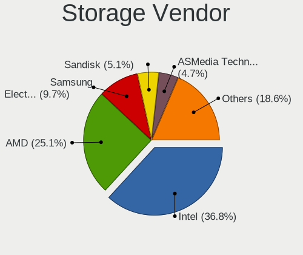
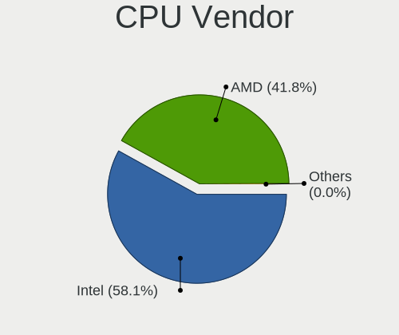
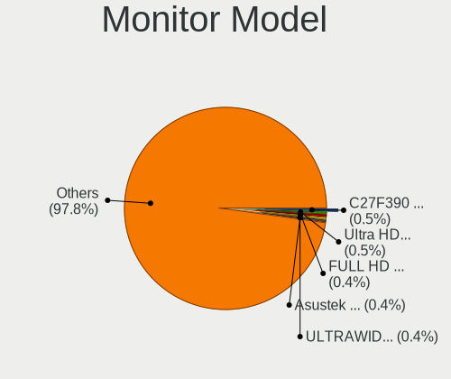
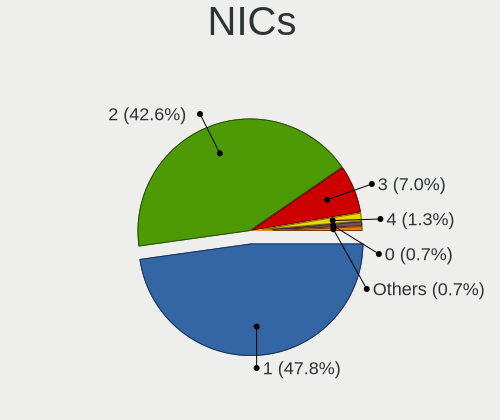
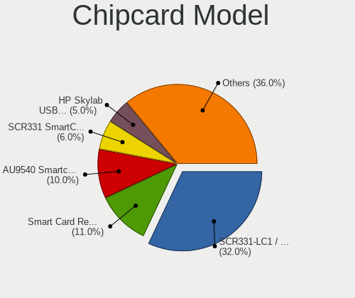

Linux in USA - Tested Hardware & Statistics (Desktops)
------------------------------------------------------

A project to collect tested hardware configurations for Linux in USA.

Anyone can contribute to this report by the [hw-probe](https://github.com/linuxhw/hw-probe) tool:

    sudo -E hw-probe -all -upload

Please contribute! Especially if your hardware is rare.

Contents
--------

* [ Test Cases ](#test-cases)

* [ System ](#system)
  - [ OS                       ](#os)
  - [ OS Family                ](#os-family)
  - [ Kernel                   ](#kernel)
  - [ Kernel Family            ](#kernel-family)
  - [ Kernel Major Ver.        ](#kernel-major-ver)
  - [ Arch                     ](#arch)
  - [ DE                       ](#de)
  - [ Display Server           ](#display-server)
  - [ Display Manager          ](#display-manager)
  - [ OS Lang                  ](#os-lang)
  - [ Boot Mode                ](#boot-mode)
  - [ Filesystem               ](#filesystem)
  - [ Part. scheme             ](#part-scheme)
  - [ Dual Boot with Linux/BSD ](#dual-boot-with-linuxbsd)
  - [ Dual Boot (Win)          ](#dual-boot-win)

* [ Board ](#board)
  - [ Vendor                   ](#vendor)
  - [ Model                    ](#model)
  - [ Model Family             ](#model-family)
  - [ MFG Year                 ](#mfg-year)
  - [ Form Factor              ](#form-factor)
  - [ Secure Boot              ](#secure-boot)
  - [ Coreboot                 ](#coreboot)
  - [ RAM Size                 ](#ram-size)
  - [ RAM Used                 ](#ram-used)
  - [ Total Drives             ](#total-drives)
  - [ Has CD-ROM               ](#has-cd-rom)
  - [ Has Ethernet             ](#has-ethernet)
  - [ Has WiFi                 ](#has-wifi)
  - [ Has Bluetooth            ](#has-bluetooth)

* [ Location ](#location)
  - [ Country                  ](#country)
  - [ City                     ](#city)

* [ Drives ](#drives)
  - [ Drive Vendor             ](#drive-vendor)
  - [ Drive Model              ](#drive-model)
  - [ HDD Vendor               ](#hdd-vendor)
  - [ SSD Vendor               ](#ssd-vendor)
  - [ Drive Kind               ](#drive-kind)
  - [ Drive Connector          ](#drive-connector)
  - [ Drive Size               ](#drive-size)
  - [ Space Total              ](#space-total)
  - [ Space Used               ](#space-used)
  - [ Malfunc. Drives          ](#malfunc-drives)
  - [ Malfunc. Drive Vendor    ](#malfunc-drive-vendor)
  - [ Malfunc. HDD Vendor      ](#malfunc-hdd-vendor)
  - [ Malfunc. Drive Kind      ](#malfunc-drive-kind)
  - [ Failed Drives            ](#failed-drives)
  - [ Failed Drive Vendor      ](#failed-drive-vendor)
  - [ Drive Status             ](#drive-status)

* [ Storage controller ](#storage-controller)
  - [ Storage Vendor           ](#storage-vendor)
  - [ Storage Model            ](#storage-model)
  - [ Storage Kind             ](#storage-kind)

* [ Processor ](#processor)
  - [ CPU Vendor               ](#cpu-vendor)
  - [ CPU Model                ](#cpu-model)
  - [ CPU Model Family         ](#cpu-model-family)
  - [ CPU Cores                ](#cpu-cores)
  - [ CPU Sockets              ](#cpu-sockets)
  - [ CPU Threads              ](#cpu-threads)
  - [ CPU Op-Modes             ](#cpu-op-modes)
  - [ CPU Microcode            ](#cpu-microcode)
  - [ CPU Microarch            ](#cpu-microarch)

* [ Graphics ](#graphics)
  - [ GPU Vendor               ](#gpu-vendor)
  - [ GPU Model                ](#gpu-model)
  - [ GPU Combo                ](#gpu-combo)
  - [ GPU Driver               ](#gpu-driver)
  - [ GPU Memory               ](#gpu-memory)

* [ Monitor ](#monitor)
  - [ Monitor Vendor           ](#monitor-vendor)
  - [ Monitor Model            ](#monitor-model)
  - [ Monitor Resolution       ](#monitor-resolution)
  - [ Monitor Diagonal         ](#monitor-diagonal)
  - [ Monitor Width            ](#monitor-width)
  - [ Aspect Ratio             ](#aspect-ratio)
  - [ Monitor Area             ](#monitor-area)
  - [ Pixel Density            ](#pixel-density)
  - [ Multiple Monitors        ](#multiple-monitors)

* [ Network ](#network)
  - [ Net Controller Vendor    ](#net-controller-vendor)
  - [ Net Controller Model     ](#net-controller-model)
  - [ Wireless Vendor          ](#wireless-vendor)
  - [ Wireless Model           ](#wireless-model)
  - [ Ethernet Vendor          ](#ethernet-vendor)
  - [ Ethernet Model           ](#ethernet-model)
  - [ Net Controller Kind      ](#net-controller-kind)
  - [ Used Controller          ](#used-controller)
  - [ NICs                     ](#nics)
  - [ IPv6                     ](#ipv6)

* [ Bluetooth ](#bluetooth)
  - [ Bluetooth Vendor         ](#bluetooth-vendor)
  - [ Bluetooth Model          ](#bluetooth-model)

* [ Sound ](#sound)
  - [ Sound Vendor             ](#sound-vendor)
  - [ Sound Model              ](#sound-model)

* [ Memory ](#memory)
  - [ Memory Vendor            ](#memory-vendor)
  - [ Memory Model             ](#memory-model)
  - [ Memory Kind              ](#memory-kind)
  - [ Memory Form Factor       ](#memory-form-factor)
  - [ Memory Size              ](#memory-size)
  - [ Memory Speed             ](#memory-speed)

* [ Printers & scanners ](#printers--scanners)
  - [ Printer Vendor           ](#printer-vendor)
  - [ Printer Model            ](#printer-model)
  - [ Scanner Vendor           ](#scanner-vendor)
  - [ Scanner Model            ](#scanner-model)

* [ Camera ](#camera)
  - [ Camera Vendor            ](#camera-vendor)
  - [ Camera Model             ](#camera-model)

* [ Security ](#security)
  - [ Fingerprint Vendor       ](#fingerprint-vendor)
  - [ Fingerprint Model        ](#fingerprint-model)
  - [ Chipcard Vendor          ](#chipcard-vendor)
  - [ Chipcard Model           ](#chipcard-model)

* [ Unsupported ](#unsupported)
  - [ Unsupported Devices      ](#unsupported-devices)
  - [ Unsupported Device Types ](#unsupported-device-types)

Test Cases
----------

Total: 18354

| Vendor        | Model                       | Probe                                                      | Date         |
|---------------|-----------------------------|------------------------------------------------------------|--------------|
| Lenovo        | 3111 NOK                    | [4f7d6b345c](https://linux-hardware.org/?probe=4f7d6b345c) | Feb 01, 2023 |
| Lenovo        | 3111 NOK                    | [03df681b38](https://linux-hardware.org/?probe=03df681b38) | Feb 01, 2023 |
| Gigabyte      | X299 AORUS Gaming 3-CF      | [775a993b3a](https://linux-hardware.org/?probe=775a993b3a) | Feb 01, 2023 |
| Lenovo        | SHARKBAY 0B98401 WIN        | [1668f1f69f](https://linux-hardware.org/?probe=1668f1f69f) | Feb 01, 2023 |
| Dell          | 06D7TR A00                  | [d040bfd5cc](https://linux-hardware.org/?probe=d040bfd5cc) | Feb 01, 2023 |
| ASUSTek       | PRIME B550M-A               | [779b723b67](https://linux-hardware.org/?probe=779b723b67) | Feb 01, 2023 |
| Dell          | 00V62H A01                  | [d7b81788e7](https://linux-hardware.org/?probe=d7b81788e7) | Feb 01, 2023 |
| ASUSTek       | ROG STRIX Z490-A GAMING     | [5f2948351d](https://linux-hardware.org/?probe=5f2948351d) | Feb 01, 2023 |
| Gigabyte      | Z690 AORUS ELITE AX DDR4    | [115de2faed](https://linux-hardware.org/?probe=115de2faed) | Feb 01, 2023 |
| ASUSTek       | PRIME B550M-A               | [4251ab2f9a](https://linux-hardware.org/?probe=4251ab2f9a) | Feb 01, 2023 |
| ASUSTek       | M4A89TD PRO USB3            | [9010e03a18](https://linux-hardware.org/?probe=9010e03a18) | Feb 01, 2023 |
| HP            | 1790                        | [d0d3ca5e7c](https://linux-hardware.org/?probe=d0d3ca5e7c) | Feb 01, 2023 |
| ASUSTek       | ROG STRIX X570-E GAMING     | [4bb9990abe](https://linux-hardware.org/?probe=4bb9990abe) | Feb 01, 2023 |
| Dell          | 0VHWTR A02                  | [4820c0216f](https://linux-hardware.org/?probe=4820c0216f) | Feb 01, 2023 |
| Dell          | 0Y7WYT A00                  | [77909a2fa1](https://linux-hardware.org/?probe=77909a2fa1) | Jan 31, 2023 |
| Dell          | 0Y7WYT A00                  | [d299b4befd](https://linux-hardware.org/?probe=d299b4befd) | Jan 31, 2023 |
| HP            | 18E4                        | [50c68be419](https://linux-hardware.org/?probe=50c68be419) | Jan 31, 2023 |
| Gigabyte      | B560 DS3H AC-Y1             | [6c094e2027](https://linux-hardware.org/?probe=6c094e2027) | Jan 31, 2023 |
| HP            | 18E4                        | [d038da9e08](https://linux-hardware.org/?probe=d038da9e08) | Jan 31, 2023 |
| ASRock        | B450 Gaming-ITX/ac          | [25b35d4826](https://linux-hardware.org/?probe=25b35d4826) | Jan 31, 2023 |
| ASUSTek       | ROG STRIX Z590-A GAMING ... | [b54f170a86](https://linux-hardware.org/?probe=b54f170a86) | Jan 31, 2023 |
| Gigabyte      | GA-MA785GM-US2H             | [dd017ac78a](https://linux-hardware.org/?probe=dd017ac78a) | Jan 31, 2023 |
| Intel         | DH77DF AAG40293-301         | [1a0f7653e3](https://linux-hardware.org/?probe=1a0f7653e3) | Jan 31, 2023 |
| Gigabyte      | X570 AORUS ELITE            | [caa1c9e23a](https://linux-hardware.org/?probe=caa1c9e23a) | Jan 31, 2023 |
| Lenovo        | 3717 SDK0J40697 WIN 3305... | [175a0fcf9a](https://linux-hardware.org/?probe=175a0fcf9a) | Jan 31, 2023 |
| Gigabyte      | F2A88XM-D3H                 | [846f831269](https://linux-hardware.org/?probe=846f831269) | Jan 31, 2023 |
| ASUSTek       | PRIME B550M-A               | [318b0a5ecb](https://linux-hardware.org/?probe=318b0a5ecb) | Jan 31, 2023 |
| ASUSTek       | PRIME B250-A                | [c686d3d123](https://linux-hardware.org/?probe=c686d3d123) | Jan 31, 2023 |
| ASRock        | H77 Pro4-M                  | [a37090dd20](https://linux-hardware.org/?probe=a37090dd20) | Jan 31, 2023 |
| Lenovo        | 30D0 SDK0J40697 WIN 3305... | [f018b74ad8](https://linux-hardware.org/?probe=f018b74ad8) | Jan 31, 2023 |
| Gigabyte      | B550M DS3H                  | [eaee265ecc](https://linux-hardware.org/?probe=eaee265ecc) | Jan 31, 2023 |
| ASUSTek       | ROG STRIX B550-I GAMING     | [33ae030343](https://linux-hardware.org/?probe=33ae030343) | Jan 31, 2023 |
| MSI           | MPG X570 GAMING EDGE WIF... | [177c33e4a9](https://linux-hardware.org/?probe=177c33e4a9) | Jan 31, 2023 |
| Gigabyte      | Z390 DESIGNARE-CF           | [02c8ae01d1](https://linux-hardware.org/?probe=02c8ae01d1) | Jan 30, 2023 |
| Acer          | Unknown                     | [05de2b4244](https://linux-hardware.org/?probe=05de2b4244) | Jan 30, 2023 |
| Dell          | 0Y2K8N A01                  | [6a4a26884d](https://linux-hardware.org/?probe=6a4a26884d) | Jan 30, 2023 |
| ASUSTek       | ROG STRIX X570-E GAMING     | [e3f96394c0](https://linux-hardware.org/?probe=e3f96394c0) | Jan 30, 2023 |
| Dell          | 0GDG8Y A00                  | [8ba7e25b58](https://linux-hardware.org/?probe=8ba7e25b58) | Jan 30, 2023 |
| Dell          | 0Y2K8N A01                  | [8e4f1d2ed2](https://linux-hardware.org/?probe=8e4f1d2ed2) | Jan 30, 2023 |
| Dell          | 0GDG8Y A00                  | [759e9a48d1](https://linux-hardware.org/?probe=759e9a48d1) | Jan 30, 2023 |
| Intel         | DH77DF AAG40293-301         | [1c91d911d7](https://linux-hardware.org/?probe=1c91d911d7) | Jan 30, 2023 |
| BESSTAR Te... | UM350                       | [ee1ba0e588](https://linux-hardware.org/?probe=ee1ba0e588) | Jan 30, 2023 |
| Gateway       | IPIMB-ARA                   | [253b58b2a4](https://linux-hardware.org/?probe=253b58b2a4) | Jan 30, 2023 |
| ASUSTek       | P8P67 DELUXE                | [8f3278e68a](https://linux-hardware.org/?probe=8f3278e68a) | Jan 30, 2023 |
| NetGear       | ReadyDATA 5200              | [74a68eba33](https://linux-hardware.org/?probe=74a68eba33) | Jan 30, 2023 |
| ASRock        | X670E Steel Legend          | [e197bd2a4b](https://linux-hardware.org/?probe=e197bd2a4b) | Jan 30, 2023 |
| MSI           | PRO B660M-A DDR4            | [0f2037dcd8](https://linux-hardware.org/?probe=0f2037dcd8) | Jan 30, 2023 |
| HP            | 8054                        | [36f5306e37](https://linux-hardware.org/?probe=36f5306e37) | Jan 30, 2023 |
| MSI           | B550M PRO-VDH WIFI          | [02580dd501](https://linux-hardware.org/?probe=02580dd501) | Jan 30, 2023 |
| MSI           | X370 SLI PLUS               | [bb20465703](https://linux-hardware.org/?probe=bb20465703) | Jan 30, 2023 |
| ASUSTek       | SABERTOOTH 990FX            | [0e28b954b4](https://linux-hardware.org/?probe=0e28b954b4) | Jan 30, 2023 |
| ASUSTek       | SABERTOOTH 990FX            | [10421fe598](https://linux-hardware.org/?probe=10421fe598) | Jan 30, 2023 |
| ASUSTek       | PRIME B550M-A               | [585c3c8f85](https://linux-hardware.org/?probe=585c3c8f85) | Jan 30, 2023 |
| ASUSTek       | ROG STRIX B550-I GAMING     | [3d555e69f7](https://linux-hardware.org/?probe=3d555e69f7) | Jan 30, 2023 |
| Lenovo        | MAHOBAY Win8 STD MM DPK ... | [ee36c9d395](https://linux-hardware.org/?probe=ee36c9d395) | Jan 30, 2023 |
| Dell          | 0D28YY A00                  | [63b753b56e](https://linux-hardware.org/?probe=63b753b56e) | Jan 30, 2023 |
| Gigabyte      | X570 I AORUS PRO WIFI       | [7893a67a4b](https://linux-hardware.org/?probe=7893a67a4b) | Jan 30, 2023 |
| Lenovo        | 3704 SDK0J40700 WIN 3258... | [aff06e830e](https://linux-hardware.org/?probe=aff06e830e) | Jan 30, 2023 |
| ASUSTek       | ROG Maximus XIII HERO       | [a32a9ba13a](https://linux-hardware.org/?probe=a32a9ba13a) | Jan 30, 2023 |
| ASUSTek       | PRIME Z690-P WIFI           | [d2f9eb15f5](https://linux-hardware.org/?probe=d2f9eb15f5) | Jan 30, 2023 |
| HP            | 1791                        | [0cb5402c68](https://linux-hardware.org/?probe=0cb5402c68) | Jan 29, 2023 |
| ASUSTek       | ROG Maximus XIII HERO       | [6b634c85e8](https://linux-hardware.org/?probe=6b634c85e8) | Jan 29, 2023 |
| MSI           | MAG B550M MORTAR WIFI       | [eb551b5ec0](https://linux-hardware.org/?probe=eb551b5ec0) | Jan 29, 2023 |
| ASUSTek       | PRIME B550M-A               | [ef43edeee5](https://linux-hardware.org/?probe=ef43edeee5) | Jan 29, 2023 |
| ASRock        | Z97E-ITX/ac                 | [80d82e6be6](https://linux-hardware.org/?probe=80d82e6be6) | Jan 29, 2023 |
| ASRock        | 970M Pro3                   | [e0a5d6512f](https://linux-hardware.org/?probe=e0a5d6512f) | Jan 29, 2023 |
| ASRock        | Z97E-ITX/ac                 | [4d092eb96c](https://linux-hardware.org/?probe=4d092eb96c) | Jan 29, 2023 |
| SYWZ          | S210H Series                | [4d1018a808](https://linux-hardware.org/?probe=4d1018a808) | Jan 29, 2023 |
| ASRock        | X570M Pro4                  | [e72f7f2fb1](https://linux-hardware.org/?probe=e72f7f2fb1) | Jan 29, 2023 |
| ASUSTek       | CROSSHAIR VI HERO           | [190a780b8a](https://linux-hardware.org/?probe=190a780b8a) | Jan 29, 2023 |
| BESSTAR Te... | TH50                        | [4aa292e3c1](https://linux-hardware.org/?probe=4aa292e3c1) | Jan 29, 2023 |
| ASUSTek       | B85M-G                      | [26fd2a9f6a](https://linux-hardware.org/?probe=26fd2a9f6a) | Jan 29, 2023 |
| ASUSTek       | M5A97 R2.0                  | [703a3a2694](https://linux-hardware.org/?probe=703a3a2694) | Jan 29, 2023 |
| Gigabyte      | M61PME-S2                   | [8227150e0d](https://linux-hardware.org/?probe=8227150e0d) | Jan 29, 2023 |
| ASRock        | Z77 Pro4                    | [fe501e214b](https://linux-hardware.org/?probe=fe501e214b) | Jan 29, 2023 |
| Lenovo        | MAHOBAY NO DPK              | [a6f17c156d](https://linux-hardware.org/?probe=a6f17c156d) | Jan 29, 2023 |
| ASRock        | Z77 Pro4                    | [a5d8b81f29](https://linux-hardware.org/?probe=a5d8b81f29) | Jan 29, 2023 |
| Gigabyte      | M61PME-S2                   | [813f01976d](https://linux-hardware.org/?probe=813f01976d) | Jan 29, 2023 |
| Foxconn       | A74MX-S/A74MX-K             | [9daeb7adc3](https://linux-hardware.org/?probe=9daeb7adc3) | Jan 29, 2023 |
| Gigabyte      | Z690 AORUS PRO              | [b07e189d3c](https://linux-hardware.org/?probe=b07e189d3c) | Jan 29, 2023 |
| Lenovo        | SHARKBAY SDK0J40700 WIN     | [75027cfa77](https://linux-hardware.org/?probe=75027cfa77) | Jan 29, 2023 |
| Acer          | FMP55                       | [d091fbc8d3](https://linux-hardware.org/?probe=d091fbc8d3) | Jan 29, 2023 |
| Gigabyte      | B550I AORUS PRO AX          | [8b5c80cad4](https://linux-hardware.org/?probe=8b5c80cad4) | Jan 28, 2023 |
| Dell          | 0PXWHK A00                  | [1866c91eb9](https://linux-hardware.org/?probe=1866c91eb9) | Jan 28, 2023 |
| ASUSTek       | PRIME A320M-K               | [11586188ad](https://linux-hardware.org/?probe=11586188ad) | Jan 28, 2023 |
| HP            | 1998                        | [81da484cc4](https://linux-hardware.org/?probe=81da484cc4) | Jan 28, 2023 |
| ASRock        | 970M Pro3                   | [58366ca3d1](https://linux-hardware.org/?probe=58366ca3d1) | Jan 28, 2023 |
| HP            | 8053                        | [88120ce3f4](https://linux-hardware.org/?probe=88120ce3f4) | Jan 28, 2023 |
| Lenovo        | 364F SDK0J40700 WIN 3258... | [cad690676c](https://linux-hardware.org/?probe=cad690676c) | Jan 28, 2023 |
| ASUSTek       | ROG STRIX B550-F GAMING     | [31bda5eb31](https://linux-hardware.org/?probe=31bda5eb31) | Jan 28, 2023 |
| HP            | 843F                        | [5e9a5d2afd](https://linux-hardware.org/?probe=5e9a5d2afd) | Jan 28, 2023 |
| ASUSTek       | P8H61-M LE/CSM R2.0         | [7120eb3310](https://linux-hardware.org/?probe=7120eb3310) | Jan 28, 2023 |
| ASUSTek       | SABERTOOTH Z77              | [b588302693](https://linux-hardware.org/?probe=b588302693) | Jan 28, 2023 |
| Unknown       | GB01                        | [e907445f6c](https://linux-hardware.org/?probe=e907445f6c) | Jan 28, 2023 |
| MSI           | 880G-E45                    | [ef6e95cf66](https://linux-hardware.org/?probe=ef6e95cf66) | Jan 28, 2023 |
| MSI           | PRO H610M-G DDR4            | [ad4f37d5a4](https://linux-hardware.org/?probe=ad4f37d5a4) | Jan 28, 2023 |
| MSI           | 970A-G46                    | [ece518ec34](https://linux-hardware.org/?probe=ece518ec34) | Jan 28, 2023 |
| ASUSTek       | SABERTOOTH Z77              | [493be38a2b](https://linux-hardware.org/?probe=493be38a2b) | Jan 28, 2023 |
| ASUSTek       | M5A78L-M LX PLUS            | [d9f9d4bc89](https://linux-hardware.org/?probe=d9f9d4bc89) | Jan 27, 2023 |
| HP            | 2B47                        | [cce5f9ec07](https://linux-hardware.org/?probe=cce5f9ec07) | Jan 27, 2023 |
| ASUSTek       | PRIME B550M-A               | [e619db262a](https://linux-hardware.org/?probe=e619db262a) | Jan 27, 2023 |
| Dell          | 0GM819                      | [f5810a0a61](https://linux-hardware.org/?probe=f5810a0a61) | Jan 27, 2023 |
| Gigabyte      | Z390 DESIGNARE-CF           | [74635968fa](https://linux-hardware.org/?probe=74635968fa) | Jan 27, 2023 |
| Dell          | 0RY206                      | [822d0f1c17](https://linux-hardware.org/?probe=822d0f1c17) | Jan 27, 2023 |
| Dell          | 0RW199                      | [04c4f5174d](https://linux-hardware.org/?probe=04c4f5174d) | Jan 27, 2023 |
| Dell          | 042P49 A00                  | [041e30ac67](https://linux-hardware.org/?probe=041e30ac67) | Jan 27, 2023 |
| Hardkernel    | ODROID-H3                   | [56f9bb1456](https://linux-hardware.org/?probe=56f9bb1456) | Jan 27, 2023 |
| Gigabyte      | X570 AORUS MASTER           | [c0ea09ef3c](https://linux-hardware.org/?probe=c0ea09ef3c) | Jan 27, 2023 |
| Intel         | DH61BE AAG14062-211         | [e4a05d50b7](https://linux-hardware.org/?probe=e4a05d50b7) | Jan 27, 2023 |
| MSI           | B550M PRO-VDH WIFI          | [eec3afb06e](https://linux-hardware.org/?probe=eec3afb06e) | Jan 27, 2023 |
| ASUSTek       | ROG STRIX X570-E GAMING     | [df315d8050](https://linux-hardware.org/?probe=df315d8050) | Jan 27, 2023 |
| MSI           | B450 TOMAHAWK               | [ff1352cb54](https://linux-hardware.org/?probe=ff1352cb54) | Jan 27, 2023 |
| ASUSTek       | ROG STRIX X570-E GAMING     | [14a0252d88](https://linux-hardware.org/?probe=14a0252d88) | Jan 27, 2023 |
| ASUSTek       | G10DK                       | [0b70a364b7](https://linux-hardware.org/?probe=0b70a364b7) | Jan 27, 2023 |
| ASUSTek       | G10DK                       | [a42ba7ef9e](https://linux-hardware.org/?probe=a42ba7ef9e) | Jan 26, 2023 |
| Dell          | 0CRH6C A01                  | [d06248a310](https://linux-hardware.org/?probe=d06248a310) | Jan 26, 2023 |
| HP            | 843B                        | [98d0f20b21](https://linux-hardware.org/?probe=98d0f20b21) | Jan 26, 2023 |
| Intel         | Q3XXG4-P V1.0               | [72a508a4ad](https://linux-hardware.org/?probe=72a508a4ad) | Jan 26, 2023 |
| ASRock        | Z97 Extreme6                | [4ffae2148d](https://linux-hardware.org/?probe=4ffae2148d) | Jan 26, 2023 |
| ASRock        | Z690 Taichi                 | [adba499f59](https://linux-hardware.org/?probe=adba499f59) | Jan 26, 2023 |
| ASUSTek       | PRIME Z390-A                | [1c536042d4](https://linux-hardware.org/?probe=1c536042d4) | Jan 26, 2023 |
| Lenovo        | 3642 SDK0J40700 WIN 3258... | [ce46ecced0](https://linux-hardware.org/?probe=ce46ecced0) | Jan 26, 2023 |
| ASUSTek       | Pro WS X570-ACE             | [0093f9df93](https://linux-hardware.org/?probe=0093f9df93) | Jan 26, 2023 |
| MSI           | PRO Z690-A                  | [4b063ab512](https://linux-hardware.org/?probe=4b063ab512) | Jan 26, 2023 |
| ASUSTek       | ROG Maximus Z690 FORMULA    | [a9775027ed](https://linux-hardware.org/?probe=a9775027ed) | Jan 26, 2023 |
| ASUSTek       | Basswood3G                  | [0728a59863](https://linux-hardware.org/?probe=0728a59863) | Jan 25, 2023 |
| MSI           | B550M PRO-VDH WIFI          | [3ccebf50c2](https://linux-hardware.org/?probe=3ccebf50c2) | Jan 25, 2023 |
| MSI           | B450 TOMAHAWK               | [1086d71274](https://linux-hardware.org/?probe=1086d71274) | Jan 25, 2023 |
| MSI           | B460M PRO-VDH WIFI          | [e32b0f2c79](https://linux-hardware.org/?probe=e32b0f2c79) | Jan 25, 2023 |
| Apple         | Mac-F221BEC8                | [73b7cfc152](https://linux-hardware.org/?probe=73b7cfc152) | Jan 25, 2023 |
| MSI           | Z370-A PRO                  | [951d2a873c](https://linux-hardware.org/?probe=951d2a873c) | Jan 25, 2023 |
| MSI           | Z370-A PRO                  | [224fd6cf40](https://linux-hardware.org/?probe=224fd6cf40) | Jan 25, 2023 |
| ASUSTek       | G20AJ                       | [ff9bda6922](https://linux-hardware.org/?probe=ff9bda6922) | Jan 25, 2023 |
| Dell          | 0XFWHV A00                  | [52ee3df163](https://linux-hardware.org/?probe=52ee3df163) | Jan 25, 2023 |
| Dell          | 0GDG8Y A00                  | [4867533043](https://linux-hardware.org/?probe=4867533043) | Jan 25, 2023 |
| ASRock        | B550AM Gaming               | [215973c00f](https://linux-hardware.org/?probe=215973c00f) | Jan 25, 2023 |
| Dell          | 0Y2MRG A00                  | [784e2db087](https://linux-hardware.org/?probe=784e2db087) | Jan 25, 2023 |
| MSI           | MPG X570S CARBON MAX WIF... | [55b2bf8aea](https://linux-hardware.org/?probe=55b2bf8aea) | Jan 25, 2023 |
| ASRock        | B450M Pro4                  | [6462d71b74](https://linux-hardware.org/?probe=6462d71b74) | Jan 25, 2023 |
| ASUSTek       | TUF Gaming X570-PLUS        | [93a260a42e](https://linux-hardware.org/?probe=93a260a42e) | Jan 25, 2023 |
| Dell          | 08HPGT A01                  | [d2482dec3a](https://linux-hardware.org/?probe=d2482dec3a) | Jan 25, 2023 |
| Dell          | 08HPGT A01                  | [69fdb4710d](https://linux-hardware.org/?probe=69fdb4710d) | Jan 24, 2023 |
| Dell          | 0G261D A00                  | [ac4e94394e](https://linux-hardware.org/?probe=ac4e94394e) | Jan 24, 2023 |
| SiS Techno... | 741                         | [b3c09fc029](https://linux-hardware.org/?probe=b3c09fc029) | Jan 24, 2023 |
| Dell          | 0K3CM7 A00                  | [d3cc219bf7](https://linux-hardware.org/?probe=d3cc219bf7) | Jan 24, 2023 |
| HP            | 8433 11                     | [de1465f90e](https://linux-hardware.org/?probe=de1465f90e) | Jan 24, 2023 |
| SiS Techno... | 741                         | [d7084eb5a4](https://linux-hardware.org/?probe=d7084eb5a4) | Jan 24, 2023 |
| Intel         | DH67CL AAG10212-203         | [0e7c3464ac](https://linux-hardware.org/?probe=0e7c3464ac) | Jan 24, 2023 |
| HP            | 2AF7                        | [a7cb391a5c](https://linux-hardware.org/?probe=a7cb391a5c) | Jan 24, 2023 |
| Lenovo        | 30BC SDK0J40705 WIN 3425... | [f11a82871d](https://linux-hardware.org/?probe=f11a82871d) | Jan 24, 2023 |
| ASUSTek       | PRIME B550M-A               | [723d6a91bb](https://linux-hardware.org/?probe=723d6a91bb) | Jan 24, 2023 |
| ASUSTek       | PRIME B550M-A               | [5abd524783](https://linux-hardware.org/?probe=5abd524783) | Jan 24, 2023 |
| ASUSTek       | M5A78L-M/USB3               | [d1c6e3c96f](https://linux-hardware.org/?probe=d1c6e3c96f) | Jan 24, 2023 |
| Acer          | Aspire M3970                | [c822a510e5](https://linux-hardware.org/?probe=c822a510e5) | Jan 24, 2023 |
| Dell          | 06FW8P A02                  | [091ff86983](https://linux-hardware.org/?probe=091ff86983) | Jan 24, 2023 |
| ASUSTek       | Z170-A                      | [0329b888a8](https://linux-hardware.org/?probe=0329b888a8) | Jan 24, 2023 |
| ASUSTek       | TUF Gaming X570-PLUS        | [3221475cc8](https://linux-hardware.org/?probe=3221475cc8) | Jan 24, 2023 |
| Dell          | 0PU052                      | [060c016db2](https://linux-hardware.org/?probe=060c016db2) | Jan 24, 2023 |
| Dell          | 0X30MX A00                  | [c323a1a215](https://linux-hardware.org/?probe=c323a1a215) | Jan 24, 2023 |
| Unknown       | Unknown                     | [108bb60066](https://linux-hardware.org/?probe=108bb60066) | Jan 24, 2023 |
| Gateway       | IPIMB-ARA                   | [53527537f3](https://linux-hardware.org/?probe=53527537f3) | Jan 23, 2023 |
| Dell          | 0KV62T A00                  | [6c671720a9](https://linux-hardware.org/?probe=6c671720a9) | Jan 23, 2023 |
| Dell          | 0YC03K A04                  | [aaccd62190](https://linux-hardware.org/?probe=aaccd62190) | Jan 23, 2023 |
| ASUSTek       | PRIME X570-PRO              | [b67d126993](https://linux-hardware.org/?probe=b67d126993) | Jan 23, 2023 |
| Dell          | 0PXWHK A00                  | [d2e447ffe9](https://linux-hardware.org/?probe=d2e447ffe9) | Jan 23, 2023 |
| Dell          | 0PXWHK A00                  | [e5ea087a6b](https://linux-hardware.org/?probe=e5ea087a6b) | Jan 23, 2023 |
| HP            | 2B2C                        | [01cb4bc77f](https://linux-hardware.org/?probe=01cb4bc77f) | Jan 23, 2023 |
| MSI           | A320M-A PRO                 | [4b4420e22f](https://linux-hardware.org/?probe=4b4420e22f) | Jan 23, 2023 |
| Purism        | librem_mini_v2              | [ded1ed1a93](https://linux-hardware.org/?probe=ded1ed1a93) | Jan 23, 2023 |
| ASUSTek       | Rampage II GENE             | [112b5304d9](https://linux-hardware.org/?probe=112b5304d9) | Jan 23, 2023 |
| MACHINIST     | X79 Z9-D7 V2.0              | [9d5d06d342](https://linux-hardware.org/?probe=9d5d06d342) | Jan 23, 2023 |
| Gateway       | IPIMB-ARA                   | [86fcc07fe3](https://linux-hardware.org/?probe=86fcc07fe3) | Jan 23, 2023 |
| ASRock        | 970A-G                      | [ca1bdf1d74](https://linux-hardware.org/?probe=ca1bdf1d74) | Jan 23, 2023 |
| ASUSTek       | ROG CROSSHAIR VIII HERO     | [2654b4fd7a](https://linux-hardware.org/?probe=2654b4fd7a) | Jan 23, 2023 |
| Lenovo        | 1030 SDK0Q40104 WIN 3305... | [6a876fb2b4](https://linux-hardware.org/?probe=6a876fb2b4) | Jan 23, 2023 |
| HP            | 0AACh                       | [7c566e8951](https://linux-hardware.org/?probe=7c566e8951) | Jan 23, 2023 |
| ASUSTek       | TUF Gaming X570-PLUS        | [75acbba6b1](https://linux-hardware.org/?probe=75acbba6b1) | Jan 23, 2023 |
| Lenovo        | MAHOBAY NOK                 | [8e5bf9673b](https://linux-hardware.org/?probe=8e5bf9673b) | Jan 23, 2023 |
| ASRock        | AM1H-ITX                    | [82b094a66b](https://linux-hardware.org/?probe=82b094a66b) | Jan 23, 2023 |
| Lenovo        | 1030 SDK0Q40104 WIN 3305... | [287d005187](https://linux-hardware.org/?probe=287d005187) | Jan 23, 2023 |
| HP            | 8399                        | [db427c8bc9](https://linux-hardware.org/?probe=db427c8bc9) | Jan 22, 2023 |
| HP            | 8399                        | [cdf9d12bb4](https://linux-hardware.org/?probe=cdf9d12bb4) | Jan 22, 2023 |
| MSI           | B550M PRO-VDH WIFI          | [b0289f0ef8](https://linux-hardware.org/?probe=b0289f0ef8) | Jan 22, 2023 |
| Dell          | 0NV0M7 A02                  | [7c562ab921](https://linux-hardware.org/?probe=7c562ab921) | Jan 22, 2023 |
| Dell          | 0HH807                      | [984a0f6134](https://linux-hardware.org/?probe=984a0f6134) | Jan 22, 2023 |
| Dell          | 06D7TR A02                  | [f61052df5e](https://linux-hardware.org/?probe=f61052df5e) | Jan 22, 2023 |
| ASUSTek       | B85M-K PLUS                 | [4dae8d836d](https://linux-hardware.org/?probe=4dae8d836d) | Jan 22, 2023 |
| Intel         | JSL MRD                     | [39dc5a7f96](https://linux-hardware.org/?probe=39dc5a7f96) | Jan 22, 2023 |
| ASRock        | B450 Pro4                   | [758ea69493](https://linux-hardware.org/?probe=758ea69493) | Jan 22, 2023 |
| Dell          | 0NV0M7 A02                  | [b5bd3e5d33](https://linux-hardware.org/?probe=b5bd3e5d33) | Jan 22, 2023 |
| Gigabyte      | X58-USB3                    | [bd526ec29a](https://linux-hardware.org/?probe=bd526ec29a) | Jan 22, 2023 |
| Lenovo        | SHARKBAY SDK0E50519 WIN     | [e2bec99703](https://linux-hardware.org/?probe=e2bec99703) | Jan 22, 2023 |
| Gigabyte      | GA-880GMA-USB3              | [6552c7b8b3](https://linux-hardware.org/?probe=6552c7b8b3) | Jan 22, 2023 |
| Lenovo        | NOK                         | [78e5b6feb3](https://linux-hardware.org/?probe=78e5b6feb3) | Jan 22, 2023 |
| Gigabyte      | Z97X-Gaming 7               | [a51b58dfbb](https://linux-hardware.org/?probe=a51b58dfbb) | Jan 22, 2023 |
| Gigabyte      | B450M DS3H WIFI-CF          | [f660cd6d78](https://linux-hardware.org/?probe=f660cd6d78) | Jan 22, 2023 |
| Gigabyte      | GA-890FXA-UD5               | [27ec85040f](https://linux-hardware.org/?probe=27ec85040f) | Jan 22, 2023 |
| ASUSTek       | TUF Gaming B550-PRO         | [ebab459512](https://linux-hardware.org/?probe=ebab459512) | Jan 22, 2023 |
| MSI           | MPG X570 GAMING PLUS        | [3eb7e4f3cf](https://linux-hardware.org/?probe=3eb7e4f3cf) | Jan 22, 2023 |
| ASUSTek       | PRIME A320M-A               | [918dbdb148](https://linux-hardware.org/?probe=918dbdb148) | Jan 22, 2023 |
| Alienware     | 07HV66 A01                  | [4746ea200e](https://linux-hardware.org/?probe=4746ea200e) | Jan 22, 2023 |
| Dell          | 0GDG8Y A00                  | [0d70923276](https://linux-hardware.org/?probe=0d70923276) | Jan 22, 2023 |
| ASUSTek       | TUF Gaming X570-PLUS        | [a08c92f98c](https://linux-hardware.org/?probe=a08c92f98c) | Jan 22, 2023 |
| HP            | 339A                        | [031e19c496](https://linux-hardware.org/?probe=031e19c496) | Jan 21, 2023 |
| Gigabyte      | B550M DS3H AC               | [47a418d177](https://linux-hardware.org/?probe=47a418d177) | Jan 21, 2023 |
| ASUSTek       | TUF Gaming X570-PLUS        | [5520fa3498](https://linux-hardware.org/?probe=5520fa3498) | Jan 21, 2023 |
| Lenovo        | MT-M4157-16U                | [3507cef137](https://linux-hardware.org/?probe=3507cef137) | Jan 21, 2023 |
| ASUSTek       | G10DK                       | [1a27b660c2](https://linux-hardware.org/?probe=1a27b660c2) | Jan 21, 2023 |
| ASUSTek       | P8H77-V LE                  | [6dd531590e](https://linux-hardware.org/?probe=6dd531590e) | Jan 21, 2023 |
| Gigabyte      | 990FXA-UD5 R5               | [869df28b6b](https://linux-hardware.org/?probe=869df28b6b) | Jan 21, 2023 |
| ASUSTek       | TUF Gaming X570-PLUS        | [0a6759f639](https://linux-hardware.org/?probe=0a6759f639) | Jan 21, 2023 |
| Gigabyte      | F2A88X-D3H                  | [d88f1656dd](https://linux-hardware.org/?probe=d88f1656dd) | Jan 21, 2023 |
| Acer          | Aspire TC-885 V:1.1         | [7475608215](https://linux-hardware.org/?probe=7475608215) | Jan 21, 2023 |
| MSI           | B450-A PRO MAX              | [9d025602e0](https://linux-hardware.org/?probe=9d025602e0) | Jan 21, 2023 |
| HP            | 89B5 A                      | [1b6e288840](https://linux-hardware.org/?probe=1b6e288840) | Jan 21, 2023 |
| Gigabyte      | X570S AORUS MASTER          | [a6f80e64b2](https://linux-hardware.org/?probe=a6f80e64b2) | Jan 21, 2023 |
| ASUSTek       | Maximus VII HERO            | [3fe12efbb8](https://linux-hardware.org/?probe=3fe12efbb8) | Jan 21, 2023 |
| ASUSTek       | TUF Gaming B450M-PRO S      | [046504c970](https://linux-hardware.org/?probe=046504c970) | Jan 21, 2023 |
| Dell          | 0KC9NP A01                  | [ce0ba337df](https://linux-hardware.org/?probe=ce0ba337df) | Jan 21, 2023 |
| Gigabyte      | B365M DS3H                  | [29d770594e](https://linux-hardware.org/?probe=29d770594e) | Jan 21, 2023 |
| Pegatron      | NARRA5                      | [f31c67dddb](https://linux-hardware.org/?probe=f31c67dddb) | Jan 21, 2023 |
| ASUSTek       | P8H61-M LE/CSM R2.0         | [33dfa6188e](https://linux-hardware.org/?probe=33dfa6188e) | Jan 20, 2023 |
| Dell          | 0WR7PY A02                  | [0072a47bce](https://linux-hardware.org/?probe=0072a47bce) | Jan 20, 2023 |
| Pegatron      | NARRA5                      | [0772fdc2db](https://linux-hardware.org/?probe=0772fdc2db) | Jan 20, 2023 |
| Gigabyte      | F2A88X-D3H                  | [068fa1b678](https://linux-hardware.org/?probe=068fa1b678) | Jan 20, 2023 |
| ASUSTek       | X99-WS/IPMI                 | [21ee6fc910](https://linux-hardware.org/?probe=21ee6fc910) | Jan 20, 2023 |
| HP            | 0AECh D                     | [b2ea95f507](https://linux-hardware.org/?probe=b2ea95f507) | Jan 20, 2023 |
| Gigabyte      | Z690I A ULTRA LITE D4       | [f7cac38f4a](https://linux-hardware.org/?probe=f7cac38f4a) | Jan 20, 2023 |
| Gigabyte      | GA-880GMA-USB3              | [64164ef7df](https://linux-hardware.org/?probe=64164ef7df) | Jan 20, 2023 |
| ASUSTek       | P8Z77-V LK                  | [a10fc5f5a9](https://linux-hardware.org/?probe=a10fc5f5a9) | Jan 20, 2023 |
| ASUSTek       | ROG Maximus XI HERO         | [55d330d3ea](https://linux-hardware.org/?probe=55d330d3ea) | Jan 20, 2023 |
| Gigabyte      | GA-880GMA-USB3              | [46befb7112](https://linux-hardware.org/?probe=46befb7112) | Jan 20, 2023 |
| Gigabyte      | Z87N-WIFI                   | [d77592ccf0](https://linux-hardware.org/?probe=d77592ccf0) | Jan 20, 2023 |
| Gigabyte      | G1.SNIPER B7-CF             | [b82a8b3c9e](https://linux-hardware.org/?probe=b82a8b3c9e) | Jan 20, 2023 |
| HP            | 843F                        | [07f6efa703](https://linux-hardware.org/?probe=07f6efa703) | Jan 20, 2023 |
| Pegatron      | 2AC2                        | [ae022e5be7](https://linux-hardware.org/?probe=ae022e5be7) | Jan 20, 2023 |
| Gigabyte      | Z690I A ULTRA LITE D4       | [abcfca9ea7](https://linux-hardware.org/?probe=abcfca9ea7) | Jan 20, 2023 |
| Gigabyte      | F2A88X-D3H                  | [12e184b755](https://linux-hardware.org/?probe=12e184b755) | Jan 19, 2023 |
| HP            | 828A                        | [5f430ba8d1](https://linux-hardware.org/?probe=5f430ba8d1) | Jan 19, 2023 |
| MSI           | MPG Z390 GAMING EDGE AC     | [7e73d8ad74](https://linux-hardware.org/?probe=7e73d8ad74) | Jan 19, 2023 |
| Dell          | 0PC5F7 A02                  | [7671c99c3c](https://linux-hardware.org/?probe=7671c99c3c) | Jan 19, 2023 |
| ASRock        | B550M-C                     | [267e3db2cb](https://linux-hardware.org/?probe=267e3db2cb) | Jan 19, 2023 |
| ASUSTek       | ROG CROSSHAIR VIII HERO     | [c5dd2e8482](https://linux-hardware.org/?probe=c5dd2e8482) | Jan 19, 2023 |
| ASUSTek       | ROG CROSSHAIR VIII HERO     | [cdbf0a5913](https://linux-hardware.org/?probe=cdbf0a5913) | Jan 19, 2023 |
| ASUSTek       | ROG CROSSHAIR VIII HERO     | [97455e7d0e](https://linux-hardware.org/?probe=97455e7d0e) | Jan 19, 2023 |
| HP            | 843F                        | [83ca70ac2d](https://linux-hardware.org/?probe=83ca70ac2d) | Jan 19, 2023 |
| ASRock        | X470 Master SLI/ac          | [d8f1121a19](https://linux-hardware.org/?probe=d8f1121a19) | Jan 19, 2023 |
| Gigabyte      | B450 AORUS M                | [4d52b408c2](https://linux-hardware.org/?probe=4d52b408c2) | Jan 19, 2023 |
| HP            | 1495                        | [3f6b7a9b73](https://linux-hardware.org/?probe=3f6b7a9b73) | Jan 19, 2023 |
| MSI           | PRO B650M-A WIFI            | [3eb4809e32](https://linux-hardware.org/?probe=3eb4809e32) | Jan 19, 2023 |
| ASUSTek       | M5A97 R2.0                  | [28a15ffc38](https://linux-hardware.org/?probe=28a15ffc38) | Jan 19, 2023 |
| HP            | 8053                        | [ad16b97068](https://linux-hardware.org/?probe=ad16b97068) | Jan 19, 2023 |
| MSI           | B550-A PRO[CEC]             | [fc45338444](https://linux-hardware.org/?probe=fc45338444) | Jan 18, 2023 |
| ASRock        | X570 PG Velocita            | [dc43ddb50c](https://linux-hardware.org/?probe=dc43ddb50c) | Jan 18, 2023 |
| MSI           | MPG Z490 GAMING PLUS        | [457c3d4d50](https://linux-hardware.org/?probe=457c3d4d50) | Jan 18, 2023 |
| Dell          | 0XFRWW A00                  | [2b96d4b6f6](https://linux-hardware.org/?probe=2b96d4b6f6) | Jan 18, 2023 |
| ASUSTek       | PRIME X370-PRO              | [011b9a41cd](https://linux-hardware.org/?probe=011b9a41cd) | Jan 18, 2023 |
| ASUSTek       | ROG STRIX B660-A GAMING ... | [cb98bcf0b6](https://linux-hardware.org/?probe=cb98bcf0b6) | Jan 18, 2023 |
| HP            | 2B35                        | [559109871c](https://linux-hardware.org/?probe=559109871c) | Jan 18, 2023 |
| Dell          | 0T7D40 A01                  | [75b71dfa6d](https://linux-hardware.org/?probe=75b71dfa6d) | Jan 18, 2023 |
| ASUSTek       | Z87-PRO                     | [8647a8be86](https://linux-hardware.org/?probe=8647a8be86) | Jan 18, 2023 |
| Lenovo        | ThinkCentre M57e 6305B2U    | [fbd4306314](https://linux-hardware.org/?probe=fbd4306314) | Jan 18, 2023 |
| Dell          | 0KRC95 A02                  | [01cf6039d0](https://linux-hardware.org/?probe=01cf6039d0) | Jan 18, 2023 |
| Dell          | 0KWVT8 A03                  | [14b74c6ec1](https://linux-hardware.org/?probe=14b74c6ec1) | Jan 18, 2023 |
| HP            | 1589                        | [5b3a7234f6](https://linux-hardware.org/?probe=5b3a7234f6) | Jan 18, 2023 |
| ASRock        | B75 Pro3-M                  | [a42e9dbc36](https://linux-hardware.org/?probe=a42e9dbc36) | Jan 18, 2023 |
| ASRock        | B75 Pro3-M                  | [d4147630a1](https://linux-hardware.org/?probe=d4147630a1) | Jan 18, 2023 |
| ASUSTek       | PRIME Z690-P D4             | [d41f3b159f](https://linux-hardware.org/?probe=d41f3b159f) | Jan 18, 2023 |
| MSI           | H81I                        | [f51db4589d](https://linux-hardware.org/?probe=f51db4589d) | Jan 18, 2023 |
| Gigabyte      | 990FXA-UD3                  | [39591416ac](https://linux-hardware.org/?probe=39591416ac) | Jan 18, 2023 |
| Dell          | 0M017G A00                  | [7fa3b1ee60](https://linux-hardware.org/?probe=7fa3b1ee60) | Jan 18, 2023 |
| ASUSTek       | G10DK                       | [ebc45fdfd5](https://linux-hardware.org/?probe=ebc45fdfd5) | Jan 18, 2023 |
| MSI           | B450 TOMAHAWK               | [d5ad4c9486](https://linux-hardware.org/?probe=d5ad4c9486) | Jan 17, 2023 |
| Gigabyte      | Z87N-WIFI                   | [b796ac9a1d](https://linux-hardware.org/?probe=b796ac9a1d) | Jan 17, 2023 |
| ASUSTek       | G10DK                       | [0eae2f92fa](https://linux-hardware.org/?probe=0eae2f92fa) | Jan 17, 2023 |
| Gigabyte      | A320M-S2H-CF                | [cfaac8c50b](https://linux-hardware.org/?probe=cfaac8c50b) | Jan 17, 2023 |
| ASRock        | B450 Pro4                   | [f908807ed9](https://linux-hardware.org/?probe=f908807ed9) | Jan 17, 2023 |
| Gigabyte      | F2A55M-HD2                  | [74a62575d2](https://linux-hardware.org/?probe=74a62575d2) | Jan 17, 2023 |
| ASRock        | A300M-STX                   | [4d726dcf9b](https://linux-hardware.org/?probe=4d726dcf9b) | Jan 17, 2023 |
| Gigabyte      | 990FXA-UD5 R5               | [8753bd8277](https://linux-hardware.org/?probe=8753bd8277) | Jan 17, 2023 |
| MSI           | MAG X570 TOMAHAWK WIFI      | [a49a3ddeaa](https://linux-hardware.org/?probe=a49a3ddeaa) | Jan 17, 2023 |
| Lenovo        | 364F SDK0J40700 WIN 3258... | [eb30638f2c](https://linux-hardware.org/?probe=eb30638f2c) | Jan 17, 2023 |
| HP            | 3397                        | [a58c9ac196](https://linux-hardware.org/?probe=a58c9ac196) | Jan 17, 2023 |
| ASUSTek       | ROG STRIX B450-F GAMING     | [6e8f360d6e](https://linux-hardware.org/?probe=6e8f360d6e) | Jan 17, 2023 |
| Gigabyte      | B650 AORUS PRO AX           | [e6685449cf](https://linux-hardware.org/?probe=e6685449cf) | Jan 17, 2023 |
| ASRock        | Z370 Killer SLI/ac          | [8f20499728](https://linux-hardware.org/?probe=8f20499728) | Jan 17, 2023 |
| NEWSMAY       | Unknown                     | [995344cc1f](https://linux-hardware.org/?probe=995344cc1f) | Jan 17, 2023 |
| Gigabyte      | B550M DS3H AC               | [22fca13d2b](https://linux-hardware.org/?probe=22fca13d2b) | Jan 17, 2023 |
| Lenovo        | 30D0 SDK0J40697 WIN 3305... | [e14bf959d0](https://linux-hardware.org/?probe=e14bf959d0) | Jan 17, 2023 |
| MSI           | 2AE0                        | [25f46f6bf3](https://linux-hardware.org/?probe=25f46f6bf3) | Jan 17, 2023 |
| Gateway       | WG43M                       | [af3a009366](https://linux-hardware.org/?probe=af3a009366) | Jan 17, 2023 |
| ASUSTek       | M5A78L-M/USB3               | [f26dbd644c](https://linux-hardware.org/?probe=f26dbd644c) | Jan 17, 2023 |
| ASRock        | B550M/ac                    | [6b05cd1500](https://linux-hardware.org/?probe=6b05cd1500) | Jan 17, 2023 |
| ASRock        | B450 Pro4                   | [48cc2e0e69](https://linux-hardware.org/?probe=48cc2e0e69) | Jan 17, 2023 |
| Dell          | 0D881F A05                  | [0426ee9130](https://linux-hardware.org/?probe=0426ee9130) | Jan 17, 2023 |
| Gateway       | WG43M                       | [b0aa3af22f](https://linux-hardware.org/?probe=b0aa3af22f) | Jan 17, 2023 |
| Gigabyte      | X58-USB3                    | [479fd7677c](https://linux-hardware.org/?probe=479fd7677c) | Jan 16, 2023 |
| ASRock        | B450 Pro4                   | [2e65fc8357](https://linux-hardware.org/?probe=2e65fc8357) | Jan 16, 2023 |
| ASUSTek       | ROG STRIX Z390-E GAMING     | [d5843b83af](https://linux-hardware.org/?probe=d5843b83af) | Jan 16, 2023 |
| HP            | 8399                        | [e8ae0e5727](https://linux-hardware.org/?probe=e8ae0e5727) | Jan 16, 2023 |
| ASUSTek       | P8B75-V                     | [276102bb1a](https://linux-hardware.org/?probe=276102bb1a) | Jan 16, 2023 |
| Gigabyte      | EX58-EXTREME                | [bb62149054](https://linux-hardware.org/?probe=bb62149054) | Jan 16, 2023 |
| ASUSTek       | X99-A/USB                   | [0d5c9f7a33](https://linux-hardware.org/?probe=0d5c9f7a33) | Jan 16, 2023 |
| Gigabyte      | 990FXA-UD5 R5               | [dd16b56d30](https://linux-hardware.org/?probe=dd16b56d30) | Jan 16, 2023 |
| Gigabyte      | B450 AORUS PRO WIFI-CF      | [ba736834cd](https://linux-hardware.org/?probe=ba736834cd) | Jan 16, 2023 |
| Foxconn       | 2ABF                        | [e39cb5cf6f](https://linux-hardware.org/?probe=e39cb5cf6f) | Jan 16, 2023 |
| ASUSTek       | PRIME B560M-A AC            | [8cd20f181b](https://linux-hardware.org/?probe=8cd20f181b) | Jan 16, 2023 |
| Dell          | 0M017G A00                  | [ff8b522fba](https://linux-hardware.org/?probe=ff8b522fba) | Jan 16, 2023 |
| ASRock        | X470 Master SLI/ac          | [6b6a4929de](https://linux-hardware.org/?probe=6b6a4929de) | Jan 16, 2023 |
| Dell          | 0VHWTR A02                  | [08c2c9425e](https://linux-hardware.org/?probe=08c2c9425e) | Jan 16, 2023 |
| Gigabyte      | G31M-S2L                    | [aae8dcf220](https://linux-hardware.org/?probe=aae8dcf220) | Jan 16, 2023 |
| Lenovo        | 370A SDK0J40697 WIN 3305... | [deb2b560bc](https://linux-hardware.org/?probe=deb2b560bc) | Jan 16, 2023 |
| Lenovo        | 3106 SDK0J40697 WIN 3305... | [aaa436e70f](https://linux-hardware.org/?probe=aaa436e70f) | Jan 16, 2023 |
| MSI           | Z87-G41 PC Mate             | [7787cf2783](https://linux-hardware.org/?probe=7787cf2783) | Jan 16, 2023 |
| Gigabyte      | H87M-D3H                    | [e1a275b2ba](https://linux-hardware.org/?probe=e1a275b2ba) | Jan 16, 2023 |
| ASUSTek       | ROG CROSSHAIR VII HERO      | [5e6192ed2b](https://linux-hardware.org/?probe=5e6192ed2b) | Jan 16, 2023 |
| Foxconn       | ALOE X3                     | [660a1aef16](https://linux-hardware.org/?probe=660a1aef16) | Jan 16, 2023 |
| ASRock        | Z77 Professional-M          | [9fa700364f](https://linux-hardware.org/?probe=9fa700364f) | Jan 16, 2023 |
| ASRock        | X470 Master SLI/ac          | [8775308115](https://linux-hardware.org/?probe=8775308115) | Jan 15, 2023 |
| HP            | 3396                        | [2085b91098](https://linux-hardware.org/?probe=2085b91098) | Jan 15, 2023 |
| Gigabyte      | H87M-D3H                    | [77aea6199c](https://linux-hardware.org/?probe=77aea6199c) | Jan 15, 2023 |
| MSI           | B450 TOMAHAWK               | [978682daa6](https://linux-hardware.org/?probe=978682daa6) | Jan 15, 2023 |
| ASRock        | B450M Pro4                  | [87212d094f](https://linux-hardware.org/?probe=87212d094f) | Jan 15, 2023 |
| ASRock        | A520M-ITX/ac                | [ec3d18e6d6](https://linux-hardware.org/?probe=ec3d18e6d6) | Jan 15, 2023 |
| ASRock        | A520M-ITX/ac                | [2a66aa9953](https://linux-hardware.org/?probe=2a66aa9953) | Jan 15, 2023 |
| Gigabyte      | G31M-S2L                    | [6309c0f057](https://linux-hardware.org/?probe=6309c0f057) | Jan 15, 2023 |
| ASRock        | B550M Pro4                  | [0e4ba05b0f](https://linux-hardware.org/?probe=0e4ba05b0f) | Jan 15, 2023 |
| Lenovo        | 30D0 SDK0J40705 WIN 3425... | [34e15e96ea](https://linux-hardware.org/?probe=34e15e96ea) | Jan 15, 2023 |
| Dell          | 0PXWHK A00                  | [82f04ecd77](https://linux-hardware.org/?probe=82f04ecd77) | Jan 15, 2023 |
| Gateway       | SX2110GA                    | [9e5e1cbe03](https://linux-hardware.org/?probe=9e5e1cbe03) | Jan 15, 2023 |
| Alienware     | 2                           | [97c74c0c7b](https://linux-hardware.org/?probe=97c74c0c7b) | Jan 15, 2023 |
| ASRock        | B550M-ITX/ac                | [80ba7958b2](https://linux-hardware.org/?probe=80ba7958b2) | Jan 15, 2023 |
| ASUSTek       | Pro WS WRX80E-SAGE SE WI... | [7d0bdd8606](https://linux-hardware.org/?probe=7d0bdd8606) | Jan 15, 2023 |
| ASUSTek       | Pro WS WRX80E-SAGE SE WI... | [614c167f82](https://linux-hardware.org/?probe=614c167f82) | Jan 15, 2023 |
| Gigabyte      | B650I AORUS ULTRA           | [154dafff1e](https://linux-hardware.org/?probe=154dafff1e) | Jan 15, 2023 |
| ASUSTek       | P8Z77-V PRO                 | [d947dd4574](https://linux-hardware.org/?probe=d947dd4574) | Jan 14, 2023 |
| Lenovo        | SHARKBAY NOK                | [6334c715d0](https://linux-hardware.org/?probe=6334c715d0) | Jan 14, 2023 |
| MSI           | AM1I                        | [8f35d58735](https://linux-hardware.org/?probe=8f35d58735) | Jan 14, 2023 |
| MSI           | AM1I                        | [7dd360654f](https://linux-hardware.org/?probe=7dd360654f) | Jan 14, 2023 |
| Gigabyte      | B650I AORUS ULTRA           | [ce588e0413](https://linux-hardware.org/?probe=ce588e0413) | Jan 14, 2023 |
| Dell          | 0PXWHK A00                  | [25db796fd6](https://linux-hardware.org/?probe=25db796fd6) | Jan 14, 2023 |
| ASUSTek       | M5A97 R2.0                  | [182fdab654](https://linux-hardware.org/?probe=182fdab654) | Jan 14, 2023 |
| ASUSTek       | ROG STRIX X570-I GAMING     | [d3896698c8](https://linux-hardware.org/?probe=d3896698c8) | Jan 14, 2023 |
| HP            | 18E7                        | [3acf05bf4e](https://linux-hardware.org/?probe=3acf05bf4e) | Jan 14, 2023 |
| ASUSTek       | G10DK                       | [a92296f2e7](https://linux-hardware.org/?probe=a92296f2e7) | Jan 14, 2023 |
| Gigabyte      | B450M DS3H WIFI-CF          | [b77188ec3e](https://linux-hardware.org/?probe=b77188ec3e) | Jan 14, 2023 |
| Gigabyte      | F2A88XM-D3H                 | [5b24b51770](https://linux-hardware.org/?probe=5b24b51770) | Jan 14, 2023 |
| ASUSTek       | EB1501G                     | [b53c22c83b](https://linux-hardware.org/?probe=b53c22c83b) | Jan 14, 2023 |
| HP            | 2B28                        | [229a3cf9e9](https://linux-hardware.org/?probe=229a3cf9e9) | Jan 14, 2023 |
| Gigabyte      | Z370 AORUS Gaming 7         | [dd5156dd62](https://linux-hardware.org/?probe=dd5156dd62) | Jan 14, 2023 |
| Gigabyte      | B450M S2H                   | [e92f01ff78](https://linux-hardware.org/?probe=e92f01ff78) | Jan 14, 2023 |
| Gigabyte      | 970A-DS3P                   | [888225e5c7](https://linux-hardware.org/?probe=888225e5c7) | Jan 14, 2023 |
| ASUSTek       | SABERTOOTH X58              | [9408c33828](https://linux-hardware.org/?probe=9408c33828) | Jan 14, 2023 |
| Dell          | 0W2F8G A01                  | [999fcca032](https://linux-hardware.org/?probe=999fcca032) | Jan 14, 2023 |
| Acer          | Aspire XC-603G              | [21e24944ad](https://linux-hardware.org/?probe=21e24944ad) | Jan 14, 2023 |
| Dell          | 0M017G A00                  | [5135cfbec7](https://linux-hardware.org/?probe=5135cfbec7) | Jan 14, 2023 |
| MSI           | B450 TOMAHAWK MAX           | [8fbf586d24](https://linux-hardware.org/?probe=8fbf586d24) | Jan 14, 2023 |
| MSI           | TRX40 PRO 10G               | [492a6fb119](https://linux-hardware.org/?probe=492a6fb119) | Jan 14, 2023 |
| Gigabyte      | EP45-UD3P                   | [aa53c5066d](https://linux-hardware.org/?probe=aa53c5066d) | Jan 14, 2023 |
| ASUSTek       | P9X79-E WS                  | [e868d6909e](https://linux-hardware.org/?probe=e868d6909e) | Jan 14, 2023 |
| ASUSTek       | PRIME B550M-A               | [3365f7d56f](https://linux-hardware.org/?probe=3365f7d56f) | Jan 14, 2023 |
| HP            | 0B4Ch D                     | [c5edc9fbc7](https://linux-hardware.org/?probe=c5edc9fbc7) | Jan 14, 2023 |
| MSI           | K9A2VM                      | [98ce1d06ad](https://linux-hardware.org/?probe=98ce1d06ad) | Jan 14, 2023 |
| MSI           | A320M-A PRO MAX             | [d2c2664a15](https://linux-hardware.org/?probe=d2c2664a15) | Jan 13, 2023 |
| HP            | 886C                        | [3f75def118](https://linux-hardware.org/?probe=3f75def118) | Jan 13, 2023 |
| Lenovo        | ThinkCentre M58p 6234A1U    | [63d74a9021](https://linux-hardware.org/?probe=63d74a9021) | Jan 13, 2023 |
| HP            | 8643 SMVB                   | [f00915b680](https://linux-hardware.org/?probe=f00915b680) | Jan 13, 2023 |
| MSI           | B350 PC MATE                | [77a4e207cd](https://linux-hardware.org/?probe=77a4e207cd) | Jan 13, 2023 |
| ASUSTek       | G10AJ                       | [e300c19806](https://linux-hardware.org/?probe=e300c19806) | Jan 13, 2023 |
| MSI           | 970A-G46                    | [32479ec724](https://linux-hardware.org/?probe=32479ec724) | Jan 13, 2023 |
| ASUSTek       | ROG STRIX B550-I GAMING     | [1c9dc6792e](https://linux-hardware.org/?probe=1c9dc6792e) | Jan 13, 2023 |
| ASUSTek       | PRIME B550M-A               | [25a1763f73](https://linux-hardware.org/?probe=25a1763f73) | Jan 13, 2023 |
| ASUSTek       | CM6850                      | [7eac1c6a7a](https://linux-hardware.org/?probe=7eac1c6a7a) | Jan 13, 2023 |
| Gigabyte      | B450 AORUS PRO WIFI-CF      | [1921b19009](https://linux-hardware.org/?probe=1921b19009) | Jan 13, 2023 |
| Gigabyte      | Z390 AORUS MASTER-CF        | [12f29d53ba](https://linux-hardware.org/?probe=12f29d53ba) | Jan 13, 2023 |
| MSI           | Z490-A PRO                  | [c3063ff121](https://linux-hardware.org/?probe=c3063ff121) | Jan 13, 2023 |
| Gigabyte      | B550I AORUS PRO AX          | [f9846c0e18](https://linux-hardware.org/?probe=f9846c0e18) | Jan 13, 2023 |
| Lenovo        | 317E SDK0J40700 WIN 3258... | [160f56a976](https://linux-hardware.org/?probe=160f56a976) | Jan 13, 2023 |
| Shuttle       | FS61                        | [9034ce313b](https://linux-hardware.org/?probe=9034ce313b) | Jan 12, 2023 |
| MSI           | B450-A PRO MAX              | [4e4ba08946](https://linux-hardware.org/?probe=4e4ba08946) | Jan 12, 2023 |
| MSI           | B450 GAMING PLUS            | [48effb0720](https://linux-hardware.org/?probe=48effb0720) | Jan 12, 2023 |
| ASUSTek       | ROG STRIX B350-F GAMING     | [07cedbf55a](https://linux-hardware.org/?probe=07cedbf55a) | Jan 12, 2023 |
| ASUSTek       | ROG STRIX B550-F GAMING     | [d93218978e](https://linux-hardware.org/?probe=d93218978e) | Jan 12, 2023 |
| AZW           | GTR V02                     | [cde45335ab](https://linux-hardware.org/?probe=cde45335ab) | Jan 12, 2023 |
| Gigabyte      | GA-880GM-UD2H               | [ab77db0611](https://linux-hardware.org/?probe=ab77db0611) | Jan 12, 2023 |
| MSI           | Z170A GAMING M3             | [28a76b6042](https://linux-hardware.org/?probe=28a76b6042) | Jan 12, 2023 |
| ASUSTek       | M5A97 LE R2.0               | [374777ae60](https://linux-hardware.org/?probe=374777ae60) | Jan 12, 2023 |
| ASRock        | Z97 Pro4                    | [575b855a32](https://linux-hardware.org/?probe=575b855a32) | Jan 12, 2023 |
| Nvidia        | AN-M2                       | [8a7aad3266](https://linux-hardware.org/?probe=8a7aad3266) | Jan 12, 2023 |
| ASUSTek       | ROG STRIX Z390-E GAMING     | [25bd789598](https://linux-hardware.org/?probe=25bd789598) | Jan 12, 2023 |
| HP            | 8906 SMVB                   | [625d54930d](https://linux-hardware.org/?probe=625d54930d) | Jan 12, 2023 |
| ASUSTek       | ROG STRIX Z390-E GAMING     | [c040acffcf](https://linux-hardware.org/?probe=c040acffcf) | Jan 12, 2023 |
| Dell          | 040DDP A01                  | [9c686ac573](https://linux-hardware.org/?probe=9c686ac573) | Jan 12, 2023 |
| Lenovo        | 317E SDK0J40700 WIN 3258... | [fd6ec2fcb0](https://linux-hardware.org/?probe=fd6ec2fcb0) | Jan 12, 2023 |
| MSI           | Z97A SLI Krait Edition      | [a392a885f1](https://linux-hardware.org/?probe=a392a885f1) | Jan 12, 2023 |
| MSI           | B550-A PRO                  | [28d13d17ba](https://linux-hardware.org/?probe=28d13d17ba) | Jan 12, 2023 |
| EVGA          | X570 DARK.0                 | [69ff77b438](https://linux-hardware.org/?probe=69ff77b438) | Jan 12, 2023 |
| Intel         | DQ35JO AAD82085-803         | [e45bb07b6d](https://linux-hardware.org/?probe=e45bb07b6d) | Jan 11, 2023 |
| MSI           | MPG X570 GAMING PLUS        | [3b92dd60cf](https://linux-hardware.org/?probe=3b92dd60cf) | Jan 11, 2023 |
| HP            | 18E4                        | [9cad3411ab](https://linux-hardware.org/?probe=9cad3411ab) | Jan 11, 2023 |
| HP            | 2ABD A01                    | [3acb0ef965](https://linux-hardware.org/?probe=3acb0ef965) | Jan 11, 2023 |
| Dell          | 0K3CM7 A00                  | [2c317eaef8](https://linux-hardware.org/?probe=2c317eaef8) | Jan 11, 2023 |
| MSI           | B450 GAMING PRO CARBON A... | [4fc1f3aff0](https://linux-hardware.org/?probe=4fc1f3aff0) | Jan 11, 2023 |
| ASUSTek       | ROG STRIX B450-F GAMING     | [f2d7914ecc](https://linux-hardware.org/?probe=f2d7914ecc) | Jan 11, 2023 |
| MSI           | B450 TOMAHAWK               | [878c92decc](https://linux-hardware.org/?probe=878c92decc) | Jan 11, 2023 |
| Gigabyte      | X570S AERO G                | [473b4d0e6e](https://linux-hardware.org/?probe=473b4d0e6e) | Jan 11, 2023 |
| ASUSTek       | PRIME H310I-PLUS R2.0       | [a4cf329a0a](https://linux-hardware.org/?probe=a4cf329a0a) | Jan 11, 2023 |
| Lenovo        | ThinkCentre M71e 3157W8B    | [70078ceabd](https://linux-hardware.org/?probe=70078ceabd) | Jan 11, 2023 |
| Lenovo        | SDK0E50510 WIN 262508703... | [23733b2174](https://linux-hardware.org/?probe=23733b2174) | Jan 11, 2023 |
| MSI           | MAG B550 TOMAHAWK           | [e3254bba28](https://linux-hardware.org/?probe=e3254bba28) | Jan 11, 2023 |
| Gigabyte      | Z370 AORUS Gaming 5-CF      | [eec3fcf9ff](https://linux-hardware.org/?probe=eec3fcf9ff) | Jan 11, 2023 |
| ASUSTek       | ROG STRIX B560-I GAMING ... | [ae12526ceb](https://linux-hardware.org/?probe=ae12526ceb) | Jan 11, 2023 |
| HP            | 18E7                        | [a714978ee0](https://linux-hardware.org/?probe=a714978ee0) | Jan 11, 2023 |
| HP            | 3029h                       | [00d4bd6122](https://linux-hardware.org/?probe=00d4bd6122) | Jan 10, 2023 |
| Pegatron      | Benicia                     | [3a64456800](https://linux-hardware.org/?probe=3a64456800) | Jan 10, 2023 |
| Gigabyte      | GA-970A-UD3                 | [eff09c2988](https://linux-hardware.org/?probe=eff09c2988) | Jan 10, 2023 |
| ASUSTek       | PRIME Z690-P                | [6181f2fd4a](https://linux-hardware.org/?probe=6181f2fd4a) | Jan 10, 2023 |
| Gigabyte      | Z97X-UD3H-BK-CF             | [9c91bfe111](https://linux-hardware.org/?probe=9c91bfe111) | Jan 10, 2023 |
| ASUSTek       | TUF Gaming X670E-PLUS WI... | [47ac5c5ee1](https://linux-hardware.org/?probe=47ac5c5ee1) | Jan 10, 2023 |
| Dell          | 0FDY5C A00                  | [276ca98385](https://linux-hardware.org/?probe=276ca98385) | Jan 10, 2023 |
| Dell          | 0HR330                      | [ea19c0e95b](https://linux-hardware.org/?probe=ea19c0e95b) | Jan 10, 2023 |
| MSI           | 2AE0                        | [f66563444a](https://linux-hardware.org/?probe=f66563444a) | Jan 10, 2023 |
| ASRock        | Z87M Extreme4               | [4aa4793173](https://linux-hardware.org/?probe=4aa4793173) | Jan 10, 2023 |
| ASUSTek       | P9X79-E WS                  | [f3b4e5135f](https://linux-hardware.org/?probe=f3b4e5135f) | Jan 10, 2023 |
| Gigabyte      | F2A88XM-HD3P                | [8434b565c3](https://linux-hardware.org/?probe=8434b565c3) | Jan 10, 2023 |
| ASUSTek       | STRIX Z270H GAMING          | [1a619ff898](https://linux-hardware.org/?probe=1a619ff898) | Jan 10, 2023 |
| ASUSTek       | ROG Maximus Z690 APEX       | [51261623fa](https://linux-hardware.org/?probe=51261623fa) | Jan 10, 2023 |
| Intel         | DZ77GA-70K AAG39009-500     | [c40b7ab05c](https://linux-hardware.org/?probe=c40b7ab05c) | Jan 10, 2023 |
| ASUSTek       | ROG STRIX B550-F GAMING     | [3eb47733df](https://linux-hardware.org/?probe=3eb47733df) | Jan 10, 2023 |
| HP            | 8433 11                     | [5e26cba33b](https://linux-hardware.org/?probe=5e26cba33b) | Jan 10, 2023 |
| Dell          | 0GXM1W A01                  | [30b959cb78](https://linux-hardware.org/?probe=30b959cb78) | Jan 10, 2023 |
| ASRock        | B360M IB-R1                 | [8b51d87944](https://linux-hardware.org/?probe=8b51d87944) | Jan 10, 2023 |
| ASUSTek       | M5A97 R2.0                  | [ed29a1c670](https://linux-hardware.org/?probe=ed29a1c670) | Jan 09, 2023 |
| MSI           | B450-A PRO MAX              | [ce69e29b39](https://linux-hardware.org/?probe=ce69e29b39) | Jan 09, 2023 |
| HP            | 1850                        | [2f158b74c6](https://linux-hardware.org/?probe=2f158b74c6) | Jan 09, 2023 |
| ASRock        | B450 Gaming-ITX/ac          | [7193f85a8c](https://linux-hardware.org/?probe=7193f85a8c) | Jan 09, 2023 |
| Pegatron      | 2ACF                        | [c8ebabadf8](https://linux-hardware.org/?probe=c8ebabadf8) | Jan 09, 2023 |
| Gigabyte      | GA-MA74GM-S2                | [691c4c5380](https://linux-hardware.org/?probe=691c4c5380) | Jan 09, 2023 |
| Dell          | 0RY007                      | [a57bb8137b](https://linux-hardware.org/?probe=a57bb8137b) | Jan 09, 2023 |
| ASUSTek       | PRIME B450M-A II            | [7c7c8175c0](https://linux-hardware.org/?probe=7c7c8175c0) | Jan 09, 2023 |
| Dell          | 0GY6Y8 A02                  | [29fb2659fd](https://linux-hardware.org/?probe=29fb2659fd) | Jan 09, 2023 |
| MSI           | B360M PRO-VDH               | [d89d83be55](https://linux-hardware.org/?probe=d89d83be55) | Jan 09, 2023 |
| ASUSTek       | GR8 II-K                    | [8a78bd7c0c](https://linux-hardware.org/?probe=8a78bd7c0c) | Jan 09, 2023 |
| ASUSTek       | ROG STRIX B450-F GAMING     | [8a9affbdfd](https://linux-hardware.org/?probe=8a9affbdfd) | Jan 09, 2023 |
| Dell          | 0K3CM7 A00                  | [4e7bbe1c34](https://linux-hardware.org/?probe=4e7bbe1c34) | Jan 09, 2023 |
| MSI           | MPG B550 GAMING PLUS        | [56d0991873](https://linux-hardware.org/?probe=56d0991873) | Jan 09, 2023 |
| ASRock        | X470 Taichi                 | [9312051b13](https://linux-hardware.org/?probe=9312051b13) | Jan 09, 2023 |
| Gigabyte      | Z390 DESIGNARE-CF           | [0079c29e78](https://linux-hardware.org/?probe=0079c29e78) | Jan 09, 2023 |
| Unknown       | SKYBAY                      | [e4674e61c5](https://linux-hardware.org/?probe=e4674e61c5) | Jan 09, 2023 |
| MSI           | B450 TOMAHAWK MAX           | [9bf425bc2d](https://linux-hardware.org/?probe=9bf425bc2d) | Jan 09, 2023 |
| Gigabyte      | B660M DS3H DDR4             | [2ef8678dd1](https://linux-hardware.org/?probe=2ef8678dd1) | Jan 09, 2023 |
| Dell          | 02YYK5 A01                  | [94f72348e6](https://linux-hardware.org/?probe=94f72348e6) | Jan 09, 2023 |
| Lenovo        | 30D0 SDK0J40697 WIN 3305... | [d5ab8c32a8](https://linux-hardware.org/?probe=d5ab8c32a8) | Jan 09, 2023 |
| Gigabyte      | A520M AORUS ELITE           | [053d4d7c4b](https://linux-hardware.org/?probe=053d4d7c4b) | Jan 09, 2023 |
| Dell          | 0M9KCM A02                  | [8df180f808](https://linux-hardware.org/?probe=8df180f808) | Jan 09, 2023 |
| Gigabyte      | X570 AORUS PRO WIFI         | [33d864b46a](https://linux-hardware.org/?probe=33d864b46a) | Jan 09, 2023 |
| ASUSTek       | PRIME B550M-A               | [153884836e](https://linux-hardware.org/?probe=153884836e) | Jan 09, 2023 |
| ECS           | G31T-M                      | [a4d5bf52bd](https://linux-hardware.org/?probe=a4d5bf52bd) | Jan 09, 2023 |
| MSI           | B350M BAZOOKA               | [e7d2bcfcfb](https://linux-hardware.org/?probe=e7d2bcfcfb) | Jan 09, 2023 |
| Acer          | Predator G3-710             | [d47ca88192](https://linux-hardware.org/?probe=d47ca88192) | Jan 09, 2023 |
| ASUSTek       | TUF Gaming X570-PLUS        | [3fdcef1927](https://linux-hardware.org/?probe=3fdcef1927) | Jan 09, 2023 |
| HP            | 8053                        | [b377deb121](https://linux-hardware.org/?probe=b377deb121) | Jan 09, 2023 |
| ASUSTek       | PRIME B550-PLUS             | [83a0f342b0](https://linux-hardware.org/?probe=83a0f342b0) | Jan 09, 2023 |
| Gigabyte      | GA-78LMT-USB3 SEx           | [7292771aad](https://linux-hardware.org/?probe=7292771aad) | Jan 09, 2023 |
| MSI           | MPG B550 GAMING PLUS        | [06f9209282](https://linux-hardware.org/?probe=06f9209282) | Jan 08, 2023 |
| ASUSTek       | PRIME B450M-A               | [21354f2103](https://linux-hardware.org/?probe=21354f2103) | Jan 08, 2023 |
| ASUSTek       | PRIME Z590-A                | [2d9714284d](https://linux-hardware.org/?probe=2d9714284d) | Jan 08, 2023 |
| HP            | 8767 A                      | [843c3bff88](https://linux-hardware.org/?probe=843c3bff88) | Jan 08, 2023 |
| Gigabyte      | B450M DS3H-CF               | [ffeb1d00b5](https://linux-hardware.org/?probe=ffeb1d00b5) | Jan 08, 2023 |
| HP            | 8054                        | [d4398dee29](https://linux-hardware.org/?probe=d4398dee29) | Jan 08, 2023 |
| AMD           | 990FXA-UD3                  | [182c7db886](https://linux-hardware.org/?probe=182c7db886) | Jan 08, 2023 |
| ASUSTek       | PRIME B550-PLUS AC-HES      | [3b96cc0df8](https://linux-hardware.org/?probe=3b96cc0df8) | Jan 08, 2023 |
| MSI           | MAG B550 TOMAHAWK           | [47a6ed77e3](https://linux-hardware.org/?probe=47a6ed77e3) | Jan 08, 2023 |
| Gigabyte      | Z170N-WIFI-CF               | [60fab630ff](https://linux-hardware.org/?probe=60fab630ff) | Jan 08, 2023 |
| ASUSTek       | ROG CROSSHAIR X670E EXTR... | [58839b1334](https://linux-hardware.org/?probe=58839b1334) | Jan 08, 2023 |
| MSI           | MEG X570 ACE                | [853f3c06ce](https://linux-hardware.org/?probe=853f3c06ce) | Jan 08, 2023 |
| Pegatron      | 2ACD                        | [29d4752ccf](https://linux-hardware.org/?probe=29d4752ccf) | Jan 08, 2023 |
| AZW           | Green G2                    | [c2dcf06c6e](https://linux-hardware.org/?probe=c2dcf06c6e) | Jan 08, 2023 |
| HP            | 82F2                        | [091100b10f](https://linux-hardware.org/?probe=091100b10f) | Jan 08, 2023 |
| HP            | 8767 A                      | [8e15e2561a](https://linux-hardware.org/?probe=8e15e2561a) | Jan 08, 2023 |
| ASUSTek       | A88XM-A                     | [b365fa99b3](https://linux-hardware.org/?probe=b365fa99b3) | Jan 08, 2023 |
| MSI           | 2AE0                        | [54d9219108](https://linux-hardware.org/?probe=54d9219108) | Jan 08, 2023 |
| ASUSTek       | PRIME B450-PLUS             | [1b0920cbac](https://linux-hardware.org/?probe=1b0920cbac) | Jan 08, 2023 |
| HP            | 18E5                        | [6eaba9a7e7](https://linux-hardware.org/?probe=6eaba9a7e7) | Jan 08, 2023 |
| Lenovo        | MAHOBAY Win8 STD MM DPK ... | [9b2082f8fd](https://linux-hardware.org/?probe=9b2082f8fd) | Jan 08, 2023 |
| MSI           | MS-7390                     | [79306f7c2b](https://linux-hardware.org/?probe=79306f7c2b) | Jan 08, 2023 |
| ASUSTek       | TUF Gaming X570-PLUS        | [6f2c3e2284](https://linux-hardware.org/?probe=6f2c3e2284) | Jan 08, 2023 |
| Lenovo        | 317E SDK0J40700 WIN 3258... | [e3474e5d10](https://linux-hardware.org/?probe=e3474e5d10) | Jan 08, 2023 |
| ASRock        | B550 Phantom Gaming-ITX/... | [0b85968e35](https://linux-hardware.org/?probe=0b85968e35) | Jan 08, 2023 |
| ASUSTek       | PRIME B550M-A               | [a885b118ab](https://linux-hardware.org/?probe=a885b118ab) | Jan 08, 2023 |
| MSI           | H270I GAMING PRO AC         | [42fc244fad](https://linux-hardware.org/?probe=42fc244fad) | Jan 08, 2023 |
| Gigabyte      | X570 AORUS MASTER           | [d895c070e2](https://linux-hardware.org/?probe=d895c070e2) | Jan 08, 2023 |
| HP            | 2129                        | [4d6113e60d](https://linux-hardware.org/?probe=4d6113e60d) | Jan 08, 2023 |
| HP            | 158A                        | [846cd66f26](https://linux-hardware.org/?probe=846cd66f26) | Jan 08, 2023 |
| MSI           | H110M GAMING                | [b5a1687141](https://linux-hardware.org/?probe=b5a1687141) | Jan 08, 2023 |
| Lenovo        | 36C5 SDK0J40700 WIN 3258... | [8e828a69ab](https://linux-hardware.org/?probe=8e828a69ab) | Jan 08, 2023 |
| HP            | 212A                        | [0ed4b05f68](https://linux-hardware.org/?probe=0ed4b05f68) | Jan 08, 2023 |
| MSI           | B450 TOMAHAWK MAX           | [27c42e99db](https://linux-hardware.org/?probe=27c42e99db) | Jan 08, 2023 |
| ASUSTek       | Rampage V EDITION 10        | [7457474ac1](https://linux-hardware.org/?probe=7457474ac1) | Jan 08, 2023 |
| ASRock        | X670E PG Lightning          | [2b3261504f](https://linux-hardware.org/?probe=2b3261504f) | Jan 08, 2023 |
| HP            | 8906 SMVB                   | [890fc3680c](https://linux-hardware.org/?probe=890fc3680c) | Jan 08, 2023 |
| HP            | 844C                        | [bb6139031a](https://linux-hardware.org/?probe=bb6139031a) | Jan 08, 2023 |
| ASUSTek       | PRIME Z490-P                | [134b412a5f](https://linux-hardware.org/?probe=134b412a5f) | Jan 08, 2023 |
| ASRock        | Z390 Taichi Ultimate        | [347a359bbc](https://linux-hardware.org/?probe=347a359bbc) | Jan 07, 2023 |
| Foxconn       | ALOE X3                     | [45eefc8f36](https://linux-hardware.org/?probe=45eefc8f36) | Jan 07, 2023 |
| Foxconn       | 2AB7                        | [af291c7251](https://linux-hardware.org/?probe=af291c7251) | Jan 07, 2023 |
| ASRock        | B450M Pro4                  | [4ec4e3eb9b](https://linux-hardware.org/?probe=4ec4e3eb9b) | Jan 07, 2023 |
| ASRock        | B450 Pro4                   | [16c789a53c](https://linux-hardware.org/?probe=16c789a53c) | Jan 07, 2023 |
| ASUSTek       | PRIME A520M-K               | [804544aa64](https://linux-hardware.org/?probe=804544aa64) | Jan 07, 2023 |
| Acer          | Aspire XC-603G              | [6eec7b8895](https://linux-hardware.org/?probe=6eec7b8895) | Jan 07, 2023 |
| ASUSTek       | PRIME B550M-A               | [ddae48cdbb](https://linux-hardware.org/?probe=ddae48cdbb) | Jan 07, 2023 |
| Intel         | DZ77GA-70K AAG39009-500     | [bc8eca0e06](https://linux-hardware.org/?probe=bc8eca0e06) | Jan 07, 2023 |
| Dell          | 06D7TR A00                  | [788cefd1ac](https://linux-hardware.org/?probe=788cefd1ac) | Jan 07, 2023 |
| Dell          | 0HH807                      | [29ebe8d64c](https://linux-hardware.org/?probe=29ebe8d64c) | Jan 07, 2023 |
| Dell          | 07KY25 A00                  | [8c8fd6402e](https://linux-hardware.org/?probe=8c8fd6402e) | Jan 07, 2023 |
| ASRock        | AB350 Gaming-ITX/ac         | [2b9a607e74](https://linux-hardware.org/?probe=2b9a607e74) | Jan 07, 2023 |
| MSI           | MS-7093                     | [df8206fb6f](https://linux-hardware.org/?probe=df8206fb6f) | Jan 07, 2023 |
| HP            | 2B4B                        | [57273c7b72](https://linux-hardware.org/?probe=57273c7b72) | Jan 07, 2023 |
| Foxconn       | 2ABF                        | [58e0667c6a](https://linux-hardware.org/?probe=58e0667c6a) | Jan 07, 2023 |
| Gigabyte      | GA-A55M-DS2                 | [850d5a392b](https://linux-hardware.org/?probe=850d5a392b) | Jan 07, 2023 |
| MAXSUN        | MS-TZZ A320M.2-VH           | [f3e00dc862](https://linux-hardware.org/?probe=f3e00dc862) | Jan 07, 2023 |
| ASUSTek       | ROG CROSSHAIR VIII HERO     | [c74a6daaaa](https://linux-hardware.org/?probe=c74a6daaaa) | Jan 07, 2023 |
| Dell          | 04GJJT A00                  | [85142569a6](https://linux-hardware.org/?probe=85142569a6) | Jan 07, 2023 |
| Acer          | Nitro N50-610               | [5226af9e6e](https://linux-hardware.org/?probe=5226af9e6e) | Jan 07, 2023 |
| ASUSTek       | PRIME B550M-A               | [8b38f9336f](https://linux-hardware.org/?probe=8b38f9336f) | Jan 07, 2023 |
| ASRock        | B450 Pro4                   | [a7fbae334f](https://linux-hardware.org/?probe=a7fbae334f) | Jan 07, 2023 |
| Gigabyte      | B450M DS3H WIFI-CF          | [e9f54fc1f0](https://linux-hardware.org/?probe=e9f54fc1f0) | Jan 07, 2023 |
| ASUSTek       | Z97-A                       | [30ba8e48c8](https://linux-hardware.org/?probe=30ba8e48c8) | Jan 07, 2023 |
| Alienware     | 04VWF2 A02                  | [15f4ed4e31](https://linux-hardware.org/?probe=15f4ed4e31) | Jan 07, 2023 |
| ASUSTek       | P8H61-M LE/CSM R2.0         | [926acf6b8b](https://linux-hardware.org/?probe=926acf6b8b) | Jan 07, 2023 |
| MSI           | 970A-G43                    | [550c10d749](https://linux-hardware.org/?probe=550c10d749) | Jan 07, 2023 |
| HP            | 2B47                        | [8ad8cb5e8f](https://linux-hardware.org/?probe=8ad8cb5e8f) | Jan 06, 2023 |
| ASUSTek       | PRIME B550M-A               | [7a2744ca03](https://linux-hardware.org/?probe=7a2744ca03) | Jan 06, 2023 |
| ASUSTek       | P9X79                       | [24f9083bf8](https://linux-hardware.org/?probe=24f9083bf8) | Jan 06, 2023 |
| Dell          | 0WR7PY A03                  | [54bba4d4a0](https://linux-hardware.org/?probe=54bba4d4a0) | Jan 06, 2023 |
| MSI           | A320M-HDV R4.0              | [922a46c59e](https://linux-hardware.org/?probe=922a46c59e) | Jan 06, 2023 |
| ASRock        | B450 Pro4                   | [42ee9415a1](https://linux-hardware.org/?probe=42ee9415a1) | Jan 06, 2023 |
| Gigabyte      | X570S AERO G                | [053b8697ce](https://linux-hardware.org/?probe=053b8697ce) | Jan 06, 2023 |
| Gigabyte      | B450M S2H                   | [bf90b7d77d](https://linux-hardware.org/?probe=bf90b7d77d) | Jan 06, 2023 |
| ASUSTek       | TUF Gaming B550-PLUS WIF... | [a1f3b4867f](https://linux-hardware.org/?probe=a1f3b4867f) | Jan 06, 2023 |
| Dell          | 02YRK5 A02                  | [e417e45252](https://linux-hardware.org/?probe=e417e45252) | Jan 06, 2023 |
| ASUSTek       | ROG STRIX B450-F GAMING     | [569f5cd751](https://linux-hardware.org/?probe=569f5cd751) | Jan 06, 2023 |
| Foxconn       | ALOE X3                     | [6d7ee00b09](https://linux-hardware.org/?probe=6d7ee00b09) | Jan 06, 2023 |
| ASUSTek       | M5A97 R2.0                  | [982de9c98d](https://linux-hardware.org/?probe=982de9c98d) | Jan 06, 2023 |
| Dell          | 02YRK5 A02                  | [e7b27ba60c](https://linux-hardware.org/?probe=e7b27ba60c) | Jan 06, 2023 |
| Dell          | 0GY6Y8 A02                  | [25fd3ffc6b](https://linux-hardware.org/?probe=25fd3ffc6b) | Jan 06, 2023 |
| ASUSTek       | ROG CROSSHAIR VIII HERO     | [f2024a8808](https://linux-hardware.org/?probe=f2024a8808) | Jan 06, 2023 |
| Acer          | Aspire M3970                | [2ef35b6d4b](https://linux-hardware.org/?probe=2ef35b6d4b) | Jan 05, 2023 |
| ASUSTek       | PRIME B550M-A               | [ed168f4e29](https://linux-hardware.org/?probe=ed168f4e29) | Jan 05, 2023 |
| Dell          | 0WPMFG A00                  | [02a8ab8bdc](https://linux-hardware.org/?probe=02a8ab8bdc) | Jan 05, 2023 |
| CncTion       | J4125-4L-I225               | [2d5bc452a4](https://linux-hardware.org/?probe=2d5bc452a4) | Jan 05, 2023 |
| ASUSTek       | TUF Gaming B550M-PLUS       | [b6bf9d074f](https://linux-hardware.org/?probe=b6bf9d074f) | Jan 05, 2023 |
| Gigabyte      | 990FXA-UD3                  | [581be1016a](https://linux-hardware.org/?probe=581be1016a) | Jan 05, 2023 |
| Dell          | 0MTFWP A00                  | [1bec4602bb](https://linux-hardware.org/?probe=1bec4602bb) | Jan 05, 2023 |
| ASUSTek       | M51AC                       | [8113ba1636](https://linux-hardware.org/?probe=8113ba1636) | Jan 05, 2023 |
| Gigabyte      | B550M DS3H                  | [3d656e7bfd](https://linux-hardware.org/?probe=3d656e7bfd) | Jan 05, 2023 |
| Intel         | HM570                       | [8728d2372a](https://linux-hardware.org/?probe=8728d2372a) | Jan 05, 2023 |
| Lenovo        | ThinkStation S30 0606EG6    | [fbf769b1f8](https://linux-hardware.org/?probe=fbf769b1f8) | Jan 05, 2023 |
| Lenovo        | ThinkStation S30 0606EG6    | [02cbda88e9](https://linux-hardware.org/?probe=02cbda88e9) | Jan 05, 2023 |
| AZW           | GTR V02                     | [2cf7a814cb](https://linux-hardware.org/?probe=2cf7a814cb) | Jan 05, 2023 |
| Gigabyte      | X570S AERO G                | [04ca884448](https://linux-hardware.org/?probe=04ca884448) | Jan 05, 2023 |
| Intel         | X79 V2.73A                  | [46574d5475](https://linux-hardware.org/?probe=46574d5475) | Jan 05, 2023 |
| ASUSTek       | K30AD_M31AD_M51AD_M32AD     | [f188e7e419](https://linux-hardware.org/?probe=f188e7e419) | Jan 04, 2023 |
| HP            | 3047h                       | [2c75b0b4ee](https://linux-hardware.org/?probe=2c75b0b4ee) | Jan 04, 2023 |
| Gigabyte      | Z87N-WIFI                   | [ef5e737fd6](https://linux-hardware.org/?probe=ef5e737fd6) | Jan 04, 2023 |
| MSI           | A88X-G45 GAMING             | [1caf5c85d9](https://linux-hardware.org/?probe=1caf5c85d9) | Jan 04, 2023 |
| Dell          | 0KRC95 A02                  | [8e30a9a43e](https://linux-hardware.org/?probe=8e30a9a43e) | Jan 04, 2023 |
| Dell          | 06D7TR A00                  | [c633e2eeff](https://linux-hardware.org/?probe=c633e2eeff) | Jan 04, 2023 |
| Lenovo        | ThinkStation S30 05691K5    | [9e877a3e37](https://linux-hardware.org/?probe=9e877a3e37) | Jan 04, 2023 |
| Dell          | 0NDYHG A00                  | [4a196e2d67](https://linux-hardware.org/?probe=4a196e2d67) | Jan 04, 2023 |
| Gigabyte      | GA-78LMT-USB3 SEx           | [af7d9dfd51](https://linux-hardware.org/?probe=af7d9dfd51) | Jan 04, 2023 |
| Foxconn       | 2AB1                        | [5f7f173c26](https://linux-hardware.org/?probe=5f7f173c26) | Jan 04, 2023 |
| MSI           | X370 SLI PLUS               | [14937af203](https://linux-hardware.org/?probe=14937af203) | Jan 03, 2023 |
| MSI           | X370 SLI PLUS               | [5daf353714](https://linux-hardware.org/?probe=5daf353714) | Jan 03, 2023 |
| ASUSTek       | ROG CROSSHAIR VII HERO      | [6c40dc7dd6](https://linux-hardware.org/?probe=6c40dc7dd6) | Jan 03, 2023 |
| ECS           | 945GCT-M3                   | [729abeff1e](https://linux-hardware.org/?probe=729abeff1e) | Jan 03, 2023 |
| Dell          | 0HN7XN A01                  | [e597f176c2](https://linux-hardware.org/?probe=e597f176c2) | Jan 03, 2023 |
| System76      | Thelio Mira thelio-mira-... | [78367dd37f](https://linux-hardware.org/?probe=78367dd37f) | Jan 03, 2023 |
| ASUSTek       | Z87-C                       | [94b4f21de9](https://linux-hardware.org/?probe=94b4f21de9) | Jan 03, 2023 |
| Pegatron      | Maureen                     | [071cde04e9](https://linux-hardware.org/?probe=071cde04e9) | Jan 03, 2023 |
| Dell          | 0XCR8D A03                  | [faccba61cf](https://linux-hardware.org/?probe=faccba61cf) | Jan 03, 2023 |
| ASRock        | B450M Pro4                  | [2d0530b779](https://linux-hardware.org/?probe=2d0530b779) | Jan 03, 2023 |
| Gigabyte      | B550 AORUS MASTER           | [2ec9ac6337](https://linux-hardware.org/?probe=2ec9ac6337) | Jan 03, 2023 |
| ASUSTek       | B150 PRO GAMING D3          | [e6dbbe9202](https://linux-hardware.org/?probe=e6dbbe9202) | Jan 03, 2023 |
| Foxconn       | ALOE X3                     | [3293dc5a36](https://linux-hardware.org/?probe=3293dc5a36) | Jan 03, 2023 |
| Dell          | 018D1Y A00                  | [9ba9bcee90](https://linux-hardware.org/?probe=9ba9bcee90) | Jan 03, 2023 |
| ASUSTek       | PRIME X570-P                | [f1962e0076](https://linux-hardware.org/?probe=f1962e0076) | Jan 03, 2023 |
| Foxconn       | H67S/H61SP                  | [c7684d1f93](https://linux-hardware.org/?probe=c7684d1f93) | Jan 03, 2023 |
| Dell          | 0KRC95 A02                  | [d7c57c2bae](https://linux-hardware.org/?probe=d7c57c2bae) | Jan 03, 2023 |
| ASUSTek       | Maximus IX CODE             | [25d993017e](https://linux-hardware.org/?probe=25d993017e) | Jan 02, 2023 |
| Dell          | 0K3CM7 A00                  | [7c58c84703](https://linux-hardware.org/?probe=7c58c84703) | Jan 02, 2023 |
| Dell          | 0NW73C A00                  | [9c271fca26](https://linux-hardware.org/?probe=9c271fca26) | Jan 02, 2023 |
| MSI           | MAG Z690 TOMAHAWK WIFI D... | [c733b1d34b](https://linux-hardware.org/?probe=c733b1d34b) | Jan 02, 2023 |
| Gigabyte      | B550 GAMING X V2            | [da1db1e278](https://linux-hardware.org/?probe=da1db1e278) | Jan 02, 2023 |
| ASUSTek       | TUF B365M-PLUS GAMING       | [4e900247e4](https://linux-hardware.org/?probe=4e900247e4) | Jan 02, 2023 |
| MSI           | X470 GAMING PLUS            | [dd2c27605c](https://linux-hardware.org/?probe=dd2c27605c) | Jan 02, 2023 |
| ASRock        | Z77 Professional            | [bf09b21dc7](https://linux-hardware.org/?probe=bf09b21dc7) | Jan 02, 2023 |
| MSI           | B350 PC MATE                | [20c4d1a764](https://linux-hardware.org/?probe=20c4d1a764) | Jan 02, 2023 |
| ASRock        | 970A-G                      | [67bef4c0c2](https://linux-hardware.org/?probe=67bef4c0c2) | Jan 02, 2023 |
| ASUSTek       | B150 PRO GAMING D3          | [0fe81c5f38](https://linux-hardware.org/?probe=0fe81c5f38) | Jan 02, 2023 |
| ASUSTek       | P6T                         | [e648b2523e](https://linux-hardware.org/?probe=e648b2523e) | Jan 02, 2023 |
| Acer          | Aspire XC-603G              | [b2e25a20de](https://linux-hardware.org/?probe=b2e25a20de) | Jan 02, 2023 |
| Quanta        | 2AF5 011                    | [87065da6bf](https://linux-hardware.org/?probe=87065da6bf) | Jan 02, 2023 |
| ASUSTek       | G10DK                       | [e75694d9a6](https://linux-hardware.org/?probe=e75694d9a6) | Jan 02, 2023 |
| ASUSTek       | D300TA                      | [f522fa7b4d](https://linux-hardware.org/?probe=f522fa7b4d) | Jan 02, 2023 |
| Gigabyte      | GA-78LMT-USB3 R2 sex        | [138a853640](https://linux-hardware.org/?probe=138a853640) | Jan 02, 2023 |
| Win elemen... | M600                        | [5d4320db68](https://linux-hardware.org/?probe=5d4320db68) | Jan 02, 2023 |
| ASUSTek       | PRIME B550-PLUS             | [7ef6b8dd68](https://linux-hardware.org/?probe=7ef6b8dd68) | Jan 02, 2023 |
| ASUSTek       | PRIME Z370-A                | [72c7ec98c5](https://linux-hardware.org/?probe=72c7ec98c5) | Jan 02, 2023 |
| MSI           | MS-7142                     | [b267479470](https://linux-hardware.org/?probe=b267479470) | Jan 01, 2023 |
| Gigabyte      | B560M AORUS PRO AX          | [30abdaa93b](https://linux-hardware.org/?probe=30abdaa93b) | Jan 01, 2023 |
| Dell          | 04YP6J A02                  | [ee7f6ddcc1](https://linux-hardware.org/?probe=ee7f6ddcc1) | Jan 01, 2023 |
| MSI           | MS-7142                     | [ad19259a27](https://linux-hardware.org/?probe=ad19259a27) | Jan 01, 2023 |
| Dell          | 0K071D A01                  | [c074b3e96f](https://linux-hardware.org/?probe=c074b3e96f) | Jan 01, 2023 |
| Gigabyte      | F2A88X-D3H                  | [2a55a0f8c5](https://linux-hardware.org/?probe=2a55a0f8c5) | Jan 01, 2023 |
| ASUSTek       | K30AD_M31AD_M51AD_M32AD     | [5749628668](https://linux-hardware.org/?probe=5749628668) | Jan 01, 2023 |
| ASUSTek       | G15CF                       | [93e783c74a](https://linux-hardware.org/?probe=93e783c74a) | Jan 01, 2023 |
| Pegatron      | 2AF0                        | [77768feff6](https://linux-hardware.org/?probe=77768feff6) | Jan 01, 2023 |
| CncTion       | J4125-4L-I225               | [b10e1afdad](https://linux-hardware.org/?probe=b10e1afdad) | Jan 01, 2023 |
| ASUSTek       | M5A97 LE R2.0               | [b60024b360](https://linux-hardware.org/?probe=b60024b360) | Jan 01, 2023 |
| ASUSTek       | P8Z68-V GEN3                | [3b6d1593c8](https://linux-hardware.org/?probe=3b6d1593c8) | Jan 01, 2023 |
| ASUSTek       | PRIME B550M-A               | [a6540a8761](https://linux-hardware.org/?probe=a6540a8761) | Jan 01, 2023 |
| Acer          | Aspire XC-603G              | [660548d31c](https://linux-hardware.org/?probe=660548d31c) | Jan 01, 2023 |
| AZW           | GTR V02                     | [5c08e4403a](https://linux-hardware.org/?probe=5c08e4403a) | Jan 01, 2023 |
| ASUSTek       | PRIME B550-PLUS             | [321a5bb4fe](https://linux-hardware.org/?probe=321a5bb4fe) | Jan 01, 2023 |
| MSI           | B450 GAMING PRO CARBON M... | [0db2db0d47](https://linux-hardware.org/?probe=0db2db0d47) | Jan 01, 2023 |
| MSI           | MPG B560I GAMING EDGE WI... | [20eb2d93e2](https://linux-hardware.org/?probe=20eb2d93e2) | Jan 01, 2023 |
| ASUSTek       | TUF Gaming B550M-PLUS       | [2c31fd54e4](https://linux-hardware.org/?probe=2c31fd54e4) | Jan 01, 2023 |
| HP            | 806A                        | [72e5b78d96](https://linux-hardware.org/?probe=72e5b78d96) | Dec 31, 2022 |
| ASUSTek       | PRIME B550M-A               | [162ad451eb](https://linux-hardware.org/?probe=162ad451eb) | Dec 31, 2022 |
| ASUSTek       | TUF Gaming X570-PLUS        | [ea3b140a7f](https://linux-hardware.org/?probe=ea3b140a7f) | Dec 31, 2022 |
| Lenovo        | ThinkCentre M90 3692X01     | [702838caff](https://linux-hardware.org/?probe=702838caff) | Dec 31, 2022 |
| MSI           | B360M BAZOOKA               | [ad26afeb83](https://linux-hardware.org/?probe=ad26afeb83) | Dec 31, 2022 |
| Dell          | 0GWHMW A01                  | [59287847c9](https://linux-hardware.org/?probe=59287847c9) | Dec 31, 2022 |
| ASUSTek       | ROG STRIX X570-E GAMING     | [f16b55ea54](https://linux-hardware.org/?probe=f16b55ea54) | Dec 31, 2022 |
| Dell          | 0T10XW A00                  | [21638e1dfe](https://linux-hardware.org/?probe=21638e1dfe) | Dec 31, 2022 |
| MSI           | B250M BAZOOKA               | [5b204eade4](https://linux-hardware.org/?probe=5b204eade4) | Dec 31, 2022 |
| AZW           | U59                         | [39f0dfe71f](https://linux-hardware.org/?probe=39f0dfe71f) | Dec 31, 2022 |
| Dell          | 0KWVT8 A03                  | [ad32666c8c](https://linux-hardware.org/?probe=ad32666c8c) | Dec 31, 2022 |
| Gigabyte      | W480 VISION D               | [133d8a7f70](https://linux-hardware.org/?probe=133d8a7f70) | Dec 31, 2022 |
| AZW           | Green G2                    | [257948e699](https://linux-hardware.org/?probe=257948e699) | Dec 31, 2022 |
| ASRock        | X99 Extreme3                | [565f486b7f](https://linux-hardware.org/?probe=565f486b7f) | Dec 31, 2022 |
| ASRock        | X99 Extreme3                | [eaf8cc0ed5](https://linux-hardware.org/?probe=eaf8cc0ed5) | Dec 31, 2022 |
| Intel         | DB75EN AAG39650-400         | [086831bbca](https://linux-hardware.org/?probe=086831bbca) | Dec 31, 2022 |
| Dell          | 0D24M8 A00                  | [def123de2d](https://linux-hardware.org/?probe=def123de2d) | Dec 31, 2022 |
| MSI           | MPG Z490 GAMING PLUS        | [b4aecf5fa1](https://linux-hardware.org/?probe=b4aecf5fa1) | Dec 31, 2022 |
| Dell          | 0VNP2H A02                  | [5d3da04d45](https://linux-hardware.org/?probe=5d3da04d45) | Dec 31, 2022 |
| Lenovo        | Win8 Pro DPK TPG            | [9561e51689](https://linux-hardware.org/?probe=9561e51689) | Dec 31, 2022 |
| MAXSUN        | MS-TZZ A320M.2-VH           | [8f06578f10](https://linux-hardware.org/?probe=8f06578f10) | Dec 31, 2022 |
| Gigabyte      | GA-MA785GMT-UD2H            | [c4059f2954](https://linux-hardware.org/?probe=c4059f2954) | Dec 31, 2022 |
| ASRock        | X79 Extreme6                | [5ea31811b4](https://linux-hardware.org/?probe=5ea31811b4) | Dec 30, 2022 |
| Dell          | 0GDG8Y A00                  | [8c8e9d66e7](https://linux-hardware.org/?probe=8c8e9d66e7) | Dec 30, 2022 |
| Dell          | 0KWVT8 A03                  | [17fc3a4abc](https://linux-hardware.org/?probe=17fc3a4abc) | Dec 30, 2022 |
| ASUSTek       | PRIME B550M-A               | [83810bf0a9](https://linux-hardware.org/?probe=83810bf0a9) | Dec 30, 2022 |
| AZW           | Green G2                    | [33f1a5c1a9](https://linux-hardware.org/?probe=33f1a5c1a9) | Dec 30, 2022 |
| ASRock        | H270 Pro4                   | [669d1fd05e](https://linux-hardware.org/?probe=669d1fd05e) | Dec 30, 2022 |
| ASUSTek       | G10DK                       | [5a5172ad44](https://linux-hardware.org/?probe=5a5172ad44) | Dec 30, 2022 |
| MSI           | MPG Z490 GAMING EDGE WIF... | [056ae8185c](https://linux-hardware.org/?probe=056ae8185c) | Dec 30, 2022 |
| ASUSTek       | ROG STRIX X570-I GAMING     | [a634defd54](https://linux-hardware.org/?probe=a634defd54) | Dec 30, 2022 |
| ASRock        | H110 Pro BTC+               | [a7ccef79ad](https://linux-hardware.org/?probe=a7ccef79ad) | Dec 30, 2022 |
| ASUSTek       | Z87-PLUS                    | [85bfa942e6](https://linux-hardware.org/?probe=85bfa942e6) | Dec 30, 2022 |
| ASUSTek       | PRIME Z690M-PLUS D4         | [b1bfc3d1ff](https://linux-hardware.org/?probe=b1bfc3d1ff) | Dec 30, 2022 |
| ASUSTek       | PRIME B550M-A               | [da9b785d2a](https://linux-hardware.org/?probe=da9b785d2a) | Dec 30, 2022 |
| Intel         | X99                         | [ad6b288b38](https://linux-hardware.org/?probe=ad6b288b38) | Dec 30, 2022 |
| ASUSTek       | Z87-PRO                     | [eafab9edba](https://linux-hardware.org/?probe=eafab9edba) | Dec 30, 2022 |
| ASUSTek       | TUF Gaming X570-PLUS        | [da829c6683](https://linux-hardware.org/?probe=da829c6683) | Dec 30, 2022 |
| Acer          | Veriton N4680G              | [0053ddb3c9](https://linux-hardware.org/?probe=0053ddb3c9) | Dec 30, 2022 |
| ASUSTek       | M5A88-M                     | [dc7201711c](https://linux-hardware.org/?probe=dc7201711c) | Dec 30, 2022 |
| MSI           | MAG B660M MORTAR WIFI DD... | [d689576b2d](https://linux-hardware.org/?probe=d689576b2d) | Dec 29, 2022 |
| MSI           | MAG B650 TOMAHAWK WIFI      | [bdc5158ffb](https://linux-hardware.org/?probe=bdc5158ffb) | Dec 29, 2022 |
| ASUSTek       | G10DK                       | [26e2460b8d](https://linux-hardware.org/?probe=26e2460b8d) | Dec 29, 2022 |
| BESSTAR Te... | HM80                        | [9af0f05e7e](https://linux-hardware.org/?probe=9af0f05e7e) | Dec 29, 2022 |
| MSI           | B550M PRO-VDH WIFI          | [17f72460f6](https://linux-hardware.org/?probe=17f72460f6) | Dec 29, 2022 |
| ASUSTek       | STRIKER II EXTREME          | [3258ffa0c1](https://linux-hardware.org/?probe=3258ffa0c1) | Dec 29, 2022 |
| MSI           | B550M PRO                   | [61b36bfa2e](https://linux-hardware.org/?probe=61b36bfa2e) | Dec 29, 2022 |
| Dell          | 0KRC95 A02                  | [4cf9d40c0d](https://linux-hardware.org/?probe=4cf9d40c0d) | Dec 29, 2022 |
| Dell          | 0KRC95 A02                  | [7e53808767](https://linux-hardware.org/?probe=7e53808767) | Dec 29, 2022 |
| HP            | 8399                        | [204c8c0a3f](https://linux-hardware.org/?probe=204c8c0a3f) | Dec 29, 2022 |
| HP            | 158A                        | [bfd338cf36](https://linux-hardware.org/?probe=bfd338cf36) | Dec 29, 2022 |
| Dell          | 0KWVT8 A03                  | [7ce6d4b3e3](https://linux-hardware.org/?probe=7ce6d4b3e3) | Dec 29, 2022 |
| Dell          | 0KWVT8 A03                  | [f828f74e07](https://linux-hardware.org/?probe=f828f74e07) | Dec 29, 2022 |
| MSI           | X370 GAMING M7 ACK          | [60fe0d0b31](https://linux-hardware.org/?probe=60fe0d0b31) | Dec 29, 2022 |
| ASUSTek       | PRIME B550M-A               | [e6ac6cac6c](https://linux-hardware.org/?probe=e6ac6cac6c) | Dec 29, 2022 |
| Acer          | Aspire XC-603G              | [08dc8ac6b7](https://linux-hardware.org/?probe=08dc8ac6b7) | Dec 29, 2022 |
| HP            | 0B4Ch D                     | [ed3b8e2e69](https://linux-hardware.org/?probe=ed3b8e2e69) | Dec 29, 2022 |
| ASRock        | X570 Taichi                 | [c1e5e82fbb](https://linux-hardware.org/?probe=c1e5e82fbb) | Dec 29, 2022 |
| ASUSTek       | ROG CROSSHAIR VII HERO      | [4ca2070d42](https://linux-hardware.org/?probe=4ca2070d42) | Dec 29, 2022 |
| Pegatron      | 2AC2                        | [adc3978bcc](https://linux-hardware.org/?probe=adc3978bcc) | Dec 29, 2022 |
| ASUSTek       | ROG STRIX B450-F GAMING     | [2d47973101](https://linux-hardware.org/?probe=2d47973101) | Dec 29, 2022 |
| MSI           | PRO B660M-A DDR4            | [dbc37ff826](https://linux-hardware.org/?probe=dbc37ff826) | Dec 29, 2022 |
| Dell          | 0NNGP2 A00                  | [12638171d9](https://linux-hardware.org/?probe=12638171d9) | Dec 28, 2022 |
| Dell          | 0JP3NX A01                  | [3b094471e0](https://linux-hardware.org/?probe=3b094471e0) | Dec 28, 2022 |
| HP            | 805D                        | [cf88e571df](https://linux-hardware.org/?probe=cf88e571df) | Dec 28, 2022 |
| Intel         | X99                         | [eb6babb799](https://linux-hardware.org/?probe=eb6babb799) | Dec 28, 2022 |
| ASUSTek       | PRIME B550M-A               | [1219225d5d](https://linux-hardware.org/?probe=1219225d5d) | Dec 28, 2022 |
| ASUSTek       | G10DK                       | [1ffb248d93](https://linux-hardware.org/?probe=1ffb248d93) | Dec 28, 2022 |
| Gigabyte      | Z370XP SLI-CF               | [be56999d2a](https://linux-hardware.org/?probe=be56999d2a) | Dec 28, 2022 |
| Dell          | 03KWTV A02                  | [82612358ac](https://linux-hardware.org/?probe=82612358ac) | Dec 28, 2022 |
| HP            | 0A54h                       | [7f1e1152d9](https://linux-hardware.org/?probe=7f1e1152d9) | Dec 28, 2022 |
| Dell          | 0TTDMJ A00                  | [198e723dc2](https://linux-hardware.org/?probe=198e723dc2) | Dec 28, 2022 |
| MSI           | Z270 PC MATE                | [08186ccafe](https://linux-hardware.org/?probe=08186ccafe) | Dec 28, 2022 |
| Biostar       | TZ68K+                      | [7bb1d349cc](https://linux-hardware.org/?probe=7bb1d349cc) | Dec 28, 2022 |
| Biostar       | TZ68K+                      | [1d200fa462](https://linux-hardware.org/?probe=1d200fa462) | Dec 28, 2022 |
| ASRock        | H270 Pro4                   | [18c67453d3](https://linux-hardware.org/?probe=18c67453d3) | Dec 28, 2022 |
| ASRock        | H270 Pro4                   | [411b246a3f](https://linux-hardware.org/?probe=411b246a3f) | Dec 28, 2022 |
| ASUSTek       | ROG STRIX X670E-I GAMING... | [338e7b0029](https://linux-hardware.org/?probe=338e7b0029) | Dec 28, 2022 |
| Dell          | 00CV7F A00                  | [49a36278c4](https://linux-hardware.org/?probe=49a36278c4) | Dec 28, 2022 |
| HP            | 2AF7                        | [9663a281c1](https://linux-hardware.org/?probe=9663a281c1) | Dec 28, 2022 |
| ASRock        | X470 Gaming-ITX/ac          | [c4d1d971d1](https://linux-hardware.org/?probe=c4d1d971d1) | Dec 28, 2022 |
| MSI           | MEG X570 UNIFY              | [2c2bf7f512](https://linux-hardware.org/?probe=2c2bf7f512) | Dec 28, 2022 |
| MSI           | MEG X570 UNIFY              | [19f962298b](https://linux-hardware.org/?probe=19f962298b) | Dec 28, 2022 |
| Lenovo        | 0B98401 WIN                 | [0f71bbaf67](https://linux-hardware.org/?probe=0f71bbaf67) | Dec 28, 2022 |
| Gigabyte      | B650I AORUS ULTRA           | [3c25f43c23](https://linux-hardware.org/?probe=3c25f43c23) | Dec 28, 2022 |
| MSI           | MAG X570S TOMAHAWK MAX W... | [1522e4a536](https://linux-hardware.org/?probe=1522e4a536) | Dec 28, 2022 |
| Acer          | Aspire XC-603G              | [e8adbb63a4](https://linux-hardware.org/?probe=e8adbb63a4) | Dec 28, 2022 |
| ASRock        | B450M Pro4                  | [fcaf938a12](https://linux-hardware.org/?probe=fcaf938a12) | Dec 28, 2022 |
| ASUSTek       | TUF Gaming X570-PLUS        | [3ba397a9f4](https://linux-hardware.org/?probe=3ba397a9f4) | Dec 27, 2022 |
| Gigabyte      | X570 AORUS ELITE WIFI       | [49ca01435b](https://linux-hardware.org/?probe=49ca01435b) | Dec 27, 2022 |
| HP            | 304Bh                       | [d85d0d4017](https://linux-hardware.org/?probe=d85d0d4017) | Dec 27, 2022 |
| MSI           | Z97 PC Mate                 | [defccc0ef1](https://linux-hardware.org/?probe=defccc0ef1) | Dec 27, 2022 |
| Dell          | 0KWVT8 A03                  | [9d2542cf36](https://linux-hardware.org/?probe=9d2542cf36) | Dec 27, 2022 |
| Dell          | 0KWVT8 A03                  | [f2998cdede](https://linux-hardware.org/?probe=f2998cdede) | Dec 27, 2022 |
| Acer          | Aspire TC-865 V:1.1         | [0c8add55fe](https://linux-hardware.org/?probe=0c8add55fe) | Dec 27, 2022 |
| ASUSTek       | Z87-K                       | [9c65749eb1](https://linux-hardware.org/?probe=9c65749eb1) | Dec 27, 2022 |
| Gigabyte      | 990FXA-UD3 R5               | [734c3742b1](https://linux-hardware.org/?probe=734c3742b1) | Dec 27, 2022 |
| MSI           | B450M PRO-M2                | [89d9265559](https://linux-hardware.org/?probe=89d9265559) | Dec 27, 2022 |
| ASUSTek       | ROG STRIX B550-F GAMING     | [41b062ea94](https://linux-hardware.org/?probe=41b062ea94) | Dec 27, 2022 |
| Gigabyte      | 990FXA-UD3 R5               | [bb6dddc780](https://linux-hardware.org/?probe=bb6dddc780) | Dec 27, 2022 |
| HP            | 304Bh                       | [02c61d35f2](https://linux-hardware.org/?probe=02c61d35f2) | Dec 27, 2022 |
| ASUSTek       | TUF Gaming X570-PLUS        | [6db0562083](https://linux-hardware.org/?probe=6db0562083) | Dec 27, 2022 |
| MSI           | B450 GAMING PLUS MAX        | [bfec1ebd66](https://linux-hardware.org/?probe=bfec1ebd66) | Dec 27, 2022 |
| HP            | 2B29                        | [b83d4fafa0](https://linux-hardware.org/?probe=b83d4fafa0) | Dec 26, 2022 |
| Dell          | 02YRK5 A02                  | [56dc5ff1b9](https://linux-hardware.org/?probe=56dc5ff1b9) | Dec 26, 2022 |
| Dell          | 05DN3X A00                  | [f8fe045913](https://linux-hardware.org/?probe=f8fe045913) | Dec 26, 2022 |
| MSI           | MAG B560 TORPEDO            | [35bbf3abb3](https://linux-hardware.org/?probe=35bbf3abb3) | Dec 26, 2022 |
| ASUSTek       | G10DK                       | [30007c6ff0](https://linux-hardware.org/?probe=30007c6ff0) | Dec 26, 2022 |
| Unknown       | HX90                        | [d4265ad971](https://linux-hardware.org/?probe=d4265ad971) | Dec 26, 2022 |
| ASUSTek       | PRIME B550M-A               | [8ca73d6b87](https://linux-hardware.org/?probe=8ca73d6b87) | Dec 26, 2022 |
| Gigabyte      | Z590 AORUS ULTRA            | [4ab759533b](https://linux-hardware.org/?probe=4ab759533b) | Dec 25, 2022 |
| Gateway       | G33M05G1 MP                 | [8a495d2b75](https://linux-hardware.org/?probe=8a495d2b75) | Dec 25, 2022 |
| Lenovo        | 102F SBB0J05441 WIN 3305... | [fee0a76158](https://linux-hardware.org/?probe=fee0a76158) | Dec 25, 2022 |
| MSI           | MPG B550 GAMING PLUS        | [4c97c87b61](https://linux-hardware.org/?probe=4c97c87b61) | Dec 25, 2022 |
| ECS           | H81H3-WM                    | [6791862ef9](https://linux-hardware.org/?probe=6791862ef9) | Dec 25, 2022 |
| ASUSTek       | M3N-HT DELUXE               | [cbbfeef21b](https://linux-hardware.org/?probe=cbbfeef21b) | Dec 25, 2022 |
| ASUSTek       | M3N-HT DELUXE               | [30c464408a](https://linux-hardware.org/?probe=30c464408a) | Dec 25, 2022 |
| Biostar       | AM1MHP                      | [a4c61d5381](https://linux-hardware.org/?probe=a4c61d5381) | Dec 25, 2022 |
| ASUSTek       | M4A785-M                    | [f36c085389](https://linux-hardware.org/?probe=f36c085389) | Dec 25, 2022 |
| ASUSTek       | M5A97 PLUS                  | [8a1cb3f5e7](https://linux-hardware.org/?probe=8a1cb3f5e7) | Dec 25, 2022 |
| MSI           | 970A-G46                    | [4b2435b250](https://linux-hardware.org/?probe=4b2435b250) | Dec 25, 2022 |
| ASUSTek       | G10DK                       | [13379a69a6](https://linux-hardware.org/?probe=13379a69a6) | Dec 25, 2022 |
| HP            | 8265                        | [30ff2fbdaa](https://linux-hardware.org/?probe=30ff2fbdaa) | Dec 25, 2022 |
| HP            | 2AF7                        | [287696b4fc](https://linux-hardware.org/?probe=287696b4fc) | Dec 25, 2022 |
| ASUSTek       | PRIME B550M-A               | [8bfc8d2560](https://linux-hardware.org/?probe=8bfc8d2560) | Dec 25, 2022 |
| Lenovo        | SHARKBAY 0B98401 WIN        | [0900400806](https://linux-hardware.org/?probe=0900400806) | Dec 25, 2022 |
| Gigabyte      | GA-770T-USB3                | [08d1b04754](https://linux-hardware.org/?probe=08d1b04754) | Dec 25, 2022 |
| Dell          | 040DDP A01                  | [2fc87b6525](https://linux-hardware.org/?probe=2fc87b6525) | Dec 25, 2022 |
| Gigabyte      | Z690 AORUS ULTRA            | [46705eb79f](https://linux-hardware.org/?probe=46705eb79f) | Dec 25, 2022 |
| ASUSTek       | TUF Gaming X570-PLUS        | [571019b4b2](https://linux-hardware.org/?probe=571019b4b2) | Dec 25, 2022 |
| Dell          | 08NPPY A00                  | [5572500fdb](https://linux-hardware.org/?probe=5572500fdb) | Dec 25, 2022 |
| ASRock        | 970 Extreme4                | [2655b3c6b6](https://linux-hardware.org/?probe=2655b3c6b6) | Dec 24, 2022 |
| HP            | 8265                        | [188eaf4f00](https://linux-hardware.org/?probe=188eaf4f00) | Dec 24, 2022 |
| Dell          | 0HY9JP A02                  | [c195f58592](https://linux-hardware.org/?probe=c195f58592) | Dec 24, 2022 |
| Gigabyte      | 970-GAMING                  | [c49123106a](https://linux-hardware.org/?probe=c49123106a) | Dec 24, 2022 |
| Gigabyte      | AX370-Gaming-CF             | [4770daed30](https://linux-hardware.org/?probe=4770daed30) | Dec 24, 2022 |
| Supermicro    | X10DSC+                     | [cf559d5e84](https://linux-hardware.org/?probe=cf559d5e84) | Dec 24, 2022 |
| MSI           | TRX40 PRO 10G               | [f83cf989ef](https://linux-hardware.org/?probe=f83cf989ef) | Dec 24, 2022 |
| MSI           | Z270M MORTAR                | [70564a2846](https://linux-hardware.org/?probe=70564a2846) | Dec 24, 2022 |
| Pegatron      | 2AEE                        | [f04af232be](https://linux-hardware.org/?probe=f04af232be) | Dec 24, 2022 |
| MSI           | MAG B650 TOMAHAWK WIFI      | [bf8f02ac85](https://linux-hardware.org/?probe=bf8f02ac85) | Dec 24, 2022 |
| ASUSTek       | Maximus VI EXTREME          | [f1dc299d0c](https://linux-hardware.org/?probe=f1dc299d0c) | Dec 24, 2022 |
| ASUSTek       | PRIME B550M-A               | [52edc0816c](https://linux-hardware.org/?probe=52edc0816c) | Dec 24, 2022 |
| ASRock        | B550 Phantom Gaming 4/ac    | [2d3121d44e](https://linux-hardware.org/?probe=2d3121d44e) | Dec 24, 2022 |
| Gigabyte      | Z690 AORUS ULTRA            | [926850a516](https://linux-hardware.org/?probe=926850a516) | Dec 24, 2022 |
| HP            | 1589                        | [4769414712](https://linux-hardware.org/?probe=4769414712) | Dec 24, 2022 |
| Gigabyte      | A520M S2H                   | [eb7bb6fb36](https://linux-hardware.org/?probe=eb7bb6fb36) | Dec 24, 2022 |
| Dell          | 08HPGT A01                  | [0411078911](https://linux-hardware.org/?probe=0411078911) | Dec 24, 2022 |
| HP            | 2AF7                        | [7b79dd8352](https://linux-hardware.org/?probe=7b79dd8352) | Dec 23, 2022 |
| Dell          | 0NW6H5 A00                  | [6c7eeae2e3](https://linux-hardware.org/?probe=6c7eeae2e3) | Dec 23, 2022 |
| HP            | 2AF7                        | [5ef9ce3357](https://linux-hardware.org/?probe=5ef9ce3357) | Dec 23, 2022 |
| MSI           | Z97A GAMING 7               | [31cb5ca381](https://linux-hardware.org/?probe=31cb5ca381) | Dec 23, 2022 |
| MSI           | B550M PRO                   | [57f4a4985a](https://linux-hardware.org/?probe=57f4a4985a) | Dec 23, 2022 |
| Lenovo        | 3741 SDK0T76461 WIN 3422... | [70e125f0d0](https://linux-hardware.org/?probe=70e125f0d0) | Dec 23, 2022 |
| Dell          | 07N90W A00                  | [4fef96ef97](https://linux-hardware.org/?probe=4fef96ef97) | Dec 23, 2022 |
| MSI           | A78M-E35                    | [8eeb54e414](https://linux-hardware.org/?probe=8eeb54e414) | Dec 23, 2022 |
| Dell          | 05GD68 A00                  | [a868fc6557](https://linux-hardware.org/?probe=a868fc6557) | Dec 23, 2022 |
| Lenovo        | SHARKBAY 0B98401 PRO        | [08d715eaea](https://linux-hardware.org/?probe=08d715eaea) | Dec 22, 2022 |
| MSI           | B550M PRO-VDH WIFI          | [d5b04a241c](https://linux-hardware.org/?probe=d5b04a241c) | Dec 22, 2022 |
| Gigabyte      | AX370-Gaming K5-CF          | [4d83f18afd](https://linux-hardware.org/?probe=4d83f18afd) | Dec 22, 2022 |
| ASUSTek       | PRIME B550M-A               | [83436ff428](https://linux-hardware.org/?probe=83436ff428) | Dec 22, 2022 |
| HP            | 2AF8                        | [54bf4b18ba](https://linux-hardware.org/?probe=54bf4b18ba) | Dec 22, 2022 |
| ASRock        | FM2A75 Pro4                 | [88062c13c8](https://linux-hardware.org/?probe=88062c13c8) | Dec 22, 2022 |
| ASUSTek       | Z87-K                       | [41fcdb5532](https://linux-hardware.org/?probe=41fcdb5532) | Dec 22, 2022 |
| HP            | 8265                        | [9050546a5b](https://linux-hardware.org/?probe=9050546a5b) | Dec 22, 2022 |
| ASUSTek       | PRIME B550M-A               | [90f9fb28f8](https://linux-hardware.org/?probe=90f9fb28f8) | Dec 22, 2022 |
| Dell          | 0RY007                      | [0cdfef97e7](https://linux-hardware.org/?probe=0cdfef97e7) | Dec 21, 2022 |
| Dell          | 05GD68 A00                  | [4589f84dfd](https://linux-hardware.org/?probe=4589f84dfd) | Dec 21, 2022 |
| Gigabyte      | X470 AORUS GAMING 5 WIFI... | [003ac98d7f](https://linux-hardware.org/?probe=003ac98d7f) | Dec 21, 2022 |
| eMachines     | ET1331                      | [0f9b49ac6e](https://linux-hardware.org/?probe=0f9b49ac6e) | Dec 21, 2022 |
| ASUSTek       | P8Z77-V PRO                 | [2ad8b45619](https://linux-hardware.org/?probe=2ad8b45619) | Dec 21, 2022 |
| ASUSTek       | P8Z77-V PRO                 | [0e53e0be48](https://linux-hardware.org/?probe=0e53e0be48) | Dec 21, 2022 |
| ASRock        | B450 Pro4 R2.0              | [90aaabb4b2](https://linux-hardware.org/?probe=90aaabb4b2) | Dec 21, 2022 |
| Dell          | 0K071D A01                  | [49612bc7d4](https://linux-hardware.org/?probe=49612bc7d4) | Dec 21, 2022 |
| Dell          | 0K071D A01                  | [94204a7d2c](https://linux-hardware.org/?probe=94204a7d2c) | Dec 21, 2022 |
| HP            | 2B47                        | [8980bff4e8](https://linux-hardware.org/?probe=8980bff4e8) | Dec 21, 2022 |
| Dell          | 0HY9JP A01                  | [618484d726](https://linux-hardware.org/?probe=618484d726) | Dec 21, 2022 |
| ASUSTek       | TUF Gaming Z590-PLUS WIF... | [8428e68855](https://linux-hardware.org/?probe=8428e68855) | Dec 21, 2022 |
| ASUSTek       | PRIME B550M-A               | [3f3d7ab961](https://linux-hardware.org/?probe=3f3d7ab961) | Dec 21, 2022 |
| Dell          | 02GDWG A00                  | [d20f5b0751](https://linux-hardware.org/?probe=d20f5b0751) | Dec 21, 2022 |
| Lenovo        | Win8 Pro DPK TPG            | [7ce8a10de4](https://linux-hardware.org/?probe=7ce8a10de4) | Dec 21, 2022 |
| Lenovo        | Win8 Pro DPK TPG            | [a4c1397ad3](https://linux-hardware.org/?probe=a4c1397ad3) | Dec 21, 2022 |
| ASUSTek       | M5A99FX PRO R2.0            | [a7602bb40c](https://linux-hardware.org/?probe=a7602bb40c) | Dec 21, 2022 |
| ASRock        | AB350 Pro4                  | [c7005e1e89](https://linux-hardware.org/?probe=c7005e1e89) | Dec 21, 2022 |
| Dell          | 02YRK5 A02                  | [f5f6093483](https://linux-hardware.org/?probe=f5f6093483) | Dec 21, 2022 |
| Dell          | 0HY9JP A01                  | [997bfbe676](https://linux-hardware.org/?probe=997bfbe676) | Dec 21, 2022 |
| ASUSTek       | ROG ZENITH II EXTREME       | [19c80082a1](https://linux-hardware.org/?probe=19c80082a1) | Dec 20, 2022 |
| HP            | 212A                        | [32c96df530](https://linux-hardware.org/?probe=32c96df530) | Dec 20, 2022 |
| ASUSTek       | P4S533VX                    | [b6ffda4f06](https://linux-hardware.org/?probe=b6ffda4f06) | Dec 20, 2022 |
| Dell          | 0T7495                      | [c729382738](https://linux-hardware.org/?probe=c729382738) | Dec 20, 2022 |
| ASRock        | X58 Extreme                 | [deac73631d](https://linux-hardware.org/?probe=deac73631d) | Dec 20, 2022 |
| ASRock        | X58 Extreme                 | [c7e538f7b3](https://linux-hardware.org/?probe=c7e538f7b3) | Dec 20, 2022 |
| Dell          | 0MGK50 A04                  | [931b01be38](https://linux-hardware.org/?probe=931b01be38) | Dec 20, 2022 |
| ASRock        | Z790 Pro RS WiFi            | [d54c198ec8](https://linux-hardware.org/?probe=d54c198ec8) | Dec 20, 2022 |
| Dell          | 0M017G A00                  | [6d65d5022d](https://linux-hardware.org/?probe=6d65d5022d) | Dec 20, 2022 |
| Alienware     | 07JNH0 A02                  | [558828391f](https://linux-hardware.org/?probe=558828391f) | Dec 20, 2022 |
| HP            | 806A                        | [2bd948ac57](https://linux-hardware.org/?probe=2bd948ac57) | Dec 20, 2022 |
| MSI           | X470 GAMING PLUS MAX        | [e2942bceb2](https://linux-hardware.org/?probe=e2942bceb2) | Dec 20, 2022 |
| ASUSTek       | PRIME B550M-A               | [487d7751d8](https://linux-hardware.org/?probe=487d7751d8) | Dec 20, 2022 |
| Lenovo        | ThinkCentre M91p 7033H45    | [c1ae836095](https://linux-hardware.org/?probe=c1ae836095) | Dec 20, 2022 |
| ASUSTek       | M4A89GTD-PRO/USB3           | [a92a6ed3bb](https://linux-hardware.org/?probe=a92a6ed3bb) | Dec 20, 2022 |
| ASUSTek       | ROG STRIX B450-F GAMING     | [8862992776](https://linux-hardware.org/?probe=8862992776) | Dec 20, 2022 |
| ASUSTek       | ROG STRIX Z370-E GAMING     | [b33ef3c622](https://linux-hardware.org/?probe=b33ef3c622) | Dec 20, 2022 |
| HP            | 83E9                        | [02e854bd7c](https://linux-hardware.org/?probe=02e854bd7c) | Dec 20, 2022 |
| ASUSTek       | TUF Gaming B660M-PLUS WI... | [60dbf09ee4](https://linux-hardware.org/?probe=60dbf09ee4) | Dec 20, 2022 |
| ASRock        | B450 Steel Legend           | [3ac7c51787](https://linux-hardware.org/?probe=3ac7c51787) | Dec 20, 2022 |
| Lenovo        | 3000 8702z                  | [68bc77cd5f](https://linux-hardware.org/?probe=68bc77cd5f) | Dec 19, 2022 |
| ASUSTek       | Maximus VI EXTREME          | [e3aee1c90e](https://linux-hardware.org/?probe=e3aee1c90e) | Dec 19, 2022 |
| ASUSTek       | ROG STRIX B550-I GAMING     | [03dfcb8079](https://linux-hardware.org/?probe=03dfcb8079) | Dec 19, 2022 |
| ASUSTek       | ROG STRIX B550-I GAMING     | [1f6885ef2f](https://linux-hardware.org/?probe=1f6885ef2f) | Dec 19, 2022 |
| MSI           | MAG B550 TOMAHAWK           | [353cbeb5c8](https://linux-hardware.org/?probe=353cbeb5c8) | Dec 19, 2022 |
| MSI           | B350 PC MATE                | [9bdee62034](https://linux-hardware.org/?probe=9bdee62034) | Dec 19, 2022 |
| Gigabyte      | B85M-D3V-A                  | [6a964b9d6b](https://linux-hardware.org/?probe=6a964b9d6b) | Dec 19, 2022 |
| ASUSTek       | Z87-A                       | [17c2f5c3b2](https://linux-hardware.org/?probe=17c2f5c3b2) | Dec 19, 2022 |
| HP            | 2AA7 H                      | [4da43e6303](https://linux-hardware.org/?probe=4da43e6303) | Dec 19, 2022 |
| HP            | 2AA7 H                      | [9d33375e52](https://linux-hardware.org/?probe=9d33375e52) | Dec 19, 2022 |
| ASUSTek       | PRIME H310M-A R2.0          | [08f3a88ab3](https://linux-hardware.org/?probe=08f3a88ab3) | Dec 19, 2022 |
| Apple         | Mac-F221BEC8                | [493ddb6998](https://linux-hardware.org/?probe=493ddb6998) | Dec 19, 2022 |
| Intel         | DH61BE AAG14062-206         | [88125550fb](https://linux-hardware.org/?probe=88125550fb) | Dec 19, 2022 |
| HP            | 83EF                        | [755cb8dac5](https://linux-hardware.org/?probe=755cb8dac5) | Dec 19, 2022 |
| ASUSTek       | ROG STRIX B650-A GAMING ... | [9fb0357e3e](https://linux-hardware.org/?probe=9fb0357e3e) | Dec 19, 2022 |
| IceWhale T... | ZimaBoard 216 ZMB           | [647bf0e2a7](https://linux-hardware.org/?probe=647bf0e2a7) | Dec 19, 2022 |
| Dell          | 0KRC95 A02                  | [e7bb083869](https://linux-hardware.org/?probe=e7bb083869) | Dec 18, 2022 |
| ASUSTek       | ProArt Z690-CREATOR WIFI    | [bdea23d60e](https://linux-hardware.org/?probe=bdea23d60e) | Dec 18, 2022 |
| MSI           | X470 GAMING PLUS MAX        | [41da62e6ca](https://linux-hardware.org/?probe=41da62e6ca) | Dec 18, 2022 |
| Dell          | 0Y2MRG A00                  | [20b69069fa](https://linux-hardware.org/?probe=20b69069fa) | Dec 18, 2022 |
| HP            | 8433 11                     | [4368b19d60](https://linux-hardware.org/?probe=4368b19d60) | Dec 18, 2022 |
| HP            | 8054                        | [a43a5ed0ec](https://linux-hardware.org/?probe=a43a5ed0ec) | Dec 18, 2022 |
| ASUSTek       | PRIME Z270-A                | [43da35f265](https://linux-hardware.org/?probe=43da35f265) | Dec 18, 2022 |
| MSI           | H310M PRO-VDH PLUS          | [694e433518](https://linux-hardware.org/?probe=694e433518) | Dec 18, 2022 |
| ASUSTek       | PRIME Z270-A                | [8044fca8f3](https://linux-hardware.org/?probe=8044fca8f3) | Dec 18, 2022 |
| MSI           | H310M PRO-VDH PLUS          | [801a4e21c6](https://linux-hardware.org/?probe=801a4e21c6) | Dec 18, 2022 |
| Dell          | 088DT1 A01                  | [911e6f6d33](https://linux-hardware.org/?probe=911e6f6d33) | Dec 18, 2022 |
| Dell          | 018D1Y A00                  | [b43ca20e72](https://linux-hardware.org/?probe=b43ca20e72) | Dec 18, 2022 |
| MSI           | B550-A PRO                  | [53c582a7f6](https://linux-hardware.org/?probe=53c582a7f6) | Dec 18, 2022 |
| Dell          | 0RY007                      | [3791fa08dd](https://linux-hardware.org/?probe=3791fa08dd) | Dec 18, 2022 |
| MSI           | A78M-E35                    | [e67bafe6b9](https://linux-hardware.org/?probe=e67bafe6b9) | Dec 18, 2022 |
| Supermicro    | X9SCL/X9SCM                 | [ff98a90e45](https://linux-hardware.org/?probe=ff98a90e45) | Dec 18, 2022 |
| ASUSTek       | PRIME H370M-PLUS            | [784f59e142](https://linux-hardware.org/?probe=784f59e142) | Dec 18, 2022 |
| Gigabyte      | B550 VISION D-P             | [163b883ce2](https://linux-hardware.org/?probe=163b883ce2) | Dec 17, 2022 |
| ASUSTek       | ProArt Z690-CREATOR WIFI    | [a69cb4caca](https://linux-hardware.org/?probe=a69cb4caca) | Dec 17, 2022 |
| AZW           | Green G2                    | [a0a0c95e0b](https://linux-hardware.org/?probe=a0a0c95e0b) | Dec 17, 2022 |
| ASUSTek       | PRIME Z590-P WIFI           | [34ac0b3211](https://linux-hardware.org/?probe=34ac0b3211) | Dec 17, 2022 |
| ASUSTek       | P8Z77-V LK                  | [bda16426f5](https://linux-hardware.org/?probe=bda16426f5) | Dec 17, 2022 |
| Dell          | 0CRH6C A02                  | [4072754835](https://linux-hardware.org/?probe=4072754835) | Dec 17, 2022 |
| Gigabyte      | X399 AORUS PRO-CF           | [71ebf721cc](https://linux-hardware.org/?probe=71ebf721cc) | Dec 17, 2022 |
| HP            | 8055                        | [6c7fa83dc9](https://linux-hardware.org/?probe=6c7fa83dc9) | Dec 17, 2022 |
| ASUSTek       | PRIME Q270M-C               | [7dca31fdef](https://linux-hardware.org/?probe=7dca31fdef) | Dec 17, 2022 |
| Dell          | 0MTFWP A00                  | [b701f65ffc](https://linux-hardware.org/?probe=b701f65ffc) | Dec 17, 2022 |
| MSI           | X370 GAMING M7 ACK          | [71dabd9e44](https://linux-hardware.org/?probe=71dabd9e44) | Dec 17, 2022 |
| Gigabyte      | X570 AORUS ELITE WIFI       | [6dddb93518](https://linux-hardware.org/?probe=6dddb93518) | Dec 17, 2022 |
| ASRock        | B365M Pro4                  | [3e9ee47a4a](https://linux-hardware.org/?probe=3e9ee47a4a) | Dec 17, 2022 |
| HP            | 83E9                        | [cdf4ff19a6](https://linux-hardware.org/?probe=cdf4ff19a6) | Dec 17, 2022 |
| HP            | 83EE                        | [a008cde5ae](https://linux-hardware.org/?probe=a008cde5ae) | Dec 17, 2022 |
| Dell          | 02GDWG A00                  | [d7e869aded](https://linux-hardware.org/?probe=d7e869aded) | Dec 17, 2022 |
| ASUSTek       | TUF Gaming X570-PLUS        | [823a0ca3c4](https://linux-hardware.org/?probe=823a0ca3c4) | Dec 17, 2022 |
| ASUSTek       | Z170-DELUXE                 | [915c2dd055](https://linux-hardware.org/?probe=915c2dd055) | Dec 17, 2022 |
| ASUSTek       | M5A88-M                     | [3bc811ef2a](https://linux-hardware.org/?probe=3bc811ef2a) | Dec 17, 2022 |
| Gigabyte      | X670 AORUS ELITE AX         | [9b51850f9d](https://linux-hardware.org/?probe=9b51850f9d) | Dec 17, 2022 |
| MSI           | X370 GAMING M7 ACK          | [3b245437e5](https://linux-hardware.org/?probe=3b245437e5) | Dec 17, 2022 |
| Dell          | 02GDWG A00                  | [f12e6b75b5](https://linux-hardware.org/?probe=f12e6b75b5) | Dec 16, 2022 |
| ASUSTek       | SABERTOOTH X58              | [b31e9dfa64](https://linux-hardware.org/?probe=b31e9dfa64) | Dec 16, 2022 |
| Dell          | 0V8F20 A01                  | [d9e3649f12](https://linux-hardware.org/?probe=d9e3649f12) | Dec 16, 2022 |
| MSI           | MPG X570 GAMING EDGE WIF... | [d8774d83a7](https://linux-hardware.org/?probe=d8774d83a7) | Dec 16, 2022 |
| HP            | 2ABD A01                    | [a4858805f0](https://linux-hardware.org/?probe=a4858805f0) | Dec 16, 2022 |
| HP            | 82F2 A01                    | [859d719a2a](https://linux-hardware.org/?probe=859d719a2a) | Dec 16, 2022 |
| ASRock        | B360M IB-R1                 | [71d1752363](https://linux-hardware.org/?probe=71d1752363) | Dec 16, 2022 |
| Gigabyte      | B85-HD3                     | [d314ce4539](https://linux-hardware.org/?probe=d314ce4539) | Dec 16, 2022 |
| Gigabyte      | Z270P-D3-CF                 | [05519b281d](https://linux-hardware.org/?probe=05519b281d) | Dec 16, 2022 |
| Gigabyte      | B85-HD3                     | [e87a16ee1f](https://linux-hardware.org/?probe=e87a16ee1f) | Dec 16, 2022 |
| ASUSTek       | SABERTOOTH X58              | [9cff930a2e](https://linux-hardware.org/?probe=9cff930a2e) | Dec 16, 2022 |
| HP            | 18E5                        | [528d66c15d](https://linux-hardware.org/?probe=528d66c15d) | Dec 16, 2022 |
| HP            | 1998                        | [5c59186efc](https://linux-hardware.org/?probe=5c59186efc) | Dec 16, 2022 |
| ASRock        | X570 Taichi                 | [8f820a5b2b](https://linux-hardware.org/?probe=8f820a5b2b) | Dec 16, 2022 |
| ASRock        | X570 Taichi                 | [ec408e8ded](https://linux-hardware.org/?probe=ec408e8ded) | Dec 16, 2022 |
| HP            | 83E9                        | [53f1974d93](https://linux-hardware.org/?probe=53f1974d93) | Dec 16, 2022 |
| HP            | 2ABD A01                    | [c5c5c07485](https://linux-hardware.org/?probe=c5c5c07485) | Dec 16, 2022 |
| HP            | 2ABD A01                    | [c992b15fbe](https://linux-hardware.org/?probe=c992b15fbe) | Dec 16, 2022 |
| AZW           | Green G2                    | [2491cf766c](https://linux-hardware.org/?probe=2491cf766c) | Dec 16, 2022 |
| ASUSTek       | TUF Gaming X570-PLUS        | [138cbfa0ba](https://linux-hardware.org/?probe=138cbfa0ba) | Dec 16, 2022 |
| HP            | 8750                        | [a4911352d1](https://linux-hardware.org/?probe=a4911352d1) | Dec 16, 2022 |
| Dell          | 0KC9NP A01                  | [0e70489d5c](https://linux-hardware.org/?probe=0e70489d5c) | Dec 16, 2022 |
| Dell          | 0JP3NX A00                  | [42e507bf45](https://linux-hardware.org/?probe=42e507bf45) | Dec 16, 2022 |
| AZW           | Green G2                    | [58411901b6](https://linux-hardware.org/?probe=58411901b6) | Dec 16, 2022 |
| MSI           | PRO B660M-A DDR4            | [770334f093](https://linux-hardware.org/?probe=770334f093) | Dec 16, 2022 |
| ASUSTek       | PRIME X570-PRO              | [af4e397bbe](https://linux-hardware.org/?probe=af4e397bbe) | Dec 16, 2022 |
| ASUSTek       | PRIME B550M-A               | [2495c6742d](https://linux-hardware.org/?probe=2495c6742d) | Dec 15, 2022 |
| Dell          | 084J0R A00                  | [dabf78159d](https://linux-hardware.org/?probe=dabf78159d) | Dec 15, 2022 |
| System76      | Thelio thelio-r2            | [d2065497b9](https://linux-hardware.org/?probe=d2065497b9) | Dec 15, 2022 |
| ASUSTek       | PRIME B365M-A               | [a4386f932e](https://linux-hardware.org/?probe=a4386f932e) | Dec 15, 2022 |
| Dell          | 0MWYPT A00                  | [c98325eaf6](https://linux-hardware.org/?probe=c98325eaf6) | Dec 15, 2022 |
| Dell          | 0T10XW A02                  | [fc500e5a8a](https://linux-hardware.org/?probe=fc500e5a8a) | Dec 15, 2022 |
| ASUSTek       | PRIME B450-PLUS             | [129e570079](https://linux-hardware.org/?probe=129e570079) | Dec 15, 2022 |
| Dell          | 0HY9JP A00                  | [82d5ee3bbe](https://linux-hardware.org/?probe=82d5ee3bbe) | Dec 15, 2022 |
| HP            | 18E7                        | [73089d9a48](https://linux-hardware.org/?probe=73089d9a48) | Dec 15, 2022 |
| Lenovo        | 31900003 STD                | [81dea8d96e](https://linux-hardware.org/?probe=81dea8d96e) | Dec 15, 2022 |
| Apple         | Mac-F221BEC8                | [89a021b8f6](https://linux-hardware.org/?probe=89a021b8f6) | Dec 15, 2022 |
| MSI           | B550-A PRO B02              | [3a1ebe10f8](https://linux-hardware.org/?probe=3a1ebe10f8) | Dec 15, 2022 |
| ASUSTek       | PRIME B550M-A               | [eace53ab64](https://linux-hardware.org/?probe=eace53ab64) | Dec 15, 2022 |
| Dell          | 018D1Y A00                  | [34611b96d0](https://linux-hardware.org/?probe=34611b96d0) | Dec 15, 2022 |
| Lenovo        | 36D5 SDK0J40700 WIN 3258... | [989f3b31ed](https://linux-hardware.org/?probe=989f3b31ed) | Dec 15, 2022 |
| ASUSTek       | ROG STRIX B450-F GAMING     | [572f0231a5](https://linux-hardware.org/?probe=572f0231a5) | Dec 15, 2022 |
| ASUSTek       | ROG STRIX B450-F GAMING     | [a0d17e1d50](https://linux-hardware.org/?probe=a0d17e1d50) | Dec 15, 2022 |
| MSI           | Z77MA-G45                   | [24a7d4b636](https://linux-hardware.org/?probe=24a7d4b636) | Dec 15, 2022 |
| ASRock        | X570 Taichi                 | [c4e4d9d537](https://linux-hardware.org/?probe=c4e4d9d537) | Dec 15, 2022 |
| Dell          | 00V62H A01                  | [8b003bd5f2](https://linux-hardware.org/?probe=8b003bd5f2) | Dec 15, 2022 |
| Dell          | 0P01GV A03                  | [c93a41cd19](https://linux-hardware.org/?probe=c93a41cd19) | Dec 15, 2022 |
| Dell          | 0P01GV A03                  | [36fe86fce6](https://linux-hardware.org/?probe=36fe86fce6) | Dec 15, 2022 |
| MSI           | B450 GAMING PLUS MAX        | [a303a5f509](https://linux-hardware.org/?probe=a303a5f509) | Dec 14, 2022 |
| Intel         | DQ67SW AAG12527-309         | [3b826b42e0](https://linux-hardware.org/?probe=3b826b42e0) | Dec 14, 2022 |
| ASUSTek       | Z97-A                       | [fa4afa166d](https://linux-hardware.org/?probe=fa4afa166d) | Dec 14, 2022 |
| ASUSTek       | Z97-A                       | [5cde0cdcc4](https://linux-hardware.org/?probe=5cde0cdcc4) | Dec 14, 2022 |
| Google        | Panther                     | [a46174ed14](https://linux-hardware.org/?probe=a46174ed14) | Dec 14, 2022 |
| MSI           | MPG X570 GAMING PRO CARB... | [4a13c5f6e9](https://linux-hardware.org/?probe=4a13c5f6e9) | Dec 14, 2022 |
| ASUSTek       | M3A78-EM                    | [3339909881](https://linux-hardware.org/?probe=3339909881) | Dec 14, 2022 |
| Datto         | SSD                         | [a9bff0a51c](https://linux-hardware.org/?probe=a9bff0a51c) | Dec 14, 2022 |
| ASUSTek       | PRIME B550M-A               | [a2fc1288f1](https://linux-hardware.org/?probe=a2fc1288f1) | Dec 14, 2022 |
| ASUSTek       | M5A78L-M/USB3               | [a03fec17bf](https://linux-hardware.org/?probe=a03fec17bf) | Dec 14, 2022 |
| ASUSTek       | ROG CROSSHAIR VIII IMPAC... | [1ccd39b328](https://linux-hardware.org/?probe=1ccd39b328) | Dec 14, 2022 |
| HP            | 18E7                        | [72653a6543](https://linux-hardware.org/?probe=72653a6543) | Dec 14, 2022 |
| Dell          | 0YJMC0 A01                  | [59de758672](https://linux-hardware.org/?probe=59de758672) | Dec 14, 2022 |
| ASUSTek       | TUF Gaming Z590-PLUS WIF... | [1800fc9efb](https://linux-hardware.org/?probe=1800fc9efb) | Dec 14, 2022 |
| MSI           | H310M PRO-VDH PLUS          | [b689ad7485](https://linux-hardware.org/?probe=b689ad7485) | Dec 14, 2022 |
| MSI           | MS-B9071                    | [fc31fe11a2](https://linux-hardware.org/?probe=fc31fe11a2) | Dec 14, 2022 |
| Lenovo        | 3188 SDK0J40697 WIN 3305... | [de70f43070](https://linux-hardware.org/?probe=de70f43070) | Dec 14, 2022 |
| MSI           | H310M PRO-VDH PLUS          | [77122db3dc](https://linux-hardware.org/?probe=77122db3dc) | Dec 14, 2022 |
| MSI           | B450 GAMING PLUS MAX        | [d2390a9db1](https://linux-hardware.org/?probe=d2390a9db1) | Dec 14, 2022 |
| ASUSTek       | ROG STRIX B450-F GAMING ... | [5c437c961e](https://linux-hardware.org/?probe=5c437c961e) | Dec 13, 2022 |
| MSI           | B450 GAMING PLUS MAX        | [0a5e642184](https://linux-hardware.org/?probe=0a5e642184) | Dec 13, 2022 |
| Intel         | DP67BG AAG10491-401         | [3b1fe2cc85](https://linux-hardware.org/?probe=3b1fe2cc85) | Dec 13, 2022 |
| ASUSTek       | M5A88-M                     | [4378eff64f](https://linux-hardware.org/?probe=4378eff64f) | Dec 13, 2022 |
| Gigabyte      | Z170XP-SLI-CF               | [44a0b3b12b](https://linux-hardware.org/?probe=44a0b3b12b) | Dec 13, 2022 |
| MSI           | B360M BAZOOKA               | [6091ee3b8c](https://linux-hardware.org/?probe=6091ee3b8c) | Dec 13, 2022 |
| ASRock        | 4X4-R1000                   | [f6b7e164dc](https://linux-hardware.org/?probe=f6b7e164dc) | Dec 13, 2022 |
| ASRock        | 990FX Extreme9              | [b7dfe9210e](https://linux-hardware.org/?probe=b7dfe9210e) | Dec 13, 2022 |
| AZW           | SEi                         | [1ae245a379](https://linux-hardware.org/?probe=1ae245a379) | Dec 13, 2022 |
| AZW           | SEi                         | [18219c432d](https://linux-hardware.org/?probe=18219c432d) | Dec 13, 2022 |
| Gigabyte      | TRX40 AORUS PRO WIFI        | [164b3a5a96](https://linux-hardware.org/?probe=164b3a5a96) | Dec 13, 2022 |
| Biostar       | A68N-5600                   | [6d6c790cc3](https://linux-hardware.org/?probe=6d6c790cc3) | Dec 13, 2022 |
| MSI           | B450I GAMING PLUS MAX WI... | [0973466d88](https://linux-hardware.org/?probe=0973466d88) | Dec 13, 2022 |
| NetGear       | ReadyDATA 5200              | [2db45cfb13](https://linux-hardware.org/?probe=2db45cfb13) | Dec 13, 2022 |
| MSI           | B450I GAMING PLUS MAX WI... | [9d2ef8adf1](https://linux-hardware.org/?probe=9d2ef8adf1) | Dec 13, 2022 |
| Dell          | 0PP150 A00                  | [8e2cef1dbb](https://linux-hardware.org/?probe=8e2cef1dbb) | Dec 13, 2022 |
| ASUSTek       | ROG STRIX B550-F GAMING     | [469dfe26a6](https://linux-hardware.org/?probe=469dfe26a6) | Dec 13, 2022 |
| Pegatron      | Maureen                     | [5d16ea82b7](https://linux-hardware.org/?probe=5d16ea82b7) | Dec 13, 2022 |
| ASUSTek       | NODUS M                     | [c415b9aeb6](https://linux-hardware.org/?probe=c415b9aeb6) | Dec 12, 2022 |
| MSI           | Z490-A PRO                  | [8fc0ca8378](https://linux-hardware.org/?probe=8fc0ca8378) | Dec 12, 2022 |
| HP            | 1998                        | [358e1a1af1](https://linux-hardware.org/?probe=358e1a1af1) | Dec 12, 2022 |
| HP            | 2B35                        | [49700c5653](https://linux-hardware.org/?probe=49700c5653) | Dec 12, 2022 |
| Dell          | 0T1D10 A01                  | [6988ab07fe](https://linux-hardware.org/?probe=6988ab07fe) | Dec 12, 2022 |
| Dell          | 0T1D10 A01                  | [6ec6d4563d](https://linux-hardware.org/?probe=6ec6d4563d) | Dec 12, 2022 |
| Dell          | 06D7TR A00                  | [b3a9b6f765](https://linux-hardware.org/?probe=b3a9b6f765) | Dec 12, 2022 |
| Dell          | 06D7TR A00                  | [c100a1f11e](https://linux-hardware.org/?probe=c100a1f11e) | Dec 12, 2022 |
| Gigabyte      | B650 AORUS PRO AX           | [b7374c7211](https://linux-hardware.org/?probe=b7374c7211) | Dec 12, 2022 |
| ASRock        | X299 Taichi XE              | [55975a644e](https://linux-hardware.org/?probe=55975a644e) | Dec 12, 2022 |
| ASRock        | X299 Taichi XE              | [718d5994e6](https://linux-hardware.org/?probe=718d5994e6) | Dec 12, 2022 |
| HP            | 1850                        | [af4f26481a](https://linux-hardware.org/?probe=af4f26481a) | Dec 11, 2022 |
| HP            | 1998                        | [935ab0a3a2](https://linux-hardware.org/?probe=935ab0a3a2) | Dec 11, 2022 |
| HP            | 1850                        | [28b194e897](https://linux-hardware.org/?probe=28b194e897) | Dec 11, 2022 |
| Dell          | 0WPMFG A00                  | [a730e5e3b9](https://linux-hardware.org/?probe=a730e5e3b9) | Dec 11, 2022 |
| Gigabyte      | F2A88X-D3H                  | [31cd7cded9](https://linux-hardware.org/?probe=31cd7cded9) | Dec 11, 2022 |
| Dell          | 0WR7PY A01                  | [54aa620599](https://linux-hardware.org/?probe=54aa620599) | Dec 11, 2022 |
| Lenovo        | NOK                         | [44724c32b4](https://linux-hardware.org/?probe=44724c32b4) | Dec 11, 2022 |
| Dell          | 0F896N A03                  | [8dec293f40](https://linux-hardware.org/?probe=8dec293f40) | Dec 11, 2022 |
| ASUSTek       | ROG STRIX B550-F GAMING ... | [e3cecbe4be](https://linux-hardware.org/?probe=e3cecbe4be) | Dec 11, 2022 |
| ASUSTek       | M5A97 R2.0                  | [dc7f794753](https://linux-hardware.org/?probe=dc7f794753) | Dec 11, 2022 |
| ASRock        | X570 Extreme4 WiFi ax       | [8f45bcde64](https://linux-hardware.org/?probe=8f45bcde64) | Dec 11, 2022 |
| Dell          | 02GDWG A00                  | [229065f67f](https://linux-hardware.org/?probe=229065f67f) | Dec 11, 2022 |
| MSI           | K9N2 Diamond                | [0a42d5e656](https://linux-hardware.org/?probe=0a42d5e656) | Dec 11, 2022 |
| Dell          | 02GDWG A00                  | [5cea05fe88](https://linux-hardware.org/?probe=5cea05fe88) | Dec 11, 2022 |
| MSI           | MAG Z490 TOMAHAWK           | [cad0c3e4ce](https://linux-hardware.org/?probe=cad0c3e4ce) | Dec 11, 2022 |
| ASRock        | X370 Killer SLI/ac          | [83fc85f9e5](https://linux-hardware.org/?probe=83fc85f9e5) | Dec 10, 2022 |
| ASUSTek       | TUF Gaming B560M-PLUS WI... | [537579cc55](https://linux-hardware.org/?probe=537579cc55) | Dec 10, 2022 |

...

See full list of test cases in the file [Test_Cases.md](</Location/USA/Desktop/Test_Cases.md>).

System
------

OS
--

Installed operating systems

| Name                         | Desktops | Percent |
|------------------------------|----------|---------|
| Ubuntu 20.04                 | 1887     | 15.09%  |
| Ubuntu 18.04                 | 915      | 7.32%   |
| Ubuntu 22.04                 | 465      | 3.72%   |
| Pop!_OS 20.04                | 281      | 2.25%   |
| Debian 11                    | 272      | 2.17%   |
| Pop!_OS 22.04                | 257      | 2.05%   |
| Pop!_OS 21.04                | 256      | 2.05%   |
| Pop!_OS 20.10                | 246      | 1.97%   |
| OpenMandriva 4.3             | 238      | 1.9%    |
| KDE neon 20.04               | 237      | 1.89%   |
| Arch                         | 235      | 1.88%   |
| Zorin 16                     | 233      | 1.86%   |
| Linux Mint 20.3              | 230      | 1.84%   |
| Arch Rolling                 | 222      | 1.78%   |
| OpenMandriva 4.2             | 221      | 1.77%   |
| Manjaro                      | 216      | 1.73%   |
| Linux Mint 20.1              | 172      | 1.38%   |
| Xubuntu 20.04                | 157      | 1.26%   |
| Ubuntu 20.10                 | 154      | 1.23%   |
| Ubuntu 21.10                 | 153      | 1.22%   |
| ArcoLinux Rolling            | 150      | 1.2%    |
| Linux Mint 20.2              | 149      | 1.19%   |
| Ubuntu 19.10                 | 147      | 1.18%   |
| Linux Mint 19.3              | 146      | 1.17%   |
| Fedora 36                    | 144      | 1.15%   |
| Linux Mint 20                | 138      | 1.1%    |
| Pop!_OS 21.10                | 134      | 1.07%   |
| Ubuntu 19.04                 | 132      | 1.06%   |
| Fedora 33                    | 127      | 1.02%   |
| Fedora 32                    | 126      | 1.01%   |
| Zorin 15                     | 124      | 0.99%   |
| Kubuntu 20.04                | 123      | 0.98%   |
| Fedora 35                    | 118      | 0.94%   |
| Fedora 34                    | 115      | 0.92%   |
| Ubuntu 21.04                 | 113      | 0.9%    |
| Debian 10                    | 113      | 0.9%    |
| OpenMandriva 23.01           | 107      | 0.86%   |
| Fedora 31                    | 94       | 0.75%   |
| openSUSE Tumbleweed-XXXXXXXX | 87       | 0.7%    |
| Fedora 37                    | 86       | 0.69%   |

OS Family
---------

OS without a version

| Name          | Desktops | Percent |
|---------------|----------|---------|
| Ubuntu        | 3947     | 33.38%  |
| Pop!_OS       | 1093     | 9.24%   |
| Linux Mint    | 996      | 8.42%   |
| Fedora        | 774      | 6.55%   |
| OpenMandriva  | 672      | 5.68%   |
| Arch          | 454      | 3.84%   |
| Debian        | 451      | 3.81%   |
| Manjaro       | 443      | 3.75%   |
| Zorin         | 377      | 3.19%   |
| KDE neon      | 293      | 2.48%   |
| Kubuntu       | 271      | 2.29%   |
| Xubuntu       | 254      | 2.15%   |
| ArcoLinux     | 168      | 1.42%   |
| openSUSE      | 140      | 1.18%   |
| Gentoo        | 133      | 1.12%   |
| Endless       | 101      | 0.85%   |
| ROSA          | 87       | 0.74%   |
| CentOS        | 82       | 0.69%   |
| Clear Linux   | 80       | 0.68%   |
| Ubuntu MATE   | 67       | 0.57%   |
| Kali          | 67       | 0.57%   |
| EndeavourOS   | 64       | 0.54%   |
| Ubuntu Unity  | 63       | 0.53%   |
| BlackPanther  | 56       | 0.47%   |
| Lubuntu       | 55       | 0.47%   |
| Elementary    | 47       | 0.4%    |
| Ubuntu Budgie | 46       | 0.39%   |
| Nobara        | 43       | 0.36%   |
| Garuda Linux  | 42       | 0.36%   |
| MX            | 38       | 0.32%   |
| LMDE          | 36       | 0.3%    |
| Peppermint    | 34       | 0.29%   |
| Parrot        | 28       | 0.24%   |
| SteamOS       | 21       | 0.18%   |
| LinuxFX       | 20       | 0.17%   |
| Reborn OS     | 17       | 0.14%   |
| Ubuntu Studio | 16       | 0.14%   |
| Slackware     | 15       | 0.13%   |
| RHEL          | 13       | 0.11%   |
| Void Linux    | 12       | 0.1%    |

Kernel
------

Version of the Linux kernel

| Version                  | Desktops | Percent |
|--------------------------|----------|---------|
| 5.4.0-42-generic         | 272      | 1.94%   |
| 5.16.7-desktop-1omv4003  | 230      | 1.64%   |
| 5.10.14-desktop-1omv4002 | 216      | 1.54%   |
| 5.15.0-56-generic        | 157      | 1.12%   |
| 5.4.0-58-generic         | 126      | 0.9%    |
| 5.15.0-52-generic        | 118      | 0.84%   |
| 5.11.0-7620-generic      | 117      | 0.83%   |
| 5.4.0-52-generic         | 114      | 0.81%   |
| 5.4.0-40-generic         | 114      | 0.81%   |
| 5.4.0-48-generic         | 113      | 0.8%    |
| 5.8.0-7630-generic       | 106      | 0.75%   |
| 5.4.0-26-generic         | 104      | 0.74%   |
| 6.1.1-desktop-1omv2290   | 102      | 0.73%   |
| 5.15.0-46-generic        | 102      | 0.73%   |
| 5.4.0-29-generic         | 99       | 0.7%    |
| 5.3.0-40-generic         | 96       | 0.68%   |
| 5.4.0-7634-generic       | 93       | 0.66%   |
| 5.4.0-37-generic         | 91       | 0.65%   |
| 5.3.0-28-generic         | 91       | 0.65%   |
| 5.4.0-54-generic         | 89       | 0.63%   |
| 5.15.0-48-generic        | 87       | 0.62%   |
| 5.8.0-43-generic         | 82       | 0.58%   |
| 5.15.0-41-generic        | 77       | 0.55%   |
| 5.4.0-65-generic         | 75       | 0.53%   |
| 5.17.5-76051705-generic  | 75       | 0.53%   |
| 5.0.0-37-generic         | 74       | 0.53%   |
| 5.11.0-40-generic        | 72       | 0.51%   |
| 5.8.0-7642-generic       | 71       | 0.51%   |
| 5.3.0-46-generic         | 71       | 0.51%   |
| 5.13.0-7614-generic      | 71       | 0.51%   |
| 5.11.0-38-generic        | 70       | 0.5%    |
| 5.8.0-44-generic         | 69       | 0.49%   |
| 5.4.0-91-generic         | 69       | 0.49%   |
| 5.15.0-58-generic        | 68       | 0.48%   |
| 5.4.0-47-generic         | 67       | 0.48%   |
| 5.13.0-39-generic        | 67       | 0.48%   |
| 5.11.0-27-generic        | 66       | 0.47%   |
| 5.11.0-7614-generic      | 65       | 0.46%   |
| 5.4.0-7642-generic       | 64       | 0.46%   |
| 5.13.0-30-generic        | 63       | 0.45%   |

Kernel Family
-------------

Linux kernel without a distro release

| Version | Desktops | Percent |
|---------|----------|---------|
| 5.4.0   | 2542     | 19.58%  |
| 5.15.0  | 914      | 7.04%   |
| 5.8.0   | 887      | 6.83%   |
| 5.11.0  | 820      | 6.32%   |
| 5.13.0  | 705      | 5.43%   |
| 4.15.0  | 675      | 5.2%    |
| 5.3.0   | 559      | 4.31%   |
| 5.0.0   | 349      | 2.69%   |
| 5.10.0  | 290      | 2.23%   |
| 4.18.0  | 249      | 1.92%   |
| 5.16.7  | 232      | 1.79%   |
| 5.10.14 | 221      | 1.7%    |
| 5.19.0  | 155      | 1.19%   |
| 6.1.1   | 123      | 0.95%   |
| 4.19.0  | 115      | 0.89%   |
| 5.17.5  | 99       | 0.76%   |
| 6.0.12  | 68       | 0.52%   |
| 5.16.11 | 57       | 0.44%   |
| 4.18.16 | 48       | 0.37%   |
| 3.10.0  | 47       | 0.36%   |
| 5.18.10 | 45       | 0.35%   |
| 5.12.4  | 45       | 0.35%   |
| 5.15.15 | 42       | 0.32%   |
| 4.4.0   | 41       | 0.32%   |
| 5.9.16  | 40       | 0.31%   |
| 5.18.0  | 38       | 0.29%   |
| 6.0.6   | 35       | 0.27%   |
| 5.15.5  | 35       | 0.27%   |
| 5.18.12 | 34       | 0.26%   |
| 5.14.0  | 32       | 0.25%   |
| 5.3.18  | 31       | 0.24%   |
| 5.15.11 | 31       | 0.24%   |
| 5.8.5   | 30       | 0.23%   |
| 5.8.11  | 30       | 0.23%   |
| 5.19.16 | 30       | 0.23%   |
| 5.16.19 | 30       | 0.23%   |
| 5.7.0   | 29       | 0.22%   |
| 5.16.15 | 28       | 0.22%   |
| 5.16.0  | 28       | 0.22%   |
| 5.13.19 | 28       | 0.22%   |

Kernel Major Ver.
-----------------

Linux kernel major version

| Version | Desktops | Percent |
|---------|----------|---------|
| 5.4     | 2729     | 21.31%  |
| 5.15    | 1334     | 10.42%  |
| 5.8     | 1144     | 8.93%   |
| 5.11    | 952      | 7.43%   |
| 5.13    | 810      | 6.33%   |
| 5.10    | 740      | 5.78%   |
| 4.15    | 681      | 5.32%   |
| 5.3     | 638      | 4.98%   |
| 5.16    | 484      | 3.78%   |
| 5.0     | 371      | 2.9%    |
| 5.19    | 330      | 2.58%   |
| 4.18    | 302      | 2.36%   |
| 6.0     | 285      | 2.23%   |
| 5.17    | 269      | 2.1%    |
| 5.18    | 250      | 1.95%   |
| 6.1     | 188      | 1.47%   |
| 5.9     | 184      | 1.44%   |
| 5.6     | 175      | 1.37%   |
| 5.12    | 151      | 1.18%   |
| 5.7     | 142      | 1.11%   |
| 4.19    | 141      | 1.1%    |
| 5.14    | 136      | 1.06%   |
| 5.5     | 70       | 0.55%   |
| 4.9     | 67       | 0.52%   |
| 3.10    | 48       | 0.37%   |
| 4.4     | 44       | 0.34%   |
| 5.2     | 31       | 0.24%   |
| 5.1     | 20       | 0.16%   |
| 4.12    | 18       | 0.14%   |
| 4.1     | 16       | 0.12%   |
| 4.10    | 10       | 0.08%   |
| 4.14    | 9        | 0.07%   |
| 4.16    | 6        | 0.05%   |
| 4.13    | 5        | 0.04%   |
| 4.8     | 4        | 0.03%   |
| 4.20    | 4        | 0.03%   |
| 3.13    | 4        | 0.03%   |
| 4.17    | 3        | 0.02%   |
| 2.6     | 3        | 0.02%   |
| 4.7     | 1        | 0.01%   |

Arch
----

OS architecture (x86_64, i586, etc.)

| Name    | Desktops | Percent |
|---------|----------|---------|
| x86_64  | 11188    | 98.6%   |
| i686    | 152      | 1.34%   |
| ppc64le | 2        | 0.02%   |
| s390x   | 1        | 0.01%   |
| riscv64 | 1        | 0.01%   |
| ppc64   | 1        | 0.01%   |
| ppc     | 1        | 0.01%   |
| armv7l  | 1        | 0.01%   |

DE
--

Desktop Environment

| Name             | Desktops | Percent |
|------------------|----------|---------|
| GNOME            | 5491     | 46.08%  |
| KDE5             | 1857     | 15.58%  |
| Unknown          | 1557     | 13.07%  |
| X-Cinnamon       | 803      | 6.74%   |
| XFCE             | 782      | 6.56%   |
| KDE              | 404      | 3.39%   |
| MATE             | 288      | 2.42%   |
| Cinnamon         | 124      | 1.04%   |
| LXQt             | 78       | 0.65%   |
| Budgie           | 78       | 0.65%   |
| Unity            | 63       | 0.53%   |
| i3               | 58       | 0.49%   |
| KDE4             | 50       | 0.42%   |
| LXDE             | 49       | 0.41%   |
| Pantheon         | 47       | 0.39%   |
| GNOME Flashback  | 37       | 0.31%   |
| Deepin           | 27       | 0.23%   |
| GNOME Classic    | 18       | 0.15%   |
| awesome          | 16       | 0.13%   |
| Openbox          | 12       | 0.1%    |
| bspwm            | 11       | 0.09%   |
| lightdm-xsession | 9        | 0.08%   |
| Trinity          | 7        | 0.06%   |
| Sway             | 7        | 0.06%   |
| xmonad           | 6        | 0.05%   |
| Enlightenment    | 4        | 0.03%   |
| qtile            | 3        | 0.03%   |
| LeftWM           | 3        | 0.03%   |
| ICEWM            | 3        | 0.03%   |
| GNUstep          | 3        | 0.03%   |
| DWM              | 3        | 0.03%   |
| i3-with-shmlog   | 2        | 0.02%   |
| Hyprland         | 2        | 0.02%   |
| fvwm             | 2        | 0.02%   |
| fluxbox          | 2        | 0.02%   |
| Xpra             | 1        | 0.01%   |
| WindowMaker      | 1        | 0.01%   |
| pearl:GNOME      | 1        | 0.01%   |
| Lumina           | 1        | 0.01%   |
| jwm              | 1        | 0.01%   |

Display Server
--------------

X11 or Wayland

| Name    | Desktops | Percent |
|---------|----------|---------|
| X11     | 9360     | 80.28%  |
| Wayland | 1206     | 10.34%  |
| Unknown | 750      | 6.43%   |
| Tty     | 338      | 2.9%    |
| Web     | 5        | 0.04%   |

Display Manager
---------------

SDDM, LightDM, etc.

| Name    | Desktops | Percent |
|---------|----------|---------|
| Unknown | 6991     | 59.25%  |
| SDDM    | 1486     | 12.59%  |
| GDM3    | 1031     | 8.74%   |
| GDM     | 1001     | 8.48%   |
| LightDM | 834      | 7.07%   |
| TDM     | 340      | 2.88%   |
| KDM     | 50       | 0.42%   |
| XDM     | 29       | 0.25%   |
| SLiM    | 13       | 0.11%   |
| LXDM    | 10       | 0.08%   |
| Ly      | 5        | 0.04%   |
| MDM     | 4        | 0.03%   |
| GREETD  | 3        | 0.03%   |
| NODM    | 1        | 0.01%   |
| LYNDE   | 1        | 0.01%   |

OS Lang
-------

Language

| Lang        | Desktops | Percent |
|-------------|----------|---------|
| en_US       | 9853     | 85.51%  |
| Unknown     | 1225     | 10.63%  |
| C           | 239      | 2.07%   |
| en_CA       | 49       | 0.43%   |
| en_GB       | 27       | 0.23%   |
| POSIX       | 17       | 0.15%   |
| es_US       | 13       | 0.11%   |
| C.UTF8      | 11       | 0.1%    |
| en_AU       | 10       | 0.09%   |
| zh_CN       | 7        | 0.06%   |
| en_US.UTF8  | 6        | 0.05%   |
| ru_RU       | 5        | 0.04%   |
| en_IN       | 5        | 0.04%   |
| de_DE       | 5        | 0.04%   |
| zh_TW       | 3        | 0.03%   |
| ja_JP       | 3        | 0.03%   |
| fr_FR       | 3        | 0.03%   |
| es_ES       | 3        | 0.03%   |
| uk_UA       | 2        | 0.02%   |
| ko_KR       | 2        | 0.02%   |
| it_IT       | 2        | 0.02%   |
| fr_CA       | 2        | 0.02%   |
| es_VE       | 2        | 0.02%   |
| es_MX       | 2        | 0.02%   |
| en_US.UTf-8 | 2        | 0.02%   |
| en_AG       | 2        | 0.02%   |
| en_001      | 2        | 0.02%   |
| Default     | 2        | 0.02%   |
| ru_UA       | 1        | 0.01%   |
| pt_BR       | 1        | 0.01%   |
| pl_PL       | 1        | 0.01%   |
| osa_US      | 1        | 0.01%   |
| nl_NL       | 1        | 0.01%   |
| nb_NO       | 1        | 0.01%   |
| es_UY       | 1        | 0.01%   |
| es_CU       | 1        | 0.01%   |
| es_CO       | 1        | 0.01%   |
| es_AR       | 1        | 0.01%   |
| eo          | 1        | 0.01%   |
| en_ZA       | 1        | 0.01%   |

Boot Mode
---------

EFI or BIOS

| Mode | Desktops | Percent |
|------|----------|---------|
| BIOS | 6893     | 59.16%  |
| EFI  | 4758     | 40.84%  |

Filesystem
----------

Type of filesystem

| Type                | Desktops | Percent |
|---------------------|----------|---------|
| Ext4                | 8911     | 76.77%  |
| Btrfs               | 959      | 8.26%   |
| Overlay             | 858      | 7.39%   |
| Unknown             | 397      | 3.42%   |
| Xfs                 | 239      | 2.06%   |
| Zfs                 | 143      | 1.23%   |
| Ext2                | 31       | 0.27%   |
| Ext3                | 20       | 0.17%   |
| F2fs                | 13       | 0.11%   |
| Tmpfs               | 11       | 0.09%   |
| Reiserfs            | 8        | 0.07%   |
| Aufs                | 5        | 0.04%   |
| Jfs                 | 3        | 0.03%   |
| XXXXXXX             | 2        | 0.02%   |
| XXX                 | 2        | 0.02%   |
| Rootfs              | 2        | 0.02%   |
| XXXX                | 1        | 0.01%   |
| XXXfs               | 1        | 0.01%   |
| Fuse.fuse-overlayfs | 1        | 0.01%   |

Part. scheme
------------

Scheme of partitioning

| Type    | Desktops | Percent |
|---------|----------|---------|
| Unknown | 7237     | 62.39%  |
| GPT     | 3341     | 28.8%   |
| MBR     | 1022     | 8.81%   |

Dual Boot with Linux/BSD
------------------------

Hosting more than one Linux/BSD

| Dual boot | Desktops | Percent |
|-----------|----------|---------|
| No        | 9435     | 81.05%  |
| Yes       | 2206     | 18.95%  |

Dual Boot (Win)
---------------

Hosting Linux and Windows

| Dual boot | Desktops | Percent |
|-----------|----------|---------|
| No        | 8379     | 72.29%  |
| Yes       | 3212     | 27.71%  |

Board
-----

Vendor
------

Motherboard manufacturer

| Name                | Desktops | Percent |
|---------------------|----------|---------|
| ASUSTek Computer    | 2535     | 22.36%  |
| Dell                | 1850     | 16.32%  |
| Gigabyte Technology | 1522     | 13.42%  |
| MSI                 | 1342     | 11.84%  |
| Hewlett-Packard     | 1053     | 9.29%   |
| ASRock              | 1001     | 8.83%   |
| Lenovo              | 445      | 3.92%   |
| Pegatron            | 202      | 1.78%   |
| Intel               | 199      | 1.76%   |
| Foxconn             | 139      | 1.23%   |
| Acer                | 112      | 0.99%   |
| Supermicro          | 79       | 0.7%    |
| Alienware           | 78       | 0.69%   |
| Apple               | 74       | 0.65%   |
| Gateway             | 73       | 0.64%   |
| Unknown             | 73       | 0.64%   |
| Biostar             | 68       | 0.6%    |
| ECS                 | 60       | 0.53%   |
| eMachines           | 47       | 0.41%   |
| EVGA                | 41       | 0.36%   |
| System76            | 40       | 0.35%   |
| BESSTAR Tech        | 22       | 0.19%   |
| Shuttle             | 21       | 0.19%   |
| Google              | 21       | 0.19%   |
| AZW                 | 20       | 0.18%   |
| ASRockRack          | 14       | 0.12%   |
| AAEON               | 14       | 0.12%   |
| ZOTAC               | 8        | 0.07%   |
| Protectli           | 8        | 0.07%   |
| LattePanda          | 8        | 0.07%   |
| Fujitsu             | 8        | 0.07%   |
| XFX                 | 6        | 0.05%   |
| TYAN Computer       | 6        | 0.05%   |
| Minix               | 6        | 0.05%   |
| Inventec            | 6        | 0.05%   |
| Quanta              | 5        | 0.04%   |
| NZXT                | 5        | 0.04%   |
| Nvidia              | 5        | 0.04%   |
| NCR                 | 5        | 0.04%   |
| Huanan              | 5        | 0.04%   |

Model
-----

Motherboard model

| Name                         | Desktops | Percent |
|------------------------------|----------|---------|
| ASUS All Series              | 204      | 1.8%    |
| Dell OptiPlex 7010           | 130      | 1.15%   |
| ASUS TUF Gaming X570-PLUS    | 130      | 1.15%   |
| Dell OptiPlex 9020           | 102      | 0.9%    |
| Unknown                      | 81       | 0.71%   |
| MSI MS-7C37                  | 76       | 0.67%   |
| MSI MS-7C02                  | 69       | 0.61%   |
| Dell OptiPlex 790            | 68       | 0.6%    |
| Gigabyte B450M DS3H          | 62       | 0.55%   |
| MSI MS-7693                  | 59       | 0.52%   |
| Dell OptiPlex 990            | 58       | 0.51%   |
| Dell OptiPlex 3020           | 56       | 0.49%   |
| ASUS ROG STRIX B450-F GAMING | 56       | 0.49%   |
| Dell OptiPlex 780            | 53       | 0.47%   |
| ASRock B450M Pro4            | 53       | 0.47%   |
| MSI MS-7B79                  | 50       | 0.44%   |
| ASUS ROG STRIX B550-F GAMING | 50       | 0.44%   |
| Dell OptiPlex 3010           | 49       | 0.43%   |
| Dell OptiPlex 390            | 48       | 0.42%   |
| Dell Inspiron 3847           | 44       | 0.39%   |
| Dell OptiPlex 9010           | 43       | 0.38%   |
| MSI MS-7B86                  | 40       | 0.35%   |
| HP Compaq Elite 8300 SFF     | 39       | 0.34%   |
| ASUS M5A97 R2.0              | 39       | 0.34%   |
| MSI MS-7A34                  | 38       | 0.34%   |
| Gigabyte X570 AORUS MASTER   | 38       | 0.34%   |
| Gigabyte B450 AORUS M        | 37       | 0.33%   |
| MSI MS-7C91                  | 36       | 0.32%   |
| MSI MS-7721                  | 36       | 0.32%   |
| ASUS M5A99FX PRO R2.0        | 36       | 0.32%   |
| HP EliteDesk 800 G1 SFF      | 35       | 0.31%   |
| Dell Inspiron 530            | 35       | 0.31%   |
| Gigabyte GA-78LMT-USB3       | 33       | 0.29%   |
| ASUS M5A78L-M/USB3           | 33       | 0.29%   |
| Apple MacPro5,1              | 33       | 0.29%   |
| MSI MS-7C56                  | 32       | 0.28%   |
| Dell XPS 8700                | 32       | 0.28%   |
| Dell OptiPlex 760            | 32       | 0.28%   |
| ASUS ROG STRIX X570-E GAMING | 32       | 0.28%   |
| ASUS ROG CROSSHAIR VIII HERO | 32       | 0.28%   |

Model Family
------------

Motherboard model prefix

| Name                   | Desktops | Percent |
|------------------------|----------|---------|
| Dell OptiPlex          | 950      | 8.38%   |
| ASUS ROG               | 480      | 4.23%   |
| ASUS PRIME             | 381      | 3.36%   |
| HP Compaq              | 328      | 2.89%   |
| Dell Inspiron          | 323      | 2.85%   |
| ASUS TUF               | 284      | 2.5%    |
| Dell Precision         | 252      | 2.22%   |
| Lenovo ThinkCentre     | 242      | 2.13%   |
| ASUS All               | 204      | 1.8%    |
| Gigabyte X570          | 146      | 1.29%   |
| Dell XPS               | 130      | 1.15%   |
| HP EliteDesk           | 118      | 1.04%   |
| Gigabyte B450          | 96       | 0.85%   |
| Gigabyte B450M         | 90       | 0.79%   |
| HP Pavilion            | 87       | 0.77%   |
| ASRock B450M           | 86       | 0.76%   |
| Acer Aspire            | 85       | 0.75%   |
| ASRock X570            | 81       | 0.71%   |
| Unknown                | 81       | 0.71%   |
| ASUS M5A97             | 79       | 0.7%    |
| MSI MS-7C37            | 76       | 0.67%   |
| Gigabyte GA-78LMT-USB3 | 75       | 0.66%   |
| MSI MS-7C02            | 69       | 0.61%   |
| ASUS M5A78L-M          | 65       | 0.57%   |
| ASUS SABERTOOTH        | 64       | 0.56%   |
| Lenovo IdeaCentre      | 61       | 0.54%   |
| HP ProDesk             | 61       | 0.54%   |
| MSI MS-7693            | 59       | 0.52%   |
| Gigabyte Z390          | 54       | 0.48%   |
| Dell Vostro            | 53       | 0.47%   |
| MSI MS-7B79            | 50       | 0.44%   |
| Dell Studio            | 47       | 0.41%   |
| ASUS P8Z77-V           | 46       | 0.41%   |
| Alienware Aurora       | 46       | 0.41%   |
| Lenovo ThinkStation    | 42       | 0.37%   |
| System76 Thelio        | 40       | 0.35%   |
| MSI MS-7B86            | 40       | 0.35%   |
| Gigabyte B550          | 40       | 0.35%   |
| ASUS Maximus           | 40       | 0.35%   |
| ASUS CROSSHAIR         | 39       | 0.34%   |

MFG Year
--------

Motherboard manufacture year

| Year    | Desktops | Percent |
|---------|----------|---------|
| 2018    | 1288     | 11.36%  |
| 2019    | 1092     | 9.63%   |
| 2012    | 1048     | 9.24%   |
| 2013    | 968      | 8.54%   |
| 2020    | 928      | 8.18%   |
| 2011    | 830      | 7.32%   |
| 2017    | 744      | 6.56%   |
| 2014    | 739      | 6.52%   |
| 2009    | 617      | 5.44%   |
| 2010    | 573      | 5.05%   |
| 2015    | 553      | 4.88%   |
| 2021    | 460      | 4.06%   |
| 2016    | 445      | 3.92%   |
| 2008    | 366      | 3.23%   |
| 2007    | 311      | 2.74%   |
| 2022    | 147      | 1.3%    |
| 2006    | 121      | 1.07%   |
| 2005    | 61       | 0.54%   |
| 2004    | 19       | 0.17%   |
| Unknown | 15       | 0.13%   |
| 2003    | 8        | 0.07%   |
| 2002    | 3        | 0.03%   |
| 2001    | 1        | 0.01%   |
| 2000    | 1        | 0.01%   |

Form Factor
-----------

Physical design of the computer

| Name    | Desktops | Percent |
|---------|----------|---------|
| Desktop | 11338    | 100%    |

Secure Boot
-----------

Enabled or disabled

| State    | Desktops | Percent |
|----------|----------|---------|
| Disabled | 11041    | 96.9%   |
| Enabled  | 353      | 3.1%    |

Coreboot
--------

Have coreboot on board

| Used | Desktops | Percent |
|------|----------|---------|
| No   | 11311    | 99.76%  |
| Yes  | 27       | 0.24%   |

RAM Size
--------

Total RAM memory

| Size in GB      | Desktops | Percent |
|-----------------|----------|---------|
| 16.01-24.0      | 3159     | 27.16%  |
| 32.01-64.0      | 2219     | 19.08%  |
| 8.01-16.0       | 1977     | 16.99%  |
| 4.01-8.0        | 1387     | 11.92%  |
| 3.01-4.0        | 1242     | 10.68%  |
| 64.01-256.0     | 860      | 7.39%   |
| 24.01-32.0      | 372      | 3.2%    |
| 1.01-2.0        | 236      | 2.03%   |
| 2.01-3.0        | 116      | 1%      |
| More than 256.0 | 33       | 0.28%   |
| 0.51-1.0        | 17       | 0.15%   |
| Unknown         | 11       | 0.09%   |
| 0.01-0.5        | 4        | 0.03%   |

RAM Used
--------

Used RAM memory

| Used GB         | Desktops | Percent |
|-----------------|----------|---------|
| 1.01-2.0        | 4300     | 33.43%  |
| 2.01-3.0        | 3037     | 23.61%  |
| 4.01-8.0        | 2078     | 16.15%  |
| 3.01-4.0        | 1636     | 12.72%  |
| 8.01-16.0       | 715      | 5.56%   |
| 0.51-1.0        | 678      | 5.27%   |
| 16.01-24.0      | 170      | 1.32%   |
| 0.01-0.5        | 118      | 0.92%   |
| 24.01-32.0      | 62       | 0.48%   |
| 32.01-64.0      | 39       | 0.3%    |
| Unknown         | 19       | 0.15%   |
| 64.01-256.0     | 10       | 0.08%   |
| More than 256.0 | 1        | 0.01%   |

Total Drives
------------

Number of drives on board

| Drives  | Desktops | Percent |
|---------|----------|---------|
| 1       | 4476     | 37.32%  |
| 2       | 3268     | 27.25%  |
| 3       | 1829     | 15.25%  |
| 4       | 1054     | 8.79%   |
| 5       | 594      | 4.95%   |
| 6       | 263      | 2.19%   |
| 7       | 169      | 1.41%   |
| 0       | 117      | 0.98%   |
| 8       | 70       | 0.58%   |
| 9       | 40       | 0.33%   |
| 11      | 26       | 0.22%   |
| 10      | 24       | 0.2%    |
| 12      | 14       | 0.12%   |
| 13      | 11       | 0.09%   |
| Unknown | 6        | 0.05%   |
| 16      | 5        | 0.04%   |
| 15      | 5        | 0.04%   |
| 14      | 5        | 0.04%   |
| 20      | 3        | 0.03%   |
| 19      | 3        | 0.03%   |
| 25      | 2        | 0.02%   |
| 21      | 2        | 0.02%   |
| 18      | 2        | 0.02%   |
| 71      | 1        | 0.01%   |
| 68      | 1        | 0.01%   |
| 45      | 1        | 0.01%   |
| 27      | 1        | 0.01%   |
| 23      | 1        | 0.01%   |
| 17      | 1        | 0.01%   |

Has CD-ROM
----------

Has CD-ROM on board

| Presented | Desktops | Percent |
|-----------|----------|---------|
| Yes       | 5943     | 51.56%  |
| No        | 5584     | 48.44%  |

Has Ethernet
------------

Has Ethernet on board

| Presented | Desktops | Percent |
|-----------|----------|---------|
| Yes       | 11202    | 98.8%   |
| No        | 136      | 1.2%    |

Has WiFi
--------

Has WiFi module

| Presented | Desktops | Percent |
|-----------|----------|---------|
| Yes       | 6240     | 54.1%   |
| No        | 5295     | 45.9%   |

Has Bluetooth
-------------

Has Bluetooth module

| Presented | Desktops | Percent |
|-----------|----------|---------|
| No        | 7047     | 61.24%  |
| Yes       | 4461     | 38.76%  |

Location
--------

Country
-------

Geographic location (country)

| Country | Desktops | Percent |
|---------|----------|---------|
| USA     | 11338    | 100%    |

City
----

Geographic location (city)

| City           | Desktops | Percent |
|----------------|----------|---------|
| New York       | 167      | 1.4%    |
| Chicago        | 155      | 1.3%    |
| Dallas         | 148      | 1.24%   |
| Seattle        | 124      | 1.04%   |
| Los Angeles    | 123      | 1.03%   |
| Miami          | 117      | 0.98%   |
| Denver         | 114      | 0.96%   |
| Portland       | 113      | 0.95%   |
| Phoenix        | 106      | 0.89%   |
| Houston        | 104      | 0.87%   |
| Atlanta        | 92       | 0.77%   |
| San Jose       | 83       | 0.7%    |
| Austin         | 83       | 0.7%    |
| Minneapolis    | 70       | 0.59%   |
| San Antonio    | 67       | 0.56%   |
| Las Vegas      | 64       | 0.54%   |
| San Diego      | 58       | 0.49%   |
| Orlando        | 58       | 0.49%   |
| Brooklyn       | 57       | 0.48%   |
| Rochester      | 54       | 0.45%   |
| Washington     | 53       | 0.44%   |
| Jacksonville   | 53       | 0.44%   |
| San Francisco  | 51       | 0.43%   |
| Tucson         | 49       | 0.41%   |
| Columbus       | 48       | 0.4%    |
| St Louis       | 47       | 0.39%   |
| Salt Lake City | 47       | 0.39%   |
| Cleveland      | 47       | 0.39%   |
| Kansas City    | 46       | 0.39%   |
| Indianapolis   | 46       | 0.39%   |
| Springfield    | 45       | 0.38%   |
| Albuquerque    | 44       | 0.37%   |
| Saint Paul     | 42       | 0.35%   |
| Pittsburgh     | 40       | 0.34%   |
| Fort Worth     | 39       | 0.33%   |
| Tampa          | 38       | 0.32%   |
| Spokane        | 38       | 0.32%   |
| Raleigh        | 38       | 0.32%   |
| Queens         | 38       | 0.32%   |
| Richmond       | 37       | 0.31%   |

Drives
------

Drive Vendor
------------

Hard drive vendors

| Vendor                    | Desktops | Drives | Percent |
|---------------------------|----------|--------|---------|
| WDC                       | 4331     | 7923   | 20.7%   |
| Seagate                   | 4043     | 7318   | 19.33%  |
| Samsung Electronics       | 3079     | 5493   | 14.72%  |
| SanDisk                   | 1089     | 1500   | 5.21%   |
| Toshiba                   | 937      | 1400   | 4.48%   |
| Hitachi                   | 884      | 1329   | 4.23%   |
| Crucial                   | 785      | 1147   | 3.75%   |
| Kingston                  | 518      | 728    | 2.48%   |
| Intel                     | 450      | 640    | 2.15%   |
| Phison                    | 405      | 636    | 1.94%   |
| PNY                       | 401      | 560    | 1.92%   |
| Unknown                   | 332      | 530    | 1.59%   |
| A-DATA Technology         | 308      | 425    | 1.47%   |
| HGST                      | 264      | 551    | 1.26%   |
| China                     | 223      | 355    | 1.07%   |
| SPCC                      | 218      | 285    | 1.04%   |
| SK hynix                  | 214      | 293    | 1.02%   |
| Micron Technology         | 126      | 166    | 0.6%    |
| Silicon Motion            | 125      | 172    | 0.6%    |
| Team                      | 117      | 166    | 0.56%   |
| Phison Electronics        | 115      | 151    | 0.55%   |
| OCZ                       | 114      | 157    | 0.54%   |
| Micron/Crucial Technology | 112      | 145    | 0.54%   |
| Hewlett-Packard           | 106      | 159    | 0.51%   |
| Mushkin                   | 82       | 115    | 0.39%   |
| SABRENT                   | 79       | 100    | 0.38%   |
| Maxtor                    | 78       | 101    | 0.37%   |
| Patriot                   | 75       | 104    | 0.36%   |
| Corsair                   | 75       | 109    | 0.36%   |
| ASMT                      | 65       | 96     | 0.31%   |
| JMicron Technology        | 56       | 81     | 0.27%   |
| XPG                       | 44       | 66     | 0.21%   |
| Realtek Semiconductor     | 44       | 52     | 0.21%   |
| Transcend                 | 39       | 48     | 0.19%   |
| Apple                     | 37       | 41     | 0.18%   |
| KingFast                  | 33       | 41     | 0.16%   |
| LITEON                    | 31       | 36     | 0.15%   |
| Unknown                   | 31       | 36     | 0.15%   |
| LITEONIT                  | 28       | 31     | 0.13%   |
| Lexar                     | 28       | 33     | 0.13%   |

Drive Model
-----------

Hard drive models

| Model                                               | Desktops | Percent |
|-----------------------------------------------------|----------|---------|
| Seagate ST2000DM008-2FR102 2TB                      | 303      | 1.21%   |
| WDC WD10EZEX-08WN4A0 1TB                            | 280      | 1.12%   |
| Seagate ST500DM002-1BD142 500GB                     | 280      | 1.12%   |
| Samsung SSD 860 EVO 1TB                             | 280      | 1.12%   |
| Samsung SSD 860 EVO 500GB                           | 279      | 1.11%   |
| Samsung SSD 850 EVO 500GB                           | 234      | 0.94%   |
| Samsung NVMe SSD Drive 1TB                          | 214      | 0.86%   |
| Samsung NVMe SSD Drive 500GB                        | 203      | 0.81%   |
| Samsung SSD 850 EVO 250GB                           | 190      | 0.76%   |
| Toshiba DT01ACA100 1TB                              | 171      | 0.68%   |
| Seagate ST1000DM003-1ER162 1TB                      | 147      | 0.59%   |
| WDC WD10EZEX-00BN5A0 1TB                            | 145      | 0.58%   |
| Seagate ST1000DM003-1CH162 1TB                      | 144      | 0.58%   |
| SanDisk NVMe SSD Drive 1TB                          | 134      | 0.54%   |
| Crucial CT1000MX500SSD1 1TB                         | 133      | 0.53%   |
| Kingston SA400S37240G 240GB SSD                     | 131      | 0.52%   |
| Seagate ST31000528AS 1TB                            | 130      | 0.52%   |
| SanDisk NVMe SSD Drive 500GB                        | 124      | 0.5%    |
| Unknown SD/MMC/MS PRO 2GB                           | 121      | 0.48%   |
| Seagate ST1000DM010-2EP102 1TB                      | 121      | 0.48%   |
| Seagate ST2000DM001-1ER164 2TB                      | 113      | 0.45%   |
| Seagate ST4000DM004-2CV104 4TB                      | 103      | 0.41%   |
| Seagate ST1000DM003-1SB102 1TB                      | 103      | 0.41%   |
| Seagate ST2000DM006-2DM164 2TB                      | 101      | 0.4%    |
| Crucial CT500MX500SSD1 500GB                        | 101      | 0.4%    |
| Seagate ST3500418AS 500GB                           | 98       | 0.39%   |
| Samsung NVMe SSD Controller SM981/PM981/PM983 500GB | 97       | 0.39%   |
| Samsung SSD 970 EVO Plus 1TB                        | 93       | 0.37%   |
| Seagate Expansion Desk 6TB                          | 90       | 0.36%   |
| PNY CS900 240GB SSD                                 | 89       | 0.36%   |
| Phison NVMe SSD Drive 1TB                           | 87       | 0.35%   |
| WDC WDS500G2B0A-00SM50 500GB SSD                    | 86       | 0.34%   |
| Samsung SSD 970 EVO 500GB                           | 86       | 0.34%   |
| Toshiba DT01ACA200 2TB                              | 83       | 0.33%   |
| Seagate ST31000524AS 1TB                            | 83       | 0.33%   |
| Samsung SSD 860 EVO 250GB                           | 80       | 0.32%   |
| WDC WDBNCE5000PNC 500GB SSD                         | 79       | 0.32%   |
| WDC WD1003FZEX-00MK2A0 1TB                          | 78       | 0.31%   |
| Kingston SA400S37120G 120GB SSD                     | 78       | 0.31%   |
| Seagate ST2000DM001-1CH164 2TB                      | 76       | 0.3%    |

HDD Vendor
----------

Hard disk drive vendors

| Vendor              | Desktops | Drives | Percent |
|---------------------|----------|--------|---------|
| Seagate             | 3936     | 7052   | 37.74%  |
| WDC                 | 3773     | 6865   | 36.18%  |
| Hitachi             | 884      | 1329   | 8.48%   |
| Toshiba             | 802      | 1207   | 7.69%   |
| HGST                | 262      | 497    | 2.51%   |
| Samsung Electronics | 208      | 277    | 1.99%   |
| Unknown             | 140      | 213    | 1.34%   |
| Maxtor              | 76       | 99     | 0.73%   |
| SABRENT             | 72       | 91     | 0.69%   |
| ASMT                | 55       | 84     | 0.53%   |
| Apple               | 26       | 29     | 0.25%   |
| Hewlett-Packard     | 24       | 42     | 0.23%   |
| Fujitsu             | 24       | 26     | 0.23%   |
| JMicron Technology  | 19       | 32     | 0.18%   |
| WD MediaMax         | 14       | 23     | 0.13%   |
| ASMedia             | 12       | 20     | 0.12%   |
| USB3.0              | 10       | 11     | 0.1%    |
| RSH-319             | 7        | 7      | 0.07%   |
| MARVELL             | 7        | 11     | 0.07%   |
| ASMT109x            | 7        | 14     | 0.07%   |
| HPE                 | 6        | 12     | 0.06%   |
| USB                 | 5        | 8      | 0.05%   |
| USB 3.0             | 4        | 8      | 0.04%   |
| Pioneer             | 4        | 5      | 0.04%   |
| RSH-339             | 3        | 3      | 0.03%   |
| Maxone              | 3        | 4      | 0.03%   |
| MaxDigital          | 3        | 4      | 0.03%   |
| LaCie               | 3        | 13     | 0.03%   |
| IBM/Hitachi         | 3        | 3      | 0.03%   |
| External            | 3        | 3      | 0.03%   |
| QUANTUM             | 2        | 3      | 0.02%   |
| KESU                | 2        | 2      | 0.02%   |
| HGST HTS            | 2        | 2      | 0.02%   |
| H/W                 | 2        | 2      | 0.02%   |
| Fantom              | 2        | 2      | 0.02%   |
| Apricorn            | 2        | 2      | 0.02%   |
| UD0401              | 1        | 1      | 0.01%   |
| TrueNAS             | 1        | 1      | 0.01%   |
| Sun                 | 1        | 3      | 0.01%   |
| StoreJet            | 1        | 1      | 0.01%   |

SSD Vendor
----------

Solid state drive vendors

| Vendor              | Desktops | Drives | Percent |
|---------------------|----------|--------|---------|
| Samsung Electronics | 1916     | 3113   | 27.38%  |
| Crucial             | 708      | 1038   | 10.12%  |
| SanDisk             | 689      | 945    | 9.84%   |
| WDC                 | 579      | 799    | 8.27%   |
| Kingston            | 477      | 671    | 6.82%   |
| PNY                 | 389      | 544    | 5.56%   |
| A-DATA Technology   | 266      | 365    | 3.8%    |
| China               | 223      | 355    | 3.19%   |
| Intel               | 201      | 258    | 2.87%   |
| SPCC                | 196      | 260    | 2.8%    |
| OCZ                 | 113      | 156    | 1.61%   |
| Team                | 107      | 147    | 1.53%   |
| SK hynix            | 99       | 124    | 1.41%   |
| Micron Technology   | 97       | 124    | 1.39%   |
| Mushkin             | 73       | 106    | 1.04%   |
| Patriot             | 71       | 99     | 1.01%   |
| Hewlett-Packard     | 65       | 90     | 0.93%   |
| Toshiba             | 64       | 91     | 0.91%   |
| Corsair             | 53       | 67     | 0.76%   |
| Seagate             | 42       | 59     | 0.6%    |
| Transcend           | 37       | 46     | 0.53%   |
| LITEONIT            | 28       | 31     | 0.4%    |
| LITEON              | 27       | 32     | 0.39%   |
| Lexar               | 26       | 31     | 0.37%   |
| Unknown             | 18       | 19     | 0.26%   |
| Dogfish             | 18       | 22     | 0.26%   |
| Plextor             | 17       | 30     | 0.24%   |
| OWC                 | 17       | 22     | 0.24%   |
| KingFast            | 17       | 20     | 0.24%   |
| TO Exter            | 16       | 22     | 0.23%   |
| KingDian            | 14       | 19     | 0.2%    |
| JMicron Technology  | 14       | 17     | 0.2%    |
| PNY USB             | 13       | 21     | 0.19%   |
| Unknown             | 13       | 14     | 0.19%   |
| KingSpec            | 11       | 15     | 0.16%   |
| ASMT                | 10       | 12     | 0.14%   |
| T-FORCE             | 9        | 18     | 0.13%   |
| NGFF                | 9        | 15     | 0.13%   |
| MyDigitalSSD        | 9        | 15     | 0.13%   |
| Hoodisk             | 9        | 10     | 0.13%   |

Drive Kind
----------

HDD or SSD

| Kind    | Desktops | Drives | Percent |
|---------|----------|--------|---------|
| HDD     | 7885     | 18046  | 45.82%  |
| SSD     | 5648     | 10138  | 32.82%  |
| NVMe    | 3198     | 5446   | 18.59%  |
| Unknown | 396      | 669    | 2.3%    |
| MMC     | 80       | 105    | 0.46%   |

Drive Connector
---------------

SATA, SAS, NVMe, etc.

| Type | Desktops | Drives | Percent |
|------|----------|--------|---------|
| SATA | 10227    | 26574  | 69.81%  |
| NVMe | 3192     | 5428   | 21.79%  |
| SAS  | 1150     | 2297   | 7.85%   |
| MMC  | 80       | 105    | 0.55%   |

Drive Size
----------

Size of hard drive

| Size in TB | Desktops | Drives  | Percent |
|------------|----------|---------|---------|
| 0.01-0.5   | 6822     | 12301   | 43.47%  |
| 0.51-1.0   | 4716     | 8081    | 30.05%  |
| 1.01-2.0   | 2018     | 3297    | 12.86%  |
| 3.01-4.0   | 818      | 1539    | 5.21%   |
| 4.01-10.0  | 703      | 1594    | 4.48%   |
| 2.01-3.0   | 486      | 919     | 3.1%    |
| 10.01-20.0 | 130      | 453     | 0.83%   |
| 0          | 1        | Unknown | 0.01%   |

Space Total
-----------

Amount of disk space available on the file system

| Size in GB     | Desktops | Percent |
|----------------|----------|---------|
| 501-1000       | 2290     | 18.72%  |
| 101-250        | 2179     | 17.82%  |
| 251-500        | 2092     | 17.11%  |
| More than 3000 | 1645     | 13.45%  |
| 1001-2000      | 1439     | 11.77%  |
| 1-20           | 752      | 6.15%   |
| 2001-3000      | 682      | 5.58%   |
| 51-100         | 452      | 3.7%    |
| Unknown        | 431      | 3.52%   |
| 21-50          | 268      | 2.19%   |

Space Used
----------

Amount of used disk space

| Used GB        | Desktops | Percent |
|----------------|----------|---------|
| 1-20           | 4283     | 33.6%   |
| 21-50          | 1879     | 14.74%  |
| 101-250        | 1405     | 11.02%  |
| 51-100         | 1228     | 9.63%   |
| 251-500        | 967      | 7.59%   |
| 501-1000       | 907      | 7.12%   |
| 1001-2000      | 740      | 5.81%   |
| More than 3000 | 586      | 4.6%    |
| Unknown        | 431      | 3.38%   |
| 2001-3000      | 315      | 2.47%   |
| 0              | 5        | 0.04%   |

Malfunc. Drives
---------------

Drive models with a malfunction

| Model                                 | Desktops | Drives | Percent |
|---------------------------------------|----------|--------|---------|
| Seagate ST500DM002-1BD142 500GB       | 29       | 32     | 2.63%   |
| Seagate ST31000528AS 1TB              | 19       | 25     | 1.72%   |
| Seagate ST31000524AS 1TB              | 13       | 14     | 1.18%   |
| Seagate ST31500341AS 1TB              | 12       | 15     | 1.09%   |
| Seagate ST2000DM008-2FR102 2TB        | 11       | 11     | 1%      |
| Seagate ST3500418AS 500GB             | 10       | 11     | 0.91%   |
| Hitachi HDS721010CLA332 1TB           | 10       | 12     | 0.91%   |
| Seagate ST2000DM001-9YN164 2TB        | 8        | 9      | 0.73%   |
| Samsung Electronics SSD 870 EVO 1TB   | 8        | 9      | 0.73%   |
| WDC WD10EZEX-60ZF5A0 1TB              | 7        | 8      | 0.64%   |
| WDC WD10EZEX-00BN5A0 1TB              | 7        | 8      | 0.64%   |
| Seagate ST2000DL003-9VT166 2TB        | 7        | 8      | 0.64%   |
| Seagate ST1000DM003-9YN162 1TB        | 7        | 7      | 0.64%   |
| WDC WD30EFRX-68EUZN0 3TB              | 6        | 6      | 0.54%   |
| WDC WD1003FZEX-00MK2A0 1TB            | 6        | 7      | 0.54%   |
| Toshiba MQ01ABD100 1TB                | 6        | 9      | 0.54%   |
| Toshiba DT01ACA050 500GB              | 6        | 6      | 0.54%   |
| Seagate ST3750528AS 752GB             | 6        | 6      | 0.54%   |
| Seagate ST250DM000-1BD141 250GB       | 6        | 8      | 0.54%   |
| Seagate ST2000DM001-1ER164 2TB        | 6        | 7      | 0.54%   |
| Seagate ST1000DM003-1SB102 1TB        | 6        | 7      | 0.54%   |
| Samsung Electronics SSD 870 EVO 500GB | 6        | 7      | 0.54%   |
| Kingston SV300S37A120G 120GB SSD      | 6        | 6      | 0.54%   |
| Hitachi HUA722020ALA331 2TB           | 6        | 7      | 0.54%   |
| Hitachi HDS722020ALA330 2TB           | 6        | 7      | 0.54%   |
| WDC WD40EFRX-68WT0N0 4TB              | 5        | 6      | 0.45%   |
| WDC WD10EADS-65M2B1 1TB               | 5        | 8      | 0.45%   |
| WDC WD1002FAEX-00Z3A0 1TB             | 5        | 7      | 0.45%   |
| WDC WD1001FALS-00J7B0 1TB             | 5        | 5      | 0.45%   |
| Toshiba DT01ACA100 1TB                | 5        | 6      | 0.45%   |
| Seagate ST500LT012-9WS142 500GB       | 5        | 5      | 0.45%   |
| Seagate ST3250820AS 250GB             | 5        | 5      | 0.45%   |
| Seagate ST2000DM001-1CH164 2TB        | 5        | 6      | 0.45%   |
| Seagate ST1000LM024 HN-M101MBB 1TB    | 5        | 7      | 0.45%   |
| Seagate ST1000DM010-2EP102 1TB        | 5        | 5      | 0.45%   |
| Seagate ST1000DM003-1CH162 1TB        | 5        | 5      | 0.45%   |
| SanDisk SSD PLUS 240GB                | 5        | 5      | 0.45%   |
| HGST HTS725050A7E630 500GB            | 5        | 5      | 0.45%   |
| WDC WD5000AAKX-753CA1 500GB           | 4        | 4      | 0.36%   |
| WDC WD5000AAKX-001CA0 500GB           | 4        | 4      | 0.36%   |

Malfunc. Drive Vendor
---------------------

Vendors of faulty drives

| Vendor              | Desktops | Drives | Percent |
|---------------------|----------|--------|---------|
| Seagate             | 308      | 382    | 29.28%  |
| WDC                 | 288      | 352    | 27.38%  |
| Hitachi             | 98       | 119    | 9.32%   |
| Samsung Electronics | 80       | 101    | 7.6%    |
| Toshiba             | 59       | 72     | 5.61%   |
| SanDisk             | 27       | 33     | 2.57%   |
| Kingston            | 25       | 34     | 2.38%   |
| Intel               | 23       | 28     | 2.19%   |
| Crucial             | 23       | 25     | 2.19%   |
| SPCC                | 12       | 14     | 1.14%   |
| Maxtor              | 11       | 13     | 1.05%   |
| HGST                | 11       | 13     | 1.05%   |
| A-DATA Technology   | 10       | 10     | 0.95%   |
| OCZ                 | 8        | 10     | 0.76%   |
| SK hynix            | 7        | 10     | 0.67%   |
| Micron Technology   | 7        | 17     | 0.67%   |
| Corsair             | 7        | 8      | 0.67%   |
| Hewlett-Packard     | 6        | 6      | 0.57%   |
| ASMT                | 6        | 13     | 0.57%   |
| Mushkin             | 3        | 3      | 0.29%   |
| Transcend           | 2        | 4      | 0.19%   |
| PNY                 | 2        | 2      | 0.19%   |
| Plextor             | 2        | 2      | 0.19%   |
| LITEONIT            | 2        | 2      | 0.19%   |
| LITEON              | 2        | 2      | 0.19%   |
| IBM/Hitachi         | 2        | 2      | 0.19%   |
| ASMedia             | 2        | 3      | 0.19%   |
| Unknown             | 2        | 3      | 0.19%   |
| WD MediaMax         | 1        | 2      | 0.1%    |
| Team                | 1        | 4      | 0.1%    |
| SUNEAST             | 1        | 1      | 0.1%    |
| Silicon Motion      | 1        | 1      | 0.1%    |
| SABRENT             | 1        | 1      | 0.1%    |
| RSH-339             | 1        | 1      | 0.1%    |
| Phison              | 1        | 2      | 0.1%    |
| Patriot             | 1        | 1      | 0.1%    |
| OWC                 | 1        | 1      | 0.1%    |
| ORICO               | 1        | 1      | 0.1%    |
| NGFF                | 1        | 1      | 0.1%    |
| Innodisk            | 1        | 1      | 0.1%    |

Malfunc. HDD Vendor
-------------------

Vendors of faulty HDD drives

| Vendor              | Desktops | Drives | Percent |
|---------------------|----------|--------|---------|
| Seagate             | 308      | 382    | 38.07%  |
| WDC                 | 281      | 343    | 34.73%  |
| Hitachi             | 98       | 119    | 12.11%  |
| Toshiba             | 59       | 72     | 7.29%   |
| Samsung Electronics | 25       | 26     | 3.09%   |
| Maxtor              | 11       | 13     | 1.36%   |
| HGST                | 11       | 13     | 1.36%   |
| ASMT                | 5        | 12     | 0.62%   |
| IBM/Hitachi         | 2        | 2      | 0.25%   |
| Hewlett-Packard     | 2        | 2      | 0.25%   |
| ASMedia             | 2        | 3      | 0.25%   |
| WD MediaMax         | 1        | 2      | 0.12%   |
| SABRENT             | 1        | 1      | 0.12%   |
| RSH-339             | 1        | 1      | 0.12%   |
| IBM                 | 1        | 1      | 0.12%   |
| Apple               | 1        | 1      | 0.12%   |

Malfunc. Drive Kind
-------------------

Kinds of faulty drives

| Kind | Desktops | Drives | Percent |
|------|----------|--------|---------|
| HDD  | 736      | 993    | 75.18%  |
| SSD  | 205      | 259    | 20.94%  |
| NVMe | 38       | 53     | 3.88%   |

Failed Drives
-------------

Failed drive models

| Model                                 | Desktops | Drives | Percent |
|---------------------------------------|----------|--------|---------|
| WDC WDS256G1X0C-00ENX0 256GB          | 1        | 1      | 5%      |
| WDC WD5000AVDS-63U7B1 500GB           | 1        | 1      | 5%      |
| WDC WD5000AADS-00S9B0 500GB           | 1        | 1      | 5%      |
| WDC WD4001FFSX-68JNUN0 4TB            | 1        | 1      | 5%      |
| WDC WD20EADS-00R6B0 2TB               | 1        | 1      | 5%      |
| WDC WD10JPVT-75A1YT0 1TB              | 1        | 1      | 5%      |
| WDC WD10EAVS-00D7B1 1TB               | 1        | 1      | 5%      |
| Seagate ST3500630AS 500GB             | 1        | 2      | 5%      |
| Seagate ST32000644NS 2TB              | 1        | 1      | 5%      |
| Seagate ST32000641AS 2TB              | 1        | 2      | 5%      |
| Samsung Electronics SSD 980 500GB     | 1        | 1      | 5%      |
| Samsung Electronics SSD 960 EVO 250GB | 1        | 1      | 5%      |
| Samsung Electronics HD321HJ 320GB     | 1        | 1      | 5%      |
| Samsung Electronics HD160JJ 160GB     | 1        | 1      | 5%      |
| Patriot Pyro SSD 120GB                | 1        | 2      | 5%      |
| Kingston SV300S37A120G 120GB SSD      | 1        | 1      | 5%      |
| Hitachi HDS721050CLA362 500GB         | 1        | 1      | 5%      |
| HGST HUS724040ALA640 4TB              | 1        | 1      | 5%      |
| HGST HDN724040ALE640 4TB              | 1        | 1      | 5%      |
| Crucial CT500P2SSD8 500GB             | 1        | 1      | 5%      |

Failed Drive Vendor
-------------------

Failed drive vendors

| Vendor              | Desktops | Drives | Percent |
|---------------------|----------|--------|---------|
| WDC                 | 7        | 7      | 35%     |
| Samsung Electronics | 4        | 4      | 20%     |
| Seagate             | 3        | 5      | 15%     |
| HGST                | 2        | 2      | 10%     |
| Patriot             | 1        | 2      | 5%      |
| Kingston            | 1        | 1      | 5%      |
| Hitachi             | 1        | 1      | 5%      |
| Crucial             | 1        | 1      | 5%      |

Drive Status
------------

Number of failed and malfunc. drives

| Status   | Desktops | Drives | Percent |
|----------|----------|--------|---------|
| Detected | 7825     | 22777  | 62.18%  |
| Works    | 3792     | 10297  | 30.13%  |
| Malfunc  | 945      | 1305   | 7.51%   |
| Failed   | 20       | 23     | 0.16%   |
| Limited  | 2        | 2      | 0.02%   |

Storage controller
------------------

Storage Vendor
--------------

Storage controller vendors

| Vendor                           | Desktops | Percent |
|----------------------------------|----------|---------|
| Intel                            | 6633     | 39.82%  |
| AMD                              | 4372     | 26.25%  |
| Samsung Electronics              | 1388     | 8.33%   |
| ASMedia Technology               | 743      | 4.46%   |
| SanDisk                          | 595      | 3.57%   |
| Phison Electronics               | 570      | 3.42%   |
| Marvell Technology Group         | 440      | 2.64%   |
| Nvidia                           | 361      | 2.17%   |
| JMicron Technology               | 283      | 1.7%    |
| Micron/Crucial Technology        | 181      | 1.09%   |
| Silicon Motion                   | 161      | 0.97%   |
| SK hynix                         | 118      | 0.71%   |
| Broadcom / LSI                   | 105      | 0.63%   |
| LSI Logic / Symbios Logic        | 103      | 0.62%   |
| ADATA Technology                 | 86       | 0.52%   |
| Toshiba America Info Systems     | 82       | 0.49%   |
| Realtek Semiconductor            | 59       | 0.35%   |
| Silicon Image                    | 52       | 0.31%   |
| Kingston Technology Company      | 51       | 0.31%   |
| VIA Technologies                 | 43       | 0.26%   |
| Micron Technology                | 36       | 0.22%   |
| Seagate Technology               | 30       | 0.18%   |
| Adaptec                          | 26       | 0.16%   |
| KIOXIA                           | 22       | 0.13%   |
| Lite-On Technology               | 19       | 0.11%   |
| Integrated Technology Express    | 13       | 0.08%   |
| INNOGRIT                         | 10       | 0.06%   |
| MAXIO Technology (Hangzhou)      | 9        | 0.05%   |
| HighPoint Technologies           | 8        | 0.05%   |
| Biwin Storage Technology         | 7        | 0.04%   |
| Shenzhen Longsys Electronics     | 6        | 0.04%   |
| Hewlett-Packard                  | 6        | 0.04%   |
| Promise Technology               | 5        | 0.03%   |
| 3ware                            | 5        | 0.03%   |
| Silicon Integrated Systems [SiS] | 4        | 0.02%   |
| Union Memory (Shenzhen)          | 3        | 0.02%   |
| OCZ Technology Group             | 3        | 0.02%   |
| ATTO Technology                  | 3        | 0.02%   |
| Apple                            | 3        | 0.02%   |
| Toshiba                          | 2        | 0.01%   |

Storage Model
-------------

Storage controller models

| Model                                                                                   | Desktops | Percent |
|-----------------------------------------------------------------------------------------|----------|---------|
| AMD FCH SATA Controller [AHCI mode]                                                     | 2561     | 12.2%   |
| AMD 400 Series Chipset SATA Controller                                                  | 927      | 4.41%   |
| Samsung NVMe SSD Controller SM981/PM981/PM983                                           | 895      | 4.26%   |
| Intel 8 Series/C220 Series Chipset Family 6-port SATA Controller 1 [AHCI mode]          | 732      | 3.49%   |
| ASMedia ASM1062 Serial ATA Controller                                                   | 696      | 3.31%   |
| Intel SATA Controller [RAID mode]                                                       | 668      | 3.18%   |
| AMD SB7x0/SB8x0/SB9x0 SATA Controller [AHCI mode]                                       | 664      | 3.16%   |
| AMD SB7x0/SB8x0/SB9x0 IDE Controller                                                    | 639      | 3.04%   |
| Intel 6 Series/C200 Series Chipset Family 6 port Desktop SATA AHCI Controller           | 531      | 2.53%   |
| Intel 7 Series/C210 Series Chipset Family 6-port SATA Controller [AHCI mode]            | 507      | 2.41%   |
| Intel 200 Series PCH SATA controller [AHCI mode]                                        | 468      | 2.23%   |
| Intel Q170/Q150/B150/H170/H110/Z170/CM236 Chipset SATA Controller [AHCI Mode]           | 449      | 2.14%   |
| AMD SB7x0/SB8x0/SB9x0 SATA Controller [IDE mode]                                        | 444      | 2.11%   |
| AMD 500 Series Chipset SATA Controller                                                  | 430      | 2.05%   |
| Intel Cannon Lake PCH SATA AHCI Controller                                              | 352      | 1.68%   |
| Phison E12 NVMe Controller                                                              | 311      | 1.48%   |
| AMD 300 Series Chipset SATA Controller                                                  | 227      | 1.08%   |
| Intel NM10/ICH7 Family SATA Controller [IDE mode]                                       | 225      | 1.07%   |
| Intel 9 Series Chipset Family SATA Controller [AHCI Mode]                               | 214      | 1.02%   |
| Samsung NVMe SSD Controller PM9A1/PM9A3/980PRO                                          | 209      | 1%      |
| Samsung NVMe SSD Controller SM961/PM961/SM963                                           | 205      | 0.98%   |
| Intel 82801G (ICH7 Family) IDE Controller                                               | 192      | 0.91%   |
| Intel 82801JI (ICH10 Family) SATA AHCI Controller                                       | 186      | 0.89%   |
| Nvidia MCP61 SATA Controller                                                            | 177      | 0.84%   |
| Intel 6 Series/C200 Series Chipset Family Desktop SATA Controller (IDE mode, ports 4-5) | 176      | 0.84%   |
| Phison E16 PCIe4 NVMe Controller                                                        | 175      | 0.83%   |
| Intel 6 Series/C200 Series Chipset Family Desktop SATA Controller (IDE mode, ports 0-3) | 175      | 0.83%   |
| SanDisk WD Black SN750 / PC SN730 NVMe SSD                                              | 158      | 0.75%   |
| SanDisk WD Blue SN550 NVMe SSD                                                          | 151      | 0.72%   |
| JMicron JMB363 SATA/IDE Controller                                                      | 146      | 0.7%    |
| Intel 82801JI (ICH10 Family) 4 port SATA IDE Controller #1                              | 144      | 0.69%   |
| Intel 4 Series Chipset PT IDER Controller                                               | 143      | 0.68%   |
| Intel C610/X99 series chipset 6-Port SATA Controller [AHCI mode]                        | 140      | 0.67%   |
| Intel C610/X99 series chipset sSATA Controller [AHCI mode]                              | 137      | 0.65%   |
| Intel Comet Lake SATA AHCI Controller                                                   | 136      | 0.65%   |
| Intel 500 Series Chipset Family SATA AHCI Controller                                    | 136      | 0.65%   |
| Intel C600/X79 series chipset 6-Port SATA AHCI Controller                               | 134      | 0.64%   |
| Intel 82801JI (ICH10 Family) 2 port SATA IDE Controller #2                              | 134      | 0.64%   |
| Intel SSD 660P Series                                                                   | 133      | 0.63%   |
| Intel 82801I (ICH9 Family) 2 port SATA Controller [IDE mode]                            | 131      | 0.62%   |

Storage Kind
------------

Kind of storage controller (IDE, SATA, NVMe, SAS, ...)

| Kind | Desktops | Percent |
|------|----------|---------|
| SATA | 9215     | 56.36%  |
| NVMe | 3230     | 19.75%  |
| IDE  | 2553     | 15.61%  |
| RAID | 1099     | 6.72%   |
| SAS  | 185      | 1.13%   |
| SCSI | 69       | 0.42%   |

Processor
---------

CPU Vendor
----------

Processor vendors

| Vendor                   | Desktops | Percent |
|--------------------------|----------|---------|
| Intel                    | 6654     | 58.69%  |
| AMD                      | 4676     | 41.24%  |
| PowerNV C1P9S01 REV 1.01 | 2        | 0.02%   |
| sifive,u74-mc            | 1        | 0.01%   |
| PowerMac8,1              | 1        | 0.01%   |
| PowerBook5,5             | 1        | 0.01%   |
| IBM/S390                 | 1        | 0.01%   |
| ARM                      | 1        | 0.01%   |
| Unknown                  | 1        | 0.01%   |

CPU Model
---------

Processor models

| Model                                       | Desktops | Percent |
|---------------------------------------------|----------|---------|
| AMD Ryzen 7 3700X 8-Core Processor          | 261      | 2.29%   |
| AMD Ryzen 5 3600 6-Core Processor           | 260      | 2.28%   |
| AMD Ryzen 9 3900X 12-Core Processor         | 196      | 1.72%   |
| AMD FX-8350 Eight-Core Processor            | 170      | 1.49%   |
| Intel Core i5-3470 CPU @ 3.20GHz            | 168      | 1.47%   |
| Intel Core i5-2400 CPU @ 3.10GHz            | 168      | 1.47%   |
| AMD Ryzen 7 2700X Eight-Core Processor      | 157      | 1.38%   |
| AMD Ryzen 5 2600 Six-Core Processor         | 153      | 1.34%   |
| Intel Core i7-3770 CPU @ 3.40GHz            | 143      | 1.25%   |
| Intel Core i7-4790 CPU @ 3.60GHz            | 140      | 1.23%   |
| Intel Core 2 Duo CPU E8400 @ 3.00GHz        | 133      | 1.17%   |
| AMD FX-6300 Six-Core Processor              | 121      | 1.06%   |
| AMD Ryzen 5 1600 Six-Core Processor         | 111      | 0.97%   |
| AMD Ryzen 5 5600X 6-Core Processor          | 110      | 0.96%   |
| AMD Ryzen 7 5800X 8-Core Processor          | 109      | 0.96%   |
| Intel Core i5-4590 CPU @ 3.30GHz            | 106      | 0.93%   |
| Intel Core i7-2600 CPU @ 3.40GHz            | 105      | 0.92%   |
| AMD Ryzen 9 5900X 12-Core Processor         | 104      | 0.91%   |
| Intel Core i7-6700K CPU @ 4.00GHz           | 100      | 0.88%   |
| Intel Core i7-4790K CPU @ 4.00GHz           | 98       | 0.86%   |
| Intel Core i7-4770 CPU @ 3.40GHz            | 91       | 0.8%    |
| Intel Core i5-4570 CPU @ 3.20GHz            | 90       | 0.79%   |
| Intel Core i7-8700K CPU @ 3.70GHz           | 87       | 0.76%   |
| AMD Ryzen 9 5950X 16-Core Processor         | 86       | 0.75%   |
| Intel Core i7-6700 CPU @ 3.40GHz            | 83       | 0.73%   |
| Intel Core i3-2120 CPU @ 3.30GHz            | 83       | 0.73%   |
| Intel Core i9-9900K CPU @ 3.60GHz           | 79       | 0.69%   |
| Intel Core i7-7700K CPU @ 4.20GHz           | 77       | 0.67%   |
| Intel Core i5-6500 CPU @ 3.20GHz            | 77       | 0.67%   |
| Intel Core i7-8700 CPU @ 3.20GHz            | 71       | 0.62%   |
| AMD Ryzen 7 1700 Eight-Core Processor       | 68       | 0.6%    |
| AMD Ryzen 5 5600G with Radeon Graphics      | 68       | 0.6%    |
| AMD Ryzen 3 3200G with Radeon Vega Graphics | 66       | 0.58%   |
| AMD Ryzen 7 3800X 8-Core Processor          | 65       | 0.57%   |
| Intel Core 2 Quad CPU Q6600 @ 2.40GHz       | 64       | 0.56%   |
| Intel Core i7-9700K CPU @ 3.60GHz           | 61       | 0.53%   |
| AMD Ryzen 5 2600X Six-Core Processor        | 61       | 0.53%   |
| Intel Core i5-10400 CPU @ 2.90GHz           | 59       | 0.52%   |
| AMD Ryzen 5 3600X 6-Core Processor          | 59       | 0.52%   |
| AMD Ryzen 5 3400G with Radeon Vega Graphics | 59       | 0.52%   |

CPU Model Family
----------------

Processor model prefix

| Model                   | Desktops | Percent |
|-------------------------|----------|---------|
| Intel Core i5           | 1867     | 16.4%   |
| Intel Core i7           | 1772     | 15.57%  |
| AMD Ryzen 5             | 1013     | 8.9%    |
| AMD Ryzen 7             | 889      | 7.81%   |
| Intel Xeon              | 674      | 5.92%   |
| AMD FX                  | 625      | 5.49%   |
| Intel Core i3           | 532      | 4.67%   |
| AMD Ryzen 9             | 490      | 4.31%   |
| Intel Core 2 Duo        | 343      | 3.01%   |
| Other                   | 236      | 2.07%   |
| Intel Core 2 Quad       | 222      | 1.95%   |
| Intel Celeron           | 212      | 1.86%   |
| Intel Core i9           | 185      | 1.63%   |
| AMD Phenom II X4        | 172      | 1.51%   |
| Intel Pentium           | 169      | 1.48%   |
| AMD Ryzen 3             | 169      | 1.48%   |
| AMD Ryzen Threadripper  | 160      | 1.41%   |
| Intel Pentium Dual-Core | 129      | 1.13%   |
| AMD A10                 | 128      | 1.12%   |
| AMD Athlon II X2        | 117      | 1.03%   |
| AMD A8                  | 108      | 0.95%   |
| AMD Athlon 64 X2        | 106      | 0.93%   |
| AMD Athlon II X4        | 101      | 0.89%   |
| AMD Phenom II X6        | 83       | 0.73%   |
| Intel Pentium 4         | 74       | 0.65%   |
| AMD A6                  | 73       | 0.64%   |
| Intel Atom              | 64       | 0.56%   |
| Intel Core 2            | 61       | 0.54%   |
| AMD Phenom              | 58       | 0.51%   |
| Intel Pentium Dual      | 57       | 0.5%    |
| Intel Pentium D         | 57       | 0.5%    |
| AMD A4                  | 55       | 0.48%   |
| AMD Athlon              | 40       | 0.35%   |
| AMD Sempron             | 31       | 0.27%   |
| AMD Phenom II X2        | 27       | 0.24%   |
| AMD E1                  | 24       | 0.21%   |
| AMD E                   | 18       | 0.16%   |
| AMD Athlon 64           | 17       | 0.15%   |
| AMD GX                  | 16       | 0.14%   |
| AMD Athlon X4           | 16       | 0.14%   |

CPU Cores
---------

Number of processor cores

| Number  | Desktops | Percent |
|---------|----------|---------|
| 4       | 4525     | 39.74%  |
| 2       | 2259     | 19.84%  |
| 6       | 1689     | 14.83%  |
| 8       | 1436     | 12.61%  |
| 12      | 464      | 4.07%   |
| 16      | 292      | 2.56%   |
| 1       | 267      | 2.34%   |
| 3       | 204      | 1.79%   |
| 10      | 97       | 0.85%   |
| 32      | 47       | 0.41%   |
| 24      | 41       | 0.36%   |
| 20      | 13       | 0.11%   |
| 18      | 12       | 0.11%   |
| 14      | 11       | 0.1%    |
| 28      | 8        | 0.07%   |
| 64      | 7        | 0.06%   |
| 44      | 4        | 0.04%   |
| 5       | 4        | 0.04%   |
| Unknown | 4        | 0.04%   |
| 22      | 2        | 0.02%   |
| 48      | 1        | 0.01%   |

CPU Sockets
-----------

Number of sockets

| Number  | Desktops | Percent |
|---------|----------|---------|
| 1       | 11078    | 97.7%   |
| 2       | 257      | 2.27%   |
| 4       | 2        | 0.02%   |
| Unknown | 2        | 0.02%   |

CPU Threads
-----------

Threads per core (Hyper-Threading)

| Number  | Desktops | Percent |
|---------|----------|---------|
| 2       | 6816     | 59.93%  |
| 1       | 4550     | 40.01%  |
| Unknown | 4        | 0.04%   |
| 4       | 2        | 0.02%   |
| 8       | 1        | 0.01%   |

CPU Op-Modes
------------

CPU Operation Modes (32-bit, 64-bit)

| Op mode        | Desktops | Percent |
|----------------|----------|---------|
| 32-bit, 64-bit | 11112    | 97.73%  |
| Unknown        | 212      | 1.86%   |
| 32-bit         | 46       | 0.4%    |

CPU Microcode
-------------

Microcode number

| Number     | Desktops | Percent |
|------------|----------|---------|
| Unknown    | 3157     | 26.54%  |
| 0x306c3    | 835      | 7.02%   |
| 0x206a7    | 560      | 4.71%   |
| 0x306a9    | 541      | 4.55%   |
| 0x08701021 | 471      | 3.96%   |
| 0x1067a    | 415      | 3.49%   |
| 0x506e3    | 371      | 3.12%   |
| 0x06000852 | 325      | 2.73%   |
| 0x0800820d | 306      | 2.57%   |
| 0x08701013 | 260      | 2.19%   |
| 0x906ea    | 259      | 2.18%   |
| 0x906e9    | 243      | 2.04%   |
| 0x010000c8 | 193      | 1.62%   |
| 0x06001119 | 140      | 1.18%   |
| 0x906ed    | 134      | 1.13%   |
| 0xa0655    | 122      | 1.03%   |
| 0x106a5    | 116      | 0.98%   |
| 0x0a201016 | 108      | 0.91%   |
| 0x306f2    | 103      | 0.87%   |
| 0x08001138 | 103      | 0.87%   |
| 0x08001137 | 102      | 0.86%   |
| 0x0a201009 | 99       | 0.83%   |
| 0x206d7    | 98       | 0.82%   |
| 0x6fb      | 97       | 0.82%   |
| 0x08108109 | 90       | 0.76%   |
| 0x206c2    | 89       | 0.75%   |
| 0x6fd      | 88       | 0.74%   |
| 0x010000db | 85       | 0.71%   |
| 0x0600063e | 83       | 0.7%    |
| 0xa0653    | 77       | 0.65%   |
| 0x10676    | 77       | 0.65%   |
| 0x06003106 | 74       | 0.62%   |
| 0x306e4    | 71       | 0.6%    |
| 0x010000dc | 68       | 0.57%   |
| 0xa0671    | 63       | 0.53%   |
| 0x0a50000c | 63       | 0.53%   |
| 0x906ec    | 58       | 0.49%   |
| 0x106e5    | 58       | 0.49%   |
| 0x90672    | 56       | 0.47%   |
| 0x20655    | 55       | 0.46%   |

CPU Microarch
-------------

Microarchitecture

| Name             | Desktops | Percent |
|------------------|----------|---------|
| Haswell          | 1254     | 11.02%  |
| Zen 2            | 1059     | 9.3%    |
| KabyLake         | 962      | 8.45%   |
| SandyBridge      | 824      | 7.24%   |
| IvyBridge        | 790      | 6.94%   |
| Piledriver       | 692      | 6.08%   |
| Zen+             | 641      | 5.63%   |
| K10              | 616      | 5.41%   |
| Penryn           | 613      | 5.38%   |
| Zen 3            | 566      | 4.97%   |
| Skylake          | 538      | 4.73%   |
| Zen              | 483      | 4.24%   |
| Core             | 309      | 2.71%   |
| CometLake        | 278      | 2.44%   |
| Nehalem          | 233      | 2.05%   |
| Westmere         | 211      | 1.85%   |
| K8 Hammer        | 170      | 1.49%   |
| Unknown          | 156      | 1.37%   |
| NetBurst         | 145      | 1.27%   |
| Bulldozer        | 121      | 1.06%   |
| Steamroller      | 110      | 0.97%   |
| Silvermont       | 103      | 0.9%    |
| Broadwell        | 76       | 0.67%   |
| Excavator        | 56       | 0.49%   |
| Alderlake Hybrid | 56       | 0.49%   |
| K10 Llano        | 54       | 0.47%   |
| Icelake          | 46       | 0.4%    |
| Jaguar           | 45       | 0.4%    |
| Goldmont plus    | 43       | 0.38%   |
| Bobcat           | 43       | 0.38%   |
| Goldmont         | 33       | 0.29%   |
| Bonnell          | 21       | 0.18%   |
| Puma             | 13       | 0.11%   |
| Tremont          | 10       | 0.09%   |
| TigerLake        | 6        | 0.05%   |
| K6               | 5        | 0.04%   |
| P6               | 3        | 0.03%   |

Graphics
--------

GPU Vendor
----------

Vendors of graphics cards

| Vendor                                       | Desktops | Percent |
|----------------------------------------------|----------|---------|
| Nvidia                                       | 4879     | 39.75%  |
| AMD                                          | 4021     | 32.76%  |
| Intel                                        | 3262     | 26.58%  |
| ASPEED Technology                            | 56       | 0.46%   |
| Matrox Electronics Systems                   | 37       | 0.3%    |
| XGI Technology (eXtreme Graphics Innovation) | 6        | 0.05%   |
| S3 Graphics                                  | 4        | 0.03%   |
| VIA Technologies                             | 3        | 0.02%   |
| Silicon Integrated Systems [SiS]             | 3        | 0.02%   |
| ATI Technologies                             | 2        | 0.02%   |
| NVidia / SGS Thomson (Joint Venture)         | 1        | 0.01%   |

GPU Model
---------

Graphics card models

| Model                                                                       | Desktops | Percent |
|-----------------------------------------------------------------------------|----------|---------|
| AMD Ellesmere [Radeon RX 470/480/570/570X/580/580X/590]                     | 701      | 5.49%   |
| Intel Xeon E3-1200 v3/4th Gen Core Processor Integrated Graphics Controller | 554      | 4.34%   |
| Intel 2nd Generation Core Processor Family Integrated Graphics Controller   | 393      | 3.08%   |
| Intel Xeon E3-1200 v2/3rd Gen Core processor Graphics Controller            | 310      | 2.43%   |
| AMD Navi 10 [Radeon RX 5600 OEM/5600 XT / 5700/5700 XT]                     | 279      | 2.19%   |
| Intel CoffeeLake-S GT2 [UHD Graphics 630]                                   | 268      | 2.1%    |
| Intel 4 Series Chipset Integrated Graphics Controller                       | 253      | 1.98%   |
| Nvidia GP107 [GeForce GTX 1050 Ti]                                          | 245      | 1.92%   |
| Intel HD Graphics 530                                                       | 232      | 1.82%   |
| Nvidia GK208B [GeForce GT 710]                                              | 212      | 1.66%   |
| Nvidia GP104 [GeForce GTX 1080]                                             | 183      | 1.43%   |
| Nvidia GP104 [GeForce GTX 1070]                                             | 177      | 1.39%   |
| Nvidia GP106 [GeForce GTX 1060 6GB]                                         | 166      | 1.3%    |
| AMD Cedar [Radeon HD 5000/6000/7350/8350 Series]                            | 166      | 1.3%    |
| Nvidia GP108 [GeForce GT 1030]                                              | 158      | 1.24%   |
| Nvidia GM204 [GeForce GTX 970]                                              | 140      | 1.1%    |
| Intel HD Graphics 630                                                       | 138      | 1.08%   |
| Intel CometLake-S GT2 [UHD Graphics 630]                                    | 134      | 1.05%   |
| Nvidia GP102 [GeForce GTX 1080 Ti]                                          | 128      | 1%      |
| Intel IvyBridge GT2 [HD Graphics 4000]                                      | 126      | 0.99%   |
| AMD Picasso/Raven 2 [Radeon Vega Series / Radeon Vega Mobile Series]        | 118      | 0.92%   |
| Nvidia GP106 [GeForce GTX 1060 3GB]                                         | 116      | 0.91%   |
| Nvidia GM107 [GeForce GTX 750 Ti]                                           | 105      | 0.82%   |
| Nvidia GT218 [GeForce 210]                                                  | 104      | 0.81%   |
| AMD Cezanne [Radeon Vega Series / Radeon Vega Mobile Series]                | 100      | 0.78%   |
| Nvidia GM206 [GeForce GTX 960]                                              | 95       | 0.74%   |
| Nvidia GK208B [GeForce GT 730]                                              | 90       | 0.7%    |
| Intel 82G33/G31 Express Integrated Graphics Controller                      | 90       | 0.7%    |
| AMD RS780L [Radeon 3000]                                                    | 90       | 0.7%    |
| Intel 4th Generation Core Processor Family Integrated Graphics Controller   | 89       | 0.7%    |
| AMD Caicos [Radeon HD 6450/7450/8450 / R5 230 OEM]                          | 87       | 0.68%   |
| Nvidia TU104 [GeForce RTX 2070 SUPER]                                       | 86       | 0.67%   |
| AMD Raven Ridge [Radeon Vega Series / Radeon Vega Mobile Series]            | 85       | 0.67%   |
| AMD Baffin [Radeon RX 460/560D / Pro 450/455/460/555/555X/560/560X]         | 82       | 0.64%   |
| AMD Navi 22 [Radeon RX 6700/6700 XT/6750 XT / 6800M]                        | 78       | 0.61%   |
| AMD Navi 21 [Radeon RX 6800/6800 XT / 6900 XT]                              | 78       | 0.61%   |
| Nvidia GF119 [GeForce GT 610]                                               | 77       | 0.6%    |
| AMD Vega 10 XL/XT [Radeon RX Vega 56/64]                                    | 77       | 0.6%    |
| Nvidia C61 [GeForce 6150SE nForce 430]                                      | 76       | 0.6%    |
| AMD Baffin [Radeon RX 550 640SP / RX 560/560X]                              | 76       | 0.6%    |

GPU Combo
---------

Combinations of graphics cards

| Name                                     | Desktops | Percent |
|------------------------------------------|----------|---------|
| 1 x Nvidia                               | 4436     | 38.41%  |
| 1 x AMD                                  | 3591     | 31.1%   |
| 1 x Intel                                | 2680     | 23.21%  |
| 2 x AMD                                  | 187      | 1.62%   |
| Intel + Nvidia                           | 171      | 1.48%   |
| AMD + Nvidia                             | 130      | 1.13%   |
| Intel + AMD                              | 96       | 0.83%   |
| 2 x Nvidia                               | 94       | 0.81%   |
| 1 x ASPEED                               | 38       | 0.33%   |
| 1 x Matrox                               | 30       | 0.26%   |
| 2 x Intel                                | 12       | 0.1%    |
| Nvidia + ASPEED                          | 11       | 0.1%    |
| Other                                    | 7        | 0.06%   |
| 1 x XGI                                  | 5        | 0.04%   |
| Nvidia + Matrox                          | 5        | 0.04%   |
| Intel + 2 x Nvidia                       | 5        | 0.04%   |
| Intel + 2 x AMD                          | 5        | 0.04%   |
| Intel + AMD + 1 x Nvidia                 | 5        | 0.04%   |
| 3 x Nvidia                               | 4        | 0.03%   |
| 2 x AMD + 1 x Nvidia                     | 4        | 0.03%   |
| 1 x VIA                                  | 3        | 0.03%   |
| 1 x SiS                                  | 3        | 0.03%   |
| 1 x S3 Graphics                          | 3        | 0.03%   |
| AMD + 2 x Nvidia                         | 3        | 0.03%   |
| AMD + ASPEED                             | 3        | 0.03%   |
| 3 x AMD                                  | 2        | 0.02%   |
| 2 x Nvidia + 1 x ASPEED                  | 2        | 0.02%   |
| AMD + Matrox                             | 2        | 0.02%   |
| 6 x Nvidia                               | 1        | 0.01%   |
| 4 x Nvidia                               | 1        | 0.01%   |
| 3 x AMD + 1 x Nvidia                     | 1        | 0.01%   |
| 2 x AMD + 1 x Nvidia + 1 x ASPEED        | 1        | 0.01%   |
| 2 x AMD + 1 x ASPEED                     | 1        | 0.01%   |
| 1 x NVidia / SGS Thomson (Joint Venture) | 1        | 0.01%   |
| Nvidia + XGI                             | 1        | 0.01%   |
| Intel + 5 x AMD + Nvidia                 | 1        | 0.01%   |
| 1 x Intel + 4 x Nvidia                   | 1        | 0.01%   |
| Intel + AMD + 2 x Nvidia                 | 1        | 0.01%   |
| AMD + S3 Graphics                        | 1        | 0.01%   |

GPU Driver
----------

Free vs proprietary

| Driver      | Desktops | Percent |
|-------------|----------|---------|
| Free        | 8080     | 69.58%  |
| Proprietary | 3029     | 26.08%  |
| Unknown     | 504      | 4.34%   |

GPU Memory
----------

Total video memory

| Size in GB | Desktops | Percent |
|------------|----------|---------|
| Unknown    | 4773     | 40.17%  |
| 1.01-2.0   | 1483     | 12.48%  |
| 7.01-8.0   | 1387     | 11.67%  |
| 0.51-1.0   | 1135     | 9.55%   |
| 0.01-0.5   | 1027     | 8.64%   |
| 3.01-4.0   | 1010     | 8.5%    |
| 5.01-6.0   | 446      | 3.75%   |
| 8.01-16.0  | 408      | 3.43%   |
| 2.01-3.0   | 156      | 1.31%   |
| 16.01-24.0 | 44       | 0.37%   |
| 4.01-5.0   | 7        | 0.06%   |
| 32.01-64.0 | 5        | 0.04%   |
| 24.01-32.0 | 2        | 0.02%   |

Monitor
-------

Monitor Vendor
--------------

Monitor vendors

| Vendor               | Desktops | Percent |
|----------------------|----------|---------|
| Dell                 | 2098     | 16.63%  |
| Samsung Electronics  | 1511     | 11.98%  |
| Acer                 | 1266     | 10.03%  |
| Hewlett-Packard      | 1263     | 10.01%  |
| Goldstar             | 897      | 7.11%   |
| Ancor Communications | 785      | 6.22%   |
| ViewSonic            | 467      | 3.7%    |
| AOC                  | 422      | 3.34%   |
| Vizio                | 355      | 2.81%   |
| Sceptre Tech         | 283      | 2.24%   |
| ASUSTek Computer     | 255      | 2.02%   |
| Unknown              | 212      | 1.68%   |
| BenQ                 | 201      | 1.59%   |
| LG Electronics       | 184      | 1.46%   |
| Sony                 | 168      | 1.33%   |
| Lenovo               | 145      | 1.15%   |
| Insignia             | 110      | 0.87%   |
| MSI                  | 100      | 0.79%   |
| Philips              | 87       | 0.69%   |
| NEC Computers        | 79       | 0.63%   |
| HannStar             | 75       | 0.59%   |
| Gateway              | 69       | 0.55%   |
| ONN                  | 68       | 0.54%   |
| Westinghouse         | 54       | 0.43%   |
| Gigabyte Technology  | 53       | 0.42%   |
| Toshiba              | 52       | 0.41%   |
| VIZ                  | 48       | 0.38%   |
| Panasonic            | 42       | 0.33%   |
| Sharp                | 40       | 0.32%   |
| Viotek               | 38       | 0.3%    |
| Element              | 38       | 0.3%    |
| Sceptre              | 36       | 0.29%   |
| Pixio                | 35       | 0.28%   |
| Apple                | 33       | 0.26%   |
| Unknown              | 33       | 0.26%   |
| Planar               | 32       | 0.25%   |
| Hitachi              | 32       | 0.25%   |
| AUS                  | 31       | 0.25%   |
| eMachines            | 30       | 0.24%   |
| SANYO                | 28       | 0.22%   |

Monitor Model
-------------

Monitor models

| Model                                                                 | Desktops | Percent |
|-----------------------------------------------------------------------|----------|---------|
| Samsung Electronics C27F390 SAM0D32 1920x1080 598x336mm 27.0-inch     | 59       | 0.43%   |
| Goldstar Ultra HD GSM5B09 3840x2160 600x340mm 27.2-inch               | 54       | 0.39%   |
| Goldstar LG ULTRAWIDE GSM59F1 2560x1080 670x280mm 28.6-inch           | 53       | 0.39%   |
| ONN 100002487 ONN0101 1920x1080 517x323mm 24.0-inch                   | 52       | 0.38%   |
| Goldstar FULL HD GSM5B55 1920x1080 480x270mm 21.7-inch                | 49       | 0.36%   |
| Goldstar HDR 4K GSM7707 3840x2160 600x340mm 27.2-inch                 | 48       | 0.35%   |
| Sceptre Tech E24 SPT099D 1920x1080 521x293mm 23.5-inch                | 47       | 0.34%   |
| Dell U2412M DELA07A 1920x1200 518x324mm 24.1-inch                     | 46       | 0.34%   |
| Acer SB220Q ACR06AB 1920x1080 476x268mm 21.5-inch                     | 43       | 0.31%   |
| Goldstar 27GL850 GSM5B7F 2560x1440 597x336mm 27.0-inch                | 38       | 0.28%   |
| Ancor Communications ASUS VS247 ACI249A 1920x1080 520x290mm 23.4-inch | 38       | 0.28%   |
| Vizio E241i-A1 VIZ1005 1920x1080 521x293mm 23.5-inch                  | 35       | 0.26%   |
| Samsung Electronics C24F390 SAM0D2C 1920x1080 521x293mm 23.5-inch     | 34       | 0.25%   |
| Hewlett-Packard 2009 HWP2827 1600x900 443x250mm 20.0-inch             | 34       | 0.25%   |
| MSI Optix G241VC MSI1462 1920x1080 521x294mm 23.6-inch                | 33       | 0.24%   |
| Goldstar Ultra HD GSM5B08 3840x2160 600x340mm 27.2-inch               | 33       | 0.24%   |
| Dell SE2717H/HX DELD0A1 1920x1080 598x336mm 27.0-inch                 | 33       | 0.24%   |
| Unknown                                                               | 33       | 0.24%   |
| Sceptre Tech E20 SPT080D 1600x900 434x236mm 19.4-inch                 | 32       | 0.23%   |
| Acer H236HL ACR0318 1920x1080 509x286mm 23.0-inch                     | 32       | 0.23%   |
| Ancor Communications VS248 ACI2498 1920x1080 531x299mm 24.0-inch      | 31       | 0.23%   |
| Ancor Communications VE248 ACI2494 1920x1080 531x299mm 24.0-inch      | 30       | 0.22%   |
| Ancor Communications VE247 ACI2493 1920x1080 531x299mm 24.0-inch      | 30       | 0.22%   |
| Ancor Communications ASUS VE278 ACI27F6 1920x1080 598x336mm 27.0-inch | 29       | 0.21%   |
| Acer R240HY ACR046F 1920x1080 527x296mm 23.8-inch                     | 29       | 0.21%   |
| Samsung Electronics C32F391 SAM0D34 1920x1080 698x393mm 31.5-inch     | 28       | 0.2%    |
| Hewlett-Packard 22cwa HWP3183 1920x1080 476x268mm 21.5-inch           | 28       | 0.2%    |
| Ancor Communications ASUS VS228 ACI22FD 1920x1080 476x268mm 21.5-inch | 28       | 0.2%    |
| Goldstar ULTRAWIDE GSM76F9 2560x1080 531x298mm 24.0-inch              | 27       | 0.2%    |
| Acer S230HL ACR0280 1920x1080 509x286mm 23.0-inch                     | 27       | 0.2%    |
| Samsung Electronics U28E590 SAM0C4D 3840x2160 607x345mm 27.5-inch     | 26       | 0.19%   |
| Dell S2716DG DELA0D1 2560x1440 598x336mm 27.0-inch                    | 26       | 0.19%   |
| ASUSTek Computer VG245 AUS24A1 1920x1080 531x299mm 24.0-inch          | 26       | 0.19%   |
| Ancor Communications VG248 ACI24A4 1920x1080 531x299mm 24.0-inch      | 26       | 0.19%   |
| Vizio E320VT VIZ0067 1920x1080 698x392mm 31.5-inch                    | 25       | 0.18%   |
| ViewSonic VX2250 SERIES VSCCB25 1920x1080 477x268mm 21.5-inch         | 24       | 0.17%   |
| Unknown LCD Monitor SAMSUNG 1920x1080                                 | 24       | 0.17%   |
| Toshiba TV TSB0206 1920x1080 1600x1000mm 74.3-inch                    | 24       | 0.17%   |
| Dell E2414H DEL4091 1920x1080 531x299mm 24.0-inch                     | 24       | 0.17%   |
| Vizio E400i-C2 VIZ1004 1920x1080 477x268mm 21.5-inch                  | 23       | 0.17%   |

Monitor Resolution
------------------

Monitor screen resolution

| Resolution         | Desktops | Percent |
|--------------------|----------|---------|
| 1920x1080 (FHD)    | 5402     | 44.04%  |
| 3840x2160 (4K)     | 1142     | 9.31%   |
| 2560x1440 (QHD)    | 892      | 7.27%   |
| 1280x1024 (SXGA)   | 631      | 5.14%   |
| 1680x1050 (WSXGA+) | 561      | 4.57%   |
| 1600x900 (HD+)     | 533      | 4.34%   |
| Unknown            | 426      | 3.47%   |
| 1440x900 (WXGA+)   | 409      | 3.33%   |
| 1920x1200 (WUXGA)  | 364      | 2.97%   |
| 1366x768 (WXGA)    | 307      | 2.5%    |
| 3440x1440          | 261      | 2.13%   |
| 2560x1080          | 203      | 1.65%   |
| 3840x1080          | 189      | 1.54%   |
| 1360x768           | 186      | 1.52%   |
| 1920x540           | 132      | 1.08%   |
| 1024x768 (XGA)     | 86       | 0.7%    |
| 1600x1200          | 58       | 0.47%   |
| 2560x1600          | 38       | 0.31%   |
| 1280x720 (HD)      | 35       | 0.29%   |
| 3840x1600          | 28       | 0.23%   |
| 3840x1200          | 27       | 0.22%   |
| 2048x1152          | 22       | 0.18%   |
| 5760x1080          | 21       | 0.17%   |
| 4480x1440          | 18       | 0.15%   |
| 7680x2160          | 17       | 0.14%   |
| 5760x2160          | 16       | 0.13%   |
| 3520x1080          | 15       | 0.12%   |
| 2288x1287          | 15       | 0.12%   |
| 5120x1440          | 12       | 0.1%    |
| 3600x1080          | 12       | 0.1%    |
| 1400x1050          | 11       | 0.09%   |
| 1280x960           | 11       | 0.09%   |
| 6400x1440          | 9        | 0.07%   |
| 3200x1080          | 9        | 0.07%   |
| 3280x1080          | 6        | 0.05%   |
| 5360x1440          | 5        | 0.04%   |
| 4480x1080          | 5        | 0.04%   |
| 3286x1080          | 5        | 0.04%   |
| 3200x900           | 5        | 0.04%   |
| 2160x1200          | 5        | 0.04%   |

Monitor Diagonal
----------------

Diagonal size in inches

| Inches  | Desktops | Percent |
|---------|----------|---------|
| 27      | 1832     | 14.73%  |
| 24      | 1542     | 12.4%   |
| Unknown | 1448     | 11.64%  |
| 23      | 1367     | 10.99%  |
| 21      | 970      | 7.8%    |
| 31      | 813      | 6.54%   |
| 19      | 689      | 5.54%   |
| 20      | 564      | 4.53%   |
| 22      | 387      | 3.11%   |
| 34      | 370      | 2.97%   |
| 17      | 340      | 2.73%   |
| 18      | 252      | 2.03%   |
| 32      | 198      | 1.59%   |
| 72      | 154      | 1.24%   |
| 84      | 139      | 1.12%   |
| 40      | 130      | 1.05%   |
| 15      | 128      | 1.03%   |
| 26      | 103      | 0.83%   |
| 25      | 100      | 0.8%    |
| 54      | 89       | 0.72%   |
| 49      | 79       | 0.64%   |
| 48      | 58       | 0.47%   |
| 37      | 54       | 0.43%   |
| 42      | 50       | 0.4%    |
| 29      | 49       | 0.39%   |
| 28      | 45       | 0.36%   |
| 38      | 42       | 0.34%   |
| 74      | 38       | 0.31%   |
| 36      | 36       | 0.29%   |
| 47      | 34       | 0.27%   |
| 52      | 33       | 0.27%   |
| 46      | 33       | 0.27%   |
| 69      | 32       | 0.26%   |
| 35      | 26       | 0.21%   |
| 39      | 24       | 0.19%   |
| 65      | 23       | 0.18%   |
| 43      | 16       | 0.13%   |
| 57      | 14       | 0.11%   |
| 41      | 13       | 0.1%    |
| 30      | 13       | 0.1%    |

Monitor Width
-------------

Physical width

| Width in mm    | Desktops | Percent |
|----------------|----------|---------|
| 501-600        | 4361     | 36.38%  |
| 401-500        | 2447     | 20.41%  |
| Unknown        | 1448     | 12.08%  |
| 601-700        | 1152     | 9.61%   |
| 701-800        | 605      | 5.05%   |
| 301-350        | 430      | 3.59%   |
| 1001-1500      | 402      | 3.35%   |
| 351-400        | 372      | 3.1%    |
| 1501-2000      | 366      | 3.05%   |
| 801-900        | 274      | 2.29%   |
| 901-1000       | 91       | 0.76%   |
| 201-300        | 24       | 0.2%    |
| More than 2000 | 11       | 0.09%   |
| 101-200        | 5        | 0.04%   |
| 1-100          | 1        | 0.01%   |

Aspect Ratio
------------

Proportional relationship between the width and the height

| Ratio   | Desktops | Percent |
|---------|----------|---------|
| 16/9    | 7237     | 63.98%  |
| 16/10   | 1399     | 12.37%  |
| Unknown | 1270     | 11.23%  |
| 5/4     | 581      | 5.14%   |
| 21/9    | 438      | 3.87%   |
| 4/3     | 174      | 1.54%   |
| 32/9    | 93       | 0.82%   |
| 6/5     | 46       | 0.41%   |
| 3/2     | 31       | 0.27%   |
| 1.96    | 23       | 0.2%    |
| 1.00    | 8        | 0.07%   |
| 3.20    | 3        | 0.03%   |
| 0.56    | 2        | 0.02%   |
| 2.01    | 1        | 0.01%   |
| 2.00    | 1        | 0.01%   |
| 11/10   | 1        | 0.01%   |
| 0.80    | 1        | 0.01%   |
| 0.57    | 1        | 0.01%   |
| 0.25    | 1        | 0.01%   |

Monitor Area
------------

Area in inch

| Area in inch | Desktops | Percent |
|----------------|----------|---------|
| 201-250        | 3277     | 26.96%  |
| 301-350        | 1885     | 15.51%  |
| 151-200        | 1652     | 13.59%  |
| Unknown        | 1448     | 11.91%  |
| 351-500        | 1414     | 11.63%  |
| 251-300        | 670      | 5.51%   |
| More than 1000 | 639      | 5.26%   |
| 501-1000       | 531      | 4.37%   |
| 141-150        | 438      | 3.6%    |
| 101-110        | 106      | 0.87%   |
| 131-140        | 29       | 0.24%   |
| 111-120        | 18       | 0.15%   |
| 91-100         | 13       | 0.11%   |
| 81-90          | 8        | 0.07%   |
| 121-130        | 7        | 0.06%   |
| 71-80          | 6        | 0.05%   |
| 51-60          | 6        | 0.05%   |
| 1-40           | 6        | 0.05%   |
| 61-70          | 1        | 0.01%   |
| 41-50          | 1        | 0.01%   |

Pixel Density
-------------

Pixels per inch

| Density       | Desktops | Percent |
|---------------|----------|---------|
| 51-100        | 6830     | 59.49%  |
| 101-120       | 1743     | 15.18%  |
| Unknown       | 1448     | 12.61%  |
| 1-50          | 728      | 6.34%   |
| 121-160       | 478      | 4.16%   |
| 161-240       | 248      | 2.16%   |
| More than 240 | 5        | 0.04%   |

Multiple Monitors
-----------------

Total monitors connected

| Total | Desktops | Percent |
|-------|----------|---------|
| 1     | 8637     | 73.86%  |
| 2     | 2081     | 17.8%   |
| 0     | 614      | 5.25%   |
| 3     | 314      | 2.69%   |
| 4     | 41       | 0.35%   |
| 5     | 5        | 0.04%   |
| 7     | 1        | 0.01%   |
| 6     | 1        | 0.01%   |

Network
-------

Net Controller Vendor
---------------------

Controller vendors

| Vendor                                | Desktops | Percent |
|---------------------------------------|----------|---------|
| Realtek Semiconductor                 | 6172     | 35.66%  |
| Intel                                 | 6043     | 34.91%  |
| Qualcomm Atheros                      | 1075     | 6.21%   |
| Broadcom                              | 798      | 4.61%   |
| Ralink Technology                     | 438      | 2.53%   |
| Nvidia                                | 304      | 1.76%   |
| Ralink                                | 284      | 1.64%   |
| NetGear                               | 272      | 1.57%   |
| TP-Link                               | 161      | 0.93%   |
| Aquantia                              | 123      | 0.71%   |
| Broadcom Limited                      | 122      | 0.7%    |
| Linksys                               | 112      | 0.65%   |
| MediaTek                              | 106      | 0.61%   |
| Microsoft                             | 102      | 0.59%   |
| Samsung Electronics                   | 91       | 0.53%   |
| Marvell Technology Group              | 88       | 0.51%   |
| Belkin Components                     | 75       | 0.43%   |
| ASUSTek Computer                      | 71       | 0.41%   |
| ASIX Electronics                      | 63       | 0.36%   |
| Edimax Technology                     | 56       | 0.32%   |
| D-Link System                         | 56       | 0.32%   |
| Qualcomm Atheros Communications       | 55       | 0.32%   |
| Motorola PCS                          | 43       | 0.25%   |
| InterBiometrics                       | 43       | 0.25%   |
| Google                                | 36       | 0.21%   |
| Mellanox Technologies                 | 35       | 0.2%    |
| Microchip Technology                  | 26       | 0.15%   |
| Arduino SA                            | 22       | 0.13%   |
| Qualcomm                              | 20       | 0.12%   |
| DisplayLink                           | 20       | 0.12%   |
| Apple                                 | 19       | 0.11%   |
| Gemtek                                | 17       | 0.1%    |
| D-Link                                | 17       | 0.1%    |
| 802.11g Adapter [Linksys WUSB54GC v3] | 17       | 0.1%    |
| VIA Technologies                      | 14       | 0.08%   |
| LG Electronics                        | 14       | 0.08%   |
| 3Com                                  | 14       | 0.08%   |
| ADMtek                                | 11       | 0.06%   |
| ZyDAS                                 | 10       | 0.06%   |
| Wilocity                              | 10       | 0.06%   |

Net Controller Model
--------------------

Controller models

| Model                                                             | Desktops | Percent |
|-------------------------------------------------------------------|----------|---------|
| Realtek RTL8111/8168/8411 PCI Express Gigabit Ethernet Controller | 4723     | 23.48%  |
| Intel I211 Gigabit Network Connection                             | 1040     | 5.17%   |
| Intel Wi-Fi 6 AX200                                               | 833      | 4.14%   |
| Intel 82579LM Gigabit Network Connection (Lewisville)             | 714      | 3.55%   |
| Realtek RTL8125 2.5GbE Controller                                 | 524      | 2.6%    |
| Intel Ethernet Connection (2) I219-V                              | 463      | 2.3%    |
| Intel Dual Band Wireless-AC 3168NGW [Stone Peak]                  | 388      | 1.93%   |
| Intel Ethernet Connection I217-LM                                 | 383      | 1.9%    |
| Intel Ethernet Controller I225-V                                  | 304      | 1.51%   |
| Intel Wireless-AC 9260                                            | 252      | 1.25%   |
| Intel Ethernet Connection (7) I219-V                              | 241      | 1.2%    |
| Realtek RTL88x2bu [AC1200 Techkey]                                | 209      | 1.04%   |
| Intel 82574L Gigabit Network Connection                           | 196      | 0.97%   |
| Intel 82567LM-3 Gigabit Network Connection                        | 183      | 0.91%   |
| Intel 82579V Gigabit Network Connection                           | 181      | 0.9%    |
| Intel Ethernet Connection (2) I218-V                              | 179      | 0.89%   |
| Broadcom BCM4360 802.11ac Wireless Network Adapter                | 169      | 0.84%   |
| Realtek RTL810xE PCI Express Fast Ethernet controller             | 159      | 0.79%   |
| Nvidia MCP61 Ethernet                                             | 156      | 0.78%   |
| Realtek 802.11ac NIC                                              | 153      | 0.76%   |
| Realtek RTL8188EUS 802.11n Wireless Network Adapter               | 140      | 0.7%    |
| Intel Cannon Lake PCH CNVi WiFi                                   | 137      | 0.68%   |
| Ralink MT7601U Wireless Adapter                                   | 132      | 0.66%   |
| Intel Ethernet Connection (2) I219-LM                             | 132      | 0.66%   |
| Intel Wireless 7260                                               | 130      | 0.65%   |
| Intel Ethernet Connection I217-V                                  | 129      | 0.64%   |
| Qualcomm Atheros AR9485 Wireless Network Adapter                  | 128      | 0.64%   |
| Realtek RTL8821CE 802.11ac PCIe Wireless Network Adapter          | 127      | 0.63%   |
| Intel Wi-Fi 6 AX210/AX211/AX411 160MHz                            | 126      | 0.63%   |
| Qualcomm Atheros Killer E220x Gigabit Ethernet Controller         | 118      | 0.59%   |
| Realtek RTL8153 Gigabit Ethernet Adapter                          | 113      | 0.56%   |
| Qualcomm Atheros AR93xx Wireless Network Adapter                  | 109      | 0.54%   |
| Intel Wireless 3165                                               | 109      | 0.54%   |
| Intel I210 Gigabit Network Connection                             | 108      | 0.54%   |
| Intel Wireless 8260                                               | 106      | 0.53%   |
| Qualcomm Atheros QCA9565 / AR9565 Wireless Network Adapter        | 102      | 0.51%   |
| Intel Wireless 7265                                               | 100      | 0.5%    |
| Aquantia AQC107 NBase-T/IEEE 802.3bz Ethernet Controller [AQtion] | 82       | 0.41%   |
| Intel Wireless 8265 / 8275                                        | 80       | 0.4%    |
| Realtek RTL8822BE 802.11a/b/g/n/ac WiFi adapter                   | 76       | 0.38%   |

Wireless Vendor
---------------

Wireless vendors

| Vendor                                | Desktops | Percent |
|---------------------------------------|----------|---------|
| Intel                                 | 2535     | 36.86%  |
| Realtek Semiconductor                 | 1337     | 19.44%  |
| Qualcomm Atheros                      | 704      | 10.24%  |
| Ralink Technology                     | 438      | 6.37%   |
| Broadcom                              | 384      | 5.58%   |
| Ralink                                | 284      | 4.13%   |
| NetGear                               | 270      | 3.93%   |
| TP-Link                               | 155      | 2.25%   |
| Linksys                               | 108      | 1.57%   |
| Microsoft                             | 99       | 1.44%   |
| MediaTek                              | 91       | 1.32%   |
| Belkin Components                     | 74       | 1.08%   |
| ASUSTek Computer                      | 69       | 1%      |
| Edimax Technology                     | 56       | 0.81%   |
| Qualcomm Atheros Communications       | 55       | 0.8%    |
| Broadcom Limited                      | 49       | 0.71%   |
| D-Link System                         | 33       | 0.48%   |
| Gemtek                                | 17       | 0.25%   |
| D-Link                                | 17       | 0.25%   |
| 802.11g Adapter [Linksys WUSB54GC v3] | 17       | 0.25%   |
| ZyDAS                                 | 10       | 0.15%   |
| Wilocity                              | 10       | 0.15%   |
| Micro Star International              | 10       | 0.15%   |
| Marvell Technology Group              | 5        | 0.07%   |
| TRENDnet                              | 4        | 0.06%   |
| Senao                                 | 4        | 0.06%   |
| Panasonic (Matsushita)                | 4        | 0.06%   |
| Accton Technology                     | 4        | 0.06%   |
| ZyXEL Communications                  | 3        | 0.04%   |
| Texas Instruments                     | 3        | 0.04%   |
| Belkin                                | 3        | 0.04%   |
| Apple                                 | 3        | 0.04%   |
| Wacom                                 | 2        | 0.03%   |
| Tenda                                 | 2        | 0.03%   |
| Sierra Wireless                       | 2        | 0.03%   |
| LG Electronics                        | 2        | 0.03%   |
| IMC Networks                          | 2        | 0.03%   |
| Hawking Technologies                  | 2        | 0.03%   |
| BUFFALO                               | 2        | 0.03%   |
| Z-Com                                 | 1        | 0.01%   |

Wireless Model
--------------

Wireless models

| Model                                                                                         | Desktops | Percent |
|-----------------------------------------------------------------------------------------------|----------|---------|
| Intel Wi-Fi 6 AX200                                                                           | 833      | 11.88%  |
| Intel Dual Band Wireless-AC 3168NGW [Stone Peak]                                              | 388      | 5.53%   |
| Intel Wireless-AC 9260                                                                        | 252      | 3.59%   |
| Realtek RTL88x2bu [AC1200 Techkey]                                                            | 209      | 2.98%   |
| Broadcom BCM4360 802.11ac Wireless Network Adapter                                            | 169      | 2.41%   |
| Realtek 802.11ac NIC                                                                          | 153      | 2.18%   |
| Realtek RTL8188EUS 802.11n Wireless Network Adapter                                           | 140      | 2%      |
| Intel Cannon Lake PCH CNVi WiFi                                                               | 137      | 1.95%   |
| Ralink MT7601U Wireless Adapter                                                               | 132      | 1.88%   |
| Intel Wireless 7260                                                                           | 130      | 1.85%   |
| Qualcomm Atheros AR9485 Wireless Network Adapter                                              | 128      | 1.83%   |
| Realtek RTL8821CE 802.11ac PCIe Wireless Network Adapter                                      | 127      | 1.81%   |
| Intel Wi-Fi 6 AX210/AX211/AX411 160MHz                                                        | 126      | 1.8%    |
| Qualcomm Atheros AR93xx Wireless Network Adapter                                              | 109      | 1.55%   |
| Intel Wireless 3165                                                                           | 109      | 1.55%   |
| Intel Wireless 8260                                                                           | 106      | 1.51%   |
| Qualcomm Atheros QCA9565 / AR9565 Wireless Network Adapter                                    | 102      | 1.45%   |
| Intel Wireless 7265                                                                           | 100      | 1.43%   |
| Intel Wireless 8265 / 8275                                                                    | 80       | 1.14%   |
| Realtek RTL8822BE 802.11a/b/g/n/ac WiFi adapter                                               | 76       | 1.08%   |
| Qualcomm Atheros QCA6174 802.11ac Wireless Network Adapter                                    | 76       | 1.08%   |
| Ralink RT5370 Wireless Adapter                                                                | 75       | 1.07%   |
| Realtek RTL8821AE 802.11ac PCIe Wireless Network Adapter                                      | 69       | 0.98%   |
| Ralink RT5372 Wireless Adapter                                                                | 69       | 0.98%   |
| NetGear A6100 AC600 DB Wireless Adapter [Realtek RTL8811AU]                                   | 66       | 0.94%   |
| Intel Comet Lake PCH CNVi WiFi                                                                | 66       | 0.94%   |
| Qualcomm Atheros AR9462 Wireless Network Adapter                                              | 64       | 0.91%   |
| Realtek RTL8812AE 802.11ac PCIe Wireless Network Adapter                                      | 61       | 0.87%   |
| NetGear A6210                                                                                 | 59       | 0.84%   |
| Qualcomm Atheros QCA9377 802.11ac Wireless Network Adapter                                    | 57       | 0.81%   |
| Ralink RT5572 Wireless Adapter                                                                | 56       | 0.8%    |
| Ralink RT3090 Wireless 802.11n 1T/1R PCIe                                                     | 56       | 0.8%    |
| Realtek RTL8812AU 802.11a/b/g/n/ac 2T2R DB WLAN Adapter                                       | 55       | 0.78%   |
| Qualcomm Atheros AR928X Wireless Network Adapter (PCI-Express)                                | 55       | 0.78%   |
| Realtek RTL8188CUS 802.11n WLAN Adapter                                                       | 50       | 0.71%   |
| Realtek Realtek 8812AU/8821AU 802.11ac WLAN Adapter [USB Wireless Dual-Band Adapter 2.4/5Ghz] | 50       | 0.71%   |
| Ralink RT2870/RT3070 Wireless Adapter                                                         | 50       | 0.71%   |
| Qualcomm Atheros AR9271 802.11n                                                               | 50       | 0.71%   |
| Intel Alder Lake-S PCH CNVi WiFi                                                              | 50       | 0.71%   |
| Ralink RT5390 Wireless 802.11n 1T/1R PCIe                                                     | 48       | 0.68%   |

Ethernet Vendor
---------------

Ethernet vendors

| Vendor                           | Desktops | Percent |
|----------------------------------|----------|---------|
| Realtek Semiconductor            | 5578     | 45.24%  |
| Intel                            | 4827     | 39.15%  |
| Broadcom                         | 439      | 3.56%   |
| Qualcomm Atheros                 | 429      | 3.48%   |
| Nvidia                           | 302      | 2.45%   |
| Aquantia                         | 123      | 1%      |
| Samsung Electronics              | 90       | 0.73%   |
| Marvell Technology Group         | 83       | 0.67%   |
| Broadcom Limited                 | 74       | 0.6%    |
| ASIX Electronics                 | 63       | 0.51%   |
| Google                           | 35       | 0.28%   |
| Motorola PCS                     | 25       | 0.2%    |
| Mellanox Technologies            | 25       | 0.2%    |
| D-Link System                    | 23       | 0.19%   |
| DisplayLink                      | 20       | 0.16%   |
| Apple                            | 15       | 0.12%   |
| Qualcomm                         | 14       | 0.11%   |
| MediaTek                         | 14       | 0.11%   |
| 3Com                             | 14       | 0.11%   |
| VIA Technologies                 | 13       | 0.11%   |
| LG Electronics                   | 11       | 0.09%   |
| ADMtek                           | 11       | 0.09%   |
| Solarflare Communications        | 8        | 0.06%   |
| Tehuti Networks                  | 7        | 0.06%   |
| TP-Link                          | 6        | 0.05%   |
| ZTE WCDMA Technologies MSM       | 5        | 0.04%   |
| Emulex                           | 5        | 0.04%   |
| Accton Technology                | 5        | 0.04%   |
| T & A Mobile Phones              | 4        | 0.03%   |
| Linksys                          | 4        | 0.03%   |
| QLogic                           | 3        | 0.02%   |
| Novatel Wireless                 | 3        | 0.02%   |
| Microsoft                        | 3        | 0.02%   |
| Lite-On Communications           | 3        | 0.02%   |
| Lenovo                           | 3        | 0.02%   |
| Insyde Software                  | 3        | 0.02%   |
| Ceton Technologies               | 3        | 0.02%   |
| Xiaomi                           | 2        | 0.02%   |
| Silicon Integrated Systems [SiS] | 2        | 0.02%   |
| OnePlus Technology (Shenzhen)    | 2        | 0.02%   |

Ethernet Model
--------------

Ethernet models

| Model                                                             | Desktops | Percent |
|-------------------------------------------------------------------|----------|---------|
| Realtek RTL8111/8168/8411 PCI Express Gigabit Ethernet Controller | 4723     | 36.74%  |
| Intel I211 Gigabit Network Connection                             | 1040     | 8.09%   |
| Intel 82579LM Gigabit Network Connection (Lewisville)             | 714      | 5.55%   |
| Realtek RTL8125 2.5GbE Controller                                 | 524      | 4.08%   |
| Intel Ethernet Connection (2) I219-V                              | 463      | 3.6%    |
| Intel Ethernet Connection I217-LM                                 | 383      | 2.98%   |
| Intel Ethernet Controller I225-V                                  | 304      | 2.37%   |
| Intel Ethernet Connection (7) I219-V                              | 241      | 1.87%   |
| Intel 82574L Gigabit Network Connection                           | 196      | 1.52%   |
| Intel 82567LM-3 Gigabit Network Connection                        | 183      | 1.42%   |
| Intel 82579V Gigabit Network Connection                           | 181      | 1.41%   |
| Intel Ethernet Connection (2) I218-V                              | 179      | 1.39%   |
| Realtek RTL810xE PCI Express Fast Ethernet controller             | 159      | 1.24%   |
| Nvidia MCP61 Ethernet                                             | 156      | 1.21%   |
| Intel Ethernet Connection (2) I219-LM                             | 132      | 1.03%   |
| Intel Ethernet Connection I217-V                                  | 129      | 1%      |
| Qualcomm Atheros Killer E220x Gigabit Ethernet Controller         | 118      | 0.92%   |
| Realtek RTL8153 Gigabit Ethernet Adapter                          | 113      | 0.88%   |
| Intel I210 Gigabit Network Connection                             | 108      | 0.84%   |
| Aquantia AQC107 NBase-T/IEEE 802.3bz Ethernet Controller [AQtion] | 82       | 0.64%   |
| Broadcom NetXtreme BCM5761 Gigabit Ethernet PCIe                  | 74       | 0.58%   |
| Qualcomm Atheros Killer E2500 Gigabit Ethernet Controller         | 67       | 0.52%   |
| Intel 82566DM-2 Gigabit Network Connection                        | 60       | 0.47%   |
| Intel 82562V-2 10/100 Network Connection                          | 60       | 0.47%   |
| Qualcomm Atheros Killer E2400 Gigabit Ethernet Controller         | 59       | 0.46%   |
| Qualcomm Atheros AR8161 Gigabit Ethernet                          | 59       | 0.46%   |
| Samsung Galaxy series, misc. (tethering mode)                     | 57       | 0.44%   |
| Realtek RTL8169 PCI Gigabit Ethernet Controller                   | 55       | 0.43%   |
| Broadcom NetLink BCM57788 Gigabit Ethernet PCIe                   | 53       | 0.41%   |
| Intel Ethernet Connection (7) I219-LM                             | 52       | 0.4%    |
| Broadcom NetXtreme BCM5764M Gigabit Ethernet PCIe                 | 51       | 0.4%    |
| Intel 82578DM Gigabit Network Connection                          | 47       | 0.37%   |
| Broadcom NetXtreme BCM5754 Gigabit Ethernet PCI Express           | 46       | 0.36%   |
| Realtek RTL-8100/8101L/8139 PCI Fast Ethernet Adapter             | 45       | 0.35%   |
| Marvell Group 88E8056 PCI-E Gigabit Ethernet Controller           | 43       | 0.33%   |
| ASIX AX88179 Gigabit Ethernet                                     | 43       | 0.33%   |
| Intel I350 Gigabit Network Connection                             | 41       | 0.32%   |
| Intel Ethernet Connection (2) I218-LM                             | 40       | 0.31%   |
| Qualcomm Atheros QCA8171 Gigabit Ethernet                         | 39       | 0.3%    |
| Nvidia MCP55 Ethernet                                             | 38       | 0.3%    |

Net Controller Kind
-------------------

Ethernet, WiFi or modem

| Kind     | Desktops | Percent |
|----------|----------|---------|
| Ethernet | 11204    | 63.4%   |
| WiFi     | 6225     | 35.22%  |
| Modem    | 192      | 1.09%   |
| Unknown  | 52       | 0.29%   |

Used Controller
---------------

Currently used network controller

| Kind     | Desktops | Percent |
|----------|----------|---------|
| Ethernet | 8494     | 70.78%  |
| WiFi     | 3500     | 29.16%  |
| Unknown  | 6        | 0.05%   |
| Modem    | 1        | 0.01%   |

NICs
----

Total network controllers on board

| Total | Desktops | Percent |
|-------|----------|---------|
| 1     | 6025     | 52.52%  |
| 2     | 4430     | 38.62%  |
| 3     | 720      | 6.28%   |
| 4     | 143      | 1.25%   |
| 0     | 78       | 0.68%   |
| 5     | 44       | 0.38%   |
| 6     | 19       | 0.17%   |
| 7     | 5        | 0.04%   |
| 10    | 2        | 0.02%   |
| 9     | 2        | 0.02%   |
| 18    | 1        | 0.01%   |
| 14    | 1        | 0.01%   |
| 13    | 1        | 0.01%   |
| 8     | 1        | 0.01%   |

IPv6
----

IPv6 vs IPv4

| Used | Desktops | Percent |
|------|----------|---------|
| No   | 9360     | 80.61%  |
| Yes  | 2252     | 19.39%  |

Bluetooth
---------

Bluetooth Vendor
----------------

Controller vendors

| Vendor                          | Desktops | Percent |
|---------------------------------|----------|---------|
| Intel                           | 2302     | 49.87%  |
| Cambridge Silicon Radio         | 597      | 12.93%  |
| Broadcom                        | 409      | 8.86%   |
| Realtek Semiconductor           | 318      | 6.89%   |
| ASUSTek Computer                | 267      | 5.78%   |
| Qualcomm Atheros Communications | 253      | 5.48%   |
| Apple                           | 101      | 2.19%   |
| IMC Networks                    | 64       | 1.39%   |
| Dynex                           | 63       | 1.36%   |
| MediaTek                        | 48       | 1.04%   |
| Lite-On Technology              | 22       | 0.48%   |
| Edimax Technology               | 18       | 0.39%   |
| Ralink                          | 17       | 0.37%   |
| HTC (High Tech Computer)        | 17       | 0.37%   |
| Hewlett-Packard                 | 17       | 0.37%   |
| Dell                            | 14       | 0.3%    |
| Foxconn / Hon Hai               | 13       | 0.28%   |
| Micro Star International        | 11       | 0.24%   |
| TP-Link                         | 9        | 0.19%   |
| Realtek                         | 8        | 0.17%   |
| Primax Electronics              | 8        | 0.17%   |
| Integrated System Solution      | 8        | 0.17%   |
| Kensington                      | 5        | 0.11%   |
| Logitech                        | 4        | 0.09%   |
| Toshiba                         | 3        | 0.06%   |
| SIN                             | 3        | 0.06%   |
| Fujitsu                         | 3        | 0.06%   |
| Unknown                         | 2        | 0.04%   |
| Mobile Action Technology        | 2        | 0.04%   |
| Conwise Technology              | 2        | 0.04%   |
| SINO WEALTH                     | 1        | 0.02%   |
| Roper                           | 1        | 0.02%   |
| Motorola PCS                    | 1        | 0.02%   |
| Microsoft                       | 1        | 0.02%   |
| Cypress Semiconductor           | 1        | 0.02%   |
| Corsair                         | 1        | 0.02%   |
| Belkin Components               | 1        | 0.02%   |
| Actions                         | 1        | 0.02%   |

Bluetooth Model
---------------

Controller models

| Model                                                                | Desktops | Percent |
|----------------------------------------------------------------------|----------|---------|
| Intel AX200 Bluetooth                                                | 762      | 16.44%  |
| Cambridge Silicon Radio Bluetooth Dongle (HCI mode)                  | 597      | 12.88%  |
| Intel Bluetooth wireless interface                                   | 495      | 10.68%  |
| Intel Wireless-AC 3168 Bluetooth                                     | 375      | 8.09%   |
| Broadcom BCM20702A0 Bluetooth 4.0                                    | 275      | 5.93%   |
| Intel Wireless-AC 9260 Bluetooth Adapter                             | 245      | 5.29%   |
| Realtek Bluetooth Radio                                              | 172      | 3.71%   |
| Intel Bluetooth 9460/9560 Jefferson Peak (JfP)                       | 159      | 3.43%   |
| Intel Bluetooth Device                                               | 141      | 3.04%   |
| Intel AX210 Bluetooth                                                | 115      | 2.48%   |
| Qualcomm Atheros  Bluetooth Device                                   | 107      | 2.31%   |
| Realtek  Bluetooth 4.2 Adapter                                       | 102      | 2.2%    |
| ASUS Broadcom BCM20702A0 Bluetooth                                   | 66       | 1.42%   |
| Dynex Bluetooth 4.0 Adapter [Broadcom, 1.12, BCM20702A0]             | 63       | 1.36%   |
| Qualcomm Atheros AR9462 Bluetooth                                    | 61       | 1.32%   |
| ASUS Bluetooth Radio                                                 | 58       | 1.25%   |
| MediaTek Wireless_Device                                             | 47       | 1.01%   |
| Apple Bluetooth USB Host Controller                                  | 45       | 0.97%   |
| ASUS ASUS USB-BT500                                                  | 44       | 0.95%   |
| IMC Networks Bluetooth Radio                                         | 42       | 0.91%   |
| Apple Built-in Bluetooth 2.0+EDR HCI                                 | 35       | 0.76%   |
| Qualcomm Atheros Bluetooth USB Host Controller                       | 34       | 0.73%   |
| Realtek RTL8821A Bluetooth                                           | 33       | 0.71%   |
| Qualcomm Atheros AR3011 Bluetooth                                    | 29       | 0.63%   |
| Broadcom BCM92046DG-CL1ROM Bluetooth 2.1 Adapter                     | 27       | 0.58%   |
| ASUS BCM20702A0                                                      | 26       | 0.56%   |
| ASUS Qualcomm Bluetooth 4.1                                          | 23       | 0.5%    |
| Intel Centrino Bluetooth Wireless Transceiver                        | 22       | 0.47%   |
| Lite-On Bluetooth Device                                             | 20       | 0.43%   |
| ASUS Broadcom BCM20702 Single-Chip Bluetooth 4.0 + LE                | 20       | 0.43%   |
| ASUS Bluetooth Device                                                | 20       | 0.43%   |
| Ralink RT3290 Bluetooth                                              | 17       | 0.37%   |
| HTC (High Tech Computer) Vive Hub Bluetooth 4.1 (Broadcom BCM920703) | 17       | 0.37%   |
| Broadcom BCM43142A0 Bluetooth Device                                 | 16       | 0.35%   |
| Qualcomm Atheros QCA61x4 Bluetooth 4.0                               | 15       | 0.32%   |
| Apple Bluetooth HCI                                                  | 14       | 0.3%    |
| IMC Networks Bluetooth Device                                        | 13       | 0.28%   |
| Broadcom HP Bluethunder                                              | 13       | 0.28%   |
| HP Bluetooth 2.0 Interface [Broadcom BCM2045]                        | 12       | 0.26%   |
| Edimax Bluetooth Adapter                                             | 11       | 0.24%   |

Sound
-----

Sound Vendor
------------

Sound card vendors

| Vendor                     | Desktops | Percent |
|----------------------------|----------|---------|
| Intel                      | 6254     | 31.77%  |
| AMD                        | 5552     | 28.2%   |
| Nvidia                     | 4641     | 23.58%  |
| C-Media Electronics        | 557      | 2.83%   |
| Creative Labs              | 277      | 1.41%   |
| Logitech                   | 268      | 1.36%   |
| Texas Instruments          | 139      | 0.71%   |
| Corsair                    | 122      | 0.62%   |
| Blue Microphones           | 114      | 0.58%   |
| JMTek                      | 110      | 0.56%   |
| Razer USA                  | 98       | 0.5%    |
| SteelSeries ApS            | 93       | 0.47%   |
| Kingston Technology        | 90       | 0.46%   |
| Focusrite-Novation         | 88       | 0.45%   |
| ASUSTek Computer           | 83       | 0.42%   |
| Tenx Technology            | 57       | 0.29%   |
| Creative Technology        | 52       | 0.26%   |
| Plantronics                | 48       | 0.24%   |
| GN Netcom                  | 45       | 0.23%   |
| Generalplus Technology     | 42       | 0.21%   |
| VIA Technologies           | 35       | 0.18%   |
| Giga-Byte Technology       | 34       | 0.17%   |
| Samson Technologies        | 33       | 0.17%   |
| Realtek Semiconductor      | 32       | 0.16%   |
| Dell                       | 31       | 0.16%   |
| Micro Star International   | 28       | 0.14%   |
| Sony                       | 24       | 0.12%   |
| GYROCOM C&C                | 24       | 0.12%   |
| Unknown                    | 22       | 0.11%   |
| Astro Gaming               | 22       | 0.11%   |
| Valve Software             | 21       | 0.11%   |
| SAVITECH                   | 21       | 0.11%   |
| BlackWeb                   | 21       | 0.11%   |
| Audio-Technica             | 21       | 0.11%   |
| XMOS                       | 20       | 0.1%    |
| Cambridge Silicon Radio    | 20       | 0.1%    |
| Schiit Audio               | 19       | 0.1%    |
| BEHRINGER International    | 19       | 0.1%    |
| Turtle Beach               | 17       | 0.09%   |
| PreSonus Audio Electronics | 14       | 0.07%   |

Sound Model
-----------

Sound card models

| Model                                                                             | Desktops | Percent |
|-----------------------------------------------------------------------------------|----------|---------|
| AMD Starship/Matisse HD Audio Controller                                          | 1407     | 6.06%   |
| AMD SBx00 Azalia (Intel HDA)                                                      | 1094     | 4.71%   |
| AMD Family 17h (Models 00h-0fh) HD Audio Controller                               | 842      | 3.63%   |
| Intel 8 Series/C220 Series Chipset High Definition Audio Controller               | 833      | 3.59%   |
| Intel 6 Series/C200 Series Chipset Family High Definition Audio Controller        | 753      | 3.25%   |
| AMD Ellesmere HDMI Audio [Radeon RX 470/480 / 570/580/590]                        | 713      | 3.07%   |
| Intel Xeon E3-1200 v3/4th Gen Core Processor HD Audio Controller                  | 624      | 2.69%   |
| Intel 7 Series/C216 Chipset Family High Definition Audio Controller               | 611      | 2.63%   |
| Intel 200 Series PCH HD Audio                                                     | 517      | 2.23%   |
| Intel 100 Series/C230 Series Chipset Family HD Audio Controller                   | 493      | 2.12%   |
| Nvidia GP104 High Definition Audio Controller                                     | 427      | 1.84%   |
| AMD Family 17h/19h HD Audio Controller                                            | 421      | 1.81%   |
| AMD FCH Azalia Controller                                                         | 405      | 1.75%   |
| Intel Cannon Lake PCH cAVS                                                        | 404      | 1.74%   |
| Intel 82801JI (ICH10 Family) HD Audio Controller                                  | 382      | 1.65%   |
| AMD Oland/Hainan/Cape Verde/Pitcairn HDMI Audio [Radeon HD 7000 Series]           | 376      | 1.62%   |
| AMD Navi 10 HDMI Audio                                                            | 345      | 1.49%   |
| Nvidia GP107GL High Definition Audio Controller                                   | 341      | 1.47%   |
| Nvidia GK208 HDMI/DP Audio Controller                                             | 320      | 1.38%   |
| Nvidia GP106 High Definition Audio Controller                                     | 294      | 1.27%   |
| AMD Navi 21/23 HDMI/DP Audio Controller                                           | 261      | 1.12%   |
| Nvidia TU116 High Definition Audio Controller                                     | 260      | 1.12%   |
| AMD Baffin HDMI/DP Audio [Radeon RX 550 640SP / RX 560/560X]                      | 249      | 1.07%   |
| Nvidia TU104 HD Audio Controller                                                  | 227      | 0.98%   |
| Intel 9 Series Chipset Family HD Audio Controller                                 | 227      | 0.98%   |
| Intel NM10/ICH7 Family High Definition Audio Controller                           | 216      | 0.93%   |
| Intel 82801I (ICH9 Family) HD Audio Controller                                    | 214      | 0.92%   |
| Nvidia GM107 High Definition Audio Controller [GeForce 940MX]                     | 210      | 0.91%   |
| AMD Raven/Raven2/Fenghuang HDMI/DP Audio Controller                               | 202      | 0.87%   |
| Nvidia High Definition Audio Controller                                           | 197      | 0.85%   |
| Intel 82801JD/DO (ICH10 Family) HD Audio Controller                               | 193      | 0.83%   |
| Nvidia GM204 High Definition Audio Controller                                     | 192      | 0.83%   |
| Nvidia TU106 High Definition Audio Controller                                     | 185      | 0.8%    |
| Intel C600/X79 series chipset High Definition Audio Controller                    | 185      | 0.8%    |
| Intel C610/X99 series chipset HD Audio Controller                                 | 182      | 0.78%   |
| Nvidia MCP61 High Definition Audio                                                | 173      | 0.75%   |
| AMD Cedar HDMI Audio [Radeon HD 5400/6300/7300 Series]                            | 170      | 0.73%   |
| AMD Caicos HDMI Audio [Radeon HD 6450 / 7450/8450/8490 OEM / R5 230/235/235X OEM] | 166      | 0.72%   |
| Nvidia GP108 High Definition Audio Controller                                     | 157      | 0.68%   |
| AMD Renoir Radeon High Definition Audio Controller                                | 157      | 0.68%   |

Memory
------

Memory Vendor
-------------

Memory module vendors

| Vendor                       | Desktops | Percent |
|------------------------------|----------|---------|
| G.Skill                      | 894      | 15.36%  |
| Corsair                      | 824      | 14.16%  |
| Samsung Electronics          | 638      | 10.96%  |
| SK hynix                     | 610      | 10.48%  |
| Unknown                      | 596      | 10.24%  |
| Crucial                      | 528      | 9.07%   |
| Kingston                     | 512      | 8.8%    |
| Micron Technology            | 338      | 5.81%   |
| Team                         | 137      | 2.35%   |
| Patriot                      | 103      | 1.77%   |
| Nanya Technology             | 92       | 1.58%   |
| A-DATA Technology            | 81       | 1.39%   |
| Ramaxel Technology           | 51       | 0.88%   |
| Unknown                      | 51       | 0.88%   |
| PNY                          | 46       | 0.79%   |
| Elpida                       | 46       | 0.79%   |
| Unknown (ABCD)               | 20       | 0.34%   |
| Silicon Power                | 18       | 0.31%   |
| Avant                        | 14       | 0.24%   |
| Timetec                      | 12       | 0.21%   |
| Unifosa                      | 11       | 0.19%   |
| Neo Forza                    | 11       | 0.19%   |
| Sesame                       | 10       | 0.17%   |
| Qimonda                      | 10       | 0.17%   |
| GeIL                         | 8        | 0.14%   |
| EVGA                         | 8        | 0.14%   |
| Golden Empire                | 7        | 0.12%   |
| Apacer                       | 7        | 0.12%   |
| Transcend                    | 6        | 0.1%    |
| OLOY                         | 6        | 0.1%    |
| Patriot Memory (PDP Systems) | 5        | 0.09%   |
| OCZ                          | 5        | 0.09%   |
| Infineon                     | 5        | 0.09%   |
| CSX                          | 5        | 0.09%   |
| V-Color                      | 4        | 0.07%   |
| Patriot Memory               | 4        | 0.07%   |
| Innodisk                     | 4        | 0.07%   |
| Goldkey                      | 4        | 0.07%   |
| ASint Technology             | 4        | 0.07%   |
| Unknown (AB)                 | 3        | 0.05%   |

Memory Model
------------

Memory module models

| Model                                                        | Desktops | Percent |
|--------------------------------------------------------------|----------|---------|
| G.Skill RAM F4-3200C16-16GVK 16GB DIMM DDR4 3600MT/s         | 100      | 1.57%   |
| Corsair RAM CMK16GX4M2B3200C16 8GB DIMM DDR4 3600MT/s        | 94       | 1.48%   |
| Corsair RAM CMK16GX4M2B3000C15 8GB DIMM DDR4 3200MT/s        | 90       | 1.41%   |
| G.Skill RAM F4-3200C16-8GVKB 8GB DIMM DDR4 3866MT/s          | 69       | 1.08%   |
| Unknown                                                      | 51       | 0.8%    |
| Micron RAM 8JTF51264AZ-1G6E1 4GB DIMM DDR3 1600MT/s          | 45       | 0.71%   |
| SK hynix RAM HMT351U6CFR8C-PB 4GB DIMM DDR3 1800MT/s         | 39       | 0.61%   |
| Corsair RAM CMK32GX4M2B3200C16 16GB DIMM DDR4 3400MT/s       | 38       | 0.6%    |
| Team RAM TEAMGROUP-UD4-3200 16GB DIMM DDR4 3800MT/s          | 36       | 0.57%   |
| SK hynix RAM HMT451U6AFR8C-PB 4GB DIMM DDR3 1600MT/s         | 36       | 0.57%   |
| Samsung RAM M378B5273DH0-CH9 4GB DIMM DDR3 2133MT/s          | 35       | 0.55%   |
| Crucial RAM BLS8G3D1609DS1S00. 8GB DIMM DDR3 1600MT/s        | 33       | 0.52%   |
| Corsair RAM CMZ16GX3M2A1600C10 8GB DIMM DDR3 1600MT/s        | 31       | 0.49%   |
| Team RAM TEAMGROUP-UD4-3200 8GB DIMM DDR4 3733MT/s           | 30       | 0.47%   |
| G.Skill RAM F4-3600C16-16GTZNC 16GB DIMM DDR4 3600MT/s       | 30       | 0.47%   |
| Crucial RAM BLS4G3D1609DS1S00. 4GB DIMM DDR3 1600MT/s        | 30       | 0.47%   |
| G.Skill RAM F4-3600C16-16GVKC 16GB DIMM DDR4 3866MT/s        | 29       | 0.46%   |
| Unknown RAM Module 4GB DIMM 1333MT/s                         | 28       | 0.44%   |
| Samsung RAM M378B5173DB0-CK0 4GB DIMM DDR3 1600MT/s          | 28       | 0.44%   |
| Samsung RAM M378B5673FH0-CH9 2GB DIMM DDR3 1600MT/s          | 27       | 0.42%   |
| Corsair RAM CMK16GX4M2D3600C18 8GB DIMM DDR4 3600MT/s        | 27       | 0.42%   |
| Corsair RAM CMK32GX4M2E3200C16 16GB DIMM DDR4 3200MT/s       | 23       | 0.36%   |
| Unknown RAM Module 4096MB DIMM 1333MT/s                      | 21       | 0.33%   |
| G.Skill RAM F4-3200C16-8GTZR 8GB DIMM DDR4 3200MT/s          | 21       | 0.33%   |
| Corsair RAM CMK16GX4M2A2400C16 8GB DIMM DDR4 2933MT/s        | 21       | 0.33%   |
| Unknown (ABCD) RAM 123456789012345678 4GB DIMM DDR4 2400MT/s | 20       | 0.31%   |
| SK hynix RAM HYMP125U64CP8-S6 2GB DIMM DDR2 49926MT/s        | 20       | 0.31%   |
| SK hynix RAM HMT451U6BFR8C-PB 4GB DIMM DDR3 1600MT/s         | 20       | 0.31%   |
| G.Skill RAM F4-3600C16-8GVKC 8GB DIMM DDR4 3600MT/s          | 20       | 0.31%   |
| G.Skill RAM F3-12800CL9-4GBXL 4GB DIMM DDR3 1867MT/s         | 20       | 0.31%   |
| Corsair RAM CMK32GX4M2D3600C18 16GB DIMM DDR4 3600MT/s       | 20       | 0.31%   |
| Samsung RAM M378B5773CH0-CH9 2GB DIMM DDR3 1867MT/s          | 19       | 0.3%    |
| Nanya RAM NT2GT64U8HD0BY-AD 2GB DIMM DDR2 2048MT/s           | 19       | 0.3%    |
| Kingston RAM CL16-18-18 D4-3000 8GB DIMM DDR4 3000MT/s       | 19       | 0.3%    |
| Unknown RAM Module 4GB DIMM DDR3 1333MT/s                    | 18       | 0.28%   |
| Team RAM TEAMGROUP-UD4-3000 8GB DIMM DDR4 3200MT/s           | 18       | 0.28%   |
| SK hynix RAM HMT351U6EFR8C-PB 4GB DIMM DDR3 1800MT/s         | 18       | 0.28%   |
| SK hynix RAM HMT351U6CFR8C-H9 4GB DIMM DDR3 1600MT/s         | 18       | 0.28%   |
| SK hynix RAM HMA81GU6AFR8N-UH 8192MB DIMM DDR4 2400MT/s      | 18       | 0.28%   |
| Kingston RAM KHX1600C10D3/8G 8GB DIMM DDR3                   | 18       | 0.28%   |

Memory Kind
-----------

Memory module kinds

| Kind         | Desktops | Percent |
|--------------|----------|---------|
| DDR4         | 2531     | 49.33%  |
| DDR3         | 1762     | 34.34%  |
| DDR2         | 271      | 5.28%   |
| Unknown      | 244      | 4.76%   |
| SDRAM        | 197      | 3.84%   |
| DDR          | 55       | 1.07%   |
| DDR5         | 31       | 0.6%    |
| LPDDR4       | 28       | 0.55%   |
| DRAM         | 6        | 0.12%   |
| LPDDR3       | 5        | 0.1%    |
| DDR2 FB-DIMM | 1        | 0.02%   |

Memory Form Factor
------------------

Physical design of the memory module

| Name         | Desktops | Percent |
|--------------|----------|---------|
| DIMM         | 4697     | 93.68%  |
| SODIMM       | 265      | 5.29%   |
| RIMM         | 21       | 0.42%   |
| FB-DIMM      | 21       | 0.42%   |
| Row Of Chips | 7        | 0.14%   |
| Unknown      | 3        | 0.06%   |

Memory Size
-----------

Memory module size

| Size  | Desktops | Percent |
|-------|----------|---------|
| 8192  | 2042     | 36.96%  |
| 4096  | 1201     | 21.74%  |
| 16384 | 1026     | 18.57%  |
| 2048  | 673      | 12.18%  |
| 32768 | 319      | 5.77%   |
| 1024  | 211      | 3.82%   |
| 512   | 35       | 0.63%   |
| 65536 | 8        | 0.14%   |
| 256   | 5        | 0.09%   |
| 1536  | 2        | 0.04%   |
| 128   | 1        | 0.02%   |
| 64    | 1        | 0.02%   |
| 32    | 1        | 0.02%   |

Memory Speed
------------

Memory module speed

| Speed   | Desktops | Percent |
|---------|----------|---------|
| 1600    | 1041     | 18.52%  |
| 1333    | 627      | 11.16%  |
| 3200    | 555      | 9.88%   |
| 3600    | 547      | 9.73%   |
| 2400    | 329      | 5.85%   |
| 2133    | 284      | 5.05%   |
| 2667    | 219      | 3.9%    |
| 800     | 201      | 3.58%   |
| 1867    | 130      | 2.31%   |
| 667     | 126      | 2.24%   |
| 3000    | 122      | 2.17%   |
| 3466    | 103      | 1.83%   |
| 3866    | 98       | 1.74%   |
| 3733    | 90       | 1.6%    |
| 3400    | 90       | 1.6%    |
| 2666    | 83       | 1.48%   |
| 1866    | 77       | 1.37%   |
| 1066    | 76       | 1.35%   |
| 2933    | 67       | 1.19%   |
| 1800    | 67       | 1.19%   |
| 3800    | 62       | 1.1%    |
| 2800    | 45       | 0.8%    |
| Unknown | 45       | 0.8%    |
| 2048    | 40       | 0.71%   |
| 533     | 38       | 0.68%   |
| 1067    | 34       | 0.6%    |
| 49926   | 27       | 0.48%   |
| 4800    | 23       | 0.41%   |
| 2200    | 21       | 0.37%   |
| 3666    | 20       | 0.36%   |
| 400     | 20       | 0.36%   |
| 3266    | 18       | 0.32%   |
| 3333    | 17       | 0.3%    |
| 3100    | 17       | 0.3%    |
| 2000    | 16       | 0.28%   |
| 4000    | 13       | 0.23%   |
| 2733    | 12       | 0.21%   |
| 1648    | 12       | 0.21%   |
| 333     | 12       | 0.21%   |
| 1639    | 11       | 0.2%    |

Printers & scanners
-------------------

Printer Vendor
--------------

Printer device vendors

| Vendor                | Desktops | Percent |
|-----------------------|----------|---------|
| Hewlett-Packard       | 253      | 35.79%  |
| Brother Industries    | 198      | 28.01%  |
| Canon                 | 117      | 16.55%  |
| Samsung Electronics   | 35       | 4.95%   |
| Seiko Epson           | 20       | 2.83%   |
| Dymo-CoStar           | 19       | 2.69%   |
| Zebra                 | 11       | 1.56%   |
| Prolific Technology   | 10       | 1.41%   |
| QinHeng Electronics   | 9        | 1.27%   |
| Xerox                 | 5        | 0.71%   |
| Pantum                | 5        | 0.71%   |
| Lexmark International | 5        | 0.71%   |
| Dell                  | 5        | 0.71%   |
| STMicroelectronics    | 2        | 0.28%   |
| Star Micronics        | 2        | 0.28%   |
| Apple                 | 2        | 0.28%   |
| Sharp                 | 1        | 0.14%   |
| SAT                   | 1        | 0.14%   |
| Ricoh                 | 1        | 0.14%   |
| MIIIW                 | 1        | 0.14%   |
| Kyocera               | 1        | 0.14%   |
| Konica Minolta        | 1        | 0.14%   |
| ICS Advent            | 1        | 0.14%   |
| Gprinter              | 1        | 0.14%   |
| Boca Systems          | 1        | 0.14%   |

Printer Model
-------------

Printer device models

| Model                                  | Desktops | Percent |
|----------------------------------------|----------|---------|
| Brother Printer                        | 21       | 2.91%   |
| Canon PIXMA MX920 Series               | 12       | 1.66%   |
| Brother HL-2270DW Laser Printer        | 12       | 1.66%   |
| Prolific PL2305 Parallel Port          | 10       | 1.39%   |
| Canon PIXMA MG2500 Series              | 10       | 1.39%   |
| QinHeng CH340S                         | 9        | 1.25%   |
| Brother HL-L2320D series               | 9        | 1.25%   |
| Brother HL-L2300D series               | 9        | 1.25%   |
| Brother DCP-L2540DW                    | 9        | 1.25%   |
| HP OfficeJet 5200 series               | 8        | 1.11%   |
| HP LaserJet 400 M401n                  | 8        | 1.11%   |
| Brother HL-L2340D series               | 8        | 1.11%   |
| HP OfficeJet 3830 series               | 7        | 0.97%   |
| HP LaserJet P1006                      | 7        | 0.97%   |
| HP DeskJet 2600 series                 | 7        | 0.97%   |
| Brother HL-L2360D series               | 7        | 0.97%   |
| HP Officejet 6600                      | 6        | 0.83%   |
| HP Officejet 4500 G510n-z              | 6        | 0.83%   |
| HP Officejet 4500 G510g-m              | 6        | 0.83%   |
| HP LaserJet Professional P1102w        | 6        | 0.83%   |
| HP LaserJet 1012                       | 6        | 0.83%   |
| HP Deskjet 2540 series                 | 6        | 0.83%   |
| Dymo-CoStar DYMO LabelWriter 450 Turbo | 6        | 0.83%   |
| HP Printing Support                    | 5        | 0.69%   |
| HP OfficeJet Pro 8020 series           | 5        | 0.69%   |
| HP OfficeJet 4650 series               | 5        | 0.69%   |
| HP LaserJet 1020                       | 5        | 0.69%   |
| HP ENVY 4500 series                    | 5        | 0.69%   |
| HP DeskJet 3700 series                 | 5        | 0.69%   |
| HP DeskJet 3630 series                 | 5        | 0.69%   |
| HP Deskjet 1050 J410                   | 5        | 0.69%   |
| Canon TR4500 series                    | 5        | 0.69%   |
| Brother MFC-J470DW                     | 5        | 0.69%   |
| Brother HL-L2390DW                     | 5        | 0.69%   |
| Brother HL-L2380DW                     | 5        | 0.69%   |
| Zebra ZP 450 Printer                   | 4        | 0.55%   |
| Samsung SCX-3400 Series                | 4        | 0.55%   |
| Samsung ML-191x/ML-252x Laser Printer  | 4        | 0.55%   |
| Pantum P2500W series                   | 4        | 0.55%   |
| HP OfficeJet Pro 9010 series           | 4        | 0.55%   |

Scanner Vendor
--------------

Scanner device vendors

| Vendor          | Desktops | Percent |
|-----------------|----------|---------|
| Seiko Epson     | 34       | 41.46%  |
| Canon           | 31       | 37.8%   |
| Hewlett-Packard | 15       | 18.29%  |
| Visioneer       | 1        | 1.22%   |
| UMAX            | 1        | 1.22%   |

Scanner Model
-------------

Scanner device models

| Model                                                       | Desktops | Percent |
|-------------------------------------------------------------|----------|---------|
| Seiko Epson GT-X820 [Perfection V600 Photo]                 | 12       | 14.46%  |
| Canon CanoScan LiDE 110                                     | 8        | 9.64%   |
| Seiko Epson GT-X770 [Perfection V500]                       | 4        | 4.82%   |
| Canon CanoScan LIDE 25                                      | 4        | 4.82%   |
| Canon CanoScan LiDE 210                                     | 4        | 4.82%   |
| Canon CanoScan LiDE 120                                     | 4        | 4.82%   |
| HP ScanJet 82x0C                                            | 3        | 3.61%   |
| Canon CanoScan N1240U/LiDE 30                               | 3        | 3.61%   |
| Seiko Epson GT-X900 [Perfection V700/V750 Photo]            | 2        | 2.41%   |
| Seiko Epson GT-F720 [GT-S620/Perfection V30/V300 Photo]     | 2        | 2.41%   |
| Seiko Epson GT-9700F [Perfection 2450 PHOTO]                | 2        | 2.41%   |
| Seiko Epson GT-9300UF [Perfection 2400 PHOTO]               | 2        | 2.41%   |
| Seiko Epson ES-D200 [GT-S50]                                | 2        | 2.41%   |
| Canon CanoScan N670U/N676U/LiDE 20                          | 2        | 2.41%   |
| Canon CanoScan LiDE 220                                     | 2        | 2.41%   |
| Visioneer OneTouch 5300 USB                                 | 1        | 1.2%    |
| UMAX Astra 2200/2200SU                                      | 1        | 1.2%    |
| Seiko Epson Scanner                                         | 1        | 1.2%    |
| Seiko Epson GT-X800 [Perfection 4990 PHOTO]                 | 1        | 1.2%    |
| Seiko Epson GT-X750 [Perfection 4490 Photo]                 | 1        | 1.2%    |
| Seiko Epson GT-X700 [Perfection 4870]                       | 1        | 1.2%    |
| Seiko Epson GT-F670 [Perfection V200 Photo]                 | 1        | 1.2%    |
| Seiko Epson GT-9800F [Perfection 3200]                      | 1        | 1.2%    |
| Seiko Epson GT-9400UF [Perfection 3170]                     | 1        | 1.2%    |
| Seiko Epson GT-8200U/GT-8200UF [Perfection 1650/1650 PHOTO] | 1        | 1.2%    |
| Seiko Epson GT-7700U [Perfection 1240U]                     | 1        | 1.2%    |
| HP Scanjet N6010                                            | 1        | 1.2%    |
| HP ScanJet G4050                                            | 1        | 1.2%    |
| HP ScanJet G4010                                            | 1        | 1.2%    |
| HP ScanJet 7650                                             | 1        | 1.2%    |
| HP ScanJet 7400c                                            | 1        | 1.2%    |
| HP ScanJet 6200c                                            | 1        | 1.2%    |
| HP ScanJet 5590                                             | 1        | 1.2%    |
| HP ScanJet 5470c/5490c                                      | 1        | 1.2%    |
| HP ScanJet 5300c/5370c                                      | 1        | 1.2%    |
| HP ScanJet 4850C/4890C                                      | 1        | 1.2%    |
| HP PSC-2100                                                 | 1        | 1.2%    |
| HP PSC 1200                                                 | 1        | 1.2%    |
| Canon CanoScan N650U/N656U                                  | 1        | 1.2%    |
| Canon CanoScan LiDE 60                                      | 1        | 1.2%    |

Camera
------

Camera Vendor
-------------

Camera device vendors

| Vendor                                 | Desktops | Percent |
|----------------------------------------|----------|---------|
| Logitech                               | 1102     | 46.28%  |
| Microdia                               | 170      | 7.14%   |
| Microsoft                              | 122      | 5.12%   |
| Samsung Electronics                    | 113      | 4.75%   |
| Apple                                  | 107      | 4.49%   |
| Chicony Electronics                    | 77       | 3.23%   |
| Sunplus Innovation Technology          | 71       | 2.98%   |
| ARC International                      | 51       | 2.14%   |
| Realtek Semiconductor                  | 37       | 1.55%   |
| MacroSilicon                           | 33       | 1.39%   |
| LG Electronics                         | 28       | 1.18%   |
| Razer USA                              | 27       | 1.13%   |
| Generalplus Technology                 | 24       | 1.01%   |
| Z-Star Microelectronics                | 23       | 0.97%   |
| Hewlett-Packard                        | 21       | 0.88%   |
| Creative Technology                    | 21       | 0.88%   |
| Valve Software                         | 20       | 0.84%   |
| 2M UVC CAMERA                          | 20       | 0.84%   |
| Huawei Technologies                    | 19       | 0.8%    |
| GEMBIRD                                | 19       | 0.8%    |
| Cubeternet                             | 19       | 0.8%    |
| KYE Systems (Mouse Systems)            | 16       | 0.67%   |
| AVerMedia Technologies                 | 13       | 0.55%   |
| Linux Foundation                       | 10       | 0.42%   |
| Arkmicro Technologies                  | 8        | 0.34%   |
| Unknown                                | 7        | 0.29%   |
| Novatek Microelectronics               | 7        | 0.29%   |
| Cheng Uei Precision Industry (Foxlink) | 7        | 0.29%   |
| SunplusIT                              | 6        | 0.25%   |
| Sonix Technology                       | 6        | 0.25%   |
| Quanta                                 | 6        | 0.25%   |
| OmniVision Technologies                | 6        | 0.25%   |
| Magic Control Technology               | 6        | 0.25%   |
| Jieli Technology                       | 6        | 0.25%   |
| Intel                                  | 6        | 0.25%   |
| Genesys Logic                          | 6        | 0.25%   |
| Dynex                                  | 6        | 0.25%   |
| Alcor Micro                            | 6        | 0.25%   |
| SHENZHEN EMEET TECHNOLOGY              | 5        | 0.21%   |
| IMC Networks                           | 5        | 0.21%   |

Camera Model
------------

Camera device models

| Model                                                 | Desktops | Percent |
|-------------------------------------------------------|----------|---------|
| Logitech HD Pro Webcam C920                           | 256      | 10.66%  |
| Logitech Webcam C270                                  | 188      | 7.83%   |
| Samsung Galaxy A5 (MTP)                               | 112      | 4.66%   |
| Logitech HD Webcam C615                               | 103      | 4.29%   |
| Apple iPhone 5/5C/5S/6/SE                             | 98       | 4.08%   |
| Microdia Webcam Vitade AF                             | 95       | 3.96%   |
| Logitech C922 Pro Stream Webcam                       | 65       | 2.71%   |
| Logitech Webcam C310                                  | 61       | 2.54%   |
| Logitech BRIO Ultra HD Webcam                         | 55       | 2.29%   |
| ARC International Camera                              | 49       | 2.04%   |
| Logitech HD Webcam C525                               | 43       | 1.79%   |
| Microdia USB 2.0 Camera                               | 41       | 1.71%   |
| Microsoft LifeCam HD-3000                             | 39       | 1.62%   |
| Logitech Webcam Pro 9000                              | 34       | 1.42%   |
| Logitech HD Webcam C910                               | 32       | 1.33%   |
| Logitech QuickCam Pro 9000                            | 30       | 1.25%   |
| Logitech Webcam C930e                                 | 27       | 1.12%   |
| Chicony HP High Definition 1MP Webcam                 | 25       | 1.04%   |
| Razer USA Gaming Webcam [Kiyo]                        | 24       | 1%      |
| MacroSilicon USB Video                                | 24       | 1%      |
| LG LM-X420xxx/G2/G3 Android Phone (MTP/download mode) | 21       | 0.87%   |
| Valve Software 3D Camera                              | 20       | 0.83%   |
| Microsoft LifeCam Cinema                              | 20       | 0.83%   |
| 2M UVC CAMERA NexiGo N660 FHD Webcam                  | 20       | 0.83%   |
| Sunplus Full HD webcam                                | 19       | 0.79%   |
| Huawei UVC Camera                                     | 19       | 0.79%   |
| Logitech Webcam C925e                                 | 18       | 0.75%   |
| Logitech C920 PRO HD Webcam                           | 18       | 0.75%   |
| Logitech CrystalCam                                   | 17       | 0.71%   |
| Sunplus FHD Camera Microphone                         | 14       | 0.58%   |
| KYE Systems (Mouse Systems) PC-LM1E Camera            | 13       | 0.54%   |
| GEMBIRD USB2.0 PC CAMERA                              | 13       | 0.54%   |
| Sunplus ZET USB WEBCAM                                | 12       | 0.5%    |
| Microsoft LifeCam VX-5000                             | 12       | 0.5%    |
| Generalplus 808 Camera #9 (web-cam mode)              | 12       | 0.5%    |
| Chicony CNF8050 Webcam                                | 12       | 0.5%    |
| Logitech Webcam C260                                  | 11       | 0.46%   |
| Logitech Logi Webcam C920e                            | 11       | 0.46%   |
| Logitech HD Webcam C510                               | 11       | 0.46%   |
| Realtek Full HD webcam                                | 10       | 0.42%   |

Security
--------

Fingerprint Vendor
------------------

Fingerprint sensor vendors

| Vendor                     | Desktops | Percent |
|----------------------------|----------|---------|
| Elan Microelectronics      | 6        | 16.67%  |
| DigitalPersona             | 6        | 16.67%  |
| Shenzhen Goodix Technology | 5        | 13.89%  |
| AuthenTec                  | 4        | 11.11%  |
| Upek                       | 3        | 8.33%   |
| Synaptics                  | 3        | 8.33%   |
| LighTuning Technology      | 3        | 8.33%   |
| STMicroelectronics         | 2        | 5.56%   |
| Microsoft                  | 2        | 5.56%   |
| Dell                       | 2        | 5.56%   |

Fingerprint Model
-----------------

Fingerprint sensor models

| Model                                                  | Desktops | Percent |
|--------------------------------------------------------|----------|---------|
| Elan fingerprint sensor [FeinTech FPS00200]            | 6        | 16.67%  |
| DigitalPersona Fingerprint Reader                      | 6        | 16.67%  |
| Shenzhen Goodix  Fingerprint Device                    | 5        | 13.89%  |
| Synaptics  WBDI Fingerprint Reader - USB 052           | 3        | 8.33%   |
| LighTuning Fingerprint Sensor                          | 3        | 8.33%   |
| Upek Biometric Touchchip/Touchstrip Fingerprint Sensor | 2        | 5.56%   |
| STMicroelectronics Fingerprint Reader                  | 2        | 5.56%   |
| Microsoft Fingerprint Reader                           | 2        | 5.56%   |
| Dell MS819 Wired Mouse With Fingerprint Reader         | 2        | 5.56%   |
| AuthenTec Fingerprint Sensor                           | 2        | 5.56%   |
| AuthenTec AES2550 Fingerprint Sensor                   | 2        | 5.56%   |
| Upek TCS1C EIM/STM32 Fingerprint sensor                | 1        | 2.78%   |

Chipcard Vendor
---------------

Chipcard module vendors

| Vendor                | Desktops | Percent |
|-----------------------|----------|---------|
| SCM Microsystems      | 31       | 44.29%  |
| Alcor Micro           | 10       | 14.29%  |
| Realtek Semiconductor | 8        | 11.43%  |
| OmniKey               | 6        | 8.57%   |
| Yubico.com            | 3        | 4.29%   |
| Advanced Card Systems | 3        | 4.29%   |
| Chicony Electronics   | 2        | 2.86%   |
| Purism, SPC           | 1        | 1.43%   |
| Mako Technologies     | 1        | 1.43%   |
| Jing-Mold Enterprise  | 1        | 1.43%   |
| HID Global            | 1        | 1.43%   |
| Hewlett-Packard       | 1        | 1.43%   |
| Gemalto (was Gemplus) | 1        | 1.43%   |
| BLUTRONICS            | 1        | 1.43%   |

Chipcard Model
--------------

Chipcard module models

| Model                                                             | Desktops | Percent |
|-------------------------------------------------------------------|----------|---------|
| SCM Microsystems SCR331-LC1 / SCR3310 SmartCard Reader            | 24       | 33.8%   |
| Realtek Semiconductor Smart Card Reader Interface                 | 8        | 11.27%  |
| Alcor Micro AU9540 Smartcard Reader                               | 8        | 11.27%  |
| SCM Microsystems SCR331 SmartCard Reader                          | 5        | 7.04%   |
| OmniKey CardMan 3021 / 3121                                       | 2        | 2.82%   |
| Chicony Electronics HP Skylab USB Smartcard Keyboard              | 2        | 2.82%   |
| Alcor Micro Watchdata W 1981                                      | 2        | 2.82%   |
| Yubico.com Yubikey NEO(-N) OTP+CCID                               | 1        | 1.41%   |
| Yubico.com Yubikey 4/5 U2F+CCID                                   | 1        | 1.41%   |
| Yubico.com Yubikey 4/5 CCID                                       | 1        | 1.41%   |
| SCM Microsystems SCR3500 A Contact Reader                         | 1        | 1.41%   |
| SCM Microsystems Elektra331-USB SmartCard Reader                  | 1        | 1.41%   |
| SCM Microsystems CLOUD 2700 F Smart Card Reader                   | 1        | 1.41%   |
| Purism, SPC Librem Key                                            | 1        | 1.41%   |
| OmniKey Smart Card Reader USB                                     | 1        | 1.41%   |
| OmniKey CardMan 3121 (HID Technologies)                           | 1        | 1.41%   |
| OmniKey 5022 Smart Card Reader                                    | 1        | 1.41%   |
| OmniKey 3x21 Smart Card Reader                                    | 1        | 1.41%   |
| Mako Technologies SZZCS-ZCS80                                     | 1        | 1.41%   |
| Jing-Mold Enterprise HP USB Business Slim Smartcard CCID Keyboard | 1        | 1.41%   |
| HID Global USB Reader V3                                          | 1        | 1.41%   |
| Hewlett-Packard SC Keyboard - Apollo (Liteon)                     | 1        | 1.41%   |
| Gemalto (was Gemplus) GemPC Key SmartCard Reader                  | 1        | 1.41%   |
| BLUTRONICS BLUDRIVE II CCID                                       | 1        | 1.41%   |
| Advanced Card Systems ACR39U                                      | 1        | 1.41%   |
| Advanced Card Systems ACR38 SmartCard Reader                      | 1        | 1.41%   |
| Advanced Card Systems ACR122U                                     | 1        | 1.41%   |

Unsupported
-----------

Unsupported Devices
-------------------

Total unsupported devices on board

| Total | Desktops | Percent |
|-------|----------|---------|
| 0     | 9200     | 78.67%  |
| 1     | 2084     | 17.82%  |
| 2     | 304      | 2.6%    |
| 3     | 55       | 0.47%   |
| 4     | 21       | 0.18%   |
| 5     | 14       | 0.12%   |
| 6     | 10       | 0.09%   |
| 7     | 5        | 0.04%   |
| 8     | 1        | 0.01%   |

Unsupported Device Types
------------------------

Types of unsupported devices

| Type                     | Desktops | Percent |
|--------------------------|----------|---------|
| Net/wireless             | 894      | 31.2%   |
| Graphics card            | 814      | 28.41%  |
| Communication controller | 302      | 10.54%  |
| Unassigned class         | 226      | 7.89%   |
| Sound                    | 103      | 3.6%    |
| Multimedia controller    | 82       | 2.86%   |
| Bluetooth                | 80       | 2.79%   |
| Camera                   | 68       | 2.37%   |
| Net/ethernet             | 62       | 2.16%   |
| Chipcard                 | 42       | 1.47%   |
| Network                  | 39       | 1.36%   |
| Storage/raid             | 32       | 1.12%   |
| Fingerprint reader       | 29       | 1.01%   |
| Modem                    | 25       | 0.87%   |
| Storage/ide              | 16       | 0.56%   |
| Dvb card                 | 15       | 0.52%   |
| Firewire controller      | 10       | 0.35%   |
| Storage/ata              | 8        | 0.28%   |
| Card reader              | 6        | 0.21%   |
| Storage                  | 5        | 0.17%   |
| Tv card                  | 4        | 0.14%   |
| Storage/nvme             | 3        | 0.1%    |

