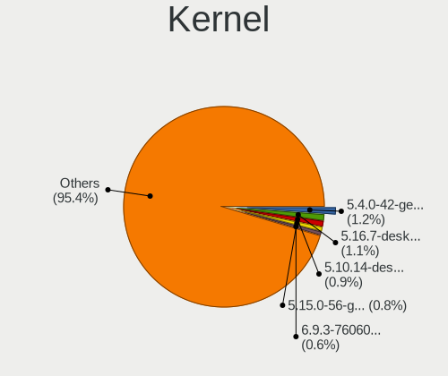
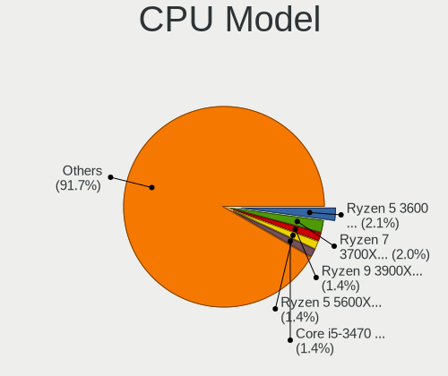

Linux in USA - Tested Hardware & Statistics (Desktops)
------------------------------------------------------

A project to collect tested hardware configurations for Linux in USA.

Anyone can contribute to this report by the [hw-probe](https://github.com/linuxhw/hw-probe) tool:

    sudo -E hw-probe -all -upload

Please contribute! Especially if your hardware is rare.

Contents
--------

* [ Test Cases ](#test-cases)

* [ System ](#system)
  - [ OS                       ](#os)
  - [ OS Family                ](#os-family)
  - [ Kernel                   ](#kernel)
  - [ Kernel Family            ](#kernel-family)
  - [ Kernel Major Ver.        ](#kernel-major-ver)
  - [ Arch                     ](#arch)
  - [ DE                       ](#de)
  - [ Display Server           ](#display-server)
  - [ Display Manager          ](#display-manager)
  - [ OS Lang                  ](#os-lang)
  - [ Boot Mode                ](#boot-mode)
  - [ Filesystem               ](#filesystem)
  - [ Part. scheme             ](#part-scheme)
  - [ Dual Boot with Linux/BSD ](#dual-boot-with-linuxbsd)
  - [ Dual Boot (Win)          ](#dual-boot-win)

* [ Board ](#board)
  - [ Vendor                   ](#vendor)
  - [ Model                    ](#model)
  - [ Model Family             ](#model-family)
  - [ MFG Year                 ](#mfg-year)
  - [ Form Factor              ](#form-factor)
  - [ Secure Boot              ](#secure-boot)
  - [ Coreboot                 ](#coreboot)
  - [ RAM Size                 ](#ram-size)
  - [ RAM Used                 ](#ram-used)
  - [ Total Drives             ](#total-drives)
  - [ Has CD-ROM               ](#has-cd-rom)
  - [ Has Ethernet             ](#has-ethernet)
  - [ Has WiFi                 ](#has-wifi)
  - [ Has Bluetooth            ](#has-bluetooth)

* [ Location ](#location)
  - [ Country                  ](#country)
  - [ City                     ](#city)

* [ Drives ](#drives)
  - [ Drive Vendor             ](#drive-vendor)
  - [ Drive Model              ](#drive-model)
  - [ HDD Vendor               ](#hdd-vendor)
  - [ SSD Vendor               ](#ssd-vendor)
  - [ Drive Kind               ](#drive-kind)
  - [ Drive Connector          ](#drive-connector)
  - [ Drive Size               ](#drive-size)
  - [ Space Total              ](#space-total)
  - [ Space Used               ](#space-used)
  - [ Malfunc. Drives          ](#malfunc-drives)
  - [ Malfunc. Drive Vendor    ](#malfunc-drive-vendor)
  - [ Malfunc. HDD Vendor      ](#malfunc-hdd-vendor)
  - [ Malfunc. Drive Kind      ](#malfunc-drive-kind)
  - [ Failed Drives            ](#failed-drives)
  - [ Failed Drive Vendor      ](#failed-drive-vendor)
  - [ Drive Status             ](#drive-status)

* [ Storage controller ](#storage-controller)
  - [ Storage Vendor           ](#storage-vendor)
  - [ Storage Model            ](#storage-model)
  - [ Storage Kind             ](#storage-kind)

* [ Processor ](#processor)
  - [ CPU Vendor               ](#cpu-vendor)
  - [ CPU Model                ](#cpu-model)
  - [ CPU Model Family         ](#cpu-model-family)
  - [ CPU Cores                ](#cpu-cores)
  - [ CPU Sockets              ](#cpu-sockets)
  - [ CPU Threads              ](#cpu-threads)
  - [ CPU Op-Modes             ](#cpu-op-modes)
  - [ CPU Microcode            ](#cpu-microcode)
  - [ CPU Microarch            ](#cpu-microarch)

* [ Graphics ](#graphics)
  - [ GPU Vendor               ](#gpu-vendor)
  - [ GPU Model                ](#gpu-model)
  - [ GPU Combo                ](#gpu-combo)
  - [ GPU Driver               ](#gpu-driver)
  - [ GPU Memory               ](#gpu-memory)

* [ Monitor ](#monitor)
  - [ Monitor Vendor           ](#monitor-vendor)
  - [ Monitor Model            ](#monitor-model)
  - [ Monitor Resolution       ](#monitor-resolution)
  - [ Monitor Diagonal         ](#monitor-diagonal)
  - [ Monitor Width            ](#monitor-width)
  - [ Aspect Ratio             ](#aspect-ratio)
  - [ Monitor Area             ](#monitor-area)
  - [ Pixel Density            ](#pixel-density)
  - [ Multiple Monitors        ](#multiple-monitors)

* [ Network ](#network)
  - [ Net Controller Vendor    ](#net-controller-vendor)
  - [ Net Controller Model     ](#net-controller-model)
  - [ Wireless Vendor          ](#wireless-vendor)
  - [ Wireless Model           ](#wireless-model)
  - [ Ethernet Vendor          ](#ethernet-vendor)
  - [ Ethernet Model           ](#ethernet-model)
  - [ Net Controller Kind      ](#net-controller-kind)
  - [ Used Controller          ](#used-controller)
  - [ NICs                     ](#nics)
  - [ IPv6                     ](#ipv6)

* [ Bluetooth ](#bluetooth)
  - [ Bluetooth Vendor         ](#bluetooth-vendor)
  - [ Bluetooth Model          ](#bluetooth-model)

* [ Sound ](#sound)
  - [ Sound Vendor             ](#sound-vendor)
  - [ Sound Model              ](#sound-model)

* [ Memory ](#memory)
  - [ Memory Vendor            ](#memory-vendor)
  - [ Memory Model             ](#memory-model)
  - [ Memory Kind              ](#memory-kind)
  - [ Memory Form Factor       ](#memory-form-factor)
  - [ Memory Size              ](#memory-size)
  - [ Memory Speed             ](#memory-speed)

* [ Printers & scanners ](#printers--scanners)
  - [ Printer Vendor           ](#printer-vendor)
  - [ Printer Model            ](#printer-model)
  - [ Scanner Vendor           ](#scanner-vendor)
  - [ Scanner Model            ](#scanner-model)

* [ Camera ](#camera)
  - [ Camera Vendor            ](#camera-vendor)
  - [ Camera Model             ](#camera-model)

* [ Security ](#security)
  - [ Fingerprint Vendor       ](#fingerprint-vendor)
  - [ Fingerprint Model        ](#fingerprint-model)
  - [ Chipcard Vendor          ](#chipcard-vendor)
  - [ Chipcard Model           ](#chipcard-model)

* [ Unsupported ](#unsupported)
  - [ Unsupported Devices      ](#unsupported-devices)
  - [ Unsupported Device Types ](#unsupported-device-types)

Test Cases
----------

Total: 16791

| Vendor        | Model                       | Probe                                                      | Date         |
|---------------|-----------------------------|------------------------------------------------------------|--------------|
| HP            | 3397                        | [24eb596bce](https://linux-hardware.org/?probe=24eb596bce) | Nov 02, 2022 |
| Dell          | 040DDP A00                  | [fba864b37c](https://linux-hardware.org/?probe=fba864b37c) | Nov 02, 2022 |
| HP            | 18E5                        | [3df38ade7e](https://linux-hardware.org/?probe=3df38ade7e) | Nov 02, 2022 |
| Lenovo        | 361A SDK0K17763 WIN         | [5d34d86be3](https://linux-hardware.org/?probe=5d34d86be3) | Nov 02, 2022 |
| Gigabyte      | X570 GAMING X               | [b3613b84ad](https://linux-hardware.org/?probe=b3613b84ad) | Nov 02, 2022 |
| HP            | 18E5                        | [8204df7795](https://linux-hardware.org/?probe=8204df7795) | Nov 02, 2022 |
| Lenovo        | 3132 SDK0R32862 WIN 3258... | [f8708425a1](https://linux-hardware.org/?probe=f8708425a1) | Nov 02, 2022 |
| ASUSTek       | ROG STRIX B550-F GAMING     | [4e97493141](https://linux-hardware.org/?probe=4e97493141) | Nov 02, 2022 |
| Dell          | 0GDG8Y A00                  | [609ccd3204](https://linux-hardware.org/?probe=609ccd3204) | Nov 02, 2022 |
| ASUSTek       | PRIME B550M-A               | [454939df34](https://linux-hardware.org/?probe=454939df34) | Nov 02, 2022 |
| Gigabyte      | X570 AORUS ELITE            | [9b093574b9](https://linux-hardware.org/?probe=9b093574b9) | Nov 02, 2022 |
| Foxconn       | 2A92                        | [0898482b18](https://linux-hardware.org/?probe=0898482b18) | Nov 02, 2022 |
| Dell          | 02YRK5 A02                  | [2c63ff26e5](https://linux-hardware.org/?probe=2c63ff26e5) | Nov 01, 2022 |
| ASRock        | AB350 Gaming K4             | [36387e4f11](https://linux-hardware.org/?probe=36387e4f11) | Nov 01, 2022 |
| ASUSTek       | H97I-PLUS                   | [13bf376807](https://linux-hardware.org/?probe=13bf376807) | Nov 01, 2022 |
| Dell          | 06D7TR A02                  | [a27d97c026](https://linux-hardware.org/?probe=a27d97c026) | Nov 01, 2022 |
| Dell          | 06D7TR A02                  | [f8a4053db1](https://linux-hardware.org/?probe=f8a4053db1) | Nov 01, 2022 |
| Dell          | 088DT1 A01                  | [efcbf8a2eb](https://linux-hardware.org/?probe=efcbf8a2eb) | Nov 01, 2022 |
| MSI           | MAG B550 TOMAHAWK           | [8ce0b9271b](https://linux-hardware.org/?probe=8ce0b9271b) | Nov 01, 2022 |
| Dell          | 07C0H8 A00                  | [1b2cb018d0](https://linux-hardware.org/?probe=1b2cb018d0) | Nov 01, 2022 |
| Gigabyte      | B550 UD AC                  | [c5a5219cf3](https://linux-hardware.org/?probe=c5a5219cf3) | Nov 01, 2022 |
| ASUSTek       | PRIME B550M-A               | [321eae8d23](https://linux-hardware.org/?probe=321eae8d23) | Nov 01, 2022 |
| ASRock        | AB350 Gaming K4             | [560d84828c](https://linux-hardware.org/?probe=560d84828c) | Nov 01, 2022 |
| ASUSTek       | ROG STRIX X670E-I GAMING... | [77ccdee0fe](https://linux-hardware.org/?probe=77ccdee0fe) | Nov 01, 2022 |
| Acer          | Aspire XC-1660G V:1.1       | [a3a55bf3e4](https://linux-hardware.org/?probe=a3a55bf3e4) | Nov 01, 2022 |
| Acer          | Aspire XC-1660G V:1.1       | [8d99f1fb3b](https://linux-hardware.org/?probe=8d99f1fb3b) | Nov 01, 2022 |
| ASUSTek       | ROG STRIX B450-F GAMING     | [7a29190887](https://linux-hardware.org/?probe=7a29190887) | Nov 01, 2022 |
| MSI           | MEG X570 UNIFY              | [11de150949](https://linux-hardware.org/?probe=11de150949) | Nov 01, 2022 |
| BCM           | MX110HD                     | [60c3eb0c5c](https://linux-hardware.org/?probe=60c3eb0c5c) | Nov 01, 2022 |
| Dell          | 082WXT A03                  | [ab3dad5a31](https://linux-hardware.org/?probe=ab3dad5a31) | Nov 01, 2022 |
| HP            | 09F8h                       | [f1107e91f2](https://linux-hardware.org/?probe=f1107e91f2) | Nov 01, 2022 |
| ASUSTek       | TUF Gaming X570-PLUS        | [d729001115](https://linux-hardware.org/?probe=d729001115) | Nov 01, 2022 |
| AOpen         | aVKx-DE R1.03 55DEL10001... | [b487a7aee3](https://linux-hardware.org/?probe=b487a7aee3) | Oct 31, 2022 |
| Dell          | 040DDP A00                  | [22b1e93203](https://linux-hardware.org/?probe=22b1e93203) | Oct 31, 2022 |
| ASUSTek       | ROG STRIX B450-F GAMING     | [4c3ae53c16](https://linux-hardware.org/?probe=4c3ae53c16) | Oct 31, 2022 |
| MSI           | MEG Z590 ACE                | [1082f00d60](https://linux-hardware.org/?probe=1082f00d60) | Oct 31, 2022 |
| ASUSTek       | Z87-K                       | [7edc0875ed](https://linux-hardware.org/?probe=7edc0875ed) | Oct 31, 2022 |
| ASUSTek       | VM60                        | [2cb5cc2932](https://linux-hardware.org/?probe=2cb5cc2932) | Oct 31, 2022 |
| ASUSTek       | P9X79                       | [3af3091881](https://linux-hardware.org/?probe=3af3091881) | Oct 31, 2022 |
| HP            | 1790                        | [6dc2cef5ea](https://linux-hardware.org/?probe=6dc2cef5ea) | Oct 31, 2022 |
| Lenovo        | 31900058 STD                | [d7cc344b2f](https://linux-hardware.org/?probe=d7cc344b2f) | Oct 31, 2022 |
| MSI           | AM1I                        | [30014de18a](https://linux-hardware.org/?probe=30014de18a) | Oct 31, 2022 |
| MSI           | B450M BAZOOKA MAX WIFI      | [8b8c978f0b](https://linux-hardware.org/?probe=8b8c978f0b) | Oct 31, 2022 |
| ASRock        | X470 Taichi                 | [d808be6d90](https://linux-hardware.org/?probe=d808be6d90) | Oct 31, 2022 |
| ASUSTek       | P5Q-E                       | [0ef6be44d0](https://linux-hardware.org/?probe=0ef6be44d0) | Oct 31, 2022 |
| Gigabyte      | Z77X-UP4 TH                 | [5eabf4c6b3](https://linux-hardware.org/?probe=5eabf4c6b3) | Oct 31, 2022 |
| ASUSTek       | M5A78L-M/USB3               | [4ac9bf1711](https://linux-hardware.org/?probe=4ac9bf1711) | Oct 31, 2022 |
| ASUSTek       | M5A99FX PRO R2.0            | [4179fe16d6](https://linux-hardware.org/?probe=4179fe16d6) | Oct 31, 2022 |
| Dell          | 042P49 A01                  | [1fb51cc10c](https://linux-hardware.org/?probe=1fb51cc10c) | Oct 31, 2022 |
| MSI           | B550M PRO-VDH WIFI          | [472a3f2707](https://linux-hardware.org/?probe=472a3f2707) | Oct 30, 2022 |
| HP            | 18E7                        | [6393aa1211](https://linux-hardware.org/?probe=6393aa1211) | Oct 30, 2022 |
| ASUSTek       | PHOENIX                     | [d4f8ae717d](https://linux-hardware.org/?probe=d4f8ae717d) | Oct 30, 2022 |
| Lenovo        | 0B98401 WIN                 | [25805a13b0](https://linux-hardware.org/?probe=25805a13b0) | Oct 30, 2022 |
| MSI           | B450 GAMING PLUS MAX        | [e638ed7bd3](https://linux-hardware.org/?probe=e638ed7bd3) | Oct 30, 2022 |
| EVGA          | 122-CK-NF68 2               | [91b3144c5c](https://linux-hardware.org/?probe=91b3144c5c) | Oct 30, 2022 |
| ASUSTek       | TUF Gaming B450M-PLUS II    | [8e2ab3d61b](https://linux-hardware.org/?probe=8e2ab3d61b) | Oct 30, 2022 |
| Dell          | 0WMJ54 A01                  | [3760efa49c](https://linux-hardware.org/?probe=3760efa49c) | Oct 30, 2022 |
| Dell          | 0WMJ54 A01                  | [1b614b2744](https://linux-hardware.org/?probe=1b614b2744) | Oct 30, 2022 |
| MSI           | B450-A PRO MAX              | [0e8db93a43](https://linux-hardware.org/?probe=0e8db93a43) | Oct 30, 2022 |
| Apple         | Mac-F221BEC8                | [12b6232cdd](https://linux-hardware.org/?probe=12b6232cdd) | Oct 30, 2022 |
| MSI           | B550M PRO-VDH WIFI          | [44eaa95ffc](https://linux-hardware.org/?probe=44eaa95ffc) | Oct 30, 2022 |
| Dell          | 0G214D A00                  | [43b30d9a84](https://linux-hardware.org/?probe=43b30d9a84) | Oct 30, 2022 |
| Dell          | 0G214D A00                  | [2ee26099ae](https://linux-hardware.org/?probe=2ee26099ae) | Oct 30, 2022 |
| ASUSTek       | ROG STRIX Z690-F GAMING ... | [7047610fd9](https://linux-hardware.org/?probe=7047610fd9) | Oct 30, 2022 |
| ASUSTek       | G11CD                       | [2a9d64387c](https://linux-hardware.org/?probe=2a9d64387c) | Oct 29, 2022 |
| ASRock        | Z690 Steel Legend           | [cbfd203fd4](https://linux-hardware.org/?probe=cbfd203fd4) | Oct 29, 2022 |
| Gigabyte      | B450M DS3H V2               | [ba5da6b270](https://linux-hardware.org/?probe=ba5da6b270) | Oct 29, 2022 |
| ASUSTek       | M3N-HT DELUXE               | [290f3b115f](https://linux-hardware.org/?probe=290f3b115f) | Oct 29, 2022 |
| ASUSTek       | M3N-HT DELUXE               | [bf841b86f5](https://linux-hardware.org/?probe=bf841b86f5) | Oct 29, 2022 |
| Lenovo        | 3717 SDK0J40709 WIN 3259... | [39d64a1014](https://linux-hardware.org/?probe=39d64a1014) | Oct 29, 2022 |
| Dell          | 0T2HR0 A02                  | [e4b1137777](https://linux-hardware.org/?probe=e4b1137777) | Oct 29, 2022 |
| ASUSTek       | M4A785-M                    | [73eae83658](https://linux-hardware.org/?probe=73eae83658) | Oct 29, 2022 |
| Foxconn       | 2ACA                        | [69544f77d0](https://linux-hardware.org/?probe=69544f77d0) | Oct 29, 2022 |
| ASUSTek       | ROG Maximus XII HERO        | [048348c6ba](https://linux-hardware.org/?probe=048348c6ba) | Oct 29, 2022 |
| Dell          | 0WN7Y6 A01                  | [4a5527f98a](https://linux-hardware.org/?probe=4a5527f98a) | Oct 29, 2022 |
| ASUSTek       | PRIME Q270M-C               | [4440c6ed51](https://linux-hardware.org/?probe=4440c6ed51) | Oct 29, 2022 |
| Google        | Kench                       | [faf24fddcd](https://linux-hardware.org/?probe=faf24fddcd) | Oct 29, 2022 |
| Gigabyte      | B550M DS3H                  | [8a918b4739](https://linux-hardware.org/?probe=8a918b4739) | Oct 28, 2022 |
| ASUSTek       | CM1730,CM1830               | [0915c0bf5a](https://linux-hardware.org/?probe=0915c0bf5a) | Oct 28, 2022 |
| MSI           | X470 GAMING PLUS            | [f296db20db](https://linux-hardware.org/?probe=f296db20db) | Oct 28, 2022 |
| ASUSTek       | X99-A/USB                   | [ca0810aab5](https://linux-hardware.org/?probe=ca0810aab5) | Oct 28, 2022 |
| Dell          | 06D7TR A02                  | [42e2c69893](https://linux-hardware.org/?probe=42e2c69893) | Oct 28, 2022 |
| ASUSTek       | M5A99FX PRO R2.0            | [060c8aadd1](https://linux-hardware.org/?probe=060c8aadd1) | Oct 28, 2022 |
| Gigabyte      | H110M-A-CF                  | [54b0296df7](https://linux-hardware.org/?probe=54b0296df7) | Oct 28, 2022 |
| ASUSTek       | PRIME X370-PRO              | [d3cf194e94](https://linux-hardware.org/?probe=d3cf194e94) | Oct 28, 2022 |
| ASRock        | X99 Extreme4                | [72102d6890](https://linux-hardware.org/?probe=72102d6890) | Oct 28, 2022 |
| Alienware     | 07W25T A01                  | [107ec47dd5](https://linux-hardware.org/?probe=107ec47dd5) | Oct 28, 2022 |
| Gigabyte      | B450M DS3H-CF               | [38135da604](https://linux-hardware.org/?probe=38135da604) | Oct 28, 2022 |
| Alienware     | 07W25T A01                  | [0338285f54](https://linux-hardware.org/?probe=0338285f54) | Oct 28, 2022 |
| ASUSTek       | PHOENIX                     | [827dd1396b](https://linux-hardware.org/?probe=827dd1396b) | Oct 28, 2022 |
| Dell          | 0RD203                      | [b427b55c0b](https://linux-hardware.org/?probe=b427b55c0b) | Oct 28, 2022 |
| Alienware     | 07W25T A01                  | [e320ad09bc](https://linux-hardware.org/?probe=e320ad09bc) | Oct 28, 2022 |
| Intel         | DG965OT AAD63733-203        | [28ad26edff](https://linux-hardware.org/?probe=28ad26edff) | Oct 28, 2022 |
| ASUSTek       | P9X79 DELUXE                | [210e6b1755](https://linux-hardware.org/?probe=210e6b1755) | Oct 27, 2022 |
| AZW           | Green G2                    | [628aba3de0](https://linux-hardware.org/?probe=628aba3de0) | Oct 27, 2022 |
| Gateway       | SX2851                      | [500b4bb8ec](https://linux-hardware.org/?probe=500b4bb8ec) | Oct 27, 2022 |
| ASUSTek       | TUF Gaming X570-PLUS        | [0325c2200c](https://linux-hardware.org/?probe=0325c2200c) | Oct 27, 2022 |
| HP            | 8643 SMVB                   | [34f98de888](https://linux-hardware.org/?probe=34f98de888) | Oct 27, 2022 |
| HP            | 8643 SMVB                   | [b29a0df34f](https://linux-hardware.org/?probe=b29a0df34f) | Oct 27, 2022 |
| Apple         | Mac-F221BEC8                | [0bf03c49f7](https://linux-hardware.org/?probe=0bf03c49f7) | Oct 27, 2022 |
| HP            | 844C                        | [7e994c50c9](https://linux-hardware.org/?probe=7e994c50c9) | Oct 27, 2022 |
| ASUSTek       | TUF Gaming B550-PLUS        | [8948294711](https://linux-hardware.org/?probe=8948294711) | Oct 27, 2022 |
| Biostar       | A320MH                      | [d01d91204f](https://linux-hardware.org/?probe=d01d91204f) | Oct 27, 2022 |
| Biostar       | A320MH                      | [768dff7065](https://linux-hardware.org/?probe=768dff7065) | Oct 27, 2022 |
| Gigabyte      | 970A-DS3P                   | [7e31b6af67](https://linux-hardware.org/?probe=7e31b6af67) | Oct 27, 2022 |
| Gigabyte      | 970A-DS3P                   | [6823943242](https://linux-hardware.org/?probe=6823943242) | Oct 27, 2022 |
| Gigabyte      | B450 I AORUS PRO WIFI-CF    | [22dedf6886](https://linux-hardware.org/?probe=22dedf6886) | Oct 27, 2022 |
| ASUSTek       | PRIME B550M-A               | [6650af69ad](https://linux-hardware.org/?probe=6650af69ad) | Oct 27, 2022 |
| Dell          | 0KWVT8 A02                  | [01613e9e80](https://linux-hardware.org/?probe=01613e9e80) | Oct 27, 2022 |
| ASUSTek       | P9X79 DELUXE                | [a1125bf007](https://linux-hardware.org/?probe=a1125bf007) | Oct 26, 2022 |
| Gigabyte      | B450M DS3H V2               | [c2c9c1bb9b](https://linux-hardware.org/?probe=c2c9c1bb9b) | Oct 26, 2022 |
| ASUSTek       | M5A78L-M/USB3               | [6c7c7fa216](https://linux-hardware.org/?probe=6c7c7fa216) | Oct 26, 2022 |
| MSI           | MEG X570 GODLIKE            | [6659cbf83d](https://linux-hardware.org/?probe=6659cbf83d) | Oct 26, 2022 |
| Intel         | B75                         | [eb7c27f1e5](https://linux-hardware.org/?probe=eb7c27f1e5) | Oct 26, 2022 |
| HP            | 2B2C                        | [6f90b1e25e](https://linux-hardware.org/?probe=6f90b1e25e) | Oct 26, 2022 |
| HP            | 1495                        | [64e8d1cff2](https://linux-hardware.org/?probe=64e8d1cff2) | Oct 26, 2022 |
| ASUSTek       | ROG STRIX Z690-F GAMING ... | [3acf0ca326](https://linux-hardware.org/?probe=3acf0ca326) | Oct 26, 2022 |
| HP            | ProLiant ML350 G6           | [d080f0956b](https://linux-hardware.org/?probe=d080f0956b) | Oct 26, 2022 |
| ASUSTek       | M4A87TD EVO                 | [c304ae4e48](https://linux-hardware.org/?probe=c304ae4e48) | Oct 25, 2022 |
| ASUSTek       | M4A87TD EVO                 | [1f62025135](https://linux-hardware.org/?probe=1f62025135) | Oct 25, 2022 |
| Gigabyte      | 990FXA-UD3                  | [332886e612](https://linux-hardware.org/?probe=332886e612) | Oct 25, 2022 |
| Techvision    | TVI7309X B0                 | [cf2d75ffa9](https://linux-hardware.org/?probe=cf2d75ffa9) | Oct 25, 2022 |
| HP            | 3029h                       | [c278953154](https://linux-hardware.org/?probe=c278953154) | Oct 25, 2022 |
| Dell          | 0HN7XN A01                  | [c512f7e4c8](https://linux-hardware.org/?probe=c512f7e4c8) | Oct 25, 2022 |
| ASUSTek       | ROG ZENITH EXTREME          | [13830bd661](https://linux-hardware.org/?probe=13830bd661) | Oct 25, 2022 |
| ASUSTek       | ROG ZENITH EXTREME          | [6c8e8f4707](https://linux-hardware.org/?probe=6c8e8f4707) | Oct 25, 2022 |
| ASUSTek       | ROG ZENITH EXTREME          | [5fa6c73455](https://linux-hardware.org/?probe=5fa6c73455) | Oct 25, 2022 |
| MSI           | MPG B560I GAMING EDGE WI... | [3cd266dbbb](https://linux-hardware.org/?probe=3cd266dbbb) | Oct 25, 2022 |
| MSI           | B450 GAMING PRO CARBON M... | [3e0aed8ddf](https://linux-hardware.org/?probe=3e0aed8ddf) | Oct 25, 2022 |
| Dell          | 0YJPT1 A00                  | [bb1a7da646](https://linux-hardware.org/?probe=bb1a7da646) | Oct 25, 2022 |
| ASRock        | A320M-HDV R4.0              | [17a0e006d0](https://linux-hardware.org/?probe=17a0e006d0) | Oct 25, 2022 |
| HP            | 1589                        | [ad8920e059](https://linux-hardware.org/?probe=ad8920e059) | Oct 25, 2022 |
| ASUSTek       | ROG STRIX X670E-E GAMING... | [cc2fc1e863](https://linux-hardware.org/?probe=cc2fc1e863) | Oct 24, 2022 |
| ASRock        | H110M-ITX                   | [6818d9b7e2](https://linux-hardware.org/?probe=6818d9b7e2) | Oct 24, 2022 |
| ASUSTek       | ROG STRIX Z590-E GAMING ... | [5106f6a251](https://linux-hardware.org/?probe=5106f6a251) | Oct 24, 2022 |
| ASUSTek       | ROG STRIX X470-F GAMING     | [b4f3e516e3](https://linux-hardware.org/?probe=b4f3e516e3) | Oct 24, 2022 |
| Gigabyte      | 990FXA-UD5 R5               | [3f6368ca5a](https://linux-hardware.org/?probe=3f6368ca5a) | Oct 24, 2022 |
| ASUSTek       | PRIME B550M-A               | [baf284f131](https://linux-hardware.org/?probe=baf284f131) | Oct 24, 2022 |
| ASUSTek       | M5A97 LE R2.0               | [93fdeacbba](https://linux-hardware.org/?probe=93fdeacbba) | Oct 24, 2022 |
| ASUSTek       | TUF B450M-PLUS GAMING       | [2a57a65990](https://linux-hardware.org/?probe=2a57a65990) | Oct 24, 2022 |
| Dell          | 07N90W A00                  | [bde1361eae](https://linux-hardware.org/?probe=bde1361eae) | Oct 24, 2022 |
| ASUSTek       | PRIME B550M-A               | [c9b4dc7a70](https://linux-hardware.org/?probe=c9b4dc7a70) | Oct 24, 2022 |
| ASUSTek       | PRIME B550M-A               | [b237965d1c](https://linux-hardware.org/?probe=b237965d1c) | Oct 24, 2022 |
| Dell          | 0200DY A02                  | [69327d2615](https://linux-hardware.org/?probe=69327d2615) | Oct 24, 2022 |
| HP            | 8767 A                      | [7ecf583dab](https://linux-hardware.org/?probe=7ecf583dab) | Oct 24, 2022 |
| MSI           | 970A-G46                    | [38541ac772](https://linux-hardware.org/?probe=38541ac772) | Oct 24, 2022 |
| HP            | 3048h                       | [3d3f080f50](https://linux-hardware.org/?probe=3d3f080f50) | Oct 24, 2022 |
| Soyo          | SY-B250 BTC                 | [2be8fe0c55](https://linux-hardware.org/?probe=2be8fe0c55) | Oct 23, 2022 |
| ASUSTek       | ROG STRIX Z390-E GAMING     | [7e40be1c82](https://linux-hardware.org/?probe=7e40be1c82) | Oct 23, 2022 |
| HP            | 3648h                       | [ca842c5896](https://linux-hardware.org/?probe=ca842c5896) | Oct 23, 2022 |
| ASUSTek       | M3N-HT DELUXE               | [eafcc0b1b0](https://linux-hardware.org/?probe=eafcc0b1b0) | Oct 23, 2022 |
| ASUSTek       | M3N-HT DELUXE               | [b7b190000b](https://linux-hardware.org/?probe=b7b190000b) | Oct 23, 2022 |
| Dell          | 0HN7XN A01                  | [02ae77c047](https://linux-hardware.org/?probe=02ae77c047) | Oct 23, 2022 |
| AZW           | Green G2                    | [56ee35acfc](https://linux-hardware.org/?probe=56ee35acfc) | Oct 23, 2022 |
| ASUSTek       | Z170-A                      | [22a96186fa](https://linux-hardware.org/?probe=22a96186fa) | Oct 23, 2022 |
| Dell          | 08HPGT A01                  | [6f5cd6be2e](https://linux-hardware.org/?probe=6f5cd6be2e) | Oct 23, 2022 |
| Dell          | 0YJPT1 A00                  | [678916671d](https://linux-hardware.org/?probe=678916671d) | Oct 23, 2022 |
| ASUSTek       | P8P67 LE                    | [a78f249f0e](https://linux-hardware.org/?probe=a78f249f0e) | Oct 23, 2022 |
| ASUSTek       | F2A85-V PRO                 | [ff4b30eab7](https://linux-hardware.org/?probe=ff4b30eab7) | Oct 23, 2022 |
| ASUSTek       | PRIME Z690-A                | [978194c9ec](https://linux-hardware.org/?probe=978194c9ec) | Oct 23, 2022 |
| Gigabyte      | B550 AORUS PRO              | [76c1dffd95](https://linux-hardware.org/?probe=76c1dffd95) | Oct 23, 2022 |
| ASUSTek       | TUF Gaming B550M-PLUS       | [4adb8fc7ec](https://linux-hardware.org/?probe=4adb8fc7ec) | Oct 23, 2022 |
| Lenovo        | 30D2 SDK0J40697 WIN 3305... | [839e67703e](https://linux-hardware.org/?probe=839e67703e) | Oct 23, 2022 |
| LattePanda    | 3 Delta LP-BS-7-S70JR120... | [7b9901d0d3](https://linux-hardware.org/?probe=7b9901d0d3) | Oct 23, 2022 |
| ASUSTek       | TUF Gaming B550M-PLUS       | [9be4a6cba7](https://linux-hardware.org/?probe=9be4a6cba7) | Oct 23, 2022 |
| HP            | 2B2C                        | [7fc73befc9](https://linux-hardware.org/?probe=7fc73befc9) | Oct 22, 2022 |
| ASUSTek       | TUF Gaming X570-PLUS        | [c0867dfce4](https://linux-hardware.org/?probe=c0867dfce4) | Oct 22, 2022 |
| ASUSTek       | ROG CROSSHAIR VIII HERO     | [b42893c91e](https://linux-hardware.org/?probe=b42893c91e) | Oct 22, 2022 |
| Gigabyte      | Z390 AORUS PRO-CF           | [b633b478aa](https://linux-hardware.org/?probe=b633b478aa) | Oct 22, 2022 |
| ASUSTek       | ROG STRIX X470-F GAMING     | [b7ad660d88](https://linux-hardware.org/?probe=b7ad660d88) | Oct 22, 2022 |
| ASUSTek       | TUF Gaming X570-PLUS        | [6199e2daaa](https://linux-hardware.org/?probe=6199e2daaa) | Oct 22, 2022 |
| ASUSTek       | TUF Gaming B450M-PRO S      | [dc48a995c4](https://linux-hardware.org/?probe=dc48a995c4) | Oct 22, 2022 |
| Lenovo        | ThinkServer TS140           | [6f0f7b249a](https://linux-hardware.org/?probe=6f0f7b249a) | Oct 22, 2022 |
| Dell          | 0773VG A01                  | [32d7c24c6d](https://linux-hardware.org/?probe=32d7c24c6d) | Oct 22, 2022 |
| ASUSTek       | SABERTOOTH 990FX R2.0       | [ddc08ffe48](https://linux-hardware.org/?probe=ddc08ffe48) | Oct 22, 2022 |
| ASUSTek       | TUF Gaming X570-PLUS        | [b89b177dd7](https://linux-hardware.org/?probe=b89b177dd7) | Oct 22, 2022 |
| Gigabyte      | B550M AORUS PRO             | [d72c486584](https://linux-hardware.org/?probe=d72c486584) | Oct 22, 2022 |
| HP            | 1850                        | [2b7d881086](https://linux-hardware.org/?probe=2b7d881086) | Oct 22, 2022 |
| MSI           | B450 TOMAHAWK MAX II        | [4dcfaf4b33](https://linux-hardware.org/?probe=4dcfaf4b33) | Oct 22, 2022 |
| Intel         | DP67DE AAG10217-205         | [b2a9de00ce](https://linux-hardware.org/?probe=b2a9de00ce) | Oct 22, 2022 |
| Dell          | 06D7TR A02                  | [cc9f0fae0e](https://linux-hardware.org/?probe=cc9f0fae0e) | Oct 22, 2022 |
| Dell          | 06D7TR A02                  | [8c5b1117a9](https://linux-hardware.org/?probe=8c5b1117a9) | Oct 22, 2022 |
| HP            | 213D A01                    | [c7ffdb8626](https://linux-hardware.org/?probe=c7ffdb8626) | Oct 22, 2022 |
| HP            | 304Bh                       | [c73d7e712d](https://linux-hardware.org/?probe=c73d7e712d) | Oct 22, 2022 |
| ASUSTek       | P8Z68-V GEN3                | [e1dedae10a](https://linux-hardware.org/?probe=e1dedae10a) | Oct 22, 2022 |
| Dell          | 0PP150 A00                  | [0e07990bda](https://linux-hardware.org/?probe=0e07990bda) | Oct 22, 2022 |
| Gigabyte      | B550 AORUS ELITE V2         | [15c764f6fa](https://linux-hardware.org/?probe=15c764f6fa) | Oct 21, 2022 |
| ASUSTek       | TUF Gaming Z490-PLUS        | [77b57dbe12](https://linux-hardware.org/?probe=77b57dbe12) | Oct 21, 2022 |
| ASUSTek       | PRIME X470-PRO              | [c830caee45](https://linux-hardware.org/?probe=c830caee45) | Oct 21, 2022 |
| ASUSTek       | M4A89GTD-PRO/USB3           | [168cbb8438](https://linux-hardware.org/?probe=168cbb8438) | Oct 21, 2022 |
| Lenovo        | 3111 NOK                    | [185e1ca963](https://linux-hardware.org/?probe=185e1ca963) | Oct 21, 2022 |
| ASUSTek       | ROG STRIX X670E-I GAMING... | [fb86c213ca](https://linux-hardware.org/?probe=fb86c213ca) | Oct 21, 2022 |
| HP            | 304Bh                       | [b8b2e16db8](https://linux-hardware.org/?probe=b8b2e16db8) | Oct 20, 2022 |
| MSI           | H110M GAMING                | [20689f6175](https://linux-hardware.org/?probe=20689f6175) | Oct 20, 2022 |
| Gigabyte      | 990FXA-UD5 R5               | [f03f1bb041](https://linux-hardware.org/?probe=f03f1bb041) | Oct 20, 2022 |
| Dell          | 0JP3NX A01                  | [db876946e0](https://linux-hardware.org/?probe=db876946e0) | Oct 20, 2022 |
| Lenovo        | 3111 SDK0J40697 WIN 3305... | [c8997eb831](https://linux-hardware.org/?probe=c8997eb831) | Oct 20, 2022 |
| Apple         | Mac-F42C88C8 Proto1         | [7cd35141b3](https://linux-hardware.org/?probe=7cd35141b3) | Oct 20, 2022 |
| HP            | 8433 11                     | [7e28f54181](https://linux-hardware.org/?probe=7e28f54181) | Oct 20, 2022 |
| HP            | 8299                        | [2b4c3924e4](https://linux-hardware.org/?probe=2b4c3924e4) | Oct 20, 2022 |
| ASRock        | X399 Taichi                 | [0c5809902b](https://linux-hardware.org/?probe=0c5809902b) | Oct 20, 2022 |
| ASUSTek       | Pro WS X570-ACE             | [7f069e1021](https://linux-hardware.org/?probe=7f069e1021) | Oct 20, 2022 |
| ASRock        | N68C-GS FX                  | [9e0b1677e4](https://linux-hardware.org/?probe=9e0b1677e4) | Oct 20, 2022 |
| NZXT          | N7 B550                     | [f699b7e1d2](https://linux-hardware.org/?probe=f699b7e1d2) | Oct 20, 2022 |
| ASUSTek       | Pro WS WRX80E-SAGE SE WI... | [e7875c59bc](https://linux-hardware.org/?probe=e7875c59bc) | Oct 20, 2022 |
| ASUSTek       | ROG STRIX B450-F GAMING     | [ac0380e724](https://linux-hardware.org/?probe=ac0380e724) | Oct 20, 2022 |
| ASUSTek       | PRIME B550M-A               | [68b839f16e](https://linux-hardware.org/?probe=68b839f16e) | Oct 20, 2022 |
| ASUSTek       | M4A89GTD-PRO/USB3           | [565e5d5e3b](https://linux-hardware.org/?probe=565e5d5e3b) | Oct 20, 2022 |
| Dell          | 0PC5F7 A02                  | [1e54b1512b](https://linux-hardware.org/?probe=1e54b1512b) | Oct 20, 2022 |
| ASUSTek       | TUF Gaming Z490-PLUS        | [13f4800fa8](https://linux-hardware.org/?probe=13f4800fa8) | Oct 20, 2022 |
| ASRock        | Z77 Extreme4                | [7d12ed56e5](https://linux-hardware.org/?probe=7d12ed56e5) | Oct 19, 2022 |
| ECS           | H61H2-WM                    | [934781c2fb](https://linux-hardware.org/?probe=934781c2fb) | Oct 19, 2022 |
| ASUSTek       | M5A78L-M/USB3               | [76c0902958](https://linux-hardware.org/?probe=76c0902958) | Oct 19, 2022 |
| ASUSTek       | P8Z77-V DELUXE              | [2a207c39d4](https://linux-hardware.org/?probe=2a207c39d4) | Oct 19, 2022 |
| HP            | 802F                        | [9e51fdba18](https://linux-hardware.org/?probe=9e51fdba18) | Oct 19, 2022 |
| Shuttle       | FH67H                       | [6679449225](https://linux-hardware.org/?probe=6679449225) | Oct 19, 2022 |
| Dell          | 0M5DCD A00                  | [e14791bb51](https://linux-hardware.org/?probe=e14791bb51) | Oct 19, 2022 |
| ASUSTek       | N3050T R2.0                 | [80198776cc](https://linux-hardware.org/?probe=80198776cc) | Oct 19, 2022 |
| ASRock        | X570 Phantom Gaming-ITX/... | [59904b8a87](https://linux-hardware.org/?probe=59904b8a87) | Oct 19, 2022 |
| Dell          | 0VRWRC A00                  | [543bbf49af](https://linux-hardware.org/?probe=543bbf49af) | Oct 19, 2022 |
| Gigabyte      | F2A88XM-DS2                 | [d066cccd5a](https://linux-hardware.org/?probe=d066cccd5a) | Oct 19, 2022 |
| Dell          | 0VRWRC A00                  | [f13dd4393d](https://linux-hardware.org/?probe=f13dd4393d) | Oct 19, 2022 |
| Gigabyte      | A320M-S2H-CF                | [a52d0f3c58](https://linux-hardware.org/?probe=a52d0f3c58) | Oct 19, 2022 |
| Gigabyte      | B450M DS3H-CF               | [c901f6927c](https://linux-hardware.org/?probe=c901f6927c) | Oct 18, 2022 |
| Gigabyte      | A320M-S2H-CF                | [62b055a110](https://linux-hardware.org/?probe=62b055a110) | Oct 18, 2022 |
| ASRock        | 980DE3/U3S3                 | [d86abdf5b9](https://linux-hardware.org/?probe=d86abdf5b9) | Oct 18, 2022 |
| Gigabyte      | X570 AORUS ELITE            | [e8828a135a](https://linux-hardware.org/?probe=e8828a135a) | Oct 18, 2022 |
| Gigabyte      | X570 AORUS ELITE            | [30dfac67f5](https://linux-hardware.org/?probe=30dfac67f5) | Oct 18, 2022 |
| ASRock        | X670E PG Lightning          | [c3ce6dce01](https://linux-hardware.org/?probe=c3ce6dce01) | Oct 18, 2022 |
| ASUSTek       | M3N78-VM                    | [825d6ebf7f](https://linux-hardware.org/?probe=825d6ebf7f) | Oct 18, 2022 |
| HP            | 3047h                       | [c1716b926a](https://linux-hardware.org/?probe=c1716b926a) | Oct 18, 2022 |
| HP            | 8299                        | [bf86078a8f](https://linux-hardware.org/?probe=bf86078a8f) | Oct 18, 2022 |
| Dell          | 0DFRFW A01                  | [dd4ada0631](https://linux-hardware.org/?probe=dd4ada0631) | Oct 18, 2022 |
| ASUSTek       | TUF Gaming X570-PRO         | [c84509fb21](https://linux-hardware.org/?probe=c84509fb21) | Oct 18, 2022 |
| Dell          | 0GTK4K A02                  | [f92314f74b](https://linux-hardware.org/?probe=f92314f74b) | Oct 18, 2022 |
| ASUSTek       | PRIME B550M-A               | [8d774a5771](https://linux-hardware.org/?probe=8d774a5771) | Oct 18, 2022 |
| ASUSTek       | TUF Gaming X670E-PLUS WI... | [e3ce426450](https://linux-hardware.org/?probe=e3ce426450) | Oct 18, 2022 |
| Gigabyte      | A320M-S2H-CF                | [9336c74a08](https://linux-hardware.org/?probe=9336c74a08) | Oct 18, 2022 |
| MSI           | MPG Z390 GAMING PLUS        | [624be3f0f3](https://linux-hardware.org/?probe=624be3f0f3) | Oct 17, 2022 |
| Dell          | 0T7D40 A01                  | [ce6f6580be](https://linux-hardware.org/?probe=ce6f6580be) | Oct 17, 2022 |
| Dell          | 0T7D40 A01                  | [6fb3c4740d](https://linux-hardware.org/?probe=6fb3c4740d) | Oct 17, 2022 |
| Dell          | 0T7D40 A01                  | [38888585db](https://linux-hardware.org/?probe=38888585db) | Oct 17, 2022 |
| ASRock        | B450M-HDV                   | [6a523a41da](https://linux-hardware.org/?probe=6a523a41da) | Oct 17, 2022 |
| HP            | 3648h                       | [8249e3db9e](https://linux-hardware.org/?probe=8249e3db9e) | Oct 17, 2022 |
| Dell          | 0J3C2F A02                  | [284e02a5b2](https://linux-hardware.org/?probe=284e02a5b2) | Oct 17, 2022 |
| Dell          | 02YYK5 A01                  | [5872b35f8c](https://linux-hardware.org/?probe=5872b35f8c) | Oct 17, 2022 |
| HP            | 2B36                        | [b4e2f30d82](https://linux-hardware.org/?probe=b4e2f30d82) | Oct 17, 2022 |
| Dell          | 0HHV7N A00                  | [fec2e273f7](https://linux-hardware.org/?probe=fec2e273f7) | Oct 17, 2022 |
| MSI           | B550M PRO-VDH WIFI          | [04237c187c](https://linux-hardware.org/?probe=04237c187c) | Oct 17, 2022 |
| ASUSTek       | ROG Maximus XI HERO         | [7de3eff9df](https://linux-hardware.org/?probe=7de3eff9df) | Oct 16, 2022 |
| Dell          | 0HY9JP A01                  | [3d94d514d2](https://linux-hardware.org/?probe=3d94d514d2) | Oct 16, 2022 |
| ASUSTek       | PRIME Z690-A                | [50fe9fcad5](https://linux-hardware.org/?probe=50fe9fcad5) | Oct 16, 2022 |
| ASUSTek       | PRO B460M-C                 | [eb850e075d](https://linux-hardware.org/?probe=eb850e075d) | Oct 16, 2022 |
| ASUSTek       | ROG STRIX B550-F GAMING     | [0e0a3b9cf0](https://linux-hardware.org/?probe=0e0a3b9cf0) | Oct 16, 2022 |
| Dell          | 0D6H9T A00                  | [52dec54de2](https://linux-hardware.org/?probe=52dec54de2) | Oct 16, 2022 |
| Intel         | D955XBK AAC96732-501        | [57a5e6cd9a](https://linux-hardware.org/?probe=57a5e6cd9a) | Oct 16, 2022 |
| Lenovo        | 31900058 STD                | [9f7158b883](https://linux-hardware.org/?probe=9f7158b883) | Oct 16, 2022 |
| ASUSTek       | M5A99FX PRO R2.0            | [24c63dcc9e](https://linux-hardware.org/?probe=24c63dcc9e) | Oct 16, 2022 |
| ASUSTek       | M5A99FX PRO R2.0            | [732c7afd4c](https://linux-hardware.org/?probe=732c7afd4c) | Oct 16, 2022 |
| HP            | 1790                        | [5b9b2357c5](https://linux-hardware.org/?probe=5b9b2357c5) | Oct 16, 2022 |
| AZW           | Green G2                    | [f7a9322b66](https://linux-hardware.org/?probe=f7a9322b66) | Oct 16, 2022 |
| MSI           | MPG Z690 FORCE WIFI         | [1627dd0745](https://linux-hardware.org/?probe=1627dd0745) | Oct 16, 2022 |
| Gigabyte      | X399 AORUS PRO-CF           | [93e82a30ac](https://linux-hardware.org/?probe=93e82a30ac) | Oct 16, 2022 |
| Gigabyte      | X399 AORUS PRO-CF           | [eb9b7e329b](https://linux-hardware.org/?probe=eb9b7e329b) | Oct 16, 2022 |
| Dell          | 0XCR8D A03                  | [f28c1f59df](https://linux-hardware.org/?probe=f28c1f59df) | Oct 16, 2022 |
| MSI           | Z370 GAMING PLUS            | [ce623178a2](https://linux-hardware.org/?probe=ce623178a2) | Oct 16, 2022 |
| ASUSTek       | PRIME B550-PLUS             | [e71107e8cd](https://linux-hardware.org/?probe=e71107e8cd) | Oct 16, 2022 |
| ASUSTek       | PRIME B550M-A               | [4aa372d298](https://linux-hardware.org/?probe=4aa372d298) | Oct 16, 2022 |
| Acer          | Aspire TC-865 V:1.1         | [dd4d81390a](https://linux-hardware.org/?probe=dd4d81390a) | Oct 15, 2022 |
| Dell          | 0D28YY A00                  | [435831fd5b](https://linux-hardware.org/?probe=435831fd5b) | Oct 15, 2022 |
| Dell          | 04YP6J A02                  | [3ff07a04c0](https://linux-hardware.org/?probe=3ff07a04c0) | Oct 15, 2022 |
| MSI           | A68HM-E33 V2                | [b2a7c6be3a](https://linux-hardware.org/?probe=b2a7c6be3a) | Oct 15, 2022 |
| Acer          | Aspire TC-865 V:1.1         | [dfe2b3b3bf](https://linux-hardware.org/?probe=dfe2b3b3bf) | Oct 15, 2022 |
| BESSTAR Te... | HM90                        | [fd411132f6](https://linux-hardware.org/?probe=fd411132f6) | Oct 15, 2022 |
| Lenovo        | ThinkCentre M90 5536A76     | [d6f13cdb14](https://linux-hardware.org/?probe=d6f13cdb14) | Oct 15, 2022 |
| Dell          | 051FJ8 A00                  | [4df6746d88](https://linux-hardware.org/?probe=4df6746d88) | Oct 15, 2022 |
| Dell          | 051FJ8 A00                  | [9008c96170](https://linux-hardware.org/?probe=9008c96170) | Oct 15, 2022 |
| Unknown       | Unknown                     | [61b9867286](https://linux-hardware.org/?probe=61b9867286) | Oct 15, 2022 |
| Gigabyte      | Z77X-UP5 TH-CF              | [74da27df2d](https://linux-hardware.org/?probe=74da27df2d) | Oct 14, 2022 |
| Gigabyte      | Z77X-UP5 TH-CF              | [696a7e9848](https://linux-hardware.org/?probe=696a7e9848) | Oct 14, 2022 |
| MSI           | MPG X570 GAMING PLUS        | [bf1677e47c](https://linux-hardware.org/?probe=bf1677e47c) | Oct 14, 2022 |
| HP            | 3648h                       | [ce5e78d7e3](https://linux-hardware.org/?probe=ce5e78d7e3) | Oct 14, 2022 |
| Dell          | 04YP6J A02                  | [b486779b04](https://linux-hardware.org/?probe=b486779b04) | Oct 14, 2022 |
| Gigabyte      | B450 AORUS ELITE            | [6de814388c](https://linux-hardware.org/?probe=6de814388c) | Oct 14, 2022 |
| MSI           | MAG X570 TOMAHAWK WIFI      | [1200f4104f](https://linux-hardware.org/?probe=1200f4104f) | Oct 14, 2022 |
| MSI           | PRO B550-VC                 | [0141458d01](https://linux-hardware.org/?probe=0141458d01) | Oct 14, 2022 |
| ASUSTek       | ROG STRIX Z590-E GAMING ... | [175ebd8462](https://linux-hardware.org/?probe=175ebd8462) | Oct 14, 2022 |
| Dell          | 0HHV7N A00                  | [e907fa03b0](https://linux-hardware.org/?probe=e907fa03b0) | Oct 14, 2022 |
| Gigabyte      | Z370 AORUS Gaming 5-CF      | [843e47e886](https://linux-hardware.org/?probe=843e47e886) | Oct 14, 2022 |
| Dell          | 0HHV7N A00                  | [bfd7e8bd60](https://linux-hardware.org/?probe=bfd7e8bd60) | Oct 14, 2022 |
| MSI           | B550-A PRO                  | [19b63170f6](https://linux-hardware.org/?probe=19b63170f6) | Oct 14, 2022 |
| ASUSTek       | P6X58D-E                    | [d84fc5ce81](https://linux-hardware.org/?probe=d84fc5ce81) | Oct 13, 2022 |
| ASUSTek       | P6X58D-E                    | [2a896ec4f6](https://linux-hardware.org/?probe=2a896ec4f6) | Oct 13, 2022 |
| ASUSTek       | PRIME B450M-A II            | [6144d2247a](https://linux-hardware.org/?probe=6144d2247a) | Oct 13, 2022 |
| ASUSTek       | PRIME Z270-A                | [a6083f4dfe](https://linux-hardware.org/?probe=a6083f4dfe) | Oct 13, 2022 |
| ASUSTek       | Z97-K                       | [47394cb2b5](https://linux-hardware.org/?probe=47394cb2b5) | Oct 13, 2022 |
| HP            | 844C                        | [5bb56fbead](https://linux-hardware.org/?probe=5bb56fbead) | Oct 13, 2022 |
| ASUSTek       | P8P67 LE                    | [0c7961c445](https://linux-hardware.org/?probe=0c7961c445) | Oct 13, 2022 |
| ASUSTek       | TUF Gaming X570-PLUS        | [1e2eda446c](https://linux-hardware.org/?probe=1e2eda446c) | Oct 13, 2022 |
| Unknown       | Unknown                     | [f4ce3cf768](https://linux-hardware.org/?probe=f4ce3cf768) | Oct 13, 2022 |
| HP            | 3648h                       | [5b495e41ff](https://linux-hardware.org/?probe=5b495e41ff) | Oct 13, 2022 |
| MSI           | B450 GAMING PLUS MAX        | [ce9dd32238](https://linux-hardware.org/?probe=ce9dd32238) | Oct 13, 2022 |
| ASUSTek       | PRIME Q270M-C               | [d6dc826a2b](https://linux-hardware.org/?probe=d6dc826a2b) | Oct 13, 2022 |
| ASUSTek       | PRIME Q270M-C               | [b9c83e4aa7](https://linux-hardware.org/?probe=b9c83e4aa7) | Oct 13, 2022 |
| HP            | ProLiant MicroServer        | [067097bef8](https://linux-hardware.org/?probe=067097bef8) | Oct 13, 2022 |
| Lenovo        | 3100 SDK0J40700 WIN 3258... | [f7e78e8188](https://linux-hardware.org/?probe=f7e78e8188) | Oct 12, 2022 |
| ASUSTek       | TUF Gaming X570-PLUS        | [ccdcc89519](https://linux-hardware.org/?probe=ccdcc89519) | Oct 12, 2022 |
| HP            | 8433 11                     | [fed45efc8d](https://linux-hardware.org/?probe=fed45efc8d) | Oct 12, 2022 |
| MSI           | A68HM-E33 V2                | [16f5eb4d25](https://linux-hardware.org/?probe=16f5eb4d25) | Oct 12, 2022 |
| HP            | 3047h                       | [ba7f593887](https://linux-hardware.org/?probe=ba7f593887) | Oct 12, 2022 |
| MSI           | B450 GAMING PLUS MAX        | [eef59463ed](https://linux-hardware.org/?probe=eef59463ed) | Oct 12, 2022 |
| HP            | 2AF3                        | [f59df65c18](https://linux-hardware.org/?probe=f59df65c18) | Oct 12, 2022 |
| Gigabyte      | X570 AORUS ELITE WIFI       | [f293609698](https://linux-hardware.org/?probe=f293609698) | Oct 12, 2022 |
| Gigabyte      | X570 AORUS ELITE WIFI       | [ca3428ecf2](https://linux-hardware.org/?probe=ca3428ecf2) | Oct 12, 2022 |
| Pegatron      | NARRA3                      | [1588e60c57](https://linux-hardware.org/?probe=1588e60c57) | Oct 12, 2022 |
| Gigabyte      | GA-78LMT-USB3               | [f0f48939d4](https://linux-hardware.org/?probe=f0f48939d4) | Oct 11, 2022 |
| MSI           | H67MA-E35                   | [d4f5628033](https://linux-hardware.org/?probe=d4f5628033) | Oct 11, 2022 |
| ASUSTek       | TUF Z390-PLUS GAMING        | [88772ad191](https://linux-hardware.org/?probe=88772ad191) | Oct 11, 2022 |
| Gigabyte      | TRX40 AORUS XTREME          | [7d4396e38e](https://linux-hardware.org/?probe=7d4396e38e) | Oct 11, 2022 |
| MSI           | B450 GAMING PRO CARBON A... | [8e93637f42](https://linux-hardware.org/?probe=8e93637f42) | Oct 11, 2022 |
| Unknown       | Unknown                     | [bfd4bad69d](https://linux-hardware.org/?probe=bfd4bad69d) | Oct 11, 2022 |
| Gigabyte      | B450 AORUS ELITE            | [a2b8a7d46c](https://linux-hardware.org/?probe=a2b8a7d46c) | Oct 11, 2022 |
| Dell          | 0PC5F7 A01                  | [3e46f9b035](https://linux-hardware.org/?probe=3e46f9b035) | Oct 11, 2022 |
| MSI           | B550-A PRO                  | [5c2dd967f9](https://linux-hardware.org/?probe=5c2dd967f9) | Oct 11, 2022 |
| Dell          | 0WR7PY A03                  | [3598f82c1e](https://linux-hardware.org/?probe=3598f82c1e) | Oct 10, 2022 |
| Dell          | 0RW203                      | [306036aa6f](https://linux-hardware.org/?probe=306036aa6f) | Oct 10, 2022 |
| ASUSTek       | ROG STRIX B550-F GAMING     | [0872fdc0fe](https://linux-hardware.org/?probe=0872fdc0fe) | Oct 10, 2022 |
| ASUSTek       | P8Z77-V DELUXE              | [1a8e6d1061](https://linux-hardware.org/?probe=1a8e6d1061) | Oct 10, 2022 |
| ASRock        | X570 PG Velocita            | [ec3a819326](https://linux-hardware.org/?probe=ec3a819326) | Oct 10, 2022 |
| ASUSTek       | PRIME B550M-A               | [0bbe955a36](https://linux-hardware.org/?probe=0bbe955a36) | Oct 10, 2022 |
| Gigabyte      | B450M DS3H V2               | [e60a581f5f](https://linux-hardware.org/?probe=e60a581f5f) | Oct 10, 2022 |
| Gigabyte      | F2A58M-HD2                  | [a219433035](https://linux-hardware.org/?probe=a219433035) | Oct 10, 2022 |
| HP            | 8460                        | [08601807cc](https://linux-hardware.org/?probe=08601807cc) | Oct 10, 2022 |
| MSI           | B450 GAMING PLUS            | [6f95e1591a](https://linux-hardware.org/?probe=6f95e1591a) | Oct 10, 2022 |
| HP            | 8460                        | [5be586f271](https://linux-hardware.org/?probe=5be586f271) | Oct 10, 2022 |
| AZW           | U59                         | [8300f61a93](https://linux-hardware.org/?probe=8300f61a93) | Oct 10, 2022 |
| Lenovo        | SHARKBAY SDK0E50510 WIN     | [3462676a1d](https://linux-hardware.org/?probe=3462676a1d) | Oct 10, 2022 |
| MSI           | MPG Z690 FORCE WIFI         | [9349b16bc5](https://linux-hardware.org/?probe=9349b16bc5) | Oct 10, 2022 |
| HP            | 805D                        | [8938f51322](https://linux-hardware.org/?probe=8938f51322) | Oct 09, 2022 |
| Dell          | 0WR7PY A01                  | [3bb4b02c06](https://linux-hardware.org/?probe=3bb4b02c06) | Oct 09, 2022 |
| Dell          | 0WR7PY A01                  | [b36eb0201d](https://linux-hardware.org/?probe=b36eb0201d) | Oct 09, 2022 |
| HP            | 1998                        | [da0833234b](https://linux-hardware.org/?probe=da0833234b) | Oct 09, 2022 |
| HP            | 1998                        | [29a4863889](https://linux-hardware.org/?probe=29a4863889) | Oct 09, 2022 |
| Gigabyte      | Z87X-UD4H-CF                | [f6ac0e9983](https://linux-hardware.org/?probe=f6ac0e9983) | Oct 09, 2022 |
| ASRock        | Z68 Pro3-M                  | [45f8ee4bf6](https://linux-hardware.org/?probe=45f8ee4bf6) | Oct 09, 2022 |
| Dell          | 042P49 A01                  | [a9ce87fd47](https://linux-hardware.org/?probe=a9ce87fd47) | Oct 09, 2022 |
| Dell          | 0HHV7N A00                  | [8f5981c0a5](https://linux-hardware.org/?probe=8f5981c0a5) | Oct 09, 2022 |
| Intel         | DG965LV AAD36275-502        | [e46b9af4cb](https://linux-hardware.org/?probe=e46b9af4cb) | Oct 09, 2022 |
| Gigabyte      | X470 AORUS GAMING 7 WIFI... | [4aa8b37ac5](https://linux-hardware.org/?probe=4aa8b37ac5) | Oct 09, 2022 |
| ASUSTek       | P6X58-E-WS                  | [786a8ba316](https://linux-hardware.org/?probe=786a8ba316) | Oct 09, 2022 |
| ASRock        | X570 Phantom Gaming-ITX/... | [9873ba1845](https://linux-hardware.org/?probe=9873ba1845) | Oct 09, 2022 |
| ASUSTek       | P7P55D-E LX                 | [d6231f581c](https://linux-hardware.org/?probe=d6231f581c) | Oct 09, 2022 |
| Dell          | 0TTDMJ A00                  | [656b9369be](https://linux-hardware.org/?probe=656b9369be) | Oct 09, 2022 |
| ASUSTek       | ROG STRIX X570-I GAMING     | [30ff2d0e8f](https://linux-hardware.org/?probe=30ff2d0e8f) | Oct 09, 2022 |
| ASRock        | B550M Steel Legend          | [740a5f78d8](https://linux-hardware.org/?probe=740a5f78d8) | Oct 09, 2022 |
| Dell          | 0J3C2F A01                  | [d1001275c6](https://linux-hardware.org/?probe=d1001275c6) | Oct 09, 2022 |
| ASUSTek       | SABERTOOTH 990FX R2.0       | [7eccab2253](https://linux-hardware.org/?probe=7eccab2253) | Oct 09, 2022 |
| Gigabyte      | GA-970A-D3                  | [b43b76907b](https://linux-hardware.org/?probe=b43b76907b) | Oct 08, 2022 |
| ASUSTek       | Maximus VI HERO             | [2ee3173d51](https://linux-hardware.org/?probe=2ee3173d51) | Oct 08, 2022 |
| ASUSTek       | M5A78L-M/USB3               | [a206b14914](https://linux-hardware.org/?probe=a206b14914) | Oct 08, 2022 |
| Google        | Panther                     | [eafdd1b2dc](https://linux-hardware.org/?probe=eafdd1b2dc) | Oct 08, 2022 |
| MSI           | 785GM-P45                   | [4b4ee7e7cc](https://linux-hardware.org/?probe=4b4ee7e7cc) | Oct 08, 2022 |
| ASUSTek       | PRIME X370-PRO              | [be9437ed6b](https://linux-hardware.org/?probe=be9437ed6b) | Oct 08, 2022 |
| Dell          | 08HPGT A01                  | [1d59ae6f4a](https://linux-hardware.org/?probe=1d59ae6f4a) | Oct 08, 2022 |
| MSI           | A55M-P33                    | [127b8f180e](https://linux-hardware.org/?probe=127b8f180e) | Oct 08, 2022 |
| Gigabyte      | X570 AORUS ELITE            | [0a30c048b8](https://linux-hardware.org/?probe=0a30c048b8) | Oct 08, 2022 |
| ASUSTek       | SABERTOOTH Z97 MARK 1       | [324f177fa7](https://linux-hardware.org/?probe=324f177fa7) | Oct 08, 2022 |
| Dell          | 0RY007                      | [745f69ec3d](https://linux-hardware.org/?probe=745f69ec3d) | Oct 08, 2022 |
| ASUSTek       | CM1630                      | [dc63e03d48](https://linux-hardware.org/?probe=dc63e03d48) | Oct 08, 2022 |
| Gateway       | SX2851                      | [2cc7e399b2](https://linux-hardware.org/?probe=2cc7e399b2) | Oct 08, 2022 |
| Dell          | 0NW73C A00                  | [2b0a3f91ea](https://linux-hardware.org/?probe=2b0a3f91ea) | Oct 08, 2022 |
| ASRock        | X570M Pro4                  | [087a173c0d](https://linux-hardware.org/?probe=087a173c0d) | Oct 08, 2022 |
| HP            | 2129                        | [8471744447](https://linux-hardware.org/?probe=8471744447) | Oct 08, 2022 |
| Gigabyte      | B550M AORUS PRO-P           | [feb96964b1](https://linux-hardware.org/?probe=feb96964b1) | Oct 08, 2022 |
| MSI           | X470 GAMING PLUS            | [cbac2de735](https://linux-hardware.org/?probe=cbac2de735) | Oct 08, 2022 |
| HP            | 212B                        | [55f34c27ec](https://linux-hardware.org/?probe=55f34c27ec) | Oct 08, 2022 |
| HP            | 304Ah                       | [59cf790d20](https://linux-hardware.org/?probe=59cf790d20) | Oct 08, 2022 |
| ASUSTek       | SABERTOOTH 990FX R2.0       | [05dfea29df](https://linux-hardware.org/?probe=05dfea29df) | Oct 07, 2022 |
| ASUSTek       | SABERTOOTH 990FX R2.0       | [24471f06da](https://linux-hardware.org/?probe=24471f06da) | Oct 07, 2022 |
| Intel         | DH55TC AAE70932-302         | [696f55a7c4](https://linux-hardware.org/?probe=696f55a7c4) | Oct 07, 2022 |
| ASRock        | B550 Phantom Gaming-ITX/... | [8ad48ccaec](https://linux-hardware.org/?probe=8ad48ccaec) | Oct 07, 2022 |
| ASUSTek       | TUF Gaming X570-PLUS        | [8895a815c6](https://linux-hardware.org/?probe=8895a815c6) | Oct 07, 2022 |
| ASRock        | Z490 Steel Legend           | [ac371fb998](https://linux-hardware.org/?probe=ac371fb998) | Oct 07, 2022 |
| ASRockRack    | EPC612D4U-8R                | [3a790ce67a](https://linux-hardware.org/?probe=3a790ce67a) | Oct 07, 2022 |
| ASRock        | B450M Pro4                  | [f1eaa7e9cc](https://linux-hardware.org/?probe=f1eaa7e9cc) | Oct 07, 2022 |
| Dell          | 02YRK5 A02                  | [c30537a1c7](https://linux-hardware.org/?probe=c30537a1c7) | Oct 07, 2022 |
| MSI           | B150 PC MATE                | [d4a4eaeb7d](https://linux-hardware.org/?probe=d4a4eaeb7d) | Oct 07, 2022 |
| Dell          | 0D24M8 A02                  | [dd94c2e1cd](https://linux-hardware.org/?probe=dd94c2e1cd) | Oct 07, 2022 |
| MSI           | Z77 MPower                  | [c8762ee52a](https://linux-hardware.org/?probe=c8762ee52a) | Oct 07, 2022 |
| ASUSTek       | M5A99FX PRO R2.0            | [3361d9ed86](https://linux-hardware.org/?probe=3361d9ed86) | Oct 07, 2022 |
| ASUSTek       | PRIME B550M-A               | [f4a339aa76](https://linux-hardware.org/?probe=f4a339aa76) | Oct 07, 2022 |
| ASUSTek       | M5A99FX PRO R2.0            | [1c83364920](https://linux-hardware.org/?probe=1c83364920) | Oct 07, 2022 |
| MSI           | B550-A PRO                  | [364bf92a01](https://linux-hardware.org/?probe=364bf92a01) | Oct 07, 2022 |
| ASUSTek       | PRIME Z390-P                | [db5dd33683](https://linux-hardware.org/?probe=db5dd33683) | Oct 07, 2022 |
| HP            | 8265                        | [ddf5f03d86](https://linux-hardware.org/?probe=ddf5f03d86) | Oct 07, 2022 |
| ASRock        | 970M Pro3                   | [9d6e9e9a08](https://linux-hardware.org/?probe=9d6e9e9a08) | Oct 07, 2022 |
| ASUSTek       | M3N78-VM                    | [828ba358e2](https://linux-hardware.org/?probe=828ba358e2) | Oct 06, 2022 |
| ASUSTek       | A68HM-K                     | [44825ad6f1](https://linux-hardware.org/?probe=44825ad6f1) | Oct 06, 2022 |
| HP            | 339A                        | [62912b232a](https://linux-hardware.org/?probe=62912b232a) | Oct 06, 2022 |
| HP            | 339A                        | [b73b4a02bd](https://linux-hardware.org/?probe=b73b4a02bd) | Oct 06, 2022 |
| ASUSTek       | A68HM-K                     | [d296f78d84](https://linux-hardware.org/?probe=d296f78d84) | Oct 06, 2022 |
| ASUSTek       | TUF Gaming X570-PRO         | [28a985f0e9](https://linux-hardware.org/?probe=28a985f0e9) | Oct 06, 2022 |
| ASRock        | B450M/ac                    | [af66fef71a](https://linux-hardware.org/?probe=af66fef71a) | Oct 06, 2022 |
| ASUSTek       | M3N78-VM                    | [6743600262](https://linux-hardware.org/?probe=6743600262) | Oct 06, 2022 |
| Lenovo        | 3853RN9                     | [4274c2b526](https://linux-hardware.org/?probe=4274c2b526) | Oct 06, 2022 |
| Lenovo        | 3853RN9                     | [41bfe2f107](https://linux-hardware.org/?probe=41bfe2f107) | Oct 06, 2022 |
| Lenovo        | MAHOBAY Win8 Pro DPK TPG    | [7a7bc387f4](https://linux-hardware.org/?probe=7a7bc387f4) | Oct 06, 2022 |
| HP            | 0AECh D                     | [8fd13e9017](https://linux-hardware.org/?probe=8fd13e9017) | Oct 06, 2022 |
| ASRock        | X570 Phantom Gaming-ITX/... | [2e6852099a](https://linux-hardware.org/?probe=2e6852099a) | Oct 06, 2022 |
| HP            | 339A                        | [75c1b37385](https://linux-hardware.org/?probe=75c1b37385) | Oct 06, 2022 |
| HP            | 1998                        | [f2b9957fdd](https://linux-hardware.org/?probe=f2b9957fdd) | Oct 06, 2022 |
| Gigabyte      | H270N-WIFI-CF               | [908c7afaf3](https://linux-hardware.org/?probe=908c7afaf3) | Oct 06, 2022 |
| Gigabyte      | Z390 UD                     | [8c03ff6f1f](https://linux-hardware.org/?probe=8c03ff6f1f) | Oct 06, 2022 |
| Dell          | 0KRC95 A01                  | [e7d0a96ca8](https://linux-hardware.org/?probe=e7d0a96ca8) | Oct 06, 2022 |
| Gigabyte      | Z390 AORUS MASTER-CF        | [2bca21f942](https://linux-hardware.org/?probe=2bca21f942) | Oct 06, 2022 |
| Gigabyte      | Z390 AORUS MASTER-CF        | [4cde00347f](https://linux-hardware.org/?probe=4cde00347f) | Oct 06, 2022 |
| MSI           | MAG X570 TOMAHAWK WIFI      | [20b6b5f918](https://linux-hardware.org/?probe=20b6b5f918) | Oct 06, 2022 |
| ASRock        | B450M Pro4                  | [0432411e08](https://linux-hardware.org/?probe=0432411e08) | Oct 05, 2022 |
| Gigabyte      | B85M-DS3H-A                 | [9395944d67](https://linux-hardware.org/?probe=9395944d67) | Oct 05, 2022 |
| ASRock        | B450M Pro4                  | [c287d961f7](https://linux-hardware.org/?probe=c287d961f7) | Oct 05, 2022 |
| ASRock        | 970M Pro3                   | [0983bf28b6](https://linux-hardware.org/?probe=0983bf28b6) | Oct 05, 2022 |
| MSI           | B450-A PRO MAX              | [b161553abb](https://linux-hardware.org/?probe=b161553abb) | Oct 05, 2022 |
| Dell          | 0UW457 A03                  | [e9b6d4e613](https://linux-hardware.org/?probe=e9b6d4e613) | Oct 05, 2022 |
| ASUSTek       | PRIME B550M-A               | [a430b0d43a](https://linux-hardware.org/?probe=a430b0d43a) | Oct 05, 2022 |
| Dell          | 088DT1 A00                  | [164b0caca9](https://linux-hardware.org/?probe=164b0caca9) | Oct 04, 2022 |
| Intel         | DQ35JO AAD82085-801         | [4056c37c50](https://linux-hardware.org/?probe=4056c37c50) | Oct 04, 2022 |
| ASUSTek       | ROG Maximus Z690 HERO       | [4129c34f15](https://linux-hardware.org/?probe=4129c34f15) | Oct 04, 2022 |
| Dell          | 042P49 A02                  | [1ba8422c66](https://linux-hardware.org/?probe=1ba8422c66) | Oct 04, 2022 |
| Dell          | 088DT1 A01                  | [d2f8a7069b](https://linux-hardware.org/?probe=d2f8a7069b) | Oct 04, 2022 |
| ASUSTek       | ROG STRIX B550-F GAMING     | [aee559f8bf](https://linux-hardware.org/?probe=aee559f8bf) | Oct 04, 2022 |
| ASRock        | 970M Pro3                   | [a9e9513b41](https://linux-hardware.org/?probe=a9e9513b41) | Oct 04, 2022 |
| Dell          | 0D4MD1 A00                  | [9ab1446c27](https://linux-hardware.org/?probe=9ab1446c27) | Oct 04, 2022 |
| Dell          | 0YC03K A04                  | [c38ec49238](https://linux-hardware.org/?probe=c38ec49238) | Oct 04, 2022 |
| ASRock        | B450 Pro4                   | [4994764371](https://linux-hardware.org/?probe=4994764371) | Oct 04, 2022 |
| MSI           | X470 GAMING PLUS            | [f274b4fe81](https://linux-hardware.org/?probe=f274b4fe81) | Oct 04, 2022 |
| ASUSTek       | TUF B450M-PLUS GAMING       | [07d4cf95ec](https://linux-hardware.org/?probe=07d4cf95ec) | Oct 04, 2022 |
| MSI           | B450I GAMING PLUS AC        | [e857a28ed2](https://linux-hardware.org/?probe=e857a28ed2) | Oct 04, 2022 |
| Dell          | 0HN7XN A00                  | [77776da6f7](https://linux-hardware.org/?probe=77776da6f7) | Oct 03, 2022 |
| Dell          | 0HN7XN A00                  | [84d4748b3e](https://linux-hardware.org/?probe=84d4748b3e) | Oct 03, 2022 |
| HP            | 3397                        | [eb6f8b5a56](https://linux-hardware.org/?probe=eb6f8b5a56) | Oct 03, 2022 |
| Lenovo        | ThinkCentre M90p 5498A2U    | [61d1e2102b](https://linux-hardware.org/?probe=61d1e2102b) | Oct 03, 2022 |
| ASUSTek       | M3N-HT DELUXE               | [b278d1ade6](https://linux-hardware.org/?probe=b278d1ade6) | Oct 03, 2022 |
| Gigabyte      | EP45-UD3P                   | [52244c21f3](https://linux-hardware.org/?probe=52244c21f3) | Oct 03, 2022 |
| Dell          | 0T7D40 A01                  | [1fb6d9ec64](https://linux-hardware.org/?probe=1fb6d9ec64) | Oct 03, 2022 |
| ASUSTek       | ROG Maximus XIII APEX       | [ae88619ae9](https://linux-hardware.org/?probe=ae88619ae9) | Oct 03, 2022 |
| ASUSTek       | M3A78-EM                    | [0c58d8b873](https://linux-hardware.org/?probe=0c58d8b873) | Oct 03, 2022 |
| Dell          | 0N4YC8 A00                  | [daec61299a](https://linux-hardware.org/?probe=daec61299a) | Oct 03, 2022 |
| ASUSTek       | ROG CROSSHAIR VIII HERO     | [bc6ad9af3e](https://linux-hardware.org/?probe=bc6ad9af3e) | Oct 03, 2022 |
| Lenovo        | 3100 SDK0J40700 WIN 3258... | [44c003007e](https://linux-hardware.org/?probe=44c003007e) | Oct 03, 2022 |
| ASUSTek       | PRIME B550M-A               | [6cdbcf8067](https://linux-hardware.org/?probe=6cdbcf8067) | Oct 03, 2022 |
| ASRock        | Z370M Pro4                  | [b1c6e6b46f](https://linux-hardware.org/?probe=b1c6e6b46f) | Oct 02, 2022 |
| ASUSTek       | M4A89GTD-PRO/USB3           | [e3a783a839](https://linux-hardware.org/?probe=e3a783a839) | Oct 02, 2022 |
| MSI           | X570-A PRO                  | [ba513cf2ee](https://linux-hardware.org/?probe=ba513cf2ee) | Oct 02, 2022 |
| MSI           | B350 TOMAHAWK               | [253e143d94](https://linux-hardware.org/?probe=253e143d94) | Oct 02, 2022 |
| MSI           | B450-A PRO MAX              | [ac5770ebff](https://linux-hardware.org/?probe=ac5770ebff) | Oct 02, 2022 |
| MSI           | MPG X570 GAMING PLUS        | [75e1aeaff5](https://linux-hardware.org/?probe=75e1aeaff5) | Oct 02, 2022 |
| Dell          | 0M5DCD A00                  | [3cc1e139dc](https://linux-hardware.org/?probe=3cc1e139dc) | Oct 02, 2022 |
| Gateway       | DX4850                      | [419e3338fb](https://linux-hardware.org/?probe=419e3338fb) | Oct 02, 2022 |
| Dell          | 0KWVT8 A03                  | [ae706e478d](https://linux-hardware.org/?probe=ae706e478d) | Oct 02, 2022 |
| Gigabyte      | B550M DS3H                  | [2f8557640c](https://linux-hardware.org/?probe=2f8557640c) | Oct 02, 2022 |
| Lenovo        | ThinkCentre M91p 4518AU8    | [ce1567bb35](https://linux-hardware.org/?probe=ce1567bb35) | Oct 02, 2022 |
| Dell          | 0N4YC8 A00                  | [bf657c61f5](https://linux-hardware.org/?probe=bf657c61f5) | Oct 02, 2022 |
| HP            | 1587h                       | [1602410a4c](https://linux-hardware.org/?probe=1602410a4c) | Oct 02, 2022 |
| ASUSTek       | ProArt X670E-CREATOR WIF... | [92e65a376a](https://linux-hardware.org/?probe=92e65a376a) | Oct 02, 2022 |
| ASRock        | B450 Pro4                   | [402a7995c4](https://linux-hardware.org/?probe=402a7995c4) | Oct 02, 2022 |
| Apple         | Mac-27AD2F918AE68F61 Mac... | [3e25da0356](https://linux-hardware.org/?probe=3e25da0356) | Oct 01, 2022 |
| ASUSTek       | StrikerExtreme              | [4aacd62d98](https://linux-hardware.org/?probe=4aacd62d98) | Oct 01, 2022 |
| ASUSTek       | TUF Gaming B550M-PLUS       | [15a068e26b](https://linux-hardware.org/?probe=15a068e26b) | Oct 01, 2022 |
| ASUSTek       | TUF Gaming B550M-PLUS       | [3a9d882d91](https://linux-hardware.org/?probe=3a9d882d91) | Oct 01, 2022 |
| ASUSTek       | PRIME B550M-A               | [4d1cbd14c2](https://linux-hardware.org/?probe=4d1cbd14c2) | Oct 01, 2022 |
| Dell          | 0KJCC5 A00                  | [7915b298b2](https://linux-hardware.org/?probe=7915b298b2) | Oct 01, 2022 |
| Foxconn       | 2AB1                        | [18971aaf86](https://linux-hardware.org/?probe=18971aaf86) | Oct 01, 2022 |
| ASUSTek       | PRIME B550M-A               | [00ded2a3ed](https://linux-hardware.org/?probe=00ded2a3ed) | Oct 01, 2022 |
| Gigabyte      | GA-970A-D3                  | [8c24fa2271](https://linux-hardware.org/?probe=8c24fa2271) | Oct 01, 2022 |
| Lenovo        | ThinkCentre M90p 5498A2U    | [f05b832b90](https://linux-hardware.org/?probe=f05b832b90) | Oct 01, 2022 |
| Gigabyte      | Z170X-Gaming GT             | [991ea6c93f](https://linux-hardware.org/?probe=991ea6c93f) | Oct 01, 2022 |
| Gigabyte      | 990FXA-UD3                  | [36398ba3b9](https://linux-hardware.org/?probe=36398ba3b9) | Oct 01, 2022 |
| Gigabyte      | GA-MA770T-UD3P              | [692b59019a](https://linux-hardware.org/?probe=692b59019a) | Oct 01, 2022 |
| ASUSTek       | ROG Maximus XI HERO         | [32a742b50d](https://linux-hardware.org/?probe=32a742b50d) | Oct 01, 2022 |
| ASUSTek       | PHOENIX                     | [55d76f8846](https://linux-hardware.org/?probe=55d76f8846) | Sep 30, 2022 |
| HP            | 3398                        | [8ef4543254](https://linux-hardware.org/?probe=8ef4543254) | Sep 30, 2022 |
| Lenovo        | 0x36A017AA SDK0J40700 WI... | [a6b14fdcf3](https://linux-hardware.org/?probe=a6b14fdcf3) | Sep 30, 2022 |
| Dell          | 0NK70N A03                  | [9cfa433855](https://linux-hardware.org/?probe=9cfa433855) | Sep 30, 2022 |
| HP            | 83EF                        | [f508131396](https://linux-hardware.org/?probe=f508131396) | Sep 30, 2022 |
| HP            | 0AECh D                     | [7e557eb67c](https://linux-hardware.org/?probe=7e557eb67c) | Sep 30, 2022 |
| ASRock        | X370 Taichi                 | [d86c708401](https://linux-hardware.org/?probe=d86c708401) | Sep 30, 2022 |
| MSI           | A68HM-E33 V2                | [1001ccbbaf](https://linux-hardware.org/?probe=1001ccbbaf) | Sep 30, 2022 |
| ASUSTek       | PRIME B550M-A               | [1472407523](https://linux-hardware.org/?probe=1472407523) | Sep 30, 2022 |
| Dell          | 0HN7XN A00                  | [c9126cd382](https://linux-hardware.org/?probe=c9126cd382) | Sep 30, 2022 |
| Lenovo        | ThinkCentre M90p 5498A2U    | [d638b38369](https://linux-hardware.org/?probe=d638b38369) | Sep 30, 2022 |
| Lenovo        | SHARKBAY SDK0E50510 WIN     | [7bffcb84c2](https://linux-hardware.org/?probe=7bffcb84c2) | Sep 29, 2022 |
| Lenovo        | SHARKBAY SDK0E50510 WIN     | [e3e6ad5c35](https://linux-hardware.org/?probe=e3e6ad5c35) | Sep 29, 2022 |
| HP            | 8055                        | [aa3bd09485](https://linux-hardware.org/?probe=aa3bd09485) | Sep 29, 2022 |
| ASRock        | X570 Phantom Gaming-ITX/... | [5746aa7609](https://linux-hardware.org/?probe=5746aa7609) | Sep 29, 2022 |
| Gigabyte      | X570 AORUS PRO WIFI         | [7a2f334861](https://linux-hardware.org/?probe=7a2f334861) | Sep 29, 2022 |
| Dell          | 0Y5DDC A00                  | [f9efac58da](https://linux-hardware.org/?probe=f9efac58da) | Sep 29, 2022 |
| HP            | 158A                        | [151ee8b7d6](https://linux-hardware.org/?probe=151ee8b7d6) | Sep 29, 2022 |
| HP            | 81C9                        | [c92ebd45a9](https://linux-hardware.org/?probe=c92ebd45a9) | Sep 29, 2022 |
| Dell          | 0G3HR7 A00                  | [547cffd8dd](https://linux-hardware.org/?probe=547cffd8dd) | Sep 29, 2022 |
| HP            | 8464                        | [52d29e8721](https://linux-hardware.org/?probe=52d29e8721) | Sep 29, 2022 |
| ASRock        | H270M-ITX/ac                | [c6ae2f8a45](https://linux-hardware.org/?probe=c6ae2f8a45) | Sep 29, 2022 |
| HP            | 1493                        | [60ebd1d8dd](https://linux-hardware.org/?probe=60ebd1d8dd) | Sep 29, 2022 |
| Gateway       | SX2185                      | [8372be8fe3](https://linux-hardware.org/?probe=8372be8fe3) | Sep 29, 2022 |
| Dell          | 06D7TR A02                  | [7ad0e3e5f4](https://linux-hardware.org/?probe=7ad0e3e5f4) | Sep 29, 2022 |
| Acer          | Veriton M275                | [f871926a8e](https://linux-hardware.org/?probe=f871926a8e) | Sep 29, 2022 |
| Intel         | B75                         | [af5aef869c](https://linux-hardware.org/?probe=af5aef869c) | Sep 28, 2022 |
| BESSTAR Te... | TH50                        | [2045e665b1](https://linux-hardware.org/?probe=2045e665b1) | Sep 28, 2022 |
| Gigabyte      | Z87X-UD5H-CF                | [5a7ad7dba9](https://linux-hardware.org/?probe=5a7ad7dba9) | Sep 28, 2022 |
| ASRock        | B450 Pro4                   | [6a9066019c](https://linux-hardware.org/?probe=6a9066019c) | Sep 28, 2022 |
| ASRock        | B450 Pro4                   | [ecdbe4f54f](https://linux-hardware.org/?probe=ecdbe4f54f) | Sep 28, 2022 |
| ASRock        | Z68 Pro3-M                  | [7ba6677453](https://linux-hardware.org/?probe=7ba6677453) | Sep 28, 2022 |
| Dell          | 0NK70N A03                  | [7e2d1b00fd](https://linux-hardware.org/?probe=7e2d1b00fd) | Sep 28, 2022 |
| Dell          | 0NDYHG A01                  | [7a5df20f28](https://linux-hardware.org/?probe=7a5df20f28) | Sep 28, 2022 |
| MSI           | X299 SLI PLUS               | [1695ba8137](https://linux-hardware.org/?probe=1695ba8137) | Sep 28, 2022 |
| Dell          | 0PU052                      | [2890a8407e](https://linux-hardware.org/?probe=2890a8407e) | Sep 28, 2022 |
| Acer          | Aspire XC-1660G V:1.1       | [f7f5368662](https://linux-hardware.org/?probe=f7f5368662) | Sep 28, 2022 |
| Acer          | Aspire XC-1660G V:1.1       | [fb983c65ac](https://linux-hardware.org/?probe=fb983c65ac) | Sep 28, 2022 |
| Dell          | 0GY6Y8 A02                  | [dad71b5547](https://linux-hardware.org/?probe=dad71b5547) | Sep 28, 2022 |
| HP            | 2AF7                        | [d6889fef8d](https://linux-hardware.org/?probe=d6889fef8d) | Sep 27, 2022 |
| ASUSTek       | PHOENIX                     | [3c5f24bbb1](https://linux-hardware.org/?probe=3c5f24bbb1) | Sep 27, 2022 |
| ASUSTek       | TUF Gaming X570-PLUS        | [0031772f40](https://linux-hardware.org/?probe=0031772f40) | Sep 27, 2022 |
| Dell          | XPS 8700                    | [19fff8b508](https://linux-hardware.org/?probe=19fff8b508) | Sep 27, 2022 |
| ASRock        | X470 Gaming-ITX/ac          | [fdafecf7b0](https://linux-hardware.org/?probe=fdafecf7b0) | Sep 27, 2022 |
| HP            | 83E9                        | [c24faa3c5b](https://linux-hardware.org/?probe=c24faa3c5b) | Sep 27, 2022 |
| HP            | 844C                        | [51cb0bca57](https://linux-hardware.org/?probe=51cb0bca57) | Sep 27, 2022 |
| ASUSTek       | TUF Gaming Z690-PLUS WIF... | [e3826dca71](https://linux-hardware.org/?probe=e3826dca71) | Sep 27, 2022 |
| ASRock        | 990FX Extreme9              | [c7522b70ba](https://linux-hardware.org/?probe=c7522b70ba) | Sep 27, 2022 |
| ASUSTek       | PRIME Z690-P D4             | [3bafc34ffc](https://linux-hardware.org/?probe=3bafc34ffc) | Sep 27, 2022 |
| ASUSTek       | ROG ZENITH EXTREME          | [3e14df6c26](https://linux-hardware.org/?probe=3e14df6c26) | Sep 27, 2022 |
| HP            | 802F                        | [12645dcde4](https://linux-hardware.org/?probe=12645dcde4) | Sep 27, 2022 |
| ASUSTek       | M3A78-EM                    | [34287ac52a](https://linux-hardware.org/?probe=34287ac52a) | Sep 27, 2022 |
| Dell          | 018D1Y A00                  | [744202f733](https://linux-hardware.org/?probe=744202f733) | Sep 26, 2022 |
| Gigabyte      | Z170MX-Gaming 5             | [fbc760a09c](https://linux-hardware.org/?probe=fbc760a09c) | Sep 26, 2022 |
| Foxconn       | Napa HP P/N                 | [15d8037255](https://linux-hardware.org/?probe=15d8037255) | Sep 26, 2022 |
| Foxconn       | Napa HP P/N                 | [ca0edb7c6a](https://linux-hardware.org/?probe=ca0edb7c6a) | Sep 26, 2022 |
| ASRock        | Z68 Pro3-M                  | [48400b0487](https://linux-hardware.org/?probe=48400b0487) | Sep 26, 2022 |
| Dell          | 0R849J A00                  | [cf2069932e](https://linux-hardware.org/?probe=cf2069932e) | Sep 26, 2022 |
| Acer          | Aspire XC-603               | [efa89b9ac1](https://linux-hardware.org/?probe=efa89b9ac1) | Sep 26, 2022 |
| ASUSTek       | PRIME B450M-A               | [75087953dd](https://linux-hardware.org/?probe=75087953dd) | Sep 26, 2022 |
| ASUSTek       | K30AD_M31AD_M51AD_M32AD     | [608c715bab](https://linux-hardware.org/?probe=608c715bab) | Sep 26, 2022 |
| Dell          | 00V62H A01                  | [43a06cb552](https://linux-hardware.org/?probe=43a06cb552) | Sep 26, 2022 |
| Gigabyte      | B660M DS3H DDR4             | [382798365a](https://linux-hardware.org/?probe=382798365a) | Sep 25, 2022 |
| Protectli     | FW2B                        | [55ead162b2](https://linux-hardware.org/?probe=55ead162b2) | Sep 25, 2022 |
| ASUSTek       | TUF Gaming X570-PLUS        | [6c9c3f13d0](https://linux-hardware.org/?probe=6c9c3f13d0) | Sep 25, 2022 |
| MSI           | A68HM-E33 V2                | [939c0c0a19](https://linux-hardware.org/?probe=939c0c0a19) | Sep 25, 2022 |
| Gateway       | FMCP7AM                     | [0cb51f3e6f](https://linux-hardware.org/?probe=0cb51f3e6f) | Sep 25, 2022 |
| ASUSTek       | Pro WS WRX80E-SAGE SE WI... | [72e3bbaa93](https://linux-hardware.org/?probe=72e3bbaa93) | Sep 25, 2022 |
| Gigabyte      | Z97X-UD3H-BK-CF             | [dfdb7b73ae](https://linux-hardware.org/?probe=dfdb7b73ae) | Sep 25, 2022 |
| ASUSTek       | CM1740                      | [6ebc913933](https://linux-hardware.org/?probe=6ebc913933) | Sep 25, 2022 |
| HP            | 843B                        | [b811caca3b](https://linux-hardware.org/?probe=b811caca3b) | Sep 24, 2022 |
| HP            | 843B                        | [85d2c6fe18](https://linux-hardware.org/?probe=85d2c6fe18) | Sep 24, 2022 |
| Dell          | 0PC5F7 A01                  | [d3735721af](https://linux-hardware.org/?probe=d3735721af) | Sep 24, 2022 |
| Google        | Teemo                       | [5ddc8b97b8](https://linux-hardware.org/?probe=5ddc8b97b8) | Sep 24, 2022 |
| HP            | 802F                        | [2390f9c154](https://linux-hardware.org/?probe=2390f9c154) | Sep 24, 2022 |
| BESSTAR Te... | UM350                       | [8442ff18ca](https://linux-hardware.org/?probe=8442ff18ca) | Sep 24, 2022 |
| ASUSTek       | ROG STRIX Z390-E GAMING     | [bafa7c0a92](https://linux-hardware.org/?probe=bafa7c0a92) | Sep 24, 2022 |
| ASUSTek       | ROG ZENITH EXTREME          | [60635ca9bc](https://linux-hardware.org/?probe=60635ca9bc) | Sep 24, 2022 |
| HP            | 3031h                       | [b6849a29a2](https://linux-hardware.org/?probe=b6849a29a2) | Sep 24, 2022 |
| Dell          | 0NV0M7 A02                  | [02925c7220](https://linux-hardware.org/?probe=02925c7220) | Sep 24, 2022 |
| MiTAC         | UltraPoint                  | [d7a35bf89c](https://linux-hardware.org/?probe=d7a35bf89c) | Sep 24, 2022 |
| ASRock        | H570M Pro4                  | [8c344be191](https://linux-hardware.org/?probe=8c344be191) | Sep 24, 2022 |
| ASRock        | Z170M Extreme4              | [bd1e98639b](https://linux-hardware.org/?probe=bd1e98639b) | Sep 24, 2022 |
| HP            | 843B                        | [c1530c1c99](https://linux-hardware.org/?probe=c1530c1c99) | Sep 24, 2022 |
| ASUSTek       | Maximus V FORMULA           | [cf8128637b](https://linux-hardware.org/?probe=cf8128637b) | Sep 24, 2022 |
| ASUSTek       | Maximus V FORMULA           | [e63b24acc3](https://linux-hardware.org/?probe=e63b24acc3) | Sep 24, 2022 |
| HP            | ProLiant ML110 G7           | [716b4feed2](https://linux-hardware.org/?probe=716b4feed2) | Sep 24, 2022 |
| Gigabyte      | Z270P-D3-CF                 | [bdf21fb597](https://linux-hardware.org/?probe=bdf21fb597) | Sep 24, 2022 |
| MSI           | MPG B550 GAMING EDGE WIF... | [e47b2b85dc](https://linux-hardware.org/?probe=e47b2b85dc) | Sep 24, 2022 |
| Dell          | 0JP3NX A01                  | [03e5ac4a78](https://linux-hardware.org/?probe=03e5ac4a78) | Sep 24, 2022 |
| MSI           | MPG B550 GAMING EDGE WIF... | [719b20fd4e](https://linux-hardware.org/?probe=719b20fd4e) | Sep 24, 2022 |
| ASUSTek       | PRIME B550M-A               | [6ccd3b916a](https://linux-hardware.org/?probe=6ccd3b916a) | Sep 24, 2022 |
| MSI           | Z97-G55 SLI                 | [dc60d66502](https://linux-hardware.org/?probe=dc60d66502) | Sep 24, 2022 |
| ASRock        | X399 Taichi                 | [e6de41eac0](https://linux-hardware.org/?probe=e6de41eac0) | Sep 24, 2022 |
| HP            | 8643 SMVB                   | [c2e100d58d](https://linux-hardware.org/?probe=c2e100d58d) | Sep 24, 2022 |
| Intel         | DH67CL AAG10212-210         | [3468d8c911](https://linux-hardware.org/?probe=3468d8c911) | Sep 24, 2022 |
| System76      | Thelio Mira                 | [2e9601d2a2](https://linux-hardware.org/?probe=2e9601d2a2) | Sep 24, 2022 |
| Dell          | 0G785M A00                  | [c461ec42d6](https://linux-hardware.org/?probe=c461ec42d6) | Sep 24, 2022 |
| ASUSTek       | PRIME B550M-A               | [055cd5f884](https://linux-hardware.org/?probe=055cd5f884) | Sep 23, 2022 |
| HP            | 802F                        | [1b25932752](https://linux-hardware.org/?probe=1b25932752) | Sep 23, 2022 |
| HP            | 8055                        | [a45563167c](https://linux-hardware.org/?probe=a45563167c) | Sep 23, 2022 |
| Dell          | 0KWVT8 A02                  | [2e6e30cd8b](https://linux-hardware.org/?probe=2e6e30cd8b) | Sep 23, 2022 |
| ASRock        | X570M Pro4                  | [9e8207dfb7](https://linux-hardware.org/?probe=9e8207dfb7) | Sep 23, 2022 |
| ASUSTek       | WS X299 SAGE/10G            | [b0ed796de0](https://linux-hardware.org/?probe=b0ed796de0) | Sep 23, 2022 |
| Dell          | 0PU052                      | [6ca93366df](https://linux-hardware.org/?probe=6ca93366df) | Sep 23, 2022 |
| ASUSTek       | TUF Gaming B550-PLUS        | [31f1acf273](https://linux-hardware.org/?probe=31f1acf273) | Sep 23, 2022 |
| Dell          | 0PTTT9 A00                  | [21bde061e9](https://linux-hardware.org/?probe=21bde061e9) | Sep 23, 2022 |
| Lenovo        | ThinkCentre M58p 6137CR4    | [72e0bfca3b](https://linux-hardware.org/?probe=72e0bfca3b) | Sep 23, 2022 |
| AZW           | SEi                         | [579b2be420](https://linux-hardware.org/?probe=579b2be420) | Sep 23, 2022 |
| ASUSTek       | Pro WS WRX80E-SAGE SE WI... | [45a8669840](https://linux-hardware.org/?probe=45a8669840) | Sep 23, 2022 |
| ASUSTek       | PRIME B560M-A AC            | [a99682c38d](https://linux-hardware.org/?probe=a99682c38d) | Sep 23, 2022 |
| MSI           | Z97-G55 SLI                 | [27b47d5592](https://linux-hardware.org/?probe=27b47d5592) | Sep 23, 2022 |
| MSI           | B350 PC MATE                | [0c4332eead](https://linux-hardware.org/?probe=0c4332eead) | Sep 23, 2022 |
| ASUSTek       | ROG Maximus X HERO          | [3666836ba0](https://linux-hardware.org/?probe=3666836ba0) | Sep 23, 2022 |
| Alienware     | 0GWM1Y A00                  | [8ea516fe4b](https://linux-hardware.org/?probe=8ea516fe4b) | Sep 23, 2022 |
| ASUSTek       | PRIME B550M-A               | [31f002c762](https://linux-hardware.org/?probe=31f002c762) | Sep 23, 2022 |
| Gigabyte      | EX58-UD3R                   | [9b5329758f](https://linux-hardware.org/?probe=9b5329758f) | Sep 23, 2022 |
| HP            | 339A                        | [884e94fb23](https://linux-hardware.org/?probe=884e94fb23) | Sep 23, 2022 |
| HP            | 339A                        | [cd68752844](https://linux-hardware.org/?probe=cd68752844) | Sep 23, 2022 |
| Gigabyte      | Z270P-D3-CF                 | [79509e063b](https://linux-hardware.org/?probe=79509e063b) | Sep 23, 2022 |
| ASUSTek       | ROG ZENITH EXTREME          | [384ab44e0a](https://linux-hardware.org/?probe=384ab44e0a) | Sep 23, 2022 |
| ASUSTek       | ROG ZENITH EXTREME          | [24c7d626c8](https://linux-hardware.org/?probe=24c7d626c8) | Sep 23, 2022 |
| Gigabyte      | B75M-D3H                    | [e7b218bc37](https://linux-hardware.org/?probe=e7b218bc37) | Sep 23, 2022 |
| Lenovo        | 3098 SDK0E50510 WIN 2625... | [6458e6c55f](https://linux-hardware.org/?probe=6458e6c55f) | Sep 22, 2022 |
| Pegatron      | 2ACD                        | [31c266d23c](https://linux-hardware.org/?probe=31c266d23c) | Sep 22, 2022 |
| Gigabyte      | Z690 AORUS ELITE AX DDR4    | [74dcd96704](https://linux-hardware.org/?probe=74dcd96704) | Sep 22, 2022 |
| Dell          | 0HHV7N A00                  | [cda6d76f04](https://linux-hardware.org/?probe=cda6d76f04) | Sep 22, 2022 |
| ASUSTek       | VM40B                       | [67cc53f766](https://linux-hardware.org/?probe=67cc53f766) | Sep 22, 2022 |
| ASUSTek       | VM40B                       | [229a66ae16](https://linux-hardware.org/?probe=229a66ae16) | Sep 22, 2022 |
| Dell          | 0478VN A00                  | [6a3572966a](https://linux-hardware.org/?probe=6a3572966a) | Sep 22, 2022 |
| Dell          | 0478VN A00                  | [fe270718e7](https://linux-hardware.org/?probe=fe270718e7) | Sep 22, 2022 |
| ASRock        | 4X4-V1000                   | [e73062fe01](https://linux-hardware.org/?probe=e73062fe01) | Sep 22, 2022 |
| Pegatron      | 2ACD                        | [d6270f88cc](https://linux-hardware.org/?probe=d6270f88cc) | Sep 22, 2022 |
| ASUSTek       | Maximus IX HERO             | [6cb872fe4a](https://linux-hardware.org/?probe=6cb872fe4a) | Sep 22, 2022 |
| HP            | 8055                        | [c72e0ed04b](https://linux-hardware.org/?probe=c72e0ed04b) | Sep 22, 2022 |
| Gigabyte      | EP45-UD3L                   | [71c630ea03](https://linux-hardware.org/?probe=71c630ea03) | Sep 22, 2022 |
| ASUSTek       | TUF Gaming X570-PLUS        | [581e08e365](https://linux-hardware.org/?probe=581e08e365) | Sep 22, 2022 |
| Gateway       | DX4870                      | [fd5b76e786](https://linux-hardware.org/?probe=fd5b76e786) | Sep 22, 2022 |
| ASUSTek       | P5B                         | [f265d37bf5](https://linux-hardware.org/?probe=f265d37bf5) | Sep 22, 2022 |
| ASUSTek       | TUF B450M-PRO GAMING        | [e1af6b9e74](https://linux-hardware.org/?probe=e1af6b9e74) | Sep 22, 2022 |
| Gigabyte      | X570 GAMING X               | [832a8d1947](https://linux-hardware.org/?probe=832a8d1947) | Sep 22, 2022 |
| HP            | 802F                        | [1f4d3353d2](https://linux-hardware.org/?probe=1f4d3353d2) | Sep 22, 2022 |
| ASUSTek       | Pro WS WRX80E-SAGE SE WI... | [54d3096bb6](https://linux-hardware.org/?probe=54d3096bb6) | Sep 21, 2022 |
| MSI           | 970A-G46                    | [e7f3600d16](https://linux-hardware.org/?probe=e7f3600d16) | Sep 21, 2022 |
| Lenovo        | ThinkCentre A70z 0401R6U    | [2a93ca040a](https://linux-hardware.org/?probe=2a93ca040a) | Sep 21, 2022 |
| MSI           | 970A-G46                    | [425eb466e5](https://linux-hardware.org/?probe=425eb466e5) | Sep 21, 2022 |
| ASUSTek       | Benicia                     | [22bf75699c](https://linux-hardware.org/?probe=22bf75699c) | Sep 21, 2022 |
| HP            | 1494                        | [5018a8dade](https://linux-hardware.org/?probe=5018a8dade) | Sep 21, 2022 |
| Gigabyte      | EP45-UD3L                   | [2b90168b71](https://linux-hardware.org/?probe=2b90168b71) | Sep 21, 2022 |
| Gigabyte      | X570 I AORUS PRO WIFI       | [293e528545](https://linux-hardware.org/?probe=293e528545) | Sep 21, 2022 |
| ASUSTek       | ROG STRIX Z390-E GAMING     | [1faf714086](https://linux-hardware.org/?probe=1faf714086) | Sep 21, 2022 |
| MSI           | X470 GAMING PLUS            | [e3d603fda2](https://linux-hardware.org/?probe=e3d603fda2) | Sep 21, 2022 |
| MSI           | X470 GAMING PLUS            | [5a81599de4](https://linux-hardware.org/?probe=5a81599de4) | Sep 21, 2022 |
| Gigabyte      | Z590 UD AC                  | [3add13cf6d](https://linux-hardware.org/?probe=3add13cf6d) | Sep 21, 2022 |
| Supermicro    | X9DR3-F                     | [da32f7dbfb](https://linux-hardware.org/?probe=da32f7dbfb) | Sep 21, 2022 |
| Gigabyte      | X570 UD                     | [85bee019c9](https://linux-hardware.org/?probe=85bee019c9) | Sep 21, 2022 |
| Dell          | 0D6H9T A00                  | [63b718ac3a](https://linux-hardware.org/?probe=63b718ac3a) | Sep 21, 2022 |
| ASUSTek       | PRIME B450M-A               | [2ac923fd8c](https://linux-hardware.org/?probe=2ac923fd8c) | Sep 21, 2022 |
| Dell          | 0D6H9T A00                  | [90437079a3](https://linux-hardware.org/?probe=90437079a3) | Sep 20, 2022 |
| Gigabyte      | Z390 AORUS MASTER-CF        | [f49e8d08ef](https://linux-hardware.org/?probe=f49e8d08ef) | Sep 20, 2022 |
| HP            | 3031h                       | [40160588bb](https://linux-hardware.org/?probe=40160588bb) | Sep 20, 2022 |
| MSI           | MS-7260                     | [52d2fa8c71](https://linux-hardware.org/?probe=52d2fa8c71) | Sep 20, 2022 |
| ASUSTek       | Z97-A                       | [cc9467d0fe](https://linux-hardware.org/?probe=cc9467d0fe) | Sep 20, 2022 |
| ASUSTek       | Z170-A                      | [aad09d3281](https://linux-hardware.org/?probe=aad09d3281) | Sep 20, 2022 |
| Lenovo        | SBB0J05441 WIN 330500871... | [2e5434cf1f](https://linux-hardware.org/?probe=2e5434cf1f) | Sep 20, 2022 |
| MSI           | B450-A PRO MAX              | [89fad64303](https://linux-hardware.org/?probe=89fad64303) | Sep 20, 2022 |
| ASRock        | AB350 Pro4                  | [61a4ab7c20](https://linux-hardware.org/?probe=61a4ab7c20) | Sep 20, 2022 |
| ASUSTek       | PRIME B350-PLUS             | [0c7b33b15f](https://linux-hardware.org/?probe=0c7b33b15f) | Sep 20, 2022 |
| Dell          | 09M8Y8 A01                  | [d1bff604a0](https://linux-hardware.org/?probe=d1bff604a0) | Sep 20, 2022 |
| Foxconn       | 2ABF                        | [b6192d691a](https://linux-hardware.org/?probe=b6192d691a) | Sep 20, 2022 |
| MSI           | MPG X570 GAMING PLUS        | [f4f33e2362](https://linux-hardware.org/?probe=f4f33e2362) | Sep 20, 2022 |
| Dell          | 0K3CM7 A00                  | [3f82789198](https://linux-hardware.org/?probe=3f82789198) | Sep 20, 2022 |
| Dell          | 0K3CM7 A00                  | [b6ce2720e2](https://linux-hardware.org/?probe=b6ce2720e2) | Sep 20, 2022 |
| ASUSTek       | A88X-PRO                    | [b88a699d58](https://linux-hardware.org/?probe=b88a699d58) | Sep 19, 2022 |
| Dell          | 0G785M A00                  | [8b8c41b401](https://linux-hardware.org/?probe=8b8c41b401) | Sep 19, 2022 |
| Gigabyte      | B550 VISION D-P             | [b1f764b4ca](https://linux-hardware.org/?probe=b1f764b4ca) | Sep 19, 2022 |
| ASUSTek       | ROG CROSSHAIR VIII HERO     | [14fe25593d](https://linux-hardware.org/?probe=14fe25593d) | Sep 19, 2022 |
| Lenovo        | SHARKBAY SDK0E50510 WIN     | [a0d6f208fb](https://linux-hardware.org/?probe=a0d6f208fb) | Sep 19, 2022 |
| ASUSTek       | ROG CROSSHAIR VIII HERO     | [952190141c](https://linux-hardware.org/?probe=952190141c) | Sep 19, 2022 |
| Dell          | 0J3C2F A02                  | [8027be6f7e](https://linux-hardware.org/?probe=8027be6f7e) | Sep 19, 2022 |
| HP            | 1632                        | [f510159333](https://linux-hardware.org/?probe=f510159333) | Sep 19, 2022 |
| Dell          | 0F5C5X A00                  | [0408dbc0cc](https://linux-hardware.org/?probe=0408dbc0cc) | Sep 19, 2022 |
| Dell          | 0F5C5X A00                  | [55497ec8a3](https://linux-hardware.org/?probe=55497ec8a3) | Sep 19, 2022 |
| ASUSTek       | TUF Gaming B550M-PLUS       | [f8bf8fd596](https://linux-hardware.org/?probe=f8bf8fd596) | Sep 19, 2022 |
| Dell          | 0KWVT8 A03                  | [7c52790345](https://linux-hardware.org/?probe=7c52790345) | Sep 19, 2022 |
| HP            | 81C9                        | [3795beb1c4](https://linux-hardware.org/?probe=3795beb1c4) | Sep 19, 2022 |
| Gigabyte      | B550 VISION D-P             | [9457acbe13](https://linux-hardware.org/?probe=9457acbe13) | Sep 19, 2022 |
| MSI           | MAG B550 TOMAHAWK           | [57ab60faec](https://linux-hardware.org/?probe=57ab60faec) | Sep 19, 2022 |
| Supermicro    | X10DRi-T4+                  | [1f507cde8c](https://linux-hardware.org/?probe=1f507cde8c) | Sep 19, 2022 |
| Gigabyte      | H97M-D3H                    | [a63fe17f47](https://linux-hardware.org/?probe=a63fe17f47) | Sep 19, 2022 |
| MSI           | Z77A-G41                    | [994cc594dd](https://linux-hardware.org/?probe=994cc594dd) | Sep 19, 2022 |
| ASUSTek       | ROG STRIX Z370-H GAMING     | [5b39dcf114](https://linux-hardware.org/?probe=5b39dcf114) | Sep 19, 2022 |
| ASRock        | X399 Phantom Gaming 6       | [a28b408f4a](https://linux-hardware.org/?probe=a28b408f4a) | Sep 19, 2022 |
| HP            | 1998                        | [14eeedb712](https://linux-hardware.org/?probe=14eeedb712) | Sep 18, 2022 |
| Gigabyte      | Z97X-UD3H-BK-CF             | [83b0a59729](https://linux-hardware.org/?probe=83b0a59729) | Sep 18, 2022 |
| Gigabyte      | F2A88X-D3H                  | [55ab1865a0](https://linux-hardware.org/?probe=55ab1865a0) | Sep 18, 2022 |
| Gigabyte      | 990FXA-UD3                  | [c9e0203e64](https://linux-hardware.org/?probe=c9e0203e64) | Sep 18, 2022 |
| Acer          | Aspire TC-780               | [936ece435c](https://linux-hardware.org/?probe=936ece435c) | Sep 18, 2022 |
| HP            | 843F                        | [7694ed2ffa](https://linux-hardware.org/?probe=7694ed2ffa) | Sep 18, 2022 |
| Gigabyte      | X570 AORUS MASTER           | [bd7ddbf9f7](https://linux-hardware.org/?probe=bd7ddbf9f7) | Sep 18, 2022 |
| Lenovo        | 3642 SDK0J40700 WIN 3258... | [ebdbec3427](https://linux-hardware.org/?probe=ebdbec3427) | Sep 17, 2022 |
| ASUSTek       | GA35DX                      | [c123fdbb81](https://linux-hardware.org/?probe=c123fdbb81) | Sep 17, 2022 |
| HP            | 3398                        | [9add0a56b5](https://linux-hardware.org/?probe=9add0a56b5) | Sep 17, 2022 |
| Gigabyte      | H97M-D3H                    | [aca70e9485](https://linux-hardware.org/?probe=aca70e9485) | Sep 17, 2022 |
| Dell          | 0T2HR0 A02                  | [46dd4dfa8f](https://linux-hardware.org/?probe=46dd4dfa8f) | Sep 17, 2022 |
| ASUSTek       | PRIME B550M-A               | [e6c4a47a86](https://linux-hardware.org/?probe=e6c4a47a86) | Sep 17, 2022 |
| AZW           | Gemini T34-M                | [baafe96fc5](https://linux-hardware.org/?probe=baafe96fc5) | Sep 17, 2022 |
| HP            | 1496                        | [84a57eb23e](https://linux-hardware.org/?probe=84a57eb23e) | Sep 17, 2022 |
| ASUSTek       | ROG STRIX B550-F GAMING     | [82ec942b27](https://linux-hardware.org/?probe=82ec942b27) | Sep 17, 2022 |
| Gigabyte      | Z370 AORUS Gaming 7         | [968c24205d](https://linux-hardware.org/?probe=968c24205d) | Sep 17, 2022 |
| Gigabyte      | H270M-DS3H-CF               | [0f8111d187](https://linux-hardware.org/?probe=0f8111d187) | Sep 16, 2022 |
| ASUSTek       | ROG STRIX X570-F GAMING     | [90e8e046a1](https://linux-hardware.org/?probe=90e8e046a1) | Sep 16, 2022 |
| Dell          | 0F5C5X A00                  | [db1c09a2cc](https://linux-hardware.org/?probe=db1c09a2cc) | Sep 16, 2022 |
| System76      | Thelio Mira thelio-mira-... | [e5e20422fd](https://linux-hardware.org/?probe=e5e20422fd) | Sep 16, 2022 |
| ASUSTek       | P5B                         | [37bf9261b4](https://linux-hardware.org/?probe=37bf9261b4) | Sep 16, 2022 |
| Minix         | NEO Z83-4 V1.1              | [545552c43e](https://linux-hardware.org/?probe=545552c43e) | Sep 16, 2022 |
| MSI           | MPG Z690 FORCE WIFI         | [8eab5a5824](https://linux-hardware.org/?probe=8eab5a5824) | Sep 16, 2022 |
| Gateway       | SX2803                      | [870c8a3ff4](https://linux-hardware.org/?probe=870c8a3ff4) | Sep 16, 2022 |
| ASUSTek       | A68HM-K                     | [3b482076a2](https://linux-hardware.org/?probe=3b482076a2) | Sep 16, 2022 |
| HP            | 3397                        | [637a5570cf](https://linux-hardware.org/?probe=637a5570cf) | Sep 16, 2022 |
| ASRock        | B450M Pro4                  | [19a46a2f8e](https://linux-hardware.org/?probe=19a46a2f8e) | Sep 16, 2022 |
| NZXT          | N7 B550                     | [7deb3849db](https://linux-hardware.org/?probe=7deb3849db) | Sep 16, 2022 |
| ASRock        | Z97 Extreme6                | [2c90f58ae4](https://linux-hardware.org/?probe=2c90f58ae4) | Sep 16, 2022 |
| ASUSTek       | Z170-E                      | [80deeff510](https://linux-hardware.org/?probe=80deeff510) | Sep 16, 2022 |
| ASUSTek       | M4A89GTD-PRO/USB3           | [00ca986a4c](https://linux-hardware.org/?probe=00ca986a4c) | Sep 16, 2022 |
| Gigabyte      | Z590 UD                     | [475ed7f917](https://linux-hardware.org/?probe=475ed7f917) | Sep 15, 2022 |
| ASRock        | X570M Pro4                  | [afe355a3f4](https://linux-hardware.org/?probe=afe355a3f4) | Sep 15, 2022 |
| ASUSTek       | PRIME B550M-A               | [800fd51ccb](https://linux-hardware.org/?probe=800fd51ccb) | Sep 15, 2022 |
| AMI           | Cherry Trail CR             | [3519121da4](https://linux-hardware.org/?probe=3519121da4) | Sep 15, 2022 |
| HP            | 18E6                        | [d95bebd7fe](https://linux-hardware.org/?probe=d95bebd7fe) | Sep 15, 2022 |
| ASUSTek       | Benicia                     | [f5f4102401](https://linux-hardware.org/?probe=f5f4102401) | Sep 15, 2022 |
| Gigabyte      | B75M-D3P                    | [da53115e6b](https://linux-hardware.org/?probe=da53115e6b) | Sep 15, 2022 |
| MSI           | X470 GAMING PLUS            | [9919cebdfe](https://linux-hardware.org/?probe=9919cebdfe) | Sep 15, 2022 |
| MSI           | MPG B550 GAMING PLUS        | [55216d250b](https://linux-hardware.org/?probe=55216d250b) | Sep 14, 2022 |
| Dell          | 0F5C5X A00                  | [575e8f5f81](https://linux-hardware.org/?probe=575e8f5f81) | Sep 14, 2022 |
| BESSTAR Te... | HM50                        | [a2632415a2](https://linux-hardware.org/?probe=a2632415a2) | Sep 14, 2022 |
| Gigabyte      | F2A88X-D3H                  | [b05bacb493](https://linux-hardware.org/?probe=b05bacb493) | Sep 14, 2022 |
| ASRock        | X470 Gaming-ITX/ac          | [f0a87cc2ef](https://linux-hardware.org/?probe=f0a87cc2ef) | Sep 14, 2022 |
| Gigabyte      | GA-78LMT-S2                 | [87f0f15c82](https://linux-hardware.org/?probe=87f0f15c82) | Sep 14, 2022 |
| ASUSTek       | ProArt B550-CREATOR         | [6ee9d3e2c4](https://linux-hardware.org/?probe=6ee9d3e2c4) | Sep 14, 2022 |
| HP            | 18E6                        | [261f9e8c10](https://linux-hardware.org/?probe=261f9e8c10) | Sep 14, 2022 |
| ASUSTek       | TUF Gaming X570-PLUS        | [039ae21470](https://linux-hardware.org/?probe=039ae21470) | Sep 14, 2022 |
| AZW           | Green G2                    | [b52a17d2b2](https://linux-hardware.org/?probe=b52a17d2b2) | Sep 14, 2022 |
| ASUSTek       | P5B                         | [ae8f6e2ed7](https://linux-hardware.org/?probe=ae8f6e2ed7) | Sep 14, 2022 |
| Dell          | 0HN7XN A01                  | [1bf2e6de0e](https://linux-hardware.org/?probe=1bf2e6de0e) | Sep 14, 2022 |
| ASUSTek       | ROG STRIX B450-F GAMING     | [4155fc10fa](https://linux-hardware.org/?probe=4155fc10fa) | Sep 14, 2022 |
| ASUSTek       | TUF Gaming Z590-PLUS WIF... | [848861f263](https://linux-hardware.org/?probe=848861f263) | Sep 13, 2022 |
| Dell          | 0F5C5X A00                  | [e84764db17](https://linux-hardware.org/?probe=e84764db17) | Sep 13, 2022 |
| Dell          | 0M5DCD A00                  | [d15e18c17e](https://linux-hardware.org/?probe=d15e18c17e) | Sep 13, 2022 |
| ASUSTek       | ROG STRIX X570-E GAMING ... | [72655619f3](https://linux-hardware.org/?probe=72655619f3) | Sep 13, 2022 |
| Acer          | Aspire XC-830               | [962c59a3ba](https://linux-hardware.org/?probe=962c59a3ba) | Sep 13, 2022 |
| ASRock        | B450M Pro4                  | [9ad0fabe3d](https://linux-hardware.org/?probe=9ad0fabe3d) | Sep 13, 2022 |
| ASUSTek       | K30BD                       | [d6daf0e1f8](https://linux-hardware.org/?probe=d6daf0e1f8) | Sep 13, 2022 |
| ASRock        | A320M-HDV R4.0              | [dc2c5a0bfb](https://linux-hardware.org/?probe=dc2c5a0bfb) | Sep 13, 2022 |
| ASUSTek       | ROG STRIX X570-E GAMING     | [c0e411a96d](https://linux-hardware.org/?probe=c0e411a96d) | Sep 13, 2022 |
| ASRock        | B75M R2.0                   | [d1e62450d4](https://linux-hardware.org/?probe=d1e62450d4) | Sep 13, 2022 |
| ASUSTek       | P8P67 DELUXE                | [89fb49d843](https://linux-hardware.org/?probe=89fb49d843) | Sep 13, 2022 |
| ASUSTek       | P8P67 DELUXE                | [a385e1220b](https://linux-hardware.org/?probe=a385e1220b) | Sep 13, 2022 |
| Dell          | 0M017G A00                  | [e040958337](https://linux-hardware.org/?probe=e040958337) | Sep 13, 2022 |
| ASUSTek       | PRIME B550M-A               | [fd2497acae](https://linux-hardware.org/?probe=fd2497acae) | Sep 12, 2022 |
| Apple         | Mac-F221BEC8                | [b5f851bd15](https://linux-hardware.org/?probe=b5f851bd15) | Sep 12, 2022 |
| ASRock        | X99 Taichi                  | [2eb979e980](https://linux-hardware.org/?probe=2eb979e980) | Sep 12, 2022 |
| HP            | 8464                        | [fcc16a5a56](https://linux-hardware.org/?probe=fcc16a5a56) | Sep 12, 2022 |
| MSI           | AM1I                        | [3278b971fd](https://linux-hardware.org/?probe=3278b971fd) | Sep 12, 2022 |
| ASUSTek       | Z97-A                       | [b23a59ba48](https://linux-hardware.org/?probe=b23a59ba48) | Sep 12, 2022 |
| Gigabyte      | X470 AORUS ULTRA GAMING-... | [8b44500d70](https://linux-hardware.org/?probe=8b44500d70) | Sep 12, 2022 |
| MSI           | B450M BAZOOKA MAX WIFI      | [1eb939b09f](https://linux-hardware.org/?probe=1eb939b09f) | Sep 12, 2022 |
| IceWhale T... | ZimaBoard 832 ZMB           | [335a8a059b](https://linux-hardware.org/?probe=335a8a059b) | Sep 12, 2022 |
| HP            | 8464                        | [50cb2002e6](https://linux-hardware.org/?probe=50cb2002e6) | Sep 12, 2022 |
| MSI           | MEG X399 CREATION           | [74d1309766](https://linux-hardware.org/?probe=74d1309766) | Sep 11, 2022 |
| Apple         | Mac-F221BEC8                | [f42abdfa94](https://linux-hardware.org/?probe=f42abdfa94) | Sep 11, 2022 |
| Dell          | 0KV62T A02                  | [129a142c44](https://linux-hardware.org/?probe=129a142c44) | Sep 11, 2022 |
| Apple         | Mac-F221BEC8                | [b719798d79](https://linux-hardware.org/?probe=b719798d79) | Sep 11, 2022 |
| Dell          | 0KV62T A02                  | [f509669af7](https://linux-hardware.org/?probe=f509669af7) | Sep 11, 2022 |
| Lenovo        | 36EB SDK0J40700 WIN 3258... | [e007728e0a](https://linux-hardware.org/?probe=e007728e0a) | Sep 11, 2022 |
| Dell          | 0PU052                      | [7c3d2fb849](https://linux-hardware.org/?probe=7c3d2fb849) | Sep 11, 2022 |
| Dell          | 09KPNV A00                  | [7063a1b842](https://linux-hardware.org/?probe=7063a1b842) | Sep 11, 2022 |
| Dell          | 09KPNV A00                  | [8d243eeb2a](https://linux-hardware.org/?probe=8d243eeb2a) | Sep 11, 2022 |
| ASUSTek       | P8P67 LE                    | [07428c96e1](https://linux-hardware.org/?probe=07428c96e1) | Sep 11, 2022 |
| Pegatron      | Narra6                      | [a0793488f1](https://linux-hardware.org/?probe=a0793488f1) | Sep 11, 2022 |
| ASUSTek       | ROG CROSSHAIR VIII HERO     | [0701918099](https://linux-hardware.org/?probe=0701918099) | Sep 11, 2022 |
| System76      | Thelio thelio-r2            | [2f6745bad5](https://linux-hardware.org/?probe=2f6745bad5) | Sep 11, 2022 |
| MSI           | A68HM-E33 V2                | [0225ec89d7](https://linux-hardware.org/?probe=0225ec89d7) | Sep 11, 2022 |
| MSI           | 970A-G46                    | [5f7482fe88](https://linux-hardware.org/?probe=5f7482fe88) | Sep 11, 2022 |
| Gigabyte      | F2A88XM-D3HP                | [3d269171e7](https://linux-hardware.org/?probe=3d269171e7) | Sep 11, 2022 |
| Pegatron      | JESSE                       | [62cb5a8b2a](https://linux-hardware.org/?probe=62cb5a8b2a) | Sep 11, 2022 |
| ECS           | Iris8                       | [dcfb9e172d](https://linux-hardware.org/?probe=dcfb9e172d) | Sep 11, 2022 |
| MSI           | B350M BAZOOKA               | [ff7d2e74a5](https://linux-hardware.org/?probe=ff7d2e74a5) | Sep 11, 2022 |
| ASUSTek       | TUF Gaming B550-PLUS        | [ce4fc6576c](https://linux-hardware.org/?probe=ce4fc6576c) | Sep 11, 2022 |
| ASUSTek       | TUF Gaming B550M-PLUS       | [d79d03b7ef](https://linux-hardware.org/?probe=d79d03b7ef) | Sep 11, 2022 |
| MSI           | 0A48                        | [2619140b48](https://linux-hardware.org/?probe=2619140b48) | Sep 10, 2022 |
| ASUSTek       | PHOENIX                     | [c8bccb82ad](https://linux-hardware.org/?probe=c8bccb82ad) | Sep 10, 2022 |
| ASRock        | B75M R2.0                   | [a2c7fda288](https://linux-hardware.org/?probe=a2c7fda288) | Sep 10, 2022 |
| MSI           | MPG Z490 GAMING PLUS        | [a3b824ba41](https://linux-hardware.org/?probe=a3b824ba41) | Sep 10, 2022 |
| HP            | 0A54h                       | [2c88c7fd30](https://linux-hardware.org/?probe=2c88c7fd30) | Sep 10, 2022 |
| Dell          | 09M8Y8 A02                  | [216f2bf110](https://linux-hardware.org/?probe=216f2bf110) | Sep 10, 2022 |
| MSI           | 2AE0                        | [a2b046dd4e](https://linux-hardware.org/?probe=a2b046dd4e) | Sep 10, 2022 |
| HP            | 1632                        | [f14389b9dd](https://linux-hardware.org/?probe=f14389b9dd) | Sep 10, 2022 |
| HP            | 1632                        | [8309a8acf0](https://linux-hardware.org/?probe=8309a8acf0) | Sep 10, 2022 |
| Dell          | 0FJ030                      | [bf789b5c5f](https://linux-hardware.org/?probe=bf789b5c5f) | Sep 10, 2022 |
| ASUSTek       | ROG STRIX X570-E GAMING     | [706514d122](https://linux-hardware.org/?probe=706514d122) | Sep 10, 2022 |
| ASUSTek       | ROG STRIX X570-E GAMING ... | [03979fc286](https://linux-hardware.org/?probe=03979fc286) | Sep 10, 2022 |
| ECS           | Iris8                       | [29bc0560b4](https://linux-hardware.org/?probe=29bc0560b4) | Sep 10, 2022 |
| MSI           | MPG Z490 GAMING EDGE WIF... | [29da7835e4](https://linux-hardware.org/?probe=29da7835e4) | Sep 10, 2022 |
| Dell          | 00V62H A01                  | [b0d7a2a7af](https://linux-hardware.org/?probe=b0d7a2a7af) | Sep 09, 2022 |
| Dell          | 0R092H                      | [a22af2bad5](https://linux-hardware.org/?probe=a22af2bad5) | Sep 09, 2022 |
| ASUSTek       | TUF Gaming B550M-PLUS WI... | [d9e9ec9afa](https://linux-hardware.org/?probe=d9e9ec9afa) | Sep 09, 2022 |
| Avalue        | EBM-TGLS E9697AAO006R       | [9113e830cd](https://linux-hardware.org/?probe=9113e830cd) | Sep 09, 2022 |
| Lenovo        | 361A SDK0K17763 WIN         | [6d476dcc8c](https://linux-hardware.org/?probe=6d476dcc8c) | Sep 09, 2022 |
| Unknown       | Unknown                     | [87f754ac29](https://linux-hardware.org/?probe=87f754ac29) | Sep 09, 2022 |
| ASRock        | H77M                        | [354323cb34](https://linux-hardware.org/?probe=354323cb34) | Sep 09, 2022 |
| MSI           | Z77A-G41                    | [6a3af732d0](https://linux-hardware.org/?probe=6a3af732d0) | Sep 09, 2022 |
| MSI           | MS-7817                     | [99a24afc9e](https://linux-hardware.org/?probe=99a24afc9e) | Sep 09, 2022 |
| ASUSTek       | ROG STRIX X570-E GAMING     | [921b9580f4](https://linux-hardware.org/?probe=921b9580f4) | Sep 09, 2022 |
| Biostar       | A780L3G                     | [e53730ab48](https://linux-hardware.org/?probe=e53730ab48) | Sep 09, 2022 |
| ASUSTek       | TUF Gaming B550M-PLUS WI... | [1cdd7cda15](https://linux-hardware.org/?probe=1cdd7cda15) | Sep 09, 2022 |
| Gigabyte      | GA-MA770T-UD3P              | [1be1b9b040](https://linux-hardware.org/?probe=1be1b9b040) | Sep 09, 2022 |
| ASUSTek       | Z87-K                       | [8051a7c1dc](https://linux-hardware.org/?probe=8051a7c1dc) | Sep 09, 2022 |
| Dell          | 0M5DCD A00                  | [1a5c8e32b7](https://linux-hardware.org/?probe=1a5c8e32b7) | Sep 09, 2022 |
| Acer          | Aspire TC-895 V:1.0         | [246c6ed8a6](https://linux-hardware.org/?probe=246c6ed8a6) | Sep 08, 2022 |
| Dell          | 02YRK5 A02                  | [daf3e0182b](https://linux-hardware.org/?probe=daf3e0182b) | Sep 08, 2022 |
| Acer          | Aspire TC-895 V:1.0         | [04b2bf9115](https://linux-hardware.org/?probe=04b2bf9115) | Sep 08, 2022 |
| Gigabyte      | H310M S2P                   | [aaab0c5335](https://linux-hardware.org/?probe=aaab0c5335) | Sep 08, 2022 |
| Lenovo        | 361A SDK0K17763 WIN         | [aa113eb71b](https://linux-hardware.org/?probe=aa113eb71b) | Sep 08, 2022 |
| ASUSTek       | Z97-A                       | [46be1ea134](https://linux-hardware.org/?probe=46be1ea134) | Sep 08, 2022 |
| HP            | 2175                        | [97d08b25c7](https://linux-hardware.org/?probe=97d08b25c7) | Sep 08, 2022 |
| MSI           | Z97 PC Mate                 | [bcf93bb718](https://linux-hardware.org/?probe=bcf93bb718) | Sep 08, 2022 |
| Dell          | 0F5C5X A00                  | [85a944b571](https://linux-hardware.org/?probe=85a944b571) | Sep 07, 2022 |
| Dell          | 02YRK5 A02                  | [2395ab5aed](https://linux-hardware.org/?probe=2395ab5aed) | Sep 07, 2022 |
| ASRock        | B450M/ac                    | [efb78c5d25](https://linux-hardware.org/?probe=efb78c5d25) | Sep 07, 2022 |
| ASRock        | EP2C602                     | [56a6980ddc](https://linux-hardware.org/?probe=56a6980ddc) | Sep 07, 2022 |
| Unknown       | Unknown                     | [52aa19ef2a](https://linux-hardware.org/?probe=52aa19ef2a) | Sep 07, 2022 |
| Unknown       | Unknown                     | [d5044204f0](https://linux-hardware.org/?probe=d5044204f0) | Sep 07, 2022 |
| ASUSTek       | P8Z68-V LX                  | [d5f8ee494a](https://linux-hardware.org/?probe=d5f8ee494a) | Sep 07, 2022 |
| Lenovo        | SHARKBAY 0B98401 WIN        | [4380eefb15](https://linux-hardware.org/?probe=4380eefb15) | Sep 07, 2022 |
| MSI           | MAG B550 TOMAHAWK           | [803410686e](https://linux-hardware.org/?probe=803410686e) | Sep 07, 2022 |
| ASUSTek       | P6X58D PREMIUM              | [483a414289](https://linux-hardware.org/?probe=483a414289) | Sep 07, 2022 |
| MSI           | A78M-E35                    | [d3b27051d5](https://linux-hardware.org/?probe=d3b27051d5) | Sep 07, 2022 |
| MSI           | Z170A GAMING PRO            | [e690f6c747](https://linux-hardware.org/?probe=e690f6c747) | Sep 06, 2022 |
| MSI           | B350 PC MATE                | [1f4f30c013](https://linux-hardware.org/?probe=1f4f30c013) | Sep 06, 2022 |
| Gigabyte      | B660 GAMING X AX DDR4       | [3d12a72937](https://linux-hardware.org/?probe=3d12a72937) | Sep 06, 2022 |
| Dell          | 0GM819                      | [7778e245a9](https://linux-hardware.org/?probe=7778e245a9) | Sep 06, 2022 |
| Gigabyte      | Z77-D3H                     | [47d065ed5c](https://linux-hardware.org/?probe=47d065ed5c) | Sep 06, 2022 |
| MSI           | B450 TOMAHAWK MAX II        | [cc1fde17e8](https://linux-hardware.org/?probe=cc1fde17e8) | Sep 06, 2022 |
| Dell          | 084J0R A00                  | [56bb0593a1](https://linux-hardware.org/?probe=56bb0593a1) | Sep 06, 2022 |
| Dell          | 08NPPY A00                  | [bddf00d17f](https://linux-hardware.org/?probe=bddf00d17f) | Sep 06, 2022 |
| ASUSTek       | PRIME B550M-A               | [5733156bf5](https://linux-hardware.org/?probe=5733156bf5) | Sep 06, 2022 |
| ASUSTek       | TUF Gaming X570-PLUS        | [a677e67805](https://linux-hardware.org/?probe=a677e67805) | Sep 06, 2022 |
| Gigabyte      | A320M-S2H-CF                | [bcdb385277](https://linux-hardware.org/?probe=bcdb385277) | Sep 06, 2022 |
| MSI           | MPG X570 GAMING EDGE WIF... | [300de6a57f](https://linux-hardware.org/?probe=300de6a57f) | Sep 06, 2022 |
| Dell          | 048DY8 A01                  | [5e49734852](https://linux-hardware.org/?probe=5e49734852) | Sep 06, 2022 |
| ASUSTek       | PRIME B550M-A               | [d88badf739](https://linux-hardware.org/?probe=d88badf739) | Sep 06, 2022 |
| ASUSTek       | TUF Gaming B550-PLUS        | [86cf81e123](https://linux-hardware.org/?probe=86cf81e123) | Sep 06, 2022 |
| HP            | 2AF7                        | [9b7ccd5aa0](https://linux-hardware.org/?probe=9b7ccd5aa0) | Sep 06, 2022 |
| ASUSTek       | TUF Gaming X570-PRO         | [acb5c353ed](https://linux-hardware.org/?probe=acb5c353ed) | Sep 05, 2022 |
| Pegatron      | NARRA5                      | [b5e07ae97b](https://linux-hardware.org/?probe=b5e07ae97b) | Sep 05, 2022 |
| Dell          | 088DT1 A01                  | [c17c4d475f](https://linux-hardware.org/?probe=c17c4d475f) | Sep 05, 2022 |
| ECS           | GeForce 8000 series         | [0e44b5b729](https://linux-hardware.org/?probe=0e44b5b729) | Sep 05, 2022 |
| ASUSTek       | CROSSHAIR V FORMULA-Z       | [fb0488a00a](https://linux-hardware.org/?probe=fb0488a00a) | Sep 05, 2022 |
| MSI           | MPG X570 GAMING PLUS        | [59922cd3bc](https://linux-hardware.org/?probe=59922cd3bc) | Sep 04, 2022 |
| ASUSTek       | ROG CROSSHAIR VIII HERO     | [9842cac1de](https://linux-hardware.org/?probe=9842cac1de) | Sep 04, 2022 |
| ASUSTek       | ROG STRIX X570-I GAMING     | [8b964572d7](https://linux-hardware.org/?probe=8b964572d7) | Sep 04, 2022 |
| Alienware     | 0NWN7M A00                  | [e254b049c3](https://linux-hardware.org/?probe=e254b049c3) | Sep 04, 2022 |
| eMachines     | EL1352G                     | [2547a277f7](https://linux-hardware.org/?probe=2547a277f7) | Sep 04, 2022 |
| BESSTAR Te... | B550                        | [f4a5cc4ace](https://linux-hardware.org/?probe=f4a5cc4ace) | Sep 04, 2022 |
| Foxconn       | 2AB1                        | [3b7dae5f40](https://linux-hardware.org/?probe=3b7dae5f40) | Sep 04, 2022 |
| Acer          | Aspire X1420G               | [e48b081560](https://linux-hardware.org/?probe=e48b081560) | Sep 04, 2022 |
| ASRock        | B550M/ac                    | [b8ccaa27ef](https://linux-hardware.org/?probe=b8ccaa27ef) | Sep 04, 2022 |
| ASUSTek       | PRIME B550M-A               | [81eb6e9f4e](https://linux-hardware.org/?probe=81eb6e9f4e) | Sep 03, 2022 |
| HP            | 821D                        | [459bdd177e](https://linux-hardware.org/?probe=459bdd177e) | Sep 03, 2022 |
| BESSTAR Te... | TH50                        | [8ae8ae6929](https://linux-hardware.org/?probe=8ae8ae6929) | Sep 03, 2022 |
| ASUSTek       | M5A97                       | [de7dc826b0](https://linux-hardware.org/?probe=de7dc826b0) | Sep 03, 2022 |
| Gigabyte      | B450 I AORUS PRO WIFI-CF    | [7b914b0347](https://linux-hardware.org/?probe=7b914b0347) | Sep 03, 2022 |
| ASUSTek       | K30BD                       | [6042bda5d7](https://linux-hardware.org/?probe=6042bda5d7) | Sep 03, 2022 |
| ASUSTek       | PRIME H310M-K               | [2fb52eb1a8](https://linux-hardware.org/?probe=2fb52eb1a8) | Sep 03, 2022 |
| Gigabyte      | X570 I AORUS PRO WIFI       | [8ad79e614e](https://linux-hardware.org/?probe=8ad79e614e) | Sep 03, 2022 |
| Gigabyte      | X570 I AORUS PRO WIFI       | [0d25d0b504](https://linux-hardware.org/?probe=0d25d0b504) | Sep 03, 2022 |
| HP            | 87D6 SMVB                   | [e597d54472](https://linux-hardware.org/?probe=e597d54472) | Sep 03, 2022 |
| Foxconn       | 2ADA                        | [f1ca159a19](https://linux-hardware.org/?probe=f1ca159a19) | Sep 03, 2022 |
| HP            | 1497                        | [a8566c45a9](https://linux-hardware.org/?probe=a8566c45a9) | Sep 03, 2022 |
| MSI           | MEG Z390 ACE                | [1f702cfc06](https://linux-hardware.org/?probe=1f702cfc06) | Sep 03, 2022 |
| ASUSTek       | Pro WS WRX80E-SAGE SE WI... | [39cb364d6f](https://linux-hardware.org/?probe=39cb364d6f) | Sep 03, 2022 |
| Dell          | 0F5C5X A00                  | [7ace6808a8](https://linux-hardware.org/?probe=7ace6808a8) | Sep 02, 2022 |
| Dell          | 0N4YC8 A00                  | [8cd8165ff0](https://linux-hardware.org/?probe=8cd8165ff0) | Sep 02, 2022 |
| ASUSTek       | H110M-A/M.2                 | [6ae0da8d36](https://linux-hardware.org/?probe=6ae0da8d36) | Sep 02, 2022 |
| Gigabyte      | B550 AORUS ELITE V2         | [ac52785f7e](https://linux-hardware.org/?probe=ac52785f7e) | Sep 02, 2022 |
| Dell          | 0HHV7N A00                  | [f4142b2ff8](https://linux-hardware.org/?probe=f4142b2ff8) | Sep 02, 2022 |
| HP            | 87D6 SMVB                   | [8efd1ba4e0](https://linux-hardware.org/?probe=8efd1ba4e0) | Sep 02, 2022 |
| Gigabyte      | B450 AORUS ELITE            | [601e3ef635](https://linux-hardware.org/?probe=601e3ef635) | Sep 02, 2022 |
| Gigabyte      | B450 AORUS ELITE            | [75420c9fb4](https://linux-hardware.org/?probe=75420c9fb4) | Sep 02, 2022 |
| MSI           | MAG B550 TOMAHAWK           | [cfdc88587a](https://linux-hardware.org/?probe=cfdc88587a) | Sep 02, 2022 |
| ASUSTek       | PRIME B550M-A               | [b0750b0e0a](https://linux-hardware.org/?probe=b0750b0e0a) | Sep 02, 2022 |
| Gigabyte      | Z590 UD AC                  | [6c7b47158f](https://linux-hardware.org/?probe=6c7b47158f) | Sep 02, 2022 |
| Dell          | 0J584C A00                  | [de442f1c61](https://linux-hardware.org/?probe=de442f1c61) | Sep 01, 2022 |
| Gigabyte      | B450M DS3H WIFI-CF          | [fb12fe29dd](https://linux-hardware.org/?probe=fb12fe29dd) | Sep 01, 2022 |
| Lenovo        | SHARKBAY 31900058 STD       | [f113f959b7](https://linux-hardware.org/?probe=f113f959b7) | Sep 01, 2022 |
| MSI           | MS-B9201                    | [7bbae05d63](https://linux-hardware.org/?probe=7bbae05d63) | Sep 01, 2022 |
| ASUSTek       | M2N32-SLI DELUXE            | [d1bb81241c](https://linux-hardware.org/?probe=d1bb81241c) | Sep 01, 2022 |
| Dell          | 0MWYPT A02                  | [e2f98387b0](https://linux-hardware.org/?probe=e2f98387b0) | Sep 01, 2022 |
| MSI           | MS-B9201                    | [0d04798699](https://linux-hardware.org/?probe=0d04798699) | Sep 01, 2022 |
| ASUSTek       | PRIME B550M-A               | [8fc60cb459](https://linux-hardware.org/?probe=8fc60cb459) | Sep 01, 2022 |
| MSI           | H110M GAMING                | [2699df47df](https://linux-hardware.org/?probe=2699df47df) | Sep 01, 2022 |
| HP            | 3398                        | [8b5bad68cb](https://linux-hardware.org/?probe=8b5bad68cb) | Sep 01, 2022 |
| ASUSTek       | TUF Gaming X570-PRO         | [6eae76b5d0](https://linux-hardware.org/?probe=6eae76b5d0) | Sep 01, 2022 |
| Lenovo        | 36D5 SDK0J40700 WIN 3258... | [87dfd12899](https://linux-hardware.org/?probe=87dfd12899) | Sep 01, 2022 |
| Unknown       | HX90                        | [71295a28ed](https://linux-hardware.org/?probe=71295a28ed) | Sep 01, 2022 |
| Dell          | 09M8Y8 A01                  | [54b61cd4be](https://linux-hardware.org/?probe=54b61cd4be) | Sep 01, 2022 |
| ASRock        | B450M/ac                    | [393a08345e](https://linux-hardware.org/?probe=393a08345e) | Sep 01, 2022 |
| Dell          | 0R092H                      | [1a3a337c23](https://linux-hardware.org/?probe=1a3a337c23) | Aug 31, 2022 |
| MSI           | Z390-A PRO                  | [368eff381c](https://linux-hardware.org/?probe=368eff381c) | Aug 31, 2022 |
| ASUSTek       | GL10DH                      | [c197df704f](https://linux-hardware.org/?probe=c197df704f) | Aug 31, 2022 |
| 16512-2316... | MPG X570 GAMING EDGE WIF... | [d523a89d9b](https://linux-hardware.org/?probe=d523a89d9b) | Aug 31, 2022 |
| HP            | 8433 11                     | [00868f25c6](https://linux-hardware.org/?probe=00868f25c6) | Aug 31, 2022 |
| Dell          | 0GXM1W A00                  | [b358b1d32b](https://linux-hardware.org/?probe=b358b1d32b) | Aug 31, 2022 |
| Dell          | 0KV3RP A00                  | [731a14ee10](https://linux-hardware.org/?probe=731a14ee10) | Aug 31, 2022 |
| ASRock        | B450M-HDV R4.0              | [9c9e1d1ff1](https://linux-hardware.org/?probe=9c9e1d1ff1) | Aug 31, 2022 |
| Gigabyte      | F2A88XM-HD3                 | [44e355eb93](https://linux-hardware.org/?probe=44e355eb93) | Aug 30, 2022 |
| Dell          | 0R092H                      | [85871600b3](https://linux-hardware.org/?probe=85871600b3) | Aug 30, 2022 |
| ASRock        | Q1900-ITX                   | [c5a0ce2143](https://linux-hardware.org/?probe=c5a0ce2143) | Aug 30, 2022 |
| ASUSTek       | TUF Gaming X570-PLUS        | [d816d2ade0](https://linux-hardware.org/?probe=d816d2ade0) | Aug 30, 2022 |
| Dell          | 0H0P0M A00                  | [cfa1437377](https://linux-hardware.org/?probe=cfa1437377) | Aug 30, 2022 |
| ASRockRack    | ROMED8-2T                   | [a034a83f72](https://linux-hardware.org/?probe=a034a83f72) | Aug 30, 2022 |
| Dell          | 0J3C2F A00                  | [276ac60713](https://linux-hardware.org/?probe=276ac60713) | Aug 30, 2022 |
| HP            | 8464                        | [16bb2588e0](https://linux-hardware.org/?probe=16bb2588e0) | Aug 30, 2022 |
| Gigabyte      | GA-78LMT-S2                 | [70ee26740a](https://linux-hardware.org/?probe=70ee26740a) | Aug 30, 2022 |
| HP            | 2B38                        | [40428ed239](https://linux-hardware.org/?probe=40428ed239) | Aug 30, 2022 |
| MSI           | MS-B9201                    | [b5c80c8c2c](https://linux-hardware.org/?probe=b5c80c8c2c) | Aug 29, 2022 |
| Dell          | 0KWVT8 A03                  | [b91ce43523](https://linux-hardware.org/?probe=b91ce43523) | Aug 29, 2022 |
| ASRock        | X470 Gaming-ITX/ac          | [b65fff0f51](https://linux-hardware.org/?probe=b65fff0f51) | Aug 29, 2022 |
| Supermicro    | X10SLL-F                    | [c3b5857c26](https://linux-hardware.org/?probe=c3b5857c26) | Aug 29, 2022 |
| Lenovo        | Bantry CRB SDK0J40709 WI... | [4ba4105869](https://linux-hardware.org/?probe=4ba4105869) | Aug 29, 2022 |
| HP            | 304Ah                       | [3f370524f3](https://linux-hardware.org/?probe=3f370524f3) | Aug 29, 2022 |
| MSI           | MAG X570S TOMAHAWK MAX W... | [33aaa7baf4](https://linux-hardware.org/?probe=33aaa7baf4) | Aug 29, 2022 |
| Lenovo        | ThinkCentre M91p 4518AU8    | [0099ab3432](https://linux-hardware.org/?probe=0099ab3432) | Aug 29, 2022 |
| MSI           | MPG Z390I GAMING EDGE AC    | [cf0cdab1da](https://linux-hardware.org/?probe=cf0cdab1da) | Aug 29, 2022 |
| MSI           | MPG Z390 GAMING PLUS        | [60bc287a81](https://linux-hardware.org/?probe=60bc287a81) | Aug 29, 2022 |
| MSI           | MPG Z390 GAMING PLUS        | [7d1dae1de6](https://linux-hardware.org/?probe=7d1dae1de6) | Aug 29, 2022 |
| MSI           | MAG B550M MORTAR            | [82ff6d598a](https://linux-hardware.org/?probe=82ff6d598a) | Aug 29, 2022 |
| Gigabyte      | B550 AORUS ELITE AX V2      | [81bc767d5b](https://linux-hardware.org/?probe=81bc767d5b) | Aug 29, 2022 |
| HP            | 1497                        | [625185d1db](https://linux-hardware.org/?probe=625185d1db) | Aug 29, 2022 |
| ASUSTek       | PRIME B550M-A               | [1ff074d641](https://linux-hardware.org/?probe=1ff074d641) | Aug 29, 2022 |
| Dell          | 05XGC8 A01                  | [73ac4cc88d](https://linux-hardware.org/?probe=73ac4cc88d) | Aug 29, 2022 |
| MSI           | Z77A-G43                    | [1d1864dabc](https://linux-hardware.org/?probe=1d1864dabc) | Aug 29, 2022 |
| ASUSTek       | ROG STRIX B550-F GAMING     | [281360b58a](https://linux-hardware.org/?probe=281360b58a) | Aug 29, 2022 |
| BESSTAR Te... | UM700                       | [13fdf5ef5e](https://linux-hardware.org/?probe=13fdf5ef5e) | Aug 29, 2022 |
| Acer          | Aspire TC-780               | [eba35d616c](https://linux-hardware.org/?probe=eba35d616c) | Aug 28, 2022 |
| Dell          | 0HY9JP A00                  | [811e87f60b](https://linux-hardware.org/?probe=811e87f60b) | Aug 28, 2022 |
| Dell          | 0NW6H5 A00                  | [40a706292c](https://linux-hardware.org/?probe=40a706292c) | Aug 28, 2022 |
| Dell          | 00F82W A01                  | [d078076894](https://linux-hardware.org/?probe=d078076894) | Aug 28, 2022 |
| Gigabyte      | A320M-S2H-CF                | [b7ebc75f83](https://linux-hardware.org/?probe=b7ebc75f83) | Aug 28, 2022 |
| Lenovo        | Bantry CRB 31900058 STD     | [d0c37f7188](https://linux-hardware.org/?probe=d0c37f7188) | Aug 28, 2022 |
| ASUSTek       | ProArt B550-CREATOR         | [ec9f8ea30e](https://linux-hardware.org/?probe=ec9f8ea30e) | Aug 28, 2022 |
| ASUSTek       | A88XM-A                     | [d8a4e4d954](https://linux-hardware.org/?probe=d8a4e4d954) | Aug 28, 2022 |
| Gigabyte      | B550 AORUS ELITE AX V2      | [9e3df56c3b](https://linux-hardware.org/?probe=9e3df56c3b) | Aug 28, 2022 |
| Dell          | 020M3P A00                  | [424ea42e17](https://linux-hardware.org/?probe=424ea42e17) | Aug 28, 2022 |
| Gigabyte      | B450M DS3H WIFI-CF          | [a90735a9e9](https://linux-hardware.org/?probe=a90735a9e9) | Aug 27, 2022 |
| ASRock        | 990FX Extreme9              | [1a472eb51c](https://linux-hardware.org/?probe=1a472eb51c) | Aug 27, 2022 |
| Gigabyte      | X570 AORUS PRO WIFI         | [273e1c9459](https://linux-hardware.org/?probe=273e1c9459) | Aug 27, 2022 |
| ASRock        | B450M Pro4                  | [f4fe5fd168](https://linux-hardware.org/?probe=f4fe5fd168) | Aug 27, 2022 |
| MSI           | Z170A GAMING PRO            | [f86bc78c33](https://linux-hardware.org/?probe=f86bc78c33) | Aug 27, 2022 |
| Dell          | 0KWVT8 A02                  | [3f9c00b0da](https://linux-hardware.org/?probe=3f9c00b0da) | Aug 27, 2022 |
| Dell          | 020M3P A00                  | [fea059fea0](https://linux-hardware.org/?probe=fea059fea0) | Aug 27, 2022 |
| Lenovo        | 3716 SDK0R32862 WIN 3258... | [7e810b23be](https://linux-hardware.org/?probe=7e810b23be) | Aug 26, 2022 |
| MSI           | MAG B550 TOMAHAWK MAX WI... | [fbfc58655a](https://linux-hardware.org/?probe=fbfc58655a) | Aug 26, 2022 |
| Gigabyte      | Z390 AORUS PRO WIFI-CF      | [d0e8962ad5](https://linux-hardware.org/?probe=d0e8962ad5) | Aug 26, 2022 |
| Dell          | 0WG860                      | [989ed2a988](https://linux-hardware.org/?probe=989ed2a988) | Aug 26, 2022 |
| HP            | 8299                        | [37b30a10c2](https://linux-hardware.org/?probe=37b30a10c2) | Aug 26, 2022 |
| Dell          | 0KV3RP A00                  | [f73bf383ce](https://linux-hardware.org/?probe=f73bf383ce) | Aug 26, 2022 |
| Gigabyte      | B450 AORUS M                | [86a305b6e7](https://linux-hardware.org/?probe=86a305b6e7) | Aug 26, 2022 |
| ASRock        | B550M Pro4                  | [21157a31fe](https://linux-hardware.org/?probe=21157a31fe) | Aug 26, 2022 |
| ASUSTek       | P8Z68-V PRO                 | [37ae937f4d](https://linux-hardware.org/?probe=37ae937f4d) | Aug 26, 2022 |
| ASUSTek       | PRIME A520M-K               | [1b322f14b7](https://linux-hardware.org/?probe=1b322f14b7) | Aug 26, 2022 |
| ASRock        | B450M/ac R2.0               | [ede2f61f08](https://linux-hardware.org/?probe=ede2f61f08) | Aug 26, 2022 |
| ASRock        | X570 Creator                | [612ada6405](https://linux-hardware.org/?probe=612ada6405) | Aug 26, 2022 |
| Dell          | 0T656F A01                  | [d1bb410d06](https://linux-hardware.org/?probe=d1bb410d06) | Aug 26, 2022 |
| ASUSTek       | ROG CROSSHAIR VIII HERO     | [a954ba4e86](https://linux-hardware.org/?probe=a954ba4e86) | Aug 26, 2022 |
| Gigabyte      | X399 AORUS PRO-CF           | [5769de3299](https://linux-hardware.org/?probe=5769de3299) | Aug 25, 2022 |
| ASRock        | FM2A68M-DG3+                | [9076ba4635](https://linux-hardware.org/?probe=9076ba4635) | Aug 25, 2022 |
| ASRock        | FM2A68M-DG3+                | [6190b5c039](https://linux-hardware.org/?probe=6190b5c039) | Aug 25, 2022 |
| NCR           | Pocono                      | [c209b1443a](https://linux-hardware.org/?probe=c209b1443a) | Aug 25, 2022 |
| ASUSTek       | TUF Gaming X570-PLUS        | [d8286d5ca0](https://linux-hardware.org/?probe=d8286d5ca0) | Aug 25, 2022 |
| ASUSTek       | TUF Gaming X570-PLUS        | [b7263cf041](https://linux-hardware.org/?probe=b7263cf041) | Aug 25, 2022 |
| ASUSTek       | TUF Gaming X570-PLUS        | [efc9481d7d](https://linux-hardware.org/?probe=efc9481d7d) | Aug 25, 2022 |
| ASUSTek       | TUF Gaming X570-PLUS        | [13cd1e5eed](https://linux-hardware.org/?probe=13cd1e5eed) | Aug 25, 2022 |
| Gigabyte      | X58A-UD3R                   | [3ab6c59d4f](https://linux-hardware.org/?probe=3ab6c59d4f) | Aug 25, 2022 |
| MSI           | H310M PRO-VDH PLUS          | [0bcf6f0268](https://linux-hardware.org/?probe=0bcf6f0268) | Aug 25, 2022 |
| Gigabyte      | B450 AORUS PRO WIFI-CF      | [866cc080e0](https://linux-hardware.org/?probe=866cc080e0) | Aug 25, 2022 |
| MSI           | MAG B550 TOMAHAWK           | [a380176da4](https://linux-hardware.org/?probe=a380176da4) | Aug 25, 2022 |
| MSI           | X370 GAMING PRO CARBON      | [cddae2a9cd](https://linux-hardware.org/?probe=cddae2a9cd) | Aug 25, 2022 |
| ASUSTek       | PRIME B550-PLUS             | [67b791eb17](https://linux-hardware.org/?probe=67b791eb17) | Aug 25, 2022 |
| ASRock        | B450M Pro4                  | [69fd53a234](https://linux-hardware.org/?probe=69fd53a234) | Aug 25, 2022 |
| ASUSTek       | A88X-PRO                    | [922554664a](https://linux-hardware.org/?probe=922554664a) | Aug 25, 2022 |
| ASRock        | B450M Pro4                  | [47dc749c6c](https://linux-hardware.org/?probe=47dc749c6c) | Aug 25, 2022 |
| ASRock        | X470 Taichi                 | [7bc56eb3d4](https://linux-hardware.org/?probe=7bc56eb3d4) | Aug 25, 2022 |
| Gigabyte      | 970-GAMING                  | [dad1ede2be](https://linux-hardware.org/?probe=dad1ede2be) | Aug 25, 2022 |
| MSI           | H110M GAMING                | [67b7ccfcb9](https://linux-hardware.org/?probe=67b7ccfcb9) | Aug 25, 2022 |
| Apple         | Mac-F221BEC8                | [9ffe8ee96e](https://linux-hardware.org/?probe=9ffe8ee96e) | Aug 24, 2022 |
| Apple         | Mac-F221BEC8                | [4709584652](https://linux-hardware.org/?probe=4709584652) | Aug 24, 2022 |
| ASUSTek       | PRIME B550M-A               | [b8af477a84](https://linux-hardware.org/?probe=b8af477a84) | Aug 24, 2022 |
| ASRock        | X470 Gaming-ITX/ac          | [e600ec0f73](https://linux-hardware.org/?probe=e600ec0f73) | Aug 24, 2022 |
| Gigabyte      | 970-GAMING                  | [faa79b7d62](https://linux-hardware.org/?probe=faa79b7d62) | Aug 24, 2022 |
| Dell          | 0KWVT8 A03                  | [967ff51388](https://linux-hardware.org/?probe=967ff51388) | Aug 24, 2022 |
| ASUSTek       | H170 PRO GAMING             | [03d06147ae](https://linux-hardware.org/?probe=03d06147ae) | Aug 24, 2022 |
| ASUSTek       | H170 PRO GAMING             | [9533900663](https://linux-hardware.org/?probe=9533900663) | Aug 24, 2022 |
| MSI           | MEG Z490 GODLIKE            | [eb92b93947](https://linux-hardware.org/?probe=eb92b93947) | Aug 24, 2022 |
| ASUSTek       | Z97-A                       | [016c661430](https://linux-hardware.org/?probe=016c661430) | Aug 24, 2022 |
| ASRock        | AB350 Pro4                  | [ce872c873e](https://linux-hardware.org/?probe=ce872c873e) | Aug 24, 2022 |
| Dell          | 0C27VV A01                  | [652b6e2ec4](https://linux-hardware.org/?probe=652b6e2ec4) | Aug 23, 2022 |
| Dell          | 0WR7PY A03                  | [1dd7e73006](https://linux-hardware.org/?probe=1dd7e73006) | Aug 23, 2022 |
| Dell          | 0WR7PY A03                  | [071889c1b4](https://linux-hardware.org/?probe=071889c1b4) | Aug 23, 2022 |
| ASRock        | X470 Gaming-ITX/ac          | [90117da22c](https://linux-hardware.org/?probe=90117da22c) | Aug 23, 2022 |
| MSI           | B450-A PRO MAX              | [47257deb9b](https://linux-hardware.org/?probe=47257deb9b) | Aug 23, 2022 |
| HP            | 802F                        | [2c52215323](https://linux-hardware.org/?probe=2c52215323) | Aug 23, 2022 |
| HP            | 802F                        | [e181d03426](https://linux-hardware.org/?probe=e181d03426) | Aug 23, 2022 |
| MSI           | PRO Z690-A DDR4             | [beb3c92510](https://linux-hardware.org/?probe=beb3c92510) | Aug 23, 2022 |
| ASRock        | Z170M Pro4S                 | [0bfb94df6e](https://linux-hardware.org/?probe=0bfb94df6e) | Aug 23, 2022 |
| MSI           | 2AE0                        | [e8f1be4de4](https://linux-hardware.org/?probe=e8f1be4de4) | Aug 23, 2022 |
| ASUSTek       | VC66-C2                     | [f2f42bd538](https://linux-hardware.org/?probe=f2f42bd538) | Aug 23, 2022 |
| MSI           | PRO Z690-A DDR4             | [8e57e188c9](https://linux-hardware.org/?probe=8e57e188c9) | Aug 23, 2022 |
| MSI           | B450 TOMAHAWK MAX II        | [fdf4f8a46e](https://linux-hardware.org/?probe=fdf4f8a46e) | Aug 22, 2022 |
| ASUSTek       | P5Q-PRO                     | [622dac7a01](https://linux-hardware.org/?probe=622dac7a01) | Aug 22, 2022 |
| ASUSTek       | P9X79 LE                    | [1fbde15177](https://linux-hardware.org/?probe=1fbde15177) | Aug 22, 2022 |

...

See full list of test cases in the file [Test_Cases.md](</Location/USA/Desktop/Test_Cases.md>).

System
------

OS
--

Installed operating systems

| Name                         | Desktops | Percent |
|------------------------------|----------|---------|
| Ubuntu 20.04                 | 1857     | 16.25%  |
| Ubuntu 18.04                 | 906      | 7.93%   |
| Ubuntu 22.04                 | 288      | 2.52%   |
| Pop!_OS 20.04                | 280      | 2.45%   |
| Pop!_OS 21.04                | 256      | 2.24%   |
| Pop!_OS 20.10                | 246      | 2.15%   |
| KDE neon 20.04               | 236      | 2.06%   |
| Arch                         | 236      | 2.06%   |
| Debian 11                    | 234      | 2.05%   |
| OpenMandriva 4.2             | 220      | 1.92%   |
| OpenMandriva 4.3             | 214      | 1.87%   |
| Linux Mint 20.3              | 206      | 1.8%    |
| Manjaro                      | 204      | 1.78%   |
| Zorin 16                     | 199      | 1.74%   |
| Arch Rolling                 | 184      | 1.61%   |
| Pop!_OS 22.04                | 183      | 1.6%    |
| Linux Mint 20.1              | 170      | 1.49%   |
| Xubuntu 20.04                | 154      | 1.35%   |
| Ubuntu 20.10                 | 154      | 1.35%   |
| Ubuntu 21.10                 | 151      | 1.32%   |
| Ubuntu 19.10                 | 147      | 1.29%   |
| Linux Mint 20.2              | 147      | 1.29%   |
| Linux Mint 19.3              | 146      | 1.28%   |
| Linux Mint 20                | 138      | 1.21%   |
| Fedora 36                    | 136      | 1.19%   |
| ArcoLinux Rolling            | 136      | 1.19%   |
| Pop!_OS 21.10                | 133      | 1.16%   |
| Ubuntu 19.04                 | 132      | 1.15%   |
| Fedora 33                    | 126      | 1.1%    |
| Fedora 32                    | 126      | 1.1%    |
| Zorin 15                     | 123      | 1.08%   |
| Kubuntu 20.04                | 121      | 1.06%   |
| Fedora 35                    | 118      | 1.03%   |
| Fedora 34                    | 115      | 1.01%   |
| Ubuntu 21.04                 | 113      | 0.99%   |
| Debian 10                    | 112      | 0.98%   |
| Fedora 31                    | 94       | 0.82%   |
| openSUSE Tumbleweed-XXXXXXXX | 72       | 0.63%   |
| Linux Mint 19.1              | 61       | 0.53%   |
| OpenMandriva 4.50            | 58       | 0.51%   |

OS Family
---------

OS without a version

| Name          | Desktops | Percent |
|---------------|----------|---------|
| Ubuntu        | 3696     | 34.18%  |
| Pop!_OS       | 1023     | 9.46%   |
| Linux Mint    | 919      | 8.5%    |
| Fedora        | 703      | 6.5%    |
| OpenMandriva  | 520      | 4.81%   |
| Arch          | 420      | 3.88%   |
| Manjaro       | 417      | 3.86%   |
| Debian        | 406      | 3.75%   |
| Zorin         | 342      | 3.16%   |
| KDE neon      | 268      | 2.48%   |
| Xubuntu       | 243      | 2.25%   |
| Kubuntu       | 232      | 2.15%   |
| ArcoLinux     | 152      | 1.41%   |
| openSUSE      | 123      | 1.14%   |
| Gentoo        | 115      | 1.06%   |
| Endless       | 100      | 0.92%   |
| ROSA          | 84       | 0.78%   |
| CentOS        | 79       | 0.73%   |
| Clear Linux   | 77       | 0.71%   |
| Ubuntu MATE   | 61       | 0.56%   |
| Ubuntu Unity  | 59       | 0.55%   |
| Kali          | 59       | 0.55%   |
| EndeavourOS   | 55       | 0.51%   |
| BlackPanther  | 55       | 0.51%   |
| Lubuntu       | 52       | 0.48%   |
| Ubuntu Budgie | 43       | 0.4%    |
| Elementary    | 42       | 0.39%   |
| Garuda Linux  | 40       | 0.37%   |
| Peppermint    | 33       | 0.31%   |
| MX            | 32       | 0.3%    |
| LMDE          | 32       | 0.3%    |
| Parrot        | 25       | 0.23%   |
| Nobara        | 25       | 0.23%   |
| LinuxFX       | 20       | 0.18%   |
| Reborn OS     | 17       | 0.16%   |
| SteamOS       | 14       | 0.13%   |
| Ubuntu Studio | 13       | 0.12%   |
| Slackware     | 13       | 0.12%   |
| RHEL          | 13       | 0.12%   |
| Void Linux    | 12       | 0.11%   |

Kernel
------

Version of the Linux kernel

| Version                  | Desktops | Percent |
|--------------------------|----------|---------|
| 5.4.0-42-generic         | 272      | 2.11%   |
| 5.10.14-desktop-1omv4002 | 215      | 1.67%   |
| 5.16.7-desktop-1omv4003  | 208      | 1.62%   |
| 5.4.0-58-generic         | 126      | 0.98%   |
| 5.11.0-7620-generic      | 117      | 0.91%   |
| 5.4.0-52-generic         | 114      | 0.89%   |
| 5.4.0-40-generic         | 114      | 0.89%   |
| 5.4.0-48-generic         | 113      | 0.88%   |
| 5.8.0-7630-generic       | 106      | 0.82%   |
| 5.4.0-26-generic         | 104      | 0.81%   |
| 5.15.0-46-generic        | 101      | 0.79%   |
| 5.4.0-29-generic         | 99       | 0.77%   |
| 5.3.0-40-generic         | 96       | 0.75%   |
| 5.4.0-7634-generic       | 93       | 0.72%   |
| 5.4.0-37-generic         | 91       | 0.71%   |
| 5.3.0-28-generic         | 91       | 0.71%   |
| 5.4.0-54-generic         | 89       | 0.69%   |
| 5.15.0-48-generic        | 83       | 0.65%   |
| 5.8.0-43-generic         | 82       | 0.64%   |
| 5.4.0-65-generic         | 75       | 0.58%   |
| 5.17.5-76051705-generic  | 74       | 0.58%   |
| 5.0.0-37-generic         | 74       | 0.58%   |
| 5.15.0-41-generic        | 72       | 0.56%   |
| 5.11.0-40-generic        | 72       | 0.56%   |
| 5.8.0-7642-generic       | 71       | 0.55%   |
| 5.3.0-46-generic         | 71       | 0.55%   |
| 5.13.0-7614-generic      | 71       | 0.55%   |
| 5.11.0-38-generic        | 70       | 0.54%   |
| 5.8.0-44-generic         | 69       | 0.54%   |
| 5.4.0-91-generic         | 67       | 0.52%   |
| 5.4.0-47-generic         | 67       | 0.52%   |
| 5.13.0-39-generic        | 67       | 0.52%   |
| 5.11.0-7614-generic      | 65       | 0.51%   |
| 5.11.0-27-generic        | 65       | 0.51%   |
| 5.4.0-7642-generic       | 64       | 0.5%    |
| 5.11.0-37-generic        | 63       | 0.49%   |
| 5.13.0-30-generic        | 62       | 0.48%   |
| 5.10.0-8-amd64           | 61       | 0.47%   |
| 5.4.0-31-generic         | 60       | 0.47%   |
| 5.13.0-7620-generic      | 60       | 0.47%   |

Kernel Family
-------------

Linux kernel without a distro release

| Version | Desktops | Percent |
|---------|----------|---------|
| 5.4.0   | 2495     | 21.02%  |
| 5.8.0   | 886      | 7.46%   |
| 5.11.0  | 817      | 6.88%   |
| 5.13.0  | 693      | 5.84%   |
| 4.15.0  | 670      | 5.64%   |
| 5.3.0   | 559      | 4.71%   |
| 5.15.0  | 552      | 4.65%   |
| 5.0.0   | 349      | 2.94%   |
| 5.10.0  | 252      | 2.12%   |
| 4.18.0  | 249      | 2.1%    |
| 5.10.14 | 220      | 1.85%   |
| 5.16.7  | 210      | 1.77%   |
| 4.19.0  | 114      | 0.96%   |
| 5.17.5  | 99       | 0.83%   |
| 5.19.0  | 80       | 0.67%   |
| 5.16.11 | 57       | 0.48%   |
| 4.18.16 | 47       | 0.4%    |
| 3.10.0  | 46       | 0.39%   |
| 5.12.4  | 45       | 0.38%   |
| 5.18.10 | 43       | 0.36%   |
| 5.15.15 | 42       | 0.35%   |
| 5.9.16  | 40       | 0.34%   |
| 4.4.0   | 38       | 0.32%   |
| 5.18.0  | 37       | 0.31%   |
| 5.15.5  | 36       | 0.3%    |
| 5.18.12 | 34       | 0.29%   |
| 5.3.18  | 31       | 0.26%   |
| 5.8.5   | 30       | 0.25%   |
| 5.8.11  | 30       | 0.25%   |
| 5.16.19 | 30       | 0.25%   |
| 5.15.11 | 30       | 0.25%   |
| 5.7.0   | 29       | 0.24%   |
| 5.16.15 | 28       | 0.24%   |
| 5.16.0  | 28       | 0.24%   |
| 5.13.19 | 28       | 0.24%   |
| 5.8.6   | 27       | 0.23%   |
| 5.17.1  | 27       | 0.23%   |
| 5.15.8  | 27       | 0.23%   |
| 5.15.12 | 27       | 0.23%   |
| 5.6.0   | 26       | 0.22%   |

Kernel Major Ver.
-----------------

Linux kernel major version

| Version | Desktops | Percent |
|---------|----------|---------|
| 5.4     | 2680     | 22.9%   |
| 5.8     | 1143     | 9.77%   |
| 5.11    | 948      | 8.1%    |
| 5.15    | 928      | 7.93%   |
| 5.13    | 798      | 6.82%   |
| 5.10    | 700      | 5.98%   |
| 4.15    | 675      | 5.77%   |
| 5.3     | 638      | 5.45%   |
| 5.16    | 460      | 3.93%   |
| 5.0     | 371      | 3.17%   |
| 4.18    | 301      | 2.57%   |
| 5.17    | 265      | 2.26%   |
| 5.18    | 244      | 2.08%   |
| 5.19    | 232      | 1.98%   |
| 5.9     | 184      | 1.57%   |
| 5.6     | 175      | 1.5%    |
| 5.12    | 152      | 1.3%    |
| 5.7     | 140      | 1.2%    |
| 4.19    | 140      | 1.2%    |
| 5.14    | 130      | 1.11%   |
| 5.5     | 70       | 0.6%    |
| 4.9     | 67       | 0.57%   |
| 3.10    | 47       | 0.4%    |
| 4.4     | 41       | 0.35%   |
| 6.0     | 33       | 0.28%   |
| 5.2     | 31       | 0.26%   |
| 5.1     | 20       | 0.17%   |
| 4.12    | 18       | 0.15%   |
| 4.1     | 16       | 0.14%   |
| 4.10    | 10       | 0.09%   |
| 4.14    | 9        | 0.08%   |
| 4.16    | 6        | 0.05%   |
| 4.13    | 5        | 0.04%   |
| 4.8     | 4        | 0.03%   |
| 4.20    | 4        | 0.03%   |
| 3.13    | 4        | 0.03%   |
| 4.17    | 3        | 0.03%   |
| 2.6     | 3        | 0.03%   |
| 4.7     | 1        | 0.01%   |
| 4.6     | 1        | 0.01%   |

Arch
----

OS architecture (x86_64, i586, etc.)

| Name    | Desktops | Percent |
|---------|----------|---------|
| x86_64  | 10243    | 98.52%  |
| i686    | 147      | 1.41%   |
| ppc64le | 2        | 0.02%   |
| s390x   | 1        | 0.01%   |
| riscv64 | 1        | 0.01%   |
| ppc64   | 1        | 0.01%   |
| ppc     | 1        | 0.01%   |
| armv7l  | 1        | 0.01%   |

DE
--

Desktop Environment

| Name             | Desktops | Percent |
|------------------|----------|---------|
| GNOME            | 5028     | 46.06%  |
| KDE5             | 1560     | 14.29%  |
| Unknown          | 1514     | 13.87%  |
| X-Cinnamon       | 737      | 6.75%   |
| XFCE             | 725      | 6.64%   |
| KDE              | 402      | 3.68%   |
| MATE             | 261      | 2.39%   |
| Cinnamon         | 119      | 1.09%   |
| Budgie           | 75       | 0.69%   |
| LXQt             | 71       | 0.65%   |
| Unity            | 60       | 0.55%   |
| i3               | 53       | 0.49%   |
| KDE4             | 50       | 0.46%   |
| LXDE             | 48       | 0.44%   |
| Pantheon         | 42       | 0.38%   |
| GNOME Flashback  | 36       | 0.33%   |
| Deepin           | 27       | 0.25%   |
| GNOME Classic    | 16       | 0.15%   |
| awesome          | 13       | 0.12%   |
| bspwm            | 11       | 0.1%    |
| Openbox          | 10       | 0.09%   |
| lightdm-xsession | 9        | 0.08%   |
| xmonad           | 6        | 0.05%   |
| Trinity          | 6        | 0.05%   |
| sway             | 5        | 0.05%   |
| Enlightenment    | 4        | 0.04%   |
| qtile            | 3        | 0.03%   |
| ICEWM            | 3        | 0.03%   |
| GNUstep          | 3        | 0.03%   |
| DWM              | 3        | 0.03%   |
| LeftWM           | 2        | 0.02%   |
| i3-with-shmlog   | 2        | 0.02%   |
| fvwm             | 2        | 0.02%   |
| fluxbox          | 2        | 0.02%   |
| Xpra             | 1        | 0.01%   |
| WindowMaker      | 1        | 0.01%   |
| pearl:GNOME      | 1        | 0.01%   |
| Lumina           | 1        | 0.01%   |
| jwm              | 1        | 0.01%   |
| herbstluftwm     | 1        | 0.01%   |

Display Server
--------------

X11 or Wayland

| Name    | Desktops | Percent |
|---------|----------|---------|
| X11     | 8700     | 81.48%  |
| Wayland | 943      | 8.83%   |
| Unknown | 734      | 6.87%   |
| Tty     | 296      | 2.77%   |
| Web     | 4        | 0.04%   |

Display Manager
---------------

SDDM, LightDM, etc.

| Name    | Desktops | Percent |
|---------|----------|---------|
| Unknown | 6658     | 61.63%  |
| SDDM    | 1264     | 11.7%   |
| GDM     | 928      | 8.59%   |
| GDM3    | 790      | 7.31%   |
| LightDM | 712      | 6.59%   |
| TDM     | 340      | 3.15%   |
| KDM     | 50       | 0.46%   |
| XDM     | 27       | 0.25%   |
| SLiM    | 13       | 0.12%   |
| LXDM    | 10       | 0.09%   |
| MDM     | 4        | 0.04%   |
| Ly      | 4        | 0.04%   |
| GREETD  | 2        | 0.02%   |
| NODM    | 1        | 0.01%   |

OS Lang
-------

Language

| Lang        | Desktops | Percent |
|-------------|----------|---------|
| en_US       | 8959     | 84.84%  |
| Unknown     | 1212     | 11.48%  |
| C           | 217      | 2.05%   |
| en_CA       | 40       | 0.38%   |
| en_GB       | 24       | 0.23%   |
| POSIX       | 14       | 0.13%   |
| es_US       | 11       | 0.1%    |
| en_AU       | 9        | 0.09%   |
| C.UTF8      | 7        | 0.07%   |
| zh_CN       | 6        | 0.06%   |
| en_US.UTF8  | 6        | 0.06%   |
| en_IN       | 5        | 0.05%   |
| de_DE       | 5        | 0.05%   |
| zh_TW       | 3        | 0.03%   |
| ru_RU       | 3        | 0.03%   |
| ja_JP       | 3        | 0.03%   |
| fr_FR       | 3        | 0.03%   |
| uk_UA       | 2        | 0.02%   |
| ko_KR       | 2        | 0.02%   |
| fr_CA       | 2        | 0.02%   |
| es_ES       | 2        | 0.02%   |
| en_US.utf-8 | 2        | 0.02%   |
| en_AG       | 2        | 0.02%   |
| en_001      | 2        | 0.02%   |
| Default     | 2        | 0.02%   |
| ru_UA       | 1        | 0.01%   |
| pt_BR       | 1        | 0.01%   |
| nl_NL       | 1        | 0.01%   |
| nb_NO       | 1        | 0.01%   |
| it_IT       | 1        | 0.01%   |
| es_VE       | 1        | 0.01%   |
| es_UY       | 1        | 0.01%   |
| es_MX       | 1        | 0.01%   |
| es_CU       | 1        | 0.01%   |
| es_CO       | 1        | 0.01%   |
| es_AR       | 1        | 0.01%   |
| eo          | 1        | 0.01%   |
| en_ZA       | 1        | 0.01%   |
| en_XX@POSIX | 1        | 0.01%   |
| en_US.UTF.8 | 1        | 0.01%   |

Boot Mode
---------

EFI or BIOS

| Mode | Desktops | Percent |
|------|----------|---------|
| BIOS | 6370     | 59.7%   |
| EFI  | 4300     | 40.3%   |

Filesystem
----------

Type of filesystem

| Type                | Desktops | Percent |
|---------------------|----------|---------|
| Ext4                | 8254     | 77.71%  |
| Btrfs               | 805      | 7.58%   |
| Overlay             | 717      | 6.75%   |
| Unknown             | 396      | 3.73%   |
| Xfs                 | 228      | 2.15%   |
| Zfs                 | 128      | 1.21%   |
| Ext2                | 30       | 0.28%   |
| Ext3                | 19       | 0.18%   |
| F2fs                | 11       | 0.1%    |
| Tmpfs               | 9        | 0.08%   |
| Reiserfs            | 8        | 0.08%   |
| Aufs                | 5        | 0.05%   |
| Jfs                 | 3        | 0.03%   |
| XXX                 | 2        | 0.02%   |
| Rootfs              | 2        | 0.02%   |
| XXXXXXX             | 1        | 0.01%   |
| XXXX                | 1        | 0.01%   |
| XXXfs               | 1        | 0.01%   |
| Fuse.fuse-overlayfs | 1        | 0.01%   |

Part. scheme
------------

Scheme of partitioning

| Type    | Desktops | Percent |
|---------|----------|---------|
| Unknown | 6943     | 65.58%  |
| GPT     | 2761     | 26.08%  |
| MBR     | 883      | 8.34%   |

Dual Boot with Linux/BSD
------------------------

Hosting more than one Linux/BSD

| Dual boot | Desktops | Percent |
|-----------|----------|---------|
| No        | 8687     | 81.51%  |
| Yes       | 1971     | 18.49%  |

Dual Boot (Win)
---------------

Hosting Linux and Windows

| Dual boot | Desktops | Percent |
|-----------|----------|---------|
| No        | 7686     | 72.37%  |
| Yes       | 2934     | 27.63%  |

Board
-----

Vendor
------

Motherboard manufacturer

| Name                | Desktops | Percent |
|---------------------|----------|---------|
| ASUSTek Computer    | 2322     | 22.35%  |
| Dell                | 1706     | 16.42%  |
| Gigabyte Technology | 1395     | 13.43%  |
| MSI                 | 1216     | 11.71%  |
| Hewlett-Packard     | 966      | 9.3%    |
| ASRock              | 928      | 8.93%   |
| Lenovo              | 396      | 3.81%   |
| Pegatron            | 185      | 1.78%   |
| Intel               | 180      | 1.73%   |
| Foxconn             | 130      | 1.25%   |
| Acer                | 101      | 0.97%   |
| Supermicro          | 77       | 0.74%   |
| Alienware           | 74       | 0.71%   |
| Apple               | 68       | 0.65%   |
| Gateway             | 65       | 0.63%   |
| Unknown             | 65       | 0.63%   |
| Biostar             | 64       | 0.62%   |
| ECS                 | 58       | 0.56%   |
| eMachines           | 45       | 0.43%   |
| EVGA                | 39       | 0.38%   |
| System76            | 36       | 0.35%   |
| Google              | 20       | 0.19%   |
| Shuttle             | 19       | 0.18%   |
| BESSTAR Tech        | 15       | 0.14%   |
| ASRockRack          | 14       | 0.13%   |
| AZW                 | 13       | 0.13%   |
| AAEON               | 13       | 0.13%   |
| ZOTAC               | 8        | 0.08%   |
| Protectli           | 8        | 0.08%   |
| LattePanda          | 7        | 0.07%   |
| Fujitsu             | 7        | 0.07%   |
| XFX                 | 6        | 0.06%   |
| TYAN Computer       | 6        | 0.06%   |
| Inventec            | 6        | 0.06%   |
| NCR                 | 5        | 0.05%   |
| Minix               | 5        | 0.05%   |
| Huanan              | 5        | 0.05%   |
| Quanta              | 4        | 0.04%   |
| OEM                 | 4        | 0.04%   |
| NZXT                | 4        | 0.04%   |

Model
-----

Motherboard model

| Name                         | Desktops | Percent |
|------------------------------|----------|---------|
| ASUS All Series              | 185      | 1.78%   |
| Dell OptiPlex 7010           | 119      | 1.15%   |
| ASUS TUF Gaming X570-PLUS    | 118      | 1.14%   |
| Dell OptiPlex 9020           | 95       | 0.91%   |
| MSI MS-7C37                  | 71       | 0.68%   |
| Unknown                      | 71       | 0.68%   |
| MSI MS-7C02                  | 65       | 0.63%   |
| Dell OptiPlex 790            | 63       | 0.61%   |
| Gigabyte B450M DS3H          | 60       | 0.58%   |
| MSI MS-7693                  | 55       | 0.53%   |
| Dell OptiPlex 990            | 53       | 0.51%   |
| Dell OptiPlex 780            | 51       | 0.49%   |
| Dell OptiPlex 3020           | 50       | 0.48%   |
| ASUS ROG STRIX B450-F GAMING | 48       | 0.46%   |
| ASRock B450M Pro4            | 48       | 0.46%   |
| MSI MS-7B79                  | 47       | 0.45%   |
| Dell OptiPlex 390            | 47       | 0.45%   |
| ASUS ROG STRIX B550-F GAMING | 46       | 0.44%   |
| Dell OptiPlex 3010           | 45       | 0.43%   |
| Dell Inspiron 3847           | 43       | 0.41%   |
| Dell OptiPlex 9010           | 40       | 0.39%   |
| MSI MS-7A34                  | 36       | 0.35%   |
| Gigabyte B450 AORUS M        | 36       | 0.35%   |
| MSI MS-7B86                  | 35       | 0.34%   |
| HP Compaq Elite 8300 SFF     | 35       | 0.34%   |
| MSI MS-7721                  | 34       | 0.33%   |
| HP EliteDesk 800 G1 SFF      | 34       | 0.33%   |
| Gigabyte X570 AORUS MASTER   | 34       | 0.33%   |
| ASUS M5A99FX PRO R2.0        | 34       | 0.33%   |
| ASUS M5A97 R2.0              | 32       | 0.31%   |
| ASUS M5A78L-M/USB3           | 32       | 0.31%   |
| Dell Inspiron 530            | 31       | 0.3%    |
| Dell OptiPlex 760            | 30       | 0.29%   |
| MSI MS-7C91                  | 29       | 0.28%   |
| Dell XPS 8700                | 29       | 0.28%   |
| ASUS ROG STRIX X570-E GAMING | 29       | 0.28%   |
| Apple MacPro5,1              | 29       | 0.28%   |
| MSI MS-7A38                  | 28       | 0.27%   |
| Gigabyte GA-78LMT-USB3       | 28       | 0.27%   |
| Dell OptiPlex 755            | 28       | 0.27%   |

Model Family
------------

Motherboard model prefix

| Name                   | Desktops | Percent |
|------------------------|----------|---------|
| Dell OptiPlex          | 879      | 8.46%   |
| ASUS ROG               | 426      | 4.1%    |
| ASUS PRIME             | 335      | 3.22%   |
| HP Compaq              | 311      | 2.99%   |
| Dell Inspiron          | 297      | 2.86%   |
| ASUS TUF               | 262      | 2.52%   |
| Dell Precision         | 231      | 2.22%   |
| Lenovo ThinkCentre     | 216      | 2.08%   |
| ASUS All               | 185      | 1.78%   |
| Gigabyte X570          | 134      | 1.29%   |
| Dell XPS               | 114      | 1.1%    |
| HP EliteDesk           | 104      | 1%      |
| Gigabyte B450          | 91       | 0.88%   |
| Gigabyte B450M         | 84       | 0.81%   |
| ASRock B450M           | 80       | 0.77%   |
| Acer Aspire            | 79       | 0.76%   |
| ASRock X570            | 77       | 0.74%   |
| MSI MS-7C37            | 71       | 0.68%   |
| HP Pavilion            | 71       | 0.68%   |
| Unknown                | 71       | 0.68%   |
| ASUS M5A97             | 69       | 0.66%   |
| Gigabyte GA-78LMT-USB3 | 67       | 0.64%   |
| MSI MS-7C02            | 65       | 0.63%   |
| ASUS SABERTOOTH        | 63       | 0.61%   |
| ASUS M5A78L-M          | 62       | 0.6%    |
| MSI MS-7693            | 55       | 0.53%   |
| Lenovo IdeaCentre      | 54       | 0.52%   |
| HP ProDesk             | 52       | 0.5%    |
| Gigabyte Z390          | 51       | 0.49%   |
| Dell Vostro            | 48       | 0.46%   |
| MSI MS-7B79            | 47       | 0.45%   |
| Dell Studio            | 44       | 0.42%   |
| ASUS P8Z77-V           | 43       | 0.41%   |
| Alienware Aurora       | 43       | 0.41%   |
| ASUS Maximus           | 38       | 0.37%   |
| ASUS CROSSHAIR         | 37       | 0.36%   |
| ASRock AB350           | 37       | 0.36%   |
| System76 Thelio        | 36       | 0.35%   |
| MSI MS-7A34            | 36       | 0.35%   |
| Lenovo ThinkStation    | 36       | 0.35%   |

MFG Year
--------

Motherboard manufacture year

| Year    | Desktops | Percent |
|---------|----------|---------|
| 2018    | 1201     | 11.56%  |
| 2019    | 995      | 9.58%   |
| 2012    | 956      | 9.2%    |
| 2013    | 894      | 8.61%   |
| 2020    | 843      | 8.12%   |
| 2011    | 775      | 7.46%   |
| 2014    | 699      | 6.73%   |
| 2017    | 679      | 6.54%   |
| 2009    | 573      | 5.52%   |
| 2010    | 550      | 5.29%   |
| 2015    | 504      | 4.85%   |
| 2016    | 421      | 4.05%   |
| 2021    | 369      | 3.55%   |
| 2008    | 345      | 3.32%   |
| 2007    | 295      | 2.84%   |
| 2006    | 117      | 1.13%   |
| 2022    | 70       | 0.67%   |
| 2005    | 58       | 0.56%   |
| 2004    | 19       | 0.18%   |
| Unknown | 13       | 0.13%   |
| 2003    | 8        | 0.08%   |
| 2002    | 2        | 0.02%   |
| 2001    | 1        | 0.01%   |
| 2000    | 1        | 0.01%   |

Form Factor
-----------

Physical design of the computer

| Name    | Desktops | Percent |
|---------|----------|---------|
| Desktop | 10388    | 100%    |

Secure Boot
-----------

Enabled or disabled

| State    | Desktops | Percent |
|----------|----------|---------|
| Disabled | 10116    | 96.9%   |
| Enabled  | 324      | 3.1%    |

Coreboot
--------

Have coreboot on board

| Used | Desktops | Percent |
|------|----------|---------|
| No   | 10363    | 99.76%  |
| Yes  | 25       | 0.24%   |

RAM Size
--------

Total RAM memory

| Size in GB      | Desktops | Percent |
|-----------------|----------|---------|
| 16.01-24.0      | 2871     | 26.93%  |
| 32.01-64.0      | 1995     | 18.71%  |
| 8.01-16.0       | 1873     | 17.57%  |
| 4.01-8.0        | 1263     | 11.85%  |
| 3.01-4.0        | 1169     | 10.97%  |
| 64.01-256.0     | 769      | 7.21%   |
| 24.01-32.0      | 324      | 3.04%   |
| 1.01-2.0        | 222      | 2.08%   |
| 2.01-3.0        | 111      | 1.04%   |
| More than 256.0 | 33       | 0.31%   |
| 0.51-1.0        | 17       | 0.16%   |
| Unknown         | 11       | 0.1%    |
| 0.01-0.5        | 3        | 0.03%   |

RAM Used
--------

Used RAM memory

| Used GB         | Desktops | Percent |
|-----------------|----------|---------|
| 1.01-2.0        | 4018     | 34.09%  |
| 2.01-3.0        | 2792     | 23.69%  |
| 4.01-8.0        | 1864     | 15.81%  |
| 3.01-4.0        | 1454     | 12.34%  |
| 0.51-1.0        | 642      | 5.45%   |
| 8.01-16.0       | 640      | 5.43%   |
| 16.01-24.0      | 151      | 1.28%   |
| 0.01-0.5        | 105      | 0.89%   |
| 24.01-32.0      | 57       | 0.48%   |
| 32.01-64.0      | 35       | 0.3%    |
| Unknown         | 19       | 0.16%   |
| 64.01-256.0     | 9        | 0.08%   |
| More than 256.0 | 1        | 0.01%   |

Total Drives
------------

Number of drives on board

| Drives  | Desktops | Percent |
|---------|----------|---------|
| 1       | 4123     | 37.51%  |
| 2       | 2982     | 27.13%  |
| 3       | 1670     | 15.19%  |
| 4       | 968      | 8.81%   |
| 5       | 541      | 4.92%   |
| 6       | 245      | 2.23%   |
| 7       | 154      | 1.4%    |
| 0       | 107      | 0.97%   |
| 8       | 60       | 0.55%   |
| 9       | 37       | 0.34%   |
| 11      | 25       | 0.23%   |
| 10      | 21       | 0.19%   |
| 12      | 12       | 0.11%   |
| 13      | 11       | 0.1%    |
| Unknown | 6        | 0.05%   |
| 15      | 5        | 0.05%   |
| 14      | 5        | 0.05%   |
| 16      | 4        | 0.04%   |
| 20      | 3        | 0.03%   |
| 19      | 3        | 0.03%   |
| 25      | 2        | 0.02%   |
| 71      | 1        | 0.01%   |
| 68      | 1        | 0.01%   |
| 45      | 1        | 0.01%   |
| 27      | 1        | 0.01%   |
| 23      | 1        | 0.01%   |
| 21      | 1        | 0.01%   |
| 17      | 1        | 0.01%   |

Has CD-ROM
----------

Has CD-ROM on board

| Presented | Desktops | Percent |
|-----------|----------|---------|
| Yes       | 5508     | 52.17%  |
| No        | 5050     | 47.83%  |

Has Ethernet
------------

Has Ethernet on board

| Presented | Desktops | Percent |
|-----------|----------|---------|
| Yes       | 10264    | 98.81%  |
| No        | 124      | 1.19%   |

Has WiFi
--------

Has WiFi module

| Presented | Desktops | Percent |
|-----------|----------|---------|
| Yes       | 5647     | 53.46%  |
| No        | 4916     | 46.54%  |

Has Bluetooth
-------------

Has Bluetooth module

| Presented | Desktops | Percent |
|-----------|----------|---------|
| No        | 6542     | 62.07%  |
| Yes       | 3998     | 37.93%  |

Location
--------

Country
-------

Geographic location (country)

| Country | Desktops | Percent |
|---------|----------|---------|
| USA     | 10388    | 100%    |

City
----

Geographic location (city)

| City           | Desktops | Percent |
|----------------|----------|---------|
| New York       | 144      | 1.32%   |
| Chicago        | 143      | 1.31%   |
| Dallas         | 135      | 1.24%   |
| Miami          | 112      | 1.03%   |
| Los Angeles    | 108      | 0.99%   |
| Portland       | 106      | 0.97%   |
| Denver         | 106      | 0.97%   |
| Seattle        | 105      | 0.96%   |
| Houston        | 97       | 0.89%   |
| Phoenix        | 96       | 0.88%   |
| Atlanta        | 83       | 0.76%   |
| Austin         | 77       | 0.71%   |
| San Jose       | 75       | 0.69%   |
| Minneapolis    | 67       | 0.62%   |
| Las Vegas      | 61       | 0.56%   |
| San Antonio    | 60       | 0.55%   |
| San Diego      | 56       | 0.51%   |
| Orlando        | 56       | 0.51%   |
| Brooklyn       | 54       | 0.5%    |
| Washington     | 50       | 0.46%   |
| San Francisco  | 50       | 0.46%   |
| Rochester      | 50       | 0.46%   |
| Tucson         | 46       | 0.42%   |
| Jacksonville   | 46       | 0.42%   |
| Salt Lake City | 45       | 0.41%   |
| Cleveland      | 44       | 0.4%    |
| St Louis       | 43       | 0.4%    |
| Columbus       | 43       | 0.4%    |
| Albuquerque    | 43       | 0.4%    |
| Kansas City    | 42       | 0.39%   |
| Springfield    | 41       | 0.38%   |
| Indianapolis   | 41       | 0.38%   |
| Saint Paul     | 40       | 0.37%   |
| Richmond       | 36       | 0.33%   |
| Queens         | 36       | 0.33%   |
| Tampa          | 35       | 0.32%   |
| Spokane        | 35       | 0.32%   |
| Pittsburgh     | 35       | 0.32%   |
| Arlington      | 35       | 0.32%   |
| Raleigh        | 34       | 0.31%   |

Drives
------

Drive Vendor
------------

Hard drive vendors

| Vendor                    | Desktops | Drives | Percent |
|---------------------------|----------|--------|---------|
| WDC                       | 4007     | 7337   | 21.02%  |
| Seagate                   | 3732     | 6757   | 19.58%  |
| Samsung Electronics       | 2795     | 5048   | 14.66%  |
| SanDisk                   | 968      | 1332   | 5.08%   |
| Toshiba                   | 871      | 1288   | 4.57%   |
| Hitachi                   | 829      | 1235   | 4.35%   |
| Crucial                   | 707      | 1035   | 3.71%   |
| Kingston                  | 461      | 648    | 2.42%   |
| Intel                     | 408      | 587    | 2.14%   |
| Phison                    | 388      | 612    | 2.04%   |
| PNY                       | 370      | 514    | 1.94%   |
| Unknown                   | 297      | 468    | 1.56%   |
| A-DATA Technology         | 280      | 389    | 1.47%   |
| HGST                      | 239      | 497    | 1.25%   |
| SPCC                      | 193      | 247    | 1.01%   |
| China                     | 189      | 296    | 0.99%   |
| SK hynix                  | 186      | 246    | 0.98%   |
| OCZ                       | 110      | 152    | 0.58%   |
| Silicon Motion            | 108      | 148    | 0.57%   |
| Micron Technology         | 108      | 141    | 0.57%   |
| Team                      | 99       | 146    | 0.52%   |
| Micron/Crucial Technology | 97       | 125    | 0.51%   |
| Hewlett-Packard           | 94       | 145    | 0.49%   |
| Maxtor                    | 74       | 94     | 0.39%   |
| SABRENT                   | 73       | 93     | 0.38%   |
| Mushkin                   | 71       | 103    | 0.37%   |
| Patriot                   | 70       | 98     | 0.37%   |
| Corsair                   | 68       | 100    | 0.36%   |
| Phison Electronics        | 67       | 92     | 0.35%   |
| ASMT                      | 61       | 89     | 0.32%   |
| JMicron Technology        | 51       | 76     | 0.27%   |
| XPG                       | 44       | 66     | 0.23%   |
| Realtek Semiconductor     | 38       | 46     | 0.2%    |
| Transcend                 | 36       | 44     | 0.19%   |
| Apple                     | 32       | 37     | 0.17%   |
| KingFast                  | 31       | 38     | 0.16%   |
| Unknown                   | 28       | 32     | 0.15%   |
| LITEONIT                  | 26       | 28     | 0.14%   |
| LITEON                    | 26       | 30     | 0.14%   |
| WD MediaMax               | 25       | 41     | 0.13%   |

Drive Model
-----------

Hard drive models

| Model                            | Desktops | Percent |
|----------------------------------|----------|---------|
| Seagate ST2000DM008-2FR102 2TB   | 268      | 1.17%   |
| WDC WD10EZEX-08WN4A0 1TB         | 265      | 1.16%   |
| Samsung SSD 860 EVO 1TB          | 265      | 1.16%   |
| Samsung SSD 860 EVO 500GB        | 264      | 1.16%   |
| Seagate ST500DM002-1BD142 500GB  | 261      | 1.14%   |
| Samsung SSD 850 EVO 500GB        | 218      | 0.96%   |
| Samsung NVMe SSD Drive 1TB       | 214      | 0.94%   |
| Samsung NVMe SSD Drive 500GB     | 202      | 0.89%   |
| Samsung SSD 850 EVO 250GB        | 179      | 0.78%   |
| Toshiba DT01ACA100 1TB           | 156      | 0.68%   |
| WDC WD10EZEX-00BN5A0 1TB         | 139      | 0.61%   |
| Seagate ST1000DM003-1ER162 1TB   | 138      | 0.6%    |
| Seagate ST1000DM003-1CH162 1TB   | 135      | 0.59%   |
| SanDisk NVMe SSD Drive 1TB       | 127      | 0.56%   |
| Seagate ST31000528AS 1TB         | 123      | 0.54%   |
| SanDisk NVMe SSD Drive 500GB     | 119      | 0.52%   |
| Crucial CT1000MX500SSD1 1TB      | 117      | 0.51%   |
| Seagate ST1000DM010-2EP102 1TB   | 111      | 0.49%   |
| Seagate ST2000DM001-1ER164 2TB   | 108      | 0.47%   |
| Kingston SA400S37240G 240GB SSD  | 108      | 0.47%   |
| Unknown SD/MMC/MS PRO 1TB        | 106      | 0.46%   |
| Seagate ST4000DM004-2CV104 4TB   | 95       | 0.42%   |
| Seagate ST3500418AS 500GB        | 95       | 0.42%   |
| Seagate ST2000DM006-2DM164 2TB   | 95       | 0.42%   |
| Seagate ST1000DM003-1SB102 1TB   | 95       | 0.42%   |
| Crucial CT500MX500SSD1 500GB     | 91       | 0.4%    |
| Samsung SSD 970 EVO Plus 1TB     | 88       | 0.39%   |
| Phison NVMe SSD Drive 1TB        | 87       | 0.38%   |
| PNY CS900 240GB SSD              | 84       | 0.37%   |
| WDC WDS500G2B0A-00SM50 500GB SSD | 83       | 0.36%   |
| Seagate Expansion Desk 8TB       | 83       | 0.36%   |
| Samsung SSD 970 EVO 500GB        | 82       | 0.36%   |
| Seagate ST31000524AS 1TB         | 79       | 0.35%   |
| Toshiba DT01ACA200 2TB           | 78       | 0.34%   |
| Samsung SSD 860 EVO 250GB        | 75       | 0.33%   |
| WDC WD1003FZEX-00MK2A0 1TB       | 74       | 0.32%   |
| Seagate ST2000DM001-1CH164 2TB   | 73       | 0.32%   |
| Kingston SA400S37120G 120GB SSD  | 73       | 0.32%   |
| Hitachi HDS721010CLA332 1TB      | 73       | 0.32%   |
| WDC WDBNCE5000PNC 500GB SSD      | 72       | 0.32%   |

HDD Vendor
----------

Hard disk drive vendors

| Vendor              | Desktops | Drives | Percent |
|---------------------|----------|--------|---------|
| Seagate             | 3636     | 6522   | 37.73%  |
| WDC                 | 3513     | 6389   | 36.45%  |
| Hitachi             | 829      | 1235   | 8.6%    |
| Toshiba             | 745      | 1107   | 7.73%   |
| HGST                | 238      | 449    | 2.47%   |
| Samsung Electronics | 196      | 261    | 2.03%   |
| Unknown             | 123      | 185    | 1.28%   |
| Maxtor              | 72       | 92     | 0.75%   |
| SABRENT             | 66       | 84     | 0.68%   |
| ASMT                | 24       | 42     | 0.25%   |
| Apple               | 23       | 27     | 0.24%   |
| Hewlett-Packard     | 22       | 40     | 0.23%   |
| Fujitsu             | 22       | 24     | 0.23%   |
| JMicron Technology  | 19       | 32     | 0.2%    |
| WD MediaMax         | 13       | 22     | 0.13%   |
| USB3.0              | 7        | 7      | 0.07%   |
| RSH-319             | 7        | 7      | 0.07%   |
| MARVELL             | 7        | 11     | 0.07%   |
| ASMT109x            | 7        | 14     | 0.07%   |
| HPE                 | 6        | 10     | 0.06%   |
| USB                 | 5        | 8      | 0.05%   |
| USB 3.0             | 4        | 8      | 0.04%   |
| RSH-339             | 3        | 3      | 0.03%   |
| Maxone              | 3        | 4      | 0.03%   |
| MaxDigital          | 3        | 4      | 0.03%   |
| LaCie               | 3        | 13     | 0.03%   |
| Inateck             | 3        | 8      | 0.03%   |
| IBM/Hitachi         | 3        | 3      | 0.03%   |
| ASMedia             | 3        | 5      | 0.03%   |
| QUANTUM             | 2        | 3      | 0.02%   |
| KESU                | 2        | 2      | 0.02%   |
| H/W                 | 2        | 2      | 0.02%   |
| Fantom              | 2        | 2      | 0.02%   |
| External            | 2        | 2      | 0.02%   |
| Apricorn            | 2        | 2      | 0.02%   |
| UD0401              | 1        | 1      | 0.01%   |
| TrueNAS             | 1        | 1      | 0.01%   |
| Sun                 | 1        | 3      | 0.01%   |
| SCST_FIO            | 1        | 9      | 0.01%   |
| SATAFIRM            | 1        | 1      | 0.01%   |

SSD Vendor
----------

Solid state drive vendors

| Vendor              | Desktops | Drives | Percent |
|---------------------|----------|--------|---------|
| Samsung Electronics | 1772     | 2890   | 27.79%  |
| Crucial             | 635      | 935    | 9.96%   |
| SanDisk             | 626      | 863    | 9.82%   |
| WDC                 | 518      | 718    | 8.12%   |
| Kingston            | 426      | 600    | 6.68%   |
| PNY                 | 358      | 498    | 5.61%   |
| A-DATA Technology   | 240      | 331    | 3.76%   |
| China               | 189      | 296    | 2.96%   |
| Intel               | 184      | 238    | 2.89%   |
| SPCC                | 175      | 227    | 2.74%   |
| OCZ                 | 109      | 151    | 1.71%   |
| Team                | 91       | 130    | 1.43%   |
| SK hynix            | 88       | 109    | 1.38%   |
| Micron Technology   | 87       | 107    | 1.36%   |
| Patriot             | 66       | 93     | 1.03%   |
| Mushkin             | 64       | 96     | 1%      |
| Toshiba             | 62       | 87     | 0.97%   |
| Hewlett-Packard     | 57       | 80     | 0.89%   |
| Corsair             | 50       | 63     | 0.78%   |
| Seagate             | 40       | 56     | 0.63%   |
| ASMT                | 37       | 47     | 0.58%   |
| Transcend           | 34       | 42     | 0.53%   |
| LITEONIT            | 26       | 28     | 0.41%   |
| LITEON              | 23       | 27     | 0.36%   |
| Lexar               | 22       | 24     | 0.34%   |
| Unknown             | 18       | 19     | 0.28%   |
| Dogfish             | 18       | 21     | 0.28%   |
| Plextor             | 17       | 30     | 0.27%   |
| OWC                 | 16       | 20     | 0.25%   |
| KingFast            | 16       | 18     | 0.25%   |
| TO Exter            | 15       | 19     | 0.24%   |
| PNY USB             | 13       | 21     | 0.2%    |
| KingDian            | 13       | 18     | 0.2%    |
| Unknown             | 13       | 14     | 0.2%    |
| KingSpec            | 11       | 15     | 0.17%   |
| Pioneer             | 10       | 13     | 0.16%   |
| Hoodisk             | 9        | 10     | 0.14%   |
| Apacer              | 9        | 15     | 0.14%   |
| MyDigitalSSD        | 8        | 14     | 0.13%   |
| ASMedia             | 8        | 12     | 0.13%   |

Drive Kind
----------

HDD or SSD

| Kind    | Desktops | Drives | Percent |
|---------|----------|--------|---------|
| HDD     | 7298     | 16668  | 46.51%  |
| SSD     | 5154     | 9245   | 32.85%  |
| NVMe    | 2813     | 4840   | 17.93%  |
| Unknown | 355      | 593    | 2.26%   |
| MMC     | 70       | 95     | 0.45%   |

Drive Connector
---------------

SATA, SAS, NVMe, etc.

| Type | Desktops | Drives | Percent |
|------|----------|--------|---------|
| SATA | 9413     | 24504  | 70.68%  |
| NVMe | 2800     | 4807   | 21.03%  |
| SAS  | 1034     | 2035   | 7.76%   |
| MMC  | 70       | 95     | 0.53%   |

Drive Size
----------

Size of hard drive

| Size in TB | Desktops | Drives  | Percent |
|------------|----------|---------|---------|
| 0.01-0.5   | 6272     | 11290   | 43.4%   |
| 0.51-1.0   | 4363     | 7461    | 30.19%  |
| 1.01-2.0   | 1941     | 3164    | 13.43%  |
| 3.01-4.0   | 773      | 1476    | 5.35%   |
| 4.01-10.0  | 554      | 1290    | 3.83%   |
| 2.01-3.0   | 444      | 848     | 3.07%   |
| 10.01-20.0 | 105      | 384     | 0.73%   |
| 0          | 1        | Unknown | 0.01%   |

Space Total
-----------

Amount of disk space available on the file system

| Size in GB     | Desktops | Percent |
|----------------|----------|---------|
| 501-1000       | 2118     | 18.91%  |
| 101-250        | 2023     | 18.06%  |
| 251-500        | 1947     | 17.38%  |
| More than 3000 | 1478     | 13.2%   |
| 1001-2000      | 1317     | 11.76%  |
| 1-20           | 645      | 5.76%   |
| 2001-3000      | 621      | 5.54%   |
| 51-100         | 417      | 3.72%   |
| Unknown        | 383      | 3.42%   |
| 21-50          | 252      | 2.25%   |

Space Used
----------

Amount of used disk space

| Used GB        | Desktops | Percent |
|----------------|----------|---------|
| 1-20           | 3937     | 33.77%  |
| 21-50          | 1729     | 14.83%  |
| 101-250        | 1285     | 11.02%  |
| 51-100         | 1126     | 9.66%   |
| 251-500        | 888      | 7.62%   |
| 501-1000       | 823      | 7.06%   |
| 1001-2000      | 669      | 5.74%   |
| More than 3000 | 535      | 4.59%   |
| Unknown        | 383      | 3.28%   |
| 2001-3000      | 280      | 2.4%    |
| 0              | 5        | 0.04%   |

Malfunc. Drives
---------------

Drive models with a malfunction

| Model                                 | Desktops | Drives | Percent |
|---------------------------------------|----------|--------|---------|
| Seagate ST500DM002-1BD142 500GB       | 26       | 28     | 2.65%   |
| Seagate ST31000528AS 1TB              | 17       | 23     | 1.73%   |
| Seagate ST31000524AS 1TB              | 12       | 13     | 1.22%   |
| Seagate ST3500418AS 500GB             | 10       | 11     | 1.02%   |
| Seagate ST31500341AS 1TB              | 10       | 13     | 1.02%   |
| Hitachi HDS721010CLA332 1TB           | 10       | 12     | 1.02%   |
| Seagate ST2000DM001-9YN164 2TB        | 8        | 9      | 0.82%   |
| WDC WD10EZEX-00BN5A0 1TB              | 7        | 8      | 0.71%   |
| Seagate ST2000DM008-2FR102 2TB        | 7        | 7      | 0.71%   |
| Samsung Electronics SSD 870 EVO 1TB   | 7        | 8      | 0.71%   |
| WDC WD10EZEX-60ZF5A0 1TB              | 6        | 7      | 0.61%   |
| WDC WD1003FZEX-00MK2A0 1TB            | 6        | 7      | 0.61%   |
| Toshiba MQ01ABD100 1TB                | 6        | 9      | 0.61%   |
| Seagate ST250DM000-1BD141 250GB       | 6        | 8      | 0.61%   |
| Seagate ST1000DM003-1SB102 1TB        | 6        | 7      | 0.61%   |
| Hitachi HDS722020ALA330 2TB           | 6        | 7      | 0.61%   |
| WDC WD40EFRX-68WT0N0 4TB              | 5        | 6      | 0.51%   |
| WDC WD10EADS-65M2B1 1TB               | 5        | 8      | 0.51%   |
| WDC WD1002FAEX-00Z3A0 1TB             | 5        | 7      | 0.51%   |
| WDC WD1001FALS-00J7B0 1TB             | 5        | 5      | 0.51%   |
| Toshiba DT01ACA100 1TB                | 5        | 6      | 0.51%   |
| Toshiba DT01ACA050 500GB              | 5        | 5      | 0.51%   |
| Seagate ST500LT012-9WS142 500GB       | 5        | 5      | 0.51%   |
| Seagate ST3750528AS 752GB             | 5        | 5      | 0.51%   |
| Seagate ST2000DM001-1ER164 2TB        | 5        | 6      | 0.51%   |
| Seagate ST2000DM001-1CH164 2TB        | 5        | 6      | 0.51%   |
| Seagate ST2000DL003-9VT166 2TB        | 5        | 6      | 0.51%   |
| Seagate ST1000DM003-9YN162 1TB        | 5        | 5      | 0.51%   |
| Seagate ST1000DM003-1CH162 1TB        | 5        | 5      | 0.51%   |
| Samsung Electronics SSD 870 EVO 500GB | 5        | 6      | 0.51%   |
| Kingston SV300S37A120G 120GB SSD      | 5        | 5      | 0.51%   |
| Hitachi HUA722020ALA331 2TB           | 5        | 5      | 0.51%   |
| WDC WD5000AAKX-753CA1 500GB           | 4        | 4      | 0.41%   |
| WDC WD30EFRX-68EUZN0 3TB              | 4        | 4      | 0.41%   |
| WDC WD20EARS-00MVWB0 2TB              | 4        | 4      | 0.41%   |
| WDC WD10EZEX-00WN4A0 1TB              | 4        | 4      | 0.41%   |
| WDC WD10EADS-00L5B1 1TB               | 4        | 4      | 0.41%   |
| Toshiba MQ01ABF050 500GB              | 4        | 4      | 0.41%   |
| Seagate ST3500413AS 500GB             | 4        | 4      | 0.41%   |
| Seagate ST3250820AS 250GB             | 4        | 4      | 0.41%   |

Malfunc. Drive Vendor
---------------------

Vendors of faulty drives

| Vendor              | Desktops | Drives | Percent |
|---------------------|----------|--------|---------|
| Seagate             | 267      | 327    | 28.53%  |
| WDC                 | 254      | 315    | 27.14%  |
| Hitachi             | 91       | 107    | 9.72%   |
| Samsung Electronics | 75       | 106    | 8.01%   |
| Toshiba             | 55       | 68     | 5.88%   |
| SanDisk             | 24       | 30     | 2.56%   |
| Kingston            | 22       | 31     | 2.35%   |
| Intel               | 21       | 26     | 2.24%   |
| Crucial             | 21       | 22     | 2.24%   |
| SPCC                | 10       | 12     | 1.07%   |
| Maxtor              | 9        | 11     | 0.96%   |
| OCZ                 | 8        | 10     | 0.85%   |
| HGST                | 8        | 8      | 0.85%   |
| A-DATA Technology   | 8        | 8      | 0.85%   |
| Corsair             | 7        | 8      | 0.75%   |
| SK hynix            | 6        | 9      | 0.64%   |
| Micron Technology   | 6        | 10     | 0.64%   |
| Hewlett-Packard     | 6        | 6      | 0.64%   |
| ASMT                | 5        | 9      | 0.53%   |
| Mushkin             | 3        | 3      | 0.32%   |
| Transcend           | 2        | 4      | 0.21%   |
| PNY                 | 2        | 2      | 0.21%   |
| Plextor             | 2        | 2      | 0.21%   |
| LITEONIT            | 2        | 2      | 0.21%   |
| LITEON              | 2        | 2      | 0.21%   |
| IBM/Hitachi         | 2        | 2      | 0.21%   |
| Unknown             | 2        | 3      | 0.21%   |
| WD MediaMax         | 1        | 2      | 0.11%   |
| Team                | 1        | 4      | 0.11%   |
| Silicon Motion      | 1        | 1      | 0.11%   |
| SABRENT             | 1        | 1      | 0.11%   |
| RSH-339             | 1        | 1      | 0.11%   |
| Phison              | 1        | 2      | 0.11%   |
| Patriot             | 1        | 1      | 0.11%   |
| OWC                 | 1        | 1      | 0.11%   |
| ORICO               | 1        | 1      | 0.11%   |
| NGFF                | 1        | 1      | 0.11%   |
| Innodisk            | 1        | 1      | 0.11%   |
| IBM                 | 1        | 1      | 0.11%   |
| HP Phison           | 1        | 1      | 0.11%   |

Malfunc. HDD Vendor
-------------------

Vendors of faulty HDD drives

| Vendor              | Desktops | Drives | Percent |
|---------------------|----------|--------|---------|
| Seagate             | 267      | 327    | 37.39%  |
| WDC                 | 251      | 310    | 35.15%  |
| Hitachi             | 91       | 107    | 12.75%  |
| Toshiba             | 55       | 68     | 7.7%    |
| Samsung Electronics | 23       | 23     | 3.22%   |
| Maxtor              | 9        | 11     | 1.26%   |
| HGST                | 8        | 8      | 1.12%   |
| IBM/Hitachi         | 2        | 2      | 0.28%   |
| Hewlett-Packard     | 2        | 2      | 0.28%   |
| ASMT                | 2        | 2      | 0.28%   |
| WD MediaMax         | 1        | 2      | 0.14%   |
| SABRENT             | 1        | 1      | 0.14%   |
| RSH-339             | 1        | 1      | 0.14%   |
| IBM                 | 1        | 1      | 0.14%   |

Malfunc. Drive Kind
-------------------

Kinds of faulty drives

| Kind | Desktops | Drives | Percent |
|------|----------|--------|---------|
| HDD  | 647      | 865    | 74.45%  |
| SSD  | 186      | 238    | 21.4%   |
| NVMe | 36       | 62     | 4.14%   |

Failed Drives
-------------

Failed drive models

| Model                             | Desktops | Drives | Percent |
|-----------------------------------|----------|--------|---------|
| WDC WDS256G1X0C-00ENX0 256GB      | 1        | 1      | 5.26%   |
| WDC WD5000AVDS-63U7B1 500GB       | 1        | 1      | 5.26%   |
| WDC WD5000AADS-00S9B0 500GB       | 1        | 1      | 5.26%   |
| WDC WD4001FFSX-68JNUN0 4TB        | 1        | 1      | 5.26%   |
| WDC WD20EADS-00R6B0 2TB           | 1        | 1      | 5.26%   |
| WDC WD10JPVT-75A1YT0 1TB          | 1        | 1      | 5.26%   |
| WDC WD10EAVS-00D7B1 1TB           | 1        | 1      | 5.26%   |
| Seagate ST3500630AS 500GB         | 1        | 2      | 5.26%   |
| Seagate ST32000644NS 2TB          | 1        | 1      | 5.26%   |
| Seagate ST32000641AS 2TB          | 1        | 2      | 5.26%   |
| Samsung Electronics SSD 980 500GB | 1        | 1      | 5.26%   |
| Samsung Electronics HD321HJ 320GB | 1        | 1      | 5.26%   |
| Samsung Electronics HD160JJ 160GB | 1        | 1      | 5.26%   |
| Patriot Pyro SSD 120GB            | 1        | 2      | 5.26%   |
| Kingston SV300S37A120G 120GB SSD  | 1        | 1      | 5.26%   |
| Hitachi HDS721050CLA362 500GB     | 1        | 1      | 5.26%   |
| HGST HUS724040ALA640 4TB          | 1        | 1      | 5.26%   |
| HGST HDN724040ALE640 4TB          | 1        | 1      | 5.26%   |
| Crucial CT500P2SSD8 500GB         | 1        | 1      | 5.26%   |

Failed Drive Vendor
-------------------

Failed drive vendors

| Vendor              | Desktops | Drives | Percent |
|---------------------|----------|--------|---------|
| WDC                 | 7        | 7      | 36.84%  |
| Seagate             | 3        | 5      | 15.79%  |
| Samsung Electronics | 3        | 3      | 15.79%  |
| HGST                | 2        | 2      | 10.53%  |
| Patriot             | 1        | 2      | 5.26%   |
| Kingston            | 1        | 1      | 5.26%   |
| Hitachi             | 1        | 1      | 5.26%   |
| Crucial             | 1        | 1      | 5.26%   |

Drive Status
------------

Number of failed and malfunc. drives

| Status   | Desktops | Drives | Percent |
|----------|----------|--------|---------|
| Detected | 7281     | 21085  | 63.41%  |
| Works    | 3342     | 9169   | 29.11%  |
| Malfunc  | 840      | 1165   | 7.32%   |
| Failed   | 19       | 22     | 0.17%   |

Storage controller
------------------

Storage Vendor
--------------

Storage controller vendors

| Vendor                           | Desktops | Percent |
|----------------------------------|----------|---------|
| Intel                            | 6090     | 40.19%  |
| AMD                              | 3987     | 26.31%  |
| Samsung Electronics              | 1228     | 8.1%    |
| ASMedia Technology               | 683      | 4.51%   |
| SanDisk                          | 513      | 3.39%   |
| Phison Electronics               | 503      | 3.32%   |
| Marvell Technology Group         | 407      | 2.69%   |
| Nvidia                           | 347      | 2.29%   |
| JMicron Technology               | 266      | 1.76%   |
| Micron/Crucial Technology        | 161      | 1.06%   |
| Silicon Motion                   | 141      | 0.93%   |
| SK hynix                         | 101      | 0.67%   |
| Broadcom / LSI                   | 98       | 0.65%   |
| LSI Logic / Symbios Logic        | 95       | 0.63%   |
| ADATA Technology                 | 81       | 0.53%   |
| Toshiba America Info Systems     | 76       | 0.5%    |
| Silicon Image                    | 50       | 0.33%   |
| Realtek Semiconductor            | 50       | 0.33%   |
| VIA Technologies                 | 40       | 0.26%   |
| Kingston Technology Company      | 40       | 0.26%   |
| Micron Technology                | 29       | 0.19%   |
| Seagate Technology               | 27       | 0.18%   |
| Adaptec                          | 26       | 0.17%   |
| Lite-On Technology               | 17       | 0.11%   |
| KIOXIA                           | 14       | 0.09%   |
| Integrated Technology Express    | 13       | 0.09%   |
| Unknown                          | 10       | 0.07%   |
| HighPoint Technologies           | 8        | 0.05%   |
| MAXIO Technology (Hangzhou)      | 7        | 0.05%   |
| Shenzhen Longsys Electronics     | 6        | 0.04%   |
| Hewlett-Packard                  | 6        | 0.04%   |
| Promise Technology               | 5        | 0.03%   |
| Biwin Storage Technology         | 4        | 0.03%   |
| 3ware                            | 4        | 0.03%   |
| Silicon Integrated Systems [SiS] | 3        | 0.02%   |
| OCZ Technology Group             | 3        | 0.02%   |
| Union Memory (Shenzhen)          | 2        | 0.01%   |
| Toshiba                          | 2        | 0.01%   |
| Lite-On IT Corp. / Plextor       | 2        | 0.01%   |
| ATTO Technology                  | 2        | 0.01%   |

Storage Model
-------------

Storage controller models

| Model                                                                                   | Desktops | Percent |
|-----------------------------------------------------------------------------------------|----------|---------|
| AMD FCH SATA Controller [AHCI mode]                                                     | 2366     | 12.32%  |
| AMD 400 Series Chipset SATA Controller                                                  | 853      | 4.44%   |
| Samsung NVMe SSD Controller SM981/PM981/PM983                                           | 804      | 4.19%   |
| Intel 8 Series/C220 Series Chipset Family 6-port SATA Controller 1 [AHCI mode]          | 671      | 3.49%   |
| ASMedia ASM1062 Serial ATA Controller                                                   | 643      | 3.35%   |
| AMD SB7x0/SB8x0/SB9x0 SATA Controller [AHCI mode]                                       | 621      | 3.23%   |
| Intel SATA Controller [RAID mode]                                                       | 612      | 3.19%   |
| AMD SB7x0/SB8x0/SB9x0 IDE Controller                                                    | 592      | 3.08%   |
| Intel 6 Series/C200 Series Chipset Family 6 port Desktop SATA AHCI Controller           | 492      | 2.56%   |
| Intel 7 Series/C210 Series Chipset Family 6-port SATA Controller [AHCI mode]            | 467      | 2.43%   |
| Intel 200 Series PCH SATA controller [AHCI mode]                                        | 432      | 2.25%   |
| Intel Q170/Q150/B150/H170/H110/Z170/CM236 Chipset SATA Controller [AHCI Mode]           | 411      | 2.14%   |
| AMD SB7x0/SB8x0/SB9x0 SATA Controller [IDE mode]                                        | 410      | 2.13%   |
| AMD 500 Series Chipset SATA Controller                                                  | 365      | 1.9%    |
| Intel Cannon Lake PCH SATA AHCI Controller                                              | 323      | 1.68%   |
| Phison E12 NVMe Controller                                                              | 285      | 1.48%   |
| Intel NM10/ICH7 Family SATA Controller [IDE mode]                                       | 214      | 1.11%   |
| AMD 300 Series Chipset SATA Controller                                                  | 213      | 1.11%   |
| Intel 9 Series Chipset Family SATA Controller [AHCI Mode]                               | 203      | 1.06%   |
| Samsung NVMe SSD Controller SM961/PM961/SM963                                           | 186      | 0.97%   |
| Intel 82801G (ICH7 Family) IDE Controller                                               | 185      | 0.96%   |
| Nvidia MCP61 SATA Controller                                                            | 171      | 0.89%   |
| Intel 82801JI (ICH10 Family) SATA AHCI Controller                                       | 169      | 0.88%   |
| Samsung NVMe SSD Controller PM9A1/PM9A3/980PRO                                          | 168      | 0.87%   |
| Intel 6 Series/C200 Series Chipset Family Desktop SATA Controller (IDE mode, ports 4-5) | 168      | 0.87%   |
| Intel 6 Series/C200 Series Chipset Family Desktop SATA Controller (IDE mode, ports 0-3) | 167      | 0.87%   |
| Phison E16 PCIe4 NVMe Controller                                                        | 151      | 0.79%   |
| SanDisk WD Black SN750 / PC SN730 NVMe SSD                                              | 147      | 0.77%   |
| JMicron JMB363 SATA/IDE Controller                                                      | 140      | 0.73%   |
| SanDisk WD Blue SN550 NVMe SSD                                                          | 138      | 0.72%   |
| Intel 82801JI (ICH10 Family) 4 port SATA IDE Controller #1                              | 137      | 0.71%   |
| Intel 4 Series Chipset PT IDER Controller                                               | 136      | 0.71%   |
| Intel C610/X99 series chipset sSATA Controller [AHCI mode]                              | 127      | 0.66%   |
| Intel C610/X99 series chipset 6-Port SATA Controller [AHCI mode]                        | 127      | 0.66%   |
| Intel 82801JI (ICH10 Family) 2 port SATA IDE Controller #2                              | 127      | 0.66%   |
| Intel 82801I (ICH9 Family) 2 port SATA Controller [IDE mode]                            | 123      | 0.64%   |
| Intel Comet Lake SATA AHCI Controller                                                   | 120      | 0.62%   |
| Intel C600/X79 series chipset 6-Port SATA AHCI Controller                               | 120      | 0.62%   |
| AMD X370 Series Chipset SATA Controller                                                 | 120      | 0.62%   |
| Intel SSD 660P Series                                                                   | 116      | 0.6%    |

Storage Kind
------------

Kind of storage controller (IDE, SATA, NVMe, SAS, ...)

| Kind | Desktops | Percent |
|------|----------|---------|
| SATA | 8380     | 56.31%  |
| NVMe | 2838     | 19.07%  |
| IDE  | 2430     | 16.33%  |
| RAID | 1003     | 6.74%   |
| SAS  | 168      | 1.13%   |
| SCSI | 64       | 0.43%   |

Processor
---------

CPU Vendor
----------

Processor vendors

| Vendor                   | Desktops | Percent |
|--------------------------|----------|---------|
| Intel                    | 6106     | 58.78%  |
| AMD                      | 4274     | 41.14%  |
| PowerNV C1P9S01 REV 1.01 | 2        | 0.02%   |
| sifive,u74-mc            | 1        | 0.01%   |
| PowerMac8,1              | 1        | 0.01%   |
| PowerBook5,5             | 1        | 0.01%   |
| IBM/S390                 | 1        | 0.01%   |
| ARM                      | 1        | 0.01%   |
| Unknown                  | 1        | 0.01%   |

CPU Model
---------

Processor models

| Model                                       | Desktops | Percent |
|---------------------------------------------|----------|---------|
| AMD Ryzen 7 3700X 8-Core Processor          | 245      | 2.34%   |
| AMD Ryzen 5 3600 6-Core Processor           | 245      | 2.34%   |
| AMD Ryzen 9 3900X 12-Core Processor         | 182      | 1.74%   |
| Intel Core i5-3470 CPU @ 3.20GHz            | 159      | 1.52%   |
| AMD FX-8350 Eight-Core Processor            | 159      | 1.52%   |
| Intel Core i5-2400 CPU @ 3.10GHz            | 154      | 1.47%   |
| AMD Ryzen 7 2700X Eight-Core Processor      | 147      | 1.41%   |
| AMD Ryzen 5 2600 Six-Core Processor         | 141      | 1.35%   |
| Intel Core i7-4790 CPU @ 3.60GHz            | 131      | 1.25%   |
| Intel Core 2 Duo CPU E8400 @ 3.00GHz        | 126      | 1.21%   |
| Intel Core i7-3770 CPU @ 3.40GHz            | 125      | 1.2%    |
| AMD FX-6300 Six-Core Processor              | 112      | 1.07%   |
| AMD Ryzen 5 1600 Six-Core Processor         | 107      | 1.02%   |
| Intel Core i5-4590 CPU @ 3.30GHz            | 101      | 0.97%   |
| AMD Ryzen 5 5600X 6-Core Processor          | 99       | 0.95%   |
| Intel Core i7-2600 CPU @ 3.40GHz            | 97       | 0.93%   |
| Intel Core i7-6700K CPU @ 4.00GHz           | 93       | 0.89%   |
| Intel Core i7-4790K CPU @ 4.00GHz           | 92       | 0.88%   |
| AMD Ryzen 7 5800X 8-Core Processor          | 89       | 0.85%   |
| Intel Core i7-4770 CPU @ 3.40GHz            | 86       | 0.82%   |
| AMD Ryzen 9 5900X 12-Core Processor         | 83       | 0.79%   |
| Intel Core i5-4570 CPU @ 3.20GHz            | 81       | 0.78%   |
| Intel Core i3-2120 CPU @ 3.30GHz            | 81       | 0.78%   |
| Intel Core i7-8700K CPU @ 3.70GHz           | 79       | 0.76%   |
| Intel Core i7-6700 CPU @ 3.40GHz            | 76       | 0.73%   |
| Intel Core i9-9900K CPU @ 3.60GHz           | 73       | 0.7%    |
| Intel Core i7-7700K CPU @ 4.20GHz           | 71       | 0.68%   |
| AMD Ryzen 9 5950X 16-Core Processor         | 71       | 0.68%   |
| Intel Core i5-6500 CPU @ 3.20GHz            | 69       | 0.66%   |
| Intel Core i7-8700 CPU @ 3.20GHz            | 65       | 0.62%   |
| AMD Ryzen 7 1700 Eight-Core Processor       | 64       | 0.61%   |
| AMD Ryzen 7 3800X 8-Core Processor          | 63       | 0.6%    |
| AMD Ryzen 3 3200G with Radeon Vega Graphics | 62       | 0.59%   |
| Intel Core 2 Quad CPU Q6600 @ 2.40GHz       | 58       | 0.56%   |
| AMD Ryzen 5 2600X Six-Core Processor        | 58       | 0.56%   |
| Intel Core i7-9700K CPU @ 3.60GHz           | 57       | 0.55%   |
| AMD FX-8320 Eight-Core Processor            | 56       | 0.54%   |
| AMD Ryzen 5 3600X 6-Core Processor          | 55       | 0.53%   |
| AMD Ryzen 5 3400G with Radeon Vega Graphics | 55       | 0.53%   |
| AMD Ryzen 9 3950X 16-Core Processor         | 54       | 0.52%   |

CPU Model Family
----------------

Processor model prefix

| Model                   | Desktops | Percent |
|-------------------------|----------|---------|
| Intel Core i5           | 1717     | 16.47%  |
| Intel Core i7           | 1627     | 15.61%  |
| AMD Ryzen 5             | 926      | 8.88%   |
| AMD Ryzen 7             | 795      | 7.63%   |
| Intel Xeon              | 619      | 5.94%   |
| AMD FX                  | 584      | 5.6%    |
| Intel Core i3           | 492      | 4.72%   |
| AMD Ryzen 9             | 416      | 3.99%   |
| Intel Core 2 Duo        | 326      | 3.13%   |
| Intel Core 2 Quad       | 207      | 1.99%   |
| Intel Celeron           | 193      | 1.85%   |
| Other                   | 172      | 1.65%   |
| Intel Core i9           | 170      | 1.63%   |
| AMD Phenom II X4        | 167      | 1.6%    |
| AMD Ryzen 3             | 158      | 1.52%   |
| Intel Pentium           | 157      | 1.51%   |
| AMD Ryzen Threadripper  | 154      | 1.48%   |
| Intel Pentium Dual-Core | 127      | 1.22%   |
| AMD A10                 | 121      | 1.16%   |
| AMD Athlon II X2        | 108      | 1.04%   |
| AMD A8                  | 101      | 0.97%   |
| AMD Athlon 64 X2        | 100      | 0.96%   |
| AMD Athlon II X4        | 96       | 0.92%   |
| Intel Pentium 4         | 71       | 0.68%   |
| AMD Phenom II X6        | 71       | 0.68%   |
| AMD A6                  | 67       | 0.64%   |
| Intel Core 2            | 59       | 0.57%   |
| Intel Atom              | 59       | 0.57%   |
| AMD Phenom              | 57       | 0.55%   |
| Intel Pentium D         | 55       | 0.53%   |
| Intel Pentium Dual      | 54       | 0.52%   |
| AMD A4                  | 49       | 0.47%   |
| AMD Athlon              | 37       | 0.35%   |
| AMD Sempron             | 27       | 0.26%   |
| AMD Phenom II X2        | 26       | 0.25%   |
| AMD E1                  | 19       | 0.18%   |
| AMD E                   | 17       | 0.16%   |
| AMD GX                  | 16       | 0.15%   |
| AMD Athlon X4           | 16       | 0.15%   |
| AMD Athlon 64           | 16       | 0.15%   |

CPU Cores
---------

Number of processor cores

| Number  | Desktops | Percent |
|---------|----------|---------|
| 4       | 4184     | 40.11%  |
| 2       | 2115     | 20.28%  |
| 6       | 1529     | 14.66%  |
| 8       | 1277     | 12.24%  |
| 12      | 402      | 3.85%   |
| 16      | 250      | 2.4%    |
| 1       | 250      | 2.4%    |
| 3       | 193      | 1.85%   |
| 10      | 86       | 0.82%   |
| 32      | 45       | 0.43%   |
| 24      | 39       | 0.37%   |
| 20      | 13       | 0.12%   |
| 18      | 12       | 0.12%   |
| 64      | 7        | 0.07%   |
| 28      | 7        | 0.07%   |
| 14      | 7        | 0.07%   |
| 44      | 4        | 0.04%   |
| 5       | 4        | 0.04%   |
| Unknown | 4        | 0.04%   |
| 22      | 2        | 0.02%   |
| 48      | 1        | 0.01%   |

CPU Sockets
-----------

Number of sockets

| Number  | Desktops | Percent |
|---------|----------|---------|
| 1       | 10145    | 97.65%  |
| 2       | 240      | 2.31%   |
| 4       | 2        | 0.02%   |
| Unknown | 2        | 0.02%   |

CPU Threads
-----------

Threads per core (Hyper-Threading)

| Number  | Desktops | Percent |
|---------|----------|---------|
| 2       | 6196     | 59.47%  |
| 1       | 4216     | 40.46%  |
| Unknown | 4        | 0.04%   |
| 4       | 2        | 0.02%   |
| 8       | 1        | 0.01%   |

CPU Op-Modes
------------

CPU Operation Modes (32-bit, 64-bit)

| Op mode        | Desktops | Percent |
|----------------|----------|---------|
| 32-bit, 64-bit | 10163    | 97.54%  |
| Unknown        | 211      | 2.03%   |
| 32-bit         | 45       | 0.43%   |

CPU Microcode
-------------

Microcode number

| Number     | Desktops | Percent |
|------------|----------|---------|
| Unknown    | 2789     | 25.62%  |
| 0x306c3    | 772      | 7.09%   |
| 0x206a7    | 535      | 4.92%   |
| 0x306a9    | 506      | 4.65%   |
| 0x08701021 | 433      | 3.98%   |
| 0x1067a    | 401      | 3.68%   |
| 0x506e3    | 340      | 3.12%   |
| 0x06000852 | 311      | 2.86%   |
| 0x0800820d | 289      | 2.66%   |
| 0x08701013 | 252      | 2.32%   |
| 0x906ea    | 240      | 2.21%   |
| 0x906e9    | 221      | 2.03%   |
| 0x010000c8 | 188      | 1.73%   |
| 0x06001119 | 130      | 1.19%   |
| 0x906ed    | 124      | 1.14%   |
| 0x106a5    | 108      | 0.99%   |
| 0xa0655    | 107      | 0.98%   |
| 0x08001137 | 101      | 0.93%   |
| 0x306f2    | 96       | 0.88%   |
| 0x08001138 | 96       | 0.88%   |
| 0x0a201009 | 94       | 0.86%   |
| 0x6fb      | 93       | 0.85%   |
| 0x206d7    | 88       | 0.81%   |
| 0x0a201016 | 86       | 0.79%   |
| 0x206c2    | 84       | 0.77%   |
| 0x08108109 | 84       | 0.77%   |
| 0x6fd      | 83       | 0.76%   |
| 0x010000db | 83       | 0.76%   |
| 0x0600063e | 80       | 0.74%   |
| 0xa0653    | 72       | 0.66%   |
| 0x06003106 | 72       | 0.66%   |
| 0x10676    | 71       | 0.65%   |
| 0x306e4    | 67       | 0.62%   |
| 0x010000dc | 64       | 0.59%   |
| 0x106e5    | 57       | 0.52%   |
| 0x906ec    | 55       | 0.51%   |
| 0x0a50000c | 55       | 0.51%   |
| 0x20655    | 54       | 0.5%    |
| 0xa0671    | 51       | 0.47%   |
| 0x0800820b | 46       | 0.42%   |

CPU Microarch
-------------

Microarchitecture

| Name             | Desktops | Percent |
|------------------|----------|---------|
| Haswell          | 1161     | 11.14%  |
| Zen 2            | 988      | 9.48%   |
| KabyLake         | 876      | 8.4%    |
| SandyBridge      | 764      | 7.33%   |
| IvyBridge        | 728      | 6.98%   |
| Piledriver       | 643      | 6.17%   |
| Zen+             | 596      | 5.72%   |
| Penryn           | 586      | 5.62%   |
| K10              | 581      | 5.57%   |
| Skylake          | 492      | 4.72%   |
| Zen              | 456      | 4.37%   |
| Zen 3            | 452      | 4.34%   |
| Core             | 292      | 2.8%    |
| CometLake        | 246      | 2.36%   |
| Nehalem          | 219      | 2.1%    |
| Westmere         | 196      | 1.88%   |
| K8 Hammer        | 157      | 1.51%   |
| NetBurst         | 139      | 1.33%   |
| Bulldozer        | 114      | 1.09%   |
| Steamroller      | 105      | 1.01%   |
| Unknown          | 101      | 0.97%   |
| Silvermont       | 94       | 0.9%    |
| Broadwell        | 68       | 0.65%   |
| Excavator        | 50       | 0.48%   |
| K10 Llano        | 49       | 0.47%   |
| Jaguar           | 43       | 0.41%   |
| Goldmont plus    | 40       | 0.38%   |
| Bobcat           | 37       | 0.35%   |
| Alderlake Hybrid | 37       | 0.35%   |
| Icelake          | 35       | 0.34%   |
| Goldmont         | 30       | 0.29%   |
| Bonnell          | 20       | 0.19%   |
| Puma             | 13       | 0.12%   |
| Tremont          | 5        | 0.05%   |
| TigerLake        | 5        | 0.05%   |
| K6               | 5        | 0.05%   |
| P6               | 3        | 0.03%   |

Graphics
--------

GPU Vendor
----------

Vendors of graphics cards

| Vendor                                       | Desktops | Percent |
|----------------------------------------------|----------|---------|
| Nvidia                                       | 4486     | 39.97%  |
| AMD                                          | 3660     | 32.61%  |
| Intel                                        | 2971     | 26.47%  |
| ASPEED Technology                            | 52       | 0.46%   |
| Matrox Electronics Systems                   | 36       | 0.32%   |
| XGI Technology (eXtreme Graphics Innovation) | 6        | 0.05%   |
| S3 Graphics                                  | 4        | 0.04%   |
| Silicon Integrated Systems [SiS]             | 3        | 0.03%   |
| VIA Technologies                             | 2        | 0.02%   |
| ATI Technologies                             | 2        | 0.02%   |
| NVidia / SGS Thomson (Joint Venture)         | 1        | 0.01%   |

GPU Model
---------

Graphics card models

| Model                                                                       | Desktops | Percent |
|-----------------------------------------------------------------------------|----------|---------|
| AMD Ellesmere [Radeon RX 470/480/570/570X/580/580X/590]                     | 651      | 5.58%   |
| Intel Xeon E3-1200 v3/4th Gen Core Processor Integrated Graphics Controller | 509      | 4.36%   |
| Intel 2nd Generation Core Processor Family Integrated Graphics Controller   | 371      | 3.18%   |
| Intel Xeon E3-1200 v2/3rd Gen Core processor Graphics Controller            | 286      | 2.45%   |
| AMD Navi 10 [Radeon RX 5600 OEM/5600 XT / 5700/5700 XT]                     | 254      | 2.18%   |
| Intel CoffeeLake-S GT2 [UHD Graphics 630]                                   | 243      | 2.08%   |
| Intel 4 Series Chipset Integrated Graphics Controller                       | 242      | 2.07%   |
| Nvidia GP107 [GeForce GTX 1050 Ti]                                          | 223      | 1.91%   |
| Intel HD Graphics 530                                                       | 204      | 1.75%   |
| Nvidia GK208B [GeForce GT 710]                                              | 201      | 1.72%   |
| Nvidia GP104 [GeForce GTX 1080]                                             | 173      | 1.48%   |
| Nvidia GP104 [GeForce GTX 1070]                                             | 163      | 1.4%    |
| AMD Cedar [Radeon HD 5000/6000/7350/8350 Series]                            | 156      | 1.34%   |
| Nvidia GP106 [GeForce GTX 1060 6GB]                                         | 154      | 1.32%   |
| Nvidia GP108 [GeForce GT 1030]                                              | 144      | 1.23%   |
| Nvidia GM204 [GeForce GTX 970]                                              | 132      | 1.13%   |
| Intel HD Graphics 630                                                       | 124      | 1.06%   |
| Nvidia GP102 [GeForce GTX 1080 Ti]                                          | 120      | 1.03%   |
| Intel CometLake-S GT2 [UHD Graphics 630]                                    | 117      | 1%      |
| Intel IvyBridge GT2 [HD Graphics 4000]                                      | 115      | 0.99%   |
| AMD Picasso/Raven 2 [Radeon Vega Series / Radeon Vega Mobile Series]        | 108      | 0.93%   |
| Nvidia GP106 [GeForce GTX 1060 3GB]                                         | 107      | 0.92%   |
| Nvidia GT218 [GeForce 210]                                                  | 102      | 0.87%   |
| Nvidia GM107 [GeForce GTX 750 Ti]                                           | 99       | 0.85%   |
| Nvidia GM206 [GeForce GTX 960]                                              | 91       | 0.78%   |
| Nvidia GK208B [GeForce GT 730]                                              | 85       | 0.73%   |
| Intel 82G33/G31 Express Integrated Graphics Controller                      | 85       | 0.73%   |
| Nvidia TU104 [GeForce RTX 2070 SUPER]                                       | 84       | 0.72%   |
| Intel 4th Generation Core Processor Family Integrated Graphics Controller   | 82       | 0.7%    |
| AMD RS780L [Radeon 3000]                                                    | 82       | 0.7%    |
| AMD Caicos [Radeon HD 6450/7450/8450 / R5 230 OEM]                          | 79       | 0.68%   |
| AMD Raven Ridge [Radeon Vega Series / Radeon Vega Mobile Series]            | 78       | 0.67%   |
| Nvidia GF119 [GeForce GT 610]                                               | 76       | 0.65%   |
| AMD Vega 10 XL/XT [Radeon RX Vega 56/64]                                    | 76       | 0.65%   |
| AMD Cezanne                                                                 | 75       | 0.64%   |
| AMD Baffin [Radeon RX 460/560D / Pro 450/455/460/555/555X/560/560X]         | 75       | 0.64%   |
| Nvidia C61 [GeForce 6150SE nForce 430]                                      | 71       | 0.61%   |
| AMD RS880 [Radeon HD 4200]                                                  | 70       | 0.6%    |
| AMD Baffin [Radeon RX 550 640SP / RX 560/560X]                              | 70       | 0.6%    |
| AMD Kaveri [Radeon R7 Graphics]                                             | 69       | 0.59%   |

GPU Combo
---------

Combinations of graphics cards

| Name                                     | Desktops | Percent |
|------------------------------------------|----------|---------|
| 1 x Nvidia                               | 4103     | 38.8%   |
| 1 x AMD                                  | 3287     | 31.08%  |
| 1 x Intel                                | 2457     | 23.23%  |
| 2 x AMD                                  | 166      | 1.57%   |
| Intel + Nvidia                           | 143      | 1.35%   |
| AMD + Nvidia                             | 105      | 0.99%   |
| 2 x Nvidia                               | 87       | 0.82%   |
| Intel + AMD                              | 81       | 0.77%   |
| 1 x ASPEED                               | 36       | 0.34%   |
| 1 x Matrox                               | 29       | 0.27%   |
| Nvidia + ASPEED                          | 9        | 0.09%   |
| Other                                    | 6        | 0.06%   |
| 1 x XGI                                  | 5        | 0.05%   |
| Nvidia + Matrox                          | 5        | 0.05%   |
| Intel + 2 x Nvidia                       | 5        | 0.05%   |
| Intel + 2 x AMD                          | 5        | 0.05%   |
| Intel + AMD + 1 x Nvidia                 | 5        | 0.05%   |
| 2 x Intel                                | 4        | 0.04%   |
| 2 x AMD + 1 x Nvidia                     | 4        | 0.04%   |
| 3 x Nvidia                               | 3        | 0.03%   |
| 1 x SiS                                  | 3        | 0.03%   |
| 1 x S3 Graphics                          | 3        | 0.03%   |
| AMD + 2 x Nvidia                         | 3        | 0.03%   |
| AMD + ASPEED                             | 3        | 0.03%   |
| 3 x AMD                                  | 2        | 0.02%   |
| 2 x Nvidia + 1 x ASPEED                  | 2        | 0.02%   |
| 1 x VIA                                  | 2        | 0.02%   |
| AMD + Matrox                             | 2        | 0.02%   |
| 6 x Nvidia                               | 1        | 0.01%   |
| 4 x Nvidia                               | 1        | 0.01%   |
| 3 x AMD + 1 x Nvidia                     | 1        | 0.01%   |
| 2 x AMD + 1 x Nvidia + 1 x ASPEED        | 1        | 0.01%   |
| 2 x AMD + 1 x ASPEED                     | 1        | 0.01%   |
| 1 x NVidia / SGS Thomson (Joint Venture) | 1        | 0.01%   |
| Nvidia + XGI                             | 1        | 0.01%   |
| Intel + 5 x AMD + Nvidia                 | 1        | 0.01%   |
| 1 x Intel + 4 x Nvidia                   | 1        | 0.01%   |
| Intel + AMD + 2 x Nvidia                 | 1        | 0.01%   |
| AMD + S3 Graphics                        | 1        | 0.01%   |

GPU Driver
----------

Free vs proprietary

| Driver      | Desktops | Percent |
|-------------|----------|---------|
| Free        | 7381     | 69.35%  |
| Proprietary | 2799     | 26.3%   |
| Unknown     | 463      | 4.35%   |

GPU Memory
----------

Total video memory

| Size in GB | Desktops | Percent |
|------------|----------|---------|
| Unknown    | 4278     | 39.32%  |
| 1.01-2.0   | 1398     | 12.85%  |
| 7.01-8.0   | 1268     | 11.65%  |
| 0.51-1.0   | 1094     | 10.05%  |
| 0.01-0.5   | 967      | 8.89%   |
| 3.01-4.0   | 934      | 8.58%   |
| 5.01-6.0   | 413      | 3.8%    |
| 8.01-16.0  | 342      | 3.14%   |
| 2.01-3.0   | 143      | 1.31%   |
| 16.01-24.0 | 32       | 0.29%   |
| 4.01-5.0   | 6        | 0.06%   |
| 32.01-64.0 | 5        | 0.05%   |
| 24.01-32.0 | 1        | 0.01%   |

Monitor
-------

Monitor Vendor
--------------

Monitor vendors

| Vendor               | Desktops | Percent |
|----------------------|----------|---------|
| Dell                 | 1924     | 16.61%  |
| Samsung Electronics  | 1399     | 12.08%  |
| Acer                 | 1163     | 10.04%  |
| Hewlett-Packard      | 1162     | 10.03%  |
| Goldstar             | 794      | 6.86%   |
| Ancor Communications | 732      | 6.32%   |
| ViewSonic            | 433      | 3.74%   |
| AOC                  | 397      | 3.43%   |
| Vizio                | 332      | 2.87%   |
| Sceptre Tech         | 257      | 2.22%   |
| ASUSTek Computer     | 218      | 1.88%   |
| Unknown              | 205      | 1.77%   |
| BenQ                 | 183      | 1.58%   |
| LG Electronics       | 177      | 1.53%   |
| Sony                 | 153      | 1.32%   |
| Lenovo               | 133      | 1.15%   |
| Insignia             | 103      | 0.89%   |
| MSI                  | 86       | 0.74%   |
| Philips              | 77       | 0.66%   |
| NEC Computers        | 75       | 0.65%   |
| HannStar             | 72       | 0.62%   |
| Gateway              | 65       | 0.56%   |
| ONN                  | 62       | 0.54%   |
| Westinghouse         | 48       | 0.41%   |
| VIZ                  | 48       | 0.41%   |
| Toshiba              | 47       | 0.41%   |
| Gigabyte Technology  | 42       | 0.36%   |
| Panasonic            | 37       | 0.32%   |
| Sharp                | 36       | 0.31%   |
| Sceptre              | 36       | 0.31%   |
| Viotek               | 33       | 0.28%   |
| Element              | 33       | 0.28%   |
| Planar               | 32       | 0.28%   |
| Apple                | 31       | 0.27%   |
| AUS                  | 29       | 0.25%   |
| SANYO                | 28       | 0.24%   |
| Pixio                | 28       | 0.24%   |
| Hitachi              | 28       | 0.24%   |
| Unknown              | 27       | 0.23%   |
| Seiki                | 26       | 0.22%   |

Monitor Model
-------------

Monitor models

| Model                                                                 | Desktops | Percent |
|-----------------------------------------------------------------------|----------|---------|
| Samsung Electronics C27F390 SAM0D32 1920x1080 598x336mm 27.0-inch     | 56       | 0.44%   |
| Goldstar ULTRAWIDE GSM59F1 2560x1080 798x334mm 34.1-inch              | 50       | 0.4%    |
| ONN 100002487 ONN0101 1920x1080 517x323mm 24.0-inch                   | 49       | 0.39%   |
| Goldstar Ultra HD GSM5B09 3840x2160 600x340mm 27.2-inch               | 48       | 0.38%   |
| Sceptre Tech E24 SPT099D 1920x1080 521x293mm 23.5-inch                | 44       | 0.35%   |
| Goldstar LG HDR 4K GSM7707 3840x2160 600x340mm 27.2-inch              | 42       | 0.33%   |
| Goldstar FULL HD GSM5B55 1920x1080 480x270mm 21.7-inch                | 40       | 0.32%   |
| Dell U2412M DELA07A 1920x1200 518x324mm 24.1-inch                     | 40       | 0.32%   |
| Acer SB220Q ACR06AB 1920x1080 476x268mm 21.5-inch                     | 38       | 0.3%    |
| Ancor Communications ASUS VS247 ACI249A 1920x1080 521x293mm 23.5-inch | 35       | 0.28%   |
| Goldstar 27GL850 GSM5B7F 2560x1440 597x336mm 27.0-inch                | 34       | 0.27%   |
| Hewlett-Packard 2009 HWP2827 1600x900 442x249mm 20.0-inch             | 33       | 0.26%   |
| Vizio D32x-D1 VIZ1005 1920x1080 698x392mm 31.5-inch                   | 32       | 0.25%   |
| MSI G241VC MSI1462 1920x1080 521x294mm 23.6-inch                      | 32       | 0.25%   |
| Sceptre Tech E20 SPT080D 1600x900 410x280mm 19.5-inch                 | 30       | 0.24%   |
| Goldstar Ultra HD GSM5B08 3840x2160 600x340mm 27.2-inch               | 30       | 0.24%   |
| Dell SE2717H/HX DELD0A1 1920x1080 598x336mm 27.0-inch                 | 30       | 0.24%   |
| Acer H236HL ACR0318 1920x1080 509x286mm 23.0-inch                     | 30       | 0.24%   |
| Acer R240HY ACR046F 1920x1080 527x296mm 23.8-inch                     | 29       | 0.23%   |
| Samsung Electronics C24F390 SAM0D2C 1920x1080 520x290mm 23.4-inch     | 28       | 0.22%   |
| Ancor Communications VS248 ACI2498 1920x1080 531x299mm 24.0-inch      | 28       | 0.22%   |
| Ancor Communications VE248 ACI2494 1920x1080 531x299mm 24.0-inch      | 28       | 0.22%   |
| Ancor Communications VE247 ACI2493 1920x1080 531x299mm 24.0-inch      | 28       | 0.22%   |
| Samsung Electronics C32F391 SAM0D34 1920x1080 698x393mm 31.5-inch     | 27       | 0.21%   |
| Goldstar ULTRAWIDE GSM76F9 2560x1080 531x298mm 24.0-inch              | 27       | 0.21%   |
| Ancor Communications ASUS VS228 ACI22FD 1920x1080 476x268mm 21.5-inch | 27       | 0.21%   |
| Ancor Communications ASUS VE278 ACI27F6 1920x1080 598x336mm 27.0-inch | 27       | 0.21%   |
| Unknown                                                               | 27       | 0.21%   |
| Hewlett-Packard 22cwa HWP3183 1920x1080 476x268mm 21.5-inch           | 26       | 0.21%   |
| Vizio E320VT VIZ0067 1920x1080 698x392mm 31.5-inch                    | 24       | 0.19%   |
| Unknown LCD Monitor SAMSUNG 1920x1080                                 | 24       | 0.19%   |
| Dell S2716DG DELA0D1 2560x1440 598x336mm 27.0-inch                    | 24       | 0.19%   |
| Vizio E500i-B1 VIZ1004 1920x1080 1095x616mm 49.5-inch                 | 23       | 0.18%   |
| ViewSonic VX2250 SERIES VSCCB25 1920x1080 477x268mm 21.5-inch         | 23       | 0.18%   |
| Hewlett-Packard 2009 HWP2828 1600x900 443x250mm 20.0-inch             | 23       | 0.18%   |
| Dell E2414H DEL4091 1920x1080 530x300mm 24.0-inch                     | 23       | 0.18%   |
| Ancor Communications VG248 ACI24A4 1920x1080 530x300mm 24.0-inch      | 23       | 0.18%   |
| Acer S230HL ACR0280 1920x1080 509x286mm 23.0-inch                     | 23       | 0.18%   |
| Sceptre Tech Sceptre F27 SPT0ABF 1920x1080 409x230mm 18.5-inch        | 22       | 0.17%   |
| Samsung Electronics U28E590 SAM0C4D 3840x2160 607x345mm 27.5-inch     | 22       | 0.17%   |

Monitor Resolution
------------------

Monitor screen resolution

| Resolution         | Desktops | Percent |
|--------------------|----------|---------|
| 1920x1080 (FHD)    | 4959     | 43.97%  |
| 3840x2160 (4K)     | 1019     | 9.04%   |
| 2560x1440 (QHD)    | 778      | 6.9%    |
| 1280x1024 (SXGA)   | 588      | 5.21%   |
| 1680x1050 (WSXGA+) | 527      | 4.67%   |
| 1600x900 (HD+)     | 494      | 4.38%   |
| Unknown            | 412      | 3.65%   |
| 1440x900 (WXGA+)   | 388      | 3.44%   |
| 1920x1200 (WUXGA)  | 335      | 2.97%   |
| 1366x768 (WXGA)    | 284      | 2.52%   |
| 3440x1440          | 231      | 2.05%   |
| 2560x1080          | 194      | 1.72%   |
| 3840x1080          | 178      | 1.58%   |
| 1360x768           | 176      | 1.56%   |
| 1920x540           | 123      | 1.09%   |
| 1024x768 (XGA)     | 79       | 0.7%    |
| 1600x1200          | 56       | 0.5%    |
| 1280x720 (HD)      | 35       | 0.31%   |
| 2560x1600          | 33       | 0.29%   |
| 3840x1200          | 25       | 0.22%   |
| 3840x1600          | 22       | 0.2%    |
| 5760x1080          | 20       | 0.18%   |
| 2048x1152          | 20       | 0.18%   |
| 4480x1440          | 18       | 0.16%   |
| 7680x2160          | 17       | 0.15%   |
| 5760x2160          | 16       | 0.14%   |
| 3520x1080          | 15       | 0.13%   |
| 5120x1440          | 12       | 0.11%   |
| 3600x1080          | 11       | 0.1%    |
| 2288x1287          | 10       | 0.09%   |
| 1400x1050          | 10       | 0.09%   |
| 1280x960           | 10       | 0.09%   |
| 6400x1440          | 9        | 0.08%   |
| 3200x1080          | 9        | 0.08%   |
| 3280x1080          | 6        | 0.05%   |
| 5360x1440          | 5        | 0.04%   |
| 4480x1080          | 5        | 0.04%   |
| 3286x1080          | 5        | 0.04%   |
| 3200x900           | 5        | 0.04%   |
| 2160x1200          | 5        | 0.04%   |

Monitor Diagonal
----------------

Diagonal size in inches

| Inches  | Desktops | Percent |
|---------|----------|---------|
| 27      | 1684     | 14.78%  |
| 24      | 1416     | 12.43%  |
| Unknown | 1392     | 12.22%  |
| 23      | 1242     | 10.9%   |
| 21      | 879      | 7.72%   |
| 31      | 730      | 6.41%   |
| 19      | 640      | 5.62%   |
| 20      | 525      | 4.61%   |
| 22      | 362      | 3.18%   |
| 34      | 337      | 2.96%   |
| 17      | 319      | 2.8%    |
| 18      | 238      | 2.09%   |
| 32      | 176      | 1.54%   |
| 72      | 140      | 1.23%   |
| 84      | 126      | 1.11%   |
| 15      | 115      | 1.01%   |
| 26      | 93       | 0.82%   |
| 25      | 86       | 0.75%   |
| 54      | 84       | 0.74%   |
| 49      | 78       | 0.68%   |
| 40      | 69       | 0.61%   |
| 48      | 49       | 0.43%   |
| 37      | 48       | 0.42%   |
| 42      | 46       | 0.4%    |
| 29      | 44       | 0.39%   |
| 28      | 39       | 0.34%   |
| 46      | 34       | 0.3%    |
| 74      | 33       | 0.29%   |
| 36      | 33       | 0.29%   |
| 52      | 31       | 0.27%   |
| 38      | 30       | 0.26%   |
| 69      | 26       | 0.23%   |
| 65      | 22       | 0.19%   |
| 47      | 22       | 0.19%   |
| 35      | 22       | 0.19%   |
| 41      | 21       | 0.18%   |
| 39      | 21       | 0.18%   |
| 43      | 15       | 0.13%   |
| 30      | 13       | 0.11%   |
| 44      | 12       | 0.11%   |

Monitor Width
-------------

Physical width

| Width in mm    | Desktops | Percent |
|----------------|----------|---------|
| 501-600        | 3984     | 36.3%   |
| 401-500        | 2260     | 20.59%  |
| Unknown        | 1392     | 12.68%  |
| 601-700        | 1040     | 9.48%   |
| 701-800        | 546      | 4.97%   |
| 301-350        | 397      | 3.62%   |
| 1001-1500      | 365      | 3.33%   |
| 351-400        | 345      | 3.14%   |
| 1501-2000      | 329      | 3%      |
| 801-900        | 187      | 1.7%    |
| 901-1000       | 94       | 0.86%   |
| 201-300        | 24       | 0.22%   |
| More than 2000 | 8        | 0.07%   |
| 101-200        | 4        | 0.04%   |
| 1-100          | 1        | 0.01%   |

Aspect Ratio
------------

Proportional relationship between the width and the height

| Ratio   | Desktops | Percent |
|---------|----------|---------|
| 16/9    | 6569     | 63.22%  |
| 16/10   | 1302     | 12.53%  |
| Unknown | 1231     | 11.85%  |
| 5/4     | 536      | 5.16%   |
| 21/9    | 394      | 3.79%   |
| 4/3     | 162      | 1.56%   |
| 32/9    | 85       | 0.82%   |
| 6/5     | 45       | 0.43%   |
| 3/2     | 28       | 0.27%   |
| 1.96    | 22       | 0.21%   |
| 1.00    | 6        | 0.06%   |
| 3.20    | 3        | 0.03%   |
| 1.98    | 3        | 0.03%   |
| 2.01    | 1        | 0.01%   |
| 2.00    | 1        | 0.01%   |
| 11/10   | 1        | 0.01%   |
| 0.80    | 1        | 0.01%   |
| 0.57    | 1        | 0.01%   |

Monitor Area
------------

Area in inch

| Area in inch | Desktops | Percent |
|----------------|----------|---------|
| 201-250        | 2984     | 26.8%   |
| 301-350        | 1729     | 15.53%  |
| 151-200        | 1539     | 13.82%  |
| Unknown        | 1392     | 12.5%   |
| 351-500        | 1272     | 11.42%  |
| 251-300        | 615      | 5.52%   |
| More than 1000 | 579      | 5.2%    |
| 501-1000       | 430      | 3.86%   |
| 141-150        | 409      | 3.67%   |
| 101-110        | 100      | 0.9%    |
| 131-140        | 29       | 0.26%   |
| 91-100         | 13       | 0.12%   |
| 111-120        | 11       | 0.1%    |
| 81-90          | 8        | 0.07%   |
| 71-80          | 6        | 0.05%   |
| 51-60          | 6        | 0.05%   |
| 121-130        | 6        | 0.05%   |
| 1-40           | 5        | 0.04%   |
| 61-70          | 1        | 0.01%   |
| 41-50          | 1        | 0.01%   |

Pixel Density
-------------

Pixels per inch

| Density       | Desktops | Percent |
|---------------|----------|---------|
| 51-100        | 6258     | 59.48%  |
| 101-120       | 1550     | 14.73%  |
| Unknown       | 1392     | 13.23%  |
| 1-50          | 670      | 6.37%   |
| 121-160       | 426      | 4.05%   |
| 161-240       | 221      | 2.1%    |
| More than 240 | 4        | 0.04%   |

Multiple Monitors
-----------------

Total monitors connected

| Total | Desktops | Percent |
|-------|----------|---------|
| 1     | 7900     | 73.74%  |
| 2     | 1914     | 17.86%  |
| 0     | 568      | 5.3%    |
| 3     | 287      | 2.68%   |
| 4     | 39       | 0.36%   |
| 5     | 4        | 0.04%   |
| 7     | 1        | 0.01%   |
| 6     | 1        | 0.01%   |

Network
-------

Net Controller Vendor
---------------------

Controller vendors

| Vendor                                | Desktops | Percent |
|---------------------------------------|----------|---------|
| Realtek Semiconductor                 | 5608     | 35.42%  |
| Intel                                 | 5491     | 34.68%  |
| Qualcomm Atheros                      | 1003     | 6.34%   |
| Broadcom                              | 746      | 4.71%   |
| Ralink Technology                     | 414      | 2.61%   |
| Nvidia                                | 292      | 1.84%   |
| Ralink                                | 265      | 1.67%   |
| NetGear                               | 253      | 1.6%    |
| TP-Link                               | 147      | 0.93%   |
| Broadcom Limited                      | 114      | 0.72%   |
| Aquantia                              | 113      | 0.71%   |
| Linksys                               | 105      | 0.66%   |
| Microsoft                             | 96       | 0.61%   |
| Samsung Electronics                   | 85       | 0.54%   |
| Marvell Technology Group              | 84       | 0.53%   |
| MediaTek                              | 71       | 0.45%   |
| Belkin Components                     | 70       | 0.44%   |
| ASUSTek Computer                      | 70       | 0.44%   |
| ASIX Electronics                      | 59       | 0.37%   |
| Qualcomm Atheros Communications       | 54       | 0.34%   |
| D-Link System                         | 54       | 0.34%   |
| Edimax Technology                     | 48       | 0.3%    |
| Motorola PCS                          | 39       | 0.25%   |
| InterBiometrics                       | 39       | 0.25%   |
| Mellanox Technologies                 | 33       | 0.21%   |
| Google                                | 32       | 0.2%    |
| Microchip Technology                  | 26       | 0.16%   |
| Arduino SA                            | 19       | 0.12%   |
| Apple                                 | 19       | 0.12%   |
| Qualcomm                              | 18       | 0.11%   |
| DisplayLink                           | 18       | 0.11%   |
| 802.11g Adapter [Linksys WUSB54GC v3] | 17       | 0.11%   |
| Gemtek                                | 16       | 0.1%    |
| D-Link                                | 14       | 0.09%   |
| VIA Technologies                      | 13       | 0.08%   |
| 3Com                                  | 13       | 0.08%   |
| LG Electronics                        | 11       | 0.07%   |
| ADMtek                                | 11       | 0.07%   |
| Wilocity                              | 10       | 0.06%   |
| Micro Star International              | 10       | 0.06%   |

Net Controller Model
--------------------

Controller models

| Model                                                             | Desktops | Percent |
|-------------------------------------------------------------------|----------|---------|
| Realtek RTL8111/8168/8411 PCI Express Gigabit Ethernet Controller | 4306     | 23.46%  |
| Intel I211 Gigabit Network Connection                             | 954      | 5.2%    |
| Intel Wi-Fi 6 AX200                                               | 747      | 4.07%   |
| Intel 82579LM Gigabit Network Connection (Lewisville)             | 665      | 3.62%   |
| Realtek RTL8125 2.5GbE Controller                                 | 447      | 2.44%   |
| Intel Ethernet Connection (2) I219-V                              | 432      | 2.35%   |
| Intel Ethernet Connection I217-LM                                 | 355      | 1.93%   |
| Intel Dual Band Wireless-AC 3168NGW [Stone Peak]                  | 347      | 1.89%   |
| Intel Ethernet Controller I225-V                                  | 246      | 1.34%   |
| Intel Wireless-AC 9260                                            | 229      | 1.25%   |
| Intel Ethernet Connection (7) I219-V                              | 222      | 1.21%   |
| Realtek RTL88x2bu [AC1200 Techkey]                                | 198      | 1.08%   |
| Intel 82574L Gigabit Network Connection                           | 178      | 0.97%   |
| Intel 82567LM-3 Gigabit Network Connection                        | 175      | 0.95%   |
| Intel Ethernet Connection (2) I218-V                              | 167      | 0.91%   |
| Intel 82579V Gigabit Network Connection                           | 165      | 0.9%    |
| Broadcom BCM4360 802.11ac Wireless Network Adapter                | 158      | 0.86%   |
| Nvidia MCP61 Ethernet                                             | 151      | 0.82%   |
| Realtek RTL810xE PCI Express Fast Ethernet controller             | 150      | 0.82%   |
| Realtek 802.11ac NIC                                              | 133      | 0.72%   |
| Realtek RTL8188EUS 802.11n Wireless Network Adapter               | 128      | 0.7%    |
| Intel Cannon Lake PCH CNVi WiFi                                   | 125      | 0.68%   |
| Ralink MT7601U Wireless Adapter                                   | 123      | 0.67%   |
| Intel Wireless 7260                                               | 122      | 0.66%   |
| Qualcomm Atheros AR9485 Wireless Network Adapter                  | 120      | 0.65%   |
| Qualcomm Atheros Killer E220x Gigabit Ethernet Controller         | 116      | 0.63%   |
| Intel Ethernet Connection (2) I219-LM                             | 116      | 0.63%   |
| Intel Ethernet Connection I217-V                                  | 115      | 0.63%   |
| Realtek RTL8821CE 802.11ac PCIe Wireless Network Adapter          | 102      | 0.56%   |
| Realtek RTL8153 Gigabit Ethernet Adapter                          | 101      | 0.55%   |
| Qualcomm Atheros AR93xx Wireless Network Adapter                  | 99       | 0.54%   |
| Intel Wireless 8260                                               | 99       | 0.54%   |
| Intel I210 Gigabit Network Connection                             | 98       | 0.53%   |
| Intel Wireless 3165                                               | 96       | 0.52%   |
| Qualcomm Atheros QCA9565 / AR9565 Wireless Network Adapter        | 95       | 0.52%   |
| Intel Wireless 7265                                               | 92       | 0.5%    |
| Intel Wi-Fi 6 AX210/AX211/AX411 160MHz                            | 89       | 0.48%   |
| Aquantia AQC107 NBase-T/IEEE 802.3bz Ethernet Controller [AQtion] | 78       | 0.42%   |
| Intel Wireless 8265 / 8275                                        | 77       | 0.42%   |
| Ralink RT5370 Wireless Adapter                                    | 72       | 0.39%   |

Wireless Vendor
---------------

Wireless vendors

| Vendor                                | Desktops | Percent |
|---------------------------------------|----------|---------|
| Intel                                 | 2259     | 36.18%  |
| Realtek Semiconductor                 | 1216     | 19.47%  |
| Qualcomm Atheros                      | 648      | 10.38%  |
| Ralink Technology                     | 414      | 6.63%   |
| Broadcom                              | 355      | 5.69%   |
| Ralink                                | 265      | 4.24%   |
| NetGear                               | 251      | 4.02%   |
| TP-Link                               | 141      | 2.26%   |
| Linksys                               | 102      | 1.63%   |
| Microsoft                             | 93       | 1.49%   |
| Belkin Components                     | 69       | 1.11%   |
| ASUSTek Computer                      | 68       | 1.09%   |
| MediaTek                              | 58       | 0.93%   |
| Qualcomm Atheros Communications       | 54       | 0.86%   |
| Edimax Technology                     | 48       | 0.77%   |
| Broadcom Limited                      | 44       | 0.7%    |
| D-Link System                         | 31       | 0.5%    |
| 802.11g Adapter [Linksys WUSB54GC v3] | 17       | 0.27%   |
| Gemtek                                | 16       | 0.26%   |
| D-Link                                | 14       | 0.22%   |
| Wilocity                              | 10       | 0.16%   |
| Micro Star International              | 10       | 0.16%   |
| ZyDAS                                 | 9        | 0.14%   |
| Marvell Technology Group              | 5        | 0.08%   |
| TRENDnet                              | 4        | 0.06%   |
| Panasonic (Matsushita)                | 4        | 0.06%   |
| Accton Technology                     | 4        | 0.06%   |
| ZyXEL Communications                  | 3        | 0.05%   |
| Texas Instruments                     | 3        | 0.05%   |
| Senao                                 | 3        | 0.05%   |
| Belkin                                | 3        | 0.05%   |
| Apple                                 | 3        | 0.05%   |
| Tenda                                 | 2        | 0.03%   |
| Sierra Wireless                       | 2        | 0.03%   |
| IMC Networks                          | 2        | 0.03%   |
| Hawking Technologies                  | 2        | 0.03%   |
| BUFFALO                               | 2        | 0.03%   |
| Z-Com                                 | 1        | 0.02%   |
| Xiaomi                                | 1        | 0.02%   |
| Wacom                                 | 1        | 0.02%   |

Wireless Model
--------------

Wireless models

| Model                                                          | Desktops | Percent |
|----------------------------------------------------------------|----------|---------|
| Intel Wi-Fi 6 AX200                                            | 747      | 11.75%  |
| Intel Dual Band Wireless-AC 3168NGW [Stone Peak]               | 347      | 5.46%   |
| Intel Wireless-AC 9260                                         | 229      | 3.6%    |
| Realtek RTL88x2bu [AC1200 Techkey]                             | 198      | 3.11%   |
| Broadcom BCM4360 802.11ac Wireless Network Adapter             | 158      | 2.49%   |
| Realtek 802.11ac NIC                                           | 133      | 2.09%   |
| Realtek RTL8188EUS 802.11n Wireless Network Adapter            | 128      | 2.01%   |
| Intel Cannon Lake PCH CNVi WiFi                                | 125      | 1.97%   |
| Ralink MT7601U Wireless Adapter                                | 123      | 1.93%   |
| Intel Wireless 7260                                            | 122      | 1.92%   |
| Qualcomm Atheros AR9485 Wireless Network Adapter               | 120      | 1.89%   |
| Realtek RTL8821CE 802.11ac PCIe Wireless Network Adapter       | 102      | 1.6%    |
| Qualcomm Atheros AR93xx Wireless Network Adapter               | 99       | 1.56%   |
| Intel Wireless 8260                                            | 99       | 1.56%   |
| Intel Wireless 3165                                            | 96       | 1.51%   |
| Qualcomm Atheros QCA9565 / AR9565 Wireless Network Adapter     | 95       | 1.49%   |
| Intel Wireless 7265                                            | 92       | 1.45%   |
| Intel Wi-Fi 6 AX210/AX211/AX411 160MHz                         | 89       | 1.4%    |
| Intel Wireless 8265 / 8275                                     | 77       | 1.21%   |
| Ralink RT5370 Wireless Adapter                                 | 72       | 1.13%   |
| Realtek RTL8822BE 802.11a/b/g/n/ac WiFi adapter                | 71       | 1.12%   |
| Qualcomm Atheros QCA6174 802.11ac Wireless Network Adapter     | 70       | 1.1%    |
| Ralink RT5372 Wireless Adapter                                 | 65       | 1.02%   |
| Realtek RTL8821AE 802.11ac PCIe Wireless Network Adapter       | 63       | 0.99%   |
| Intel Comet Lake PCH CNVi WiFi                                 | 61       | 0.96%   |
| NetGear A6100 AC600 DB Wireless Adapter [Realtek RTL8811AU]    | 60       | 0.94%   |
| Realtek RTL8812AE 802.11ac PCIe Wireless Network Adapter       | 55       | 0.87%   |
| Qualcomm Atheros QCA9377 802.11ac Wireless Network Adapter     | 55       | 0.87%   |
| NetGear A6210                                                  | 55       | 0.87%   |
| Ralink RT3090 Wireless 802.11n 1T/1R PCIe                      | 54       | 0.85%   |
| Qualcomm Atheros AR9462 Wireless Network Adapter               | 53       | 0.83%   |
| Realtek RTL8812AU 802.11a/b/g/n/ac 2T2R DB WLAN Adapter        | 52       | 0.82%   |
| Ralink RT5572 Wireless Adapter                                 | 52       | 0.82%   |
| Qualcomm Atheros AR928X Wireless Network Adapter (PCI-Express) | 52       | 0.82%   |
| Ralink RT2870/RT3070 Wireless Adapter                          | 49       | 0.77%   |
| Qualcomm Atheros AR9271 802.11n                                | 49       | 0.77%   |
| Realtek 802.11ac WLAN Adapter                                  | 47       | 0.74%   |
| Realtek RTL8188CUS 802.11n WLAN Adapter                        | 46       | 0.72%   |
| Ralink RT5390 Wireless 802.11n 1T/1R PCIe                      | 45       | 0.71%   |
| Realtek RTL8192CU 802.11n WLAN Adapter                         | 40       | 0.63%   |

Ethernet Vendor
---------------

Ethernet vendors

| Vendor                           | Desktops | Percent |
|----------------------------------|----------|---------|
| Realtek Semiconductor            | 5060     | 44.79%  |
| Intel                            | 4420     | 39.13%  |
| Broadcom                         | 413      | 3.66%   |
| Qualcomm Atheros                 | 408      | 3.61%   |
| Nvidia                           | 290      | 2.57%   |
| Aquantia                         | 113      | 1%      |
| Samsung Electronics              | 84       | 0.74%   |
| Marvell Technology Group         | 79       | 0.7%    |
| Broadcom Limited                 | 71       | 0.63%   |
| ASIX Electronics                 | 59       | 0.52%   |
| Google                           | 31       | 0.27%   |
| Motorola PCS                     | 23       | 0.2%    |
| Mellanox Technologies            | 23       | 0.2%    |
| D-Link System                    | 23       | 0.2%    |
| DisplayLink                      | 18       | 0.16%   |
| Apple                            | 15       | 0.13%   |
| 3Com                             | 13       | 0.12%   |
| VIA Technologies                 | 12       | 0.11%   |
| Qualcomm                         | 12       | 0.11%   |
| MediaTek                         | 12       | 0.11%   |
| ADMtek                           | 11       | 0.1%    |
| LG Electronics                   | 10       | 0.09%   |
| Solarflare Communications        | 8        | 0.07%   |
| Tehuti Networks                  | 7        | 0.06%   |
| TP-Link                          | 6        | 0.05%   |
| ZTE WCDMA Technologies MSM       | 5        | 0.04%   |
| Emulex                           | 5        | 0.04%   |
| Accton Technology                | 5        | 0.04%   |
| T & A Mobile Phones              | 3        | 0.03%   |
| QLogic                           | 3        | 0.03%   |
| Novatel Wireless                 | 3        | 0.03%   |
| Microsoft                        | 3        | 0.03%   |
| Lite-On Communications           | 3        | 0.03%   |
| Linksys                          | 3        | 0.03%   |
| Insyde Software                  | 3        | 0.03%   |
| Xiaomi                           | 2        | 0.02%   |
| Unknown                          | 2        | 0.02%   |
| Silicon Integrated Systems [SiS] | 2        | 0.02%   |
| OnePlus                          | 2        | 0.02%   |
| NetXen Incorporated              | 2        | 0.02%   |

Ethernet Model
--------------

Ethernet models

| Model                                                             | Desktops | Percent |
|-------------------------------------------------------------------|----------|---------|
| Realtek RTL8111/8168/8411 PCI Express Gigabit Ethernet Controller | 4306     | 36.58%  |
| Intel I211 Gigabit Network Connection                             | 954      | 8.11%   |
| Intel 82579LM Gigabit Network Connection (Lewisville)             | 665      | 5.65%   |
| Realtek RTL8125 2.5GbE Controller                                 | 447      | 3.8%    |
| Intel Ethernet Connection (2) I219-V                              | 432      | 3.67%   |
| Intel Ethernet Connection I217-LM                                 | 355      | 3.02%   |
| Intel Ethernet Controller I225-V                                  | 246      | 2.09%   |
| Intel Ethernet Connection (7) I219-V                              | 222      | 1.89%   |
| Intel 82574L Gigabit Network Connection                           | 178      | 1.51%   |
| Intel 82567LM-3 Gigabit Network Connection                        | 175      | 1.49%   |
| Intel Ethernet Connection (2) I218-V                              | 167      | 1.42%   |
| Intel 82579V Gigabit Network Connection                           | 165      | 1.4%    |
| Nvidia MCP61 Ethernet                                             | 151      | 1.28%   |
| Realtek RTL810xE PCI Express Fast Ethernet controller             | 150      | 1.27%   |
| Qualcomm Atheros Killer E220x Gigabit Ethernet Controller         | 116      | 0.99%   |
| Intel Ethernet Connection (2) I219-LM                             | 116      | 0.99%   |
| Intel Ethernet Connection I217-V                                  | 115      | 0.98%   |
| Realtek RTL8153 Gigabit Ethernet Adapter                          | 101      | 0.86%   |
| Intel I210 Gigabit Network Connection                             | 98       | 0.83%   |
| Aquantia AQC107 NBase-T/IEEE 802.3bz Ethernet Controller [AQtion] | 78       | 0.66%   |
| Broadcom NetXtreme BCM5761 Gigabit Ethernet PCIe                  | 67       | 0.57%   |
| Qualcomm Atheros Killer E2500 Gigabit Ethernet Controller         | 64       | 0.54%   |
| Intel 82566DM-2 Gigabit Network Connection                        | 56       | 0.48%   |
| Intel 82562V-2 10/100 Network Connection                          | 55       | 0.47%   |
| Qualcomm Atheros AR8161 Gigabit Ethernet                          | 54       | 0.46%   |
| Samsung Galaxy series, misc. (tethering mode)                     | 53       | 0.45%   |
| Realtek RTL8169 PCI Gigabit Ethernet Controller                   | 53       | 0.45%   |
| Qualcomm Atheros Killer E2400 Gigabit Ethernet Controller         | 53       | 0.45%   |
| Broadcom NetLink BCM57788 Gigabit Ethernet PCIe                   | 51       | 0.43%   |
| Broadcom NetXtreme BCM5764M Gigabit Ethernet PCIe                 | 48       | 0.41%   |
| Intel Ethernet Connection (7) I219-LM                             | 47       | 0.4%    |
| Intel 82578DM Gigabit Network Connection                          | 45       | 0.38%   |
| Broadcom NetXtreme BCM5754 Gigabit Ethernet PCI Express           | 44       | 0.37%   |
| ASIX AX88179 Gigabit Ethernet                                     | 42       | 0.36%   |
| Realtek RTL-8100/8101L/8139 PCI Fast Ethernet Adapter             | 41       | 0.35%   |
| Marvell Group 88E8056 PCI-E Gigabit Ethernet Controller           | 41       | 0.35%   |
| Intel I350 Gigabit Network Connection                             | 38       | 0.32%   |
| Broadcom NetLink BCM57780 Gigabit Ethernet PCIe                   | 37       | 0.31%   |
| Nvidia MCP55 Ethernet                                             | 36       | 0.31%   |
| Qualcomm Atheros QCA8171 Gigabit Ethernet                         | 35       | 0.3%    |

Net Controller Kind
-------------------

Ethernet, WiFi or modem

| Kind     | Desktops | Percent |
|----------|----------|---------|
| Ethernet | 10266    | 63.67%  |
| WiFi     | 5638     | 34.97%  |
| Modem    | 173      | 1.07%   |
| Unknown  | 47       | 0.29%   |

Used Controller
---------------

Currently used network controller

| Kind     | Desktops | Percent |
|----------|----------|---------|
| Ethernet | 7782     | 70.91%  |
| WiFi     | 3185     | 29.02%  |
| Unknown  | 6        | 0.05%   |
| Modem    | 1        | 0.01%   |

NICs
----

Total network controllers on board

| Total | Desktops | Percent |
|-------|----------|---------|
| 1     | 5590     | 53.23%  |
| 2     | 4000     | 38.09%  |
| 3     | 642      | 6.11%   |
| 4     | 130      | 1.24%   |
| 0     | 72       | 0.69%   |
| 5     | 37       | 0.35%   |
| 6     | 18       | 0.17%   |
| 7     | 4        | 0.04%   |
| 10    | 2        | 0.02%   |
| 9     | 2        | 0.02%   |
| 18    | 1        | 0.01%   |
| 14    | 1        | 0.01%   |
| 13    | 1        | 0.01%   |
| 8     | 1        | 0.01%   |

IPv6
----

IPv6 vs IPv4

| Used | Desktops | Percent |
|------|----------|---------|
| No   | 8715     | 82%     |
| Yes  | 1913     | 18%     |

Bluetooth
---------

Bluetooth Vendor
----------------

Controller vendors

| Vendor                          | Desktops | Percent |
|---------------------------------|----------|---------|
| Intel                           | 2050     | 49.54%  |
| Cambridge Silicon Radio         | 551      | 13.32%  |
| Broadcom                        | 383      | 9.26%   |
| Realtek Semiconductor           | 272      | 6.57%   |
| ASUSTek Computer                | 244      | 5.9%    |
| Qualcomm Atheros Communications | 236      | 5.7%    |
| Apple                           | 92       | 2.22%   |
| Dynex                           | 59       | 1.43%   |
| IMC Networks                    | 55       | 1.33%   |
| MediaTek                        | 26       | 0.63%   |
| Ralink                          | 17       | 0.41%   |
| Lite-On Technology              | 17       | 0.41%   |
| HTC (High Tech Computer)        | 17       | 0.41%   |
| Edimax Technology               | 17       | 0.41%   |
| Hewlett-Packard                 | 15       | 0.36%   |
| Dell                            | 14       | 0.34%   |
| Micro Star International        | 11       | 0.27%   |
| Primax Electronics              | 8        | 0.19%   |
| Integrated System Solution      | 8        | 0.19%   |
| Foxconn / Hon Hai               | 8        | 0.19%   |
| TP-Link                         | 6        | 0.14%   |
| Realtek                         | 5        | 0.12%   |
| Kensington                      | 5        | 0.12%   |
| Logitech                        | 4        | 0.1%    |
| Toshiba                         | 3        | 0.07%   |
| Fujitsu                         | 3        | 0.07%   |
| Unknown                         | 2        | 0.05%   |
| Mobile Action Technology        | 2        | 0.05%   |
| Conwise Technology              | 2        | 0.05%   |
| SINO WEALTH                     | 1        | 0.02%   |
| Roper                           | 1        | 0.02%   |
| Motorola PCS                    | 1        | 0.02%   |
| Microsoft                       | 1        | 0.02%   |
| Cypress Semiconductor           | 1        | 0.02%   |
| Corsair                         | 1        | 0.02%   |

Bluetooth Model
---------------

Controller models

| Model                                                                | Desktops | Percent |
|----------------------------------------------------------------------|----------|---------|
| Intel AX200 Bluetooth                                                | 688      | 16.57%  |
| Cambridge Silicon Radio Bluetooth Dongle (HCI mode)                  | 551      | 13.27%  |
| Intel Bluetooth wireless interface                                   | 457      | 11.01%  |
| Intel Wireless-AC 3168 Bluetooth                                     | 334      | 8.05%   |
| Broadcom BCM20702A0 Bluetooth 4.0                                    | 261      | 6.29%   |
| Intel Wireless-AC 9260 Bluetooth Adapter                             | 224      | 5.4%    |
| Realtek Bluetooth Radio                                              | 145      | 3.49%   |
| Intel Bluetooth 9460/9560 Jefferson Peak (JfP)                       | 143      | 3.44%   |
| Intel AX201 Bluetooth                                                | 103      | 2.48%   |
| Qualcomm Atheros  Bluetooth Device                                   | 100      | 2.41%   |
| Realtek  Bluetooth 4.2 Adapter                                       | 89       | 2.14%   |
| Intel AX210 Bluetooth                                                | 80       | 1.93%   |
| ASUS Broadcom BCM20702A0 Bluetooth                                   | 64       | 1.54%   |
| Dynex Bluetooth 4.0 Adapter [Broadcom, 1.12, BCM20702A0]             | 59       | 1.42%   |
| Qualcomm Atheros AR9462 Bluetooth                                    | 57       | 1.37%   |
| ASUS Bluetooth Radio                                                 | 54       | 1.3%    |
| Apple Bluetooth USB Host Controller                                  | 39       | 0.94%   |
| ASUS ASUS USB-BT500                                                  | 37       | 0.89%   |
| IMC Networks Bluetooth Radio                                         | 35       | 0.84%   |
| Apple Built-in Bluetooth 2.0+EDR HCI                                 | 32       | 0.77%   |
| Qualcomm Atheros Bluetooth USB Host Controller                       | 31       | 0.75%   |
| Realtek RTL8821A Bluetooth                                           | 30       | 0.72%   |
| Qualcomm Atheros AR3011 Bluetooth                                    | 28       | 0.67%   |
| MediaTek Wireless_Device                                             | 25       | 0.6%    |
| Broadcom BCM92046DG-CL1ROM Bluetooth 2.1 Adapter                     | 25       | 0.6%    |
| ASUS BCM20702A0                                                      | 25       | 0.6%    |
| ASUS Qualcomm Bluetooth 4.1                                          | 21       | 0.51%   |
| Intel Centrino Bluetooth Wireless Transceiver                        | 20       | 0.48%   |
| ASUS Bluetooth Device                                                | 18       | 0.43%   |
| Ralink RT3290 Bluetooth                                              | 17       | 0.41%   |
| HTC (High Tech Computer) Vive Hub Bluetooth 4.1 (Broadcom BCM920703) | 17       | 0.41%   |
| ASUS Broadcom BCM20702 Single-Chip Bluetooth 4.0 + LE                | 16       | 0.39%   |
| Lite-On Bluetooth Device                                             | 14       | 0.34%   |
| Broadcom BCM43142A0 Bluetooth Device                                 | 14       | 0.34%   |
| Apple Bluetooth HCI                                                  | 14       | 0.34%   |
| Qualcomm Atheros QCA61x4 Bluetooth 4.0                               | 13       | 0.31%   |
| IMC Networks Bluetooth Device                                        | 13       | 0.31%   |
| Micro Star International Bluetooth Device                            | 10       | 0.24%   |
| HP Bluetooth 2.0 Interface [Broadcom BCM2045]                        | 10       | 0.24%   |
| Edimax Bluetooth Adapter                                             | 10       | 0.24%   |

Sound
-----

Sound Vendor
------------

Sound card vendors

| Vendor                    | Desktops | Percent |
|---------------------------|----------|---------|
| Intel                     | 5733     | 31.89%  |
| AMD                       | 5060     | 28.15%  |
| Nvidia                    | 4265     | 23.72%  |
| C-Media Electronics       | 508      | 2.83%   |
| Creative Labs             | 257      | 1.43%   |
| Logitech                  | 248      | 1.38%   |
| Texas Instruments         | 127      | 0.71%   |
| Corsair                   | 118      | 0.66%   |
| Blue Microphones          | 109      | 0.61%   |
| JMTek                     | 101      | 0.56%   |
| Razer USA                 | 89       | 0.5%    |
| Kingston Technology       | 81       | 0.45%   |
| SteelSeries ApS           | 79       | 0.44%   |
| Focusrite-Novation        | 79       | 0.44%   |
| ASUSTek Computer          | 74       | 0.41%   |
| Tenx Technology           | 54       | 0.3%    |
| Creative Technology       | 48       | 0.27%   |
| Plantronics               | 42       | 0.23%   |
| GN Netcom                 | 38       | 0.21%   |
| Generalplus Technology    | 36       | 0.2%    |
| VIA Technologies          | 34       | 0.19%   |
| Samson Technologies       | 28       | 0.16%   |
| Realtek Semiconductor     | 28       | 0.16%   |
| Dell                      | 28       | 0.16%   |
| Giga-Byte Technology      | 27       | 0.15%   |
| Sony                      | 25       | 0.14%   |
| GYROCOM C&C               | 23       | 0.13%   |
| Unknown                   | 21       | 0.12%   |
| Valve Software            | 19       | 0.11%   |
| SAVITECH                  | 19       | 0.11%   |
| Cambridge Silicon Radio   | 19       | 0.11%   |
| Audio-Technica            | 19       | 0.11%   |
| Astro Gaming              | 19       | 0.11%   |
| Turtle Beach              | 17       | 0.09%   |
| Sennheiser Communications | 17       | 0.09%   |
| Micro Star International  | 17       | 0.09%   |
| Best Buy                  | 17       | 0.09%   |
| BEHRINGER International   | 17       | 0.09%   |
| XMOS                      | 16       | 0.09%   |
| Schiit Audio              | 15       | 0.08%   |

Sound Model
-----------

Sound card models

| Model                                                                             | Desktops | Percent |
|-----------------------------------------------------------------------------------|----------|---------|
| AMD Starship/Matisse HD Audio Controller                                          | 1262     | 5.96%   |
| AMD SBx00 Azalia (Intel HDA)                                                      | 1019     | 4.81%   |
| AMD Family 17h (Models 00h-0fh) HD Audio Controller                               | 793      | 3.74%   |
| Intel 8 Series/C220 Series Chipset High Definition Audio Controller               | 766      | 3.62%   |
| Intel 6 Series/C200 Series Chipset Family High Definition Audio Controller        | 700      | 3.3%    |
| AMD Ellesmere HDMI Audio [Radeon RX 470/480 / 570/580/590]                        | 661      | 3.12%   |
| Intel Xeon E3-1200 v3/4th Gen Core Processor HD Audio Controller                  | 573      | 2.7%    |
| Intel 7 Series/C216 Chipset Family High Definition Audio Controller               | 563      | 2.66%   |
| Intel 200 Series PCH HD Audio                                                     | 465      | 2.19%   |
| Intel 100 Series/C230 Series Chipset Family HD Audio Controller                   | 454      | 2.14%   |
| Nvidia GP104 High Definition Audio Controller                                     | 398      | 1.88%   |
| AMD FCH Azalia Controller                                                         | 377      | 1.78%   |
| Intel Cannon Lake PCH cAVS                                                        | 369      | 1.74%   |
| Intel 82801JI (ICH10 Family) HD Audio Controller                                  | 356      | 1.68%   |
| AMD Oland/Hainan/Cape Verde/Pitcairn HDMI Audio [Radeon HD 7000 Series]           | 356      | 1.68%   |
| AMD Family 17h/19h HD Audio Controller                                            | 350      | 1.65%   |
| AMD Navi 10 HDMI Audio                                                            | 312      | 1.47%   |
| Nvidia GP107GL High Definition Audio Controller                                   | 309      | 1.46%   |
| Nvidia GK208 HDMI/DP Audio Controller                                             | 304      | 1.43%   |
| Nvidia GP106 High Definition Audio Controller                                     | 271      | 1.28%   |
| Nvidia TU116 High Definition Audio Controller                                     | 235      | 1.11%   |
| AMD Baffin HDMI/DP Audio [Radeon RX 550 640SP / RX 560/560X]                      | 221      | 1.04%   |
| Intel 9 Series Chipset Family HD Audio Controller                                 | 214      | 1.01%   |
| Nvidia TU104 HD Audio Controller                                                  | 212      | 1%      |
| Intel NM10/ICH7 Family High Definition Audio Controller                           | 207      | 0.98%   |
| Intel 82801I (ICH9 Family) HD Audio Controller                                    | 199      | 0.94%   |
| Nvidia GM107 High Definition Audio Controller [GeForce 940MX]                     | 196      | 0.93%   |
| AMD Navi 21/23 HDMI/DP Audio Controller                                           | 195      | 0.92%   |
| Nvidia High Definition Audio Controller                                           | 193      | 0.91%   |
| Intel 82801JD/DO (ICH10 Family) HD Audio Controller                               | 185      | 0.87%   |
| AMD Raven/Raven2/Fenghuang HDMI/DP Audio Controller                               | 185      | 0.87%   |
| Nvidia GM204 High Definition Audio Controller                                     | 181      | 0.85%   |
| Nvidia TU106 High Definition Audio Controller                                     | 170      | 0.8%    |
| Intel C610/X99 series chipset HD Audio Controller                                 | 168      | 0.79%   |
| Nvidia MCP61 High Definition Audio                                                | 167      | 0.79%   |
| Intel C600/X79 series chipset High Definition Audio Controller                    | 167      | 0.79%   |
| AMD Cedar HDMI Audio [Radeon HD 5400/6300/7300 Series]                            | 162      | 0.76%   |
| AMD Caicos HDMI Audio [Radeon HD 6450 / 7450/8450/8490 OEM / R5 230/235/235X OEM] | 152      | 0.72%   |
| Intel 5 Series/3400 Series Chipset High Definition Audio                          | 149      | 0.7%    |
| Nvidia GP108 High Definition Audio Controller                                     | 143      | 0.67%   |

Memory
------

Memory Vendor
-------------

Memory module vendors

| Vendor              | Desktops | Percent |
|---------------------|----------|---------|
| G.Skill             | 799      | 15.35%  |
| Corsair             | 743      | 14.28%  |
| Samsung Electronics | 569      | 10.93%  |
| Unknown             | 539      | 10.36%  |
| SK hynix            | 533      | 10.24%  |
| Crucial             | 480      | 9.22%   |
| Kingston            | 464      | 8.92%   |
| Micron Technology   | 305      | 5.86%   |
| Team                | 119      | 2.29%   |
| Patriot             | 94       | 1.81%   |
| Nanya Technology    | 83       | 1.59%   |
| A-DATA Technology   | 66       | 1.27%   |
| Ramaxel Technology  | 47       | 0.9%    |
| Elpida              | 44       | 0.85%   |
| PNY                 | 43       | 0.83%   |
| Unknown             | 35       | 0.67%   |
| Unknown (ABCD)      | 17       | 0.33%   |
| Silicon Power       | 13       | 0.25%   |
| Avant               | 12       | 0.23%   |
| Timetec             | 10       | 0.19%   |
| Qimonda             | 10       | 0.19%   |
| Neo Forza           | 10       | 0.19%   |
| Unifosa             | 9        | 0.17%   |
| Sesame              | 8        | 0.15%   |
| GeIL                | 8        | 0.15%   |
| EVGA                | 8        | 0.15%   |
| Transcend           | 6        | 0.12%   |
| Golden Empire       | 6        | 0.12%   |
| Apacer              | 6        | 0.12%   |
| OLOY                | 5        | 0.1%    |
| OCZ                 | 5        | 0.1%    |
| CSX                 | 5        | 0.1%    |
| V-Color             | 4        | 0.08%   |
| Infineon            | 4        | 0.08%   |
| Goldkey             | 4        | 0.08%   |
| ASint Technology    | 4        | 0.08%   |
| Unknown (0x8551)    | 3        | 0.06%   |
| S                   | 3        | 0.06%   |
| Patriot Memory      | 3        | 0.06%   |
| Innodisk            | 3        | 0.06%   |

Memory Model
------------

Memory module models

| Model                                                        | Desktops | Percent |
|--------------------------------------------------------------|----------|---------|
| G.Skill RAM F4-3200C16-16GVK 16GB DIMM DDR4 3600MT/s         | 89       | 1.56%   |
| Corsair RAM CMK16GX4M2B3000C15 8GB DIMM DDR4 3200MT/s        | 85       | 1.49%   |
| Corsair RAM CMK16GX4M2B3200C16 8192MB DIMM DDR4 3600MT/s     | 83       | 1.46%   |
| G.Skill RAM F4-3200C16-8GVKB 8GB DIMM DDR4 3866MT/s          | 62       | 1.09%   |
| Micron RAM 8JTF51264AZ-1G6E1 4GB DIMM DDR3 1600MT/s          | 40       | 0.7%    |
| SK hynix RAM HMT351U6CFR8C-PB 4096MB DIMM DDR3 1800MT/s      | 36       | 0.63%   |
| Corsair RAM CMK32GX4M2B3200C16 16GB DIMM DDR4 3400MT/s       | 36       | 0.63%   |
| Unknown                                                      | 35       | 0.61%   |
| SK hynix RAM HMT451U6AFR8C-PB 4GB DIMM DDR3 1600MT/s         | 33       | 0.58%   |
| Samsung RAM M378B5273DH0-CH9 4096MB DIMM DDR3 2133MT/s       | 32       | 0.56%   |
| Team RAM TEAMGROUP-UD4-3200 8GB DIMM DDR4 3800MT/s           | 31       | 0.54%   |
| Crucial RAM BLS4G3D1609DS1S00. 4GB DIMM DDR3 1600MT/s        | 30       | 0.53%   |
| Corsair RAM CMZ16GX3M2A1600C10 8GB DIMM DDR3 1600MT/s        | 30       | 0.53%   |
| Crucial RAM BLS8G3D1609DS1S00. 8GB DIMM DDR3 1600MT/s        | 29       | 0.51%   |
| G.Skill RAM F4-3600C16-16GVKC 16GB DIMM DDR4 3866MT/s        | 27       | 0.47%   |
| G.Skill RAM F4-3600C16-16GTZNC 16GB DIMM DDR4 3600MT/s       | 27       | 0.47%   |
| Corsair RAM CMK16GX4M2D3600C18 8GB DIMM DDR4 3600MT/s        | 26       | 0.46%   |
| Unknown RAM Module 4GB DIMM 1333MT/s                         | 25       | 0.44%   |
| Samsung RAM M378B5673FH0-CH9 2GB DIMM DDR3 1600MT/s          | 25       | 0.44%   |
| Team RAM TEAMGROUP-UD4-3200 16GB DIMM DDR4 3733MT/s          | 24       | 0.42%   |
| Samsung RAM M378B5173DB0-CK0 4GB DIMM DDR3 1600MT/s          | 24       | 0.42%   |
| Corsair RAM CMK16GX4M2A2400C16 8GB DIMM DDR4 2933MT/s        | 21       | 0.37%   |
| Unknown RAM Module 4096MB DIMM 1333MT/s                      | 20       | 0.35%   |
| SK hynix RAM HMA81GU6AFR8N-UH 8192MB DIMM DDR4 2400MT/s      | 20       | 0.35%   |
| Corsair RAM CMK32GX4M2E3200C16 16GB DIMM DDR4 3200MT/s       | 20       | 0.35%   |
| Samsung RAM M378B5773CH0-CH9 2GB DIMM DDR3 1867MT/s          | 19       | 0.33%   |
| Kingston RAM CL16-18-18 D4-3000 8GB DIMM DDR4 3000MT/s       | 19       | 0.33%   |
| G.Skill RAM F4-3600C16-8GVKC 8GB DIMM DDR4 3600MT/s          | 19       | 0.33%   |
| G.Skill RAM F4-3200C16-8GTZR 8GB DIMM DDR4 3200MT/s          | 19       | 0.33%   |
| SK hynix RAM HYMP125U64CP8-S6 2GB DIMM DDR2 49926MT/s        | 18       | 0.32%   |
| Nanya RAM NT2GT64U8HD0BY-AD 2GB DIMM DDR 2048MT/s            | 18       | 0.32%   |
| G.Skill RAM F3-12800CL9-4GBXL 4GB DIMM DDR3 1867MT/s         | 18       | 0.32%   |
| Corsair RAM CMK16GX4M2A2666C16 8GB DIMM DDR4 3400MT/s        | 18       | 0.32%   |
| Unknown (ABCD) RAM 123456789012345678 8GB DIMM DDR4 2400MT/s | 17       | 0.3%    |
| Team RAM TEAMGROUP-UD4-3000 8192MB DIMM DDR4 3067MT/s        | 17       | 0.3%    |
| Corsair RAM CMW32GX4M2C3200C16 16GB DIMM DDR4 3200MT/s       | 17       | 0.3%    |
| Unknown RAM Module 4096MB DIMM 1600MT/s                      | 16       | 0.28%   |
| SK hynix RAM HMT451U6BFR8C-PB 4GB DIMM DDR3 1600MT/s         | 16       | 0.28%   |
| SK hynix RAM HMT451U6BFR8A-PB 4GB DIMM DDR3 1600MT/s         | 16       | 0.28%   |
| Samsung RAM M378B5773DH0-CH9 2GB DIMM DDR3 1333MT/s          | 16       | 0.28%   |

Memory Kind
-----------

Memory module kinds

| Kind         | Desktops | Percent |
|--------------|----------|---------|
| DDR4         | 2254     | 49.15%  |
| DDR3         | 1592     | 34.71%  |
| DDR2         | 258      | 5.63%   |
| Unknown      | 227      | 4.95%   |
| SDRAM        | 162      | 3.53%   |
| DDR          | 52       | 1.13%   |
| LPDDR4       | 23       | 0.5%    |
| DDR5         | 7        | 0.15%   |
| LPDDR3       | 5        | 0.11%   |
| DRAM         | 5        | 0.11%   |
| DDR2 FB-DIMM | 1        | 0.02%   |

Memory Form Factor
------------------

Physical design of the memory module

| Name         | Desktops | Percent |
|--------------|----------|---------|
| DIMM         | 4204     | 93.76%  |
| SODIMM       | 233      | 5.2%    |
| FB-DIMM      | 20       | 0.45%   |
| RIMM         | 19       | 0.42%   |
| Row Of Chips | 5        | 0.11%   |
| Unknown      | 3        | 0.07%   |

Memory Size
-----------

Memory module size

| Size  | Desktops | Percent |
|-------|----------|---------|
| 8192  | 1827     | 37.01%  |
| 4096  | 1082     | 21.92%  |
| 16384 | 903      | 18.29%  |
| 2048  | 612      | 12.4%   |
| 32768 | 269      | 5.45%   |
| 1024  | 194      | 3.93%   |
| 512   | 32       | 0.65%   |
| 65536 | 8        | 0.16%   |
| 256   | 5        | 0.1%    |
| 1536  | 2        | 0.04%   |
| 128   | 1        | 0.02%   |
| 64    | 1        | 0.02%   |
| 32    | 1        | 0.02%   |

Memory Speed
------------

Memory module speed

| Speed   | Desktops | Percent |
|---------|----------|---------|
| 1600    | 953      | 19.04%  |
| 1333    | 571      | 11.41%  |
| 3600    | 488      | 9.75%   |
| 3200    | 482      | 9.63%   |
| 2400    | 295      | 5.9%    |
| 2133    | 253      | 5.06%   |
| 2667    | 198      | 3.96%   |
| 800     | 185      | 3.7%    |
| 3000    | 119      | 2.38%   |
| 667     | 116      | 2.32%   |
| 1867    | 103      | 2.06%   |
| 3466    | 95       | 1.9%    |
| 3866    | 89       | 1.78%   |
| 2666    | 81       | 1.62%   |
| 3400    | 70       | 1.4%    |
| 1066    | 69       | 1.38%   |
| 1866    | 64       | 1.28%   |
| 3733    | 62       | 1.24%   |
| 1800    | 61       | 1.22%   |
| 2933    | 57       | 1.14%   |
| 3800    | 56       | 1.12%   |
| Unknown | 39       | 0.78%   |
| 2048    | 36       | 0.72%   |
| 2800    | 34       | 0.68%   |
| 1067    | 33       | 0.66%   |
| 533     | 33       | 0.66%   |
| 49926   | 24       | 0.48%   |
| 2200    | 20       | 0.4%    |
| 400     | 19       | 0.38%   |
| 3067    | 17       | 0.34%   |
| 3100    | 16       | 0.32%   |
| 3333    | 15       | 0.3%    |
| 3266    | 15       | 0.3%    |
| 2000    | 15       | 0.3%    |
| 3666    | 13       | 0.26%   |
| 4800    | 12       | 0.24%   |
| 4000    | 12       | 0.24%   |
| 2733    | 11       | 0.22%   |
| 333     | 11       | 0.22%   |
| 2465    | 10       | 0.2%    |

Printers & scanners
-------------------

Printer Vendor
--------------

Printer device vendors

| Vendor                | Desktops | Percent |
|-----------------------|----------|---------|
| Hewlett-Packard       | 237      | 36.8%   |
| Brother Industries    | 175      | 27.17%  |
| Canon                 | 106      | 16.46%  |
| Samsung Electronics   | 31       | 4.81%   |
| Dymo-CoStar           | 18       | 2.8%    |
| Seiko Epson           | 16       | 2.48%   |
| Zebra                 | 10       | 1.55%   |
| QinHeng Electronics   | 9        | 1.4%    |
| Prolific Technology   | 9        | 1.4%    |
| Xerox                 | 5        | 0.78%   |
| Pantum                | 5        | 0.78%   |
| Dell                  | 5        | 0.78%   |
| Lexmark International | 4        | 0.62%   |
| STMicroelectronics    | 2        | 0.31%   |
| Star Micronics        | 2        | 0.31%   |
| Apple                 | 2        | 0.31%   |
| Sharp                 | 1        | 0.16%   |
| SAT                   | 1        | 0.16%   |
| Ricoh                 | 1        | 0.16%   |
| MIIIW                 | 1        | 0.16%   |
| Kyocera               | 1        | 0.16%   |
| Konica Minolta        | 1        | 0.16%   |
| ICS Advent            | 1        | 0.16%   |
| Boca Systems          | 1        | 0.16%   |

Printer Model
-------------

Printer device models

| Model                                  | Desktops | Percent |
|----------------------------------------|----------|---------|
| Brother Printer                        | 18       | 2.74%   |
| Brother HL-2270DW Laser Printer        | 11       | 1.67%   |
| QinHeng CH340S                         | 9        | 1.37%   |
| Prolific PL2305 Parallel Port          | 9        | 1.37%   |
| Canon PIXMA MX920 Series               | 9        | 1.37%   |
| Canon PIXMA MG2500 Series              | 9        | 1.37%   |
| HP OfficeJet 5200 series               | 8        | 1.22%   |
| Brother DCP-L2540DW                    | 8        | 1.22%   |
| HP OfficeJet 3830 series               | 7        | 1.06%   |
| HP LaserJet 400 M401dne                | 7        | 1.06%   |
| Brother HL-L2340D series               | 7        | 1.06%   |
| Brother HL-L2320D series               | 7        | 1.06%   |
| Brother HL-L2300D series               | 7        | 1.06%   |
| HP Officejet 4500 G510n-z              | 6        | 0.91%   |
| HP Officejet 4500 G510g-m              | 6        | 0.91%   |
| HP LaserJet P1006                      | 6        | 0.91%   |
| HP DeskJet 2620 All-in-One Printer     | 6        | 0.91%   |
| HP Deskjet 2540 series                 | 6        | 0.91%   |
| Dymo-CoStar DYMO LabelWriter 450 Turbo | 6        | 0.91%   |
| Brother HL-L2360D series               | 6        | 0.91%   |
| HP Printing Support                    | 5        | 0.76%   |
| HP Officejet 6600                      | 5        | 0.76%   |
| HP LaserJet Professional P1102w        | 5        | 0.76%   |
| HP LaserJet 1020                       | 5        | 0.76%   |
| HP LaserJet 1012                       | 5        | 0.76%   |
| HP ENVY 4500 series                    | 5        | 0.76%   |
| HP DeskJet 3630 series                 | 5        | 0.76%   |
| HP Deskjet 1050 J410                   | 5        | 0.76%   |
| Brother MFC-J470DW                     | 5        | 0.76%   |
| Brother HL-L2380DW                     | 5        | 0.76%   |
| Samsung SCX-3400 Series                | 4        | 0.61%   |
| Pantum P2500W series                   | 4        | 0.61%   |
| HP OfficeJet Pro 8020 series           | 4        | 0.61%   |
| HP OfficeJet Pro 69                    | 4        | 0.61%   |
| HP OfficeJet 4650 series               | 4        | 0.61%   |
| HP LaserJet M14-M17                    | 4        | 0.61%   |
| HP LaserJet M101-M106                  | 4        | 0.61%   |
| HP ENVY 4520 series                    | 4        | 0.61%   |
| HP DeskJet 3700 series                 | 4        | 0.61%   |
| HP DeskJet 2130 series                 | 4        | 0.61%   |

Scanner Vendor
--------------

Scanner device vendors

| Vendor          | Desktops | Percent |
|-----------------|----------|---------|
| Canon           | 29       | 40.85%  |
| Seiko Epson     | 27       | 38.03%  |
| Hewlett-Packard | 13       | 18.31%  |
| Visioneer       | 1        | 1.41%   |
| UMAX            | 1        | 1.41%   |

Scanner Model
-------------

Scanner device models

| Model                                                       | Desktops | Percent |
|-------------------------------------------------------------|----------|---------|
| Seiko Epson GT-X820 [Perfection V600 Photo]                 | 9        | 12.5%   |
| Canon CanoScan LiDE 110                                     | 8        | 11.11%  |
| Canon CanoScan LIDE 25                                      | 4        | 5.56%   |
| Seiko Epson GT-X770 [Perfection V500]                       | 3        | 4.17%   |
| HP ScanJet 82x0C                                            | 3        | 4.17%   |
| Canon CanoScan N1240U/LiDE 30                               | 3        | 4.17%   |
| Canon CanoScan LiDE 210                                     | 3        | 4.17%   |
| Canon CanoScan LiDE 120                                     | 3        | 4.17%   |
| Seiko Epson GT-F720 [GT-S620/Perfection V30/V300 Photo]     | 2        | 2.78%   |
| Seiko Epson GT-9700F [Perfection 2450 PHOTO]                | 2        | 2.78%   |
| Seiko Epson ES-D200 [GT-S50]                                | 2        | 2.78%   |
| Canon CanoScan N670U/N676U/LiDE 20                          | 2        | 2.78%   |
| Canon CanoScan LiDE 220                                     | 2        | 2.78%   |
| Visioneer OneTouch 5300 USB                                 | 1        | 1.39%   |
| UMAX Astra 2200/2200SU                                      | 1        | 1.39%   |
| Seiko Epson Scanner                                         | 1        | 1.39%   |
| Seiko Epson GT-X900 [Perfection V700/V750 Photo]            | 1        | 1.39%   |
| Seiko Epson GT-X800 [Perfection 4990 PHOTO]                 | 1        | 1.39%   |
| Seiko Epson GT-X750 [Perfection 4490 Photo]                 | 1        | 1.39%   |
| Seiko Epson GT-X700 [Perfection 4870]                       | 1        | 1.39%   |
| Seiko Epson GT-F670 [Perfection V200 Photo]                 | 1        | 1.39%   |
| Seiko Epson GT-9800F [Perfection 3200]                      | 1        | 1.39%   |
| Seiko Epson GT-9400UF [Perfection 3170]                     | 1        | 1.39%   |
| Seiko Epson GT-9300UF [Perfection 2400 PHOTO]               | 1        | 1.39%   |
| Seiko Epson GT-8200U/GT-8200UF [Perfection 1650/1650 PHOTO] | 1        | 1.39%   |
| HP ScanJet G4050                                            | 1        | 1.39%   |
| HP ScanJet 7650                                             | 1        | 1.39%   |
| HP ScanJet 7400c                                            | 1        | 1.39%   |
| HP ScanJet 6200c                                            | 1        | 1.39%   |
| HP ScanJet 5590                                             | 1        | 1.39%   |
| HP ScanJet 5470c/5490c                                      | 1        | 1.39%   |
| HP ScanJet 5300c/5370c                                      | 1        | 1.39%   |
| HP ScanJet 4850C/4890C                                      | 1        | 1.39%   |
| HP PSC-2100                                                 | 1        | 1.39%   |
| HP PSC 1200                                                 | 1        | 1.39%   |
| Canon CanoScan N650U/N656U                                  | 1        | 1.39%   |
| Canon CanoScan LiDE 60                                      | 1        | 1.39%   |
| Canon CanoScan LiDE 200                                     | 1        | 1.39%   |
| Canon CanoScan 8800F                                        | 1        | 1.39%   |

Camera
------

Camera Vendor
-------------

Camera device vendors

| Vendor                                 | Desktops | Percent |
|----------------------------------------|----------|---------|
| Logitech                               | 1008     | 46.82%  |
| Microdia                               | 149      | 6.92%   |
| Microsoft                              | 110      | 5.11%   |
| Samsung Electronics                    | 104      | 4.83%   |
| Apple                                  | 97       | 4.51%   |
| Chicony Electronics                    | 68       | 3.16%   |
| Sunplus Innovation Technology          | 63       | 2.93%   |
| ARC International                      | 45       | 2.09%   |
| Realtek Semiconductor                  | 30       | 1.39%   |
| MacroSilicon                           | 30       | 1.39%   |
| LG Electronics                         | 27       | 1.25%   |
| Razer USA                              | 24       | 1.11%   |
| Creative Technology                    | 21       | 0.98%   |
| Z-Star Microelectronics                | 19       | 0.88%   |
| Hewlett-Packard                        | 19       | 0.88%   |
| GEMBIRD                                | 19       | 0.88%   |
| 2M UVC CAMERA                          | 19       | 0.88%   |
| Valve Software                         | 18       | 0.84%   |
| Cubeternet                             | 18       | 0.84%   |
| Generalplus Technology                 | 17       | 0.79%   |
| Huawei Technologies                    | 16       | 0.74%   |
| KYE Systems (Mouse Systems)            | 15       | 0.7%    |
| AVerMedia Technologies                 | 13       | 0.6%    |
| Linux Foundation                       | 8        | 0.37%   |
| Novatek Microelectronics               | 7        | 0.33%   |
| Cheng Uei Precision Industry (Foxlink) | 7        | 0.33%   |
| Arkmicro Technologies                  | 7        | 0.33%   |
| OmniVision Technologies                | 6        | 0.28%   |
| Magic Control Technology               | 6        | 0.28%   |
| Jieli Technology                       | 6        | 0.28%   |
| Intel                                  | 6        | 0.28%   |
| Genesys Logic                          | 6        | 0.28%   |
| Dynex                                  | 6        | 0.28%   |
| Alcor Micro                            | 6        | 0.28%   |
| Unknown                                | 5        | 0.23%   |
| SHENZHEN EMEET TECHNOLOGY              | 5        | 0.23%   |
| Quanta                                 | 5        | 0.23%   |
| IMC Networks                           | 5        | 0.23%   |
| YGTek                                  | 4        | 0.19%   |
| Tobii Technology AB                    | 4        | 0.19%   |

Camera Model
------------

Camera device models

| Model                                                 | Desktops | Percent |
|-------------------------------------------------------|----------|---------|
| Logitech HD Pro Webcam C920                           | 238      | 10.96%  |
| Logitech Webcam C270                                  | 172      | 7.92%   |
| Samsung Galaxy series, misc. (MTP mode)               | 103      | 4.74%   |
| Logitech HD Webcam C615                               | 92       | 4.24%   |
| Apple iPhone 5/5C/5S/6/SE                             | 89       | 4.1%    |
| Microdia Webcam Vitade AF                             | 84       | 3.87%   |
| Logitech C922 Pro Stream Webcam                       | 59       | 2.72%   |
| Logitech Webcam C310                                  | 58       | 2.67%   |
| Logitech BRIO Ultra HD Webcam                         | 48       | 2.21%   |
| ARC International Camera                              | 43       | 1.98%   |
| Logitech HD Webcam C525                               | 39       | 1.8%    |
| Microsoft LifeCam HD-3000                             | 34       | 1.57%   |
| Logitech Webcam Pro 9000                              | 33       | 1.52%   |
| Microdia USB Live camera                              | 31       | 1.43%   |
| Logitech QuickCam Pro 9000                            | 30       | 1.38%   |
| Sunplus Full HD webcam                                | 28       | 1.29%   |
| Logitech HD Webcam C910                               | 27       | 1.24%   |
| Logitech Webcam C930e                                 | 25       | 1.15%   |
| Razer USA Gaming Webcam [Kiyo]                        | 22       | 1.01%   |
| MacroSilicon USB Video                                | 22       | 1.01%   |
| LG LM-X420xxx/G2/G3 Android Phone (MTP/download mode) | 20       | 0.92%   |
| Chicony HP High Definition 1MP Webcam                 | 20       | 0.92%   |
| Microsoft LifeCam Cinema                              | 19       | 0.87%   |
| 2M UVC CAMERA NexiGo N60 FHD Webcam                   | 19       | 0.87%   |
| Valve Software 3D Camera                              | 18       | 0.83%   |
| Logitech Webcam C925e                                 | 16       | 0.74%   |
| Logitech CrystalCam                                   | 16       | 0.74%   |
| Huawei HiCamera                                       | 16       | 0.74%   |
| Logitech C920 PRO HD Webcam                           | 14       | 0.64%   |
| GEMBIRD USB2.0 PC CAMERA                              | 13       | 0.6%    |
| KYE Systems (Mouse Systems) PC-LM1E Camera            | 12       | 0.55%   |
| Chicony CNF8050 Webcam                                | 12       | 0.55%   |
| Sunplus FHD Camera Microphone                         | 11       | 0.51%   |
| Logitech Webcam C260                                  | 11       | 0.51%   |
| Microsoft LifeCam VX-5000                             | 10       | 0.46%   |
| Microsoft LifeCam HD-5000                             | 10       | 0.46%   |
| Logitech Logi Webcam C920e                            | 10       | 0.46%   |
| Microdia USB 2.0 Camera                               | 9        | 0.41%   |
| Logitech Webcam C600                                  | 9        | 0.41%   |
| Logitech Webcam C250                                  | 9        | 0.41%   |

Security
--------

Fingerprint Vendor
------------------

Fingerprint sensor vendors

| Vendor                     | Desktops | Percent |
|----------------------------|----------|---------|
| Elan Microelectronics      | 6        | 19.35%  |
| Shenzhen Goodix Technology | 5        | 16.13%  |
| DigitalPersona             | 5        | 16.13%  |
| AuthenTec                  | 4        | 12.9%   |
| Upek                       | 3        | 9.68%   |
| Synaptics                  | 3        | 9.68%   |
| STMicroelectronics         | 2        | 6.45%   |
| Dell                       | 2        | 6.45%   |
| Microsoft                  | 1        | 3.23%   |

Fingerprint Model
-----------------

Fingerprint sensor models

| Model                                                  | Desktops | Percent |
|--------------------------------------------------------|----------|---------|
| Elan fingerprint sensor [FeinTech FPS00200]            | 6        | 19.35%  |
| Shenzhen Goodix  Fingerprint Device                    | 5        | 16.13%  |
| DigitalPersona Fingerprint Reader                      | 5        | 16.13%  |
| Synaptics  WBDI Fingerprint Reader - USB 052           | 3        | 9.68%   |
| Upek Biometric Touchchip/Touchstrip Fingerprint Sensor | 2        | 6.45%   |
| STMicroelectronics Fingerprint Reader                  | 2        | 6.45%   |
| Dell MS819 Wired Mouse With Fingerprint Reader         | 2        | 6.45%   |
| AuthenTec Fingerprint Sensor                           | 2        | 6.45%   |
| AuthenTec AES2550 Fingerprint Sensor                   | 2        | 6.45%   |
| Upek TCS1C EIM/STM32 Fingerprint sensor                | 1        | 3.23%   |
| Microsoft Fingerprint Reader                           | 1        | 3.23%   |

Chipcard Vendor
---------------

Chipcard module vendors

| Vendor                | Desktops | Percent |
|-----------------------|----------|---------|
| SCM Microsystems      | 27       | 43.55%  |
| Alcor Micro           | 10       | 16.13%  |
| Realtek Semiconductor | 7        | 11.29%  |
| OmniKey               | 5        | 8.06%   |
| Advanced Card Systems | 3        | 4.84%   |
| Yubico.com            | 2        | 3.23%   |
| Chicony Electronics   | 2        | 3.23%   |
| Mako Technologies     | 1        | 1.61%   |
| Jing-Mold Enterprise  | 1        | 1.61%   |
| HID Global            | 1        | 1.61%   |
| Hewlett-Packard       | 1        | 1.61%   |
| Gemalto (was Gemplus) | 1        | 1.61%   |
| BLUTRONICS            | 1        | 1.61%   |

Chipcard Model
--------------

Chipcard module models

| Model                                                             | Desktops | Percent |
|-------------------------------------------------------------------|----------|---------|
| SCM Microsystems SCR331-LC1 / SCR3310 SmartCard Reader            | 21       | 33.33%  |
| Alcor Micro AU9540 Smartcard Reader                               | 8        | 12.7%   |
| Realtek Semiconductor Smart Card Reader Interface                 | 7        | 11.11%  |
| SCM Microsystems SCR331 SmartCard Reader                          | 4        | 6.35%   |
| OmniKey CardMan 3021 / 3121                                       | 2        | 3.17%   |
| Chicony Electronics HP Skylab USB Smartcard Keyboard              | 2        | 3.17%   |
| Alcor Micro Watchdata W 1981                                      | 2        | 3.17%   |
| Yubico.com Yubikey NEO(-N) OTP+CCID                               | 1        | 1.59%   |
| Yubico.com Yubikey 4/5 U2F+CCID                                   | 1        | 1.59%   |
| SCM Microsystems SCR3500 A Contact Reader                         | 1        | 1.59%   |
| SCM Microsystems Elektra331-USB SmartCard Reader                  | 1        | 1.59%   |
| SCM Microsystems CLOUD 2700 F Smart Card Reader                   | 1        | 1.59%   |
| OmniKey Smart Card Reader USB                                     | 1        | 1.59%   |
| OmniKey CardMan 3121 (HID Technologies)                           | 1        | 1.59%   |
| OmniKey 3x21 Smart Card Reader                                    | 1        | 1.59%   |
| Mako Technologies SZZCS-ZCS80                                     | 1        | 1.59%   |
| Jing-Mold Enterprise HP USB Business Slim Smartcard CCID Keyboard | 1        | 1.59%   |
| HID Global USB Reader V3                                          | 1        | 1.59%   |
| Hewlett-Packard SC Keyboard - Apollo (Liteon)                     | 1        | 1.59%   |
| Gemalto (was Gemplus) GemPC Key SmartCard Reader                  | 1        | 1.59%   |
| BLUTRONICS BLUDRIVE II CCID                                       | 1        | 1.59%   |
| Advanced Card Systems ACR39U                                      | 1        | 1.59%   |
| Advanced Card Systems ACR38 SmartCard Reader                      | 1        | 1.59%   |
| Advanced Card Systems ACR122U                                     | 1        | 1.59%   |

Unsupported
-----------

Unsupported Devices
-------------------

Total unsupported devices on board

| Total | Desktops | Percent |
|-------|----------|---------|
| 0     | 8475     | 79.14%  |
| 1     | 1876     | 17.52%  |
| 2     | 264      | 2.47%   |
| 3     | 53       | 0.49%   |
| 4     | 16       | 0.15%   |
| 5     | 11       | 0.1%    |
| 6     | 8        | 0.07%   |
| 7     | 5        | 0.05%   |
| 8     | 1        | 0.01%   |

Unsupported Device Types
------------------------

Types of unsupported devices

| Type                     | Desktops | Percent |
|--------------------------|----------|---------|
| Net/wireless             | 820      | 32.14%  |
| Graphics card            | 688      | 26.97%  |
| Communication controller | 278      | 10.9%   |
| Unassigned class         | 206      | 8.08%   |
| Sound                    | 94       | 3.68%   |
| Multimedia controller    | 71       | 2.78%   |
| Bluetooth                | 71       | 2.78%   |
| Camera                   | 60       | 2.35%   |
| Net/ethernet             | 57       | 2.23%   |
| Chipcard                 | 38       | 1.49%   |
| Network                  | 33       | 1.29%   |
| Storage/raid             | 28       | 1.1%    |
| Fingerprint reader       | 24       | 0.94%   |
| Modem                    | 22       | 0.86%   |
| Storage/ide              | 15       | 0.59%   |
| Dvb card                 | 14       | 0.55%   |
| Firewire controller      | 10       | 0.39%   |
| Storage/ata              | 7        | 0.27%   |
| Storage                  | 5        | 0.2%    |
| Card reader              | 5        | 0.2%    |
| Tv card                  | 3        | 0.12%   |
| Storage/nvme             | 2        | 0.08%   |

