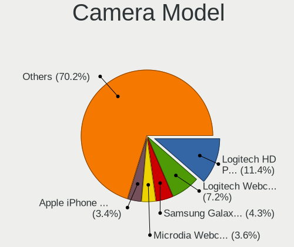

Linux in USA - Tested Hardware & Statistics (Desktops)
------------------------------------------------------

A project to collect tested hardware configurations for Linux in USA.

Anyone can contribute to this report by the [hw-probe](https://github.com/linuxhw/hw-probe) tool:

    sudo -E hw-probe -all -upload

Please contribute! Especially if your hardware is rare.

Contents
--------

* [ Test Cases ](#test-cases)

* [ System ](#system)
  - [ OS                       ](#os)
  - [ OS Family                ](#os-family)
  - [ Kernel                   ](#kernel)
  - [ Kernel Family            ](#kernel-family)
  - [ Kernel Major Ver.        ](#kernel-major-ver)
  - [ Arch                     ](#arch)
  - [ DE                       ](#de)
  - [ Display Server           ](#display-server)
  - [ Display Manager          ](#display-manager)
  - [ OS Lang                  ](#os-lang)
  - [ Boot Mode                ](#boot-mode)
  - [ Filesystem               ](#filesystem)
  - [ Part. scheme             ](#part-scheme)
  - [ Dual Boot with Linux/BSD ](#dual-boot-with-linuxbsd)
  - [ Dual Boot (Win)          ](#dual-boot-win)

* [ Board ](#board)
  - [ Vendor                   ](#vendor)
  - [ Model                    ](#model)
  - [ Model Family             ](#model-family)
  - [ MFG Year                 ](#mfg-year)
  - [ Form Factor              ](#form-factor)
  - [ Secure Boot              ](#secure-boot)
  - [ Coreboot                 ](#coreboot)
  - [ RAM Size                 ](#ram-size)
  - [ RAM Used                 ](#ram-used)
  - [ Total Drives             ](#total-drives)
  - [ Has CD-ROM               ](#has-cd-rom)
  - [ Has Ethernet             ](#has-ethernet)
  - [ Has WiFi                 ](#has-wifi)
  - [ Has Bluetooth            ](#has-bluetooth)

* [ Location ](#location)
  - [ Country                  ](#country)
  - [ City                     ](#city)

* [ Drives ](#drives)
  - [ Drive Vendor             ](#drive-vendor)
  - [ Drive Model              ](#drive-model)
  - [ HDD Vendor               ](#hdd-vendor)
  - [ SSD Vendor               ](#ssd-vendor)
  - [ Drive Kind               ](#drive-kind)
  - [ Drive Connector          ](#drive-connector)
  - [ Drive Size               ](#drive-size)
  - [ Space Total              ](#space-total)
  - [ Space Used               ](#space-used)
  - [ Malfunc. Drives          ](#malfunc-drives)
  - [ Malfunc. Drive Vendor    ](#malfunc-drive-vendor)
  - [ Malfunc. HDD Vendor      ](#malfunc-hdd-vendor)
  - [ Malfunc. Drive Kind      ](#malfunc-drive-kind)
  - [ Failed Drives            ](#failed-drives)
  - [ Failed Drive Vendor      ](#failed-drive-vendor)
  - [ Drive Status             ](#drive-status)

* [ Storage controller ](#storage-controller)
  - [ Storage Vendor           ](#storage-vendor)
  - [ Storage Model            ](#storage-model)
  - [ Storage Kind             ](#storage-kind)

* [ Processor ](#processor)
  - [ CPU Vendor               ](#cpu-vendor)
  - [ CPU Model                ](#cpu-model)
  - [ CPU Model Family         ](#cpu-model-family)
  - [ CPU Cores                ](#cpu-cores)
  - [ CPU Sockets              ](#cpu-sockets)
  - [ CPU Threads              ](#cpu-threads)
  - [ CPU Op-Modes             ](#cpu-op-modes)
  - [ CPU Microcode            ](#cpu-microcode)
  - [ CPU Microarch            ](#cpu-microarch)

* [ Graphics ](#graphics)
  - [ GPU Vendor               ](#gpu-vendor)
  - [ GPU Model                ](#gpu-model)
  - [ GPU Combo                ](#gpu-combo)
  - [ GPU Driver               ](#gpu-driver)
  - [ GPU Memory               ](#gpu-memory)

* [ Monitor ](#monitor)
  - [ Monitor Vendor           ](#monitor-vendor)
  - [ Monitor Model            ](#monitor-model)
  - [ Monitor Resolution       ](#monitor-resolution)
  - [ Monitor Diagonal         ](#monitor-diagonal)
  - [ Monitor Width            ](#monitor-width)
  - [ Aspect Ratio             ](#aspect-ratio)
  - [ Monitor Area             ](#monitor-area)
  - [ Pixel Density            ](#pixel-density)
  - [ Multiple Monitors        ](#multiple-monitors)

* [ Network ](#network)
  - [ Net Controller Vendor    ](#net-controller-vendor)
  - [ Net Controller Model     ](#net-controller-model)
  - [ Wireless Vendor          ](#wireless-vendor)
  - [ Wireless Model           ](#wireless-model)
  - [ Ethernet Vendor          ](#ethernet-vendor)
  - [ Ethernet Model           ](#ethernet-model)
  - [ Net Controller Kind      ](#net-controller-kind)
  - [ Used Controller          ](#used-controller)
  - [ NICs                     ](#nics)
  - [ IPv6                     ](#ipv6)

* [ Bluetooth ](#bluetooth)
  - [ Bluetooth Vendor         ](#bluetooth-vendor)
  - [ Bluetooth Model          ](#bluetooth-model)

* [ Sound ](#sound)
  - [ Sound Vendor             ](#sound-vendor)
  - [ Sound Model              ](#sound-model)

* [ Memory ](#memory)
  - [ Memory Vendor            ](#memory-vendor)
  - [ Memory Model             ](#memory-model)
  - [ Memory Kind              ](#memory-kind)
  - [ Memory Form Factor       ](#memory-form-factor)
  - [ Memory Size              ](#memory-size)
  - [ Memory Speed             ](#memory-speed)

* [ Printers & scanners ](#printers--scanners)
  - [ Printer Vendor           ](#printer-vendor)
  - [ Printer Model            ](#printer-model)
  - [ Scanner Vendor           ](#scanner-vendor)
  - [ Scanner Model            ](#scanner-model)

* [ Camera ](#camera)
  - [ Camera Vendor            ](#camera-vendor)
  - [ Camera Model             ](#camera-model)

* [ Security ](#security)
  - [ Fingerprint Vendor       ](#fingerprint-vendor)
  - [ Fingerprint Model        ](#fingerprint-model)
  - [ Chipcard Vendor          ](#chipcard-vendor)
  - [ Chipcard Model           ](#chipcard-model)

* [ Unsupported ](#unsupported)
  - [ Unsupported Devices      ](#unsupported-devices)
  - [ Unsupported Device Types ](#unsupported-device-types)

Test Cases
----------

Total: 19961

| Vendor        | Model                       | Probe                                                      | Date         |
|---------------|-----------------------------|------------------------------------------------------------|--------------|
| ASUSTek       | PRIME B550M-A               | [9146d12231](https://linux-hardware.org/?probe=9146d12231) | May 01, 2023 |
| ASUSTek       | PRIME Z690M-PLUS D4         | [27fdafaf01](https://linux-hardware.org/?probe=27fdafaf01) | May 01, 2023 |
| Gigabyte      | X58A-UD3R                   | [36f4134c6b](https://linux-hardware.org/?probe=36f4134c6b) | May 01, 2023 |
| HP            | 822A                        | [b373ff6def](https://linux-hardware.org/?probe=b373ff6def) | May 01, 2023 |
| HP            | 2B38                        | [bf99202e8b](https://linux-hardware.org/?probe=bf99202e8b) | May 01, 2023 |
| ASRock        | B650 LiveMixer              | [aecb4b61b4](https://linux-hardware.org/?probe=aecb4b61b4) | May 01, 2023 |
| ASUSTek       | TUF Gaming B550M-PLUS WI... | [62d194e85e](https://linux-hardware.org/?probe=62d194e85e) | May 01, 2023 |
| ASUSTek       | PRIME Z690-P WIFI           | [4f0b170b70](https://linux-hardware.org/?probe=4f0b170b70) | May 01, 2023 |
| ASUSTek       | PRIME B450-PLUS             | [56db3a6b44](https://linux-hardware.org/?probe=56db3a6b44) | May 01, 2023 |
| Dell          | 06D7TR A00                  | [6fe7179a50](https://linux-hardware.org/?probe=6fe7179a50) | May 01, 2023 |
| HP            | 2B38                        | [6942eb2544](https://linux-hardware.org/?probe=6942eb2544) | May 01, 2023 |
| ASUSTek       | PRIME B550M-A AC            | [f10c443a56](https://linux-hardware.org/?probe=f10c443a56) | May 01, 2023 |
| ASRock        | Z170 Gaming K4              | [a38bf561f7](https://linux-hardware.org/?probe=a38bf561f7) | May 01, 2023 |
| ASRock        | Z170 Gaming K4              | [b5ce5ff271](https://linux-hardware.org/?probe=b5ce5ff271) | May 01, 2023 |
| Dell          | 06D7TR A00                  | [e7905065dd](https://linux-hardware.org/?probe=e7905065dd) | Apr 30, 2023 |
| Dell          | 07PR60 A00                  | [e6f49bbe8a](https://linux-hardware.org/?probe=e6f49bbe8a) | Apr 30, 2023 |
| Dell          | 02YYK5 A01                  | [1a00a1321e](https://linux-hardware.org/?probe=1a00a1321e) | Apr 30, 2023 |
| Gigabyte      | EP45-UD3P                   | [8d99ef5cc7](https://linux-hardware.org/?probe=8d99ef5cc7) | Apr 30, 2023 |
| ASUSTek       | H81I-PLUS                   | [01578538eb](https://linux-hardware.org/?probe=01578538eb) | Apr 30, 2023 |
| MSI           | PRO Z690-A WIFI             | [bfa4eb5eda](https://linux-hardware.org/?probe=bfa4eb5eda) | Apr 30, 2023 |
| Apple         | Mac-F42C88C8 Proto1         | [ab7b403321](https://linux-hardware.org/?probe=ab7b403321) | Apr 30, 2023 |
| ASUSTek       | TUF Gaming B550M-PLUS WI... | [e2acacabb3](https://linux-hardware.org/?probe=e2acacabb3) | Apr 30, 2023 |
| Dell          | 042P49 A01                  | [6190be123c](https://linux-hardware.org/?probe=6190be123c) | Apr 30, 2023 |
| Dell          | 0YF8P5 A00                  | [4f5262d2c9](https://linux-hardware.org/?probe=4f5262d2c9) | Apr 30, 2023 |
| ASUSTek       | ROG STRIX X670E-E GAMING... | [0d5e9310d3](https://linux-hardware.org/?probe=0d5e9310d3) | Apr 30, 2023 |
| ASUSTek       | B85M-G R2.0                 | [243a170e5a](https://linux-hardware.org/?probe=243a170e5a) | Apr 30, 2023 |
| MSI           | PRO Z690-A DDR4             | [9419686ec7](https://linux-hardware.org/?probe=9419686ec7) | Apr 30, 2023 |
| MSI           | B360M MORTAR                | [352a47b8a0](https://linux-hardware.org/?probe=352a47b8a0) | Apr 30, 2023 |
| ASUSTek       | TUF Gaming B550M-PLUS       | [c83cb7e3ec](https://linux-hardware.org/?probe=c83cb7e3ec) | Apr 30, 2023 |
| MSI           | PRO Z690-A DDR4             | [1f61fda034](https://linux-hardware.org/?probe=1f61fda034) | Apr 30, 2023 |
| HP            | ProLiant ML10 v2            | [3582be2f06](https://linux-hardware.org/?probe=3582be2f06) | Apr 30, 2023 |
| Dell          | 0T10XW A02                  | [2cd32d1efe](https://linux-hardware.org/?probe=2cd32d1efe) | Apr 30, 2023 |
| ASUSTek       | ROG STRIX X670E-E GAMING... | [f87233a295](https://linux-hardware.org/?probe=f87233a295) | Apr 29, 2023 |
| ASRock        | 970 Extreme4                | [96fd3e62de](https://linux-hardware.org/?probe=96fd3e62de) | Apr 29, 2023 |
| Dell          | 0773VG A02                  | [a684ad4938](https://linux-hardware.org/?probe=a684ad4938) | Apr 29, 2023 |
| Dell          | 00V62H A00                  | [86cb104ceb](https://linux-hardware.org/?probe=86cb104ceb) | Apr 29, 2023 |
| ASUSTek       | ROG STRIX B550-F GAMING     | [493bc0b894](https://linux-hardware.org/?probe=493bc0b894) | Apr 29, 2023 |
| Apple         | Mac-F60DEB81FF30ACF6 Mac... | [80ea529a18](https://linux-hardware.org/?probe=80ea529a18) | Apr 29, 2023 |
| HP            | 3647h                       | [a2776d5c24](https://linux-hardware.org/?probe=a2776d5c24) | Apr 29, 2023 |
| Gigabyte      | B550 AORUS PRO V2           | [62f2094d3c](https://linux-hardware.org/?probe=62f2094d3c) | Apr 29, 2023 |
| Dell          | 08NPPY A00                  | [25bc3aa225](https://linux-hardware.org/?probe=25bc3aa225) | Apr 29, 2023 |
| Dell          | 0HY9JP A02                  | [2ec196dd79](https://linux-hardware.org/?probe=2ec196dd79) | Apr 29, 2023 |
| Dell          | 0T0MHW A02                  | [4f08178f96](https://linux-hardware.org/?probe=4f08178f96) | Apr 29, 2023 |
| Dell          | 0Y2MRG A00                  | [5f765d4d9c](https://linux-hardware.org/?probe=5f765d4d9c) | Apr 29, 2023 |
| Dell          | 0Y2MRG A00                  | [62a4a8b0b5](https://linux-hardware.org/?probe=62a4a8b0b5) | Apr 29, 2023 |
| Foxconn       | 2AB7                        | [01e7b05d2a](https://linux-hardware.org/?probe=01e7b05d2a) | Apr 29, 2023 |
| ASUSTek       | H170I-PRO                   | [b166ca425b](https://linux-hardware.org/?probe=b166ca425b) | Apr 29, 2023 |
| ASUSTek       | Z87-PLUS                    | [7477be45f8](https://linux-hardware.org/?probe=7477be45f8) | Apr 28, 2023 |
| Lenovo        | 1048 SDK0Q40104 WIN 3915... | [43942fab0f](https://linux-hardware.org/?probe=43942fab0f) | Apr 28, 2023 |
| Pegatron      | Benicia                     | [930452646c](https://linux-hardware.org/?probe=930452646c) | Apr 28, 2023 |
| AZW           | MINI S 10                   | [12ba32f977](https://linux-hardware.org/?probe=12ba32f977) | Apr 28, 2023 |
| Unknown       | HX90                        | [8454daed68](https://linux-hardware.org/?probe=8454daed68) | Apr 28, 2023 |
| Gigabyte      | Z490 AORUS ULTRA            | [96371860f5](https://linux-hardware.org/?probe=96371860f5) | Apr 28, 2023 |
| Apple         | Mac-F42C88C8 Proto1         | [7a3cce252f](https://linux-hardware.org/?probe=7a3cce252f) | Apr 28, 2023 |
| Apple         | Mac-F42C88C8 Proto1         | [60bf74f8f9](https://linux-hardware.org/?probe=60bf74f8f9) | Apr 28, 2023 |
| HP            | 83E9                        | [ac8ad5d3d5](https://linux-hardware.org/?probe=ac8ad5d3d5) | Apr 28, 2023 |
| Dell          | 0XCR8D A01                  | [2e228e1b38](https://linux-hardware.org/?probe=2e228e1b38) | Apr 28, 2023 |
| HP            | 8062                        | [61c4685659](https://linux-hardware.org/?probe=61c4685659) | Apr 27, 2023 |
| Gigabyte      | B365M DS3H                  | [7feb43607e](https://linux-hardware.org/?probe=7feb43607e) | Apr 27, 2023 |
| Dell          | 0XCR8D A01                  | [395e698d44](https://linux-hardware.org/?probe=395e698d44) | Apr 27, 2023 |
| Gigabyte      | X570 AORUS ELITE WIFI       | [169e095fab](https://linux-hardware.org/?probe=169e095fab) | Apr 27, 2023 |
| Intel         | DH87RL AAG74240-403         | [54b1c509f2](https://linux-hardware.org/?probe=54b1c509f2) | Apr 27, 2023 |
| MSI           | X99A GAMING 9 ACK           | [3d79f67248](https://linux-hardware.org/?probe=3d79f67248) | Apr 27, 2023 |
| ASUSTek       | CROSSBLADE RANGER           | [641d7d0398](https://linux-hardware.org/?probe=641d7d0398) | Apr 27, 2023 |
| ASUSTek       | TUF Gaming B550M-PLUS       | [c80b811f3e](https://linux-hardware.org/?probe=c80b811f3e) | Apr 27, 2023 |
| ASUSTek       | PRIME Z490-A                | [9088ae517a](https://linux-hardware.org/?probe=9088ae517a) | Apr 27, 2023 |
| Gigabyte      | B550M DS3H AC               | [a8f4a6f058](https://linux-hardware.org/?probe=a8f4a6f058) | Apr 27, 2023 |
| HP            | 3647h                       | [26d40c9fc3](https://linux-hardware.org/?probe=26d40c9fc3) | Apr 27, 2023 |
| ASRock        | B550M Phantom Gaming 4      | [072b88204c](https://linux-hardware.org/?probe=072b88204c) | Apr 26, 2023 |
| Gigabyte      | X570S AERO G                | [cde129cf45](https://linux-hardware.org/?probe=cde129cf45) | Apr 26, 2023 |
| HP            | 1632                        | [b818834691](https://linux-hardware.org/?probe=b818834691) | Apr 26, 2023 |
| HP            | 1632                        | [caae9b5992](https://linux-hardware.org/?probe=caae9b5992) | Apr 26, 2023 |
| HP            | 1905                        | [7b15ec2d7d](https://linux-hardware.org/?probe=7b15ec2d7d) | Apr 26, 2023 |
| ASUSTek       | ROG STRIX Z390-I GAMING     | [83453e6960](https://linux-hardware.org/?probe=83453e6960) | Apr 26, 2023 |
| Gigabyte      | X58A-UD3R                   | [80d546064f](https://linux-hardware.org/?probe=80d546064f) | Apr 26, 2023 |
| ASUSTek       | PRIME B550M-A               | [ba83f4a4f7](https://linux-hardware.org/?probe=ba83f4a4f7) | Apr 26, 2023 |
| ASUSTek       | ROG CROSSHAIR VIII HERO     | [9824006277](https://linux-hardware.org/?probe=9824006277) | Apr 26, 2023 |
| Foxconn       | 2ABF                        | [d040f4ff16](https://linux-hardware.org/?probe=d040f4ff16) | Apr 26, 2023 |
| ASUSTek       | P8H61-M LE                  | [a7a9d5069c](https://linux-hardware.org/?probe=a7a9d5069c) | Apr 26, 2023 |
| ASUSTek       | P8H61-M LE                  | [cd60dbbd6a](https://linux-hardware.org/?probe=cd60dbbd6a) | Apr 26, 2023 |
| ASUSTek       | PRIME B450M-A II            | [1ce9a878f3](https://linux-hardware.org/?probe=1ce9a878f3) | Apr 26, 2023 |
| ASUSTek       | PRIME Z490-A                | [a48c247194](https://linux-hardware.org/?probe=a48c247194) | Apr 26, 2023 |
| ASUSTek       | PRIME Z490-A                | [11844fed4d](https://linux-hardware.org/?probe=11844fed4d) | Apr 25, 2023 |
| ASUSTek       | TUF Gaming B550M-PLUS WI... | [f02e8339e9](https://linux-hardware.org/?probe=f02e8339e9) | Apr 25, 2023 |
| HP            | 1632                        | [ace6df6aee](https://linux-hardware.org/?probe=ace6df6aee) | Apr 25, 2023 |
| Dell          | 0JP3NX A01                  | [2fa64e56ff](https://linux-hardware.org/?probe=2fa64e56ff) | Apr 25, 2023 |
| ASUSTek       | TUF Gaming B550M-PLUS WI... | [8de5e39740](https://linux-hardware.org/?probe=8de5e39740) | Apr 25, 2023 |
| HP            | 1632                        | [0355cb4e69](https://linux-hardware.org/?probe=0355cb4e69) | Apr 25, 2023 |
| HP            | 0AECh D                     | [c9e99b3f8c](https://linux-hardware.org/?probe=c9e99b3f8c) | Apr 25, 2023 |
| ASRock        | B660M-C                     | [849fc5d462](https://linux-hardware.org/?probe=849fc5d462) | Apr 25, 2023 |
| Alienware     | Aurora R15 AMD              | [f2e22848d1](https://linux-hardware.org/?probe=f2e22848d1) | Apr 25, 2023 |
| ASRock        | Z370 Extreme4               | [0e46ae0751](https://linux-hardware.org/?probe=0e46ae0751) | Apr 25, 2023 |
| Dell          | 0YXT71 A03                  | [abc091f5c0](https://linux-hardware.org/?probe=abc091f5c0) | Apr 25, 2023 |
| Dell          | 073MMW A02                  | [890ea0fd78](https://linux-hardware.org/?probe=890ea0fd78) | Apr 25, 2023 |
| Dell          | 0K071D A01                  | [0c7edbd8ea](https://linux-hardware.org/?probe=0c7edbd8ea) | Apr 25, 2023 |
| ASUSTek       | ProArt X670E-CREATOR WIF... | [c5f2fa1c5a](https://linux-hardware.org/?probe=c5f2fa1c5a) | Apr 25, 2023 |
| Gigabyte      | B450M DS3H WIFI-CF          | [1a58c88206](https://linux-hardware.org/?probe=1a58c88206) | Apr 25, 2023 |
| eMachines     | MCP61PM-GM                  | [ff00693839](https://linux-hardware.org/?probe=ff00693839) | Apr 25, 2023 |
| MSI           | FM2-A75MA-E35               | [011f691ce1](https://linux-hardware.org/?probe=011f691ce1) | Apr 25, 2023 |
| Gigabyte      | X570 AORUS PRO WIFI         | [7595e7d8f9](https://linux-hardware.org/?probe=7595e7d8f9) | Apr 25, 2023 |
| ASRock        | H310M-STX                   | [9988bc063a](https://linux-hardware.org/?probe=9988bc063a) | Apr 25, 2023 |
| ASUSTek       | A55BM-PLUS                  | [19c145fab1](https://linux-hardware.org/?probe=19c145fab1) | Apr 25, 2023 |
| ASUSTek       | PRIME B550M-A               | [8fbbad22fa](https://linux-hardware.org/?probe=8fbbad22fa) | Apr 25, 2023 |
| ASUSTek       | PRIME H310-PLUS             | [a06d7e1f82](https://linux-hardware.org/?probe=a06d7e1f82) | Apr 25, 2023 |
| ASUSTek       | ROG STRIX B550-A GAMING     | [cdfcab45e7](https://linux-hardware.org/?probe=cdfcab45e7) | Apr 24, 2023 |
| Dell          | 0JP3NX A01                  | [609eeb8038](https://linux-hardware.org/?probe=609eeb8038) | Apr 24, 2023 |
| ASUSTek       | A88X-GAMER                  | [f61201c8a5](https://linux-hardware.org/?probe=f61201c8a5) | Apr 24, 2023 |
| Intel         | DH55HC AAE70933-505         | [a1f92a019f](https://linux-hardware.org/?probe=a1f92a019f) | Apr 24, 2023 |
| eMachines     | EMCP73VT-PM                 | [d1a5ad5a38](https://linux-hardware.org/?probe=d1a5ad5a38) | Apr 24, 2023 |
| ASUSTek       | ROG STRIX B550-F GAMING     | [b4b468d0db](https://linux-hardware.org/?probe=b4b468d0db) | Apr 24, 2023 |
| Foxconn       | ALOE                        | [f92a9cc141](https://linux-hardware.org/?probe=f92a9cc141) | Apr 24, 2023 |
| ASUSTek       | PRIME X570-PRO              | [c546b0771a](https://linux-hardware.org/?probe=c546b0771a) | Apr 24, 2023 |
| Gigabyte      | B550 AORUS ELITE AX V2      | [0d6740c2a8](https://linux-hardware.org/?probe=0d6740c2a8) | Apr 24, 2023 |
| MSI           | Z87-G43                     | [4d908cb615](https://linux-hardware.org/?probe=4d908cb615) | Apr 24, 2023 |
| ASRock        | A320M Pro4                  | [bfe26862f0](https://linux-hardware.org/?probe=bfe26862f0) | Apr 24, 2023 |
| Gigabyte      | X570S I AORUS PRO AX        | [9c37fa5192](https://linux-hardware.org/?probe=9c37fa5192) | Apr 24, 2023 |
| Gigabyte      | B650M DS3H                  | [3d07651a47](https://linux-hardware.org/?probe=3d07651a47) | Apr 24, 2023 |
| ASRock        | X570 Taichi                 | [0842334fa2](https://linux-hardware.org/?probe=0842334fa2) | Apr 24, 2023 |
| ASUSTek       | TUF Gaming B550M-PLUS       | [074135d4f4](https://linux-hardware.org/?probe=074135d4f4) | Apr 24, 2023 |
| ASUSTek       | X99-A                       | [1adc932507](https://linux-hardware.org/?probe=1adc932507) | Apr 24, 2023 |
| Gigabyte      | X670E AORUS MASTER          | [0f7e30ded3](https://linux-hardware.org/?probe=0f7e30ded3) | Apr 23, 2023 |
| MSI           | MPG X570 GAMING PLUS        | [075afa12ed](https://linux-hardware.org/?probe=075afa12ed) | Apr 23, 2023 |
| Gigabyte      | X570 AORUS XTREME           | [0dfc7cce7a](https://linux-hardware.org/?probe=0dfc7cce7a) | Apr 23, 2023 |
| ASRock        | B560 Pro4                   | [3a9f7b19fa](https://linux-hardware.org/?probe=3a9f7b19fa) | Apr 23, 2023 |
| MSI           | Z87-G43                     | [6babb6024e](https://linux-hardware.org/?probe=6babb6024e) | Apr 23, 2023 |
| Gigabyte      | X570 AORUS XTREME           | [4e664e5e26](https://linux-hardware.org/?probe=4e664e5e26) | Apr 23, 2023 |
| ASRock        | B560 Pro4                   | [965aa93228](https://linux-hardware.org/?probe=965aa93228) | Apr 23, 2023 |
| Unknown       | Unknown                     | [0605faa66d](https://linux-hardware.org/?probe=0605faa66d) | Apr 23, 2023 |
| ASUSTek       | PRIME X399-A                | [b4861cf35c](https://linux-hardware.org/?probe=b4861cf35c) | Apr 23, 2023 |
| ASUSTek       | PRIME Z390-A                | [3fc4048a96](https://linux-hardware.org/?probe=3fc4048a96) | Apr 23, 2023 |
| MSI           | MAG X570 TOMAHAWK WIFI      | [b9496d6431](https://linux-hardware.org/?probe=b9496d6431) | Apr 23, 2023 |
| HP            | 8062                        | [37cde2dc48](https://linux-hardware.org/?probe=37cde2dc48) | Apr 23, 2023 |
| ASUSTek       | TUF Gaming X670E-PLUS WI... | [25ee911879](https://linux-hardware.org/?probe=25ee911879) | Apr 23, 2023 |
| Dell          | 0HD5W2 A00                  | [336c1b5da9](https://linux-hardware.org/?probe=336c1b5da9) | Apr 23, 2023 |
| ASUSTek       | TUF Gaming X670E-PLUS WI... | [468824c4d9](https://linux-hardware.org/?probe=468824c4d9) | Apr 23, 2023 |
| HUAWEI        | PUM-WDX9-PCB-B1 M1060       | [2c8835f2e2](https://linux-hardware.org/?probe=2c8835f2e2) | Apr 22, 2023 |
| MSI           | MPG X570S CARBON MAX WIF... | [1c85c89b5d](https://linux-hardware.org/?probe=1c85c89b5d) | Apr 22, 2023 |
| ASUSTek       | Pro WS WRX80E-SAGE SE WI... | [a82d805ad2](https://linux-hardware.org/?probe=a82d805ad2) | Apr 22, 2023 |
| Pegatron      | Benicia                     | [362a3ff341](https://linux-hardware.org/?probe=362a3ff341) | Apr 22, 2023 |
| System76      | Thelio thelio-r1            | [d48efc62c4](https://linux-hardware.org/?probe=d48efc62c4) | Apr 22, 2023 |
| Gigabyte      | X570S AORUS ELITE AX        | [9c3e15de68](https://linux-hardware.org/?probe=9c3e15de68) | Apr 22, 2023 |
| Gateway       | DX4860                      | [5583641f1b](https://linux-hardware.org/?probe=5583641f1b) | Apr 22, 2023 |
| MSI           | MPG X570S CARBON MAX WIF... | [1404fc66cf](https://linux-hardware.org/?probe=1404fc66cf) | Apr 22, 2023 |
| MSI           | MPG B650I EDGE WIFI         | [efce15b094](https://linux-hardware.org/?probe=efce15b094) | Apr 22, 2023 |
| Dell          | 0FDY5C A00                  | [c35628b7c7](https://linux-hardware.org/?probe=c35628b7c7) | Apr 22, 2023 |
| Shenzhen M... | F7BFC                       | [bb189b2507](https://linux-hardware.org/?probe=bb189b2507) | Apr 22, 2023 |
| Dell          | 07N90W A00                  | [f6d15dbf35](https://linux-hardware.org/?probe=f6d15dbf35) | Apr 22, 2023 |
| HP            | 0AECh D                     | [827246f901](https://linux-hardware.org/?probe=827246f901) | Apr 22, 2023 |
| ASUSTek       | ROG STRIX B650E-I GAMING... | [a60c54ec31](https://linux-hardware.org/?probe=a60c54ec31) | Apr 22, 2023 |
| MSI           | Z370M GAMING PRO AC         | [f22eccea8d](https://linux-hardware.org/?probe=f22eccea8d) | Apr 22, 2023 |
| ASUSTek       | P5N-D                       | [c1af2b9a2c](https://linux-hardware.org/?probe=c1af2b9a2c) | Apr 22, 2023 |
| MSI           | Z370M MORTAR                | [9ed0395d2c](https://linux-hardware.org/?probe=9ed0395d2c) | Apr 22, 2023 |
| ASUSTek       | PRIME B650M-A AX            | [0a90dc180c](https://linux-hardware.org/?probe=0a90dc180c) | Apr 22, 2023 |
| ASUSTek       | H170-PRO                    | [f82191c9cb](https://linux-hardware.org/?probe=f82191c9cb) | Apr 22, 2023 |
| MW            | GMLK-2_5G4L                 | [b5ffb4ee22](https://linux-hardware.org/?probe=b5ffb4ee22) | Apr 22, 2023 |
| MSI           | MPG X570 GAMING PLUS        | [93a6cb1a8a](https://linux-hardware.org/?probe=93a6cb1a8a) | Apr 22, 2023 |
| ASUSTek       | TUF Gaming X570-PLUS        | [0de425d51e](https://linux-hardware.org/?probe=0de425d51e) | Apr 21, 2023 |
| Intel         | DB65AL AAG12530-310         | [c625f3747a](https://linux-hardware.org/?probe=c625f3747a) | Apr 21, 2023 |
| Supermicro    | C7H61                       | [f5e17f37d4](https://linux-hardware.org/?probe=f5e17f37d4) | Apr 21, 2023 |
| Dell          | 0RY206                      | [8290af518f](https://linux-hardware.org/?probe=8290af518f) | Apr 21, 2023 |
| Gigabyte      | B650M DS3H                  | [de196a2cfa](https://linux-hardware.org/?probe=de196a2cfa) | Apr 21, 2023 |
| Gigabyte      | X570S AORUS ELITE AX        | [80ead18196](https://linux-hardware.org/?probe=80ead18196) | Apr 21, 2023 |
| Gigabyte      | B550M DS3H AC               | [d48ffa8191](https://linux-hardware.org/?probe=d48ffa8191) | Apr 21, 2023 |
| ASUSTek       | PRIME B650M-A AX            | [0f17162503](https://linux-hardware.org/?probe=0f17162503) | Apr 21, 2023 |
| HP            | 843F                        | [0060103f89](https://linux-hardware.org/?probe=0060103f89) | Apr 21, 2023 |
| Lenovo        | 1048 SDK0J40697 WIN 3305... | [aa8e171e50](https://linux-hardware.org/?probe=aa8e171e50) | Apr 21, 2023 |
| ASUSTek       | PRIME TRX40-PRO S           | [b2ac72f8d9](https://linux-hardware.org/?probe=b2ac72f8d9) | Apr 20, 2023 |
| ASUSTek       | PRIME TRX40-PRO S           | [4748a2ce89](https://linux-hardware.org/?probe=4748a2ce89) | Apr 20, 2023 |
| HP            | 2215                        | [27b339efe1](https://linux-hardware.org/?probe=27b339efe1) | Apr 20, 2023 |
| Dell          | 0GM819                      | [744413006e](https://linux-hardware.org/?probe=744413006e) | Apr 20, 2023 |
| MSI           | B550-A PRO                  | [f2fc6a5da5](https://linux-hardware.org/?probe=f2fc6a5da5) | Apr 20, 2023 |
| HP            | 2ADE                        | [1a3d108a58](https://linux-hardware.org/?probe=1a3d108a58) | Apr 20, 2023 |
| Gigabyte      | AB350-Gaming 3-CF           | [374f586992](https://linux-hardware.org/?probe=374f586992) | Apr 20, 2023 |
| ASUSTek       | ROG STRIX X670E-E GAMING... | [e367a9a4ab](https://linux-hardware.org/?probe=e367a9a4ab) | Apr 20, 2023 |
| MSI           | MPG B550 GAMING PLUS        | [69e2175961](https://linux-hardware.org/?probe=69e2175961) | Apr 20, 2023 |
| Supermicro    | C7H61                       | [d975325f4b](https://linux-hardware.org/?probe=d975325f4b) | Apr 20, 2023 |
| ASUSTek       | M5A78L-M/USB3               | [561b87c8b4](https://linux-hardware.org/?probe=561b87c8b4) | Apr 20, 2023 |
| ASUSTek       | PRIME B650M-A AX            | [056db62b47](https://linux-hardware.org/?probe=056db62b47) | Apr 20, 2023 |
| Intel         | X79-SERVER V1.1             | [384c50e703](https://linux-hardware.org/?probe=384c50e703) | Apr 20, 2023 |
| ASUSTek       | PRIME Z390-A                | [50a18b5e94](https://linux-hardware.org/?probe=50a18b5e94) | Apr 19, 2023 |
| ASRock        | A320M-HDV                   | [114bd5a129](https://linux-hardware.org/?probe=114bd5a129) | Apr 19, 2023 |
| HP            | 18E4                        | [1bd96a017f](https://linux-hardware.org/?probe=1bd96a017f) | Apr 19, 2023 |
| ASUSTek       | SABERTOOTH 990FX R2.0       | [4abfcb4ab3](https://linux-hardware.org/?probe=4abfcb4ab3) | Apr 19, 2023 |
| ASUSTek       | SABERTOOTH 990FX R2.0       | [e93357961f](https://linux-hardware.org/?probe=e93357961f) | Apr 19, 2023 |
| ASUSTek       | ROG STRIX B650E-F GAMING... | [4fbb42afa0](https://linux-hardware.org/?probe=4fbb42afa0) | Apr 19, 2023 |
| Dell          | 0NDYHG A01                  | [9c7e865b56](https://linux-hardware.org/?probe=9c7e865b56) | Apr 19, 2023 |
| ASUSTek       | TUF Gaming X570-PLUS        | [2a80be40e3](https://linux-hardware.org/?probe=2a80be40e3) | Apr 19, 2023 |
| Dell          | 0GXM1W A00                  | [3060afd7f7](https://linux-hardware.org/?probe=3060afd7f7) | Apr 19, 2023 |
| MSI           | Z77A-G45                    | [b9182a4e31](https://linux-hardware.org/?probe=b9182a4e31) | Apr 19, 2023 |
| HP            | 8309                        | [d82a6a4488](https://linux-hardware.org/?probe=d82a6a4488) | Apr 19, 2023 |
| Alienware     | 0K9TKY A00                  | [22582f8d3e](https://linux-hardware.org/?probe=22582f8d3e) | Apr 19, 2023 |
| ASUSTek       | PRIME X570-P                | [512bad7a33](https://linux-hardware.org/?probe=512bad7a33) | Apr 19, 2023 |
| Dell          | 0XCR8D A01                  | [c242edb3d0](https://linux-hardware.org/?probe=c242edb3d0) | Apr 18, 2023 |
| HP            | 2187 A01                    | [d9db201f72](https://linux-hardware.org/?probe=d9db201f72) | Apr 18, 2023 |
| Gigabyte      | B150M-D3H-CF                | [c248c05349](https://linux-hardware.org/?probe=c248c05349) | Apr 18, 2023 |
| MSI           | Z170A GAMING PRO CARBON     | [cf13c3781c](https://linux-hardware.org/?probe=cf13c3781c) | Apr 18, 2023 |
| Gigabyte      | 970A-D3P                    | [3bcd0b3470](https://linux-hardware.org/?probe=3bcd0b3470) | Apr 18, 2023 |
| Dell          | 08WKV3 A00                  | [091f305ccb](https://linux-hardware.org/?probe=091f305ccb) | Apr 18, 2023 |
| ASUSTek       | ROG STRIX X570-F GAMING     | [cb1db50c6c](https://linux-hardware.org/?probe=cb1db50c6c) | Apr 18, 2023 |
| HP            | 0A98h                       | [db84ca1038](https://linux-hardware.org/?probe=db84ca1038) | Apr 18, 2023 |
| ASUSTek       | Z170-A                      | [622b7348d0](https://linux-hardware.org/?probe=622b7348d0) | Apr 18, 2023 |
| ASUSTek       | TUF Gaming X570-PLUS        | [a3f477ce4a](https://linux-hardware.org/?probe=a3f477ce4a) | Apr 18, 2023 |
| ASUSTek       | PRIME X370-PRO              | [119560d8db](https://linux-hardware.org/?probe=119560d8db) | Apr 17, 2023 |
| MSI           | MPG B650I EDGE WIFI         | [11f85df48e](https://linux-hardware.org/?probe=11f85df48e) | Apr 17, 2023 |
| ASUSTek       | PRIME B550M-A               | [4b953003cc](https://linux-hardware.org/?probe=4b953003cc) | Apr 17, 2023 |
| HP            | 8062                        | [a2558d47e8](https://linux-hardware.org/?probe=a2558d47e8) | Apr 17, 2023 |
| Fujitsu       | FujitsuTP7000 -1            | [3154b04b37](https://linux-hardware.org/?probe=3154b04b37) | Apr 17, 2023 |
| ASUSTek       | K30BF_M32BF                 | [6ea01fad49](https://linux-hardware.org/?probe=6ea01fad49) | Apr 17, 2023 |
| ASUSTek       | X99-PRO/USB                 | [058029e9f7](https://linux-hardware.org/?probe=058029e9f7) | Apr 17, 2023 |
| ASUSTek       | ROG CROSSHAIR X670E EXTR... | [45722c96bb](https://linux-hardware.org/?probe=45722c96bb) | Apr 17, 2023 |
| Gigabyte      | Z690 AORUS ULTRA            | [a4bb147f89](https://linux-hardware.org/?probe=a4bb147f89) | Apr 17, 2023 |
| Dell          | 0F896N A03                  | [4ec01d373e](https://linux-hardware.org/?probe=4ec01d373e) | Apr 17, 2023 |
| MSI           | MEG X570 UNIFY              | [b2311e7cac](https://linux-hardware.org/?probe=b2311e7cac) | Apr 17, 2023 |
| ASUSTek       | TUF Gaming Z690-PLUS WIF... | [d40208e7f6](https://linux-hardware.org/?probe=d40208e7f6) | Apr 17, 2023 |
| ASRock        | B450M Pro4                  | [ddbe51a022](https://linux-hardware.org/?probe=ddbe51a022) | Apr 17, 2023 |
| Lenovo        | MAHOBAY NOK                 | [a5565d9e6d](https://linux-hardware.org/?probe=a5565d9e6d) | Apr 17, 2023 |
| ASRock        | X99 Extreme4                | [e375be2ea6](https://linux-hardware.org/?probe=e375be2ea6) | Apr 17, 2023 |
| ASUSTek       | ROG STRIX B350-F GAMING     | [18111d76fc](https://linux-hardware.org/?probe=18111d76fc) | Apr 17, 2023 |
| Dell          | 0FDY5C A00                  | [a6865b8591](https://linux-hardware.org/?probe=a6865b8591) | Apr 16, 2023 |
| Dell          | 0GM819                      | [b462ba5afe](https://linux-hardware.org/?probe=b462ba5afe) | Apr 16, 2023 |
| MSI           | B450 TOMAHAWK MAX II        | [b70bb5eda3](https://linux-hardware.org/?probe=b70bb5eda3) | Apr 16, 2023 |
| Dell          | 0HHV7N A00                  | [4443ff9154](https://linux-hardware.org/?probe=4443ff9154) | Apr 16, 2023 |
| Dell          | 0D881F A05                  | [7aef52516b](https://linux-hardware.org/?probe=7aef52516b) | Apr 16, 2023 |
| Gigabyte      | AB350-Gaming 3-CF           | [41cef8b51c](https://linux-hardware.org/?probe=41cef8b51c) | Apr 16, 2023 |
| Dell          | 0RF705                      | [32dbb3206b](https://linux-hardware.org/?probe=32dbb3206b) | Apr 16, 2023 |
| HP            | 158A                        | [56694ce9a3](https://linux-hardware.org/?probe=56694ce9a3) | Apr 16, 2023 |
| ASUSTek       | PRIME Z490-A                | [3924bb4eb5](https://linux-hardware.org/?probe=3924bb4eb5) | Apr 16, 2023 |
| HP            | 8768 A                      | [fcd034f5e0](https://linux-hardware.org/?probe=fcd034f5e0) | Apr 16, 2023 |
| MSI           | MPG B560I GAMING EDGE WI... | [8888f53504](https://linux-hardware.org/?probe=8888f53504) | Apr 16, 2023 |
| Foxconn       | ALOE                        | [702f958604](https://linux-hardware.org/?probe=702f958604) | Apr 16, 2023 |
| ASRockRack    | X570D4U                     | [ced0d8f079](https://linux-hardware.org/?probe=ced0d8f079) | Apr 16, 2023 |
| Dell          | 0RW203                      | [e1980f2fad](https://linux-hardware.org/?probe=e1980f2fad) | Apr 16, 2023 |
| HP            | 3397                        | [e7245f06a6](https://linux-hardware.org/?probe=e7245f06a6) | Apr 16, 2023 |
| HP            | 212B                        | [c8f86eb8a4](https://linux-hardware.org/?probe=c8f86eb8a4) | Apr 15, 2023 |
| Lenovo        | ThinkCentre M71z 1782W14    | [c4434a61df](https://linux-hardware.org/?probe=c4434a61df) | Apr 15, 2023 |
| HP            | 802E                        | [d6a1c8ad74](https://linux-hardware.org/?probe=d6a1c8ad74) | Apr 15, 2023 |
| ASUSTek       | TUF Gaming X570-PLUS        | [3a6ad12afa](https://linux-hardware.org/?probe=3a6ad12afa) | Apr 15, 2023 |
| Protectli     | FW6 Ver                     | [7371569bbf](https://linux-hardware.org/?probe=7371569bbf) | Apr 15, 2023 |
| ASUSTek       | PRIME Z490-A                | [17c0e1e6e4](https://linux-hardware.org/?probe=17c0e1e6e4) | Apr 15, 2023 |
| Dell          | 0KWVT8 A00                  | [d1084f0d90](https://linux-hardware.org/?probe=d1084f0d90) | Apr 15, 2023 |
| ASUSTek       | ROG Rampage VI EXTREME      | [fb75806ceb](https://linux-hardware.org/?probe=fb75806ceb) | Apr 15, 2023 |
| MSI           | Z97 GAMING 5                | [988cd72346](https://linux-hardware.org/?probe=988cd72346) | Apr 15, 2023 |
| ASUSTek       | M5A97 LE R2.0               | [6d930e2f8a](https://linux-hardware.org/?probe=6d930e2f8a) | Apr 15, 2023 |
| ASUSTek       | TUF Gaming Z690-PLUS WIF... | [8aa8fd23c6](https://linux-hardware.org/?probe=8aa8fd23c6) | Apr 15, 2023 |
| ASUSTek       | ROG CROSSHAIR VIII IMPAC... | [83d43e489d](https://linux-hardware.org/?probe=83d43e489d) | Apr 15, 2023 |
| Dell          | 0KWVT8 A01                  | [38d4552d7e](https://linux-hardware.org/?probe=38d4552d7e) | Apr 15, 2023 |
| ASRock        | B550M-C                     | [9e6e8c3986](https://linux-hardware.org/?probe=9e6e8c3986) | Apr 15, 2023 |
| MSI           | MPG B550 GAMING EDGE WIF... | [7c8e58956e](https://linux-hardware.org/?probe=7c8e58956e) | Apr 15, 2023 |
| Gigabyte      | TRX40 AORUS XTREME          | [03e385f0ef](https://linux-hardware.org/?probe=03e385f0ef) | Apr 15, 2023 |
| ASUSTek       | TUF Gaming X570-PRO WIFI... | [2e601ecae8](https://linux-hardware.org/?probe=2e601ecae8) | Apr 15, 2023 |
| Dell          | 0D24M8 A01                  | [5244c86993](https://linux-hardware.org/?probe=5244c86993) | Apr 15, 2023 |
| MSI           | B450 GAMING PLUS MAX        | [21091d13e4](https://linux-hardware.org/?probe=21091d13e4) | Apr 15, 2023 |
| ASRock        | B450M Steel Legend          | [6b71471847](https://linux-hardware.org/?probe=6b71471847) | Apr 15, 2023 |
| MSI           | MPG Z390 GAMING PLUS        | [82abb09c06](https://linux-hardware.org/?probe=82abb09c06) | Apr 15, 2023 |
| ASUSTek       | ROG STRIX X670E-E GAMING... | [2391458529](https://linux-hardware.org/?probe=2391458529) | Apr 15, 2023 |
| Lenovo        | 1048 SDK0J40697 WIN 3305... | [389f30d90a](https://linux-hardware.org/?probe=389f30d90a) | Apr 15, 2023 |
| Protectli     | FW6 Ver                     | [26db4eab1f](https://linux-hardware.org/?probe=26db4eab1f) | Apr 15, 2023 |
| MSI           | B75MA-E33                   | [d50de3a52c](https://linux-hardware.org/?probe=d50de3a52c) | Apr 14, 2023 |
| Biostar       | TZ75B                       | [c6720e2db2](https://linux-hardware.org/?probe=c6720e2db2) | Apr 14, 2023 |
| Gateway       | FX6860                      | [b3de61f1b3](https://linux-hardware.org/?probe=b3de61f1b3) | Apr 14, 2023 |
| AAEON         | MF-001 V1.0                 | [0b5731f838](https://linux-hardware.org/?probe=0b5731f838) | Apr 14, 2023 |
| Dell          | 042P49 A01                  | [a28bfb5407](https://linux-hardware.org/?probe=a28bfb5407) | Apr 14, 2023 |
| Dell          | 0VNP2H A00                  | [2e54fbf4c2](https://linux-hardware.org/?probe=2e54fbf4c2) | Apr 14, 2023 |
| Gigabyte      | AB350-Gaming 3-CF           | [71d89005dd](https://linux-hardware.org/?probe=71d89005dd) | Apr 14, 2023 |
| ASUSTek       | PRIME Z390-A                | [e311d21def](https://linux-hardware.org/?probe=e311d21def) | Apr 13, 2023 |
| MSI           | A320M-A PRO MAX             | [3a30c05322](https://linux-hardware.org/?probe=3a30c05322) | Apr 13, 2023 |
| ASUSTek       | P6X58D PREMIUM              | [7f20e3160b](https://linux-hardware.org/?probe=7f20e3160b) | Apr 13, 2023 |
| ASUSTek       | Z87-PLUS                    | [1b44c95410](https://linux-hardware.org/?probe=1b44c95410) | Apr 13, 2023 |
| ASUSTek       | Maximus VI HERO             | [f46283dc4c](https://linux-hardware.org/?probe=f46283dc4c) | Apr 13, 2023 |
| Dell          | 0XR1GT A00                  | [1c8d776510](https://linux-hardware.org/?probe=1c8d776510) | Apr 13, 2023 |
| Gigabyte      | B650M AORUS ELITE AX        | [87b5989939](https://linux-hardware.org/?probe=87b5989939) | Apr 13, 2023 |
| Dell          | 0XR1GT A00                  | [06e6f2f745](https://linux-hardware.org/?probe=06e6f2f745) | Apr 13, 2023 |
| Dell          | 0KWVT8 A00                  | [4cea64e81b](https://linux-hardware.org/?probe=4cea64e81b) | Apr 13, 2023 |
| Gigabyte      | X570 GAMING X               | [76f2d6b30c](https://linux-hardware.org/?probe=76f2d6b30c) | Apr 13, 2023 |
| MSI           | MEG Z390 ACE                | [f756cad93c](https://linux-hardware.org/?probe=f756cad93c) | Apr 13, 2023 |
| MSI           | B450M PRO-M2 MAX            | [6f7e9a6bb2](https://linux-hardware.org/?probe=6f7e9a6bb2) | Apr 13, 2023 |
| HP            | 805D                        | [f12230e709](https://linux-hardware.org/?probe=f12230e709) | Apr 12, 2023 |
| MSI           | MEG Z390 ACE                | [508357090d](https://linux-hardware.org/?probe=508357090d) | Apr 12, 2023 |
| System76      | Thelio thelio-r3            | [3acd31b3be](https://linux-hardware.org/?probe=3acd31b3be) | Apr 12, 2023 |
| System76      | Thelio thelio-r3            | [7a1d69f216](https://linux-hardware.org/?probe=7a1d69f216) | Apr 12, 2023 |
| ASUSTek       | ROG Maximus Z790 HERO       | [4be4c6b711](https://linux-hardware.org/?probe=4be4c6b711) | Apr 12, 2023 |
| ASUSTek       | Z97-A                       | [139f5f3aca](https://linux-hardware.org/?probe=139f5f3aca) | Apr 12, 2023 |
| Gigabyte      | X570 AORUS ELITE WIFI       | [4d3cf8103e](https://linux-hardware.org/?probe=4d3cf8103e) | Apr 12, 2023 |
| Gigabyte      | X570 AORUS ELITE WIFI       | [378f217cd4](https://linux-hardware.org/?probe=378f217cd4) | Apr 12, 2023 |
| Dell          | 03V7GF A02                  | [cb72d83566](https://linux-hardware.org/?probe=cb72d83566) | Apr 12, 2023 |
| Dell          | 0K83V0 A00                  | [3bc76fa8ab](https://linux-hardware.org/?probe=3bc76fa8ab) | Apr 12, 2023 |
| MSI           | MS-7060                     | [d78aaad9ec](https://linux-hardware.org/?probe=d78aaad9ec) | Apr 12, 2023 |
| Gigabyte      | EX58-EXTREME                | [82a946e356](https://linux-hardware.org/?probe=82a946e356) | Apr 12, 2023 |
| Dell          | 0MW50N A01                  | [dd68ce3b10](https://linux-hardware.org/?probe=dd68ce3b10) | Apr 11, 2023 |
| HP            | 1495                        | [762886dcb0](https://linux-hardware.org/?probe=762886dcb0) | Apr 11, 2023 |
| ASUSTek       | ROG STRIX B450-F GAMING     | [d6f8675bc9](https://linux-hardware.org/?probe=d6f8675bc9) | Apr 11, 2023 |
| ASUSTek       | ROG STRIX Z370-I GAMING     | [663488f6d9](https://linux-hardware.org/?probe=663488f6d9) | Apr 11, 2023 |
| ASUSTek       | PRIME B450M-A II            | [3e3a141713](https://linux-hardware.org/?probe=3e3a141713) | Apr 11, 2023 |
| HP            | 225E                        | [46f665e085](https://linux-hardware.org/?probe=46f665e085) | Apr 11, 2023 |
| Dell          | 0RW199                      | [8c41f4ff91](https://linux-hardware.org/?probe=8c41f4ff91) | Apr 11, 2023 |
| HP            | 1589                        | [e52c705c13](https://linux-hardware.org/?probe=e52c705c13) | Apr 11, 2023 |
| HP            | 18E4                        | [73b6760737](https://linux-hardware.org/?probe=73b6760737) | Apr 11, 2023 |
| Dell          | 0WR7PY A02                  | [2cec768fe1](https://linux-hardware.org/?probe=2cec768fe1) | Apr 11, 2023 |
| HP            | 805B                        | [591658775d](https://linux-hardware.org/?probe=591658775d) | Apr 11, 2023 |
| Dell          | 0GXM1W A01                  | [eafb6edf1e](https://linux-hardware.org/?probe=eafb6edf1e) | Apr 10, 2023 |
| Dell          | 0GXM1W A01                  | [cbd05b393a](https://linux-hardware.org/?probe=cbd05b393a) | Apr 10, 2023 |
| HP            | 1905                        | [74ef04fb06](https://linux-hardware.org/?probe=74ef04fb06) | Apr 10, 2023 |
| ASUSTek       | PRIME Z370-A                | [64759fca72](https://linux-hardware.org/?probe=64759fca72) | Apr 10, 2023 |
| Gigabyte      | B550M AORUS PRO-P           | [1d232d1fed](https://linux-hardware.org/?probe=1d232d1fed) | Apr 10, 2023 |
| Gigabyte      | B550M AORUS PRO-P           | [18c5e3c7c3](https://linux-hardware.org/?probe=18c5e3c7c3) | Apr 10, 2023 |
| Gigabyte      | H370 HD3-CF                 | [b2c9afc61f](https://linux-hardware.org/?probe=b2c9afc61f) | Apr 09, 2023 |
| Dell          | 0Y2MRG A01                  | [d512dee0ba](https://linux-hardware.org/?probe=d512dee0ba) | Apr 09, 2023 |
| HP            | 1495                        | [6a4176bb41](https://linux-hardware.org/?probe=6a4176bb41) | Apr 09, 2023 |
| HP            | 2B29                        | [b909d3c46d](https://linux-hardware.org/?probe=b909d3c46d) | Apr 09, 2023 |
| HP            | 2B29                        | [1fd9cd3d7c](https://linux-hardware.org/?probe=1fd9cd3d7c) | Apr 09, 2023 |
| ASUSTek       | ROG STRIX X570-E GAMING     | [f85fdf6564](https://linux-hardware.org/?probe=f85fdf6564) | Apr 09, 2023 |
| Dell          | 0KWVT8 A00                  | [d1e9eaed8b](https://linux-hardware.org/?probe=d1e9eaed8b) | Apr 08, 2023 |
| Dell          | 0KWVT8 A00                  | [82a96ca347](https://linux-hardware.org/?probe=82a96ca347) | Apr 08, 2023 |
| HP            | 1459                        | [201dc05036](https://linux-hardware.org/?probe=201dc05036) | Apr 08, 2023 |
| ASRock        | 4X4-R1000                   | [56af110ee1](https://linux-hardware.org/?probe=56af110ee1) | Apr 08, 2023 |
| ASUSTek       | P8Z77-V PRO                 | [e1d6888ead](https://linux-hardware.org/?probe=e1d6888ead) | Apr 08, 2023 |
| Dell          | 0WR7PY A00                  | [2719755017](https://linux-hardware.org/?probe=2719755017) | Apr 08, 2023 |
| Gigabyte      | Z690 UD DDR4                | [6f2fcf320a](https://linux-hardware.org/?probe=6f2fcf320a) | Apr 08, 2023 |
| ASUSTek       | PRIME B650M-A AX            | [97e76297c9](https://linux-hardware.org/?probe=97e76297c9) | Apr 08, 2023 |
| ASUSTek       | Pro WS WRX80E-SAGE SE WI... | [097df073bd](https://linux-hardware.org/?probe=097df073bd) | Apr 08, 2023 |
| MSI           | PRO Z690-A DDR4             | [d1167f66b8](https://linux-hardware.org/?probe=d1167f66b8) | Apr 08, 2023 |
| Gigabyte      | B450M DS3H-CF               | [15c7f69a52](https://linux-hardware.org/?probe=15c7f69a52) | Apr 07, 2023 |
| ASRock        | B550 Phantom Gaming 4/ac    | [fa161c8db8](https://linux-hardware.org/?probe=fa161c8db8) | Apr 07, 2023 |
| HP            | 18E5                        | [441d2678ff](https://linux-hardware.org/?probe=441d2678ff) | Apr 07, 2023 |
| ASRock        | X99 Taichi                  | [7ae23e9c38](https://linux-hardware.org/?probe=7ae23e9c38) | Apr 07, 2023 |
| ASRock        | 970A-G                      | [819194bd46](https://linux-hardware.org/?probe=819194bd46) | Apr 07, 2023 |
| MSI           | PRO Z690-A DDR4             | [a6c5efe560](https://linux-hardware.org/?probe=a6c5efe560) | Apr 07, 2023 |
| Alienware     | 0TYR0X A01                  | [35c94d7cd4](https://linux-hardware.org/?probe=35c94d7cd4) | Apr 07, 2023 |
| ASRock        | Z370 Taichi                 | [49aced4300](https://linux-hardware.org/?probe=49aced4300) | Apr 07, 2023 |
| MSI           | MPG Z690 CARBON WIFI        | [8187fc54a3](https://linux-hardware.org/?probe=8187fc54a3) | Apr 07, 2023 |
| Dell          | 0DFRFW A01                  | [773a0244a1](https://linux-hardware.org/?probe=773a0244a1) | Apr 06, 2023 |
| Dell          | 04GJJT A00                  | [5c7df0085d](https://linux-hardware.org/?probe=5c7df0085d) | Apr 06, 2023 |
| Dell          | 0HD5W2 A01                  | [294131b150](https://linux-hardware.org/?probe=294131b150) | Apr 06, 2023 |
| ASRock        | B650M PG Riptide WiFi       | [8302310eaf](https://linux-hardware.org/?probe=8302310eaf) | Apr 06, 2023 |
| ASUSTek       | PRIME B450M-A II            | [f9ad74ca89](https://linux-hardware.org/?probe=f9ad74ca89) | Apr 06, 2023 |
| MSI           | B350M MORTAR                | [d066d75bd5](https://linux-hardware.org/?probe=d066d75bd5) | Apr 06, 2023 |
| HP            | 3397                        | [28b4d1c9eb](https://linux-hardware.org/?probe=28b4d1c9eb) | Apr 06, 2023 |
| MSI           | B350M MORTAR                | [6248298b60](https://linux-hardware.org/?probe=6248298b60) | Apr 06, 2023 |
| MSI           | MPG B560I GAMING EDGE WI... | [645fe56eb3](https://linux-hardware.org/?probe=645fe56eb3) | Apr 06, 2023 |
| MSI           | MPG B560I GAMING EDGE WI... | [c963121074](https://linux-hardware.org/?probe=c963121074) | Apr 06, 2023 |
| Dell          | 0HHV7N A00                  | [73cc9e48a0](https://linux-hardware.org/?probe=73cc9e48a0) | Apr 06, 2023 |
| Dell          | 0M5DCD A00                  | [ebc67d4930](https://linux-hardware.org/?probe=ebc67d4930) | Apr 06, 2023 |
| MSI           | B75MA-E33                   | [27e5e2df0d](https://linux-hardware.org/?probe=27e5e2df0d) | Apr 06, 2023 |
| eMachines     | EMCP73VT-PM                 | [936f8c6692](https://linux-hardware.org/?probe=936f8c6692) | Apr 06, 2023 |
| Lenovo        | 3111 NOK                    | [4553102bca](https://linux-hardware.org/?probe=4553102bca) | Apr 06, 2023 |
| Dell          | 0GY6Y8 A01                  | [ecba971f16](https://linux-hardware.org/?probe=ecba971f16) | Apr 06, 2023 |
| Gigabyte      | B550 UD AC                  | [a639dfd228](https://linux-hardware.org/?probe=a639dfd228) | Apr 06, 2023 |
| MSI           | B450I GAMING PLUS AC        | [adda27b48e](https://linux-hardware.org/?probe=adda27b48e) | Apr 06, 2023 |
| MSI           | MPG X570S CARBON MAX WIF... | [55ea8a957b](https://linux-hardware.org/?probe=55ea8a957b) | Apr 06, 2023 |
| HP            | 830C                        | [ab6399decd](https://linux-hardware.org/?probe=ab6399decd) | Apr 06, 2023 |
| Gigabyte      | B560 DS3H AC-Y1             | [0893f3016e](https://linux-hardware.org/?probe=0893f3016e) | Apr 05, 2023 |
| AZW           | Green G3                    | [8e35f00a16](https://linux-hardware.org/?probe=8e35f00a16) | Apr 05, 2023 |
| MSI           | X470 GAMING PLUS            | [599f80656e](https://linux-hardware.org/?probe=599f80656e) | Apr 05, 2023 |
| MSI           | X470 GAMING PLUS            | [34ea3c8d18](https://linux-hardware.org/?probe=34ea3c8d18) | Apr 05, 2023 |
| Apple         | Mac-F221BEC8                | [d1f4197f52](https://linux-hardware.org/?probe=d1f4197f52) | Apr 05, 2023 |
| ASUSTek       | TUF Gaming X570-PLUS        | [4f0083481e](https://linux-hardware.org/?probe=4f0083481e) | Apr 05, 2023 |
| Biostar       | TZ77B                       | [c5d5603dc4](https://linux-hardware.org/?probe=c5d5603dc4) | Apr 05, 2023 |
| Gigabyte      | X570 AORUS ULTRA            | [d8d9dd75ba](https://linux-hardware.org/?probe=d8d9dd75ba) | Apr 05, 2023 |
| ASUSTek       | Benicia                     | [8dc3b9ede2](https://linux-hardware.org/?probe=8dc3b9ede2) | Apr 05, 2023 |
| Dell          | 0RY007                      | [08d328e30a](https://linux-hardware.org/?probe=08d328e30a) | Apr 05, 2023 |
| Lenovo        | 3102 SDK0J40697 WIN 3305... | [e104d0b170](https://linux-hardware.org/?probe=e104d0b170) | Apr 05, 2023 |
| Gigabyte      | Z97X-UD3H-BK-CF             | [2783ec6da9](https://linux-hardware.org/?probe=2783ec6da9) | Apr 05, 2023 |
| PS            | X570 Pro4                   | [f67323ef28](https://linux-hardware.org/?probe=f67323ef28) | Apr 05, 2023 |
| ASRock        | B450 Gaming K4              | [dcf97ad331](https://linux-hardware.org/?probe=dcf97ad331) | Apr 05, 2023 |
| Gigabyte      | B75M-D3H                    | [7e41fccbd9](https://linux-hardware.org/?probe=7e41fccbd9) | Apr 05, 2023 |
| Gigabyte      | B660M DS3H DDR4             | [59d486f5bd](https://linux-hardware.org/?probe=59d486f5bd) | Apr 05, 2023 |
| ASUSTek       | B150 PRO GAMING D3          | [dd17fef419](https://linux-hardware.org/?probe=dd17fef419) | Apr 05, 2023 |
| Gigabyte      | B450 AORUS PRO WIFI-CF      | [68d14e873f](https://linux-hardware.org/?probe=68d14e873f) | Apr 05, 2023 |
| Dell          | 0V8WGR A02                  | [3b8d266671](https://linux-hardware.org/?probe=3b8d266671) | Apr 05, 2023 |
| MSI           | B450 TOMAHAWK               | [0b4faaa32e](https://linux-hardware.org/?probe=0b4faaa32e) | Apr 05, 2023 |
| ASUSTek       | ROG STRIX X670E-A GAMING... | [ff8ef8a983](https://linux-hardware.org/?probe=ff8ef8a983) | Apr 05, 2023 |
| eMachines     | MCP61PM-GM                  | [dc35ec4564](https://linux-hardware.org/?probe=dc35ec4564) | Apr 04, 2023 |
| Foxconn       | 2ADA                        | [0d1d784767](https://linux-hardware.org/?probe=0d1d784767) | Apr 04, 2023 |
| ASUSTek       | TUF Gaming B550-PLUS        | [f43197a66f](https://linux-hardware.org/?probe=f43197a66f) | Apr 04, 2023 |
| Gigabyte      | X670 AORUS ELITE AX         | [29dc58335f](https://linux-hardware.org/?probe=29dc58335f) | Apr 04, 2023 |
| MSI           | B450 TOMAHAWK MAX II        | [3588278a4b](https://linux-hardware.org/?probe=3588278a4b) | Apr 04, 2023 |
| ASUSTek       | TUF Gaming X570-PRO         | [7eeea6ba29](https://linux-hardware.org/?probe=7eeea6ba29) | Apr 04, 2023 |
| MSI           | B450 TOMAHAWK MAX II        | [b48fc24a31](https://linux-hardware.org/?probe=b48fc24a31) | Apr 04, 2023 |
| HP            | 8053                        | [9897b3e51f](https://linux-hardware.org/?probe=9897b3e51f) | Apr 04, 2023 |
| Dell          | 040DDP A00                  | [af03c6afe4](https://linux-hardware.org/?probe=af03c6afe4) | Apr 04, 2023 |
| ASUSTek       | TUF Gaming X570-PLUS        | [b0126bbd6a](https://linux-hardware.org/?probe=b0126bbd6a) | Apr 04, 2023 |
| Gateway       | SX2803                      | [63c99108ee](https://linux-hardware.org/?probe=63c99108ee) | Apr 04, 2023 |
| MSI           | MPG B550 GAMING PLUS        | [62f7197973](https://linux-hardware.org/?probe=62f7197973) | Apr 04, 2023 |
| MSI           | Z97 GAMING 5                | [2f61bfa5a5](https://linux-hardware.org/?probe=2f61bfa5a5) | Apr 04, 2023 |
| MSI           | Z97 GAMING 5                | [1e81e330e1](https://linux-hardware.org/?probe=1e81e330e1) | Apr 04, 2023 |
| Pegatron      | 2ACB                        | [f35bc7fec6](https://linux-hardware.org/?probe=f35bc7fec6) | Apr 04, 2023 |
| Dell          | 00F82W A00                  | [a78ce73463](https://linux-hardware.org/?probe=a78ce73463) | Apr 04, 2023 |
| HP            | 89D8 SMVB                   | [a9980f1194](https://linux-hardware.org/?probe=a9980f1194) | Apr 04, 2023 |
| ASUSTek       | P8Z77-M                     | [ec9901fcd5](https://linux-hardware.org/?probe=ec9901fcd5) | Apr 04, 2023 |
| ASUSTek       | TUF Gaming X570-PLUS        | [32958eb969](https://linux-hardware.org/?probe=32958eb969) | Apr 04, 2023 |
| MSI           | MPG Z690 FORCE WIFI         | [613715ddc7](https://linux-hardware.org/?probe=613715ddc7) | Apr 04, 2023 |
| Dell          | 0D6H9T A01                  | [dd49afbf3f](https://linux-hardware.org/?probe=dd49afbf3f) | Apr 04, 2023 |
| ASUSTek       | TUF Gaming X570-PLUS        | [e22fcce997](https://linux-hardware.org/?probe=e22fcce997) | Apr 04, 2023 |
| ASUSTek       | M5A78L-M PLUS/USB3          | [8db8b523f3](https://linux-hardware.org/?probe=8db8b523f3) | Apr 04, 2023 |
| Alienware     | 0VDT73 A00                  | [ed92305da6](https://linux-hardware.org/?probe=ed92305da6) | Apr 04, 2023 |
| Wistron       | ProLiant ML110 G6           | [c898729067](https://linux-hardware.org/?probe=c898729067) | Apr 04, 2023 |
| ASUSTek       | PRIME Q270M-C               | [a3d5910e8e](https://linux-hardware.org/?probe=a3d5910e8e) | Apr 04, 2023 |
| Gigabyte      | Z77-D3H                     | [6f4b1ef628](https://linux-hardware.org/?probe=6f4b1ef628) | Apr 04, 2023 |
| ASUSTek       | TUF Gaming B650M-PLUS WI... | [fd09aac13e](https://linux-hardware.org/?probe=fd09aac13e) | Apr 04, 2023 |
| ASUSTek       | M5A78L-M LX PLUS            | [9f0d854259](https://linux-hardware.org/?probe=9f0d854259) | Apr 03, 2023 |
| eMachines     | MCP61PM-GM                  | [59f9325843](https://linux-hardware.org/?probe=59f9325843) | Apr 03, 2023 |
| ASUSTek       | M5A78L-M LX PLUS            | [1b8983e24d](https://linux-hardware.org/?probe=1b8983e24d) | Apr 03, 2023 |
| ASUSTek       | ROG Maximus XIII HERO       | [de861c6d3f](https://linux-hardware.org/?probe=de861c6d3f) | Apr 03, 2023 |
| Gigabyte      | Z790 AERO G                 | [f33074a4c8](https://linux-hardware.org/?probe=f33074a4c8) | Apr 03, 2023 |
| ASUSTek       | PRIME B550M-A               | [84c709f5f9](https://linux-hardware.org/?probe=84c709f5f9) | Apr 03, 2023 |
| HP            | 81B4                        | [fc738fe6b9](https://linux-hardware.org/?probe=fc738fe6b9) | Apr 03, 2023 |
| MSI           | A68HM-E33 V2                | [49b2ac9ff5](https://linux-hardware.org/?probe=49b2ac9ff5) | Apr 03, 2023 |
| Gigabyte      | Z790 AERO G                 | [2f380f0d1a](https://linux-hardware.org/?probe=2f380f0d1a) | Apr 03, 2023 |
| Lenovo        | 3102 SDK0J40697 WIN 3305... | [9d871d305c](https://linux-hardware.org/?probe=9d871d305c) | Apr 03, 2023 |
| MSI           | MPG Z690 EDGE WIFI DDR4     | [73c4ac4e04](https://linux-hardware.org/?probe=73c4ac4e04) | Apr 03, 2023 |
| Dell          | 0KWVT8 A03                  | [1e66b2ab37](https://linux-hardware.org/?probe=1e66b2ab37) | Apr 03, 2023 |
| ASUSTek       | M5A99X EVO R2.0             | [45efe0b0bb](https://linux-hardware.org/?probe=45efe0b0bb) | Apr 03, 2023 |
| MSI           | B450 TOMAHAWK               | [416152a691](https://linux-hardware.org/?probe=416152a691) | Apr 03, 2023 |
| Dell          | 055H3G A01                  | [d2f5e578ee](https://linux-hardware.org/?probe=d2f5e578ee) | Apr 03, 2023 |
| ASUSTek       | P8H61-I R2.0                | [ad5bbe6fdb](https://linux-hardware.org/?probe=ad5bbe6fdb) | Apr 03, 2023 |
| ASUSTek       | P8H61-I R2.0                | [1df5ebb958](https://linux-hardware.org/?probe=1df5ebb958) | Apr 03, 2023 |
| ASUSTek       | PRIME B550M-A               | [e65532d978](https://linux-hardware.org/?probe=e65532d978) | Apr 03, 2023 |
| Lenovo        | SHARKBAY NOK                | [4f7dd215fe](https://linux-hardware.org/?probe=4f7dd215fe) | Apr 03, 2023 |
| Intel         | DZ68BC AAG30742-401         | [83c97bc045](https://linux-hardware.org/?probe=83c97bc045) | Apr 02, 2023 |
| Gigabyte      | B450 AORUS ELITE V2         | [07089aebf5](https://linux-hardware.org/?probe=07089aebf5) | Apr 02, 2023 |
| ASUSTek       | SABERTOOTH 990FX R2.0       | [4f7c23a4ef](https://linux-hardware.org/?probe=4f7c23a4ef) | Apr 02, 2023 |
| MSI           | PRO Z690-A DDR4             | [1e43e50ed5](https://linux-hardware.org/?probe=1e43e50ed5) | Apr 02, 2023 |
| ASUSTek       | TUF Gaming X570-PRO         | [36f91bbb2d](https://linux-hardware.org/?probe=36f91bbb2d) | Apr 02, 2023 |
| HP            | 2215                        | [9e43555613](https://linux-hardware.org/?probe=9e43555613) | Apr 02, 2023 |
| HP            | 843F                        | [1b656afe5b](https://linux-hardware.org/?probe=1b656afe5b) | Apr 02, 2023 |
| Dell          | 0KWVT8 A03                  | [a700fbd33d](https://linux-hardware.org/?probe=a700fbd33d) | Apr 02, 2023 |
| ASUSTek       | ROG STRIX X570-F GAMING     | [024be9ff96](https://linux-hardware.org/?probe=024be9ff96) | Apr 02, 2023 |
| Dell          | 0HHV7N A00                  | [d986429836](https://linux-hardware.org/?probe=d986429836) | Apr 02, 2023 |
| ASUSTek       | ROG CROSSHAIR VIII HERO     | [d19221e116](https://linux-hardware.org/?probe=d19221e116) | Apr 02, 2023 |
| Lenovo        | SHARKBAY NOK                | [e67cca2c98](https://linux-hardware.org/?probe=e67cca2c98) | Apr 02, 2023 |
| Unknown       | Unknown                     | [077bed9951](https://linux-hardware.org/?probe=077bed9951) | Apr 02, 2023 |
| Gigabyte      | X670E AORUS MASTER          | [bb490db4a9](https://linux-hardware.org/?probe=bb490db4a9) | Apr 02, 2023 |
| HP            | 339A                        | [fc8d521237](https://linux-hardware.org/?probe=fc8d521237) | Apr 02, 2023 |
| ASUSTek       | ROG STRIX X670E-E GAMING... | [7ccbfd0fd3](https://linux-hardware.org/?probe=7ccbfd0fd3) | Apr 02, 2023 |
| Dell          | 02YYK5 A01                  | [ecfba44652](https://linux-hardware.org/?probe=ecfba44652) | Apr 02, 2023 |
| AAEON         | MF-001 V1.0                 | [ddceb8b5b0](https://linux-hardware.org/?probe=ddceb8b5b0) | Apr 02, 2023 |
| ASUSTek       | PRIME B360-PLUS             | [ec45a753a5](https://linux-hardware.org/?probe=ec45a753a5) | Apr 02, 2023 |
| ASRock        | J3160DC-ITX                 | [7735423853](https://linux-hardware.org/?probe=7735423853) | Apr 02, 2023 |
| Google        | Panther                     | [73f3ed3c65](https://linux-hardware.org/?probe=73f3ed3c65) | Apr 02, 2023 |
| ASUSTek       | TUF Gaming X570-PLUS        | [99f18572a2](https://linux-hardware.org/?probe=99f18572a2) | Apr 01, 2023 |
| Gigabyte      | X670E AORUS MASTER          | [dc42db4f64](https://linux-hardware.org/?probe=dc42db4f64) | Apr 01, 2023 |
| ASRock        | B550 Taichi                 | [cff286981b](https://linux-hardware.org/?probe=cff286981b) | Apr 01, 2023 |
| ASUSTek       | TUF Gaming X570-PLUS        | [43ab458990](https://linux-hardware.org/?probe=43ab458990) | Apr 01, 2023 |
| ASRock        | B550 Taichi                 | [01517a396d](https://linux-hardware.org/?probe=01517a396d) | Apr 01, 2023 |
| Gigabyte      | B550 AORUS ELITE AX V2      | [32c0716bfa](https://linux-hardware.org/?probe=32c0716bfa) | Apr 01, 2023 |
| Acidanther... | Mac-27AD2F918AE68F61 Mac... | [015b741441](https://linux-hardware.org/?probe=015b741441) | Apr 01, 2023 |
| Gigabyte      | Z97-HD3                     | [eaa3b673a1](https://linux-hardware.org/?probe=eaa3b673a1) | Apr 01, 2023 |
| HP            | 1495                        | [96ea87fbce](https://linux-hardware.org/?probe=96ea87fbce) | Apr 01, 2023 |
| Gigabyte      | X570 AORUS ULTRA            | [c56a58c833](https://linux-hardware.org/?probe=c56a58c833) | Apr 01, 2023 |
| Gigabyte      | GA-970A-UD3                 | [30d25bdb17](https://linux-hardware.org/?probe=30d25bdb17) | Apr 01, 2023 |
| HP            | 1495                        | [96283c0a09](https://linux-hardware.org/?probe=96283c0a09) | Apr 01, 2023 |
| HP            | 1495                        | [f25125625a](https://linux-hardware.org/?probe=f25125625a) | Apr 01, 2023 |
| ASUSTek       | PRIME B550M-A               | [79d44a9e66](https://linux-hardware.org/?probe=79d44a9e66) | Apr 01, 2023 |
| AZW           | Green G3                    | [a987d9a5c1](https://linux-hardware.org/?probe=a987d9a5c1) | Apr 01, 2023 |
| Lenovo        | 4030                        | [7a23fd4fb4](https://linux-hardware.org/?probe=7a23fd4fb4) | Apr 01, 2023 |
| ASUSTek       | PRIME A320M-K               | [16f87cd333](https://linux-hardware.org/?probe=16f87cd333) | Apr 01, 2023 |
| ASUSTek       | SABERTOOTH 990FX R2.0       | [d80d075b91](https://linux-hardware.org/?probe=d80d075b91) | Apr 01, 2023 |
| HP            | 18E7                        | [98319f4504](https://linux-hardware.org/?probe=98319f4504) | Apr 01, 2023 |
| Dell          | 0GY6Y8 A03                  | [7754565ec1](https://linux-hardware.org/?probe=7754565ec1) | Apr 01, 2023 |
| Dell          | 0M5DCD A00                  | [91cc314380](https://linux-hardware.org/?probe=91cc314380) | Apr 01, 2023 |
| ASUSTek       | Leonite2                    | [41353f6a59](https://linux-hardware.org/?probe=41353f6a59) | Apr 01, 2023 |
| Pegatron      | 2AC2                        | [ca0b0464d7](https://linux-hardware.org/?probe=ca0b0464d7) | Apr 01, 2023 |
| Dell          | 04YP6J A02                  | [0223f7bb3e](https://linux-hardware.org/?probe=0223f7bb3e) | Mar 31, 2023 |
| ECS           | GeForce 8000 series         | [32e951a2ca](https://linux-hardware.org/?probe=32e951a2ca) | Mar 31, 2023 |
| Gateway       | IPIMB-ARA                   | [9c300aea89](https://linux-hardware.org/?probe=9c300aea89) | Mar 31, 2023 |
| ASUSTek       | ROG STRIX B450-F GAMING     | [9e09a54915](https://linux-hardware.org/?probe=9e09a54915) | Mar 31, 2023 |
| ASUSTek       | TUF Gaming Z590-PLUS WIF... | [acfff71638](https://linux-hardware.org/?probe=acfff71638) | Mar 31, 2023 |
| ASUSTek       | ROG STRIX B650E-F GAMING... | [8326806aa6](https://linux-hardware.org/?probe=8326806aa6) | Mar 31, 2023 |
| Dell          | 00F82W A02                  | [8bf22304e0](https://linux-hardware.org/?probe=8bf22304e0) | Mar 31, 2023 |
| ASUSTek       | ROG STRIX B550-F GAMING     | [61e2653466](https://linux-hardware.org/?probe=61e2653466) | Mar 31, 2023 |
| Dell          | 0WMJ54 A00                  | [d11328af2a](https://linux-hardware.org/?probe=d11328af2a) | Mar 31, 2023 |
| MSI           | B450 TOMAHAWK MAX           | [c27e3be5ba](https://linux-hardware.org/?probe=c27e3be5ba) | Mar 31, 2023 |
| MSI           | Z270-A PRO                  | [a5d218b9a6](https://linux-hardware.org/?probe=a5d218b9a6) | Mar 31, 2023 |
| ASUSTek       | ROG STRIX B450-F GAMING     | [09679af7dc](https://linux-hardware.org/?probe=09679af7dc) | Mar 31, 2023 |
| ASUSTek       | ROG STRIX B450-F GAMING     | [1e78d2454c](https://linux-hardware.org/?probe=1e78d2454c) | Mar 31, 2023 |
| ASRock        | B550M-C                     | [c0fcfbc0ed](https://linux-hardware.org/?probe=c0fcfbc0ed) | Mar 31, 2023 |
| Dell          | 0FG47G A02                  | [d1cf6fa11e](https://linux-hardware.org/?probe=d1cf6fa11e) | Mar 31, 2023 |
| Acer          | Aspire TC-875 V:1.0         | [8f9f4fb295](https://linux-hardware.org/?probe=8f9f4fb295) | Mar 31, 2023 |
| HP            | 8767 A                      | [186bad76b7](https://linux-hardware.org/?probe=186bad76b7) | Mar 31, 2023 |
| Gigabyte      | H310M A-CF                  | [c26786d423](https://linux-hardware.org/?probe=c26786d423) | Mar 31, 2023 |
| ASUSTek       | M5A99FX PRO R2.0            | [0e374d0aea](https://linux-hardware.org/?probe=0e374d0aea) | Mar 31, 2023 |
| ASUSTek       | TUF B365M-PLUS GAMING       | [8d4ef602e5](https://linux-hardware.org/?probe=8d4ef602e5) | Mar 31, 2023 |
| Dell          | 0PP150 A00                  | [fdc879a486](https://linux-hardware.org/?probe=fdc879a486) | Mar 31, 2023 |
| Dell          | 0K240Y A02                  | [ca6aacf14e](https://linux-hardware.org/?probe=ca6aacf14e) | Mar 31, 2023 |
| Gigabyte      | X670E AORUS MASTER          | [68731ac4ec](https://linux-hardware.org/?probe=68731ac4ec) | Mar 31, 2023 |
| ASUSTek       | Maximus VIII IMPACT         | [deab2a5eac](https://linux-hardware.org/?probe=deab2a5eac) | Mar 31, 2023 |
| OEM_MB        | NARRA3                      | [75050a4d2e](https://linux-hardware.org/?probe=75050a4d2e) | Mar 31, 2023 |
| Gigabyte      | F2A88X-UP4                  | [72c4b553b4](https://linux-hardware.org/?probe=72c4b553b4) | Mar 31, 2023 |
| ASUSTek       | M5A78L-M LX PLUS            | [deedee079c](https://linux-hardware.org/?probe=deedee079c) | Mar 31, 2023 |
| ASRock        | H310CM-HDV                  | [a9a41a38ed](https://linux-hardware.org/?probe=a9a41a38ed) | Mar 30, 2023 |
| Unknown       | iKoolCore R1 iKoolCore R... | [050875ba5f](https://linux-hardware.org/?probe=050875ba5f) | Mar 30, 2023 |
| Gigabyte      | Z170XP-SLI-CF               | [70efcb81e9](https://linux-hardware.org/?probe=70efcb81e9) | Mar 30, 2023 |
| Dell          | 0KV62T A02                  | [c7765df604](https://linux-hardware.org/?probe=c7765df604) | Mar 30, 2023 |
| ASUSTek       | M4A79T Deluxe               | [9828b40ec9](https://linux-hardware.org/?probe=9828b40ec9) | Mar 30, 2023 |
| Dell          | 0T7D40 A01                  | [dc44647f41](https://linux-hardware.org/?probe=dc44647f41) | Mar 30, 2023 |
| ASUSTek       | Benicia                     | [7332efabad](https://linux-hardware.org/?probe=7332efabad) | Mar 30, 2023 |
| ASUSTek       | Leonite2                    | [21eb6fba07](https://linux-hardware.org/?probe=21eb6fba07) | Mar 30, 2023 |
| HP            | 213D A01                    | [d5fb38a71b](https://linux-hardware.org/?probe=d5fb38a71b) | Mar 30, 2023 |
| HP            | 213D A01                    | [79d8e1b64f](https://linux-hardware.org/?probe=79d8e1b64f) | Mar 30, 2023 |
| ECS           | H81H3-WM                    | [cbf3d55d63](https://linux-hardware.org/?probe=cbf3d55d63) | Mar 30, 2023 |
| Foxconn       | 2AB1 DVT                    | [a9e8e4d4b0](https://linux-hardware.org/?probe=a9e8e4d4b0) | Mar 30, 2023 |
| HP            | 3048h                       | [1a4d86fca8](https://linux-hardware.org/?probe=1a4d86fca8) | Mar 30, 2023 |
| HP            | 8591                        | [b887990c12](https://linux-hardware.org/?probe=b887990c12) | Mar 30, 2023 |
| MSI           | FM2-A75MA-E35               | [10de0ae048](https://linux-hardware.org/?probe=10de0ae048) | Mar 30, 2023 |
| ASUSTek       | TUF Gaming B550M-PLUS       | [82118905ba](https://linux-hardware.org/?probe=82118905ba) | Mar 30, 2023 |
| ASUSTek       | TUF Z270 MARK 2             | [4976f6b6b2](https://linux-hardware.org/?probe=4976f6b6b2) | Mar 30, 2023 |
| Gigabyte      | AB350-Gaming 3-CF           | [81dda92e58](https://linux-hardware.org/?probe=81dda92e58) | Mar 30, 2023 |
| ASUSTek       | TUF Gaming X570-PLUS        | [bc798d371a](https://linux-hardware.org/?probe=bc798d371a) | Mar 30, 2023 |
| Lenovo        | 30D2 SDK0J40697 WIN 3305... | [185cb6df15](https://linux-hardware.org/?probe=185cb6df15) | Mar 30, 2023 |
| ASUSTek       | Pro WS X570-ACE             | [6cc34607d1](https://linux-hardware.org/?probe=6cc34607d1) | Mar 30, 2023 |
| MSI           | B450 TOMAHAWK               | [9251f2d561](https://linux-hardware.org/?probe=9251f2d561) | Mar 30, 2023 |
| MSI           | B450 TOMAHAWK               | [2d28ba397e](https://linux-hardware.org/?probe=2d28ba397e) | Mar 29, 2023 |
| ASUSTek       | ROG STRIX B450-F GAMING     | [cd308ca372](https://linux-hardware.org/?probe=cd308ca372) | Mar 29, 2023 |
| System76      | Thelio Mira thelio-mira-... | [4915a172bd](https://linux-hardware.org/?probe=4915a172bd) | Mar 29, 2023 |
| MSI           | 2AE0                        | [29c86e9653](https://linux-hardware.org/?probe=29c86e9653) | Mar 29, 2023 |
| Gigabyte      | X670E AORUS MASTER          | [872733b74c](https://linux-hardware.org/?probe=872733b74c) | Mar 29, 2023 |
| MSI           | 2AE0                        | [53e6254c56](https://linux-hardware.org/?probe=53e6254c56) | Mar 29, 2023 |
| Lenovo        | 3111 NOK                    | [f6004f6817](https://linux-hardware.org/?probe=f6004f6817) | Mar 29, 2023 |
| MSI           | MPG Z390 GAMING PRO CARB... | [fb2605e6fa](https://linux-hardware.org/?probe=fb2605e6fa) | Mar 29, 2023 |
| ASUSTek       | CM1630                      | [d28e40c64b](https://linux-hardware.org/?probe=d28e40c64b) | Mar 29, 2023 |
| HP            | 806A                        | [477b1e2d83](https://linux-hardware.org/?probe=477b1e2d83) | Mar 29, 2023 |
| ASUSTek       | PRIME B350-PLUS             | [634c2e1e74](https://linux-hardware.org/?probe=634c2e1e74) | Mar 29, 2023 |
| Lenovo        | 3111 NOK                    | [6ef94ade27](https://linux-hardware.org/?probe=6ef94ade27) | Mar 29, 2023 |
| Dell          | 0200DY A01                  | [095eb7be41](https://linux-hardware.org/?probe=095eb7be41) | Mar 29, 2023 |
| Win elemen... | M600                        | [7cf2343b6f](https://linux-hardware.org/?probe=7cf2343b6f) | Mar 29, 2023 |
| Acer          | Nitro N50-610               | [937d1bc73a](https://linux-hardware.org/?probe=937d1bc73a) | Mar 29, 2023 |
| ASRock        | B450 Pro4                   | [c77fc70f0c](https://linux-hardware.org/?probe=c77fc70f0c) | Mar 29, 2023 |
| Dell          | 0200DY A01                  | [722b28547b](https://linux-hardware.org/?probe=722b28547b) | Mar 28, 2023 |
| ASRock        | B550 Taichi                 | [94d97c5e0c](https://linux-hardware.org/?probe=94d97c5e0c) | Mar 28, 2023 |
| ASRock        | B550 Taichi                 | [b46a569742](https://linux-hardware.org/?probe=b46a569742) | Mar 28, 2023 |
| ASUSTek       | PRIME Z690-P WIFI           | [898059efa5](https://linux-hardware.org/?probe=898059efa5) | Mar 28, 2023 |
| Gigabyte      | B550M AORUS PRO-P           | [c97dbb0917](https://linux-hardware.org/?probe=c97dbb0917) | Mar 28, 2023 |
| Lenovo        | SHARKBAY NOK                | [0cbe19c074](https://linux-hardware.org/?probe=0cbe19c074) | Mar 28, 2023 |
| HP            | 09F0h                       | [540ec71101](https://linux-hardware.org/?probe=540ec71101) | Mar 28, 2023 |
| MSI           | MAG B550 TOMAHAWK           | [fd1273ed2e](https://linux-hardware.org/?probe=fd1273ed2e) | Mar 28, 2023 |
| Dell          | 0YXG0N A00                  | [d3875b50ac](https://linux-hardware.org/?probe=d3875b50ac) | Mar 28, 2023 |
| MSI           | X370 GAMING PRO CARBON      | [151a527b35](https://linux-hardware.org/?probe=151a527b35) | Mar 28, 2023 |
| ASRock        | B650M PG Riptide WiFi       | [f17c95f91b](https://linux-hardware.org/?probe=f17c95f91b) | Mar 28, 2023 |
| ASRock        | X470 Taichi                 | [79d0ee9715](https://linux-hardware.org/?probe=79d0ee9715) | Mar 28, 2023 |
| ASRock        | B650M PG Riptide WiFi       | [1b67e2c4fd](https://linux-hardware.org/?probe=1b67e2c4fd) | Mar 28, 2023 |
| Lenovo        | SHARKBAY SDK0J40709 WIN ... | [22e3e1831c](https://linux-hardware.org/?probe=22e3e1831c) | Mar 28, 2023 |
| ASUSTek       | PRIME B550M-A               | [4b0ae8033f](https://linux-hardware.org/?probe=4b0ae8033f) | Mar 28, 2023 |
| Pegatron      | 2AE3                        | [806b4e1780](https://linux-hardware.org/?probe=806b4e1780) | Mar 28, 2023 |
| Pegatron      | 2AE3                        | [23ce0f4fd5](https://linux-hardware.org/?probe=23ce0f4fd5) | Mar 28, 2023 |
| ASUSTek       | TUF Gaming B550M-PLUS       | [5969fea8f0](https://linux-hardware.org/?probe=5969fea8f0) | Mar 28, 2023 |
| MSI           | MPG X670E CARBON WIFI       | [cde470cb39](https://linux-hardware.org/?probe=cde470cb39) | Mar 28, 2023 |
| ASUSTek       | TUF Gaming X570-PLUS        | [c4bba42d7b](https://linux-hardware.org/?probe=c4bba42d7b) | Mar 28, 2023 |
| MSI           | B450 TOMAHAWK MAX           | [398927f75d](https://linux-hardware.org/?probe=398927f75d) | Mar 28, 2023 |
| Gigabyte      | X570 AORUS MASTER           | [adee3bbdde](https://linux-hardware.org/?probe=adee3bbdde) | Mar 28, 2023 |
| Dell          | 06X1TJ A01                  | [7e99e3d73e](https://linux-hardware.org/?probe=7e99e3d73e) | Mar 28, 2023 |
| ASRock        | Z68 Pro3-M                  | [60f0809fbf](https://linux-hardware.org/?probe=60f0809fbf) | Mar 28, 2023 |
| Dell          | 08HPGT A01                  | [451ccd93f2](https://linux-hardware.org/?probe=451ccd93f2) | Mar 27, 2023 |
| Dell          | 08HPGT A01                  | [e38a63e793](https://linux-hardware.org/?probe=e38a63e793) | Mar 27, 2023 |
| Dell          | 0YXG0N A00                  | [07527593cd](https://linux-hardware.org/?probe=07527593cd) | Mar 27, 2023 |
| ASUSTek       | TUF B450M-PLUS GAMING       | [dcbcf69a04](https://linux-hardware.org/?probe=dcbcf69a04) | Mar 27, 2023 |
| Dell          | 0W2F8G A02                  | [511510b501](https://linux-hardware.org/?probe=511510b501) | Mar 27, 2023 |
| Dell          | 0YXG0N A00                  | [9059f37aa1](https://linux-hardware.org/?probe=9059f37aa1) | Mar 27, 2023 |
| Gateway       | IPIMB-ARA                   | [6b2eb0b9f7](https://linux-hardware.org/?probe=6b2eb0b9f7) | Mar 27, 2023 |
| ASUSTek       | Pro WS WRX80E-SAGE SE WI... | [79dc82b50b](https://linux-hardware.org/?probe=79dc82b50b) | Mar 27, 2023 |
| HP            | 3029h                       | [153b913406](https://linux-hardware.org/?probe=153b913406) | Mar 27, 2023 |
| AZW           | U59                         | [7674bb8dc9](https://linux-hardware.org/?probe=7674bb8dc9) | Mar 27, 2023 |
| Unknown       | 1.0                         | [e09cc1385b](https://linux-hardware.org/?probe=e09cc1385b) | Mar 27, 2023 |
| ASRock        | X570 Steel Legend           | [490155a63a](https://linux-hardware.org/?probe=490155a63a) | Mar 27, 2023 |
| MSI           | PRO B660-A DDR4             | [6a882b7826](https://linux-hardware.org/?probe=6a882b7826) | Mar 27, 2023 |
| MSI           | H410M PRO-C                 | [95cb5acf9e](https://linux-hardware.org/?probe=95cb5acf9e) | Mar 27, 2023 |
| Dell          | 01TJ2K A03                  | [f390eb34f6](https://linux-hardware.org/?probe=f390eb34f6) | Mar 27, 2023 |
| Gigabyte      | B650 AORUS ELITE AX         | [29ec74ac8b](https://linux-hardware.org/?probe=29ec74ac8b) | Mar 27, 2023 |
| MSI           | B550-A PRO                  | [ebb59fa31d](https://linux-hardware.org/?probe=ebb59fa31d) | Mar 27, 2023 |
| ASRockRack    | D1541D4U-2T8R               | [012c10ae8c](https://linux-hardware.org/?probe=012c10ae8c) | Mar 27, 2023 |
| Intel         | X58M                        | [823813881b](https://linux-hardware.org/?probe=823813881b) | Mar 27, 2023 |
| Dell          | 0JVY7H A00                  | [4fb29c4b54](https://linux-hardware.org/?probe=4fb29c4b54) | Mar 27, 2023 |
| HPE           | ProLiant MicroServer Gen... | [66394c054f](https://linux-hardware.org/?probe=66394c054f) | Mar 26, 2023 |
| Lenovo        | ThinkCentre M90p 3282A8U    | [5edac0955d](https://linux-hardware.org/?probe=5edac0955d) | Mar 26, 2023 |
| ASUSTek       | PRIME Z690-P WIFI           | [1821e3657a](https://linux-hardware.org/?probe=1821e3657a) | Mar 26, 2023 |
| ASUSTek       | TUF Gaming Z690-PLUS WIF... | [aaae412a63](https://linux-hardware.org/?probe=aaae412a63) | Mar 26, 2023 |
| Dell          | 0MGK50 A02                  | [75b4691fd2](https://linux-hardware.org/?probe=75b4691fd2) | Mar 26, 2023 |
| Pegatron      | Acacia                      | [4ce0966b14](https://linux-hardware.org/?probe=4ce0966b14) | Mar 26, 2023 |
| Pegatron      | Acacia                      | [4faa2a52d3](https://linux-hardware.org/?probe=4faa2a52d3) | Mar 26, 2023 |
| Dell          | 0HY9JP A00                  | [d1c982b241](https://linux-hardware.org/?probe=d1c982b241) | Mar 26, 2023 |
| MSI           | MAG B550 TOMAHAWK           | [c08caf1dee](https://linux-hardware.org/?probe=c08caf1dee) | Mar 26, 2023 |
| Gigabyte      | X670E AORUS MASTER          | [2e813c4a68](https://linux-hardware.org/?probe=2e813c4a68) | Mar 26, 2023 |
| HP            | 83E2                        | [00f64e69cd](https://linux-hardware.org/?probe=00f64e69cd) | Mar 26, 2023 |
| Lenovo        | ThinkCentre M90p 3282A8U    | [40b8057336](https://linux-hardware.org/?probe=40b8057336) | Mar 26, 2023 |
| MSI           | MAG B550 TOMAHAWK           | [f6f4996c63](https://linux-hardware.org/?probe=f6f4996c63) | Mar 26, 2023 |
| ASUSTek       | ROG STRIX Z390-E GAMING     | [a57839f702](https://linux-hardware.org/?probe=a57839f702) | Mar 26, 2023 |
| HP            | 339A                        | [1009c2d048](https://linux-hardware.org/?probe=1009c2d048) | Mar 26, 2023 |
| ASUSTek       | M5A78L-M LX PLUS            | [7a2bce56b1](https://linux-hardware.org/?probe=7a2bce56b1) | Mar 26, 2023 |
| Gigabyte      | X58A-UD3R                   | [2325b601fe](https://linux-hardware.org/?probe=2325b601fe) | Mar 25, 2023 |
| Dell          | 02YYK5 A01                  | [92e64e0e8c](https://linux-hardware.org/?probe=92e64e0e8c) | Mar 25, 2023 |
| Gigabyte      | X570 AORUS ELITE            | [0f7d28bd43](https://linux-hardware.org/?probe=0f7d28bd43) | Mar 25, 2023 |
| ASUSTek       | Maximus VIII GENE           | [71ba42d727](https://linux-hardware.org/?probe=71ba42d727) | Mar 25, 2023 |
| ASUSTek       | Maximus VIII GENE           | [33ba03aebe](https://linux-hardware.org/?probe=33ba03aebe) | Mar 25, 2023 |
| ASUSTek       | H81I-PLUS                   | [98dc4bb06b](https://linux-hardware.org/?probe=98dc4bb06b) | Mar 25, 2023 |
| ASUSTek       | H81I-PLUS                   | [bb353ccddf](https://linux-hardware.org/?probe=bb353ccddf) | Mar 25, 2023 |
| Lenovo        | ThinkCentre M58p 6137A2U    | [cc740804d7](https://linux-hardware.org/?probe=cc740804d7) | Mar 25, 2023 |
| ASUSTek       | PRIME B450M-A               | [6601de8aae](https://linux-hardware.org/?probe=6601de8aae) | Mar 25, 2023 |
| MSI           | PRO B660-A DDR4             | [ef9408ce57](https://linux-hardware.org/?probe=ef9408ce57) | Mar 25, 2023 |
| Dell          | 01TKCC A01                  | [c250d03840](https://linux-hardware.org/?probe=c250d03840) | Mar 25, 2023 |
| HP            | 18E9                        | [f015f44555](https://linux-hardware.org/?probe=f015f44555) | Mar 25, 2023 |
| MSI           | H81M-E33                    | [47f031e68c](https://linux-hardware.org/?probe=47f031e68c) | Mar 25, 2023 |
| HP            | 83E2                        | [cd40c6aa18](https://linux-hardware.org/?probe=cd40c6aa18) | Mar 25, 2023 |
| Gigabyte      | X399 AORUS PRO-CF           | [99da9866a9](https://linux-hardware.org/?probe=99da9866a9) | Mar 25, 2023 |
| ASUSTek       | H81T R2.0                   | [92b97834aa](https://linux-hardware.org/?probe=92b97834aa) | Mar 25, 2023 |
| Lenovo        | SHARKBAY SDK0E50510 PRO     | [e7b44d994b](https://linux-hardware.org/?probe=e7b44d994b) | Mar 25, 2023 |
| ASUSTek       | SABERTOOTH Z77              | [d5d190db2f](https://linux-hardware.org/?probe=d5d190db2f) | Mar 25, 2023 |
| AZW           | Green G3                    | [a0789502ab](https://linux-hardware.org/?probe=a0789502ab) | Mar 25, 2023 |
| ASRock        | B550AM Gaming               | [be6e8f17cc](https://linux-hardware.org/?probe=be6e8f17cc) | Mar 25, 2023 |
| HP            | 8906 SMVB                   | [7650a804d9](https://linux-hardware.org/?probe=7650a804d9) | Mar 25, 2023 |
| ASUSTek       | PRIME X470-PRO              | [a05e768cca](https://linux-hardware.org/?probe=a05e768cca) | Mar 25, 2023 |
| ASUSTek       | Basswood3G                  | [d71f476c72](https://linux-hardware.org/?probe=d71f476c72) | Mar 24, 2023 |
| Gigabyte      | Z690 AORUS PRO              | [9b8ddda3c3](https://linux-hardware.org/?probe=9b8ddda3c3) | Mar 24, 2023 |
| AZW           | Green G3                    | [7dcacb9c15](https://linux-hardware.org/?probe=7dcacb9c15) | Mar 24, 2023 |
| Dell          | 0PC5F7 A01                  | [61550296b7](https://linux-hardware.org/?probe=61550296b7) | Mar 24, 2023 |
| HP            | 3397                        | [aa383880bd](https://linux-hardware.org/?probe=aa383880bd) | Mar 24, 2023 |
| Dell          | 0TP406                      | [a58cf3b551](https://linux-hardware.org/?probe=a58cf3b551) | Mar 24, 2023 |
| HP            | 212A                        | [df28b0fdb0](https://linux-hardware.org/?probe=df28b0fdb0) | Mar 24, 2023 |
| MSI           | MPG X570 GAMING PLUS        | [360866bcc5](https://linux-hardware.org/?probe=360866bcc5) | Mar 24, 2023 |
| ASUSTek       | H110M-E/M.2                 | [177089e2e0](https://linux-hardware.org/?probe=177089e2e0) | Mar 24, 2023 |
| HP            | 212B                        | [266912cedd](https://linux-hardware.org/?probe=266912cedd) | Mar 24, 2023 |
| Biostar       | B150GT5                     | [e054bb7f91](https://linux-hardware.org/?probe=e054bb7f91) | Mar 24, 2023 |
| Dell          | 0HD5W2 A01                  | [e859e77bc7](https://linux-hardware.org/?probe=e859e77bc7) | Mar 24, 2023 |
| AZW           | U59                         | [b4058b773d](https://linux-hardware.org/?probe=b4058b773d) | Mar 24, 2023 |
| ASUSTek       | TUF Gaming B550-PLUS        | [dbf0b56c64](https://linux-hardware.org/?probe=dbf0b56c64) | Mar 24, 2023 |
| Dell          | 0HD5W2 A01                  | [ce7e17cb45](https://linux-hardware.org/?probe=ce7e17cb45) | Mar 24, 2023 |
| ASUSTek       | P8Z77-V LE                  | [c50deee021](https://linux-hardware.org/?probe=c50deee021) | Mar 24, 2023 |
| ASRock        | Z690 Taichi                 | [fbad15ab18](https://linux-hardware.org/?probe=fbad15ab18) | Mar 24, 2023 |
| ASRock        | X570 Steel Legend           | [05d4059f59](https://linux-hardware.org/?probe=05d4059f59) | Mar 24, 2023 |
| MSI           | B450 TOMAHAWK               | [29fce46770](https://linux-hardware.org/?probe=29fce46770) | Mar 24, 2023 |
| MSI           | B360M BAZOOKA               | [6d1a1f7bd2](https://linux-hardware.org/?probe=6d1a1f7bd2) | Mar 24, 2023 |
| Gigabyte      | B450M DS3H WIFI-CF          | [10b7d76bff](https://linux-hardware.org/?probe=10b7d76bff) | Mar 24, 2023 |
| MSI           | Z390-A PRO                  | [36d6fdda74](https://linux-hardware.org/?probe=36d6fdda74) | Mar 24, 2023 |
| ASRock        | X300M-STX                   | [0393d25a9d](https://linux-hardware.org/?probe=0393d25a9d) | Mar 23, 2023 |
| ASRock        | X300M-STX                   | [296411b749](https://linux-hardware.org/?probe=296411b749) | Mar 23, 2023 |
| HP            | 1497                        | [2238b69c99](https://linux-hardware.org/?probe=2238b69c99) | Mar 23, 2023 |
| MSI           | H81M-E33                    | [e66321b896](https://linux-hardware.org/?probe=e66321b896) | Mar 23, 2023 |
| ASRockRack    | E3C242D4U2-2T               | [05eb6d08bd](https://linux-hardware.org/?probe=05eb6d08bd) | Mar 23, 2023 |
| ASRock        | X79 Extreme6                | [1287699f09](https://linux-hardware.org/?probe=1287699f09) | Mar 23, 2023 |
| eMachines     | EL1360G                     | [b302aa1f47](https://linux-hardware.org/?probe=b302aa1f47) | Mar 23, 2023 |
| MSI           | A68HM-E33 V2                | [973daceeaa](https://linux-hardware.org/?probe=973daceeaa) | Mar 23, 2023 |
| MSI           | A320M-HDV R4.0              | [a04e0acbcf](https://linux-hardware.org/?probe=a04e0acbcf) | Mar 23, 2023 |
| ASUSTek       | ROG STRIX X570-I GAMING     | [5b6af55009](https://linux-hardware.org/?probe=5b6af55009) | Mar 23, 2023 |
| Gigabyte      | X670E AORUS MASTER          | [4077bee378](https://linux-hardware.org/?probe=4077bee378) | Mar 23, 2023 |
| Gigabyte      | X670E AORUS MASTER          | [4bf7fa5f9c](https://linux-hardware.org/?probe=4bf7fa5f9c) | Mar 23, 2023 |
| ASUSTek       | PRIME X670-P WIFI           | [5bd922e142](https://linux-hardware.org/?probe=5bd922e142) | Mar 23, 2023 |
| Gigabyte      | X570 AORUS ULTRA            | [c06eaca849](https://linux-hardware.org/?probe=c06eaca849) | Mar 23, 2023 |
| MSI           | A68HM-E33 V2                | [2b00f56890](https://linux-hardware.org/?probe=2b00f56890) | Mar 23, 2023 |
| HP            | 0A68h                       | [527cad6ad0](https://linux-hardware.org/?probe=527cad6ad0) | Mar 23, 2023 |
| MSI           | MPG X570 GAMING EDGE WIF... | [20267be489](https://linux-hardware.org/?probe=20267be489) | Mar 23, 2023 |
| ASUSTek       | H110M-E/M.2                 | [78b4f9cbbd](https://linux-hardware.org/?probe=78b4f9cbbd) | Mar 22, 2023 |
| Lenovo        | SHARKBAY NOK                | [e1783f9cd4](https://linux-hardware.org/?probe=e1783f9cd4) | Mar 22, 2023 |
| HP            | 828A                        | [cce5214801](https://linux-hardware.org/?probe=cce5214801) | Mar 22, 2023 |
| Lenovo        | SHARKBAY NOK                | [1a2e1919ee](https://linux-hardware.org/?probe=1a2e1919ee) | Mar 22, 2023 |
| MSI           | PRO B650-P WIFI             | [f0901a6af0](https://linux-hardware.org/?probe=f0901a6af0) | Mar 22, 2023 |
| ASUSTek       | X99-E                       | [62535f81e4](https://linux-hardware.org/?probe=62535f81e4) | Mar 22, 2023 |
| Lenovo        | ThinkStation S20 4157E92    | [db2bde56b1](https://linux-hardware.org/?probe=db2bde56b1) | Mar 22, 2023 |
| HP            | 158A                        | [4bcb73e1bf](https://linux-hardware.org/?probe=4bcb73e1bf) | Mar 22, 2023 |
| ASUSTek       | X99-E                       | [eb6fe4121d](https://linux-hardware.org/?probe=eb6fe4121d) | Mar 22, 2023 |
| ASRock        | Z690 Taichi                 | [76159d5fc4](https://linux-hardware.org/?probe=76159d5fc4) | Mar 22, 2023 |
| HP            | 3048h                       | [5163f9de22](https://linux-hardware.org/?probe=5163f9de22) | Mar 22, 2023 |
| Gigabyte      | B150M-D3H-CF                | [866008d461](https://linux-hardware.org/?probe=866008d461) | Mar 22, 2023 |
| Dell          | 082WXT A01                  | [f97f117502](https://linux-hardware.org/?probe=f97f117502) | Mar 22, 2023 |
| HP            | 3048h                       | [cd326ce9fa](https://linux-hardware.org/?probe=cd326ce9fa) | Mar 22, 2023 |
| ASUSTek       | TUF Gaming B550M-PLUS WI... | [d0b0015eb2](https://linux-hardware.org/?probe=d0b0015eb2) | Mar 22, 2023 |
| ASUSTek       | PRIME B550M-A               | [aede16096d](https://linux-hardware.org/?probe=aede16096d) | Mar 22, 2023 |
| HP            | 339A                        | [f1a067a512](https://linux-hardware.org/?probe=f1a067a512) | Mar 21, 2023 |
| Dell          | 042P49 A01                  | [935f81d160](https://linux-hardware.org/?probe=935f81d160) | Mar 21, 2023 |
| ASRock        | Z390M-ITX/ac                | [5c07e530e9](https://linux-hardware.org/?probe=5c07e530e9) | Mar 21, 2023 |
| Dell          | 0XR1GT A00                  | [0912041935](https://linux-hardware.org/?probe=0912041935) | Mar 21, 2023 |
| HP            | 8053                        | [82eb90837f](https://linux-hardware.org/?probe=82eb90837f) | Mar 21, 2023 |
| ASUSTek       | ROG STRIX Z390-E GAMING     | [d9c0447b0d](https://linux-hardware.org/?probe=d9c0447b0d) | Mar 21, 2023 |
| Dell          | 0NK70N A03                  | [7c5f606c7d](https://linux-hardware.org/?probe=7c5f606c7d) | Mar 21, 2023 |
| MSI           | X570-A PRO                  | [a9c58c1f47](https://linux-hardware.org/?probe=a9c58c1f47) | Mar 21, 2023 |
| ASUSTek       | ROG Maximus X HERO          | [e7ff5cdaae](https://linux-hardware.org/?probe=e7ff5cdaae) | Mar 21, 2023 |
| HP            | 0AE4h C                     | [fe2502088a](https://linux-hardware.org/?probe=fe2502088a) | Mar 21, 2023 |
| Gigabyte      | Z77X-UD3H                   | [3b06195ff0](https://linux-hardware.org/?probe=3b06195ff0) | Mar 21, 2023 |
| ASUSTek       | TUF Gaming X570-PLUS        | [96c3f3ecc4](https://linux-hardware.org/?probe=96c3f3ecc4) | Mar 21, 2023 |
| ASUSTek       | PRIME X670E-PRO WIFI        | [d4e033725b](https://linux-hardware.org/?probe=d4e033725b) | Mar 21, 2023 |
| Dell          | 0HR330                      | [40e315b128](https://linux-hardware.org/?probe=40e315b128) | Mar 21, 2023 |
| Supermicro    | X9SAE                       | [01195f072e](https://linux-hardware.org/?probe=01195f072e) | Mar 21, 2023 |
| Dell          | 0C2KJT A00                  | [54bdc4bbd0](https://linux-hardware.org/?probe=54bdc4bbd0) | Mar 21, 2023 |
| Google        | Teemo                       | [3e60b11752](https://linux-hardware.org/?probe=3e60b11752) | Mar 21, 2023 |
| Dell          | 0XR1GT A00                  | [61e1c5eff9](https://linux-hardware.org/?probe=61e1c5eff9) | Mar 21, 2023 |
| MSI           | PRO B660M-A WIFI            | [2184cf01f3](https://linux-hardware.org/?probe=2184cf01f3) | Mar 21, 2023 |
| ASUSTek       | PRIME X370-PRO              | [9409e4e133](https://linux-hardware.org/?probe=9409e4e133) | Mar 20, 2023 |
| Gigabyte      | X670E AORUS MASTER          | [0c0bff4f29](https://linux-hardware.org/?probe=0c0bff4f29) | Mar 20, 2023 |
| ASRock        | B450M Pro4                  | [79f61fec56](https://linux-hardware.org/?probe=79f61fec56) | Mar 20, 2023 |
| Gigabyte      | B550M DS3H                  | [9e538c7837](https://linux-hardware.org/?probe=9e538c7837) | Mar 20, 2023 |
| Supermicro    | X10DRi-T4+                  | [3aa5aebaee](https://linux-hardware.org/?probe=3aa5aebaee) | Mar 20, 2023 |
| ASUSTek       | ROG STRIX B650E-F GAMING... | [cb21d30b9e](https://linux-hardware.org/?probe=cb21d30b9e) | Mar 20, 2023 |
| HP            | 1497                        | [f4e72aa79c](https://linux-hardware.org/?probe=f4e72aa79c) | Mar 20, 2023 |
| MSI           | B75MA-E33                   | [cddf0b016f](https://linux-hardware.org/?probe=cddf0b016f) | Mar 20, 2023 |
| HP            | 1497                        | [e017207fa8](https://linux-hardware.org/?probe=e017207fa8) | Mar 20, 2023 |
| MSI           | MAG B550 TOMAHAWK MAX WI... | [1a21f25ce5](https://linux-hardware.org/?probe=1a21f25ce5) | Mar 20, 2023 |
| ASRock        | 970A-G                      | [52b0aa69ba](https://linux-hardware.org/?probe=52b0aa69ba) | Mar 20, 2023 |
| ASUSTek       | A88X-PRO                    | [ea415770cb](https://linux-hardware.org/?probe=ea415770cb) | Mar 20, 2023 |
| Intel         | DX58OG AAG10926-203         | [f5e2774fb9](https://linux-hardware.org/?probe=f5e2774fb9) | Mar 20, 2023 |
| ASUSTek       | PRIME X370-PRO              | [75996f8bcf](https://linux-hardware.org/?probe=75996f8bcf) | Mar 19, 2023 |
| HP            | 806A                        | [573fdc1908](https://linux-hardware.org/?probe=573fdc1908) | Mar 19, 2023 |
| Dell          | 01TKCC A01                  | [fd02c2aade](https://linux-hardware.org/?probe=fd02c2aade) | Mar 19, 2023 |
| Gateway       | SX2370                      | [c0e43c3894](https://linux-hardware.org/?probe=c0e43c3894) | Mar 19, 2023 |
| Gateway       | SX2370                      | [315ae91f70](https://linux-hardware.org/?probe=315ae91f70) | Mar 19, 2023 |
| Gigabyte      | H170-D3HP-CF                | [619a36ed2f](https://linux-hardware.org/?probe=619a36ed2f) | Mar 19, 2023 |
| ASUSTek       | PRIME B450M-A II            | [eab4473d9f](https://linux-hardware.org/?probe=eab4473d9f) | Mar 19, 2023 |
| Dell          | 0YXT71 A00                  | [7a4669a603](https://linux-hardware.org/?probe=7a4669a603) | Mar 19, 2023 |
| Gigabyte      | X470 AORUS ULTRA GAMING-... | [d0079fa594](https://linux-hardware.org/?probe=d0079fa594) | Mar 19, 2023 |
| ASUSTek       | ROG STRIX X670E-I GAMING... | [40372e4af3](https://linux-hardware.org/?probe=40372e4af3) | Mar 19, 2023 |
| MSI           | 990FXA-GD80                 | [e79acda971](https://linux-hardware.org/?probe=e79acda971) | Mar 19, 2023 |
| ASRock        | B360M Pro4                  | [e5be65dd5e](https://linux-hardware.org/?probe=e5be65dd5e) | Mar 19, 2023 |
| Intel         | STK2M3W64CC H89289-506      | [5386cc221b](https://linux-hardware.org/?probe=5386cc221b) | Mar 19, 2023 |
| HP            | 18E5                        | [9e00986d29](https://linux-hardware.org/?probe=9e00986d29) | Mar 19, 2023 |
| MSI           | B450-A PRO MAX              | [15f0543609](https://linux-hardware.org/?probe=15f0543609) | Mar 19, 2023 |
| HP            | 0AE4h C                     | [71bdbbb36f](https://linux-hardware.org/?probe=71bdbbb36f) | Mar 19, 2023 |
| Dell          | 0HY9JP A00                  | [3d56af3ce1](https://linux-hardware.org/?probe=3d56af3ce1) | Mar 19, 2023 |
| Gigabyte      | X79-UD3                     | [0139691951](https://linux-hardware.org/?probe=0139691951) | Mar 19, 2023 |
| MSI           | PRO Z790-A WIFI DDR4        | [67c7623e3d](https://linux-hardware.org/?probe=67c7623e3d) | Mar 19, 2023 |
| MSI           | PRO Z790-A WIFI DDR4        | [f702e1b68f](https://linux-hardware.org/?probe=f702e1b68f) | Mar 19, 2023 |
| Dell          | 0WMJ54 A00                  | [bcb1a34cf2](https://linux-hardware.org/?probe=bcb1a34cf2) | Mar 19, 2023 |
| ASUSTek       | PRIME Z690-P D4             | [5308592de8](https://linux-hardware.org/?probe=5308592de8) | Mar 19, 2023 |
| Dell          | 0KWVT8 A03                  | [06cc7499e0](https://linux-hardware.org/?probe=06cc7499e0) | Mar 19, 2023 |
| HP            | 2B01                        | [1a096f9b36](https://linux-hardware.org/?probe=1a096f9b36) | Mar 19, 2023 |
| Gigabyte      | B450 AORUS M                | [efaf7d4a30](https://linux-hardware.org/?probe=efaf7d4a30) | Mar 18, 2023 |
| Apple         | Mac-27AD2F918AE68F61 Mac... | [452408ee0f](https://linux-hardware.org/?probe=452408ee0f) | Mar 18, 2023 |
| ASUSTek       | PRIME B550M-A               | [b63ad62fc2](https://linux-hardware.org/?probe=b63ad62fc2) | Mar 18, 2023 |
| Gigabyte      | Q270M-D3H                   | [b244f2a8fd](https://linux-hardware.org/?probe=b244f2a8fd) | Mar 18, 2023 |
| ASRock        | X570 PG Velocita            | [bc3f2240b9](https://linux-hardware.org/?probe=bc3f2240b9) | Mar 18, 2023 |
| Dell          | 0MM599                      | [df3a1bd31b](https://linux-hardware.org/?probe=df3a1bd31b) | Mar 18, 2023 |
| ASUSTek       | ROG STRIX X670E-I GAMING... | [9d10f13efc](https://linux-hardware.org/?probe=9d10f13efc) | Mar 18, 2023 |
| Foxconn       | ALOE                        | [5b3b117c06](https://linux-hardware.org/?probe=5b3b117c06) | Mar 18, 2023 |
| HP            | 1850                        | [49f25fb749](https://linux-hardware.org/?probe=49f25fb749) | Mar 18, 2023 |
| ASUSTek       | ROG STRIX B650E-F GAMING... | [501c72715a](https://linux-hardware.org/?probe=501c72715a) | Mar 18, 2023 |
| ASUSTek       | ROG STRIX B650-A GAMING ... | [d7d5c10d9b](https://linux-hardware.org/?probe=d7d5c10d9b) | Mar 18, 2023 |
| Gigabyte      | F2A68HM-H                   | [a77d320c80](https://linux-hardware.org/?probe=a77d320c80) | Mar 18, 2023 |
| Gigabyte      | B650M AORUS ELITE AX        | [5f4a932bcd](https://linux-hardware.org/?probe=5f4a932bcd) | Mar 18, 2023 |
| Dell          | 0GY6Y8 A01                  | [3b10072541](https://linux-hardware.org/?probe=3b10072541) | Mar 18, 2023 |
| AZW           | U59                         | [76be282df9](https://linux-hardware.org/?probe=76be282df9) | Mar 18, 2023 |
| Pegatron      | 2AD4                        | [e6de3943c5](https://linux-hardware.org/?probe=e6de3943c5) | Mar 18, 2023 |
| AZW           | U59                         | [ce6bd37711](https://linux-hardware.org/?probe=ce6bd37711) | Mar 18, 2023 |
| ASRock        | X670E Steel Legend          | [7891e82ac4](https://linux-hardware.org/?probe=7891e82ac4) | Mar 17, 2023 |
| MSI           | 760GMA-P34                  | [b43ea7bb6e](https://linux-hardware.org/?probe=b43ea7bb6e) | Mar 17, 2023 |
| Foxconn       | 2AB1                        | [23c3c64afa](https://linux-hardware.org/?probe=23c3c64afa) | Mar 17, 2023 |
| Foxconn       | 2AB1                        | [bc6f32a856](https://linux-hardware.org/?probe=bc6f32a856) | Mar 17, 2023 |
| ASUSTek       | ROG STRIX B550-I GAMING     | [c4bebd7028](https://linux-hardware.org/?probe=c4bebd7028) | Mar 17, 2023 |
| MSI           | MPG Z490 GAMING EDGE WIF... | [4f8bd2d95e](https://linux-hardware.org/?probe=4f8bd2d95e) | Mar 17, 2023 |
| Dell          | PowerEdge M620              | [c628cb7f90](https://linux-hardware.org/?probe=c628cb7f90) | Mar 17, 2023 |
| Gigabyte      | Z68A-D3H-B3                 | [dfd6e0e620](https://linux-hardware.org/?probe=dfd6e0e620) | Mar 17, 2023 |
| ASUSTek       | WS Z390 PRO                 | [b09959cc0b](https://linux-hardware.org/?probe=b09959cc0b) | Mar 17, 2023 |
| ASUSTek       | M5A78L-M/USB3               | [261bcbfc32](https://linux-hardware.org/?probe=261bcbfc32) | Mar 17, 2023 |
| ASUSTek       | ROG STRIX X570-E GAMING     | [0341dc41c9](https://linux-hardware.org/?probe=0341dc41c9) | Mar 17, 2023 |
| ASUSTek       | ROG STRIX Z370-G GAMING     | [27356d58d5](https://linux-hardware.org/?probe=27356d58d5) | Mar 17, 2023 |
| AZW           | Green G3                    | [cabe11ead0](https://linux-hardware.org/?probe=cabe11ead0) | Mar 17, 2023 |
| HP            | 843F                        | [e444e0d76a](https://linux-hardware.org/?probe=e444e0d76a) | Mar 17, 2023 |
| Acer          | Batman A01                  | [0d7671ef18](https://linux-hardware.org/?probe=0d7671ef18) | Mar 17, 2023 |
| HP            | 8299                        | [160716473a](https://linux-hardware.org/?probe=160716473a) | Mar 17, 2023 |
| ASUSTek       | TUF Gaming B650-PLUS WIF... | [b20fcd6878](https://linux-hardware.org/?probe=b20fcd6878) | Mar 17, 2023 |
| ASUSTek       | TUF Gaming X570-PRO         | [fc2a6e486c](https://linux-hardware.org/?probe=fc2a6e486c) | Mar 17, 2023 |
| ASRock        | FM2A88X+ BTC                | [a9b10b44a8](https://linux-hardware.org/?probe=a9b10b44a8) | Mar 17, 2023 |
| ASRock        | FM2A88X+ BTC                | [45c8edfa30](https://linux-hardware.org/?probe=45c8edfa30) | Mar 17, 2023 |
| ASRock        | A300M-STX                   | [133fb3bed5](https://linux-hardware.org/?probe=133fb3bed5) | Mar 17, 2023 |
| Gigabyte      | X399 AORUS PRO-CF           | [fff0c55980](https://linux-hardware.org/?probe=fff0c55980) | Mar 17, 2023 |
| Gigabyte      | X399 AORUS PRO-CF           | [538477684f](https://linux-hardware.org/?probe=538477684f) | Mar 17, 2023 |
| Gigabyte      | B460M DS3H AC V2-Y1         | [b21cd49226](https://linux-hardware.org/?probe=b21cd49226) | Mar 16, 2023 |
| MSI           | MPG X570 GAMING PRO CARB... | [4d82c078c8](https://linux-hardware.org/?probe=4d82c078c8) | Mar 16, 2023 |
| ASUSTek       | CG5290                      | [e0ab58dbfe](https://linux-hardware.org/?probe=e0ab58dbfe) | Mar 16, 2023 |
| Dell          | 0WR7PY A01                  | [b34a55307e](https://linux-hardware.org/?probe=b34a55307e) | Mar 16, 2023 |
| ASUSTek       | PRIME X370-PRO              | [ab4a88037a](https://linux-hardware.org/?probe=ab4a88037a) | Mar 16, 2023 |
| Pegatron      | 2ACB                        | [d36124f8d9](https://linux-hardware.org/?probe=d36124f8d9) | Mar 16, 2023 |
| ASUSTek       | ROG STRIX Z390-E GAMING     | [062ba6c2b9](https://linux-hardware.org/?probe=062ba6c2b9) | Mar 16, 2023 |
| ASRock        | 970 Extreme4                | [42391e1ac6](https://linux-hardware.org/?probe=42391e1ac6) | Mar 16, 2023 |
| ASRock        | H310M-STX                   | [ea6af9ac0b](https://linux-hardware.org/?probe=ea6af9ac0b) | Mar 16, 2023 |
| ASRock        | H310M-STX                   | [56c7261b06](https://linux-hardware.org/?probe=56c7261b06) | Mar 16, 2023 |
| Dell          | 02GDWG A00                  | [c81ac4434e](https://linux-hardware.org/?probe=c81ac4434e) | Mar 16, 2023 |
| Gigabyte      | Q270M-D3H                   | [8841b23ef7](https://linux-hardware.org/?probe=8841b23ef7) | Mar 16, 2023 |
| ASUSTek       | PRIME B550M-A               | [f48398a1e2](https://linux-hardware.org/?probe=f48398a1e2) | Mar 16, 2023 |
| ASRock        | X570 PG Velocita            | [bd8bc5740e](https://linux-hardware.org/?probe=bd8bc5740e) | Mar 16, 2023 |
| Gigabyte      | Z77X-UD3H                   | [c483268c88](https://linux-hardware.org/?probe=c483268c88) | Mar 16, 2023 |
| HP            | 0B40h                       | [b26ab9fc5d](https://linux-hardware.org/?probe=b26ab9fc5d) | Mar 16, 2023 |
| Foxconn       | 2AB1                        | [ca561adb8b](https://linux-hardware.org/?probe=ca561adb8b) | Mar 16, 2023 |
| ASUSTek       | ProArt X670E-CREATOR WIF... | [fab37d7522](https://linux-hardware.org/?probe=fab37d7522) | Mar 16, 2023 |
| MSI           | X470 GAMING PLUS MAX        | [897879b2c7](https://linux-hardware.org/?probe=897879b2c7) | Mar 16, 2023 |
| MSI           | X470 GAMING PLUS MAX        | [bf303c0c16](https://linux-hardware.org/?probe=bf303c0c16) | Mar 16, 2023 |
| NEWSMAY       | Unknown                     | [c4cab7022b](https://linux-hardware.org/?probe=c4cab7022b) | Mar 15, 2023 |
| Dell          | 0WR7PY A01                  | [73a4a38e57](https://linux-hardware.org/?probe=73a4a38e57) | Mar 15, 2023 |
| Gigabyte      | Z68A-D3H-B3                 | [13234c0f6d](https://linux-hardware.org/?probe=13234c0f6d) | Mar 15, 2023 |
| Gigabyte      | Z77X-UD3H                   | [a22bba0e53](https://linux-hardware.org/?probe=a22bba0e53) | Mar 15, 2023 |
| ASUSTek       | Z87-K                       | [fe2d844bfb](https://linux-hardware.org/?probe=fe2d844bfb) | Mar 15, 2023 |
| ASUSTek       | P9X79-E WS                  | [e16021b874](https://linux-hardware.org/?probe=e16021b874) | Mar 15, 2023 |
| Dell          | 0NW6H5 A00                  | [400732bc40](https://linux-hardware.org/?probe=400732bc40) | Mar 15, 2023 |
| Intel         | JSL MRD                     | [c381bdf142](https://linux-hardware.org/?probe=c381bdf142) | Mar 15, 2023 |
| Pegatron      | 2ACF                        | [7e97ed3ca3](https://linux-hardware.org/?probe=7e97ed3ca3) | Mar 15, 2023 |
| ASUSTek       | M5A78L-M/USB3               | [79c13317c6](https://linux-hardware.org/?probe=79c13317c6) | Mar 15, 2023 |
| Lenovo        | SHARKBAY NOK                | [adb5a907d1](https://linux-hardware.org/?probe=adb5a907d1) | Mar 15, 2023 |
| BESSTAR Te... | JB9                         | [169b9f8bab](https://linux-hardware.org/?probe=169b9f8bab) | Mar 15, 2023 |
| ASUSTek       | PRIME X370-PRO              | [23e21d1440](https://linux-hardware.org/?probe=23e21d1440) | Mar 15, 2023 |
| Dell          | 04YP6J A02                  | [183b46131c](https://linux-hardware.org/?probe=183b46131c) | Mar 15, 2023 |
| ASRock        | X99 OC Formula              | [5a5387b8be](https://linux-hardware.org/?probe=5a5387b8be) | Mar 15, 2023 |
| ASUSTek       | ROG STRIX B650E-I GAMING... | [88c4c221af](https://linux-hardware.org/?probe=88c4c221af) | Mar 15, 2023 |
| ASUSTek       | ROG STRIX B450-F GAMING     | [29f50579db](https://linux-hardware.org/?probe=29f50579db) | Mar 15, 2023 |
| ASUSTek       | PRIME Z790-P WIFI D4        | [e8bbe7a962](https://linux-hardware.org/?probe=e8bbe7a962) | Mar 15, 2023 |
| ASUSTek       | VC62B                       | [9bf2d226a8](https://linux-hardware.org/?probe=9bf2d226a8) | Mar 15, 2023 |
| ASUSTek       | ROG STRIX B650E-I GAMING... | [0c74f7b048](https://linux-hardware.org/?probe=0c74f7b048) | Mar 15, 2023 |
| Lenovo        | ThinkCentre M58 7360C12     | [04ef67f0f8](https://linux-hardware.org/?probe=04ef67f0f8) | Mar 15, 2023 |
| Lenovo        | ThinkCentre M58 7360C12     | [82c42e8e76](https://linux-hardware.org/?probe=82c42e8e76) | Mar 15, 2023 |
| HP            | 828A                        | [9d6df1b56e](https://linux-hardware.org/?probe=9d6df1b56e) | Mar 15, 2023 |
| Gigabyte      | A320M-S2H-CF                | [bf2b5490ba](https://linux-hardware.org/?probe=bf2b5490ba) | Mar 15, 2023 |
| Gigabyte      | Z68XP-UD4                   | [404f1199e2](https://linux-hardware.org/?probe=404f1199e2) | Mar 15, 2023 |
| HP            | 1495                        | [72769abb34](https://linux-hardware.org/?probe=72769abb34) | Mar 15, 2023 |
| AMI           | Intel                       | [c2c28fa7e4](https://linux-hardware.org/?probe=c2c28fa7e4) | Mar 15, 2023 |
| Dell          | 04YP6J A02                  | [048aa1cb05](https://linux-hardware.org/?probe=048aa1cb05) | Mar 14, 2023 |
| ASUSTek       | ROG STRIX X570-E GAMING     | [0b359b0d6c](https://linux-hardware.org/?probe=0b359b0d6c) | Mar 14, 2023 |
| BESSTAR Te... | JB9                         | [8e1a662f53](https://linux-hardware.org/?probe=8e1a662f53) | Mar 14, 2023 |
| HP            | 843B                        | [2e7bf7ff44](https://linux-hardware.org/?probe=2e7bf7ff44) | Mar 14, 2023 |
| MSI           | X470 GAMING PLUS MAX        | [c026e8dcbe](https://linux-hardware.org/?probe=c026e8dcbe) | Mar 14, 2023 |
| MSI           | X470 GAMING PLUS            | [727390b14d](https://linux-hardware.org/?probe=727390b14d) | Mar 14, 2023 |
| Gigabyte      | Z270X-Ultra Gaming-CF       | [c5a25ab496](https://linux-hardware.org/?probe=c5a25ab496) | Mar 14, 2023 |
| MSI           | MPG Z390 GAMING PLUS        | [532c5768ad](https://linux-hardware.org/?probe=532c5768ad) | Mar 14, 2023 |
| ASUSTek       | ROG STRIX B650E-F GAMING... | [06d54f03f9](https://linux-hardware.org/?probe=06d54f03f9) | Mar 13, 2023 |
| Gateway       | SX2370                      | [8cf80b6723](https://linux-hardware.org/?probe=8cf80b6723) | Mar 13, 2023 |
| Gateway       | SX2370                      | [b26b134dbf](https://linux-hardware.org/?probe=b26b134dbf) | Mar 13, 2023 |
| ASUSTek       | Z87-K                       | [4edc1a61c3](https://linux-hardware.org/?probe=4edc1a61c3) | Mar 13, 2023 |
| ASUSTek       | PRIME H270M-PLUS            | [406ea57f9c](https://linux-hardware.org/?probe=406ea57f9c) | Mar 13, 2023 |
| ASUSTek       | M3N-HT DELUXE               | [daa247b93e](https://linux-hardware.org/?probe=daa247b93e) | Mar 13, 2023 |
| Gigabyte      | Z390 AORUS ULTRA-CF         | [7320131972](https://linux-hardware.org/?probe=7320131972) | Mar 13, 2023 |
| ASUSTek       | M3A78-CM                    | [7271007b96](https://linux-hardware.org/?probe=7271007b96) | Mar 13, 2023 |
| MSI           | PRO B550M-VC WIFI           | [c3a62d14b3](https://linux-hardware.org/?probe=c3a62d14b3) | Mar 13, 2023 |
| Gigabyte      | B650 AORUS PRO AX           | [e245557641](https://linux-hardware.org/?probe=e245557641) | Mar 13, 2023 |
| Intel         | DH55TC AAE70932-302         | [1ca0e70d0e](https://linux-hardware.org/?probe=1ca0e70d0e) | Mar 13, 2023 |
| Gigabyte      | 990FXA-UD5 R5               | [532bf1dca2](https://linux-hardware.org/?probe=532bf1dca2) | Mar 13, 2023 |
| ASRock        | 970M Pro3                   | [a35e76c9bf](https://linux-hardware.org/?probe=a35e76c9bf) | Mar 13, 2023 |
| Gateway       | WG43M                       | [c1ab165971](https://linux-hardware.org/?probe=c1ab165971) | Mar 13, 2023 |
| Gigabyte      | H97M-D3H                    | [fd864ce3e8](https://linux-hardware.org/?probe=fd864ce3e8) | Mar 13, 2023 |
| AZW           | Green G3                    | [6f19e0234a](https://linux-hardware.org/?probe=6f19e0234a) | Mar 13, 2023 |
| Dell          | 0HHV7N A00                  | [8553f4abea](https://linux-hardware.org/?probe=8553f4abea) | Mar 13, 2023 |
| MSI           | H110M PRO-VH PLUS           | [2d0688b56c](https://linux-hardware.org/?probe=2d0688b56c) | Mar 13, 2023 |
| Dell          | 0HHV7N A00                  | [7d9e6e46db](https://linux-hardware.org/?probe=7d9e6e46db) | Mar 13, 2023 |
| ASUSTek       | ROG STRIX B550-F GAMING     | [1e2dd83baa](https://linux-hardware.org/?probe=1e2dd83baa) | Mar 13, 2023 |
| HP            | 8767 A                      | [1e76ecbaa7](https://linux-hardware.org/?probe=1e76ecbaa7) | Mar 12, 2023 |
| Acidanther... | Mac-27AD2F918AE68F61 Mac... | [7c00691824](https://linux-hardware.org/?probe=7c00691824) | Mar 12, 2023 |
| Gigabyte      | H97M-D3H                    | [178af6e35b](https://linux-hardware.org/?probe=178af6e35b) | Mar 12, 2023 |
| HP            | 8433 11                     | [5ff8aa6d61](https://linux-hardware.org/?probe=5ff8aa6d61) | Mar 12, 2023 |
| ASRock        | B550 Phantom Gaming-ITX/... | [c1a757a07a](https://linux-hardware.org/?probe=c1a757a07a) | Mar 12, 2023 |
| HP            | 8053                        | [273a6c822b](https://linux-hardware.org/?probe=273a6c822b) | Mar 12, 2023 |
| ASUSTek       | PRIME Z690-P D4             | [9e9d31abe8](https://linux-hardware.org/?probe=9e9d31abe8) | Mar 12, 2023 |
| EVGA          | X570 FTW WIFI.0             | [ebb7252eb5](https://linux-hardware.org/?probe=ebb7252eb5) | Mar 12, 2023 |
| ASUSTek       | Maximus V FORMULA           | [9aecd96100](https://linux-hardware.org/?probe=9aecd96100) | Mar 12, 2023 |
| Dell          | 0GM819                      | [1db4004d05](https://linux-hardware.org/?probe=1db4004d05) | Mar 12, 2023 |
| EVGA          | X570 FTW WIFI.0             | [74001bfcc3](https://linux-hardware.org/?probe=74001bfcc3) | Mar 12, 2023 |
| Pegatron      | Benicia                     | [5cbae84e37](https://linux-hardware.org/?probe=5cbae84e37) | Mar 12, 2023 |
| Gigabyte      | EX58-EXTREME                | [f45a0d4c01](https://linux-hardware.org/?probe=f45a0d4c01) | Mar 12, 2023 |
| HP            | 1497                        | [50bc6749fc](https://linux-hardware.org/?probe=50bc6749fc) | Mar 12, 2023 |
| Lenovo        | SHARKBAY NOK                | [e3a9c91eea](https://linux-hardware.org/?probe=e3a9c91eea) | Mar 12, 2023 |
| HP            | 1497                        | [d7cb083b9f](https://linux-hardware.org/?probe=d7cb083b9f) | Mar 12, 2023 |
| HP            | 1495                        | [058beaa7d1](https://linux-hardware.org/?probe=058beaa7d1) | Mar 12, 2023 |
| MSI           | X470 GAMING PLUS            | [cf7697d455](https://linux-hardware.org/?probe=cf7697d455) | Mar 12, 2023 |
| HP            | 1495                        | [517a7a6401](https://linux-hardware.org/?probe=517a7a6401) | Mar 12, 2023 |
| MSI           | B365M PRO-VH                | [023f42d6d1](https://linux-hardware.org/?probe=023f42d6d1) | Mar 12, 2023 |
| Gigabyte      | B550M DS3H                  | [1e4ee8faac](https://linux-hardware.org/?probe=1e4ee8faac) | Mar 12, 2023 |
| ASUSTek       | X99-PRO/USB                 | [f4d8b766a9](https://linux-hardware.org/?probe=f4d8b766a9) | Mar 12, 2023 |
| Dell          | 00V62H A01                  | [a45ebd1b85](https://linux-hardware.org/?probe=a45ebd1b85) | Mar 12, 2023 |
| MSI           | MPG B650I EDGE WIFI         | [9f40b861a5](https://linux-hardware.org/?probe=9f40b861a5) | Mar 12, 2023 |
| ASUSTek       | PRIME B450M-A               | [1ad75bea9c](https://linux-hardware.org/?probe=1ad75bea9c) | Mar 12, 2023 |
| Dell          | 0F428D A00                  | [b175f76585](https://linux-hardware.org/?probe=b175f76585) | Mar 12, 2023 |
| ASUSTek       | TUF Gaming B650M-PLUS WI... | [0932f02541](https://linux-hardware.org/?probe=0932f02541) | Mar 12, 2023 |
| Gigabyte      | GA-78LMT-S2 sex             | [e61ebad4f6](https://linux-hardware.org/?probe=e61ebad4f6) | Mar 12, 2023 |
| Gigabyte      | B550M AORUS PRO-P           | [bd0c265909](https://linux-hardware.org/?probe=bd0c265909) | Mar 11, 2023 |
| ASUSTek       | PRIME B550M-A               | [b7a4968bcd](https://linux-hardware.org/?probe=b7a4968bcd) | Mar 11, 2023 |
| Lenovo        | ThinkStation S30 056847U    | [c63ba2d1d4](https://linux-hardware.org/?probe=c63ba2d1d4) | Mar 11, 2023 |
| Intel         | DH55TC AAE70932-302         | [5c2b9bb8b7](https://linux-hardware.org/?probe=5c2b9bb8b7) | Mar 11, 2023 |
| Dell          | 02YYK5 A01                  | [615aa7769d](https://linux-hardware.org/?probe=615aa7769d) | Mar 11, 2023 |
| MSI           | PRO X670-P WIFI             | [16a61daf1f](https://linux-hardware.org/?probe=16a61daf1f) | Mar 11, 2023 |
| HP            | 8053                        | [be27383efc](https://linux-hardware.org/?probe=be27383efc) | Mar 11, 2023 |
| MSI           | PRO X670-P WIFI             | [d76798e60c](https://linux-hardware.org/?probe=d76798e60c) | Mar 11, 2023 |
| ASUSTek       | ROG STRIX X670E-I GAMING... | [51b92fb276](https://linux-hardware.org/?probe=51b92fb276) | Mar 11, 2023 |
| Pegatron      | 2AC2                        | [a6084e8904](https://linux-hardware.org/?probe=a6084e8904) | Mar 11, 2023 |
| MSI           | X99A SLI PLUS               | [77566542fd](https://linux-hardware.org/?probe=77566542fd) | Mar 11, 2023 |
| MSI           | 2AE0                        | [dba335076c](https://linux-hardware.org/?probe=dba335076c) | Mar 11, 2023 |
| ASRock        | 970M Pro3                   | [988d270005](https://linux-hardware.org/?probe=988d270005) | Mar 11, 2023 |
| HP            | 339A                        | [23c40110da](https://linux-hardware.org/?probe=23c40110da) | Mar 11, 2023 |
| MSI           | B560M PRO-VDH WIFI [CEC]    | [eff63861e7](https://linux-hardware.org/?probe=eff63861e7) | Mar 11, 2023 |
| HP            | 2215                        | [08b781f792](https://linux-hardware.org/?probe=08b781f792) | Mar 11, 2023 |
| Lenovo        | MAHOBAY                     | [d0541545c8](https://linux-hardware.org/?probe=d0541545c8) | Mar 11, 2023 |
| HP            | 2215                        | [4690f4f17a](https://linux-hardware.org/?probe=4690f4f17a) | Mar 11, 2023 |
| HP            | 8076 MVB,A                  | [20150077f5](https://linux-hardware.org/?probe=20150077f5) | Mar 11, 2023 |
| Lenovo        | SHARKBAY NOK                | [66f9a13087](https://linux-hardware.org/?probe=66f9a13087) | Mar 11, 2023 |
| HP            | 2B52                        | [c705beb5ae](https://linux-hardware.org/?probe=c705beb5ae) | Mar 11, 2023 |
| Acer          | Aspire TC-780               | [e65980107f](https://linux-hardware.org/?probe=e65980107f) | Mar 11, 2023 |
| MSI           | Z370 SLI PLUS               | [ab6bce7264](https://linux-hardware.org/?probe=ab6bce7264) | Mar 11, 2023 |
| Dell          | 0KC9NP A00                  | [873a2bf50c](https://linux-hardware.org/?probe=873a2bf50c) | Mar 11, 2023 |
| ASUSTek       | ROG STRIX X670E-F GAMING... | [e7682656f1](https://linux-hardware.org/?probe=e7682656f1) | Mar 11, 2023 |
| ASUSTek       | P7P55D DELUXE               | [d2b402f3c0](https://linux-hardware.org/?probe=d2b402f3c0) | Mar 11, 2023 |
| ASUSTek       | TUF Gaming X570-PLUS        | [a8096cc89e](https://linux-hardware.org/?probe=a8096cc89e) | Mar 11, 2023 |
| Dell          | 0WR7PY A02                  | [257b3941af](https://linux-hardware.org/?probe=257b3941af) | Mar 10, 2023 |
| ASRock        | FM2A68M-HD+                 | [ccba86bda3](https://linux-hardware.org/?probe=ccba86bda3) | Mar 10, 2023 |
| ASUSTek       | PRIME B450M-A               | [7ba7da9138](https://linux-hardware.org/?probe=7ba7da9138) | Mar 10, 2023 |
| HP            | 8768 A                      | [2583b8c4b0](https://linux-hardware.org/?probe=2583b8c4b0) | Mar 10, 2023 |
| Gigabyte      | Z77X-UD3H                   | [823c3530a1](https://linux-hardware.org/?probe=823c3530a1) | Mar 10, 2023 |
| Lenovo        | ThinkStation S30 056851U    | [290eb98bed](https://linux-hardware.org/?probe=290eb98bed) | Mar 10, 2023 |
| HP            | 89D8 SMVB                   | [6b3f831210](https://linux-hardware.org/?probe=6b3f831210) | Mar 10, 2023 |
| AZW           | Green G3                    | [340a0549d8](https://linux-hardware.org/?probe=340a0549d8) | Mar 10, 2023 |
| ASUSTek       | P5Q-E                       | [9b675b1e49](https://linux-hardware.org/?probe=9b675b1e49) | Mar 10, 2023 |
| MSI           | MPG B650I EDGE WIFI         | [e2d3c4e17e](https://linux-hardware.org/?probe=e2d3c4e17e) | Mar 10, 2023 |
| Dell          | 0DFRFW A01                  | [9552c8c0ab](https://linux-hardware.org/?probe=9552c8c0ab) | Mar 10, 2023 |
| NZXT          | N7 B550                     | [71087fcd30](https://linux-hardware.org/?probe=71087fcd30) | Mar 10, 2023 |
| ASUSTek       | PRIME B550M-A               | [e9af5c4cb2](https://linux-hardware.org/?probe=e9af5c4cb2) | Mar 10, 2023 |
| MSI           | MPG Z690 EDGE WIFI DDR4     | [0c95ceb5b2](https://linux-hardware.org/?probe=0c95ceb5b2) | Mar 10, 2023 |
| Gigabyte      | B460M DS3H AC V2-Y1         | [7f8fc2ba96](https://linux-hardware.org/?probe=7f8fc2ba96) | Mar 10, 2023 |
| Gigabyte      | B550 AORUS ELITE AX V2      | [d039d459d7](https://linux-hardware.org/?probe=d039d459d7) | Mar 10, 2023 |
| AZW           | GTR V02                     | [fcd41fbe77](https://linux-hardware.org/?probe=fcd41fbe77) | Mar 10, 2023 |
| Dell          | 0XR1GT A00                  | [c8ee51395b](https://linux-hardware.org/?probe=c8ee51395b) | Mar 10, 2023 |
| ASUSTek       | TUF Gaming X570-PRO         | [87c282ab21](https://linux-hardware.org/?probe=87c282ab21) | Mar 09, 2023 |
| Dell          | 0XR1GT A00                  | [97a24bc755](https://linux-hardware.org/?probe=97a24bc755) | Mar 09, 2023 |
| ASUSTek       | ProArt X670E-CREATOR WIF... | [29a2c22865](https://linux-hardware.org/?probe=29a2c22865) | Mar 09, 2023 |
| Supermicro    | X7DVL                       | [7b689d297c](https://linux-hardware.org/?probe=7b689d297c) | Mar 09, 2023 |
| MSI           | B450I GAMING PLUS AC        | [bf6081f2af](https://linux-hardware.org/?probe=bf6081f2af) | Mar 09, 2023 |
| MSI           | A78M-E35                    | [789fc90b18](https://linux-hardware.org/?probe=789fc90b18) | Mar 09, 2023 |
| ASUSTek       | PRIME B450M-A II            | [3864e88869](https://linux-hardware.org/?probe=3864e88869) | Mar 09, 2023 |
| MSI           | Z87-GD65 GAMING             | [4f9a6839bd](https://linux-hardware.org/?probe=4f9a6839bd) | Mar 09, 2023 |
| ASUSTek       | PRIME B450M-A II            | [aff0a812da](https://linux-hardware.org/?probe=aff0a812da) | Mar 09, 2023 |
| ASUSTek       | ROG STRIX B550-F GAMING     | [0fdb67b9d2](https://linux-hardware.org/?probe=0fdb67b9d2) | Mar 09, 2023 |
| ASUSTek       | ROG STRIX B550-F GAMING     | [2e48f233a0](https://linux-hardware.org/?probe=2e48f233a0) | Mar 09, 2023 |
| Pegatron      | 2ACB                        | [1599d2a2ef](https://linux-hardware.org/?probe=1599d2a2ef) | Mar 09, 2023 |
| ASRock        | 990FX Killer                | [326cdc81b2](https://linux-hardware.org/?probe=326cdc81b2) | Mar 09, 2023 |
| MSI           | B550M PRO-VDH WIFI          | [add9ea7c34](https://linux-hardware.org/?probe=add9ea7c34) | Mar 09, 2023 |
| MSI           | MS-7366                     | [97443c2383](https://linux-hardware.org/?probe=97443c2383) | Mar 09, 2023 |
| Unknown       | HX90                        | [21530c00a4](https://linux-hardware.org/?probe=21530c00a4) | Mar 09, 2023 |
| Gigabyte      | H110M-DS2V DDR3-CF          | [d101f34459](https://linux-hardware.org/?probe=d101f34459) | Mar 09, 2023 |
| ASUSTek       | ROG STRIX Z370-H GAMING     | [9cd2cf85c7](https://linux-hardware.org/?probe=9cd2cf85c7) | Mar 09, 2023 |
| Gigabyte      | AX370-Gaming-CF se1         | [79f1c1822c](https://linux-hardware.org/?probe=79f1c1822c) | Mar 09, 2023 |
| Gigabyte      | Z370 HD3P-CF                | [8115c702cb](https://linux-hardware.org/?probe=8115c702cb) | Mar 09, 2023 |
| Dell          | 0GDG8Y A00                  | [407bcc53b5](https://linux-hardware.org/?probe=407bcc53b5) | Mar 09, 2023 |
| ASUSTek       | ROG CROSSHAIR X670E HERO    | [25b5ea3981](https://linux-hardware.org/?probe=25b5ea3981) | Mar 08, 2023 |
| Dell          | 0VYXHD A00                  | [d7618c5b6c](https://linux-hardware.org/?probe=d7618c5b6c) | Mar 08, 2023 |
| MSI           | MPG Z390 GAMING PLUS        | [f500d72edd](https://linux-hardware.org/?probe=f500d72edd) | Mar 08, 2023 |
| Dell          | 051FJ8 A02                  | [4c15877e95](https://linux-hardware.org/?probe=4c15877e95) | Mar 08, 2023 |
| Lenovo        | 36F7 SDK0J40700 WIN 3258... | [fdc9f52c81](https://linux-hardware.org/?probe=fdc9f52c81) | Mar 08, 2023 |
| Dell          | 0KWVT8 A03                  | [af171db9dc](https://linux-hardware.org/?probe=af171db9dc) | Mar 08, 2023 |
| Lenovo        | 36F7 SDK0J40700 WIN 3258... | [7bd6e95116](https://linux-hardware.org/?probe=7bd6e95116) | Mar 08, 2023 |
| ASUSTek       | ROG Maximus XI HERO         | [4cc3cc4c17](https://linux-hardware.org/?probe=4cc3cc4c17) | Mar 08, 2023 |
| MSI           | 970A-G46                    | [8c3d20fa95](https://linux-hardware.org/?probe=8c3d20fa95) | Mar 08, 2023 |
| MSI           | B450 TOMAHAWK MAX II        | [e72ba8b8aa](https://linux-hardware.org/?probe=e72ba8b8aa) | Mar 08, 2023 |
| Dell          | 0KWVT8 A03                  | [6ddf3ecd86](https://linux-hardware.org/?probe=6ddf3ecd86) | Mar 08, 2023 |
| AZW           | Green G3                    | [1151601daa](https://linux-hardware.org/?probe=1151601daa) | Mar 08, 2023 |
| ECS           | MCP61PM-GM                  | [ac561937e3](https://linux-hardware.org/?probe=ac561937e3) | Mar 08, 2023 |
| Lenovo        | 313C SDK0J40697 WIN 3305... | [44509323b0](https://linux-hardware.org/?probe=44509323b0) | Mar 08, 2023 |
| Dell          | 0TTDMJ A00                  | [3d321d8069](https://linux-hardware.org/?probe=3d321d8069) | Mar 07, 2023 |
| HP            | 83E9                        | [9a756f9158](https://linux-hardware.org/?probe=9a756f9158) | Mar 07, 2023 |
| ASRock        | H170 Pro4                   | [7d749add31](https://linux-hardware.org/?probe=7d749add31) | Mar 07, 2023 |
| ASUSTek       | ROG STRIX B550-E GAMING     | [69dd85d8cf](https://linux-hardware.org/?probe=69dd85d8cf) | Mar 07, 2023 |
| ASUSTek       | P8H61-I R2.0                | [66f6a0491e](https://linux-hardware.org/?probe=66f6a0491e) | Mar 07, 2023 |
| ASUSTek       | Z170-P                      | [c0f8008427](https://linux-hardware.org/?probe=c0f8008427) | Mar 07, 2023 |
| ASUSTek       | PRIME B550M-A               | [62800640af](https://linux-hardware.org/?probe=62800640af) | Mar 07, 2023 |
| HP            | ProLiant MicroServer        | [32dedf99a8](https://linux-hardware.org/?probe=32dedf99a8) | Mar 07, 2023 |
| MSI           | 880GM-E43                   | [f4027fb865](https://linux-hardware.org/?probe=f4027fb865) | Mar 07, 2023 |
| Dell          | 0FP406 A03                  | [66bc551d35](https://linux-hardware.org/?probe=66bc551d35) | Mar 07, 2023 |
| ASRock        | H310M-HDV                   | [316510fe69](https://linux-hardware.org/?probe=316510fe69) | Mar 07, 2023 |
| Lenovo        | Bantry CRB SDK0J40709 WI... | [0dd36bc615](https://linux-hardware.org/?probe=0dd36bc615) | Mar 07, 2023 |
| Gigabyte      | B365M DS3H                  | [22569ee1f4](https://linux-hardware.org/?probe=22569ee1f4) | Mar 07, 2023 |
| Dell          | 0XHGV1 A00                  | [8fa504e81f](https://linux-hardware.org/?probe=8fa504e81f) | Mar 07, 2023 |
| ASRock        | B760M PG SONIC WiFi         | [5fd9839a79](https://linux-hardware.org/?probe=5fd9839a79) | Mar 06, 2023 |
| ASUSTek       | PRIME B550M-A               | [5750b514a0](https://linux-hardware.org/?probe=5750b514a0) | Mar 06, 2023 |
| ASUSTek       | M4A785TD-V EVO              | [0763378218](https://linux-hardware.org/?probe=0763378218) | Mar 06, 2023 |
| Lenovo        | MAHOBAY Win8 Pro DPK TPG    | [0c133c161b](https://linux-hardware.org/?probe=0c133c161b) | Mar 06, 2023 |
| ASUSTek       | Maximus V GENE              | [f06cb79be8](https://linux-hardware.org/?probe=f06cb79be8) | Mar 06, 2023 |
| ASUSTek       | P8Z77-V LK                  | [4b8126e9a4](https://linux-hardware.org/?probe=4b8126e9a4) | Mar 06, 2023 |
| ASUSTek       | PRIME B560M-A AC            | [21db48a23b](https://linux-hardware.org/?probe=21db48a23b) | Mar 06, 2023 |
| Dell          | 0RY007                      | [1aff8f499e](https://linux-hardware.org/?probe=1aff8f499e) | Mar 06, 2023 |
| Dell          | 06D7TR A00                  | [375809fb93](https://linux-hardware.org/?probe=375809fb93) | Mar 06, 2023 |
| ASUSTek       | PRIME X570-P                | [14eb2d295d](https://linux-hardware.org/?probe=14eb2d295d) | Mar 06, 2023 |
| Dell          | 03NVJ6 A00                  | [9fd882efe9](https://linux-hardware.org/?probe=9fd882efe9) | Mar 06, 2023 |
| Gigabyte      | Z270X-Gaming K7             | [a4d31ce30b](https://linux-hardware.org/?probe=a4d31ce30b) | Mar 06, 2023 |
| HP            | 212A                        | [faacd553af](https://linux-hardware.org/?probe=faacd553af) | Mar 06, 2023 |
| ASUSTek       | SABERTOOTH 990FX R2.0       | [da3b20e7c1](https://linux-hardware.org/?probe=da3b20e7c1) | Mar 06, 2023 |
| MSI           | MPG X570 GAMING EDGE WIF... | [c89683aeed](https://linux-hardware.org/?probe=c89683aeed) | Mar 06, 2023 |
| ASUSTek       | SABERTOOTH 990FX R2.0       | [eb3f7a337f](https://linux-hardware.org/?probe=eb3f7a337f) | Mar 05, 2023 |
| AZW           | Green G3                    | [7c139adb84](https://linux-hardware.org/?probe=7c139adb84) | Mar 05, 2023 |
| MSI           | B550 GAMING GEN3            | [09e8aaf103](https://linux-hardware.org/?probe=09e8aaf103) | Mar 05, 2023 |
| Gigabyte      | H370 HD3-CF                 | [30365cbef7](https://linux-hardware.org/?probe=30365cbef7) | Mar 05, 2023 |
| ASUSTek       | PRIME Z270-A                | [ec9c2f21a5](https://linux-hardware.org/?probe=ec9c2f21a5) | Mar 05, 2023 |
| ASRock        | 990FX Extreme4              | [641d1c6a8f](https://linux-hardware.org/?probe=641d1c6a8f) | Mar 05, 2023 |
| MSI           | MPG B550 GAMING PLUS        | [2d9dfed892](https://linux-hardware.org/?probe=2d9dfed892) | Mar 05, 2023 |
| ASRock        | X399 Phantom Gaming 6       | [4653cfc293](https://linux-hardware.org/?probe=4653cfc293) | Mar 05, 2023 |
| ASUSTek       | M5A97 LE R2.0               | [6ce972aa89](https://linux-hardware.org/?probe=6ce972aa89) | Mar 05, 2023 |
| HP            | 339A                        | [ee0d9b5bb4](https://linux-hardware.org/?probe=ee0d9b5bb4) | Mar 05, 2023 |
| HP            | 339A                        | [d4e0e68816](https://linux-hardware.org/?probe=d4e0e68816) | Mar 05, 2023 |
| Lenovo        | SHARKBAY SDK0E50510 PRO     | [483a11d21e](https://linux-hardware.org/?probe=483a11d21e) | Mar 05, 2023 |
| AZW           | U59                         | [609fdf5242](https://linux-hardware.org/?probe=609fdf5242) | Mar 05, 2023 |
| ZOTAC         | H77ITX-A-E                  | [2fdc29d4fd](https://linux-hardware.org/?probe=2fdc29d4fd) | Mar 05, 2023 |
| HP            | 1905                        | [3a15a8a255](https://linux-hardware.org/?probe=3a15a8a255) | Mar 05, 2023 |
| Dell          | 0427JK A00                  | [4b47face39](https://linux-hardware.org/?probe=4b47face39) | Mar 05, 2023 |
| ASUSTek       | M5A78L-M/USB3               | [08f74aef46](https://linux-hardware.org/?probe=08f74aef46) | Mar 05, 2023 |
| Gigabyte      | Z87X-UD4H-CF                | [efd2d0c074](https://linux-hardware.org/?probe=efd2d0c074) | Mar 05, 2023 |
| MSI           | 970A-G46                    | [6f3850aa74](https://linux-hardware.org/?probe=6f3850aa74) | Mar 05, 2023 |
| ASUSTek       | M5A97 PLUS                  | [24d58ff4fc](https://linux-hardware.org/?probe=24d58ff4fc) | Mar 05, 2023 |
| ZOTAC         | H77ITX-A-E                  | [9cbf7f2ca0](https://linux-hardware.org/?probe=9cbf7f2ca0) | Mar 05, 2023 |
| ASUSTek       | ROG STRIX X670E-E GAMING... | [a4a7beacc6](https://linux-hardware.org/?probe=a4a7beacc6) | Mar 05, 2023 |
| ASUSTek       | ROG STRIX X670E-E GAMING... | [bae33b90df](https://linux-hardware.org/?probe=bae33b90df) | Mar 05, 2023 |
| ASUSTek       | PRIME X470-PRO              | [cb13decef3](https://linux-hardware.org/?probe=cb13decef3) | Mar 05, 2023 |
| ASUSTek       | PRIME B550M-A               | [e9719645f3](https://linux-hardware.org/?probe=e9719645f3) | Mar 04, 2023 |
| Gigabyte      | B365M DS3H                  | [7d43df02db](https://linux-hardware.org/?probe=7d43df02db) | Mar 04, 2023 |
| Lenovo        | MAHOBAY                     | [ce017b1c51](https://linux-hardware.org/?probe=ce017b1c51) | Mar 04, 2023 |
| MSI           | 970A-G46                    | [804b0fa4da](https://linux-hardware.org/?probe=804b0fa4da) | Mar 04, 2023 |
| Lenovo        | MAHOBAY                     | [03f1de3c62](https://linux-hardware.org/?probe=03f1de3c62) | Mar 04, 2023 |

...

See full list of test cases in the file [Test_Cases.md](</Location/USA/Desktop/Test_Cases.md>).

System
------

OS
--

Installed operating systems

| Name               | Desktops | Percent |
|--------------------|----------|---------|
| Ubuntu 20.04       | 1914     | 14.08%  |
| Ubuntu 18.04       | 920      | 6.77%   |
| Ubuntu 22.04       | 655      | 4.82%   |
| Debian 11          | 333      | 2.45%   |
| Pop!_OS 22.04      | 327      | 2.41%   |
| Pop!_OS 20.04      | 281      | 2.07%   |
| Zorin 16           | 271      | 1.99%   |
| Arch Rolling       | 258      | 1.9%    |
| Pop!_OS 21.04      | 257      | 1.89%   |
| OpenMandriva 4.3   | 252      | 1.85%   |
| Pop!_OS 20.10      | 246      | 1.81%   |
| Linux Mint 20.3    | 244      | 1.8%    |
| KDE neon 20.04     | 237      | 1.74%   |
| Manjaro            | 235      | 1.73%   |
| Arch               | 235      | 1.73%   |
| OpenMandriva 4.2   | 223      | 1.64%   |
| Linux Mint 20.1    | 174      | 1.28%   |
| Xubuntu 20.04      | 162      | 1.19%   |
| ArcoLinux Rolling  | 162      | 1.19%   |
| Ubuntu 20.10       | 154      | 1.13%   |
| Ubuntu 21.10       | 153      | 1.13%   |
| Linux Mint 20.2    | 152      | 1.12%   |
| Fedora 36          | 151      | 1.11%   |
| OpenMandriva 23.01 | 149      | 1.1%    |
| Ubuntu 19.10       | 147      | 1.08%   |
| Linux Mint 19.3    | 147      | 1.08%   |
| Linux Mint 20      | 139      | 1.02%   |
| Fedora 37          | 135      | 0.99%   |
| Pop!_OS 21.10      | 134      | 0.99%   |
| Ubuntu 19.04       | 132      | 0.97%   |
| Fedora 33          | 128      | 0.94%   |
| Fedora 32          | 126      | 0.93%   |
| Zorin 15           | 125      | 0.92%   |
| Kubuntu 20.04      | 123      | 0.91%   |
| Fedora 35          | 118      | 0.87%   |
| Fedora 34          | 115      | 0.85%   |
| Ubuntu 21.04       | 113      | 0.83%   |
| Debian 10          | 113      | 0.83%   |
| Linux Mint 21.1    | 106      | 0.78%   |
| Ubuntu 22.10       | 103      | 0.76%   |

OS Family
---------

OS without a version

| Name          | Desktops | Percent |
|---------------|----------|---------|
| Ubuntu        | 4203     | 32.79%  |
| Pop!_OS       | 1164     | 9.08%   |
| Linux Mint    | 1098     | 8.57%   |
| Fedora        | 837      | 6.53%   |
| OpenMandriva  | 766      | 5.98%   |
| Debian        | 522      | 4.07%   |
| Arch          | 490      | 3.82%   |
| Manjaro       | 473      | 3.69%   |
| Zorin         | 416      | 3.25%   |
| KDE neon      | 312      | 2.43%   |
| Kubuntu       | 298      | 2.33%   |
| Xubuntu       | 264      | 2.06%   |
| ArcoLinux     | 181      | 1.41%   |
| openSUSE      | 149      | 1.16%   |
| Gentoo        | 145      | 1.13%   |
| Endless       | 103      | 0.8%    |
| ROSA          | 89       | 0.69%   |
| CentOS        | 84       | 0.66%   |
| Clear Linux   | 81       | 0.63%   |
| Nobara        | 72       | 0.56%   |
| EndeavourOS   | 72       | 0.56%   |
| Kali          | 70       | 0.55%   |
| Ubuntu MATE   | 68       | 0.53%   |
| Ubuntu Unity  | 63       | 0.49%   |
| Lubuntu       | 59       | 0.46%   |
| BlackPanther  | 56       | 0.44%   |
| Elementary    | 53       | 0.41%   |
| Ubuntu Budgie | 49       | 0.38%   |
| Garuda Linux  | 48       | 0.37%   |
| MX            | 46       | 0.36%   |
| LMDE          | 43       | 0.34%   |
| Peppermint    | 34       | 0.27%   |
| SteamOS       | 32       | 0.25%   |
| Parrot        | 32       | 0.25%   |
| LinuxFX       | 21       | 0.16%   |
| Ubuntu Studio | 18       | 0.14%   |
| Reborn OS     | 17       | 0.13%   |
| RHEL          | 16       | 0.12%   |
| Slackware     | 15       | 0.12%   |
| Rocky Linux   | 14       | 0.11%   |

Kernel
------

Version of the Linux kernel

| Version                  | Desktops | Percent |
|--------------------------|----------|---------|
| 5.4.0-42-generic         | 273      | 1.79%   |
| 5.16.7-desktop-1omv4003  | 238      | 1.56%   |
| 5.10.14-desktop-1omv4002 | 218      | 1.43%   |
| 5.15.0-56-generic        | 165      | 1.08%   |
| 6.1.1-desktop-1omv2290   | 136      | 0.89%   |
| 5.4.0-58-generic         | 126      | 0.82%   |
| 5.15.0-58-generic        | 118      | 0.77%   |
| 5.15.0-52-generic        | 118      | 0.77%   |
| 5.11.0-7620-generic      | 117      | 0.77%   |
| 5.4.0-52-generic         | 114      | 0.75%   |
| 5.4.0-40-generic         | 114      | 0.75%   |
| 5.4.0-48-generic         | 113      | 0.74%   |
| 5.8.0-7630-generic       | 106      | 0.69%   |
| 5.4.0-26-generic         | 104      | 0.68%   |
| 5.15.0-46-generic        | 104      | 0.68%   |
| 5.4.0-29-generic         | 99       | 0.65%   |
| 5.3.0-40-generic         | 96       | 0.63%   |
| 5.4.0-7634-generic       | 93       | 0.61%   |
| 5.4.0-37-generic         | 91       | 0.6%    |
| 5.3.0-28-generic         | 91       | 0.6%    |
| 5.4.0-54-generic         | 89       | 0.58%   |
| 5.15.0-48-generic        | 87       | 0.57%   |
| 5.8.0-43-generic         | 82       | 0.54%   |
| 5.15.0-60-generic        | 78       | 0.51%   |
| 5.15.0-41-generic        | 77       | 0.5%    |
| 5.4.0-65-generic         | 75       | 0.49%   |
| 5.17.5-76051705-generic  | 75       | 0.49%   |
| 6.0.12-76060006-generic  | 74       | 0.48%   |
| 5.0.0-37-generic         | 74       | 0.48%   |
| 5.11.0-40-generic        | 72       | 0.47%   |
| 5.8.0-7642-generic       | 71       | 0.46%   |
| 5.3.0-46-generic         | 71       | 0.46%   |
| 5.13.0-7614-generic      | 71       | 0.46%   |
| 5.4.0-91-generic         | 70       | 0.46%   |
| 5.11.0-38-generic        | 70       | 0.46%   |
| 5.8.0-44-generic         | 69       | 0.45%   |
| 5.19.0-35-generic        | 68       | 0.44%   |
| 5.4.0-47-generic         | 67       | 0.44%   |
| 5.13.0-39-generic        | 67       | 0.44%   |
| 5.11.0-7614-generic      | 66       | 0.43%   |

Kernel Family
-------------

Linux kernel without a distro release

| Version | Desktops | Percent |
|---------|----------|---------|
| 5.4.0   | 2575     | 18.2%   |
| 5.15.0  | 1135     | 8.02%   |
| 5.8.0   | 887      | 6.27%   |
| 5.11.0  | 821      | 5.8%    |
| 5.13.0  | 717      | 5.07%   |
| 4.15.0  | 677      | 4.78%   |
| 5.3.0   | 559      | 3.95%   |
| 5.19.0  | 384      | 2.71%   |
| 5.0.0   | 349      | 2.47%   |
| 5.10.0  | 343      | 2.42%   |
| 4.18.0  | 251      | 1.77%   |
| 5.16.7  | 240      | 1.7%    |
| 5.10.14 | 223      | 1.58%   |
| 6.1.1   | 159      | 1.12%   |
| 4.19.0  | 115      | 0.81%   |
| 6.0.12  | 100      | 0.71%   |
| 5.17.5  | 100      | 0.71%   |
| 6.2.6   | 96       | 0.68%   |
| 5.16.11 | 57       | 0.4%    |
| 4.18.16 | 48       | 0.34%   |
| 3.10.0  | 48       | 0.34%   |
| 6.0.0   | 46       | 0.33%   |
| 5.18.10 | 46       | 0.33%   |
| 5.12.4  | 45       | 0.32%   |
| 5.15.15 | 42       | 0.3%    |
| 5.14.0  | 41       | 0.29%   |
| 4.4.0   | 41       | 0.29%   |
| 5.9.16  | 40       | 0.28%   |
| 5.18.0  | 38       | 0.27%   |
| 6.2.0   | 36       | 0.25%   |
| 6.0.6   | 36       | 0.25%   |
| 5.18.12 | 35       | 0.25%   |
| 5.15.5  | 35       | 0.25%   |
| 6.1.11  | 33       | 0.23%   |
| 5.3.18  | 31       | 0.22%   |
| 5.15.11 | 31       | 0.22%   |
| 5.8.5   | 30       | 0.21%   |
| 5.8.11  | 30       | 0.21%   |
| 5.19.16 | 30       | 0.21%   |
| 5.16.19 | 30       | 0.21%   |

Kernel Major Ver.
-----------------

Linux kernel major version

| Version | Desktops | Percent |
|---------|----------|---------|
| 5.4     | 2764     | 19.84%  |
| 5.15    | 1582     | 11.35%  |
| 5.8     | 1144     | 8.21%   |
| 5.11    | 953      | 6.84%   |
| 5.13    | 822      | 5.9%    |
| 5.10    | 795      | 5.71%   |
| 4.15    | 683      | 4.9%    |
| 5.3     | 638      | 4.58%   |
| 5.19    | 564      | 4.05%   |
| 5.16    | 499      | 3.58%   |
| 6.1     | 382      | 2.74%   |
| 5.0     | 371      | 2.66%   |
| 6.0     | 346      | 2.48%   |
| 4.18    | 304      | 2.18%   |
| 5.17    | 272      | 1.95%   |
| 5.18    | 252      | 1.81%   |
| 6.2     | 249      | 1.79%   |
| 5.9     | 185      | 1.33%   |
| 5.6     | 174      | 1.25%   |
| 5.12    | 151      | 1.08%   |
| 5.14    | 148      | 1.06%   |
| 5.7     | 142      | 1.02%   |
| 4.19    | 141      | 1.01%   |
| 5.5     | 70       | 0.5%    |
| 4.9     | 67       | 0.48%   |
| 3.10    | 49       | 0.35%   |
| 4.4     | 44       | 0.32%   |
| 5.2     | 31       | 0.22%   |
| 5.1     | 20       | 0.14%   |
| 4.12    | 18       | 0.13%   |
| 4.1     | 16       | 0.11%   |
| 4.10    | 10       | 0.07%   |
| 4.14    | 9        | 0.06%   |
| 4.16    | 6        | 0.04%   |
| 4.13    | 5        | 0.04%   |
| 4.8     | 4        | 0.03%   |
| 4.20    | 4        | 0.03%   |
| 3.13    | 4        | 0.03%   |
| 4.17    | 3        | 0.02%   |
| 2.6     | 3        | 0.02%   |

Arch
----

OS architecture (x86_64, i586, etc.)

| Name    | Desktops | Percent |
|---------|----------|---------|
| x86_64  | 12126    | 98.67%  |
| i686    | 155      | 1.26%   |
| ppc64le | 2        | 0.02%   |
| s390x   | 1        | 0.01%   |
| riscv64 | 1        | 0.01%   |
| ppc64   | 1        | 0.01%   |
| ppc     | 1        | 0.01%   |
| i586    | 1        | 0.01%   |
| armv7l  | 1        | 0.01%   |

DE
--

Desktop Environment

| Name             | Desktops | Percent |
|------------------|----------|---------|
| GNOME            | 5954     | 46.15%  |
| KDE5             | 2097     | 16.25%  |
| Unknown          | 1606     | 12.45%  |
| X-Cinnamon       | 899      | 6.97%   |
| XFCE             | 839      | 6.5%    |
| KDE              | 404      | 3.13%   |
| MATE             | 309      | 2.39%   |
| Cinnamon         | 129      | 1%      |
| LXQt             | 87       | 0.67%   |
| Budgie           | 83       | 0.64%   |
| i3               | 64       | 0.5%    |
| Unity            | 63       | 0.49%   |
| Pantheon         | 54       | 0.42%   |
| LXDE             | 51       | 0.4%    |
| KDE4             | 50       | 0.39%   |
| GNOME Flashback  | 37       | 0.29%   |
| Deepin           | 29       | 0.22%   |
| GNOME Classic    | 22       | 0.17%   |
| awesome          | 17       | 0.13%   |
| openbox          | 14       | 0.11%   |
| sway             | 11       | 0.09%   |
| bspwm            | 11       | 0.09%   |
| lightdm-xsession | 10       | 0.08%   |
| Hyprland         | 9        | 0.07%   |
| Trinity          | 8        | 0.06%   |
| xmonad           | 6        | 0.05%   |
| LeftWM           | 5        | 0.04%   |
| qtile            | 4        | 0.03%   |
| Enlightenment    | 4        | 0.03%   |
| icewm            | 3        | 0.02%   |
| GNUstep          | 3        | 0.02%   |
| DWM              | 3        | 0.02%   |
| i3-with-shmlog   | 2        | 0.02%   |
| fvwm             | 2        | 0.02%   |
| fluxbox          | 2        | 0.02%   |
| Xpra             | 1        | 0.01%   |
| WindowMaker      | 1        | 0.01%   |
| pearl:GNOME      | 1        | 0.01%   |
| Lumina           | 1        | 0.01%   |
| jwm              | 1        | 0.01%   |

Display Server
--------------

X11 or Wayland

| Name        | Desktops | Percent |
|-------------|----------|---------|
| X11         | 10031    | 79.33%  |
| Wayland     | 1459     | 11.54%  |
| Unknown     | 771      | 6.1%    |
| Tty         | 378      | 2.99%   |
| Web         | 5        | 0.04%   |
| Unspecified | 1        | 0.01%   |

Display Manager
---------------

SDDM, LightDM, etc.

| Name    | Desktops | Percent |
|---------|----------|---------|
| Unknown | 7390     | 57.77%  |
| SDDM    | 1654     | 12.93%  |
| GDM3    | 1268     | 9.91%   |
| GDM     | 1066     | 8.33%   |
| LightDM | 949      | 7.42%   |
| TDM     | 341      | 2.67%   |
| KDM     | 50       | 0.39%   |
| XDM     | 30       | 0.23%   |
| SLiM    | 16       | 0.13%   |
| LXDM    | 10       | 0.08%   |
| Ly      | 6        | 0.05%   |
| MDM     | 4        | 0.03%   |
| GREETD  | 4        | 0.03%   |
| NODM    | 2        | 0.02%   |
| SU      | 1        | 0.01%   |
| SLIMSKI | 1        | 0.01%   |
| LYNDE   | 1        | 0.01%   |

OS Lang
-------

Language

| Lang        | Desktops | Percent |
|-------------|----------|---------|
| en_US       | 10749    | 86.2%   |
| Unknown     | 1242     | 9.96%   |
| C           | 251      | 2.01%   |
| en_CA       | 55       | 0.44%   |
| en_GB       | 31       | 0.25%   |
| POSIX       | 17       | 0.14%   |
| es_US       | 14       | 0.11%   |
| C.UTF8      | 13       | 0.1%    |
| en_AU       | 10       | 0.08%   |
| zh_CN       | 8        | 0.06%   |
| ru_RU       | 7        | 0.06%   |
| en_US.UTF8  | 6        | 0.05%   |
| en_IN       | 5        | 0.04%   |
| de_DE       | 5        | 0.04%   |
| zh_TW       | 4        | 0.03%   |
| ja_JP       | 3        | 0.02%   |
| fr_FR       | 3        | 0.02%   |
| es_VE       | 3        | 0.02%   |
| es_MX       | 3        | 0.02%   |
| es_ES       | 3        | 0.02%   |
| uk_UA       | 2        | 0.02%   |
| ko_KR       | 2        | 0.02%   |
| it_IT       | 2        | 0.02%   |
| fr_CA       | 2        | 0.02%   |
| en_US.UTf-8 | 2        | 0.02%   |
| en_AG       | 2        | 0.02%   |
| en_001      | 2        | 0.02%   |
| Default     | 2        | 0.02%   |
| ru_UA       | 1        | 0.01%   |
| pt_BR       | 1        | 0.01%   |
| pl_PL       | 1        | 0.01%   |
| osa_US      | 1        | 0.01%   |
| nl_NL       | 1        | 0.01%   |
| nb_NO       | 1        | 0.01%   |
| es_UY       | 1        | 0.01%   |
| es_CU       | 1        | 0.01%   |
| es_CO       | 1        | 0.01%   |
| es_AR       | 1        | 0.01%   |
| eo          | 1        | 0.01%   |
| en_ZA       | 1        | 0.01%   |

Boot Mode
---------

EFI or BIOS

| Mode | Desktops | Percent |
|------|----------|---------|
| BIOS | 7410     | 58.69%  |
| EFI  | 5216     | 41.31%  |

Filesystem
----------

Type of filesystem

| Type                | Desktops | Percent |
|---------------------|----------|---------|
| Ext4                | 9627     | 76.37%  |
| Btrfs               | 1116     | 8.85%   |
| Overlay             | 913      | 7.24%   |
| Unknown             | 397      | 3.15%   |
| Xfs                 | 260      | 2.06%   |
| Zfs                 | 159      | 1.26%   |
| Tmpfs               | 39       | 0.31%   |
| Ext2                | 31       | 0.25%   |
| Ext3                | 21       | 0.17%   |
| F2fs                | 14       | 0.11%   |
| Reiserfs            | 8        | 0.06%   |
| Aufs                | 6        | 0.05%   |
| Jfs                 | 4        | 0.03%   |
| XXXXXXX             | 3        | 0.02%   |
| XXX                 | 2        | 0.02%   |
| Rootfs              | 2        | 0.02%   |
| XXXX                | 1        | 0.01%   |
| XXXfs               | 1        | 0.01%   |
| Fuse.fuse-overlayfs | 1        | 0.01%   |

Part. scheme
------------

Scheme of partitioning

| Type    | Desktops | Percent |
|---------|----------|---------|
| Unknown | 7583     | 60.19%  |
| GPT     | 3897     | 30.93%  |
| MBR     | 1119     | 8.88%   |

Dual Boot with Linux/BSD
------------------------

Hosting more than one Linux/BSD

| Dual boot | Desktops | Percent |
|-----------|----------|---------|
| No        | 10226    | 81.05%  |
| Yes       | 2391     | 18.95%  |

Dual Boot (Win)
---------------

Hosting Linux and Windows

| Dual boot | Desktops | Percent |
|-----------|----------|---------|
| No        | 9092     | 72.38%  |
| Yes       | 3470     | 27.62%  |

Board
-----

Vendor
------

Motherboard manufacturer

| Name                | Desktops | Percent |
|---------------------|----------|---------|
| ASUSTek Computer    | 2760     | 22.48%  |
| Dell                | 1992     | 16.22%  |
| Gigabyte Technology | 1638     | 13.34%  |
| MSI                 | 1460     | 11.89%  |
| Hewlett-Packard     | 1158     | 9.43%   |
| ASRock              | 1076     | 8.76%   |
| Lenovo              | 479      | 3.9%    |
| Pegatron            | 213      | 1.73%   |
| Intel               | 211      | 1.72%   |
| Foxconn             | 151      | 1.23%   |
| Acer                | 118      | 0.96%   |
| Supermicro          | 86       | 0.7%    |
| Alienware           | 86       | 0.7%    |
| Unknown             | 84       | 0.68%   |
| Apple               | 81       | 0.66%   |
| Gateway             | 75       | 0.61%   |
| Biostar             | 72       | 0.59%   |
| ECS                 | 61       | 0.5%    |
| eMachines           | 52       | 0.42%   |
| System76            | 43       | 0.35%   |
| EVGA                | 42       | 0.34%   |
| AZW                 | 29       | 0.24%   |
| Google              | 24       | 0.2%    |
| BESSTAR Tech        | 24       | 0.2%    |
| Shuttle             | 21       | 0.17%   |
| ASRockRack          | 17       | 0.14%   |
| AAEON               | 15       | 0.12%   |
| ZOTAC               | 9        | 0.07%   |
| Protectli           | 9        | 0.07%   |
| LattePanda          | 8        | 0.07%   |
| Fujitsu             | 8        | 0.07%   |
| XFX                 | 6        | 0.05%   |
| TYAN Computer       | 6        | 0.05%   |
| NZXT                | 6        | 0.05%   |
| Minix               | 6        | 0.05%   |
| Inventec            | 6        | 0.05%   |
| AMD                 | 6        | 0.05%   |
| Quanta              | 5        | 0.04%   |
| Nvidia              | 5        | 0.04%   |
| NCR                 | 5        | 0.04%   |

Model
-----

Motherboard model

| Name                         | Desktops | Percent |
|------------------------------|----------|---------|
| ASUS All Series              | 217      | 1.77%   |
| ASUS TUF Gaming X570-PLUS    | 146      | 1.19%   |
| Dell OptiPlex 7010           | 141      | 1.15%   |
| Dell OptiPlex 9020           | 110      | 0.9%    |
| Unknown                      | 94       | 0.77%   |
| MSI MS-7C37                  | 81       | 0.66%   |
| MSI MS-7C02                  | 75       | 0.61%   |
| Dell OptiPlex 790            | 71       | 0.58%   |
| Gigabyte B450M DS3H          | 64       | 0.52%   |
| Dell OptiPlex 990            | 62       | 0.5%    |
| Dell OptiPlex 3020           | 62       | 0.5%    |
| ASUS ROG STRIX B450-F GAMING | 62       | 0.5%    |
| MSI MS-7693                  | 61       | 0.5%    |
| Dell OptiPlex 780            | 59       | 0.48%   |
| ASUS ROG STRIX B550-F GAMING | 59       | 0.48%   |
| ASRock B450M Pro4            | 55       | 0.45%   |
| MSI MS-7B79                  | 54       | 0.44%   |
| Dell OptiPlex 9010           | 50       | 0.41%   |
| Dell OptiPlex 3010           | 50       | 0.41%   |
| Dell OptiPlex 390            | 49       | 0.4%    |
| Dell Inspiron 3847           | 46       | 0.37%   |
| MSI MS-7B86                  | 44       | 0.36%   |
| MSI MS-7C91                  | 41       | 0.33%   |
| HP Compaq Elite 8300 SFF     | 41       | 0.33%   |
| MSI MS-7C56                  | 40       | 0.33%   |
| MSI MS-7A34                  | 40       | 0.33%   |
| Gigabyte X570 AORUS MASTER   | 39       | 0.32%   |
| Dell XPS 8700                | 39       | 0.32%   |
| ASUS M5A97 R2.0              | 39       | 0.32%   |
| MSI MS-7721                  | 38       | 0.31%   |
| Gigabyte B450 AORUS M        | 38       | 0.31%   |
| ASUS M5A99FX PRO R2.0        | 37       | 0.3%    |
| HP EliteDesk 800 G1 SFF      | 36       | 0.29%   |
| Dell Inspiron 530            | 35       | 0.29%   |
| ASUS ROG CROSSHAIR VIII HERO | 35       | 0.29%   |
| Apple MacPro5,1              | 35       | 0.29%   |
| Dell OptiPlex 7040           | 34       | 0.28%   |
| ASUS ROG STRIX X570-E GAMING | 34       | 0.28%   |
| Gigabyte GA-78LMT-USB3       | 33       | 0.27%   |
| Dell OptiPlex 755            | 33       | 0.27%   |

Model Family
------------

Motherboard model prefix

| Name                   | Desktops | Percent |
|------------------------|----------|---------|
| Dell OptiPlex          | 1036     | 8.44%   |
| ASUS ROG               | 546      | 4.45%   |
| ASUS PRIME             | 430      | 3.5%    |
| HP Compaq              | 350      | 2.85%   |
| Dell Inspiron          | 340      | 2.77%   |
| ASUS TUF               | 326      | 2.65%   |
| Dell Precision         | 269      | 2.19%   |
| Lenovo ThinkCentre     | 258      | 2.1%    |
| ASUS All               | 217      | 1.77%   |
| Gigabyte X570          | 158      | 1.29%   |
| Dell XPS               | 141      | 1.15%   |
| HP EliteDesk           | 135      | 1.1%    |
| Gigabyte B450          | 98       | 0.8%    |
| Gigabyte B450M         | 95       | 0.77%   |
| Unknown                | 94       | 0.77%   |
| HP Pavilion            | 93       | 0.76%   |
| ASRock B450M           | 89       | 0.72%   |
| Acer Aspire            | 89       | 0.72%   |
| ASRock X570            | 84       | 0.68%   |
| MSI MS-7C37            | 81       | 0.66%   |
| ASUS M5A97             | 80       | 0.65%   |
| Gigabyte GA-78LMT-USB3 | 76       | 0.62%   |
| MSI MS-7C02            | 75       | 0.61%   |
| HP ProDesk             | 73       | 0.59%   |
| ASUS M5A78L-M          | 69       | 0.56%   |
| ASUS SABERTOOTH        | 68       | 0.55%   |
| Lenovo IdeaCentre      | 65       | 0.53%   |
| MSI MS-7693            | 61       | 0.5%    |
| Gigabyte Z390          | 58       | 0.47%   |
| Dell Vostro            | 55       | 0.45%   |
| MSI MS-7B79            | 54       | 0.44%   |
| Alienware Aurora       | 54       | 0.44%   |
| Lenovo ThinkStation    | 51       | 0.42%   |
| Dell Studio            | 49       | 0.4%    |
| ASUS P8Z77-V           | 48       | 0.39%   |
| Gigabyte B550          | 47       | 0.38%   |
| MSI MS-7B86            | 44       | 0.36%   |
| System76 Thelio        | 43       | 0.35%   |
| ASUS Maximus           | 43       | 0.35%   |
| MSI MS-7C91            | 41       | 0.33%   |

MFG Year
--------

Motherboard manufacture year

| Year    | Desktops | Percent |
|---------|----------|---------|
| 2018    | 1392     | 11.34%  |
| 2019    | 1161     | 9.45%   |
| 2012    | 1111     | 9.05%   |
| 2013    | 1037     | 8.44%   |
| 2020    | 1030     | 8.39%   |
| 2011    | 882      | 7.18%   |
| 2017    | 798      | 6.5%    |
| 2014    | 784      | 6.38%   |
| 2009    | 644      | 5.24%   |
| 2015    | 605      | 4.93%   |
| 2010    | 595      | 4.85%   |
| 2021    | 532      | 4.33%   |
| 2016    | 487      | 3.97%   |
| 2008    | 390      | 3.18%   |
| 2007    | 328      | 2.67%   |
| 2022    | 251      | 2.04%   |
| 2006    | 127      | 1.03%   |
| 2005    | 63       | 0.51%   |
| 2004    | 19       | 0.15%   |
| 2023    | 16       | 0.13%   |
| Unknown | 15       | 0.12%   |
| 2003    | 8        | 0.07%   |
| 2002    | 3        | 0.02%   |
| 2001    | 1        | 0.01%   |
| 2000    | 1        | 0.01%   |

Form Factor
-----------

Physical design of the computer

| Name    | Desktops | Percent |
|---------|----------|---------|
| Desktop | 12280    | 100%    |

Secure Boot
-----------

Enabled or disabled

| State    | Desktops | Percent |
|----------|----------|---------|
| Disabled | 11950    | 96.83%  |
| Enabled  | 391      | 3.17%   |

Coreboot
--------

Have coreboot on board

| Used | Desktops | Percent |
|------|----------|---------|
| No   | 12250    | 99.76%  |
| Yes  | 30       | 0.24%   |

RAM Size
--------

Total RAM memory

| Size in GB      | Desktops | Percent |
|-----------------|----------|---------|
| 16.01-24.0      | 3387     | 26.85%  |
| 32.01-64.0      | 2477     | 19.64%  |
| 8.01-16.0       | 2100     | 16.65%  |
| 4.01-8.0        | 1510     | 11.97%  |
| 3.01-4.0        | 1304     | 10.34%  |
| 64.01-256.0     | 985      | 7.81%   |
| 24.01-32.0      | 419      | 3.32%   |
| 1.01-2.0        | 240      | 1.9%    |
| 2.01-3.0        | 120      | 0.95%   |
| More than 256.0 | 39       | 0.31%   |
| 0.51-1.0        | 17       | 0.13%   |
| Unknown         | 11       | 0.09%   |
| 0.01-0.5        | 6        | 0.05%   |

RAM Used
--------

Used RAM memory

| Used GB         | Desktops | Percent |
|-----------------|----------|---------|
| 1.01-2.0        | 4553     | 32.59%  |
| 2.01-3.0        | 3342     | 23.92%  |
| 4.01-8.0        | 2330     | 16.68%  |
| 3.01-4.0        | 1793     | 12.83%  |
| 8.01-16.0       | 791      | 5.66%   |
| 0.51-1.0        | 704      | 5.04%   |
| 16.01-24.0      | 185      | 1.32%   |
| 0.01-0.5        | 127      | 0.91%   |
| 24.01-32.0      | 69       | 0.49%   |
| 32.01-64.0      | 43       | 0.31%   |
| Unknown         | 19       | 0.14%   |
| 64.01-256.0     | 12       | 0.09%   |
| More than 256.0 | 2        | 0.01%   |

Total Drives
------------

Number of drives on board

| Drives  | Desktops | Percent |
|---------|----------|---------|
| 1       | 4861     | 37.35%  |
| 2       | 3533     | 27.15%  |
| 3       | 1985     | 15.25%  |
| 4       | 1150     | 8.84%   |
| 5       | 653      | 5.02%   |
| 6       | 283      | 2.17%   |
| 7       | 179      | 1.38%   |
| 0       | 122      | 0.94%   |
| 8       | 77       | 0.59%   |
| 9       | 45       | 0.35%   |
| 11      | 30       | 0.23%   |
| 10      | 25       | 0.19%   |
| 12      | 15       | 0.12%   |
| 13      | 13       | 0.1%    |
| 14      | 6        | 0.05%   |
| Unknown | 6        | 0.05%   |
| 16      | 5        | 0.04%   |
| 15      | 5        | 0.04%   |
| 20      | 3        | 0.02%   |
| 19      | 3        | 0.02%   |
| 25      | 2        | 0.02%   |
| 21      | 2        | 0.02%   |
| 18      | 2        | 0.02%   |
| 71      | 1        | 0.01%   |
| 68      | 1        | 0.01%   |
| 45      | 1        | 0.01%   |
| 38      | 1        | 0.01%   |
| 27      | 1        | 0.01%   |
| 23      | 1        | 0.01%   |
| 22      | 1        | 0.01%   |
| 17      | 1        | 0.01%   |

Has CD-ROM
----------

Has CD-ROM on board

| Presented | Desktops | Percent |
|-----------|----------|---------|
| Yes       | 6323     | 50.65%  |
| No        | 6161     | 49.35%  |

Has Ethernet
------------

Has Ethernet on board

| Presented | Desktops | Percent |
|-----------|----------|---------|
| Yes       | 12137    | 98.84%  |
| No        | 143      | 1.16%   |

Has WiFi
--------

Has WiFi module

| Presented | Desktops | Percent |
|-----------|----------|---------|
| Yes       | 6802     | 54.45%  |
| No        | 5690     | 45.55%  |

Has Bluetooth
-------------

Has Bluetooth module

| Presented | Desktops | Percent |
|-----------|----------|---------|
| No        | 7543     | 60.51%  |
| Yes       | 4923     | 39.49%  |

Location
--------

Country
-------

Geographic location (country)

| Country | Desktops | Percent |
|---------|----------|---------|
| USA     | 12280    | 100%    |

City
----

Geographic location (city)

| City           | Desktops | Percent |
|----------------|----------|---------|
| New York       | 178      | 1.38%   |
| Chicago        | 162      | 1.25%   |
| Dallas         | 160      | 1.24%   |
| Los Angeles    | 140      | 1.08%   |
| Seattle        | 137      | 1.06%   |
| Miami          | 127      | 0.98%   |
| Denver         | 125      | 0.97%   |
| Portland       | 117      | 0.91%   |
| Houston        | 116      | 0.9%    |
| Phoenix        | 111      | 0.86%   |
| Atlanta        | 100      | 0.77%   |
| San Jose       | 88       | 0.68%   |
| Austin         | 87       | 0.67%   |
| Minneapolis    | 76       | 0.59%   |
| San Antonio    | 74       | 0.57%   |
| Las Vegas      | 68       | 0.53%   |
| Brooklyn       | 65       | 0.5%    |
| Orlando        | 63       | 0.49%   |
| San Diego      | 62       | 0.48%   |
| Rochester      | 58       | 0.45%   |
| Washington     | 55       | 0.43%   |
| Jacksonville   | 54       | 0.42%   |
| Springfield    | 53       | 0.41%   |
| San Francisco  | 53       | 0.41%   |
| Kansas City    | 53       | 0.41%   |
| Columbus       | 53       | 0.41%   |
| Tucson         | 52       | 0.4%    |
| St Louis       | 51       | 0.39%   |
| Indianapolis   | 51       | 0.39%   |
| Cleveland      | 50       | 0.39%   |
| Salt Lake City | 49       | 0.38%   |
| Saint Paul     | 46       | 0.36%   |
| Albuquerque    | 46       | 0.36%   |
| Pittsburgh     | 44       | 0.34%   |
| Tampa          | 42       | 0.32%   |
| Richmond       | 42       | 0.32%   |
| Fort Worth     | 42       | 0.32%   |
| Queens         | 41       | 0.32%   |
| Ashburn        | 40       | 0.31%   |
| Arlington      | 40       | 0.31%   |

Drives
------

Drive Vendor
------------

Hard drive vendors

| Vendor                    | Desktops | Drives | Percent |
|---------------------------|----------|--------|---------|
| WDC                       | 4635     | 8564   | 20.37%  |
| Seagate                   | 4314     | 7861   | 18.96%  |
| Samsung Electronics       | 3379     | 6051   | 14.85%  |
| SanDisk                   | 1237     | 1724   | 5.44%   |
| Toshiba                   | 1012     | 1511   | 4.45%   |
| Hitachi                   | 945      | 1415   | 4.15%   |
| Crucial                   | 855      | 1249   | 3.76%   |
| Kingston                  | 571      | 804    | 2.51%   |
| Intel                     | 491      | 698    | 2.16%   |
| PNY                       | 431      | 606    | 1.89%   |
| Phison                    | 416      | 648    | 1.83%   |
| Unknown                   | 358      | 574    | 1.57%   |
| A-DATA Technology         | 331      | 460    | 1.45%   |
| HGST                      | 287      | 586    | 1.26%   |
| China                     | 268      | 423    | 1.18%   |
| SPCC                      | 247      | 322    | 1.09%   |
| SK hynix                  | 242      | 337    | 1.06%   |
| Phison Electronics        | 155      | 206    | 0.68%   |
| Silicon Motion            | 137      | 188    | 0.6%    |
| Team                      | 136      | 191    | 0.6%    |
| Micron Technology         | 135      | 180    | 0.59%   |
| Micron/Crucial Technology | 131      | 176    | 0.58%   |
| OCZ                       | 115      | 161    | 0.51%   |
| Hewlett-Packard           | 115      | 173    | 0.51%   |
| Mushkin                   | 93       | 126    | 0.41%   |
| SABRENT                   | 86       | 110    | 0.38%   |
| Patriot                   | 80       | 109    | 0.35%   |
| Maxtor                    | 80       | 104    | 0.35%   |
| Corsair                   | 80       | 113    | 0.35%   |
| ASMT                      | 72       | 107    | 0.32%   |
| JMicron Technology        | 62       | 87     | 0.27%   |
| Realtek Semiconductor     | 50       | 62     | 0.22%   |
| XPG                       | 45       | 66     | 0.2%    |
| Transcend                 | 42       | 51     | 0.18%   |
| KingFast                  | 41       | 50     | 0.18%   |
| Apple                     | 39       | 43     | 0.17%   |
| Unknown                   | 36       | 42     | 0.16%   |
| LITEON                    | 34       | 39     | 0.15%   |
| Lexar                     | 33       | 40     | 0.15%   |
| KIOXIA                    | 33       | 46     | 0.15%   |

Drive Model
-----------

Hard drive models

| Model                                              | Desktops | Percent |
|----------------------------------------------------|----------|---------|
| Seagate ST2000DM008-2FR102 2TB                     | 335      | 1.23%   |
| Samsung SSD 860 EVO 500GB                          | 300      | 1.1%    |
| Samsung SSD 860 EVO 1TB                            | 299      | 1.1%    |
| Seagate ST500DM002-1BD142 500GB                    | 297      | 1.09%   |
| WDC WD10EZEX-08WN4A0 1TB                           | 295      | 1.08%   |
| Samsung SSD 850 EVO 500GB                          | 258      | 0.95%   |
| Samsung NVMe SSD Drive 1TB                         | 214      | 0.79%   |
| Samsung SSD 850 EVO 250GB                          | 206      | 0.76%   |
| Samsung NVMe SSD Drive 500GB                       | 203      | 0.75%   |
| Toshiba DT01ACA100 1TB                             | 187      | 0.69%   |
| Seagate ST1000DM003-1ER162 1TB                     | 153      | 0.56%   |
| Seagate ST1000DM003-1CH162 1TB                     | 153      | 0.56%   |
| Samsung NVMe SSD Controller SM981/PM981/PM983 1TB  | 152      | 0.56%   |
| Crucial CT1000MX500SSD1 1TB                        | 152      | 0.56%   |
| WDC WD10EZEX-00BN5A0 1TB                           | 149      | 0.55%   |
| Kingston SA400S37240G 240GB SSD                    | 146      | 0.54%   |
| SanDisk NVMe SSD Drive 1TB                         | 143      | 0.53%   |
| Seagate ST31000528AS 1TB                           | 136      | 0.5%    |
| Unknown SD/MMC/MS PRO 249GB                        | 132      | 0.49%   |
| SanDisk NVMe SSD Drive 500GB                       | 131      | 0.48%   |
| Seagate ST1000DM010-2EP102 1TB                     | 129      | 0.47%   |
| Seagate ST2000DM001-1ER164 2TB                     | 124      | 0.46%   |
| Seagate ST4000DM004-2CV104 4TB                     | 116      | 0.43%   |
| Seagate ST1000DM003-1SB102 1TB                     | 112      | 0.41%   |
| Crucial CT500MX500SSD1 500GB                       | 110      | 0.4%    |
| Seagate ST3500418AS 500GB                          | 105      | 0.39%   |
| Seagate ST2000DM006-2DM164 2TB                     | 105      | 0.39%   |
| Samsung SSD 970 EVO Plus 1TB                       | 99       | 0.36%   |
| Seagate Expansion Desk 8TB                         | 96       | 0.35%   |
| PNY CS900 240GB SSD                                | 95       | 0.35%   |
| WDC WDS500G2B0A-00SM50 500GB SSD                   | 93       | 0.34%   |
| Toshiba DT01ACA200 2TB                             | 92       | 0.34%   |
| WDC WDBNCE5000PNC 500GB SSD                        | 90       | 0.33%   |
| Samsung NVMe SSD Controller PM9A1/PM9A3/980PRO 2TB | 90       | 0.33%   |
| Samsung SSD 970 EVO 500GB                          | 88       | 0.32%   |
| Seagate ST31000524AS 1TB                           | 87       | 0.32%   |
| Phison NVMe SSD Drive 1TB                          | 87       | 0.32%   |
| Samsung SSD 860 EVO 250GB                          | 86       | 0.32%   |
| Kingston SA400S37120G 120GB SSD                    | 82       | 0.3%    |
| WDC WD20EZRZ-00Z5HB0 2TB                           | 81       | 0.3%    |

HDD Vendor
----------

Hard disk drive vendors

| Vendor              | Desktops | Drives | Percent |
|---------------------|----------|--------|---------|
| Seagate             | 4197     | 7575   | 37.9%   |
| WDC                 | 4032     | 7405   | 36.41%  |
| Hitachi             | 945      | 1415   | 8.53%   |
| Toshiba             | 865      | 1302   | 7.81%   |
| HGST                | 285      | 532    | 2.57%   |
| Samsung Electronics | 215      | 287    | 1.94%   |
| Unknown             | 151      | 227    | 1.36%   |
| Maxtor              | 78       | 101    | 0.7%    |
| JMicron Technology  | 38       | 57     | 0.34%   |
| ASMT                | 29       | 50     | 0.26%   |
| Hewlett-Packard     | 28       | 46     | 0.25%   |
| Fujitsu             | 27       | 29     | 0.24%   |
| Apple               | 27       | 30     | 0.24%   |
| WD MediaMax         | 17       | 28     | 0.15%   |
| ASMedia             | 12       | 21     | 0.11%   |
| USB3.0              | 10       | 11     | 0.09%   |
| SABRENT             | 10       | 15     | 0.09%   |
| RSH-319             | 8        | 8      | 0.07%   |
| MARVELL             | 7        | 11     | 0.06%   |
| ASMT109x            | 7        | 14     | 0.06%   |
| HPE                 | 6        | 12     | 0.05%   |
| USB                 | 5        | 9      | 0.05%   |
| USB 3.0             | 4        | 8      | 0.04%   |
| Super Talent        | 4        | 5      | 0.04%   |
| Pioneer             | 4        | 5      | 0.04%   |
| LaCie               | 4        | 14     | 0.04%   |
| RSH-339             | 3        | 3      | 0.03%   |
| Maxone              | 3        | 4      | 0.03%   |
| MaxDigital          | 3        | 4      | 0.03%   |
| Inateck             | 3        | 8      | 0.03%   |
| IBM/Hitachi         | 3        | 4      | 0.03%   |
| H/W                 | 3        | 4      | 0.03%   |
| External            | 3        | 3      | 0.03%   |
| QUANTUM             | 2        | 3      | 0.02%   |
| PHD 3.0             | 2        | 2      | 0.02%   |
| KESU                | 2        | 3      | 0.02%   |
| HGST HTS            | 2        | 2      | 0.02%   |
| Fantom              | 2        | 2      | 0.02%   |
| Apricorn            | 2        | 2      | 0.02%   |
| UD0401              | 1        | 1      | 0.01%   |

SSD Vendor
----------

Solid state drive vendors

| Vendor              | Desktops | Drives | Percent |
|---------------------|----------|--------|---------|
| Samsung Electronics | 2086     | 3390   | 27.28%  |
| Crucial             | 767      | 1124   | 10.03%  |
| SanDisk             | 737      | 1015   | 9.64%   |
| WDC                 | 633      | 877    | 8.28%   |
| Kingston            | 525      | 737    | 6.87%   |
| PNY                 | 418      | 589    | 5.47%   |
| A-DATA Technology   | 286      | 396    | 3.74%   |
| China               | 268      | 423    | 3.51%   |
| SPCC                | 220      | 291    | 2.88%   |
| Intel               | 214      | 276    | 2.8%    |
| Team                | 123      | 168    | 1.61%   |
| OCZ                 | 114      | 160    | 1.49%   |
| Micron Technology   | 104      | 135    | 1.36%   |
| SK hynix            | 101      | 135    | 1.32%   |
| Mushkin             | 81       | 114    | 1.06%   |
| Patriot             | 76       | 104    | 0.99%   |
| Toshiba             | 69       | 99     | 0.9%    |
| Hewlett-Packard     | 69       | 99     | 0.9%    |
| Corsair             | 55       | 74     | 0.72%   |
| Seagate             | 46       | 65     | 0.6%    |
| ASMT                | 42       | 56     | 0.55%   |
| Transcend           | 40       | 49     | 0.52%   |
| LITEONIT            | 30       | 33     | 0.39%   |
| LITEON              | 30       | 35     | 0.39%   |
| Lexar               | 30       | 37     | 0.39%   |
| KingFast            | 20       | 24     | 0.26%   |
| Dogfish             | 19       | 23     | 0.25%   |
| Unknown             | 18       | 19     | 0.24%   |
| TO Exter            | 18       | 24     | 0.24%   |
| Plextor             | 18       | 32     | 0.24%   |
| OWC                 | 18       | 24     | 0.24%   |
| Unknown             | 16       | 17     | 0.21%   |
| KingDian            | 15       | 20     | 0.2%    |
| PNY USB             | 13       | 21     | 0.17%   |
| T-FORCE             | 11       | 20     | 0.14%   |
| NGFF                | 11       | 17     | 0.14%   |
| KingSpec            | 11       | 16     | 0.14%   |
| Hoodisk             | 10       | 11     | 0.13%   |
| External            | 10       | 11     | 0.13%   |
| Netac               | 9        | 10     | 0.12%   |

Drive Kind
----------

HDD or SSD

| Kind    | Desktops | Drives | Percent |
|---------|----------|--------|---------|
| HDD     | 8407     | 19306  | 44.91%  |
| SSD     | 6155     | 11096  | 32.88%  |
| NVMe    | 3637     | 6263   | 19.43%  |
| Unknown | 434      | 726    | 2.32%   |
| MMC     | 88       | 115    | 0.47%   |

Drive Connector
---------------

SATA, SAS, NVMe, etc.

| Type | Desktops | Drives | Percent |
|------|----------|--------|---------|
| SATA | 11011    | 28759  | 69.05%  |
| NVMe | 3596     | 6166   | 22.55%  |
| SAS  | 1251     | 2466   | 7.85%   |
| MMC  | 88       | 115    | 0.55%   |

Drive Size
----------

Size of hard drive

| Size in TB | Desktops | Drives  | Percent |
|------------|----------|---------|---------|
| 0.01-0.5   | 7269     | 13105   | 42.98%  |
| 0.51-1.0   | 5077     | 8767    | 30.02%  |
| 1.01-2.0   | 2226     | 3623    | 13.16%  |
| 3.01-4.0   | 892      | 1679    | 5.27%   |
| 4.01-10.0  | 733      | 1645    | 4.33%   |
| 2.01-3.0   | 520      | 976     | 3.07%   |
| 10.01-20.0 | 193      | 607     | 1.14%   |
| 0          | 1        | Unknown | 0.01%   |

Space Total
-----------

Amount of disk space available on the file system

| Size in GB     | Desktops | Percent |
|----------------|----------|---------|
| 501-1000       | 2494     | 18.77%  |
| 101-250        | 2346     | 17.66%  |
| 251-500        | 2262     | 17.03%  |
| More than 3000 | 1812     | 13.64%  |
| 1001-2000      | 1585     | 11.93%  |
| 1-20           | 801      | 6.03%   |
| 2001-3000      | 748      | 5.63%   |
| Unknown        | 474      | 3.57%   |
| 51-100         | 473      | 3.56%   |
| 21-50          | 289      | 2.18%   |

Space Used
----------

Amount of used disk space

| Used GB        | Desktops | Percent |
|----------------|----------|---------|
| 1-20           | 4575     | 33.01%  |
| 21-50          | 2053     | 14.81%  |
| 101-250        | 1531     | 11.05%  |
| 51-100         | 1351     | 9.75%   |
| 251-500        | 1073     | 7.74%   |
| 501-1000       | 1007     | 7.26%   |
| 1001-2000      | 807      | 5.82%   |
| More than 3000 | 643      | 4.64%   |
| Unknown        | 474      | 3.42%   |
| 2001-3000      | 342      | 2.47%   |
| 0              | 5        | 0.04%   |

Malfunc. Drives
---------------

Drive models with a malfunction

| Model                                 | Desktops | Drives | Percent |
|---------------------------------------|----------|--------|---------|
| Seagate ST500DM002-1BD142 500GB       | 31       | 34     | 2.51%   |
| Seagate ST31000528AS 1TB              | 19       | 26     | 1.54%   |
| Seagate ST2000DM008-2FR102 2TB        | 14       | 14     | 1.13%   |
| Seagate ST31000524AS 1TB              | 13       | 14     | 1.05%   |
| Seagate ST31500341AS 1TB              | 12       | 15     | 0.97%   |
| Seagate ST3500418AS 500GB             | 11       | 12     | 0.89%   |
| Hitachi HDS721010CLA332 1TB           | 11       | 13     | 0.89%   |
| Samsung Electronics SSD 870 EVO 1TB   | 9        | 10     | 0.73%   |
| WDC WD30EFRX-68EUZN0 3TB              | 8        | 8      | 0.65%   |
| WDC WD10EZEX-00BN5A0 1TB              | 8        | 9      | 0.65%   |
| Seagate ST2000DM001-9YN164 2TB        | 8        | 9      | 0.65%   |
| Seagate ST2000DL003-9VT166 2TB        | 8        | 9      | 0.65%   |
| WDC WD40EFRX-68WT0N0 4TB              | 7        | 13     | 0.57%   |
| WDC WD10EZEX-60ZF5A0 1TB              | 7        | 8      | 0.57%   |
| Seagate ST3750528AS 752GB             | 7        | 7      | 0.57%   |
| Seagate ST2000DM001-1ER164 2TB        | 7        | 8      | 0.57%   |
| Seagate ST1000DM003-9YN162 1TB        | 7        | 7      | 0.57%   |
| WDC WD10EZEX-00WN4A0 1TB              | 6        | 6      | 0.49%   |
| WDC WD1003FZEX-00MK2A0 1TB            | 6        | 7      | 0.49%   |
| WDC WD1002FAEX-00Z3A0 1TB             | 6        | 8      | 0.49%   |
| Toshiba MQ01ABD100 1TB                | 6        | 9      | 0.49%   |
| Toshiba DT01ACA100 1TB                | 6        | 7      | 0.49%   |
| Toshiba DT01ACA050 500GB              | 6        | 6      | 0.49%   |
| Seagate ST250DM000-1BD141 250GB       | 6        | 8      | 0.49%   |
| Seagate ST1000DM003-1SB102 1TB        | 6        | 7      | 0.49%   |
| Samsung Electronics SSD 870 EVO 500GB | 6        | 7      | 0.49%   |
| Kingston SV300S37A120G 120GB SSD      | 6        | 6      | 0.49%   |
| Hitachi HUA722020ALA331 2TB           | 6        | 7      | 0.49%   |
| Hitachi HDS722020ALA330 2TB           | 6        | 8      | 0.49%   |
| HGST HTS725050A7E630 500GB            | 6        | 6      | 0.49%   |
| WDC WD10EADS-65M2B1 1TB               | 5        | 8      | 0.4%    |
| WDC WD1001FALS-00J7B0 1TB             | 5        | 5      | 0.4%    |
| Toshiba MQ01ABF050 500GB              | 5        | 5      | 0.4%    |
| Toshiba DT01ACA300 3TB                | 5        | 5      | 0.4%    |
| Seagate ST500LT012-9WS142 500GB       | 5        | 5      | 0.4%    |
| Seagate ST3500413AS 500GB             | 5        | 5      | 0.4%    |
| Seagate ST3250820AS 250GB             | 5        | 5      | 0.4%    |
| Seagate ST2000DM006-2DM164 2TB        | 5        | 6      | 0.4%    |
| Seagate ST2000DM001-1CH164 2TB        | 5        | 6      | 0.4%    |
| Seagate ST1000LM024 HN-M101MBB 1TB    | 5        | 7      | 0.4%    |

Malfunc. Drive Vendor
---------------------

Vendors of faulty drives

| Vendor                | Desktops | Drives | Percent |
|-----------------------|----------|--------|---------|
| Seagate               | 339      | 432    | 28.83%  |
| WDC                   | 326      | 402    | 27.72%  |
| Hitachi               | 106      | 130    | 9.01%   |
| Samsung Electronics   | 90       | 114    | 7.65%   |
| Toshiba               | 64       | 77     | 5.44%   |
| SanDisk               | 30       | 36     | 2.55%   |
| Intel                 | 28       | 36     | 2.38%   |
| Kingston              | 26       | 35     | 2.21%   |
| Crucial               | 25       | 28     | 2.13%   |
| A-DATA Technology     | 14       | 15     | 1.19%   |
| SPCC                  | 12       | 14     | 1.02%   |
| Maxtor                | 12       | 14     | 1.02%   |
| HGST                  | 12       | 14     | 1.02%   |
| OCZ                   | 8        | 10     | 0.68%   |
| Hewlett-Packard       | 8        | 8      | 0.68%   |
| SK hynix              | 7        | 10     | 0.6%    |
| Micron Technology     | 7        | 17     | 0.6%    |
| Corsair               | 7        | 8      | 0.6%    |
| ASMT                  | 6        | 13     | 0.51%   |
| Transcend             | 4        | 6      | 0.34%   |
| Team                  | 3        | 6      | 0.26%   |
| Mushkin               | 3        | 3      | 0.26%   |
| PNY                   | 2        | 2      | 0.17%   |
| Plextor               | 2        | 2      | 0.17%   |
| LITEONIT              | 2        | 2      | 0.17%   |
| LITEON                | 2        | 2      | 0.17%   |
| IBM/Hitachi           | 2        | 3      | 0.17%   |
| ASMedia               | 2        | 4      | 0.17%   |
| Unknown               | 2        | 3      | 0.17%   |
| WD MediaMax           | 1        | 2      | 0.09%   |
| SUNEAST               | 1        | 1      | 0.09%   |
| Silicon Motion        | 1        | 1      | 0.09%   |
| ShiJi                 | 1        | 1      | 0.09%   |
| SABRENT               | 1        | 1      | 0.09%   |
| RSH-339               | 1        | 1      | 0.09%   |
| RSH-319               | 1        | 1      | 0.09%   |
| Realtek Semiconductor | 1        | 1      | 0.09%   |
| Phison Electronics    | 1        | 1      | 0.09%   |
| Phison                | 1        | 2      | 0.09%   |
| Patriot               | 1        | 1      | 0.09%   |

Malfunc. HDD Vendor
-------------------

Vendors of faulty HDD drives

| Vendor              | Desktops | Drives | Percent |
|---------------------|----------|--------|---------|
| Seagate             | 339      | 432    | 37.92%  |
| WDC                 | 319      | 393    | 35.68%  |
| Hitachi             | 106      | 130    | 11.86%  |
| Toshiba             | 63       | 76     | 7.05%   |
| Samsung Electronics | 26       | 27     | 2.91%   |
| Maxtor              | 12       | 14     | 1.34%   |
| HGST                | 12       | 14     | 1.34%   |
| Hewlett-Packard     | 4        | 4      | 0.45%   |
| ASMT                | 3        | 6      | 0.34%   |
| IBM/Hitachi         | 2        | 3      | 0.22%   |
| ASMedia             | 2        | 4      | 0.22%   |
| WD MediaMax         | 1        | 2      | 0.11%   |
| RSH-339             | 1        | 1      | 0.11%   |
| RSH-319             | 1        | 1      | 0.11%   |
| LaCie               | 1        | 1      | 0.11%   |
| IBM                 | 1        | 1      | 0.11%   |
| Apple               | 1        | 1      | 0.11%   |

Malfunc. Drive Kind
-------------------

Kinds of faulty drives

| Kind | Desktops | Drives | Percent |
|------|----------|--------|---------|
| HDD  | 814      | 1110   | 74.34%  |
| SSD  | 231      | 297    | 21.1%   |
| NVMe | 50       | 67     | 4.57%   |

Failed Drives
-------------

Failed drive models

| Model                                 | Desktops | Drives | Percent |
|---------------------------------------|----------|--------|---------|
| Samsung Electronics SSD 960 EVO 250GB | 2        | 2      | 8.7%    |
| WDC WDS256G1X0C-00ENX0 256GB          | 1        | 1      | 4.35%   |
| WDC WD5000AVDS-63U7B1 500GB           | 1        | 1      | 4.35%   |
| WDC WD5000AADS-00S9B0 500GB           | 1        | 1      | 4.35%   |
| WDC WD4001FFSX-68JNUN0 4TB            | 1        | 1      | 4.35%   |
| WDC WD20EADS-00R6B0 2TB               | 1        | 1      | 4.35%   |
| WDC WD10JPVT-75A1YT0 1TB              | 1        | 1      | 4.35%   |
| WDC WD10EAVS-00D7B1 1TB               | 1        | 1      | 4.35%   |
| Toshiba DT01ACA100 1TB                | 1        | 1      | 4.35%   |
| Seagate ST3500630AS 500GB             | 1        | 2      | 4.35%   |
| Seagate ST32000644NS 2TB              | 1        | 1      | 4.35%   |
| Seagate ST32000641AS 2TB              | 1        | 2      | 4.35%   |
| Samsung Electronics SSD 980 500GB     | 1        | 1      | 4.35%   |
| Samsung Electronics HD321HJ 320GB     | 1        | 1      | 4.35%   |
| Samsung Electronics HD160JJ/ 160GB    | 1        | 1      | 4.35%   |
| Patriot Pyro SSD 120GB                | 1        | 2      | 4.35%   |
| Kingston SV300S37A120G 120GB SSD      | 1        | 1      | 4.35%   |
| Inland SATA SSD 128GB                 | 1        | 1      | 4.35%   |
| Hitachi HDS721050CLA362 500GB         | 1        | 1      | 4.35%   |
| HGST HUS724040ALA640 4TB              | 1        | 1      | 4.35%   |
| HGST HDN724040ALE640 4TB              | 1        | 1      | 4.35%   |
| Crucial CT500P2SSD8 500GB             | 1        | 1      | 4.35%   |

Failed Drive Vendor
-------------------

Failed drive vendors

| Vendor              | Desktops | Drives | Percent |
|---------------------|----------|--------|---------|
| WDC                 | 7        | 7      | 30.43%  |
| Samsung Electronics | 5        | 5      | 21.74%  |
| Seagate             | 3        | 5      | 13.04%  |
| HGST                | 2        | 2      | 8.7%    |
| Toshiba             | 1        | 1      | 4.35%   |
| Patriot             | 1        | 2      | 4.35%   |
| Kingston            | 1        | 1      | 4.35%   |
| Inland              | 1        | 1      | 4.35%   |
| Hitachi             | 1        | 1      | 4.35%   |
| Crucial             | 1        | 1      | 4.35%   |

Drive Status
------------

Number of failed and malfunc. drives

| Status   | Desktops | Drives | Percent |
|----------|----------|--------|---------|
| Detected | 8414     | 24516  | 61.44%  |
| Works    | 4202     | 11488  | 30.68%  |
| Malfunc  | 1054     | 1474   | 7.7%    |
| Failed   | 23       | 26     | 0.17%   |
| Limited  | 2        | 2      | 0.01%   |

Storage controller
------------------

Storage Vendor
--------------

Storage controller vendors

| Vendor                           | Desktops | Percent |
|----------------------------------|----------|---------|
| Intel                            | 7182     | 39.46%  |
| AMD                              | 4750     | 26.1%   |
| Samsung Electronics              | 1553     | 8.53%   |
| ASMedia Technology               | 821      | 4.51%   |
| SanDisk                          | 710      | 3.9%    |
| Phison Electronics               | 625      | 3.43%   |
| Marvell Technology Group         | 460      | 2.53%   |
| Nvidia                           | 377      | 2.07%   |
| JMicron Technology               | 291      | 1.6%    |
| Micron/Crucial Technology        | 210      | 1.15%   |
| Silicon Motion                   | 176      | 0.97%   |
| SK hynix                         | 143      | 0.79%   |
| Broadcom / LSI                   | 118      | 0.65%   |
| LSI Logic / Symbios Logic        | 113      | 0.62%   |
| ADATA Technology                 | 90       | 0.49%   |
| Toshiba America Info Systems     | 89       | 0.49%   |
| Realtek Semiconductor            | 72       | 0.4%    |
| Kingston Technology Company      | 63       | 0.35%   |
| Silicon Image                    | 55       | 0.3%    |
| VIA Technologies                 | 46       | 0.25%   |
| Micron Technology                | 38       | 0.21%   |
| Seagate Technology               | 32       | 0.18%   |
| KIOXIA                           | 27       | 0.15%   |
| Adaptec                          | 27       | 0.15%   |
| Lite-On Technology               | 19       | 0.1%    |
| MAXIO Technology (Hangzhou)      | 13       | 0.07%   |
| Integrated Technology Express    | 13       | 0.07%   |
| INNOGRIT                         | 11       | 0.06%   |
| Shenzhen Longsys Electronics     | 8        | 0.04%   |
| HighPoint Technologies           | 8        | 0.04%   |
| Hewlett-Packard                  | 7        | 0.04%   |
| Biwin Storage Technology         | 7        | 0.04%   |
| Silicon Integrated Systems [SiS] | 5        | 0.03%   |
| Promise Technology               | 5        | 0.03%   |
| 3ware                            | 5        | 0.03%   |
| Union Memory (Shenzhen)          | 4        | 0.02%   |
| Solidigm                         | 4        | 0.02%   |
| OCZ Technology Group             | 4        | 0.02%   |
| Solid State Storage Technology   | 3        | 0.02%   |
| ATTO Technology                  | 3        | 0.02%   |

Storage Model
-------------

Storage controller models

| Model                                                                                   | Desktops | Percent |
|-----------------------------------------------------------------------------------------|----------|---------|
| AMD FCH SATA Controller [AHCI mode]                                                     | 2815     | 12.32%  |
| AMD 400 Series Chipset SATA Controller                                                  | 984      | 4.31%   |
| Samsung NVMe SSD Controller SM981/PM981/PM983                                           | 970      | 4.25%   |
| Intel 8 Series/C220 Series Chipset Family 6-port SATA Controller 1 [AHCI mode]          | 791      | 3.46%   |
| ASMedia ASM1062 Serial ATA Controller                                                   | 762      | 3.34%   |
| Intel SATA Controller [RAID mode]                                                       | 724      | 3.17%   |
| AMD SB7x0/SB8x0/SB9x0 SATA Controller [AHCI mode]                                       | 692      | 3.03%   |
| AMD SB7x0/SB8x0/SB9x0 IDE Controller                                                    | 673      | 2.95%   |
| Intel 6 Series/C200 Series Chipset Family 6 port Desktop SATA AHCI Controller           | 558      | 2.44%   |
| Intel 7 Series/C210 Series Chipset Family 6-port SATA Controller [AHCI mode]            | 548      | 2.4%    |
| Intel 200 Series PCH SATA controller [AHCI mode]                                        | 505      | 2.21%   |
| AMD 500 Series Chipset SATA Controller                                                  | 501      | 2.19%   |
| Intel Q170/Q150/B150/H170/H110/Z170/CM236 Chipset SATA Controller [AHCI Mode]           | 489      | 2.14%   |
| AMD SB7x0/SB8x0/SB9x0 SATA Controller [IDE mode]                                        | 466      | 2.04%   |
| Intel Cannon Lake PCH SATA AHCI Controller                                              | 389      | 1.7%    |
| Phison E12 NVMe Controller                                                              | 326      | 1.43%   |
| Samsung NVMe SSD Controller PM9A1/PM9A3/980PRO                                          | 272      | 1.19%   |
| AMD 300 Series Chipset SATA Controller                                                  | 240      | 1.05%   |
| Intel NM10/ICH7 Family SATA Controller [IDE mode]                                       | 229      | 1%      |
| Intel 9 Series Chipset Family SATA Controller [AHCI Mode]                               | 226      | 0.99%   |
| Samsung NVMe SSD Controller SM961/PM961/SM963                                           | 221      | 0.97%   |
| Intel 82801G (ICH7 Family) IDE Controller                                               | 197      | 0.86%   |
| Intel 82801JI (ICH10 Family) SATA AHCI Controller                                       | 196      | 0.86%   |
| Phison E16 PCIe4 NVMe Controller                                                        | 189      | 0.83%   |
| Nvidia MCP61 SATA Controller                                                            | 186      | 0.81%   |
| Intel 6 Series/C200 Series Chipset Family Desktop SATA Controller (IDE mode, ports 4-5) | 185      | 0.81%   |
| Intel 6 Series/C200 Series Chipset Family Desktop SATA Controller (IDE mode, ports 0-3) | 184      | 0.81%   |
| SanDisk WD Black SN750 / PC SN730 NVMe SSD                                              | 172      | 0.75%   |
| SanDisk WD Blue SN550 NVMe SSD                                                          | 170      | 0.74%   |
| Intel C610/X99 series chipset 6-Port SATA Controller [AHCI mode]                        | 155      | 0.68%   |
| Intel C610/X99 series chipset sSATA Controller [AHCI mode]                              | 152      | 0.67%   |
| Intel Comet Lake SATA AHCI Controller                                                   | 151      | 0.66%   |
| Intel 4 Series Chipset PT IDER Controller                                               | 150      | 0.66%   |
| JMicron JMB363 SATA/IDE Controller                                                      | 149      | 0.65%   |
| Intel 82801JI (ICH10 Family) 4 port SATA IDE Controller #1                              | 149      | 0.65%   |
| Intel C600/X79 series chipset 6-Port SATA AHCI Controller                               | 145      | 0.63%   |
| Intel Alder Lake-S PCH SATA Controller [AHCI Mode]                                      | 145      | 0.63%   |
| Intel 500 Series Chipset Family SATA AHCI Controller                                    | 145      | 0.63%   |
| Intel SSD 660P Series                                                                   | 142      | 0.62%   |
| Intel 82801JI (ICH10 Family) 2 port SATA IDE Controller #2                              | 139      | 0.61%   |

Storage Kind
------------

Kind of storage controller (IDE, SATA, NVMe, SAS, ...)

| Kind | Desktops | Percent |
|------|----------|---------|
| SATA | 9994     | 56.09%  |
| NVMe | 3634     | 20.39%  |
| IDE  | 2704     | 15.17%  |
| RAID | 1205     | 6.76%   |
| SAS  | 210      | 1.18%   |
| SCSI | 72       | 0.4%    |

Processor
---------

CPU Vendor
----------

Processor vendors

| Vendor                   | Desktops | Percent |
|--------------------------|----------|---------|
| Intel                    | 7204     | 58.66%  |
| AMD                      | 5068     | 41.27%  |
| PowerNV C1P9S01 REV 1.01 | 2        | 0.02%   |
| sifive,u74-mc            | 1        | 0.01%   |
| PowerMac8,1              | 1        | 0.01%   |
| PowerBook5,5             | 1        | 0.01%   |
| IBM/S390                 | 1        | 0.01%   |
| ARM                      | 1        | 0.01%   |
| Unknown                  | 1        | 0.01%   |

CPU Model
---------

Processor models

| Model                                       | Desktops | Percent |
|---------------------------------------------|----------|---------|
| AMD Ryzen 7 3700X 8-Core Processor          | 282      | 2.28%   |
| AMD Ryzen 5 3600 6-Core Processor           | 280      | 2.27%   |
| AMD Ryzen 9 3900X 12-Core Processor         | 206      | 1.67%   |
| Intel Core i5-3470 CPU @ 3.20GHz            | 184      | 1.49%   |
| Intel Core i5-2400 CPU @ 3.10GHz            | 177      | 1.43%   |
| AMD FX-8350 Eight-Core Processor            | 176      | 1.42%   |
| AMD Ryzen 7 2700X Eight-Core Processor      | 169      | 1.37%   |
| AMD Ryzen 5 2600 Six-Core Processor         | 163      | 1.32%   |
| Intel Core i7-3770 CPU @ 3.40GHz            | 157      | 1.27%   |
| Intel Core i7-4790 CPU @ 3.60GHz            | 151      | 1.22%   |
| Intel Core 2 Duo CPU E8400 @ 3.00GHz        | 138      | 1.12%   |
| AMD Ryzen 5 5600X 6-Core Processor          | 129      | 1.04%   |
| AMD FX-6300 Six-Core Processor              | 126      | 1.02%   |
| AMD Ryzen 7 5800X 8-Core Processor          | 124      | 1%      |
| AMD Ryzen 9 5900X 12-Core Processor         | 120      | 0.97%   |
| AMD Ryzen 5 1600 Six-Core Processor         | 118      | 0.95%   |
| Intel Core i5-4590 CPU @ 3.30GHz            | 115      | 0.93%   |
| Intel Core i7-2600 CPU @ 3.40GHz            | 113      | 0.91%   |
| Intel Core i7-6700K CPU @ 4.00GHz           | 105      | 0.85%   |
| Intel Core i7-4790K CPU @ 4.00GHz           | 105      | 0.85%   |
| Intel Core i7-8700K CPU @ 3.70GHz           | 100      | 0.81%   |
| AMD Ryzen 9 5950X 16-Core Processor         | 99       | 0.8%    |
| Intel Core i7-4770 CPU @ 3.40GHz            | 98       | 0.79%   |
| Intel Core i5-4570 CPU @ 3.20GHz            | 96       | 0.78%   |
| Intel Core i7-6700 CPU @ 3.40GHz            | 92       | 0.74%   |
| Intel Core i5-6500 CPU @ 3.20GHz            | 92       | 0.74%   |
| Intel Core i9-9900K CPU @ 3.60GHz           | 88       | 0.71%   |
| Intel Core i3-2120 CPU @ 3.30GHz            | 85       | 0.69%   |
| Intel Core i7-7700K CPU @ 4.20GHz           | 83       | 0.67%   |
| Intel Core i7-8700 CPU @ 3.20GHz            | 82       | 0.66%   |
| AMD Ryzen 5 5600G with Radeon Graphics      | 80       | 0.65%   |
| AMD Ryzen 7 1700 Eight-Core Processor       | 72       | 0.58%   |
| AMD Ryzen 3 3200G with Radeon Vega Graphics | 70       | 0.57%   |
| Intel Core 2 Quad CPU Q6600 @ 2.40GHz       | 67       | 0.54%   |
| AMD Ryzen 7 3800X 8-Core Processor          | 67       | 0.54%   |
| Intel Core i7-9700K CPU @ 3.60GHz           | 66       | 0.53%   |
| AMD Ryzen 7 5700G with Radeon Graphics      | 66       | 0.53%   |
| AMD Ryzen 5 3600X 6-Core Processor          | 64       | 0.52%   |
| AMD Ryzen 9 3950X 16-Core Processor         | 63       | 0.51%   |
| AMD Ryzen 5 2600X Six-Core Processor        | 63       | 0.51%   |

CPU Model Family
----------------

Processor model prefix

| Model                   | Desktops | Percent |
|-------------------------|----------|---------|
| Intel Core i5           | 2011     | 16.31%  |
| Intel Core i7           | 1913     | 15.52%  |
| AMD Ryzen 5             | 1119     | 9.08%   |
| AMD Ryzen 7             | 982      | 7.97%   |
| Intel Xeon              | 736      | 5.97%   |
| AMD FX                  | 654      | 5.3%    |
| AMD Ryzen 9             | 568      | 4.61%   |
| Intel Core i3           | 565      | 4.58%   |
| Intel Core 2 Duo        | 360      | 2.92%   |
| Other                   | 303      | 2.46%   |
| Intel Celeron           | 237      | 1.92%   |
| Intel Core 2 Quad       | 234      | 1.9%    |
| Intel Core i9           | 201      | 1.63%   |
| Intel Pentium           | 184      | 1.49%   |
| AMD Phenom II X4        | 180      | 1.46%   |
| AMD Ryzen 3             | 177      | 1.44%   |
| AMD Ryzen Threadripper  | 172      | 1.4%    |
| AMD A10                 | 143      | 1.16%   |
| Intel Pentium Dual-Core | 135      | 1.1%    |
| AMD Athlon II X2        | 122      | 0.99%   |
| AMD A8                  | 114      | 0.92%   |
| AMD Athlon 64 X2        | 110      | 0.89%   |
| AMD Athlon II X4        | 108      | 0.88%   |
| AMD Phenom II X6        | 84       | 0.68%   |
| AMD A6                  | 76       | 0.62%   |
| Intel Pentium 4         | 75       | 0.61%   |
| Intel Core 2            | 66       | 0.54%   |
| Intel Atom              | 66       | 0.54%   |
| AMD Phenom              | 61       | 0.49%   |
| Intel Pentium D         | 59       | 0.48%   |
| Intel Pentium Dual      | 58       | 0.47%   |
| AMD A4                  | 57       | 0.46%   |
| AMD Athlon              | 40       | 0.32%   |
| AMD Sempron             | 32       | 0.26%   |
| AMD Phenom II X2        | 27       | 0.22%   |
| AMD E1                  | 26       | 0.21%   |
| AMD E                   | 19       | 0.15%   |
| AMD Athlon X4           | 19       | 0.15%   |
| AMD Athlon 64           | 18       | 0.15%   |
| AMD Athlon II X3        | 17       | 0.14%   |

CPU Cores
---------

Number of processor cores

| Number  | Desktops | Percent |
|---------|----------|---------|
| 4       | 4856     | 39.37%  |
| 2       | 2389     | 19.37%  |
| 6       | 1855     | 15.04%  |
| 8       | 1576     | 12.78%  |
| 12      | 524      | 4.25%   |
| 16      | 353      | 2.86%   |
| 1       | 275      | 2.23%   |
| 3       | 215      | 1.74%   |
| 10      | 111      | 0.9%    |
| 32      | 50       | 0.41%   |
| 24      | 49       | 0.4%    |
| 14      | 19       | 0.15%   |
| 20      | 16       | 0.13%   |
| 18      | 13       | 0.11%   |
| 28      | 11       | 0.09%   |
| 64      | 7        | 0.06%   |
| 44      | 4        | 0.03%   |
| 5       | 4        | 0.03%   |
| Unknown | 4        | 0.03%   |
| 22      | 2        | 0.02%   |
| 48      | 1        | 0.01%   |
| 36      | 1        | 0.01%   |

CPU Sockets
-----------

Number of sockets

| Number  | Desktops | Percent |
|---------|----------|---------|
| 1       | 12000    | 97.71%  |
| 2       | 277      | 2.26%   |
| 4       | 2        | 0.02%   |
| Unknown | 2        | 0.02%   |

CPU Threads
-----------

Threads per core (Hyper-Threading)

| Number  | Desktops | Percent |
|---------|----------|---------|
| 2       | 7442     | 60.41%  |
| 1       | 4869     | 39.52%  |
| Unknown | 4        | 0.03%   |
| 4       | 2        | 0.02%   |
| 12      | 1        | 0.01%   |
| 8       | 1        | 0.01%   |

CPU Op-Modes
------------

CPU Operation Modes (32-bit, 64-bit)

| Op mode        | Desktops | Percent |
|----------------|----------|---------|
| 32-bit, 64-bit | 12051    | 97.88%  |
| Unknown        | 212      | 1.72%   |
| 32-bit         | 49       | 0.4%    |

CPU Microcode
-------------

Microcode number

| Number     | Desktops | Percent |
|------------|----------|---------|
| Unknown    | 3623     | 28.05%  |
| 0x306c3    | 880      | 6.81%   |
| 0x206a7    | 588      | 4.55%   |
| 0x306a9    | 561      | 4.34%   |
| 0x08701021 | 499      | 3.86%   |
| 0x1067a    | 428      | 3.31%   |
| 0x506e3    | 392      | 3.04%   |
| 0x06000852 | 337      | 2.61%   |
| 0x0800820d | 322      | 2.49%   |
| 0x906ea    | 275      | 2.13%   |
| 0x08701013 | 272      | 2.11%   |
| 0x906e9    | 254      | 1.97%   |
| 0x010000c8 | 201      | 1.56%   |
| 0x06001119 | 146      | 1.13%   |
| 0x906ed    | 142      | 1.1%    |
| 0xa0655    | 129      | 1%      |
| 0x0a201016 | 124      | 0.96%   |
| 0x106a5    | 118      | 0.91%   |
| 0x306f2    | 112      | 0.87%   |
| 0x08001138 | 110      | 0.85%   |
| 0x08001137 | 107      | 0.83%   |
| 0x0a201009 | 104      | 0.81%   |
| 0x6fb      | 101      | 0.78%   |
| 0x206d7    | 100      | 0.77%   |
| 0x206c2    | 94       | 0.73%   |
| 0x08108109 | 94       | 0.73%   |
| 0x010000db | 92       | 0.71%   |
| 0x6fd      | 89       | 0.69%   |
| 0x0600063e | 84       | 0.65%   |
| 0xa0653    | 82       | 0.63%   |
| 0x10676    | 79       | 0.61%   |
| 0x306e4    | 78       | 0.6%    |
| 0x06003106 | 78       | 0.6%    |
| 0x90672    | 74       | 0.57%   |
| 0x0a50000c | 68       | 0.53%   |
| 0x010000dc | 68       | 0.53%   |
| 0xa0671    | 66       | 0.51%   |
| 0x906ec    | 61       | 0.47%   |
| 0x106e5    | 60       | 0.46%   |
| 0x20655    | 57       | 0.44%   |

CPU Microarch
-------------

Microarchitecture

| Name             | Desktops | Percent |
|------------------|----------|---------|
| Haswell          | 1353     | 10.97%  |
| Zen 2            | 1130     | 9.16%   |
| KabyLake         | 1052     | 8.53%   |
| SandyBridge      | 868      | 7.04%   |
| IvyBridge        | 855      | 6.93%   |
| Piledriver       | 728      | 5.9%    |
| Zen+             | 680      | 5.51%   |
| Zen 3            | 675      | 5.47%   |
| Penryn           | 646      | 5.24%   |
| K10              | 644      | 5.22%   |
| Skylake          | 591      | 4.79%   |
| Zen              | 509      | 4.13%   |
| Core             | 325      | 2.63%   |
| CometLake        | 303      | 2.46%   |
| Unknown          | 246      | 1.99%   |
| Nehalem          | 237      | 1.92%   |
| Westmere         | 226      | 1.83%   |
| K8 Hammer        | 175      | 1.42%   |
| NetBurst         | 148      | 1.2%    |
| Bulldozer        | 125      | 1.01%   |
| Steamroller      | 122      | 0.99%   |
| Silvermont       | 106      | 0.86%   |
| Broadwell        | 89       | 0.72%   |
| Alderlake Hybrid | 86       | 0.7%    |
| Excavator        | 60       | 0.49%   |
| K10 Llano        | 57       | 0.46%   |
| Icelake          | 50       | 0.41%   |
| Bobcat           | 46       | 0.37%   |
| Jaguar           | 45       | 0.36%   |
| Goldmont plus    | 45       | 0.36%   |
| Goldmont         | 37       | 0.3%    |
| Tremont          | 25       | 0.2%    |
| Bonnell          | 22       | 0.18%   |
| Puma             | 14       | 0.11%   |
| TigerLake        | 6        | 0.05%   |
| K6               | 5        | 0.04%   |
| P6               | 4        | 0.03%   |
| Geode            | 1        | 0.01%   |

Graphics
--------

GPU Vendor
----------

Vendors of graphics cards

| Vendor                                       | Desktops | Percent |
|----------------------------------------------|----------|---------|
| Nvidia                                       | 5290     | 39.66%  |
| AMD                                          | 4369     | 32.76%  |
| Intel                                        | 3555     | 26.66%  |
| ASPEED Technology                            | 62       | 0.46%   |
| Matrox Electronics Systems                   | 42       | 0.31%   |
| XGI Technology (eXtreme Graphics Innovation) | 6        | 0.04%   |
| S3 Graphics                                  | 4        | 0.03%   |
| VIA Technologies                             | 3        | 0.02%   |
| Silicon Integrated Systems [SiS]             | 3        | 0.02%   |
| ATI Technologies                             | 2        | 0.01%   |
| NVidia / SGS Thomson (Joint Venture)         | 1        | 0.01%   |

GPU Model
---------

Graphics card models

| Model                                                                       | Desktops | Percent |
|-----------------------------------------------------------------------------|----------|---------|
| AMD Ellesmere [Radeon RX 470/480/570/570X/580/580X/590]                     | 755      | 5.44%   |
| Intel Xeon E3-1200 v3/4th Gen Core Processor Integrated Graphics Controller | 601      | 4.33%   |
| Intel 2nd Generation Core Processor Family Integrated Graphics Controller   | 418      | 3.01%   |
| Intel Xeon E3-1200 v2/3rd Gen Core processor Graphics Controller            | 332      | 2.39%   |
| AMD Navi 10 [Radeon RX 5600 OEM/5600 XT / 5700/5700 XT]                     | 297      | 2.14%   |
| Intel CoffeeLake-S GT2 [UHD Graphics 630]                                   | 289      | 2.08%   |
| Intel 4 Series Chipset Integrated Graphics Controller                       | 265      | 1.91%   |
| Nvidia GP107 [GeForce GTX 1050 Ti]                                          | 263      | 1.89%   |
| Intel HD Graphics 530                                                       | 263      | 1.89%   |
| Nvidia GK208B [GeForce GT 710]                                              | 221      | 1.59%   |
| Nvidia GP104 [GeForce GTX 1080]                                             | 194      | 1.4%    |
| Nvidia GP106 [GeForce GTX 1060 6GB]                                         | 185      | 1.33%   |
| Nvidia GP104 [GeForce GTX 1070]                                             | 185      | 1.33%   |
| AMD Cedar [Radeon HD 5000/6000/7350/8350 Series]                            | 171      | 1.23%   |
| Nvidia GP108 [GeForce GT 1030]                                              | 166      | 1.2%    |
| Intel HD Graphics 630                                                       | 149      | 1.07%   |
| Nvidia GM204 [GeForce GTX 970]                                              | 146      | 1.05%   |
| Intel CometLake-S GT2 [UHD Graphics 630]                                    | 145      | 1.04%   |
| Intel IvyBridge GT2 [HD Graphics 4000]                                      | 135      | 0.97%   |
| Nvidia GP102 [GeForce GTX 1080 Ti]                                          | 133      | 0.96%   |
| AMD Picasso/Raven 2 [Radeon Vega Series / Radeon Vega Mobile Series]        | 125      | 0.9%    |
| Nvidia GP106 [GeForce GTX 1060 3GB]                                         | 121      | 0.87%   |
| AMD Cezanne [Radeon Vega Series / Radeon Vega Mobile Series]                | 118      | 0.85%   |
| Nvidia GM107 [GeForce GTX 750 Ti]                                           | 111      | 0.8%    |
| Nvidia GT218 [GeForce 210]                                                  | 109      | 0.78%   |
| Nvidia GM206 [GeForce GTX 960]                                              | 105      | 0.76%   |
| AMD Navi 22 [Radeon RX 6700/6700 XT/6750 XT / 6800M/6850M XT]               | 101      | 0.73%   |
| Nvidia GK208B [GeForce GT 730]                                              | 99       | 0.71%   |
| Nvidia TU104 [GeForce RTX 2070 SUPER]                                       | 98       | 0.71%   |
| AMD RS780L [Radeon 3000]                                                    | 98       | 0.71%   |
| AMD Navi 21 [Radeon RX 6800/6800 XT / 6900 XT]                              | 96       | 0.69%   |
| AMD Caicos [Radeon HD 6450/7450/8450 / R5 230 OEM]                          | 95       | 0.68%   |
| Intel 4th Generation Core Processor Family Integrated Graphics Controller   | 94       | 0.68%   |
| Intel 82G33/G31 Express Integrated Graphics Controller                      | 93       | 0.67%   |
| AMD Raven Ridge [Radeon Vega Series / Radeon Vega Mobile Series]            | 91       | 0.66%   |
| AMD Navi 23 [Radeon RX 6600/6600 XT/6600M]                                  | 86       | 0.62%   |
| AMD Baffin [Radeon RX 460/560D / Pro 450/455/460/555/555X/560/560X]         | 86       | 0.62%   |
| Nvidia GF119 [GeForce GT 610]                                               | 83       | 0.6%    |
| AMD Kaveri [Radeon R7 Graphics]                                             | 82       | 0.59%   |
| Nvidia TU116 [GeForce GTX 1660 SUPER]                                       | 81       | 0.58%   |

GPU Combo
---------

Combinations of graphics cards

| Name                                     | Desktops | Percent |
|------------------------------------------|----------|---------|
| 1 x Nvidia                               | 4786     | 38.22%  |
| 1 x AMD                                  | 3868     | 30.89%  |
| 1 x Intel                                | 2904     | 23.19%  |
| 2 x AMD                                  | 217      | 1.73%   |
| Intel + Nvidia                           | 195      | 1.56%   |
| AMD + Nvidia                             | 158      | 1.26%   |
| Intel + AMD                              | 112      | 0.89%   |
| 2 x Nvidia                               | 101      | 0.81%   |
| 1 x ASPEED                               | 42       | 0.34%   |
| 1 x Matrox                               | 34       | 0.27%   |
| 2 x Intel                                | 15       | 0.12%   |
| Nvidia + ASPEED                          | 12       | 0.1%    |
| Other                                    | 8        | 0.06%   |
| Nvidia + Matrox                          | 6        | 0.05%   |
| Intel + 2 x Nvidia                       | 6        | 0.05%   |
| 1 x XGI                                  | 5        | 0.04%   |
| Intel + 2 x AMD                          | 5        | 0.04%   |
| Intel + AMD + 1 x Nvidia                 | 5        | 0.04%   |
| 3 x Nvidia                               | 4        | 0.03%   |
| 2 x AMD + 1 x Nvidia                     | 4        | 0.03%   |
| AMD + ASPEED                             | 4        | 0.03%   |
| 3 x AMD                                  | 3        | 0.02%   |
| 1 x VIA                                  | 3        | 0.02%   |
| 1 x SiS                                  | 3        | 0.02%   |
| 1 x S3 Graphics                          | 3        | 0.02%   |
| AMD + 2 x Nvidia                         | 3        | 0.02%   |
| 2 x Nvidia + 1 x ASPEED                  | 2        | 0.02%   |
| AMD + Matrox                             | 2        | 0.02%   |
| 6 x Nvidia                               | 1        | 0.01%   |
| 4 x Nvidia                               | 1        | 0.01%   |
| 3 x AMD + 1 x Nvidia                     | 1        | 0.01%   |
| 2 x AMD + 1 x Nvidia + 1 x ASPEED        | 1        | 0.01%   |
| 2 x AMD + 1 x ASPEED                     | 1        | 0.01%   |
| 1 x NVidia / SGS Thomson (Joint Venture) | 1        | 0.01%   |
| Nvidia + XGI                             | 1        | 0.01%   |
| Intel + 5 x AMD + Nvidia                 | 1        | 0.01%   |
| 1 x Intel + 4 x Nvidia                   | 1        | 0.01%   |
| Intel + AMD + 2 x Nvidia                 | 1        | 0.01%   |
| AMD + S3 Graphics                        | 1        | 0.01%   |

GPU Driver
----------

Free vs proprietary

| Driver      | Desktops | Percent |
|-------------|----------|---------|
| Free        | 8728     | 69.38%  |
| Proprietary | 3292     | 26.17%  |
| Unknown     | 560      | 4.45%   |

GPU Memory
----------

Total video memory

| Size in GB | Desktops | Percent |
|------------|----------|---------|
| Unknown    | 5315     | 41.24%  |
| 1.01-2.0   | 1546     | 12%     |
| 7.01-8.0   | 1493     | 11.59%  |
| 0.51-1.0   | 1192     | 9.25%   |
| 3.01-4.0   | 1077     | 8.36%   |
| 0.01-0.5   | 1076     | 8.35%   |
| 5.01-6.0   | 480      | 3.72%   |
| 8.01-16.0  | 468      | 3.63%   |
| 2.01-3.0   | 164      | 1.27%   |
| 16.01-24.0 | 61       | 0.47%   |
| 4.01-5.0   | 7        | 0.05%   |
| 32.01-64.0 | 5        | 0.04%   |
| 24.01-32.0 | 3        | 0.02%   |

Monitor
-------

Monitor Vendor
--------------

Monitor vendors

| Vendor               | Desktops | Percent |
|----------------------|----------|---------|
| Dell                 | 2236     | 16.54%  |
| Samsung Electronics  | 1627     | 12.04%  |
| Acer                 | 1351     | 10%     |
| Hewlett-Packard      | 1347     | 9.97%   |
| Goldstar             | 895      | 6.62%   |
| Ancor Communications | 829      | 6.13%   |
| ViewSonic            | 502      | 3.71%   |
| AOC                  | 454      | 3.36%   |
| Vizio                | 390      | 2.89%   |
| Sceptre Tech         | 313      | 2.32%   |
| ASUSTek Computer     | 287      | 2.12%   |
| Unknown              | 225      | 1.66%   |
| BenQ                 | 217      | 1.61%   |
| LG Electronics       | 196      | 1.45%   |
| Sony                 | 178      | 1.32%   |
| Lenovo               | 160      | 1.18%   |
| Insignia             | 127      | 0.94%   |
| MSI                  | 116      | 0.86%   |
| Philips              | 93       | 0.69%   |
| NEC Computers        | 84       | 0.62%   |
| HannStar             | 83       | 0.61%   |
| ONN                  | 72       | 0.53%   |
| Gateway              | 72       | 0.53%   |
| Gigabyte Technology  | 67       | 0.5%    |
| Westinghouse         | 57       | 0.42%   |
| Toshiba              | 57       | 0.42%   |
| Unknown              | 54       | 0.4%    |
| VIZ                  | 50       | 0.37%   |
| Sharp                | 43       | 0.32%   |
| Panasonic            | 43       | 0.32%   |
| Element              | 43       | 0.32%   |
| Viotek               | 41       | 0.3%    |
| Pixio                | 40       | 0.3%    |
| Sceptre              | 39       | 0.29%   |
| Planar               | 35       | 0.26%   |
| Hitachi              | 35       | 0.26%   |
| Apple                | 34       | 0.25%   |
| AUS                  | 33       | 0.24%   |
| eMachines            | 32       | 0.24%   |
| HPN                  | 29       | 0.21%   |

Monitor Model
-------------

Monitor models

| Model                                                                 | Desktops | Percent |
|-----------------------------------------------------------------------|----------|---------|
| Goldstar Ultra HD GSM5B09 3840x2160 600x340mm 27.2-inch               | 65       | 0.44%   |
| Samsung Electronics C27F390 SAM0D32 1920x1080 598x336mm 27.0-inch     | 64       | 0.44%   |
| Goldstar ULTRAWIDE GSM59F1 2560x1080 673x284mm 28.8-inch              | 57       | 0.39%   |
| Sceptre Tech E248W-19203S SPT099D 1920x1080 443x249mm 20.0-inch       | 56       | 0.38%   |
| ONN ONA18HO015 ONN0101 1920x1080 698x393mm 31.5-inch                  | 56       | 0.38%   |
| Unknown                                                               | 54       | 0.37%   |
| Goldstar FULL HD GSM5B55 1920x1080 480x270mm 21.7-inch                | 52       | 0.35%   |
| Dell U2412M DELA07A 1920x1200 518x324mm 24.1-inch                     | 46       | 0.31%   |
| Acer SB220Q ACR06AB 1920x1080 476x268mm 21.5-inch                     | 46       | 0.31%   |
| Ancor Communications ASUS VS247 ACI249A 1920x1080 521x293mm 23.5-inch | 41       | 0.28%   |
| Hewlett-Packard 2009 HWP2827 1600x900 443x250mm 20.0-inch             | 37       | 0.25%   |
| MSI MAG341CQ MSI1462 3440x1440 797x333mm 34.0-inch                    | 36       | 0.25%   |
| Ancor Communications VG248 ACI24A4 1920x1080 531x299mm 24.0-inch      | 36       | 0.25%   |
| Vizio E241i-B1 VIZ1005 1920x1080 521x293mm 23.5-inch                  | 35       | 0.24%   |
| Samsung Electronics C24F390 SAM0D2C 1920x1080 521x293mm 23.5-inch     | 35       | 0.24%   |
| Goldstar Ultra HD GSM5B08 3840x2160 600x340mm 27.2-inch               | 34       | 0.23%   |
| Dell SE2717H/HX DELD0A1 1920x1080 598x336mm 27.0-inch                 | 34       | 0.23%   |
| Ancor Communications VS248 ACI2498 1920x1080 531x299mm 24.0-inch      | 34       | 0.23%   |
| Acer H236HL ACR0318 1920x1080 509x286mm 23.0-inch                     | 34       | 0.23%   |
| Sceptre Tech Sceptre J20 SPT080D 1600x900 435x237mm 19.5-inch         | 33       | 0.22%   |
| Ancor Communications VE248 ACI2494 1920x1080 531x299mm 24.0-inch      | 32       | 0.22%   |
| Ancor Communications VE247 ACI2493 1920x1080 531x299mm 24.0-inch      | 31       | 0.21%   |
| Samsung Electronics C32F391 SAM0D34 1920x1080 698x393mm 31.5-inch     | 30       | 0.2%    |
| Hewlett-Packard 22cwa HWP3183 1920x1080 476x268mm 21.5-inch           | 29       | 0.2%    |
| Goldstar ULTRAWIDE GSM76F9 2560x1080 798x334mm 34.1-inch              | 29       | 0.2%    |
| Ancor Communications ASUS VS228 ACI22FD 1920x1080 476x268mm 21.5-inch | 29       | 0.2%    |
| Ancor Communications ASUS VE278 ACI27F6 1920x1080 598x336mm 27.0-inch | 29       | 0.2%    |
| Acer R240HY ACR046F 1920x1080 527x296mm 23.8-inch                     | 29       | 0.2%    |
| Acer S230HL ACR0280 1920x1080 509x286mm 23.0-inch                     | 28       | 0.19%   |
| Unknown LCD Monitor SAMSUNG 1920x1080                                 | 27       | 0.18%   |
| Toshiba TV TSB0206 1920x1080 886x498mm 40.0-inch                      | 27       | 0.18%   |
| Samsung Electronics U28E590 SAM0C4D 3840x2160 607x345mm 27.5-inch     | 27       | 0.18%   |
| Dell S2716DG DELA0D1 2560x1440 598x336mm 27.0-inch                    | 27       | 0.18%   |
| Vizio E320VT VIZ0067 1920x1080 698x392mm 31.5-inch                    | 26       | 0.18%   |
| Hewlett-Packard 2009 HWP2828 1600x900 443x250mm 20.0-inch             | 26       | 0.18%   |
| ASUSTek Computer VG245 AUS24A1 1920x1080 531x299mm 24.0-inch          | 26       | 0.18%   |
| ViewSonic VX2250 SERIES VSCCB25 1920x1080 477x268mm 21.5-inch         | 25       | 0.17%   |
| Insignia DX-32L100A13 BBY0032 1360x768 544x326mm 25.0-inch            | 25       | 0.17%   |
| Hewlett-Packard VH240a HPN3499 1920x1080 527x296mm 23.8-inch          | 25       | 0.17%   |
| Dell E2414H DEL4091 1920x1080 531x299mm 24.0-inch                     | 25       | 0.17%   |

Monitor Resolution
------------------

Monitor screen resolution

| Resolution         | Desktops | Percent |
|--------------------|----------|---------|
| 1920x1080 (FHD)    | 5815     | 44.26%  |
| 3840x2160 (4K)     | 1228     | 9.35%   |
| 2560x1440 (QHD)    | 967      | 7.36%   |
| 1280x1024 (SXGA)   | 663      | 5.05%   |
| 1680x1050 (WSXGA+) | 592      | 4.51%   |
| 1600x900 (HD+)     | 555      | 4.22%   |
| Unknown            | 461      | 3.51%   |
| 1440x900 (WXGA+)   | 427      | 3.25%   |
| 1920x1200 (WUXGA)  | 369      | 2.81%   |
| 1366x768 (WXGA)    | 321      | 2.44%   |
| 3440x1440          | 293      | 2.23%   |
| 2560x1080          | 223      | 1.7%    |
| 3840x1080          | 209      | 1.59%   |
| 1360x768           | 194      | 1.48%   |
| 1920x540           | 138      | 1.05%   |
| 1024x768 (XGA)     | 92       | 0.7%    |
| 1600x1200          | 66       | 0.5%    |
| 2560x1600          | 41       | 0.31%   |
| 1280x720 (HD)      | 37       | 0.28%   |
| 3840x1600          | 33       | 0.25%   |
| 3840x1200          | 29       | 0.22%   |
| 5760x1080          | 23       | 0.18%   |
| 2048x1152          | 23       | 0.18%   |
| 4480x1440          | 19       | 0.14%   |
| 2288x1287          | 19       | 0.14%   |
| 7680x2160          | 17       | 0.13%   |
| 5760x2160          | 16       | 0.12%   |
| 3520x1080          | 16       | 0.12%   |
| 5120x1440          | 14       | 0.11%   |
| 1280x960           | 14       | 0.11%   |
| 3600x1080          | 12       | 0.09%   |
| 1400x1050          | 12       | 0.09%   |
| 6400x1440          | 9        | 0.07%   |
| 3200x1080          | 9        | 0.07%   |
| 4480x1080          | 7        | 0.05%   |
| 3280x1080          | 6        | 0.05%   |
| 3200x900           | 6        | 0.05%   |
| 5360x1440          | 5        | 0.04%   |
| 5120x1080          | 5        | 0.04%   |
| 3286x1080          | 5        | 0.04%   |

Monitor Diagonal
----------------

Diagonal size in inches

| Inches  | Desktops | Percent |
|---------|----------|---------|
| 27      | 1920     | 14.4%   |
| 24      | 1651     | 12.38%  |
| Unknown | 1559     | 11.69%  |
| 23      | 1455     | 10.91%  |
| 21      | 1042     | 7.82%   |
| 31      | 902      | 6.77%   |
| 19      | 719      | 5.39%   |
| 20      | 595      | 4.46%   |
| 34      | 411      | 3.08%   |
| 22      | 408      | 3.06%   |
| 17      | 357      | 2.68%   |
| 18      | 265      | 1.99%   |
| 32      | 212      | 1.59%   |
| 72      | 163      | 1.22%   |
| 84      | 157      | 1.18%   |
| 40      | 139      | 1.04%   |
| 15      | 139      | 1.04%   |
| 26      | 110      | 0.83%   |
| 25      | 104      | 0.78%   |
| 54      | 101      | 0.76%   |
| 49      | 86       | 0.65%   |
| 48      | 67       | 0.5%    |
| 37      | 60       | 0.45%   |
| 42      | 56       | 0.42%   |
| 29      | 55       | 0.41%   |
| 28      | 51       | 0.38%   |
| 36      | 47       | 0.35%   |
| 74      | 44       | 0.33%   |
| 38      | 42       | 0.32%   |
| 69      | 38       | 0.29%   |
| 52      | 38       | 0.29%   |
| 47      | 37       | 0.28%   |
| 46      | 37       | 0.28%   |
| 35      | 28       | 0.21%   |
| 65      | 26       | 0.2%    |
| 39      | 25       | 0.19%   |
| 43      | 20       | 0.15%   |
| 30      | 15       | 0.11%   |
| 57      | 14       | 0.11%   |
| 41      | 14       | 0.11%   |

Monitor Width
-------------

Physical width

| Width in mm    | Desktops | Percent |
|----------------|----------|---------|
| 501-600        | 4621     | 35.97%  |
| 401-500        | 2599     | 20.23%  |
| Unknown        | 1559     | 12.14%  |
| 601-700        | 1262     | 9.82%   |
| 701-800        | 668      | 5.2%    |
| 301-350        | 462      | 3.6%    |
| 1001-1500      | 444      | 3.46%   |
| 1501-2000      | 405      | 3.15%   |
| 351-400        | 383      | 2.98%   |
| 801-900        | 294      | 2.29%   |
| 901-1000       | 102      | 0.79%   |
| 201-300        | 28       | 0.22%   |
| More than 2000 | 16       | 0.12%   |
| 101-200        | 3        | 0.02%   |
| 1-100          | 1        | 0.01%   |

Aspect Ratio
------------

Proportional relationship between the width and the height

| Ratio   | Desktops | Percent |
|---------|----------|---------|
| 16/9    | 7740     | 63.93%  |
| 16/10   | 1478     | 12.21%  |
| Unknown | 1364     | 11.27%  |
| 5/4     | 613      | 5.06%   |
| 21/9    | 489      | 4.04%   |
| 4/3     | 187      | 1.54%   |
| 32/9    | 101      | 0.83%   |
| 6/5     | 48       | 0.4%    |
| 3/2     | 33       | 0.27%   |
| 1.96    | 26       | 0.21%   |
| 1.00    | 14       | 0.12%   |
| 3.20    | 3        | 0.02%   |
| 2.12    | 2        | 0.02%   |
| 0.56    | 2        | 0.02%   |
| 2.01    | 1        | 0.01%   |
| 2.00    | 1        | 0.01%   |
| 11/10   | 1        | 0.01%   |
| 0.89    | 1        | 0.01%   |
| 0.80    | 1        | 0.01%   |
| 0.57    | 1        | 0.01%   |
| 0.25    | 1        | 0.01%   |

Monitor Area
------------

Area in inch

| Area in inch | Desktops | Percent |
|----------------|----------|---------|
| 201-250        | 3504     | 26.89%  |
| 301-350        | 1980     | 15.19%  |
| 151-200        | 1749     | 13.42%  |
| 351-500        | 1560     | 11.97%  |
| Unknown        | 1559     | 11.96%  |
| More than 1000 | 709      | 5.44%   |
| 251-300        | 705      | 5.41%   |
| 501-1000       | 587      | 4.5%    |
| 141-150        | 464      | 3.56%   |
| 101-110        | 119      | 0.91%   |
| 131-140        | 29       | 0.22%   |
| 111-120        | 19       | 0.15%   |
| 91-100         | 14       | 0.11%   |
| 81-90          | 8        | 0.06%   |
| 71-80          | 7        | 0.05%   |
| 121-130        | 7        | 0.05%   |
| 51-60          | 6        | 0.05%   |
| 1-40           | 4        | 0.03%   |
| 61-70          | 1        | 0.01%   |
| 41-50          | 1        | 0.01%   |

Pixel Density
-------------

Pixels per inch

| Density       | Desktops | Percent |
|---------------|----------|---------|
| 51-100        | 7330     | 59.59%  |
| 101-120       | 1872     | 15.22%  |
| Unknown       | 1559     | 12.67%  |
| 1-50          | 785      | 6.38%   |
| 121-160       | 525      | 4.27%   |
| 161-240       | 225      | 1.83%   |
| More than 240 | 5        | 0.04%   |

Multiple Monitors
-----------------

Total monitors connected

| Total | Desktops | Percent |
|-------|----------|---------|
| 1     | 9332     | 73.69%  |
| 2     | 2254     | 17.8%   |
| 0     | 688      | 5.43%   |
| 3     | 340      | 2.68%   |
| 4     | 43       | 0.34%   |
| 5     | 5        | 0.04%   |
| 7     | 1        | 0.01%   |
| 6     | 1        | 0.01%   |

Network
-------

Net Controller Vendor
---------------------

Controller vendors

| Vendor                                | Desktops | Percent |
|---------------------------------------|----------|---------|
| Realtek Semiconductor                 | 6664     | 35.5%   |
| Intel                                 | 6621     | 35.27%  |
| Qualcomm Atheros                      | 1147     | 6.11%   |
| Broadcom                              | 844      | 4.5%    |
| Ralink Technology                     | 466      | 2.48%   |
| Nvidia                                | 314      | 1.67%   |
| Ralink                                | 299      | 1.59%   |
| NetGear                               | 290      | 1.55%   |
| TP-Link                               | 186      | 0.99%   |
| MediaTek                              | 158      | 0.84%   |
| Broadcom Limited                      | 132      | 0.7%    |
| Aquantia                              | 132      | 0.7%    |
| Linksys                               | 115      | 0.61%   |
| Microsoft                             | 111      | 0.59%   |
| Samsung Electronics                   | 98       | 0.52%   |
| Marvell Technology Group              | 92       | 0.49%   |
| Belkin Components                     | 81       | 0.43%   |
| ASUSTek Computer                      | 80       | 0.43%   |
| ASIX Electronics                      | 72       | 0.38%   |
| D-Link System                         | 63       | 0.34%   |
| Qualcomm Atheros Communications       | 60       | 0.32%   |
| Edimax Technology                     | 57       | 0.3%    |
| InterBiometrics                       | 46       | 0.25%   |
| Motorola PCS                          | 45       | 0.24%   |
| Google                                | 38       | 0.2%    |
| Mellanox Technologies                 | 37       | 0.2%    |
| Microchip Technology                  | 27       | 0.14%   |
| Arduino SA                            | 24       | 0.13%   |
| Qualcomm                              | 22       | 0.12%   |
| 802.11g Adapter [Linksys WUSB54GC v3] | 21       | 0.11%   |
| DisplayLink                           | 20       | 0.11%   |
| D-Link                                | 19       | 0.1%    |
| Apple                                 | 19       | 0.1%    |
| Gemtek                                | 17       | 0.09%   |
| VIA Technologies                      | 15       | 0.08%   |
| LG Electronics                        | 14       | 0.07%   |
| 3Com                                  | 14       | 0.07%   |
| ADMtek                                | 12       | 0.06%   |
| ZyDAS                                 | 11       | 0.06%   |
| Wilocity                              | 11       | 0.06%   |

Net Controller Model
--------------------

Controller models

| Model                                                             | Desktops | Percent |
|-------------------------------------------------------------------|----------|---------|
| Realtek RTL8111/8168/8411 PCI Express Gigabit Ethernet Controller | 5054     | 23.13%  |
| Intel I211 Gigabit Network Connection                             | 1105     | 5.06%   |
| Intel Wi-Fi 6 AX200                                               | 907      | 4.15%   |
| Intel 82579LM Gigabit Network Connection (Lewisville)             | 771      | 3.53%   |
| Realtek RTL8125 2.5GbE Controller                                 | 614      | 2.81%   |
| Intel Ethernet Connection (2) I219-V                              | 497      | 2.27%   |
| Intel Ethernet Connection I217-LM                                 | 424      | 1.94%   |
| Intel Dual Band Wireless-AC 3168NGW [Stone Peak]                  | 424      | 1.94%   |
| Intel Ethernet Controller I225-V                                  | 393      | 1.8%    |
| Intel Wireless-AC 9260                                            | 269      | 1.23%   |
| Intel Ethernet Connection (7) I219-V                              | 264      | 1.21%   |
| Realtek RTL88x2bu [AC1200 Techkey]                                | 235      | 1.08%   |
| Intel 82574L Gigabit Network Connection                           | 206      | 0.94%   |
| Intel 82567LM-3 Gigabit Network Connection                        | 194      | 0.89%   |
| Intel 82579V Gigabit Network Connection                           | 191      | 0.87%   |
| Intel Ethernet Connection (2) I218-V                              | 190      | 0.87%   |
| Broadcom BCM4360 802.11ac Wireless Network Adapter                | 175      | 0.8%    |
| Realtek RTL810xE PCI Express Fast Ethernet controller             | 171      | 0.78%   |
| Realtek 802.11ac NIC                                              | 171      | 0.78%   |
| Intel Wi-Fi 6 AX210/AX211/AX411 160MHz                            | 165      | 0.76%   |
| Nvidia MCP61 Ethernet                                             | 163      | 0.75%   |
| Intel Cannon Lake PCH CNVi WiFi                                   | 150      | 0.69%   |
| Realtek RTL8188EUS 802.11n Wireless Network Adapter               | 146      | 0.67%   |
| Intel Ethernet Connection (2) I219-LM                             | 146      | 0.67%   |
| Realtek RTL8821CE 802.11ac PCIe Wireless Network Adapter          | 144      | 0.66%   |
| Ralink MT7601U Wireless Adapter                                   | 140      | 0.64%   |
| Qualcomm Atheros AR9485 Wireless Network Adapter                  | 140      | 0.64%   |
| Intel Ethernet Connection I217-V                                  | 135      | 0.62%   |
| Intel Wireless 7260                                               | 134      | 0.61%   |
| Realtek RTL8153 Gigabit Ethernet Adapter                          | 130      | 0.6%    |
| Qualcomm Atheros Killer E220x Gigabit Ethernet Controller         | 127      | 0.58%   |
| Intel Wireless 3165                                               | 123      | 0.56%   |
| Intel I210 Gigabit Network Connection                             | 118      | 0.54%   |
| Intel Wireless 8260                                               | 112      | 0.51%   |
| Qualcomm Atheros AR93xx Wireless Network Adapter                  | 110      | 0.5%    |
| Intel Wireless 7265                                               | 110      | 0.5%    |
| Qualcomm Atheros QCA9565 / AR9565 Wireless Network Adapter        | 107      | 0.49%   |
| Intel Wireless 8265 / 8275                                        | 84       | 0.38%   |
| Aquantia AQC107 NBase-T/IEEE 802.3bz Ethernet Controller [AQtion] | 84       | 0.38%   |
| Realtek RTL8822BE 802.11a/b/g/n/ac WiFi adapter                   | 80       | 0.37%   |

Wireless Vendor
---------------

Wireless vendors

| Vendor                                | Desktops | Percent |
|---------------------------------------|----------|---------|
| Intel                                 | 2798     | 37.3%   |
| Realtek Semiconductor                 | 1450     | 19.33%  |
| Qualcomm Atheros                      | 750      | 10%     |
| Ralink Technology                     | 466      | 6.21%   |
| Broadcom                              | 399      | 5.32%   |
| Ralink                                | 299      | 3.99%   |
| NetGear                               | 288      | 3.84%   |
| TP-Link                               | 179      | 2.39%   |
| MediaTek                              | 142      | 1.89%   |
| Linksys                               | 110      | 1.47%   |
| Microsoft                             | 108      | 1.44%   |
| Belkin Components                     | 80       | 1.07%   |
| ASUSTek Computer                      | 77       | 1.03%   |
| Qualcomm Atheros Communications       | 60       | 0.8%    |
| Edimax Technology                     | 57       | 0.76%   |
| Broadcom Limited                      | 54       | 0.72%   |
| D-Link System                         | 37       | 0.49%   |
| 802.11g Adapter [Linksys WUSB54GC v3] | 21       | 0.28%   |
| D-Link                                | 19       | 0.25%   |
| Gemtek                                | 17       | 0.23%   |
| ZyDAS                                 | 11       | 0.15%   |
| Wilocity                              | 11       | 0.15%   |
| Micro Star International              | 10       | 0.13%   |
| Marvell Technology Group              | 5        | 0.07%   |
| TRENDnet                              | 4        | 0.05%   |
| Senao                                 | 4        | 0.05%   |
| Panasonic (Matsushita)                | 4        | 0.05%   |
| Accton Technology                     | 4        | 0.05%   |
| ZyXEL Communications                  | 3        | 0.04%   |
| Texas Instruments                     | 3        | 0.04%   |
| Dell                                  | 3        | 0.04%   |
| Belkin                                | 3        | 0.04%   |
| Apple                                 | 3        | 0.04%   |
| Wacom                                 | 2        | 0.03%   |
| Tenda                                 | 2        | 0.03%   |
| Sierra Wireless                       | 2        | 0.03%   |
| LG Electronics                        | 2        | 0.03%   |
| IMC Networks                          | 2        | 0.03%   |
| Hawking Technologies                  | 2        | 0.03%   |
| BUFFALO                               | 2        | 0.03%   |

Wireless Model
--------------

Wireless models

| Model                                                                                         | Desktops | Percent |
|-----------------------------------------------------------------------------------------------|----------|---------|
| Intel Wi-Fi 6 AX200                                                                           | 907      | 11.84%  |
| Intel Dual Band Wireless-AC 3168NGW [Stone Peak]                                              | 424      | 5.54%   |
| Intel Wireless-AC 9260                                                                        | 269      | 3.51%   |
| Realtek RTL88x2bu [AC1200 Techkey]                                                            | 235      | 3.07%   |
| Broadcom BCM4360 802.11ac Wireless Network Adapter                                            | 175      | 2.28%   |
| Realtek 802.11ac NIC                                                                          | 171      | 2.23%   |
| Intel Wi-Fi 6 AX210/AX211/AX411 160MHz                                                        | 165      | 2.15%   |
| Intel Cannon Lake PCH CNVi WiFi                                                               | 150      | 1.96%   |
| Realtek RTL8188EUS 802.11n Wireless Network Adapter                                           | 146      | 1.91%   |
| Realtek RTL8821CE 802.11ac PCIe Wireless Network Adapter                                      | 144      | 1.88%   |
| Ralink MT7601U Wireless Adapter                                                               | 140      | 1.83%   |
| Qualcomm Atheros AR9485 Wireless Network Adapter                                              | 140      | 1.83%   |
| Intel Wireless 7260                                                                           | 134      | 1.75%   |
| Intel Wireless 3165                                                                           | 123      | 1.61%   |
| Intel Wireless 8260                                                                           | 112      | 1.46%   |
| Qualcomm Atheros AR93xx Wireless Network Adapter                                              | 110      | 1.44%   |
| Intel Wireless 7265                                                                           | 110      | 1.44%   |
| Qualcomm Atheros QCA9565 / AR9565 Wireless Network Adapter                                    | 107      | 1.4%    |
| Intel Wireless 8265 / 8275                                                                    | 84       | 1.1%    |
| Realtek RTL8822BE 802.11a/b/g/n/ac WiFi adapter                                               | 80       | 1.04%   |
| Ralink RT5370 Wireless Adapter                                                                | 80       | 1.04%   |
| Qualcomm Atheros QCA6174 802.11ac Wireless Network Adapter                                    | 80       | 1.04%   |
| Ralink RT5372 Wireless Adapter                                                                | 74       | 0.97%   |
| Intel Alder Lake-S PCH CNVi WiFi                                                              | 73       | 0.95%   |
| Realtek RTL8821AE 802.11ac PCIe Wireless Network Adapter                                      | 72       | 0.94%   |
| Intel Comet Lake PCH CNVi WiFi                                                                | 72       | 0.94%   |
| NetGear A6100 AC600 DB Wireless Adapter [Realtek RTL8811AU]                                   | 70       | 0.91%   |
| Qualcomm Atheros AR9462 Wireless Network Adapter                                              | 67       | 0.87%   |
| Realtek RTL8812AE 802.11ac PCIe Wireless Network Adapter                                      | 66       | 0.86%   |
| NetGear A6210                                                                                 | 64       | 0.84%   |
| Qualcomm Atheros QCA9377 802.11ac Wireless Network Adapter                                    | 63       | 0.82%   |
| Realtek RTL8812AU 802.11a/b/g/n/ac 2T2R DB WLAN Adapter                                       | 61       | 0.8%    |
| Ralink RT5572 Wireless Adapter                                                                | 61       | 0.8%    |
| Ralink RT3090 Wireless 802.11n 1T/1R PCIe                                                     | 60       | 0.78%   |
| Qualcomm Atheros AR928X Wireless Network Adapter (PCI-Express)                                | 59       | 0.77%   |
| MediaTek MT7921K (RZ608) Wi-Fi 6E 80MHz                                                       | 59       | 0.77%   |
| Ralink RT2870/RT3070 Wireless Adapter                                                         | 54       | 0.71%   |
| Qualcomm Atheros AR9271 802.11n                                                               | 54       | 0.71%   |
| Realtek RTL8188CUS 802.11n WLAN Adapter                                                       | 52       | 0.68%   |
| Realtek Realtek 8812AU/8821AU 802.11ac WLAN Adapter [USB Wireless Dual-Band Adapter 2.4/5Ghz] | 52       | 0.68%   |

Ethernet Vendor
---------------

Ethernet vendors

| Vendor                           | Desktops | Percent |
|----------------------------------|----------|---------|
| Realtek Semiconductor            | 6024     | 45.24%  |
| Intel                            | 5276     | 39.62%  |
| Broadcom                         | 472      | 3.54%   |
| Qualcomm Atheros                 | 458      | 3.44%   |
| Nvidia                           | 312      | 2.34%   |
| Aquantia                         | 132      | 0.99%   |
| Marvell Technology Group         | 87       | 0.65%   |
| Broadcom Limited                 | 79       | 0.59%   |
| ASIX Electronics                 | 72       | 0.54%   |
| Samsung Electronics              | 60       | 0.45%   |
| Google                           | 37       | 0.28%   |
| Motorola PCS                     | 26       | 0.2%    |
| Mellanox Technologies            | 26       | 0.2%    |
| D-Link System                    | 26       | 0.2%    |
| DisplayLink                      | 20       | 0.15%   |
| Qualcomm                         | 15       | 0.11%   |
| MediaTek                         | 15       | 0.11%   |
| Apple                            | 15       | 0.11%   |
| VIA Technologies                 | 14       | 0.11%   |
| 3Com                             | 14       | 0.11%   |
| ADMtek                           | 12       | 0.09%   |
| LG Electronics                   | 11       | 0.08%   |
| Solarflare Communications        | 8        | 0.06%   |
| TP-Link                          | 7        | 0.05%   |
| Tehuti Networks                  | 7        | 0.05%   |
| Accton Technology                | 6        | 0.05%   |
| ZTE WCDMA Technologies MSM       | 5        | 0.04%   |
| T & A Mobile Phones              | 5        | 0.04%   |
| Linksys                          | 5        | 0.04%   |
| Emulex                           | 5        | 0.04%   |
| Silicon Integrated Systems [SiS] | 3        | 0.02%   |
| QLogic                           | 3        | 0.02%   |
| Novatel Wireless                 | 3        | 0.02%   |
| Microsoft                        | 3        | 0.02%   |
| Lite-On Communications           | 3        | 0.02%   |
| Lenovo                           | 3        | 0.02%   |
| Insyde Software                  | 3        | 0.02%   |
| Ceton Technologies               | 3        | 0.02%   |
| ASUSTek Computer                 | 3        | 0.02%   |
| American Megatrends              | 3        | 0.02%   |

Ethernet Model
--------------

Ethernet models

| Model                                                             | Desktops | Percent |
|-------------------------------------------------------------------|----------|---------|
| Realtek RTL8111/8168/8411 PCI Express Gigabit Ethernet Controller | 5054     | 36.42%  |
| Intel I211 Gigabit Network Connection                             | 1105     | 7.96%   |
| Intel 82579LM Gigabit Network Connection (Lewisville)             | 771      | 5.56%   |
| Realtek RTL8125 2.5GbE Controller                                 | 614      | 4.42%   |
| Intel Ethernet Connection (2) I219-V                              | 497      | 3.58%   |
| Intel Ethernet Connection I217-LM                                 | 424      | 3.06%   |
| Intel Ethernet Controller I225-V                                  | 393      | 2.83%   |
| Intel Ethernet Connection (7) I219-V                              | 264      | 1.9%    |
| Intel 82574L Gigabit Network Connection                           | 206      | 1.48%   |
| Intel 82567LM-3 Gigabit Network Connection                        | 194      | 1.4%    |
| Intel 82579V Gigabit Network Connection                           | 191      | 1.38%   |
| Intel Ethernet Connection (2) I218-V                              | 190      | 1.37%   |
| Realtek RTL810xE PCI Express Fast Ethernet controller             | 171      | 1.23%   |
| Nvidia MCP61 Ethernet                                             | 163      | 1.17%   |
| Intel Ethernet Connection (2) I219-LM                             | 146      | 1.05%   |
| Intel Ethernet Connection I217-V                                  | 135      | 0.97%   |
| Realtek RTL8153 Gigabit Ethernet Adapter                          | 130      | 0.94%   |
| Qualcomm Atheros Killer E220x Gigabit Ethernet Controller         | 127      | 0.92%   |
| Intel I210 Gigabit Network Connection                             | 118      | 0.85%   |
| Aquantia AQC107 NBase-T/IEEE 802.3bz Ethernet Controller [AQtion] | 84       | 0.61%   |
| Broadcom NetXtreme BCM5761 Gigabit Ethernet PCIe                  | 76       | 0.55%   |
| Qualcomm Atheros Killer E2500 Gigabit Ethernet Controller         | 72       | 0.52%   |
| Intel 82566DM-2 Gigabit Network Connection                        | 64       | 0.46%   |
| Qualcomm Atheros Killer E2400 Gigabit Ethernet Controller         | 63       | 0.45%   |
| Qualcomm Atheros AR8161 Gigabit Ethernet                          | 61       | 0.44%   |
| Intel 82562V-2 10/100 Network Connection                          | 61       | 0.44%   |
| Samsung Galaxy series, misc. (tethering mode)                     | 60       | 0.43%   |
| Intel Ethernet Connection (7) I219-LM                             | 58       | 0.42%   |
| Realtek RTL8169 PCI Gigabit Ethernet Controller                   | 55       | 0.4%    |
| Broadcom NetXtreme BCM5764M Gigabit Ethernet PCIe                 | 54       | 0.39%   |
| Broadcom NetLink BCM57788 Gigabit Ethernet PCIe                   | 54       | 0.39%   |
| Broadcom NetXtreme BCM5754 Gigabit Ethernet PCI Express           | 52       | 0.37%   |
| ASIX AX88179 Gigabit Ethernet                                     | 51       | 0.37%   |
| Intel 82578DM Gigabit Network Connection                          | 49       | 0.35%   |
| Realtek RTL-8100/8101L/8139 PCI Fast Ethernet Adapter             | 46       | 0.33%   |
| Marvell Group 88E8056 PCI-E Gigabit Ethernet Controller           | 46       | 0.33%   |
| Intel Ethernet Connection (2) I218-LM                             | 46       | 0.33%   |
| Intel I350 Gigabit Network Connection                             | 42       | 0.3%    |
| Qualcomm Atheros QCA8171 Gigabit Ethernet                         | 40       | 0.29%   |
| Broadcom NetLink BCM57780 Gigabit Ethernet PCIe                   | 39       | 0.28%   |

Net Controller Kind
-------------------

Ethernet, WiFi or modem

| Kind     | Desktops | Percent |
|----------|----------|---------|
| Ethernet | 12139    | 63.14%  |
| WiFi     | 6786     | 35.29%  |
| Modem    | 243      | 1.26%   |
| Unknown  | 59       | 0.31%   |

Used Controller
---------------

Currently used network controller

| Kind     | Desktops | Percent |
|----------|----------|---------|
| Ethernet | 9207     | 70.78%  |
| WiFi     | 3786     | 29.11%  |
| Modem    | 8        | 0.06%   |
| Unknown  | 7        | 0.05%   |

NICs
----

Total network controllers on board

| Total | Desktops | Percent |
|-------|----------|---------|
| 1     | 6479     | 52.13%  |
| 2     | 4849     | 39.02%  |
| 3     | 782      | 6.29%   |
| 4     | 154      | 1.24%   |
| 0     | 80       | 0.64%   |
| 5     | 46       | 0.37%   |
| 6     | 24       | 0.19%   |
| 7     | 6        | 0.05%   |
| 10    | 2        | 0.02%   |
| 9     | 2        | 0.02%   |
| 18    | 1        | 0.01%   |
| 14    | 1        | 0.01%   |
| 13    | 1        | 0.01%   |
| 8     | 1        | 0.01%   |

IPv6
----

IPv6 vs IPv4

| Used | Desktops | Percent |
|------|----------|---------|
| No   | 9994     | 79.33%  |
| Yes  | 2604     | 20.67%  |

Bluetooth
---------

Bluetooth Vendor
----------------

Controller vendors

| Vendor                          | Desktops | Percent |
|---------------------------------|----------|---------|
| Intel                           | 2551     | 49.96%  |
| Cambridge Silicon Radio         | 651      | 12.75%  |
| Broadcom                        | 434      | 8.5%    |
| Realtek Semiconductor           | 356      | 6.97%   |
| ASUSTek Computer                | 294      | 5.76%   |
| Qualcomm Atheros Communications | 271      | 5.31%   |
| Apple                           | 109      | 2.13%   |
| IMC Networks                    | 73       | 1.43%   |
| MediaTek                        | 72       | 1.41%   |
| Dynex                           | 70       | 1.37%   |
| Foxconn / Hon Hai               | 24       | 0.47%   |
| Lite-On Technology              | 23       | 0.45%   |
| Ralink                          | 19       | 0.37%   |
| HTC (High Tech Computer)        | 18       | 0.35%   |
| Hewlett-Packard                 | 18       | 0.35%   |
| Edimax Technology               | 18       | 0.35%   |
| TP-Link                         | 16       | 0.31%   |
| Dell                            | 14       | 0.27%   |
| Micro Star International        | 11       | 0.22%   |
| Primax Electronics              | 10       | 0.2%    |
| Realtek                         | 9        | 0.18%   |
| Integrated System Solution      | 8        | 0.16%   |
| SINO WEALTH                     | 5        | 0.1%    |
| Kensington                      | 5        | 0.1%    |
| Logitech                        | 4        | 0.08%   |
| Toshiba                         | 3        | 0.06%   |
| Fujitsu                         | 3        | 0.06%   |
| Unknown                         | 2        | 0.04%   |
| Mobile Action Technology        | 2        | 0.04%   |
| Cypress Semiconductor           | 2        | 0.04%   |
| Conwise Technology              | 2        | 0.04%   |
| Belkin Components               | 2        | 0.04%   |
| Actions                         | 2        | 0.04%   |
| Roper                           | 1        | 0.02%   |
| Plugable                        | 1        | 0.02%   |
| Motorola PCS                    | 1        | 0.02%   |
| Microsoft                       | 1        | 0.02%   |
| Corsair                         | 1        | 0.02%   |

Bluetooth Model
---------------

Controller models

| Model                                                                | Desktops | Percent |
|----------------------------------------------------------------------|----------|---------|
| Intel AX200 Bluetooth                                                | 834      | 16.27%  |
| Cambridge Silicon Radio Bluetooth Dongle (HCI mode)                  | 651      | 12.7%   |
| Intel Bluetooth wireless interface                                   | 531      | 10.36%  |
| Intel Wireless-AC 3168 Bluetooth                                     | 407      | 7.94%   |
| Broadcom BCM20702A0 Bluetooth 4.0                                    | 292      | 5.7%    |
| Intel Wireless-AC 9260 Bluetooth Adapter                             | 261      | 5.09%   |
| Realtek Bluetooth Radio                                              | 188      | 3.67%   |
| Intel Bluetooth 9460/9560 Jefferson Peak (JfP)                       | 175      | 3.41%   |
| Intel AX210 Bluetooth                                                | 153      | 2.98%   |
| Intel AX201 Bluetooth                                                | 152      | 2.96%   |
| Qualcomm Atheros  Bluetooth Device                                   | 132      | 2.57%   |
| Realtek  Bluetooth 4.2 Adapter                                       | 113      | 2.2%    |
| MediaTek Wireless_Device                                             | 71       | 1.38%   |
| Dynex Bluetooth 4.0 Adapter [Broadcom, 1.12, BCM20702A0]             | 70       | 1.37%   |
| ASUS Broadcom BCM20702A0 Bluetooth                                   | 68       | 1.33%   |
| ASUS Bluetooth Radio                                                 | 64       | 1.25%   |
| Qualcomm Atheros AR9462 Bluetooth                                    | 62       | 1.21%   |
| ASUS ASUS USB-BT500                                                  | 59       | 1.15%   |
| IMC Networks Bluetooth Radio                                         | 47       | 0.92%   |
| Apple Bluetooth Host Controller                                      | 43       | 0.84%   |
| Qualcomm Atheros Bluetooth USB Host Controller                       | 41       | 0.8%    |
| Apple Built-in Bluetooth 2.0+EDR HCI                                 | 36       | 0.7%    |
| Realtek RTL8821A Bluetooth                                           | 35       | 0.68%   |
| Intel Bluetooth Device                                               | 30       | 0.59%   |
| Qualcomm Atheros AR3011 Bluetooth                                    | 29       | 0.57%   |
| Broadcom BCM92046DG-CL1ROM Bluetooth 2.1 Adapter                     | 28       | 0.55%   |
| ASUS BCM20702A0                                                      | 27       | 0.53%   |
| ASUS Qualcomm Bluetooth 4.1                                          | 25       | 0.49%   |
| Intel Centrino Bluetooth Wireless Transceiver                        | 22       | 0.43%   |
| ASUS Bluetooth Device                                                | 21       | 0.41%   |
| ASUS Broadcom BCM20702 Single-Chip Bluetooth 4.0 + LE                | 20       | 0.39%   |
| Ralink RT3290 Bluetooth                                              | 19       | 0.37%   |
| Lite-On Bluetooth Device                                             | 19       | 0.37%   |
| HTC (High Tech Computer) Vive Hub Bluetooth 4.1 (Broadcom BCM920703) | 18       | 0.35%   |
| Broadcom BCM43142A0 Bluetooth Device                                 | 17       | 0.33%   |
| TP-Link UB500 Adapter                                                | 16       | 0.31%   |
| Apple Bluetooth HCI                                                  | 16       | 0.31%   |
| Foxconn / Hon Hai Wireless_Device                                    | 14       | 0.27%   |
| IMC Networks Bluetooth Device                                        | 13       | 0.25%   |
| HP Bluetooth 2.0 Interface [Broadcom BCM2045]                        | 13       | 0.25%   |

Sound
-----

Sound Vendor
------------

Sound card vendors

| Vendor                     | Desktops | Percent |
|----------------------------|----------|---------|
| Intel                      | 6781     | 31.63%  |
| AMD                        | 6016     | 28.06%  |
| Nvidia                     | 5038     | 23.5%   |
| C-Media Electronics        | 600      | 2.8%    |
| Creative Labs              | 301      | 1.4%    |
| Logitech                   | 300      | 1.4%    |
| Texas Instruments          | 150      | 0.7%    |
| Corsair                    | 133      | 0.62%   |
| JMTek                      | 120      | 0.56%   |
| Blue Microphones           | 120      | 0.56%   |
| Razer USA                  | 111      | 0.52%   |
| ASUSTek Computer           | 111      | 0.52%   |
| SteelSeries ApS            | 105      | 0.49%   |
| Kingston Technology        | 100      | 0.47%   |
| Focusrite-Novation         | 98       | 0.46%   |
| Tenx Technology            | 61       | 0.28%   |
| Creative Technology        | 57       | 0.27%   |
| Plantronics                | 49       | 0.23%   |
| GN Netcom                  | 47       | 0.22%   |
| Micro Star International   | 46       | 0.21%   |
| Generalplus Technology     | 46       | 0.21%   |
| Samson Technologies        | 42       | 0.2%    |
| Realtek Semiconductor      | 40       | 0.19%   |
| Giga-Byte Technology       | 39       | 0.18%   |
| VIA Technologies           | 37       | 0.17%   |
| Dell                       | 33       | 0.15%   |
| Astro Gaming               | 28       | 0.13%   |
| Sony                       | 27       | 0.13%   |
| Valve Software             | 25       | 0.12%   |
| GYROCOM C&C                | 25       | 0.12%   |
| Cambridge Silicon Radio    | 25       | 0.12%   |
| Audio-Technica             | 25       | 0.12%   |
| SAVITECH                   | 23       | 0.11%   |
| Schiit Audio               | 22       | 0.1%    |
| Best Buy                   | 22       | 0.1%    |
| XMOS                       | 21       | 0.1%    |
| BEHRINGER International    | 20       | 0.09%   |
| KTMicro                    | 19       | 0.09%   |
| Turtle Beach               | 18       | 0.08%   |
| PreSonus Audio Electronics | 16       | 0.07%   |

Sound Model
-----------

Sound card models

| Model                                                                             | Desktops | Percent |
|-----------------------------------------------------------------------------------|----------|---------|
| AMD Starship/Matisse HD Audio Controller                                          | 1552     | 6.14%   |
| AMD SBx00 Azalia (Intel HDA)                                                      | 1144     | 4.52%   |
| Intel 8 Series/C220 Series Chipset High Definition Audio Controller               | 901      | 3.56%   |
| AMD Family 17h (Models 00h-0fh) HD Audio Controller                               | 892      | 3.53%   |
| Intel 6 Series/C200 Series Chipset Family High Definition Audio Controller        | 791      | 3.13%   |
| AMD Ellesmere HDMI Audio [Radeon RX 470/480 / 570/580/590]                        | 769      | 3.04%   |
| Intel Xeon E3-1200 v3/4th Gen Core Processor HD Audio Controller                  | 676      | 2.67%   |
| Intel 7 Series/C216 Chipset Family High Definition Audio Controller               | 663      | 2.62%   |
| Intel 200 Series PCH HD Audio                                                     | 565      | 2.23%   |
| Intel 100 Series/C230 Series Chipset Family HD Audio Controller                   | 538      | 2.13%   |
| AMD Family 17h/19h HD Audio Controller                                            | 501      | 1.98%   |
| Nvidia GP104 High Definition Audio Controller                                     | 453      | 1.79%   |
| Intel Cannon Lake PCH cAVS                                                        | 445      | 1.76%   |
| AMD FCH Azalia Controller                                                         | 432      | 1.71%   |
| Intel 82801JI (ICH10 Family) HD Audio Controller                                  | 398      | 1.57%   |
| AMD Oland/Hainan/Cape Verde/Pitcairn HDMI Audio [Radeon HD 7000 Series]           | 398      | 1.57%   |
| Nvidia GP107GL High Definition Audio Controller                                   | 367      | 1.45%   |
| AMD Navi 10 HDMI Audio                                                            | 366      | 1.45%   |
| AMD Navi 21/23 HDMI/DP Audio Controller                                           | 343      | 1.36%   |
| Nvidia GK208 HDMI/DP Audio Controller                                             | 341      | 1.35%   |
| Nvidia GP106 High Definition Audio Controller                                     | 319      | 1.26%   |
| Nvidia TU116 High Definition Audio Controller                                     | 283      | 1.12%   |
| AMD Baffin HDMI/DP Audio [Radeon RX 550 640SP / RX 560/560X]                      | 264      | 1.04%   |
| Nvidia TU104 HD Audio Controller                                                  | 252      | 1%      |
| Intel 9 Series Chipset Family HD Audio Controller                                 | 240      | 0.95%   |
| Intel 82801I (ICH9 Family) HD Audio Controller                                    | 225      | 0.89%   |
| Nvidia GM107 High Definition Audio Controller [GeForce 940MX]                     | 224      | 0.89%   |
| Intel NM10/ICH7 Family High Definition Audio Controller                           | 220      | 0.87%   |
| AMD Raven/Raven2/Fenghuang HDMI/DP Audio Controller                               | 215      | 0.85%   |
| Nvidia High Definition Audio Controller                                           | 205      | 0.81%   |
| Nvidia TU106 High Definition Audio Controller                                     | 203      | 0.8%    |
| Nvidia GM204 High Definition Audio Controller                                     | 203      | 0.8%    |
| Intel C610/X99 series chipset HD Audio Controller                                 | 203      | 0.8%    |
| Intel 82801JD/DO (ICH10 Family) HD Audio Controller                               | 203      | 0.8%    |
| Intel C600/X79 series chipset High Definition Audio Controller                    | 200      | 0.79%   |
| AMD Renoir Radeon High Definition Audio Controller                                | 189      | 0.75%   |
| Nvidia MCP61 High Definition Audio                                                | 183      | 0.72%   |
| AMD Caicos HDMI Audio [Radeon HD 6450 / 7450/8450/8490 OEM / R5 230/235/235X OEM] | 178      | 0.7%    |
| Nvidia GA104 High Definition Audio Controller                                     | 177      | 0.7%    |
| Nvidia GA102 High Definition Audio Controller                                     | 177      | 0.7%    |

Memory
------

Memory Vendor
-------------

Memory module vendors

| Vendor                       | Desktops | Percent |
|------------------------------|----------|---------|
| G.Skill                      | 1001     | 15.66%  |
| Corsair                      | 911      | 14.25%  |
| Samsung Electronics          | 706      | 11.04%  |
| SK hynix                     | 661      | 10.34%  |
| Unknown                      | 634      | 9.92%   |
| Crucial                      | 577      | 9.02%   |
| Kingston                     | 559      | 8.74%   |
| Micron Technology            | 374      | 5.85%   |
| Team                         | 155      | 2.42%   |
| Patriot                      | 112      | 1.75%   |
| Nanya Technology             | 97       | 1.52%   |
| A-DATA Technology            | 94       | 1.47%   |
| Ramaxel Technology           | 60       | 0.94%   |
| PNY                          | 50       | 0.78%   |
| Unknown                      | 50       | 0.78%   |
| Elpida                       | 47       | 0.74%   |
| Unknown (ABCD)               | 23       | 0.36%   |
| Silicon Power                | 21       | 0.33%   |
| Avant                        | 16       | 0.25%   |
| Unifosa                      | 15       | 0.23%   |
| Neo Forza                    | 14       | 0.22%   |
| Timetec                      | 13       | 0.2%    |
| Qimonda                      | 11       | 0.17%   |
| Sesame                       | 10       | 0.16%   |
| Golden Empire                | 9        | 0.14%   |
| EVGA                         | 9        | 0.14%   |
| GeIL                         | 8        | 0.13%   |
| Apacer                       | 8        | 0.13%   |
| Transcend                    | 6        | 0.09%   |
| Patriot Memory (PDP Systems) | 6        | 0.09%   |
| OLOY                         | 6        | 0.09%   |
| V-Color                      | 5        | 0.08%   |
| OCZ                          | 5        | 0.08%   |
| Infineon                     | 5        | 0.08%   |
| CSX                          | 5        | 0.08%   |
| Patriot Memory               | 4        | 0.06%   |
| Innodisk                     | 4        | 0.06%   |
| Goldkey                      | 4        | 0.06%   |
| ASint Technology             | 4        | 0.06%   |
| Unknown (AB)                 | 3        | 0.05%   |

Memory Model
------------

Memory module models

| Model                                                          | Desktops | Percent |
|----------------------------------------------------------------|----------|---------|
| G.Skill RAM F4-3200C16-16GVK 16GB DIMM DDR4 3600MT/s           | 111      | 1.59%   |
| Corsair RAM CMK16GX4M2B3200C16 8GB DIMM DDR4 3600MT/s          | 98       | 1.4%    |
| Corsair RAM CMK16GX4M2B3000C15 8192MB DIMM DDR4 3200MT/s       | 95       | 1.36%   |
| G.Skill RAM F4-3200C16-8GVKB 8GB DIMM DDR4 3866MT/s            | 72       | 1.03%   |
| Micron RAM 8JTF51264AZ-1G6E1 4GB DIMM DDR3 1600MT/s            | 50       | 0.71%   |
| Unknown                                                        | 50       | 0.71%   |
| Team RAM TEAMGROUP-UD4-3200 8GB DIMM DDR4 3800MT/s             | 44       | 0.63%   |
| SK hynix RAM HMT351U6CFR8C-PB 4GB DIMM DDR3 1800MT/s           | 43       | 0.61%   |
| Corsair RAM CMK32GX4M2B3200C16 16GB DIMM DDR4 3400MT/s         | 40       | 0.57%   |
| SK hynix RAM HMT451U6AFR8C-PB 4096MB DIMM DDR3 1600MT/s        | 37       | 0.53%   |
| Samsung RAM M378B5273DH0-CH9 4GB DIMM DDR3 2133MT/s            | 36       | 0.51%   |
| G.Skill RAM F4-3600C16-16GTZNC 16GB DIMM DDR4 3600MT/s         | 35       | 0.5%    |
| Crucial RAM BLS8G3D1609DS1S00. 8GB DIMM DDR3 1600MT/s          | 35       | 0.5%    |
| Team RAM TEAMGROUP-UD4-3200 8GB DIMM DDR4 3733MT/s             | 34       | 0.49%   |
| G.Skill RAM F4-3600C16-16GVKC 16GB DIMM DDR4 3866MT/s          | 34       | 0.49%   |
| Corsair RAM CMZ16GX3M2A1600C10 8GB DIMM DDR3 1600MT/s          | 33       | 0.47%   |
| Crucial RAM BLS4G3D1609DS1S00. 4GB DIMM DDR3 1600MT/s          | 31       | 0.44%   |
| Corsair RAM CMK16GX4M2D3600C18 8GB DIMM DDR4 3600MT/s          | 31       | 0.44%   |
| Unknown RAM Module 4GB DIMM 1333MT/s                           | 30       | 0.43%   |
| Samsung RAM M378B5173DB0-CK0 4GB DIMM DDR3 1600MT/s            | 30       | 0.43%   |
| Samsung RAM M378B5673FH0-CH9 2GB DIMM DDR3 1600MT/s            | 28       | 0.4%    |
| Corsair RAM CMK32GX4M2D3600C18 16GB DIMM DDR4 3800MT/s         | 26       | 0.37%   |
| Corsair RAM CMK32GX4M2E3200C16 16GB DIMM DDR4 3534MT/s         | 25       | 0.36%   |
| SK hynix RAM HMA81GU6AFR8N-UH 8GB DIMM DDR4 2400MT/s           | 24       | 0.34%   |
| G.Skill RAM F4-3200C16-8GTZR 8GB DIMM DDR4 3200MT/s            | 24       | 0.34%   |
| Unknown (ABCD) RAM 123456789012345678 2GB DIMM LPDDR4 2400MT/s | 23       | 0.33%   |
| SK hynix RAM HMT451U6BFR8C-PB 4GB DIMM DDR3 1600MT/s           | 23       | 0.33%   |
| G.Skill RAM F4-3600C16-8GVKC 8GB DIMM DDR4 3600MT/s            | 23       | 0.33%   |
| Kingston RAM CL16-18-18 D4-3000 8GB DIMM DDR4 3000MT/s         | 22       | 0.31%   |
| G.Skill RAM F3-12800CL9-4GBXL 4GB DIMM DDR3 1867MT/s           | 22       | 0.31%   |
| Corsair RAM CMK16GX4M2A2400C16 8GB DIMM DDR4 2933MT/s          | 22       | 0.31%   |
| Unknown RAM Module 4096MB DIMM 1333MT/s                        | 21       | 0.3%    |
| SK hynix RAM HYMP125U64CP8-S6 2GB DIMM DDR2 49926MT/s          | 21       | 0.3%    |
| Samsung RAM M378B5773CH0-CH9 2GB DIMM DDR3 1867MT/s            | 21       | 0.3%    |
| Corsair RAM CMW32GX4M2C3200C16 16GB DIMM DDR4 3200MT/s         | 21       | 0.3%    |
| Unknown RAM Module 4GB DIMM DDR3 1333MT/s                      | 20       | 0.29%   |
| SK hynix RAM HMT351U6CFR8C-H9 4GB DIMM DDR3 1600MT/s           | 20       | 0.29%   |
| Samsung RAM M378B5773DH0-CH9 2GB DIMM DDR3 1333MT/s            | 20       | 0.29%   |
| G.Skill RAM F4-3600C18-32GVK 32GB DIMM DDR4 3600MT/s           | 20       | 0.29%   |
| SK hynix RAM HMT351U6EFR8C-PB 4GB DIMM DDR3 1800MT/s           | 19       | 0.27%   |

Memory Kind
-----------

Memory module kinds

| Kind         | Desktops | Percent |
|--------------|----------|---------|
| DDR4         | 2798     | 49.75%  |
| DDR3         | 1899     | 33.77%  |
| DDR2         | 284      | 5.05%   |
| Unknown      | 259      | 4.61%   |
| SDRAM        | 210      | 3.73%   |
| DDR5         | 72       | 1.28%   |
| DDR          | 57       | 1.01%   |
| LPDDR4       | 32       | 0.57%   |
| LPDDR3       | 6        | 0.11%   |
| DRAM         | 6        | 0.11%   |
| DDR2 FB-DIMM | 1        | 0.02%   |

Memory Form Factor
------------------

Physical design of the memory module

| Name         | Desktops | Percent |
|--------------|----------|---------|
| DIMM         | 5131     | 93.31%  |
| SODIMM       | 307      | 5.58%   |
| RIMM         | 27       | 0.49%   |
| FB-DIMM      | 22       | 0.4%    |
| Row Of Chips | 8        | 0.15%   |
| Unknown      | 4        | 0.07%   |

Memory Size
-----------

Memory module size

| Size    | Desktops | Percent |
|---------|----------|---------|
| 8192    | 2231     | 36.8%   |
| 4096    | 1292     | 21.31%  |
| 16384   | 1139     | 18.79%  |
| 2048    | 724      | 11.94%  |
| 32768   | 405      | 6.68%   |
| 1024    | 216      | 3.56%   |
| 512     | 37       | 0.61%   |
| 65536   | 8        | 0.13%   |
| 256     | 5        | 0.08%   |
| 1536    | 2        | 0.03%   |
| 128     | 1        | 0.02%   |
| 64      | 1        | 0.02%   |
| 32      | 1        | 0.02%   |
| Unknown | 1        | 0.02%   |

Memory Speed
------------

Memory module speed

| Speed   | Desktops | Percent |
|---------|----------|---------|
| 1600    | 1129     | 18.27%  |
| 1333    | 670      | 10.84%  |
| 3200    | 578      | 9.35%   |
| 3600    | 570      | 9.22%   |
| 2400    | 362      | 5.86%   |
| 2133    | 308      | 4.98%   |
| 2667    | 259      | 4.19%   |
| 800     | 209      | 3.38%   |
| 1867    | 143      | 2.31%   |
| 3000    | 131      | 2.12%   |
| 667     | 127      | 2.05%   |
| 3466    | 112      | 1.81%   |
| 3866    | 106      | 1.71%   |
| 3800    | 103      | 1.67%   |
| 3733    | 101      | 1.63%   |
| 3400    | 88       | 1.42%   |
| 1866    | 85       | 1.38%   |
| 2666    | 83       | 1.34%   |
| 1066    | 80       | 1.29%   |
| 2933    | 75       | 1.21%   |
| 1800    | 73       | 1.18%   |
| 3666    | 54       | 0.87%   |
| Unknown | 50       | 0.81%   |
| 2800    | 46       | 0.74%   |
| 2048    | 41       | 0.66%   |
| 1067    | 39       | 0.63%   |
| 4800    | 38       | 0.61%   |
| 533     | 37       | 0.6%    |
| 3266    | 31       | 0.5%    |
| 49926   | 28       | 0.45%   |
| 3534    | 26       | 0.42%   |
| 2200    | 24       | 0.39%   |
| 400     | 21       | 0.34%   |
| 3333    | 18       | 0.29%   |
| 3100    | 18       | 0.29%   |
| 2000    | 17       | 0.28%   |
| 2733    | 15       | 0.24%   |
| 6400    | 14       | 0.23%   |
| 4000    | 14       | 0.23%   |
| 1648    | 14       | 0.23%   |

Printers & scanners
-------------------

Printer Vendor
--------------

Printer device vendors

| Vendor                | Desktops | Percent |
|-----------------------|----------|---------|
| Hewlett-Packard       | 264      | 35.11%  |
| Brother Industries    | 211      | 28.06%  |
| Canon                 | 124      | 16.49%  |
| Samsung Electronics   | 38       | 5.05%   |
| Seiko Epson           | 25       | 3.32%   |
| Dymo-CoStar           | 19       | 2.53%   |
| Zebra                 | 11       | 1.46%   |
| QinHeng Electronics   | 10       | 1.33%   |
| Prolific Technology   | 10       | 1.33%   |
| Dell                  | 7        | 0.93%   |
| Lexmark International | 6        | 0.8%    |
| Xerox                 | 5        | 0.66%   |
| Pantum                | 5        | 0.66%   |
| STMicroelectronics    | 2        | 0.27%   |
| Star Micronics        | 2        | 0.27%   |
| BESTEASY              | 2        | 0.27%   |
| Apple                 | 2        | 0.27%   |
| Sharp                 | 1        | 0.13%   |
| Ricoh                 | 1        | 0.13%   |
| Printer               | 1        | 0.13%   |
| MIIIW                 | 1        | 0.13%   |
| Kyocera               | 1        | 0.13%   |
| Konica Minolta        | 1        | 0.13%   |
| ICS Advent            | 1        | 0.13%   |
| Gprinter              | 1        | 0.13%   |
| Boca Systems          | 1        | 0.13%   |

Printer Model
-------------

Printer device models

| Model                                  | Desktops | Percent |
|----------------------------------------|----------|---------|
| Brother Printer                        | 22       | 2.87%   |
| Brother HL-2270DW Laser Printer        | 14       | 1.83%   |
| Canon PIXMA MX920 Series               | 12       | 1.56%   |
| Canon PIXMA MG2500 Series              | 11       | 1.43%   |
| QinHeng CH340S                         | 10       | 1.3%    |
| Prolific PL2305 Parallel Port          | 10       | 1.3%    |
| Brother HL-L2320D series               | 9        | 1.17%   |
| Brother HL-L2300D series               | 9        | 1.17%   |
| Brother DCP-L2540DW                    | 9        | 1.17%   |
| HP OfficeJet 5200 series               | 8        | 1.04%   |
| HP LaserJet 400 M401a                  | 8        | 1.04%   |
| HP LaserJet 1012                       | 8        | 1.04%   |
| Brother HL-L2340D series               | 8        | 1.04%   |
| HP OfficeJet 3830 series               | 7        | 0.91%   |
| HP LaserJet P1006                      | 7        | 0.91%   |
| HP DeskJet 2620 All-in-One Printer     | 7        | 0.91%   |
| Brother HL-L2360D series               | 7        | 0.91%   |
| HP Officejet 6600                      | 6        | 0.78%   |
| HP Officejet 4500 G510n-z              | 6        | 0.78%   |
| HP Officejet 4500 G510g-m              | 6        | 0.78%   |
| HP LaserJet Professional P1102w        | 6        | 0.78%   |
| HP Deskjet 2540 series                 | 6        | 0.78%   |
| Dymo-CoStar DYMO LabelWriter 450 Turbo | 6        | 0.78%   |
| Canon TR4500 series                    | 6        | 0.78%   |
| Brother HL-L2390DW                     | 6        | 0.78%   |
| HP Printing Support                    | 5        | 0.65%   |
| HP OfficeJet Pro 8020 series           | 5        | 0.65%   |
| HP OfficeJet 4650 series               | 5        | 0.65%   |
| HP LaserJet 1020                       | 5        | 0.65%   |
| HP ENVY 4520 series                    | 5        | 0.65%   |
| HP ENVY 4500 series                    | 5        | 0.65%   |
| HP DeskJet 3700 series                 | 5        | 0.65%   |
| HP DeskJet 3630 series                 | 5        | 0.65%   |
| HP DeskJet 2130 series                 | 5        | 0.65%   |
| HP Deskjet 1050 J410                   | 5        | 0.65%   |
| Canon PIXMA MG3200 Series              | 5        | 0.65%   |
| Brother MFC-J470DW                     | 5        | 0.65%   |
| Brother HL-L2380DW                     | 5        | 0.65%   |
| Zebra ZP 450 Printer                   | 4        | 0.52%   |
| Samsung SCX-3400 Series                | 4        | 0.52%   |

Scanner Vendor
--------------

Scanner device vendors

| Vendor          | Desktops | Percent |
|-----------------|----------|---------|
| Seiko Epson     | 38       | 43.18%  |
| Canon           | 32       | 36.36%  |
| Hewlett-Packard | 16       | 18.18%  |
| Visioneer       | 1        | 1.14%   |
| UMAX            | 1        | 1.14%   |

Scanner Model
-------------

Scanner device models

| Model                                                       | Desktops | Percent |
|-------------------------------------------------------------|----------|---------|
| Seiko Epson GT-X820 [Perfection V600 Photo]                 | 12       | 13.48%  |
| Canon CanoScan LiDE 110                                     | 8        | 8.99%   |
| Seiko Epson GT-X770 [Perfection V500]                       | 6        | 6.74%   |
| Canon CanoScan LiDE 120                                     | 5        | 5.62%   |
| Seiko Epson ES-D200 [GT-S50]                                | 4        | 4.49%   |
| Canon CanoScan LIDE 25                                      | 4        | 4.49%   |
| Canon CanoScan LiDE 210                                     | 4        | 4.49%   |
| HP ScanJet 82x0C                                            | 3        | 3.37%   |
| Canon CanoScan N1240U/LiDE 30                               | 3        | 3.37%   |
| Seiko Epson GT-X900 [Perfection V700/V750 Photo]            | 2        | 2.25%   |
| Seiko Epson GT-F720 [GT-S620/Perfection V30/V300 Photo]     | 2        | 2.25%   |
| Seiko Epson GT-9700F [Perfection 2450 PHOTO]                | 2        | 2.25%   |
| Seiko Epson GT-9300UF [Perfection 2400 PHOTO]               | 2        | 2.25%   |
| Canon CanoScan N670U/N676U/LiDE 20                          | 2        | 2.25%   |
| Canon CanoScan LiDE 220                                     | 2        | 2.25%   |
| Visioneer OneTouch 5300 USB                                 | 1        | 1.12%   |
| UMAX Astra 2200/2200SU                                      | 1        | 1.12%   |
| Seiko Epson Scanner                                         | 1        | 1.12%   |
| Seiko Epson GT-X800 [Perfection 4990 PHOTO]                 | 1        | 1.12%   |
| Seiko Epson GT-X750 [Perfection 4490 Photo]                 | 1        | 1.12%   |
| Seiko Epson GT-X700 [Perfection 4870]                       | 1        | 1.12%   |
| Seiko Epson GT-F670 [Perfection V200 Photo]                 | 1        | 1.12%   |
| Seiko Epson GT-9800F [Perfection 3200]                      | 1        | 1.12%   |
| Seiko Epson GT-9400UF [Perfection 3170]                     | 1        | 1.12%   |
| Seiko Epson GT-8200U/GT-8200UF [Perfection 1650/1650 PHOTO] | 1        | 1.12%   |
| Seiko Epson GT-7700U [Perfection 1240U]                     | 1        | 1.12%   |
| HP Scanjet N6010                                            | 1        | 1.12%   |
| HP ScanJet G4050                                            | 1        | 1.12%   |
| HP ScanJet G4010                                            | 1        | 1.12%   |
| HP ScanJet 7650                                             | 1        | 1.12%   |
| HP ScanJet 7400c                                            | 1        | 1.12%   |
| HP ScanJet 6200c                                            | 1        | 1.12%   |
| HP ScanJet 5590                                             | 1        | 1.12%   |
| HP ScanJet 5470c/5490c                                      | 1        | 1.12%   |
| HP ScanJet 5300c/5370c                                      | 1        | 1.12%   |
| HP ScanJet 4850C/4890C                                      | 1        | 1.12%   |
| HP ScanJet 3970c                                            | 1        | 1.12%   |
| HP PSC-2100                                                 | 1        | 1.12%   |
| HP PSC 1200                                                 | 1        | 1.12%   |
| Canon CanoScan N650U/N656U                                  | 1        | 1.12%   |

Camera
------

Camera Vendor
-------------

Camera device vendors

| Vendor                                 | Desktops | Percent |
|----------------------------------------|----------|---------|
| Logitech                               | 1185     | 45.58%  |
| Microdia                               | 184      | 7.08%   |
| Microsoft                              | 136      | 5.23%   |
| Samsung Electronics                    | 122      | 4.69%   |
| Apple                                  | 115      | 4.42%   |
| Sunplus Innovation Technology          | 85       | 3.27%   |
| Chicony Electronics                    | 81       | 3.12%   |
| ARC International                      | 57       | 2.19%   |
| Realtek Semiconductor                  | 44       | 1.69%   |
| MacroSilicon                           | 35       | 1.35%   |
| LG Electronics                         | 30       | 1.15%   |
| Generalplus Technology                 | 30       | 1.15%   |
| Razer USA                              | 28       | 1.08%   |
| Z-Star Microelectronics                | 23       | 0.88%   |
| Valve Software                         | 23       | 0.88%   |
| Huawei Technologies                    | 22       | 0.85%   |
| Hewlett-Packard                        | 22       | 0.85%   |
| GEMBIRD                                | 22       | 0.85%   |
| Creative Technology                    | 21       | 0.81%   |
| 2M UVC CAMERA                          | 21       | 0.81%   |
| Cubeternet                             | 19       | 0.73%   |
| KYE Systems (Mouse Systems)            | 16       | 0.62%   |
| AVerMedia Technologies                 | 16       | 0.62%   |
| Sunplus IT                             | 11       | 0.42%   |
| Linux Foundation                       | 10       | 0.38%   |
| Sonix Technology                       | 8        | 0.31%   |
| Magic Control Technology               | 8        | 0.31%   |
| Arkmicro Technologies                  | 8        | 0.31%   |
| Quanta                                 | 7        | 0.27%   |
| Novatek Microelectronics               | 7        | 0.27%   |
| Jieli Technology                       | 7        | 0.27%   |
| Google                                 | 7        | 0.27%   |
| Dynex                                  | 7        | 0.27%   |
| Cheng Uei Precision Industry (Foxlink) | 7        | 0.27%   |
| Ruision                                | 6        | 0.23%   |
| OmniVision Technologies                | 6        | 0.23%   |
| Intel                                  | 6        | 0.23%   |
| Genesys Logic                          | 6        | 0.23%   |
| Alcor Micro                            | 6        | 0.23%   |
| YGTek                                  | 5        | 0.19%   |

Camera Model
------------

Camera device models

| Model                                                 | Desktops | Percent |
|-------------------------------------------------------|----------|---------|
| Logitech HD Pro Webcam C920                           | 262      | 9.99%   |
| Logitech Webcam C270                                  | 201      | 7.67%   |
| Samsung Galaxy series, misc. (MTP mode)               | 121      | 4.61%   |
| Logitech HD Webcam C615                               | 110      | 4.2%    |
| Apple iPhone 5/5C/5S/6/SE/7/8/X                       | 106      | 4.04%   |
| Microdia Webcam Vitade AF                             | 101      | 3.85%   |
| Logitech C922 Pro Stream Webcam                       | 74       | 2.82%   |
| Logitech BRIO Ultra HD Webcam                         | 64       | 2.44%   |
| Logitech Webcam C310                                  | 63       | 2.4%    |
| ARC International Camera                              | 55       | 2.1%    |
| Logitech HD Webcam C525                               | 46       | 1.75%   |
| Microsoft LifeCam HD-3000                             | 40       | 1.53%   |
| Microdia USB 2.0 Camera                               | 37       | 1.41%   |
| Logitech Webcam Pro 9000                              | 34       | 1.3%    |
| Sunplus Canyon CNS-CWC5 Webcam                        | 33       | 1.26%   |
| Logitech QuickCam Pro 9000                            | 33       | 1.26%   |
| Logitech HD Webcam C910                               | 32       | 1.22%   |
| Logitech Webcam C930e                                 | 28       | 1.07%   |
| Microsoft LifeCam Cinema                              | 26       | 0.99%   |
| Chicony HP High Definition 1MP Webcam                 | 26       | 0.99%   |
| Razer USA Gaming Webcam [Kiyo]                        | 25       | 0.95%   |
| Logitech C920 PRO HD Webcam                           | 25       | 0.95%   |
| MacroSilicon USB Video                                | 24       | 0.92%   |
| Valve Software 3D Camera                              | 23       | 0.88%   |
| LG LM-X420xxx/G2/G3 Android Phone (MTP/download mode) | 23       | 0.88%   |
| Huawei HiCamera                                       | 22       | 0.84%   |
| GEMBIRD USB2.0 PC CAMERA                              | 22       | 0.84%   |
| Logitech Webcam C925e                                 | 21       | 0.8%    |
| 2M UVC CAMERA NexiGo N60 FHD Webcam                   | 21       | 0.8%    |
| Sunplus FHD Camera Microphone                         | 18       | 0.69%   |
| Logitech CrystalCam                                   | 18       | 0.69%   |
| Logitech Logi Webcam C920e                            | 14       | 0.53%   |
| Logitech HD Webcam C510                               | 14       | 0.53%   |
| Microsoft LifeCam VX-5000                             | 13       | 0.5%    |
| Logitech Webcam C260                                  | 13       | 0.5%    |
| KYE Systems (Mouse Systems) PC-LM1E Camera            | 13       | 0.5%    |
| Generalplus 808 Camera                                | 13       | 0.5%    |
| Realtek Full HD webcam                                | 12       | 0.46%   |
| Microsoft LifeCam HD-5000                             | 12       | 0.46%   |
| Logitech Webcam C110                                  | 12       | 0.46%   |

Security
--------

Fingerprint Vendor
------------------

Fingerprint sensor vendors

| Vendor                     | Desktops | Percent |
|----------------------------|----------|---------|
| DigitalPersona             | 7        | 17.07%  |
| Elan Microelectronics      | 6        | 14.63%  |
| Shenzhen Goodix Technology | 5        | 12.2%   |
| AuthenTec                  | 5        | 12.2%   |
| Upek                       | 3        | 7.32%   |
| Synaptics                  | 3        | 7.32%   |
| STMicroelectronics         | 3        | 7.32%   |
| Microsoft                  | 3        | 7.32%   |
| LighTuning Technology      | 3        | 7.32%   |
| Dell                       | 3        | 7.32%   |

Fingerprint Model
-----------------

Fingerprint sensor models

| Model                                                  | Desktops | Percent |
|--------------------------------------------------------|----------|---------|
| DigitalPersona Fingerprint Reader                      | 7        | 17.07%  |
| Elan fingerprint sensor [FeinTech FPS00200]            | 6        | 14.63%  |
| Shenzhen Goodix  Fingerprint Device                    | 5        | 12.2%   |
| Synaptics  WBDI Fingerprint Reader - USB 052           | 3        | 7.32%   |
| STMicroelectronics Fingerprint Reader                  | 3        | 7.32%   |
| Microsoft Fingerprint Reader                           | 3        | 7.32%   |
| LighTuning Fingerprint Sensor                          | 3        | 7.32%   |
| Dell MS819 Wired Mouse With Fingerprint Reader         | 3        | 7.32%   |
| AuthenTec Fingerprint Sensor                           | 3        | 7.32%   |
| Upek Biometric Touchchip/Touchstrip Fingerprint Sensor | 2        | 4.88%   |
| AuthenTec AES2550 Fingerprint Sensor                   | 2        | 4.88%   |
| Upek TCS1C EIM/STM32 Fingerprint sensor                | 1        | 2.44%   |

Chipcard Vendor
---------------

Chipcard module vendors

| Vendor                    | Desktops | Percent |
|---------------------------|----------|---------|
| SCM Microsystems          | 31       | 41.89%  |
| Alcor Micro               | 11       | 14.86%  |
| Realtek Semiconductor     | 9        | 12.16%  |
| OmniKey                   | 7        | 9.46%   |
| Yubico.com                | 3        | 4.05%   |
| Advanced Card Systems     | 3        | 4.05%   |
| Chicony Electronics       | 2        | 2.7%    |
| Purism, SPC               | 1        | 1.35%   |
| Mako Technologies         | 1        | 1.35%   |
| Jing-Mold Enterprise      | 1        | 1.35%   |
| HID Global                | 1        | 1.35%   |
| Hewlett-Packard           | 1        | 1.35%   |
| Gemalto (was Gemplus)     | 1        | 1.35%   |
| BLUTRONICS                | 1        | 1.35%   |
| Aladdin Knowledge Systems | 1        | 1.35%   |

Chipcard Model
--------------

Chipcard module models

| Model                                                             | Desktops | Percent |
|-------------------------------------------------------------------|----------|---------|
| SCM Microsystems SCR331-LC1 / SCR3310 SmartCard Reader            | 24       | 32%     |
| Realtek Semiconductor Smart Card Reader Interface                 | 9        | 12%     |
| Alcor Micro AU9540 Smartcard Reader                               | 8        | 10.67%  |
| SCM Microsystems SCR331 SmartCard Reader                          | 5        | 6.67%   |
| OmniKey CardMan 3021 / 3121                                       | 3        | 4%      |
| Alcor Micro Watchdata W 1981                                      | 3        | 4%      |
| Chicony Electronics HP Skylab USB Smartcard Keyboard              | 2        | 2.67%   |
| Yubico.com Yubikey NEO(-N) OTP+CCID                               | 1        | 1.33%   |
| Yubico.com Yubikey 4/5 CCID                                       | 1        | 1.33%   |
| Yubico.com Yubikey 4 U2F+CCID                                     | 1        | 1.33%   |
| SCM Microsystems SCR3500 A Contact Reader                         | 1        | 1.33%   |
| SCM Microsystems Elektra331-USB SmartCard Reader                  | 1        | 1.33%   |
| SCM Microsystems CLOUD 2700 F Smart Card Reader                   | 1        | 1.33%   |
| Purism, SPC Librem Key                                            | 1        | 1.33%   |
| OmniKey Smart Card Reader USB                                     | 1        | 1.33%   |
| OmniKey CardMan 3121 (HID Technologies)                           | 1        | 1.33%   |
| OmniKey 5022 Smart Card Reader                                    | 1        | 1.33%   |
| OmniKey 3x21 Smart Card Reader                                    | 1        | 1.33%   |
| Mako Technologies SZZCS-ZCS80                                     | 1        | 1.33%   |
| Jing-Mold Enterprise HP USB Business Slim Smartcard CCID Keyboard | 1        | 1.33%   |
| HID Global USB Reader V3                                          | 1        | 1.33%   |
| Hewlett-Packard SC Keyboard - Apollo (Liteon)                     | 1        | 1.33%   |
| Gemalto (was Gemplus) GemPC Key SmartCard Reader                  | 1        | 1.33%   |
| BLUTRONICS BLUDRIVE II CCID                                       | 1        | 1.33%   |
| Aladdin Knowledge Systems Token JC                                | 1        | 1.33%   |
| Advanced Card Systems ACR39U                                      | 1        | 1.33%   |
| Advanced Card Systems ACR38 SmartCard Reader                      | 1        | 1.33%   |
| Advanced Card Systems ACR122U                                     | 1        | 1.33%   |

Unsupported
-----------

Unsupported Devices
-------------------

Total unsupported devices on board

| Total | Desktops | Percent |
|-------|----------|---------|
| 0     | 9970     | 78.62%  |
| 1     | 2261     | 17.83%  |
| 2     | 332      | 2.62%   |
| 3     | 65       | 0.51%   |
| 4     | 23       | 0.18%   |
| 5     | 15       | 0.12%   |
| 6     | 10       | 0.08%   |
| 7     | 5        | 0.04%   |
| 8     | 1        | 0.01%   |

Unsupported Device Types
------------------------

Types of unsupported devices

| Type                     | Desktops | Percent |
|--------------------------|----------|---------|
| Net/wireless             | 978      | 31.34%  |
| Graphics card            | 883      | 28.29%  |
| Communication controller | 325      | 10.41%  |
| Unassigned class         | 250      | 8.01%   |
| Sound                    | 110      | 3.52%   |
| Multimedia controller    | 90       | 2.88%   |
| Bluetooth                | 87       | 2.79%   |
| Camera                   | 71       | 2.27%   |
| Net/ethernet             | 66       | 2.11%   |
| Chipcard                 | 45       | 1.44%   |
| Network                  | 41       | 1.31%   |
| Storage/raid             | 39       | 1.25%   |
| Fingerprint reader       | 33       | 1.06%   |
| Modem                    | 28       | 0.9%    |
| Storage/ide              | 18       | 0.58%   |
| Dvb card                 | 18       | 0.58%   |
| Firewire controller      | 11       | 0.35%   |
| Storage/ata              | 9        | 0.29%   |
| Card reader              | 6        | 0.19%   |
| Storage                  | 5        | 0.16%   |
| Tv card                  | 4        | 0.13%   |
| Storage/nvme             | 4        | 0.13%   |

