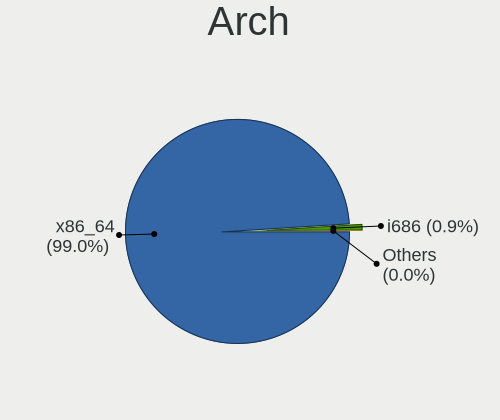
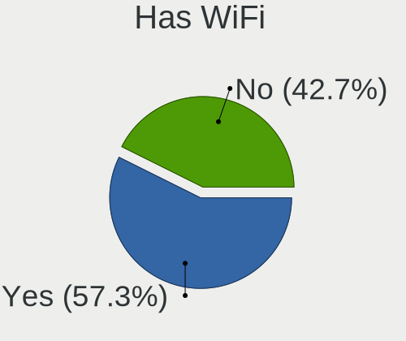
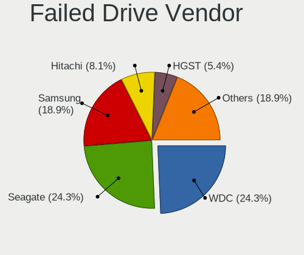

Linux in USA - Tested Hardware & Statistics (Desktops)
------------------------------------------------------

A project to collect tested hardware configurations for Linux in USA.

Anyone can contribute to this report by the [hw-probe](https://github.com/linuxhw/hw-probe) tool:

    sudo -E hw-probe -all -upload

Please contribute! Especially if your hardware is rare.

Contents
--------

* [ Test Cases ](#test-cases)

* [ System ](#system)
  - [ OS                       ](#os)
  - [ OS Family                ](#os-family)
  - [ Kernel                   ](#kernel)
  - [ Kernel Family            ](#kernel-family)
  - [ Kernel Major Ver.        ](#kernel-major-ver)
  - [ Arch                     ](#arch)
  - [ DE                       ](#de)
  - [ Display Server           ](#display-server)
  - [ Display Manager          ](#display-manager)
  - [ OS Lang                  ](#os-lang)
  - [ Boot Mode                ](#boot-mode)
  - [ Filesystem               ](#filesystem)
  - [ Part. scheme             ](#part-scheme)
  - [ Dual Boot with Linux/BSD ](#dual-boot-with-linuxbsd)
  - [ Dual Boot (Win)          ](#dual-boot-win)

* [ Board ](#board)
  - [ Vendor                   ](#vendor)
  - [ Model                    ](#model)
  - [ Model Family             ](#model-family)
  - [ MFG Year                 ](#mfg-year)
  - [ Form Factor              ](#form-factor)
  - [ Secure Boot              ](#secure-boot)
  - [ Coreboot                 ](#coreboot)
  - [ RAM Size                 ](#ram-size)
  - [ RAM Used                 ](#ram-used)
  - [ Total Drives             ](#total-drives)
  - [ Has CD-ROM               ](#has-cd-rom)
  - [ Has Ethernet             ](#has-ethernet)
  - [ Has WiFi                 ](#has-wifi)
  - [ Has Bluetooth            ](#has-bluetooth)

* [ Location ](#location)
  - [ Country                  ](#country)
  - [ City                     ](#city)

* [ Drives ](#drives)
  - [ Drive Vendor             ](#drive-vendor)
  - [ Drive Model              ](#drive-model)
  - [ HDD Vendor               ](#hdd-vendor)
  - [ SSD Vendor               ](#ssd-vendor)
  - [ Drive Kind               ](#drive-kind)
  - [ Drive Connector          ](#drive-connector)
  - [ Drive Size               ](#drive-size)
  - [ Space Total              ](#space-total)
  - [ Space Used               ](#space-used)
  - [ Malfunc. Drives          ](#malfunc-drives)
  - [ Malfunc. Drive Vendor    ](#malfunc-drive-vendor)
  - [ Malfunc. HDD Vendor      ](#malfunc-hdd-vendor)
  - [ Malfunc. Drive Kind      ](#malfunc-drive-kind)
  - [ Failed Drives            ](#failed-drives)
  - [ Failed Drive Vendor      ](#failed-drive-vendor)
  - [ Drive Status             ](#drive-status)

* [ Storage controller ](#storage-controller)
  - [ Storage Vendor           ](#storage-vendor)
  - [ Storage Model            ](#storage-model)
  - [ Storage Kind             ](#storage-kind)

* [ Processor ](#processor)
  - [ CPU Vendor               ](#cpu-vendor)
  - [ CPU Model                ](#cpu-model)
  - [ CPU Model Family         ](#cpu-model-family)
  - [ CPU Cores                ](#cpu-cores)
  - [ CPU Sockets              ](#cpu-sockets)
  - [ CPU Threads              ](#cpu-threads)
  - [ CPU Op-Modes             ](#cpu-op-modes)
  - [ CPU Microcode            ](#cpu-microcode)
  - [ CPU Microarch            ](#cpu-microarch)

* [ Graphics ](#graphics)
  - [ GPU Vendor               ](#gpu-vendor)
  - [ GPU Model                ](#gpu-model)
  - [ GPU Combo                ](#gpu-combo)
  - [ GPU Driver               ](#gpu-driver)
  - [ GPU Memory               ](#gpu-memory)

* [ Monitor ](#monitor)
  - [ Monitor Vendor           ](#monitor-vendor)
  - [ Monitor Model            ](#monitor-model)
  - [ Monitor Resolution       ](#monitor-resolution)
  - [ Monitor Diagonal         ](#monitor-diagonal)
  - [ Monitor Width            ](#monitor-width)
  - [ Aspect Ratio             ](#aspect-ratio)
  - [ Monitor Area             ](#monitor-area)
  - [ Pixel Density            ](#pixel-density)
  - [ Multiple Monitors        ](#multiple-monitors)

* [ Network ](#network)
  - [ Net Controller Vendor    ](#net-controller-vendor)
  - [ Net Controller Model     ](#net-controller-model)
  - [ Wireless Vendor          ](#wireless-vendor)
  - [ Wireless Model           ](#wireless-model)
  - [ Ethernet Vendor          ](#ethernet-vendor)
  - [ Ethernet Model           ](#ethernet-model)
  - [ Net Controller Kind      ](#net-controller-kind)
  - [ Used Controller          ](#used-controller)
  - [ NICs                     ](#nics)
  - [ IPv6                     ](#ipv6)

* [ Bluetooth ](#bluetooth)
  - [ Bluetooth Vendor         ](#bluetooth-vendor)
  - [ Bluetooth Model          ](#bluetooth-model)

* [ Sound ](#sound)
  - [ Sound Vendor             ](#sound-vendor)
  - [ Sound Model              ](#sound-model)

* [ Memory ](#memory)
  - [ Memory Vendor            ](#memory-vendor)
  - [ Memory Model             ](#memory-model)
  - [ Memory Kind              ](#memory-kind)
  - [ Memory Form Factor       ](#memory-form-factor)
  - [ Memory Size              ](#memory-size)
  - [ Memory Speed             ](#memory-speed)

* [ Printers & scanners ](#printers--scanners)
  - [ Printer Vendor           ](#printer-vendor)
  - [ Printer Model            ](#printer-model)
  - [ Scanner Vendor           ](#scanner-vendor)
  - [ Scanner Model            ](#scanner-model)

* [ Camera ](#camera)
  - [ Camera Vendor            ](#camera-vendor)
  - [ Camera Model             ](#camera-model)

* [ Security ](#security)
  - [ Fingerprint Vendor       ](#fingerprint-vendor)
  - [ Fingerprint Model        ](#fingerprint-model)
  - [ Chipcard Vendor          ](#chipcard-vendor)
  - [ Chipcard Model           ](#chipcard-model)

* [ Unsupported ](#unsupported)
  - [ Unsupported Devices      ](#unsupported-devices)
  - [ Unsupported Device Types ](#unsupported-device-types)

Test Cases
----------

Total: 18900

| Vendor        | Model                       | Probe                                                      | Date         |
|---------------|-----------------------------|------------------------------------------------------------|--------------|
| MSI           | 760GMA-P34                  | [9707436005](https://linux-hardware.org/?probe=9707436005) | Feb 28, 2023 |
| ASRock        | B365M-HDV                   | [def987e32c](https://linux-hardware.org/?probe=def987e32c) | Feb 28, 2023 |
| CWWK          | CW-J6-6L                    | [46c17d2c14](https://linux-hardware.org/?probe=46c17d2c14) | Feb 28, 2023 |
| ASUSTek       | ROG STRIX X370-F GAMING     | [1f4ca7d119](https://linux-hardware.org/?probe=1f4ca7d119) | Feb 28, 2023 |
| ASUSTek       | ROG STRIX X370-F GAMING     | [a634d23a20](https://linux-hardware.org/?probe=a634d23a20) | Feb 28, 2023 |
| ASUSTek       | PRIME B550M-A               | [48c5c743c9](https://linux-hardware.org/?probe=48c5c743c9) | Feb 28, 2023 |
| Lenovo        | 30D9 SDK0J40705 WIN 3425... | [7f53a53eba](https://linux-hardware.org/?probe=7f53a53eba) | Feb 28, 2023 |
| ASUSTek       | ROG STRIX Z590-E GAMING ... | [5fa0193c44](https://linux-hardware.org/?probe=5fa0193c44) | Feb 28, 2023 |
| Dell          | 0KWVT8 A02                  | [4340c1d7c4](https://linux-hardware.org/?probe=4340c1d7c4) | Feb 28, 2023 |
| ASUSTek       | ROG STRIX Z690-A GAMING ... | [216ad20179](https://linux-hardware.org/?probe=216ad20179) | Feb 28, 2023 |
| ASRock        | KBL-NUC                     | [cb504c5fa0](https://linux-hardware.org/?probe=cb504c5fa0) | Feb 28, 2023 |
| HP            | 87D6 SMVB                   | [423aac2b6f](https://linux-hardware.org/?probe=423aac2b6f) | Feb 28, 2023 |
| ASRock        | B560M-C                     | [a93d64aa2c](https://linux-hardware.org/?probe=a93d64aa2c) | Feb 28, 2023 |
| ASRock        | B560M-C                     | [cbbd0a63d4](https://linux-hardware.org/?probe=cbbd0a63d4) | Feb 28, 2023 |
| Dell          | 0HD5W2 A01                  | [f30a31a8ee](https://linux-hardware.org/?probe=f30a31a8ee) | Feb 28, 2023 |
| ASUSTek       | ROG STRIX Z390-E GAMING     | [62a7d7ef5c](https://linux-hardware.org/?probe=62a7d7ef5c) | Feb 28, 2023 |
| MSI           | B550-A PRO[CEC]             | [2465135444](https://linux-hardware.org/?probe=2465135444) | Feb 28, 2023 |
| Gigabyte      | AX370-Gaming K7             | [d4bcf9b7a2](https://linux-hardware.org/?probe=d4bcf9b7a2) | Feb 28, 2023 |
| Gigabyte      | Z370 AORUS Gaming 5-CF      | [cb687f4572](https://linux-hardware.org/?probe=cb687f4572) | Feb 28, 2023 |
| ASRock        | B550 Phantom Gaming-ITX/... | [0195132360](https://linux-hardware.org/?probe=0195132360) | Feb 28, 2023 |
| ASRock        | B550 Phantom Gaming-ITX/... | [8cd8d4b833](https://linux-hardware.org/?probe=8cd8d4b833) | Feb 28, 2023 |
| Foxconn       | 2ABF                        | [ad46fcc88d](https://linux-hardware.org/?probe=ad46fcc88d) | Feb 28, 2023 |
| Dell          | 0NW6H5 A00                  | [aeb7d7a9f4](https://linux-hardware.org/?probe=aeb7d7a9f4) | Feb 27, 2023 |
| HP            | 802E                        | [d24bb98294](https://linux-hardware.org/?probe=d24bb98294) | Feb 27, 2023 |
| Dell          | 0NW6H5 A00                  | [83e6da010b](https://linux-hardware.org/?probe=83e6da010b) | Feb 27, 2023 |
| ASUSTek       | PRIME B360M-A               | [5860f51cd8](https://linux-hardware.org/?probe=5860f51cd8) | Feb 27, 2023 |
| Google        | Buddy                       | [ac3d9aaed0](https://linux-hardware.org/?probe=ac3d9aaed0) | Feb 27, 2023 |
| HP            | 339A                        | [308d8dfac0](https://linux-hardware.org/?probe=308d8dfac0) | Feb 27, 2023 |
| ASUSTek       | PRIME Q270M-C               | [3a9683fbb7](https://linux-hardware.org/?probe=3a9683fbb7) | Feb 27, 2023 |
| Dell          | 0427JK A00                  | [ca878d6577](https://linux-hardware.org/?probe=ca878d6577) | Feb 27, 2023 |
| MSI           | MPG X570 GAMING PRO CARB... | [15318beac5](https://linux-hardware.org/?probe=15318beac5) | Feb 27, 2023 |
| Gigabyte      | Z690 AERO D                 | [68b84cc1eb](https://linux-hardware.org/?probe=68b84cc1eb) | Feb 27, 2023 |
| Dell          | 0Y2MRG A00                  | [6c62bbbf3b](https://linux-hardware.org/?probe=6c62bbbf3b) | Feb 27, 2023 |
| Dell          | 0Y2MRG A00                  | [2479c3c245](https://linux-hardware.org/?probe=2479c3c245) | Feb 27, 2023 |
| Gigabyte      | Z170MX-Gaming 5             | [1f0e9197f9](https://linux-hardware.org/?probe=1f0e9197f9) | Feb 26, 2023 |
| HP            | 81B4 01                     | [bc06df8d32](https://linux-hardware.org/?probe=bc06df8d32) | Feb 26, 2023 |
| Gigabyte      | Z390 UD                     | [b40f9ce0d1](https://linux-hardware.org/?probe=b40f9ce0d1) | Feb 26, 2023 |
| ASUSTek       | ROG STRIX B550-F GAMING     | [3ac3b5424a](https://linux-hardware.org/?probe=3ac3b5424a) | Feb 26, 2023 |
| MSI           | B450M PRO-M2 MAX            | [0c5f9a10dd](https://linux-hardware.org/?probe=0c5f9a10dd) | Feb 26, 2023 |
| ASUSTek       | PRIME B550M-A               | [a121d0545a](https://linux-hardware.org/?probe=a121d0545a) | Feb 26, 2023 |
| Pegatron      | NARRA5                      | [fbff48e326](https://linux-hardware.org/?probe=fbff48e326) | Feb 26, 2023 |
| Lenovo        | Annapurna CRB NOK           | [77122f785f](https://linux-hardware.org/?probe=77122f785f) | Feb 26, 2023 |
| Gigabyte      | X99-UD4P-CF                 | [b78a53985a](https://linux-hardware.org/?probe=b78a53985a) | Feb 26, 2023 |
| ASRock        | 970M Pro3                   | [787ddfd44c](https://linux-hardware.org/?probe=787ddfd44c) | Feb 26, 2023 |
| Lenovo        | Annapurna CRB NOK           | [0e521e12aa](https://linux-hardware.org/?probe=0e521e12aa) | Feb 26, 2023 |
| ASUSTek       | TUF Gaming X570-PLUS        | [c56cf68cef](https://linux-hardware.org/?probe=c56cf68cef) | Feb 26, 2023 |
| MSI           | B450-A PRO MAX              | [f081452f55](https://linux-hardware.org/?probe=f081452f55) | Feb 26, 2023 |
| HP            | 1632                        | [394b988862](https://linux-hardware.org/?probe=394b988862) | Feb 26, 2023 |
| MSI           | MAG Z490 TOMAHAWK           | [f24a3027d0](https://linux-hardware.org/?probe=f24a3027d0) | Feb 26, 2023 |
| ASUSTek       | ProArt B550-CREATOR         | [a2a7defd24](https://linux-hardware.org/?probe=a2a7defd24) | Feb 26, 2023 |
| ASUSTek       | TUF Gaming B550M-PLUS WI... | [a21ea9613b](https://linux-hardware.org/?probe=a21ea9613b) | Feb 26, 2023 |
| Gigabyte      | B550 GAMING X V2            | [9c64d6366e](https://linux-hardware.org/?probe=9c64d6366e) | Feb 26, 2023 |
| MSI           | B350 TOMAHAWK ARCTIC        | [83c075f5c5](https://linux-hardware.org/?probe=83c075f5c5) | Feb 26, 2023 |
| Dell          | 0KWVT8 A03                  | [fcea958b77](https://linux-hardware.org/?probe=fcea958b77) | Feb 26, 2023 |
| Lenovo        | 1048 SDK0T08861 WIN 3305... | [e6b48cdec4](https://linux-hardware.org/?probe=e6b48cdec4) | Feb 26, 2023 |
| Gigabyte      | X399 DESIGNARE EX-CF        | [342c4594de](https://linux-hardware.org/?probe=342c4594de) | Feb 26, 2023 |
| ASUSTek       | P8Z77-M PRO                 | [92f1f7d3b5](https://linux-hardware.org/?probe=92f1f7d3b5) | Feb 26, 2023 |
| ASUSTek       | PRIME B450-PLUS             | [db604c4ff6](https://linux-hardware.org/?probe=db604c4ff6) | Feb 25, 2023 |
| Dell          | 0F428D A00                  | [7d01f8893e](https://linux-hardware.org/?probe=7d01f8893e) | Feb 25, 2023 |
| Dell          | 0YJHYD A00                  | [5029039f0e](https://linux-hardware.org/?probe=5029039f0e) | Feb 25, 2023 |
| ASUSTek       | SABERTOOTH 990FX R2.0       | [42fe607d11](https://linux-hardware.org/?probe=42fe607d11) | Feb 25, 2023 |
| ASRock        | Z97 Pro4                    | [451c626830](https://linux-hardware.org/?probe=451c626830) | Feb 25, 2023 |
| ASUSTek       | PRIME B450M-A II            | [420520e3ab](https://linux-hardware.org/?probe=420520e3ab) | Feb 25, 2023 |
| MSI           | X570-A PRO                  | [922ba2355e](https://linux-hardware.org/?probe=922ba2355e) | Feb 25, 2023 |
| Dell          | 0YF8P5 A00                  | [b387faf4ee](https://linux-hardware.org/?probe=b387faf4ee) | Feb 25, 2023 |
| Gigabyte      | B550M DS3H                  | [0ac3b49261](https://linux-hardware.org/?probe=0ac3b49261) | Feb 25, 2023 |
| ASUSTek       | PRIME B560M-A               | [7357439273](https://linux-hardware.org/?probe=7357439273) | Feb 25, 2023 |
| Dell          | 051FJ8 A02                  | [05f5f23fbb](https://linux-hardware.org/?probe=05f5f23fbb) | Feb 25, 2023 |
| MSI           | B550-A PRO[CEC]             | [9c1dad9bdc](https://linux-hardware.org/?probe=9c1dad9bdc) | Feb 25, 2023 |
| HP            | 2AF7                        | [a8eba0b0c4](https://linux-hardware.org/?probe=a8eba0b0c4) | Feb 25, 2023 |
| Dell          | 0W2F8G A01                  | [1d0d54843b](https://linux-hardware.org/?probe=1d0d54843b) | Feb 25, 2023 |
| HP            | 2AF7                        | [3bf3afd1d5](https://linux-hardware.org/?probe=3bf3afd1d5) | Feb 25, 2023 |
| Gigabyte      | P55A-UD3                    | [60cd9db1c5](https://linux-hardware.org/?probe=60cd9db1c5) | Feb 25, 2023 |
| Dell          | 088DT1 A01                  | [129ed2a520](https://linux-hardware.org/?probe=129ed2a520) | Feb 25, 2023 |
| ASUSTek       | ROG STRIX X570-E GAMING ... | [101d8d4577](https://linux-hardware.org/?probe=101d8d4577) | Feb 25, 2023 |
| ASUSTek       | PRIME B360M-A               | [6d7221488b](https://linux-hardware.org/?probe=6d7221488b) | Feb 24, 2023 |
| Pegatron      | NARRA5                      | [af6be34173](https://linux-hardware.org/?probe=af6be34173) | Feb 24, 2023 |
| ASRock        | H670M Pro RS                | [91bcaa987c](https://linux-hardware.org/?probe=91bcaa987c) | Feb 24, 2023 |
| ASUSTek       | SABERTOOTH 990FX R2.0       | [59d0e692ef](https://linux-hardware.org/?probe=59d0e692ef) | Feb 24, 2023 |
| HP            | 82F2 A01                    | [efc9b2fdbf](https://linux-hardware.org/?probe=efc9b2fdbf) | Feb 24, 2023 |
| HP            | 82F2 A01                    | [24dc4341d3](https://linux-hardware.org/?probe=24dc4341d3) | Feb 24, 2023 |
| Gigabyte      | B365M DS3H                  | [463265c999](https://linux-hardware.org/?probe=463265c999) | Feb 24, 2023 |
| Gigabyte      | B365M DS3H                  | [4aec81f692](https://linux-hardware.org/?probe=4aec81f692) | Feb 24, 2023 |
| MSI           | MPG Z690 CARBON WIFI        | [52b14c9235](https://linux-hardware.org/?probe=52b14c9235) | Feb 24, 2023 |
| MSI           | MPG Z690 CARBON WIFI        | [a09d17dd16](https://linux-hardware.org/?probe=a09d17dd16) | Feb 24, 2023 |
| ASRock        | B550M-C                     | [96edee86aa](https://linux-hardware.org/?probe=96edee86aa) | Feb 24, 2023 |
| ASUSTek       | ROG STRIX B450-F GAMING     | [fea6031cfe](https://linux-hardware.org/?probe=fea6031cfe) | Feb 24, 2023 |
| ASRock        | B550M-C                     | [454c89b4eb](https://linux-hardware.org/?probe=454c89b4eb) | Feb 24, 2023 |
| Pegatron      | NARRA5                      | [ca884f817b](https://linux-hardware.org/?probe=ca884f817b) | Feb 24, 2023 |
| ASUSTek       | ROG STRIX B450-F GAMING     | [4cf00365ff](https://linux-hardware.org/?probe=4cf00365ff) | Feb 24, 2023 |
| ASUSTek       | Q87M-E                      | [e31da94f7b](https://linux-hardware.org/?probe=e31da94f7b) | Feb 24, 2023 |
| ASUSTek       | PRIME X470-PRO              | [69e1d23d85](https://linux-hardware.org/?probe=69e1d23d85) | Feb 24, 2023 |
| Dell          | 0GY6Y8 A01                  | [0806dcb9ca](https://linux-hardware.org/?probe=0806dcb9ca) | Feb 24, 2023 |
| ASRock        | H510M/ac                    | [b7d570e46c](https://linux-hardware.org/?probe=b7d570e46c) | Feb 24, 2023 |
| ASRock        | 990FX Killer                | [acfa772cc6](https://linux-hardware.org/?probe=acfa772cc6) | Feb 24, 2023 |
| ASUSTek       | PRIME Z390-P                | [cdced725a6](https://linux-hardware.org/?probe=cdced725a6) | Feb 24, 2023 |
| Dell          | 0M5DCD A00                  | [88b0bf49fd](https://linux-hardware.org/?probe=88b0bf49fd) | Feb 24, 2023 |
| HP            | 2129                        | [5118eb06d4](https://linux-hardware.org/?probe=5118eb06d4) | Feb 24, 2023 |
| ASUSTek       | TUF Gaming X570-PLUS        | [27a3c3c4c1](https://linux-hardware.org/?probe=27a3c3c4c1) | Feb 24, 2023 |
| Dell          | 0GY6Y8 A01                  | [e3cdd0b411](https://linux-hardware.org/?probe=e3cdd0b411) | Feb 24, 2023 |
| Dell          | 0MM599                      | [00304aefe6](https://linux-hardware.org/?probe=00304aefe6) | Feb 24, 2023 |
| ASUSTek       | PRIME B550M-A               | [acdea94715](https://linux-hardware.org/?probe=acdea94715) | Feb 23, 2023 |
| ASUSTek       | ROG STRIX Z790-E GAMING ... | [471b84b6d4](https://linux-hardware.org/?probe=471b84b6d4) | Feb 23, 2023 |
| Dell          | 0MWYPT A02                  | [2491b0e5eb](https://linux-hardware.org/?probe=2491b0e5eb) | Feb 23, 2023 |
| AZW           | GTR V02                     | [c8d4bfd6e3](https://linux-hardware.org/?probe=c8d4bfd6e3) | Feb 23, 2023 |
| Gigabyte      | Z390 UD                     | [5a6ab06c02](https://linux-hardware.org/?probe=5a6ab06c02) | Feb 23, 2023 |
| HP            | 18E6                        | [294fa26b04](https://linux-hardware.org/?probe=294fa26b04) | Feb 23, 2023 |
| Dell          | 0M6C7G A00                  | [8d8af65e26](https://linux-hardware.org/?probe=8d8af65e26) | Feb 23, 2023 |
| ASUSTek       | ROG STRIX X670E-I GAMING... | [beb6e53cb7](https://linux-hardware.org/?probe=beb6e53cb7) | Feb 23, 2023 |
| Dell          | 0M6C7G A00                  | [f8f5ea8885](https://linux-hardware.org/?probe=f8f5ea8885) | Feb 23, 2023 |
| Gigabyte      | B550M AORUS PRO-P           | [eade3920d9](https://linux-hardware.org/?probe=eade3920d9) | Feb 23, 2023 |
| ASUSTek       | P5L-MX                      | [cc19e49d3c](https://linux-hardware.org/?probe=cc19e49d3c) | Feb 23, 2023 |
| Gigabyte      | GA-880GM-USB3               | [bb5da28703](https://linux-hardware.org/?probe=bb5da28703) | Feb 23, 2023 |
| Foxconn       | 2ADA                        | [75b2eb9c1f](https://linux-hardware.org/?probe=75b2eb9c1f) | Feb 23, 2023 |
| MSI           | PRO X670-P WIFI             | [681bd1de08](https://linux-hardware.org/?probe=681bd1de08) | Feb 23, 2023 |
| Dell          | 0WG855                      | [49c149cff7](https://linux-hardware.org/?probe=49c149cff7) | Feb 23, 2023 |
| Gigabyte      | F2A88XM-D3H                 | [7b27b03f4a](https://linux-hardware.org/?probe=7b27b03f4a) | Feb 23, 2023 |
| Dell          | 0HN7XN A01                  | [f283ae7cb2](https://linux-hardware.org/?probe=f283ae7cb2) | Feb 23, 2023 |
| ASUSTek       | P5L-MX                      | [9eb9ca3cfb](https://linux-hardware.org/?probe=9eb9ca3cfb) | Feb 22, 2023 |
| Lenovo        | SHARKBAY NOK                | [d19ca1eb4a](https://linux-hardware.org/?probe=d19ca1eb4a) | Feb 22, 2023 |
| Dell          | 0C1R19 A02                  | [42ff2c0844](https://linux-hardware.org/?probe=42ff2c0844) | Feb 22, 2023 |
| HP            | 1825                        | [3ba7cec175](https://linux-hardware.org/?probe=3ba7cec175) | Feb 22, 2023 |
| Gigabyte      | X570 GAMING X               | [4803e8ee01](https://linux-hardware.org/?probe=4803e8ee01) | Feb 22, 2023 |
| Unknown       | 1.0                         | [b7475435a7](https://linux-hardware.org/?probe=b7475435a7) | Feb 22, 2023 |
| ASUSTek       | P8Z68-V PRO GEN3            | [ad957d0b05](https://linux-hardware.org/?probe=ad957d0b05) | Feb 22, 2023 |
| Gigabyte      | GA-78LMT-USB3 R2 sex        | [9523a0ccc2](https://linux-hardware.org/?probe=9523a0ccc2) | Feb 22, 2023 |
| Lenovo        | 102F SBB0J05441 WIN 3305... | [ea890b85f3](https://linux-hardware.org/?probe=ea890b85f3) | Feb 22, 2023 |
| MSI           | B450 GAMING PRO CARBON M... | [5fddec362e](https://linux-hardware.org/?probe=5fddec362e) | Feb 22, 2023 |
| Gigabyte      | H81M-HD3                    | [d19e079879](https://linux-hardware.org/?probe=d19e079879) | Feb 22, 2023 |
| ASRock        | 970A-G                      | [80648218db](https://linux-hardware.org/?probe=80648218db) | Feb 22, 2023 |
| ASUSTek       | PRIME X470-PRO              | [adb9b895c8](https://linux-hardware.org/?probe=adb9b895c8) | Feb 22, 2023 |
| ASUSTek       | P5Q-E                       | [3362226081](https://linux-hardware.org/?probe=3362226081) | Feb 22, 2023 |
| ASUSTek       | P5Q-E                       | [8230de4836](https://linux-hardware.org/?probe=8230de4836) | Feb 22, 2023 |
| HP            | 18E5                        | [46c0f34886](https://linux-hardware.org/?probe=46c0f34886) | Feb 22, 2023 |
| Apple         | Mac-F4208DC8 PVT            | [adc8d2fb16](https://linux-hardware.org/?probe=adc8d2fb16) | Feb 22, 2023 |
| MSI           | MEG X570 UNIFY              | [edc30b8a22](https://linux-hardware.org/?probe=edc30b8a22) | Feb 22, 2023 |
| MSI           | B350 TOMAHAWK ARCTIC        | [9bd1823913](https://linux-hardware.org/?probe=9bd1823913) | Feb 22, 2023 |
| AZW           | U59                         | [368562790b](https://linux-hardware.org/?probe=368562790b) | Feb 22, 2023 |
| MSI           | B450 TOMAHAWK               | [53e8b0db7d](https://linux-hardware.org/?probe=53e8b0db7d) | Feb 22, 2023 |
| HP            | 8906 SMVB                   | [9c4e873099](https://linux-hardware.org/?probe=9c4e873099) | Feb 22, 2023 |
| HP            | 2129                        | [5a6b1e7169](https://linux-hardware.org/?probe=5a6b1e7169) | Feb 21, 2023 |
| ASUSTek       | SABERTOOTH Z87              | [e861797e74](https://linux-hardware.org/?probe=e861797e74) | Feb 21, 2023 |
| ASRock        | X470 Master SLI/ac          | [9c11797d60](https://linux-hardware.org/?probe=9c11797d60) | Feb 21, 2023 |
| ASUSTek       | F2A55-M                     | [c9d150f24c](https://linux-hardware.org/?probe=c9d150f24c) | Feb 21, 2023 |
| ASUSTek       | TUF Gaming H670-PRO WIFI... | [d8b3285c55](https://linux-hardware.org/?probe=d8b3285c55) | Feb 21, 2023 |
| Gigabyte      | X570 I AORUS PRO WIFI       | [498b6db3ac](https://linux-hardware.org/?probe=498b6db3ac) | Feb 21, 2023 |
| Gigabyte      | EP43-UD3L                   | [52c293dde6](https://linux-hardware.org/?probe=52c293dde6) | Feb 21, 2023 |
| ASUSTek       | SABERTOOTH Z87              | [40e2157901](https://linux-hardware.org/?probe=40e2157901) | Feb 21, 2023 |
| Gigabyte      | B365M DS3H                  | [8049beda96](https://linux-hardware.org/?probe=8049beda96) | Feb 21, 2023 |
| ASUSTek       | TUF Gaming Z790-PLUS WIF... | [e2470a52d6](https://linux-hardware.org/?probe=e2470a52d6) | Feb 21, 2023 |
| MSI           | Z87-G43                     | [acbef2e01a](https://linux-hardware.org/?probe=acbef2e01a) | Feb 21, 2023 |
| ASUSTek       | H97M-E                      | [b2ef9d5ede](https://linux-hardware.org/?probe=b2ef9d5ede) | Feb 21, 2023 |
| ASUSTek       | TUF Gaming X570-PLUS        | [79073f7745](https://linux-hardware.org/?probe=79073f7745) | Feb 21, 2023 |
| HP            | 8299                        | [f74a41a31c](https://linux-hardware.org/?probe=f74a41a31c) | Feb 21, 2023 |
| ASUSTek       | PRIME B550M-A               | [7dd9134373](https://linux-hardware.org/?probe=7dd9134373) | Feb 21, 2023 |
| ASUSTek       | PRIME B550M-A               | [fafea002be](https://linux-hardware.org/?probe=fafea002be) | Feb 21, 2023 |
| MSI           | A88XI AC V2                 | [42c0cd5d37](https://linux-hardware.org/?probe=42c0cd5d37) | Feb 21, 2023 |
| Alienware     | 0NWN7M A00                  | [eef5c2f68f](https://linux-hardware.org/?probe=eef5c2f68f) | Feb 21, 2023 |
| Gigabyte      | Z590 UD                     | [a8da25537c](https://linux-hardware.org/?probe=a8da25537c) | Feb 21, 2023 |
| Lenovo        | 30D9 SDK0J40705 WIN 3425... | [b8f489a8b4](https://linux-hardware.org/?probe=b8f489a8b4) | Feb 21, 2023 |
| ASRock        | B760M PG SONIC WiFi         | [060f57c123](https://linux-hardware.org/?probe=060f57c123) | Feb 21, 2023 |
| HP            | 18E7                        | [913411cd18](https://linux-hardware.org/?probe=913411cd18) | Feb 21, 2023 |
| Lenovo        | SHARKBAY 0B98401 WIN        | [7c6973f1fa](https://linux-hardware.org/?probe=7c6973f1fa) | Feb 21, 2023 |
| Acer          | Aspire X1935                | [8c4f88db47](https://linux-hardware.org/?probe=8c4f88db47) | Feb 21, 2023 |
| Dell          | 0M5DCD A00                  | [9bfd5f9a7f](https://linux-hardware.org/?probe=9bfd5f9a7f) | Feb 21, 2023 |
| Dell          | 0M5DCD A00                  | [afd4e480d4](https://linux-hardware.org/?probe=afd4e480d4) | Feb 20, 2023 |
| Dell          | 0CK520 A01                  | [6e92aa0096](https://linux-hardware.org/?probe=6e92aa0096) | Feb 20, 2023 |
| Alienware     | 07W25T A01                  | [0ce3af1e23](https://linux-hardware.org/?probe=0ce3af1e23) | Feb 20, 2023 |
| Alienware     | 07W25T A01                  | [f965f4658b](https://linux-hardware.org/?probe=f965f4658b) | Feb 20, 2023 |
| Dell          | 0H4VK7 A01                  | [19ded2f15b](https://linux-hardware.org/?probe=19ded2f15b) | Feb 20, 2023 |
| ASUSTek       | H81M-K                      | [cb6168e276](https://linux-hardware.org/?probe=cb6168e276) | Feb 20, 2023 |
| ASRock        | B560M-C                     | [0641c704e9](https://linux-hardware.org/?probe=0641c704e9) | Feb 20, 2023 |
| Dell          | 0PU052                      | [0e80151ed5](https://linux-hardware.org/?probe=0e80151ed5) | Feb 20, 2023 |
| ASUSTek       | VM62N                       | [5cab7f5b88](https://linux-hardware.org/?probe=5cab7f5b88) | Feb 20, 2023 |
| Gigabyte      | B550M DS3H                  | [9930856d67](https://linux-hardware.org/?probe=9930856d67) | Feb 20, 2023 |
| MSI           | MPG X570 GAMING PLUS        | [a47920e014](https://linux-hardware.org/?probe=a47920e014) | Feb 20, 2023 |
| Dell          | 0WMJ54 A01                  | [59ce46dfe2](https://linux-hardware.org/?probe=59ce46dfe2) | Feb 20, 2023 |
| Pegatron      | NARRA5                      | [6d0714a928](https://linux-hardware.org/?probe=6d0714a928) | Feb 20, 2023 |
| HP            | 3398                        | [6b616a9a10](https://linux-hardware.org/?probe=6b616a9a10) | Feb 20, 2023 |
| ASUSTek       | PRIME B550M-A               | [8fd85f724b](https://linux-hardware.org/?probe=8fd85f724b) | Feb 20, 2023 |
| HP            | 18E7                        | [c59f4fb1ab](https://linux-hardware.org/?probe=c59f4fb1ab) | Feb 20, 2023 |
| ASRock        | B760M PG SONIC WiFi         | [db1047e063](https://linux-hardware.org/?probe=db1047e063) | Feb 20, 2023 |
| Gigabyte      | B450M DS3H WIFI-CF          | [a3f2825d3d](https://linux-hardware.org/?probe=a3f2825d3d) | Feb 20, 2023 |
| Dell          | 0D24M8 A02                  | [a9e9dae786](https://linux-hardware.org/?probe=a9e9dae786) | Feb 19, 2023 |
| ASUSTek       | TUF Gaming X570-PLUS        | [8ab5bffea6](https://linux-hardware.org/?probe=8ab5bffea6) | Feb 19, 2023 |
| ASRock        | 880GM-LE FX                 | [db290cd703](https://linux-hardware.org/?probe=db290cd703) | Feb 19, 2023 |
| ASUSTek       | M5A97 LE R2.0               | [fccba081d1](https://linux-hardware.org/?probe=fccba081d1) | Feb 19, 2023 |
| HP            | 18E5                        | [ba623dea72](https://linux-hardware.org/?probe=ba623dea72) | Feb 19, 2023 |
| eMachines     | MCP61PM-GM                  | [aeafa2dbee](https://linux-hardware.org/?probe=aeafa2dbee) | Feb 19, 2023 |
| Gigabyte      | F2A88XM-D3HP                | [1c2d1949fd](https://linux-hardware.org/?probe=1c2d1949fd) | Feb 19, 2023 |
| Gigabyte      | F2A88XM-D3HP                | [edfa765236](https://linux-hardware.org/?probe=edfa765236) | Feb 19, 2023 |
| Dell          | 0C27VV A00                  | [1b522f9105](https://linux-hardware.org/?probe=1b522f9105) | Feb 19, 2023 |
| ASUSTek       | PRIME X370-PRO              | [35d0544ea5](https://linux-hardware.org/?probe=35d0544ea5) | Feb 19, 2023 |
| ASUSTek       | PRIME X370-PRO              | [703cc27199](https://linux-hardware.org/?probe=703cc27199) | Feb 19, 2023 |
| Gigabyte      | H97M-D3H                    | [be0f73193d](https://linux-hardware.org/?probe=be0f73193d) | Feb 19, 2023 |
| Gigabyte      | H97M-D3H                    | [c784a261d4](https://linux-hardware.org/?probe=c784a261d4) | Feb 19, 2023 |
| Gigabyte      | GA-78LMT-S2P                | [8df8fe9ae8](https://linux-hardware.org/?probe=8df8fe9ae8) | Feb 19, 2023 |
| ASUSTek       | TUF Gaming B550M-PLUS WI... | [2752a9660a](https://linux-hardware.org/?probe=2752a9660a) | Feb 19, 2023 |
| AMD           | 970A-D3                     | [bc2f6d8481](https://linux-hardware.org/?probe=bc2f6d8481) | Feb 19, 2023 |
| ASRock        | B450 Pro4                   | [092f97e245](https://linux-hardware.org/?probe=092f97e245) | Feb 19, 2023 |
| ASRock        | X570 Phantom Gaming 4       | [f9314a0aa9](https://linux-hardware.org/?probe=f9314a0aa9) | Feb 19, 2023 |
| Lenovo        | 1036 NO DPK                 | [b99541f6ad](https://linux-hardware.org/?probe=b99541f6ad) | Feb 19, 2023 |
| ASRock        | X99 Extreme4                | [cbfb58fc3c](https://linux-hardware.org/?probe=cbfb58fc3c) | Feb 19, 2023 |
| Dell          | 0T065F A01                  | [c8b1f8651a](https://linux-hardware.org/?probe=c8b1f8651a) | Feb 19, 2023 |
| Dell          | 088DT1 A01                  | [4ecc419f83](https://linux-hardware.org/?probe=4ecc419f83) | Feb 18, 2023 |
| ASUSTek       | X99-PRO/USB                 | [45631ae666](https://linux-hardware.org/?probe=45631ae666) | Feb 18, 2023 |
| HP            | 1905                        | [abc0c09cdf](https://linux-hardware.org/?probe=abc0c09cdf) | Feb 18, 2023 |
| Gigabyte      | B650 AORUS PRO AX           | [a526504d18](https://linux-hardware.org/?probe=a526504d18) | Feb 18, 2023 |
| ASRock        | AB350 Pro4                  | [908d615f00](https://linux-hardware.org/?probe=908d615f00) | Feb 18, 2023 |
| HP            | 8053                        | [e495e287bc](https://linux-hardware.org/?probe=e495e287bc) | Feb 18, 2023 |
| HP            | 8437                        | [f8f0f71bf5](https://linux-hardware.org/?probe=f8f0f71bf5) | Feb 18, 2023 |
| ASRock        | H110 Pro BTC+               | [bce117c4dc](https://linux-hardware.org/?probe=bce117c4dc) | Feb 18, 2023 |
| ASRock        | B450 Pro4                   | [d6b212b427](https://linux-hardware.org/?probe=d6b212b427) | Feb 18, 2023 |
| Gateway       | IPISB-VR                    | [f67f11a59e](https://linux-hardware.org/?probe=f67f11a59e) | Feb 18, 2023 |
| Dell          | 0D441T A03                  | [351a527308](https://linux-hardware.org/?probe=351a527308) | Feb 18, 2023 |
| ASUSTek       | ROG STRIX B550-A GAMING     | [06d9c4427a](https://linux-hardware.org/?probe=06d9c4427a) | Feb 18, 2023 |
| ASUSTek       | PRIME B550M-A               | [8a8696cdb1](https://linux-hardware.org/?probe=8a8696cdb1) | Feb 18, 2023 |
| ASRock        | H510M/ac                    | [ab77c84805](https://linux-hardware.org/?probe=ab77c84805) | Feb 18, 2023 |
| HP            | 8299                        | [458683cdc0](https://linux-hardware.org/?probe=458683cdc0) | Feb 18, 2023 |
| Dell          | 0WMJ54 A01                  | [c154817077](https://linux-hardware.org/?probe=c154817077) | Feb 18, 2023 |
| Dell          | 0C2XKD A01                  | [5fcdbd2986](https://linux-hardware.org/?probe=5fcdbd2986) | Feb 18, 2023 |
| Dell          | 0C2XKD A01                  | [6d786baedd](https://linux-hardware.org/?probe=6d786baedd) | Feb 18, 2023 |
| Dell          | 0NK70N A03                  | [3da6e11665](https://linux-hardware.org/?probe=3da6e11665) | Feb 18, 2023 |
| ASUSTek       | ROG STRIX Z390-E GAMING     | [322588bc4e](https://linux-hardware.org/?probe=322588bc4e) | Feb 18, 2023 |
| ASRock        | 880GM-LE FX                 | [1d45a444a3](https://linux-hardware.org/?probe=1d45a444a3) | Feb 18, 2023 |
| Alienware     | 07W25T A01                  | [f9427f609d](https://linux-hardware.org/?probe=f9427f609d) | Feb 17, 2023 |
| ASUSTek       | SABERTOOTH Z77              | [af7c933bf3](https://linux-hardware.org/?probe=af7c933bf3) | Feb 17, 2023 |
| MSI           | MPG Z390 GAMING EDGE AC     | [6f0e4158a4](https://linux-hardware.org/?probe=6f0e4158a4) | Feb 17, 2023 |
| ASUSTek       | PRIME B550M-A               | [f9fb638882](https://linux-hardware.org/?probe=f9fb638882) | Feb 17, 2023 |
| MSI           | 970A-G43                    | [e02e6e5509](https://linux-hardware.org/?probe=e02e6e5509) | Feb 17, 2023 |
| MSI           | MPG Z490 GAMING EDGE WIF... | [3ed988e135](https://linux-hardware.org/?probe=3ed988e135) | Feb 17, 2023 |
| Gigabyte      | GA-A55M-DS2                 | [3159aede6c](https://linux-hardware.org/?probe=3159aede6c) | Feb 17, 2023 |
| Foxconn       | 2ABF                        | [2c98a8340f](https://linux-hardware.org/?probe=2c98a8340f) | Feb 17, 2023 |
| Gateway       | SX2803                      | [a1b20489b4](https://linux-hardware.org/?probe=a1b20489b4) | Feb 17, 2023 |
| EVGA          | 151-IB-E699                 | [9e975c7966](https://linux-hardware.org/?probe=9e975c7966) | Feb 17, 2023 |
| AZW           | Green G3                    | [ee25777882](https://linux-hardware.org/?probe=ee25777882) | Feb 17, 2023 |
| Dell          | 0C27VV A04                  | [581f38496e](https://linux-hardware.org/?probe=581f38496e) | Feb 17, 2023 |
| HP            | 82A2                        | [16aeaa4b92](https://linux-hardware.org/?probe=16aeaa4b92) | Feb 17, 2023 |
| MSI           | 890FXA-GD65                 | [f52cfe6e0d](https://linux-hardware.org/?probe=f52cfe6e0d) | Feb 17, 2023 |
| Unknown       | Unknown                     | [6241b349b5](https://linux-hardware.org/?probe=6241b349b5) | Feb 17, 2023 |
| MSI           | X399 SLI PLUS               | [8741094cd9](https://linux-hardware.org/?probe=8741094cd9) | Feb 17, 2023 |
| MSI           | B550-A PRO                  | [e81d0741bb](https://linux-hardware.org/?probe=e81d0741bb) | Feb 17, 2023 |
| MSI           | B550-A PRO                  | [dd63e968bd](https://linux-hardware.org/?probe=dd63e968bd) | Feb 17, 2023 |
| Dell          | 0DF42J A00                  | [e192547cd3](https://linux-hardware.org/?probe=e192547cd3) | Feb 17, 2023 |
| Gigabyte      | Z390 AORUS PRO WIFI-CF      | [00568fe98a](https://linux-hardware.org/?probe=00568fe98a) | Feb 17, 2023 |
| MSI           | 760GM-P23                   | [529e0929d2](https://linux-hardware.org/?probe=529e0929d2) | Feb 17, 2023 |
| HP            | 18E7                        | [821ea2c921](https://linux-hardware.org/?probe=821ea2c921) | Feb 17, 2023 |
| HP            | 2B36                        | [81833a42d2](https://linux-hardware.org/?probe=81833a42d2) | Feb 17, 2023 |
| Dell          | 0GXM1W A02                  | [f41f1d8393](https://linux-hardware.org/?probe=f41f1d8393) | Feb 16, 2023 |
| ASUSTek       | PRIME B450-PLUS             | [d98e6087da](https://linux-hardware.org/?probe=d98e6087da) | Feb 16, 2023 |
| SiS Techno... | 741                         | [4f8996911c](https://linux-hardware.org/?probe=4f8996911c) | Feb 16, 2023 |
| ASUSTek       | PRIME B550M-A               | [a19a7a2edd](https://linux-hardware.org/?probe=a19a7a2edd) | Feb 16, 2023 |
| Apple         | Mac-F60DEB81FF30ACF6 Mac... | [3b0150685c](https://linux-hardware.org/?probe=3b0150685c) | Feb 16, 2023 |
| MSI           | MPG Z490 GAMING PLUS        | [7603784fce](https://linux-hardware.org/?probe=7603784fce) | Feb 16, 2023 |
| Lenovo        | 3098 SDK0E50510 WIN 2625... | [6b6b62f26d](https://linux-hardware.org/?probe=6b6b62f26d) | Feb 16, 2023 |
| MSI           | B350 TOMAHAWK ARCTIC        | [7dfab1047b](https://linux-hardware.org/?probe=7dfab1047b) | Feb 16, 2023 |
| Foxconn       | 2ADA                        | [e0f89bbca1](https://linux-hardware.org/?probe=e0f89bbca1) | Feb 16, 2023 |
| ASUSTek       | TUF Gaming B550-PLUS        | [bbce6ba3b1](https://linux-hardware.org/?probe=bbce6ba3b1) | Feb 16, 2023 |
| ASRock        | B760M-ITX/D4 WiFi           | [8a29735d16](https://linux-hardware.org/?probe=8a29735d16) | Feb 16, 2023 |
| ASRock        | B360M Xtreme                | [c10563291e](https://linux-hardware.org/?probe=c10563291e) | Feb 16, 2023 |
| ASUSTek       | ROG STRIX B350-F GAMING     | [f0105f57bf](https://linux-hardware.org/?probe=f0105f57bf) | Feb 16, 2023 |
| ASUSTek       | TUF Gaming B550-PLUS        | [d9b6d0ba02](https://linux-hardware.org/?probe=d9b6d0ba02) | Feb 16, 2023 |
| Lenovo        | 1030 SDK0J40705 WIN 3425... | [daed0124f0](https://linux-hardware.org/?probe=daed0124f0) | Feb 16, 2023 |
| Gigabyte      | B760I AORUS PRO DDR4        | [62a320f515](https://linux-hardware.org/?probe=62a320f515) | Feb 16, 2023 |
| ASUSTek       | ProArt X670E-CREATOR WIF... | [f4e8b0e952](https://linux-hardware.org/?probe=f4e8b0e952) | Feb 16, 2023 |
| ASRock        | Z390M Pro4                  | [cf96b55907](https://linux-hardware.org/?probe=cf96b55907) | Feb 15, 2023 |
| ASUSTek       | K30AD_M31AD_M51AD_M32AD     | [44a3952ccf](https://linux-hardware.org/?probe=44a3952ccf) | Feb 15, 2023 |
| Gigabyte      | X570 I AORUS PRO WIFI       | [c82882e708](https://linux-hardware.org/?probe=c82882e708) | Feb 15, 2023 |
| ASUSTek       | F2A85-M PRO                 | [c5b8952fdb](https://linux-hardware.org/?probe=c5b8952fdb) | Feb 15, 2023 |
| ASRock        | H570M Pro4                  | [8a4a38554f](https://linux-hardware.org/?probe=8a4a38554f) | Feb 15, 2023 |
| AWOW          | AK41                        | [ab39f15cc9](https://linux-hardware.org/?probe=ab39f15cc9) | Feb 15, 2023 |
| ASUSTek       | Maximus VII HERO            | [c84212b39c](https://linux-hardware.org/?probe=c84212b39c) | Feb 15, 2023 |
| ASUSTek       | PRIME B450M-A II            | [e486b2bb46](https://linux-hardware.org/?probe=e486b2bb46) | Feb 15, 2023 |
| MSI           | 760GMA-P34                  | [6c540405e8](https://linux-hardware.org/?probe=6c540405e8) | Feb 15, 2023 |
| MSI           | MPG Z390 GAMING EDGE AC     | [a572ac5ed3](https://linux-hardware.org/?probe=a572ac5ed3) | Feb 15, 2023 |
| ASRock        | Z75 Pro3                    | [7ffb26b7dd](https://linux-hardware.org/?probe=7ffb26b7dd) | Feb 15, 2023 |
| HP            | 83EC                        | [4757525f5d](https://linux-hardware.org/?probe=4757525f5d) | Feb 15, 2023 |
| Pegatron      | EVE                         | [0bde64bb64](https://linux-hardware.org/?probe=0bde64bb64) | Feb 15, 2023 |
| SiS Techno... | 741                         | [9eb58ae6c0](https://linux-hardware.org/?probe=9eb58ae6c0) | Feb 15, 2023 |
| ASUSTek       | ROG STRIX B650E-I GAMING... | [7d8c3e7e48](https://linux-hardware.org/?probe=7d8c3e7e48) | Feb 14, 2023 |
| Unknown       | Unknown                     | [69c7852df8](https://linux-hardware.org/?probe=69c7852df8) | Feb 14, 2023 |
| HP            | 1587h                       | [312effb7b7](https://linux-hardware.org/?probe=312effb7b7) | Feb 14, 2023 |
| Dell          | 0KWVT8 A02                  | [486f7258a6](https://linux-hardware.org/?probe=486f7258a6) | Feb 14, 2023 |
| ASRock        | H510M/ac                    | [73161b2a1e](https://linux-hardware.org/?probe=73161b2a1e) | Feb 14, 2023 |
| Dell          | 0GXM1W A01                  | [b79a508ddd](https://linux-hardware.org/?probe=b79a508ddd) | Feb 14, 2023 |
| Gigabyte      | GA-MA770T-UD3P              | [2ca590a85e](https://linux-hardware.org/?probe=2ca590a85e) | Feb 14, 2023 |
| Gigabyte      | X570 AORUS ELITE WIFI       | [dc91c0e32b](https://linux-hardware.org/?probe=dc91c0e32b) | Feb 14, 2023 |
| Google        | Teemo                       | [53bf6d19ca](https://linux-hardware.org/?probe=53bf6d19ca) | Feb 14, 2023 |
| ASUSTek       | M5A78L-M/USB3               | [0033422c4d](https://linux-hardware.org/?probe=0033422c4d) | Feb 14, 2023 |
| ASUSTek       | ROG STRIX B550-F GAMING     | [d1171fb67b](https://linux-hardware.org/?probe=d1171fb67b) | Feb 14, 2023 |
| ASUSTek       | TUF Gaming X570-PLUS        | [482c922bbc](https://linux-hardware.org/?probe=482c922bbc) | Feb 14, 2023 |
| HP            | 8714                        | [19a66b5101](https://linux-hardware.org/?probe=19a66b5101) | Feb 14, 2023 |
| Unknown       | Unknown                     | [8f537795bb](https://linux-hardware.org/?probe=8f537795bb) | Feb 14, 2023 |
| ASUSTek       | ROG STRIX X570-E GAMING     | [43dff5bee7](https://linux-hardware.org/?probe=43dff5bee7) | Feb 14, 2023 |
| Gigabyte      | Z390 AORUS PRO WIFI-CF      | [695abe8c65](https://linux-hardware.org/?probe=695abe8c65) | Feb 14, 2023 |
| ASUSTek       | ROG STRIX Z370-E GAMING     | [801855af79](https://linux-hardware.org/?probe=801855af79) | Feb 14, 2023 |
| Gigabyte      | X570 I AORUS PRO WIFI       | [27c2ee6ee0](https://linux-hardware.org/?probe=27c2ee6ee0) | Feb 14, 2023 |
| Alienware     | 0VDT73 A00                  | [d8ed5d5e88](https://linux-hardware.org/?probe=d8ed5d5e88) | Feb 14, 2023 |
| Lenovo        | SHARKBAY NOK                | [fea9318890](https://linux-hardware.org/?probe=fea9318890) | Feb 13, 2023 |
| ASUSTek       | ProArt X570-CREATOR WIFI    | [84420c06ac](https://linux-hardware.org/?probe=84420c06ac) | Feb 13, 2023 |
| IceWhale T... | ZimaBoard 832 ZMB           | [55e684c121](https://linux-hardware.org/?probe=55e684c121) | Feb 13, 2023 |
| Dell          | 0KWVT8 A02                  | [c3d08b4f2e](https://linux-hardware.org/?probe=c3d08b4f2e) | Feb 13, 2023 |
| HP            | 1998                        | [dbb952f3f6](https://linux-hardware.org/?probe=dbb952f3f6) | Feb 13, 2023 |
| HP            | 1998                        | [0171575a1d](https://linux-hardware.org/?probe=0171575a1d) | Feb 13, 2023 |
| Alienware     | 07JNH0 A02                  | [0be6f8fe33](https://linux-hardware.org/?probe=0be6f8fe33) | Feb 13, 2023 |
| Apple         | Mac-F60DEB81FF30ACF6 Mac... | [3e54cb20fd](https://linux-hardware.org/?probe=3e54cb20fd) | Feb 13, 2023 |
| ASUSTek       | Z10PE-D16 WS                | [d517411fc5](https://linux-hardware.org/?probe=d517411fc5) | Feb 13, 2023 |
| Dell          | 0YKH50 A01                  | [d2a3255f21](https://linux-hardware.org/?probe=d2a3255f21) | Feb 13, 2023 |
| ASUSTek       | CROSSHAIR V FORMULA-Z       | [517a5a9e81](https://linux-hardware.org/?probe=517a5a9e81) | Feb 13, 2023 |
| ASRock        | Z690 Steel Legend           | [6935bc6a6e](https://linux-hardware.org/?probe=6935bc6a6e) | Feb 13, 2023 |
| ASUSTek       | ROG STRIX X570-E GAMING     | [820aa2bf49](https://linux-hardware.org/?probe=820aa2bf49) | Feb 13, 2023 |
| ASUSTek       | TUF Z390M-PRO GAMING        | [ecf4603ab4](https://linux-hardware.org/?probe=ecf4603ab4) | Feb 13, 2023 |
| Dell          | 0R6PCT A01                  | [4126ed8507](https://linux-hardware.org/?probe=4126ed8507) | Feb 13, 2023 |
| MSI           | B450M PRO-VDH MAX           | [b45d61318e](https://linux-hardware.org/?probe=b45d61318e) | Feb 13, 2023 |
| ASUSTek       | PRIME Z390-P                | [8ac5b193cb](https://linux-hardware.org/?probe=8ac5b193cb) | Feb 13, 2023 |
| ASUSTek       | PRIME Z390-P                | [156fae6b82](https://linux-hardware.org/?probe=156fae6b82) | Feb 13, 2023 |
| Lenovo        | NOK                         | [f2fdf17bc6](https://linux-hardware.org/?probe=f2fdf17bc6) | Feb 13, 2023 |
| ASUSTek       | P8Z68-V LX                  | [f406efb6bb](https://linux-hardware.org/?probe=f406efb6bb) | Feb 13, 2023 |
| ASUSTek       | TUF Gaming B550-PRO         | [e83cd923a5](https://linux-hardware.org/?probe=e83cd923a5) | Feb 13, 2023 |
| ASRock        | X570 Phantom Gaming 4       | [c7d5effbbc](https://linux-hardware.org/?probe=c7d5effbbc) | Feb 13, 2023 |
| MSI           | MPG Z390 GAMING EDGE AC     | [d7316db223](https://linux-hardware.org/?probe=d7316db223) | Feb 12, 2023 |
| Dell          | 0Y7WYT A00                  | [d94084bbee](https://linux-hardware.org/?probe=d94084bbee) | Feb 12, 2023 |
| MSI           | 970A-G43                    | [06cc8e9889](https://linux-hardware.org/?probe=06cc8e9889) | Feb 12, 2023 |
| Lenovo        | ThinkServer TS140           | [59eeaafe59](https://linux-hardware.org/?probe=59eeaafe59) | Feb 12, 2023 |
| ASRock        | B550M Steel Legend          | [b180c67964](https://linux-hardware.org/?probe=b180c67964) | Feb 12, 2023 |
| ASRock        | B550M Steel Legend          | [2a6f501cb1](https://linux-hardware.org/?probe=2a6f501cb1) | Feb 12, 2023 |
| Lenovo        | IdeaCentre K330B            | [862bd68d6f](https://linux-hardware.org/?probe=862bd68d6f) | Feb 12, 2023 |
| Dell          | 08WKV3 A00                  | [89ba42b53e](https://linux-hardware.org/?probe=89ba42b53e) | Feb 12, 2023 |
| ASUSTek       | CROSSHAIR VI HERO           | [687ecdce15](https://linux-hardware.org/?probe=687ecdce15) | Feb 12, 2023 |
| ASUSTek       | TUF Gaming B550-PRO         | [52674d23ad](https://linux-hardware.org/?probe=52674d23ad) | Feb 12, 2023 |
| ASUSTek       | PRIME Z590-P                | [575dc82b32](https://linux-hardware.org/?probe=575dc82b32) | Feb 12, 2023 |
| ASUSTek       | PRIME X399-A                | [8fbc5cca8e](https://linux-hardware.org/?probe=8fbc5cca8e) | Feb 12, 2023 |
| MSI           | 760GMA-P34                  | [05d11c4fe3](https://linux-hardware.org/?probe=05d11c4fe3) | Feb 12, 2023 |
| ASUSTek       | PRIME B550M-A               | [2d63c8d887](https://linux-hardware.org/?probe=2d63c8d887) | Feb 12, 2023 |
| Gigabyte      | B450M DS3H-CF               | [fb58e751aa](https://linux-hardware.org/?probe=fb58e751aa) | Feb 12, 2023 |
| Lenovo        | NOK                         | [c58a69a8c6](https://linux-hardware.org/?probe=c58a69a8c6) | Feb 12, 2023 |
| MSI           | Z490-A PRO                  | [08ef3591e8](https://linux-hardware.org/?probe=08ef3591e8) | Feb 11, 2023 |
| MSI           | MPG Z490 GAMING PLUS        | [2a8f60a103](https://linux-hardware.org/?probe=2a8f60a103) | Feb 11, 2023 |
| ASUSTek       | PRIME X399-A                | [45f4900aa5](https://linux-hardware.org/?probe=45f4900aa5) | Feb 11, 2023 |
| ASUSTek       | CM5571                      | [c58cb005b5](https://linux-hardware.org/?probe=c58cb005b5) | Feb 11, 2023 |
| ASUSTek       | CROSSHAIR VI HERO           | [2c1562b21f](https://linux-hardware.org/?probe=2c1562b21f) | Feb 11, 2023 |
| Quanta        | 2AF5 011                    | [ef6cd0ebce](https://linux-hardware.org/?probe=ef6cd0ebce) | Feb 11, 2023 |
| Quanta        | 2AF5 011                    | [72898b983a](https://linux-hardware.org/?probe=72898b983a) | Feb 11, 2023 |
| ASUSTek       | ROG STRIX Z690-A GAMING ... | [d003016397](https://linux-hardware.org/?probe=d003016397) | Feb 11, 2023 |
| AZW           | Green G3                    | [152433615a](https://linux-hardware.org/?probe=152433615a) | Feb 11, 2023 |
| Dell          | 0M017G A00                  | [f2deee99d1](https://linux-hardware.org/?probe=f2deee99d1) | Feb 11, 2023 |
| ASRock        | Z790M-ITX WiFi              | [ca7e69040a](https://linux-hardware.org/?probe=ca7e69040a) | Feb 11, 2023 |
| HP            | 89D8 SMVB                   | [49d1ea8b3e](https://linux-hardware.org/?probe=49d1ea8b3e) | Feb 11, 2023 |
| Gigabyte      | X399 AORUS Gaming 7         | [b82ab8816d](https://linux-hardware.org/?probe=b82ab8816d) | Feb 11, 2023 |
| Dell          | 0FPP7F A00                  | [0a67b25026](https://linux-hardware.org/?probe=0a67b25026) | Feb 11, 2023 |
| MSI           | B450 TOMAHAWK               | [692e06bfca](https://linux-hardware.org/?probe=692e06bfca) | Feb 11, 2023 |
| Dell          | 0NC2VH A01                  | [665041c4c5](https://linux-hardware.org/?probe=665041c4c5) | Feb 11, 2023 |
| ASRock        | 990FX Extreme4              | [4af6878800](https://linux-hardware.org/?probe=4af6878800) | Feb 11, 2023 |
| ASUSTek       | TUF Gaming X570-PLUS        | [d2098e4161](https://linux-hardware.org/?probe=d2098e4161) | Feb 11, 2023 |
| HP            | 8643 SMVB                   | [5e8a88b237](https://linux-hardware.org/?probe=5e8a88b237) | Feb 11, 2023 |
| ASUSTek       | Z10PE-D16 WS                | [b2c120d8d7](https://linux-hardware.org/?probe=b2c120d8d7) | Feb 11, 2023 |
| AMD           | CM-iGLX Platform Board R... | [c256a73072](https://linux-hardware.org/?probe=c256a73072) | Feb 11, 2023 |
| AZW           | U59                         | [db63601638](https://linux-hardware.org/?probe=db63601638) | Feb 11, 2023 |
| ASUSTek       | CROSSHAIR VI HERO           | [0b14ee6551](https://linux-hardware.org/?probe=0b14ee6551) | Feb 11, 2023 |
| ASRock        | Z75 Pro3                    | [3dce5774ce](https://linux-hardware.org/?probe=3dce5774ce) | Feb 11, 2023 |
| Gigabyte      | F2A88X-UP4                  | [4c46cabf03](https://linux-hardware.org/?probe=4c46cabf03) | Feb 11, 2023 |
| ASUSTek       | STRIX Z270E GAMING          | [50e0d40c4f](https://linux-hardware.org/?probe=50e0d40c4f) | Feb 11, 2023 |
| Gigabyte      | B85M-DS3H-A                 | [181c0e03e2](https://linux-hardware.org/?probe=181c0e03e2) | Feb 10, 2023 |
| Dell          | 0M017G A00                  | [30965e948d](https://linux-hardware.org/?probe=30965e948d) | Feb 10, 2023 |
| Gigabyte      | GA-990FXA-UD3               | [fabdd92407](https://linux-hardware.org/?probe=fabdd92407) | Feb 10, 2023 |
| ASUSTek       | PRIME X570-PRO              | [f0f4d31de2](https://linux-hardware.org/?probe=f0f4d31de2) | Feb 10, 2023 |
| Dell          | 0T568R A00                  | [fedf0db748](https://linux-hardware.org/?probe=fedf0db748) | Feb 10, 2023 |
| MSI           | PRO B660M-A CEC WIFI DDR... | [54a5198274](https://linux-hardware.org/?probe=54a5198274) | Feb 10, 2023 |
| ASRock        | KBL-NUC                     | [1093cfff1a](https://linux-hardware.org/?probe=1093cfff1a) | Feb 10, 2023 |
| ASUSTek       | Z10PE-D16 WS                | [a19717f948](https://linux-hardware.org/?probe=a19717f948) | Feb 10, 2023 |
| MSI           | PRO B660M-A CEC WIFI DDR... | [26d146ba3f](https://linux-hardware.org/?probe=26d146ba3f) | Feb 10, 2023 |
| Dell          | 0D28YY A00                  | [ea48b51678](https://linux-hardware.org/?probe=ea48b51678) | Feb 10, 2023 |
| Lenovo        | 3741 SDK0T76463 WIN 3422... | [14bde69d96](https://linux-hardware.org/?probe=14bde69d96) | Feb 10, 2023 |
| Dell          | 0Y7WYT A00                  | [e4369afe1e](https://linux-hardware.org/?probe=e4369afe1e) | Feb 10, 2023 |
| HP            | 8299                        | [adfbdeb133](https://linux-hardware.org/?probe=adfbdeb133) | Feb 10, 2023 |
| AWOW          | AK41                        | [811f8d2f4b](https://linux-hardware.org/?probe=811f8d2f4b) | Feb 10, 2023 |
| Alienware     | 07W25T A01                  | [e0606ee910](https://linux-hardware.org/?probe=e0606ee910) | Feb 10, 2023 |
| MSI           | GF615M-P31                  | [36dcd2e516](https://linux-hardware.org/?probe=36dcd2e516) | Feb 10, 2023 |
| ASUSTek       | TUF Gaming X570-PLUS        | [469eaa6fba](https://linux-hardware.org/?probe=469eaa6fba) | Feb 10, 2023 |
| HP            | 8714                        | [3938395f75](https://linux-hardware.org/?probe=3938395f75) | Feb 10, 2023 |
| Acer          | Veriton N4680G              | [4198835011](https://linux-hardware.org/?probe=4198835011) | Feb 10, 2023 |
| ASUSTek       | ROG STRIX X570-E GAMING     | [c717ebeb51](https://linux-hardware.org/?probe=c717ebeb51) | Feb 10, 2023 |
| Gigabyte      | B650 AORUS PRO AX           | [4998be684f](https://linux-hardware.org/?probe=4998be684f) | Feb 10, 2023 |
| Dell          | 02YYK5 A00                  | [83aeaf3b0e](https://linux-hardware.org/?probe=83aeaf3b0e) | Feb 10, 2023 |
| Gigabyte      | B550M DS3H AC               | [54773207c9](https://linux-hardware.org/?probe=54773207c9) | Feb 09, 2023 |
| Gigabyte      | B550M DS3H AC               | [3b6a3b2645](https://linux-hardware.org/?probe=3b6a3b2645) | Feb 09, 2023 |
| Gigabyte      | B550 GAMING X V2            | [8c4ab545de](https://linux-hardware.org/?probe=8c4ab545de) | Feb 09, 2023 |
| Dell          | 0WG855                      | [ef27c0f1fd](https://linux-hardware.org/?probe=ef27c0f1fd) | Feb 09, 2023 |
| Unknown       | HX90                        | [1c3f76b645](https://linux-hardware.org/?probe=1c3f76b645) | Feb 09, 2023 |
| ASUSTek       | PRIME B550M-A               | [70b81f3738](https://linux-hardware.org/?probe=70b81f3738) | Feb 09, 2023 |
| Unknown       | HX90                        | [fa35753342](https://linux-hardware.org/?probe=fa35753342) | Feb 09, 2023 |
| Gigabyte      | Z87N-WIFI                   | [530627f086](https://linux-hardware.org/?probe=530627f086) | Feb 09, 2023 |
| Gigabyte      | X570 GAMING X               | [458744c54d](https://linux-hardware.org/?probe=458744c54d) | Feb 09, 2023 |
| HP            | 2215                        | [68d2f417bf](https://linux-hardware.org/?probe=68d2f417bf) | Feb 09, 2023 |
| MSI           | B250 GAMING PRO CARBON      | [0b05e41c64](https://linux-hardware.org/?probe=0b05e41c64) | Feb 09, 2023 |
| MSI           | B450M BAZOOKA MAX WIFI      | [fdaab67fe9](https://linux-hardware.org/?probe=fdaab67fe9) | Feb 09, 2023 |
| ASUSTek       | M5A97 LE R2.0               | [8e52ea763d](https://linux-hardware.org/?probe=8e52ea763d) | Feb 09, 2023 |
| ASUSTek       | TUF Gaming X570-PRO         | [1adfd2bb79](https://linux-hardware.org/?probe=1adfd2bb79) | Feb 09, 2023 |
| HP            | 2215                        | [a13f0cb4d3](https://linux-hardware.org/?probe=a13f0cb4d3) | Feb 09, 2023 |
| MSI           | MPG Z690 EDGE WIFI          | [da8cc0446d](https://linux-hardware.org/?probe=da8cc0446d) | Feb 09, 2023 |
| Intel         | DH55TC AAE70932-302         | [efb8f59f69](https://linux-hardware.org/?probe=efb8f59f69) | Feb 09, 2023 |
| Intel         | DH55TC AAE70932-302         | [634fb755fa](https://linux-hardware.org/?probe=634fb755fa) | Feb 09, 2023 |
| Foxconn       | 2AA9                        | [1ef39c5d1f](https://linux-hardware.org/?probe=1ef39c5d1f) | Feb 09, 2023 |
| Gigabyte      | X570 GAMING X               | [dd9b71e8d2](https://linux-hardware.org/?probe=dd9b71e8d2) | Feb 09, 2023 |
| Foxconn       | 2AA9                        | [20ea684766](https://linux-hardware.org/?probe=20ea684766) | Feb 09, 2023 |
| Dell          | 0M1GJ6 A00                  | [870a5b842b](https://linux-hardware.org/?probe=870a5b842b) | Feb 09, 2023 |
| Apple         | Mac-F42C88C8 Proto1         | [8532f05156](https://linux-hardware.org/?probe=8532f05156) | Feb 09, 2023 |
| ASUSTek       | X99-PRO/USB                 | [29e3ebe102](https://linux-hardware.org/?probe=29e3ebe102) | Feb 09, 2023 |
| ASUSTek       | PRIME B560M-A               | [4cbc76a733](https://linux-hardware.org/?probe=4cbc76a733) | Feb 09, 2023 |
| ASRock        | Z390 Phantom Gaming 4-IB    | [3a9937a61b](https://linux-hardware.org/?probe=3a9937a61b) | Feb 09, 2023 |
| Dell          | 0HD5W2 A00                  | [ec4dc9e48c](https://linux-hardware.org/?probe=ec4dc9e48c) | Feb 08, 2023 |
| HP            | 2B4B                        | [52e83d1fe3](https://linux-hardware.org/?probe=52e83d1fe3) | Feb 08, 2023 |
| Lenovo        | 3853RN9                     | [0a5837a556](https://linux-hardware.org/?probe=0a5837a556) | Feb 08, 2023 |
| ASUSTek       | TUF Gaming X570-PRO         | [3482c24991](https://linux-hardware.org/?probe=3482c24991) | Feb 08, 2023 |
| Dell          | 0VRWRC A00                  | [c864613b40](https://linux-hardware.org/?probe=c864613b40) | Feb 08, 2023 |
| ASUSTek       | X99-PRO/USB                 | [d1f6f6da3a](https://linux-hardware.org/?probe=d1f6f6da3a) | Feb 08, 2023 |
| HP            | 8455                        | [ffc8587d29](https://linux-hardware.org/?probe=ffc8587d29) | Feb 08, 2023 |
| Gigabyte      | B650I AORUS ULTRA           | [1c07b901bb](https://linux-hardware.org/?probe=1c07b901bb) | Feb 08, 2023 |
| ASUSTek       | TUF Gaming Z790-PLUS WIF... | [58c350814d](https://linux-hardware.org/?probe=58c350814d) | Feb 08, 2023 |
| ASUSTek       | ROG Maximus X HERO          | [a12cca2eeb](https://linux-hardware.org/?probe=a12cca2eeb) | Feb 08, 2023 |
| MSI           | B350 TOMAHAWK ARCTIC        | [b853a9ecfc](https://linux-hardware.org/?probe=b853a9ecfc) | Feb 08, 2023 |
| ASUSTek       | TUF Gaming B550-PLUS        | [d8dcaddb54](https://linux-hardware.org/?probe=d8dcaddb54) | Feb 08, 2023 |
| ASRock        | B550AM Gaming               | [8669f943e2](https://linux-hardware.org/?probe=8669f943e2) | Feb 08, 2023 |
| ASRock        | X399M Taichi                | [c6bf333a82](https://linux-hardware.org/?probe=c6bf333a82) | Feb 08, 2023 |
| Dell          | 0NW6H5 A00                  | [6316345fe1](https://linux-hardware.org/?probe=6316345fe1) | Feb 08, 2023 |
| Gigabyte      | X79-UP4                     | [f2d4900223](https://linux-hardware.org/?probe=f2d4900223) | Feb 08, 2023 |
| Gigabyte      | X79-UP4                     | [1c26b64afb](https://linux-hardware.org/?probe=1c26b64afb) | Feb 08, 2023 |
| ASUSTek       | PRIME B550M-A               | [b02b8779fc](https://linux-hardware.org/?probe=b02b8779fc) | Feb 08, 2023 |
| ASRock        | B550M-C                     | [a094d92a80](https://linux-hardware.org/?probe=a094d92a80) | Feb 08, 2023 |
| ASUSTek       | H97M-PLUS                   | [c5c12033f6](https://linux-hardware.org/?probe=c5c12033f6) | Feb 08, 2023 |
| ASUSTek       | ROG CROSSHAIR VIII HERO     | [147b5315c5](https://linux-hardware.org/?probe=147b5315c5) | Feb 08, 2023 |
| ASUSTek       | SABERTOOTH X79              | [21910f6687](https://linux-hardware.org/?probe=21910f6687) | Feb 08, 2023 |
| ASUSTek       | ROG STRIX X670E-A GAMING... | [518a58b5ca](https://linux-hardware.org/?probe=518a58b5ca) | Feb 08, 2023 |
| Lenovo        | ThinkServer TS140           | [1bac17097f](https://linux-hardware.org/?probe=1bac17097f) | Feb 07, 2023 |
| ASRock        | B660 Pro-C/ax               | [31e10f0e68](https://linux-hardware.org/?probe=31e10f0e68) | Feb 07, 2023 |
| ASRock        | B550AM Gaming               | [19644a12bc](https://linux-hardware.org/?probe=19644a12bc) | Feb 07, 2023 |
| ASUSTek       | SABERTOOTH X79              | [ace0ce95b9](https://linux-hardware.org/?probe=ace0ce95b9) | Feb 07, 2023 |
| ASUSTek       | ROG STRIX Z370-H GAMING     | [47153e938c](https://linux-hardware.org/?probe=47153e938c) | Feb 07, 2023 |
| Supermicro    | X9SCI/X9SCA                 | [cd48778589](https://linux-hardware.org/?probe=cd48778589) | Feb 07, 2023 |
| ASUSTek       | ROG STRIX B450-F GAMING     | [e88f84967d](https://linux-hardware.org/?probe=e88f84967d) | Feb 07, 2023 |
| MSI           | H67MS-E43                   | [47a6655b3b](https://linux-hardware.org/?probe=47a6655b3b) | Feb 07, 2023 |
| ASUSTek       | M5A78L-M/USB3               | [0376f0c65f](https://linux-hardware.org/?probe=0376f0c65f) | Feb 07, 2023 |
| HP            | 212A                        | [65c2560f40](https://linux-hardware.org/?probe=65c2560f40) | Feb 07, 2023 |
| ASRock        | FM2A68M-HD+                 | [8588a36683](https://linux-hardware.org/?probe=8588a36683) | Feb 07, 2023 |
| Gigabyte      | F2A55M-HD2                  | [fe95bfe3d3](https://linux-hardware.org/?probe=fe95bfe3d3) | Feb 07, 2023 |
| Quanta        | 2AF5 011                    | [e62b8a3165](https://linux-hardware.org/?probe=e62b8a3165) | Feb 07, 2023 |
| Gigabyte      | GA-MA785GM-US2H             | [11f3874a6f](https://linux-hardware.org/?probe=11f3874a6f) | Feb 07, 2023 |
| Gigabyte      | Z170X-UD5-CF                | [03a392d41f](https://linux-hardware.org/?probe=03a392d41f) | Feb 07, 2023 |
| MSI           | Z97 GAMING 5                | [4d716306f0](https://linux-hardware.org/?probe=4d716306f0) | Feb 07, 2023 |
| ASUSTek       | Pro WS WRX80E-SAGE SE WI... | [e82192ba4c](https://linux-hardware.org/?probe=e82192ba4c) | Feb 07, 2023 |
| Dell          | 02GDWG A00                  | [c0660c15fb](https://linux-hardware.org/?probe=c0660c15fb) | Feb 07, 2023 |
| ASUSTek       | TUF Gaming X570-PRO         | [d19c266486](https://linux-hardware.org/?probe=d19c266486) | Feb 07, 2023 |
| HP            | 0AA0h                       | [66fbdc0d26](https://linux-hardware.org/?probe=66fbdc0d26) | Feb 07, 2023 |
| MSI           | MAG Z690 TOMAHAWK WIFI      | [25fbfe1d66](https://linux-hardware.org/?probe=25fbfe1d66) | Feb 07, 2023 |
| ASUSTek       | ROG STRIX B550-I GAMING     | [01872da4ea](https://linux-hardware.org/?probe=01872da4ea) | Feb 07, 2023 |
| Intel         | CRESCENTBAY                 | [1830edf54c](https://linux-hardware.org/?probe=1830edf54c) | Feb 07, 2023 |
| ASUSTek       | Pro WS X570-ACE             | [4b19274da1](https://linux-hardware.org/?probe=4b19274da1) | Feb 06, 2023 |
| System76      | Thelio thelio-r2            | [4cdf7d2895](https://linux-hardware.org/?probe=4cdf7d2895) | Feb 06, 2023 |
| Cisco Syst... | UCSC-C220-M3S 74-10442-0... | [0acd344463](https://linux-hardware.org/?probe=0acd344463) | Feb 06, 2023 |
| HP            | 0B54h D                     | [fa38931f1f](https://linux-hardware.org/?probe=fa38931f1f) | Feb 06, 2023 |
| ASUSTek       | PRIME B550M-A               | [ff01db5c9a](https://linux-hardware.org/?probe=ff01db5c9a) | Feb 06, 2023 |
| Dell          | 0WR7PY A02                  | [7dcb345b45](https://linux-hardware.org/?probe=7dcb345b45) | Feb 06, 2023 |
| Dell          | 0WR7PY A02                  | [8c3dd4055e](https://linux-hardware.org/?probe=8c3dd4055e) | Feb 06, 2023 |
| HP            | 339A                        | [b3f42d1e4c](https://linux-hardware.org/?probe=b3f42d1e4c) | Feb 06, 2023 |
| Lenovo        | ThinkServer TS140           | [62c720768e](https://linux-hardware.org/?probe=62c720768e) | Feb 06, 2023 |
| Dell          | 0NW6H5 A00                  | [5adc441a9a](https://linux-hardware.org/?probe=5adc441a9a) | Feb 06, 2023 |
| Dell          | 0NW6H5 A00                  | [8715d15e13](https://linux-hardware.org/?probe=8715d15e13) | Feb 06, 2023 |
| HP            | 1495                        | [1843e738b9](https://linux-hardware.org/?probe=1843e738b9) | Feb 06, 2023 |
| Gigabyte      | H170-D3HP-CF                | [223378c538](https://linux-hardware.org/?probe=223378c538) | Feb 06, 2023 |
| MSI           | PRO X670-P WIFI             | [bb4a49ad8d](https://linux-hardware.org/?probe=bb4a49ad8d) | Feb 06, 2023 |
| ASUSTek       | P8H61-M LE/CSM R2.0         | [7340382218](https://linux-hardware.org/?probe=7340382218) | Feb 06, 2023 |
| MSI           | MPG Z690 CARBON WIFI        | [db292bc714](https://linux-hardware.org/?probe=db292bc714) | Feb 05, 2023 |
| Gigabyte      | Z790 AORUS ELITE AX         | [f91035a72a](https://linux-hardware.org/?probe=f91035a72a) | Feb 05, 2023 |
| Dell          | 084J0R A00                  | [7fe633b52f](https://linux-hardware.org/?probe=7fe633b52f) | Feb 05, 2023 |
| Dell          | 0C113J A00                  | [2852e8c500](https://linux-hardware.org/?probe=2852e8c500) | Feb 05, 2023 |
| ASRock        | Z270 Taichi                 | [1232bc8781](https://linux-hardware.org/?probe=1232bc8781) | Feb 05, 2023 |
| Gigabyte      | Z370 AORUS Gaming 5-CF      | [522dd694da](https://linux-hardware.org/?probe=522dd694da) | Feb 05, 2023 |
| ASUSTek       | M3A78-T                     | [fb4c0de8e9](https://linux-hardware.org/?probe=fb4c0de8e9) | Feb 05, 2023 |
| ASUSTek       | TUF Gaming X570-PLUS        | [e13f9ef899](https://linux-hardware.org/?probe=e13f9ef899) | Feb 05, 2023 |
| MSI           | B450 TOMAHAWK MAX II        | [0de7e3b318](https://linux-hardware.org/?probe=0de7e3b318) | Feb 05, 2023 |
| Gigabyte      | B450M DS3H V2               | [cc91f98d69](https://linux-hardware.org/?probe=cc91f98d69) | Feb 05, 2023 |
| ASUSTek       | ROG STRIX B450-F GAMING     | [79548473df](https://linux-hardware.org/?probe=79548473df) | Feb 05, 2023 |
| HP            | 8433 11                     | [ccf76a52c8](https://linux-hardware.org/?probe=ccf76a52c8) | Feb 05, 2023 |
| Dell          | 02YYK5 A01                  | [493b4dec73](https://linux-hardware.org/?probe=493b4dec73) | Feb 05, 2023 |
| Gigabyte      | B450M DS3H-CF               | [863b642a91](https://linux-hardware.org/?probe=863b642a91) | Feb 05, 2023 |
| Acer          | Aspire TC-1760              | [448340c539](https://linux-hardware.org/?probe=448340c539) | Feb 04, 2023 |
| MSI           | Z170A GAMING M5             | [1e80232772](https://linux-hardware.org/?probe=1e80232772) | Feb 04, 2023 |
| HP            | 84FD                        | [87bd065604](https://linux-hardware.org/?probe=87bd065604) | Feb 04, 2023 |
| HP            | 2B47                        | [3db96ac186](https://linux-hardware.org/?probe=3db96ac186) | Feb 04, 2023 |
| ASUSTek       | ROG STRIX B550-F GAMING     | [1a75c9d014](https://linux-hardware.org/?probe=1a75c9d014) | Feb 04, 2023 |
| ASUSTek       | TUF Gaming B460M-PLUS AC    | [2ff78def80](https://linux-hardware.org/?probe=2ff78def80) | Feb 04, 2023 |
| Gigabyte      | B550 UD AC                  | [3f8a968bb6](https://linux-hardware.org/?probe=3f8a968bb6) | Feb 04, 2023 |
| MSI           | MEG Z390 ACE                | [0528b7476a](https://linux-hardware.org/?probe=0528b7476a) | Feb 04, 2023 |
| Gigabyte      | GA-MA785GM-US2H             | [42e242e6bf](https://linux-hardware.org/?probe=42e242e6bf) | Feb 04, 2023 |
| Gigabyte      | Z170X-UD5-CF                | [cd9d867630](https://linux-hardware.org/?probe=cd9d867630) | Feb 04, 2023 |
| ASUSTek       | Maximus VII HERO            | [81a833cf8e](https://linux-hardware.org/?probe=81a833cf8e) | Feb 04, 2023 |
| MSI           | PRO H610M-G DDR4            | [a7ca7dfcd9](https://linux-hardware.org/?probe=a7ca7dfcd9) | Feb 04, 2023 |
| Dell          | 0WMJ54 A01                  | [bfb29a2d13](https://linux-hardware.org/?probe=bfb29a2d13) | Feb 04, 2023 |
| MSI           | Z97 GAMING 7                | [f485f21128](https://linux-hardware.org/?probe=f485f21128) | Feb 04, 2023 |
| MSI           | MPG Z690 EDGE WIFI DDR4     | [47ee59b026](https://linux-hardware.org/?probe=47ee59b026) | Feb 04, 2023 |
| MSI           | Z490-A PRO                  | [d82820c304](https://linux-hardware.org/?probe=d82820c304) | Feb 04, 2023 |
| HP            | 1496                        | [4464356ef0](https://linux-hardware.org/?probe=4464356ef0) | Feb 04, 2023 |
| Dell          | 0MN1TX A00                  | [50f7131be8](https://linux-hardware.org/?probe=50f7131be8) | Feb 04, 2023 |
| Gigabyte      | B660 GAMING X DDR4          | [2594dddd54](https://linux-hardware.org/?probe=2594dddd54) | Feb 04, 2023 |
| HP            | 3396                        | [3d32b32b4a](https://linux-hardware.org/?probe=3d32b32b4a) | Feb 04, 2023 |
| ASUSTek       | ROG STRIX X570-I GAMING     | [f2578f11e1](https://linux-hardware.org/?probe=f2578f11e1) | Feb 03, 2023 |
| Unknown       | Unknown                     | [793f52c99a](https://linux-hardware.org/?probe=793f52c99a) | Feb 03, 2023 |
| AZW           | MINI S                      | [6c746a5f95](https://linux-hardware.org/?probe=6c746a5f95) | Feb 03, 2023 |
| Dell          | 08HPGT A01                  | [bf2c6ebd43](https://linux-hardware.org/?probe=bf2c6ebd43) | Feb 03, 2023 |
| ASUSTek       | PRIME X570-PRO              | [348a044239](https://linux-hardware.org/?probe=348a044239) | Feb 03, 2023 |
| HP            | 8055                        | [77735e9a90](https://linux-hardware.org/?probe=77735e9a90) | Feb 03, 2023 |
| ASUSTek       | B85M-G R2.0                 | [749df590bc](https://linux-hardware.org/?probe=749df590bc) | Feb 03, 2023 |
| ASUSTek       | B85M-G R2.0                 | [4e5c031e2e](https://linux-hardware.org/?probe=4e5c031e2e) | Feb 03, 2023 |
| ASRock        | Z68 Pro3-M                  | [f72aaf6ef9](https://linux-hardware.org/?probe=f72aaf6ef9) | Feb 03, 2023 |
| Dell          | 0K240Y A01                  | [3832ccb44d](https://linux-hardware.org/?probe=3832ccb44d) | Feb 03, 2023 |
| BESSTAR Te... | TH50                        | [6d39ef2792](https://linux-hardware.org/?probe=6d39ef2792) | Feb 03, 2023 |
| Intel         | X58                         | [55a6a5bd82](https://linux-hardware.org/?probe=55a6a5bd82) | Feb 03, 2023 |
| HP            | 3047h                       | [c18d309312](https://linux-hardware.org/?probe=c18d309312) | Feb 03, 2023 |
| ASUSTek       | PRIME B550M-A               | [e680a7484e](https://linux-hardware.org/?probe=e680a7484e) | Feb 03, 2023 |
| HP            | 8714                        | [b8abceccbc](https://linux-hardware.org/?probe=b8abceccbc) | Feb 03, 2023 |
| eMachines     | MCP61PM-GM                  | [a03875d012](https://linux-hardware.org/?probe=a03875d012) | Feb 03, 2023 |
| ASUSTek       | P8H61-M LE/CSM R2.0         | [22c7c21b25](https://linux-hardware.org/?probe=22c7c21b25) | Feb 03, 2023 |
| HP            | 2B28                        | [19c05992eb](https://linux-hardware.org/?probe=19c05992eb) | Feb 03, 2023 |
| Dell          | 0XR1GT A00                  | [2f1de2555a](https://linux-hardware.org/?probe=2f1de2555a) | Feb 03, 2023 |
| ASUSTek       | P8H61-M LE/CSM R2.0         | [df1a88f3fd](https://linux-hardware.org/?probe=df1a88f3fd) | Feb 02, 2023 |
| HP            | 339A                        | [a469084c23](https://linux-hardware.org/?probe=a469084c23) | Feb 02, 2023 |
| ASUSTek       | M5A78L-M/USB3               | [09811b1f20](https://linux-hardware.org/?probe=09811b1f20) | Feb 02, 2023 |
| ASRock        | AB350 Gaming-ITX/ac         | [471cae20d4](https://linux-hardware.org/?probe=471cae20d4) | Feb 02, 2023 |
| Lenovo        | NOK                         | [c159b0565a](https://linux-hardware.org/?probe=c159b0565a) | Feb 02, 2023 |
| MSI           | MPG B560I GAMING EDGE WI... | [6d4ee8a3c6](https://linux-hardware.org/?probe=6d4ee8a3c6) | Feb 02, 2023 |
| ASUSTek       | ROG STRIX X570-E GAMING     | [9b0a8de7a1](https://linux-hardware.org/?probe=9b0a8de7a1) | Feb 02, 2023 |
| Gigabyte      | X570 AORUS MASTER           | [0cf18835cc](https://linux-hardware.org/?probe=0cf18835cc) | Feb 02, 2023 |
| Dell          | 0F3KHR A00                  | [a088ccf72c](https://linux-hardware.org/?probe=a088ccf72c) | Feb 02, 2023 |
| Pegatron      | 2ACF                        | [03fada2d4c](https://linux-hardware.org/?probe=03fada2d4c) | Feb 02, 2023 |
| ASRock        | 970DE3/U3S3                 | [6cc09ef701](https://linux-hardware.org/?probe=6cc09ef701) | Feb 02, 2023 |
| ASUSTek       | TUF Gaming X570-PLUS        | [ffabf45521](https://linux-hardware.org/?probe=ffabf45521) | Feb 02, 2023 |
| ASRock        | Z77 Extreme4                | [6598bc47dd](https://linux-hardware.org/?probe=6598bc47dd) | Feb 02, 2023 |
| MSI           | MAG X570 TOMAHAWK WIFI      | [15c523ee98](https://linux-hardware.org/?probe=15c523ee98) | Feb 02, 2023 |
| ASUSTek       | Q87M-E                      | [860c79e1aa](https://linux-hardware.org/?probe=860c79e1aa) | Feb 01, 2023 |
| ASUSTek       | ROG STRIX X370-F GAMING     | [899544eff2](https://linux-hardware.org/?probe=899544eff2) | Feb 01, 2023 |
| Supermicro    | X10DRi-T4+                  | [afde7db629](https://linux-hardware.org/?probe=afde7db629) | Feb 01, 2023 |
| HP            | 2B47                        | [0e0607c1f2](https://linux-hardware.org/?probe=0e0607c1f2) | Feb 01, 2023 |
| Dell          | 09M8Y8 A01                  | [6df318e1d4](https://linux-hardware.org/?probe=6df318e1d4) | Feb 01, 2023 |
| ASUSTek       | PRIME B550M-A               | [d35cf58f46](https://linux-hardware.org/?probe=d35cf58f46) | Feb 01, 2023 |
| Dell          | 0F3KHR A00                  | [6c793de699](https://linux-hardware.org/?probe=6c793de699) | Feb 01, 2023 |
| Lenovo        | 3111 NOK                    | [4f7d6b345c](https://linux-hardware.org/?probe=4f7d6b345c) | Feb 01, 2023 |
| Lenovo        | 3111 NOK                    | [03df681b38](https://linux-hardware.org/?probe=03df681b38) | Feb 01, 2023 |
| Gigabyte      | X299 AORUS Gaming 3-CF      | [775a993b3a](https://linux-hardware.org/?probe=775a993b3a) | Feb 01, 2023 |
| Lenovo        | SHARKBAY 0B98401 WIN        | [1668f1f69f](https://linux-hardware.org/?probe=1668f1f69f) | Feb 01, 2023 |
| Dell          | 06D7TR A00                  | [d040bfd5cc](https://linux-hardware.org/?probe=d040bfd5cc) | Feb 01, 2023 |
| ASUSTek       | PRIME B550M-A               | [779b723b67](https://linux-hardware.org/?probe=779b723b67) | Feb 01, 2023 |
| Dell          | 00V62H A01                  | [d7b81788e7](https://linux-hardware.org/?probe=d7b81788e7) | Feb 01, 2023 |
| ASUSTek       | ROG STRIX Z490-A GAMING     | [5f2948351d](https://linux-hardware.org/?probe=5f2948351d) | Feb 01, 2023 |
| Gigabyte      | Z690 AORUS ELITE AX DDR4    | [115de2faed](https://linux-hardware.org/?probe=115de2faed) | Feb 01, 2023 |
| ASUSTek       | PRIME B550M-A               | [4251ab2f9a](https://linux-hardware.org/?probe=4251ab2f9a) | Feb 01, 2023 |
| ASUSTek       | M4A89TD PRO USB3            | [9010e03a18](https://linux-hardware.org/?probe=9010e03a18) | Feb 01, 2023 |
| HP            | 1790                        | [d0d3ca5e7c](https://linux-hardware.org/?probe=d0d3ca5e7c) | Feb 01, 2023 |
| ASUSTek       | ROG STRIX X570-E GAMING     | [4bb9990abe](https://linux-hardware.org/?probe=4bb9990abe) | Feb 01, 2023 |
| Dell          | 0VHWTR A02                  | [4820c0216f](https://linux-hardware.org/?probe=4820c0216f) | Feb 01, 2023 |
| Dell          | 0Y7WYT A00                  | [77909a2fa1](https://linux-hardware.org/?probe=77909a2fa1) | Jan 31, 2023 |
| Dell          | 0Y7WYT A00                  | [d299b4befd](https://linux-hardware.org/?probe=d299b4befd) | Jan 31, 2023 |
| HP            | 18E4                        | [50c68be419](https://linux-hardware.org/?probe=50c68be419) | Jan 31, 2023 |
| Gigabyte      | B560 DS3H AC-Y1             | [6c094e2027](https://linux-hardware.org/?probe=6c094e2027) | Jan 31, 2023 |
| HP            | 18E4                        | [d038da9e08](https://linux-hardware.org/?probe=d038da9e08) | Jan 31, 2023 |
| ASRock        | B450 Gaming-ITX/ac          | [25b35d4826](https://linux-hardware.org/?probe=25b35d4826) | Jan 31, 2023 |
| ASUSTek       | ROG STRIX Z590-A GAMING ... | [b54f170a86](https://linux-hardware.org/?probe=b54f170a86) | Jan 31, 2023 |
| Gigabyte      | GA-MA785GM-US2H             | [dd017ac78a](https://linux-hardware.org/?probe=dd017ac78a) | Jan 31, 2023 |
| Intel         | DH77DF AAG40293-301         | [1a0f7653e3](https://linux-hardware.org/?probe=1a0f7653e3) | Jan 31, 2023 |
| Gigabyte      | X570 AORUS ELITE            | [caa1c9e23a](https://linux-hardware.org/?probe=caa1c9e23a) | Jan 31, 2023 |
| Lenovo        | 3717 SDK0J40697 WIN 3305... | [175a0fcf9a](https://linux-hardware.org/?probe=175a0fcf9a) | Jan 31, 2023 |
| Gigabyte      | F2A88XM-D3H                 | [846f831269](https://linux-hardware.org/?probe=846f831269) | Jan 31, 2023 |
| ASUSTek       | PRIME B550M-A               | [318b0a5ecb](https://linux-hardware.org/?probe=318b0a5ecb) | Jan 31, 2023 |
| ASUSTek       | PRIME B250-A                | [c686d3d123](https://linux-hardware.org/?probe=c686d3d123) | Jan 31, 2023 |
| ASRock        | H77 Pro4-M                  | [a37090dd20](https://linux-hardware.org/?probe=a37090dd20) | Jan 31, 2023 |
| Lenovo        | 30D0 SDK0J40697 WIN 3305... | [f018b74ad8](https://linux-hardware.org/?probe=f018b74ad8) | Jan 31, 2023 |
| Gigabyte      | B550M DS3H                  | [eaee265ecc](https://linux-hardware.org/?probe=eaee265ecc) | Jan 31, 2023 |
| ASUSTek       | ROG STRIX B550-I GAMING     | [33ae030343](https://linux-hardware.org/?probe=33ae030343) | Jan 31, 2023 |
| MSI           | MPG X570 GAMING EDGE WIF... | [177c33e4a9](https://linux-hardware.org/?probe=177c33e4a9) | Jan 31, 2023 |
| Gigabyte      | Z390 DESIGNARE-CF           | [02c8ae01d1](https://linux-hardware.org/?probe=02c8ae01d1) | Jan 30, 2023 |
| Acer          | Unknown                     | [05de2b4244](https://linux-hardware.org/?probe=05de2b4244) | Jan 30, 2023 |
| Dell          | 0Y2K8N A01                  | [6a4a26884d](https://linux-hardware.org/?probe=6a4a26884d) | Jan 30, 2023 |
| ASUSTek       | ROG STRIX X570-E GAMING     | [e3f96394c0](https://linux-hardware.org/?probe=e3f96394c0) | Jan 30, 2023 |
| Dell          | 0GDG8Y A00                  | [8ba7e25b58](https://linux-hardware.org/?probe=8ba7e25b58) | Jan 30, 2023 |
| Dell          | 0Y2K8N A01                  | [8e4f1d2ed2](https://linux-hardware.org/?probe=8e4f1d2ed2) | Jan 30, 2023 |
| Dell          | 0GDG8Y A00                  | [759e9a48d1](https://linux-hardware.org/?probe=759e9a48d1) | Jan 30, 2023 |
| Intel         | DH77DF AAG40293-301         | [1c91d911d7](https://linux-hardware.org/?probe=1c91d911d7) | Jan 30, 2023 |
| BESSTAR Te... | UM350                       | [ee1ba0e588](https://linux-hardware.org/?probe=ee1ba0e588) | Jan 30, 2023 |
| Gateway       | IPIMB-ARA                   | [253b58b2a4](https://linux-hardware.org/?probe=253b58b2a4) | Jan 30, 2023 |
| ASUSTek       | P8P67 DELUXE                | [8f3278e68a](https://linux-hardware.org/?probe=8f3278e68a) | Jan 30, 2023 |
| NetGear       | ReadyDATA 5200              | [74a68eba33](https://linux-hardware.org/?probe=74a68eba33) | Jan 30, 2023 |
| ASRock        | X670E Steel Legend          | [e197bd2a4b](https://linux-hardware.org/?probe=e197bd2a4b) | Jan 30, 2023 |
| MSI           | PRO B660M-A DDR4            | [0f2037dcd8](https://linux-hardware.org/?probe=0f2037dcd8) | Jan 30, 2023 |
| HP            | 8054                        | [36f5306e37](https://linux-hardware.org/?probe=36f5306e37) | Jan 30, 2023 |
| MSI           | B550M PRO-VDH WIFI          | [02580dd501](https://linux-hardware.org/?probe=02580dd501) | Jan 30, 2023 |
| MSI           | X370 SLI PLUS               | [bb20465703](https://linux-hardware.org/?probe=bb20465703) | Jan 30, 2023 |
| ASUSTek       | SABERTOOTH 990FX            | [0e28b954b4](https://linux-hardware.org/?probe=0e28b954b4) | Jan 30, 2023 |
| ASUSTek       | SABERTOOTH 990FX            | [10421fe598](https://linux-hardware.org/?probe=10421fe598) | Jan 30, 2023 |
| ASUSTek       | PRIME B550M-A               | [585c3c8f85](https://linux-hardware.org/?probe=585c3c8f85) | Jan 30, 2023 |
| ASUSTek       | ROG STRIX B550-I GAMING     | [3d555e69f7](https://linux-hardware.org/?probe=3d555e69f7) | Jan 30, 2023 |
| Lenovo        | MAHOBAY Win8 STD MM DPK ... | [ee36c9d395](https://linux-hardware.org/?probe=ee36c9d395) | Jan 30, 2023 |
| Dell          | 0D28YY A00                  | [63b753b56e](https://linux-hardware.org/?probe=63b753b56e) | Jan 30, 2023 |
| Gigabyte      | X570 I AORUS PRO WIFI       | [7893a67a4b](https://linux-hardware.org/?probe=7893a67a4b) | Jan 30, 2023 |
| Lenovo        | 3704 SDK0J40700 WIN 3258... | [aff06e830e](https://linux-hardware.org/?probe=aff06e830e) | Jan 30, 2023 |
| ASUSTek       | ROG Maximus XIII HERO       | [a32a9ba13a](https://linux-hardware.org/?probe=a32a9ba13a) | Jan 30, 2023 |
| ASUSTek       | PRIME Z690-P WIFI           | [d2f9eb15f5](https://linux-hardware.org/?probe=d2f9eb15f5) | Jan 30, 2023 |
| HP            | 1791                        | [0cb5402c68](https://linux-hardware.org/?probe=0cb5402c68) | Jan 29, 2023 |
| ASUSTek       | ROG Maximus XIII HERO       | [6b634c85e8](https://linux-hardware.org/?probe=6b634c85e8) | Jan 29, 2023 |
| MSI           | MAG B550M MORTAR WIFI       | [eb551b5ec0](https://linux-hardware.org/?probe=eb551b5ec0) | Jan 29, 2023 |
| ASUSTek       | PRIME B550M-A               | [ef43edeee5](https://linux-hardware.org/?probe=ef43edeee5) | Jan 29, 2023 |
| ASRock        | Z97E-ITX/ac                 | [80d82e6be6](https://linux-hardware.org/?probe=80d82e6be6) | Jan 29, 2023 |
| ASRock        | 970M Pro3                   | [e0a5d6512f](https://linux-hardware.org/?probe=e0a5d6512f) | Jan 29, 2023 |
| ASRock        | Z97E-ITX/ac                 | [4d092eb96c](https://linux-hardware.org/?probe=4d092eb96c) | Jan 29, 2023 |
| SYWZ          | S210H Series                | [4d1018a808](https://linux-hardware.org/?probe=4d1018a808) | Jan 29, 2023 |
| ASRock        | X570M Pro4                  | [e72f7f2fb1](https://linux-hardware.org/?probe=e72f7f2fb1) | Jan 29, 2023 |
| ASUSTek       | CROSSHAIR VI HERO           | [190a780b8a](https://linux-hardware.org/?probe=190a780b8a) | Jan 29, 2023 |
| BESSTAR Te... | TH50                        | [4aa292e3c1](https://linux-hardware.org/?probe=4aa292e3c1) | Jan 29, 2023 |
| ASUSTek       | B85M-G                      | [26fd2a9f6a](https://linux-hardware.org/?probe=26fd2a9f6a) | Jan 29, 2023 |
| ASUSTek       | M5A97 R2.0                  | [703a3a2694](https://linux-hardware.org/?probe=703a3a2694) | Jan 29, 2023 |
| Gigabyte      | M61PME-S2                   | [8227150e0d](https://linux-hardware.org/?probe=8227150e0d) | Jan 29, 2023 |
| ASRock        | Z77 Pro4                    | [fe501e214b](https://linux-hardware.org/?probe=fe501e214b) | Jan 29, 2023 |
| Lenovo        | MAHOBAY NO DPK              | [a6f17c156d](https://linux-hardware.org/?probe=a6f17c156d) | Jan 29, 2023 |
| ASRock        | Z77 Pro4                    | [a5d8b81f29](https://linux-hardware.org/?probe=a5d8b81f29) | Jan 29, 2023 |
| Gigabyte      | M61PME-S2                   | [813f01976d](https://linux-hardware.org/?probe=813f01976d) | Jan 29, 2023 |
| Foxconn       | A74MX-S/A74MX-K             | [9daeb7adc3](https://linux-hardware.org/?probe=9daeb7adc3) | Jan 29, 2023 |
| Gigabyte      | Z690 AORUS PRO              | [b07e189d3c](https://linux-hardware.org/?probe=b07e189d3c) | Jan 29, 2023 |
| Lenovo        | SHARKBAY SDK0J40700 WIN     | [75027cfa77](https://linux-hardware.org/?probe=75027cfa77) | Jan 29, 2023 |
| Acer          | FMP55                       | [d091fbc8d3](https://linux-hardware.org/?probe=d091fbc8d3) | Jan 29, 2023 |
| Gigabyte      | B550I AORUS PRO AX          | [8b5c80cad4](https://linux-hardware.org/?probe=8b5c80cad4) | Jan 28, 2023 |
| Dell          | 0PXWHK A00                  | [1866c91eb9](https://linux-hardware.org/?probe=1866c91eb9) | Jan 28, 2023 |
| ASUSTek       | PRIME A320M-K               | [11586188ad](https://linux-hardware.org/?probe=11586188ad) | Jan 28, 2023 |
| HP            | 1998                        | [81da484cc4](https://linux-hardware.org/?probe=81da484cc4) | Jan 28, 2023 |
| ASRock        | 970M Pro3                   | [58366ca3d1](https://linux-hardware.org/?probe=58366ca3d1) | Jan 28, 2023 |
| HP            | 8053                        | [88120ce3f4](https://linux-hardware.org/?probe=88120ce3f4) | Jan 28, 2023 |
| Lenovo        | 364F SDK0J40700 WIN 3258... | [cad690676c](https://linux-hardware.org/?probe=cad690676c) | Jan 28, 2023 |
| ASUSTek       | ROG STRIX B550-F GAMING     | [31bda5eb31](https://linux-hardware.org/?probe=31bda5eb31) | Jan 28, 2023 |
| HP            | 843F                        | [5e9a5d2afd](https://linux-hardware.org/?probe=5e9a5d2afd) | Jan 28, 2023 |
| ASUSTek       | P8H61-M LE/CSM R2.0         | [7120eb3310](https://linux-hardware.org/?probe=7120eb3310) | Jan 28, 2023 |
| ASUSTek       | SABERTOOTH Z77              | [b588302693](https://linux-hardware.org/?probe=b588302693) | Jan 28, 2023 |
| Unknown       | GB01                        | [e907445f6c](https://linux-hardware.org/?probe=e907445f6c) | Jan 28, 2023 |
| MSI           | 880G-E45                    | [ef6e95cf66](https://linux-hardware.org/?probe=ef6e95cf66) | Jan 28, 2023 |
| MSI           | PRO H610M-G DDR4            | [ad4f37d5a4](https://linux-hardware.org/?probe=ad4f37d5a4) | Jan 28, 2023 |
| MSI           | 970A-G46                    | [ece518ec34](https://linux-hardware.org/?probe=ece518ec34) | Jan 28, 2023 |
| ASUSTek       | SABERTOOTH Z77              | [493be38a2b](https://linux-hardware.org/?probe=493be38a2b) | Jan 28, 2023 |
| ASUSTek       | M5A78L-M LX PLUS            | [d9f9d4bc89](https://linux-hardware.org/?probe=d9f9d4bc89) | Jan 27, 2023 |
| HP            | 2B47                        | [cce5f9ec07](https://linux-hardware.org/?probe=cce5f9ec07) | Jan 27, 2023 |
| ASUSTek       | PRIME B550M-A               | [e619db262a](https://linux-hardware.org/?probe=e619db262a) | Jan 27, 2023 |
| Dell          | 0GM819                      | [f5810a0a61](https://linux-hardware.org/?probe=f5810a0a61) | Jan 27, 2023 |
| Gigabyte      | Z390 DESIGNARE-CF           | [74635968fa](https://linux-hardware.org/?probe=74635968fa) | Jan 27, 2023 |
| Dell          | 0RY206                      | [822d0f1c17](https://linux-hardware.org/?probe=822d0f1c17) | Jan 27, 2023 |
| Dell          | 0RW199                      | [04c4f5174d](https://linux-hardware.org/?probe=04c4f5174d) | Jan 27, 2023 |
| Dell          | 042P49 A00                  | [041e30ac67](https://linux-hardware.org/?probe=041e30ac67) | Jan 27, 2023 |
| Hardkernel    | ODROID-H3                   | [56f9bb1456](https://linux-hardware.org/?probe=56f9bb1456) | Jan 27, 2023 |
| Gigabyte      | X570 AORUS MASTER           | [c0ea09ef3c](https://linux-hardware.org/?probe=c0ea09ef3c) | Jan 27, 2023 |
| Intel         | DH61BE AAG14062-211         | [e4a05d50b7](https://linux-hardware.org/?probe=e4a05d50b7) | Jan 27, 2023 |
| MSI           | B550M PRO-VDH WIFI          | [eec3afb06e](https://linux-hardware.org/?probe=eec3afb06e) | Jan 27, 2023 |
| ASUSTek       | ROG STRIX X570-E GAMING     | [df315d8050](https://linux-hardware.org/?probe=df315d8050) | Jan 27, 2023 |
| MSI           | B450 TOMAHAWK               | [ff1352cb54](https://linux-hardware.org/?probe=ff1352cb54) | Jan 27, 2023 |
| ASUSTek       | ROG STRIX X570-E GAMING     | [14a0252d88](https://linux-hardware.org/?probe=14a0252d88) | Jan 27, 2023 |
| ASUSTek       | G10DK                       | [0b70a364b7](https://linux-hardware.org/?probe=0b70a364b7) | Jan 27, 2023 |
| ASUSTek       | G10DK                       | [a42ba7ef9e](https://linux-hardware.org/?probe=a42ba7ef9e) | Jan 26, 2023 |
| Dell          | 0CRH6C A01                  | [d06248a310](https://linux-hardware.org/?probe=d06248a310) | Jan 26, 2023 |
| HP            | 843B                        | [98d0f20b21](https://linux-hardware.org/?probe=98d0f20b21) | Jan 26, 2023 |
| Intel         | Q3XXG4-P V1.0               | [72a508a4ad](https://linux-hardware.org/?probe=72a508a4ad) | Jan 26, 2023 |
| ASRock        | Z97 Extreme6                | [4ffae2148d](https://linux-hardware.org/?probe=4ffae2148d) | Jan 26, 2023 |
| ASRock        | Z690 Taichi                 | [adba499f59](https://linux-hardware.org/?probe=adba499f59) | Jan 26, 2023 |
| ASUSTek       | PRIME Z390-A                | [1c536042d4](https://linux-hardware.org/?probe=1c536042d4) | Jan 26, 2023 |
| Lenovo        | 3642 SDK0J40700 WIN 3258... | [ce46ecced0](https://linux-hardware.org/?probe=ce46ecced0) | Jan 26, 2023 |
| ASUSTek       | Pro WS X570-ACE             | [0093f9df93](https://linux-hardware.org/?probe=0093f9df93) | Jan 26, 2023 |
| MSI           | PRO Z690-A                  | [4b063ab512](https://linux-hardware.org/?probe=4b063ab512) | Jan 26, 2023 |
| ASUSTek       | ROG Maximus Z690 FORMULA    | [a9775027ed](https://linux-hardware.org/?probe=a9775027ed) | Jan 26, 2023 |
| ASUSTek       | Basswood3G                  | [0728a59863](https://linux-hardware.org/?probe=0728a59863) | Jan 25, 2023 |
| MSI           | B550M PRO-VDH WIFI          | [3ccebf50c2](https://linux-hardware.org/?probe=3ccebf50c2) | Jan 25, 2023 |
| MSI           | B450 TOMAHAWK               | [1086d71274](https://linux-hardware.org/?probe=1086d71274) | Jan 25, 2023 |
| MSI           | B460M PRO-VDH WIFI          | [e32b0f2c79](https://linux-hardware.org/?probe=e32b0f2c79) | Jan 25, 2023 |
| Apple         | Mac-F221BEC8                | [73b7cfc152](https://linux-hardware.org/?probe=73b7cfc152) | Jan 25, 2023 |
| MSI           | Z370-A PRO                  | [951d2a873c](https://linux-hardware.org/?probe=951d2a873c) | Jan 25, 2023 |
| MSI           | Z370-A PRO                  | [224fd6cf40](https://linux-hardware.org/?probe=224fd6cf40) | Jan 25, 2023 |
| ASUSTek       | G20AJ                       | [ff9bda6922](https://linux-hardware.org/?probe=ff9bda6922) | Jan 25, 2023 |
| Dell          | 0XFWHV A00                  | [52ee3df163](https://linux-hardware.org/?probe=52ee3df163) | Jan 25, 2023 |
| Dell          | 0GDG8Y A00                  | [4867533043](https://linux-hardware.org/?probe=4867533043) | Jan 25, 2023 |
| ASRock        | B550AM Gaming               | [215973c00f](https://linux-hardware.org/?probe=215973c00f) | Jan 25, 2023 |
| Dell          | 0Y2MRG A00                  | [784e2db087](https://linux-hardware.org/?probe=784e2db087) | Jan 25, 2023 |
| MSI           | MPG X570S CARBON MAX WIF... | [55b2bf8aea](https://linux-hardware.org/?probe=55b2bf8aea) | Jan 25, 2023 |
| ASRock        | B450M Pro4                  | [6462d71b74](https://linux-hardware.org/?probe=6462d71b74) | Jan 25, 2023 |
| ASUSTek       | TUF Gaming X570-PLUS        | [93a260a42e](https://linux-hardware.org/?probe=93a260a42e) | Jan 25, 2023 |
| Dell          | 08HPGT A01                  | [d2482dec3a](https://linux-hardware.org/?probe=d2482dec3a) | Jan 25, 2023 |
| Dell          | 08HPGT A01                  | [69fdb4710d](https://linux-hardware.org/?probe=69fdb4710d) | Jan 24, 2023 |
| Dell          | 0G261D A00                  | [ac4e94394e](https://linux-hardware.org/?probe=ac4e94394e) | Jan 24, 2023 |
| SiS Techno... | 741                         | [b3c09fc029](https://linux-hardware.org/?probe=b3c09fc029) | Jan 24, 2023 |
| Dell          | 0K3CM7 A00                  | [d3cc219bf7](https://linux-hardware.org/?probe=d3cc219bf7) | Jan 24, 2023 |
| HP            | 8433 11                     | [de1465f90e](https://linux-hardware.org/?probe=de1465f90e) | Jan 24, 2023 |
| SiS Techno... | 741                         | [d7084eb5a4](https://linux-hardware.org/?probe=d7084eb5a4) | Jan 24, 2023 |
| Intel         | DH67CL AAG10212-203         | [0e7c3464ac](https://linux-hardware.org/?probe=0e7c3464ac) | Jan 24, 2023 |
| HP            | 2AF7                        | [a7cb391a5c](https://linux-hardware.org/?probe=a7cb391a5c) | Jan 24, 2023 |
| Lenovo        | 30BC SDK0J40705 WIN 3425... | [f11a82871d](https://linux-hardware.org/?probe=f11a82871d) | Jan 24, 2023 |
| ASUSTek       | PRIME B550M-A               | [723d6a91bb](https://linux-hardware.org/?probe=723d6a91bb) | Jan 24, 2023 |
| ASUSTek       | PRIME B550M-A               | [5abd524783](https://linux-hardware.org/?probe=5abd524783) | Jan 24, 2023 |
| ASUSTek       | M5A78L-M/USB3               | [d1c6e3c96f](https://linux-hardware.org/?probe=d1c6e3c96f) | Jan 24, 2023 |
| Acer          | Aspire M3970                | [c822a510e5](https://linux-hardware.org/?probe=c822a510e5) | Jan 24, 2023 |
| Dell          | 06FW8P A02                  | [091ff86983](https://linux-hardware.org/?probe=091ff86983) | Jan 24, 2023 |
| ASUSTek       | Z170-A                      | [0329b888a8](https://linux-hardware.org/?probe=0329b888a8) | Jan 24, 2023 |
| ASUSTek       | TUF Gaming X570-PLUS        | [3221475cc8](https://linux-hardware.org/?probe=3221475cc8) | Jan 24, 2023 |
| Dell          | 0PU052                      | [060c016db2](https://linux-hardware.org/?probe=060c016db2) | Jan 24, 2023 |
| Dell          | 0X30MX A00                  | [c323a1a215](https://linux-hardware.org/?probe=c323a1a215) | Jan 24, 2023 |
| Unknown       | Unknown                     | [108bb60066](https://linux-hardware.org/?probe=108bb60066) | Jan 24, 2023 |
| Gateway       | IPIMB-ARA                   | [53527537f3](https://linux-hardware.org/?probe=53527537f3) | Jan 23, 2023 |
| Dell          | 0KV62T A00                  | [6c671720a9](https://linux-hardware.org/?probe=6c671720a9) | Jan 23, 2023 |
| Dell          | 0YC03K A04                  | [aaccd62190](https://linux-hardware.org/?probe=aaccd62190) | Jan 23, 2023 |
| ASUSTek       | PRIME X570-PRO              | [b67d126993](https://linux-hardware.org/?probe=b67d126993) | Jan 23, 2023 |
| Dell          | 0PXWHK A00                  | [d2e447ffe9](https://linux-hardware.org/?probe=d2e447ffe9) | Jan 23, 2023 |
| Dell          | 0PXWHK A00                  | [e5ea087a6b](https://linux-hardware.org/?probe=e5ea087a6b) | Jan 23, 2023 |
| HP            | 2B2C                        | [01cb4bc77f](https://linux-hardware.org/?probe=01cb4bc77f) | Jan 23, 2023 |
| MSI           | A320M-A PRO                 | [4b4420e22f](https://linux-hardware.org/?probe=4b4420e22f) | Jan 23, 2023 |
| Purism        | librem_mini_v2              | [ded1ed1a93](https://linux-hardware.org/?probe=ded1ed1a93) | Jan 23, 2023 |
| ASUSTek       | Rampage II GENE             | [112b5304d9](https://linux-hardware.org/?probe=112b5304d9) | Jan 23, 2023 |
| MACHINIST     | X79 Z9-D7 V2.0              | [9d5d06d342](https://linux-hardware.org/?probe=9d5d06d342) | Jan 23, 2023 |
| Gateway       | IPIMB-ARA                   | [86fcc07fe3](https://linux-hardware.org/?probe=86fcc07fe3) | Jan 23, 2023 |
| ASRock        | 970A-G                      | [ca1bdf1d74](https://linux-hardware.org/?probe=ca1bdf1d74) | Jan 23, 2023 |
| ASUSTek       | ROG CROSSHAIR VIII HERO     | [2654b4fd7a](https://linux-hardware.org/?probe=2654b4fd7a) | Jan 23, 2023 |
| Lenovo        | 1030 SDK0Q40104 WIN 3305... | [6a876fb2b4](https://linux-hardware.org/?probe=6a876fb2b4) | Jan 23, 2023 |
| HP            | 0AACh                       | [7c566e8951](https://linux-hardware.org/?probe=7c566e8951) | Jan 23, 2023 |
| ASUSTek       | TUF Gaming X570-PLUS        | [75acbba6b1](https://linux-hardware.org/?probe=75acbba6b1) | Jan 23, 2023 |
| Lenovo        | MAHOBAY NOK                 | [8e5bf9673b](https://linux-hardware.org/?probe=8e5bf9673b) | Jan 23, 2023 |
| ASRock        | AM1H-ITX                    | [82b094a66b](https://linux-hardware.org/?probe=82b094a66b) | Jan 23, 2023 |
| Lenovo        | 1030 SDK0Q40104 WIN 3305... | [287d005187](https://linux-hardware.org/?probe=287d005187) | Jan 23, 2023 |
| HP            | 8399                        | [db427c8bc9](https://linux-hardware.org/?probe=db427c8bc9) | Jan 22, 2023 |
| HP            | 8399                        | [cdf9d12bb4](https://linux-hardware.org/?probe=cdf9d12bb4) | Jan 22, 2023 |
| MSI           | B550M PRO-VDH WIFI          | [b0289f0ef8](https://linux-hardware.org/?probe=b0289f0ef8) | Jan 22, 2023 |
| Dell          | 0NV0M7 A02                  | [7c562ab921](https://linux-hardware.org/?probe=7c562ab921) | Jan 22, 2023 |
| Dell          | 0HH807                      | [984a0f6134](https://linux-hardware.org/?probe=984a0f6134) | Jan 22, 2023 |
| Dell          | 06D7TR A02                  | [f61052df5e](https://linux-hardware.org/?probe=f61052df5e) | Jan 22, 2023 |
| ASUSTek       | B85M-K PLUS                 | [4dae8d836d](https://linux-hardware.org/?probe=4dae8d836d) | Jan 22, 2023 |
| Intel         | JSL MRD                     | [39dc5a7f96](https://linux-hardware.org/?probe=39dc5a7f96) | Jan 22, 2023 |
| ASRock        | B450 Pro4                   | [758ea69493](https://linux-hardware.org/?probe=758ea69493) | Jan 22, 2023 |
| Dell          | 0NV0M7 A02                  | [b5bd3e5d33](https://linux-hardware.org/?probe=b5bd3e5d33) | Jan 22, 2023 |
| Gigabyte      | X58-USB3                    | [bd526ec29a](https://linux-hardware.org/?probe=bd526ec29a) | Jan 22, 2023 |
| Lenovo        | SHARKBAY SDK0E50519 WIN     | [e2bec99703](https://linux-hardware.org/?probe=e2bec99703) | Jan 22, 2023 |
| Gigabyte      | GA-880GMA-USB3              | [6552c7b8b3](https://linux-hardware.org/?probe=6552c7b8b3) | Jan 22, 2023 |
| Lenovo        | NOK                         | [78e5b6feb3](https://linux-hardware.org/?probe=78e5b6feb3) | Jan 22, 2023 |
| Gigabyte      | Z97X-Gaming 7               | [a51b58dfbb](https://linux-hardware.org/?probe=a51b58dfbb) | Jan 22, 2023 |
| Gigabyte      | B450M DS3H WIFI-CF          | [f660cd6d78](https://linux-hardware.org/?probe=f660cd6d78) | Jan 22, 2023 |
| Gigabyte      | GA-890FXA-UD5               | [27ec85040f](https://linux-hardware.org/?probe=27ec85040f) | Jan 22, 2023 |
| ASUSTek       | TUF Gaming B550-PRO         | [ebab459512](https://linux-hardware.org/?probe=ebab459512) | Jan 22, 2023 |
| MSI           | MPG X570 GAMING PLUS        | [3eb7e4f3cf](https://linux-hardware.org/?probe=3eb7e4f3cf) | Jan 22, 2023 |
| ASUSTek       | PRIME A320M-A               | [918dbdb148](https://linux-hardware.org/?probe=918dbdb148) | Jan 22, 2023 |
| Alienware     | 07HV66 A01                  | [4746ea200e](https://linux-hardware.org/?probe=4746ea200e) | Jan 22, 2023 |
| Dell          | 0GDG8Y A00                  | [0d70923276](https://linux-hardware.org/?probe=0d70923276) | Jan 22, 2023 |
| ASUSTek       | TUF Gaming X570-PLUS        | [a08c92f98c](https://linux-hardware.org/?probe=a08c92f98c) | Jan 22, 2023 |
| HP            | 339A                        | [031e19c496](https://linux-hardware.org/?probe=031e19c496) | Jan 21, 2023 |
| Gigabyte      | B550M DS3H AC               | [47a418d177](https://linux-hardware.org/?probe=47a418d177) | Jan 21, 2023 |
| ASUSTek       | TUF Gaming X570-PLUS        | [5520fa3498](https://linux-hardware.org/?probe=5520fa3498) | Jan 21, 2023 |
| Lenovo        | MT-M4157-16U                | [3507cef137](https://linux-hardware.org/?probe=3507cef137) | Jan 21, 2023 |
| ASUSTek       | G10DK                       | [1a27b660c2](https://linux-hardware.org/?probe=1a27b660c2) | Jan 21, 2023 |
| ASUSTek       | P8H77-V LE                  | [6dd531590e](https://linux-hardware.org/?probe=6dd531590e) | Jan 21, 2023 |
| Gigabyte      | 990FXA-UD5 R5               | [869df28b6b](https://linux-hardware.org/?probe=869df28b6b) | Jan 21, 2023 |
| ASUSTek       | TUF Gaming X570-PLUS        | [0a6759f639](https://linux-hardware.org/?probe=0a6759f639) | Jan 21, 2023 |
| Gigabyte      | F2A88X-D3H                  | [d88f1656dd](https://linux-hardware.org/?probe=d88f1656dd) | Jan 21, 2023 |
| Acer          | Aspire TC-885 V:1.1         | [7475608215](https://linux-hardware.org/?probe=7475608215) | Jan 21, 2023 |
| MSI           | B450-A PRO MAX              | [9d025602e0](https://linux-hardware.org/?probe=9d025602e0) | Jan 21, 2023 |
| HP            | 89B5 A                      | [1b6e288840](https://linux-hardware.org/?probe=1b6e288840) | Jan 21, 2023 |
| Gigabyte      | X570S AORUS MASTER          | [a6f80e64b2](https://linux-hardware.org/?probe=a6f80e64b2) | Jan 21, 2023 |
| ASUSTek       | Maximus VII HERO            | [3fe12efbb8](https://linux-hardware.org/?probe=3fe12efbb8) | Jan 21, 2023 |
| ASUSTek       | TUF Gaming B450M-PRO S      | [046504c970](https://linux-hardware.org/?probe=046504c970) | Jan 21, 2023 |
| Dell          | 0KC9NP A01                  | [ce0ba337df](https://linux-hardware.org/?probe=ce0ba337df) | Jan 21, 2023 |
| Gigabyte      | B365M DS3H                  | [29d770594e](https://linux-hardware.org/?probe=29d770594e) | Jan 21, 2023 |
| Pegatron      | NARRA5                      | [f31c67dddb](https://linux-hardware.org/?probe=f31c67dddb) | Jan 21, 2023 |
| ASUSTek       | P8H61-M LE/CSM R2.0         | [33dfa6188e](https://linux-hardware.org/?probe=33dfa6188e) | Jan 20, 2023 |
| Dell          | 0WR7PY A02                  | [0072a47bce](https://linux-hardware.org/?probe=0072a47bce) | Jan 20, 2023 |
| Pegatron      | NARRA5                      | [0772fdc2db](https://linux-hardware.org/?probe=0772fdc2db) | Jan 20, 2023 |
| Gigabyte      | F2A88X-D3H                  | [068fa1b678](https://linux-hardware.org/?probe=068fa1b678) | Jan 20, 2023 |
| ASUSTek       | X99-WS/IPMI                 | [21ee6fc910](https://linux-hardware.org/?probe=21ee6fc910) | Jan 20, 2023 |
| HP            | 0AECh D                     | [b2ea95f507](https://linux-hardware.org/?probe=b2ea95f507) | Jan 20, 2023 |
| Gigabyte      | Z690I A ULTRA LITE D4       | [f7cac38f4a](https://linux-hardware.org/?probe=f7cac38f4a) | Jan 20, 2023 |
| Gigabyte      | GA-880GMA-USB3              | [64164ef7df](https://linux-hardware.org/?probe=64164ef7df) | Jan 20, 2023 |
| ASUSTek       | P8Z77-V LK                  | [a10fc5f5a9](https://linux-hardware.org/?probe=a10fc5f5a9) | Jan 20, 2023 |
| ASUSTek       | ROG Maximus XI HERO         | [55d330d3ea](https://linux-hardware.org/?probe=55d330d3ea) | Jan 20, 2023 |
| Gigabyte      | GA-880GMA-USB3              | [46befb7112](https://linux-hardware.org/?probe=46befb7112) | Jan 20, 2023 |
| Gigabyte      | Z87N-WIFI                   | [d77592ccf0](https://linux-hardware.org/?probe=d77592ccf0) | Jan 20, 2023 |
| Gigabyte      | G1.SNIPER B7-CF             | [b82a8b3c9e](https://linux-hardware.org/?probe=b82a8b3c9e) | Jan 20, 2023 |
| HP            | 843F                        | [07f6efa703](https://linux-hardware.org/?probe=07f6efa703) | Jan 20, 2023 |
| Pegatron      | 2AC2                        | [ae022e5be7](https://linux-hardware.org/?probe=ae022e5be7) | Jan 20, 2023 |
| Gigabyte      | Z690I A ULTRA LITE D4       | [abcfca9ea7](https://linux-hardware.org/?probe=abcfca9ea7) | Jan 20, 2023 |
| Gigabyte      | F2A88X-D3H                  | [12e184b755](https://linux-hardware.org/?probe=12e184b755) | Jan 19, 2023 |
| HP            | 828A                        | [5f430ba8d1](https://linux-hardware.org/?probe=5f430ba8d1) | Jan 19, 2023 |
| MSI           | MPG Z390 GAMING EDGE AC     | [7e73d8ad74](https://linux-hardware.org/?probe=7e73d8ad74) | Jan 19, 2023 |
| Dell          | 0PC5F7 A02                  | [7671c99c3c](https://linux-hardware.org/?probe=7671c99c3c) | Jan 19, 2023 |
| ASRock        | B550M-C                     | [267e3db2cb](https://linux-hardware.org/?probe=267e3db2cb) | Jan 19, 2023 |
| ASUSTek       | ROG CROSSHAIR VIII HERO     | [c5dd2e8482](https://linux-hardware.org/?probe=c5dd2e8482) | Jan 19, 2023 |
| ASUSTek       | ROG CROSSHAIR VIII HERO     | [cdbf0a5913](https://linux-hardware.org/?probe=cdbf0a5913) | Jan 19, 2023 |
| ASUSTek       | ROG CROSSHAIR VIII HERO     | [97455e7d0e](https://linux-hardware.org/?probe=97455e7d0e) | Jan 19, 2023 |
| HP            | 843F                        | [83ca70ac2d](https://linux-hardware.org/?probe=83ca70ac2d) | Jan 19, 2023 |
| ASRock        | X470 Master SLI/ac          | [d8f1121a19](https://linux-hardware.org/?probe=d8f1121a19) | Jan 19, 2023 |
| Gigabyte      | B450 AORUS M                | [4d52b408c2](https://linux-hardware.org/?probe=4d52b408c2) | Jan 19, 2023 |
| HP            | 1495                        | [3f6b7a9b73](https://linux-hardware.org/?probe=3f6b7a9b73) | Jan 19, 2023 |
| MSI           | PRO B650M-A WIFI            | [3eb4809e32](https://linux-hardware.org/?probe=3eb4809e32) | Jan 19, 2023 |
| ASUSTek       | M5A97 R2.0                  | [28a15ffc38](https://linux-hardware.org/?probe=28a15ffc38) | Jan 19, 2023 |
| HP            | 8053                        | [ad16b97068](https://linux-hardware.org/?probe=ad16b97068) | Jan 19, 2023 |
| MSI           | B550-A PRO[CEC]             | [fc45338444](https://linux-hardware.org/?probe=fc45338444) | Jan 18, 2023 |
| ASRock        | X570 PG Velocita            | [dc43ddb50c](https://linux-hardware.org/?probe=dc43ddb50c) | Jan 18, 2023 |
| MSI           | MPG Z490 GAMING PLUS        | [457c3d4d50](https://linux-hardware.org/?probe=457c3d4d50) | Jan 18, 2023 |
| Dell          | 0XFRWW A00                  | [2b96d4b6f6](https://linux-hardware.org/?probe=2b96d4b6f6) | Jan 18, 2023 |
| ASUSTek       | PRIME X370-PRO              | [011b9a41cd](https://linux-hardware.org/?probe=011b9a41cd) | Jan 18, 2023 |
| ASUSTek       | ROG STRIX B660-A GAMING ... | [cb98bcf0b6](https://linux-hardware.org/?probe=cb98bcf0b6) | Jan 18, 2023 |
| HP            | 2B35                        | [559109871c](https://linux-hardware.org/?probe=559109871c) | Jan 18, 2023 |
| Dell          | 0T7D40 A01                  | [75b71dfa6d](https://linux-hardware.org/?probe=75b71dfa6d) | Jan 18, 2023 |
| ASUSTek       | Z87-PRO                     | [8647a8be86](https://linux-hardware.org/?probe=8647a8be86) | Jan 18, 2023 |
| Lenovo        | ThinkCentre M57e 6305B2U    | [fbd4306314](https://linux-hardware.org/?probe=fbd4306314) | Jan 18, 2023 |
| Dell          | 0KRC95 A02                  | [01cf6039d0](https://linux-hardware.org/?probe=01cf6039d0) | Jan 18, 2023 |
| Dell          | 0KWVT8 A03                  | [14b74c6ec1](https://linux-hardware.org/?probe=14b74c6ec1) | Jan 18, 2023 |
| HP            | 1589                        | [5b3a7234f6](https://linux-hardware.org/?probe=5b3a7234f6) | Jan 18, 2023 |
| ASRock        | B75 Pro3-M                  | [a42e9dbc36](https://linux-hardware.org/?probe=a42e9dbc36) | Jan 18, 2023 |
| ASRock        | B75 Pro3-M                  | [d4147630a1](https://linux-hardware.org/?probe=d4147630a1) | Jan 18, 2023 |
| ASUSTek       | PRIME Z690-P D4             | [d41f3b159f](https://linux-hardware.org/?probe=d41f3b159f) | Jan 18, 2023 |
| MSI           | H81I                        | [f51db4589d](https://linux-hardware.org/?probe=f51db4589d) | Jan 18, 2023 |
| Gigabyte      | 990FXA-UD3                  | [39591416ac](https://linux-hardware.org/?probe=39591416ac) | Jan 18, 2023 |
| Dell          | 0M017G A00                  | [7fa3b1ee60](https://linux-hardware.org/?probe=7fa3b1ee60) | Jan 18, 2023 |
| ASUSTek       | G10DK                       | [ebc45fdfd5](https://linux-hardware.org/?probe=ebc45fdfd5) | Jan 18, 2023 |
| MSI           | B450 TOMAHAWK               | [d5ad4c9486](https://linux-hardware.org/?probe=d5ad4c9486) | Jan 17, 2023 |
| Gigabyte      | Z87N-WIFI                   | [b796ac9a1d](https://linux-hardware.org/?probe=b796ac9a1d) | Jan 17, 2023 |
| ASUSTek       | G10DK                       | [0eae2f92fa](https://linux-hardware.org/?probe=0eae2f92fa) | Jan 17, 2023 |
| Gigabyte      | A320M-S2H-CF                | [cfaac8c50b](https://linux-hardware.org/?probe=cfaac8c50b) | Jan 17, 2023 |
| ASRock        | B450 Pro4                   | [f908807ed9](https://linux-hardware.org/?probe=f908807ed9) | Jan 17, 2023 |
| Gigabyte      | F2A55M-HD2                  | [74a62575d2](https://linux-hardware.org/?probe=74a62575d2) | Jan 17, 2023 |
| ASRock        | A300M-STX                   | [4d726dcf9b](https://linux-hardware.org/?probe=4d726dcf9b) | Jan 17, 2023 |
| Gigabyte      | 990FXA-UD5 R5               | [8753bd8277](https://linux-hardware.org/?probe=8753bd8277) | Jan 17, 2023 |
| MSI           | MAG X570 TOMAHAWK WIFI      | [a49a3ddeaa](https://linux-hardware.org/?probe=a49a3ddeaa) | Jan 17, 2023 |
| Lenovo        | 364F SDK0J40700 WIN 3258... | [eb30638f2c](https://linux-hardware.org/?probe=eb30638f2c) | Jan 17, 2023 |
| HP            | 3397                        | [a58c9ac196](https://linux-hardware.org/?probe=a58c9ac196) | Jan 17, 2023 |
| ASUSTek       | ROG STRIX B450-F GAMING     | [6e8f360d6e](https://linux-hardware.org/?probe=6e8f360d6e) | Jan 17, 2023 |
| Gigabyte      | B650 AORUS PRO AX           | [e6685449cf](https://linux-hardware.org/?probe=e6685449cf) | Jan 17, 2023 |
| ASRock        | Z370 Killer SLI/ac          | [8f20499728](https://linux-hardware.org/?probe=8f20499728) | Jan 17, 2023 |
| NEWSMAY       | Unknown                     | [995344cc1f](https://linux-hardware.org/?probe=995344cc1f) | Jan 17, 2023 |
| Gigabyte      | B550M DS3H AC               | [22fca13d2b](https://linux-hardware.org/?probe=22fca13d2b) | Jan 17, 2023 |
| Lenovo        | 30D0 SDK0J40697 WIN 3305... | [e14bf959d0](https://linux-hardware.org/?probe=e14bf959d0) | Jan 17, 2023 |
| MSI           | 2AE0                        | [25f46f6bf3](https://linux-hardware.org/?probe=25f46f6bf3) | Jan 17, 2023 |
| Gateway       | WG43M                       | [af3a009366](https://linux-hardware.org/?probe=af3a009366) | Jan 17, 2023 |
| ASUSTek       | M5A78L-M/USB3               | [f26dbd644c](https://linux-hardware.org/?probe=f26dbd644c) | Jan 17, 2023 |
| ASRock        | B550M/ac                    | [6b05cd1500](https://linux-hardware.org/?probe=6b05cd1500) | Jan 17, 2023 |
| ASRock        | B450 Pro4                   | [48cc2e0e69](https://linux-hardware.org/?probe=48cc2e0e69) | Jan 17, 2023 |
| Dell          | 0D881F A05                  | [0426ee9130](https://linux-hardware.org/?probe=0426ee9130) | Jan 17, 2023 |
| Gateway       | WG43M                       | [b0aa3af22f](https://linux-hardware.org/?probe=b0aa3af22f) | Jan 17, 2023 |
| Gigabyte      | X58-USB3                    | [479fd7677c](https://linux-hardware.org/?probe=479fd7677c) | Jan 16, 2023 |
| ASRock        | B450 Pro4                   | [2e65fc8357](https://linux-hardware.org/?probe=2e65fc8357) | Jan 16, 2023 |
| ASUSTek       | ROG STRIX Z390-E GAMING     | [d5843b83af](https://linux-hardware.org/?probe=d5843b83af) | Jan 16, 2023 |
| HP            | 8399                        | [e8ae0e5727](https://linux-hardware.org/?probe=e8ae0e5727) | Jan 16, 2023 |
| ASUSTek       | P8B75-V                     | [276102bb1a](https://linux-hardware.org/?probe=276102bb1a) | Jan 16, 2023 |
| Gigabyte      | EX58-EXTREME                | [bb62149054](https://linux-hardware.org/?probe=bb62149054) | Jan 16, 2023 |
| ASUSTek       | X99-A/USB                   | [0d5c9f7a33](https://linux-hardware.org/?probe=0d5c9f7a33) | Jan 16, 2023 |
| Gigabyte      | 990FXA-UD5 R5               | [dd16b56d30](https://linux-hardware.org/?probe=dd16b56d30) | Jan 16, 2023 |
| Gigabyte      | B450 AORUS PRO WIFI-CF      | [ba736834cd](https://linux-hardware.org/?probe=ba736834cd) | Jan 16, 2023 |
| Foxconn       | 2ABF                        | [e39cb5cf6f](https://linux-hardware.org/?probe=e39cb5cf6f) | Jan 16, 2023 |
| ASUSTek       | PRIME B560M-A AC            | [8cd20f181b](https://linux-hardware.org/?probe=8cd20f181b) | Jan 16, 2023 |
| Dell          | 0M017G A00                  | [ff8b522fba](https://linux-hardware.org/?probe=ff8b522fba) | Jan 16, 2023 |
| ASRock        | X470 Master SLI/ac          | [6b6a4929de](https://linux-hardware.org/?probe=6b6a4929de) | Jan 16, 2023 |
| Dell          | 0VHWTR A02                  | [08c2c9425e](https://linux-hardware.org/?probe=08c2c9425e) | Jan 16, 2023 |
| Gigabyte      | G31M-S2L                    | [aae8dcf220](https://linux-hardware.org/?probe=aae8dcf220) | Jan 16, 2023 |
| Lenovo        | 370A SDK0J40697 WIN 3305... | [deb2b560bc](https://linux-hardware.org/?probe=deb2b560bc) | Jan 16, 2023 |
| Lenovo        | 3106 SDK0J40697 WIN 3305... | [aaa436e70f](https://linux-hardware.org/?probe=aaa436e70f) | Jan 16, 2023 |
| MSI           | Z87-G41 PC Mate             | [7787cf2783](https://linux-hardware.org/?probe=7787cf2783) | Jan 16, 2023 |
| Gigabyte      | H87M-D3H                    | [e1a275b2ba](https://linux-hardware.org/?probe=e1a275b2ba) | Jan 16, 2023 |
| ASUSTek       | ROG CROSSHAIR VII HERO      | [5e6192ed2b](https://linux-hardware.org/?probe=5e6192ed2b) | Jan 16, 2023 |
| Foxconn       | ALOE X3                     | [660a1aef16](https://linux-hardware.org/?probe=660a1aef16) | Jan 16, 2023 |
| ASRock        | Z77 Professional-M          | [9fa700364f](https://linux-hardware.org/?probe=9fa700364f) | Jan 16, 2023 |
| ASRock        | X470 Master SLI/ac          | [8775308115](https://linux-hardware.org/?probe=8775308115) | Jan 15, 2023 |
| HP            | 3396                        | [2085b91098](https://linux-hardware.org/?probe=2085b91098) | Jan 15, 2023 |
| Gigabyte      | H87M-D3H                    | [77aea6199c](https://linux-hardware.org/?probe=77aea6199c) | Jan 15, 2023 |
| MSI           | B450 TOMAHAWK               | [978682daa6](https://linux-hardware.org/?probe=978682daa6) | Jan 15, 2023 |
| ASRock        | B450M Pro4                  | [87212d094f](https://linux-hardware.org/?probe=87212d094f) | Jan 15, 2023 |
| ASRock        | A520M-ITX/ac                | [ec3d18e6d6](https://linux-hardware.org/?probe=ec3d18e6d6) | Jan 15, 2023 |
| ASRock        | A520M-ITX/ac                | [2a66aa9953](https://linux-hardware.org/?probe=2a66aa9953) | Jan 15, 2023 |
| Gigabyte      | G31M-S2L                    | [6309c0f057](https://linux-hardware.org/?probe=6309c0f057) | Jan 15, 2023 |
| ASRock        | B550M Pro4                  | [0e4ba05b0f](https://linux-hardware.org/?probe=0e4ba05b0f) | Jan 15, 2023 |
| Lenovo        | 30D0 SDK0J40705 WIN 3425... | [34e15e96ea](https://linux-hardware.org/?probe=34e15e96ea) | Jan 15, 2023 |
| Dell          | 0PXWHK A00                  | [82f04ecd77](https://linux-hardware.org/?probe=82f04ecd77) | Jan 15, 2023 |
| Gateway       | SX2110GA                    | [9e5e1cbe03](https://linux-hardware.org/?probe=9e5e1cbe03) | Jan 15, 2023 |
| Alienware     | 2                           | [97c74c0c7b](https://linux-hardware.org/?probe=97c74c0c7b) | Jan 15, 2023 |
| ASRock        | B550M-ITX/ac                | [80ba7958b2](https://linux-hardware.org/?probe=80ba7958b2) | Jan 15, 2023 |
| ASUSTek       | Pro WS WRX80E-SAGE SE WI... | [7d0bdd8606](https://linux-hardware.org/?probe=7d0bdd8606) | Jan 15, 2023 |
| ASUSTek       | Pro WS WRX80E-SAGE SE WI... | [614c167f82](https://linux-hardware.org/?probe=614c167f82) | Jan 15, 2023 |
| Gigabyte      | B650I AORUS ULTRA           | [154dafff1e](https://linux-hardware.org/?probe=154dafff1e) | Jan 15, 2023 |
| ASUSTek       | P8Z77-V PRO                 | [d947dd4574](https://linux-hardware.org/?probe=d947dd4574) | Jan 14, 2023 |
| Lenovo        | SHARKBAY NOK                | [6334c715d0](https://linux-hardware.org/?probe=6334c715d0) | Jan 14, 2023 |
| MSI           | AM1I                        | [8f35d58735](https://linux-hardware.org/?probe=8f35d58735) | Jan 14, 2023 |
| MSI           | AM1I                        | [7dd360654f](https://linux-hardware.org/?probe=7dd360654f) | Jan 14, 2023 |
| Gigabyte      | B650I AORUS ULTRA           | [ce588e0413](https://linux-hardware.org/?probe=ce588e0413) | Jan 14, 2023 |
| Dell          | 0PXWHK A00                  | [25db796fd6](https://linux-hardware.org/?probe=25db796fd6) | Jan 14, 2023 |
| ASUSTek       | M5A97 R2.0                  | [182fdab654](https://linux-hardware.org/?probe=182fdab654) | Jan 14, 2023 |
| ASUSTek       | ROG STRIX X570-I GAMING     | [d3896698c8](https://linux-hardware.org/?probe=d3896698c8) | Jan 14, 2023 |
| HP            | 18E7                        | [3acf05bf4e](https://linux-hardware.org/?probe=3acf05bf4e) | Jan 14, 2023 |
| ASUSTek       | G10DK                       | [a92296f2e7](https://linux-hardware.org/?probe=a92296f2e7) | Jan 14, 2023 |
| Gigabyte      | B450M DS3H WIFI-CF          | [b77188ec3e](https://linux-hardware.org/?probe=b77188ec3e) | Jan 14, 2023 |
| Gigabyte      | F2A88XM-D3H                 | [5b24b51770](https://linux-hardware.org/?probe=5b24b51770) | Jan 14, 2023 |
| ASUSTek       | EB1501G                     | [b53c22c83b](https://linux-hardware.org/?probe=b53c22c83b) | Jan 14, 2023 |
| HP            | 2B28                        | [229a3cf9e9](https://linux-hardware.org/?probe=229a3cf9e9) | Jan 14, 2023 |
| Gigabyte      | Z370 AORUS Gaming 7         | [dd5156dd62](https://linux-hardware.org/?probe=dd5156dd62) | Jan 14, 2023 |
| Gigabyte      | B450M S2H                   | [e92f01ff78](https://linux-hardware.org/?probe=e92f01ff78) | Jan 14, 2023 |
| Gigabyte      | 970A-DS3P                   | [888225e5c7](https://linux-hardware.org/?probe=888225e5c7) | Jan 14, 2023 |
| ASUSTek       | SABERTOOTH X58              | [9408c33828](https://linux-hardware.org/?probe=9408c33828) | Jan 14, 2023 |
| Dell          | 0W2F8G A01                  | [999fcca032](https://linux-hardware.org/?probe=999fcca032) | Jan 14, 2023 |
| Acer          | Aspire XC-603G              | [21e24944ad](https://linux-hardware.org/?probe=21e24944ad) | Jan 14, 2023 |
| Dell          | 0M017G A00                  | [5135cfbec7](https://linux-hardware.org/?probe=5135cfbec7) | Jan 14, 2023 |
| MSI           | B450 TOMAHAWK MAX           | [8fbf586d24](https://linux-hardware.org/?probe=8fbf586d24) | Jan 14, 2023 |
| MSI           | TRX40 PRO 10G               | [492a6fb119](https://linux-hardware.org/?probe=492a6fb119) | Jan 14, 2023 |
| Gigabyte      | EP45-UD3P                   | [aa53c5066d](https://linux-hardware.org/?probe=aa53c5066d) | Jan 14, 2023 |
| ASUSTek       | P9X79-E WS                  | [e868d6909e](https://linux-hardware.org/?probe=e868d6909e) | Jan 14, 2023 |
| ASUSTek       | PRIME B550M-A               | [3365f7d56f](https://linux-hardware.org/?probe=3365f7d56f) | Jan 14, 2023 |
| HP            | 0B4Ch D                     | [c5edc9fbc7](https://linux-hardware.org/?probe=c5edc9fbc7) | Jan 14, 2023 |
| MSI           | K9A2VM                      | [98ce1d06ad](https://linux-hardware.org/?probe=98ce1d06ad) | Jan 14, 2023 |
| MSI           | A320M-A PRO MAX             | [d2c2664a15](https://linux-hardware.org/?probe=d2c2664a15) | Jan 13, 2023 |
| HP            | 886C                        | [3f75def118](https://linux-hardware.org/?probe=3f75def118) | Jan 13, 2023 |
| Lenovo        | ThinkCentre M58p 6234A1U    | [63d74a9021](https://linux-hardware.org/?probe=63d74a9021) | Jan 13, 2023 |
| HP            | 8643 SMVB                   | [f00915b680](https://linux-hardware.org/?probe=f00915b680) | Jan 13, 2023 |
| MSI           | B350 PC MATE                | [77a4e207cd](https://linux-hardware.org/?probe=77a4e207cd) | Jan 13, 2023 |
| ASUSTek       | G10AJ                       | [e300c19806](https://linux-hardware.org/?probe=e300c19806) | Jan 13, 2023 |
| MSI           | 970A-G46                    | [32479ec724](https://linux-hardware.org/?probe=32479ec724) | Jan 13, 2023 |
| ASUSTek       | ROG STRIX B550-I GAMING     | [1c9dc6792e](https://linux-hardware.org/?probe=1c9dc6792e) | Jan 13, 2023 |
| ASUSTek       | PRIME B550M-A               | [25a1763f73](https://linux-hardware.org/?probe=25a1763f73) | Jan 13, 2023 |
| ASUSTek       | CM6850                      | [7eac1c6a7a](https://linux-hardware.org/?probe=7eac1c6a7a) | Jan 13, 2023 |
| Gigabyte      | B450 AORUS PRO WIFI-CF      | [1921b19009](https://linux-hardware.org/?probe=1921b19009) | Jan 13, 2023 |
| Gigabyte      | Z390 AORUS MASTER-CF        | [12f29d53ba](https://linux-hardware.org/?probe=12f29d53ba) | Jan 13, 2023 |
| MSI           | Z490-A PRO                  | [c3063ff121](https://linux-hardware.org/?probe=c3063ff121) | Jan 13, 2023 |
| Gigabyte      | B550I AORUS PRO AX          | [f9846c0e18](https://linux-hardware.org/?probe=f9846c0e18) | Jan 13, 2023 |
| Lenovo        | 317E SDK0J40700 WIN 3258... | [160f56a976](https://linux-hardware.org/?probe=160f56a976) | Jan 13, 2023 |
| Shuttle       | FS61                        | [9034ce313b](https://linux-hardware.org/?probe=9034ce313b) | Jan 12, 2023 |
| MSI           | B450-A PRO MAX              | [4e4ba08946](https://linux-hardware.org/?probe=4e4ba08946) | Jan 12, 2023 |
| MSI           | B450 GAMING PLUS            | [48effb0720](https://linux-hardware.org/?probe=48effb0720) | Jan 12, 2023 |
| ASUSTek       | ROG STRIX B350-F GAMING     | [07cedbf55a](https://linux-hardware.org/?probe=07cedbf55a) | Jan 12, 2023 |
| ASUSTek       | ROG STRIX B550-F GAMING     | [d93218978e](https://linux-hardware.org/?probe=d93218978e) | Jan 12, 2023 |
| AZW           | GTR V02                     | [cde45335ab](https://linux-hardware.org/?probe=cde45335ab) | Jan 12, 2023 |
| Gigabyte      | GA-880GM-UD2H               | [ab77db0611](https://linux-hardware.org/?probe=ab77db0611) | Jan 12, 2023 |
| MSI           | Z170A GAMING M3             | [28a76b6042](https://linux-hardware.org/?probe=28a76b6042) | Jan 12, 2023 |
| ASUSTek       | M5A97 LE R2.0               | [374777ae60](https://linux-hardware.org/?probe=374777ae60) | Jan 12, 2023 |
| ASRock        | Z97 Pro4                    | [575b855a32](https://linux-hardware.org/?probe=575b855a32) | Jan 12, 2023 |
| Nvidia        | AN-M2                       | [8a7aad3266](https://linux-hardware.org/?probe=8a7aad3266) | Jan 12, 2023 |
| ASUSTek       | ROG STRIX Z390-E GAMING     | [25bd789598](https://linux-hardware.org/?probe=25bd789598) | Jan 12, 2023 |
| HP            | 8906 SMVB                   | [625d54930d](https://linux-hardware.org/?probe=625d54930d) | Jan 12, 2023 |
| ASUSTek       | ROG STRIX Z390-E GAMING     | [c040acffcf](https://linux-hardware.org/?probe=c040acffcf) | Jan 12, 2023 |
| Dell          | 040DDP A01                  | [9c686ac573](https://linux-hardware.org/?probe=9c686ac573) | Jan 12, 2023 |
| Lenovo        | 317E SDK0J40700 WIN 3258... | [fd6ec2fcb0](https://linux-hardware.org/?probe=fd6ec2fcb0) | Jan 12, 2023 |
| MSI           | Z97A SLI Krait Edition      | [a392a885f1](https://linux-hardware.org/?probe=a392a885f1) | Jan 12, 2023 |
| MSI           | B550-A PRO                  | [28d13d17ba](https://linux-hardware.org/?probe=28d13d17ba) | Jan 12, 2023 |
| EVGA          | X570 DARK.0                 | [69ff77b438](https://linux-hardware.org/?probe=69ff77b438) | Jan 12, 2023 |
| MSI           | Z490-A PRO                  | [bbcffca1e1](https://linux-hardware.org/?probe=bbcffca1e1) | Jan 11, 2023 |
| Intel         | DQ35JO AAD82085-803         | [e45bb07b6d](https://linux-hardware.org/?probe=e45bb07b6d) | Jan 11, 2023 |
| MSI           | MPG X570 GAMING PLUS        | [3b92dd60cf](https://linux-hardware.org/?probe=3b92dd60cf) | Jan 11, 2023 |
| HP            | 18E4                        | [9cad3411ab](https://linux-hardware.org/?probe=9cad3411ab) | Jan 11, 2023 |
| HP            | 2ABD A01                    | [3acb0ef965](https://linux-hardware.org/?probe=3acb0ef965) | Jan 11, 2023 |
| Dell          | 0K3CM7 A00                  | [2c317eaef8](https://linux-hardware.org/?probe=2c317eaef8) | Jan 11, 2023 |
| MSI           | B450 GAMING PRO CARBON A... | [4fc1f3aff0](https://linux-hardware.org/?probe=4fc1f3aff0) | Jan 11, 2023 |
| ASUSTek       | ROG STRIX B450-F GAMING     | [f2d7914ecc](https://linux-hardware.org/?probe=f2d7914ecc) | Jan 11, 2023 |
| MSI           | B450 TOMAHAWK               | [878c92decc](https://linux-hardware.org/?probe=878c92decc) | Jan 11, 2023 |
| Gigabyte      | X570S AERO G                | [473b4d0e6e](https://linux-hardware.org/?probe=473b4d0e6e) | Jan 11, 2023 |
| ASUSTek       | PRIME H310I-PLUS R2.0       | [a4cf329a0a](https://linux-hardware.org/?probe=a4cf329a0a) | Jan 11, 2023 |
| Lenovo        | ThinkCentre M71e 3157W8B    | [70078ceabd](https://linux-hardware.org/?probe=70078ceabd) | Jan 11, 2023 |
| Lenovo        | SDK0E50510 WIN 262508703... | [23733b2174](https://linux-hardware.org/?probe=23733b2174) | Jan 11, 2023 |
| MSI           | MAG B550 TOMAHAWK           | [e3254bba28](https://linux-hardware.org/?probe=e3254bba28) | Jan 11, 2023 |
| Gigabyte      | Z370 AORUS Gaming 5-CF      | [eec3fcf9ff](https://linux-hardware.org/?probe=eec3fcf9ff) | Jan 11, 2023 |
| ASUSTek       | ROG STRIX B560-I GAMING ... | [ae12526ceb](https://linux-hardware.org/?probe=ae12526ceb) | Jan 11, 2023 |
| HP            | 18E7                        | [a714978ee0](https://linux-hardware.org/?probe=a714978ee0) | Jan 11, 2023 |
| HP            | 3029h                       | [00d4bd6122](https://linux-hardware.org/?probe=00d4bd6122) | Jan 10, 2023 |
| Pegatron      | Benicia                     | [3a64456800](https://linux-hardware.org/?probe=3a64456800) | Jan 10, 2023 |
| Gigabyte      | GA-970A-UD3                 | [eff09c2988](https://linux-hardware.org/?probe=eff09c2988) | Jan 10, 2023 |
| ASUSTek       | PRIME Z690-P                | [6181f2fd4a](https://linux-hardware.org/?probe=6181f2fd4a) | Jan 10, 2023 |
| Gigabyte      | Z97X-UD3H-BK-CF             | [9c91bfe111](https://linux-hardware.org/?probe=9c91bfe111) | Jan 10, 2023 |
| ASUSTek       | TUF Gaming X670E-PLUS WI... | [47ac5c5ee1](https://linux-hardware.org/?probe=47ac5c5ee1) | Jan 10, 2023 |
| Dell          | 0FDY5C A00                  | [276ca98385](https://linux-hardware.org/?probe=276ca98385) | Jan 10, 2023 |
| Dell          | 0HR330                      | [ea19c0e95b](https://linux-hardware.org/?probe=ea19c0e95b) | Jan 10, 2023 |
| MSI           | 2AE0                        | [f66563444a](https://linux-hardware.org/?probe=f66563444a) | Jan 10, 2023 |
| ASRock        | Z87M Extreme4               | [4aa4793173](https://linux-hardware.org/?probe=4aa4793173) | Jan 10, 2023 |
| ASUSTek       | P9X79-E WS                  | [f3b4e5135f](https://linux-hardware.org/?probe=f3b4e5135f) | Jan 10, 2023 |
| Gigabyte      | F2A88XM-HD3P                | [8434b565c3](https://linux-hardware.org/?probe=8434b565c3) | Jan 10, 2023 |
| ASUSTek       | STRIX Z270H GAMING          | [1a619ff898](https://linux-hardware.org/?probe=1a619ff898) | Jan 10, 2023 |
| ASUSTek       | ROG Maximus Z690 APEX       | [51261623fa](https://linux-hardware.org/?probe=51261623fa) | Jan 10, 2023 |
| Intel         | DZ77GA-70K AAG39009-500     | [c40b7ab05c](https://linux-hardware.org/?probe=c40b7ab05c) | Jan 10, 2023 |
| ASUSTek       | ROG STRIX B550-F GAMING     | [3eb47733df](https://linux-hardware.org/?probe=3eb47733df) | Jan 10, 2023 |
| HP            | 8433 11                     | [5e26cba33b](https://linux-hardware.org/?probe=5e26cba33b) | Jan 10, 2023 |
| Dell          | 0GXM1W A01                  | [30b959cb78](https://linux-hardware.org/?probe=30b959cb78) | Jan 10, 2023 |
| ASRock        | B360M IB-R1                 | [8b51d87944](https://linux-hardware.org/?probe=8b51d87944) | Jan 10, 2023 |
| ASUSTek       | M5A97 R2.0                  | [ed29a1c670](https://linux-hardware.org/?probe=ed29a1c670) | Jan 09, 2023 |
| MSI           | B450-A PRO MAX              | [ce69e29b39](https://linux-hardware.org/?probe=ce69e29b39) | Jan 09, 2023 |
| HP            | 1850                        | [2f158b74c6](https://linux-hardware.org/?probe=2f158b74c6) | Jan 09, 2023 |
| ASRock        | B450 Gaming-ITX/ac          | [7193f85a8c](https://linux-hardware.org/?probe=7193f85a8c) | Jan 09, 2023 |
| Pegatron      | 2ACF                        | [c8ebabadf8](https://linux-hardware.org/?probe=c8ebabadf8) | Jan 09, 2023 |
| Gigabyte      | GA-MA74GM-S2                | [691c4c5380](https://linux-hardware.org/?probe=691c4c5380) | Jan 09, 2023 |
| Dell          | 0RY007                      | [a57bb8137b](https://linux-hardware.org/?probe=a57bb8137b) | Jan 09, 2023 |
| ASUSTek       | PRIME B450M-A II            | [7c7c8175c0](https://linux-hardware.org/?probe=7c7c8175c0) | Jan 09, 2023 |
| Dell          | 0GY6Y8 A02                  | [29fb2659fd](https://linux-hardware.org/?probe=29fb2659fd) | Jan 09, 2023 |
| MSI           | B360M PRO-VDH               | [d89d83be55](https://linux-hardware.org/?probe=d89d83be55) | Jan 09, 2023 |
| ASUSTek       | GR8 II-K                    | [8a78bd7c0c](https://linux-hardware.org/?probe=8a78bd7c0c) | Jan 09, 2023 |
| ASUSTek       | ROG STRIX B450-F GAMING     | [8a9affbdfd](https://linux-hardware.org/?probe=8a9affbdfd) | Jan 09, 2023 |
| Dell          | 0K3CM7 A00                  | [4e7bbe1c34](https://linux-hardware.org/?probe=4e7bbe1c34) | Jan 09, 2023 |
| MSI           | MPG B550 GAMING PLUS        | [56d0991873](https://linux-hardware.org/?probe=56d0991873) | Jan 09, 2023 |
| ASRock        | X470 Taichi                 | [9312051b13](https://linux-hardware.org/?probe=9312051b13) | Jan 09, 2023 |
| Gigabyte      | Z390 DESIGNARE-CF           | [0079c29e78](https://linux-hardware.org/?probe=0079c29e78) | Jan 09, 2023 |
| Unknown       | SKYBAY                      | [e4674e61c5](https://linux-hardware.org/?probe=e4674e61c5) | Jan 09, 2023 |
| MSI           | B450 TOMAHAWK MAX           | [9bf425bc2d](https://linux-hardware.org/?probe=9bf425bc2d) | Jan 09, 2023 |
| Gigabyte      | B660M DS3H DDR4             | [2ef8678dd1](https://linux-hardware.org/?probe=2ef8678dd1) | Jan 09, 2023 |
| Dell          | 02YYK5 A01                  | [94f72348e6](https://linux-hardware.org/?probe=94f72348e6) | Jan 09, 2023 |
| Lenovo        | 30D0 SDK0J40697 WIN 3305... | [d5ab8c32a8](https://linux-hardware.org/?probe=d5ab8c32a8) | Jan 09, 2023 |
| Gigabyte      | A520M AORUS ELITE           | [053d4d7c4b](https://linux-hardware.org/?probe=053d4d7c4b) | Jan 09, 2023 |
| Dell          | 0M9KCM A02                  | [8df180f808](https://linux-hardware.org/?probe=8df180f808) | Jan 09, 2023 |

...

See full list of test cases in the file [Test_Cases.md](</Location/USA/Desktop/Test_Cases.md>).

System
------

OS
--

Installed operating systems

| Name                         | Desktops | Percent |
|------------------------------|----------|---------|
| Ubuntu 20.04                 | 1894     | 14.71%  |
| Ubuntu 18.04                 | 916      | 7.12%   |
| Ubuntu 22.04                 | 555      | 4.31%   |
| Debian 11                    | 289      | 2.25%   |
| Pop!_OS 22.04                | 282      | 2.19%   |
| Pop!_OS 20.04                | 281      | 2.18%   |
| Pop!_OS 21.04                | 256      | 1.99%   |
| Zorin 16                     | 248      | 1.93%   |
| Pop!_OS 20.10                | 246      | 1.91%   |
| OpenMandriva 4.3             | 245      | 1.9%    |
| Arch Rolling                 | 240      | 1.86%   |
| KDE neon 20.04               | 237      | 1.84%   |
| Linux Mint 20.3              | 236      | 1.83%   |
| Arch                         | 235      | 1.83%   |
| OpenMandriva 4.2             | 221      | 1.72%   |
| Manjaro                      | 221      | 1.72%   |
| Linux Mint 20.1              | 172      | 1.34%   |
| Xubuntu 20.04                | 159      | 1.24%   |
| Ubuntu 20.10                 | 154      | 1.2%    |
| Ubuntu 21.10                 | 153      | 1.19%   |
| ArcoLinux Rolling            | 152      | 1.18%   |
| Linux Mint 20.2              | 149      | 1.16%   |
| Fedora 36                    | 148      | 1.15%   |
| Ubuntu 19.10                 | 147      | 1.14%   |
| Linux Mint 19.3              | 146      | 1.13%   |
| Linux Mint 20                | 138      | 1.07%   |
| Pop!_OS 21.10                | 134      | 1.04%   |
| Ubuntu 19.04                 | 132      | 1.03%   |
| OpenMandriva 23.01           | 127      | 0.99%   |
| Fedora 33                    | 127      | 0.99%   |
| Fedora 32                    | 126      | 0.98%   |
| Zorin 15                     | 124      | 0.96%   |
| Kubuntu 20.04                | 123      | 0.96%   |
| Fedora 35                    | 118      | 0.92%   |
| Fedora 34                    | 115      | 0.89%   |
| Ubuntu 21.04                 | 113      | 0.88%   |
| Debian 10                    | 113      | 0.88%   |
| Fedora 37                    | 104      | 0.81%   |
| Fedora 31                    | 94       | 0.73%   |
| openSUSE Tumbleweed-XXXXXXXX | 88       | 0.68%   |

OS Family
---------

OS without a version

| Name          | Desktops | Percent |
|---------------|----------|---------|
| Ubuntu        | 4053     | 33.33%  |
| Pop!_OS       | 1118     | 9.19%   |
| Linux Mint    | 1033     | 8.5%    |
| Fedora        | 790      | 6.5%    |
| OpenMandriva  | 694      | 5.71%   |
| Arch          | 472      | 3.88%   |
| Debian        | 467      | 3.84%   |
| Manjaro       | 451      | 3.71%   |
| Zorin         | 392      | 3.22%   |
| KDE neon      | 300      | 2.47%   |
| Kubuntu       | 278      | 2.29%   |
| Xubuntu       | 256      | 2.11%   |
| ArcoLinux     | 171      | 1.41%   |
| openSUSE      | 143      | 1.18%   |
| Gentoo        | 134      | 1.1%    |
| Endless       | 102      | 0.84%   |
| ROSA          | 87       | 0.72%   |
| CentOS        | 82       | 0.67%   |
| Clear Linux   | 81       | 0.67%   |
| Ubuntu MATE   | 68       | 0.56%   |
| Kali          | 68       | 0.56%   |
| EndeavourOS   | 68       | 0.56%   |
| Ubuntu Unity  | 63       | 0.52%   |
| Lubuntu       | 58       | 0.48%   |
| BlackPanther  | 56       | 0.46%   |
| Nobara        | 53       | 0.44%   |
| Elementary    | 49       | 0.4%    |
| Ubuntu Budgie | 47       | 0.39%   |
| MX            | 42       | 0.35%   |
| Garuda Linux  | 42       | 0.35%   |
| LMDE          | 38       | 0.31%   |
| Peppermint    | 34       | 0.28%   |
| Parrot        | 30       | 0.25%   |
| SteamOS       | 25       | 0.21%   |
| LinuxFX       | 20       | 0.16%   |
| Reborn OS     | 17       | 0.14%   |
| Ubuntu Studio | 16       | 0.13%   |
| Slackware     | 15       | 0.12%   |
| RHEL          | 13       | 0.11%   |
| Void Linux    | 12       | 0.1%    |

Kernel
------

Version of the Linux kernel

| Version                  | Desktops | Percent |
|--------------------------|----------|---------|
| 5.4.0-42-generic         | 273      | 1.89%   |
| 5.16.7-desktop-1omv4003  | 233      | 1.61%   |
| 5.10.14-desktop-1omv4002 | 216      | 1.49%   |
| 5.15.0-56-generic        | 159      | 1.1%    |
| 5.4.0-58-generic         | 126      | 0.87%   |
| 5.15.0-52-generic        | 118      | 0.82%   |
| 5.11.0-7620-generic      | 117      | 0.81%   |
| 6.1.1-desktop-1omv2290   | 116      | 0.8%    |
| 5.15.0-58-generic        | 116      | 0.8%    |
| 5.4.0-52-generic         | 114      | 0.79%   |
| 5.4.0-40-generic         | 114      | 0.79%   |
| 5.4.0-48-generic         | 113      | 0.78%   |
| 5.8.0-7630-generic       | 106      | 0.73%   |
| 5.4.0-26-generic         | 104      | 0.72%   |
| 5.15.0-46-generic        | 103      | 0.71%   |
| 5.4.0-29-generic         | 99       | 0.68%   |
| 5.3.0-40-generic         | 96       | 0.66%   |
| 5.4.0-7634-generic       | 93       | 0.64%   |
| 5.4.0-37-generic         | 91       | 0.63%   |
| 5.3.0-28-generic         | 91       | 0.63%   |
| 5.4.0-54-generic         | 89       | 0.62%   |
| 5.15.0-48-generic        | 87       | 0.6%    |
| 5.8.0-43-generic         | 82       | 0.57%   |
| 5.15.0-41-generic        | 77       | 0.53%   |
| 5.4.0-65-generic         | 75       | 0.52%   |
| 5.17.5-76051705-generic  | 75       | 0.52%   |
| 5.0.0-37-generic         | 74       | 0.51%   |
| 5.11.0-40-generic        | 72       | 0.5%    |
| 5.8.0-7642-generic       | 71       | 0.49%   |
| 5.3.0-46-generic         | 71       | 0.49%   |
| 5.13.0-7614-generic      | 71       | 0.49%   |
| 5.4.0-91-generic         | 70       | 0.48%   |
| 5.15.0-60-generic        | 70       | 0.48%   |
| 5.11.0-38-generic        | 70       | 0.48%   |
| 6.0.12-76060006-generic  | 69       | 0.48%   |
| 5.8.0-44-generic         | 69       | 0.48%   |
| 5.4.0-47-generic         | 67       | 0.46%   |
| 5.13.0-39-generic        | 67       | 0.46%   |
| 5.11.0-27-generic        | 66       | 0.46%   |
| 5.11.0-7614-generic      | 65       | 0.45%   |

Kernel Family
-------------

Linux kernel without a distro release

| Version | Desktops | Percent |
|---------|----------|---------|
| 5.4.0   | 2551     | 19.07%  |
| 5.15.0  | 1024     | 7.66%   |
| 5.8.0   | 887      | 6.63%   |
| 5.11.0  | 820      | 6.13%   |
| 5.13.0  | 709      | 5.3%    |
| 4.15.0  | 676      | 5.05%   |
| 5.3.0   | 559      | 4.18%   |
| 5.0.0   | 349      | 2.61%   |
| 5.10.0  | 305      | 2.28%   |
| 4.18.0  | 250      | 1.87%   |
| 5.16.7  | 235      | 1.76%   |
| 5.19.0  | 221      | 1.65%   |
| 5.10.14 | 221      | 1.65%   |
| 6.1.1   | 139      | 1.04%   |
| 4.19.0  | 115      | 0.86%   |
| 5.17.5  | 99       | 0.74%   |
| 6.0.12  | 94       | 0.7%    |
| 5.16.11 | 57       | 0.43%   |
| 4.18.16 | 48       | 0.36%   |
| 3.10.0  | 47       | 0.35%   |
| 5.18.10 | 45       | 0.34%   |
| 5.12.4  | 45       | 0.34%   |
| 5.15.15 | 42       | 0.31%   |
| 4.4.0   | 41       | 0.31%   |
| 5.9.16  | 40       | 0.3%    |
| 6.0.0   | 38       | 0.28%   |
| 5.18.0  | 38       | 0.28%   |
| 6.0.6   | 36       | 0.27%   |
| 5.15.5  | 35       | 0.26%   |
| 5.14.0  | 35       | 0.26%   |
| 5.18.12 | 34       | 0.25%   |
| 5.3.18  | 31       | 0.23%   |
| 5.15.11 | 31       | 0.23%   |
| 5.8.5   | 30       | 0.22%   |
| 5.8.11  | 30       | 0.22%   |
| 5.19.16 | 30       | 0.22%   |
| 5.16.19 | 30       | 0.22%   |
| 5.7.0   | 29       | 0.22%   |
| 5.16.15 | 28       | 0.21%   |
| 5.16.0  | 28       | 0.21%   |

Kernel Major Ver.
-----------------

Linux kernel major version

| Version | Desktops | Percent |
|---------|----------|---------|
| 5.4     | 2738     | 20.77%  |
| 5.15    | 1457     | 11.05%  |
| 5.8     | 1144     | 8.68%   |
| 5.11    | 952      | 7.22%   |
| 5.13    | 814      | 6.17%   |
| 5.10    | 756      | 5.73%   |
| 4.15    | 682      | 5.17%   |
| 5.3     | 638      | 4.84%   |
| 5.16    | 491      | 3.72%   |
| 5.19    | 399      | 3.03%   |
| 5.0     | 371      | 2.81%   |
| 6.0     | 329      | 2.5%    |
| 4.18    | 303      | 2.3%    |
| 6.1     | 276      | 2.09%   |
| 5.17    | 270      | 2.05%   |
| 5.18    | 250      | 1.9%    |
| 5.9     | 184      | 1.4%    |
| 5.6     | 175      | 1.33%   |
| 5.12    | 151      | 1.15%   |
| 5.7     | 142      | 1.08%   |
| 5.14    | 141      | 1.07%   |
| 4.19    | 141      | 1.07%   |
| 5.5     | 70       | 0.53%   |
| 4.9     | 67       | 0.51%   |
| 3.10    | 48       | 0.36%   |
| 4.4     | 44       | 0.33%   |
| 5.2     | 31       | 0.24%   |
| 5.1     | 20       | 0.15%   |
| 4.12    | 18       | 0.14%   |
| 4.1     | 16       | 0.12%   |
| 6.2     | 10       | 0.08%   |
| 4.10    | 10       | 0.08%   |
| 4.14    | 9        | 0.07%   |
| 4.16    | 6        | 0.05%   |
| 4.13    | 5        | 0.04%   |
| 4.8     | 4        | 0.03%   |
| 4.20    | 4        | 0.03%   |
| 3.13    | 4        | 0.03%   |
| 4.17    | 3        | 0.02%   |
| 2.6     | 3        | 0.02%   |

Arch
----

OS architecture (x86_64, i586, etc.)

| Name    | Desktops | Percent |
|---------|----------|---------|
| x86_64  | 11507    | 98.63%  |
| i686    | 152      | 1.3%    |
| ppc64le | 2        | 0.02%   |
| s390x   | 1        | 0.01%   |
| riscv64 | 1        | 0.01%   |
| ppc64   | 1        | 0.01%   |
| ppc     | 1        | 0.01%   |
| i586    | 1        | 0.01%   |
| armv7l  | 1        | 0.01%   |

DE
--

Desktop Environment

| Name             | Desktops | Percent |
|------------------|----------|---------|
| GNOME            | 5670     | 46.27%  |
| KDE5             | 1923     | 15.69%  |
| Unknown          | 1568     | 12.8%   |
| X-Cinnamon       | 836      | 6.82%   |
| XFCE             | 801      | 6.54%   |
| KDE              | 404      | 3.3%    |
| MATE             | 296      | 2.42%   |
| Cinnamon         | 126      | 1.03%   |
| LXQt             | 81       | 0.66%   |
| Budgie           | 78       | 0.64%   |
| Unity            | 63       | 0.51%   |
| i3               | 60       | 0.49%   |
| KDE4             | 50       | 0.41%   |
| Pantheon         | 49       | 0.4%    |
| LXDE             | 49       | 0.4%    |
| GNOME Flashback  | 37       | 0.3%    |
| Deepin           | 29       | 0.24%   |
| GNOME Classic    | 21       | 0.17%   |
| awesome          | 17       | 0.14%   |
| openbox          | 12       | 0.1%    |
| bspwm            | 11       | 0.09%   |
| lightdm-xsession | 10       | 0.08%   |
| sway             | 9        | 0.07%   |
| Trinity          | 7        | 0.06%   |
| xmonad           | 6        | 0.05%   |
| LeftWM           | 4        | 0.03%   |
| Hyprland         | 4        | 0.03%   |
| Enlightenment    | 4        | 0.03%   |
| qtile            | 3        | 0.02%   |
| icewm            | 3        | 0.02%   |
| GNUstep          | 3        | 0.02%   |
| DWM              | 3        | 0.02%   |
| i3-with-shmlog   | 2        | 0.02%   |
| fvwm             | 2        | 0.02%   |
| fluxbox          | 2        | 0.02%   |
| Xpra             | 1        | 0.01%   |
| WindowMaker      | 1        | 0.01%   |
| pearl:GNOME      | 1        | 0.01%   |
| Lumina           | 1        | 0.01%   |
| jwm              | 1        | 0.01%   |

Display Server
--------------

X11 or Wayland

| Name    | Desktops | Percent |
|---------|----------|---------|
| X11     | 9589     | 79.94%  |
| Wayland | 1292     | 10.77%  |
| Unknown | 756      | 6.3%    |
| Tty     | 353      | 2.94%   |
| Web     | 5        | 0.04%   |

Display Manager
---------------

SDDM, LightDM, etc.

| Name    | Desktops | Percent |
|---------|----------|---------|
| Unknown | 7128     | 58.74%  |
| SDDM    | 1525     | 12.57%  |
| GDM3    | 1127     | 9.29%   |
| GDM     | 1023     | 8.43%   |
| LightDM | 874      | 7.2%    |
| TDM     | 340      | 2.8%    |
| KDM     | 50       | 0.41%   |
| XDM     | 29       | 0.24%   |
| SLiM    | 14       | 0.12%   |
| LXDM    | 10       | 0.08%   |
| Ly      | 6        | 0.05%   |
| MDM     | 4        | 0.03%   |
| GREETD  | 3        | 0.02%   |
| NODM    | 1        | 0.01%   |
| LYNDE   | 1        | 0.01%   |

OS Lang
-------

Language

| Lang        | Desktops | Percent |
|-------------|----------|---------|
| en_US       | 10164    | 85.81%  |
| Unknown     | 1229     | 10.38%  |
| C           | 242      | 2.04%   |
| en_CA       | 51       | 0.43%   |
| en_GB       | 28       | 0.24%   |
| POSIX       | 17       | 0.14%   |
| es_US       | 13       | 0.11%   |
| C.UTF8      | 11       | 0.09%   |
| en_AU       | 10       | 0.08%   |
| zh_CN       | 7        | 0.06%   |
| en_US.UTF8  | 6        | 0.05%   |
| ru_RU       | 5        | 0.04%   |
| en_IN       | 5        | 0.04%   |
| de_DE       | 5        | 0.04%   |
| zh_TW       | 3        | 0.03%   |
| ja_JP       | 3        | 0.03%   |
| fr_FR       | 3        | 0.03%   |
| es_ES       | 3        | 0.03%   |
| uk_UA       | 2        | 0.02%   |
| ko_KR       | 2        | 0.02%   |
| it_IT       | 2        | 0.02%   |
| fr_CA       | 2        | 0.02%   |
| es_VE       | 2        | 0.02%   |
| es_MX       | 2        | 0.02%   |
| en_US.utf-8 | 2        | 0.02%   |
| en_AG       | 2        | 0.02%   |
| en_001      | 2        | 0.02%   |
| Default     | 2        | 0.02%   |
| ru_UA       | 1        | 0.01%   |
| pt_BR       | 1        | 0.01%   |
| pl_PL       | 1        | 0.01%   |
| osa_US      | 1        | 0.01%   |
| nl_NL       | 1        | 0.01%   |
| nb_NO       | 1        | 0.01%   |
| es_UY       | 1        | 0.01%   |
| es_CU       | 1        | 0.01%   |
| es_CO       | 1        | 0.01%   |
| es_AR       | 1        | 0.01%   |
| eo          | 1        | 0.01%   |
| en_ZA       | 1        | 0.01%   |

Boot Mode
---------

EFI or BIOS

| Mode | Desktops | Percent |
|------|----------|---------|
| BIOS | 7089     | 59.16%  |
| EFI  | 4894     | 40.84%  |

Filesystem
----------

Type of filesystem

| Type                | Desktops | Percent |
|---------------------|----------|---------|
| Ext4                | 9166     | 76.74%  |
| Btrfs               | 1004     | 8.41%   |
| Overlay             | 876      | 7.33%   |
| Unknown             | 397      | 3.32%   |
| Xfs                 | 249      | 2.08%   |
| Zfs                 | 150      | 1.26%   |
| Ext2                | 31       | 0.26%   |
| Ext3                | 21       | 0.18%   |
| F2fs                | 13       | 0.11%   |
| Tmpfs               | 12       | 0.1%    |
| Reiserfs            | 8        | 0.07%   |
| Aufs                | 5        | 0.04%   |
| Jfs                 | 3        | 0.03%   |
| XXXXXXX             | 2        | 0.02%   |
| XXX                 | 2        | 0.02%   |
| Rootfs              | 2        | 0.02%   |
| XXXX                | 1        | 0.01%   |
| XXXfs               | 1        | 0.01%   |
| Fuse.fuse-overlayfs | 1        | 0.01%   |

Part. scheme
------------

Scheme of partitioning

| Type    | Desktops | Percent |
|---------|----------|---------|
| Unknown | 7360     | 61.64%  |
| GPT     | 3530     | 29.56%  |
| MBR     | 1051     | 8.8%    |

Dual Boot with Linux/BSD
------------------------

Hosting more than one Linux/BSD

| Dual boot | Desktops | Percent |
|-----------|----------|---------|
| No        | 9708     | 81.05%  |
| Yes       | 2270     | 18.95%  |

Dual Boot (Win)
---------------

Hosting Linux and Windows

| Dual boot | Desktops | Percent |
|-----------|----------|---------|
| No        | 8623     | 72.31%  |
| Yes       | 3302     | 27.69%  |

Board
-----

Vendor
------

Motherboard manufacturer

| Name                | Desktops | Percent |
|---------------------|----------|---------|
| ASUSTek Computer    | 2607     | 22.36%  |
| Dell                | 1899     | 16.29%  |
| Gigabyte Technology | 1561     | 13.39%  |
| MSI                 | 1379     | 11.83%  |
| Hewlett-Packard     | 1093     | 9.38%   |
| ASRock              | 1032     | 8.85%   |
| Lenovo              | 458      | 3.93%   |
| Pegatron            | 205      | 1.76%   |
| Intel               | 202      | 1.73%   |
| Foxconn             | 143      | 1.23%   |
| Acer                | 114      | 0.98%   |
| Supermicro          | 81       | 0.69%   |
| Alienware           | 81       | 0.69%   |
| Unknown             | 78       | 0.67%   |
| Apple               | 77       | 0.66%   |
| Gateway             | 73       | 0.63%   |
| Biostar             | 68       | 0.58%   |
| ECS                 | 60       | 0.51%   |
| eMachines           | 49       | 0.42%   |
| EVGA                | 41       | 0.35%   |
| System76            | 40       | 0.34%   |
| AZW                 | 24       | 0.21%   |
| Google              | 23       | 0.2%    |
| BESSTAR Tech        | 22       | 0.19%   |
| Shuttle             | 21       | 0.18%   |
| ASRockRack          | 14       | 0.12%   |
| AAEON               | 14       | 0.12%   |
| ZOTAC               | 8        | 0.07%   |
| Protectli           | 8        | 0.07%   |
| LattePanda          | 8        | 0.07%   |
| Fujitsu             | 8        | 0.07%   |
| XFX                 | 6        | 0.05%   |
| TYAN Computer       | 6        | 0.05%   |
| Minix               | 6        | 0.05%   |
| Inventec            | 6        | 0.05%   |
| AMD                 | 6        | 0.05%   |
| Quanta              | 5        | 0.04%   |
| NZXT                | 5        | 0.04%   |
| Nvidia              | 5        | 0.04%   |
| NCR                 | 5        | 0.04%   |

Model
-----

Motherboard model

| Name                         | Desktops | Percent |
|------------------------------|----------|---------|
| ASUS All Series              | 209      | 1.79%   |
| ASUS TUF Gaming X570-PLUS    | 136      | 1.17%   |
| Dell OptiPlex 7010           | 131      | 1.12%   |
| Dell OptiPlex 9020           | 102      | 0.87%   |
| Unknown                      | 86       | 0.74%   |
| MSI MS-7C37                  | 77       | 0.66%   |
| MSI MS-7C02                  | 70       | 0.6%    |
| Dell OptiPlex 790            | 68       | 0.58%   |
| Gigabyte B450M DS3H          | 63       | 0.54%   |
| MSI MS-7693                  | 60       | 0.51%   |
| ASUS ROG STRIX B450-F GAMING | 59       | 0.51%   |
| Dell OptiPlex 990            | 58       | 0.5%    |
| Dell OptiPlex 3020           | 58       | 0.5%    |
| Dell OptiPlex 780            | 55       | 0.47%   |
| ASUS ROG STRIX B550-F GAMING | 53       | 0.45%   |
| ASRock B450M Pro4            | 53       | 0.45%   |
| MSI MS-7B79                  | 50       | 0.43%   |
| Dell OptiPlex 390            | 49       | 0.42%   |
| Dell OptiPlex 3010           | 49       | 0.42%   |
| Dell Inspiron 3847           | 46       | 0.39%   |
| Dell OptiPlex 9010           | 45       | 0.39%   |
| MSI MS-7B86                  | 41       | 0.35%   |
| MSI MS-7A34                  | 39       | 0.33%   |
| HP Compaq Elite 8300 SFF     | 39       | 0.33%   |
| ASUS M5A97 R2.0              | 39       | 0.33%   |
| Gigabyte X570 AORUS MASTER   | 38       | 0.33%   |
| Gigabyte B450 AORUS M        | 37       | 0.32%   |
| MSI MS-7C91                  | 36       | 0.31%   |
| MSI MS-7721                  | 36       | 0.31%   |
| HP EliteDesk 800 G1 SFF      | 36       | 0.31%   |
| Dell XPS 8700                | 36       | 0.31%   |
| ASUS M5A99FX PRO R2.0        | 36       | 0.31%   |
| Dell Inspiron 530            | 35       | 0.3%    |
| MSI MS-7C56                  | 34       | 0.29%   |
| Gigabyte GA-78LMT-USB3       | 33       | 0.28%   |
| ASUS ROG STRIX X570-E GAMING | 33       | 0.28%   |
| ASUS ROG CROSSHAIR VIII HERO | 33       | 0.28%   |
| ASUS M5A78L-M/USB3           | 33       | 0.28%   |
| Apple MacPro5,1              | 33       | 0.28%   |
| Dell OptiPlex 760            | 32       | 0.27%   |

Model Family
------------

Motherboard model prefix

| Name                   | Desktops | Percent |
|------------------------|----------|---------|
| Dell OptiPlex          | 972      | 8.34%   |
| ASUS ROG               | 502      | 4.31%   |
| ASUS PRIME             | 397      | 3.41%   |
| HP Compaq              | 335      | 2.87%   |
| Dell Inspiron          | 328      | 2.81%   |
| ASUS TUF               | 298      | 2.56%   |
| Dell Precision         | 259      | 2.22%   |
| Lenovo ThinkCentre     | 247      | 2.12%   |
| ASUS All               | 209      | 1.79%   |
| Gigabyte X570          | 150      | 1.29%   |
| Dell XPS               | 138      | 1.18%   |
| HP EliteDesk           | 125      | 1.07%   |
| Gigabyte B450          | 96       | 0.82%   |
| Gigabyte B450M         | 93       | 0.8%    |
| HP Pavilion            | 90       | 0.77%   |
| Acer Aspire            | 87       | 0.75%   |
| ASRock B450M           | 86       | 0.74%   |
| Unknown                | 86       | 0.74%   |
| ASRock X570            | 82       | 0.7%    |
| ASUS M5A97             | 79       | 0.68%   |
| MSI MS-7C37            | 77       | 0.66%   |
| Gigabyte GA-78LMT-USB3 | 76       | 0.65%   |
| MSI MS-7C02            | 70       | 0.6%    |
| HP ProDesk             | 66       | 0.57%   |
| ASUS SABERTOOTH        | 65       | 0.56%   |
| ASUS M5A78L-M          | 65       | 0.56%   |
| Lenovo IdeaCentre      | 63       | 0.54%   |
| MSI MS-7693            | 60       | 0.51%   |
| Gigabyte Z390          | 57       | 0.49%   |
| Dell Vostro            | 54       | 0.46%   |
| MSI MS-7B79            | 50       | 0.43%   |
| Dell Studio            | 49       | 0.42%   |
| Alienware Aurora       | 49       | 0.42%   |
| ASUS P8Z77-V           | 46       | 0.39%   |
| Lenovo ThinkStation    | 45       | 0.39%   |
| Gigabyte B550          | 42       | 0.36%   |
| MSI MS-7B86            | 41       | 0.35%   |
| System76 Thelio        | 40       | 0.34%   |
| ASUS Maximus           | 40       | 0.34%   |
| ASUS CROSSHAIR         | 40       | 0.34%   |

MFG Year
--------

Motherboard manufacture year

| Year    | Desktops | Percent |
|---------|----------|---------|
| 2018    | 1323     | 11.35%  |
| 2019    | 1117     | 9.58%   |
| 2012    | 1069     | 9.17%   |
| 2013    | 993      | 8.52%   |
| 2020    | 961      | 8.24%   |
| 2011    | 847      | 7.27%   |
| 2017    | 769      | 6.6%    |
| 2014    | 758      | 6.5%    |
| 2009    | 628      | 5.39%   |
| 2010    | 581      | 4.98%   |
| 2015    | 569      | 4.88%   |
| 2021    | 491      | 4.21%   |
| 2016    | 455      | 3.9%    |
| 2008    | 370      | 3.17%   |
| 2007    | 316      | 2.71%   |
| 2022    | 174      | 1.49%   |
| 2006    | 123      | 1.06%   |
| 2005    | 61       | 0.52%   |
| 2004    | 19       | 0.16%   |
| Unknown | 15       | 0.13%   |
| 2003    | 8        | 0.07%   |
| 2023    | 6        | 0.05%   |
| 2002    | 3        | 0.03%   |
| 2001    | 1        | 0.01%   |
| 2000    | 1        | 0.01%   |

Form Factor
-----------

Physical design of the computer

| Name    | Desktops | Percent |
|---------|----------|---------|
| Desktop | 11658    | 100%    |

Secure Boot
-----------

Enabled or disabled

| State    | Desktops | Percent |
|----------|----------|---------|
| Disabled | 11351    | 96.88%  |
| Enabled  | 366      | 3.12%   |

Coreboot
--------

Have coreboot on board

| Used | Desktops | Percent |
|------|----------|---------|
| No   | 11629    | 99.75%  |
| Yes  | 29       | 0.25%   |

RAM Size
--------

Total RAM memory

| Size in GB      | Desktops | Percent |
|-----------------|----------|---------|
| 16.01-24.0      | 3251     | 27.17%  |
| 32.01-64.0      | 2302     | 19.24%  |
| 8.01-16.0       | 2018     | 16.87%  |
| 4.01-8.0        | 1435     | 11.99%  |
| 3.01-4.0        | 1256     | 10.5%   |
| 64.01-256.0     | 899      | 7.51%   |
| 24.01-32.0      | 381      | 3.18%   |
| 1.01-2.0        | 237      | 1.98%   |
| 2.01-3.0        | 117      | 0.98%   |
| More than 256.0 | 36       | 0.3%    |
| 0.51-1.0        | 17       | 0.14%   |
| Unknown         | 11       | 0.09%   |
| 0.01-0.5        | 5        | 0.04%   |

RAM Used
--------

Used RAM memory

| Used GB         | Desktops | Percent |
|-----------------|----------|---------|
| 1.01-2.0        | 4388     | 33.13%  |
| 2.01-3.0        | 3141     | 23.71%  |
| 4.01-8.0        | 2176     | 16.43%  |
| 3.01-4.0        | 1692     | 12.77%  |
| 8.01-16.0       | 733      | 5.53%   |
| 0.51-1.0        | 685      | 5.17%   |
| 16.01-24.0      | 175      | 1.32%   |
| 0.01-0.5        | 121      | 0.91%   |
| 24.01-32.0      | 62       | 0.47%   |
| 32.01-64.0      | 42       | 0.32%   |
| Unknown         | 19       | 0.14%   |
| 64.01-256.0     | 11       | 0.08%   |
| More than 256.0 | 1        | 0.01%   |

Total Drives
------------

Number of drives on board

| Drives  | Desktops | Percent |
|---------|----------|---------|
| 1       | 4608     | 37.35%  |
| 2       | 3349     | 27.14%  |
| 3       | 1883     | 15.26%  |
| 4       | 1090     | 8.83%   |
| 5       | 615      | 4.98%   |
| 6       | 269      | 2.18%   |
| 7       | 174      | 1.41%   |
| 0       | 118      | 0.96%   |
| 8       | 72       | 0.58%   |
| 9       | 43       | 0.35%   |
| 11      | 28       | 0.23%   |
| 10      | 24       | 0.19%   |
| 12      | 14       | 0.11%   |
| 13      | 11       | 0.09%   |
| Unknown | 6        | 0.05%   |
| 16      | 5        | 0.04%   |
| 15      | 5        | 0.04%   |
| 14      | 5        | 0.04%   |
| 20      | 3        | 0.02%   |
| 19      | 3        | 0.02%   |
| 25      | 2        | 0.02%   |
| 21      | 2        | 0.02%   |
| 18      | 2        | 0.02%   |
| 71      | 1        | 0.01%   |
| 68      | 1        | 0.01%   |
| 45      | 1        | 0.01%   |
| 38      | 1        | 0.01%   |
| 27      | 1        | 0.01%   |
| 23      | 1        | 0.01%   |
| 17      | 1        | 0.01%   |

Has CD-ROM
----------

Has CD-ROM on board

| Presented | Desktops | Percent |
|-----------|----------|---------|
| Yes       | 6069     | 51.22%  |
| No        | 5781     | 48.78%  |

Has Ethernet
------------

Has Ethernet on board

| Presented | Desktops | Percent |
|-----------|----------|---------|
| Yes       | 11520    | 98.82%  |
| No        | 138      | 1.18%   |

Has WiFi
--------

Has WiFi module

| Presented | Desktops | Percent |
|-----------|----------|---------|
| Yes       | 6433     | 54.24%  |
| No        | 5427     | 45.76%  |

Has Bluetooth
-------------

Has Bluetooth module

| Presented | Desktops | Percent |
|-----------|----------|---------|
| No        | 7205     | 60.89%  |
| Yes       | 4627     | 39.11%  |

Location
--------

Country
-------

Geographic location (country)

| Country | Desktops | Percent |
|---------|----------|---------|
| USA     | 11658    | 100%    |

City
----

Geographic location (city)

| City           | Desktops | Percent |
|----------------|----------|---------|
| New York       | 172      | 1.4%    |
| Chicago        | 159      | 1.3%    |
| Dallas         | 153      | 1.25%   |
| Seattle        | 129      | 1.05%   |
| Los Angeles    | 129      | 1.05%   |
| Denver         | 122      | 1%      |
| Miami          | 121      | 0.99%   |
| Portland       | 115      | 0.94%   |
| Phoenix        | 108      | 0.88%   |
| Houston        | 108      | 0.88%   |
| Atlanta        | 94       | 0.77%   |
| San Jose       | 86       | 0.7%    |
| Austin         | 84       | 0.69%   |
| Minneapolis    | 71       | 0.58%   |
| San Antonio    | 68       | 0.55%   |
| Las Vegas      | 64       | 0.52%   |
| San Diego      | 58       | 0.47%   |
| Orlando        | 58       | 0.47%   |
| Brooklyn       | 58       | 0.47%   |
| Rochester      | 55       | 0.45%   |
| Washington     | 54       | 0.44%   |
| Jacksonville   | 53       | 0.43%   |
| San Francisco  | 51       | 0.42%   |
| Tucson         | 50       | 0.41%   |
| Columbus       | 50       | 0.41%   |
| St Louis       | 49       | 0.4%    |
| Springfield    | 48       | 0.39%   |
| Salt Lake City | 48       | 0.39%   |
| Cleveland      | 47       | 0.38%   |
| Kansas City    | 46       | 0.38%   |
| Indianapolis   | 46       | 0.38%   |
| Albuquerque    | 44       | 0.36%   |
| Saint Paul     | 43       | 0.35%   |
| Pittsburgh     | 43       | 0.35%   |
| Richmond       | 40       | 0.33%   |
| Tampa          | 39       | 0.32%   |
| Spokane        | 39       | 0.32%   |
| Fort Worth     | 39       | 0.32%   |
| Raleigh        | 38       | 0.31%   |
| Queens         | 38       | 0.31%   |

Drives
------

Drive Vendor
------------

Hard drive vendors

| Vendor                    | Desktops | Drives | Percent |
|---------------------------|----------|--------|---------|
| WDC                       | 4446     | 8171   | 20.62%  |
| Seagate                   | 4141     | 7518   | 19.21%  |
| Samsung Electronics       | 3173     | 5660   | 14.72%  |
| SanDisk                   | 1147     | 1584   | 5.32%   |
| Toshiba                   | 967      | 1438   | 4.48%   |
| Hitachi                   | 903      | 1357   | 4.19%   |
| Crucial                   | 808      | 1183   | 3.75%   |
| Kingston                  | 538      | 754    | 2.5%    |
| Intel                     | 462      | 660    | 2.14%   |
| PNY                       | 410      | 576    | 1.9%    |
| Phison                    | 409      | 640    | 1.9%    |
| Unknown                   | 343      | 547    | 1.59%   |
| A-DATA Technology         | 316      | 435    | 1.47%   |
| HGST                      | 272      | 563    | 1.26%   |
| China                     | 240      | 377    | 1.11%   |
| SPCC                      | 228      | 297    | 1.06%   |
| SK hynix                  | 220      | 310    | 1.02%   |
| Phison Electronics        | 131      | 172    | 0.61%   |
| Silicon Motion            | 130      | 178    | 0.6%    |
| Micron Technology         | 128      | 169    | 0.59%   |
| Team                      | 123      | 174    | 0.57%   |
| Micron/Crucial Technology | 116      | 152    | 0.54%   |
| OCZ                       | 115      | 160    | 0.53%   |
| Hewlett-Packard           | 106      | 160    | 0.49%   |
| Mushkin                   | 86       | 119    | 0.4%    |
| SABRENT                   | 80       | 102    | 0.37%   |
| Maxtor                    | 78       | 101    | 0.36%   |
| Corsair                   | 77       | 113    | 0.36%   |
| Patriot                   | 76       | 105    | 0.35%   |
| ASMT                      | 70       | 104    | 0.32%   |
| JMicron Technology        | 60       | 85     | 0.28%   |
| Realtek Semiconductor     | 46       | 55     | 0.21%   |
| XPG                       | 45       | 67     | 0.21%   |
| Transcend                 | 39       | 48     | 0.18%   |
| KingFast                  | 38       | 46     | 0.18%   |
| Apple                     | 38       | 42     | 0.18%   |
| LITEON                    | 32       | 37     | 0.15%   |
| Unknown                   | 32       | 37     | 0.15%   |
| Lexar                     | 31       | 36     | 0.14%   |
| KIOXIA                    | 29       | 42     | 0.13%   |

Drive Model
-----------

Hard drive models

| Model                                               | Desktops | Percent |
|-----------------------------------------------------|----------|---------|
| Seagate ST2000DM008-2FR102 2TB                      | 315      | 1.22%   |
| Samsung SSD 860 EVO 500GB                           | 290      | 1.12%   |
| WDC WD10EZEX-08WN4A0 1TB                            | 287      | 1.11%   |
| Seagate ST500DM002-1BD142 500GB                     | 286      | 1.11%   |
| Samsung SSD 860 EVO 1TB                             | 286      | 1.11%   |
| Samsung SSD 850 EVO 500GB                           | 246      | 0.95%   |
| Samsung NVMe SSD Drive 1TB                          | 214      | 0.83%   |
| Samsung NVMe SSD Drive 500GB                        | 203      | 0.79%   |
| Samsung SSD 850 EVO 250GB                           | 195      | 0.76%   |
| Toshiba DT01ACA100 1TB                              | 175      | 0.68%   |
| Seagate ST1000DM003-1ER162 1TB                      | 151      | 0.59%   |
| WDC WD10EZEX-00BN5A0 1TB                            | 147      | 0.57%   |
| Seagate ST1000DM003-1CH162 1TB                      | 144      | 0.56%   |
| Crucial CT1000MX500SSD1 1TB                         | 141      | 0.55%   |
| SanDisk NVMe SSD Drive 1TB                          | 138      | 0.53%   |
| Kingston SA400S37240G 240GB SSD                     | 137      | 0.53%   |
| Seagate ST31000528AS 1TB                            | 132      | 0.51%   |
| SanDisk NVMe SSD Drive 500GB                        | 128      | 0.5%    |
| Unknown SD/MMC/MS PRO 16GB                          | 127      | 0.49%   |
| Seagate ST1000DM010-2EP102 1TB                      | 125      | 0.48%   |
| Seagate ST2000DM001-1ER164 2TB                      | 117      | 0.45%   |
| Samsung NVMe SSD Controller SM981/PM981/PM983 250GB | 112      | 0.43%   |
| Seagate ST4000DM004-2CV104 4TB                      | 107      | 0.41%   |
| Seagate ST1000DM003-1SB102 1TB                      | 106      | 0.41%   |
| Crucial CT500MX500SSD1 500GB                        | 103      | 0.4%    |
| Seagate ST2000DM006-2DM164 2TB                      | 102      | 0.4%    |
| Seagate ST3500418AS 500GB                           | 99       | 0.38%   |
| Samsung SSD 970 EVO Plus 1TB                        | 95       | 0.37%   |
| Seagate Expansion Desk 5TB                          | 93       | 0.36%   |
| PNY CS900 240GB SSD                                 | 91       | 0.35%   |
| WDC WDS500G2B0A-00SM50 500GB SSD                    | 89       | 0.34%   |
| Toshiba DT01ACA200 2TB                              | 88       | 0.34%   |
| Phison NVMe SSD Drive 1TB                           | 87       | 0.34%   |
| Seagate ST31000524AS 1TB                            | 86       | 0.33%   |
| Samsung SSD 970 EVO 500GB                           | 86       | 0.33%   |
| Samsung SSD 860 EVO 250GB                           | 81       | 0.31%   |
| WDC WDBNCE5000PNC 500GB SSD                         | 80       | 0.31%   |
| WDC WD1003FZEX-00MK2A0 1TB                          | 80       | 0.31%   |
| Kingston SA400S37120G 120GB SSD                     | 80       | 0.31%   |
| WDC WD20EZRZ-00Z5HB0 2TB                            | 77       | 0.3%    |

HDD Vendor
----------

Hard disk drive vendors

| Vendor              | Desktops | Drives | Percent |
|---------------------|----------|--------|---------|
| Seagate             | 4031     | 7248   | 37.73%  |
| WDC                 | 3870     | 7069   | 36.23%  |
| Hitachi             | 903      | 1357   | 8.45%   |
| Toshiba             | 824      | 1235   | 7.71%   |
| HGST                | 270      | 509    | 2.53%   |
| Samsung Electronics | 211      | 280    | 1.98%   |
| Unknown             | 146      | 220    | 1.37%   |
| Maxtor              | 76       | 99     | 0.71%   |
| SABRENT             | 73       | 93     | 0.68%   |
| JMicron Technology  | 37       | 53     | 0.35%   |
| ASMT                | 34       | 64     | 0.32%   |
| Apple               | 27       | 30     | 0.25%   |
| Fujitsu             | 25       | 27     | 0.23%   |
| Hewlett-Packard     | 24       | 42     | 0.22%   |
| WD MediaMax         | 16       | 26     | 0.15%   |
| ASMedia             | 12       | 20     | 0.11%   |
| USB3.0              | 10       | 11     | 0.09%   |
| RSH-319             | 7        | 7      | 0.07%   |
| MARVELL             | 7        | 11     | 0.07%   |
| ASMT109x            | 7        | 14     | 0.07%   |
| HPE                 | 6        | 12     | 0.06%   |
| USB                 | 5        | 8      | 0.05%   |
| USB 3.0             | 4        | 8      | 0.04%   |
| Pioneer             | 4        | 5      | 0.04%   |
| RSH-339             | 3        | 3      | 0.03%   |
| Maxone              | 3        | 4      | 0.03%   |
| MaxDigital          | 3        | 4      | 0.03%   |
| LaCie               | 3        | 13     | 0.03%   |
| IBM/Hitachi         | 3        | 3      | 0.03%   |
| External            | 3        | 3      | 0.03%   |
| QUANTUM             | 2        | 3      | 0.02%   |
| PHD 3.0             | 2        | 2      | 0.02%   |
| KESU                | 2        | 2      | 0.02%   |
| HGST HTS            | 2        | 2      | 0.02%   |
| H/W                 | 2        | 2      | 0.02%   |
| Fantom              | 2        | 2      | 0.02%   |
| Apricorn            | 2        | 2      | 0.02%   |
| UD0401              | 1        | 1      | 0.01%   |
| TrueNAS             | 1        | 1      | 0.01%   |
| Synology            | 1        | 2      | 0.01%   |

SSD Vendor
----------

Solid state drive vendors

| Vendor              | Desktops | Drives | Percent |
|---------------------|----------|--------|---------|
| Samsung Electronics | 1971     | 3194   | 27.28%  |
| Crucial             | 727      | 1068   | 10.06%  |
| SanDisk             | 707      | 967    | 9.79%   |
| WDC                 | 602      | 832    | 8.33%   |
| Kingston            | 496      | 696    | 6.87%   |
| PNY                 | 398      | 560    | 5.51%   |
| A-DATA Technology   | 274      | 374    | 3.79%   |
| China               | 240      | 377    | 3.32%   |
| SPCC                | 205      | 271    | 2.84%   |
| Intel               | 204      | 264    | 2.82%   |
| OCZ                 | 114      | 159    | 1.58%   |
| Team                | 113      | 155    | 1.56%   |
| SK hynix            | 99       | 130    | 1.37%   |
| Micron Technology   | 99       | 127    | 1.37%   |
| Mushkin             | 74       | 107    | 1.02%   |
| Patriot             | 72       | 100    | 1%      |
| Toshiba             | 66       | 95     | 0.91%   |
| Hewlett-Packard     | 65       | 91     | 0.9%    |
| Corsair             | 54       | 69     | 0.75%   |
| Seagate             | 43       | 60     | 0.6%    |
| Transcend           | 37       | 46     | 0.51%   |
| ASMT                | 35       | 39     | 0.48%   |
| LITEONIT            | 28       | 31     | 0.39%   |
| LITEON              | 28       | 33     | 0.39%   |
| Lexar               | 28       | 33     | 0.39%   |
| KingFast            | 19       | 22     | 0.26%   |
| Dogfish             | 19       | 23     | 0.26%   |
| Unknown             | 18       | 19     | 0.25%   |
| Plextor             | 18       | 31     | 0.25%   |
| OWC                 | 18       | 23     | 0.25%   |
| TO Exter            | 17       | 23     | 0.24%   |
| KingDian            | 14       | 19     | 0.19%   |
| Unknown             | 14       | 15     | 0.19%   |
| PNY USB             | 13       | 21     | 0.18%   |
| KingSpec            | 11       | 15     | 0.15%   |
| T-FORCE             | 10       | 19     | 0.14%   |
| Hoodisk             | 10       | 11     | 0.14%   |
| NGFF                | 9        | 15     | 0.12%   |
| MyDigitalSSD        | 9        | 15     | 0.12%   |
| Apacer              | 9        | 16     | 0.12%   |

Drive Kind
----------

HDD or SSD

| Kind    | Desktops | Drives | Percent |
|---------|----------|--------|---------|
| HDD     | 8089     | 18535  | 45.59%  |
| SSD     | 5829     | 10455  | 32.85%  |
| NVMe    | 3333     | 5703   | 18.78%  |
| Unknown | 410      | 690    | 2.31%   |
| MMC     | 82       | 107    | 0.46%   |

Drive Connector
---------------

SATA, SAS, NVMe, etc.

| Type | Desktops | Drives | Percent |
|------|----------|--------|---------|
| SATA | 10501    | 27335  | 69.53%  |
| NVMe | 3327     | 5685   | 22.03%  |
| SAS  | 1192     | 2363   | 7.89%   |
| MMC  | 82       | 107    | 0.54%   |

Drive Size
----------

Size of hard drive

| Size in TB      | Desktops | Drives  | Percent |
|-----------------|----------|---------|---------|
| 0.01-0.5        | 7016     | 12638   | 43.52%  |
| 0.51-1.0        | 4820     | 8278    | 29.9%   |
| 1.01-2.0        | 2120     | 3465    | 13.15%  |
| 3.01-4.0        | 778      | 1511    | 4.83%   |
| 4.01-10.0       | 737      | 1658    | 4.57%   |
| 2.01-3.0        | 518      | 961     | 3.21%   |
| 10.01-20.0      | 129      | 478     | 0.8%    |
| More than 100.0 | 1        | 1       | 0.01%   |
| 0               | 1        | Unknown | 0.01%   |

Space Total
-----------

Amount of disk space available on the file system

| Size in GB     | Desktops | Percent |
|----------------|----------|---------|
| 501-1000       | 2368     | 18.81%  |
| 101-250        | 2231     | 17.72%  |
| 251-500        | 2151     | 17.08%  |
| More than 3000 | 1713     | 13.6%   |
| 1001-2000      | 1479     | 11.75%  |
| 1-20           | 768      | 6.1%    |
| 2001-3000      | 703      | 5.58%   |
| 51-100         | 459      | 3.65%   |
| Unknown        | 445      | 3.53%   |
| 21-50          | 274      | 2.18%   |

Space Used
----------

Amount of used disk space

| Used GB        | Desktops | Percent |
|----------------|----------|---------|
| 1-20           | 4379     | 33.37%  |
| 21-50          | 1938     | 14.77%  |
| 101-250        | 1441     | 10.98%  |
| 51-100         | 1274     | 9.71%   |
| 251-500        | 1005     | 7.66%   |
| 501-1000       | 938      | 7.15%   |
| 1001-2000      | 768      | 5.85%   |
| More than 3000 | 607      | 4.63%   |
| Unknown        | 445      | 3.39%   |
| 2001-3000      | 324      | 2.47%   |
| 0              | 5        | 0.04%   |

Malfunc. Drives
---------------

Drive models with a malfunction

| Model                                 | Desktops | Drives | Percent |
|---------------------------------------|----------|--------|---------|
| Seagate ST500DM002-1BD142 500GB       | 30       | 33     | 2.63%   |
| Seagate ST31000528AS 1TB              | 19       | 25     | 1.67%   |
| Seagate ST31000524AS 1TB              | 13       | 14     | 1.14%   |
| Seagate ST31500341AS 1TB              | 12       | 15     | 1.05%   |
| Seagate ST2000DM008-2FR102 2TB        | 11       | 11     | 0.96%   |
| Seagate ST3500418AS 500GB             | 10       | 11     | 0.88%   |
| Hitachi HDS721010CLA332 1TB           | 10       | 12     | 0.88%   |
| WDC WD30EFRX-68EUZN0 3TB              | 8        | 8      | 0.7%    |
| Seagate ST2000DM001-9YN164 2TB        | 8        | 9      | 0.7%    |
| Seagate ST2000DL003-9VT166 2TB        | 8        | 9      | 0.7%    |
| Samsung Electronics SSD 870 EVO 1TB   | 8        | 9      | 0.7%    |
| WDC WD10EZEX-60ZF5A0 1TB              | 7        | 8      | 0.61%   |
| WDC WD10EZEX-00BN5A0 1TB              | 7        | 8      | 0.61%   |
| Seagate ST2000DM001-1ER164 2TB        | 7        | 8      | 0.61%   |
| Seagate ST1000DM003-9YN162 1TB        | 7        | 7      | 0.61%   |
| WDC WD40EFRX-68WT0N0 4TB              | 6        | 8      | 0.53%   |
| WDC WD1003FZEX-00MK2A0 1TB            | 6        | 7      | 0.53%   |
| Toshiba MQ01ABD100 1TB                | 6        | 9      | 0.53%   |
| Toshiba DT01ACA100 1TB                | 6        | 7      | 0.53%   |
| Toshiba DT01ACA050 500GB              | 6        | 6      | 0.53%   |
| Seagate ST3750528AS 752GB             | 6        | 6      | 0.53%   |
| Seagate ST250DM000-1BD141 250GB       | 6        | 8      | 0.53%   |
| Seagate ST1000DM003-1SB102 1TB        | 6        | 7      | 0.53%   |
| Samsung Electronics SSD 870 EVO 500GB | 6        | 7      | 0.53%   |
| Kingston SV300S37A120G 120GB SSD      | 6        | 6      | 0.53%   |
| Hitachi HUA722020ALA331 2TB           | 6        | 7      | 0.53%   |
| Hitachi HDS722020ALA330 2TB           | 6        | 7      | 0.53%   |
| WDC WD10EZEX-00WN4A0 1TB              | 5        | 5      | 0.44%   |
| WDC WD10EADS-65M2B1 1TB               | 5        | 8      | 0.44%   |
| WDC WD1002FAEX-00Z3A0 1TB             | 5        | 7      | 0.44%   |
| WDC WD1001FALS-00J7B0 1TB             | 5        | 5      | 0.44%   |
| Seagate ST500LT012-9WS142 500GB       | 5        | 5      | 0.44%   |
| Seagate ST3250820AS 250GB             | 5        | 5      | 0.44%   |
| Seagate ST2000DM001-1CH164 2TB        | 5        | 6      | 0.44%   |
| Seagate ST1000LM024 HN-M101MBB 1TB    | 5        | 7      | 0.44%   |
| Seagate ST1000DM010-2EP102 1TB        | 5        | 5      | 0.44%   |
| Seagate ST1000DM003-1CH162 1TB        | 5        | 5      | 0.44%   |
| SanDisk SSD PLUS 240GB                | 5        | 5      | 0.44%   |
| HGST HTS725050A7E630 500GB            | 5        | 5      | 0.44%   |
| WDC WD5000AAKX-753CA1 500GB           | 4        | 4      | 0.35%   |

Malfunc. Drive Vendor
---------------------

Vendors of faulty drives

| Vendor                | Desktops | Drives | Percent |
|-----------------------|----------|--------|---------|
| Seagate               | 315      | 393    | 29.01%  |
| WDC                   | 303      | 371    | 27.9%   |
| Hitachi               | 99       | 120    | 9.12%   |
| Samsung Electronics   | 81       | 102    | 7.46%   |
| Toshiba               | 62       | 75     | 5.71%   |
| SanDisk               | 28       | 34     | 2.58%   |
| Kingston              | 26       | 35     | 2.39%   |
| Intel                 | 24       | 32     | 2.21%   |
| Crucial               | 24       | 26     | 2.21%   |
| SPCC                  | 12       | 14     | 1.1%    |
| A-DATA Technology     | 12       | 12     | 1.1%    |
| Maxtor                | 11       | 13     | 1.01%   |
| HGST                  | 11       | 13     | 1.01%   |
| OCZ                   | 8        | 10     | 0.74%   |
| SK hynix              | 7        | 10     | 0.64%   |
| Micron Technology     | 7        | 17     | 0.64%   |
| Corsair               | 7        | 8      | 0.64%   |
| Hewlett-Packard       | 6        | 6      | 0.55%   |
| ASMT                  | 6        | 13     | 0.55%   |
| Mushkin               | 3        | 3      | 0.28%   |
| Transcend             | 2        | 4      | 0.18%   |
| PNY                   | 2        | 2      | 0.18%   |
| Plextor               | 2        | 2      | 0.18%   |
| LITEONIT              | 2        | 2      | 0.18%   |
| LITEON                | 2        | 2      | 0.18%   |
| IBM/Hitachi           | 2        | 2      | 0.18%   |
| ASMedia               | 2        | 3      | 0.18%   |
| Unknown               | 2        | 3      | 0.18%   |
| WD MediaMax           | 1        | 2      | 0.09%   |
| Team                  | 1        | 4      | 0.09%   |
| SUNEAST               | 1        | 1      | 0.09%   |
| Silicon Motion        | 1        | 1      | 0.09%   |
| SABRENT               | 1        | 1      | 0.09%   |
| RSH-339               | 1        | 1      | 0.09%   |
| Realtek Semiconductor | 1        | 1      | 0.09%   |
| Phison                | 1        | 2      | 0.09%   |
| Patriot               | 1        | 1      | 0.09%   |
| OWC                   | 1        | 1      | 0.09%   |
| ORICO                 | 1        | 1      | 0.09%   |
| NGFF                  | 1        | 1      | 0.09%   |

Malfunc. HDD Vendor
-------------------

Vendors of faulty HDD drives

| Vendor              | Desktops | Drives | Percent |
|---------------------|----------|--------|---------|
| Seagate             | 315      | 393    | 37.82%  |
| WDC                 | 296      | 362    | 35.53%  |
| Hitachi             | 99       | 120    | 11.88%  |
| Toshiba             | 61       | 74     | 7.32%   |
| Samsung Electronics | 25       | 26     | 3%      |
| Maxtor              | 11       | 13     | 1.32%   |
| HGST                | 11       | 13     | 1.32%   |
| ASMT                | 4        | 11     | 0.48%   |
| IBM/Hitachi         | 2        | 2      | 0.24%   |
| Hewlett-Packard     | 2        | 2      | 0.24%   |
| ASMedia             | 2        | 3      | 0.24%   |
| WD MediaMax         | 1        | 2      | 0.12%   |
| SABRENT             | 1        | 1      | 0.12%   |
| RSH-339             | 1        | 1      | 0.12%   |
| IBM                 | 1        | 1      | 0.12%   |
| Apple               | 1        | 1      | 0.12%   |

Malfunc. Drive Kind
-------------------

Kinds of faulty drives

| Kind | Desktops | Drives | Percent |
|------|----------|--------|---------|
| HDD  | 759      | 1025   | 75%     |
| SSD  | 213      | 270    | 21.05%  |
| NVMe | 40       | 55     | 3.95%   |

Failed Drives
-------------

Failed drive models

| Model                                 | Desktops | Drives | Percent |
|---------------------------------------|----------|--------|---------|
| WDC WDS256G1X0C-00ENX0 256GB          | 1        | 1      | 5%      |
| WDC WD5000AVDS-63U7B1 500GB           | 1        | 1      | 5%      |
| WDC WD5000AADS-00S9B0 500GB           | 1        | 1      | 5%      |
| WDC WD4001FFSX-68JNUN0 4TB            | 1        | 1      | 5%      |
| WDC WD20EADS-00R6B0 2TB               | 1        | 1      | 5%      |
| WDC WD10JPVT-75A1YT0 1TB              | 1        | 1      | 5%      |
| WDC WD10EAVS-00D7B1 1TB               | 1        | 1      | 5%      |
| Seagate ST3500630AS 500GB             | 1        | 2      | 5%      |
| Seagate ST32000644NS 2TB              | 1        | 1      | 5%      |
| Seagate ST32000641AS 2TB              | 1        | 2      | 5%      |
| Samsung Electronics SSD 980 500GB     | 1        | 1      | 5%      |
| Samsung Electronics SSD 960 EVO 250GB | 1        | 1      | 5%      |
| Samsung Electronics HD321HJ 320GB     | 1        | 1      | 5%      |
| Samsung Electronics HD160JJ/ 160GB    | 1        | 1      | 5%      |
| Patriot Pyro SSD 120GB                | 1        | 2      | 5%      |
| Kingston SV300S37A120G 120GB SSD      | 1        | 1      | 5%      |
| Hitachi HDS721050CLA362 500GB         | 1        | 1      | 5%      |
| HGST HUS724040ALA640 4TB              | 1        | 1      | 5%      |
| HGST HDN724040ALE640 4TB              | 1        | 1      | 5%      |
| Crucial CT500P2SSD8 500GB             | 1        | 1      | 5%      |

Failed Drive Vendor
-------------------

Failed drive vendors

| Vendor              | Desktops | Drives | Percent |
|---------------------|----------|--------|---------|
| WDC                 | 7        | 7      | 35%     |
| Samsung Electronics | 4        | 4      | 20%     |
| Seagate             | 3        | 5      | 15%     |
| HGST                | 2        | 2      | 10%     |
| Patriot             | 1        | 2      | 5%      |
| Kingston            | 1        | 1      | 5%      |
| Hitachi             | 1        | 1      | 5%      |
| Crucial             | 1        | 1      | 5%      |

Drive Status
------------

Number of failed and malfunc. drives

| Status   | Desktops | Drives | Percent |
|----------|----------|--------|---------|
| Detected | 8052     | 23442  | 62.12%  |
| Works    | 3912     | 10673  | 30.18%  |
| Malfunc  | 977      | 1350   | 7.54%   |
| Failed   | 20       | 23     | 0.15%   |
| Limited  | 2        | 2      | 0.02%   |

Storage controller
------------------

Storage Vendor
--------------

Storage controller vendors

| Vendor                           | Desktops | Percent |
|----------------------------------|----------|---------|
| Intel                            | 6836     | 39.79%  |
| AMD                              | 4483     | 26.09%  |
| Samsung Electronics              | 1436     | 8.36%   |
| ASMedia Technology               | 773      | 4.5%    |
| SanDisk                          | 642      | 3.74%   |
| Phison Electronics               | 590      | 3.43%   |
| Marvell Technology Group         | 447      | 2.6%    |
| Nvidia                           | 367      | 2.14%   |
| JMicron Technology               | 285      | 1.66%   |
| Micron/Crucial Technology        | 189      | 1.1%    |
| Silicon Motion                   | 168      | 0.98%   |
| SK hynix                         | 124      | 0.72%   |
| Broadcom / LSI                   | 110      | 0.64%   |
| LSI Logic / Symbios Logic        | 106      | 0.62%   |
| ADATA Technology                 | 88       | 0.51%   |
| Toshiba America Info Systems     | 87       | 0.51%   |
| Realtek Semiconductor            | 61       | 0.36%   |
| Silicon Image                    | 54       | 0.31%   |
| Kingston Technology Company      | 53       | 0.31%   |
| VIA Technologies                 | 44       | 0.26%   |
| Micron Technology                | 36       | 0.21%   |
| Seagate Technology               | 30       | 0.17%   |
| Adaptec                          | 26       | 0.15%   |
| KIOXIA                           | 23       | 0.13%   |
| Lite-On Technology               | 19       | 0.11%   |
| Integrated Technology Express    | 13       | 0.08%   |
| INNOGRIT                         | 11       | 0.06%   |
| MAXIO Technology (Hangzhou)      | 10       | 0.06%   |
| Shenzhen Longsys Electronics     | 8        | 0.05%   |
| HighPoint Technologies           | 8        | 0.05%   |
| Biwin Storage Technology         | 7        | 0.04%   |
| Hewlett-Packard                  | 6        | 0.03%   |
| Promise Technology               | 5        | 0.03%   |
| 3ware                            | 5        | 0.03%   |
| Silicon Integrated Systems [SiS] | 4        | 0.02%   |
| OCZ Technology Group             | 4        | 0.02%   |
| Union Memory (Shenzhen)          | 3        | 0.02%   |
| ATTO Technology                  | 3        | 0.02%   |
| Apple                            | 3        | 0.02%   |
| Toshiba                          | 2        | 0.01%   |

Storage Model
-------------

Storage controller models

| Model                                                                                   | Desktops | Percent |
|-----------------------------------------------------------------------------------------|----------|---------|
| AMD FCH SATA Controller [AHCI mode]                                                     | 2619     | 12.11%  |
| AMD 400 Series Chipset SATA Controller                                                  | 948      | 4.38%   |
| Samsung NVMe SSD Controller SM981/PM981/PM983                                           | 919      | 4.25%   |
| Intel 8 Series/C220 Series Chipset Family 6-port SATA Controller 1 [AHCI mode]          | 759      | 3.51%   |
| ASMedia ASM1062 Serial ATA Controller                                                   | 721      | 3.33%   |
| Intel SATA Controller [RAID mode]                                                       | 688      | 3.18%   |
| AMD SB7x0/SB8x0/SB9x0 SATA Controller [AHCI mode]                                       | 673      | 3.11%   |
| AMD SB7x0/SB8x0/SB9x0 IDE Controller                                                    | 655      | 3.03%   |
| Intel 6 Series/C200 Series Chipset Family 6 port Desktop SATA AHCI Controller           | 539      | 2.49%   |
| Intel 7 Series/C210 Series Chipset Family 6-port SATA Controller [AHCI mode]            | 515      | 2.38%   |
| Intel 200 Series PCH SATA controller [AHCI mode]                                        | 481      | 2.22%   |
| Intel Q170/Q150/B150/H170/H110/Z170/CM236 Chipset SATA Controller [AHCI Mode]           | 462      | 2.14%   |
| AMD SB7x0/SB8x0/SB9x0 SATA Controller [IDE mode]                                        | 453      | 2.09%   |
| AMD 500 Series Chipset SATA Controller                                                  | 452      | 2.09%   |
| Intel Cannon Lake PCH SATA AHCI Controller                                              | 366      | 1.69%   |
| Phison E12 NVMe Controller                                                              | 317      | 1.47%   |
| AMD 300 Series Chipset SATA Controller                                                  | 232      | 1.07%   |
| Intel NM10/ICH7 Family SATA Controller [IDE mode]                                       | 226      | 1.04%   |
| Samsung NVMe SSD Controller PM9A1/PM9A3/980PRO                                          | 224      | 1.04%   |
| Intel 9 Series Chipset Family SATA Controller [AHCI Mode]                               | 220      | 1.02%   |
| Samsung NVMe SSD Controller SM961/PM961/SM963                                           | 209      | 0.97%   |
| Intel 82801G (ICH7 Family) IDE Controller                                               | 193      | 0.89%   |
| Intel 82801JI (ICH10 Family) SATA AHCI Controller                                       | 190      | 0.88%   |
| Phison E16 PCIe4 NVMe Controller                                                        | 181      | 0.84%   |
| Nvidia MCP61 SATA Controller                                                            | 181      | 0.84%   |
| Intel 6 Series/C200 Series Chipset Family Desktop SATA Controller (IDE mode, ports 4-5) | 178      | 0.82%   |
| Intel 6 Series/C200 Series Chipset Family Desktop SATA Controller (IDE mode, ports 0-3) | 177      | 0.82%   |
| SanDisk WD Black SN750 / PC SN730 NVMe SSD                                              | 163      | 0.75%   |
| SanDisk WD Blue SN550 NVMe SSD                                                          | 159      | 0.74%   |
| Intel C610/X99 series chipset 6-Port SATA Controller [AHCI mode]                        | 147      | 0.68%   |
| Intel 82801JI (ICH10 Family) 4 port SATA IDE Controller #1                              | 147      | 0.68%   |
| JMicron JMB363 SATA/IDE Controller                                                      | 146      | 0.67%   |
| Intel Comet Lake SATA AHCI Controller                                                   | 144      | 0.67%   |
| Intel 4 Series Chipset PT IDER Controller                                               | 144      | 0.67%   |
| Intel C610/X99 series chipset sSATA Controller [AHCI mode]                              | 143      | 0.66%   |
| Intel 500 Series Chipset Family SATA AHCI Controller                                    | 141      | 0.65%   |
| Intel SSD 660P Series                                                                   | 137      | 0.63%   |
| Intel C600/X79 series chipset 6-Port SATA AHCI Controller                               | 137      | 0.63%   |
| Intel 82801JI (ICH10 Family) 2 port SATA IDE Controller #2                              | 137      | 0.63%   |
| AMD X370 Series Chipset SATA Controller                                                 | 133      | 0.61%   |

Storage Kind
------------

Kind of storage controller (IDE, SATA, NVMe, SAS, ...)

| Kind | Desktops | Percent |
|------|----------|---------|
| SATA | 9467     | 56.18%  |
| NVMe | 3365     | 19.97%  |
| IDE  | 2619     | 15.54%  |
| RAID | 1136     | 6.74%   |
| SAS  | 193      | 1.15%   |
| SCSI | 70       | 0.42%   |

Processor
---------

CPU Vendor
----------

Processor vendors

| Vendor                   | Desktops | Percent |
|--------------------------|----------|---------|
| Intel                    | 6858     | 58.83%  |
| AMD                      | 4792     | 41.1%   |
| PowerNV C1P9S01 REV 1.01 | 2        | 0.02%   |
| sifive,u74-mc            | 1        | 0.01%   |
| PowerMac8,1              | 1        | 0.01%   |
| PowerBook5,5             | 1        | 0.01%   |
| IBM/S390                 | 1        | 0.01%   |
| ARM                      | 1        | 0.01%   |
| Unknown                  | 1        | 0.01%   |

CPU Model
---------

Processor models

| Model                                       | Desktops | Percent |
|---------------------------------------------|----------|---------|
| AMD Ryzen 7 3700X 8-Core Processor          | 268      | 2.28%   |
| AMD Ryzen 5 3600 6-Core Processor           | 267      | 2.28%   |
| AMD Ryzen 9 3900X 12-Core Processor         | 199      | 1.7%    |
| Intel Core i5-3470 CPU @ 3.20GHz            | 173      | 1.47%   |
| AMD FX-8350 Eight-Core Processor            | 172      | 1.47%   |
| Intel Core i5-2400 CPU @ 3.10GHz            | 170      | 1.45%   |
| AMD Ryzen 7 2700X Eight-Core Processor      | 160      | 1.36%   |
| AMD Ryzen 5 2600 Six-Core Processor         | 158      | 1.35%   |
| Intel Core i7-3770 CPU @ 3.40GHz            | 145      | 1.24%   |
| Intel Core i7-4790 CPU @ 3.60GHz            | 143      | 1.22%   |
| Intel Core 2 Duo CPU E8400 @ 3.00GHz        | 136      | 1.16%   |
| AMD FX-6300 Six-Core Processor              | 123      | 1.05%   |
| AMD Ryzen 5 5600X 6-Core Processor          | 114      | 0.97%   |
| AMD Ryzen 5 1600 Six-Core Processor         | 114      | 0.97%   |
| AMD Ryzen 7 5800X 8-Core Processor          | 112      | 0.95%   |
| Intel Core i5-4590 CPU @ 3.30GHz            | 108      | 0.92%   |
| AMD Ryzen 9 5900X 12-Core Processor         | 108      | 0.92%   |
| Intel Core i7-2600 CPU @ 3.40GHz            | 107      | 0.91%   |
| Intel Core i7-4790K CPU @ 4.00GHz           | 102      | 0.87%   |
| Intel Core i7-6700K CPU @ 4.00GHz           | 101      | 0.86%   |
| Intel Core i7-4770 CPU @ 3.40GHz            | 94       | 0.8%    |
| Intel Core i7-8700K CPU @ 3.70GHz           | 92       | 0.78%   |
| Intel Core i5-4570 CPU @ 3.20GHz            | 92       | 0.78%   |
| AMD Ryzen 9 5950X 16-Core Processor         | 92       | 0.78%   |
| Intel Core i7-6700 CPU @ 3.40GHz            | 87       | 0.74%   |
| Intel Core i5-6500 CPU @ 3.20GHz            | 84       | 0.72%   |
| Intel Core i3-2120 CPU @ 3.30GHz            | 84       | 0.72%   |
| Intel Core i9-9900K CPU @ 3.60GHz           | 82       | 0.7%    |
| Intel Core i7-7700K CPU @ 4.20GHz           | 79       | 0.67%   |
| Intel Core i7-8700 CPU @ 3.20GHz            | 75       | 0.64%   |
| AMD Ryzen 5 5600G with Radeon Graphics      | 74       | 0.63%   |
| AMD Ryzen 7 1700 Eight-Core Processor       | 70       | 0.6%    |
| AMD Ryzen 3 3200G with Radeon Vega Graphics | 68       | 0.58%   |
| Intel Core 2 Quad CPU Q6600 @ 2.40GHz       | 66       | 0.56%   |
| AMD Ryzen 7 3800X 8-Core Processor          | 65       | 0.55%   |
| Intel Core i7-9700K CPU @ 3.60GHz           | 62       | 0.53%   |
| AMD Ryzen 5 2600X Six-Core Processor        | 62       | 0.53%   |
| AMD Ryzen 5 3600X 6-Core Processor          | 61       | 0.52%   |
| AMD FX-8320 Eight-Core Processor            | 60       | 0.51%   |
| Intel Core i7-7700 CPU @ 3.60GHz            | 59       | 0.5%    |

CPU Model Family
----------------

Processor model prefix

| Model                   | Desktops | Percent |
|-------------------------|----------|---------|
| Intel Core i5           | 1921     | 16.42%  |
| Intel Core i7           | 1819     | 15.54%  |
| AMD Ryzen 5             | 1049     | 8.96%   |
| AMD Ryzen 7             | 912      | 7.79%   |
| Intel Xeon              | 696      | 5.95%   |
| AMD FX                  | 636      | 5.43%   |
| Intel Core i3           | 544      | 4.65%   |
| AMD Ryzen 9             | 507      | 4.33%   |
| Intel Core 2 Duo        | 349      | 2.98%   |
| Other                   | 265      | 2.26%   |
| Intel Core 2 Quad       | 228      | 1.95%   |
| Intel Celeron           | 223      | 1.91%   |
| Intel Core i9           | 193      | 1.65%   |
| Intel Pentium           | 175      | 1.5%    |
| AMD Ryzen 3             | 173      | 1.48%   |
| AMD Phenom II X4        | 173      | 1.48%   |
| AMD Ryzen Threadripper  | 165      | 1.41%   |
| AMD A10                 | 133      | 1.14%   |
| Intel Pentium Dual-Core | 130      | 1.11%   |
| AMD Athlon II X2        | 120      | 1.03%   |
| AMD A8                  | 109      | 0.93%   |
| AMD Athlon 64 X2        | 106      | 0.91%   |
| AMD Athlon II X4        | 104      | 0.89%   |
| AMD Phenom II X6        | 84       | 0.72%   |
| Intel Pentium 4         | 74       | 0.63%   |
| AMD A6                  | 74       | 0.63%   |
| Intel Atom              | 64       | 0.55%   |
| Intel Core 2            | 63       | 0.54%   |
| AMD Phenom              | 59       | 0.5%    |
| Intel Pentium Dual      | 57       | 0.49%   |
| Intel Pentium D         | 57       | 0.49%   |
| AMD A4                  | 56       | 0.48%   |
| AMD Athlon              | 40       | 0.34%   |
| AMD Sempron             | 32       | 0.27%   |
| AMD Phenom II X2        | 27       | 0.23%   |
| AMD E1                  | 24       | 0.21%   |
| AMD E                   | 18       | 0.15%   |
| AMD Athlon X4           | 17       | 0.15%   |
| AMD Athlon 64           | 17       | 0.15%   |
| AMD GX                  | 16       | 0.14%   |

CPU Cores
---------

Number of processor cores

| Number  | Desktops | Percent |
|---------|----------|---------|
| 4       | 4641     | 39.63%  |
| 2       | 2301     | 19.65%  |
| 6       | 1750     | 14.94%  |
| 8       | 1479     | 12.63%  |
| 12      | 480      | 4.1%    |
| 16      | 313      | 2.67%   |
| 1       | 271      | 2.31%   |
| 3       | 209      | 1.78%   |
| 10      | 103      | 0.88%   |
| 32      | 47       | 0.4%    |
| 24      | 44       | 0.38%   |
| 20      | 13       | 0.11%   |
| 14      | 13       | 0.11%   |
| 18      | 12       | 0.1%    |
| 28      | 11       | 0.09%   |
| 64      | 7        | 0.06%   |
| 44      | 4        | 0.03%   |
| 5       | 4        | 0.03%   |
| Unknown | 4        | 0.03%   |
| 22      | 2        | 0.02%   |
| 48      | 1        | 0.01%   |
| 36      | 1        | 0.01%   |

CPU Sockets
-----------

Number of sockets

| Number  | Desktops | Percent |
|---------|----------|---------|
| 1       | 11390    | 97.69%  |
| 2       | 265      | 2.27%   |
| 4       | 2        | 0.02%   |
| Unknown | 2        | 0.02%   |

CPU Threads
-----------

Threads per core (Hyper-Threading)

| Number  | Desktops | Percent |
|---------|----------|---------|
| 2       | 7021     | 60.04%  |
| 1       | 4665     | 39.9%   |
| Unknown | 4        | 0.03%   |
| 4       | 2        | 0.02%   |
| 8       | 1        | 0.01%   |

CPU Op-Modes
------------

CPU Operation Modes (32-bit, 64-bit)

| Op mode        | Desktops | Percent |
|----------------|----------|---------|
| 32-bit, 64-bit | 11431    | 97.78%  |
| Unknown        | 212      | 1.81%   |
| 32-bit         | 47       | 0.4%    |

CPU Microcode
-------------

Microcode number

| Number     | Desktops | Percent |
|------------|----------|---------|
| Unknown    | 3313     | 27.07%  |
| 0x306c3    | 856      | 6.99%   |
| 0x206a7    | 569      | 4.65%   |
| 0x306a9    | 546      | 4.46%   |
| 0x08701021 | 481      | 3.93%   |
| 0x1067a    | 419      | 3.42%   |
| 0x506e3    | 382      | 3.12%   |
| 0x06000852 | 331      | 2.7%    |
| 0x0800820d | 312      | 2.55%   |
| 0x906ea    | 266      | 2.17%   |
| 0x08701013 | 263      | 2.15%   |
| 0x906e9    | 247      | 2.02%   |
| 0x010000c8 | 194      | 1.59%   |
| 0x06001119 | 142      | 1.16%   |
| 0x906ed    | 138      | 1.13%   |
| 0xa0655    | 126      | 1.03%   |
| 0x106a5    | 116      | 0.95%   |
| 0x0a201016 | 115      | 0.94%   |
| 0x306f2    | 106      | 0.87%   |
| 0x08001138 | 106      | 0.87%   |
| 0x08001137 | 104      | 0.85%   |
| 0x6fb      | 100      | 0.82%   |
| 0x0a201009 | 99       | 0.81%   |
| 0x206d7    | 98       | 0.8%    |
| 0x08108109 | 91       | 0.74%   |
| 0x206c2    | 90       | 0.74%   |
| 0x6fd      | 89       | 0.73%   |
| 0x010000db | 88       | 0.72%   |
| 0x0600063e | 83       | 0.68%   |
| 0xa0653    | 79       | 0.65%   |
| 0x10676    | 78       | 0.64%   |
| 0x306e4    | 75       | 0.61%   |
| 0x06003106 | 75       | 0.61%   |
| 0x010000dc | 68       | 0.56%   |
| 0x0a50000c | 64       | 0.52%   |
| 0xa0671    | 63       | 0.51%   |
| 0x90672    | 63       | 0.51%   |
| 0x906ec    | 60       | 0.49%   |
| 0x106e5    | 59       | 0.48%   |
| 0x20655    | 57       | 0.47%   |

CPU Microarch
-------------

Microarchitecture

| Name             | Desktops | Percent |
|------------------|----------|---------|
| Haswell          | 1297     | 11.08%  |
| Zen 2            | 1083     | 9.25%   |
| KabyLake         | 995      | 8.5%    |
| SandyBridge      | 836      | 7.14%   |
| IvyBridge        | 807      | 6.89%   |
| Piledriver       | 705      | 6.02%   |
| Zen+             | 657      | 5.61%   |
| K10              | 627      | 5.36%   |
| Penryn           | 623      | 5.32%   |
| Zen 3            | 594      | 5.07%   |
| Skylake          | 559      | 4.78%   |
| Zen              | 493      | 4.21%   |
| Core             | 317      | 2.71%   |
| CometLake        | 290      | 2.48%   |
| Nehalem          | 234      | 2%      |
| Westmere         | 217      | 1.85%   |
| Unknown          | 183      | 1.56%   |
| K8 Hammer        | 170      | 1.45%   |
| NetBurst         | 145      | 1.24%   |
| Bulldozer        | 123      | 1.05%   |
| Steamroller      | 113      | 0.97%   |
| Silvermont       | 104      | 0.89%   |
| Broadwell        | 80       | 0.68%   |
| Alderlake Hybrid | 66       | 0.56%   |
| Excavator        | 57       | 0.49%   |
| K10 Llano        | 55       | 0.47%   |
| Icelake          | 46       | 0.39%   |
| Jaguar           | 45       | 0.38%   |
| Goldmont plus    | 44       | 0.38%   |
| Bobcat           | 43       | 0.37%   |
| Goldmont         | 35       | 0.3%    |
| Bonnell          | 21       | 0.18%   |
| Tremont          | 14       | 0.12%   |
| Puma             | 13       | 0.11%   |
| TigerLake        | 6        | 0.05%   |
| K6               | 5        | 0.04%   |
| P6               | 3        | 0.03%   |
| Geode            | 1        | 0.01%   |

Graphics
--------

GPU Vendor
----------

Vendors of graphics cards

| Vendor                                       | Desktops | Percent |
|----------------------------------------------|----------|---------|
| Nvidia                                       | 5024     | 39.77%  |
| AMD                                          | 4124     | 32.64%  |
| Intel                                        | 3369     | 26.67%  |
| ASPEED Technology                            | 59       | 0.47%   |
| Matrox Electronics Systems                   | 39       | 0.31%   |
| XGI Technology (eXtreme Graphics Innovation) | 6        | 0.05%   |
| S3 Graphics                                  | 4        | 0.03%   |
| VIA Technologies                             | 3        | 0.02%   |
| Silicon Integrated Systems [SiS]             | 3        | 0.02%   |
| ATI Technologies                             | 2        | 0.02%   |
| NVidia / SGS Thomson (Joint Venture)         | 1        | 0.01%   |

GPU Model
---------

Graphics card models

| Model                                                                       | Desktops | Percent |
|-----------------------------------------------------------------------------|----------|---------|
| AMD Ellesmere [Radeon RX 470/480/570/570X/580/580X/590]                     | 716      | 5.45%   |
| Intel Xeon E3-1200 v3/4th Gen Core Processor Integrated Graphics Controller | 574      | 4.37%   |
| Intel 2nd Generation Core Processor Family Integrated Graphics Controller   | 400      | 3.04%   |
| Intel Xeon E3-1200 v2/3rd Gen Core processor Graphics Controller            | 316      | 2.4%    |
| AMD Navi 10 [Radeon RX 5600 OEM/5600 XT / 5700/5700 XT]                     | 287      | 2.18%   |
| Intel CoffeeLake-S GT2 [UHD Graphics 630]                                   | 276      | 2.1%    |
| Intel 4 Series Chipset Integrated Graphics Controller                       | 257      | 1.96%   |
| Nvidia GP107 [GeForce GTX 1050 Ti]                                          | 252      | 1.92%   |
| Intel HD Graphics 530                                                       | 245      | 1.86%   |
| Nvidia GK208B [GeForce GT 710]                                              | 216      | 1.64%   |
| Nvidia GP104 [GeForce GTX 1080]                                             | 187      | 1.42%   |
| Nvidia GP104 [GeForce GTX 1070]                                             | 182      | 1.39%   |
| Nvidia GP106 [GeForce GTX 1060 6GB]                                         | 176      | 1.34%   |
| AMD Cedar [Radeon HD 5000/6000/7350/8350 Series]                            | 166      | 1.26%   |
| Nvidia GP108 [GeForce GT 1030]                                              | 158      | 1.2%    |
| Nvidia GM204 [GeForce GTX 970]                                              | 141      | 1.07%   |
| Intel HD Graphics 630                                                       | 141      | 1.07%   |
| Intel CometLake-S GT2 [UHD Graphics 630]                                    | 138      | 1.05%   |
| Nvidia GP102 [GeForce GTX 1080 Ti]                                          | 130      | 0.99%   |
| Intel IvyBridge GT2 [HD Graphics 4000]                                      | 128      | 0.97%   |
| AMD Picasso/Raven 2 [Radeon Vega Series / Radeon Vega Mobile Series]        | 120      | 0.91%   |
| Nvidia GP106 [GeForce GTX 1060 3GB]                                         | 117      | 0.89%   |
| Nvidia GT218 [GeForce 210]                                                  | 105      | 0.8%    |
| Nvidia GM107 [GeForce GTX 750 Ti]                                           | 105      | 0.8%    |
| AMD Cezanne [Radeon Vega Series / Radeon Vega Mobile Series]                | 105      | 0.8%    |
| Nvidia GM206 [GeForce GTX 960]                                              | 100      | 0.76%   |
| Nvidia GK208B [GeForce GT 730]                                              | 94       | 0.72%   |
| AMD RS780L [Radeon 3000]                                                    | 93       | 0.71%   |
| Intel 4th Generation Core Processor Family Integrated Graphics Controller   | 91       | 0.69%   |
| Intel 82G33/G31 Express Integrated Graphics Controller                      | 90       | 0.68%   |
| Nvidia TU104 [GeForce RTX 2070 SUPER]                                       | 89       | 0.68%   |
| AMD Caicos [Radeon HD 6450/7450/8450 / R5 230 OEM]                          | 89       | 0.68%   |
| AMD Raven Ridge [Radeon Vega Series / Radeon Vega Mobile Series]            | 86       | 0.65%   |
| AMD Navi 22 [Radeon RX 6700/6700 XT/6750 XT / 6800M/6850M XT]               | 86       | 0.65%   |
| AMD Baffin [Radeon RX 460/560D / Pro 450/455/460/555/555X/560/560X]         | 85       | 0.65%   |
| AMD Navi 21 [Radeon RX 6800/6800 XT / 6900 XT]                              | 83       | 0.63%   |
| Nvidia GF119 [GeForce GT 610]                                               | 79       | 0.6%    |
| Nvidia TU116 [GeForce GTX 1660 SUPER]                                       | 78       | 0.59%   |
| Nvidia C61 [GeForce 6150SE nForce 430]                                      | 78       | 0.59%   |
| AMD Vega 10 XL/XT [Radeon RX Vega 56/64]                                    | 78       | 0.59%   |

GPU Combo
---------

Combinations of graphics cards

| Name                                     | Desktops | Percent |
|------------------------------------------|----------|---------|
| 1 x Nvidia                               | 4562     | 38.41%  |
| 1 x AMD                                  | 3672     | 30.92%  |
| 1 x Intel                                | 2762     | 23.26%  |
| 2 x AMD                                  | 195      | 1.64%   |
| Intel + Nvidia                           | 179      | 1.51%   |
| AMD + Nvidia                             | 136      | 1.15%   |
| Intel + AMD                              | 106      | 0.89%   |
| 2 x Nvidia                               | 96       | 0.81%   |
| 1 x ASPEED                               | 39       | 0.33%   |
| 1 x Matrox                               | 31       | 0.26%   |
| 2 x Intel                                | 13       | 0.11%   |
| Nvidia + ASPEED                          | 12       | 0.1%    |
| Other                                    | 7        | 0.06%   |
| Nvidia + Matrox                          | 6        | 0.05%   |
| 1 x XGI                                  | 5        | 0.04%   |
| Intel + 2 x Nvidia                       | 5        | 0.04%   |
| Intel + 2 x AMD                          | 5        | 0.04%   |
| Intel + AMD + 1 x Nvidia                 | 5        | 0.04%   |
| 3 x Nvidia                               | 4        | 0.03%   |
| 2 x AMD + 1 x Nvidia                     | 4        | 0.03%   |
| AMD + ASPEED                             | 4        | 0.03%   |
| 1 x VIA                                  | 3        | 0.03%   |
| 1 x SiS                                  | 3        | 0.03%   |
| 1 x S3 Graphics                          | 3        | 0.03%   |
| AMD + 2 x Nvidia                         | 3        | 0.03%   |
| 3 x AMD                                  | 2        | 0.02%   |
| 2 x Nvidia + 1 x ASPEED                  | 2        | 0.02%   |
| AMD + Matrox                             | 2        | 0.02%   |
| 6 x Nvidia                               | 1        | 0.01%   |
| 4 x Nvidia                               | 1        | 0.01%   |
| 3 x AMD + 1 x Nvidia                     | 1        | 0.01%   |
| 2 x AMD + 1 x Nvidia + 1 x ASPEED        | 1        | 0.01%   |
| 2 x AMD + 1 x ASPEED                     | 1        | 0.01%   |
| 1 x NVidia / SGS Thomson (Joint Venture) | 1        | 0.01%   |
| Nvidia + XGI                             | 1        | 0.01%   |
| Intel + 5 x AMD + Nvidia                 | 1        | 0.01%   |
| 1 x Intel + 4 x Nvidia                   | 1        | 0.01%   |
| Intel + AMD + 2 x Nvidia                 | 1        | 0.01%   |
| AMD + S3 Graphics                        | 1        | 0.01%   |

GPU Driver
----------

Free vs proprietary

| Driver      | Desktops | Percent |
|-------------|----------|---------|
| Free        | 8296     | 69.49%  |
| Proprietary | 3116     | 26.1%   |
| Unknown     | 527      | 4.41%   |

GPU Memory
----------

Total video memory

| Size in GB | Desktops | Percent |
|------------|----------|---------|
| Unknown    | 4980     | 40.75%  |
| 1.01-2.0   | 1498     | 12.26%  |
| 7.01-8.0   | 1416     | 11.59%  |
| 0.51-1.0   | 1152     | 9.43%   |
| 0.01-0.5   | 1040     | 8.51%   |
| 3.01-4.0   | 1036     | 8.48%   |
| 5.01-6.0   | 460      | 3.76%   |
| 8.01-16.0  | 421      | 3.44%   |
| 2.01-3.0   | 156      | 1.28%   |
| 16.01-24.0 | 48       | 0.39%   |
| 4.01-5.0   | 7        | 0.06%   |
| 32.01-64.0 | 5        | 0.04%   |
| 24.01-32.0 | 3        | 0.02%   |

Monitor
-------

Monitor Vendor
--------------

Monitor vendors

| Vendor               | Desktops | Percent |
|----------------------|----------|---------|
| Dell                 | 2149     | 16.6%   |
| Samsung Electronics  | 1552     | 11.99%  |
| Hewlett-Packard      | 1294     | 9.99%   |
| Acer                 | 1292     | 9.98%   |
| Goldstar             | 926      | 7.15%   |
| Ancor Communications | 804      | 6.21%   |
| ViewSonic            | 480      | 3.71%   |
| AOC                  | 431      | 3.33%   |
| Vizio                | 365      | 2.82%   |
| Sceptre Tech         | 291      | 2.25%   |
| ASUSTek Computer     | 269      | 2.08%   |
| Unknown              | 218      | 1.68%   |
| BenQ                 | 205      | 1.58%   |
| LG Electronics       | 186      | 1.44%   |
| Sony                 | 170      | 1.31%   |
| Lenovo               | 149      | 1.15%   |
| Insignia             | 116      | 0.9%    |
| MSI                  | 106      | 0.82%   |
| Philips              | 90       | 0.7%    |
| NEC Computers        | 80       | 0.62%   |
| HannStar             | 80       | 0.62%   |
| Gateway              | 69       | 0.53%   |
| ONN                  | 68       | 0.53%   |
| Gigabyte Technology  | 56       | 0.43%   |
| Westinghouse         | 55       | 0.42%   |
| Toshiba              | 53       | 0.41%   |
| VIZ                  | 48       | 0.37%   |
| Panasonic            | 42       | 0.32%   |
| Sharp                | 40       | 0.31%   |
| Element              | 39       | 0.3%    |
| Viotek               | 38       | 0.29%   |
| Unknown              | 38       | 0.29%   |
| Pixio                | 37       | 0.29%   |
| Sceptre              | 36       | 0.28%   |
| Planar               | 33       | 0.25%   |
| Apple                | 33       | 0.25%   |
| Hitachi              | 32       | 0.25%   |
| AUS                  | 32       | 0.25%   |
| eMachines            | 30       | 0.23%   |
| SANYO                | 28       | 0.22%   |

Monitor Model
-------------

Monitor models

| Model                                                                 | Desktops | Percent |
|-----------------------------------------------------------------------|----------|---------|
| Samsung Electronics C27F390 SAM0D32 1920x1080 598x336mm 27.0-inch     | 62       | 0.44%   |
| Goldstar Ultra HD GSM5B09 3840x2160 600x340mm 27.2-inch               | 60       | 0.43%   |
| Goldstar ULTRAWIDE GSM59F1 2560x1080 798x334mm 34.1-inch              | 56       | 0.4%    |
| ONN 100002487 ONN0101 1920x1080 517x323mm 24.0-inch                   | 52       | 0.37%   |
| Goldstar FULL HD GSM5B55 1920x1080 480x270mm 21.7-inch                | 49       | 0.35%   |
| Sceptre Tech E24 SPT099D 1920x1080 521x293mm 23.5-inch                | 48       | 0.34%   |
| Goldstar HDR 4K GSM7707 3840x2160 600x340mm 27.2-inch                 | 48       | 0.34%   |
| Dell U2412M DELA07A 1920x1200 518x324mm 24.1-inch                     | 46       | 0.33%   |
| Acer SB220Q ACR06AB 1920x1080 476x268mm 21.5-inch                     | 45       | 0.32%   |
| Goldstar ULTRAGEAR GSM5B7F 2560x1440 597x336mm 27.0-inch              | 40       | 0.28%   |
| Ancor Communications ASUS VS247 ACI249A 1920x1080 521x293mm 23.5-inch | 38       | 0.27%   |
| Unknown                                                               | 38       | 0.27%   |
| Vizio E241i-A1 VIZ1005 1920x1080 521x293mm 23.5-inch                  | 35       | 0.25%   |
| Samsung Electronics C24F390 SAM0D2C 1920x1080 521x293mm 23.5-inch     | 34       | 0.24%   |
| MSI MAG341CQ MSI1462 3440x1440 797x334mm 34.0-inch                    | 34       | 0.24%   |
| Hewlett-Packard 2009 HWP2827 1600x900 443x250mm 20.0-inch             | 34       | 0.24%   |
| Goldstar Ultra HD GSM5B08 3780x2160 600x340mm 27.2-inch               | 33       | 0.23%   |
| Dell SE2717H/HX DELD0A1 1920x1080 598x336mm 27.0-inch                 | 33       | 0.23%   |
| Ancor Communications VG248 ACI24A4 1920x1080 531x299mm 24.0-inch      | 33       | 0.23%   |
| Sceptre Tech E20 SPT080D 1600x900 434x236mm 19.4-inch                 | 32       | 0.23%   |
| Ancor Communications VS248 ACI2498 1920x1080 531x299mm 24.0-inch      | 32       | 0.23%   |
| Acer H236HL ACR0318 1920x1080 509x286mm 23.0-inch                     | 32       | 0.23%   |
| Ancor Communications VE248 ACI2494 1920x1080 531x299mm 24.0-inch      | 31       | 0.22%   |
| Ancor Communications VE247 ACI2493 1920x1080 531x299mm 24.0-inch      | 31       | 0.22%   |
| Samsung Electronics C32F391 SAM0D34 1920x1080 698x393mm 31.5-inch     | 29       | 0.21%   |
| Ancor Communications ASUS VE278 ACI27F6 1920x1080 598x336mm 27.0-inch | 29       | 0.21%   |
| Acer R240HY ACR046F 1920x1080 527x296mm 23.8-inch                     | 29       | 0.21%   |
| Hewlett-Packard 22cwa HWP3183 1920x1080 476x268mm 21.5-inch           | 28       | 0.2%    |
| Ancor Communications ASUS VS228 ACI22FD 1920x1080 476x268mm 21.5-inch | 28       | 0.2%    |
| Samsung Electronics U28E590 SAM0C4D 3840x2160 607x345mm 27.5-inch     | 27       | 0.19%   |
| Goldstar ULTRAWIDE GSM76F9 2560x1080 531x298mm 24.0-inch              | 27       | 0.19%   |
| Acer S230HL ACR0280 1920x1080 509x286mm 23.0-inch                     | 27       | 0.19%   |
| Unknown LCD Monitor SAMSUNG 1920x1080                                 | 26       | 0.18%   |
| Dell S2716DG DELA0D1 2560x1440 598x336mm 27.0-inch                    | 26       | 0.18%   |
| ASUSTek Computer VG245 AUS24A1 1920x1080 531x299mm 24.0-inch          | 26       | 0.18%   |
| Vizio E320VT VIZ0067 1920x1080 698x392mm 31.5-inch                    | 25       | 0.18%   |
| ViewSonic VX2250 SERIES VSCCB25 1920x1080 477x268mm 21.5-inch         | 25       | 0.18%   |
| Toshiba TV TSB0206 1920x1080 886x498mm 40.0-inch                      | 25       | 0.18%   |
| Dell E2414H DEL4091 1920x1080 531x299mm 24.0-inch                     | 25       | 0.18%   |
| Vizio D43-D2 VIZ1004 1920x1080 477x268mm 21.5-inch                    | 24       | 0.17%   |

Monitor Resolution
------------------

Monitor screen resolution

| Resolution         | Desktops | Percent |
|--------------------|----------|---------|
| 1920x1080 (FHD)    | 5545     | 44.06%  |
| 3840x2160 (4K)     | 1182     | 9.39%   |
| 2560x1440 (QHD)    | 931      | 7.4%    |
| 1280x1024 (SXGA)   | 641      | 5.09%   |
| 1680x1050 (WSXGA+) | 568      | 4.51%   |
| 1600x900 (HD+)     | 541      | 4.3%    |
| Unknown            | 436      | 3.46%   |
| 1440x900 (WXGA+)   | 415      | 3.3%    |
| 1920x1200 (WUXGA)  | 371      | 2.95%   |
| 1366x768 (WXGA)    | 311      | 2.47%   |
| 3440x1440          | 272      | 2.16%   |
| 2560x1080          | 209      | 1.66%   |
| 3840x1080          | 194      | 1.54%   |
| 1360x768           | 188      | 1.49%   |
| 1920x540           | 134      | 1.06%   |
| 1024x768 (XGA)     | 86       | 0.68%   |
| 1600x1200          | 62       | 0.49%   |
| 2560x1600          | 38       | 0.3%    |
| 1280x720 (HD)      | 35       | 0.28%   |
| 3840x1600          | 32       | 0.25%   |
| 3840x1200          | 27       | 0.21%   |
| 5760x1080          | 23       | 0.18%   |
| 2048x1152          | 22       | 0.17%   |
| 4480x1440          | 19       | 0.15%   |
| 2288x1287          | 18       | 0.14%   |
| 7680x2160          | 17       | 0.14%   |
| 5760x2160          | 16       | 0.13%   |
| 3520x1080          | 16       | 0.13%   |
| 5120x1440          | 12       | 0.1%    |
| 3600x1080          | 12       | 0.1%    |
| 1400x1050          | 12       | 0.1%    |
| 1280x960           | 11       | 0.09%   |
| 6400x1440          | 9        | 0.07%   |
| 3200x1080          | 9        | 0.07%   |
| 3280x1080          | 6        | 0.05%   |
| 3200x900           | 6        | 0.05%   |
| 5360x1440          | 5        | 0.04%   |
| 4480x1080          | 5        | 0.04%   |
| 3286x1080          | 5        | 0.04%   |
| 2160x1200          | 5        | 0.04%   |

Monitor Diagonal
----------------

Diagonal size in inches

| Inches  | Desktops | Percent |
|---------|----------|---------|
| 27      | 1898     | 14.86%  |
| 24      | 1587     | 12.43%  |
| Unknown | 1479     | 11.58%  |
| 23      | 1394     | 10.92%  |
| 21      | 995      | 7.79%   |
| 31      | 845      | 6.62%   |
| 19      | 700      | 5.48%   |
| 20      | 574      | 4.49%   |
| 22      | 393      | 3.08%   |
| 34      | 386      | 3.02%   |
| 17      | 344      | 2.69%   |
| 18      | 256      | 2%      |
| 32      | 205      | 1.61%   |
| 72      | 155      | 1.21%   |
| 84      | 140      | 1.1%    |
| 40      | 134      | 1.05%   |
| 15      | 132      | 1.03%   |
| 26      | 105      | 0.82%   |
| 25      | 102      | 0.8%    |
| 54      | 93       | 0.73%   |
| 49      | 81       | 0.63%   |
| 48      | 60       | 0.47%   |
| 37      | 59       | 0.46%   |
| 42      | 52       | 0.41%   |
| 29      | 51       | 0.4%    |
| 28      | 47       | 0.37%   |
| 38      | 42       | 0.33%   |
| 74      | 39       | 0.31%   |
| 36      | 38       | 0.3%    |
| 47      | 35       | 0.27%   |
| 46      | 34       | 0.27%   |
| 69      | 33       | 0.26%   |
| 52      | 33       | 0.26%   |
| 35      | 26       | 0.2%    |
| 39      | 25       | 0.2%    |
| 65      | 23       | 0.18%   |
| 43      | 19       | 0.15%   |
| 57      | 14       | 0.11%   |
| 60      | 13       | 0.1%    |
| 41      | 13       | 0.1%    |

Monitor Width
-------------

Physical width

| Width in mm    | Desktops | Percent |
|----------------|----------|---------|
| 501-600        | 4482     | 36.43%  |
| 401-500        | 2496     | 20.29%  |
| Unknown        | 1479     | 12.02%  |
| 601-700        | 1195     | 9.71%   |
| 701-800        | 628      | 5.1%    |
| 301-350        | 437      | 3.55%   |
| 1001-1500      | 412      | 3.35%   |
| 351-400        | 380      | 3.09%   |
| 1501-2000      | 370      | 3.01%   |
| 801-900        | 285      | 2.32%   |
| 901-1000       | 96       | 0.78%   |
| 201-300        | 26       | 0.21%   |
| More than 2000 | 14       | 0.11%   |
| 101-200        | 3        | 0.02%   |
| 1-100          | 1        | 0.01%   |

Aspect Ratio
------------

Proportional relationship between the width and the height

| Ratio   | Desktops | Percent |
|---------|----------|---------|
| 16/9    | 7437     | 64.08%  |
| 16/10   | 1430     | 12.32%  |
| Unknown | 1295     | 11.16%  |
| 5/4     | 591      | 5.09%   |
| 21/9    | 458      | 3.95%   |
| 4/3     | 175      | 1.51%   |
| 32/9    | 94       | 0.81%   |
| 6/5     | 46       | 0.4%    |
| 3/2     | 31       | 0.27%   |
| 1.96    | 24       | 0.21%   |
| 1.00    | 13       | 0.11%   |
| 3.20    | 3        | 0.03%   |
| 0.56    | 2        | 0.02%   |
| 2.01    | 1        | 0.01%   |
| 2.00    | 1        | 0.01%   |
| 11/10   | 1        | 0.01%   |
| 0.80    | 1        | 0.01%   |
| 0.57    | 1        | 0.01%   |
| 0.25    | 1        | 0.01%   |

Monitor Area
------------

Area in inch

| Area in inch | Desktops | Percent |
|----------------|----------|---------|
| 201-250        | 3350     | 26.84%  |
| 301-350        | 1955     | 15.66%  |
| 151-200        | 1686     | 13.51%  |
| Unknown        | 1479     | 11.85%  |
| 351-500        | 1469     | 11.77%  |
| 251-300        | 689      | 5.52%   |
| More than 1000 | 653      | 5.23%   |
| 501-1000       | 551      | 4.41%   |
| 141-150        | 443      | 3.55%   |
| 101-110        | 112      | 0.9%    |
| 131-140        | 30       | 0.24%   |
| 111-120        | 18       | 0.14%   |
| 91-100         | 13       | 0.1%    |
| 81-90          | 8        | 0.06%   |
| 121-130        | 7        | 0.06%   |
| 71-80          | 6        | 0.05%   |
| 51-60          | 6        | 0.05%   |
| 1-40           | 4        | 0.03%   |
| 61-70          | 1        | 0.01%   |
| 41-50          | 1        | 0.01%   |

Pixel Density
-------------

Pixels per inch

| Density       | Desktops | Percent |
|---------------|----------|---------|
| 51-100        | 6996     | 59.36%  |
| 101-120       | 1801     | 15.28%  |
| Unknown       | 1479     | 12.55%  |
| 1-50          | 748      | 6.35%   |
| 121-160       | 504      | 4.28%   |
| 161-240       | 253      | 2.15%   |
| More than 240 | 5        | 0.04%   |

Multiple Monitors
-----------------

Total monitors connected

| Total | Desktops | Percent |
|-------|----------|---------|
| 1     | 8871     | 73.78%  |
| 2     | 2138     | 17.78%  |
| 0     | 641      | 5.33%   |
| 3     | 325      | 2.7%    |
| 4     | 41       | 0.34%   |
| 5     | 5        | 0.04%   |
| 7     | 1        | 0.01%   |
| 6     | 1        | 0.01%   |

Network
-------

Net Controller Vendor
---------------------

Controller vendors

| Vendor                                | Desktops | Percent |
|---------------------------------------|----------|---------|
| Realtek Semiconductor                 | 6341     | 35.63%  |
| Intel                                 | 6242     | 35.07%  |
| Qualcomm Atheros                      | 1108     | 6.23%   |
| Broadcom                              | 814      | 4.57%   |
| Ralink Technology                     | 444      | 2.49%   |
| Nvidia                                | 308      | 1.73%   |
| Ralink                                | 287      | 1.61%   |
| NetGear                               | 277      | 1.56%   |
| TP-Link                               | 168      | 0.94%   |
| Broadcom Limited                      | 125      | 0.7%    |
| Aquantia                              | 125      | 0.7%    |
| MediaTek                              | 117      | 0.66%   |
| Linksys                               | 110      | 0.62%   |
| Microsoft                             | 106      | 0.6%    |
| Samsung Electronics                   | 93       | 0.52%   |
| Marvell Technology Group              | 90       | 0.51%   |
| Belkin Components                     | 76       | 0.43%   |
| ASUSTek Computer                      | 75       | 0.42%   |
| ASIX Electronics                      | 65       | 0.37%   |
| Qualcomm Atheros Communications       | 57       | 0.32%   |
| D-Link System                         | 57       | 0.32%   |
| Edimax Technology                     | 56       | 0.31%   |
| Motorola PCS                          | 44       | 0.25%   |
| InterBiometrics                       | 43       | 0.24%   |
| Google                                | 36       | 0.2%    |
| Mellanox Technologies                 | 35       | 0.2%    |
| Microchip Technology                  | 27       | 0.15%   |
| Arduino SA                            | 22       | 0.12%   |
| 802.11g Adapter [Linksys WUSB54GC v3] | 21       | 0.12%   |
| Qualcomm                              | 20       | 0.11%   |
| DisplayLink                           | 20       | 0.11%   |
| Apple                                 | 19       | 0.11%   |
| D-Link                                | 18       | 0.1%    |
| Gemtek                                | 17       | 0.1%    |
| VIA Technologies                      | 14       | 0.08%   |
| LG Electronics                        | 14       | 0.08%   |
| 3Com                                  | 14       | 0.08%   |
| ADMtek                                | 12       | 0.07%   |
| ZyDAS                                 | 11       | 0.06%   |
| Wilocity                              | 10       | 0.06%   |

Net Controller Model
--------------------

Controller models

| Model                                                             | Desktops | Percent |
|-------------------------------------------------------------------|----------|---------|
| Realtek RTL8111/8168/8411 PCI Express Gigabit Ethernet Controller | 4839     | 23.37%  |
| Intel I211 Gigabit Network Connection                             | 1065     | 5.14%   |
| Intel Wi-Fi 6 AX200                                               | 855      | 4.13%   |
| Intel 82579LM Gigabit Network Connection (Lewisville)             | 730      | 3.53%   |
| Realtek RTL8125 2.5GbE Controller                                 | 546      | 2.64%   |
| Intel Ethernet Connection (2) I219-V                              | 473      | 2.28%   |
| Intel Dual Band Wireless-AC 3168NGW [Stone Peak]                  | 401      | 1.94%   |
| Intel Ethernet Connection I217-LM                                 | 398      | 1.92%   |
| Intel Ethernet Controller I225-V                                  | 331      | 1.6%    |
| Intel Wireless-AC 9260                                            | 258      | 1.25%   |
| Intel Ethernet Connection (7) I219-V                              | 248      | 1.2%    |
| Realtek RTL88x2bu [AC1200 Techkey]                                | 222      | 1.07%   |
| Intel 82574L Gigabit Network Connection                           | 198      | 0.96%   |
| Intel 82567LM-3 Gigabit Network Connection                        | 186      | 0.9%    |
| Intel Ethernet Connection (2) I218-V                              | 184      | 0.89%   |
| Intel 82579V Gigabit Network Connection                           | 183      | 0.88%   |
| Broadcom BCM4360 802.11ac Wireless Network Adapter                | 172      | 0.83%   |
| Realtek RTL810xE PCI Express Fast Ethernet controller             | 162      | 0.78%   |
| Realtek 802.11ac NIC                                              | 159      | 0.77%   |
| Nvidia MCP61 Ethernet                                             | 159      | 0.77%   |
| Intel Cannon Lake PCH CNVi WiFi                                   | 144      | 0.7%    |
| Realtek RTL8188EUS 802.11n Wireless Network Adapter               | 142      | 0.69%   |
| Intel Wi-Fi 6 AX210/AX211/AX411 160MHz                            | 139      | 0.67%   |
| Intel Ethernet Connection (2) I219-LM                             | 139      | 0.67%   |
| Ralink MT7601U Wireless Adapter                                   | 134      | 0.65%   |
| Qualcomm Atheros AR9485 Wireless Network Adapter                  | 134      | 0.65%   |
| Intel Wireless 7260                                               | 132      | 0.64%   |
| Realtek RTL8821CE 802.11ac PCIe Wireless Network Adapter          | 131      | 0.63%   |
| Intel Ethernet Connection I217-V                                  | 130      | 0.63%   |
| Qualcomm Atheros Killer E220x Gigabit Ethernet Controller         | 121      | 0.58%   |
| Realtek RTL8153 Gigabit Ethernet Adapter                          | 115      | 0.56%   |
| Intel Wireless 3165                                               | 115      | 0.56%   |
| Intel I210 Gigabit Network Connection                             | 111      | 0.54%   |
| Qualcomm Atheros AR93xx Wireless Network Adapter                  | 109      | 0.53%   |
| Intel Wireless 8260                                               | 108      | 0.52%   |
| Qualcomm Atheros QCA9565 / AR9565 Wireless Network Adapter        | 107      | 0.52%   |
| Intel Wireless 7265                                               | 103      | 0.5%    |
| Aquantia AQC107 NBase-T/IEEE 802.3bz Ethernet Controller [AQtion] | 82       | 0.4%    |
| Intel Wireless 8265 / 8275                                        | 81       | 0.39%   |
| Realtek RTL8822BE 802.11a/b/g/n/ac WiFi adapter                   | 80       | 0.39%   |

Wireless Vendor
---------------

Wireless vendors

| Vendor                                | Desktops | Percent |
|---------------------------------------|----------|---------|
| Intel                                 | 2631     | 37.09%  |
| Realtek Semiconductor                 | 1378     | 19.42%  |
| Qualcomm Atheros                      | 728      | 10.26%  |
| Ralink Technology                     | 444      | 6.26%   |
| Broadcom                              | 390      | 5.5%    |
| Ralink                                | 287      | 4.05%   |
| NetGear                               | 275      | 3.88%   |
| TP-Link                               | 162      | 2.28%   |
| Linksys                               | 106      | 1.49%   |
| Microsoft                             | 103      | 1.45%   |
| MediaTek                              | 102      | 1.44%   |
| Belkin Components                     | 75       | 1.06%   |
| ASUSTek Computer                      | 73       | 1.03%   |
| Qualcomm Atheros Communications       | 57       | 0.8%    |
| Edimax Technology                     | 56       | 0.79%   |
| Broadcom Limited                      | 50       | 0.7%    |
| D-Link System                         | 34       | 0.48%   |
| 802.11g Adapter [Linksys WUSB54GC v3] | 21       | 0.3%    |
| D-Link                                | 18       | 0.25%   |
| Gemtek                                | 17       | 0.24%   |
| ZyDAS                                 | 11       | 0.16%   |
| Wilocity                              | 10       | 0.14%   |
| Micro Star International              | 10       | 0.14%   |
| Marvell Technology Group              | 5        | 0.07%   |
| TRENDnet                              | 4        | 0.06%   |
| Senao                                 | 4        | 0.06%   |
| Panasonic (Matsushita)                | 4        | 0.06%   |
| Accton Technology                     | 4        | 0.06%   |
| ZyXEL Communications                  | 3        | 0.04%   |
| Texas Instruments                     | 3        | 0.04%   |
| Belkin                                | 3        | 0.04%   |
| Apple                                 | 3        | 0.04%   |
| Wacom                                 | 2        | 0.03%   |
| Tenda                                 | 2        | 0.03%   |
| Sierra Wireless                       | 2        | 0.03%   |
| LG Electronics                        | 2        | 0.03%   |
| IMC Networks                          | 2        | 0.03%   |
| Hawking Technologies                  | 2        | 0.03%   |
| BUFFALO                               | 2        | 0.03%   |
| Z-Com                                 | 1        | 0.01%   |

Wireless Model
--------------

Wireless models

| Model                                                                                         | Desktops | Percent |
|-----------------------------------------------------------------------------------------------|----------|---------|
| Intel Wi-Fi 6 AX200                                                                           | 855      | 11.81%  |
| Intel Dual Band Wireless-AC 3168NGW [Stone Peak]                                              | 401      | 5.54%   |
| Intel Wireless-AC 9260                                                                        | 258      | 3.57%   |
| Realtek RTL88x2bu [AC1200 Techkey]                                                            | 222      | 3.07%   |
| Broadcom BCM4360 802.11ac Wireless Network Adapter                                            | 172      | 2.38%   |
| Realtek 802.11ac NIC                                                                          | 159      | 2.2%    |
| Intel Cannon Lake PCH CNVi WiFi                                                               | 144      | 1.99%   |
| Realtek RTL8188EUS 802.11n Wireless Network Adapter                                           | 142      | 1.96%   |
| Intel Wi-Fi 6 AX210/AX211/AX411 160MHz                                                        | 139      | 1.92%   |
| Ralink MT7601U Wireless Adapter                                                               | 134      | 1.85%   |
| Qualcomm Atheros AR9485 Wireless Network Adapter                                              | 134      | 1.85%   |
| Intel Wireless 7260                                                                           | 132      | 1.82%   |
| Realtek RTL8821CE 802.11ac PCIe Wireless Network Adapter                                      | 131      | 1.81%   |
| Intel Wireless 3165                                                                           | 115      | 1.59%   |
| Qualcomm Atheros AR93xx Wireless Network Adapter                                              | 109      | 1.51%   |
| Intel Wireless 8260                                                                           | 108      | 1.49%   |
| Qualcomm Atheros QCA9565 / AR9565 Wireless Network Adapter                                    | 107      | 1.48%   |
| Intel Wireless 7265                                                                           | 103      | 1.42%   |
| Intel Wireless 8265 / 8275                                                                    | 81       | 1.12%   |
| Realtek RTL8822BE 802.11a/b/g/n/ac WiFi adapter                                               | 80       | 1.11%   |
| Qualcomm Atheros QCA6174 802.11ac Wireless Network Adapter                                    | 77       | 1.06%   |
| Ralink RT5370 Wireless Adapter                                                                | 76       | 1.05%   |
| Realtek RTL8821AE 802.11ac PCIe Wireless Network Adapter                                      | 71       | 0.98%   |
| Ralink RT5372 Wireless Adapter                                                                | 69       | 0.95%   |
| Intel Comet Lake PCH CNVi WiFi                                                                | 68       | 0.94%   |
| NetGear A6100 AC600 DB Wireless Adapter [Realtek RTL8811AU]                                   | 67       | 0.93%   |
| Qualcomm Atheros AR9462 Wireless Network Adapter                                              | 66       | 0.91%   |
| NetGear A6210                                                                                 | 62       | 0.86%   |
| Realtek RTL8812AE 802.11ac PCIe Wireless Network Adapter                                      | 61       | 0.84%   |
| Qualcomm Atheros QCA9377 802.11ac Wireless Network Adapter                                    | 60       | 0.83%   |
| Intel Alder Lake-S PCH CNVi WiFi                                                              | 60       | 0.83%   |
| Realtek RTL8812AU 802.11a/b/g/n/ac 2T2R DB WLAN Adapter                                       | 58       | 0.8%    |
| Ralink RT5572 Wireless Adapter                                                                | 57       | 0.79%   |
| Qualcomm Atheros AR928X Wireless Network Adapter (PCI-Express)                                | 57       | 0.79%   |
| Ralink RT3090 Wireless 802.11n 1T/1R PCIe                                                     | 56       | 0.77%   |
| Realtek Realtek 8812AU/8821AU 802.11ac WLAN Adapter [USB Wireless Dual-Band Adapter 2.4/5Ghz] | 52       | 0.72%   |
| Qualcomm Atheros AR9271 802.11n                                                               | 52       | 0.72%   |
| Realtek RTL8188CUS 802.11n WLAN Adapter                                                       | 51       | 0.7%    |
| Ralink RT2870/RT3070 Wireless Adapter                                                         | 51       | 0.7%    |
| Ralink RT5390 Wireless 802.11n 1T/1R PCIe                                                     | 49       | 0.68%   |

Ethernet Vendor
---------------

Ethernet vendors

| Vendor                           | Desktops | Percent |
|----------------------------------|----------|---------|
| Realtek Semiconductor            | 5727     | 45.19%  |
| Intel                            | 4980     | 39.3%   |
| Broadcom                         | 450      | 3.55%   |
| Qualcomm Atheros                 | 440      | 3.47%   |
| Nvidia                           | 306      | 2.41%   |
| Aquantia                         | 125      | 0.99%   |
| Samsung Electronics              | 92       | 0.73%   |
| Marvell Technology Group         | 85       | 0.67%   |
| Broadcom Limited                 | 76       | 0.6%    |
| ASIX Electronics                 | 65       | 0.51%   |
| Google                           | 35       | 0.28%   |
| Motorola PCS                     | 25       | 0.2%    |
| Mellanox Technologies            | 25       | 0.2%    |
| D-Link System                    | 23       | 0.18%   |
| DisplayLink                      | 20       | 0.16%   |
| Apple                            | 15       | 0.12%   |
| Qualcomm                         | 14       | 0.11%   |
| MediaTek                         | 14       | 0.11%   |
| 3Com                             | 14       | 0.11%   |
| VIA Technologies                 | 13       | 0.1%    |
| ADMtek                           | 12       | 0.09%   |
| LG Electronics                   | 11       | 0.09%   |
| Solarflare Communications        | 8        | 0.06%   |
| Tehuti Networks                  | 7        | 0.06%   |
| TP-Link                          | 6        | 0.05%   |
| ZTE WCDMA Technologies MSM       | 5        | 0.04%   |
| T & A Mobile Phones              | 5        | 0.04%   |
| Emulex                           | 5        | 0.04%   |
| Accton Technology                | 5        | 0.04%   |
| Linksys                          | 4        | 0.03%   |
| QLogic                           | 3        | 0.02%   |
| Novatel Wireless                 | 3        | 0.02%   |
| Microsoft                        | 3        | 0.02%   |
| Lite-On Communications           | 3        | 0.02%   |
| Lenovo                           | 3        | 0.02%   |
| Insyde Software                  | 3        | 0.02%   |
| Ceton Technologies               | 3        | 0.02%   |
| Xiaomi                           | 2        | 0.02%   |
| Silicon Integrated Systems [SiS] | 2        | 0.02%   |
| OnePlus Technology (Shenzhen)    | 2        | 0.02%   |

Ethernet Model
--------------

Ethernet models

| Model                                                             | Desktops | Percent |
|-------------------------------------------------------------------|----------|---------|
| Realtek RTL8111/8168/8411 PCI Express Gigabit Ethernet Controller | 4839     | 36.64%  |
| Intel I211 Gigabit Network Connection                             | 1065     | 8.06%   |
| Intel 82579LM Gigabit Network Connection (Lewisville)             | 730      | 5.53%   |
| Realtek RTL8125 2.5GbE Controller                                 | 546      | 4.13%   |
| Intel Ethernet Connection (2) I219-V                              | 473      | 3.58%   |
| Intel Ethernet Connection I217-LM                                 | 398      | 3.01%   |
| Intel Ethernet Controller I225-V                                  | 331      | 2.51%   |
| Intel Ethernet Connection (7) I219-V                              | 248      | 1.88%   |
| Intel 82574L Gigabit Network Connection                           | 198      | 1.5%    |
| Intel 82567LM-3 Gigabit Network Connection                        | 186      | 1.41%   |
| Intel Ethernet Connection (2) I218-V                              | 184      | 1.39%   |
| Intel 82579V Gigabit Network Connection                           | 183      | 1.39%   |
| Realtek RTL810xE PCI Express Fast Ethernet controller             | 162      | 1.23%   |
| Nvidia MCP61 Ethernet                                             | 159      | 1.2%    |
| Intel Ethernet Connection (2) I219-LM                             | 139      | 1.05%   |
| Intel Ethernet Connection I217-V                                  | 130      | 0.98%   |
| Qualcomm Atheros Killer E220x Gigabit Ethernet Controller         | 121      | 0.92%   |
| Realtek RTL8153 Gigabit Ethernet Adapter                          | 115      | 0.87%   |
| Intel I210 Gigabit Network Connection                             | 111      | 0.84%   |
| Aquantia AQC107 NBase-T/IEEE 802.3bz Ethernet Controller [AQtion] | 82       | 0.62%   |
| Broadcom NetXtreme BCM5761 Gigabit Ethernet PCIe                  | 75       | 0.57%   |
| Qualcomm Atheros Killer E2500 Gigabit Ethernet Controller         | 70       | 0.53%   |
| Qualcomm Atheros Killer E2400 Gigabit Ethernet Controller         | 61       | 0.46%   |
| Intel 82566DM-2 Gigabit Network Connection                        | 61       | 0.46%   |
| Qualcomm Atheros AR8161 Gigabit Ethernet                          | 60       | 0.45%   |
| Intel 82562V-2 10/100 Network Connection                          | 60       | 0.45%   |
| Samsung Galaxy series, misc. (tethering mode)                     | 57       | 0.43%   |
| Realtek RTL8169 PCI Gigabit Ethernet Controller                   | 55       | 0.42%   |
| Intel Ethernet Connection (7) I219-LM                             | 55       | 0.42%   |
| Broadcom NetLink BCM57788 Gigabit Ethernet PCIe                   | 53       | 0.4%    |
| Broadcom NetXtreme BCM5764M Gigabit Ethernet PCIe                 | 52       | 0.39%   |
| Intel 82578DM Gigabit Network Connection                          | 48       | 0.36%   |
| Broadcom NetXtreme BCM5754 Gigabit Ethernet PCI Express           | 48       | 0.36%   |
| Realtek RTL-8100/8101L/8139 PCI Fast Ethernet Adapter             | 46       | 0.35%   |
| Marvell Group 88E8056 PCI-E Gigabit Ethernet Controller           | 45       | 0.34%   |
| ASIX AX88179 Gigabit Ethernet                                     | 45       | 0.34%   |
| Intel I350 Gigabit Network Connection                             | 42       | 0.32%   |
| Intel Ethernet Connection (2) I218-LM                             | 42       | 0.32%   |
| Qualcomm Atheros QCA8171 Gigabit Ethernet                         | 39       | 0.3%    |
| Nvidia MCP55 Ethernet                                             | 38       | 0.29%   |

Net Controller Kind
-------------------

Ethernet, WiFi or modem

| Kind     | Desktops | Percent |
|----------|----------|---------|
| Ethernet | 11522    | 63.34%  |
| WiFi     | 6418     | 35.28%  |
| Modem    | 196      | 1.08%   |
| Unknown  | 55       | 0.3%    |

Used Controller
---------------

Currently used network controller

| Kind     | Desktops | Percent |
|----------|----------|---------|
| Ethernet | 8742     | 70.81%  |
| WiFi     | 3596     | 29.13%  |
| Unknown  | 6        | 0.05%   |
| Modem    | 1        | 0.01%   |

NICs
----

Total network controllers on board

| Total | Desktops | Percent |
|-------|----------|---------|
| 1     | 6179     | 52.38%  |
| 2     | 4565     | 38.7%   |
| 3     | 747      | 6.33%   |
| 4     | 146      | 1.24%   |
| 0     | 79       | 0.67%   |
| 5     | 45       | 0.38%   |
| 6     | 21       | 0.18%   |
| 7     | 6        | 0.05%   |
| 10    | 2        | 0.02%   |
| 9     | 2        | 0.02%   |
| 18    | 1        | 0.01%   |
| 14    | 1        | 0.01%   |
| 13    | 1        | 0.01%   |
| 8     | 1        | 0.01%   |

IPv6
----

IPv6 vs IPv4

| Used | Desktops | Percent |
|------|----------|---------|
| No   | 9575     | 80.15%  |
| Yes  | 2371     | 19.85%  |

Bluetooth
---------

Bluetooth Vendor
----------------

Controller vendors

| Vendor                          | Desktops | Percent |
|---------------------------------|----------|---------|
| Intel                           | 2394     | 49.96%  |
| Cambridge Silicon Radio         | 612      | 12.77%  |
| Broadcom                        | 419      | 8.74%   |
| Realtek Semiconductor           | 329      | 6.87%   |
| ASUSTek Computer                | 281      | 5.86%   |
| Qualcomm Atheros Communications | 264      | 5.51%   |
| Apple                           | 104      | 2.17%   |
| IMC Networks                    | 66       | 1.38%   |
| Dynex                           | 66       | 1.38%   |
| MediaTek                        | 51       | 1.06%   |
| Lite-On Technology              | 23       | 0.48%   |
| HTC (High Tech Computer)        | 18       | 0.38%   |
| Hewlett-Packard                 | 18       | 0.38%   |
| Edimax Technology               | 18       | 0.38%   |
| Ralink                          | 17       | 0.35%   |
| Foxconn / Hon Hai               | 17       | 0.35%   |
| Dell                            | 14       | 0.29%   |
| TP-Link                         | 12       | 0.25%   |
| Micro Star International        | 11       | 0.23%   |
| Realtek                         | 8        | 0.17%   |
| Primax Electronics              | 8        | 0.17%   |
| Integrated System Solution      | 8        | 0.17%   |
| SINO WEALTH                     | 5        | 0.1%    |
| Kensington                      | 5        | 0.1%    |
| Logitech                        | 4        | 0.08%   |
| Toshiba                         | 3        | 0.06%   |
| Fujitsu                         | 3        | 0.06%   |
| Unknown                         | 2        | 0.04%   |
| Mobile Action Technology        | 2        | 0.04%   |
| Cypress Semiconductor           | 2        | 0.04%   |
| Conwise Technology              | 2        | 0.04%   |
| Roper                           | 1        | 0.02%   |
| Motorola PCS                    | 1        | 0.02%   |
| Microsoft                       | 1        | 0.02%   |
| Corsair                         | 1        | 0.02%   |
| Belkin Components               | 1        | 0.02%   |
| Actions                         | 1        | 0.02%   |

Bluetooth Model
---------------

Controller models

| Model                                                                | Desktops | Percent |
|----------------------------------------------------------------------|----------|---------|
| Intel AX200 Bluetooth                                                | 783      | 16.27%  |
| Cambridge Silicon Radio Bluetooth Dongle (HCI mode)                  | 612      | 12.72%  |
| Intel Bluetooth wireless interface                                   | 509      | 10.58%  |
| Intel Wireless-AC 3168 Bluetooth                                     | 388      | 8.06%   |
| Broadcom BCM20702A0 Bluetooth 4.0                                    | 282      | 5.86%   |
| Intel Wireless-AC 9260 Bluetooth Adapter                             | 251      | 5.22%   |
| Realtek Bluetooth Radio                                              | 177      | 3.68%   |
| Intel Bluetooth 9460/9560 Jefferson Peak (JfP)                       | 167      | 3.47%   |
| Intel AX201 Bluetooth                                                | 139      | 2.89%   |
| Intel AX210 Bluetooth                                                | 127      | 2.64%   |
| Qualcomm Atheros  Bluetooth Device                                   | 113      | 2.35%   |
| Realtek  Bluetooth 4.2 Adapter                                       | 107      | 2.22%   |
| ASUS Broadcom BCM20702A0 Bluetooth                                   | 67       | 1.39%   |
| Dynex Bluetooth 4.0 Adapter [Broadcom, 1.12, BCM20702A0]             | 66       | 1.37%   |
| Qualcomm Atheros AR9462 Bluetooth                                    | 62       | 1.29%   |
| ASUS Bluetooth Radio                                                 | 62       | 1.29%   |
| ASUS ASUS USB-BT500                                                  | 52       | 1.08%   |
| MediaTek Wireless_Device                                             | 50       | 1.04%   |
| Apple Bluetooth USB Host Controller                                  | 46       | 0.96%   |
| IMC Networks Bluetooth Radio                                         | 42       | 0.87%   |
| Qualcomm Atheros Bluetooth USB Host Controller                       | 38       | 0.79%   |
| Apple Built-in Bluetooth 2.0+EDR HCI                                 | 35       | 0.73%   |
| Realtek RTL8821A Bluetooth                                           | 34       | 0.71%   |
| Qualcomm Atheros AR3011 Bluetooth                                    | 29       | 0.6%    |
| Broadcom BCM92046DG-CL1ROM Bluetooth 2.1 Adapter                     | 27       | 0.56%   |
| ASUS BCM20702A0                                                      | 26       | 0.54%   |
| ASUS Qualcomm Bluetooth 4.1                                          | 24       | 0.5%    |
| Intel Centrino Bluetooth Wireless Transceiver                        | 22       | 0.46%   |
| Intel Bluetooth Device                                               | 21       | 0.44%   |
| ASUS Broadcom BCM20702 Single-Chip Bluetooth 4.0 + LE                | 20       | 0.42%   |
| ASUS Bluetooth Device                                                | 20       | 0.42%   |
| Lite-On Bluetooth Device                                             | 19       | 0.39%   |
| HTC (High Tech Computer) Vive Hub Bluetooth 4.1 (Broadcom BCM920703) | 18       | 0.37%   |
| Ralink RT3290 Bluetooth                                              | 17       | 0.35%   |
| Broadcom BCM43142A0 Bluetooth Device                                 | 17       | 0.35%   |
| Qualcomm Atheros QCA61x4 Bluetooth 4.0                               | 15       | 0.31%   |
| Apple Bluetooth HCI                                                  | 15       | 0.31%   |
| IMC Networks Bluetooth Device                                        | 13       | 0.27%   |
| HP Bluetooth 2.0 Interface [Broadcom BCM2045]                        | 13       | 0.27%   |
| Broadcom HP Bluethunder                                              | 13       | 0.27%   |

Sound
-----

Sound Vendor
------------

Sound card vendors

| Vendor                     | Desktops | Percent |
|----------------------------|----------|---------|
| Intel                      | 6450     | 31.81%  |
| AMD                        | 5696     | 28.09%  |
| Nvidia                     | 4776     | 23.55%  |
| C-Media Electronics        | 572      | 2.82%   |
| Creative Labs              | 284      | 1.4%    |
| Logitech                   | 281      | 1.39%   |
| Texas Instruments          | 141      | 0.7%    |
| Corsair                    | 128      | 0.63%   |
| Blue Microphones           | 118      | 0.58%   |
| JMTek                      | 110      | 0.54%   |
| Razer USA                  | 102      | 0.5%    |
| SteelSeries ApS            | 96       | 0.47%   |
| Kingston Technology        | 96       | 0.47%   |
| ASUSTek Computer           | 90       | 0.44%   |
| Focusrite-Novation         | 89       | 0.44%   |
| Tenx Technology            | 60       | 0.3%    |
| Creative Technology        | 52       | 0.26%   |
| Plantronics                | 49       | 0.24%   |
| GN Netcom                  | 45       | 0.22%   |
| Generalplus Technology     | 43       | 0.21%   |
| Samson Technologies        | 38       | 0.19%   |
| Giga-Byte Technology       | 36       | 0.18%   |
| VIA Technologies           | 35       | 0.17%   |
| Realtek Semiconductor      | 35       | 0.17%   |
| Micro Star International   | 34       | 0.17%   |
| Dell                       | 32       | 0.16%   |
| Sony                       | 25       | 0.12%   |
| Audio-Technica             | 25       | 0.12%   |
| GYROCOM C&C                | 24       | 0.12%   |
| SAVITECH                   | 23       | 0.11%   |
| Astro Gaming               | 23       | 0.11%   |
| Valve Software             | 22       | 0.11%   |
| Unknown                    | 22       | 0.11%   |
| Schiit Audio               | 21       | 0.1%    |
| Cambridge Silicon Radio    | 21       | 0.1%    |
| BlackWeb                   | 21       | 0.1%    |
| XMOS                       | 20       | 0.1%    |
| BEHRINGER International    | 20       | 0.1%    |
| Turtle Beach               | 17       | 0.08%   |
| PreSonus Audio Electronics | 14       | 0.07%   |

Sound Model
-----------

Sound card models

| Model                                                                             | Desktops | Percent |
|-----------------------------------------------------------------------------------|----------|---------|
| AMD Starship/Matisse HD Audio Controller                                          | 1450     | 6.07%   |
| AMD SBx00 Azalia (Intel HDA)                                                      | 1112     | 4.65%   |
| AMD Family 17h (Models 00h-0fh) HD Audio Controller                               | 864      | 3.61%   |
| Intel 8 Series/C220 Series Chipset High Definition Audio Controller               | 861      | 3.6%    |
| Intel 6 Series/C200 Series Chipset Family High Definition Audio Controller        | 763      | 3.19%   |
| AMD Ellesmere HDMI Audio [Radeon RX 470/480 / 570/580/590]                        | 729      | 3.05%   |
| Intel Xeon E3-1200 v3/4th Gen Core Processor HD Audio Controller                  | 647      | 2.71%   |
| Intel 7 Series/C216 Chipset Family High Definition Audio Controller               | 623      | 2.61%   |
| Intel 200 Series PCH HD Audio                                                     | 536      | 2.24%   |
| Intel 100 Series/C230 Series Chipset Family HD Audio Controller                   | 508      | 2.13%   |
| Nvidia GP104 High Definition Audio Controller                                     | 439      | 1.84%   |
| AMD Family 17h/19h HD Audio Controller                                            | 437      | 1.83%   |
| Intel Cannon Lake PCH cAVS                                                        | 422      | 1.77%   |
| AMD FCH Azalia Controller                                                         | 414      | 1.73%   |
| Intel 82801JI (ICH10 Family) HD Audio Controller                                  | 389      | 1.63%   |
| AMD Oland/Hainan/Cape Verde/Pitcairn HDMI Audio [Radeon HD 7000 Series]           | 384      | 1.61%   |
| AMD Navi 10 HDMI Audio                                                            | 355      | 1.49%   |
| Nvidia GP107GL High Definition Audio Controller                                   | 353      | 1.48%   |
| Nvidia GK208 HDMI/DP Audio Controller                                             | 328      | 1.37%   |
| Nvidia GP106 High Definition Audio Controller                                     | 306      | 1.28%   |
| AMD Navi 21/23 HDMI/DP Audio Controller                                           | 287      | 1.2%    |
| Nvidia TU116 High Definition Audio Controller                                     | 271      | 1.13%   |
| AMD Baffin HDMI/DP Audio [Radeon RX 550 640SP / RX 560/560X]                      | 256      | 1.07%   |
| Nvidia TU104 HD Audio Controller                                                  | 234      | 0.98%   |
| Intel 9 Series Chipset Family HD Audio Controller                                 | 234      | 0.98%   |
| Intel NM10/ICH7 Family High Definition Audio Controller                           | 217      | 0.91%   |
| Intel 82801I (ICH9 Family) HD Audio Controller                                    | 216      | 0.9%    |
| Nvidia GM107 High Definition Audio Controller [GeForce 940MX]                     | 214      | 0.9%    |
| AMD Raven/Raven2/Fenghuang HDMI/DP Audio Controller                               | 205      | 0.86%   |
| Nvidia High Definition Audio Controller                                           | 200      | 0.84%   |
| Nvidia GM204 High Definition Audio Controller                                     | 196      | 0.82%   |
| Intel 82801JD/DO (ICH10 Family) HD Audio Controller                               | 196      | 0.82%   |
| Nvidia TU106 High Definition Audio Controller                                     | 190      | 0.79%   |
| Intel C600/X79 series chipset High Definition Audio Controller                    | 190      | 0.79%   |
| Intel C610/X99 series chipset HD Audio Controller                                 | 187      | 0.78%   |
| Nvidia MCP61 High Definition Audio                                                | 177      | 0.74%   |
| AMD Cedar HDMI Audio [Radeon HD 5400/6300/7300 Series]                            | 170      | 0.71%   |
| AMD Caicos HDMI Audio [Radeon HD 6450 / 7450/8450/8490 OEM / R5 230/235/235X OEM] | 168      | 0.7%    |
| AMD Renoir Radeon High Definition Audio Controller                                | 166      | 0.69%   |
| Intel 5 Series/3400 Series Chipset High Definition Audio                          | 158      | 0.66%   |

Memory
------

Memory Vendor
-------------

Memory module vendors

| Vendor                       | Desktops | Percent |
|------------------------------|----------|---------|
| G.Skill                      | 919      | 15.31%  |
| Corsair                      | 849      | 14.15%  |
| Samsung Electronics          | 657      | 10.95%  |
| SK hynix                     | 624      | 10.4%   |
| Unknown                      | 610      | 10.16%  |
| Crucial                      | 546      | 9.1%    |
| Kingston                     | 527      | 8.78%   |
| Micron Technology            | 353      | 5.88%   |
| Team                         | 140      | 2.33%   |
| Patriot                      | 110      | 1.83%   |
| Nanya Technology             | 94       | 1.57%   |
| A-DATA Technology            | 87       | 1.45%   |
| Ramaxel Technology           | 55       | 0.92%   |
| Unknown                      | 55       | 0.92%   |
| PNY                          | 47       | 0.78%   |
| Elpida                       | 46       | 0.77%   |
| Unknown (ABCD)               | 21       | 0.35%   |
| Silicon Power                | 18       | 0.3%    |
| Avant                        | 15       | 0.25%   |
| Timetec                      | 12       | 0.2%    |
| Neo Forza                    | 12       | 0.2%    |
| Unifosa                      | 11       | 0.18%   |
| Qimonda                      | 11       | 0.18%   |
| Sesame                       | 10       | 0.17%   |
| GeIL                         | 8        | 0.13%   |
| EVGA                         | 8        | 0.13%   |
| Golden Empire                | 7        | 0.12%   |
| Apacer                       | 7        | 0.12%   |
| Transcend                    | 6        | 0.1%    |
| Patriot Memory (PDP Systems) | 6        | 0.1%    |
| OLOY                         | 6        | 0.1%    |
| V-Color                      | 5        | 0.08%   |
| OCZ                          | 5        | 0.08%   |
| Infineon                     | 5        | 0.08%   |
| CSX                          | 5        | 0.08%   |
| Patriot Memory               | 4        | 0.07%   |
| Innodisk                     | 4        | 0.07%   |
| Goldkey                      | 4        | 0.07%   |
| ASint Technology             | 4        | 0.07%   |
| Unknown (AB)                 | 3        | 0.05%   |

Memory Model
------------

Memory module models

| Model                                                          | Desktops | Percent |
|----------------------------------------------------------------|----------|---------|
| G.Skill RAM F4-3200C16-16GVK 16GB DIMM DDR4 3600MT/s           | 103      | 1.57%   |
| Corsair RAM CMK16GX4M2B3200C16 8GB DIMM DDR4 3600MT/s          | 94       | 1.43%   |
| Corsair RAM CMK16GX4M2B3000C15 8GB DIMM DDR4 3200MT/s          | 91       | 1.39%   |
| G.Skill RAM F4-3200C16-8GVKB 8GB DIMM DDR4 3866MT/s            | 71       | 1.08%   |
| Unknown                                                        | 55       | 0.84%   |
| Micron RAM 8JTF51264AZ-1G6E1 4GB DIMM DDR3 1600MT/s            | 47       | 0.72%   |
| Team RAM TEAMGROUP-UD4-3200 8GB DIMM DDR4 3800MT/s             | 39       | 0.59%   |
| SK hynix RAM HMT351U6CFR8C-PB 4GB DIMM DDR3 1800MT/s           | 39       | 0.59%   |
| Corsair RAM CMK32GX4M2B3200C16 16GB DIMM DDR4 3400MT/s         | 38       | 0.58%   |
| Samsung RAM M378B5273DH0-CH9 4096MB DIMM DDR3 2133MT/s         | 36       | 0.55%   |
| Crucial RAM BLS8G3D1609DS1S00. 8GB DIMM DDR3 1600MT/s          | 35       | 0.53%   |
| SK hynix RAM HMT451U6AFR8C-PB 4096MB DIMM DDR3 1600MT/s        | 34       | 0.52%   |
| G.Skill RAM F4-3600C16-16GTZNC 16GB DIMM DDR4 3600MT/s         | 32       | 0.49%   |
| Crucial RAM BLS4G3D1609DS1S00. 4GB DIMM DDR3 1600MT/s          | 31       | 0.47%   |
| Corsair RAM CMZ16GX3M2A1600C10 8192MB DIMM DDR3 1600MT/s       | 31       | 0.47%   |
| Team RAM TEAMGROUP-UD4-3200 16384MB DIMM DDR4 3733MT/s         | 30       | 0.46%   |
| G.Skill RAM F4-3600C16-16GVKC 16GB DIMM DDR4 3866MT/s          | 30       | 0.46%   |
| Unknown RAM Module 4GB DIMM 1333MT/s                           | 29       | 0.44%   |
| Samsung RAM M378B5673FH0-CH9 2GB DIMM 1600MT/s                 | 28       | 0.43%   |
| Samsung RAM M378B5173DB0-CK0 4096MB DIMM DDR3 1600MT/s         | 28       | 0.43%   |
| Corsair RAM CMK16GX4M2D3600C18 8GB DIMM DDR4                   | 28       | 0.43%   |
| SK hynix RAM HMA81GU6AFR8N-UH 8GB DIMM DDR4 2400MT/s           | 24       | 0.37%   |
| Corsair RAM CMK32GX4M2E3200C16 16GB DIMM DDR4 3534MT/s         | 24       | 0.37%   |
| Corsair RAM CMK32GX4M2D3600C18 16GB DIMM DDR4 3800MT/s         | 24       | 0.37%   |
| G.Skill RAM F4-3200C16-8GTZR 8GB DIMM DDR4 3200MT/s            | 22       | 0.34%   |
| Unknown RAM Module 4096MB DIMM 1333MT/s                        | 21       | 0.32%   |
| Unknown (ABCD) RAM 123456789012345678 2GB DIMM LPDDR4 2400MT/s | 21       | 0.32%   |
| SK hynix RAM HYMP125U64CP8-S6 2048MB DIMM DDR2 49926MT/s       | 21       | 0.32%   |
| SK hynix RAM HMT451U6BFR8C-PB 4096MB DIMM DDR3 1600MT/s        | 21       | 0.32%   |
| Corsair RAM CMK16GX4M2A2400C16 8GB DIMM DDR4 2933MT/s          | 21       | 0.32%   |
| G.Skill RAM F4-3600C16-8GVKC 8GB DIMM DDR4 3600MT/s            | 20       | 0.3%    |
| G.Skill RAM F3-12800CL9-4GBXL 4GB DIMM DDR3 1867MT/s           | 20       | 0.3%    |
| Samsung RAM M378B5773CH0-CH9 2GB DIMM DDR3 1867MT/s            | 19       | 0.29%   |
| Nanya RAM NT2GT64U8HD0BY-AD 2GB DIMM DDR2 2048MT/s             | 19       | 0.29%   |
| Kingston RAM CL16-18-18 D4-3000 8GB DIMM DDR4 3000MT/s         | 19       | 0.29%   |
| Corsair RAM CMW32GX4M2C3200C16 16GB DIMM DDR4 3200MT/s         | 19       | 0.29%   |
| Corsair RAM CMK64GX4M2E3200C16 32GB DIMM DDR4 3200MT/s         | 19       | 0.29%   |
| Unknown RAM Module 4GB DIMM DDR3 1333MT/s                      | 18       | 0.27%   |
| Team RAM TEAMGROUP-UD4-3000 8GB DIMM DDR4 3200MT/s             | 18       | 0.27%   |
| SK hynix RAM HMT351U6EFR8C-PB 4GB DIMM DDR3 1800MT/s           | 18       | 0.27%   |

Memory Kind
-----------

Memory module kinds

| Kind         | Desktops | Percent |
|--------------|----------|---------|
| DDR4         | 2620     | 49.62%  |
| DDR3         | 1799     | 34.07%  |
| DDR2         | 277      | 5.25%   |
| Unknown      | 250      | 4.73%   |
| SDRAM        | 201      | 3.81%   |
| DDR          | 55       | 1.04%   |
| DDR5         | 37       | 0.7%    |
| LPDDR4       | 29       | 0.55%   |
| DRAM         | 6        | 0.11%   |
| LPDDR3       | 5        | 0.09%   |
| DDR2 FB-DIMM | 1        | 0.02%   |

Memory Form Factor
------------------

Physical design of the memory module

| Name         | Desktops | Percent |
|--------------|----------|---------|
| DIMM         | 4830     | 93.57%  |
| SODIMM       | 277      | 5.37%   |
| RIMM         | 22       | 0.43%   |
| FB-DIMM      | 22       | 0.43%   |
| Row Of Chips | 7        | 0.14%   |
| Unknown      | 4        | 0.08%   |

Memory Size
-----------

Memory module size

| Size    | Desktops | Percent |
|---------|----------|---------|
| 8192    | 2095     | 36.8%   |
| 4096    | 1236     | 21.71%  |
| 16384   | 1067     | 18.74%  |
| 2048    | 694      | 12.19%  |
| 32768   | 336      | 5.9%    |
| 1024    | 211      | 3.71%   |
| 512     | 35       | 0.61%   |
| 65536   | 8        | 0.14%   |
| 256     | 5        | 0.09%   |
| 1536    | 2        | 0.04%   |
| 128     | 1        | 0.02%   |
| 64      | 1        | 0.02%   |
| 32      | 1        | 0.02%   |
| Unknown | 1        | 0.02%   |

Memory Speed
------------

Memory module speed

| Speed   | Desktops | Percent |
|---------|----------|---------|
| 1600    | 1069     | 18.44%  |
| 1333    | 639      | 11.02%  |
| 3200    | 537      | 9.27%   |
| 3600    | 517      | 8.92%   |
| 2400    | 343      | 5.92%   |
| 2133    | 288      | 4.97%   |
| 2667    | 234      | 4.04%   |
| 800     | 203      | 3.5%    |
| 1867    | 131      | 2.26%   |
| 667     | 127      | 2.19%   |
| 3000    | 125      | 2.16%   |
| 3466    | 104      | 1.79%   |
| 3866    | 101      | 1.74%   |
| 3733    | 94       | 1.62%   |
| 3400    | 93       | 1.6%    |
| 3800    | 91       | 1.57%   |
| 2666    | 86       | 1.48%   |
| 1866    | 83       | 1.43%   |
| 1066    | 77       | 1.33%   |
| 2933    | 70       | 1.21%   |
| 1800    | 67       | 1.16%   |
| 3666    | 50       | 0.86%   |
| Unknown | 47       | 0.81%   |
| 2800    | 45       | 0.78%   |
| 2048    | 41       | 0.71%   |
| 533     | 38       | 0.66%   |
| 1067    | 35       | 0.6%    |
| 3266    | 33       | 0.57%   |
| 49926   | 28       | 0.48%   |
| 4800    | 25       | 0.43%   |
| 3534    | 24       | 0.41%   |
| 2200    | 21       | 0.36%   |
| 400     | 21       | 0.36%   |
| 3333    | 18       | 0.31%   |
| 3100    | 17       | 0.29%   |
| 2000    | 16       | 0.28%   |
| 4000    | 14       | 0.24%   |
| 1648    | 14       | 0.24%   |
| 333     | 13       | 0.22%   |
| 2733    | 12       | 0.21%   |

Printers & scanners
-------------------

Printer Vendor
--------------

Printer device vendors

| Vendor                | Desktops | Percent |
|-----------------------|----------|---------|
| Hewlett-Packard       | 255      | 35.47%  |
| Brother Industries    | 202      | 28.09%  |
| Canon                 | 121      | 16.83%  |
| Samsung Electronics   | 35       | 4.87%   |
| Seiko Epson           | 21       | 2.92%   |
| Dymo-CoStar           | 19       | 2.64%   |
| Zebra                 | 11       | 1.53%   |
| Prolific Technology   | 10       | 1.39%   |
| QinHeng Electronics   | 9        | 1.25%   |
| Xerox                 | 5        | 0.7%    |
| Pantum                | 5        | 0.7%    |
| Lexmark International | 5        | 0.7%    |
| Dell                  | 5        | 0.7%    |
| STMicroelectronics    | 2        | 0.28%   |
| Star Micronics        | 2        | 0.28%   |
| BESTEASY              | 2        | 0.28%   |
| Apple                 | 2        | 0.28%   |
| Sharp                 | 1        | 0.14%   |
| Ricoh                 | 1        | 0.14%   |
| MIIIW                 | 1        | 0.14%   |
| Kyocera               | 1        | 0.14%   |
| Konica Minolta        | 1        | 0.14%   |
| ICS Advent            | 1        | 0.14%   |
| Gprinter              | 1        | 0.14%   |
| Boca Systems          | 1        | 0.14%   |

Printer Model
-------------

Printer device models

| Model                                  | Desktops | Percent |
|----------------------------------------|----------|---------|
| Brother Printer                        | 22       | 3%      |
| Brother HL-2270DW Laser Printer        | 13       | 1.77%   |
| Canon PIXMA MX920 Series               | 12       | 1.63%   |
| Canon PIXMA MG2500 Series              | 11       | 1.5%    |
| Prolific PL2305 Parallel Port          | 10       | 1.36%   |
| QinHeng CH340S                         | 9        | 1.23%   |
| Brother HL-L2320D series               | 9        | 1.23%   |
| Brother HL-L2300D series               | 9        | 1.23%   |
| Brother DCP-L2540DW                    | 9        | 1.23%   |
| HP OfficeJet 5200 series               | 8        | 1.09%   |
| HP LaserJet 400 M401n                  | 8        | 1.09%   |
| Brother HL-L2340D series               | 8        | 1.09%   |
| HP OfficeJet 3830 series               | 7        | 0.95%   |
| HP LaserJet P1006                      | 7        | 0.95%   |
| HP DeskJet 2620 All-in-One Printer     | 7        | 0.95%   |
| Brother HL-L2360D series               | 7        | 0.95%   |
| HP Officejet 6600                      | 6        | 0.82%   |
| HP Officejet 4500 G510n-z              | 6        | 0.82%   |
| HP Officejet 4500 G510g-m              | 6        | 0.82%   |
| HP LaserJet Professional P1102w        | 6        | 0.82%   |
| HP LaserJet 1012                       | 6        | 0.82%   |
| HP Deskjet 2540 series                 | 6        | 0.82%   |
| Dymo-CoStar DYMO LabelWriter 450 Turbo | 6        | 0.82%   |
| Canon TR4500 series                    | 6        | 0.82%   |
| HP Printing Support                    | 5        | 0.68%   |
| HP OfficeJet Pro 8020 series           | 5        | 0.68%   |
| HP OfficeJet 4650 series               | 5        | 0.68%   |
| HP LaserJet 1020                       | 5        | 0.68%   |
| HP ENVY 4500 series                    | 5        | 0.68%   |
| HP DeskJet 3700 series                 | 5        | 0.68%   |
| HP DeskJet 3630 series                 | 5        | 0.68%   |
| HP Deskjet 1050 J410                   | 5        | 0.68%   |
| Canon PIXMA MG3200 Series              | 5        | 0.68%   |
| Brother MFC-J470DW                     | 5        | 0.68%   |
| Brother HL-L2390DW                     | 5        | 0.68%   |
| Brother HL-L2380DW                     | 5        | 0.68%   |
| Zebra ZP 450 Printer                   | 4        | 0.54%   |
| Samsung SCX-3400 Series                | 4        | 0.54%   |
| Samsung ML-191x/ML-252x Laser Printer  | 4        | 0.54%   |
| Pantum P2500W series                   | 4        | 0.54%   |

Scanner Vendor
--------------

Scanner device vendors

| Vendor          | Desktops | Percent |
|-----------------|----------|---------|
| Seiko Epson     | 35       | 41.67%  |
| Canon           | 32       | 38.1%   |
| Hewlett-Packard | 15       | 17.86%  |
| Visioneer       | 1        | 1.19%   |
| UMAX            | 1        | 1.19%   |

Scanner Model
-------------

Scanner device models

| Model                                                       | Desktops | Percent |
|-------------------------------------------------------------|----------|---------|
| Seiko Epson GT-X820 [Perfection V600 Photo]                 | 12       | 14.12%  |
| Canon CanoScan LiDE 110                                     | 8        | 9.41%   |
| Seiko Epson GT-X770 [Perfection V500]                       | 5        | 5.88%   |
| Canon CanoScan LiDE 120                                     | 5        | 5.88%   |
| Canon CanoScan LIDE 25                                      | 4        | 4.71%   |
| Canon CanoScan LiDE 210                                     | 4        | 4.71%   |
| HP ScanJet 82x0C                                            | 3        | 3.53%   |
| Canon CanoScan N1240U/LiDE 30                               | 3        | 3.53%   |
| Seiko Epson GT-X900 [Perfection V700/V750 Photo]            | 2        | 2.35%   |
| Seiko Epson GT-F720 [GT-S620/Perfection V30/V300 Photo]     | 2        | 2.35%   |
| Seiko Epson GT-9700F [Perfection 2450 PHOTO]                | 2        | 2.35%   |
| Seiko Epson GT-9300UF [Perfection 2400 PHOTO]               | 2        | 2.35%   |
| Seiko Epson ES-D200 [GT-S50]                                | 2        | 2.35%   |
| Canon CanoScan N670U/N676U/LiDE 20                          | 2        | 2.35%   |
| Canon CanoScan LiDE 220                                     | 2        | 2.35%   |
| Visioneer OneTouch 5300 USB                                 | 1        | 1.18%   |
| UMAX Astra 2200/2200SU                                      | 1        | 1.18%   |
| Seiko Epson Scanner                                         | 1        | 1.18%   |
| Seiko Epson GT-X800 [Perfection 4990 PHOTO]                 | 1        | 1.18%   |
| Seiko Epson GT-X750 [Perfection 4490 Photo]                 | 1        | 1.18%   |
| Seiko Epson GT-X700 [Perfection 4870]                       | 1        | 1.18%   |
| Seiko Epson GT-F670 [Perfection V200 Photo]                 | 1        | 1.18%   |
| Seiko Epson GT-9800F [Perfection 3200]                      | 1        | 1.18%   |
| Seiko Epson GT-9400UF [Perfection 3170]                     | 1        | 1.18%   |
| Seiko Epson GT-8200U/GT-8200UF [Perfection 1650/1650 PHOTO] | 1        | 1.18%   |
| Seiko Epson GT-7700U [Perfection 1240U]                     | 1        | 1.18%   |
| HP Scanjet N6010                                            | 1        | 1.18%   |
| HP ScanJet G4050                                            | 1        | 1.18%   |
| HP ScanJet G4010                                            | 1        | 1.18%   |
| HP ScanJet 7650                                             | 1        | 1.18%   |
| HP ScanJet 7400c                                            | 1        | 1.18%   |
| HP ScanJet 6200c                                            | 1        | 1.18%   |
| HP ScanJet 5590                                             | 1        | 1.18%   |
| HP ScanJet 5470c/5490c                                      | 1        | 1.18%   |
| HP ScanJet 5300c/5370c                                      | 1        | 1.18%   |
| HP ScanJet 4850C/4890C                                      | 1        | 1.18%   |
| HP PSC-2100                                                 | 1        | 1.18%   |
| HP PSC 1200                                                 | 1        | 1.18%   |
| Canon CanoScan N650U/N656U                                  | 1        | 1.18%   |
| Canon CanoScan LiDE 60                                      | 1        | 1.18%   |

Camera
------

Camera Vendor
-------------

Camera device vendors

| Vendor                                 | Desktops | Percent |
|----------------------------------------|----------|---------|
| Logitech                               | 1127     | 45.79%  |
| Microdia                               | 176      | 7.15%   |
| Microsoft                              | 127      | 5.16%   |
| Samsung Electronics                    | 117      | 4.75%   |
| Apple                                  | 111      | 4.51%   |
| Chicony Electronics                    | 79       | 3.21%   |
| Sunplus Innovation Technology          | 78       | 3.17%   |
| ARC International                      | 52       | 2.11%   |
| Realtek Semiconductor                  | 40       | 1.63%   |
| MacroSilicon                           | 34       | 1.38%   |
| LG Electronics                         | 29       | 1.18%   |
| Razer USA                              | 27       | 1.1%    |
| Generalplus Technology                 | 26       | 1.06%   |
| Z-Star Microelectronics                | 23       | 0.93%   |
| Hewlett-Packard                        | 22       | 0.89%   |
| Valve Software                         | 21       | 0.85%   |
| Huawei Technologies                    | 21       | 0.85%   |
| Creative Technology                    | 21       | 0.85%   |
| GEMBIRD                                | 20       | 0.81%   |
| 2M UVC CAMERA                          | 20       | 0.81%   |
| Cubeternet                             | 19       | 0.77%   |
| KYE Systems (Mouse Systems)            | 16       | 0.65%   |
| AVerMedia Technologies                 | 13       | 0.53%   |
| Linux Foundation                       | 10       | 0.41%   |
| Sonix Technology                       | 8        | 0.33%   |
| Arkmicro Technologies                  | 8        | 0.33%   |
| Unknown                                | 7        | 0.28%   |
| Novatek Microelectronics               | 7        | 0.28%   |
| Magic Control Technology               | 7        | 0.28%   |
| Cheng Uei Precision Industry (Foxlink) | 7        | 0.28%   |
| SJ-180517-N                            | 6        | 0.24%   |
| Quanta                                 | 6        | 0.24%   |
| OmniVision Technologies                | 6        | 0.24%   |
| Jieli Technology                       | 6        | 0.24%   |
| Intel                                  | 6        | 0.24%   |
| Genesys Logic                          | 6        | 0.24%   |
| Dynex                                  | 6        | 0.24%   |
| Alcor Micro                            | 6        | 0.24%   |
| USB3.0 HD Audio Capture                | 5        | 0.2%    |
| SHENZHEN EMEET TECHNOLOGY              | 5        | 0.2%    |

Camera Model
------------

Camera device models

| Model                                                 | Desktops | Percent |
|-------------------------------------------------------|----------|---------|
| Logitech HD Pro Webcam C920                           | 259      | 10.44%  |
| Logitech Webcam C270                                  | 190      | 7.66%   |
| Samsung Galaxy A5 (MTP)                               | 116      | 4.68%   |
| Logitech HD Webcam C615                               | 108      | 4.35%   |
| Apple iPhone 5/5C/5S/6/SE                             | 102      | 4.11%   |
| Microdia Webcam Vitade AF                             | 98       | 3.95%   |
| Logitech C922 Pro Stream Webcam                       | 67       | 2.7%    |
| Logitech Webcam C310                                  | 61       | 2.46%   |
| Logitech BRIO Ultra HD Webcam                         | 56       | 2.26%   |
| ARC International Camera                              | 50       | 2.02%   |
| Logitech HD Webcam C525                               | 45       | 1.81%   |
| Microsoft LifeCam HD-3000                             | 39       | 1.57%   |
| Logitech Webcam Pro 9000                              | 34       | 1.37%   |
| Logitech HD Webcam C910                               | 32       | 1.29%   |
| Logitech QuickCam Pro 9000                            | 31       | 1.25%   |
| Microdia CameraA                                      | 30       | 1.21%   |
| Logitech Webcam C930e                                 | 27       | 1.09%   |
| Chicony HP High Definition 1MP Webcam                 | 25       | 1.01%   |
| Razer USA Razer Kiyo                                  | 24       | 0.97%   |
| MacroSilicon USB Video                                | 24       | 0.97%   |
| Logitech C920 PRO HD Webcam                           | 22       | 0.89%   |
| LG LM-X420xxx/G2/G3 Android Phone (MTP/download mode) | 22       | 0.89%   |
| Valve Software 3D Camera                              | 21       | 0.85%   |
| Microsoft LifeCam Cinema                              | 21       | 0.85%   |
| Huawei HD Webcam                                      | 21       | 0.85%   |
| Sunplus Full HD webcam                                | 20       | 0.81%   |
| 2M UVC CAMERA NexiGo N660 FHD Webcam                  | 20       | 0.81%   |
| Logitech Webcam C925e                                 | 19       | 0.77%   |
| Logitech CrystalCam                                   | 17       | 0.69%   |
| Sunplus FHD Camera Microphone                         | 15       | 0.6%    |
| Microsoft LifeCam VX-5000                             | 13       | 0.52%   |
| KYE Systems (Mouse Systems) PC-LM1E Camera            | 13       | 0.52%   |
| GEMBIRD USB2.0 PC CAMERA                              | 13       | 0.52%   |
| Sunplus Canyon CNS CWC5 Webcam                        | 12       | 0.48%   |
| Microsoft LifeCam HD-5000                             | 12       | 0.48%   |
| Logitech HD Webcam C510                               | 12       | 0.48%   |
| Generalplus 808 Camera                                | 12       | 0.48%   |
| Chicony CNF8050 Webcam                                | 12       | 0.48%   |
| Realtek FULL HD 1080P Webcam                          | 11       | 0.44%   |
| Logitech Webcam C260                                  | 11       | 0.44%   |

Security
--------

Fingerprint Vendor
------------------

Fingerprint sensor vendors

| Vendor                     | Desktops | Percent |
|----------------------------|----------|---------|
| Elan Microelectronics      | 6        | 16.22%  |
| DigitalPersona             | 6        | 16.22%  |
| Shenzhen Goodix Technology | 5        | 13.51%  |
| AuthenTec                  | 4        | 10.81%  |
| Upek                       | 3        | 8.11%   |
| Synaptics                  | 3        | 8.11%   |
| Microsoft                  | 3        | 8.11%   |
| LighTuning Technology      | 3        | 8.11%   |
| STMicroelectronics         | 2        | 5.41%   |
| Dell                       | 2        | 5.41%   |

Fingerprint Model
-----------------

Fingerprint sensor models

| Model                                                  | Desktops | Percent |
|--------------------------------------------------------|----------|---------|
| Elan fingerprint sensor [FeinTech FPS00200]            | 6        | 16.22%  |
| DigitalPersona Fingerprint Reader                      | 6        | 16.22%  |
| Shenzhen Goodix  Fingerprint Device                    | 5        | 13.51%  |
| Synaptics  WBDI Fingerprint Reader - USB 052           | 3        | 8.11%   |
| Microsoft Fingerprint Reader                           | 3        | 8.11%   |
| LighTuning Fingerprint Sensor                          | 3        | 8.11%   |
| Upek Biometric Touchchip/Touchstrip Fingerprint Sensor | 2        | 5.41%   |
| STMicroelectronics Fingerprint Reader                  | 2        | 5.41%   |
| Dell MS819 Wired Mouse With Fingerprint Reader         | 2        | 5.41%   |
| AuthenTec Fingerprint Sensor                           | 2        | 5.41%   |
| AuthenTec AES2550 Fingerprint Sensor                   | 2        | 5.41%   |
| Upek TCS1C EIM/STM32 Fingerprint sensor                | 1        | 2.7%    |

Chipcard Vendor
---------------

Chipcard module vendors

| Vendor                    | Desktops | Percent |
|---------------------------|----------|---------|
| SCM Microsystems          | 31       | 43.06%  |
| Alcor Micro               | 10       | 13.89%  |
| Realtek Semiconductor     | 8        | 11.11%  |
| OmniKey                   | 7        | 9.72%   |
| Yubico.com                | 3        | 4.17%   |
| Advanced Card Systems     | 3        | 4.17%   |
| Chicony Electronics       | 2        | 2.78%   |
| Purism, SPC               | 1        | 1.39%   |
| Mako Technologies         | 1        | 1.39%   |
| Jing-Mold Enterprise      | 1        | 1.39%   |
| HID Global                | 1        | 1.39%   |
| Hewlett-Packard           | 1        | 1.39%   |
| Gemalto (was Gemplus)     | 1        | 1.39%   |
| BLUTRONICS                | 1        | 1.39%   |
| Aladdin Knowledge Systems | 1        | 1.39%   |

Chipcard Model
--------------

Chipcard module models

| Model                                                             | Desktops | Percent |
|-------------------------------------------------------------------|----------|---------|
| SCM Microsystems SCR331-LC1 / SCR3310 SmartCard Reader            | 24       | 32.88%  |
| Realtek Semiconductor Smart Card Reader Interface                 | 8        | 10.96%  |
| Alcor Micro AU9540 Smartcard Reader                               | 8        | 10.96%  |
| SCM Microsystems SCR331 SmartCard Reader                          | 5        | 6.85%   |
| OmniKey CardMan 3021 / 3121                                       | 3        | 4.11%   |
| Chicony Electronics HP Skylab USB Smartcard Keyboard              | 2        | 2.74%   |
| Alcor Micro Watchdata W 1981                                      | 2        | 2.74%   |
| Yubico.com Yubikey NEO(-N) OTP+CCID                               | 1        | 1.37%   |
| Yubico.com Yubikey 4/5 CCID                                       | 1        | 1.37%   |
| Yubico.com Yubikey 4 U2F+CCID                                     | 1        | 1.37%   |
| SCM Microsystems SCR3500 A Contact Reader                         | 1        | 1.37%   |
| SCM Microsystems Elektra331-USB SmartCard Reader                  | 1        | 1.37%   |
| SCM Microsystems CLOUD 2700 F Smart Card Reader                   | 1        | 1.37%   |
| Purism, SPC Librem Key                                            | 1        | 1.37%   |
| OmniKey Smart Card Reader USB                                     | 1        | 1.37%   |
| OmniKey CardMan 3121 (HID Technologies)                           | 1        | 1.37%   |
| OmniKey 5022 Smart Card Reader                                    | 1        | 1.37%   |
| OmniKey 3x21 Smart Card Reader                                    | 1        | 1.37%   |
| Mako Technologies SZZCS-ZCS80                                     | 1        | 1.37%   |
| Jing-Mold Enterprise HP USB Business Slim Smartcard CCID Keyboard | 1        | 1.37%   |
| HID Global USB Reader V3                                          | 1        | 1.37%   |
| Hewlett-Packard SC Keyboard - Apollo (Liteon)                     | 1        | 1.37%   |
| Gemalto (was Gemplus) GemPC Key SmartCard Reader                  | 1        | 1.37%   |
| BLUTRONICS BLUDRIVE II CCID                                       | 1        | 1.37%   |
| Aladdin Knowledge Systems Token JC                                | 1        | 1.37%   |
| Advanced Card Systems ACR39U                                      | 1        | 1.37%   |
| Advanced Card Systems ACR38 SmartCard Reader                      | 1        | 1.37%   |
| Advanced Card Systems ACR122U                                     | 1        | 1.37%   |

Unsupported
-----------

Unsupported Devices
-------------------

Total unsupported devices on board

| Total | Desktops | Percent |
|-------|----------|---------|
| 0     | 9501     | 79.02%  |
| 1     | 2101     | 17.47%  |
| 2     | 311      | 2.59%   |
| 3     | 59       | 0.49%   |
| 4     | 22       | 0.18%   |
| 5     | 14       | 0.12%   |
| 6     | 10       | 0.08%   |
| 7     | 5        | 0.04%   |
| 8     | 1        | 0.01%   |

Unsupported Device Types
------------------------

Types of unsupported devices

| Type                     | Desktops | Percent |
|--------------------------|----------|---------|
| Net/wireless             | 923      | 31.81%  |
| Graphics card            | 789      | 27.19%  |
| Communication controller | 310      | 10.68%  |
| Unassigned class         | 233      | 8.03%   |
| Sound                    | 108      | 3.72%   |
| Multimedia controller    | 85       | 2.93%   |
| Bluetooth                | 80       | 2.76%   |
| Camera                   | 71       | 2.45%   |
| Net/ethernet             | 62       | 2.14%   |
| Chipcard                 | 44       | 1.52%   |
| Network                  | 39       | 1.34%   |
| Storage/raid             | 34       | 1.17%   |
| Fingerprint reader       | 30       | 1.03%   |
| Modem                    | 26       | 0.9%    |
| Storage/ide              | 16       | 0.55%   |
| Dvb card                 | 15       | 0.52%   |
| Firewire controller      | 10       | 0.34%   |
| Storage/ata              | 8        | 0.28%   |
| Card reader              | 6        | 0.21%   |
| Storage                  | 5        | 0.17%   |
| Tv card                  | 4        | 0.14%   |
| Storage/nvme             | 4        | 0.14%   |

