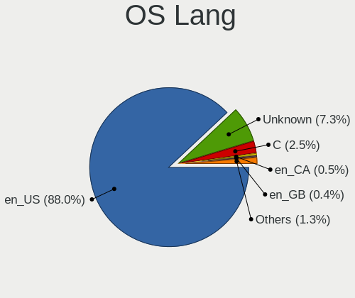

Linux in USA - Tested Hardware & Statistics (Desktops)
------------------------------------------------------

A project to collect tested hardware configurations for Linux in USA.

Anyone can contribute to this report by the [hw-probe](https://github.com/linuxhw/hw-probe) tool:

    sudo -E hw-probe -all -upload

Please contribute! Especially if your hardware is rare.

Contents
--------

* [ Test Cases ](#test-cases)

* [ System ](#system)
  - [ OS                       ](#os)
  - [ OS Family                ](#os-family)
  - [ Kernel                   ](#kernel)
  - [ Kernel Family            ](#kernel-family)
  - [ Kernel Major Ver.        ](#kernel-major-ver)
  - [ Arch                     ](#arch)
  - [ DE                       ](#de)
  - [ Display Server           ](#display-server)
  - [ Display Manager          ](#display-manager)
  - [ OS Lang                  ](#os-lang)
  - [ Boot Mode                ](#boot-mode)
  - [ Filesystem               ](#filesystem)
  - [ Part. scheme             ](#part-scheme)
  - [ Dual Boot with Linux/BSD ](#dual-boot-with-linuxbsd)
  - [ Dual Boot (Win)          ](#dual-boot-win)

* [ Board ](#board)
  - [ Vendor                   ](#vendor)
  - [ Model                    ](#model)
  - [ Model Family             ](#model-family)
  - [ MFG Year                 ](#mfg-year)
  - [ Form Factor              ](#form-factor)
  - [ Secure Boot              ](#secure-boot)
  - [ Coreboot                 ](#coreboot)
  - [ RAM Size                 ](#ram-size)
  - [ RAM Used                 ](#ram-used)
  - [ Total Drives             ](#total-drives)
  - [ Has CD-ROM               ](#has-cd-rom)
  - [ Has Ethernet             ](#has-ethernet)
  - [ Has WiFi                 ](#has-wifi)
  - [ Has Bluetooth            ](#has-bluetooth)

* [ Location ](#location)
  - [ Country                  ](#country)
  - [ City                     ](#city)

* [ Drives ](#drives)
  - [ Drive Vendor             ](#drive-vendor)
  - [ Drive Model              ](#drive-model)
  - [ HDD Vendor               ](#hdd-vendor)
  - [ SSD Vendor               ](#ssd-vendor)
  - [ Drive Kind               ](#drive-kind)
  - [ Drive Connector          ](#drive-connector)
  - [ Drive Size               ](#drive-size)
  - [ Space Total              ](#space-total)
  - [ Space Used               ](#space-used)
  - [ Malfunc. Drives          ](#malfunc-drives)
  - [ Malfunc. Drive Vendor    ](#malfunc-drive-vendor)
  - [ Malfunc. HDD Vendor      ](#malfunc-hdd-vendor)
  - [ Malfunc. Drive Kind      ](#malfunc-drive-kind)
  - [ Failed Drives            ](#failed-drives)
  - [ Failed Drive Vendor      ](#failed-drive-vendor)
  - [ Drive Status             ](#drive-status)

* [ Storage controller ](#storage-controller)
  - [ Storage Vendor           ](#storage-vendor)
  - [ Storage Model            ](#storage-model)
  - [ Storage Kind             ](#storage-kind)

* [ Processor ](#processor)
  - [ CPU Vendor               ](#cpu-vendor)
  - [ CPU Model                ](#cpu-model)
  - [ CPU Model Family         ](#cpu-model-family)
  - [ CPU Cores                ](#cpu-cores)
  - [ CPU Sockets              ](#cpu-sockets)
  - [ CPU Threads              ](#cpu-threads)
  - [ CPU Op-Modes             ](#cpu-op-modes)
  - [ CPU Microcode            ](#cpu-microcode)
  - [ CPU Microarch            ](#cpu-microarch)

* [ Graphics ](#graphics)
  - [ GPU Vendor               ](#gpu-vendor)
  - [ GPU Model                ](#gpu-model)
  - [ GPU Combo                ](#gpu-combo)
  - [ GPU Driver               ](#gpu-driver)
  - [ GPU Memory               ](#gpu-memory)

* [ Monitor ](#monitor)
  - [ Monitor Vendor           ](#monitor-vendor)
  - [ Monitor Model            ](#monitor-model)
  - [ Monitor Resolution       ](#monitor-resolution)
  - [ Monitor Diagonal         ](#monitor-diagonal)
  - [ Monitor Width            ](#monitor-width)
  - [ Aspect Ratio             ](#aspect-ratio)
  - [ Monitor Area             ](#monitor-area)
  - [ Pixel Density            ](#pixel-density)
  - [ Multiple Monitors        ](#multiple-monitors)

* [ Network ](#network)
  - [ Net Controller Vendor    ](#net-controller-vendor)
  - [ Net Controller Model     ](#net-controller-model)
  - [ Wireless Vendor          ](#wireless-vendor)
  - [ Wireless Model           ](#wireless-model)
  - [ Ethernet Vendor          ](#ethernet-vendor)
  - [ Ethernet Model           ](#ethernet-model)
  - [ Net Controller Kind      ](#net-controller-kind)
  - [ Used Controller          ](#used-controller)
  - [ NICs                     ](#nics)
  - [ IPv6                     ](#ipv6)

* [ Bluetooth ](#bluetooth)
  - [ Bluetooth Vendor         ](#bluetooth-vendor)
  - [ Bluetooth Model          ](#bluetooth-model)

* [ Sound ](#sound)
  - [ Sound Vendor             ](#sound-vendor)
  - [ Sound Model              ](#sound-model)

* [ Memory ](#memory)
  - [ Memory Vendor            ](#memory-vendor)
  - [ Memory Model             ](#memory-model)
  - [ Memory Kind              ](#memory-kind)
  - [ Memory Form Factor       ](#memory-form-factor)
  - [ Memory Size              ](#memory-size)
  - [ Memory Speed             ](#memory-speed)

* [ Printers & scanners ](#printers--scanners)
  - [ Printer Vendor           ](#printer-vendor)
  - [ Printer Model            ](#printer-model)
  - [ Scanner Vendor           ](#scanner-vendor)
  - [ Scanner Model            ](#scanner-model)

* [ Camera ](#camera)
  - [ Camera Vendor            ](#camera-vendor)
  - [ Camera Model             ](#camera-model)

* [ Security ](#security)
  - [ Fingerprint Vendor       ](#fingerprint-vendor)
  - [ Fingerprint Model        ](#fingerprint-model)
  - [ Chipcard Vendor          ](#chipcard-vendor)
  - [ Chipcard Model           ](#chipcard-model)

* [ Unsupported ](#unsupported)
  - [ Unsupported Devices      ](#unsupported-devices)
  - [ Unsupported Device Types ](#unsupported-device-types)

Test Cases
----------

Total: 17723

| Vendor        | Model                       | Probe                                                      | Date         |
|---------------|-----------------------------|------------------------------------------------------------|--------------|
| MSI           | MPG B560I GAMING EDGE WI... | [20eb2d93e2](https://linux-hardware.org/?probe=20eb2d93e2) | Jan 01, 2023 |
| ASUSTek       | TUF Gaming B550M-PLUS       | [2c31fd54e4](https://linux-hardware.org/?probe=2c31fd54e4) | Jan 01, 2023 |
| HP            | 806A                        | [72e5b78d96](https://linux-hardware.org/?probe=72e5b78d96) | Dec 31, 2022 |
| ASUSTek       | PRIME B550M-A               | [162ad451eb](https://linux-hardware.org/?probe=162ad451eb) | Dec 31, 2022 |
| ASUSTek       | TUF Gaming X570-PLUS        | [ea3b140a7f](https://linux-hardware.org/?probe=ea3b140a7f) | Dec 31, 2022 |
| Lenovo        | ThinkCentre M90 3692X01     | [702838caff](https://linux-hardware.org/?probe=702838caff) | Dec 31, 2022 |
| MSI           | B360M BAZOOKA               | [ad26afeb83](https://linux-hardware.org/?probe=ad26afeb83) | Dec 31, 2022 |
| Dell          | 0GWHMW A01                  | [59287847c9](https://linux-hardware.org/?probe=59287847c9) | Dec 31, 2022 |
| ASUSTek       | ROG STRIX X570-E GAMING     | [f16b55ea54](https://linux-hardware.org/?probe=f16b55ea54) | Dec 31, 2022 |
| Dell          | 0T10XW A00                  | [21638e1dfe](https://linux-hardware.org/?probe=21638e1dfe) | Dec 31, 2022 |
| MSI           | B250M BAZOOKA               | [5b204eade4](https://linux-hardware.org/?probe=5b204eade4) | Dec 31, 2022 |
| AZW           | U59                         | [39f0dfe71f](https://linux-hardware.org/?probe=39f0dfe71f) | Dec 31, 2022 |
| Dell          | 0KWVT8 A03                  | [ad32666c8c](https://linux-hardware.org/?probe=ad32666c8c) | Dec 31, 2022 |
| Gigabyte      | W480 VISION D               | [133d8a7f70](https://linux-hardware.org/?probe=133d8a7f70) | Dec 31, 2022 |
| AZW           | Green G2                    | [257948e699](https://linux-hardware.org/?probe=257948e699) | Dec 31, 2022 |
| ASRock        | X99 Extreme3                | [565f486b7f](https://linux-hardware.org/?probe=565f486b7f) | Dec 31, 2022 |
| ASRock        | X99 Extreme3                | [eaf8cc0ed5](https://linux-hardware.org/?probe=eaf8cc0ed5) | Dec 31, 2022 |
| Intel         | DB75EN AAG39650-400         | [086831bbca](https://linux-hardware.org/?probe=086831bbca) | Dec 31, 2022 |
| Dell          | 0D24M8 A00                  | [def123de2d](https://linux-hardware.org/?probe=def123de2d) | Dec 31, 2022 |
| MSI           | MPG Z490 GAMING PLUS        | [b4aecf5fa1](https://linux-hardware.org/?probe=b4aecf5fa1) | Dec 31, 2022 |
| Dell          | 0VNP2H A02                  | [5d3da04d45](https://linux-hardware.org/?probe=5d3da04d45) | Dec 31, 2022 |
| Lenovo        | Win8 Pro DPK TPG            | [9561e51689](https://linux-hardware.org/?probe=9561e51689) | Dec 31, 2022 |
| MAXSUN        | MS-TZZ A320M.2-VH           | [8f06578f10](https://linux-hardware.org/?probe=8f06578f10) | Dec 31, 2022 |
| Gigabyte      | GA-MA785GMT-UD2H            | [c4059f2954](https://linux-hardware.org/?probe=c4059f2954) | Dec 31, 2022 |
| ASRock        | X79 Extreme6                | [5ea31811b4](https://linux-hardware.org/?probe=5ea31811b4) | Dec 30, 2022 |
| Dell          | 0GDG8Y A00                  | [8c8e9d66e7](https://linux-hardware.org/?probe=8c8e9d66e7) | Dec 30, 2022 |
| Dell          | 0KWVT8 A03                  | [17fc3a4abc](https://linux-hardware.org/?probe=17fc3a4abc) | Dec 30, 2022 |
| ASUSTek       | PRIME B550M-A               | [83810bf0a9](https://linux-hardware.org/?probe=83810bf0a9) | Dec 30, 2022 |
| AZW           | Green G2                    | [33f1a5c1a9](https://linux-hardware.org/?probe=33f1a5c1a9) | Dec 30, 2022 |
| ASRock        | H270 Pro4                   | [669d1fd05e](https://linux-hardware.org/?probe=669d1fd05e) | Dec 30, 2022 |
| ASUSTek       | G10DK                       | [5a5172ad44](https://linux-hardware.org/?probe=5a5172ad44) | Dec 30, 2022 |
| MSI           | MPG Z490 GAMING EDGE WIF... | [056ae8185c](https://linux-hardware.org/?probe=056ae8185c) | Dec 30, 2022 |
| ASUSTek       | ROG STRIX X570-I GAMING     | [a634defd54](https://linux-hardware.org/?probe=a634defd54) | Dec 30, 2022 |
| ASRock        | H110 Pro BTC+               | [a7ccef79ad](https://linux-hardware.org/?probe=a7ccef79ad) | Dec 30, 2022 |
| ASUSTek       | Z87-PLUS                    | [85bfa942e6](https://linux-hardware.org/?probe=85bfa942e6) | Dec 30, 2022 |
| ASUSTek       | PRIME Z690M-PLUS D4         | [b1bfc3d1ff](https://linux-hardware.org/?probe=b1bfc3d1ff) | Dec 30, 2022 |
| ASUSTek       | PRIME B550M-A               | [da9b785d2a](https://linux-hardware.org/?probe=da9b785d2a) | Dec 30, 2022 |
| Intel         | X99                         | [ad6b288b38](https://linux-hardware.org/?probe=ad6b288b38) | Dec 30, 2022 |
| ASUSTek       | Z87-PRO                     | [eafab9edba](https://linux-hardware.org/?probe=eafab9edba) | Dec 30, 2022 |
| ASUSTek       | TUF Gaming X570-PLUS        | [da829c6683](https://linux-hardware.org/?probe=da829c6683) | Dec 30, 2022 |
| Acer          | Veriton N4680G              | [0053ddb3c9](https://linux-hardware.org/?probe=0053ddb3c9) | Dec 30, 2022 |
| ASUSTek       | M5A88-M                     | [dc7201711c](https://linux-hardware.org/?probe=dc7201711c) | Dec 30, 2022 |
| MSI           | MAG B660M MORTAR WIFI DD... | [d689576b2d](https://linux-hardware.org/?probe=d689576b2d) | Dec 29, 2022 |
| MSI           | MAG B650 TOMAHAWK WIFI      | [bdc5158ffb](https://linux-hardware.org/?probe=bdc5158ffb) | Dec 29, 2022 |
| ASUSTek       | G10DK                       | [26e2460b8d](https://linux-hardware.org/?probe=26e2460b8d) | Dec 29, 2022 |
| BESSTAR Te... | HM80                        | [9af0f05e7e](https://linux-hardware.org/?probe=9af0f05e7e) | Dec 29, 2022 |
| MSI           | B550M PRO-VDH WIFI          | [17f72460f6](https://linux-hardware.org/?probe=17f72460f6) | Dec 29, 2022 |
| ASUSTek       | STRIKER II EXTREME          | [3258ffa0c1](https://linux-hardware.org/?probe=3258ffa0c1) | Dec 29, 2022 |
| MSI           | B550M PRO                   | [61b36bfa2e](https://linux-hardware.org/?probe=61b36bfa2e) | Dec 29, 2022 |
| Dell          | 0KRC95 A02                  | [4cf9d40c0d](https://linux-hardware.org/?probe=4cf9d40c0d) | Dec 29, 2022 |
| Dell          | 0KRC95 A02                  | [7e53808767](https://linux-hardware.org/?probe=7e53808767) | Dec 29, 2022 |
| HP            | 8399                        | [204c8c0a3f](https://linux-hardware.org/?probe=204c8c0a3f) | Dec 29, 2022 |
| HP            | 158A                        | [bfd338cf36](https://linux-hardware.org/?probe=bfd338cf36) | Dec 29, 2022 |
| Dell          | 0KWVT8 A03                  | [7ce6d4b3e3](https://linux-hardware.org/?probe=7ce6d4b3e3) | Dec 29, 2022 |
| Dell          | 0KWVT8 A03                  | [f828f74e07](https://linux-hardware.org/?probe=f828f74e07) | Dec 29, 2022 |
| MSI           | X370 GAMING M7 ACK          | [60fe0d0b31](https://linux-hardware.org/?probe=60fe0d0b31) | Dec 29, 2022 |
| ASUSTek       | PRIME B550M-A               | [e6ac6cac6c](https://linux-hardware.org/?probe=e6ac6cac6c) | Dec 29, 2022 |
| Acer          | Aspire XC-603G              | [08dc8ac6b7](https://linux-hardware.org/?probe=08dc8ac6b7) | Dec 29, 2022 |
| HP            | 0B4Ch D                     | [ed3b8e2e69](https://linux-hardware.org/?probe=ed3b8e2e69) | Dec 29, 2022 |
| ASRock        | X570 Taichi                 | [c1e5e82fbb](https://linux-hardware.org/?probe=c1e5e82fbb) | Dec 29, 2022 |
| ASUSTek       | ROG CROSSHAIR VII HERO      | [4ca2070d42](https://linux-hardware.org/?probe=4ca2070d42) | Dec 29, 2022 |
| Pegatron      | 2AC2                        | [adc3978bcc](https://linux-hardware.org/?probe=adc3978bcc) | Dec 29, 2022 |
| ASUSTek       | ROG STRIX B450-F GAMING     | [2d47973101](https://linux-hardware.org/?probe=2d47973101) | Dec 29, 2022 |
| MSI           | PRO B660M-A DDR4            | [dbc37ff826](https://linux-hardware.org/?probe=dbc37ff826) | Dec 29, 2022 |
| Dell          | 0NNGP2 A00                  | [12638171d9](https://linux-hardware.org/?probe=12638171d9) | Dec 28, 2022 |
| Dell          | 0JP3NX A01                  | [3b094471e0](https://linux-hardware.org/?probe=3b094471e0) | Dec 28, 2022 |
| HP            | 805D                        | [cf88e571df](https://linux-hardware.org/?probe=cf88e571df) | Dec 28, 2022 |
| Intel         | X99                         | [eb6babb799](https://linux-hardware.org/?probe=eb6babb799) | Dec 28, 2022 |
| ASUSTek       | PRIME B550M-A               | [1219225d5d](https://linux-hardware.org/?probe=1219225d5d) | Dec 28, 2022 |
| ASUSTek       | G10DK                       | [1ffb248d93](https://linux-hardware.org/?probe=1ffb248d93) | Dec 28, 2022 |
| Gigabyte      | Z370XP SLI-CF               | [be56999d2a](https://linux-hardware.org/?probe=be56999d2a) | Dec 28, 2022 |
| Dell          | 03KWTV A02                  | [82612358ac](https://linux-hardware.org/?probe=82612358ac) | Dec 28, 2022 |
| HP            | 0A54h                       | [7f1e1152d9](https://linux-hardware.org/?probe=7f1e1152d9) | Dec 28, 2022 |
| Dell          | 0TTDMJ A00                  | [198e723dc2](https://linux-hardware.org/?probe=198e723dc2) | Dec 28, 2022 |
| MSI           | Z270 PC MATE                | [08186ccafe](https://linux-hardware.org/?probe=08186ccafe) | Dec 28, 2022 |
| Biostar       | TZ68K+                      | [7bb1d349cc](https://linux-hardware.org/?probe=7bb1d349cc) | Dec 28, 2022 |
| Biostar       | TZ68K+                      | [1d200fa462](https://linux-hardware.org/?probe=1d200fa462) | Dec 28, 2022 |
| ASRock        | H270 Pro4                   | [18c67453d3](https://linux-hardware.org/?probe=18c67453d3) | Dec 28, 2022 |
| ASRock        | H270 Pro4                   | [411b246a3f](https://linux-hardware.org/?probe=411b246a3f) | Dec 28, 2022 |
| ASUSTek       | ROG STRIX X670E-I GAMING... | [338e7b0029](https://linux-hardware.org/?probe=338e7b0029) | Dec 28, 2022 |
| Dell          | 00CV7F A00                  | [49a36278c4](https://linux-hardware.org/?probe=49a36278c4) | Dec 28, 2022 |
| HP            | 2AF7                        | [9663a281c1](https://linux-hardware.org/?probe=9663a281c1) | Dec 28, 2022 |
| ASRock        | X470 Gaming-ITX/ac          | [c4d1d971d1](https://linux-hardware.org/?probe=c4d1d971d1) | Dec 28, 2022 |
| MSI           | MEG X570 UNIFY              | [2c2bf7f512](https://linux-hardware.org/?probe=2c2bf7f512) | Dec 28, 2022 |
| MSI           | MEG X570 UNIFY              | [19f962298b](https://linux-hardware.org/?probe=19f962298b) | Dec 28, 2022 |
| Lenovo        | 0B98401 WIN                 | [0f71bbaf67](https://linux-hardware.org/?probe=0f71bbaf67) | Dec 28, 2022 |
| Gigabyte      | B650I AORUS ULTRA           | [3c25f43c23](https://linux-hardware.org/?probe=3c25f43c23) | Dec 28, 2022 |
| MSI           | MAG X570S TOMAHAWK MAX W... | [1522e4a536](https://linux-hardware.org/?probe=1522e4a536) | Dec 28, 2022 |
| Acer          | Aspire XC-603G              | [e8adbb63a4](https://linux-hardware.org/?probe=e8adbb63a4) | Dec 28, 2022 |
| ASRock        | B450M Pro4                  | [fcaf938a12](https://linux-hardware.org/?probe=fcaf938a12) | Dec 28, 2022 |
| ASUSTek       | TUF Gaming X570-PLUS        | [3ba397a9f4](https://linux-hardware.org/?probe=3ba397a9f4) | Dec 27, 2022 |
| Gigabyte      | X570 AORUS ELITE WIFI       | [49ca01435b](https://linux-hardware.org/?probe=49ca01435b) | Dec 27, 2022 |
| HP            | 304Bh                       | [d85d0d4017](https://linux-hardware.org/?probe=d85d0d4017) | Dec 27, 2022 |
| MSI           | Z97 PC Mate                 | [defccc0ef1](https://linux-hardware.org/?probe=defccc0ef1) | Dec 27, 2022 |
| Dell          | 0KWVT8 A03                  | [9d2542cf36](https://linux-hardware.org/?probe=9d2542cf36) | Dec 27, 2022 |
| Dell          | 0KWVT8 A03                  | [f2998cdede](https://linux-hardware.org/?probe=f2998cdede) | Dec 27, 2022 |
| Acer          | Aspire TC-865 V:1.1         | [0c8add55fe](https://linux-hardware.org/?probe=0c8add55fe) | Dec 27, 2022 |
| ASUSTek       | Z87-K                       | [9c65749eb1](https://linux-hardware.org/?probe=9c65749eb1) | Dec 27, 2022 |
| Gigabyte      | 990FXA-UD3 R5               | [734c3742b1](https://linux-hardware.org/?probe=734c3742b1) | Dec 27, 2022 |
| MSI           | B450M PRO-M2                | [89d9265559](https://linux-hardware.org/?probe=89d9265559) | Dec 27, 2022 |
| ASUSTek       | ROG STRIX B550-F GAMING     | [41b062ea94](https://linux-hardware.org/?probe=41b062ea94) | Dec 27, 2022 |
| Gigabyte      | 990FXA-UD3 R5               | [bb6dddc780](https://linux-hardware.org/?probe=bb6dddc780) | Dec 27, 2022 |
| HP            | 304Bh                       | [02c61d35f2](https://linux-hardware.org/?probe=02c61d35f2) | Dec 27, 2022 |
| ASUSTek       | TUF Gaming X570-PLUS        | [6db0562083](https://linux-hardware.org/?probe=6db0562083) | Dec 27, 2022 |
| MSI           | B450 GAMING PLUS MAX        | [bfec1ebd66](https://linux-hardware.org/?probe=bfec1ebd66) | Dec 27, 2022 |
| HP            | 2B29                        | [b83d4fafa0](https://linux-hardware.org/?probe=b83d4fafa0) | Dec 26, 2022 |
| Dell          | 02YRK5 A02                  | [56dc5ff1b9](https://linux-hardware.org/?probe=56dc5ff1b9) | Dec 26, 2022 |
| Dell          | 05DN3X A00                  | [f8fe045913](https://linux-hardware.org/?probe=f8fe045913) | Dec 26, 2022 |
| MSI           | MAG B560 TORPEDO            | [35bbf3abb3](https://linux-hardware.org/?probe=35bbf3abb3) | Dec 26, 2022 |
| ASUSTek       | G10DK                       | [30007c6ff0](https://linux-hardware.org/?probe=30007c6ff0) | Dec 26, 2022 |
| Unknown       | HX90                        | [d4265ad971](https://linux-hardware.org/?probe=d4265ad971) | Dec 26, 2022 |
| ASUSTek       | PRIME B550M-A               | [8ca73d6b87](https://linux-hardware.org/?probe=8ca73d6b87) | Dec 26, 2022 |
| Gigabyte      | Z590 AORUS ULTRA            | [4ab759533b](https://linux-hardware.org/?probe=4ab759533b) | Dec 25, 2022 |
| Gateway       | G33M05G1 MP                 | [8a495d2b75](https://linux-hardware.org/?probe=8a495d2b75) | Dec 25, 2022 |
| Lenovo        | 102F SBB0J05441 WIN 3305... | [fee0a76158](https://linux-hardware.org/?probe=fee0a76158) | Dec 25, 2022 |
| MSI           | MPG B550 GAMING PLUS        | [4c97c87b61](https://linux-hardware.org/?probe=4c97c87b61) | Dec 25, 2022 |
| ECS           | H81H3-WM                    | [6791862ef9](https://linux-hardware.org/?probe=6791862ef9) | Dec 25, 2022 |
| ASUSTek       | M3N-HT DELUXE               | [cbbfeef21b](https://linux-hardware.org/?probe=cbbfeef21b) | Dec 25, 2022 |
| ASUSTek       | M3N-HT DELUXE               | [30c464408a](https://linux-hardware.org/?probe=30c464408a) | Dec 25, 2022 |
| Biostar       | AM1MHP                      | [a4c61d5381](https://linux-hardware.org/?probe=a4c61d5381) | Dec 25, 2022 |
| ASUSTek       | M4A785-M                    | [f36c085389](https://linux-hardware.org/?probe=f36c085389) | Dec 25, 2022 |
| ASUSTek       | M5A97 PLUS                  | [8a1cb3f5e7](https://linux-hardware.org/?probe=8a1cb3f5e7) | Dec 25, 2022 |
| MSI           | 970A-G46                    | [4b2435b250](https://linux-hardware.org/?probe=4b2435b250) | Dec 25, 2022 |
| ASUSTek       | G10DK                       | [13379a69a6](https://linux-hardware.org/?probe=13379a69a6) | Dec 25, 2022 |
| HP            | 8265                        | [30ff2fbdaa](https://linux-hardware.org/?probe=30ff2fbdaa) | Dec 25, 2022 |
| HP            | 2AF7                        | [287696b4fc](https://linux-hardware.org/?probe=287696b4fc) | Dec 25, 2022 |
| ASUSTek       | PRIME B550M-A               | [8bfc8d2560](https://linux-hardware.org/?probe=8bfc8d2560) | Dec 25, 2022 |
| Lenovo        | SHARKBAY 0B98401 WIN        | [0900400806](https://linux-hardware.org/?probe=0900400806) | Dec 25, 2022 |
| Gigabyte      | GA-770T-USB3                | [08d1b04754](https://linux-hardware.org/?probe=08d1b04754) | Dec 25, 2022 |
| Dell          | 040DDP A01                  | [2fc87b6525](https://linux-hardware.org/?probe=2fc87b6525) | Dec 25, 2022 |
| Gigabyte      | Z690 AORUS ULTRA            | [46705eb79f](https://linux-hardware.org/?probe=46705eb79f) | Dec 25, 2022 |
| ASUSTek       | TUF Gaming X570-PLUS        | [571019b4b2](https://linux-hardware.org/?probe=571019b4b2) | Dec 25, 2022 |
| Dell          | 08NPPY A00                  | [5572500fdb](https://linux-hardware.org/?probe=5572500fdb) | Dec 25, 2022 |
| ASRock        | 970 Extreme4                | [2655b3c6b6](https://linux-hardware.org/?probe=2655b3c6b6) | Dec 24, 2022 |
| HP            | 8265                        | [188eaf4f00](https://linux-hardware.org/?probe=188eaf4f00) | Dec 24, 2022 |
| Dell          | 0HY9JP A02                  | [c195f58592](https://linux-hardware.org/?probe=c195f58592) | Dec 24, 2022 |
| Gigabyte      | 970-GAMING                  | [c49123106a](https://linux-hardware.org/?probe=c49123106a) | Dec 24, 2022 |
| Gigabyte      | AX370-Gaming-CF             | [4770daed30](https://linux-hardware.org/?probe=4770daed30) | Dec 24, 2022 |
| Supermicro    | X10DSC+                     | [cf559d5e84](https://linux-hardware.org/?probe=cf559d5e84) | Dec 24, 2022 |
| MSI           | TRX40 PRO 10G               | [f83cf989ef](https://linux-hardware.org/?probe=f83cf989ef) | Dec 24, 2022 |
| MSI           | Z270M MORTAR                | [70564a2846](https://linux-hardware.org/?probe=70564a2846) | Dec 24, 2022 |
| Pegatron      | 2AEE                        | [f04af232be](https://linux-hardware.org/?probe=f04af232be) | Dec 24, 2022 |
| MSI           | MAG B650 TOMAHAWK WIFI      | [bf8f02ac85](https://linux-hardware.org/?probe=bf8f02ac85) | Dec 24, 2022 |
| ASUSTek       | Maximus VI EXTREME          | [f1dc299d0c](https://linux-hardware.org/?probe=f1dc299d0c) | Dec 24, 2022 |
| ASUSTek       | PRIME B550M-A               | [52edc0816c](https://linux-hardware.org/?probe=52edc0816c) | Dec 24, 2022 |
| ASRock        | B550 Phantom Gaming 4/ac    | [2d3121d44e](https://linux-hardware.org/?probe=2d3121d44e) | Dec 24, 2022 |
| Gigabyte      | Z690 AORUS ULTRA            | [926850a516](https://linux-hardware.org/?probe=926850a516) | Dec 24, 2022 |
| HP            | 1589                        | [4769414712](https://linux-hardware.org/?probe=4769414712) | Dec 24, 2022 |
| Gigabyte      | A520M S2H                   | [eb7bb6fb36](https://linux-hardware.org/?probe=eb7bb6fb36) | Dec 24, 2022 |
| Dell          | 08HPGT A01                  | [0411078911](https://linux-hardware.org/?probe=0411078911) | Dec 24, 2022 |
| HP            | 2AF7                        | [7b79dd8352](https://linux-hardware.org/?probe=7b79dd8352) | Dec 23, 2022 |
| Dell          | 0NW6H5 A00                  | [6c7eeae2e3](https://linux-hardware.org/?probe=6c7eeae2e3) | Dec 23, 2022 |
| HP            | 2AF7                        | [5ef9ce3357](https://linux-hardware.org/?probe=5ef9ce3357) | Dec 23, 2022 |
| MSI           | Z97A GAMING 7               | [31cb5ca381](https://linux-hardware.org/?probe=31cb5ca381) | Dec 23, 2022 |
| MSI           | B550M PRO                   | [57f4a4985a](https://linux-hardware.org/?probe=57f4a4985a) | Dec 23, 2022 |
| Lenovo        | 3741 SDK0T76461 WIN 3422... | [70e125f0d0](https://linux-hardware.org/?probe=70e125f0d0) | Dec 23, 2022 |
| Dell          | 07N90W A00                  | [4fef96ef97](https://linux-hardware.org/?probe=4fef96ef97) | Dec 23, 2022 |
| MSI           | A78M-E35                    | [8eeb54e414](https://linux-hardware.org/?probe=8eeb54e414) | Dec 23, 2022 |
| Dell          | 05GD68 A00                  | [a868fc6557](https://linux-hardware.org/?probe=a868fc6557) | Dec 23, 2022 |
| Lenovo        | SHARKBAY 0B98401 PRO        | [08d715eaea](https://linux-hardware.org/?probe=08d715eaea) | Dec 22, 2022 |
| MSI           | B550M PRO-VDH WIFI          | [d5b04a241c](https://linux-hardware.org/?probe=d5b04a241c) | Dec 22, 2022 |
| Gigabyte      | AX370-Gaming K5-CF          | [4d83f18afd](https://linux-hardware.org/?probe=4d83f18afd) | Dec 22, 2022 |
| ASUSTek       | PRIME B550M-A               | [83436ff428](https://linux-hardware.org/?probe=83436ff428) | Dec 22, 2022 |
| HP            | 2AF8                        | [54bf4b18ba](https://linux-hardware.org/?probe=54bf4b18ba) | Dec 22, 2022 |
| ASRock        | FM2A75 Pro4                 | [88062c13c8](https://linux-hardware.org/?probe=88062c13c8) | Dec 22, 2022 |
| ASUSTek       | Z87-K                       | [41fcdb5532](https://linux-hardware.org/?probe=41fcdb5532) | Dec 22, 2022 |
| HP            | 8265                        | [9050546a5b](https://linux-hardware.org/?probe=9050546a5b) | Dec 22, 2022 |
| ASUSTek       | PRIME B550M-A               | [90f9fb28f8](https://linux-hardware.org/?probe=90f9fb28f8) | Dec 22, 2022 |
| Dell          | 0RY007                      | [0cdfef97e7](https://linux-hardware.org/?probe=0cdfef97e7) | Dec 21, 2022 |
| Dell          | 05GD68 A00                  | [4589f84dfd](https://linux-hardware.org/?probe=4589f84dfd) | Dec 21, 2022 |
| Gigabyte      | X470 AORUS GAMING 5 WIFI... | [003ac98d7f](https://linux-hardware.org/?probe=003ac98d7f) | Dec 21, 2022 |
| eMachines     | ET1331                      | [0f9b49ac6e](https://linux-hardware.org/?probe=0f9b49ac6e) | Dec 21, 2022 |
| ASUSTek       | P8Z77-V PRO                 | [2ad8b45619](https://linux-hardware.org/?probe=2ad8b45619) | Dec 21, 2022 |
| ASUSTek       | P8Z77-V PRO                 | [0e53e0be48](https://linux-hardware.org/?probe=0e53e0be48) | Dec 21, 2022 |
| ASRock        | B450 Pro4 R2.0              | [90aaabb4b2](https://linux-hardware.org/?probe=90aaabb4b2) | Dec 21, 2022 |
| Dell          | 0K071D A01                  | [49612bc7d4](https://linux-hardware.org/?probe=49612bc7d4) | Dec 21, 2022 |
| Dell          | 0K071D A01                  | [94204a7d2c](https://linux-hardware.org/?probe=94204a7d2c) | Dec 21, 2022 |
| HP            | 2B47                        | [8980bff4e8](https://linux-hardware.org/?probe=8980bff4e8) | Dec 21, 2022 |
| Dell          | 0HY9JP A01                  | [618484d726](https://linux-hardware.org/?probe=618484d726) | Dec 21, 2022 |
| ASUSTek       | TUF Gaming Z590-PLUS WIF... | [8428e68855](https://linux-hardware.org/?probe=8428e68855) | Dec 21, 2022 |
| ASUSTek       | PRIME B550M-A               | [3f3d7ab961](https://linux-hardware.org/?probe=3f3d7ab961) | Dec 21, 2022 |
| Dell          | 02GDWG A00                  | [d20f5b0751](https://linux-hardware.org/?probe=d20f5b0751) | Dec 21, 2022 |
| Lenovo        | Win8 Pro DPK TPG            | [7ce8a10de4](https://linux-hardware.org/?probe=7ce8a10de4) | Dec 21, 2022 |
| Lenovo        | Win8 Pro DPK TPG            | [a4c1397ad3](https://linux-hardware.org/?probe=a4c1397ad3) | Dec 21, 2022 |
| ASUSTek       | M5A99FX PRO R2.0            | [a7602bb40c](https://linux-hardware.org/?probe=a7602bb40c) | Dec 21, 2022 |
| ASRock        | AB350 Pro4                  | [c7005e1e89](https://linux-hardware.org/?probe=c7005e1e89) | Dec 21, 2022 |
| Dell          | 02YRK5 A02                  | [f5f6093483](https://linux-hardware.org/?probe=f5f6093483) | Dec 21, 2022 |
| Dell          | 0HY9JP A01                  | [997bfbe676](https://linux-hardware.org/?probe=997bfbe676) | Dec 21, 2022 |
| ASUSTek       | ROG ZENITH II EXTREME       | [19c80082a1](https://linux-hardware.org/?probe=19c80082a1) | Dec 20, 2022 |
| HP            | 212A                        | [32c96df530](https://linux-hardware.org/?probe=32c96df530) | Dec 20, 2022 |
| ASUSTek       | P4S533VX                    | [b6ffda4f06](https://linux-hardware.org/?probe=b6ffda4f06) | Dec 20, 2022 |
| Dell          | 0T7495                      | [c729382738](https://linux-hardware.org/?probe=c729382738) | Dec 20, 2022 |
| ASRock        | X58 Extreme                 | [deac73631d](https://linux-hardware.org/?probe=deac73631d) | Dec 20, 2022 |
| ASRock        | X58 Extreme                 | [c7e538f7b3](https://linux-hardware.org/?probe=c7e538f7b3) | Dec 20, 2022 |
| Dell          | 0MGK50 A04                  | [931b01be38](https://linux-hardware.org/?probe=931b01be38) | Dec 20, 2022 |
| ASRock        | Z790 Pro RS WiFi            | [d54c198ec8](https://linux-hardware.org/?probe=d54c198ec8) | Dec 20, 2022 |
| Dell          | 0M017G A00                  | [6d65d5022d](https://linux-hardware.org/?probe=6d65d5022d) | Dec 20, 2022 |
| Alienware     | 07JNH0 A02                  | [558828391f](https://linux-hardware.org/?probe=558828391f) | Dec 20, 2022 |
| HP            | 806A                        | [2bd948ac57](https://linux-hardware.org/?probe=2bd948ac57) | Dec 20, 2022 |
| MSI           | X470 GAMING PLUS MAX        | [e2942bceb2](https://linux-hardware.org/?probe=e2942bceb2) | Dec 20, 2022 |
| ASUSTek       | PRIME B550M-A               | [487d7751d8](https://linux-hardware.org/?probe=487d7751d8) | Dec 20, 2022 |
| Lenovo        | ThinkCentre M91p 7033H45    | [c1ae836095](https://linux-hardware.org/?probe=c1ae836095) | Dec 20, 2022 |
| ASUSTek       | M4A89GTD-PRO/USB3           | [a92a6ed3bb](https://linux-hardware.org/?probe=a92a6ed3bb) | Dec 20, 2022 |
| ASUSTek       | ROG STRIX B450-F GAMING     | [8862992776](https://linux-hardware.org/?probe=8862992776) | Dec 20, 2022 |
| ASUSTek       | ROG STRIX Z370-E GAMING     | [b33ef3c622](https://linux-hardware.org/?probe=b33ef3c622) | Dec 20, 2022 |
| HP            | 83E9                        | [02e854bd7c](https://linux-hardware.org/?probe=02e854bd7c) | Dec 20, 2022 |
| ASUSTek       | TUF Gaming B660M-PLUS WI... | [60dbf09ee4](https://linux-hardware.org/?probe=60dbf09ee4) | Dec 20, 2022 |
| ASRock        | B450 Steel Legend           | [3ac7c51787](https://linux-hardware.org/?probe=3ac7c51787) | Dec 20, 2022 |
| Lenovo        | 3000 8702z                  | [68bc77cd5f](https://linux-hardware.org/?probe=68bc77cd5f) | Dec 19, 2022 |
| ASUSTek       | Maximus VI EXTREME          | [e3aee1c90e](https://linux-hardware.org/?probe=e3aee1c90e) | Dec 19, 2022 |
| ASUSTek       | ROG STRIX B550-I GAMING     | [03dfcb8079](https://linux-hardware.org/?probe=03dfcb8079) | Dec 19, 2022 |
| ASUSTek       | ROG STRIX B550-I GAMING     | [1f6885ef2f](https://linux-hardware.org/?probe=1f6885ef2f) | Dec 19, 2022 |
| MSI           | MAG B550 TOMAHAWK           | [353cbeb5c8](https://linux-hardware.org/?probe=353cbeb5c8) | Dec 19, 2022 |
| MSI           | B350 PC MATE                | [9bdee62034](https://linux-hardware.org/?probe=9bdee62034) | Dec 19, 2022 |
| Gigabyte      | B85M-D3V-A                  | [6a964b9d6b](https://linux-hardware.org/?probe=6a964b9d6b) | Dec 19, 2022 |
| ASUSTek       | Z87-A                       | [17c2f5c3b2](https://linux-hardware.org/?probe=17c2f5c3b2) | Dec 19, 2022 |
| HP            | 2AA7 H                      | [4da43e6303](https://linux-hardware.org/?probe=4da43e6303) | Dec 19, 2022 |
| HP            | 2AA7 H                      | [9d33375e52](https://linux-hardware.org/?probe=9d33375e52) | Dec 19, 2022 |
| ASUSTek       | PRIME H310M-A R2.0          | [08f3a88ab3](https://linux-hardware.org/?probe=08f3a88ab3) | Dec 19, 2022 |
| Apple         | Mac-F221BEC8                | [493ddb6998](https://linux-hardware.org/?probe=493ddb6998) | Dec 19, 2022 |
| Intel         | DH61BE AAG14062-206         | [88125550fb](https://linux-hardware.org/?probe=88125550fb) | Dec 19, 2022 |
| HP            | 83EF                        | [755cb8dac5](https://linux-hardware.org/?probe=755cb8dac5) | Dec 19, 2022 |
| ASUSTek       | ROG STRIX B650-A GAMING ... | [9fb0357e3e](https://linux-hardware.org/?probe=9fb0357e3e) | Dec 19, 2022 |
| IceWhale T... | ZimaBoard 216 ZMB           | [647bf0e2a7](https://linux-hardware.org/?probe=647bf0e2a7) | Dec 19, 2022 |
| Dell          | 0KRC95 A02                  | [e7bb083869](https://linux-hardware.org/?probe=e7bb083869) | Dec 18, 2022 |
| ASUSTek       | ProArt Z690-CREATOR WIFI    | [bdea23d60e](https://linux-hardware.org/?probe=bdea23d60e) | Dec 18, 2022 |
| MSI           | X470 GAMING PLUS MAX        | [41da62e6ca](https://linux-hardware.org/?probe=41da62e6ca) | Dec 18, 2022 |
| Dell          | 0Y2MRG A00                  | [20b69069fa](https://linux-hardware.org/?probe=20b69069fa) | Dec 18, 2022 |
| HP            | 8433 11                     | [4368b19d60](https://linux-hardware.org/?probe=4368b19d60) | Dec 18, 2022 |
| HP            | 8054                        | [a43a5ed0ec](https://linux-hardware.org/?probe=a43a5ed0ec) | Dec 18, 2022 |
| ASUSTek       | PRIME Z270-A                | [43da35f265](https://linux-hardware.org/?probe=43da35f265) | Dec 18, 2022 |
| MSI           | H310M PRO-VDH PLUS          | [694e433518](https://linux-hardware.org/?probe=694e433518) | Dec 18, 2022 |
| ASUSTek       | PRIME Z270-A                | [8044fca8f3](https://linux-hardware.org/?probe=8044fca8f3) | Dec 18, 2022 |
| MSI           | H310M PRO-VDH PLUS          | [801a4e21c6](https://linux-hardware.org/?probe=801a4e21c6) | Dec 18, 2022 |
| Dell          | 088DT1 A01                  | [911e6f6d33](https://linux-hardware.org/?probe=911e6f6d33) | Dec 18, 2022 |
| Dell          | 018D1Y A00                  | [b43ca20e72](https://linux-hardware.org/?probe=b43ca20e72) | Dec 18, 2022 |
| MSI           | B550-A PRO                  | [53c582a7f6](https://linux-hardware.org/?probe=53c582a7f6) | Dec 18, 2022 |
| Dell          | 0RY007                      | [3791fa08dd](https://linux-hardware.org/?probe=3791fa08dd) | Dec 18, 2022 |
| MSI           | A78M-E35                    | [e67bafe6b9](https://linux-hardware.org/?probe=e67bafe6b9) | Dec 18, 2022 |
| Supermicro    | X9SCL/X9SCM                 | [ff98a90e45](https://linux-hardware.org/?probe=ff98a90e45) | Dec 18, 2022 |
| ASUSTek       | PRIME H370M-PLUS            | [784f59e142](https://linux-hardware.org/?probe=784f59e142) | Dec 18, 2022 |
| Gigabyte      | B550 VISION D-P             | [163b883ce2](https://linux-hardware.org/?probe=163b883ce2) | Dec 17, 2022 |
| ASUSTek       | ProArt Z690-CREATOR WIFI    | [a69cb4caca](https://linux-hardware.org/?probe=a69cb4caca) | Dec 17, 2022 |
| AZW           | Green G2                    | [a0a0c95e0b](https://linux-hardware.org/?probe=a0a0c95e0b) | Dec 17, 2022 |
| ASUSTek       | PRIME Z590-P WIFI           | [34ac0b3211](https://linux-hardware.org/?probe=34ac0b3211) | Dec 17, 2022 |
| ASUSTek       | P8Z77-V LK                  | [bda16426f5](https://linux-hardware.org/?probe=bda16426f5) | Dec 17, 2022 |
| Dell          | 0CRH6C A02                  | [4072754835](https://linux-hardware.org/?probe=4072754835) | Dec 17, 2022 |
| Gigabyte      | X399 AORUS PRO-CF           | [71ebf721cc](https://linux-hardware.org/?probe=71ebf721cc) | Dec 17, 2022 |
| HP            | 8055                        | [6c7fa83dc9](https://linux-hardware.org/?probe=6c7fa83dc9) | Dec 17, 2022 |
| ASUSTek       | PRIME Q270M-C               | [7dca31fdef](https://linux-hardware.org/?probe=7dca31fdef) | Dec 17, 2022 |
| Dell          | 0MTFWP A00                  | [b701f65ffc](https://linux-hardware.org/?probe=b701f65ffc) | Dec 17, 2022 |
| MSI           | X370 GAMING M7 ACK          | [71dabd9e44](https://linux-hardware.org/?probe=71dabd9e44) | Dec 17, 2022 |
| Gigabyte      | X570 AORUS ELITE WIFI       | [6dddb93518](https://linux-hardware.org/?probe=6dddb93518) | Dec 17, 2022 |
| ASRock        | B365M Pro4                  | [3e9ee47a4a](https://linux-hardware.org/?probe=3e9ee47a4a) | Dec 17, 2022 |
| HP            | 83E9                        | [cdf4ff19a6](https://linux-hardware.org/?probe=cdf4ff19a6) | Dec 17, 2022 |
| HP            | 83EE                        | [a008cde5ae](https://linux-hardware.org/?probe=a008cde5ae) | Dec 17, 2022 |
| Dell          | 02GDWG A00                  | [d7e869aded](https://linux-hardware.org/?probe=d7e869aded) | Dec 17, 2022 |
| ASUSTek       | TUF Gaming X570-PLUS        | [823a0ca3c4](https://linux-hardware.org/?probe=823a0ca3c4) | Dec 17, 2022 |
| ASUSTek       | Z170-DELUXE                 | [915c2dd055](https://linux-hardware.org/?probe=915c2dd055) | Dec 17, 2022 |
| ASUSTek       | M5A88-M                     | [3bc811ef2a](https://linux-hardware.org/?probe=3bc811ef2a) | Dec 17, 2022 |
| Gigabyte      | X670 AORUS ELITE AX         | [9b51850f9d](https://linux-hardware.org/?probe=9b51850f9d) | Dec 17, 2022 |
| MSI           | X370 GAMING M7 ACK          | [3b245437e5](https://linux-hardware.org/?probe=3b245437e5) | Dec 17, 2022 |
| Dell          | 02GDWG A00                  | [f12e6b75b5](https://linux-hardware.org/?probe=f12e6b75b5) | Dec 16, 2022 |
| ASUSTek       | SABERTOOTH X58              | [b31e9dfa64](https://linux-hardware.org/?probe=b31e9dfa64) | Dec 16, 2022 |
| Dell          | 0V8F20 A01                  | [d9e3649f12](https://linux-hardware.org/?probe=d9e3649f12) | Dec 16, 2022 |
| MSI           | MPG X570 GAMING EDGE WIF... | [d8774d83a7](https://linux-hardware.org/?probe=d8774d83a7) | Dec 16, 2022 |
| HP            | 2ABD A01                    | [a4858805f0](https://linux-hardware.org/?probe=a4858805f0) | Dec 16, 2022 |
| HP            | 82F2 A01                    | [859d719a2a](https://linux-hardware.org/?probe=859d719a2a) | Dec 16, 2022 |
| ASRock        | B360M IB-R1                 | [71d1752363](https://linux-hardware.org/?probe=71d1752363) | Dec 16, 2022 |
| Gigabyte      | B85-HD3                     | [d314ce4539](https://linux-hardware.org/?probe=d314ce4539) | Dec 16, 2022 |
| Gigabyte      | Z270P-D3-CF                 | [05519b281d](https://linux-hardware.org/?probe=05519b281d) | Dec 16, 2022 |
| Gigabyte      | B85-HD3                     | [e87a16ee1f](https://linux-hardware.org/?probe=e87a16ee1f) | Dec 16, 2022 |
| ASUSTek       | SABERTOOTH X58              | [9cff930a2e](https://linux-hardware.org/?probe=9cff930a2e) | Dec 16, 2022 |
| HP            | 18E5                        | [528d66c15d](https://linux-hardware.org/?probe=528d66c15d) | Dec 16, 2022 |
| HP            | 1998                        | [5c59186efc](https://linux-hardware.org/?probe=5c59186efc) | Dec 16, 2022 |
| ASRock        | X570 Taichi                 | [8f820a5b2b](https://linux-hardware.org/?probe=8f820a5b2b) | Dec 16, 2022 |
| ASRock        | X570 Taichi                 | [ec408e8ded](https://linux-hardware.org/?probe=ec408e8ded) | Dec 16, 2022 |
| HP            | 83E9                        | [53f1974d93](https://linux-hardware.org/?probe=53f1974d93) | Dec 16, 2022 |
| HP            | 2ABD A01                    | [c5c5c07485](https://linux-hardware.org/?probe=c5c5c07485) | Dec 16, 2022 |
| HP            | 2ABD A01                    | [c992b15fbe](https://linux-hardware.org/?probe=c992b15fbe) | Dec 16, 2022 |
| AZW           | Green G2                    | [2491cf766c](https://linux-hardware.org/?probe=2491cf766c) | Dec 16, 2022 |
| ASUSTek       | TUF Gaming X570-PLUS        | [138cbfa0ba](https://linux-hardware.org/?probe=138cbfa0ba) | Dec 16, 2022 |
| HP            | 8750                        | [a4911352d1](https://linux-hardware.org/?probe=a4911352d1) | Dec 16, 2022 |
| Dell          | 0KC9NP A01                  | [0e70489d5c](https://linux-hardware.org/?probe=0e70489d5c) | Dec 16, 2022 |
| Dell          | 0JP3NX A00                  | [42e507bf45](https://linux-hardware.org/?probe=42e507bf45) | Dec 16, 2022 |
| AZW           | Green G2                    | [58411901b6](https://linux-hardware.org/?probe=58411901b6) | Dec 16, 2022 |
| MSI           | PRO B660M-A DDR4            | [770334f093](https://linux-hardware.org/?probe=770334f093) | Dec 16, 2022 |
| ASUSTek       | PRIME X570-PRO              | [af4e397bbe](https://linux-hardware.org/?probe=af4e397bbe) | Dec 16, 2022 |
| ASUSTek       | PRIME B550M-A               | [2495c6742d](https://linux-hardware.org/?probe=2495c6742d) | Dec 15, 2022 |
| Dell          | 084J0R A00                  | [dabf78159d](https://linux-hardware.org/?probe=dabf78159d) | Dec 15, 2022 |
| System76      | Thelio thelio-r2            | [d2065497b9](https://linux-hardware.org/?probe=d2065497b9) | Dec 15, 2022 |
| ASUSTek       | PRIME B365M-A               | [a4386f932e](https://linux-hardware.org/?probe=a4386f932e) | Dec 15, 2022 |
| Dell          | 0MWYPT A00                  | [c98325eaf6](https://linux-hardware.org/?probe=c98325eaf6) | Dec 15, 2022 |
| Dell          | 0T10XW A02                  | [fc500e5a8a](https://linux-hardware.org/?probe=fc500e5a8a) | Dec 15, 2022 |
| ASUSTek       | PRIME B450-PLUS             | [129e570079](https://linux-hardware.org/?probe=129e570079) | Dec 15, 2022 |
| Dell          | 0HY9JP A00                  | [82d5ee3bbe](https://linux-hardware.org/?probe=82d5ee3bbe) | Dec 15, 2022 |
| HP            | 18E7                        | [73089d9a48](https://linux-hardware.org/?probe=73089d9a48) | Dec 15, 2022 |
| Lenovo        | 31900003 STD                | [81dea8d96e](https://linux-hardware.org/?probe=81dea8d96e) | Dec 15, 2022 |
| Apple         | Mac-F221BEC8                | [89a021b8f6](https://linux-hardware.org/?probe=89a021b8f6) | Dec 15, 2022 |
| MSI           | B550-A PRO B02              | [3a1ebe10f8](https://linux-hardware.org/?probe=3a1ebe10f8) | Dec 15, 2022 |
| ASUSTek       | PRIME B550M-A               | [eace53ab64](https://linux-hardware.org/?probe=eace53ab64) | Dec 15, 2022 |
| Dell          | 018D1Y A00                  | [34611b96d0](https://linux-hardware.org/?probe=34611b96d0) | Dec 15, 2022 |
| Lenovo        | 36D5 SDK0J40700 WIN 3258... | [989f3b31ed](https://linux-hardware.org/?probe=989f3b31ed) | Dec 15, 2022 |
| ASUSTek       | ROG STRIX B450-F GAMING     | [572f0231a5](https://linux-hardware.org/?probe=572f0231a5) | Dec 15, 2022 |
| ASUSTek       | ROG STRIX B450-F GAMING     | [a0d17e1d50](https://linux-hardware.org/?probe=a0d17e1d50) | Dec 15, 2022 |
| MSI           | Z77MA-G45                   | [24a7d4b636](https://linux-hardware.org/?probe=24a7d4b636) | Dec 15, 2022 |
| ASRock        | X570 Taichi                 | [c4e4d9d537](https://linux-hardware.org/?probe=c4e4d9d537) | Dec 15, 2022 |
| Dell          | 00V62H A01                  | [8b003bd5f2](https://linux-hardware.org/?probe=8b003bd5f2) | Dec 15, 2022 |
| Dell          | 0P01GV A03                  | [c93a41cd19](https://linux-hardware.org/?probe=c93a41cd19) | Dec 15, 2022 |
| Dell          | 0P01GV A03                  | [36fe86fce6](https://linux-hardware.org/?probe=36fe86fce6) | Dec 15, 2022 |
| MSI           | B450 GAMING PLUS MAX        | [a303a5f509](https://linux-hardware.org/?probe=a303a5f509) | Dec 14, 2022 |
| Intel         | DQ67SW AAG12527-309         | [3b826b42e0](https://linux-hardware.org/?probe=3b826b42e0) | Dec 14, 2022 |
| ASUSTek       | Z97-A                       | [fa4afa166d](https://linux-hardware.org/?probe=fa4afa166d) | Dec 14, 2022 |
| ASUSTek       | Z97-A                       | [5cde0cdcc4](https://linux-hardware.org/?probe=5cde0cdcc4) | Dec 14, 2022 |
| Google        | Panther                     | [a46174ed14](https://linux-hardware.org/?probe=a46174ed14) | Dec 14, 2022 |
| MSI           | MPG X570 GAMING PRO CARB... | [4a13c5f6e9](https://linux-hardware.org/?probe=4a13c5f6e9) | Dec 14, 2022 |
| ASUSTek       | M3A78-EM                    | [3339909881](https://linux-hardware.org/?probe=3339909881) | Dec 14, 2022 |
| Datto         | SSD                         | [a9bff0a51c](https://linux-hardware.org/?probe=a9bff0a51c) | Dec 14, 2022 |
| ASUSTek       | PRIME B550M-A               | [a2fc1288f1](https://linux-hardware.org/?probe=a2fc1288f1) | Dec 14, 2022 |
| ASUSTek       | M5A78L-M/USB3               | [a03fec17bf](https://linux-hardware.org/?probe=a03fec17bf) | Dec 14, 2022 |
| ASUSTek       | ROG CROSSHAIR VIII IMPAC... | [1ccd39b328](https://linux-hardware.org/?probe=1ccd39b328) | Dec 14, 2022 |
| HP            | 18E7                        | [72653a6543](https://linux-hardware.org/?probe=72653a6543) | Dec 14, 2022 |
| Dell          | 0YJMC0 A01                  | [59de758672](https://linux-hardware.org/?probe=59de758672) | Dec 14, 2022 |
| ASUSTek       | TUF Gaming Z590-PLUS WIF... | [1800fc9efb](https://linux-hardware.org/?probe=1800fc9efb) | Dec 14, 2022 |
| MSI           | H310M PRO-VDH PLUS          | [b689ad7485](https://linux-hardware.org/?probe=b689ad7485) | Dec 14, 2022 |
| MSI           | MS-B9071                    | [fc31fe11a2](https://linux-hardware.org/?probe=fc31fe11a2) | Dec 14, 2022 |
| Lenovo        | 3188 SDK0J40697 WIN 3305... | [de70f43070](https://linux-hardware.org/?probe=de70f43070) | Dec 14, 2022 |
| MSI           | H310M PRO-VDH PLUS          | [77122db3dc](https://linux-hardware.org/?probe=77122db3dc) | Dec 14, 2022 |
| MSI           | B450 GAMING PLUS MAX        | [d2390a9db1](https://linux-hardware.org/?probe=d2390a9db1) | Dec 14, 2022 |
| ASUSTek       | ROG STRIX B450-F GAMING ... | [5c437c961e](https://linux-hardware.org/?probe=5c437c961e) | Dec 13, 2022 |
| MSI           | B450 GAMING PLUS MAX        | [0a5e642184](https://linux-hardware.org/?probe=0a5e642184) | Dec 13, 2022 |
| Intel         | DP67BG AAG10491-401         | [3b1fe2cc85](https://linux-hardware.org/?probe=3b1fe2cc85) | Dec 13, 2022 |
| ASUSTek       | M5A88-M                     | [4378eff64f](https://linux-hardware.org/?probe=4378eff64f) | Dec 13, 2022 |
| Gigabyte      | Z170XP-SLI-CF               | [44a0b3b12b](https://linux-hardware.org/?probe=44a0b3b12b) | Dec 13, 2022 |
| MSI           | B360M BAZOOKA               | [6091ee3b8c](https://linux-hardware.org/?probe=6091ee3b8c) | Dec 13, 2022 |
| ASRock        | 4X4-R1000                   | [f6b7e164dc](https://linux-hardware.org/?probe=f6b7e164dc) | Dec 13, 2022 |
| ASRock        | 990FX Extreme9              | [b7dfe9210e](https://linux-hardware.org/?probe=b7dfe9210e) | Dec 13, 2022 |
| AZW           | SEi                         | [1ae245a379](https://linux-hardware.org/?probe=1ae245a379) | Dec 13, 2022 |
| AZW           | SEi                         | [18219c432d](https://linux-hardware.org/?probe=18219c432d) | Dec 13, 2022 |
| Gigabyte      | TRX40 AORUS PRO WIFI        | [164b3a5a96](https://linux-hardware.org/?probe=164b3a5a96) | Dec 13, 2022 |
| Biostar       | A68N-5600                   | [6d6c790cc3](https://linux-hardware.org/?probe=6d6c790cc3) | Dec 13, 2022 |
| MSI           | B450I GAMING PLUS MAX WI... | [0973466d88](https://linux-hardware.org/?probe=0973466d88) | Dec 13, 2022 |
| NetGear       | ReadyDATA 5200              | [2db45cfb13](https://linux-hardware.org/?probe=2db45cfb13) | Dec 13, 2022 |
| MSI           | B450I GAMING PLUS MAX WI... | [9d2ef8adf1](https://linux-hardware.org/?probe=9d2ef8adf1) | Dec 13, 2022 |
| Dell          | 0PP150 A00                  | [8e2cef1dbb](https://linux-hardware.org/?probe=8e2cef1dbb) | Dec 13, 2022 |
| ASUSTek       | ROG STRIX B550-F GAMING     | [469dfe26a6](https://linux-hardware.org/?probe=469dfe26a6) | Dec 13, 2022 |
| Pegatron      | Maureen                     | [5d16ea82b7](https://linux-hardware.org/?probe=5d16ea82b7) | Dec 13, 2022 |
| ASUSTek       | NODUS M                     | [c415b9aeb6](https://linux-hardware.org/?probe=c415b9aeb6) | Dec 12, 2022 |
| MSI           | Z490-A PRO                  | [8fc0ca8378](https://linux-hardware.org/?probe=8fc0ca8378) | Dec 12, 2022 |
| HP            | 1998                        | [358e1a1af1](https://linux-hardware.org/?probe=358e1a1af1) | Dec 12, 2022 |
| HP            | 2B35                        | [49700c5653](https://linux-hardware.org/?probe=49700c5653) | Dec 12, 2022 |
| Dell          | 0T1D10 A01                  | [6988ab07fe](https://linux-hardware.org/?probe=6988ab07fe) | Dec 12, 2022 |
| Dell          | 0T1D10 A01                  | [6ec6d4563d](https://linux-hardware.org/?probe=6ec6d4563d) | Dec 12, 2022 |
| Dell          | 06D7TR A00                  | [b3a9b6f765](https://linux-hardware.org/?probe=b3a9b6f765) | Dec 12, 2022 |
| Dell          | 06D7TR A00                  | [c100a1f11e](https://linux-hardware.org/?probe=c100a1f11e) | Dec 12, 2022 |
| Gigabyte      | B650 AORUS PRO AX           | [b7374c7211](https://linux-hardware.org/?probe=b7374c7211) | Dec 12, 2022 |
| ASRock        | X299 Taichi XE              | [55975a644e](https://linux-hardware.org/?probe=55975a644e) | Dec 12, 2022 |
| ASRock        | X299 Taichi XE              | [718d5994e6](https://linux-hardware.org/?probe=718d5994e6) | Dec 12, 2022 |
| HP            | 1850                        | [af4f26481a](https://linux-hardware.org/?probe=af4f26481a) | Dec 11, 2022 |
| HP            | 1998                        | [935ab0a3a2](https://linux-hardware.org/?probe=935ab0a3a2) | Dec 11, 2022 |
| HP            | 1850                        | [28b194e897](https://linux-hardware.org/?probe=28b194e897) | Dec 11, 2022 |
| Dell          | 0WPMFG A00                  | [a730e5e3b9](https://linux-hardware.org/?probe=a730e5e3b9) | Dec 11, 2022 |
| Gigabyte      | F2A88X-D3H                  | [31cd7cded9](https://linux-hardware.org/?probe=31cd7cded9) | Dec 11, 2022 |
| Dell          | 0WR7PY A01                  | [54aa620599](https://linux-hardware.org/?probe=54aa620599) | Dec 11, 2022 |
| Lenovo        | NOK                         | [44724c32b4](https://linux-hardware.org/?probe=44724c32b4) | Dec 11, 2022 |
| Dell          | 0F896N A03                  | [8dec293f40](https://linux-hardware.org/?probe=8dec293f40) | Dec 11, 2022 |
| ASUSTek       | ROG STRIX B550-F GAMING ... | [e3cecbe4be](https://linux-hardware.org/?probe=e3cecbe4be) | Dec 11, 2022 |
| ASUSTek       | M5A97 R2.0                  | [dc7f794753](https://linux-hardware.org/?probe=dc7f794753) | Dec 11, 2022 |
| ASRock        | X570 Extreme4 WiFi ax       | [8f45bcde64](https://linux-hardware.org/?probe=8f45bcde64) | Dec 11, 2022 |
| Dell          | 02GDWG A00                  | [229065f67f](https://linux-hardware.org/?probe=229065f67f) | Dec 11, 2022 |
| MSI           | K9N2 Diamond                | [0a42d5e656](https://linux-hardware.org/?probe=0a42d5e656) | Dec 11, 2022 |
| Dell          | 02GDWG A00                  | [5cea05fe88](https://linux-hardware.org/?probe=5cea05fe88) | Dec 11, 2022 |
| MSI           | MAG Z490 TOMAHAWK           | [cad0c3e4ce](https://linux-hardware.org/?probe=cad0c3e4ce) | Dec 11, 2022 |
| ASRock        | X370 Killer SLI/ac          | [83fc85f9e5](https://linux-hardware.org/?probe=83fc85f9e5) | Dec 10, 2022 |
| ASUSTek       | TUF Gaming B560M-PLUS WI... | [537579cc55](https://linux-hardware.org/?probe=537579cc55) | Dec 10, 2022 |
| ASUSTek       | TUF Gaming B560M-PLUS WI... | [252a3f2893](https://linux-hardware.org/?probe=252a3f2893) | Dec 10, 2022 |
| Dell          | 0VHWTR A02                  | [b489057ccc](https://linux-hardware.org/?probe=b489057ccc) | Dec 10, 2022 |
| Dell          | 0VYXHD A00                  | [5682c67d50](https://linux-hardware.org/?probe=5682c67d50) | Dec 10, 2022 |
| HP            | 1998                        | [b5e04c4f4c](https://linux-hardware.org/?probe=b5e04c4f4c) | Dec 10, 2022 |
| Lenovo        | ThinkStation S30 056851U    | [8c7b6cfca0](https://linux-hardware.org/?probe=8c7b6cfca0) | Dec 10, 2022 |
| ASUSTek       | ProArt B550-CREATOR         | [2934d1f7a3](https://linux-hardware.org/?probe=2934d1f7a3) | Dec 10, 2022 |
| Dell          | 0FDY5C A00                  | [1a2a4d7270](https://linux-hardware.org/?probe=1a2a4d7270) | Dec 10, 2022 |
| ASUSTek       | ProArt B550-CREATOR         | [a29c375445](https://linux-hardware.org/?probe=a29c375445) | Dec 10, 2022 |
| MSI           | X570-A PRO                  | [c57f5be505](https://linux-hardware.org/?probe=c57f5be505) | Dec 10, 2022 |
| ASUSTek       | CM1630                      | [7dc1d65578](https://linux-hardware.org/?probe=7dc1d65578) | Dec 10, 2022 |
| MSI           | X370 SLI PLUS               | [14d45dc72c](https://linux-hardware.org/?probe=14d45dc72c) | Dec 10, 2022 |
| ASUSTek       | PRIME B550M-A               | [e843a9c61d](https://linux-hardware.org/?probe=e843a9c61d) | Dec 10, 2022 |
| HP            | 3397                        | [33ba62be32](https://linux-hardware.org/?probe=33ba62be32) | Dec 10, 2022 |
| Lenovo        | SHARKBAY SDK0E50510 WIN     | [3e0d5dc490](https://linux-hardware.org/?probe=3e0d5dc490) | Dec 09, 2022 |
| ASRock        | X670E Steel Legend          | [11df680f78](https://linux-hardware.org/?probe=11df680f78) | Dec 09, 2022 |
| Gigabyte      | G31_ICH7                    | [d433eed3f1](https://linux-hardware.org/?probe=d433eed3f1) | Dec 09, 2022 |
| Dell          | 0215PR A02                  | [b9d16b98d2](https://linux-hardware.org/?probe=b9d16b98d2) | Dec 09, 2022 |
| Gigabyte      | Z87X-UD4H-CF                | [590f44f43b](https://linux-hardware.org/?probe=590f44f43b) | Dec 09, 2022 |
| Gigabyte      | F2A68HM-H                   | [9e08552e9f](https://linux-hardware.org/?probe=9e08552e9f) | Dec 09, 2022 |
| HP            | 18E7                        | [3ae864582a](https://linux-hardware.org/?probe=3ae864582a) | Dec 09, 2022 |
| HP            | 1998                        | [d237c6c5a3](https://linux-hardware.org/?probe=d237c6c5a3) | Dec 09, 2022 |
| ASUSTek       | PRIME B550M-A               | [1b848d1587](https://linux-hardware.org/?probe=1b848d1587) | Dec 09, 2022 |
| Dell          | 0C27VV A03                  | [ef9e07a125](https://linux-hardware.org/?probe=ef9e07a125) | Dec 09, 2022 |
| Lenovo        | SHARKBAY NOK                | [1fa604271c](https://linux-hardware.org/?probe=1fa604271c) | Dec 09, 2022 |
| Lenovo        | SHARKBAY NOK                | [7caa4582fb](https://linux-hardware.org/?probe=7caa4582fb) | Dec 09, 2022 |
| Lenovo        | MAHOBAY Win8 STD MM DPK ... | [629f7c7977](https://linux-hardware.org/?probe=629f7c7977) | Dec 09, 2022 |
| Gigabyte      | Z97X-UD3H-CF                | [6fa7a23e9a](https://linux-hardware.org/?probe=6fa7a23e9a) | Dec 09, 2022 |
| Pegatron      | 2AB5                        | [6392174b0f](https://linux-hardware.org/?probe=6392174b0f) | Dec 09, 2022 |
| Dell          | 0YJPT1 A00                  | [7dcfa4a696](https://linux-hardware.org/?probe=7dcfa4a696) | Dec 09, 2022 |
| Gateway       | IPISB-VR                    | [16c9980413](https://linux-hardware.org/?probe=16c9980413) | Dec 09, 2022 |
| MSI           | X470 GAMING PRO CARBON      | [a875eabf3d](https://linux-hardware.org/?probe=a875eabf3d) | Dec 09, 2022 |
| Dell          | 0WR7PY A03                  | [1dd7524638](https://linux-hardware.org/?probe=1dd7524638) | Dec 09, 2022 |
| Apple         | Mac-F221BEC8                | [6ab58fe686](https://linux-hardware.org/?probe=6ab58fe686) | Dec 09, 2022 |
| Pegatron      | Maureen                     | [caa285f61e](https://linux-hardware.org/?probe=caa285f61e) | Dec 09, 2022 |
| Apple         | Mac-F221BEC8                | [07e4a8072a](https://linux-hardware.org/?probe=07e4a8072a) | Dec 09, 2022 |
| ASUSTek       | PRIME B550M-A               | [5e58e0fc36](https://linux-hardware.org/?probe=5e58e0fc36) | Dec 08, 2022 |
| ASUSTek       | P7H55-M PRO                 | [4eafe5618a](https://linux-hardware.org/?probe=4eafe5618a) | Dec 08, 2022 |
| Gigabyte      | Z170XP-SLI-CF               | [575028e3e9](https://linux-hardware.org/?probe=575028e3e9) | Dec 08, 2022 |
| Acer          | Aspire TC-780               | [a100b3cd38](https://linux-hardware.org/?probe=a100b3cd38) | Dec 08, 2022 |
| ASUSTek       | M5A88-M                     | [d7b2726838](https://linux-hardware.org/?probe=d7b2726838) | Dec 08, 2022 |
| Dell          | 0VHWTR A02                  | [5b85a90055](https://linux-hardware.org/?probe=5b85a90055) | Dec 08, 2022 |
| ASRock        | X570 Taichi                 | [c47870dcb4](https://linux-hardware.org/?probe=c47870dcb4) | Dec 08, 2022 |
| ASUSTek       | M5A99FX PRO R2.0            | [c47fbb323b](https://linux-hardware.org/?probe=c47fbb323b) | Dec 08, 2022 |
| ASUSTek       | PRIME B450-PLUS             | [e810c5c2eb](https://linux-hardware.org/?probe=e810c5c2eb) | Dec 08, 2022 |
| ASRock        | X570 Taichi                 | [e059b055d5](https://linux-hardware.org/?probe=e059b055d5) | Dec 08, 2022 |
| ASUSTek       | PRIME X470-PRO              | [26f56cc499](https://linux-hardware.org/?probe=26f56cc499) | Dec 08, 2022 |
| ASUSTek       | ROG STRIX X570-E GAMING     | [551e0142a8](https://linux-hardware.org/?probe=551e0142a8) | Dec 08, 2022 |
| ASUSTek       | ProArt X570-CREATOR WIFI    | [e17134934c](https://linux-hardware.org/?probe=e17134934c) | Dec 08, 2022 |
| ASUSTek       | Maximus IX HERO             | [4acc1d38e8](https://linux-hardware.org/?probe=4acc1d38e8) | Dec 08, 2022 |
| MSI           | B450M PRO-M2 MAX            | [7677d68caa](https://linux-hardware.org/?probe=7677d68caa) | Dec 08, 2022 |
| HP            | 82FE 11                     | [6bf35b7005](https://linux-hardware.org/?probe=6bf35b7005) | Dec 08, 2022 |
| Gigabyte      | B650 AORUS PRO AX           | [15f27b7ac6](https://linux-hardware.org/?probe=15f27b7ac6) | Dec 08, 2022 |
| ASRock        | Z97 Extreme6                | [f000ea7b78](https://linux-hardware.org/?probe=f000ea7b78) | Dec 08, 2022 |
| ASUSTek       | PRIME Z390-A                | [d2c01d70df](https://linux-hardware.org/?probe=d2c01d70df) | Dec 08, 2022 |
| HP            | 8643 SMVB                   | [7f0372385d](https://linux-hardware.org/?probe=7f0372385d) | Dec 07, 2022 |
| ASUSTek       | M5A88-M                     | [f5bd8a0e5b](https://linux-hardware.org/?probe=f5bd8a0e5b) | Dec 07, 2022 |
| MSI           | 790GX-G65                   | [da21f71d74](https://linux-hardware.org/?probe=da21f71d74) | Dec 07, 2022 |
| Lenovo        | 3717 SDK0J40700 WIN 3258... | [c6895362e6](https://linux-hardware.org/?probe=c6895362e6) | Dec 07, 2022 |
| Dell          | 0478VN A00                  | [54eaa6d2f3](https://linux-hardware.org/?probe=54eaa6d2f3) | Dec 07, 2022 |
| Dell          | 0NKW6Y A02                  | [f20d5b9289](https://linux-hardware.org/?probe=f20d5b9289) | Dec 07, 2022 |
| Dell          | 0593VH A00                  | [1cbf8ccc4a](https://linux-hardware.org/?probe=1cbf8ccc4a) | Dec 07, 2022 |
| Gigabyte      | X299 AORUS Gaming 7 Pro     | [2d095f898e](https://linux-hardware.org/?probe=2d095f898e) | Dec 07, 2022 |
| ASRock        | X299 Taichi XE              | [c90ed7cbcc](https://linux-hardware.org/?probe=c90ed7cbcc) | Dec 07, 2022 |
| ASUSTek       | PRIME B550M-A               | [5b4cf72d01](https://linux-hardware.org/?probe=5b4cf72d01) | Dec 07, 2022 |
| Pegatron      | 2AC3                        | [a2ef826e8b](https://linux-hardware.org/?probe=a2ef826e8b) | Dec 07, 2022 |
| Lenovo        | ThinkCentre M70e 0832B1U    | [d95663a632](https://linux-hardware.org/?probe=d95663a632) | Dec 07, 2022 |
| ASRock        | B660M-ITX/ac                | [5c2c801ad1](https://linux-hardware.org/?probe=5c2c801ad1) | Dec 07, 2022 |
| MSI           | MPG B550 GAMING PLUS        | [1c0068995b](https://linux-hardware.org/?probe=1c0068995b) | Dec 06, 2022 |
| Gigabyte      | A320M-S2H-CF                | [3c65af8425](https://linux-hardware.org/?probe=3c65af8425) | Dec 06, 2022 |
| ASUSTek       | B85M-E                      | [7a2d061568](https://linux-hardware.org/?probe=7a2d061568) | Dec 06, 2022 |
| Gigabyte      | A320M-S2H-CF                | [d66311f833](https://linux-hardware.org/?probe=d66311f833) | Dec 06, 2022 |
| MSI           | B85-G41 PC Mate             | [a54611689d](https://linux-hardware.org/?probe=a54611689d) | Dec 06, 2022 |
| Gigabyte      | X570 GAMING X               | [811b0e1a71](https://linux-hardware.org/?probe=811b0e1a71) | Dec 06, 2022 |
| Gigabyte      | X570 GAMING X               | [1d3a7d8bfb](https://linux-hardware.org/?probe=1d3a7d8bfb) | Dec 06, 2022 |
| Dell          | 0RY007                      | [9636ae36cf](https://linux-hardware.org/?probe=9636ae36cf) | Dec 06, 2022 |
| MSI           | 760GM-P23                   | [df9ebcbba6](https://linux-hardware.org/?probe=df9ebcbba6) | Dec 06, 2022 |
| Gigabyte      | Z370P D3-CF                 | [c3510d4787](https://linux-hardware.org/?probe=c3510d4787) | Dec 06, 2022 |
| Shuttle       | FX79R                       | [c76f83b011](https://linux-hardware.org/?probe=c76f83b011) | Dec 06, 2022 |
| ASRock        | B660M Pro RS                | [0a1500b793](https://linux-hardware.org/?probe=0a1500b793) | Dec 05, 2022 |
| Acer          | FMP55                       | [78aabc71bf](https://linux-hardware.org/?probe=78aabc71bf) | Dec 05, 2022 |
| Intel         | DH77DF AAG40293-301         | [5d439662b0](https://linux-hardware.org/?probe=5d439662b0) | Dec 05, 2022 |
| Alienware     | 0VDT73 A00                  | [89da950dd6](https://linux-hardware.org/?probe=89da950dd6) | Dec 05, 2022 |
| Unknown       | HX90                        | [9f3f9dec0b](https://linux-hardware.org/?probe=9f3f9dec0b) | Dec 05, 2022 |
| MSI           | B550M PRO-VDH WIFI          | [2ddb168532](https://linux-hardware.org/?probe=2ddb168532) | Dec 05, 2022 |
| ASUSTek       | PRIME B450M-A               | [c40fd27f39](https://linux-hardware.org/?probe=c40fd27f39) | Dec 05, 2022 |
| Apple         | Mac-F221BEC8                | [5132e1aba1](https://linux-hardware.org/?probe=5132e1aba1) | Dec 05, 2022 |
| AZW           | Green G2                    | [dd9b6cf42c](https://linux-hardware.org/?probe=dd9b6cf42c) | Dec 05, 2022 |
| HP            | 8860 A                      | [23fde1381a](https://linux-hardware.org/?probe=23fde1381a) | Dec 05, 2022 |
| HP            | 8643 SMVB                   | [d62b2d754f](https://linux-hardware.org/?probe=d62b2d754f) | Dec 05, 2022 |
| Gigabyte      | B650M DS3H                  | [73b49404f9](https://linux-hardware.org/?probe=73b49404f9) | Dec 05, 2022 |
| Dell          | 0PP150 A00                  | [008b003dc5](https://linux-hardware.org/?probe=008b003dc5) | Dec 05, 2022 |
| ASUSTek       | PRIME B550M-A               | [d081f85083](https://linux-hardware.org/?probe=d081f85083) | Dec 05, 2022 |
| ASUSTek       | ROG CROSSHAIR VIII HERO     | [65ccd1da0e](https://linux-hardware.org/?probe=65ccd1da0e) | Dec 05, 2022 |
| Dell          | 0M017G A00                  | [d6b5487094](https://linux-hardware.org/?probe=d6b5487094) | Dec 05, 2022 |
| HP            | 18E4                        | [8e84f33d20](https://linux-hardware.org/?probe=8e84f33d20) | Dec 05, 2022 |
| HP            | 3047h                       | [0cfbce3bfa](https://linux-hardware.org/?probe=0cfbce3bfa) | Dec 04, 2022 |
| Pegatron      | 2ACF                        | [2d39768d80](https://linux-hardware.org/?probe=2d39768d80) | Dec 04, 2022 |
| HP            | 3047h                       | [79d18abae5](https://linux-hardware.org/?probe=79d18abae5) | Dec 04, 2022 |
| ASUSTek       | SABERTOOTH Z97 MARK S       | [8e505c3d80](https://linux-hardware.org/?probe=8e505c3d80) | Dec 04, 2022 |
| MSI           | X58 PLATINUM SLI            | [010d1d2a87](https://linux-hardware.org/?probe=010d1d2a87) | Dec 04, 2022 |
| MSI           | X58 PLATINUM SLI            | [c24998b299](https://linux-hardware.org/?probe=c24998b299) | Dec 04, 2022 |
| MSI           | MAG B550 TOMAHAWK           | [f2a555fb1b](https://linux-hardware.org/?probe=f2a555fb1b) | Dec 04, 2022 |
| ASUSTek       | PRIME Z690-P WIFI D4        | [1f3b1d433c](https://linux-hardware.org/?probe=1f3b1d433c) | Dec 04, 2022 |
| BESSTAR Te... | HM90                        | [b53efc176f](https://linux-hardware.org/?probe=b53efc176f) | Dec 04, 2022 |
| Gigabyte      | F2A88XM-D3H                 | [297f93b000](https://linux-hardware.org/?probe=297f93b000) | Dec 04, 2022 |
| Dell          | 0K3CM7 A00                  | [9ee4df50e7](https://linux-hardware.org/?probe=9ee4df50e7) | Dec 04, 2022 |
| Gigabyte      | F2A88XM-D3H                 | [b1747da62b](https://linux-hardware.org/?probe=b1747da62b) | Dec 04, 2022 |
| ASUSTek       | PRIME X570-PRO              | [22fc01fd20](https://linux-hardware.org/?probe=22fc01fd20) | Dec 04, 2022 |
| HP            | 1850                        | [b2ecff8eb0](https://linux-hardware.org/?probe=b2ecff8eb0) | Dec 04, 2022 |
| HP            | 158B                        | [5652b24e0d](https://linux-hardware.org/?probe=5652b24e0d) | Dec 04, 2022 |
| HP            | 158B                        | [015085e084](https://linux-hardware.org/?probe=015085e084) | Dec 04, 2022 |
| MSI           | X470 GAMING PRO CARBON      | [0a626fffe5](https://linux-hardware.org/?probe=0a626fffe5) | Dec 04, 2022 |
| MSI           | Z170A GAMING M5             | [e39fc8485a](https://linux-hardware.org/?probe=e39fc8485a) | Dec 04, 2022 |
| MSI           | B450M BAZOOKA               | [c0bf2e1a11](https://linux-hardware.org/?probe=c0bf2e1a11) | Dec 04, 2022 |
| ASUSTek       | PRIME B560M-A AC            | [576dda0a6e](https://linux-hardware.org/?probe=576dda0a6e) | Dec 04, 2022 |
| Gigabyte      | X470 AORUS ULTRA GAMING-... | [23f903a61d](https://linux-hardware.org/?probe=23f903a61d) | Dec 03, 2022 |
| ASUSTek       | PRIME Z590-P                | [1ac2f6908a](https://linux-hardware.org/?probe=1ac2f6908a) | Dec 03, 2022 |
| MSI           | B350 TOMAHAWK               | [2607a15d58](https://linux-hardware.org/?probe=2607a15d58) | Dec 03, 2022 |
| Gigabyte      | GA-970A-DS3                 | [8c06e98cf8](https://linux-hardware.org/?probe=8c06e98cf8) | Dec 03, 2022 |
| ASUSTek       | P8H61-M LX                  | [a7b285d49f](https://linux-hardware.org/?probe=a7b285d49f) | Dec 03, 2022 |
| ASUSTek       | PRIME B450M-A               | [debbc3f9ff](https://linux-hardware.org/?probe=debbc3f9ff) | Dec 03, 2022 |
| ASUSTek       | P8Z68-V PRO                 | [2adb8631b0](https://linux-hardware.org/?probe=2adb8631b0) | Dec 03, 2022 |
| HP            | 3648h                       | [099f2cd973](https://linux-hardware.org/?probe=099f2cd973) | Dec 03, 2022 |
| ASUSTek       | ROG STRIX B450-F GAMING     | [80bba2043d](https://linux-hardware.org/?probe=80bba2043d) | Dec 03, 2022 |
| Unknown       | HX90                        | [40847bd89b](https://linux-hardware.org/?probe=40847bd89b) | Dec 03, 2022 |
| ASUSTek       | ROG STRIX B350-F GAMING     | [490ab2a095](https://linux-hardware.org/?probe=490ab2a095) | Dec 03, 2022 |
| Gigabyte      | Z97X-UD3H-BK-CF             | [f14eadc80d](https://linux-hardware.org/?probe=f14eadc80d) | Dec 02, 2022 |
| ASUSTek       | M5A88-M                     | [69ed3a0345](https://linux-hardware.org/?probe=69ed3a0345) | Dec 02, 2022 |
| Gigabyte      | X570 AORUS MASTER           | [7a778f7987](https://linux-hardware.org/?probe=7a778f7987) | Dec 02, 2022 |
| Intel         | DH77DF AAG40293-301         | [89fd3c1f5a](https://linux-hardware.org/?probe=89fd3c1f5a) | Dec 02, 2022 |
| Dell          | OptiPlex 3020               | [d4a0d26b8b](https://linux-hardware.org/?probe=d4a0d26b8b) | Dec 02, 2022 |
| NCR           | Pocono BIOS.6.0             | [c50a7c24d0](https://linux-hardware.org/?probe=c50a7c24d0) | Dec 02, 2022 |
| Acer          | Aspire XC-830               | [42efe1dfdf](https://linux-hardware.org/?probe=42efe1dfdf) | Dec 02, 2022 |
| AZW           | U59                         | [6a7c9cb905](https://linux-hardware.org/?probe=6a7c9cb905) | Dec 02, 2022 |
| HP            | 8643 SMVB                   | [d451bf5089](https://linux-hardware.org/?probe=d451bf5089) | Dec 02, 2022 |
| Dell          | 0RY206                      | [f8dd1a7755](https://linux-hardware.org/?probe=f8dd1a7755) | Dec 02, 2022 |
| HP            | 8643 SMVB                   | [53791932e4](https://linux-hardware.org/?probe=53791932e4) | Dec 02, 2022 |
| NZXT          | N7 Z590                     | [cc56e65209](https://linux-hardware.org/?probe=cc56e65209) | Dec 02, 2022 |
| HP            | 8906 SMVB                   | [d000e4e926](https://linux-hardware.org/?probe=d000e4e926) | Dec 02, 2022 |
| ASUSTek       | ROG STRIX B550-A GAMING     | [953943c231](https://linux-hardware.org/?probe=953943c231) | Dec 02, 2022 |
| Dell          | 0RY007                      | [76e90b1001](https://linux-hardware.org/?probe=76e90b1001) | Dec 02, 2022 |
| Lenovo        | 310B SDK0J40697 WIN 3305... | [07a15db1a6](https://linux-hardware.org/?probe=07a15db1a6) | Dec 02, 2022 |
| HP            | 18E7                        | [37c3c7db33](https://linux-hardware.org/?probe=37c3c7db33) | Dec 02, 2022 |
| Dell          | 0RY206                      | [eadd856f21](https://linux-hardware.org/?probe=eadd856f21) | Dec 02, 2022 |
| AZW           | Green G2                    | [69ae0f5b9c](https://linux-hardware.org/?probe=69ae0f5b9c) | Dec 02, 2022 |
| Dell          | 084J0R A00                  | [57b5a73c5d](https://linux-hardware.org/?probe=57b5a73c5d) | Dec 01, 2022 |
| MSI           | X470 GAMING PRO CARBON      | [9cd70143b5](https://linux-hardware.org/?probe=9cd70143b5) | Dec 01, 2022 |
| MSI           | MAG B550 TOMAHAWK MAX WI... | [51cf6d10e7](https://linux-hardware.org/?probe=51cf6d10e7) | Dec 01, 2022 |
| Apple         | Mac-F221BEC8                | [7f91a09589](https://linux-hardware.org/?probe=7f91a09589) | Dec 01, 2022 |
| HP            | 8433 11                     | [01f9a28da3](https://linux-hardware.org/?probe=01f9a28da3) | Dec 01, 2022 |
| MSI           | MAG B550 TOMAHAWK MAX WI... | [1775ec9d4b](https://linux-hardware.org/?probe=1775ec9d4b) | Dec 01, 2022 |
| MSI           | MAG B550 TOMAHAWK MAX WI... | [097d1c062e](https://linux-hardware.org/?probe=097d1c062e) | Dec 01, 2022 |
| ASUSTek       | PRIME B550M-A               | [5b86ca0927](https://linux-hardware.org/?probe=5b86ca0927) | Dec 01, 2022 |
| System76      | Thelio thelio-r2            | [a7ae37f43e](https://linux-hardware.org/?probe=a7ae37f43e) | Dec 01, 2022 |
| ASUSTek       | TUF Gaming X570-PLUS        | [f7b40a75f6](https://linux-hardware.org/?probe=f7b40a75f6) | Dec 01, 2022 |
| Dell          | 0R6PCT A01                  | [c8ef04b4b2](https://linux-hardware.org/?probe=c8ef04b4b2) | Dec 01, 2022 |
| ASUSTek       | ROG STRIX X570-F GAMING     | [1ebd8b1b89](https://linux-hardware.org/?probe=1ebd8b1b89) | Dec 01, 2022 |
| ASUSTek       | PRIME X370-PRO              | [aa87dfdc13](https://linux-hardware.org/?probe=aa87dfdc13) | Dec 01, 2022 |
| ASUSTek       | ROG STRIX B450-F GAMING     | [0461e6b5d2](https://linux-hardware.org/?probe=0461e6b5d2) | Dec 01, 2022 |
| Unknown       | 1.0                         | [c8cfeaf2be](https://linux-hardware.org/?probe=c8cfeaf2be) | Dec 01, 2022 |
| MSI           | B460M PRO-VDH WIFI          | [3b7321ba87](https://linux-hardware.org/?probe=3b7321ba87) | Dec 01, 2022 |
| System76      | Thelio thelio-r1            | [a888eb38b3](https://linux-hardware.org/?probe=a888eb38b3) | Dec 01, 2022 |
| System76      | Thelio thelio-r1            | [76343aa234](https://linux-hardware.org/?probe=76343aa234) | Dec 01, 2022 |
| ECS           | H61H2-WM                    | [9a7a280b58](https://linux-hardware.org/?probe=9a7a280b58) | Dec 01, 2022 |
| HP            | 1825                        | [5f8bff315d](https://linux-hardware.org/?probe=5f8bff315d) | Nov 30, 2022 |
| ASUSTek       | ROG STRIX X570-I GAMING     | [ac84964c19](https://linux-hardware.org/?probe=ac84964c19) | Nov 30, 2022 |
| Dell          | 0NDYHG A01                  | [5dd9f4dea9](https://linux-hardware.org/?probe=5dd9f4dea9) | Nov 30, 2022 |
| Dell          | 0N4YC8 A00                  | [2e53fa79ed](https://linux-hardware.org/?probe=2e53fa79ed) | Nov 30, 2022 |
| MSI           | MAG Z690 TOMAHAWK WIFI D... | [24dd5413fa](https://linux-hardware.org/?probe=24dd5413fa) | Nov 30, 2022 |
| Gigabyte      | X570 GAMING X               | [7ea2de1a3b](https://linux-hardware.org/?probe=7ea2de1a3b) | Nov 30, 2022 |
| MSI           | MAG B550M MORTAR            | [b4c010a2b2](https://linux-hardware.org/?probe=b4c010a2b2) | Nov 30, 2022 |
| Dell          | 0C3YXR A01                  | [95fbd0e6b4](https://linux-hardware.org/?probe=95fbd0e6b4) | Nov 30, 2022 |
| Gigabyte      | B450 AORUS M                | [3e3ccd1471](https://linux-hardware.org/?probe=3e3ccd1471) | Nov 30, 2022 |
| Dell          | 08NPPY A00                  | [a774c1201c](https://linux-hardware.org/?probe=a774c1201c) | Nov 30, 2022 |
| HP            | 1825                        | [a3f8ec5423](https://linux-hardware.org/?probe=a3f8ec5423) | Nov 30, 2022 |
| MSI           | B550M PRO-VDH WIFI          | [53e6bc021e](https://linux-hardware.org/?probe=53e6bc021e) | Nov 30, 2022 |
| ASRock        | B450M Steel Legend          | [9d6aeff37c](https://linux-hardware.org/?probe=9d6aeff37c) | Nov 30, 2022 |
| Gigabyte      | X570 AORUS ELITE WIFI       | [f17f99d4e6](https://linux-hardware.org/?probe=f17f99d4e6) | Nov 30, 2022 |
| Dell          | 0NDYHG A01                  | [a3191b9bfe](https://linux-hardware.org/?probe=a3191b9bfe) | Nov 30, 2022 |
| ASRock        | H77M                        | [ffa3496b0d](https://linux-hardware.org/?probe=ffa3496b0d) | Nov 30, 2022 |
| ASUSTek       | TUF Gaming X570-PLUS        | [2e35df903f](https://linux-hardware.org/?probe=2e35df903f) | Nov 29, 2022 |
| ASUSTek       | M4A89GTD-PRO/USB3           | [9dd6019148](https://linux-hardware.org/?probe=9dd6019148) | Nov 29, 2022 |
| ASRock        | H270M-ITX/ac                | [dfc381d411](https://linux-hardware.org/?probe=dfc381d411) | Nov 29, 2022 |
| HP            | 8876 11                     | [babda62ffa](https://linux-hardware.org/?probe=babda62ffa) | Nov 29, 2022 |
| Dell          | 0FDY5C A00                  | [3cba0b32b1](https://linux-hardware.org/?probe=3cba0b32b1) | Nov 29, 2022 |
| Gigabyte      | B550 AORUS ELITE AX V2      | [ff119f84e6](https://linux-hardware.org/?probe=ff119f84e6) | Nov 29, 2022 |
| MSI           | MAG B560 TORPEDO            | [b58a1b4b2f](https://linux-hardware.org/?probe=b58a1b4b2f) | Nov 29, 2022 |
| MSI           | MAG B560 TORPEDO            | [6cd5ddc986](https://linux-hardware.org/?probe=6cd5ddc986) | Nov 29, 2022 |
| Supermicro    | X10DRU-i+B                  | [e55edce907](https://linux-hardware.org/?probe=e55edce907) | Nov 29, 2022 |
| ASUSTek       | PRIME B560M-A AC            | [d4cc718e46](https://linux-hardware.org/?probe=d4cc718e46) | Nov 29, 2022 |
| MSI           | MAG X570S TOMAHAWK MAX W... | [04d2eea487](https://linux-hardware.org/?probe=04d2eea487) | Nov 28, 2022 |
| ASUSTek       | H81I-PLUS                   | [4aba048a46](https://linux-hardware.org/?probe=4aba048a46) | Nov 28, 2022 |
| ASUSTek       | H81I-PLUS                   | [2042d30c8b](https://linux-hardware.org/?probe=2042d30c8b) | Nov 28, 2022 |
| ASUSTek       | CM1630                      | [b82a5c41fc](https://linux-hardware.org/?probe=b82a5c41fc) | Nov 28, 2022 |
| Gateway       | SX2851                      | [b408695def](https://linux-hardware.org/?probe=b408695def) | Nov 28, 2022 |
| HP            | 806A                        | [82128d6a8b](https://linux-hardware.org/?probe=82128d6a8b) | Nov 28, 2022 |
| ASRock        | H87M Pro4                   | [c0511f2d46](https://linux-hardware.org/?probe=c0511f2d46) | Nov 28, 2022 |
| MSI           | 970A-G46                    | [3cd88e88d3](https://linux-hardware.org/?probe=3cd88e88d3) | Nov 28, 2022 |
| Dell          | 0T10XW A02                  | [e97a065fa8](https://linux-hardware.org/?probe=e97a065fa8) | Nov 28, 2022 |
| MSI           | B460M PRO-VDH WIFI          | [da2828f715](https://linux-hardware.org/?probe=da2828f715) | Nov 28, 2022 |
| Dell          | 0K3CM7 A00                  | [076eeadd80](https://linux-hardware.org/?probe=076eeadd80) | Nov 28, 2022 |
| Dell          | 040DDP A00                  | [6bf43c8793](https://linux-hardware.org/?probe=6bf43c8793) | Nov 28, 2022 |
| Gigabyte      | B85-HD3-A                   | [cc1637d7e2](https://linux-hardware.org/?probe=cc1637d7e2) | Nov 27, 2022 |
| Dell          | 0DR845                      | [57f2ea3914](https://linux-hardware.org/?probe=57f2ea3914) | Nov 27, 2022 |
| Dell          | 0DR845                      | [f28560630d](https://linux-hardware.org/?probe=f28560630d) | Nov 27, 2022 |
| Gateway       | G33M05G1 MP                 | [193a69e5ee](https://linux-hardware.org/?probe=193a69e5ee) | Nov 27, 2022 |
| Gateway       | G33M05G1 MP                 | [291e32a741](https://linux-hardware.org/?probe=291e32a741) | Nov 27, 2022 |
| ASRock        | H87M Pro4                   | [8d15aa84d6](https://linux-hardware.org/?probe=8d15aa84d6) | Nov 27, 2022 |
| BESSTAR Te... | HM90                        | [eda49557ae](https://linux-hardware.org/?probe=eda49557ae) | Nov 27, 2022 |
| BESSTAR Te... | HM90                        | [6867d8eeaf](https://linux-hardware.org/?probe=6867d8eeaf) | Nov 27, 2022 |
| HP            | 843B                        | [50065e4a79](https://linux-hardware.org/?probe=50065e4a79) | Nov 27, 2022 |
| MSI           | Z97A GAMING 7               | [74341c948b](https://linux-hardware.org/?probe=74341c948b) | Nov 27, 2022 |
| Dell          | 0GXM1W A02                  | [3a801841e6](https://linux-hardware.org/?probe=3a801841e6) | Nov 27, 2022 |
| MSI           | X470 GAMING PRO CARBON      | [81a61c4765](https://linux-hardware.org/?probe=81a61c4765) | Nov 27, 2022 |
| Dell          | 0C2XKD A01                  | [b17b635fcb](https://linux-hardware.org/?probe=b17b635fcb) | Nov 27, 2022 |
| ASUSTek       | PRIME B550M-A               | [7bdb03388b](https://linux-hardware.org/?probe=7bdb03388b) | Nov 27, 2022 |
| Gigabyte      | B450 AORUS ELITE            | [b72ddeccb4](https://linux-hardware.org/?probe=b72ddeccb4) | Nov 27, 2022 |
| Apple         | Mac-F221BEC8                | [f2fe1d140e](https://linux-hardware.org/?probe=f2fe1d140e) | Nov 26, 2022 |
| MSI           | MPG X570 GAMING PLUS        | [63521d3e8d](https://linux-hardware.org/?probe=63521d3e8d) | Nov 26, 2022 |
| MSI           | X370 GAMING M7 ACK          | [c2dca9687b](https://linux-hardware.org/?probe=c2dca9687b) | Nov 26, 2022 |
| LattePanda    | 3 Delta CDJQ-BS-7-S70JR1... | [da7904dda2](https://linux-hardware.org/?probe=da7904dda2) | Nov 26, 2022 |
| ASRock        | B450 Steel Legend           | [7a4807269e](https://linux-hardware.org/?probe=7a4807269e) | Nov 26, 2022 |
| Lenovo        | BRASWELL SDK0J40705 WIN ... | [fd73688b5c](https://linux-hardware.org/?probe=fd73688b5c) | Nov 26, 2022 |
| ASRock        | B450M Pro4                  | [def104dd7d](https://linux-hardware.org/?probe=def104dd7d) | Nov 26, 2022 |
| Lenovo        | BRASWELL SDK0J40705 WIN ... | [cdc1c32b09](https://linux-hardware.org/?probe=cdc1c32b09) | Nov 26, 2022 |
| Gigabyte      | GA-78LMT-USB3               | [bb0d4b34af](https://linux-hardware.org/?probe=bb0d4b34af) | Nov 26, 2022 |
| Dell          | 06NWYK A01                  | [3afe7122f3](https://linux-hardware.org/?probe=3afe7122f3) | Nov 26, 2022 |
| ASUSTek       | TUF B350M-PLUS GAMING       | [098116b1d6](https://linux-hardware.org/?probe=098116b1d6) | Nov 26, 2022 |
| MSI           | A78M-E35                    | [cf80d76e53](https://linux-hardware.org/?probe=cf80d76e53) | Nov 26, 2022 |
| Gigabyte      | B550 GAMING X               | [b9264b2557](https://linux-hardware.org/?probe=b9264b2557) | Nov 26, 2022 |
| HP            | 0AECh D                     | [857616948b](https://linux-hardware.org/?probe=857616948b) | Nov 26, 2022 |
| Dell          | 0FDY5C A00                  | [05216bc44f](https://linux-hardware.org/?probe=05216bc44f) | Nov 26, 2022 |
| LattePanda    | Alpha                       | [be819160d5](https://linux-hardware.org/?probe=be819160d5) | Nov 26, 2022 |
| LattePanda    | Alpha                       | [b3c831db4d](https://linux-hardware.org/?probe=b3c831db4d) | Nov 26, 2022 |
| Gigabyte      | Z77-HD3                     | [e3b7bbc736](https://linux-hardware.org/?probe=e3b7bbc736) | Nov 25, 2022 |
| HP            | 8299                        | [8f6b89bf07](https://linux-hardware.org/?probe=8f6b89bf07) | Nov 25, 2022 |
| Foxconn       | 2AB1                        | [9a2bebb3ba](https://linux-hardware.org/?probe=9a2bebb3ba) | Nov 25, 2022 |
| ASRock        | Z77 Extreme4                | [40b3f85de8](https://linux-hardware.org/?probe=40b3f85de8) | Nov 25, 2022 |
| ASUSTek       | PRIME Z790-A WIFI           | [2133e0742c](https://linux-hardware.org/?probe=2133e0742c) | Nov 25, 2022 |
| Gigabyte      | B450 AORUS PRO WIFI-CF      | [bf1722d4d6](https://linux-hardware.org/?probe=bf1722d4d6) | Nov 25, 2022 |
| ASUSTek       | PRIME Z590-P                | [a301b498bb](https://linux-hardware.org/?probe=a301b498bb) | Nov 25, 2022 |
| ASRock        | Z170 Gaming K6              | [de7addf17b](https://linux-hardware.org/?probe=de7addf17b) | Nov 25, 2022 |
| Unknown       | T3 MRD                      | [bec511830c](https://linux-hardware.org/?probe=bec511830c) | Nov 24, 2022 |
| Dell          | 0R230R A00                  | [157e450aa2](https://linux-hardware.org/?probe=157e450aa2) | Nov 24, 2022 |
| Gigabyte      | B560 DS3H AC-Y1             | [6bcefa911d](https://linux-hardware.org/?probe=6bcefa911d) | Nov 24, 2022 |
| Dell          | 06D7TR A00                  | [4f4bd45786](https://linux-hardware.org/?probe=4f4bd45786) | Nov 24, 2022 |
| MSI           | B350 PC MATE                | [601fd47da1](https://linux-hardware.org/?probe=601fd47da1) | Nov 24, 2022 |
| Dell          | 0GXM1W A02                  | [8bb6ca52d6](https://linux-hardware.org/?probe=8bb6ca52d6) | Nov 24, 2022 |
| Lenovo        | ThinkCentre M58e 7514A2U    | [ba4f47be1a](https://linux-hardware.org/?probe=ba4f47be1a) | Nov 24, 2022 |
| Foxconn       | 2A92                        | [e21715c047](https://linux-hardware.org/?probe=e21715c047) | Nov 24, 2022 |
| Dell          | 0WPMFG A00                  | [606cc8badf](https://linux-hardware.org/?probe=606cc8badf) | Nov 24, 2022 |
| ASRock        | B550M-ITX/ac                | [c72c157583](https://linux-hardware.org/?probe=c72c157583) | Nov 24, 2022 |
| ASRock        | B550M-ITX/ac                | [bd50429870](https://linux-hardware.org/?probe=bd50429870) | Nov 24, 2022 |
| HP            | 212B                        | [3ac96bbb45](https://linux-hardware.org/?probe=3ac96bbb45) | Nov 24, 2022 |
| HP            | 8062                        | [48dae87b57](https://linux-hardware.org/?probe=48dae87b57) | Nov 24, 2022 |
| ASUSTek       | PRIME X370-PRO              | [ee5b760222](https://linux-hardware.org/?probe=ee5b760222) | Nov 24, 2022 |
| HP            | 806A                        | [ee8a1db4f4](https://linux-hardware.org/?probe=ee8a1db4f4) | Nov 24, 2022 |
| Gigabyte      | 990FXA-UD3                  | [38aca80776](https://linux-hardware.org/?probe=38aca80776) | Nov 24, 2022 |
| AZW           | Green G1                    | [762182d13c](https://linux-hardware.org/?probe=762182d13c) | Nov 24, 2022 |
| Gateway       | SX2803                      | [68a008f332](https://linux-hardware.org/?probe=68a008f332) | Nov 24, 2022 |
| ASUSTek       | PRIME B550M-A               | [ed9d641fda](https://linux-hardware.org/?probe=ed9d641fda) | Nov 23, 2022 |
| ASUSTek       | ROG STRIX B450-F GAMING     | [d1d85cefdb](https://linux-hardware.org/?probe=d1d85cefdb) | Nov 23, 2022 |
| Dell          | 0J3C2F A02                  | [0cfd78c6bb](https://linux-hardware.org/?probe=0cfd78c6bb) | Nov 23, 2022 |
| MSI           | MPG Z690 EDGE WIFI DDR4     | [880f8b9c45](https://linux-hardware.org/?probe=880f8b9c45) | Nov 23, 2022 |
| Gateway       | DX4840                      | [e2a4cbcd27](https://linux-hardware.org/?probe=e2a4cbcd27) | Nov 23, 2022 |
| Dell          | 0HN7XN A01                  | [5357d43f13](https://linux-hardware.org/?probe=5357d43f13) | Nov 23, 2022 |
| Gigabyte      | B365M DS3H                  | [d3bf10a8f0](https://linux-hardware.org/?probe=d3bf10a8f0) | Nov 23, 2022 |
| ASUSTek       | PRIME B450M-A II            | [e89ecf8da4](https://linux-hardware.org/?probe=e89ecf8da4) | Nov 23, 2022 |
| Dell          | 0M863N A01                  | [ca7e5eab8d](https://linux-hardware.org/?probe=ca7e5eab8d) | Nov 23, 2022 |
| AZW           | SEi                         | [deace4a3d6](https://linux-hardware.org/?probe=deace4a3d6) | Nov 23, 2022 |
| ASUSTek       | ROG Maximus XI HERO         | [6cd720c62c](https://linux-hardware.org/?probe=6cd720c62c) | Nov 23, 2022 |
| ASUSTek       | PRIME X570-PRO              | [30482f42d7](https://linux-hardware.org/?probe=30482f42d7) | Nov 22, 2022 |
| ASUSTek       | PRIME B450M-A               | [7aa8c1ec46](https://linux-hardware.org/?probe=7aa8c1ec46) | Nov 22, 2022 |
| ASUSTek       | TUF Gaming B550M-PLUS WI... | [56c9fb93ce](https://linux-hardware.org/?probe=56c9fb93ce) | Nov 22, 2022 |
| HP            | 1495                        | [f8a70f9386](https://linux-hardware.org/?probe=f8a70f9386) | Nov 22, 2022 |
| Gigabyte      | GA-78LMT-USB3               | [1ad4dcb28a](https://linux-hardware.org/?probe=1ad4dcb28a) | Nov 22, 2022 |
| Intel         | DG41TY AAE47335-302         | [ae2fb8d0b3](https://linux-hardware.org/?probe=ae2fb8d0b3) | Nov 22, 2022 |
| Dell          | 08NPPY A00                  | [f076c3adb1](https://linux-hardware.org/?probe=f076c3adb1) | Nov 22, 2022 |
| ASUSTek       | TUF Gaming B550M-PLUS WI... | [1ec2520541](https://linux-hardware.org/?probe=1ec2520541) | Nov 22, 2022 |
| AAEON         | MF-001 V1.0                 | [ccc82b748a](https://linux-hardware.org/?probe=ccc82b748a) | Nov 22, 2022 |
| ASUSTek       | TUF Gaming B450-PLUS II     | [b66300c607](https://linux-hardware.org/?probe=b66300c607) | Nov 22, 2022 |
| ASUSTek       | M5A99FX PRO R2.0            | [990ff088e8](https://linux-hardware.org/?probe=990ff088e8) | Nov 22, 2022 |
| ASUSTek       | P6T DELUXE V2               | [d126214b62](https://linux-hardware.org/?probe=d126214b62) | Nov 22, 2022 |
| ASUSTek       | ROG STRIX X570-F GAMING     | [0fd2d81cad](https://linux-hardware.org/?probe=0fd2d81cad) | Nov 22, 2022 |
| Dell          | 0GXM1W A02                  | [50ed928fa5](https://linux-hardware.org/?probe=50ed928fa5) | Nov 22, 2022 |
| Dell          | 05DN3X A00                  | [f15eef78fa](https://linux-hardware.org/?probe=f15eef78fa) | Nov 22, 2022 |
| ASUSTek       | X99-DELUXE                  | [224156b7ea](https://linux-hardware.org/?probe=224156b7ea) | Nov 22, 2022 |
| ASUSTek       | X99-DELUXE                  | [1a67a40a2f](https://linux-hardware.org/?probe=1a67a40a2f) | Nov 21, 2022 |
| ASUSTek       | M5A78L-M LX PLUS            | [fabd2d4455](https://linux-hardware.org/?probe=fabd2d4455) | Nov 21, 2022 |
| ASUSTek       | M5A78L-M/USB3               | [8478dece38](https://linux-hardware.org/?probe=8478dece38) | Nov 21, 2022 |
| Pegatron      | NARRA5                      | [d8632e2872](https://linux-hardware.org/?probe=d8632e2872) | Nov 21, 2022 |
| ASUSTek       | PRIME X570-PRO              | [78defd6c12](https://linux-hardware.org/?probe=78defd6c12) | Nov 21, 2022 |
| Shuttle       | FX79R                       | [76651bc71c](https://linux-hardware.org/?probe=76651bc71c) | Nov 21, 2022 |
| ASRock        | X570 Phantom Gaming 4       | [148271ed6d](https://linux-hardware.org/?probe=148271ed6d) | Nov 21, 2022 |
| Acer          | Veriton N4680G              | [2890235d49](https://linux-hardware.org/?probe=2890235d49) | Nov 21, 2022 |
| MSI           | MAG X570S TOMAHAWK MAX W... | [d93b2b9778](https://linux-hardware.org/?probe=d93b2b9778) | Nov 21, 2022 |
| ASRock        | P67 Extreme4                | [569fd8178d](https://linux-hardware.org/?probe=569fd8178d) | Nov 21, 2022 |
| Pegatron      | NARRA5                      | [42e5fe9c22](https://linux-hardware.org/?probe=42e5fe9c22) | Nov 21, 2022 |
| Gigabyte      | B450M DS3H-CF               | [b41f6ec236](https://linux-hardware.org/?probe=b41f6ec236) | Nov 21, 2022 |
| ASUSTek       | PRIME Z270-A                | [540d321764](https://linux-hardware.org/?probe=540d321764) | Nov 21, 2022 |
| ASUSTek       | PRIME Z690-P D4             | [049f06f11d](https://linux-hardware.org/?probe=049f06f11d) | Nov 21, 2022 |
| AZW           | SEi                         | [a8e813c483](https://linux-hardware.org/?probe=a8e813c483) | Nov 21, 2022 |
| Apple         | Mac-7BA5B2D9E42DDD94 iMa... | [fcf670d981](https://linux-hardware.org/?probe=fcf670d981) | Nov 21, 2022 |
| Dell          | 0XPDFK A01                  | [1332a048d4](https://linux-hardware.org/?probe=1332a048d4) | Nov 21, 2022 |
| HP            | 18E7                        | [0b963b44fb](https://linux-hardware.org/?probe=0b963b44fb) | Nov 21, 2022 |
| Dell          | 0XPDFK A01                  | [b76898d624](https://linux-hardware.org/?probe=b76898d624) | Nov 21, 2022 |
| BESSTAR Te... | DMAF5 V1.0                  | [eed1e72aba](https://linux-hardware.org/?probe=eed1e72aba) | Nov 21, 2022 |
| Dell          | 00NNT0 A00                  | [c25787d8b9](https://linux-hardware.org/?probe=c25787d8b9) | Nov 20, 2022 |
| HP            | 845A                        | [330b46ea11](https://linux-hardware.org/?probe=330b46ea11) | Nov 20, 2022 |
| Gigabyte      | B450M DS3H-CF               | [ba7b519890](https://linux-hardware.org/?probe=ba7b519890) | Nov 20, 2022 |
| Dell          | 0HY9JP A02                  | [fa0e9792f0](https://linux-hardware.org/?probe=fa0e9792f0) | Nov 20, 2022 |
| Dell          | 08WKV3 A00                  | [0f19755f25](https://linux-hardware.org/?probe=0f19755f25) | Nov 20, 2022 |
| ASUSTek       | K30AD_M31AD_M51AD_M32AD     | [7a30c89c58](https://linux-hardware.org/?probe=7a30c89c58) | Nov 20, 2022 |
| Gigabyte      | X570 AORUS ELITE WIFI       | [363b962909](https://linux-hardware.org/?probe=363b962909) | Nov 20, 2022 |
| Gigabyte      | X570 AORUS ELITE WIFI       | [08d670b40b](https://linux-hardware.org/?probe=08d670b40b) | Nov 20, 2022 |
| Gigabyte      | GA-78LMT-USB3               | [dba99c363e](https://linux-hardware.org/?probe=dba99c363e) | Nov 20, 2022 |
| AZW           | Green G2                    | [85d7c0c54b](https://linux-hardware.org/?probe=85d7c0c54b) | Nov 20, 2022 |
| ASUSTek       | P5QL-EM                     | [59925a7510](https://linux-hardware.org/?probe=59925a7510) | Nov 20, 2022 |
| Gigabyte      | Z68AP-D3                    | [f079712363](https://linux-hardware.org/?probe=f079712363) | Nov 20, 2022 |
| HP            | 8055                        | [65b0ad04f1](https://linux-hardware.org/?probe=65b0ad04f1) | Nov 20, 2022 |
| Dell          | 0RW199                      | [2a2fa5baf8](https://linux-hardware.org/?probe=2a2fa5baf8) | Nov 20, 2022 |
| Dell          | 0WPMFG A00                  | [8b3a3dc37f](https://linux-hardware.org/?probe=8b3a3dc37f) | Nov 20, 2022 |
| Gigabyte      | B450 AORUS ELITE            | [35d824783a](https://linux-hardware.org/?probe=35d824783a) | Nov 20, 2022 |
| Dell          | 0K3CM7 A00                  | [27109cda18](https://linux-hardware.org/?probe=27109cda18) | Nov 20, 2022 |
| Dell          | 0K3CM7 A00                  | [6dbdd86e08](https://linux-hardware.org/?probe=6dbdd86e08) | Nov 20, 2022 |
| ASUSTek       | PRIME X570-PRO              | [c278b19567](https://linux-hardware.org/?probe=c278b19567) | Nov 20, 2022 |
| MSI           | 970A-G43                    | [6c04d813ff](https://linux-hardware.org/?probe=6c04d813ff) | Nov 20, 2022 |
| Gigabyte      | Z690 AORUS ELITE AX DDR4    | [97d20263a0](https://linux-hardware.org/?probe=97d20263a0) | Nov 19, 2022 |
| Gigabyte      | Z690 AORUS ELITE AX DDR4    | [77dcbbbc76](https://linux-hardware.org/?probe=77dcbbbc76) | Nov 19, 2022 |
| Dell          | 09D2HH A00                  | [4cafe39785](https://linux-hardware.org/?probe=4cafe39785) | Nov 19, 2022 |
| ASUSTek       | Z170-DELUXE                 | [7928d11567](https://linux-hardware.org/?probe=7928d11567) | Nov 19, 2022 |
| Acer          | Veriton N4680G              | [4f3c7d5501](https://linux-hardware.org/?probe=4f3c7d5501) | Nov 19, 2022 |
| Gigabyte      | X570 AORUS MASTER           | [16fc755db2](https://linux-hardware.org/?probe=16fc755db2) | Nov 19, 2022 |
| ASUSTek       | ROG STRIX B550-F GAMING     | [ae7e261a01](https://linux-hardware.org/?probe=ae7e261a01) | Nov 19, 2022 |
| ASUSTek       | TUF Gaming Z690-PLUS WIF... | [d40491a06a](https://linux-hardware.org/?probe=d40491a06a) | Nov 19, 2022 |
| HP            | 3048h                       | [33ced86304](https://linux-hardware.org/?probe=33ced86304) | Nov 19, 2022 |
| HP            | 3048h                       | [e5fdb1f67a](https://linux-hardware.org/?probe=e5fdb1f67a) | Nov 19, 2022 |
| MSI           | B450 TOMAHAWK MAX II        | [050e6cfd68](https://linux-hardware.org/?probe=050e6cfd68) | Nov 19, 2022 |
| Lenovo        | 3717 SDK0J40700 WIN 3258... | [c8fc039301](https://linux-hardware.org/?probe=c8fc039301) | Nov 19, 2022 |
| Lenovo        | 3717 SDK0J40700 WIN 3258... | [1ffee02fee](https://linux-hardware.org/?probe=1ffee02fee) | Nov 19, 2022 |
| MSI           | 2AE0                        | [cfb41eba48](https://linux-hardware.org/?probe=cfb41eba48) | Nov 19, 2022 |
| ASUSTek       | PRIME B550M-A               | [9b19115bc7](https://linux-hardware.org/?probe=9b19115bc7) | Nov 18, 2022 |
| ASUSTek       | CROSSHAIR VI HERO           | [8babb97c89](https://linux-hardware.org/?probe=8babb97c89) | Nov 18, 2022 |
| Dell          | 0VD5HY A07                  | [0c30b1a1e9](https://linux-hardware.org/?probe=0c30b1a1e9) | Nov 18, 2022 |
| MSI           | B550M PRO-VDH WIFI          | [afb716fb12](https://linux-hardware.org/?probe=afb716fb12) | Nov 18, 2022 |
| ASRock        | X300-ITX                    | [54f7198f58](https://linux-hardware.org/?probe=54f7198f58) | Nov 18, 2022 |
| ASUSTek       | ROG STRIX B450-F GAMING     | [a5cfd24a43](https://linux-hardware.org/?probe=a5cfd24a43) | Nov 18, 2022 |
| HP            | 8643 SMVB                   | [fc34170a10](https://linux-hardware.org/?probe=fc34170a10) | Nov 18, 2022 |
| Lenovo        | ThinkCentre M58e 7514A2U    | [96ca5e0c1f](https://linux-hardware.org/?probe=96ca5e0c1f) | Nov 18, 2022 |
| MSI           | B360 GAMING PLUS            | [6552f5cfc9](https://linux-hardware.org/?probe=6552f5cfc9) | Nov 18, 2022 |
| Dell          | 0VD5HY A07                  | [c0cd31b87f](https://linux-hardware.org/?probe=c0cd31b87f) | Nov 18, 2022 |
| HP            | 0A08h                       | [99ca72c75c](https://linux-hardware.org/?probe=99ca72c75c) | Nov 18, 2022 |
| ASRock        | X470 Taichi Ultimate        | [7c8a72cae4](https://linux-hardware.org/?probe=7c8a72cae4) | Nov 18, 2022 |
| HP            | 0A08h                       | [0e935d58d0](https://linux-hardware.org/?probe=0e935d58d0) | Nov 18, 2022 |
| HP            | 1850                        | [25c6e64b61](https://linux-hardware.org/?probe=25c6e64b61) | Nov 18, 2022 |
| Foxconn       | 2AB1                        | [a8847bb3ad](https://linux-hardware.org/?probe=a8847bb3ad) | Nov 18, 2022 |
| Dell          | 0PC5F7 A01                  | [e30d0b204b](https://linux-hardware.org/?probe=e30d0b204b) | Nov 18, 2022 |
| Dell          | 0C27VV A02                  | [5f4b4b8571](https://linux-hardware.org/?probe=5f4b4b8571) | Nov 18, 2022 |
| Dell          | 0X30MX A00                  | [c3657c7f97](https://linux-hardware.org/?probe=c3657c7f97) | Nov 18, 2022 |
| ASUSTek       | PRIME Z690-A                | [06a234be2c](https://linux-hardware.org/?probe=06a234be2c) | Nov 17, 2022 |
| ASUSTek       | ROG CROSSHAIR VIII FORMU... | [45fbc31f55](https://linux-hardware.org/?probe=45fbc31f55) | Nov 17, 2022 |
| ASUSTek       | ROG CROSSHAIR VIII FORMU... | [a5eb8c6aaa](https://linux-hardware.org/?probe=a5eb8c6aaa) | Nov 17, 2022 |
| Gigabyte      | Z97X-UD3H-BK-CF             | [b06d8265c4](https://linux-hardware.org/?probe=b06d8265c4) | Nov 17, 2022 |
| Foxconn       | 2ABF                        | [018a2825bf](https://linux-hardware.org/?probe=018a2825bf) | Nov 17, 2022 |
| Dell          | 05GD68 A00                  | [d0da497d43](https://linux-hardware.org/?probe=d0da497d43) | Nov 17, 2022 |
| Lenovo        | 30BC SDK0J40705 WIN 3425... | [53615b83c5](https://linux-hardware.org/?probe=53615b83c5) | Nov 17, 2022 |
| ASUSTek       | Pro WS WRX80E-SAGE SE WI... | [58397aed9d](https://linux-hardware.org/?probe=58397aed9d) | Nov 17, 2022 |
| MSI           | B450 GAMING PLUS MAX        | [8a9570e828](https://linux-hardware.org/?probe=8a9570e828) | Nov 17, 2022 |
| Fujitsu       | FujitsuTP7000 -1            | [89198d262f](https://linux-hardware.org/?probe=89198d262f) | Nov 17, 2022 |
| ASUSTek       | K30AD_M31AD_M51AD_M32AD     | [aa5d7dc8a0](https://linux-hardware.org/?probe=aa5d7dc8a0) | Nov 17, 2022 |
| ASRock        | B560M-ITX/ac                | [c8f725f9cd](https://linux-hardware.org/?probe=c8f725f9cd) | Nov 17, 2022 |
| ASUSTek       | TUF Z270 MARK 1             | [dc1aa01b01](https://linux-hardware.org/?probe=dc1aa01b01) | Nov 17, 2022 |
| HP            | 8055                        | [4195a9765a](https://linux-hardware.org/?probe=4195a9765a) | Nov 17, 2022 |
| Gigabyte      | X570 AORUS MASTER           | [df66428cab](https://linux-hardware.org/?probe=df66428cab) | Nov 17, 2022 |
| HP            | 805D                        | [cb811984e0](https://linux-hardware.org/?probe=cb811984e0) | Nov 17, 2022 |
| ASUSTek       | TUF Gaming X570-PRO         | [8084d88d4b](https://linux-hardware.org/?probe=8084d88d4b) | Nov 17, 2022 |
| Alienware     | 0PGRP5 A01                  | [2ff9360669](https://linux-hardware.org/?probe=2ff9360669) | Nov 17, 2022 |
| Dell          | 0KWVT8 A03                  | [b696d9eae7](https://linux-hardware.org/?probe=b696d9eae7) | Nov 16, 2022 |
| MSI           | 2AE0                        | [c0d9e23faa](https://linux-hardware.org/?probe=c0d9e23faa) | Nov 16, 2022 |
| HP            | 805B                        | [111fb196ff](https://linux-hardware.org/?probe=111fb196ff) | Nov 16, 2022 |
| MSI           | MAG B550 TOMAHAWK           | [ec2e196f65](https://linux-hardware.org/?probe=ec2e196f65) | Nov 16, 2022 |
| Gigabyte      | B550I AORUS PRO AX          | [c6f5c91413](https://linux-hardware.org/?probe=c6f5c91413) | Nov 16, 2022 |
| MSI           | X370 GAMING M7 ACK          | [6d27500df5](https://linux-hardware.org/?probe=6d27500df5) | Nov 16, 2022 |
| Dell          | 0XR1GT A00                  | [e3c13e13d2](https://linux-hardware.org/?probe=e3c13e13d2) | Nov 16, 2022 |
| ASUSTek       | M4A88TD-M/USB3              | [8ff2384625](https://linux-hardware.org/?probe=8ff2384625) | Nov 16, 2022 |
| ASUSTek       | STRIX Z270E GAMING          | [8e4ab9c969](https://linux-hardware.org/?probe=8e4ab9c969) | Nov 16, 2022 |
| ASRock        | Z170M Extreme4              | [9e89945cec](https://linux-hardware.org/?probe=9e89945cec) | Nov 16, 2022 |
| Dell          | 0K3CM7 A00                  | [85e5ea1485](https://linux-hardware.org/?probe=85e5ea1485) | Nov 16, 2022 |
| Foxconn       | 2ABF                        | [9b870d8287](https://linux-hardware.org/?probe=9b870d8287) | Nov 16, 2022 |
| MSI           | X370 GAMING M7 ACK          | [56a3ecf6d9](https://linux-hardware.org/?probe=56a3ecf6d9) | Nov 16, 2022 |
| ASUSTek       | K30AD_M31AD_M51AD_M32AD     | [2ff36bc758](https://linux-hardware.org/?probe=2ff36bc758) | Nov 16, 2022 |
| ASUSTek       | PRIME B550M-A               | [5ce6a414cd](https://linux-hardware.org/?probe=5ce6a414cd) | Nov 16, 2022 |
| Intel         | DX79SR AAG57199-200         | [b12b9ec8d5](https://linux-hardware.org/?probe=b12b9ec8d5) | Nov 16, 2022 |
| ASUSTek       | M5A78L-M/USB3               | [9cd3d86efc](https://linux-hardware.org/?probe=9cd3d86efc) | Nov 16, 2022 |
| MSI           | MEG X570 GODLIKE            | [de10599614](https://linux-hardware.org/?probe=de10599614) | Nov 15, 2022 |
| ASUSTek       | K30AD_M31AD_M51AD_M32AD     | [04a6897f33](https://linux-hardware.org/?probe=04a6897f33) | Nov 15, 2022 |
| ASRock        | B450M-HDV R4.0              | [a46c1d62cf](https://linux-hardware.org/?probe=a46c1d62cf) | Nov 15, 2022 |
| Foxconn       | 2ABF                        | [2f6204153a](https://linux-hardware.org/?probe=2f6204153a) | Nov 15, 2022 |
| Minix         | NEO Z83-4 V1.1              | [b371514101](https://linux-hardware.org/?probe=b371514101) | Nov 15, 2022 |
| Minix         | NEO Z83-4 V1.1              | [4f0c43a4d7](https://linux-hardware.org/?probe=4f0c43a4d7) | Nov 15, 2022 |
| HP            | 18E7                        | [7ecd6a2f37](https://linux-hardware.org/?probe=7ecd6a2f37) | Nov 15, 2022 |
| Intel         | DH77KC AAG39641-400         | [137906fffe](https://linux-hardware.org/?probe=137906fffe) | Nov 15, 2022 |
| AZW           | Green G2                    | [27def57052](https://linux-hardware.org/?probe=27def57052) | Nov 15, 2022 |
| ASUSTek       | ROG STRIX Z390-H GAMING     | [4d4d5aa456](https://linux-hardware.org/?probe=4d4d5aa456) | Nov 15, 2022 |
| Dell          | 0KWVT8 A03                  | [965a35d0b0](https://linux-hardware.org/?probe=965a35d0b0) | Nov 15, 2022 |
| Dell          | 040DDP A01                  | [5be1770be6](https://linux-hardware.org/?probe=5be1770be6) | Nov 15, 2022 |
| ASUSTek       | PHOENIX                     | [e643437e04](https://linux-hardware.org/?probe=e643437e04) | Nov 15, 2022 |
| Dell          | 040DDP A01                  | [6e0abbe24f](https://linux-hardware.org/?probe=6e0abbe24f) | Nov 15, 2022 |
| Acer          | Aspire TC-780               | [4687e7d178](https://linux-hardware.org/?probe=4687e7d178) | Nov 14, 2022 |
| Dell          | 0K240Y A03                  | [ef92c74ba4](https://linux-hardware.org/?probe=ef92c74ba4) | Nov 14, 2022 |
| ASUSTek       | B85M-G                      | [2029195495](https://linux-hardware.org/?probe=2029195495) | Nov 14, 2022 |
| Dell          | 0478VN A00                  | [5d1cf4ca11](https://linux-hardware.org/?probe=5d1cf4ca11) | Nov 14, 2022 |
| ASUSTek       | M4A89GTD-PRO/USB3           | [28df02c741](https://linux-hardware.org/?probe=28df02c741) | Nov 14, 2022 |
| Dell          | 0XPDFK A01                  | [5147db88ea](https://linux-hardware.org/?probe=5147db88ea) | Nov 14, 2022 |
| Biostar       | A320MH                      | [13a64b013b](https://linux-hardware.org/?probe=13a64b013b) | Nov 14, 2022 |
| Biostar       | A320MH                      | [d5135ec32f](https://linux-hardware.org/?probe=d5135ec32f) | Nov 14, 2022 |
| ASUSTek       | B85M-G                      | [277739769b](https://linux-hardware.org/?probe=277739769b) | Nov 14, 2022 |
| MSI           | B450M PRO-M2 MAX            | [c2fcfa4569](https://linux-hardware.org/?probe=c2fcfa4569) | Nov 14, 2022 |
| Gigabyte      | GA-78LMT-USB3               | [4a8a8314db](https://linux-hardware.org/?probe=4a8a8314db) | Nov 14, 2022 |
| Gigabyte      | GA-MA790FX-DS5              | [63bba2efec](https://linux-hardware.org/?probe=63bba2efec) | Nov 14, 2022 |
| Dell          | 0K3CM7 A00                  | [3c426cb32b](https://linux-hardware.org/?probe=3c426cb32b) | Nov 14, 2022 |
| MSI           | B75MA-E33                   | [9db352ce8b](https://linux-hardware.org/?probe=9db352ce8b) | Nov 13, 2022 |
| ASUSTek       | M3N-HT DELUXE               | [081e103f77](https://linux-hardware.org/?probe=081e103f77) | Nov 13, 2022 |
| ASUSTek       | M3N-HT DELUXE               | [1c9bb380ab](https://linux-hardware.org/?probe=1c9bb380ab) | Nov 13, 2022 |
| Apple         | Mac-F221BEC8                | [cd18d68895](https://linux-hardware.org/?probe=cd18d68895) | Nov 13, 2022 |
| Dell          | 0GXM1W A02                  | [b6da53e29d](https://linux-hardware.org/?probe=b6da53e29d) | Nov 13, 2022 |
| Dell          | 0GXM1W A02                  | [8d088bb873](https://linux-hardware.org/?probe=8d088bb873) | Nov 13, 2022 |
| ASUSTek       | PRIME B560-PLUS             | [09a8e21631](https://linux-hardware.org/?probe=09a8e21631) | Nov 13, 2022 |
| ASRock        | B450M Pro4                  | [11d46f72ea](https://linux-hardware.org/?probe=11d46f72ea) | Nov 13, 2022 |
| Acer          | Veriton N4680G              | [3eb034e033](https://linux-hardware.org/?probe=3eb034e033) | Nov 13, 2022 |
| Pegatron      | 2ACB                        | [fe088fdf62](https://linux-hardware.org/?probe=fe088fdf62) | Nov 13, 2022 |
| Dell          | 08NPPY A00                  | [0d10deec52](https://linux-hardware.org/?probe=0d10deec52) | Nov 13, 2022 |
| EVGA          | Z690 CLASSIFIED.0           | [aabaab5ceb](https://linux-hardware.org/?probe=aabaab5ceb) | Nov 13, 2022 |
| HP            | 84FD                        | [6ee4b6828c](https://linux-hardware.org/?probe=6ee4b6828c) | Nov 13, 2022 |
| Apple         | Mac-F60DEB81FF30ACF6 Mac... | [4629fb5e08](https://linux-hardware.org/?probe=4629fb5e08) | Nov 13, 2022 |
| Gigabyte      | Z590 UD AC                  | [57952c1512](https://linux-hardware.org/?probe=57952c1512) | Nov 13, 2022 |
| ASUSTek       | ROG STRIX X570-E GAMING     | [733739e049](https://linux-hardware.org/?probe=733739e049) | Nov 12, 2022 |
| Gigabyte      | GA-78LMT-USB3               | [dc2a41e0ee](https://linux-hardware.org/?probe=dc2a41e0ee) | Nov 12, 2022 |
| ASUSTek       | M5A78L-M/USB3               | [256503ef7e](https://linux-hardware.org/?probe=256503ef7e) | Nov 12, 2022 |
| Lenovo        | 3704 SDK0R32862 WIN 3258... | [2c50d9e17e](https://linux-hardware.org/?probe=2c50d9e17e) | Nov 12, 2022 |
| Lenovo        | 3704 SDK0R32862 WIN 3258... | [9089a0e312](https://linux-hardware.org/?probe=9089a0e312) | Nov 12, 2022 |
| ASUSTek       | ROG STRIX X570-E GAMING     | [d134c6d6bf](https://linux-hardware.org/?probe=d134c6d6bf) | Nov 12, 2022 |
| ASUSTek       | TUF Gaming X570-PLUS        | [a8145bf5ce](https://linux-hardware.org/?probe=a8145bf5ce) | Nov 12, 2022 |
| Intel         | D33217GKE G69901-202        | [f10d00e42a](https://linux-hardware.org/?probe=f10d00e42a) | Nov 12, 2022 |
| Gigabyte      | GA-78LMT-USB3 SEx           | [3c567aa946](https://linux-hardware.org/?probe=3c567aa946) | Nov 12, 2022 |
| ASUSTek       | PHOENIX                     | [d2670bac16](https://linux-hardware.org/?probe=d2670bac16) | Nov 12, 2022 |
| ASUSTek       | TUF Gaming Z690-PLUS WIF... | [87b7416681](https://linux-hardware.org/?probe=87b7416681) | Nov 12, 2022 |
| Dell          | 018D1Y A00                  | [16247a3667](https://linux-hardware.org/?probe=16247a3667) | Nov 12, 2022 |
| ASUSTek       | TUF Gaming B550M-PLUS       | [69bf8bfced](https://linux-hardware.org/?probe=69bf8bfced) | Nov 12, 2022 |
| Dell          | 018D1Y A00                  | [bc5562e288](https://linux-hardware.org/?probe=bc5562e288) | Nov 12, 2022 |
| ASUSTek       | PRIME A320I-K               | [c22a4715da](https://linux-hardware.org/?probe=c22a4715da) | Nov 12, 2022 |
| Gateway       | SX2110GA                    | [10c89cd51a](https://linux-hardware.org/?probe=10c89cd51a) | Nov 12, 2022 |
| Gigabyte      | 970A-DS3P FX                | [85ef5eaf43](https://linux-hardware.org/?probe=85ef5eaf43) | Nov 12, 2022 |
| HP            | 3397                        | [424fb641ba](https://linux-hardware.org/?probe=424fb641ba) | Nov 11, 2022 |
| Dell          | 051FJ8 A00                  | [374843d786](https://linux-hardware.org/?probe=374843d786) | Nov 11, 2022 |
| Dell          | 051FJ8 A00                  | [a49f180f2d](https://linux-hardware.org/?probe=a49f180f2d) | Nov 11, 2022 |
| ASRock        | X570 Taichi                 | [8bbd88e580](https://linux-hardware.org/?probe=8bbd88e580) | Nov 11, 2022 |
| ASUSTek       | SABERTOOTH 990FX R2.0       | [a9a0e77be4](https://linux-hardware.org/?probe=a9a0e77be4) | Nov 11, 2022 |
| Gigabyte      | GA-78LMT-USB3               | [524b1115eb](https://linux-hardware.org/?probe=524b1115eb) | Nov 11, 2022 |
| System76      | Thelio thelio-r2            | [1ce532916f](https://linux-hardware.org/?probe=1ce532916f) | Nov 11, 2022 |
| ASRock        | X99 Extreme4                | [00da120cde](https://linux-hardware.org/?probe=00da120cde) | Nov 11, 2022 |
| ASUSTek       | M5A99FX PRO R2.0            | [5d014a639b](https://linux-hardware.org/?probe=5d014a639b) | Nov 11, 2022 |
| Gigabyte      | 990FXA-UD3                  | [a49a1465d3](https://linux-hardware.org/?probe=a49a1465d3) | Nov 10, 2022 |
| Dell          | 0773VG A00                  | [2ffe6c18f7](https://linux-hardware.org/?probe=2ffe6c18f7) | Nov 10, 2022 |
| Alienware     | 0TYR0X A00                  | [01dbd42727](https://linux-hardware.org/?probe=01dbd42727) | Nov 10, 2022 |
| Alienware     | 0TYR0X A00                  | [dde7e92189](https://linux-hardware.org/?probe=dde7e92189) | Nov 10, 2022 |
| AZW           | Green G2                    | [265221b91d](https://linux-hardware.org/?probe=265221b91d) | Nov 10, 2022 |
| ASRock        | X470 Gaming-ITX/ac          | [d39ea05c32](https://linux-hardware.org/?probe=d39ea05c32) | Nov 10, 2022 |
| MSI           | MPG Z690 FORCE WIFI         | [04701e62f2](https://linux-hardware.org/?probe=04701e62f2) | Nov 10, 2022 |
| ASUSTek       | Leonite2                    | [67db8fec5f](https://linux-hardware.org/?probe=67db8fec5f) | Nov 10, 2022 |
| Pegatron      | Benicia                     | [2dadd4e98d](https://linux-hardware.org/?probe=2dadd4e98d) | Nov 10, 2022 |
| Dell          | 0M5DCD A00                  | [ac93b84c08](https://linux-hardware.org/?probe=ac93b84c08) | Nov 10, 2022 |
| ASUSTek       | PRIME B550M-A               | [34e25768ae](https://linux-hardware.org/?probe=34e25768ae) | Nov 10, 2022 |
| MSI           | MPG Z690 FORCE WIFI         | [e2a318b8d3](https://linux-hardware.org/?probe=e2a318b8d3) | Nov 10, 2022 |
| Dell          | 02YYK5 A01                  | [8fdc8aaeae](https://linux-hardware.org/?probe=8fdc8aaeae) | Nov 10, 2022 |
| ASUSTek       | Rampage IV EXTREME          | [39b6ceb06c](https://linux-hardware.org/?probe=39b6ceb06c) | Nov 10, 2022 |
| Dell          | 02YYK5 A01                  | [95df3e5e22](https://linux-hardware.org/?probe=95df3e5e22) | Nov 10, 2022 |
| ASUSTek       | KCMA-D8                     | [3d9ad6b8b1](https://linux-hardware.org/?probe=3d9ad6b8b1) | Nov 10, 2022 |
| Dell          | 0FM586                      | [8cdb6d8669](https://linux-hardware.org/?probe=8cdb6d8669) | Nov 10, 2022 |
| Dell          | 0FM586                      | [ff7ce90f85](https://linux-hardware.org/?probe=ff7ce90f85) | Nov 10, 2022 |
| Dell          | 0HN7XN A01                  | [bb4dff706b](https://linux-hardware.org/?probe=bb4dff706b) | Nov 10, 2022 |
| ASUSTek       | ROG STRIX B450-F GAMING     | [4e1661b8a8](https://linux-hardware.org/?probe=4e1661b8a8) | Nov 10, 2022 |
| MSI           | Z390-A PRO                  | [e851ddd11a](https://linux-hardware.org/?probe=e851ddd11a) | Nov 10, 2022 |
| ASUSTek       | TUF Gaming X570-PLUS        | [e840ded8c0](https://linux-hardware.org/?probe=e840ded8c0) | Nov 09, 2022 |
| ASUSTek       | Maximus V FORMULA           | [eac8229b99](https://linux-hardware.org/?probe=eac8229b99) | Nov 09, 2022 |
| Dell          | 07KY25 A01                  | [4462494cd7](https://linux-hardware.org/?probe=4462494cd7) | Nov 09, 2022 |
| ASRock        | H570M Pro4                  | [ffc96fbbde](https://linux-hardware.org/?probe=ffc96fbbde) | Nov 09, 2022 |
| HP            | 3397                        | [a456668069](https://linux-hardware.org/?probe=a456668069) | Nov 09, 2022 |
| MSI           | X470 GAMING PLUS            | [299a89e12f](https://linux-hardware.org/?probe=299a89e12f) | Nov 09, 2022 |
| MSI           | X470 GAMING PLUS            | [92f2f7477b](https://linux-hardware.org/?probe=92f2f7477b) | Nov 09, 2022 |
| ASRock        | H310M-STX                   | [cb421b22a5](https://linux-hardware.org/?probe=cb421b22a5) | Nov 09, 2022 |
| Dell          | 0PGKWF A02                  | [d123f535c1](https://linux-hardware.org/?probe=d123f535c1) | Nov 09, 2022 |
| Unknown       | 1.0                         | [23f2991c21](https://linux-hardware.org/?probe=23f2991c21) | Nov 09, 2022 |
| MSI           | MAG B550 TOMAHAWK           | [9571026291](https://linux-hardware.org/?probe=9571026291) | Nov 08, 2022 |
| ASUSTek       | PRIME Z370-A                | [e8848bee9b](https://linux-hardware.org/?probe=e8848bee9b) | Nov 08, 2022 |
| MSI           | A68HM-E33 V2                | [7c473a4240](https://linux-hardware.org/?probe=7c473a4240) | Nov 08, 2022 |
| MSI           | A68HM-E33 V2                | [a6c90f4923](https://linux-hardware.org/?probe=a6c90f4923) | Nov 08, 2022 |
| System76      | Thelio thelio-r2            | [0c282237ab](https://linux-hardware.org/?probe=0c282237ab) | Nov 08, 2022 |
| Acer          | Aspire X1700                | [764516b8f0](https://linux-hardware.org/?probe=764516b8f0) | Nov 08, 2022 |
| Dell          | 06D7TR A00                  | [f87f518fa0](https://linux-hardware.org/?probe=f87f518fa0) | Nov 08, 2022 |
| ASUSTek       | ROG STRIX B550-XE GAMING... | [fa94f8afc5](https://linux-hardware.org/?probe=fa94f8afc5) | Nov 08, 2022 |
| Gigabyte      | Z170X-Gaming 7              | [4ae32a2dcc](https://linux-hardware.org/?probe=4ae32a2dcc) | Nov 08, 2022 |
| Gigabyte      | B550I AORUS PRO AX          | [c90eda7941](https://linux-hardware.org/?probe=c90eda7941) | Nov 08, 2022 |
| Dell          | 09WH54 A00                  | [c7723a2b2f](https://linux-hardware.org/?probe=c7723a2b2f) | Nov 07, 2022 |
| ASRock        | H97M Pro4                   | [4714142eaf](https://linux-hardware.org/?probe=4714142eaf) | Nov 07, 2022 |
| ASRock        | H97M Pro4                   | [61a1e01bea](https://linux-hardware.org/?probe=61a1e01bea) | Nov 07, 2022 |
| ASUSTek       | PRIME X670-P WIFI           | [b49062def4](https://linux-hardware.org/?probe=b49062def4) | Nov 07, 2022 |
| ASRock        | N68C-GS4 FX                 | [5e151ea22f](https://linux-hardware.org/?probe=5e151ea22f) | Nov 07, 2022 |
| MSI           | B550-A PRO                  | [6c4ff211d1](https://linux-hardware.org/?probe=6c4ff211d1) | Nov 07, 2022 |
| HP            | 844C                        | [5b8b05d13d](https://linux-hardware.org/?probe=5b8b05d13d) | Nov 07, 2022 |
| MSI           | MPG B550 GAMING PLUS        | [10343f043a](https://linux-hardware.org/?probe=10343f043a) | Nov 07, 2022 |
| ASRock        | X570 Taichi                 | [79475d514b](https://linux-hardware.org/?probe=79475d514b) | Nov 07, 2022 |
| ASRock        | X570 Taichi                 | [442c68f23d](https://linux-hardware.org/?probe=442c68f23d) | Nov 07, 2022 |
| ASUSTek       | P6X58D PREMIUM              | [ae581cab75](https://linux-hardware.org/?probe=ae581cab75) | Nov 07, 2022 |
| Dell          | 042P49 A02                  | [55d7ddf0c8](https://linux-hardware.org/?probe=55d7ddf0c8) | Nov 06, 2022 |
| AZW           | Green G2                    | [3ed644a27e](https://linux-hardware.org/?probe=3ed644a27e) | Nov 06, 2022 |
| Dell          | 0C1R19 A02                  | [514ae17aa9](https://linux-hardware.org/?probe=514ae17aa9) | Nov 06, 2022 |
| ASUSTek       | M5A97 R2.0                  | [5ca257fd77](https://linux-hardware.org/?probe=5ca257fd77) | Nov 06, 2022 |
| ASUSTek       | PRIME B550M-A               | [690e470acf](https://linux-hardware.org/?probe=690e470acf) | Nov 06, 2022 |
| Pegatron      | 2AE3                        | [19ae75aacc](https://linux-hardware.org/?probe=19ae75aacc) | Nov 06, 2022 |
| Lenovo        | ThinkStation S20 4157V4A    | [0d7a70be42](https://linux-hardware.org/?probe=0d7a70be42) | Nov 06, 2022 |
| MSI           | CSM-H87M-G43                | [43ffdafb80](https://linux-hardware.org/?probe=43ffdafb80) | Nov 06, 2022 |
| ASUSTek       | ROG STRIX B450-F GAMING     | [620fc76cb1](https://linux-hardware.org/?probe=620fc76cb1) | Nov 06, 2022 |
| Dell          | 040DDP A00                  | [6179dcf9ae](https://linux-hardware.org/?probe=6179dcf9ae) | Nov 05, 2022 |
| MSI           | A320M-HDV R4.0              | [78196c6656](https://linux-hardware.org/?probe=78196c6656) | Nov 05, 2022 |
| MSI           | MPG B550 GAMING PLUS        | [c7a85b52dc](https://linux-hardware.org/?probe=c7a85b52dc) | Nov 05, 2022 |
| ASUSTek       | TUF Gaming B550-PLUS        | [bad7b9a014](https://linux-hardware.org/?probe=bad7b9a014) | Nov 05, 2022 |
| MSI           | X370 GAMING PLUS            | [a0b134897f](https://linux-hardware.org/?probe=a0b134897f) | Nov 05, 2022 |
| ASRock        | X670E Taichi                | [c5227abc14](https://linux-hardware.org/?probe=c5227abc14) | Nov 05, 2022 |
| ASUSTek       | Z170-A                      | [88d81bee08](https://linux-hardware.org/?probe=88d81bee08) | Nov 05, 2022 |
| Dell          | 06D7TR A00                  | [c216436e80](https://linux-hardware.org/?probe=c216436e80) | Nov 05, 2022 |
| ASUSTek       | Z170-A                      | [0ced170b6a](https://linux-hardware.org/?probe=0ced170b6a) | Nov 05, 2022 |
| Lenovo        | 3730 SDK0T76465 WIN 3422... | [f59d3d75ed](https://linux-hardware.org/?probe=f59d3d75ed) | Nov 05, 2022 |
| ASUSTek       | ROG Maximus XI HERO         | [4abe56ea2e](https://linux-hardware.org/?probe=4abe56ea2e) | Nov 05, 2022 |
| Dell          | 0WN7Y6 A01                  | [b11a4a336d](https://linux-hardware.org/?probe=b11a4a336d) | Nov 05, 2022 |
| Dell          | 07C0H8 A00                  | [86194832b0](https://linux-hardware.org/?probe=86194832b0) | Nov 05, 2022 |
| Dell          | 07C0H8 A00                  | [2c03bdd98e](https://linux-hardware.org/?probe=2c03bdd98e) | Nov 05, 2022 |
| MSI           | MAG X570 TOMAHAWK WIFI      | [02104ae91b](https://linux-hardware.org/?probe=02104ae91b) | Nov 05, 2022 |
| ASRock        | X570 Taichi                 | [d9902c03cb](https://linux-hardware.org/?probe=d9902c03cb) | Nov 05, 2022 |
| MSI           | MPG Z690 EDGE WIFI DDR4     | [04f017d941](https://linux-hardware.org/?probe=04f017d941) | Nov 05, 2022 |
| HP            | 1790                        | [8916928344](https://linux-hardware.org/?probe=8916928344) | Nov 05, 2022 |
| HP            | 1790                        | [1de8a8af0d](https://linux-hardware.org/?probe=1de8a8af0d) | Nov 05, 2022 |
| ASUSTek       | ROG Maximus XI HERO         | [5b939b71c7](https://linux-hardware.org/?probe=5b939b71c7) | Nov 05, 2022 |
| Acer          | Veriton N4680G              | [ec3bc58f50](https://linux-hardware.org/?probe=ec3bc58f50) | Nov 05, 2022 |
| Intel         | DQ67SW AAG12527-310         | [97d0b022d2](https://linux-hardware.org/?probe=97d0b022d2) | Nov 05, 2022 |
| Lenovo        | 3132 SDK0J40697 WIN 3305... | [108df7bc6d](https://linux-hardware.org/?probe=108df7bc6d) | Nov 05, 2022 |
| Lenovo        | 3132 SDK0J40697 WIN 3305... | [a2c8fe2afa](https://linux-hardware.org/?probe=a2c8fe2afa) | Nov 05, 2022 |
| MSI           | Z390-A PRO                  | [5cfd4967b0](https://linux-hardware.org/?probe=5cfd4967b0) | Nov 05, 2022 |
| Foxconn       | A88GMV                      | [1391b33f62](https://linux-hardware.org/?probe=1391b33f62) | Nov 05, 2022 |
| ASUSTek       | ROG STRIX B550-F GAMING     | [517e3d0436](https://linux-hardware.org/?probe=517e3d0436) | Nov 05, 2022 |
| ASRock        | M3A770DE                    | [5188bac576](https://linux-hardware.org/?probe=5188bac576) | Nov 04, 2022 |
| Gigabyte      | GA-78LMT-USB3 SEx           | [069116f50a](https://linux-hardware.org/?probe=069116f50a) | Nov 04, 2022 |
| Gigabyte      | GA-78LMT-USB3 SEx           | [2b3848b2cb](https://linux-hardware.org/?probe=2b3848b2cb) | Nov 04, 2022 |
| MSI           | MPG X570 GAMING PLUS        | [31cae1e989](https://linux-hardware.org/?probe=31cae1e989) | Nov 04, 2022 |
| HP            | 8643 SMVB                   | [768e2bbf53](https://linux-hardware.org/?probe=768e2bbf53) | Nov 04, 2022 |
| ASUSTek       | Amberine M                  | [f598d98461](https://linux-hardware.org/?probe=f598d98461) | Nov 04, 2022 |
| ASRock        | X399 Taichi                 | [99f51ff157](https://linux-hardware.org/?probe=99f51ff157) | Nov 04, 2022 |
| Dell          | 0HV8FN A01                  | [e77651313c](https://linux-hardware.org/?probe=e77651313c) | Nov 04, 2022 |
| Dell          | 0HV8FN A01                  | [7a28d76fe6](https://linux-hardware.org/?probe=7a28d76fe6) | Nov 04, 2022 |
| Gigabyte      | B550M AORUS PRO-P           | [ee74ab18df](https://linux-hardware.org/?probe=ee74ab18df) | Nov 04, 2022 |
| HP            | 8768 A                      | [adc86e7963](https://linux-hardware.org/?probe=adc86e7963) | Nov 04, 2022 |
| ASUSTek       | A55BM-PLUS                  | [2d2c00b163](https://linux-hardware.org/?probe=2d2c00b163) | Nov 04, 2022 |
| Dell          | 0JP3NX A01                  | [be9c357263](https://linux-hardware.org/?probe=be9c357263) | Nov 04, 2022 |
| BESSTAR Te... | T3 MRD                      | [146f9b896e](https://linux-hardware.org/?probe=146f9b896e) | Nov 04, 2022 |
| ASUSTek       | X99-E WS/USB                | [7a65820be2](https://linux-hardware.org/?probe=7a65820be2) | Nov 04, 2022 |
| Dell          | 0C27VV A02                  | [fb4c1f85a2](https://linux-hardware.org/?probe=fb4c1f85a2) | Nov 04, 2022 |
| ASUSTek       | PHOENIX                     | [f14fac0052](https://linux-hardware.org/?probe=f14fac0052) | Nov 03, 2022 |
| ASUSTek       | ROG STRIX X570-I GAMING     | [411ea09aee](https://linux-hardware.org/?probe=411ea09aee) | Nov 03, 2022 |
| eMachines     | EL1358G                     | [48d6ba4c24](https://linux-hardware.org/?probe=48d6ba4c24) | Nov 03, 2022 |
| eMachines     | EL1358G                     | [1acbe713b6](https://linux-hardware.org/?probe=1acbe713b6) | Nov 03, 2022 |
| Dell          | 07C0H8 A00                  | [e37cb102d3](https://linux-hardware.org/?probe=e37cb102d3) | Nov 03, 2022 |
| ASRock        | AB350 Gaming K4             | [2e09a301c4](https://linux-hardware.org/?probe=2e09a301c4) | Nov 03, 2022 |
| MSI           | MPG Z390 GAMING PLUS        | [42edcc018a](https://linux-hardware.org/?probe=42edcc018a) | Nov 03, 2022 |
| MSI           | B450 TOMAHAWK MAX II        | [bd9e0be4e8](https://linux-hardware.org/?probe=bd9e0be4e8) | Nov 03, 2022 |
| ASUSTek       | PHOENIX                     | [5690cd422c](https://linux-hardware.org/?probe=5690cd422c) | Nov 03, 2022 |
| Foxconn       | 2A92                        | [927cf971e9](https://linux-hardware.org/?probe=927cf971e9) | Nov 02, 2022 |
| ASRock        | AB350 Gaming K4             | [0ce581961c](https://linux-hardware.org/?probe=0ce581961c) | Nov 02, 2022 |
| HP            | 3397                        | [24eb596bce](https://linux-hardware.org/?probe=24eb596bce) | Nov 02, 2022 |
| Dell          | 040DDP A00                  | [fba864b37c](https://linux-hardware.org/?probe=fba864b37c) | Nov 02, 2022 |
| HP            | 18E5                        | [3df38ade7e](https://linux-hardware.org/?probe=3df38ade7e) | Nov 02, 2022 |
| Lenovo        | 361A SDK0K17763 WIN         | [5d34d86be3](https://linux-hardware.org/?probe=5d34d86be3) | Nov 02, 2022 |
| Gigabyte      | X570 GAMING X               | [b3613b84ad](https://linux-hardware.org/?probe=b3613b84ad) | Nov 02, 2022 |
| HP            | 18E5                        | [8204df7795](https://linux-hardware.org/?probe=8204df7795) | Nov 02, 2022 |
| Lenovo        | 3132 SDK0R32862 WIN 3258... | [f8708425a1](https://linux-hardware.org/?probe=f8708425a1) | Nov 02, 2022 |
| ASUSTek       | ROG STRIX B550-F GAMING     | [4e97493141](https://linux-hardware.org/?probe=4e97493141) | Nov 02, 2022 |
| Dell          | 0GDG8Y A00                  | [609ccd3204](https://linux-hardware.org/?probe=609ccd3204) | Nov 02, 2022 |
| ASUSTek       | PRIME B550M-A               | [454939df34](https://linux-hardware.org/?probe=454939df34) | Nov 02, 2022 |
| Gigabyte      | X570 AORUS ELITE            | [9b093574b9](https://linux-hardware.org/?probe=9b093574b9) | Nov 02, 2022 |
| Foxconn       | 2A92                        | [0898482b18](https://linux-hardware.org/?probe=0898482b18) | Nov 02, 2022 |
| Dell          | 02YRK5 A02                  | [2c63ff26e5](https://linux-hardware.org/?probe=2c63ff26e5) | Nov 01, 2022 |
| ASRock        | AB350 Gaming K4             | [36387e4f11](https://linux-hardware.org/?probe=36387e4f11) | Nov 01, 2022 |
| ASUSTek       | H97I-PLUS                   | [13bf376807](https://linux-hardware.org/?probe=13bf376807) | Nov 01, 2022 |
| Dell          | 06D7TR A02                  | [a27d97c026](https://linux-hardware.org/?probe=a27d97c026) | Nov 01, 2022 |
| Dell          | 06D7TR A02                  | [f8a4053db1](https://linux-hardware.org/?probe=f8a4053db1) | Nov 01, 2022 |
| Dell          | 088DT1 A01                  | [efcbf8a2eb](https://linux-hardware.org/?probe=efcbf8a2eb) | Nov 01, 2022 |
| MSI           | MAG B550 TOMAHAWK           | [8ce0b9271b](https://linux-hardware.org/?probe=8ce0b9271b) | Nov 01, 2022 |
| Dell          | 07C0H8 A00                  | [1b2cb018d0](https://linux-hardware.org/?probe=1b2cb018d0) | Nov 01, 2022 |
| Gigabyte      | B550 UD AC                  | [c5a5219cf3](https://linux-hardware.org/?probe=c5a5219cf3) | Nov 01, 2022 |
| ASUSTek       | PRIME B550M-A               | [321eae8d23](https://linux-hardware.org/?probe=321eae8d23) | Nov 01, 2022 |
| ASRock        | AB350 Gaming K4             | [560d84828c](https://linux-hardware.org/?probe=560d84828c) | Nov 01, 2022 |
| ASUSTek       | ROG STRIX X670E-I GAMING... | [77ccdee0fe](https://linux-hardware.org/?probe=77ccdee0fe) | Nov 01, 2022 |
| Acer          | Aspire XC-1660G V:1.1       | [a3a55bf3e4](https://linux-hardware.org/?probe=a3a55bf3e4) | Nov 01, 2022 |
| Acer          | Aspire XC-1660G V:1.1       | [8d99f1fb3b](https://linux-hardware.org/?probe=8d99f1fb3b) | Nov 01, 2022 |
| ASUSTek       | ROG STRIX B450-F GAMING     | [7a29190887](https://linux-hardware.org/?probe=7a29190887) | Nov 01, 2022 |
| MSI           | MEG X570 UNIFY              | [11de150949](https://linux-hardware.org/?probe=11de150949) | Nov 01, 2022 |
| BCM           | MX110HD                     | [60c3eb0c5c](https://linux-hardware.org/?probe=60c3eb0c5c) | Nov 01, 2022 |
| Dell          | 082WXT A03                  | [ab3dad5a31](https://linux-hardware.org/?probe=ab3dad5a31) | Nov 01, 2022 |
| HP            | 09F8h                       | [f1107e91f2](https://linux-hardware.org/?probe=f1107e91f2) | Nov 01, 2022 |
| ASUSTek       | TUF Gaming X570-PLUS        | [d729001115](https://linux-hardware.org/?probe=d729001115) | Nov 01, 2022 |
| AOpen         | aVKx-DE R1.03 55DEL10001... | [b487a7aee3](https://linux-hardware.org/?probe=b487a7aee3) | Oct 31, 2022 |
| Dell          | 040DDP A00                  | [22b1e93203](https://linux-hardware.org/?probe=22b1e93203) | Oct 31, 2022 |
| ASUSTek       | ROG STRIX B450-F GAMING     | [4c3ae53c16](https://linux-hardware.org/?probe=4c3ae53c16) | Oct 31, 2022 |
| MSI           | MEG Z590 ACE                | [1082f00d60](https://linux-hardware.org/?probe=1082f00d60) | Oct 31, 2022 |
| ASUSTek       | Z87-K                       | [7edc0875ed](https://linux-hardware.org/?probe=7edc0875ed) | Oct 31, 2022 |
| ASUSTek       | VM60                        | [2cb5cc2932](https://linux-hardware.org/?probe=2cb5cc2932) | Oct 31, 2022 |
| ASUSTek       | P9X79                       | [3af3091881](https://linux-hardware.org/?probe=3af3091881) | Oct 31, 2022 |
| HP            | 1790                        | [6dc2cef5ea](https://linux-hardware.org/?probe=6dc2cef5ea) | Oct 31, 2022 |
| Lenovo        | 31900058 STD                | [d7cc344b2f](https://linux-hardware.org/?probe=d7cc344b2f) | Oct 31, 2022 |
| MSI           | AM1I                        | [30014de18a](https://linux-hardware.org/?probe=30014de18a) | Oct 31, 2022 |
| MSI           | B450M BAZOOKA MAX WIFI      | [8b8c978f0b](https://linux-hardware.org/?probe=8b8c978f0b) | Oct 31, 2022 |
| ASUSTek       | P5Q-E                       | [0ef6be44d0](https://linux-hardware.org/?probe=0ef6be44d0) | Oct 31, 2022 |
| Gigabyte      | Z77X-UP4 TH                 | [5eabf4c6b3](https://linux-hardware.org/?probe=5eabf4c6b3) | Oct 31, 2022 |
| ASUSTek       | M5A78L-M/USB3               | [4ac9bf1711](https://linux-hardware.org/?probe=4ac9bf1711) | Oct 31, 2022 |
| ASUSTek       | M5A99FX PRO R2.0            | [4179fe16d6](https://linux-hardware.org/?probe=4179fe16d6) | Oct 31, 2022 |
| Dell          | 042P49 A01                  | [1fb51cc10c](https://linux-hardware.org/?probe=1fb51cc10c) | Oct 31, 2022 |
| MSI           | B550M PRO-VDH WIFI          | [472a3f2707](https://linux-hardware.org/?probe=472a3f2707) | Oct 30, 2022 |

...

See full list of test cases in the file [Test_Cases.md](</Location/USA/Desktop/Test_Cases.md>).

System
------

OS
--

Installed operating systems

| Name                         | Desktops | Percent |
|------------------------------|----------|---------|
| Ubuntu 20.04                 | 1881     | 15.61%  |
| Ubuntu 18.04                 | 910      | 7.55%   |
| Ubuntu 22.04                 | 405      | 3.36%   |
| Pop!_OS 20.04                | 280      | 2.32%   |
| Debian 11                    | 259      | 2.15%   |
| Pop!_OS 21.04                | 256      | 2.12%   |
| Pop!_OS 20.10                | 246      | 2.04%   |
| KDE neon 20.04               | 237      | 1.97%   |
| Arch                         | 236      | 1.96%   |
| OpenMandriva 4.3             | 232      | 1.93%   |
| Pop!_OS 22.04                | 224      | 1.86%   |
| Linux Mint 20.3              | 223      | 1.85%   |
| Zorin 16                     | 221      | 1.83%   |
| OpenMandriva 4.2             | 221      | 1.83%   |
| Manjaro                      | 212      | 1.76%   |
| Arch Rolling                 | 207      | 1.72%   |
| Linux Mint 20.1              | 171      | 1.42%   |
| Xubuntu 20.04                | 156      | 1.29%   |
| Ubuntu 20.10                 | 154      | 1.28%   |
| Ubuntu 21.10                 | 152      | 1.26%   |
| Linux Mint 20.2              | 148      | 1.23%   |
| Ubuntu 19.10                 | 147      | 1.22%   |
| Linux Mint 19.3              | 146      | 1.21%   |
| ArcoLinux Rolling            | 143      | 1.19%   |
| Fedora 36                    | 142      | 1.18%   |
| Linux Mint 20                | 138      | 1.15%   |
| Pop!_OS 21.10                | 134      | 1.11%   |
| Ubuntu 19.04                 | 132      | 1.1%    |
| Fedora 33                    | 127      | 1.05%   |
| Fedora 32                    | 126      | 1.05%   |
| Zorin 15                     | 123      | 1.02%   |
| Kubuntu 20.04                | 122      | 1.01%   |
| Fedora 35                    | 118      | 0.98%   |
| Fedora 34                    | 115      | 0.95%   |
| Ubuntu 21.04                 | 113      | 0.94%   |
| Debian 10                    | 112      | 0.93%   |
| Fedora 31                    | 94       | 0.78%   |
| openSUSE Tumbleweed-XXXXXXXX | 82       | 0.68%   |
| Linux Mint 21                | 73       | 0.61%   |
| OpenMandriva 4.50            | 67       | 0.56%   |

OS Family
---------

OS without a version

| Name          | Desktops | Percent |
|---------------|----------|---------|
| Ubuntu        | 3862     | 33.92%  |
| Pop!_OS       | 1062     | 9.33%   |
| Linux Mint    | 962      | 8.45%   |
| Fedora        | 754      | 6.62%   |
| OpenMandriva  | 556      | 4.88%   |
| Arch          | 440      | 3.87%   |
| Debian        | 435      | 3.82%   |
| Manjaro       | 428      | 3.76%   |
| Zorin         | 364      | 3.2%    |
| KDE neon      | 286      | 2.51%   |
| Kubuntu       | 258      | 2.27%   |
| Xubuntu       | 248      | 2.18%   |
| ArcoLinux     | 160      | 1.41%   |
| openSUSE      | 134      | 1.18%   |
| Gentoo        | 129      | 1.13%   |
| Endless       | 101      | 0.89%   |
| ROSA          | 85       | 0.75%   |
| CentOS        | 82       | 0.72%   |
| Clear Linux   | 79       | 0.69%   |
| Kali          | 66       | 0.58%   |
| Ubuntu MATE   | 64       | 0.56%   |
| Ubuntu Unity  | 62       | 0.54%   |
| EndeavourOS   | 58       | 0.51%   |
| BlackPanther  | 55       | 0.48%   |
| Lubuntu       | 54       | 0.47%   |
| Ubuntu Budgie | 46       | 0.4%    |
| Elementary    | 45       | 0.4%    |
| Garuda Linux  | 40       | 0.35%   |
| Nobara        | 38       | 0.33%   |
| LMDE          | 35       | 0.31%   |
| MX            | 34       | 0.3%    |
| Peppermint    | 33       | 0.29%   |
| Parrot        | 27       | 0.24%   |
| LinuxFX       | 20       | 0.18%   |
| SteamOS       | 18       | 0.16%   |
| Reborn OS     | 17       | 0.15%   |
| Ubuntu Studio | 16       | 0.14%   |
| Slackware     | 14       | 0.12%   |
| RHEL          | 13       | 0.11%   |
| Void Linux    | 12       | 0.11%   |

Kernel
------

Version of the Linux kernel

| Version                  | Desktops | Percent |
|--------------------------|----------|---------|
| 5.4.0-42-generic         | 272      | 2.01%   |
| 5.16.7-desktop-1omv4003  | 224      | 1.65%   |
| 5.10.14-desktop-1omv4002 | 216      | 1.59%   |
| 5.4.0-58-generic         | 126      | 0.93%   |
| 5.15.0-56-generic        | 124      | 0.91%   |
| 5.15.0-52-generic        | 117      | 0.86%   |
| 5.11.0-7620-generic      | 117      | 0.86%   |
| 5.4.0-52-generic         | 114      | 0.84%   |
| 5.4.0-40-generic         | 114      | 0.84%   |
| 5.4.0-48-generic         | 113      | 0.83%   |
| 5.8.0-7630-generic       | 106      | 0.78%   |
| 5.4.0-26-generic         | 104      | 0.77%   |
| 5.15.0-46-generic        | 101      | 0.75%   |
| 5.4.0-29-generic         | 99       | 0.73%   |
| 5.3.0-40-generic         | 96       | 0.71%   |
| 5.4.0-7634-generic       | 93       | 0.69%   |
| 5.4.0-37-generic         | 91       | 0.67%   |
| 5.3.0-28-generic         | 91       | 0.67%   |
| 5.4.0-54-generic         | 89       | 0.66%   |
| 5.15.0-48-generic        | 86       | 0.63%   |
| 5.8.0-43-generic         | 82       | 0.61%   |
| 5.15.0-41-generic        | 77       | 0.57%   |
| 5.4.0-65-generic         | 75       | 0.55%   |
| 5.17.5-76051705-generic  | 74       | 0.55%   |
| 5.0.0-37-generic         | 74       | 0.55%   |
| 5.11.0-40-generic        | 72       | 0.53%   |
| 5.8.0-7642-generic       | 71       | 0.52%   |
| 5.3.0-46-generic         | 71       | 0.52%   |
| 5.13.0-7614-generic      | 71       | 0.52%   |
| 5.11.0-38-generic        | 70       | 0.52%   |
| 5.8.0-44-generic         | 69       | 0.51%   |
| 5.4.0-91-generic         | 69       | 0.51%   |
| 5.4.0-47-generic         | 67       | 0.49%   |
| 5.13.0-39-generic        | 67       | 0.49%   |
| 5.11.0-27-generic        | 66       | 0.49%   |
| 5.11.0-7614-generic      | 65       | 0.48%   |
| 5.4.0-7642-generic       | 64       | 0.47%   |
| 5.13.0-30-generic        | 63       | 0.46%   |
| 5.11.0-37-generic        | 63       | 0.46%   |
| 5.10.0-8-amd64           | 61       | 0.45%   |

Kernel Family
-------------

Linux kernel without a distro release

| Version | Desktops | Percent |
|---------|----------|---------|
| 5.4.0   | 2523     | 20.18%  |
| 5.8.0   | 886      | 7.09%   |
| 5.11.0  | 820      | 6.56%   |
| 5.15.0  | 784      | 6.27%   |
| 5.13.0  | 699      | 5.59%   |
| 4.15.0  | 673      | 5.38%   |
| 5.3.0   | 559      | 4.47%   |
| 5.0.0   | 349      | 2.79%   |
| 5.10.0  | 274      | 2.19%   |
| 4.18.0  | 249      | 1.99%   |
| 5.16.7  | 226      | 1.81%   |
| 5.10.14 | 221      | 1.77%   |
| 5.19.0  | 130      | 1.04%   |
| 4.19.0  | 114      | 0.91%   |
| 5.17.5  | 98       | 0.78%   |
| 5.16.11 | 57       | 0.46%   |
| 4.18.16 | 47       | 0.38%   |
| 3.10.0  | 47       | 0.38%   |
| 5.18.10 | 45       | 0.36%   |
| 5.12.4  | 45       | 0.36%   |
| 5.15.15 | 42       | 0.34%   |
| 5.9.16  | 40       | 0.32%   |
| 4.4.0   | 40       | 0.32%   |
| 5.18.0  | 38       | 0.3%    |
| 6.0.12  | 35       | 0.28%   |
| 5.15.5  | 35       | 0.28%   |
| 5.18.12 | 34       | 0.27%   |
| 6.0.6   | 33       | 0.26%   |
| 5.3.18  | 31       | 0.25%   |
| 5.8.5   | 30       | 0.24%   |
| 5.8.11  | 30       | 0.24%   |
| 5.19.16 | 30       | 0.24%   |
| 5.16.19 | 30       | 0.24%   |
| 5.15.11 | 30       | 0.24%   |
| 5.14.0  | 30       | 0.24%   |
| 5.7.0   | 29       | 0.23%   |
| 5.16.15 | 28       | 0.22%   |
| 5.16.0  | 28       | 0.22%   |
| 5.13.19 | 28       | 0.22%   |
| 5.8.6   | 27       | 0.22%   |

Kernel Major Ver.
-----------------

Linux kernel major version

| Version | Desktops | Percent |
|---------|----------|---------|
| 5.4     | 2710     | 21.98%  |
| 5.15    | 1186     | 9.62%   |
| 5.8     | 1143     | 9.27%   |
| 5.11    | 952      | 7.72%   |
| 5.13    | 804      | 6.52%   |
| 5.10    | 724      | 5.87%   |
| 4.15    | 679      | 5.51%   |
| 5.3     | 638      | 5.17%   |
| 5.16    | 478      | 3.88%   |
| 5.0     | 371      | 3.01%   |
| 5.19    | 301      | 2.44%   |
| 4.18    | 301      | 2.44%   |
| 5.17    | 267      | 2.17%   |
| 5.18    | 247      | 2%      |
| 6.0     | 228      | 1.85%   |
| 5.9     | 184      | 1.49%   |
| 5.6     | 175      | 1.42%   |
| 5.12    | 151      | 1.22%   |
| 5.7     | 141      | 1.14%   |
| 4.19    | 140      | 1.14%   |
| 5.14    | 134      | 1.09%   |
| 5.5     | 70       | 0.57%   |
| 4.9     | 67       | 0.54%   |
| 3.10    | 48       | 0.39%   |
| 4.4     | 43       | 0.35%   |
| 5.2     | 31       | 0.25%   |
| 5.1     | 20       | 0.16%   |
| 4.12    | 18       | 0.15%   |
| 4.1     | 16       | 0.13%   |
| 4.10    | 10       | 0.08%   |
| 6.1     | 9        | 0.07%   |
| 4.14    | 9        | 0.07%   |
| 4.16    | 6        | 0.05%   |
| 4.13    | 5        | 0.04%   |
| 4.8     | 4        | 0.03%   |
| 4.20    | 4        | 0.03%   |
| 3.13    | 4        | 0.03%   |
| 4.17    | 3        | 0.02%   |
| 2.6     | 3        | 0.02%   |
| 4.7     | 1        | 0.01%   |

Arch
----

OS architecture (x86_64, i586, etc.)

| Name    | Desktops | Percent |
|---------|----------|---------|
| x86_64  | 10777    | 98.56%  |
| i686    | 150      | 1.37%   |
| ppc64le | 2        | 0.02%   |
| s390x   | 1        | 0.01%   |
| riscv64 | 1        | 0.01%   |
| ppc64   | 1        | 0.01%   |
| ppc     | 1        | 0.01%   |
| armv7l  | 1        | 0.01%   |

DE
--

Desktop Environment

| Name             | Desktops | Percent |
|------------------|----------|---------|
| GNOME            | 5318     | 46.29%  |
| KDE5             | 1694     | 14.74%  |
| Unknown          | 1541     | 13.41%  |
| X-Cinnamon       | 772      | 6.72%   |
| XFCE             | 761      | 6.62%   |
| KDE              | 403      | 3.51%   |
| MATE             | 278      | 2.42%   |
| Cinnamon         | 124      | 1.08%   |
| Budgie           | 78       | 0.68%   |
| LXQt             | 75       | 0.65%   |
| Unity            | 62       | 0.54%   |
| i3               | 57       | 0.5%    |
| KDE4             | 50       | 0.44%   |
| LXDE             | 48       | 0.42%   |
| Pantheon         | 45       | 0.39%   |
| GNOME Flashback  | 37       | 0.32%   |
| Deepin           | 27       | 0.24%   |
| GNOME Classic    | 18       | 0.16%   |
| awesome          | 15       | 0.13%   |
| openbox          | 11       | 0.1%    |
| bspwm            | 11       | 0.1%    |
| lightdm-xsession | 9        | 0.08%   |
| Trinity          | 7        | 0.06%   |
| xmonad           | 6        | 0.05%   |
| sway             | 6        | 0.05%   |
| Enlightenment    | 4        | 0.03%   |
| qtile            | 3        | 0.03%   |
| LeftWM           | 3        | 0.03%   |
| icewm            | 3        | 0.03%   |
| GNUstep          | 3        | 0.03%   |
| DWM              | 3        | 0.03%   |
| i3-with-shmlog   | 2        | 0.02%   |
| fvwm             | 2        | 0.02%   |
| fluxbox          | 2        | 0.02%   |
| Xpra             | 1        | 0.01%   |
| WindowMaker      | 1        | 0.01%   |
| pearl:GNOME      | 1        | 0.01%   |
| Lumina           | 1        | 0.01%   |
| jwm              | 1        | 0.01%   |
| herbstluftwm     | 1        | 0.01%   |

Display Server
--------------

X11 or Wayland

| Name    | Desktops | Percent |
|---------|----------|---------|
| X11     | 9053     | 80.59%  |
| Wayland | 1106     | 9.85%   |
| Unknown | 746      | 6.64%   |
| Tty     | 323      | 2.88%   |
| Web     | 5        | 0.04%   |

Display Manager
---------------

SDDM, LightDM, etc.

| Name    | Desktops | Percent |
|---------|----------|---------|
| Unknown | 6866     | 60.39%  |
| SDDM    | 1349     | 11.87%  |
| GDM     | 969      | 8.52%   |
| GDM3    | 946      | 8.32%   |
| LightDM | 784      | 6.9%    |
| TDM     | 340      | 2.99%   |
| KDM     | 50       | 0.44%   |
| XDM     | 29       | 0.26%   |
| SLiM    | 13       | 0.11%   |
| LXDM    | 10       | 0.09%   |
| Ly      | 5        | 0.04%   |
| MDM     | 4        | 0.04%   |
| GREETD  | 3        | 0.03%   |
| NODM    | 1        | 0.01%   |

OS Lang
-------

Language

| Lang        | Desktops | Percent |
|-------------|----------|---------|
| en_US       | 9460     | 85.19%  |
| Unknown     | 1219     | 10.98%  |
| C           | 232      | 2.09%   |
| en_CA       | 47       | 0.42%   |
| en_GB       | 24       | 0.22%   |
| POSIX       | 17       | 0.15%   |
| es_US       | 13       | 0.12%   |
| en_AU       | 10       | 0.09%   |
| C.UTF8      | 10       | 0.09%   |
| zh_CN       | 6        | 0.05%   |
| en_US.UTF8  | 6        | 0.05%   |
| en_IN       | 5        | 0.05%   |
| de_DE       | 5        | 0.05%   |
| ru_RU       | 4        | 0.04%   |
| zh_TW       | 3        | 0.03%   |
| ja_JP       | 3        | 0.03%   |
| fr_FR       | 3        | 0.03%   |
| es_ES       | 3        | 0.03%   |
| uk_UA       | 2        | 0.02%   |
| ko_KR       | 2        | 0.02%   |
| it_IT       | 2        | 0.02%   |
| fr_CA       | 2        | 0.02%   |
| es_VE       | 2        | 0.02%   |
| es_MX       | 2        | 0.02%   |
| en_US.utf-8 | 2        | 0.02%   |
| en_AG       | 2        | 0.02%   |
| en_001      | 2        | 0.02%   |
| Default     | 2        | 0.02%   |
| ru_UA       | 1        | 0.01%   |
| pt_BR       | 1        | 0.01%   |
| nl_NL       | 1        | 0.01%   |
| nb_NO       | 1        | 0.01%   |
| es_UY       | 1        | 0.01%   |
| es_CU       | 1        | 0.01%   |
| es_CO       | 1        | 0.01%   |
| es_AR       | 1        | 0.01%   |
| eo          | 1        | 0.01%   |
| en_ZA       | 1        | 0.01%   |
| en_XX@POSIX | 1        | 0.01%   |
| en_US.UTF.8 | 1        | 0.01%   |

Boot Mode
---------

EFI or BIOS

| Mode | Desktops | Percent |
|------|----------|---------|
| BIOS | 6673     | 59.42%  |
| EFI  | 4557     | 40.58%  |

Filesystem
----------

Type of filesystem

| Type                | Desktops | Percent |
|---------------------|----------|---------|
| Ext4                | 8655     | 77.42%  |
| Btrfs               | 902      | 8.07%   |
| Overlay             | 756      | 6.76%   |
| Unknown             | 396      | 3.54%   |
| Xfs                 | 236      | 2.11%   |
| Zfs                 | 139      | 1.24%   |
| Ext2                | 30       | 0.27%   |
| Ext3                | 20       | 0.18%   |
| F2fs                | 12       | 0.11%   |
| Tmpfs               | 9        | 0.08%   |
| Reiserfs            | 8        | 0.07%   |
| Aufs                | 5        | 0.04%   |
| Jfs                 | 3        | 0.03%   |
| XXXXXXX             | 2        | 0.02%   |
| XXX                 | 2        | 0.02%   |
| Rootfs              | 2        | 0.02%   |
| XXXX                | 1        | 0.01%   |
| XXXfs               | 1        | 0.01%   |
| Fuse.fuse-overlayfs | 1        | 0.01%   |

Part. scheme
------------

Scheme of partitioning

| Type    | Desktops | Percent |
|---------|----------|---------|
| Unknown | 7124     | 63.8%   |
| GPT     | 3090     | 27.67%  |
| MBR     | 953      | 8.53%   |

Dual Boot with Linux/BSD
------------------------

Hosting more than one Linux/BSD

| Dual boot | Desktops | Percent |
|-----------|----------|---------|
| No        | 9142     | 81.52%  |
| Yes       | 2073     | 18.48%  |

Dual Boot (Win)
---------------

Hosting Linux and Windows

| Dual boot | Desktops | Percent |
|-----------|----------|---------|
| No        | 8072     | 72.25%  |
| Yes       | 3100     | 27.75%  |

Board
-----

Vendor
------

Motherboard manufacturer

| Name                | Desktops | Percent |
|---------------------|----------|---------|
| ASUSTek Computer    | 2443     | 22.36%  |
| Dell                | 1797     | 16.45%  |
| Gigabyte Technology | 1455     | 13.32%  |
| MSI                 | 1290     | 11.81%  |
| Hewlett-Packard     | 1018     | 9.32%   |
| ASRock              | 968      | 8.86%   |
| Lenovo              | 418      | 3.83%   |
| Pegatron            | 195      | 1.78%   |
| Intel               | 191      | 1.75%   |
| Foxconn             | 134      | 1.23%   |
| Acer                | 106      | 0.97%   |
| Supermicro          | 79       | 0.72%   |
| Alienware           | 76       | 0.7%    |
| Apple               | 73       | 0.67%   |
| Gateway             | 70       | 0.64%   |
| Unknown             | 70       | 0.64%   |
| Biostar             | 68       | 0.62%   |
| ECS                 | 58       | 0.53%   |
| eMachines           | 47       | 0.43%   |
| EVGA                | 40       | 0.37%   |
| System76            | 39       | 0.36%   |
| Google              | 21       | 0.19%   |
| Shuttle             | 20       | 0.18%   |
| BESSTAR Tech        | 20       | 0.18%   |
| AZW                 | 17       | 0.16%   |
| ASRockRack          | 14       | 0.13%   |
| AAEON               | 14       | 0.13%   |
| ZOTAC               | 8        | 0.07%   |
| Protectli           | 8        | 0.07%   |
| LattePanda          | 8        | 0.07%   |
| Fujitsu             | 8        | 0.07%   |
| XFX                 | 6        | 0.05%   |
| TYAN Computer       | 6        | 0.05%   |
| Minix               | 6        | 0.05%   |
| Inventec            | 6        | 0.05%   |
| NZXT                | 5        | 0.05%   |
| NCR                 | 5        | 0.05%   |
| Huanan              | 5        | 0.05%   |
| Quanta              | 4        | 0.04%   |
| OEM                 | 4        | 0.04%   |

Model
-----

Motherboard model

| Name                         | Desktops | Percent |
|------------------------------|----------|---------|
| ASUS All Series              | 196      | 1.79%   |
| Dell OptiPlex 7010           | 125      | 1.14%   |
| ASUS TUF Gaming X570-PLUS    | 125      | 1.14%   |
| Dell OptiPlex 9020           | 98       | 0.9%    |
| Unknown                      | 76       | 0.7%    |
| MSI MS-7C37                  | 73       | 0.67%   |
| Dell OptiPlex 790            | 67       | 0.61%   |
| MSI MS-7C02                  | 66       | 0.6%    |
| Gigabyte B450M DS3H          | 61       | 0.56%   |
| MSI MS-7693                  | 57       | 0.52%   |
| Dell OptiPlex 990            | 57       | 0.52%   |
| ASUS ROG STRIX B450-F GAMING | 54       | 0.49%   |
| Dell OptiPlex 780            | 53       | 0.49%   |
| Dell OptiPlex 3020           | 52       | 0.48%   |
| MSI MS-7B79                  | 49       | 0.45%   |
| ASRock B450M Pro4            | 49       | 0.45%   |
| Dell OptiPlex 390            | 48       | 0.44%   |
| Dell OptiPlex 3010           | 48       | 0.44%   |
| ASUS ROG STRIX B550-F GAMING | 48       | 0.44%   |
| Dell Inspiron 3847           | 44       | 0.4%    |
| Dell OptiPlex 9010           | 40       | 0.37%   |
| MSI MS-7B86                  | 38       | 0.35%   |
| MSI MS-7A34                  | 38       | 0.35%   |
| HP Compaq Elite 8300 SFF     | 38       | 0.35%   |
| MSI MS-7721                  | 36       | 0.33%   |
| Gigabyte X570 AORUS MASTER   | 36       | 0.33%   |
| Gigabyte B450 AORUS M        | 36       | 0.33%   |
| ASUS M5A99FX PRO R2.0        | 36       | 0.33%   |
| HP EliteDesk 800 G1 SFF      | 35       | 0.32%   |
| Dell Inspiron 530            | 35       | 0.32%   |
| MSI MS-7C91                  | 34       | 0.31%   |
| ASUS M5A97 R2.0              | 34       | 0.31%   |
| Gigabyte GA-78LMT-USB3       | 33       | 0.3%    |
| ASUS M5A78L-M/USB3           | 33       | 0.3%    |
| Dell OptiPlex 760            | 32       | 0.29%   |
| ASUS ROG STRIX X570-E GAMING | 32       | 0.29%   |
| Apple MacPro5,1              | 32       | 0.29%   |
| Dell XPS 8700                | 31       | 0.28%   |
| MSI MS-7C56                  | 30       | 0.27%   |
| MSI MS-7A38                  | 29       | 0.27%   |

Model Family
------------

Motherboard model prefix

| Name                   | Desktops | Percent |
|------------------------|----------|---------|
| Dell OptiPlex          | 922      | 8.44%   |
| ASUS ROG               | 456      | 4.17%   |
| ASUS PRIME             | 363      | 3.32%   |
| HP Compaq              | 321      | 2.94%   |
| Dell Inspiron          | 315      | 2.88%   |
| ASUS TUF               | 276      | 2.53%   |
| Dell Precision         | 244      | 2.23%   |
| Lenovo ThinkCentre     | 228      | 2.09%   |
| ASUS All               | 196      | 1.79%   |
| Gigabyte X570          | 141      | 1.29%   |
| Dell XPS               | 123      | 1.13%   |
| HP EliteDesk           | 113      | 1.03%   |
| Gigabyte B450          | 93       | 0.85%   |
| Gigabyte B450M         | 85       | 0.78%   |
| ASRock B450M           | 82       | 0.75%   |
| Acer Aspire            | 82       | 0.75%   |
| ASRock X570            | 80       | 0.73%   |
| HP Pavilion            | 78       | 0.71%   |
| Unknown                | 76       | 0.7%    |
| MSI MS-7C37            | 73       | 0.67%   |
| Gigabyte GA-78LMT-USB3 | 72       | 0.66%   |
| ASUS M5A97             | 72       | 0.66%   |
| MSI MS-7C02            | 66       | 0.6%    |
| ASUS SABERTOOTH        | 64       | 0.59%   |
| ASUS M5A78L-M          | 64       | 0.59%   |
| HP ProDesk             | 60       | 0.55%   |
| MSI MS-7693            | 57       | 0.52%   |
| Lenovo IdeaCentre      | 56       | 0.51%   |
| Dell Vostro            | 52       | 0.48%   |
| Gigabyte Z390          | 51       | 0.47%   |
| MSI MS-7B79            | 49       | 0.45%   |
| Dell Studio            | 46       | 0.42%   |
| ASUS P8Z77-V           | 45       | 0.41%   |
| Alienware Aurora       | 45       | 0.41%   |
| System76 Thelio        | 39       | 0.36%   |
| Gigabyte B550          | 39       | 0.36%   |
| ASUS Maximus           | 39       | 0.36%   |
| MSI MS-7B86            | 38       | 0.35%   |
| MSI MS-7A34            | 38       | 0.35%   |
| Lenovo ThinkStation    | 38       | 0.35%   |

MFG Year
--------

Motherboard manufacture year

| Year    | Desktops | Percent |
|---------|----------|---------|
| 2018    | 1246     | 11.41%  |
| 2019    | 1058     | 9.68%   |
| 2012    | 1005     | 9.2%    |
| 2013    | 929      | 8.5%    |
| 2020    | 893      | 8.17%   |
| 2011    | 808      | 7.4%    |
| 2014    | 725      | 6.64%   |
| 2017    | 720      | 6.59%   |
| 2009    | 605      | 5.54%   |
| 2010    | 565      | 5.17%   |
| 2015    | 527      | 4.82%   |
| 2016    | 437      | 4%      |
| 2021    | 423      | 3.87%   |
| 2008    | 354      | 3.24%   |
| 2007    | 301      | 2.76%   |
| 2006    | 119      | 1.09%   |
| 2022    | 106      | 0.97%   |
| 2005    | 59       | 0.54%   |
| 2004    | 19       | 0.17%   |
| Unknown | 13       | 0.12%   |
| 2003    | 8        | 0.07%   |
| 2002    | 3        | 0.03%   |
| 2001    | 1        | 0.01%   |
| 2000    | 1        | 0.01%   |

Form Factor
-----------

Physical design of the computer

| Name    | Desktops | Percent |
|---------|----------|---------|
| Desktop | 10925    | 100%    |

Secure Boot
-----------

Enabled or disabled

| State    | Desktops | Percent |
|----------|----------|---------|
| Disabled | 10639    | 96.89%  |
| Enabled  | 342      | 3.11%   |

Coreboot
--------

Have coreboot on board

| Used | Desktops | Percent |
|------|----------|---------|
| No   | 10899    | 99.76%  |
| Yes  | 26       | 0.24%   |

RAM Size
--------

Total RAM memory

| Size in GB      | Desktops | Percent |
|-----------------|----------|---------|
| 16.01-24.0      | 3032     | 27.05%  |
| 32.01-64.0      | 2118     | 18.89%  |
| 8.01-16.0       | 1935     | 17.26%  |
| 4.01-8.0        | 1339     | 11.94%  |
| 3.01-4.0        | 1205     | 10.75%  |
| 64.01-256.0     | 825      | 7.36%   |
| 24.01-32.0      | 349      | 3.11%   |
| 1.01-2.0        | 230      | 2.05%   |
| 2.01-3.0        | 112      | 1%      |
| More than 256.0 | 33       | 0.29%   |
| 0.51-1.0        | 17       | 0.15%   |
| Unknown         | 11       | 0.1%    |
| 0.01-0.5        | 4        | 0.04%   |

RAM Used
--------

Used RAM memory

| Used GB         | Desktops | Percent |
|-----------------|----------|---------|
| 1.01-2.0        | 4162     | 33.54%  |
| 2.01-3.0        | 2934     | 23.65%  |
| 4.01-8.0        | 1984     | 15.99%  |
| 3.01-4.0        | 1578     | 12.72%  |
| 8.01-16.0       | 684      | 5.51%   |
| 0.51-1.0        | 663      | 5.34%   |
| 16.01-24.0      | 164      | 1.32%   |
| 0.01-0.5        | 112      | 0.9%    |
| 24.01-32.0      | 60       | 0.48%   |
| 32.01-64.0      | 38       | 0.31%   |
| Unknown         | 19       | 0.15%   |
| 64.01-256.0     | 9        | 0.07%   |
| More than 256.0 | 1        | 0.01%   |

Total Drives
------------

Number of drives on board

| Drives  | Desktops | Percent |
|---------|----------|---------|
| 1       | 4325     | 37.42%  |
| 2       | 3145     | 27.21%  |
| 3       | 1760     | 15.23%  |
| 4       | 1013     | 8.76%   |
| 5       | 568      | 4.91%   |
| 6       | 255      | 2.21%   |
| 7       | 165      | 1.43%   |
| 0       | 111      | 0.96%   |
| 8       | 67       | 0.58%   |
| 9       | 39       | 0.34%   |
| 11      | 26       | 0.22%   |
| 10      | 23       | 0.2%    |
| 12      | 13       | 0.11%   |
| 13      | 11       | 0.1%    |
| Unknown | 6        | 0.05%   |
| 16      | 5        | 0.04%   |
| 15      | 5        | 0.04%   |
| 14      | 5        | 0.04%   |
| 20      | 3        | 0.03%   |
| 19      | 3        | 0.03%   |
| 25      | 2        | 0.02%   |
| 21      | 2        | 0.02%   |
| 71      | 1        | 0.01%   |
| 68      | 1        | 0.01%   |
| 45      | 1        | 0.01%   |
| 27      | 1        | 0.01%   |
| 23      | 1        | 0.01%   |
| 17      | 1        | 0.01%   |

Has CD-ROM
----------

Has CD-ROM on board

| Presented | Desktops | Percent |
|-----------|----------|---------|
| Yes       | 5709     | 51.42%  |
| No        | 5394     | 48.58%  |

Has Ethernet
------------

Has Ethernet on board

| Presented | Desktops | Percent |
|-----------|----------|---------|
| Yes       | 10793    | 98.79%  |
| No        | 132      | 1.21%   |

Has WiFi
--------

Has WiFi module

| Presented | Desktops | Percent |
|-----------|----------|---------|
| Yes       | 5981     | 53.82%  |
| No        | 5133     | 46.18%  |

Has Bluetooth
-------------

Has Bluetooth module

| Presented | Desktops | Percent |
|-----------|----------|---------|
| No        | 6829     | 61.57%  |
| Yes       | 4262     | 38.43%  |

Location
--------

Country
-------

Geographic location (country)

| Country | Desktops | Percent |
|---------|----------|---------|
| USA     | 10925    | 100%    |

City
----

Geographic location (city)

| City           | Desktops | Percent |
|----------------|----------|---------|
| New York       | 152      | 1.33%   |
| Chicago        | 151      | 1.32%   |
| Dallas         | 142      | 1.24%   |
| Seattle        | 119      | 1.04%   |
| Miami          | 115      | 1%      |
| Los Angeles    | 115      | 1%      |
| Denver         | 112      | 0.98%   |
| Portland       | 109      | 0.95%   |
| Houston        | 102      | 0.89%   |
| Phoenix        | 101      | 0.88%   |
| Atlanta        | 88       | 0.77%   |
| Austin         | 79       | 0.69%   |
| San Jose       | 78       | 0.68%   |
| Minneapolis    | 70       | 0.61%   |
| San Antonio    | 65       | 0.57%   |
| Las Vegas      | 62       | 0.54%   |
| San Diego      | 58       | 0.51%   |
| Orlando        | 57       | 0.5%    |
| Brooklyn       | 55       | 0.48%   |
| Rochester      | 53       | 0.46%   |
| Washington     | 51       | 0.44%   |
| San Francisco  | 50       | 0.44%   |
| Jacksonville   | 50       | 0.44%   |
| Tucson         | 48       | 0.42%   |
| St Louis       | 45       | 0.39%   |
| Salt Lake City | 45       | 0.39%   |
| Columbus       | 45       | 0.39%   |
| Cleveland      | 45       | 0.39%   |
| Springfield    | 44       | 0.38%   |
| Kansas City    | 44       | 0.38%   |
| Albuquerque    | 44       | 0.38%   |
| Indianapolis   | 43       | 0.37%   |
| Saint Paul     | 41       | 0.36%   |
| Tampa          | 38       | 0.33%   |
| Pittsburgh     | 38       | 0.33%   |
| Spokane        | 37       | 0.32%   |
| Queens         | 37       | 0.32%   |
| Richmond       | 36       | 0.31%   |
| Raleigh        | 36       | 0.31%   |
| Arlington      | 36       | 0.31%   |

Drives
------

Drive Vendor
------------

Hard drive vendors

| Vendor                    | Desktops | Drives | Percent |
|---------------------------|----------|--------|---------|
| WDC                       | 4188     | 7670   | 20.81%  |
| Seagate                   | 3895     | 7078   | 19.35%  |
| Samsung Electronics       | 2959     | 5299   | 14.7%   |
| SanDisk                   | 1044     | 1438   | 5.19%   |
| Toshiba                   | 914      | 1363   | 4.54%   |
| Hitachi                   | 863      | 1302   | 4.29%   |
| Crucial                   | 751      | 1097   | 3.73%   |
| Kingston                  | 491      | 696    | 2.44%   |
| Intel                     | 431      | 614    | 2.14%   |
| Phison                    | 399      | 627    | 1.98%   |
| PNY                       | 389      | 540    | 1.93%   |
| Unknown                   | 314      | 500    | 1.56%   |
| A-DATA Technology         | 296      | 411    | 1.47%   |
| HGST                      | 254      | 525    | 1.26%   |
| China                     | 208      | 329    | 1.03%   |
| SPCC                      | 205      | 265    | 1.02%   |
| SK hynix                  | 202      | 278    | 1%      |
| Micron Technology         | 117      | 151    | 0.58%   |
| Silicon Motion            | 116      | 159    | 0.58%   |
| Team                      | 110      | 159    | 0.55%   |
| OCZ                       | 110      | 152    | 0.55%   |
| Micron/Crucial Technology | 105      | 135    | 0.52%   |
| Hewlett-Packard           | 103      | 156    | 0.51%   |
| Phison Electronics        | 101      | 134    | 0.5%    |
| Mushkin                   | 78       | 111    | 0.39%   |
| Maxtor                    | 78       | 100    | 0.39%   |
| SABRENT                   | 76       | 96     | 0.38%   |
| Patriot                   | 74       | 102    | 0.37%   |
| Corsair                   | 74       | 107    | 0.37%   |
| ASMT                      | 63       | 94     | 0.31%   |
| JMicron Technology        | 51       | 76     | 0.25%   |
| XPG                       | 44       | 66     | 0.22%   |
| Realtek Semiconductor     | 40       | 48     | 0.2%    |
| Transcend                 | 37       | 46     | 0.18%   |
| Apple                     | 35       | 39     | 0.17%   |
| KingFast                  | 33       | 41     | 0.16%   |
| Unknown                   | 32       | 37     | 0.16%   |
| LITEON                    | 28       | 33     | 0.14%   |
| WD MediaMax               | 27       | 43     | 0.13%   |
| LITEONIT                  | 27       | 30     | 0.13%   |

Drive Model
-----------

Hard drive models

| Model                            | Desktops | Percent |
|----------------------------------|----------|---------|
| Seagate ST2000DM008-2FR102 2TB   | 288      | 1.2%    |
| Samsung SSD 860 EVO 1TB          | 276      | 1.15%   |
| WDC WD10EZEX-08WN4A0 1TB         | 274      | 1.14%   |
| Samsung SSD 860 EVO 500GB        | 271      | 1.13%   |
| Seagate ST500DM002-1BD142 500GB  | 270      | 1.12%   |
| Samsung SSD 850 EVO 500GB        | 227      | 0.94%   |
| Samsung NVMe SSD Drive 1TB       | 214      | 0.89%   |
| Samsung NVMe SSD Drive 500GB     | 203      | 0.84%   |
| Samsung SSD 850 EVO 250GB        | 183      | 0.76%   |
| Toshiba DT01ACA100 1TB           | 166      | 0.69%   |
| Seagate ST1000DM003-1ER162 1TB   | 144      | 0.6%    |
| WDC WD10EZEX-00BN5A0 1TB         | 142      | 0.59%   |
| Seagate ST1000DM003-1CH162 1TB   | 139      | 0.58%   |
| SanDisk NVMe SSD Drive 1TB       | 129      | 0.54%   |
| Seagate ST31000528AS 1TB         | 127      | 0.53%   |
| Crucial CT1000MX500SSD1 1TB      | 126      | 0.52%   |
| SanDisk NVMe SSD Drive 500GB     | 120      | 0.5%    |
| Kingston SA400S37240G 240GB SSD  | 119      | 0.49%   |
| Seagate ST1000DM010-2EP102 1TB   | 116      | 0.48%   |
| Unknown SD/MMC/MS PRO 64GB       | 111      | 0.46%   |
| Seagate ST2000DM001-1ER164 2TB   | 111      | 0.46%   |
| Seagate ST1000DM003-1SB102 1TB   | 100      | 0.42%   |
| Seagate ST4000DM004-2CV104 4TB   | 99       | 0.41%   |
| Seagate ST2000DM006-2DM164 2TB   | 98       | 0.41%   |
| Crucial CT500MX500SSD1 500GB     | 96       | 0.4%    |
| Seagate ST3500418AS 500GB        | 95       | 0.39%   |
| Samsung SSD 970 EVO Plus 1TB     | 91       | 0.38%   |
| Seagate Expansion Desk 5TB       | 89       | 0.37%   |
| Phison NVMe SSD Drive 1TB        | 87       | 0.36%   |
| Samsung SSD 970 EVO 500GB        | 85       | 0.35%   |
| PNY CS900 240GB SSD              | 85       | 0.35%   |
| WDC WDS500G2B0A-00SM50 500GB SSD | 84       | 0.35%   |
| Toshiba DT01ACA200 2TB           | 80       | 0.33%   |
| Seagate ST31000524AS 1TB         | 80       | 0.33%   |
| Samsung SSD 860 EVO 250GB        | 77       | 0.32%   |
| WDC WD1003FZEX-00MK2A0 1TB       | 76       | 0.32%   |
| Seagate ST2000DM001-1CH164 2TB   | 76       | 0.32%   |
| Kingston SA400S37120G 120GB SSD  | 75       | 0.31%   |
| WDC WDBNCE5000PNC 500GB SSD      | 74       | 0.31%   |
| Hitachi HDS721010CLA332 1TB      | 74       | 0.31%   |

HDD Vendor
----------

Hard disk drive vendors

| Vendor              | Desktops | Drives | Percent |
|---------------------|----------|--------|---------|
| Seagate             | 3792     | 6821   | 37.8%   |
| WDC                 | 3665     | 6666   | 36.54%  |
| Hitachi             | 863      | 1302   | 8.6%    |
| Toshiba             | 780      | 1172   | 7.78%   |
| HGST                | 252      | 471    | 2.51%   |
| Samsung Electronics | 202      | 269    | 2.01%   |
| Unknown             | 130      | 199    | 1.3%    |
| Maxtor              | 76       | 98     | 0.76%   |
| ASMT                | 50       | 72     | 0.5%    |
| Hewlett-Packard     | 24       | 42     | 0.24%   |
| Apple               | 24       | 27     | 0.24%   |
| Fujitsu             | 23       | 25     | 0.23%   |
| JMicron Technology  | 19       | 32     | 0.19%   |
| WD MediaMax         | 14       | 23     | 0.14%   |
| USB3.0              | 10       | 11     | 0.1%    |
| SABRENT             | 10       | 15     | 0.1%    |
| RSH-319             | 7        | 7      | 0.07%   |
| MARVELL             | 7        | 11     | 0.07%   |
| ASMT109x            | 7        | 14     | 0.07%   |
| HPE                 | 6        | 12     | 0.06%   |
| USB                 | 5        | 8      | 0.05%   |
| USB 3.0             | 4        | 8      | 0.04%   |
| Pioneer             | 4        | 5      | 0.04%   |
| RSH-339             | 3        | 3      | 0.03%   |
| Maxone              | 3        | 4      | 0.03%   |
| MaxDigital          | 3        | 4      | 0.03%   |
| LaCie               | 3        | 13     | 0.03%   |
| Inateck             | 3        | 8      | 0.03%   |
| IBM/Hitachi         | 3        | 3      | 0.03%   |
| External            | 3        | 3      | 0.03%   |
| ASMedia             | 3        | 5      | 0.03%   |
| Quantum             | 2        | 3      | 0.02%   |
| KESU                | 2        | 2      | 0.02%   |
| HGST HTS            | 2        | 2      | 0.02%   |
| H/W                 | 2        | 2      | 0.02%   |
| Fantom              | 2        | 2      | 0.02%   |
| Apricorn            | 2        | 2      | 0.02%   |
| UD0401              | 1        | 1      | 0.01%   |
| TrueNAS             | 1        | 1      | 0.01%   |
| Sun                 | 1        | 3      | 0.01%   |

SSD Vendor
----------

Solid state drive vendors

| Vendor              | Desktops | Drives | Percent |
|---------------------|----------|--------|---------|
| Samsung Electronics | 1850     | 3020   | 27.49%  |
| Crucial             | 676      | 991    | 10.04%  |
| SanDisk             | 670      | 919    | 9.96%   |
| WDC                 | 547      | 758    | 8.13%   |
| Kingston            | 453      | 642    | 6.73%   |
| PNY                 | 377      | 524    | 5.6%    |
| A-DATA Technology   | 255      | 352    | 3.79%   |
| China               | 208      | 329    | 3.09%   |
| Intel               | 194      | 248    | 2.88%   |
| SPCC                | 184      | 242    | 2.73%   |
| OCZ                 | 109      | 151    | 1.62%   |
| Team                | 102      | 142    | 1.52%   |
| SK hynix            | 93       | 117    | 1.38%   |
| Micron Technology   | 93       | 114    | 1.38%   |
| Mushkin             | 71       | 104    | 1.05%   |
| Patriot             | 70       | 97     | 1.04%   |
| Toshiba             | 64       | 90     | 0.95%   |
| Hewlett-Packard     | 63       | 88     | 0.94%   |
| Corsair             | 52       | 65     | 0.77%   |
| Seagate             | 42       | 58     | 0.62%   |
| Transcend           | 35       | 44     | 0.52%   |
| LITEONIT            | 27       | 30     | 0.4%    |
| LITEON              | 25       | 30     | 0.37%   |
| Lexar               | 24       | 28     | 0.36%   |
| Unknown             | 18       | 19     | 0.27%   |
| Dogfish             | 18       | 21     | 0.27%   |
| Plextor             | 17       | 30     | 0.25%   |
| OWC                 | 17       | 21     | 0.25%   |
| KingFast            | 17       | 20     | 0.25%   |
| TO Exter            | 16       | 22     | 0.24%   |
| KingDian            | 14       | 19     | 0.21%   |
| Unknown             | 14       | 15     | 0.21%   |
| PNY USB             | 13       | 21     | 0.19%   |
| ASMT                | 13       | 22     | 0.19%   |
| JMicron Technology  | 12       | 15     | 0.18%   |
| KingSpec            | 11       | 15     | 0.16%   |
| T-FORCE             | 9        | 18     | 0.13%   |
| NGFF                | 9        | 14     | 0.13%   |
| MyDigitalSSD        | 9        | 15     | 0.13%   |
| Hoodisk             | 9        | 10     | 0.13%   |

Drive Kind
----------

HDD or SSD

| Kind    | Desktops | Drives | Percent |
|---------|----------|--------|---------|
| HDD     | 7602     | 17406  | 45.88%  |
| SSD     | 5438     | 9767   | 32.82%  |
| NVMe    | 3070     | 5257   | 18.53%  |
| Unknown | 381      | 641    | 2.3%    |
| MMC     | 78       | 103    | 0.47%   |

Drive Connector
---------------

SATA, SAS, NVMe, etc.

| Type | Desktops | Drives | Percent |
|------|----------|--------|---------|
| SATA | 9878     | 25705  | 70.17%  |
| NVMe | 3027     | 5167   | 21.5%   |
| SAS  | 1094     | 2199   | 7.77%   |
| MMC  | 78       | 103    | 0.55%   |

Drive Size
----------

Size of hard drive

| Size in TB | Desktops | Drives  | Percent |
|------------|----------|---------|---------|
| 0.01-0.5   | 6614     | 11940   | 43.63%  |
| 0.51-1.0   | 4526     | 7688    | 29.86%  |
| 1.01-2.0   | 1982     | 3247    | 13.08%  |
| 3.01-4.0   | 811      | 1524    | 5.35%   |
| 4.01-10.0  | 643      | 1482    | 4.24%   |
| 2.01-3.0   | 459      | 874     | 3.03%   |
| 10.01-20.0 | 122      | 418     | 0.8%    |
| 0          | 1        | Unknown | 0.01%   |

Space Total
-----------

Amount of disk space available on the file system

| Size in GB     | Desktops | Percent |
|----------------|----------|---------|
| 501-1000       | 2214     | 18.78%  |
| 101-250        | 2123     | 18.01%  |
| 251-500        | 2031     | 17.23%  |
| More than 3000 | 1579     | 13.39%  |
| 1001-2000      | 1396     | 11.84%  |
| 1-20           | 682      | 5.79%   |
| 2001-3000      | 659      | 5.59%   |
| 51-100         | 439      | 3.72%   |
| Unknown        | 405      | 3.44%   |
| 21-50          | 260      | 2.21%   |

Space Used
----------

Amount of used disk space

| Used GB        | Desktops | Percent |
|----------------|----------|---------|
| 1-20           | 4109     | 33.44%  |
| 21-50          | 1824     | 14.84%  |
| 101-250        | 1362     | 11.08%  |
| 51-100         | 1193     | 9.71%   |
| 251-500        | 935      | 7.61%   |
| 501-1000       | 878      | 7.15%   |
| 1001-2000      | 712      | 5.79%   |
| More than 3000 | 565      | 4.6%    |
| Unknown        | 405      | 3.3%    |
| 2001-3000      | 299      | 2.43%   |
| 0              | 5        | 0.04%   |

Malfunc. Drives
---------------

Drive models with a malfunction

| Model                                 | Desktops | Drives | Percent |
|---------------------------------------|----------|--------|---------|
| Seagate ST500DM002-1BD142 500GB       | 28       | 30     | 2.69%   |
| Seagate ST31000528AS 1TB              | 18       | 24     | 1.73%   |
| Seagate ST31000524AS 1TB              | 12       | 13     | 1.15%   |
| Seagate ST3500418AS 500GB             | 10       | 11     | 0.96%   |
| Seagate ST31500341AS 1TB              | 10       | 13     | 0.96%   |
| Hitachi HDS721010CLA332 1TB           | 10       | 12     | 0.96%   |
| Seagate ST2000DM008-2FR102 2TB        | 8        | 8      | 0.77%   |
| Seagate ST2000DM001-9YN164 2TB        | 8        | 9      | 0.77%   |
| WDC WD10EZEX-00BN5A0 1TB              | 7        | 8      | 0.67%   |
| Samsung Electronics SSD 870 EVO 1TB   | 7        | 8      | 0.67%   |
| WDC WD10EZEX-60ZF5A0 1TB              | 6        | 7      | 0.58%   |
| WDC WD1003FZEX-00MK2A0 1TB            | 6        | 7      | 0.58%   |
| Toshiba MQ01ABD100 1TB                | 6        | 9      | 0.58%   |
| Toshiba DT01ACA050 500GB              | 6        | 6      | 0.58%   |
| Seagate ST3750528AS 752GB             | 6        | 6      | 0.58%   |
| Seagate ST250DM000-1BD141 250GB       | 6        | 8      | 0.58%   |
| Seagate ST2000DM001-1ER164 2TB        | 6        | 7      | 0.58%   |
| Seagate ST1000DM003-9YN162 1TB        | 6        | 6      | 0.58%   |
| Seagate ST1000DM003-1SB102 1TB        | 6        | 7      | 0.58%   |
| Kingston SV300S37A120G 120GB SSD      | 6        | 6      | 0.58%   |
| Hitachi HDS722020ALA330 2TB           | 6        | 7      | 0.58%   |
| WDC WD40EFRX-68WT0N0 4TB              | 5        | 6      | 0.48%   |
| WDC WD30EFRX-68EUZN0 3TB              | 5        | 5      | 0.48%   |
| WDC WD10EADS-65M2B1 1TB               | 5        | 8      | 0.48%   |
| WDC WD1002FAEX-00Z3A0 1TB             | 5        | 7      | 0.48%   |
| WDC WD1001FALS-00J7B0 1TB             | 5        | 5      | 0.48%   |
| Toshiba DT01ACA100 1TB                | 5        | 6      | 0.48%   |
| Seagate ST500LT012-9WS142 500GB       | 5        | 5      | 0.48%   |
| Seagate ST3250820AS 250GB             | 5        | 5      | 0.48%   |
| Seagate ST2000DM001-1CH164 2TB        | 5        | 6      | 0.48%   |
| Seagate ST2000DL003-9VT166 2TB        | 5        | 6      | 0.48%   |
| Seagate ST1000DM010-2EP102 1TB        | 5        | 5      | 0.48%   |
| Seagate ST1000DM003-1CH162 1TB        | 5        | 5      | 0.48%   |
| SanDisk SSD PLUS 240GB                | 5        | 5      | 0.48%   |
| Samsung Electronics SSD 870 EVO 500GB | 5        | 6      | 0.48%   |
| Hitachi HUA722020ALA331 2TB           | 5        | 5      | 0.48%   |
| WDC WD5000AAKX-753CA1 500GB           | 4        | 4      | 0.38%   |
| WDC WD20EARX-00PASB0 2TB              | 4        | 4      | 0.38%   |
| WDC WD20EARS-00MVWB0 2TB              | 4        | 4      | 0.38%   |
| WDC WD10EZEX-00WN4A0 1TB              | 4        | 4      | 0.38%   |

Malfunc. Drive Vendor
---------------------

Vendors of faulty drives

| Vendor              | Desktops | Drives | Percent |
|---------------------|----------|--------|---------|
| Seagate             | 284      | 352    | 28.54%  |
| WDC                 | 273      | 336    | 27.44%  |
| Hitachi             | 96       | 115    | 9.65%   |
| Samsung Electronics | 76       | 97     | 7.64%   |
| Toshiba             | 58       | 71     | 5.83%   |
| SanDisk             | 26       | 32     | 2.61%   |
| Kingston            | 24       | 33     | 2.41%   |
| Intel               | 23       | 28     | 2.31%   |
| Crucial             | 23       | 25     | 2.31%   |
| SPCC                | 12       | 14     | 1.21%   |
| Maxtor              | 11       | 13     | 1.11%   |
| HGST                | 9        | 9      | 0.9%    |
| OCZ                 | 8        | 10     | 0.8%    |
| A-DATA Technology   | 8        | 8      | 0.8%    |
| Corsair             | 7        | 8      | 0.7%    |
| SK hynix            | 6        | 9      | 0.6%    |
| Micron Technology   | 6        | 10     | 0.6%    |
| Hewlett-Packard     | 6        | 6      | 0.6%    |
| ASMT                | 6        | 13     | 0.6%    |
| Mushkin             | 3        | 3      | 0.3%    |
| Transcend           | 2        | 4      | 0.2%    |
| PNY                 | 2        | 2      | 0.2%    |
| Plextor             | 2        | 2      | 0.2%    |
| LITEONIT            | 2        | 2      | 0.2%    |
| LITEON              | 2        | 2      | 0.2%    |
| IBM/Hitachi         | 2        | 2      | 0.2%    |
| Unknown             | 2        | 3      | 0.2%    |
| WD MediaMax         | 1        | 2      | 0.1%    |
| Team                | 1        | 4      | 0.1%    |
| Silicon Motion      | 1        | 1      | 0.1%    |
| SABRENT             | 1        | 1      | 0.1%    |
| RSH-339             | 1        | 1      | 0.1%    |
| Phison              | 1        | 2      | 0.1%    |
| Patriot             | 1        | 1      | 0.1%    |
| OWC                 | 1        | 1      | 0.1%    |
| ORICO               | 1        | 1      | 0.1%    |
| NGFF                | 1        | 1      | 0.1%    |
| Innodisk            | 1        | 1      | 0.1%    |
| IBM                 | 1        | 1      | 0.1%    |
| HP Phison           | 1        | 1      | 0.1%    |

Malfunc. HDD Vendor
-------------------

Vendors of faulty HDD drives

| Vendor              | Desktops | Drives | Percent |
|---------------------|----------|--------|---------|
| Seagate             | 284      | 352    | 37.32%  |
| WDC                 | 269      | 330    | 35.35%  |
| Hitachi             | 96       | 115    | 12.61%  |
| Toshiba             | 58       | 71     | 7.62%   |
| Samsung Electronics | 23       | 23     | 3.02%   |
| Maxtor              | 11       | 13     | 1.45%   |
| HGST                | 9        | 9      | 1.18%   |
| ASMT                | 4        | 7      | 0.53%   |
| IBM/Hitachi         | 2        | 2      | 0.26%   |
| Hewlett-Packard     | 2        | 2      | 0.26%   |
| WD MediaMax         | 1        | 2      | 0.13%   |
| RSH-339             | 1        | 1      | 0.13%   |
| IBM                 | 1        | 1      | 0.13%   |

Malfunc. Drive Kind
-------------------

Kinds of faulty drives

| Kind | Desktops | Drives | Percent |
|------|----------|--------|---------|
| HDD  | 692      | 928    | 74.73%  |
| SSD  | 196      | 249    | 21.17%  |
| NVMe | 38       | 54     | 4.1%    |

Failed Drives
-------------

Failed drive models

| Model                                 | Desktops | Drives | Percent |
|---------------------------------------|----------|--------|---------|
| WDC WDS256G1X0C-00ENX0 256GB          | 1        | 1      | 5%      |
| WDC WD5000AVDS-63U7B1 500GB           | 1        | 1      | 5%      |
| WDC WD5000AADS-00S9B0 500GB           | 1        | 1      | 5%      |
| WDC WD4001FFSX-68JNUN0 4TB            | 1        | 1      | 5%      |
| WDC WD20EADS-00R6B0 2TB               | 1        | 1      | 5%      |
| WDC WD10JPVT-75A1YT0 1TB              | 1        | 1      | 5%      |
| WDC WD10EAVS-00D7B1 1TB               | 1        | 1      | 5%      |
| Seagate ST3500630AS 500GB             | 1        | 2      | 5%      |
| Seagate ST32000644NS 2TB              | 1        | 1      | 5%      |
| Seagate ST32000641AS 2TB              | 1        | 2      | 5%      |
| Samsung Electronics SSD 980 500GB     | 1        | 1      | 5%      |
| Samsung Electronics SSD 960 EVO 250GB | 1        | 1      | 5%      |
| Samsung Electronics HD321HJ 320GB     | 1        | 1      | 5%      |
| Samsung Electronics HD160JJ/ 160GB    | 1        | 1      | 5%      |
| Patriot Pyro SSD 120GB                | 1        | 2      | 5%      |
| Kingston SV300S37A120G 120GB SSD      | 1        | 1      | 5%      |
| Hitachi HDS721050CLA362 500GB         | 1        | 1      | 5%      |
| HGST HUS724040ALA640 4TB              | 1        | 1      | 5%      |
| HGST HDN724040ALE640 4TB              | 1        | 1      | 5%      |
| Crucial CT500P2SSD8 500GB             | 1        | 1      | 5%      |

Failed Drive Vendor
-------------------

Failed drive vendors

| Vendor              | Desktops | Drives | Percent |
|---------------------|----------|--------|---------|
| WDC                 | 7        | 7      | 35%     |
| Samsung Electronics | 4        | 4      | 20%     |
| Seagate             | 3        | 5      | 15%     |
| HGST                | 2        | 2      | 10%     |
| Patriot             | 1        | 2      | 5%      |
| Kingston            | 1        | 1      | 5%      |
| Hitachi             | 1        | 1      | 5%      |
| Crucial             | 1        | 1      | 5%      |

Drive Status
------------

Number of failed and malfunc. drives

| Status   | Desktops | Drives | Percent |
|----------|----------|--------|---------|
| Detected | 7615     | 22165  | 62.95%  |
| Works    | 3568     | 9754   | 29.49%  |
| Malfunc  | 893      | 1231   | 7.38%   |
| Failed   | 20       | 23     | 0.17%   |
| Limited  | 1        | 1      | 0.01%   |

Storage controller
------------------

Storage Vendor
--------------

Storage controller vendors

| Vendor                           | Desktops | Percent |
|----------------------------------|----------|---------|
| Intel                            | 6393     | 39.91%  |
| AMD                              | 4208     | 26.27%  |
| Samsung Electronics              | 1326     | 8.28%   |
| ASMedia Technology               | 718      | 4.48%   |
| SanDisk                          | 557      | 3.48%   |
| Phison Electronics               | 547      | 3.42%   |
| Marvell Technology Group         | 427      | 2.67%   |
| Nvidia                           | 355      | 2.22%   |
| JMicron Technology               | 277      | 1.73%   |
| Micron/Crucial Technology        | 172      | 1.07%   |
| Silicon Motion                   | 149      | 0.93%   |
| SK hynix                         | 112      | 0.7%    |
| Broadcom / LSI                   | 103      | 0.64%   |
| LSI Logic / Symbios Logic        | 100      | 0.62%   |
| ADATA Technology                 | 85       | 0.53%   |
| Toshiba America Info Systems     | 81       | 0.51%   |
| Realtek Semiconductor            | 54       | 0.34%   |
| Silicon Image                    | 51       | 0.32%   |
| Kingston Technology Company      | 46       | 0.29%   |
| VIA Technologies                 | 42       | 0.26%   |
| Micron Technology                | 32       | 0.2%    |
| Seagate Technology               | 29       | 0.18%   |
| Adaptec                          | 26       | 0.16%   |
| KIOXIA                           | 19       | 0.12%   |
| Lite-On Technology               | 18       | 0.11%   |
| Integrated Technology Express    | 13       | 0.08%   |
| INNOGRIT                         | 9        | 0.06%   |
| MAXIO Technology (Hangzhou)      | 8        | 0.05%   |
| HighPoint Technologies           | 8        | 0.05%   |
| Shenzhen Longsys Electronics     | 6        | 0.04%   |
| Hewlett-Packard                  | 6        | 0.04%   |
| Biwin Storage Technology         | 6        | 0.04%   |
| Promise Technology               | 5        | 0.03%   |
| Silicon Integrated Systems [SiS] | 4        | 0.02%   |
| 3ware                            | 4        | 0.02%   |
| Union Memory (Shenzhen)          | 3        | 0.02%   |
| OCZ Technology Group             | 3        | 0.02%   |
| Apple                            | 3        | 0.02%   |
| Toshiba                          | 2        | 0.01%   |
| Lite-On IT Corp. / Plextor       | 2        | 0.01%   |

Storage Model
-------------

Storage controller models

| Model                                                                                   | Desktops | Percent |
|-----------------------------------------------------------------------------------------|----------|---------|
| AMD FCH SATA Controller [AHCI mode]                                                     | 2480     | 12.26%  |
| AMD 400 Series Chipset SATA Controller                                                  | 895      | 4.42%   |
| Samsung NVMe SSD Controller SM981/PM981/PM983                                           | 855      | 4.23%   |
| Intel 8 Series/C220 Series Chipset Family 6-port SATA Controller 1 [AHCI mode]          | 704      | 3.48%   |
| ASMedia ASM1062 Serial ATA Controller                                                   | 674      | 3.33%   |
| Intel SATA Controller [RAID mode]                                                       | 646      | 3.19%   |
| AMD SB7x0/SB8x0/SB9x0 SATA Controller [AHCI mode]                                       | 641      | 3.17%   |
| AMD SB7x0/SB8x0/SB9x0 IDE Controller                                                    | 620      | 3.06%   |
| Intel 6 Series/C200 Series Chipset Family 6 port Desktop SATA AHCI Controller           | 514      | 2.54%   |
| Intel 7 Series/C210 Series Chipset Family 6-port SATA Controller [AHCI mode]            | 486      | 2.4%    |
| Intel 200 Series PCH SATA controller [AHCI mode]                                        | 454      | 2.24%   |
| Intel Q170/Q150/B150/H170/H110/Z170/CM236 Chipset SATA Controller [AHCI Mode]           | 433      | 2.14%   |
| AMD SB7x0/SB8x0/SB9x0 SATA Controller [IDE mode]                                        | 431      | 2.13%   |
| AMD 500 Series Chipset SATA Controller                                                  | 400      | 1.98%   |
| Intel Cannon Lake PCH SATA AHCI Controller                                              | 337      | 1.67%   |
| Phison E12 NVMe Controller                                                              | 304      | 1.5%    |
| AMD 300 Series Chipset SATA Controller                                                  | 222      | 1.1%    |
| Intel NM10/ICH7 Family SATA Controller [IDE mode]                                       | 218      | 1.08%   |
| Intel 9 Series Chipset Family SATA Controller [AHCI Mode]                               | 208      | 1.03%   |
| Samsung NVMe SSD Controller PM9A1/PM9A3/980PRO                                          | 199      | 0.98%   |
| Samsung NVMe SSD Controller SM961/PM961/SM963                                           | 198      | 0.98%   |
| Intel 82801G (ICH7 Family) IDE Controller                                               | 187      | 0.92%   |
| Intel 82801JI (ICH10 Family) SATA AHCI Controller                                       | 178      | 0.88%   |
| Nvidia MCP61 SATA Controller                                                            | 175      | 0.86%   |
| Intel 6 Series/C200 Series Chipset Family Desktop SATA Controller (IDE mode, ports 4-5) | 171      | 0.85%   |
| Intel 6 Series/C200 Series Chipset Family Desktop SATA Controller (IDE mode, ports 0-3) | 170      | 0.84%   |
| Phison E16 PCIe4 NVMe Controller                                                        | 166      | 0.82%   |
| SanDisk WD Black SN750 / PC SN730 NVMe SSD                                              | 150      | 0.74%   |
| SanDisk WD Blue SN550 NVMe SSD                                                          | 146      | 0.72%   |
| JMicron JMB363 SATA/IDE Controller                                                      | 144      | 0.71%   |
| Intel 82801JI (ICH10 Family) 4 port SATA IDE Controller #1                              | 141      | 0.7%    |
| Intel 4 Series Chipset PT IDER Controller                                               | 141      | 0.7%    |
| Intel C610/X99 series chipset 6-Port SATA Controller [AHCI mode]                        | 136      | 0.67%   |
| Intel C610/X99 series chipset sSATA Controller [AHCI mode]                              | 135      | 0.67%   |
| Intel 82801JI (ICH10 Family) 2 port SATA IDE Controller #2                              | 131      | 0.65%   |
| Intel C600/X79 series chipset 6-Port SATA AHCI Controller                               | 128      | 0.63%   |
| Intel 82801I (ICH9 Family) 2 port SATA Controller [IDE mode]                            | 128      | 0.63%   |
| Intel 500 Series Chipset Family SATA AHCI Controller                                    | 128      | 0.63%   |
| Intel Comet Lake SATA AHCI Controller                                                   | 127      | 0.63%   |
| AMD X370 Series Chipset SATA Controller                                                 | 127      | 0.63%   |

Storage Kind
------------

Kind of storage controller (IDE, SATA, NVMe, SAS, ...)

| Kind | Desktops | Percent |
|------|----------|---------|
| SATA | 8841     | 56.23%  |
| NVMe | 3065     | 19.49%  |
| IDE  | 2510     | 15.96%  |
| RAID | 1063     | 6.76%   |
| SAS  | 177      | 1.13%   |
| SCSI | 66       | 0.42%   |

Processor
---------

CPU Vendor
----------

Processor vendors

| Vendor                   | Desktops | Percent |
|--------------------------|----------|---------|
| Intel                    | 6415     | 58.72%  |
| AMD                      | 4502     | 41.21%  |
| PowerNV C1P9S01 REV 1.01 | 2        | 0.02%   |
| sifive,u74-mc            | 1        | 0.01%   |
| PowerMac8,1              | 1        | 0.01%   |
| PowerBook5,5             | 1        | 0.01%   |
| IBM/S390                 | 1        | 0.01%   |
| ARM                      | 1        | 0.01%   |
| Unknown                  | 1        | 0.01%   |

CPU Model
---------

Processor models

| Model                                       | Desktops | Percent |
|---------------------------------------------|----------|---------|
| AMD Ryzen 7 3700X 8-Core Processor          | 255      | 2.32%   |
| AMD Ryzen 5 3600 6-Core Processor           | 252      | 2.29%   |
| AMD Ryzen 9 3900X 12-Core Processor         | 189      | 1.72%   |
| Intel Core i5-2400 CPU @ 3.10GHz            | 165      | 1.5%    |
| Intel Core i5-3470 CPU @ 3.20GHz            | 164      | 1.49%   |
| AMD FX-8350 Eight-Core Processor            | 162      | 1.47%   |
| AMD Ryzen 7 2700X Eight-Core Processor      | 151      | 1.37%   |
| AMD Ryzen 5 2600 Six-Core Processor         | 148      | 1.35%   |
| Intel Core i7-4790 CPU @ 3.60GHz            | 136      | 1.24%   |
| Intel Core i7-3770 CPU @ 3.40GHz            | 131      | 1.19%   |
| Intel Core 2 Duo CPU E8400 @ 3.00GHz        | 130      | 1.18%   |
| AMD FX-6300 Six-Core Processor              | 116      | 1.06%   |
| AMD Ryzen 5 1600 Six-Core Processor         | 110      | 1%      |
| AMD Ryzen 7 5800X 8-Core Processor          | 103      | 0.94%   |
| Intel Core i5-4590 CPU @ 3.30GHz            | 102      | 0.93%   |
| AMD Ryzen 5 5600X 6-Core Processor          | 102      | 0.93%   |
| Intel Core i7-2600 CPU @ 3.40GHz            | 101      | 0.92%   |
| Intel Core i7-6700K CPU @ 4.00GHz           | 97       | 0.88%   |
| Intel Core i7-4790K CPU @ 4.00GHz           | 94       | 0.86%   |
| AMD Ryzen 9 5900X 12-Core Processor         | 94       | 0.86%   |
| Intel Core i7-4770 CPU @ 3.40GHz            | 89       | 0.81%   |
| Intel Core i5-4570 CPU @ 3.20GHz            | 85       | 0.77%   |
| Intel Core i7-8700K CPU @ 3.70GHz           | 84       | 0.76%   |
| Intel Core i3-2120 CPU @ 3.30GHz            | 82       | 0.75%   |
| AMD Ryzen 9 5950X 16-Core Processor         | 82       | 0.75%   |
| Intel Core i7-6700 CPU @ 3.40GHz            | 79       | 0.72%   |
| Intel Core i5-6500 CPU @ 3.20GHz            | 75       | 0.68%   |
| Intel Core i9-9900K CPU @ 3.60GHz           | 74       | 0.67%   |
| Intel Core i7-7700K CPU @ 4.20GHz           | 74       | 0.67%   |
| Intel Core i7-8700 CPU @ 3.20GHz            | 68       | 0.62%   |
| AMD Ryzen 7 1700 Eight-Core Processor       | 66       | 0.6%    |
| AMD Ryzen 7 3800X 8-Core Processor          | 64       | 0.58%   |
| AMD Ryzen 3 3200G with Radeon Vega Graphics | 64       | 0.58%   |
| Intel Core 2 Quad CPU Q6600 @ 2.40GHz       | 62       | 0.56%   |
| AMD Ryzen 5 5600G with Radeon Graphics      | 62       | 0.56%   |
| AMD Ryzen 5 2600X Six-Core Processor        | 60       | 0.55%   |
| Intel Core i7-9700K CPU @ 3.60GHz           | 59       | 0.54%   |
| AMD Ryzen 5 3600X 6-Core Processor          | 59       | 0.54%   |
| AMD Ryzen 5 3400G with Radeon Vega Graphics | 58       | 0.53%   |
| Intel Core i5-10400 CPU @ 2.90GHz           | 57       | 0.52%   |

CPU Model Family
----------------

Processor model prefix

| Model                   | Desktops | Percent |
|-------------------------|----------|---------|
| Intel Core i5           | 1807     | 16.48%  |
| Intel Core i7           | 1703     | 15.53%  |
| AMD Ryzen 5             | 976      | 8.9%    |
| AMD Ryzen 7             | 850      | 7.75%   |
| Intel Xeon              | 650      | 5.93%   |
| AMD FX                  | 605      | 5.52%   |
| Intel Core i3           | 518      | 4.72%   |
| AMD Ryzen 9             | 460      | 4.19%   |
| Intel Core 2 Duo        | 336      | 3.06%   |
| Intel Core 2 Quad       | 216      | 1.97%   |
| Intel Celeron           | 206      | 1.88%   |
| Other                   | 203      | 1.85%   |
| Intel Core i9           | 177      | 1.61%   |
| AMD Phenom II X4        | 169      | 1.54%   |
| Intel Pentium           | 163      | 1.49%   |
| AMD Ryzen 3             | 163      | 1.49%   |
| AMD Ryzen Threadripper  | 158      | 1.44%   |
| Intel Pentium Dual-Core | 129      | 1.18%   |
| AMD A10                 | 127      | 1.16%   |
| AMD Athlon II X2        | 114      | 1.04%   |
| AMD A8                  | 103      | 0.94%   |
| AMD Athlon 64 X2        | 102      | 0.93%   |
| AMD Athlon II X4        | 100      | 0.91%   |
| AMD Phenom II X6        | 79       | 0.72%   |
| Intel Pentium 4         | 72       | 0.66%   |
| AMD A6                  | 70       | 0.64%   |
| Intel Atom              | 63       | 0.57%   |
| Intel Core 2            | 61       | 0.56%   |
| AMD Phenom              | 57       | 0.52%   |
| Intel Pentium Dual      | 55       | 0.5%    |
| Intel Pentium D         | 55       | 0.5%    |
| AMD A4                  | 53       | 0.48%   |
| AMD Athlon              | 38       | 0.35%   |
| AMD Sempron             | 29       | 0.26%   |
| AMD Phenom II X2        | 26       | 0.24%   |
| AMD E1                  | 21       | 0.19%   |
| AMD E                   | 18       | 0.16%   |
| AMD GX                  | 16       | 0.15%   |
| AMD Athlon X4           | 16       | 0.15%   |
| AMD Athlon II X3        | 16       | 0.15%   |

CPU Cores
---------

Number of processor cores

| Number  | Desktops | Percent |
|---------|----------|---------|
| 4       | 4373     | 39.85%  |
| 2       | 2195     | 20%     |
| 6       | 1620     | 14.76%  |
| 8       | 1361     | 12.4%   |
| 12      | 441      | 4.02%   |
| 16      | 278      | 2.53%   |
| 1       | 261      | 2.38%   |
| 3       | 198      | 1.8%    |
| 10      | 95       | 0.87%   |
| 32      | 46       | 0.42%   |
| 24      | 40       | 0.36%   |
| 20      | 13       | 0.12%   |
| 18      | 12       | 0.11%   |
| 14      | 10       | 0.09%   |
| 28      | 8        | 0.07%   |
| 64      | 7        | 0.06%   |
| 44      | 4        | 0.04%   |
| 5       | 4        | 0.04%   |
| Unknown | 4        | 0.04%   |
| 22      | 2        | 0.02%   |
| 48      | 1        | 0.01%   |

CPU Sockets
-----------

Number of sockets

| Number  | Desktops | Percent |
|---------|----------|---------|
| 1       | 10670    | 97.66%  |
| 2       | 252      | 2.31%   |
| 4       | 2        | 0.02%   |
| Unknown | 2        | 0.02%   |

CPU Threads
-----------

Threads per core (Hyper-Threading)

| Number  | Desktops | Percent |
|---------|----------|---------|
| 2       | 6533     | 59.62%  |
| 1       | 4418     | 40.32%  |
| Unknown | 4        | 0.04%   |
| 4       | 2        | 0.02%   |
| 8       | 1        | 0.01%   |

CPU Op-Modes
------------

CPU Operation Modes (32-bit, 64-bit)

| Op mode        | Desktops | Percent |
|----------------|----------|---------|
| 32-bit, 64-bit | 10700    | 97.65%  |
| Unknown        | 211      | 1.93%   |
| 32-bit         | 46       | 0.42%   |

CPU Microcode
-------------

Microcode number

| Number     | Desktops | Percent |
|------------|----------|---------|
| Unknown    | 3017     | 26.33%  |
| 0x306c3    | 808      | 7.05%   |
| 0x206a7    | 549      | 4.79%   |
| 0x306a9    | 517      | 4.51%   |
| 0x08701021 | 453      | 3.95%   |
| 0x1067a    | 410      | 3.58%   |
| 0x506e3    | 359      | 3.13%   |
| 0x06000852 | 315      | 2.75%   |
| 0x0800820d | 297      | 2.59%   |
| 0x08701013 | 258      | 2.25%   |
| 0x906ea    | 250      | 2.18%   |
| 0x906e9    | 232      | 2.02%   |
| 0x010000c8 | 190      | 1.66%   |
| 0x06001119 | 135      | 1.18%   |
| 0x906ed    | 130      | 1.13%   |
| 0xa0655    | 114      | 0.99%   |
| 0x106a5    | 114      | 0.99%   |
| 0x08001137 | 102      | 0.89%   |
| 0x306f2    | 101      | 0.88%   |
| 0x08001138 | 100      | 0.87%   |
| 0x0a201016 | 99       | 0.86%   |
| 0x0a201009 | 98       | 0.86%   |
| 0x206d7    | 96       | 0.84%   |
| 0x6fb      | 95       | 0.83%   |
| 0x206c2    | 88       | 0.77%   |
| 0x08108109 | 87       | 0.76%   |
| 0x6fd      | 85       | 0.74%   |
| 0x0600063e | 83       | 0.72%   |
| 0x010000db | 83       | 0.72%   |
| 0xa0653    | 76       | 0.66%   |
| 0x10676    | 73       | 0.64%   |
| 0x06003106 | 72       | 0.63%   |
| 0x306e4    | 69       | 0.6%    |
| 0x010000dc | 67       | 0.58%   |
| 0x0a50000c | 60       | 0.52%   |
| 0xa0671    | 58       | 0.51%   |
| 0x106e5    | 58       | 0.51%   |
| 0x906ec    | 55       | 0.48%   |
| 0x20655    | 55       | 0.48%   |
| 0x90672    | 49       | 0.43%   |

CPU Microarch
-------------

Microarchitecture

| Name             | Desktops | Percent |
|------------------|----------|---------|
| Haswell          | 1212     | 11.05%  |
| Zen 2            | 1031     | 9.4%    |
| KabyLake         | 924      | 8.42%   |
| SandyBridge      | 801      | 7.3%    |
| IvyBridge        | 756      | 6.89%   |
| Piledriver       | 668      | 6.09%   |
| Zen+             | 621      | 5.66%   |
| Penryn           | 603      | 5.5%    |
| K10              | 603      | 5.5%    |
| Skylake          | 522      | 4.76%   |
| Zen 3            | 518      | 4.72%   |
| Zen              | 474      | 4.32%   |
| Core             | 302      | 2.75%   |
| CometLake        | 265      | 2.42%   |
| Nehalem          | 228      | 2.08%   |
| Westmere         | 207      | 1.89%   |
| K8 Hammer        | 162      | 1.48%   |
| NetBurst         | 141      | 1.29%   |
| Unknown          | 129      | 1.18%   |
| Bulldozer        | 119      | 1.08%   |
| Steamroller      | 108      | 0.98%   |
| Silvermont       | 100      | 0.91%   |
| Broadwell        | 73       | 0.67%   |
| Excavator        | 53       | 0.48%   |
| K10 Llano        | 51       | 0.46%   |
| Alderlake Hybrid | 45       | 0.41%   |
| Jaguar           | 44       | 0.4%    |
| Icelake          | 42       | 0.38%   |
| Goldmont plus    | 41       | 0.37%   |
| Bobcat           | 40       | 0.36%   |
| Goldmont         | 33       | 0.3%    |
| Bonnell          | 20       | 0.18%   |
| Puma             | 13       | 0.12%   |
| Tremont          | 7        | 0.06%   |
| TigerLake        | 5        | 0.05%   |
| K6               | 5        | 0.05%   |
| P6               | 3        | 0.03%   |

Graphics
--------

GPU Vendor
----------

Vendors of graphics cards

| Vendor                                       | Desktops | Percent |
|----------------------------------------------|----------|---------|
| Nvidia                                       | 4711     | 39.88%  |
| AMD                                          | 3860     | 32.68%  |
| Intel                                        | 3131     | 26.51%  |
| ASPEED Technology                            | 55       | 0.47%   |
| Matrox Electronics Systems                   | 37       | 0.31%   |
| XGI Technology (eXtreme Graphics Innovation) | 6        | 0.05%   |
| S3 Graphics                                  | 4        | 0.03%   |
| Silicon Integrated Systems [SiS]             | 3        | 0.03%   |
| VIA Technologies                             | 2        | 0.02%   |
| ATI Technologies                             | 2        | 0.02%   |
| NVidia / SGS Thomson (Joint Venture)         | 1        | 0.01%   |

GPU Model
---------

Graphics card models

| Model                                                                       | Desktops | Percent |
|-----------------------------------------------------------------------------|----------|---------|
| AMD Ellesmere [Radeon RX 470/480/570/570X/580/580X/590]                     | 676      | 5.5%    |
| Intel Xeon E3-1200 v3/4th Gen Core Processor Integrated Graphics Controller | 529      | 4.31%   |
| Intel 2nd Generation Core Processor Family Integrated Graphics Controller   | 386      | 3.14%   |
| Intel Xeon E3-1200 v2/3rd Gen Core processor Graphics Controller            | 298      | 2.43%   |
| AMD Navi 10 [Radeon RX 5600 OEM/5600 XT / 5700/5700 XT]                     | 266      | 2.17%   |
| Intel CoffeeLake-S GT2 [UHD Graphics 630]                                   | 260      | 2.12%   |
| Intel 4 Series Chipset Integrated Graphics Controller                       | 249      | 2.03%   |
| Nvidia GP107 [GeForce GTX 1050 Ti]                                          | 233      | 1.9%    |
| Intel HD Graphics 530                                                       | 223      | 1.82%   |
| Nvidia GK208B [GeForce GT 710]                                              | 203      | 1.65%   |
| Nvidia GP104 [GeForce GTX 1080]                                             | 180      | 1.47%   |
| Nvidia GP104 [GeForce GTX 1070]                                             | 175      | 1.42%   |
| AMD Cedar [Radeon HD 5000/6000/7350/8350 Series]                            | 162      | 1.32%   |
| Nvidia GP106 [GeForce GTX 1060 6GB]                                         | 160      | 1.3%    |
| Nvidia GP108 [GeForce GT 1030]                                              | 151      | 1.23%   |
| Nvidia GM204 [GeForce GTX 970]                                              | 136      | 1.11%   |
| Intel HD Graphics 630                                                       | 131      | 1.07%   |
| Intel CometLake-S GT2 [UHD Graphics 630]                                    | 128      | 1.04%   |
| Nvidia GP102 [GeForce GTX 1080 Ti]                                          | 125      | 1.02%   |
| Intel IvyBridge GT2 [HD Graphics 4000]                                      | 119      | 0.97%   |
| AMD Picasso/Raven 2 [Radeon Vega Series / Radeon Vega Mobile Series]        | 113      | 0.92%   |
| Nvidia GP106 [GeForce GTX 1060 3GB]                                         | 111      | 0.9%    |
| Nvidia GT218 [GeForce 210]                                                  | 102      | 0.83%   |
| Nvidia GM107 [GeForce GTX 750 Ti]                                           | 100      | 0.81%   |
| Nvidia GM206 [GeForce GTX 960]                                              | 93       | 0.76%   |
| AMD Cezanne [Radeon Vega Series / Radeon Vega Mobile Series]                | 93       | 0.76%   |
| Nvidia GK208B [GeForce GT 730]                                              | 88       | 0.72%   |
| Intel 82G33/G31 Express Integrated Graphics Controller                      | 87       | 0.71%   |
| Intel 4th Generation Core Processor Family Integrated Graphics Controller   | 87       | 0.71%   |
| AMD RS780L [Radeon 3000]                                                    | 87       | 0.71%   |
| Nvidia TU104 [GeForce RTX 2070 SUPER]                                       | 85       | 0.69%   |
| AMD Raven Ridge [Radeon Vega Series / Radeon Vega Mobile Series]            | 82       | 0.67%   |
| AMD Caicos [Radeon HD 6450/7450/8450 / R5 230 OEM]                          | 82       | 0.67%   |
| AMD Baffin [Radeon RX 460/560D / Pro 450/455/460/555/555X/560/560X]         | 79       | 0.64%   |
| AMD Vega 10 XL/XT [Radeon RX Vega 56/64]                                    | 77       | 0.63%   |
| Nvidia GF119 [GeForce GT 610]                                               | 76       | 0.62%   |
| Nvidia C61 [GeForce 6150SE nForce 430]                                      | 74       | 0.6%    |
| AMD Baffin [Radeon RX 550 640SP / RX 560/560X]                              | 74       | 0.6%    |
| AMD RS880 [Radeon HD 4200]                                                  | 72       | 0.59%   |
| AMD Kaveri [Radeon R7 Graphics]                                             | 72       | 0.59%   |

GPU Combo
---------

Combinations of graphics cards

| Name                                     | Desktops | Percent |
|------------------------------------------|----------|---------|
| 1 x Nvidia                               | 4297     | 38.62%  |
| 1 x AMD                                  | 3450     | 31.01%  |
| 1 x Intel                                | 2587     | 23.25%  |
| 2 x AMD                                  | 181      | 1.63%   |
| Intel + Nvidia                           | 154      | 1.38%   |
| AMD + Nvidia                             | 121      | 1.09%   |
| 2 x Nvidia                               | 92       | 0.83%   |
| Intel + AMD                              | 89       | 0.8%    |
| 1 x ASPEED                               | 38       | 0.34%   |
| 1 x Matrox                               | 30       | 0.27%   |
| Nvidia + ASPEED                          | 10       | 0.09%   |
| 2 x Intel                                | 8        | 0.07%   |
| Other                                    | 6        | 0.05%   |
| 1 x XGI                                  | 5        | 0.04%   |
| Nvidia + Matrox                          | 5        | 0.04%   |
| Intel + 2 x Nvidia                       | 5        | 0.04%   |
| Intel + 2 x AMD                          | 5        | 0.04%   |
| Intel + AMD + 1 x Nvidia                 | 5        | 0.04%   |
| 3 x Nvidia                               | 4        | 0.04%   |
| 2 x AMD + 1 x Nvidia                     | 4        | 0.04%   |
| 1 x SiS                                  | 3        | 0.03%   |
| 1 x S3 Graphics                          | 3        | 0.03%   |
| AMD + 2 x Nvidia                         | 3        | 0.03%   |
| AMD + ASPEED                             | 3        | 0.03%   |
| 3 x AMD                                  | 2        | 0.02%   |
| 2 x Nvidia + 1 x ASPEED                  | 2        | 0.02%   |
| 1 x VIA                                  | 2        | 0.02%   |
| AMD + Matrox                             | 2        | 0.02%   |
| 6 x Nvidia                               | 1        | 0.01%   |
| 4 x Nvidia                               | 1        | 0.01%   |
| 3 x AMD + 1 x Nvidia                     | 1        | 0.01%   |
| 2 x AMD + 1 x Nvidia + 1 x ASPEED        | 1        | 0.01%   |
| 2 x AMD + 1 x ASPEED                     | 1        | 0.01%   |
| 1 x NVidia / SGS Thomson (Joint Venture) | 1        | 0.01%   |
| Nvidia + XGI                             | 1        | 0.01%   |
| Intel + 5 x AMD + Nvidia                 | 1        | 0.01%   |
| 1 x Intel + 4 x Nvidia                   | 1        | 0.01%   |
| Intel + AMD + 2 x Nvidia                 | 1        | 0.01%   |
| AMD + S3 Graphics                        | 1        | 0.01%   |

GPU Driver
----------

Free vs proprietary

| Driver      | Desktops | Percent |
|-------------|----------|---------|
| Free        | 7764     | 69.36%  |
| Proprietary | 2940     | 26.27%  |
| Unknown     | 489      | 4.37%   |

GPU Memory
----------

Total video memory

| Size in GB | Desktops | Percent |
|------------|----------|---------|
| Unknown    | 4577     | 39.98%  |
| 1.01-2.0   | 1438     | 12.56%  |
| 7.01-8.0   | 1340     | 11.71%  |
| 0.51-1.0   | 1115     | 9.74%   |
| 0.01-0.5   | 1000     | 8.74%   |
| 3.01-4.0   | 978      | 8.54%   |
| 5.01-6.0   | 428      | 3.74%   |
| 8.01-16.0  | 373      | 3.26%   |
| 2.01-3.0   | 148      | 1.29%   |
| 16.01-24.0 | 36       | 0.31%   |
| 4.01-5.0   | 7        | 0.06%   |
| 32.01-64.0 | 5        | 0.04%   |
| 24.01-32.0 | 2        | 0.02%   |

Monitor
-------

Monitor Vendor
--------------

Monitor vendors

| Vendor               | Desktops | Percent |
|----------------------|----------|---------|
| Dell                 | 2024     | 16.63%  |
| Samsung Electronics  | 1460     | 12%     |
| Hewlett-Packard      | 1223     | 10.05%  |
| Acer                 | 1221     | 10.03%  |
| Goldstar             | 842      | 6.92%   |
| Ancor Communications | 760      | 6.24%   |
| ViewSonic            | 448      | 3.68%   |
| AOC                  | 410      | 3.37%   |
| Vizio                | 345      | 2.83%   |
| Sceptre Tech         | 276      | 2.27%   |
| ASUSTek Computer     | 240      | 1.97%   |
| Unknown              | 209      | 1.72%   |
| BenQ                 | 189      | 1.55%   |
| LG Electronics       | 184      | 1.51%   |
| Sony                 | 163      | 1.34%   |
| Lenovo               | 139      | 1.14%   |
| Insignia             | 107      | 0.88%   |
| MSI                  | 96       | 0.79%   |
| Philips              | 84       | 0.69%   |
| NEC Computers        | 79       | 0.65%   |
| HannStar             | 73       | 0.6%    |
| Gateway              | 67       | 0.55%   |
| ONN                  | 66       | 0.54%   |
| Westinghouse         | 51       | 0.42%   |
| Toshiba              | 50       | 0.41%   |
| VIZ                  | 48       | 0.39%   |
| Gigabyte Technology  | 46       | 0.38%   |
| Sharp                | 39       | 0.32%   |
| Panasonic            | 39       | 0.32%   |
| Viotek               | 36       | 0.3%    |
| Sceptre              | 36       | 0.3%    |
| Element              | 35       | 0.29%   |
| Pixio                | 33       | 0.27%   |
| Apple                | 33       | 0.27%   |
| Planar               | 32       | 0.26%   |
| Hitachi              | 30       | 0.25%   |
| AUS                  | 30       | 0.25%   |
| Unknown              | 30       | 0.25%   |
| SANYO                | 28       | 0.23%   |
| eMachines            | 27       | 0.22%   |

Monitor Model
-------------

Monitor models

| Model                                                                 | Desktops | Percent |
|-----------------------------------------------------------------------|----------|---------|
| Samsung Electronics C27F390 SAM0D32 1920x1080 598x336mm 27.0-inch     | 59       | 0.45%   |
| Goldstar ULTRAWIDE GSM59F1 2560x1080 798x334mm 34.1-inch              | 52       | 0.39%   |
| ONN ONA18HO015 ONN0101 1920x1080 698x393mm 31.5-inch                  | 51       | 0.39%   |
| Goldstar Ultra HD GSM5B09 3840x2160 600x340mm 27.2-inch               | 50       | 0.38%   |
| Sceptre Tech Sceptre E24 SPT099D 1920x1080 521x293mm 23.5-inch        | 46       | 0.35%   |
| Goldstar HDR 4K GSM7707 3840x2160 600x340mm 27.2-inch                 | 46       | 0.35%   |
| Goldstar FULL HD GSM5B55 1920x1080 480x270mm 21.7-inch                | 43       | 0.32%   |
| Dell U2412M DELA07A 1920x1200 518x324mm 24.1-inch                     | 42       | 0.32%   |
| Acer SB220Q ACR06AB 1920x1080 476x268mm 21.5-inch                     | 38       | 0.29%   |
| Goldstar LG ULTRAGEAR GSM5B7F 2560x1440 600x340mm 27.2-inch           | 36       | 0.27%   |
| Ancor Communications ASUS VS247 ACI249A 1920x1080 521x293mm 23.5-inch | 36       | 0.27%   |
| Vizio E241i-B1 VIZ1005 1920x1080 521x293mm 23.5-inch                  | 35       | 0.26%   |
| Hewlett-Packard 2009 HWP2827 1600x900 443x250mm 20.0-inch             | 33       | 0.25%   |
| Dell SE2717H/HX DELD0A1 1920x1080 600x340mm 27.2-inch                 | 33       | 0.25%   |
| Sceptre Tech E20 SPT080D 1600x900 434x236mm 19.4-inch                 | 32       | 0.24%   |
| MSI Optix G241VC MSI1462 1920x1080 521x294mm 23.6-inch                | 32       | 0.24%   |
| Samsung Electronics C24F390 SAM0D2C 1920x1080 521x293mm 23.5-inch     | 31       | 0.23%   |
| Goldstar Ultra HD GSM5B08 3840x2160 600x340mm 27.2-inch               | 31       | 0.23%   |
| Ancor Communications VS248 ACI2498 1920x1080 531x299mm 24.0-inch      | 30       | 0.23%   |
| Acer H236HL ACR0318 1920x1080 509x286mm 23.0-inch                     | 30       | 0.23%   |
| Unknown                                                               | 30       | 0.23%   |
| Ancor Communications VE248 ACI2494 1920x1080 531x299mm 24.0-inch      | 29       | 0.22%   |
| Ancor Communications VE247 ACI2493 1920x1080 530x300mm 24.0-inch      | 29       | 0.22%   |
| Acer R240HY ACR046F 1920x1080 527x296mm 23.8-inch                     | 29       | 0.22%   |
| Samsung Electronics C32F391 SAM0D34 1920x1080 698x393mm 31.5-inch     | 28       | 0.21%   |
| Ancor Communications ASUS VE278 ACI27F6 1920x1080 598x336mm 27.0-inch | 28       | 0.21%   |
| Hewlett-Packard 22cw HWP3183 1920x1080 476x268mm 21.5-inch            | 27       | 0.2%    |
| Goldstar ULTRAWIDE GSM76F9 2560x1080 531x298mm 24.0-inch              | 27       | 0.2%    |
| Ancor Communications ASUS VS228 ACI22FD 1920x1080 476x268mm 21.5-inch | 27       | 0.2%    |
| Ancor Communications VG248 ACI24A4 1920x1080 531x299mm 24.0-inch      | 26       | 0.2%    |
| Dell S2716DG DELA0D1 2560x1440 598x336mm 27.0-inch                    | 25       | 0.19%   |
| Acer S230HL ACR0280 1920x1080 509x286mm 23.0-inch                     | 25       | 0.19%   |
| Vizio E320VT VIZ0067 1920x1080 698x392mm 31.5-inch                    | 24       | 0.18%   |
| Unknown LCD Monitor SAMSUNG 1920x1080                                 | 24       | 0.18%   |
| Dell E2414H DEL4091 1920x1080 530x300mm 24.0-inch                     | 24       | 0.18%   |
| ASUSTek Computer VG245 AUS24A1 1920x1080 531x299mm 24.0-inch          | 24       | 0.18%   |
| Vizio E50-C1 VIZ1004 1920x1080 1095x616mm 49.5-inch                   | 23       | 0.17%   |
| ViewSonic VX2250 SERIES VSCCB25 1920x1080 477x268mm 21.5-inch         | 23       | 0.17%   |
| Toshiba TV TSB0206 1920x1080 886x498mm 40.0-inch                      | 23       | 0.17%   |
| Sceptre Tech E27 SPT0ABF 1920x1080 521x293mm 23.5-inch                | 23       | 0.17%   |

Monitor Resolution
------------------

Monitor screen resolution

| Resolution         | Desktops | Percent |
|--------------------|----------|---------|
| 1920x1080 (FHD)    | 5201     | 43.93%  |
| 3840x2160 (4K)     | 1082     | 9.14%   |
| 2560x1440 (QHD)    | 840      | 7.1%    |
| 1280x1024 (SXGA)   | 615      | 5.2%    |
| 1680x1050 (WSXGA+) | 545      | 4.6%    |
| 1600x900 (HD+)     | 519      | 4.38%   |
| Unknown            | 422      | 3.56%   |
| 1440x900 (WXGA+)   | 401      | 3.39%   |
| 1920x1200 (WUXGA)  | 353      | 2.98%   |
| 1366x768 (WXGA)    | 298      | 2.52%   |
| 3440x1440          | 247      | 2.09%   |
| 2560x1080          | 200      | 1.69%   |
| 1360x768           | 186      | 1.57%   |
| 3840x1080          | 183      | 1.55%   |
| 1920x540           | 130      | 1.1%    |
| 1024x768 (XGA)     | 83       | 0.7%    |
| 1600x1200          | 58       | 0.49%   |
| 2560x1600          | 36       | 0.3%    |
| 1280x720 (HD)      | 35       | 0.3%    |
| 3840x1200          | 27       | 0.23%   |
| 3840x1600          | 26       | 0.22%   |
| 2048x1152          | 22       | 0.19%   |
| 5760x1080          | 20       | 0.17%   |
| 4480x1440          | 18       | 0.15%   |
| 7680x2160          | 17       | 0.14%   |
| 5760x2160          | 16       | 0.14%   |
| 3520x1080          | 15       | 0.13%   |
| 5120x1440          | 12       | 0.1%    |
| 3600x1080          | 12       | 0.1%    |
| 2288x1287          | 11       | 0.09%   |
| 1400x1050          | 11       | 0.09%   |
| 1280x960           | 11       | 0.09%   |
| 6400x1440          | 9        | 0.08%   |
| 3200x1080          | 9        | 0.08%   |
| 3280x1080          | 6        | 0.05%   |
| 5360x1440          | 5        | 0.04%   |
| 4480x1080          | 5        | 0.04%   |
| 3286x1080          | 5        | 0.04%   |
| 3200x900           | 5        | 0.04%   |
| 2160x1200          | 5        | 0.04%   |

Monitor Diagonal
----------------

Diagonal size in inches

| Inches  | Desktops | Percent |
|---------|----------|---------|
| 27      | 1797     | 14.99%  |
| 24      | 1482     | 12.36%  |
| Unknown | 1430     | 11.93%  |
| 23      | 1313     | 10.95%  |
| 21      | 927      | 7.73%   |
| 31      | 779      | 6.5%    |
| 19      | 673      | 5.61%   |
| 20      | 546      | 4.55%   |
| 22      | 376      | 3.14%   |
| 34      | 356      | 2.97%   |
| 17      | 332      | 2.77%   |
| 18      | 248      | 2.07%   |
| 32      | 188      | 1.57%   |
| 72      | 151      | 1.26%   |
| 84      | 132      | 1.1%    |
| 15      | 124      | 1.03%   |
| 26      | 103      | 0.86%   |
| 25      | 96       | 0.8%    |
| 54      | 85       | 0.71%   |
| 49      | 78       | 0.65%   |
| 40      | 68       | 0.57%   |
| 48      | 53       | 0.44%   |
| 37      | 53       | 0.44%   |
| 42      | 49       | 0.41%   |
| 29      | 47       | 0.39%   |
| 28      | 43       | 0.36%   |
| 74      | 35       | 0.29%   |
| 46      | 34       | 0.28%   |
| 38      | 34       | 0.28%   |
| 36      | 34       | 0.28%   |
| 52      | 31       | 0.26%   |
| 69      | 29       | 0.24%   |
| 35      | 24       | 0.2%    |
| 65      | 23       | 0.19%   |
| 47      | 23       | 0.19%   |
| 39      | 23       | 0.19%   |
| 41      | 21       | 0.18%   |
| 43      | 16       | 0.13%   |
| 57      | 13       | 0.11%   |
| 30      | 13       | 0.11%   |

Monitor Width
-------------

Physical width

| Width in mm    | Desktops | Percent |
|----------------|----------|---------|
| 501-600        | 4225     | 36.6%   |
| 401-500        | 2368     | 20.51%  |
| Unknown        | 1430     | 12.39%  |
| 601-700        | 1100     | 9.53%   |
| 701-800        | 580      | 5.02%   |
| 301-350        | 418      | 3.62%   |
| 1001-1500      | 375      | 3.25%   |
| 351-400        | 362      | 3.14%   |
| 1501-2000      | 350      | 3.03%   |
| 801-900        | 199      | 1.72%   |
| 901-1000       | 98       | 0.85%   |
| 201-300        | 24       | 0.21%   |
| More than 2000 | 10       | 0.09%   |
| 101-200        | 5        | 0.04%   |
| 1-100          | 1        | 0.01%   |

Aspect Ratio
------------

Proportional relationship between the width and the height

| Ratio   | Desktops | Percent |
|---------|----------|---------|
| 16/9    | 6941     | 63.6%   |
| 16/10   | 1357     | 12.43%  |
| Unknown | 1254     | 11.49%  |
| 5/4     | 563      | 5.16%   |
| 21/9    | 419      | 3.84%   |
| 4/3     | 170      | 1.56%   |
| 32/9    | 89       | 0.82%   |
| 6/5     | 46       | 0.42%   |
| 3/2     | 30       | 0.27%   |
| 1.96    | 23       | 0.21%   |
| 1.00    | 7        | 0.06%   |
| 3.20    | 3        | 0.03%   |
| 1.98    | 3        | 0.03%   |
| 0.56    | 2        | 0.02%   |
| 2.01    | 1        | 0.01%   |
| 2.00    | 1        | 0.01%   |
| 11/10   | 1        | 0.01%   |
| 0.80    | 1        | 0.01%   |
| 0.57    | 1        | 0.01%   |
| 0.25    | 1        | 0.01%   |

Monitor Area
------------

Area in inch

| Area in inch | Desktops | Percent |
|----------------|----------|---------|
| 201-250        | 3152     | 26.89%  |
| 301-350        | 1849     | 15.78%  |
| 151-200        | 1601     | 13.66%  |
| Unknown        | 1430     | 12.2%   |
| 351-500        | 1355     | 11.56%  |
| 251-300        | 648      | 5.53%   |
| More than 1000 | 610      | 5.2%    |
| 501-1000       | 450      | 3.84%   |
| 141-150        | 428      | 3.65%   |
| 101-110        | 105      | 0.9%    |
| 131-140        | 29       | 0.25%   |
| 111-120        | 15       | 0.13%   |
| 91-100         | 13       | 0.11%   |
| 81-90          | 8        | 0.07%   |
| 121-130        | 7        | 0.06%   |
| 71-80          | 6        | 0.05%   |
| 51-60          | 6        | 0.05%   |
| 1-40           | 6        | 0.05%   |
| 61-70          | 1        | 0.01%   |
| 41-50          | 1        | 0.01%   |

Pixel Density
-------------

Pixels per inch

| Density       | Desktops | Percent |
|---------------|----------|---------|
| 51-100        | 6583     | 59.5%   |
| 101-120       | 1654     | 14.95%  |
| Unknown       | 1430     | 12.93%  |
| 1-50          | 698      | 6.31%   |
| 121-160       | 454      | 4.1%    |
| 161-240       | 239      | 2.16%   |
| More than 240 | 5        | 0.05%   |

Multiple Monitors
-----------------

Total monitors connected

| Total | Desktops | Percent |
|-------|----------|---------|
| 1     | 8308     | 73.72%  |
| 2     | 2013     | 17.86%  |
| 0     | 598      | 5.31%   |
| 3     | 303      | 2.69%   |
| 4     | 41       | 0.36%   |
| 5     | 4        | 0.04%   |
| 7     | 1        | 0.01%   |
| 6     | 1        | 0.01%   |

Network
-------

Net Controller Vendor
---------------------

Controller vendors

| Vendor                                | Desktops | Percent |
|---------------------------------------|----------|---------|
| Realtek Semiconductor                 | 5922     | 35.48%  |
| Intel                                 | 5820     | 34.87%  |
| Qualcomm Atheros                      | 1043     | 6.25%   |
| Broadcom                              | 776      | 4.65%   |
| Ralink Technology                     | 428      | 2.56%   |
| Nvidia                                | 299      | 1.79%   |
| Ralink                                | 277      | 1.66%   |
| NetGear                               | 267      | 1.6%    |
| TP-Link                               | 155      | 0.93%   |
| Aquantia                              | 119      | 0.71%   |
| Broadcom Limited                      | 118      | 0.71%   |
| Linksys                               | 108      | 0.65%   |
| Microsoft                             | 99       | 0.59%   |
| MediaTek                              | 93       | 0.56%   |
| Samsung Electronics                   | 90       | 0.54%   |
| Marvell Technology Group              | 87       | 0.52%   |
| Belkin Components                     | 72       | 0.43%   |
| ASUSTek Computer                      | 70       | 0.42%   |
| ASIX Electronics                      | 62       | 0.37%   |
| Qualcomm Atheros Communications       | 55       | 0.33%   |
| D-Link System                         | 55       | 0.33%   |
| Edimax Technology                     | 51       | 0.31%   |
| InterBiometrics                       | 42       | 0.25%   |
| Motorola PCS                          | 40       | 0.24%   |
| Mellanox Technologies                 | 34       | 0.2%    |
| Google                                | 34       | 0.2%    |
| Microchip Technology                  | 26       | 0.16%   |
| Arduino SA                            | 22       | 0.13%   |
| Qualcomm                              | 20       | 0.12%   |
| DisplayLink                           | 20       | 0.12%   |
| Apple                                 | 19       | 0.11%   |
| 802.11g Adapter [Linksys WUSB54GC v3] | 17       | 0.1%    |
| Gemtek                                | 16       | 0.1%    |
| D-Link                                | 16       | 0.1%    |
| LG Electronics                        | 14       | 0.08%   |
| VIA Technologies                      | 13       | 0.08%   |
| 3Com                                  | 13       | 0.08%   |
| ADMtek                                | 11       | 0.07%   |
| Wilocity                              | 10       | 0.06%   |
| Micro Star International              | 10       | 0.06%   |

Net Controller Model
--------------------

Controller models

| Model                                                             | Desktops | Percent |
|-------------------------------------------------------------------|----------|---------|
| Realtek RTL8111/8168/8411 PCI Express Gigabit Ethernet Controller | 4537     | 23.42%  |
| Intel I211 Gigabit Network Connection                             | 1008     | 5.2%    |
| Intel Wi-Fi 6 AX200                                               | 798      | 4.12%   |
| Intel 82579LM Gigabit Network Connection (Lewisville)             | 694      | 3.58%   |
| Realtek RTL8125 2.5GbE Controller                                 | 493      | 2.55%   |
| Intel Ethernet Connection (2) I219-V                              | 451      | 2.33%   |
| Intel Ethernet Connection I217-LM                                 | 373      | 1.93%   |
| Intel Dual Band Wireless-AC 3168NGW [Stone Peak]                  | 368      | 1.9%    |
| Intel Ethernet Controller I225-V                                  | 274      | 1.41%   |
| Intel Wireless-AC 9260                                            | 243      | 1.25%   |
| Intel Ethernet Connection (7) I219-V                              | 231      | 1.19%   |
| Realtek RTL88x2bu [AC1200 Techkey]                                | 204      | 1.05%   |
| Intel 82574L Gigabit Network Connection                           | 187      | 0.97%   |
| Intel 82567LM-3 Gigabit Network Connection                        | 181      | 0.93%   |
| Intel 82579V Gigabit Network Connection                           | 174      | 0.9%    |
| Intel Ethernet Connection (2) I218-V                              | 172      | 0.89%   |
| Broadcom BCM4360 802.11ac Wireless Network Adapter                | 165      | 0.85%   |
| Nvidia MCP61 Ethernet                                             | 154      | 0.8%    |
| Realtek RTL810xE PCI Express Fast Ethernet controller             | 153      | 0.79%   |
| Realtek 802.11ac NIC                                              | 137      | 0.71%   |
| Realtek RTL8188EUS 802.11n Wireless Network Adapter               | 132      | 0.68%   |
| Intel Cannon Lake PCH CNVi WiFi                                   | 128      | 0.66%   |
| Ralink MT7601U Wireless Adapter                                   | 127      | 0.66%   |
| Intel Wireless 7260                                               | 127      | 0.66%   |
| Qualcomm Atheros AR9485 Wireless Network Adapter                  | 126      | 0.65%   |
| Intel Ethernet Connection (2) I219-LM                             | 125      | 0.65%   |
| Intel Ethernet Connection I217-V                                  | 122      | 0.63%   |
| Realtek RTL8821CE 802.11ac PCIe Wireless Network Adapter          | 116      | 0.6%    |
| Qualcomm Atheros Killer E220x Gigabit Ethernet Controller         | 116      | 0.6%    |
| Intel Wi-Fi 6 AX210/AX211/AX411 160MHz                            | 114      | 0.59%   |
| Realtek RTL8153 Gigabit Ethernet Adapter                          | 111      | 0.57%   |
| Intel Wireless 3165                                               | 106      | 0.55%   |
| Qualcomm Atheros AR93xx Wireless Network Adapter                  | 102      | 0.53%   |
| Intel Wireless 8260                                               | 102      | 0.53%   |
| Intel I210 Gigabit Network Connection                             | 102      | 0.53%   |
| Qualcomm Atheros QCA9565 / AR9565 Wireless Network Adapter        | 101      | 0.52%   |
| Intel Wireless 7265                                               | 97       | 0.5%    |
| Aquantia AQC107 NBase-T/IEEE 802.3bz Ethernet Controller [AQtion] | 80       | 0.41%   |
| Intel Wireless 8265 / 8275                                        | 77       | 0.4%    |
| Realtek RTL8822BE 802.11a/b/g/n/ac WiFi adapter                   | 74       | 0.38%   |

Wireless Vendor
---------------

Wireless vendors

| Vendor                                | Desktops | Percent |
|---------------------------------------|----------|---------|
| Intel                                 | 2415     | 36.56%  |
| Realtek Semiconductor                 | 1280     | 19.38%  |
| Qualcomm Atheros                      | 681      | 10.31%  |
| Ralink Technology                     | 428      | 6.48%   |
| Broadcom                              | 374      | 5.66%   |
| Ralink                                | 277      | 4.19%   |
| NetGear                               | 265      | 4.01%   |
| TP-Link                               | 149      | 2.26%   |
| Linksys                               | 104      | 1.57%   |
| Microsoft                             | 96       | 1.45%   |
| MediaTek                              | 78       | 1.18%   |
| Belkin Components                     | 71       | 1.07%   |
| ASUSTek Computer                      | 68       | 1.03%   |
| Qualcomm Atheros Communications       | 55       | 0.83%   |
| Edimax Technology                     | 51       | 0.77%   |
| Broadcom Limited                      | 47       | 0.71%   |
| D-Link System                         | 32       | 0.48%   |
| 802.11g Adapter [Linksys WUSB54GC v3] | 17       | 0.26%   |
| Gemtek                                | 16       | 0.24%   |
| D-Link                                | 16       | 0.24%   |
| Wilocity                              | 10       | 0.15%   |
| Micro Star International              | 10       | 0.15%   |
| ZyDAS                                 | 9        | 0.14%   |
| Marvell Technology Group              | 5        | 0.08%   |
| TRENDnet                              | 4        | 0.06%   |
| Senao                                 | 4        | 0.06%   |
| Panasonic (Matsushita)                | 4        | 0.06%   |
| Accton Technology                     | 4        | 0.06%   |
| ZyXEL Communications                  | 3        | 0.05%   |
| Texas Instruments                     | 3        | 0.05%   |
| Belkin                                | 3        | 0.05%   |
| Apple                                 | 3        | 0.05%   |
| Wacom                                 | 2        | 0.03%   |
| Tenda                                 | 2        | 0.03%   |
| Sierra Wireless                       | 2        | 0.03%   |
| LG Electronics                        | 2        | 0.03%   |
| IMC Networks                          | 2        | 0.03%   |
| Hawking Technologies                  | 2        | 0.03%   |
| BUFFALO                               | 2        | 0.03%   |
| Z-Com                                 | 1        | 0.02%   |

Wireless Model
--------------

Wireless models

| Model                                                                                         | Desktops | Percent |
|-----------------------------------------------------------------------------------------------|----------|---------|
| Intel Wi-Fi 6 AX200                                                                           | 798      | 11.86%  |
| Intel Dual Band Wireless-AC 3168NGW [Stone Peak]                                              | 368      | 5.47%   |
| Intel Wireless-AC 9260                                                                        | 243      | 3.61%   |
| Realtek RTL88x2bu [AC1200 Techkey]                                                            | 204      | 3.03%   |
| Broadcom BCM4360 802.11ac Wireless Network Adapter                                            | 165      | 2.45%   |
| Realtek 802.11ac NIC                                                                          | 137      | 2.04%   |
| Realtek RTL8188EUS 802.11n Wireless Network Adapter                                           | 132      | 1.96%   |
| Intel Cannon Lake PCH CNVi WiFi                                                               | 128      | 1.9%    |
| Ralink MT7601U Wireless Adapter                                                               | 127      | 1.89%   |
| Intel Wireless 7260                                                                           | 127      | 1.89%   |
| Qualcomm Atheros AR9485 Wireless Network Adapter                                              | 126      | 1.87%   |
| Realtek RTL8821CE 802.11ac PCIe Wireless Network Adapter                                      | 116      | 1.72%   |
| Intel Wi-Fi 6 AX210/AX211/AX411 160MHz                                                        | 114      | 1.69%   |
| Intel Wireless 3165                                                                           | 106      | 1.58%   |
| Qualcomm Atheros AR93xx Wireless Network Adapter                                              | 102      | 1.52%   |
| Intel Wireless 8260                                                                           | 102      | 1.52%   |
| Qualcomm Atheros QCA9565 / AR9565 Wireless Network Adapter                                    | 101      | 1.5%    |
| Intel Wireless 7265                                                                           | 97       | 1.44%   |
| Intel Wireless 8265 / 8275                                                                    | 77       | 1.14%   |
| Realtek RTL8822BE 802.11a/b/g/n/ac WiFi adapter                                               | 74       | 1.1%    |
| Ralink RT5370 Wireless Adapter                                                                | 74       | 1.1%    |
| Qualcomm Atheros QCA6174 802.11ac Wireless Network Adapter                                    | 73       | 1.08%   |
| Ralink RT5372 Wireless Adapter                                                                | 68       | 1.01%   |
| NetGear A6100 AC600 DB Wireless Adapter [Realtek RTL8811AU]                                   | 65       | 0.97%   |
| Realtek RTL8821AE 802.11ac PCIe Wireless Network Adapter                                      | 64       | 0.95%   |
| Intel Comet Lake PCH CNVi WiFi                                                                | 62       | 0.92%   |
| Realtek RTL8812AE 802.11ac PCIe Wireless Network Adapter                                      | 60       | 0.89%   |
| Qualcomm Atheros AR9462 Wireless Network Adapter                                              | 58       | 0.86%   |
| Ralink RT3090 Wireless 802.11n 1T/1R PCIe                                                     | 56       | 0.83%   |
| Qualcomm Atheros QCA9377 802.11ac Wireless Network Adapter                                    | 56       | 0.83%   |
| NetGear A6210                                                                                 | 56       | 0.83%   |
| Ralink RT5572 Wireless Adapter                                                                | 54       | 0.8%    |
| Qualcomm Atheros AR928X Wireless Network Adapter (PCI-Express)                                | 54       | 0.8%    |
| Realtek RTL8812AU 802.11a/b/g/n/ac 2T2R DB WLAN Adapter                                       | 53       | 0.79%   |
| Realtek Realtek 8812AU/8821AU 802.11ac WLAN Adapter [USB Wireless Dual-Band Adapter 2.4/5Ghz] | 50       | 0.74%   |
| Ralink RT2870/RT3070 Wireless Adapter                                                         | 50       | 0.74%   |
| Qualcomm Atheros AR9271 802.11n                                                               | 50       | 0.74%   |
| Realtek RTL8188CUS 802.11n WLAN Adapter                                                       | 48       | 0.71%   |
| Ralink RT5390 Wireless 802.11n 1T/1R PCIe                                                     | 48       | 0.71%   |
| Intel Alder Lake-S PCH CNVi WiFi                                                              | 42       | 0.62%   |

Ethernet Vendor
---------------

Ethernet vendors

| Vendor                           | Desktops | Percent |
|----------------------------------|----------|---------|
| Realtek Semiconductor            | 5348     | 44.98%  |
| Intel                            | 4661     | 39.2%   |
| Broadcom                         | 425      | 3.57%   |
| Qualcomm Atheros                 | 419      | 3.52%   |
| Nvidia                           | 297      | 2.5%    |
| Aquantia                         | 119      | 1%      |
| Samsung Electronics              | 89       | 0.75%   |
| Marvell Technology Group         | 82       | 0.69%   |
| Broadcom Limited                 | 72       | 0.61%   |
| ASIX Electronics                 | 62       | 0.52%   |
| Google                           | 33       | 0.28%   |
| Motorola PCS                     | 24       | 0.2%    |
| Mellanox Technologies            | 24       | 0.2%    |
| D-Link System                    | 23       | 0.19%   |
| DisplayLink                      | 20       | 0.17%   |
| Apple                            | 15       | 0.13%   |
| Qualcomm                         | 14       | 0.12%   |
| MediaTek                         | 14       | 0.12%   |
| 3Com                             | 13       | 0.11%   |
| VIA Technologies                 | 12       | 0.1%    |
| LG Electronics                   | 11       | 0.09%   |
| ADMtek                           | 11       | 0.09%   |
| Solarflare Communications        | 8        | 0.07%   |
| Tehuti Networks                  | 7        | 0.06%   |
| TP-Link                          | 6        | 0.05%   |
| ZTE WCDMA Technologies MSM       | 5        | 0.04%   |
| Emulex                           | 5        | 0.04%   |
| Accton Technology                | 5        | 0.04%   |
| T & A Mobile Phones              | 4        | 0.03%   |
| Linksys                          | 4        | 0.03%   |
| QLogic                           | 3        | 0.03%   |
| Novatel Wireless                 | 3        | 0.03%   |
| Microsoft                        | 3        | 0.03%   |
| Lite-On Communications           | 3        | 0.03%   |
| Lenovo                           | 3        | 0.03%   |
| Insyde Software                  | 3        | 0.03%   |
| Ceton Technologies               | 3        | 0.03%   |
| Xiaomi                           | 2        | 0.02%   |
| Silicon Integrated Systems [SiS] | 2        | 0.02%   |
| OnePlus Technology (Shenzhen)    | 2        | 0.02%   |

Ethernet Model
--------------

Ethernet models

| Model                                                             | Desktops | Percent |
|-------------------------------------------------------------------|----------|---------|
| Realtek RTL8111/8168/8411 PCI Express Gigabit Ethernet Controller | 4537     | 36.6%   |
| Intel I211 Gigabit Network Connection                             | 1008     | 8.13%   |
| Intel 82579LM Gigabit Network Connection (Lewisville)             | 694      | 5.6%    |
| Realtek RTL8125 2.5GbE Controller                                 | 493      | 3.98%   |
| Intel Ethernet Connection (2) I219-V                              | 451      | 3.64%   |
| Intel Ethernet Connection I217-LM                                 | 373      | 3.01%   |
| Intel Ethernet Controller I225-V                                  | 274      | 2.21%   |
| Intel Ethernet Connection (7) I219-V                              | 231      | 1.86%   |
| Intel 82574L Gigabit Network Connection                           | 187      | 1.51%   |
| Intel 82567LM-3 Gigabit Network Connection                        | 181      | 1.46%   |
| Intel 82579V Gigabit Network Connection                           | 174      | 1.4%    |
| Intel Ethernet Connection (2) I218-V                              | 172      | 1.39%   |
| Nvidia MCP61 Ethernet                                             | 154      | 1.24%   |
| Realtek RTL810xE PCI Express Fast Ethernet controller             | 153      | 1.23%   |
| Intel Ethernet Connection (2) I219-LM                             | 125      | 1.01%   |
| Intel Ethernet Connection I217-V                                  | 122      | 0.98%   |
| Qualcomm Atheros Killer E220x Gigabit Ethernet Controller         | 116      | 0.94%   |
| Realtek RTL8153 Gigabit Ethernet Adapter                          | 111      | 0.9%    |
| Intel I210 Gigabit Network Connection                             | 102      | 0.82%   |
| Aquantia AQC107 NBase-T/IEEE 802.3bz Ethernet Controller [AQtion] | 80       | 0.65%   |
| Broadcom NetXtreme BCM5761 Gigabit Ethernet PCIe                  | 70       | 0.56%   |
| Qualcomm Atheros Killer E2500 Gigabit Ethernet Controller         | 66       | 0.53%   |
| Intel 82562V-2 10/100 Network Connection                          | 59       | 0.48%   |
| Qualcomm Atheros Killer E2400 Gigabit Ethernet Controller         | 57       | 0.46%   |
| Intel 82566DM-2 Gigabit Network Connection                        | 57       | 0.46%   |
| Samsung Galaxy series, misc. (tethering mode)                     | 56       | 0.45%   |
| Qualcomm Atheros AR8161 Gigabit Ethernet                          | 55       | 0.44%   |
| Realtek RTL8169 PCI Gigabit Ethernet Controller                   | 54       | 0.44%   |
| Intel Ethernet Connection (7) I219-LM                             | 51       | 0.41%   |
| Broadcom NetLink BCM57788 Gigabit Ethernet PCIe                   | 51       | 0.41%   |
| Broadcom NetXtreme BCM5764M Gigabit Ethernet PCIe                 | 50       | 0.4%    |
| Intel 82578DM Gigabit Network Connection                          | 47       | 0.38%   |
| Broadcom NetXtreme BCM5754 Gigabit Ethernet PCI Express           | 44       | 0.35%   |
| Realtek RTL-8100/8101L/8139 PCI Fast Ethernet Adapter             | 43       | 0.35%   |
| Marvell Group 88E8056 PCI-E Gigabit Ethernet Controller           | 42       | 0.34%   |
| ASIX AX88179 Gigabit Ethernet                                     | 42       | 0.34%   |
| Intel I350 Gigabit Network Connection                             | 39       | 0.31%   |
| Qualcomm Atheros QCA8171 Gigabit Ethernet                         | 38       | 0.31%   |
| Intel Ethernet Connection (2) I218-LM                             | 38       | 0.31%   |
| Nvidia MCP55 Ethernet                                             | 37       | 0.3%    |

Net Controller Kind
-------------------

Ethernet, WiFi or modem

| Kind     | Desktops | Percent |
|----------|----------|---------|
| Ethernet | 10795    | 63.5%   |
| WiFi     | 5972     | 35.13%  |
| Modem    | 186      | 1.09%   |
| Unknown  | 48       | 0.28%   |

Used Controller
---------------

Currently used network controller

| Kind     | Desktops | Percent |
|----------|----------|---------|
| Ethernet | 8188     | 70.76%  |
| WiFi     | 3377     | 29.18%  |
| Unknown  | 6        | 0.05%   |
| Modem    | 1        | 0.01%   |

NICs
----

Total network controllers on board

| Total | Desktops | Percent |
|-------|----------|---------|
| 1     | 5829     | 52.74%  |
| 2     | 4249     | 38.44%  |
| 3     | 690      | 6.24%   |
| 4     | 137      | 1.24%   |
| 0     | 76       | 0.69%   |
| 5     | 42       | 0.38%   |
| 6     | 18       | 0.16%   |
| 7     | 4        | 0.04%   |
| 10    | 2        | 0.02%   |
| 9     | 2        | 0.02%   |
| 18    | 1        | 0.01%   |
| 14    | 1        | 0.01%   |
| 13    | 1        | 0.01%   |
| 8     | 1        | 0.01%   |

IPv6
----

IPv6 vs IPv4

| Used | Desktops | Percent |
|------|----------|---------|
| No   | 9077     | 81.15%  |
| Yes  | 2108     | 18.85%  |

Bluetooth
---------

Bluetooth Vendor
----------------

Controller vendors

| Vendor                          | Desktops | Percent |
|---------------------------------|----------|---------|
| Intel                           | 2191     | 49.69%  |
| Cambridge Silicon Radio         | 579      | 13.13%  |
| Broadcom                        | 399      | 9.05%   |
| Realtek Semiconductor           | 296      | 6.71%   |
| ASUSTek Computer                | 256      | 5.81%   |
| Qualcomm Atheros Communications | 248      | 5.62%   |
| Apple                           | 98       | 2.22%   |
| Dynex                           | 60       | 1.36%   |
| IMC Networks                    | 58       | 1.32%   |
| MediaTek                        | 39       | 0.88%   |
| Lite-On Technology              | 20       | 0.45%   |
| Ralink                          | 17       | 0.39%   |
| HTC (High Tech Computer)        | 17       | 0.39%   |
| Edimax Technology               | 17       | 0.39%   |
| Hewlett-Packard                 | 16       | 0.36%   |
| Dell                            | 14       | 0.32%   |
| Micro Star International        | 11       | 0.25%   |
| Foxconn / Hon Hai               | 11       | 0.25%   |
| TP-Link                         | 9        | 0.2%    |
| Primax Electronics              | 8        | 0.18%   |
| Integrated System Solution      | 8        | 0.18%   |
| Realtek                         | 7        | 0.16%   |
| Kensington                      | 5        | 0.11%   |
| Logitech                        | 4        | 0.09%   |
| Toshiba                         | 3        | 0.07%   |
| Fujitsu                         | 3        | 0.07%   |
| Unknown                         | 2        | 0.05%   |
| SINO WEALTH                     | 2        | 0.05%   |
| Mobile Action Technology        | 2        | 0.05%   |
| Conwise Technology              | 2        | 0.05%   |
| Roper                           | 1        | 0.02%   |
| Motorola PCS                    | 1        | 0.02%   |
| Microsoft                       | 1        | 0.02%   |
| Cypress Semiconductor           | 1        | 0.02%   |
| Corsair                         | 1        | 0.02%   |
| Belkin Components               | 1        | 0.02%   |
| Actions                         | 1        | 0.02%   |

Bluetooth Model
---------------

Controller models

| Model                                                                | Desktops | Percent |
|----------------------------------------------------------------------|----------|---------|
| Intel AX200 Bluetooth                                                | 730      | 16.49%  |
| Cambridge Silicon Radio Bluetooth Dongle (HCI mode)                  | 579      | 13.08%  |
| Intel Bluetooth wireless interface                                   | 479      | 10.82%  |
| Intel Wireless-AC 3168 Bluetooth                                     | 355      | 8.02%   |
| Broadcom BCM20702A0 Bluetooth 4.0                                    | 270      | 6.1%    |
| Intel Wireless-AC 9260 Bluetooth Adapter                             | 237      | 5.35%   |
| Realtek Bluetooth Radio                                              | 158      | 3.57%   |
| Intel Bluetooth 9460/9560 Jefferson Peak (JfP)                       | 148      | 3.34%   |
| Intel AX201 Bluetooth                                                | 116      | 2.62%   |
| Intel AX210 Bluetooth                                                | 105      | 2.37%   |
| Qualcomm Atheros  Bluetooth Device                                   | 104      | 2.35%   |
| Realtek  Bluetooth 4.2 Adapter                                       | 98       | 2.21%   |
| ASUS Broadcom BCM20702A0 Bluetooth                                   | 65       | 1.47%   |
| Qualcomm Atheros AR9462 Bluetooth                                    | 61       | 1.38%   |
| Dynex Bluetooth 4.0 Adapter [Broadcom, 1.12, BCM20702A0]             | 60       | 1.36%   |
| ASUS Bluetooth Device                                                | 59       | 1.33%   |
| ASUS Bluetooth Radio                                                 | 56       | 1.27%   |
| Apple Bluetooth USB Host Controller                                  | 42       | 0.95%   |
| MediaTek Wireless_Device                                             | 38       | 0.86%   |
| IMC Networks Bluetooth Radio                                         | 38       | 0.86%   |
| Apple Built-in Bluetooth 2.0+EDR HCI                                 | 35       | 0.79%   |
| Qualcomm Atheros Bluetooth USB Host Controller                       | 33       | 0.75%   |
| Realtek RTL8821A Bluetooth                                           | 30       | 0.68%   |
| Qualcomm Atheros AR3011 Bluetooth                                    | 29       | 0.66%   |
| Broadcom BCM92046DG-CL1ROM Bluetooth 2.1 Adapter                     | 26       | 0.59%   |
| ASUS BCM20702A0                                                      | 26       | 0.59%   |
| ASUS Qualcomm Bluetooth 4.1                                          | 22       | 0.5%    |
| Intel Centrino Bluetooth Wireless Transceiver                        | 20       | 0.45%   |
| ASUS Broadcom BCM20702 Single-Chip Bluetooth 4.0 + LE                | 19       | 0.43%   |
| Ralink RT3290 Bluetooth                                              | 17       | 0.38%   |
| HTC (High Tech Computer) Vive Hub Bluetooth 4.1 (Broadcom BCM920703) | 17       | 0.38%   |
| Lite-On Bluetooth Device                                             | 16       | 0.36%   |
| Qualcomm Atheros QCA61x4 Bluetooth 4.0                               | 14       | 0.32%   |
| Broadcom BCM43142A0 Bluetooth Device                                 | 14       | 0.32%   |
| Apple Bluetooth HCI                                                  | 14       | 0.32%   |
| IMC Networks Bluetooth Device                                        | 13       | 0.29%   |
| Broadcom HP Bluethunder                                              | 13       | 0.29%   |
| Intel Bluetooth Device                                               | 11       | 0.25%   |
| HP Bluetooth 2.0 Interface [Broadcom BCM2045]                        | 11       | 0.25%   |
| Micro Star International Bluetooth Device                            | 10       | 0.23%   |

Sound
-----

Sound Vendor
------------

Sound card vendors

| Vendor                    | Desktops | Percent |
|---------------------------|----------|---------|
| Intel                     | 6023     | 31.78%  |
| AMD                       | 5342     | 28.19%  |
| Nvidia                    | 4482     | 23.65%  |
| C-Media Electronics       | 541      | 2.85%   |
| Creative Labs             | 268      | 1.41%   |
| Logitech                  | 262      | 1.38%   |
| Texas Instruments         | 132      | 0.7%    |
| Corsair                   | 122      | 0.64%   |
| Blue Microphones          | 113      | 0.6%    |
| JMTek                     | 106      | 0.56%   |
| Razer USA                 | 95       | 0.5%    |
| Kingston Technology       | 89       | 0.47%   |
| SteelSeries ApS           | 86       | 0.45%   |
| Focusrite-Novation        | 83       | 0.44%   |
| ASUSTek Computer          | 77       | 0.41%   |
| Tenx Technology           | 56       | 0.3%    |
| Creative Technology       | 49       | 0.26%   |
| Plantronics               | 46       | 0.24%   |
| GN Netcom                 | 43       | 0.23%   |
| Generalplus Technology    | 40       | 0.21%   |
| VIA Technologies          | 34       | 0.18%   |
| Samson Technologies       | 32       | 0.17%   |
| Giga-Byte Technology      | 31       | 0.16%   |
| Realtek Semiconductor     | 29       | 0.15%   |
| Dell                      | 28       | 0.15%   |
| Micro Star International  | 25       | 0.13%   |
| Sony                      | 24       | 0.13%   |
| GYROCOM C&C               | 24       | 0.13%   |
| Unknown                   | 22       | 0.12%   |
| Valve Software            | 21       | 0.11%   |
| SAVITECH                  | 20       | 0.11%   |
| ONN                       | 20       | 0.11%   |
| Cambridge Silicon Radio   | 20       | 0.11%   |
| Audio-Technica            | 20       | 0.11%   |
| Astro Gaming              | 20       | 0.11%   |
| XMOS                      | 17       | 0.09%   |
| Turtle Beach              | 17       | 0.09%   |
| Sennheiser Communications | 17       | 0.09%   |
| Schiit Audio              | 17       | 0.09%   |
| BEHRINGER International   | 17       | 0.09%   |

Sound Model
-----------

Sound card models

| Model                                                                             | Desktops | Percent |
|-----------------------------------------------------------------------------------|----------|---------|
| AMD Starship/Matisse HD Audio Controller                                          | 1346     | 6.03%   |
| AMD SBx00 Azalia (Intel HDA)                                                      | 1061     | 4.75%   |
| AMD Family 17h (Models 00h-0fh) HD Audio Controller                               | 823      | 3.69%   |
| Intel 8 Series/C220 Series Chipset High Definition Audio Controller               | 803      | 3.6%    |
| Intel 6 Series/C200 Series Chipset Family High Definition Audio Controller        | 731      | 3.27%   |
| AMD Ellesmere HDMI Audio [Radeon RX 470/480 / 570/580/590]                        | 687      | 3.08%   |
| Intel Xeon E3-1200 v3/4th Gen Core Processor HD Audio Controller                  | 597      | 2.67%   |
| Intel 7 Series/C216 Chipset Family High Definition Audio Controller               | 586      | 2.62%   |
| Intel 200 Series PCH HD Audio                                                     | 498      | 2.23%   |
| Intel 100 Series/C230 Series Chipset Family HD Audio Controller                   | 477      | 2.14%   |
| Nvidia GP104 High Definition Audio Controller                                     | 419      | 1.88%   |
| AMD FCH Azalia Controller                                                         | 392      | 1.76%   |
| AMD Family 17h/19h HD Audio Controller                                            | 392      | 1.76%   |
| Intel Cannon Lake PCH cAVS                                                        | 387      | 1.73%   |
| Intel 82801JI (ICH10 Family) HD Audio Controller                                  | 370      | 1.66%   |
| AMD Oland/Hainan/Cape Verde/Pitcairn HDMI Audio [Radeon HD 7000 Series]           | 364      | 1.63%   |
| AMD Navi 10 HDMI Audio                                                            | 330      | 1.48%   |
| Nvidia GP107GL High Definition Audio Controller                                   | 325      | 1.46%   |
| Nvidia GK208 HDMI/DP Audio Controller                                             | 309      | 1.38%   |
| Nvidia GP106 High Definition Audio Controller                                     | 282      | 1.26%   |
| Nvidia TU116 High Definition Audio Controller                                     | 250      | 1.12%   |
| AMD Baffin HDMI/DP Audio [Radeon RX 550 640SP / RX 560/560X]                      | 240      | 1.07%   |
| AMD Navi 21/23 HDMI/DP Audio Controller                                           | 225      | 1.01%   |
| Nvidia TU104 HD Audio Controller                                                  | 219      | 0.98%   |
| Intel 9 Series Chipset Family HD Audio Controller                                 | 219      | 0.98%   |
| Intel NM10/ICH7 Family High Definition Audio Controller                           | 211      | 0.94%   |
| Intel 82801I (ICH9 Family) HD Audio Controller                                    | 209      | 0.94%   |
| Nvidia GM107 High Definition Audio Controller [GeForce 940MX]                     | 203      | 0.91%   |
| Nvidia High Definition Audio Controller                                           | 195      | 0.87%   |
| AMD Raven/Raven2/Fenghuang HDMI/DP Audio Controller                               | 194      | 0.87%   |
| Intel 82801JD/DO (ICH10 Family) HD Audio Controller                               | 191      | 0.86%   |
| Nvidia GM204 High Definition Audio Controller                                     | 188      | 0.84%   |
| Nvidia TU106 High Definition Audio Controller                                     | 179      | 0.8%    |
| Intel C610/X99 series chipset HD Audio Controller                                 | 177      | 0.79%   |
| Intel C600/X79 series chipset High Definition Audio Controller                    | 177      | 0.79%   |
| Nvidia MCP61 High Definition Audio                                                | 171      | 0.77%   |
| AMD Cedar HDMI Audio [Radeon HD 5400/6300/7300 Series]                            | 167      | 0.75%   |
| AMD Caicos HDMI Audio [Radeon HD 6450 / 7450/8450/8490 OEM / R5 230/235/235X OEM] | 157      | 0.7%    |
| Intel 5 Series/3400 Series Chipset High Definition Audio                          | 154      | 0.69%   |
| Nvidia GP108 High Definition Audio Controller                                     | 150      | 0.67%   |

Memory
------

Memory Vendor
-------------

Memory module vendors

| Vendor                       | Desktops | Percent |
|------------------------------|----------|---------|
| G.Skill                      | 845      | 15.28%  |
| Corsair                      | 785      | 14.2%   |
| Samsung Electronics          | 611      | 11.05%  |
| SK hynix                     | 576      | 10.42%  |
| Unknown                      | 563      | 10.18%  |
| Crucial                      | 508      | 9.19%   |
| Kingston                     | 492      | 8.9%    |
| Micron Technology            | 323      | 5.84%   |
| Team                         | 126      | 2.28%   |
| Patriot                      | 99       | 1.79%   |
| Nanya Technology             | 88       | 1.59%   |
| A-DATA Technology            | 72       | 1.3%    |
| Ramaxel Technology           | 48       | 0.87%   |
| Elpida                       | 46       | 0.83%   |
| PNY                          | 45       | 0.81%   |
| Unknown                      | 45       | 0.81%   |
| Unknown (ABCD)               | 19       | 0.34%   |
| Silicon Power                | 15       | 0.27%   |
| Avant                        | 14       | 0.25%   |
| Neo Forza                    | 11       | 0.2%    |
| Unifosa                      | 10       | 0.18%   |
| Timetec                      | 10       | 0.18%   |
| Qimonda                      | 10       | 0.18%   |
| Sesame                       | 8        | 0.14%   |
| GeIL                         | 8        | 0.14%   |
| EVGA                         | 8        | 0.14%   |
| Golden Empire                | 7        | 0.13%   |
| Transcend                    | 6        | 0.11%   |
| OLOY                         | 6        | 0.11%   |
| Apacer                       | 6        | 0.11%   |
| OCZ                          | 5        | 0.09%   |
| CSX                          | 5        | 0.09%   |
| V-Color                      | 4        | 0.07%   |
| Patriot Memory (PDP Systems) | 4        | 0.07%   |
| Patriot Memory               | 4        | 0.07%   |
| Infineon                     | 4        | 0.07%   |
| Goldkey                      | 4        | 0.07%   |
| ASint Technology             | 4        | 0.07%   |
| Unknown (AB)                 | 3        | 0.05%   |
| Unknown (0x8551)             | 3        | 0.05%   |

Memory Model
------------

Memory module models

| Model                                                        | Desktops | Percent |
|--------------------------------------------------------------|----------|---------|
| G.Skill RAM F4-3200C16-16GVK 16GB DIMM DDR4 3600MT/s         | 96       | 1.59%   |
| Corsair RAM CMK16GX4M2B3000C15 8GB DIMM DDR4 3200MT/s        | 89       | 1.47%   |
| Corsair RAM CMK16GX4M2B3200C16 8GB DIMM DDR4 3600MT/s        | 87       | 1.44%   |
| G.Skill RAM F4-3200C16-8GVKB 8GB DIMM DDR4 3866MT/s          | 64       | 1.06%   |
| Unknown                                                      | 45       | 0.74%   |
| Micron RAM 8JTF51264AZ-1G6E1 4GB DIMM DDR3 1600MT/s          | 42       | 0.69%   |
| Corsair RAM CMK32GX4M2B3200C16 16GB DIMM DDR4 3400MT/s       | 38       | 0.63%   |
| SK hynix RAM HMT351U6CFR8C-PB 4096MB DIMM DDR3 1800MT/s      | 37       | 0.61%   |
| Samsung RAM M378B5273DH0-CH9 4096MB DIMM DDR3 2133MT/s       | 35       | 0.58%   |
| SK hynix RAM HMT451U6AFR8C-PB 4GB DIMM DDR3 1600MT/s         | 34       | 0.56%   |
| Team RAM TEAMGROUP-UD4-3200 16GB DIMM DDR4 3800MT/s          | 31       | 0.51%   |
| Crucial RAM BLS8G3D1609DS1S00. 8GB DIMM DDR3 1600MT/s        | 30       | 0.5%    |
| Crucial RAM BLS4G3D1609DS1S00. 4GB DIMM DDR3 1600MT/s        | 30       | 0.5%    |
| Corsair RAM CMZ16GX3M2A1600C10 8GB DIMM DDR3 1600MT/s        | 30       | 0.5%    |
| G.Skill RAM F4-3600C16-16GTZNC 16GB DIMM DDR4 3600MT/s       | 28       | 0.46%   |
| Team RAM TEAMGROUP-UD4-3200 16GB DIMM DDR4 3733MT/s          | 27       | 0.45%   |
| G.Skill RAM F4-3600C16-16GVKC 16GB DIMM DDR4 3866MT/s        | 27       | 0.45%   |
| Unknown RAM Module 4GB DIMM 1333MT/s                         | 26       | 0.43%   |
| Samsung RAM M378B5673FH0-CH9 2GB DIMM DDR3 1600MT/s          | 26       | 0.43%   |
| Samsung RAM M378B5173DB0-CK0 4GB DIMM DDR3 1600MT/s          | 26       | 0.43%   |
| Corsair RAM CMK16GX4M2D3600C18 8GB DIMM DDR4 3600MT/s        | 26       | 0.43%   |
| SK hynix RAM HMA81GU6AFR8N-UH 8GB DIMM DDR4 2400MT/s         | 22       | 0.36%   |
| Unknown RAM Module 4096MB DIMM 1333MT/s                      | 21       | 0.35%   |
| Corsair RAM CMK32GX4M2E3200C16 16384MB DIMM DDR4 3200MT/s    | 21       | 0.35%   |
| Corsair RAM CMK16GX4M2A2400C16 8GB DIMM DDR4 2933MT/s        | 21       | 0.35%   |
| G.Skill RAM F4-3600C16-8GVKC 8GB DIMM DDR4 3600MT/s          | 20       | 0.33%   |
| G.Skill RAM F4-3200C16-8GTZR 8GB DIMM DDR4 3200MT/s          | 20       | 0.33%   |
| Corsair RAM CMK32GX4M2D3600C18 16GB DIMM DDR4 3600MT/s       | 20       | 0.33%   |
| Unknown (ABCD) RAM 123456789012345678 4GB DIMM DDR4 2400MT/s | 19       | 0.31%   |
| SK hynix RAM HYMP125U64CP8-S6 2GB DIMM DDR2 49926MT/s        | 19       | 0.31%   |
| Samsung RAM M378B5773CH0-CH9 2GB DIMM DDR3 1867MT/s          | 19       | 0.31%   |
| Nanya RAM NT2GT64U8HD0BY-AD 2GB DIMM DDR2 2048MT/s           | 19       | 0.31%   |
| Kingston RAM CL16-18-18 D4-3000 8GB DIMM DDR4 3000MT/s       | 19       | 0.31%   |
| G.Skill RAM F3-12800CL9-4GBXL 4GB DIMM DDR3 1867MT/s         | 19       | 0.31%   |
| SK hynix RAM HMT451U6BFR8C-PB 4GB DIMM DDR3 1600MT/s         | 18       | 0.3%    |
| Corsair RAM CMW32GX4M2C3200C16 16GB DIMM DDR4 3200MT/s       | 18       | 0.3%    |
| Corsair RAM CMK16GX4M2A2666C16 8GB DIMM DDR4 3400MT/s        | 18       | 0.3%    |
| Team RAM TEAMGROUP-UD4-3000 8GB DIMM DDR4 3200MT/s           | 17       | 0.28%   |
| Samsung RAM M378B5773DH0-CH9 2GB DIMM DDR3 1333MT/s          | 17       | 0.28%   |
| Kingston RAM KHX1600C10D3/8G 8192MB DIMM DDR3 1600MT/s       | 17       | 0.28%   |

Memory Kind
-----------

Memory module kinds

| Kind         | Desktops | Percent |
|--------------|----------|---------|
| DDR4         | 2408     | 49.46%  |
| DDR3         | 1677     | 34.44%  |
| DDR2         | 270      | 5.55%   |
| Unknown      | 229      | 4.7%    |
| SDRAM        | 171      | 3.51%   |
| DDR          | 54       | 1.11%   |
| LPDDR4       | 26       | 0.53%   |
| DDR5         | 22       | 0.45%   |
| DRAM         | 6        | 0.12%   |
| LPDDR3       | 5        | 0.1%    |
| DDR2 FB-DIMM | 1        | 0.02%   |

Memory Form Factor
------------------

Physical design of the memory module

| Name         | Desktops | Percent |
|--------------|----------|---------|
| DIMM         | 4462     | 93.74%  |
| SODIMM       | 248      | 5.21%   |
| RIMM         | 21       | 0.44%   |
| FB-DIMM      | 20       | 0.42%   |
| Row Of Chips | 6        | 0.13%   |
| Unknown      | 3        | 0.06%   |

Memory Size
-----------

Memory module size

| Size  | Desktops | Percent |
|-------|----------|---------|
| 8192  | 1942     | 37.03%  |
| 4096  | 1140     | 21.74%  |
| 16384 | 970      | 18.5%   |
| 2048  | 641      | 12.22%  |
| 32768 | 297      | 5.66%   |
| 1024  | 203      | 3.87%   |
| 512   | 33       | 0.63%   |
| 65536 | 8        | 0.15%   |
| 256   | 5        | 0.1%    |
| 1536  | 2        | 0.04%   |
| 128   | 1        | 0.02%   |
| 64    | 1        | 0.02%   |
| 32    | 1        | 0.02%   |

Memory Speed
------------

Memory module speed

| Speed   | Desktops | Percent |
|---------|----------|---------|
| 1600    | 985      | 18.46%  |
| 1333    | 598      | 11.21%  |
| 3200    | 547      | 10.25%  |
| 3600    | 517      | 9.69%   |
| 2400    | 317      | 5.94%   |
| 2133    | 272      | 5.1%    |
| 2667    | 213      | 3.99%   |
| 800     | 193      | 3.62%   |
| 1867    | 126      | 2.36%   |
| 3000    | 120      | 2.25%   |
| 667     | 120      | 2.25%   |
| 3466    | 101      | 1.89%   |
| 3866    | 91       | 1.71%   |
| 3733    | 85       | 1.59%   |
| 2666    | 82       | 1.54%   |
| 3400    | 75       | 1.41%   |
| 1066    | 74       | 1.39%   |
| 1866    | 70       | 1.31%   |
| 1800    | 64       | 1.2%    |
| 2933    | 63       | 1.18%   |
| 3800    | 57       | 1.07%   |
| Unknown | 40       | 0.75%   |
| 2048    | 39       | 0.73%   |
| 2800    | 35       | 0.66%   |
| 533     | 34       | 0.64%   |
| 1067    | 33       | 0.62%   |
| 49926   | 26       | 0.49%   |
| 4800    | 21       | 0.39%   |
| 2200    | 20       | 0.37%   |
| 400     | 20       | 0.37%   |
| 3666    | 17       | 0.32%   |
| 3333    | 17       | 0.32%   |
| 3100    | 17       | 0.32%   |
| 2000    | 15       | 0.28%   |
| 4000    | 12       | 0.22%   |
| 2733    | 12       | 0.22%   |
| 1648    | 12       | 0.22%   |
| 333     | 11       | 0.21%   |
| 2465    | 10       | 0.19%   |
| 1639    | 10       | 0.19%   |

Printers & scanners
-------------------

Printer Vendor
--------------

Printer device vendors

| Vendor                | Desktops | Percent |
|-----------------------|----------|---------|
| Hewlett-Packard       | 247      | 36.38%  |
| Brother Industries    | 186      | 27.39%  |
| Canon                 | 111      | 16.35%  |
| Samsung Electronics   | 35       | 5.15%   |
| Seiko Epson           | 18       | 2.65%   |
| Dymo-CoStar           | 18       | 2.65%   |
| Zebra                 | 10       | 1.47%   |
| Prolific Technology   | 10       | 1.47%   |
| QinHeng Electronics   | 9        | 1.33%   |
| Xerox                 | 5        | 0.74%   |
| Pantum                | 5        | 0.74%   |
| Lexmark International | 5        | 0.74%   |
| Dell                  | 5        | 0.74%   |
| STMicroelectronics    | 2        | 0.29%   |
| Star Micronics        | 2        | 0.29%   |
| Apple                 | 2        | 0.29%   |
| Sharp                 | 1        | 0.15%   |
| SAT                   | 1        | 0.15%   |
| Ricoh                 | 1        | 0.15%   |
| MIIIW                 | 1        | 0.15%   |
| Kyocera               | 1        | 0.15%   |
| Konica Minolta        | 1        | 0.15%   |
| ICS Advent            | 1        | 0.15%   |
| Gprinter              | 1        | 0.15%   |
| Boca Systems          | 1        | 0.15%   |

Printer Model
-------------

Printer device models

| Model                                  | Desktops | Percent |
|----------------------------------------|----------|---------|
| Brother Printer                        | 20       | 2.89%   |
| Brother HL-2270DW Laser Printer        | 12       | 1.73%   |
| Prolific PL2305 Parallel Port          | 10       | 1.44%   |
| Canon PIXMA MX920 Series               | 10       | 1.44%   |
| Canon PIXMA MG2500 Series              | 10       | 1.44%   |
| QinHeng CH340S                         | 9        | 1.3%    |
| Brother HL-L2320D series               | 9        | 1.3%    |
| HP OfficeJet 5200 series               | 8        | 1.15%   |
| HP LaserJet 400 M401n                  | 8        | 1.15%   |
| Brother HL-L2300D series               | 8        | 1.15%   |
| Brother DCP-L2540DW                    | 8        | 1.15%   |
| HP OfficeJet 3830 series               | 7        | 1.01%   |
| HP LaserJet P1006                      | 7        | 1.01%   |
| Brother HL-L2340D series               | 7        | 1.01%   |
| HP Officejet 4500 G510n-z              | 6        | 0.87%   |
| HP Officejet 4500 G510g-m              | 6        | 0.87%   |
| HP LaserJet Professional P1102w        | 6        | 0.87%   |
| HP LaserJet 1012                       | 6        | 0.87%   |
| HP DeskJet 2620 All-in-One Printer     | 6        | 0.87%   |
| HP Deskjet 2540 series                 | 6        | 0.87%   |
| Dymo-CoStar DYMO LabelWriter 450 Turbo | 6        | 0.87%   |
| Brother HL-L2360D series               | 6        | 0.87%   |
| HP Printing Support                    | 5        | 0.72%   |
| HP OfficeJet Pro 8020 series           | 5        | 0.72%   |
| HP Officejet 6600                      | 5        | 0.72%   |
| HP OfficeJet 4650 series               | 5        | 0.72%   |
| HP LaserJet 1020                       | 5        | 0.72%   |
| HP ENVY 4500 series                    | 5        | 0.72%   |
| HP DeskJet 3630 series                 | 5        | 0.72%   |
| HP Deskjet 1050 J410                   | 5        | 0.72%   |
| Canon TR4500 series                    | 5        | 0.72%   |
| Brother MFC-J470DW                     | 5        | 0.72%   |
| Brother HL-L2390DW                     | 5        | 0.72%   |
| Brother HL-L2380DW                     | 5        | 0.72%   |
| Samsung SCX-3400 Series                | 4        | 0.58%   |
| Samsung ML-191x/ML-252x Laser Printer  | 4        | 0.58%   |
| Pantum P2500W series                   | 4        | 0.58%   |
| HP OfficeJet Pro 69                    | 4        | 0.58%   |
| HP LaserJet M14-M17                    | 4        | 0.58%   |
| HP LaserJet M101-M106                  | 4        | 0.58%   |

Scanner Vendor
--------------

Scanner device vendors

| Vendor          | Desktops | Percent |
|-----------------|----------|---------|
| Canon           | 31       | 40.79%  |
| Seiko Epson     | 30       | 39.47%  |
| Hewlett-Packard | 13       | 17.11%  |
| Visioneer       | 1        | 1.32%   |
| UMAX            | 1        | 1.32%   |

Scanner Model
-------------

Scanner device models

| Model                                                       | Desktops | Percent |
|-------------------------------------------------------------|----------|---------|
| Seiko Epson GT-X820 [Perfection V600 Photo]                 | 11       | 14.29%  |
| Canon CanoScan LiDE 110                                     | 8        | 10.39%  |
| Canon CanoScan LIDE 25                                      | 4        | 5.19%   |
| Canon CanoScan LiDE 210                                     | 4        | 5.19%   |
| Canon CanoScan LiDE 120                                     | 4        | 5.19%   |
| Seiko Epson GT-X770 [Perfection V500]                       | 3        | 3.9%    |
| HP ScanJet 82x0C                                            | 3        | 3.9%    |
| Canon CanoScan N1240U/LiDE 30                               | 3        | 3.9%    |
| Seiko Epson GT-F720 [GT-S620/Perfection V30/V300 Photo]     | 2        | 2.6%    |
| Seiko Epson GT-9700F [Perfection 2450 PHOTO]                | 2        | 2.6%    |
| Seiko Epson ES-D200 [GT-S50]                                | 2        | 2.6%    |
| Canon CanoScan N670U/N676U/LiDE 20                          | 2        | 2.6%    |
| Canon CanoScan LiDE 220                                     | 2        | 2.6%    |
| Visioneer OneTouch 5300 USB                                 | 1        | 1.3%    |
| UMAX Astra 2200/2200SU                                      | 1        | 1.3%    |
| Seiko Epson Scanner                                         | 1        | 1.3%    |
| Seiko Epson GT-X900 [Perfection V700/V750 Photo]            | 1        | 1.3%    |
| Seiko Epson GT-X800 [Perfection 4990 PHOTO]                 | 1        | 1.3%    |
| Seiko Epson GT-X750 [Perfection 4490 Photo]                 | 1        | 1.3%    |
| Seiko Epson GT-X700 [Perfection 4870]                       | 1        | 1.3%    |
| Seiko Epson GT-F670 [Perfection V200 Photo]                 | 1        | 1.3%    |
| Seiko Epson GT-9800F [Perfection 3200]                      | 1        | 1.3%    |
| Seiko Epson GT-9400UF [Perfection 3170]                     | 1        | 1.3%    |
| Seiko Epson GT-9300UF [Perfection 2400 PHOTO]               | 1        | 1.3%    |
| Seiko Epson GT-8200U/GT-8200UF [Perfection 1650/1650 PHOTO] | 1        | 1.3%    |
| Seiko Epson GT-7700U [Perfection 1240U]                     | 1        | 1.3%    |
| HP ScanJet G4050                                            | 1        | 1.3%    |
| HP ScanJet 7650                                             | 1        | 1.3%    |
| HP ScanJet 7400c                                            | 1        | 1.3%    |
| HP ScanJet 6200c                                            | 1        | 1.3%    |
| HP ScanJet 5590                                             | 1        | 1.3%    |
| HP ScanJet 5470c/5490c                                      | 1        | 1.3%    |
| HP ScanJet 5300c/5370c                                      | 1        | 1.3%    |
| HP ScanJet 4850C/4890C                                      | 1        | 1.3%    |
| HP PSC-2100                                                 | 1        | 1.3%    |
| HP PSC 1200                                                 | 1        | 1.3%    |
| Canon CanoScan N650U/N656U                                  | 1        | 1.3%    |
| Canon CanoScan LiDE 60                                      | 1        | 1.3%    |
| Canon CanoScan LiDE 200                                     | 1        | 1.3%    |
| Canon CanoScan 8800F                                        | 1        | 1.3%    |

Camera
------

Camera Vendor
-------------

Camera device vendors

| Vendor                                 | Desktops | Percent |
|----------------------------------------|----------|---------|
| Logitech                               | 1062     | 46.36%  |
| Microdia                               | 161      | 7.03%   |
| Microsoft                              | 118      | 5.15%   |
| Samsung Electronics                    | 110      | 4.8%    |
| Apple                                  | 103      | 4.5%    |
| Chicony Electronics                    | 73       | 3.19%   |
| Sunplus Innovation Technology          | 70       | 3.06%   |
| ARC International                      | 48       | 2.1%    |
| Realtek Semiconductor                  | 35       | 1.53%   |
| MacroSilicon                           | 30       | 1.31%   |
| LG Electronics                         | 27       | 1.18%   |
| Razer USA                              | 26       | 1.13%   |
| Generalplus Technology                 | 23       | 1%      |
| Z-Star Microelectronics                | 22       | 0.96%   |
| Creative Technology                    | 21       | 0.92%   |
| Valve Software                         | 20       | 0.87%   |
| Hewlett-Packard                        | 20       | 0.87%   |
| HD 2MP WEBCAM                          | 20       | 0.87%   |
| GEMBIRD                                | 19       | 0.83%   |
| Cubeternet                             | 19       | 0.83%   |
| Huawei Technologies                    | 18       | 0.79%   |
| KYE Systems (Mouse Systems)            | 16       | 0.7%    |
| AVerMedia Technologies                 | 13       | 0.57%   |
| Linux Foundation                       | 8        | 0.35%   |
| Unknown                                | 7        | 0.31%   |
| Novatek Microelectronics               | 7        | 0.31%   |
| Cheng Uei Precision Industry (Foxlink) | 7        | 0.31%   |
| Arkmicro Technologies                  | 7        | 0.31%   |
| OmniVision Technologies                | 6        | 0.26%   |
| Magic Control Technology               | 6        | 0.26%   |
| Jieli Technology                       | 6        | 0.26%   |
| Intel                                  | 6        | 0.26%   |
| Genesys Logic                          | 6        | 0.26%   |
| Dynex                                  | 6        | 0.26%   |
| Alcor Micro                            | 6        | 0.26%   |
| Sonix Technology                       | 5        | 0.22%   |
| SJ-180517-N                            | 5        | 0.22%   |
| SHENZHEN EMEET TECHNOLOGY              | 5        | 0.22%   |
| Quanta                                 | 5        | 0.22%   |
| IMC Networks                           | 5        | 0.22%   |

Camera Model
------------

Camera device models

| Model                                                 | Desktops | Percent |
|-------------------------------------------------------|----------|---------|
| Logitech HD Pro Webcam C920                           | 249      | 10.78%  |
| Logitech Webcam C270                                  | 182      | 7.88%   |
| Samsung Galaxy A5 (MTP)                               | 109      | 4.72%   |
| Logitech HD Webcam C615                               | 100      | 4.33%   |
| Apple iPhone5/5C/5S/6                                 | 95       | 4.11%   |
| Microdia Webcam Vitade AF                             | 90       | 3.9%    |
| Logitech C922 Pro Stream Webcam                       | 62       | 2.68%   |
| Logitech Webcam C310                                  | 61       | 2.64%   |
| Logitech BRIO Ultra HD Webcam                         | 50       | 2.16%   |
| ARC International Camera                              | 46       | 1.99%   |
| Logitech HD Webcam C525                               | 40       | 1.73%   |
| Microsoft LifeCam HD-3000                             | 38       | 1.65%   |
| Microdia USB 2.0 Camera                               | 38       | 1.65%   |
| Logitech Webcam Pro 9000                              | 34       | 1.47%   |
| Logitech QuickCam Pro 9000                            | 30       | 1.3%    |
| Logitech HD Webcam C910                               | 30       | 1.3%    |
| Logitech Webcam C930e                                 | 25       | 1.08%   |
| Razer USA Gaming Webcam [Kiyo]                        | 24       | 1.04%   |
| Chicony HP High Definition 1MP Webcam                 | 23       | 1%      |
| MacroSilicon USB Video                                | 22       | 0.95%   |
| Valve Software 3D Camera                              | 20       | 0.87%   |
| LG LM-X420xxx/G2/G3 Android Phone (MTP/download mode) | 20       | 0.87%   |
| HD 2MP WEBCAM HD 2MP WEBCAM                           | 20       | 0.87%   |
| Sunplus Full HD webcam                                | 19       | 0.82%   |
| Microsoft LifeCam Cinema                              | 19       | 0.82%   |
| Logitech Webcam C925e                                 | 18       | 0.78%   |
| Huawei UVC Camera                                     | 18       | 0.78%   |
| Logitech CrystalCam                                   | 17       | 0.74%   |
| Logitech C920 PRO HD Webcam                           | 15       | 0.65%   |
| Sunplus SPCA2650 AV Camera                            | 13       | 0.56%   |
| KYE Systems (Mouse Systems) PC-LM1E Camera            | 13       | 0.56%   |
| GEMBIRD USB2.0 PC CAMERA                              | 13       | 0.56%   |
| Sunplus NexiGo N930AF FHD Webcam                      | 12       | 0.52%   |
| Generalplus 808 Camera #9 (web-cam mode)              | 12       | 0.52%   |
| Chicony CNF8050 Webcam                                | 12       | 0.52%   |
| Microsoft LifeCam VX-5000                             | 11       | 0.48%   |
| Logitech Webcam C260                                  | 11       | 0.48%   |
| Logitech Logi Webcam C920e                            | 11       | 0.48%   |
| Logitech HD Webcam C510                               | 11       | 0.48%   |
| Realtek Full HD webcam                                | 10       | 0.43%   |

Security
--------

Fingerprint Vendor
------------------

Fingerprint sensor vendors

| Vendor                     | Desktops | Percent |
|----------------------------|----------|---------|
| Elan Microelectronics      | 6        | 19.35%  |
| Shenzhen Goodix Technology | 5        | 16.13%  |
| DigitalPersona             | 5        | 16.13%  |
| AuthenTec                  | 4        | 12.9%   |
| Upek                       | 3        | 9.68%   |
| Synaptics                  | 3        | 9.68%   |
| STMicroelectronics         | 2        | 6.45%   |
| Dell                       | 2        | 6.45%   |
| Microsoft                  | 1        | 3.23%   |

Fingerprint Model
-----------------

Fingerprint sensor models

| Model                                                  | Desktops | Percent |
|--------------------------------------------------------|----------|---------|
| Elan fingerprint sensor [FeinTech FPS00200]            | 6        | 19.35%  |
| Shenzhen Goodix  Fingerprint Device                    | 5        | 16.13%  |
| DigitalPersona Fingerprint Reader                      | 5        | 16.13%  |
| Synaptics  WBDI Fingerprint Reader - USB 052           | 3        | 9.68%   |
| Upek Biometric Touchchip/Touchstrip Fingerprint Sensor | 2        | 6.45%   |
| STMicroelectronics Fingerprint Reader                  | 2        | 6.45%   |
| Dell MS819 Wired Mouse With Fingerprint Reader         | 2        | 6.45%   |
| AuthenTec Fingerprint Sensor                           | 2        | 6.45%   |
| AuthenTec AES2550 Fingerprint Sensor                   | 2        | 6.45%   |
| Upek TCS1C EIM/STM32 Fingerprint sensor                | 1        | 3.23%   |
| Microsoft Fingerprint Reader                           | 1        | 3.23%   |

Chipcard Vendor
---------------

Chipcard module vendors

| Vendor                | Desktops | Percent |
|-----------------------|----------|---------|
| SCM Microsystems      | 30       | 44.78%  |
| Alcor Micro           | 10       | 14.93%  |
| Realtek Semiconductor | 8        | 11.94%  |
| OmniKey               | 5        | 7.46%   |
| Yubico.com            | 3        | 4.48%   |
| Advanced Card Systems | 3        | 4.48%   |
| Chicony Electronics   | 2        | 2.99%   |
| Mako Technologies     | 1        | 1.49%   |
| Jing-Mold Enterprise  | 1        | 1.49%   |
| HID Global            | 1        | 1.49%   |
| Hewlett-Packard       | 1        | 1.49%   |
| Gemalto (was Gemplus) | 1        | 1.49%   |
| BLUTRONICS            | 1        | 1.49%   |

Chipcard Model
--------------

Chipcard module models

| Model                                                             | Desktops | Percent |
|-------------------------------------------------------------------|----------|---------|
| SCM Microsystems SCR331-LC1 / SCR3310 SmartCard Reader            | 23       | 33.82%  |
| Realtek Semiconductor Smart Card Reader Interface                 | 8        | 11.76%  |
| Alcor Micro AU9540 Smartcard Reader                               | 8        | 11.76%  |
| SCM Microsystems SCR331 SmartCard Reader                          | 5        | 7.35%   |
| OmniKey CardMan 3021 / 3121                                       | 2        | 2.94%   |
| Chicony Electronics HP Skylab USB Smartcard Keyboard              | 2        | 2.94%   |
| Alcor Micro Watchdata W 1981                                      | 2        | 2.94%   |
| Yubico.com Yubikey NEO(-N) OTP+CCID                               | 1        | 1.47%   |
| Yubico.com Yubikey 4/5 U2F+CCID                                   | 1        | 1.47%   |
| Yubico.com Yubikey 4/5 CCID                                       | 1        | 1.47%   |
| SCM Microsystems SCR3500 A Contact Reader                         | 1        | 1.47%   |
| SCM Microsystems Elektra331-USB SmartCard Reader                  | 1        | 1.47%   |
| SCM Microsystems CLOUD 2700 F Smart Card Reader                   | 1        | 1.47%   |
| OmniKey Smart Card Reader USB                                     | 1        | 1.47%   |
| OmniKey CardMan 3121 (HID Technologies)                           | 1        | 1.47%   |
| OmniKey 3x21 Smart Card Reader                                    | 1        | 1.47%   |
| Mako Technologies SZZCS-ZCS80                                     | 1        | 1.47%   |
| Jing-Mold Enterprise HP USB Business Slim Smartcard CCID Keyboard | 1        | 1.47%   |
| HID Global USB Reader V3                                          | 1        | 1.47%   |
| Hewlett-Packard SC Keyboard - Apollo (Liteon)                     | 1        | 1.47%   |
| Gemalto (was Gemplus) GemPC Key SmartCard Reader                  | 1        | 1.47%   |
| BLUTRONICS BLUDRIVE II CCID                                       | 1        | 1.47%   |
| Advanced Card Systems ACR39U                                      | 1        | 1.47%   |
| Advanced Card Systems ACR38 SmartCard Reader                      | 1        | 1.47%   |
| Advanced Card Systems ACR122U                                     | 1        | 1.47%   |

Unsupported
-----------

Unsupported Devices
-------------------

Total unsupported devices on board

| Total | Desktops | Percent |
|-------|----------|---------|
| 0     | 8900     | 78.96%  |
| 1     | 1987     | 17.63%  |
| 2     | 281      | 2.49%   |
| 3     | 54       | 0.48%   |
| 4     | 20       | 0.18%   |
| 5     | 14       | 0.12%   |
| 6     | 10       | 0.09%   |
| 7     | 5        | 0.04%   |
| 8     | 1        | 0.01%   |

Unsupported Device Types
------------------------

Types of unsupported devices

| Type                     | Desktops | Percent |
|--------------------------|----------|---------|
| Net/wireless             | 868      | 31.89%  |
| Graphics card            | 735      | 27%     |
| Communication controller | 294      | 10.8%   |
| Unassigned class         | 220      | 8.08%   |
| Sound                    | 100      | 3.67%   |
| Multimedia controller    | 80       | 2.94%   |
| Bluetooth                | 80       | 2.94%   |
| Camera                   | 67       | 2.46%   |
| Net/ethernet             | 60       | 2.2%    |
| Chipcard                 | 40       | 1.47%   |
| Network                  | 37       | 1.36%   |
| Storage/raid             | 30       | 1.1%    |
| Modem                    | 24       | 0.88%   |
| Fingerprint reader       | 24       | 0.88%   |
| Storage/ide              | 15       | 0.55%   |
| Dvb card                 | 14       | 0.51%   |
| Firewire controller      | 10       | 0.37%   |
| Storage/ata              | 8        | 0.29%   |
| Storage                  | 5        | 0.18%   |
| Card reader              | 5        | 0.18%   |
| Tv card                  | 4        | 0.15%   |
| Storage/nvme             | 2        | 0.07%   |

