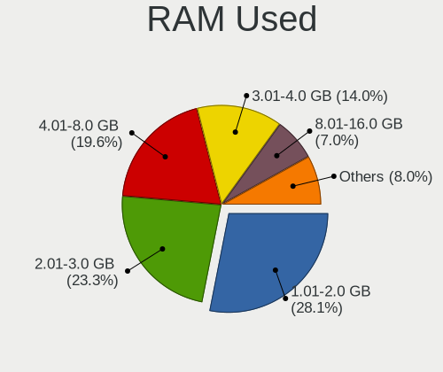
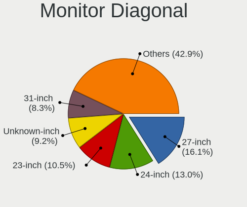
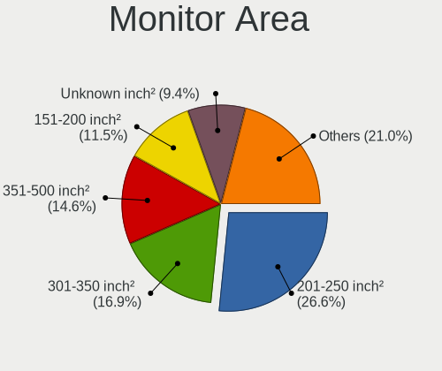

Linux in USA - Tested Hardware & Statistics (Desktops)
------------------------------------------------------

A project to collect tested hardware configurations for Linux in USA.

Anyone can contribute to this report by the [hw-probe](https://github.com/linuxhw/hw-probe) tool:

    sudo -E hw-probe -all -upload

Please contribute! Especially if your hardware is rare.

Contents
--------

* [ Test Cases ](#test-cases)

* [ System ](#system)
  - [ OS                       ](#os)
  - [ OS Family                ](#os-family)
  - [ Kernel                   ](#kernel)
  - [ Kernel Family            ](#kernel-family)
  - [ Kernel Major Ver.        ](#kernel-major-ver)
  - [ Arch                     ](#arch)
  - [ DE                       ](#de)
  - [ Display Server           ](#display-server)
  - [ Display Manager          ](#display-manager)
  - [ OS Lang                  ](#os-lang)
  - [ Boot Mode                ](#boot-mode)
  - [ Filesystem               ](#filesystem)
  - [ Part. scheme             ](#part-scheme)
  - [ Dual Boot with Linux/BSD ](#dual-boot-with-linuxbsd)
  - [ Dual Boot (Win)          ](#dual-boot-win)

* [ Board ](#board)
  - [ Vendor                   ](#vendor)
  - [ Model                    ](#model)
  - [ Model Family             ](#model-family)
  - [ MFG Year                 ](#mfg-year)
  - [ Form Factor              ](#form-factor)
  - [ Secure Boot              ](#secure-boot)
  - [ Coreboot                 ](#coreboot)
  - [ RAM Size                 ](#ram-size)
  - [ RAM Used                 ](#ram-used)
  - [ Total Drives             ](#total-drives)
  - [ Has CD-ROM               ](#has-cd-rom)
  - [ Has Ethernet             ](#has-ethernet)
  - [ Has WiFi                 ](#has-wifi)
  - [ Has Bluetooth            ](#has-bluetooth)

* [ Location ](#location)
  - [ Country                  ](#country)
  - [ City                     ](#city)

* [ Drives ](#drives)
  - [ Drive Vendor             ](#drive-vendor)
  - [ Drive Model              ](#drive-model)
  - [ HDD Vendor               ](#hdd-vendor)
  - [ SSD Vendor               ](#ssd-vendor)
  - [ Drive Kind               ](#drive-kind)
  - [ Drive Connector          ](#drive-connector)
  - [ Drive Size               ](#drive-size)
  - [ Space Total              ](#space-total)
  - [ Space Used               ](#space-used)
  - [ Malfunc. Drives          ](#malfunc-drives)
  - [ Malfunc. Drive Vendor    ](#malfunc-drive-vendor)
  - [ Malfunc. HDD Vendor      ](#malfunc-hdd-vendor)
  - [ Malfunc. Drive Kind      ](#malfunc-drive-kind)
  - [ Failed Drives            ](#failed-drives)
  - [ Failed Drive Vendor      ](#failed-drive-vendor)
  - [ Drive Status             ](#drive-status)

* [ Storage controller ](#storage-controller)
  - [ Storage Vendor           ](#storage-vendor)
  - [ Storage Model            ](#storage-model)
  - [ Storage Kind             ](#storage-kind)

* [ Processor ](#processor)
  - [ CPU Vendor               ](#cpu-vendor)
  - [ CPU Model                ](#cpu-model)
  - [ CPU Model Family         ](#cpu-model-family)
  - [ CPU Cores                ](#cpu-cores)
  - [ CPU Sockets              ](#cpu-sockets)
  - [ CPU Threads              ](#cpu-threads)
  - [ CPU Op-Modes             ](#cpu-op-modes)
  - [ CPU Microcode            ](#cpu-microcode)
  - [ CPU Microarch            ](#cpu-microarch)

* [ Graphics ](#graphics)
  - [ GPU Vendor               ](#gpu-vendor)
  - [ GPU Model                ](#gpu-model)
  - [ GPU Combo                ](#gpu-combo)
  - [ GPU Driver               ](#gpu-driver)
  - [ GPU Memory               ](#gpu-memory)

* [ Monitor ](#monitor)
  - [ Monitor Vendor           ](#monitor-vendor)
  - [ Monitor Model            ](#monitor-model)
  - [ Monitor Resolution       ](#monitor-resolution)
  - [ Monitor Diagonal         ](#monitor-diagonal)
  - [ Monitor Width            ](#monitor-width)
  - [ Aspect Ratio             ](#aspect-ratio)
  - [ Monitor Area             ](#monitor-area)
  - [ Pixel Density            ](#pixel-density)
  - [ Multiple Monitors        ](#multiple-monitors)

* [ Network ](#network)
  - [ Net Controller Vendor    ](#net-controller-vendor)
  - [ Net Controller Model     ](#net-controller-model)
  - [ Wireless Vendor          ](#wireless-vendor)
  - [ Wireless Model           ](#wireless-model)
  - [ Ethernet Vendor          ](#ethernet-vendor)
  - [ Ethernet Model           ](#ethernet-model)
  - [ Net Controller Kind      ](#net-controller-kind)
  - [ Used Controller          ](#used-controller)
  - [ NICs                     ](#nics)
  - [ IPv6                     ](#ipv6)

* [ Bluetooth ](#bluetooth)
  - [ Bluetooth Vendor         ](#bluetooth-vendor)
  - [ Bluetooth Model          ](#bluetooth-model)

* [ Sound ](#sound)
  - [ Sound Vendor             ](#sound-vendor)
  - [ Sound Model              ](#sound-model)

* [ Memory ](#memory)
  - [ Memory Vendor            ](#memory-vendor)
  - [ Memory Model             ](#memory-model)
  - [ Memory Kind              ](#memory-kind)
  - [ Memory Form Factor       ](#memory-form-factor)
  - [ Memory Size              ](#memory-size)
  - [ Memory Speed             ](#memory-speed)

* [ Printers & scanners ](#printers--scanners)
  - [ Printer Vendor           ](#printer-vendor)
  - [ Printer Model            ](#printer-model)
  - [ Scanner Vendor           ](#scanner-vendor)
  - [ Scanner Model            ](#scanner-model)

* [ Camera ](#camera)
  - [ Camera Vendor            ](#camera-vendor)
  - [ Camera Model             ](#camera-model)

* [ Security ](#security)
  - [ Fingerprint Vendor       ](#fingerprint-vendor)
  - [ Fingerprint Model        ](#fingerprint-model)
  - [ Chipcard Vendor          ](#chipcard-vendor)
  - [ Chipcard Model           ](#chipcard-model)

* [ Unsupported ](#unsupported)
  - [ Unsupported Devices      ](#unsupported-devices)
  - [ Unsupported Device Types ](#unsupported-device-types)

Test Cases
----------

Total: 26186

| Vendor        | Model                       | Probe                                                      | Date         |
|---------------|-----------------------------|------------------------------------------------------------|--------------|
| Gigabyte      | Z390 AORUS PRO WIFI-CF      | [f88f22a1b9](https://linux-hardware.org/?probe=f88f22a1b9) | May 09, 2024 |
| HP            | 3396                        | [5e68a536f2](https://linux-hardware.org/?probe=5e68a536f2) | May 09, 2024 |
| Dell          | 0VNP2H A00                  | [28953f7c6a](https://linux-hardware.org/?probe=28953f7c6a) | May 09, 2024 |
| Foxconn       | 2AB1                        | [11beb142c3](https://linux-hardware.org/?probe=11beb142c3) | May 09, 2024 |
| ASRock        | B450M/ac R2.0               | [a20443a9d6](https://linux-hardware.org/?probe=a20443a9d6) | May 09, 2024 |
| Dell          | 051FJ8 A02                  | [1c1caf7a19](https://linux-hardware.org/?probe=1c1caf7a19) | May 09, 2024 |
| ASRock        | X399 Taichi                 | [c82214d90a](https://linux-hardware.org/?probe=c82214d90a) | May 09, 2024 |
| Dell          | 051FJ8 A02                  | [5a8f86b17c](https://linux-hardware.org/?probe=5a8f86b17c) | May 09, 2024 |
| MSI           | B450 TOMAHAWK MAX II        | [813f68dad3](https://linux-hardware.org/?probe=813f68dad3) | May 08, 2024 |
| HP            | 18E7                        | [fa637b3b9a](https://linux-hardware.org/?probe=fa637b3b9a) | May 08, 2024 |
| Dell          | 0M5DCD A00                  | [3c353c281f](https://linux-hardware.org/?probe=3c353c281f) | May 08, 2024 |
| ASUSTek       | ProArt Z690-CREATOR WIFI    | [7cc03eaae9](https://linux-hardware.org/?probe=7cc03eaae9) | May 08, 2024 |
| Dell          | 0HHV7N A00                  | [63a26dac69](https://linux-hardware.org/?probe=63a26dac69) | May 08, 2024 |
| MSI           | B250M PRO-VDH               | [d11117aeae](https://linux-hardware.org/?probe=d11117aeae) | May 08, 2024 |
| Gigabyte      | B550M AORUS ELITE AX        | [422cc265d3](https://linux-hardware.org/?probe=422cc265d3) | May 08, 2024 |
| MSI           | MPG X570 GAMING PRO CARB... | [1be8775956](https://linux-hardware.org/?probe=1be8775956) | May 08, 2024 |
| MSI           | PRO B760-P WIFI DDR4        | [35d60afe01](https://linux-hardware.org/?probe=35d60afe01) | May 07, 2024 |
| Lenovo        | 1046 SDK0T08861 WIN 3305... | [91c857f51e](https://linux-hardware.org/?probe=91c857f51e) | May 07, 2024 |
| ASUSTek       | ROG STRIX X570-E GAMING ... | [6b97d23143](https://linux-hardware.org/?probe=6b97d23143) | May 07, 2024 |
| ASUSTek       | PRIME Z790-P WIFI           | [54b9c594a0](https://linux-hardware.org/?probe=54b9c594a0) | May 07, 2024 |
| ASUSTek       | PRIME Z490-A                | [a68c1a8752](https://linux-hardware.org/?probe=a68c1a8752) | May 07, 2024 |
| Dell          | 048DY8 A01                  | [a81f44c8b4](https://linux-hardware.org/?probe=a81f44c8b4) | May 07, 2024 |
| MSI           | X570-A PRO                  | [e061b752c8](https://linux-hardware.org/?probe=e061b752c8) | May 07, 2024 |
| Lenovo        | ThinkServer TS140           | [be7444624d](https://linux-hardware.org/?probe=be7444624d) | May 07, 2024 |
| ASRock        | A300M-STX                   | [cdf544ca1d](https://linux-hardware.org/?probe=cdf544ca1d) | May 07, 2024 |
| Dell          | 088DT1 A00                  | [edb955bd5e](https://linux-hardware.org/?probe=edb955bd5e) | May 07, 2024 |
| Intel         | DQ45CB AAE30148-207         | [263e934dc2](https://linux-hardware.org/?probe=263e934dc2) | May 07, 2024 |
| ASRock        | B550 Phantom Gaming 4/ac    | [72d8d32749](https://linux-hardware.org/?probe=72d8d32749) | May 07, 2024 |
| Gigabyte      | Z77-D3H                     | [01099601fe](https://linux-hardware.org/?probe=01099601fe) | May 07, 2024 |
| Dell          | 02YRK5 A02                  | [fea15ab44c](https://linux-hardware.org/?probe=fea15ab44c) | May 07, 2024 |
| Shenzhen M... | F7BAA                       | [69aa3dca70](https://linux-hardware.org/?probe=69aa3dca70) | May 06, 2024 |
| Dell          | 02YYK5 A01                  | [09b75f38cd](https://linux-hardware.org/?probe=09b75f38cd) | May 06, 2024 |
| Dell          | 03KWTV A00                  | [68f465c06a](https://linux-hardware.org/?probe=68f465c06a) | May 06, 2024 |
| ASUSTek       | M4A78T-E                    | [2cee8d14ab](https://linux-hardware.org/?probe=2cee8d14ab) | May 06, 2024 |
| Dell          | 03KWTV A00                  | [1b3f32baf6](https://linux-hardware.org/?probe=1b3f32baf6) | May 06, 2024 |
| ASUSTek       | TUF Gaming X570-PLUS        | [70346cc510](https://linux-hardware.org/?probe=70346cc510) | May 06, 2024 |
| Dell          | 042P49 A02                  | [4b9e2674de](https://linux-hardware.org/?probe=4b9e2674de) | May 06, 2024 |
| Dell          | 042P49 A02                  | [146a7db97f](https://linux-hardware.org/?probe=146a7db97f) | May 06, 2024 |
| Dell          | 0YXT71 A00                  | [b451487b59](https://linux-hardware.org/?probe=b451487b59) | May 06, 2024 |
| Dell          | 0C2KJT A00                  | [a884cd0cf5](https://linux-hardware.org/?probe=a884cd0cf5) | May 06, 2024 |
| ASUSTek       | TUF Gaming Z790-PLUS WIF... | [326b0babab](https://linux-hardware.org/?probe=326b0babab) | May 06, 2024 |
| ASUSTek       | TUF Gaming Z790-PLUS WIF... | [38b9f94aeb](https://linux-hardware.org/?probe=38b9f94aeb) | May 06, 2024 |
| ASUSTek       | P8H67-M PRO                 | [2af49854e2](https://linux-hardware.org/?probe=2af49854e2) | May 06, 2024 |
| Dell          | 0HH807                      | [743dea0fc3](https://linux-hardware.org/?probe=743dea0fc3) | May 06, 2024 |
| Gigabyte      | B650 AORUS ELITE AX         | [12afc4ec37](https://linux-hardware.org/?probe=12afc4ec37) | May 06, 2024 |
| HP            | 8906 SMVB                   | [16dcd59b91](https://linux-hardware.org/?probe=16dcd59b91) | May 06, 2024 |
| MSI           | MPG Z490 GAMING EDGE WIF... | [91fcd08046](https://linux-hardware.org/?probe=91fcd08046) | May 06, 2024 |
| HP            | 8767 A                      | [c5fd3ea1e4](https://linux-hardware.org/?probe=c5fd3ea1e4) | May 06, 2024 |
| ASUSTek       | CM1831                      | [c228565f48](https://linux-hardware.org/?probe=c228565f48) | May 06, 2024 |
| ASUSTek       | CM1831                      | [cc97798ac4](https://linux-hardware.org/?probe=cc97798ac4) | May 06, 2024 |
| ASUSTek       | PRIME X570-PRO              | [02dec94612](https://linux-hardware.org/?probe=02dec94612) | May 05, 2024 |
| Intel         | DG45ID AAE27729-312         | [9610cedb7b](https://linux-hardware.org/?probe=9610cedb7b) | May 05, 2024 |
| MSI           | MEG Z690 UNIFY              | [614bab5cb0](https://linux-hardware.org/?probe=614bab5cb0) | May 05, 2024 |
| Foxconn       | PANGU-B 1A32N3500-600-G     | [e2c56e50f1](https://linux-hardware.org/?probe=e2c56e50f1) | May 05, 2024 |
| MSI           | PRO B650-VC WIFI            | [5ba462d421](https://linux-hardware.org/?probe=5ba462d421) | May 05, 2024 |
| HP            | 1495                        | [f0e80863a7](https://linux-hardware.org/?probe=f0e80863a7) | May 05, 2024 |
| Dell          | 0J9VVP A00                  | [5971526cf6](https://linux-hardware.org/?probe=5971526cf6) | May 05, 2024 |
| Dell          | 0J9VVP A00                  | [f75406b494](https://linux-hardware.org/?probe=f75406b494) | May 05, 2024 |
| MSI           | MAG Z590 TORPEDO            | [19cb329ead](https://linux-hardware.org/?probe=19cb329ead) | May 05, 2024 |
| Gigabyte      | F2A88XM-D3HP                | [e362e7892b](https://linux-hardware.org/?probe=e362e7892b) | May 05, 2024 |
| ASRock        | B450M-HDV R4.0              | [fc52b48b01](https://linux-hardware.org/?probe=fc52b48b01) | May 05, 2024 |
| Lenovo        | 0B98401 WIN                 | [8d1ee988ad](https://linux-hardware.org/?probe=8d1ee988ad) | May 05, 2024 |
| MSI           | MPG Z690 FORCE WIFI         | [4e837501bb](https://linux-hardware.org/?probe=4e837501bb) | May 05, 2024 |
| Dell          | 088DT1 A01                  | [9cdeec0464](https://linux-hardware.org/?probe=9cdeec0464) | May 05, 2024 |
| ASRock        | B450M Pro4                  | [af898c03a5](https://linux-hardware.org/?probe=af898c03a5) | May 05, 2024 |
| MSI           | MAG Z590 TORPEDO            | [da37bf116d](https://linux-hardware.org/?probe=da37bf116d) | May 04, 2024 |
| Dell          | 06FW8P A01                  | [41be164658](https://linux-hardware.org/?probe=41be164658) | May 04, 2024 |
| Dell          | 0J3492                      | [0bf461dd56](https://linux-hardware.org/?probe=0bf461dd56) | May 04, 2024 |
| ASUSTek       | TUF Gaming X570-PLUS        | [f9daac6faa](https://linux-hardware.org/?probe=f9daac6faa) | May 04, 2024 |
| Dell          | 0HHV7N A00                  | [bec2f2a916](https://linux-hardware.org/?probe=bec2f2a916) | May 04, 2024 |
| ASUSTek       | ROG STRIX X570-E GAMING ... | [9ca1c7c92f](https://linux-hardware.org/?probe=9ca1c7c92f) | May 04, 2024 |
| MSI           | B450M BAZOOKA V2            | [654421979a](https://linux-hardware.org/?probe=654421979a) | May 04, 2024 |
| Lenovo        | SKYBAY SDK0J40709 WIN 32... | [316673b817](https://linux-hardware.org/?probe=316673b817) | May 04, 2024 |
| MSI           | PRO Z790-A MAX WIFI         | [534c77cdb0](https://linux-hardware.org/?probe=534c77cdb0) | May 04, 2024 |
| Shenzhen M... | F7BRC                       | [de61b5eba6](https://linux-hardware.org/?probe=de61b5eba6) | May 04, 2024 |
| Dell          | 0C2XKD A01                  | [a246668749](https://linux-hardware.org/?probe=a246668749) | May 04, 2024 |
| Acer          | Veriton N4640G              | [ce50a47462](https://linux-hardware.org/?probe=ce50a47462) | May 03, 2024 |
| Gateway       | IPIMB-ARA                   | [daf7403459](https://linux-hardware.org/?probe=daf7403459) | May 03, 2024 |
| Dell          | 0773VG A02                  | [2eb962e78c](https://linux-hardware.org/?probe=2eb962e78c) | May 03, 2024 |
| HP            | 339A                        | [c19ffbdcb6](https://linux-hardware.org/?probe=c19ffbdcb6) | May 03, 2024 |
| ASUSTek       | PRIME B550-PLUS             | [01e99b1acd](https://linux-hardware.org/?probe=01e99b1acd) | May 03, 2024 |
| MSI           | MEG Z390 ACE                | [d564c1c05f](https://linux-hardware.org/?probe=d564c1c05f) | May 03, 2024 |
| Dell          | 0D881F A05                  | [9dfc8fb5b7](https://linux-hardware.org/?probe=9dfc8fb5b7) | May 03, 2024 |
| ASUSTek       | P8H67-M PRO                 | [001c04c64f](https://linux-hardware.org/?probe=001c04c64f) | May 03, 2024 |
| ASUSTek       | TUF Gaming X570-PLUS        | [fb0da29f4d](https://linux-hardware.org/?probe=fb0da29f4d) | May 03, 2024 |
| Gigabyte      | 970A-DS3P                   | [2512d113c2](https://linux-hardware.org/?probe=2512d113c2) | May 03, 2024 |
| Lenovo        | 102F SBB0M45864 WIN 3305... | [55c596ead8](https://linux-hardware.org/?probe=55c596ead8) | May 03, 2024 |
| ASUSTek       | TUF Gaming X570-PLUS        | [5e3b7c6308](https://linux-hardware.org/?probe=5e3b7c6308) | May 03, 2024 |
| Dell          | 0M5DCD A00                  | [f390e47ea1](https://linux-hardware.org/?probe=f390e47ea1) | May 03, 2024 |
| MSI           | PRO Z790-A WIFI             | [b7cb9e7573](https://linux-hardware.org/?probe=b7cb9e7573) | May 03, 2024 |
| Intel         | X79 (INTEL Xeon E5/Corei... | [257f9cdad4](https://linux-hardware.org/?probe=257f9cdad4) | May 03, 2024 |
| Gigabyte      | B660 DS3H AC DDR4-Y1        | [fecf38db22](https://linux-hardware.org/?probe=fecf38db22) | May 02, 2024 |
| Intel         | X79 (INTEL Xeon E5/Corei... | [1a3ebd462f](https://linux-hardware.org/?probe=1a3ebd462f) | May 02, 2024 |
| Gigabyte      | B450M DS3H-CF               | [f229e6b124](https://linux-hardware.org/?probe=f229e6b124) | May 02, 2024 |
| Soyo          | SY-Classic B450M            | [e82641ba3c](https://linux-hardware.org/?probe=e82641ba3c) | May 02, 2024 |
| Acer          | Veriton N4640G              | [d18d5f8d9d](https://linux-hardware.org/?probe=d18d5f8d9d) | May 02, 2024 |
| HP            | 1494                        | [7fb0be6459](https://linux-hardware.org/?probe=7fb0be6459) | May 02, 2024 |
| Gigabyte      | B550 AORUS ELITE AX V2      | [1ef79831c6](https://linux-hardware.org/?probe=1ef79831c6) | May 02, 2024 |
| HP            | 1825                        | [c6cd93d0ea](https://linux-hardware.org/?probe=c6cd93d0ea) | May 02, 2024 |
| ASUSTek       | ROG Maximus Z790 HERO       | [40caf612c2](https://linux-hardware.org/?probe=40caf612c2) | May 02, 2024 |
| ASUSTek       | ROG STRIX X470-F GAMING     | [5f2e9277ad](https://linux-hardware.org/?probe=5f2e9277ad) | May 02, 2024 |
| HP            | 2129                        | [3a5c2b8ae5](https://linux-hardware.org/?probe=3a5c2b8ae5) | May 02, 2024 |
| HP            | 158B                        | [d5727d0cfb](https://linux-hardware.org/?probe=d5727d0cfb) | May 02, 2024 |
| Gigabyte      | Z790 UD AC                  | [0386514a20](https://linux-hardware.org/?probe=0386514a20) | May 01, 2024 |
| HP            | 2AF7                        | [6e5ea827da](https://linux-hardware.org/?probe=6e5ea827da) | May 01, 2024 |
| Apple         | Mac-F60DEB81FF30ACF6 Mac... | [32d8346d26](https://linux-hardware.org/?probe=32d8346d26) | May 01, 2024 |
| MSI           | MPG X570S EDGE MAX WIFI     | [0299f8321b](https://linux-hardware.org/?probe=0299f8321b) | May 01, 2024 |
| MSI           | MPG X570S EDGE MAX WIFI     | [569772c380](https://linux-hardware.org/?probe=569772c380) | May 01, 2024 |
| HP            | 805D                        | [facf891056](https://linux-hardware.org/?probe=facf891056) | May 01, 2024 |
| ASUSTek       | X99-E WS/USB                | [a4df75c4bc](https://linux-hardware.org/?probe=a4df75c4bc) | May 01, 2024 |
| HP            | 1494                        | [1e2a110b7c](https://linux-hardware.org/?probe=1e2a110b7c) | May 01, 2024 |
| ASUSTek       | TUF Gaming X570-PRO         | [2ffc5da09f](https://linux-hardware.org/?probe=2ffc5da09f) | May 01, 2024 |
| MSI           | B550-A PRO                  | [e4727af25c](https://linux-hardware.org/?probe=e4727af25c) | May 01, 2024 |
| ASUSTek       | ROG STRIX B550-F GAMING     | [c8b695f80c](https://linux-hardware.org/?probe=c8b695f80c) | May 01, 2024 |
| Acer          | Aspire GX-785               | [9237b7c910](https://linux-hardware.org/?probe=9237b7c910) | May 01, 2024 |
| Unknown       | ROUTER                      | [1889de9474](https://linux-hardware.org/?probe=1889de9474) | May 01, 2024 |
| Acer          | Aspire GX-785               | [1134c5fd30](https://linux-hardware.org/?probe=1134c5fd30) | May 01, 2024 |
| ASRock        | B550M-C                     | [926f0b0f52](https://linux-hardware.org/?probe=926f0b0f52) | May 01, 2024 |
| Dell          | 0N867P A02                  | [7b2f6946b9](https://linux-hardware.org/?probe=7b2f6946b9) | May 01, 2024 |
| Gigabyte      | Z690 GAMING X               | [abd215cdb3](https://linux-hardware.org/?probe=abd215cdb3) | May 01, 2024 |
| Gigabyte      | Z690 GAMING X               | [0d6f66a0d7](https://linux-hardware.org/?probe=0d6f66a0d7) | May 01, 2024 |
| MSI           | MAG B650M MORTAR WIFI       | [c86e158ede](https://linux-hardware.org/?probe=c86e158ede) | May 01, 2024 |
| HP            | 8906 SMVB                   | [6c9a72d2cb](https://linux-hardware.org/?probe=6c9a72d2cb) | May 01, 2024 |
| ASRock        | X570 Phantom Gaming-ITX/... | [dbb2e90b8c](https://linux-hardware.org/?probe=dbb2e90b8c) | May 01, 2024 |
| HP            | 3397                        | [3c25b70b50](https://linux-hardware.org/?probe=3c25b70b50) | May 01, 2024 |
| Supermicro    | X9SPU-F                     | [ec236a99ac](https://linux-hardware.org/?probe=ec236a99ac) | Apr 30, 2024 |
| Dell          | 0427JK A00                  | [6c93b7fabf](https://linux-hardware.org/?probe=6c93b7fabf) | Apr 30, 2024 |
| Gigabyte      | Z790 UD AC                  | [e9f80cea34](https://linux-hardware.org/?probe=e9f80cea34) | Apr 30, 2024 |
| Dell          | 00F82W A00                  | [850344d254](https://linux-hardware.org/?probe=850344d254) | Apr 30, 2024 |
| HP            | 8459                        | [9d3aa648fa](https://linux-hardware.org/?probe=9d3aa648fa) | Apr 30, 2024 |
| Alienware     | 0C92D0 A00                  | [73fe41cfe5](https://linux-hardware.org/?probe=73fe41cfe5) | Apr 30, 2024 |
| ASRock        | B450M Pro4                  | [04c8e87ca3](https://linux-hardware.org/?probe=04c8e87ca3) | Apr 30, 2024 |
| Dell          | 0T7D40 A01                  | [8de750aabf](https://linux-hardware.org/?probe=8de750aabf) | Apr 30, 2024 |
| Lenovo        | ThinkCentre M91p 7005AK8    | [8eeaa81159](https://linux-hardware.org/?probe=8eeaa81159) | Apr 30, 2024 |
| EVGA          | Z790 CLASSIFIED.0           | [10ac75bfd8](https://linux-hardware.org/?probe=10ac75bfd8) | Apr 30, 2024 |
| MSI           | Z97 GAMING 3                | [c703e6f53a](https://linux-hardware.org/?probe=c703e6f53a) | Apr 30, 2024 |
| Lenovo        | 30C9 SEK0N11843 IOT 3806... | [517daa7c85](https://linux-hardware.org/?probe=517daa7c85) | Apr 30, 2024 |
| Win elemen... | M600                        | [ed51b3e831](https://linux-hardware.org/?probe=ed51b3e831) | Apr 30, 2024 |
| Gigabyte      | B550M DS3H AC               | [0a5a41e025](https://linux-hardware.org/?probe=0a5a41e025) | Apr 30, 2024 |
| MSI           | MPG B550 GAMING PLUS        | [e2ec2b51c8](https://linux-hardware.org/?probe=e2ec2b51c8) | Apr 30, 2024 |
| ASUSTek       | PRIME B550M-A AC            | [199c1abd04](https://linux-hardware.org/?probe=199c1abd04) | Apr 30, 2024 |
| Gigabyte      | Z790 AORUS ELITE AX         | [e0cb14de08](https://linux-hardware.org/?probe=e0cb14de08) | Apr 30, 2024 |
| MSI           | Z68A-G43                    | [9acdb88f98](https://linux-hardware.org/?probe=9acdb88f98) | Apr 30, 2024 |
| Dell          | 0F6X5P A00                  | [d860ea2ea1](https://linux-hardware.org/?probe=d860ea2ea1) | Apr 30, 2024 |
| ASUSTek       | KGPE-D16                    | [f199ccf950](https://linux-hardware.org/?probe=f199ccf950) | Apr 30, 2024 |
| ASUSTek       | SABERTOOTH 990FX            | [cd98023b83](https://linux-hardware.org/?probe=cd98023b83) | Apr 30, 2024 |
| ASUSTek       | M5A78L-M PLUS/USB3          | [a036c4124f](https://linux-hardware.org/?probe=a036c4124f) | Apr 29, 2024 |
| ASUSTek       | X99-DELUXE                  | [71069616b0](https://linux-hardware.org/?probe=71069616b0) | Apr 29, 2024 |
| Pegatron      | NARRA3                      | [ca94843c0a](https://linux-hardware.org/?probe=ca94843c0a) | Apr 29, 2024 |
| ASUSTek       | ROG Maximus XI HERO         | [c8d1f19fe6](https://linux-hardware.org/?probe=c8d1f19fe6) | Apr 29, 2024 |
| ASRock        | B660-ITX                    | [b0d7ab9acf](https://linux-hardware.org/?probe=b0d7ab9acf) | Apr 29, 2024 |
| AZW           | EQ                          | [dc09b0ecbc](https://linux-hardware.org/?probe=dc09b0ecbc) | Apr 29, 2024 |
| AZW           | EQ                          | [9e4f615d36](https://linux-hardware.org/?probe=9e4f615d36) | Apr 29, 2024 |
| ASRock        | A320M/ac                    | [aeafdb6795](https://linux-hardware.org/?probe=aeafdb6795) | Apr 29, 2024 |
| ASUSTek       | M5A78L-M PLUS/USB3          | [9b8290696d](https://linux-hardware.org/?probe=9b8290696d) | Apr 29, 2024 |
| Gigabyte      | B550M DS3H AC               | [2d51e08cd6](https://linux-hardware.org/?probe=2d51e08cd6) | Apr 29, 2024 |
| ASRock        | Z790 PG Riptide             | [937704be25](https://linux-hardware.org/?probe=937704be25) | Apr 29, 2024 |
| ASUSTek       | ROG Maximus XI HERO         | [d72dcf834b](https://linux-hardware.org/?probe=d72dcf834b) | Apr 29, 2024 |
| Gigabyte      | Z790 D DDR4                 | [8e6a5285a6](https://linux-hardware.org/?probe=8e6a5285a6) | Apr 29, 2024 |
| MSI           | PRO H610M-G DDR4            | [1492484deb](https://linux-hardware.org/?probe=1492484deb) | Apr 29, 2024 |
| Gigabyte      | GA-MA785GMT-UD2H            | [b1f251b92c](https://linux-hardware.org/?probe=b1f251b92c) | Apr 29, 2024 |
| HP            | 89EB 11                     | [dd5549c4d7](https://linux-hardware.org/?probe=dd5549c4d7) | Apr 28, 2024 |
| ASUSTek       | M5A97 R2.0                  | [a5697195ec](https://linux-hardware.org/?probe=a5697195ec) | Apr 28, 2024 |
| ASUSTek       | ROG CROSSHAIR X670E HERO    | [b9693bfaa8](https://linux-hardware.org/?probe=b9693bfaa8) | Apr 28, 2024 |
| ASRock        | B650 PG Lightning           | [2afe25d1f8](https://linux-hardware.org/?probe=2afe25d1f8) | Apr 28, 2024 |
| ASUSTek       | Maximus VII HERO            | [51efe9cdc9](https://linux-hardware.org/?probe=51efe9cdc9) | Apr 28, 2024 |
| Gigabyte      | B450M DS3H-CF               | [c85c3d59df](https://linux-hardware.org/?probe=c85c3d59df) | Apr 28, 2024 |
| ASRock        | B450M Pro4                  | [aded29632d](https://linux-hardware.org/?probe=aded29632d) | Apr 28, 2024 |
| Dell          | 04GJJT A00                  | [b336911f53](https://linux-hardware.org/?probe=b336911f53) | Apr 28, 2024 |
| MSI           | MAG B550 TOMAHAWK           | [25abfac8b7](https://linux-hardware.org/?probe=25abfac8b7) | Apr 28, 2024 |
| MSI           | 970A-G46                    | [156b1bab44](https://linux-hardware.org/?probe=156b1bab44) | Apr 28, 2024 |
| Apple         | Mac-F60DEB81FF30ACF6 Mac... | [1af94235a9](https://linux-hardware.org/?probe=1af94235a9) | Apr 28, 2024 |
| ASUSTek       | TUF Gaming B550M-PLUS WI... | [73f586776d](https://linux-hardware.org/?probe=73f586776d) | Apr 28, 2024 |
| HP            | 8768 A                      | [aba3b50d67](https://linux-hardware.org/?probe=aba3b50d67) | Apr 28, 2024 |
| ASRock        | Z790 Lightning WiFi         | [4ed8b47fbe](https://linux-hardware.org/?probe=4ed8b47fbe) | Apr 28, 2024 |
| Gigabyte      | B75M-D3H                    | [48a48b4523](https://linux-hardware.org/?probe=48a48b4523) | Apr 28, 2024 |
| HP            | 2B47                        | [3a165a34a7](https://linux-hardware.org/?probe=3a165a34a7) | Apr 27, 2024 |
| ASUSTek       | ROG Maximus XI HERO         | [7c970a2e6f](https://linux-hardware.org/?probe=7c970a2e6f) | Apr 27, 2024 |
| System76      | Thelio Mira thelio-mira-... | [14dbfab450](https://linux-hardware.org/?probe=14dbfab450) | Apr 27, 2024 |
| Dell          | 0KRC95 A00                  | [8a4d88627a](https://linux-hardware.org/?probe=8a4d88627a) | Apr 27, 2024 |
| Dell          | 0HD5W2 A01                  | [21e5ae7f3e](https://linux-hardware.org/?probe=21e5ae7f3e) | Apr 27, 2024 |
| Biostar       | Hi-Fi Z87X 3D               | [09d7331f2b](https://linux-hardware.org/?probe=09d7331f2b) | Apr 27, 2024 |
| ASRock        | Z97 Extreme4                | [611e146e9e](https://linux-hardware.org/?probe=611e146e9e) | Apr 27, 2024 |
| Gigabyte      | Z590 UD AC                  | [1cad57b859](https://linux-hardware.org/?probe=1cad57b859) | Apr 27, 2024 |
| Lenovo        | ThinkStation D20 4155CTO    | [54cae1f375](https://linux-hardware.org/?probe=54cae1f375) | Apr 27, 2024 |
| Dell          | 0KJCC5 A00                  | [04c8546395](https://linux-hardware.org/?probe=04c8546395) | Apr 27, 2024 |
| Gigabyte      | B650 AORUS ELITE AX V2      | [8076b425cd](https://linux-hardware.org/?probe=8076b425cd) | Apr 27, 2024 |
| Gigabyte      | X570 AORUS PRO WIFI         | [3d5ac136c2](https://linux-hardware.org/?probe=3d5ac136c2) | Apr 27, 2024 |
| ASUSTek       | ROG Maximus XI HERO         | [33f2b78f07](https://linux-hardware.org/?probe=33f2b78f07) | Apr 27, 2024 |
| ASUSTek       | ROG STRIX B550-F GAMING     | [5b1e05942f](https://linux-hardware.org/?probe=5b1e05942f) | Apr 27, 2024 |
| Gigabyte      | Z77P-D3                     | [7cb2c25d22](https://linux-hardware.org/?probe=7cb2c25d22) | Apr 27, 2024 |
| ASUSTek       | ROG STRIX X670E-E GAMING... | [0bd0a47e34](https://linux-hardware.org/?probe=0bd0a47e34) | Apr 27, 2024 |
| ASUSTek       | ROG STRIX X670E-E GAMING... | [b912438c97](https://linux-hardware.org/?probe=b912438c97) | Apr 27, 2024 |
| HP            | 8704                        | [9637e112ef](https://linux-hardware.org/?probe=9637e112ef) | Apr 27, 2024 |
| HP            | 8704                        | [bc67b63fb1](https://linux-hardware.org/?probe=bc67b63fb1) | Apr 27, 2024 |
| AMI           | Intel                       | [a1842e7e12](https://linux-hardware.org/?probe=a1842e7e12) | Apr 27, 2024 |
| ASUSTek       | Q87M-E                      | [2b0d58047a](https://linux-hardware.org/?probe=2b0d58047a) | Apr 26, 2024 |
| MSI           | MPG Z690 EDGE WIFI DDR4     | [de866879b7](https://linux-hardware.org/?probe=de866879b7) | Apr 26, 2024 |
| HP            | 87D6 SMVB                   | [fd5b7a9db1](https://linux-hardware.org/?probe=fd5b7a9db1) | Apr 26, 2024 |
| Apple         | Mac-F60DEB81FF30ACF6 Mac... | [55a3147182](https://linux-hardware.org/?probe=55a3147182) | Apr 26, 2024 |
| Dell          | 0KRC95 A00                  | [b049b821e7](https://linux-hardware.org/?probe=b049b821e7) | Apr 26, 2024 |
| Gigabyte      | B85M-Gaming 3               | [201dbfaede](https://linux-hardware.org/?probe=201dbfaede) | Apr 26, 2024 |
| MSI           | B450 GAMING PLUS MAX        | [12d718eb1b](https://linux-hardware.org/?probe=12d718eb1b) | Apr 26, 2024 |
| HP            | 339A                        | [a90b0a68d4](https://linux-hardware.org/?probe=a90b0a68d4) | Apr 26, 2024 |
| Lenovo        | 3743 SDK0T76461 WIN 3422... | [1f3abb751c](https://linux-hardware.org/?probe=1f3abb751c) | Apr 26, 2024 |
| ASUSTek       | TUF X470-PLUS GAMING        | [6609c77480](https://linux-hardware.org/?probe=6609c77480) | Apr 26, 2024 |
| Dell          | 0K240Y A01                  | [6b932e4eb7](https://linux-hardware.org/?probe=6b932e4eb7) | Apr 26, 2024 |
| Lenovo        | MAHOBAY 0B98401 PRO         | [a2f7e0ec28](https://linux-hardware.org/?probe=a2f7e0ec28) | Apr 26, 2024 |
| MSI           | PRO B550M-VC WIFI           | [fa2cc2126e](https://linux-hardware.org/?probe=fa2cc2126e) | Apr 26, 2024 |
| Acer          | Aspire XC-605               | [d1ebb51ac8](https://linux-hardware.org/?probe=d1ebb51ac8) | Apr 25, 2024 |
| Gigabyte      | B450 AORUS M                | [ff40fe2120](https://linux-hardware.org/?probe=ff40fe2120) | Apr 25, 2024 |
| HP            | 2B36                        | [d52be34009](https://linux-hardware.org/?probe=d52be34009) | Apr 25, 2024 |
| Dell          | 0KRC95 A00                  | [4f768499f5](https://linux-hardware.org/?probe=4f768499f5) | Apr 25, 2024 |
| ASUSTek       | SABERTOOTH 990FX            | [dc7cef1fe5](https://linux-hardware.org/?probe=dc7cef1fe5) | Apr 25, 2024 |
| Dell          | 0J3492                      | [c6a3cf9465](https://linux-hardware.org/?probe=c6a3cf9465) | Apr 25, 2024 |
| ASUSTek       | TUF Gaming B660M-PLUS WI... | [fbeb4be390](https://linux-hardware.org/?probe=fbeb4be390) | Apr 25, 2024 |
| Dell          | 02YYK5 A01                  | [9850b81106](https://linux-hardware.org/?probe=9850b81106) | Apr 25, 2024 |
| Dell          | 0KYJ8C A02                  | [7118fd628f](https://linux-hardware.org/?probe=7118fd628f) | Apr 25, 2024 |
| ASRock        | A320M/ac                    | [6441ba6000](https://linux-hardware.org/?probe=6441ba6000) | Apr 25, 2024 |
| HP            | 8704                        | [deeb399937](https://linux-hardware.org/?probe=deeb399937) | Apr 25, 2024 |
| NZXT          | N7 B550                     | [7db93b1587](https://linux-hardware.org/?probe=7db93b1587) | Apr 25, 2024 |
| Gigabyte      | F2A55M-DS2                  | [8252280757](https://linux-hardware.org/?probe=8252280757) | Apr 25, 2024 |
| ASRock        | X99 OC Formula              | [68d724907d](https://linux-hardware.org/?probe=68d724907d) | Apr 25, 2024 |
| Dell          | 0K240Y A01                  | [554822996a](https://linux-hardware.org/?probe=554822996a) | Apr 24, 2024 |
| Gigabyte      | X570 AORUS ELITE WIFI       | [31bdb0d059](https://linux-hardware.org/?probe=31bdb0d059) | Apr 24, 2024 |
| MSI           | B450 GAMING PLUS MAX        | [c91825f450](https://linux-hardware.org/?probe=c91825f450) | Apr 24, 2024 |
| ASUSTek       | Maximus IV GENE-Z           | [858d6537b1](https://linux-hardware.org/?probe=858d6537b1) | Apr 24, 2024 |
| Gigabyte      | Z790 UD AC                  | [59fff37f7f](https://linux-hardware.org/?probe=59fff37f7f) | Apr 24, 2024 |
| Dell          | 0C1R19 A02                  | [de862a6d95](https://linux-hardware.org/?probe=de862a6d95) | Apr 24, 2024 |
| MSI           | MEG X670E ACE               | [4d5bed42bc](https://linux-hardware.org/?probe=4d5bed42bc) | Apr 24, 2024 |
| Acer          | Revo M2-601 A01             | [54a18aaccb](https://linux-hardware.org/?probe=54a18aaccb) | Apr 24, 2024 |
| Lenovo        | 3741 SDK0T76463 WIN 3422... | [aa663bafa4](https://linux-hardware.org/?probe=aa663bafa4) | Apr 24, 2024 |
| HP            | 21D0                        | [fe5b1a679c](https://linux-hardware.org/?probe=fe5b1a679c) | Apr 24, 2024 |
| ASUSTek       | PRIME B450M-A               | [1572659f68](https://linux-hardware.org/?probe=1572659f68) | Apr 24, 2024 |
| ASUSTek       | PRIME B450M-A               | [71acf13c6c](https://linux-hardware.org/?probe=71acf13c6c) | Apr 24, 2024 |
| ASUSTek       | ProArt Z790-CREATOR WIFI    | [755ed51be8](https://linux-hardware.org/?probe=755ed51be8) | Apr 23, 2024 |
| HP            | 158B                        | [de46c9cc60](https://linux-hardware.org/?probe=de46c9cc60) | Apr 23, 2024 |
| ASUSTek       | TUF Gaming A520M-PLUS WI... | [9e7d5daf63](https://linux-hardware.org/?probe=9e7d5daf63) | Apr 23, 2024 |
| Gigabyte      | B460M DS3H V2               | [5b43a749ef](https://linux-hardware.org/?probe=5b43a749ef) | Apr 23, 2024 |
| HP            | 895C                        | [08b147d945](https://linux-hardware.org/?probe=08b147d945) | Apr 23, 2024 |
| MSI           | PRO B650-P WIFI             | [2edbe2e138](https://linux-hardware.org/?probe=2edbe2e138) | Apr 23, 2024 |
| MSI           | PRO Z690-A DDR4             | [12bdb201f1](https://linux-hardware.org/?probe=12bdb201f1) | Apr 23, 2024 |
| ASUSTek       | P5Q DELUXE                  | [88b1a5568e](https://linux-hardware.org/?probe=88b1a5568e) | Apr 23, 2024 |
| MSI           | MPG X670E CARBON WIFI       | [d525938452](https://linux-hardware.org/?probe=d525938452) | Apr 23, 2024 |
| Gigabyte      | X570S AORUS MASTER          | [864cdaee54](https://linux-hardware.org/?probe=864cdaee54) | Apr 23, 2024 |
| Gigabyte      | Z390 UD                     | [36a382f0da](https://linux-hardware.org/?probe=36a382f0da) | Apr 23, 2024 |
| ASUSTek       | PRIME Z590-A                | [ab2310f0d6](https://linux-hardware.org/?probe=ab2310f0d6) | Apr 22, 2024 |
| Gigabyte      | Z170XP-SLI-CF               | [90e696166f](https://linux-hardware.org/?probe=90e696166f) | Apr 22, 2024 |
| Unknown       | Unknown                     | [41d6261b80](https://linux-hardware.org/?probe=41d6261b80) | Apr 22, 2024 |
| ASUSTek       | TUF Gaming X570-PRO         | [c2d77decab](https://linux-hardware.org/?probe=c2d77decab) | Apr 22, 2024 |
| MSI           | PRO Z790-P WIFI DDR4        | [de98480f12](https://linux-hardware.org/?probe=de98480f12) | Apr 22, 2024 |
| ASRock        | Z790 PG SONIC               | [6426fb59eb](https://linux-hardware.org/?probe=6426fb59eb) | Apr 22, 2024 |
| MSI           | MAG B550 TOMAHAWK           | [8a9bcf9b7f](https://linux-hardware.org/?probe=8a9bcf9b7f) | Apr 22, 2024 |
| Dell          | 0N185P A02                  | [1193feda44](https://linux-hardware.org/?probe=1193feda44) | Apr 22, 2024 |
| ASUSTek       | ROG STRIX Z690-A GAMING ... | [0cac32bd87](https://linux-hardware.org/?probe=0cac32bd87) | Apr 22, 2024 |
| Gigabyte      | Z270X-Gaming 8              | [00e056103f](https://linux-hardware.org/?probe=00e056103f) | Apr 22, 2024 |
| MSI           | MEG Z790 ACE MAX            | [b10bbe2874](https://linux-hardware.org/?probe=b10bbe2874) | Apr 22, 2024 |
| Supermicro    | C7Q67 V1.01                 | [e63cba3bfa](https://linux-hardware.org/?probe=e63cba3bfa) | Apr 22, 2024 |
| AMI           | Intel                       | [212fd4a0d8](https://linux-hardware.org/?probe=212fd4a0d8) | Apr 22, 2024 |
| AMI           | Intel                       | [2044003b5c](https://linux-hardware.org/?probe=2044003b5c) | Apr 22, 2024 |
| ASRock        | X570 Taichi                 | [30d16327b6](https://linux-hardware.org/?probe=30d16327b6) | Apr 22, 2024 |
| ASUSTek       | ROG CROSSHAIR X670E EXTR... | [9f8a1748ce](https://linux-hardware.org/?probe=9f8a1748ce) | Apr 22, 2024 |
| Dell          | 0VHXCD A01                  | [4b7a01c41a](https://linux-hardware.org/?probe=4b7a01c41a) | Apr 22, 2024 |
| ASUSTek       | TUF Gaming X570-PRO         | [f089892bd0](https://linux-hardware.org/?probe=f089892bd0) | Apr 22, 2024 |
| MSI           | MEG Z790 GODLIKE            | [23bca8eb91](https://linux-hardware.org/?probe=23bca8eb91) | Apr 21, 2024 |
| Biostar       | Hi-Fi Z87X 3D               | [8c77d98a43](https://linux-hardware.org/?probe=8c77d98a43) | Apr 21, 2024 |
| ASUSTek       | PRIME B660M-A AC D4         | [6c6b1a2edd](https://linux-hardware.org/?probe=6c6b1a2edd) | Apr 21, 2024 |
| ASUSTek       | PRIME B660M-A AC D4         | [7f5ce15d32](https://linux-hardware.org/?probe=7f5ce15d32) | Apr 21, 2024 |
| Alienware     | 0C92D0 A00                  | [e0870386d0](https://linux-hardware.org/?probe=e0870386d0) | Apr 21, 2024 |
| ASUSTek       | M5A99X EVO                  | [afb6abad8d](https://linux-hardware.org/?probe=afb6abad8d) | Apr 21, 2024 |
| HP            | 8265                        | [17dd357578](https://linux-hardware.org/?probe=17dd357578) | Apr 21, 2024 |
| MSI           | PRO Z790-P WIFI             | [2596bf65b4](https://linux-hardware.org/?probe=2596bf65b4) | Apr 21, 2024 |
| MSI           | B450 TOMAHAWK MAX II        | [9287fd48fd](https://linux-hardware.org/?probe=9287fd48fd) | Apr 21, 2024 |
| ASUSTek       | Amberine                    | [618eece8ca](https://linux-hardware.org/?probe=618eece8ca) | Apr 21, 2024 |
| HP            | 2B36                        | [4b5101fd25](https://linux-hardware.org/?probe=4b5101fd25) | Apr 21, 2024 |
| MSI           | B350 TOMAHAWK               | [1d96ad2788](https://linux-hardware.org/?probe=1d96ad2788) | Apr 21, 2024 |
| Dell          | 00F82W A00                  | [8d86d9c0a6](https://linux-hardware.org/?probe=8d86d9c0a6) | Apr 21, 2024 |
| MSI           | MAG X570S TOMAHAWK MAX W... | [dc0120c1ae](https://linux-hardware.org/?probe=dc0120c1ae) | Apr 21, 2024 |
| MSI           | MAG Z790 TOMAHAWK WIFI      | [186ef10f3d](https://linux-hardware.org/?probe=186ef10f3d) | Apr 21, 2024 |
| Dell          | 088DT1 A01                  | [0e5806e0fb](https://linux-hardware.org/?probe=0e5806e0fb) | Apr 21, 2024 |
| Lenovo        | ThinkCentre M58 7360C12     | [a1a3ba50dd](https://linux-hardware.org/?probe=a1a3ba50dd) | Apr 21, 2024 |
| ASUSTek       | TUF Gaming Z790-PLUS WIF... | [84aa58d0c4](https://linux-hardware.org/?probe=84aa58d0c4) | Apr 21, 2024 |
| MSI           | MPG B550 GAMING PLUS        | [549ac56060](https://linux-hardware.org/?probe=549ac56060) | Apr 21, 2024 |
| Gigabyte      | F2A85X-D3H                  | [b01680adc8](https://linux-hardware.org/?probe=b01680adc8) | Apr 20, 2024 |
| ASRock        | B650E Taichi                | [cdd2468f64](https://linux-hardware.org/?probe=cdd2468f64) | Apr 20, 2024 |
| Dell          | 0KWVT8 A03                  | [0c00a4bf3d](https://linux-hardware.org/?probe=0c00a4bf3d) | Apr 20, 2024 |
| Gigabyte      | X570 AORUS ELITE WIFI       | [a343ca7f17](https://linux-hardware.org/?probe=a343ca7f17) | Apr 20, 2024 |
| Gigabyte      | X570 AORUS ELITE WIFI       | [9836019d80](https://linux-hardware.org/?probe=9836019d80) | Apr 20, 2024 |
| ASUSTek       | ROG Maximus Z790 HERO       | [f673dc2fdf](https://linux-hardware.org/?probe=f673dc2fdf) | Apr 20, 2024 |
| ParTech       | Everserv 7000 Ivy Bridge... | [2d3657d514](https://linux-hardware.org/?probe=2d3657d514) | Apr 20, 2024 |
| ASRock        | Z77 Extreme4                | [52009ffcd0](https://linux-hardware.org/?probe=52009ffcd0) | Apr 20, 2024 |
| MSI           | MEG X570 UNIFY              | [1e5130ce4b](https://linux-hardware.org/?probe=1e5130ce4b) | Apr 20, 2024 |
| Gigabyte      | Z790 AORUS ELITE AX         | [ef45ce093c](https://linux-hardware.org/?probe=ef45ce093c) | Apr 20, 2024 |
| ASUSTek       | ROG STRIX X470-F GAMING     | [5a11f3a5ea](https://linux-hardware.org/?probe=5a11f3a5ea) | Apr 20, 2024 |
| MSI           | MAG B550 TOMAHAWK           | [4b3ef47f33](https://linux-hardware.org/?probe=4b3ef47f33) | Apr 20, 2024 |
| MSI           | MEG X570 UNIFY              | [e79a40955f](https://linux-hardware.org/?probe=e79a40955f) | Apr 19, 2024 |
| ASRock        | 970 Extreme4                | [30d0e5d49e](https://linux-hardware.org/?probe=30d0e5d49e) | Apr 19, 2024 |
| MSI           | PRO B650-P WIFI             | [a9259df109](https://linux-hardware.org/?probe=a9259df109) | Apr 19, 2024 |
| Dell          | 0D9JG3 A00                  | [b5c9c5d6b0](https://linux-hardware.org/?probe=b5c9c5d6b0) | Apr 19, 2024 |
| HP            | 8299                        | [aecdc0598b](https://linux-hardware.org/?probe=aecdc0598b) | Apr 19, 2024 |
| AZW           | U59                         | [3923393266](https://linux-hardware.org/?probe=3923393266) | Apr 19, 2024 |
| ASUSTek       | PRIME Z370-A                | [3c0df82050](https://linux-hardware.org/?probe=3c0df82050) | Apr 19, 2024 |
| Dell          | 0HJ054                      | [d00812b3e5](https://linux-hardware.org/?probe=d00812b3e5) | Apr 19, 2024 |
| Gigabyte      | X570 AORUS ELITE WIFI       | [4406405ed5](https://linux-hardware.org/?probe=4406405ed5) | Apr 19, 2024 |
| Gigabyte      | Z390 AORUS MASTER-CF        | [886d3b50ff](https://linux-hardware.org/?probe=886d3b50ff) | Apr 18, 2024 |
| DFI           | HD101-H81D                  | [a6b195fbc8](https://linux-hardware.org/?probe=a6b195fbc8) | Apr 18, 2024 |
| Acer          | Aspire XC-605               | [d9014cb8e6](https://linux-hardware.org/?probe=d9014cb8e6) | Apr 18, 2024 |
| Unknown       | Unknown                     | [8424abb1e7](https://linux-hardware.org/?probe=8424abb1e7) | Apr 18, 2024 |
| ASRock        | B450 Pro4                   | [78d6c9eb2c](https://linux-hardware.org/?probe=78d6c9eb2c) | Apr 18, 2024 |
| Dell          | 0KYJ8C A02                  | [c828676922](https://linux-hardware.org/?probe=c828676922) | Apr 18, 2024 |
| Shenzhen M... | DRFXI                       | [951a976cb0](https://linux-hardware.org/?probe=951a976cb0) | Apr 18, 2024 |
| HP            | 8949 11                     | [ab13748833](https://linux-hardware.org/?probe=ab13748833) | Apr 18, 2024 |
| HP            | 8949 11                     | [3f180801bd](https://linux-hardware.org/?probe=3f180801bd) | Apr 18, 2024 |
| Lenovo        | 361A SDK0K17763 WIN         | [e15581aafc](https://linux-hardware.org/?probe=e15581aafc) | Apr 18, 2024 |
| HP            | 3031h                       | [1d9c5e06d3](https://linux-hardware.org/?probe=1d9c5e06d3) | Apr 18, 2024 |
| Gigabyte      | Z790 UD AC                  | [340a3e1a78](https://linux-hardware.org/?probe=340a3e1a78) | Apr 18, 2024 |
| MSI           | Z790 GAMING PRO WIFI        | [0a6383a334](https://linux-hardware.org/?probe=0a6383a334) | Apr 18, 2024 |
| ASUSTek       | ROG STRIX B650-A GAMING ... | [980252a20c](https://linux-hardware.org/?probe=980252a20c) | Apr 18, 2024 |
| Dell          | 0478VN A00                  | [ffdcce4d7e](https://linux-hardware.org/?probe=ffdcce4d7e) | Apr 18, 2024 |
| Intel         | DH67CL AAG10212-207         | [276f923b44](https://linux-hardware.org/?probe=276f923b44) | Apr 18, 2024 |
| Gigabyte      | B650 GAMING X AX V2         | [8aadec7135](https://linux-hardware.org/?probe=8aadec7135) | Apr 18, 2024 |
| ASUSTek       | PRIME X299-DELUXE           | [6b14b793c5](https://linux-hardware.org/?probe=6b14b793c5) | Apr 17, 2024 |
| Gigabyte      | GA-78LMT-USB3               | [87fcdea752](https://linux-hardware.org/?probe=87fcdea752) | Apr 17, 2024 |
| ASRock        | B550 Phantom Gaming 4/ac    | [344e87c2a8](https://linux-hardware.org/?probe=344e87c2a8) | Apr 17, 2024 |
| MSI           | MPG B560I GAMING EDGE WI... | [fba354840f](https://linux-hardware.org/?probe=fba354840f) | Apr 17, 2024 |
| ASUSTek       | P8P67                       | [249f9c8ae9](https://linux-hardware.org/?probe=249f9c8ae9) | Apr 17, 2024 |
| ASUSTek       | PRIME Z490-A                | [1e41083adc](https://linux-hardware.org/?probe=1e41083adc) | Apr 17, 2024 |
| ASUSTek       | TUF Gaming X570-PRO         | [86e82df824](https://linux-hardware.org/?probe=86e82df824) | Apr 17, 2024 |
| ASUSTek       | ROG Maximus Z790 DARK HE... | [8cbd221eb0](https://linux-hardware.org/?probe=8cbd221eb0) | Apr 16, 2024 |
| Lenovo        | 1030 SBB0J05441 WIN 3305... | [3370e4360d](https://linux-hardware.org/?probe=3370e4360d) | Apr 16, 2024 |
| ASRock        | B550 Phantom Gaming 4/ac    | [5be1a4715b](https://linux-hardware.org/?probe=5be1a4715b) | Apr 16, 2024 |
| Dell          | 0D24M8 A02                  | [96b0ae2f86](https://linux-hardware.org/?probe=96b0ae2f86) | Apr 16, 2024 |
| Gigabyte      | B75M-D3H                    | [a70dd63e0f](https://linux-hardware.org/?probe=a70dd63e0f) | Apr 16, 2024 |
| MSI           | MAG B650 TOMAHAWK WIFI      | [d74cf44500](https://linux-hardware.org/?probe=d74cf44500) | Apr 16, 2024 |
| ASRock        | B550 Phantom Gaming 4/ac    | [a97022d975](https://linux-hardware.org/?probe=a97022d975) | Apr 15, 2024 |
| ASUSTek       | ROG STRIX Z390-E GAMING     | [8a95e3759a](https://linux-hardware.org/?probe=8a95e3759a) | Apr 15, 2024 |
| MSI           | MAG Z590 TOMAHAWK WIFI      | [4fd674a060](https://linux-hardware.org/?probe=4fd674a060) | Apr 15, 2024 |
| ASUSTek       | PRIME Z370-A                | [a8d2383fa0](https://linux-hardware.org/?probe=a8d2383fa0) | Apr 15, 2024 |
| Dell          | 0KJCC5 A00                  | [688001e950](https://linux-hardware.org/?probe=688001e950) | Apr 15, 2024 |
| MSI           | Z270M MORTAR                | [2d81483fa4](https://linux-hardware.org/?probe=2d81483fa4) | Apr 15, 2024 |
| Gigabyte      | B650M DS3H                  | [f9d81ca296](https://linux-hardware.org/?probe=f9d81ca296) | Apr 15, 2024 |
| Gigabyte      | B650M DS3H                  | [dd91aab086](https://linux-hardware.org/?probe=dd91aab086) | Apr 15, 2024 |
| MSI           | MEG X570 UNIFY              | [dc3552e118](https://linux-hardware.org/?probe=dc3552e118) | Apr 14, 2024 |
| AWOW          | AL34                        | [ee79d2f909](https://linux-hardware.org/?probe=ee79d2f909) | Apr 14, 2024 |
| ASUSTek       | K30BF_M32BF_A_F_K31BF       | [8e1ce3b695](https://linux-hardware.org/?probe=8e1ce3b695) | Apr 14, 2024 |
| ASUSTek       | TUF Gaming B550M-PLUS WI... | [b3fc204759](https://linux-hardware.org/?probe=b3fc204759) | Apr 14, 2024 |
| Dell          | 09WH54 A01                  | [a444b54a3b](https://linux-hardware.org/?probe=a444b54a3b) | Apr 14, 2024 |
| HP            | 8643 SMVB                   | [de6f248fc2](https://linux-hardware.org/?probe=de6f248fc2) | Apr 14, 2024 |
| Dell          | 09WH54 A01                  | [bc7aeec1d0](https://linux-hardware.org/?probe=bc7aeec1d0) | Apr 14, 2024 |
| AMI           | Intel                       | [d8aa9b61b5](https://linux-hardware.org/?probe=d8aa9b61b5) | Apr 14, 2024 |
| ASUSTek       | ROG STRIX X570-E GAMING     | [c0a20b5a39](https://linux-hardware.org/?probe=c0a20b5a39) | Apr 14, 2024 |
| ASUSTek       | PRIME Z790-P WIFI           | [6b8bceb5c0](https://linux-hardware.org/?probe=6b8bceb5c0) | Apr 14, 2024 |
| ASUSTek       | TUF Gaming Z690-PLUS WIF... | [635072047d](https://linux-hardware.org/?probe=635072047d) | Apr 14, 2024 |
| Dell          | 0GXM1W A02                  | [7acfaf7395](https://linux-hardware.org/?probe=7acfaf7395) | Apr 14, 2024 |
| Foxconn       | 2AB1 DVT                    | [3b22939d9e](https://linux-hardware.org/?probe=3b22939d9e) | Apr 14, 2024 |
| Dell          | 0GXM1W A02                  | [e10d403882](https://linux-hardware.org/?probe=e10d403882) | Apr 14, 2024 |
| Dell          | 0NK5PH A00                  | [f0cf8ecdba](https://linux-hardware.org/?probe=f0cf8ecdba) | Apr 14, 2024 |
| Gigabyte      | B550 UD AC                  | [241b4589b5](https://linux-hardware.org/?probe=241b4589b5) | Apr 13, 2024 |
| MSI           | B550M PRO-VDH WIFI          | [ad14cabff5](https://linux-hardware.org/?probe=ad14cabff5) | Apr 13, 2024 |
| HP            | 158B                        | [3feac8009d](https://linux-hardware.org/?probe=3feac8009d) | Apr 13, 2024 |
| Gigabyte      | B650M AORUS ELITE AX        | [67a625ad88](https://linux-hardware.org/?probe=67a625ad88) | Apr 13, 2024 |
| Gigabyte      | P55-UD5                     | [736814c1df](https://linux-hardware.org/?probe=736814c1df) | Apr 13, 2024 |
| Biostar       | B560M-SILVER                | [5a452f7d1c](https://linux-hardware.org/?probe=5a452f7d1c) | Apr 13, 2024 |
| Dell          | 0K068D A00                  | [6511c0d75a](https://linux-hardware.org/?probe=6511c0d75a) | Apr 13, 2024 |
| MSI           | B450M MORTAR MAX            | [bebccc0dd1](https://linux-hardware.org/?probe=bebccc0dd1) | Apr 13, 2024 |
| Gigabyte      | Z270X-UD3-CF                | [b3a5999470](https://linux-hardware.org/?probe=b3a5999470) | Apr 13, 2024 |
| MSI           | PRO Z690-A DDR4             | [6a5745be54](https://linux-hardware.org/?probe=6a5745be54) | Apr 13, 2024 |
| MSI           | X99A RAIDER                 | [84a01ab668](https://linux-hardware.org/?probe=84a01ab668) | Apr 13, 2024 |
| HP            | 1905                        | [64d13b2833](https://linux-hardware.org/?probe=64d13b2833) | Apr 12, 2024 |
| ASUSTek       | PRIME Z790-P WIFI           | [18c55ab168](https://linux-hardware.org/?probe=18c55ab168) | Apr 12, 2024 |
| ASRock        | Z690 PG Riptide             | [b5891958b5](https://linux-hardware.org/?probe=b5891958b5) | Apr 12, 2024 |
| HP            | 8053                        | [7518745fe0](https://linux-hardware.org/?probe=7518745fe0) | Apr 12, 2024 |
| MSI           | MAG B550 TOMAHAWK           | [da4ef61179](https://linux-hardware.org/?probe=da4ef61179) | Apr 12, 2024 |
| ASUSTek       | M51BC                       | [ce7e5d9028](https://linux-hardware.org/?probe=ce7e5d9028) | Apr 12, 2024 |
| Gigabyte      | Z77X-UD3H                   | [716fbdb5b2](https://linux-hardware.org/?probe=716fbdb5b2) | Apr 12, 2024 |
| ASUSTek       | TUF Gaming Z590-PLUS WIF... | [6612c73c17](https://linux-hardware.org/?probe=6612c73c17) | Apr 12, 2024 |
| MSI           | PRO Z790-P WIFI             | [3385707131](https://linux-hardware.org/?probe=3385707131) | Apr 12, 2024 |
| Unknown       | Unknown                     | [806b19f738](https://linux-hardware.org/?probe=806b19f738) | Apr 12, 2024 |
| Gigabyte      | F2A55M-DS2                  | [2791ddf5ed](https://linux-hardware.org/?probe=2791ddf5ed) | Apr 12, 2024 |
| ASUSTek       | ROG ZENITH EXTREME          | [4f51073d9c](https://linux-hardware.org/?probe=4f51073d9c) | Apr 12, 2024 |
| HP            | 8A98                        | [595bcc4bc8](https://linux-hardware.org/?probe=595bcc4bc8) | Apr 12, 2024 |
| MSI           | B350 TOMAHAWK               | [e80bbf7d11](https://linux-hardware.org/?probe=e80bbf7d11) | Apr 12, 2024 |
| MSI           | B350M GAMING PRO            | [448a1d81fb](https://linux-hardware.org/?probe=448a1d81fb) | Apr 12, 2024 |
| MSI           | B350M GAMING PRO            | [25ed2372d0](https://linux-hardware.org/?probe=25ed2372d0) | Apr 12, 2024 |
| ASUSTek       | ROG ZENITH EXTREME          | [d81a8d46ed](https://linux-hardware.org/?probe=d81a8d46ed) | Apr 12, 2024 |
| ASUSTek       | M5A97 LE R2.0               | [8d3873a49f](https://linux-hardware.org/?probe=8d3873a49f) | Apr 12, 2024 |
| Apple         | Mac-F221BEC8                | [51f660c2fd](https://linux-hardware.org/?probe=51f660c2fd) | Apr 12, 2024 |
| GMKtec        | NucBox G2                   | [f0c4a21d72](https://linux-hardware.org/?probe=f0c4a21d72) | Apr 12, 2024 |
| Dell          | 0KWVT8 A03                  | [9eed81714e](https://linux-hardware.org/?probe=9eed81714e) | Apr 11, 2024 |
| Dell          | OptiPlex 7050               | [e6f968f709](https://linux-hardware.org/?probe=e6f968f709) | Apr 11, 2024 |
| MSI           | PRO Z790-P WIFI             | [2219861bd7](https://linux-hardware.org/?probe=2219861bd7) | Apr 11, 2024 |
| Gigabyte      | X570S AORUS ELITE AX        | [d0eaff6eb9](https://linux-hardware.org/?probe=d0eaff6eb9) | Apr 11, 2024 |
| HP            | 18E7                        | [5f8718f2fe](https://linux-hardware.org/?probe=5f8718f2fe) | Apr 11, 2024 |
| GMKtec        | NucBox G2                   | [2cb8d07bab](https://linux-hardware.org/?probe=2cb8d07bab) | Apr 11, 2024 |
| Fujitsu       | FujitsuTP7000 -1            | [1d3918f13c](https://linux-hardware.org/?probe=1d3918f13c) | Apr 11, 2024 |
| Dell          | 0PU052                      | [077bc56832](https://linux-hardware.org/?probe=077bc56832) | Apr 11, 2024 |
| Hardkernel    | ODROID-H3                   | [aaff3fce7c](https://linux-hardware.org/?probe=aaff3fce7c) | Apr 11, 2024 |
| HP            | 21B4 A01                    | [c0725f4a31](https://linux-hardware.org/?probe=c0725f4a31) | Apr 11, 2024 |
| ASRock        | Z790 Riptide WiFi           | [778af9df5e](https://linux-hardware.org/?probe=778af9df5e) | Apr 11, 2024 |
| ASUSTek       | G16CH                       | [04a245fffe](https://linux-hardware.org/?probe=04a245fffe) | Apr 11, 2024 |
| MSI           | MPG X670E CARBON WIFI       | [bab00d0c4a](https://linux-hardware.org/?probe=bab00d0c4a) | Apr 11, 2024 |
| ASRock        | J5040-ITX                   | [9bcab48255](https://linux-hardware.org/?probe=9bcab48255) | Apr 11, 2024 |
| Intel         | D845GRG AAA81583-300        | [678a3f7bf8](https://linux-hardware.org/?probe=678a3f7bf8) | Apr 10, 2024 |
| Biostar       | TA75M+                      | [24de8dbd0b](https://linux-hardware.org/?probe=24de8dbd0b) | Apr 10, 2024 |
| HP            | 1998                        | [c0b0ec87ec](https://linux-hardware.org/?probe=c0b0ec87ec) | Apr 10, 2024 |
| Gigabyte      | F2A55M-DS2                  | [93ad76a0f3](https://linux-hardware.org/?probe=93ad76a0f3) | Apr 10, 2024 |
| MSI           | A320M-A PRO                 | [5aadef654b](https://linux-hardware.org/?probe=5aadef654b) | Apr 10, 2024 |
| Dell          | 0F428D A00                  | [fe26e7b609](https://linux-hardware.org/?probe=fe26e7b609) | Apr 10, 2024 |
| Gigabyte      | B550 AORUS ELITE AX V2      | [9fe60ba9aa](https://linux-hardware.org/?probe=9fe60ba9aa) | Apr 10, 2024 |
| HP            | 8906 SMVB                   | [2dc18938a1](https://linux-hardware.org/?probe=2dc18938a1) | Apr 10, 2024 |
| MSI           | P55-CD53                    | [8a5279dfd8](https://linux-hardware.org/?probe=8a5279dfd8) | Apr 10, 2024 |
| MSI           | B550M PRO-VDH WIFI          | [9b7f62afeb](https://linux-hardware.org/?probe=9b7f62afeb) | Apr 10, 2024 |
| MSI           | PRO Z690-A WIFI DDR4        | [9285d475e4](https://linux-hardware.org/?probe=9285d475e4) | Apr 10, 2024 |
| HP            | 81C5 MVB                    | [54bbd2b7d2](https://linux-hardware.org/?probe=54bbd2b7d2) | Apr 09, 2024 |
| HP            | 3033h                       | [40cf293940](https://linux-hardware.org/?probe=40cf293940) | Apr 09, 2024 |
| MSI           | PRO B650-P WIFI             | [8e9ce4cf02](https://linux-hardware.org/?probe=8e9ce4cf02) | Apr 09, 2024 |
| Dell          | 0NW6H5 A00                  | [90e0b376a1](https://linux-hardware.org/?probe=90e0b376a1) | Apr 09, 2024 |
| Dell          | 0XCR8D A01                  | [9d38e92df0](https://linux-hardware.org/?probe=9d38e92df0) | Apr 09, 2024 |
| Dell          | 0XCR8D A01                  | [a0b8193ba4](https://linux-hardware.org/?probe=a0b8193ba4) | Apr 09, 2024 |
| HP            | 8918                        | [b8cfaae142](https://linux-hardware.org/?probe=b8cfaae142) | Apr 09, 2024 |
| Dell          | 0VYXHD A00                  | [c0cfa74664](https://linux-hardware.org/?probe=c0cfa74664) | Apr 09, 2024 |
| Alienware     | 0XJKKD A01                  | [891952c62d](https://linux-hardware.org/?probe=891952c62d) | Apr 09, 2024 |
| Alienware     | 0T76PD A01                  | [79ec44cce4](https://linux-hardware.org/?probe=79ec44cce4) | Apr 09, 2024 |
| ASRock        | B550M-C                     | [dd5090a053](https://linux-hardware.org/?probe=dd5090a053) | Apr 09, 2024 |
| Dell          | 088DT1 A01                  | [a22e72117f](https://linux-hardware.org/?probe=a22e72117f) | Apr 09, 2024 |
| Dell          | 02YYK5 A01                  | [cee98f0931](https://linux-hardware.org/?probe=cee98f0931) | Apr 09, 2024 |
| Dell          | 02YYK5 A01                  | [ed8a461ca7](https://linux-hardware.org/?probe=ed8a461ca7) | Apr 09, 2024 |
| MSI           | B550-A PRO                  | [5dc47ea562](https://linux-hardware.org/?probe=5dc47ea562) | Apr 09, 2024 |
| Gigabyte      | B560 DS3H AC-Y1             | [1ea5a5db25](https://linux-hardware.org/?probe=1ea5a5db25) | Apr 09, 2024 |
| Acer          | Aspire TC-885 V:1.1         | [4329c33663](https://linux-hardware.org/?probe=4329c33663) | Apr 09, 2024 |
| ASUSTek       | TUF Gaming X570-PLUS        | [c8afcd36cf](https://linux-hardware.org/?probe=c8afcd36cf) | Apr 09, 2024 |
| MSI           | B550-A PRO                  | [ca6373a09f](https://linux-hardware.org/?probe=ca6373a09f) | Apr 09, 2024 |
| Alienware     | 07HV66 A01                  | [5557c9197d](https://linux-hardware.org/?probe=5557c9197d) | Apr 09, 2024 |
| ASUSTek       | PRIME B550M-A               | [ec1478adbe](https://linux-hardware.org/?probe=ec1478adbe) | Apr 08, 2024 |
| Acer          | Aspire TC-885 V:1.1         | [e28c1a7b73](https://linux-hardware.org/?probe=e28c1a7b73) | Apr 08, 2024 |
| MSI           | MAG B550 TOMAHAWK           | [ea4485f45b](https://linux-hardware.org/?probe=ea4485f45b) | Apr 08, 2024 |
| Gigabyte      | Z390 AORUS PRO WIFI-CF      | [7382adfe13](https://linux-hardware.org/?probe=7382adfe13) | Apr 08, 2024 |
| HP            | 8595                        | [75999844ff](https://linux-hardware.org/?probe=75999844ff) | Apr 08, 2024 |
| HP            | 8595                        | [78e64097d4](https://linux-hardware.org/?probe=78e64097d4) | Apr 08, 2024 |
| Dell          | 0NW73C A00                  | [f6bbc9ee86](https://linux-hardware.org/?probe=f6bbc9ee86) | Apr 08, 2024 |
| Lenovo        | MAHOBAY 0B98401 PRO         | [9cc14232f1](https://linux-hardware.org/?probe=9cc14232f1) | Apr 08, 2024 |
| ASUSTek       | P5KPL-CM                    | [794f80b5a2](https://linux-hardware.org/?probe=794f80b5a2) | Apr 08, 2024 |
| Dell          | 088DT1 A00                  | [c11b83e86b](https://linux-hardware.org/?probe=c11b83e86b) | Apr 08, 2024 |
| Shenzhen M... | F6BFC                       | [2381532595](https://linux-hardware.org/?probe=2381532595) | Apr 08, 2024 |
| Shenzhen M... | F6BFC                       | [2f41a244ac](https://linux-hardware.org/?probe=2f41a244ac) | Apr 08, 2024 |
| ASUSTek       | PRIME B550-PLUS             | [0553161eac](https://linux-hardware.org/?probe=0553161eac) | Apr 07, 2024 |
| Gigabyte      | 970A-DS3P                   | [e9c41c2a25](https://linux-hardware.org/?probe=e9c41c2a25) | Apr 07, 2024 |
| ASRock        | X570S PG Riptide            | [2ceec9259b](https://linux-hardware.org/?probe=2ceec9259b) | Apr 07, 2024 |
| Shenzhen M... | F7BSC                       | [5a07da097a](https://linux-hardware.org/?probe=5a07da097a) | Apr 07, 2024 |
| Dell          | 0T10XW A00                  | [96110209b2](https://linux-hardware.org/?probe=96110209b2) | Apr 07, 2024 |
| MSI           | MPG B550 GAMING PLUS        | [87b303490c](https://linux-hardware.org/?probe=87b303490c) | Apr 07, 2024 |
| ASRock        | Z390 Phantom Gaming 4-CB    | [74f10608ac](https://linux-hardware.org/?probe=74f10608ac) | Apr 07, 2024 |
| MSI           | H81M-P33                    | [0dcd1237c1](https://linux-hardware.org/?probe=0dcd1237c1) | Apr 07, 2024 |
| MSI           | H81M-P33                    | [e6f1fa8676](https://linux-hardware.org/?probe=e6f1fa8676) | Apr 07, 2024 |
| AZW           | SER V1                      | [399ba2c254](https://linux-hardware.org/?probe=399ba2c254) | Apr 07, 2024 |
| Dell          | 06X1TJ A00                  | [9a4f23a1e2](https://linux-hardware.org/?probe=9a4f23a1e2) | Apr 07, 2024 |
| MSI           | MAG Z790 TOMAHAWK WIFI D... | [e499150ab3](https://linux-hardware.org/?probe=e499150ab3) | Apr 07, 2024 |
| ASRock        | B450M-HDV                   | [a06329df00](https://linux-hardware.org/?probe=a06329df00) | Apr 07, 2024 |
| Gigabyte      | F2A88XN-WIFI                | [0795129140](https://linux-hardware.org/?probe=0795129140) | Apr 07, 2024 |
| ASUSTek       | TUF Gaming Z790-PLUS WIF... | [42e382179c](https://linux-hardware.org/?probe=42e382179c) | Apr 07, 2024 |
| Dell          | 0NC2VH A01                  | [1e06bc8262](https://linux-hardware.org/?probe=1e06bc8262) | Apr 07, 2024 |
| Intel         | X99                         | [7dca188f3d](https://linux-hardware.org/?probe=7dca188f3d) | Apr 07, 2024 |
| ASRock        | X570 Creator                | [53aae5d4cb](https://linux-hardware.org/?probe=53aae5d4cb) | Apr 07, 2024 |
| Intel         | X99                         | [8821705436](https://linux-hardware.org/?probe=8821705436) | Apr 07, 2024 |
| ASRock        | X670E Steel Legend          | [1afab08a3c](https://linux-hardware.org/?probe=1afab08a3c) | Apr 07, 2024 |
| HP            | 8054                        | [55c6935be9](https://linux-hardware.org/?probe=55c6935be9) | Apr 07, 2024 |
| ASUSTek       | PRIME B550M-A               | [333f1f3a12](https://linux-hardware.org/?probe=333f1f3a12) | Apr 06, 2024 |
| Gigabyte      | B760I AORUS PRO             | [3de78e9354](https://linux-hardware.org/?probe=3de78e9354) | Apr 06, 2024 |
| HP            | 870C                        | [eb08ffa35d](https://linux-hardware.org/?probe=eb08ffa35d) | Apr 06, 2024 |
| MSI           | MAG B550 TOMAHAWK           | [354d98798a](https://linux-hardware.org/?probe=354d98798a) | Apr 06, 2024 |
| Dell          | 0DF42J A00                  | [575fd0d93d](https://linux-hardware.org/?probe=575fd0d93d) | Apr 06, 2024 |
| ASUSTek       | ROG STRIX B650E-F GAMING... | [edd04ef397](https://linux-hardware.org/?probe=edd04ef397) | Apr 06, 2024 |
| Dell          | 0T7D40 A00                  | [91eebb9da8](https://linux-hardware.org/?probe=91eebb9da8) | Apr 06, 2024 |
| ASUSTek       | PRIME B550-PLUS             | [f519652f57](https://linux-hardware.org/?probe=f519652f57) | Apr 06, 2024 |
| MSI           | B550M PRO-VDH WIFI          | [ef77b26d65](https://linux-hardware.org/?probe=ef77b26d65) | Apr 06, 2024 |
| Dell          | Precision 3630 Tower        | [140c640d30](https://linux-hardware.org/?probe=140c640d30) | Apr 06, 2024 |
| Dell          | 0K068D A00                  | [a7a0f9ee30](https://linux-hardware.org/?probe=a7a0f9ee30) | Apr 06, 2024 |
| HP            | 3397                        | [33debbd0be](https://linux-hardware.org/?probe=33debbd0be) | Apr 06, 2024 |
| Unknown       | Unknown                     | [b3cf1a2d4e](https://linux-hardware.org/?probe=b3cf1a2d4e) | Apr 05, 2024 |
| Unknown       | Unknown                     | [edbaa46cbe](https://linux-hardware.org/?probe=edbaa46cbe) | Apr 05, 2024 |
| Biostar       | TA970                       | [b95526c668](https://linux-hardware.org/?probe=b95526c668) | Apr 05, 2024 |
| HP            | 2215                        | [416dabc5ec](https://linux-hardware.org/?probe=416dabc5ec) | Apr 05, 2024 |
| ASUSTek       | PRIME X670E-PRO WIFI        | [b1f7625755](https://linux-hardware.org/?probe=b1f7625755) | Apr 05, 2024 |
| Gigabyte      | Z790 AORUS ELITE X WIFI7    | [4d6b0e4311](https://linux-hardware.org/?probe=4d6b0e4311) | Apr 05, 2024 |
| STGAUBRON     | B75M4 V1.1                  | [243f4caa39](https://linux-hardware.org/?probe=243f4caa39) | Apr 05, 2024 |
| BESSTAR Te... | T3 MRD                      | [d83dfe9a6b](https://linux-hardware.org/?probe=d83dfe9a6b) | Apr 05, 2024 |
| HC Technol... | HCAR4000-MI                 | [c11da7c4fa](https://linux-hardware.org/?probe=c11da7c4fa) | Apr 05, 2024 |
| Dell          | 02YRK5 A02                  | [9e63513a8a](https://linux-hardware.org/?probe=9e63513a8a) | Apr 05, 2024 |
| Win elemen... | M600                        | [9f4d0b35c6](https://linux-hardware.org/?probe=9f4d0b35c6) | Apr 05, 2024 |
| Win elemen... | M600                        | [bed5926e13](https://linux-hardware.org/?probe=bed5926e13) | Apr 05, 2024 |
| Gigabyte      | Z390 AORUS PRO WIFI-CF      | [8e3a54a59d](https://linux-hardware.org/?probe=8e3a54a59d) | Apr 05, 2024 |
| BESSTAR Te... | HM90                        | [6dda4c2573](https://linux-hardware.org/?probe=6dda4c2573) | Apr 05, 2024 |
| MSI           | PRO B760-VC WIFI            | [f6466041c0](https://linux-hardware.org/?probe=f6466041c0) | Apr 05, 2024 |
| BESSTAR Te... | HM90                        | [e9b2e7f701](https://linux-hardware.org/?probe=e9b2e7f701) | Apr 05, 2024 |
| ASRock        | H81M-HDS                    | [068539b9ec](https://linux-hardware.org/?probe=068539b9ec) | Apr 05, 2024 |
| Pegatron      | Benicia                     | [6434911ac6](https://linux-hardware.org/?probe=6434911ac6) | Apr 05, 2024 |
| Gigabyte      | B650 GAMING X AX            | [490811d61a](https://linux-hardware.org/?probe=490811d61a) | Apr 05, 2024 |
| OEM           | X99-Turbo                   | [ad20e3f989](https://linux-hardware.org/?probe=ad20e3f989) | Apr 05, 2024 |
| MSI           | PRO B760-VC WIFI            | [2847b39ae3](https://linux-hardware.org/?probe=2847b39ae3) | Apr 05, 2024 |
| MSI           | MEG X570 UNIFY              | [e0e9907c0a](https://linux-hardware.org/?probe=e0e9907c0a) | Apr 05, 2024 |
| ASRock        | X570 Taichi                 | [0818277fe9](https://linux-hardware.org/?probe=0818277fe9) | Apr 05, 2024 |
| ASRock        | B550M-C                     | [7601b80b80](https://linux-hardware.org/?probe=7601b80b80) | Apr 04, 2024 |
| Dell          | 0K240Y A01                  | [4ad2780572](https://linux-hardware.org/?probe=4ad2780572) | Apr 04, 2024 |
| Gigabyte      | Z390 UD                     | [b6071c4a29](https://linux-hardware.org/?probe=b6071c4a29) | Apr 04, 2024 |
| ASUSTek       | ROG STRIX Z790-E GAMING ... | [9f935cb2fd](https://linux-hardware.org/?probe=9f935cb2fd) | Apr 04, 2024 |
| Gigabyte      | 970A-DS3P                   | [e49537ac20](https://linux-hardware.org/?probe=e49537ac20) | Apr 04, 2024 |
| Dell          | 0XKH0D A02                  | [ee1a50dbca](https://linux-hardware.org/?probe=ee1a50dbca) | Apr 04, 2024 |
| MSI           | Z590 PRO WIFI [CEC]         | [58be9748dc](https://linux-hardware.org/?probe=58be9748dc) | Apr 04, 2024 |
| ASUSTek       | TUF Gaming Z690-PLUS WIF... | [c0539b33c5](https://linux-hardware.org/?probe=c0539b33c5) | Apr 04, 2024 |
| ASUSTek       | ROG STRIX Z790-E GAMING ... | [231416c407](https://linux-hardware.org/?probe=231416c407) | Apr 04, 2024 |
| ASUSTek       | TUF Gaming X570-PRO         | [fc81346f79](https://linux-hardware.org/?probe=fc81346f79) | Apr 04, 2024 |
| ASUSTek       | ROG STRIX X570-E GAMING ... | [41cb6e0c03](https://linux-hardware.org/?probe=41cb6e0c03) | Apr 04, 2024 |
| ASRock        | B450M/ac R2.0               | [454169b7c9](https://linux-hardware.org/?probe=454169b7c9) | Apr 04, 2024 |
| eMachines     | EMCP73VT-PM                 | [6dde9b050a](https://linux-hardware.org/?probe=6dde9b050a) | Apr 04, 2024 |
| Lenovo        | ThinkStation D20 4155K4U    | [aa5f94addc](https://linux-hardware.org/?probe=aa5f94addc) | Apr 04, 2024 |
| ASUSTek       | ROG CROSSHAIR X670E EXTR... | [4b26153c0a](https://linux-hardware.org/?probe=4b26153c0a) | Apr 04, 2024 |
| ASUSTek       | ROG CROSSHAIR X670E GENE    | [fd2fbf2640](https://linux-hardware.org/?probe=fd2fbf2640) | Apr 04, 2024 |
| ASUSTek       | ROG CROSSHAIR X670E GENE    | [eec97cd7b8](https://linux-hardware.org/?probe=eec97cd7b8) | Apr 04, 2024 |
| Gigabyte      | Z790 GAMING X AX            | [5aa6e72318](https://linux-hardware.org/?probe=5aa6e72318) | Apr 04, 2024 |
| Lenovo        | 3642 SDK0J40709 WIN 3259... | [915157d501](https://linux-hardware.org/?probe=915157d501) | Apr 04, 2024 |
| MSI           | PRO B650-P WIFI             | [8856db4940](https://linux-hardware.org/?probe=8856db4940) | Apr 04, 2024 |
| Gigabyte      | X570 AORUS XTREME           | [8411720293](https://linux-hardware.org/?probe=8411720293) | Apr 04, 2024 |
| Apple         | Mac-F221BEC8                | [be73fcf3eb](https://linux-hardware.org/?probe=be73fcf3eb) | Apr 04, 2024 |
| ASUSTek       | ROG STRIX B365-G GAMING     | [5de1c11340](https://linux-hardware.org/?probe=5de1c11340) | Apr 04, 2024 |
| AZW           | MINI S                      | [fcb9051bf7](https://linux-hardware.org/?probe=fcb9051bf7) | Apr 04, 2024 |
| ASRock        | X399 Taichi                 | [c57b1d4302](https://linux-hardware.org/?probe=c57b1d4302) | Apr 04, 2024 |
| Intel         | B75 V124A                   | [df800a1252](https://linux-hardware.org/?probe=df800a1252) | Apr 04, 2024 |
| BESSTAR Te... | T3 MRD                      | [7ca682c1fd](https://linux-hardware.org/?probe=7ca682c1fd) | Apr 04, 2024 |
| Dell          | 0C522T A01                  | [f35a07ae4d](https://linux-hardware.org/?probe=f35a07ae4d) | Apr 04, 2024 |
| Gigabyte      | B450M DS3H-CF               | [31a5f26be7](https://linux-hardware.org/?probe=31a5f26be7) | Apr 03, 2024 |
| ASRock        | X570 Taichi                 | [cc96dfe356](https://linux-hardware.org/?probe=cc96dfe356) | Apr 03, 2024 |
| HP            | 8053                        | [89d2198a69](https://linux-hardware.org/?probe=89d2198a69) | Apr 03, 2024 |
| ASRock        | B85M-ITX                    | [d2ef6e4424](https://linux-hardware.org/?probe=d2ef6e4424) | Apr 03, 2024 |
| MSI           | MEG Z790 GODLIKE MAX        | [67443b245e](https://linux-hardware.org/?probe=67443b245e) | Apr 03, 2024 |
| MSI           | MAG B550 TOMAHAWK           | [ea9c66f246](https://linux-hardware.org/?probe=ea9c66f246) | Apr 03, 2024 |
| ASUSTek       | ROG STRIX X670E-E GAMING... | [39e43b15e1](https://linux-hardware.org/?probe=39e43b15e1) | Apr 03, 2024 |
| Gateway       | SX2851                      | [099ecc5b59](https://linux-hardware.org/?probe=099ecc5b59) | Apr 03, 2024 |
| Dell          | 0M5DCD A00                  | [893dee5720](https://linux-hardware.org/?probe=893dee5720) | Apr 03, 2024 |
| GEEKOM        | Mini IT13                   | [5ad3775fcd](https://linux-hardware.org/?probe=5ad3775fcd) | Apr 03, 2024 |
| MSI           | MPG X570 GAMING PRO CARB... | [a00d3e21e2](https://linux-hardware.org/?probe=a00d3e21e2) | Apr 03, 2024 |
| GEEKOM        | Mini IT13                   | [02d2fd7b6d](https://linux-hardware.org/?probe=02d2fd7b6d) | Apr 03, 2024 |
| GEEKOM        | Mini IT13                   | [20f771d8c1](https://linux-hardware.org/?probe=20f771d8c1) | Apr 03, 2024 |
| Shenzhen M... | AHBNB OEM                   | [1c9bd6a74d](https://linux-hardware.org/?probe=1c9bd6a74d) | Apr 03, 2024 |
| Pegatron      | Benicia                     | [33ea59ad7f](https://linux-hardware.org/?probe=33ea59ad7f) | Apr 02, 2024 |
| ASUSTek       | ROG STRIX X570-E GAMING ... | [e578dd4d37](https://linux-hardware.org/?probe=e578dd4d37) | Apr 02, 2024 |
| ASUSTek       | ROG Maximus Z790 DARK HE... | [f4a4db499e](https://linux-hardware.org/?probe=f4a4db499e) | Apr 02, 2024 |
| MSI           | MPG Z490 GAMING EDGE WIF... | [ebc630507b](https://linux-hardware.org/?probe=ebc630507b) | Apr 02, 2024 |
| Gigabyte      | 970A-UD3P                   | [8b2f785ed8](https://linux-hardware.org/?probe=8b2f785ed8) | Apr 02, 2024 |
| ASRock        | B650M Pro RS                | [115bed720d](https://linux-hardware.org/?probe=115bed720d) | Apr 02, 2024 |
| eMachines     | EMCP73VT-PM                 | [27f1965d75](https://linux-hardware.org/?probe=27f1965d75) | Apr 02, 2024 |
| Pegatron      | JESSE                       | [1f14f883ca](https://linux-hardware.org/?probe=1f14f883ca) | Apr 02, 2024 |
| Dell          | 0X75JG A02                  | [08c9fb7fad](https://linux-hardware.org/?probe=08c9fb7fad) | Apr 02, 2024 |
| eMachines     | EMCP73VT-PM                 | [d581ab0aed](https://linux-hardware.org/?probe=d581ab0aed) | Apr 02, 2024 |
| ASUSTek       | PRIME B760M-A AX            | [29c64c3001](https://linux-hardware.org/?probe=29c64c3001) | Apr 02, 2024 |
| ASRock        | X399 Taichi                 | [0f04c10bfa](https://linux-hardware.org/?probe=0f04c10bfa) | Apr 02, 2024 |
| ASUSTek       | TUF Gaming X570-PLUS        | [3afa8d09c7](https://linux-hardware.org/?probe=3afa8d09c7) | Apr 02, 2024 |
| Shenzhen M... | F7BAA                       | [99bea2af0a](https://linux-hardware.org/?probe=99bea2af0a) | Apr 02, 2024 |
| Intel         | DX58SO2 AAG10925-207        | [170582acfb](https://linux-hardware.org/?probe=170582acfb) | Apr 02, 2024 |
| Intel         | DX58SO2 AAG10925-207        | [a91ca2286f](https://linux-hardware.org/?probe=a91ca2286f) | Apr 02, 2024 |
| Dell          | 0D6H9T A00                  | [ba93f16b60](https://linux-hardware.org/?probe=ba93f16b60) | Apr 02, 2024 |
| AZW           | U59                         | [c361b53e73](https://linux-hardware.org/?probe=c361b53e73) | Apr 01, 2024 |
| Gigabyte      | Z790 AERO G                 | [03f1167d43](https://linux-hardware.org/?probe=03f1167d43) | Apr 01, 2024 |
| Gigabyte      | Z790 AERO G                 | [34f62257a2](https://linux-hardware.org/?probe=34f62257a2) | Apr 01, 2024 |
| Gigabyte      | B650 AORUS ELITE AX         | [6c0cb50aba](https://linux-hardware.org/?probe=6c0cb50aba) | Apr 01, 2024 |
| ASUSTek       | ROG CROSSHAIR VIII DARK ... | [3fe2ef5687](https://linux-hardware.org/?probe=3fe2ef5687) | Apr 01, 2024 |
| ASUSTek       | ROG CROSSHAIR VIII DARK ... | [24108983ab](https://linux-hardware.org/?probe=24108983ab) | Apr 01, 2024 |
| ASRock        | B660-ITX                    | [81309b87e4](https://linux-hardware.org/?probe=81309b87e4) | Apr 01, 2024 |
| MSI           | FM2-A75MA-E35               | [aa1961a500](https://linux-hardware.org/?probe=aa1961a500) | Apr 01, 2024 |
| Gigabyte      | X299 DESIGNARE EX-CF        | [a85b69b782](https://linux-hardware.org/?probe=a85b69b782) | Apr 01, 2024 |
| ASUSTek       | Rampage IV BLACK EDITION    | [519130fe28](https://linux-hardware.org/?probe=519130fe28) | Apr 01, 2024 |
| ASUSTek       | Rampage IV BLACK EDITION    | [daddb2bc79](https://linux-hardware.org/?probe=daddb2bc79) | Mar 31, 2024 |
| Gigabyte      | A520M S2H                   | [3d791a983c](https://linux-hardware.org/?probe=3d791a983c) | Mar 31, 2024 |
| MSI           | MPG X670E CARBON WIFI       | [7ffa72a657](https://linux-hardware.org/?probe=7ffa72a657) | Mar 31, 2024 |
| Dell          | 0RW203 A00                  | [ee49ed88ae](https://linux-hardware.org/?probe=ee49ed88ae) | Mar 31, 2024 |
| HP            | 1825                        | [3d90cc7481](https://linux-hardware.org/?probe=3d90cc7481) | Mar 31, 2024 |
| MSI           | B550M PRO-VDH WIFI          | [9f092af8fc](https://linux-hardware.org/?probe=9f092af8fc) | Mar 31, 2024 |
| ASUSTek       | PRIME B660M-A AC D4         | [09927387b6](https://linux-hardware.org/?probe=09927387b6) | Mar 31, 2024 |
| AZW           | MINI S                      | [77fcdf49f1](https://linux-hardware.org/?probe=77fcdf49f1) | Mar 31, 2024 |
| ASUSTek       | PRIME B550-PLUS AC-HES      | [fadc30e176](https://linux-hardware.org/?probe=fadc30e176) | Mar 31, 2024 |
| Lenovo        | IdeaCentre K430             | [b72fcce004](https://linux-hardware.org/?probe=b72fcce004) | Mar 31, 2024 |
| Lenovo        | IdeaCentre K430             | [a2c9b21fb9](https://linux-hardware.org/?probe=a2c9b21fb9) | Mar 31, 2024 |
| Gigabyte      | X570 GAMING X               | [a2a1e8d1e6](https://linux-hardware.org/?probe=a2a1e8d1e6) | Mar 31, 2024 |
| ASUSTek       | Q87M-E                      | [a81dde099b](https://linux-hardware.org/?probe=a81dde099b) | Mar 31, 2024 |
| ASUSTek       | ROG STRIX X570-E GAMING     | [c6097989d9](https://linux-hardware.org/?probe=c6097989d9) | Mar 30, 2024 |
| HP            | 1825                        | [0e7671d502](https://linux-hardware.org/?probe=0e7671d502) | Mar 30, 2024 |
| ASUSTek       | Q87M-E                      | [dd2d8e7dfb](https://linux-hardware.org/?probe=dd2d8e7dfb) | Mar 30, 2024 |
| ASUSTek       | TUF Gaming X570-PRO         | [2fa735d18d](https://linux-hardware.org/?probe=2fa735d18d) | Mar 30, 2024 |
| Gigabyte      | B450M DS3H V2               | [f59b841fe1](https://linux-hardware.org/?probe=f59b841fe1) | Mar 30, 2024 |
| HP            | 2B0F                        | [491fbed62e](https://linux-hardware.org/?probe=491fbed62e) | Mar 30, 2024 |
| AZW           | MINI S                      | [b915778838](https://linux-hardware.org/?probe=b915778838) | Mar 30, 2024 |
| ASUSTek       | PRIME Z790-P WIFI           | [4c13a0488a](https://linux-hardware.org/?probe=4c13a0488a) | Mar 30, 2024 |
| ASUSTek       | ProArt X570-CREATOR WIFI    | [49d1b1cce7](https://linux-hardware.org/?probe=49d1b1cce7) | Mar 30, 2024 |
| ASUSTek       | TUF Gaming Z690-PLUS WIF... | [9d546e2e72](https://linux-hardware.org/?probe=9d546e2e72) | Mar 30, 2024 |
| AMI           | Intel                       | [d2ee6c33d3](https://linux-hardware.org/?probe=d2ee6c33d3) | Mar 30, 2024 |
| ASUSTek       | P8P67                       | [40bafeb8ad](https://linux-hardware.org/?probe=40bafeb8ad) | Mar 30, 2024 |
| AMI           | Intel                       | [57e1545946](https://linux-hardware.org/?probe=57e1545946) | Mar 30, 2024 |
| Apple         | Mac-F42C88C8 Proto1         | [66e76e8363](https://linux-hardware.org/?probe=66e76e8363) | Mar 29, 2024 |
| MSI           | MPG X570S EDGE MAX WIFI     | [a09b8ab7cc](https://linux-hardware.org/?probe=a09b8ab7cc) | Mar 29, 2024 |
| Dell          | 0K3CM7 A00                  | [eee46a93df](https://linux-hardware.org/?probe=eee46a93df) | Mar 29, 2024 |
| MSI           | MPG B550 GAMING PLUS        | [e0d6e50eab](https://linux-hardware.org/?probe=e0d6e50eab) | Mar 29, 2024 |
| Dell          | 00V62H A01                  | [1744d91049](https://linux-hardware.org/?probe=1744d91049) | Mar 29, 2024 |
| AMI           | Intel                       | [425dd14a14](https://linux-hardware.org/?probe=425dd14a14) | Mar 29, 2024 |
| Dell          | 0GDG8Y A00                  | [70199cb1ec](https://linux-hardware.org/?probe=70199cb1ec) | Mar 29, 2024 |
| Dell          | 02YRK5 A02                  | [4c860be642](https://linux-hardware.org/?probe=4c860be642) | Mar 29, 2024 |
| ASUSTek       | GA35DX                      | [9f86bc906c](https://linux-hardware.org/?probe=9f86bc906c) | Mar 29, 2024 |
| ASRock        | Z390 Phantom Gaming 4-CB    | [fca7774b11](https://linux-hardware.org/?probe=fca7774b11) | Mar 29, 2024 |
| Lenovo        | 3743 SDK0T76461 WIN 3422... | [a399bd3e91](https://linux-hardware.org/?probe=a399bd3e91) | Mar 29, 2024 |
| Foxconn       | D180S/D190S/D290S Series... | [d8ebc08320](https://linux-hardware.org/?probe=d8ebc08320) | Mar 29, 2024 |
| Dell          | 0RF705                      | [0af34bb0be](https://linux-hardware.org/?probe=0af34bb0be) | Mar 29, 2024 |
| Apple         | Mac-F221BEC8                | [eadd458a1d](https://linux-hardware.org/?probe=eadd458a1d) | Mar 29, 2024 |
| Dell          | 09M8Y8 A01                  | [c90acd6853](https://linux-hardware.org/?probe=c90acd6853) | Mar 29, 2024 |
| ASRock        | Z87 Extreme6                | [eaf00b2d47](https://linux-hardware.org/?probe=eaf00b2d47) | Mar 29, 2024 |
| Quanta        | 2AC7 011                    | [ee7988e621](https://linux-hardware.org/?probe=ee7988e621) | Mar 29, 2024 |
| COMMELL       | AS-C7A 1                    | [cb947a677c](https://linux-hardware.org/?probe=cb947a677c) | Mar 29, 2024 |
| Intel         | X99                         | [f0dc0b1cf7](https://linux-hardware.org/?probe=f0dc0b1cf7) | Mar 28, 2024 |
| Lenovo        | H420                        | [8300fbcb31](https://linux-hardware.org/?probe=8300fbcb31) | Mar 28, 2024 |
| Dell          | 00V62H A01                  | [d2c6d4bd74](https://linux-hardware.org/?probe=d2c6d4bd74) | Mar 28, 2024 |
| ASUSTek       | ROG STRIX X570-E GAMING ... | [b629da0749](https://linux-hardware.org/?probe=b629da0749) | Mar 28, 2024 |
| ASUSTek       | ROG STRIX X399-E GAMING     | [208d350948](https://linux-hardware.org/?probe=208d350948) | Mar 28, 2024 |
| Dell          | 0K240Y A01                  | [9cf4ca24af](https://linux-hardware.org/?probe=9cf4ca24af) | Mar 28, 2024 |
| ASUSTek       | M5A97 LE R2.0               | [005e6757ee](https://linux-hardware.org/?probe=005e6757ee) | Mar 28, 2024 |
| Intel         | X99                         | [9770a63f27](https://linux-hardware.org/?probe=9770a63f27) | Mar 28, 2024 |
| ASRock        | B450M Pro4 R2.0             | [54e2230e47](https://linux-hardware.org/?probe=54e2230e47) | Mar 28, 2024 |
| ASUSTek       | ROG STRIX B650E-F GAMING... | [3f2559b2fe](https://linux-hardware.org/?probe=3f2559b2fe) | Mar 28, 2024 |
| MSI           | MPG Z790 CARBON WIFI        | [2854efe003](https://linux-hardware.org/?probe=2854efe003) | Mar 28, 2024 |
| Intel         | D2700MUD AAG32419-602       | [52eec4d012](https://linux-hardware.org/?probe=52eec4d012) | Mar 28, 2024 |
| MSI           | B450 TOMAHAWK               | [fcfc59a38b](https://linux-hardware.org/?probe=fcfc59a38b) | Mar 28, 2024 |
| ASRock        | Z87 Extreme6                | [0980c3538e](https://linux-hardware.org/?probe=0980c3538e) | Mar 28, 2024 |
| Apple         | Mac-F221BEC8                | [806306c660](https://linux-hardware.org/?probe=806306c660) | Mar 28, 2024 |
| ASRock        | B450M Pro4 R2.0             | [df7168fb55](https://linux-hardware.org/?probe=df7168fb55) | Mar 28, 2024 |
| Gigabyte      | 990FXA-UD3                  | [ef4427b153](https://linux-hardware.org/?probe=ef4427b153) | Mar 28, 2024 |
| ChangWang     | CW56-58                     | [d9d64b0a6f](https://linux-hardware.org/?probe=d9d64b0a6f) | Mar 27, 2024 |
| Dell          | 0MN1TX A00                  | [8cef7b13b5](https://linux-hardware.org/?probe=8cef7b13b5) | Mar 27, 2024 |
| Dell          | 0MN1TX A00                  | [6a8ffef6f2](https://linux-hardware.org/?probe=6a8ffef6f2) | Mar 27, 2024 |
| MSI           | MPG B650 EDGE WIFI          | [bdd9102028](https://linux-hardware.org/?probe=bdd9102028) | Mar 27, 2024 |
| Dell          | 0WR7PY A01                  | [aa3125e137](https://linux-hardware.org/?probe=aa3125e137) | Mar 27, 2024 |
| ASRock        | X570 Phantom Gaming 4       | [b46c9ec4ab](https://linux-hardware.org/?probe=b46c9ec4ab) | Mar 27, 2024 |
| Lenovo        | MAHOBAY 0B98401 PRO         | [31a385d0e9](https://linux-hardware.org/?probe=31a385d0e9) | Mar 27, 2024 |
| HP            | 89B5 A                      | [5498948fdc](https://linux-hardware.org/?probe=5498948fdc) | Mar 27, 2024 |
| System76      | Thelio Major thelio-majo... | [aa28737c26](https://linux-hardware.org/?probe=aa28737c26) | Mar 27, 2024 |
| HP            | 89B5 A                      | [5bae8e2451](https://linux-hardware.org/?probe=5bae8e2451) | Mar 27, 2024 |
| ASRock        | X670E Steel Legend          | [db1a85a7b3](https://linux-hardware.org/?probe=db1a85a7b3) | Mar 27, 2024 |
| Dell          | 02GDWG A00                  | [a138fcbf39](https://linux-hardware.org/?probe=a138fcbf39) | Mar 26, 2024 |
| MSI           | MPG X570S EDGE MAX WIFI     | [ee2674fe55](https://linux-hardware.org/?probe=ee2674fe55) | Mar 26, 2024 |
| ASRock        | B550M Pro4                  | [d8557bf301](https://linux-hardware.org/?probe=d8557bf301) | Mar 26, 2024 |
| Apple         | Mac-F60DEB81FF30ACF6 Mac... | [fed078783d](https://linux-hardware.org/?probe=fed078783d) | Mar 26, 2024 |
| HP            | 8767 A                      | [ad38b06d7e](https://linux-hardware.org/?probe=ad38b06d7e) | Mar 26, 2024 |
| Gigabyte      | B550M K                     | [7e232767c5](https://linux-hardware.org/?probe=7e232767c5) | Mar 26, 2024 |
| ASUSTek       | ROG STRIX X370-F GAMING     | [716f9c5b16](https://linux-hardware.org/?probe=716f9c5b16) | Mar 26, 2024 |
| MSI           | 2AE0                        | [ce658fc51a](https://linux-hardware.org/?probe=ce658fc51a) | Mar 26, 2024 |
| Acer          | Aspire X3450                | [5b799c7536](https://linux-hardware.org/?probe=5b799c7536) | Mar 26, 2024 |
| Dell          | 088DT1 A01                  | [9eb745f7d5](https://linux-hardware.org/?probe=9eb745f7d5) | Mar 26, 2024 |
| Dell          | 00V62H A01                  | [01dc610c0f](https://linux-hardware.org/?probe=01dc610c0f) | Mar 26, 2024 |
| HP            | 8768 A                      | [b4870a2ede](https://linux-hardware.org/?probe=b4870a2ede) | Mar 26, 2024 |
| MSI           | MPG X570 GAMING EDGE WIF... | [9cd1b54ee4](https://linux-hardware.org/?probe=9cd1b54ee4) | Mar 26, 2024 |
| MSI           | MPG X570 GAMING EDGE WIF... | [94f974defe](https://linux-hardware.org/?probe=94f974defe) | Mar 26, 2024 |
| Dell          | 088DT1 A01                  | [de5dac0125](https://linux-hardware.org/?probe=de5dac0125) | Mar 26, 2024 |
| HP            | 8441                        | [a4abd82089](https://linux-hardware.org/?probe=a4abd82089) | Mar 26, 2024 |
| AZW           | MINI S                      | [0bfd5c7e49](https://linux-hardware.org/?probe=0bfd5c7e49) | Mar 26, 2024 |
| HP            | 8643 SMVB                   | [752af4f00b](https://linux-hardware.org/?probe=752af4f00b) | Mar 26, 2024 |
| Dell          | 07WP95 A01                  | [1c4843f354](https://linux-hardware.org/?probe=1c4843f354) | Mar 26, 2024 |
| Dell          | 07C0H8 A00                  | [77c19e917c](https://linux-hardware.org/?probe=77c19e917c) | Mar 25, 2024 |
| ASRock        | B550 PG Velocita            | [b81f82d351](https://linux-hardware.org/?probe=b81f82d351) | Mar 25, 2024 |
| ASRock        | B550 Taichi                 | [2e2354955b](https://linux-hardware.org/?probe=2e2354955b) | Mar 25, 2024 |
| ASUSTek       | PRIME X570-P                | [90bb672c8b](https://linux-hardware.org/?probe=90bb672c8b) | Mar 25, 2024 |
| Dell          | 0Y7WYT A00                  | [5843a8bea7](https://linux-hardware.org/?probe=5843a8bea7) | Mar 25, 2024 |
| Lenovo        | 1036 NO DPK                 | [2eceb99d09](https://linux-hardware.org/?probe=2eceb99d09) | Mar 25, 2024 |
| Lenovo        | 30C0 SBB0M45864 WIN 3305... | [c49adde538](https://linux-hardware.org/?probe=c49adde538) | Mar 25, 2024 |
| Gigabyte      | 970A-UD3P                   | [b9faafe90e](https://linux-hardware.org/?probe=b9faafe90e) | Mar 25, 2024 |
| HP            | 805D                        | [848062b5d1](https://linux-hardware.org/?probe=848062b5d1) | Mar 25, 2024 |
| ASRock        | B550 PG Velocita            | [ae39da586e](https://linux-hardware.org/?probe=ae39da586e) | Mar 25, 2024 |
| Dell          | 0N4YC8 A00                  | [3601da6752](https://linux-hardware.org/?probe=3601da6752) | Mar 25, 2024 |
| Acer          | Aspire XC-605               | [e279860025](https://linux-hardware.org/?probe=e279860025) | Mar 25, 2024 |
| ASUSTek       | ROG STRIX B550-F GAMING     | [6988244928](https://linux-hardware.org/?probe=6988244928) | Mar 25, 2024 |
| AZW           | MINI S 10                   | [1e65a63efc](https://linux-hardware.org/?probe=1e65a63efc) | Mar 25, 2024 |
| ASUSTek       | ROG STRIX B550-F GAMING     | [063c89473d](https://linux-hardware.org/?probe=063c89473d) | Mar 25, 2024 |
| ASRock        | TRX40 Taichi                | [999de32449](https://linux-hardware.org/?probe=999de32449) | Mar 25, 2024 |
| ASUSTek       | Z97I-PLUS                   | [7ff68a9f36](https://linux-hardware.org/?probe=7ff68a9f36) | Mar 25, 2024 |
| MSI           | MAG B550M MORTAR MAX WIF... | [f52b6614e0](https://linux-hardware.org/?probe=f52b6614e0) | Mar 25, 2024 |
| HP            | 8767 A                      | [167796eedc](https://linux-hardware.org/?probe=167796eedc) | Mar 25, 2024 |
| Pegatron      | 2AB5                        | [713be0f3f0](https://linux-hardware.org/?probe=713be0f3f0) | Mar 25, 2024 |
| Dell          | 06D7TR A02                  | [ae3cf563b4](https://linux-hardware.org/?probe=ae3cf563b4) | Mar 24, 2024 |
| ASUSTek       | ROG STRIX B350-F GAMING     | [c218a710b4](https://linux-hardware.org/?probe=c218a710b4) | Mar 24, 2024 |
| MSI           | 785GTM-E45                  | [e00698a65b](https://linux-hardware.org/?probe=e00698a65b) | Mar 24, 2024 |
| Dell          | 018D1Y A00                  | [15c799ca86](https://linux-hardware.org/?probe=15c799ca86) | Mar 24, 2024 |
| Dell          | 00V62H A01                  | [ba1cc89018](https://linux-hardware.org/?probe=ba1cc89018) | Mar 24, 2024 |
| MSI           | MPG Z390 GAMING EDGE AC     | [8fa61ae34a](https://linux-hardware.org/?probe=8fa61ae34a) | Mar 24, 2024 |
| Gigabyte      | H110M-A-CF                  | [febd8c1270](https://linux-hardware.org/?probe=febd8c1270) | Mar 24, 2024 |
| ASUSTek       | ROG STRIX Z370-E GAMING     | [18d5190f39](https://linux-hardware.org/?probe=18d5190f39) | Mar 24, 2024 |
| ChangWang     | CW56-58                     | [0d4dc24ce7](https://linux-hardware.org/?probe=0d4dc24ce7) | Mar 24, 2024 |
| Dell          | 06D7TR A02                  | [d66b1dcb1a](https://linux-hardware.org/?probe=d66b1dcb1a) | Mar 24, 2024 |
| ASUSTek       | TUF Gaming B650-PLUS WIF... | [c3b5853d94](https://linux-hardware.org/?probe=c3b5853d94) | Mar 24, 2024 |
| Lenovo        | MAHOBAY 0B98401 PRO         | [f8ca0e66e2](https://linux-hardware.org/?probe=f8ca0e66e2) | Mar 24, 2024 |
| Dell          | 084J0R A00                  | [691f19e56c](https://linux-hardware.org/?probe=691f19e56c) | Mar 24, 2024 |
| ASUSTek       | P5Q SE PLUS                 | [54ee23abb0](https://linux-hardware.org/?probe=54ee23abb0) | Mar 24, 2024 |
| Gigabyte      | Z790 GAMING X AX            | [a3bda8f86d](https://linux-hardware.org/?probe=a3bda8f86d) | Mar 24, 2024 |
| Dell          | 0PC5F7 A03                  | [75d7f9b547](https://linux-hardware.org/?probe=75d7f9b547) | Mar 24, 2024 |
| Gigabyte      | Z790 GAMING X AX            | [aa71eb1fea](https://linux-hardware.org/?probe=aa71eb1fea) | Mar 24, 2024 |
| Gigabyte      | Z790 AORUS ELITE AX         | [d3025e223c](https://linux-hardware.org/?probe=d3025e223c) | Mar 24, 2024 |
| ASUSTek       | TUF Gaming B550M-PLUS       | [ae288e9605](https://linux-hardware.org/?probe=ae288e9605) | Mar 23, 2024 |
| Shenzhen M... | F7BAA                       | [f304a949e9](https://linux-hardware.org/?probe=f304a949e9) | Mar 23, 2024 |
| HP            | 8767 A                      | [5149a8ba78](https://linux-hardware.org/?probe=5149a8ba78) | Mar 23, 2024 |
| MSI           | MAG B650 TOMAHAWK WIFI      | [1e23ee5482](https://linux-hardware.org/?probe=1e23ee5482) | Mar 23, 2024 |
| MSI           | MAG B650 TOMAHAWK WIFI      | [11b115dc1d](https://linux-hardware.org/?probe=11b115dc1d) | Mar 23, 2024 |
| Foxconn       | 2ABF                        | [2eb785461f](https://linux-hardware.org/?probe=2eb785461f) | Mar 23, 2024 |
| Gigabyte      | B560 DS3H AC-Y1             | [dc128a0363](https://linux-hardware.org/?probe=dc128a0363) | Mar 23, 2024 |
| ASUSTek       | M4A87TD EVO                 | [0664edf4d4](https://linux-hardware.org/?probe=0664edf4d4) | Mar 23, 2024 |
| ASRock        | B450 Gaming-ITX/ac          | [85ff9f2b86](https://linux-hardware.org/?probe=85ff9f2b86) | Mar 23, 2024 |
| MSI           | MPG X670E CARBON WIFI       | [d2d3f292b9](https://linux-hardware.org/?probe=d2d3f292b9) | Mar 23, 2024 |
| HP            | 1497                        | [6400d7689a](https://linux-hardware.org/?probe=6400d7689a) | Mar 23, 2024 |
| Purism        | Librem Mini v2              | [4aee0f0e32](https://linux-hardware.org/?probe=4aee0f0e32) | Mar 23, 2024 |
| ASRock        | X670E PG Lightning          | [31cf5b8e53](https://linux-hardware.org/?probe=31cf5b8e53) | Mar 23, 2024 |
| ASUSTek       | TUF Z390-PLUS GAMING        | [5fac97d4ce](https://linux-hardware.org/?probe=5fac97d4ce) | Mar 23, 2024 |
| Gigabyte      | Z170X-Gaming 6              | [741bd1ee57](https://linux-hardware.org/?probe=741bd1ee57) | Mar 23, 2024 |
| ASRock        | Z390 Phantom Gaming 4-CB    | [b57290ea52](https://linux-hardware.org/?probe=b57290ea52) | Mar 23, 2024 |
| Gigabyte      | Z790 AORUS ELITE X WIFI7    | [9a507bf688](https://linux-hardware.org/?probe=9a507bf688) | Mar 23, 2024 |
| Gigabyte      | B550 UD AC-Y1               | [8c6f8835ea](https://linux-hardware.org/?probe=8c6f8835ea) | Mar 23, 2024 |
| ASUSTek       | B150 PRO GAMING D3          | [3739c8bb05](https://linux-hardware.org/?probe=3739c8bb05) | Mar 23, 2024 |
| ASUSTek       | ROG CROSSHAIR VIII DARK ... | [a0d5a96cf4](https://linux-hardware.org/?probe=a0d5a96cf4) | Mar 23, 2024 |
| MSI           | MAG B550 TOMAHAWK           | [4e53acce5c](https://linux-hardware.org/?probe=4e53acce5c) | Mar 23, 2024 |
| Dell          | 0KRC95 A01                  | [d755e9add3](https://linux-hardware.org/?probe=d755e9add3) | Mar 23, 2024 |
| AZW           | U59                         | [06a180e5a9](https://linux-hardware.org/?probe=06a180e5a9) | Mar 22, 2024 |
| Dell          | 0M5DCD A00                  | [3254f035d9](https://linux-hardware.org/?probe=3254f035d9) | Mar 22, 2024 |
| Lenovo        | 30BC SDK0J40705 WIN 3425... | [5a656756e0](https://linux-hardware.org/?probe=5a656756e0) | Mar 22, 2024 |
| ASRock        | Z390 Phantom Gaming 4S-I... | [2d0dc9eb8a](https://linux-hardware.org/?probe=2d0dc9eb8a) | Mar 22, 2024 |
| MSI           | B450 TOMAHAWK MAX II        | [f06f2920ef](https://linux-hardware.org/?probe=f06f2920ef) | Mar 22, 2024 |
| ASUSTek       | P9X79 DELUXE                | [dabc36a5b3](https://linux-hardware.org/?probe=dabc36a5b3) | Mar 22, 2024 |
| ASUSTek       | PRIME B550M-A               | [236956a618](https://linux-hardware.org/?probe=236956a618) | Mar 22, 2024 |
| ASRock        | B660-ITX                    | [2399231f1a](https://linux-hardware.org/?probe=2399231f1a) | Mar 22, 2024 |
| Dell          | 0M9KCM A02                  | [e612c937ca](https://linux-hardware.org/?probe=e612c937ca) | Mar 22, 2024 |
| ASUSTek       | ROG STRIX B550-XE GAMING... | [d2f79931db](https://linux-hardware.org/?probe=d2f79931db) | Mar 21, 2024 |
| ASUSTek       | TUF Gaming B550-PLUS WIF... | [0c346bdf70](https://linux-hardware.org/?probe=0c346bdf70) | Mar 21, 2024 |
| ASRock        | B650E Taichi Lite           | [c8860b992b](https://linux-hardware.org/?probe=c8860b992b) | Mar 21, 2024 |
| ASRock        | X570 Extreme4               | [f7bd9e9cce](https://linux-hardware.org/?probe=f7bd9e9cce) | Mar 21, 2024 |
| Gigabyte      | GA-78LMT-USB3 x.x           | [1971c7bb7b](https://linux-hardware.org/?probe=1971c7bb7b) | Mar 21, 2024 |
| ASRock        | B550 Pro4                   | [7a21122e9c](https://linux-hardware.org/?probe=7a21122e9c) | Mar 21, 2024 |
| ASRock        | B550M-C                     | [e252b80e8b](https://linux-hardware.org/?probe=e252b80e8b) | Mar 21, 2024 |
| Gigabyte      | X570 AORUS MASTER           | [fc00eb107c](https://linux-hardware.org/?probe=fc00eb107c) | Mar 21, 2024 |
| HP            | 840A                        | [6e5184d145](https://linux-hardware.org/?probe=6e5184d145) | Mar 21, 2024 |
| Gigabyte      | GA-78LMT-USB3 x.x           | [527f84d0be](https://linux-hardware.org/?probe=527f84d0be) | Mar 21, 2024 |
| Alienware     | 0C92D0 A00                  | [f40dba10b8](https://linux-hardware.org/?probe=f40dba10b8) | Mar 21, 2024 |
| Dell          | 0PXWHK A00                  | [67b3d9e0e0](https://linux-hardware.org/?probe=67b3d9e0e0) | Mar 20, 2024 |
| HP            | 3032h                       | [3d880d979e](https://linux-hardware.org/?probe=3d880d979e) | Mar 20, 2024 |
| HP            | 3032h                       | [a0afe6f7ac](https://linux-hardware.org/?probe=a0afe6f7ac) | Mar 20, 2024 |
| ASUSTek       | PRIME B550M-A               | [cc74d1b5dc](https://linux-hardware.org/?probe=cc74d1b5dc) | Mar 20, 2024 |
| ASUSTek       | P8Z68 DELUXE/GEN3           | [cac317dd90](https://linux-hardware.org/?probe=cac317dd90) | Mar 20, 2024 |
| ASUSTek       | ROG STRIX B550-F GAMING ... | [62f6992f05](https://linux-hardware.org/?probe=62f6992f05) | Mar 20, 2024 |
| ASUSTek       | Z87-A                       | [82226d4eeb](https://linux-hardware.org/?probe=82226d4eeb) | Mar 20, 2024 |
| ASRock        | B550M Pro4                  | [2b2b92392e](https://linux-hardware.org/?probe=2b2b92392e) | Mar 20, 2024 |
| ASUSTek       | ROG ZENITH EXTREME          | [196a6dd251](https://linux-hardware.org/?probe=196a6dd251) | Mar 20, 2024 |
| ASRockRack    | X470D4U2/1N1                | [f406391d1a](https://linux-hardware.org/?probe=f406391d1a) | Mar 20, 2024 |
| Foxconn       | 2ADA                        | [cbc6b7f4f8](https://linux-hardware.org/?probe=cbc6b7f4f8) | Mar 20, 2024 |
| Gigabyte      | F2A68HM-H                   | [2ae64472ff](https://linux-hardware.org/?probe=2ae64472ff) | Mar 20, 2024 |
| Gigabyte      | P67A-UD3-B3                 | [5089ab522a](https://linux-hardware.org/?probe=5089ab522a) | Mar 20, 2024 |
| Dell          | 0HN7XN A01                  | [987e3ca0a5](https://linux-hardware.org/?probe=987e3ca0a5) | Mar 20, 2024 |
| ASUSTek       | M2NPV-VM                    | [f06b5e3ad1](https://linux-hardware.org/?probe=f06b5e3ad1) | Mar 19, 2024 |
| ASUSTek       | PRIME Z390-A                | [891d67a053](https://linux-hardware.org/?probe=891d67a053) | Mar 19, 2024 |
| ASUSTek       | PRIME Z690-P WIFI D4        | [10393589ca](https://linux-hardware.org/?probe=10393589ca) | Mar 19, 2024 |
| Gateway       | H57M01                      | [4254102990](https://linux-hardware.org/?probe=4254102990) | Mar 19, 2024 |
| Dell          | 0K2NWM A00                  | [c74bd3823a](https://linux-hardware.org/?probe=c74bd3823a) | Mar 19, 2024 |
| Apple         | Mac-F221BEC8                | [e928c2021f](https://linux-hardware.org/?probe=e928c2021f) | Mar 19, 2024 |
| Gigabyte      | B650M AORUS ELITE AX        | [514b687126](https://linux-hardware.org/?probe=514b687126) | Mar 19, 2024 |
| ASUSTek       | TUF Gaming X570-PLUS        | [d9e56f3325](https://linux-hardware.org/?probe=d9e56f3325) | Mar 19, 2024 |
| ASUSTek       | PRIME Z790-P WIFI           | [80f195c4c8](https://linux-hardware.org/?probe=80f195c4c8) | Mar 19, 2024 |
| HP            | 843B                        | [d867363097](https://linux-hardware.org/?probe=d867363097) | Mar 19, 2024 |
| Lenovo        | 314F SDK0J40697 WIN 3305... | [868c239b34](https://linux-hardware.org/?probe=868c239b34) | Mar 19, 2024 |
| HP            | 843B                        | [f32e4ee209](https://linux-hardware.org/?probe=f32e4ee209) | Mar 19, 2024 |
| ASUSTek       | P10S-V Series               | [2ccc1ffe0f](https://linux-hardware.org/?probe=2ccc1ffe0f) | Mar 19, 2024 |
| Dell          | 0VD5HY A07                  | [58174346f1](https://linux-hardware.org/?probe=58174346f1) | Mar 19, 2024 |
| ASUSTek       | P5N-E SLI                   | [b47f0ebe98](https://linux-hardware.org/?probe=b47f0ebe98) | Mar 19, 2024 |
| ASRockRack    | ROMED8-2T                   | [55a474e609](https://linux-hardware.org/?probe=55a474e609) | Mar 19, 2024 |
| ASUSTek       | TUF Gaming B550-PLUS        | [34e98be7ae](https://linux-hardware.org/?probe=34e98be7ae) | Mar 18, 2024 |
| eMachines     | EL1352G                     | [c3c5e107dc](https://linux-hardware.org/?probe=c3c5e107dc) | Mar 18, 2024 |
| MSI           | 760GM-P23                   | [ceac187901](https://linux-hardware.org/?probe=ceac187901) | Mar 18, 2024 |
| Gigabyte      | B550 UD AC-Y1               | [a6c5825bce](https://linux-hardware.org/?probe=a6c5825bce) | Mar 18, 2024 |
| ASUSTek       | ROG STRIX B450-F GAMING ... | [5fba7feb6c](https://linux-hardware.org/?probe=5fba7feb6c) | Mar 18, 2024 |
| Dell          | 02YYK5 A01                  | [ea80b38e6e](https://linux-hardware.org/?probe=ea80b38e6e) | Mar 18, 2024 |
| MSI           | MPG Z790 EDGE WIFI          | [3e3c232624](https://linux-hardware.org/?probe=3e3c232624) | Mar 18, 2024 |
| ASUSTek       | PRIME Z370-A                | [c9aab7c5fe](https://linux-hardware.org/?probe=c9aab7c5fe) | Mar 18, 2024 |
| ASUSTek       | PRIME B250M-A               | [6477033da6](https://linux-hardware.org/?probe=6477033da6) | Mar 18, 2024 |
| eMachines     | MCP61PM-GM                  | [c92849e391](https://linux-hardware.org/?probe=c92849e391) | Mar 18, 2024 |
| MSI           | B550-A PRO                  | [bb0dd48ba5](https://linux-hardware.org/?probe=bb0dd48ba5) | Mar 18, 2024 |
| MSI           | 760GM-P23                   | [ad63b7bde8](https://linux-hardware.org/?probe=ad63b7bde8) | Mar 18, 2024 |
| MSI           | MPG Z790I EDGE WIFI         | [8c4e5d61b2](https://linux-hardware.org/?probe=8c4e5d61b2) | Mar 18, 2024 |
| ASUSTek       | ROG STRIX B650E-E GAMING... | [4774169c78](https://linux-hardware.org/?probe=4774169c78) | Mar 18, 2024 |
| ASUSTek       | ROG Maximus XI HERO         | [b835c572e5](https://linux-hardware.org/?probe=b835c572e5) | Mar 18, 2024 |
| ASUSTek       | ROG ZENITH EXTREME          | [920efd86db](https://linux-hardware.org/?probe=920efd86db) | Mar 18, 2024 |
| Gigabyte      | B650I AORUS ULTRA           | [72fa1a6cd1](https://linux-hardware.org/?probe=72fa1a6cd1) | Mar 18, 2024 |
| Dell          | 02K9CR A01                  | [84fef361f1](https://linux-hardware.org/?probe=84fef361f1) | Mar 18, 2024 |
| HP            | 0AECh D                     | [7db236b682](https://linux-hardware.org/?probe=7db236b682) | Mar 18, 2024 |
| Lenovo        | ThinkServer TS140           | [1d903ed7a4](https://linux-hardware.org/?probe=1d903ed7a4) | Mar 18, 2024 |
| Dell          | 05DN3X A00                  | [8dd04ac048](https://linux-hardware.org/?probe=8dd04ac048) | Mar 18, 2024 |
| Gigabyte      | Z590 UD                     | [e21d410d32](https://linux-hardware.org/?probe=e21d410d32) | Mar 18, 2024 |
| Lenovo        | 3106 SDK0J40705 WIN 3425... | [f991388b4b](https://linux-hardware.org/?probe=f991388b4b) | Mar 18, 2024 |
| Dell          | 0Y2MRG A00                  | [f9b5f3ffe8](https://linux-hardware.org/?probe=f9b5f3ffe8) | Mar 17, 2024 |
| ASUSTek       | PRIME X670-P WIFI           | [05db7d37dc](https://linux-hardware.org/?probe=05db7d37dc) | Mar 17, 2024 |
| ASUSTek       | PRIME B660M-A AC D4         | [cd6abd6c87](https://linux-hardware.org/?probe=cd6abd6c87) | Mar 17, 2024 |
| Gateway       | H57M01                      | [162b2ed3b3](https://linux-hardware.org/?probe=162b2ed3b3) | Mar 17, 2024 |
| ASUSTek       | ROG STRIX X670E-A GAMING... | [e2617d5a43](https://linux-hardware.org/?probe=e2617d5a43) | Mar 17, 2024 |
| Gigabyte      | B550I AORUS PRO AX          | [6cc40f1ab5](https://linux-hardware.org/?probe=6cc40f1ab5) | Mar 17, 2024 |
| Gigabyte      | B550I AORUS PRO AX          | [fcf4a969ac](https://linux-hardware.org/?probe=fcf4a969ac) | Mar 17, 2024 |
| Gateway       | SX2851                      | [68e1f2c952](https://linux-hardware.org/?probe=68e1f2c952) | Mar 17, 2024 |
| Apple         | Mac-7BA5B2D9E42DDD94 iMa... | [16b029f8b8](https://linux-hardware.org/?probe=16b029f8b8) | Mar 17, 2024 |
| Dell          | 0VD5HY A07                  | [fc54b05590](https://linux-hardware.org/?probe=fc54b05590) | Mar 17, 2024 |
| ASUSTek       | TUF Gaming X570-PLUS        | [6f76b5bd1c](https://linux-hardware.org/?probe=6f76b5bd1c) | Mar 17, 2024 |
| ASRock        | B550 Phantom Gaming-ITX/... | [a66baca0b3](https://linux-hardware.org/?probe=a66baca0b3) | Mar 17, 2024 |
| ASUSTek       | TUF Gaming Z590-PLUS WIF... | [9a74259cf6](https://linux-hardware.org/?probe=9a74259cf6) | Mar 17, 2024 |
| MSI           | 785GM-P45                   | [46c2e4bbb9](https://linux-hardware.org/?probe=46c2e4bbb9) | Mar 16, 2024 |
| Lenovo        | SHARKBAY NOK                | [3b5f5142dd](https://linux-hardware.org/?probe=3b5f5142dd) | Mar 16, 2024 |
| MSI           | B150 GAMING M3              | [f8b1e50645](https://linux-hardware.org/?probe=f8b1e50645) | Mar 16, 2024 |
| Gigabyte      | X670 AORUS ELITE AX         | [1e150c0064](https://linux-hardware.org/?probe=1e150c0064) | Mar 16, 2024 |
| MSI           | MPG X670E CARBON WIFI       | [a60433b2f9](https://linux-hardware.org/?probe=a60433b2f9) | Mar 16, 2024 |
| Dell          | 0GK1K2 A00                  | [8b61a57322](https://linux-hardware.org/?probe=8b61a57322) | Mar 16, 2024 |
| ASUSTek       | M5A97 R2.0                  | [75f598474b](https://linux-hardware.org/?probe=75f598474b) | Mar 16, 2024 |
| ASUSTek       | GL10DH                      | [924e2c2170](https://linux-hardware.org/?probe=924e2c2170) | Mar 16, 2024 |
| Gigabyte      | Z370 AORUS Gaming 5-CF      | [048f588fac](https://linux-hardware.org/?probe=048f588fac) | Mar 16, 2024 |
| HP            | 83E2                        | [815c38ab84](https://linux-hardware.org/?probe=815c38ab84) | Mar 16, 2024 |
| Lenovo        | ThinkCentre M91p 4480A5U    | [cf0e48482f](https://linux-hardware.org/?probe=cf0e48482f) | Mar 16, 2024 |
| Gigabyte      | Z590 UD                     | [8f9fab87e6](https://linux-hardware.org/?probe=8f9fab87e6) | Mar 16, 2024 |
| Dell          | 0WR7PY A03                  | [248f103395](https://linux-hardware.org/?probe=248f103395) | Mar 16, 2024 |
| ASUSTek       | TUF Gaming X570-PLUS        | [17aa01dfc2](https://linux-hardware.org/?probe=17aa01dfc2) | Mar 16, 2024 |
| HP            | 84FD                        | [c7a748d39a](https://linux-hardware.org/?probe=c7a748d39a) | Mar 15, 2024 |
| Dell          | 0M9KCM A02                  | [7823cafa72](https://linux-hardware.org/?probe=7823cafa72) | Mar 15, 2024 |
| DFI           | HD101-H81D                  | [e8136a2ba9](https://linux-hardware.org/?probe=e8136a2ba9) | Mar 15, 2024 |
| Gigabyte      | B650 GAMING X AX V2         | [bd231eead5](https://linux-hardware.org/?probe=bd231eead5) | Mar 15, 2024 |
| GEEKOM        | A7                          | [95e32abf44](https://linux-hardware.org/?probe=95e32abf44) | Mar 15, 2024 |
| GEEKOM        | A7                          | [7260c28a7b](https://linux-hardware.org/?probe=7260c28a7b) | Mar 15, 2024 |
| ASUSTek       | PRIME Z390-A                | [1b4cf177e5](https://linux-hardware.org/?probe=1b4cf177e5) | Mar 15, 2024 |
| ASUSTek       | PRIME Z390-A                | [4673204438](https://linux-hardware.org/?probe=4673204438) | Mar 15, 2024 |
| HP            | 8299                        | [c68b9365ff](https://linux-hardware.org/?probe=c68b9365ff) | Mar 15, 2024 |
| HP            | 8299                        | [7faaa95f0f](https://linux-hardware.org/?probe=7faaa95f0f) | Mar 15, 2024 |
| HP            | 8299                        | [18f3792659](https://linux-hardware.org/?probe=18f3792659) | Mar 15, 2024 |
| ASRock        | B550M-ITX/ac                | [cdcb2eddcf](https://linux-hardware.org/?probe=cdcb2eddcf) | Mar 15, 2024 |
| MSI           | MAG B650M MORTAR WIFI       | [fd9e14f869](https://linux-hardware.org/?probe=fd9e14f869) | Mar 15, 2024 |
| Dell          | 0M9KCM A02                  | [6dd5b76d21](https://linux-hardware.org/?probe=6dd5b76d21) | Mar 15, 2024 |
| Gigabyte      | 970A-DS3P                   | [f1a78a6388](https://linux-hardware.org/?probe=f1a78a6388) | Mar 15, 2024 |
| ASUSTek       | A88X-PRO                    | [b89a7c2325](https://linux-hardware.org/?probe=b89a7c2325) | Mar 14, 2024 |
| Lenovo        | Dory CRB                    | [6165ad98ce](https://linux-hardware.org/?probe=6165ad98ce) | Mar 14, 2024 |
| ASUSTek       | TUF Z270 MARK 1             | [bd35285f2c](https://linux-hardware.org/?probe=bd35285f2c) | Mar 14, 2024 |
| MSI           | MPG Z790I EDGE WIFI         | [6933f4969f](https://linux-hardware.org/?probe=6933f4969f) | Mar 14, 2024 |
| MSI           | MPG X570 GAMING EDGE WIF... | [4c8d39a7ab](https://linux-hardware.org/?probe=4c8d39a7ab) | Mar 14, 2024 |
| HP            | 8767 A                      | [ec0ecfe148](https://linux-hardware.org/?probe=ec0ecfe148) | Mar 14, 2024 |
| System76      | Thelio thelio-r2            | [609e72eef1](https://linux-hardware.org/?probe=609e72eef1) | Mar 14, 2024 |
| ASUSTek       | TUF Gaming H670-PRO WIFI... | [9caab49bca](https://linux-hardware.org/?probe=9caab49bca) | Mar 14, 2024 |
| ASUSTek       | ROG STRIX X670E-F GAMING... | [a507f29fed](https://linux-hardware.org/?probe=a507f29fed) | Mar 14, 2024 |
| HP            | 2175                        | [f43124076c](https://linux-hardware.org/?probe=f43124076c) | Mar 14, 2024 |
| MSI           | MPG B550 GAMING CARBON W... | [1c1825d346](https://linux-hardware.org/?probe=1c1825d346) | Mar 13, 2024 |
| Shenzhen M... | F7BAA                       | [331d8bfd8d](https://linux-hardware.org/?probe=331d8bfd8d) | Mar 13, 2024 |
| AZW           | MINI S 10                   | [605b7f6b25](https://linux-hardware.org/?probe=605b7f6b25) | Mar 13, 2024 |
| ASUSTek       | ROG STRIX B450-F GAMING     | [1784dbda58](https://linux-hardware.org/?probe=1784dbda58) | Mar 13, 2024 |
| ASUSTek       | M5A97 R2.0                  | [55e003fe46](https://linux-hardware.org/?probe=55e003fe46) | Mar 13, 2024 |
| HP            | 2B29                        | [0db8d7c93c](https://linux-hardware.org/?probe=0db8d7c93c) | Mar 13, 2024 |
| MSI           | MAG X670E TOMAHAWK WIFI     | [56218fcc37](https://linux-hardware.org/?probe=56218fcc37) | Mar 13, 2024 |
| ASUSTek       | ROG CROSSHAIR X670E EXTR... | [5ff5755d30](https://linux-hardware.org/?probe=5ff5755d30) | Mar 13, 2024 |
| MSI           | MAG X670E TOMAHAWK WIFI     | [9fd3e4a19d](https://linux-hardware.org/?probe=9fd3e4a19d) | Mar 13, 2024 |
| Supermicro    | C7Q67 V1.01                 | [4fe003a84f](https://linux-hardware.org/?probe=4fe003a84f) | Mar 13, 2024 |
| Dell          | 04GJJT A00                  | [eb3450b8dc](https://linux-hardware.org/?probe=eb3450b8dc) | Mar 13, 2024 |
| MSI           | PRO B650-P WIFI             | [b8a3fe05f4](https://linux-hardware.org/?probe=b8a3fe05f4) | Mar 13, 2024 |
| IBM           | 8215MUC                     | [b6c69c2119](https://linux-hardware.org/?probe=b6c69c2119) | Mar 13, 2024 |
| HP            | 1495                        | [dc73cf3c70](https://linux-hardware.org/?probe=dc73cf3c70) | Mar 12, 2024 |
| Dell          | 088DT1 A00                  | [8eb20f3ee6](https://linux-hardware.org/?probe=8eb20f3ee6) | Mar 12, 2024 |
| Dell          | 00V62H A01                  | [d0b41424bf](https://linux-hardware.org/?probe=d0b41424bf) | Mar 12, 2024 |
| ASUSTek       | TUF Gaming Z790-PLUS WIF... | [3a8d8640a9](https://linux-hardware.org/?probe=3a8d8640a9) | Mar 12, 2024 |
| Pegatron      | JESSE                       | [5602b9f4e2](https://linux-hardware.org/?probe=5602b9f4e2) | Mar 12, 2024 |
| ASUSTek       | PRIME Z390-A                | [94831371a9](https://linux-hardware.org/?probe=94831371a9) | Mar 12, 2024 |
| Gigabyte      | X570 AORUS ULTRA            | [7db787716d](https://linux-hardware.org/?probe=7db787716d) | Mar 12, 2024 |
| Gigabyte      | 970A-UD3P                   | [8baf55b3f3](https://linux-hardware.org/?probe=8baf55b3f3) | Mar 12, 2024 |
| ASUSTek       | PRIME B550M-A               | [dd5a1134a2](https://linux-hardware.org/?probe=dd5a1134a2) | Mar 12, 2024 |
| Gigabyte      | X470 AORUS ULTRA GAMING-... | [5e8ed44258](https://linux-hardware.org/?probe=5e8ed44258) | Mar 12, 2024 |
| Gigabyte      | X670 AORUS ELITE AX         | [f520b0f2b1](https://linux-hardware.org/?probe=f520b0f2b1) | Mar 12, 2024 |
| Gigabyte      | X670 AORUS ELITE AX         | [b07e616347](https://linux-hardware.org/?probe=b07e616347) | Mar 12, 2024 |
| Foxconn       | D270S/D250S MP              | [d15325fb4b](https://linux-hardware.org/?probe=d15325fb4b) | Mar 12, 2024 |
| MSI           | 785GT-E63                   | [1533ab1a7c](https://linux-hardware.org/?probe=1533ab1a7c) | Mar 12, 2024 |
| ASUSTek       | P8Z77-M                     | [9b5be8dd07](https://linux-hardware.org/?probe=9b5be8dd07) | Mar 12, 2024 |
| HP            | 8653 A                      | [e90335d9c9](https://linux-hardware.org/?probe=e90335d9c9) | Mar 12, 2024 |
| Dell          | 0RCPW3 A03                  | [4fcaa7c300](https://linux-hardware.org/?probe=4fcaa7c300) | Mar 12, 2024 |
| Dell          | 0D6H9T A01                  | [6a4e81ad5e](https://linux-hardware.org/?probe=6a4e81ad5e) | Mar 11, 2024 |
| Intel         | JSL MRD                     | [50a971a518](https://linux-hardware.org/?probe=50a971a518) | Mar 11, 2024 |
| Huanan        | X99-TF V3.0 JX              | [23c5dd18e5](https://linux-hardware.org/?probe=23c5dd18e5) | Mar 11, 2024 |
| ASUSTek       | ROG STRIX X670E-A GAMING... | [daec1c4210](https://linux-hardware.org/?probe=daec1c4210) | Mar 11, 2024 |
| Dell          | 0D6H9T A00                  | [ccfb90e0ff](https://linux-hardware.org/?probe=ccfb90e0ff) | Mar 11, 2024 |
| Lenovo        | ThinkCentre M71e 3157C2U    | [6c69f1abb1](https://linux-hardware.org/?probe=6c69f1abb1) | Mar 11, 2024 |
| Dell          | 0D24M8 A02                  | [70a8364913](https://linux-hardware.org/?probe=70a8364913) | Mar 11, 2024 |
| MSI           | H310M PRO-VDH PLUS          | [617140e52c](https://linux-hardware.org/?probe=617140e52c) | Mar 11, 2024 |
| ASUSTek       | STRIX Z270G GAMING          | [cd02271f4a](https://linux-hardware.org/?probe=cd02271f4a) | Mar 11, 2024 |
| Gigabyte      | GA-890GPA-UD3H              | [53ca2b56ef](https://linux-hardware.org/?probe=53ca2b56ef) | Mar 10, 2024 |
| Gigabyte      | X570S AORUS ELITE AX        | [45963ebb10](https://linux-hardware.org/?probe=45963ebb10) | Mar 10, 2024 |
| Dell          | 040DDP A01                  | [61d64de417](https://linux-hardware.org/?probe=61d64de417) | Mar 10, 2024 |
| Foxconn       | 2ABF                        | [edaf44f04b](https://linux-hardware.org/?probe=edaf44f04b) | Mar 10, 2024 |
| Dell          | 0X501H A00                  | [b65adc134f](https://linux-hardware.org/?probe=b65adc134f) | Mar 10, 2024 |
| Supermicro    | X9DR3-F                     | [4f5a5a1b7c](https://linux-hardware.org/?probe=4f5a5a1b7c) | Mar 10, 2024 |
| Gigabyte      | Z68A-D3H-B3                 | [38c75ebc84](https://linux-hardware.org/?probe=38c75ebc84) | Mar 10, 2024 |
| ASRock        | B550M Pro SE                | [d65f24cdae](https://linux-hardware.org/?probe=d65f24cdae) | Mar 10, 2024 |
| LattePanda    | Sigma                       | [ae1ba16921](https://linux-hardware.org/?probe=ae1ba16921) | Mar 10, 2024 |
| Gigabyte      | B550 AORUS MASTER           | [706768c42a](https://linux-hardware.org/?probe=706768c42a) | Mar 10, 2024 |
| MSI           | MAG Z790 TOMAHAWK MAX WI... | [1bf5956e3f](https://linux-hardware.org/?probe=1bf5956e3f) | Mar 10, 2024 |
| Dell          | 0XCR8D A00                  | [aaffbbe746](https://linux-hardware.org/?probe=aaffbbe746) | Mar 10, 2024 |
| Dell          | 0M6C7G A00                  | [666c6ad495](https://linux-hardware.org/?probe=666c6ad495) | Mar 10, 2024 |
| Gigabyte      | B365M DS3H                  | [f8eeb3ce24](https://linux-hardware.org/?probe=f8eeb3ce24) | Mar 09, 2024 |
| ASUSTek       | PRIME X670-P WIFI           | [f4b929eaac](https://linux-hardware.org/?probe=f4b929eaac) | Mar 09, 2024 |
| ASUSTek       | ROG STRIX B650E-F GAMING... | [e2818e065c](https://linux-hardware.org/?probe=e2818e065c) | Mar 09, 2024 |
| ASUSTek       | M5A97 LE R2.0               | [78ab08dee5](https://linux-hardware.org/?probe=78ab08dee5) | Mar 09, 2024 |
| MSI           | B450M MORTAR MAX            | [e1ab158ccf](https://linux-hardware.org/?probe=e1ab158ccf) | Mar 09, 2024 |
| Gigabyte      | Z590 UD AC                  | [bb366ca4ff](https://linux-hardware.org/?probe=bb366ca4ff) | Mar 09, 2024 |
| System76      | Thelio thelio-r2            | [f991b0cab8](https://linux-hardware.org/?probe=f991b0cab8) | Mar 09, 2024 |
| Gigabyte      | X299 AORUS Gaming-CF        | [a32383cf3e](https://linux-hardware.org/?probe=a32383cf3e) | Mar 09, 2024 |
| Unknown       | Unknown                     | [2b737bd393](https://linux-hardware.org/?probe=2b737bd393) | Mar 09, 2024 |
| ASUSTek       | PRIME X299-DELUXE II        | [8747621558](https://linux-hardware.org/?probe=8747621558) | Mar 09, 2024 |
| Gigabyte      | B550 AORUS ELITE AX V2      | [db5efc9462](https://linux-hardware.org/?probe=db5efc9462) | Mar 09, 2024 |
| MSI           | X99S SLI PLUS               | [310dce5320](https://linux-hardware.org/?probe=310dce5320) | Mar 09, 2024 |
| ASUSTek       | ROG STRIX Z590-E GAMING ... | [da327f64f7](https://linux-hardware.org/?probe=da327f64f7) | Mar 09, 2024 |
| ASUSTek       | P7P55D DELUXE               | [8959cf5e28](https://linux-hardware.org/?probe=8959cf5e28) | Mar 09, 2024 |
| HP            | 2B5A 011                    | [8eb2546f52](https://linux-hardware.org/?probe=8eb2546f52) | Mar 09, 2024 |
| MSI           | MAG X670E TOMAHAWK WIFI     | [c02282268e](https://linux-hardware.org/?probe=c02282268e) | Mar 09, 2024 |
| HP            | 8054                        | [eb4098bb43](https://linux-hardware.org/?probe=eb4098bb43) | Mar 09, 2024 |
| HP            | 3647h                       | [04d7f488a7](https://linux-hardware.org/?probe=04d7f488a7) | Mar 09, 2024 |
| Lenovo        | 364F SDK0J40700 WIN 3258... | [a8345622ec](https://linux-hardware.org/?probe=a8345622ec) | Mar 08, 2024 |
| HP            | 1825                        | [7233d441fc](https://linux-hardware.org/?probe=7233d441fc) | Mar 08, 2024 |
| Gigabyte      | B450M DS3H WIFI-CF          | [5bfdfa869b](https://linux-hardware.org/?probe=5bfdfa869b) | Mar 08, 2024 |
| ASUSTek       | ROG STRIX X370-F GAMING     | [9bcd3de457](https://linux-hardware.org/?probe=9bcd3de457) | Mar 08, 2024 |
| MSI           | B450M BAZOOKA               | [b394a621cc](https://linux-hardware.org/?probe=b394a621cc) | Mar 08, 2024 |
| Dell          | OptiPlex 755                | [8abcd0de9d](https://linux-hardware.org/?probe=8abcd0de9d) | Mar 08, 2024 |
| Gigabyte      | X570 AORUS ELITE WIFI       | [e61d5e2891](https://linux-hardware.org/?probe=e61d5e2891) | Mar 08, 2024 |
| ASUSTek       | SABERTOOTH X99              | [c79364c133](https://linux-hardware.org/?probe=c79364c133) | Mar 08, 2024 |
| ASUSTek       | TUF Gaming X570-PRO         | [df0e72fe26](https://linux-hardware.org/?probe=df0e72fe26) | Mar 08, 2024 |
| Gigabyte      | H77N-WIFI                   | [c58d7ff7b8](https://linux-hardware.org/?probe=c58d7ff7b8) | Mar 08, 2024 |
| Gigabyte      | B550 AORUS ELITE AX V2      | [49d263187a](https://linux-hardware.org/?probe=49d263187a) | Mar 08, 2024 |
| HP            | 83EE                        | [0129a70225](https://linux-hardware.org/?probe=0129a70225) | Mar 08, 2024 |
| ASUSTek       | ROG STRIX B450-F GAMING     | [9bfba30a8a](https://linux-hardware.org/?probe=9bfba30a8a) | Mar 08, 2024 |
| Dell          | 0KWVT8 A03                  | [4ad718e45b](https://linux-hardware.org/?probe=4ad718e45b) | Mar 08, 2024 |
| DFI           | CS631                       | [f7a8a91849](https://linux-hardware.org/?probe=f7a8a91849) | Mar 07, 2024 |
| Acer          | Veriton N4680G              | [56c46ab94d](https://linux-hardware.org/?probe=56c46ab94d) | Mar 07, 2024 |
| ASUSTek       | ROG STRIX Z690-A GAMING ... | [568974cdc3](https://linux-hardware.org/?probe=568974cdc3) | Mar 07, 2024 |
| ASRock        | B450M Pro4                  | [6e793fa7a4](https://linux-hardware.org/?probe=6e793fa7a4) | Mar 07, 2024 |
| ASRock        | B550M Pro4                  | [5b60d9a53d](https://linux-hardware.org/?probe=5b60d9a53d) | Mar 07, 2024 |
| MSI           | MPG Z490 GAMING EDGE WIF... | [e9088b444f](https://linux-hardware.org/?probe=e9088b444f) | Mar 07, 2024 |
| SHANGZHAOY... | X99 PR9                     | [1fbf0df998](https://linux-hardware.org/?probe=1fbf0df998) | Mar 07, 2024 |
| MSI           | MAG Z790 TOMAHAWK MAX WI... | [f9fa747b4f](https://linux-hardware.org/?probe=f9fa747b4f) | Mar 07, 2024 |
| MSI           | B450 TOMAHAWK               | [393be3c06e](https://linux-hardware.org/?probe=393be3c06e) | Mar 07, 2024 |
| ASUSTek       | ROG Maximus Z790 APEX EN... | [b0c33ebfd2](https://linux-hardware.org/?probe=b0c33ebfd2) | Mar 07, 2024 |
| Dell          | 08NPPY A00                  | [0a913eb25d](https://linux-hardware.org/?probe=0a913eb25d) | Mar 06, 2024 |
| Lenovo        | 1036 SDK0Q40104 WIN 3305... | [8b7950853d](https://linux-hardware.org/?probe=8b7950853d) | Mar 06, 2024 |
| ASUSTek       | TUF Gaming X570-PLUS        | [89692a03ab](https://linux-hardware.org/?probe=89692a03ab) | Mar 06, 2024 |
| Dell          | 0WG864                      | [f48e274a86](https://linux-hardware.org/?probe=f48e274a86) | Mar 06, 2024 |
| Lenovo        | ThinkServer TS140           | [41d731f7e1](https://linux-hardware.org/?probe=41d731f7e1) | Mar 06, 2024 |
| HP            | 8704                        | [a9a02c9d98](https://linux-hardware.org/?probe=a9a02c9d98) | Mar 06, 2024 |
| ASUSTek       | PRIME Z790-V WIFI           | [659032a1ad](https://linux-hardware.org/?probe=659032a1ad) | Mar 06, 2024 |
| ASUSTek       | TUF Z370-PLUS GAMING        | [f797540f10](https://linux-hardware.org/?probe=f797540f10) | Mar 06, 2024 |
| MSI           | MAG B550 TOMAHAWK           | [94321f9a08](https://linux-hardware.org/?probe=94321f9a08) | Mar 06, 2024 |
| Dell          | 033FF6 A00                  | [79cd058f9d](https://linux-hardware.org/?probe=79cd058f9d) | Mar 06, 2024 |
| Dell          | 033FF6 A00                  | [99a7eb1d78](https://linux-hardware.org/?probe=99a7eb1d78) | Mar 06, 2024 |
| MSI           | A68HI AC                    | [75512f61c0](https://linux-hardware.org/?probe=75512f61c0) | Mar 06, 2024 |
| ASUSTek       | G15CE                       | [0ac68b6141](https://linux-hardware.org/?probe=0ac68b6141) | Mar 06, 2024 |
| ASUSTek       | ROG Maximus Z790 APEX EN... | [15c45d681f](https://linux-hardware.org/?probe=15c45d681f) | Mar 06, 2024 |
| Gigabyte      | Z97X-UD5H                   | [76cf4afca4](https://linux-hardware.org/?probe=76cf4afca4) | Mar 06, 2024 |
| Dell          | 0NRKPK A01                  | [81554f3994](https://linux-hardware.org/?probe=81554f3994) | Mar 05, 2024 |
| ASUSTek       | ROG Maximus Z690 HERO       | [7cb91e6f3d](https://linux-hardware.org/?probe=7cb91e6f3d) | Mar 05, 2024 |
| HP            | 89B5 A                      | [52f3d1ebea](https://linux-hardware.org/?probe=52f3d1ebea) | Mar 05, 2024 |
| ASUSTek       | Z97-A-USB31                 | [84e5e9cd19](https://linux-hardware.org/?probe=84e5e9cd19) | Mar 05, 2024 |
| ASUSTek       | P5Q-PRO                     | [4d165bc18c](https://linux-hardware.org/?probe=4d165bc18c) | Mar 05, 2024 |
| HP            | 89B5 A                      | [ada6553f38](https://linux-hardware.org/?probe=ada6553f38) | Mar 05, 2024 |
| MSI           | 970 GAMING                  | [7ec06861ba](https://linux-hardware.org/?probe=7ec06861ba) | Mar 05, 2024 |
| Flextronic... | SIO-5A-G20 G20              | [bdd6007240](https://linux-hardware.org/?probe=bdd6007240) | Mar 05, 2024 |
| HP            | 8767 A                      | [3775377131](https://linux-hardware.org/?probe=3775377131) | Mar 05, 2024 |
| Gigabyte      | X670 AORUS ELITE AX         | [76317bf019](https://linux-hardware.org/?probe=76317bf019) | Mar 05, 2024 |
| Dell          | 0XCR8D A02                  | [01f3f4bb3e](https://linux-hardware.org/?probe=01f3f4bb3e) | Mar 05, 2024 |
| Dell          | 0XCR8D A02                  | [418f4331b2](https://linux-hardware.org/?probe=418f4331b2) | Mar 05, 2024 |
| Supermicro    | C2SBX Hewlett               | [558b4a9b29](https://linux-hardware.org/?probe=558b4a9b29) | Mar 05, 2024 |
| ASUSTek       | H110M-K                     | [8600134462](https://linux-hardware.org/?probe=8600134462) | Mar 05, 2024 |
| Gigabyte      | GA-MA785GM-US2H             | [46b7abd0e9](https://linux-hardware.org/?probe=46b7abd0e9) | Mar 05, 2024 |
| Gigabyte      | X570 AORUS ELITE            | [7204492392](https://linux-hardware.org/?probe=7204492392) | Mar 05, 2024 |
| MSI           | X399 SLI PLUS               | [8845729356](https://linux-hardware.org/?probe=8845729356) | Mar 05, 2024 |
| Gigabyte      | B550M DS3H                  | [c3069142cb](https://linux-hardware.org/?probe=c3069142cb) | Mar 05, 2024 |
| Gigabyte      | GA-MA785GM-US2H             | [75af14828b](https://linux-hardware.org/?probe=75af14828b) | Mar 05, 2024 |
| ASUSTek       | Z87-PRO                     | [209af321a7](https://linux-hardware.org/?probe=209af321a7) | Mar 05, 2024 |
| MSI           | PRO B660-A DDR4             | [f8b79b4051](https://linux-hardware.org/?probe=f8b79b4051) | Mar 05, 2024 |
| Intel         | D525MW AAE93082-401         | [6ce79eca06](https://linux-hardware.org/?probe=6ce79eca06) | Mar 05, 2024 |
| ASRock        | B660-ITX                    | [4e2d037487](https://linux-hardware.org/?probe=4e2d037487) | Mar 05, 2024 |
| Dell          | 0GM819                      | [82f828df2c](https://linux-hardware.org/?probe=82f828df2c) | Mar 04, 2024 |
| ASUSTek       | ROG STRIX B650-A GAMING ... | [14667918c8](https://linux-hardware.org/?probe=14667918c8) | Mar 04, 2024 |
| ASUSTek       | ROG STRIX B650-A GAMING ... | [95aaecc444](https://linux-hardware.org/?probe=95aaecc444) | Mar 04, 2024 |
| ASUSTek       | ROG STRIX X570-I GAMING     | [c247d9c586](https://linux-hardware.org/?probe=c247d9c586) | Mar 04, 2024 |
| Pegatron      | 2AC2A                       | [ae3cc4af6d](https://linux-hardware.org/?probe=ae3cc4af6d) | Mar 04, 2024 |
| ASUSTek       | SABERTOOTH 990FX R2.0       | [4b55061676](https://linux-hardware.org/?probe=4b55061676) | Mar 04, 2024 |
| Lenovo        | 364F SDK0J40700 WIN 3258... | [0bd0da3d19](https://linux-hardware.org/?probe=0bd0da3d19) | Mar 04, 2024 |
| ASUSTek       | SABERTOOTH 990FX R2.0       | [6cb53dc79e](https://linux-hardware.org/?probe=6cb53dc79e) | Mar 04, 2024 |
| ASUSTek       | ROG STRIX B550-I GAMING     | [e415b0c776](https://linux-hardware.org/?probe=e415b0c776) | Mar 04, 2024 |
| Dell          | 0GM819                      | [1cae3bcd28](https://linux-hardware.org/?probe=1cae3bcd28) | Mar 04, 2024 |
| ASUSTek       | TUF Gaming X570-PLUS        | [7da52267ed](https://linux-hardware.org/?probe=7da52267ed) | Mar 04, 2024 |
| Dell          | 00V62H A01                  | [69fbb3e3d5](https://linux-hardware.org/?probe=69fbb3e3d5) | Mar 04, 2024 |
| HP            | 2B38                        | [cd87f59096](https://linux-hardware.org/?probe=cd87f59096) | Mar 04, 2024 |
| Gigabyte      | A520I AC                    | [6623b5eb34](https://linux-hardware.org/?probe=6623b5eb34) | Mar 04, 2024 |
| Gigabyte      | B250M-D3H-CF                | [97c41f0fd8](https://linux-hardware.org/?probe=97c41f0fd8) | Mar 04, 2024 |
| ASUSTek       | PRIME Z790-V WIFI           | [32d4f3439c](https://linux-hardware.org/?probe=32d4f3439c) | Mar 04, 2024 |
| MSI           | MPG Z690 EDGE WIFI DDR4     | [65080da98c](https://linux-hardware.org/?probe=65080da98c) | Mar 04, 2024 |
| ASRock        | AB350 Pro4                  | [c7f6639bd8](https://linux-hardware.org/?probe=c7f6639bd8) | Mar 04, 2024 |
| HP            | 8767 A                      | [5903e66479](https://linux-hardware.org/?probe=5903e66479) | Mar 04, 2024 |
| Acer          | Aspire TC-885 V:1.1         | [4f1ecfe540](https://linux-hardware.org/?probe=4f1ecfe540) | Mar 04, 2024 |
| ASRock        | AB350 Pro4                  | [706ffb75c7](https://linux-hardware.org/?probe=706ffb75c7) | Mar 04, 2024 |
| ASRock        | Z790 PG SONIC               | [294db77884](https://linux-hardware.org/?probe=294db77884) | Mar 04, 2024 |
| Gigabyte      | B450M DS3H-CF               | [95bfa43508](https://linux-hardware.org/?probe=95bfa43508) | Mar 04, 2024 |

...

See full list of test cases in the file [Test_Cases.md](</Location/USA/Desktop/Test_Cases.md>).

System
------

OS
--

Installed operating systems

| Name                         | Desktops | Percent |
|------------------------------|----------|---------|
| Ubuntu 20.04                 | 2009     | 11.25%  |
| Ubuntu 22.04                 | 1247     | 6.99%   |
| Ubuntu 18.04                 | 938      | 5.25%   |
| Pop!_OS 22.04                | 533      | 2.99%   |
| Arch Rolling                 | 442      | 2.48%   |
| Debian 11                    | 394      | 2.21%   |
| Zorin 16                     | 380      | 2.13%   |
| Manjaro                      | 289      | 1.62%   |
| Pop!_OS 20.04                | 282      | 1.58%   |
| ArcoLinux Rolling            | 274      | 1.53%   |
| OpenMandriva 4.3             | 269      | 1.51%   |
| Linux Mint 20.3              | 269      | 1.51%   |
| Pop!_OS 21.04                | 257      | 1.44%   |
| Pop!_OS 20.10                | 246      | 1.38%   |
| KDE neon 20.04               | 237      | 1.33%   |
| Arch                         | 235      | 1.32%   |
| Fedora 39                    | 227      | 1.27%   |
| Debian 12                    | 227      | 1.27%   |
| OpenMandriva 4.2             | 224      | 1.25%   |
| Linux Mint 21.1              | 209      | 1.17%   |
| Fedora 38                    | 209      | 1.17%   |
| Linux Mint 21.2              | 184      | 1.03%   |
| Linux Mint 20.1              | 175      | 0.98%   |
| Xubuntu 20.04                | 170      | 0.95%   |
| OpenMandriva 23.01           | 161      | 0.9%    |
| Linux Mint 20.2              | 159      | 0.89%   |
| openSUSE Tumbleweed-XXXXXXXX | 156      | 0.87%   |
| Ubuntu 20.10                 | 154      | 0.86%   |
| Ubuntu 21.10                 | 153      | 0.86%   |
| Fedora 36                    | 152      | 0.85%   |
| Linux Mint 19.3              | 149      | 0.83%   |
| Ubuntu 19.10                 | 147      | 0.82%   |
| Fedora 37                    | 147      | 0.82%   |
| Linux Mint 20                | 146      | 0.82%   |
| Pop!_OS 21.10                | 135      | 0.76%   |
| Ubuntu 19.04                 | 132      | 0.74%   |
| Fedora 33                    | 129      | 0.72%   |
| Zorin 15                     | 126      | 0.71%   |
| KDE neon 22.04               | 126      | 0.71%   |
| Fedora 32                    | 126      | 0.71%   |

OS Family
---------

OS without a version

| Name          | Desktops | Percent |
|---------------|----------|---------|
| Ubuntu        | 5081     | 30.36%  |
| Linux Mint    | 1473     | 8.8%    |
| Pop!_OS       | 1366     | 8.16%   |
| Fedora        | 1251     | 7.47%   |
| OpenMandriva  | 1040     | 6.21%   |
| Debian        | 794      | 4.74%   |
| Arch          | 670      | 4%      |
| Zorin         | 590      | 3.53%   |
| Manjaro       | 571      | 3.41%   |
| Kubuntu       | 408      | 2.44%   |
| KDE neon      | 382      | 2.28%   |
| Xubuntu       | 307      | 1.83%   |
| ArcoLinux     | 294      | 1.76%   |
| openSUSE      | 240      | 1.43%   |
| Gentoo        | 183      | 1.09%   |
| Nobara        | 162      | 0.97%   |
| EndeavourOS   | 117      | 0.7%    |
| Endless       | 106      | 0.63%   |
| Kali          | 104      | 0.62%   |
| ROSA          | 92       | 0.55%   |
| Clear Linux   | 87       | 0.52%   |
| CentOS        | 87       | 0.52%   |
| Ubuntu MATE   | 81       | 0.48%   |
| Lubuntu       | 79       | 0.47%   |
| LMDE          | 71       | 0.42%   |
| Garuda Linux  | 70       | 0.42%   |
| Elementary    | 69       | 0.41%   |
| Ubuntu Unity  | 68       | 0.41%   |
| MX            | 64       | 0.38%   |
| BlackPanther  | 58       | 0.35%   |
| SteamOS       | 52       | 0.31%   |
| Ubuntu Budgie | 51       | 0.3%    |
| ChimeraOS     | 51       | 0.3%    |
| Parrot        | 47       | 0.28%   |
| Peppermint    | 35       | 0.21%   |
| Xero          | 33       | 0.2%    |
| NixOS         | 32       | 0.19%   |
| Rocky Linux   | 31       | 0.19%   |
| RHEL          | 29       | 0.17%   |
| Ubuntu Studio | 22       | 0.13%   |

Kernel
------

Version of the Linux kernel

| Version                  | Desktops | Percent |
|--------------------------|----------|---------|
| 5.4.0-42-generic         | 272      | 1.35%   |
| 5.16.7-desktop-1omv4003  | 250      | 1.24%   |
| 5.10.14-desktop-1omv4002 | 219      | 1.09%   |
| 5.15.0-56-generic        | 181      | 0.9%    |
| 6.1.1-desktop-1omv2290   | 146      | 0.72%   |
| 5.4.0-58-generic         | 127      | 0.63%   |
| 5.15.0-58-generic        | 121      | 0.6%    |
| 5.15.0-52-generic        | 119      | 0.59%   |
| 5.11.0-7620-generic      | 117      | 0.58%   |
| 5.4.0-52-generic         | 114      | 0.57%   |
| 5.4.0-40-generic         | 114      | 0.57%   |
| 5.4.0-48-generic         | 113      | 0.56%   |
| 6.2.6-desktop-1omv2390   | 111      | 0.55%   |
| 6.2.6-76060206-generic   | 108      | 0.54%   |
| 5.8.0-7630-generic       | 106      | 0.53%   |
| 5.4.0-26-generic         | 104      | 0.52%   |
| 5.15.0-46-generic        | 104      | 0.52%   |
| 6.4.11-desktop-1omv2390  | 101      | 0.5%    |
| 5.15.0-91-generic        | 101      | 0.5%    |
| 5.4.0-29-generic         | 99       | 0.49%   |
| 6.5.0-14-generic         | 98       | 0.49%   |
| 5.3.0-40-generic         | 96       | 0.48%   |
| 5.4.0-7634-generic       | 94       | 0.47%   |
| 5.4.0-54-generic         | 91       | 0.45%   |
| 5.4.0-37-generic         | 91       | 0.45%   |
| 5.3.0-28-generic         | 91       | 0.45%   |
| 5.15.0-48-generic        | 89       | 0.44%   |
| 6.6.2-desktop-1omv2390   | 84       | 0.42%   |
| 5.8.0-43-generic         | 82       | 0.41%   |
| 6.2.0-39-generic         | 79       | 0.39%   |
| 5.15.0-41-generic        | 79       | 0.39%   |
| 5.15.0-60-generic        | 78       | 0.39%   |
| 5.15.0-76-generic        | 77       | 0.38%   |
| 5.17.5-76051705-generic  | 76       | 0.38%   |
| 6.0.12-76060006-generic  | 74       | 0.37%   |
| 5.4.0-65-generic         | 74       | 0.37%   |
| 5.0.0-37-generic         | 74       | 0.37%   |
| 6.5.0-26-generic         | 73       | 0.36%   |
| 5.11.0-40-generic        | 72       | 0.36%   |
| 5.8.0-7642-generic       | 71       | 0.35%   |

Kernel Family
-------------

Linux kernel without a distro release

| Version | Desktops | Percent |
|---------|----------|---------|
| 5.4.0   | 2645     | 14.14%  |
| 5.15.0  | 1775     | 9.49%   |
| 5.8.0   | 891      | 4.76%   |
| 5.11.0  | 824      | 4.4%    |
| 5.13.0  | 731      | 3.91%   |
| 4.15.0  | 692      | 3.7%    |
| 5.19.0  | 578      | 3.09%   |
| 5.3.0   | 559      | 2.99%   |
| 6.2.0   | 498      | 2.66%   |
| 6.5.0   | 470      | 2.51%   |
| 5.10.0  | 404      | 2.16%   |
| 5.0.0   | 349      | 1.87%   |
| 6.1.0   | 271      | 1.45%   |
| 4.18.0  | 260      | 1.39%   |
| 5.16.7  | 252      | 1.35%   |
| 6.2.6   | 236      | 1.26%   |
| 5.10.14 | 223      | 1.19%   |
| 6.1.1   | 169      | 0.9%    |
| 6.4.11  | 126      | 0.67%   |
| 4.19.0  | 116      | 0.62%   |
| 6.6.2   | 107      | 0.57%   |
| 5.17.5  | 102      | 0.55%   |
| 6.0.12  | 100      | 0.53%   |
| 6.5.6   | 95       | 0.51%   |
| 5.14.0  | 65       | 0.35%   |
| 5.16.11 | 58       | 0.31%   |
| 6.6.10  | 52       | 0.28%   |
| 6.6.6   | 50       | 0.27%   |
| 6.0.0   | 50       | 0.27%   |
| 4.18.16 | 50       | 0.27%   |
| 6.4.6   | 49       | 0.26%   |
| 3.10.0  | 49       | 0.26%   |
| 6.8.7   | 47       | 0.25%   |
| 5.18.10 | 47       | 0.25%   |
| 6.8.0   | 46       | 0.25%   |
| 5.12.4  | 45       | 0.24%   |
| 6.7.9   | 43       | 0.23%   |
| 6.6.8   | 43       | 0.23%   |
| 5.15.15 | 42       | 0.22%   |
| 4.4.0   | 42       | 0.22%   |

Kernel Major Ver.
-----------------

Linux kernel major version

| Version | Desktops | Percent |
|---------|----------|---------|
| 5.4     | 2837     | 15.43%  |
| 5.15    | 2240     | 12.19%  |
| 5.8     | 1149     | 6.25%   |
| 5.11    | 956      | 5.2%    |
| 6.2     | 933      | 5.08%   |
| 5.10    | 857      | 4.66%   |
| 5.13    | 836      | 4.55%   |
| 6.5     | 776      | 4.22%   |
| 5.19    | 761      | 4.14%   |
| 6.1     | 758      | 4.12%   |
| 4.15    | 698      | 3.8%    |
| 5.3     | 639      | 3.48%   |
| 5.16    | 521      | 2.83%   |
| 6.6     | 450      | 2.45%   |
| 6.4     | 383      | 2.08%   |
| 5.0     | 371      | 2.02%   |
| 6.0     | 358      | 1.95%   |
| 4.18    | 315      | 1.71%   |
| 5.17    | 275      | 1.5%    |
| 5.18    | 257      | 1.4%    |
| 6.7     | 230      | 1.25%   |
| 6.3     | 230      | 1.25%   |
| 5.14    | 199      | 1.08%   |
| 5.9     | 185      | 1.01%   |
| 6.8     | 181      | 0.98%   |
| 5.6     | 174      | 0.95%   |
| 5.12    | 152      | 0.83%   |
| 4.19    | 142      | 0.77%   |
| 5.7     | 141      | 0.77%   |
| 5.5     | 70       | 0.38%   |
| 4.9     | 67       | 0.36%   |
| 3.10    | 50       | 0.27%   |
| 4.4     | 45       | 0.24%   |
| 5.2     | 31       | 0.17%   |
| 5.1     | 20       | 0.11%   |
| 4.12    | 18       | 0.1%    |
| 4.1     | 16       | 0.09%   |
| 4.14    | 10       | 0.05%   |
| 4.10    | 10       | 0.05%   |
| 4.16    | 6        | 0.03%   |

Arch
----

OS architecture (x86_64, i586, etc.)

| Name    | Desktops | Percent |
|---------|----------|---------|
| x86_64  | 15792    | 98.87%  |
| i686    | 168      | 1.05%   |
| armv7l  | 3        | 0.02%   |
| ppc64le | 2        | 0.01%   |
| ppc     | 2        | 0.01%   |
| s390x   | 1        | 0.01%   |
| riscv64 | 1        | 0.01%   |
| ppc64   | 1        | 0.01%   |
| i586    | 1        | 0.01%   |
| aarch64 | 1        | 0.01%   |

DE
--

Desktop Environment

| Name                    | Desktops | Percent |
|-------------------------|----------|---------|
| GNOME                   | 7653     | 45.42%  |
| KDE5                    | 3064     | 18.19%  |
| Unknown                 | 1819     | 10.8%   |
| X-Cinnamon              | 1253     | 7.44%   |
| XFCE                    | 1084     | 6.43%   |
| KDE                     | 408      | 2.42%   |
| MATE                    | 396      | 2.35%   |
| Cinnamon                | 165      | 0.98%   |
| LXQt                    | 150      | 0.89%   |
| Budgie                  | 104      | 0.62%   |
| KDE6                    | 103      | 0.61%   |
| i3                      | 87       | 0.52%   |
| Pantheon                | 71       | 0.42%   |
| Unity                   | 68       | 0.4%    |
| LXDE                    | 65       | 0.39%   |
| KDE4                    | 52       | 0.31%   |
| GNOME Flashback         | 45       | 0.27%   |
| Deepin                  | 36       | 0.21%   |
| Hyprland                | 33       | 0.2%    |
| GNOME Classic           | 32       | 0.19%   |
| awesome                 | 22       | 0.13%   |
| sway                    | 19       | 0.11%   |
| openbox                 | 19       | 0.11%   |
| bspwm                   | 15       | 0.09%   |
| lightdm-xsession        | 11       | 0.07%   |
| Trinity                 | 9        | 0.05%   |
| xmonad                  | 6        | 0.04%   |
| qtile                   | 5        | 0.03%   |
| LeftWM                  | 5        | 0.03%   |
| Enlightenment           | 5        | 0.03%   |
| Xpra                    | 4        | 0.02%   |
| icewm                   | 4        | 0.02%   |
| DWM                     | 4        | 0.02%   |
| GNUstep                 | 3        | 0.02%   |
| Wayfire:wayfire:wlroots | 2        | 0.01%   |
| i3-with-shmlog          | 2        | 0.01%   |
| fvwm                    | 2        | 0.01%   |
| fluxbox                 | 2        | 0.01%   |
| e16-session             | 2        | 0.01%   |
| xsession                | 1        | 0.01%   |

Display Server
--------------

X11 or Wayland

| Name        | Desktops | Percent |
|-------------|----------|---------|
| X11         | 12200    | 73.56%  |
| Wayland     | 2945     | 17.76%  |
| Unknown     | 898      | 5.41%   |
| Tty         | 537      | 3.24%   |
| Web         | 5        | 0.03%   |
| Unspecified | 1        | 0.01%   |

Display Manager
---------------

SDDM, LightDM, etc.

| Name    | Desktops | Percent |
|---------|----------|---------|
| Unknown | 8980     | 53.81%  |
| SDDM    | 2380     | 14.26%  |
| GDM3    | 2091     | 12.53%  |
| LightDM | 1432     | 8.58%   |
| GDM     | 1313     | 7.87%   |
| TDM     | 345      | 2.07%   |
| KDM     | 51       | 0.31%   |
| XDM     | 32       | 0.19%   |
| SLiM    | 19       | 0.11%   |
| LXDM    | 15       | 0.09%   |
| GREETD  | 9        | 0.05%   |
| Ly      | 7        | 0.04%   |
| MDM     | 4        | 0.02%   |
| LY-DM   | 4        | 0.02%   |
| NODM    | 2        | 0.01%   |
| SU      | 1        | 0.01%   |
| SLIMSKI | 1        | 0.01%   |
| LYNDE   | 1        | 0.01%   |
| EMPTTY  | 1        | 0.01%   |

OS Lang
-------

Language

| Lang        | Desktops | Percent |
|-------------|----------|---------|
| en_US       | 14169    | 87.48%  |
| Unknown     | 1312     | 8.1%    |
| C           | 367      | 2.27%   |
| en_CA       | 76       | 0.47%   |
| en_GB       | 54       | 0.33%   |
| POSIX       | 24       | 0.15%   |
| C.UTF8      | 23       | 0.14%   |
| es_US       | 18       | 0.11%   |
| zh_CN       | 14       | 0.09%   |
| en_AU       | 13       | 0.08%   |
| de_DE       | 11       | 0.07%   |
| ru_RU       | 9        | 0.06%   |
| it_IT       | 9        | 0.06%   |
| es_ES       | 7        | 0.04%   |
| fr_FR       | 6        | 0.04%   |
| en_US.UTF8  | 6        | 0.04%   |
| en_IN       | 6        | 0.04%   |
| zh_TW       | 5        | 0.03%   |
| es_VE       | 5        | 0.03%   |
| es_MX       | 4        | 0.02%   |
| uk_UA       | 3        | 0.02%   |
| pt_BR       | 3        | 0.02%   |
| nl_NL       | 3        | 0.02%   |
| ja_JP       | 3        | 0.02%   |
| fr_CA       | 3        | 0.02%   |
| en_US.utf-8 | 3        | 0.02%   |
| ru_UA       | 2        | 0.01%   |
| nb_NO       | 2        | 0.01%   |
| ko_KR       | 2        | 0.01%   |
| es_CO       | 2        | 0.01%   |
| en_ZW       | 2        | 0.01%   |
| en_ZA       | 2        | 0.01%   |
| en_AG       | 2        | 0.01%   |
| en_001      | 2        | 0.01%   |
| Default     | 2        | 0.01%   |
| pl_PL       | 1        | 0.01%   |
| osa_US      | 1        | 0.01%   |
| n_US        | 1        | 0.01%   |
| ga_IE       | 1        | 0.01%   |
| es_UY       | 1        | 0.01%   |

Boot Mode
---------

EFI or BIOS

| Mode | Desktops | Percent |
|------|----------|---------|
| BIOS | 9431     | 57.23%  |
| EFI  | 7049     | 42.77%  |

Filesystem
----------

Type of filesystem

| Type                | Desktops | Percent |
|---------------------|----------|---------|
| Ext4                | 11762    | 70.96%  |
| Btrfs               | 1926     | 11.62%  |
| Overlay             | 1114     | 6.72%   |
| Tmpfs               | 724      | 4.37%   |
| Unknown             | 395      | 2.38%   |
| Xfs                 | 335      | 2.02%   |
| Zfs                 | 196      | 1.18%   |
| Ext2                | 33       | 0.2%    |
| F2fs                | 27       | 0.16%   |
| Ext3                | 25       | 0.15%   |
| Jfs                 | 10       | 0.06%   |
| Reiserfs            | 9        | 0.05%   |
| Aufs                | 7        | 0.04%   |
| XXXXXXX             | 3        | 0.02%   |
| Rootfs              | 3        | 0.02%   |
| XXX                 | 2        | 0.01%   |
| XXXX                | 1        | 0.01%   |
| XXXfs               | 1        | 0.01%   |
| Nilfs2              | 1        | 0.01%   |
| Fuse.fuse-overlayfs | 1        | 0.01%   |
| Bcachefs            | 1        | 0.01%   |

Part. scheme
------------

Scheme of partitioning

| Type    | Desktops | Percent |
|---------|----------|---------|
| Unknown | 8987     | 54.55%  |
| GPT     | 6062     | 36.8%   |
| MBR     | 1425     | 8.65%   |

Dual Boot with Linux/BSD
------------------------

Hosting more than one Linux/BSD

| Dual boot | Desktops | Percent |
|-----------|----------|---------|
| No        | 13348    | 81.16%  |
| Yes       | 3099     | 18.84%  |

Dual Boot (Win)
---------------

Hosting Linux and Windows

| Dual boot | Desktops | Percent |
|-----------|----------|---------|
| No        | 11949    | 73.01%  |
| Yes       | 4418     | 26.99%  |

Board
-----

Vendor
------

Motherboard manufacturer

| Name                                 | Desktops | Percent |
|--------------------------------------|----------|---------|
| ASUSTek Computer                     | 3589     | 22.48%  |
| Dell                                 | 2516     | 15.76%  |
| Gigabyte Technology                  | 2103     | 13.18%  |
| MSI                                  | 1958     | 12.27%  |
| Hewlett-Packard                      | 1504     | 9.42%   |
| ASRock                               | 1380     | 8.65%   |
| Lenovo                               | 627      | 3.93%   |
| Intel                                | 274      | 1.72%   |
| Pegatron                             | 250      | 1.57%   |
| Foxconn                              | 181      | 1.13%   |
| Acer                                 | 150      | 0.94%   |
| Unknown                              | 141      | 0.88%   |
| Apple                                | 114      | 0.71%   |
| Supermicro                           | 106      | 0.66%   |
| Alienware                            | 106      | 0.66%   |
| Gateway                              | 89       | 0.56%   |
| Biostar                              | 88       | 0.55%   |
| AZW                                  | 79       | 0.49%   |
| ECS                                  | 67       | 0.42%   |
| eMachines                            | 65       | 0.41%   |
| System76                             | 55       | 0.34%   |
| EVGA                                 | 49       | 0.31%   |
| BESSTAR Tech                         | 34       | 0.21%   |
| Google                               | 33       | 0.21%   |
| Shuttle                              | 25       | 0.16%   |
| ASRockRack                           | 24       | 0.15%   |
| Shenzhen Meigao Electronic Equipment | 23       | 0.14%   |
| AAEON                                | 17       | 0.11%   |
| NZXT                                 | 12       | 0.08%   |
| LattePanda                           | 10       | 0.06%   |
| AMI                                  | 10       | 0.06%   |
| ZOTAC                                | 9        | 0.06%   |
| Protectli                            | 9        | 0.06%   |
| Inventec                             | 9        | 0.06%   |
| Huanan                               | 9        | 0.06%   |
| XFX                                  | 8        | 0.05%   |
| Fujitsu                              | 8        | 0.05%   |
| Quanta                               | 7        | 0.04%   |
| OEM                                  | 7        | 0.04%   |
| Minix                                | 7        | 0.04%   |

Model
-----

Motherboard model

| Name                         | Desktops | Percent |
|------------------------------|----------|---------|
| ASUS All Series              | 265      | 1.66%   |
| ASUS TUF Gaming X570-PLUS    | 191      | 1.2%    |
| Dell OptiPlex 7010           | 178      | 1.12%   |
| Dell OptiPlex 9020           | 156      | 0.98%   |
| Unknown                      | 153      | 0.96%   |
| MSI MS-7C37                  | 105      | 0.66%   |
| MSI MS-7C02                  | 91       | 0.57%   |
| Dell OptiPlex 790            | 82       | 0.51%   |
| ASUS ROG STRIX B550-F GAMING | 82       | 0.51%   |
| Dell OptiPlex 990            | 76       | 0.48%   |
| Gigabyte B450M DS3H          | 75       | 0.47%   |
| ASUS ROG STRIX B450-F GAMING | 73       | 0.46%   |
| Dell OptiPlex 780            | 71       | 0.44%   |
| Dell OptiPlex 3020           | 71       | 0.44%   |
| MSI MS-7C56                  | 70       | 0.44%   |
| MSI MS-7693                  | 70       | 0.44%   |
| ASRock B450M Pro4            | 70       | 0.44%   |
| MSI MS-7C91                  | 69       | 0.43%   |
| Dell OptiPlex 9010           | 65       | 0.41%   |
| Dell OptiPlex 3010           | 65       | 0.41%   |
| MSI MS-7B79                  | 63       | 0.39%   |
| MSI MS-7B86                  | 58       | 0.36%   |
| Dell OptiPlex 390            | 58       | 0.36%   |
| Dell Inspiron 3847           | 58       | 0.36%   |
| HP Compaq Elite 8300 SFF     | 51       | 0.32%   |
| Dell OptiPlex 7040           | 51       | 0.32%   |
| ASUS M5A97 R2.0              | 51       | 0.32%   |
| Apple MacPro5,1              | 50       | 0.31%   |
| Dell XPS 8700                | 48       | 0.3%    |
| Gigabyte X570 AORUS MASTER   | 47       | 0.29%   |
| MSI MS-7721                  | 44       | 0.28%   |
| MSI MS-7A34                  | 43       | 0.27%   |
| HP EliteDesk 800 G1 SFF      | 43       | 0.27%   |
| ASUS M5A99FX PRO R2.0        | 43       | 0.27%   |
| Gigabyte B450 AORUS M        | 42       | 0.26%   |
| MSI MS-7C95                  | 41       | 0.26%   |
| Dell Inspiron 530            | 41       | 0.26%   |
| Dell OptiPlex 755            | 40       | 0.25%   |
| ASUS ROG CROSSHAIR VIII HERO | 40       | 0.25%   |
| Gigabyte GA-78LMT-USB3 6.0   | 39       | 0.24%   |

Model Family
------------

Motherboard model prefix

| Name                   | Desktops | Percent |
|------------------------|----------|---------|
| Dell OptiPlex          | 1343     | 8.41%   |
| ASUS ROG               | 798      | 5%      |
| ASUS PRIME             | 599      | 3.75%   |
| ASUS TUF               | 452      | 2.83%   |
| Dell Inspiron          | 426      | 2.67%   |
| HP Compaq              | 416      | 2.61%   |
| Lenovo ThinkCentre     | 340      | 2.13%   |
| Dell Precision         | 334      | 2.09%   |
| ASUS All               | 265      | 1.66%   |
| Gigabyte X570          | 195      | 1.22%   |
| HP EliteDesk           | 191      | 1.2%    |
| Dell XPS               | 178      | 1.12%   |
| Unknown                | 153      | 0.96%   |
| HP Pavilion            | 126      | 0.79%   |
| ASRock B450M           | 115      | 0.72%   |
| Gigabyte B450M         | 114      | 0.71%   |
| Acer Aspire            | 112      | 0.7%    |
| ASRock X570            | 108      | 0.68%   |
| Gigabyte B450          | 107      | 0.67%   |
| MSI MS-7C37            | 105      | 0.66%   |
| HP ProDesk             | 99       | 0.62%   |
| ASUS M5A97             | 96       | 0.6%    |
| Gigabyte GA-78LMT-USB3 | 93       | 0.58%   |
| MSI MS-7C02            | 91       | 0.57%   |
| Lenovo IdeaCentre      | 84       | 0.53%   |
| ASUS SABERTOOTH        | 83       | 0.52%   |
| ASUS M5A78L-M          | 81       | 0.51%   |
| Lenovo ThinkStation    | 78       | 0.49%   |
| Gigabyte B550          | 78       | 0.49%   |
| Gigabyte Z390          | 77       | 0.48%   |
| Alienware Aurora       | 71       | 0.44%   |
| MSI MS-7C56            | 70       | 0.44%   |
| MSI MS-7693            | 70       | 0.44%   |
| MSI MS-7C91            | 69       | 0.43%   |
| Dell Vostro            | 65       | 0.41%   |
| MSI MS-7B79            | 63       | 0.39%   |
| Gigabyte B550M         | 59       | 0.37%   |
| MSI MS-7B86            | 58       | 0.36%   |
| ASUS P8Z77-V           | 57       | 0.36%   |
| Dell Studio            | 56       | 0.35%   |

MFG Year
--------

Motherboard manufacture year

| Year    | Desktops | Percent |
|---------|----------|---------|
| 2018    | 1680     | 10.52%  |
| 2019    | 1439     | 9.02%   |
| 2020    | 1416     | 8.87%   |
| 2012    | 1374     | 8.61%   |
| 2013    | 1287     | 8.06%   |
| 2011    | 1072     | 6.72%   |
| 2017    | 1001     | 6.27%   |
| 2014    | 961      | 6.02%   |
| 2021    | 845      | 5.29%   |
| 2009    | 749      | 4.69%   |
| 2015    | 724      | 4.54%   |
| 2010    | 722      | 4.52%   |
| 2022    | 682      | 4.27%   |
| 2016    | 625      | 3.92%   |
| 2008    | 456      | 2.86%   |
| 2007    | 378      | 2.37%   |
| 2023    | 283      | 1.77%   |
| 2006    | 137      | 0.86%   |
| 2005    | 65       | 0.41%   |
| 2004    | 22       | 0.14%   |
| Unknown | 19       | 0.12%   |
| 2024    | 9        | 0.06%   |
| 2003    | 8        | 0.05%   |
| 2002    | 4        | 0.03%   |
| 2001    | 3        | 0.02%   |
| 2000    | 1        | 0.01%   |

Form Factor
-----------

Physical design of the computer

| Name    | Desktops | Percent |
|---------|----------|---------|
| Desktop | 15962    | 100%    |

Secure Boot
-----------

Enabled or disabled

| State    | Desktops | Percent |
|----------|----------|---------|
| Disabled | 15499    | 96.55%  |
| Enabled  | 554      | 3.45%   |

Coreboot
--------

Have coreboot on board

| Used | Desktops | Percent |
|------|----------|---------|
| No   | 15921    | 99.74%  |
| Yes  | 41       | 0.26%   |

RAM Size
--------

Total RAM memory

| Size in GB      | Desktops | Percent |
|-----------------|----------|---------|
| 16.01-24.0      | 4284     | 26.04%  |
| 32.01-64.0      | 3534     | 21.48%  |
| 8.01-16.0       | 2497     | 15.18%  |
| 4.01-8.0        | 1966     | 11.95%  |
| 64.01-256.0     | 1525     | 9.27%   |
| 3.01-4.0        | 1498     | 9.1%    |
| 24.01-32.0      | 643      | 3.91%   |
| 1.01-2.0        | 265      | 1.61%   |
| 2.01-3.0        | 144      | 0.88%   |
| More than 256.0 | 56       | 0.34%   |
| 0.51-1.0        | 21       | 0.13%   |
| Unknown         | 11       | 0.07%   |
| 0.01-0.5        | 9        | 0.05%   |

RAM Used
--------

Used RAM memory

| Used GB         | Desktops | Percent |
|-----------------|----------|---------|
| 1.01-2.0        | 5465     | 29.87%  |
| 2.01-3.0        | 4356     | 23.81%  |
| 4.01-8.0        | 3336     | 18.24%  |
| 3.01-4.0        | 2489     | 13.61%  |
| 8.01-16.0       | 1170     | 6.4%    |
| 0.51-1.0        | 840      | 4.59%   |
| 16.01-24.0      | 274      | 1.5%    |
| 0.01-0.5        | 155      | 0.85%   |
| 24.01-32.0      | 94       | 0.51%   |
| 32.01-64.0      | 71       | 0.39%   |
| 64.01-256.0     | 22       | 0.12%   |
| Unknown         | 19       | 0.1%    |
| More than 256.0 | 2        | 0.01%   |
| 0               | 1        | 0.01%   |

Total Drives
------------

Number of drives on board

| Drives  | Desktops | Percent |
|---------|----------|---------|
| 1       | 6248     | 36.75%  |
| 2       | 4619     | 27.17%  |
| 3       | 2650     | 15.59%  |
| 4       | 1509     | 8.88%   |
| 5       | 870      | 5.12%   |
| 6       | 397      | 2.34%   |
| 7       | 227      | 1.34%   |
| 0       | 151      | 0.89%   |
| 8       | 106      | 0.62%   |
| 9       | 62       | 0.36%   |
| 11      | 36       | 0.21%   |
| 10      | 35       | 0.21%   |
| 12      | 20       | 0.12%   |
| 13      | 18       | 0.11%   |
| 14      | 8        | 0.05%   |
| 15      | 7        | 0.04%   |
| 19      | 6        | 0.04%   |
| Unknown | 6        | 0.04%   |
| 16      | 5        | 0.03%   |
| 21      | 4        | 0.02%   |
| 20      | 3        | 0.02%   |
| 27      | 2        | 0.01%   |
| 25      | 2        | 0.01%   |
| 18      | 2        | 0.01%   |
| 101     | 1        | 0.01%   |
| 71      | 1        | 0.01%   |
| 68      | 1        | 0.01%   |
| 45      | 1        | 0.01%   |
| 38      | 1        | 0.01%   |
| 23      | 1        | 0.01%   |
| 22      | 1        | 0.01%   |
| 17      | 1        | 0.01%   |

Has CD-ROM
----------

Has CD-ROM on board

| Presented | Desktops | Percent |
|-----------|----------|---------|
| No        | 8518     | 52.45%  |
| Yes       | 7723     | 47.55%  |

Has Ethernet
------------

Has Ethernet on board

| Presented | Desktops | Percent |
|-----------|----------|---------|
| Yes       | 15776    | 98.83%  |
| No        | 186      | 1.17%   |

Has WiFi
--------

Has WiFi module

| Presented | Desktops | Percent |
|-----------|----------|---------|
| Yes       | 9232     | 56.76%  |
| No        | 7034     | 43.24%  |

Has Bluetooth
-------------

Has Bluetooth module

| Presented | Desktops | Percent |
|-----------|----------|---------|
| No        | 9278     | 57.19%  |
| Yes       | 6946     | 42.81%  |

Location
--------

Country
-------

Geographic location (country)

| Country | Desktops | Percent |
|---------|----------|---------|
| USA     | 15962    | 100%    |

City
----

Geographic location (city)

| City           | Desktops | Percent |
|----------------|----------|---------|
| New York       | 235      | 1.39%   |
| Chicago        | 213      | 1.26%   |
| Los Angeles    | 203      | 1.2%    |
| Seattle        | 198      | 1.17%   |
| Dallas         | 194      | 1.15%   |
| Denver         | 159      | 0.94%   |
| Portland       | 153      | 0.91%   |
| Miami          | 148      | 0.88%   |
| Houston        | 141      | 0.83%   |
| Atlanta        | 141      | 0.83%   |
| Phoenix        | 136      | 0.81%   |
| San Jose       | 113      | 0.67%   |
| Austin         | 110      | 0.65%   |
| Minneapolis    | 98       | 0.58%   |
| Las Vegas      | 96       | 0.57%   |
| San Antonio    | 88       | 0.52%   |
| San Francisco  | 77       | 0.46%   |
| Brooklyn       | 76       | 0.45%   |
| Jacksonville   | 74       | 0.44%   |
| San Diego      | 72       | 0.43%   |
| Salt Lake City | 72       | 0.43%   |
| Orlando        | 71       | 0.42%   |
| Tucson         | 69       | 0.41%   |
| Kansas City    | 69       | 0.41%   |
| Rochester      | 68       | 0.4%    |
| Columbus       | 68       | 0.4%    |
| Washington     | 67       | 0.4%    |
| Springfield    | 67       | 0.4%    |
| St Louis       | 66       | 0.39%   |
| Cleveland      | 65       | 0.38%   |
| Albuquerque    | 62       | 0.37%   |
| Charlotte      | 60       | 0.36%   |
| Indianapolis   | 59       | 0.35%   |
| Pittsburgh     | 58       | 0.34%   |
| Saint Paul     | 57       | 0.34%   |
| Richmond       | 57       | 0.34%   |
| Tampa          | 55       | 0.33%   |
| Raleigh        | 53       | 0.31%   |
| Philadelphia   | 52       | 0.31%   |
| Ashburn        | 52       | 0.31%   |

Drives
------

Drive Vendor
------------

Hard drive vendors

| Vendor                      | Desktops | Drives | Percent |
|-----------------------------|----------|--------|---------|
| WDC                         | 5759     | 10853  | 19.2%   |
| Seagate                     | 5358     | 9908   | 17.86%  |
| Samsung Electronics         | 4602     | 8527   | 15.34%  |
| Sandisk                     | 1777     | 2605   | 5.92%   |
| Toshiba                     | 1268     | 1913   | 4.23%   |
| Hitachi                     | 1161     | 1763   | 3.87%   |
| Crucial                     | 1151     | 1716   | 3.84%   |
| Kingston                    | 739      | 1047   | 2.46%   |
| Intel                       | 638      | 912    | 2.13%   |
| PNY                         | 568      | 827    | 1.89%   |
| Unknown                     | 485      | 837    | 1.62%   |
| Phison                      | 444      | 689    | 1.48%   |
| China                       | 399      | 621    | 1.33%   |
| A-DATA Technology           | 391      | 553    | 1.3%    |
| HGST                        | 383      | 798    | 1.28%   |
| SK hynix                    | 376      | 538    | 1.25%   |
| Phison Electronics          | 335      | 475    | 1.12%   |
| SPCC                        | 322      | 432    | 1.07%   |
| Micron/Crucial Technology   | 281      | 394    | 0.94%   |
| Team                        | 207      | 296    | 0.69%   |
| Micron Technology           | 201      | 273    | 0.67%   |
| Silicon Motion              | 183      | 248    | 0.61%   |
| Hewlett-Packard             | 161      | 245    | 0.54%   |
| OCZ                         | 144      | 196    | 0.48%   |
| SABRENT                     | 124      | 166    | 0.41%   |
| Mushkin                     | 108      | 144    | 0.36%   |
| Realtek Semiconductor       | 100      | 125    | 0.33%   |
| Corsair                     | 97       | 142    | 0.32%   |
| ASMT                        | 97       | 159    | 0.32%   |
| Patriot                     | 92       | 131    | 0.31%   |
| Maxtor                      | 91       | 118    | 0.3%    |
| JMicron Technology          | 76       | 103    | 0.25%   |
| Unknown                     | 75       | 92     | 0.25%   |
| T-FORCE                     | 72       | 93     | 0.24%   |
| KingFast                    | 63       | 76     | 0.21%   |
| Apple                       | 63       | 72     | 0.21%   |
| Kingston Technology Company | 54       | 69     | 0.18%   |
| Transcend                   | 53       | 68     | 0.18%   |
| KIOXIA                      | 53       | 74     | 0.18%   |
| Lexar                       | 52       | 62     | 0.17%   |

Drive Model
-----------

Hard drive models

| Model                                              | Desktops | Percent |
|----------------------------------------------------|----------|---------|
| Seagate ST2000DM008-2FR102 2TB                     | 439      | 1.22%   |
| Samsung NVMe SSD Controller SM981/PM981/PM983 1TB  | 425      | 1.18%   |
| WDC WD10EZEX-08WN4A0 1TB                           | 365      | 1.02%   |
| Samsung SSD 860 EVO 500GB                          | 365      | 1.02%   |
| Samsung SSD 860 EVO 1TB                            | 365      | 1.02%   |
| Seagate ST500DM002-1BD142 500GB                    | 347      | 0.97%   |
| Samsung SSD 850 EVO 500GB                          | 315      | 0.88%   |
| Samsung NVMe SSD Controller PM9A1/PM9A3/980PRO 1TB | 273      | 0.76%   |
| Samsung SSD 850 EVO 250GB                          | 259      | 0.72%   |
| Toshiba DT01ACA100 1TB                             | 242      | 0.67%   |
| Samsung NVMe SSD Drive 1TB                         | 214      | 0.6%    |
| Crucial CT1000MX500SSD1 1TB                        | 209      | 0.58%   |
| Samsung NVMe SSD Drive 500GB                       | 203      | 0.57%   |
| Seagate ST1000DM003-1CH162 1TB                     | 190      | 0.53%   |
| WDC WD10EZEX-00BN5A0 1TB                           | 184      | 0.51%   |
| Seagate ST1000DM003-1ER162 1TB                     | 184      | 0.51%   |
| Kingston SA400S37240G 240GB SSD                    | 184      | 0.51%   |
| Unknown SD/MMC/MS PRO 128GB                        | 173      | 0.48%   |
| Seagate ST1000DM010-2EP102 1TB                     | 171      | 0.48%   |
| SanDisk NVMe SSD Drive 1TB                         | 171      | 0.48%   |
| Seagate ST4000DM004-2CV104 4TB                     | 164      | 0.46%   |
| Seagate ST31000528AS 1TB                           | 162      | 0.45%   |
| SanDisk NVMe SSD Drive 500GB                       | 149      | 0.41%   |
| Samsung SSD 870 EVO 1TB                            | 145      | 0.4%    |
| Seagate ST2000DM001-1ER164 2TB                     | 143      | 0.4%    |
| Seagate ST1000DM003-1SB102 1TB                     | 138      | 0.38%   |
| Crucial CT500MX500SSD1 500GB                       | 138      | 0.38%   |
| Seagate ST2000DM006-2DM164 2TB                     | 132      | 0.37%   |
| Samsung SSD 980 1TB                                | 128      | 0.36%   |
| Samsung SSD 970 EVO Plus 1TB                       | 128      | 0.36%   |
| Seagate ST3500418AS 500GB                          | 123      | 0.34%   |
| Micron/Crucial P2 NVMe PCIe SSD 4TB                | 123      | 0.34%   |
| WDC WDS500G2B0A-00SM50 500GB SSD                   | 118      | 0.33%   |
| Seagate Expansion+ Desk 4TB                        | 116      | 0.32%   |
| PNY CS900 240GB SSD                                | 116      | 0.32%   |
| Toshiba DT01ACA200 2TB                             | 111      | 0.31%   |
| WDC WDBNCE5000PNC 500GB SSD                        | 110      | 0.31%   |
| Phison E12 NVMe Controller 2TB                     | 109      | 0.3%    |
| Seagate ST31000524AS 1TB                           | 106      | 0.3%    |
| PNY CS900 500GB SSD                                | 106      | 0.3%    |

HDD Vendor
----------

Hard disk drive vendors

| Vendor              | Desktops | Drives | Percent |
|---------------------|----------|--------|---------|
| Seagate             | 5200     | 9530   | 37.45%  |
| WDC                 | 4996     | 9355   | 35.98%  |
| Hitachi             | 1161     | 1763   | 8.36%   |
| Toshiba             | 1086     | 1651   | 7.82%   |
| HGST                | 378      | 718    | 2.72%   |
| Samsung Electronics | 255      | 342    | 1.84%   |
| Unknown             | 195      | 285    | 1.4%    |
| SABRENT             | 116      | 156    | 0.84%   |
| Maxtor              | 89       | 115    | 0.64%   |
| Hewlett-Packard     | 46       | 80     | 0.33%   |
| JMicron Technology  | 45       | 65     | 0.32%   |
| ASMT                | 39       | 79     | 0.28%   |
| Apple               | 39       | 44     | 0.28%   |
| Fujitsu             | 34       | 38     | 0.24%   |
| TO Exter            | 24       | 32     | 0.17%   |
| WD MediaMax         | 23       | 43     | 0.17%   |
| ASMedia             | 14       | 29     | 0.1%    |
| MaxDigital          | 10       | 15     | 0.07%   |
| RSH-319             | 8        | 8      | 0.06%   |
| MARVELL             | 8        | 12     | 0.06%   |
| HPE                 | 8        | 14     | 0.06%   |
| USB                 | 7        | 12     | 0.05%   |
| LaCie               | 6        | 17     | 0.04%   |
| ASMT109x            | 6        | 13     | 0.04%   |
| Unknown             | 6        | 8      | 0.04%   |
| USB3.0              | 5        | 7      | 0.04%   |
| HPQ                 | 5        | 5      | 0.04%   |
| USB 3.0             | 4        | 8      | 0.03%   |
| Inateck             | 4        | 10     | 0.03%   |
| IBM/Hitachi         | 4        | 6      | 0.03%   |
| RSH-339             | 3        | 3      | 0.02%   |
| Quantum             | 3        | 4      | 0.02%   |
| Maxone              | 3        | 5      | 0.02%   |
| KESU                | 3        | 4      | 0.02%   |
| H/W                 | 3        | 4      | 0.02%   |
| Fantom              | 3        | 3      | 0.02%   |
| External            | 3        | 3      | 0.02%   |
| TDAS                | 2        | 6      | 0.01%   |
| Synology            | 2        | 3      | 0.01%   |
| KINGWIN             | 2        | 2      | 0.01%   |

SSD Vendor
----------

Solid state drive vendors

| Vendor              | Desktops | Drives | Percent |
|---------------------|----------|--------|---------|
| Samsung Electronics | 2696     | 4457   | 27.05%  |
| Crucial             | 1015     | 1517   | 10.18%  |
| SanDisk             | 911      | 1285   | 9.14%   |
| WDC                 | 827      | 1162   | 8.3%    |
| Kingston            | 662      | 933    | 6.64%   |
| PNY                 | 553      | 808    | 5.55%   |
| China               | 399      | 621    | 4%      |
| A-DATA Technology   | 341      | 481    | 3.42%   |
| SPCC                | 280      | 379    | 2.81%   |
| Intel               | 270      | 357    | 2.71%   |
| Team                | 179      | 251    | 1.8%    |
| OCZ                 | 143      | 195    | 1.43%   |
| SK hynix            | 141      | 196    | 1.41%   |
| Micron Technology   | 138      | 186    | 1.38%   |
| Mushkin             | 94       | 128    | 0.94%   |
| Hewlett-Packard     | 92       | 131    | 0.92%   |
| Patriot             | 85       | 123    | 0.85%   |
| Toshiba             | 83       | 121    | 0.83%   |
| Corsair             | 67       | 98     | 0.67%   |
| Seagate             | 57       | 83     | 0.57%   |
| ASMT                | 53       | 74     | 0.53%   |
| Transcend           | 51       | 66     | 0.51%   |
| Lexar               | 46       | 55     | 0.46%   |
| LITEON              | 42       | 53     | 0.42%   |
| LITEONIT            | 35       | 38     | 0.35%   |
| KingFast            | 34       | 39     | 0.34%   |
| T-FORCE             | 30       | 43     | 0.3%    |
| Dogfish             | 24       | 28     | 0.24%   |
| Unknown             | 23       | 27     | 0.23%   |
| Plextor             | 20       | 35     | 0.2%    |
| OWC                 | 20       | 26     | 0.2%    |
| Fanxiang            | 20       | 29     | 0.2%    |
| Netac               | 19       | 25     | 0.19%   |
| Unknown             | 18       | 19     | 0.18%   |
| PNY USB             | 18       | 26     | 0.18%   |
| Apple               | 17       | 21     | 0.17%   |
| Leven               | 16       | 28     | 0.16%   |
| KingDian            | 16       | 22     | 0.16%   |
| NGFF                | 15       | 22     | 0.15%   |
| Super Talent        | 13       | 15     | 0.13%   |

Drive Kind
----------

HDD or SSD

| Kind    | Desktops | Drives | Percent |
|---------|----------|--------|---------|
| HDD     | 10486    | 24566  | 42.64%  |
| SSD     | 7983     | 14708  | 32.46%  |
| NVMe    | 5400     | 9725   | 21.96%  |
| Unknown | 602      | 1079   | 2.45%   |
| MMC     | 119      | 154    | 0.48%   |

Drive Connector
---------------

SATA, SAS, NVMe, etc.

| Type | Desktops | Drives | Percent |
|------|----------|--------|---------|
| SATA | 13936    | 36902  | 65.83%  |
| NVMe | 5388     | 9681   | 25.45%  |
| SAS  | 1728     | 3495   | 8.16%   |
| MMC  | 119      | 154    | 0.56%   |

Drive Size
----------

Size of hard drive

| Size in TB | Desktops | Drives  | Percent |
|------------|----------|---------|---------|
| 0.01-0.5   | 8991     | 16351   | 41.74%  |
| 0.51-1.0   | 6509     | 11358   | 30.21%  |
| 1.01-2.0   | 2978     | 4995    | 13.82%  |
| 3.01-4.0   | 1293     | 2465    | 6%      |
| 4.01-10.0  | 898      | 2101    | 4.17%   |
| 2.01-3.0   | 638      | 1233    | 2.96%   |
| 10.01-20.0 | 233      | 768     | 1.08%   |
| 20.01-50.0 | 2        | 3       | 0.01%   |
| 0          | 1        | Unknown | 0.005%  |

Space Total
-----------

Amount of disk space available on the file system

| Size in GB     | Desktops | Percent |
|----------------|----------|---------|
| 501-1000       | 3225     | 18.54%  |
| 251-500        | 2878     | 16.55%  |
| 101-250        | 2867     | 16.48%  |
| More than 3000 | 2633     | 15.14%  |
| 1001-2000      | 2208     | 12.69%  |
| 1-20           | 1025     | 5.89%   |
| 2001-3000      | 994      | 5.71%   |
| Unknown        | 626      | 3.6%    |
| 51-100         | 591      | 3.4%    |
| 21-50          | 346      | 1.99%   |

Space Used
----------

Amount of used disk space

| Used GB        | Desktops | Percent |
|----------------|----------|---------|
| 1-20           | 5672     | 31.24%  |
| 21-50          | 2721     | 14.99%  |
| 101-250        | 2075     | 11.43%  |
| 51-100         | 1764     | 9.72%   |
| 251-500        | 1459     | 8.04%   |
| 501-1000       | 1357     | 7.47%   |
| 1001-2000      | 1080     | 5.95%   |
| More than 3000 | 910      | 5.01%   |
| Unknown        | 626      | 3.45%   |
| 2001-3000      | 484      | 2.67%   |
| 0              | 8        | 0.04%   |

Malfunc. Drives
---------------

Drive models with a malfunction

| Model                                 | Desktops | Drives | Percent |
|---------------------------------------|----------|--------|---------|
| Seagate ST500DM002-1BD142 500GB       | 42       | 48     | 2.51%   |
| Seagate ST31000528AS 1TB              | 22       | 29     | 1.32%   |
| Seagate ST2000DM008-2FR102 2TB        | 17       | 18     | 1.02%   |
| Samsung Electronics SSD 870 EVO 1TB   | 17       | 26     | 1.02%   |
| Hitachi HDS721010CLA332 1TB           | 15       | 17     | 0.9%    |
| Seagate ST3500418AS 500GB             | 14       | 21     | 0.84%   |
| Seagate ST31000524AS 1TB              | 14       | 16     | 0.84%   |
| Seagate ST31500341AS 1TB              | 13       | 16     | 0.78%   |
| WDC WD10EZEX-00BN5A0 1TB              | 11       | 12     | 0.66%   |
| Toshiba DT01ACA100 1TB                | 11       | 13     | 0.66%   |
| Seagate ST2000DM001-9YN164 2TB        | 10       | 11     | 0.6%    |
| Seagate ST2000DL003-9VT166 2TB        | 10       | 12     | 0.6%    |
| Seagate ST1000DM003-1SB102 1TB        | 9        | 10     | 0.54%   |
| Samsung Electronics SSD 870 EVO 500GB | 9        | 12     | 0.54%   |
| Hitachi HUA722020ALA331 2TB           | 9        | 13     | 0.54%   |
| WDC WD40EFRX-68WT0N0 4TB              | 8        | 14     | 0.48%   |
| WDC WD30EFRX-68EUZN0 3TB              | 8        | 8      | 0.48%   |
| WDC WD20EARS-00MVWB0 2TB              | 8        | 8      | 0.48%   |
| Seagate ST3500413AS 500GB             | 8        | 8      | 0.48%   |
| Seagate ST2000DM006-2DM164 2TB        | 8        | 10     | 0.48%   |
| Seagate ST2000DM001-1ER164 2TB        | 8        | 9      | 0.48%   |
| Seagate ST1000DM003-1CH162 1TB        | 8        | 9      | 0.48%   |
| Samsung Electronics SSD 850 EVO 1TB   | 8        | 10     | 0.48%   |
| WDC WD5000AAKX-001CA0 500GB           | 7        | 7      | 0.42%   |
| WDC WD10EZEX-60ZF5A0 1TB              | 7        | 8      | 0.42%   |
| Toshiba MQ01ABD100 1TB                | 7        | 10     | 0.42%   |
| Seagate ST3750528AS 752GB             | 7        | 8      | 0.42%   |
| Seagate ST1000DM003-9YN162 1TB        | 7        | 7      | 0.42%   |
| SanDisk SSD PLUS 240GB                | 7        | 8      | 0.42%   |
| Samsung Electronics SSD 980 1TB       | 7        | 14     | 0.42%   |
| Samsung Electronics SSD 970 EVO 500GB | 7        | 7      | 0.42%   |
| Kingston SV300S37A120G 120GB SSD      | 7        | 8      | 0.42%   |
| Hitachi HDS722020ALA330 2TB           | 7        | 9      | 0.42%   |
| HGST HTS725050A7E630 500GB            | 7        | 7      | 0.42%   |
| WDC WD10EZEX-00WN4A0 1TB              | 6        | 6      | 0.36%   |
| WDC WD1003FZEX-00MK2A0 1TB            | 6        | 7      | 0.36%   |
| WDC WD1002FAEX-00Z3A0 1TB             | 6        | 8      | 0.36%   |
| Toshiba MQ01ABF050 500GB              | 6        | 6      | 0.36%   |
| Toshiba DT01ACA300 3TB                | 6        | 7      | 0.36%   |
| Toshiba DT01ACA050 500GB              | 6        | 6      | 0.36%   |

Malfunc. Drive Vendor
---------------------

Vendors of faulty drives

| Vendor              | Desktops | Drives | Percent |
|---------------------|----------|--------|---------|
| Seagate             | 439      | 591    | 27.58%  |
| WDC                 | 435      | 570    | 27.32%  |
| Hitachi             | 145      | 180    | 9.11%   |
| Samsung Electronics | 143      | 209    | 8.98%   |
| Toshiba             | 88       | 108    | 5.53%   |
| Crucial             | 40       | 45     | 2.51%   |
| Intel               | 38       | 51     | 2.39%   |
| SanDisk             | 37       | 46     | 2.32%   |
| Kingston            | 28       | 39     | 1.76%   |
| A-DATA Technology   | 22       | 25     | 1.38%   |
| HGST                | 16       | 32     | 1.01%   |
| Maxtor              | 15       | 17     | 0.94%   |
| SK hynix            | 14       | 18     | 0.88%   |
| SPCC                | 13       | 15     | 0.82%   |
| Hewlett-Packard     | 13       | 14     | 0.82%   |
| Micron Technology   | 10       | 23     | 0.63%   |
| Corsair             | 10       | 11     | 0.63%   |
| OCZ                 | 9        | 11     | 0.57%   |
| ASMT                | 6        | 13     | 0.38%   |
| Transcend           | 4        | 6      | 0.25%   |
| PNY                 | 4        | 7      | 0.25%   |
| LITEON              | 4        | 4      | 0.25%   |
| Team                | 3        | 6      | 0.19%   |
| Mushkin             | 3        | 3      | 0.19%   |
| LITEONIT            | 3        | 3      | 0.19%   |
| IBM/Hitachi         | 3        | 5      | 0.19%   |
| ASMedia             | 3        | 8      | 0.19%   |
| Apple               | 3        | 3      | 0.19%   |
| Silicon Motion      | 2        | 2      | 0.13%   |
| Plextor             | 2        | 2      | 0.13%   |
| Phison Electronics  | 2        | 2      | 0.13%   |
| China               | 2        | 3      | 0.13%   |
| Unknown             | 2        | 3      | 0.13%   |
| WD MediaMax         | 1        | 2      | 0.06%   |
| Super Talent        | 1        | 1      | 0.06%   |
| SUNEAST             | 1        | 1      | 0.06%   |
| SSSTC               | 1        | 1      | 0.06%   |
| ShiJi               | 1        | 1      | 0.06%   |
| SABRENT             | 1        | 1      | 0.06%   |
| RSH-339             | 1        | 1      | 0.06%   |

Malfunc. HDD Vendor
-------------------

Vendors of faulty HDD drives

| Vendor              | Desktops | Drives | Percent |
|---------------------|----------|--------|---------|
| Seagate             | 439      | 591    | 37.14%  |
| WDC                 | 424      | 554    | 35.87%  |
| Hitachi             | 145      | 180    | 12.27%  |
| Toshiba             | 87       | 107    | 7.36%   |
| Samsung Electronics | 32       | 37     | 2.71%   |
| HGST                | 16       | 32     | 1.35%   |
| Maxtor              | 15       | 17     | 1.27%   |
| Hewlett-Packard     | 5        | 6      | 0.42%   |
| IBM/Hitachi         | 3        | 5      | 0.25%   |
| ASMT                | 3        | 6      | 0.25%   |
| ASMedia             | 3        | 8      | 0.25%   |
| Apple               | 3        | 3      | 0.25%   |
| WD MediaMax         | 1        | 2      | 0.08%   |
| SABRENT             | 1        | 1      | 0.08%   |
| RSH-339             | 1        | 1      | 0.08%   |
| RSH-319             | 1        | 1      | 0.08%   |
| MaxDigital          | 1        | 1      | 0.08%   |
| LaCie               | 1        | 1      | 0.08%   |
| IBM                 | 1        | 1      | 0.08%   |

Malfunc. Drive Kind
-------------------

Kinds of faulty drives

| Kind | Desktops | Drives | Percent |
|------|----------|--------|---------|
| HDD  | 1079     | 1554   | 72.61%  |
| SSD  | 331      | 439    | 22.27%  |
| NVMe | 76       | 119    | 5.11%   |

Failed Drives
-------------

Failed drive models

| Model                                 | Desktops | Drives | Percent |
|---------------------------------------|----------|--------|---------|
| Seagate ST3500630AS 500GB             | 2        | 3      | 6.67%   |
| Samsung Electronics SSD 960 EVO 250GB | 2        | 2      | 6.67%   |
| WDC WDS256G1X0C-00ENX0 256GB          | 1        | 1      | 3.33%   |
| WDC WD5000AVDS-63U7B1 500GB           | 1        | 1      | 3.33%   |
| WDC WD5000AADS-00S9B0 500GB           | 1        | 1      | 3.33%   |
| WDC WD4001FFSX-68JNUN0 4TB            | 1        | 1      | 3.33%   |
| WDC WD30 EZRS-00J99B0 3TB             | 1        | 1      | 3.33%   |
| WDC WD20EADS-00R6B0 2TB               | 1        | 1      | 3.33%   |
| WDC WD10JPVT-75A1YT0 1TB              | 1        | 1      | 3.33%   |
| WDC WD10EZEX-00BN5A0 1TB              | 1        | 1      | 3.33%   |
| WDC WD10EAVS-00D7B1 1TB               | 1        | 1      | 3.33%   |
| Toshiba DT01ACA100 1TB                | 1        | 1      | 3.33%   |
| Seagate ST91000430AS 1TB              | 1        | 1      | 3.33%   |
| Seagate ST32000644NS 2TB              | 1        | 1      | 3.33%   |
| Seagate ST32000641AS 2TB              | 1        | 2      | 3.33%   |
| Seagate ST2000NM0011 2TB              | 1        | 1      | 3.33%   |
| Samsung Electronics SSD 980 500GB     | 1        | 1      | 3.33%   |
| Samsung Electronics HD321HJ 320GB     | 1        | 1      | 3.33%   |
| Samsung Electronics HD160JJ 160GB     | 1        | 1      | 3.33%   |
| Patriot Pyro SSD 120GB                | 1        | 2      | 3.33%   |
| Mushkin MKNSSDEC120GB                 | 1        | 1      | 3.33%   |
| Kingston SV300S37A120G 120GB SSD      | 1        | 1      | 3.33%   |
| Inland SATA SSD 128GB                 | 1        | 1      | 3.33%   |
| Hitachi HUS724040ALE640 4TB           | 1        | 1      | 3.33%   |
| Hitachi HDS721050CLA362 500GB         | 1        | 1      | 3.33%   |
| HGST HUS724040ALA640 4TB              | 1        | 1      | 3.33%   |
| HGST HDN724040ALE640 4TB              | 1        | 1      | 3.33%   |
| Crucial CT500P2SSD8 500GB             | 1        | 1      | 3.33%   |

Failed Drive Vendor
-------------------

Failed drive vendors

| Vendor              | Desktops | Drives | Percent |
|---------------------|----------|--------|---------|
| WDC                 | 9        | 9      | 30%     |
| Seagate             | 6        | 8      | 20%     |
| Samsung Electronics | 5        | 5      | 16.67%  |
| Hitachi             | 2        | 2      | 6.67%   |
| HGST                | 2        | 2      | 6.67%   |
| Toshiba             | 1        | 1      | 3.33%   |
| Patriot             | 1        | 2      | 3.33%   |
| Mushkin             | 1        | 1      | 3.33%   |
| Kingston            | 1        | 1      | 3.33%   |
| Inland              | 1        | 1      | 3.33%   |
| Crucial             | 1        | 1      | 3.33%   |

Drive Status
------------

Number of failed and malfunc. drives

| Status   | Desktops | Drives | Percent |
|----------|----------|--------|---------|
| Detected | 10727    | 31800  | 59.57%  |
| Works    | 5817     | 16285  | 32.3%   |
| Malfunc  | 1432     | 2112   | 7.95%   |
| Failed   | 30       | 33     | 0.17%   |
| Limited  | 2        | 2      | 0.01%   |

Storage controller
------------------

Storage Vendor
--------------

Storage controller vendors

| Vendor                           | Desktops | Percent |
|----------------------------------|----------|---------|
| Intel                            | 9312     | 37.98%  |
| AMD                              | 6213     | 25.34%  |
| Samsung Electronics              | 2300     | 9.38%   |
| SanDisk                          | 1123     | 4.58%   |
| ASMedia Technology               | 1123     | 4.58%   |
| Phison Electronics               | 838      | 3.42%   |
| Marvell Technology Group         | 556      | 2.27%   |
| Nvidia                           | 424      | 1.73%   |
| Micron/Crucial Technology        | 404      | 1.65%   |
| JMicron Technology               | 345      | 1.41%   |
| Silicon Motion                   | 241      | 0.98%   |
| SK hynix                         | 237      | 0.97%   |
| Broadcom / LSI                   | 156      | 0.64%   |
| Realtek Semiconductor            | 140      | 0.57%   |
| LSI Logic / Symbios Logic        | 139      | 0.57%   |
| Kingston Technology Company      | 132      | 0.54%   |
| ADATA Technology                 | 125      | 0.51%   |
| Toshiba America Info Systems     | 113      | 0.46%   |
| Micron Technology                | 71       | 0.29%   |
| Silicon Image                    | 68       | 0.28%   |
| MAXIO Technology (Hangzhou)      | 64       | 0.26%   |
| VIA Technologies                 | 52       | 0.21%   |
| Seagate Technology               | 48       | 0.2%    |
| KIOXIA                           | 47       | 0.19%   |
| INNOGRIT                         | 29       | 0.12%   |
| Adaptec                          | 29       | 0.12%   |
| Lite-On Technology               | 22       | 0.09%   |
| Solidigm                         | 20       | 0.08%   |
| Shenzhen Longsys Electronics     | 17       | 0.07%   |
| Integrated Technology Express    | 14       | 0.06%   |
| Biwin Storage Technology         | 14       | 0.06%   |
| HighPoint Technologies           | 11       | 0.04%   |
| Hewlett-Packard                  | 11       | 0.04%   |
| Apple                            | 7        | 0.03%   |
| Promise Technology               | 6        | 0.02%   |
| OCZ Technology Group             | 6        | 0.02%   |
| Nextorage                        | 6        | 0.02%   |
| Union Memory (Shenzhen)          | 5        | 0.02%   |
| Silicon Integrated Systems [SiS] | 5        | 0.02%   |
| 3ware                            | 5        | 0.02%   |

Storage Model
-------------

Storage controller models

| Model                                                                                   | Desktops | Percent |
|-----------------------------------------------------------------------------------------|----------|---------|
| AMD FCH SATA Controller [AHCI mode]                                                     | 3379     | 11.15%  |
| Samsung NVMe SSD Controller SM981/PM981/PM983                                           | 1313     | 4.33%   |
| AMD 400 Series Chipset SATA Controller                                                  | 1217     | 4.02%   |
| Intel SATA Controller [RAID mode]                                                       | 1068     | 3.53%   |
| ASMedia ASM1061/ASM1062 Serial ATA Controller                                           | 1018     | 3.36%   |
| Intel 8 Series/C220 Series Chipset Family 6-port SATA Controller 1 [AHCI mode]          | 1008     | 3.33%   |
| AMD 500 Series Chipset SATA Controller                                                  | 826      | 2.73%   |
| AMD SB7x0/SB8x0/SB9x0 SATA Controller [AHCI mode]                                       | 813      | 2.68%   |
| AMD SB7x0/SB8x0/SB9x0 IDE Controller                                                    | 791      | 2.61%   |
| Intel 6 Series/C200 Series Chipset Family 6 port Desktop SATA AHCI Controller           | 690      | 2.28%   |
| Intel 7 Series/C210 Series Chipset Family 6-port SATA Controller [AHCI mode]            | 678      | 2.24%   |
| Intel 200 Series PCH SATA controller [AHCI mode]                                        | 669      | 2.21%   |
| Intel Q170/Q150/B150/H170/H110/Z170/CM236 Chipset SATA Controller [AHCI Mode]           | 631      | 2.08%   |
| AMD SB7x0/SB8x0/SB9x0 SATA Controller [IDE mode]                                        | 540      | 1.78%   |
| Samsung NVMe SSD Controller PM9A1/PM9A3/980PRO                                          | 515      | 1.7%    |
| Intel Cannon Lake PCH SATA AHCI Controller                                              | 498      | 1.64%   |
| Phison E12 NVMe Controller                                                              | 390      | 1.29%   |
| AMD 600 Series Chipset SATA Controller                                                  | 292      | 0.96%   |
| Intel Alder Lake-S PCH SATA Controller [AHCI Mode]                                      | 287      | 0.95%   |
| AMD 300 Series Chipset SATA Controller                                                  | 284      | 0.94%   |
| Samsung NVMe SSD Controller SM961/PM961/SM963                                           | 276      | 0.91%   |
| Intel 9 Series Chipset Family SATA Controller [AHCI Mode]                               | 264      | 0.87%   |
| Intel NM10/ICH7 Family SATA Controller [IDE mode]                                       | 261      | 0.86%   |
| Intel 82801JI (ICH10 Family) SATA AHCI Controller                                       | 246      | 0.81%   |
| Phison E16 PCIe4 NVMe Controller                                                        | 245      | 0.81%   |
| SanDisk Ultra 3D / WD Blue SN550 NVMe SSD                                               | 241      | 0.8%    |
| Intel 6 Series/C200 Series Chipset Family Desktop SATA Controller (IDE mode, ports 4-5) | 223      | 0.74%   |
| Intel 6 Series/C200 Series Chipset Family Desktop SATA Controller (IDE mode, ports 0-3) | 222      | 0.73%   |
| SanDisk Extreme Pro / WD Black SN750 / PC SN730 / Red SN700 NVMe SSD                    | 217      | 0.72%   |
| Intel 82801G (ICH7 Family) IDE Controller                                               | 217      | 0.72%   |
| Samsung NVMe SSD Controller 980 (DRAM-less)                                             | 213      | 0.7%    |
| Intel 500 Series Chipset Family SATA AHCI Controller                                    | 211      | 0.7%    |
| Nvidia MCP61 SATA Controller                                                            | 209      | 0.69%   |
| Intel Comet Lake SATA AHCI Controller                                                   | 204      | 0.67%   |
| Micron/Crucial P2 [Nick P2] / P3 / P3 Plus NVMe PCIe SSD (DRAM-less)                    | 199      | 0.66%   |
| Intel C610/X99 series chipset 6-Port SATA Controller [AHCI mode]                        | 199      | 0.66%   |
| Intel C610/X99 series chipset sSATA Controller [AHCI mode]                              | 197      | 0.65%   |
| Intel SSD 660P Series                                                                   | 177      | 0.58%   |
| Intel 4 Series Chipset PT IDER Controller                                               | 177      | 0.58%   |
| JMicron JMB363 SATA/IDE Controller                                                      | 174      | 0.57%   |

Storage Kind
------------

Kind of storage controller (IDE, SATA, NVMe, SAS, ...)

| Kind | Desktops | Percent |
|------|----------|---------|
| SATA | 13164    | 55.48%  |
| NVMe | 5428     | 22.88%  |
| IDE  | 3165     | 13.34%  |
| RAID | 1612     | 6.79%   |
| SAS  | 270      | 1.14%   |
| SCSI | 87       | 0.37%   |

Processor
---------

CPU Vendor
----------

Processor vendors

| Vendor                   | Desktops | Percent |
|--------------------------|----------|---------|
| Intel                    | 9346     | 58.55%  |
| AMD                      | 6603     | 41.37%  |
| ARM                      | 3        | 0.02%   |
| PowerNV C1P9S01 REV 1.01 | 2        | 0.01%   |
| Unknown                  | 2        | 0.01%   |
| sifive,u74-mc            | 1        | 0.01%   |
| PowerMac8,1              | 1        | 0.01%   |
| PowerBook5,5             | 1        | 0.01%   |
| PowerBook3,5             | 1        | 0.01%   |
| IBM/S390                 | 1        | 0.01%   |
| CentaurHauls             | 1        | 0.01%   |

CPU Model
---------

Processor models

| Model                                       | Desktops | Percent |
|---------------------------------------------|----------|---------|
| AMD Ryzen 5 3600 6-Core Processor           | 349      | 2.17%   |
| AMD Ryzen 7 3700X 8-Core Processor          | 334      | 2.08%   |
| AMD Ryzen 9 3900X 12-Core Processor         | 245      | 1.52%   |
| Intel Core i5-3470 CPU @ 3.20GHz            | 228      | 1.42%   |
| Intel Core i5-2400 CPU @ 3.10GHz            | 211      | 1.31%   |
| AMD Ryzen 5 5600X 6-Core Processor          | 209      | 1.3%    |
| Intel Core i7-3770 CPU @ 3.40GHz            | 202      | 1.26%   |
| AMD FX-8350 Eight-Core Processor            | 202      | 1.26%   |
| AMD Ryzen 7 5800X 8-Core Processor          | 194      | 1.21%   |
| AMD Ryzen 7 2700X Eight-Core Processor      | 194      | 1.21%   |
| AMD Ryzen 5 2600 Six-Core Processor         | 192      | 1.19%   |
| Intel Core i7-4790 CPU @ 3.60GHz            | 191      | 1.19%   |
| AMD Ryzen 9 5900X 12-Core Processor         | 186      | 1.16%   |
| Intel Core 2 Duo CPU E8400 @ 3.00GHz        | 162      | 1.01%   |
| AMD FX-6300 Six-Core Processor              | 155      | 0.96%   |
| Intel Core i5-4590 CPU @ 3.30GHz            | 152      | 0.94%   |
| AMD Ryzen 9 5950X 16-Core Processor         | 145      | 0.9%    |
| AMD Ryzen 5 1600 Six-Core Processor         | 142      | 0.88%   |
| AMD Ryzen 5 5600G with Radeon Graphics      | 140      | 0.87%   |
| Intel Core i7-2600 CPU @ 3.40GHz            | 139      | 0.86%   |
| Intel Core i7-6700 CPU @ 3.40GHz            | 136      | 0.85%   |
| Intel Core i7-6700K CPU @ 4.00GHz           | 134      | 0.83%   |
| Intel Core i5-6500 CPU @ 3.20GHz            | 130      | 0.81%   |
| Intel Core i7-4770 CPU @ 3.40GHz            | 126      | 0.78%   |
| Intel Core i7-4790K CPU @ 4.00GHz           | 125      | 0.78%   |
| AMD Ryzen 7 5700G with Radeon Graphics      | 122      | 0.76%   |
| Intel Core i7-8700K CPU @ 3.70GHz           | 119      | 0.74%   |
| Intel Core i5-4570 CPU @ 3.20GHz            | 114      | 0.71%   |
| Intel Core i7-7700K CPU @ 4.20GHz           | 106      | 0.66%   |
| Intel Core i7-8700 CPU @ 3.20GHz            | 104      | 0.65%   |
| Intel Core i3-2120 CPU @ 3.30GHz            | 103      | 0.64%   |
| Intel Core i9-9900K CPU @ 3.60GHz           | 101      | 0.63%   |
| Intel Core i7-9700K CPU @ 3.60GHz           | 87       | 0.54%   |
| AMD Ryzen 7 1700 Eight-Core Processor       | 86       | 0.53%   |
| AMD Ryzen 3 3200G with Radeon Vega Graphics | 83       | 0.52%   |
| AMD Ryzen 7 3800X 8-Core Processor          | 82       | 0.51%   |
| Intel Core i5-10400 CPU @ 2.90GHz           | 79       | 0.49%   |
| AMD FX-8320 Eight-Core Processor            | 79       | 0.49%   |
| Intel Core i7-7700 CPU @ 3.60GHz            | 78       | 0.48%   |
| Intel Core 2 Quad CPU Q6600 @ 2.40GHz       | 78       | 0.48%   |

CPU Model Family
----------------

Processor model prefix

| Model                   | Desktops | Percent |
|-------------------------|----------|---------|
| Intel Core i5           | 2579     | 16.09%  |
| Intel Core i7           | 2453     | 15.3%   |
| AMD Ryzen 5             | 1499     | 9.35%   |
| AMD Ryzen 7             | 1410     | 8.8%    |
| Intel Xeon              | 943      | 5.88%   |
| AMD Ryzen 9             | 871      | 5.43%   |
| AMD FX                  | 780      | 4.87%   |
| Intel Core i3           | 699      | 4.36%   |
| Other                   | 663      | 4.14%   |
| Intel Core 2 Duo        | 417      | 2.6%    |
| Intel Celeron           | 312      | 1.95%   |
| Intel Core 2 Quad       | 265      | 1.65%   |
| Intel Core i9           | 261      | 1.63%   |
| Intel Pentium           | 225      | 1.4%    |
| AMD Ryzen 3             | 220      | 1.37%   |
| AMD Ryzen Threadripper  | 204      | 1.27%   |
| AMD Phenom II X4        | 200      | 1.25%   |
| AMD A10                 | 170      | 1.06%   |
| Intel Pentium Dual-Core | 158      | 0.99%   |
| AMD Athlon II X2        | 145      | 0.9%    |
| AMD A8                  | 132      | 0.82%   |
| AMD Athlon 64 X2        | 125      | 0.78%   |
| AMD Athlon II X4        | 114      | 0.71%   |
| AMD A6                  | 98       | 0.61%   |
| AMD Phenom II X6        | 93       | 0.58%   |
| Intel Core 2            | 84       | 0.52%   |
| Intel Atom              | 83       | 0.52%   |
| Intel Pentium 4         | 81       | 0.51%   |
| AMD Phenom              | 69       | 0.43%   |
| AMD A4                  | 69       | 0.43%   |
| Intel Pentium D         | 63       | 0.39%   |
| Intel Pentium Dual      | 62       | 0.39%   |
| AMD Athlon              | 53       | 0.33%   |
| AMD Sempron             | 32       | 0.2%    |
| AMD Phenom II X2        | 32       | 0.2%    |
| AMD E1                  | 28       | 0.17%   |
| AMD Ryzen 5 PRO         | 27       | 0.17%   |
| AMD E                   | 23       | 0.14%   |
| AMD Athlon II X3        | 22       | 0.14%   |
| AMD GX                  | 20       | 0.12%   |

CPU Cores
---------

Number of processor cores

| Number  | Desktops | Percent |
|---------|----------|---------|
| 4       | 6071     | 37.84%  |
| 2       | 2850     | 17.77%  |
| 6       | 2502     | 15.6%   |
| 8       | 2194     | 13.68%  |
| 12      | 767      | 4.78%   |
| 16      | 572      | 3.57%   |
| 1       | 314      | 1.96%   |
| 3       | 257      | 1.6%    |
| 10      | 183      | 1.14%   |
| 24      | 129      | 0.8%    |
| 32      | 54       | 0.34%   |
| 14      | 46       | 0.29%   |
| 20      | 25       | 0.16%   |
| 18      | 20       | 0.12%   |
| 28      | 16       | 0.1%    |
| 64      | 13       | 0.08%   |
| 36      | 6        | 0.04%   |
| 5       | 6        | 0.04%   |
| Unknown | 6        | 0.04%   |
| 44      | 5        | 0.03%   |
| 22      | 3        | 0.02%   |
| 48      | 1        | 0.01%   |
| 40      | 1        | 0.01%   |
| 7       | 1        | 0.01%   |

CPU Sockets
-----------

Number of sockets

| Number  | Desktops | Percent |
|---------|----------|---------|
| 1       | 15598    | 97.71%  |
| 2       | 358      | 2.24%   |
| Unknown | 4        | 0.03%   |
| 4       | 3        | 0.02%   |
| 14      | 1        | 0.01%   |

CPU Threads
-----------

Threads per core (Hyper-Threading)

| Number  | Desktops | Percent |
|---------|----------|---------|
| 2       | 10008    | 62.5%   |
| 1       | 5993     | 37.43%  |
| Unknown | 6        | 0.04%   |
| 4       | 3        | 0.02%   |
| 12      | 1        | 0.01%   |
| 8       | 1        | 0.01%   |

CPU Op-Modes
------------

CPU Operation Modes (32-bit, 64-bit)

| Op mode        | Desktops | Percent |
|----------------|----------|---------|
| 32-bit, 64-bit | 15721    | 98.29%  |
| Unknown        | 218      | 1.36%   |
| 32-bit         | 55       | 0.34%   |

CPU Microcode
-------------

Microcode number

| Number     | Desktops | Percent |
|------------|----------|---------|
| Unknown    | 6036     | 35.72%  |
| 0x306c3    | 975      | 5.77%   |
| 0x206a7    | 627      | 3.71%   |
| 0x306a9    | 625      | 3.7%    |
| 0x08701021 | 578      | 3.42%   |
| 0x1067a    | 453      | 2.68%   |
| 0x506e3    | 440      | 2.6%    |
| 0x06000852 | 387      | 2.29%   |
| 0x0800820d | 371      | 2.2%    |
| 0x906ea    | 308      | 1.82%   |
| 0x08701013 | 292      | 1.73%   |
| 0x906e9    | 278      | 1.65%   |
| 0x010000c8 | 220      | 1.3%    |
| 0x06001119 | 166      | 0.98%   |
| 0x906ed    | 158      | 0.94%   |
| 0x0a201016 | 155      | 0.92%   |
| 0xa0655    | 140      | 0.83%   |
| 0x0a601203 | 137      | 0.81%   |
| 0x08001138 | 133      | 0.79%   |
| 0x106a5    | 126      | 0.75%   |
| 0x306f2    | 124      | 0.73%   |
| 0x0a20120a | 122      | 0.72%   |
| 0x0a201009 | 117      | 0.69%   |
| 0x08001137 | 115      | 0.68%   |
| 0x08108109 | 114      | 0.67%   |
| 0x6fb      | 109      | 0.65%   |
| 0x206d7    | 107      | 0.63%   |
| 0x206c2    | 103      | 0.61%   |
| 0x90672    | 97       | 0.57%   |
| 0x0600063e | 97       | 0.57%   |
| 0x010000db | 96       | 0.57%   |
| 0xa0653    | 94       | 0.56%   |
| 0x6fd      | 92       | 0.54%   |
| 0x0a50000c | 90       | 0.53%   |
| 0x06003106 | 90       | 0.53%   |
| 0x10676    | 87       | 0.51%   |
| 0x306e4    | 86       | 0.51%   |
| 0x0a50000d | 86       | 0.51%   |
| 0xa0671    | 75       | 0.44%   |
| 0x010000dc | 72       | 0.43%   |

CPU Microarch
-------------

Microarchitecture

| Name             | Desktops | Percent |
|------------------|----------|---------|
| Haswell          | 1698     | 10.57%  |
| Zen 2            | 1378     | 8.58%   |
| KabyLake         | 1354     | 8.43%   |
| Zen 3            | 1158     | 7.21%   |
| IvyBridge        | 1080     | 6.73%   |
| SandyBridge      | 1044     | 6.5%    |
| Piledriver       | 869      | 5.41%   |
| Zen+             | 809      | 5.04%   |
| Skylake          | 804      | 5.01%   |
| Penryn           | 746      | 4.65%   |
| K10              | 726      | 4.52%   |
| Unknown          | 694      | 4.32%   |
| Zen              | 601      | 3.74%   |
| CometLake        | 414      | 2.58%   |
| Core             | 376      | 2.34%   |
| Nehalem          | 290      | 1.81%   |
| Westmere         | 283      | 1.76%   |
| Alderlake Hybrid | 254      | 1.58%   |
| K8 Hammer        | 194      | 1.21%   |
| NetBurst         | 158      | 0.98%   |
| Bulldozer        | 149      | 0.93%   |
| Steamroller      | 145      | 0.9%    |
| Silvermont       | 124      | 0.77%   |
| Broadwell        | 124      | 0.77%   |
| Icelake          | 83       | 0.52%   |
| K10 Llano        | 71       | 0.44%   |
| Goldmont plus    | 67       | 0.42%   |
| Excavator        | 67       | 0.42%   |
| Jaguar           | 58       | 0.36%   |
| Bobcat           | 53       | 0.33%   |
| Goldmont         | 51       | 0.32%   |
| Tremont          | 43       | 0.27%   |
| Bonnell          | 29       | 0.18%   |
| Puma             | 19       | 0.12%   |
| Gracemont        | 18       | 0.11%   |
| TigerLake        | 14       | 0.09%   |
| P6               | 6        | 0.04%   |
| K6               | 6        | 0.04%   |
| Geode            | 1        | 0.01%   |

Graphics
--------

GPU Vendor
----------

Vendors of graphics cards

| Vendor                                       | Desktops | Percent |
|----------------------------------------------|----------|---------|
| Nvidia                                       | 6816     | 39.04%  |
| AMD                                          | 5791     | 33.17%  |
| Intel                                        | 4689     | 26.86%  |
| ASPEED Technology                            | 84       | 0.48%   |
| Matrox Electronics Systems                   | 51       | 0.29%   |
| XGI Technology (eXtreme Graphics Innovation) | 6        | 0.03%   |
| S3 Graphics                                  | 5        | 0.03%   |
| VIA Technologies                             | 4        | 0.02%   |
| NVidia / SGS Thomson (Joint Venture)         | 4        | 0.02%   |
| Silicon Integrated Systems [SiS]             | 3        | 0.02%   |
| Red Hat                                      | 2        | 0.01%   |
| ATI Technologies                             | 2        | 0.01%   |

GPU Model
---------

Graphics card models

| Model                                                                       | Desktops | Percent |
|-----------------------------------------------------------------------------|----------|---------|
| AMD Ellesmere [Radeon RX 470/480/570/570X/580/580X/590]                     | 908      | 4.97%   |
| Intel Xeon E3-1200 v3/4th Gen Core Processor Integrated Graphics Controller | 766      | 4.19%   |
| Intel 2nd Generation Core Processor Family Integrated Graphics Controller   | 501      | 2.74%   |
| Intel Xeon E3-1200 v2/3rd Gen Core processor Graphics Controller            | 417      | 2.28%   |
| Intel CoffeeLake-S GT2 [UHD Graphics 630]                                   | 388      | 2.12%   |
| Intel HD Graphics 530                                                       | 373      | 2.04%   |
| AMD Navi 10 [Radeon RX 5600 OEM/5600 XT / 5700/5700 XT]                     | 353      | 1.93%   |
| Nvidia GP107 [GeForce GTX 1050 Ti]                                          | 321      | 1.76%   |
| Intel 4 Series Chipset Integrated Graphics Controller                       | 309      | 1.69%   |
| Nvidia GK208B [GeForce GT 710]                                              | 261      | 1.43%   |
| AMD Raphael                                                                 | 235      | 1.29%   |
| Nvidia GP104 [GeForce GTX 1080]                                             | 232      | 1.27%   |
| Nvidia GP106 [GeForce GTX 1060 6GB]                                         | 231      | 1.26%   |
| Nvidia GP104 [GeForce GTX 1070]                                             | 230      | 1.26%   |
| AMD Cezanne [Radeon Vega Series / Radeon Vega Mobile Series]                | 212      | 1.16%   |
| AMD Cedar [Radeon HD 5000/6000/7350/8350 Series]                            | 210      | 1.15%   |
| Nvidia GP108 [GeForce GT 1030]                                              | 201      | 1.1%    |
| Intel HD Graphics 630                                                       | 195      | 1.07%   |
| AMD Navi 22 [Radeon RX 6700/6700 XT/6750 XT / 6800M/6850M XT]               | 185      | 1.01%   |
| Intel CometLake-S GT2 [UHD Graphics 630]                                    | 184      | 1.01%   |
| AMD Navi 23 [Radeon RX 6600/6600 XT/6600M]                                  | 179      | 0.98%   |
| Intel IvyBridge GT2 [HD Graphics 4000]                                      | 172      | 0.94%   |
| Nvidia GM204 [GeForce GTX 970]                                              | 167      | 0.91%   |
| Nvidia GP102 [GeForce GTX 1080 Ti]                                          | 159      | 0.87%   |
| AMD Navi 21 [Radeon RX 6800/6800 XT / 6900 XT]                              | 158      | 0.86%   |
| AMD Picasso/Raven 2 [Radeon Vega Series / Radeon Vega Mobile Series]        | 149      | 0.82%   |
| Nvidia GP106 [GeForce GTX 1060 3GB]                                         | 146      | 0.8%    |
| Nvidia GA106 [GeForce RTX 3060 Lite Hash Rate]                              | 144      | 0.79%   |
| Nvidia GM107 [GeForce GTX 750 Ti]                                           | 142      | 0.78%   |
| Nvidia GM206 [GeForce GTX 960]                                              | 128      | 0.7%    |
| Intel 4th Generation Core Processor Family Integrated Graphics Controller   | 125      | 0.68%   |
| Nvidia GT218 [GeForce 210]                                                  | 120      | 0.66%   |
| Nvidia TU116 [GeForce GTX 1660 SUPER]                                       | 119      | 0.65%   |
| Nvidia TU104 [GeForce RTX 2070 SUPER]                                       | 119      | 0.65%   |
| Nvidia GK208B [GeForce GT 730]                                              | 118      | 0.65%   |
| AMD RS780L [Radeon 3000]                                                    | 115      | 0.63%   |
| AMD Caicos [Radeon HD 6450/7450/8450 / R5 230 OEM]                          | 114      | 0.62%   |
| Intel AlderLake-S GT1                                                       | 111      | 0.61%   |
| AMD Raven Ridge [Radeon Vega Series / Radeon Vega Mobile Series]            | 109      | 0.6%    |
| Nvidia TU117 [GeForce GTX 1650]                                             | 104      | 0.57%   |

GPU Combo
---------

Combinations of graphics cards

| Name                                          | Desktops | Percent |
|-----------------------------------------------|----------|---------|
| 1 x Nvidia                                    | 6070     | 37.21%  |
| 1 x AMD                                       | 4978     | 30.52%  |
| 1 x Intel                                     | 3785     | 23.2%   |
| 2 x AMD                                       | 371      | 2.27%   |
| Intel + Nvidia                                | 288      | 1.77%   |
| AMD + Nvidia                                  | 268      | 1.64%   |
| Intel + AMD                                   | 161      | 0.99%   |
| 2 x Nvidia                                    | 136      | 0.83%   |
| 1 x ASPEED                                    | 57       | 0.35%   |
| 1 x Matrox                                    | 40       | 0.25%   |
| 2 x Intel                                     | 30       | 0.18%   |
| Nvidia + ASPEED                               | 16       | 0.1%    |
| Other                                         | 15       | 0.09%   |
| Intel + 2 x Nvidia                            | 9        | 0.06%   |
| Nvidia + Matrox                               | 8        | 0.05%   |
| AMD + 2 x Nvidia                              | 8        | 0.05%   |
| AMD + ASPEED                                  | 7        | 0.04%   |
| 2 x AMD + 1 x Nvidia                          | 6        | 0.04%   |
| Intel + 2 x AMD                               | 6        | 0.04%   |
| Intel + AMD + 1 x Nvidia                      | 6        | 0.04%   |
| 3 x AMD                                       | 5        | 0.03%   |
| 1 x XGI                                       | 5        | 0.03%   |
| 3 x Nvidia                                    | 4        | 0.02%   |
| 1 x S3 Graphics                               | 4        | 0.02%   |
| 1 x VIA                                       | 3        | 0.02%   |
| 1 x SiS                                       | 3        | 0.02%   |
| 1 x NVidia / SGS Thomson (Joint Venture)      | 3        | 0.02%   |
| AMD + Matrox                                  | 3        | 0.02%   |
| 2 x Nvidia + 1 x ASPEED                       | 2        | 0.01%   |
| 1 x Red Hat                                   | 2        | 0.01%   |
| 6 x Nvidia                                    | 1        | 0.01%   |
| 4 x Nvidia                                    | 1        | 0.01%   |
| 3 x AMD + 1 x Nvidia                          | 1        | 0.01%   |
| 2 x Intel + 1 x AMD                           | 1        | 0.01%   |
| 2 x AMD + 1 x Nvidia + 1 x ASPEED             | 1        | 0.01%   |
| 2 x AMD + 1 x ASPEED                          | 1        | 0.01%   |
| Nvidia + XGI                                  | 1        | 0.01%   |
| Nvidia + NVidia / SGS Thomson (Joint Venture) | 1        | 0.01%   |
| Intel + 5 x AMD + Nvidia                      | 1        | 0.01%   |
| 1 x Intel + 4 x Nvidia                        | 1        | 0.01%   |

GPU Driver
----------

Free vs proprietary

| Driver      | Desktops | Percent |
|-------------|----------|---------|
| Free        | 11349    | 69.31%  |
| Proprietary | 4261     | 26.02%  |
| Unknown     | 765      | 4.67%   |

GPU Memory
----------

Total video memory

| Size in GB | Desktops | Percent |
|------------|----------|---------|
| Unknown    | 7363     | 43.9%   |
| 7.01-8.0   | 1910     | 11.39%  |
| 1.01-2.0   | 1784     | 10.64%  |
| 0.51-1.0   | 1390     | 8.29%   |
| 3.01-4.0   | 1320     | 7.87%   |
| 0.01-0.5   | 1276     | 7.61%   |
| 8.01-16.0  | 752      | 4.48%   |
| 5.01-6.0   | 605      | 3.61%   |
| 2.01-3.0   | 198      | 1.18%   |
| 16.01-24.0 | 159      | 0.95%   |
| 4.01-5.0   | 9        | 0.05%   |
| 32.01-64.0 | 5        | 0.03%   |
| 24.01-32.0 | 2        | 0.01%   |

Monitor
-------

Monitor Vendor
--------------

Monitor vendors

| Vendor               | Desktops | Percent |
|----------------------|----------|---------|
| Dell                 | 2894     | 16.37%  |
| Samsung Electronics  | 2166     | 12.25%  |
| Acer                 | 1760     | 9.96%   |
| Hewlett-Packard      | 1729     | 9.78%   |
| Goldstar             | 1298     | 7.34%   |
| Ancor Communications | 1064     | 6.02%   |
| ViewSonic            | 637      | 3.6%    |
| AOC                  | 565      | 3.2%    |
| Vizio                | 478      | 2.7%    |
| ASUSTek Computer     | 441      | 2.49%   |
| Sceptre Tech         | 429      | 2.43%   |
| Unknown              | 268      | 1.52%   |
| BenQ                 | 268      | 1.52%   |
| Sony                 | 232      | 1.31%   |
| Lenovo               | 215      | 1.22%   |
| LG Electronics       | 211      | 1.19%   |
| MSI                  | 171      | 0.97%   |
| Insignia             | 169      | 0.96%   |
| Philips              | 118      | 0.67%   |
| Gigabyte Technology  | 109      | 0.62%   |
| HannStar             | 103      | 0.58%   |
| NEC Computers        | 97       | 0.55%   |
| ONN                  | 93       | 0.53%   |
| Gateway              | 83       | 0.47%   |
| Unknown              | 81       | 0.46%   |
| Toshiba              | 75       | 0.42%   |
| Westinghouse         | 71       | 0.4%    |
| VIZ                  | 56       | 0.32%   |
| Sharp                | 56       | 0.32%   |
| Apple                | 55       | 0.31%   |
| Element              | 54       | 0.31%   |
| Pixio                | 53       | 0.3%    |
| Panasonic            | 51       | 0.29%   |
| Viotek               | 50       | 0.28%   |
| Hitachi              | 50       | 0.28%   |
| Sceptre              | 47       | 0.27%   |
| Planar               | 41       | 0.23%   |
| eMachines            | 37       | 0.21%   |
| SANYO                | 35       | 0.2%    |
| AUS                  | 35       | 0.2%    |

Monitor Model
-------------

Monitor models

| Model                                                                 | Desktops | Percent |
|-----------------------------------------------------------------------|----------|---------|
| Samsung Electronics C27F390 SAM0D32 1920x1080 598x336mm 27.0-inch     | 93       | 0.48%   |
| Goldstar Ultra HD GSM5B09 3840x2160 600x340mm 27.2-inch               | 88       | 0.46%   |
| Unknown                                                               | 81       | 0.42%   |
| Goldstar ULTRAWIDE GSM59F1 2560x1080 673x284mm 28.8-inch              | 80       | 0.42%   |
| Goldstar FULL HD GSM5B55 1920x1080 480x270mm 21.7-inch                | 76       | 0.4%    |
| ONN ONA18HO015 ONN0101 1920x1080 698x393mm 31.5-inch                  | 72       | 0.37%   |
| Sceptre Tech E24 SPT099D 1920x1080 530x300mm 24.0-inch                | 66       | 0.34%   |
| Acer SB220Q ACR06AB 1920x1080 476x268mm 21.5-inch                     | 66       | 0.34%   |
| Dell U2412M DELA07A 1920x1200 518x324mm 24.1-inch                     | 54       | 0.28%   |
| Ancor Communications ASUS VS247 ACI249A 1920x1080 521x293mm 23.5-inch | 51       | 0.27%   |
| Samsung Electronics C24F390 SAM0D2C 1920x1080 521x293mm 23.5-inch     | 50       | 0.26%   |
| Sceptre Tech Sceptre F24 SPT09AB 1920x1080 530x290mm 23.8-inch        | 47       | 0.24%   |
| Ancor Communications VE247 ACI2493 1920x1080 531x299mm 24.0-inch      | 46       | 0.24%   |
| Sceptre Tech E20 SPT080D 1600x900 410x280mm 19.5-inch                 | 44       | 0.23%   |
| Goldstar Ultra HD GSM5B08 3840x2160 600x340mm 27.2-inch               | 44       | 0.23%   |
| Ancor Communications VG248 ACI24A4 1920x1080 531x299mm 24.0-inch      | 44       | 0.23%   |
| MSI Optix MAG24C MSI1462 1920x1080 521x293mm 23.5-inch                | 43       | 0.22%   |
| Ancor Communications ASUS VS228 ACI22FD 1920x1080 476x268mm 21.5-inch | 43       | 0.22%   |
| Dell SE2717H/HX DELD0A1 1920x1080 598x336mm 27.0-inch                 | 42       | 0.22%   |
| Acer H236HL ACR0318 1920x1080 509x286mm 23.0-inch                     | 41       | 0.21%   |
| Vizio M322i-B1 VIZ1005 1920x1080 698x392mm 31.5-inch                  | 40       | 0.21%   |
| Unknown LCD Monitor FFFF 2288x1287 2550x2550mm 142.0-inch             | 39       | 0.2%    |
| Hewlett-Packard 2009 HWP2827 1600x900 442x249mm 20.0-inch             | 39       | 0.2%    |
| ASUSTek Computer VG245 AUS24A1 1920x1080 531x299mm 24.0-inch          | 39       | 0.2%    |
| Samsung Electronics U28E590 SAM0C4D 3840x2160 607x345mm 27.5-inch     | 38       | 0.2%    |
| Ancor Communications VE248 ACI2494 1920x1080 531x299mm 24.0-inch      | 38       | 0.2%    |
| Hewlett-Packard 22cwa HWP3183 1920x1080 476x268mm 21.5-inch           | 37       | 0.19%   |
| Samsung Electronics C32F391 SAM0D34 1920x1080 698x393mm 31.5-inch     | 36       | 0.19%   |
| Ancor Communications VS248 ACI2498 1920x1080 531x299mm 24.0-inch      | 36       | 0.19%   |
| Ancor Communications ASUS VS229 ACI22D3 1920x1080 475x267mm 21.5-inch | 36       | 0.19%   |
| Ancor Communications ASUS VE278 ACI27F6 1920x1080 598x336mm 27.0-inch | 36       | 0.19%   |
| Toshiba TV TSB0206 1920x1080                                          | 35       | 0.18%   |
| Goldstar ULTRAWIDE GSM76F9 2560x1080 531x298mm 24.0-inch              | 35       | 0.18%   |
| Dell S2716DG DELA0D1 2560x1440 598x336mm 27.0-inch                    | 35       | 0.18%   |
| Acer R240HY ACR046F 1920x1080 527x296mm 23.8-inch                     | 35       | 0.18%   |
| Vizio E500i-A1 VIZ1004 1920x1080 1095x616mm 49.5-inch                 | 34       | 0.18%   |
| AOC 2752 AOC2752 1920x1080 579x336mm 26.4-inch                        | 34       | 0.18%   |
| Ancor Communications VE228 ACI22FA 1920x1080 477x268mm 21.5-inch      | 34       | 0.18%   |
| Dell E2414H DEL4091 1920x1080 531x299mm 24.0-inch                     | 33       | 0.17%   |
| Hewlett-Packard VH240a HPN3499 1920x1080 527x296mm 23.8-inch          | 32       | 0.17%   |

Monitor Resolution
------------------

Monitor screen resolution

| Resolution         | Desktops | Percent |
|--------------------|----------|---------|
| 1920x1080 (FHD)    | 7630     | 44.61%  |
| 3840x2160 (4K)     | 1799     | 10.52%  |
| 2560x1440 (QHD)    | 1361     | 7.96%   |
| 1280x1024 (SXGA)   | 785      | 4.59%   |
| 1680x1050 (WSXGA+) | 707      | 4.13%   |
| 1600x900 (HD+)     | 667      | 3.9%    |
| Unknown            | 525      | 3.07%   |
| 1440x900 (WXGA+)   | 515      | 3.01%   |
| 1920x1200 (WUXGA)  | 464      | 2.71%   |
| 3440x1440          | 451      | 2.64%   |
| 1366x768 (WXGA)    | 396      | 2.32%   |
| 2560x1080          | 302      | 1.77%   |
| 3840x1080          | 263      | 1.54%   |
| 1360x768           | 229      | 1.34%   |
| 1920x540           | 164      | 0.96%   |
| 1024x768 (XGA)     | 111      | 0.65%   |
| 1600x1200          | 79       | 0.46%   |
| 2560x1600          | 56       | 0.33%   |
| 3840x1600          | 50       | 0.29%   |
| 2288x1287          | 47       | 0.27%   |
| 1280x720 (HD)      | 44       | 0.26%   |
| 3840x1200          | 32       | 0.19%   |
| 2048x1152          | 28       | 0.16%   |
| 5760x1080          | 25       | 0.15%   |
| 4480x1440          | 23       | 0.13%   |
| 5760x2160          | 18       | 0.11%   |
| 7680x2160          | 17       | 0.1%    |
| 5120x1440          | 17       | 0.1%    |
| 3520x1080          | 17       | 0.1%    |
| 1280x960           | 17       | 0.1%    |
| 3600x1080          | 15       | 0.09%   |
| 1400x1050          | 14       | 0.08%   |
| 6400x1440          | 9        | 0.05%   |
| 3200x1080          | 9        | 0.05%   |
| 4480x1080          | 8        | 0.05%   |
| 1280x768           | 7        | 0.04%   |
| 3286x1080          | 6        | 0.04%   |
| 3280x1080          | 6        | 0.04%   |
| 3200x900           | 6        | 0.04%   |
| 7680x1080          | 5        | 0.03%   |

Monitor Diagonal
----------------

Diagonal size in inches

| Inches  | Desktops | Percent |
|---------|----------|---------|
| 27      | 2664     | 15.21%  |
| 24      | 2256     | 12.88%  |
| 23      | 1871     | 10.68%  |
| Unknown | 1779     | 10.16%  |
| 21      | 1371     | 7.83%   |
| 31      | 1310     | 7.48%   |
| 19      | 886      | 5.06%   |
| 20      | 719      | 4.11%   |
| 34      | 620      | 3.54%   |
| 22      | 499      | 2.85%   |
| 17      | 413      | 2.36%   |
| 18      | 297      | 1.7%    |
| 32      | 275      | 1.57%   |
| 84      | 233      | 1.33%   |
| 72      | 215      | 1.23%   |
| 40      | 214      | 1.22%   |
| 54      | 203      | 1.16%   |
| 15      | 173      | 0.99%   |
| 26      | 144      | 0.82%   |
| 25      | 127      | 0.73%   |
| 48      | 101      | 0.58%   |
| 49      | 83       | 0.47%   |
| 37      | 81       | 0.46%   |
| 29      | 81       | 0.46%   |
| 42      | 79       | 0.45%   |
| 28      | 68       | 0.39%   |
| 38      | 59       | 0.34%   |
| 36      | 56       | 0.32%   |
| 74      | 55       | 0.31%   |
| 46      | 54       | 0.31%   |
| 52      | 52       | 0.3%    |
| 69      | 47       | 0.27%   |
| 142     | 39       | 0.22%   |
| 35      | 39       | 0.22%   |
| 65      | 30       | 0.17%   |
| 39      | 30       | 0.17%   |
| 47      | 27       | 0.15%   |
| 43      | 26       | 0.15%   |
| 60      | 23       | 0.13%   |
| 14      | 20       | 0.11%   |

Monitor Width
-------------

Physical width

| Width in mm    | Desktops | Percent |
|----------------|----------|---------|
| 501-600        | 6195     | 36.8%   |
| 401-500        | 3257     | 19.35%  |
| 601-700        | 1791     | 10.64%  |
| Unknown        | 1779     | 10.57%  |
| 701-800        | 945      | 5.61%   |
| 1001-1500      | 636      | 3.78%   |
| 1501-2000      | 561      | 3.33%   |
| 301-350        | 544      | 3.23%   |
| 351-400        | 469      | 2.79%   |
| 801-900        | 426      | 2.53%   |
| 901-1000       | 135      | 0.8%    |
| More than 2000 | 44       | 0.26%   |
| 201-300        | 44       | 0.26%   |
| 101-200        | 5        | 0.03%   |
| 1-100          | 1        | 0.01%   |

Aspect Ratio
------------

Proportional relationship between the width and the height

| Ratio   | Desktops | Percent |
|---------|----------|---------|
| 16/9    | 10356    | 65.73%  |
| 16/10   | 1831     | 11.62%  |
| Unknown | 1535     | 9.74%   |
| 21/9    | 736      | 4.67%   |
| 5/4     | 725      | 4.6%    |
| 4/3     | 229      | 1.45%   |
| 32/9    | 144      | 0.91%   |
| 6/5     | 53       | 0.34%   |
| 3/2     | 44       | 0.28%   |
| 1.00    | 43       | 0.27%   |
| 1.96    | 32       | 0.2%    |
| 3.20    | 6        | 0.04%   |
| 2.12    | 6        | 0.04%   |
| 0.56    | 4        | 0.03%   |
| 0.89    | 3        | 0.02%   |
| 2.01    | 2        | 0.01%   |
| 2.00    | 1        | 0.01%   |
| 11/10   | 1        | 0.01%   |
| 0.80    | 1        | 0.01%   |
| 0.62    | 1        | 0.01%   |
| 0.57    | 1        | 0.01%   |
| 0.31    | 1        | 0.01%   |
| 0.25    | 1        | 0.01%   |

Monitor Area
------------

Area in inch

| Area in inch | Desktops | Percent |
|----------------|----------|---------|
| 201-250        | 4658     | 27.24%  |
| 301-350        | 2741     | 16.03%  |
| 351-500        | 2265     | 13.25%  |
| 151-200        | 2080     | 12.17%  |
| Unknown        | 1779     | 10.41%  |
| More than 1000 | 1029     | 6.02%   |
| 251-300        | 925      | 5.41%   |
| 501-1000       | 803      | 4.7%    |
| 141-150        | 529      | 3.09%   |
| 101-110        | 152      | 0.89%   |
| 131-140        | 37       | 0.22%   |
| 111-120        | 26       | 0.15%   |
| 91-100         | 18       | 0.11%   |
| 121-130        | 13       | 0.08%   |
| 71-80          | 11       | 0.06%   |
| 51-60          | 11       | 0.06%   |
| 81-90          | 10       | 0.06%   |
| 1-40           | 6        | 0.04%   |
| 41-50          | 3        | 0.02%   |
| 61-70          | 1        | 0.01%   |

Pixel Density
-------------

Pixels per inch

| Density       | Desktops | Percent |
|---------------|----------|---------|
| 51-100        | 9555     | 59.27%  |
| 101-120       | 2618     | 16.24%  |
| Unknown       | 1779     | 11.03%  |
| 1-50          | 1059     | 6.57%   |
| 121-160       | 764      | 4.74%   |
| 161-240       | 340      | 2.11%   |
| More than 240 | 7        | 0.04%   |

Multiple Monitors
-----------------

Total monitors connected

| Total | Desktops | Percent |
|-------|----------|---------|
| 1     | 12014    | 72.83%  |
| 2     | 3008     | 18.23%  |
| 0     | 913      | 5.53%   |
| 3     | 484      | 2.93%   |
| 4     | 65       | 0.39%   |
| 5     | 7        | 0.04%   |
| 6     | 4        | 0.02%   |
| 7     | 1        | 0.01%   |

Network
-------

Net Controller Vendor
---------------------

Controller vendors

| Vendor                                | Desktops | Percent |
|---------------------------------------|----------|---------|
| Intel                                 | 8790     | 35.67%  |
| Realtek Semiconductor                 | 8781     | 35.63%  |
| Qualcomm Atheros                      | 1406     | 5.71%   |
| Broadcom                              | 1038     | 4.21%   |
| Ralink Technology                     | 546      | 2.22%   |
| MediaTek                              | 423      | 1.72%   |
| NetGear                               | 359      | 1.46%   |
| Nvidia                                | 350      | 1.42%   |
| Ralink                                | 342      | 1.39%   |
| TP-Link                               | 264      | 1.07%   |
| Aquantia                              | 208      | 0.84%   |
| Broadcom Limited                      | 158      | 0.64%   |
| Microsoft                             | 151      | 0.61%   |
| Linksys                               | 147      | 0.6%    |
| Samsung Electronics                   | 125      | 0.51%   |
| Marvell Technology Group              | 108      | 0.44%   |
| ASUSTek Computer                      | 108      | 0.44%   |
| ASIX Electronics                      | 100      | 0.41%   |
| Belkin Components                     | 99       | 0.4%    |
| D-Link System                         | 74       | 0.3%    |
| Edimax Technology                     | 69       | 0.28%   |
| Qualcomm Atheros Communications       | 68       | 0.28%   |
| Motorola PCS                          | 59       | 0.24%   |
| Mellanox Technologies                 | 58       | 0.24%   |
| InterBiometrics                       | 56       | 0.23%   |
| Google                                | 49       | 0.2%    |
| DisplayLink                           | 45       | 0.18%   |
| 802.11g Adapter [Linksys WUSB54GC v3] | 33       | 0.13%   |
| Microchip Technology                  | 31       | 0.13%   |
| Arduino SA                            | 31       | 0.13%   |
| Qualcomm                              | 30       | 0.12%   |
| D-Link                                | 30       | 0.12%   |
| Apple                                 | 24       | 0.1%    |
| 3Com                                  | 20       | 0.08%   |
| Gemtek                                | 18       | 0.07%   |
| Wilocity                              | 17       | 0.07%   |
| VIA Technologies                      | 16       | 0.06%   |
| U-Blox                                | 16       | 0.06%   |
| LG Electronics                        | 14       | 0.06%   |
| ADMtek                                | 14       | 0.06%   |

Net Controller Model
--------------------

Controller models

| Model                                                                  | Desktops | Percent |
|------------------------------------------------------------------------|----------|---------|
| Realtek RTL8111/8168/8211/8411 PCI Express Gigabit Ethernet Controller | 6441     | 22.27%  |
| Intel I211 Gigabit Network Connection                                  | 1339     | 4.63%   |
| Intel Wi-Fi 6 AX200                                                    | 1148     | 3.97%   |
| Realtek RTL8125 2.5GbE Controller                                      | 1032     | 3.57%   |
| Intel 82579LM Gigabit Network Connection (Lewisville)                  | 940      | 3.25%   |
| Intel Ethernet Controller I225-V                                       | 691      | 2.39%   |
| Intel Ethernet Connection (2) I219-V                                   | 615      | 2.13%   |
| Intel Ethernet Connection I217-LM                                      | 568      | 1.96%   |
| Intel Dual Band Wireless-AC 3168NGW [Stone Peak]                       | 560      | 1.94%   |
| Intel Wi-Fi 6E(802.11ax) AX210/AX1675* 2x2 [Typhoon Peak]              | 381      | 1.32%   |
| Intel Wi-Fi 5(802.11ac) Wireless-AC 9x6x [Thunder Peak]                | 333      | 1.15%   |
| Intel Ethernet Connection (7) I219-V                                   | 327      | 1.13%   |
| Realtek RTL88x2bu [AC1200 Techkey]                                     | 305      | 1.05%   |
| Intel 82574L Gigabit Network Connection                                | 258      | 0.89%   |
| Realtek RTL8821CE 802.11ac PCIe Wireless Network Adapter               | 244      | 0.84%   |
| Realtek 802.11ac NIC                                                   | 237      | 0.82%   |
| Intel 82579V Gigabit Network Connection                                | 237      | 0.82%   |
| Intel Ethernet Connection (2) I218-V                                   | 228      | 0.79%   |
| Intel 82567LM-3 Gigabit Network Connection                             | 225      | 0.78%   |
| Broadcom BCM4360 802.11ac Dual Band Wireless Network Adapter           | 224      | 0.77%   |
| Intel Ethernet Connection (2) I219-LM                                  | 208      | 0.72%   |
| Realtek RTL810xE PCI Express Fast Ethernet controller                  | 205      | 0.71%   |
| Intel Cannon Lake PCH CNVi WiFi                                        | 197      | 0.68%   |
| Nvidia MCP61 Ethernet                                                  | 184      | 0.64%   |
| Realtek RTL8153 Gigabit Ethernet Adapter                               | 183      | 0.63%   |
| Intel Wireless 7260                                                    | 173      | 0.6%    |
| Qualcomm Atheros AR9485 Wireless Network Adapter                       | 172      | 0.59%   |
| Realtek RTL8188EUS 802.11n Wireless Network Adapter                    | 171      | 0.59%   |
| Ralink MT7601U Wireless Adapter                                        | 166      | 0.57%   |
| MediaTek MT7921K (RZ608) Wi-Fi 6E 80MHz                                | 165      | 0.57%   |
| Intel I210 Gigabit Network Connection                                  | 163      | 0.56%   |
| Intel Ethernet Connection I217-V                                       | 163      | 0.56%   |
| Intel Wireless 7265                                                    | 155      | 0.54%   |
| MediaTek MT7922 802.11ax PCI Express Wireless Network Adapter          | 154      | 0.53%   |
| Intel Wireless 3165                                                    | 154      | 0.53%   |
| Intel Alder Lake-S PCH CNVi WiFi                                       | 147      | 0.51%   |
| Qualcomm Atheros Killer E220x Gigabit Ethernet Controller              | 145      | 0.5%    |
| Intel Wireless 8260                                                    | 141      | 0.49%   |
| Qualcomm Atheros AR93xx Wireless Network Adapter                       | 139      | 0.48%   |
| Qualcomm Atheros QCA9565 / AR9565 Wireless Network Adapter             | 138      | 0.48%   |

Wireless Vendor
---------------

Wireless vendors

| Vendor                                | Desktops | Percent |
|---------------------------------------|----------|---------|
| Intel                                 | 3923     | 38.53%  |
| Realtek Semiconductor                 | 1985     | 19.5%   |
| Qualcomm Atheros                      | 932      | 9.15%   |
| Ralink Technology                     | 546      | 5.36%   |
| Broadcom                              | 511      | 5.02%   |
| MediaTek                              | 403      | 3.96%   |
| NetGear                               | 357      | 3.51%   |
| Ralink                                | 342      | 3.36%   |
| TP-Link                               | 255      | 2.5%    |
| Microsoft                             | 147      | 1.44%   |
| Linksys                               | 140      | 1.38%   |
| ASUSTek Computer                      | 102      | 1%      |
| Belkin Components                     | 97       | 0.95%   |
| Edimax Technology                     | 69       | 0.68%   |
| Qualcomm Atheros Communications       | 68       | 0.67%   |
| Broadcom Limited                      | 66       | 0.65%   |
| D-Link System                         | 42       | 0.41%   |
| 802.11g Adapter [Linksys WUSB54GC v3] | 33       | 0.32%   |
| D-Link                                | 29       | 0.28%   |
| Gemtek                                | 18       | 0.18%   |
| Wilocity                              | 17       | 0.17%   |
| ZyDAS                                 | 11       | 0.11%   |
| Micro Star International              | 11       | 0.11%   |
| Marvell Technology Group              | 6        | 0.06%   |
| Senao                                 | 5        | 0.05%   |
| Qualcomm Technologies                 | 5        | 0.05%   |
| BUFFALO                               | 5        | 0.05%   |
| ZyXEL Communications                  | 4        | 0.04%   |
| Wacom                                 | 4        | 0.04%   |
| TRENDnet                              | 4        | 0.04%   |
| Texas Instruments                     | 4        | 0.04%   |
| Panasonic (Matsushita)                | 4        | 0.04%   |
| Accton Technology                     | 4        | 0.04%   |
| IMC Networks                          | 3        | 0.03%   |
| Dell                                  | 3        | 0.03%   |
| Belkin                                | 3        | 0.03%   |
| Apple                                 | 3        | 0.03%   |
| Tenda                                 | 2        | 0.02%   |
| Sierra Wireless                       | 2        | 0.02%   |
| Samsung Electronics                   | 2        | 0.02%   |

Wireless Model
--------------

Wireless models

| Model                                                                                         | Desktops | Percent |
|-----------------------------------------------------------------------------------------------|----------|---------|
| Intel Wi-Fi 6 AX200                                                                           | 1148     | 11.06%  |
| Intel Dual Band Wireless-AC 3168NGW [Stone Peak]                                              | 560      | 5.39%   |
| Intel Wi-Fi 6E(802.11ax) AX210/AX1675* 2x2 [Typhoon Peak]                                     | 381      | 3.67%   |
| Intel Wi-Fi 5(802.11ac) Wireless-AC 9x6x [Thunder Peak]                                       | 333      | 3.21%   |
| Realtek RTL88x2bu [AC1200 Techkey]                                                            | 305      | 2.94%   |
| Realtek RTL8821CE 802.11ac PCIe Wireless Network Adapter                                      | 244      | 2.35%   |
| Realtek 802.11ac NIC                                                                          | 237      | 2.28%   |
| Broadcom BCM4360 802.11ac Dual Band Wireless Network Adapter                                  | 224      | 2.16%   |
| Intel Cannon Lake PCH CNVi WiFi                                                               | 197      | 1.9%    |
| Intel Wireless 7260                                                                           | 173      | 1.67%   |
| Qualcomm Atheros AR9485 Wireless Network Adapter                                              | 172      | 1.66%   |
| Realtek RTL8188EUS 802.11n Wireless Network Adapter                                           | 171      | 1.65%   |
| Ralink MT7601U Wireless Adapter                                                               | 166      | 1.6%    |
| MediaTek MT7921K (RZ608) Wi-Fi 6E 80MHz                                                       | 165      | 1.59%   |
| Intel Wireless 7265                                                                           | 155      | 1.49%   |
| MediaTek MT7922 802.11ax PCI Express Wireless Network Adapter                                 | 154      | 1.48%   |
| Intel Wireless 3165                                                                           | 154      | 1.48%   |
| Intel Alder Lake-S PCH CNVi WiFi                                                              | 147      | 1.42%   |
| Intel Wireless 8260                                                                           | 141      | 1.36%   |
| Qualcomm Atheros AR93xx Wireless Network Adapter                                              | 139      | 1.34%   |
| Qualcomm Atheros QCA9565 / AR9565 Wireless Network Adapter                                    | 138      | 1.33%   |
| Intel Comet Lake PCH CNVi WiFi                                                                | 106      | 1.02%   |
| Intel Wireless 8265 / 8275                                                                    | 102      | 0.98%   |
| Qualcomm Atheros QCA6174 802.11ac Wireless Network Adapter                                    | 101      | 0.97%   |
| Realtek RTL8822BE 802.11a/b/g/n/ac WiFi adapter                                               | 96       | 0.92%   |
| Intel Raptor Lake-S PCH CNVi WiFi                                                             | 89       | 0.86%   |
| Ralink RT5370 Wireless Adapter                                                                | 88       | 0.85%   |
| Qualcomm Atheros AR9462 Wireless Network Adapter                                              | 85       | 0.82%   |
| Realtek RTL8812AE 802.11ac PCIe Wireless Network Adapter                                      | 84       | 0.81%   |
| NetGear A6210                                                                                 | 84       | 0.81%   |
| Realtek RTL8812AU 802.11a/b/g/n/ac 2T2R DB WLAN Adapter                                       | 82       | 0.79%   |
| Ralink RT5372 Wireless Adapter                                                                | 82       | 0.79%   |
| Realtek RTL8821AE 802.11ac PCIe Wireless Network Adapter                                      | 81       | 0.78%   |
| NetGear A6100 AC600 DB Wireless Adapter [Realtek RTL8811AU]                                   | 80       | 0.77%   |
| Qualcomm Atheros QCA9377 802.11ac Wireless Network Adapter                                    | 79       | 0.76%   |
| Ralink RT2870/RT3070 Wireless Adapter                                                         | 74       | 0.71%   |
| Qualcomm Atheros AR928X Wireless Network Adapter (PCI-Express)                                | 70       | 0.67%   |
| Realtek RTL8822CE 802.11ac PCIe Wireless Network Adapter                                      | 69       | 0.66%   |
| Ralink RT5572 Wireless Adapter                                                                | 68       | 0.66%   |
| Realtek Realtek 8812AU/8821AU 802.11ac WLAN Adapter [USB Wireless Dual-Band Adapter 2.4/5Ghz] | 67       | 0.65%   |

Ethernet Vendor
---------------

Ethernet vendors

| Vendor                           | Desktops | Percent |
|----------------------------------|----------|---------|
| Realtek Semiconductor            | 7948     | 45.59%  |
| Intel                            | 6910     | 39.64%  |
| Broadcom                         | 571      | 3.28%   |
| Qualcomm Atheros                 | 552      | 3.17%   |
| Nvidia                           | 350      | 2.01%   |
| Aquantia                         | 208      | 1.19%   |
| Samsung Electronics              | 123      | 0.71%   |
| Marvell Technology Group         | 102      | 0.59%   |
| ASIX Electronics                 | 100      | 0.57%   |
| Broadcom Limited                 | 93       | 0.53%   |
| Google                           | 48       | 0.28%   |
| DisplayLink                      | 45       | 0.26%   |
| Mellanox Technologies            | 40       | 0.23%   |
| Motorola PCS                     | 37       | 0.21%   |
| D-Link System                    | 32       | 0.18%   |
| Qualcomm                         | 23       | 0.13%   |
| 3Com                             | 20       | 0.11%   |
| MediaTek                         | 18       | 0.1%    |
| Apple                            | 17       | 0.1%    |
| VIA Technologies                 | 15       | 0.09%   |
| ADMtek                           | 14       | 0.08%   |
| LG Electronics                   | 11       | 0.06%   |
| Solarflare Communications        | 10       | 0.06%   |
| TP-Link                          | 9        | 0.05%   |
| Tehuti Networks                  | 9        | 0.05%   |
| Accton Technology                | 9        | 0.05%   |
| T & A Mobile Phones              | 8        | 0.05%   |
| Linksys                          | 7        | 0.04%   |
| American Megatrends              | 7        | 0.04%   |
| OPPO Electronics                 | 6        | 0.03%   |
| Emulex                           | 6        | 0.03%   |
| ASUSTek Computer                 | 6        | 0.03%   |
| ZTE WCDMA Technologies MSM       | 5        | 0.03%   |
| QLogic                           | 5        | 0.03%   |
| Novatel Wireless                 | 4        | 0.02%   |
| Microsoft                        | 4        | 0.02%   |
| Davicom Semiconductor            | 4        | 0.02%   |
| Silicon Integrated Systems [SiS] | 3        | 0.02%   |
| National Semiconductor           | 3        | 0.02%   |
| Lite-On Communications           | 3        | 0.02%   |

Ethernet Model
--------------

Ethernet models

| Model                                                                          | Desktops | Percent |
|--------------------------------------------------------------------------------|----------|---------|
| Realtek RTL8111/8168/8211/8411 PCI Express Gigabit Ethernet Controller         | 6441     | 35.41%  |
| Intel I211 Gigabit Network Connection                                          | 1339     | 7.36%   |
| Realtek RTL8125 2.5GbE Controller                                              | 1032     | 5.67%   |
| Intel 82579LM Gigabit Network Connection (Lewisville)                          | 940      | 5.17%   |
| Intel Ethernet Controller I225-V                                               | 691      | 3.8%    |
| Intel Ethernet Connection (2) I219-V                                           | 615      | 3.38%   |
| Intel Ethernet Connection I217-LM                                              | 568      | 3.12%   |
| Intel Ethernet Connection (7) I219-V                                           | 327      | 1.8%    |
| Intel 82574L Gigabit Network Connection                                        | 258      | 1.42%   |
| Intel 82579V Gigabit Network Connection                                        | 237      | 1.3%    |
| Intel Ethernet Connection (2) I218-V                                           | 228      | 1.25%   |
| Intel 82567LM-3 Gigabit Network Connection                                     | 225      | 1.24%   |
| Intel Ethernet Connection (2) I219-LM                                          | 208      | 1.14%   |
| Realtek RTL810xE PCI Express Fast Ethernet controller                          | 205      | 1.13%   |
| Nvidia MCP61 Ethernet                                                          | 184      | 1.01%   |
| Realtek RTL8153 Gigabit Ethernet Adapter                                       | 183      | 1.01%   |
| Intel I210 Gigabit Network Connection                                          | 163      | 0.9%    |
| Intel Ethernet Connection I217-V                                               | 163      | 0.9%    |
| Qualcomm Atheros Killer E220x Gigabit Ethernet Controller                      | 145      | 0.8%    |
| Aquantia AQtion AQC107 NBase-T/IEEE 802.3an Ethernet Controller [Atlantic 10G] | 120      | 0.66%   |
| Intel Ethernet Connection (7) I219-LM                                          | 90       | 0.49%   |
| Broadcom NetXtreme BCM5761 Gigabit Ethernet PCIe                               | 88       | 0.48%   |
| Qualcomm Atheros Killer E2400 Gigabit Ethernet Controller                      | 83       | 0.46%   |
| Qualcomm Atheros Killer E2500 Gigabit Ethernet Controller                      | 82       | 0.45%   |
| Samsung Galaxy series, misc. (tethering mode)                                  | 79       | 0.43%   |
| Qualcomm Atheros AR8161 Gigabit Ethernet                                       | 78       | 0.43%   |
| Intel Ethernet Controller I226-V                                               | 78       | 0.43%   |
| Intel 82566DM-2 Gigabit Network Connection                                     | 77       | 0.42%   |
| ASIX AX88179 Gigabit Ethernet                                                  | 73       | 0.4%    |
| Intel 82562V-2 10/100 Network Connection                                       | 69       | 0.38%   |
| Broadcom NetXtreme BCM5764M Gigabit Ethernet PCIe                              | 67       | 0.37%   |
| Broadcom NetLink BCM57788 Gigabit Ethernet PCIe                                | 67       | 0.37%   |
| Realtek RTL8169 PCI Gigabit Ethernet Controller                                | 66       | 0.36%   |
| Realtek Killer E3000 2.5GbE Controller                                         | 66       | 0.36%   |
| Intel Ethernet Connection (2) I218-LM                                          | 65       | 0.36%   |
| Intel Ethernet Connection (5) I219-LM                                          | 64       | 0.35%   |
| Intel 82578DM Gigabit Network Connection                                       | 61       | 0.34%   |
| Broadcom NetXtreme BCM5754 Gigabit Ethernet PCI Express                        | 61       | 0.34%   |
| Intel I350 Gigabit Network Connection                                          | 56       | 0.31%   |
| Marvell Group 88E8056 PCI-E Gigabit Ethernet Controller                        | 55       | 0.3%    |

Net Controller Kind
-------------------

Ethernet, WiFi or modem

| Kind     | Desktops | Percent |
|----------|----------|---------|
| Ethernet | 15776    | 62.29%  |
| WiFi     | 9209     | 36.36%  |
| Modem    | 267      | 1.05%   |
| Unknown  | 74       | 0.29%   |

Used Controller
---------------

Currently used network controller

| Kind     | Desktops | Percent |
|----------|----------|---------|
| Ethernet | 11884    | 69.99%  |
| WiFi     | 5086     | 29.95%  |
| Unknown  | 9        | 0.05%   |

NICs
----

Total network controllers on board

| Total | Desktops | Percent |
|-------|----------|---------|
| 1     | 7986     | 49.38%  |
| 2     | 6679     | 41.3%   |
| 3     | 1092     | 6.75%   |
| 4     | 203      | 1.26%   |
| 0     | 105      | 0.65%   |
| 5     | 61       | 0.38%   |
| 6     | 27       | 0.17%   |
| 7     | 8        | 0.05%   |
| 10    | 3        | 0.02%   |
| 9     | 3        | 0.02%   |
| 8     | 2        | 0.01%   |
| 18    | 1        | 0.01%   |
| 14    | 1        | 0.01%   |
| 13    | 1        | 0.01%   |
| 11    | 1        | 0.01%   |

IPv6
----

IPv6 vs IPv4

| Used | Desktops | Percent |
|------|----------|---------|
| No   | 12445    | 75.84%  |
| Yes  | 3965     | 24.16%  |

Bluetooth
---------

Bluetooth Vendor
----------------

Controller vendors

| Vendor                          | Desktops | Percent |
|---------------------------------|----------|---------|
| Intel                           | 3600     | 49.79%  |
| Cambridge Silicon Radio         | 803      | 11.1%   |
| Realtek Semiconductor           | 581      | 8.03%   |
| Broadcom                        | 521      | 7.21%   |
| ASUSTek Computer                | 411      | 5.68%   |
| Qualcomm Atheros Communications | 341      | 4.72%   |
| MediaTek                        | 263      | 3.64%   |
| Apple                           | 140      | 1.94%   |
| IMC Networks                    | 128      | 1.77%   |
| Dynex                           | 88       | 1.22%   |
| Foxconn / Hon Hai               | 65       | 0.9%    |
| TP-Link                         | 44       | 0.61%   |
| Lite-On Technology              | 35       | 0.48%   |
| Realtek                         | 24       | 0.33%   |
| Edimax Technology               | 24       | 0.33%   |
| Ralink                          | 23       | 0.32%   |
| HTC (High Tech Computer)        | 20       | 0.28%   |
| Hewlett-Packard                 | 18       | 0.25%   |
| Dell                            | 15       | 0.21%   |
| Primax Electronics              | 13       | 0.18%   |
| Micro Star International        | 13       | 0.18%   |
| Integrated System Solution      | 9        | 0.12%   |
| Actions                         | 9        | 0.12%   |
| Kensington                      | 7        | 0.1%    |
| SINO WEALTH                     | 5        | 0.07%   |
| Logitech                        | 5        | 0.07%   |
| Fujitsu                         | 4        | 0.06%   |
| Toshiba                         | 3        | 0.04%   |
| Belkin Components               | 3        | 0.04%   |
| Unknown                         | 2        | 0.03%   |
| Mobile Action Technology        | 2        | 0.03%   |
| Cypress Semiconductor           | 2        | 0.03%   |
| Conwise Technology              | 2        | 0.03%   |
| SiW                             | 1        | 0.01%   |
| Roper                           | 1        | 0.01%   |
| Plugable                        | 1        | 0.01%   |
| Motorola PCS                    | 1        | 0.01%   |
| Microsoft                       | 1        | 0.01%   |
| Creative Technology             | 1        | 0.01%   |
| Corsair                         | 1        | 0.01%   |

Bluetooth Model
---------------

Controller models

| Model                                                    | Desktops | Percent |
|----------------------------------------------------------|----------|---------|
| Intel AX200 Bluetooth                                    | 1056     | 14.55%  |
| Cambridge Silicon Radio Bluetooth Dongle (HCI mode)      | 803      | 11.07%  |
| Intel Wireless-AC 3168 Bluetooth                         | 541      | 7.45%   |
| Intel Bluetooth wireless interface                       | 456      | 6.28%   |
| Intel AX210 Bluetooth                                    | 352      | 4.85%   |
| Realtek Bluetooth Radio                                  | 351      | 4.84%   |
| Broadcom BCM20702A0 Bluetooth 4.0                        | 350      | 4.82%   |
| Intel Wireless-AC 9260 Bluetooth Adapter                 | 323      | 4.45%   |
| MediaTek Wireless_Device                                 | 262      | 3.61%   |
| Intel AX201 Bluetooth                                    | 261      | 3.6%    |
| Intel Bluetooth 9460/9560 Jefferson Peak (JfP)           | 236      | 3.25%   |
| Intel Bluetooth Device                                   | 222      | 3.06%   |
| Qualcomm Atheros  Bluetooth Device                       | 148      | 2.04%   |
| Intel AX211 Bluetooth                                    | 141      | 1.94%   |
| Realtek  Bluetooth 4.2 Adapter                           | 124      | 1.71%   |
| ASUS ASUS USB-BT500                                      | 99       | 1.36%   |
| ASUS Bluetooth Radio                                     | 89       | 1.23%   |
| Dynex Bluetooth 4.0 Adapter [Broadcom, 1.12, BCM20702A0] | 88       | 1.21%   |
| ASUS Broadcom BCM20702A0 Bluetooth                       | 86       | 1.19%   |
| IMC Networks Bluetooth Radio                             | 82       | 1.13%   |
| Qualcomm Atheros AR9462 Bluetooth                        | 78       | 1.07%   |
| Apple Bluetooth Host Controller                          | 56       | 0.77%   |
| Qualcomm Atheros Bluetooth USB Host Controller           | 51       | 0.7%    |
| Apple Built-in Bluetooth 2.0+EDR HCI                     | 51       | 0.7%    |
| Realtek 802.11ac WLAN Adapter                            | 50       | 0.69%   |
| TP-Link UB500 Adapter                                    | 44       | 0.61%   |
| Foxconn / Hon Hai Wireless_Device                        | 43       | 0.59%   |
| Realtek RTL8821A Bluetooth                               | 39       | 0.54%   |
| Qualcomm Atheros AR3011 Bluetooth                        | 36       | 0.5%    |
| Broadcom BCM92046DG-CL1ROM Bluetooth 2.1 Adapter         | 33       | 0.45%   |
| ASUS BCM20702A0                                          | 33       | 0.45%   |
| ASUS Qualcomm Bluetooth 4.1                              | 31       | 0.43%   |
| ASUS Broadcom BCM20702 Single-Chip Bluetooth 4.0 + LE    | 30       | 0.41%   |
| ASUS Bluetooth Device                                    | 30       | 0.41%   |
| Intel Centrino Bluetooth Wireless Transceiver            | 29       | 0.4%    |
| Lite-On Bluetooth Device                                 | 25       | 0.34%   |
| Realtek Bluetooth Radio                                  | 24       | 0.33%   |
| IMC Networks Wireless_Device                             | 24       | 0.33%   |
| Ralink RT3290 Bluetooth                                  | 23       | 0.32%   |
| Qualcomm Atheros QCA61x4 Bluetooth 4.0                   | 20       | 0.28%   |

Sound
-----

Sound Vendor
------------

Sound card vendors

| Vendor                   | Desktops | Percent |
|--------------------------|----------|---------|
| Intel                    | 8851     | 31.19%  |
| AMD                      | 7907     | 27.86%  |
| Nvidia                   | 6533     | 23.02%  |
| C-Media Electronics      | 772      | 2.72%   |
| Logitech                 | 426      | 1.5%    |
| Creative Labs            | 363      | 1.28%   |
| ASUSTek Computer         | 226      | 0.8%    |
| Texas Instruments        | 195      | 0.69%   |
| Razer USA                | 180      | 0.63%   |
| Corsair                  | 169      | 0.6%    |
| JMTek                    | 162      | 0.57%   |
| Kingston Technology      | 155      | 0.55%   |
| Blue Microphones         | 154      | 0.54%   |
| Focusrite-Novation       | 146      | 0.51%   |
| SteelSeries ApS          | 145      | 0.51%   |
| Micro Star International | 128      | 0.45%   |
| Tenx Technology          | 77       | 0.27%   |
| Creative Technology      | 77       | 0.27%   |
| Generalplus Technology   | 71       | 0.25%   |
| Plantronics              | 68       | 0.24%   |
| GN Netcom                | 64       | 0.23%   |
| Samson Technologies      | 54       | 0.19%   |
| Realtek Semiconductor    | 51       | 0.18%   |
| Giga-Byte Technology     | 49       | 0.17%   |
| VIA Technologies         | 43       | 0.15%   |
| Sony                     | 42       | 0.15%   |
| Dell                     | 42       | 0.15%   |
| Schiit Audio             | 39       | 0.14%   |
| Audio-Technica           | 38       | 0.13%   |
| Astro Gaming             | 38       | 0.13%   |
| Valve Software           | 37       | 0.13%   |
| Cambridge Silicon Radio  | 33       | 0.12%   |
| GYROCOM C&C              | 32       | 0.11%   |
| ONN                      | 31       | 0.11%   |
| KTMicro                  | 31       | 0.11%   |
| SAVITECH                 | 30       | 0.11%   |
| Hewlett-Packard          | 30       | 0.11%   |
| ASRock                   | 27       | 0.1%    |
| XMOS                     | 24       | 0.08%   |
| BEHRINGER International  | 24       | 0.08%   |

Sound Model
-----------

Sound card models

| Model                                                                      | Desktops | Percent |
|----------------------------------------------------------------------------|----------|---------|
| AMD Starship/Matisse HD Audio Controller                                   | 2087     | 6.2%    |
| AMD SBx00 Azalia (Intel HDA)                                               | 1335     | 3.97%   |
| Intel 8 Series/C220 Series Chipset High Definition Audio Controller        | 1153     | 3.43%   |
| AMD Family 17h (Models 00h-0fh) HD Audio Controller                        | 1056     | 3.14%   |
| Intel 6 Series/C200 Series Chipset Family High Definition Audio Controller | 965      | 2.87%   |
| AMD Ellesmere HDMI Audio [Radeon RX 470/480 / 570/580/590]                 | 954      | 2.84%   |
| AMD Family 17h/19h HD Audio Controller                                     | 914      | 2.72%   |
| Intel Xeon E3-1200 v3/4th Gen Core Processor HD Audio Controller           | 862      | 2.56%   |
| Intel 7 Series/C216 Chipset Family High Definition Audio Controller        | 829      | 2.46%   |
| Intel 200 Series PCH HD Audio                                              | 757      | 2.25%   |
| Intel 100 Series/C230 Series Chipset Family HD Audio Controller            | 695      | 2.07%   |
| AMD Navi 21/23 HDMI/DP Audio Controller                                    | 645      | 1.92%   |
| Intel Cannon Lake PCH cAVS                                                 | 579      | 1.72%   |
| Nvidia GP104 High Definition Audio Controller                              | 547      | 1.63%   |
| AMD FCH Azalia Controller                                                  | 522      | 1.55%   |
| AMD Oland/Hainan/Cape Verde/Pitcairn HDMI Audio [Radeon HD 7000 Series]    | 490      | 1.46%   |
| Intel 82801JI (ICH10 Family) HD Audio Controller                           | 486      | 1.44%   |
| Nvidia GP107GL High Definition Audio Controller                            | 451      | 1.34%   |
| AMD Navi 10 HDMI Audio                                                     | 444      | 1.32%   |
| Nvidia GK208 HDMI/DP Audio Controller                                      | 404      | 1.2%    |
| Nvidia GP106 High Definition Audio Controller                              | 394      | 1.17%   |
| Nvidia TU116 High Definition Audio Controller                              | 377      | 1.12%   |
| AMD Renoir Radeon High Definition Audio Controller                         | 359      | 1.07%   |
| AMD Baffin HDMI/DP Audio [Radeon RX 550 640SP / RX 560/560X]               | 326      | 0.97%   |
| Nvidia TU104 HD Audio Controller                                           | 323      | 0.96%   |
| Nvidia GA104 High Definition Audio Controller                              | 299      | 0.89%   |
| Nvidia GA102 High Definition Audio Controller                              | 292      | 0.87%   |
| Nvidia GM107 High Definition Audio Controller [GeForce 940MX]              | 291      | 0.87%   |
| Intel Alder Lake-S HD Audio Controller                                     | 288      | 0.86%   |
| Intel 9 Series Chipset Family HD Audio Controller                          | 280      | 0.83%   |
| Intel C610/X99 series chipset HD Audio Controller                          | 273      | 0.81%   |
| AMD Rembrandt Radeon High Definition Audio Controller                      | 270      | 0.8%    |
| Nvidia TU106 High Definition Audio Controller                              | 260      | 0.77%   |
| Intel 82801I (ICH9 Family) HD Audio Controller                             | 257      | 0.76%   |
| AMD Raven/Raven2/Fenghuang HDMI/DP Audio Controller                        | 257      | 0.76%   |
| Intel NM10/ICH7 Family High Definition Audio Controller                    | 253      | 0.75%   |
| Intel C600/X79 series chipset High Definition Audio Controller             | 248      | 0.74%   |
| Nvidia GM204 High Definition Audio Controller                              | 241      | 0.72%   |
| Nvidia High Definition Audio Controller                                    | 234      | 0.7%    |
| Intel 82801JD/DO (ICH10 Family) HD Audio Controller                        | 231      | 0.69%   |

Memory
------

Memory Vendor
-------------

Memory module vendors

| Vendor                                  | Desktops | Percent |
|-----------------------------------------|----------|---------|
| G.Skill                                 | 1340     | 15.66%  |
| Corsair                                 | 1308     | 15.29%  |
| Samsung Electronics                     | 930      | 10.87%  |
| SK hynix                                | 864      | 10.1%   |
| Unknown                                 | 779      | 9.1%    |
| Crucial                                 | 733      | 8.57%   |
| Kingston                                | 725      | 8.47%   |
| Micron Technology                       | 497      | 5.81%   |
| Team                                    | 238      | 2.78%   |
| Patriot                                 | 131      | 1.53%   |
| A-DATA Technology                       | 129      | 1.51%   |
| Nanya Technology                        | 117      | 1.37%   |
| Unknown                                 | 111      | 1.3%    |
| Ramaxel Technology                      | 73       | 0.85%   |
| PNY                                     | 60       | 0.7%    |
| Elpida                                  | 57       | 0.67%   |
| Unknown (ABCD)                          | 37       | 0.43%   |
| Avant                                   | 26       | 0.3%    |
| Silicon Power                           | 25       | 0.29%   |
| Neo Forza                               | 22       | 0.26%   |
| Unifosa                                 | 18       | 0.21%   |
| Timetec                                 | 18       | 0.21%   |
| Sesame                                  | 17       | 0.2%    |
| Transcend                               | 13       | 0.15%   |
| Qimonda                                 | 11       | 0.13%   |
| Golden Empire                           | 11       | 0.13%   |
| Patriot Memory (PDP Systems)            | 10       | 0.12%   |
| OLOY                                    | 10       | 0.12%   |
| Apacer                                  | 10       | 0.12%   |
| V-Color                                 | 9        | 0.11%   |
| Micro Memory Bank                       | 9        | 0.11%   |
| EVGA                                    | 9        | 0.11%   |
| Unknown (AB)                            | 8        | 0.09%   |
| Mushkin                                 | 8        | 0.09%   |
| GeIL                                    | 8        | 0.09%   |
| OCZ                                     | 7        | 0.08%   |
| CSX                                     | 7        | 0.08%   |
| Unknown (0x0DD5)                        | 6        | 0.07%   |
| Silicon Power Computer & Communications | 6        | 0.07%   |
| Innodisk                                | 6        | 0.07%   |

Memory Model
------------

Memory module models

| Model                                                        | Desktops | Percent |
|--------------------------------------------------------------|----------|---------|
| G.Skill RAM F4-3200C16-16GVK 16GB DIMM DDR4 3600MT/s         | 142      | 1.52%   |
| Corsair RAM CMK16GX4M2B3200C16 8GB DIMM DDR4 3600MT/s        | 129      | 1.38%   |
| Corsair RAM CMK16GX4M2B3000C15 8GB DIMM DDR4 3600MT/s        | 121      | 1.3%    |
| Unknown                                                      | 111      | 1.19%   |
| G.Skill RAM F4-3200C16-8GVKB 8GB DIMM DDR4 3866MT/s          | 84       | 0.9%    |
| Micron RAM 8JTF51264AZ-1G6E1 4GB DIMM DDR3 1600MT/s          | 67       | 0.72%   |
| Team RAM TEAMGROUP-UD4-3200 8GB DIMM DDR4 3800MT/s           | 60       | 0.64%   |
| Corsair RAM CMK32GX4M2E3200C16 16GB DIMM DDR4 3534MT/s       | 57       | 0.61%   |
| SK hynix RAM HMT351U6CFR8C-PB 4GB DIMM DDR3 1800MT/s         | 52       | 0.56%   |
| Corsair RAM CMK32GX4M2B3200C16 16GB DIMM DDR4 3800MT/s       | 48       | 0.51%   |
| Corsair RAM CMK16GX4M2D3600C18 8GB DIMM DDR4 3600MT/s        | 48       | 0.51%   |
| SK hynix RAM HMT451U6AFR8C-PB 4GB DIMM DDR3 1600MT/s         | 47       | 0.5%    |
| Corsair RAM CMK32GX4M2D3600C18 16GB DIMM DDR4 3800MT/s       | 47       | 0.5%    |
| Team RAM TEAMGROUP-UD4-3200 16GB DIMM DDR4 3733MT/s          | 45       | 0.48%   |
| Samsung RAM M378B5173DB0-CK0 4GB DIMM DDR3 1600MT/s          | 45       | 0.48%   |
| Crucial RAM BLS8G3D1609DS1S00. 8GB DIMM DDR3 1800MT/s        | 45       | 0.48%   |
| Samsung RAM M378B5273DH0-CH9 4096MB DIMM DDR3 2133MT/s       | 43       | 0.46%   |
| G.Skill RAM F4-3600C16-16GVKC 16GB DIMM DDR4 3866MT/s        | 42       | 0.45%   |
| G.Skill RAM F5-6000J3636F16G 16GB DIMM DDR5 6400MT/s         | 41       | 0.44%   |
| Unknown RAM Module 4GB DIMM 1333MT/s                         | 39       | 0.42%   |
| G.Skill RAM F4-3600C16-16GTZNC 16GB DIMM DDR4 3866MT/s       | 38       | 0.41%   |
| Crucial RAM BLS4G3D1609DS1S00. 4GB DIMM DDR3 1600MT/s        | 38       | 0.41%   |
| Unknown (ABCD) RAM 123456789012345678 4GB DIMM DDR4 2400MT/s | 37       | 0.4%    |
| Corsair RAM CMZ16GX3M2A1600C10 8GB DIMM DDR3 1600MT/s        | 35       | 0.38%   |
| Team RAM TEAMGROUP-UD4-3000 8GB DIMM DDR4 3200MT/s           | 33       | 0.35%   |
| Samsung RAM M378B5673FH0-CH9 2GB DIMM DDR3 1600MT/s          | 32       | 0.34%   |
| G.Skill RAM F4-3600C18-32GVK 32GB DIMM DDR4 3600MT/s         | 32       | 0.34%   |
| G.Skill RAM F4-3200C16-8GTZR 8GB DIMM DDR4 3200MT/s          | 30       | 0.32%   |
| SK hynix RAM HMT351U6EFR8C-PB 4GB DIMM DDR3 1600MT/s         | 29       | 0.31%   |
| G.Skill RAM F3-1600C9-8GXM 8GB DIMM DDR3 1867MT/s            | 29       | 0.31%   |
| Corsair RAM CMW16GX4M2C3200C16 8GB DIMM DDR4 3733MT/s        | 29       | 0.31%   |
| SK hynix RAM HMT451U6BFR8C-PB 4GB DIMM DDR3 1600MT/s         | 28       | 0.3%    |
| G.Skill RAM F3-12800CL9-4GBXL 4GB DIMM DDR3 1867MT/s         | 28       | 0.3%    |
| Corsair RAM CMK16GX4M2A2400C16 8GB DIMM DDR4 2933MT/s        | 28       | 0.3%    |
| Kingston RAM CL16-18-18 D4-3000 16GB DIMM DDR4 3200MT/s      | 27       | 0.29%   |
| Corsair RAM CMW32GX4M2C3200C16 16GB DIMM DDR4 3400MT/s       | 27       | 0.29%   |
| Corsair RAM CMK64GX4M2E3200C16 32GB DIMM DDR4 3600MT/s       | 27       | 0.29%   |
| SK hynix RAM HMT351U6CFR8C-H9 4GB DIMM DDR3 1333MT/s         | 26       | 0.28%   |
| SK hynix RAM HMA81GU6AFR8N-UH 8GB DIMM DDR4 2400MT/s         | 26       | 0.28%   |
| G.Skill RAM F5-6000J3040G32G 32GB DIMM DDR5 6000MT/s         | 25       | 0.27%   |

Memory Kind
-----------

Memory module kinds

| Kind         | Desktops | Percent |
|--------------|----------|---------|
| DDR4         | 3759     | 49.82%  |
| DDR3         | 2377     | 31.5%   |
| DDR2         | 357      | 4.73%   |
| DDR5         | 320      | 4.24%   |
| Unknown      | 318      | 4.21%   |
| SDRAM        | 256      | 3.39%   |
| DDR          | 65       | 0.86%   |
| LPDDR4       | 52       | 0.69%   |
| DRAM         | 25       | 0.33%   |
| LPDDR3       | 8        | 0.11%   |
| LPDDR5       | 5        | 0.07%   |
| RAM          | 2        | 0.03%   |
| DDR2 FB-DIMM | 1        | 0.01%   |

Memory Form Factor
------------------

Physical design of the memory module

| Name         | Desktops | Percent |
|--------------|----------|---------|
| DIMM         | 6817     | 92.32%  |
| SODIMM       | 486      | 6.58%   |
| RIMM         | 34       | 0.46%   |
| FB-DIMM      | 27       | 0.37%   |
| Row Of Chips | 15       | 0.2%    |
| Unknown      | 5        | 0.07%   |

Memory Size
-----------

Memory module size

| Size    | Desktops | Percent |
|---------|----------|---------|
| 8192    | 2821     | 34.66%  |
| 16384   | 1812     | 22.26%  |
| 4096    | 1621     | 19.91%  |
| 2048    | 867      | 10.65%  |
| 32768   | 677      | 8.32%   |
| 1024    | 259      | 3.18%   |
| 512     | 44       | 0.54%   |
| 65536   | 11       | 0.14%   |
| 49152   | 11       | 0.14%   |
| 256     | 5        | 0.06%   |
| 24576   | 3        | 0.04%   |
| 1536    | 2        | 0.02%   |
| 128     | 2        | 0.02%   |
| 12333   | 1        | 0.01%   |
| 3072    | 1        | 0.01%   |
| 64      | 1        | 0.01%   |
| 32      | 1        | 0.01%   |
| Unknown | 1        | 0.01%   |

Memory Speed
------------

Memory module speed

| Speed   | Desktops | Percent |
|---------|----------|---------|
| 1600    | 1379     | 16.55%  |
| 3600    | 882      | 10.58%  |
| 3200    | 835      | 10.02%  |
| 1333    | 792      | 9.5%    |
| 2400    | 476      | 5.71%   |
| 2133    | 386      | 4.63%   |
| 2667    | 371      | 4.45%   |
| 800     | 254      | 3.05%   |
| 3800    | 202      | 2.42%   |
| 1867    | 183      | 2.2%    |
| 667     | 173      | 2.08%   |
| 3866    | 164      | 1.97%   |
| 3733    | 164      | 1.97%   |
| 1800    | 164      | 1.97%   |
| 3000    | 133      | 1.6%    |
| 1866    | 119      | 1.43%   |
| 2666    | 104      | 1.25%   |
| 3400    | 102      | 1.22%   |
| 1066    | 101      | 1.21%   |
| 4800    | 99       | 1.19%   |
| 2933    | 95       | 1.14%   |
| 3666    | 81       | 0.97%   |
| 6000    | 73       | 0.88%   |
| Unknown | 67       | 0.8%    |
| 6400    | 62       | 0.74%   |
| 3534    | 58       | 0.7%    |
| 2048    | 48       | 0.58%   |
| 1067    | 48       | 0.58%   |
| 5600    | 46       | 0.55%   |
| 533     | 40       | 0.48%   |
| 2800    | 38       | 0.46%   |
| 49926   | 31       | 0.37%   |
| 5200    | 31       | 0.37%   |
| 4000    | 27       | 0.32%   |
| 2733    | 27       | 0.32%   |
| 3266    | 24       | 0.29%   |
| 3100    | 24       | 0.29%   |
| 3066    | 24       | 0.29%   |
| 2200    | 24       | 0.29%   |
| 2000    | 23       | 0.28%   |

Printers & scanners
-------------------

Printer Vendor
--------------

Printer device vendors

| Vendor                   | Desktops | Percent |
|--------------------------|----------|---------|
| Hewlett-Packard          | 322      | 33.86%  |
| Brother Industries       | 278      | 29.23%  |
| Canon                    | 152      | 15.98%  |
| Samsung Electronics      | 42       | 4.42%   |
| Seiko Epson              | 38       | 4%      |
| Dymo-CoStar              | 30       | 3.15%   |
| Zebra                    | 14       | 1.47%   |
| Prolific Technology      | 11       | 1.16%   |
| QinHeng Electronics      | 10       | 1.05%   |
| Lexmark International    | 10       | 1.05%   |
| Xerox                    | 9        | 0.95%   |
| Dell                     | 9        | 0.95%   |
| Pantum                   | 5        | 0.53%   |
| Star Micronics           | 3        | 0.32%   |
| STMicroelectronics       | 2        | 0.21%   |
| SAT                      | 2        | 0.21%   |
| Printer                  | 2        | 0.21%   |
| Apple                    | 2        | 0.21%   |
| Zhuhai Poskey Technology | 1        | 0.11%   |
| Sharp                    | 1        | 0.11%   |
| Ricoh                    | 1        | 0.11%   |
| MIIIW                    | 1        | 0.11%   |
| Kyocera                  | 1        | 0.11%   |
| Konica Minolta           | 1        | 0.11%   |
| ICS Advent               | 1        | 0.11%   |
| Gprinter                 | 1        | 0.11%   |
| Boca Systems             | 1        | 0.11%   |
| Belkin Components        | 1        | 0.11%   |

Printer Model
-------------

Printer device models

| Model                                  | Desktops | Percent |
|----------------------------------------|----------|---------|
| Brother Printer                        | 25       | 2.58%   |
| Brother HL-2270DW Laser Printer        | 17       | 1.75%   |
| Brother HL-L2320D series               | 15       | 1.55%   |
| Canon PIXMA MG2500 Series              | 13       | 1.34%   |
| Canon PIXMA MX920 Series               | 12       | 1.24%   |
| Brother HL-L2300D series               | 12       | 1.24%   |
| Prolific PL2305 Parallel Port          | 11       | 1.13%   |
| Brother HL-L2390DW                     | 11       | 1.13%   |
| Brother HL-L2340D series               | 11       | 1.13%   |
| QinHeng CH340S                         | 10       | 1.03%   |
| Dymo-CoStar DYMO LabelWriter 450 Turbo | 10       | 1.03%   |
| HP LaserJet 400 M401dne                | 9        | 0.93%   |
| HP DeskJet 3700 series                 | 9        | 0.93%   |
| HP DeskJet 2600 series                 | 9        | 0.93%   |
| Brother DCP-L2540DW                    | 9        | 0.93%   |
| HP OfficeJet 5200 series               | 8        | 0.82%   |
| HP LaserJet 1012                       | 8        | 0.82%   |
| Brother HL-L2360D series               | 8        | 0.82%   |
| HP OfficeJet Pro 8020 series           | 7        | 0.72%   |
| HP Officejet 4500 G510n-z              | 7        | 0.72%   |
| HP OfficeJet 3830 series               | 7        | 0.72%   |
| HP LaserJet P1006                      | 7        | 0.72%   |
| HP Deskjet 2540 series                 | 7        | 0.72%   |
| Canon TR4500 series                    | 7        | 0.72%   |
| Canon MF230 Series UFRII LT            | 7        | 0.72%   |
| Brother HL-L2380DW                     | 7        | 0.72%   |
| HP Officejet 6600                      | 6        | 0.62%   |
| HP Officejet 4500 G510g-m              | 6        | 0.62%   |
| HP LaserJet Professional P1102w        | 6        | 0.62%   |
| HP LaserJet 1020                       | 6        | 0.62%   |
| HP HP LaserJet M14-M17                 | 6        | 0.62%   |
| HP ENVY 4500 series                    | 6        | 0.62%   |
| HP DeskJet 3630 series                 | 6        | 0.62%   |
| Brother HL-L2370DW series              | 6        | 0.62%   |
| Brother HL-L2315D series               | 6        | 0.62%   |
| Brother HL-2240 series                 | 6        | 0.62%   |
| HP Printing Support                    | 5        | 0.52%   |
| HP OfficeJet Pro 7740 series           | 5        | 0.52%   |
| HP OfficeJet Pro 6970                  | 5        | 0.52%   |
| HP OfficeJet 4650 series               | 5        | 0.52%   |

Scanner Vendor
--------------

Scanner device vendors

| Vendor          | Desktops | Percent |
|-----------------|----------|---------|
| Seiko Epson     | 47       | 43.93%  |
| Canon           | 40       | 37.38%  |
| Hewlett-Packard | 17       | 15.89%  |
| Visioneer       | 1        | 0.93%   |
| UMAX            | 1        | 0.93%   |
| Plustek         | 1        | 0.93%   |

Scanner Model
-------------

Scanner device models

| Model                                                       | Desktops | Percent |
|-------------------------------------------------------------|----------|---------|
| Seiko Epson GT-X820 [Perfection V600 Photo]                 | 16       | 14.81%  |
| Canon CanoScan LiDE 110                                     | 9        | 8.33%   |
| Seiko Epson GT-X770 [Perfection V500]                       | 6        | 5.56%   |
| Canon CanoScan LiDE 210                                     | 5        | 4.63%   |
| Canon CanoScan LiDE 120                                     | 5        | 4.63%   |
| Seiko Epson ES-D200 [GT-S50]                                | 4        | 3.7%    |
| Canon CanoScan LIDE 25                                      | 4        | 3.7%    |
| Canon CanoScan LiDE 220                                     | 4        | 3.7%    |
| HP ScanJet 82x0C                                            | 3        | 2.78%   |
| Canon CanoScan N1240U/LiDE 30                               | 3        | 2.78%   |
| Seiko Epson Scanner                                         | 2        | 1.85%   |
| Seiko Epson GT-X900 [Perfection V700/V750 Photo]            | 2        | 1.85%   |
| Seiko Epson GT-X750 [Perfection 4490 Photo]                 | 2        | 1.85%   |
| Seiko Epson GT-F720 [GT-S620/Perfection V30/V300 Photo]     | 2        | 1.85%   |
| Seiko Epson GT-9700F [Perfection 2450 PHOTO]                | 2        | 1.85%   |
| Seiko Epson GT-9300UF [Perfection 2400 PHOTO]               | 2        | 1.85%   |
| Seiko Epson GT-8300UF [Perfection 1660 PHOTO]               | 2        | 1.85%   |
| HP ScanJet 4850C/4890C                                      | 2        | 1.85%   |
| Canon CanoScan N670U/N676U/LiDE 20                          | 2        | 1.85%   |
| Visioneer OneTouch 5300 USB                                 | 1        | 0.93%   |
| UMAX Astra 2200/2200SU                                      | 1        | 0.93%   |
| Seiko Epson GT-X800 [Perfection 4990 PHOTO]                 | 1        | 0.93%   |
| Seiko Epson GT-X700 [Perfection 4870]                       | 1        | 0.93%   |
| Seiko Epson GT-F670 [Perfection V200 Photo]                 | 1        | 0.93%   |
| Seiko Epson GT-9800F [Perfection 3200]                      | 1        | 0.93%   |
| Seiko Epson GT-9400UF [Perfection 3170]                     | 1        | 0.93%   |
| Seiko Epson GT-8200U/GT-8200UF [Perfection 1650/1650 PHOTO] | 1        | 0.93%   |
| Seiko Epson GT-7700U [Perfection 1240U]                     | 1        | 0.93%   |
| Seiko Epson GT-7200U [Perfection 1250/1250 PHOTO]           | 1        | 0.93%   |
| Plustek 600dpi USB Scanner                                  | 1        | 0.93%   |
| HP Scanjet N6010                                            | 1        | 0.93%   |
| HP ScanJet G4050                                            | 1        | 0.93%   |
| HP ScanJet G4010                                            | 1        | 0.93%   |
| HP ScanJet 7650                                             | 1        | 0.93%   |
| HP ScanJet 7400c                                            | 1        | 0.93%   |
| HP ScanJet 6200c                                            | 1        | 0.93%   |
| HP ScanJet 5590                                             | 1        | 0.93%   |
| HP ScanJet 5470c/5490c                                      | 1        | 0.93%   |
| HP ScanJet 5300c/5370c                                      | 1        | 0.93%   |
| HP ScanJet 3970c                                            | 1        | 0.93%   |

Camera
------

Camera Vendor
-------------

Camera device vendors

| Vendor                                 | Desktops | Percent |
|----------------------------------------|----------|---------|
| Logitech                               | 1517     | 44.5%   |
| Microdia                               | 252      | 7.39%   |
| Microsoft                              | 168      | 4.93%   |
| Samsung Electronics                    | 154      | 4.52%   |
| Apple                                  | 139      | 4.08%   |
| Sunplus Innovation Technology          | 136      | 3.99%   |
| Chicony Electronics                    | 104      | 3.05%   |
| ARC International                      | 74       | 2.17%   |
| Realtek Semiconductor                  | 55       | 1.61%   |
| MacroSilicon                           | 51       | 1.5%    |
| Razer USA                              | 40       | 1.17%   |
| Generalplus Technology                 | 36       | 1.06%   |
| Valve Software                         | 34       | 1%      |
| 2M UVC CAMERA                          | 34       | 1%      |
| LG Electronics                         | 31       | 0.91%   |
| Creative Technology                    | 30       | 0.88%   |
| GEMBIRD                                | 29       | 0.85%   |
| Huawei Technologies                    | 27       | 0.79%   |
| Hewlett-Packard                        | 27       | 0.79%   |
| Z-Star Microelectronics                | 26       | 0.76%   |
| AVerMedia Technologies                 | 23       | 0.67%   |
| Cubeternet                             | 22       | 0.65%   |
| KYE Systems (Mouse Systems)            | 19       | 0.56%   |
| eMeet                                  | 17       | 0.5%    |
| Sunplus IT                             | 16       | 0.47%   |
| Linux Foundation                       | 16       | 0.47%   |
| Sonix Technology                       | 14       | 0.41%   |
| WaveRider Communications               | 10       | 0.29%   |
| Magic Control Technology               | 10       | 0.29%   |
| Jieli Technology                       | 10       | 0.29%   |
| Cheng Uei Precision Industry (Foxlink) | 10       | 0.29%   |
| Quanta                                 | 9        | 0.26%   |
| OmniVision Technologies                | 9        | 0.26%   |
| Arkmicro Technologies                  | 9        | 0.26%   |
| Novatek Microelectronics               | 8        | 0.23%   |
| Lenovo                                 | 8        | 0.23%   |
| Intel                                  | 8        | 0.23%   |
| Google                                 | 8        | 0.23%   |
| Ruision                                | 7        | 0.21%   |
| Elgato Systems                         | 7        | 0.21%   |

Camera Model
------------

Camera device models

| Model                                                 | Desktops | Percent |
|-------------------------------------------------------|----------|---------|
| Logitech HD Pro Webcam C920                           | 326      | 9.47%   |
| Logitech Webcam C270                                  | 248      | 7.21%   |
| Samsung Galaxy series, misc. (MTP mode)               | 153      | 4.45%   |
| Microdia Webcam Vitade AF                             | 131      | 3.81%   |
| Logitech HD Webcam C615                               | 126      | 3.66%   |
| Apple iPhone 5/5C/5S/6/SE/7/8/X                       | 125      | 3.63%   |
| Logitech C922 Pro Stream Webcam                       | 106      | 3.08%   |
| Logitech BRIO Ultra HD Webcam                         | 90       | 2.61%   |
| Logitech Webcam C310                                  | 73       | 2.12%   |
| ARC International Camera                              | 72       | 2.09%   |
| Microdia USB 2.0 Camera                               | 64       | 1.86%   |
| Logitech HD Webcam C525                               | 59       | 1.71%   |
| Logitech C920 PRO HD Webcam                           | 59       | 1.71%   |
| Sunplus Full HD webcam                                | 44       | 1.28%   |
| Microsoft LifeCam HD-3000                             | 43       | 1.25%   |
| Logitech Webcam Pro 9000                              | 40       | 1.16%   |
| Logitech HD Webcam C910                               | 39       | 1.13%   |
| Logitech Webcam C930e                                 | 37       | 1.07%   |
| Microsoft LifeCam Cinema                              | 36       | 1.05%   |
| MacroSilicon MiraBox Capture                          | 36       | 1.05%   |
| Logitech QuickCam Pro 9000                            | 36       | 1.05%   |
| Chicony HP High Definition 1MP Webcam                 | 35       | 1.02%   |
| Valve Software 3D Camera                              | 34       | 0.99%   |
| 2M UVC CAMERA NexiGo N60 FHD Webcam                   | 34       | 0.99%   |
| Logitech CrystalCam                                   | 32       | 0.93%   |
| Sunplus PC Camera                                     | 31       | 0.9%    |
| Razer USA Gaming Webcam [Kiyo]                        | 27       | 0.78%   |
| Logitech Webcam C925e                                 | 27       | 0.78%   |
| Huawei HiCamera                                       | 27       | 0.78%   |
| LG LM-X420xxx/G2/G3 Android Phone (MTP/download mode) | 23       | 0.67%   |
| GEMBIRD USB2.0 PC CAMERA                              | 19       | 0.55%   |
| Sunplus USB 2.0 Camera                                | 18       | 0.52%   |
| Logitech Webcam C260                                  | 18       | 0.52%   |
| Realtek FULL HD 1080P Webcam                          | 17       | 0.49%   |
| Logitech Logi Webcam C920e                            | 17       | 0.49%   |
| Logitech HD Webcam C510                               | 17       | 0.49%   |
| Chicony CNF8050 Webcam                                | 17       | 0.49%   |
| Microsoft LifeCam VX-5000                             | 16       | 0.46%   |
| KYE Systems (Mouse Systems) Genius Webcam             | 16       | 0.46%   |
| Microsoft LifeCam HD-5000                             | 15       | 0.44%   |

Security
--------

Fingerprint Vendor
------------------

Fingerprint sensor vendors

| Vendor                     | Desktops | Percent |
|----------------------------|----------|---------|
| DigitalPersona             | 12       | 21.82%  |
| LighTuning Technology      | 9        | 16.36%  |
| Elan Microelectronics      | 6        | 10.91%  |
| Upek                       | 5        | 9.09%   |
| Shenzhen Goodix Technology | 5        | 9.09%   |
| AuthenTec                  | 5        | 9.09%   |
| Synaptics                  | 4        | 7.27%   |
| STMicroelectronics         | 3        | 5.45%   |
| Microsoft                  | 3        | 5.45%   |
| Dell                       | 3        | 5.45%   |

Fingerprint Model
-----------------

Fingerprint sensor models

| Model                                                  | Desktops | Percent |
|--------------------------------------------------------|----------|---------|
| DigitalPersona Fingerprint Reader                      | 12       | 21.82%  |
| LighTuning Fingerprint Sensor                          | 9        | 16.36%  |
| Elan fingerprint sensor [FeinTech FPS00200]            | 6        | 10.91%  |
| Shenzhen Goodix  Fingerprint Device                    | 5        | 9.09%   |
| Synaptics  WBDI Fingerprint Reader - USB 052           | 4        | 7.27%   |
| Upek Biometric Touchchip/Touchstrip Fingerprint Sensor | 3        | 5.45%   |
| STMicroelectronics Fingerprint Reader                  | 3        | 5.45%   |
| Microsoft Fingerprint Reader                           | 3        | 5.45%   |
| AuthenTec Fingerprint Sensor                           | 3        | 5.45%   |
| Upek TCS1C EIM/STM32 Fingerprint sensor                | 2        | 3.64%   |
| Dell MS819 Wired Mouse With Fingerprint Reader         | 2        | 3.64%   |
| AuthenTec AES2550 Fingerprint Sensor                   | 2        | 3.64%   |
| Dell MS819 Dell Wired Mouse With Fingerprint Reader    | 1        | 1.82%   |

Chipcard Vendor
---------------

Chipcard module vendors

| Vendor                    | Desktops | Percent |
|---------------------------|----------|---------|
| SCM Microsystems          | 35       | 39.77%  |
| Alcor Micro               | 13       | 14.77%  |
| Realtek Semiconductor     | 9        | 10.23%  |
| OmniKey                   | 8        | 9.09%   |
| Yubico.com                | 4        | 4.55%   |
| Chicony Electronics       | 4        | 4.55%   |
| Advanced Card Systems     | 4        | 4.55%   |
| Hewlett-Packard           | 2        | 2.27%   |
| Reiner SCT Kartensysteme  | 1        | 1.14%   |
| Purism, SPC               | 1        | 1.14%   |
| Mako Technologies         | 1        | 1.14%   |
| Jing-Mold Enterprise      | 1        | 1.14%   |
| HID Global                | 1        | 1.14%   |
| Gemalto (was Gemplus)     | 1        | 1.14%   |
| CHERRY                    | 1        | 1.14%   |
| BLUTRONICS                | 1        | 1.14%   |
| Aladdin Knowledge Systems | 1        | 1.14%   |

Chipcard Model
--------------

Chipcard module models

| Model                                                                      | Desktops | Percent |
|----------------------------------------------------------------------------|----------|---------|
| SCM Microsystems SCR331-LC1 / SCR3310 SmartCard Reader                     | 27       | 30.34%  |
| Realtek Semiconductor Smart Card Reader Interface                          | 9        | 10.11%  |
| Alcor Micro AU9540 Smartcard Reader                                        | 9        | 10.11%  |
| SCM Microsystems SCR331 SmartCard Reader                                   | 6        | 6.74%   |
| Chicony Electronics HP Skylab USB Smartcard Keyboard                       | 4        | 4.49%   |
| Alcor Micro Watchdata W 1981                                               | 4        | 4.49%   |
| OmniKey CardMan 3021 / 3121                                                | 3        | 3.37%   |
| Yubico.com Yubikey 4/5 U2F+CCID                                            | 2        | 2.25%   |
| OmniKey 3x21 Smart Card Reader                                             | 2        | 2.25%   |
| Hewlett-Packard SC Keyboard - Apollo (Liteon)                              | 2        | 2.25%   |
| Advanced Card Systems ACR38 SmartCard Reader                               | 2        | 2.25%   |
| Yubico.com Yubikey NEO(-N) OTP+CCID                                        | 1        | 1.12%   |
| Yubico.com Yubikey 4/5 CCID                                                | 1        | 1.12%   |
| SCM Microsystems SCR3500 A Contact Reader                                  | 1        | 1.12%   |
| SCM Microsystems Elektra331-USB SmartCard Reader                           | 1        | 1.12%   |
| SCM Microsystems CLOUD 2700 F Smart Card Reader                            | 1        | 1.12%   |
| Reiner SCT Kartensysteme cyberJack RFID basis contactless smartcard reader | 1        | 1.12%   |
| Purism, SPC Librem Key                                                     | 1        | 1.12%   |
| OmniKey Smart Card Reader USB                                              | 1        | 1.12%   |
| OmniKey CardMan 3121 (HID Technologies)                                    | 1        | 1.12%   |
| OmniKey 5022 Smart Card Reader                                             | 1        | 1.12%   |
| Mako Technologies SZZCS-ZCS80                                              | 1        | 1.12%   |
| Jing-Mold Enterprise HP USB Business Slim Smartcard CCID Keyboard          | 1        | 1.12%   |
| HID Global USB Reader V3                                                   | 1        | 1.12%   |
| Gemalto (was Gemplus) GemPC Key SmartCard Reader                           | 1        | 1.12%   |
| CHERRY SmartCard Reader Keyboard KC 1000 SC                                | 1        | 1.12%   |
| BLUTRONICS BLUDRIVE II CCID                                                | 1        | 1.12%   |
| Aladdin Knowledge Systems Token JC                                         | 1        | 1.12%   |
| Advanced Card Systems ACR39U                                               | 1        | 1.12%   |
| Advanced Card Systems ACR122U                                              | 1        | 1.12%   |

Unsupported
-----------

Unsupported Devices
-------------------

Total unsupported devices on board

| Total | Desktops | Percent |
|-------|----------|---------|
| 0     | 12939    | 78.24%  |
| 1     | 2972     | 17.97%  |
| 2     | 460      | 2.78%   |
| 3     | 89       | 0.54%   |
| 4     | 34       | 0.21%   |
| 5     | 22       | 0.13%   |
| 6     | 14       | 0.08%   |
| 7     | 5        | 0.03%   |
| 8     | 2        | 0.01%   |

Unsupported Device Types
------------------------

Types of unsupported devices

| Type                     | Desktops | Percent |
|--------------------------|----------|---------|
| Graphics card            | 1284     | 30.84%  |
| Net/wireless             | 1261     | 30.28%  |
| Communication controller | 393      | 9.44%   |
| Unassigned class         | 331      | 7.95%   |
| Sound                    | 147      | 3.53%   |
| Bluetooth                | 127      | 3.05%   |
| Multimedia controller    | 118      | 2.83%   |
| Camera                   | 85       | 2.04%   |
| Net/ethernet             | 83       | 1.99%   |
| Storage/raid             | 61       | 1.46%   |
| Network                  | 56       | 1.34%   |
| Chipcard                 | 50       | 1.2%    |
| Fingerprint reader       | 46       | 1.1%    |
| Modem                    | 32       | 0.77%   |
| Storage/ide              | 22       | 0.53%   |
| Dvb card                 | 20       | 0.48%   |
| Firewire controller      | 14       | 0.34%   |
| Storage/ata              | 9        | 0.22%   |
| Card reader              | 7        | 0.17%   |
| Storage/nvme             | 6        | 0.14%   |
| Storage                  | 6        | 0.14%   |
| Tv card                  | 4        | 0.1%    |
| Wireless                 | 1        | 0.02%   |
| Video                    | 1        | 0.02%   |

