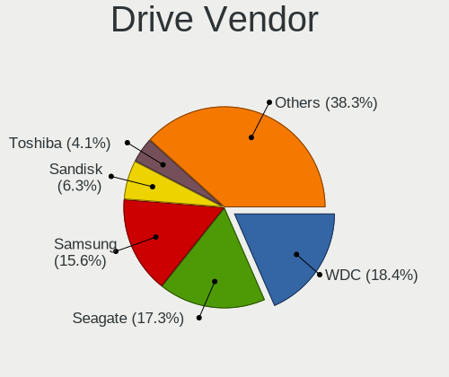
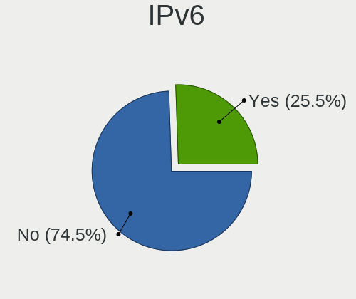
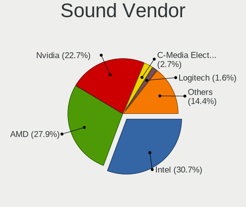
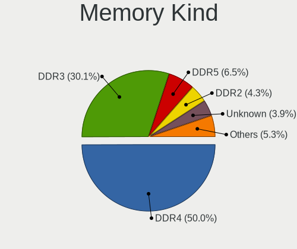

Linux in USA - Tested Hardware & Statistics (Desktops)
------------------------------------------------------

A project to collect tested hardware configurations for Linux in USA.

Anyone can contribute to this report by the [hw-probe](https://github.com/linuxhw/hw-probe) tool:

    sudo -E hw-probe -all -upload

Please contribute! Especially if your hardware is rare.

Contents
--------

* [ Test Cases ](#test-cases)

* [ System ](#system)
  - [ OS                       ](#os)
  - [ OS Family                ](#os-family)
  - [ Kernel                   ](#kernel)
  - [ Kernel Family            ](#kernel-family)
  - [ Kernel Major Ver.        ](#kernel-major-ver)
  - [ Arch                     ](#arch)
  - [ DE                       ](#de)
  - [ Display Server           ](#display-server)
  - [ Display Manager          ](#display-manager)
  - [ OS Lang                  ](#os-lang)
  - [ Boot Mode                ](#boot-mode)
  - [ Filesystem               ](#filesystem)
  - [ Part. scheme             ](#part-scheme)
  - [ Dual Boot with Linux/BSD ](#dual-boot-with-linuxbsd)
  - [ Dual Boot (Win)          ](#dual-boot-win)

* [ Board ](#board)
  - [ Vendor                   ](#vendor)
  - [ Model                    ](#model)
  - [ Model Family             ](#model-family)
  - [ MFG Year                 ](#mfg-year)
  - [ Form Factor              ](#form-factor)
  - [ Secure Boot              ](#secure-boot)
  - [ Coreboot                 ](#coreboot)
  - [ RAM Size                 ](#ram-size)
  - [ RAM Used                 ](#ram-used)
  - [ Total Drives             ](#total-drives)
  - [ Has CD-ROM               ](#has-cd-rom)
  - [ Has Ethernet             ](#has-ethernet)
  - [ Has WiFi                 ](#has-wifi)
  - [ Has Bluetooth            ](#has-bluetooth)

* [ Location ](#location)
  - [ Country                  ](#country)
  - [ City                     ](#city)

* [ Drives ](#drives)
  - [ Drive Vendor             ](#drive-vendor)
  - [ Drive Model              ](#drive-model)
  - [ HDD Vendor               ](#hdd-vendor)
  - [ SSD Vendor               ](#ssd-vendor)
  - [ Drive Kind               ](#drive-kind)
  - [ Drive Connector          ](#drive-connector)
  - [ Drive Size               ](#drive-size)
  - [ Space Total              ](#space-total)
  - [ Space Used               ](#space-used)
  - [ Malfunc. Drives          ](#malfunc-drives)
  - [ Malfunc. Drive Vendor    ](#malfunc-drive-vendor)
  - [ Malfunc. HDD Vendor      ](#malfunc-hdd-vendor)
  - [ Malfunc. Drive Kind      ](#malfunc-drive-kind)
  - [ Failed Drives            ](#failed-drives)
  - [ Failed Drive Vendor      ](#failed-drive-vendor)
  - [ Drive Status             ](#drive-status)

* [ Storage controller ](#storage-controller)
  - [ Storage Vendor           ](#storage-vendor)
  - [ Storage Model            ](#storage-model)
  - [ Storage Kind             ](#storage-kind)

* [ Processor ](#processor)
  - [ CPU Vendor               ](#cpu-vendor)
  - [ CPU Model                ](#cpu-model)
  - [ CPU Model Family         ](#cpu-model-family)
  - [ CPU Cores                ](#cpu-cores)
  - [ CPU Sockets              ](#cpu-sockets)
  - [ CPU Threads              ](#cpu-threads)
  - [ CPU Op-Modes             ](#cpu-op-modes)
  - [ CPU Microcode            ](#cpu-microcode)
  - [ CPU Microarch            ](#cpu-microarch)

* [ Graphics ](#graphics)
  - [ GPU Vendor               ](#gpu-vendor)
  - [ GPU Model                ](#gpu-model)
  - [ GPU Combo                ](#gpu-combo)
  - [ GPU Driver               ](#gpu-driver)
  - [ GPU Memory               ](#gpu-memory)

* [ Monitor ](#monitor)
  - [ Monitor Vendor           ](#monitor-vendor)
  - [ Monitor Model            ](#monitor-model)
  - [ Monitor Resolution       ](#monitor-resolution)
  - [ Monitor Diagonal         ](#monitor-diagonal)
  - [ Monitor Width            ](#monitor-width)
  - [ Aspect Ratio             ](#aspect-ratio)
  - [ Monitor Area             ](#monitor-area)
  - [ Pixel Density            ](#pixel-density)
  - [ Multiple Monitors        ](#multiple-monitors)

* [ Network ](#network)
  - [ Net Controller Vendor    ](#net-controller-vendor)
  - [ Net Controller Model     ](#net-controller-model)
  - [ Wireless Vendor          ](#wireless-vendor)
  - [ Wireless Model           ](#wireless-model)
  - [ Ethernet Vendor          ](#ethernet-vendor)
  - [ Ethernet Model           ](#ethernet-model)
  - [ Net Controller Kind      ](#net-controller-kind)
  - [ Used Controller          ](#used-controller)
  - [ NICs                     ](#nics)
  - [ IPv6                     ](#ipv6)

* [ Bluetooth ](#bluetooth)
  - [ Bluetooth Vendor         ](#bluetooth-vendor)
  - [ Bluetooth Model          ](#bluetooth-model)

* [ Sound ](#sound)
  - [ Sound Vendor             ](#sound-vendor)
  - [ Sound Model              ](#sound-model)

* [ Memory ](#memory)
  - [ Memory Vendor            ](#memory-vendor)
  - [ Memory Model             ](#memory-model)
  - [ Memory Kind              ](#memory-kind)
  - [ Memory Form Factor       ](#memory-form-factor)
  - [ Memory Size              ](#memory-size)
  - [ Memory Speed             ](#memory-speed)

* [ Printers & scanners ](#printers--scanners)
  - [ Printer Vendor           ](#printer-vendor)
  - [ Printer Model            ](#printer-model)
  - [ Scanner Vendor           ](#scanner-vendor)
  - [ Scanner Model            ](#scanner-model)

* [ Camera ](#camera)
  - [ Camera Vendor            ](#camera-vendor)
  - [ Camera Model             ](#camera-model)

* [ Security ](#security)
  - [ Fingerprint Vendor       ](#fingerprint-vendor)
  - [ Fingerprint Model        ](#fingerprint-model)
  - [ Chipcard Vendor          ](#chipcard-vendor)
  - [ Chipcard Model           ](#chipcard-model)

* [ Unsupported ](#unsupported)
  - [ Unsupported Devices      ](#unsupported-devices)
  - [ Unsupported Device Types ](#unsupported-device-types)

Test Cases
----------

Total: 15044

| Vendor        | Model                       | Probe                                                      | Date         |
|---------------|-----------------------------|------------------------------------------------------------|--------------|
| Supermicro    | A2SAN-E-WOHSA               | [f8d0b19c1e](https://linux-hardware.org/?probe=f8d0b19c1e) | Jul 01, 2022 |
| MSI           | X370 GAMING PRO CARBON      | [5763cb4576](https://linux-hardware.org/?probe=5763cb4576) | Jul 01, 2022 |
| Gigabyte      | X570 I AORUS PRO WIFI       | [d979555615](https://linux-hardware.org/?probe=d979555615) | Jul 01, 2022 |
| ASRock        | B450 Gaming K4              | [2bdfc5f472](https://linux-hardware.org/?probe=2bdfc5f472) | Jul 01, 2022 |
| MSI           | X399 GAMING PRO CARBON A... | [153a698b74](https://linux-hardware.org/?probe=153a698b74) | Jul 01, 2022 |
| ASUSTek       | PRIME H670-PLUS D4          | [8f90bed577](https://linux-hardware.org/?probe=8f90bed577) | Jul 01, 2022 |
| HP            | 8459                        | [f43fdff127](https://linux-hardware.org/?probe=f43fdff127) | Jul 01, 2022 |
| ASRock        | H570M Pro4                  | [7edf16eeea](https://linux-hardware.org/?probe=7edf16eeea) | Jul 01, 2022 |
| ASUSTek       | Maximus IX FORMULA          | [8c29343495](https://linux-hardware.org/?probe=8c29343495) | Jul 01, 2022 |
| ASUSTek       | Maximus IX FORMULA          | [2631bf2ae1](https://linux-hardware.org/?probe=2631bf2ae1) | Jul 01, 2022 |
| ASUSTek       | PRIME B550M-A               | [9f4f6d2323](https://linux-hardware.org/?probe=9f4f6d2323) | Jul 01, 2022 |
| Biostar       | B550GTA                     | [5d9da072f0](https://linux-hardware.org/?probe=5d9da072f0) | Jul 01, 2022 |
| Pegatron      | 2ACD                        | [3979af0018](https://linux-hardware.org/?probe=3979af0018) | Jul 01, 2022 |
| HP            | 18E7                        | [1808b6dee4](https://linux-hardware.org/?probe=1808b6dee4) | Jul 01, 2022 |
| ASUSTek       | PRIME B550-PLUS AC-HES      | [dde2246ae8](https://linux-hardware.org/?probe=dde2246ae8) | Jul 01, 2022 |
| Gigabyte      | Z590I AORUS ULTRA           | [febb798e92](https://linux-hardware.org/?probe=febb798e92) | Jul 01, 2022 |
| ASUSTek       | K30BF_M32BF                 | [dac4b154d6](https://linux-hardware.org/?probe=dac4b154d6) | Jul 01, 2022 |
| Gigabyte      | AM1M-S2H                    | [fb2500cc2d](https://linux-hardware.org/?probe=fb2500cc2d) | Jul 01, 2022 |
| Dell          | 0M9KCM A00                  | [e72232ee43](https://linux-hardware.org/?probe=e72232ee43) | Jul 01, 2022 |
| Dell          | 0M9KCM A00                  | [5e80242b43](https://linux-hardware.org/?probe=5e80242b43) | Jun 30, 2022 |
| HP            | 339A                        | [7cfe4b70f8](https://linux-hardware.org/?probe=7cfe4b70f8) | Jun 30, 2022 |
| Gigabyte      | GA-78LMT-USB3 SEx           | [530c44caa8](https://linux-hardware.org/?probe=530c44caa8) | Jun 30, 2022 |
| Supermicro    | X9DBS-F                     | [7aeeacc12c](https://linux-hardware.org/?probe=7aeeacc12c) | Jun 30, 2022 |
| EVGA          | X299 FTW K                  | [bde570c9f5](https://linux-hardware.org/?probe=bde570c9f5) | Jun 30, 2022 |
| Intel         | D410PT AAE76528-404         | [b7c62fc4a8](https://linux-hardware.org/?probe=b7c62fc4a8) | Jun 29, 2022 |
| ASUSTek       | ROG Maximus XIII HERO       | [0983817c84](https://linux-hardware.org/?probe=0983817c84) | Jun 29, 2022 |
| Protectli     | FW6                         | [c129601645](https://linux-hardware.org/?probe=c129601645) | Jun 29, 2022 |
| ASUSTek       | ROG STRIX Z370-E GAMING     | [349dc94a13](https://linux-hardware.org/?probe=349dc94a13) | Jun 29, 2022 |
| Protectli     | FW6                         | [f7d331dfcb](https://linux-hardware.org/?probe=f7d331dfcb) | Jun 29, 2022 |
| MSI           | MEG Z490 UNIFY              | [2c7a50869d](https://linux-hardware.org/?probe=2c7a50869d) | Jun 29, 2022 |
| Dell          | 0M5DCD A00                  | [7ff0a3f172](https://linux-hardware.org/?probe=7ff0a3f172) | Jun 29, 2022 |
| Dell          | 0M5DCD A00                  | [483d6a9299](https://linux-hardware.org/?probe=483d6a9299) | Jun 29, 2022 |
| Gigabyte      | X570 AORUS MASTER           | [6b034bb489](https://linux-hardware.org/?probe=6b034bb489) | Jun 29, 2022 |
| Dell          | 0D441T A01                  | [b205bc201e](https://linux-hardware.org/?probe=b205bc201e) | Jun 29, 2022 |
| ASUSTek       | ProArt Z690-CREATOR WIFI    | [392d5c7c12](https://linux-hardware.org/?probe=392d5c7c12) | Jun 29, 2022 |
| ASUSTek       | P5LD2                       | [4fdebc2b9c](https://linux-hardware.org/?probe=4fdebc2b9c) | Jun 29, 2022 |
| ASUSTek       | P5LD2                       | [c7f67d9347](https://linux-hardware.org/?probe=c7f67d9347) | Jun 29, 2022 |
| ASUSTek       | ROG ZENITH EXTREME          | [33c8a42a4d](https://linux-hardware.org/?probe=33c8a42a4d) | Jun 29, 2022 |
| Dell          | 0WMJ54 A01                  | [a55837dc17](https://linux-hardware.org/?probe=a55837dc17) | Jun 29, 2022 |
| Gigabyte      | Z97X-SLI-CF                 | [0a66ce61c6](https://linux-hardware.org/?probe=0a66ce61c6) | Jun 29, 2022 |
| MSI           | MEG X570 UNIFY              | [0fbd5ca967](https://linux-hardware.org/?probe=0fbd5ca967) | Jun 29, 2022 |
| Dell          | 0VHWTR A02                  | [ee144de507](https://linux-hardware.org/?probe=ee144de507) | Jun 29, 2022 |
| Gigabyte      | Z97X-SLI-CF                 | [f2b790de57](https://linux-hardware.org/?probe=f2b790de57) | Jun 29, 2022 |
| HP            | 8643 SMVB                   | [a0bf95fa0c](https://linux-hardware.org/?probe=a0bf95fa0c) | Jun 29, 2022 |
| Gigabyte      | B550 AORUS MASTER           | [be4dd3360f](https://linux-hardware.org/?probe=be4dd3360f) | Jun 28, 2022 |
| Dell          | 0TP406                      | [4f0f2b2e05](https://linux-hardware.org/?probe=4f0f2b2e05) | Jun 28, 2022 |
| ASUSTek       | ROG ZENITH EXTREME          | [efb8cff806](https://linux-hardware.org/?probe=efb8cff806) | Jun 28, 2022 |
| ASUSTek       | TUF Gaming X570-PLUS        | [87b9ce1db1](https://linux-hardware.org/?probe=87b9ce1db1) | Jun 28, 2022 |
| EVGA          | X299 FTW K                  | [2fac0d5ea2](https://linux-hardware.org/?probe=2fac0d5ea2) | Jun 28, 2022 |
| MSI           | B450M PRO-VDH MAX           | [291139aa4f](https://linux-hardware.org/?probe=291139aa4f) | Jun 28, 2022 |
| MSI           | B450M PRO-VDH MAX           | [369f504484](https://linux-hardware.org/?probe=369f504484) | Jun 28, 2022 |
| Dell          | 0WN7Y6 A01                  | [a07a657c67](https://linux-hardware.org/?probe=a07a657c67) | Jun 28, 2022 |
| Unknown       | Unknown                     | [8eb0d6165a](https://linux-hardware.org/?probe=8eb0d6165a) | Jun 28, 2022 |
| ASRock        | 970M Pro3                   | [f817d55df3](https://linux-hardware.org/?probe=f817d55df3) | Jun 28, 2022 |
| Dell          | 02YYK5 A01                  | [ab6a2f07c6](https://linux-hardware.org/?probe=ab6a2f07c6) | Jun 28, 2022 |
| ASUSTek       | PRIME Z690-P WIFI           | [0441b2cf28](https://linux-hardware.org/?probe=0441b2cf28) | Jun 27, 2022 |
| HP            | 0B4Ch D                     | [6e28eeb447](https://linux-hardware.org/?probe=6e28eeb447) | Jun 27, 2022 |
| ASUSTek       | PRIME Z690-P WIFI           | [ca055793c5](https://linux-hardware.org/?probe=ca055793c5) | Jun 27, 2022 |
| HP            | 3047h                       | [32eb7049a1](https://linux-hardware.org/?probe=32eb7049a1) | Jun 27, 2022 |
| MSI           | MPG Z390 GAMING PLUS        | [3d575e19b6](https://linux-hardware.org/?probe=3d575e19b6) | Jun 27, 2022 |
| EVGA          | 151-HE-E999                 | [2725b53d0c](https://linux-hardware.org/?probe=2725b53d0c) | Jun 27, 2022 |
| ASUSTek       | TUF Gaming B550M-PLUS       | [da1c9472bd](https://linux-hardware.org/?probe=da1c9472bd) | Jun 27, 2022 |
| Dell          | 0GDG8Y A00                  | [d36f5ea260](https://linux-hardware.org/?probe=d36f5ea260) | Jun 27, 2022 |
| MSI           | Z170A GAMING PRO            | [70e3e75c86](https://linux-hardware.org/?probe=70e3e75c86) | Jun 27, 2022 |
| ASRock        | B450 Gaming K4              | [6ecc609381](https://linux-hardware.org/?probe=6ecc609381) | Jun 27, 2022 |
| Lenovo        | 3098 0B98401 PRO            | [9923c241d9](https://linux-hardware.org/?probe=9923c241d9) | Jun 27, 2022 |
| Dell          | 0U880P A00                  | [e14832f09c](https://linux-hardware.org/?probe=e14832f09c) | Jun 26, 2022 |
| Dell          | 0YNVJG A02                  | [e272328867](https://linux-hardware.org/?probe=e272328867) | Jun 26, 2022 |
| ASUSTek       | PRIME B350-PLUS             | [583a217093](https://linux-hardware.org/?probe=583a217093) | Jun 26, 2022 |
| HP            | 82A2                        | [cbc788e1d4](https://linux-hardware.org/?probe=cbc788e1d4) | Jun 26, 2022 |
| ASUSTek       | P8H61-I                     | [15b8beca14](https://linux-hardware.org/?probe=15b8beca14) | Jun 26, 2022 |
| Dell          | 0YNVJG A02                  | [9a39e5ea0d](https://linux-hardware.org/?probe=9a39e5ea0d) | Jun 26, 2022 |
| Gigabyte      | 990FXA-UD5 R5               | [9a853085ea](https://linux-hardware.org/?probe=9a853085ea) | Jun 26, 2022 |
| ASRock        | Z77 Extreme4                | [b397f63621](https://linux-hardware.org/?probe=b397f63621) | Jun 26, 2022 |
| Gigabyte      | 970A-DS3P                   | [c45dba9246](https://linux-hardware.org/?probe=c45dba9246) | Jun 26, 2022 |
| ASRock        | 990FX Killer                | [1e18ee882c](https://linux-hardware.org/?probe=1e18ee882c) | Jun 26, 2022 |
| ASUSTek       | TUF Gaming X570-PLUS        | [bb3f7f9534](https://linux-hardware.org/?probe=bb3f7f9534) | Jun 26, 2022 |
| Dell          | 0HD5W2 A01                  | [9f87421952](https://linux-hardware.org/?probe=9f87421952) | Jun 26, 2022 |
| Alienware     | 02XRCM A01                  | [c70647bab0](https://linux-hardware.org/?probe=c70647bab0) | Jun 26, 2022 |
| ASUSTek       | VM40B                       | [35f67bace1](https://linux-hardware.org/?probe=35f67bace1) | Jun 26, 2022 |
| ASUSTek       | ROG CROSSHAIR VIII HERO     | [c78b132d02](https://linux-hardware.org/?probe=c78b132d02) | Jun 26, 2022 |
| Dell          | 0D6H9T A00                  | [fd65f44d25](https://linux-hardware.org/?probe=fd65f44d25) | Jun 26, 2022 |
| ASUSTek       | ROG CROSSHAIR VIII HERO     | [55fc30c7a5](https://linux-hardware.org/?probe=55fc30c7a5) | Jun 26, 2022 |
| Gigabyte      | X570 GAMING X               | [b66ac35391](https://linux-hardware.org/?probe=b66ac35391) | Jun 26, 2022 |
| ASUSTek       | TUF Gaming X570-PRO WIFI... | [b232a434fd](https://linux-hardware.org/?probe=b232a434fd) | Jun 26, 2022 |
| ASUSTek       | Pro WS WRX80E-SAGE SE WI... | [f440505698](https://linux-hardware.org/?probe=f440505698) | Jun 25, 2022 |
| Gigabyte      | GA-890GPA-UD3H              | [f6faa2d944](https://linux-hardware.org/?probe=f6faa2d944) | Jun 25, 2022 |
| ASUSTek       | Maximus VII HERO            | [69dc6b3a5f](https://linux-hardware.org/?probe=69dc6b3a5f) | Jun 25, 2022 |
| ASRock        | B550 Taichi                 | [a84e0d9197](https://linux-hardware.org/?probe=a84e0d9197) | Jun 25, 2022 |
| Dell          | 040DDP A00                  | [02721926a7](https://linux-hardware.org/?probe=02721926a7) | Jun 25, 2022 |
| ASUSTek       | P6T DELUXE V2               | [2dbe28adc6](https://linux-hardware.org/?probe=2dbe28adc6) | Jun 25, 2022 |
| ASUSTek       | TUF Gaming Z690-PLUS WIF... | [c3c48bb18e](https://linux-hardware.org/?probe=c3c48bb18e) | Jun 25, 2022 |
| MSI           | B85I                        | [886f971d22](https://linux-hardware.org/?probe=886f971d22) | Jun 25, 2022 |
| Gigabyte      | 970A-DS3P                   | [3d36beed4b](https://linux-hardware.org/?probe=3d36beed4b) | Jun 25, 2022 |
| HP            | 339A                        | [822467af7f](https://linux-hardware.org/?probe=822467af7f) | Jun 25, 2022 |
| HP            | 89D8 SMVB                   | [f92ff0c37f](https://linux-hardware.org/?probe=f92ff0c37f) | Jun 24, 2022 |
| ASUSTek       | TUF Gaming X570-PLUS        | [554ba1726f](https://linux-hardware.org/?probe=554ba1726f) | Jun 24, 2022 |
| ASUSTek       | TUF Gaming X570-PLUS        | [3dffa312da](https://linux-hardware.org/?probe=3dffa312da) | Jun 24, 2022 |
| ASUSTek       | LEUCITE                     | [c4d2ed5723](https://linux-hardware.org/?probe=c4d2ed5723) | Jun 24, 2022 |
| MSI           | MAG B550M MORTAR            | [4140ae9d15](https://linux-hardware.org/?probe=4140ae9d15) | Jun 24, 2022 |
| Gigabyte      | EP45-UD3P                   | [05449d9e5c](https://linux-hardware.org/?probe=05449d9e5c) | Jun 24, 2022 |
| HP            | 2AF7                        | [86ecfeb9e2](https://linux-hardware.org/?probe=86ecfeb9e2) | Jun 24, 2022 |
| Dell          | 0XR1GT A00                  | [319b0094a5](https://linux-hardware.org/?probe=319b0094a5) | Jun 24, 2022 |
| Dell          | 0VRWRC A00                  | [373df03a96](https://linux-hardware.org/?probe=373df03a96) | Jun 24, 2022 |
| Gigabyte      | GA-MA785GM-US2H             | [d9e6c94ff9](https://linux-hardware.org/?probe=d9e6c94ff9) | Jun 24, 2022 |
| Gigabyte      | H470M DS3H                  | [624ad307fc](https://linux-hardware.org/?probe=624ad307fc) | Jun 24, 2022 |
| Dell          | 018D1Y A00                  | [8344a8b783](https://linux-hardware.org/?probe=8344a8b783) | Jun 24, 2022 |
| Dell          | 0WMJ54 A01                  | [ee865231c1](https://linux-hardware.org/?probe=ee865231c1) | Jun 24, 2022 |
| Foxconn       | 2AB1                        | [389a1d6185](https://linux-hardware.org/?probe=389a1d6185) | Jun 23, 2022 |
| HP            | 830C                        | [7e34e5c70d](https://linux-hardware.org/?probe=7e34e5c70d) | Jun 23, 2022 |
| ASRock        | H97M Anniversary            | [c207afc887](https://linux-hardware.org/?probe=c207afc887) | Jun 23, 2022 |
| Dell          | 07N90W A00                  | [16fe9be88b](https://linux-hardware.org/?probe=16fe9be88b) | Jun 23, 2022 |
| ASUSTek       | CROSSHAIR V FORMULA-Z       | [dbfad9b8fe](https://linux-hardware.org/?probe=dbfad9b8fe) | Jun 23, 2022 |
| Gigabyte      | G1.Sniper M3-CF             | [055977bdee](https://linux-hardware.org/?probe=055977bdee) | Jun 23, 2022 |
| Gigabyte      | X570 AORUS ELITE            | [0bd1e7d592](https://linux-hardware.org/?probe=0bd1e7d592) | Jun 23, 2022 |
| ASUSTek       | CROSSHAIR V FORMULA-Z       | [6f13e0f8a0](https://linux-hardware.org/?probe=6f13e0f8a0) | Jun 23, 2022 |
| Dell          | 0J8885                      | [06e5e2fe54](https://linux-hardware.org/?probe=06e5e2fe54) | Jun 23, 2022 |
| Unknown       | HX90                        | [837e70229a](https://linux-hardware.org/?probe=837e70229a) | Jun 23, 2022 |
| ASUSTek       | ROG STRIX Z590-E GAMING ... | [3cfb6f7ee5](https://linux-hardware.org/?probe=3cfb6f7ee5) | Jun 23, 2022 |
| ASUSTek       | PRIME B550M-A               | [d4492d1e5d](https://linux-hardware.org/?probe=d4492d1e5d) | Jun 23, 2022 |
| ASUSTek       | TUF Gaming X570-PRO         | [c5a5527f1d](https://linux-hardware.org/?probe=c5a5527f1d) | Jun 23, 2022 |
| ASUSTek       | Z97-K                       | [486601dc33](https://linux-hardware.org/?probe=486601dc33) | Jun 23, 2022 |
| Apple         | Mac-F221BEC8                | [ba64ef130a](https://linux-hardware.org/?probe=ba64ef130a) | Jun 23, 2022 |
| Apple         | Mac-F42C88C8 Proto1         | [4ce77b6a35](https://linux-hardware.org/?probe=4ce77b6a35) | Jun 23, 2022 |
| HP            | 8053                        | [ff703fcbf1](https://linux-hardware.org/?probe=ff703fcbf1) | Jun 23, 2022 |
| MSI           | PRO B660M-A DDR4            | [1d719d4b2d](https://linux-hardware.org/?probe=1d719d4b2d) | Jun 23, 2022 |
| MSI           | A75A-G35                    | [9e3dd8051c](https://linux-hardware.org/?probe=9e3dd8051c) | Jun 23, 2022 |
| ASUSTek       | PRIME X570-PRO              | [a24305d670](https://linux-hardware.org/?probe=a24305d670) | Jun 23, 2022 |
| ASUSTek       | PRIME X370-PRO              | [165a04e05f](https://linux-hardware.org/?probe=165a04e05f) | Jun 23, 2022 |
| Gigabyte      | Z590 UD                     | [74060af6fc](https://linux-hardware.org/?probe=74060af6fc) | Jun 23, 2022 |
| Lenovo        | MAHOBAY                     | [8f7a233327](https://linux-hardware.org/?probe=8f7a233327) | Jun 22, 2022 |
| ASUSTek       | PRIME X570-PRO              | [ecea2bb4ad](https://linux-hardware.org/?probe=ecea2bb4ad) | Jun 22, 2022 |
| ASUSTek       | PRIME Z690-P                | [6302e38583](https://linux-hardware.org/?probe=6302e38583) | Jun 22, 2022 |
| ASRock        | B550M Pro4                  | [45871f6d61](https://linux-hardware.org/?probe=45871f6d61) | Jun 22, 2022 |
| System76      | Thelio Mira thelio-mira-... | [58c9da7f20](https://linux-hardware.org/?probe=58c9da7f20) | Jun 22, 2022 |
| Gigabyte      | EP45-UD3P                   | [56959468cc](https://linux-hardware.org/?probe=56959468cc) | Jun 22, 2022 |
| HP            | 2AF7                        | [f4eccffc76](https://linux-hardware.org/?probe=f4eccffc76) | Jun 22, 2022 |
| ASUSTek       | H97I-PLUS                   | [982df0dba9](https://linux-hardware.org/?probe=982df0dba9) | Jun 22, 2022 |
| ASUSTek       | M5A97 LE R2.0               | [f22d3d0fd3](https://linux-hardware.org/?probe=f22d3d0fd3) | Jun 22, 2022 |
| Dell          | 0200DY A01                  | [bc8030c1d5](https://linux-hardware.org/?probe=bc8030c1d5) | Jun 22, 2022 |
| ASUSTek       | ROG STRIX X570-F GAMING     | [27bc9defca](https://linux-hardware.org/?probe=27bc9defca) | Jun 22, 2022 |
| ASUSTek       | ROG STRIX X570-F GAMING     | [941b96e6ab](https://linux-hardware.org/?probe=941b96e6ab) | Jun 22, 2022 |
| Dell          | 0WN7Y6 A02                  | [3e2f6e6e1c](https://linux-hardware.org/?probe=3e2f6e6e1c) | Jun 22, 2022 |
| ASUSTek       | TUF Gaming B450-PLUS II     | [5fc2a02e85](https://linux-hardware.org/?probe=5fc2a02e85) | Jun 22, 2022 |
| ASUSTek       | TUF Z390-PLUS GAMING        | [04927da7b6](https://linux-hardware.org/?probe=04927da7b6) | Jun 22, 2022 |
| ASUSTek       | ROG CROSSHAIR VIII HERO     | [d5fd58e3b0](https://linux-hardware.org/?probe=d5fd58e3b0) | Jun 21, 2022 |
| ASRock        | Z690M-ITX/ax                | [cc8224a123](https://linux-hardware.org/?probe=cc8224a123) | Jun 21, 2022 |
| ASRock        | Z690M-ITX/ax                | [1d3eb4348d](https://linux-hardware.org/?probe=1d3eb4348d) | Jun 21, 2022 |
| ASRock        | Z690M-ITX/ax                | [35bec2520a](https://linux-hardware.org/?probe=35bec2520a) | Jun 21, 2022 |
| Gigabyte      | X570 AORUS PRO WIFI         | [73aff9ca4a](https://linux-hardware.org/?probe=73aff9ca4a) | Jun 21, 2022 |
| System76      | Thelio thelio-r2            | [b9b9d5ffda](https://linux-hardware.org/?probe=b9b9d5ffda) | Jun 21, 2022 |
| ASUSTek       | P8Z68-V LX                  | [a91bf1aff7](https://linux-hardware.org/?probe=a91bf1aff7) | Jun 21, 2022 |
| Intel         | CD952                       | [da181703fa](https://linux-hardware.org/?probe=da181703fa) | Jun 21, 2022 |
| Intel         | B75                         | [5e9768ed1a](https://linux-hardware.org/?probe=5e9768ed1a) | Jun 21, 2022 |
| Dell          | 0XR1GT A00                  | [9a2a323056](https://linux-hardware.org/?probe=9a2a323056) | Jun 21, 2022 |
| Gigabyte      | B450M DS3H WIFI V2-CF       | [37f7936cd9](https://linux-hardware.org/?probe=37f7936cd9) | Jun 21, 2022 |
| Gigabyte      | EX58-UD3R                   | [4014366c8a](https://linux-hardware.org/?probe=4014366c8a) | Jun 21, 2022 |
| ASUSTek       | Q87M-E                      | [9f37139898](https://linux-hardware.org/?probe=9f37139898) | Jun 21, 2022 |
| ASRock        | X299 Taichi CLX             | [ee5ad45d8b](https://linux-hardware.org/?probe=ee5ad45d8b) | Jun 21, 2022 |
| MSI           | MPG X570 GAMING EDGE WIF... | [7063b6a7ef](https://linux-hardware.org/?probe=7063b6a7ef) | Jun 21, 2022 |
| Dell          | 0F896N A02                  | [223cbe95f4](https://linux-hardware.org/?probe=223cbe95f4) | Jun 20, 2022 |
| ASUSTek       | P8Z77-V                     | [16d7a07f8f](https://linux-hardware.org/?probe=16d7a07f8f) | Jun 20, 2022 |
| Dell          | 0TP406                      | [3798b45f67](https://linux-hardware.org/?probe=3798b45f67) | Jun 20, 2022 |
| Dell          | 0DR845                      | [56b4af8d26](https://linux-hardware.org/?probe=56b4af8d26) | Jun 20, 2022 |
| MSI           | MEG X570 UNIFY              | [6d5fdb800a](https://linux-hardware.org/?probe=6d5fdb800a) | Jun 20, 2022 |
| MSI           | A320M PRO-M2                | [8ffdebb12e](https://linux-hardware.org/?probe=8ffdebb12e) | Jun 20, 2022 |
| ASUSTek       | SABERTOOTH X99              | [1052591535](https://linux-hardware.org/?probe=1052591535) | Jun 20, 2022 |
| ASRock        | X470 Gaming-ITX/ac          | [ff99319454](https://linux-hardware.org/?probe=ff99319454) | Jun 20, 2022 |
| ASUSTek       | TUF Gaming Z690-PLUS WIF... | [a384703b5e](https://linux-hardware.org/?probe=a384703b5e) | Jun 20, 2022 |
| HP            | 1495                        | [23d2147ac4](https://linux-hardware.org/?probe=23d2147ac4) | Jun 20, 2022 |
| ASRock        | B450 Gaming K4              | [230bdf84a1](https://linux-hardware.org/?probe=230bdf84a1) | Jun 20, 2022 |
| MSI           | MPG Z490 GAMING PLUS        | [ec3bc83e7a](https://linux-hardware.org/?probe=ec3bc83e7a) | Jun 20, 2022 |
| Gigabyte      | 970A-D3P                    | [d0b9dab8ea](https://linux-hardware.org/?probe=d0b9dab8ea) | Jun 20, 2022 |
| MSI           | B560M PRO-VDH WIFI [CEC]    | [8654086b85](https://linux-hardware.org/?probe=8654086b85) | Jun 20, 2022 |
| ASRock        | B550 Taichi                 | [ddd610d863](https://linux-hardware.org/?probe=ddd610d863) | Jun 20, 2022 |
| MSI           | B550-A PRO                  | [a7a76f04f9](https://linux-hardware.org/?probe=a7a76f04f9) | Jun 19, 2022 |
| MSI           | B450 TOMAHAWK MAX II        | [4fc1134f6d](https://linux-hardware.org/?probe=4fc1134f6d) | Jun 19, 2022 |
| ASUSTek       | G10DK                       | [3882552921](https://linux-hardware.org/?probe=3882552921) | Jun 19, 2022 |
| ASUSTek       | M5A97                       | [bcca05b660](https://linux-hardware.org/?probe=bcca05b660) | Jun 19, 2022 |
| Dell          | 09M8Y8 A01                  | [fbb695f8cf](https://linux-hardware.org/?probe=fbb695f8cf) | Jun 19, 2022 |
| ASUSTek       | ROG STRIX X570-E GAMING     | [75d908e7db](https://linux-hardware.org/?probe=75d908e7db) | Jun 19, 2022 |
| Lenovo        | 3132 SDK0R32862 WIN 3258... | [473e2262b2](https://linux-hardware.org/?probe=473e2262b2) | Jun 19, 2022 |
| Lenovo        | 3132 SDK0R32862 WIN 3258... | [83858f351b](https://linux-hardware.org/?probe=83858f351b) | Jun 19, 2022 |
| ASUSTek       | X99-A/USB                   | [d9808cc5aa](https://linux-hardware.org/?probe=d9808cc5aa) | Jun 19, 2022 |
| Dell          | 00V62H A00                  | [b902ece510](https://linux-hardware.org/?probe=b902ece510) | Jun 19, 2022 |
| ASUSTek       | KGPE-D16                    | [8a0bcff648](https://linux-hardware.org/?probe=8a0bcff648) | Jun 19, 2022 |
| ASUSTek       | KGPE-D16                    | [2ce805f758](https://linux-hardware.org/?probe=2ce805f758) | Jun 19, 2022 |
| Lenovo        | 110520U ThinkServer TS13... | [850ed5aa51](https://linux-hardware.org/?probe=850ed5aa51) | Jun 19, 2022 |
| MSI           | H510I PRO WIFI              | [b9d3cb4755](https://linux-hardware.org/?probe=b9d3cb4755) | Jun 18, 2022 |
| ASRock        | H270 Pro4                   | [189e8805a4](https://linux-hardware.org/?probe=189e8805a4) | Jun 18, 2022 |
| Dell          | 09M8Y8 A02                  | [a029173d31](https://linux-hardware.org/?probe=a029173d31) | Jun 18, 2022 |
| Acer          | Aspire X3950                | [7a70838628](https://linux-hardware.org/?probe=7a70838628) | Jun 18, 2022 |
| Dell          | 0PC5F7 A03                  | [66c542496c](https://linux-hardware.org/?probe=66c542496c) | Jun 18, 2022 |
| ASUSTek       | CROSSHAIR VI HERO           | [3e7ce078c6](https://linux-hardware.org/?probe=3e7ce078c6) | Jun 18, 2022 |
| Dell          | 0YNVJG A01                  | [b75bebfda2](https://linux-hardware.org/?probe=b75bebfda2) | Jun 18, 2022 |
| ASUSTek       | ROG CROSSHAIR VII HERO      | [a698baa5f6](https://linux-hardware.org/?probe=a698baa5f6) | Jun 18, 2022 |
| ASRock        | X470 Gaming K4              | [cbd28eb0ed](https://linux-hardware.org/?probe=cbd28eb0ed) | Jun 18, 2022 |
| Dell          | 0Y5DDC A00                  | [c59a0a5413](https://linux-hardware.org/?probe=c59a0a5413) | Jun 18, 2022 |
| Gigabyte      | F2A68HM-H                   | [3adcbf0255](https://linux-hardware.org/?probe=3adcbf0255) | Jun 18, 2022 |
| HP            | 1825                        | [493985b52d](https://linux-hardware.org/?probe=493985b52d) | Jun 18, 2022 |
| MSI           | B450 GAMING PRO CARBON A... | [b0cc04798d](https://linux-hardware.org/?probe=b0cc04798d) | Jun 18, 2022 |
| MSI           | MPG B550 GAMING PLUS        | [a104454c2d](https://linux-hardware.org/?probe=a104454c2d) | Jun 18, 2022 |
| Lenovo        | SHARKBAY SDK0E50510 PRO     | [474c946289](https://linux-hardware.org/?probe=474c946289) | Jun 17, 2022 |
| ASUSTek       | ROG STRIX B550-F GAMING     | [995a6e5aff](https://linux-hardware.org/?probe=995a6e5aff) | Jun 17, 2022 |
| Lenovo        | 31900058 STD                | [2f6356a177](https://linux-hardware.org/?probe=2f6356a177) | Jun 17, 2022 |
| HP            | 1998                        | [86d621451f](https://linux-hardware.org/?probe=86d621451f) | Jun 17, 2022 |
| HP            | 2B29                        | [a845bb9ffa](https://linux-hardware.org/?probe=a845bb9ffa) | Jun 17, 2022 |
| HP            | 1589                        | [1d686eba5c](https://linux-hardware.org/?probe=1d686eba5c) | Jun 17, 2022 |
| ASUSTek       | ROG STRIX B550-F GAMING     | [4a8163d07f](https://linux-hardware.org/?probe=4a8163d07f) | Jun 17, 2022 |
| MSI           | MAG B460M MORTAR            | [9074247e52](https://linux-hardware.org/?probe=9074247e52) | Jun 17, 2022 |
| MSI           | A68HM-E33 V2                | [244067b8a7](https://linux-hardware.org/?probe=244067b8a7) | Jun 17, 2022 |
| Gigabyte      | B450M DS3H WIFI-CF          | [5241a60357](https://linux-hardware.org/?probe=5241a60357) | Jun 17, 2022 |
| MSI           | B450-A PRO MAX              | [24ecffb555](https://linux-hardware.org/?probe=24ecffb555) | Jun 16, 2022 |
| Lenovo        | 3148 SDK0J40709 WIN 3259... | [475e980cb3](https://linux-hardware.org/?probe=475e980cb3) | Jun 16, 2022 |
| Dell          | 08NPPY A00                  | [93eb00c3c5](https://linux-hardware.org/?probe=93eb00c3c5) | Jun 16, 2022 |
| Lenovo        | 30D9 SDK0J40705 WIN 3425... | [63ba339f77](https://linux-hardware.org/?probe=63ba339f77) | Jun 16, 2022 |
| Dell          | 0TP412                      | [aa585dda89](https://linux-hardware.org/?probe=aa585dda89) | Jun 16, 2022 |
| Dell          | 0XC7MM A01                  | [8c8a1ef522](https://linux-hardware.org/?probe=8c8a1ef522) | Jun 16, 2022 |
| Dell          | 0U880P A00                  | [463ec26d1e](https://linux-hardware.org/?probe=463ec26d1e) | Jun 16, 2022 |
| ASRock        | EP2C602-4L/D16              | [2016b3da9a](https://linux-hardware.org/?probe=2016b3da9a) | Jun 16, 2022 |
| Dell          | 0U880P A00                  | [468b364f5a](https://linux-hardware.org/?probe=468b364f5a) | Jun 16, 2022 |
| Dell          | 0NDYHG A01                  | [c4ed1ece70](https://linux-hardware.org/?probe=c4ed1ece70) | Jun 16, 2022 |
| Dell          | 0HHV7N A00                  | [3a13a87397](https://linux-hardware.org/?probe=3a13a87397) | Jun 16, 2022 |
| Gigabyte      | B560M DS3H AC               | [f0b95571fd](https://linux-hardware.org/?probe=f0b95571fd) | Jun 16, 2022 |
| MSI           | B550M PRO-VDH WIFI          | [58e8e1ab87](https://linux-hardware.org/?probe=58e8e1ab87) | Jun 16, 2022 |
| Lenovo        | SHARKBAY 0B98401 WIN        | [24140a62de](https://linux-hardware.org/?probe=24140a62de) | Jun 16, 2022 |
| Pegatron      | 2ACD                        | [8c8275099b](https://linux-hardware.org/?probe=8c8275099b) | Jun 16, 2022 |
| MSI           | MEG Z690 UNIFY              | [b005cba622](https://linux-hardware.org/?probe=b005cba622) | Jun 16, 2022 |
| Gigabyte      | 990FXA-UD5 R5               | [08527d664b](https://linux-hardware.org/?probe=08527d664b) | Jun 16, 2022 |
| ASUSTek       | PRIME B550M-A               | [738709ae5d](https://linux-hardware.org/?probe=738709ae5d) | Jun 16, 2022 |
| ASUSTek       | ROG STRIX X470-I GAMING     | [dab54fda61](https://linux-hardware.org/?probe=dab54fda61) | Jun 16, 2022 |
| HP            | 212B                        | [ca201e628f](https://linux-hardware.org/?probe=ca201e628f) | Jun 16, 2022 |
| ASRock        | EP2C602-4L/D16              | [efd37423d6](https://linux-hardware.org/?probe=efd37423d6) | Jun 16, 2022 |
| MSI           | MPG B550I GAMING EDGE MA... | [69b95cc638](https://linux-hardware.org/?probe=69b95cc638) | Jun 16, 2022 |
| Gigabyte      | B450M DS3H V2               | [5d2c867af6](https://linux-hardware.org/?probe=5d2c867af6) | Jun 15, 2022 |
| Gigabyte      | GA-990FXA-UD5               | [7803ca2a79](https://linux-hardware.org/?probe=7803ca2a79) | Jun 15, 2022 |
| Dell          | 0X501H A02                  | [b9cb2a1e48](https://linux-hardware.org/?probe=b9cb2a1e48) | Jun 15, 2022 |
| MSI           | Z390-A PRO                  | [3074e50dff](https://linux-hardware.org/?probe=3074e50dff) | Jun 15, 2022 |
| Lenovo        | 3148 SDK0J40709 WIN 3259... | [8d5ba3c58c](https://linux-hardware.org/?probe=8d5ba3c58c) | Jun 15, 2022 |
| MSI           | PRO Z690-A WIFI DDR4        | [da44ae8ded](https://linux-hardware.org/?probe=da44ae8ded) | Jun 15, 2022 |
| ASUSTek       | TUF Gaming Z590-PLUS WIF... | [5be4039515](https://linux-hardware.org/?probe=5be4039515) | Jun 15, 2022 |
| Gigabyte      | 970A-DS3P FX                | [81b8e44cca](https://linux-hardware.org/?probe=81b8e44cca) | Jun 15, 2022 |
| ASUSTek       | CROSSHAIR VI HERO           | [8bf8ec8bd0](https://linux-hardware.org/?probe=8bf8ec8bd0) | Jun 15, 2022 |
| ASUSTek       | PRIME B450M-A               | [16a9126560](https://linux-hardware.org/?probe=16a9126560) | Jun 15, 2022 |
| ASUSTek       | ROG CROSSHAIR VII HERO      | [9418d283c9](https://linux-hardware.org/?probe=9418d283c9) | Jun 15, 2022 |
| Dell          | 0YXT71 A01                  | [bff4742605](https://linux-hardware.org/?probe=bff4742605) | Jun 15, 2022 |
| Dell          | 0YXT71 A01                  | [2b5fdf4b81](https://linux-hardware.org/?probe=2b5fdf4b81) | Jun 15, 2022 |
| ASUSTek       | TUF X299 MARK 2             | [507c214577](https://linux-hardware.org/?probe=507c214577) | Jun 15, 2022 |
| MSI           | B450 GAMING PRO CARBON M... | [971f310609](https://linux-hardware.org/?probe=971f310609) | Jun 15, 2022 |
| ASRock        | X299 Taichi CLX             | [d349f8b0f5](https://linux-hardware.org/?probe=d349f8b0f5) | Jun 15, 2022 |
| HP            | 1905                        | [b3d0170095](https://linux-hardware.org/?probe=b3d0170095) | Jun 14, 2022 |
| Lenovo        | 31900058 STD                | [582fd88dbe](https://linux-hardware.org/?probe=582fd88dbe) | Jun 14, 2022 |
| ASUSTek       | PRIME Z370-A                | [1bb2aa2c68](https://linux-hardware.org/?probe=1bb2aa2c68) | Jun 14, 2022 |
| Dell          | 0HD5W2 A00                  | [45014b0ff8](https://linux-hardware.org/?probe=45014b0ff8) | Jun 14, 2022 |
| ASUSTek       | PRIME B550-PLUS             | [5b8ae292bf](https://linux-hardware.org/?probe=5b8ae292bf) | Jun 14, 2022 |
| MSI           | Z170A GAMING PRO            | [73b3e29101](https://linux-hardware.org/?probe=73b3e29101) | Jun 14, 2022 |
| ASUSTek       | SABERTOOTH 990FX R2.0       | [cdbe0685be](https://linux-hardware.org/?probe=cdbe0685be) | Jun 13, 2022 |
| Lenovo        | 3717 SDK0J40709 WIN 3259... | [aa63e13a60](https://linux-hardware.org/?probe=aa63e13a60) | Jun 13, 2022 |
| Lenovo        | 3717 SDK0J40709 WIN 3259... | [ba6786bbe8](https://linux-hardware.org/?probe=ba6786bbe8) | Jun 13, 2022 |
| ASRock        | B450M/ac R2.0               | [bc509480d2](https://linux-hardware.org/?probe=bc509480d2) | Jun 13, 2022 |
| Dell          | 09KPNV A00                  | [ed59551343](https://linux-hardware.org/?probe=ed59551343) | Jun 13, 2022 |
| Dell          | 073MMW A03                  | [3e206d2462](https://linux-hardware.org/?probe=3e206d2462) | Jun 13, 2022 |
| ASUSTek       | Z87-K                       | [cafc34944d](https://linux-hardware.org/?probe=cafc34944d) | Jun 13, 2022 |
| Gigabyte      | GA-MA78LMT-S2               | [be77f2ffd4](https://linux-hardware.org/?probe=be77f2ffd4) | Jun 12, 2022 |
| Foxconn       | G31MX Series                | [9d80d2cb7e](https://linux-hardware.org/?probe=9d80d2cb7e) | Jun 12, 2022 |
| Foxconn       | G31MX Series                | [0b0c87bfe5](https://linux-hardware.org/?probe=0b0c87bfe5) | Jun 12, 2022 |
| Gigabyte      | P55A-UD3                    | [66062b5350](https://linux-hardware.org/?probe=66062b5350) | Jun 12, 2022 |
| MSI           | MAG X570 TOMAHAWK WIFI      | [feca5f6bb5](https://linux-hardware.org/?probe=feca5f6bb5) | Jun 12, 2022 |
| Biostar       | A320MH                      | [f9c8923f35](https://linux-hardware.org/?probe=f9c8923f35) | Jun 12, 2022 |
| ASUSTek       | ROG STRIX B450-F GAMING     | [8109a04ffa](https://linux-hardware.org/?probe=8109a04ffa) | Jun 12, 2022 |
| MSI           | MEG Z690 UNIFY              | [4e227cff8b](https://linux-hardware.org/?probe=4e227cff8b) | Jun 12, 2022 |
| Dell          | 0YF8P5 A00                  | [01080c1f01](https://linux-hardware.org/?probe=01080c1f01) | Jun 12, 2022 |
| Gigabyte      | 990FXA-UD3                  | [df35df715a](https://linux-hardware.org/?probe=df35df715a) | Jun 12, 2022 |
| MSI           | MEG X570 UNIFY              | [d26f08ea88](https://linux-hardware.org/?probe=d26f08ea88) | Jun 12, 2022 |
| ASUSTek       | PRIME B550M-A               | [d8ae63f677](https://linux-hardware.org/?probe=d8ae63f677) | Jun 12, 2022 |
| Gigabyte      | F2A88XN-WIFI                | [4a67ad74b7](https://linux-hardware.org/?probe=4a67ad74b7) | Jun 12, 2022 |
| EVGA          | X299 MICRO                  | [aa50ff9fd5](https://linux-hardware.org/?probe=aa50ff9fd5) | Jun 12, 2022 |
| HP            | 1850                        | [0048661597](https://linux-hardware.org/?probe=0048661597) | Jun 12, 2022 |
| ASUSTek       | SABERTOOTH X99              | [564e15d66b](https://linux-hardware.org/?probe=564e15d66b) | Jun 11, 2022 |
| ASUSTek       | ROG STRIX B450-F GAMING     | [8a7401e54a](https://linux-hardware.org/?probe=8a7401e54a) | Jun 11, 2022 |
| ASUSTek       | P8Z68-V LX                  | [673e51fdac](https://linux-hardware.org/?probe=673e51fdac) | Jun 11, 2022 |
| Gigabyte      | Z97-HD3P                    | [9ecc25b156](https://linux-hardware.org/?probe=9ecc25b156) | Jun 11, 2022 |
| MSI           | MEG X570 UNIFY              | [0123caa2f3](https://linux-hardware.org/?probe=0123caa2f3) | Jun 11, 2022 |
| MSI           | B450 GAMING PLUS MAX        | [ca6ea930ff](https://linux-hardware.org/?probe=ca6ea930ff) | Jun 11, 2022 |
| Gigabyte      | G1.Sniper M3-CF             | [d02f89642d](https://linux-hardware.org/?probe=d02f89642d) | Jun 11, 2022 |
| ASUSTek       | CROSSHAIR VI HERO           | [a3dcf1b0d6](https://linux-hardware.org/?probe=a3dcf1b0d6) | Jun 11, 2022 |
| MSI           | MEG X570 ACE                | [d88374c06d](https://linux-hardware.org/?probe=d88374c06d) | Jun 11, 2022 |
| ASUSTek       | PRIME X470-PRO              | [712464602f](https://linux-hardware.org/?probe=712464602f) | Jun 11, 2022 |
| Lenovo        | ThinkServer TS140           | [23515284b5](https://linux-hardware.org/?probe=23515284b5) | Jun 10, 2022 |
| ASUSTek       | ROG STRIX X570-E GAMING     | [0dd5653fc1](https://linux-hardware.org/?probe=0dd5653fc1) | Jun 10, 2022 |
| ASUSTek       | M5A99X EVO                  | [e54c226fed](https://linux-hardware.org/?probe=e54c226fed) | Jun 10, 2022 |
| Dell          | 0654JC A01                  | [4e2df23454](https://linux-hardware.org/?probe=4e2df23454) | Jun 10, 2022 |
| ASUSTek       | CROSSHAIR VI HERO           | [f00af11f1c](https://linux-hardware.org/?probe=f00af11f1c) | Jun 10, 2022 |
| ASUSTek       | SABERTOOTH 990FX R2.0       | [238e30f096](https://linux-hardware.org/?probe=238e30f096) | Jun 10, 2022 |
| ASRock        | 970 Performance             | [d017602bb8](https://linux-hardware.org/?probe=d017602bb8) | Jun 10, 2022 |
| EVGA          | X299 MICRO                  | [816ef26671](https://linux-hardware.org/?probe=816ef26671) | Jun 10, 2022 |
| ASUSTek       | PRIME B360M-A               | [272c6283d4](https://linux-hardware.org/?probe=272c6283d4) | Jun 10, 2022 |
| ASRock        | 970 Performance             | [a2afdf2651](https://linux-hardware.org/?probe=a2afdf2651) | Jun 10, 2022 |
| HP            | 0A98h                       | [d3c54ab2d6](https://linux-hardware.org/?probe=d3c54ab2d6) | Jun 10, 2022 |
| ASUSTek       | CROSSHAIR V FORMULA-Z       | [9deff6136b](https://linux-hardware.org/?probe=9deff6136b) | Jun 10, 2022 |
| Apple         | Mac-F221BEC8                | [5262c21105](https://linux-hardware.org/?probe=5262c21105) | Jun 09, 2022 |
| Unknown       | Unknown                     | [4a2f4f8cb1](https://linux-hardware.org/?probe=4a2f4f8cb1) | Jun 09, 2022 |
| ASUSTek       | PRIME B660-PLUS D4          | [4458c8a8ca](https://linux-hardware.org/?probe=4458c8a8ca) | Jun 09, 2022 |
| HP            | 87C3                        | [1383f85e70](https://linux-hardware.org/?probe=1383f85e70) | Jun 09, 2022 |
| Biostar       | A320MH                      | [470c22417a](https://linux-hardware.org/?probe=470c22417a) | Jun 09, 2022 |
| ASRock        | X470 Gaming-ITX/ac          | [edc1ff0544](https://linux-hardware.org/?probe=edc1ff0544) | Jun 09, 2022 |
| Gigabyte      | AB350-Gaming-CF             | [bda08758b5](https://linux-hardware.org/?probe=bda08758b5) | Jun 09, 2022 |
| Hardkernel    | ODROID-H2                   | [a2a5c1a659](https://linux-hardware.org/?probe=a2a5c1a659) | Jun 09, 2022 |
| ASUSTek       | ROG STRIX B450-F GAMING     | [80a6dc4a46](https://linux-hardware.org/?probe=80a6dc4a46) | Jun 09, 2022 |
| MSI           | NF980-G65                   | [81348124ff](https://linux-hardware.org/?probe=81348124ff) | Jun 09, 2022 |
| ASUSTek       | P5Q-EM                      | [2fb7b5b2dc](https://linux-hardware.org/?probe=2fb7b5b2dc) | Jun 09, 2022 |
| Gigabyte      | Z97X-SLI-CF                 | [9534e8a56f](https://linux-hardware.org/?probe=9534e8a56f) | Jun 09, 2022 |
| ASUSTek       | Benicia                     | [4b56f8a972](https://linux-hardware.org/?probe=4b56f8a972) | Jun 08, 2022 |
| ASUSTek       | ROG STRIX X570-E GAMING     | [15f48b1e64](https://linux-hardware.org/?probe=15f48b1e64) | Jun 08, 2022 |
| MSI           | X470 GAMING PLUS            | [7965e7ba3d](https://linux-hardware.org/?probe=7965e7ba3d) | Jun 08, 2022 |
| ASUSTek       | PRIME B550M-A               | [f2b810d97f](https://linux-hardware.org/?probe=f2b810d97f) | Jun 08, 2022 |
| Foxconn       | 2ADA                        | [469b57fa93](https://linux-hardware.org/?probe=469b57fa93) | Jun 08, 2022 |
| Gigabyte      | AB350N-Gaming WIFI-CF       | [ee0fb46764](https://linux-hardware.org/?probe=ee0fb46764) | Jun 08, 2022 |
| HP            | 3397                        | [55bcbdbc1f](https://linux-hardware.org/?probe=55bcbdbc1f) | Jun 07, 2022 |
| MSI           | MAG X570 TOMAHAWK WIFI      | [25213ed098](https://linux-hardware.org/?probe=25213ed098) | Jun 07, 2022 |
| ASRock        | X470 Gaming-ITX/ac          | [e153b47b05](https://linux-hardware.org/?probe=e153b47b05) | Jun 07, 2022 |
| Gigabyte      | Z690 AORUS MASTER           | [9ab2042d74](https://linux-hardware.org/?probe=9ab2042d74) | Jun 07, 2022 |
| ASUSTek       | M5A97                       | [adc58c941b](https://linux-hardware.org/?probe=adc58c941b) | Jun 07, 2022 |
| Gigabyte      | Z370XP SLI-CF               | [23191e0c1d](https://linux-hardware.org/?probe=23191e0c1d) | Jun 07, 2022 |
| MSI           | MPG B550 GAMING PLUS        | [021ceda1f4](https://linux-hardware.org/?probe=021ceda1f4) | Jun 07, 2022 |
| ASUSTek       | ROG Maximus XI HERO         | [44a6f3e33d](https://linux-hardware.org/?probe=44a6f3e33d) | Jun 07, 2022 |
| Gigabyte      | Z390 UD                     | [cd4b8b609f](https://linux-hardware.org/?probe=cd4b8b609f) | Jun 07, 2022 |
| ASUSTek       | P5B                         | [e9ac251f37](https://linux-hardware.org/?probe=e9ac251f37) | Jun 07, 2022 |
| Pegatron      | 2ACE                        | [838cad5bc2](https://linux-hardware.org/?probe=838cad5bc2) | Jun 06, 2022 |
| ASUSTek       | M5A99FX PRO R2.0            | [4924d1fa99](https://linux-hardware.org/?probe=4924d1fa99) | Jun 06, 2022 |
| ASUSTek       | TUF Gaming B550M-PLUS       | [9fe17edc24](https://linux-hardware.org/?probe=9fe17edc24) | Jun 06, 2022 |
| Gigabyte      | B550 AORUS ELITE V2         | [8f5dae3cd7](https://linux-hardware.org/?probe=8f5dae3cd7) | Jun 06, 2022 |
| Dell          | 0XC7MM A01                  | [ed376c819b](https://linux-hardware.org/?probe=ed376c819b) | Jun 06, 2022 |
| Shuttle       | FS61                        | [4f4bd19a2d](https://linux-hardware.org/?probe=4f4bd19a2d) | Jun 06, 2022 |
| Lenovo        | SHARKBAY 0B98401 WIN        | [56c4428636](https://linux-hardware.org/?probe=56c4428636) | Jun 06, 2022 |
| Dell          | 08K0X7 A00                  | [28a29e32c6](https://linux-hardware.org/?probe=28a29e32c6) | Jun 06, 2022 |
| Dell          | 06JWJY A00                  | [577bbe62e1](https://linux-hardware.org/?probe=577bbe62e1) | Jun 06, 2022 |
| Apple         | Mac-F42C88C8 Proto1         | [553f79a7f0](https://linux-hardware.org/?probe=553f79a7f0) | Jun 06, 2022 |
| Dell          | 0C2XKD A01                  | [e82c37f339](https://linux-hardware.org/?probe=e82c37f339) | Jun 06, 2022 |
| ASUSTek       | Q87M-E                      | [3c8c0d1998](https://linux-hardware.org/?probe=3c8c0d1998) | Jun 06, 2022 |
| Gigabyte      | B85-HD3-A                   | [5a7eff8826](https://linux-hardware.org/?probe=5a7eff8826) | Jun 06, 2022 |
| Lenovo        | 1046 SDK0T08861 WIN 3305... | [027d4bc0af](https://linux-hardware.org/?probe=027d4bc0af) | Jun 06, 2022 |
| ASUSTek       | PRIME B550M-A               | [d944531fed](https://linux-hardware.org/?probe=d944531fed) | Jun 06, 2022 |
| Dell          | 0Y2MRG A00                  | [11bba01e79](https://linux-hardware.org/?probe=11bba01e79) | Jun 06, 2022 |
| ASUSTek       | Q87M-E                      | [4b3fedcb8a](https://linux-hardware.org/?probe=4b3fedcb8a) | Jun 06, 2022 |
| HP            | 2215                        | [a61d73aa0c](https://linux-hardware.org/?probe=a61d73aa0c) | Jun 05, 2022 |
| Gigabyte      | B550I AORUS PRO AX          | [a0c155ffb9](https://linux-hardware.org/?probe=a0c155ffb9) | Jun 05, 2022 |
| ASUSTek       | SABERTOOTH X99              | [5c7a9690cf](https://linux-hardware.org/?probe=5c7a9690cf) | Jun 05, 2022 |
| HP            | 2B4B                        | [7babce438a](https://linux-hardware.org/?probe=7babce438a) | Jun 05, 2022 |
| ASUSTek       | K30AD_M31AD_M51AD_M32AD     | [07808a7cbf](https://linux-hardware.org/?probe=07808a7cbf) | Jun 05, 2022 |
| Dell          | 0HHV7N A00                  | [45bdcd9b5c](https://linux-hardware.org/?probe=45bdcd9b5c) | Jun 05, 2022 |
| Gigabyte      | B75M-HD3                    | [63a565a5e1](https://linux-hardware.org/?probe=63a565a5e1) | Jun 05, 2022 |
| Lenovo        | ThinkCentre M57p 9088B2U    | [0c3fae8149](https://linux-hardware.org/?probe=0c3fae8149) | Jun 05, 2022 |
| Lenovo        | ThinkCentre M57p 9088B2U    | [b8e8ac24b4](https://linux-hardware.org/?probe=b8e8ac24b4) | Jun 05, 2022 |
| Dell          | 0C3YXR A00                  | [5c72365ea3](https://linux-hardware.org/?probe=5c72365ea3) | Jun 05, 2022 |
| ASRock        | 880GM-LE FX                 | [cd7a02b187](https://linux-hardware.org/?probe=cd7a02b187) | Jun 05, 2022 |
| ASUSTek       | P6X58D PREMIUM              | [816b4e757d](https://linux-hardware.org/?probe=816b4e757d) | Jun 05, 2022 |
| Dell          | 0K3CM7 A00                  | [d90f0bb618](https://linux-hardware.org/?probe=d90f0bb618) | Jun 05, 2022 |
| Unknown       | Unknown                     | [e10faf271c](https://linux-hardware.org/?probe=e10faf271c) | Jun 05, 2022 |
| Gigabyte      | H110M-A-CF                  | [0115daceb4](https://linux-hardware.org/?probe=0115daceb4) | Jun 05, 2022 |
| ASUSTek       | Rampage V EDITION 10        | [e92e195362](https://linux-hardware.org/?probe=e92e195362) | Jun 05, 2022 |
| Gigabyte      | GA-78LMT-USB3 SEx           | [d1335327ef](https://linux-hardware.org/?probe=d1335327ef) | Jun 05, 2022 |
| Lenovo        | 3098 SDK0E50510 WIN 2625... | [16f3fff6ad](https://linux-hardware.org/?probe=16f3fff6ad) | Jun 05, 2022 |
| ASUSTek       | P8Z68-V LX                  | [e7e3608105](https://linux-hardware.org/?probe=e7e3608105) | Jun 04, 2022 |
| Gigabyte      | H97M-D3H                    | [5159501e3a](https://linux-hardware.org/?probe=5159501e3a) | Jun 04, 2022 |
| ASUSTek       | CROSSHAIR V FORMULA-Z       | [feec15b490](https://linux-hardware.org/?probe=feec15b490) | Jun 04, 2022 |
| MSI           | H510I PRO WIFI              | [39d9bd396f](https://linux-hardware.org/?probe=39d9bd396f) | Jun 04, 2022 |
| ASUSTek       | 970 PRO GAMING/AURA         | [a65dd5834e](https://linux-hardware.org/?probe=a65dd5834e) | Jun 04, 2022 |
| Lenovo        | 3098 SDK0E50510 WIN 2625... | [b3d970d061](https://linux-hardware.org/?probe=b3d970d061) | Jun 04, 2022 |
| Apple         | Mac-F42C88C8 Proto1         | [747101297e](https://linux-hardware.org/?probe=747101297e) | Jun 04, 2022 |
| ASUSTek       | P5GC-MX                     | [1ef6a0b961](https://linux-hardware.org/?probe=1ef6a0b961) | Jun 04, 2022 |
| ASUSTek       | K30AD_M31AD_M51AD_M32AD     | [94c2c3411a](https://linux-hardware.org/?probe=94c2c3411a) | Jun 04, 2022 |
| ASUSTek       | P6X58D PREMIUM              | [81bfe17cb5](https://linux-hardware.org/?probe=81bfe17cb5) | Jun 04, 2022 |
| ASUSTek       | H110M-E/M.2                 | [cb5ea65a1d](https://linux-hardware.org/?probe=cb5ea65a1d) | Jun 04, 2022 |
| ASRock        | X470 Gaming-ITX/ac          | [9ba43fcb7b](https://linux-hardware.org/?probe=9ba43fcb7b) | Jun 04, 2022 |
| Alienware     | 07W25T A01                  | [78e4c5710a](https://linux-hardware.org/?probe=78e4c5710a) | Jun 03, 2022 |
| Alienware     | 0C92D0 A00                  | [a01dd3ccab](https://linux-hardware.org/?probe=a01dd3ccab) | Jun 03, 2022 |
| ASUSTek       | PRIME Z690-P                | [ce610351c3](https://linux-hardware.org/?probe=ce610351c3) | Jun 03, 2022 |
| Dell          | 0HY9JP A00                  | [7fd4f7327f](https://linux-hardware.org/?probe=7fd4f7327f) | Jun 03, 2022 |
| Alienware     | 0N43JM A01                  | [f70beb9bab](https://linux-hardware.org/?probe=f70beb9bab) | Jun 03, 2022 |
| Pegatron      | NARRA5                      | [1111bdbd75](https://linux-hardware.org/?probe=1111bdbd75) | Jun 03, 2022 |
| Gigabyte      | X99-UD5 WIFI-CF             | [11caa7f012](https://linux-hardware.org/?probe=11caa7f012) | Jun 03, 2022 |
| MSI           | B85I                        | [5f29683d93](https://linux-hardware.org/?probe=5f29683d93) | Jun 03, 2022 |
| ASUSTek       | ROG STRIX X570-E GAMING     | [051dd28c75](https://linux-hardware.org/?probe=051dd28c75) | Jun 03, 2022 |
| ASUSTek       | TUF Gaming X570-PRO         | [d8348d5353](https://linux-hardware.org/?probe=d8348d5353) | Jun 03, 2022 |
| ASUSTek       | ROG STRIX TRX40-E GAMING    | [78d5b26183](https://linux-hardware.org/?probe=78d5b26183) | Jun 03, 2022 |
| ASRock        | B450M Steel Legend          | [dc55488146](https://linux-hardware.org/?probe=dc55488146) | Jun 03, 2022 |
| ASUSTek       | PRIME B550M-A               | [84d1d3efdc](https://linux-hardware.org/?probe=84d1d3efdc) | Jun 03, 2022 |
| ASRock        | B450M Steel Legend          | [3574e0211a](https://linux-hardware.org/?probe=3574e0211a) | Jun 03, 2022 |
| MSI           | MAG B560 TORPEDO            | [9d4abcec1c](https://linux-hardware.org/?probe=9d4abcec1c) | Jun 03, 2022 |
| MSI           | MAG B560 TORPEDO            | [77296ab464](https://linux-hardware.org/?probe=77296ab464) | Jun 03, 2022 |
| ASUSTek       | Z87-K                       | [915e2819c0](https://linux-hardware.org/?probe=915e2819c0) | Jun 02, 2022 |
| Dell          | 0XR1GT A00                  | [45162be5bc](https://linux-hardware.org/?probe=45162be5bc) | Jun 02, 2022 |
| Dell          | 0WR7PY A03                  | [47b4570cb7](https://linux-hardware.org/?probe=47b4570cb7) | Jun 02, 2022 |
| HP            | 8714                        | [f2959a67ae](https://linux-hardware.org/?probe=f2959a67ae) | Jun 02, 2022 |
| ASUSTek       | PRIME Z690-P                | [1e0c1bed2a](https://linux-hardware.org/?probe=1e0c1bed2a) | Jun 02, 2022 |
| Lenovo        | 110520U ThinkServer TS13... | [e01686ab31](https://linux-hardware.org/?probe=e01686ab31) | Jun 02, 2022 |
| Cincoze       | P1101.01.001                | [d571bf7edf](https://linux-hardware.org/?probe=d571bf7edf) | Jun 02, 2022 |
| Cincoze       | P1101.01.001                | [c11e85fd97](https://linux-hardware.org/?probe=c11e85fd97) | Jun 02, 2022 |
| Dell          | 0WG855                      | [729ea1be7d](https://linux-hardware.org/?probe=729ea1be7d) | Jun 02, 2022 |
| ASRock        | Z390 Phantom Gaming SLI/... | [5f40da7ae9](https://linux-hardware.org/?probe=5f40da7ae9) | Jun 02, 2022 |
| ASUSTek       | TUF Gaming B550M-PLUS       | [829ee446bd](https://linux-hardware.org/?probe=829ee446bd) | Jun 02, 2022 |
| Lenovo        | 3132 SDK0R32862 WIN 3258... | [459a6a7c75](https://linux-hardware.org/?probe=459a6a7c75) | Jun 02, 2022 |
| ASUSTek       | ROG STRIX B550-I GAMING     | [17752552c6](https://linux-hardware.org/?probe=17752552c6) | Jun 02, 2022 |
| MSI           | B350 TOMAHAWK               | [b9cdc775ea](https://linux-hardware.org/?probe=b9cdc775ea) | Jun 02, 2022 |
| ASUSTek       | PRIME Z690-P WIFI           | [bfd781966f](https://linux-hardware.org/?probe=bfd781966f) | Jun 02, 2022 |
| Lenovo        | 30D9 SDK0J40705 WIN 3425... | [b9eb4d507e](https://linux-hardware.org/?probe=b9eb4d507e) | Jun 02, 2022 |
| ASUSTek       | P8Z68-V LX                  | [329bbbce82](https://linux-hardware.org/?probe=329bbbce82) | Jun 02, 2022 |
| Lenovo        | ThinkCentre M58p 7479AD4    | [d607aa45ad](https://linux-hardware.org/?probe=d607aa45ad) | Jun 02, 2022 |
| ASRock        | B250M-HDV                   | [a4aa661ab1](https://linux-hardware.org/?probe=a4aa661ab1) | Jun 01, 2022 |
| Dell          | 0J8885                      | [1b1eafbd15](https://linux-hardware.org/?probe=1b1eafbd15) | Jun 01, 2022 |
| ASUSTek       | TUF Gaming B550M-PLUS       | [5348dd6576](https://linux-hardware.org/?probe=5348dd6576) | Jun 01, 2022 |
| Gigabyte      | B450 AORUS PRO WIFI-CF      | [1474d25b90](https://linux-hardware.org/?probe=1474d25b90) | Jun 01, 2022 |
| Dell          | 00V62H A00                  | [7622f595c6](https://linux-hardware.org/?probe=7622f595c6) | Jun 01, 2022 |
| ASRock        | X470 Gaming-ITX/ac          | [fe262c145d](https://linux-hardware.org/?probe=fe262c145d) | Jun 01, 2022 |
| Dell          | 084J0R A00                  | [2cd23f63f0](https://linux-hardware.org/?probe=2cd23f63f0) | Jun 01, 2022 |
| HP            | 18E7                        | [9ac6453b0c](https://linux-hardware.org/?probe=9ac6453b0c) | Jun 01, 2022 |
| ASUSTek       | ROG STRIX B550-F GAMING     | [b3a08001ed](https://linux-hardware.org/?probe=b3a08001ed) | Jun 01, 2022 |
| ASUSTek       | PRIME B550M-A               | [58051fe7e2](https://linux-hardware.org/?probe=58051fe7e2) | Jun 01, 2022 |
| Dell          | 0YNVJG A02                  | [9b84f171eb](https://linux-hardware.org/?probe=9b84f171eb) | Jun 01, 2022 |
| ASUSTek       | PRIME Z590-A                | [fa29e357fa](https://linux-hardware.org/?probe=fa29e357fa) | Jun 01, 2022 |
| MSI           | MAG B560 TORPEDO            | [72181d6834](https://linux-hardware.org/?probe=72181d6834) | Jun 01, 2022 |
| ASUSTek       | PRIME B560M-A               | [b68bcf6b84](https://linux-hardware.org/?probe=b68bcf6b84) | Jun 01, 2022 |
| MSI           | B250M BAZOOKA               | [45d3300158](https://linux-hardware.org/?probe=45d3300158) | Jun 01, 2022 |
| Unknown       | Unknown                     | [2b7ddd025b](https://linux-hardware.org/?probe=2b7ddd025b) | May 31, 2022 |
| Pegatron      | 2AED                        | [67df0b1c08](https://linux-hardware.org/?probe=67df0b1c08) | May 31, 2022 |
| MSI           | Z170A MPOWER GAMING TITA... | [538feade4f](https://linux-hardware.org/?probe=538feade4f) | May 31, 2022 |
| Dell          | 0HY9JP A01                  | [ddaf2f5f45](https://linux-hardware.org/?probe=ddaf2f5f45) | May 31, 2022 |
| MSI           | A320M-HDV R4.0              | [c6f912a3cd](https://linux-hardware.org/?probe=c6f912a3cd) | May 31, 2022 |
| MSI           | B450-A PRO MAX              | [72484e859d](https://linux-hardware.org/?probe=72484e859d) | May 31, 2022 |
| MSI           | B450-A PRO MAX              | [9f7d224ed7](https://linux-hardware.org/?probe=9f7d224ed7) | May 31, 2022 |
| ASUSTek       | ROG STRIX X570-E GAMING     | [6560268d80](https://linux-hardware.org/?probe=6560268d80) | May 31, 2022 |
| HP            | 158A                        | [7f7c6ae514](https://linux-hardware.org/?probe=7f7c6ae514) | May 31, 2022 |
| ASRock        | B450 Pro4                   | [394d112de5](https://linux-hardware.org/?probe=394d112de5) | May 31, 2022 |
| ASUSTek       | TUF Gaming B450-PLUS II     | [eb660008d7](https://linux-hardware.org/?probe=eb660008d7) | May 31, 2022 |
| ASUSTek       | Rampage V EDITION 10        | [ab6fb60b96](https://linux-hardware.org/?probe=ab6fb60b96) | May 31, 2022 |
| ASUSTek       | TUF Gaming B450-PLUS II     | [53dbc2fe14](https://linux-hardware.org/?probe=53dbc2fe14) | May 31, 2022 |
| ASUSTek       | PRIME B550M-A               | [f2500a22ea](https://linux-hardware.org/?probe=f2500a22ea) | May 31, 2022 |
| System76      | Thelio Major thelio-majo... | [291730a3bb](https://linux-hardware.org/?probe=291730a3bb) | May 31, 2022 |
| Purism        | Librem Mini v2              | [a0a090240d](https://linux-hardware.org/?probe=a0a090240d) | May 30, 2022 |
| ASRock        | B550 PG Velocita            | [0d7f71a24d](https://linux-hardware.org/?probe=0d7f71a24d) | May 30, 2022 |
| HP            | 2B02                        | [d7c68e4767](https://linux-hardware.org/?probe=d7c68e4767) | May 30, 2022 |
| ASUSTek       | ROG STRIX Z690-A GAMING ... | [11882c80d6](https://linux-hardware.org/?probe=11882c80d6) | May 30, 2022 |
| MSI           | FM2-A75MA-E35               | [b19d5dd73f](https://linux-hardware.org/?probe=b19d5dd73f) | May 30, 2022 |
| Dell          | 0Y2MRG A00                  | [013e0da975](https://linux-hardware.org/?probe=013e0da975) | May 30, 2022 |
| ASUSTek       | ROG STRIX B550-F GAMING     | [7b27373492](https://linux-hardware.org/?probe=7b27373492) | May 30, 2022 |
| Dell          | 0GDG8Y A00                  | [623aaff733](https://linux-hardware.org/?probe=623aaff733) | May 30, 2022 |
| MSI           | FM2-A75MA-E35               | [586597ee3b](https://linux-hardware.org/?probe=586597ee3b) | May 30, 2022 |
| MSI           | MPG Z690 EDGE WIFI DDR4     | [415752672c](https://linux-hardware.org/?probe=415752672c) | May 30, 2022 |
| Lenovo        | SHARKBAY NOK                | [2292ca3341](https://linux-hardware.org/?probe=2292ca3341) | May 30, 2022 |
| Dell          | 0D02VH A01                  | [fc97b0a5bf](https://linux-hardware.org/?probe=fc97b0a5bf) | May 30, 2022 |
| ASUSTek       | PRIME Z590-A                | [1058cdf867](https://linux-hardware.org/?probe=1058cdf867) | May 30, 2022 |
| Lenovo        | ThinkCentre M90p 5536WAZ    | [c6c32dc36b](https://linux-hardware.org/?probe=c6c32dc36b) | May 30, 2022 |
| MSI           | A68HM-E33 V2                | [c7d90aab1f](https://linux-hardware.org/?probe=c7d90aab1f) | May 30, 2022 |
| MSI           | A68HM-E33 V2                | [4df785d4ff](https://linux-hardware.org/?probe=4df785d4ff) | May 30, 2022 |
| ASUSTek       | X99-E-10G WS                | [83e525ca4e](https://linux-hardware.org/?probe=83e525ca4e) | May 30, 2022 |
| Dell          | 0R6PCT A01                  | [23c83c37e6](https://linux-hardware.org/?probe=23c83c37e6) | May 29, 2022 |
| Dell          | 0R790T A00                  | [f9388b2163](https://linux-hardware.org/?probe=f9388b2163) | May 29, 2022 |
| ASUSTek       | ROG CROSSHAIR VIII DARK ... | [5d899f8fc5](https://linux-hardware.org/?probe=5d899f8fc5) | May 29, 2022 |
| Gigabyte      | H97N-WIFI                   | [031d4a8f7f](https://linux-hardware.org/?probe=031d4a8f7f) | May 29, 2022 |
| ASUSTek       | ROG STRIX X570-E GAMING     | [d1923db949](https://linux-hardware.org/?probe=d1923db949) | May 29, 2022 |
| MSI           | Z590-A PRO                  | [55a37b3d9c](https://linux-hardware.org/?probe=55a37b3d9c) | May 29, 2022 |
| ASUSTek       | TUF Gaming X570-PLUS        | [0050247c85](https://linux-hardware.org/?probe=0050247c85) | May 29, 2022 |
| Gigabyte      | X570 AORUS MASTER           | [91508b9375](https://linux-hardware.org/?probe=91508b9375) | May 29, 2022 |
| Dell          | 0HN7XN A01                  | [9ebd09a280](https://linux-hardware.org/?probe=9ebd09a280) | May 29, 2022 |
| Google        | Guado                       | [d026c0565d](https://linux-hardware.org/?probe=d026c0565d) | May 29, 2022 |
| HP            | 2B29                        | [d2ab16d631](https://linux-hardware.org/?probe=d2ab16d631) | May 28, 2022 |
| Biostar       | X470GTQ                     | [44e1072418](https://linux-hardware.org/?probe=44e1072418) | May 28, 2022 |
| ASUSTek       | PRIME B550M-A               | [c84d9cc3c4](https://linux-hardware.org/?probe=c84d9cc3c4) | May 28, 2022 |
| ASRock        | X470 Gaming-ITX/ac          | [c01dbfddee](https://linux-hardware.org/?probe=c01dbfddee) | May 28, 2022 |
| ASUSTek       | PRIME X570-P                | [6b3439b423](https://linux-hardware.org/?probe=6b3439b423) | May 28, 2022 |
| HP            | 213D A01                    | [1be94a04b6](https://linux-hardware.org/?probe=1be94a04b6) | May 28, 2022 |
| Gigabyte      | F2A58M-DS2                  | [3b95da87e9](https://linux-hardware.org/?probe=3b95da87e9) | May 28, 2022 |
| ASUSTek       | TUF Gaming X570-PLUS        | [c0399b42b7](https://linux-hardware.org/?probe=c0399b42b7) | May 28, 2022 |
| ASUSTek       | Maximus IV Extreme-Z        | [57a20bde9f](https://linux-hardware.org/?probe=57a20bde9f) | May 28, 2022 |
| Pegatron      | Benicia                     | [64aa376623](https://linux-hardware.org/?probe=64aa376623) | May 28, 2022 |
| MSI           | B450M GAMING PLUS           | [4b57fddd32](https://linux-hardware.org/?probe=4b57fddd32) | May 28, 2022 |
| Intel         | X99                         | [bda2610780](https://linux-hardware.org/?probe=bda2610780) | May 28, 2022 |
| ASUSTek       | PRIME B550M-A               | [1238dba054](https://linux-hardware.org/?probe=1238dba054) | May 28, 2022 |
| HP            | 8643 SMVB                   | [cf38cf9584](https://linux-hardware.org/?probe=cf38cf9584) | May 28, 2022 |
| Pegatron      | 2AC2                        | [ab5d6c08d5](https://linux-hardware.org/?probe=ab5d6c08d5) | May 28, 2022 |
| Dell          | 0C2XKD A01                  | [2aaa53dd85](https://linux-hardware.org/?probe=2aaa53dd85) | May 28, 2022 |
| Gigabyte      | AB350-Gaming-CF             | [5458522367](https://linux-hardware.org/?probe=5458522367) | May 28, 2022 |
| MSI           | MPG X570 GAMING EDGE WIF... | [ce112fb9d2](https://linux-hardware.org/?probe=ce112fb9d2) | May 28, 2022 |
| Gigabyte      | X570 AORUS MASTER           | [bd7aea9bfd](https://linux-hardware.org/?probe=bd7aea9bfd) | May 28, 2022 |
| HP            | 2B36                        | [7a6bff3398](https://linux-hardware.org/?probe=7a6bff3398) | May 28, 2022 |
| Protectli     | FW4A Ver                    | [5484bd3167](https://linux-hardware.org/?probe=5484bd3167) | May 28, 2022 |
| ASUSTek       | PRIME B550M-A               | [74c7a449f9](https://linux-hardware.org/?probe=74c7a449f9) | May 27, 2022 |
| Dell          | 096JG8 A01                  | [c932e2dd60](https://linux-hardware.org/?probe=c932e2dd60) | May 27, 2022 |
| Dell          | 0T7D40 A00                  | [c9c3fd7a7e](https://linux-hardware.org/?probe=c9c3fd7a7e) | May 27, 2022 |
| MSI           | Z270 SLI PLUS               | [c0a846ffe7](https://linux-hardware.org/?probe=c0a846ffe7) | May 27, 2022 |
| MSI           | B360I GMAING PRO AC         | [b2057f21bd](https://linux-hardware.org/?probe=b2057f21bd) | May 27, 2022 |
| ASUSTek       | PRIME B450M-A II            | [c9d649d5c7](https://linux-hardware.org/?probe=c9d649d5c7) | May 27, 2022 |
| ASUSTek       | CROSSHAIR VI HERO           | [f5beaba229](https://linux-hardware.org/?probe=f5beaba229) | May 27, 2022 |
| Dell          | 0KP561                      | [2435960bba](https://linux-hardware.org/?probe=2435960bba) | May 27, 2022 |
| ASUSTek       | CROSSHAIR VI HERO           | [2624ebd3a1](https://linux-hardware.org/?probe=2624ebd3a1) | May 27, 2022 |
| Lenovo        | SHARKBAY 0B98401 WIN        | [f5195788f8](https://linux-hardware.org/?probe=f5195788f8) | May 27, 2022 |
| ASUSTek       | K30AD_M31AD_M51AD_M32AD     | [4e77d22694](https://linux-hardware.org/?probe=4e77d22694) | May 27, 2022 |
| Dell          | 0GDG8Y A00                  | [6fddb5c0b2](https://linux-hardware.org/?probe=6fddb5c0b2) | May 27, 2022 |
| ASUSTek       | PRIME Z270-A                | [5d1ee4048a](https://linux-hardware.org/?probe=5d1ee4048a) | May 27, 2022 |
| ASUSTek       | Z170-A                      | [86021dcc38](https://linux-hardware.org/?probe=86021dcc38) | May 27, 2022 |
| ASUSTek       | TUF B365M-PLUS GAMING       | [1137f80fcd](https://linux-hardware.org/?probe=1137f80fcd) | May 27, 2022 |
| ASUSTek       | TUF B365M-PLUS GAMING       | [57dbc86807](https://linux-hardware.org/?probe=57dbc86807) | May 27, 2022 |
| ASUSTek       | G20AJ                       | [72ead90cb6](https://linux-hardware.org/?probe=72ead90cb6) | May 26, 2022 |
| HP            | 212B                        | [14db1a01c5](https://linux-hardware.org/?probe=14db1a01c5) | May 26, 2022 |
| Dell          | 0N4YC8 A00                  | [74525891a0](https://linux-hardware.org/?probe=74525891a0) | May 26, 2022 |
| ASUSTek       | TUF Gaming B550M-PLUS       | [bf3f9d0ed3](https://linux-hardware.org/?probe=bf3f9d0ed3) | May 26, 2022 |
| ASUSTek       | ROG STRIX Z690-I GAMING ... | [084dab5bd4](https://linux-hardware.org/?probe=084dab5bd4) | May 26, 2022 |
| ASUSTek       | P9X79 PRO                   | [cd6886f1d3](https://linux-hardware.org/?probe=cd6886f1d3) | May 26, 2022 |
| ASUSTek       | P9X79 PRO                   | [60cf709d09](https://linux-hardware.org/?probe=60cf709d09) | May 26, 2022 |
| ASUSTek       | M2N68-AM                    | [9038c662b6](https://linux-hardware.org/?probe=9038c662b6) | May 26, 2022 |
| Dell          | 0RY007                      | [2d0a227175](https://linux-hardware.org/?probe=2d0a227175) | May 26, 2022 |
| ASUSTek       | P5QPL-AM                    | [938ab3ec5c](https://linux-hardware.org/?probe=938ab3ec5c) | May 26, 2022 |
| ASRock        | H570M Pro4                  | [fe647f8d6c](https://linux-hardware.org/?probe=fe647f8d6c) | May 26, 2022 |
| ASUSTek       | ROG CROSSHAIR VIII DARK ... | [c035632382](https://linux-hardware.org/?probe=c035632382) | May 26, 2022 |
| ASUSTek       | Z170-A                      | [b8603fccc0](https://linux-hardware.org/?probe=b8603fccc0) | May 26, 2022 |
| ASUSTek       | TUF B450M-PLUS GAMING       | [ae0ada290a](https://linux-hardware.org/?probe=ae0ada290a) | May 26, 2022 |
| Lenovo        | MAHOBAY                     | [ba204646ba](https://linux-hardware.org/?probe=ba204646ba) | May 25, 2022 |
| BESSTAR Te... | UM700                       | [f754f78f66](https://linux-hardware.org/?probe=f754f78f66) | May 25, 2022 |
| Dell          | 088DT1 A01                  | [19d760099e](https://linux-hardware.org/?probe=19d760099e) | May 25, 2022 |
| Dell          | 088DT1 A01                  | [3334efe1e7](https://linux-hardware.org/?probe=3334efe1e7) | May 25, 2022 |
| Lenovo        | 30D9 SDK0J40705 WIN 3425... | [9d9a7dc189](https://linux-hardware.org/?probe=9d9a7dc189) | May 25, 2022 |
| Gigabyte      | B450M DS3H-CF               | [06e3526c59](https://linux-hardware.org/?probe=06e3526c59) | May 25, 2022 |
| HP            | 8643 SMVB                   | [fc5aa62215](https://linux-hardware.org/?probe=fc5aa62215) | May 25, 2022 |
| ASUSTek       | STRIX Z270F GAMING          | [aea91adcbf](https://linux-hardware.org/?probe=aea91adcbf) | May 25, 2022 |
| ASUSTek       | STRIX Z270F GAMING          | [c2eb6bb974](https://linux-hardware.org/?probe=c2eb6bb974) | May 25, 2022 |
| ASUSTek       | ROG STRIX Z390-E GAMING     | [13006f8cc4](https://linux-hardware.org/?probe=13006f8cc4) | May 25, 2022 |
| ASUSTek       | KCMA-D8                     | [2d8bea4f55](https://linux-hardware.org/?probe=2d8bea4f55) | May 24, 2022 |
| Lenovo        | Remore CRB Win8 STD MM D... | [eb96be3541](https://linux-hardware.org/?probe=eb96be3541) | May 24, 2022 |
| Lenovo        | Remore CRB Win8 STD MM D... | [f1a79871f7](https://linux-hardware.org/?probe=f1a79871f7) | May 24, 2022 |
| Gigabyte      | B550I AORUS PRO AX          | [7375e6d7ec](https://linux-hardware.org/?probe=7375e6d7ec) | May 24, 2022 |
| Dell          | 0Y2MRG A00                  | [08527b166e](https://linux-hardware.org/?probe=08527b166e) | May 24, 2022 |
| Gigabyte      | B550M AORUS PRO-P           | [1122022ae1](https://linux-hardware.org/?probe=1122022ae1) | May 24, 2022 |
| HP            | 83EF                        | [4f52313cee](https://linux-hardware.org/?probe=4f52313cee) | May 24, 2022 |
| ASUSTek       | M5A78L-M LX                 | [6c5438b4b4](https://linux-hardware.org/?probe=6c5438b4b4) | May 24, 2022 |
| Lenovo        | MAHOBAY Win8 STD MM DPK ... | [b3958742aa](https://linux-hardware.org/?probe=b3958742aa) | May 24, 2022 |
| Dell          | 0N4YC8 A00                  | [76789ea4f5](https://linux-hardware.org/?probe=76789ea4f5) | May 24, 2022 |
| ASUSTek       | TUF Gaming X570-PRO         | [5076d170e0](https://linux-hardware.org/?probe=5076d170e0) | May 24, 2022 |
| Gigabyte      | Z97X-UD3H-CF                | [a1315854db](https://linux-hardware.org/?probe=a1315854db) | May 23, 2022 |
| ASUSTek       | PRIME B550M-A               | [65710bb1bc](https://linux-hardware.org/?probe=65710bb1bc) | May 23, 2022 |
| Lenovo        | MAHOBAY                     | [dbfb736222](https://linux-hardware.org/?probe=dbfb736222) | May 23, 2022 |
| Apple         | Mac-F221BEC8                | [e254f29ffd](https://linux-hardware.org/?probe=e254f29ffd) | May 23, 2022 |
| ASUSTek       | X99-A II                    | [288a6b3b20](https://linux-hardware.org/?probe=288a6b3b20) | May 23, 2022 |
| ASUSTek       | TUF Gaming B550-PLUS        | [da563697c4](https://linux-hardware.org/?probe=da563697c4) | May 23, 2022 |
| Google        | Guado                       | [3245615e95](https://linux-hardware.org/?probe=3245615e95) | May 23, 2022 |
| Gigabyte      | B550 AORUS ELITE AX         | [b81dd29850](https://linux-hardware.org/?probe=b81dd29850) | May 23, 2022 |
| Dell          | 0T2HR0 A00                  | [bc174d82db](https://linux-hardware.org/?probe=bc174d82db) | May 23, 2022 |
| Dell          | 0T2HR0 A00                  | [3cd038705c](https://linux-hardware.org/?probe=3cd038705c) | May 23, 2022 |
| ASUSTek       | Rampage V EXTREME           | [ce350dd874](https://linux-hardware.org/?probe=ce350dd874) | May 23, 2022 |
| ASUSTek       | M4A88T-M/USB3               | [51ce08137b](https://linux-hardware.org/?probe=51ce08137b) | May 23, 2022 |
| ASUSTek       | ROG CROSSHAIR VIII DARK ... | [78bb2ba75c](https://linux-hardware.org/?probe=78bb2ba75c) | May 23, 2022 |
| ASUSTek       | H170M-E D3                  | [279a2c9102](https://linux-hardware.org/?probe=279a2c9102) | May 22, 2022 |
| MSI           | B350 TOMAHAWK               | [0a640ad729](https://linux-hardware.org/?probe=0a640ad729) | May 22, 2022 |
| MSI           | H81M-P33                    | [5694eb0d0e](https://linux-hardware.org/?probe=5694eb0d0e) | May 22, 2022 |
| ASUSTek       | ROG STRIX Z390-E GAMING     | [21818b99b4](https://linux-hardware.org/?probe=21818b99b4) | May 22, 2022 |
| ASUSTek       | ROG STRIX Z390-E GAMING     | [f1db82519f](https://linux-hardware.org/?probe=f1db82519f) | May 22, 2022 |
| ASRock        | Z77 Extreme4                | [198a8b039a](https://linux-hardware.org/?probe=198a8b039a) | May 22, 2022 |
| ASRock        | Z77 Extreme4                | [3c45f702eb](https://linux-hardware.org/?probe=3c45f702eb) | May 22, 2022 |
| Lenovo        | SHARKBAY 31900058 STD       | [850fd67788](https://linux-hardware.org/?probe=850fd67788) | May 22, 2022 |
| Gigabyte      | B450 AORUS PRO WIFI-CF      | [5ebbcedcc1](https://linux-hardware.org/?probe=5ebbcedcc1) | May 22, 2022 |
| MSI           | MEG Z390 ACE                | [0065576586](https://linux-hardware.org/?probe=0065576586) | May 22, 2022 |
| MSI           | MEG Z390 GODLIKE            | [4249d49f41](https://linux-hardware.org/?probe=4249d49f41) | May 22, 2022 |
| HP            | 18E4                        | [e8bc371de1](https://linux-hardware.org/?probe=e8bc371de1) | May 22, 2022 |
| ASRock        | X470 Taichi                 | [114aa0b977](https://linux-hardware.org/?probe=114aa0b977) | May 22, 2022 |
| Pegatron      | 2AC2                        | [4875ed5eaf](https://linux-hardware.org/?probe=4875ed5eaf) | May 22, 2022 |
| Dell          | 0KWVT8 A03                  | [01b1caa77a](https://linux-hardware.org/?probe=01b1caa77a) | May 21, 2022 |
| Intel         | Q3XXG4-P V1.0               | [5f6635f148](https://linux-hardware.org/?probe=5f6635f148) | May 21, 2022 |
| MSI           | MAG Z690 TOMAHAWK WIFI D... | [f0fb1b2fc1](https://linux-hardware.org/?probe=f0fb1b2fc1) | May 21, 2022 |
| Lenovo        | 31900058 STD                | [cb4959b996](https://linux-hardware.org/?probe=cb4959b996) | May 21, 2022 |
| Gigabyte      | GA-990FXA-UD3               | [db04e4f9dc](https://linux-hardware.org/?probe=db04e4f9dc) | May 21, 2022 |
| Gigabyte      | X99-Designare EX-CF         | [365368c750](https://linux-hardware.org/?probe=365368c750) | May 21, 2022 |
| ASUSTek       | Z97-DELUXE                  | [084bacdad3](https://linux-hardware.org/?probe=084bacdad3) | May 21, 2022 |
| ASUSTek       | P7P55D-E LX                 | [358e85c524](https://linux-hardware.org/?probe=358e85c524) | May 21, 2022 |
| ASUSTek       | PRIME B550M-A               | [77ee982546](https://linux-hardware.org/?probe=77ee982546) | May 21, 2022 |
| HP            | 18E4                        | [e567895819](https://linux-hardware.org/?probe=e567895819) | May 21, 2022 |
| Gigabyte      | B450M DS3H-CF               | [fb7cb376e9](https://linux-hardware.org/?probe=fb7cb376e9) | May 21, 2022 |
| ASRock        | TRX40 Creator               | [a810336f3f](https://linux-hardware.org/?probe=a810336f3f) | May 20, 2022 |
| ASRock        | TRX40 Creator               | [6993400976](https://linux-hardware.org/?probe=6993400976) | May 20, 2022 |
| Gigabyte      | GA-MA770-UD3                | [0861065332](https://linux-hardware.org/?probe=0861065332) | May 20, 2022 |
| ASUSTek       | H61M-E                      | [97e497505a](https://linux-hardware.org/?probe=97e497505a) | May 20, 2022 |
| ASRock        | Z390 Phantom Gaming 4-IB    | [543ab770e8](https://linux-hardware.org/?probe=543ab770e8) | May 20, 2022 |
| ASRock        | A320M/ac                    | [78ee9c8853](https://linux-hardware.org/?probe=78ee9c8853) | May 20, 2022 |
| MSI           | B550-A PRO                  | [373569ca56](https://linux-hardware.org/?probe=373569ca56) | May 20, 2022 |
| ASUSTek       | P8H61-I                     | [2b589c0488](https://linux-hardware.org/?probe=2b589c0488) | May 20, 2022 |
| Dell          | 09M8Y8 A01                  | [f4894739f4](https://linux-hardware.org/?probe=f4894739f4) | May 20, 2022 |
| HP            | 212B                        | [a52da35d02](https://linux-hardware.org/?probe=a52da35d02) | May 20, 2022 |
| Gigabyte      | B550I AORUS PRO AX          | [96b24b0640](https://linux-hardware.org/?probe=96b24b0640) | May 20, 2022 |
| HP            | 3647h                       | [eccb82bec8](https://linux-hardware.org/?probe=eccb82bec8) | May 20, 2022 |
| MSI           | X470 GAMING PLUS            | [5b52af46b1](https://linux-hardware.org/?probe=5b52af46b1) | May 20, 2022 |
| Apple         | Mac-F221BEC8                | [15f66f87a5](https://linux-hardware.org/?probe=15f66f87a5) | May 20, 2022 |
| HP            | 8767 A                      | [a1b50431fa](https://linux-hardware.org/?probe=a1b50431fa) | May 19, 2022 |
| MSI           | MPG B550I GAMING EDGE MA... | [407d3e4f43](https://linux-hardware.org/?probe=407d3e4f43) | May 19, 2022 |
| ASRock        | X470 Gaming-ITX/ac          | [551deb38cb](https://linux-hardware.org/?probe=551deb38cb) | May 19, 2022 |
| MSI           | 760GM-P21                   | [b6b5e0738c](https://linux-hardware.org/?probe=b6b5e0738c) | May 19, 2022 |
| ASRock        | Z390 Taichi Ultimate        | [68d0cdd597](https://linux-hardware.org/?probe=68d0cdd597) | May 19, 2022 |
| Lenovo        | MAHOBAY                     | [fa1f318919](https://linux-hardware.org/?probe=fa1f318919) | May 19, 2022 |
| Acer          | Aspire TC-780               | [8392fa13b2](https://linux-hardware.org/?probe=8392fa13b2) | May 19, 2022 |
| MSI           | B450-A PRO MAX              | [7b1a855704](https://linux-hardware.org/?probe=7b1a855704) | May 19, 2022 |
| ASUSTek       | ROG STRIX X570-E GAMING ... | [3f9a21ddc1](https://linux-hardware.org/?probe=3f9a21ddc1) | May 19, 2022 |
| MSI           | Z270 GAMING PLUS            | [659f9524f5](https://linux-hardware.org/?probe=659f9524f5) | May 19, 2022 |
| Gigabyte      | B450 AORUS M                | [5ddfbf547b](https://linux-hardware.org/?probe=5ddfbf547b) | May 19, 2022 |
| Dell          | 0HY9JP A01                  | [d845952849](https://linux-hardware.org/?probe=d845952849) | May 19, 2022 |
| Gigabyte      | AX370M-DS3H-CF              | [39fb6cd4e3](https://linux-hardware.org/?probe=39fb6cd4e3) | May 19, 2022 |
| ASUSTek       | TUF Gaming B560M-PLUS WI... | [ac02a18c73](https://linux-hardware.org/?probe=ac02a18c73) | May 19, 2022 |
| ASUSTek       | TUF Gaming B560M-PLUS WI... | [b687cbc301](https://linux-hardware.org/?probe=b687cbc301) | May 19, 2022 |
| EVGA          | 151-IB-E699                 | [7df0c6167d](https://linux-hardware.org/?probe=7df0c6167d) | May 18, 2022 |
| HP            | 8767 A                      | [0f564fe004](https://linux-hardware.org/?probe=0f564fe004) | May 18, 2022 |
| HP            | 8906 SMVB                   | [0bc568827c](https://linux-hardware.org/?probe=0bc568827c) | May 18, 2022 |
| Supermicro    | X12SCZ-TLN4FA               | [d29a88fa1f](https://linux-hardware.org/?probe=d29a88fa1f) | May 18, 2022 |
| Supermicro    | X12SCZ-TLN4FA               | [d87dcc4dff](https://linux-hardware.org/?probe=d87dcc4dff) | May 18, 2022 |
| Supermicro    | X8SIL                       | [66e8a4001f](https://linux-hardware.org/?probe=66e8a4001f) | May 18, 2022 |
| Supermicro    | X8SIL                       | [5cb6f1067b](https://linux-hardware.org/?probe=5cb6f1067b) | May 18, 2022 |
| MSI           | B85I                        | [c822196290](https://linux-hardware.org/?probe=c822196290) | May 18, 2022 |
| ASUSTek       | ROG STRIX X570-I GAMING     | [05c3d14729](https://linux-hardware.org/?probe=05c3d14729) | May 18, 2022 |
| MSI           | Z270-A PRO                  | [b1212b11ed](https://linux-hardware.org/?probe=b1212b11ed) | May 18, 2022 |
| Dell          | 0DF42J A00                  | [ac9f539524](https://linux-hardware.org/?probe=ac9f539524) | May 18, 2022 |
| Lenovo        | 110520U ThinkServer TS13... | [367c5ee71a](https://linux-hardware.org/?probe=367c5ee71a) | May 18, 2022 |
| ASUSTek       | F2A85-M PRO                 | [99e949c3e8](https://linux-hardware.org/?probe=99e949c3e8) | May 18, 2022 |
| HP            | 8767 A                      | [caad4001f1](https://linux-hardware.org/?probe=caad4001f1) | May 18, 2022 |
| ASUSTek       | P8Z68-V                     | [4e8ebb2b51](https://linux-hardware.org/?probe=4e8ebb2b51) | May 17, 2022 |
| Dell          | 0M9KCM A00                  | [f34124f7e4](https://linux-hardware.org/?probe=f34124f7e4) | May 17, 2022 |
| ASUSTek       | GA15DH                      | [ca68812bf2](https://linux-hardware.org/?probe=ca68812bf2) | May 17, 2022 |
| MSI           | Z270-A PRO                  | [f005623f03](https://linux-hardware.org/?probe=f005623f03) | May 17, 2022 |
| Dell          | 0MWYPT A02                  | [8038517efe](https://linux-hardware.org/?probe=8038517efe) | May 17, 2022 |
| Shuttle       | FZ87                        | [ce4198da70](https://linux-hardware.org/?probe=ce4198da70) | May 17, 2022 |
| HP            | 1905                        | [eae1688df4](https://linux-hardware.org/?probe=eae1688df4) | May 17, 2022 |
| ASRock        | 970M Pro3                   | [f08826b5b4](https://linux-hardware.org/?probe=f08826b5b4) | May 17, 2022 |
| ASUSTek       | PRIME X570-P                | [0e0b2d38d8](https://linux-hardware.org/?probe=0e0b2d38d8) | May 17, 2022 |
| Dell          | 07N90W A01                  | [09d256b2ea](https://linux-hardware.org/?probe=09d256b2ea) | May 17, 2022 |
| Lenovo        | ThinkCentre M90p 5536WAZ    | [45d6eb4008](https://linux-hardware.org/?probe=45d6eb4008) | May 17, 2022 |
| Dell          | 040DDP A00                  | [4806ca2a7e](https://linux-hardware.org/?probe=4806ca2a7e) | May 17, 2022 |
| MSI           | B150M MORTAR                | [a2124255a2](https://linux-hardware.org/?probe=a2124255a2) | May 17, 2022 |
| ASUSTek       | PRIME X570-P                | [a80d230e6e](https://linux-hardware.org/?probe=a80d230e6e) | May 17, 2022 |
| Dell          | 0C27VV A01                  | [aea8e14bff](https://linux-hardware.org/?probe=aea8e14bff) | May 17, 2022 |
| HP            | 3047h                       | [cc184c817b](https://linux-hardware.org/?probe=cc184c817b) | May 16, 2022 |
| Dell          | 0NKW6Y A02                  | [ffee0745b6](https://linux-hardware.org/?probe=ffee0745b6) | May 16, 2022 |
| HP            | 0A98h                       | [9b081ee4ad](https://linux-hardware.org/?probe=9b081ee4ad) | May 16, 2022 |
| ASUSTek       | ROG Maximus XIII APEX       | [56fb967887](https://linux-hardware.org/?probe=56fb967887) | May 16, 2022 |
| ASUSTek       | PRIME B450M-A               | [47bac4aae9](https://linux-hardware.org/?probe=47bac4aae9) | May 16, 2022 |
| HP            | 18E7                        | [68a129b7be](https://linux-hardware.org/?probe=68a129b7be) | May 16, 2022 |
| ASUSTek       | TUF Gaming X570-PRO         | [500c6d2ddf](https://linux-hardware.org/?probe=500c6d2ddf) | May 16, 2022 |
| ASUSTek       | Z87-K                       | [2daea316b2](https://linux-hardware.org/?probe=2daea316b2) | May 16, 2022 |
| MSI           | MPG B560I GAMING EDGE WI... | [ad085c0d4e](https://linux-hardware.org/?probe=ad085c0d4e) | May 16, 2022 |
| Gigabyte      | Z370P D3-CF                 | [16571dec25](https://linux-hardware.org/?probe=16571dec25) | May 16, 2022 |
| ASUSTek       | ROG STRIX X470-I GAMING     | [fa17134027](https://linux-hardware.org/?probe=fa17134027) | May 16, 2022 |
| ASUSTek       | ROG STRIX B550-E GAMING     | [33bbcf2ca0](https://linux-hardware.org/?probe=33bbcf2ca0) | May 16, 2022 |
| ASUSTek       | ROG STRIX X470-I GAMING     | [16bd9d3c6d](https://linux-hardware.org/?probe=16bd9d3c6d) | May 16, 2022 |
| MSI           | MAG X570S TOMAHAWK MAX W... | [9afc74ed46](https://linux-hardware.org/?probe=9afc74ed46) | May 16, 2022 |
| Dell          | 0Y2MRG A00                  | [1cf635a476](https://linux-hardware.org/?probe=1cf635a476) | May 16, 2022 |
| HP            | 2B36                        | [390784f8e5](https://linux-hardware.org/?probe=390784f8e5) | May 15, 2022 |
| Gigabyte      | Z97-HD3P                    | [930f69def5](https://linux-hardware.org/?probe=930f69def5) | May 15, 2022 |
| MSI           | X470 GAMING PLUS MAX        | [63950495b3](https://linux-hardware.org/?probe=63950495b3) | May 15, 2022 |
| ASUSTek       | ROG STRIX B550-F GAMING     | [39824d4e4d](https://linux-hardware.org/?probe=39824d4e4d) | May 15, 2022 |
| HP            | 1497                        | [8e1f6e127f](https://linux-hardware.org/?probe=8e1f6e127f) | May 15, 2022 |
| ASRock        | A88M-G                      | [81d094b2ec](https://linux-hardware.org/?probe=81d094b2ec) | May 15, 2022 |
| ASRock        | A88M-G                      | [8883591354](https://linux-hardware.org/?probe=8883591354) | May 15, 2022 |
| ASUSTek       | Z87-K                       | [bb296e5f39](https://linux-hardware.org/?probe=bb296e5f39) | May 15, 2022 |
| MSI           | MPG X570 GAMING PLUS        | [91d8b47a30](https://linux-hardware.org/?probe=91d8b47a30) | May 15, 2022 |
| ASRock        | B550 Phantom Gaming-ITX/... | [608664ce7a](https://linux-hardware.org/?probe=608664ce7a) | May 15, 2022 |
| ASUSTek       | P8Z77-V LX                  | [5ae90596ad](https://linux-hardware.org/?probe=5ae90596ad) | May 15, 2022 |
| Lenovo        | MAHOBAY 0C48431 PRO         | [980c2e7362](https://linux-hardware.org/?probe=980c2e7362) | May 15, 2022 |
| MSI           | Z97 GAMING 5                | [92fd051a13](https://linux-hardware.org/?probe=92fd051a13) | May 15, 2022 |
| ASRock        | 970M Pro3                   | [5f67a595f4](https://linux-hardware.org/?probe=5f67a595f4) | May 15, 2022 |
| ASUSTek       | PRIME B550M-A               | [97dd9d44d5](https://linux-hardware.org/?probe=97dd9d44d5) | May 15, 2022 |
| eMachines     | EL1352                      | [562e729c18](https://linux-hardware.org/?probe=562e729c18) | May 15, 2022 |
| ASUSTek       | PRIME B660M-A D4            | [9decd37b78](https://linux-hardware.org/?probe=9decd37b78) | May 15, 2022 |
| ASUSTek       | Pro WS X570-ACE             | [6fc56522d6](https://linux-hardware.org/?probe=6fc56522d6) | May 14, 2022 |
| ASUSTek       | ROG STRIX X570-E GAMING     | [1bde2ca3e7](https://linux-hardware.org/?probe=1bde2ca3e7) | May 14, 2022 |
| HP            | 87C3                        | [2eaf9b9407](https://linux-hardware.org/?probe=2eaf9b9407) | May 14, 2022 |
| MSI           | PRO Z690-A DDR4             | [5ce4d54b58](https://linux-hardware.org/?probe=5ce4d54b58) | May 14, 2022 |
| ASUSTek       | PRIME B660M-A D4            | [3ee75c8524](https://linux-hardware.org/?probe=3ee75c8524) | May 14, 2022 |
| Dell          | 0654JC A01                  | [ed0864a499](https://linux-hardware.org/?probe=ed0864a499) | May 14, 2022 |
| Dell          | 0654JC A01                  | [ed8e9e61b7](https://linux-hardware.org/?probe=ed8e9e61b7) | May 14, 2022 |
| MSI           | CSM-B85M-E45                | [85abf64cf5](https://linux-hardware.org/?probe=85abf64cf5) | May 14, 2022 |
| MSI           | MPG B560I GAMING EDGE WI... | [08ba1e652c](https://linux-hardware.org/?probe=08ba1e652c) | May 14, 2022 |
| Dell          | 0CRH6C A00                  | [fe2648c1f7](https://linux-hardware.org/?probe=fe2648c1f7) | May 14, 2022 |
| Dell          | 0C27VV A01                  | [bf0f5c5d07](https://linux-hardware.org/?probe=bf0f5c5d07) | May 14, 2022 |
| ASUSTek       | H61M-E                      | [ac4b2e2c74](https://linux-hardware.org/?probe=ac4b2e2c74) | May 14, 2022 |
| ASUSTek       | CROSSHAIR V FORMULA-Z       | [e39a3d8da2](https://linux-hardware.org/?probe=e39a3d8da2) | May 14, 2022 |
| ASUSTek       | M4A89GTD-PRO/USB3           | [a049c51989](https://linux-hardware.org/?probe=a049c51989) | May 14, 2022 |
| MSI           | Creator TRX40               | [9ba6032977](https://linux-hardware.org/?probe=9ba6032977) | May 14, 2022 |
| HP            | 87C3                        | [17153dee80](https://linux-hardware.org/?probe=17153dee80) | May 14, 2022 |
| ASUSTek       | TUF Gaming X570-PRO         | [fccf22ebe1](https://linux-hardware.org/?probe=fccf22ebe1) | May 14, 2022 |
| Lenovo        | 3717 SDK0J40700 WIN 3258... | [8039d6b252](https://linux-hardware.org/?probe=8039d6b252) | May 14, 2022 |
| ASRock        | X570 Phantom Gaming 4       | [d85be75174](https://linux-hardware.org/?probe=d85be75174) | May 14, 2022 |
| Dell          | 0VHWTR A02                  | [42d4e8089b](https://linux-hardware.org/?probe=42d4e8089b) | May 14, 2022 |
| Dell          | 0FM586                      | [82aefc332b](https://linux-hardware.org/?probe=82aefc332b) | May 14, 2022 |
| MSI           | MS-7260                     | [835ab9042d](https://linux-hardware.org/?probe=835ab9042d) | May 13, 2022 |
| Dell          | 0J3C2F A02                  | [07e2cea31c](https://linux-hardware.org/?probe=07e2cea31c) | May 13, 2022 |
| ASRock        | B560M-C                     | [b4946d836b](https://linux-hardware.org/?probe=b4946d836b) | May 13, 2022 |
| ASRock        | B560M-C                     | [16360de6cd](https://linux-hardware.org/?probe=16360de6cd) | May 13, 2022 |
| Dell          | 0Y2MRG A00                  | [e2e34a352e](https://linux-hardware.org/?probe=e2e34a352e) | May 13, 2022 |
| ASUSTek       | ROG STRIX X299-E GAMING ... | [0cc824e2a5](https://linux-hardware.org/?probe=0cc824e2a5) | May 13, 2022 |
| ASUSTek       | PRIME H670-PLUS D4          | [c448855879](https://linux-hardware.org/?probe=c448855879) | May 13, 2022 |
| Gigabyte      | Z370P D3-CF                 | [a4f8229667](https://linux-hardware.org/?probe=a4f8229667) | May 13, 2022 |
| ASUSTek       | PRIME X370-PRO              | [73317b73f5](https://linux-hardware.org/?probe=73317b73f5) | May 13, 2022 |
| Apple         | Mac-F221BEC8                | [5de59dcaf5](https://linux-hardware.org/?probe=5de59dcaf5) | May 13, 2022 |
| ASRock        | G41C-GS R2.0                | [9c3a386393](https://linux-hardware.org/?probe=9c3a386393) | May 13, 2022 |
| ASUSTek       | STRIX X99 GAMING            | [5731fe7eb9](https://linux-hardware.org/?probe=5731fe7eb9) | May 13, 2022 |
| Gigabyte      | B550M DS3H                  | [50b99639cd](https://linux-hardware.org/?probe=50b99639cd) | May 13, 2022 |
| Pegatron      | VIOLET6                     | [dbbdea4231](https://linux-hardware.org/?probe=dbbdea4231) | May 12, 2022 |
| Intel         | DH77EB AAG39073-304         | [f45bf21321](https://linux-hardware.org/?probe=f45bf21321) | May 12, 2022 |
| HP            | 0A64h                       | [887159cb85](https://linux-hardware.org/?probe=887159cb85) | May 12, 2022 |
| NZXT          | N7 B550                     | [73441bbfc4](https://linux-hardware.org/?probe=73441bbfc4) | May 12, 2022 |
| Unknown       | BTC79X5                     | [42b222eb65](https://linux-hardware.org/?probe=42b222eb65) | May 12, 2022 |
| ASUSTek       | PRIME X370-PRO              | [2a1de528d0](https://linux-hardware.org/?probe=2a1de528d0) | May 12, 2022 |
| ASUSTek       | H81M-C                      | [58a679ba1e](https://linux-hardware.org/?probe=58a679ba1e) | May 12, 2022 |
| ASRock        | X570 Steel Legend WiFi a... | [a4d1144db8](https://linux-hardware.org/?probe=a4d1144db8) | May 12, 2022 |
| Shuttle       | FH87                        | [42cb5c0ef7](https://linux-hardware.org/?probe=42cb5c0ef7) | May 12, 2022 |
| ASUSTek       | Z170 PRO GAMING             | [2484d9989f](https://linux-hardware.org/?probe=2484d9989f) | May 12, 2022 |
| ASRock        | X570 Steel Legend WiFi a... | [72a9fed8ab](https://linux-hardware.org/?probe=72a9fed8ab) | May 12, 2022 |
| Gigabyte      | B550 GAMING X V2            | [41e7969ff2](https://linux-hardware.org/?probe=41e7969ff2) | May 12, 2022 |
| ASRock        | AM1B-ITX                    | [622db6a0da](https://linux-hardware.org/?probe=622db6a0da) | May 12, 2022 |
| ASUSTek       | ProArt Z490-CREATOR 10G     | [4d68e6fd8d](https://linux-hardware.org/?probe=4d68e6fd8d) | May 12, 2022 |
| Pegatron      | 2AC2                        | [5e36699061](https://linux-hardware.org/?probe=5e36699061) | May 11, 2022 |
| ASUSTek       | PRIME X570-PRO              | [23b8b07484](https://linux-hardware.org/?probe=23b8b07484) | May 11, 2022 |
| ASUSTek       | PRIME X570-PRO              | [3fa341f81f](https://linux-hardware.org/?probe=3fa341f81f) | May 11, 2022 |
| MSI           | Z97S SLI Krait Edition      | [861cbb7b6e](https://linux-hardware.org/?probe=861cbb7b6e) | May 11, 2022 |
| ASUSTek       | SABERTOOTH X99              | [b627953ad4](https://linux-hardware.org/?probe=b627953ad4) | May 11, 2022 |
| Gigabyte      | Z590 UD                     | [2fcf37c00a](https://linux-hardware.org/?probe=2fcf37c00a) | May 11, 2022 |
| Gigabyte      | B75M-D3H                    | [cfae917826](https://linux-hardware.org/?probe=cfae917826) | May 11, 2022 |
| Dell          | 0XNJ2Y A00                  | [52e1e36724](https://linux-hardware.org/?probe=52e1e36724) | May 11, 2022 |
| ASUSTek       | TUF Gaming X570-PRO         | [58c936ec28](https://linux-hardware.org/?probe=58c936ec28) | May 11, 2022 |
| ASRock        | X470 Taichi                 | [9ead3d53b0](https://linux-hardware.org/?probe=9ead3d53b0) | May 11, 2022 |
| Dell          | 0YXT71 A01                  | [57a2cdf9a0](https://linux-hardware.org/?probe=57a2cdf9a0) | May 11, 2022 |
| Gigabyte      | B660 AORUS MASTER DDR4      | [e5981a9f20](https://linux-hardware.org/?probe=e5981a9f20) | May 11, 2022 |
| ASUSTek       | ROG STRIX B550-F GAMING     | [65c4ec5d82](https://linux-hardware.org/?probe=65c4ec5d82) | May 11, 2022 |
| Gigabyte      | B450M DS3H-CF               | [41ee4b77ce](https://linux-hardware.org/?probe=41ee4b77ce) | May 10, 2022 |
| NZXT          | N7 B550                     | [147247dfb6](https://linux-hardware.org/?probe=147247dfb6) | May 10, 2022 |
| HP            | 1905                        | [91a5807da1](https://linux-hardware.org/?probe=91a5807da1) | May 10, 2022 |
| Gigabyte      | EX58-EXTREME                | [b558000bcc](https://linux-hardware.org/?probe=b558000bcc) | May 10, 2022 |
| ASRock        | X470 Gaming K4              | [469d81fb89](https://linux-hardware.org/?probe=469d81fb89) | May 10, 2022 |
| HP            | 1905                        | [40dbe34df3](https://linux-hardware.org/?probe=40dbe34df3) | May 10, 2022 |
| Gigabyte      | Z170-HD3P-CF                | [396a39e5a6](https://linux-hardware.org/?probe=396a39e5a6) | May 10, 2022 |
| Apple         | Mac-F221BEC8                | [56eda08b05](https://linux-hardware.org/?probe=56eda08b05) | May 10, 2022 |
| ASUSTek       | Rampage III GENE            | [798c1f07f6](https://linux-hardware.org/?probe=798c1f07f6) | May 10, 2022 |
| ASUSTek       | STRIX Z270E GAMING          | [036daac317](https://linux-hardware.org/?probe=036daac317) | May 10, 2022 |
| ASRock        | X370 Professional Gaming    | [1e22ba0468](https://linux-hardware.org/?probe=1e22ba0468) | May 10, 2022 |
| ASUSTek       | P8Z68-V LX                  | [2b8fb395fe](https://linux-hardware.org/?probe=2b8fb395fe) | May 10, 2022 |
| Lenovo        | 0B98401 WIN                 | [34cb3eed39](https://linux-hardware.org/?probe=34cb3eed39) | May 10, 2022 |
| MSI           | B450 TOMAHAWK MAX           | [fe92976577](https://linux-hardware.org/?probe=fe92976577) | May 10, 2022 |
| ASUSTek       | PRIME B450M-A               | [0b3cda16db](https://linux-hardware.org/?probe=0b3cda16db) | May 10, 2022 |
| Pegatron      | 2AC2                        | [ad111d1090](https://linux-hardware.org/?probe=ad111d1090) | May 10, 2022 |
| ASUSTek       | ROG STRIX B550-F GAMING     | [730c246f44](https://linux-hardware.org/?probe=730c246f44) | May 10, 2022 |
| HP            | 1998                        | [7f82a04d73](https://linux-hardware.org/?probe=7f82a04d73) | May 10, 2022 |
| Gigabyte      | B450M DS3H-CF               | [f60ba0abd7](https://linux-hardware.org/?probe=f60ba0abd7) | May 10, 2022 |
| MSI           | MAG B550 TOMAHAWK           | [9a7b248f26](https://linux-hardware.org/?probe=9a7b248f26) | May 10, 2022 |
| MSI           | X470 GAMING PLUS MAX        | [bf8ea76f0a](https://linux-hardware.org/?probe=bf8ea76f0a) | May 10, 2022 |
| HP            | 1497                        | [f3ec5981f7](https://linux-hardware.org/?probe=f3ec5981f7) | May 09, 2022 |
| Supermicro    | X9DR3-F                     | [fdfe337a3c](https://linux-hardware.org/?probe=fdfe337a3c) | May 09, 2022 |
| ASUSTek       | TUF Gaming B450-PLUS II     | [e44c7da45a](https://linux-hardware.org/?probe=e44c7da45a) | May 09, 2022 |
| Unknown       | Unknown                     | [aa961e1d63](https://linux-hardware.org/?probe=aa961e1d63) | May 09, 2022 |
| ASRock        | A88M-G                      | [d67df6ff7d](https://linux-hardware.org/?probe=d67df6ff7d) | May 09, 2022 |
| HP            | 2AF7                        | [57c5e74cb1](https://linux-hardware.org/?probe=57c5e74cb1) | May 09, 2022 |
| iEi           | B572 V1.00                  | [325961fc1d](https://linux-hardware.org/?probe=325961fc1d) | May 09, 2022 |
| BESSTAR Te... | UM350                       | [c5234552de](https://linux-hardware.org/?probe=c5234552de) | May 09, 2022 |
| HP            | 1825                        | [fe93966c1c](https://linux-hardware.org/?probe=fe93966c1c) | May 09, 2022 |
| ASUSTek       | Z97-AR                      | [29c93ea162](https://linux-hardware.org/?probe=29c93ea162) | May 09, 2022 |
| Gateway       | SX2185                      | [ddb64bc283](https://linux-hardware.org/?probe=ddb64bc283) | May 09, 2022 |
| ASUSTek       | M4A79T Deluxe               | [92e7a68e33](https://linux-hardware.org/?probe=92e7a68e33) | May 09, 2022 |
| Dell          | 0J3C2F A02                  | [bd6c3ca5b4](https://linux-hardware.org/?probe=bd6c3ca5b4) | May 09, 2022 |
| HP            | 1998                        | [bb8d501109](https://linux-hardware.org/?probe=bb8d501109) | May 09, 2022 |
| Lenovo        | ThinkStation S20 4105L1U    | [d4ee99041e](https://linux-hardware.org/?probe=d4ee99041e) | May 08, 2022 |
| Pegatron      | 2AC2                        | [05638ec2a9](https://linux-hardware.org/?probe=05638ec2a9) | May 08, 2022 |
| ASRock        | FM2A88X-ITX+                | [c0fa8189f0](https://linux-hardware.org/?probe=c0fa8189f0) | May 08, 2022 |
| AAEON         | MedPC-2000 V1.0             | [2375c6016b](https://linux-hardware.org/?probe=2375c6016b) | May 08, 2022 |
| ASUSTek       | ROG Maximus X HERO          | [3ddad532a9](https://linux-hardware.org/?probe=3ddad532a9) | May 08, 2022 |
| ASRock        | X299 Taichi CLX             | [47a45fca48](https://linux-hardware.org/?probe=47a45fca48) | May 08, 2022 |
| ECS           | Nettle3                     | [36f8cde007](https://linux-hardware.org/?probe=36f8cde007) | May 08, 2022 |
| MSI           | A320M-HDV R4.0              | [837a74d32f](https://linux-hardware.org/?probe=837a74d32f) | May 08, 2022 |
| Dell          | 08NPPY A00                  | [76412ef04e](https://linux-hardware.org/?probe=76412ef04e) | May 08, 2022 |
| ASUSTek       | PRIME X570-P                | [65d94c8458](https://linux-hardware.org/?probe=65d94c8458) | May 08, 2022 |
| Lenovo        | MAHOBAY Win8 STD MM DPK ... | [5c2fec5833](https://linux-hardware.org/?probe=5c2fec5833) | May 08, 2022 |
| Gigabyte      | H310M S2P                   | [9c3fe6427a](https://linux-hardware.org/?probe=9c3fe6427a) | May 08, 2022 |
| ASUSTek       | TUF Gaming B550M-PLUS       | [c16ef97196](https://linux-hardware.org/?probe=c16ef97196) | May 08, 2022 |
| MSI           | MPG X570 GAMING PLUS        | [d24bbea844](https://linux-hardware.org/?probe=d24bbea844) | May 08, 2022 |
| ECS           | Nettle3                     | [646fb53a2c](https://linux-hardware.org/?probe=646fb53a2c) | May 07, 2022 |
| Alienware     | 0N43JM A00                  | [ec934dd53b](https://linux-hardware.org/?probe=ec934dd53b) | May 07, 2022 |
| Pegatron      | NARRA5                      | [bfe1e3f80d](https://linux-hardware.org/?probe=bfe1e3f80d) | May 07, 2022 |
| Gigabyte      | Z170X-Gaming 3              | [48cfd98488](https://linux-hardware.org/?probe=48cfd98488) | May 07, 2022 |
| ASUSTek       | PRIME X570-P                | [7514d343ef](https://linux-hardware.org/?probe=7514d343ef) | May 07, 2022 |
| Gigabyte      | GA-MA770-UD3                | [44e7203a5b](https://linux-hardware.org/?probe=44e7203a5b) | May 07, 2022 |
| Gigabyte      | X570 AORUS PRO WIFI         | [61a4daec98](https://linux-hardware.org/?probe=61a4daec98) | May 07, 2022 |
| Dell          | 0654JC A01                  | [ffd1f62dd4](https://linux-hardware.org/?probe=ffd1f62dd4) | May 07, 2022 |
| MSI           | Z590-A PRO                  | [f4f7118a5a](https://linux-hardware.org/?probe=f4f7118a5a) | May 07, 2022 |
| MSI           | Z590-A PRO                  | [68130c42bb](https://linux-hardware.org/?probe=68130c42bb) | May 07, 2022 |
| ASRock        | 970M Pro3                   | [fcb2ca0b6e](https://linux-hardware.org/?probe=fcb2ca0b6e) | May 07, 2022 |
| ASUSTek       | P5N7A-VM                    | [44d168e79c](https://linux-hardware.org/?probe=44d168e79c) | May 07, 2022 |
| ASUSTek       | Z97M-PLUS                   | [d5210f6852](https://linux-hardware.org/?probe=d5210f6852) | May 07, 2022 |
| ASUSTek       | PRIME B660-PLUS D4          | [7e14e0a766](https://linux-hardware.org/?probe=7e14e0a766) | May 07, 2022 |
| HP            | 802F                        | [5afe279c1b](https://linux-hardware.org/?probe=5afe279c1b) | May 07, 2022 |
| Dell          | 0D6H9T A00                  | [d9c26e7eee](https://linux-hardware.org/?probe=d9c26e7eee) | May 07, 2022 |
| ASUSTek       | PRIME B660-PLUS D4          | [047f75af38](https://linux-hardware.org/?probe=047f75af38) | May 07, 2022 |
| ASRock        | X370 Taichi                 | [256b60b267](https://linux-hardware.org/?probe=256b60b267) | May 07, 2022 |
| ASRock        | X570 Phantom Gaming 4       | [e7ad5ed098](https://linux-hardware.org/?probe=e7ad5ed098) | May 06, 2022 |
| Dell          | 08NPPY A00                  | [7fbe03b837](https://linux-hardware.org/?probe=7fbe03b837) | May 06, 2022 |
| ASRock        | Z390 Taichi Ultimate        | [738ea70d2a](https://linux-hardware.org/?probe=738ea70d2a) | May 06, 2022 |
| ASRock        | Z390 Taichi Ultimate        | [a97d89680b](https://linux-hardware.org/?probe=a97d89680b) | May 06, 2022 |
| ASUSTek       | TUF Gaming X570-PRO         | [52d956751f](https://linux-hardware.org/?probe=52d956751f) | May 06, 2022 |
| Google        | Panther                     | [4b7366ed94](https://linux-hardware.org/?probe=4b7366ed94) | May 06, 2022 |
| MSI           | A320M-HDV R4.0              | [43b827546c](https://linux-hardware.org/?probe=43b827546c) | May 06, 2022 |
| Gigabyte      | GA-78LMT-S2P                | [a6fcd090d0](https://linux-hardware.org/?probe=a6fcd090d0) | May 05, 2022 |
| ASRock        | X99 Taichi                  | [4d8cad2c31](https://linux-hardware.org/?probe=4d8cad2c31) | May 05, 2022 |
| ASUSTek       | TUF Gaming B460M-PLUS       | [71c0c4f257](https://linux-hardware.org/?probe=71c0c4f257) | May 05, 2022 |
| ASRock        | AB350 Pro4                  | [2ce796a070](https://linux-hardware.org/?probe=2ce796a070) | May 05, 2022 |
| ASRock        | H77 Pro4-M                  | [6dbce2b58e](https://linux-hardware.org/?probe=6dbce2b58e) | May 05, 2022 |
| Apple         | Mac-F60DEB81FF30ACF6 Mac... | [35aa84c6f4](https://linux-hardware.org/?probe=35aa84c6f4) | May 05, 2022 |
| MSI           | X470 GAMING PLUS MAX        | [0b27354c9c](https://linux-hardware.org/?probe=0b27354c9c) | May 05, 2022 |
| ASUSTek       | PRIME B450-PLUS             | [60d50d3190](https://linux-hardware.org/?probe=60d50d3190) | May 05, 2022 |
| ASUSTek       | PRIME B450-PLUS             | [fa5e301933](https://linux-hardware.org/?probe=fa5e301933) | May 05, 2022 |
| MSI           | X470 GAMING PLUS            | [51cb15494c](https://linux-hardware.org/?probe=51cb15494c) | May 05, 2022 |
| Gigabyte      | B150N-GSM-CF                | [b49d3deec3](https://linux-hardware.org/?probe=b49d3deec3) | May 05, 2022 |
| Dell          | 0WG855                      | [da01c6ab1d](https://linux-hardware.org/?probe=da01c6ab1d) | May 04, 2022 |
| Dell          | 082WXT A01                  | [97fe4a05c4](https://linux-hardware.org/?probe=97fe4a05c4) | May 04, 2022 |
| Supermicro    | X9DR3-F                     | [3150d3df19](https://linux-hardware.org/?probe=3150d3df19) | May 04, 2022 |
| ASUSTek       | Maximus VI HERO             | [540a55671c](https://linux-hardware.org/?probe=540a55671c) | May 04, 2022 |
| ASRock        | A320M/ac                    | [297c3bf935](https://linux-hardware.org/?probe=297c3bf935) | May 04, 2022 |
| Lenovo        | MAHOBAY NO DPK              | [d9ed530aa9](https://linux-hardware.org/?probe=d9ed530aa9) | May 04, 2022 |
| ASUSTek       | Z170-E                      | [99d850c205](https://linux-hardware.org/?probe=99d850c205) | May 04, 2022 |
| ASRock        | X470 Taichi                 | [bd151331c1](https://linux-hardware.org/?probe=bd151331c1) | May 04, 2022 |
| MSI           | Z87-G45 GAMING              | [c642093ad4](https://linux-hardware.org/?probe=c642093ad4) | May 04, 2022 |
| ASRock        | Z87M Extreme4               | [f07e1c9d1c](https://linux-hardware.org/?probe=f07e1c9d1c) | May 04, 2022 |
| HP            | 212B                        | [d6deb6ed52](https://linux-hardware.org/?probe=d6deb6ed52) | May 04, 2022 |
| Dell          | 082WXT A01                  | [fa58b1d93f](https://linux-hardware.org/?probe=fa58b1d93f) | May 04, 2022 |
| Pegatron      | 2ACD                        | [96f5ffc8ba](https://linux-hardware.org/?probe=96f5ffc8ba) | May 04, 2022 |
| ASUSTek       | TUF Gaming X570-PLUS        | [7eb149a2ac](https://linux-hardware.org/?probe=7eb149a2ac) | May 04, 2022 |
| HP            | 2B47                        | [e7433db9d1](https://linux-hardware.org/?probe=e7433db9d1) | May 03, 2022 |
| Gigabyte      | X570 I AORUS PRO WIFI       | [1d475f29ce](https://linux-hardware.org/?probe=1d475f29ce) | May 03, 2022 |
| Dell          | 073Y7Y A00                  | [6a5b9ba1c0](https://linux-hardware.org/?probe=6a5b9ba1c0) | May 03, 2022 |
| ASUSTek       | ROG STRIX B450-I GAMING     | [65a2309744](https://linux-hardware.org/?probe=65a2309744) | May 03, 2022 |
| Lenovo        | 3111 SDK0J40697 WIN 3305... | [7354dedb38](https://linux-hardware.org/?probe=7354dedb38) | May 03, 2022 |
| ASRock        | B450 Pro4                   | [bcc65ca336](https://linux-hardware.org/?probe=bcc65ca336) | May 03, 2022 |
| ASRock        | B450 Pro4                   | [e40e784775](https://linux-hardware.org/?probe=e40e784775) | May 03, 2022 |
| ASUSTek       | ROG STRIX B550-F GAMING     | [2089066a7d](https://linux-hardware.org/?probe=2089066a7d) | May 03, 2022 |
| MSI           | MAG Z690 TOMAHAWK WIFI D... | [26aa108efd](https://linux-hardware.org/?probe=26aa108efd) | May 03, 2022 |
| ASUSTek       | PRIME X570-PRO              | [142c1f1a2f](https://linux-hardware.org/?probe=142c1f1a2f) | May 03, 2022 |
| ASUSTek       | CROSSHAIR VI HERO           | [1fea9af929](https://linux-hardware.org/?probe=1fea9af929) | May 03, 2022 |
| ASUSTek       | CROSSHAIR VI HERO           | [d49d0283d4](https://linux-hardware.org/?probe=d49d0283d4) | May 03, 2022 |
| Dell          | 0NDYHG A01                  | [2c2fd29320](https://linux-hardware.org/?probe=2c2fd29320) | May 03, 2022 |
| ASUSTek       | P5G41T-M LX2/GB             | [72c0b48dc2](https://linux-hardware.org/?probe=72c0b48dc2) | May 03, 2022 |
| ASRock        | X470 Gaming-ITX/ac          | [b9864b6d4b](https://linux-hardware.org/?probe=b9864b6d4b) | May 03, 2022 |
| Pepper Job... | GLK-UC2X                    | [114a368438](https://linux-hardware.org/?probe=114a368438) | May 02, 2022 |
| HP            | 0B54h D                     | [a90845be26](https://linux-hardware.org/?probe=a90845be26) | May 02, 2022 |
| Supermicro    | X8ST3                       | [a94462f4b5](https://linux-hardware.org/?probe=a94462f4b5) | May 02, 2022 |
| ASRock        | B550AM Gaming               | [e31ad2a03f](https://linux-hardware.org/?probe=e31ad2a03f) | May 02, 2022 |
| ASUSTek       | ROG STRIX B550-F GAMING     | [45a9821bc8](https://linux-hardware.org/?probe=45a9821bc8) | May 02, 2022 |
| HP            | 1497                        | [16c772cb33](https://linux-hardware.org/?probe=16c772cb33) | May 02, 2022 |
| MSI           | X370 GAMING PRO CARBON      | [4a09f5d3f3](https://linux-hardware.org/?probe=4a09f5d3f3) | May 02, 2022 |
| MSI           | X370 GAMING PRO CARBON      | [ab716981c3](https://linux-hardware.org/?probe=ab716981c3) | May 02, 2022 |
| HP            | 1497                        | [a680758da3](https://linux-hardware.org/?probe=a680758da3) | May 02, 2022 |
| Alienware     | 07JNH0 A02                  | [d39a57aed6](https://linux-hardware.org/?probe=d39a57aed6) | May 02, 2022 |
| ASUSTek       | Z8NA-D6                     | [0ec6cf5c64](https://linux-hardware.org/?probe=0ec6cf5c64) | May 02, 2022 |
| ASUSTek       | TUF Gaming X570-PRO         | [b7709ed1c5](https://linux-hardware.org/?probe=b7709ed1c5) | May 02, 2022 |
| Dell          | 09M8Y8 A01                  | [301694185a](https://linux-hardware.org/?probe=301694185a) | May 02, 2022 |
| ASRock        | X399 Taichi                 | [510cfcefd5](https://linux-hardware.org/?probe=510cfcefd5) | May 02, 2022 |
| Alienware     | 0P0JWX A00                  | [e6e1548aa1](https://linux-hardware.org/?probe=e6e1548aa1) | May 02, 2022 |
| ASUSTek       | ROG CROSSHAIR VIII FORMU... | [a456619489](https://linux-hardware.org/?probe=a456619489) | May 02, 2022 |
| Dell          | 0HHV7N A00                  | [7636489d8e](https://linux-hardware.org/?probe=7636489d8e) | May 01, 2022 |
| ASUSTek       | H97I-PLUS                   | [c8e857524b](https://linux-hardware.org/?probe=c8e857524b) | May 01, 2022 |
| ASUSTek       | M5A97 LE R2.0               | [965ebad5cb](https://linux-hardware.org/?probe=965ebad5cb) | May 01, 2022 |
| MSI           | MEG X570 ACE                | [4ab59c4f2e](https://linux-hardware.org/?probe=4ab59c4f2e) | May 01, 2022 |
| Dell          | 0G919G A00                  | [f70b64d6b4](https://linux-hardware.org/?probe=f70b64d6b4) | May 01, 2022 |
| HP            | 3047h                       | [ce68f3ee8c](https://linux-hardware.org/?probe=ce68f3ee8c) | May 01, 2022 |
| ASUSTek       | PRIME B550M-A               | [0132f4f349](https://linux-hardware.org/?probe=0132f4f349) | May 01, 2022 |
| ASUSTek       | PRIME B550M-A               | [f2dccc8fb8](https://linux-hardware.org/?probe=f2dccc8fb8) | May 01, 2022 |
| ASUSTek       | PRIME B550M-A               | [379c6be15c](https://linux-hardware.org/?probe=379c6be15c) | May 01, 2022 |
| ASUSTek       | PRIME B550M-A               | [620c550b04](https://linux-hardware.org/?probe=620c550b04) | May 01, 2022 |
| HP            | 0B48h                       | [4c6e5824f2](https://linux-hardware.org/?probe=4c6e5824f2) | Apr 30, 2022 |
| Gigabyte      | B550 AORUS ELITE AX V2      | [cb6d49fe71](https://linux-hardware.org/?probe=cb6d49fe71) | Apr 30, 2022 |
| ASUSTek       | TUF Gaming B550-PLUS        | [57241594ad](https://linux-hardware.org/?probe=57241594ad) | Apr 30, 2022 |
| LattePanda    | Alpha                       | [4e0dc573e1](https://linux-hardware.org/?probe=4e0dc573e1) | Apr 30, 2022 |
| Lenovo        | MAHOBAY                     | [5a54ce639c](https://linux-hardware.org/?probe=5a54ce639c) | Apr 30, 2022 |
| ASUSTek       | Z8NA-D6                     | [5f540a16c9](https://linux-hardware.org/?probe=5f540a16c9) | Apr 30, 2022 |
| MSI           | B450M GAMING PLUS           | [0929d58de7](https://linux-hardware.org/?probe=0929d58de7) | Apr 30, 2022 |
| MSI           | B560M-A PRO                 | [21dbd84bbc](https://linux-hardware.org/?probe=21dbd84bbc) | Apr 30, 2022 |
| Gigabyte      | B550 AORUS ELITE AX V2      | [83e47f9c91](https://linux-hardware.org/?probe=83e47f9c91) | Apr 30, 2022 |
| ASUSTek       | Pro WS WRX80E-SAGE SE WI... | [10975a661b](https://linux-hardware.org/?probe=10975a661b) | Apr 30, 2022 |
| ASUSTek       | PRIME Z390-A                | [c4d7dc5e80](https://linux-hardware.org/?probe=c4d7dc5e80) | Apr 30, 2022 |
| HP            | 1791                        | [877270ede6](https://linux-hardware.org/?probe=877270ede6) | Apr 30, 2022 |
| ASRock        | X99 Extreme4                | [d45e1e88db](https://linux-hardware.org/?probe=d45e1e88db) | Apr 30, 2022 |
| ASRock        | X99 Extreme4                | [41cec63ac6](https://linux-hardware.org/?probe=41cec63ac6) | Apr 30, 2022 |
| ASRock        | A300M-STX                   | [1c72c0839b](https://linux-hardware.org/?probe=1c72c0839b) | Apr 30, 2022 |
| Dell          | 09KPNV A00                  | [6ae554c455](https://linux-hardware.org/?probe=6ae554c455) | Apr 30, 2022 |
| ASUSTek       | A55M-E                      | [eed78fb5ab](https://linux-hardware.org/?probe=eed78fb5ab) | Apr 30, 2022 |
| MSI           | MPG Z390 GAMING PRO CARB... | [07a115654d](https://linux-hardware.org/?probe=07a115654d) | Apr 30, 2022 |
| Lenovo        | 3098 SDK0E50510 WIN 2625... | [3b9e57fc42](https://linux-hardware.org/?probe=3b9e57fc42) | Apr 30, 2022 |
| Dell          | 0K068D A00                  | [a73170db03](https://linux-hardware.org/?probe=a73170db03) | Apr 30, 2022 |
| Pegatron      | 2AC2                        | [a87f5d4c6e](https://linux-hardware.org/?probe=a87f5d4c6e) | Apr 30, 2022 |
| ASUSTek       | ROG STRIX B550-A GAMING     | [297dca51b9](https://linux-hardware.org/?probe=297dca51b9) | Apr 30, 2022 |
| ASUSTek       | P8Z68-V                     | [e6557824cb](https://linux-hardware.org/?probe=e6557824cb) | Apr 30, 2022 |
| ASUSTek       | ROG STRIX B450-F GAMING     | [da04f72dfc](https://linux-hardware.org/?probe=da04f72dfc) | Apr 30, 2022 |
| Lenovo        | SHARKBAY 0B98405 STD        | [4842f5aef2](https://linux-hardware.org/?probe=4842f5aef2) | Apr 30, 2022 |
| Foxconn       | 2A92                        | [298326d530](https://linux-hardware.org/?probe=298326d530) | Apr 30, 2022 |
| ASRock        | Z370 Gaming K6              | [63d2d272b6](https://linux-hardware.org/?probe=63d2d272b6) | Apr 30, 2022 |
| Foxconn       | 2A92                        | [a710d4a58f](https://linux-hardware.org/?probe=a710d4a58f) | Apr 30, 2022 |
| MSI           | MAG B460M MORTAR            | [07cb268e5e](https://linux-hardware.org/?probe=07cb268e5e) | Apr 30, 2022 |
| EVGA          | X58 SLI Classified Tyler... | [07254f2dbb](https://linux-hardware.org/?probe=07254f2dbb) | Apr 30, 2022 |
| HP            | 0B54h D                     | [2023024a05](https://linux-hardware.org/?probe=2023024a05) | Apr 29, 2022 |
| Gigabyte      | GA-MA770-UD3                | [4924979f39](https://linux-hardware.org/?probe=4924979f39) | Apr 29, 2022 |
| Dell          | 0GY6Y8 A03                  | [b4946e7399](https://linux-hardware.org/?probe=b4946e7399) | Apr 29, 2022 |
| ASUSTek       | ROG STRIX X299-E GAMING ... | [bce425f138](https://linux-hardware.org/?probe=bce425f138) | Apr 29, 2022 |
| Supermicro    | X7DB8                       | [a2dd962374](https://linux-hardware.org/?probe=a2dd962374) | Apr 29, 2022 |
| ASUSTek       | ROG STRIX Z370-E GAMING     | [fafda83c57](https://linux-hardware.org/?probe=fafda83c57) | Apr 29, 2022 |
| Supermicro    | X11SSH-F                    | [0d475e91f3](https://linux-hardware.org/?probe=0d475e91f3) | Apr 29, 2022 |
| HP            | 158A                        | [11b5037897](https://linux-hardware.org/?probe=11b5037897) | Apr 29, 2022 |
| Pepper Job... | GLK-UC2X                    | [28495f32bd](https://linux-hardware.org/?probe=28495f32bd) | Apr 29, 2022 |
| Gigabyte      | Z170X-UD3-CF                | [ca711b9db0](https://linux-hardware.org/?probe=ca711b9db0) | Apr 29, 2022 |
| ASRock        | A520M Pro4                  | [45630a42df](https://linux-hardware.org/?probe=45630a42df) | Apr 29, 2022 |
| MSI           | MAG Z690 TOMAHAWK WIFI D... | [e37bc471b1](https://linux-hardware.org/?probe=e37bc471b1) | Apr 29, 2022 |
| ASUSTek       | PRIME H310M-E R2.0          | [2b7167b16e](https://linux-hardware.org/?probe=2b7167b16e) | Apr 29, 2022 |
| Pegatron      | 2AC2                        | [2b0042d784](https://linux-hardware.org/?probe=2b0042d784) | Apr 29, 2022 |
| MSI           | MAG Z490 TOMAHAWK           | [27df4d83ea](https://linux-hardware.org/?probe=27df4d83ea) | Apr 29, 2022 |
| MSI           | A78M-E35                    | [8f9bf75a08](https://linux-hardware.org/?probe=8f9bf75a08) | Apr 29, 2022 |
| HP            | 8704                        | [41d896b51d](https://linux-hardware.org/?probe=41d896b51d) | Apr 29, 2022 |
| ASUSTek       | H81M-E                      | [4cf62cf9a3](https://linux-hardware.org/?probe=4cf62cf9a3) | Apr 29, 2022 |
| ASUSTek       | ROG STRIX B450-F GAMING     | [aed5ee3ded](https://linux-hardware.org/?probe=aed5ee3ded) | Apr 28, 2022 |
| ASUSTek       | ROG CROSSHAIR VIII HERO     | [29e1e28903](https://linux-hardware.org/?probe=29e1e28903) | Apr 28, 2022 |
| HP            | 8299                        | [7a54bfae05](https://linux-hardware.org/?probe=7a54bfae05) | Apr 28, 2022 |
| MSI           | X470 GAMING PLUS            | [b483bb308e](https://linux-hardware.org/?probe=b483bb308e) | Apr 28, 2022 |
| MSI           | MAG Z690 TOMAHAWK WIFI D... | [46430e1117](https://linux-hardware.org/?probe=46430e1117) | Apr 28, 2022 |
| Dell          | 09KPNV A00                  | [5046e0575b](https://linux-hardware.org/?probe=5046e0575b) | Apr 28, 2022 |
| Dell          | 0NW73C A00                  | [344e2b816e](https://linux-hardware.org/?probe=344e2b816e) | Apr 28, 2022 |
| ASUSTek       | ROG CROSSHAIR VIII HERO     | [6f7b2f6a78](https://linux-hardware.org/?probe=6f7b2f6a78) | Apr 28, 2022 |
| Dell          | 088DT1 A01                  | [b664b8720e](https://linux-hardware.org/?probe=b664b8720e) | Apr 28, 2022 |
| ASUSTek       | P9X79 LE                    | [ad35094812](https://linux-hardware.org/?probe=ad35094812) | Apr 28, 2022 |
| Dell          | 0YJHYD A00                  | [6111a9976e](https://linux-hardware.org/?probe=6111a9976e) | Apr 27, 2022 |
| ASUSTek       | P5Q-E                       | [f70215ac5e](https://linux-hardware.org/?probe=f70215ac5e) | Apr 27, 2022 |
| Dell          | 0M5DCD A00                  | [f420f53eca](https://linux-hardware.org/?probe=f420f53eca) | Apr 27, 2022 |
| Dell          | 0M5DCD A00                  | [a8752656c1](https://linux-hardware.org/?probe=a8752656c1) | Apr 27, 2022 |
| Dell          | 0WR7PY A01                  | [0212dc3208](https://linux-hardware.org/?probe=0212dc3208) | Apr 27, 2022 |
| ASUSTek       | PRIME Z690-P WIFI D4        | [97a2717eb9](https://linux-hardware.org/?probe=97a2717eb9) | Apr 27, 2022 |
| Apple         | Mac-F42C88C8 Proto1         | [56da721176](https://linux-hardware.org/?probe=56da721176) | Apr 27, 2022 |
| Apple         | Mac-F42C88C8 Proto1         | [1619af58d4](https://linux-hardware.org/?probe=1619af58d4) | Apr 27, 2022 |
| Foxconn       | 2AB1                        | [2d6ef9c4b6](https://linux-hardware.org/?probe=2d6ef9c4b6) | Apr 27, 2022 |
| Gigabyte      | Z370P D3-CF                 | [fd2b7d1fe2](https://linux-hardware.org/?probe=fd2b7d1fe2) | Apr 27, 2022 |
| ASUSTek       | GA15DH                      | [30a22d7be3](https://linux-hardware.org/?probe=30a22d7be3) | Apr 27, 2022 |
| MSI           | MPG X570 GAMING EDGE WIF... | [a547974d27](https://linux-hardware.org/?probe=a547974d27) | Apr 27, 2022 |
| Dell          | 00V62H A01                  | [7c7b023841](https://linux-hardware.org/?probe=7c7b023841) | Apr 27, 2022 |
| MSI           | MPG X570 GAMING EDGE WIF... | [7be2e51c84](https://linux-hardware.org/?probe=7be2e51c84) | Apr 27, 2022 |
| ASUSTek       | TUF Gaming X570-PLUS        | [31b5451ae1](https://linux-hardware.org/?probe=31b5451ae1) | Apr 27, 2022 |
| ASUSTek       | P5Q-E                       | [1a2453d50d](https://linux-hardware.org/?probe=1a2453d50d) | Apr 27, 2022 |
| Gigabyte      | B450M DS3H-CF               | [a7eeea4f7c](https://linux-hardware.org/?probe=a7eeea4f7c) | Apr 27, 2022 |
| Dell          | 00V62H A01                  | [eddac3b03f](https://linux-hardware.org/?probe=eddac3b03f) | Apr 27, 2022 |
| Dell          | 0DR845                      | [5f00785e45](https://linux-hardware.org/?probe=5f00785e45) | Apr 26, 2022 |
| ASRock        | X300M-STX                   | [35a063e4e9](https://linux-hardware.org/?probe=35a063e4e9) | Apr 26, 2022 |
| ASUSTek       | P5G41T-M LX2/GB             | [36ae8140f9](https://linux-hardware.org/?probe=36ae8140f9) | Apr 26, 2022 |
| Unknown       | 1.0                         | [7c17b2186e](https://linux-hardware.org/?probe=7c17b2186e) | Apr 26, 2022 |
| Gigabyte      | Z370 HD3P-CF                | [faee56dd80](https://linux-hardware.org/?probe=faee56dd80) | Apr 26, 2022 |
| ASUSTek       | PRIME X570-P                | [6bee5ac8c6](https://linux-hardware.org/?probe=6bee5ac8c6) | Apr 26, 2022 |
| ASUSTek       | PRIME X570-PRO              | [ed0065a715](https://linux-hardware.org/?probe=ed0065a715) | Apr 26, 2022 |
| Dell          | 0WMJ54 A01                  | [ff9f82ef2d](https://linux-hardware.org/?probe=ff9f82ef2d) | Apr 26, 2022 |
| ASUSTek       | PRIME X570-P                | [a304ccdfb1](https://linux-hardware.org/?probe=a304ccdfb1) | Apr 26, 2022 |
| Alienware     | 02XRCM A01                  | [90cc83b1aa](https://linux-hardware.org/?probe=90cc83b1aa) | Apr 26, 2022 |
| System76      | Thelio thelio-r2            | [aae937be8b](https://linux-hardware.org/?probe=aae937be8b) | Apr 25, 2022 |
| Dell          | 042P49 A02                  | [cc2266d5aa](https://linux-hardware.org/?probe=cc2266d5aa) | Apr 25, 2022 |
| HP            | 82FE 11                     | [1b7d145108](https://linux-hardware.org/?probe=1b7d145108) | Apr 25, 2022 |
| EVGA          | X299 MICRO                  | [924977085d](https://linux-hardware.org/?probe=924977085d) | Apr 25, 2022 |
| Dell          | 0HN7XN A01                  | [a282e15540](https://linux-hardware.org/?probe=a282e15540) | Apr 25, 2022 |
| Gigabyte      | AB350-Gaming 3-CF           | [9236e9bc93](https://linux-hardware.org/?probe=9236e9bc93) | Apr 25, 2022 |
| HP            | 82FE 11                     | [895a0442d0](https://linux-hardware.org/?probe=895a0442d0) | Apr 25, 2022 |
| HP            | 212B                        | [f202f01728](https://linux-hardware.org/?probe=f202f01728) | Apr 25, 2022 |
| Pegatron      | Narra6                      | [0bfaba2999](https://linux-hardware.org/?probe=0bfaba2999) | Apr 25, 2022 |
| Dell          | 0KP561                      | [0467bf679e](https://linux-hardware.org/?probe=0467bf679e) | Apr 25, 2022 |
| MSI           | Z97 GAMING 5                | [f41f324f01](https://linux-hardware.org/?probe=f41f324f01) | Apr 25, 2022 |
| Gigabyte      | GA-870A-UD3                 | [37314a1343](https://linux-hardware.org/?probe=37314a1343) | Apr 25, 2022 |
| ASUSTek       | PRIME B460M-A               | [d1d705c163](https://linux-hardware.org/?probe=d1d705c163) | Apr 25, 2022 |
| ASUSTek       | PRIME B460M-A               | [97ff7b7591](https://linux-hardware.org/?probe=97ff7b7591) | Apr 25, 2022 |
| Intel         | DH61CR AAG14064-204         | [82d6475ef3](https://linux-hardware.org/?probe=82d6475ef3) | Apr 25, 2022 |
| HP            | 2B47                        | [3805de3dc4](https://linux-hardware.org/?probe=3805de3dc4) | Apr 25, 2022 |
| Apple         | Mac-F42C88C8 Proto1         | [be64d5f610](https://linux-hardware.org/?probe=be64d5f610) | Apr 25, 2022 |
| Foxconn       | 2ABF                        | [a7f5507dcd](https://linux-hardware.org/?probe=a7f5507dcd) | Apr 24, 2022 |
| Foxconn       | 2ABF                        | [e039df74b3](https://linux-hardware.org/?probe=e039df74b3) | Apr 24, 2022 |
| Dell          | 08HPGT A01                  | [9c9601a864](https://linux-hardware.org/?probe=9c9601a864) | Apr 24, 2022 |
| MSI           | 760GM-P21                   | [3582362347](https://linux-hardware.org/?probe=3582362347) | Apr 24, 2022 |
| Dell          | 06NWYK A01                  | [14b3e7c65a](https://linux-hardware.org/?probe=14b3e7c65a) | Apr 24, 2022 |
| ASUSTek       | H97I-PLUS                   | [1b392b96c3](https://linux-hardware.org/?probe=1b392b96c3) | Apr 24, 2022 |
| Dell          | 0WMJ54 A01                  | [2e3ae2a664](https://linux-hardware.org/?probe=2e3ae2a664) | Apr 24, 2022 |
| MSI           | MAG Z490 TOMAHAWK           | [88318f48e8](https://linux-hardware.org/?probe=88318f48e8) | Apr 24, 2022 |
| Gigabyte      | Z370P D3-CF                 | [df7e090d9c](https://linux-hardware.org/?probe=df7e090d9c) | Apr 24, 2022 |
| Gigabyte      | GA-78LMT-USB3 R2 sex        | [a1eaf40bdb](https://linux-hardware.org/?probe=a1eaf40bdb) | Apr 24, 2022 |
| Dell          | 0GY6Y8 A03                  | [58065270dd](https://linux-hardware.org/?probe=58065270dd) | Apr 24, 2022 |
| ASUSTek       | F2A85-M PRO                 | [e0298dd8f0](https://linux-hardware.org/?probe=e0298dd8f0) | Apr 24, 2022 |
| ASRock        | B550M Pro4                  | [3d46ae9ba9](https://linux-hardware.org/?probe=3d46ae9ba9) | Apr 23, 2022 |
| ASUSTek       | TUF B450-PLUS GAMING        | [f7838121d2](https://linux-hardware.org/?probe=f7838121d2) | Apr 23, 2022 |
| Dell          | 018D1Y A00                  | [705fbe0501](https://linux-hardware.org/?probe=705fbe0501) | Apr 23, 2022 |
| ASRock        | B550 Phantom Gaming-ITX/... | [81f1c06851](https://linux-hardware.org/?probe=81f1c06851) | Apr 23, 2022 |
| Alienware     | 07HV66 A00                  | [7b889c5010](https://linux-hardware.org/?probe=7b889c5010) | Apr 23, 2022 |
| MSI           | PRO B660M-A WIFI DDR4       | [0534d32a13](https://linux-hardware.org/?probe=0534d32a13) | Apr 23, 2022 |
| Dell          | 0KJCC5 A00                  | [00181fd144](https://linux-hardware.org/?probe=00181fd144) | Apr 23, 2022 |
| Dell          | 0HD5W2 A00                  | [3b01c4a4a5](https://linux-hardware.org/?probe=3b01c4a4a5) | Apr 23, 2022 |
| Dell          | 0XR1GT A00                  | [fb3d31a363](https://linux-hardware.org/?probe=fb3d31a363) | Apr 23, 2022 |
| MSI           | PRO B660M-A WIFI DDR4       | [8ae54427ca](https://linux-hardware.org/?probe=8ae54427ca) | Apr 23, 2022 |
| Dell          | 0XR1GT A00                  | [a0eb199a0c](https://linux-hardware.org/?probe=a0eb199a0c) | Apr 23, 2022 |
| ASUSTek       | TUF Gaming X570-PRO         | [afcef911ce](https://linux-hardware.org/?probe=afcef911ce) | Apr 23, 2022 |
| MSI           | Z590-A PRO                  | [5b78ae1e5e](https://linux-hardware.org/?probe=5b78ae1e5e) | Apr 23, 2022 |
| Gigabyte      | B450 I AORUS PRO WIFI-CF    | [3cb8eac116](https://linux-hardware.org/?probe=3cb8eac116) | Apr 23, 2022 |
| Dell          | 0GY6Y8 A00                  | [cb93a4a05d](https://linux-hardware.org/?probe=cb93a4a05d) | Apr 23, 2022 |
| Pegatron      | 2A86E01                     | [9c1149c9f7](https://linux-hardware.org/?probe=9c1149c9f7) | Apr 23, 2022 |
| Dell          | 0WR7PY A01                  | [66c6e57421](https://linux-hardware.org/?probe=66c6e57421) | Apr 23, 2022 |
| Seco          | C40 C                       | [3e1fffcda7](https://linux-hardware.org/?probe=3e1fffcda7) | Apr 22, 2022 |
| HP            | 8768 A                      | [a939560d30](https://linux-hardware.org/?probe=a939560d30) | Apr 22, 2022 |
| Dell          | 088DT1 A01                  | [9e72ff0940](https://linux-hardware.org/?probe=9e72ff0940) | Apr 22, 2022 |
| Supermicro    | X5DP8                       | [991180636d](https://linux-hardware.org/?probe=991180636d) | Apr 22, 2022 |
| Supermicro    | X5DP8                       | [3e50d9b6b4](https://linux-hardware.org/?probe=3e50d9b6b4) | Apr 22, 2022 |
| ASUSTek       | SABERTOOTH X99              | [51cc264c62](https://linux-hardware.org/?probe=51cc264c62) | Apr 22, 2022 |
| Dell          | 0GDG8Y A00                  | [a0ab7e8078](https://linux-hardware.org/?probe=a0ab7e8078) | Apr 22, 2022 |
| ASUSTek       | PRIME B560M-A AC            | [cf250660ab](https://linux-hardware.org/?probe=cf250660ab) | Apr 22, 2022 |
| ASUSTek       | PRIME B560M-A AC            | [1ca3d685bc](https://linux-hardware.org/?probe=1ca3d685bc) | Apr 22, 2022 |
| HP            | 158B                        | [af3f62d027](https://linux-hardware.org/?probe=af3f62d027) | Apr 22, 2022 |
| Dell          | 0HY9JP A00                  | [40d59bce4b](https://linux-hardware.org/?probe=40d59bce4b) | Apr 22, 2022 |
| MSI           | MEG X570 GODLIKE            | [db3046a43d](https://linux-hardware.org/?probe=db3046a43d) | Apr 22, 2022 |
| ASRock        | Z370 Pro4-IB                | [c0c51e4d53](https://linux-hardware.org/?probe=c0c51e4d53) | Apr 22, 2022 |
| HP            | 2B4B                        | [c3dd8ed52a](https://linux-hardware.org/?probe=c3dd8ed52a) | Apr 22, 2022 |
| ASUSTek       | PRIME TRX40-PRO S           | [017717599c](https://linux-hardware.org/?probe=017717599c) | Apr 22, 2022 |
| Lenovo        | 31900058 STD                | [0e3c909996](https://linux-hardware.org/?probe=0e3c909996) | Apr 22, 2022 |
| Dell          | 0HD5W2 A00                  | [ddfd89e9dc](https://linux-hardware.org/?probe=ddfd89e9dc) | Apr 22, 2022 |
| Biostar       | TB250-BTC                   | [dd7f66f6dc](https://linux-hardware.org/?probe=dd7f66f6dc) | Apr 22, 2022 |
| ASRock        | B550M Pro4                  | [b82721163b](https://linux-hardware.org/?probe=b82721163b) | Apr 22, 2022 |
| Dell          | 0X9M3X A01                  | [29a508398a](https://linux-hardware.org/?probe=29a508398a) | Apr 22, 2022 |
| Intel         | DQ45CB AAE30148-206         | [c4278ebcaa](https://linux-hardware.org/?probe=c4278ebcaa) | Apr 22, 2022 |
| MSI           | MAG B460 TOMAHAWK           | [8ef18c7ea4](https://linux-hardware.org/?probe=8ef18c7ea4) | Apr 21, 2022 |
| MSI           | 970A-G45                    | [35f8f0652d](https://linux-hardware.org/?probe=35f8f0652d) | Apr 21, 2022 |
| SiS Techno... | 741                         | [46a25ce1d0](https://linux-hardware.org/?probe=46a25ce1d0) | Apr 21, 2022 |
| SiS Techno... | 741                         | [7cf3dd5251](https://linux-hardware.org/?probe=7cf3dd5251) | Apr 21, 2022 |
| Gigabyte      | B550 AORUS ELITE AX V2      | [bb2195b690](https://linux-hardware.org/?probe=bb2195b690) | Apr 21, 2022 |
| Gigabyte      | X570 AORUS ELITE WIFI       | [82b11931ed](https://linux-hardware.org/?probe=82b11931ed) | Apr 21, 2022 |
| ASUSTek       | CROSSHAIR V FORMULA-Z       | [d2ba372696](https://linux-hardware.org/?probe=d2ba372696) | Apr 21, 2022 |
| ASUSTek       | CROSSHAIR V FORMULA-Z       | [753f5d4e22](https://linux-hardware.org/?probe=753f5d4e22) | Apr 21, 2022 |
| Gigabyte      | B550 AORUS ELITE AX V2      | [074f40a67b](https://linux-hardware.org/?probe=074f40a67b) | Apr 21, 2022 |
| Gigabyte      | Z270XP-SLI-CF               | [f1a2e57e22](https://linux-hardware.org/?probe=f1a2e57e22) | Apr 21, 2022 |
| HP            | 8054                        | [f9ec7b0896](https://linux-hardware.org/?probe=f9ec7b0896) | Apr 21, 2022 |
| MSI           | Z97 GAMING 5                | [180e1b4ab7](https://linux-hardware.org/?probe=180e1b4ab7) | Apr 21, 2022 |
| HP            | 2AF7                        | [0a92bfa831](https://linux-hardware.org/?probe=0a92bfa831) | Apr 21, 2022 |
| ASRock        | B560M Pro4                  | [ab9982c327](https://linux-hardware.org/?probe=ab9982c327) | Apr 21, 2022 |
| ASUSTek       | TUF Gaming X570-PLUS        | [93a5ff0ad9](https://linux-hardware.org/?probe=93a5ff0ad9) | Apr 21, 2022 |
| ASUSTek       | Z87-K                       | [480a64a95a](https://linux-hardware.org/?probe=480a64a95a) | Apr 21, 2022 |
| Dell          | 042P49 A02                  | [40c3ccc42c](https://linux-hardware.org/?probe=40c3ccc42c) | Apr 21, 2022 |
| ASUSTek       | ROG STRIX B550-F GAMING     | [ff5e15c4d9](https://linux-hardware.org/?probe=ff5e15c4d9) | Apr 21, 2022 |
| ASUSTek       | B85M-E                      | [b59670505a](https://linux-hardware.org/?probe=b59670505a) | Apr 21, 2022 |
| ASRock        | B560 Pro4                   | [5fdc5a8e7b](https://linux-hardware.org/?probe=5fdc5a8e7b) | Apr 21, 2022 |
| Apple         | Mac-F42C88C8 Proto1         | [2e19ae4498](https://linux-hardware.org/?probe=2e19ae4498) | Apr 21, 2022 |
| ASUSTek       | P6T DELUXE V2               | [ef169ddb1d](https://linux-hardware.org/?probe=ef169ddb1d) | Apr 20, 2022 |
| Dell          | 00VTMF A01                  | [5c93377fd1](https://linux-hardware.org/?probe=5c93377fd1) | Apr 20, 2022 |
| MSI           | X470 GAMING PLUS            | [33bcd3ec01](https://linux-hardware.org/?probe=33bcd3ec01) | Apr 20, 2022 |
| Apple         | Mac-F42C88C8 Proto1         | [5fbb55d515](https://linux-hardware.org/?probe=5fbb55d515) | Apr 20, 2022 |
| Dell          | 02KGF7 A00                  | [960e7981ca](https://linux-hardware.org/?probe=960e7981ca) | Apr 20, 2022 |
| ASUSTek       | TUF Gaming X570-PLUS        | [4daf24b44d](https://linux-hardware.org/?probe=4daf24b44d) | Apr 20, 2022 |
| ASUSTek       | PRIME Z390-P                | [c9ef889715](https://linux-hardware.org/?probe=c9ef889715) | Apr 20, 2022 |
| eMachines     | MCP61PM-GM                  | [16c4522843](https://linux-hardware.org/?probe=16c4522843) | Apr 20, 2022 |
| Dell          | 0HD5W2 A01                  | [d493d2cda0](https://linux-hardware.org/?probe=d493d2cda0) | Apr 20, 2022 |
| Dell          | 0FGK1C A00                  | [b8fe9256d0](https://linux-hardware.org/?probe=b8fe9256d0) | Apr 20, 2022 |
| Lenovo        | 31900058 STD                | [a6e1c8829e](https://linux-hardware.org/?probe=a6e1c8829e) | Apr 20, 2022 |
| Foxconn       | 2AB1                        | [f32b27ae86](https://linux-hardware.org/?probe=f32b27ae86) | Apr 20, 2022 |
| Dell          | 0YF8P5 A00                  | [11d8a53dd0](https://linux-hardware.org/?probe=11d8a53dd0) | Apr 20, 2022 |
| ASUSTek       | ROG STRIX B550-F GAMING     | [466f67adb3](https://linux-hardware.org/?probe=466f67adb3) | Apr 20, 2022 |
| ASRock        | B550 Pro4                   | [a1806b3e86](https://linux-hardware.org/?probe=a1806b3e86) | Apr 20, 2022 |
| Gigabyte      | B450 AORUS M                | [ff11434d18](https://linux-hardware.org/?probe=ff11434d18) | Apr 20, 2022 |
| Dell          | 06D7TR A01                  | [fe1217f09c](https://linux-hardware.org/?probe=fe1217f09c) | Apr 20, 2022 |
| MSI           | Z390-A PRO                  | [4121c8fcc2](https://linux-hardware.org/?probe=4121c8fcc2) | Apr 20, 2022 |
| ASUSTek       | ROG CROSSHAIR VIII HERO     | [4a4df2dc70](https://linux-hardware.org/?probe=4a4df2dc70) | Apr 20, 2022 |
| ASUSTek       | Q87M-E                      | [e409d7a8df](https://linux-hardware.org/?probe=e409d7a8df) | Apr 20, 2022 |
| MSI           | 2AE0                        | [da90dbf2f2](https://linux-hardware.org/?probe=da90dbf2f2) | Apr 19, 2022 |
| ASUSTek       | M5A97                       | [8a262ac580](https://linux-hardware.org/?probe=8a262ac580) | Apr 19, 2022 |
| Dell          | 0M5DCD A00                  | [d985c073a1](https://linux-hardware.org/?probe=d985c073a1) | Apr 19, 2022 |
| HP            | 18E7                        | [5f675779f1](https://linux-hardware.org/?probe=5f675779f1) | Apr 19, 2022 |
| MSI           | Z170A GAMING M5             | [9cabfec30b](https://linux-hardware.org/?probe=9cabfec30b) | Apr 19, 2022 |
| HP            | 3397                        | [feeb7b4a56](https://linux-hardware.org/?probe=feeb7b4a56) | Apr 19, 2022 |
| Dell          | 0C522T A00                  | [8684c390a7](https://linux-hardware.org/?probe=8684c390a7) | Apr 19, 2022 |
| ASRock        | N3150M                      | [0ee71f6582](https://linux-hardware.org/?probe=0ee71f6582) | Apr 19, 2022 |
| Dell          | 0CU568 A00                  | [b544c48421](https://linux-hardware.org/?probe=b544c48421) | Apr 19, 2022 |
| Dell          | 0CU568 A00                  | [84f7029c22](https://linux-hardware.org/?probe=84f7029c22) | Apr 19, 2022 |
| ASUSTek       | M5A97                       | [3a20d298f9](https://linux-hardware.org/?probe=3a20d298f9) | Apr 19, 2022 |
| Alienware     | 0VDT73 A00                  | [1053bd7904](https://linux-hardware.org/?probe=1053bd7904) | Apr 18, 2022 |
| ASUSTek       | TUF Gaming X570-PLUS        | [dc42beaa8d](https://linux-hardware.org/?probe=dc42beaa8d) | Apr 18, 2022 |
| Apple         | Mac-F221BEC8                | [f01fe0dd05](https://linux-hardware.org/?probe=f01fe0dd05) | Apr 18, 2022 |
| MSI           | B450 TOMAHAWK MAX           | [5d0b8a14f2](https://linux-hardware.org/?probe=5d0b8a14f2) | Apr 18, 2022 |
| ASRock        | AB350 Gaming-ITX/ac         | [c8b6437680](https://linux-hardware.org/?probe=c8b6437680) | Apr 18, 2022 |
| MSI           | Z170M MORTAR                | [90597097b2](https://linux-hardware.org/?probe=90597097b2) | Apr 18, 2022 |
| Dell          | 06D7TR A01                  | [36f481beb4](https://linux-hardware.org/?probe=36f481beb4) | Apr 18, 2022 |
| Dell          | 09M8Y8 A01                  | [8b989c82a2](https://linux-hardware.org/?probe=8b989c82a2) | Apr 18, 2022 |
| MSI           | Z370-A PRO                  | [9f5287d8cb](https://linux-hardware.org/?probe=9f5287d8cb) | Apr 18, 2022 |
| Dell          | 09M8Y8 A01                  | [fff624b795](https://linux-hardware.org/?probe=fff624b795) | Apr 18, 2022 |
| ASRock        | X570 Taichi Razer Editio... | [b3f2a146ea](https://linux-hardware.org/?probe=b3f2a146ea) | Apr 18, 2022 |
| ASRock        | X570 Taichi Razer Editio... | [d597e4df9c](https://linux-hardware.org/?probe=d597e4df9c) | Apr 18, 2022 |
| ASRock        | X99X Killer                 | [c6d6bddd17](https://linux-hardware.org/?probe=c6d6bddd17) | Apr 18, 2022 |
| Lenovo        | NOK                         | [bbb26b6822](https://linux-hardware.org/?probe=bbb26b6822) | Apr 18, 2022 |
| ASUSTek       | Rampage V EDITION 10        | [028f7e340b](https://linux-hardware.org/?probe=028f7e340b) | Apr 18, 2022 |
| MSI           | Z590-A PRO                  | [ebe60e3c9e](https://linux-hardware.org/?probe=ebe60e3c9e) | Apr 18, 2022 |
| MSI           | B350M BAZOOKA               | [3a370d720b](https://linux-hardware.org/?probe=3a370d720b) | Apr 18, 2022 |
| ASUSTek       | ROG CROSSHAIR VIII HERO     | [ff70aec1ae](https://linux-hardware.org/?probe=ff70aec1ae) | Apr 18, 2022 |
| ASUSTek       | PRIME H410M-E               | [583693a1a9](https://linux-hardware.org/?probe=583693a1a9) | Apr 17, 2022 |
| Gigabyte      | Z490I AORUS ULTRA           | [7b61fb0ba4](https://linux-hardware.org/?probe=7b61fb0ba4) | Apr 17, 2022 |
| HP            | 339A                        | [7949378026](https://linux-hardware.org/?probe=7949378026) | Apr 17, 2022 |
| HP            | 1850                        | [7c24268bc3](https://linux-hardware.org/?probe=7c24268bc3) | Apr 17, 2022 |
| MSI           | Z590-A PRO                  | [52a97f186f](https://linux-hardware.org/?probe=52a97f186f) | Apr 17, 2022 |
| HP            | 18E4                        | [695c520694](https://linux-hardware.org/?probe=695c520694) | Apr 17, 2022 |
| MSI           | MAG B460M MORTAR            | [278ccbaf44](https://linux-hardware.org/?probe=278ccbaf44) | Apr 17, 2022 |
| MSI           | B450I GAMING PLUS MAX WI... | [f0d5c82d74](https://linux-hardware.org/?probe=f0d5c82d74) | Apr 17, 2022 |
| ASUSTek       | ROG STRIX B450-F GAMING ... | [601e55a0a8](https://linux-hardware.org/?probe=601e55a0a8) | Apr 17, 2022 |
| MSI           | B350M BAZOOKA               | [30cb790818](https://linux-hardware.org/?probe=30cb790818) | Apr 17, 2022 |
| Lenovo        | MAHOBAY Win8 Pro DPK TPG    | [4dbd302f8c](https://linux-hardware.org/?probe=4dbd302f8c) | Apr 17, 2022 |
| ASUSTek       | H110M-A/M.2                 | [1cfc273a11](https://linux-hardware.org/?probe=1cfc273a11) | Apr 16, 2022 |
| MSI           | 970 GAMING                  | [1ed579d3d1](https://linux-hardware.org/?probe=1ed579d3d1) | Apr 16, 2022 |
| MSI           | 970 GAMING                  | [dae8a4db62](https://linux-hardware.org/?probe=dae8a4db62) | Apr 16, 2022 |
| ASUSTek       | M5A78L-M/USB3               | [f20c2c3665](https://linux-hardware.org/?probe=f20c2c3665) | Apr 16, 2022 |
| AZW           | U59                         | [fc7e5f0c5c](https://linux-hardware.org/?probe=fc7e5f0c5c) | Apr 16, 2022 |
| AZW           | U59                         | [377d280037](https://linux-hardware.org/?probe=377d280037) | Apr 16, 2022 |
| Apple         | Mac-F221BEC8                | [32bdb05198](https://linux-hardware.org/?probe=32bdb05198) | Apr 16, 2022 |
| Gigabyte      | GA-990FX-GAMING             | [dc1e145cf3](https://linux-hardware.org/?probe=dc1e145cf3) | Apr 16, 2022 |
| ASUSTek       | ROG STRIX B560-A GAMING ... | [9a5d59c375](https://linux-hardware.org/?probe=9a5d59c375) | Apr 16, 2022 |
| Gigabyte      | Z390 GAMING X-CF            | [65b68d5bb9](https://linux-hardware.org/?probe=65b68d5bb9) | Apr 16, 2022 |
| Dell          | 06D7TR A01                  | [9a21a6c0f4](https://linux-hardware.org/?probe=9a21a6c0f4) | Apr 16, 2022 |
| Dell          | 0DN075                      | [05bd1b50f1](https://linux-hardware.org/?probe=05bd1b50f1) | Apr 16, 2022 |
| Supermicro    | H8QG6                       | [060f1e3d34](https://linux-hardware.org/?probe=060f1e3d34) | Apr 16, 2022 |
| Dell          | 0VYXHD A00                  | [4280de633d](https://linux-hardware.org/?probe=4280de633d) | Apr 16, 2022 |
| ASUSTek       | PRIME Z690-P WIFI D4        | [b0a5b307c9](https://linux-hardware.org/?probe=b0a5b307c9) | Apr 16, 2022 |
| ASUSTek       | M5A97 R2.0                  | [6f358d55e7](https://linux-hardware.org/?probe=6f358d55e7) | Apr 16, 2022 |
| Gigabyte      | B550 AORUS MASTER           | [9ba73648b1](https://linux-hardware.org/?probe=9ba73648b1) | Apr 16, 2022 |
| Gigabyte      | X99P-SLI-CF                 | [19055b80bc](https://linux-hardware.org/?probe=19055b80bc) | Apr 16, 2022 |
| MSI           | 2AE0                        | [b1059198e0](https://linux-hardware.org/?probe=b1059198e0) | Apr 15, 2022 |
| Gigabyte      | B450M DS3H-CF               | [c8161370ea](https://linux-hardware.org/?probe=c8161370ea) | Apr 15, 2022 |
| ASUSTek       | M5A99FX PRO R2.0            | [d7f72a830c](https://linux-hardware.org/?probe=d7f72a830c) | Apr 15, 2022 |
| Unknown       | HX90                        | [a9b1d5a579](https://linux-hardware.org/?probe=a9b1d5a579) | Apr 15, 2022 |
| Gigabyte      | GA-78LMT-USB3 SEx           | [623024de22](https://linux-hardware.org/?probe=623024de22) | Apr 15, 2022 |
| HP            | 2129                        | [be64efcffd](https://linux-hardware.org/?probe=be64efcffd) | Apr 15, 2022 |
| ASUSTek       | GRYPHON Z87                 | [557390f9cf](https://linux-hardware.org/?probe=557390f9cf) | Apr 15, 2022 |
| HP            | 21B4 A01                    | [ddd3a601b3](https://linux-hardware.org/?probe=ddd3a601b3) | Apr 15, 2022 |
| Dell          | 0C522T A00                  | [593941cc0a](https://linux-hardware.org/?probe=593941cc0a) | Apr 15, 2022 |
| ASUSTek       | ROG STRIX X470-F GAMING     | [d14605acc1](https://linux-hardware.org/?probe=d14605acc1) | Apr 15, 2022 |
| Dell          | 06X1TJ A00                  | [d92d515d6b](https://linux-hardware.org/?probe=d92d515d6b) | Apr 15, 2022 |
| Dell          | 06X1TJ A00                  | [32b40d296d](https://linux-hardware.org/?probe=32b40d296d) | Apr 15, 2022 |
| ASUSTek       | ROG CROSSHAIR VIII HERO     | [96faf32841](https://linux-hardware.org/?probe=96faf32841) | Apr 15, 2022 |
| Gigabyte      | B85-HD3                     | [89fb08092b](https://linux-hardware.org/?probe=89fb08092b) | Apr 15, 2022 |
| ASUSTek       | ROG CROSSHAIR VIII HERO     | [edca3eae97](https://linux-hardware.org/?probe=edca3eae97) | Apr 15, 2022 |
| ASUSTek       | P5QL/EPU                    | [d7c378ac40](https://linux-hardware.org/?probe=d7c378ac40) | Apr 15, 2022 |
| Intel         | DQ67EP AAG12529-307         | [8e345bbb6a](https://linux-hardware.org/?probe=8e345bbb6a) | Apr 15, 2022 |
| Dell          | 00V62H A00                  | [499a00bcf8](https://linux-hardware.org/?probe=499a00bcf8) | Apr 15, 2022 |
| Acer          | Aspire TC-895 V:1.0         | [22a1a17a81](https://linux-hardware.org/?probe=22a1a17a81) | Apr 14, 2022 |
| ASRock        | B550M Pro4                  | [0bd7facf9b](https://linux-hardware.org/?probe=0bd7facf9b) | Apr 14, 2022 |
| HP            | 21EF                        | [f619d0dfc0](https://linux-hardware.org/?probe=f619d0dfc0) | Apr 14, 2022 |
| ASRock        | X570 Steel Legend           | [17622a538e](https://linux-hardware.org/?probe=17622a538e) | Apr 14, 2022 |
| NZXT          | N7 B550                     | [71e92a4807](https://linux-hardware.org/?probe=71e92a4807) | Apr 14, 2022 |
| ASUSTek       | TUF Gaming X570-PLUS        | [b30795783f](https://linux-hardware.org/?probe=b30795783f) | Apr 14, 2022 |
| MSI           | MEG X570 GODLIKE            | [184356c1d7](https://linux-hardware.org/?probe=184356c1d7) | Apr 14, 2022 |
| MSI           | FM2-A75IA-E53               | [25ffe3d211](https://linux-hardware.org/?probe=25ffe3d211) | Apr 14, 2022 |
| HP            | 158B                        | [01b455c74a](https://linux-hardware.org/?probe=01b455c74a) | Apr 14, 2022 |
| Dell          | 0773VG A00                  | [3f0d544715](https://linux-hardware.org/?probe=3f0d544715) | Apr 14, 2022 |
| Foxconn       | 2AB1                        | [0276364302](https://linux-hardware.org/?probe=0276364302) | Apr 14, 2022 |
| MSI           | MEG X570 GODLIKE            | [b7df514e20](https://linux-hardware.org/?probe=b7df514e20) | Apr 14, 2022 |
| Dell          | 014GRG A00                  | [1783efe96b](https://linux-hardware.org/?probe=1783efe96b) | Apr 14, 2022 |
| ASUSTek       | PRO H410M-C                 | [6d4e35a28f](https://linux-hardware.org/?probe=6d4e35a28f) | Apr 14, 2022 |
| MSI           | B550-A PRO                  | [d0933b6a76](https://linux-hardware.org/?probe=d0933b6a76) | Apr 14, 2022 |
| ASRock        | AB350M                      | [f79bfabcf5](https://linux-hardware.org/?probe=f79bfabcf5) | Apr 14, 2022 |
| MSI           | 970A-G43 PLUS               | [9200891771](https://linux-hardware.org/?probe=9200891771) | Apr 14, 2022 |
| Dell          | 0D28YY A02                  | [c1ff26008f](https://linux-hardware.org/?probe=c1ff26008f) | Apr 14, 2022 |
| Dell          | 0GN6JF A01                  | [c215aa8e06](https://linux-hardware.org/?probe=c215aa8e06) | Apr 14, 2022 |
| Dell          | 0Y2MRG A00                  | [47f495eda5](https://linux-hardware.org/?probe=47f495eda5) | Apr 14, 2022 |
| ASUSTek       | X79-DELUXE                  | [77d75fd5b2](https://linux-hardware.org/?probe=77d75fd5b2) | Apr 14, 2022 |
| MSI           | Z370-A PRO                  | [4296dc030e](https://linux-hardware.org/?probe=4296dc030e) | Apr 14, 2022 |
| ASUSTek       | ROG STRIX X570-I GAMING     | [7e080e5205](https://linux-hardware.org/?probe=7e080e5205) | Apr 14, 2022 |
| ASUSTek       | M4A78T-E                    | [3cbf78454e](https://linux-hardware.org/?probe=3cbf78454e) | Apr 14, 2022 |
| Gigabyte      | B75M-D3P                    | [cfb6502298](https://linux-hardware.org/?probe=cfb6502298) | Apr 14, 2022 |
| ASUSTek       | ROG STRIX B450-F GAMING     | [1a7a8bf92e](https://linux-hardware.org/?probe=1a7a8bf92e) | Apr 13, 2022 |
| ASRock        | A320M-ITX                   | [eaf6bbd74e](https://linux-hardware.org/?probe=eaf6bbd74e) | Apr 13, 2022 |
| Dell          | 0773VG A00                  | [e0ebd58f3d](https://linux-hardware.org/?probe=e0ebd58f3d) | Apr 13, 2022 |
| Intel         | D945GCL AAD82064-200        | [c6d6c5a3df](https://linux-hardware.org/?probe=c6d6c5a3df) | Apr 13, 2022 |
| Gigabyte      | Z77-HD4                     | [f6323a1611](https://linux-hardware.org/?probe=f6323a1611) | Apr 13, 2022 |
| Dell          | 0RY007                      | [f4384d4c1e](https://linux-hardware.org/?probe=f4384d4c1e) | Apr 13, 2022 |
| Dell          | 0YC03K A04                  | [4fd6bd10ff](https://linux-hardware.org/?probe=4fd6bd10ff) | Apr 13, 2022 |
| HP            | 83E0                        | [6d3109eba8](https://linux-hardware.org/?probe=6d3109eba8) | Apr 13, 2022 |
| ASUSTek       | PRIME X570-P                | [50d2e86de8](https://linux-hardware.org/?probe=50d2e86de8) | Apr 13, 2022 |
| Foxconn       | 2AB7                        | [1f974543fc](https://linux-hardware.org/?probe=1f974543fc) | Apr 13, 2022 |
| Dell          | 0GY6Y8 A02                  | [5f2f221d6c](https://linux-hardware.org/?probe=5f2f221d6c) | Apr 13, 2022 |
| Gigabyte      | Z170MX-Gaming 5             | [d1b267f496](https://linux-hardware.org/?probe=d1b267f496) | Apr 13, 2022 |
| Gigabyte      | B450 AORUS M                | [c1beed0e9b](https://linux-hardware.org/?probe=c1beed0e9b) | Apr 13, 2022 |
| ASRockRack    | ROMED8-2T                   | [600b198520](https://linux-hardware.org/?probe=600b198520) | Apr 13, 2022 |
| Gigabyte      | B450 AORUS M                | [e5a9e99dbc](https://linux-hardware.org/?probe=e5a9e99dbc) | Apr 13, 2022 |
| Dell          | 0D6H9T A03                  | [964485a193](https://linux-hardware.org/?probe=964485a193) | Apr 13, 2022 |
| System76      | Thelio Major thelio-majo... | [5924b8c844](https://linux-hardware.org/?probe=5924b8c844) | Apr 13, 2022 |
| Lenovo        | NOK                         | [f99d93fc1e](https://linux-hardware.org/?probe=f99d93fc1e) | Apr 13, 2022 |
| Dell          | 0WVYMC A00                  | [e2f9d3638d](https://linux-hardware.org/?probe=e2f9d3638d) | Apr 13, 2022 |
| ASRock        | X570 Taichi                 | [e048f91515](https://linux-hardware.org/?probe=e048f91515) | Apr 13, 2022 |
| Gigabyte      | 990FXA-UD5                  | [79b33f857d](https://linux-hardware.org/?probe=79b33f857d) | Apr 13, 2022 |
| System76      | Thelio Mira thelio-mira-... | [70b154b039](https://linux-hardware.org/?probe=70b154b039) | Apr 13, 2022 |
| Dell          | 03V3TG A00                  | [a91e96515c](https://linux-hardware.org/?probe=a91e96515c) | Apr 13, 2022 |
| MSI           | MAG X570 TOMAHAWK WIFI      | [11ca71a8e4](https://linux-hardware.org/?probe=11ca71a8e4) | Apr 13, 2022 |
| ASUSTek       | ROG CROSSHAIR VIII HERO     | [5aa4b5ec65](https://linux-hardware.org/?probe=5aa4b5ec65) | Apr 13, 2022 |
| Gigabyte      | B450 AORUS M                | [dba21fb2d0](https://linux-hardware.org/?probe=dba21fb2d0) | Apr 13, 2022 |
| Gigabyte      | X570S I AORUS PRO AX        | [47267431ed](https://linux-hardware.org/?probe=47267431ed) | Apr 13, 2022 |
| ASUSTek       | Z87-PLUS                    | [01f7261143](https://linux-hardware.org/?probe=01f7261143) | Apr 13, 2022 |
| ASRock        | B550 Taichi                 | [28c58dfde0](https://linux-hardware.org/?probe=28c58dfde0) | Apr 13, 2022 |
| MSI           | MEG X570 ACE                | [0af514ea2b](https://linux-hardware.org/?probe=0af514ea2b) | Apr 13, 2022 |
| HP            | 18E4                        | [83cf0afd92](https://linux-hardware.org/?probe=83cf0afd92) | Apr 13, 2022 |
| HP            | 18E4                        | [61a163f744](https://linux-hardware.org/?probe=61a163f744) | Apr 13, 2022 |
| Gigabyte      | B450M DS3H-CF               | [81ef10ca5d](https://linux-hardware.org/?probe=81ef10ca5d) | Apr 13, 2022 |
| MSI           | B450M PRO-VDH MAX           | [5792134e78](https://linux-hardware.org/?probe=5792134e78) | Apr 13, 2022 |
| Foxconn       | 2ABF                        | [6267f2f88d](https://linux-hardware.org/?probe=6267f2f88d) | Apr 13, 2022 |
| Dell          | 0HY9JP A02                  | [ee1ec3e09d](https://linux-hardware.org/?probe=ee1ec3e09d) | Apr 13, 2022 |
| ASUSTek       | SABERTOOTH 990FX R2.0       | [13a7544bd3](https://linux-hardware.org/?probe=13a7544bd3) | Apr 13, 2022 |
| ASUSTek       | P5G41T-M LX2/GB             | [a37b2c860f](https://linux-hardware.org/?probe=a37b2c860f) | Apr 13, 2022 |
| System76      | Thelio thelio-r2            | [d2672b76fa](https://linux-hardware.org/?probe=d2672b76fa) | Apr 13, 2022 |
| Unknown       | Unknown                     | [4d5c3fc937](https://linux-hardware.org/?probe=4d5c3fc937) | Apr 13, 2022 |
| System76      | Thelio Mira thelio-mira-... | [46ce27bfa6](https://linux-hardware.org/?probe=46ce27bfa6) | Apr 13, 2022 |
| MSI           | 970A-G43 PLUS               | [5a0a8374bd](https://linux-hardware.org/?probe=5a0a8374bd) | Apr 12, 2022 |
| Foxconn       | 2AB7                        | [7a75548677](https://linux-hardware.org/?probe=7a75548677) | Apr 12, 2022 |
| Lenovo        | ThinkCentre M71e 5033A3U    | [9b0b83369e](https://linux-hardware.org/?probe=9b0b83369e) | Apr 12, 2022 |
| Dell          | 0M5DCD A00                  | [cabbac0657](https://linux-hardware.org/?probe=cabbac0657) | Apr 12, 2022 |
| Gigabyte      | X570 I AORUS PRO WIFI       | [52828f419f](https://linux-hardware.org/?probe=52828f419f) | Apr 12, 2022 |
| Pegatron      | 2A86E01                     | [605526fdad](https://linux-hardware.org/?probe=605526fdad) | Apr 12, 2022 |
| Intel         | DN2820FYK H24582-201        | [401c412e61](https://linux-hardware.org/?probe=401c412e61) | Apr 12, 2022 |
| Gigabyte      | X570 AORUS ELITE WIFI       | [68dd0c90a1](https://linux-hardware.org/?probe=68dd0c90a1) | Apr 12, 2022 |
| ASUSTek       | P5G41T-M LX2/GB             | [6ad3d2d565](https://linux-hardware.org/?probe=6ad3d2d565) | Apr 12, 2022 |
| Foxconn       | 2AB1                        | [e43f2609cc](https://linux-hardware.org/?probe=e43f2609cc) | Apr 12, 2022 |
| ASRock        | B560 Pro4                   | [bbaa6e145b](https://linux-hardware.org/?probe=bbaa6e145b) | Apr 12, 2022 |
| ASUSTek       | ROG Maximus XIII APEX       | [7a26d3fc81](https://linux-hardware.org/?probe=7a26d3fc81) | Apr 12, 2022 |
| Lenovo        | ThinkCentre M91P 7034A2U    | [a5b9a57a64](https://linux-hardware.org/?probe=a5b9a57a64) | Apr 12, 2022 |
| MSI           | Z170A GAMING M5             | [8f2e10cbf3](https://linux-hardware.org/?probe=8f2e10cbf3) | Apr 12, 2022 |
| ASUSTek       | K30AD_M31AD_M51AD_M32AD     | [ba5d8c783b](https://linux-hardware.org/?probe=ba5d8c783b) | Apr 12, 2022 |
| Gigabyte      | Z87X-UD4H-CF                | [ceb55f32d7](https://linux-hardware.org/?probe=ceb55f32d7) | Apr 12, 2022 |
| ASRock        | Z97E-ITX/ac                 | [082a102be9](https://linux-hardware.org/?probe=082a102be9) | Apr 12, 2022 |
| ASRockRack    | X470D4U                     | [69fbad2150](https://linux-hardware.org/?probe=69fbad2150) | Apr 12, 2022 |
| ASRock        | AB350 Gaming-ITX/ac         | [b9f39d99ba](https://linux-hardware.org/?probe=b9f39d99ba) | Apr 12, 2022 |
| ASUSTek       | M11BB                       | [6e0e26d007](https://linux-hardware.org/?probe=6e0e26d007) | Apr 12, 2022 |
| Intel         | DN2820FYK H24582-201        | [9618216033](https://linux-hardware.org/?probe=9618216033) | Apr 11, 2022 |
| Dell          | 0HD5W2 A00                  | [ee2c10f4b2](https://linux-hardware.org/?probe=ee2c10f4b2) | Apr 11, 2022 |
| Intel         | DN2820FYK H24582-201        | [10d0131978](https://linux-hardware.org/?probe=10d0131978) | Apr 11, 2022 |
| Gigabyte      | Z97X-UD3H-BK-CF             | [8c6cc15607](https://linux-hardware.org/?probe=8c6cc15607) | Apr 11, 2022 |
| Dell          | 0HJ054                      | [77ae3bc631](https://linux-hardware.org/?probe=77ae3bc631) | Apr 11, 2022 |
| ASUSTek       | P5B                         | [c8191103ef](https://linux-hardware.org/?probe=c8191103ef) | Apr 11, 2022 |
| ASUSTek       | ROG CROSSHAIR VIII DARK ... | [285b194f70](https://linux-hardware.org/?probe=285b194f70) | Apr 11, 2022 |
| Lenovo        | ThinkCentre M55p 8808D8U    | [7536bcd98d](https://linux-hardware.org/?probe=7536bcd98d) | Apr 11, 2022 |
| Gigabyte      | Z170X-Gaming 3              | [69eac21427](https://linux-hardware.org/?probe=69eac21427) | Apr 11, 2022 |
| ASUSTek       | Z87-K                       | [c80f104836](https://linux-hardware.org/?probe=c80f104836) | Apr 11, 2022 |
| MSI           | B350 TOMAHAWK               | [b1a322fa38](https://linux-hardware.org/?probe=b1a322fa38) | Apr 11, 2022 |
| ASRock        | X99X Killer                 | [3be92995ff](https://linux-hardware.org/?probe=3be92995ff) | Apr 11, 2022 |
| ASUSTek       | Amberine M                  | [e47a1f2886](https://linux-hardware.org/?probe=e47a1f2886) | Apr 11, 2022 |
| ASRock        | B250M Performance           | [3d9af3df5a](https://linux-hardware.org/?probe=3d9af3df5a) | Apr 11, 2022 |
| MSI           | 760GM-P34                   | [c346a58754](https://linux-hardware.org/?probe=c346a58754) | Apr 11, 2022 |
| Acer          | Nitro N50-610               | [f3581a0d9d](https://linux-hardware.org/?probe=f3581a0d9d) | Apr 11, 2022 |
| MSI           | H81M-E33                    | [33547f6d85](https://linux-hardware.org/?probe=33547f6d85) | Apr 11, 2022 |
| ASUSTek       | M5A78L-M PLUS/USB3          | [c3d5951840](https://linux-hardware.org/?probe=c3d5951840) | Apr 10, 2022 |
| MSI           | Z370-A PRO                  | [94fccb48fd](https://linux-hardware.org/?probe=94fccb48fd) | Apr 10, 2022 |
| ASUSTek       | ROG STRIX B550-A GAMING     | [36b98241e2](https://linux-hardware.org/?probe=36b98241e2) | Apr 10, 2022 |
| HP            | 0A64h                       | [45c89ff83d](https://linux-hardware.org/?probe=45c89ff83d) | Apr 10, 2022 |
| MSI           | B360-A PRO                  | [cb8b648eac](https://linux-hardware.org/?probe=cb8b648eac) | Apr 10, 2022 |
| Apple         | Mac-F42C88C8 Proto1         | [73bbbb42c5](https://linux-hardware.org/?probe=73bbbb42c5) | Apr 10, 2022 |
| Dell          | 0GY6Y8 A03                  | [1fb7e31b37](https://linux-hardware.org/?probe=1fb7e31b37) | Apr 10, 2022 |
| ASUSTek       | TUF Gaming X570-PLUS        | [d03632cea9](https://linux-hardware.org/?probe=d03632cea9) | Apr 10, 2022 |
| eMachines     | EL1850G                     | [cfa8d1c8d5](https://linux-hardware.org/?probe=cfa8d1c8d5) | Apr 10, 2022 |
| Foxconn       | 2A92                        | [d7dc8e0a2b](https://linux-hardware.org/?probe=d7dc8e0a2b) | Apr 10, 2022 |
| Dell          | 0DN075                      | [043e18273e](https://linux-hardware.org/?probe=043e18273e) | Apr 10, 2022 |
| Dell          | 0DN075                      | [759d8d5556](https://linux-hardware.org/?probe=759d8d5556) | Apr 10, 2022 |
| ASUSTek       | PRIME H410M-E               | [885cbd9d0c](https://linux-hardware.org/?probe=885cbd9d0c) | Apr 10, 2022 |
| ASUSTek       | TUF Gaming B550-PLUS        | [117eded7f8](https://linux-hardware.org/?probe=117eded7f8) | Apr 10, 2022 |
| ASUSTek       | ROG STRIX B350-F GAMING     | [1009093226](https://linux-hardware.org/?probe=1009093226) | Apr 10, 2022 |
| ASUSTek       | ROG ZENITH EXTREME          | [1345425e85](https://linux-hardware.org/?probe=1345425e85) | Apr 10, 2022 |
| Gigabyte      | B450 AORUS PRO WIFI-CF      | [1c57ef464e](https://linux-hardware.org/?probe=1c57ef464e) | Apr 09, 2022 |
| Gigabyte      | B450 AORUS PRO WIFI-CF      | [e641889a70](https://linux-hardware.org/?probe=e641889a70) | Apr 09, 2022 |
| MSI           | PRO Z690-A WIFI DDR4        | [2ab0e2bf2d](https://linux-hardware.org/?probe=2ab0e2bf2d) | Apr 09, 2022 |
| Alienware     | 0J560M A00                  | [a0b422480a](https://linux-hardware.org/?probe=a0b422480a) | Apr 09, 2022 |
| NZXT          | N7 B550                     | [e3f895a70b](https://linux-hardware.org/?probe=e3f895a70b) | Apr 09, 2022 |
| HP            | 81C9                        | [2eff1b8a02](https://linux-hardware.org/?probe=2eff1b8a02) | Apr 09, 2022 |
| ASRock        | Z390 Extreme4               | [1bd70fbd59](https://linux-hardware.org/?probe=1bd70fbd59) | Apr 09, 2022 |
| ASRock        | B450 Gaming-ITX/ac          | [aa9de07827](https://linux-hardware.org/?probe=aa9de07827) | Apr 09, 2022 |
| Lenovo        | 3098 SDK0E50510 WIN 2625... | [62c84ef4b4](https://linux-hardware.org/?probe=62c84ef4b4) | Apr 09, 2022 |
| Lenovo        | 3098 SDK0E50510 WIN 2625... | [07bde861ad](https://linux-hardware.org/?probe=07bde861ad) | Apr 09, 2022 |
| ASUSTek       | P5QPL-AM                    | [1d0d38c7c8](https://linux-hardware.org/?probe=1d0d38c7c8) | Apr 09, 2022 |
| ASRock        | Z390 Extreme4               | [ed2dd10e6e](https://linux-hardware.org/?probe=ed2dd10e6e) | Apr 09, 2022 |
| ASRock        | FM2A75 Pro4                 | [e6281eef7f](https://linux-hardware.org/?probe=e6281eef7f) | Apr 09, 2022 |
| ASUSTek       | TUF Gaming X570-PRO         | [14ae36ec3e](https://linux-hardware.org/?probe=14ae36ec3e) | Apr 09, 2022 |
| Dell          | 0YXT71 A01                  | [ff682e31dc](https://linux-hardware.org/?probe=ff682e31dc) | Apr 09, 2022 |
| Supermicro    | X9SRH-7F/7TF                | [ad534e1bb2](https://linux-hardware.org/?probe=ad534e1bb2) | Apr 09, 2022 |
| Dell          | 0HN7XN A01                  | [251b8049e2](https://linux-hardware.org/?probe=251b8049e2) | Apr 09, 2022 |
| Dell          | 033FF6 A00                  | [5a96e1cad1](https://linux-hardware.org/?probe=5a96e1cad1) | Apr 09, 2022 |
| Lenovo        | 102F SDK0J40705 WIN 3425... | [eb751efc1f](https://linux-hardware.org/?probe=eb751efc1f) | Apr 09, 2022 |
| ASRock        | Z170 Extreme6               | [616ea06acb](https://linux-hardware.org/?probe=616ea06acb) | Apr 09, 2022 |
| Acer          | Veriton X6630G              | [69dfc9b91a](https://linux-hardware.org/?probe=69dfc9b91a) | Apr 08, 2022 |
| ASUSTek       | ROG STRIX B450-F GAMING     | [fc6b27af99](https://linux-hardware.org/?probe=fc6b27af99) | Apr 08, 2022 |
| ASUSTek       | Maximus V EXTREME           | [3718d92d8a](https://linux-hardware.org/?probe=3718d92d8a) | Apr 08, 2022 |
| Biostar       | TB250-BTC PRO               | [e06b543a59](https://linux-hardware.org/?probe=e06b543a59) | Apr 08, 2022 |
| MSI           | FM2-A75MA-E35               | [5d1a0661c9](https://linux-hardware.org/?probe=5d1a0661c9) | Apr 08, 2022 |
| ASUSTek       | Maximus V EXTREME           | [f6d9a139de](https://linux-hardware.org/?probe=f6d9a139de) | Apr 08, 2022 |
| Gigabyte      | X570 AORUS MASTER           | [40c5824930](https://linux-hardware.org/?probe=40c5824930) | Apr 08, 2022 |
| ASUSTek       | PRIME B450M-A II            | [3d20e0e751](https://linux-hardware.org/?probe=3d20e0e751) | Apr 08, 2022 |
| ASUSTek       | PRIME B450M-A II            | [61d0948083](https://linux-hardware.org/?probe=61d0948083) | Apr 08, 2022 |
| ASUSTek       | ROG STRIX B450-F GAMING     | [ed6ff884fc](https://linux-hardware.org/?probe=ed6ff884fc) | Apr 08, 2022 |
| ASUSTek       | M5A97 LE R2.0               | [ab08910014](https://linux-hardware.org/?probe=ab08910014) | Apr 08, 2022 |
| MSI           | 785GT-E63                   | [7e7ad6f032](https://linux-hardware.org/?probe=7e7ad6f032) | Apr 08, 2022 |
| ASRock        | X470 Taichi                 | [ba87ebf29f](https://linux-hardware.org/?probe=ba87ebf29f) | Apr 08, 2022 |
| HP            | 81C9                        | [80ec21f760](https://linux-hardware.org/?probe=80ec21f760) | Apr 07, 2022 |
| Dell          | 042P49 A02                  | [527c75b918](https://linux-hardware.org/?probe=527c75b918) | Apr 07, 2022 |
| Supermicro    | A2SDi-8C-HLN4F              | [7d87907153](https://linux-hardware.org/?probe=7d87907153) | Apr 07, 2022 |
| Supermicro    | A2SDi-8C-HLN4F              | [41fc926d28](https://linux-hardware.org/?probe=41fc926d28) | Apr 07, 2022 |
| Supermicro    | A2SDi-8C-HLN4F              | [586edef1b9](https://linux-hardware.org/?probe=586edef1b9) | Apr 07, 2022 |
| Supermicro    | A2SDi-8C-HLN4F              | [bb881ed0ee](https://linux-hardware.org/?probe=bb881ed0ee) | Apr 07, 2022 |
| MSI           | FM2-A75MA-E35               | [b691235c0f](https://linux-hardware.org/?probe=b691235c0f) | Apr 07, 2022 |
| Alienware     | 0H869M A00                  | [f6a1c02c3e](https://linux-hardware.org/?probe=f6a1c02c3e) | Apr 07, 2022 |
| Dell          | 0GDG8Y A00                  | [c610098aac](https://linux-hardware.org/?probe=c610098aac) | Apr 07, 2022 |
| Dell          | 0VRWRC A00                  | [a9b44e63a1](https://linux-hardware.org/?probe=a9b44e63a1) | Apr 07, 2022 |
| Dell          | 0WG855                      | [17ad6cf614](https://linux-hardware.org/?probe=17ad6cf614) | Apr 07, 2022 |
| Apple         | Mac-F221BEC8                | [e092f62bc4](https://linux-hardware.org/?probe=e092f62bc4) | Apr 07, 2022 |
| Gigabyte      | X570 AORUS ELITE            | [fa9314716d](https://linux-hardware.org/?probe=fa9314716d) | Apr 07, 2022 |
| Dell          | 018D1Y A00                  | [0c6fc3cae4](https://linux-hardware.org/?probe=0c6fc3cae4) | Apr 07, 2022 |
| Dell          | 0RY007                      | [5ce0e84669](https://linux-hardware.org/?probe=5ce0e84669) | Apr 07, 2022 |
| ASUSTek       | P6X58D-E                    | [68be7a767a](https://linux-hardware.org/?probe=68be7a767a) | Apr 07, 2022 |
| Dell          | 0GDG8Y A00                  | [4440e8ed7c](https://linux-hardware.org/?probe=4440e8ed7c) | Apr 07, 2022 |
| ASUSTek       | ROG Maximus XIII HERO       | [f76a15be2a](https://linux-hardware.org/?probe=f76a15be2a) | Apr 06, 2022 |
| ASUSTek       | P9X79                       | [e42a83e13e](https://linux-hardware.org/?probe=e42a83e13e) | Apr 06, 2022 |
| ASUSTek       | ROG STRIX B550-I GAMING     | [56244d6def](https://linux-hardware.org/?probe=56244d6def) | Apr 06, 2022 |
| Dell          | 0WG855                      | [e7d59a199c](https://linux-hardware.org/?probe=e7d59a199c) | Apr 06, 2022 |
| MSI           | X470 GAMING PLUS MAX        | [9f1a76acb8](https://linux-hardware.org/?probe=9f1a76acb8) | Apr 06, 2022 |
| MSI           | X470 GAMING PLUS MAX        | [18a4ba3137](https://linux-hardware.org/?probe=18a4ba3137) | Apr 06, 2022 |
| Dell          | 0VNP2H A01                  | [ce01d1704a](https://linux-hardware.org/?probe=ce01d1704a) | Apr 06, 2022 |
| Dell          | 0U880P A01                  | [584ec9a64f](https://linux-hardware.org/?probe=584ec9a64f) | Apr 06, 2022 |
| Dell          | 0U880P A01                  | [54c8306a14](https://linux-hardware.org/?probe=54c8306a14) | Apr 06, 2022 |
| MSI           | Z390-A PRO                  | [4e232c446f](https://linux-hardware.org/?probe=4e232c446f) | Apr 06, 2022 |
| HP            | 1588h                       | [0729a9b12d](https://linux-hardware.org/?probe=0729a9b12d) | Apr 06, 2022 |
| ECS           | Livermore                   | [afafdb72a7](https://linux-hardware.org/?probe=afafdb72a7) | Apr 06, 2022 |
| Gigabyte      | Z370 AORUS Gaming 5-CF      | [257046178c](https://linux-hardware.org/?probe=257046178c) | Apr 06, 2022 |
| Gigabyte      | X570S AORUS PRO AX          | [ef16b5252f](https://linux-hardware.org/?probe=ef16b5252f) | Apr 06, 2022 |
| ASUSTek       | ROG Maximus XIII APEX       | [8aad15d96c](https://linux-hardware.org/?probe=8aad15d96c) | Apr 06, 2022 |
| ASRock        | X570 Phantom Gaming 4 Wi... | [e20e2247c0](https://linux-hardware.org/?probe=e20e2247c0) | Apr 06, 2022 |
| Alienware     | 04VWF2 A02                  | [1637810ad2](https://linux-hardware.org/?probe=1637810ad2) | Apr 06, 2022 |
| HP            | 2129                        | [bb9c98d729](https://linux-hardware.org/?probe=bb9c98d729) | Apr 06, 2022 |
| Gigabyte      | GA-78LMT-USB3 SEx           | [802551fe50](https://linux-hardware.org/?probe=802551fe50) | Apr 06, 2022 |
| Dell          | 0N4YC8 A00                  | [97c87cecd7](https://linux-hardware.org/?probe=97c87cecd7) | Apr 06, 2022 |
| MSI           | Z97 PC Mate                 | [0e99e2c6cb](https://linux-hardware.org/?probe=0e99e2c6cb) | Apr 05, 2022 |
| Gigabyte      | H470M DS3H                  | [bbfc43c637](https://linux-hardware.org/?probe=bbfc43c637) | Apr 05, 2022 |
| Gigabyte      | AB350M-Gaming 3-CF          | [f5106f79ee](https://linux-hardware.org/?probe=f5106f79ee) | Apr 05, 2022 |
| ASRock        | B450 Gaming-ITX/ac          | [b1050b51ec](https://linux-hardware.org/?probe=b1050b51ec) | Apr 05, 2022 |
| Supermicro    | A2SDi-8C-HLN4F              | [30591629c3](https://linux-hardware.org/?probe=30591629c3) | Apr 05, 2022 |
| Supermicro    | A2SDi-8C-HLN4F              | [8181b0cd19](https://linux-hardware.org/?probe=8181b0cd19) | Apr 05, 2022 |
| Dell          | 0GY6Y8 A03                  | [a971341576](https://linux-hardware.org/?probe=a971341576) | Apr 05, 2022 |
| Dell          | 0DR845                      | [d7fc0864f8](https://linux-hardware.org/?probe=d7fc0864f8) | Apr 05, 2022 |
| Supermicro    | A2SDi-8C-HLN4F              | [dd1fef9175](https://linux-hardware.org/?probe=dd1fef9175) | Apr 05, 2022 |
| MSI           | Z590 PRO WIFI               | [e7576083a0](https://linux-hardware.org/?probe=e7576083a0) | Apr 05, 2022 |
| Intel         | D945GCF AAD73937-203        | [e9a0b1b355](https://linux-hardware.org/?probe=e9a0b1b355) | Apr 05, 2022 |
| Foxconn       | 2A92                        | [dd802e925f](https://linux-hardware.org/?probe=dd802e925f) | Apr 05, 2022 |
| ASUSTek       | ROG STRIX Z590-I GAMING ... | [770088302a](https://linux-hardware.org/?probe=770088302a) | Apr 05, 2022 |
| MSI           | B360-A PRO                  | [aa22c203eb](https://linux-hardware.org/?probe=aa22c203eb) | Apr 05, 2022 |
| Dell          | OptiPlex 760                | [fa3babeea9](https://linux-hardware.org/?probe=fa3babeea9) | Apr 04, 2022 |
| ASUSTek       | Z87-PRO                     | [ca1d842423](https://linux-hardware.org/?probe=ca1d842423) | Apr 04, 2022 |
| Supermicro    | A2SDi-8C-HLN4F              | [fe7fdad91b](https://linux-hardware.org/?probe=fe7fdad91b) | Apr 04, 2022 |
| Supermicro    | A2SDi-8C-HLN4F              | [a26b03795a](https://linux-hardware.org/?probe=a26b03795a) | Apr 04, 2022 |
| Supermicro    | A2SDi-8C-HLN4F              | [d467a8e89f](https://linux-hardware.org/?probe=d467a8e89f) | Apr 04, 2022 |
| MSI           | Z170A GAMING M5             | [26032ef606](https://linux-hardware.org/?probe=26032ef606) | Apr 04, 2022 |
| MSI           | Z170A GAMING M5             | [fed309fdf1](https://linux-hardware.org/?probe=fed309fdf1) | Apr 04, 2022 |
| Biostar       | B350GT5                     | [b8aba828d1](https://linux-hardware.org/?probe=b8aba828d1) | Apr 04, 2022 |
| ASUSTek       | ROG Maximus XII HERO        | [1e78710d6e](https://linux-hardware.org/?probe=1e78710d6e) | Apr 04, 2022 |
| Supermicro    | A2SDi-8C-HLN4F              | [5cfb35fb9e](https://linux-hardware.org/?probe=5cfb35fb9e) | Apr 04, 2022 |
| Lenovo        | ThinkCentre M55p 8808D8U    | [2553eb95aa](https://linux-hardware.org/?probe=2553eb95aa) | Apr 04, 2022 |
| Dell          | 0C522T A00                  | [4a42777634](https://linux-hardware.org/?probe=4a42777634) | Apr 04, 2022 |
| HP            | 8643 SMVB                   | [f6e3225172](https://linux-hardware.org/?probe=f6e3225172) | Apr 04, 2022 |
| ASRock        | N68C-GS FX                  | [5f45322780](https://linux-hardware.org/?probe=5f45322780) | Apr 04, 2022 |
| HP            | 2AFB                        | [5d4114c272](https://linux-hardware.org/?probe=5d4114c272) | Apr 04, 2022 |
| Intel         | D945GCF AAD73937-203        | [6409bdc542](https://linux-hardware.org/?probe=6409bdc542) | Apr 04, 2022 |
| ASUSTek       | M5A78L-M LX                 | [2bbc147beb](https://linux-hardware.org/?probe=2bbc147beb) | Apr 04, 2022 |
| ASUSTek       | Z87-K                       | [8d1d44d764](https://linux-hardware.org/?probe=8d1d44d764) | Apr 04, 2022 |
| ASUSTek       | ROG Maximus XIII APEX       | [5bcff46ee9](https://linux-hardware.org/?probe=5bcff46ee9) | Apr 04, 2022 |
| Gigabyte      | AB350N-Gaming WIFI-CF       | [2c39a577ac](https://linux-hardware.org/?probe=2c39a577ac) | Apr 04, 2022 |
| ASUSTek       | WS Z390 PRO                 | [9aea13fa1b](https://linux-hardware.org/?probe=9aea13fa1b) | Apr 04, 2022 |
| MSI           | B450 TOMAHAWK               | [4008f4f114](https://linux-hardware.org/?probe=4008f4f114) | Apr 04, 2022 |
| Gigabyte      | B450M DS3H-CF               | [7a354d771f](https://linux-hardware.org/?probe=7a354d771f) | Apr 04, 2022 |
| HP            | 8433 11                     | [30c5d1d62f](https://linux-hardware.org/?probe=30c5d1d62f) | Apr 03, 2022 |
| Dell          | 06X1TJ A00                  | [42cf748563](https://linux-hardware.org/?probe=42cf748563) | Apr 03, 2022 |
| Lenovo        | 30BC SDK0J40697 WIN 3305... | [d268200bd2](https://linux-hardware.org/?probe=d268200bd2) | Apr 03, 2022 |
| ASUSTek       | PRIME Z390-A                | [0127833323](https://linux-hardware.org/?probe=0127833323) | Apr 03, 2022 |
| Dell          | OptiPlex 760                | [ca42b9f058](https://linux-hardware.org/?probe=ca42b9f058) | Apr 03, 2022 |
| Dell          | 0427JK A00                  | [9349950b11](https://linux-hardware.org/?probe=9349950b11) | Apr 03, 2022 |
| Intel         | DH67BL AAG10189-207         | [2daa6a85f4](https://linux-hardware.org/?probe=2daa6a85f4) | Apr 03, 2022 |
| Alienware     | 07W25T A01                  | [e7280e6116](https://linux-hardware.org/?probe=e7280e6116) | Apr 03, 2022 |
| ASUSTek       | Maximus VI HERO             | [bf16aedd75](https://linux-hardware.org/?probe=bf16aedd75) | Apr 03, 2022 |
| Pegatron      | 2AC2                        | [f6d4a4c17e](https://linux-hardware.org/?probe=f6d4a4c17e) | Apr 03, 2022 |
| ASUSTek       | ROG STRIX Z590-E GAMING ... | [0d5d7d117b](https://linux-hardware.org/?probe=0d5d7d117b) | Apr 03, 2022 |
| ASUSTek       | M51AC                       | [0b15974e5c](https://linux-hardware.org/?probe=0b15974e5c) | Apr 03, 2022 |
| ASUSTek       | M51AC                       | [1943dbe3b7](https://linux-hardware.org/?probe=1943dbe3b7) | Apr 03, 2022 |
| MSI           | X470 GAMING PLUS            | [b7cf273d03](https://linux-hardware.org/?probe=b7cf273d03) | Apr 03, 2022 |
| ASUSTek       | Maximus VIII RANGER         | [53df2c9f1a](https://linux-hardware.org/?probe=53df2c9f1a) | Apr 03, 2022 |
| ASUSTek       | WS Z390 PRO                 | [ec2fb21c00](https://linux-hardware.org/?probe=ec2fb21c00) | Apr 03, 2022 |
| ASRock        | 960GM-GS3 FX                | [cf80b64dad](https://linux-hardware.org/?probe=cf80b64dad) | Apr 02, 2022 |
| ASRock        | 960GM-GS3 FX                | [50c200ee58](https://linux-hardware.org/?probe=50c200ee58) | Apr 02, 2022 |
| ECS           | Livermore                   | [d801396140](https://linux-hardware.org/?probe=d801396140) | Apr 02, 2022 |
| ASUSTek       | Maximus VI HERO             | [3c0ef3960c](https://linux-hardware.org/?probe=3c0ef3960c) | Apr 02, 2022 |
| Dell          | 088DT1 A01                  | [718a7d42cc](https://linux-hardware.org/?probe=718a7d42cc) | Apr 02, 2022 |
| Lenovo        | ThinkCentre M91p 7033HS8    | [0fab8669e0](https://linux-hardware.org/?probe=0fab8669e0) | Apr 02, 2022 |
| MSI           | Z97 GAMING 5                | [8bd2b269ff](https://linux-hardware.org/?probe=8bd2b269ff) | Apr 02, 2022 |
| Lenovo        | BRASWELL SDK0J40705 WIN ... | [7901a70a76](https://linux-hardware.org/?probe=7901a70a76) | Apr 02, 2022 |
| ASUSTek       | TUF B450M-PLUS GAMING       | [a4228141cb](https://linux-hardware.org/?probe=a4228141cb) | Apr 02, 2022 |
| ASUSTek       | F2A55-M                     | [62b4ad0ce3](https://linux-hardware.org/?probe=62b4ad0ce3) | Apr 02, 2022 |
| Dell          | 09KPNV A00                  | [fad7c9dda0](https://linux-hardware.org/?probe=fad7c9dda0) | Apr 02, 2022 |
| ASUSTek       | P8Z68-V LX                  | [ece77d7f2f](https://linux-hardware.org/?probe=ece77d7f2f) | Apr 02, 2022 |
| Gigabyte      | Z390 AORUS PRO WIFI-CF      | [a1bd9b5b35](https://linux-hardware.org/?probe=a1bd9b5b35) | Apr 02, 2022 |
| Dell          | 0HHV7N A00                  | [4589c59d45](https://linux-hardware.org/?probe=4589c59d45) | Apr 02, 2022 |
| Acer          | Aspire TC-895 V:1.0         | [6b2cbca4b2](https://linux-hardware.org/?probe=6b2cbca4b2) | Apr 02, 2022 |
| Gigabyte      | GA-78LMT-S2                 | [62bdba9365](https://linux-hardware.org/?probe=62bdba9365) | Apr 02, 2022 |
| ASRock        | X399 Taichi                 | [4696339b4e](https://linux-hardware.org/?probe=4696339b4e) | Apr 02, 2022 |
| Unknown       | Unknown                     | [a773d8dfef](https://linux-hardware.org/?probe=a773d8dfef) | Apr 02, 2022 |
| Dell          | 0N867P A02                  | [aaf4c4cf2b](https://linux-hardware.org/?probe=aaf4c4cf2b) | Apr 01, 2022 |
| HP            | 212B                        | [ee85431891](https://linux-hardware.org/?probe=ee85431891) | Apr 01, 2022 |
| Gigabyte      | F2A88XM-D3H                 | [4e2f534de0](https://linux-hardware.org/?probe=4e2f534de0) | Apr 01, 2022 |
| Gigabyte      | F2A88XM-D3H                 | [625d6cc105](https://linux-hardware.org/?probe=625d6cc105) | Apr 01, 2022 |
| Shuttle       | FH61V                       | [05c1b046da](https://linux-hardware.org/?probe=05c1b046da) | Apr 01, 2022 |
| Shuttle       | FH61V                       | [b89bd4d737](https://linux-hardware.org/?probe=b89bd4d737) | Apr 01, 2022 |
| Shuttle       | FH61V                       | [65009176b4](https://linux-hardware.org/?probe=65009176b4) | Apr 01, 2022 |
| MSI           | B550-A PRO[CEC]             | [d3f3139ac2](https://linux-hardware.org/?probe=d3f3139ac2) | Apr 01, 2022 |
| MSI           | B550-A PRO[CEC]             | [647fd89862](https://linux-hardware.org/?probe=647fd89862) | Apr 01, 2022 |
| ASUSTek       | Z87-K                       | [616258c6a5](https://linux-hardware.org/?probe=616258c6a5) | Apr 01, 2022 |
| HP            | ProLiant ML110 G7           | [9e1e2b2ae7](https://linux-hardware.org/?probe=9e1e2b2ae7) | Apr 01, 2022 |
| Lenovo        | 3717 SDK0J40700 WIN 3258... | [7633664f7f](https://linux-hardware.org/?probe=7633664f7f) | Apr 01, 2022 |
| MSI           | B450-A PRO MAX              | [254b38e98f](https://linux-hardware.org/?probe=254b38e98f) | Apr 01, 2022 |
| ASRock        | X99 Extreme4                | [112e437f5d](https://linux-hardware.org/?probe=112e437f5d) | Mar 31, 2022 |
| ASRock        | X99 Extreme4                | [293958c009](https://linux-hardware.org/?probe=293958c009) | Mar 31, 2022 |
| Supermicro    | A2SAN-E-WOHSA               | [f74de3797f](https://linux-hardware.org/?probe=f74de3797f) | Mar 31, 2022 |
| HP            | 805D                        | [709488e1da](https://linux-hardware.org/?probe=709488e1da) | Mar 31, 2022 |
| Supermicro    | A2SDi-8C-HLN4F              | [44eafd5b02](https://linux-hardware.org/?probe=44eafd5b02) | Mar 31, 2022 |
| MSI           | B350 PC MATE                | [09a8208d01](https://linux-hardware.org/?probe=09a8208d01) | Mar 31, 2022 |
| ASRock        | Z170A-X1                    | [9e1cc71d24](https://linux-hardware.org/?probe=9e1cc71d24) | Mar 31, 2022 |
| MSI           | MPG B550 GAMING EDGE WIF... | [5f25594023](https://linux-hardware.org/?probe=5f25594023) | Mar 31, 2022 |
| ASUSTek       | P5G41T-M LX2/GB             | [4fdbbcf1f5](https://linux-hardware.org/?probe=4fdbbcf1f5) | Mar 31, 2022 |
| Dell          | 0YNVJG A01                  | [4ccce61117](https://linux-hardware.org/?probe=4ccce61117) | Mar 30, 2022 |
| HP            | 843B                        | [9c9f43770f](https://linux-hardware.org/?probe=9c9f43770f) | Mar 30, 2022 |
| ASUSTek       | CROSSHAIR V FORMULA-Z       | [42e098223b](https://linux-hardware.org/?probe=42e098223b) | Mar 30, 2022 |
| HP            | 843B                        | [84ae0f086f](https://linux-hardware.org/?probe=84ae0f086f) | Mar 30, 2022 |
| Acer          | Predator G3-710             | [d8d0331e9e](https://linux-hardware.org/?probe=d8d0331e9e) | Mar 30, 2022 |
| Dell          | 0PC5F7 A03                  | [3d76ab6a14](https://linux-hardware.org/?probe=3d76ab6a14) | Mar 30, 2022 |
| Dell          | 0HHV7N A00                  | [2d6f6c72fa](https://linux-hardware.org/?probe=2d6f6c72fa) | Mar 30, 2022 |
| HP            | 2129                        | [0a2cac4bdb](https://linux-hardware.org/?probe=0a2cac4bdb) | Mar 30, 2022 |
| Dell          | 0KWVT8 A02                  | [2a2e308343](https://linux-hardware.org/?probe=2a2e308343) | Mar 30, 2022 |
| MSI           | MPG X570 GAMING EDGE WIF... | [0deba367b9](https://linux-hardware.org/?probe=0deba367b9) | Mar 30, 2022 |
| ASUSTek       | ROG CROSSHAIR VIII DARK ... | [412577fc74](https://linux-hardware.org/?probe=412577fc74) | Mar 30, 2022 |
| ASUSTek       | TUF Gaming X570-PRO         | [3e182ccdbe](https://linux-hardware.org/?probe=3e182ccdbe) | Mar 30, 2022 |
| ASUSTek       | PRIME X570-P                | [eeef359646](https://linux-hardware.org/?probe=eeef359646) | Mar 30, 2022 |
| SiS Techno... | 741                         | [fe2c3a2118](https://linux-hardware.org/?probe=fe2c3a2118) | Mar 29, 2022 |
| Dell          | 0478VN A00                  | [7d745ddc67](https://linux-hardware.org/?probe=7d745ddc67) | Mar 29, 2022 |
| Dell          | 0X75JG A00                  | [b108b6d817](https://linux-hardware.org/?probe=b108b6d817) | Mar 29, 2022 |
| Dell          | OptiPlex 760                | [1ecb9c1cf3](https://linux-hardware.org/?probe=1ecb9c1cf3) | Mar 29, 2022 |
| Dell          | 0478VN A00                  | [a7eacc9559](https://linux-hardware.org/?probe=a7eacc9559) | Mar 29, 2022 |
| System76      | Thelio thelio-r2            | [426cd0671d](https://linux-hardware.org/?probe=426cd0671d) | Mar 29, 2022 |
| Gigabyte      | Z87MX-D3H-CF                | [0401591ebc](https://linux-hardware.org/?probe=0401591ebc) | Mar 29, 2022 |
| ASRock        | B450 Pro4                   | [f9c192cd71](https://linux-hardware.org/?probe=f9c192cd71) | Mar 29, 2022 |
| ASUSTek       | P6T                         | [00868ae20c](https://linux-hardware.org/?probe=00868ae20c) | Mar 29, 2022 |
| Dell          | 0GWHMW A00                  | [3c0907dc45](https://linux-hardware.org/?probe=3c0907dc45) | Mar 29, 2022 |
| Dell          | 0K83V0 A00                  | [0428ae1966](https://linux-hardware.org/?probe=0428ae1966) | Mar 29, 2022 |
| ASRock        | X470 Taichi                 | [f339c6f710](https://linux-hardware.org/?probe=f339c6f710) | Mar 29, 2022 |
| Dell          | 0K83V0 A00                  | [ef509c5553](https://linux-hardware.org/?probe=ef509c5553) | Mar 29, 2022 |
| ASUSTek       | PRIME Z590M-PLUS            | [5d3604d4cc](https://linux-hardware.org/?probe=5d3604d4cc) | Mar 29, 2022 |
| Lenovo        | 36EB SDK0J40700 WIN 3258... | [d435cef05e](https://linux-hardware.org/?probe=d435cef05e) | Mar 29, 2022 |
| ASUSTek       | PRIME B450M-A II            | [2541e3be0e](https://linux-hardware.org/?probe=2541e3be0e) | Mar 29, 2022 |
| MSI           | Z270 PC MATE                | [8193ff7289](https://linux-hardware.org/?probe=8193ff7289) | Mar 29, 2022 |
| Dell          | 0F3KHR A00                  | [edee0670e3](https://linux-hardware.org/?probe=edee0670e3) | Mar 28, 2022 |
| Dell          | 0478VN A00                  | [3907b39fde](https://linux-hardware.org/?probe=3907b39fde) | Mar 28, 2022 |
| MSI           | MPG X570 GAMING EDGE WIF... | [0bcee9c78e](https://linux-hardware.org/?probe=0bcee9c78e) | Mar 28, 2022 |
| MSI           | H81M-E34                    | [42ff46ca6c](https://linux-hardware.org/?probe=42ff46ca6c) | Mar 28, 2022 |
| Dell          | 0C27VV A04                  | [168c917da8](https://linux-hardware.org/?probe=168c917da8) | Mar 28, 2022 |
| Dell          | 084J0R A00                  | [a44c1d3cc6](https://linux-hardware.org/?probe=a44c1d3cc6) | Mar 28, 2022 |
| MSI           | P67A-C43                    | [fb5d1f7bc1](https://linux-hardware.org/?probe=fb5d1f7bc1) | Mar 28, 2022 |
| MSI           | B450-A PRO                  | [e33537863b](https://linux-hardware.org/?probe=e33537863b) | Mar 28, 2022 |
| HP            | 21B4 A01                    | [963752fd6f](https://linux-hardware.org/?probe=963752fd6f) | Mar 28, 2022 |
| MSI           | MAG B550M MORTAR WIFI       | [6f2a0d378d](https://linux-hardware.org/?probe=6f2a0d378d) | Mar 28, 2022 |
| Dell          | 0200DY A03                  | [acb42fe25a](https://linux-hardware.org/?probe=acb42fe25a) | Mar 28, 2022 |
| Dell          | 0200DY A03                  | [d39c4f7d2b](https://linux-hardware.org/?probe=d39c4f7d2b) | Mar 28, 2022 |
| MSI           | P67A-C43                    | [dac91a1c12](https://linux-hardware.org/?probe=dac91a1c12) | Mar 28, 2022 |
| MSI           | 970A-G46                    | [2e74d95856](https://linux-hardware.org/?probe=2e74d95856) | Mar 28, 2022 |
| Gigabyte      | Z370P D3-CF                 | [0ba5c7464c](https://linux-hardware.org/?probe=0ba5c7464c) | Mar 28, 2022 |
| ASUSTek       | PRIME X570-P                | [d72468b304](https://linux-hardware.org/?probe=d72468b304) | Mar 27, 2022 |
| ASUSTek       | M2N32-SLI PREMIUM           | [bf03850686](https://linux-hardware.org/?probe=bf03850686) | Mar 27, 2022 |
| MSI           | B450I GAMING PLUS AC        | [a06ee5ea23](https://linux-hardware.org/?probe=a06ee5ea23) | Mar 27, 2022 |
| Dell          | 0F3KHR A00                  | [17a15d4648](https://linux-hardware.org/?probe=17a15d4648) | Mar 27, 2022 |
| Dell          | 084J0R A00                  | [8016c351c8](https://linux-hardware.org/?probe=8016c351c8) | Mar 27, 2022 |
| Dell          | 0D6H9T A00                  | [48ab5aae1e](https://linux-hardware.org/?probe=48ab5aae1e) | Mar 27, 2022 |
| Pegatron      | Benicia                     | [cd70e5d6f6](https://linux-hardware.org/?probe=cd70e5d6f6) | Mar 27, 2022 |
| MSI           | Z390-A PRO                  | [1f36f7eada](https://linux-hardware.org/?probe=1f36f7eada) | Mar 27, 2022 |
| ASUSTek       | P8Z77 WS                    | [069d2c186e](https://linux-hardware.org/?probe=069d2c186e) | Mar 27, 2022 |
| HP            | 1850                        | [297472c5f0](https://linux-hardware.org/?probe=297472c5f0) | Mar 27, 2022 |
| ASUSTek       | PRIME TRX40-PRO S           | [986e01838e](https://linux-hardware.org/?probe=986e01838e) | Mar 27, 2022 |
| HP            | 1495                        | [19569ad62b](https://linux-hardware.org/?probe=19569ad62b) | Mar 27, 2022 |
| HP            | 843B                        | [a88ff7cf5c](https://linux-hardware.org/?probe=a88ff7cf5c) | Mar 27, 2022 |
| Lenovo        | 370A SDK0J40697 WIN 3305... | [5efb11c731](https://linux-hardware.org/?probe=5efb11c731) | Mar 27, 2022 |
| ASUSTek       | Z87-K                       | [d0d493d449](https://linux-hardware.org/?probe=d0d493d449) | Mar 27, 2022 |
| Dell          | 0M6C7G A00                  | [d214df0c57](https://linux-hardware.org/?probe=d214df0c57) | Mar 27, 2022 |
| ASUSTek       | Pro WS WRX80E-SAGE SE WI... | [8cdf89a270](https://linux-hardware.org/?probe=8cdf89a270) | Mar 27, 2022 |
| MSI           | B360-A PRO                  | [f3eb3387fb](https://linux-hardware.org/?probe=f3eb3387fb) | Mar 27, 2022 |
| ASRock        | B550M-ITX/ac                | [8766d8c04e](https://linux-hardware.org/?probe=8766d8c04e) | Mar 27, 2022 |
| Dell          | 0PC5F7 A03                  | [aeb87f174c](https://linux-hardware.org/?probe=aeb87f174c) | Mar 27, 2022 |
| Lenovo        | ThinkStation S20 4157V4A    | [b5b78f62fc](https://linux-hardware.org/?probe=b5b78f62fc) | Mar 27, 2022 |
| Dell          | 0F3KHR A00                  | [5019c3645d](https://linux-hardware.org/?probe=5019c3645d) | Mar 26, 2022 |
| MSI           | B450M PRO-M2 V2             | [f7daea6e27](https://linux-hardware.org/?probe=f7daea6e27) | Mar 26, 2022 |
| ASUSTek       | PRIME Z490-A                | [91b7f328b1](https://linux-hardware.org/?probe=91b7f328b1) | Mar 26, 2022 |
| ASUSTek       | PRIME Z490-A                | [48ce1c3bd8](https://linux-hardware.org/?probe=48ce1c3bd8) | Mar 26, 2022 |
| ASRock        | B550M-ITX/ac                | [156a0ab630](https://linux-hardware.org/?probe=156a0ab630) | Mar 26, 2022 |
| Dell          | 0PC5F7 A03                  | [e143ea2c3d](https://linux-hardware.org/?probe=e143ea2c3d) | Mar 26, 2022 |
| MSI           | B450 TOMAHAWK MAX           | [6ebd5ce185](https://linux-hardware.org/?probe=6ebd5ce185) | Mar 26, 2022 |
| ASUSTek       | Maximus IV Extreme-Z        | [3825c4904e](https://linux-hardware.org/?probe=3825c4904e) | Mar 26, 2022 |
| Dell          | 088DT1 A01                  | [abcfa0354f](https://linux-hardware.org/?probe=abcfa0354f) | Mar 26, 2022 |
| ASUSTek       | Maximus IV Extreme-Z        | [27f565aeca](https://linux-hardware.org/?probe=27f565aeca) | Mar 26, 2022 |
| Biostar       | B450MH                      | [9152345747](https://linux-hardware.org/?probe=9152345747) | Mar 26, 2022 |
| Dell          | 0TDG4V A01                  | [4df00a11b0](https://linux-hardware.org/?probe=4df00a11b0) | Mar 25, 2022 |
| Gigabyte      | B450 AORUS M                | [81a6571a8b](https://linux-hardware.org/?probe=81a6571a8b) | Mar 25, 2022 |
| ASRock        | X570 Taichi                 | [8163b935aa](https://linux-hardware.org/?probe=8163b935aa) | Mar 25, 2022 |
| ASUSTek       | Z170-AR                     | [f3edf6dd88](https://linux-hardware.org/?probe=f3edf6dd88) | Mar 25, 2022 |
| Pegatron      | 2AC2                        | [d3c82e973b](https://linux-hardware.org/?probe=d3c82e973b) | Mar 25, 2022 |
| HP            | 8643 SMVB                   | [170657280c](https://linux-hardware.org/?probe=170657280c) | Mar 25, 2022 |
| MSI           | B450 TOMAHAWK               | [cda786fd40](https://linux-hardware.org/?probe=cda786fd40) | Mar 25, 2022 |
| Dell          | 01KD4V A01                  | [9fae82a988](https://linux-hardware.org/?probe=9fae82a988) | Mar 24, 2022 |
| Lenovo        | 312A SDK0J40697 WIN 3305... | [2424807acb](https://linux-hardware.org/?probe=2424807acb) | Mar 24, 2022 |
| ASUSTek       | PRIME H270M-PLUS            | [b27c4a7fe4](https://linux-hardware.org/?probe=b27c4a7fe4) | Mar 24, 2022 |
| Lenovo        | 312A SDK0J40697 WIN 3305... | [d6d6620190](https://linux-hardware.org/?probe=d6d6620190) | Mar 24, 2022 |
| MSI           | B550M PRO                   | [70e55581b6](https://linux-hardware.org/?probe=70e55581b6) | Mar 24, 2022 |
| Dell          | 0P096C A01                  | [fff71ec7de](https://linux-hardware.org/?probe=fff71ec7de) | Mar 24, 2022 |
| ASRock        | 4X4-V1000                   | [f02931fb21](https://linux-hardware.org/?probe=f02931fb21) | Mar 24, 2022 |
| Intel         | X79Turbo V1.x               | [18b126a753](https://linux-hardware.org/?probe=18b126a753) | Mar 24, 2022 |
| MSI           | MPG Z390 GAMING EDGE AC     | [25d5cba9dc](https://linux-hardware.org/?probe=25d5cba9dc) | Mar 24, 2022 |
| ASRock        | X300M-STX                   | [0d7d21ac36](https://linux-hardware.org/?probe=0d7d21ac36) | Mar 24, 2022 |
| Pegatron      | 2ACE                        | [3f091e30fe](https://linux-hardware.org/?probe=3f091e30fe) | Mar 24, 2022 |
| ASUSTek       | ROG STRIX X570-I GAMING     | [6136cfa920](https://linux-hardware.org/?probe=6136cfa920) | Mar 24, 2022 |
| MSI           | MPG X570 GAMING EDGE WIF... | [4c70e2fa37](https://linux-hardware.org/?probe=4c70e2fa37) | Mar 24, 2022 |
| Gigabyte      | X570 GAMING X               | [5c424251c8](https://linux-hardware.org/?probe=5c424251c8) | Mar 24, 2022 |
| HP            | 1998                        | [ec47a4edb9](https://linux-hardware.org/?probe=ec47a4edb9) | Mar 24, 2022 |
| ASRock        | B550 Phantom Gaming 4       | [39dc1025e9](https://linux-hardware.org/?probe=39dc1025e9) | Mar 24, 2022 |
| ASUSTek       | K30AD_M31AD_M51AD_M32AD     | [4bc13fce28](https://linux-hardware.org/?probe=4bc13fce28) | Mar 24, 2022 |
| Gigabyte      | Z590 UD                     | [5cde1a4e83](https://linux-hardware.org/?probe=5cde1a4e83) | Mar 24, 2022 |
| ASUSTek       | PRIME Z590M-PLUS            | [53c3899d7b](https://linux-hardware.org/?probe=53c3899d7b) | Mar 24, 2022 |
| HP            | 8643 SMVB                   | [3b5e516908](https://linux-hardware.org/?probe=3b5e516908) | Mar 24, 2022 |
| ASUSTek       | PRIME Z390-P                | [53a7830bc0](https://linux-hardware.org/?probe=53a7830bc0) | Mar 23, 2022 |
| Dell          | 08HPGT A01                  | [440e4d8b48](https://linux-hardware.org/?probe=440e4d8b48) | Mar 23, 2022 |
| ASUSTek       | PRIME B450M-A II            | [18d216846f](https://linux-hardware.org/?probe=18d216846f) | Mar 23, 2022 |
| Dell          | 0YXT71 A01                  | [447996a0c7](https://linux-hardware.org/?probe=447996a0c7) | Mar 23, 2022 |
| Dell          | 0YXT71 A01                  | [c7bfffa6d4](https://linux-hardware.org/?probe=c7bfffa6d4) | Mar 23, 2022 |
| HP            | 3048h                       | [fdbbb2adf6](https://linux-hardware.org/?probe=fdbbb2adf6) | Mar 23, 2022 |
| HP            | 18E4                        | [42cc8215b7](https://linux-hardware.org/?probe=42cc8215b7) | Mar 23, 2022 |
| Dell          | 0VNP2H A00                  | [7f8e588fd2](https://linux-hardware.org/?probe=7f8e588fd2) | Mar 23, 2022 |
| ASRock        | X570 Taichi                 | [a889471411](https://linux-hardware.org/?probe=a889471411) | Mar 23, 2022 |
| ASUSTek       | P8Z68-V LX                  | [cf169cd574](https://linux-hardware.org/?probe=cf169cd574) | Mar 23, 2022 |
| ASRock        | X570 Steel Legend           | [b8906f2c35](https://linux-hardware.org/?probe=b8906f2c35) | Mar 23, 2022 |
| Alienware     | 0FPV4P A00                  | [b1d20542b8](https://linux-hardware.org/?probe=b1d20542b8) | Mar 23, 2022 |
| HP            | 0B4Ch D                     | [5936c86b5d](https://linux-hardware.org/?probe=5936c86b5d) | Mar 23, 2022 |
| Gigabyte      | X99-Designare EX-CF         | [868791f75e](https://linux-hardware.org/?probe=868791f75e) | Mar 23, 2022 |
| ASRock        | B550 Phantom Gaming 4       | [2f0764ceb3](https://linux-hardware.org/?probe=2f0764ceb3) | Mar 23, 2022 |
| Gigabyte      | G1.Sniper Z97               | [3024cce066](https://linux-hardware.org/?probe=3024cce066) | Mar 23, 2022 |
| ASUSTek       | PRIME H310M-E R2.0          | [ce3756c3cb](https://linux-hardware.org/?probe=ce3756c3cb) | Mar 23, 2022 |
| ASUSTek       | Pro WS X570-ACE             | [d9a46720c0](https://linux-hardware.org/?probe=d9a46720c0) | Mar 22, 2022 |
| Gigabyte      | X470 AORUS ULTRA GAMING-... | [44ff6c5827](https://linux-hardware.org/?probe=44ff6c5827) | Mar 22, 2022 |
| Dell          | 0YMVJ6 A00                  | [0db6363744](https://linux-hardware.org/?probe=0db6363744) | Mar 22, 2022 |
| Lenovo        | 370A SDK0J40697 WIN 3305... | [d1fd7ebdcc](https://linux-hardware.org/?probe=d1fd7ebdcc) | Mar 22, 2022 |
| Intel         | E5 M2L-8D                   | [12234d8f86](https://linux-hardware.org/?probe=12234d8f86) | Mar 22, 2022 |
| ASUSTek       | X99-M WS                    | [5f29519a18](https://linux-hardware.org/?probe=5f29519a18) | Mar 22, 2022 |
| ASUSTek       | CM6330_CM6630_CM6730_CM6... | [28ac28ad02](https://linux-hardware.org/?probe=28ac28ad02) | Mar 22, 2022 |
| ASUSTek       | PRIME X299-A II             | [631ae2fff8](https://linux-hardware.org/?probe=631ae2fff8) | Mar 22, 2022 |
| Apple         | Mac-27AD2F918AE68F61        | [03e06a3a70](https://linux-hardware.org/?probe=03e06a3a70) | Mar 22, 2022 |
| ASUSTek       | P5G41T-M LX2/GB             | [0ae4b366a6](https://linux-hardware.org/?probe=0ae4b366a6) | Mar 22, 2022 |
| Dell          | 040DDP A01                  | [d034ba5d2b](https://linux-hardware.org/?probe=d034ba5d2b) | Mar 22, 2022 |
| Gigabyte      | GA-MA785GM-US2H             | [ac271ec90a](https://linux-hardware.org/?probe=ac271ec90a) | Mar 22, 2022 |
| ZOTAC         | Unknown                     | [395ccacda8](https://linux-hardware.org/?probe=395ccacda8) | Mar 22, 2022 |
| HP            | 18E4                        | [e06e0c412c](https://linux-hardware.org/?probe=e06e0c412c) | Mar 22, 2022 |
| Dell          | 04GJJT A00                  | [0b2a7b240f](https://linux-hardware.org/?probe=0b2a7b240f) | Mar 22, 2022 |
| ASUSTek       | PRIME X370-PRO              | [d755a1a962](https://linux-hardware.org/?probe=d755a1a962) | Mar 22, 2022 |
| ASUSTek       | M5A99FX PRO R2.0            | [4307f7f265](https://linux-hardware.org/?probe=4307f7f265) | Mar 22, 2022 |
| ASUSTek       | PRIME X370-PRO              | [2cfe733664](https://linux-hardware.org/?probe=2cfe733664) | Mar 22, 2022 |
| Pegatron      | 2AB6                        | [9e862658aa](https://linux-hardware.org/?probe=9e862658aa) | Mar 22, 2022 |
| ASUSTek       | ROG STRIX Z370-H GAMING     | [6dddf500c7](https://linux-hardware.org/?probe=6dddf500c7) | Mar 22, 2022 |
| ASUSTek       | Q87M-E                      | [42e766a482](https://linux-hardware.org/?probe=42e766a482) | Mar 22, 2022 |
| MSI           | 760GM -E51                  | [fd746ce3ee](https://linux-hardware.org/?probe=fd746ce3ee) | Mar 21, 2022 |
| MiTAC         | UltraPoint                  | [5199d92feb](https://linux-hardware.org/?probe=5199d92feb) | Mar 21, 2022 |
| ASUSTek       | M5A99FX PRO R2.0            | [bfe7047633](https://linux-hardware.org/?probe=bfe7047633) | Mar 21, 2022 |
| ASUSTek       | TUF Gaming B550-PLUS        | [f4552c4008](https://linux-hardware.org/?probe=f4552c4008) | Mar 21, 2022 |
| MACHINIST     | X99-G7 V1.0                 | [70a784f09c](https://linux-hardware.org/?probe=70a784f09c) | Mar 21, 2022 |
| ASRock        | B550 Extreme4               | [9c194b83e5](https://linux-hardware.org/?probe=9c194b83e5) | Mar 21, 2022 |
| MSI           | Z87-G45 GAMING              | [a4d8d08ea6](https://linux-hardware.org/?probe=a4d8d08ea6) | Mar 21, 2022 |
| Dell          | 07T4MC A09                  | [ef5f0dcfe7](https://linux-hardware.org/?probe=ef5f0dcfe7) | Mar 21, 2022 |
| MSI           | MAG B550M MORTAR            | [593bf6f937](https://linux-hardware.org/?probe=593bf6f937) | Mar 21, 2022 |
| MSI           | Z270 GAMING PRO CARBON      | [0fab7594d6](https://linux-hardware.org/?probe=0fab7594d6) | Mar 21, 2022 |
| ASRock        | Z270 Extreme4               | [0f3a8eb166](https://linux-hardware.org/?probe=0f3a8eb166) | Mar 21, 2022 |
| Intel         | DH55TC AAE70932-301         | [e0c4ac33b9](https://linux-hardware.org/?probe=e0c4ac33b9) | Mar 21, 2022 |
| Dell          | 04GJJT A00                  | [b94dc1035d](https://linux-hardware.org/?probe=b94dc1035d) | Mar 21, 2022 |
| ASRock        | B550 Steel Legend           | [5c1495ecf1](https://linux-hardware.org/?probe=5c1495ecf1) | Mar 21, 2022 |
| ASRock        | B550 Steel Legend           | [00ea7017ff](https://linux-hardware.org/?probe=00ea7017ff) | Mar 20, 2022 |
| Lenovo        | SHARKBAY 31900058 STD       | [85260f6ed1](https://linux-hardware.org/?probe=85260f6ed1) | Mar 20, 2022 |
| Lenovo        | SHARKBAY 31900058 STD       | [e849ec3916](https://linux-hardware.org/?probe=e849ec3916) | Mar 20, 2022 |
| Dell          | 042P49 A02                  | [1a94f7526c](https://linux-hardware.org/?probe=1a94f7526c) | Mar 20, 2022 |
| HP            | 212B                        | [fd6a569226](https://linux-hardware.org/?probe=fd6a569226) | Mar 20, 2022 |
| ASUSTek       | NODUSM3                     | [14c35dc52c](https://linux-hardware.org/?probe=14c35dc52c) | Mar 20, 2022 |
| ECS           | Nettle2                     | [7de5975b89](https://linux-hardware.org/?probe=7de5975b89) | Mar 20, 2022 |
| Gigabyte      | G41MT-S2PT                  | [ddc4f4eb12](https://linux-hardware.org/?probe=ddc4f4eb12) | Mar 20, 2022 |
| Dell          | 0GDG8Y A00                  | [1deed3b4bb](https://linux-hardware.org/?probe=1deed3b4bb) | Mar 20, 2022 |
| Lenovo        | ThinkStation S30 060618U    | [c448617378](https://linux-hardware.org/?probe=c448617378) | Mar 20, 2022 |
| ASUSTek       | ROG ZENITH II EXTREME AL... | [01ad19348a](https://linux-hardware.org/?probe=01ad19348a) | Mar 20, 2022 |
| AMI           | Cherry Trail Tablet         | [d0d93b8255](https://linux-hardware.org/?probe=d0d93b8255) | Mar 20, 2022 |
| MSI           | MEG Z390 ACE                | [688c3edc68](https://linux-hardware.org/?probe=688c3edc68) | Mar 20, 2022 |
| HP            | 2129                        | [9e7ce5ec4f](https://linux-hardware.org/?probe=9e7ce5ec4f) | Mar 20, 2022 |
| Dell          | 0NV0M7 A02                  | [978401b13f](https://linux-hardware.org/?probe=978401b13f) | Mar 19, 2022 |
| HP            | 2129                        | [0d503098ab](https://linux-hardware.org/?probe=0d503098ab) | Mar 19, 2022 |
| ASUSTek       | VC62B                       | [c7bb3b876e](https://linux-hardware.org/?probe=c7bb3b876e) | Mar 19, 2022 |
| MSI           | B350 TOMAHAWK               | [174ce8eaee](https://linux-hardware.org/?probe=174ce8eaee) | Mar 19, 2022 |
| HP            | 1497                        | [2aac5eaf08](https://linux-hardware.org/?probe=2aac5eaf08) | Mar 19, 2022 |
| HP            | 1497                        | [ec392b9979](https://linux-hardware.org/?probe=ec392b9979) | Mar 19, 2022 |
| Dell          | 0R6PCT A01                  | [de08cb0741](https://linux-hardware.org/?probe=de08cb0741) | Mar 19, 2022 |
| MACHINIST     | X99-G7 V1.0                 | [ebc42c3206](https://linux-hardware.org/?probe=ebc42c3206) | Mar 19, 2022 |
| ASUSTek       | ROG STRIX B550-F GAMING     | [59bd959d3e](https://linux-hardware.org/?probe=59bd959d3e) | Mar 19, 2022 |
| ASRock        | B450M Pro4                  | [eca789aa9e](https://linux-hardware.org/?probe=eca789aa9e) | Mar 19, 2022 |
| ASUSTek       | PRIME B450M-A               | [893f0d0600](https://linux-hardware.org/?probe=893f0d0600) | Mar 19, 2022 |
| ASUSTek       | TUF B360M-PLUS GAMING S     | [1897912bfc](https://linux-hardware.org/?probe=1897912bfc) | Mar 19, 2022 |
| HP            | 212B                        | [a85896bd48](https://linux-hardware.org/?probe=a85896bd48) | Mar 19, 2022 |
| HP            | 2B4B                        | [def1b2ee5b](https://linux-hardware.org/?probe=def1b2ee5b) | Mar 19, 2022 |
| MSI           | X370 GAMING M7 ACK          | [336e7a8d1d](https://linux-hardware.org/?probe=336e7a8d1d) | Mar 19, 2022 |
| MSI           | B350 TOMAHAWK               | [10ae2a1745](https://linux-hardware.org/?probe=10ae2a1745) | Mar 19, 2022 |
| HP            | 212A                        | [785ff8748d](https://linux-hardware.org/?probe=785ff8748d) | Mar 19, 2022 |
| ASUSTek       | M5A78L-M/USB3               | [34fb0ae26f](https://linux-hardware.org/?probe=34fb0ae26f) | Mar 19, 2022 |
| Gigabyte      | Z370P D3-CF                 | [7da4dbd801](https://linux-hardware.org/?probe=7da4dbd801) | Mar 19, 2022 |
| ASUSTek       | PRIME X299-DELUXE II        | [a2b06f49d3](https://linux-hardware.org/?probe=a2b06f49d3) | Mar 18, 2022 |
| ASUSTek       | PRIME X299-DELUXE II        | [9e32abccd6](https://linux-hardware.org/?probe=9e32abccd6) | Mar 18, 2022 |
| ASUSTek       | M5A78L LE                   | [d50c3e8e85](https://linux-hardware.org/?probe=d50c3e8e85) | Mar 18, 2022 |
| Dell          | 0RY206                      | [df958219ab](https://linux-hardware.org/?probe=df958219ab) | Mar 18, 2022 |
| Dell          | 0RY206                      | [d46b854bd5](https://linux-hardware.org/?probe=d46b854bd5) | Mar 18, 2022 |
| MSI           | MS-7309                     | [60978399dd](https://linux-hardware.org/?probe=60978399dd) | Mar 18, 2022 |
| ASRock        | Z97 Extreme6                | [bf2f07e405](https://linux-hardware.org/?probe=bf2f07e405) | Mar 18, 2022 |
| MSI           | MAG Z690 TOMAHAWK WIFI D... | [337a1bad36](https://linux-hardware.org/?probe=337a1bad36) | Mar 17, 2022 |
| Dell          | 0Y5DDC A00                  | [ddca79ef25](https://linux-hardware.org/?probe=ddca79ef25) | Mar 17, 2022 |
| Dell          | 0HD5W2 A00                  | [14d41935a3](https://linux-hardware.org/?probe=14d41935a3) | Mar 17, 2022 |
| ASUSTek       | Z87-K                       | [984debdd3a](https://linux-hardware.org/?probe=984debdd3a) | Mar 17, 2022 |
| ASRock        | B550 Steel Legend           | [c6b6cc1f1d](https://linux-hardware.org/?probe=c6b6cc1f1d) | Mar 17, 2022 |
| Gigabyte      | X570 AORUS ULTRA            | [9d6f42b14f](https://linux-hardware.org/?probe=9d6f42b14f) | Mar 17, 2022 |
| HP            | 1408h                       | [d80307d774](https://linux-hardware.org/?probe=d80307d774) | Mar 17, 2022 |
| HP            | 18E4                        | [d7f09dbc7f](https://linux-hardware.org/?probe=d7f09dbc7f) | Mar 17, 2022 |
| Gigabyte      | Z390 UD                     | [d0b555e0ba](https://linux-hardware.org/?probe=d0b555e0ba) | Mar 17, 2022 |
| ASUSTek       | TUF Gaming X570-PLUS        | [b844e23ce9](https://linux-hardware.org/?probe=b844e23ce9) | Mar 17, 2022 |
| ASUSTek       | TUF Gaming X570-PLUS        | [09c5000bcf](https://linux-hardware.org/?probe=09c5000bcf) | Mar 17, 2022 |
| Dell          | 0KP561                      | [15e036da0a](https://linux-hardware.org/?probe=15e036da0a) | Mar 17, 2022 |
| HP            | 2B38                        | [c6683944f3](https://linux-hardware.org/?probe=c6683944f3) | Mar 17, 2022 |
| MSI           | 760GM -E51                  | [0d9d56531d](https://linux-hardware.org/?probe=0d9d56531d) | Mar 16, 2022 |
| MSI           | MEG X570 ACE                | [511799e917](https://linux-hardware.org/?probe=511799e917) | Mar 16, 2022 |
| Dell          | 0V8WGR A02                  | [be045a4a24](https://linux-hardware.org/?probe=be045a4a24) | Mar 16, 2022 |
| Dell          | 0D28YY A02                  | [a00f7419d4](https://linux-hardware.org/?probe=a00f7419d4) | Mar 16, 2022 |
| ASUSTek       | Z97-PRO GAMER               | [0d0e297d92](https://linux-hardware.org/?probe=0d0e297d92) | Mar 16, 2022 |
| ASUSTek       | M5A78L-M LX                 | [33a4b92bf4](https://linux-hardware.org/?probe=33a4b92bf4) | Mar 16, 2022 |
| System76      | Thelio thelio-r2            | [ac96c74ffa](https://linux-hardware.org/?probe=ac96c74ffa) | Mar 16, 2022 |
| ASUSTek       | TUF Gaming X570-PLUS        | [2f4e37d664](https://linux-hardware.org/?probe=2f4e37d664) | Mar 16, 2022 |
| ASRock        | Z77 Pro4                    | [da960303b7](https://linux-hardware.org/?probe=da960303b7) | Mar 15, 2022 |
| ASRock        | 990FX Killer                | [acdee8aa65](https://linux-hardware.org/?probe=acdee8aa65) | Mar 15, 2022 |
| HP            | 1791                        | [f183c3d0f0](https://linux-hardware.org/?probe=f183c3d0f0) | Mar 15, 2022 |
| ASUSTek       | ROG STRIX Z390-E GAMING     | [70021af77a](https://linux-hardware.org/?probe=70021af77a) | Mar 15, 2022 |
| ASRock        | X470 Gaming K4              | [90eaa170d1](https://linux-hardware.org/?probe=90eaa170d1) | Mar 15, 2022 |
| Minix         | NEO Z83-4 V1.1              | [c630bfd983](https://linux-hardware.org/?probe=c630bfd983) | Mar 15, 2022 |
| ASUSTek       | P5G41T-M LX2/GB             | [989803570d](https://linux-hardware.org/?probe=989803570d) | Mar 15, 2022 |
| Gigabyte      | Z690 UD DDR4                | [e2c193b366](https://linux-hardware.org/?probe=e2c193b366) | Mar 15, 2022 |
| Gigabyte      | X570 AORUS ELITE WIFI       | [a4cc8c4dda](https://linux-hardware.org/?probe=a4cc8c4dda) | Mar 15, 2022 |
| Dell          | 048DY8 A01                  | [112d1b7284](https://linux-hardware.org/?probe=112d1b7284) | Mar 15, 2022 |
| ASRock        | 760GM-HDV                   | [6f3fb1f058](https://linux-hardware.org/?probe=6f3fb1f058) | Mar 15, 2022 |
| ASRock        | B450M-HDV R4.0              | [3c7163e5d1](https://linux-hardware.org/?probe=3c7163e5d1) | Mar 14, 2022 |
| Dell          | 0HD5W2 A00                  | [7284aabd99](https://linux-hardware.org/?probe=7284aabd99) | Mar 14, 2022 |
| ASUSTek       | PRIME Z690-P WIFI D4        | [96846ed571](https://linux-hardware.org/?probe=96846ed571) | Mar 14, 2022 |
| Supermicro    | A1SRi-2758F                 | [f78973af80](https://linux-hardware.org/?probe=f78973af80) | Mar 14, 2022 |
| ASUSTek       | M5A78L-M LX                 | [3eb18e0c33](https://linux-hardware.org/?probe=3eb18e0c33) | Mar 14, 2022 |
| ASUSTek       | Z97-PRO GAMER               | [cc0cf690b8](https://linux-hardware.org/?probe=cc0cf690b8) | Mar 14, 2022 |
| Acer          | Aspire X1920                | [2b3d54ec4a](https://linux-hardware.org/?probe=2b3d54ec4a) | Mar 14, 2022 |
| Gigabyte      | W480 VISION D               | [2e45a56117](https://linux-hardware.org/?probe=2e45a56117) | Mar 14, 2022 |
| Dell          | 0CU409                      | [2e684afab9](https://linux-hardware.org/?probe=2e684afab9) | Mar 14, 2022 |
| Acer          | FMCP7A-ION-LE               | [bbce73c6d6](https://linux-hardware.org/?probe=bbce73c6d6) | Mar 14, 2022 |
| Purism        | Librem Mini v2              | [909124577c](https://linux-hardware.org/?probe=909124577c) | Mar 14, 2022 |
| Intel         | B75                         | [12d9e05170](https://linux-hardware.org/?probe=12d9e05170) | Mar 14, 2022 |
| MSI           | MPG B550 GAMING CARBON W... | [c1a26607fd](https://linux-hardware.org/?probe=c1a26607fd) | Mar 13, 2022 |
| Dell          | 08HPGT A02                  | [79211f85fd](https://linux-hardware.org/?probe=79211f85fd) | Mar 13, 2022 |
| ASUSTek       | TUF Gaming B550M-ZAKU       | [ef67eef250](https://linux-hardware.org/?probe=ef67eef250) | Mar 13, 2022 |
| ASUSTek       | P8Z77-V LK                  | [9ca31007a9](https://linux-hardware.org/?probe=9ca31007a9) | Mar 13, 2022 |
| ASUSTek       | ROG CROSSHAIR VIII HERO     | [b46a2338a9](https://linux-hardware.org/?probe=b46a2338a9) | Mar 13, 2022 |
| Lenovo        | MAHOBAY                     | [0141fa64e7](https://linux-hardware.org/?probe=0141fa64e7) | Mar 13, 2022 |
| Gigabyte      | B450M DS3H-CF               | [75561646a7](https://linux-hardware.org/?probe=75561646a7) | Mar 13, 2022 |
| MSI           | B450M PRO-VDH MAX           | [faea9769bd](https://linux-hardware.org/?probe=faea9769bd) | Mar 13, 2022 |
| Gigabyte      | X570 AORUS MASTER           | [d5d90a423a](https://linux-hardware.org/?probe=d5d90a423a) | Mar 13, 2022 |
| ASUSTek       | H110T                       | [5ef8fe35e7](https://linux-hardware.org/?probe=5ef8fe35e7) | Mar 13, 2022 |
| ASUSTek       | PRIME B550M-K               | [b009bb5f7b](https://linux-hardware.org/?probe=b009bb5f7b) | Mar 12, 2022 |
| Lenovo        | MAHOBAY                     | [1dac441515](https://linux-hardware.org/?probe=1dac441515) | Mar 12, 2022 |
| Dell          | 0G214D A00                  | [e46f86cef3](https://linux-hardware.org/?probe=e46f86cef3) | Mar 12, 2022 |
| Gigabyte      | Z270X-Gaming 7              | [e3f3e0ced8](https://linux-hardware.org/?probe=e3f3e0ced8) | Mar 12, 2022 |
| ASRock        | B450M/ac R2.0               | [27ad4e792a](https://linux-hardware.org/?probe=27ad4e792a) | Mar 12, 2022 |
| MSI           | B450 GAMING PLUS            | [f5aebd2929](https://linux-hardware.org/?probe=f5aebd2929) | Mar 12, 2022 |
| MSI           | B85I                        | [d134c8451b](https://linux-hardware.org/?probe=d134c8451b) | Mar 12, 2022 |
| BESSTAR Te... | HM90                        | [2e7a87521b](https://linux-hardware.org/?probe=2e7a87521b) | Mar 12, 2022 |
| BESSTAR Te... | HM90                        | [a610ee6ad5](https://linux-hardware.org/?probe=a610ee6ad5) | Mar 12, 2022 |
| ASUSTek       | ROG STRIX X570-F GAMING     | [6e87cdd1f8](https://linux-hardware.org/?probe=6e87cdd1f8) | Mar 12, 2022 |
| ASUSTek       | M5A97                       | [a89e3579bb](https://linux-hardware.org/?probe=a89e3579bb) | Mar 12, 2022 |
| Gigabyte      | TRX40 AORUS XTREME          | [f631bcb571](https://linux-hardware.org/?probe=f631bcb571) | Mar 12, 2022 |
| Lenovo        | MAHOBAY 0B98401 PRO         | [446c4bf806](https://linux-hardware.org/?probe=446c4bf806) | Mar 12, 2022 |
| MSI           | MPG X570 GAMING PLUS        | [a90ce91192](https://linux-hardware.org/?probe=a90ce91192) | Mar 12, 2022 |
| MSI           | H81M-E34                    | [8d5b326668](https://linux-hardware.org/?probe=8d5b326668) | Mar 12, 2022 |
| ASUSTek       | ROG STRIX B550-F GAMING     | [110670e1e6](https://linux-hardware.org/?probe=110670e1e6) | Mar 11, 2022 |
| Dell          | 0KP561                      | [1a7c8bbe84](https://linux-hardware.org/?probe=1a7c8bbe84) | Mar 11, 2022 |
| HP            | 3396                        | [7bd27c71ed](https://linux-hardware.org/?probe=7bd27c71ed) | Mar 11, 2022 |
| HP            | 3396                        | [adeef3162a](https://linux-hardware.org/?probe=adeef3162a) | Mar 11, 2022 |
| ASUSTek       | PRIME X470-PRO              | [f953ec8b63](https://linux-hardware.org/?probe=f953ec8b63) | Mar 11, 2022 |
| ASUSTek       | PRIME X470-PRO              | [21509b1c8f](https://linux-hardware.org/?probe=21509b1c8f) | Mar 11, 2022 |
| MSI           | Z490-A PRO                  | [5e908476ac](https://linux-hardware.org/?probe=5e908476ac) | Mar 11, 2022 |
| ASUSTek       | H110T                       | [2e32ea8d20](https://linux-hardware.org/?probe=2e32ea8d20) | Mar 10, 2022 |
| ASUSTek       | PRIME Z390-A                | [dc38e0d85a](https://linux-hardware.org/?probe=dc38e0d85a) | Mar 10, 2022 |
| HP            | 82F1                        | [390462d20a](https://linux-hardware.org/?probe=390462d20a) | Mar 10, 2022 |
| HP            | 82F1                        | [63273af14a](https://linux-hardware.org/?probe=63273af14a) | Mar 10, 2022 |
| ASUSTek       | M4A79XTD EVO                | [d59f0b152c](https://linux-hardware.org/?probe=d59f0b152c) | Mar 10, 2022 |
| Biostar       | TA785G3                     | [320e862589](https://linux-hardware.org/?probe=320e862589) | Mar 10, 2022 |
| ASUSTek       | Z170I PRO GAMING            | [2c17897902](https://linux-hardware.org/?probe=2c17897902) | Mar 10, 2022 |
| ASUSTek       | H110T                       | [1a3a353683](https://linux-hardware.org/?probe=1a3a353683) | Mar 10, 2022 |
| Gigabyte      | Z77P-D3                     | [55cb8434d9](https://linux-hardware.org/?probe=55cb8434d9) | Mar 09, 2022 |
| HP            | 82F2                        | [71511d4306](https://linux-hardware.org/?probe=71511d4306) | Mar 09, 2022 |
| Biostar       | B450MHC                     | [b4d3516747](https://linux-hardware.org/?probe=b4d3516747) | Mar 09, 2022 |
| ASRock        | B550M Steel Legend          | [2eeb109321](https://linux-hardware.org/?probe=2eeb109321) | Mar 09, 2022 |
| Dell          | 042P49 A02                  | [fe8ce505f4](https://linux-hardware.org/?probe=fe8ce505f4) | Mar 09, 2022 |
| Unknown       | T3 MRD                      | [256dc440ec](https://linux-hardware.org/?probe=256dc440ec) | Mar 09, 2022 |
| Shuttle       | FZ270                       | [ed3e018227](https://linux-hardware.org/?probe=ed3e018227) | Mar 09, 2022 |
| Dell          | 0M5DCD A02                  | [01cae1bb94](https://linux-hardware.org/?probe=01cae1bb94) | Mar 09, 2022 |
| HP            | 82F2                        | [66bdfc76e1](https://linux-hardware.org/?probe=66bdfc76e1) | Mar 09, 2022 |
| MSI           | Z590 PRO WIFI [CEC]         | [e543f0217a](https://linux-hardware.org/?probe=e543f0217a) | Mar 09, 2022 |
| HP            | 83E9                        | [3c45f526d3](https://linux-hardware.org/?probe=3c45f526d3) | Mar 09, 2022 |
| ASUSTek       | PRIME B460M-A               | [eaa5b0f454](https://linux-hardware.org/?probe=eaa5b0f454) | Mar 08, 2022 |
| Gigabyte      | Z270X-Gaming 7              | [ecafc7a265](https://linux-hardware.org/?probe=ecafc7a265) | Mar 08, 2022 |
| MSI           | B450M GAMING PLUS           | [283c6ec3a9](https://linux-hardware.org/?probe=283c6ec3a9) | Mar 08, 2022 |
| Gigabyte      | A320M-S2H-CF                | [7c7762632c](https://linux-hardware.org/?probe=7c7762632c) | Mar 08, 2022 |
| ASUSTek       | PRIME B460M-A               | [e207d2bf0a](https://linux-hardware.org/?probe=e207d2bf0a) | Mar 08, 2022 |
| ASUSTek       | TUF Gaming X570-PRO         | [54c4f70c98](https://linux-hardware.org/?probe=54c4f70c98) | Mar 08, 2022 |
| ASUSTek       | ROG STRIX X570-E GAMING ... | [316c39133f](https://linux-hardware.org/?probe=316c39133f) | Mar 08, 2022 |
| Pegatron      | NARRA5                      | [c2d96b88c5](https://linux-hardware.org/?probe=c2d96b88c5) | Mar 08, 2022 |
| Dell          | 0M5DCD A02                  | [9435c7f3b8](https://linux-hardware.org/?probe=9435c7f3b8) | Mar 08, 2022 |
| Dell          | 0C2XKD A01                  | [72d45d3636](https://linux-hardware.org/?probe=72d45d3636) | Mar 08, 2022 |
| ASUSTek       | Z97-DELUXE                  | [a1a19b3342](https://linux-hardware.org/?probe=a1a19b3342) | Mar 08, 2022 |
| Dell          | 06D7TR A00                  | [1784618cfe](https://linux-hardware.org/?probe=1784618cfe) | Mar 08, 2022 |
| Dell          | 0RW203 A00                  | [e06660b923](https://linux-hardware.org/?probe=e06660b923) | Mar 08, 2022 |
| ASRock        | A785GM-LE                   | [9857313ad9](https://linux-hardware.org/?probe=9857313ad9) | Mar 08, 2022 |
| HP            | 8266                        | [3f34cb2ada](https://linux-hardware.org/?probe=3f34cb2ada) | Mar 07, 2022 |
| Gigabyte      | Z690 UD DDR4                | [c99d57dabd](https://linux-hardware.org/?probe=c99d57dabd) | Mar 07, 2022 |
| Dell          | 0XFWHV A00                  | [ce108fc7c0](https://linux-hardware.org/?probe=ce108fc7c0) | Mar 07, 2022 |
| Gigabyte      | B550 AORUS PRO AC           | [d5c1e965d0](https://linux-hardware.org/?probe=d5c1e965d0) | Mar 07, 2022 |
| ASUSTek       | B85M-G                      | [6c639bb98e](https://linux-hardware.org/?probe=6c639bb98e) | Mar 07, 2022 |
| Gigabyte      | B550 AORUS PRO AC           | [d00f0e5d1f](https://linux-hardware.org/?probe=d00f0e5d1f) | Mar 07, 2022 |
| MSI           | A75A-G35                    | [8dfa30cef5](https://linux-hardware.org/?probe=8dfa30cef5) | Mar 07, 2022 |
| MSI           | B85I                        | [39926596b7](https://linux-hardware.org/?probe=39926596b7) | Mar 07, 2022 |
| Gigabyte      | Z97-HD3                     | [9bc2f4ce28](https://linux-hardware.org/?probe=9bc2f4ce28) | Mar 07, 2022 |
| Dell          | 00V62H A00                  | [b9ca0e3bde](https://linux-hardware.org/?probe=b9ca0e3bde) | Mar 07, 2022 |
| Dell          | 00V62H A00                  | [6f5adc1704](https://linux-hardware.org/?probe=6f5adc1704) | Mar 07, 2022 |
| Gigabyte      | GA-MA770T-UD3P              | [422afde3de](https://linux-hardware.org/?probe=422afde3de) | Mar 07, 2022 |
| HP            | 802F                        | [af498c9331](https://linux-hardware.org/?probe=af498c9331) | Mar 07, 2022 |
| Gigabyte      | B75M-D3P                    | [ffa701db86](https://linux-hardware.org/?probe=ffa701db86) | Mar 06, 2022 |
| MSI           | PRO Z690-A WIFI DDR4        | [188f13e83e](https://linux-hardware.org/?probe=188f13e83e) | Mar 06, 2022 |
| HP            | 3647h                       | [11858412ec](https://linux-hardware.org/?probe=11858412ec) | Mar 06, 2022 |
| ASRock        | X570 Pro4                   | [2ee17064c4](https://linux-hardware.org/?probe=2ee17064c4) | Mar 06, 2022 |
| Dell          | 0PU052                      | [766b0e4665](https://linux-hardware.org/?probe=766b0e4665) | Mar 06, 2022 |
| Dell          | 0PU052                      | [a8e19bd112](https://linux-hardware.org/?probe=a8e19bd112) | Mar 06, 2022 |
| ASRock        | X570 Pro4                   | [e893774a5b](https://linux-hardware.org/?probe=e893774a5b) | Mar 06, 2022 |
| Dell          | 0PC5F7 A03                  | [89a66354f4](https://linux-hardware.org/?probe=89a66354f4) | Mar 06, 2022 |
| ASUSTek       | ROG STRIX Z590-E GAMING ... | [308df080e6](https://linux-hardware.org/?probe=308df080e6) | Mar 06, 2022 |
| Gigabyte      | B550 AORUS PRO AC           | [19c66b47da](https://linux-hardware.org/?probe=19c66b47da) | Mar 06, 2022 |
| ASUSTek       | ROG STRIX Z590-E GAMING ... | [71714718d9](https://linux-hardware.org/?probe=71714718d9) | Mar 06, 2022 |
| ASUSTek       | ROG STRIX Z590-E GAMING ... | [ccd6a19ec5](https://linux-hardware.org/?probe=ccd6a19ec5) | Mar 06, 2022 |
| ASUSTek       | ROG STRIX X570-E GAMING ... | [e66faafcce](https://linux-hardware.org/?probe=e66faafcce) | Mar 06, 2022 |
| ASRock        | B550M Steel Legend          | [d20b4fcfa5](https://linux-hardware.org/?probe=d20b4fcfa5) | Mar 06, 2022 |
| Lenovo        | Bantry CRB 31900058 STD     | [2bb4d5ab6d](https://linux-hardware.org/?probe=2bb4d5ab6d) | Mar 06, 2022 |
| ASRock        | B550M Steel Legend          | [fea067392c](https://linux-hardware.org/?probe=fea067392c) | Mar 06, 2022 |
| MSI           | B350 TOMAHAWK               | [2525f81966](https://linux-hardware.org/?probe=2525f81966) | Mar 06, 2022 |
| MSI           | B450I GAMING PLUS MAX WI... | [be30358301](https://linux-hardware.org/?probe=be30358301) | Mar 06, 2022 |
| HP            | 8266                        | [e0991ef205](https://linux-hardware.org/?probe=e0991ef205) | Mar 06, 2022 |
| Gigabyte      | F2A88XN-WIFI                | [30faf7e57a](https://linux-hardware.org/?probe=30faf7e57a) | Mar 06, 2022 |
| Dell          | 0YXT71 A03                  | [efb5f5ca61](https://linux-hardware.org/?probe=efb5f5ca61) | Mar 05, 2022 |
| Dell          | 0KWVT8 A03                  | [e29f709958](https://linux-hardware.org/?probe=e29f709958) | Mar 05, 2022 |
| ASUSTek       | ROG STRIX B550-F GAMING     | [531e740b37](https://linux-hardware.org/?probe=531e740b37) | Mar 05, 2022 |
| MSI           | Z390-A PRO                  | [d5ab693301](https://linux-hardware.org/?probe=d5ab693301) | Mar 05, 2022 |
| ASUSTek       | K30AD_M31AD_M51AD_M32AD     | [e1090a394c](https://linux-hardware.org/?probe=e1090a394c) | Mar 05, 2022 |
| Biostar       | A68N-5600                   | [63c0dd5a2a](https://linux-hardware.org/?probe=63c0dd5a2a) | Mar 05, 2022 |
| Dell          | 07T4MC A06                  | [c303702ac5](https://linux-hardware.org/?probe=c303702ac5) | Mar 05, 2022 |
| Gigabyte      | B450 I AORUS PRO WIFI-CF    | [980908e205](https://linux-hardware.org/?probe=980908e205) | Mar 05, 2022 |
| ASUSTek       | Z97-DELUXE                  | [7ea271a455](https://linux-hardware.org/?probe=7ea271a455) | Mar 05, 2022 |
| ASUSTek       | Maximus VII HERO            | [179c20b384](https://linux-hardware.org/?probe=179c20b384) | Mar 05, 2022 |
| Dell          | 0C2XKD A01                  | [5177de3258](https://linux-hardware.org/?probe=5177de3258) | Mar 05, 2022 |
| Dell          | 0C2XKD A01                  | [8131bd8724](https://linux-hardware.org/?probe=8131bd8724) | Mar 05, 2022 |
| ASUSTek       | TUF Gaming B550-PLUS        | [ce783fbb35](https://linux-hardware.org/?probe=ce783fbb35) | Mar 05, 2022 |
| ASUSTek       | PRIME B550M-A               | [37410fc3e3](https://linux-hardware.org/?probe=37410fc3e3) | Mar 05, 2022 |
| Gigabyte      | Z390 AORUS MASTER-CF        | [90e4cc2972](https://linux-hardware.org/?probe=90e4cc2972) | Mar 05, 2022 |
| Gigabyte      | Z390 AORUS MASTER-CF        | [a786074185](https://linux-hardware.org/?probe=a786074185) | Mar 05, 2022 |
| MSI           | MPG X570 GAMING PLUS        | [f7af100d8d](https://linux-hardware.org/?probe=f7af100d8d) | Mar 05, 2022 |
| Acer          | EM61SM/EM61PM               | [d1003b5fce](https://linux-hardware.org/?probe=d1003b5fce) | Mar 05, 2022 |
| Dell          | Precision WorkStation 53... | [0969471740](https://linux-hardware.org/?probe=0969471740) | Mar 05, 2022 |
| ASUSTek       | ROG STRIX B550-F GAMING     | [55d8863b7b](https://linux-hardware.org/?probe=55d8863b7b) | Mar 05, 2022 |
| MSI           | B350 GAMING PLUS            | [2383184762](https://linux-hardware.org/?probe=2383184762) | Mar 05, 2022 |
| ASUSTek       | P8B75-M                     | [277b94df81](https://linux-hardware.org/?probe=277b94df81) | Mar 05, 2022 |
| Gigabyte      | 2AC8                        | [af655fd169](https://linux-hardware.org/?probe=af655fd169) | Mar 04, 2022 |
| MSI           | 760GM-P23                   | [5097aa7911](https://linux-hardware.org/?probe=5097aa7911) | Mar 04, 2022 |
| Lenovo        | SHARKBAY NOK                | [55ba5029ac](https://linux-hardware.org/?probe=55ba5029ac) | Mar 04, 2022 |
| MSI           | X470 GAMING PRO CARBON      | [86dd550b46](https://linux-hardware.org/?probe=86dd550b46) | Mar 04, 2022 |
| ASUSTek       | M5A78L-M PLUS/USB3          | [1a54683c7c](https://linux-hardware.org/?probe=1a54683c7c) | Mar 04, 2022 |
| Intel         | DH55TC AAE70932-301         | [2780250f97](https://linux-hardware.org/?probe=2780250f97) | Mar 04, 2022 |
| ASUSTek       | ROG STRIX B550-F GAMING     | [8e27cc62b4](https://linux-hardware.org/?probe=8e27cc62b4) | Mar 04, 2022 |
| HP            | 1850                        | [569e3e1c70](https://linux-hardware.org/?probe=569e3e1c70) | Mar 04, 2022 |
| Dell          | 0YXT71 A03                  | [4ac263a1a4](https://linux-hardware.org/?probe=4ac263a1a4) | Mar 04, 2022 |
| ASUSTek       | Rampage V EDITION 10        | [2b6fd5817c](https://linux-hardware.org/?probe=2b6fd5817c) | Mar 03, 2022 |
| Dell          | 00V62H A01                  | [d42b913693](https://linux-hardware.org/?probe=d42b913693) | Mar 03, 2022 |
| Dell          | 0YXT71 A03                  | [73b9b32509](https://linux-hardware.org/?probe=73b9b32509) | Mar 03, 2022 |
| ASUSTek       | ROG STRIX B450-F GAMING     | [ee8029d2c8](https://linux-hardware.org/?probe=ee8029d2c8) | Mar 03, 2022 |
| ASUSTek       | Rampage V EDITION 10        | [0f8e19d199](https://linux-hardware.org/?probe=0f8e19d199) | Mar 03, 2022 |
| ASUSTek       | PRIME Z590M-PLUS            | [9e20fdfe99](https://linux-hardware.org/?probe=9e20fdfe99) | Mar 03, 2022 |
| MSI           | Z170A KRAIT GAMING 3X       | [cff135fa1e](https://linux-hardware.org/?probe=cff135fa1e) | Mar 03, 2022 |
| HP            | 82F1                        | [5d42014d81](https://linux-hardware.org/?probe=5d42014d81) | Mar 03, 2022 |
| Gigabyte      | X570 AORUS ELITE WIFI       | [0718b9b50a](https://linux-hardware.org/?probe=0718b9b50a) | Mar 03, 2022 |
| ASUSTek       | Z170-E                      | [0c4fa64cba](https://linux-hardware.org/?probe=0c4fa64cba) | Mar 03, 2022 |
| Dell          | 0K240Y A02                  | [b5783c7fa0](https://linux-hardware.org/?probe=b5783c7fa0) | Mar 03, 2022 |
| ASUSTek       | TUF Gaming X570-PLUS        | [f649eca74f](https://linux-hardware.org/?probe=f649eca74f) | Mar 03, 2022 |
| ASUSTek       | PRIME Z690-P WIFI D4        | [ff0bd61bd4](https://linux-hardware.org/?probe=ff0bd61bd4) | Mar 02, 2022 |
| ASUSTek       | ROG STRIX B450-F GAMING     | [5f0757c539](https://linux-hardware.org/?probe=5f0757c539) | Mar 02, 2022 |
| Biostar       | A75MG                       | [9199cd8e0f](https://linux-hardware.org/?probe=9199cd8e0f) | Mar 02, 2022 |
| HP            | 2129                        | [a6b5f98b78](https://linux-hardware.org/?probe=a6b5f98b78) | Mar 02, 2022 |
| ASUSTek       | ROG STRIX B550-F GAMING     | [35d5963329](https://linux-hardware.org/?probe=35d5963329) | Mar 02, 2022 |
| Gigabyte      | B550 AORUS PRO              | [37d07ec6df](https://linux-hardware.org/?probe=37d07ec6df) | Mar 02, 2022 |
| ASUSTek       | P5K Deluxe                  | [03b23b0989](https://linux-hardware.org/?probe=03b23b0989) | Mar 02, 2022 |
| ASRock        | X370 Killer SLI/ac          | [07f8fcde55](https://linux-hardware.org/?probe=07f8fcde55) | Mar 02, 2022 |
| HP            | 2AFB                        | [d2ebb4b0b8](https://linux-hardware.org/?probe=d2ebb4b0b8) | Mar 02, 2022 |
| ASUSTek       | TUF Gaming X570-PLUS        | [ce31110aaa](https://linux-hardware.org/?probe=ce31110aaa) | Mar 01, 2022 |
| Gigabyte      | B460M DS3H V2               | [a6f3637be8](https://linux-hardware.org/?probe=a6f3637be8) | Mar 01, 2022 |
| Gigabyte      | X99-SLI-CF                  | [ebad498e0d](https://linux-hardware.org/?probe=ebad498e0d) | Mar 01, 2022 |
| ASUSTek       | P5N-E SLI                   | [9a2c223f55](https://linux-hardware.org/?probe=9a2c223f55) | Mar 01, 2022 |
| HP            | 82F2                        | [7806ab84c1](https://linux-hardware.org/?probe=7806ab84c1) | Mar 01, 2022 |
| MSI           | X370 GAMING PLUS            | [a61bbca53e](https://linux-hardware.org/?probe=a61bbca53e) | Mar 01, 2022 |
| MSI           | 09AC                        | [a5c7015fca](https://linux-hardware.org/?probe=a5c7015fca) | Mar 01, 2022 |
| Dell          | 0M9KCM A01                  | [e2ea013c07](https://linux-hardware.org/?probe=e2ea013c07) | Mar 01, 2022 |
| ASUSTek       | PRIME Z690-P WIFI D4        | [96867d5b82](https://linux-hardware.org/?probe=96867d5b82) | Feb 28, 2022 |
| ASRock        | B450M/ac R2.0               | [a88394b0f9](https://linux-hardware.org/?probe=a88394b0f9) | Feb 28, 2022 |
| ASUSTek       | PRIME Z690-P WIFI D4        | [289e96e8c0](https://linux-hardware.org/?probe=289e96e8c0) | Feb 28, 2022 |
| HP            | 843B                        | [a7c940f943](https://linux-hardware.org/?probe=a7c940f943) | Feb 28, 2022 |
| Unknown       | T3 MRD                      | [35ab38818d](https://linux-hardware.org/?probe=35ab38818d) | Feb 28, 2022 |
| Unknown       | T3 MRD                      | [01dd9cefa7](https://linux-hardware.org/?probe=01dd9cefa7) | Feb 28, 2022 |
| MSI           | B250M BAZOOKA               | [f7d139aebd](https://linux-hardware.org/?probe=f7d139aebd) | Feb 28, 2022 |
| Acer          | Aspire TC-875 V:1.0         | [47018f3ae4](https://linux-hardware.org/?probe=47018f3ae4) | Feb 28, 2022 |
| Gigabyte      | B450M DS3H V2               | [2b3e0f8609](https://linux-hardware.org/?probe=2b3e0f8609) | Feb 28, 2022 |
| ASUSTek       | B85M-G R2.0                 | [03ca8a4bf7](https://linux-hardware.org/?probe=03ca8a4bf7) | Feb 28, 2022 |
| MSI           | B450I GAMING PLUS MAX WI... | [6c23424026](https://linux-hardware.org/?probe=6c23424026) | Feb 28, 2022 |
| Gigabyte      | Z68X-UD3H-B3                | [8f5984b3b6](https://linux-hardware.org/?probe=8f5984b3b6) | Feb 28, 2022 |
| ASUSTek       | TUF Gaming X570-PRO         | [0ca5693900](https://linux-hardware.org/?probe=0ca5693900) | Feb 28, 2022 |
| ASUSTek       | ROG CROSSHAIR VII HERO      | [d09e650768](https://linux-hardware.org/?probe=d09e650768) | Feb 28, 2022 |
| ASUSTek       | PRIME X370-PRO              | [52c633564d](https://linux-hardware.org/?probe=52c633564d) | Feb 27, 2022 |
| Lenovo        | 3704 SDK0R32862 WIN 3258... | [82d65e49e3](https://linux-hardware.org/?probe=82d65e49e3) | Feb 27, 2022 |
| Gigabyte      | Z390 AORUS PRO WIFI-CF      | [560de0b6fd](https://linux-hardware.org/?probe=560de0b6fd) | Feb 27, 2022 |
| HP            | 18E4                        | [192b302f41](https://linux-hardware.org/?probe=192b302f41) | Feb 27, 2022 |
| Supermicro    | X7SBL                       | [ddde911c72](https://linux-hardware.org/?probe=ddde911c72) | Feb 27, 2022 |
| ASUSTek       | M4A87TD EVO                 | [b9bec9d182](https://linux-hardware.org/?probe=b9bec9d182) | Feb 27, 2022 |
| ASUSTek       | M4A87TD EVO                 | [0bf1a63f98](https://linux-hardware.org/?probe=0bf1a63f98) | Feb 27, 2022 |
| Lenovo        | Bantry CRB 31900058 STD     | [74057c64c8](https://linux-hardware.org/?probe=74057c64c8) | Feb 27, 2022 |
| ASUSTek       | ProArt X570-CREATOR WIFI    | [abc925b917](https://linux-hardware.org/?probe=abc925b917) | Feb 26, 2022 |
| Gigabyte      | B550 AORUS MASTER           | [759958a4b0](https://linux-hardware.org/?probe=759958a4b0) | Feb 26, 2022 |
| Gigabyte      | Z590 UD                     | [a5242ed058](https://linux-hardware.org/?probe=a5242ed058) | Feb 26, 2022 |
| ASUSTek       | ROG CROSSHAIR VIII HERO     | [9cdd0eea43](https://linux-hardware.org/?probe=9cdd0eea43) | Feb 26, 2022 |
| ECS           | MCP61PM-AMA                 | [4069bb915a](https://linux-hardware.org/?probe=4069bb915a) | Feb 26, 2022 |
| HP            | 339A                        | [d0e8f5af90](https://linux-hardware.org/?probe=d0e8f5af90) | Feb 26, 2022 |
| Gigabyte      | B560 DS3H AC-Y1             | [5be284f90d](https://linux-hardware.org/?probe=5be284f90d) | Feb 26, 2022 |
| ASRock        | A320M-HDV R4.0              | [197e180922](https://linux-hardware.org/?probe=197e180922) | Feb 26, 2022 |
| Gigabyte      | X470 AORUS ULTRA GAMING-... | [a6d5cc0368](https://linux-hardware.org/?probe=a6d5cc0368) | Feb 26, 2022 |
| Lenovo        | 3132 SDK0R32862 WIN 3258... | [4492e8dd58](https://linux-hardware.org/?probe=4492e8dd58) | Feb 26, 2022 |
| Dell          | 0U880P A00                  | [674ad871ad](https://linux-hardware.org/?probe=674ad871ad) | Feb 26, 2022 |
| Dell          | 0U880P A00                  | [f3a836e3d2](https://linux-hardware.org/?probe=f3a836e3d2) | Feb 26, 2022 |
| Pegatron      | 2ACE                        | [35d85c45c6](https://linux-hardware.org/?probe=35d85c45c6) | Feb 26, 2022 |
| Pegatron      | 2ACE                        | [2ff40eba25](https://linux-hardware.org/?probe=2ff40eba25) | Feb 26, 2022 |
| ASUSTek       | H81M-C                      | [dabf4d5b48](https://linux-hardware.org/?probe=dabf4d5b48) | Feb 26, 2022 |
| ASUSTek       | ROG STRIX X299-XE GAMING    | [a441cb78ea](https://linux-hardware.org/?probe=a441cb78ea) | Feb 26, 2022 |
| Gateway       | FX6860                      | [ea79bb0df8](https://linux-hardware.org/?probe=ea79bb0df8) | Feb 26, 2022 |
| Biostar       | B450MH                      | [40f413ddcb](https://linux-hardware.org/?probe=40f413ddcb) | Feb 26, 2022 |
| ASUSTek       | ROG STRIX Z370-E GAMING     | [709aee0d71](https://linux-hardware.org/?probe=709aee0d71) | Feb 25, 2022 |
| ASUSTek       | H97M-E                      | [d8dec986e8](https://linux-hardware.org/?probe=d8dec986e8) | Feb 25, 2022 |
| HP            | 158B                        | [bbe3d75a37](https://linux-hardware.org/?probe=bbe3d75a37) | Feb 25, 2022 |
| Dell          | 04GJJT A00                  | [4bf3474124](https://linux-hardware.org/?probe=4bf3474124) | Feb 25, 2022 |
| Dell          | 0C2XKD A01                  | [cc4b744c6a](https://linux-hardware.org/?probe=cc4b744c6a) | Feb 25, 2022 |
| ASUSTek       | PRIME Z590M-PLUS            | [4980da013a](https://linux-hardware.org/?probe=4980da013a) | Feb 25, 2022 |
| ASUSTek       | H97M-E                      | [7b58208c52](https://linux-hardware.org/?probe=7b58208c52) | Feb 25, 2022 |
| Gigabyte      | X570 AORUS PRO WIFI         | [c9447d244f](https://linux-hardware.org/?probe=c9447d244f) | Feb 24, 2022 |
| Dell          | 0WR7PY A03                  | [44fb7b088f](https://linux-hardware.org/?probe=44fb7b088f) | Feb 24, 2022 |
| Unknown       | Unknown                     | [be7b7ac530](https://linux-hardware.org/?probe=be7b7ac530) | Feb 24, 2022 |
| EVGA          | Z390 FTW                    | [fe3889fa32](https://linux-hardware.org/?probe=fe3889fa32) | Feb 24, 2022 |
| Lenovo        | Bantry CRB 31900058 STD     | [73de78c7d0](https://linux-hardware.org/?probe=73de78c7d0) | Feb 24, 2022 |
| Gigabyte      | Z590 UD                     | [071dd25266](https://linux-hardware.org/?probe=071dd25266) | Feb 24, 2022 |
| ASUSTek       | TUF Gaming X570-PLUS        | [39f9f89a8c](https://linux-hardware.org/?probe=39f9f89a8c) | Feb 24, 2022 |
| Dell          | 0D6H9T A01                  | [73aaec6a38](https://linux-hardware.org/?probe=73aaec6a38) | Feb 24, 2022 |
| Lenovo        | ThinkCentre M58 7637AC6     | [bb3efc6bb4](https://linux-hardware.org/?probe=bb3efc6bb4) | Feb 24, 2022 |
| ASUSTek       | PRIME Z390-A                | [b334dfe70e](https://linux-hardware.org/?probe=b334dfe70e) | Feb 23, 2022 |
| HP            | 2AFB                        | [521e41a637](https://linux-hardware.org/?probe=521e41a637) | Feb 23, 2022 |
| ASUSTek       | P5G41T-M LX2/GB             | [40de7f3fd4](https://linux-hardware.org/?probe=40de7f3fd4) | Feb 23, 2022 |
| eMachines     | EMCP73VT-PM                 | [25023733fa](https://linux-hardware.org/?probe=25023733fa) | Feb 23, 2022 |
| Gigabyte      | B450M DS3H-CF               | [ee4e2d4e73](https://linux-hardware.org/?probe=ee4e2d4e73) | Feb 23, 2022 |
| ASRock        | 4X4-V1000                   | [0008774b64](https://linux-hardware.org/?probe=0008774b64) | Feb 23, 2022 |
| Dell          | 0KWVT8 A03                  | [f4bc34ce43](https://linux-hardware.org/?probe=f4bc34ce43) | Feb 23, 2022 |
| ASUSTek       | H81M-C                      | [905c3903d5](https://linux-hardware.org/?probe=905c3903d5) | Feb 23, 2022 |
| MSI           | 880G-E45                    | [e6f9c8c9f6](https://linux-hardware.org/?probe=e6f9c8c9f6) | Feb 23, 2022 |
| Foxconn       | 2AB1                        | [1910bcdea5](https://linux-hardware.org/?probe=1910bcdea5) | Feb 23, 2022 |
| MSI           | PRO Z690-A WIFI DDR4        | [228e9e9d0c](https://linux-hardware.org/?probe=228e9e9d0c) | Feb 23, 2022 |
| ASUSTek       | SABERTOOTH 990FX R2.0       | [f699397a64](https://linux-hardware.org/?probe=f699397a64) | Feb 22, 2022 |
| ASUSTek       | P9X79                       | [efc4e80a73](https://linux-hardware.org/?probe=efc4e80a73) | Feb 22, 2022 |
| MicroStar ... | MS-7248-030 A-13            | [7316e5c5cf](https://linux-hardware.org/?probe=7316e5c5cf) | Feb 22, 2022 |
| Dell          | 0J3C2F A02                  | [158090a35f](https://linux-hardware.org/?probe=158090a35f) | Feb 22, 2022 |
| HP            | 1497                        | [1f1bad3464](https://linux-hardware.org/?probe=1f1bad3464) | Feb 22, 2022 |
| Gigabyte      | X570 AORUS MASTER           | [8efe63496f](https://linux-hardware.org/?probe=8efe63496f) | Feb 22, 2022 |
| MSI           | MPG X570 GAMING EDGE WIF... | [5e1b3410ac](https://linux-hardware.org/?probe=5e1b3410ac) | Feb 22, 2022 |
| HP            | 1850                        | [6e1dca6cb5](https://linux-hardware.org/?probe=6e1dca6cb5) | Feb 22, 2022 |
| Lenovo        | 36E1 SDK0J40709 WIN 3259... | [229d0b25bc](https://linux-hardware.org/?probe=229d0b25bc) | Feb 22, 2022 |
| HP            | 87D6 SMVB                   | [62504679cc](https://linux-hardware.org/?probe=62504679cc) | Feb 22, 2022 |
| HP            | 87D6 SMVB                   | [46ae4f0da6](https://linux-hardware.org/?probe=46ae4f0da6) | Feb 22, 2022 |
| Gigabyte      | 2AC8                        | [90d30ccc29](https://linux-hardware.org/?probe=90d30ccc29) | Feb 21, 2022 |
| BESSTAR Te... | UM700 V1.0                  | [85a4c9eb1d](https://linux-hardware.org/?probe=85a4c9eb1d) | Feb 21, 2022 |
| MicroStar ... | MS-7248-030 A-13            | [912154e93f](https://linux-hardware.org/?probe=912154e93f) | Feb 21, 2022 |
| ASUSTek       | ROG STRIX B550-F GAMING     | [c8223731dc](https://linux-hardware.org/?probe=c8223731dc) | Feb 21, 2022 |
| MicroStar ... | MS-7248-030 A-13            | [27ff75d34a](https://linux-hardware.org/?probe=27ff75d34a) | Feb 21, 2022 |
| MSI           | MPG Z390 GAMING PRO CARB... | [6d5688db26](https://linux-hardware.org/?probe=6d5688db26) | Feb 21, 2022 |
| Gigabyte      | F2A85XM-D3H                 | [085fdb0481](https://linux-hardware.org/?probe=085fdb0481) | Feb 21, 2022 |
| HP            | 8309                        | [8874b086fb](https://linux-hardware.org/?probe=8874b086fb) | Feb 21, 2022 |
| Intel         | DG45ID AAE27729-310         | [22f612efca](https://linux-hardware.org/?probe=22f612efca) | Feb 21, 2022 |
| ASUSTek       | P6T                         | [4fc27b844e](https://linux-hardware.org/?probe=4fc27b844e) | Feb 21, 2022 |
| HP            | 212B                        | [5dd25a71c5](https://linux-hardware.org/?probe=5dd25a71c5) | Feb 21, 2022 |
| Gateway       | G33M05G1 MP                 | [5c4ba93985](https://linux-hardware.org/?probe=5c4ba93985) | Feb 20, 2022 |
| Dell          | 0773VG A02                  | [15909c5366](https://linux-hardware.org/?probe=15909c5366) | Feb 20, 2022 |
| Gigabyte      | X570 AORUS MASTER           | [83ea68c8d9](https://linux-hardware.org/?probe=83ea68c8d9) | Feb 20, 2022 |
| ASRock        | B450M-HDV R4.0              | [c9f390cd7c](https://linux-hardware.org/?probe=c9f390cd7c) | Feb 20, 2022 |
| ASUSTek       | ROG Maximus XI FORMULA      | [fc03e1e42f](https://linux-hardware.org/?probe=fc03e1e42f) | Feb 20, 2022 |
| eMachines     | EMCP73VT-PM                 | [99db17b61d](https://linux-hardware.org/?probe=99db17b61d) | Feb 20, 2022 |
| MSI           | MPG Z390 GAMING PRO CARB... | [1429fd9ed5](https://linux-hardware.org/?probe=1429fd9ed5) | Feb 20, 2022 |
| ASUSTek       | Z97-A                       | [c01d88cc5f](https://linux-hardware.org/?probe=c01d88cc5f) | Feb 20, 2022 |
| ASUSTek       | H97I-PLUS                   | [f476b9cb12](https://linux-hardware.org/?probe=f476b9cb12) | Feb 20, 2022 |
| HP            | 2AFA                        | [afbac16eec](https://linux-hardware.org/?probe=afbac16eec) | Feb 20, 2022 |
| Dell          | 088DT1 A01                  | [eb61dff93b](https://linux-hardware.org/?probe=eb61dff93b) | Feb 20, 2022 |
| Dell          | 0YXT71 A01                  | [3ddaa26768](https://linux-hardware.org/?probe=3ddaa26768) | Feb 20, 2022 |
| Gigabyte      | B450 AORUS M                | [8278526d5e](https://linux-hardware.org/?probe=8278526d5e) | Feb 20, 2022 |
| ASUSTek       | H81M-A                      | [2975e4ef42](https://linux-hardware.org/?probe=2975e4ef42) | Feb 20, 2022 |
| ASUSTek       | M5A97 R2.0                  | [61ba5c5bc9](https://linux-hardware.org/?probe=61ba5c5bc9) | Feb 19, 2022 |
| Dell          | 088DT1 A01                  | [dbd2218092](https://linux-hardware.org/?probe=dbd2218092) | Feb 19, 2022 |
| Dell          | 0KV3RP A00                  | [e22b54e00d](https://linux-hardware.org/?probe=e22b54e00d) | Feb 19, 2022 |
| Gigabyte      | GA-880GA-UD3H               | [7202d23361](https://linux-hardware.org/?probe=7202d23361) | Feb 19, 2022 |
| Gigabyte      | B85M-DS3H-A                 | [ce7bffffc0](https://linux-hardware.org/?probe=ce7bffffc0) | Feb 19, 2022 |
| MSI           | B350M MORTAR                | [c27ff0d580](https://linux-hardware.org/?probe=c27ff0d580) | Feb 19, 2022 |
| Dell          | 0C2XKD A01                  | [8790b73dd5](https://linux-hardware.org/?probe=8790b73dd5) | Feb 19, 2022 |
| Dell          | 0C2XKD A01                  | [5ec3d9a369](https://linux-hardware.org/?probe=5ec3d9a369) | Feb 19, 2022 |
| Gigabyte      | X570 AORUS PRO WIFI         | [1990e2040f](https://linux-hardware.org/?probe=1990e2040f) | Feb 19, 2022 |
| Gigabyte      | GA-78LMT-USB3               | [a49c48355c](https://linux-hardware.org/?probe=a49c48355c) | Feb 19, 2022 |
| Gateway       | DX4860                      | [d28784e189](https://linux-hardware.org/?probe=d28784e189) | Feb 19, 2022 |
| MSI           | 970 GAMING                  | [ceceebf84f](https://linux-hardware.org/?probe=ceceebf84f) | Feb 19, 2022 |
| MSI           | MPG X570 GAMING PLUS        | [7ad21cbc90](https://linux-hardware.org/?probe=7ad21cbc90) | Feb 19, 2022 |
| eMachines     | EMCP73VT-PM                 | [012fe96455](https://linux-hardware.org/?probe=012fe96455) | Feb 19, 2022 |
| ASUSTek       | PRIME X570-PRO              | [2ce44e02c7](https://linux-hardware.org/?probe=2ce44e02c7) | Feb 19, 2022 |
| HP            | 339A                        | [9b621085cf](https://linux-hardware.org/?probe=9b621085cf) | Feb 19, 2022 |
| ASUSTek       | ROG Maximus XIII APEX       | [eddf69336b](https://linux-hardware.org/?probe=eddf69336b) | Feb 18, 2022 |
| Dell          | 0PC5F7 A02                  | [7c6c7dcd5e](https://linux-hardware.org/?probe=7c6c7dcd5e) | Feb 18, 2022 |
| Biostar       | A75MG                       | [1e051ea4d2](https://linux-hardware.org/?probe=1e051ea4d2) | Feb 18, 2022 |
| Gigabyte      | X570 AORUS MASTER           | [66024b31ba](https://linux-hardware.org/?probe=66024b31ba) | Feb 18, 2022 |
| EVGA          | X570 FTW WIFI.0             | [8780994e21](https://linux-hardware.org/?probe=8780994e21) | Feb 18, 2022 |
| MSI           | B250M BAZOOKA               | [a84030753d](https://linux-hardware.org/?probe=a84030753d) | Feb 18, 2022 |
| ASUSTek       | ROG Maximus XIII HERO       | [e58223cc60](https://linux-hardware.org/?probe=e58223cc60) | Feb 18, 2022 |
| ASUSTek       | PRIME X570-P                | [7715b88922](https://linux-hardware.org/?probe=7715b88922) | Feb 18, 2022 |
| Gigabyte      | X570 AORUS MASTER           | [c545739154](https://linux-hardware.org/?probe=c545739154) | Feb 18, 2022 |
| ASUSTek       | PRIME B450-PLUS             | [1d3c449e8a](https://linux-hardware.org/?probe=1d3c449e8a) | Feb 18, 2022 |
| ASUSTek       | GL10DH                      | [56e2fba743](https://linux-hardware.org/?probe=56e2fba743) | Feb 18, 2022 |
| ASUSTek       | H97I-PLUS                   | [17fb4ead54](https://linux-hardware.org/?probe=17fb4ead54) | Feb 18, 2022 |
| ASUSTek       | M5A88-M                     | [778299a2a2](https://linux-hardware.org/?probe=778299a2a2) | Feb 18, 2022 |
| ASUSTek       | PRIME X570-P                | [732c7ad77e](https://linux-hardware.org/?probe=732c7ad77e) | Feb 18, 2022 |
| ASUSTek       | ROG STRIX B550-F GAMING     | [1982ff9621](https://linux-hardware.org/?probe=1982ff9621) | Feb 18, 2022 |
| Dell          | 0NW73C A00                  | [6b25bd6a18](https://linux-hardware.org/?probe=6b25bd6a18) | Feb 18, 2022 |
| Gigabyte      | P55A-UD3                    | [a41009753e](https://linux-hardware.org/?probe=a41009753e) | Feb 18, 2022 |
| Dell          | 05GD68 A00                  | [315a1d0e29](https://linux-hardware.org/?probe=315a1d0e29) | Feb 17, 2022 |
| ASUSTek       | ProArt B660-CREATOR D4      | [e0b7b774be](https://linux-hardware.org/?probe=e0b7b774be) | Feb 17, 2022 |
| ASRock        | Z370 Extreme4               | [3b934f4ac1](https://linux-hardware.org/?probe=3b934f4ac1) | Feb 17, 2022 |
| Dell          | 0J3C2F A02                  | [32c78f9581](https://linux-hardware.org/?probe=32c78f9581) | Feb 17, 2022 |
| ASRock        | Z370 Extreme4               | [304e498f77](https://linux-hardware.org/?probe=304e498f77) | Feb 17, 2022 |
| Seeed Stud... | ODYSSEY-X86J4105 SD-BS-C... | [fb722f7d84](https://linux-hardware.org/?probe=fb722f7d84) | Feb 17, 2022 |
| MSI           | B450 GAMING PRO CARBON M... | [7172fb1f48](https://linux-hardware.org/?probe=7172fb1f48) | Feb 17, 2022 |
| Dell          | 0GXM1W A02                  | [aac0df9e5e](https://linux-hardware.org/?probe=aac0df9e5e) | Feb 17, 2022 |
| HP            | 8598                        | [2a1509dc40](https://linux-hardware.org/?probe=2a1509dc40) | Feb 16, 2022 |
| Gigabyte      | GA-970-Gaming SLI-CF        | [d37c273a3e](https://linux-hardware.org/?probe=d37c273a3e) | Feb 16, 2022 |
| Gigabyte      | GA-970-Gaming SLI-CF        | [6ca34052d2](https://linux-hardware.org/?probe=6ca34052d2) | Feb 16, 2022 |
| Gigabyte      | GA-MA770T-UD3P              | [e0cc6a9cfc](https://linux-hardware.org/?probe=e0cc6a9cfc) | Feb 16, 2022 |
| Alienware     | 06G6JW                      | [725f306732](https://linux-hardware.org/?probe=725f306732) | Feb 16, 2022 |
| MSI           | MS-7250                     | [90d2809bdf](https://linux-hardware.org/?probe=90d2809bdf) | Feb 16, 2022 |
| Gateway       | IPISB-VR                    | [af56b8d361](https://linux-hardware.org/?probe=af56b8d361) | Feb 16, 2022 |
| ASUSTek       | ROG STRIX B550-F GAMING     | [9f433c19b4](https://linux-hardware.org/?probe=9f433c19b4) | Feb 16, 2022 |
| Gigabyte      | Z390 AORUS PRO WIFI-CF      | [e9f7ef6cdd](https://linux-hardware.org/?probe=e9f7ef6cdd) | Feb 16, 2022 |
| ASRock        | H370 Pro4                   | [053dc521e0](https://linux-hardware.org/?probe=053dc521e0) | Feb 16, 2022 |
| ASUSTek       | ROG STRIX B450-F GAMING     | [e3eee22fef](https://linux-hardware.org/?probe=e3eee22fef) | Feb 16, 2022 |
| Dell          | 0GXM1W A01                  | [c06de8e7c6](https://linux-hardware.org/?probe=c06de8e7c6) | Feb 15, 2022 |
| HP            | 1850                        | [5a4288672d](https://linux-hardware.org/?probe=5a4288672d) | Feb 15, 2022 |
| Dell          | 08HPGT A02                  | [a6c76eb5f6](https://linux-hardware.org/?probe=a6c76eb5f6) | Feb 15, 2022 |
| Dell          | 08HPGT A02                  | [6d024608a5](https://linux-hardware.org/?probe=6d024608a5) | Feb 15, 2022 |
| Lenovo        | 312A SDK0J40697 WIN 3305... | [bd4ee9e124](https://linux-hardware.org/?probe=bd4ee9e124) | Feb 15, 2022 |
| AMD           | Inagua CRB                  | [0845043db1](https://linux-hardware.org/?probe=0845043db1) | Feb 15, 2022 |
| MSI           | 785GTM-E45                  | [b4e9b2e08e](https://linux-hardware.org/?probe=b4e9b2e08e) | Feb 15, 2022 |
| HP            | 2B15A                       | [ca58e13d8f](https://linux-hardware.org/?probe=ca58e13d8f) | Feb 15, 2022 |
| Pegatron      | 2AC2                        | [092df404d4](https://linux-hardware.org/?probe=092df404d4) | Feb 15, 2022 |
| Dell          | 0TT708 A01                  | [4f615ac094](https://linux-hardware.org/?probe=4f615ac094) | Feb 15, 2022 |
| Dell          | 0X501H A02                  | [3c59b77cb3](https://linux-hardware.org/?probe=3c59b77cb3) | Feb 15, 2022 |
| ASUSTek       | PRIME X370-PRO              | [54a56f3b09](https://linux-hardware.org/?probe=54a56f3b09) | Feb 15, 2022 |
| Alienware     | 06G6JW                      | [c1a1126111](https://linux-hardware.org/?probe=c1a1126111) | Feb 15, 2022 |
| ASRock        | X99 Taichi                  | [fafa4b9021](https://linux-hardware.org/?probe=fafa4b9021) | Feb 15, 2022 |
| Acer          | Aspire XC-603G              | [60e7f92534](https://linux-hardware.org/?probe=60e7f92534) | Feb 15, 2022 |
| MSI           | Z270-A PRO                  | [94fca31209](https://linux-hardware.org/?probe=94fca31209) | Feb 15, 2022 |
| Gigabyte      | GA-78LMT-USB3 SEx           | [7d549bc9f4](https://linux-hardware.org/?probe=7d549bc9f4) | Feb 14, 2022 |
| Huanan        | X58 V1.0                    | [e3e200e26f](https://linux-hardware.org/?probe=e3e200e26f) | Feb 14, 2022 |
| ASUSTek       | ROG Maximus XI FORMULA      | [0ee015dd8e](https://linux-hardware.org/?probe=0ee015dd8e) | Feb 14, 2022 |
| Lenovo        | SHARKBAY SDK0E50510 WIN     | [bd08b06c7d](https://linux-hardware.org/?probe=bd08b06c7d) | Feb 14, 2022 |
| eMachines     | WMCP61M                     | [44ac030a3c](https://linux-hardware.org/?probe=44ac030a3c) | Feb 14, 2022 |
| Gigabyte      | AB350-Gaming 3-CF           | [38219ed82a](https://linux-hardware.org/?probe=38219ed82a) | Feb 14, 2022 |
| MSI           | MEG X570 ACE                | [4cb6628353](https://linux-hardware.org/?probe=4cb6628353) | Feb 14, 2022 |
| MSI           | MEG X570 ACE                | [43ac6b6d18](https://linux-hardware.org/?probe=43ac6b6d18) | Feb 14, 2022 |
| HP            | 18E7                        | [f54499a95e](https://linux-hardware.org/?probe=f54499a95e) | Feb 14, 2022 |
| ASUSTek       | ROG STRIX X570-E GAMING     | [2bec614106](https://linux-hardware.org/?probe=2bec614106) | Feb 14, 2022 |
| ASRock        | X470 Taichi                 | [df78a2fff6](https://linux-hardware.org/?probe=df78a2fff6) | Feb 14, 2022 |
| ASUSTek       | TUF Gaming X570-PRO         | [6f11ea4988](https://linux-hardware.org/?probe=6f11ea4988) | Feb 14, 2022 |
| Lenovo        | SHARKBAY 0B98401 WIN        | [bfd82a6119](https://linux-hardware.org/?probe=bfd82a6119) | Feb 14, 2022 |
| Gigabyte      | M68MT-S2P                   | [de3c02ce74](https://linux-hardware.org/?probe=de3c02ce74) | Feb 14, 2022 |
| Dell          | 0RW199                      | [5cf70558c8](https://linux-hardware.org/?probe=5cf70558c8) | Feb 14, 2022 |
| ASRock        | B450M-HDV R4.0              | [97cb73d4dc](https://linux-hardware.org/?probe=97cb73d4dc) | Feb 14, 2022 |
| Gateway       | DX4370G                     | [10f0788a75](https://linux-hardware.org/?probe=10f0788a75) | Feb 14, 2022 |
| MSI           | MEG X570 GODLIKE            | [b4db24332b](https://linux-hardware.org/?probe=b4db24332b) | Feb 14, 2022 |
| ASUSTek       | H97I-PLUS                   | [3453d341e6](https://linux-hardware.org/?probe=3453d341e6) | Feb 13, 2022 |
| Gigabyte      | 970A-DS3P                   | [543b68fdad](https://linux-hardware.org/?probe=543b68fdad) | Feb 13, 2022 |
| ASUSTek       | PRIME B460-PLUS             | [dabc0eb514](https://linux-hardware.org/?probe=dabc0eb514) | Feb 13, 2022 |
| MSI           | X470 GAMING PLUS MAX        | [018c788b63](https://linux-hardware.org/?probe=018c788b63) | Feb 13, 2022 |
| MSI           | B85I                        | [898dced271](https://linux-hardware.org/?probe=898dced271) | Feb 13, 2022 |
| Biostar       | X470GTA                     | [8d400b49f8](https://linux-hardware.org/?probe=8d400b49f8) | Feb 13, 2022 |
| HP            | 843B                        | [fd4cf1b6af](https://linux-hardware.org/?probe=fd4cf1b6af) | Feb 13, 2022 |
| ASRock        | 970M Pro3                   | [529cda8fa6](https://linux-hardware.org/?probe=529cda8fa6) | Feb 13, 2022 |
| ASUSTek       | ROG STRIX B450-F GAMING     | [6a5e3e1b92](https://linux-hardware.org/?probe=6a5e3e1b92) | Feb 13, 2022 |
| Biostar       | TZ77XE3                     | [574676710e](https://linux-hardware.org/?probe=574676710e) | Feb 13, 2022 |
| ASUSTek       | Maximus VII HERO            | [b8f10742cb](https://linux-hardware.org/?probe=b8f10742cb) | Feb 13, 2022 |
| ASRock        | X370 Gaming-ITX/ac          | [9b7c48a9e7](https://linux-hardware.org/?probe=9b7c48a9e7) | Feb 12, 2022 |
| Gigabyte      | B450M DS3H-CF               | [84005ca8f9](https://linux-hardware.org/?probe=84005ca8f9) | Feb 12, 2022 |
| HP            | 1998                        | [6b68df0b96](https://linux-hardware.org/?probe=6b68df0b96) | Feb 12, 2022 |
| ASUSTek       | M5A97 R2.0                  | [d97414cfe4](https://linux-hardware.org/?probe=d97414cfe4) | Feb 12, 2022 |
| ECS           | Nettle2                     | [cd98e7180c](https://linux-hardware.org/?probe=cd98e7180c) | Feb 12, 2022 |
| HP            | 2240                        | [eb5e8a711a](https://linux-hardware.org/?probe=eb5e8a711a) | Feb 12, 2022 |
| MSI           | B85M ECO                    | [4639d833bb](https://linux-hardware.org/?probe=4639d833bb) | Feb 12, 2022 |
| ASUSTek       | ROG CROSSHAIR VIII HERO     | [4b812791ad](https://linux-hardware.org/?probe=4b812791ad) | Feb 12, 2022 |
| Dell          | 0PC5F7 A00                  | [6786a9d95b](https://linux-hardware.org/?probe=6786a9d95b) | Feb 12, 2022 |
| ASUSTek       | ROG STRIX Z590-E GAMING ... | [ed39168e58](https://linux-hardware.org/?probe=ed39168e58) | Feb 12, 2022 |
| Shuttle       | FB83V10                     | [f0037e9c4e](https://linux-hardware.org/?probe=f0037e9c4e) | Feb 12, 2022 |
| ASUSTek       | PRIME B450M-A               | [cc1c8c3a5e](https://linux-hardware.org/?probe=cc1c8c3a5e) | Feb 12, 2022 |
| Intel         | DP55WB AAE64798-205         | [bd77a66760](https://linux-hardware.org/?probe=bd77a66760) | Feb 12, 2022 |
| Gigabyte      | Z390 AORUS PRO WIFI-CF      | [69ed884ade](https://linux-hardware.org/?probe=69ed884ade) | Feb 12, 2022 |
| ASUSTek       | Maximus VIII HERO           | [359fac7afc](https://linux-hardware.org/?probe=359fac7afc) | Feb 12, 2022 |
| Dell          | 0427JK A00                  | [87a40eccbf](https://linux-hardware.org/?probe=87a40eccbf) | Feb 11, 2022 |
| Dell          | 0427JK A00                  | [79ef72c376](https://linux-hardware.org/?probe=79ef72c376) | Feb 11, 2022 |
| ASRock        | Z68 Pro3 Gen3               | [01677c38f7](https://linux-hardware.org/?probe=01677c38f7) | Feb 11, 2022 |
| ASUSTek       | CG5290                      | [10458b81d3](https://linux-hardware.org/?probe=10458b81d3) | Feb 11, 2022 |
| Dell          | 0T10XW A01                  | [a9034f065e](https://linux-hardware.org/?probe=a9034f065e) | Feb 11, 2022 |
| ASUSTek       | Z97-A                       | [36fcc7230e](https://linux-hardware.org/?probe=36fcc7230e) | Feb 11, 2022 |
| Gigabyte      | B450M DS3H WIFI-CF          | [f3f24ac890](https://linux-hardware.org/?probe=f3f24ac890) | Feb 11, 2022 |
| ASUSTek       | TUF Gaming X570-PLUS        | [d539e09c50](https://linux-hardware.org/?probe=d539e09c50) | Feb 11, 2022 |
| ASUSTek       | PRO B460M-C                 | [40fe78bb3c](https://linux-hardware.org/?probe=40fe78bb3c) | Feb 11, 2022 |
| Dell          | 0C27VV A03                  | [503d846174](https://linux-hardware.org/?probe=503d846174) | Feb 11, 2022 |
| Lenovo        | MAHOBAY 0B98401 PRO         | [afc333ef80](https://linux-hardware.org/?probe=afc333ef80) | Feb 11, 2022 |
| Lenovo        | MAHOBAY 0B98401 PRO         | [4f6d622499](https://linux-hardware.org/?probe=4f6d622499) | Feb 11, 2022 |
| Dell          | 0YXT71 A03                  | [19227aa57d](https://linux-hardware.org/?probe=19227aa57d) | Feb 11, 2022 |
| Dell          | 0T10XW A01                  | [c0cce21524](https://linux-hardware.org/?probe=c0cce21524) | Feb 11, 2022 |
| ASUSTek       | H97I-PLUS                   | [90b23a1489](https://linux-hardware.org/?probe=90b23a1489) | Feb 11, 2022 |
| ASUSTek       | ROG STRIX B365-F GAMING     | [b79b4aaf10](https://linux-hardware.org/?probe=b79b4aaf10) | Feb 11, 2022 |
| Gigabyte      | F2A78M-D3H                  | [ca5c3f80ae](https://linux-hardware.org/?probe=ca5c3f80ae) | Feb 11, 2022 |
| ASUSTek       | P5Q SE PLUS                 | [2c11e74904](https://linux-hardware.org/?probe=2c11e74904) | Feb 10, 2022 |
| Dell          | 0WR7PY A03                  | [69fbdda8ae](https://linux-hardware.org/?probe=69fbdda8ae) | Feb 10, 2022 |
| MSI           | 970A-G43 PLUS               | [04a0fad784](https://linux-hardware.org/?probe=04a0fad784) | Feb 10, 2022 |
| Dell          | 0XJ8C4 A00                  | [db8c939b5b](https://linux-hardware.org/?probe=db8c939b5b) | Feb 10, 2022 |
| Dell          | 0XJ8C4 A00                  | [f444c246a2](https://linux-hardware.org/?probe=f444c246a2) | Feb 10, 2022 |
| HP            | 158B                        | [5e959216d6](https://linux-hardware.org/?probe=5e959216d6) | Feb 10, 2022 |
| Dell          | 096JG8 A01                  | [c56c62ab01](https://linux-hardware.org/?probe=c56c62ab01) | Feb 10, 2022 |
| Gigabyte      | Z590 AORUS PRO AX           | [a517886d4d](https://linux-hardware.org/?probe=a517886d4d) | Feb 10, 2022 |
| ASRock        | B550 Phantom Gaming-ITX/... | [3d105cd6ef](https://linux-hardware.org/?probe=3d105cd6ef) | Feb 10, 2022 |
| Gigabyte      | H370 HD3-CF                 | [a3bb7b5f22](https://linux-hardware.org/?probe=a3bb7b5f22) | Feb 10, 2022 |
| Gigabyte      | Z390 AORUS PRO WIFI-CF      | [e0ec55512a](https://linux-hardware.org/?probe=e0ec55512a) | Feb 10, 2022 |
| MSI           | 2AE0                        | [d3fb8afa47](https://linux-hardware.org/?probe=d3fb8afa47) | Feb 10, 2022 |
| Alienware     | 0R3FWM A00                  | [47bf582948](https://linux-hardware.org/?probe=47bf582948) | Feb 10, 2022 |
| ASUSTek       | 970 PRO GAMING/AURA         | [f66de47847](https://linux-hardware.org/?probe=f66de47847) | Feb 10, 2022 |
| Dell          | 04Y8V0 A02                  | [96679aaa7e](https://linux-hardware.org/?probe=96679aaa7e) | Feb 09, 2022 |
| Gigabyte      | GA-78LMT-USB3               | [36743acaa2](https://linux-hardware.org/?probe=36743acaa2) | Feb 09, 2022 |
| ASRock        | B460M-HDV                   | [c9af89da15](https://linux-hardware.org/?probe=c9af89da15) | Feb 09, 2022 |
| ASUSTek       | TUF B450M-PLUS GAMING       | [ef8e38b63b](https://linux-hardware.org/?probe=ef8e38b63b) | Feb 09, 2022 |
| ASUSTek       | Z97M-PLUS                   | [7d80cf4bc3](https://linux-hardware.org/?probe=7d80cf4bc3) | Feb 09, 2022 |
| ASUSTek       | M4A785TD-V EVO              | [5469af659b](https://linux-hardware.org/?probe=5469af659b) | Feb 09, 2022 |
| Gigabyte      | Z390 UD                     | [bb86a3d7b7](https://linux-hardware.org/?probe=bb86a3d7b7) | Feb 09, 2022 |
| MSI           | MPG B550I GAMING EDGE MA... | [8ffea10233](https://linux-hardware.org/?probe=8ffea10233) | Feb 09, 2022 |
| Dell          | 0HMX8D A01                  | [bc82d641a5](https://linux-hardware.org/?probe=bc82d641a5) | Feb 09, 2022 |
| Gigabyte      | W480 VISION W               | [50112672d6](https://linux-hardware.org/?probe=50112672d6) | Feb 09, 2022 |
| HP            | 8055                        | [d41aa6d1f7](https://linux-hardware.org/?probe=d41aa6d1f7) | Feb 09, 2022 |
| MSI           | Z97 GAMING 5                | [7c66c1b404](https://linux-hardware.org/?probe=7c66c1b404) | Feb 09, 2022 |
| Seeed Stud... | ODYSSEY-X86J4105 SD-BS-C... | [822b2a1486](https://linux-hardware.org/?probe=822b2a1486) | Feb 09, 2022 |
| ASUSTek       | Maximus VI HERO             | [91805c35ac](https://linux-hardware.org/?probe=91805c35ac) | Feb 09, 2022 |
| ASUSTek       | CM5570                      | [8ca1643160](https://linux-hardware.org/?probe=8ca1643160) | Feb 09, 2022 |
| ASRock        | A520M/ac                    | [22f46f45d3](https://linux-hardware.org/?probe=22f46f45d3) | Feb 09, 2022 |
| Gigabyte      | B550M DS3H                  | [a98265d4c2](https://linux-hardware.org/?probe=a98265d4c2) | Feb 09, 2022 |
| Dell          | 0GY6Y8 A01                  | [e051462e50](https://linux-hardware.org/?probe=e051462e50) | Feb 09, 2022 |
| Gigabyte      | B550M DS3H                  | [b201f22e4b](https://linux-hardware.org/?probe=b201f22e4b) | Feb 08, 2022 |
| Dell          | 0200DY A01                  | [25c14425f5](https://linux-hardware.org/?probe=25c14425f5) | Feb 08, 2022 |
| Foxconn       | 2AB1 DVT                    | [96763fa031](https://linux-hardware.org/?probe=96763fa031) | Feb 08, 2022 |
| ASUSTek       | A88X-PRO                    | [3aa018ff2b](https://linux-hardware.org/?probe=3aa018ff2b) | Feb 08, 2022 |
| Dell          | 0M5DCD A00                  | [a2bd6e316e](https://linux-hardware.org/?probe=a2bd6e316e) | Feb 08, 2022 |
| ASUSTek       | M32CD_A_F_K20CD_K31CD       | [1d535ba047](https://linux-hardware.org/?probe=1d535ba047) | Feb 08, 2022 |
| HP            | 843F                        | [9e9ad83053](https://linux-hardware.org/?probe=9e9ad83053) | Feb 08, 2022 |
| ASRock        | B550 Phantom Gaming 4/ac    | [161788a66e](https://linux-hardware.org/?probe=161788a66e) | Feb 08, 2022 |
| HP            | 8643 SMVB                   | [1080e5a099](https://linux-hardware.org/?probe=1080e5a099) | Feb 08, 2022 |
| Gigabyte      | Z97-HD3                     | [7f67212d39](https://linux-hardware.org/?probe=7f67212d39) | Feb 08, 2022 |
| Gigabyte      | 990FXA-UD3                  | [693c650770](https://linux-hardware.org/?probe=693c650770) | Feb 08, 2022 |
| Gigabyte      | 970A-DS3P                   | [7e4947c275](https://linux-hardware.org/?probe=7e4947c275) | Feb 08, 2022 |
| MSI           | 785GM-P45                   | [7427aee673](https://linux-hardware.org/?probe=7427aee673) | Feb 08, 2022 |
| HP            | 18E7                        | [a8cbd541ac](https://linux-hardware.org/?probe=a8cbd541ac) | Feb 08, 2022 |
| ASRock        | X370 Killer SLI/ac          | [6323b7dfbe](https://linux-hardware.org/?probe=6323b7dfbe) | Feb 08, 2022 |
| Dell          | 088DT1 A01                  | [6e306699ef](https://linux-hardware.org/?probe=6e306699ef) | Feb 08, 2022 |
| ASRock        | X99M Extreme4               | [c07bb42ff3](https://linux-hardware.org/?probe=c07bb42ff3) | Feb 08, 2022 |
| ASRock        | X99M Extreme4               | [eeb38fc01d](https://linux-hardware.org/?probe=eeb38fc01d) | Feb 07, 2022 |
| ASUSTek       | ROG Maximus XIII HERO       | [def3788ff1](https://linux-hardware.org/?probe=def3788ff1) | Feb 07, 2022 |
| Inventec      | ZQ Class A02                | [f97438dd66](https://linux-hardware.org/?probe=f97438dd66) | Feb 07, 2022 |
| Gigabyte      | F2A88XM-D3HP                | [76ffe2d7cc](https://linux-hardware.org/?probe=76ffe2d7cc) | Feb 07, 2022 |
| Dell          | OptiPlex 3020               | [d428f63ac6](https://linux-hardware.org/?probe=d428f63ac6) | Feb 07, 2022 |
| MSI           | 970 GAMING                  | [2c15fdb7f3](https://linux-hardware.org/?probe=2c15fdb7f3) | Feb 07, 2022 |
| MSI           | 970 GAMING                  | [c92a572320](https://linux-hardware.org/?probe=c92a572320) | Feb 07, 2022 |
| HP            | 0B4Ch D                     | [14cb40cede](https://linux-hardware.org/?probe=14cb40cede) | Feb 07, 2022 |
| DFI           | LP UT X58                   | [ecb951c819](https://linux-hardware.org/?probe=ecb951c819) | Feb 07, 2022 |
| MSI           | 2AE0                        | [7026cf0c86](https://linux-hardware.org/?probe=7026cf0c86) | Feb 07, 2022 |
| ASRock        | X570 Taichi                 | [e7b3bb2161](https://linux-hardware.org/?probe=e7b3bb2161) | Feb 07, 2022 |
| ASRock        | X570 Taichi                 | [97a6c42f5f](https://linux-hardware.org/?probe=97a6c42f5f) | Feb 07, 2022 |
| Gigabyte      | Z97-HD3                     | [24bbb404b7](https://linux-hardware.org/?probe=24bbb404b7) | Feb 07, 2022 |
| Dell          | 0R6JMP A00                  | [90f03403ae](https://linux-hardware.org/?probe=90f03403ae) | Feb 07, 2022 |
| ASUSTek       | M5A78L-M PLUS/USB3          | [9da285faa6](https://linux-hardware.org/?probe=9da285faa6) | Feb 07, 2022 |
| Gigabyte      | B550M DS3H                  | [9f13c18500](https://linux-hardware.org/?probe=9f13c18500) | Feb 07, 2022 |
| MSI           | MS-B0A21                    | [3cb5894f81](https://linux-hardware.org/?probe=3cb5894f81) | Feb 07, 2022 |
| ASUSTek       | ROG STRIX X470-F GAMING     | [8a7cf7aca4](https://linux-hardware.org/?probe=8a7cf7aca4) | Feb 07, 2022 |
| ASRock        | 980DE3/U3S3                 | [2ee314a231](https://linux-hardware.org/?probe=2ee314a231) | Feb 07, 2022 |
| ASUSTek       | PRIME X370-PRO              | [c13d124aa5](https://linux-hardware.org/?probe=c13d124aa5) | Feb 07, 2022 |
| Dell          | 0TP412                      | [82a52e4923](https://linux-hardware.org/?probe=82a52e4923) | Feb 07, 2022 |
| MSI           | B450M BAZOOKA MAX WIFI      | [0a09ad1891](https://linux-hardware.org/?probe=0a09ad1891) | Feb 07, 2022 |
| Gigabyte      | B550 VISION D-P             | [e995276798](https://linux-hardware.org/?probe=e995276798) | Feb 07, 2022 |
| Dell          | 0HY9JP A02                  | [68b66c78c7](https://linux-hardware.org/?probe=68b66c78c7) | Feb 07, 2022 |
| ASUSTek       | GA15DH                      | [71eb3575ec](https://linux-hardware.org/?probe=71eb3575ec) | Feb 07, 2022 |
| Gigabyte      | B550 GAMING X V2            | [8aef7273dc](https://linux-hardware.org/?probe=8aef7273dc) | Feb 07, 2022 |
| HP            | 8169                        | [d6f8ef56a1](https://linux-hardware.org/?probe=d6f8ef56a1) | Feb 07, 2022 |
| Lenovo        | 31900058 STD                | [03540e9cb2](https://linux-hardware.org/?probe=03540e9cb2) | Feb 07, 2022 |
| Intel         | DG41CN AAE82429-102         | [efb562bd96](https://linux-hardware.org/?probe=efb562bd96) | Feb 07, 2022 |
| MSI           | G31TM-P21                   | [dda6a57223](https://linux-hardware.org/?probe=dda6a57223) | Feb 07, 2022 |
| Dell          | 0T10XW A01                  | [fd304fc689](https://linux-hardware.org/?probe=fd304fc689) | Feb 07, 2022 |
| Lenovo        | NOK                         | [1bb21054db](https://linux-hardware.org/?probe=1bb21054db) | Feb 06, 2022 |
| HP            | 2AF3                        | [1f3f6481ba](https://linux-hardware.org/?probe=1f3f6481ba) | Feb 06, 2022 |
| ASUSTek       | PRIME X570-P                | [6355138e0b](https://linux-hardware.org/?probe=6355138e0b) | Feb 06, 2022 |
| ASUSTek       | ROG STRIX B550-F GAMING     | [6c3ac00f6a](https://linux-hardware.org/?probe=6c3ac00f6a) | Feb 06, 2022 |
| Dell          | 0C2KJT A00                  | [3535228070](https://linux-hardware.org/?probe=3535228070) | Feb 06, 2022 |
| Dell          | 0C2KJT A00                  | [b5b0dbcfa9](https://linux-hardware.org/?probe=b5b0dbcfa9) | Feb 06, 2022 |
| Gigabyte      | P55A-UD3                    | [0c22c792a0](https://linux-hardware.org/?probe=0c22c792a0) | Feb 06, 2022 |
| ASUSTek       | TUF Gaming X570-PRO         | [1feae56050](https://linux-hardware.org/?probe=1feae56050) | Feb 06, 2022 |
| HP            | 3397                        | [5e842a74ac](https://linux-hardware.org/?probe=5e842a74ac) | Feb 06, 2022 |
| Gigabyte      | B550 GAMING X V2            | [8ff51e06b8](https://linux-hardware.org/?probe=8ff51e06b8) | Feb 06, 2022 |
| Lenovo        | ThinkServer TS140           | [6dac7e889b](https://linux-hardware.org/?probe=6dac7e889b) | Feb 06, 2022 |
| ASUSTek       | X99-E-10G WS                | [bb96cb80bb](https://linux-hardware.org/?probe=bb96cb80bb) | Feb 06, 2022 |
| ASUSTek       | TUF Gaming X570-PRO WIFI... | [81b3cfa233](https://linux-hardware.org/?probe=81b3cfa233) | Feb 06, 2022 |
| MSI           | MPG B550 GAMING PLUS        | [145ea1361d](https://linux-hardware.org/?probe=145ea1361d) | Feb 06, 2022 |
| ASRock        | X470 Taichi                 | [e4beeac4a1](https://linux-hardware.org/?probe=e4beeac4a1) | Feb 06, 2022 |
| ASUSTek       | ROG STRIX B550-F GAMING     | [497f20602c](https://linux-hardware.org/?probe=497f20602c) | Feb 05, 2022 |
| Gigabyte      | B550M DS3H                  | [6e2649ece6](https://linux-hardware.org/?probe=6e2649ece6) | Feb 05, 2022 |
| Dell          | 08K0X7 A01                  | [78bc1d3722](https://linux-hardware.org/?probe=78bc1d3722) | Feb 05, 2022 |
| ASUSTek       | Z97-DELUXE                  | [0062581573](https://linux-hardware.org/?probe=0062581573) | Feb 05, 2022 |
| ASUSTek       | Z97-DELUXE                  | [0059d3699f](https://linux-hardware.org/?probe=0059d3699f) | Feb 05, 2022 |
| Google        | Guado                       | [bfe64f10a1](https://linux-hardware.org/?probe=bfe64f10a1) | Feb 05, 2022 |
| Gigabyte      | GA-78LMT-S2                 | [c3fe4e8a6e](https://linux-hardware.org/?probe=c3fe4e8a6e) | Feb 05, 2022 |
| Dell          | 0RJ291                      | [203dadac6c](https://linux-hardware.org/?probe=203dadac6c) | Feb 05, 2022 |
| Dell          | 0GY6Y8 A01                  | [f979fa1136](https://linux-hardware.org/?probe=f979fa1136) | Feb 05, 2022 |
| Gigabyte      | AB350-Gaming 3-CF           | [ba669bd729](https://linux-hardware.org/?probe=ba669bd729) | Feb 05, 2022 |
| MSI           | 760GM-P23                   | [d0df7d6097](https://linux-hardware.org/?probe=d0df7d6097) | Feb 05, 2022 |
| Gigabyte      | B550M AORUS PRO             | [7daee98d24](https://linux-hardware.org/?probe=7daee98d24) | Feb 05, 2022 |
| Gigabyte      | GA-870A-UD3                 | [e4b5396bf7](https://linux-hardware.org/?probe=e4b5396bf7) | Feb 04, 2022 |
| Dell          | OptiPlex 980                | [552be72277](https://linux-hardware.org/?probe=552be72277) | Feb 04, 2022 |
| Dell          | OptiPlex 980                | [8c0cf9a7f8](https://linux-hardware.org/?probe=8c0cf9a7f8) | Feb 04, 2022 |
| Gigabyte      | Z390 AORUS ULTRA-CF         | [b7600b7f1c](https://linux-hardware.org/?probe=b7600b7f1c) | Feb 04, 2022 |
| ASRock        | E350M1/USB3                 | [df71d645b8](https://linux-hardware.org/?probe=df71d645b8) | Feb 04, 2022 |
| MSI           | Z170A GAMING M5             | [a9613de1e1](https://linux-hardware.org/?probe=a9613de1e1) | Feb 04, 2022 |
| ASUSTek       | ROG Maximus XIII APEX       | [59d4e2a5b2](https://linux-hardware.org/?probe=59d4e2a5b2) | Feb 04, 2022 |
| Dell          | 0KV3RP A00                  | [79440b54e9](https://linux-hardware.org/?probe=79440b54e9) | Feb 04, 2022 |
| ASUSTek       | P7P55D-E                    | [22f5b07ac0](https://linux-hardware.org/?probe=22f5b07ac0) | Feb 04, 2022 |
| Gigabyte      | A320M-S2H-CF                | [3e8a21888f](https://linux-hardware.org/?probe=3e8a21888f) | Feb 04, 2022 |
| ASUSTek       | PRIME B250M-A               | [9a45aba28e](https://linux-hardware.org/?probe=9a45aba28e) | Feb 03, 2022 |
| MSI           | B450M GAMING PLUS           | [0012ac9a3d](https://linux-hardware.org/?probe=0012ac9a3d) | Feb 03, 2022 |
| Lenovo        | 3100 SDK0J40700 WIN 3258... | [59386238f2](https://linux-hardware.org/?probe=59386238f2) | Feb 03, 2022 |
| Gigabyte      | Z270XP-SLI-CF               | [5b21313e24](https://linux-hardware.org/?probe=5b21313e24) | Feb 03, 2022 |
| Lenovo        | SHARKBAY SDK0E50510 WIN     | [8f287ca9e1](https://linux-hardware.org/?probe=8f287ca9e1) | Feb 03, 2022 |
| MSI           | 970 GAMING                  | [afccfe35a3](https://linux-hardware.org/?probe=afccfe35a3) | Feb 03, 2022 |
| Dell          | 0GY6Y8 A01                  | [a3590999f3](https://linux-hardware.org/?probe=a3590999f3) | Feb 03, 2022 |
| ASUSTek       | X99-A II                    | [6b87d8987b](https://linux-hardware.org/?probe=6b87d8987b) | Feb 03, 2022 |
| Pegatron      | 2AC2                        | [63c15e2642](https://linux-hardware.org/?probe=63c15e2642) | Feb 03, 2022 |
| ASUSTek       | ROG STRIX B550-I GAMING     | [104c871438](https://linux-hardware.org/?probe=104c871438) | Feb 03, 2022 |
| ASUSTek       | Leonite2                    | [5e707ca97c](https://linux-hardware.org/?probe=5e707ca97c) | Feb 03, 2022 |
| HP            | 0B54h D                     | [fb3b5754c3](https://linux-hardware.org/?probe=fb3b5754c3) | Feb 03, 2022 |
| Dell          | 0HN7XN A01                  | [5bb62c21b7](https://linux-hardware.org/?probe=5bb62c21b7) | Feb 03, 2022 |
| Dell          | 0HY9JP A00                  | [7795931f5c](https://linux-hardware.org/?probe=7795931f5c) | Feb 02, 2022 |
| Dell          | 0HY9JP A00                  | [bed385cef6](https://linux-hardware.org/?probe=bed385cef6) | Feb 02, 2022 |
| ABIT          | IP35 PRO                    | [fb20f8b8dd](https://linux-hardware.org/?probe=fb20f8b8dd) | Feb 02, 2022 |
| ASUSTek       | SABERTOOTH 990FX            | [4f8d28c7c8](https://linux-hardware.org/?probe=4f8d28c7c8) | Feb 02, 2022 |
| ASUSTek       | TUF Gaming X570-PRO         | [64e32a1354](https://linux-hardware.org/?probe=64e32a1354) | Feb 02, 2022 |
| ASRock        | X570 Phantom Gaming 4 Wi... | [e00e74d9c9](https://linux-hardware.org/?probe=e00e74d9c9) | Feb 02, 2022 |
| HP            | 8767 A                      | [eb366fe886](https://linux-hardware.org/?probe=eb366fe886) | Feb 02, 2022 |
| ASUSTek       | PRIME Z390-A                | [8086fa496d](https://linux-hardware.org/?probe=8086fa496d) | Feb 02, 2022 |
| Dell          | 0KWVT8 A03                  | [d9a9a300f6](https://linux-hardware.org/?probe=d9a9a300f6) | Feb 02, 2022 |
| Dell          | 0KWVT8 A03                  | [1af8c957ee](https://linux-hardware.org/?probe=1af8c957ee) | Feb 02, 2022 |
| ASUSTek       | ROG CROSSHAIR VIII HERO     | [7ea870fff3](https://linux-hardware.org/?probe=7ea870fff3) | Feb 02, 2022 |
| ASUSTek       | M4A785-M                    | [421c016644](https://linux-hardware.org/?probe=421c016644) | Feb 02, 2022 |
| Gigabyte      | X399 DESIGNARE EX-CF        | [d0c774f36d](https://linux-hardware.org/?probe=d0c774f36d) | Feb 02, 2022 |
| Gigabyte      | X399 DESIGNARE EX-CF        | [bde4142497](https://linux-hardware.org/?probe=bde4142497) | Feb 02, 2022 |
| ASRock        | A320M-HDV                   | [18c74a8966](https://linux-hardware.org/?probe=18c74a8966) | Feb 02, 2022 |
| MSI           | MPG B550 GAMING CARBON W... | [d23c945a50](https://linux-hardware.org/?probe=d23c945a50) | Feb 01, 2022 |
| Dell          | 0HD5W2 A01                  | [9d172808c8](https://linux-hardware.org/?probe=9d172808c8) | Feb 01, 2022 |
| Dell          | 0VHRW1 A03                  | [25687a021d](https://linux-hardware.org/?probe=25687a021d) | Feb 01, 2022 |
| Dell          | 05XGC8 A01                  | [346195c820](https://linux-hardware.org/?probe=346195c820) | Feb 01, 2022 |
| ASUSTek       | P8Z68-V PRO GEN3            | [fa1184f2cf](https://linux-hardware.org/?probe=fa1184f2cf) | Feb 01, 2022 |
| Gigabyte      | F2A88XM-D3HP                | [0404256996](https://linux-hardware.org/?probe=0404256996) | Feb 01, 2022 |
| HP            | 8767 A                      | [8d1c4e0d7b](https://linux-hardware.org/?probe=8d1c4e0d7b) | Feb 01, 2022 |
| Dell          | 0KXN37 A00                  | [c59ea14e52](https://linux-hardware.org/?probe=c59ea14e52) | Feb 01, 2022 |
| Dell          | 0WPMFG A00                  | [e6fb5684ba](https://linux-hardware.org/?probe=e6fb5684ba) | Feb 01, 2022 |
| Gigabyte      | B450 AORUS M                | [b76b53bf53](https://linux-hardware.org/?probe=b76b53bf53) | Feb 01, 2022 |
| ASUSTek       | Z97M-PLUS                   | [16c34e5724](https://linux-hardware.org/?probe=16c34e5724) | Feb 01, 2022 |
| Gigabyte      | B450 AORUS M                | [dc84550242](https://linux-hardware.org/?probe=dc84550242) | Feb 01, 2022 |
| Gigabyte      | X399 DESIGNARE EX-CF        | [42458aca09](https://linux-hardware.org/?probe=42458aca09) | Feb 01, 2022 |
| Gigabyte      | F2A78M-D3H                  | [f508e8a6f8](https://linux-hardware.org/?probe=f508e8a6f8) | Jan 31, 2022 |
| Gigabyte      | B450 AORUS M                | [45f03f7991](https://linux-hardware.org/?probe=45f03f7991) | Jan 31, 2022 |
| ASUSTek       | Z97M-PLUS                   | [38a65ddf8f](https://linux-hardware.org/?probe=38a65ddf8f) | Jan 31, 2022 |
| Gigabyte      | X399 AORUS Gaming 7         | [65e7fc8820](https://linux-hardware.org/?probe=65e7fc8820) | Jan 31, 2022 |
| Dell          | 0DF42J A00                  | [69613ba320](https://linux-hardware.org/?probe=69613ba320) | Jan 31, 2022 |
| ASUSTek       | H97M-E                      | [d8cbfade46](https://linux-hardware.org/?probe=d8cbfade46) | Jan 31, 2022 |
| MSI           | X99A GAMING PRO CARBON      | [49bd28cbf5](https://linux-hardware.org/?probe=49bd28cbf5) | Jan 31, 2022 |
| ASUSTek       | K30AD_M31AD_M51AD_M32AD     | [e8b6865345](https://linux-hardware.org/?probe=e8b6865345) | Jan 31, 2022 |
| Dell          | 0GDG8Y A00                  | [90a7a21524](https://linux-hardware.org/?probe=90a7a21524) | Jan 31, 2022 |
| ASRock        | A88M-G                      | [7a13313962](https://linux-hardware.org/?probe=7a13313962) | Jan 31, 2022 |
| ASUSTek       | K30AD_M31AD_M51AD_M32AD     | [1c6777fb1a](https://linux-hardware.org/?probe=1c6777fb1a) | Jan 31, 2022 |
| HP            | 8643 SMVB                   | [7c33ab0a67](https://linux-hardware.org/?probe=7c33ab0a67) | Jan 30, 2022 |
| HP            | 843B                        | [a769e6bb29](https://linux-hardware.org/?probe=a769e6bb29) | Jan 30, 2022 |
| ASUSTek       | ROG STRIX Z390-E GAMING     | [4ef6cd6d75](https://linux-hardware.org/?probe=4ef6cd6d75) | Jan 30, 2022 |
| Intel         | DG33SXG2 AAD94468-504       | [9bf45b492e](https://linux-hardware.org/?probe=9bf45b492e) | Jan 30, 2022 |
| Gigabyte      | X399 DESIGNARE EX-CF        | [a3b9160a9b](https://linux-hardware.org/?probe=a3b9160a9b) | Jan 30, 2022 |
| Dell          | 0NK5PH A00                  | [16f466b1f6](https://linux-hardware.org/?probe=16f466b1f6) | Jan 30, 2022 |
| Alienware     | 0PGRP5 A01                  | [4b666e657b](https://linux-hardware.org/?probe=4b666e657b) | Jan 30, 2022 |
| ASUSTek       | ROG STRIX Z390-E GAMING     | [b4e94f35cb](https://linux-hardware.org/?probe=b4e94f35cb) | Jan 30, 2022 |
| Inventec      | DQ Class A02                | [a10cf02e71](https://linux-hardware.org/?probe=a10cf02e71) | Jan 30, 2022 |
| Dell          | 0HN7XN A01                  | [af1d1e8c47](https://linux-hardware.org/?probe=af1d1e8c47) | Jan 30, 2022 |
| ASUSTek       | ROG STRIX B365-F GAMING     | [7450ea2cad](https://linux-hardware.org/?probe=7450ea2cad) | Jan 30, 2022 |
| Gigabyte      | H81N                        | [9f53b79a7f](https://linux-hardware.org/?probe=9f53b79a7f) | Jan 30, 2022 |
| Foxconn       | 2AB1 DVT                    | [a5ccd19a2e](https://linux-hardware.org/?probe=a5ccd19a2e) | Jan 30, 2022 |
| ASUSTek       | H61M-PLUS                   | [086899a989](https://linux-hardware.org/?probe=086899a989) | Jan 29, 2022 |
| ASUSTek       | TUF Gaming B550-PLUS        | [b9e5a75999](https://linux-hardware.org/?probe=b9e5a75999) | Jan 29, 2022 |
| ASUSTek       | TUF Gaming B550-PLUS        | [f51fc05ec9](https://linux-hardware.org/?probe=f51fc05ec9) | Jan 29, 2022 |
| Gigabyte      | Z97X-Gaming 7               | [83fbdbf54b](https://linux-hardware.org/?probe=83fbdbf54b) | Jan 29, 2022 |
| Gigabyte      | F2A68HM-H                   | [b3b777135e](https://linux-hardware.org/?probe=b3b777135e) | Jan 29, 2022 |
| Huanan        | X99-TF GAMING V2.0          | [aa1fb1fa56](https://linux-hardware.org/?probe=aa1fb1fa56) | Jan 29, 2022 |
| Lenovo        | ThinkStation S20 4105L1U    | [f34d9d82dd](https://linux-hardware.org/?probe=f34d9d82dd) | Jan 29, 2022 |
| HP            | 1998                        | [9c2d7377b6](https://linux-hardware.org/?probe=9c2d7377b6) | Jan 29, 2022 |
| Dell          | 0XC7MM A01                  | [802d9ec1da](https://linux-hardware.org/?probe=802d9ec1da) | Jan 29, 2022 |
| HP            | 1494                        | [ffe42400ea](https://linux-hardware.org/?probe=ffe42400ea) | Jan 29, 2022 |
| Gigabyte      | M68MT-D3                    | [8818e2647a](https://linux-hardware.org/?probe=8818e2647a) | Jan 29, 2022 |
| Dell          | 04GJJT A00                  | [b6f35f9625](https://linux-hardware.org/?probe=b6f35f9625) | Jan 29, 2022 |
| ASUSTek       | M5A78L-M/USB3               | [38eb148f2e](https://linux-hardware.org/?probe=38eb148f2e) | Jan 29, 2022 |
| Dell          | 04GJJT A00                  | [4c31fc3610](https://linux-hardware.org/?probe=4c31fc3610) | Jan 29, 2022 |
| ASRock        | B550 Taichi                 | [9816a8594b](https://linux-hardware.org/?probe=9816a8594b) | Jan 29, 2022 |
| Gigabyte      | B550 GAMING X V2            | [579b23602f](https://linux-hardware.org/?probe=579b23602f) | Jan 29, 2022 |
| ASUSTek       | F2A85-M PRO                 | [8ec8d31877](https://linux-hardware.org/?probe=8ec8d31877) | Jan 29, 2022 |
| ASUSTek       | PRIME B450-PLUS             | [acb1fa3766](https://linux-hardware.org/?probe=acb1fa3766) | Jan 29, 2022 |
| ASUSTek       | TUF Gaming X570-PLUS        | [bcdcd2eeb6](https://linux-hardware.org/?probe=bcdcd2eeb6) | Jan 29, 2022 |
| ASUSTek       | F2A85-M PRO                 | [28c5e9ffe7](https://linux-hardware.org/?probe=28c5e9ffe7) | Jan 29, 2022 |
| ASUSTek       | Z87-PRO                     | [f1f20cd28d](https://linux-hardware.org/?probe=f1f20cd28d) | Jan 28, 2022 |
| Dell          | 0T10XW A02                  | [3fa09080ea](https://linux-hardware.org/?probe=3fa09080ea) | Jan 28, 2022 |
| MSI           | 2AE0                        | [1a55336eb9](https://linux-hardware.org/?probe=1a55336eb9) | Jan 28, 2022 |
| Dell          | 0Y7WYT A00                  | [f4f305b201](https://linux-hardware.org/?probe=f4f305b201) | Jan 28, 2022 |
| Pegatron      | 2ACB                        | [336b313aee](https://linux-hardware.org/?probe=336b313aee) | Jan 28, 2022 |
| Pegatron      | NARRA5                      | [12e15b6f48](https://linux-hardware.org/?probe=12e15b6f48) | Jan 28, 2022 |
| Dell          | 0HHV7N A00                  | [eab8844569](https://linux-hardware.org/?probe=eab8844569) | Jan 28, 2022 |
| ASRock        | H570M Pro4                  | [f773b6ac5b](https://linux-hardware.org/?probe=f773b6ac5b) | Jan 28, 2022 |
| ASUSTek       | TUF Gaming X570-PLUS        | [c32a0ceae2](https://linux-hardware.org/?probe=c32a0ceae2) | Jan 28, 2022 |
| Dell          | 0WMJ54 A01                  | [d4c6610ae0](https://linux-hardware.org/?probe=d4c6610ae0) | Jan 28, 2022 |
| HP            | 1998                        | [4ee1e4fcee](https://linux-hardware.org/?probe=4ee1e4fcee) | Jan 28, 2022 |
| Gigabyte      | B450M DS3H-CF               | [478c8d8b25](https://linux-hardware.org/?probe=478c8d8b25) | Jan 27, 2022 |
| Pegatron      | Benicia                     | [8d1af3f3af](https://linux-hardware.org/?probe=8d1af3f3af) | Jan 27, 2022 |
| ASRock        | B550 Phantom Gaming-ITX/... | [6f4c9d5553](https://linux-hardware.org/?probe=6f4c9d5553) | Jan 27, 2022 |
| Supermicro    | X7DWE                       | [b533d23254](https://linux-hardware.org/?probe=b533d23254) | Jan 27, 2022 |
| Supermicro    | X7DWE                       | [d1d2387327](https://linux-hardware.org/?probe=d1d2387327) | Jan 27, 2022 |
| ASRock        | X470 Taichi                 | [aa0e21b159](https://linux-hardware.org/?probe=aa0e21b159) | Jan 27, 2022 |
| Dell          | 0NC2VH A01                  | [032133db0a](https://linux-hardware.org/?probe=032133db0a) | Jan 27, 2022 |
| Pegatron      | 2ACB                        | [379fe56c17](https://linux-hardware.org/?probe=379fe56c17) | Jan 27, 2022 |
| Gigabyte      | B450M DS3H V2               | [efe16c5921](https://linux-hardware.org/?probe=efe16c5921) | Jan 27, 2022 |
| ASRock        | A88M-G                      | [bb3847af5e](https://linux-hardware.org/?probe=bb3847af5e) | Jan 27, 2022 |
| ASRock        | A88M-G                      | [7f86f91b8f](https://linux-hardware.org/?probe=7f86f91b8f) | Jan 27, 2022 |
| Gigabyte      | F2A58M-DS2                  | [b21165d65a](https://linux-hardware.org/?probe=b21165d65a) | Jan 26, 2022 |
| Gigabyte      | GA-78LMT-USB3               | [de673ddf6a](https://linux-hardware.org/?probe=de673ddf6a) | Jan 26, 2022 |
| Gigabyte      | 2AC8                        | [dddbfc539d](https://linux-hardware.org/?probe=dddbfc539d) | Jan 26, 2022 |
| ASUSTek       | 970 PRO GAMING/AURA         | [d5b37bd94a](https://linux-hardware.org/?probe=d5b37bd94a) | Jan 26, 2022 |
| Dell          | 06D7TR A00                  | [1fdcf46e3b](https://linux-hardware.org/?probe=1fdcf46e3b) | Jan 26, 2022 |
| ASUSTek       | TUF B450M-PLUS GAMING       | [527c86ac34](https://linux-hardware.org/?probe=527c86ac34) | Jan 26, 2022 |
| Dell          | 0C2XKD A01                  | [149c561220](https://linux-hardware.org/?probe=149c561220) | Jan 26, 2022 |
| MSI           | MPG B550 GAMING PLUS        | [e3c6320e32](https://linux-hardware.org/?probe=e3c6320e32) | Jan 26, 2022 |
| ASUSTek       | M5A99X EVO R2.0             | [fab2b2828e](https://linux-hardware.org/?probe=fab2b2828e) | Jan 26, 2022 |
| MSI           | Z270M MORTAR                | [2493fd0195](https://linux-hardware.org/?probe=2493fd0195) | Jan 26, 2022 |
| ASUSTek       | K30AD_M31AD_M51AD_M32AD     | [03af126d6b](https://linux-hardware.org/?probe=03af126d6b) | Jan 26, 2022 |
| Lenovo        | SHARKBAY 0B98401 PRO        | [f09c3f33e1](https://linux-hardware.org/?probe=f09c3f33e1) | Jan 26, 2022 |
| Gigabyte      | Z97X-UD7 TH-CF              | [be42b6a661](https://linux-hardware.org/?probe=be42b6a661) | Jan 26, 2022 |
| Dell          | 07KY25 A00                  | [102d10e806](https://linux-hardware.org/?probe=102d10e806) | Jan 26, 2022 |
| Dell          | 00V62H A01                  | [acdd3dda23](https://linux-hardware.org/?probe=acdd3dda23) | Jan 26, 2022 |
| Gigabyte      | F2A58M-DS2                  | [2ef6962dd2](https://linux-hardware.org/?probe=2ef6962dd2) | Jan 26, 2022 |
| Dell          | 00V62H A01                  | [128d6fe128](https://linux-hardware.org/?probe=128d6fe128) | Jan 26, 2022 |
| HP            | 3647h                       | [6d141f0ee8](https://linux-hardware.org/?probe=6d141f0ee8) | Jan 25, 2022 |
| ASUSTek       | PRIME Z590M-PLUS            | [e897e9c2a3](https://linux-hardware.org/?probe=e897e9c2a3) | Jan 25, 2022 |
| ASUSTek       | PRIME B250M-A               | [875671a912](https://linux-hardware.org/?probe=875671a912) | Jan 25, 2022 |
| Dell          | 0Y7WYT A00                  | [f9d319995f](https://linux-hardware.org/?probe=f9d319995f) | Jan 25, 2022 |
| Gigabyte      | B550M AORUS PRO-P           | [61374a4048](https://linux-hardware.org/?probe=61374a4048) | Jan 25, 2022 |
| Gigabyte      | AB350-Gaming 3-CF           | [fbf0ea66aa](https://linux-hardware.org/?probe=fbf0ea66aa) | Jan 25, 2022 |
| MSI           | MPG B550 GAMING CARBON W... | [2f8acf3903](https://linux-hardware.org/?probe=2f8acf3903) | Jan 25, 2022 |
| ASUSTek       | TUF Gaming X570-PLUS        | [e521380180](https://linux-hardware.org/?probe=e521380180) | Jan 25, 2022 |
| Dell          | 0DXYK6 A01                  | [f270a1ab38](https://linux-hardware.org/?probe=f270a1ab38) | Jan 25, 2022 |
| Gigabyte      | 2AC8                        | [1480b4a02f](https://linux-hardware.org/?probe=1480b4a02f) | Jan 25, 2022 |
| Gigabyte      | X570 AORUS ELITE WIFI       | [0156a32982](https://linux-hardware.org/?probe=0156a32982) | Jan 25, 2022 |
| ASUSTek       | Z170 PRO GAMING             | [ec67e898bd](https://linux-hardware.org/?probe=ec67e898bd) | Jan 24, 2022 |
| ASUSTek       | Q87T                        | [1bcaa6dedf](https://linux-hardware.org/?probe=1bcaa6dedf) | Jan 24, 2022 |
| Biostar       | TA970                       | [cf3df73bc5](https://linux-hardware.org/?probe=cf3df73bc5) | Jan 24, 2022 |
| Gigabyte      | B450M DS3H-CF               | [7b46c1043e](https://linux-hardware.org/?probe=7b46c1043e) | Jan 24, 2022 |
| MSI           | MPG Z390 GAMING EDGE AC     | [1ffcad48a5](https://linux-hardware.org/?probe=1ffcad48a5) | Jan 24, 2022 |
| Lenovo        | 3642 SDK0J40700 WIN 3258... | [db13a3f215](https://linux-hardware.org/?probe=db13a3f215) | Jan 24, 2022 |
| HP            | 1998                        | [7bbd98aafa](https://linux-hardware.org/?probe=7bbd98aafa) | Jan 24, 2022 |
| Gigabyte      | X399 AORUS PRO-CF           | [58bbf7b07f](https://linux-hardware.org/?probe=58bbf7b07f) | Jan 24, 2022 |
| HP            | 1497                        | [7761e5755c](https://linux-hardware.org/?probe=7761e5755c) | Jan 24, 2022 |
| Gigabyte      | AB350N-Gaming WIFI-CF       | [2dbb65e1bc](https://linux-hardware.org/?probe=2dbb65e1bc) | Jan 24, 2022 |
| ASUSTek       | G15CE                       | [9c55da98c8](https://linux-hardware.org/?probe=9c55da98c8) | Jan 24, 2022 |
| MSI           | MAG X570 TOMAHAWK WIFI      | [3ceffb0902](https://linux-hardware.org/?probe=3ceffb0902) | Jan 24, 2022 |
| Gigabyte      | B460M DS3H V2               | [e0180f7976](https://linux-hardware.org/?probe=e0180f7976) | Jan 24, 2022 |
| ASUSTek       | ProArt B550-CREATOR         | [b30ecb933c](https://linux-hardware.org/?probe=b30ecb933c) | Jan 24, 2022 |
| MSI           | X58M                        | [cf092b7735](https://linux-hardware.org/?probe=cf092b7735) | Jan 24, 2022 |
| ASUSTek       | PRIME X570-P                | [e83bd35355](https://linux-hardware.org/?probe=e83bd35355) | Jan 23, 2022 |
| Alienware     | 0N4R4N A00                  | [4181fa28b5](https://linux-hardware.org/?probe=4181fa28b5) | Jan 23, 2022 |
| Gigabyte      | B85-HD3                     | [148043b8a4](https://linux-hardware.org/?probe=148043b8a4) | Jan 23, 2022 |
| MSI           | B450 GAMING PRO CARBON A... | [79e2d3dc48](https://linux-hardware.org/?probe=79e2d3dc48) | Jan 23, 2022 |
| MSI           | B450 GAMING PRO CARBON A... | [937ad3940c](https://linux-hardware.org/?probe=937ad3940c) | Jan 23, 2022 |
| Dell          | 0DXYK6 A01                  | [a145a49fc6](https://linux-hardware.org/?probe=a145a49fc6) | Jan 23, 2022 |
| Dell          | 042P49 A00                  | [7520c9380f](https://linux-hardware.org/?probe=7520c9380f) | Jan 23, 2022 |
| ASUSTek       | PRIME B460M-A               | [e996ff74d5](https://linux-hardware.org/?probe=e996ff74d5) | Jan 23, 2022 |
| Gigabyte      | Z390 AORUS PRO WIFI-CF      | [0d9f79bb17](https://linux-hardware.org/?probe=0d9f79bb17) | Jan 23, 2022 |
| Dell          | 0GY6Y8 A00                  | [6b18cb071c](https://linux-hardware.org/?probe=6b18cb071c) | Jan 23, 2022 |
| Dell          | 0200DY A00                  | [0b993ae8d8](https://linux-hardware.org/?probe=0b993ae8d8) | Jan 23, 2022 |
| ASUSTek       | PRIME Z590-A                | [4b69ead66e](https://linux-hardware.org/?probe=4b69ead66e) | Jan 23, 2022 |
| Lenovo        | 3098 SDK0E50510 WIN         | [b6b0ace138](https://linux-hardware.org/?probe=b6b0ace138) | Jan 23, 2022 |
| Dell          | 042P49 A00                  | [2d6825d4b2](https://linux-hardware.org/?probe=2d6825d4b2) | Jan 23, 2022 |
| Gigabyte      | F2A68HM-H                   | [2773c33fa6](https://linux-hardware.org/?probe=2773c33fa6) | Jan 23, 2022 |
| Dell          | 04GJJT A00                  | [0f096a1664](https://linux-hardware.org/?probe=0f096a1664) | Jan 22, 2022 |
| Dell          | 0XR1GT A00                  | [434b157959](https://linux-hardware.org/?probe=434b157959) | Jan 22, 2022 |
| Gigabyte      | P55A-UD3                    | [824dbdd8ad](https://linux-hardware.org/?probe=824dbdd8ad) | Jan 22, 2022 |
| ASUSTek       | M5A99FX PRO R2.0            | [2a8b893eb6](https://linux-hardware.org/?probe=2a8b893eb6) | Jan 22, 2022 |
| ASUSTek       | TUF Gaming X570-PRO         | [e9480f103c](https://linux-hardware.org/?probe=e9480f103c) | Jan 22, 2022 |
| ASUSTek       | H97M-E                      | [394132a26d](https://linux-hardware.org/?probe=394132a26d) | Jan 22, 2022 |
| FIRICH        | J1900                       | [937e24af64](https://linux-hardware.org/?probe=937e24af64) | Jan 22, 2022 |
| ASUSTek       | TUF Gaming X570-PRO         | [33d8ae238f](https://linux-hardware.org/?probe=33d8ae238f) | Jan 22, 2022 |
| ASRock        | X570 Steel Legend           | [552ecc4cd3](https://linux-hardware.org/?probe=552ecc4cd3) | Jan 22, 2022 |
| Foxconn       | ALOE                        | [a1c7a071c6](https://linux-hardware.org/?probe=a1c7a071c6) | Jan 22, 2022 |
| HP            | 8643 SMVB                   | [56e21b8bd6](https://linux-hardware.org/?probe=56e21b8bd6) | Jan 22, 2022 |
| HP            | 8643 SMVB                   | [6586f2d78f](https://linux-hardware.org/?probe=6586f2d78f) | Jan 22, 2022 |
| ASRock        | B450 Steel Legend           | [5858d7a395](https://linux-hardware.org/?probe=5858d7a395) | Jan 22, 2022 |
| MSI           | A75A-G35                    | [e2148dff19](https://linux-hardware.org/?probe=e2148dff19) | Jan 22, 2022 |
| ASRock        | B450 Steel Legend           | [2359e355dd](https://linux-hardware.org/?probe=2359e355dd) | Jan 22, 2022 |
| Dell          | 0D441T A01                  | [f149fa2604](https://linux-hardware.org/?probe=f149fa2604) | Jan 22, 2022 |
| Dell          | 0D441T A01                  | [535d10bdcb](https://linux-hardware.org/?probe=535d10bdcb) | Jan 22, 2022 |
| Gigabyte      | F2A68HM-H                   | [87f489f402](https://linux-hardware.org/?probe=87f489f402) | Jan 22, 2022 |
| Intel         | D54250WYK H13922-304        | [147491a8df](https://linux-hardware.org/?probe=147491a8df) | Jan 22, 2022 |
| MSI           | B560M PRO-VDH WIFI          | [a4b004ea5e](https://linux-hardware.org/?probe=a4b004ea5e) | Jan 21, 2022 |
| MSI           | 970 GAMING                  | [963e5b822d](https://linux-hardware.org/?probe=963e5b822d) | Jan 21, 2022 |
| MSI           | MPG B550 GAMING CARBON W... | [0bbe8c7c59](https://linux-hardware.org/?probe=0bbe8c7c59) | Jan 21, 2022 |
| Dell          | 09WH54 A00                  | [2618323b58](https://linux-hardware.org/?probe=2618323b58) | Jan 21, 2022 |
| HP            | 843F                        | [75459e99d4](https://linux-hardware.org/?probe=75459e99d4) | Jan 21, 2022 |
| HP            | 2B34                        | [d9288a73fc](https://linux-hardware.org/?probe=d9288a73fc) | Jan 21, 2022 |
| Dell          | 0CU409                      | [8fc6c3decf](https://linux-hardware.org/?probe=8fc6c3decf) | Jan 21, 2022 |
| Dell          | 0CU409                      | [953718318f](https://linux-hardware.org/?probe=953718318f) | Jan 21, 2022 |
| HP            | 0B54h D                     | [8978ac52ff](https://linux-hardware.org/?probe=8978ac52ff) | Jan 21, 2022 |
| MSI           | P67A-C43                    | [2a19929ccf](https://linux-hardware.org/?probe=2a19929ccf) | Jan 21, 2022 |
| MSI           | P67A-C43                    | [286f0dcbba](https://linux-hardware.org/?probe=286f0dcbba) | Jan 21, 2022 |
| Gigabyte      | GA-78LMT-USB3 R2 sex        | [684fb39914](https://linux-hardware.org/?probe=684fb39914) | Jan 21, 2022 |
| Gigabyte      | M68MT-D3                    | [9f01c8b5ba](https://linux-hardware.org/?probe=9f01c8b5ba) | Jan 21, 2022 |
| Gigabyte      | F2A58M-DS2                  | [a89dd04d3a](https://linux-hardware.org/?probe=a89dd04d3a) | Jan 20, 2022 |
| Dell          | 0KRC95 A02                  | [04d7fc8644](https://linux-hardware.org/?probe=04d7fc8644) | Jan 20, 2022 |
| Lenovo        | 3100 SDK0J40700 WIN 3258... | [8053ec48d7](https://linux-hardware.org/?probe=8053ec48d7) | Jan 20, 2022 |
| Pegatron      | 2AC2                        | [e94ba1d4f2](https://linux-hardware.org/?probe=e94ba1d4f2) | Jan 20, 2022 |
| Gigabyte      | Z590 VISION D               | [1d8fa44afd](https://linux-hardware.org/?probe=1d8fa44afd) | Jan 20, 2022 |
| MSI           | Z97A GAMING 6               | [4b935d705c](https://linux-hardware.org/?probe=4b935d705c) | Jan 20, 2022 |
| ASUSTek       | ROG Maximus XI FORMULA      | [af3563e3e7](https://linux-hardware.org/?probe=af3563e3e7) | Jan 20, 2022 |
| MSI           | A320M-HDV R4.0              | [09347426df](https://linux-hardware.org/?probe=09347426df) | Jan 20, 2022 |
| ASUSTek       | A88X-PRO                    | [fb6f0426c3](https://linux-hardware.org/?probe=fb6f0426c3) | Jan 20, 2022 |
| Gigabyte      | GB-BSi7-1165G7              | [ab94ff1199](https://linux-hardware.org/?probe=ab94ff1199) | Jan 20, 2022 |
| ASUSTek       | ROG Maximus XI FORMULA      | [2a013fff75](https://linux-hardware.org/?probe=2a013fff75) | Jan 20, 2022 |
| ASUSTek       | Z97-AR                      | [3ee4584756](https://linux-hardware.org/?probe=3ee4584756) | Jan 20, 2022 |
| ASRock        | 970 Pro3 R2.0               | [d1697052d6](https://linux-hardware.org/?probe=d1697052d6) | Jan 20, 2022 |
| Dell          | 09NY2R A00                  | [2ab8f0375c](https://linux-hardware.org/?probe=2ab8f0375c) | Jan 20, 2022 |
| MSI           | FM2-A75MA-E35               | [309ca3f321](https://linux-hardware.org/?probe=309ca3f321) | Jan 20, 2022 |
| ASRock        | B550M Steel Legend          | [b09195fb3c](https://linux-hardware.org/?probe=b09195fb3c) | Jan 20, 2022 |
| Dell          | OptiPlex 980                | [a5b4ec48b5](https://linux-hardware.org/?probe=a5b4ec48b5) | Jan 20, 2022 |
| AZW           | GK55                        | [f7fbdb5987](https://linux-hardware.org/?probe=f7fbdb5987) | Jan 19, 2022 |
| Dell          | 09NY2R A00                  | [5308c77880](https://linux-hardware.org/?probe=5308c77880) | Jan 19, 2022 |
| Dell          | 0PP150 A00                  | [851a920599](https://linux-hardware.org/?probe=851a920599) | Jan 19, 2022 |
| ASUSTek       | Amberine M                  | [95ac0d05c4](https://linux-hardware.org/?probe=95ac0d05c4) | Jan 19, 2022 |
| ASUSTek       | M4A78T-E                    | [6272c35c81](https://linux-hardware.org/?probe=6272c35c81) | Jan 19, 2022 |
| Gigabyte      | GA-78LMT-USB3 R2 sex        | [baa38b7dbe](https://linux-hardware.org/?probe=baa38b7dbe) | Jan 19, 2022 |
| ASUSTek       | SABERTOOTH Z77              | [48375f6e86](https://linux-hardware.org/?probe=48375f6e86) | Jan 19, 2022 |
| Dell          | 0GDG8Y A00                  | [f929bfe44e](https://linux-hardware.org/?probe=f929bfe44e) | Jan 19, 2022 |
| Dell          | 0GDG8Y A00                  | [73ba794261](https://linux-hardware.org/?probe=73ba794261) | Jan 18, 2022 |
| ASUSTek       | Maximus IV Extreme-Z        | [c9fc1b6d29](https://linux-hardware.org/?probe=c9fc1b6d29) | Jan 18, 2022 |
| ASUSTek       | SABERTOOTH Z77              | [bb3105de31](https://linux-hardware.org/?probe=bb3105de31) | Jan 18, 2022 |
| MSI           | FM2-A75MA-E35               | [6dc490c1c0](https://linux-hardware.org/?probe=6dc490c1c0) | Jan 18, 2022 |
| MSI           | FM2-A75MA-E35               | [0ef1094698](https://linux-hardware.org/?probe=0ef1094698) | Jan 18, 2022 |
| HP            | 0B40h                       | [d5bd9c64af](https://linux-hardware.org/?probe=d5bd9c64af) | Jan 18, 2022 |
| Dell          | 04GJJT A00                  | [00bf41849d](https://linux-hardware.org/?probe=00bf41849d) | Jan 18, 2022 |
| Gigabyte      | Z270XP-SLI-CF               | [8e4ae3dab8](https://linux-hardware.org/?probe=8e4ae3dab8) | Jan 18, 2022 |
| Dell          | OptiPlex 980                | [0903ac228c](https://linux-hardware.org/?probe=0903ac228c) | Jan 18, 2022 |
| ASUSTek       | PRIME B550M-A               | [7eb8052e35](https://linux-hardware.org/?probe=7eb8052e35) | Jan 18, 2022 |
| Dell          | 0R230R A00                  | [484bd19da3](https://linux-hardware.org/?probe=484bd19da3) | Jan 18, 2022 |
| ASUSTek       | PRIME X470-PRO              | [03aa6d19c1](https://linux-hardware.org/?probe=03aa6d19c1) | Jan 18, 2022 |
| Dell          | OptiPlex 980                | [8c1bb73089](https://linux-hardware.org/?probe=8c1bb73089) | Jan 18, 2022 |
| Dell          | OptiPlex 980                | [d572f74312](https://linux-hardware.org/?probe=d572f74312) | Jan 18, 2022 |
| Gigabyte      | X570 AORUS ELITE            | [ffaca9cabf](https://linux-hardware.org/?probe=ffaca9cabf) | Jan 18, 2022 |
| ASUSTek       | M5A97 PLUS                  | [7f28b8e845](https://linux-hardware.org/?probe=7f28b8e845) | Jan 18, 2022 |
| Lenovo        | 1046 SDK0T08861 WIN 3305... | [fc313a8f4a](https://linux-hardware.org/?probe=fc313a8f4a) | Jan 18, 2022 |
| Gigabyte      | F2A68HM-H                   | [a1e32d1e05](https://linux-hardware.org/?probe=a1e32d1e05) | Jan 18, 2022 |
| Gigabyte      | Z590 AORUS MASTER           | [db8f93ad4a](https://linux-hardware.org/?probe=db8f93ad4a) | Jan 18, 2022 |
| Dell          | 0Y5DDC A00                  | [29675be978](https://linux-hardware.org/?probe=29675be978) | Jan 18, 2022 |
| Dell          | 0KH290                      | [1ec02399c2](https://linux-hardware.org/?probe=1ec02399c2) | Jan 18, 2022 |
| Gigabyte      | B460 HD3                    | [328afd5a04](https://linux-hardware.org/?probe=328afd5a04) | Jan 18, 2022 |
| MSI           | G41M-P33 Combo              | [32c8518323](https://linux-hardware.org/?probe=32c8518323) | Jan 17, 2022 |
| ASUSTek       | ROG Maximus XIII APEX       | [81642886bd](https://linux-hardware.org/?probe=81642886bd) | Jan 17, 2022 |
| System76      | Thelio thelio-r1            | [4b954d711f](https://linux-hardware.org/?probe=4b954d711f) | Jan 17, 2022 |
| Dell          | 0XR1GT A00                  | [1ef5ed62fe](https://linux-hardware.org/?probe=1ef5ed62fe) | Jan 17, 2022 |
| ASUSTek       | ROG STRIX X570-I GAMING     | [bc31f5f2bd](https://linux-hardware.org/?probe=bc31f5f2bd) | Jan 17, 2022 |
| ASUSTek       | TUF Gaming X570-PLUS        | [2f8e734236](https://linux-hardware.org/?probe=2f8e734236) | Jan 17, 2022 |
| ASUSTek       | TUF Gaming X570-PLUS        | [42d55a089f](https://linux-hardware.org/?probe=42d55a089f) | Jan 16, 2022 |
| ASUSTek       | TUF Gaming X570-PRO         | [c380a52a13](https://linux-hardware.org/?probe=c380a52a13) | Jan 16, 2022 |
| HP            | 1494                        | [c03b887753](https://linux-hardware.org/?probe=c03b887753) | Jan 16, 2022 |
| ASRock        | 970 Pro3 R2.0               | [8442ae3661](https://linux-hardware.org/?probe=8442ae3661) | Jan 16, 2022 |
| ASUSTek       | ROG STRIX X570-E GAMING     | [2be6b8f92f](https://linux-hardware.org/?probe=2be6b8f92f) | Jan 16, 2022 |
| Dell          | 030VXY A02                  | [f733f4f3ef](https://linux-hardware.org/?probe=f733f4f3ef) | Jan 16, 2022 |
| Dell          | 0R230R A00                  | [9b7d66cb9d](https://linux-hardware.org/?probe=9b7d66cb9d) | Jan 16, 2022 |
| ASUSTek       | P8H61-I R2.0                | [e208017243](https://linux-hardware.org/?probe=e208017243) | Jan 16, 2022 |
| ASUSTek       | B250 MINING EXPERT          | [17d01b9a1d](https://linux-hardware.org/?probe=17d01b9a1d) | Jan 16, 2022 |
| Dell          | 0HN7XN A01                  | [70534d9047](https://linux-hardware.org/?probe=70534d9047) | Jan 16, 2022 |
| ASUSTek       | TUF Gaming X570-PLUS        | [ee6c3d4eef](https://linux-hardware.org/?probe=ee6c3d4eef) | Jan 16, 2022 |
| ASUSTek       | ROG Maximus X CODE          | [8fac80f31d](https://linux-hardware.org/?probe=8fac80f31d) | Jan 16, 2022 |
| Dell          | 0M5DCD A02                  | [46114605ad](https://linux-hardware.org/?probe=46114605ad) | Jan 16, 2022 |
| Intel         | MAHOBAY                     | [86b8b64223](https://linux-hardware.org/?probe=86b8b64223) | Jan 16, 2022 |
| Dell          | 09M8Y8 A01                  | [d5bd08abac](https://linux-hardware.org/?probe=d5bd08abac) | Jan 16, 2022 |
| Lenovo        | 36C8 SDK0J40700 WIN 3258... | [33501e284e](https://linux-hardware.org/?probe=33501e284e) | Jan 16, 2022 |
| ASUSTek       | ROG STRIX B450-F GAMING     | [ccf3ab9eff](https://linux-hardware.org/?probe=ccf3ab9eff) | Jan 15, 2022 |
| Dell          | 0PC5F7 A03                  | [bc00e00b3d](https://linux-hardware.org/?probe=bc00e00b3d) | Jan 15, 2022 |
| ASUSTek       | PRIME X299-DELUXE           | [6903f0230f](https://linux-hardware.org/?probe=6903f0230f) | Jan 15, 2022 |
| ASUSTek       | PRIME X299-DELUXE           | [c458fb3c47](https://linux-hardware.org/?probe=c458fb3c47) | Jan 15, 2022 |
| HP            | 3397                        | [99ffb32280](https://linux-hardware.org/?probe=99ffb32280) | Jan 15, 2022 |
| Dell          | 07N90W A01                  | [c8db7d01bd](https://linux-hardware.org/?probe=c8db7d01bd) | Jan 15, 2022 |
| ASUSTek       | PRIME Z390-A                | [e045001170](https://linux-hardware.org/?probe=e045001170) | Jan 15, 2022 |
| BESSTAR Te... | DMAF5 V1.0                  | [0b99e83a8a](https://linux-hardware.org/?probe=0b99e83a8a) | Jan 15, 2022 |
| Gigabyte      | EX58-UD4P                   | [368d168909](https://linux-hardware.org/?probe=368d168909) | Jan 15, 2022 |
| ASUSTek       | M4A88T-V EVO/USB3           | [6eff31c620](https://linux-hardware.org/?probe=6eff31c620) | Jan 14, 2022 |
| ASUSTek       | PRIME B550M-A               | [a01a41b353](https://linux-hardware.org/?probe=a01a41b353) | Jan 14, 2022 |
| ASRock        | AB350 Pro4                  | [0e7f769fd4](https://linux-hardware.org/?probe=0e7f769fd4) | Jan 14, 2022 |
| ASRock        | AB350 Pro4                  | [0eecb1e199](https://linux-hardware.org/?probe=0eecb1e199) | Jan 14, 2022 |
| ASUSTek       | H97M-E                      | [abf3b9c5c8](https://linux-hardware.org/?probe=abf3b9c5c8) | Jan 14, 2022 |
| ASUSTek       | H97M-E                      | [54fb155ee1](https://linux-hardware.org/?probe=54fb155ee1) | Jan 14, 2022 |
| ASUSTek       | TUF Gaming X570-PRO         | [8ec42ce5c6](https://linux-hardware.org/?probe=8ec42ce5c6) | Jan 14, 2022 |
| ASUSTek       | TUF Gaming X570-PRO         | [20b2539fc3](https://linux-hardware.org/?probe=20b2539fc3) | Jan 14, 2022 |
| MSI           | X370 XPOWER GAMING TITAN... | [e1f153a5e6](https://linux-hardware.org/?probe=e1f153a5e6) | Jan 14, 2022 |
| IBM           | 8183B2U                     | [d070680dfb](https://linux-hardware.org/?probe=d070680dfb) | Jan 14, 2022 |
| ASUSTek       | TUF Gaming X570-PLUS        | [5724c20f52](https://linux-hardware.org/?probe=5724c20f52) | Jan 14, 2022 |
| ASUSTek       | NARRA3                      | [a220440e03](https://linux-hardware.org/?probe=a220440e03) | Jan 14, 2022 |
| ASUSTek       | TUF B365M-PLUS GAMING       | [bef980429e](https://linux-hardware.org/?probe=bef980429e) | Jan 14, 2022 |
| Dell          | 0WN7Y6 A01                  | [2df835f442](https://linux-hardware.org/?probe=2df835f442) | Jan 13, 2022 |
| MSI           | MEG X570 GODLIKE            | [51293d0b71](https://linux-hardware.org/?probe=51293d0b71) | Jan 13, 2022 |
| ASRock        | 980DE3/U3S3                 | [b7e4b6f2f1](https://linux-hardware.org/?probe=b7e4b6f2f1) | Jan 13, 2022 |
| ASUSTek       | M4A78L-M                    | [dfb87ada40](https://linux-hardware.org/?probe=dfb87ada40) | Jan 13, 2022 |
| Apple         | Mac-F221BEC8                | [70fcd71bb8](https://linux-hardware.org/?probe=70fcd71bb8) | Jan 13, 2022 |
| Gigabyte      | B550 AORUS PRO AC           | [e6827ffa3d](https://linux-hardware.org/?probe=e6827ffa3d) | Jan 13, 2022 |
| ASUSTek       | A88X-PRO                    | [6dbf0bdf2f](https://linux-hardware.org/?probe=6dbf0bdf2f) | Jan 13, 2022 |
| MSI           | X570-A PRO                  | [cee1b9aefb](https://linux-hardware.org/?probe=cee1b9aefb) | Jan 13, 2022 |
| Gigabyte      | F2A68HM-H                   | [f8b504601e](https://linux-hardware.org/?probe=f8b504601e) | Jan 13, 2022 |
| ASRock        | B450M Pro4 R2.0             | [79e8f681f1](https://linux-hardware.org/?probe=79e8f681f1) | Jan 13, 2022 |
| Dell          | 0X75JG A00                  | [ab81e3bb16](https://linux-hardware.org/?probe=ab81e3bb16) | Jan 13, 2022 |
| HP            | 1998                        | [54b2e986da](https://linux-hardware.org/?probe=54b2e986da) | Jan 13, 2022 |
| MSI           | Z270 GAMING PLUS            | [bf0493bb07](https://linux-hardware.org/?probe=bf0493bb07) | Jan 13, 2022 |
| MSI           | Z270 GAMING PLUS            | [cbc37c86d0](https://linux-hardware.org/?probe=cbc37c86d0) | Jan 13, 2022 |
| ASUSTek       | K30BF_M32BF                 | [b5b2259d0a](https://linux-hardware.org/?probe=b5b2259d0a) | Jan 12, 2022 |
| ASRock        | Z170 Extreme7+              | [a404e85b33](https://linux-hardware.org/?probe=a404e85b33) | Jan 12, 2022 |
| EVGA          | 152-HR-E979                 | [669c7a3ef6](https://linux-hardware.org/?probe=669c7a3ef6) | Jan 12, 2022 |
| EVGA          | 152-HR-E979                 | [075a31a3c5](https://linux-hardware.org/?probe=075a31a3c5) | Jan 12, 2022 |
| MSI           | PRO Z690-A WIFI DDR4        | [2b42fd9ee4](https://linux-hardware.org/?probe=2b42fd9ee4) | Jan 12, 2022 |
| MSI           | PRO Z690-A WIFI DDR4        | [1dd4561367](https://linux-hardware.org/?probe=1dd4561367) | Jan 12, 2022 |
| Dell          | 00V62H A01                  | [dbbf600ed3](https://linux-hardware.org/?probe=dbbf600ed3) | Jan 12, 2022 |
| MSI           | MPG X570 GAMING PLUS        | [9f68c2c102](https://linux-hardware.org/?probe=9f68c2c102) | Jan 12, 2022 |
| HP            | 1998                        | [2ab7c2ca99](https://linux-hardware.org/?probe=2ab7c2ca99) | Jan 12, 2022 |
| ASUSTek       | ROG STRIX B450-F GAMING     | [d0ebb55aa3](https://linux-hardware.org/?probe=d0ebb55aa3) | Jan 12, 2022 |
| ASUSTek       | P8H77-I                     | [f737c40d74](https://linux-hardware.org/?probe=f737c40d74) | Jan 12, 2022 |
| Foxconn       | 2AB1                        | [07faf9a309](https://linux-hardware.org/?probe=07faf9a309) | Jan 12, 2022 |
| Pegatron      | Maureen                     | [14450aab2c](https://linux-hardware.org/?probe=14450aab2c) | Jan 12, 2022 |
| ASUSTek       | ROG STRIX B560-A GAMING ... | [a355e13859](https://linux-hardware.org/?probe=a355e13859) | Jan 11, 2022 |
| Dell          | 0X231R A00                  | [88c11a5a1e](https://linux-hardware.org/?probe=88c11a5a1e) | Jan 11, 2022 |
| HP            | 822A                        | [b6dfad249f](https://linux-hardware.org/?probe=b6dfad249f) | Jan 11, 2022 |
| HP            | 212B                        | [c8d010ae43](https://linux-hardware.org/?probe=c8d010ae43) | Jan 11, 2022 |
| HP            | 0AECh D                     | [88ff603cfe](https://linux-hardware.org/?probe=88ff603cfe) | Jan 11, 2022 |
| Gigabyte      | B450M DS3H V2               | [c4d0e193e1](https://linux-hardware.org/?probe=c4d0e193e1) | Jan 11, 2022 |
| ASRock        | B360M IB-R1                 | [afb5a134ce](https://linux-hardware.org/?probe=afb5a134ce) | Jan 11, 2022 |
| HP            | 3031h                       | [46b02ff904](https://linux-hardware.org/?probe=46b02ff904) | Jan 11, 2022 |
| ASUSTek       | A88X-PRO                    | [bd78c03781](https://linux-hardware.org/?probe=bd78c03781) | Jan 11, 2022 |
| Gigabyte      | F2A68HM-H                   | [8b9ac26d80](https://linux-hardware.org/?probe=8b9ac26d80) | Jan 11, 2022 |
| Gigabyte      | F2A58M-DS2                  | [b7ee3c3e93](https://linux-hardware.org/?probe=b7ee3c3e93) | Jan 11, 2022 |
| Pegatron      | TRUCKEE                     | [647df46e95](https://linux-hardware.org/?probe=647df46e95) | Jan 11, 2022 |
| Gigabyte      | B85M-DS3H-A                 | [2887c95e00](https://linux-hardware.org/?probe=2887c95e00) | Jan 10, 2022 |
| ASRock        | B450 Pro4                   | [3b3b0c2855](https://linux-hardware.org/?probe=3b3b0c2855) | Jan 10, 2022 |
| Gigabyte      | GA-870A-UD3                 | [cccdc35998](https://linux-hardware.org/?probe=cccdc35998) | Jan 10, 2022 |
| Biostar       | Hi-Fi A70U3P                | [a9e99dfd45](https://linux-hardware.org/?probe=a9e99dfd45) | Jan 10, 2022 |
| ASUSTek       | PRIME B550M-A               | [b90e1e5e6a](https://linux-hardware.org/?probe=b90e1e5e6a) | Jan 10, 2022 |
| Dell          | 0KP561                      | [91846f4dc8](https://linux-hardware.org/?probe=91846f4dc8) | Jan 10, 2022 |
| MSI           | B550M-A PRO                 | [450ef59cb0](https://linux-hardware.org/?probe=450ef59cb0) | Jan 10, 2022 |
| HP            | 3031h                       | [2e78e6c7f8](https://linux-hardware.org/?probe=2e78e6c7f8) | Jan 10, 2022 |
| Gigabyte      | TRX40 AORUS MASTER          | [5ca44fe54c](https://linux-hardware.org/?probe=5ca44fe54c) | Jan 10, 2022 |
| HP            | 2B29                        | [cfb166f99c](https://linux-hardware.org/?probe=cfb166f99c) | Jan 10, 2022 |
| HP            | 1589                        | [fea389a369](https://linux-hardware.org/?probe=fea389a369) | Jan 10, 2022 |
| Google        | Teemo                       | [0f67b5ae59](https://linux-hardware.org/?probe=0f67b5ae59) | Jan 10, 2022 |
| HP            | 8509                        | [589105cfe3](https://linux-hardware.org/?probe=589105cfe3) | Jan 10, 2022 |
| HP            | 2B4B                        | [52de5cd5e8](https://linux-hardware.org/?probe=52de5cd5e8) | Jan 10, 2022 |
| MSI           | G31TM-P21                   | [25d668ee95](https://linux-hardware.org/?probe=25d668ee95) | Jan 10, 2022 |
| ASUSTek       | P5WDG2 WS PRO               | [c22b31be4e](https://linux-hardware.org/?probe=c22b31be4e) | Jan 10, 2022 |
| ASRock        | FM2A88X Pro3+               | [1cc054ed3f](https://linux-hardware.org/?probe=1cc054ed3f) | Jan 09, 2022 |
| ASUSTek       | Z97-A-USB31                 | [773dad8106](https://linux-hardware.org/?probe=773dad8106) | Jan 09, 2022 |
| Nvidia        | NFORCE 780i SLI 2           | [0a46e79f24](https://linux-hardware.org/?probe=0a46e79f24) | Jan 09, 2022 |
| HP            | 822A                        | [2665efa21e](https://linux-hardware.org/?probe=2665efa21e) | Jan 09, 2022 |
| Dell          | 02YYK5 A00                  | [bda3d22eee](https://linux-hardware.org/?probe=bda3d22eee) | Jan 09, 2022 |
| Gigabyte      | A320M-S2H-CF                | [9d936ae301](https://linux-hardware.org/?probe=9d936ae301) | Jan 09, 2022 |
| ASRock        | AB350 Pro4                  | [881da9fb53](https://linux-hardware.org/?probe=881da9fb53) | Jan 09, 2022 |
| Gigabyte      | W480M VISION W              | [dca115751f](https://linux-hardware.org/?probe=dca115751f) | Jan 09, 2022 |
| Huanan        | X58 V1.0                    | [ef6fb0b2f1](https://linux-hardware.org/?probe=ef6fb0b2f1) | Jan 09, 2022 |
| MSI           | Z490-A PRO                  | [aa059ae8f8](https://linux-hardware.org/?probe=aa059ae8f8) | Jan 09, 2022 |
| eMachines     | EMCP73VT-PM                 | [1d55cceee4](https://linux-hardware.org/?probe=1d55cceee4) | Jan 09, 2022 |
| Gigabyte      | X570 AORUS MASTER           | [0f8c9310ee](https://linux-hardware.org/?probe=0f8c9310ee) | Jan 08, 2022 |
| Gigabyte      | TRX40 AORUS XTREME          | [fa9ae6e044](https://linux-hardware.org/?probe=fa9ae6e044) | Jan 08, 2022 |
| MSI           | MEG X570 GODLIKE            | [2e21ca6670](https://linux-hardware.org/?probe=2e21ca6670) | Jan 08, 2022 |
| Gigabyte      | AB350-Gaming 3-CF           | [8a1167daea](https://linux-hardware.org/?probe=8a1167daea) | Jan 08, 2022 |
| Dell          | 0GY6Y8 A00                  | [e169952356](https://linux-hardware.org/?probe=e169952356) | Jan 08, 2022 |
| MSI           | X470 GAMING PLUS MAX        | [4c8aea2ca5](https://linux-hardware.org/?probe=4c8aea2ca5) | Jan 08, 2022 |
| MSI           | Z490-A PRO                  | [8401b2859b](https://linux-hardware.org/?probe=8401b2859b) | Jan 08, 2022 |
| ASRock        | Z270 Professional Gaming... | [30fc217d75](https://linux-hardware.org/?probe=30fc217d75) | Jan 08, 2022 |
| Gigabyte      | B550 AORUS MASTER           | [c56817a778](https://linux-hardware.org/?probe=c56817a778) | Jan 08, 2022 |
| HP            | 8767 A                      | [92e775e905](https://linux-hardware.org/?probe=92e775e905) | Jan 08, 2022 |
| ASUSTek       | TUF Gaming X570-PLUS        | [1a4570a458](https://linux-hardware.org/?probe=1a4570a458) | Jan 08, 2022 |
| ASUSTek       | PRIME Z390-A                | [3d5042ec0a](https://linux-hardware.org/?probe=3d5042ec0a) | Jan 08, 2022 |
| ASUSTek       | PRIME Z390-A                | [d7c0b5771c](https://linux-hardware.org/?probe=d7c0b5771c) | Jan 08, 2022 |
| ASUSTek       | ROG STRIX B350-F GAMING     | [53d4957635](https://linux-hardware.org/?probe=53d4957635) | Jan 07, 2022 |
| Gigabyte      | 990FXA-UD3                  | [38fcad709c](https://linux-hardware.org/?probe=38fcad709c) | Jan 07, 2022 |
| ASRock        | B365 Pro4                   | [af151e24ee](https://linux-hardware.org/?probe=af151e24ee) | Jan 07, 2022 |
| Lenovo        | ChiefRiver                  | [2b669b8219](https://linux-hardware.org/?probe=2b669b8219) | Jan 07, 2022 |
| Dell          | 073MMW A03                  | [65c164f304](https://linux-hardware.org/?probe=65c164f304) | Jan 07, 2022 |
| Dell          | 0YXT71 A02                  | [682c40786b](https://linux-hardware.org/?probe=682c40786b) | Jan 07, 2022 |
| MSI           | Z270 GAMING PLUS            | [bd96b37321](https://linux-hardware.org/?probe=bd96b37321) | Jan 07, 2022 |
| ASUSTek       | Pro WS X570-ACE             | [1a7ef57da7](https://linux-hardware.org/?probe=1a7ef57da7) | Jan 07, 2022 |
| Gigabyte      | B460M DS3H V2               | [1667660cbf](https://linux-hardware.org/?probe=1667660cbf) | Jan 07, 2022 |
| AZW           | GK35                        | [ed1be3dbf7](https://linux-hardware.org/?probe=ed1be3dbf7) | Jan 07, 2022 |
| ASRock        | H61iCafe                    | [a3b1d70f6a](https://linux-hardware.org/?probe=a3b1d70f6a) | Jan 07, 2022 |
| ASRock        | H61iCafe                    | [c13275f37b](https://linux-hardware.org/?probe=c13275f37b) | Jan 07, 2022 |
| Gigabyte      | GA-970A-D3                  | [b1c9832ce6](https://linux-hardware.org/?probe=b1c9832ce6) | Jan 07, 2022 |
| Gigabyte      | Z97X-UD3H-BK-CF             | [ef69bbfd12](https://linux-hardware.org/?probe=ef69bbfd12) | Jan 07, 2022 |
| MSI           | C236A WORKSTATION           | [97795d3ebc](https://linux-hardware.org/?probe=97795d3ebc) | Jan 07, 2022 |
| TYAN Compu... | Tempest-i5000VS-S5372-LC... | [d1cfd7ca04](https://linux-hardware.org/?probe=d1cfd7ca04) | Jan 07, 2022 |
| Lenovo        | ThinkCentre M91p 4518A13    | [8e163d26ab](https://linux-hardware.org/?probe=8e163d26ab) | Jan 06, 2022 |
| ASUSTek       | M5A97 LE R2.0               | [e35874c390](https://linux-hardware.org/?probe=e35874c390) | Jan 06, 2022 |
| HP            | 8309                        | [3cee70d4fc](https://linux-hardware.org/?probe=3cee70d4fc) | Jan 06, 2022 |
| ASUSTek       | M5A99X EVO R2.0             | [8a1611ac33](https://linux-hardware.org/?probe=8a1611ac33) | Jan 06, 2022 |
| HP            | 1906                        | [5f8fe7cb20](https://linux-hardware.org/?probe=5f8fe7cb20) | Jan 06, 2022 |
| MSI           | 760GM-P34                   | [42710e0964](https://linux-hardware.org/?probe=42710e0964) | Jan 06, 2022 |
| Gigabyte      | B460M DS3H                  | [1b1fcf58ee](https://linux-hardware.org/?probe=1b1fcf58ee) | Jan 06, 2022 |
| ASUSTek       | Benicia                     | [5459dba29c](https://linux-hardware.org/?probe=5459dba29c) | Jan 06, 2022 |
| MSI           | Z97 PC Mate                 | [2e5c796311](https://linux-hardware.org/?probe=2e5c796311) | Jan 06, 2022 |
| Dell          | 00V62H A01                  | [f6b5b76a19](https://linux-hardware.org/?probe=f6b5b76a19) | Jan 05, 2022 |
| Gigabyte      | B460M DS3H                  | [7e8a2edc39](https://linux-hardware.org/?probe=7e8a2edc39) | Jan 05, 2022 |
| Dell          | 00V62H A01                  | [10e8d766de](https://linux-hardware.org/?probe=10e8d766de) | Jan 05, 2022 |
| Dell          | 0GDG8Y A00                  | [e89e415451](https://linux-hardware.org/?probe=e89e415451) | Jan 05, 2022 |
| ASUSTek       | M5A97 LE R2.0               | [fffddd6e29](https://linux-hardware.org/?probe=fffddd6e29) | Jan 05, 2022 |
| ASUSTek       | M5A97 LE R2.0               | [fec36f1ff0](https://linux-hardware.org/?probe=fec36f1ff0) | Jan 05, 2022 |
| HP            | 0B4Ch D                     | [ecaec39529](https://linux-hardware.org/?probe=ecaec39529) | Jan 05, 2022 |
| HP            | 8643 SMVB                   | [d628fc0e51](https://linux-hardware.org/?probe=d628fc0e51) | Jan 05, 2022 |
| ASUSTek       | ROG STRIX B350-F GAMING     | [9f0b5a94b4](https://linux-hardware.org/?probe=9f0b5a94b4) | Jan 05, 2022 |
| ASUSTek       | ROG STRIX B350-F GAMING     | [0ca5f298cc](https://linux-hardware.org/?probe=0ca5f298cc) | Jan 05, 2022 |
| Gigabyte      | H370M D3H-CF                | [ab12119d4f](https://linux-hardware.org/?probe=ab12119d4f) | Jan 05, 2022 |
| Gigabyte      | H110M-A-CF                  | [6d80075d2b](https://linux-hardware.org/?probe=6d80075d2b) | Jan 05, 2022 |
| ASUSTek       | PRIME B550M-A               | [c9653a5dae](https://linux-hardware.org/?probe=c9653a5dae) | Jan 05, 2022 |
| ASUSTek       | NODUSM3                     | [88f0b2e09a](https://linux-hardware.org/?probe=88f0b2e09a) | Jan 05, 2022 |
| ASUSTek       | ROG STRIX X370-F GAMING     | [aa4f09754b](https://linux-hardware.org/?probe=aa4f09754b) | Jan 04, 2022 |
| ASUSTek       | ROG STRIX X370-F GAMING     | [411cf580b4](https://linux-hardware.org/?probe=411cf580b4) | Jan 04, 2022 |
| Gigabyte      | F2A58M-DS2                  | [86304c1003](https://linux-hardware.org/?probe=86304c1003) | Jan 04, 2022 |
| Gigabyte      | X470 AORUS ULTRA GAMING-... | [c7b371a826](https://linux-hardware.org/?probe=c7b371a826) | Jan 04, 2022 |
| HP            | 82F2 A01                    | [416ee28a87](https://linux-hardware.org/?probe=416ee28a87) | Jan 04, 2022 |
| ASUSTek       | P5QL-VM DO                  | [924ba5ac94](https://linux-hardware.org/?probe=924ba5ac94) | Jan 04, 2022 |
| MSI           | Z490-A PRO                  | [ab40f6782f](https://linux-hardware.org/?probe=ab40f6782f) | Jan 04, 2022 |
| ASUSTek       | ROG CROSSHAIR VIII HERO     | [e2753ebd08](https://linux-hardware.org/?probe=e2753ebd08) | Jan 04, 2022 |
| Gigabyte      | F2A68HM-H                   | [8f02ee7ce1](https://linux-hardware.org/?probe=8f02ee7ce1) | Jan 04, 2022 |
| ASUSTek       | ROG STRIX Z590-A GAMING ... | [a872acd0f1](https://linux-hardware.org/?probe=a872acd0f1) | Jan 04, 2022 |
| MSI           | B85M ECO                    | [927ae260f1](https://linux-hardware.org/?probe=927ae260f1) | Jan 04, 2022 |
| Gateway       | DX4320                      | [64fc897aa2](https://linux-hardware.org/?probe=64fc897aa2) | Jan 04, 2022 |
| HP            | 158A                        | [57a352c038](https://linux-hardware.org/?probe=57a352c038) | Jan 04, 2022 |
| MSI           | 880G-E45                    | [b45f683278](https://linux-hardware.org/?probe=b45f683278) | Jan 04, 2022 |
| ASUSTek       | ROG ZENITH EXTREME          | [4717c4fff3](https://linux-hardware.org/?probe=4717c4fff3) | Jan 04, 2022 |
| ASUSTek       | ROG CROSSHAIR VIII HERO     | [75db843d7d](https://linux-hardware.org/?probe=75db843d7d) | Jan 04, 2022 |
| Gigabyte      | Z390 AORUS ULTRA-CF         | [5d298b8068](https://linux-hardware.org/?probe=5d298b8068) | Jan 04, 2022 |
| Dell          | 0HHV7N A00                  | [6f7dc1c21a](https://linux-hardware.org/?probe=6f7dc1c21a) | Jan 04, 2022 |
| ASUSTek       | TUF Gaming X570-PLUS        | [793bfa4f40](https://linux-hardware.org/?probe=793bfa4f40) | Jan 04, 2022 |
| Dell          | 0MF24N A03                  | [858072e848](https://linux-hardware.org/?probe=858072e848) | Jan 04, 2022 |
| Gigabyte      | X470 AORUS ULTRA GAMING-... | [24a576a704](https://linux-hardware.org/?probe=24a576a704) | Jan 04, 2022 |
| HP            | 0AECh D                     | [c25b4d18af](https://linux-hardware.org/?probe=c25b4d18af) | Jan 03, 2022 |
| Dell          | 08HPGT A01                  | [ce034fa823](https://linux-hardware.org/?probe=ce034fa823) | Jan 03, 2022 |
| Alienware     | 0C92D0 A00                  | [baa822af3d](https://linux-hardware.org/?probe=baa822af3d) | Jan 03, 2022 |
| Gateway       | FX6860                      | [5c580708d7](https://linux-hardware.org/?probe=5c580708d7) | Jan 03, 2022 |
| Gigabyte      | B550 VISION D-P             | [9b131aecfb](https://linux-hardware.org/?probe=9b131aecfb) | Jan 03, 2022 |
| MSI           | B560M PRO-VDH WIFI          | [419ebc438e](https://linux-hardware.org/?probe=419ebc438e) | Jan 03, 2022 |
| Dell          | 06XMFM A03                  | [3eea164482](https://linux-hardware.org/?probe=3eea164482) | Jan 03, 2022 |
| ASRock        | B450M Pro4                  | [f73ffbf4d7](https://linux-hardware.org/?probe=f73ffbf4d7) | Jan 03, 2022 |
| HP            | 0AECh D                     | [6cf0733967](https://linux-hardware.org/?probe=6cf0733967) | Jan 03, 2022 |
| ASUSTek       | ROG STRIX B450-F GAMING ... | [3383929020](https://linux-hardware.org/?probe=3383929020) | Jan 03, 2022 |
| ASUSTek       | P8Z77-V LK                  | [15443b48ca](https://linux-hardware.org/?probe=15443b48ca) | Jan 03, 2022 |
| HP            | 0AECh D                     | [78a40041d5](https://linux-hardware.org/?probe=78a40041d5) | Jan 03, 2022 |
| EVGA          | X58 SLI FTW3 Tylersburg     | [9e4639427d](https://linux-hardware.org/?probe=9e4639427d) | Jan 03, 2022 |
| MSI           | MPG Z390 GAMING PLUS        | [d2a528221c](https://linux-hardware.org/?probe=d2a528221c) | Jan 03, 2022 |
| Gigabyte      | F2A88X-UP4                  | [52e09bab91](https://linux-hardware.org/?probe=52e09bab91) | Jan 02, 2022 |
| Intel         | DQ45CB AAE30148-207         | [2b3e1be22b](https://linux-hardware.org/?probe=2b3e1be22b) | Jan 02, 2022 |
| ASUSTek       | ROG CROSSHAIR VIII HERO     | [afab84fd36](https://linux-hardware.org/?probe=afab84fd36) | Jan 02, 2022 |
| Dell          | 051FJ8 A02                  | [80f07e77e8](https://linux-hardware.org/?probe=80f07e77e8) | Jan 02, 2022 |
| EVGA          | X58 SLI FTW3 Tylersburg     | [d351220ea5](https://linux-hardware.org/?probe=d351220ea5) | Jan 02, 2022 |
| EVGA          | X58 SLI FTW3 Tylersburg     | [b2786130fb](https://linux-hardware.org/?probe=b2786130fb) | Jan 02, 2022 |
| MSI           | X470 GAMING PLUS MAX        | [ec461a0a66](https://linux-hardware.org/?probe=ec461a0a66) | Jan 02, 2022 |
| ASRock        | B360M IB-R1                 | [f300f71e62](https://linux-hardware.org/?probe=f300f71e62) | Jan 02, 2022 |
| MSI           | B450 TOMAHAWK MAX           | [87bdd946c8](https://linux-hardware.org/?probe=87bdd946c8) | Jan 02, 2022 |
| MSI           | B450 TOMAHAWK MAX           | [cd39962883](https://linux-hardware.org/?probe=cd39962883) | Jan 02, 2022 |
| MSI           | MPG X570 GAMING PLUS        | [69884555f3](https://linux-hardware.org/?probe=69884555f3) | Jan 02, 2022 |
| ASRock        | H61iCafe                    | [5b2ee0f6e0](https://linux-hardware.org/?probe=5b2ee0f6e0) | Jan 02, 2022 |
| Lenovo        | 1046 SDK0T08861 WIN 3305... | [93f4a40b03](https://linux-hardware.org/?probe=93f4a40b03) | Jan 01, 2022 |
| Gigabyte      | Z370 HD3-CF                 | [b1e6f7cd7c](https://linux-hardware.org/?probe=b1e6f7cd7c) | Jan 01, 2022 |
| Gigabyte      | 990FXA-UD5 R5               | [e80c5b0522](https://linux-hardware.org/?probe=e80c5b0522) | Jan 01, 2022 |
| ASUSTek       | ROG Maximus Z690 EXTREME    | [3ad065c802](https://linux-hardware.org/?probe=3ad065c802) | Jan 01, 2022 |
| Gigabyte      | F2A68HM-H                   | [31a612967f](https://linux-hardware.org/?probe=31a612967f) | Jan 01, 2022 |
| Dell          | 0CNWVK A02                  | [dd71ba0cfc](https://linux-hardware.org/?probe=dd71ba0cfc) | Jan 01, 2022 |
| ASUSTek       | ROG STRIX B450-F GAMING     | [f75ebfbbc8](https://linux-hardware.org/?probe=f75ebfbbc8) | Jan 01, 2022 |
| MSI           | MPG Z490 GAMING EDGE WIF... | [255ef3cc1a](https://linux-hardware.org/?probe=255ef3cc1a) | Jan 01, 2022 |
| Dell          | 04YP6J A01                  | [680408ec06](https://linux-hardware.org/?probe=680408ec06) | Jan 01, 2022 |
| ASUSTek       | B250 MINING EXPERT          | [3df571fbbb](https://linux-hardware.org/?probe=3df571fbbb) | Jan 01, 2022 |
| Dell          | 04YP6J A01                  | [623d384766](https://linux-hardware.org/?probe=623d384766) | Jan 01, 2022 |
| ASRockRack    | EP2C612D16C-4L              | [8c09a4e0c7](https://linux-hardware.org/?probe=8c09a4e0c7) | Jan 01, 2022 |
| ASRock        | H61iCafe                    | [edd51e57c1](https://linux-hardware.org/?probe=edd51e57c1) | Jan 01, 2022 |
| Dell          | 0XC7MM A01                  | [731572496c](https://linux-hardware.org/?probe=731572496c) | Jan 01, 2022 |
| ASUSTek       | Z97-A                       | [1ebd581629](https://linux-hardware.org/?probe=1ebd581629) | Jan 01, 2022 |
| HP            | 3031h                       | [cc5f90a5be](https://linux-hardware.org/?probe=cc5f90a5be) | Jan 01, 2022 |
| ASUSTek       | M5A78L-M LX PLUS            | [10f27a2157](https://linux-hardware.org/?probe=10f27a2157) | Jan 01, 2022 |
| Dell          | 0T7D40 A01                  | [4fce685dae](https://linux-hardware.org/?probe=4fce685dae) | Jan 01, 2022 |
| Dell          | 04GJJT A00                  | [458285856a](https://linux-hardware.org/?probe=458285856a) | Jan 01, 2022 |
| Dell          | 04GJJT A00                  | [fb9be834b9](https://linux-hardware.org/?probe=fb9be834b9) | Jan 01, 2022 |
| Gigabyte      | F2A68HM-H                   | [2371b7d590](https://linux-hardware.org/?probe=2371b7d590) | Dec 31, 2021 |
| Foxconn       | 2AB1 DVT                    | [91e8b9d981](https://linux-hardware.org/?probe=91e8b9d981) | Dec 31, 2021 |
| Dell          | 0T7D40 A01                  | [4ce7ea3bb0](https://linux-hardware.org/?probe=4ce7ea3bb0) | Dec 31, 2021 |
| Gigabyte      | X570 AORUS ELITE            | [1e26cc7b49](https://linux-hardware.org/?probe=1e26cc7b49) | Dec 31, 2021 |
| Gigabyte      | F2A68HM-H                   | [eb198647c2](https://linux-hardware.org/?probe=eb198647c2) | Dec 31, 2021 |
| ASUSTek       | Z97-A                       | [a2de3eff57](https://linux-hardware.org/?probe=a2de3eff57) | Dec 31, 2021 |
| Intel         | SKYBAY                      | [043f80cded](https://linux-hardware.org/?probe=043f80cded) | Dec 31, 2021 |
| Gigabyte      | F2A68HM-H                   | [23bef79bf5](https://linux-hardware.org/?probe=23bef79bf5) | Dec 31, 2021 |
| Gigabyte      | H170-D3HP-CF                | [2277696526](https://linux-hardware.org/?probe=2277696526) | Dec 31, 2021 |
| ASUSTek       | ROG STRIX B450-F GAMING ... | [3e3a3df7ce](https://linux-hardware.org/?probe=3e3a3df7ce) | Dec 31, 2021 |
| Dell          | 0PP150 A00                  | [10eae05a56](https://linux-hardware.org/?probe=10eae05a56) | Dec 31, 2021 |
| Dell          | 0PP150 A00                  | [7b849fa3ea](https://linux-hardware.org/?probe=7b849fa3ea) | Dec 31, 2021 |
| Dell          | 0RY007                      | [d51d13fdd1](https://linux-hardware.org/?probe=d51d13fdd1) | Dec 31, 2021 |
| Gigabyte      | H170-D3HP-CF                | [7cd63ced25](https://linux-hardware.org/?probe=7cd63ced25) | Dec 31, 2021 |
| HP            | 1998                        | [07bdd01c09](https://linux-hardware.org/?probe=07bdd01c09) | Dec 31, 2021 |
| ASUSTek       | ROG ZENITH EXTREME          | [4e0fbd63d6](https://linux-hardware.org/?probe=4e0fbd63d6) | Dec 31, 2021 |
| ASUSTek       | ROG ZENITH EXTREME          | [9d97b2d4c1](https://linux-hardware.org/?probe=9d97b2d4c1) | Dec 31, 2021 |
| ASUSTek       | M4A78T-E                    | [52f564cdeb](https://linux-hardware.org/?probe=52f564cdeb) | Dec 30, 2021 |
| Dell          | 088DT1 A01                  | [2599126547](https://linux-hardware.org/?probe=2599126547) | Dec 30, 2021 |
| Gigabyte      | B75M-D3H                    | [49565a2435](https://linux-hardware.org/?probe=49565a2435) | Dec 30, 2021 |
| ASUSTek       | M5A78L-M LX PLUS            | [e5292385d7](https://linux-hardware.org/?probe=e5292385d7) | Dec 30, 2021 |
| Gigabyte      | B450 AORUS PRO WIFI-CF      | [da2141ee2d](https://linux-hardware.org/?probe=da2141ee2d) | Dec 30, 2021 |
| Dell          | 0CU409                      | [088b0eb64c](https://linux-hardware.org/?probe=088b0eb64c) | Dec 30, 2021 |
| Foxconn       | 2AB1                        | [1c32c6a027](https://linux-hardware.org/?probe=1c32c6a027) | Dec 30, 2021 |
| ASUSTek       | TUF B365M-PLUS GAMING       | [00f3b181b3](https://linux-hardware.org/?probe=00f3b181b3) | Dec 30, 2021 |
| Foxconn       | 2AB1                        | [bcd6fc46cc](https://linux-hardware.org/?probe=bcd6fc46cc) | Dec 30, 2021 |
| Gigabyte      | F2A88XM-DS2                 | [8c6a3cc591](https://linux-hardware.org/?probe=8c6a3cc591) | Dec 30, 2021 |
| ASUSTek       | NARRA3                      | [3ef4e652fa](https://linux-hardware.org/?probe=3ef4e652fa) | Dec 30, 2021 |
| ASUSTek       | ROG CROSSHAIR VIII HERO     | [559c6e472e](https://linux-hardware.org/?probe=559c6e472e) | Dec 30, 2021 |
| Gigabyte      | 970A-DS3P                   | [a7f9a959f1](https://linux-hardware.org/?probe=a7f9a959f1) | Dec 30, 2021 |
| Dell          | 0J3C2F A01                  | [9a738c2a3c](https://linux-hardware.org/?probe=9a738c2a3c) | Dec 30, 2021 |
| Dell          | 0YXT71 A01                  | [1bd919981a](https://linux-hardware.org/?probe=1bd919981a) | Dec 30, 2021 |
| ASRock        | 970 Extreme4                | [a30d1aa4b9](https://linux-hardware.org/?probe=a30d1aa4b9) | Dec 29, 2021 |
| ASUSTek       | ROG CROSSHAIR VIII HERO     | [47edce55a4](https://linux-hardware.org/?probe=47edce55a4) | Dec 29, 2021 |
| HP            | 0AE8h                       | [ccdbfbb336](https://linux-hardware.org/?probe=ccdbfbb336) | Dec 29, 2021 |
| ASUSTek       | TUF B365M-PLUS GAMING       | [e3297eb51f](https://linux-hardware.org/?probe=e3297eb51f) | Dec 29, 2021 |
| ASRock        | X470 Taichi Ultimate        | [d143566eae](https://linux-hardware.org/?probe=d143566eae) | Dec 29, 2021 |
| Pegatron      | 2AF0                        | [c491a4251a](https://linux-hardware.org/?probe=c491a4251a) | Dec 29, 2021 |
| EVGA          | 134-KS-E377                 | [503b4d620c](https://linux-hardware.org/?probe=503b4d620c) | Dec 29, 2021 |
| ASUSTek       | CROSSHAIR VI HERO           | [dfa61689b2](https://linux-hardware.org/?probe=dfa61689b2) | Dec 28, 2021 |
| Lenovo        | SHARKBAY 0B98401 WIN        | [5be63b9acd](https://linux-hardware.org/?probe=5be63b9acd) | Dec 28, 2021 |
| ASUSTek       | Z170-A                      | [41738d6e6a](https://linux-hardware.org/?probe=41738d6e6a) | Dec 28, 2021 |
| Gigabyte      | B550 VISION D-P             | [6f2dc843e9](https://linux-hardware.org/?probe=6f2dc843e9) | Dec 27, 2021 |
| ASUSTek       | Z170 PRO GAMING             | [e17e023534](https://linux-hardware.org/?probe=e17e023534) | Dec 27, 2021 |
| ASUSTek       | Z170 PRO GAMING             | [4675879661](https://linux-hardware.org/?probe=4675879661) | Dec 27, 2021 |
| Gigabyte      | B460M DS3H V2               | [7b222b01c6](https://linux-hardware.org/?probe=7b222b01c6) | Dec 27, 2021 |
| Intel         | DH67BL AAG10189-213         | [169195ce50](https://linux-hardware.org/?probe=169195ce50) | Dec 27, 2021 |
| Gigabyte      | B450 AORUS M                | [38aae760ab](https://linux-hardware.org/?probe=38aae760ab) | Dec 27, 2021 |
| ASUSTek       | B250 MINING EXPERT          | [757d6a5d20](https://linux-hardware.org/?probe=757d6a5d20) | Dec 27, 2021 |
| ASRock        | Z87 Extreme4                | [442183a425](https://linux-hardware.org/?probe=442183a425) | Dec 27, 2021 |
| Dell          | 0HD5W2 A01                  | [143f0ef296](https://linux-hardware.org/?probe=143f0ef296) | Dec 27, 2021 |
| ASRock        | X370 Taichi                 | [1d69c8db3c](https://linux-hardware.org/?probe=1d69c8db3c) | Dec 27, 2021 |
| Gigabyte      | GA-78LMT-USB3               | [d7e4621b78](https://linux-hardware.org/?probe=d7e4621b78) | Dec 27, 2021 |
| MSI           | MEG X570 ACE                | [a36352a738](https://linux-hardware.org/?probe=a36352a738) | Dec 27, 2021 |
| Gigabyte      | Z390 UD                     | [2399fa64ba](https://linux-hardware.org/?probe=2399fa64ba) | Dec 26, 2021 |
| ASRock        | B550M-ITX/ac                | [ea1a58e848](https://linux-hardware.org/?probe=ea1a58e848) | Dec 26, 2021 |
| Dell          | 0XR1GT A00                  | [23524d928e](https://linux-hardware.org/?probe=23524d928e) | Dec 26, 2021 |
| HPE           | ProLiant ML30 Gen10         | [44203f3cd5](https://linux-hardware.org/?probe=44203f3cd5) | Dec 26, 2021 |
| Dell          | 07T4MC A06                  | [dbb5fbc12d](https://linux-hardware.org/?probe=dbb5fbc12d) | Dec 26, 2021 |
| ASUSTek       | TUF Gaming X570-PRO         | [7f8ea5d071](https://linux-hardware.org/?probe=7f8ea5d071) | Dec 26, 2021 |
| Acer          | Aspire T3-605               | [7acbb546e6](https://linux-hardware.org/?probe=7acbb546e6) | Dec 26, 2021 |
| Dell          | 084J0R A00                  | [678064db4e](https://linux-hardware.org/?probe=678064db4e) | Dec 26, 2021 |
| LattePanda    | Alpha                       | [497e370fc3](https://linux-hardware.org/?probe=497e370fc3) | Dec 26, 2021 |
| MSI           | MPG X570 GAMING EDGE WIF... | [c1d67915d0](https://linux-hardware.org/?probe=c1d67915d0) | Dec 26, 2021 |
| Gigabyte      | F2A88XM-DS2                 | [08fb8fbf82](https://linux-hardware.org/?probe=08fb8fbf82) | Dec 26, 2021 |
| MSI           | B450 GAMING PLUS MAX        | [9257b6fa8f](https://linux-hardware.org/?probe=9257b6fa8f) | Dec 26, 2021 |
| Gigabyte      | GA-78LMT-USB3 R2 sex        | [22393b8cac](https://linux-hardware.org/?probe=22393b8cac) | Dec 26, 2021 |
| Apple         | Mac-F4208DA9 PVT            | [237104d294](https://linux-hardware.org/?probe=237104d294) | Dec 26, 2021 |
| Dell          | 0WN7Y6 A01                  | [45220bb46c](https://linux-hardware.org/?probe=45220bb46c) | Dec 26, 2021 |
| ASUSTek       | C51MCP51                    | [93b6f22714](https://linux-hardware.org/?probe=93b6f22714) | Dec 25, 2021 |
| MSI           | MPG X570 GAMING EDGE WIF... | [8881d4e351](https://linux-hardware.org/?probe=8881d4e351) | Dec 25, 2021 |
| ASRock        | A75M-ITX                    | [1070ea74d9](https://linux-hardware.org/?probe=1070ea74d9) | Dec 25, 2021 |
| MSI           | MPG Z390 GAMING PLUS        | [39f562f189](https://linux-hardware.org/?probe=39f562f189) | Dec 25, 2021 |
| Lenovo        | MAHOBAY                     | [c4c87d906e](https://linux-hardware.org/?probe=c4c87d906e) | Dec 25, 2021 |
| ASUSTek       | ProArt B550-CREATOR         | [e72e077346](https://linux-hardware.org/?probe=e72e077346) | Dec 25, 2021 |
| ASUSTek       | ProArt B550-CREATOR         | [1615a0368a](https://linux-hardware.org/?probe=1615a0368a) | Dec 25, 2021 |
| Dell          | 07T4MC A09                  | [68af9c7556](https://linux-hardware.org/?probe=68af9c7556) | Dec 25, 2021 |
| ASRock        | Z97 Pro4                    | [11450cbfa0](https://linux-hardware.org/?probe=11450cbfa0) | Dec 25, 2021 |
| MSI           | B350 TOMAHAWK               | [a3db8aa97e](https://linux-hardware.org/?probe=a3db8aa97e) | Dec 25, 2021 |
| Dell          | 051FJ8 A02                  | [e3445d6b60](https://linux-hardware.org/?probe=e3445d6b60) | Dec 25, 2021 |
| ASUSTek       | PRIME B560M-A               | [11d9e2d772](https://linux-hardware.org/?probe=11d9e2d772) | Dec 25, 2021 |
| Gigabyte      | P67X-UD3-B3                 | [ee0429a25e](https://linux-hardware.org/?probe=ee0429a25e) | Dec 25, 2021 |
| HP            | 8643 SMVB                   | [18fdb46bb5](https://linux-hardware.org/?probe=18fdb46bb5) | Dec 24, 2021 |
| Gigabyte      | B450M DS3H V2               | [c3905a26bc](https://linux-hardware.org/?probe=c3905a26bc) | Dec 24, 2021 |
| LattePanda    | Alpha                       | [442f08d351](https://linux-hardware.org/?probe=442f08d351) | Dec 24, 2021 |
| Gigabyte      | Z690 AORUS ELITE AX DDR4    | [5de0945fc7](https://linux-hardware.org/?probe=5de0945fc7) | Dec 24, 2021 |
| EVGA          | Z390 DARK                   | [7672395a1c](https://linux-hardware.org/?probe=7672395a1c) | Dec 24, 2021 |
| ASRock        | Z590 Phantom Gaming 4/ac    | [b52ca671f7](https://linux-hardware.org/?probe=b52ca671f7) | Dec 24, 2021 |
| ASUSTek       | ROG Maximus XI HERO         | [ca0f62a716](https://linux-hardware.org/?probe=ca0f62a716) | Dec 24, 2021 |
| Dell          | 088DT1 A01                  | [82af746727](https://linux-hardware.org/?probe=82af746727) | Dec 24, 2021 |
| Gigabyte      | Z170X-Gaming 7              | [5c4ae9536f](https://linux-hardware.org/?probe=5c4ae9536f) | Dec 24, 2021 |
| ASRock        | H310CM-HDV                  | [3b01d877ce](https://linux-hardware.org/?probe=3b01d877ce) | Dec 24, 2021 |
| Acer          | Aspire XC-1660G V:1.1       | [c460e492aa](https://linux-hardware.org/?probe=c460e492aa) | Dec 23, 2021 |
| ASRock        | X570M Pro4                  | [602d3e0afd](https://linux-hardware.org/?probe=602d3e0afd) | Dec 23, 2021 |
| ASUSTek       | TUF Gaming X570-PRO WIFI... | [69d74c89b4](https://linux-hardware.org/?probe=69d74c89b4) | Dec 23, 2021 |
| Gigabyte      | TRX40 AORUS PRO WIFI        | [67406a5fb6](https://linux-hardware.org/?probe=67406a5fb6) | Dec 23, 2021 |
| ASUSTek       | P8Z77-V LX                  | [7444ed296c](https://linux-hardware.org/?probe=7444ed296c) | Dec 23, 2021 |
| ASUSTek       | P8Z68-V LX                  | [7ac56b955a](https://linux-hardware.org/?probe=7ac56b955a) | Dec 23, 2021 |
| HP            | 2AF7                        | [3b7ab440c6](https://linux-hardware.org/?probe=3b7ab440c6) | Dec 23, 2021 |
| ASUSTek       | B250 MINING EXPERT          | [35e30d5285](https://linux-hardware.org/?probe=35e30d5285) | Dec 23, 2021 |
| HP            | 2B4B                        | [6baeb47461](https://linux-hardware.org/?probe=6baeb47461) | Dec 23, 2021 |
| Gigabyte      | B460M DS3H                  | [3b7adcbd45](https://linux-hardware.org/?probe=3b7adcbd45) | Dec 23, 2021 |
| Gigabyte      | B550 UD AC                  | [40b52a499f](https://linux-hardware.org/?probe=40b52a499f) | Dec 23, 2021 |
| Foxconn       | 2AB1 DVT                    | [4faf756a4b](https://linux-hardware.org/?probe=4faf756a4b) | Dec 23, 2021 |
| ASUSTek       | TUF B365M-PLUS GAMING       | [4cd052492e](https://linux-hardware.org/?probe=4cd052492e) | Dec 23, 2021 |
| Apple         | Mac-F221BEC8                | [737ca0661c](https://linux-hardware.org/?probe=737ca0661c) | Dec 23, 2021 |
| Lenovo        | SHARKBAY 0B98401 WIN        | [24317cc184](https://linux-hardware.org/?probe=24317cc184) | Dec 23, 2021 |
| MSI           | Z97 GAMING 5                | [4f71fa3090](https://linux-hardware.org/?probe=4f71fa3090) | Dec 23, 2021 |
| Gigabyte      | B550 VISION D-P             | [8fdab6dc11](https://linux-hardware.org/?probe=8fdab6dc11) | Dec 23, 2021 |
| Dell          | 0C1R19 A02                  | [57a21e7394](https://linux-hardware.org/?probe=57a21e7394) | Dec 23, 2021 |
| Gigabyte      | GA-78LMT-S2P                | [a3097ecef1](https://linux-hardware.org/?probe=a3097ecef1) | Dec 23, 2021 |
| ASUSTek       | PRIME H270M-PLUS            | [4a5bc7b594](https://linux-hardware.org/?probe=4a5bc7b594) | Dec 23, 2021 |
| ASUSTek       | ROG Maximus XIII APEX       | [53288b1a8b](https://linux-hardware.org/?probe=53288b1a8b) | Dec 23, 2021 |
| Dell          | 0T10XW A01                  | [863fb7b65d](https://linux-hardware.org/?probe=863fb7b65d) | Dec 23, 2021 |
| Dell          | 0J3C2F A00                  | [17a48a66b9](https://linux-hardware.org/?probe=17a48a66b9) | Dec 22, 2021 |
| ASUSTek       | F2A85-M PRO                 | [beb71de66a](https://linux-hardware.org/?probe=beb71de66a) | Dec 22, 2021 |
| MSI           | B450M PRO-VDH MAX           | [d3c86cccc8](https://linux-hardware.org/?probe=d3c86cccc8) | Dec 22, 2021 |
| Gigabyte      | B450 I AORUS PRO WIFI-CF    | [9b4dc851c6](https://linux-hardware.org/?probe=9b4dc851c6) | Dec 22, 2021 |
| MSI           | B250M BAZOOKA               | [4cb46d89e9](https://linux-hardware.org/?probe=4cb46d89e9) | Dec 22, 2021 |
| Dell          | 0J3C2F A02                  | [a450e584b2](https://linux-hardware.org/?probe=a450e584b2) | Dec 22, 2021 |
| MSI           | X470 GAMING M7 AC           | [9b2acc6ea1](https://linux-hardware.org/?probe=9b2acc6ea1) | Dec 22, 2021 |
| Dell          | 0Y5DDC A00                  | [ba01e11e8a](https://linux-hardware.org/?probe=ba01e11e8a) | Dec 22, 2021 |
| SYWZ          | S210H Series                | [df3edf9f7b](https://linux-hardware.org/?probe=df3edf9f7b) | Dec 21, 2021 |
| Dell          | 0M5DCD A00                  | [d29b59a855](https://linux-hardware.org/?probe=d29b59a855) | Dec 21, 2021 |
| ASUSTek       | PRIME B450-PLUS             | [6066b80b9a](https://linux-hardware.org/?probe=6066b80b9a) | Dec 21, 2021 |
| Pegatron      | 2AE4                        | [491f8d7813](https://linux-hardware.org/?probe=491f8d7813) | Dec 21, 2021 |
| Gigabyte      | B450M DS3H V2               | [c7392e5755](https://linux-hardware.org/?probe=c7392e5755) | Dec 21, 2021 |
| ASUSTek       | M4A78 PLUS                  | [8b40fc2278](https://linux-hardware.org/?probe=8b40fc2278) | Dec 21, 2021 |
| ASRock        | X399 Taichi                 | [2ebe7aff5f](https://linux-hardware.org/?probe=2ebe7aff5f) | Dec 21, 2021 |
| Dell          | 06X1TJ A00                  | [315e535dd5](https://linux-hardware.org/?probe=315e535dd5) | Dec 21, 2021 |
| ASUSTek       | TUF Z390-PLUS GAMING        | [4466b5357f](https://linux-hardware.org/?probe=4466b5357f) | Dec 21, 2021 |
| ASUSTek       | TUF Z390-PLUS GAMING        | [3aadd97631](https://linux-hardware.org/?probe=3aadd97631) | Dec 21, 2021 |
| ASUSTek       | ProArt X570-CREATOR WIFI    | [427ddfb2d9](https://linux-hardware.org/?probe=427ddfb2d9) | Dec 21, 2021 |
| Gigabyte      | B550 AORUS PRO AC           | [fcd4727186](https://linux-hardware.org/?probe=fcd4727186) | Dec 21, 2021 |
| ASUSTek       | ROG STRIX X570-I GAMING     | [9923367f59](https://linux-hardware.org/?probe=9923367f59) | Dec 21, 2021 |
| MSI           | B85M ECO                    | [034b632cee](https://linux-hardware.org/?probe=034b632cee) | Dec 21, 2021 |
| Foxconn       | 2AB1 DVT                    | [e8efe0a5a5](https://linux-hardware.org/?probe=e8efe0a5a5) | Dec 21, 2021 |
| Dell          | 0F6X5P A00                  | [4c0f81d1b6](https://linux-hardware.org/?probe=4c0f81d1b6) | Dec 21, 2021 |
| LattePanda    | Alpha                       | [73f961d1b6](https://linux-hardware.org/?probe=73f961d1b6) | Dec 21, 2021 |
| ASUSTek       | ROG STRIX X470-F GAMING     | [8b33da2ce4](https://linux-hardware.org/?probe=8b33da2ce4) | Dec 21, 2021 |
| MSI           | B85M ECO                    | [9c63b4bd85](https://linux-hardware.org/?probe=9c63b4bd85) | Dec 21, 2021 |
| ASUSTek       | ROG STRIX B550-E GAMING     | [18b4f3b63b](https://linux-hardware.org/?probe=18b4f3b63b) | Dec 21, 2021 |
| MSI           | 790XT-G45                   | [8f8e171a52](https://linux-hardware.org/?probe=8f8e171a52) | Dec 20, 2021 |
| Dell          | 0YJPT1 A00                  | [a92e152a7c](https://linux-hardware.org/?probe=a92e152a7c) | Dec 20, 2021 |
| MSI           | X470 GAMING PRO             | [21ba13efd9](https://linux-hardware.org/?probe=21ba13efd9) | Dec 20, 2021 |
| ASRock        | B450M Pro4                  | [b40c57df26](https://linux-hardware.org/?probe=b40c57df26) | Dec 20, 2021 |
| Gigabyte      | 990FXA-UD3                  | [ae37650ddb](https://linux-hardware.org/?probe=ae37650ddb) | Dec 20, 2021 |
| MSI           | MEG Z390 GODLIKE            | [96ba2cef20](https://linux-hardware.org/?probe=96ba2cef20) | Dec 20, 2021 |
| ASUSTek       | K30BF_M32BF                 | [cf315ce3d1](https://linux-hardware.org/?probe=cf315ce3d1) | Dec 20, 2021 |
| Dell          | 0XPDFK A01                  | [8e1c093fb8](https://linux-hardware.org/?probe=8e1c093fb8) | Dec 20, 2021 |
| HP            | 8643 SMVB                   | [0a166eab90](https://linux-hardware.org/?probe=0a166eab90) | Dec 20, 2021 |
| Dell          | 0C522T A03                  | [58f36b9637](https://linux-hardware.org/?probe=58f36b9637) | Dec 20, 2021 |
| ASUSTek       | ROG ZENITH II EXTREME AL... | [3ab95eaabb](https://linux-hardware.org/?probe=3ab95eaabb) | Dec 20, 2021 |
| ASRock        | X58 Extreme3                | [0e188e9dd0](https://linux-hardware.org/?probe=0e188e9dd0) | Dec 19, 2021 |
| HP            | 8169                        | [4c7533e842](https://linux-hardware.org/?probe=4c7533e842) | Dec 19, 2021 |
| ASRock        | A300M-STX                   | [e94f13d236](https://linux-hardware.org/?probe=e94f13d236) | Dec 19, 2021 |
| MSI           | B450 TOMAHAWK               | [125b9e5965](https://linux-hardware.org/?probe=125b9e5965) | Dec 19, 2021 |
| MSI           | MAG X570 TOMAHAWK WIFI      | [398e67d90d](https://linux-hardware.org/?probe=398e67d90d) | Dec 19, 2021 |
| Apple         | Mac-F4208DC8 PVT            | [38a4bbf8d3](https://linux-hardware.org/?probe=38a4bbf8d3) | Dec 19, 2021 |
| Packard Be... | IXTREME M5850               | [bdef4fbe1b](https://linux-hardware.org/?probe=bdef4fbe1b) | Dec 19, 2021 |
| Dell          | 0XPDFK A01                  | [7eabc884a6](https://linux-hardware.org/?probe=7eabc884a6) | Dec 19, 2021 |
| ASUSTek       | Maximus VII HERO            | [d13d9d333c](https://linux-hardware.org/?probe=d13d9d333c) | Dec 19, 2021 |
| ASRock        | X470 Gaming K4              | [ef7f541787](https://linux-hardware.org/?probe=ef7f541787) | Dec 19, 2021 |
| ASUSTek       | P5Q PRO TURBO               | [4c845a464c](https://linux-hardware.org/?probe=4c845a464c) | Dec 19, 2021 |
| ASUSTek       | Benicia                     | [e572d5ceff](https://linux-hardware.org/?probe=e572d5ceff) | Dec 19, 2021 |
| Gigabyte      | B85M-D3H                    | [441e54bb08](https://linux-hardware.org/?probe=441e54bb08) | Dec 19, 2021 |
| Gigabyte      | X570 AORUS MASTER           | [cffbff4101](https://linux-hardware.org/?probe=cffbff4101) | Dec 18, 2021 |
| Dell          | 0VHWTR A02                  | [d3ab1ae873](https://linux-hardware.org/?probe=d3ab1ae873) | Dec 18, 2021 |
| HP            | 8169                        | [ed47c6784c](https://linux-hardware.org/?probe=ed47c6784c) | Dec 18, 2021 |
| MSI           | MEG X399 CREATION           | [0d985b6497](https://linux-hardware.org/?probe=0d985b6497) | Dec 18, 2021 |
| ASUSTek       | M4A87TD/USB3                | [159d2bf204](https://linux-hardware.org/?probe=159d2bf204) | Dec 18, 2021 |
| Dell          | 042P49 A02                  | [56afcbdd15](https://linux-hardware.org/?probe=56afcbdd15) | Dec 18, 2021 |
| Dell          | 0J468K A00                  | [8233d2b0d6](https://linux-hardware.org/?probe=8233d2b0d6) | Dec 18, 2021 |
| ASRock        | B450 Gaming K4              | [e55925248a](https://linux-hardware.org/?probe=e55925248a) | Dec 18, 2021 |
| HP            | 8055                        | [860c13f3db](https://linux-hardware.org/?probe=860c13f3db) | Dec 18, 2021 |
| ASUSTek       | P8H61-I R2.0                | [622854a822](https://linux-hardware.org/?probe=622854a822) | Dec 18, 2021 |
| ASUSTek       | P8H61-I R2.0                | [b91361d704](https://linux-hardware.org/?probe=b91361d704) | Dec 18, 2021 |
| HP            | 8055                        | [2397bb5a72](https://linux-hardware.org/?probe=2397bb5a72) | Dec 18, 2021 |
| Gigabyte      | X570 AORUS ELITE            | [856134876d](https://linux-hardware.org/?probe=856134876d) | Dec 18, 2021 |
| System76      | Thelio Major thelio-majo... | [209a930352](https://linux-hardware.org/?probe=209a930352) | Dec 18, 2021 |
| System76      | Thelio Major thelio-majo... | [611162ec47](https://linux-hardware.org/?probe=611162ec47) | Dec 17, 2021 |
| Dell          | 0F3KHR A00                  | [4dfb026055](https://linux-hardware.org/?probe=4dfb026055) | Dec 17, 2021 |
| Foxconn       | 2AB1                        | [b789981cc4](https://linux-hardware.org/?probe=b789981cc4) | Dec 17, 2021 |
| ASUSTek       | ROG STRIX B350-F GAMING     | [8f47435f8d](https://linux-hardware.org/?probe=8f47435f8d) | Dec 17, 2021 |
| Pegatron      | Eureka3                     | [f932c4abaa](https://linux-hardware.org/?probe=f932c4abaa) | Dec 17, 2021 |
| Gigabyte      | TRX40 AORUS PRO WIFI        | [c73146dd51](https://linux-hardware.org/?probe=c73146dd51) | Dec 17, 2021 |
| ASRock        | B550AM Gaming               | [f3aa3ab067](https://linux-hardware.org/?probe=f3aa3ab067) | Dec 17, 2021 |
| Gigabyte      | GA-MA78LMT-S2               | [953d781070](https://linux-hardware.org/?probe=953d781070) | Dec 17, 2021 |
| HP            | 158B                        | [1228641333](https://linux-hardware.org/?probe=1228641333) | Dec 17, 2021 |
| Dell          | 02YYK5 A00                  | [517971a926](https://linux-hardware.org/?probe=517971a926) | Dec 17, 2021 |
| System76      | Thelio Major thelio-majo... | [0c48275428](https://linux-hardware.org/?probe=0c48275428) | Dec 17, 2021 |
| HP            | 82F2                        | [e09cc557fa](https://linux-hardware.org/?probe=e09cc557fa) | Dec 17, 2021 |
| Dell          | 0XPDFK A01                  | [2aaaff47a4](https://linux-hardware.org/?probe=2aaaff47a4) | Dec 17, 2021 |
| Dell          | 07T4MC A05                  | [c54a28e0a8](https://linux-hardware.org/?probe=c54a28e0a8) | Dec 16, 2021 |
| ASUSTek       | X79-DELUXE                  | [a0aa44875d](https://linux-hardware.org/?probe=a0aa44875d) | Dec 16, 2021 |
| Intel         | DX58SO2 AAG10925-205        | [952c6df001](https://linux-hardware.org/?probe=952c6df001) | Dec 16, 2021 |
| Intel         | DX58SO2 AAG10925-205        | [376eb1624e](https://linux-hardware.org/?probe=376eb1624e) | Dec 16, 2021 |
| Dell          | 00F82W A01                  | [3ab7a2cc46](https://linux-hardware.org/?probe=3ab7a2cc46) | Dec 16, 2021 |
| Dell          | 00V62H A01                  | [8ba04481a3](https://linux-hardware.org/?probe=8ba04481a3) | Dec 16, 2021 |
| Gigabyte      | B85M-DS3H-A                 | [c887764254](https://linux-hardware.org/?probe=c887764254) | Dec 16, 2021 |
| Acer          | Aspire X3400G               | [419bea0e4e](https://linux-hardware.org/?probe=419bea0e4e) | Dec 16, 2021 |
| Dell          | 0J3C2F A02                  | [b6d326beab](https://linux-hardware.org/?probe=b6d326beab) | Dec 16, 2021 |
| Lenovo        | MAHOBAY                     | [734f764d4b](https://linux-hardware.org/?probe=734f764d4b) | Dec 15, 2021 |
| ASUSTek       | TUF Gaming X570-PLUS        | [9e73346fb8](https://linux-hardware.org/?probe=9e73346fb8) | Dec 15, 2021 |
| Gigabyte      | B550 AORUS PRO AC           | [fe889c0a84](https://linux-hardware.org/?probe=fe889c0a84) | Dec 15, 2021 |
| MSI           | Z87-G45 GAMING              | [882428b431](https://linux-hardware.org/?probe=882428b431) | Dec 15, 2021 |
| Gigabyte      | B450 AORUS M                | [770239824f](https://linux-hardware.org/?probe=770239824f) | Dec 15, 2021 |
| ASUSTek       | A55BM-E                     | [90369f2d88](https://linux-hardware.org/?probe=90369f2d88) | Dec 15, 2021 |
| ASRock        | H97M Pro4                   | [232f2dad91](https://linux-hardware.org/?probe=232f2dad91) | Dec 15, 2021 |
| ASUSTek       | ROG STRIX B450-F GAMING     | [3d9f848d7e](https://linux-hardware.org/?probe=3d9f848d7e) | Dec 15, 2021 |
| ASUSTek       | ROG STRIX B450-F GAMING     | [0db7a32c32](https://linux-hardware.org/?probe=0db7a32c32) | Dec 15, 2021 |
| Dell          | 0WN7Y6 A01                  | [48e34ad548](https://linux-hardware.org/?probe=48e34ad548) | Dec 15, 2021 |
| Dell          | 0TP412                      | [8c26fae09d](https://linux-hardware.org/?probe=8c26fae09d) | Dec 15, 2021 |
| Dell          | 0RY007                      | [f3cb490147](https://linux-hardware.org/?probe=f3cb490147) | Dec 14, 2021 |
| MSI           | Z390-A PRO                  | [625e13ab90](https://linux-hardware.org/?probe=625e13ab90) | Dec 14, 2021 |
| Gigabyte      | Z270P-D3-CF                 | [b2dc7c9e05](https://linux-hardware.org/?probe=b2dc7c9e05) | Dec 14, 2021 |
| Foxconn       | 2AB1                        | [d5328cbc95](https://linux-hardware.org/?probe=d5328cbc95) | Dec 14, 2021 |
| EVGA          | 141-HW-E877                 | [a9d6f7c590](https://linux-hardware.org/?probe=a9d6f7c590) | Dec 14, 2021 |
| MSI           | X470 GAMING PLUS MAX        | [dc12c3cae7](https://linux-hardware.org/?probe=dc12c3cae7) | Dec 14, 2021 |
| Dell          | 0VHWTR A02                  | [aa0253c74b](https://linux-hardware.org/?probe=aa0253c74b) | Dec 14, 2021 |
| Dell          | 0C2XKD A01                  | [7e8d066f7e](https://linux-hardware.org/?probe=7e8d066f7e) | Dec 14, 2021 |
| ASUSTek       | ROG Maximus XI HERO         | [40181c9f30](https://linux-hardware.org/?probe=40181c9f30) | Dec 14, 2021 |
| MSI           | MAG Z490 TOMAHAWK           | [38d013c7db](https://linux-hardware.org/?probe=38d013c7db) | Dec 14, 2021 |
| Gigabyte      | EX58-UD4P                   | [aa8da2e23c](https://linux-hardware.org/?probe=aa8da2e23c) | Dec 14, 2021 |
| ASUSTek       | B85M-E                      | [5c09ddd35e](https://linux-hardware.org/?probe=5c09ddd35e) | Dec 14, 2021 |
| HP            | 0A64h                       | [54455563ba](https://linux-hardware.org/?probe=54455563ba) | Dec 14, 2021 |
| HP            | 2B2B                        | [bf929a4359](https://linux-hardware.org/?probe=bf929a4359) | Dec 14, 2021 |
| ASUSTek       | K30BF_M32BF                 | [d4423ab3b1](https://linux-hardware.org/?probe=d4423ab3b1) | Dec 14, 2021 |
| ASRock        | A88M-G                      | [13316bacd8](https://linux-hardware.org/?probe=13316bacd8) | Dec 14, 2021 |
| Dell          | 0HGFJM A00                  | [2e0d1c92b2](https://linux-hardware.org/?probe=2e0d1c92b2) | Dec 14, 2021 |
| HP            | 1587h                       | [b9f599ed03](https://linux-hardware.org/?probe=b9f599ed03) | Dec 13, 2021 |
| MSI           | MPG B550 GAMING EDGE WIF... | [afbed7279a](https://linux-hardware.org/?probe=afbed7279a) | Dec 13, 2021 |
| ASRock        | A320M-HDV R4.0              | [bbdf6a7cc0](https://linux-hardware.org/?probe=bbdf6a7cc0) | Dec 13, 2021 |
| MSI           | MPG B550 GAMING PLUS        | [788c6b0550](https://linux-hardware.org/?probe=788c6b0550) | Dec 13, 2021 |
| ASRock        | Z87 Extreme6                | [38f238572c](https://linux-hardware.org/?probe=38f238572c) | Dec 13, 2021 |
| Gigabyte      | X570 AORUS ELITE WIFI       | [196b460373](https://linux-hardware.org/?probe=196b460373) | Dec 13, 2021 |
| ASUSTek       | M5A99X EVO                  | [5c55046f50](https://linux-hardware.org/?probe=5c55046f50) | Dec 13, 2021 |
| Dell          | 0C1R19 A02                  | [b92cd59f42](https://linux-hardware.org/?probe=b92cd59f42) | Dec 13, 2021 |
| Dell          | 0M5DCD A00                  | [447bffefc3](https://linux-hardware.org/?probe=447bffefc3) | Dec 13, 2021 |
| ASUSTek       | ROG ZENITH II EXTREME       | [a302c38f8c](https://linux-hardware.org/?probe=a302c38f8c) | Dec 13, 2021 |
| ASRock        | X399 Taichi                 | [1a1ad9435a](https://linux-hardware.org/?probe=1a1ad9435a) | Dec 13, 2021 |
| HP            | 87C3                        | [db4ba43d02](https://linux-hardware.org/?probe=db4ba43d02) | Dec 13, 2021 |
| ASRock        | A88M-G                      | [34baeeeb58](https://linux-hardware.org/?probe=34baeeeb58) | Dec 13, 2021 |
| Biostar       | B550GTA                     | [695944b520](https://linux-hardware.org/?probe=695944b520) | Dec 13, 2021 |
| Dell          | 073MMW A00                  | [c5c064c84f](https://linux-hardware.org/?probe=c5c064c84f) | Dec 13, 2021 |
| MSI           | MPG Z390 GAMING PLUS        | [6b33adaacf](https://linux-hardware.org/?probe=6b33adaacf) | Dec 13, 2021 |
| HP            | 821D                        | [d6aedce9dd](https://linux-hardware.org/?probe=d6aedce9dd) | Dec 13, 2021 |
| ASUSTek       | TUF Gaming X570-PRO         | [9e5523ef12](https://linux-hardware.org/?probe=9e5523ef12) | Dec 13, 2021 |
| Gigabyte      | X570 AORUS ELITE WIFI       | [0d6d9eb3bb](https://linux-hardware.org/?probe=0d6d9eb3bb) | Dec 13, 2021 |
| ASUSTek       | TUF Gaming X570-PLUS        | [f3ee89047b](https://linux-hardware.org/?probe=f3ee89047b) | Dec 12, 2021 |
| Biostar       | H77MU3                      | [7e1a10f744](https://linux-hardware.org/?probe=7e1a10f744) | Dec 12, 2021 |
| Gigabyte      | GA-78LMT-USB3               | [6e9b3e47ac](https://linux-hardware.org/?probe=6e9b3e47ac) | Dec 12, 2021 |
| Gigabyte      | H97M-D3H                    | [d9e04ee743](https://linux-hardware.org/?probe=d9e04ee743) | Dec 12, 2021 |
| Gigabyte      | H97M-D3H                    | [1d768c3c63](https://linux-hardware.org/?probe=1d768c3c63) | Dec 12, 2021 |
| MSI           | X370 GAMING PRO CARBON      | [ee80547bcb](https://linux-hardware.org/?probe=ee80547bcb) | Dec 12, 2021 |
| Dell          | 0WMJ54 A01                  | [3a4ef5404c](https://linux-hardware.org/?probe=3a4ef5404c) | Dec 12, 2021 |
| ASUSTek       | PRIME X370-PRO              | [fa39ad9d3b](https://linux-hardware.org/?probe=fa39ad9d3b) | Dec 12, 2021 |
| ASRock        | B450M Pro4                  | [6a8480268d](https://linux-hardware.org/?probe=6a8480268d) | Dec 12, 2021 |
| HP            | 2AF7                        | [73b1748ae2](https://linux-hardware.org/?probe=73b1748ae2) | Dec 12, 2021 |
| HP            | 2AF7                        | [0f73a4284f](https://linux-hardware.org/?probe=0f73a4284f) | Dec 12, 2021 |
| ASUSTek       | P8Z77-V LK                  | [543fb19b37](https://linux-hardware.org/?probe=543fb19b37) | Dec 12, 2021 |
| ASUSTek       | ROG STRIX B550-F GAMING     | [330425b3b7](https://linux-hardware.org/?probe=330425b3b7) | Dec 11, 2021 |
| Dell          | 088DT1 A01                  | [23578e0d77](https://linux-hardware.org/?probe=23578e0d77) | Dec 11, 2021 |
| ASRock        | N68-GS4 FX                  | [17296e4753](https://linux-hardware.org/?probe=17296e4753) | Dec 11, 2021 |
| ASRock        | N68-GS4 FX                  | [883dca4bce](https://linux-hardware.org/?probe=883dca4bce) | Dec 11, 2021 |
| Intel         | D945GCL AAD67193-205        | [2342114891](https://linux-hardware.org/?probe=2342114891) | Dec 11, 2021 |
| Dell          | 0WR7PY A03                  | [1676bf41af](https://linux-hardware.org/?probe=1676bf41af) | Dec 11, 2021 |
| Gigabyte      | AB350-Gaming-CF             | [75ab42569f](https://linux-hardware.org/?probe=75ab42569f) | Dec 11, 2021 |
| HP            | 339A                        | [7081fc45a3](https://linux-hardware.org/?probe=7081fc45a3) | Dec 11, 2021 |
| Dell          | 0TP406                      | [a8f557ace1](https://linux-hardware.org/?probe=a8f557ace1) | Dec 11, 2021 |
| ASUSTek       | ROG Rampage VI APEX         | [3800fb0041](https://linux-hardware.org/?probe=3800fb0041) | Dec 11, 2021 |
| Dell          | 0HGFJM A00                  | [6ea49c0399](https://linux-hardware.org/?probe=6ea49c0399) | Dec 11, 2021 |
| Pegatron      | Benicia                     | [500489691f](https://linux-hardware.org/?probe=500489691f) | Dec 11, 2021 |
| EVGA          | 134-KS-E377                 | [537cce12a4](https://linux-hardware.org/?probe=537cce12a4) | Dec 11, 2021 |
| Gigabyte      | Z390 AORUS MASTER-CF        | [19a0f28f2f](https://linux-hardware.org/?probe=19a0f28f2f) | Dec 11, 2021 |
| Dell          | 0GM819                      | [2b84176135](https://linux-hardware.org/?probe=2b84176135) | Dec 11, 2021 |
| Cisco Syst... | UCSC-C240-M3L 74-10443-0... | [1b20d78758](https://linux-hardware.org/?probe=1b20d78758) | Dec 11, 2021 |
| ASRock        | H77M-ITX                    | [5e98a2fce2](https://linux-hardware.org/?probe=5e98a2fce2) | Dec 11, 2021 |
| ASRockRack    | C236 WS                     | [079f4a8017](https://linux-hardware.org/?probe=079f4a8017) | Dec 11, 2021 |
| EVGA          | 134-KS-E377                 | [1ad3ddd70b](https://linux-hardware.org/?probe=1ad3ddd70b) | Dec 11, 2021 |
| ASUSTek       | CROSSHAIR VI HERO           | [15df6092b7](https://linux-hardware.org/?probe=15df6092b7) | Dec 11, 2021 |
| Dell          | 030VXY A02                  | [ea459e509a](https://linux-hardware.org/?probe=ea459e509a) | Dec 11, 2021 |
| HP            | 2B2C                        | [af23ece925](https://linux-hardware.org/?probe=af23ece925) | Dec 11, 2021 |
| ASUSTek       | CROSSHAIR V FORMULA-Z       | [385b9da8cd](https://linux-hardware.org/?probe=385b9da8cd) | Dec 11, 2021 |
| ASUSTek       | CROSSHAIR V FORMULA-Z       | [b3d60809d9](https://linux-hardware.org/?probe=b3d60809d9) | Dec 11, 2021 |
| Dell          | 0HGFJM A00                  | [88aa9f2f67](https://linux-hardware.org/?probe=88aa9f2f67) | Dec 11, 2021 |
| Dell          | 0MF24N A03                  | [8ff0b2015c](https://linux-hardware.org/?probe=8ff0b2015c) | Dec 10, 2021 |
| Gigabyte      | GA-78LMT-S2P                | [ee015a6612](https://linux-hardware.org/?probe=ee015a6612) | Dec 10, 2021 |
| ASUSTek       | P5N-D                       | [772d984bb8](https://linux-hardware.org/?probe=772d984bb8) | Dec 10, 2021 |
| Dell          | 03KWTV A02                  | [446130659d](https://linux-hardware.org/?probe=446130659d) | Dec 10, 2021 |
| Dell          | 0HN7XN A01                  | [83fa1545e8](https://linux-hardware.org/?probe=83fa1545e8) | Dec 10, 2021 |
| eMachines     | EL1850G                     | [ccd7758cbe](https://linux-hardware.org/?probe=ccd7758cbe) | Dec 10, 2021 |
| Dell          | 0U880P A00                  | [0b714c108c](https://linux-hardware.org/?probe=0b714c108c) | Dec 10, 2021 |
| ASUSTek       | TUF Gaming B550-PLUS        | [a17cc5dc62](https://linux-hardware.org/?probe=a17cc5dc62) | Dec 10, 2021 |
| ASUSTek       | ROG STRIX B350-F GAMING     | [0db33a5b23](https://linux-hardware.org/?probe=0db33a5b23) | Dec 10, 2021 |
| Dell          | 0WR7PY A02                  | [7788772e68](https://linux-hardware.org/?probe=7788772e68) | Dec 10, 2021 |
| Gigabyte      | X570 AORUS MASTER           | [2ad79030d4](https://linux-hardware.org/?probe=2ad79030d4) | Dec 10, 2021 |
| Intel         | DH67CL AAG10212-210         | [ce021bf4dc](https://linux-hardware.org/?probe=ce021bf4dc) | Dec 10, 2021 |
| ASUSTek       | ROG CROSSHAIR VIII HERO     | [8d9bc5957a](https://linux-hardware.org/?probe=8d9bc5957a) | Dec 10, 2021 |
| Dell          | 00F82W A01                  | [ecdd032df4](https://linux-hardware.org/?probe=ecdd032df4) | Dec 10, 2021 |
| HP            | 2B2C                        | [0e518996a4](https://linux-hardware.org/?probe=0e518996a4) | Dec 10, 2021 |
| MSI           | X58M                        | [d962cb3832](https://linux-hardware.org/?probe=d962cb3832) | Dec 10, 2021 |
| HP            | ProLiant ML350p Gen8        | [1e8f1ebf9b](https://linux-hardware.org/?probe=1e8f1ebf9b) | Dec 10, 2021 |
| Acer          | Aspire X1420G               | [0f874534cb](https://linux-hardware.org/?probe=0f874534cb) | Dec 09, 2021 |
| ASUSTek       | PRIME B450M-A               | [c150d09669](https://linux-hardware.org/?probe=c150d09669) | Dec 09, 2021 |
| Gigabyte      | B550 AORUS ELITE V2         | [2ebe0b0d95](https://linux-hardware.org/?probe=2ebe0b0d95) | Dec 09, 2021 |
| ASUSTek       | NARRA3                      | [028ad01454](https://linux-hardware.org/?probe=028ad01454) | Dec 09, 2021 |
| Biostar       | A320MH                      | [fbbe7a436a](https://linux-hardware.org/?probe=fbbe7a436a) | Dec 09, 2021 |
| Biostar       | A320MH                      | [3870a17dfe](https://linux-hardware.org/?probe=3870a17dfe) | Dec 09, 2021 |
| Dell          | 03KWTV A02                  | [643a045c8b](https://linux-hardware.org/?probe=643a045c8b) | Dec 09, 2021 |
| Gigabyte      | GA-MA770T-UD3P              | [3d3d7f009e](https://linux-hardware.org/?probe=3d3d7f009e) | Dec 09, 2021 |
| Dell          | 0D6H9T A00                  | [df5e9d6c32](https://linux-hardware.org/?probe=df5e9d6c32) | Dec 09, 2021 |
| ASRock        | X58 Extreme3                | [5c8c08277f](https://linux-hardware.org/?probe=5c8c08277f) | Dec 09, 2021 |
| ASRock        | X58 Extreme3                | [73fa8b0ca4](https://linux-hardware.org/?probe=73fa8b0ca4) | Dec 09, 2021 |
| Dell          | 0U880P A00                  | [4fcc18ecd4](https://linux-hardware.org/?probe=4fcc18ecd4) | Dec 09, 2021 |
| Dell          | 0RY007                      | [abab3f02f0](https://linux-hardware.org/?probe=abab3f02f0) | Dec 09, 2021 |
| Lenovo        | MAHOBAY Win8 Pro DPK TPG    | [83df1d7ac7](https://linux-hardware.org/?probe=83df1d7ac7) | Dec 09, 2021 |
| Dell          | 06D7TR A00                  | [a4f61b0f15](https://linux-hardware.org/?probe=a4f61b0f15) | Dec 09, 2021 |
| MSI           | B350 TOMAHAWK               | [664eef2dcd](https://linux-hardware.org/?probe=664eef2dcd) | Dec 09, 2021 |
| Acer          | Veriton N4620G              | [5ae13b415d](https://linux-hardware.org/?probe=5ae13b415d) | Dec 08, 2021 |
| MSI           | H81I                        | [12a48f7014](https://linux-hardware.org/?probe=12a48f7014) | Dec 08, 2021 |
| ASUSTek       | NARRA3                      | [c64aed90a9](https://linux-hardware.org/?probe=c64aed90a9) | Dec 08, 2021 |
| Dell          | 088DT1 A00                  | [1825e90eed](https://linux-hardware.org/?probe=1825e90eed) | Dec 08, 2021 |
| ASUSTek       | STRIX Z270E GAMING          | [caa363c86c](https://linux-hardware.org/?probe=caa363c86c) | Dec 08, 2021 |
| MSI           | MPG X570 GAMING EDGE WIF... | [fdc65fea9d](https://linux-hardware.org/?probe=fdc65fea9d) | Dec 08, 2021 |
| Gigabyte      | AM1M-S2H                    | [66be8ec3da](https://linux-hardware.org/?probe=66be8ec3da) | Dec 08, 2021 |
| Gigabyte      | GA-990FX-GAMING             | [38c5e135f8](https://linux-hardware.org/?probe=38c5e135f8) | Dec 08, 2021 |
| ASUSTek       | ROG CROSSHAIR VIII HERO     | [82926e68a4](https://linux-hardware.org/?probe=82926e68a4) | Dec 08, 2021 |
| Pegatron      | 2ACD                        | [6549fc73d8](https://linux-hardware.org/?probe=6549fc73d8) | Dec 08, 2021 |
| ASRock        | B550M Pro4                  | [c72fc0c384](https://linux-hardware.org/?probe=c72fc0c384) | Dec 08, 2021 |
| Lenovo        | ThinkStation S20 4105O1U    | [731c890641](https://linux-hardware.org/?probe=731c890641) | Dec 08, 2021 |
| Apple         | Mac-F221BEC8                | [809152313d](https://linux-hardware.org/?probe=809152313d) | Dec 07, 2021 |
| Gigabyte      | AM1M-S2H                    | [765268167e](https://linux-hardware.org/?probe=765268167e) | Dec 07, 2021 |
| ASUSTek       | SABERTOOTH X79              | [58c6a86730](https://linux-hardware.org/?probe=58c6a86730) | Dec 07, 2021 |
| Gigabyte      | Z68AP-D3                    | [183160dea8](https://linux-hardware.org/?probe=183160dea8) | Dec 07, 2021 |
| MSI           | MPG X570 GAMING PLUS        | [460575871c](https://linux-hardware.org/?probe=460575871c) | Dec 07, 2021 |
| HP            | 87C3                        | [16cc7e0bcb](https://linux-hardware.org/?probe=16cc7e0bcb) | Dec 07, 2021 |
| Gigabyte      | H370 AORUS GAMING 3 WIFI... | [8b52558b24](https://linux-hardware.org/?probe=8b52558b24) | Dec 07, 2021 |
| ASUSTek       | G20AJ                       | [8f17fe0c1e](https://linux-hardware.org/?probe=8f17fe0c1e) | Dec 07, 2021 |
| HP            | 81B4 01                     | [1477bd5a44](https://linux-hardware.org/?probe=1477bd5a44) | Dec 07, 2021 |
| ASUSTek       | PRIME A320M-K               | [a9667a1807](https://linux-hardware.org/?probe=a9667a1807) | Dec 07, 2021 |
| MSI           | MEG X570 ACE                | [ce4bd7acd9](https://linux-hardware.org/?probe=ce4bd7acd9) | Dec 07, 2021 |
| ASUSTek       | M4A89TD PRO USB3            | [add6c240f9](https://linux-hardware.org/?probe=add6c240f9) | Dec 07, 2021 |
| ASUSTek       | TUF Gaming B550-PLUS        | [f10c0bd6ce](https://linux-hardware.org/?probe=f10c0bd6ce) | Dec 07, 2021 |
| Dell          | 01W26N A00                  | [7c3e61ec94](https://linux-hardware.org/?probe=7c3e61ec94) | Dec 06, 2021 |
| XFX           | MI-A78S-8209 Ver1.1         | [5393b5ad7a](https://linux-hardware.org/?probe=5393b5ad7a) | Dec 06, 2021 |
| Gigabyte      | P67X-UD3-B3                 | [3ee0277bc4](https://linux-hardware.org/?probe=3ee0277bc4) | Dec 06, 2021 |
| Dell          | 0T656F A01                  | [552210319c](https://linux-hardware.org/?probe=552210319c) | Dec 06, 2021 |
| MSI           | PRO Z690-A DDR4             | [86d4be8f0c](https://linux-hardware.org/?probe=86d4be8f0c) | Dec 06, 2021 |
| ASUSTek       | TUF Gaming X570-PLUS        | [f0df07c0e4](https://linux-hardware.org/?probe=f0df07c0e4) | Dec 06, 2021 |
| Gigabyte      | X570 AORUS ELITE WIFI       | [17c270ac38](https://linux-hardware.org/?probe=17c270ac38) | Dec 06, 2021 |
| ASUSTek       | ROG STRIX Z690-A GAMING ... | [2ce114a1c7](https://linux-hardware.org/?probe=2ce114a1c7) | Dec 06, 2021 |
| Gigabyte      | 970A-DS3P                   | [46ba3dd2dd](https://linux-hardware.org/?probe=46ba3dd2dd) | Dec 06, 2021 |
| HP            | 1497                        | [520115904e](https://linux-hardware.org/?probe=520115904e) | Dec 06, 2021 |
| Lenovo        | 3642 SDK0J40700 WIN 3258... | [82cd98ea5a](https://linux-hardware.org/?probe=82cd98ea5a) | Dec 06, 2021 |
| Lenovo        | 3642 SDK0J40700 WIN 3258... | [07f484651e](https://linux-hardware.org/?probe=07f484651e) | Dec 06, 2021 |
| EVGA          | 111-CS-E371                 | [e6af9b4e1e](https://linux-hardware.org/?probe=e6af9b4e1e) | Dec 06, 2021 |
| Gigabyte      | B365M DS3H                  | [f387ca383d](https://linux-hardware.org/?probe=f387ca383d) | Dec 06, 2021 |
| ASUSTek       | H110-PLUS                   | [78a4619b31](https://linux-hardware.org/?probe=78a4619b31) | Dec 05, 2021 |
| ASUSTek       | M4A785TD-M EVO              | [c4beb99c9c](https://linux-hardware.org/?probe=c4beb99c9c) | Dec 05, 2021 |
| ASUSTek       | M4A785TD-M EVO              | [3fd9c8a1f8](https://linux-hardware.org/?probe=3fd9c8a1f8) | Dec 05, 2021 |
| Gigabyte      | B365M DS3H                  | [8365e0bff7](https://linux-hardware.org/?probe=8365e0bff7) | Dec 05, 2021 |

...

See full list of test cases in the file [Test_Cases.md](</Location/USA/Desktop/Test_Cases.md>).

System
------

OS
--

Installed operating systems

| Name                         | Desktops | Percent |
|------------------------------|----------|---------|
| Ubuntu 20.04                 | 1808     | 17.69%  |
| Ubuntu 18.04                 | 905      | 8.86%   |
| Pop!_OS 20.04                | 277      | 2.71%   |
| Pop!_OS 21.04                | 255      | 2.5%    |
| Pop!_OS 20.10                | 246      | 2.41%   |
| OpenMandriva 4.2             | 217      | 2.12%   |
| Arch                         | 214      | 2.09%   |
| KDE neon 20.04               | 204      | 2%      |
| Debian 11                    | 186      | 1.82%   |
| Manjaro                      | 184      | 1.8%    |
| Linux Mint 20.1              | 167      | 1.63%   |
| Zorin 16                     | 159      | 1.56%   |
| Arch Rolling                 | 159      | 1.56%   |
| Linux Mint 20.3              | 153      | 1.5%    |
| Ubuntu 20.10                 | 152      | 1.49%   |
| Ubuntu 19.10                 | 148      | 1.45%   |
| Ubuntu 21.10                 | 147      | 1.44%   |
| Xubuntu 20.04                | 146      | 1.43%   |
| Linux Mint 19.3              | 144      | 1.41%   |
| OpenMandriva 4.3             | 141      | 1.38%   |
| Linux Mint 20.2              | 141      | 1.38%   |
| Linux Mint 20                | 136      | 1.33%   |
| Pop!_OS 21.10                | 133      | 1.3%    |
| Ubuntu 19.04                 | 132      | 1.29%   |
| Fedora 33                    | 126      | 1.23%   |
| Fedora 32                    | 126      | 1.23%   |
| Zorin 15                     | 122      | 1.19%   |
| Kubuntu 20.04                | 117      | 1.15%   |
| ArcoLinux Rolling            | 117      | 1.15%   |
| Fedora 35                    | 116      | 1.14%   |
| Fedora 34                    | 113      | 1.11%   |
| Ubuntu 21.04                 | 112      | 1.1%    |
| Debian 10                    | 110      | 1.08%   |
| Fedora 31                    | 94       | 0.92%   |
| Ubuntu 22.04                 | 87       | 0.85%   |
| Pop!_OS 22.04                | 85       | 0.83%   |
| Ubuntu 16.04                 | 80       | 0.78%   |
| openSUSE Tumbleweed-XXXXXXXX | 67       | 0.66%   |
| Linux Mint 19.1              | 61       | 0.6%    |
| Linux Mint 19.2              | 57       | 0.56%   |
| BlackPanther 18.1            | 53       | 0.52%   |
| Ubuntu 18.10                 | 52       | 0.51%   |
| Gentoo 2.7                   | 52       | 0.51%   |
| Fedora 36                    | 50       | 0.49%   |
| Xubuntu 18.04                | 47       | 0.46%   |
| OpenMandriva 4.50            | 43       | 0.42%   |
| CentOS 7                     | 43       | 0.42%   |
| Gentoo 2.6                   | 38       | 0.37%   |
| EndeavourOS Rolling          | 33       | 0.32%   |
| CentOS 8                     | 33       | 0.32%   |
| Manjaro 20.1                 | 32       | 0.31%   |
| Ubuntu MATE 20.04            | 29       | 0.28%   |
| KDE neon 18.04               | 29       | 0.28%   |
| Endless 3.7.8                | 28       | 0.27%   |
| ROSA R10                     | 27       | 0.26%   |
| Peppermint 10                | 26       | 0.25%   |
| Fedora 30                    | 24       | 0.23%   |
| Zorin 12                     | 23       | 0.23%   |
| Debian Testing               | 23       | 0.23%   |
| Garuda Linux Soaring         | 21       | 0.21%   |

OS Family
---------

OS without a version

| Name          | Desktops | Percent |
|---------------|----------|---------|
| Ubuntu        | 3487     | 36.05%  |
| Pop!_OS       | 932      | 9.64%   |
| Linux Mint    | 818      | 8.46%   |
| Fedora        | 609      | 6.3%    |
| OpenMandriva  | 399      | 4.13%   |
| Manjaro       | 384      | 3.97%   |
| Arch          | 373      | 3.86%   |
| Debian        | 346      | 3.58%   |
| Zorin         | 301      | 3.11%   |
| Xubuntu       | 231      | 2.39%   |
| KDE neon      | 230      | 2.38%   |
| Kubuntu       | 200      | 2.07%   |
| ArcoLinux     | 131      | 1.35%   |
| openSUSE      | 116      | 1.2%    |
| Gentoo        | 102      | 1.05%   |
| Endless       | 96       | 0.99%   |
| ROSA          | 83       | 0.86%   |
| CentOS        | 79       | 0.82%   |
| Clear Linux   | 69       | 0.71%   |
| BlackPanther  | 54       | 0.56%   |
| Ubuntu MATE   | 53       | 0.55%   |
| Kali          | 49       | 0.51%   |
| EndeavourOS   | 46       | 0.48%   |
| Lubuntu       | 40       | 0.41%   |
| Ubuntu Budgie | 37       | 0.38%   |
| Garuda Linux  | 36       | 0.37%   |
| Peppermint    | 32       | 0.33%   |
| Elementary    | 31       | 0.32%   |
| MX            | 30       | 0.31%   |
| Parrot        | 22       | 0.23%   |
| LMDE          | 22       | 0.23%   |
| LinuxFX       | 19       | 0.2%    |
| Reborn OS     | 15       | 0.16%   |
| RHEL          | 13       | 0.13%   |
| Void Linux    | 11       | 0.11%   |
| Slackware     | 11       | 0.11%   |
| Ubuntu Studio | 10       | 0.1%    |
| Xero          | 8        | 0.08%   |
| NixOS         | 8        | 0.08%   |
| Mageia        | 8        | 0.08%   |
| UbuntuDDE     | 7        | 0.07%   |
| Solus         | 7        | 0.07%   |
| Makulu        | 7        | 0.07%   |
| Feren OS      | 7        | 0.07%   |
| Rocky Linux   | 6        | 0.06%   |
| Linux Lite    | 6        | 0.06%   |
| Artix         | 6        | 0.06%   |
| Chrome OS     | 5        | 0.05%   |
| Kaisen        | 4        | 0.04%   |
| Drauger OS    | 4        | 0.04%   |
| Devuan        | 4        | 0.04%   |
| Deepin        | 4        | 0.04%   |
| BunsenLabs    | 4        | 0.04%   |
| Alpine        | 4        | 0.04%   |
| SteamOS       | 3        | 0.03%   |
| Lilidog       | 3        | 0.03%   |
| ArchLabs      | 3        | 0.03%   |
| antiX         | 3        | 0.03%   |
| antergos      | 3        | 0.03%   |
| Trisquel      | 2        | 0.02%   |

Kernel
------

Version of the Linux kernel

| Version                  | Desktops | Percent |
|--------------------------|----------|---------|
| 5.4.0-42-generic         | 272      | 2.37%   |
| 5.10.14-desktop-1omv4002 | 212      | 1.84%   |
| 5.16.7-desktop-1omv4003  | 139      | 1.21%   |
| 5.4.0-58-generic         | 126      | 1.1%    |
| 5.11.0-7620-generic      | 117      | 1.02%   |
| 5.4.0-52-generic         | 114      | 0.99%   |
| 5.4.0-40-generic         | 114      | 0.99%   |
| 5.4.0-48-generic         | 113      | 0.98%   |
| 5.8.0-7630-generic       | 106      | 0.92%   |
| 5.4.0-26-generic         | 104      | 0.9%    |
| 5.4.0-29-generic         | 99       | 0.86%   |
| 5.3.0-40-generic         | 96       | 0.84%   |
| 5.4.0-7634-generic       | 93       | 0.81%   |
| 5.4.0-37-generic         | 91       | 0.79%   |
| 5.3.0-28-generic         | 91       | 0.79%   |
| 5.4.0-54-generic         | 89       | 0.77%   |
| 5.8.0-43-generic         | 81       | 0.7%    |
| 5.4.0-65-generic         | 75       | 0.65%   |
| 5.0.0-37-generic         | 74       | 0.64%   |
| 5.11.0-40-generic        | 72       | 0.63%   |
| 5.8.0-7642-generic       | 71       | 0.62%   |
| 5.3.0-46-generic         | 71       | 0.62%   |
| 5.13.0-7614-generic      | 71       | 0.62%   |
| 5.17.5-76051705-generic  | 70       | 0.61%   |
| 5.11.0-38-generic        | 70       | 0.61%   |
| 5.8.0-44-generic         | 69       | 0.6%    |
| 5.4.0-47-generic         | 67       | 0.58%   |
| 5.13.0-39-generic        | 67       | 0.58%   |
| 5.11.0-7614-generic      | 65       | 0.57%   |
| 5.4.0-7642-generic       | 64       | 0.56%   |
| 5.11.0-37-generic        | 62       | 0.54%   |
| 5.11.0-27-generic        | 62       | 0.54%   |
| 5.10.0-8-amd64           | 61       | 0.53%   |
| 5.4.0-91-generic         | 60       | 0.52%   |
| 5.4.0-31-generic         | 60       | 0.52%   |
| 5.13.0-7620-generic      | 60       | 0.52%   |
| 5.13.0-30-generic        | 60       | 0.52%   |
| 5.8.0-50-generic         | 58       | 0.5%    |
| 5.11.0-43-generic        | 55       | 0.48%   |
| 5.8.0-59-generic         | 54       | 0.47%   |
| 5.4.0-72-generic         | 54       | 0.47%   |
| 5.13.0-28-generic        | 54       | 0.47%   |
| 5.11.0-41-generic        | 53       | 0.46%   |
| 5.4.0-70-generic         | 51       | 0.44%   |
| 5.4.0-66-generic         | 51       | 0.44%   |
| 5.4.0-56-generic         | 51       | 0.44%   |
| 5.4.0-33-generic         | 48       | 0.42%   |
| 5.8.0-53-generic         | 46       | 0.4%    |
| 5.13.0-27-generic        | 46       | 0.4%    |
| 5.0.0-32-generic         | 45       | 0.39%   |
| 5.4.0-74-generic         | 44       | 0.38%   |
| 5.4.0-39-generic         | 44       | 0.38%   |
| 5.8.0-48-generic         | 43       | 0.37%   |
| 5.3.0-42-generic         | 43       | 0.37%   |
| 5.13.0-40-generic        | 43       | 0.37%   |
| 5.11.0-34-generic        | 43       | 0.37%   |
| 4.18.16-desktop-1bP      | 43       | 0.37%   |
| 5.8.0-41-generic         | 42       | 0.37%   |
| 5.4.0-77-generic         | 42       | 0.37%   |
| 5.4.0-73-generic         | 42       | 0.37%   |

Kernel Family
-------------

Linux kernel without a distro release

| Version | Desktops | Percent |
|---------|----------|---------|
| 5.4.0   | 2413     | 22.79%  |
| 5.8.0   | 881      | 8.32%   |
| 5.11.0  | 801      | 7.57%   |
| 4.15.0  | 666      | 6.29%   |
| 5.13.0  | 658      | 6.22%   |
| 5.3.0   | 559      | 5.28%   |
| 5.0.0   | 349      | 3.3%    |
| 4.18.0  | 247      | 2.33%   |
| 5.10.14 | 217      | 2.05%   |
| 5.10.0  | 209      | 1.97%   |
| 5.16.7  | 141      | 1.33%   |
| 5.15.0  | 121      | 1.14%   |
| 4.19.0  | 112      | 1.06%   |
| 5.17.5  | 90       | 0.85%   |
| 5.16.11 | 57       | 0.54%   |
| 4.18.16 | 47       | 0.44%   |
| 3.10.0  | 46       | 0.43%   |
| 5.12.4  | 45       | 0.43%   |
| 5.15.15 | 42       | 0.4%    |
| 5.9.16  | 40       | 0.38%   |
| 4.4.0   | 37       | 0.35%   |
| 5.15.5  | 36       | 0.34%   |
| 5.8.5   | 30       | 0.28%   |
| 5.8.11  | 30       | 0.28%   |
| 5.16.19 | 30       | 0.28%   |
| 5.15.11 | 30       | 0.28%   |
| 5.7.0   | 29       | 0.27%   |
| 5.3.18  | 29       | 0.27%   |
| 5.16.15 | 28       | 0.26%   |
| 5.8.6   | 27       | 0.26%   |
| 5.17.1  | 27       | 0.26%   |
| 5.15.8  | 27       | 0.26%   |
| 5.15.12 | 27       | 0.26%   |
| 5.13.19 | 27       | 0.26%   |
| 5.6.0   | 26       | 0.25%   |
| 5.14.0  | 24       | 0.23%   |
| 5.9.0   | 23       | 0.22%   |
| 5.16.18 | 22       | 0.21%   |
| 5.16.0  | 22       | 0.21%   |
| 5.9.14  | 21       | 0.2%    |
| 5.9.11  | 21       | 0.2%    |
| 5.8.10  | 21       | 0.2%    |
| 5.17.9  | 20       | 0.19%   |
| 5.9.1   | 19       | 0.18%   |
| 5.8.12  | 19       | 0.18%   |
| 5.6.14  | 19       | 0.18%   |
| 5.15.7  | 19       | 0.18%   |
| 5.11.12 | 19       | 0.18%   |
| 4.9.60  | 19       | 0.18%   |
| 5.8.15  | 18       | 0.17%   |
| 5.8.14  | 18       | 0.17%   |
| 5.8.13  | 18       | 0.17%   |
| 5.12.13 | 18       | 0.17%   |
| 4.12.14 | 18       | 0.17%   |
| 5.9.10  | 17       | 0.16%   |
| 5.6.15  | 17       | 0.16%   |
| 5.17.4  | 17       | 0.16%   |
| 5.15.32 | 17       | 0.16%   |
| 5.13.13 | 17       | 0.16%   |
| 5.11.16 | 17       | 0.16%   |

Kernel Major Ver.
-----------------

Linux kernel major version

| Version | Desktops | Percent |
|---------|----------|---------|
| 5.4     | 2596     | 24.87%  |
| 5.8     | 1138     | 10.9%   |
| 5.11    | 931      | 8.92%   |
| 5.13    | 762      | 7.3%    |
| 4.15    | 671      | 6.43%   |
| 5.10    | 651      | 6.24%   |
| 5.3     | 636      | 6.09%   |
| 5.15    | 450      | 4.31%   |
| 5.16    | 378      | 3.62%   |
| 5.0     | 371      | 3.55%   |
| 4.18    | 299      | 2.86%   |
| 5.17    | 231      | 2.21%   |
| 5.9     | 183      | 1.75%   |
| 5.6     | 173      | 1.66%   |
| 5.12    | 152      | 1.46%   |
| 5.7     | 140      | 1.34%   |
| 4.19    | 138      | 1.32%   |
| 5.14    | 125      | 1.2%    |
| 5.5     | 69       | 0.66%   |
| 4.9     | 67       | 0.64%   |
| 5.18    | 49       | 0.47%   |
| 3.10    | 47       | 0.45%   |
| 4.4     | 40       | 0.38%   |
| 5.2     | 31       | 0.3%    |
| 5.1     | 20       | 0.19%   |
| 4.12    | 18       | 0.17%   |
| 4.1     | 16       | 0.15%   |
| 4.10    | 10       | 0.1%    |
| 4.14    | 9        | 0.09%   |
| 4.16    | 6        | 0.06%   |
| 4.13    | 5        | 0.05%   |
| 4.8     | 4        | 0.04%   |
| 4.20    | 4        | 0.04%   |
| 4.17    | 3        | 0.03%   |
| 3.13    | 3        | 0.03%   |
| 2.6     | 3        | 0.03%   |
| 5.19    | 1        | 0.01%   |
| 4.7     | 1        | 0.01%   |
| 4.6     | 1        | 0.01%   |
| 4.5     | 1        | 0.01%   |
| 4.3     | 1        | 0.01%   |
| 4.11    | 1        | 0.01%   |
| 3.18    | 1        | 0.01%   |
| 3.16    | 1        | 0.01%   |
| Unknown | 1        | 0.01%   |

Arch
----

OS architecture (x86_64, i586, etc.)

| Name    | Desktops | Percent |
|---------|----------|---------|
| x86_64  | 9172     | 98.37%  |
| i686    | 146      | 1.57%   |
| ppc64le | 2        | 0.02%   |
| riscv64 | 1        | 0.01%   |
| ppc64   | 1        | 0.01%   |
| ppc     | 1        | 0.01%   |
| armv7l  | 1        | 0.01%   |

DE
--

Desktop Environment

| Name             | Desktops | Percent |
|------------------|----------|---------|
| GNOME            | 4551     | 46.49%  |
| Unknown          | 1461     | 14.92%  |
| KDE5             | 1240     | 12.67%  |
| XFCE             | 661      | 6.75%   |
| X-Cinnamon       | 633      | 6.47%   |
| KDE              | 402      | 4.11%   |
| MATE             | 236      | 2.41%   |
| Cinnamon         | 108      | 1.1%    |
| Budgie           | 67       | 0.68%   |
| Unity            | 58       | 0.59%   |
| LXQt             | 58       | 0.59%   |
| KDE4             | 49       | 0.5%    |
| i3               | 46       | 0.47%   |
| LXDE             | 43       | 0.44%   |
| GNOME Flashback  | 35       | 0.36%   |
| Pantheon         | 31       | 0.32%   |
| Deepin           | 24       | 0.25%   |
| GNOME Classic    | 13       | 0.13%   |
| openbox          | 9        | 0.09%   |
| awesome          | 9        | 0.09%   |
| bspwm            | 8        | 0.08%   |
| Trinity          | 6        | 0.06%   |
| lightdm-xsession | 6        | 0.06%   |
| xmonad           | 5        | 0.05%   |
| sway             | 3        | 0.03%   |
| qtile            | 3        | 0.03%   |
| ICEWM            | 3        | 0.03%   |
| GNUstep          | 3        | 0.03%   |
| Enlightenment    | 3        | 0.03%   |
| DWM              | 3        | 0.03%   |
| fvwm             | 2        | 0.02%   |
| fluxbox          | 2        | 0.02%   |
| Xpra             | 1        | 0.01%   |
| WindowMaker      | 1        | 0.01%   |
| pearl:GNOME      | 1        | 0.01%   |
| Lumina           | 1        | 0.01%   |
| jwm              | 1        | 0.01%   |
| i3-with-shmlog   | 1        | 0.01%   |
| herbstluftwm     | 1        | 0.01%   |
| default          | 1        | 0.01%   |
| Core             | 1        | 0.01%   |

Display Server
--------------

X11 or Wayland

| Name    | Desktops | Percent |
|---------|----------|---------|
| X11     | 7889     | 82.55%  |
| Unknown | 709      | 7.42%   |
| Wayland | 702      | 7.35%   |
| Tty     | 253      | 2.65%   |
| Web     | 4        | 0.04%   |

Display Manager
---------------

SDDM, LightDM, etc.

| Name    | Desktops | Percent |
|---------|----------|---------|
| Unknown | 6191     | 64.04%  |
| SDDM    | 1056     | 10.92%  |
| GDM     | 865      | 8.95%   |
| LightDM | 560      | 5.79%   |
| GDM3    | 548      | 5.67%   |
| TDM     | 342      | 3.54%   |
| KDM     | 49       | 0.51%   |
| XDM     | 26       | 0.27%   |
| SLiM    | 13       | 0.13%   |
| LXDM    | 8        | 0.08%   |
| MDM     | 4        | 0.04%   |
| Ly      | 4        | 0.04%   |
| GREETD  | 2        | 0.02%   |

OS Lang
-------

Language

| Lang        | Desktops | Percent |
|-------------|----------|---------|
| en_US       | 7931     | 83.7%   |
| Unknown     | 1202     | 12.68%  |
| C           | 192      | 2.03%   |
| en_CA       | 38       | 0.4%    |
| en_GB       | 22       | 0.23%   |
| POSIX       | 14       | 0.15%   |
| es_US       | 10       | 0.11%   |
| en_AU       | 7        | 0.07%   |
| C.UTF8      | 6        | 0.06%   |
| en_IN       | 5        | 0.05%   |
| zh_CN       | 4        | 0.04%   |
| en_US.UTF8  | 4        | 0.04%   |
| de_DE       | 4        | 0.04%   |
| zh_TW       | 3        | 0.03%   |
| ru_RU       | 3        | 0.03%   |
| ja_JP       | 3        | 0.03%   |
| fr_FR       | 3        | 0.03%   |
| uk_UA       | 2        | 0.02%   |
| ko_KR       | 2        | 0.02%   |
| es_ES       | 2        | 0.02%   |
| en_US.utf-8 | 2        | 0.02%   |
| en_001      | 2        | 0.02%   |
| ru_UA       | 1        | 0.01%   |
| nl_NL       | 1        | 0.01%   |
| fr_CA       | 1        | 0.01%   |
| es_VE       | 1        | 0.01%   |
| es_UY       | 1        | 0.01%   |
| es_MX       | 1        | 0.01%   |
| es_CU       | 1        | 0.01%   |
| es_CO       | 1        | 0.01%   |
| es_AR       | 1        | 0.01%   |
| eo          | 1        | 0.01%   |
| en_ZA       | 1        | 0.01%   |
| en_XX@POSIX | 1        | 0.01%   |
| en_US.UTF.8 | 1        | 0.01%   |
| en_BW       | 1        | 0.01%   |
| Default     | 1        | 0.01%   |

Boot Mode
---------

EFI or BIOS

| Mode | Desktops | Percent |
|------|----------|---------|
| BIOS | 5754     | 60.2%   |
| EFI  | 3804     | 39.8%   |

Filesystem
----------

Type of filesystem

| Type                | Desktops | Percent |
|---------------------|----------|---------|
| Ext4                | 7472     | 78.42%  |
| Btrfs               | 653      | 6.85%   |
| Overlay             | 595      | 6.24%   |
| Unknown             | 397      | 4.17%   |
| Xfs                 | 211      | 2.21%   |
| Zfs                 | 110      | 1.15%   |
| Ext2                | 29       | 0.3%    |
| Ext3                | 18       | 0.19%   |
| F2fs                | 10       | 0.1%    |
| Tmpfs               | 9        | 0.09%   |
| Reiserfs            | 8        | 0.08%   |
| Aufs                | 5        | 0.05%   |
| Jfs                 | 3        | 0.03%   |
| XXX                 | 2        | 0.02%   |
| Rootfs              | 2        | 0.02%   |
| XXXXXXX             | 1        | 0.01%   |
| XXXX                | 1        | 0.01%   |
| XXXfs               | 1        | 0.01%   |
| Fuse.fuse-overlayfs | 1        | 0.01%   |

Part. scheme
------------

Scheme of partitioning

| Type    | Desktops | Percent |
|---------|----------|---------|
| Unknown | 6394     | 67.54%  |
| GPT     | 2305     | 24.35%  |
| MBR     | 768      | 8.11%   |

Dual Boot with Linux/BSD
------------------------

Hosting more than one Linux/BSD

| Dual boot | Desktops | Percent |
|-----------|----------|---------|
| No        | 7811     | 81.85%  |
| Yes       | 1732     | 18.15%  |

Dual Boot (Win)
---------------

Hosting Linux and Windows

| Dual boot | Desktops | Percent |
|-----------|----------|---------|
| No        | 6879     | 72.24%  |
| Yes       | 2644     | 27.76%  |

Board
-----

Vendor
------

Motherboard manufacturer

| Name                | Desktops | Percent |
|---------------------|----------|---------|
| ASUSTek Computer    | 2055     | 22.06%  |
| Dell                | 1546     | 16.6%   |
| Gigabyte Technology | 1272     | 13.65%  |
| MSI                 | 1074     | 11.53%  |
| Hewlett-Packard     | 859      | 9.22%   |
| ASRock              | 849      | 9.11%   |
| Lenovo              | 351      | 3.77%   |
| Pegatron            | 171      | 1.84%   |
| Intel               | 170      | 1.82%   |
| Foxconn             | 119      | 1.28%   |
| Acer                | 87       | 0.93%   |
| Supermicro          | 70       | 0.75%   |
| Alienware           | 65       | 0.7%    |
| Biostar             | 61       | 0.65%   |
| Apple               | 60       | 0.64%   |
| Gateway             | 59       | 0.63%   |
| Unknown             | 55       | 0.59%   |
| ECS                 | 54       | 0.58%   |
| eMachines           | 42       | 0.45%   |
| EVGA                | 38       | 0.41%   |
| System76            | 32       | 0.34%   |
| Shuttle             | 18       | 0.19%   |
| Google              | 17       | 0.18%   |
| AAEON               | 13       | 0.14%   |
| ASRockRack          | 12       | 0.13%   |
| ZOTAC               | 8        | 0.09%   |
| BESSTAR Tech        | 8        | 0.09%   |
| Fujitsu             | 7        | 0.08%   |
| XFX                 | 6        | 0.06%   |
| TYAN Computer       | 6        | 0.06%   |
| Inventec            | 6        | 0.06%   |
| Minix               | 5        | 0.05%   |
| Huanan              | 5        | 0.05%   |
| AZW                 | 5        | 0.05%   |
| Quanta              | 4        | 0.04%   |
| Protectli           | 4        | 0.04%   |
| OEM                 | 4        | 0.04%   |
| Nvidia              | 4        | 0.04%   |
| LattePanda          | 4        | 0.04%   |
| Hardkernel          | 4        | 0.04%   |
| SYWZ                | 3        | 0.03%   |
| OEM_MB              | 3        | 0.03%   |
| NCR                 | 3        | 0.03%   |
| IBM                 | 3        | 0.03%   |
| AOpen               | 3        | 0.03%   |
| AMD                 | 3        | 0.03%   |
| ABIT                | 3        | 0.03%   |
| Xi3                 | 2        | 0.02%   |
| Wistron             | 2        | 0.02%   |
| Seeed Studio        | 2        | 0.02%   |
| Seco                | 2        | 0.02%   |
| NZXT                | 2        | 0.02%   |
| MAXSUN              | 2        | 0.02%   |
| iEi                 | 2        | 0.02%   |
| HPE                 | 2        | 0.02%   |
| EAGLE EYE NETWORKS  | 2        | 0.02%   |
| DFI                 | 2        | 0.02%   |
| Datto               | 2        | 0.02%   |
| BCM                 | 2        | 0.02%   |
| AMI                 | 2        | 0.02%   |

Model
-----

Motherboard model

| Name                             | Desktops | Percent |
|----------------------------------|----------|---------|
| ASUS All Series                  | 172      | 1.85%   |
| Dell OptiPlex 7010               | 109      | 1.17%   |
| ASUS TUF Gaming X570-PLUS        | 101      | 1.08%   |
| Dell OptiPlex 9020               | 86       | 0.92%   |
| Unknown                          | 61       | 0.65%   |
| MSI MS-7C02                      | 60       | 0.64%   |
| MSI MS-7C37                      | 57       | 0.61%   |
| Dell OptiPlex 790                | 57       | 0.61%   |
| Gigabyte B450M DS3H              | 56       | 0.6%    |
| Dell OptiPlex 990                | 49       | 0.53%   |
| MSI MS-7693                      | 47       | 0.5%    |
| Dell OptiPlex 3020               | 47       | 0.5%    |
| Dell OptiPlex 780                | 45       | 0.48%   |
| MSI MS-7B79                      | 43       | 0.46%   |
| ASRock B450M Pro4                | 43       | 0.46%   |
| Dell OptiPlex 390                | 41       | 0.44%   |
| Dell Inspiron 3847               | 41       | 0.44%   |
| Dell OptiPlex 3010               | 40       | 0.43%   |
| ASUS ROG STRIX B450-F GAMING     | 40       | 0.43%   |
| Dell OptiPlex 9010               | 37       | 0.4%    |
| ASUS ROG STRIX B550-F GAMING     | 36       | 0.39%   |
| Gigabyte B450 AORUS M            | 34       | 0.36%   |
| MSI MS-7A34                      | 33       | 0.35%   |
| HP Compaq Elite 8300 SFF         | 31       | 0.33%   |
| MSI MS-7721                      | 30       | 0.32%   |
| Gigabyte X570 AORUS MASTER       | 30       | 0.32%   |
| Dell Inspiron 530                | 30       | 0.32%   |
| ASUS M5A97 R2.0                  | 30       | 0.32%   |
| HP EliteDesk 800 G1 SFF          | 29       | 0.31%   |
| Dell OptiPlex 760                | 29       | 0.31%   |
| ASUS M5A99FX PRO R2.0            | 29       | 0.31%   |
| ASUS M5A78L-M/USB3               | 29       | 0.31%   |
| MSI MS-7B86                      | 27       | 0.29%   |
| Gigabyte GA-78LMT-USB3           | 27       | 0.29%   |
| MSI MS-7A38                      | 26       | 0.28%   |
| Gigabyte GA-78LMT-USB3 6.0       | 26       | 0.28%   |
| Dell OptiPlex 7040               | 26       | 0.28%   |
| ASUS ROG STRIX X570-E GAMING     | 26       | 0.28%   |
| Dell OptiPlex 755                | 25       | 0.27%   |
| Gigabyte X470 AORUS ULTRA GAMING | 24       | 0.26%   |
| Gigabyte A320M-S2H               | 24       | 0.26%   |
| Gigabyte 970A-DS3P               | 24       | 0.26%   |
| ASUS ROG CROSSHAIR VIII HERO     | 24       | 0.26%   |
| ASRock X570 Taichi               | 24       | 0.26%   |
| Apple MacPro5,1                  | 24       | 0.26%   |
| Dell XPS 8700                    | 23       | 0.25%   |
| ASUS TUF Gaming X570-PRO         | 23       | 0.25%   |
| ASUS SABERTOOTH 990FX R2.0       | 23       | 0.25%   |
| ASUS PRIME X470-PRO              | 23       | 0.25%   |
| Gigabyte X570 AORUS ELITE        | 22       | 0.24%   |
| Gigabyte B450 AORUS PRO WIFI     | 22       | 0.24%   |
| Dell Precision WorkStation T3500 | 22       | 0.24%   |
| ASUS M5A78L-M PLUS/USB3          | 22       | 0.24%   |
| HP Compaq Pro 6300 SFF           | 21       | 0.23%   |
| System76 Thelio                  | 20       | 0.21%   |
| MSI MS-7C35                      | 20       | 0.21%   |
| Dell Inspiron 560                | 20       | 0.21%   |
| ASUS PRIME X370-PRO              | 20       | 0.21%   |
| ASUS M5A97 LE R2.0               | 20       | 0.21%   |
| ASRock X399 Taichi               | 20       | 0.21%   |

Model Family
------------

Motherboard model prefix

| Name                   | Desktops | Percent |
|------------------------|----------|---------|
| Dell OptiPlex          | 795      | 8.53%   |
| ASUS ROG               | 356      | 3.82%   |
| ASUS PRIME             | 298      | 3.2%    |
| HP Compaq              | 279      | 2.99%   |
| Dell Inspiron          | 277      | 2.97%   |
| ASUS TUF               | 218      | 2.34%   |
| Dell Precision         | 210      | 2.25%   |
| Lenovo ThinkCentre     | 192      | 2.06%   |
| ASUS All               | 172      | 1.85%   |
| Gigabyte X570          | 119      | 1.28%   |
| Dell XPS               | 97       | 1.04%   |
| HP EliteDesk           | 86       | 0.92%   |
| Gigabyte B450          | 82       | 0.88%   |
| Gigabyte B450M         | 77       | 0.83%   |
| ASRock X570            | 72       | 0.77%   |
| ASRock B450M           | 71       | 0.76%   |
| Acer Aspire            | 66       | 0.71%   |
| Gigabyte GA-78LMT-USB3 | 65       | 0.7%    |
| ASUS M5A97             | 64       | 0.69%   |
| Unknown                | 61       | 0.65%   |
| MSI MS-7C02            | 60       | 0.64%   |
| HP Pavilion            | 59       | 0.63%   |
| ASUS M5A78L-M          | 59       | 0.63%   |
| MSI MS-7C37            | 57       | 0.61%   |
| ASUS SABERTOOTH        | 57       | 0.61%   |
| MSI MS-7693            | 47       | 0.5%    |
| Lenovo IdeaCentre      | 47       | 0.5%    |
| Gigabyte Z390          | 46       | 0.49%   |
| HP ProDesk             | 45       | 0.48%   |
| Dell Vostro            | 45       | 0.48%   |
| MSI MS-7B79            | 43       | 0.46%   |
| ASUS P8Z77-V           | 41       | 0.44%   |
| Dell Studio            | 40       | 0.43%   |
| Alienware Aurora       | 36       | 0.39%   |
| ASUS Maximus           | 35       | 0.38%   |
| ASUS CROSSHAIR         | 35       | 0.38%   |
| Lenovo ThinkStation    | 34       | 0.36%   |
| MSI MS-7A34            | 33       | 0.35%   |
| System76 Thelio        | 32       | 0.34%   |
| Gigabyte X470          | 32       | 0.34%   |
| ASRock AB350           | 32       | 0.34%   |
| MSI MS-7721            | 30       | 0.32%   |
| Gigabyte B550          | 29       | 0.31%   |
| Gigabyte 970A-DS3P     | 29       | 0.31%   |
| ASUS M5A99FX           | 29       | 0.31%   |
| ASRock X399            | 29       | 0.31%   |
| ASRock B550            | 29       | 0.31%   |
| ASRock B450            | 29       | 0.31%   |
| MSI MS-7B86            | 27       | 0.29%   |
| MSI MS-7A38            | 26       | 0.28%   |
| ASRock X470            | 26       | 0.28%   |
| HP OMEN                | 24       | 0.26%   |
| Gigabyte A320M-S2H     | 24       | 0.26%   |
| ASUS M5A99X            | 24       | 0.26%   |
| Apple MacPro5          | 24       | 0.26%   |
| ASUS P8Z68-V           | 23       | 0.25%   |
| ASRock X370            | 23       | 0.25%   |
| Gigabyte Z370          | 21       | 0.23%   |
| ASRock B550M           | 21       | 0.23%   |
| MSI MS-7C35            | 20       | 0.21%   |

MFG Year
--------

Motherboard manufacture year

| Year    | Desktops | Percent |
|---------|----------|---------|
| 2018    | 1084     | 11.64%  |
| 2019    | 905      | 9.71%   |
| 2012    | 878      | 9.42%   |
| 2013    | 808      | 8.67%   |
| 2011    | 707      | 7.59%   |
| 2020    | 705      | 7.57%   |
| 2014    | 647      | 6.95%   |
| 2017    | 610      | 6.55%   |
| 2009    | 543      | 5.83%   |
| 2010    | 508      | 5.45%   |
| 2015    | 442      | 4.74%   |
| 2016    | 381      | 4.09%   |
| 2008    | 313      | 3.36%   |
| 2007    | 286      | 3.07%   |
| 2021    | 275      | 2.95%   |
| 2006    | 103      | 1.11%   |
| 2005    | 53       | 0.57%   |
| 2022    | 27       | 0.29%   |
| 2004    | 19       | 0.2%    |
| Unknown | 11       | 0.12%   |
| 2003    | 8        | 0.09%   |
| 2002    | 2        | 0.02%   |
| 2000    | 1        | 0.01%   |

Form Factor
-----------

Physical design of the computer

| Name    | Desktops | Percent |
|---------|----------|---------|
| Desktop | 9316     | 100%    |

Secure Boot
-----------

Enabled or disabled

| State    | Desktops | Percent |
|----------|----------|---------|
| Disabled | 9075     | 96.96%  |
| Enabled  | 285      | 3.04%   |

Coreboot
--------

Have coreboot on board

| Used | Desktops | Percent |
|------|----------|---------|
| No   | 9296     | 99.79%  |
| Yes  | 20       | 0.21%   |

RAM Size
--------

Total RAM memory

| Size in GB      | Desktops | Percent |
|-----------------|----------|---------|
| 16.01-24.0      | 2555     | 26.74%  |
| 32.01-64.0      | 1758     | 18.4%   |
| 8.01-16.0       | 1715     | 17.95%  |
| 4.01-8.0        | 1146     | 11.99%  |
| 3.01-4.0        | 1076     | 11.26%  |
| 64.01-256.0     | 663      | 6.94%   |
| 24.01-32.0      | 282      | 2.95%   |
| 1.01-2.0        | 206      | 2.16%   |
| 2.01-3.0        | 102      | 1.07%   |
| More than 256.0 | 25       | 0.26%   |
| 0.51-1.0        | 15       | 0.16%   |
| Unknown         | 11       | 0.12%   |
| 0.01-0.5        | 2        | 0.02%   |

RAM Used
--------

Used RAM memory

| Used GB     | Desktops | Percent |
|-------------|----------|---------|
| 1.01-2.0    | 3686     | 34.88%  |
| 2.01-3.0    | 2493     | 23.59%  |
| 4.01-8.0    | 1624     | 15.37%  |
| 3.01-4.0    | 1270     | 12.02%  |
| 0.51-1.0    | 583      | 5.52%   |
| 8.01-16.0   | 566      | 5.36%   |
| 16.01-24.0  | 139      | 1.32%   |
| 0.01-0.5    | 95       | 0.9%    |
| 24.01-32.0  | 53       | 0.5%    |
| 32.01-64.0  | 34       | 0.32%   |
| Unknown     | 18       | 0.17%   |
| 64.01-256.0 | 6        | 0.06%   |

Total Drives
------------

Number of drives on board

| Drives  | Desktops | Percent |
|---------|----------|---------|
| 1       | 3742     | 38.01%  |
| 2       | 2661     | 27.03%  |
| 3       | 1484     | 15.07%  |
| 4       | 852      | 8.65%   |
| 5       | 477      | 4.85%   |
| 6       | 216      | 2.19%   |
| 7       | 136      | 1.38%   |
| 0       | 97       | 0.99%   |
| 8       | 57       | 0.58%   |
| 9       | 32       | 0.33%   |
| 11      | 19       | 0.19%   |
| 10      | 17       | 0.17%   |
| 13      | 11       | 0.11%   |
| 12      | 11       | 0.11%   |
| Unknown | 6        | 0.06%   |
| 15      | 5        | 0.05%   |
| 14      | 5        | 0.05%   |
| 20      | 3        | 0.03%   |
| 16      | 3        | 0.03%   |
| 25      | 2        | 0.02%   |
| 19      | 2        | 0.02%   |
| 71      | 1        | 0.01%   |
| 68      | 1        | 0.01%   |
| 45      | 1        | 0.01%   |
| 27      | 1        | 0.01%   |
| 23      | 1        | 0.01%   |
| 21      | 1        | 0.01%   |
| 17      | 1        | 0.01%   |

Has CD-ROM
----------

Has CD-ROM on board

| Presented | Desktops | Percent |
|-----------|----------|---------|
| Yes       | 5054     | 53.33%  |
| No        | 4423     | 46.67%  |

Has Ethernet
------------

Has Ethernet on board

| Presented | Desktops | Percent |
|-----------|----------|---------|
| Yes       | 9202     | 98.78%  |
| No        | 114      | 1.22%   |

Has WiFi
--------

Has WiFi module

| Presented | Desktops | Percent |
|-----------|----------|---------|
| Yes       | 5012     | 52.91%  |
| No        | 4460     | 47.09%  |

Has Bluetooth
-------------

Has Bluetooth module

| Presented | Desktops | Percent |
|-----------|----------|---------|
| No        | 5961     | 63.05%  |
| Yes       | 3494     | 36.95%  |

Location
--------

Country
-------

Geographic location (country)

| Country | Desktops | Percent |
|---------|----------|---------|
| USA     | 9316     | 100%    |

City
----

Geographic location (city)

| City             | Desktops | Percent |
|------------------|----------|---------|
| New York         | 131      | 1.34%   |
| Chicago          | 129      | 1.32%   |
| Dallas           | 120      | 1.23%   |
| Miami            | 96       | 0.98%   |
| Portland         | 95       | 0.97%   |
| Los Angeles      | 95       | 0.97%   |
| Denver           | 95       | 0.97%   |
| Seattle          | 90       | 0.92%   |
| Houston          | 90       | 0.92%   |
| Phoenix          | 88       | 0.9%    |
| Atlanta          | 75       | 0.77%   |
| Austin           | 69       | 0.71%   |
| San Jose         | 66       | 0.68%   |
| Minneapolis      | 59       | 0.6%    |
| Orlando          | 54       | 0.55%   |
| Las Vegas        | 54       | 0.55%   |
| Brooklyn         | 54       | 0.55%   |
| San Antonio      | 50       | 0.51%   |
| San Diego        | 49       | 0.5%    |
| Rochester        | 48       | 0.49%   |
| San Francisco    | 45       | 0.46%   |
| Tucson           | 44       | 0.45%   |
| Washington       | 41       | 0.42%   |
| Cleveland        | 41       | 0.42%   |
| Salt Lake City   | 40       | 0.41%   |
| Columbus         | 39       | 0.4%    |
| Jacksonville     | 38       | 0.39%   |
| Indianapolis     | 38       | 0.39%   |
| Albuquerque      | 38       | 0.39%   |
| Springfield      | 36       | 0.37%   |
| Saint Paul       | 36       | 0.37%   |
| Kansas City      | 36       | 0.37%   |
| Tampa            | 34       | 0.35%   |
| St Louis         | 34       | 0.35%   |
| Spokane          | 34       | 0.35%   |
| Richmond         | 33       | 0.34%   |
| Queens           | 32       | 0.33%   |
| Pittsburgh       | 30       | 0.31%   |
| Fort Worth       | 30       | 0.31%   |
| Louisville       | 29       | 0.3%    |
| Ashburn          | 29       | 0.3%    |
| Raleigh          | 28       | 0.29%   |
| Madison          | 28       | 0.29%   |
| Lexington        | 28       | 0.29%   |
| Arlington        | 28       | 0.29%   |
| Eugene           | 27       | 0.28%   |
| Oakland          | 26       | 0.27%   |
| Colorado Springs | 26       | 0.27%   |
| Cincinnati       | 26       | 0.27%   |
| Durham           | 25       | 0.26%   |
| Charlotte        | 25       | 0.26%   |
| Littleton        | 24       | 0.25%   |
| Dayton           | 24       | 0.25%   |
| Aurora           | 23       | 0.24%   |
| Milwaukee        | 22       | 0.23%   |
| Omaha            | 21       | 0.22%   |
| Plano            | 20       | 0.21%   |
| Philadelphia     | 20       | 0.21%   |
| Oklahoma City    | 20       | 0.21%   |
| Vancouver        | 19       | 0.19%   |

Drives
------

Drive Vendor
------------

Hard drive vendors

| Vendor                    | Desktops | Drives | Percent |
|---------------------------|----------|--------|---------|
| WDC                       | 3644     | 6665   | 21.51%  |
| Seagate                   | 3364     | 6061   | 19.86%  |
| Samsung Electronics       | 2478     | 4441   | 14.63%  |
| SanDisk                   | 834      | 1133   | 4.92%   |
| Toshiba                   | 771      | 1134   | 4.55%   |
| Hitachi                   | 752      | 1133   | 4.44%   |
| Crucial                   | 621      | 917    | 3.67%   |
| Kingston                  | 400      | 558    | 2.36%   |
| Intel                     | 372      | 539    | 2.2%    |
| Phison                    | 366      | 562    | 2.16%   |
| PNY                       | 326      | 446    | 1.92%   |
| Unknown                   | 256      | 393    | 1.51%   |
| A-DATA Technology         | 255      | 353    | 1.51%   |
| HGST                      | 215      | 457    | 1.27%   |
| SPCC                      | 175      | 221    | 1.03%   |
| China                     | 156      | 235    | 0.92%   |
| SK hynix                  | 146      | 196    | 0.86%   |
| OCZ                       | 99       | 132    | 0.58%   |
| Micron Technology         | 98       | 127    | 0.58%   |
| Silicon Motion            | 88       | 124    | 0.52%   |
| Hewlett-Packard           | 87       | 137    | 0.51%   |
| Team                      | 86       | 120    | 0.51%   |
| Micron/Crucial Technology | 79       | 102    | 0.47%   |
| Maxtor                    | 71       | 91     | 0.42%   |
| Mushkin                   | 65       | 95     | 0.38%   |
| Patriot                   | 64       | 90     | 0.38%   |
| SABRENT                   | 61       | 77     | 0.36%   |
| Corsair                   | 61       | 92     | 0.36%   |
| ASMT                      | 53       | 79     | 0.31%   |
| XPG                       | 42       | 64     | 0.25%   |
| JMicron Technology        | 42       | 56     | 0.25%   |
| Phison Electronics        | 36       | 50     | 0.21%   |
| Transcend                 | 32       | 40     | 0.19%   |
| Apple                     | 27       | 31     | 0.16%   |
| Realtek Semiconductor     | 26       | 33     | 0.15%   |
| LITEONIT                  | 24       | 26     | 0.14%   |
| LITEON                    | 23       | 27     | 0.14%   |
| KingFast                  | 23       | 28     | 0.14%   |
| WD MediaMax               | 21       | 36     | 0.12%   |
| Fujitsu                   | 21       | 23     | 0.12%   |
| Plextor                   | 20       | 32     | 0.12%   |
| Lexar                     | 19       | 19     | 0.11%   |
| Unknown                   | 18       | 20     | 0.11%   |
| Dogfish                   | 17       | 20     | 0.1%    |
| T-FORCE                   | 16       | 20     | 0.09%   |
| OWC                       | 13       | 16     | 0.08%   |
| KIOXIA                    | 13       | 17     | 0.08%   |
| KingDian                  | 13       | 18     | 0.08%   |
| TO Exter                  | 12       | 15     | 0.07%   |
| LaCie                     | 12       | 29     | 0.07%   |
| ASMedia                   | 12       | 18     | 0.07%   |
| PNY USB                   | 11       | 19     | 0.06%   |
| KingSpec                  | 11       | 15     | 0.06%   |
| Lite-On                   | 10       | 14     | 0.06%   |
| Gigabyte Technology       | 10       | 17     | 0.06%   |
| External                  | 10       | 11     | 0.06%   |
| Super Talent              | 8        | 10     | 0.05%   |
| Pioneer                   | 8        | 11     | 0.05%   |
| Apacer                    | 8        | 14     | 0.05%   |
| USB3.0                    | 7        | 7      | 0.04%   |

Drive Model
-----------

Hard drive models

| Model                                  | Desktops | Percent |
|----------------------------------------|----------|---------|
| WDC WD10EZEX-08WN4A0 1TB               | 244      | 1.2%    |
| Seagate ST500DM002-1BD142 500GB        | 242      | 1.19%   |
| Samsung SSD 860 EVO 500GB              | 238      | 1.17%   |
| Samsung SSD 860 EVO 1TB                | 229      | 1.13%   |
| Seagate ST2000DM008-2FR102 2TB         | 227      | 1.12%   |
| Samsung SSD 850 EVO 500GB              | 198      | 0.98%   |
| Samsung SM963 2.5" NVMe PCIe SSD 500GB | 190      | 0.94%   |
| Samsung NVMe SSD Drive 1TB             | 184      | 0.91%   |
| Samsung SSD 850 EVO 250GB              | 158      | 0.78%   |
| Toshiba DT01ACA100 1TB                 | 139      | 0.69%   |
| WDC WD10EZEX-00BN5A0 1TB               | 129      | 0.64%   |
| Seagate ST1000DM003-1CH162 1TB         | 124      | 0.61%   |
| Seagate ST1000DM003-1ER162 1TB         | 123      | 0.61%   |
| Seagate ST31000528AS 1TB               | 111      | 0.55%   |
| SanDisk NVMe SSD Drive 1TB             | 104      | 0.51%   |
| SanDisk NVMe SSD Drive 500GB           | 103      | 0.51%   |
| Crucial CT1000MX500SSD1 1TB            | 103      | 0.51%   |
| Seagate ST1000DM010-2EP102 1TB         | 96       | 0.47%   |
| Seagate ST2000DM001-1ER164 2TB         | 95       | 0.47%   |
| Kingston SA400S37240G 240GB SSD        | 94       | 0.46%   |
| Unknown SD/MMC/MS PRO 128GB            | 93       | 0.46%   |
| Seagate ST2000DM006-2DM164 2TB         | 89       | 0.44%   |
| Seagate ST4000DM004-2CV104 4TB         | 86       | 0.42%   |
| Seagate ST3500418AS 500GB              | 85       | 0.42%   |
| Phison NVMe SSD Drive 1TB              | 84       | 0.41%   |
| Seagate ST1000DM003-1SB102 1TB         | 80       | 0.39%   |
| Samsung SSD 970 EVO Plus 1TB           | 79       | 0.39%   |
| Crucial CT500MX500SSD1 500GB           | 77       | 0.38%   |
| Seagate Expansion+ Desk 4TB            | 76       | 0.37%   |
| Seagate ST31000524AS 1TB               | 75       | 0.37%   |
| PNY CS900 240GB SSD                    | 75       | 0.37%   |
| WDC WDS500G2B0A-00SM50 500GB SSD       | 73       | 0.36%   |
| Samsung SSD 970 EVO 500GB              | 73       | 0.36%   |
| Seagate ST2000DM001-1CH164 2TB         | 70       | 0.35%   |
| WDC WD1003FZEX-00MK2A0 1TB             | 69       | 0.34%   |
| Hitachi HDS721010CLA332 1TB            | 69       | 0.34%   |
| Toshiba DT01ACA200 2TB                 | 68       | 0.34%   |
| Kingston SA400S37120G 120GB SSD        | 66       | 0.33%   |
| WDC WD20EZRZ-00Z5HB0 2TB               | 65       | 0.32%   |
| Samsung SSD 860 EVO 250GB              | 65       | 0.32%   |
| WDC WDBNCE5000PNC 500GB SSD            | 63       | 0.31%   |
| Samsung SSD 850 EVO 1TB                | 61       | 0.3%    |
| SanDisk SDSSDA240G 240GB               | 60       | 0.3%    |
| Samsung NVMe SSD Drive 512GB           | 58       | 0.29%   |
| Kingston SV300S37A120G 120GB SSD       | 58       | 0.29%   |
| WDC WDS100T2B0A-00SM50 1TB SSD         | 57       | 0.28%   |
| WDC WD40EZRZ-00GXCB0 4TB               | 57       | 0.28%   |
| Seagate ST8000DM004-2CX188 8TB         | 57       | 0.28%   |
| Samsung SSD 840 EVO 250GB              | 57       | 0.28%   |
| Seagate ST3500413AS 500GB              | 55       | 0.27%   |
| Samsung SSD 860 QVO 1TB                | 55       | 0.27%   |
| China SATA SSD 240GB                   | 55       | 0.27%   |
| Samsung NVMe SSD Drive 250GB           | 53       | 0.26%   |
| WDC WD1002FAEX-00Z3A0 1TB              | 52       | 0.26%   |
| Phison NVMe SSD Drive 1024GB           | 52       | 0.26%   |
| WDC WD1003FZEX-00K3CA0 1TB             | 50       | 0.25%   |
| Samsung SSD 970 EVO Plus 500GB         | 50       | 0.25%   |
| WDC WD10EZEX-60WN4A0 1TB               | 49       | 0.24%   |
| Seagate Backup+ Hub BK 8TB             | 49       | 0.24%   |
| PNY CS900 120GB SSD                    | 49       | 0.24%   |

HDD Vendor
----------

Hard disk drive vendors

| Vendor              | Desktops | Drives | Percent |
|---------------------|----------|--------|---------|
| Seagate             | 3277     | 5850   | 37.79%  |
| WDC                 | 3206     | 5832   | 36.97%  |
| Hitachi             | 752      | 1133   | 8.67%   |
| Toshiba             | 658      | 970    | 7.59%   |
| HGST                | 214      | 409    | 2.47%   |
| Samsung Electronics | 187      | 248    | 2.16%   |
| Unknown             | 106      | 158    | 1.22%   |
| Maxtor              | 70       | 90     | 0.81%   |
| ASMT                | 37       | 54     | 0.43%   |
| Fujitsu             | 21       | 23     | 0.24%   |
| Hewlett-Packard     | 20       | 37     | 0.23%   |
| Apple               | 20       | 23     | 0.23%   |
| JMicron Technology  | 12       | 16     | 0.14%   |
| WD MediaMax         | 10       | 18     | 0.12%   |
| SABRENT             | 6        | 10     | 0.07%   |
| MARVELL             | 6        | 10     | 0.07%   |
| ASMT109x            | 6        | 13     | 0.07%   |
| USB                 | 5        | 8      | 0.06%   |
| USB 3.0             | 4        | 8      | 0.05%   |
| HPE                 | 4        | 7      | 0.05%   |
| RSH-319             | 3        | 3      | 0.03%   |
| Maxone              | 3        | 3      | 0.03%   |
| MaxDigital          | 3        | 4      | 0.03%   |
| LaCie               | 3        | 13     | 0.03%   |
| Inateck             | 3        | 8      | 0.03%   |
| IBM/Hitachi         | 3        | 3      | 0.03%   |
| USB3.0              | 2        | 2      | 0.02%   |
| RSH-339             | 2        | 2      | 0.02%   |
| KESU                | 2        | 2      | 0.02%   |
| H/W                 | 2        | 2      | 0.02%   |
| Fantom              | 2        | 2      | 0.02%   |
| ASMedia             | 2        | 4      | 0.02%   |
| TrueNAS             | 1        | 1      | 0.01%   |
| Sun                 | 1        | 3      | 0.01%   |
| SCST_FIO            | 1        | 9      | 0.01%   |
| Quantum             | 1        | 2      | 0.01%   |
| PHD 3.0             | 1        | 1      | 0.01%   |
| OEM                 | 1        | 1      | 0.01%   |
| Maxtor 6            | 1        | 1      | 0.01%   |
| Lenovo              | 1        | 2      | 0.01%   |
| Intenso             | 1        | 1      | 0.01%   |
| Innodisk            | 1        | 1      | 0.01%   |
| IBM                 | 1        | 1      | 0.01%   |
| HGST HUS            | 1        | 1      | 0.01%   |
| HGST HTS            | 1        | 1      | 0.01%   |
| Glyph               | 1        | 2      | 0.01%   |
| Emphase             | 1        | 2      | 0.01%   |
| Dell                | 1        | 1      | 0.01%   |
| DAS                 | 1        | 2      | 0.01%   |
| ASMT106x            | 1        | 1      | 0.01%   |
| Apricorn            | 1        | 1      | 0.01%   |
| 3ware               | 1        | 4      | 0.01%   |

SSD Vendor
----------

Solid state drive vendors

| Vendor              | Desktops | Drives | Percent |
|---------------------|----------|--------|---------|
| Samsung Electronics | 1574     | 2576   | 27.84%  |
| SanDisk             | 566      | 766    | 10.01%  |
| Crucial             | 559      | 828    | 9.89%   |
| WDC                 | 467      | 637    | 8.26%   |
| Kingston            | 376      | 525    | 6.65%   |
| PNY                 | 315      | 431    | 5.57%   |
| A-DATA Technology   | 217      | 298    | 3.84%   |
| Intel               | 170      | 222    | 3.01%   |
| SPCC                | 158      | 202    | 2.79%   |
| China               | 156      | 235    | 2.76%   |
| OCZ                 | 98       | 131    | 1.73%   |
| Micron Technology   | 83       | 101    | 1.47%   |
| Team                | 80       | 107    | 1.41%   |
| SK hynix            | 73       | 91     | 1.29%   |
| Patriot             | 60       | 85     | 1.06%   |
| Mushkin             | 58       | 88     | 1.03%   |
| Toshiba             | 55       | 79     | 0.97%   |
| Hewlett-Packard     | 52       | 75     | 0.92%   |
| Corsair             | 45       | 58     | 0.8%    |
| Seagate             | 37       | 51     | 0.65%   |
| Transcend           | 31       | 39     | 0.55%   |
| LITEONIT            | 24       | 26     | 0.42%   |
| LITEON              | 20       | 24     | 0.35%   |
| Plextor             | 17       | 29     | 0.3%    |
| Lexar               | 17       | 17     | 0.3%    |
| Dogfish             | 17       | 20     | 0.3%    |
| Unknown             | 15       | 16     | 0.27%   |
| KingDian            | 13       | 18     | 0.23%   |
| JMicron Technology  | 13       | 19     | 0.23%   |
| ASMT                | 13       | 20     | 0.23%   |
| TO Exter            | 12       | 15     | 0.21%   |
| OWC                 | 12       | 15     | 0.21%   |
| KingFast            | 12       | 12     | 0.21%   |
| PNY USB             | 11       | 19     | 0.19%   |
| KingSpec            | 10       | 14     | 0.18%   |
| Pioneer             | 8        | 11     | 0.14%   |
| ASMedia             | 8        | 12     | 0.14%   |
| Apacer              | 8        | 14     | 0.14%   |
| Unknown             | 8        | 8      | 0.14%   |
| Super Talent        | 7        | 8      | 0.12%   |
| Hoodisk             | 7        | 8      | 0.12%   |
| Drevo               | 7        | 10     | 0.12%   |
| Apple               | 7        | 8      | 0.12%   |
| MyDigitalSSD        | 6        | 9      | 0.11%   |
| Vaseky              | 5        | 6      | 0.09%   |
| USB3.0              | 5        | 5      | 0.09%   |
| T-FORCE             | 5        | 7      | 0.09%   |
| EDGE                | 5        | 6      | 0.09%   |
| TCSUNBOW            | 4        | 5      | 0.07%   |
| OCZ-VERTEX          | 4        | 4      | 0.07%   |
| Netac               | 4        | 5      | 0.07%   |
| Mercury             | 4        | 4      | 0.07%   |
| INDMEM              | 4        | 5      | 0.07%   |
| FORESEE             | 4        | 5      | 0.07%   |
| BIWIN               | 4        | 6      | 0.07%   |
| Avant               | 4        | 4      | 0.07%   |
| Zheino              | 3        | 4      | 0.05%   |
| XPG                 | 3        | 5      | 0.05%   |
| SUNEAST             | 3        | 4      | 0.05%   |
| SABRENT             | 3        | 4      | 0.05%   |

Drive Kind
----------

HDD or SSD

| Kind    | Desktops | Drives | Percent |
|---------|----------|--------|---------|
| HDD     | 6605     | 15003  | 47.21%  |
| SSD     | 4588     | 8165   | 32.79%  |
| NVMe    | 2431     | 4149   | 17.37%  |
| Unknown | 307      | 511    | 2.19%   |
| MMC     | 61       | 82     | 0.44%   |

Drive Connector
---------------

SATA, SAS, NVMe, etc.

| Type | Desktops | Drives | Percent |
|------|----------|--------|---------|
| SATA | 8485     | 21986  | 71.79%  |
| NVMe | 2395     | 4075   | 20.26%  |
| SAS  | 878      | 1767   | 7.43%   |
| MMC  | 61       | 82     | 0.52%   |

Drive Size
----------

Size of hard drive

| Size in TB | Desktops | Drives  | Percent |
|------------|----------|---------|---------|
| 0.01-0.5   | 5738     | 10268   | 44.3%   |
| 0.51-1.0   | 3879     | 6603    | 29.94%  |
| 1.01-2.0   | 1673     | 2727    | 12.91%  |
| 3.01-4.0   | 680      | 1313    | 5.25%   |
| 4.01-10.0  | 493      | 1166    | 3.81%   |
| 2.01-3.0   | 404      | 784     | 3.12%   |
| 10.01-20.0 | 86       | 307     | 0.66%   |
| 0          | 1        | Unknown | 0.01%   |

Space Total
-----------

Amount of disk space available on the file system

| Size in GB     | Desktops | Percent |
|----------------|----------|---------|
| 501-1000       | 1894     | 18.88%  |
| 101-250        | 1847     | 18.41%  |
| 251-500        | 1773     | 17.67%  |
| More than 3000 | 1303     | 12.99%  |
| 1001-2000      | 1178     | 11.74%  |
| 2001-3000      | 553      | 5.51%   |
| 1-20           | 543      | 5.41%   |
| 51-100         | 376      | 3.75%   |
| Unknown        | 338      | 3.37%   |
| 21-50          | 227      | 2.26%   |

Space Used
----------

Amount of used disk space

| Used GB        | Desktops | Percent |
|----------------|----------|---------|
| 1-20           | 3563     | 34.11%  |
| 21-50          | 1542     | 14.76%  |
| 101-250        | 1161     | 11.12%  |
| 51-100         | 1004     | 9.61%   |
| 251-500        | 770      | 7.37%   |
| 501-1000       | 737      | 7.06%   |
| 1001-2000      | 609      | 5.83%   |
| More than 3000 | 461      | 4.41%   |
| Unknown        | 338      | 3.24%   |
| 2001-3000      | 255      | 2.44%   |
| 0              | 5        | 0.05%   |

Malfunc. Drives
---------------

Drive models with a malfunction

| Model                                 | Desktops | Drives | Percent |
|---------------------------------------|----------|--------|---------|
| Seagate ST500DM002-1BD142 500GB       | 24       | 26     | 2.76%   |
| Seagate ST31000528AS 1TB              | 16       | 21     | 1.84%   |
| Seagate ST31000524AS 1TB              | 11       | 12     | 1.27%   |
| Hitachi HDS721010CLA332 1TB           | 10       | 12     | 1.15%   |
| Seagate ST31500341AS 1TB              | 9        | 12     | 1.04%   |
| Seagate ST3500418AS 500GB             | 8        | 9      | 0.92%   |
| Seagate ST2000DM001-9YN164 2TB        | 8        | 9      | 0.92%   |
| WDC WD10EZEX-00BN5A0 1TB              | 7        | 8      | 0.81%   |
| WDC WD1003FZEX-00MK2A0 1TB            | 6        | 7      | 0.69%   |
| Seagate ST250DM000-1BD141 250GB       | 6        | 8      | 0.69%   |
| WDC WD10EZEX-60ZF5A0 1TB              | 5        | 6      | 0.58%   |
| WDC WD10EADS-65M2B1 1TB               | 5        | 8      | 0.58%   |
| WDC WD1002FAEX-00Z3A0 1TB             | 5        | 7      | 0.58%   |
| Toshiba MQ01ABD100 1TB                | 5        | 8      | 0.58%   |
| Toshiba DT01ACA050 500GB              | 5        | 5      | 0.58%   |
| Seagate ST2000DM001-1ER164 2TB        | 5        | 6      | 0.58%   |
| Seagate ST2000DM001-1CH164 2TB        | 5        | 6      | 0.58%   |
| Seagate ST2000DL003-9VT166 2TB        | 5        | 6      | 0.58%   |
| Seagate ST1000DM003-1SB102 1TB        | 5        | 6      | 0.58%   |
| Kingston SV300S37A120G 120GB SSD      | 5        | 5      | 0.58%   |
| Hitachi HUA722020ALA331 2TB           | 5        | 5      | 0.58%   |
| Hitachi HDS722020ALA330 2TB           | 5        | 6      | 0.58%   |
| WDC WD5000AAKX-753CA1 500GB           | 4        | 4      | 0.46%   |
| WDC WD30EFRX-68EUZN0 3TB              | 4        | 4      | 0.46%   |
| WDC WD20EARS-00MVWB0 2TB              | 4        | 4      | 0.46%   |
| WDC WD10EZEX-00WN4A0 1TB              | 4        | 4      | 0.46%   |
| WDC WD10EADS-00L5B1 1TB               | 4        | 4      | 0.46%   |
| WDC WD1001FALS-00J7B0 1TB             | 4        | 4      | 0.46%   |
| Toshiba DT01ACA100 1TB                | 4        | 5      | 0.46%   |
| Seagate ST3500413AS 500GB             | 4        | 4      | 0.46%   |
| Seagate ST3250820AS 250GB             | 4        | 4      | 0.46%   |
| Seagate ST3250318AS 250GB             | 4        | 5      | 0.46%   |
| Seagate ST3250310AS 250GB             | 4        | 4      | 0.46%   |
| Seagate ST3160815AS 160GB             | 4        | 4      | 0.46%   |
| Seagate ST2000DM008-2FR102 2TB        | 4        | 4      | 0.46%   |
| Seagate ST1000DM003-9YN162 1TB        | 4        | 4      | 0.46%   |
| Seagate ST1000DM003-1CH162 1TB        | 4        | 4      | 0.46%   |
| Samsung Electronics SSD 870 EVO 1TB   | 4        | 4      | 0.46%   |
| Samsung Electronics SSD 850 EVO 250GB | 4        | 4      | 0.46%   |
| Samsung Electronics SSD 850 EVO 1TB   | 4        | 6      | 0.46%   |
| Intel SSDSC2CW120A3 120GB             | 4        | 4      | 0.46%   |
| Intel SSDSC2BW240A4 240GB             | 4        | 4      | 0.46%   |
| Hitachi HTS725032A9A364 320GB         | 4        | 5      | 0.46%   |
| Crucial CT240M500SSD1 240GB           | 4        | 4      | 0.46%   |
| WDC WD5000AAKS-00V1A0 500GB           | 3        | 4      | 0.35%   |
| WDC WD40EFRX-68WT0N0 4TB              | 3        | 4      | 0.35%   |
| WDC WD3200AAKS-75L9A0 320GB           | 3        | 3      | 0.35%   |
| WDC WD20EZRZ-00Z5HB0 2TB              | 3        | 6      | 0.35%   |
| WDC WD20EFRX-68EUZN0 2TB              | 3        | 6      | 0.35%   |
| WDC WD20EARX-00PASB0 2TB              | 3        | 3      | 0.35%   |
| WDC WD10EZEX-60WN4A0 1TB              | 3        | 3      | 0.35%   |
| WDC WD10EARX-00N0YB0 1TB              | 3        | 4      | 0.35%   |
| WDC WD10EADX-22TDHB0 1TB              | 3        | 4      | 0.35%   |
| WDC WD10EADS-65P6B0 1TB               | 3        | 3      | 0.35%   |
| Toshiba MQ01ABF050 500GB              | 3        | 3      | 0.35%   |
| Toshiba MQ01ABD050 500GB              | 3        | 3      | 0.35%   |
| Toshiba DT01ACA200 2TB                | 3        | 7      | 0.35%   |
| Toshiba DT01ABA100V 1TB               | 3        | 3      | 0.35%   |
| SPCC Solid State Disk 512GB           | 3        | 4      | 0.35%   |
| Seagate ST8000DM004-2CX188 8TB        | 3        | 4      | 0.35%   |

Malfunc. Drive Vendor
---------------------

Vendors of faulty drives

| Vendor              | Desktops | Drives | Percent |
|---------------------|----------|--------|---------|
| Seagate             | 234      | 289    | 28.33%  |
| WDC                 | 229      | 286    | 27.72%  |
| Hitachi             | 75       | 90     | 9.08%   |
| Samsung Electronics | 66       | 92     | 7.99%   |
| Toshiba             | 50       | 59     | 6.05%   |
| SanDisk             | 23       | 29     | 2.78%   |
| Kingston            | 19       | 23     | 2.3%    |
| Intel               | 19       | 24     | 2.3%    |
| Crucial             | 19       | 20     | 2.3%    |
| SPCC                | 9        | 11     | 1.09%   |
| Maxtor              | 9        | 11     | 1.09%   |
| OCZ                 | 8        | 10     | 0.97%   |
| A-DATA Technology   | 8        | 8      | 0.97%   |
| HGST                | 7        | 7      | 0.85%   |
| Micron Technology   | 6        | 10     | 0.73%   |
| Corsair             | 6        | 7      | 0.73%   |
| Hewlett-Packard     | 5        | 5      | 0.61%   |
| ASMT                | 5        | 9      | 0.61%   |
| SK hynix            | 3        | 6      | 0.36%   |
| Mushkin             | 3        | 3      | 0.36%   |
| Transcend           | 2        | 4      | 0.24%   |
| PNY                 | 2        | 2      | 0.24%   |
| Plextor             | 2        | 2      | 0.24%   |
| LITEONIT            | 2        | 2      | 0.24%   |
| LITEON              | 2        | 2      | 0.24%   |
| IBM/Hitachi         | 2        | 2      | 0.24%   |
| WD MediaMax         | 1        | 2      | 0.12%   |
| Team                | 1        | 4      | 0.12%   |
| Silicon Motion      | 1        | 1      | 0.12%   |
| RSH-339             | 1        | 1      | 0.12%   |
| Phison              | 1        | 2      | 0.12%   |
| Patriot             | 1        | 1      | 0.12%   |
| ORICO               | 1        | 1      | 0.12%   |
| Innodisk            | 1        | 1      | 0.12%   |
| IBM                 | 1        | 1      | 0.12%   |
| ASMedia             | 1        | 2      | 0.12%   |
| Unknown             | 1        | 1      | 0.12%   |

Malfunc. HDD Vendor
-------------------

Vendors of faulty HDD drives

| Vendor              | Desktops | Drives | Percent |
|---------------------|----------|--------|---------|
| Seagate             | 234      | 289    | 37.08%  |
| WDC                 | 227      | 282    | 35.97%  |
| Hitachi             | 75       | 90     | 11.89%  |
| Toshiba             | 50       | 59     | 7.92%   |
| Samsung Electronics | 20       | 20     | 3.17%   |
| Maxtor              | 9        | 11     | 1.43%   |
| HGST                | 7        | 7      | 1.11%   |
| ASMT                | 3        | 3      | 0.48%   |
| IBM/Hitachi         | 2        | 2      | 0.32%   |
| WD MediaMax         | 1        | 2      | 0.16%   |
| RSH-339             | 1        | 1      | 0.16%   |
| IBM                 | 1        | 1      | 0.16%   |
| Hewlett-Packard     | 1        | 1      | 0.16%   |

Malfunc. Drive Kind
-------------------

Kinds of faulty drives

| Kind | Desktops | Drives | Percent |
|------|----------|--------|---------|
| HDD  | 569      | 768    | 74.48%  |
| SSD  | 161      | 204    | 21.07%  |
| NVMe | 34       | 58     | 4.45%   |

Failed Drives
-------------

Failed drive models

| Model                             | Desktops | Drives | Percent |
|-----------------------------------|----------|--------|---------|
| WDC WDS256G1X0C-00ENX0 256GB      | 1        | 1      | 5.88%   |
| WDC WD5000AVDS-63U7B1 500GB       | 1        | 1      | 5.88%   |
| WDC WD5000AADS-00S9B0 500GB       | 1        | 1      | 5.88%   |
| WDC WD20EADS-00R6B0 2TB           | 1        | 1      | 5.88%   |
| WDC WD10JPVT-75A1YT0 1TB          | 1        | 1      | 5.88%   |
| WDC WD10EAVS-00D7B1 1TB           | 1        | 1      | 5.88%   |
| Seagate ST3500630AS 500GB         | 1        | 2      | 5.88%   |
| Seagate ST32000644NS 2TB          | 1        | 1      | 5.88%   |
| Seagate ST32000641AS 2TB          | 1        | 2      | 5.88%   |
| Samsung Electronics SSD 980 500GB | 1        | 1      | 5.88%   |
| Samsung Electronics HD321HJ 320GB | 1        | 1      | 5.88%   |
| Samsung Electronics HD160JJ 160GB | 1        | 1      | 5.88%   |
| Patriot Pyro SSD 120GB            | 1        | 2      | 5.88%   |
| Kingston SV300S37A120G 120GB SSD  | 1        | 1      | 5.88%   |
| HGST HUS724040ALA640 4TB          | 1        | 1      | 5.88%   |
| HGST HDN724040ALE640 4TB          | 1        | 1      | 5.88%   |
| Crucial CT500P2SSD8 500GB         | 1        | 1      | 5.88%   |

Failed Drive Vendor
-------------------

Failed drive vendors

| Vendor              | Desktops | Drives | Percent |
|---------------------|----------|--------|---------|
| WDC                 | 6        | 6      | 35.29%  |
| Seagate             | 3        | 5      | 17.65%  |
| Samsung Electronics | 3        | 3      | 17.65%  |
| HGST                | 2        | 2      | 11.76%  |
| Patriot             | 1        | 2      | 5.88%   |
| Kingston            | 1        | 1      | 5.88%   |
| Crucial             | 1        | 1      | 5.88%   |

Drive Status
------------

Number of failed and malfunc. drives

| Status   | Desktops | Drives | Percent |
|----------|----------|--------|---------|
| Detected | 6613     | 18904  | 64.42%  |
| Works    | 2896     | 7956   | 28.21%  |
| Malfunc  | 739      | 1030   | 7.2%    |
| Failed   | 17       | 20     | 0.17%   |

Storage controller
------------------

Storage Vendor
--------------

Storage controller vendors

| Vendor                           | Desktops | Percent |
|----------------------------------|----------|---------|
| Intel                            | 5499     | 40.82%  |
| AMD                              | 3537     | 26.26%  |
| Samsung Electronics              | 1066     | 7.91%   |
| ASMedia Technology               | 606      | 4.5%    |
| Phison Electronics               | 445      | 3.3%    |
| SanDisk                          | 415      | 3.08%   |
| Marvell Technology Group         | 372      | 2.76%   |
| Nvidia                           | 320      | 2.38%   |
| JMicron Technology               | 250      | 1.86%   |
| Micron/Crucial Technology        | 136      | 1.01%   |
| Silicon Motion                   | 121      | 0.9%    |
| Broadcom / LSI                   | 91       | 0.68%   |
| LSI Logic / Symbios Logic        | 84       | 0.62%   |
| SK hynix                         | 76       | 0.56%   |
| ADATA Technology                 | 76       | 0.56%   |
| Toshiba America Info Systems     | 68       | 0.5%    |
| Silicon Image                    | 43       | 0.32%   |
| VIA Technologies                 | 39       | 0.29%   |
| Realtek Semiconductor            | 38       | 0.28%   |
| Kingston Technology Company      | 27       | 0.2%    |
| Adaptec                          | 24       | 0.18%   |
| Seagate Technology               | 21       | 0.16%   |
| Micron Technology                | 21       | 0.16%   |
| Lite-On Technology               | 16       | 0.12%   |
| Integrated Technology Express    | 13       | 0.1%    |
| KIOXIA                           | 9        | 0.07%   |
| HighPoint Technologies           | 8        | 0.06%   |
| Shenzhen Longsys Electronics     | 6        | 0.04%   |
| Unknown                          | 5        | 0.04%   |
| Promise Technology               | 5        | 0.04%   |
| MAXIO Technology (Hangzhou)      | 5        | 0.04%   |
| Hewlett-Packard                  | 5        | 0.04%   |
| 3ware                            | 4        | 0.03%   |
| Silicon Integrated Systems [SiS] | 3        | 0.02%   |
| Biwin Storage Technology         | 3        | 0.02%   |
| Union Memory (Shenzhen)          | 2        | 0.01%   |
| Toshiba                          | 2        | 0.01%   |
| OCZ Technology Group             | 2        | 0.01%   |
| Lite-On IT Corp. / Plextor       | 2        | 0.01%   |
| ATTO Technology                  | 2        | 0.01%   |
| Yangtze Memory Technologies      | 1        | 0.01%   |
| Solid State Storage Technology   | 1        | 0.01%   |
| Broadcom                         | 1        | 0.01%   |

Storage Model
-------------

Storage controller models

| Model                                                                                   | Desktops | Percent |
|-----------------------------------------------------------------------------------------|----------|---------|
| AMD FCH SATA Controller [AHCI mode]                                                     | 2112     | 12.29%  |
| AMD 400 Series Chipset SATA Controller                                                  | 764      | 4.45%   |
| Samsung NVMe SSD Controller SM981/PM981/PM983                                           | 711      | 4.14%   |
| Intel 8 Series/C220 Series Chipset Family 6-port SATA Controller 1 [AHCI mode]          | 607      | 3.53%   |
| AMD SB7x0/SB8x0/SB9x0 SATA Controller [AHCI mode]                                       | 573      | 3.33%   |
| ASMedia ASM1062 Serial ATA Controller                                                   | 568      | 3.31%   |
| Intel SATA Controller [RAID mode]                                                       | 559      | 3.25%   |
| AMD SB7x0/SB8x0/SB9x0 IDE Controller                                                    | 553      | 3.22%   |
| Intel 6 Series/C200 Series Chipset Family 6 port Desktop SATA AHCI Controller           | 452      | 2.63%   |
| Intel 7 Series/C210 Series Chipset Family 6-port SATA Controller [AHCI mode]            | 420      | 2.44%   |
| Intel 200 Series PCH SATA controller [AHCI mode]                                        | 389      | 2.26%   |
| AMD SB7x0/SB8x0/SB9x0 SATA Controller [IDE mode]                                        | 386      | 2.25%   |
| Intel Q170/Q150/B150/H170/H110/Z170/CM236 Chipset SATA Controller [AHCI Mode]           | 368      | 2.14%   |
| Intel Cannon Lake PCH SATA AHCI Controller                                              | 295      | 1.72%   |
| AMD 500 Series Chipset SATA Controller                                                  | 281      | 1.64%   |
| Phison E12 NVMe Controller                                                              | 257      | 1.5%    |
| Intel NM10/ICH7 Family SATA Controller [IDE mode]                                       | 204      | 1.19%   |
| AMD 300 Series Chipset SATA Controller                                                  | 189      | 1.1%    |
| Intel 9 Series Chipset Family SATA Controller [AHCI Mode]                               | 184      | 1.07%   |
| Samsung NVMe SSD Controller SM961/PM961/SM963                                           | 174      | 1.01%   |
| Intel 82801G (ICH7 Family) IDE Controller                                               | 174      | 1.01%   |
| Nvidia MCP61 SATA Controller                                                            | 159      | 0.93%   |
| Intel 82801JI (ICH10 Family) SATA AHCI Controller                                       | 156      | 0.91%   |
| Intel 6 Series/C200 Series Chipset Family Desktop SATA Controller (IDE mode, ports 4-5) | 154      | 0.9%    |
| Intel 6 Series/C200 Series Chipset Family Desktop SATA Controller (IDE mode, ports 0-3) | 153      | 0.89%   |
| Phison E16 PCIe4 NVMe Controller                                                        | 134      | 0.78%   |
| JMicron JMB363 SATA/IDE Controller                                                      | 132      | 0.77%   |
| Samsung NVMe SSD Controller PM9A1/PM9A3/980PRO                                          | 125      | 0.73%   |
| Intel 82801JI (ICH10 Family) 4 port SATA IDE Controller #1                              | 125      | 0.73%   |
| Intel 4 Series Chipset PT IDER Controller                                               | 123      | 0.72%   |
| SanDisk WD Black SN750 / PC SN730 NVMe SSD                                              | 122      | 0.71%   |
| Intel 82801I (ICH9 Family) 2 port SATA Controller [IDE mode]                            | 120      | 0.7%    |
| Intel C610/X99 series chipset sSATA Controller [AHCI mode]                              | 117      | 0.68%   |
| Intel 82801JI (ICH10 Family) 2 port SATA IDE Controller #2                              | 116      | 0.68%   |
| SanDisk WD Blue SN550 NVMe SSD                                                          | 115      | 0.67%   |
| Intel C610/X99 series chipset 6-Port SATA Controller [AHCI mode]                        | 115      | 0.67%   |
| AMD X370 Series Chipset SATA Controller                                                 | 111      | 0.65%   |
| Intel C600/X79 series chipset 6-Port SATA AHCI Controller                               | 110      | 0.64%   |
| Intel Comet Lake SATA AHCI Controller                                                   | 108      | 0.63%   |
| Nvidia MCP61 IDE                                                                        | 103      | 0.6%    |
| Intel 82801IR/IO/IH (ICH9R/DO/DH) 4 port SATA Controller [IDE mode]                     | 103      | 0.6%    |
| Intel SSD 660P Series                                                                   | 102      | 0.59%   |
| Intel 82801JD/DO (ICH10 Family) SATA AHCI Controller                                    | 101      | 0.59%   |
| Intel 500 Series Chipset Family SATA AHCI Controller                                    | 88       | 0.51%   |
| Intel C600/X79 series chipset SATA RAID Controller                                      | 83       | 0.48%   |
| Marvell Group 88SE9172 SATA 6Gb/s Controller                                            | 76       | 0.44%   |
| Intel C602 chipset 4-Port SATA Storage Control Unit                                     | 70       | 0.41%   |
| Silicon Motion SM2263EN/SM2263XT SSD Controller                                         | 69       | 0.4%    |
| Marvell Group 88SE9215 PCIe 2.0 x1 4-port SATA 6 Gb/s Controller                        | 69       | 0.4%    |
| ADATA XPG SX8200 Pro PCIe Gen3x4 M.2 2280 Solid State Drive                             | 69       | 0.4%    |
| SanDisk WD Black 2018/SN750 / PC SN720 NVMe SSD                                         | 68       | 0.4%    |
| AMD X399 Series Chipset SATA Controller                                                 | 68       | 0.4%    |
| AMD FCH SATA Controller D                                                               | 66       | 0.38%   |
| Intel 5 Series/3400 Series Chipset 6 port SATA AHCI Controller                          | 65       | 0.38%   |
| Samsung NVMe SSD Controller 980                                                         | 59       | 0.34%   |
| Intel 631xESB/632xESB IDE Controller                                                    | 59       | 0.34%   |
| JMicron JMB368 IDE controller                                                           | 58       | 0.34%   |
| AMD FCH IDE Controller                                                                  | 57       | 0.33%   |
| Intel 5 Series/3400 Series Chipset 4 port SATA IDE Controller                           | 53       | 0.31%   |
| Micron/Crucial P1 NVMe PCIe SSD                                                         | 52       | 0.3%    |

Storage Kind
------------

Kind of storage controller (IDE, SATA, NVMe, SAS, ...)

| Kind | Desktops | Percent |
|------|----------|---------|
| SATA | 7477     | 56.33%  |
| NVMe | 2433     | 18.33%  |
| IDE  | 2252     | 16.97%  |
| RAID | 902      | 6.8%    |
| SAS  | 150      | 1.13%   |
| SCSI | 60       | 0.45%   |

Processor
---------

CPU Vendor
----------

Processor vendors

| Vendor                   | Desktops | Percent |
|--------------------------|----------|---------|
| Intel                    | 5512     | 59.17%  |
| AMD                      | 3797     | 40.76%  |
| PowerNV C1P9S01 REV 1.01 | 2        | 0.02%   |
| sifive,u74-mc            | 1        | 0.01%   |
| PowerMac8,1              | 1        | 0.01%   |
| PowerBook5,5             | 1        | 0.01%   |
| ARM                      | 1        | 0.01%   |
| Unknown                  | 1        | 0.01%   |

CPU Model
---------

Processor models

| Model                                       | Desktops | Percent |
|---------------------------------------------|----------|---------|
| AMD Ryzen 7 3700X 8-Core Processor          | 223      | 2.38%   |
| AMD Ryzen 5 3600 6-Core Processor           | 221      | 2.36%   |
| AMD Ryzen 9 3900X 12-Core Processor         | 164      | 1.75%   |
| Intel Core i5-3470 CPU @ 3.20GHz            | 146      | 1.56%   |
| AMD FX-8350 Eight-Core Processor            | 145      | 1.55%   |
| Intel Core i5-2400 CPU @ 3.10GHz            | 141      | 1.51%   |
| AMD Ryzen 7 2700X Eight-Core Processor      | 133      | 1.42%   |
| AMD Ryzen 5 2600 Six-Core Processor         | 128      | 1.37%   |
| Intel Core i7-4790 CPU @ 3.60GHz            | 116      | 1.24%   |
| Intel Core 2 Duo CPU E8400 @ 3.00GHz        | 115      | 1.23%   |
| Intel Core i7-3770 CPU @ 3.40GHz            | 110      | 1.17%   |
| AMD FX-6300 Six-Core Processor              | 102      | 1.09%   |
| AMD Ryzen 5 1600 Six-Core Processor         | 99       | 1.06%   |
| Intel Core i5-4590 CPU @ 3.30GHz            | 95       | 1.01%   |
| Intel Core i7-2600 CPU @ 3.40GHz            | 90       | 0.96%   |
| Intel Core i7-6700K CPU @ 4.00GHz           | 85       | 0.91%   |
| Intel Core i7-4790K CPU @ 4.00GHz           | 81       | 0.86%   |
| Intel Core i5-4570 CPU @ 3.20GHz            | 74       | 0.79%   |
| Intel Core i7-8700K CPU @ 3.70GHz           | 73       | 0.78%   |
| Intel Core i3-2120 CPU @ 3.30GHz            | 73       | 0.78%   |
| Intel Core i7-4770 CPU @ 3.40GHz            | 72       | 0.77%   |
| Intel Core i7-6700 CPU @ 3.40GHz            | 70       | 0.75%   |
| Intel Core i7-7700K CPU @ 4.20GHz           | 69       | 0.74%   |
| Intel Core i9-9900K CPU @ 3.60GHz           | 68       | 0.73%   |
| AMD Ryzen 5 5600X 6-Core Processor          | 65       | 0.69%   |
| AMD Ryzen 7 5800X 8-Core Processor          | 64       | 0.68%   |
| Intel Core i5-6500 CPU @ 3.20GHz            | 63       | 0.67%   |
| AMD Ryzen 7 1700 Eight-Core Processor       | 62       | 0.66%   |
| Intel Core i7-8700 CPU @ 3.20GHz            | 60       | 0.64%   |
| AMD Ryzen 3 3200G with Radeon Vega Graphics | 59       | 0.63%   |
| AMD Ryzen 9 5950X 16-Core Processor         | 58       | 0.62%   |
| AMD Ryzen 7 3800X 8-Core Processor          | 56       | 0.6%    |
| Intel Core 2 Quad CPU Q6600 @ 2.40GHz       | 55       | 0.59%   |
| AMD Ryzen 9 5900X 12-Core Processor         | 54       | 0.58%   |
| AMD Ryzen 5 2600X Six-Core Processor        | 53       | 0.57%   |
| AMD Ryzen 9 3950X 16-Core Processor         | 50       | 0.53%   |
| AMD FX-8320 Eight-Core Processor            | 50       | 0.53%   |
| Intel Core i5-4690K CPU @ 3.50GHz           | 49       | 0.52%   |
| AMD Ryzen 7 1700X Eight-Core Processor      | 49       | 0.52%   |
| AMD Ryzen 5 3600X 6-Core Processor          | 49       | 0.52%   |
| Intel Core i7-9700K CPU @ 3.60GHz           | 48       | 0.51%   |
| Intel Core i5-10400 CPU @ 2.90GHz           | 48       | 0.51%   |
| AMD Ryzen 5 3400G with Radeon Vega Graphics | 48       | 0.51%   |
| Intel Core i7-7700 CPU @ 3.60GHz            | 45       | 0.48%   |
| Intel Core 2 Duo CPU E7500 @ 2.93GHz        | 43       | 0.46%   |
| Intel Core i5-3570K CPU @ 3.40GHz           | 42       | 0.45%   |
| AMD Phenom II X4 965 Processor              | 42       | 0.45%   |
| AMD Ryzen 7 2700 Eight-Core Processor       | 41       | 0.44%   |
| Intel Core i5-6600K CPU @ 3.50GHz           | 40       | 0.43%   |
| Intel Core i5-3570 CPU @ 3.40GHz            | 40       | 0.43%   |
| Intel Core i5-2500 CPU @ 3.30GHz            | 40       | 0.43%   |
| Intel Core i7-5820K CPU @ 3.30GHz           | 39       | 0.42%   |
| Intel Core i7 CPU 920 @ 2.67GHz             | 39       | 0.42%   |
| Intel Core i5-4460 CPU @ 3.20GHz            | 39       | 0.42%   |
| AMD Ryzen 3 2200G with Radeon Vega Graphics | 39       | 0.42%   |
| Intel Core i7-2600K CPU @ 3.40GHz           | 38       | 0.41%   |
| Intel Core i5 CPU 650 @ 3.20GHz             | 38       | 0.41%   |
| Intel Core i7-3770K CPU @ 3.50GHz           | 37       | 0.4%    |
| Intel Core i3-3220 CPU @ 3.30GHz            | 36       | 0.38%   |
| Intel Core i5-7400 CPU @ 3.00GHz            | 34       | 0.36%   |

CPU Model Family
----------------

Processor model prefix

| Model                   | Desktops | Percent |
|-------------------------|----------|---------|
| Intel Core i5           | 1557     | 16.66%  |
| Intel Core i7           | 1478     | 15.81%  |
| AMD Ryzen 5             | 793      | 8.48%   |
| AMD Ryzen 7             | 699      | 7.48%   |
| Intel Xeon              | 564      | 6.03%   |
| AMD FX                  | 536      | 5.73%   |
| Intel Core i3           | 441      | 4.72%   |
| AMD Ryzen 9             | 342      | 3.66%   |
| Intel Core 2 Duo        | 302      | 3.23%   |
| Intel Core 2 Quad       | 193      | 2.06%   |
| AMD Phenom II X4        | 158      | 1.69%   |
| Intel Celeron           | 155      | 1.66%   |
| Intel Core i9           | 148      | 1.58%   |
| AMD Ryzen 3             | 144      | 1.54%   |
| Intel Pentium           | 143      | 1.53%   |
| AMD Ryzen Threadripper  | 136      | 1.45%   |
| Other                   | 129      | 1.38%   |
| Intel Pentium Dual-Core | 121      | 1.29%   |
| AMD A10                 | 110      | 1.18%   |
| AMD Athlon II X2        | 101      | 1.08%   |
| AMD Athlon 64 X2        | 95       | 1.02%   |
| AMD A8                  | 95       | 1.02%   |
| AMD Athlon II X4        | 90       | 0.96%   |
| Intel Pentium 4         | 70       | 0.75%   |
| AMD Phenom II X6        | 66       | 0.71%   |
| AMD A6                  | 60       | 0.64%   |
| Intel Atom              | 57       | 0.61%   |
| Intel Core 2            | 56       | 0.6%    |
| AMD Phenom              | 53       | 0.57%   |
| Intel Pentium D         | 49       | 0.52%   |
| Intel Pentium Dual      | 48       | 0.51%   |
| AMD A4                  | 47       | 0.5%    |
| AMD Athlon              | 33       | 0.35%   |
| AMD Sempron             | 24       | 0.26%   |
| AMD Phenom II X2        | 24       | 0.26%   |
| AMD E1                  | 19       | 0.2%    |
| AMD E                   | 15       | 0.16%   |
| AMD Athlon II X3        | 15       | 0.16%   |
| AMD GX                  | 14       | 0.15%   |
| AMD Athlon X4           | 13       | 0.14%   |
| AMD Athlon 64           | 13       | 0.14%   |
| AMD Opteron             | 11       | 0.12%   |
| AMD E2                  | 11       | 0.12%   |
| AMD A12                 | 10       | 0.11%   |
| Intel Genuine           | 9        | 0.1%    |
| AMD Ryzen 5 PRO         | 9        | 0.1%    |
| AMD Phenom II X3        | 9        | 0.1%    |
| AMD Athlon Dual Core    | 8        | 0.09%   |
| Intel Core 2 Extreme    | 7        | 0.07%   |
| AMD PRO A10             | 7        | 0.07%   |
| Intel Pentium Gold      | 6        | 0.06%   |
| AMD Athlon II           | 6        | 0.06%   |
| Intel Pentium Silver    | 5        | 0.05%   |
| Intel Core m3           | 4        | 0.04%   |
| AMD Ryzen Embedded      | 4        | 0.04%   |
| AMD Ryzen 7 PRO         | 4        | 0.04%   |
| AMD EPYC                | 4        | 0.04%   |
| AMD Athlon X2           | 4        | 0.04%   |
| AMD Six-Core Opteron    | 3        | 0.03%   |
| AMD Quad-Core Opteron   | 3        | 0.03%   |

CPU Cores
---------

Number of processor cores

| Number  | Desktops | Percent |
|---------|----------|---------|
| 4       | 3792     | 40.54%  |
| 2       | 1933     | 20.67%  |
| 6       | 1348     | 14.41%  |
| 8       | 1127     | 12.05%  |
| 12      | 337      | 3.6%    |
| 1       | 231      | 2.47%   |
| 16      | 210      | 2.25%   |
| 3       | 177      | 1.89%   |
| 10      | 73       | 0.78%   |
| 32      | 36       | 0.38%   |
| 24      | 36       | 0.38%   |
| 18      | 11       | 0.12%   |
| 20      | 10       | 0.11%   |
| 64      | 7        | 0.07%   |
| 14      | 7        | 0.07%   |
| 28      | 6        | 0.06%   |
| 5       | 4        | 0.04%   |
| 44      | 3        | 0.03%   |
| Unknown | 3        | 0.03%   |
| 22      | 2        | 0.02%   |

CPU Sockets
-----------

Number of sockets

| Number  | Desktops | Percent |
|---------|----------|---------|
| 1       | 9096     | 97.63%  |
| 2       | 218      | 2.34%   |
| 4       | 2        | 0.02%   |
| Unknown | 1        | 0.01%   |

CPU Threads
-----------

Threads per core (Hyper-Threading)

| Number  | Desktops | Percent |
|---------|----------|---------|
| 2       | 5484     | 58.68%  |
| 1       | 3855     | 41.25%  |
| Unknown | 3        | 0.03%   |
| 4       | 2        | 0.02%   |
| 8       | 1        | 0.01%   |

CPU Op-Modes
------------

CPU Operation Modes (32-bit, 64-bit)

| Op mode        | Desktops | Percent |
|----------------|----------|---------|
| 32-bit, 64-bit | 9090     | 97.28%  |
| Unknown        | 210      | 2.25%   |
| 32-bit         | 44       | 0.47%   |

CPU Microcode
-------------

Microcode number

| Number     | Desktops | Percent |
|------------|----------|---------|
| Unknown    | 2383     | 24.46%  |
| 0x306c3    | 709      | 7.28%   |
| 0x206a7    | 496      | 5.09%   |
| 0x306a9    | 461      | 4.73%   |
| 0x08701021 | 386      | 3.96%   |
| 0x1067a    | 377      | 3.87%   |
| 0x506e3    | 312      | 3.2%    |
| 0x06000852 | 293      | 3.01%   |
| 0x0800820d | 260      | 2.67%   |
| 0x08701013 | 241      | 2.47%   |
| 0x906ea    | 215      | 2.21%   |
| 0x906e9    | 196      | 2.01%   |
| 0x010000c8 | 179      | 1.84%   |
| 0x06001119 | 124      | 1.27%   |
| 0x906ed    | 114      | 1.17%   |
| 0x106a5    | 104      | 1.07%   |
| 0xa0655    | 94       | 0.96%   |
| 0x08001137 | 91       | 0.93%   |
| 0x08001138 | 90       | 0.92%   |
| 0x306f2    | 88       | 0.9%    |
| 0x6fb      | 87       | 0.89%   |
| 0x206d7    | 83       | 0.85%   |
| 0x0a201009 | 80       | 0.82%   |
| 0x0600063e | 80       | 0.82%   |
| 0x010000db | 80       | 0.82%   |
| 0x206c2    | 78       | 0.8%    |
| 0x6fd      | 77       | 0.79%   |
| 0x08108109 | 77       | 0.79%   |
| 0x10676    | 70       | 0.72%   |
| 0xa0653    | 61       | 0.63%   |
| 0x06003106 | 61       | 0.63%   |
| 0x010000dc | 60       | 0.62%   |
| 0x0a201016 | 59       | 0.61%   |
| 0x306e4    | 58       | 0.6%    |
| 0x106e5    | 54       | 0.55%   |
| 0x20655    | 52       | 0.53%   |
| 0x906ec    | 51       | 0.52%   |
| 0x0a50000c | 48       | 0.49%   |
| 0x0800820b | 42       | 0.43%   |
| 0xa0671    | 40       | 0.41%   |
| 0x03000027 | 39       | 0.4%    |
| 0x6f6      | 35       | 0.36%   |
| 0x906eb    | 33       | 0.34%   |
| 0x50654    | 33       | 0.34%   |
| 0x406f1    | 33       | 0.34%   |
| 0x90672    | 31       | 0.32%   |
| 0x06000822 | 30       | 0.31%   |
| 0x10677    | 29       | 0.3%    |
| 0x0700010f | 29       | 0.3%    |
| 0x08101016 | 28       | 0.29%   |
| 0x08001129 | 28       | 0.29%   |
| 0xf65      | 27       | 0.28%   |
| 0x08301039 | 26       | 0.27%   |
| 0x0810100b | 26       | 0.27%   |
| 0x01000083 | 24       | 0.25%   |
| 0x6f2      | 23       | 0.24%   |
| 0x40651    | 23       | 0.24%   |
| 0x30678    | 23       | 0.24%   |
| 0x406c4    | 22       | 0.23%   |
| 0x20652    | 22       | 0.23%   |

CPU Microarch
-------------

Microarchitecture

| Name             | Desktops | Percent |
|------------------|----------|---------|
| Haswell          | 1056     | 11.3%   |
| Zen 2            | 891      | 9.53%   |
| KabyLake         | 781      | 8.36%   |
| SandyBridge      | 702      | 7.51%   |
| IvyBridge        | 652      | 6.98%   |
| Piledriver       | 591      | 6.32%   |
| Penryn           | 550      | 5.89%   |
| K10              | 545      | 5.83%   |
| Zen+             | 538      | 5.76%   |
| Skylake          | 443      | 4.74%   |
| Zen              | 420      | 4.49%   |
| Zen 3            | 309      | 3.31%   |
| Core             | 272      | 2.91%   |
| CometLake        | 216      | 2.31%   |
| Nehalem          | 204      | 2.18%   |
| Westmere         | 179      | 1.92%   |
| K8 Hammer        | 143      | 1.53%   |
| NetBurst         | 132      | 1.41%   |
| Bulldozer        | 110      | 1.18%   |
| Steamroller      | 89       | 0.95%   |
| Silvermont       | 83       | 0.89%   |
| Unknown          | 63       | 0.67%   |
| Broadwell        | 60       | 0.64%   |
| K10 Llano        | 46       | 0.49%   |
| Excavator        | 44       | 0.47%   |
| Jaguar           | 40       | 0.43%   |
| Bobcat           | 35       | 0.37%   |
| Goldmont plus    | 29       | 0.31%   |
| Icelake          | 28       | 0.3%    |
| Alderlake Hybrid | 28       | 0.3%    |
| Goldmont         | 26       | 0.28%   |
| Bonnell          | 19       | 0.2%    |
| Puma             | 12       | 0.13%   |
| K6               | 5        | 0.05%   |
| TigerLake        | 2        | 0.02%   |
| P6               | 2        | 0.02%   |

Graphics
--------

GPU Vendor
----------

Vendors of graphics cards

| Vendor                                       | Desktops | Percent |
|----------------------------------------------|----------|---------|
| Nvidia                                       | 4030     | 40.1%   |
| AMD                                          | 3267     | 32.51%  |
| Intel                                        | 2658     | 26.45%  |
| ASPEED Technology                            | 43       | 0.43%   |
| Matrox Electronics Systems                   | 34       | 0.34%   |
| XGI Technology (eXtreme Graphics Innovation) | 6        | 0.06%   |
| S3 Graphics                                  | 4        | 0.04%   |
| Silicon Integrated Systems [SiS]             | 3        | 0.03%   |
| VIA Technologies                             | 2        | 0.02%   |
| ATI Technologies                             | 2        | 0.02%   |
| NVidia / SGS Thomson (Joint Venture)         | 1        | 0.01%   |

GPU Model
---------

Graphics card models

| Model                                                                                    | Desktops | Percent |
|------------------------------------------------------------------------------------------|----------|---------|
| AMD Ellesmere [Radeon RX 470/480/570/570X/580/580X/590]                                  | 590      | 5.65%   |
| Intel Xeon E3-1200 v3/4th Gen Core Processor Integrated Graphics Controller              | 460      | 4.4%    |
| Intel 2nd Generation Core Processor Family Integrated Graphics Controller                | 340      | 3.25%   |
| Intel Xeon E3-1200 v2/3rd Gen Core processor Graphics Controller                         | 261      | 2.5%    |
| AMD Navi 10 [Radeon RX 5600 OEM/5600 XT / 5700/5700 XT]                                  | 232      | 2.22%   |
| Intel 4 Series Chipset Integrated Graphics Controller                                    | 223      | 2.13%   |
| Intel CoffeeLake-S GT2 [UHD Graphics 630]                                                | 219      | 2.1%    |
| Nvidia GK208B [GeForce GT 710]                                                           | 190      | 1.82%   |
| Nvidia GP107 [GeForce GTX 1050 Ti]                                                       | 186      | 1.78%   |
| Intel HD Graphics 530                                                                    | 181      | 1.73%   |
| Nvidia GP104 [GeForce GTX 1080]                                                          | 164      | 1.57%   |
| Nvidia GP104 [GeForce GTX 1070]                                                          | 150      | 1.44%   |
| AMD Cedar [Radeon HD 5000/6000/7350/8350 Series]                                         | 149      | 1.43%   |
| Nvidia GP106 [GeForce GTX 1060 6GB]                                                      | 143      | 1.37%   |
| Nvidia GM204 [GeForce GTX 970]                                                           | 123      | 1.18%   |
| Nvidia GP108 [GeForce GT 1030]                                                           | 120      | 1.15%   |
| Nvidia GP102 [GeForce GTX 1080 Ti]                                                       | 113      | 1.08%   |
| Intel HD Graphics 630                                                                    | 104      | 1%      |
| Intel CometLake-S GT2 [UHD Graphics 630]                                                 | 104      | 1%      |
| Intel IvyBridge GT2 [HD Graphics 4000]                                                   | 102      | 0.98%   |
| Nvidia GP106 [GeForce GTX 1060 3GB]                                                      | 99       | 0.95%   |
| AMD Picasso/Raven 2 [Radeon Vega Series / Radeon Vega Mobile Series]                     | 96       | 0.92%   |
| Nvidia GT218 [GeForce 210]                                                               | 95       | 0.91%   |
| Nvidia GM107 [GeForce GTX 750 Ti]                                                        | 94       | 0.9%    |
| Intel 82G33/G31 Express Integrated Graphics Controller                                   | 81       | 0.78%   |
| Nvidia GM206 [GeForce GTX 960]                                                           | 79       | 0.76%   |
| Nvidia GK208B [GeForce GT 730]                                                           | 78       | 0.75%   |
| AMD RS780L [Radeon 3000]                                                                 | 78       | 0.75%   |
| Nvidia TU104 [GeForce RTX 2070 SUPER]                                                    | 77       | 0.74%   |
| Intel 4th Generation Core Processor Family Integrated Graphics Controller                | 76       | 0.73%   |
| AMD Caicos [Radeon HD 6450/7450/8450 / R5 230 OEM]                                       | 73       | 0.7%    |
| Nvidia GF119 [GeForce GT 610]                                                            | 71       | 0.68%   |
| AMD Vega 10 XL/XT [Radeon RX Vega 56/64]                                                 | 70       | 0.67%   |
| AMD Raven Ridge [Radeon Vega Series / Radeon Vega Mobile Series]                         | 69       | 0.66%   |
| Nvidia C61 [GeForce 6150SE nForce 430]                                                   | 66       | 0.63%   |
| AMD Baffin [Radeon RX 550 640SP / RX 560/560X]                                           | 66       | 0.63%   |
| AMD Baffin [Radeon RX 460/560D / Pro 450/455/460/555/555X/560/560X]                      | 65       | 0.62%   |
| AMD RS880 [Radeon HD 4200]                                                               | 63       | 0.6%    |
| Nvidia GT218 [GeForce 8400 GS Rev. 3]                                                    | 60       | 0.57%   |
| AMD Kaveri [Radeon R7 Graphics]                                                          | 59       | 0.56%   |
| Nvidia TU116 [GeForce GTX 1660 SUPER]                                                    | 58       | 0.56%   |
| AMD Lexa PRO [Radeon 540/540X/550/550X / RX 540X/550/550X]                               | 52       | 0.5%    |
| AMD Cezanne                                                                              | 52       | 0.5%    |
| Nvidia TU117 [GeForce GTX 1650]                                                          | 51       | 0.49%   |
| Nvidia TU116 [GeForce GTX 1660 Ti]                                                       | 51       | 0.49%   |
| Nvidia TU116 [GeForce GTX 1650 SUPER]                                                    | 51       | 0.49%   |
| AMD Hawaii PRO [Radeon R9 290/390]                                                       | 51       | 0.49%   |
| Intel Core Processor Integrated Graphics Controller                                      | 49       | 0.47%   |
| Nvidia GP107 [GeForce GTX 1050]                                                          | 48       | 0.46%   |
| Intel 82945G/GZ Integrated Graphics Controller                                           | 47       | 0.45%   |
| Nvidia TU102 [GeForce RTX 2080 Ti Rev. A]                                                | 46       | 0.44%   |
| Nvidia GP104 [GeForce GTX 1070 Ti]                                                       | 46       | 0.44%   |
| AMD Oland XT [Radeon HD 8670 / R5 340X OEM / R7 250/350/350X OEM]                        | 45       | 0.43%   |
| AMD Juniper XT [Radeon HD 5770]                                                          | 45       | 0.43%   |
| AMD Navi 21 [Radeon RX 6800/6800 XT / 6900 XT]                                           | 44       | 0.42%   |
| Nvidia TU116 [GeForce GTX 1660]                                                          | 43       | 0.41%   |
| Intel Atom/Celeron/Pentium Processor x5-E8000/J3xxx/N3xxx Integrated Graphics Controller | 43       | 0.41%   |
| ASPEED Technology ASPEED Graphics Family                                                 | 43       | 0.41%   |
| Nvidia GM200 [GeForce GTX 980 Ti]                                                        | 42       | 0.4%    |
| Nvidia GK106 [GeForce GTX 660]                                                           | 42       | 0.4%    |

GPU Combo
---------

Combinations of graphics cards

| Name                                     | Desktops | Percent |
|------------------------------------------|----------|---------|
| 1 x Nvidia                               | 3697     | 39.02%  |
| 1 x AMD                                  | 2931     | 30.94%  |
| 1 x Intel                                | 2201     | 23.23%  |
| 2 x AMD                                  | 147      | 1.55%   |
| Intel + Nvidia                           | 123      | 1.3%    |
| AMD + Nvidia                             | 92       | 0.97%   |
| 2 x Nvidia                               | 78       | 0.82%   |
| Intel + AMD                              | 76       | 0.8%    |
| 1 x ASPEED                               | 33       | 0.35%   |
| 1 x Matrox                               | 28       | 0.3%    |
| Other                                    | 5        | 0.05%   |
| 1 x XGI                                  | 5        | 0.05%   |
| Nvidia + Matrox                          | 5        | 0.05%   |
| Nvidia + ASPEED                          | 5        | 0.05%   |
| Intel + 2 x Nvidia                       | 5        | 0.05%   |
| Intel + 2 x AMD                          | 5        | 0.05%   |
| 2 x AMD + 1 x Nvidia                     | 4        | 0.04%   |
| Intel + AMD + 1 x Nvidia                 | 4        | 0.04%   |
| 3 x Nvidia                               | 3        | 0.03%   |
| 1 x SiS                                  | 3        | 0.03%   |
| 1 x S3 Graphics                          | 3        | 0.03%   |
| AMD + 2 x Nvidia                         | 3        | 0.03%   |
| AMD + ASPEED                             | 3        | 0.03%   |
| 1 x VIA                                  | 2        | 0.02%   |
| 6 x Nvidia                               | 1        | 0.01%   |
| 4 x Nvidia                               | 1        | 0.01%   |
| 3 x AMD + 1 x Nvidia                     | 1        | 0.01%   |
| 3 x AMD                                  | 1        | 0.01%   |
| 2 x AMD + 1 x Nvidia + 1 x ASPEED        | 1        | 0.01%   |
| 2 x AMD + 1 x ASPEED                     | 1        | 0.01%   |
| 1 x NVidia / SGS Thomson (Joint Venture) | 1        | 0.01%   |
| Nvidia + XGI                             | 1        | 0.01%   |
| Intel + 5 x AMD + Nvidia                 | 1        | 0.01%   |
| 1 x Intel + 4 x Nvidia                   | 1        | 0.01%   |
| Intel + AMD + 2 x Nvidia                 | 1        | 0.01%   |
| AMD + S3 Graphics                        | 1        | 0.01%   |
| AMD + Matrox                             | 1        | 0.01%   |

GPU Driver
----------

Free vs proprietary

| Driver      | Desktops | Percent |
|-------------|----------|---------|
| Free        | 6599     | 69.16%  |
| Proprietary | 2527     | 26.48%  |
| Unknown     | 416      | 4.36%   |

GPU Memory
----------

Total video memory

| Size in GB | Desktops | Percent |
|------------|----------|---------|
| Unknown    | 3705     | 38.03%  |
| 1.01-2.0   | 1310     | 13.45%  |
| 7.01-8.0   | 1135     | 11.65%  |
| 0.51-1.0   | 1024     | 10.51%  |
| 0.01-0.5   | 900      | 9.24%   |
| 3.01-4.0   | 838      | 8.6%    |
| 5.01-6.0   | 378      | 3.88%   |
| 8.01-16.0  | 280      | 2.87%   |
| 2.01-3.0   | 136      | 1.4%    |
| 16.01-24.0 | 26       | 0.27%   |
| 4.01-5.0   | 5        | 0.05%   |
| 32.01-64.0 | 4        | 0.04%   |
| 24.01-32.0 | 1        | 0.01%   |

Monitor
-------

Monitor Vendor
--------------

Monitor vendors

| Vendor               | Desktops | Percent |
|----------------------|----------|---------|
| Dell                 | 1747     | 16.81%  |
| Samsung Electronics  | 1269     | 12.21%  |
| Acer                 | 1050     | 10.1%   |
| Hewlett-Packard      | 1041     | 10.02%  |
| Goldstar             | 677      | 6.51%   |
| Ancor Communications | 660      | 6.35%   |
| ViewSonic            | 398      | 3.83%   |
| AOC                  | 353      | 3.4%    |
| Vizio                | 302      | 2.91%   |
| Sceptre Tech         | 227      | 2.18%   |
| Unknown              | 196      | 1.89%   |
| ASUSTek Computer     | 189      | 1.82%   |
| LG Electronics       | 163      | 1.57%   |
| BenQ                 | 159      | 1.53%   |
| Sony                 | 145      | 1.4%    |
| Lenovo               | 117      | 1.13%   |
| Insignia             | 98       | 0.94%   |
| NEC Computers        | 72       | 0.69%   |
| MSI                  | 70       | 0.67%   |
| HannStar             | 65       | 0.63%   |
| Philips              | 63       | 0.61%   |
| ONN                  | 56       | 0.54%   |
| Gateway              | 56       | 0.54%   |
| Westinghouse         | 46       | 0.44%   |
| VIZ                  | 44       | 0.42%   |
| Toshiba              | 41       | 0.39%   |
| Sceptre              | 34       | 0.33%   |
| Gigabyte Technology  | 34       | 0.33%   |
| Panasonic            | 32       | 0.31%   |
| Sharp                | 31       | 0.3%    |
| Element              | 31       | 0.3%    |
| Planar               | 30       | 0.29%   |
| Viotek               | 29       | 0.28%   |
| Apple                | 29       | 0.28%   |
| AUS                  | 28       | 0.27%   |
| SANYO                | 25       | 0.24%   |
| Pixio                | 25       | 0.24%   |
| Hitachi              | 24       | 0.23%   |
| Seiki                | 23       | 0.22%   |
| HPN                  | 23       | 0.22%   |
| Envision             | 21       | 0.2%    |
| eMachines            | 21       | 0.2%    |
| MStar                | 18       | 0.17%   |
| Microstep            | 16       | 0.15%   |
| Unknown              | 16       | 0.15%   |
| Tech Concepts        | 14       | 0.13%   |
| RTK                  | 14       | 0.13%   |
| ___                  | 13       | 0.13%   |
| STD                  | 13       | 0.13%   |
| MiTAC                | 13       | 0.13%   |
| Lenovo Group Limited | 13       | 0.13%   |
| PRI                  | 12       | 0.12%   |
| Onkyo                | 12       | 0.12%   |
| KTC                  | 12       | 0.12%   |
| DENON                | 12       | 0.12%   |
| Orion                | 11       | 0.11%   |
| Videoseven           | 10       | 0.1%    |
| Huion                | 10       | 0.1%    |
| Valve                | 9        | 0.09%   |
| PLN                  | 9        | 0.09%   |

Monitor Model
-------------

Monitor models

| Model                                                                   | Desktops | Percent |
|-------------------------------------------------------------------------|----------|---------|
| Samsung Electronics C27F390 SAM0D32 1920x1080 598x336mm 27.0-inch       | 50       | 0.44%   |
| ONN ONA18HO015 ONN0101 1920x1080 698x393mm 31.5-inch                    | 47       | 0.42%   |
| Goldstar ULTRAWIDE GSM59F1 2560x1080 673x284mm 28.8-inch                | 45       | 0.4%    |
| Goldstar Ultra HD GSM5B09 3840x2160 600x340mm 27.2-inch                 | 44       | 0.39%   |
| Sceptre Tech E24 SPT099D 1920x1080 521x293mm 23.5-inch                  | 40       | 0.35%   |
| Goldstar HDR 4K GSM7707 3840x2160 600x340mm 27.2-inch                   | 39       | 0.35%   |
| Dell U2412M DELA07A 1920x1200 518x324mm 24.1-inch                       | 38       | 0.34%   |
| Acer SB220Q ACR06AB 1920x1080 476x268mm 21.5-inch                       | 35       | 0.31%   |
| Ancor Communications ASUS VS247 ACI249A 1920x1080 521x293mm 23.5-inch   | 32       | 0.28%   |
| MSI Optix MAG27C MSI1462 1920x1080 598x336mm 27.0-inch                  | 30       | 0.27%   |
| Goldstar FULL HD GSM5B55 1920x1080 480x270mm 21.7-inch                  | 30       | 0.27%   |
| Vizio D32x-D1 VIZ1005 1920x1080 700x390mm 31.5-inch                     | 29       | 0.26%   |
| Hewlett-Packard 2009 HWP2827 1600x900 442x249mm 20.0-inch               | 29       | 0.26%   |
| Ancor Communications VE248 ACI2494 1920x1080 530x300mm 24.0-inch        | 28       | 0.25%   |
| Dell SE2717H/HX DELD0A1 1920x1080 598x336mm 27.0-inch                   | 27       | 0.24%   |
| Acer H236HL ACR0318 1920x1080 509x286mm 23.0-inch                       | 27       | 0.24%   |
| Sceptre Tech E20 SPT080D 1600x900 434x236mm 19.4-inch                   | 26       | 0.23%   |
| Goldstar ULTRAGEAR GSM5B7F 2560x1440 597x336mm 27.0-inch                | 26       | 0.23%   |
| Ancor Communications VE247 ACI2493 1920x1080 531x299mm 24.0-inch        | 26       | 0.23%   |
| Samsung Electronics C32F391 SAM0D34 1920x1080 698x393mm 31.5-inch       | 25       | 0.22%   |
| Samsung Electronics C24F390 SAM0D2C 1920x1080 521x293mm 23.5-inch       | 25       | 0.22%   |
| Goldstar Ultra HD GSM5B08 3840x2160 600x340mm 27.2-inch                 | 25       | 0.22%   |
| Ancor Communications VS248 ACI2498 1920x1080 531x299mm 24.0-inch        | 25       | 0.22%   |
| Ancor Communications ASUS VE278 ACI27F6 1920x1080 598x336mm 27.0-inch   | 25       | 0.22%   |
| Hewlett-Packard 22cwa HWP3183 1920x1080 476x268mm 21.5-inch             | 24       | 0.21%   |
| Goldstar ULTRAWIDE GSM76F9 2560x1080 531x298mm 24.0-inch                | 24       | 0.21%   |
| Vizio M260VA VIZ0067 1360x768 575x323mm 26.0-inch                       | 23       | 0.2%    |
| ViewSonic LCD Monitor VSCCB25 1920x1080 480x270mm 21.7-inch             | 23       | 0.2%    |
| Unknown LCD Monitor SAMSUNG 1920x1080                                   | 23       | 0.2%    |
| Ancor Communications ASUS VS228 ACI22FD 1920x1080 476x268mm 21.5-inch   | 23       | 0.2%    |
| Acer R240HY ACR046F 1920x1080 527x296mm 23.8-inch                       | 23       | 0.2%    |
| Dell E2414H DEL4091 1920x1080 531x299mm 24.0-inch                       | 22       | 0.19%   |
| Vizio E400i-C2 VIZ1004 1920x1080 477x268mm 21.5-inch                    | 21       | 0.19%   |
| Sceptre Tech F27 SPT0ABF 1920x1080 409x230mm 18.5-inch                  | 21       | 0.19%   |
| Hewlett-Packard w1907 HWP26A3 1440x900 408x255mm 18.9-inch              | 21       | 0.19%   |
| Hewlett-Packard VH240a HPN3499 1920x1080 530x300mm 24.0-inch            | 21       | 0.19%   |
| Dell S2716DG DELA0D1 2560x1440 598x336mm 27.0-inch                      | 21       | 0.19%   |
| Ancor Communications VG248 ACI24A4 1920x1080 531x299mm 24.0-inch        | 21       | 0.19%   |
| Insignia NS28ED200NA14 BBY0032 1680x1050 640x384mm 29.4-inch            | 20       | 0.18%   |
| ASUSTek Computer VG245 AUS24A1 1920x1080 531x299mm 24.0-inch            | 20       | 0.18%   |
| Acer S230HL ACR0280 1920x1080 509x286mm 23.0-inch                       | 20       | 0.18%   |
| Vizio D32f-G1 VIZ1027 1920x1080 698x392mm 31.5-inch                     | 19       | 0.17%   |
| Hewlett-Packard 2009 HWP2828 1600x900 443x250mm 20.0-inch               | 19       | 0.17%   |
| Acer G276HL ACR0300 1920x1080 598x336mm 27.0-inch                       | 19       | 0.17%   |
| Vizio E220VA VIZ0070 1920x1080 476x268mm 21.5-inch                      | 18       | 0.16%   |
| Toshiba TV TSB0206 1920x1080                                            | 18       | 0.16%   |
| Samsung Electronics U28E590 SAM0C4D 3840x2160 607x345mm 27.5-inch       | 18       | 0.16%   |
| Samsung Electronics LCD Monitor SAM0F13 3840x2160 1872x1053mm 84.6-inch | 18       | 0.16%   |
| Hewlett-Packard w1907 HWP26A2 1440x900 408x255mm 18.9-inch              | 18       | 0.16%   |
| Dell IN1910N DELA04C 1366x768 410x230mm 18.5-inch                       | 18       | 0.16%   |
| Dell E176FP DELA014 1280x1024 338x270mm 17.0-inch                       | 18       | 0.16%   |
| Dell D3218HN DEL200B 1920x1080 698x393mm 31.5-inch                      | 18       | 0.16%   |
| AOC 2752 AOC2752 1920x1080 579x336mm 26.4-inch                          | 18       | 0.16%   |
| Ancor Communications ASUS VN247 ACI24C3 1920x1080 521x293mm 23.5-inch   | 18       | 0.16%   |
| Vizio E28h-C1 VIZ1002 1360x768 610x350mm 27.7-inch                      | 17       | 0.15%   |
| Goldstar HDR 4K GSM7706 3840x2160 600x340mm 27.2-inch                   | 17       | 0.15%   |
| Dell U2412M DELA07B 1920x1200 518x324mm 24.1-inch                       | 17       | 0.15%   |
| Dell S2415H DELA0B5 1920x1080 527x296mm 23.8-inch                       | 17       | 0.15%   |
| AOC 2269W AOC2269 1920x1080 477x268mm 21.5-inch                         | 17       | 0.15%   |
| Vizio E320-A1 VIZ0095 1360x768 697x392mm 31.5-inch                      | 16       | 0.14%   |

Monitor Resolution
------------------

Monitor screen resolution

| Resolution         | Desktops | Percent |
|--------------------|----------|---------|
| 1920x1080 (FHD)    | 4440     | 43.77%  |
| 3840x2160 (4K)     | 875      | 8.63%   |
| 2560x1440 (QHD)    | 684      | 6.74%   |
| 1280x1024 (SXGA)   | 544      | 5.36%   |
| 1680x1050 (WSXGA+) | 484      | 4.77%   |
| 1600x900 (HD+)     | 449      | 4.43%   |
| Unknown            | 390      | 3.84%   |
| 1440x900 (WXGA+)   | 361      | 3.56%   |
| 1920x1200 (WUXGA)  | 305      | 3.01%   |
| 1366x768 (WXGA)    | 257      | 2.53%   |
| 3440x1440          | 198      | 1.95%   |
| 2560x1080          | 177      | 1.74%   |
| 3840x1080          | 170      | 1.68%   |
| 1360x768           | 164      | 1.62%   |
| 1920x540           | 111      | 1.09%   |
| 1024x768 (XGA)     | 71       | 0.7%    |
| 1600x1200          | 50       | 0.49%   |
| 1280x720 (HD)      | 30       | 0.3%    |
| 2560x1600          | 29       | 0.29%   |
| 3840x1200          | 24       | 0.24%   |
| 5760x1080          | 19       | 0.19%   |
| 3840x1600          | 19       | 0.19%   |
| 2048x1152          | 18       | 0.18%   |
| 7680x2160          | 17       | 0.17%   |
| 4480x1440          | 17       | 0.17%   |
| 5760x2160          | 15       | 0.15%   |
| 3520x1080          | 14       | 0.14%   |
| 5120x1440          | 11       | 0.11%   |
| 3600x1080          | 11       | 0.11%   |
| 1280x960           | 10       | 0.1%    |
| 3200x1080          | 9        | 0.09%   |
| 1400x1050          | 8        | 0.08%   |
| 6400x1440          | 7        | 0.07%   |
| 2288x1287          | 7        | 0.07%   |
| 5360x1440          | 5        | 0.05%   |
| 4480x1080          | 5        | 0.05%   |
| 3286x1080          | 5        | 0.05%   |
| 3280x1080          | 5        | 0.05%   |
| 3200x900           | 5        | 0.05%   |
| 2160x1200          | 5        | 0.05%   |
| 6400x2160          | 4        | 0.04%   |
| 5120x1080          | 4        | 0.04%   |
| 1280x768           | 4        | 0.04%   |
| 7680x1080          | 3        | 0.03%   |
| 6400x1080          | 3        | 0.03%   |
| 3360x1080          | 3        | 0.03%   |
| 2960x1050          | 3        | 0.03%   |
| 2880x900           | 3        | 0.03%   |
| 2720x1024          | 3        | 0.03%   |
| 2560x1024          | 3        | 0.03%   |
| 5520x2160          | 2        | 0.02%   |
| 5520x1080          | 2        | 0.02%   |
| 5280x2160          | 2        | 0.02%   |
| 5120x1600          | 2        | 0.02%   |
| 5120x1200          | 2        | 0.02%   |
| 4880x1200          | 2        | 0.02%   |
| 4240x1440          | 2        | 0.02%   |
| 4160x1440          | 2        | 0.02%   |
| 3360x1050          | 2        | 0.02%   |
| 3280x1050          | 2        | 0.02%   |

Monitor Diagonal
----------------

Diagonal size in inches

| Inches  | Desktops | Percent |
|---------|----------|---------|
| 27      | 1485     | 14.53%  |
| Unknown | 1302     | 12.74%  |
| 24      | 1254     | 12.27%  |
| 23      | 1111     | 10.87%  |
| 21      | 794      | 7.77%   |
| 31      | 610      | 5.97%   |
| 19      | 586      | 5.73%   |
| 20      | 481      | 4.71%   |
| 22      | 331      | 3.24%   |
| 17      | 295      | 2.89%   |
| 34      | 294      | 2.88%   |
| 18      | 221      | 2.16%   |
| 32      | 154      | 1.51%   |
| 72      | 126      | 1.23%   |
| 84      | 111      | 1.09%   |
| 15      | 100      | 0.98%   |
| 54      | 89       | 0.87%   |
| 26      | 83       | 0.81%   |
| 25      | 79       | 0.77%   |
| 49      | 74       | 0.72%   |
| 40      | 64       | 0.63%   |
| 48      | 46       | 0.45%   |
| 37      | 42       | 0.41%   |
| 42      | 39       | 0.38%   |
| 29      | 38       | 0.37%   |
| 28      | 35       | 0.34%   |
| 46      | 31       | 0.3%    |
| 52      | 29       | 0.28%   |
| 74      | 27       | 0.26%   |
| 38      | 27       | 0.26%   |
| 36      | 26       | 0.25%   |
| 41      | 21       | 0.21%   |
| 35      | 21       | 0.21%   |
| 39      | 20       | 0.2%    |
| 65      | 19       | 0.19%   |
| 47      | 17       | 0.17%   |
| 43      | 14       | 0.14%   |
| 30      | 12       | 0.12%   |
| 69      | 11       | 0.11%   |
| 44      | 11       | 0.11%   |
| 14      | 11       | 0.11%   |
| 57      | 10       | 0.1%    |
| 60      | 9        | 0.09%   |
| 55      | 6        | 0.06%   |
| 16      | 6        | 0.06%   |
| 11      | 5        | 0.05%   |
| 142     | 4        | 0.04%   |
| 64      | 4        | 0.04%   |
| 13      | 4        | 0.04%   |
| 12      | 4        | 0.04%   |
| 100     | 3        | 0.03%   |
| 75      | 3        | 0.03%   |
| 61      | 3        | 0.03%   |
| 50      | 3        | 0.03%   |
| 59      | 2        | 0.02%   |
| 33      | 2        | 0.02%   |
| 10      | 2        | 0.02%   |
| 8       | 2        | 0.02%   |
| 86      | 1        | 0.01%   |
| 70      | 1        | 0.01%   |

Monitor Width
-------------

Physical width

| Width in mm    | Desktops | Percent |
|----------------|----------|---------|
| 501-600        | 3545     | 35.97%  |
| 401-500        | 2060     | 20.9%   |
| Unknown        | 1302     | 13.21%  |
| 601-700        | 886      | 8.99%   |
| 701-800        | 475      | 4.82%   |
| 301-350        | 360      | 3.65%   |
| 1001-1500      | 342      | 3.47%   |
| 351-400        | 318      | 3.23%   |
| 1501-2000      | 279      | 2.83%   |
| 801-900        | 170      | 1.73%   |
| 901-1000       | 86       | 0.87%   |
| 201-300        | 22       | 0.22%   |
| More than 2000 | 7        | 0.07%   |
| 101-200        | 2        | 0.02%   |
| 1-100          | 1        | 0.01%   |

Aspect Ratio
------------

Proportional relationship between the width and the height

| Ratio   | Desktops | Percent |
|---------|----------|---------|
| 16/9    | 5828     | 62.35%  |
| 16/10   | 1200     | 12.84%  |
| Unknown | 1158     | 12.39%  |
| 5/4     | 492      | 5.26%   |
| 21/9    | 346      | 3.7%    |
| 4/3     | 147      | 1.57%   |
| 32/9    | 80       | 0.86%   |
| 6/5     | 42       | 0.45%   |
| 1.96    | 21       | 0.22%   |
| 3/2     | 20       | 0.21%   |
| 1.00    | 5        | 0.05%   |
| 3.20    | 2        | 0.02%   |
| 11/10   | 2        | 0.02%   |
| 2.01    | 1        | 0.01%   |
| 2.00    | 1        | 0.01%   |
| 1.98    | 1        | 0.01%   |
| 0.57    | 1        | 0.01%   |

Monitor Area
------------

Area in inch

| Area in inch | Desktops | Percent |
|----------------|----------|---------|
| 201-250        | 2676     | 26.78%  |
| 301-350        | 1526     | 15.27%  |
| 151-200        | 1411     | 14.12%  |
| Unknown        | 1302     | 13.03%  |
| 351-500        | 1083     | 10.84%  |
| 251-300        | 548      | 5.48%   |
| More than 1000 | 517      | 5.17%   |
| 501-1000       | 390      | 3.9%    |
| 141-150        | 378      | 3.78%   |
| 101-110        | 86       | 0.86%   |
| 131-140        | 25       | 0.25%   |
| 111-120        | 12       | 0.12%   |
| 91-100         | 12       | 0.12%   |
| 81-90          | 7        | 0.07%   |
| 51-60          | 6        | 0.06%   |
| 121-130        | 6        | 0.06%   |
| 71-80          | 4        | 0.04%   |
| 1-40           | 3        | 0.03%   |
| 61-70          | 1        | 0.01%   |
| 41-50          | 1        | 0.01%   |

Pixel Density
-------------

Pixels per inch

| Density       | Desktops | Percent |
|---------------|----------|---------|
| 51-100        | 5580     | 59.05%  |
| 101-120       | 1392     | 14.73%  |
| Unknown       | 1302     | 13.78%  |
| 1-50          | 608      | 6.43%   |
| 121-160       | 374      | 3.96%   |
| 161-240       | 191      | 2.02%   |
| More than 240 | 3        | 0.03%   |

Multiple Monitors
-----------------

Total monitors connected

| Total | Desktops | Percent |
|-------|----------|---------|
| 1     | 7098     | 73.91%  |
| 2     | 1713     | 17.84%  |
| 0     | 506      | 5.27%   |
| 3     | 250      | 2.6%    |
| 4     | 32       | 0.33%   |
| 5     | 4        | 0.04%   |
| 6     | 1        | 0.01%   |

Network
-------

Net Controller Vendor
---------------------

Controller vendors

| Vendor                                | Desktops | Percent |
|---------------------------------------|----------|---------|
| Realtek Semiconductor                 | 4988     | 35.25%  |
| Intel                                 | 4868     | 34.4%   |
| Qualcomm Atheros                      | 925      | 6.54%   |
| Broadcom                              | 693      | 4.9%    |
| Ralink Technology                     | 373      | 2.64%   |
| Nvidia                                | 271      | 1.92%   |
| Ralink                                | 247      | 1.75%   |
| NetGear                               | 230      | 1.63%   |
| TP-Link                               | 126      | 0.89%   |
| Broadcom Limited                      | 104      | 0.73%   |
| Aquantia                              | 95       | 0.67%   |
| Linksys                               | 91       | 0.64%   |
| Marvell Technology Group              | 81       | 0.57%   |
| Microsoft                             | 80       | 0.57%   |
| Samsung Electronics                   | 69       | 0.49%   |
| Belkin Components                     | 67       | 0.47%   |
| ASUSTek Computer                      | 63       | 0.45%   |
| ASIX Electronics                      | 52       | 0.37%   |
| D-Link System                         | 51       | 0.36%   |
| Qualcomm Atheros Communications       | 46       | 0.33%   |
| Edimax Technology                     | 46       | 0.33%   |
| MediaTek                              | 45       | 0.32%   |
| Motorola PCS                          | 37       | 0.26%   |
| InterBiometrics                       | 32       | 0.23%   |
| Google                                | 30       | 0.21%   |
| Mellanox Technologies                 | 28       | 0.2%    |
| Microchip Technology                  | 24       | 0.17%   |
| Arduino SA                            | 19       | 0.13%   |
| 802.11g Adapter [Linksys WUSB54GC v3] | 19       | 0.13%   |
| Qualcomm                              | 17       | 0.12%   |
| DisplayLink                           | 17       | 0.12%   |
| Apple                                 | 17       | 0.12%   |
| Gemtek                                | 15       | 0.11%   |
| D-Link                                | 14       | 0.1%    |
| VIA Technologies                      | 13       | 0.09%   |
| 3Com                                  | 13       | 0.09%   |
| LG Electronics                        | 11       | 0.08%   |
| ADMtek                                | 11       | 0.08%   |
| Micro Star International              | 10       | 0.07%   |
| Wilocity                              | 9        | 0.06%   |
| ZyDAS                                 | 8        | 0.06%   |
| Solarflare Communications             | 8        | 0.06%   |
| Accton Technology                     | 8        | 0.06%   |
| Sigma Designs                         | 7        | 0.05%   |
| ZTE WCDMA Technologies MSM            | 6        | 0.04%   |
| Tehuti Networks                       | 6        | 0.04%   |
| Input Club                            | 6        | 0.04%   |
| Exar                                  | 6        | 0.04%   |
| Texas Instruments                     | 5        | 0.04%   |
| T & A Mobile Phones                   | 5        | 0.04%   |
| Emulex                                | 5        | 0.04%   |
| U-Blox                                | 4        | 0.03%   |
| TRENDnet                              | 4        | 0.03%   |
| Panasonic (Matsushita)                | 4        | 0.03%   |
| Oculus VR                             | 4        | 0.03%   |
| Motorola                              | 4        | 0.03%   |
| Xiaomi                                | 3        | 0.02%   |
| Senao                                 | 3        | 0.02%   |
| Seeed Technology                      | 3        | 0.02%   |
| Pulse-Eight                           | 3        | 0.02%   |

Net Controller Model
--------------------

Controller models

| Model                                                             | Desktops | Percent |
|-------------------------------------------------------------------|----------|---------|
| Realtek RTL8111/8168/8411 PCI Express Gigabit Ethernet Controller | 3848     | 23.49%  |
| Intel I211 Gigabit Network Connection                             | 862      | 5.26%   |
| Intel Wi-Fi 6 AX200                                               | 649      | 3.96%   |
| Intel 82579LM Gigabit Network Connection (Lewisville)             | 601      | 3.67%   |
| Intel Ethernet Connection (2) I219-V                              | 394      | 2.41%   |
| Realtek RTL8125 2.5GbE Controller                                 | 362      | 2.21%   |
| Intel Ethernet Connection I217-LM                                 | 316      | 1.93%   |
| Intel Dual Band Wireless-AC 3168NGW [Stone Peak]                  | 312      | 1.9%    |
| Intel Ethernet Connection (7) I219-V                              | 202      | 1.23%   |
| Intel Wireless-AC 9260                                            | 201      | 1.23%   |
| Intel Ethernet Controller I225-V                                  | 189      | 1.15%   |
| Realtek RTL88x2bu [AC1200 Techkey]                                | 170      | 1.04%   |
| Intel 82574L Gigabit Network Connection                           | 161      | 0.98%   |
| Intel 82567LM-3 Gigabit Network Connection                        | 160      | 0.98%   |
| Intel Ethernet Connection (2) I218-V                              | 156      | 0.95%   |
| Broadcom BCM4360 802.11ac Wireless Network Adapter                | 152      | 0.93%   |
| Intel 82579V Gigabit Network Connection                           | 148      | 0.9%    |
| Realtek RTL810xE PCI Express Fast Ethernet controller             | 141      | 0.86%   |
| Nvidia MCP61 Ethernet                                             | 141      | 0.86%   |
| Intel Wireless 7260                                               | 118      | 0.72%   |
| Realtek RTL8188EUS 802.11n Wireless Network Adapter               | 116      | 0.71%   |
| Realtek 802.11ac NIC                                              | 116      | 0.71%   |
| Intel Cannon Lake PCH CNVi WiFi                                   | 110      | 0.67%   |
| Intel Ethernet Connection I217-V                                  | 109      | 0.67%   |
| Qualcomm Atheros Killer E220x Gigabit Ethernet Controller         | 108      | 0.66%   |
| Qualcomm Atheros AR9485 Wireless Network Adapter                  | 108      | 0.66%   |
| Ralink MT7601U Wireless Adapter                                   | 106      | 0.65%   |
| Intel Ethernet Connection (2) I219-LM                             | 103      | 0.63%   |
| Qualcomm Atheros AR93xx Wireless Network Adapter                  | 91       | 0.56%   |
| Realtek RTL8153 Gigabit Ethernet Adapter                          | 90       | 0.55%   |
| Intel Wireless 8260                                               | 88       | 0.54%   |
| Qualcomm Atheros QCA9565 / AR9565 Wireless Network Adapter        | 87       | 0.53%   |
| Intel I210 Gigabit Network Connection                             | 85       | 0.52%   |
| Realtek RTL8821CE 802.11ac PCIe Wireless Network Adapter          | 84       | 0.51%   |
| Intel Wireless 3165                                               | 79       | 0.48%   |
| Intel Wireless 7265                                               | 78       | 0.48%   |
| Intel Wireless 8265 / 8275                                        | 70       | 0.43%   |
| Aquantia AQC107 NBase-T/IEEE 802.3bz Ethernet Controller [AQtion] | 67       | 0.41%   |
| Qualcomm Atheros QCA6174 802.11ac Wireless Network Adapter        | 66       | 0.4%    |
| Realtek RTL8822BE 802.11a/b/g/n/ac WiFi adapter                   | 64       | 0.39%   |
| Ralink RT5370 Wireless Adapter                                    | 64       | 0.39%   |
| Intel Wi-Fi 6 AX210/AX211/AX411 160MHz                            | 63       | 0.38%   |
| Broadcom NetXtreme BCM5761 Gigabit Ethernet PCIe                  | 62       | 0.38%   |
| Ralink RT5372 Wireless Adapter                                    | 61       | 0.37%   |
| Qualcomm Atheros Killer E2500 Gigabit Ethernet Controller         | 58       | 0.35%   |
| Intel 82562V-2 10/100 Network Connection                          | 54       | 0.33%   |
| Realtek RTL8821AE 802.11ac PCIe Wireless Network Adapter          | 53       | 0.32%   |
| Qualcomm Atheros AR8161 Gigabit Ethernet                          | 53       | 0.32%   |
| NetGear A6100 AC600 DB Wireless Adapter [Realtek RTL8811AU]       | 53       | 0.32%   |
| Intel Comet Lake PCH CNVi WiFi                                    | 52       | 0.32%   |
| Intel 82566DM-2 Gigabit Network Connection                        | 52       | 0.32%   |
| Realtek RTL8812AU 802.11a/b/g/n/ac 2T2R DB WLAN Adapter           | 51       | 0.31%   |
| Qualcomm Atheros AR9462 Wireless Network Adapter                  | 51       | 0.31%   |
| Qualcomm Atheros QCA9377 802.11ac Wireless Network Adapter        | 50       | 0.31%   |
| Realtek RTL8169 PCI Gigabit Ethernet Controller                   | 49       | 0.3%    |
| Ralink RT3090 Wireless 802.11n 1T/1R PCIe                         | 49       | 0.3%    |
| NetGear A6210                                                     | 49       | 0.3%    |
| Broadcom NetLink BCM57788 Gigabit Ethernet PCIe                   | 49       | 0.3%    |
| Ralink RT5572 Wireless Adapter                                    | 48       | 0.29%   |
| Ralink RT2870/RT3070 Wireless Adapter                             | 48       | 0.29%   |

Wireless Vendor
---------------

Wireless vendors

| Vendor                                | Desktops | Percent |
|---------------------------------------|----------|---------|
| Intel                                 | 1963     | 35.41%  |
| Realtek Semiconductor                 | 1076     | 19.41%  |
| Qualcomm Atheros                      | 596      | 10.75%  |
| Ralink Technology                     | 373      | 6.73%   |
| Broadcom                              | 327      | 5.9%    |
| Ralink                                | 247      | 4.46%   |
| NetGear                               | 228      | 4.11%   |
| TP-Link                               | 122      | 2.2%    |
| Linksys                               | 88       | 1.59%   |
| Microsoft                             | 77       | 1.39%   |
| Belkin Components                     | 66       | 1.19%   |
| ASUSTek Computer                      | 61       | 1.1%    |
| Qualcomm Atheros Communications       | 46       | 0.83%   |
| Edimax Technology                     | 46       | 0.83%   |
| Broadcom Limited                      | 40       | 0.72%   |
| MediaTek                              | 34       | 0.61%   |
| D-Link System                         | 30       | 0.54%   |
| 802.11g Adapter [Linksys WUSB54GC v3] | 19       | 0.34%   |
| Gemtek                                | 15       | 0.27%   |
| D-Link                                | 14       | 0.25%   |
| Micro Star International              | 10       | 0.18%   |
| Wilocity                              | 9        | 0.16%   |
| ZyDAS                                 | 8        | 0.14%   |
| Marvell Technology Group              | 5        | 0.09%   |
| TRENDnet                              | 4        | 0.07%   |
| Panasonic (Matsushita)                | 4        | 0.07%   |
| Accton Technology                     | 4        | 0.07%   |
| Texas Instruments                     | 3        | 0.05%   |
| Senao                                 | 3        | 0.05%   |
| Belkin                                | 3        | 0.05%   |
| Apple                                 | 3        | 0.05%   |
| ZyXEL Communications                  | 2        | 0.04%   |
| Tenda                                 | 2        | 0.04%   |
| Sierra Wireless                       | 2        | 0.04%   |
| Hawking Technologies                  | 2        | 0.04%   |
| BUFFALO                               | 2        | 0.04%   |
| Z-Com                                 | 1        | 0.02%   |
| Xiaomi                                | 1        | 0.02%   |
| Wacom                                 | 1        | 0.02%   |
| Thales Norway A/S                     | 1        | 0.02%   |
| Samsung Electronics                   | 1        | 0.02%   |
| Qualcomm                              | 1        | 0.02%   |
| Dell                                  | 1        | 0.02%   |
| Atmel                                 | 1        | 0.02%   |
| AirVast                               | 1        | 0.02%   |
| AboCom Systems                        | 1        | 0.02%   |

Wireless Model
--------------

Wireless models

| Model                                                                                         | Desktops | Percent |
|-----------------------------------------------------------------------------------------------|----------|---------|
| Intel Wi-Fi 6 AX200                                                                           | 649      | 11.5%   |
| Intel Dual Band Wireless-AC 3168NGW [Stone Peak]                                              | 312      | 5.53%   |
| Intel Wireless-AC 9260                                                                        | 201      | 3.56%   |
| Realtek RTL88x2bu [AC1200 Techkey]                                                            | 170      | 3.01%   |
| Broadcom BCM4360 802.11ac Wireless Network Adapter                                            | 152      | 2.69%   |
| Intel Wireless 7260                                                                           | 118      | 2.09%   |
| Realtek RTL8188EUS 802.11n Wireless Network Adapter                                           | 116      | 2.05%   |
| Realtek 802.11ac NIC                                                                          | 116      | 2.05%   |
| Intel Cannon Lake PCH CNVi WiFi                                                               | 110      | 1.95%   |
| Qualcomm Atheros AR9485 Wireless Network Adapter                                              | 108      | 1.91%   |
| Ralink MT7601U Wireless Adapter                                                               | 106      | 1.88%   |
| Qualcomm Atheros AR93xx Wireless Network Adapter                                              | 91       | 1.61%   |
| Intel Wireless 8260                                                                           | 88       | 1.56%   |
| Qualcomm Atheros QCA9565 / AR9565 Wireless Network Adapter                                    | 87       | 1.54%   |
| Realtek RTL8821CE 802.11ac PCIe Wireless Network Adapter                                      | 84       | 1.49%   |
| Intel Wireless 3165                                                                           | 79       | 1.4%    |
| Intel Wireless 7265                                                                           | 78       | 1.38%   |
| Intel Wireless 8265 / 8275                                                                    | 70       | 1.24%   |
| Qualcomm Atheros QCA6174 802.11ac Wireless Network Adapter                                    | 66       | 1.17%   |
| Realtek RTL8822BE 802.11a/b/g/n/ac WiFi adapter                                               | 64       | 1.13%   |
| Ralink RT5370 Wireless Adapter                                                                | 64       | 1.13%   |
| Intel Wi-Fi 6 AX210/AX211/AX411 160MHz                                                        | 63       | 1.12%   |
| Ralink RT5372 Wireless Adapter                                                                | 61       | 1.08%   |
| Realtek RTL8821AE 802.11ac PCIe Wireless Network Adapter                                      | 53       | 0.94%   |
| NetGear A6100 AC600 DB Wireless Adapter [Realtek RTL8811AU]                                   | 53       | 0.94%   |
| Intel Comet Lake PCH CNVi WiFi                                                                | 52       | 0.92%   |
| Realtek RTL8812AU 802.11a/b/g/n/ac 2T2R DB WLAN Adapter                                       | 51       | 0.9%    |
| Qualcomm Atheros AR9462 Wireless Network Adapter                                              | 51       | 0.9%    |
| Qualcomm Atheros QCA9377 802.11ac Wireless Network Adapter                                    | 50       | 0.89%   |
| Ralink RT3090 Wireless 802.11n 1T/1R PCIe                                                     | 49       | 0.87%   |
| NetGear A6210                                                                                 | 49       | 0.87%   |
| Ralink RT5572 Wireless Adapter                                                                | 48       | 0.85%   |
| Ralink RT2870/RT3070 Wireless Adapter                                                         | 48       | 0.85%   |
| Qualcomm Atheros AR928X Wireless Network Adapter (PCI-Express)                                | 47       | 0.83%   |
| Realtek RTL8812AE 802.11ac PCIe Wireless Network Adapter                                      | 45       | 0.8%    |
| Realtek Realtek 8812AU/8821AU 802.11ac WLAN Adapter [USB Wireless Dual-Band Adapter 2.4/5Ghz] | 44       | 0.78%   |
| Realtek RTL8188CUS 802.11n WLAN Adapter                                                       | 43       | 0.76%   |
| Ralink RT5390 Wireless 802.11n 1T/1R PCIe                                                     | 43       | 0.76%   |
| Qualcomm Atheros AR9271 802.11n                                                               | 42       | 0.74%   |
| Realtek RTL8192CU 802.11n WLAN Adapter                                                        | 39       | 0.69%   |
| Realtek RTL8192EU 802.11b/g/n WLAN Adapter                                                    | 33       | 0.58%   |
| Ralink RT2790 Wireless 802.11n 1T/2R PCIe                                                     | 32       | 0.57%   |
| Qualcomm Atheros AR9287 Wireless Network Adapter (PCI-Express)                                | 30       | 0.53%   |
| Edimax EW-7811Un 802.11n Wireless Adapter [Realtek RTL8188CUS]                                | 30       | 0.53%   |
| Broadcom BCM4352 802.11ac Wireless Network Adapter                                            | 30       | 0.53%   |
| Microsoft Wireless XBox Controller Dongle                                                     | 28       | 0.5%    |
| Realtek RTL8188EE Wireless Network Adapter                                                    | 27       | 0.48%   |
| Realtek RTL8811AU 802.11a/b/g/n/ac WLAN Adapter                                               | 26       | 0.46%   |
| Microsoft XBOX ACC                                                                            | 26       | 0.46%   |
| ASUS 802.11ac NIC                                                                             | 26       | 0.46%   |
| Realtek RTL8192EE PCIe Wireless Network Adapter                                               | 25       | 0.44%   |
| Intel Alder Lake-S PCH CNVi WiFi                                                              | 25       | 0.44%   |
| Realtek RTL8191SU 802.11n WLAN Adapter                                                        | 24       | 0.43%   |
| Realtek RTL8822CE 802.11ac PCIe Wireless Network Adapter                                      | 23       | 0.41%   |
| Realtek RTL8814AU 802.11a/b/g/n/ac Wireless Adapter                                           | 23       | 0.41%   |
| Broadcom BCM43142 802.11b/g/n                                                                 | 23       | 0.41%   |
| Intel Tiger Lake PCH CNVi WiFi                                                                | 22       | 0.39%   |
| Belkin Components F7D2101 802.11n Surf & Share Wireless Adapter v1000 [Realtek RTL8192SU]     | 22       | 0.39%   |
| Realtek RTL8192CE PCIe Wireless Network Adapter                                               | 21       | 0.37%   |
| Qualcomm Atheros AR9285 Wireless Network Adapter (PCI-Express)                                | 21       | 0.37%   |

Ethernet Vendor
---------------

Ethernet vendors

| Vendor                                        | Desktops | Percent |
|-----------------------------------------------|----------|---------|
| Realtek Semiconductor                         | 4495     | 44.45%  |
| Intel                                         | 3952     | 39.08%  |
| Broadcom                                      | 388      | 3.84%   |
| Qualcomm Atheros                              | 379      | 3.75%   |
| Nvidia                                        | 271      | 2.68%   |
| Aquantia                                      | 95       | 0.94%   |
| Marvell Technology Group                      | 76       | 0.75%   |
| Samsung Electronics                           | 68       | 0.67%   |
| Broadcom Limited                              | 65       | 0.64%   |
| ASIX Electronics                              | 52       | 0.51%   |
| Google                                        | 24       | 0.24%   |
| Motorola PCS                                  | 21       | 0.21%   |
| D-Link System                                 | 21       | 0.21%   |
| Mellanox Technologies                         | 19       | 0.19%   |
| DisplayLink                                   | 17       | 0.17%   |
| Apple                                         | 14       | 0.14%   |
| 3Com                                          | 13       | 0.13%   |
| VIA Technologies                              | 12       | 0.12%   |
| Qualcomm                                      | 11       | 0.11%   |
| MediaTek                                      | 11       | 0.11%   |
| ADMtek                                        | 11       | 0.11%   |
| LG Electronics                                | 10       | 0.1%    |
| Solarflare Communications                     | 8        | 0.08%   |
| Tehuti Networks                               | 6        | 0.06%   |
| ZTE WCDMA Technologies MSM                    | 5        | 0.05%   |
| Emulex                                        | 5        | 0.05%   |
| TP-Link                                       | 4        | 0.04%   |
| Accton Technology                             | 4        | 0.04%   |
| Novatel Wireless                              | 3        | 0.03%   |
| Microsoft                                     | 3        | 0.03%   |
| Lite-On Communications                        | 3        | 0.03%   |
| Linksys                                       | 3        | 0.03%   |
| Xiaomi                                        | 2        | 0.02%   |
| Unknown                                       | 2        | 0.02%   |
| T & A Mobile Phones                           | 2        | 0.02%   |
| Silicon Integrated Systems [SiS]              | 2        | 0.02%   |
| QLogic                                        | 2        | 0.02%   |
| OnePlus Technology (Shenzhen)                 | 2        | 0.02%   |
| NetXen Incorporated                           | 2        | 0.02%   |
| NetGear                                       | 2        | 0.02%   |
| National Semiconductor                        | 2        | 0.02%   |
| Lenovo                                        | 2        | 0.02%   |
| Insyde Software                               | 2        | 0.02%   |
| Huawei Technologies                           | 2        | 0.02%   |
| Davicom Semiconductor                         | 2        | 0.02%   |
| ASUSTek Computer                              | 2        | 0.02%   |
| Xilinx                                        | 1        | 0.01%   |
| Westell                                       | 1        | 0.01%   |
| ULi Electronics                               | 1        | 0.01%   |
| U.S. Robotics                                 | 1        | 0.01%   |
| Sundance Technology Inc / IC Plus             | 1        | 0.01%   |
| Standard Microsystems [SMC]                   | 1        | 0.01%   |
| Netchip Technology                            | 1        | 0.01%   |
| Linux 3.4.39 with sunxi_usb_udc               | 1        | 0.01%   |
| Linux 2.6.35.3-571-gcca29a0 with fsl-usb2-udc | 1        | 0.01%   |
| Kyocera                                       | 1        | 0.01%   |
| ICS Advent                                    | 1        | 0.01%   |
| GoPro                                         | 1        | 0.01%   |
| Foxconn / Hon Hai                             | 1        | 0.01%   |
| Belkin Components                             | 1        | 0.01%   |

Ethernet Model
--------------

Ethernet models

| Model                                                                         | Desktops | Percent |
|-------------------------------------------------------------------------------|----------|---------|
| Realtek RTL8111/8168/8411 PCI Express Gigabit Ethernet Controller             | 3848     | 36.54%  |
| Intel I211 Gigabit Network Connection                                         | 862      | 8.18%   |
| Intel 82579LM Gigabit Network Connection (Lewisville)                         | 601      | 5.71%   |
| Intel Ethernet Connection (2) I219-V                                          | 394      | 3.74%   |
| Realtek RTL8125 2.5GbE Controller                                             | 362      | 3.44%   |
| Intel Ethernet Connection I217-LM                                             | 316      | 3%      |
| Intel Ethernet Connection (7) I219-V                                          | 202      | 1.92%   |
| Intel Ethernet Controller I225-V                                              | 189      | 1.79%   |
| Intel 82574L Gigabit Network Connection                                       | 161      | 1.53%   |
| Intel 82567LM-3 Gigabit Network Connection                                    | 160      | 1.52%   |
| Intel Ethernet Connection (2) I218-V                                          | 156      | 1.48%   |
| Intel 82579V Gigabit Network Connection                                       | 148      | 1.41%   |
| Realtek RTL810xE PCI Express Fast Ethernet controller                         | 141      | 1.34%   |
| Nvidia MCP61 Ethernet                                                         | 141      | 1.34%   |
| Intel Ethernet Connection I217-V                                              | 109      | 1.03%   |
| Qualcomm Atheros Killer E220x Gigabit Ethernet Controller                     | 108      | 1.03%   |
| Intel Ethernet Connection (2) I219-LM                                         | 103      | 0.98%   |
| Realtek RTL8153 Gigabit Ethernet Adapter                                      | 90       | 0.85%   |
| Intel I210 Gigabit Network Connection                                         | 85       | 0.81%   |
| Aquantia AQC107 NBase-T/IEEE 802.3bz Ethernet Controller [AQtion]             | 67       | 0.64%   |
| Broadcom NetXtreme BCM5761 Gigabit Ethernet PCIe                              | 62       | 0.59%   |
| Qualcomm Atheros Killer E2500 Gigabit Ethernet Controller                     | 58       | 0.55%   |
| Intel 82562V-2 10/100 Network Connection                                      | 54       | 0.51%   |
| Qualcomm Atheros AR8161 Gigabit Ethernet                                      | 53       | 0.5%    |
| Intel 82566DM-2 Gigabit Network Connection                                    | 52       | 0.49%   |
| Realtek RTL8169 PCI Gigabit Ethernet Controller                               | 49       | 0.47%   |
| Broadcom NetLink BCM57788 Gigabit Ethernet PCIe                               | 49       | 0.47%   |
| Qualcomm Atheros Killer E2400 Gigabit Ethernet Controller                     | 47       | 0.45%   |
| Broadcom NetXtreme BCM5764M Gigabit Ethernet PCIe                             | 47       | 0.45%   |
| Samsung Galaxy series, misc. (tethering mode)                                 | 42       | 0.4%    |
| Intel Ethernet Connection (7) I219-LM                                         | 42       | 0.4%    |
| Broadcom NetXtreme BCM5754 Gigabit Ethernet PCI Express                       | 41       | 0.39%   |
| Intel 82578DM Gigabit Network Connection                                      | 40       | 0.38%   |
| Realtek RTL-8100/8101L/8139 PCI Fast Ethernet Adapter                         | 39       | 0.37%   |
| Marvell Group 88E8056 PCI-E Gigabit Ethernet Controller                       | 38       | 0.36%   |
| ASIX AX88179 Gigabit Ethernet                                                 | 37       | 0.35%   |
| Broadcom NetLink BCM57780 Gigabit Ethernet PCIe                               | 35       | 0.33%   |
| Qualcomm Atheros QCA8171 Gigabit Ethernet                                     | 33       | 0.31%   |
| Nvidia MCP55 Ethernet                                                         | 33       | 0.31%   |
| Intel I350 Gigabit Network Connection                                         | 33       | 0.31%   |
| Qualcomm Atheros AR8121/AR8113/AR8114 Gigabit or Fast Ethernet                | 32       | 0.3%    |
| Intel Ethernet Connection (2) I218-LM                                         | 32       | 0.3%    |
| Intel 80003ES2LAN Gigabit Ethernet Controller (Copper)                        | 32       | 0.3%    |
| Broadcom NetXtreme BCM5751 Gigabit Ethernet PCI Express                       | 31       | 0.29%   |
| Nvidia MCP51 Ethernet Controller                                              | 30       | 0.28%   |
| Nvidia MCP77 Ethernet                                                         | 29       | 0.28%   |
| Samsung GT-I9070 (network tethering, USB debugging enabled)                   | 28       | 0.27%   |
| Intel 82583V Gigabit Network Connection                                       | 28       | 0.27%   |
| Intel Ethernet Connection (11) I219-V                                         | 27       | 0.26%   |
| Intel 82576 Gigabit Network Connection                                        | 27       | 0.26%   |
| Intel 82571EB/82571GB Gigabit Ethernet Controller D0/D1 (copper applications) | 27       | 0.26%   |
| Intel 82566DC-2 Gigabit Network Connection                                    | 26       | 0.25%   |
| Intel NM10/ICH7 Family LAN Controller                                         | 24       | 0.23%   |
| Intel Ethernet Controller X550                                                | 23       | 0.22%   |
| Google Nexus/Pixel Device (tether)                                            | 23       | 0.22%   |
| Broadcom NetLink BCM57781 Gigabit Ethernet PCIe                               | 23       | 0.22%   |
| Realtek Killer E3000 2.5GbE Controller                                        | 21       | 0.2%    |
| Motorola PCS moto g stylus                                                    | 21       | 0.2%    |
| Intel 82567V-2 Gigabit Network Connection                                     | 19       | 0.18%   |
| Realtek Killer E2600 Gigabit Ethernet Controller                              | 18       | 0.17%   |

Net Controller Kind
-------------------

Ethernet, WiFi or modem

| Kind     | Desktops | Percent |
|----------|----------|---------|
| Ethernet | 9204     | 63.9%   |
| WiFi     | 5003     | 34.74%  |
| Modem    | 152      | 1.06%   |
| Unknown  | 44       | 0.31%   |

Used Controller
---------------

Currently used network controller

| Kind     | Desktops | Percent |
|----------|----------|---------|
| Ethernet | 6998     | 71.12%  |
| WiFi     | 2836     | 28.82%  |
| Unknown  | 5        | 0.05%   |
| Modem    | 1        | 0.01%   |

NICs
----

Total network controllers on board

| Total | Desktops | Percent |
|-------|----------|---------|
| 1     | 5069     | 53.82%  |
| 2     | 3549     | 37.68%  |
| 3     | 560      | 5.95%   |
| 4     | 113      | 1.2%    |
| 0     | 68       | 0.72%   |
| 5     | 33       | 0.35%   |
| 6     | 17       | 0.18%   |
| 10    | 2        | 0.02%   |
| 9     | 2        | 0.02%   |
| 7     | 2        | 0.02%   |
| 18    | 1        | 0.01%   |
| 14    | 1        | 0.01%   |
| 13    | 1        | 0.01%   |

IPv6
----

IPv6 vs IPv4

| Used | Desktops | Percent |
|------|----------|---------|
| No   | 7988     | 83.93%  |
| Yes  | 1529     | 16.07%  |

Bluetooth
---------

Bluetooth Vendor
----------------

Controller vendors

| Vendor                          | Desktops | Percent |
|---------------------------------|----------|---------|
| Intel                           | 1778     | 49.22%  |
| Cambridge Silicon Radio         | 485      | 13.43%  |
| Broadcom                        | 352      | 9.75%   |
| Realtek Semiconductor           | 230      | 6.37%   |
| Qualcomm Atheros Communications | 215      | 5.95%   |
| ASUSTek Computer                | 213      | 5.9%    |
| Apple                           | 82       | 2.27%   |
| Dynex                           | 55       | 1.52%   |
| IMC Networks                    | 47       | 1.3%    |
| HTC (High Tech Computer)        | 16       | 0.44%   |
| Ralink                          | 15       | 0.42%   |
| Lite-On Technology              | 14       | 0.39%   |
| Hewlett-Packard                 | 14       | 0.39%   |
| Edimax Technology               | 14       | 0.39%   |
| Dell                            | 13       | 0.36%   |
| MediaTek                        | 12       | 0.33%   |
| Micro Star International        | 11       | 0.3%    |
| Primax Electronics              | 7        | 0.19%   |
| Integrated System Solution      | 6        | 0.17%   |
| Kensington                      | 4        | 0.11%   |
| TP-Link                         | 3        | 0.08%   |
| Toshiba                         | 3        | 0.08%   |
| Realtek                         | 3        | 0.08%   |
| Logitech                        | 3        | 0.08%   |
| Fujitsu                         | 3        | 0.08%   |
| Foxconn / Hon Hai               | 3        | 0.08%   |
| Unknown                         | 2        | 0.06%   |
| Mobile Action Technology        | 2        | 0.06%   |
| Conwise Technology              | 2        | 0.06%   |
| Roper                           | 1        | 0.03%   |
| Motorola PCS                    | 1        | 0.03%   |
| Microsoft                       | 1        | 0.03%   |
| Cypress Semiconductor           | 1        | 0.03%   |
| Corsair                         | 1        | 0.03%   |

Bluetooth Model
---------------

Controller models

| Model                                                                | Desktops | Percent |
|----------------------------------------------------------------------|----------|---------|
| Intel AX200 Bluetooth                                                | 597      | 16.47%  |
| Cambridge Silicon Radio Bluetooth Dongle (HCI mode)                  | 485      | 13.38%  |
| Intel Bluetooth wireless interface                                   | 404      | 11.15%  |
| Intel Wireless-AC 3168 Bluetooth                                     | 303      | 8.36%   |
| Broadcom BCM20702A0 Bluetooth 4.0                                    | 244      | 6.73%   |
| Intel Wireless-AC 9260 Bluetooth Adapter                             | 196      | 5.41%   |
| Intel Bluetooth 9460/9560 Jefferson Peak (JfP)                       | 122      | 3.37%   |
| Realtek Bluetooth Radio                                              | 121      | 3.34%   |
| Qualcomm Atheros  Bluetooth Device                                   | 94       | 2.59%   |
| Intel Bluetooth Device                                               | 86       | 2.37%   |
| Realtek  Bluetooth 4.2 Adapter                                       | 74       | 2.04%   |
| ASUS Broadcom BCM20702A0 Bluetooth                                   | 56       | 1.55%   |
| Intel AX210 Bluetooth                                                | 55       | 1.52%   |
| Dynex BCM20702A0                                                     | 55       | 1.52%   |
| Qualcomm Atheros AR9462 Bluetooth                                    | 52       | 1.43%   |
| ASUS Bluetooth Radio                                                 | 48       | 1.32%   |
| Apple Bluetooth USB Host Controller                                  | 36       | 0.99%   |
| IMC Networks Bluetooth Radio                                         | 29       | 0.8%    |
| Qualcomm Atheros Bluetooth USB Host Controller                       | 28       | 0.77%   |
| Apple Built-in Bluetooth 2.0+EDR HCI                                 | 27       | 0.75%   |
| Realtek RTL8821A Bluetooth                                           | 25       | 0.69%   |
| Qualcomm Atheros AR3011 Bluetooth                                    | 24       | 0.66%   |
| ASUS ASUS USB-BT500                                                  | 24       | 0.66%   |
| Broadcom BCM92046DG-CL1ROM Bluetooth 2.1 Adapter                     | 23       | 0.63%   |
| ASUS BCM20702A0                                                      | 23       | 0.63%   |
| ASUS Qualcomm Bluetooth 4.1                                          | 21       | 0.58%   |
| Intel Centrino Bluetooth Wireless Transceiver                        | 20       | 0.55%   |
| ASUS Bluetooth Device                                                | 17       | 0.47%   |
| HTC (High Tech Computer) Vive Hub Bluetooth 4.1 (Broadcom BCM920703) | 16       | 0.44%   |
| ASUS Broadcom BCM20702 Single-Chip Bluetooth 4.0 + LE                | 16       | 0.44%   |
| Ralink RT3290 Bluetooth                                              | 15       | 0.41%   |
| Lite-On Bluetooth Device                                             | 13       | 0.36%   |
| IMC Networks Bluetooth Device                                        | 13       | 0.36%   |
| Apple Bluetooth HCI                                                  | 13       | 0.36%   |
| MediaTek Wireless_Device                                             | 12       | 0.33%   |
| Broadcom BCM43142A0 Bluetooth Device                                 | 12       | 0.33%   |
| Qualcomm Atheros QCA61x4 Bluetooth 4.0                               | 11       | 0.3%    |
| Micro Star International Bluetooth Device                            | 10       | 0.28%   |
| Broadcom HP Bluethunder                                              | 10       | 0.28%   |
| HP Bluetooth 2.0 Interface [Broadcom BCM2045]                        | 9        | 0.25%   |
| Edimax Bluetooth Device                                              | 8        | 0.22%   |
| Dell BT Mini-Receiver                                                | 8        | 0.22%   |
| ASUS Bluetooth Adapter                                               | 8        | 0.22%   |
| Qualcomm Atheros AR3012 Bluetooth 4.0                                | 7        | 0.19%   |
| Primax Rocketfish RF-FLBTAD Bluetooth Adapter                        | 7        | 0.19%   |
| Broadcom Bluetooth Device                                            | 7        | 0.19%   |
| Broadcom BCM2045 Bluetooth                                           | 7        | 0.19%   |
| Edimax EW-7611ULB 802.11b/g/n and Bluetooth 4.0 Adapter              | 6        | 0.17%   |
| Broadcom HP Bluetooth Module                                         | 6        | 0.17%   |
| Broadcom Bluetooth 2.0+eDR dongle                                    | 6        | 0.17%   |
| Broadcom HP Portable Bumble Bee                                      | 5        | 0.14%   |
| Broadcom Bluetooth Controller                                        | 5        | 0.14%   |
| Broadcom BCM43142A0 Bluetooth 4.0                                    | 5        | 0.14%   |
| Broadcom BCM43142 Bluetooth 4.0                                      | 5        | 0.14%   |
| Broadcom BCM20702A0                                                  | 5        | 0.14%   |
| Realtek RTL8822BE Bluetooth 4.2 Adapter                              | 4        | 0.11%   |
| HP Bluetooth Adapter                                                 | 4        | 0.11%   |
| Apple Bluetooth Host Controller                                      | 4        | 0.11%   |
| TP-Link UB500 Adapter                                                | 3        | 0.08%   |
| Toshiba Atheros AR3012 Bluetooth                                     | 3        | 0.08%   |

Sound
-----

Sound Vendor
------------

Sound card vendors

| Vendor                                          | Desktops | Percent |
|-------------------------------------------------|----------|---------|
| Intel                                           | 5164     | 32.21%  |
| AMD                                             | 4505     | 28.1%   |
| Nvidia                                          | 3825     | 23.86%  |
| C-Media Electronics                             | 449      | 2.8%    |
| Creative Labs                                   | 228      | 1.42%   |
| Logitech                                        | 220      | 1.37%   |
| Texas Instruments                               | 112      | 0.7%    |
| Corsair                                         | 106      | 0.66%   |
| Blue Microphones                                | 91       | 0.57%   |
| JMTek                                           | 89       | 0.56%   |
| Kingston Technology                             | 73       | 0.46%   |
| SteelSeries ApS                                 | 69       | 0.43%   |
| Razer USA                                       | 67       | 0.42%   |
| Focusrite-Novation                              | 66       | 0.41%   |
| ASUSTek Computer                                | 58       | 0.36%   |
| Tenx Technology                                 | 49       | 0.31%   |
| Creative Technology                             | 43       | 0.27%   |
| Plantronics                                     | 37       | 0.23%   |
| VIA Technologies                                | 34       | 0.21%   |
| GN Netcom                                       | 32       | 0.2%    |
| Generalplus Technology                          | 29       | 0.18%   |
| Dell                                            | 27       | 0.17%   |
| Giga-Byte Technology                            | 25       | 0.16%   |
| Sennheiser Communications                       | 22       | 0.14%   |
| Realtek Semiconductor                           | 22       | 0.14%   |
| Sony                                            | 21       | 0.13%   |
| Samson Technologies                             | 21       | 0.13%   |
| GYROCOM C&C                                     | 21       | 0.13%   |
| Unknown                                         | 20       | 0.12%   |
| Audio-Technica                                  | 18       | 0.11%   |
| Turtle Beach                                    | 17       | 0.11%   |
| Valve Software                                  | 16       | 0.1%    |
| SAVITECH                                        | 15       | 0.09%   |
| Cambridge Silicon Radio                         | 15       | 0.09%   |
| BEHRINGER International                         | 15       | 0.09%   |
| Astro Gaming                                    | 15       | 0.09%   |
| XMOS                                            | 14       | 0.09%   |
| ONN                                             | 14       | 0.09%   |
| Microsoft                                       | 14       | 0.09%   |
| Licensed by Sony Computer Entertainment America | 13       | 0.08%   |
| PreSonus Audio Electronics                      | 12       | 0.07%   |
| Micro Star International                        | 12       | 0.07%   |
| Schiit Audio                                    | 11       | 0.07%   |
| Asahi Kasei Microsystems                        | 11       | 0.07%   |
| Thesycon Systemsoftware & Consulting            | 10       | 0.06%   |
| M-Audio                                         | 10       | 0.06%   |
| Yamaha                                          | 9        | 0.06%   |
| Bose                                            | 9        | 0.06%   |
| Alesis                                          | 9        | 0.06%   |
| FiiO Electronics Technology                     | 7        | 0.04%   |
| Ensoniq                                         | 7        | 0.04%   |
| Antlion Audio                                   | 7        | 0.04%   |
| AKAI Professional M.I.                          | 7        | 0.04%   |
| Samsung Electronics                             | 6        | 0.04%   |
| Medeli Electronics                              | 6        | 0.04%   |
| Apple                                           | 6        | 0.04%   |
| ROCCAT                                          | 5        | 0.03%   |
| Native Instruments                              | 5        | 0.03%   |
| Insignia (Best Buy)                             | 5        | 0.03%   |
| FIFINE Microphones                              | 5        | 0.03%   |

Sound Model
-----------

Sound card models

| Model                                                                             | Desktops | Percent |
|-----------------------------------------------------------------------------------|----------|---------|
| AMD Starship/Matisse HD Audio Controller                                          | 1071     | 5.68%   |
| AMD SBx00 Azalia (Intel HDA)                                                      | 947      | 5.02%   |
| AMD Family 17h (Models 00h-0fh) HD Audio Controller                               | 725      | 3.84%   |
| Intel 8 Series/C220 Series Chipset High Definition Audio Controller               | 692      | 3.67%   |
| Intel 6 Series/C200 Series Chipset Family High Definition Audio Controller        | 641      | 3.4%    |
| AMD Ellesmere HDMI Audio [Radeon RX 470/480 / 570/580/590]                        | 600      | 3.18%   |
| Intel Xeon E3-1200 v3/4th Gen Core Processor HD Audio Controller                  | 520      | 2.76%   |
| Intel 7 Series/C216 Chipset Family High Definition Audio Controller               | 504      | 2.67%   |
| Intel 200 Series PCH HD Audio                                                     | 416      | 2.2%    |
| Intel 100 Series/C230 Series Chipset Family HD Audio Controller                   | 406      | 2.15%   |
| Nvidia GP104 High Definition Audio Controller                                     | 367      | 1.94%   |
| AMD FCH Azalia Controller                                                         | 344      | 1.82%   |
| Intel Cannon Lake PCH cAVS                                                        | 331      | 1.75%   |
| Intel 82801JI (ICH10 Family) HD Audio Controller                                  | 328      | 1.74%   |
| AMD Oland/Hainan/Cape Verde/Pitcairn HDMI Audio [Radeon HD 7000 Series]           | 326      | 1.73%   |
| Nvidia GK208 HDMI/DP Audio Controller                                             | 285      | 1.51%   |
| AMD Family 17h/19h HD Audio Controller                                            | 283      | 1.5%    |
| AMD Navi 10 HDMI Audio                                                            | 280      | 1.48%   |
| Nvidia GP107GL High Definition Audio Controller                                   | 263      | 1.39%   |
| Nvidia GP106 High Definition Audio Controller                                     | 251      | 1.33%   |
| Nvidia TU116 High Definition Audio Controller                                     | 204      | 1.08%   |
| AMD Baffin HDMI/DP Audio [Radeon RX 550 640SP / RX 560/560X]                      | 199      | 1.05%   |
| Nvidia TU104 HD Audio Controller                                                  | 195      | 1.03%   |
| Intel NM10/ICH7 Family High Definition Audio Controller                           | 195      | 1.03%   |
| Intel 9 Series Chipset Family HD Audio Controller                                 | 195      | 1.03%   |
| Intel 82801I (ICH9 Family) HD Audio Controller                                    | 189      | 1%      |
| Nvidia GM107 High Definition Audio Controller [GeForce 940MX]                     | 184      | 0.98%   |
| Nvidia High Definition Audio Controller                                           | 177      | 0.94%   |
| Intel 82801JD/DO (ICH10 Family) HD Audio Controller                               | 169      | 0.9%    |
| Nvidia GM204 High Definition Audio Controller                                     | 168      | 0.89%   |
| AMD Raven/Raven2/Fenghuang HDMI/DP Audio Controller                               | 164      | 0.87%   |
| Intel C610/X99 series chipset HD Audio Controller                                 | 158      | 0.84%   |
| AMD Cedar HDMI Audio [Radeon HD 5400/6300/7300 Series]                            | 156      | 0.83%   |
| Nvidia MCP61 High Definition Audio                                                | 155      | 0.82%   |
| Intel C600/X79 series chipset High Definition Audio Controller                    | 152      | 0.81%   |
| Nvidia TU106 High Definition Audio Controller                                     | 150      | 0.79%   |
| AMD Caicos HDMI Audio [Radeon HD 6450 / 7450/8450/8490 OEM / R5 230/235/235X OEM] | 140      | 0.74%   |
| Intel 5 Series/3400 Series Chipset High Definition Audio                          | 137      | 0.73%   |
| Nvidia GF119 HDMI Audio Controller                                                | 126      | 0.67%   |
| Nvidia GM206 High Definition Audio Controller                                     | 122      | 0.65%   |
| Nvidia GP108 High Definition Audio Controller                                     | 120      | 0.64%   |
| Nvidia GP102 HDMI Audio Controller                                                | 120      | 0.64%   |
| Nvidia GK107 HDMI Audio Controller                                                | 120      | 0.64%   |
| AMD Navi 21/23 HDMI/DP Audio Controller                                           | 118      | 0.63%   |
| Nvidia GF108 High Definition Audio Controller                                     | 116      | 0.61%   |
| Nvidia GK104 HDMI Audio Controller                                                | 108      | 0.57%   |
| Intel Comet Lake PCH cAVS                                                         | 106      | 0.56%   |
| C-Media Electronics Blue Snowball                                                 | 93       | 0.49%   |
| C-Media Electronics Audio Adapter (Unitek Y-247A)                                 | 85       | 0.45%   |
| AMD Turks HDMI Audio [Radeon HD 6500/6600 / 6700M Series]                         | 85       | 0.45%   |
| AMD Trinity HDMI Audio Controller                                                 | 84       | 0.45%   |
| AMD Renoir Radeon High Definition Audio Controller                                | 83       | 0.44%   |
| Blue Microphones Yeti Stereo Microphone                                           | 77       | 0.41%   |
| Nvidia GK106 HDMI Audio Controller                                                | 76       | 0.4%    |
| Creative Labs Sound Core3D [Sound Blaster Recon3D / Z-Series]                     | 76       | 0.4%    |
| AMD RS780 HDMI Audio [Radeon 3000/3100 / HD 3200/3300]                            | 75       | 0.4%    |
| AMD Vega 10 HDMI Audio [Radeon Vega 56/64]                                        | 74       | 0.39%   |
| Nvidia TU102 High Definition Audio Controller                                     | 73       | 0.39%   |
| Nvidia GA102 High Definition Audio Controller                                     | 73       | 0.39%   |
| Nvidia GA104 High Definition Audio Controller                                     | 71       | 0.38%   |

Memory
------

Memory Vendor
-------------

Memory module vendors

| Vendor                       | Desktops | Percent |
|------------------------------|----------|---------|
| G.Skill                      | 719      | 15.71%  |
| Corsair                      | 644      | 14.07%  |
| Unknown                      | 501      | 10.94%  |
| Samsung Electronics          | 497      | 10.86%  |
| SK hynix                     | 474      | 10.35%  |
| Kingston                     | 416      | 9.09%   |
| Crucial                      | 416      | 9.09%   |
| Micron Technology            | 255      | 5.57%   |
| Team                         | 97       | 2.12%   |
| Patriot                      | 87       | 1.9%    |
| Nanya Technology             | 73       | 1.59%   |
| A-DATA Technology            | 56       | 1.22%   |
| Ramaxel Technology           | 42       | 0.92%   |
| Elpida                       | 41       | 0.9%    |
| PNY                          | 33       | 0.72%   |
| Unknown                      | 22       | 0.48%   |
| Silicon Power                | 12       | 0.26%   |
| Unknown (ABCD)               | 11       | 0.24%   |
| Avant                        | 10       | 0.22%   |
| Qimonda                      | 9        | 0.2%    |
| Neo Forza                    | 9        | 0.2%    |
| Sesame                       | 8        | 0.17%   |
| EVGA                         | 8        | 0.17%   |
| Unifosa                      | 7        | 0.15%   |
| Timetec                      | 7        | 0.15%   |
| GeIL                         | 7        | 0.15%   |
| Transcend                    | 6        | 0.13%   |
| Golden Empire                | 6        | 0.13%   |
| OLOY                         | 5        | 0.11%   |
| OCZ                          | 5        | 0.11%   |
| V-Color                      | 4        | 0.09%   |
| Goldkey                      | 4        | 0.09%   |
| ASint Technology             | 4        | 0.09%   |
| Unknown (0x8551)             | 3        | 0.07%   |
| S                            | 3        | 0.07%   |
| Infineon                     | 3        | 0.07%   |
| H                            | 3        | 0.07%   |
| CSX                          | 3        | 0.07%   |
| Centon                       | 3        | 0.07%   |
| Apacer                       | 3        | 0.07%   |
| Unknown (AB)                 | 2        | 0.04%   |
| Ramos Technology             | 2        | 0.04%   |
| Patriot Memory (PDP Systems) | 2        | 0.04%   |
| Patriot Memory               | 2        | 0.04%   |
| Mushkin                      | 2        | 0.04%   |
| M                            | 2        | 0.04%   |
| ISD Technology Limited       | 2        | 0.04%   |
| Innodisk                     | 2        | 0.04%   |
| Goldenmars                   | 2        | 0.04%   |
| Axiom                        | 2        | 0.04%   |
| ATP                          | 2        | 0.04%   |
| AMD                          | 2        | 0.04%   |
| Vaseky                       | 1        | 0.02%   |
| Unknown (F785)               | 1        | 0.02%   |
| Unknown (E)                  | 1        | 0.02%   |
| Unknown (9B0D)               | 1        | 0.02%   |
| Unknown (9B)                 | 1        | 0.02%   |
| Unknown (0xF7F7F7F7F7F7E300) | 1        | 0.02%   |
| Unknown (0x8394)             | 1        | 0.02%   |
| Unknown (0x05F7)             | 1        | 0.02%   |

Memory Model
------------

Memory module models

| Model                                                          | Desktops | Percent |
|----------------------------------------------------------------|----------|---------|
| G.Skill RAM F4-3200C16-16GVK 16GB DIMM DDR4 3600MT/s           | 81       | 1.61%   |
| Corsair RAM CMK16GX4M2B3000C15 8192MB DIMM DDR4 3000MT/s       | 74       | 1.47%   |
| Corsair RAM CMK16GX4M2B3200C16 8GB DIMM DDR4 3600MT/s          | 72       | 1.43%   |
| G.Skill RAM F4-3200C16-8GVKB 8GB DIMM DDR4 3200MT/s            | 57       | 1.14%   |
| SK hynix RAM HMT351U6CFR8C-PB 4GB DIMM DDR3 1800MT/s           | 32       | 0.64%   |
| Micron RAM 8JTF51264AZ-1G6E1 4GB DIMM DDR3 1600MT/s            | 31       | 0.62%   |
| SK hynix RAM HMT451U6AFR8C-PB 4GB DIMM DDR3 1600MT/s           | 30       | 0.6%    |
| Corsair RAM CMK32GX4M2B3200C16 16GB DIMM DDR4 3400MT/s         | 30       | 0.6%    |
| Samsung RAM M378B5273DH0-CH9 4GB DIMM DDR3 2133MT/s            | 29       | 0.58%   |
| Corsair RAM CMZ16GX3M2A1600C10 8GB DIMM DDR3 1600MT/s          | 29       | 0.58%   |
| Crucial RAM BLS8G3D1609DS1S00. 8192MB DIMM DDR3 1600MT/s       | 28       | 0.56%   |
| Crucial RAM BLS4G3D1609DS1S00. 4GB DIMM DDR3 1600MT/s          | 28       | 0.56%   |
| Team RAM TEAMGROUP-UD4-3200 32GB DIMM DDR4 3200MT/s            | 25       | 0.5%    |
| Samsung RAM M378B5673FH0-CH9 2GB DIMM DDR3 1600MT/s            | 25       | 0.5%    |
| G.Skill RAM F4-3600C16-16GVKC 16GB DIMM DDR4 3866MT/s          | 25       | 0.5%    |
| Unknown RAM Module 4GB DIMM 1333MT/s                           | 24       | 0.48%   |
| G.Skill RAM F4-3600C16-16GTZNC 16GB DIMM DDR4 3600MT/s         | 24       | 0.48%   |
| Unknown                                                        | 22       | 0.44%   |
| Team RAM TEAMGROUP-UD4-3200 8GB DIMM DDR4 3733MT/s             | 21       | 0.42%   |
| Samsung RAM M378B5173DB0-CK0 4GB DIMM DDR3 1600MT/s            | 21       | 0.42%   |
| Unknown RAM Module 4096MB DIMM 1333MT/s                        | 20       | 0.4%    |
| Corsair RAM CMK16GX4M2D3600C18 8192MB DIMM DDR4 3600MT/s       | 19       | 0.38%   |
| Corsair RAM CMK16GX4M2A2400C16 8GB DIMM DDR4 2933MT/s          | 19       | 0.38%   |
| SK hynix RAM HYMP125U64CP8-S6 2GB DIMM DDR2 49926MT/s          | 18       | 0.36%   |
| Kingston RAM CL16-18-18 D4-3000 8GB DIMM DDR4 3000MT/s         | 18       | 0.36%   |
| G.Skill RAM F4-3600C16-8GVKC 8192MB DIMM DDR4 3600MT/s         | 18       | 0.36%   |
| G.Skill RAM F4-3200C16-8GTZR 8GB DIMM DDR4 3200MT/s            | 18       | 0.36%   |
| Corsair RAM CMK16GX4M2A2666C16 8GB DIMM DDR4 3200MT/s          | 18       | 0.36%   |
| SK hynix RAM HMA81GU6AFR8N-UH 8192MB DIMM DDR4 2400MT/s        | 17       | 0.34%   |
| Samsung RAM M378B5773CH0-CH9 2GB DIMM DDR3 1867MT/s            | 17       | 0.34%   |
| Corsair RAM CMW32GX4M2C3200C16 16GB DIMM DDR4 3200MT/s         | 17       | 0.34%   |
| Unknown RAM Module 4096MB DIMM 1600MT/s                        | 16       | 0.32%   |
| Kingston RAM KHX1600C10D3/8G 8GB DIMM DDR3 1600MT/s            | 16       | 0.32%   |
| Team RAM TEAMGROUP-UD4-3000 8GB DIMM DDR4 3067MT/s             | 15       | 0.3%    |
| SK hynix RAM HMT451U6BFR8A-PB 4GB DIMM DDR3 1600MT/s           | 15       | 0.3%    |
| Nanya RAM NT2GT64U8HD0BY-AD 2GB DIMM DDR 2048MT/s              | 15       | 0.3%    |
| Corsair RAM CMK32GX4M2E3200C16 16GB DIMM DDR4 3200MT/s         | 15       | 0.3%    |
| SK hynix RAM HMT451U6BFR8C-PB 4GB DIMM DDR3 1600MT/s           | 14       | 0.28%   |
| SK hynix RAM HMT351U6CFR8C-H9 4GB DIMM DDR3 1600MT/s           | 14       | 0.28%   |
| Samsung RAM M378B5773DH0-CH9 2048MB DIMM DDR3 1333MT/s         | 14       | 0.28%   |
| G.Skill RAM F4-3000C16-8GISB 8GB DIMM DDR4 3200MT/s            | 14       | 0.28%   |
| G.Skill RAM F3-1600C9-8GXM 8192MB DIMM DDR3 1600MT/s           | 14       | 0.28%   |
| G.Skill RAM F3-12800CL9-4GBXL 4GB DIMM DDR3 1867MT/s           | 14       | 0.28%   |
| Unknown RAM Module 8192MB DIMM DDR3 1600MT/s                   | 13       | 0.26%   |
| Unknown RAM Module 4GB DIMM DDR3 1333MT/s                      | 13       | 0.26%   |
| Samsung RAM M378B5273DH0-CK0 4GB DIMM DDR3 2200MT/s            | 13       | 0.26%   |
| Samsung RAM M378B1G73QH0-CK0 8GB DIMM DDR3 1600MT/s            | 13       | 0.26%   |
| G.Skill RAM F4-3600C18-32GVK 32GB DIMM DDR4 3600MT/s           | 13       | 0.26%   |
| G.Skill RAM F4-3200C16-16GTZR 16GB DIMM DDR4 3333MT/s          | 13       | 0.26%   |
| G.Skill RAM F4-2400C15-8GVR 8GB DIMM DDR4 3200MT/s             | 13       | 0.26%   |
| Corsair RAM CMK64GX4M2E3200C16 32GB DIMM DDR4 3200MT/s         | 13       | 0.26%   |
| G.Skill RAM F4-3200C14-8GFX 8GB DIMM DDR4 3733MT/s             | 12       | 0.24%   |
| Corsair RAM CMK32GX4M2D3600C18 16GB DIMM DDR4 3600MT/s         | 12       | 0.24%   |
| Unknown RAM Module 8GB DIMM 1333MT/s                           | 11       | 0.22%   |
| Unknown RAM Module 8192MB DIMM DDR3 1333MT/s                   | 11       | 0.22%   |
| Unknown RAM Module 4096MB DIMM DDR3 1600MT/s                   | 11       | 0.22%   |
| Unknown RAM Module 4096MB DIMM DDR3 1333MT/s                   | 11       | 0.22%   |
| Unknown RAM Module 2048MB DIMM DDR2 800MT/s                    | 11       | 0.22%   |
| Unknown (ABCD) RAM 123456789012345678 2GB DIMM LPDDR4 2400MT/s | 11       | 0.22%   |
| SK hynix RAM HMT351U6EFR8C-PB 4GB DIMM DDR3 1800MT/s           | 11       | 0.22%   |

Memory Kind
-----------

Memory module kinds

| Kind         | Desktops | Percent |
|--------------|----------|---------|
| DDR4         | 1971     | 48.75%  |
| DDR3         | 1409     | 34.85%  |
| DDR2         | 233      | 5.76%   |
| Unknown      | 212      | 5.24%   |
| SDRAM        | 147      | 3.64%   |
| DDR          | 49       | 1.21%   |
| LPDDR4       | 13       | 0.32%   |
| LPDDR3       | 4        | 0.1%    |
| DRAM         | 4        | 0.1%    |
| DDR2 FB-DIMM | 1        | 0.02%   |

Memory Form Factor
------------------

Physical design of the memory module

| Name         | Desktops | Percent |
|--------------|----------|---------|
| DIMM         | 3719     | 94.18%  |
| SODIMM       | 188      | 4.76%   |
| FB-DIMM      | 20       | 0.51%   |
| RIMM         | 18       | 0.46%   |
| Row Of Chips | 2        | 0.05%   |
| Unknown      | 2        | 0.05%   |

Memory Size
-----------

Memory module size

| Size  | Desktops | Percent |
|-------|----------|---------|
| 8192  | 1605     | 36.8%   |
| 4096  | 956      | 21.92%  |
| 16384 | 808      | 18.53%  |
| 2048  | 556      | 12.75%  |
| 32768 | 218      | 5%      |
| 1024  | 174      | 3.99%   |
| 512   | 32       | 0.73%   |
| 256   | 4        | 0.09%   |
| 65536 | 3        | 0.07%   |
| 1536  | 2        | 0.05%   |
| 128   | 1        | 0.02%   |
| 64    | 1        | 0.02%   |
| 32    | 1        | 0.02%   |

Memory Speed
------------

Memory module speed

| Speed   | Desktops | Percent |
|---------|----------|---------|
| 1600    | 842      | 19.1%   |
| 1333    | 513      | 11.64%  |
| 3200    | 447      | 10.14%  |
| 3600    | 421      | 9.55%   |
| 2400    | 258      | 5.85%   |
| 2133    | 232      | 5.26%   |
| 800     | 170      | 3.86%   |
| 2667    | 165      | 3.74%   |
| 3466    | 146      | 3.31%   |
| 3000    | 108      | 2.45%   |
| 667     | 104      | 2.36%   |
| 1867    | 92       | 2.09%   |
| 2666    | 72       | 1.63%   |
| 1066    | 59       | 1.34%   |
| 3733    | 53       | 1.2%    |
| 1866    | 53       | 1.2%    |
| 2933    | 52       | 1.18%   |
| 1800    | 49       | 1.11%   |
| 3400    | 41       | 0.93%   |
| Unknown | 38       | 0.86%   |
| 2800    | 34       | 0.77%   |
| 2048    | 32       | 0.73%   |
| 1067    | 30       | 0.68%   |
| 533     | 30       | 0.68%   |
| 3866    | 25       | 0.57%   |
| 49926   | 24       | 0.54%   |
| 3800    | 21       | 0.48%   |
| 2200    | 18       | 0.41%   |
| 400     | 18       | 0.41%   |
| 3067    | 15       | 0.34%   |
| 3333    | 14       | 0.32%   |
| 3100    | 14       | 0.32%   |
| 2000    | 12       | 0.27%   |
| 3266    | 11       | 0.25%   |
| 4000    | 10       | 0.23%   |
| 2733    | 10       | 0.23%   |
| 2465    | 10       | 0.23%   |
| 333     | 9        | 0.2%    |
| 3334    | 8        | 0.18%   |
| 1639    | 8        | 0.18%   |
| 4333    | 7        | 0.16%   |
| 3066    | 7        | 0.16%   |
| 3007    | 7        | 0.16%   |
| 2132    | 7        | 0.16%   |
| 4800    | 6        | 0.14%   |
| 3666    | 6        | 0.14%   |
| 3500    | 6        | 0.14%   |
| 2134    | 6        | 0.14%   |
| 1400    | 6        | 0.14%   |
| 1334    | 6        | 0.14%   |
| 266     | 6        | 0.14%   |
| 4400    | 5        | 0.11%   |
| 3533    | 5        | 0.11%   |
| 2473    | 4        | 0.09%   |
| 2934    | 3        | 0.07%   |
| 2600    | 3        | 0.07%   |
| 2448    | 3        | 0.07%   |
| 4266    | 2        | 0.05%   |
| 4200    | 2        | 0.05%   |
| 4133    | 2        | 0.05%   |

Printers & scanners
-------------------

Printer Vendor
--------------

Printer device vendors

| Vendor                | Desktops | Percent |
|-----------------------|----------|---------|
| Hewlett-Packard       | 219      | 37.69%  |
| Brother Industries    | 156      | 26.85%  |
| Canon                 | 95       | 16.35%  |
| Samsung Electronics   | 29       | 4.99%   |
| Dymo-CoStar           | 14       | 2.41%   |
| Seiko Epson           | 13       | 2.24%   |
| Zebra                 | 10       | 1.72%   |
| QinHeng Electronics   | 9        | 1.55%   |
| Prolific Technology   | 7        | 1.2%    |
| Dell                  | 5        | 0.86%   |
| Xerox                 | 4        | 0.69%   |
| Pantum                | 4        | 0.69%   |
| Lexmark International | 3        | 0.52%   |
| STMicroelectronics    | 2        | 0.34%   |
| Apple                 | 2        | 0.34%   |
| Star Micronics        | 1        | 0.17%   |
| Sharp                 | 1        | 0.17%   |
| SAT                   | 1        | 0.17%   |
| Ricoh                 | 1        | 0.17%   |
| MIIIW                 | 1        | 0.17%   |
| Kyocera               | 1        | 0.17%   |
| Konica Minolta        | 1        | 0.17%   |
| ICS Advent            | 1        | 0.17%   |
| Boca Systems          | 1        | 0.17%   |

Printer Model
-------------

Printer device models

| Model                                  | Desktops | Percent |
|----------------------------------------|----------|---------|
| Brother Printer                        | 18       | 3.03%   |
| Brother HL-2270DW Laser Printer        | 10       | 1.68%   |
| QinHeng CH340S                         | 9        | 1.52%   |
| Canon PIXMA MG2500 Series              | 9        | 1.52%   |
| HP OfficeJet 5200 series               | 8        | 1.35%   |
| Canon PIXMA MX920 Series               | 8        | 1.35%   |
| Brother DCP-L2540DW                    | 8        | 1.35%   |
| Prolific PL2305 Parallel Port          | 7        | 1.18%   |
| Brother HL-L2340D series               | 7        | 1.18%   |
| Brother HL-L2320D series               | 7        | 1.18%   |
| HP Officejet 4500 G510g-m              | 6        | 1.01%   |
| HP OfficeJet 3830 series               | 6        | 1.01%   |
| HP LaserJet P1006                      | 6        | 1.01%   |
| HP LaserJet 400 M401dne                | 6        | 1.01%   |
| HP DeskJet 2620 All-in-One Printer     | 6        | 1.01%   |
| HP Deskjet 2540 series                 | 6        | 1.01%   |
| Dymo-CoStar DYMO LabelWriter 450 Turbo | 6        | 1.01%   |
| Brother HL-L2300D series               | 6        | 1.01%   |
| HP Printing Support                    | 5        | 0.84%   |
| HP Officejet 4500 G510n-z              | 5        | 0.84%   |
| HP LaserJet 1020                       | 5        | 0.84%   |
| HP DeskJet 3630 series                 | 5        | 0.84%   |
| HP Deskjet 1050 J410                   | 5        | 0.84%   |
| Brother MFC-J470DW                     | 5        | 0.84%   |
| Brother HL-L2380DW                     | 5        | 0.84%   |
| Samsung SCX-3400 Series                | 4        | 0.67%   |
| Pantum P2500W series                   | 4        | 0.67%   |
| HP OfficeJet Pro 69                    | 4        | 0.67%   |
| HP Officejet 6600                      | 4        | 0.67%   |
| HP OfficeJet 4650 series               | 4        | 0.67%   |
| HP LaserJet Professional P1102w        | 4        | 0.67%   |
| HP LaserJet M14-M17                    | 4        | 0.67%   |
| HP LaserJet M101-M106                  | 4        | 0.67%   |
| HP LaserJet 1012                       | 4        | 0.67%   |
| HP ENVY 4520 series                    | 4        | 0.67%   |
| Canon PIXMA MG3600 Series              | 4        | 0.67%   |
| Brother HL-L2360D series               | 4        | 0.67%   |
| Brother HL-5250DN Printer              | 4        | 0.67%   |
| Brother HL-2240 series                 | 4        | 0.67%   |
| Zebra ZP 450 Printer                   | 3        | 0.51%   |
| Samsung M2070 Series                   | 3        | 0.51%   |
| HP OfficeJet Pro 8020 series           | 3        | 0.51%   |
| HP OfficeJet Pro 6960                  | 3        | 0.51%   |
| HP OfficeJet 6960                      | 3        | 0.51%   |
| HP LaserJet 1200                       | 3        | 0.51%   |
| HP ENVY 4500 series                    | 3        | 0.51%   |
| HP DeskJet 3700 series                 | 3        | 0.51%   |
| HP DeskJet 2130 series                 | 3        | 0.51%   |
| Canon TS3300 series                    | 3        | 0.51%   |
| Canon TR4500 series                    | 3        | 0.51%   |
| Canon PIXMA MP495                      | 3        | 0.51%   |
| Canon PIXMA MG3200 Series              | 3        | 0.51%   |
| Canon MF4320-4350                      | 3        | 0.51%   |
| Canon MF230 Series UFRII LT            | 3        | 0.51%   |
| Canon I-SENSYS MF4550d                 | 3        | 0.51%   |
| Brother MFC-L8600CDW                   | 3        | 0.51%   |
| Brother HL-L2395DW series              | 3        | 0.51%   |
| Brother HL-L2390DW                     | 3        | 0.51%   |
| Brother HL-5340 series                 | 3        | 0.51%   |
| Brother HL-3170CDW series              | 3        | 0.51%   |

Scanner Vendor
--------------

Scanner device vendors

| Vendor          | Desktops | Percent |
|-----------------|----------|---------|
| Canon           | 28       | 41.79%  |
| Seiko Epson     | 24       | 35.82%  |
| Hewlett-Packard | 13       | 19.4%   |
| Visioneer       | 1        | 1.49%   |
| UMAX            | 1        | 1.49%   |

Scanner Model
-------------

Scanner device models

| Model                                                       | Desktops | Percent |
|-------------------------------------------------------------|----------|---------|
| Seiko Epson GT-X820 [Perfection V600 Photo]                 | 8        | 11.76%  |
| Canon CanoScan LiDE 110                                     | 8        | 11.76%  |
| Canon CanoScan LIDE 25                                      | 4        | 5.88%   |
| HP ScanJet 82x0C                                            | 3        | 4.41%   |
| Canon CanoScan N1240U/LiDE 30                               | 3        | 4.41%   |
| Canon CanoScan LiDE 210                                     | 3        | 4.41%   |
| Seiko Epson GT-X770 [Perfection V500]                       | 2        | 2.94%   |
| Seiko Epson GT-F720 [GT-S620/Perfection V30/V300 Photo]     | 2        | 2.94%   |
| Seiko Epson GT-9700F [Perfection 2450 PHOTO]                | 2        | 2.94%   |
| Seiko Epson ES-D200 [GT-S50]                                | 2        | 2.94%   |
| Canon CanoScan N670U/N676U/LiDE 20                          | 2        | 2.94%   |
| Canon CanoScan LiDE 220                                     | 2        | 2.94%   |
| Canon CanoScan LiDE 120                                     | 2        | 2.94%   |
| Visioneer OneTouch 5300 USB                                 | 1        | 1.47%   |
| UMAX Astra 2200/2200SU                                      | 1        | 1.47%   |
| Seiko Epson Scanner                                         | 1        | 1.47%   |
| Seiko Epson GT-X900 [Perfection V700/V750 Photo]            | 1        | 1.47%   |
| Seiko Epson GT-X800 [Perfection 4990 PHOTO]                 | 1        | 1.47%   |
| Seiko Epson GT-X750 [Perfection 4490 Photo]                 | 1        | 1.47%   |
| Seiko Epson GT-X700 [Perfection 4870]                       | 1        | 1.47%   |
| Seiko Epson GT-F670 [Perfection V200 Photo]                 | 1        | 1.47%   |
| Seiko Epson GT-9800F [Perfection 3200]                      | 1        | 1.47%   |
| Seiko Epson GT-9400UF [Perfection 3170]                     | 1        | 1.47%   |
| Seiko Epson GT-8200U/GT-8200UF [Perfection 1650/1650 PHOTO] | 1        | 1.47%   |
| HP ScanJet G4050                                            | 1        | 1.47%   |
| HP ScanJet 7650                                             | 1        | 1.47%   |
| HP ScanJet 7400c                                            | 1        | 1.47%   |
| HP ScanJet 6200c                                            | 1        | 1.47%   |
| HP ScanJet 5590                                             | 1        | 1.47%   |
| HP ScanJet 5470c/5490c                                      | 1        | 1.47%   |
| HP ScanJet 5300c/5370c                                      | 1        | 1.47%   |
| HP ScanJet 4850C/4890C                                      | 1        | 1.47%   |
| HP PSC-2100                                                 | 1        | 1.47%   |
| HP PSC 1200                                                 | 1        | 1.47%   |
| Canon CanoScan N650U/N656U                                  | 1        | 1.47%   |
| Canon CanoScan LiDE 60                                      | 1        | 1.47%   |
| Canon CanoScan LiDE 200                                     | 1        | 1.47%   |
| Canon CanoScan 8800F                                        | 1        | 1.47%   |

Camera
------

Camera Vendor
-------------

Camera device vendors

| Vendor                                 | Desktops | Percent |
|----------------------------------------|----------|---------|
| Logitech                               | 902      | 47.2%   |
| Microdia                               | 128      | 6.7%    |
| Microsoft                              | 97       | 5.08%   |
| Samsung Electronics                    | 94       | 4.92%   |
| Apple                                  | 85       | 4.45%   |
| Chicony Electronics                    | 64       | 3.35%   |
| Sunplus Innovation Technology          | 54       | 2.83%   |
| ARC International                      | 41       | 2.15%   |
| Realtek Semiconductor                  | 28       | 1.47%   |
| MacroSilicon                           | 27       | 1.41%   |
| LG Electronics                         | 27       | 1.41%   |
| Razer USA                              | 21       | 1.1%    |
| Creative Technology                    | 20       | 1.05%   |
| Z-Star Microelectronics                | 19       | 0.99%   |
| Hewlett-Packard                        | 17       | 0.89%   |
| Cubeternet                             | 17       | 0.89%   |
| Huawei Technologies                    | 16       | 0.84%   |
| GEMBIRD                                | 16       | 0.84%   |
| Valve Software                         | 15       | 0.78%   |
| Generalplus Technology                 | 14       | 0.73%   |
| KYE Systems (Mouse Systems)            | 12       | 0.63%   |
| 2M UVC CAMERA                          | 10       | 0.52%   |
| AVerMedia Technologies                 | 8        | 0.42%   |
| Cheng Uei Precision Industry (Foxlink) | 7        | 0.37%   |
| Arkmicro Technologies                  | 7        | 0.37%   |
| OmniVision Technologies                | 6        | 0.31%   |
| Novatek Microelectronics               | 6        | 0.31%   |
| Linux Foundation                       | 6        | 0.31%   |
| Jieli Technology                       | 6        | 0.31%   |
| Genesys Logic                          | 6        | 0.31%   |
| Alcor Micro                            | 6        | 0.31%   |
| Quanta                                 | 5        | 0.26%   |
| Magic Control Technology               | 5        | 0.26%   |
| Intel                                  | 5        | 0.26%   |
| Dynex                                  | 5        | 0.26%   |
| Unknown                                | 4        | 0.21%   |
| SunplusIT                              | 4        | 0.21%   |
| Sunplus IT                             | 4        | 0.21%   |
| Ruision                                | 4        | 0.21%   |
| HD WEBCAM                              | 4        | 0.21%   |
| HD USB Camera                          | 4        | 0.21%   |
| A4Tech                                 | 4        | 0.21%   |
| WaveRider Communications               | 3        | 0.16%   |
| USB3.0 HD Audio Capture                | 3        | 0.16%   |
| Tobii Technology AB                    | 3        | 0.16%   |
| SHENZHEN EMEET TECHNOLOGY              | 3        | 0.16%   |
| Pixart Imaging                         | 3        | 0.16%   |
| IMC Networks                           | 3        | 0.16%   |
| Google                                 | 3        | 0.16%   |
| Asuscom Network                        | 3        | 0.16%   |
| Sonix Technology                       | 2        | 0.1%    |
| Philips (or NXP)                       | 2        | 0.1%    |
| Oculus VR                              | 2        | 0.1%    |
| Novatel Wireless                       | 2        | 0.1%    |
| lihappe8                               | 2        | 0.1%    |
| INOGENI                                | 2        | 0.1%    |
| HTC (High Tech Computer)               | 2        | 0.1%    |
| Guillemot                              | 2        | 0.1%    |
| GEO Semi                               | 2        | 0.1%    |
| GenesysLogic Technology                | 2        | 0.1%    |

Camera Model
------------

Camera device models

| Model                                                 | Desktops | Percent |
|-------------------------------------------------------|----------|---------|
| Logitech HD Pro Webcam C920                           | 219      | 11.35%  |
| Logitech Webcam C270                                  | 149      | 7.72%   |
| Samsung Galaxy series, misc. (MTP mode)               | 93       | 4.82%   |
| Logitech HD Webcam C615                               | 83       | 4.3%    |
| Apple iPhone 5/5C/5S/6/SE                             | 78       | 4.04%   |
| Microdia Webcam Vitade AF                             | 75       | 3.89%   |
| Logitech Webcam C310                                  | 57       | 2.95%   |
| Logitech C922 Pro Stream Webcam                       | 45       | 2.33%   |
| ARC International Camera                              | 39       | 2.02%   |
| Logitech BRIO Ultra HD Webcam                         | 37       | 1.92%   |
| Logitech HD Webcam C525                               | 34       | 1.76%   |
| Logitech Webcam Pro 9000                              | 32       | 1.66%   |
| Microsoft LifeCam HD-3000                             | 30       | 1.56%   |
| Logitech QuickCam Pro 9000                            | 29       | 1.5%    |
| Logitech HD Webcam C910                               | 27       | 1.4%    |
| Sunplus Full HD webcam                                | 25       | 1.3%    |
| Logitech Webcam C930e                                 | 24       | 1.24%   |
| Microdia USB 2.0 Camera                               | 22       | 1.14%   |
| LG LM-X420xxx/G2/G3 Android Phone (MTP/download mode) | 20       | 1.04%   |
| Chicony HP High Definition 1MP Webcam                 | 20       | 1.04%   |
| Razer USA Gaming Webcam [Kiyo]                        | 19       | 0.98%   |
| MacroSilicon MiraBox Capture                          | 19       | 0.98%   |
| Huawei UVC Camera                                     | 16       | 0.83%   |
| Valve Software 3D Camera                              | 15       | 0.78%   |
| Microsoft LifeCam Cinema                              | 15       | 0.78%   |
| Logitech Webcam C925e                                 | 14       | 0.73%   |
| Logitech CrystalCam                                   | 13       | 0.67%   |
| Logitech Webcam C260                                  | 11       | 0.57%   |
| GEMBIRD USB2.0 PC CAMERA                              | 11       | 0.57%   |
| Chicony CNF8050 Webcam                                | 11       | 0.57%   |
| Sunplus FHD Camera Microphone                         | 10       | 0.52%   |
| Microsoft LifeCam VX-5000                             | 10       | 0.52%   |
| Logitech C920 PRO HD Webcam                           | 10       | 0.52%   |
| 2M UVC CAMERA NexiGo N60 FHD Webcam                   | 10       | 0.52%   |
| Logitech Webcam C600                                  | 9        | 0.47%   |
| Logitech Webcam C250                                  | 9        | 0.47%   |
| Logitech HD Webcam C510                               | 9        | 0.47%   |
| KYE Systems (Mouse Systems) PC-LM1E Camera            | 9        | 0.47%   |
| Z-Star Integrated Camera                              | 8        | 0.41%   |
| Realtek FULL HD 1080P Webcam                          | 8        | 0.41%   |
| Microsoft LifeCam Studio                              | 8        | 0.41%   |
| Microsoft LifeCam HD-5000                             | 8        | 0.41%   |
| Logitech Webcam C170                                  | 8        | 0.41%   |
| Logitech Webcam C210                                  | 7        | 0.36%   |
| Logitech Webcam C110                                  | 7        | 0.36%   |
| Logitech Logitech Webcam C160                         | 7        | 0.36%   |
| Logitech Logi Webcam C920e                            | 7        | 0.36%   |
| Generalplus 808 Camera                                | 7        | 0.36%   |
| Chicony CNF7042                                       | 7        | 0.36%   |
| Z-Star Venus USB2.0 Camera                            | 6        | 0.31%   |
| Realtek HP 1.0MP High Definition Webcam               | 6        | 0.31%   |
| Logitech StreamCam                                    | 6        | 0.31%   |
| Logitech HD Webcam B910                               | 6        | 0.31%   |
| Jieli USB PHY 2.0                                     | 6        | 0.31%   |
| HP Webcam 3110                                        | 6        | 0.31%   |
| Generalplus GENERAL WEBCAM                            | 6        | 0.31%   |
| Creative Live! Cam Chat HD [VF0700]                   | 6        | 0.31%   |
| Arkmicro USB2.0 PC CAMERA                             | 6        | 0.31%   |
| Sunplus CA FLINT                                      | 5        | 0.26%   |
| Microdia Camera                                       | 5        | 0.26%   |

Security
--------

Fingerprint Vendor
------------------

Fingerprint sensor vendors

| Vendor                     | Desktops | Percent |
|----------------------------|----------|---------|
| Shenzhen Goodix Technology | 5        | 19.23%  |
| Elan Microelectronics      | 5        | 19.23%  |
| DigitalPersona             | 4        | 15.38%  |
| AuthenTec                  | 4        | 15.38%  |
| Synaptics                  | 3        | 11.54%  |
| Upek                       | 2        | 7.69%   |
| STMicroelectronics         | 2        | 7.69%   |
| Dell                       | 1        | 3.85%   |

Fingerprint Model
-----------------

Fingerprint sensor models

| Model                                                  | Desktops | Percent |
|--------------------------------------------------------|----------|---------|
| Shenzhen Goodix  Fingerprint Device                    | 5        | 19.23%  |
| Elan ELAN:Fingerprint                                  | 5        | 19.23%  |
| DigitalPersona Fingerprint Reader                      | 4        | 15.38%  |
| Synaptics  WBDI Fingerprint Reader - USB 052           | 3        | 11.54%  |
| STMicroelectronics Fingerprint Reader                  | 2        | 7.69%   |
| AuthenTec Fingerprint Sensor                           | 2        | 7.69%   |
| AuthenTec AES2550 Fingerprint Sensor                   | 2        | 7.69%   |
| Upek TCS1C EIM/STM32 Fingerprint sensor                | 1        | 3.85%   |
| Upek Biometric Touchchip/Touchstrip Fingerprint Sensor | 1        | 3.85%   |
| Dell MS819 Wired Mouse With Fingerprint Reader         | 1        | 3.85%   |

Chipcard Vendor
---------------

Chipcard module vendors

| Vendor                | Desktops | Percent |
|-----------------------|----------|---------|
| SCM Microsystems      | 22       | 40.74%  |
| Alcor Micro           | 9        | 16.67%  |
| Realtek Semiconductor | 6        | 11.11%  |
| OmniKey               | 5        | 9.26%   |
| Advanced Card Systems | 3        | 5.56%   |
| Yubico.com            | 2        | 3.7%    |
| Chicony Electronics   | 2        | 3.7%    |
| Mako Technologies     | 1        | 1.85%   |
| Jing-Mold Enterprise  | 1        | 1.85%   |
| HID Global            | 1        | 1.85%   |
| Hewlett-Packard       | 1        | 1.85%   |
| BLUTRONICS            | 1        | 1.85%   |

Chipcard Model
--------------

Chipcard module models

| Model                                                             | Desktops | Percent |
|-------------------------------------------------------------------|----------|---------|
| SCM Microsystems SCR331-LC1 / SCR3310 SmartCard Reader            | 17       | 31.48%  |
| Alcor Micro AU9540 Smartcard Reader                               | 8        | 14.81%  |
| Realtek Semiconductor Smart Card Reader Interface                 | 6        | 11.11%  |
| SCM Microsystems SCR331 SmartCard Reader                          | 4        | 7.41%   |
| OmniKey CardMan 3021 / 3121                                       | 2        | 3.7%    |
| Chicony Electronics HP Skylab USB Smartcard Keyboard              | 2        | 3.7%    |
| Yubico.com Yubikey NEO(-N) OTP+CCID                               | 1        | 1.85%   |
| Yubico.com Yubikey 4/5 U2F+CCID                                   | 1        | 1.85%   |
| SCM Microsystems SCR3500 A Contact Reader                         | 1        | 1.85%   |
| OmniKey Smart Card Reader USB                                     | 1        | 1.85%   |
| OmniKey CardMan 3121 (HID Technologies)                           | 1        | 1.85%   |
| OmniKey 3x21 Smart Card Reader                                    | 1        | 1.85%   |
| Mako Technologies SZZCS-ZCS80                                     | 1        | 1.85%   |
| Jing-Mold Enterprise HP USB Business Slim Smartcard CCID Keyboard | 1        | 1.85%   |
| HID Global USB Reader V3                                          | 1        | 1.85%   |
| Hewlett-Packard SC Keyboard - Apollo (Liteon)                     | 1        | 1.85%   |
| BLUTRONICS BLUDRIVE II CCID                                       | 1        | 1.85%   |
| Alcor Micro Watchdata W 1981                                      | 1        | 1.85%   |
| Advanced Card Systems ACR39U                                      | 1        | 1.85%   |
| Advanced Card Systems ACR38 SmartCard Reader                      | 1        | 1.85%   |
| Advanced Card Systems ACR122U                                     | 1        | 1.85%   |

Unsupported
-----------

Unsupported Devices
-------------------

Total unsupported devices on board

| Total | Desktops | Percent |
|-------|----------|---------|
| 0     | 7622     | 79.3%   |
| 1     | 1679     | 17.47%  |
| 2     | 232      | 2.41%   |
| 3     | 45       | 0.47%   |
| 5     | 11       | 0.11%   |
| 4     | 10       | 0.1%    |
| 6     | 7        | 0.07%   |
| 7     | 4        | 0.04%   |
| 8     | 1        | 0.01%   |

Unsupported Device Types
------------------------

Types of unsupported devices

| Type                     | Desktops | Percent |
|--------------------------|----------|---------|
| Net/wireless             | 731      | 32.43%  |
| Graphics card            | 600      | 26.62%  |
| Communication controller | 256      | 11.36%  |
| Unassigned class         | 189      | 8.39%   |
| Sound                    | 79       | 3.5%    |
| Multimedia controller    | 61       | 2.71%   |
| Bluetooth                | 58       | 2.57%   |
| Camera                   | 54       | 2.4%    |
| Net/ethernet             | 49       | 2.17%   |
| Network                  | 32       | 1.42%   |
| Chipcard                 | 32       | 1.42%   |
| Storage/raid             | 24       | 1.06%   |
| Fingerprint reader       | 20       | 0.89%   |
| Modem                    | 19       | 0.84%   |
| Storage/ide              | 14       | 0.62%   |
| Firewire controller      | 8        | 0.35%   |
| Dvb card                 | 8        | 0.35%   |
| Storage/ata              | 6        | 0.27%   |
| Storage                  | 5        | 0.22%   |
| Card reader              | 4        | 0.18%   |
| Tv card                  | 3        | 0.13%   |
| Storage/nvme             | 2        | 0.09%   |

