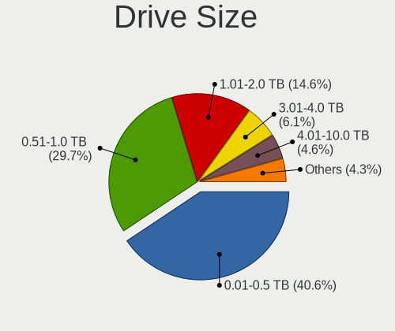
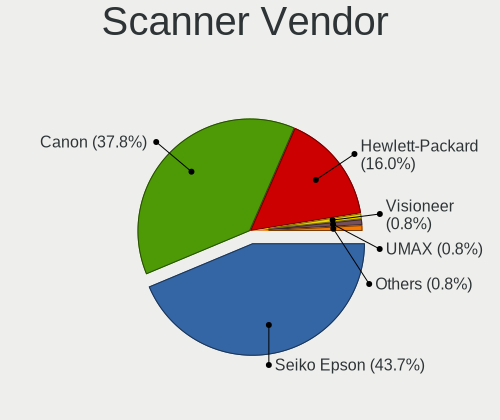

Linux in USA - Tested Hardware & Statistics (Desktops)
------------------------------------------------------

A project to collect tested hardware configurations for Linux in USA.

Anyone can contribute to this report by the [hw-probe](https://github.com/linuxhw/hw-probe) tool:

    sudo -E hw-probe -all -upload

Please contribute! Especially if your hardware is rare.

Contents
--------

* [ Test Cases ](#test-cases)

* [ System ](#system)
  - [ OS                       ](#os)
  - [ OS Family                ](#os-family)
  - [ Kernel                   ](#kernel)
  - [ Kernel Family            ](#kernel-family)
  - [ Kernel Major Ver.        ](#kernel-major-ver)
  - [ Arch                     ](#arch)
  - [ DE                       ](#de)
  - [ Display Server           ](#display-server)
  - [ Display Manager          ](#display-manager)
  - [ OS Lang                  ](#os-lang)
  - [ Boot Mode                ](#boot-mode)
  - [ Filesystem               ](#filesystem)
  - [ Part. scheme             ](#part-scheme)
  - [ Dual Boot with Linux/BSD ](#dual-boot-with-linuxbsd)
  - [ Dual Boot (Win)          ](#dual-boot-win)

* [ Board ](#board)
  - [ Vendor                   ](#vendor)
  - [ Model                    ](#model)
  - [ Model Family             ](#model-family)
  - [ MFG Year                 ](#mfg-year)
  - [ Form Factor              ](#form-factor)
  - [ Secure Boot              ](#secure-boot)
  - [ Coreboot                 ](#coreboot)
  - [ RAM Size                 ](#ram-size)
  - [ RAM Used                 ](#ram-used)
  - [ Total Drives             ](#total-drives)
  - [ Has CD-ROM               ](#has-cd-rom)
  - [ Has Ethernet             ](#has-ethernet)
  - [ Has WiFi                 ](#has-wifi)
  - [ Has Bluetooth            ](#has-bluetooth)

* [ Location ](#location)
  - [ Country                  ](#country)
  - [ City                     ](#city)

* [ Drives ](#drives)
  - [ Drive Vendor             ](#drive-vendor)
  - [ Drive Model              ](#drive-model)
  - [ HDD Vendor               ](#hdd-vendor)
  - [ SSD Vendor               ](#ssd-vendor)
  - [ Drive Kind               ](#drive-kind)
  - [ Drive Connector          ](#drive-connector)
  - [ Drive Size               ](#drive-size)
  - [ Space Total              ](#space-total)
  - [ Space Used               ](#space-used)
  - [ Malfunc. Drives          ](#malfunc-drives)
  - [ Malfunc. Drive Vendor    ](#malfunc-drive-vendor)
  - [ Malfunc. HDD Vendor      ](#malfunc-hdd-vendor)
  - [ Malfunc. Drive Kind      ](#malfunc-drive-kind)
  - [ Failed Drives            ](#failed-drives)
  - [ Failed Drive Vendor      ](#failed-drive-vendor)
  - [ Drive Status             ](#drive-status)

* [ Storage controller ](#storage-controller)
  - [ Storage Vendor           ](#storage-vendor)
  - [ Storage Model            ](#storage-model)
  - [ Storage Kind             ](#storage-kind)

* [ Processor ](#processor)
  - [ CPU Vendor               ](#cpu-vendor)
  - [ CPU Model                ](#cpu-model)
  - [ CPU Model Family         ](#cpu-model-family)
  - [ CPU Cores                ](#cpu-cores)
  - [ CPU Sockets              ](#cpu-sockets)
  - [ CPU Threads              ](#cpu-threads)
  - [ CPU Op-Modes             ](#cpu-op-modes)
  - [ CPU Microcode            ](#cpu-microcode)
  - [ CPU Microarch            ](#cpu-microarch)

* [ Graphics ](#graphics)
  - [ GPU Vendor               ](#gpu-vendor)
  - [ GPU Model                ](#gpu-model)
  - [ GPU Combo                ](#gpu-combo)
  - [ GPU Driver               ](#gpu-driver)
  - [ GPU Memory               ](#gpu-memory)

* [ Monitor ](#monitor)
  - [ Monitor Vendor           ](#monitor-vendor)
  - [ Monitor Model            ](#monitor-model)
  - [ Monitor Resolution       ](#monitor-resolution)
  - [ Monitor Diagonal         ](#monitor-diagonal)
  - [ Monitor Width            ](#monitor-width)
  - [ Aspect Ratio             ](#aspect-ratio)
  - [ Monitor Area             ](#monitor-area)
  - [ Pixel Density            ](#pixel-density)
  - [ Multiple Monitors        ](#multiple-monitors)

* [ Network ](#network)
  - [ Net Controller Vendor    ](#net-controller-vendor)
  - [ Net Controller Model     ](#net-controller-model)
  - [ Wireless Vendor          ](#wireless-vendor)
  - [ Wireless Model           ](#wireless-model)
  - [ Ethernet Vendor          ](#ethernet-vendor)
  - [ Ethernet Model           ](#ethernet-model)
  - [ Net Controller Kind      ](#net-controller-kind)
  - [ Used Controller          ](#used-controller)
  - [ NICs                     ](#nics)
  - [ IPv6                     ](#ipv6)

* [ Bluetooth ](#bluetooth)
  - [ Bluetooth Vendor         ](#bluetooth-vendor)
  - [ Bluetooth Model          ](#bluetooth-model)

* [ Sound ](#sound)
  - [ Sound Vendor             ](#sound-vendor)
  - [ Sound Model              ](#sound-model)

* [ Memory ](#memory)
  - [ Memory Vendor            ](#memory-vendor)
  - [ Memory Model             ](#memory-model)
  - [ Memory Kind              ](#memory-kind)
  - [ Memory Form Factor       ](#memory-form-factor)
  - [ Memory Size              ](#memory-size)
  - [ Memory Speed             ](#memory-speed)

* [ Printers & scanners ](#printers--scanners)
  - [ Printer Vendor           ](#printer-vendor)
  - [ Printer Model            ](#printer-model)
  - [ Scanner Vendor           ](#scanner-vendor)
  - [ Scanner Model            ](#scanner-model)

* [ Camera ](#camera)
  - [ Camera Vendor            ](#camera-vendor)
  - [ Camera Model             ](#camera-model)

* [ Security ](#security)
  - [ Fingerprint Vendor       ](#fingerprint-vendor)
  - [ Fingerprint Model        ](#fingerprint-model)
  - [ Chipcard Vendor          ](#chipcard-vendor)
  - [ Chipcard Model           ](#chipcard-model)

* [ Unsupported ](#unsupported)
  - [ Unsupported Devices      ](#unsupported-devices)
  - [ Unsupported Device Types ](#unsupported-device-types)

Test Cases
----------

Total: 30018

| Vendor        | Model                       | Probe                                                      | Date         |
|---------------|-----------------------------|------------------------------------------------------------|--------------|
| ASUSTek       | ROG STRIX B650-A GAMING ... | [04f9ffdab4](https://linux-hardware.org/?probe=04f9ffdab4) | Jan 06, 2025 |
| Gigabyte      | Z170X-Gaming 7              | [ad40db7f67](https://linux-hardware.org/?probe=ad40db7f67) | Jan 06, 2025 |
| MACHINIST     | H110 Ver:2.3                | [da4bcc0047](https://linux-hardware.org/?probe=da4bcc0047) | Jan 06, 2025 |
| MACHINIST     | H110 Ver:2.3                | [e477166cd2](https://linux-hardware.org/?probe=e477166cd2) | Jan 06, 2025 |
| Dell          | 0GDG8Y A00                  | [417dd2665a](https://linux-hardware.org/?probe=417dd2665a) | Jan 06, 2025 |
| HP            | 8299                        | [a87a33b9e2](https://linux-hardware.org/?probe=a87a33b9e2) | Jan 06, 2025 |
| ASUSTek       | ROG STRIX B550-F GAMING     | [c8c490c383](https://linux-hardware.org/?probe=c8c490c383) | Jan 06, 2025 |
| MSI           | G31TM-P21                   | [7f868dd6f9](https://linux-hardware.org/?probe=7f868dd6f9) | Jan 06, 2025 |
| Lenovo        | 318E SDK0J40697 WIN 3305... | [180e354322](https://linux-hardware.org/?probe=180e354322) | Jan 06, 2025 |
| ASUSTek       | ROG STRIX B550-F GAMING     | [df3bbdd6e6](https://linux-hardware.org/?probe=df3bbdd6e6) | Jan 05, 2025 |
| ASRock        | AB350 Pro4                  | [0d776677a7](https://linux-hardware.org/?probe=0d776677a7) | Jan 05, 2025 |
| MSI           | MAG B550M MORTAR MAX WIF... | [f7c8a6c602](https://linux-hardware.org/?probe=f7c8a6c602) | Jan 05, 2025 |
| Lenovo        | 318E SDK0J40697 WIN 3305... | [3d0601ead9](https://linux-hardware.org/?probe=3d0601ead9) | Jan 05, 2025 |
| Lenovo        | 364F SDK0J40700 WIN 3258... | [3cef0ed98c](https://linux-hardware.org/?probe=3cef0ed98c) | Jan 05, 2025 |
| ASUSTek       | PRIME B550-PLUS             | [16b25c18dc](https://linux-hardware.org/?probe=16b25c18dc) | Jan 05, 2025 |
| HP            | 2B38                        | [2ea8b8918b](https://linux-hardware.org/?probe=2ea8b8918b) | Jan 05, 2025 |
| Pegatron      | NARRA5                      | [350baa0b67](https://linux-hardware.org/?probe=350baa0b67) | Jan 05, 2025 |
| ASRock        | A520M Phantom Gaming 4      | [55ed055bf7](https://linux-hardware.org/?probe=55ed055bf7) | Jan 05, 2025 |
| ASRock        | A520M Phantom Gaming 4      | [9bd6c2311d](https://linux-hardware.org/?probe=9bd6c2311d) | Jan 05, 2025 |
| Gigabyte      | B550 UD AC-Y1               | [b5d5a649e6](https://linux-hardware.org/?probe=b5d5a649e6) | Jan 05, 2025 |
| ASRock        | Z790 PG SONIC               | [8404feef08](https://linux-hardware.org/?probe=8404feef08) | Jan 05, 2025 |
| MSI           | H110M PRO-VD PLUS           | [6b9f134647](https://linux-hardware.org/?probe=6b9f134647) | Jan 05, 2025 |
| ASRock        | B450M Pro4                  | [f1b064f039](https://linux-hardware.org/?probe=f1b064f039) | Jan 05, 2025 |
| ASUSTek       | Z97-PRO GAMER               | [cc569301fd](https://linux-hardware.org/?probe=cc569301fd) | Jan 05, 2025 |
| ASUSTek       | PRIME Z690M-PLUS D4         | [beaaf37101](https://linux-hardware.org/?probe=beaaf37101) | Jan 05, 2025 |
| ASRock        | B450 Pro4                   | [f0fac8b3f2](https://linux-hardware.org/?probe=f0fac8b3f2) | Jan 05, 2025 |
| Dell          | 0HD5W2 A00                  | [a6858e47c5](https://linux-hardware.org/?probe=a6858e47c5) | Jan 05, 2025 |
| Lenovo        | MAHOBAY NOK                 | [a9123709a5](https://linux-hardware.org/?probe=a9123709a5) | Jan 05, 2025 |
| Gigabyte      | Z97X-UD5H                   | [381b6fc010](https://linux-hardware.org/?probe=381b6fc010) | Jan 05, 2025 |
| MSI           | MPG B650I EDGE WIFI         | [e2c6dd2497](https://linux-hardware.org/?probe=e2c6dd2497) | Jan 05, 2025 |
| MSI           | PRO Z790-P WIFI             | [46dc165fa6](https://linux-hardware.org/?probe=46dc165fa6) | Jan 05, 2025 |
| ASUSTek       | ROG STRIX B550-F GAMING ... | [3f75716ffa](https://linux-hardware.org/?probe=3f75716ffa) | Jan 04, 2025 |
| HP            | 89B5 A                      | [6b38b13993](https://linux-hardware.org/?probe=6b38b13993) | Jan 04, 2025 |
| ASUSTek       | M5A97 LE R2.0               | [badfe83ed3](https://linux-hardware.org/?probe=badfe83ed3) | Jan 04, 2025 |
| ASUSTek       | M5A97 R2.0                  | [7eb3a63b51](https://linux-hardware.org/?probe=7eb3a63b51) | Jan 04, 2025 |
| Dell          | 09KPNV A00                  | [d2a1de9dc7](https://linux-hardware.org/?probe=d2a1de9dc7) | Jan 04, 2025 |
| XFX           | nForce 790i Ultra 3-Way ... | [535c1c5ab4](https://linux-hardware.org/?probe=535c1c5ab4) | Jan 04, 2025 |
| HP            | 3397                        | [918fca6eda](https://linux-hardware.org/?probe=918fca6eda) | Jan 04, 2025 |
| HP            | 21EF                        | [f86b96338c](https://linux-hardware.org/?probe=f86b96338c) | Jan 04, 2025 |
| HP            | 805D                        | [269af351cb](https://linux-hardware.org/?probe=269af351cb) | Jan 04, 2025 |
| HP            | 3397                        | [b9c57503ea](https://linux-hardware.org/?probe=b9c57503ea) | Jan 04, 2025 |
| AZW           | MINI S                      | [b4b44d49d3](https://linux-hardware.org/?probe=b4b44d49d3) | Jan 04, 2025 |
| Gigabyte      | Z390 AORUS PRO-CF           | [52f8310052](https://linux-hardware.org/?probe=52f8310052) | Jan 04, 2025 |
| ASUSTek       | PRIME B550-PLUS             | [70e7b73673](https://linux-hardware.org/?probe=70e7b73673) | Jan 04, 2025 |
| Unknown       | HX90                        | [b4c4d726e4](https://linux-hardware.org/?probe=b4c4d726e4) | Jan 04, 2025 |
| ASUSTek       | PRIME B760M-A AX6 II        | [826dc3e0f2](https://linux-hardware.org/?probe=826dc3e0f2) | Jan 04, 2025 |
| HP            | 1998                        | [cccf71a69c](https://linux-hardware.org/?probe=cccf71a69c) | Jan 04, 2025 |
| Gigabyte      | Z790 AORUS ELITE AX         | [5e7dda5f4d](https://linux-hardware.org/?probe=5e7dda5f4d) | Jan 04, 2025 |
| MSI           | MEG X570 UNIFY              | [fc581d20c5](https://linux-hardware.org/?probe=fc581d20c5) | Jan 04, 2025 |
| ASUSTek       | H97-PLUS                    | [fd886041fc](https://linux-hardware.org/?probe=fd886041fc) | Jan 04, 2025 |
| ASUSTek       | H97-PLUS                    | [dc6f9929d7](https://linux-hardware.org/?probe=dc6f9929d7) | Jan 04, 2025 |
| Dell          | 0WMJ54 A01                  | [966f8de937](https://linux-hardware.org/?probe=966f8de937) | Jan 03, 2025 |
| MSI           | X670E GAMING PLUS WIFI      | [fcdb536656](https://linux-hardware.org/?probe=fcdb536656) | Jan 03, 2025 |
| ASUSTek       | ROG CROSSHAIR X670E HERO    | [fe9ee8d0b4](https://linux-hardware.org/?probe=fe9ee8d0b4) | Jan 03, 2025 |
| HP            | 339A                        | [7fc68e979e](https://linux-hardware.org/?probe=7fc68e979e) | Jan 03, 2025 |
| Dell          | 0HHV7N A00                  | [25ccd84cbc](https://linux-hardware.org/?probe=25ccd84cbc) | Jan 03, 2025 |
| Shenzhen M... | A5WSR                       | [6a1318e0a6](https://linux-hardware.org/?probe=6a1318e0a6) | Jan 03, 2025 |
| Shenzhen M... | A5WSR                       | [4fc4c2d22d](https://linux-hardware.org/?probe=4fc4c2d22d) | Jan 03, 2025 |
| ASRock        | B450M Pro4                  | [d8b50816f0](https://linux-hardware.org/?probe=d8b50816f0) | Jan 03, 2025 |
| ASRock        | N68-S UCC                   | [cb76400a00](https://linux-hardware.org/?probe=cb76400a00) | Jan 03, 2025 |
| Gigabyte      | B450 AORUS PRO WIFI-CF      | [1a76cb7c54](https://linux-hardware.org/?probe=1a76cb7c54) | Jan 03, 2025 |
| ASUSTek       | H170 PRO GAMING             | [743efb1121](https://linux-hardware.org/?probe=743efb1121) | Jan 03, 2025 |
| ASRock        | B450M/ac                    | [58bf1994a2](https://linux-hardware.org/?probe=58bf1994a2) | Jan 03, 2025 |
| MSI           | PRO Z790-P WIFI             | [c741b52359](https://linux-hardware.org/?probe=c741b52359) | Jan 03, 2025 |
| Gigabyte      | B650 AORUS ELITE AX         | [91839e20df](https://linux-hardware.org/?probe=91839e20df) | Jan 03, 2025 |
| ASRock        | X870E Taichi                | [416afc1fb4](https://linux-hardware.org/?probe=416afc1fb4) | Jan 03, 2025 |
| Gigabyte      | X570 AORUS ELITE WIFI       | [8e803141dc](https://linux-hardware.org/?probe=8e803141dc) | Jan 03, 2025 |
| AZW           | MINI S                      | [2067c73351](https://linux-hardware.org/?probe=2067c73351) | Jan 03, 2025 |
| Gigabyte      | B450M DS3H WIFI-CF          | [e91eadd16c](https://linux-hardware.org/?probe=e91eadd16c) | Jan 02, 2025 |
| Apple         | Mac-F60DEB81FF30ACF6 Mac... | [ecfa27b66d](https://linux-hardware.org/?probe=ecfa27b66d) | Jan 02, 2025 |
| AZW           | GK mini                     | [3d87931055](https://linux-hardware.org/?probe=3d87931055) | Jan 02, 2025 |
| ASUSTek       | PRIME B550-PLUS             | [1ad78511fb](https://linux-hardware.org/?probe=1ad78511fb) | Jan 02, 2025 |
| MSI           | MPG Z490 GAMING EDGE WIF... | [88e26cdf08](https://linux-hardware.org/?probe=88e26cdf08) | Jan 02, 2025 |
| Dell          | 0HD5W2 A00                  | [abbdbd898d](https://linux-hardware.org/?probe=abbdbd898d) | Jan 02, 2025 |
| Gigabyte      | B75M-D3H                    | [139b1d261d](https://linux-hardware.org/?probe=139b1d261d) | Jan 02, 2025 |
| ASUSTek       | CM6330_CM6630_CM6730_CM6... | [e6075adfc0](https://linux-hardware.org/?probe=e6075adfc0) | Jan 02, 2025 |
| MSI           | B550M PRO-VDH WIFI          | [a24d68ca3c](https://linux-hardware.org/?probe=a24d68ca3c) | Jan 02, 2025 |
| ASUSTek       | PRIME B550-PLUS AC-HES      | [b5eaeaee82](https://linux-hardware.org/?probe=b5eaeaee82) | Jan 02, 2025 |
| ASUSTek       | Z170-E                      | [42888378d7](https://linux-hardware.org/?probe=42888378d7) | Jan 02, 2025 |
| MSI           | X370 GAMING PRO CARBON      | [bb70ef7a51](https://linux-hardware.org/?probe=bb70ef7a51) | Jan 02, 2025 |
| MSI           | MAG Z790 TOMAHAWK MAX WI... | [a4bf03f97c](https://linux-hardware.org/?probe=a4bf03f97c) | Jan 02, 2025 |
| ASUSTek       | M4A89TD PRO USB3            | [ca1a55b77d](https://linux-hardware.org/?probe=ca1a55b77d) | Jan 02, 2025 |
| BESSTAR Te... | T3 MRD                      | [a4aa2dfab1](https://linux-hardware.org/?probe=a4aa2dfab1) | Jan 02, 2025 |
| ASUSTek       | TUF B450M-PLUS GAMING       | [5058b592ae](https://linux-hardware.org/?probe=5058b592ae) | Jan 02, 2025 |
| ASUSTek       | TUF Gaming X570-PLUS        | [9ed77fe056](https://linux-hardware.org/?probe=9ed77fe056) | Jan 02, 2025 |
| MSI           | B450 TOMAHAWK               | [77e32dabcd](https://linux-hardware.org/?probe=77e32dabcd) | Jan 02, 2025 |
| MSI           | Z170-A PRO                  | [b1b8d67385](https://linux-hardware.org/?probe=b1b8d67385) | Jan 02, 2025 |
| Gigabyte      | Z590 UD                     | [d5f41f9b13](https://linux-hardware.org/?probe=d5f41f9b13) | Jan 02, 2025 |
| HC Technol... | HCAR5000-MI                 | [1d85db58d0](https://linux-hardware.org/?probe=1d85db58d0) | Jan 02, 2025 |
| MSI           | MAG B550 TOMAHAWK           | [6d22883b06](https://linux-hardware.org/?probe=6d22883b06) | Jan 01, 2025 |
| ASUSTek       | PRIME B760M-A AX6 II        | [1012b4d63f](https://linux-hardware.org/?probe=1012b4d63f) | Jan 01, 2025 |
| ASUSTek       | PRIME B760M-A AX6 II        | [e3f9df9d9e](https://linux-hardware.org/?probe=e3f9df9d9e) | Jan 01, 2025 |
| HP            | 8767 A                      | [186d8b894f](https://linux-hardware.org/?probe=186d8b894f) | Jan 01, 2025 |
| ASRock        | N68-S UCC                   | [b83c60bccf](https://linux-hardware.org/?probe=b83c60bccf) | Jan 01, 2025 |
| Dell          | 04GJJT A00                  | [444d672dcb](https://linux-hardware.org/?probe=444d672dcb) | Jan 01, 2025 |
| MSI           | PRO B650-P WIFI             | [14aa7fadc3](https://linux-hardware.org/?probe=14aa7fadc3) | Jan 01, 2025 |
| ASUSTek       | PRIME A520M-A II            | [dc2bdc4245](https://linux-hardware.org/?probe=dc2bdc4245) | Jan 01, 2025 |
| ASUSTek       | ROG STRIX X570-E GAMING ... | [eb17054181](https://linux-hardware.org/?probe=eb17054181) | Jan 01, 2025 |
| ASUSTek       | ROG CROSSHAIR VIII DARK ... | [16c8ddaca9](https://linux-hardware.org/?probe=16c8ddaca9) | Jan 01, 2025 |
| ASUSTek       | TUF Gaming X570-PLUS        | [0319b9ba0d](https://linux-hardware.org/?probe=0319b9ba0d) | Jan 01, 2025 |
| Dell          | 0NW73C A00                  | [3dfa88f059](https://linux-hardware.org/?probe=3dfa88f059) | Jan 01, 2025 |
| Dell          | 00V62H A01                  | [0133ba1278](https://linux-hardware.org/?probe=0133ba1278) | Jan 01, 2025 |
| MSI           | MAG X570S TOMAHAWK MAX W... | [fb9578e5d4](https://linux-hardware.org/?probe=fb9578e5d4) | Jan 01, 2025 |
| ASUSTek       | ROG STRIX Z790-E GAMING ... | [040cb2efa9](https://linux-hardware.org/?probe=040cb2efa9) | Jan 01, 2025 |
| ASUSTek       | ROG STRIX B350-F GAMING     | [034de44629](https://linux-hardware.org/?probe=034de44629) | Jan 01, 2025 |
| MSI           | B450 GAMING PLUS MAX        | [15b1774620](https://linux-hardware.org/?probe=15b1774620) | Jan 01, 2025 |
| ASUSTek       | PRIME B450M-A               | [3c9a38404f](https://linux-hardware.org/?probe=3c9a38404f) | Jan 01, 2025 |
| Pegatron      | 2AD5                        | [1df79ca2a5](https://linux-hardware.org/?probe=1df79ca2a5) | Dec 31, 2024 |
| Dell          | 0Y5DDC A00                  | [54403714c3](https://linux-hardware.org/?probe=54403714c3) | Dec 31, 2024 |
| Pegatron      | 2AD5                        | [59fc90dfa9](https://linux-hardware.org/?probe=59fc90dfa9) | Dec 31, 2024 |
| Lenovo        | 30D0 SDK0J40697 WIN 3305... | [9494acd014](https://linux-hardware.org/?probe=9494acd014) | Dec 31, 2024 |
| HP            | 8299                        | [dc5728b605](https://linux-hardware.org/?probe=dc5728b605) | Dec 31, 2024 |
| Lenovo        | 36EB SDK0J40700 WIN 3258... | [e0e1513ce6](https://linux-hardware.org/?probe=e0e1513ce6) | Dec 31, 2024 |
| ASUSTek       | PRIME X570-P                | [3556a38021](https://linux-hardware.org/?probe=3556a38021) | Dec 31, 2024 |
| ASRock        | H570M Pro4                  | [ae9219a819](https://linux-hardware.org/?probe=ae9219a819) | Dec 31, 2024 |
| ASUSTek       | ProArt X870E-CREATOR WIF... | [682520faf1](https://linux-hardware.org/?probe=682520faf1) | Dec 31, 2024 |
| ASUSTek       | TUF Gaming X570-PLUS        | [aea33edd13](https://linux-hardware.org/?probe=aea33edd13) | Dec 31, 2024 |
| ASRock        | N68-S UCC                   | [e48cfb70c6](https://linux-hardware.org/?probe=e48cfb70c6) | Dec 31, 2024 |
| ASRock        | N68-S UCC                   | [a53617b9d5](https://linux-hardware.org/?probe=a53617b9d5) | Dec 31, 2024 |
| ASUSTek       | Maximus IX CODE             | [026ee0facd](https://linux-hardware.org/?probe=026ee0facd) | Dec 31, 2024 |
| Shenzhen M... | F6BFC                       | [431235e055](https://linux-hardware.org/?probe=431235e055) | Dec 31, 2024 |
| ASUSTek       | PRIME Z690-P WIFI D4        | [2f76eb574a](https://linux-hardware.org/?probe=2f76eb574a) | Dec 31, 2024 |
| ASUSTek       | PRIME Z690-P WIFI D4        | [5167e42219](https://linux-hardware.org/?probe=5167e42219) | Dec 31, 2024 |
| ASUSTek       | PRIME B560-PLUS             | [1cff6ff6dc](https://linux-hardware.org/?probe=1cff6ff6dc) | Dec 30, 2024 |
| System76      | Thelio Major thelio-majo... | [4519da1309](https://linux-hardware.org/?probe=4519da1309) | Dec 30, 2024 |
| eMachines     | EMCP73VT-PM                 | [c71116cfb9](https://linux-hardware.org/?probe=c71116cfb9) | Dec 30, 2024 |
| Gigabyte      | A620I AX                    | [801e27533c](https://linux-hardware.org/?probe=801e27533c) | Dec 30, 2024 |
| MSI           | 970A-G46                    | [11df9266e0](https://linux-hardware.org/?probe=11df9266e0) | Dec 30, 2024 |
| Gateway       | DX4860                      | [8fada96b83](https://linux-hardware.org/?probe=8fada96b83) | Dec 30, 2024 |
| Pegatron      | 2AD5                        | [18dc34ec58](https://linux-hardware.org/?probe=18dc34ec58) | Dec 30, 2024 |
| Tianbei       | GEM10                       | [036fe3371f](https://linux-hardware.org/?probe=036fe3371f) | Dec 30, 2024 |
| MSI           | MAG B650 TOMAHAWK WIFI      | [e4be1dd2f3](https://linux-hardware.org/?probe=e4be1dd2f3) | Dec 30, 2024 |
| ASUSTek       | PRIME Z690-P WIFI D4        | [3e9fa7ec25](https://linux-hardware.org/?probe=3e9fa7ec25) | Dec 30, 2024 |
| MSI           | Z97 GAMING 5                | [40b22f7ebe](https://linux-hardware.org/?probe=40b22f7ebe) | Dec 30, 2024 |
| ASRock        | A320M/ac                    | [7743898884](https://linux-hardware.org/?probe=7743898884) | Dec 30, 2024 |
| Gigabyte      | X670 AORUS ELITE AX         | [ad6953ff2e](https://linux-hardware.org/?probe=ad6953ff2e) | Dec 30, 2024 |
| Dell          | 0YXT71 A03                  | [a373cef681](https://linux-hardware.org/?probe=a373cef681) | Dec 30, 2024 |
| ASUSTek       | M5A97 R2.0                  | [47ea215caf](https://linux-hardware.org/?probe=47ea215caf) | Dec 30, 2024 |
| ASUSTek       | Z790 GAMING WIFI7           | [799d284a26](https://linux-hardware.org/?probe=799d284a26) | Dec 30, 2024 |
| Dell          | 0G3HR7 A00                  | [68a7e872ce](https://linux-hardware.org/?probe=68a7e872ce) | Dec 30, 2024 |
| ASUSTek       | Z790 GAMING WIFI7           | [3d5f5f5640](https://linux-hardware.org/?probe=3d5f5f5640) | Dec 30, 2024 |
| Lenovo        | ThinkCentre M90 5536W92     | [99cf8555fa](https://linux-hardware.org/?probe=99cf8555fa) | Dec 30, 2024 |
| HP            | 198E                        | [039237d3ac](https://linux-hardware.org/?probe=039237d3ac) | Dec 30, 2024 |
| Gigabyte      | B550 AORUS ELITE AX V2      | [81eb291a07](https://linux-hardware.org/?probe=81eb291a07) | Dec 30, 2024 |
| ASUSTek       | ProArt X870E-CREATOR WIF... | [6d4070f742](https://linux-hardware.org/?probe=6d4070f742) | Dec 30, 2024 |
| ASUSTek       | ProArt X870E-CREATOR WIF... | [a4bfa8bfd5](https://linux-hardware.org/?probe=a4bfa8bfd5) | Dec 29, 2024 |
| Dell          | 0GY6Y8 A02                  | [ce6cfcec78](https://linux-hardware.org/?probe=ce6cfcec78) | Dec 29, 2024 |
| ASRock        | X370 Gaming-ITX/ac          | [f89abca0f9](https://linux-hardware.org/?probe=f89abca0f9) | Dec 29, 2024 |
| Dell          | 0N4YC8 A00                  | [772d84bc08](https://linux-hardware.org/?probe=772d84bc08) | Dec 29, 2024 |
| Dell          | 0XCR8D A03                  | [95826b99c5](https://linux-hardware.org/?probe=95826b99c5) | Dec 29, 2024 |
| ASRock        | X570 Phantom Gaming-ITX/... | [7aa96c906d](https://linux-hardware.org/?probe=7aa96c906d) | Dec 29, 2024 |
| ASRock        | Z75 Pro3                    | [91580064a4](https://linux-hardware.org/?probe=91580064a4) | Dec 29, 2024 |
| ASUSTek       | PRIME B550-PLUS             | [7ab225644f](https://linux-hardware.org/?probe=7ab225644f) | Dec 29, 2024 |
| HP            | 8643 SMVB                   | [3e1d8b1c0f](https://linux-hardware.org/?probe=3e1d8b1c0f) | Dec 29, 2024 |
| HP            | 8906 SMVB                   | [f52f996dd7](https://linux-hardware.org/?probe=f52f996dd7) | Dec 29, 2024 |
| ASUSTek       | SABERTOOTH 990FX            | [a4f0949a45](https://linux-hardware.org/?probe=a4f0949a45) | Dec 29, 2024 |
| ASUSTek       | ProArt X670E-CREATOR WIF... | [f7f4de362e](https://linux-hardware.org/?probe=f7f4de362e) | Dec 29, 2024 |
| HP            | 1495                        | [0accce2a1a](https://linux-hardware.org/?probe=0accce2a1a) | Dec 29, 2024 |
| ASUSTek       | P8Z77-V LK                  | [10582e7b7b](https://linux-hardware.org/?probe=10582e7b7b) | Dec 29, 2024 |
| MSI           | PRO Z790-VC WIFI            | [536d20f5de](https://linux-hardware.org/?probe=536d20f5de) | Dec 29, 2024 |
| HP            | 805D                        | [1c1e40f526](https://linux-hardware.org/?probe=1c1e40f526) | Dec 28, 2024 |
| Dell          | 0X4N41 A01                  | [3aca8429ec](https://linux-hardware.org/?probe=3aca8429ec) | Dec 28, 2024 |
| HP            | 1495                        | [309b63cf7b](https://linux-hardware.org/?probe=309b63cf7b) | Dec 28, 2024 |
| Foxconn       | 2AB1                        | [e4c7b07722](https://linux-hardware.org/?probe=e4c7b07722) | Dec 28, 2024 |
| GEEKOM        | Mini IT13                   | [bd2773f098](https://linux-hardware.org/?probe=bd2773f098) | Dec 28, 2024 |
| Dell          | 0WVYMC A00                  | [44cd35cf64](https://linux-hardware.org/?probe=44cd35cf64) | Dec 28, 2024 |
| ASRock        | B550M-C                     | [dec3229b3a](https://linux-hardware.org/?probe=dec3229b3a) | Dec 28, 2024 |
| HP            | 3646h                       | [3a6019c6f8](https://linux-hardware.org/?probe=3a6019c6f8) | Dec 28, 2024 |
| Gigabyte      | X870E AORUS PRO             | [bb16650670](https://linux-hardware.org/?probe=bb16650670) | Dec 28, 2024 |
| MSI           | MPG X570 GAMING PLUS        | [f22cbdf9ad](https://linux-hardware.org/?probe=f22cbdf9ad) | Dec 28, 2024 |
| Dell          | 0TTDMJ A00                  | [f1b5e81c74](https://linux-hardware.org/?probe=f1b5e81c74) | Dec 28, 2024 |
| Gigabyte      | X670E AORUS MASTER          | [43e0c78438](https://linux-hardware.org/?probe=43e0c78438) | Dec 28, 2024 |
| MSI           | PRO B650-P WIFI             | [04864e7e53](https://linux-hardware.org/?probe=04864e7e53) | Dec 28, 2024 |
| ASUSTek       | PRIME A620-PLUS WIFI6       | [2314d719e6](https://linux-hardware.org/?probe=2314d719e6) | Dec 28, 2024 |
| ASUSTek       | PRIME A620-PLUS WIFI6       | [62f3344cd0](https://linux-hardware.org/?probe=62f3344cd0) | Dec 28, 2024 |
| ASRock        | B450M Pro4                  | [4392310d5c](https://linux-hardware.org/?probe=4392310d5c) | Dec 28, 2024 |
| ASRock        | B550M-ITX/ac                | [5a11aa6793](https://linux-hardware.org/?probe=5a11aa6793) | Dec 28, 2024 |
| AZW           | MINI S                      | [2f997d878f](https://linux-hardware.org/?probe=2f997d878f) | Dec 28, 2024 |
| MSI           | A88X-G45 GAMING             | [bf00d0c5cc](https://linux-hardware.org/?probe=bf00d0c5cc) | Dec 27, 2024 |
| ASUSTek       | PRIME B760M-A AX6 II        | [60215d0dc0](https://linux-hardware.org/?probe=60215d0dc0) | Dec 27, 2024 |
| HP            | 2AE5 A01                    | [37a58aa15b](https://linux-hardware.org/?probe=37a58aa15b) | Dec 27, 2024 |
| ASUSTek       | M4A785T-M                   | [f16618cedd](https://linux-hardware.org/?probe=f16618cedd) | Dec 27, 2024 |
| Foxconn       | 2AB1                        | [2667fc30e8](https://linux-hardware.org/?probe=2667fc30e8) | Dec 27, 2024 |
| MSI           | MEG Z790 ACE                | [6d77957bbb](https://linux-hardware.org/?probe=6d77957bbb) | Dec 27, 2024 |
| HP            | 158B                        | [c9a23e32f8](https://linux-hardware.org/?probe=c9a23e32f8) | Dec 27, 2024 |
| ASUSTek       | PRIME B450M-A               | [efd4ef425c](https://linux-hardware.org/?probe=efd4ef425c) | Dec 27, 2024 |
| Dell          | 0M858N A01                  | [8378333655](https://linux-hardware.org/?probe=8378333655) | Dec 27, 2024 |
| MSI           | MAG B760M MORTAR WIFI II    | [4c642b0069](https://linux-hardware.org/?probe=4c642b0069) | Dec 27, 2024 |
| Dell          | 08NPPY A00                  | [785f5a5f70](https://linux-hardware.org/?probe=785f5a5f70) | Dec 27, 2024 |
| ASRock        | X870 Pro RS WiFi            | [97eaca87bb](https://linux-hardware.org/?probe=97eaca87bb) | Dec 27, 2024 |
| ASUSTek       | M5A97 LE R2.0               | [c90efdcb98](https://linux-hardware.org/?probe=c90efdcb98) | Dec 26, 2024 |
| ASRock        | Z97X Killer                 | [447cd42486](https://linux-hardware.org/?probe=447cd42486) | Dec 26, 2024 |
| ASRock        | B450M Pro4                  | [e4aa8e8128](https://linux-hardware.org/?probe=e4aa8e8128) | Dec 26, 2024 |
| Dell          | 0200DY A02                  | [048527009c](https://linux-hardware.org/?probe=048527009c) | Dec 26, 2024 |
| Gigabyte      | X570 I AORUS PRO WIFI       | [856acb68a4](https://linux-hardware.org/?probe=856acb68a4) | Dec 26, 2024 |
| AZW           | MINI S                      | [b73091a664](https://linux-hardware.org/?probe=b73091a664) | Dec 26, 2024 |
| ASRock        | X570 Extreme4               | [65cad1da61](https://linux-hardware.org/?probe=65cad1da61) | Dec 26, 2024 |
| MSI           | MAG B650 TOMAHAWK WIFI      | [769432836d](https://linux-hardware.org/?probe=769432836d) | Dec 26, 2024 |
| Dell          | 0K240Y A01                  | [8aca080a7d](https://linux-hardware.org/?probe=8aca080a7d) | Dec 26, 2024 |
| HP            | 805D                        | [026fd8a8b5](https://linux-hardware.org/?probe=026fd8a8b5) | Dec 26, 2024 |
| Lenovo        | SDK0J40700 WIN              | [783314e5b3](https://linux-hardware.org/?probe=783314e5b3) | Dec 26, 2024 |
| Dell          | 06D7TR A00                  | [59dc0fa024](https://linux-hardware.org/?probe=59dc0fa024) | Dec 26, 2024 |
| ASRock        | A320M-HDV R4.0              | [ee9f566833](https://linux-hardware.org/?probe=ee9f566833) | Dec 26, 2024 |
| ASRock        | A320M-HDV R4.0              | [03bac79df3](https://linux-hardware.org/?probe=03bac79df3) | Dec 26, 2024 |
| ASUSTek       | ROG Maximus Z790 HERO       | [9fcbcdf645](https://linux-hardware.org/?probe=9fcbcdf645) | Dec 26, 2024 |
| HP            | 21EF 00~                   | [330a156ee2](https://linux-hardware.org/?probe=330a156ee2) | Dec 26, 2024 |
| Dell          | 0D6H9T A00                  | [3eb6ff8845](https://linux-hardware.org/?probe=3eb6ff8845) | Dec 25, 2024 |
| ASUSTek       | ROG Maximus XI HERO         | [3204a0a933](https://linux-hardware.org/?probe=3204a0a933) | Dec 25, 2024 |
| HP            | 21EF                        | [699cf57463](https://linux-hardware.org/?probe=699cf57463) | Dec 25, 2024 |
| TB            | WTR R1                      | [587979f8d3](https://linux-hardware.org/?probe=587979f8d3) | Dec 25, 2024 |
| Dell          | 0WPMFG A00                  | [32af132170](https://linux-hardware.org/?probe=32af132170) | Dec 25, 2024 |
| HP            | 2AF7                        | [86175be1e4](https://linux-hardware.org/?probe=86175be1e4) | Dec 25, 2024 |
| ASRock        | Z77 Extreme4                | [0bd8b4588d](https://linux-hardware.org/?probe=0bd8b4588d) | Dec 25, 2024 |
| Dell          | 0XHGV1 A00                  | [017302e467](https://linux-hardware.org/?probe=017302e467) | Dec 25, 2024 |
| ASUSTek       | D700SA                      | [cdea79b4a9](https://linux-hardware.org/?probe=cdea79b4a9) | Dec 25, 2024 |
| Gigabyte      | Z390 AORUS PRO WIFI-CF      | [9be6e4992c](https://linux-hardware.org/?probe=9be6e4992c) | Dec 25, 2024 |
| ASUSTek       | M5A97 PLUS                  | [a3e4e7043e](https://linux-hardware.org/?probe=a3e4e7043e) | Dec 25, 2024 |
| MSI           | Z370 GAMING PRO CARBON A... | [46c1540093](https://linux-hardware.org/?probe=46c1540093) | Dec 24, 2024 |
| ASUSTek       | ROG STRIX X370-F GAMING     | [6e24ffa9a1](https://linux-hardware.org/?probe=6e24ffa9a1) | Dec 24, 2024 |
| ASUSTek       | GL10DH                      | [4d95f402c4](https://linux-hardware.org/?probe=4d95f402c4) | Dec 24, 2024 |
| Gigabyte      | H370M D3H-CF                | [293052fc3b](https://linux-hardware.org/?probe=293052fc3b) | Dec 24, 2024 |
| Dell          | 0GY6Y8 A00                  | [924efb699d](https://linux-hardware.org/?probe=924efb699d) | Dec 24, 2024 |
| ASRock        | B760M Pro RS/D4 WiFi        | [9c915961fc](https://linux-hardware.org/?probe=9c915961fc) | Dec 24, 2024 |
| Dell          | 0R790T A00                  | [c5ae7595ff](https://linux-hardware.org/?probe=c5ae7595ff) | Dec 24, 2024 |
| Gigabyte      | B560 DS3H AC-Y1             | [4e79bebde8](https://linux-hardware.org/?probe=4e79bebde8) | Dec 24, 2024 |
| PN-3322       | PN-Media-01 V1.04           | [bc369995a2](https://linux-hardware.org/?probe=bc369995a2) | Dec 24, 2024 |
| MSI           | B550-A PRO                  | [dd6260a709](https://linux-hardware.org/?probe=dd6260a709) | Dec 24, 2024 |
| Dell          | 0XPDFK A01                  | [fdd93d3ccd](https://linux-hardware.org/?probe=fdd93d3ccd) | Dec 24, 2024 |
| Dell          | 02YRK5 A02                  | [aa69d27c0b](https://linux-hardware.org/?probe=aa69d27c0b) | Dec 24, 2024 |
| Dell          | 0KWVT8 A03                  | [689cab771e](https://linux-hardware.org/?probe=689cab771e) | Dec 23, 2024 |
| MSI           | PRO Z790-A MAX WIFI         | [834ad993ac](https://linux-hardware.org/?probe=834ad993ac) | Dec 23, 2024 |
| Dell          | 0KWVT8 A03                  | [d07ce185b1](https://linux-hardware.org/?probe=d07ce185b1) | Dec 23, 2024 |
| Gigabyte      | Z790I AORUS ULTRA           | [f36ee00671](https://linux-hardware.org/?probe=f36ee00671) | Dec 23, 2024 |
| BESSTAR Te... | HX90                        | [11b30e17f3](https://linux-hardware.org/?probe=11b30e17f3) | Dec 23, 2024 |
| ASUSTek       | 970 PRO GAMING/AURA         | [4885d454da](https://linux-hardware.org/?probe=4885d454da) | Dec 23, 2024 |
| Dell          | 018D1Y A00                  | [41a23c9b5a](https://linux-hardware.org/?probe=41a23c9b5a) | Dec 23, 2024 |
| HP            | 8906 SMVB                   | [41496e7796](https://linux-hardware.org/?probe=41496e7796) | Dec 23, 2024 |
| Gigabyte      | X570 AORUS ELITE WIFI       | [abc685fb60](https://linux-hardware.org/?probe=abc685fb60) | Dec 23, 2024 |
| Pegatron      | 2AD5                        | [494dd69ae1](https://linux-hardware.org/?probe=494dd69ae1) | Dec 23, 2024 |
| Dell          | 0WN7Y6 A01                  | [b20d2d0198](https://linux-hardware.org/?probe=b20d2d0198) | Dec 23, 2024 |
| Dell          | 0D9JG3 A01                  | [0e667d9d3c](https://linux-hardware.org/?probe=0e667d9d3c) | Dec 23, 2024 |
| HP            | 1497                        | [245a5c3c47](https://linux-hardware.org/?probe=245a5c3c47) | Dec 23, 2024 |
| ASUSTek       | H97-PLUS                    | [dde78901c1](https://linux-hardware.org/?probe=dde78901c1) | Dec 23, 2024 |
| Gigabyte      | B450M DS3H V2               | [c8554294b6](https://linux-hardware.org/?probe=c8554294b6) | Dec 23, 2024 |
| Dell          | 0KWVT8 A02                  | [8a38805f0b](https://linux-hardware.org/?probe=8a38805f0b) | Dec 23, 2024 |
| HP            | 83E9                        | [149bf1039e](https://linux-hardware.org/?probe=149bf1039e) | Dec 23, 2024 |
| Gigabyte      | X570S AERO G                | [f4832ab80c](https://linux-hardware.org/?probe=f4832ab80c) | Dec 23, 2024 |
| ECS           | Nettle3                     | [09b313a942](https://linux-hardware.org/?probe=09b313a942) | Dec 23, 2024 |
| ASUSTek       | A88X-PRO                    | [1b74d31510](https://linux-hardware.org/?probe=1b74d31510) | Dec 23, 2024 |
| Gigabyte      | GA-MA790XT-UD4P             | [64b32f0a2d](https://linux-hardware.org/?probe=64b32f0a2d) | Dec 22, 2024 |
| Gigabyte      | Z790 AORUS PRO X            | [dd462ce2a6](https://linux-hardware.org/?probe=dd462ce2a6) | Dec 22, 2024 |
| ASUSTek       | M4A785-M                    | [7ca338168f](https://linux-hardware.org/?probe=7ca338168f) | Dec 22, 2024 |
| ASUSTek       | H97M-PLUS                   | [e5d71e3aba](https://linux-hardware.org/?probe=e5d71e3aba) | Dec 22, 2024 |
| Dell          | 0MWYPT A02                  | [6d1b9f2ffd](https://linux-hardware.org/?probe=6d1b9f2ffd) | Dec 22, 2024 |
| Dell          | 0MWYPT A00                  | [98cc5ad973](https://linux-hardware.org/?probe=98cc5ad973) | Dec 22, 2024 |
| Dell          | 0MWYPT A00                  | [dd73af7555](https://linux-hardware.org/?probe=dd73af7555) | Dec 22, 2024 |
| Dell          | 0PC5F7 A02                  | [c7272a6535](https://linux-hardware.org/?probe=c7272a6535) | Dec 22, 2024 |
| Gigabyte      | Z170X-Gaming 7              | [8768679ad7](https://linux-hardware.org/?probe=8768679ad7) | Dec 22, 2024 |
| ASUSTek       | PRIME H470-PLUS             | [93ed037f43](https://linux-hardware.org/?probe=93ed037f43) | Dec 22, 2024 |
| Lenovo        | SHARKBAY 0B98401 PRO        | [7812efa4c0](https://linux-hardware.org/?probe=7812efa4c0) | Dec 22, 2024 |
| Gigabyte      | A320M-S2H-CF                | [0e08cf46c1](https://linux-hardware.org/?probe=0e08cf46c1) | Dec 22, 2024 |
| ASRock        | B450 Gaming K4              | [5df1c0becb](https://linux-hardware.org/?probe=5df1c0becb) | Dec 22, 2024 |
| ASRock        | B550M/ac                    | [479e65f4b2](https://linux-hardware.org/?probe=479e65f4b2) | Dec 22, 2024 |
| ASRock        | X670E PG Lightning          | [a87b7ceb23](https://linux-hardware.org/?probe=a87b7ceb23) | Dec 22, 2024 |
| MSI           | MAG X670E TOMAHAWK WIFI     | [a977849531](https://linux-hardware.org/?probe=a977849531) | Dec 22, 2024 |
| ASUSTek       | ROG STRIX B450-F GAMING     | [8144311954](https://linux-hardware.org/?probe=8144311954) | Dec 22, 2024 |
| Dell          | 0K240Y A01                  | [d24d7b9494](https://linux-hardware.org/?probe=d24d7b9494) | Dec 22, 2024 |
| Gigabyte      | AB350M-Gaming 3-CF          | [359d3ae6ec](https://linux-hardware.org/?probe=359d3ae6ec) | Dec 22, 2024 |
| MSI           | A88X-G45 GAMING             | [41d688dd9b](https://linux-hardware.org/?probe=41d688dd9b) | Dec 22, 2024 |
| Dell          | 0HY9JP A02                  | [ab65db9701](https://linux-hardware.org/?probe=ab65db9701) | Dec 22, 2024 |
| ASRock        | B550M/ac                    | [3f21ab066d](https://linux-hardware.org/?probe=3f21ab066d) | Dec 22, 2024 |
| Gigabyte      | Z790 AORUS ELITE AX         | [7e57a7c1e3](https://linux-hardware.org/?probe=7e57a7c1e3) | Dec 22, 2024 |
| Gigabyte      | Z790 AORUS ELITE AX         | [a76549986f](https://linux-hardware.org/?probe=a76549986f) | Dec 22, 2024 |
| HP            | 21EF 00~                   | [60fd75cbd3](https://linux-hardware.org/?probe=60fd75cbd3) | Dec 21, 2024 |
| ASUSTek       | PRIME B460-PLUS             | [afcf0b2c69](https://linux-hardware.org/?probe=afcf0b2c69) | Dec 21, 2024 |
| Gigabyte      | 970A-D3P                    | [1374f8f13a](https://linux-hardware.org/?probe=1374f8f13a) | Dec 21, 2024 |
| Unknown       | X99-D8                      | [0bd81498ad](https://linux-hardware.org/?probe=0bd81498ad) | Dec 21, 2024 |
| ASUSTek       | ROG STRIX Z590-E GAMING ... | [a891f1a560](https://linux-hardware.org/?probe=a891f1a560) | Dec 21, 2024 |
| Gigabyte      | B660 GAMING X AX DDR4       | [f612720d9b](https://linux-hardware.org/?probe=f612720d9b) | Dec 21, 2024 |
| Intel         | DP55WB AAE64798-207         | [c2c0c50aa4](https://linux-hardware.org/?probe=c2c0c50aa4) | Dec 21, 2024 |
| ASUSTek       | TUF Gaming X570-PLUS        | [19e00fa4e5](https://linux-hardware.org/?probe=19e00fa4e5) | Dec 21, 2024 |
| ASUSTek       | TUF Gaming X570-PLUS        | [374d7db83f](https://linux-hardware.org/?probe=374d7db83f) | Dec 21, 2024 |
| Gigabyte      | B560 DS3H AC-Y1             | [4c934647d2](https://linux-hardware.org/?probe=4c934647d2) | Dec 21, 2024 |
| HP            | 339A                        | [cde6aa76f1](https://linux-hardware.org/?probe=cde6aa76f1) | Dec 21, 2024 |
| ASUSTek       | PRIME B650M-A AX II         | [a1a37b188a](https://linux-hardware.org/?probe=a1a37b188a) | Dec 21, 2024 |
| ASUSTek       | TUF Z270 MARK 2             | [5f75675aff](https://linux-hardware.org/?probe=5f75675aff) | Dec 21, 2024 |
| AZW           | Green G1                    | [86179ca152](https://linux-hardware.org/?probe=86179ca152) | Dec 21, 2024 |
| Gigabyte      | M4HM85P-00                  | [1c9c5bd50a](https://linux-hardware.org/?probe=1c9c5bd50a) | Dec 21, 2024 |
| ASRock        | B450M Pro4 R2.0             | [4f6028e7cc](https://linux-hardware.org/?probe=4f6028e7cc) | Dec 20, 2024 |
| ASUSTek       | ROG CROSSHAIR VIII DARK ... | [c83a325000](https://linux-hardware.org/?probe=c83a325000) | Dec 20, 2024 |
| Dell          | 0XCR8D A00                  | [b17e5e9125](https://linux-hardware.org/?probe=b17e5e9125) | Dec 20, 2024 |
| MSI           | 970 GAMING                  | [e611695dcf](https://linux-hardware.org/?probe=e611695dcf) | Dec 20, 2024 |
| Unknown       | Unknown                     | [baa0c4a10f](https://linux-hardware.org/?probe=baa0c4a10f) | Dec 20, 2024 |
| ASRock        | B450 Gaming-ITX/ac          | [d873523130](https://linux-hardware.org/?probe=d873523130) | Dec 20, 2024 |
| Dell          | 0CWR57 A01                  | [fe171c38a8](https://linux-hardware.org/?probe=fe171c38a8) | Dec 20, 2024 |
| MSI           | B450 GAMING PRO CARBON M... | [08673a16c4](https://linux-hardware.org/?probe=08673a16c4) | Dec 20, 2024 |
| MSI           | B550 GAMING GEN3            | [2cb901e525](https://linux-hardware.org/?probe=2cb901e525) | Dec 20, 2024 |
| Google        | Panther                     | [50b14bd13e](https://linux-hardware.org/?probe=50b14bd13e) | Dec 20, 2024 |
| ASRock        | B450M-HDV R4.0              | [2a4b115644](https://linux-hardware.org/?probe=2a4b115644) | Dec 20, 2024 |
| ASRock        | B365 Phantom Gaming 4       | [ad7f76dde0](https://linux-hardware.org/?probe=ad7f76dde0) | Dec 20, 2024 |
| Lenovo        | 364F SDK0J40700 WIN 3258... | [ee33250a81](https://linux-hardware.org/?probe=ee33250a81) | Dec 20, 2024 |
| Dell          | 0HR330                      | [0896ea906b](https://linux-hardware.org/?probe=0896ea906b) | Dec 20, 2024 |
| HP            | 339A                        | [544d3bb903](https://linux-hardware.org/?probe=544d3bb903) | Dec 20, 2024 |
| ASRock        | A88M-G                      | [e1399629da](https://linux-hardware.org/?probe=e1399629da) | Dec 19, 2024 |
| Dell          | 00V62H A01                  | [8e8317c6a6](https://linux-hardware.org/?probe=8e8317c6a6) | Dec 19, 2024 |
| ASUSTek       | TUF B450M-PLUS GAMING       | [9f24ad2683](https://linux-hardware.org/?probe=9f24ad2683) | Dec 19, 2024 |
| Dell          | 0WN7Y6 A01                  | [2136a13f47](https://linux-hardware.org/?probe=2136a13f47) | Dec 19, 2024 |
| ASUSTek       | ROG Maximus XII HERO        | [4c7762f08e](https://linux-hardware.org/?probe=4c7762f08e) | Dec 19, 2024 |
| Gigabyte      | X570 AORUS MASTER           | [9e02fc3eec](https://linux-hardware.org/?probe=9e02fc3eec) | Dec 19, 2024 |
| SZMZ          | B75-MS V1.0                 | [ab711506a2](https://linux-hardware.org/?probe=ab711506a2) | Dec 19, 2024 |
| MSI           | MAG X870 TOMAHAWK WIFI      | [d130ed5ac4](https://linux-hardware.org/?probe=d130ed5ac4) | Dec 19, 2024 |
| ASUSTek       | PRIME Z370-A                | [78d17c7869](https://linux-hardware.org/?probe=78d17c7869) | Dec 19, 2024 |
| MSI           | P55-GD65                    | [b331e16846](https://linux-hardware.org/?probe=b331e16846) | Dec 19, 2024 |
| Gigabyte      | X570 AORUS MASTER           | [e41eca5240](https://linux-hardware.org/?probe=e41eca5240) | Dec 19, 2024 |
| Gigabyte      | Z790 AORUS ELITE AX         | [fadffefa28](https://linux-hardware.org/?probe=fadffefa28) | Dec 19, 2024 |
| ASUSTek       | SABERTOOTH Z77              | [7d20b9caf7](https://linux-hardware.org/?probe=7d20b9caf7) | Dec 19, 2024 |
| ASUSTek       | CM1630                      | [8c63957f8b](https://linux-hardware.org/?probe=8c63957f8b) | Dec 19, 2024 |
| ASRock        | B550 Extreme4               | [b15fa49664](https://linux-hardware.org/?probe=b15fa49664) | Dec 19, 2024 |
| Apple         | Mac-F221BEC8                | [649d762772](https://linux-hardware.org/?probe=649d762772) | Dec 19, 2024 |
| Dell          | 06X1TJ A00                  | [7db2715b22](https://linux-hardware.org/?probe=7db2715b22) | Dec 19, 2024 |
| ASRock        | AB350M Pro4                 | [0369c244e9](https://linux-hardware.org/?probe=0369c244e9) | Dec 19, 2024 |
| ASRock        | B550 Extreme4               | [814e14dde9](https://linux-hardware.org/?probe=814e14dde9) | Dec 19, 2024 |
| STGAUBRON     | B75M4 V1.1                  | [cdf3159da7](https://linux-hardware.org/?probe=cdf3159da7) | Dec 19, 2024 |
| ASUSTek       | P8P67                       | [fa26a62bc4](https://linux-hardware.org/?probe=fa26a62bc4) | Dec 19, 2024 |
| Dell          | 042P49 A00                  | [89c68a1188](https://linux-hardware.org/?probe=89c68a1188) | Dec 18, 2024 |
| Dell          | 0D441T A03                  | [4f2f4f1df7](https://linux-hardware.org/?probe=4f2f4f1df7) | Dec 18, 2024 |
| ASUSTek       | M4A79XTD EVO                | [94308b304f](https://linux-hardware.org/?probe=94308b304f) | Dec 18, 2024 |
| ASUSTek       | SABERTOOTH Z97 MARK 1       | [c565398bf1](https://linux-hardware.org/?probe=c565398bf1) | Dec 18, 2024 |
| MSI           | B450M PRO-VDH               | [50248fd7b6](https://linux-hardware.org/?probe=50248fd7b6) | Dec 18, 2024 |
| ASUSTek       | SABERTOOTH Z97 MARK 1       | [5dc92f19cf](https://linux-hardware.org/?probe=5dc92f19cf) | Dec 18, 2024 |
| MSI           | B450M PRO-VDH               | [e9cda49543](https://linux-hardware.org/?probe=e9cda49543) | Dec 18, 2024 |
| Supermicro    | X10DRC                      | [6e281b1919](https://linux-hardware.org/?probe=6e281b1919) | Dec 18, 2024 |
| ASUSTek       | PRIME A320M-K               | [348937254f](https://linux-hardware.org/?probe=348937254f) | Dec 18, 2024 |
| ASRock        | X300-ITX                    | [b6a39bc4d8](https://linux-hardware.org/?probe=b6a39bc4d8) | Dec 18, 2024 |
| Gigabyte      | B450M DS3H WIFI-CF          | [eb9e143dcc](https://linux-hardware.org/?probe=eb9e143dcc) | Dec 18, 2024 |
| Gigabyte      | GA-MA790XT-UD4P             | [a3dfcce270](https://linux-hardware.org/?probe=a3dfcce270) | Dec 18, 2024 |
| Unknown       | Unknown                     | [55ad7b2405](https://linux-hardware.org/?probe=55ad7b2405) | Dec 18, 2024 |
| MSI           | B650 GAMING PLUS WIFI       | [31002e2c11](https://linux-hardware.org/?probe=31002e2c11) | Dec 18, 2024 |
| Dell          | OptiPlex 5050               | [78724eea62](https://linux-hardware.org/?probe=78724eea62) | Dec 18, 2024 |
| Lenovo        | ThinkServer TS140           | [8d0ead0400](https://linux-hardware.org/?probe=8d0ead0400) | Dec 18, 2024 |
| ASUSTek       | ROG STRIX B650E-I GAMING... | [b0a3121054](https://linux-hardware.org/?probe=b0a3121054) | Dec 18, 2024 |
| ASUSTek       | ROG STRIX B450-F GAMING     | [67bcacbdcd](https://linux-hardware.org/?probe=67bcacbdcd) | Dec 18, 2024 |
| MSI           | MPG X570 GAMING PLUS        | [9f1e3acf5c](https://linux-hardware.org/?probe=9f1e3acf5c) | Dec 18, 2024 |
| AZW           | U59                         | [38458ce296](https://linux-hardware.org/?probe=38458ce296) | Dec 18, 2024 |
| Unknown       | Unknown                     | [deb145f9f9](https://linux-hardware.org/?probe=deb145f9f9) | Dec 18, 2024 |
| Gigabyte      | GA-880GM-UD2H               | [42af74e9a9](https://linux-hardware.org/?probe=42af74e9a9) | Dec 18, 2024 |
| ASUSTek       | LEUCITE                     | [f61e7d37a2](https://linux-hardware.org/?probe=f61e7d37a2) | Dec 18, 2024 |
| HP            | 1632                        | [eaf5cb101f](https://linux-hardware.org/?probe=eaf5cb101f) | Dec 18, 2024 |
| Gigabyte      | Z390 AORUS ULTRA-CF         | [475c698644](https://linux-hardware.org/?probe=475c698644) | Dec 18, 2024 |
| MSI           | PRO B760-VC WIFI 7 BULK     | [624168065a](https://linux-hardware.org/?probe=624168065a) | Dec 18, 2024 |
| ASUSTek       | PRIME B550-PLUS             | [7b074aefcc](https://linux-hardware.org/?probe=7b074aefcc) | Dec 18, 2024 |
| MSI           | MS-7309                     | [dbe0d9aff5](https://linux-hardware.org/?probe=dbe0d9aff5) | Dec 18, 2024 |
| Dell          | 09WH54 A00                  | [ee76e374e0](https://linux-hardware.org/?probe=ee76e374e0) | Dec 17, 2024 |
| ASUSTek       | ROG STRIX B550-F GAMING     | [5adf359ed4](https://linux-hardware.org/?probe=5adf359ed4) | Dec 17, 2024 |
| HP            | 8266                        | [ccd7d6b235](https://linux-hardware.org/?probe=ccd7d6b235) | Dec 17, 2024 |
| Dell          | 0KWVT8 A03                  | [f6432eae1b](https://linux-hardware.org/?probe=f6432eae1b) | Dec 17, 2024 |
| ASRock        | B550M-ITX/ac                | [fc393a7165](https://linux-hardware.org/?probe=fc393a7165) | Dec 17, 2024 |
| Supermicro    | X10DRC                      | [2d4c0b9ec2](https://linux-hardware.org/?probe=2d4c0b9ec2) | Dec 17, 2024 |
| ASUSTek       | TUF B450M-PRO GAMING        | [8322276a80](https://linux-hardware.org/?probe=8322276a80) | Dec 17, 2024 |
| MSI           | 970A SLI Krait Edition      | [563a8aa1b9](https://linux-hardware.org/?probe=563a8aa1b9) | Dec 17, 2024 |
| ASUSTek       | ROG STRIX X570-E GAMING     | [8d7adb7ecd](https://linux-hardware.org/?probe=8d7adb7ecd) | Dec 17, 2024 |
| Supermicro    | X10DRU-i+A                  | [6ac9ef200b](https://linux-hardware.org/?probe=6ac9ef200b) | Dec 17, 2024 |
| Gigabyte      | GA-880GM-UD2H               | [6aab958077](https://linux-hardware.org/?probe=6aab958077) | Dec 17, 2024 |
| ASUSTek       | A88X-PRO                    | [0e0bc97fa5](https://linux-hardware.org/?probe=0e0bc97fa5) | Dec 17, 2024 |
| AZW           | MINI S                      | [f78e053ac9](https://linux-hardware.org/?probe=f78e053ac9) | Dec 17, 2024 |
| ASRock        | B550 Phantom Gaming 4/ac    | [8d9d562242](https://linux-hardware.org/?probe=8d9d562242) | Dec 17, 2024 |
| Gigabyte      | B650 GAMING X AX V2         | [e625968bcb](https://linux-hardware.org/?probe=e625968bcb) | Dec 17, 2024 |
| HP            | 1497                        | [35daa09afc](https://linux-hardware.org/?probe=35daa09afc) | Dec 17, 2024 |
| ASUSTek       | PRIME B550-PLUS AC-HES      | [fb948c26ed](https://linux-hardware.org/?probe=fb948c26ed) | Dec 17, 2024 |
| HP            | 8643 SMVB                   | [fde3487f3f](https://linux-hardware.org/?probe=fde3487f3f) | Dec 17, 2024 |
| Dell          | 0P096C A01                  | [98c35e9b9b](https://linux-hardware.org/?probe=98c35e9b9b) | Dec 17, 2024 |
| Lenovo        | SHARKBAY 0B98401 PRO        | [1e479b232e](https://linux-hardware.org/?probe=1e479b232e) | Dec 16, 2024 |
| ASRock        | B450M Gaming                | [8d0b46c30e](https://linux-hardware.org/?probe=8d0b46c30e) | Dec 16, 2024 |
| ASUSTek       | M5A78L-M LX PLUS            | [83a10df0af](https://linux-hardware.org/?probe=83a10df0af) | Dec 16, 2024 |
| ASUSTek       | ROG STRIX Z390-E GAMING     | [bbe170f0bc](https://linux-hardware.org/?probe=bbe170f0bc) | Dec 16, 2024 |
| Dell          | 0WR7PY A02                  | [cedf8aee7e](https://linux-hardware.org/?probe=cedf8aee7e) | Dec 16, 2024 |
| ASRock        | B450M Gaming                | [8c14c6037e](https://linux-hardware.org/?probe=8c14c6037e) | Dec 16, 2024 |
| MSI           | 760GM -E51                  | [604b28b217](https://linux-hardware.org/?probe=604b28b217) | Dec 16, 2024 |
| Dell          | 0M017G A00                  | [0f1c439447](https://linux-hardware.org/?probe=0f1c439447) | Dec 16, 2024 |
| Dell          | 0M017G A00                  | [e306c72db0](https://linux-hardware.org/?probe=e306c72db0) | Dec 16, 2024 |
| ASUSTek       | M5A78L-M LX PLUS            | [a8cc0ecb2b](https://linux-hardware.org/?probe=a8cc0ecb2b) | Dec 16, 2024 |
| Lenovo        | SHARKBAY NOK                | [9e863b5f90](https://linux-hardware.org/?probe=9e863b5f90) | Dec 16, 2024 |
| MSI           | MPG Z690 FORCE WIFI         | [67fda65f1a](https://linux-hardware.org/?probe=67fda65f1a) | Dec 16, 2024 |
| HP            | 198E                        | [902931c40d](https://linux-hardware.org/?probe=902931c40d) | Dec 16, 2024 |
| Dell          | 0C27VV A01                  | [e4d8fe24df](https://linux-hardware.org/?probe=e4d8fe24df) | Dec 16, 2024 |
| MSI           | PRO B760M-VC WIFI BULK      | [5a055752f9](https://linux-hardware.org/?probe=5a055752f9) | Dec 15, 2024 |
| CWWK          | MINIPC-G12                  | [b7abc4972b](https://linux-hardware.org/?probe=b7abc4972b) | Dec 15, 2024 |
| CWWK          | MINIPC-G12                  | [da5ce0c723](https://linux-hardware.org/?probe=da5ce0c723) | Dec 15, 2024 |
| ASUSTek       | ROG Maximus Z790 DARK HE... | [643483a6b9](https://linux-hardware.org/?probe=643483a6b9) | Dec 15, 2024 |
| Dell          | 0T7D40 A01                  | [b215a3aa7c](https://linux-hardware.org/?probe=b215a3aa7c) | Dec 15, 2024 |
| MSI           | PRO B660M-A CEC WIFI DDR... | [460955a4a2](https://linux-hardware.org/?probe=460955a4a2) | Dec 15, 2024 |
| TianBei       | GEM12                       | [9505d9ed29](https://linux-hardware.org/?probe=9505d9ed29) | Dec 15, 2024 |
| MSI           | PRO B650M-P                 | [6d7d80137f](https://linux-hardware.org/?probe=6d7d80137f) | Dec 15, 2024 |
| BESSTAR Te... | UM700                       | [ff83fe1d3e](https://linux-hardware.org/?probe=ff83fe1d3e) | Dec 15, 2024 |
| ECS           | Nettle2                     | [caffafd1eb](https://linux-hardware.org/?probe=caffafd1eb) | Dec 15, 2024 |
| Unknown       | Unknown                     | [8ee7529ab3](https://linux-hardware.org/?probe=8ee7529ab3) | Dec 15, 2024 |
| Dell          | 06D7TR A00                  | [9a0ab12c8c](https://linux-hardware.org/?probe=9a0ab12c8c) | Dec 15, 2024 |
| MACHINIST     | X99 PR8                     | [f3f38350f6](https://linux-hardware.org/?probe=f3f38350f6) | Dec 15, 2024 |
| ASUSTek       | 970 PRO GAMING/AURA         | [834cca8e2b](https://linux-hardware.org/?probe=834cca8e2b) | Dec 15, 2024 |
| Dell          | 09WH54 A00                  | [2996405b15](https://linux-hardware.org/?probe=2996405b15) | Dec 15, 2024 |
| ASRock        | AB350 Pro4                  | [8d7dd64d23](https://linux-hardware.org/?probe=8d7dd64d23) | Dec 14, 2024 |
| Dell          | 0F428D A00                  | [ba32636f6f](https://linux-hardware.org/?probe=ba32636f6f) | Dec 14, 2024 |
| Dell          | 0GY6Y8 A00                  | [4d22a711c2](https://linux-hardware.org/?probe=4d22a711c2) | Dec 14, 2024 |
| ASUSTek       | Maximus IX HERO             | [277adb5291](https://linux-hardware.org/?probe=277adb5291) | Dec 14, 2024 |
| SHANGZHAOY... | H97-STRONG V1.0             | [b8e33835e8](https://linux-hardware.org/?probe=b8e33835e8) | Dec 14, 2024 |
| Lenovo        | SHARKBAY 0C48431 PRO        | [342b875683](https://linux-hardware.org/?probe=342b875683) | Dec 14, 2024 |
| MSI           | PRO B550M-VC WIFI           | [e874d8c2e3](https://linux-hardware.org/?probe=e874d8c2e3) | Dec 14, 2024 |
| Lenovo        | SHARKBAY 0B98401 PRO        | [f25016b0a2](https://linux-hardware.org/?probe=f25016b0a2) | Dec 14, 2024 |
| Dell          | 0200DY A02                  | [8cdb0aff4f](https://linux-hardware.org/?probe=8cdb0aff4f) | Dec 14, 2024 |
| Lenovo        | 0B98401 PRO                 | [fbf5a87269](https://linux-hardware.org/?probe=fbf5a87269) | Dec 14, 2024 |
| ASUSTek       | PRIME B550-PLUS             | [4e821e4adb](https://linux-hardware.org/?probe=4e821e4adb) | Dec 14, 2024 |
| MSI           | PRO Z690-A WIFI             | [f93842e2c5](https://linux-hardware.org/?probe=f93842e2c5) | Dec 13, 2024 |
| HP            | 8906 SMVB                   | [164362fb04](https://linux-hardware.org/?probe=164362fb04) | Dec 13, 2024 |
| Dell          | 0GY6Y8 A00                  | [41fd350e84](https://linux-hardware.org/?probe=41fd350e84) | Dec 13, 2024 |
| Biostar       | B550MXC PRO                 | [eac2b7130f](https://linux-hardware.org/?probe=eac2b7130f) | Dec 13, 2024 |
| Dell          | 0T0MHW A03                  | [eb50cfecc0](https://linux-hardware.org/?probe=eb50cfecc0) | Dec 13, 2024 |
| MSI           | PRO X870-P WIFI             | [04b55adbd5](https://linux-hardware.org/?probe=04b55adbd5) | Dec 13, 2024 |
| MSI           | PRO X870-P WIFI             | [c9a82e8bd9](https://linux-hardware.org/?probe=c9a82e8bd9) | Dec 13, 2024 |
| Shenzhen M... | F7BFD                       | [044b16e22f](https://linux-hardware.org/?probe=044b16e22f) | Dec 13, 2024 |
| ASUSTek       | TUF Gaming X570-PRO         | [e3b9d8d6c9](https://linux-hardware.org/?probe=e3b9d8d6c9) | Dec 13, 2024 |
| HP            | 843B                        | [20c865cfe9](https://linux-hardware.org/?probe=20c865cfe9) | Dec 13, 2024 |
| Alienware     | 0TYR0X A01                  | [74d7529cc3](https://linux-hardware.org/?probe=74d7529cc3) | Dec 13, 2024 |
| Alienware     | 0K9TKY A00                  | [02f928f245](https://linux-hardware.org/?probe=02f928f245) | Dec 13, 2024 |
| Micro Comp... | HX100G                      | [b050952d4a](https://linux-hardware.org/?probe=b050952d4a) | Dec 13, 2024 |
| MSI           | 970A-G46                    | [eeea91c2c7](https://linux-hardware.org/?probe=eeea91c2c7) | Dec 13, 2024 |
| MSI           | Z97 GAMING 5                | [e41e77f484](https://linux-hardware.org/?probe=e41e77f484) | Dec 12, 2024 |
| Apple         | Mac-F60DEB81FF30ACF6 Mac... | [bc4af2a098](https://linux-hardware.org/?probe=bc4af2a098) | Dec 12, 2024 |
| Dell          | 0NW6H5 A00                  | [68820ccb82](https://linux-hardware.org/?probe=68820ccb82) | Dec 12, 2024 |
| ASUSTek       | M3A78-CM                    | [07ef1a20e7](https://linux-hardware.org/?probe=07ef1a20e7) | Dec 12, 2024 |
| Intel         | DB65AL AAG12530-307         | [80eb8c5e8f](https://linux-hardware.org/?probe=80eb8c5e8f) | Dec 12, 2024 |
| Dell          | 09M47G A00                  | [c3b1e4864a](https://linux-hardware.org/?probe=c3b1e4864a) | Dec 12, 2024 |
| Dell          | 0HHV7N A00                  | [020475e5fe](https://linux-hardware.org/?probe=020475e5fe) | Dec 12, 2024 |
| ASRock        | B660M-C                     | [1236820692](https://linux-hardware.org/?probe=1236820692) | Dec 12, 2024 |
| ASUSTek       | ROG STRIX B550-F GAMING     | [d1bfd63754](https://linux-hardware.org/?probe=d1bfd63754) | Dec 12, 2024 |
| System76      | Thelio thelio-r2            | [7a66bf9502](https://linux-hardware.org/?probe=7a66bf9502) | Dec 12, 2024 |
| ASUSTek       | ProArt X670E-CREATOR WIF... | [82486d8661](https://linux-hardware.org/?probe=82486d8661) | Dec 12, 2024 |
| Gigabyte      | B550 VISION D-P             | [21682474e3](https://linux-hardware.org/?probe=21682474e3) | Dec 12, 2024 |
| Supermicro    | X10DAI                      | [8be65c83bd](https://linux-hardware.org/?probe=8be65c83bd) | Dec 12, 2024 |
| Gigabyte      | Z390 AORUS PRO WIFI-CF      | [7ae34455fd](https://linux-hardware.org/?probe=7ae34455fd) | Dec 12, 2024 |
| ASUSTek       | M5A97 R2.0                  | [e0157671c5](https://linux-hardware.org/?probe=e0157671c5) | Dec 12, 2024 |
| MSI           | B450 TOMAHAWK MAX II        | [5aad96d6a2](https://linux-hardware.org/?probe=5aad96d6a2) | Dec 12, 2024 |
| Dell          | 09WH54 A00                  | [f1bb8a4c8b](https://linux-hardware.org/?probe=f1bb8a4c8b) | Dec 12, 2024 |
| ASUSTek       | M3N-HT DELUXE               | [85960cdc58](https://linux-hardware.org/?probe=85960cdc58) | Dec 12, 2024 |
| HP            | 89EB 11                     | [d340c8e1e1](https://linux-hardware.org/?probe=d340c8e1e1) | Dec 11, 2024 |
| GEEKOM        | AE7                         | [c337bf3de6](https://linux-hardware.org/?probe=c337bf3de6) | Dec 11, 2024 |
| MSI           | Z97 PC Mate                 | [b1b327a57c](https://linux-hardware.org/?probe=b1b327a57c) | Dec 11, 2024 |
| Gigabyte      | AB350N-Gaming WIFI-CF       | [538c3d3d38](https://linux-hardware.org/?probe=538c3d3d38) | Dec 11, 2024 |
| ASRock        | B650M Pro RS WiFi           | [2dc9975b7a](https://linux-hardware.org/?probe=2dc9975b7a) | Dec 11, 2024 |
| Gigabyte      | X870 EAGLE WIFI7            | [9d8f1f5a1c](https://linux-hardware.org/?probe=9d8f1f5a1c) | Dec 11, 2024 |
| MSI           | MAG B650 TOMAHAWK WIFI      | [80f992c9cc](https://linux-hardware.org/?probe=80f992c9cc) | Dec 11, 2024 |
| ASUSTek       | ROG CROSSHAIR VIII IMPAC... | [1fc3e7965d](https://linux-hardware.org/?probe=1fc3e7965d) | Dec 11, 2024 |
| HP            | 8053                        | [b9284c32ad](https://linux-hardware.org/?probe=b9284c32ad) | Dec 11, 2024 |
| ASUSTek       | TUF Gaming B550M-PLUS       | [0895524ef3](https://linux-hardware.org/?probe=0895524ef3) | Dec 11, 2024 |
| Gigabyte      | Z790 UD AC                  | [a70d79b557](https://linux-hardware.org/?probe=a70d79b557) | Dec 11, 2024 |
| ASUSTek       | TUF Gaming B550M-PLUS       | [e9f46337c3](https://linux-hardware.org/?probe=e9f46337c3) | Dec 11, 2024 |
| HP            | 8053                        | [0f305b9d7f](https://linux-hardware.org/?probe=0f305b9d7f) | Dec 11, 2024 |
| HP            | 89EB 11                     | [25e020d362](https://linux-hardware.org/?probe=25e020d362) | Dec 11, 2024 |
| MSI           | PRO Z690-A WIFI             | [7bc1f4332c](https://linux-hardware.org/?probe=7bc1f4332c) | Dec 11, 2024 |
| Dell          | 09KPNV A01                  | [157ad19f93](https://linux-hardware.org/?probe=157ad19f93) | Dec 11, 2024 |
| HP            | 2AF7                        | [7779a1d0a0](https://linux-hardware.org/?probe=7779a1d0a0) | Dec 11, 2024 |
| HP            | 3047h                       | [4cd6652c01](https://linux-hardware.org/?probe=4cd6652c01) | Dec 10, 2024 |
| Acer          | Unknown                     | [681aafbede](https://linux-hardware.org/?probe=681aafbede) | Dec 10, 2024 |
| HP            | 8906 SMVB                   | [4d33ab52fc](https://linux-hardware.org/?probe=4d33ab52fc) | Dec 10, 2024 |
| Dell          | 0HY9JP A00                  | [d65f5e1d9f](https://linux-hardware.org/?probe=d65f5e1d9f) | Dec 10, 2024 |
| MSI           | MAG B650 TOMAHAWK WIFI      | [e2d658580f](https://linux-hardware.org/?probe=e2d658580f) | Dec 10, 2024 |
| ASUSTek       | TUF Gaming Z790-PLUS WIF... | [059e7001cf](https://linux-hardware.org/?probe=059e7001cf) | Dec 10, 2024 |
| Unknown       | Unknown                     | [b07a1b7eb5](https://linux-hardware.org/?probe=b07a1b7eb5) | Dec 10, 2024 |
| ASUSTek       | PRIME X670-P WIFI           | [3a7dd0b60b](https://linux-hardware.org/?probe=3a7dd0b60b) | Dec 10, 2024 |
| ASUSTek       | PRIME B350-PLUS             | [538d10f68e](https://linux-hardware.org/?probe=538d10f68e) | Dec 10, 2024 |
| Pegatron      | 2A86E01                     | [7f912e4b1b](https://linux-hardware.org/?probe=7f912e4b1b) | Dec 10, 2024 |
| Gigabyte      | B560 DS3H AC-Y1             | [b841b93b34](https://linux-hardware.org/?probe=b841b93b34) | Dec 09, 2024 |
| Gigabyte      | B760 AORUS ELITE AX         | [1f88096982](https://linux-hardware.org/?probe=1f88096982) | Dec 09, 2024 |
| HP            | 8266                        | [ba5135167e](https://linux-hardware.org/?probe=ba5135167e) | Dec 09, 2024 |
| Dell          | 0478VN A00                  | [86908e3156](https://linux-hardware.org/?probe=86908e3156) | Dec 09, 2024 |
| NZXT          | N7 Z370                     | [980901a248](https://linux-hardware.org/?probe=980901a248) | Dec 09, 2024 |
| Gigabyte      | X570 AORUS MASTER           | [7305cf039c](https://linux-hardware.org/?probe=7305cf039c) | Dec 09, 2024 |
| ASRock        | H610M-ITX/eDP               | [75e26c7c07](https://linux-hardware.org/?probe=75e26c7c07) | Dec 09, 2024 |
| ASUSTek       | M4A785-M                    | [f39d1f9a14](https://linux-hardware.org/?probe=f39d1f9a14) | Dec 09, 2024 |
| AZW           | MINI S                      | [a82e287e6c](https://linux-hardware.org/?probe=a82e287e6c) | Dec 09, 2024 |
| NZXT          | N7 Z370                     | [6dcbea3fcf](https://linux-hardware.org/?probe=6dcbea3fcf) | Dec 09, 2024 |
| Dell          | 05GD68 A00                  | [53b47e7c1a](https://linux-hardware.org/?probe=53b47e7c1a) | Dec 09, 2024 |
| ASUSTek       | M4A89GTD-PRO/USB3           | [0c2f06f774](https://linux-hardware.org/?probe=0c2f06f774) | Dec 09, 2024 |
| ASRock        | Z87 Extreme3                | [1dde49d443](https://linux-hardware.org/?probe=1dde49d443) | Dec 09, 2024 |
| Gigabyte      | B650 UD AC-Y1               | [c21b83dc80](https://linux-hardware.org/?probe=c21b83dc80) | Dec 09, 2024 |
| ASRock        | H610M-ITX/eDP               | [e9eed28958](https://linux-hardware.org/?probe=e9eed28958) | Dec 09, 2024 |
| HP            | 3047h                       | [7ed4dce9a4](https://linux-hardware.org/?probe=7ed4dce9a4) | Dec 09, 2024 |
| ASUSTek       | PRIME B350-PLUS             | [cbf86331a8](https://linux-hardware.org/?probe=cbf86331a8) | Dec 08, 2024 |
| MSI           | B650 GAMING PLUS WIFI       | [7d4db42978](https://linux-hardware.org/?probe=7d4db42978) | Dec 08, 2024 |
| Gigabyte      | X570 I AORUS PRO WIFI       | [e1e4eb805e](https://linux-hardware.org/?probe=e1e4eb805e) | Dec 08, 2024 |
| ASUSTek       | TUF Gaming X570-PLUS        | [d8816a4683](https://linux-hardware.org/?probe=d8816a4683) | Dec 08, 2024 |
| Intel         | DB65AL AAG12530-307         | [f56398a4ab](https://linux-hardware.org/?probe=f56398a4ab) | Dec 08, 2024 |
| ASUSTek       | TUF Gaming X570-PRO WIFI... | [2ea7e62746](https://linux-hardware.org/?probe=2ea7e62746) | Dec 08, 2024 |
| Dell          | 082WXT A01                  | [2af24c92cd](https://linux-hardware.org/?probe=2af24c92cd) | Dec 08, 2024 |
| ASUSTek       | P5Q-E                       | [f031609f7c](https://linux-hardware.org/?probe=f031609f7c) | Dec 08, 2024 |
| MSI           | B650 GAMING PLUS WIFI       | [85164bd103](https://linux-hardware.org/?probe=85164bd103) | Dec 08, 2024 |
| MSI           | MAG B550M BAZOOKA           | [ac421a6697](https://linux-hardware.org/?probe=ac421a6697) | Dec 08, 2024 |
| MSI           | PRO B550-VC                 | [5b3e1150f1](https://linux-hardware.org/?probe=5b3e1150f1) | Dec 08, 2024 |
| Dell          | 0NC2VH A01                  | [d1867f2f69](https://linux-hardware.org/?probe=d1867f2f69) | Dec 08, 2024 |
| MSI           | PRO Z690-A                  | [ffff9af495](https://linux-hardware.org/?probe=ffff9af495) | Dec 08, 2024 |
| ASUSTek       | PRIME H270-PLUS             | [79abd0b864](https://linux-hardware.org/?probe=79abd0b864) | Dec 08, 2024 |
| ASRock        | B650M Pro RS                | [054b711648](https://linux-hardware.org/?probe=054b711648) | Dec 08, 2024 |
| ASRock        | A520M-ITX/ac                | [a78ecec27f](https://linux-hardware.org/?probe=a78ecec27f) | Dec 08, 2024 |
| ASUSTek       | P8Z68-V LX                  | [8b80731559](https://linux-hardware.org/?probe=8b80731559) | Dec 08, 2024 |
| MSI           | PRO B650-S WIFI             | [016f4d1c74](https://linux-hardware.org/?probe=016f4d1c74) | Dec 08, 2024 |
| MSI           | MAG X570S TOMAHAWK MAX W... | [8fd0753b3b](https://linux-hardware.org/?probe=8fd0753b3b) | Dec 08, 2024 |
| ASUSTek       | ROG STRIX Z790-F GAMING ... | [b5df412472](https://linux-hardware.org/?probe=b5df412472) | Dec 07, 2024 |
| ASUSTek       | Z87-PRO                     | [b72956daf4](https://linux-hardware.org/?probe=b72956daf4) | Dec 07, 2024 |
| ASUSTek       | X99-E WS/USB                | [7d160ef3b0](https://linux-hardware.org/?probe=7d160ef3b0) | Dec 07, 2024 |
| ASUSTek       | Z87-PRO                     | [46aa61f9c4](https://linux-hardware.org/?probe=46aa61f9c4) | Dec 07, 2024 |
| ASUSTek       | TUF Gaming B760M-PLUS WI... | [6c2446ea11](https://linux-hardware.org/?probe=6c2446ea11) | Dec 07, 2024 |
| ASUSTek       | ROG Maximus XIII HERO       | [c27ff3f4de](https://linux-hardware.org/?probe=c27ff3f4de) | Dec 07, 2024 |
| ASUSTek       | TUF Gaming B550-PLUS        | [e74f3d05eb](https://linux-hardware.org/?probe=e74f3d05eb) | Dec 07, 2024 |
| ASUSTek       | PRIME A620-PLUS WIFI6       | [8c2e5346f1](https://linux-hardware.org/?probe=8c2e5346f1) | Dec 07, 2024 |
| Dell          | 0HN7XN A01                  | [0f62dd4f8f](https://linux-hardware.org/?probe=0f62dd4f8f) | Dec 07, 2024 |
| Dell          | 0R790T A00                  | [544de4f6e5](https://linux-hardware.org/?probe=544de4f6e5) | Dec 07, 2024 |
| Gigabyte      | Z68AP-D3                    | [ed0ad529d4](https://linux-hardware.org/?probe=ed0ad529d4) | Dec 07, 2024 |
| Intel         | D54250WYK H13922-303        | [b74d9378a3](https://linux-hardware.org/?probe=b74d9378a3) | Dec 07, 2024 |
| Unknown       | Unknown                     | [c756a17fdb](https://linux-hardware.org/?probe=c756a17fdb) | Dec 07, 2024 |
| Dell          | 0J8H4R A00                  | [762b620190](https://linux-hardware.org/?probe=762b620190) | Dec 07, 2024 |
| MSI           | MPG Z690 EDGE WIFI DDR4     | [aff41ee61b](https://linux-hardware.org/?probe=aff41ee61b) | Dec 07, 2024 |
| ASRock        | B660-ITX                    | [fcc1cf23e3](https://linux-hardware.org/?probe=fcc1cf23e3) | Dec 07, 2024 |
| ASUSTek       | PRIME Z690-P WIFI           | [741eb16cb4](https://linux-hardware.org/?probe=741eb16cb4) | Dec 07, 2024 |
| Dell          | 0XCR8D A00                  | [3e48da518e](https://linux-hardware.org/?probe=3e48da518e) | Dec 07, 2024 |
| ASRock        | B450M Pro4                  | [780d8477b4](https://linux-hardware.org/?probe=780d8477b4) | Dec 07, 2024 |
| Gigabyte      | X470 AORUS ULTRA GAMING-... | [5313e20734](https://linux-hardware.org/?probe=5313e20734) | Dec 07, 2024 |
| MSI           | MAG X670E TOMAHAWK WIFI     | [0c7d813e39](https://linux-hardware.org/?probe=0c7d813e39) | Dec 06, 2024 |
| Gigabyte      | EP45-UD3R                   | [988eece545](https://linux-hardware.org/?probe=988eece545) | Dec 06, 2024 |
| AZW           | MINI S                      | [a193c5ec9c](https://linux-hardware.org/?probe=a193c5ec9c) | Dec 06, 2024 |
| Dell          | 0GXM1W A02                  | [dff2410903](https://linux-hardware.org/?probe=dff2410903) | Dec 06, 2024 |
| ASRock        | X870 Riptide WiFi           | [cf12ddf8b5](https://linux-hardware.org/?probe=cf12ddf8b5) | Dec 06, 2024 |
| ASRock        | B550 Taichi Razer Editio... | [7d3af36669](https://linux-hardware.org/?probe=7d3af36669) | Dec 06, 2024 |
| ASUSTek       | ProArt X670E-CREATOR WIF... | [3a5389b84a](https://linux-hardware.org/?probe=3a5389b84a) | Dec 06, 2024 |
| Dell          | 0CWR57 A01                  | [38bea64860](https://linux-hardware.org/?probe=38bea64860) | Dec 06, 2024 |
| Gigabyte      | Z390 AORUS PRO-CF           | [c28dd5c7ab](https://linux-hardware.org/?probe=c28dd5c7ab) | Dec 05, 2024 |
| Dell          | 0KWVT8 A02                  | [3f0222b962](https://linux-hardware.org/?probe=3f0222b962) | Dec 05, 2024 |
| MSI           | X470 GAMING PLUS            | [bcba713eb3](https://linux-hardware.org/?probe=bcba713eb3) | Dec 05, 2024 |
| ASUSTek       | ROG STRIX Z790-F GAMING ... | [091291f8ac](https://linux-hardware.org/?probe=091291f8ac) | Dec 05, 2024 |
| ASUSTek       | ROG CROSSHAIR X670E HERO    | [6a2f1fc3d5](https://linux-hardware.org/?probe=6a2f1fc3d5) | Dec 05, 2024 |
| MSI           | MEG X570 UNIFY              | [3abd20dbb3](https://linux-hardware.org/?probe=3abd20dbb3) | Dec 05, 2024 |
| HP            | 83E1                        | [1057ee3bf1](https://linux-hardware.org/?probe=1057ee3bf1) | Dec 05, 2024 |
| AZW           | MINI S                      | [533e08a91e](https://linux-hardware.org/?probe=533e08a91e) | Dec 05, 2024 |
| Dell          | 0GY6Y8 A02                  | [315414ee85](https://linux-hardware.org/?probe=315414ee85) | Dec 05, 2024 |
| Dell          | 0GY6Y8 A02                  | [91d86a1a29](https://linux-hardware.org/?probe=91d86a1a29) | Dec 05, 2024 |
| ASRock        | B760M-C                     | [550283158e](https://linux-hardware.org/?probe=550283158e) | Dec 05, 2024 |
| Gigabyte      | B650 AORUS ELITE AX         | [6448eaf0bb](https://linux-hardware.org/?probe=6448eaf0bb) | Dec 05, 2024 |
| Gigabyte      | B550I AORUS PRO AX          | [fa4be7b516](https://linux-hardware.org/?probe=fa4be7b516) | Dec 05, 2024 |
| ASUSTek       | M5A88-M                     | [2587266fd2](https://linux-hardware.org/?probe=2587266fd2) | Dec 05, 2024 |
| Dell          | 0VHWTR A01                  | [eca14b1552](https://linux-hardware.org/?probe=eca14b1552) | Dec 05, 2024 |
| ASUSTek       | F2A85-M PRO                 | [dc43147214](https://linux-hardware.org/?probe=dc43147214) | Dec 05, 2024 |
| MSI           | PRO Z690-A WIFI DDR4        | [dd80673855](https://linux-hardware.org/?probe=dd80673855) | Dec 05, 2024 |
| MSI           | PRO B650-VC WIFI            | [c7e77b3074](https://linux-hardware.org/?probe=c7e77b3074) | Dec 05, 2024 |
| MSI           | PRO B650-VC WIFI            | [662439abf7](https://linux-hardware.org/?probe=662439abf7) | Dec 05, 2024 |
| ASRock        | X670E Steel Legend          | [83f29b76a8](https://linux-hardware.org/?probe=83f29b76a8) | Dec 04, 2024 |
| Lenovo        | 3750 SDK0T76528 WIN 3556... | [0f56b0600a](https://linux-hardware.org/?probe=0f56b0600a) | Dec 04, 2024 |
| HP            | 1998                        | [0240b51641](https://linux-hardware.org/?probe=0240b51641) | Dec 04, 2024 |
| HP            | 8105                        | [536d499bb8](https://linux-hardware.org/?probe=536d499bb8) | Dec 04, 2024 |
| ASUSTek       | F2A85-M PRO                 | [fa47a2dbb2](https://linux-hardware.org/?probe=fa47a2dbb2) | Dec 04, 2024 |
| ASUSTek       | ROG CROSSHAIR X670E GENE    | [88f51f2492](https://linux-hardware.org/?probe=88f51f2492) | Dec 04, 2024 |
| ASUSTek       | PRIME X470-PRO              | [48473d22a5](https://linux-hardware.org/?probe=48473d22a5) | Dec 04, 2024 |
| ASUSTek       | M5A88-M                     | [39bccb603a](https://linux-hardware.org/?probe=39bccb603a) | Dec 04, 2024 |
| ASUSTek       | CM6330_CM6630_CM6730_CM6... | [a2c51439d2](https://linux-hardware.org/?probe=a2c51439d2) | Dec 04, 2024 |
| Lenovo        | MAHOBAY NO DPK              | [f77678469a](https://linux-hardware.org/?probe=f77678469a) | Dec 04, 2024 |
| MSI           | MPG Z690 FORCE WIFI         | [eea3d584af](https://linux-hardware.org/?probe=eea3d584af) | Dec 04, 2024 |
| BESSTAR Te... | UM700                       | [2cd4fbc3fc](https://linux-hardware.org/?probe=2cd4fbc3fc) | Dec 04, 2024 |
| Gigabyte      | B450M DS3H WIFI-CF          | [f610fa78d2](https://linux-hardware.org/?probe=f610fa78d2) | Dec 04, 2024 |
| Lenovo        | MAHOBAY NO DPK              | [f6767b3b26](https://linux-hardware.org/?probe=f6767b3b26) | Dec 04, 2024 |
| Dell          | 0YXT71 A02                  | [b736c1e4af](https://linux-hardware.org/?probe=b736c1e4af) | Dec 03, 2024 |
| Apple         | Mac-F221BEC8                | [ea2b3a630f](https://linux-hardware.org/?probe=ea2b3a630f) | Dec 03, 2024 |
| ASUSTek       | X99-A II                    | [53d19a5849](https://linux-hardware.org/?probe=53d19a5849) | Dec 03, 2024 |
| Dell          | 0VHWTR A01                  | [dd980d15b8](https://linux-hardware.org/?probe=dd980d15b8) | Dec 03, 2024 |
| Dell          | 0HD5W2 A00                  | [6bac59b98e](https://linux-hardware.org/?probe=6bac59b98e) | Dec 03, 2024 |
| Dell          | 0M9KCM A01                  | [5c2a5074f2](https://linux-hardware.org/?probe=5c2a5074f2) | Dec 02, 2024 |
| ASUSTek       | PRIME H310M-E R2.0          | [d5cf17fa53](https://linux-hardware.org/?probe=d5cf17fa53) | Dec 02, 2024 |
| Dell          | 00V62H A01                  | [a12ee189e3](https://linux-hardware.org/?probe=a12ee189e3) | Dec 02, 2024 |
| ASRock        | B550M Pro4                  | [518a749eaf](https://linux-hardware.org/?probe=518a749eaf) | Dec 02, 2024 |
| Gigabyte      | Z370P D3-CF                 | [440c2f4be0](https://linux-hardware.org/?probe=440c2f4be0) | Dec 02, 2024 |
| MSI           | MPG X570 GAMING PLUS        | [4e2b2d2517](https://linux-hardware.org/?probe=4e2b2d2517) | Dec 02, 2024 |
| ASUSTek       | ProArt X670E-CREATOR WIF... | [de579104b9](https://linux-hardware.org/?probe=de579104b9) | Dec 02, 2024 |
| ASUSTek       | TUF Gaming X570-PLUS        | [7e0582c034](https://linux-hardware.org/?probe=7e0582c034) | Dec 02, 2024 |
| Dell          | 0XFWHV A00                  | [c60047b59a](https://linux-hardware.org/?probe=c60047b59a) | Dec 02, 2024 |
| Shenzhen M... | DRBAA                       | [1a74597bce](https://linux-hardware.org/?probe=1a74597bce) | Dec 02, 2024 |
| Gigabyte      | B450M DS3H WIFI-CF          | [a48c737bf4](https://linux-hardware.org/?probe=a48c737bf4) | Dec 02, 2024 |
| ASRock        | B760M-C                     | [d7ef11e5df](https://linux-hardware.org/?probe=d7ef11e5df) | Dec 02, 2024 |
| ASUSTek       | TUF Gaming Z790-PLUS WIF... | [6f5a53f85e](https://linux-hardware.org/?probe=6f5a53f85e) | Dec 02, 2024 |
| Dell          | 0M9KCM A01                  | [c24a105e90](https://linux-hardware.org/?probe=c24a105e90) | Dec 02, 2024 |
| ASUSTek       | PRIME B760M-A AX6 II        | [66cdfbda88](https://linux-hardware.org/?probe=66cdfbda88) | Dec 02, 2024 |
| MSI           | 890GXM-G65                  | [06796df9b3](https://linux-hardware.org/?probe=06796df9b3) | Dec 02, 2024 |
| Dell          | 0PXWHK A00                  | [e732eb7855](https://linux-hardware.org/?probe=e732eb7855) | Dec 02, 2024 |
| Gigabyte      | X570 AORUS ULTRA            | [d71db12c0a](https://linux-hardware.org/?probe=d71db12c0a) | Dec 02, 2024 |
| Gigabyte      | AX370-Gaming K7             | [064cba3cdf](https://linux-hardware.org/?probe=064cba3cdf) | Dec 02, 2024 |
| HP            | 158A                        | [ba061366cc](https://linux-hardware.org/?probe=ba061366cc) | Dec 02, 2024 |
| HP            | 158A                        | [fa4883453f](https://linux-hardware.org/?probe=fa4883453f) | Dec 02, 2024 |
| ASUSTek       | PRIME Z690-P WIFI           | [6c84ee4665](https://linux-hardware.org/?probe=6c84ee4665) | Dec 01, 2024 |
| ASUSTek       | PRIME B350-PLUS             | [cb38e7215b](https://linux-hardware.org/?probe=cb38e7215b) | Dec 01, 2024 |
| HP            | ProLiant MicroServer Gen... | [bbfebd939d](https://linux-hardware.org/?probe=bbfebd939d) | Dec 01, 2024 |
| Intel         | D945GCL AAD75361-301        | [f04b1a58c2](https://linux-hardware.org/?probe=f04b1a58c2) | Dec 01, 2024 |
| Intel         | D945GCL AAD75361-301        | [fc715bb336](https://linux-hardware.org/?probe=fc715bb336) | Dec 01, 2024 |
| ASUSTek       | ROG STRIX B550-F GAMING ... | [6ba50b8196](https://linux-hardware.org/?probe=6ba50b8196) | Dec 01, 2024 |
| ASUSTek       | ROG Maximus Z790 DARK HE... | [8aaa580949](https://linux-hardware.org/?probe=8aaa580949) | Dec 01, 2024 |
| MSI           | MAG B550 TOMAHAWK           | [05b0c23f90](https://linux-hardware.org/?probe=05b0c23f90) | Dec 01, 2024 |
| ASUSTek       | PRIME B450-PLUS             | [14584a3f16](https://linux-hardware.org/?probe=14584a3f16) | Dec 01, 2024 |
| HP            | 83E0                        | [e3acb6a03b](https://linux-hardware.org/?probe=e3acb6a03b) | Dec 01, 2024 |
| ASUSTek       | TUF X470-PLUS GAMING        | [18449824d9](https://linux-hardware.org/?probe=18449824d9) | Dec 01, 2024 |
| Dell          | 042P49 A02                  | [a737886efa](https://linux-hardware.org/?probe=a737886efa) | Dec 01, 2024 |
| ASUSTek       | TUF Gaming X570-PRO         | [a7854e08eb](https://linux-hardware.org/?probe=a7854e08eb) | Dec 01, 2024 |
| Unknown       | Unknown                     | [8bc9009246](https://linux-hardware.org/?probe=8bc9009246) | Dec 01, 2024 |
| ASUSTek       | ROG STRIX X870E-E GAMING... | [dbad67b372](https://linux-hardware.org/?probe=dbad67b372) | Dec 01, 2024 |
| ASRock        | B650M Pro RS WiFi           | [c62526efca](https://linux-hardware.org/?probe=c62526efca) | Dec 01, 2024 |
| Gigabyte      | B760M C                     | [90f032c2a2](https://linux-hardware.org/?probe=90f032c2a2) | Dec 01, 2024 |
| ASRock        | B550M Pro4                  | [2cee8cd1b5](https://linux-hardware.org/?probe=2cee8cd1b5) | Dec 01, 2024 |
| ASUSTek       | ROG STRIX Z790-E GAMING ... | [36f3a130a7](https://linux-hardware.org/?probe=36f3a130a7) | Dec 01, 2024 |
| ASRock        | X570 Steel Legend           | [1f64e1379e](https://linux-hardware.org/?probe=1f64e1379e) | Dec 01, 2024 |
| MSI           | B550 GAMING GEN3            | [7f2c1251c1](https://linux-hardware.org/?probe=7f2c1251c1) | Dec 01, 2024 |
| ASRock        | B550 Phantom Gaming-ITX/... | [ec171317bb](https://linux-hardware.org/?probe=ec171317bb) | Nov 30, 2024 |
| Dell          | 0VNP2H A00                  | [d1a2135f92](https://linux-hardware.org/?probe=d1a2135f92) | Nov 30, 2024 |
| ASRock        | B450M/ac R2.0               | [ff1182600d](https://linux-hardware.org/?probe=ff1182600d) | Nov 30, 2024 |
| Dell          | 0KWVT8 A00                  | [693cea0d9c](https://linux-hardware.org/?probe=693cea0d9c) | Nov 30, 2024 |
| HP            | 0B4Ch D                     | [0408485ffc](https://linux-hardware.org/?probe=0408485ffc) | Nov 30, 2024 |
| ASUSTek       | SABERTOOTH 990FX R2.0       | [32d10cb8bd](https://linux-hardware.org/?probe=32d10cb8bd) | Nov 30, 2024 |
| MSI           | AM1I                        | [b414f89d08](https://linux-hardware.org/?probe=b414f89d08) | Nov 30, 2024 |
| Dell          | 0NW6H5 A00                  | [d2acba356a](https://linux-hardware.org/?probe=d2acba356a) | Nov 30, 2024 |
| Lenovo        | 1036 SDK0Q40104 WIN 3305... | [315f389132](https://linux-hardware.org/?probe=315f389132) | Nov 30, 2024 |
| Google        | Guado                       | [a7d5233ad1](https://linux-hardware.org/?probe=a7d5233ad1) | Nov 30, 2024 |
| ASUSTek       | PRIME B360M-A               | [1969b9d7a3](https://linux-hardware.org/?probe=1969b9d7a3) | Nov 30, 2024 |
| ASUSTek       | PRIME B560M-A               | [97e1069738](https://linux-hardware.org/?probe=97e1069738) | Nov 30, 2024 |
| ASRock        | B650E Taichi Lite           | [fd3b50600a](https://linux-hardware.org/?probe=fd3b50600a) | Nov 30, 2024 |
| Dell          | 0T10XW A02                  | [47d585660f](https://linux-hardware.org/?probe=47d585660f) | Nov 30, 2024 |
| Dell          | 0VHWTR A02                  | [0295b5d88e](https://linux-hardware.org/?probe=0295b5d88e) | Nov 30, 2024 |
| ASUSTek       | H97-PLUS                    | [cfe2c4f850](https://linux-hardware.org/?probe=cfe2c4f850) | Nov 30, 2024 |
| HP            | 339A                        | [08019345b6](https://linux-hardware.org/?probe=08019345b6) | Nov 30, 2024 |
| Dell          | 0GDG8Y A00                  | [6af006cbe8](https://linux-hardware.org/?probe=6af006cbe8) | Nov 30, 2024 |
| MSI           | PRO B550-VC                 | [f636da7659](https://linux-hardware.org/?probe=f636da7659) | Nov 30, 2024 |
| ASRock        | AB350M Pro4                 | [542b2a89fd](https://linux-hardware.org/?probe=542b2a89fd) | Nov 30, 2024 |
| AZW           | U59                         | [895bcb5792](https://linux-hardware.org/?probe=895bcb5792) | Nov 30, 2024 |
| MSI           | PRO X870-P WIFI             | [a99171838d](https://linux-hardware.org/?probe=a99171838d) | Nov 30, 2024 |
| MSI           | PRO X870-P WIFI             | [c678108377](https://linux-hardware.org/?probe=c678108377) | Nov 30, 2024 |
| Dell          | 0HD5W2 A01                  | [7bfeb76357](https://linux-hardware.org/?probe=7bfeb76357) | Nov 30, 2024 |
| MSI           | FM2-A55M-E33                | [5b919d0b65](https://linux-hardware.org/?probe=5b919d0b65) | Nov 30, 2024 |
| ASRock        | B550 Phantom Gaming 4/ac    | [f305c13791](https://linux-hardware.org/?probe=f305c13791) | Nov 30, 2024 |
| Gigabyte      | MCMLUCB-00                  | [399b34534b](https://linux-hardware.org/?probe=399b34534b) | Nov 30, 2024 |
| Gigabyte      | Z790 AORUS ELITE AX         | [6b7f030ff3](https://linux-hardware.org/?probe=6b7f030ff3) | Nov 29, 2024 |
| Unknown       | Unknown                     | [5475f72aa7](https://linux-hardware.org/?probe=5475f72aa7) | Nov 29, 2024 |
| Shenzhen M... | DRBAA                       | [881b836d56](https://linux-hardware.org/?probe=881b836d56) | Nov 29, 2024 |
| ASUSTek       | M5A97 R2.0                  | [85e1f58dea](https://linux-hardware.org/?probe=85e1f58dea) | Nov 29, 2024 |
| Dell          | 0HN7XN A01                  | [ab38fb135c](https://linux-hardware.org/?probe=ab38fb135c) | Nov 29, 2024 |
| ASUSTek       | ROG STRIX X870E-E GAMING... | [94e70b6e46](https://linux-hardware.org/?probe=94e70b6e46) | Nov 29, 2024 |
| AZW           | MINI S                      | [b21eaf0955](https://linux-hardware.org/?probe=b21eaf0955) | Nov 29, 2024 |
| ASUSTek       | ROG STRIX X570-E GAMING ... | [03b7e73d38](https://linux-hardware.org/?probe=03b7e73d38) | Nov 29, 2024 |
| ASUSTek       | ROG STRIX X570-E GAMING ... | [7e55f87677](https://linux-hardware.org/?probe=7e55f87677) | Nov 29, 2024 |
| MSI           | MPG X670E CARBON WIFI       | [a061c15130](https://linux-hardware.org/?probe=a061c15130) | Nov 29, 2024 |
| MSI           | PRO H610M-G DDR4            | [8f59a40a3f](https://linux-hardware.org/?probe=8f59a40a3f) | Nov 29, 2024 |
| MSI           | B550M PRO-VDH WIFI          | [52266f066f](https://linux-hardware.org/?probe=52266f066f) | Nov 29, 2024 |
| Dell          | 0GDG8Y A00                  | [df9775b867](https://linux-hardware.org/?probe=df9775b867) | Nov 29, 2024 |
| Gigabyte      | AX370-Gaming-CF             | [06ac435677](https://linux-hardware.org/?probe=06ac435677) | Nov 29, 2024 |
| ASRock        | AB350M Pro4                 | [e961d05b1f](https://linux-hardware.org/?probe=e961d05b1f) | Nov 28, 2024 |
| Gigabyte      | Z170X-Gaming 7              | [9e1536f755](https://linux-hardware.org/?probe=9e1536f755) | Nov 28, 2024 |
| HC Technol... | HCAR5000-MI                 | [822f3ef559](https://linux-hardware.org/?probe=822f3ef559) | Nov 28, 2024 |
| Intel         | DQ57TM AAE70931-403         | [106192cc83](https://linux-hardware.org/?probe=106192cc83) | Nov 28, 2024 |
| ASRock        | B550 Phantom Gaming 4       | [8351202a05](https://linux-hardware.org/?probe=8351202a05) | Nov 28, 2024 |
| HP            | 82B4                        | [ff4053afd7](https://linux-hardware.org/?probe=ff4053afd7) | Nov 28, 2024 |
| MSI           | MPG B550I GAMING EDGE WI... | [09eee5a68b](https://linux-hardware.org/?probe=09eee5a68b) | Nov 28, 2024 |
| Acer          | Unknown                     | [7dc5966304](https://linux-hardware.org/?probe=7dc5966304) | Nov 28, 2024 |
| ASUSTek       | PRIME B450M-A II            | [e8f597bc75](https://linux-hardware.org/?probe=e8f597bc75) | Nov 28, 2024 |
| MSI           | MEG X570 ACE                | [f510dcc7d0](https://linux-hardware.org/?probe=f510dcc7d0) | Nov 28, 2024 |
| Lenovo        | 1046 SDK0T08861 WIN 3305... | [5e2284eebc](https://linux-hardware.org/?probe=5e2284eebc) | Nov 28, 2024 |
| Lenovo        | Bantry CRB SDK0J40709 WI... | [02fadfe7cc](https://linux-hardware.org/?probe=02fadfe7cc) | Nov 28, 2024 |
| Lenovo        | Bantry CRB SDK0J40709 WI... | [a0f78ace36](https://linux-hardware.org/?probe=a0f78ace36) | Nov 28, 2024 |
| Dell          | 0DNMV1 A01                  | [fe1665b0e5](https://linux-hardware.org/?probe=fe1665b0e5) | Nov 28, 2024 |
| Alienware     | 01NYPT A00                  | [683ee5a508](https://linux-hardware.org/?probe=683ee5a508) | Nov 28, 2024 |
| ASUSTek       | M4A785-M                    | [737ff3d411](https://linux-hardware.org/?probe=737ff3d411) | Nov 28, 2024 |
| Dell          | 0VHWTR A02                  | [3d32552ab3](https://linux-hardware.org/?probe=3d32552ab3) | Nov 28, 2024 |
| HP            | 18E6                        | [8ff866b586](https://linux-hardware.org/?probe=8ff866b586) | Nov 28, 2024 |
| ASUSTek       | TUF Z390-PLUS GAMING        | [12a42bbefa](https://linux-hardware.org/?probe=12a42bbefa) | Nov 28, 2024 |
| ASRock        | B650I Lightning WiFi        | [8fb4e1f11a](https://linux-hardware.org/?probe=8fb4e1f11a) | Nov 28, 2024 |
| Gigabyte      | B550 GAMING X V2            | [85f8cae557](https://linux-hardware.org/?probe=85f8cae557) | Nov 28, 2024 |
| Dell          | 0KXN37 A00                  | [d424dc18ad](https://linux-hardware.org/?probe=d424dc18ad) | Nov 28, 2024 |
| HP            | 2B16                        | [c7c54ed496](https://linux-hardware.org/?probe=c7c54ed496) | Nov 28, 2024 |
| ASUSTek       | Z790 GAMING WIFI7           | [b458cf3bf5](https://linux-hardware.org/?probe=b458cf3bf5) | Nov 28, 2024 |
| MSI           | MPG B550 GAMING PLUS        | [7c5dbdf270](https://linux-hardware.org/?probe=7c5dbdf270) | Nov 28, 2024 |
| Dell          | 0KWVT8 A03                  | [989aaff7c5](https://linux-hardware.org/?probe=989aaff7c5) | Nov 28, 2024 |
| Gigabyte      | TRX50 AERO D                | [b685efa6a0](https://linux-hardware.org/?probe=b685efa6a0) | Nov 27, 2024 |
| Dell          | 0HY9JP A00                  | [abd3b1d7f2](https://linux-hardware.org/?probe=abd3b1d7f2) | Nov 27, 2024 |
| Dell          | 00V62H A01                  | [6d30eb1c0a](https://linux-hardware.org/?probe=6d30eb1c0a) | Nov 27, 2024 |
| Dell          | 0WMJ54 A01                  | [1dab8af4cf](https://linux-hardware.org/?probe=1dab8af4cf) | Nov 27, 2024 |
| Dell          | 0WMJ54 A01                  | [4dcd36587b](https://linux-hardware.org/?probe=4dcd36587b) | Nov 27, 2024 |
| MSI           | MAG B650 TOMAHAWK WIFI      | [a86f15b503](https://linux-hardware.org/?probe=a86f15b503) | Nov 27, 2024 |
| MSI           | FM2-A55M-E33                | [fa25af819e](https://linux-hardware.org/?probe=fa25af819e) | Nov 27, 2024 |
| Apple         | Mac-F221BEC8                | [601f8f459f](https://linux-hardware.org/?probe=601f8f459f) | Nov 27, 2024 |
| ASUSTek       | ROG Maximus XI HERO         | [1c66e560b6](https://linux-hardware.org/?probe=1c66e560b6) | Nov 27, 2024 |
| ASRock        | A520M-ITX/ac                | [bd25ac66a3](https://linux-hardware.org/?probe=bd25ac66a3) | Nov 27, 2024 |
| ASRock        | H81M-VG4 R2.0               | [776ce0bcf1](https://linux-hardware.org/?probe=776ce0bcf1) | Nov 27, 2024 |
| HP            | 8951                        | [742889b10a](https://linux-hardware.org/?probe=742889b10a) | Nov 27, 2024 |
| HP            | 0B4Ch D                     | [34657f16df](https://linux-hardware.org/?probe=34657f16df) | Nov 27, 2024 |
| MACHINIST     | B75 PRO V2.0                | [845df6109b](https://linux-hardware.org/?probe=845df6109b) | Nov 26, 2024 |
| Gigabyte      | Z97X-Gaming 7               | [66ed7c3731](https://linux-hardware.org/?probe=66ed7c3731) | Nov 26, 2024 |
| ASRock        | X870E Nova WiFi             | [5f91d26eb4](https://linux-hardware.org/?probe=5f91d26eb4) | Nov 26, 2024 |
| ASRock        | X870E Nova WiFi             | [959b1c4a9f](https://linux-hardware.org/?probe=959b1c4a9f) | Nov 26, 2024 |
| MSI           | Z87-GD65 GAMING             | [c68e04c0cf](https://linux-hardware.org/?probe=c68e04c0cf) | Nov 26, 2024 |
| MSI           | Z87-GD65 GAMING             | [9da2d0250d](https://linux-hardware.org/?probe=9da2d0250d) | Nov 26, 2024 |
| ASUSTek       | PRIME Z790-V AX             | [e3dda3c505](https://linux-hardware.org/?probe=e3dda3c505) | Nov 26, 2024 |
| ASRock        | B560M-C                     | [22b3d0b152](https://linux-hardware.org/?probe=22b3d0b152) | Nov 26, 2024 |
| Foxconn       | ALOE                        | [f3e0547ea5](https://linux-hardware.org/?probe=f3e0547ea5) | Nov 26, 2024 |
| MACHINIST     | B75 PRO V2.0                | [0b9ddbc65d](https://linux-hardware.org/?probe=0b9ddbc65d) | Nov 26, 2024 |
| ASUSTek       | ROG STRIX X470-I GAMING     | [68e982f380](https://linux-hardware.org/?probe=68e982f380) | Nov 26, 2024 |
| ASRock        | B365M IB-R                  | [ace12206b9](https://linux-hardware.org/?probe=ace12206b9) | Nov 26, 2024 |
| Gigabyte      | X570 AORUS ELITE            | [3583fe4893](https://linux-hardware.org/?probe=3583fe4893) | Nov 26, 2024 |
| Gigabyte      | X570 AORUS ELITE            | [597a17daaf](https://linux-hardware.org/?probe=597a17daaf) | Nov 26, 2024 |
| ASUSTek       | PRIME Z270-A                | [ed9e08eabd](https://linux-hardware.org/?probe=ed9e08eabd) | Nov 26, 2024 |
| Dell          | 0XPDFK A01                  | [31b83f832c](https://linux-hardware.org/?probe=31b83f832c) | Nov 26, 2024 |
| Gigabyte      | X570 AORUS ELITE WIFI       | [abca7ea24f](https://linux-hardware.org/?probe=abca7ea24f) | Nov 26, 2024 |
| Gigabyte      | X870 AORUS ELITE WIFI7      | [c84e2162f4](https://linux-hardware.org/?probe=c84e2162f4) | Nov 26, 2024 |
| Dell          | 0NW73C A01                  | [09b0c9f738](https://linux-hardware.org/?probe=09b0c9f738) | Nov 26, 2024 |
| Unknown       | Unknown                     | [1543b6ff21](https://linux-hardware.org/?probe=1543b6ff21) | Nov 26, 2024 |
| Foxconn       | G31MV/G31MV-K FAB           | [95b6ff9464](https://linux-hardware.org/?probe=95b6ff9464) | Nov 25, 2024 |
| Dell          | 0VJ7G2 A01                  | [875deb1421](https://linux-hardware.org/?probe=875deb1421) | Nov 25, 2024 |
| MSI           | H270-A PRO                  | [e2974172be](https://linux-hardware.org/?probe=e2974172be) | Nov 25, 2024 |
| Gigabyte      | B760 AORUS ELITE AX         | [d3c62f2b89](https://linux-hardware.org/?probe=d3c62f2b89) | Nov 25, 2024 |
| ASUSTek       | Z97-PRO                     | [06a9dbf820](https://linux-hardware.org/?probe=06a9dbf820) | Nov 25, 2024 |
| Gigabyte      | Z270M-D3H-CF                | [bc1da33d52](https://linux-hardware.org/?probe=bc1da33d52) | Nov 25, 2024 |
| IceWhale T... | ZimaBoard 832 ZMB           | [643ef3dc14](https://linux-hardware.org/?probe=643ef3dc14) | Nov 25, 2024 |
| ASUSTek       | B150M-C                     | [aea6bc9c92](https://linux-hardware.org/?probe=aea6bc9c92) | Nov 25, 2024 |
| Dell          | 0T7D40 A01                  | [7b3a8c21d0](https://linux-hardware.org/?probe=7b3a8c21d0) | Nov 25, 2024 |
| ASUSTek       | ROG CROSSHAIR VIII HERO     | [6863fb30a3](https://linux-hardware.org/?probe=6863fb30a3) | Nov 25, 2024 |
| HP            | 8169                        | [a6c381e34e](https://linux-hardware.org/?probe=a6c381e34e) | Nov 25, 2024 |
| MSI           | Z490-A PRO                  | [03a9398fd3](https://linux-hardware.org/?probe=03a9398fd3) | Nov 25, 2024 |
| Gigabyte      | B550M K                     | [495068e89a](https://linux-hardware.org/?probe=495068e89a) | Nov 25, 2024 |
| Dell          | 096JG8 A01                  | [a61d2e5e14](https://linux-hardware.org/?probe=a61d2e5e14) | Nov 25, 2024 |
| MSI           | B650 GAMING PLUS WIFI       | [4f62376d84](https://linux-hardware.org/?probe=4f62376d84) | Nov 25, 2024 |
| HP            | 18E7                        | [2e2890fa90](https://linux-hardware.org/?probe=2e2890fa90) | Nov 25, 2024 |
| ASUSTek       | ROG STRIX B450-F GAMING     | [3615289388](https://linux-hardware.org/?probe=3615289388) | Nov 25, 2024 |
| MSI           | PRO B760-VC WIFI 7 BULK     | [e51990975e](https://linux-hardware.org/?probe=e51990975e) | Nov 25, 2024 |
| ASRock        | X570 Taichi                 | [dd0b5e271f](https://linux-hardware.org/?probe=dd0b5e271f) | Nov 25, 2024 |
| ASUSTek       | ROG STRIX B450-F GAMING     | [35725d7647](https://linux-hardware.org/?probe=35725d7647) | Nov 25, 2024 |
| Apple         | Mac-F221BEC8                | [2681ae7326](https://linux-hardware.org/?probe=2681ae7326) | Nov 25, 2024 |
| ASUSTek       | PRIME X370-A                | [b4d341262f](https://linux-hardware.org/?probe=b4d341262f) | Nov 25, 2024 |
| Apple         | Mac-F221BEC8                | [76f9ffcdab](https://linux-hardware.org/?probe=76f9ffcdab) | Nov 25, 2024 |
| MSI           | MAG B650M MORTAR WIFI       | [20683bbaf5](https://linux-hardware.org/?probe=20683bbaf5) | Nov 24, 2024 |
| ASUSTek       | ROG STRIX B650E-I GAMING... | [e05ac701f9](https://linux-hardware.org/?probe=e05ac701f9) | Nov 24, 2024 |
| Lenovo        | 313C SDK0J40697 WIN 3305... | [24294799e5](https://linux-hardware.org/?probe=24294799e5) | Nov 24, 2024 |
| Acer          | Veriton M275                | [53a3e7c867](https://linux-hardware.org/?probe=53a3e7c867) | Nov 24, 2024 |
| ASUSTek       | TUF Gaming X570-PLUS        | [1299c66f0d](https://linux-hardware.org/?probe=1299c66f0d) | Nov 24, 2024 |
| Dell          | 0VHWTR A02                  | [5bad281eef](https://linux-hardware.org/?probe=5bad281eef) | Nov 24, 2024 |
| MSI           | MAG B550 TOMAHAWK MAX WI... | [88c8f0e6d0](https://linux-hardware.org/?probe=88c8f0e6d0) | Nov 24, 2024 |
| MSI           | MAG B550 TOMAHAWK MAX WI... | [d1aafc3e2a](https://linux-hardware.org/?probe=d1aafc3e2a) | Nov 24, 2024 |
| Gigabyte      | Z690 AORUS ULTRA            | [51ed33c7d7](https://linux-hardware.org/?probe=51ed33c7d7) | Nov 24, 2024 |
| Dell          | 0VHWTR A02                  | [c23095586a](https://linux-hardware.org/?probe=c23095586a) | Nov 24, 2024 |
| MSI           | H170A GAMING PRO            | [ee8ae4dac0](https://linux-hardware.org/?probe=ee8ae4dac0) | Nov 24, 2024 |
| ASRock        | Z590 Pro4                   | [f569229d50](https://linux-hardware.org/?probe=f569229d50) | Nov 24, 2024 |
| Dell          | 0XC837                      | [af2a699551](https://linux-hardware.org/?probe=af2a699551) | Nov 24, 2024 |
| Dell          | 06D7TR A00                  | [61383033d8](https://linux-hardware.org/?probe=61383033d8) | Nov 24, 2024 |
| Dell          | 09KPNV A00                  | [3071efb367](https://linux-hardware.org/?probe=3071efb367) | Nov 23, 2024 |
| MSI           | MAG X870 TOMAHAWK WIFI      | [511dc5166d](https://linux-hardware.org/?probe=511dc5166d) | Nov 23, 2024 |
| HP            | 2ADC                        | [80db44ef55](https://linux-hardware.org/?probe=80db44ef55) | Nov 23, 2024 |
| MSI           | A520M-A PRO                 | [7636938d29](https://linux-hardware.org/?probe=7636938d29) | Nov 23, 2024 |
| ASUSTek       | PRIME Z390-A                | [c245829e1d](https://linux-hardware.org/?probe=c245829e1d) | Nov 23, 2024 |
| HP            | 8266                        | [4d39a7a9b6](https://linux-hardware.org/?probe=4d39a7a9b6) | Nov 23, 2024 |
| Gigabyte      | X870E AORUS ELITE WIFI7     | [2f72b28eda](https://linux-hardware.org/?probe=2f72b28eda) | Nov 23, 2024 |
| Lenovo        | SKYBAY SDK0J40700 WIN 32... | [6c79f6fff4](https://linux-hardware.org/?probe=6c79f6fff4) | Nov 23, 2024 |
| Shenzhen M... | F7BRC                       | [d4af330a47](https://linux-hardware.org/?probe=d4af330a47) | Nov 23, 2024 |
| HP            | 2B52                        | [d73c5ea000](https://linux-hardware.org/?probe=d73c5ea000) | Nov 23, 2024 |
| ASUSTek       | PRIME B450M-A II            | [f7927122ec](https://linux-hardware.org/?probe=f7927122ec) | Nov 23, 2024 |
| ASUSTek       | Pro B550M-C                 | [e532c8a2c5](https://linux-hardware.org/?probe=e532c8a2c5) | Nov 23, 2024 |
| MSI           | H270-A PRO                  | [554c3ad6a6](https://linux-hardware.org/?probe=554c3ad6a6) | Nov 23, 2024 |
| PELADN        | HO4                         | [aea6bf6fc7](https://linux-hardware.org/?probe=aea6bf6fc7) | Nov 23, 2024 |
| ASUSTek       | TUF Gaming Z790-PLUS WIF... | [4d8d477397](https://linux-hardware.org/?probe=4d8d477397) | Nov 23, 2024 |
| HP            | 2ADC                        | [eb84d86558](https://linux-hardware.org/?probe=eb84d86558) | Nov 23, 2024 |
| Shenzhen M... | F7BRC                       | [b2a44038f5](https://linux-hardware.org/?probe=b2a44038f5) | Nov 23, 2024 |
| Pegatron      | 2AC2                        | [24efcbf074](https://linux-hardware.org/?probe=24efcbf074) | Nov 23, 2024 |
| ASUSTek       | B75M-A                      | [e7f193654c](https://linux-hardware.org/?probe=e7f193654c) | Nov 23, 2024 |
| MSI           | MAG X570S TOMAHAWK MAX W... | [33cde5f313](https://linux-hardware.org/?probe=33cde5f313) | Nov 23, 2024 |
| Lenovo        | 313C SDK0J40697 WIN 3305... | [3ea7bb380f](https://linux-hardware.org/?probe=3ea7bb380f) | Nov 23, 2024 |
| Gigabyte      | B550 UD AC                  | [19a401a80f](https://linux-hardware.org/?probe=19a401a80f) | Nov 23, 2024 |
| Gigabyte      | B650 GAMING X AX            | [6375082100](https://linux-hardware.org/?probe=6375082100) | Nov 23, 2024 |
| ASRock        | X370 Killer SLI             | [adfd69ffdb](https://linux-hardware.org/?probe=adfd69ffdb) | Nov 23, 2024 |
| ASUSTek       | ROG STRIX X570-E GAMING     | [0b3205081d](https://linux-hardware.org/?probe=0b3205081d) | Nov 22, 2024 |
| ASUSTek       | PRIME Z390-A                | [01ca30f459](https://linux-hardware.org/?probe=01ca30f459) | Nov 22, 2024 |
| MSI           | MAG X570S TOMAHAWK MAX W... | [e4c93b56d2](https://linux-hardware.org/?probe=e4c93b56d2) | Nov 22, 2024 |
| Gigabyte      | Z690 UD AX DDR4             | [bd8d7ee0a7](https://linux-hardware.org/?probe=bd8d7ee0a7) | Nov 22, 2024 |
| Lenovo        | 3132 SDK0J40697 WIN 3305... | [6c171fbbd4](https://linux-hardware.org/?probe=6c171fbbd4) | Nov 22, 2024 |
| HC Technol... | HCAR5000-MI                 | [9d7fbb4e8c](https://linux-hardware.org/?probe=9d7fbb4e8c) | Nov 22, 2024 |
| Lenovo        | 0x36A017AA 31900058 STD     | [437e481678](https://linux-hardware.org/?probe=437e481678) | Nov 22, 2024 |
| Gigabyte      | X570 AORUS XTREME           | [26bd65822e](https://linux-hardware.org/?probe=26bd65822e) | Nov 22, 2024 |
| Gigabyte      | X570 AORUS XTREME           | [5c1d07cae0](https://linux-hardware.org/?probe=5c1d07cae0) | Nov 22, 2024 |
| ASUSTek       | TUF Gaming X570-PLUS        | [5233943083](https://linux-hardware.org/?probe=5233943083) | Nov 22, 2024 |
| ASRock        | P67 Professional            | [4c90fc0d19](https://linux-hardware.org/?probe=4c90fc0d19) | Nov 22, 2024 |
| ASUSTek       | PRIME B450M-A               | [79597758d9](https://linux-hardware.org/?probe=79597758d9) | Nov 22, 2024 |
| HP            | 0AA0h                       | [9987795096](https://linux-hardware.org/?probe=9987795096) | Nov 21, 2024 |
| MSI           | AM1I                        | [c5af29d126](https://linux-hardware.org/?probe=c5af29d126) | Nov 21, 2024 |
| ASUSTek       | ROG STRIX B450-F GAMING     | [a56921a744](https://linux-hardware.org/?probe=a56921a744) | Nov 21, 2024 |
| Gigabyte      | Z790 UD AC                  | [edbc57f0f9](https://linux-hardware.org/?probe=edbc57f0f9) | Nov 21, 2024 |
| Gigabyte      | B650 GAMING X AX V2         | [8a0ffdead5](https://linux-hardware.org/?probe=8a0ffdead5) | Nov 21, 2024 |
| HP            | 8266                        | [59a635aa78](https://linux-hardware.org/?probe=59a635aa78) | Nov 21, 2024 |
| Dell          | 0XR1GT A00                  | [fda18c4154](https://linux-hardware.org/?probe=fda18c4154) | Nov 21, 2024 |
| Dell          | 0NW73C A01                  | [4676fdcb5b](https://linux-hardware.org/?probe=4676fdcb5b) | Nov 21, 2024 |
| ASRock        | A320M/ac                    | [680e2af846](https://linux-hardware.org/?probe=680e2af846) | Nov 21, 2024 |
| MSI           | MAG B550 TOMAHAWK MAX WI... | [252bb8dec4](https://linux-hardware.org/?probe=252bb8dec4) | Nov 21, 2024 |
| ASRock        | A320M/ac                    | [3db6f2a7d0](https://linux-hardware.org/?probe=3db6f2a7d0) | Nov 21, 2024 |
| ASUSTek       | TUF Gaming B650-PLUS WIF... | [e61aed8e47](https://linux-hardware.org/?probe=e61aed8e47) | Nov 21, 2024 |
| ASUSTek       | M5A78L-M/USB3               | [136212c8fe](https://linux-hardware.org/?probe=136212c8fe) | Nov 21, 2024 |
| ASUSTek       | SABERTOOTH 990FX            | [b077ecd53a](https://linux-hardware.org/?probe=b077ecd53a) | Nov 21, 2024 |
| Gigabyte      | Z690I A ULTRA LITE D4       | [f153085b7c](https://linux-hardware.org/?probe=f153085b7c) | Nov 21, 2024 |
| ASUSTek       | ROG STRIX X570-E GAMING ... | [37b4074a42](https://linux-hardware.org/?probe=37b4074a42) | Nov 21, 2024 |
| MSI           | B450-A PRO MAX              | [74b369c302](https://linux-hardware.org/?probe=74b369c302) | Nov 21, 2024 |
| Gigabyte      | Z790 AORUS ELITE AX ICE     | [099c277e56](https://linux-hardware.org/?probe=099c277e56) | Nov 21, 2024 |
| ASRock        | Z790 Pro RS WiFi            | [ba5a47319f](https://linux-hardware.org/?probe=ba5a47319f) | Nov 21, 2024 |
| Apple         | Mac-F60DEB81FF30ACF6 Mac... | [4afce93b26](https://linux-hardware.org/?probe=4afce93b26) | Nov 21, 2024 |
| ASUSTek       | TUF Gaming X570-PLUS        | [337a92a014](https://linux-hardware.org/?probe=337a92a014) | Nov 21, 2024 |
| HC Technol... | HCAR5000-MI                 | [277f85b96b](https://linux-hardware.org/?probe=277f85b96b) | Nov 21, 2024 |
| MSI           | MPG X570 GAMING EDGE WIF... | [f2504a6875](https://linux-hardware.org/?probe=f2504a6875) | Nov 21, 2024 |
| Dell          | 0KWVT8 A03                  | [7b6369a210](https://linux-hardware.org/?probe=7b6369a210) | Nov 21, 2024 |
| ASRock        | B550 Phantom Gaming 4       | [8b731816c0](https://linux-hardware.org/?probe=8b731816c0) | Nov 21, 2024 |
| Dell          | 00V62H A01                  | [9566841701](https://linux-hardware.org/?probe=9566841701) | Nov 21, 2024 |
| ASRock        | B450 Gaming-ITX/ac          | [be07fb315a](https://linux-hardware.org/?probe=be07fb315a) | Nov 20, 2024 |
| Gigabyte      | X870E AORUS PRO             | [bd8f54a3ab](https://linux-hardware.org/?probe=bd8f54a3ab) | Nov 20, 2024 |
| HP            | 0B4Ch D                     | [a86441a182](https://linux-hardware.org/?probe=a86441a182) | Nov 20, 2024 |
| MSI           | 970 GAMING                  | [6f25256f4f](https://linux-hardware.org/?probe=6f25256f4f) | Nov 20, 2024 |
| Dell          | 0HY9JP A01                  | [0e9a7d3f2a](https://linux-hardware.org/?probe=0e9a7d3f2a) | Nov 20, 2024 |
| ASUSTek       | TUF Gaming X570-PLUS        | [59b193fae9](https://linux-hardware.org/?probe=59b193fae9) | Nov 20, 2024 |
| Dell          | 0HHV7N A00                  | [36a5d324c6](https://linux-hardware.org/?probe=36a5d324c6) | Nov 20, 2024 |
| Dell          | 0HHV7N A00                  | [2724eb028f](https://linux-hardware.org/?probe=2724eb028f) | Nov 20, 2024 |
| ASUSTek       | M5A97 R2.0                  | [f4e91aa0a6](https://linux-hardware.org/?probe=f4e91aa0a6) | Nov 20, 2024 |
| ASUSTek       | M4A89GTD-PRO/USB3           | [08b58cdd9a](https://linux-hardware.org/?probe=08b58cdd9a) | Nov 20, 2024 |
| EVGA          | 150-SE-E789 Patsburg        | [835e6e54f8](https://linux-hardware.org/?probe=835e6e54f8) | Nov 19, 2024 |
| Gigabyte      | Z170X-Gaming 7              | [2f52802556](https://linux-hardware.org/?probe=2f52802556) | Nov 19, 2024 |
| Gigabyte      | B760M DS3H AX               | [9df4592f3b](https://linux-hardware.org/?probe=9df4592f3b) | Nov 19, 2024 |
| Gigabyte      | Z790 UD AC                  | [7651664c83](https://linux-hardware.org/?probe=7651664c83) | Nov 19, 2024 |
| NZXT          | N7 Z790                     | [7fda7d7b68](https://linux-hardware.org/?probe=7fda7d7b68) | Nov 19, 2024 |
| HP            | 339A                        | [2fe1448d69](https://linux-hardware.org/?probe=2fe1448d69) | Nov 19, 2024 |
| Gigabyte      | B365M DS3H WIFI             | [48aeeedae5](https://linux-hardware.org/?probe=48aeeedae5) | Nov 19, 2024 |
| ASUSTek       | PRIME B450M-A II            | [d5d705979c](https://linux-hardware.org/?probe=d5d705979c) | Nov 19, 2024 |
| ASUSTek       | TUF B450M-PLUS GAMING       | [b1fc0f41f0](https://linux-hardware.org/?probe=b1fc0f41f0) | Nov 19, 2024 |
| MSI           | PRO Z790-P WIFI             | [7d676a8612](https://linux-hardware.org/?probe=7d676a8612) | Nov 18, 2024 |
| ASUSTek       | A55BM-PLUS                  | [5c07ce3429](https://linux-hardware.org/?probe=5c07ce3429) | Nov 18, 2024 |
| Unknown       | Unknown                     | [69c39a72ba](https://linux-hardware.org/?probe=69c39a72ba) | Nov 18, 2024 |
| Shenzhen M... | F7BAA                       | [8ef5620c63](https://linux-hardware.org/?probe=8ef5620c63) | Nov 18, 2024 |
| ASUSTek       | P8Z77-V LX                  | [803d07cb2b](https://linux-hardware.org/?probe=803d07cb2b) | Nov 18, 2024 |
| Lenovo        | ThinkCentre M71e 3157C2U    | [1e58389d4b](https://linux-hardware.org/?probe=1e58389d4b) | Nov 18, 2024 |
| MSI           | H61MU-E35                   | [b71a90d84e](https://linux-hardware.org/?probe=b71a90d84e) | Nov 18, 2024 |
| ASRock        | B660-ITX                    | [089ad162fb](https://linux-hardware.org/?probe=089ad162fb) | Nov 18, 2024 |
| ASUSTek       | ROG STRIX B550-F GAMING ... | [56a3f6ca37](https://linux-hardware.org/?probe=56a3f6ca37) | Nov 18, 2024 |
| Gigabyte      | B550I AORUS PRO AX          | [70b0b7a856](https://linux-hardware.org/?probe=70b0b7a856) | Nov 18, 2024 |
| HP            | 83E0                        | [2bce6e8484](https://linux-hardware.org/?probe=2bce6e8484) | Nov 18, 2024 |
| ECS           | RS480-M                     | [5c9a33d3ef](https://linux-hardware.org/?probe=5c9a33d3ef) | Nov 18, 2024 |
| ASRock        | B760M Pro RS/D4 WiFi        | [4388a5c24e](https://linux-hardware.org/?probe=4388a5c24e) | Nov 18, 2024 |
| ASUSTek       | ROG STRIX B350-F GAMING     | [adcef6a8d2](https://linux-hardware.org/?probe=adcef6a8d2) | Nov 18, 2024 |
| ASUSTek       | PRIME Z790-V AX             | [f1d6d90f2c](https://linux-hardware.org/?probe=f1d6d90f2c) | Nov 17, 2024 |
| HP            | 3397                        | [53e317e0bd](https://linux-hardware.org/?probe=53e317e0bd) | Nov 17, 2024 |
| ASRock        | B650M-HDV/M.2               | [5e55c3c214](https://linux-hardware.org/?probe=5e55c3c214) | Nov 17, 2024 |
| ASRock        | Z370 PRO4/OEM               | [62c76ed179](https://linux-hardware.org/?probe=62c76ed179) | Nov 17, 2024 |
| AZW           | GTR V02                     | [379129b175](https://linux-hardware.org/?probe=379129b175) | Nov 17, 2024 |
| Dell          | 0VHWTR A02                  | [c4fd80459e](https://linux-hardware.org/?probe=c4fd80459e) | Nov 17, 2024 |
| ASRock        | X670E PG Lightning          | [0db2e7e64c](https://linux-hardware.org/?probe=0db2e7e64c) | Nov 17, 2024 |
| AZW           | MINI S                      | [8f7fdea8ba](https://linux-hardware.org/?probe=8f7fdea8ba) | Nov 17, 2024 |
| MSI           | PRO B650-P WIFI             | [e0d87feb4c](https://linux-hardware.org/?probe=e0d87feb4c) | Nov 17, 2024 |
| ASUSTek       | TS mini-MB WSG              | [4ead61f7f3](https://linux-hardware.org/?probe=4ead61f7f3) | Nov 17, 2024 |
| HP            | 18E7                        | [cbf33e7340](https://linux-hardware.org/?probe=cbf33e7340) | Nov 17, 2024 |
| MSI           | B650 GAMING PLUS WIFI       | [2c5311e308](https://linux-hardware.org/?probe=2c5311e308) | Nov 17, 2024 |
| ASUSTek       | TUF Gaming B550-PRO         | [03e416d02a](https://linux-hardware.org/?probe=03e416d02a) | Nov 17, 2024 |
| MSI           | MAG X870 TOMAHAWK WIFI      | [f407eb8cc5](https://linux-hardware.org/?probe=f407eb8cc5) | Nov 16, 2024 |
| Dell          | 0KRC95 A02                  | [d155ecd4d2](https://linux-hardware.org/?probe=d155ecd4d2) | Nov 16, 2024 |
| ASUSTek       | ProArt X870E-CREATOR WIF... | [a14d34d41d](https://linux-hardware.org/?probe=a14d34d41d) | Nov 16, 2024 |
| Dell          | 00V62H A01                  | [b06b01c604](https://linux-hardware.org/?probe=b06b01c604) | Nov 16, 2024 |
| AZW           | MINI S                      | [c11c0f9e1d](https://linux-hardware.org/?probe=c11c0f9e1d) | Nov 16, 2024 |
| ASUSTek       | ROG STRIX B550-F GAMING ... | [ff04745822](https://linux-hardware.org/?probe=ff04745822) | Nov 16, 2024 |
| MSI           | MPG X570 GAMING EDGE WIF... | [bcc9b83c8d](https://linux-hardware.org/?probe=bcc9b83c8d) | Nov 16, 2024 |
| MSI           | MAG B650 TOMAHAWK WIFI      | [9486295068](https://linux-hardware.org/?probe=9486295068) | Nov 16, 2024 |
| HP            | 158A                        | [61293bb319](https://linux-hardware.org/?probe=61293bb319) | Nov 16, 2024 |
| Gateway       | SX2370                      | [06c4becb31](https://linux-hardware.org/?probe=06c4becb31) | Nov 16, 2024 |
| Gateway       | SX2370                      | [d247247f6d](https://linux-hardware.org/?probe=d247247f6d) | Nov 16, 2024 |
| MSI           | MAG X670E TOMAHAWK WIFI     | [7cf061125b](https://linux-hardware.org/?probe=7cf061125b) | Nov 16, 2024 |
| MSI           | PRO B760-VC WIFI 7 BULK     | [fc39894cbc](https://linux-hardware.org/?probe=fc39894cbc) | Nov 16, 2024 |
| MSI           | MPG B550 GAMING PLUS        | [5da217fd03](https://linux-hardware.org/?probe=5da217fd03) | Nov 16, 2024 |
| HP            | 339A                        | [5171f364dc](https://linux-hardware.org/?probe=5171f364dc) | Nov 16, 2024 |
| Dell          | 0HD5W2 A00                  | [9581dccbf9](https://linux-hardware.org/?probe=9581dccbf9) | Nov 16, 2024 |
| Gigabyte      | X570S AORUS ELITE AX        | [56b174528a](https://linux-hardware.org/?probe=56b174528a) | Nov 16, 2024 |
| ASRock        | H310CM-HDV/M.2              | [2de543880c](https://linux-hardware.org/?probe=2de543880c) | Nov 16, 2024 |
| HP            | 0AA0h                       | [6158106882](https://linux-hardware.org/?probe=6158106882) | Nov 16, 2024 |
| HP            | 3397                        | [1475026d6c](https://linux-hardware.org/?probe=1475026d6c) | Nov 16, 2024 |
| Dell          | 0MN1TX A00                  | [bc63ab4bf3](https://linux-hardware.org/?probe=bc63ab4bf3) | Nov 15, 2024 |
| ASUSTek       | X99-PRO/USB                 | [259b4c7c59](https://linux-hardware.org/?probe=259b4c7c59) | Nov 15, 2024 |
| HP            | 802F                        | [7ed276e4ea](https://linux-hardware.org/?probe=7ed276e4ea) | Nov 15, 2024 |
| ASUSTek       | ROG STRIX B550-F GAMING ... | [d13f4015bb](https://linux-hardware.org/?probe=d13f4015bb) | Nov 15, 2024 |
| ASUSTek       | ROG STRIX B550-F GAMING ... | [fc1124cd18](https://linux-hardware.org/?probe=fc1124cd18) | Nov 15, 2024 |
| ASUSTek       | TUF Gaming B550-PLUS        | [82c393cbc8](https://linux-hardware.org/?probe=82c393cbc8) | Nov 15, 2024 |
| MSI           | 890FXA-GD70                 | [10ce427ae8](https://linux-hardware.org/?probe=10ce427ae8) | Nov 15, 2024 |
| ASUSTek       | TUF Gaming B450-PLUS II     | [520d4f01d7](https://linux-hardware.org/?probe=520d4f01d7) | Nov 15, 2024 |
| Gigabyte      | X570S AORUS ELITE AX        | [fdafec0fd8](https://linux-hardware.org/?probe=fdafec0fd8) | Nov 15, 2024 |
| Gigabyte      | GA-78LMT-USB3 SEx           | [14f58daf38](https://linux-hardware.org/?probe=14f58daf38) | Nov 15, 2024 |
| Gigabyte      | GA-78LMT-USB3 SEx           | [1060bbc566](https://linux-hardware.org/?probe=1060bbc566) | Nov 15, 2024 |
| ASUSTek       | PRIME Z490-A                | [67d9c1c592](https://linux-hardware.org/?probe=67d9c1c592) | Nov 15, 2024 |
| Dell          | 0WR7PY A02                  | [d528220481](https://linux-hardware.org/?probe=d528220481) | Nov 15, 2024 |
| MSI           | X570-A PRO                  | [8dfb4a1ecd](https://linux-hardware.org/?probe=8dfb4a1ecd) | Nov 15, 2024 |
| ASUSTek       | TUF Gaming Z690-PLUS WIF... | [054b123f91](https://linux-hardware.org/?probe=054b123f91) | Nov 15, 2024 |
| Acer          | Aspire X1430                | [76aefc3961](https://linux-hardware.org/?probe=76aefc3961) | Nov 15, 2024 |
| ASUSTek       | M3A                         | [d3f42b3ab8](https://linux-hardware.org/?probe=d3f42b3ab8) | Nov 15, 2024 |
| ASUSTek       | ROG Maximus Z790 APEX       | [45fcd139e0](https://linux-hardware.org/?probe=45fcd139e0) | Nov 15, 2024 |
| ASRock        | B560M Pro4                  | [74247c601e](https://linux-hardware.org/?probe=74247c601e) | Nov 15, 2024 |
| ASUSTek       | PRIME B450M-A               | [792208442b](https://linux-hardware.org/?probe=792208442b) | Nov 14, 2024 |
| MSI           | X99A RAIDER                 | [e18f89ceee](https://linux-hardware.org/?probe=e18f89ceee) | Nov 14, 2024 |
| Dell          | 0HN7XN A01                  | [7935728cec](https://linux-hardware.org/?probe=7935728cec) | Nov 14, 2024 |
| HP            | 8768 A                      | [41bc97fb75](https://linux-hardware.org/?probe=41bc97fb75) | Nov 14, 2024 |
| ASUSTek       | TUF Gaming X670E-PLUS WI... | [7ac1792400](https://linux-hardware.org/?probe=7ac1792400) | Nov 14, 2024 |
| Dell          | 049G3W A02                  | [be710ef5d4](https://linux-hardware.org/?probe=be710ef5d4) | Nov 14, 2024 |
| MSI           | MPG B550 GAMING EDGE WIF... | [89df07ddfb](https://linux-hardware.org/?probe=89df07ddfb) | Nov 14, 2024 |
| ASUSTek       | TUF Gaming X570-PLUS        | [5c42efb88e](https://linux-hardware.org/?probe=5c42efb88e) | Nov 14, 2024 |
| Gigabyte      | Z490 VISION G               | [bf74ddf19b](https://linux-hardware.org/?probe=bf74ddf19b) | Nov 14, 2024 |
| Gigabyte      | B550 VISION D               | [4c97eb1833](https://linux-hardware.org/?probe=4c97eb1833) | Nov 14, 2024 |
| ASUSTek       | ROG STRIX B550-F GAMING     | [4a276aef74](https://linux-hardware.org/?probe=4a276aef74) | Nov 14, 2024 |
| AZW           | MINI S                      | [16e41e32ed](https://linux-hardware.org/?probe=16e41e32ed) | Nov 14, 2024 |
| MSI           | MAG X670E TOMAHAWK WIFI     | [4b06efd76d](https://linux-hardware.org/?probe=4b06efd76d) | Nov 14, 2024 |
| AZW           | MINI S                      | [b766d78b0f](https://linux-hardware.org/?probe=b766d78b0f) | Nov 14, 2024 |
| Dell          | 0HY9JP A00                  | [45185fb10c](https://linux-hardware.org/?probe=45185fb10c) | Nov 14, 2024 |
| Gigabyte      | B650M AORUS ELITE AX        | [63d4e9eb77](https://linux-hardware.org/?probe=63d4e9eb77) | Nov 13, 2024 |
| Dell          | 0KWVT8 A00                  | [a168adc384](https://linux-hardware.org/?probe=a168adc384) | Nov 13, 2024 |
| Dell          | 0HY9JP A00                  | [15ec08433f](https://linux-hardware.org/?probe=15ec08433f) | Nov 13, 2024 |
| Gigabyte      | Z790 AORUS ELITE AX         | [14bab473d3](https://linux-hardware.org/?probe=14bab473d3) | Nov 13, 2024 |
| Gigabyte      | Z790 AORUS ELITE AX         | [0c44989ab0](https://linux-hardware.org/?probe=0c44989ab0) | Nov 13, 2024 |
| Gigabyte      | Z170X-Gaming 5              | [329a323c09](https://linux-hardware.org/?probe=329a323c09) | Nov 13, 2024 |
| ASUSTek       | PRIME B350-PLUS             | [4a2a45260a](https://linux-hardware.org/?probe=4a2a45260a) | Nov 13, 2024 |
| Gigabyte      | A520M S2H                   | [53fa642cd5](https://linux-hardware.org/?probe=53fa642cd5) | Nov 13, 2024 |
| HP            | 213D A01                    | [9f42f9d058](https://linux-hardware.org/?probe=9f42f9d058) | Nov 13, 2024 |
| ASUSTek       | PRIME A520M-K               | [4036e5d5c8](https://linux-hardware.org/?probe=4036e5d5c8) | Nov 13, 2024 |
| MSI           | MAG X570 TOMAHAWK WIFI      | [9bce517a09](https://linux-hardware.org/?probe=9bce517a09) | Nov 13, 2024 |
| Dell          | 0KN5W4 A02                  | [b98379c391](https://linux-hardware.org/?probe=b98379c391) | Nov 13, 2024 |
| Dell          | 0KWVT8 A00                  | [cbf908cc03](https://linux-hardware.org/?probe=cbf908cc03) | Nov 13, 2024 |
| MSI           | MPG X670E CARBON WIFI       | [7c507f689d](https://linux-hardware.org/?probe=7c507f689d) | Nov 13, 2024 |
| MSI           | MPG Z790 CARBON WIFI        | [3c4d29e5f7](https://linux-hardware.org/?probe=3c4d29e5f7) | Nov 13, 2024 |
| Supermicro    | X7DWE                       | [47fd5c92f2](https://linux-hardware.org/?probe=47fd5c92f2) | Nov 13, 2024 |
| Dell          | 01NP3N A00                  | [1ab2ff01e6](https://linux-hardware.org/?probe=1ab2ff01e6) | Nov 13, 2024 |
| MSI           | MPG B550 GAMING PLUS        | [e3a4d58208](https://linux-hardware.org/?probe=e3a4d58208) | Nov 12, 2024 |
| ASUSTek       | ROG STRIX Z590-E GAMING ... | [84f5648674](https://linux-hardware.org/?probe=84f5648674) | Nov 12, 2024 |
| ASUSTek       | ROG CROSSHAIR X670E HERO    | [81e54201a3](https://linux-hardware.org/?probe=81e54201a3) | Nov 12, 2024 |
| ASRock        | X570 Taichi Razer Editio... | [6d2e60df3c](https://linux-hardware.org/?probe=6d2e60df3c) | Nov 12, 2024 |
| Huanan        | X99-F8 V5.0 JX              | [c02e0f14d3](https://linux-hardware.org/?probe=c02e0f14d3) | Nov 12, 2024 |
| Dell          | 0WR7PY A00                  | [825bcc6020](https://linux-hardware.org/?probe=825bcc6020) | Nov 12, 2024 |
| Dell          | 0WR7PY A00                  | [1781aabd4f](https://linux-hardware.org/?probe=1781aabd4f) | Nov 12, 2024 |
| Gigabyte      | Z77X-UD5H                   | [d813ed2548](https://linux-hardware.org/?probe=d813ed2548) | Nov 12, 2024 |
| Gigabyte      | Z77X-UD5H                   | [038033e59a](https://linux-hardware.org/?probe=038033e59a) | Nov 12, 2024 |
| Lenovo        | ThinkServer TS140           | [7f64dbb188](https://linux-hardware.org/?probe=7f64dbb188) | Nov 12, 2024 |
| MSI           | PRO Z790-P WIFI             | [b98699dc00](https://linux-hardware.org/?probe=b98699dc00) | Nov 12, 2024 |
| ASUSTek       | Z97-E/USB                   | [1750e9cb64](https://linux-hardware.org/?probe=1750e9cb64) | Nov 12, 2024 |
| ASUSTek       | X99-A                       | [b0deb8b5e6](https://linux-hardware.org/?probe=b0deb8b5e6) | Nov 12, 2024 |
| ASUSTek       | PRIME B760M-A AX6 II        | [435b3b8915](https://linux-hardware.org/?probe=435b3b8915) | Nov 12, 2024 |
| ASUSTek       | ROG STRIX B550-F GAMING     | [62a5af0ace](https://linux-hardware.org/?probe=62a5af0ace) | Nov 12, 2024 |
| Dell          | 0D4MD1 A00                  | [8a55c02e08](https://linux-hardware.org/?probe=8a55c02e08) | Nov 12, 2024 |
| MSI           | X670E GAMING PLUS WIFI      | [3a76394bfb](https://linux-hardware.org/?probe=3a76394bfb) | Nov 12, 2024 |
| ASUSTek       | PRIME B650M-A AX II         | [41d8f38cfb](https://linux-hardware.org/?probe=41d8f38cfb) | Nov 12, 2024 |
| ASUSTek       | Leonite2                    | [0811b000fc](https://linux-hardware.org/?probe=0811b000fc) | Nov 12, 2024 |
| ASRock        | X870E Taichi Lite           | [a7dabc9805](https://linux-hardware.org/?probe=a7dabc9805) | Nov 12, 2024 |
| MSI           | MAG X670E TOMAHAWK WIFI     | [48491b4d89](https://linux-hardware.org/?probe=48491b4d89) | Nov 12, 2024 |
| ASUSTek       | M5A97 R2.0                  | [8256c91809](https://linux-hardware.org/?probe=8256c91809) | Nov 12, 2024 |
| ASUSTek       | PRIME Z590-P                | [3c4642e3c7](https://linux-hardware.org/?probe=3c4642e3c7) | Nov 12, 2024 |
| ASRock        | X870 Steel Legend WiFi      | [d91773fd47](https://linux-hardware.org/?probe=d91773fd47) | Nov 11, 2024 |
| Dell          | 02YYK5 A01                  | [d14a8b1c68](https://linux-hardware.org/?probe=d14a8b1c68) | Nov 11, 2024 |
| HP            | 2B29                        | [aedd33bccd](https://linux-hardware.org/?probe=aedd33bccd) | Nov 11, 2024 |
| HC Technol... | HCAR5000-MI                 | [3d0f0dc3a3](https://linux-hardware.org/?probe=3d0f0dc3a3) | Nov 11, 2024 |
| Dell          | 0XKH0D A02                  | [a1cff48754](https://linux-hardware.org/?probe=a1cff48754) | Nov 11, 2024 |
| Foxconn       | 2AB1                        | [c66759c25e](https://linux-hardware.org/?probe=c66759c25e) | Nov 11, 2024 |
| ASUSTek       | Z97-E/USB                   | [030e69ae4f](https://linux-hardware.org/?probe=030e69ae4f) | Nov 11, 2024 |
| ASRock        | X399M Taichi                | [01b2805ff7](https://linux-hardware.org/?probe=01b2805ff7) | Nov 11, 2024 |
| ASRock        | X399M Taichi                | [0922a4a904](https://linux-hardware.org/?probe=0922a4a904) | Nov 11, 2024 |
| Unknown       | Unknown                     | [666bcb85a5](https://linux-hardware.org/?probe=666bcb85a5) | Nov 11, 2024 |
| HP            | 18E7                        | [bb9d771e55](https://linux-hardware.org/?probe=bb9d771e55) | Nov 11, 2024 |
| Unknown       | Unknown                     | [952850003e](https://linux-hardware.org/?probe=952850003e) | Nov 11, 2024 |
| ASUSTek       | TUF Z270 MARK 2             | [de78865944](https://linux-hardware.org/?probe=de78865944) | Nov 10, 2024 |
| ASUSTek       | TUF Gaming B550M-PLUS       | [ffd1267bca](https://linux-hardware.org/?probe=ffd1267bca) | Nov 10, 2024 |
| HP            | 8906 SMVB                   | [11c8305077](https://linux-hardware.org/?probe=11c8305077) | Nov 10, 2024 |
| ASRock        | X570 Phantom Gaming 4       | [698fca72c2](https://linux-hardware.org/?probe=698fca72c2) | Nov 10, 2024 |
| ASUSTek       | ROG CROSSHAIR X870E HERO    | [f4a119aacf](https://linux-hardware.org/?probe=f4a119aacf) | Nov 10, 2024 |
| ASRock        | X570 Phantom Gaming 4       | [06bcc1eecd](https://linux-hardware.org/?probe=06bcc1eecd) | Nov 10, 2024 |
| MSI           | PRO B550-VC                 | [37239247d3](https://linux-hardware.org/?probe=37239247d3) | Nov 10, 2024 |
| HP            | 8767 A                      | [a2e7f8f2d8](https://linux-hardware.org/?probe=a2e7f8f2d8) | Nov 10, 2024 |
| Unknown       | Unknown                     | [6fe1fc4bfb](https://linux-hardware.org/?probe=6fe1fc4bfb) | Nov 10, 2024 |
| MSI           | MEG Z490 UNIFY              | [9fff13f635](https://linux-hardware.org/?probe=9fff13f635) | Nov 10, 2024 |
| ASUSTek       | Leonite2                    | [1eccc2d680](https://linux-hardware.org/?probe=1eccc2d680) | Nov 10, 2024 |
| Gigabyte      | X870E AORUS ELITE WIFI7     | [f9a0942efc](https://linux-hardware.org/?probe=f9a0942efc) | Nov 10, 2024 |
| MSI           | MPG Z790 EDGE TI MAX WIF... | [e13de883fd](https://linux-hardware.org/?probe=e13de883fd) | Nov 10, 2024 |
| Dell          | 0JP3NX A01                  | [d4216690b4](https://linux-hardware.org/?probe=d4216690b4) | Nov 10, 2024 |
| HP            | 339A                        | [12e63da3db](https://linux-hardware.org/?probe=12e63da3db) | Nov 10, 2024 |
| ASUSTek       | X99-DELUXE II               | [dacd121910](https://linux-hardware.org/?probe=dacd121910) | Nov 10, 2024 |
| Dell          | 0C4H12 A00                  | [53891c4e7e](https://linux-hardware.org/?probe=53891c4e7e) | Nov 10, 2024 |
| MSI           | MAG X670E TOMAHAWK WIFI     | [6d094b0bef](https://linux-hardware.org/?probe=6d094b0bef) | Nov 10, 2024 |
| Dell          | 088DT1 A01                  | [ad64f49428](https://linux-hardware.org/?probe=ad64f49428) | Nov 10, 2024 |
| Gateway       | DX4380G                     | [c118cf8638](https://linux-hardware.org/?probe=c118cf8638) | Nov 10, 2024 |
| Gigabyte      | B650 GAMING X AX V2         | [e4e03fbe11](https://linux-hardware.org/?probe=e4e03fbe11) | Nov 10, 2024 |
| Gigabyte      | B650 GAMING X AX V2         | [01f38c9006](https://linux-hardware.org/?probe=01f38c9006) | Nov 10, 2024 |
| ASUSTek       | M5A78L-M/USB3               | [cb797d9021](https://linux-hardware.org/?probe=cb797d9021) | Nov 10, 2024 |
| Gigabyte      | B650 GAMING X AX V2         | [06e904448b](https://linux-hardware.org/?probe=06e904448b) | Nov 09, 2024 |
| MSI           | MAG B550 TOMAHAWK           | [fff831bd50](https://linux-hardware.org/?probe=fff831bd50) | Nov 09, 2024 |
| Gigabyte      | Z390 DESIGNARE-CF           | [39f1a0ed65](https://linux-hardware.org/?probe=39f1a0ed65) | Nov 09, 2024 |
| ASUSTek       | X99-E WS/USB                | [227a25d82a](https://linux-hardware.org/?probe=227a25d82a) | Nov 09, 2024 |
| Shenzhen M... | ANSVK                       | [22c3749a8f](https://linux-hardware.org/?probe=22c3749a8f) | Nov 09, 2024 |
| Gigabyte      | B550 UD AC                  | [844ce5e614](https://linux-hardware.org/?probe=844ce5e614) | Nov 09, 2024 |
| MSI           | MPG B650I EDGE WIFI         | [018c232e17](https://linux-hardware.org/?probe=018c232e17) | Nov 09, 2024 |
| ASUSTek       | TUF Gaming B550-PLUS        | [16535d205c](https://linux-hardware.org/?probe=16535d205c) | Nov 09, 2024 |
| Gigabyte      | B650 AORUS ELITE AX V2      | [7735a8a2e5](https://linux-hardware.org/?probe=7735a8a2e5) | Nov 09, 2024 |
| Gigabyte      | B650 GAMING X AX V2         | [747035fcc0](https://linux-hardware.org/?probe=747035fcc0) | Nov 09, 2024 |
| HP            | 212A                        | [df1ce0a841](https://linux-hardware.org/?probe=df1ce0a841) | Nov 09, 2024 |
| Intel         | DH77DF AAG40293-301         | [95d9553fc6](https://linux-hardware.org/?probe=95d9553fc6) | Nov 09, 2024 |
| Gigabyte      | B450M DS3H-CF               | [8b29435b87](https://linux-hardware.org/?probe=8b29435b87) | Nov 09, 2024 |
| Dell          | 0KC9NP A01                  | [d4ce086214](https://linux-hardware.org/?probe=d4ce086214) | Nov 09, 2024 |

...

See full list of test cases in the file [Test_Cases.md](</Location/USA/Desktop/Test_Cases.md>).

System
------

OS
--

Installed operating systems

| Name                         | Desktops | Percent |
|------------------------------|----------|---------|
| Ubuntu 20.04                 | 2033     | 9.86%   |
| Ubuntu 22.04                 | 1363     | 6.61%   |
| Ubuntu 18.04                 | 940      | 4.56%   |
| Pop!_OS 22.04                | 679      | 3.29%   |
| Arch Rolling                 | 582      | 2.82%   |
| Debian 11                    | 406      | 1.97%   |
| Zorin 16                     | 389      | 1.89%   |
| Debian 12                    | 372      | 1.8%    |
| Ubuntu 24.04                 | 335      | 1.62%   |
| Manjaro                      | 327      | 1.59%   |
| Fedora 40                    | 322      | 1.56%   |
| ArcoLinux Rolling            | 311      | 1.51%   |
| Pop!_OS 20.04                | 283      | 1.37%   |
| Linux Mint 20.3              | 273      | 1.32%   |
| OpenMandriva 4.3             | 271      | 1.31%   |
| Pop!_OS 21.04                | 257      | 1.25%   |
| Fedora 39                    | 249      | 1.21%   |
| Pop!_OS 20.10                | 246      | 1.19%   |
| KDE neon 20.04               | 237      | 1.15%   |
| Arch                         | 235      | 1.14%   |
| OpenMandriva 4.2             | 225      | 1.09%   |
| Linux Mint 21.1              | 214      | 1.04%   |
| Fedora 38                    | 211      | 1.02%   |
| Linux Mint 21.2              | 188      | 0.91%   |
| openSUSE Tumbleweed-XXXXXXXX | 177      | 0.86%   |
| Linux Mint 20.1              | 175      | 0.85%   |
| Zorin 17                     | 174      | 0.84%   |
| Linux Mint 21.3              | 172      | 0.83%   |
| Xubuntu 20.04                | 170      | 0.82%   |
| OpenMandriva 23.01           | 162      | 0.79%   |
| Linux Mint 20.2              | 162      | 0.79%   |
| Ubuntu 20.10                 | 154      | 0.75%   |
| Ubuntu 21.10                 | 153      | 0.74%   |
| Fedora 36                    | 152      | 0.74%   |
| Fedora 37                    | 150      | 0.73%   |
| Linux Mint 19.3              | 149      | 0.72%   |
| KDE neon 22.04               | 149      | 0.72%   |
| Ubuntu 19.10                 | 147      | 0.71%   |
| Linux Mint 20                | 146      | 0.71%   |
| OpenMandriva 23.08           | 140      | 0.68%   |

OS Family
---------

OS without a version

| Name          | Desktops | Percent |
|---------------|----------|---------|
| Ubuntu        | 5531     | 28.65%  |
| Linux Mint    | 1640     | 8.5%    |
| Fedora        | 1628     | 8.43%   |
| Pop!_OS       | 1520     | 7.87%   |
| OpenMandriva  | 1253     | 6.49%   |
| Debian        | 959      | 4.97%   |
| Arch          | 810      | 4.2%    |
| Zorin         | 698      | 3.62%   |
| Manjaro       | 623      | 3.23%   |
| Kubuntu       | 507      | 2.63%   |
| KDE neon      | 417      | 2.16%   |
| Xubuntu       | 330      | 1.71%   |
| ArcoLinux     | 330      | 1.71%   |
| openSUSE      | 274      | 1.42%   |
| Nobara        | 219      | 1.13%   |
| Gentoo        | 205      | 1.06%   |
| EndeavourOS   | 155      | 0.8%    |
| Kali          | 116      | 0.6%    |
| Endless       | 109      | 0.56%   |
| Ubuntu MATE   | 101      | 0.52%   |
| Garuda Linux  | 98       | 0.51%   |
| Lubuntu       | 95       | 0.49%   |
| ROSA          | 92       | 0.48%   |
| Bazzite       | 91       | 0.47%   |
| Clear Linux   | 90       | 0.47%   |
| CentOS        | 88       | 0.46%   |
| Elementary    | 83       | 0.43%   |
| LMDE          | 78       | 0.4%    |
| MX            | 76       | 0.39%   |
| Ubuntu Unity  | 72       | 0.37%   |
| SteamOS       | 69       | 0.36%   |
| BlackPanther  | 58       | 0.3%    |
| Ubuntu Budgie | 57       | 0.3%    |
| ChimeraOS     | 55       | 0.28%   |
| Parrot        | 53       | 0.27%   |
| NixOS         | 53       | 0.27%   |
| Peppermint    | 39       | 0.2%    |
| Rocky Linux   | 37       | 0.19%   |
| Xero          | 34       | 0.18%   |
| RHEL          | 33       | 0.17%   |

Kernel
------

Version of the Linux kernel

| Version                  | Desktops | Percent |
|--------------------------|----------|---------|
| 5.4.0-42-generic         | 272      | 1.17%   |
| 5.16.7-desktop-1omv4003  | 252      | 1.08%   |
| 5.10.14-desktop-1omv4002 | 220      | 0.94%   |
| 5.15.0-56-generic        | 181      | 0.78%   |
| 6.9.3-76060903-generic   | 147      | 0.63%   |
| 6.1.1-desktop-1omv2290   | 147      | 0.63%   |
| 5.4.0-58-generic         | 127      | 0.54%   |
| 6.4.11-desktop-1omv2390  | 124      | 0.53%   |
| 5.15.0-58-generic        | 121      | 0.52%   |
| 5.15.0-52-generic        | 119      | 0.51%   |
| 5.11.0-7620-generic      | 117      | 0.5%    |
| 6.2.6-desktop-1omv2390   | 114      | 0.49%   |
| 5.4.0-52-generic         | 114      | 0.49%   |
| 5.4.0-40-generic         | 114      | 0.49%   |
| 5.4.0-48-generic         | 113      | 0.48%   |
| 6.6.2-desktop-1omv2390   | 111      | 0.48%   |
| 6.2.6-76060206-generic   | 108      | 0.46%   |
| 5.8.0-7630-generic       | 106      | 0.45%   |
| 5.15.0-91-generic        | 106      | 0.45%   |
| 5.4.0-26-generic         | 104      | 0.45%   |
| 5.15.0-46-generic        | 104      | 0.45%   |
| 6.5.0-14-generic         | 100      | 0.43%   |
| 5.4.0-29-generic         | 99       | 0.42%   |
| 5.3.0-40-generic         | 96       | 0.41%   |
| 5.4.0-7634-generic       | 94       | 0.4%    |
| 5.4.0-54-generic         | 91       | 0.39%   |
| 5.4.0-37-generic         | 91       | 0.39%   |
| 5.3.0-28-generic         | 91       | 0.39%   |
| 6.8.0-49-generic         | 89       | 0.38%   |
| 5.15.0-48-generic        | 89       | 0.38%   |
| 6.8.0-45-generic         | 88       | 0.38%   |
| 5.8.0-43-generic         | 82       | 0.35%   |
| 6.8.0-40-generic         | 81       | 0.35%   |
| 6.2.0-39-generic         | 81       | 0.35%   |
| 5.15.0-41-generic        | 79       | 0.34%   |
| 5.15.0-60-generic        | 78       | 0.33%   |
| 5.15.0-76-generic        | 77       | 0.33%   |
| 6.2.0-26-generic         | 76       | 0.33%   |
| 5.17.5-76051705-generic  | 76       | 0.33%   |
| 6.5.0-26-generic         | 75       | 0.32%   |

Kernel Family
-------------

Linux kernel without a distro release

| Version | Desktops | Percent |
|---------|----------|---------|
| 5.4.0   | 2657     | 12.26%  |
| 5.15.0  | 1920     | 8.86%   |
| 5.8.0   | 892      | 4.11%   |
| 5.11.0  | 826      | 3.81%   |
| 6.8.0   | 746      | 3.44%   |
| 5.13.0  | 732      | 3.38%   |
| 4.15.0  | 698      | 3.22%   |
| 6.5.0   | 635      | 2.93%   |
| 5.19.0  | 582      | 2.68%   |
| 5.3.0   | 559      | 2.58%   |
| 6.2.0   | 508      | 2.34%   |
| 5.10.0  | 413      | 1.91%   |
| 6.1.0   | 410      | 1.89%   |
| 5.0.0   | 349      | 1.61%   |
| 4.18.0  | 264      | 1.22%   |
| 5.16.7  | 254      | 1.17%   |
| 6.2.6   | 239      | 1.1%    |
| 5.10.14 | 224      | 1.03%   |
| 6.1.1   | 170      | 0.78%   |
| 6.9.3   | 169      | 0.78%   |
| 6.4.11  | 149      | 0.69%   |
| 6.6.2   | 134      | 0.62%   |
| 4.19.0  | 117      | 0.54%   |
| 5.17.5  | 102      | 0.47%   |
| 6.0.12  | 101      | 0.47%   |
| 6.5.6   | 99       | 0.46%   |
| 6.11.0  | 86       | 0.4%    |
| 5.14.0  | 75       | 0.35%   |
| 6.8.5   | 74       | 0.34%   |
| 6.10.0  | 74       | 0.34%   |
| 6.12.1  | 72       | 0.33%   |
| 6.9.7   | 65       | 0.3%    |
| 6.9.12  | 65       | 0.3%    |
| 5.16.11 | 58       | 0.27%   |
| 6.8.7   | 57       | 0.26%   |
| 6.6.10  | 55       | 0.25%   |
| 6.10.6  | 52       | 0.24%   |
| 6.0.0   | 51       | 0.24%   |
| 6.6.6   | 50       | 0.23%   |
| 6.4.6   | 50       | 0.23%   |

Kernel Major Ver.
-----------------

Linux kernel major version

| Version | Desktops | Percent |
|---------|----------|---------|
| 5.4     | 2849     | 13.39%  |
| 5.15    | 2404     | 11.3%   |
| 5.8     | 1150     | 5.4%    |
| 6.8     | 1067     | 5.01%   |
| 5.11    | 958      | 4.5%    |
| 6.5     | 957      | 4.5%    |
| 6.2     | 949      | 4.46%   |
| 6.1     | 911      | 4.28%   |
| 5.10    | 869      | 4.08%   |
| 5.13    | 837      | 3.93%   |
| 5.19    | 765      | 3.6%    |
| 4.15    | 704      | 3.31%   |
| 5.3     | 639      | 3%      |
| 6.6     | 558      | 2.62%   |
| 5.16    | 523      | 2.46%   |
| 6.9     | 426      | 2%      |
| 6.4     | 425      | 2%      |
| 5.0     | 371      | 1.74%   |
| 6.0     | 365      | 1.72%   |
| 6.10    | 344      | 1.62%   |
| 6.11    | 337      | 1.58%   |
| 4.18    | 319      | 1.5%    |
| 5.17    | 275      | 1.29%   |
| 5.18    | 258      | 1.21%   |
| 6.7     | 243      | 1.14%   |
| 6.3     | 232      | 1.09%   |
| 5.14    | 214      | 1.01%   |
| 5.9     | 185      | 0.87%   |
| 5.6     | 175      | 0.82%   |
| 6.12    | 156      | 0.73%   |
| 5.12    | 152      | 0.71%   |
| 4.19    | 143      | 0.67%   |
| 5.7     | 141      | 0.66%   |
| 5.5     | 70       | 0.33%   |
| 4.9     | 67       | 0.31%   |
| 3.10    | 50       | 0.23%   |
| 4.4     | 45       | 0.21%   |
| 5.2     | 31       | 0.15%   |
| 5.1     | 20       | 0.09%   |
| 4.12    | 18       | 0.08%   |

Arch
----

OS architecture (x86_64, i586, etc.)

| Name        | Desktops | Percent |
|-------------|----------|---------|
| x86_64      | 18185    | 98.99%  |
| i686        | 171      | 0.93%   |
| armv7l      | 4        | 0.02%   |
| ppc64le     | 3        | 0.02%   |
| ppc         | 2        | 0.01%   |
| s390x       | 1        | 0.01%   |
| riscv64     | 1        | 0.01%   |
| ppc64       | 1        | 0.01%   |
| loongarch64 | 1        | 0.01%   |
| i586        | 1        | 0.01%   |
| aarch64     | 1        | 0.01%   |

DE
--

Desktop Environment

| Name                    | Desktops | Percent |
|-------------------------|----------|---------|
| GNOME                   | 8663     | 44.57%  |
| KDE5                    | 3305     | 17%     |
| Unknown                 | 2115     | 10.88%  |
| X-Cinnamon              | 1444     | 7.43%   |
| XFCE                    | 1203     | 6.19%   |
| KDE6                    | 579      | 2.98%   |
| MATE                    | 441      | 2.27%   |
| KDE                     | 441      | 2.27%   |
| LXQt                    | 196      | 1.01%   |
| Cinnamon                | 174      | 0.9%    |
| Budgie                  | 118      | 0.61%   |
| i3                      | 93       | 0.48%   |
| Pantheon                | 86       | 0.44%   |
| Unity                   | 72       | 0.37%   |
| LXDE                    | 66       | 0.34%   |
| KDE4                    | 64       | 0.33%   |
| Hyprland                | 50       | 0.26%   |
| GNOME Flashback         | 46       | 0.24%   |
| Deepin                  | 40       | 0.21%   |
| GNOME Classic           | 37       | 0.19%   |
| sway                    | 26       | 0.13%   |
| awesome                 | 24       | 0.12%   |
| openbox                 | 19       | 0.1%    |
| bspwm                   | 17       | 0.09%   |
| COSMIC                  | 13       | 0.07%   |
| lightdm-xsession        | 12       | 0.06%   |
| Trinity                 | 10       | 0.05%   |
| xmonad                  | 6        | 0.03%   |
| Enlightenment           | 6        | 0.03%   |
| qtile                   | 5        | 0.03%   |
| LeftWM                  | 5        | 0.03%   |
| ICEWM                   | 5        | 0.03%   |
| DWM                     | 5        | 0.03%   |
| Xpra                    | 4        | 0.02%   |
| Endless:GNOME           | 4        | 0.02%   |
| onyx:GNOME              | 3        | 0.02%   |
| GNUstep                 | 3        | 0.02%   |
| wlroots                 | 2        | 0.01%   |
| Wayfire:wayfire:wlroots | 2        | 0.01%   |
| i3-with-shmlog          | 2        | 0.01%   |

Display Server
--------------

X11 or Wayland

| Name        | Desktops | Percent |
|-------------|----------|---------|
| X11         | 13343    | 69.76%  |
| Wayland     | 4145     | 21.67%  |
| Unknown     | 991      | 5.18%   |
| Tty         | 640      | 3.35%   |
| Web         | 7        | 0.04%   |
| Unspecified | 1        | 0.01%   |

Display Manager
---------------

SDDM, LightDM, etc.

| Name                  | Desktops | Percent |
|-----------------------|----------|---------|
| Unknown               | 10131    | 52.69%  |
| SDDM                  | 2906     | 15.11%  |
| GDM3                  | 2548     | 13.25%  |
| LightDM               | 1722     | 8.96%   |
| GDM                   | 1411     | 7.34%   |
| TDM                   | 346      | 1.8%    |
| KDM                   | 51       | 0.27%   |
| XDM                   | 35       | 0.18%   |
| SLiM                  | 20       | 0.1%    |
| LXDM                  | 16       | 0.08%   |
| GREETD                | 13       | 0.07%   |
| Ly                    | 7        | 0.04%   |
| LY-DM                 | 6        | 0.03%   |
| MDM                   | 4        | 0.02%   |
| NODM                  | 2        | 0.01%   |
| COSMIC-GREETER        | 2        | 0.01%   |
| SU                    | 1        | 0.01%   |
| SLIMSKI               | 1        | 0.01%   |
| LYNDE                 | 1        | 0.01%   |
| LEMURS                | 1        | 0.01%   |
| EMPTTY                | 1        | 0.01%   |
| DISPLAY-MANAGER-START | 1        | 0.01%   |

OS Lang
-------

Language

| Lang        | Desktops | Percent |
|-------------|----------|---------|
| en_US       | 16389    | 88.01%  |
| Unknown     | 1365     | 7.33%   |
| C           | 463      | 2.49%   |
| en_CA       | 86       | 0.46%   |
| en_GB       | 68       | 0.37%   |
| C.UTF8      | 27       | 0.14%   |
| POSIX       | 24       | 0.13%   |
| es_US       | 19       | 0.1%    |
| en_AU       | 16       | 0.09%   |
| de_DE       | 16       | 0.09%   |
| zh_CN       | 15       | 0.08%   |
| it_IT       | 11       | 0.06%   |
| ru_RU       | 10       | 0.05%   |
| es_ES       | 10       | 0.05%   |
| fr_FR       | 8        | 0.04%   |
| en_US.UTF8  | 6        | 0.03%   |
| en_IN       | 6        | 0.03%   |
| zh_TW       | 5        | 0.03%   |
| es_VE       | 5        | 0.03%   |
| pt_BR       | 4        | 0.02%   |
| nl_NL       | 4        | 0.02%   |
| fr_CA       | 4        | 0.02%   |
| es_MX       | 4        | 0.02%   |
| en_US.utf-8 | 4        | 0.02%   |
| uk_UA       | 3        | 0.02%   |
| ja_JP       | 3        | 0.02%   |
| ru_UA       | 2        | 0.01%   |
| pl_PL       | 2        | 0.01%   |
| nb_NO       | 2        | 0.01%   |
| ko_KR       | 2        | 0.01%   |
| es_CO       | 2        | 0.01%   |
| en_ZW       | 2        | 0.01%   |
| en_ZA       | 2        | 0.01%   |
| en_XX@POSIX | 2        | 0.01%   |
| en_DK       | 2        | 0.01%   |
| en_AG       | 2        | 0.01%   |
| en_001      | 2        | 0.01%   |
| Default     | 2        | 0.01%   |
| tr_TR       | 1        | 0.01%   |
| osa_US      | 1        | 0.01%   |

Boot Mode
---------

EFI or BIOS

| Mode | Desktops | Percent |
|------|----------|---------|
| BIOS | 10950    | 57.69%  |
| EFI  | 8031     | 42.31%  |

Filesystem
----------

Type of filesystem

| Type                | Desktops | Percent |
|---------------------|----------|---------|
| Ext4                | 12980    | 67.93%  |
| Btrfs               | 2614     | 13.68%  |
| Overlay             | 1272     | 6.66%   |
| Tmpfs               | 1107     | 5.79%   |
| Unknown             | 397      | 2.08%   |
| Xfs                 | 383      | 2%      |
| Zfs                 | 220      | 1.15%   |
| Ext2                | 34       | 0.18%   |
| F2fs                | 31       | 0.16%   |
| Ext3                | 26       | 0.14%   |
| Reiserfs            | 10       | 0.05%   |
| Jfs                 | 10       | 0.05%   |
| Aufs                | 9        | 0.05%   |
| XXXXXXX             | 3        | 0.02%   |
| Rootfs              | 3        | 0.02%   |
| XXX                 | 2        | 0.01%   |
| Bcachefs            | 2        | 0.01%   |
| XXXX                | 1        | 0.01%   |
| XXXfs               | 1        | 0.01%   |
| Nilfs2              | 1        | 0.01%   |
| Fuse.fuse-overlayfs | 1        | 0.01%   |

Part. scheme
------------

Scheme of partitioning

| Type    | Desktops | Percent |
|---------|----------|---------|
| Unknown | 9988     | 52.63%  |
| GPT     | 7401     | 39%     |
| MBR     | 1589     | 8.37%   |

Dual Boot with Linux/BSD
------------------------

Hosting more than one Linux/BSD

| Dual boot | Desktops | Percent |
|-----------|----------|---------|
| No        | 15403    | 81.31%  |
| Yes       | 3541     | 18.69%  |

Dual Boot (Win)
---------------

Hosting Linux and Windows

| Dual boot | Desktops | Percent |
|-----------|----------|---------|
| No        | 13837    | 73.48%  |
| Yes       | 4994     | 26.52%  |

Board
-----

Vendor
------

Motherboard manufacturer

| Name                                 | Desktops | Percent |
|--------------------------------------|----------|---------|
| ASUSTek Computer                     | 4105     | 22.36%  |
| Dell                                 | 2857     | 15.56%  |
| Gigabyte Technology                  | 2426     | 13.21%  |
| MSI                                  | 2335     | 12.72%  |
| Hewlett-Packard                      | 1703     | 9.28%   |
| ASRock                               | 1615     | 8.8%    |
| Lenovo                               | 713      | 3.88%   |
| Intel                                | 296      | 1.61%   |
| Pegatron                             | 275      | 1.5%    |
| Foxconn                              | 191      | 1.04%   |
| Unknown                              | 172      | 0.94%   |
| Acer                                 | 159      | 0.87%   |
| Apple                                | 138      | 0.75%   |
| Alienware                            | 123      | 0.67%   |
| Supermicro                           | 117      | 0.64%   |
| AZW                                  | 109      | 0.59%   |
| Gateway                              | 97       | 0.53%   |
| Biostar                              | 96       | 0.52%   |
| ECS                                  | 72       | 0.39%   |
| eMachines                            | 66       | 0.36%   |
| System76                             | 62       | 0.34%   |
| EVGA                                 | 51       | 0.28%   |
| Shenzhen Meigao Electronic Equipment | 45       | 0.25%   |
| BESSTAR Tech                         | 43       | 0.23%   |
| Google                               | 38       | 0.21%   |
| ASRockRack                           | 28       | 0.15%   |
| Shuttle                              | 26       | 0.14%   |
| AAEON                                | 18       | 0.1%    |
| NZXT                                 | 15       | 0.08%   |
| MACHINIST                            | 12       | 0.07%   |
| HC Technology.                       | 12       | 0.07%   |
| AMI                                  | 12       | 0.07%   |
| Inventec                             | 11       | 0.06%   |
| ZOTAC                                | 10       | 0.05%   |
| LattePanda                           | 10       | 0.05%   |
| IceWhale Technology                  | 10       | 0.05%   |
| Huanan                               | 10       | 0.05%   |
| GEEKOM                               | 10       | 0.05%   |
| Fujitsu                              | 10       | 0.05%   |
| Protectli                            | 9        | 0.05%   |

Model
-----

Motherboard model

| Name                         | Desktops | Percent |
|------------------------------|----------|---------|
| ASUS All Series              | 294      | 1.6%    |
| ASUS TUF Gaming X570-PLUS    | 216      | 1.18%   |
| Dell OptiPlex 7010           | 209      | 1.14%   |
| Unknown                      | 186      | 1.01%   |
| Dell OptiPlex 9020           | 176      | 0.96%   |
| MSI MS-7C37                  | 118      | 0.64%   |
| MSI MS-7C02                  | 103      | 0.56%   |
| Dell OptiPlex 790            | 95       | 0.52%   |
| ASUS ROG STRIX B550-F GAMING | 92       | 0.5%    |
| MSI MS-7C56                  | 91       | 0.5%    |
| MSI MS-7C91                  | 90       | 0.49%   |
| Dell OptiPlex 990            | 84       | 0.46%   |
| ASUS ROG STRIX B450-F GAMING | 84       | 0.46%   |
| MSI MS-7693                  | 80       | 0.44%   |
| Gigabyte B450M DS3H          | 79       | 0.43%   |
| Dell OptiPlex 3020           | 79       | 0.43%   |
| Dell OptiPlex 780            | 75       | 0.41%   |
| ASRock B450M Pro4            | 74       | 0.4%    |
| Dell OptiPlex 9010           | 71       | 0.39%   |
| MSI MS-7B86                  | 69       | 0.38%   |
| Dell OptiPlex 3010           | 69       | 0.38%   |
| MSI MS-7B79                  | 68       | 0.37%   |
| Dell OptiPlex 7040           | 67       | 0.36%   |
| Dell Inspiron 3847           | 65       | 0.35%   |
| Apple MacPro5,1              | 62       | 0.34%   |
| Dell OptiPlex 390            | 61       | 0.33%   |
| Dell XPS 8700                | 59       | 0.32%   |
| HP Compaq Elite 8300 SFF     | 57       | 0.31%   |
| MSI MS-7C95                  | 56       | 0.3%    |
| ASUS M5A97 R2.0              | 54       | 0.29%   |
| MSI MS-7D25                  | 51       | 0.28%   |
| ASUS ROG CROSSHAIR VIII HERO | 51       | 0.28%   |
| HP EliteDesk 800 G1 SFF      | 49       | 0.27%   |
| Gigabyte X570 AORUS MASTER   | 49       | 0.27%   |
| MSI MS-7721                  | 46       | 0.25%   |
| Dell OptiPlex 7050           | 46       | 0.25%   |
| MSI MS-7A34                  | 45       | 0.25%   |
| ASUS ROG STRIX X570-E GAMING | 45       | 0.25%   |
| ASUS M5A99FX PRO R2.0        | 45       | 0.25%   |
| Gigabyte B450 AORUS M        | 44       | 0.24%   |

Model Family
------------

Motherboard model prefix

| Name                   | Desktops | Percent |
|------------------------|----------|---------|
| Dell OptiPlex          | 1547     | 8.43%   |
| ASUS ROG               | 940      | 5.12%   |
| ASUS PRIME             | 715      | 3.89%   |
| ASUS TUF               | 536      | 2.92%   |
| Dell Inspiron          | 466      | 2.54%   |
| HP Compaq              | 450      | 2.45%   |
| Lenovo ThinkCentre     | 387      | 2.11%   |
| Dell Precision         | 382      | 2.08%   |
| ASUS All               | 294      | 1.6%    |
| HP EliteDesk           | 236      | 1.29%   |
| Gigabyte X570          | 222      | 1.21%   |
| Dell XPS               | 203      | 1.11%   |
| Unknown                | 186      | 1.01%   |
| HP Pavilion            | 144      | 0.78%   |
| ASRock B450M           | 131      | 0.71%   |
| ASRock X570            | 129      | 0.7%    |
| Gigabyte B450M         | 127      | 0.69%   |
| Gigabyte B450          | 123      | 0.67%   |
| HP ProDesk             | 122      | 0.66%   |
| MSI MS-7C37            | 118      | 0.64%   |
| Acer Aspire            | 118      | 0.64%   |
| MSI MS-7C02            | 103      | 0.56%   |
| ASUS M5A97             | 102      | 0.56%   |
| Gigabyte GA-78LMT-USB3 | 97       | 0.53%   |
| Gigabyte B550          | 97       | 0.53%   |
| Lenovo IdeaCentre      | 96       | 0.52%   |
| MSI MS-7C56            | 91       | 0.5%    |
| MSI MS-7C91            | 90       | 0.49%   |
| ASUS SABERTOOTH        | 90       | 0.49%   |
| Lenovo ThinkStation    | 88       | 0.48%   |
| Gigabyte Z390          | 86       | 0.47%   |
| ASUS M5A78L-M          | 86       | 0.47%   |
| Alienware Aurora       | 84       | 0.46%   |
| MSI MS-7693            | 80       | 0.44%   |
| Dell Vostro            | 73       | 0.4%    |
| MSI MS-7B86            | 69       | 0.38%   |
| MSI MS-7B79            | 68       | 0.37%   |
| Gigabyte B550M         | 68       | 0.37%   |
| ASRock B550            | 68       | 0.37%   |
| HP OMEN                | 63       | 0.34%   |

MFG Year
--------

Motherboard manufacture year

| Year    | Desktops | Percent |
|---------|----------|---------|
| 2018    | 1844     | 10.04%  |
| 2019    | 1645     | 8.96%   |
| 2020    | 1624     | 8.84%   |
| 2012    | 1521     | 8.28%   |
| 2013    | 1454     | 7.92%   |
| 2011    | 1145     | 6.24%   |
| 2017    | 1121     | 6.11%   |
| 2014    | 1062     | 5.78%   |
| 2021    | 1030     | 5.61%   |
| 2022    | 952      | 5.18%   |
| 2009    | 826      | 4.5%    |
| 2010    | 791      | 4.31%   |
| 2015    | 782      | 4.26%   |
| 2016    | 748      | 4.07%   |
| 2023    | 516      | 2.81%   |
| 2008    | 486      | 2.65%   |
| 2007    | 391      | 2.13%   |
| 2024    | 149      | 0.81%   |
| 2006    | 148      | 0.81%   |
| 2005    | 65       | 0.35%   |
| 2004    | 22       | 0.12%   |
| Unknown | 22       | 0.12%   |
| 2003    | 9        | 0.05%   |
| 2002    | 4        | 0.02%   |
| 2001    | 3        | 0.02%   |
| 2000    | 1        | 0.01%   |

Form Factor
-----------

Physical design of the computer

| Name    | Desktops | Percent |
|---------|----------|---------|
| Desktop | 18361    | 100%    |

Secure Boot
-----------

Enabled or disabled

| State    | Desktops | Percent |
|----------|----------|---------|
| Disabled | 17816    | 96.46%  |
| Enabled  | 653      | 3.54%   |

Coreboot
--------

Have coreboot on board

| Used | Desktops | Percent |
|------|----------|---------|
| No   | 18315    | 99.75%  |
| Yes  | 46       | 0.25%   |

RAM Size
--------

Total RAM memory

| Size in GB      | Desktops | Percent |
|-----------------|----------|---------|
| 16.01-24.0      | 4815     | 25.44%  |
| 32.01-64.0      | 4271     | 22.57%  |
| 8.01-16.0       | 2751     | 14.54%  |
| 4.01-8.0        | 2193     | 11.59%  |
| 64.01-256.0     | 1942     | 10.26%  |
| 3.01-4.0        | 1579     | 8.34%   |
| 24.01-32.0      | 839      | 4.43%   |
| 1.01-2.0        | 274      | 1.45%   |
| 2.01-3.0        | 151      | 0.8%    |
| More than 256.0 | 65       | 0.34%   |
| 0.51-1.0        | 24       | 0.13%   |
| Unknown         | 11       | 0.06%   |
| 0.01-0.5        | 10       | 0.05%   |

RAM Used
--------

Used RAM memory

| Used GB         | Desktops | Percent |
|-----------------|----------|---------|
| 1.01-2.0        | 5916     | 28.09%  |
| 2.01-3.0        | 4908     | 23.31%  |
| 4.01-8.0        | 4133     | 19.63%  |
| 3.01-4.0        | 2939     | 13.96%  |
| 8.01-16.0       | 1471     | 6.99%   |
| 0.51-1.0        | 912      | 4.33%   |
| 16.01-24.0      | 338      | 1.61%   |
| 0.01-0.5        | 179      | 0.85%   |
| 24.01-32.0      | 119      | 0.57%   |
| 32.01-64.0      | 91       | 0.43%   |
| 64.01-256.0     | 31       | 0.15%   |
| Unknown         | 19       | 0.09%   |
| More than 256.0 | 2        | 0.01%   |
| 0               | 1        | 0.005%  |

Total Drives
------------

Number of drives on board

| Drives  | Desktops | Percent |
|---------|----------|---------|
| 1       | 7133     | 36.42%  |
| 2       | 5305     | 27.09%  |
| 3       | 3109     | 15.88%  |
| 4       | 1751     | 8.94%   |
| 5       | 993      | 5.07%   |
| 6       | 466      | 2.38%   |
| 7       | 262      | 1.34%   |
| 0       | 174      | 0.89%   |
| 8       | 127      | 0.65%   |
| 9       | 74       | 0.38%   |
| 10      | 42       | 0.21%   |
| 11      | 40       | 0.2%    |
| 12      | 26       | 0.13%   |
| 13      | 21       | 0.11%   |
| 14      | 10       | 0.05%   |
| 15      | 8        | 0.04%   |
| 16      | 7        | 0.04%   |
| 19      | 6        | 0.03%   |
| Unknown | 6        | 0.03%   |
| 21      | 5        | 0.03%   |
| 27      | 3        | 0.02%   |
| 20      | 3        | 0.02%   |
| 25      | 2        | 0.01%   |
| 22      | 2        | 0.01%   |
| 18      | 2        | 0.01%   |
| 101     | 1        | 0.01%   |
| 71      | 1        | 0.01%   |
| 68      | 1        | 0.01%   |
| 45      | 1        | 0.01%   |
| 38      | 1        | 0.01%   |
| 23      | 1        | 0.01%   |
| 17      | 1        | 0.01%   |

Has CD-ROM
----------

Has CD-ROM on board

| Presented | Desktops | Percent |
|-----------|----------|---------|
| No        | 10161    | 54.36%  |
| Yes       | 8530     | 45.64%  |

Has Ethernet
------------

Has Ethernet on board

| Presented | Desktops | Percent |
|-----------|----------|---------|
| Yes       | 18146    | 98.83%  |
| No        | 215      | 1.17%   |

Has WiFi
--------

Has WiFi module

| Presented | Desktops | Percent |
|-----------|----------|---------|
| Yes       | 10729    | 57.35%  |
| No        | 7979     | 42.65%  |

Has Bluetooth
-------------

Has Bluetooth module

| Presented | Desktops | Percent |
|-----------|----------|---------|
| No        | 10303    | 55.17%  |
| Yes       | 8372     | 44.83%  |

Location
--------

Country
-------

Geographic location (country)

| Country | Desktops | Percent |
|---------|----------|---------|
| USA     | 18361    | 100%    |

City
----

Geographic location (city)

| City           | Desktops | Percent |
|----------------|----------|---------|
| New York       | 274      | 1.41%   |
| Chicago        | 260      | 1.33%   |
| Los Angeles    | 255      | 1.31%   |
| Seattle        | 242      | 1.24%   |
| Dallas         | 221      | 1.13%   |
| Denver         | 184      | 0.94%   |
| Portland       | 177      | 0.91%   |
| Houston        | 163      | 0.84%   |
| Miami          | 162      | 0.83%   |
| Atlanta        | 161      | 0.83%   |
| Phoenix        | 156      | 0.8%    |
| San Jose       | 131      | 0.67%   |
| Austin         | 125      | 0.64%   |
| Minneapolis    | 117      | 0.6%    |
| Las Vegas      | 111      | 0.57%   |
| San Antonio    | 98       | 0.5%    |
| Brooklyn       | 86       | 0.44%   |
| Columbus       | 85       | 0.44%   |
| San Francisco  | 84       | 0.43%   |
| San Diego      | 82       | 0.42%   |
| Salt Lake City | 82       | 0.42%   |
| Jacksonville   | 82       | 0.42%   |
| Kansas City    | 80       | 0.41%   |
| Tucson         | 78       | 0.4%    |
| Springfield    | 78       | 0.4%    |
| Orlando        | 78       | 0.4%    |
| Rochester      | 77       | 0.4%    |
| Charlotte      | 76       | 0.39%   |
| Washington     | 74       | 0.38%   |
| St Louis       | 74       | 0.38%   |
| Albuquerque    | 74       | 0.38%   |
| Cleveland      | 71       | 0.36%   |
| Indianapolis   | 66       | 0.34%   |
| Saint Paul     | 62       | 0.32%   |
| Richmond       | 62       | 0.32%   |
| Pittsburgh     | 62       | 0.32%   |
| Philadelphia   | 62       | 0.32%   |
| Tampa          | 60       | 0.31%   |
| Oklahoma City  | 58       | 0.3%    |
| Ashburn        | 58       | 0.3%    |

Drives
------

Drive Vendor
------------

Hard drive vendors

| Vendor                      | Desktops | Drives | Percent |
|-----------------------------|----------|--------|---------|
| WDC                         | 6419     | 12123  | 18.44%  |
| Seagate                     | 6013     | 11207  | 17.27%  |
| Samsung Electronics         | 5417     | 10058  | 15.56%  |
| Sandisk                     | 2201     | 3239   | 6.32%   |
| Toshiba                     | 1423     | 2151   | 4.09%   |
| Crucial                     | 1363     | 2026   | 3.92%   |
| Hitachi                     | 1258     | 1923   | 3.61%   |
| Kingston                    | 838      | 1198   | 2.41%   |
| Intel                       | 729      | 1054   | 2.09%   |
| PNY                         | 645      | 938    | 1.85%   |
| Unknown                     | 569      | 984    | 1.63%   |
| China                       | 472      | 741    | 1.36%   |
| Phison Electronics          | 467      | 706    | 1.34%   |
| SK hynix                    | 465      | 673    | 1.34%   |
| Phison                      | 464      | 716    | 1.33%   |
| HGST                        | 434      | 891    | 1.25%   |
| A-DATA Technology           | 429      | 601    | 1.23%   |
| Micron/Crucial Technology   | 390      | 559    | 1.12%   |
| SPCC                        | 378      | 513    | 1.09%   |
| Team                        | 271      | 400    | 0.78%   |
| Micron Technology           | 266      | 353    | 0.76%   |
| Silicon Motion              | 233      | 312    | 0.67%   |
| Hewlett-Packard             | 179      | 277    | 0.51%   |
| OCZ                         | 154      | 217    | 0.44%   |
| SABRENT                     | 138      | 192    | 0.4%    |
| Realtek Semiconductor       | 137      | 172    | 0.39%   |
| Mushkin                     | 120      | 165    | 0.34%   |
| T-FORCE                     | 115      | 148    | 0.33%   |
| ASMT                        | 112      | 186    | 0.32%   |
| Patriot                     | 110      | 150    | 0.32%   |
| Corsair                     | 103      | 149    | 0.3%    |
| Unknown                     | 97       | 120    | 0.28%   |
| Maxtor                      | 94       | 123    | 0.27%   |
| Kingston Technology Company | 94       | 120    | 0.27%   |
| JMicron Technology          | 94       | 137    | 0.27%   |
| MAXIO Technology (Hangzhou) | 87       | 121    | 0.25%   |
| Apple                       | 76       | 91     | 0.22%   |
| KingFast                    | 71       | 88     | 0.2%    |
| ADATA Technology            | 66       | 87     | 0.19%   |
| Lexar                       | 64       | 79     | 0.18%   |

Drive Model
-----------

Hard drive models

| Model                                                | Desktops | Percent |
|------------------------------------------------------|----------|---------|
| Samsung NVMe SSD Controller SM981/PM981/PM983 512GB  | 590      | 1.42%   |
| Seagate ST2000DM008-2FR102 2TB                       | 493      | 1.19%   |
| Samsung SSD 860 EVO 500GB                            | 412      | 0.99%   |
| Samsung SSD 860 EVO 1TB                              | 412      | 0.99%   |
| WDC WD10EZEX-08WN4A0 1TB                             | 398      | 0.96%   |
| Seagate ST500DM002-1BD142 500GB                      | 382      | 0.92%   |
| Samsung NVMe SSD Controller PM9A1/PM9A3/980PRO 512GB | 379      | 0.91%   |
| Samsung SSD 850 EVO 500GB                            | 349      | 0.84%   |
| Samsung SSD 850 EVO 250GB                            | 283      | 0.68%   |
| Toshiba DT01ACA100 1TB                               | 270      | 0.65%   |
| Crucial CT1000MX500SSD1 1TB                          | 255      | 0.61%   |
| Samsung NVMe SSD Drive 1TB                           | 214      | 0.51%   |
| Seagate ST1000DM003-1CH162 1TB                       | 208      | 0.5%    |
| Samsung NVMe SSD Drive 500GB                         | 203      | 0.49%   |
| Kingston SA400S37240G 240GB SSD                      | 203      | 0.49%   |
| WDC WD10EZEX-00BN5A0 1TB                             | 199      | 0.48%   |
| Seagate ST4000DM004-2CV104 4TB                       | 199      | 0.48%   |
| Seagate ST1000DM003-1ER162 1TB                       | 197      | 0.47%   |
| SanDisk NVMe SSD Drive 1TB                           | 197      | 0.47%   |
| Samsung SSD 870 EVO 1TB                              | 192      | 0.46%   |
| Unknown SD/MMC/MS PRO 128GB                          | 189      | 0.45%   |
| Seagate ST1000DM010-2EP102 1TB                       | 185      | 0.44%   |
| Micron/Crucial P2 NVMe PCIe SSD 500GB                | 176      | 0.42%   |
| Seagate ST31000528AS 1TB                             | 174      | 0.42%   |
| Crucial CT500MX500SSD1 500GB                         | 164      | 0.39%   |
| Samsung SSD 980 1TB                                  | 160      | 0.38%   |
| Seagate ST2000DM001-1ER164 2TB                       | 159      | 0.38%   |
| Seagate ST1000DM003-1SB102 1TB                       | 156      | 0.38%   |
| SanDisk NVMe SSD Drive 500GB                         | 154      | 0.37%   |
| Seagate ST2000DM006-2DM164 2TB                       | 147      | 0.35%   |
| Phison E12 NVMe Controller 480GB                     | 147      | 0.35%   |
| Samsung SSD 970 EVO Plus 1TB                         | 143      | 0.34%   |
| WDC WDS500G2B0A-00SM50 500GB SSD                     | 132      | 0.32%   |
| Seagate ST3500418AS 500GB                            | 131      | 0.31%   |
| PNY CS900 500GB SSD                                  | 130      | 0.31%   |
| Seagate Expansion Desk 5TB                           | 129      | 0.31%   |
| Sandisk WD Blue SN550 NVMe SSD 256GB                 | 127      | 0.31%   |
| Toshiba DT01ACA200 2TB                               | 126      | 0.3%    |
| PNY CS900 240GB SSD                                  | 120      | 0.29%   |
| WDC WDBNCE5000PNC 500GB SSD                          | 117      | 0.28%   |

HDD Vendor
----------

Hard disk drive vendors

| Vendor              | Desktops | Drives | Percent |
|---------------------|----------|--------|---------|
| Seagate             | 5836     | 10777  | 37.54%  |
| WDC                 | 5551     | 10424  | 35.7%   |
| Hitachi             | 1258     | 1923   | 8.09%   |
| Toshiba             | 1208     | 1842   | 7.77%   |
| HGST                | 428      | 810    | 2.75%   |
| Samsung Electronics | 277      | 377    | 1.78%   |
| Unknown             | 214      | 317    | 1.38%   |
| SABRENT             | 130      | 181    | 0.84%   |
| Maxtor              | 92       | 120    | 0.59%   |
| ASMT                | 84       | 135    | 0.54%   |
| JMicron Technology  | 60       | 95     | 0.39%   |
| Hewlett-Packard     | 50       | 94     | 0.32%   |
| Apple               | 47       | 57     | 0.3%    |
| Fujitsu             | 37       | 45     | 0.24%   |
| TO Exter            | 34       | 58     | 0.22%   |
| WD MediaMax         | 27       | 54     | 0.17%   |
| External            | 25       | 35     | 0.16%   |
| ASMedia             | 16       | 31     | 0.1%    |
| MaxDigital          | 12       | 17     | 0.08%   |
| Unknown             | 11       | 20     | 0.07%   |
| LaCie               | 10       | 23     | 0.06%   |
| Inateck             | 10       | 19     | 0.06%   |
| RSH-319             | 9        | 10     | 0.06%   |
| MARVELL             | 9        | 13     | 0.06%   |
| HPE                 | 9        | 15     | 0.06%   |
| USB                 | 8        | 13     | 0.05%   |
| ASMT109x            | 6        | 13     | 0.04%   |
| USB3.0              | 5        | 7      | 0.03%   |
| HPQ                 | 5        | 5      | 0.03%   |
| Fantom              | 5        | 5      | 0.03%   |
| USB 3.0             | 4        | 8      | 0.03%   |
| RSH-339             | 4        | 4      | 0.03%   |
| KESU                | 4        | 6      | 0.03%   |
| IBM/Hitachi         | 4        | 6      | 0.03%   |
| USB 3.1             | 3        | 3      | 0.02%   |
| TDAS                | 3        | 10     | 0.02%   |
| QUANTUM             | 3        | 5      | 0.02%   |
| Maxone              | 3        | 5      | 0.02%   |
| HGST HTS            | 3        | 3      | 0.02%   |
| H/W                 | 3        | 4      | 0.02%   |

SSD Vendor
----------

Solid state drive vendors

| Vendor              | Desktops | Drives | Percent |
|---------------------|----------|--------|---------|
| Samsung Electronics | 3094     | 5106   | 27.13%  |
| Crucial             | 1197     | 1779   | 10.5%   |
| SanDisk             | 1026     | 1434   | 9%      |
| WDC                 | 924      | 1311   | 8.1%    |
| Kingston            | 730      | 1035   | 6.4%    |
| PNY                 | 629      | 918    | 5.52%   |
| China               | 472      | 741    | 4.14%   |
| A-DATA Technology   | 371      | 520    | 3.25%   |
| SPCC                | 325      | 444    | 2.85%   |
| Intel               | 306      | 417    | 2.68%   |
| Team                | 231      | 334    | 2.03%   |
| Micron Technology   | 165      | 219    | 1.45%   |
| SK hynix            | 155      | 220    | 1.36%   |
| OCZ                 | 153      | 216    | 1.34%   |
| Mushkin             | 106      | 149    | 0.93%   |
| Hewlett-Packard     | 102      | 144    | 0.89%   |
| Patriot             | 101      | 140    | 0.89%   |
| Toshiba             | 95       | 137    | 0.83%   |
| Corsair             | 70       | 102    | 0.61%   |
| Seagate             | 63       | 97     | 0.55%   |
| Transcend           | 57       | 74     | 0.5%    |
| T-FORCE             | 57       | 74     | 0.5%    |
| LITEON              | 56       | 72     | 0.49%   |
| Lexar               | 55       | 65     | 0.48%   |
| KingFast            | 40       | 48     | 0.35%   |
| LITEONIT            | 39       | 43     | 0.34%   |
| Fanxiang            | 32       | 49     | 0.28%   |
| Unknown             | 30       | 34     | 0.26%   |
| Netac               | 27       | 35     | 0.24%   |
| Dogfish             | 27       | 34     | 0.24%   |
| OWC                 | 22       | 30     | 0.19%   |
| Apple               | 22       | 27     | 0.19%   |
| Plextor             | 21       | 36     | 0.18%   |
| ASMT                | 21       | 42     | 0.18%   |
| Unknown             | 19       | 20     | 0.17%   |
| PNY USB             | 19       | 27     | 0.17%   |
| NGFF                | 19       | 27     | 0.17%   |
| Leven               | 19       | 31     | 0.17%   |
| KingSpec            | 19       | 27     | 0.17%   |
| Timetec             | 18       | 35     | 0.16%   |

Drive Kind
----------

HDD or SSD

| Kind    | Desktops | Drives | Percent |
|---------|----------|--------|---------|
| HDD     | 11736    | 27663  | 41.19%  |
| SSD     | 9163     | 16875  | 32.16%  |
| NVMe    | 6753     | 12415  | 23.7%   |
| Unknown | 712      | 1261   | 2.5%    |
| MMC     | 128      | 164    | 0.45%   |

Drive Connector
---------------

SATA, SAS, NVMe, etc.

| Type | Desktops | Drives | Percent |
|------|----------|--------|---------|
| SATA | 15740    | 41779  | 63.89%  |
| NVMe | 6732     | 12299  | 27.33%  |
| SAS  | 2036     | 4136   | 8.26%   |
| MMC  | 128      | 164    | 0.52%   |

Drive Size
----------

Size of hard drive

| Size in TB | Desktops | Drives  | Percent |
|------------|----------|---------|---------|
| 0.01-0.5   | 9931     | 18115   | 40.63%  |
| 0.51-1.0   | 7260     | 12591   | 29.7%   |
| 1.01-2.0   | 3572     | 6067    | 14.61%  |
| 3.01-4.0   | 1497     | 2838    | 6.12%   |
| 4.01-10.0  | 1122     | 2540    | 4.59%   |
| 2.01-3.0   | 721      | 1365    | 2.95%   |
| 10.01-20.0 | 336      | 1017    | 1.37%   |
| 20.01-50.0 | 4        | 5       | 0.02%   |
| 0          | 1        | Unknown | 0.004%  |

Space Total
-----------

Amount of disk space available on the file system

| Size in GB     | Desktops | Percent |
|----------------|----------|---------|
| 501-1000       | 3701     | 18.48%  |
| More than 3000 | 3218     | 16.06%  |
| 251-500        | 3173     | 15.84%  |
| 101-250        | 3160     | 15.77%  |
| 1001-2000      | 2652     | 13.24%  |
| 1-20           | 1204     | 6.01%   |
| 2001-3000      | 1172     | 5.85%   |
| Unknown        | 713      | 3.56%   |
| 51-100         | 660      | 3.29%   |
| 21-50          | 379      | 1.89%   |

Space Used
----------

Amount of used disk space

| Used GB        | Desktops | Percent |
|----------------|----------|---------|
| 1-20           | 6341     | 30.28%  |
| 21-50          | 3116     | 14.88%  |
| 101-250        | 2431     | 11.61%  |
| 51-100         | 2015     | 9.62%   |
| 251-500        | 1707     | 8.15%   |
| 501-1000       | 1612     | 7.7%    |
| 1001-2000      | 1304     | 6.23%   |
| More than 3000 | 1106     | 5.28%   |
| Unknown        | 713      | 3.4%    |
| 2001-3000      | 585      | 2.79%   |
| 0              | 13       | 0.06%   |

Malfunc. Drives
---------------

Drive models with a malfunction

| Model                                                           | Desktops | Drives | Percent |
|-----------------------------------------------------------------|----------|--------|---------|
| Seagate ST500DM002-1BD142 500GB                                 | 50       | 59     | 2.58%   |
| Seagate ST31000528AS 1TB                                        | 26       | 33     | 1.34%   |
| Samsung Electronics SSD 870 EVO 1TB                             | 21       | 33     | 1.08%   |
| Seagate ST2000DM008-2FR102 2TB                                  | 18       | 22     | 0.93%   |
| Hitachi HDS721010CLA332 1TB                                     | 17       | 19     | 0.88%   |
| Seagate ST31000524AS 1TB                                        | 16       | 18     | 0.83%   |
| Toshiba DT01ACA100 1TB                                          | 15       | 17     | 0.77%   |
| Seagate ST3500418AS 500GB                                       | 15       | 22     | 0.77%   |
| Seagate ST31500341AS 1TB                                        | 14       | 18     | 0.72%   |
| WDC WD10EZEX-00BN5A0 1TB                                        | 13       | 14     | 0.67%   |
| Seagate ST2000DL003-9VT166 2TB                                  | 12       | 14     | 0.62%   |
| Seagate ST2000DM006-2DM164 2TB                                  | 11       | 13     | 0.57%   |
| WDC WD40EFRX-68WT0N0 4TB                                        | 10       | 16     | 0.52%   |
| WDC WD30EFRX-68EUZN0 3TB                                        | 10       | 12     | 0.52%   |
| Seagate ST3750528AS 752GB                                       | 10       | 12     | 0.52%   |
| Seagate ST2000DM001-9YN164 2TB                                  | 10       | 11     | 0.52%   |
| Samsung Electronics SSD 870 EVO 500GB                           | 10       | 12     | 0.52%   |
| WDC WD5000AAKX-001CA0 500GB                                     | 9        | 9      | 0.46%   |
| Toshiba MQ01ABD100 1TB                                          | 9        | 12     | 0.46%   |
| Seagate ST2000DM001-1ER164 2TB                                  | 9        | 10     | 0.46%   |
| Seagate ST1000DM003-1SB102 1TB                                  | 9        | 10     | 0.46%   |
| Seagate ST1000DM003-1CH162 1TB                                  | 9        | 10     | 0.46%   |
| SanDisk SSD PLUS 240GB                                          | 9        | 10     | 0.46%   |
| Samsung Electronics SSD 850 EVO 1TB                             | 9        | 11     | 0.46%   |
| Hitachi HUA722020ALA331 2TB                                     | 9        | 13     | 0.46%   |
| WDC WD20EARS-00MVWB0 2TB                                        | 8        | 8      | 0.41%   |
| Seagate ST3500413AS 500GB                                       | 8        | 8      | 0.41%   |
| Samsung Electronics NVMe SSD Controller SM981/PM981/PM983 512GB | 8        | 10     | 0.41%   |
| Kingston SV300S37A120G 120GB SSD                                | 8        | 9      | 0.41%   |
| Hitachi HDS721050CLA362 500GB                                   | 8        | 12     | 0.41%   |
| WDC WD10EZEX-60ZF5A0 1TB                                        | 7        | 8      | 0.36%   |
| WDC WD10EZEX-00WN4A0 1TB                                        | 7        | 8      | 0.36%   |
| Toshiba MQ01ABF050 500GB                                        | 7        | 7      | 0.36%   |
| Toshiba DT01ACA300 3TB                                          | 7        | 8      | 0.36%   |
| Seagate ST8000DM004-2CX188 8TB                                  | 7        | 13     | 0.36%   |
| Seagate ST500LT012-9WS142 500GB                                 | 7        | 7      | 0.36%   |
| Seagate ST1000DM010-2EP102 1TB                                  | 7        | 7      | 0.36%   |
| Seagate ST1000DM003-9YN162 1TB                                  | 7        | 7      | 0.36%   |
| SanDisk SSD PLUS 1000GB                                         | 7        | 10     | 0.36%   |
| Samsung Electronics SSD 980 1TB                                 | 7        | 16     | 0.36%   |

Malfunc. Drive Vendor
---------------------

Vendors of faulty drives

| Vendor                | Desktops | Drives | Percent |
|-----------------------|----------|--------|---------|
| Seagate               | 504      | 682    | 27.32%  |
| WDC                   | 503      | 669    | 27.26%  |
| Samsung Electronics   | 171      | 245    | 9.27%   |
| Hitachi               | 157      | 195    | 8.51%   |
| Toshiba               | 101      | 122    | 5.47%   |
| Crucial               | 46       | 51     | 2.49%   |
| SanDisk               | 45       | 54     | 2.44%   |
| Intel                 | 45       | 60     | 2.44%   |
| Kingston              | 31       | 42     | 1.68%   |
| A-DATA Technology     | 27       | 30     | 1.46%   |
| HGST                  | 23       | 46     | 1.25%   |
| SK hynix              | 15       | 19     | 0.81%   |
| Maxtor                | 15       | 17     | 0.81%   |
| Hewlett-Packard       | 15       | 16     | 0.81%   |
| SPCC                  | 13       | 15     | 0.7%    |
| Micron Technology     | 12       | 26     | 0.65%   |
| OCZ                   | 10       | 12     | 0.54%   |
| Corsair               | 10       | 11     | 0.54%   |
| ASMT                  | 6        | 13     | 0.33%   |
| PNY                   | 5        | 10     | 0.27%   |
| LITEON                | 5        | 5      | 0.27%   |
| China                 | 5        | 6      | 0.27%   |
| Transcend             | 4        | 6      | 0.22%   |
| Team                  | 4        | 7      | 0.22%   |
| Realtek Semiconductor | 4        | 6      | 0.22%   |
| LITEONIT              | 4        | 4      | 0.22%   |
| Unknown               | 4        | 5      | 0.22%   |
| Super Talent          | 3        | 3      | 0.16%   |
| Mushkin               | 3        | 3      | 0.16%   |
| IBM/Hitachi           | 3        | 5      | 0.16%   |
| ASMedia               | 3        | 8      | 0.16%   |
| Apple                 | 3        | 3      | 0.16%   |
| T-FORCE               | 2        | 2      | 0.11%   |
| Silicon Motion        | 2        | 2      | 0.11%   |
| SABRENT               | 2        | 2      | 0.11%   |
| Plextor               | 2        | 2      | 0.11%   |
| Phison Electronics    | 2        | 2      | 0.11%   |
| Patriot               | 2        | 2      | 0.11%   |
| NGFF                  | 2        | 2      | 0.11%   |
| MaxDigital            | 2        | 2      | 0.11%   |

Malfunc. HDD Vendor
-------------------

Vendors of faulty HDD drives

| Vendor              | Desktops | Drives | Percent |
|---------------------|----------|--------|---------|
| Seagate             | 504      | 682    | 37.2%   |
| WDC                 | 489      | 647    | 36.09%  |
| Hitachi             | 157      | 195    | 11.59%  |
| Toshiba             | 100      | 121    | 7.38%   |
| Samsung Electronics | 36       | 42     | 2.66%   |
| HGST                | 23       | 46     | 1.7%    |
| Maxtor              | 15       | 17     | 1.11%   |
| Hewlett-Packard     | 7        | 8      | 0.52%   |
| ASMT                | 4        | 7      | 0.3%    |
| IBM/Hitachi         | 3        | 5      | 0.22%   |
| ASMedia             | 3        | 8      | 0.22%   |
| Apple               | 3        | 3      | 0.22%   |
| SABRENT             | 2        | 2      | 0.15%   |
| MaxDigital          | 2        | 2      | 0.15%   |
| Unknown             | 2        | 2      | 0.15%   |
| WD MediaMax         | 1        | 2      | 0.07%   |
| RSH-339             | 1        | 1      | 0.07%   |
| RSH-319             | 1        | 1      | 0.07%   |
| LaCie               | 1        | 1      | 0.07%   |
| IBM                 | 1        | 1      | 0.07%   |

Malfunc. Drive Kind
-------------------

Kinds of faulty drives

| Kind | Desktops | Drives | Percent |
|------|----------|--------|---------|
| HDD  | 1239     | 1793   | 71.78%  |
| SSD  | 392      | 510    | 22.71%  |
| NVMe | 95       | 143    | 5.5%    |

Failed Drives
-------------

Failed drive models

| Model                                 | Desktops | Drives | Percent |
|---------------------------------------|----------|--------|---------|
| Seagate ST3500630AS 500GB             | 2        | 3      | 5.41%   |
| Seagate ST31000528AS 1TB              | 2        | 3      | 5.41%   |
| Samsung Electronics SSD 980 1TB       | 2        | 2      | 5.41%   |
| Samsung Electronics SSD 960 EVO 250GB | 2        | 2      | 5.41%   |
| WDC WDS256G1X0C-00ENX0 256GB          | 1        | 1      | 2.7%    |
| WDC WD5000AVDS-63U7B1 500GB           | 1        | 1      | 2.7%    |
| WDC WD5000AADS-00S9B0 500GB           | 1        | 1      | 2.7%    |
| WDC WD4001FFSX-68JNUN0 4TB            | 1        | 1      | 2.7%    |
| WDC WD30 EZRS-00J99B0 3TB             | 1        | 1      | 2.7%    |
| WDC WD20EADS-00R6B0 2TB               | 1        | 1      | 2.7%    |
| WDC WD10JPVT-75A1YT0 1TB              | 1        | 1      | 2.7%    |
| WDC WD10EZEX-00BN5A0 1TB              | 1        | 1      | 2.7%    |
| WDC WD10EAVS-00D7B1 1TB               | 1        | 1      | 2.7%    |
| WD MediaMax WL1000GSA1672 1TB         | 1        | 1      | 2.7%    |
| Toshiba DT01ACA100 1TB                | 1        | 1      | 2.7%    |
| Seagate ST91000430AS 1TB              | 1        | 1      | 2.7%    |
| Seagate ST32000644NS 2TB              | 1        | 1      | 2.7%    |
| Seagate ST32000641AS 2TB              | 1        | 2      | 2.7%    |
| Seagate ST32000542AS 2TB              | 1        | 1      | 2.7%    |
| Seagate ST2000NM0011 2TB              | 1        | 1      | 2.7%    |
| Samsung Electronics SSD 980 500GB     | 1        | 1      | 2.7%    |
| Samsung Electronics HD321HJ 320GB     | 1        | 1      | 2.7%    |
| Samsung Electronics HD160JJ 160GB     | 1        | 1      | 2.7%    |
| Patriot Pyro SSD 120GB                | 1        | 2      | 2.7%    |
| Mushkin MKNSSDEC120GB                 | 1        | 1      | 2.7%    |
| Kingston SV300S37A120G 120GB SSD      | 1        | 1      | 2.7%    |
| Inland SATA SSD 128GB                 | 1        | 1      | 2.7%    |
| Hitachi HUS724040ALE640 4TB           | 1        | 1      | 2.7%    |
| Hitachi HDS723030ALA640 3TB           | 1        | 1      | 2.7%    |
| Hitachi HDS721050CLA362 500GB         | 1        | 1      | 2.7%    |
| HGST HUS724040ALA640 4TB              | 1        | 1      | 2.7%    |
| HGST HDN724040ALE640 4TB              | 1        | 1      | 2.7%    |
| Crucial CT500P2SSD8 500GB             | 1        | 1      | 2.7%    |

Failed Drive Vendor
-------------------

Failed drive vendors

| Vendor              | Desktops | Drives | Percent |
|---------------------|----------|--------|---------|
| WDC                 | 9        | 9      | 24.32%  |
| Seagate             | 9        | 12     | 24.32%  |
| Samsung Electronics | 7        | 7      | 18.92%  |
| Hitachi             | 3        | 3      | 8.11%   |
| HGST                | 2        | 2      | 5.41%   |
| WD MediaMax         | 1        | 1      | 2.7%    |
| Toshiba             | 1        | 1      | 2.7%    |
| Patriot             | 1        | 2      | 2.7%    |
| Mushkin             | 1        | 1      | 2.7%    |
| Kingston            | 1        | 1      | 2.7%    |
| Inland              | 1        | 1      | 2.7%    |
| Crucial             | 1        | 1      | 2.7%    |

Drive Status
------------

Number of failed and malfunc. drives

| Status   | Desktops | Drives | Percent |
|----------|----------|--------|---------|
| Detected | 12237    | 36665  | 58.86%  |
| Works    | 6854     | 19222  | 32.97%  |
| Malfunc  | 1659     | 2446   | 7.98%   |
| Failed   | 36       | 41     | 0.17%   |
| Limited  | 4        | 4      | 0.02%   |

Storage controller
------------------

Storage Vendor
--------------

Storage controller vendors

| Vendor                           | Desktops | Percent |
|----------------------------------|----------|---------|
| Intel                            | 10628    | 36.83%  |
| AMD                              | 7241     | 25.09%  |
| Samsung Electronics              | 2803     | 9.71%   |
| Sandisk                          | 1473     | 5.1%    |
| ASMedia Technology               | 1348     | 4.67%   |
| Phison Electronics               | 995      | 3.45%   |
| Marvell Technology Group         | 591      | 2.05%   |
| Micron/Crucial Technology        | 541      | 1.87%   |
| Nvidia                           | 440      | 1.52%   |
| JMicron Technology               | 373      | 1.29%   |
| SK hynix                         | 313      | 1.08%   |
| Silicon Motion                   | 301      | 1.04%   |
| Kingston Technology Company      | 202      | 0.7%    |
| Realtek Semiconductor            | 189      | 0.65%   |
| Broadcom / LSI                   | 179      | 0.62%   |
| LSI Logic / Symbios Logic        | 154      | 0.53%   |
| ADATA Technology                 | 154      | 0.53%   |
| Toshiba America Info Systems     | 137      | 0.47%   |
| Micron Technology                | 114      | 0.4%    |
| MAXIO Technology (Hangzhou)      | 108      | 0.37%   |
| Silicon Image                    | 70       | 0.24%   |
| Seagate Technology               | 61       | 0.21%   |
| KIOXIA                           | 57       | 0.2%    |
| VIA Technologies                 | 54       | 0.19%   |
| INNOGRIT                         | 47       | 0.16%   |
| Solidigm                         | 38       | 0.13%   |
| Adaptec                          | 38       | 0.13%   |
| Shenzhen Longsys Electronics     | 34       | 0.12%   |
| Lite-On Technology               | 25       | 0.09%   |
| Biwin Storage Technology         | 16       | 0.06%   |
| Integrated Technology Express    | 14       | 0.05%   |
| HighPoint Technologies           | 11       | 0.04%   |
| Hewlett-Packard                  | 11       | 0.04%   |
| Nextorage                        | 8        | 0.03%   |
| Solid State Storage Technology   | 7        | 0.02%   |
| Promise Technology               | 7        | 0.02%   |
| Apple                            | 7        | 0.02%   |
| OCZ Technology Group             | 6        | 0.02%   |
| Union Memory (Shenzhen)          | 5        | 0.02%   |
| Silicon Integrated Systems [SiS] | 5        | 0.02%   |

Storage Model
-------------

Storage controller models

| Model                                                                                   | Desktops | Percent |
|-----------------------------------------------------------------------------------------|----------|---------|
| AMD FCH SATA Controller [AHCI mode]                                                     | 3780     | 10.72%  |
| Samsung NVMe SSD Controller SM981/PM981/PM983                                           | 1513     | 4.29%   |
| AMD 400 Series Chipset SATA Controller                                                  | 1385     | 3.93%   |
| ASMedia ASM1061/ASM1062 Serial ATA Controller                                           | 1190     | 3.37%   |
| Intel SATA Controller [RAID mode]                                                       | 1189     | 3.37%   |
| Intel 8 Series/C220 Series Chipset Family 6-port SATA Controller 1 [AHCI mode]          | 1128     | 3.2%    |
| AMD 500 Series Chipset SATA Controller                                                  | 1039     | 2.95%   |
| AMD SB7x0/SB8x0/SB9x0 SATA Controller [AHCI mode]                                       | 883      | 2.5%    |
| AMD SB7x0/SB8x0/SB9x0 IDE Controller                                                    | 863      | 2.45%   |
| Intel 7 Series/C210 Series Chipset Family 6-port SATA Controller [AHCI mode]            | 769      | 2.18%   |
| Intel 200 Series PCH SATA controller [AHCI mode]                                        | 767      | 2.17%   |
| Intel 6 Series/C200 Series Chipset Family 6 port Desktop SATA AHCI Controller           | 752      | 2.13%   |
| Intel Q170/Q150/B150/H170/H110/Z170/CM236 Chipset SATA Controller [AHCI Mode]           | 725      | 2.06%   |
| Samsung NVMe SSD Controller PM9A1/PM9A3/980PRO                                          | 652      | 1.85%   |
| AMD SB7x0/SB8x0/SB9x0 SATA Controller [IDE mode]                                        | 589      | 1.67%   |
| Intel Cannon Lake PCH SATA AHCI Controller                                              | 581      | 1.65%   |
| AMD 600 Series Chipset SATA Controller                                                  | 519      | 1.47%   |
| Phison E12 NVMe Controller                                                              | 431      | 1.22%   |
| Intel Alder Lake-S PCH SATA Controller [AHCI Mode]                                      | 390      | 1.11%   |
| AMD 300 Series Chipset SATA Controller                                                  | 317      | 0.9%    |
| Samsung NVMe SSD Controller SM961/PM961/SM963                                           | 308      | 0.87%   |
| Intel 9 Series Chipset Family SATA Controller [AHCI Mode]                               | 290      | 0.82%   |
| SanDisk Ultra 3D / WD PC SN530, IX SN530, Blue SN550 NVMe SSD (DRAM-less)               | 281      | 0.8%    |
| Intel 82801JI (ICH10 Family) SATA AHCI Controller                                       | 280      | 0.79%   |
| Phison E16 PCIe4 NVMe Controller                                                        | 278      | 0.79%   |
| Intel Raptor Lake SATA AHCI Controller                                                  | 277      | 0.79%   |
| Intel NM10/ICH7 Family SATA Controller [IDE mode]                                       | 277      | 0.79%   |
| Micron/Crucial P2 [Nick P2] / P3 / P3 Plus NVMe PCIe SSD (DRAM-less)                    | 267      | 0.76%   |
| Samsung NVMe SSD Controller 980 (DRAM-less)                                             | 260      | 0.74%   |
| SanDisk Extreme Pro / WD Black SN750 / PC SN730 / Red SN700 NVMe SSD                    | 255      | 0.72%   |
| Intel 500 Series Chipset Family SATA AHCI Controller                                    | 254      | 0.72%   |
| Intel 6 Series/C200 Series Chipset Family Desktop SATA Controller (IDE mode, ports 4-5) | 236      | 0.67%   |
| Intel 82801G (ICH7 Family) IDE Controller                                               | 235      | 0.67%   |
| Intel 6 Series/C200 Series Chipset Family Desktop SATA Controller (IDE mode, ports 0-3) | 235      | 0.67%   |
| Intel Comet Lake SATA AHCI Controller                                                   | 234      | 0.66%   |
| Intel C610/X99 series chipset 6-Port SATA Controller [AHCI mode]                        | 225      | 0.64%   |
| SanDisk WD Black SN770 / PC SN740 256GB / PC SN560 (DRAM-less) NVMe SSD                 | 220      | 0.62%   |
| Nvidia MCP61 SATA Controller                                                            | 219      | 0.62%   |
| Intel C610/X99 series chipset sSATA Controller [AHCI mode]                              | 215      | 0.61%   |
| Intel SSD 660P Series                                                                   | 200      | 0.57%   |

Storage Kind
------------

Kind of storage controller (IDE, SATA, NVMe, SAS, ...)

| Kind | Desktops | Percent |
|------|----------|---------|
| SATA | 15286    | 55.22%  |
| NVMe | 6775     | 24.47%  |
| IDE  | 3372     | 12.18%  |
| RAID | 1850     | 6.68%   |
| SAS  | 302      | 1.09%   |
| SCSI | 97       | 0.35%   |

Processor
---------

CPU Vendor
----------

Processor vendors

| Vendor                   | Desktops | Percent |
|--------------------------|----------|---------|
| Intel                    | 10660    | 58.06%  |
| AMD                      | 7684     | 41.85%  |
| ARM                      | 4        | 0.02%   |
| Unknown                  | 3        | 0.02%   |
| PowerNV C1P9S01 REV 1.01 | 2        | 0.01%   |
| sifive,u74-mc            | 1        | 0.01%   |
| PowerNV C1P9S01 REV 1.02 | 1        | 0.01%   |
| PowerMac8,1              | 1        | 0.01%   |
| PowerBook5,5             | 1        | 0.01%   |
| PowerBook3,5             | 1        | 0.01%   |
| Loongson                 | 1        | 0.01%   |
| IBM/S390                 | 1        | 0.01%   |
| CentaurHauls             | 1        | 0.01%   |

CPU Model
---------

Processor models

| Model                                       | Desktops | Percent |
|---------------------------------------------|----------|---------|
| AMD Ryzen 5 3600 6-Core Processor           | 395      | 2.13%   |
| AMD Ryzen 7 3700X 8-Core Processor          | 373      | 2.01%   |
| AMD Ryzen 9 3900X 12-Core Processor         | 262      | 1.41%   |
| AMD Ryzen 5 5600X 6-Core Processor          | 255      | 1.38%   |
| Intel Core i5-3470 CPU @ 3.20GHz            | 254      | 1.37%   |
| AMD Ryzen 7 5800X 8-Core Processor          | 250      | 1.35%   |
| AMD Ryzen 9 5900X 12-Core Processor         | 246      | 1.33%   |
| Intel Core i7-3770 CPU @ 3.40GHz            | 232      | 1.25%   |
| Intel Core i5-2400 CPU @ 3.10GHz            | 227      | 1.23%   |
| Intel Core i7-4790 CPU @ 3.60GHz            | 224      | 1.21%   |
| AMD Ryzen 7 2700X Eight-Core Processor      | 220      | 1.19%   |
| AMD FX-8350 Eight-Core Processor            | 218      | 1.18%   |
| AMD Ryzen 5 2600 Six-Core Processor         | 210      | 1.13%   |
| Intel Core 2 Duo CPU E8400 @ 3.00GHz        | 170      | 0.92%   |
| AMD Ryzen 7 5700G with Radeon Graphics      | 170      | 0.92%   |
| AMD Ryzen 5 5600G with Radeon Graphics      | 170      | 0.92%   |
| AMD Ryzen 9 5950X 16-Core Processor         | 169      | 0.91%   |
| AMD FX-6300 Six-Core Processor              | 168      | 0.91%   |
| Intel Core i7-6700 CPU @ 3.40GHz            | 162      | 0.87%   |
| Intel Core i5-4590 CPU @ 3.30GHz            | 159      | 0.86%   |
| Intel Core i7-6700K CPU @ 4.00GHz           | 157      | 0.85%   |
| Intel Core i7-2600 CPU @ 3.40GHz            | 157      | 0.85%   |
| Intel Core i5-6500 CPU @ 3.20GHz            | 156      | 0.84%   |
| AMD Ryzen 5 1600 Six-Core Processor         | 153      | 0.83%   |
| Intel Core i7-4770 CPU @ 3.40GHz            | 145      | 0.78%   |
| Intel Core i7-8700K CPU @ 3.70GHz           | 135      | 0.73%   |
| Intel Core i7-4790K CPU @ 4.00GHz           | 135      | 0.73%   |
| Intel Core i5-4570 CPU @ 3.20GHz            | 135      | 0.73%   |
| Intel Core i7-8700 CPU @ 3.20GHz            | 119      | 0.64%   |
| Intel Core i7-7700K CPU @ 4.20GHz           | 118      | 0.64%   |
| Intel Core i3-2120 CPU @ 3.30GHz            | 111      | 0.6%    |
| Intel Core i9-9900K CPU @ 3.60GHz           | 107      | 0.58%   |
| Intel Core i7-9700K CPU @ 3.60GHz           | 100      | 0.54%   |
| Intel Core i7-7700 CPU @ 3.60GHz            | 96       | 0.52%   |
| AMD Ryzen 7 7700X 8-Core Processor          | 94       | 0.51%   |
| AMD Ryzen 9 7950X 16-Core Processor         | 92       | 0.5%    |
| Intel Core i5-10400 CPU @ 2.90GHz           | 90       | 0.49%   |
| AMD Ryzen 7 3800X 8-Core Processor          | 90       | 0.49%   |
| AMD Ryzen 7 1700 Eight-Core Processor       | 90       | 0.49%   |
| AMD Ryzen 3 3200G with Radeon Vega Graphics | 86       | 0.46%   |

CPU Model Family
----------------

Processor model prefix

| Model                   | Desktops | Percent |
|-------------------------|----------|---------|
| Intel Core i5           | 2914     | 15.8%   |
| Intel Core i7           | 2806     | 15.21%  |
| AMD Ryzen 7             | 1783     | 9.67%   |
| AMD Ryzen 5             | 1748     | 9.48%   |
| AMD Ryzen 9             | 1094     | 5.93%   |
| Intel Xeon              | 1056     | 5.72%   |
| Other                   | 935      | 5.07%   |
| AMD FX                  | 845      | 4.58%   |
| Intel Core i3           | 770      | 4.17%   |
| Intel Core 2 Duo        | 445      | 2.41%   |
| Intel Celeron           | 349      | 1.89%   |
| Intel Core i9           | 319      | 1.73%   |
| Intel Core 2 Quad       | 280      | 1.52%   |
| Intel Pentium           | 242      | 1.31%   |
| AMD Ryzen 3             | 240      | 1.3%    |
| AMD Ryzen Threadripper  | 224      | 1.21%   |
| AMD Phenom II X4        | 220      | 1.19%   |
| AMD A10                 | 186      | 1.01%   |
| Intel Pentium Dual-Core | 165      | 0.89%   |
| AMD Athlon II X2        | 151      | 0.82%   |
| AMD A8                  | 136      | 0.74%   |
| AMD Athlon 64 X2        | 135      | 0.73%   |
| AMD Athlon II X4        | 121      | 0.66%   |
| AMD Phenom II X6        | 106      | 0.57%   |
| AMD A6                  | 104      | 0.56%   |
| Intel Atom              | 90       | 0.49%   |
| Intel Core 2            | 87       | 0.47%   |
| Intel Pentium 4         | 83       | 0.45%   |
| AMD A4                  | 73       | 0.4%    |
| AMD Phenom              | 71       | 0.38%   |
| Intel Pentium D         | 69       | 0.37%   |
| Intel Pentium Dual      | 63       | 0.34%   |
| AMD Athlon              | 58       | 0.31%   |
| AMD Ryzen 5 PRO         | 36       | 0.2%    |
| AMD Phenom II X2        | 35       | 0.19%   |
| AMD Sempron             | 32       | 0.17%   |
| AMD E1                  | 31       | 0.17%   |
| AMD E                   | 26       | 0.14%   |
| AMD GX                  | 24       | 0.13%   |
| AMD Athlon II X3        | 24       | 0.13%   |

CPU Cores
---------

Number of processor cores

| Number  | Desktops | Percent |
|---------|----------|---------|
| 4       | 6799     | 36.81%  |
| 2       | 3063     | 16.58%  |
| 6       | 2935     | 15.89%  |
| 8       | 2689     | 14.56%  |
| 12      | 938      | 5.08%   |
| 16      | 736      | 3.98%   |
| 1       | 333      | 1.8%    |
| 3       | 276      | 1.49%   |
| 10      | 229      | 1.24%   |
| 24      | 198      | 1.07%   |
| 14      | 65       | 0.35%   |
| 32      | 61       | 0.33%   |
| 20      | 54       | 0.29%   |
| 18      | 25       | 0.14%   |
| 28      | 18       | 0.1%    |
| 64      | 17       | 0.09%   |
| 5       | 8        | 0.04%   |
| 36      | 7        | 0.04%   |
| Unknown | 6        | 0.03%   |
| 44      | 5        | 0.03%   |
| 22      | 4        | 0.02%   |
| 7       | 2        | 0.01%   |
| 192     | 1        | 0.01%   |
| 48      | 1        | 0.01%   |
| 40      | 1        | 0.01%   |
| 9       | 1        | 0.01%   |

CPU Sockets
-----------

Number of sockets

| Number  | Desktops | Percent |
|---------|----------|---------|
| 1       | 17964    | 97.83%  |
| 2       | 391      | 2.13%   |
| Unknown | 4        | 0.02%   |
| 4       | 3        | 0.02%   |
| 14      | 1        | 0.01%   |

CPU Threads
-----------

Threads per core (Hyper-Threading)

| Number  | Desktops | Percent |
|---------|----------|---------|
| 2       | 11743    | 63.71%  |
| 1       | 6672     | 36.2%   |
| Unknown | 6        | 0.03%   |
| 4       | 4        | 0.02%   |
| 8       | 3        | 0.02%   |
| 12      | 2        | 0.01%   |
| 3       | 1        | 0.01%   |

CPU Op-Modes
------------

CPU Operation Modes (32-bit, 64-bit)

| Op mode        | Desktops | Percent |
|----------------|----------|---------|
| 32-bit, 64-bit | 18116    | 98.49%  |
| Unknown        | 220      | 1.2%    |
| 32-bit         | 57       | 0.31%   |

CPU Microcode
-------------

Microcode number

| Number     | Desktops | Percent |
|------------|----------|---------|
| Unknown    | 8259     | 42.47%  |
| 0x306c3    | 1001     | 5.15%   |
| 0x306a9    | 639      | 3.29%   |
| 0x206a7    | 632      | 3.25%   |
| 0x08701021 | 590      | 3.03%   |
| 0x1067a    | 462      | 2.38%   |
| 0x506e3    | 452      | 2.32%   |
| 0x06000852 | 395      | 2.03%   |
| 0x0800820d | 381      | 1.96%   |
| 0x906ea    | 320      | 1.65%   |
| 0x08701013 | 293      | 1.51%   |
| 0x906e9    | 288      | 1.48%   |
| 0x010000c8 | 223      | 1.15%   |
| 0x06001119 | 169      | 0.87%   |
| 0x906ed    | 161      | 0.83%   |
| 0x0a201016 | 159      | 0.82%   |
| 0x0a601203 | 142      | 0.73%   |
| 0xa0655    | 141      | 0.73%   |
| 0x08001138 | 136      | 0.7%    |
| 0x106a5    | 130      | 0.67%   |
| 0x0a20120a | 127      | 0.65%   |
| 0x306f2    | 125      | 0.64%   |
| 0x0a201009 | 117      | 0.6%    |
| 0x08001137 | 117      | 0.6%    |
| 0x08108109 | 115      | 0.59%   |
| 0x90672    | 109      | 0.56%   |
| 0x6fb      | 109      | 0.56%   |
| 0x206d7    | 107      | 0.55%   |
| 0x206c2    | 106      | 0.55%   |
| 0xa0653    | 99       | 0.51%   |
| 0x0600063e | 98       | 0.5%    |
| 0x010000db | 98       | 0.5%    |
| 0x0a50000d | 93       | 0.48%   |
| 0x0a50000c | 93       | 0.48%   |
| 0x6fd      | 92       | 0.47%   |
| 0x306e4    | 90       | 0.46%   |
| 0x06003106 | 90       | 0.46%   |
| 0x10676    | 88       | 0.45%   |
| 0xa0671    | 78       | 0.4%    |
| 0x010000dc | 75       | 0.39%   |

CPU Microarch
-------------

Microarchitecture

| Name              | Desktops | Percent |
|-------------------|----------|---------|
| Haswell           | 1888     | 10.21%  |
| KabyLake          | 1547     | 8.37%   |
| Zen 2             | 1529     | 8.27%   |
| Zen 3             | 1516     | 8.2%    |
| IvyBridge         | 1204     | 6.51%   |
| Unknown           | 1161     | 6.28%   |
| SandyBridge       | 1132     | 6.12%   |
| Skylake           | 948      | 5.13%   |
| Piledriver        | 933      | 5.05%   |
| Zen+              | 885      | 4.79%   |
| Penryn            | 795      | 4.3%    |
| K10               | 780      | 4.22%   |
| Zen               | 649      | 3.51%   |
| CometLake         | 481      | 2.6%    |
| Core              | 389      | 2.1%    |
| Alderlake Hybrid  | 371      | 2.01%   |
| Nehalem           | 326      | 1.76%   |
| Westmere          | 306      | 1.66%   |
| K8 Hammer         | 206      | 1.11%   |
| NetBurst          | 167      | 0.9%    |
| Bulldozer         | 163      | 0.88%   |
| Steamroller       | 156      | 0.84%   |
| Broadwell         | 143      | 0.77%   |
| Silvermont        | 133      | 0.72%   |
| Icelake           | 102      | 0.55%   |
| Excavator         | 79       | 0.43%   |
| K10 Llano         | 76       | 0.41%   |
| Goldmont plus     | 71       | 0.38%   |
| Jaguar            | 64       | 0.35%   |
| Bobcat            | 59       | 0.32%   |
| Goldmont          | 58       | 0.31%   |
| Tremont           | 50       | 0.27%   |
| Gracemont         | 34       | 0.18%   |
| Bonnell           | 32       | 0.17%   |
| Puma              | 23       | 0.12%   |
| TigerLake         | 19       | 0.1%    |
| P6                | 6        | 0.03%   |
| K6                | 6        | 0.03%   |
| Meteorlake Hybrid | 1        | 0.01%   |
| Geode             | 1        | 0.01%   |

Graphics
--------

GPU Vendor
----------

Vendors of graphics cards

| Vendor                                       | Desktops | Percent |
|----------------------------------------------|----------|---------|
| Nvidia                                       | 7824     | 38.78%  |
| AMD                                          | 6777     | 33.59%  |
| Intel                                        | 5399     | 26.76%  |
| ASPEED Technology                            | 94       | 0.47%   |
| Matrox Electronics Systems                   | 55       | 0.27%   |
| XGI Technology (eXtreme Graphics Innovation) | 7        | 0.03%   |
| S3 Graphics                                  | 5        | 0.02%   |
| VIA Technologies                             | 4        | 0.02%   |
| NVidia / SGS Thomson (Joint Venture)         | 4        | 0.02%   |
| Silicon Integrated Systems [SiS]             | 3        | 0.01%   |
| Red Hat                                      | 3        | 0.01%   |
| ATI Technologies                             | 2        | 0.01%   |

GPU Model
---------

Graphics card models

| Model                                                                       | Desktops | Percent |
|-----------------------------------------------------------------------------|----------|---------|
| AMD Ellesmere [Radeon RX 470/480/570/570X/580/580X/590]                     | 1014     | 4.78%   |
| Intel Xeon E3-1200 v3/4th Gen Core Processor Integrated Graphics Controller | 856      | 4.04%   |
| Intel 2nd Generation Core Processor Family Integrated Graphics Controller   | 551      | 2.6%    |
| Intel Xeon E3-1200 v2/3rd Gen Core processor Graphics Controller            | 463      | 2.18%   |
| Intel CoffeeLake-S GT2 [UHD Graphics 630]                                   | 456      | 2.15%   |
| Intel HD Graphics 530                                                       | 454      | 2.14%   |
| AMD Navi 10 [Radeon RX 5600 OEM/5600 XT / 5700/5700 XT]                     | 394      | 1.86%   |
| AMD Raphael                                                                 | 382      | 1.8%    |
| Nvidia GP107 [GeForce GTX 1050 Ti]                                          | 350      | 1.65%   |
| Intel 4 Series Chipset Integrated Graphics Controller                       | 327      | 1.54%   |
| Nvidia GK208B [GeForce GT 710]                                              | 279      | 1.32%   |
| AMD Cezanne [Radeon Vega Series / Radeon Vega Mobile Series]                | 276      | 1.3%    |
| Nvidia GP104 [GeForce GTX 1070]                                             | 264      | 1.25%   |
| Nvidia GP104 [GeForce GTX 1080]                                             | 262      | 1.24%   |
| Nvidia GP106 [GeForce GTX 1060 6GB]                                         | 245      | 1.16%   |
| AMD Navi 22 [Radeon RX 6700/6700 XT/6750 XT / 6800M/6850M XT]               | 241      | 1.14%   |
| AMD Cedar [Radeon HD 5000/6000/7350/8350 Series]                            | 234      | 1.1%    |
| AMD Navi 23 [Radeon RX 6600/6600 XT/6600M]                                  | 231      | 1.09%   |
| Intel HD Graphics 630                                                       | 227      | 1.07%   |
| Nvidia GP108 [GeForce GT 1030]                                              | 222      | 1.05%   |
| Intel CometLake-S GT2 [UHD Graphics 630]                                    | 209      | 0.99%   |
| AMD Navi 21 [Radeon RX 6800/6800 XT / 6900 XT]                              | 209      | 0.99%   |
| Nvidia GA106 [GeForce RTX 3060 Lite Hash Rate]                              | 203      | 0.96%   |
| Intel IvyBridge GT2 [HD Graphics 4000]                                      | 190      | 0.9%    |
| Nvidia GM204 [GeForce GTX 970]                                              | 187      | 0.88%   |
| Nvidia GP102 [GeForce GTX 1080 Ti]                                          | 172      | 0.81%   |
| AMD Picasso/Raven 2 [Radeon Vega Series / Radeon Vega Mobile Series]        | 161      | 0.76%   |
| Nvidia GP106 [GeForce GTX 1060 3GB]                                         | 156      | 0.74%   |
| AMD Navi 31 [Radeon RX 7900 XT/7900 XTX/7900 GRE/7900M]                     | 156      | 0.74%   |
| Nvidia GM107 [GeForce GTX 750 Ti]                                           | 154      | 0.73%   |
| Intel Raptor Lake-S GT1 [UHD Graphics 770]                                  | 143      | 0.67%   |
| Intel AlderLake-S GT1                                                       | 143      | 0.67%   |
| Nvidia TU116 [GeForce GTX 1660 SUPER]                                       | 141      | 0.67%   |
| Nvidia GM206 [GeForce GTX 960]                                              | 141      | 0.67%   |
| Intel 4th Generation Core Processor Family Integrated Graphics Controller   | 141      | 0.67%   |
| Nvidia TU104 [GeForce RTX 2070 SUPER]                                       | 134      | 0.63%   |
| Nvidia GK208B [GeForce GT 730]                                              | 131      | 0.62%   |
| Nvidia GT218 [GeForce 210]                                                  | 128      | 0.6%    |
| AMD RS780L [Radeon 3000]                                                    | 124      | 0.58%   |
| AMD Caicos [Radeon HD 6450/7450/8450 / R5 230 OEM]                          | 123      | 0.58%   |

GPU Combo
---------

Combinations of graphics cards

| Name                                          | Desktops | Percent |
|-----------------------------------------------|----------|---------|
| 1 x Nvidia                                    | 6884     | 36.65%  |
| 1 x AMD                                       | 5708     | 30.39%  |
| 1 x Intel                                     | 4322     | 23.01%  |
| 2 x AMD                                       | 500      | 2.66%   |
| AMD + Nvidia                                  | 369      | 1.96%   |
| Intel + Nvidia                                | 360      | 1.92%   |
| Intel + AMD                                   | 193      | 1.03%   |
| 2 x Nvidia                                    | 157      | 0.84%   |
| 1 x ASPEED                                    | 60       | 0.32%   |
| 1 x Matrox                                    | 43       | 0.23%   |
| 2 x Intel                                     | 42       | 0.22%   |
| Nvidia + ASPEED                               | 19       | 0.1%    |
| Other                                         | 16       | 0.09%   |
| Intel + 2 x Nvidia                            | 13       | 0.07%   |
| AMD + ASPEED                                  | 10       | 0.05%   |
| Nvidia + Matrox                               | 8        | 0.04%   |
| AMD + 2 x Nvidia                              | 8        | 0.04%   |
| Intel + AMD + 1 x Nvidia                      | 7        | 0.04%   |
| 3 x AMD                                       | 6        | 0.03%   |
| 2 x AMD + 1 x Nvidia                          | 6        | 0.03%   |
| 1 x XGI                                       | 6        | 0.03%   |
| Intel + 2 x AMD                               | 6        | 0.03%   |
| 3 x Nvidia                                    | 4        | 0.02%   |
| 1 x S3 Graphics                               | 4        | 0.02%   |
| AMD + Matrox                                  | 4        | 0.02%   |
| 1 x VIA                                       | 3        | 0.02%   |
| 1 x SiS                                       | 3        | 0.02%   |
| 1 x Red Hat                                   | 3        | 0.02%   |
| 1 x NVidia / SGS Thomson (Joint Venture)      | 3        | 0.02%   |
| 2 x Nvidia + 1 x ASPEED                       | 2        | 0.01%   |
| Intel + AMD + 2 x Nvidia                      | 2        | 0.01%   |
| 6 x Nvidia                                    | 1        | 0.01%   |
| 4 x Nvidia                                    | 1        | 0.01%   |
| 3 x AMD + 1 x Nvidia                          | 1        | 0.01%   |
| 2 x Intel + 1 x AMD                           | 1        | 0.01%   |
| 2 x AMD + 1 x Nvidia + 1 x ASPEED             | 1        | 0.01%   |
| 2 x AMD + 1 x ASPEED                          | 1        | 0.01%   |
| Nvidia + XGI                                  | 1        | 0.01%   |
| Nvidia + NVidia / SGS Thomson (Joint Venture) | 1        | 0.01%   |
| Intel + 5 x AMD + Nvidia                      | 1        | 0.01%   |

GPU Driver
----------

Free vs proprietary

| Driver      | Desktops | Percent |
|-------------|----------|---------|
| Free        | 12988    | 68.92%  |
| Proprietary | 4902     | 26.01%  |
| Unknown     | 954      | 5.06%   |

GPU Memory
----------

Total video memory

| Size in GB | Desktops | Percent |
|------------|----------|---------|
| Unknown    | 8964     | 46.42%  |
| 7.01-8.0   | 2120     | 10.98%  |
| 1.01-2.0   | 1881     | 9.74%   |
| 0.51-1.0   | 1470     | 7.61%   |
| 3.01-4.0   | 1410     | 7.3%    |
| 0.01-0.5   | 1379     | 7.14%   |
| 8.01-16.0  | 969      | 5.02%   |
| 5.01-6.0   | 661      | 3.42%   |
| 16.01-24.0 | 227      | 1.18%   |
| 2.01-3.0   | 210      | 1.09%   |
| 4.01-5.0   | 10       | 0.05%   |
| 32.01-64.0 | 6        | 0.03%   |
| 24.01-32.0 | 3        | 0.02%   |

Monitor
-------

Monitor Vendor
--------------

Monitor vendors

| Vendor               | Desktops | Percent |
|----------------------|----------|---------|
| Dell                 | 3266     | 16%     |
| Samsung Electronics  | 2497     | 12.23%  |
| Acer                 | 2018     | 9.88%   |
| Hewlett-Packard      | 1964     | 9.62%   |
| Goldstar             | 1592     | 7.8%    |
| Ancor Communications | 1184     | 5.8%    |
| ViewSonic            | 723      | 3.54%   |
| AOC                  | 648      | 3.17%   |
| ASUSTek Computer     | 559      | 2.74%   |
| Vizio                | 546      | 2.67%   |
| Sceptre Tech         | 542      | 2.65%   |
| BenQ                 | 324      | 1.59%   |
| Unknown              | 299      | 1.46%   |
| Sony                 | 263      | 1.29%   |
| Lenovo               | 249      | 1.22%   |
| MSI                  | 228      | 1.12%   |
| LG Electronics       | 220      | 1.08%   |
| Insignia             | 193      | 0.95%   |
| Gigabyte Technology  | 162      | 0.79%   |
| Philips              | 140      | 0.69%   |
| HannStar             | 107      | 0.52%   |
| NEC Computers        | 105      | 0.51%   |
| ONN                  | 104      | 0.51%   |
| Gateway              | 93       | 0.46%   |
| Unknown              | 91       | 0.45%   |
| Toshiba              | 83       | 0.41%   |
| Westinghouse         | 78       | 0.38%   |
| Apple                | 65       | 0.32%   |
| Sharp                | 64       | 0.31%   |
| Viotek               | 60       | 0.29%   |
| Hitachi              | 60       | 0.29%   |
| Element              | 60       | 0.29%   |
| VIZ                  | 57       | 0.28%   |
| Pixio                | 56       | 0.27%   |
| Panasonic            | 56       | 0.27%   |
| Sceptre              | 49       | 0.24%   |
| Planar               | 47       | 0.23%   |
| SANYO                | 42       | 0.21%   |
| RTK                  | 39       | 0.19%   |
| eMachines            | 39       | 0.19%   |

Monitor Model
-------------

Monitor models

| Model                                                                 | Desktops | Percent |
|-----------------------------------------------------------------------|----------|---------|
| Samsung Electronics C27F390 SAM0D32 1920x1080 600x340mm 27.2-inch     | 112      | 0.5%    |
| Goldstar Ultra HD GSM5B09 3840x2160 600x340mm 27.2-inch               | 101      | 0.45%   |
| Goldstar FULL HD GSM5B55 1920x1080 480x270mm 21.7-inch                | 95       | 0.43%   |
| Unknown                                                               | 91       | 0.41%   |
| Goldstar ULTRAWIDE GSM59F1 2560x1080 677x290mm 29.0-inch              | 88       | 0.4%    |
| Sceptre Tech E248W-1920 SPT099D 1920x1080 443x249mm 20.0-inch         | 75       | 0.34%   |
| Acer SB220Q ACR06AB 1920x1080 476x268mm 21.5-inch                     | 75       | 0.34%   |
| ONN 100002487 ONN0101 1920x1080 517x323mm 24.0-inch                   | 74       | 0.33%   |
| Sceptre Tech Sceptre F24 SPT09AB 1920x1080 526x296mm 23.8-inch        | 72       | 0.32%   |
| Unknown LCD Monitor FFFF 2288x1287 2550x2550mm 142.0-inch             | 66       | 0.3%    |
| Samsung Electronics C24F390 SAM0D2C 1920x1080 521x293mm 23.5-inch     | 60       | 0.27%   |
| Dell U2412M DELA07A 1920x1200 518x324mm 24.1-inch                     | 59       | 0.27%   |
| Goldstar Ultra HD GSM5B08 3840x2160 600x340mm 27.2-inch               | 58       | 0.26%   |
| Ancor Communications VE247 ACI2493 1920x1080 531x299mm 24.0-inch      | 56       | 0.25%   |
| Ancor Communications ASUS VS247 ACI249A 1920x1080 521x293mm 23.5-inch | 56       | 0.25%   |
| Sceptre Tech Sceptre J20 SPT080D 1600x900 440x230mm 19.5-inch         | 52       | 0.23%   |
| Ancor Communications VG248 ACI24A4 1920x1080 531x299mm 24.0-inch      | 52       | 0.23%   |
| MSI Optix MAG27CQ MSI1462 2560x1440 597x336mm 27.0-inch               | 48       | 0.22%   |
| Ancor Communications ASUS VS228 ACI22FD 1920x1080 476x268mm 21.5-inch | 47       | 0.21%   |
| Dell SE2717H/HX DELD0A1 1920x1080 598x336mm 27.0-inch                 | 46       | 0.21%   |
| Acer H236HL ACR0318 1920x1080 509x286mm 23.0-inch                     | 46       | 0.21%   |
| ASUSTek Computer VG245 AUS24A1 1920x1080 531x299mm 24.0-inch          | 45       | 0.2%    |
| Ancor Communications VE248 ACI2494 1920x1080 531x299mm 24.0-inch      | 43       | 0.19%   |
| Samsung Electronics U28E590 SAM0C4D 3840x2160 607x345mm 27.5-inch     | 42       | 0.19%   |
| Vizio D32x-D1 VIZ1005 1920x1080 698x392mm 31.5-inch                   | 41       | 0.18%   |
| Hewlett-Packard 2009 HWP2827 1600x900 442x249mm 20.0-inch             | 41       | 0.18%   |
| Goldstar LG TV SSCR2 GSMC0C8 3840x2160                                | 41       | 0.18%   |
| Ancor Communications VE228 ACI22FA 1920x1080 477x268mm 21.5-inch      | 41       | 0.18%   |
| Acer R240HY ACR046F 1920x1080 527x296mm 23.8-inch                     | 41       | 0.18%   |
| Sceptre Tech Sceptre F27 SPT0ABF 1920x1080 409x230mm 18.5-inch        | 40       | 0.18%   |
| Goldstar HDR 4K GSM7706 3840x2160 600x340mm 27.2-inch                 | 40       | 0.18%   |
| Hewlett-Packard 22cwa HWP3183 1920x1080 476x268mm 21.5-inch           | 39       | 0.18%   |
| Goldstar ULTRAGEAR GSM5B7F 2560x1440 597x336mm 27.0-inch              | 39       | 0.18%   |
| Ancor Communications VS248 ACI2498 1920x1080 531x299mm 24.0-inch      | 39       | 0.18%   |
| Vizio D48-D0 VIZ1004 1920x1080 1070x610mm 48.5-inch                   | 38       | 0.17%   |
| Toshiba TV TSB0206 1920x1080 1600x1000mm 74.3-inch                    | 38       | 0.17%   |
| Dell S2716DG DELA0D1 2560x1440 598x336mm 27.0-inch                    | 38       | 0.17%   |
| AOC Q27G2WG4 AOC2702 2560x1440 597x336mm 27.0-inch                    | 38       | 0.17%   |
| Samsung Electronics C32F391 SAM0D34 1920x1080 698x393mm 31.5-inch     | 37       | 0.17%   |
| Goldstar ULTRAWIDE GSM76F9 2560x1080 531x298mm 24.0-inch              | 37       | 0.17%   |

Monitor Resolution
------------------

Monitor screen resolution

| Resolution         | Desktops | Percent |
|--------------------|----------|---------|
| 1920x1080 (FHD)    | 8777     | 44.5%   |
| 3840x2160 (4K)     | 2200     | 11.15%  |
| 2560x1440 (QHD)    | 1740     | 8.82%   |
| 1280x1024 (SXGA)   | 845      | 4.28%   |
| 1680x1050 (WSXGA+) | 775      | 3.93%   |
| 1600x900 (HD+)     | 735      | 3.73%   |
| 3440x1440          | 593      | 3.01%   |
| 1440x900 (WXGA+)   | 561      | 2.84%   |
| Unknown            | 551      | 2.79%   |
| 1920x1200 (WUXGA)  | 515      | 2.61%   |
| 1366x768 (WXGA)    | 435      | 2.21%   |
| 2560x1080          | 335      | 1.7%    |
| 3840x1080          | 293      | 1.49%   |
| 1360x768           | 247      | 1.25%   |
| 1920x540           | 185      | 0.94%   |
| 1024x768 (XGA)     | 122      | 0.62%   |
| 1600x1200          | 84       | 0.43%   |
| 2288x1287          | 75       | 0.38%   |
| 2560x1600          | 66       | 0.33%   |
| 3840x1600          | 56       | 0.28%   |
| 1280x720 (HD)      | 45       | 0.23%   |
| 3840x1200          | 35       | 0.18%   |
| 2048x1152          | 29       | 0.15%   |
| 4480x1440          | 27       | 0.14%   |
| 5760x1080          | 26       | 0.13%   |
| 5760x2160          | 20       | 0.1%    |
| 7680x2160          | 18       | 0.09%   |
| 1280x960           | 18       | 0.09%   |
| 5120x1440          | 17       | 0.09%   |
| 3520x1080          | 17       | 0.09%   |
| 3600x1080          | 15       | 0.08%   |
| 1400x1050          | 14       | 0.07%   |
| 3200x1080          | 10       | 0.05%   |
| 6400x1440          | 9        | 0.05%   |
| 4480x1080          | 8        | 0.04%   |
| 2160x1200          | 7        | 0.04%   |
| 1280x768           | 7        | 0.04%   |
| 7680x1080          | 6        | 0.03%   |
| 5360x1440          | 6        | 0.03%   |
| 3286x1080          | 6        | 0.03%   |

Monitor Diagonal
----------------

Diagonal size in inches

| Inches  | Desktops | Percent |
|---------|----------|---------|
| 27      | 3258     | 16.07%  |
| 24      | 2635     | 13%     |
| 23      | 2133     | 10.52%  |
| Unknown | 1864     | 9.19%   |
| 31      | 1678     | 8.28%   |
| 21      | 1464     | 7.22%   |
| 19      | 964      | 4.75%   |
| 20      | 788      | 3.89%   |
| 34      | 774      | 3.82%   |
| 22      | 558      | 2.75%   |
| 17      | 451      | 2.22%   |
| 32      | 359      | 1.77%   |
| 18      | 312      | 1.54%   |
| 84      | 272      | 1.34%   |
| 72      | 248      | 1.22%   |
| 40      | 244      | 1.2%    |
| 54      | 242      | 1.19%   |
| 15      | 196      | 0.97%   |
| 26      | 166      | 0.82%   |
| 25      | 140      | 0.69%   |
| 48      | 128      | 0.63%   |
| 49      | 114      | 0.56%   |
| 29      | 101      | 0.5%    |
| 42      | 99       | 0.49%   |
| 37      | 90       | 0.44%   |
| 38      | 77       | 0.38%   |
| 28      | 77       | 0.38%   |
| 142     | 66       | 0.33%   |
| 36      | 66       | 0.33%   |
| 74      | 65       | 0.32%   |
| 52      | 60       | 0.3%    |
| 46      | 59       | 0.29%   |
| 69      | 58       | 0.29%   |
| 35      | 49       | 0.24%   |
| 39      | 36       | 0.18%   |
| 47      | 34       | 0.17%   |
| 43      | 32       | 0.16%   |
| 65      | 30       | 0.15%   |
| 14      | 26       | 0.13%   |
| 60      | 24       | 0.12%   |

Monitor Width
-------------

Physical width

| Width in mm    | Desktops | Percent |
|----------------|----------|---------|
| 501-600        | 7308     | 37.52%  |
| 401-500        | 3542     | 18.19%  |
| 601-700        | 2234     | 11.47%  |
| Unknown        | 1864     | 9.57%   |
| 701-800        | 1183     | 6.07%   |
| 1001-1500      | 768      | 3.94%   |
| 1501-2000      | 666      | 3.42%   |
| 301-350        | 607      | 3.12%   |
| 801-900        | 509      | 2.61%   |
| 351-400        | 502      | 2.58%   |
| 901-1000       | 160      | 0.82%   |
| More than 2000 | 71       | 0.36%   |
| 201-300        | 57       | 0.29%   |
| 101-200        | 5        | 0.03%   |
| 1-100          | 1        | 0.01%   |

Aspect Ratio
------------

Proportional relationship between the width and the height

| Ratio   | Desktops | Percent |
|---------|----------|---------|
| 16/9    | 12108    | 66.76%  |
| 16/10   | 2041     | 11.25%  |
| Unknown | 1591     | 8.77%   |
| 21/9    | 910      | 5.02%   |
| 5/4     | 782      | 4.31%   |
| 4/3     | 251      | 1.38%   |
| 32/9    | 193      | 1.06%   |
| 1.00    | 72       | 0.4%    |
| 6/5     | 57       | 0.31%   |
| 3/2     | 53       | 0.29%   |
| 1.96    | 37       | 0.2%    |
| 2.12    | 10       | 0.06%   |
| 3.20    | 8        | 0.04%   |
| 0.89    | 5        | 0.03%   |
| 0.56    | 5        | 0.03%   |
| 2.01    | 3        | 0.02%   |
| 2.00    | 2        | 0.01%   |
| 3.75    | 1        | 0.01%   |
| 11/10   | 1        | 0.01%   |
| 0.80    | 1        | 0.01%   |
| 0.62    | 1        | 0.01%   |
| 0.57    | 1        | 0.01%   |
| 0.31    | 1        | 0.01%   |
| 0.25    | 1        | 0.01%   |
| 0.22    | 1        | 0.01%   |

Monitor Area
------------

Area in inch

| Area in inch | Desktops | Percent |
|----------------|----------|---------|
| 201-250        | 5258     | 26.57%  |
| 301-350        | 3347     | 16.91%  |
| 351-500        | 2887     | 14.59%  |
| 151-200        | 2276     | 11.5%   |
| Unknown        | 1864     | 9.42%   |
| More than 1000 | 1226     | 6.2%    |
| 251-300        | 1061     | 5.36%   |
| 501-1000       | 965      | 4.88%   |
| 141-150        | 570      | 2.88%   |
| 101-110        | 181      | 0.91%   |
| 131-140        | 40       | 0.2%    |
| 111-120        | 34       | 0.17%   |
| 71-80          | 15       | 0.08%   |
| 121-130        | 15       | 0.08%   |
| 81-90          | 13       | 0.07%   |
| 51-60          | 13       | 0.07%   |
| 91-100         | 13       | 0.07%   |
| 1-40           | 6        | 0.03%   |
| 41-50          | 3        | 0.02%   |
| 61-70          | 2        | 0.01%   |

Pixel Density
-------------

Pixels per inch

| Density       | Desktops | Percent |
|---------------|----------|---------|
| 51-100        | 11078    | 59.52%  |
| 101-120       | 3069     | 16.49%  |
| Unknown       | 1865     | 10.02%  |
| 1-50          | 1235     | 6.64%   |
| 121-160       | 938      | 5.04%   |
| 161-240       | 419      | 2.25%   |
| More than 240 | 7        | 0.04%   |

Multiple Monitors
-----------------

Total monitors connected

| Total | Desktops | Percent |
|-------|----------|---------|
| 1     | 13708    | 72.2%   |
| 2     | 3532     | 18.6%   |
| 0     | 1075     | 5.66%   |
| 3     | 584      | 3.08%   |
| 4     | 73       | 0.38%   |
| 5     | 8        | 0.04%   |
| 6     | 6        | 0.03%   |
| 7     | 1        | 0.01%   |

Network
-------

Net Controller Vendor
---------------------

Controller vendors

| Vendor                                | Desktops | Percent |
|---------------------------------------|----------|---------|
| Realtek Semiconductor                 | 10194    | 35.78%  |
| Intel                                 | 10165    | 35.67%  |
| Qualcomm Atheros                      | 1573     | 5.52%   |
| Broadcom                              | 1151     | 4.04%   |
| MediaTek                              | 650      | 2.28%   |
| Ralink Technology                     | 588      | 2.06%   |
| NetGear                               | 392      | 1.38%   |
| Ralink                                | 372      | 1.31%   |
| Nvidia                                | 362      | 1.27%   |
| TP-Link                               | 336      | 1.18%   |
| Aquantia                              | 247      | 0.87%   |
| Broadcom Limited                      | 173      | 0.61%   |
| Microsoft                             | 172      | 0.6%    |
| Linksys                               | 160      | 0.56%   |
| Samsung Electronics                   | 152      | 0.53%   |
| ASIX Electronics                      | 123      | 0.43%   |
| Marvell Technology Group              | 118      | 0.41%   |
| ASUSTek Computer                      | 117      | 0.41%   |
| Belkin Components                     | 106      | 0.37%   |
| D-Link System                         | 82       | 0.29%   |
| Edimax Technology                     | 77       | 0.27%   |
| Qualcomm Atheros Communications       | 74       | 0.26%   |
| Mellanox Technologies                 | 73       | 0.26%   |
| Motorola PCS                          | 68       | 0.24%   |
| InterBiometrics                       | 60       | 0.21%   |
| Google                                | 60       | 0.21%   |
| DisplayLink                           | 53       | 0.19%   |
| Microchip Technology                  | 36       | 0.13%   |
| D-Link                                | 35       | 0.12%   |
| 802.11g Adapter [Linksys WUSB54GC v3] | 34       | 0.12%   |
| Qualcomm                              | 32       | 0.11%   |
| Arduino SA                            | 32       | 0.11%   |
| Apple                                 | 27       | 0.09%   |
| Qualcomm Technologies                 | 26       | 0.09%   |
| Gemtek                                | 21       | 0.07%   |
| U-Blox                                | 20       | 0.07%   |
| 3Com                                  | 20       | 0.07%   |
| Wilocity                              | 18       | 0.06%   |
| QinHeng Electronics                   | 17       | 0.06%   |
| VIA Technologies                      | 16       | 0.06%   |

Net Controller Model
--------------------

Controller models

| Model                                                                  | Desktops | Percent |
|------------------------------------------------------------------------|----------|---------|
| Realtek RTL8111/8168/8211/8411 PCI Express Gigabit Ethernet Controller | 7314     | 21.8%   |
| Intel I211 Gigabit Network Connection                                  | 1500     | 4.47%   |
| Realtek RTL8125 2.5GbE Controller                                      | 1391     | 4.15%   |
| Intel Wi-Fi 6 AX200                                                    | 1325     | 3.95%   |
| Intel 82579LM Gigabit Network Connection (Lewisville)                  | 1039     | 3.1%    |
| Intel Ethernet Controller I225-V                                       | 875      | 2.61%   |
| Intel Ethernet Connection (2) I219-V                                   | 683      | 2.04%   |
| Intel Dual Band Wireless-AC 3168NGW [Stone Peak]                       | 637      | 1.9%    |
| Intel Ethernet Connection I217-LM                                      | 630      | 1.88%   |
| Intel Wi-Fi 6E(802.11ax) AX210/AX1675* 2x2 [Typhoon Peak]              | 513      | 1.53%   |
| Intel Wi-Fi 5(802.11ac) Wireless-AC 9x6x [Thunder Peak]                | 384      | 1.14%   |
| Intel Ethernet Connection (7) I219-V                                   | 367      | 1.09%   |
| Realtek RTL88x2bu [AC1200 Techkey]                                     | 344      | 1.03%   |
| Realtek RTL8821CE 802.11ac PCIe Wireless Network Adapter               | 297      | 0.89%   |
| Intel 82574L Gigabit Network Connection                                | 288      | 0.86%   |
| Realtek 802.11ac NIC                                                   | 282      | 0.84%   |
| MediaTek MT7922 802.11ax PCI Express Wireless Network Adapter          | 274      | 0.82%   |
| Intel Ethernet Connection (2) I219-LM                                  | 265      | 0.79%   |
| Broadcom BCM4360 802.11ac Dual Band Wireless Network Adapter           | 253      | 0.75%   |
| Intel 82579V Gigabit Network Connection                                | 250      | 0.75%   |
| Intel Ethernet Connection (2) I218-V                                   | 247      | 0.74%   |
| Intel 82567LM-3 Gigabit Network Connection                             | 243      | 0.72%   |
| Realtek RTL810xE PCI Express Fast Ethernet controller                  | 222      | 0.66%   |
| Intel Cannon Lake PCH CNVi WiFi                                        | 220      | 0.66%   |
| Realtek RTL8153 Gigabit Ethernet Adapter                               | 212      | 0.63%   |
| MediaTek MT7921K (RZ608) Wi-Fi 6E 80MHz                                | 211      | 0.63%   |
| Intel Alder Lake-S PCH CNVi WiFi                                       | 198      | 0.59%   |
| Qualcomm Atheros AR9485 Wireless Network Adapter                       | 196      | 0.58%   |
| Nvidia MCP61 Ethernet                                                  | 193      | 0.58%   |
| Intel Wireless 7260                                                    | 193      | 0.58%   |
| Realtek RTL8188EUS 802.11n Wireless Network Adapter                    | 192      | 0.57%   |
| Intel Wireless 7265                                                    | 182      | 0.54%   |
| Ralink MT7601U Wireless Adapter                                        | 179      | 0.53%   |
| Intel I210 Gigabit Network Connection                                  | 178      | 0.53%   |
| Intel Wireless 3165                                                    | 176      | 0.52%   |
| Intel Ethernet Connection I217-V                                       | 174      | 0.52%   |
| Qualcomm Atheros Killer E220x Gigabit Ethernet Controller              | 163      | 0.49%   |
| Intel Ethernet Controller I226-V                                       | 162      | 0.48%   |
| Intel Wireless 8260                                                    | 157      | 0.47%   |
| Intel Raptor Lake-S PCH CNVi WiFi                                      | 157      | 0.47%   |

Wireless Vendor
---------------

Wireless vendors

| Vendor                                | Desktops | Percent |
|---------------------------------------|----------|---------|
| Intel                                 | 4611     | 39.06%  |
| Realtek Semiconductor                 | 2313     | 19.59%  |
| Qualcomm Atheros                      | 1048     | 8.88%   |
| Ralink Technology                     | 588      | 4.98%   |
| Broadcom                              | 573      | 4.85%   |
| MediaTek                              | 542      | 4.59%   |
| NetGear                               | 390      | 3.3%    |
| Ralink                                | 372      | 3.15%   |
| TP-Link                               | 326      | 2.76%   |
| Microsoft                             | 168      | 1.42%   |
| Linksys                               | 152      | 1.29%   |
| ASUSTek Computer                      | 110      | 0.93%   |
| Belkin Components                     | 103      | 0.87%   |
| Edimax Technology                     | 77       | 0.65%   |
| Qualcomm Atheros Communications       | 74       | 0.63%   |
| Broadcom Limited                      | 72       | 0.61%   |
| D-Link System                         | 46       | 0.39%   |
| D-Link                                | 34       | 0.29%   |
| 802.11g Adapter [Linksys WUSB54GC v3] | 34       | 0.29%   |
| Qualcomm Technologies                 | 26       | 0.22%   |
| Gemtek                                | 21       | 0.18%   |
| Wilocity                              | 18       | 0.15%   |
| ZyDAS                                 | 12       | 0.1%    |
| Micro Star International              | 12       | 0.1%    |
| Marvell Technology Group              | 9        | 0.08%   |
| Wacom                                 | 6        | 0.05%   |
| Senao                                 | 6        | 0.05%   |
| BUFFALO                               | 5        | 0.04%   |
| Accton Technology                     | 5        | 0.04%   |
| ZyXEL Communications                  | 4        | 0.03%   |
| TRENDnet                              | 4        | 0.03%   |
| Texas Instruments                     | 4        | 0.03%   |
| Panasonic (Matsushita)                | 4        | 0.03%   |
| Belkin                                | 4        | 0.03%   |
| Samsung Electronics                   | 3        | 0.03%   |
| Realtek                               | 3        | 0.03%   |
| IMC Networks                          | 3        | 0.03%   |
| Dell                                  | 3        | 0.03%   |
| Apple                                 | 3        | 0.03%   |
| Tenda                                 | 2        | 0.02%   |

Wireless Model
--------------

Wireless models

| Model                                                          | Desktops | Percent |
|----------------------------------------------------------------|----------|---------|
| Intel Wi-Fi 6 AX200                                            | 1325     | 11.01%  |
| Intel Dual Band Wireless-AC 3168NGW [Stone Peak]               | 637      | 5.29%   |
| Intel Wi-Fi 6E(802.11ax) AX210/AX1675* 2x2 [Typhoon Peak]      | 513      | 4.26%   |
| Intel Wi-Fi 5(802.11ac) Wireless-AC 9x6x [Thunder Peak]        | 384      | 3.19%   |
| Realtek RTL88x2bu [AC1200 Techkey]                             | 344      | 2.86%   |
| Realtek RTL8821CE 802.11ac PCIe Wireless Network Adapter       | 297      | 2.47%   |
| Realtek 802.11ac NIC                                           | 282      | 2.34%   |
| Broadcom BCM4360 802.11ac Dual Band Wireless Network Adapter   | 253      | 2.1%    |
| Intel Cannon Lake PCH CNVi WiFi                                | 220      | 1.83%   |
| MediaTek MT7921K (RZ608) Wi-Fi 6E 80MHz                        | 211      | 1.75%   |
| MediaTek MT7922 802.11ax PCI Express Wireless Network Adapter  | 210      | 1.74%   |
| Intel Alder Lake-S PCH CNVi WiFi                               | 198      | 1.65%   |
| Qualcomm Atheros AR9485 Wireless Network Adapter               | 196      | 1.63%   |
| Intel Wireless 7260                                            | 193      | 1.6%    |
| Realtek RTL8188EUS 802.11n Wireless Network Adapter            | 192      | 1.6%    |
| Intel Wireless 7265                                            | 182      | 1.51%   |
| Ralink MT7601U Wireless Adapter                                | 179      | 1.49%   |
| Intel Wireless 3165                                            | 176      | 1.46%   |
| Intel Wireless 8260                                            | 157      | 1.3%    |
| Intel Raptor Lake-S PCH CNVi WiFi                              | 156      | 1.3%    |
| Qualcomm Atheros QCA9565 / AR9565 Wireless Network Adapter     | 155      | 1.29%   |
| Qualcomm Atheros AR93xx Wireless Network Adapter               | 155      | 1.29%   |
| Microsoft Xbox Wireless Adapter for Windows                    | 125      | 1.04%   |
| Intel Comet Lake PCH CNVi WiFi                                 | 119      | 0.99%   |
| Qualcomm Atheros QCA6174 802.11ac Wireless Network Adapter     | 117      | 0.97%   |
| Intel Wireless 8265 / 8275                                     | 115      | 0.96%   |
| Realtek RTL8822BE 802.11a/b/g/n/ac WiFi adapter                | 102      | 0.85%   |
| Qualcomm Atheros AR9462 Wireless Network Adapter               | 96       | 0.8%    |
| Realtek RTL8812AE 802.11ac PCIe Wireless Network Adapter       | 95       | 0.79%   |
| NetGear A6210                                                  | 93       | 0.77%   |
| NetGear A6100 AC600 DB Wireless Adapter [Realtek RTL8811AU]    | 93       | 0.77%   |
| Ralink RT5370 Wireless Adapter                                 | 92       | 0.76%   |
| Realtek RTL8812AU 802.11a/b/g/n/ac 2T2R DB WLAN Adapter        | 90       | 0.75%   |
| Realtek RTL8821AE 802.11ac PCIe Wireless Network Adapter       | 87       | 0.72%   |
| Qualcomm Atheros QCA9377 802.11ac Wireless Network Adapter     | 87       | 0.72%   |
| Ralink RT5372 Wireless Adapter                                 | 86       | 0.71%   |
| Realtek RTL8822CE 802.11ac PCIe Wireless Network Adapter       | 83       | 0.69%   |
| Ralink RT2870/RT3070 Wireless Adapter                          | 80       | 0.66%   |
| Qualcomm Atheros AR928X Wireless Network Adapter (PCI-Express) | 79       | 0.66%   |
| Ralink RT5572 Wireless Adapter                                 | 78       | 0.65%   |

Ethernet Vendor
---------------

Ethernet vendors

| Vendor                     | Desktops | Percent |
|----------------------------|----------|---------|
| Realtek Semiconductor      | 9242     | 45.9%   |
| Intel                      | 7960     | 39.53%  |
| Broadcom                   | 632      | 3.14%   |
| Qualcomm Atheros           | 610      | 3.03%   |
| Nvidia                     | 362      | 1.8%    |
| Aquantia                   | 247      | 1.23%   |
| ASIX Electronics           | 123      | 0.61%   |
| Marvell Technology Group   | 109      | 0.54%   |
| Broadcom Limited           | 102      | 0.51%   |
| Samsung Electronics        | 101      | 0.5%    |
| MediaTek                   | 96       | 0.48%   |
| Motorola PCS               | 68       | 0.34%   |
| Mellanox Technologies      | 54       | 0.27%   |
| Google                     | 53       | 0.26%   |
| DisplayLink                | 53       | 0.26%   |
| D-Link System              | 36       | 0.18%   |
| Qualcomm                   | 25       | 0.12%   |
| Apple                      | 20       | 0.1%    |
| 3Com                       | 20       | 0.1%    |
| VIA Technologies           | 15       | 0.07%   |
| ADMtek                     | 14       | 0.07%   |
| American Megatrends        | 12       | 0.06%   |
| OPPO Electronics           | 11       | 0.05%   |
| LG Electronics             | 11       | 0.05%   |
| TP-Link                    | 10       | 0.05%   |
| T & A Mobile Phones        | 10       | 0.05%   |
| Solarflare Communications  | 10       | 0.05%   |
| Tehuti Networks            | 9        | 0.04%   |
| Accton Technology          | 9        | 0.04%   |
| Linksys                    | 8        | 0.04%   |
| ASUSTek Computer           | 7        | 0.03%   |
| Emulex                     | 6        | 0.03%   |
| ZTE WCDMA Technologies MSM | 5        | 0.02%   |
| QLogic                     | 5        | 0.02%   |
| Novatel Wireless           | 5        | 0.02%   |
| Lenovo                     | 5        | 0.02%   |
| Spreadtrum Communications  | 4        | 0.02%   |
| Microsoft                  | 4        | 0.02%   |
| Insyde Software            | 4        | 0.02%   |
| Davicom Semiconductor      | 4        | 0.02%   |

Ethernet Model
--------------

Ethernet models

| Model                                                                          | Desktops | Percent |
|--------------------------------------------------------------------------------|----------|---------|
| Realtek RTL8111/8168/8211/8411 PCI Express Gigabit Ethernet Controller         | 7314     | 34.75%  |
| Intel I211 Gigabit Network Connection                                          | 1500     | 7.13%   |
| Realtek RTL8125 2.5GbE Controller                                              | 1391     | 6.61%   |
| Intel 82579LM Gigabit Network Connection (Lewisville)                          | 1039     | 4.94%   |
| Intel Ethernet Controller I225-V                                               | 875      | 4.16%   |
| Intel Ethernet Connection (2) I219-V                                           | 683      | 3.24%   |
| Intel Ethernet Connection I217-LM                                              | 630      | 2.99%   |
| Intel Ethernet Connection (7) I219-V                                           | 367      | 1.74%   |
| Intel 82574L Gigabit Network Connection                                        | 288      | 1.37%   |
| Intel Ethernet Connection (2) I219-LM                                          | 265      | 1.26%   |
| Intel 82579V Gigabit Network Connection                                        | 250      | 1.19%   |
| Intel Ethernet Connection (2) I218-V                                           | 247      | 1.17%   |
| Intel 82567LM-3 Gigabit Network Connection                                     | 243      | 1.15%   |
| Realtek RTL810xE PCI Express Fast Ethernet controller                          | 222      | 1.05%   |
| Realtek RTL8153 Gigabit Ethernet Adapter                                       | 212      | 1.01%   |
| Nvidia MCP61 Ethernet                                                          | 193      | 0.92%   |
| Intel I210 Gigabit Network Connection                                          | 178      | 0.85%   |
| Intel Ethernet Connection I217-V                                               | 174      | 0.83%   |
| Qualcomm Atheros Killer E220x Gigabit Ethernet Controller                      | 163      | 0.77%   |
| Intel Ethernet Controller I226-V                                               | 162      | 0.77%   |
| Aquantia AQtion AQC107 NBase-T/IEEE 802.3an Ethernet Controller [Atlantic 10G] | 130      | 0.62%   |
| Intel Ethernet Connection (7) I219-LM                                          | 119      | 0.57%   |
| Samsung Galaxy series, misc. (tethering mode)                                  | 101      | 0.48%   |
| Broadcom NetXtreme BCM5761 Gigabit Ethernet PCIe                               | 100      | 0.48%   |
| Qualcomm Atheros Killer E2400 Gigabit Ethernet Controller                      | 98       | 0.47%   |
| ASIX AX88179 Gigabit Ethernet                                                  | 93       | 0.44%   |
| Qualcomm Atheros Killer E2500 Gigabit Ethernet Controller                      | 91       | 0.43%   |
| Intel Ethernet Connection (5) I219-LM                                          | 88       | 0.42%   |
| Realtek Killer E3000 2.5GbE Controller                                         | 87       | 0.41%   |
| Qualcomm Atheros AR8161 Gigabit Ethernet                                       | 86       | 0.41%   |
| Intel 82566DM-2 Gigabit Network Connection                                     | 78       | 0.37%   |
| Broadcom NetXtreme BCM5764M Gigabit Ethernet PCIe                              | 72       | 0.34%   |
| Intel Ethernet Connection (2) I218-LM                                          | 71       | 0.34%   |
| Intel 82562V-2 10/100 Network Connection                                       | 71       | 0.34%   |
| Broadcom NetLink BCM57788 Gigabit Ethernet PCIe                                | 70       | 0.33%   |
| Realtek RTL8169 PCI Gigabit Ethernet Controller                                | 68       | 0.32%   |
| Intel 82578DM Gigabit Network Connection                                       | 68       | 0.32%   |
| Broadcom NetXtreme BCM5754 Gigabit Ethernet PCI Express                        | 65       | 0.31%   |
| MediaTek MT7922 802.11ax PCI Express Wireless Network Adapter                  | 64       | 0.3%    |
| Intel I350 Gigabit Network Connection                                          | 63       | 0.3%    |

Net Controller Kind
-------------------

Ethernet, WiFi or modem

| Kind     | Desktops | Percent |
|----------|----------|---------|
| Ethernet | 18145    | 61.94%  |
| WiFi     | 10701    | 36.53%  |
| Modem    | 382      | 1.3%    |
| Unknown  | 68       | 0.23%   |

Used Controller
---------------

Currently used network controller

| Kind     | Desktops | Percent |
|----------|----------|---------|
| Ethernet | 13631    | 69.66%  |
| WiFi     | 5919     | 30.25%  |
| Modem    | 9        | 0.05%   |
| Unknown  | 8        | 0.04%   |

NICs
----

Total network controllers on board

| Total | Desktops | Percent |
|-------|----------|---------|
| 1     | 8893     | 47.79%  |
| 2     | 7929     | 42.61%  |
| 3     | 1295     | 6.96%   |
| 4     | 234      | 1.26%   |
| 0     | 129      | 0.69%   |
| 5     | 69       | 0.37%   |
| 6     | 34       | 0.18%   |
| 7     | 9        | 0.05%   |
| 10    | 4        | 0.02%   |
| 9     | 3        | 0.02%   |
| 8     | 3        | 0.02%   |
| 11    | 2        | 0.01%   |
| 18    | 1        | 0.01%   |
| 14    | 1        | 0.01%   |
| 13    | 1        | 0.01%   |

IPv6
----

IPv6 vs IPv4

| Used | Desktops | Percent |
|------|----------|---------|
| No   | 14061    | 74.46%  |
| Yes  | 4822     | 25.54%  |

Bluetooth
---------

Bluetooth Vendor
----------------

Controller vendors

| Vendor                          | Desktops | Percent |
|---------------------------------|----------|---------|
| Intel                           | 4291     | 49.13%  |
| Cambridge Silicon Radio         | 888      | 10.17%  |
| Realtek Semiconductor           | 726      | 8.31%   |
| Broadcom                        | 569      | 6.51%   |
| ASUSTek Computer                | 473      | 5.42%   |
| MediaTek                        | 411      | 4.71%   |
| Qualcomm Atheros Communications | 389      | 4.45%   |
| IMC Networks                    | 205      | 2.35%   |
| Apple                           | 165      | 1.89%   |
| Foxconn / Hon Hai               | 150      | 1.72%   |
| Dynex                           | 97       | 1.11%   |
| TP-Link                         | 71       | 0.81%   |
| Realtek                         | 43       | 0.49%   |
| Lite-On Technology              | 37       | 0.42%   |
| Edimax Technology               | 28       | 0.32%   |
| Ralink                          | 27       | 0.31%   |
| HTC (High Tech Computer)        | 22       | 0.25%   |
| Hewlett-Packard                 | 20       | 0.23%   |
| Dell                            | 15       | 0.17%   |
| Micro Star International        | 14       | 0.16%   |
| Actions                         | 14       | 0.16%   |
| Primax Electronics              | 13       | 0.15%   |
| Integrated System Solution      | 11       | 0.13%   |
| Unknown                         | 10       | 0.11%   |
| Kensington                      | 8        | 0.09%   |
| SINO WEALTH                     | 5        | 0.06%   |
| Logitech                        | 5        | 0.06%   |
| Fujitsu                         | 4        | 0.05%   |
| Belkin Components               | 4        | 0.05%   |
| Toshiba                         | 3        | 0.03%   |
| Unknown                         | 2        | 0.02%   |
| Plugable                        | 2        | 0.02%   |
| Mobile Action Technology        | 2        | 0.02%   |
| Cypress Semiconductor           | 2        | 0.02%   |
| Conwise Technology              | 2        | 0.02%   |
| SiW                             | 1        | 0.01%   |
| Roper                           | 1        | 0.01%   |
| Motorola PCS                    | 1        | 0.01%   |
| Microsoft                       | 1        | 0.01%   |
| Creative Technology             | 1        | 0.01%   |

Bluetooth Model
---------------

Controller models

| Model                                                                | Desktops | Percent |
|----------------------------------------------------------------------|----------|---------|
| Intel AX200 Bluetooth                                                | 1228     | 14%     |
| Cambridge Silicon Radio Bluetooth Dongle (HCI mode)                  | 888      | 10.12%  |
| Intel Bluetooth wireless interface                                   | 762      | 8.69%   |
| Intel Wireless-AC 3168 Bluetooth                                     | 619      | 7.06%   |
| Realtek Bluetooth Radio                                              | 487      | 5.55%   |
| Intel AX210 Bluetooth                                                | 474      | 5.4%    |
| MediaTek Wireless_Device                                             | 410      | 4.67%   |
| Broadcom BCM20702A0 Bluetooth 4.0                                    | 380      | 4.33%   |
| Intel Wireless-AC 9260 Bluetooth Adapter                             | 372      | 4.24%   |
| Intel AX201 Bluetooth                                                | 317      | 3.61%   |
| Intel Bluetooth 9460/9560 Jefferson Peak (JfP)                       | 266      | 3.03%   |
| Intel AX211 Bluetooth                                                | 230      | 2.62%   |
| Qualcomm Atheros  Bluetooth Device                                   | 168      | 1.92%   |
| Realtek  Bluetooth 4.2 Adapter                                       | 157      | 1.79%   |
| IMC Networks Bluetooth Radio                                         | 136      | 1.55%   |
| ASUS ASUS USB-BT500                                                  | 133      | 1.52%   |
| Dynex Bluetooth 4.0 Adapter [Broadcom, 1.12, BCM20702A0]             | 97       | 1.11%   |
| ASUS Bluetooth Radio                                                 | 94       | 1.07%   |
| ASUS Broadcom BCM20702A0 Bluetooth                                   | 93       | 1.06%   |
| Qualcomm Atheros AR9462 Bluetooth                                    | 87       | 0.99%   |
| Foxconn / Hon Hai Wireless_Device                                    | 83       | 0.95%   |
| TP-Link TP-Link Bluetooth USB Adapter                                | 71       | 0.81%   |
| Apple Built-in Bluetooth 2.0+EDR HCI                                 | 65       | 0.74%   |
| Apple Bluetooth Host Controller                                      | 65       | 0.74%   |
| Qualcomm Atheros Bluetooth USB Host Controller                       | 62       | 0.71%   |
| Foxconn / Hon Hai Bluetooth Device                                   | 49       | 0.56%   |
| IMC Networks Wireless_Device                                         | 46       | 0.52%   |
| Realtek Bluetooth Radio                                              | 43       | 0.49%   |
| Realtek RTL8821A Bluetooth                                           | 42       | 0.48%   |
| Qualcomm Atheros AR3011 Bluetooth                                    | 38       | 0.43%   |
| Broadcom BCM92046DG-CL1ROM Bluetooth 2.1 Adapter                     | 37       | 0.42%   |
| ASUS Bluetooth Device                                                | 35       | 0.4%    |
| ASUS BCM20702A0                                                      | 35       | 0.4%    |
| ASUS Qualcomm Bluetooth 4.1                                          | 34       | 0.39%   |
| ASUS Broadcom BCM20702 Single-Chip Bluetooth 4.0 + LE                | 32       | 0.36%   |
| Intel Centrino Bluetooth Wireless Transceiver                        | 30       | 0.34%   |
| Ralink RT3290 Bluetooth                                              | 27       | 0.31%   |
| Lite-On Bluetooth Device                                             | 27       | 0.31%   |
| Qualcomm Atheros QCA61x4 Bluetooth 4.0                               | 25       | 0.29%   |
| HTC (High Tech Computer) Vive Hub Bluetooth 4.1 (Broadcom BCM920703) | 22       | 0.25%   |

Sound
-----

Sound Vendor
------------

Sound card vendors

| Vendor                   | Desktops | Percent |
|--------------------------|----------|---------|
| Intel                    | 10139    | 30.71%  |
| AMD                      | 9196     | 27.85%  |
| Nvidia                   | 7509     | 22.74%  |
| C-Media Electronics      | 896      | 2.71%   |
| Logitech                 | 530      | 1.61%   |
| Creative Labs            | 388      | 1.18%   |
| ASUSTek Computer         | 285      | 0.86%   |
| Razer USA                | 227      | 0.69%   |
| Texas Instruments        | 223      | 0.68%   |
| Focusrite-Novation       | 195      | 0.59%   |
| Corsair                  | 193      | 0.58%   |
| SteelSeries ApS          | 192      | 0.58%   |
| JMTek                    | 190      | 0.58%   |
| Kingston Technology      | 188      | 0.57%   |
| Micro Star International | 181      | 0.55%   |
| Blue Microphones         | 168      | 0.51%   |
| Tenx Technology          | 102      | 0.31%   |
| Creative Technology      | 91       | 0.28%   |
| Generalplus Technology   | 86       | 0.26%   |
| GN Netcom                | 79       | 0.24%   |
| Plantronics              | 76       | 0.23%   |
| Realtek Semiconductor    | 71       | 0.22%   |
| Sony                     | 62       | 0.19%   |
| Samson Technologies      | 61       | 0.18%   |
| Giga-Byte Technology     | 61       | 0.18%   |
| KTMicro                  | 59       | 0.18%   |
| Hewlett-Packard          | 51       | 0.15%   |
| Schiit Audio             | 50       | 0.15%   |
| Dell                     | 47       | 0.14%   |
| Valve Software           | 46       | 0.14%   |
| Astro Gaming             | 45       | 0.14%   |
| VIA Technologies         | 44       | 0.13%   |
| Audio-Technica           | 42       | 0.13%   |
| ASRock                   | 38       | 0.12%   |
| Cambridge Silicon Radio  | 37       | 0.11%   |
| GYROCOM C&C              | 35       | 0.11%   |
| Best Buy                 | 35       | 0.11%   |
| SAVITECH                 | 32       | 0.1%    |
| BEHRINGER International  | 31       | 0.09%   |
| Jieli Technology         | 30       | 0.09%   |

Sound Model
-----------

Sound card models

| Model                                                                      | Desktops | Percent |
|----------------------------------------------------------------------------|----------|---------|
| AMD Starship/Matisse HD Audio Controller                                   | 2463     | 6.27%   |
| AMD SBx00 Azalia (Intel HDA)                                               | 1452     | 3.69%   |
| Intel 8 Series/C220 Series Chipset High Definition Audio Controller        | 1290     | 3.28%   |
| AMD Family 17h/19h/1ah HD Audio Controller                                 | 1278     | 3.25%   |
| AMD Family 17h (Models 00h-0fh) HD Audio Controller                        | 1153     | 2.93%   |
| AMD Ellesmere HDMI Audio [Radeon RX 470/480 / 570/580/590]                 | 1071     | 2.73%   |
| Intel 6 Series/C200 Series Chipset Family High Definition Audio Controller | 1044     | 2.66%   |
| Intel Xeon E3-1200 v3/4th Gen Core Processor HD Audio Controller           | 961      | 2.45%   |
| Intel 7 Series/C216 Chipset Family High Definition Audio Controller        | 934      | 2.38%   |
| Intel 200 Series PCH HD Audio                                              | 869      | 2.21%   |
| AMD Navi 21/23 HDMI/DP Audio Controller                                    | 845      | 2.15%   |
| Intel 100 Series/C230 Series Chipset Family HD Audio Controller            | 809      | 2.06%   |
| Intel Cannon Lake PCH cAVS                                                 | 675      | 1.72%   |
| Nvidia GP104 High Definition Audio Controller                              | 619      | 1.58%   |
| AMD FCH Azalia Controller                                                  | 562      | 1.43%   |
| AMD Oland/Hainan/Cape Verde/Pitcairn HDMI Audio [Radeon HD 7000 Series]    | 537      | 1.37%   |
| Intel 82801JI (ICH10 Family) HD Audio Controller                           | 535      | 1.36%   |
| AMD Navi 10 HDMI Audio                                                     | 494      | 1.26%   |
| Nvidia GP107GL High Definition Audio Controller                            | 488      | 1.24%   |
| AMD Rembrandt Radeon High Definition Audio Controller                      | 478      | 1.22%   |
| AMD Renoir Radeon High Definition Audio Controller                         | 477      | 1.21%   |
| Nvidia GK208 HDMI/DP Audio Controller                                      | 440      | 1.12%   |
| Nvidia TU116 High Definition Audio Controller                              | 432      | 1.1%    |
| Nvidia GP106 High Definition Audio Controller                              | 423      | 1.08%   |
| Nvidia GA102 High Definition Audio Controller                              | 406      | 1.03%   |
| Intel Alder Lake-S HD Audio Controller                                     | 391      | 0.99%   |
| Nvidia GA104 High Definition Audio Controller                              | 387      | 0.98%   |
| Nvidia TU104 HD Audio Controller                                           | 366      | 0.93%   |
| AMD Baffin HDMI/DP Audio [Radeon RX 550 640SP / RX 560/560X]               | 363      | 0.92%   |
| Nvidia GM107 High Definition Audio Controller [GeForce 940MX]              | 328      | 0.83%   |
| Intel 9 Series Chipset Family HD Audio Controller                          | 309      | 0.79%   |
| Nvidia TU106 High Definition Audio Controller                              | 304      | 0.77%   |
| Intel C610/X99 series chipset HD Audio Controller                          | 303      | 0.77%   |
| Nvidia GA106 High Definition Audio Controller                              | 289      | 0.74%   |
| AMD Raven/Raven2/Fenghuang HDMI/DP Audio Controller                        | 282      | 0.72%   |
| AMD Navi 31 HDMI/DP Audio                                                  | 275      | 0.7%    |
| Intel Raptor Lake High Definition Audio Controller                         | 274      | 0.7%    |
| Intel NM10/ICH7 Family High Definition Audio Controller                    | 274      | 0.7%    |
| Intel C600/X79 series chipset High Definition Audio Controller             | 270      | 0.69%   |
| Nvidia GM204 High Definition Audio Controller                              | 268      | 0.68%   |

Memory
------

Memory Vendor
-------------

Memory module vendors

| Vendor                                  | Desktops | Percent |
|-----------------------------------------|----------|---------|
| G.Skill                                 | 1570     | 15.82%  |
| Corsair                                 | 1508     | 15.2%   |
| Samsung Electronics                     | 1065     | 10.73%  |
| SK hynix                                | 994      | 10.02%  |
| Unknown                                 | 865      | 8.72%   |
| Kingston                                | 838      | 8.45%   |
| Crucial                                 | 837      | 8.44%   |
| Micron Technology                       | 578      | 5.83%   |
| Team                                    | 307      | 3.09%   |
| Unknown                                 | 164      | 1.65%   |
| A-DATA Technology                       | 150      | 1.51%   |
| Patriot                                 | 148      | 1.49%   |
| Nanya Technology                        | 130      | 1.31%   |
| Ramaxel Technology                      | 83       | 0.84%   |
| PNY                                     | 69       | 0.7%    |
| Elpida                                  | 69       | 0.7%    |
| Unknown (ABCD)                          | 40       | 0.4%    |
| Avant                                   | 32       | 0.32%   |
| Silicon Power                           | 28       | 0.28%   |
| Neo Forza                               | 22       | 0.22%   |
| Timetec                                 | 21       | 0.21%   |
| Sesame                                  | 21       | 0.21%   |
| Unifosa                                 | 20       | 0.2%    |
| Transcend                               | 17       | 0.17%   |
| Patriot Memory (PDP Systems)            | 17       | 0.17%   |
| Qimonda                                 | 13       | 0.13%   |
| Apacer                                  | 12       | 0.12%   |
| OLOY                                    | 11       | 0.11%   |
| Golden Empire                           | 11       | 0.11%   |
| V-Color                                 | 10       | 0.1%    |
| GeIL                                    | 10       | 0.1%    |
| Unknown (AB)                            | 9        | 0.09%   |
| Unknown (0x0DD5)                        | 9        | 0.09%   |
| Mushkin                                 | 9        | 0.09%   |
| Micro Memory Bank                       | 9        | 0.09%   |
| EVGA                                    | 9        | 0.09%   |
| Silicon Power Computer & Communications | 8        | 0.08%   |
| ASint Technology                        | 8        | 0.08%   |
| Patriot Memory                          | 7        | 0.07%   |
| OCZ                                     | 7        | 0.07%   |

Memory Model
------------

Memory module models

| Model                                                        | Desktops | Percent |
|--------------------------------------------------------------|----------|---------|
| G.Skill RAM F4-3200C16-16GVK 16GB DIMM DDR4 3600MT/s         | 167      | 1.55%   |
| Unknown                                                      | 164      | 1.52%   |
| Corsair RAM CMK16GX4M2B3200C16 8GB DIMM DDR4 3600MT/s        | 142      | 1.31%   |
| Corsair RAM CMK16GX4M2B3000C15 8GB DIMM DDR4 3600MT/s        | 129      | 1.19%   |
| G.Skill RAM F4-3200C16-8GVKB 8GB DIMM DDR4 4000MT/s          | 95       | 0.88%   |
| Team RAM TEAMGROUP-UD4-3200 8GB DIMM DDR4 3800MT/s           | 76       | 0.7%    |
| Micron RAM 8JTF51264AZ-1G6E1 4GB DIMM 1600MT/s               | 75       | 0.69%   |
| Corsair RAM CMK32GX4M2E3200C16 16GB DIMM DDR4 3534MT/s       | 74       | 0.68%   |
| Team RAM TEAMGROUP-UD4-3200 8GB DIMM DDR4 3733MT/s           | 58       | 0.54%   |
| SK hynix RAM HMT351U6CFR8C-PB 4GB DIMM DDR3 1800MT/s         | 58       | 0.54%   |
| Corsair RAM CMK32GX4M2D3600C18 16GB DIMM DDR4 3800MT/s       | 58       | 0.54%   |
| Corsair RAM CMK16GX4M2D3600C18 8GB DIMM DDR4 3600MT/s        | 55       | 0.51%   |
| SK hynix RAM HMT451U6AFR8C-PB 4GB DIMM DDR3 1600MT/s         | 54       | 0.5%    |
| Corsair RAM CMK32GX4M2B3200C16 16GB DIMM DDR4 3800MT/s       | 53       | 0.49%   |
| G.Skill RAM F5-6000J3636F16G 16GB DIMM DDR5 6400MT/s         | 51       | 0.47%   |
| Samsung RAM M378B5173DB0-CK0 4096MB DIMM DDR3 1600MT/s       | 49       | 0.45%   |
| Crucial RAM BLS8G3D1609DS1S00. 8GB DIMM DDR3 1800MT/s        | 49       | 0.45%   |
| Samsung RAM M378B5273DH0-CH9 4GB DIMM DDR3 2133MT/s          | 46       | 0.43%   |
| G.Skill RAM F4-3600C16-16GVKC 16GB DIMM DDR4 3866MT/s        | 46       | 0.43%   |
| Unknown RAM Module 4GB DIMM 1333MT/s                         | 45       | 0.42%   |
| Unknown (ABCD) RAM 123456789012345678 2GB DIMM DDR3 2400MT/s | 40       | 0.37%   |
| G.Skill RAM F4-3600C16-16GTZNC 16GB DIMM DDR4 3866MT/s       | 40       | 0.37%   |
| Crucial RAM BLS4G3D1609DS1S00. 4GB DIMM DDR3 1600MT/s        | 40       | 0.37%   |
| Corsair RAM CMZ16GX3M2A1600C10 8GB DIMM DDR3 1600MT/s        | 39       | 0.36%   |
| G.Skill RAM F5-6000J3040G32G 32GB DIMM DDR5 6000MT/s         | 37       | 0.34%   |
| Team RAM TEAMGROUP-UD4-3000 8GB DIMM DDR4 3200MT/s           | 36       | 0.33%   |
| G.Skill RAM F4-3600C18-32GVK 32GB DIMM DDR4 3600MT/s         | 35       | 0.32%   |
| SK hynix RAM HMT351U6EFR8C-PB 4GB DIMM DDR3 1600MT/s         | 34       | 0.31%   |
| Samsung RAM M378B5673FH0-CH9 2GB DIMM DDR3 1600MT/s          | 34       | 0.31%   |
| Corsair RAM CMW16GX4M2C3200C16 8GB DIMM DDR4 3733MT/s        | 34       | 0.31%   |
| Corsair RAM CMK64GX5M2B5200C40 32GB DIMM DDR5 5200MT/s       | 33       | 0.31%   |
| SK hynix RAM HMT451U6BFR8C-PB 4GB DIMM DDR3 1600MT/s         | 32       | 0.3%    |
| G.Skill RAM F4-3200C16-8GTZR 8GB DIMM DDR4 3200MT/s          | 32       | 0.3%    |
| G.Skill RAM F3-1600C9-8GXM 8GB DIMM DDR3 1867MT/s            | 32       | 0.3%    |
| Corsair RAM CMK64GX4M2E3200C16 32GB DIMM DDR4 3600MT/s       | 32       | 0.3%    |
| SK hynix RAM HMT451U6BFR8A-PB 4GB DIMM DDR3 1600MT/s         | 31       | 0.29%   |
| SK hynix RAM HMA81GU6AFR8N-UH 8GB DIMM DDR4 2400MT/s         | 31       | 0.29%   |
| Corsair RAM CMW32GX4M2C3200C16 16GB DIMM DDR4 3400MT/s       | 31       | 0.29%   |
| Team RAM TEAMGROUP-UD4-3600 16GB DIMM DDR4 3600MT/s          | 29       | 0.27%   |
| Corsair RAM CMW32GX4M2E3200C16 16GB DIMM DDR4 3200MT/s       | 29       | 0.27%   |

Memory Kind
-----------

Memory module kinds

| Kind         | Desktops | Percent |
|--------------|----------|---------|
| DDR4         | 4376     | 49.96%  |
| DDR3         | 2635     | 30.08%  |
| DDR5         | 566      | 6.46%   |
| DDR2         | 381      | 4.35%   |
| Unknown      | 341      | 3.89%   |
| SDRAM        | 287      | 3.28%   |
| DDR          | 67       | 0.76%   |
| LPDDR4       | 56       | 0.64%   |
| DRAM         | 29       | 0.33%   |
| LPDDR5       | 8        | 0.09%   |
| LPDDR3       | 8        | 0.09%   |
| RAM          | 3        | 0.03%   |
| DDR2 FB-DIMM | 2        | 0.02%   |

Memory Form Factor
------------------

Physical design of the memory module

| Name         | Desktops | Percent |
|--------------|----------|---------|
| DIMM         | 7875     | 91.78%  |
| SODIMM       | 613      | 7.14%   |
| RIMM         | 39       | 0.45%   |
| FB-DIMM      | 30       | 0.35%   |
| Row Of Chips | 18       | 0.21%   |
| Unknown      | 5        | 0.06%   |

Memory Size
-----------

Memory module size

| Size    | Desktops | Percent |
|---------|----------|---------|
| 8192    | 3209     | 33.94%  |
| 16384   | 2224     | 23.52%  |
| 4096    | 1802     | 19.06%  |
| 2048    | 946      | 10.01%  |
| 32768   | 875      | 9.25%   |
| 1024    | 281      | 2.97%   |
| 512     | 48       | 0.51%   |
| 49152   | 34       | 0.36%   |
| 65536   | 13       | 0.14%   |
| 24576   | 7        | 0.07%   |
| 256     | 5        | 0.05%   |
| 1536    | 2        | 0.02%   |
| 128     | 2        | 0.02%   |
| 131072  | 1        | 0.01%   |
| 12333   | 1        | 0.01%   |
| 12288   | 1        | 0.01%   |
| 3072    | 1        | 0.01%   |
| 64      | 1        | 0.01%   |
| 32      | 1        | 0.01%   |
| Unknown | 1        | 0.01%   |

Memory Speed
------------

Memory module speed

| Speed   | Desktops | Percent |
|---------|----------|---------|
| 1600    | 1522     | 15.71%  |
| 3600    | 1012     | 10.44%  |
| 3200    | 1005     | 10.37%  |
| 1333    | 860      | 8.87%   |
| 2400    | 548      | 5.65%   |
| 2133    | 453      | 4.67%   |
| 2667    | 442      | 4.56%   |
| 800     | 277      | 2.86%   |
| 3800    | 259      | 2.67%   |
| 1867    | 202      | 2.08%   |
| 3733    | 183      | 1.89%   |
| 667     | 182      | 1.88%   |
| 1800    | 180      | 1.86%   |
| 3000    | 164      | 1.69%   |
| 6000    | 158      | 1.63%   |
| 4800    | 147      | 1.52%   |
| 4000    | 134      | 1.38%   |
| 2666    | 128      | 1.32%   |
| 1866    | 128      | 1.32%   |
| 1066    | 114      | 1.18%   |
| 3400    | 104      | 1.07%   |
| 6400    | 93       | 0.96%   |
| 3666    | 93       | 0.96%   |
| 2933    | 92       | 0.95%   |
| 5600    | 88       | 0.91%   |
| 3866    | 86       | 0.89%   |
| 3534    | 75       | 0.77%   |
| Unknown | 71       | 0.73%   |
| 2048    | 51       | 0.53%   |
| 1067    | 51       | 0.53%   |
| 5200    | 49       | 0.51%   |
| 2800    | 46       | 0.47%   |
| 533     | 44       | 0.45%   |
| 3466    | 42       | 0.43%   |
| 49926   | 32       | 0.33%   |
| 2733    | 32       | 0.33%   |
| 2000    | 28       | 0.29%   |
| 3066    | 27       | 0.28%   |
| 1648    | 27       | 0.28%   |
| 3266    | 26       | 0.27%   |

Printers & scanners
-------------------

Printer Vendor
--------------

Printer device vendors

| Vendor                   | Desktops | Percent |
|--------------------------|----------|---------|
| Hewlett-Packard          | 342      | 32.82%  |
| Brother Industries       | 305      | 29.27%  |
| Canon                    | 165      | 15.83%  |
| Samsung Electronics      | 49       | 4.7%    |
| Seiko Epson              | 42       | 4.03%   |
| Dymo-CoStar              | 34       | 3.26%   |
| Zebra                    | 15       | 1.44%   |
| Prolific Technology      | 14       | 1.34%   |
| Dell                     | 12       | 1.15%   |
| QinHeng Electronics      | 11       | 1.06%   |
| Lexmark International    | 11       | 1.06%   |
| Xerox                    | 10       | 0.96%   |
| Pantum                   | 5        | 0.48%   |
| Star Micronics           | 3        | 0.29%   |
| iDPRT                    | 3        | 0.29%   |
| Zhuhai Poskey Technology | 2        | 0.19%   |
| STMicroelectronics       | 2        | 0.19%   |
| Printer                  | 2        | 0.19%   |
| Kyocera                  | 2        | 0.19%   |
| Apple                    | 2        | 0.19%   |
| Zebra Technologies       | 1        | 0.1%    |
| Sharp                    | 1        | 0.1%    |
| Ricoh                    | 1        | 0.1%    |
| QUIN                     | 1        | 0.1%    |
| Oki Data                 | 1        | 0.1%    |
| MIIIW                    | 1        | 0.1%    |
| Konica Minolta           | 1        | 0.1%    |
| ICS Advent               | 1        | 0.1%    |
| Gprinter                 | 1        | 0.1%    |
| Boca Systems             | 1        | 0.1%    |
| Belkin Components        | 1        | 0.1%    |

Printer Model
-------------

Printer device models

| Model                                  | Desktops | Percent |
|----------------------------------------|----------|---------|
| Brother Printer                        | 25       | 2.35%   |
| Brother HL-2270DW Laser Printer        | 20       | 1.88%   |
| Brother HL-L2320D series               | 16       | 1.51%   |
| Canon PIXMA MG2500 Series              | 15       | 1.41%   |
| Prolific PL2305 Parallel Port          | 14       | 1.32%   |
| Brother HL-L2300D series               | 14       | 1.32%   |
| Dymo-CoStar DYMO LabelWriter 450 Turbo | 12       | 1.13%   |
| Canon PIXMA MX920 Series               | 12       | 1.13%   |
| Brother HL-L2390DW                     | 12       | 1.13%   |
| QinHeng CH340S                         | 11       | 1.03%   |
| Brother HL-L2340D series               | 11       | 1.03%   |
| HP LaserJet 400 M401n                  | 10       | 0.94%   |
| HP DeskJet 2620 All-in-One Printer     | 10       | 0.94%   |
| HP OfficeJet 5200 series               | 9        | 0.85%   |
| HP DeskJet 3700 series                 | 9        | 0.85%   |
| Brother DCP-L2540DW                    | 9        | 0.85%   |
| HP LaserJet 1012                       | 8        | 0.75%   |
| Brother HL-L2380DW                     | 8        | 0.75%   |
| Brother HL-L2360D series               | 8        | 0.75%   |
| HP OfficeJet Pro 8020 series           | 7        | 0.66%   |
| HP Officejet 4500 G510n-z              | 7        | 0.66%   |
| HP OfficeJet 3830 series               | 7        | 0.66%   |
| HP LaserJet P1006                      | 7        | 0.66%   |
| HP Deskjet 2540 series                 | 7        | 0.66%   |
| Canon TR4500 series                    | 7        | 0.66%   |
| Canon MF230 Series UFRII LT            | 7        | 0.66%   |
| Brother HL-2240 series                 | 7        | 0.66%   |
| HP Officejet 6600                      | 6        | 0.56%   |
| HP Officejet 4500 G510g-m              | 6        | 0.56%   |
| HP LaserJet Professional P1102w        | 6        | 0.56%   |
| HP LaserJet 1020                       | 6        | 0.56%   |
| HP HP LaserJet M14-M17                 | 6        | 0.56%   |
| HP ENVY 4520 series                    | 6        | 0.56%   |
| HP ENVY 4500 series                    | 6        | 0.56%   |
| HP DeskJet 3630 series                 | 6        | 0.56%   |
| Dymo-CoStar DYMO LabelWriter 4XL       | 6        | 0.56%   |
| Canon CanoScan LiDE 300                | 6        | 0.56%   |
| Brother MFC-J475DW                     | 6        | 0.56%   |
| Brother HL-L2370DW series              | 6        | 0.56%   |
| Brother HL-L2315D series               | 6        | 0.56%   |

Scanner Vendor
--------------

Scanner device vendors

| Vendor          | Desktops | Percent |
|-----------------|----------|---------|
| Seiko Epson     | 52       | 43.7%   |
| Canon           | 45       | 37.82%  |
| Hewlett-Packard | 19       | 15.97%  |
| Visioneer       | 1        | 0.84%   |
| UMAX            | 1        | 0.84%   |
| Plustek         | 1        | 0.84%   |

Scanner Model
-------------

Scanner device models

| Model                                                       | Desktops | Percent |
|-------------------------------------------------------------|----------|---------|
| Seiko Epson GT-X820 [Perfection V600 Photo]                 | 16       | 13.22%  |
| Canon CanoScan LiDE 110                                     | 9        | 7.44%   |
| Seiko Epson GT-X770 [Perfection V500]                       | 6        | 4.96%   |
| Canon CanoScan LiDE 220                                     | 6        | 4.96%   |
| Canon CanoScan LiDE 210                                     | 6        | 4.96%   |
| Canon CanoScan LIDE 25                                      | 5        | 4.13%   |
| Canon CanoScan LiDE 120                                     | 5        | 4.13%   |
| Seiko Epson Perfection V37/V370                             | 4        | 3.31%   |
| Seiko Epson ES-D200 [GT-S50]                                | 4        | 3.31%   |
| HP ScanJet 82x0C                                            | 4        | 3.31%   |
| Seiko Epson GT-F720 [GT-S620/Perfection V30/V300 Photo]     | 3        | 2.48%   |
| Canon CanoScan N1240U/LiDE 30                               | 3        | 2.48%   |
| Seiko Epson Scanner                                         | 2        | 1.65%   |
| Seiko Epson GT-X900 [Perfection V700/V750 Photo]            | 2        | 1.65%   |
| Seiko Epson GT-X750 [Perfection 4490 Photo]                 | 2        | 1.65%   |
| Seiko Epson GT-9700F [Perfection 2450 PHOTO]                | 2        | 1.65%   |
| Seiko Epson GT-9300UF [Perfection 2400 PHOTO]               | 2        | 1.65%   |
| Seiko Epson GT-8300UF [Perfection 1660 PHOTO]               | 2        | 1.65%   |
| HP ScanJet 7650                                             | 2        | 1.65%   |
| HP ScanJet 4850C/4890C                                      | 2        | 1.65%   |
| Canon CanoScan N670U/N676U/LiDE 20                          | 2        | 1.65%   |
| Visioneer OneTouch 5300 USB                                 | 1        | 0.83%   |
| UMAX Astra 2200/2200SU                                      | 1        | 0.83%   |
| Seiko Epson GT-X800 [Perfection 4990 PHOTO]                 | 1        | 0.83%   |
| Seiko Epson GT-X700 [Perfection 4870]                       | 1        | 0.83%   |
| Seiko Epson GT-F670 [Perfection V200 Photo]                 | 1        | 0.83%   |
| Seiko Epson GT-9800F [Perfection 3200]                      | 1        | 0.83%   |
| Seiko Epson GT-9400UF [Perfection 3170]                     | 1        | 0.83%   |
| Seiko Epson GT-8200U/GT-8200UF [Perfection 1650/1650 PHOTO] | 1        | 0.83%   |
| Seiko Epson GT-7700U [Perfection 1240U]                     | 1        | 0.83%   |
| Seiko Epson GT-7200U [Perfection 1250/1250 PHOTO]           | 1        | 0.83%   |
| Seiko Epson GT-1500 [GT-D1000]                              | 1        | 0.83%   |
| Plustek 600dpi USB Scanner                                  | 1        | 0.83%   |
| HP Scanjet N6010                                            | 1        | 0.83%   |
| HP ScanJet G4050                                            | 1        | 0.83%   |
| HP ScanJet G4010                                            | 1        | 0.83%   |
| HP ScanJet 7400c                                            | 1        | 0.83%   |
| HP ScanJet 6200c                                            | 1        | 0.83%   |
| HP ScanJet 5590                                             | 1        | 0.83%   |
| HP ScanJet 5470c/5490c                                      | 1        | 0.83%   |

Camera
------

Camera Vendor
-------------

Camera device vendors

| Vendor                                 | Desktops | Percent |
|----------------------------------------|----------|---------|
| Logitech                               | 1760     | 44.31%  |
| Microdia                               | 280      | 7.05%   |
| Microsoft                              | 177      | 4.46%   |
| Samsung Electronics                    | 173      | 4.36%   |
| Sunplus Innovation Technology          | 172      | 4.33%   |
| Apple                                  | 156      | 3.93%   |
| Chicony Electronics                    | 113      | 2.84%   |
| ARC International                      | 81       | 2.04%   |
| Realtek Semiconductor                  | 66       | 1.66%   |
| MacroSilicon                           | 61       | 1.54%   |
| Razer USA                              | 60       | 1.51%   |
| 2M UVC CAMERA                          | 45       | 1.13%   |
| Valve Software                         | 41       | 1.03%   |
| Generalplus Technology                 | 40       | 1.01%   |
| LG Electronics                         | 34       | 0.86%   |
| eMeet                                  | 33       | 0.83%   |
| GEMBIRD                                | 31       | 0.78%   |
| Creative Technology                    | 31       | 0.78%   |
| Huawei Technologies                    | 30       | 0.76%   |
| Hewlett-Packard                        | 30       | 0.76%   |
| AVerMedia Technologies                 | 30       | 0.76%   |
| Z-Star Microelectronics                | 29       | 0.73%   |
| Cubeternet                             | 23       | 0.58%   |
| Sonix Technology                       | 19       | 0.48%   |
| KYE Systems (Mouse Systems)            | 19       | 0.48%   |
| Linux Foundation                       | 18       | 0.45%   |
| SunplusIT                              | 14       | 0.35%   |
| Jieli Technology                       | 14       | 0.35%   |
| Magic Control Technology               | 12       | 0.3%    |
| Elgato Systems                         | 12       | 0.3%    |
| OmniVision Technologies                | 11       | 0.28%   |
| WaveRider Communications               | 10       | 0.25%   |
| SHENZHEN EMEET TECHNOLOGY              | 10       | 0.25%   |
| Lenovo                                 | 10       | 0.25%   |
| Intel                                  | 10       | 0.25%   |
| Cheng Uei Precision Industry (Foxlink) | 10       | 0.25%   |
| Arkmicro Technologies                  | 10       | 0.25%   |
| Tobii Technology AB                    | 9        | 0.23%   |
| Ruision                                | 9        | 0.23%   |
| Quanta                                 | 9        | 0.23%   |

Camera Model
------------

Camera device models

| Model                                                 | Desktops | Percent |
|-------------------------------------------------------|----------|---------|
| Logitech HD Pro Webcam C920                           | 457      | 11.39%  |
| Logitech Webcam C270                                  | 287      | 7.15%   |
| Samsung Galaxy series, misc. (MTP mode)               | 171      | 4.26%   |
| Microdia Webcam Vitade AF                             | 143      | 3.56%   |
| Apple iPhone 5/5C/5S/6/SE/7/8/X/XR                    | 136      | 3.39%   |
| Logitech HD Webcam C615                               | 132      | 3.29%   |
| Logitech C922 Pro Stream Webcam                       | 121      | 3.02%   |
| Logitech BRIO Ultra HD Webcam                         | 107      | 2.67%   |
| Logitech Webcam C310                                  | 82       | 2.04%   |
| ARC International Camera                              | 79       | 1.97%   |
| Microdia USB 2.0 Camera                               | 77       | 1.92%   |
| Logitech HD Webcam C525                               | 66       | 1.65%   |
| Sunplus Full HD webcam                                | 56       | 1.4%    |
| MacroSilicon USB Video                                | 45       | 1.12%   |
| 2M UVC CAMERA NexiGo N60 FHD Webcam                   | 45       | 1.12%   |
| Microsoft LifeCam HD-3000                             | 44       | 1.1%    |
| Logitech HD Webcam C910                               | 44       | 1.1%    |
| Logitech Webcam Pro 9000                              | 42       | 1.05%   |
| Logitech CrystalCam                                   | 42       | 1.05%   |
| Valve Software 3D Camera                              | 41       | 1.02%   |
| Logitech Webcam C930e                                 | 41       | 1.02%   |
| Chicony HP High Definition 1MP Webcam                 | 41       | 1.02%   |
| Logitech QuickCam Pro 9000                            | 40       | 1%      |
| Logitech Logitech Webcam C925e                        | 40       | 1%      |
| Razer USA Gaming Webcam [Kiyo]                        | 39       | 0.97%   |
| Microsoft LifeCam Cinema                              | 39       | 0.97%   |
| Sunplus DICOTA 4K                                     | 37       | 0.92%   |
| Huawei HiCamera                                       | 30       | 0.75%   |
| Sunplus USB 2.0 Camera                                | 26       | 0.65%   |
| Logitech Logi Webcam C920e                            | 24       | 0.6%    |
| LG LM-X420xxx/G2/G3 Android Phone (MTP/download mode) | 24       | 0.6%    |
| Generalplus GENERAL WEBCAM                            | 23       | 0.57%   |
| eMeet HD Webcam C960                                  | 21       | 0.52%   |
| Realtek FULL HD 1080P Webcam                          | 19       | 0.47%   |
| Logitech StreamCam                                    | 19       | 0.47%   |
| GEMBIRD USB2.0 PC CAMERA                              | 19       | 0.47%   |
| Microsoft LifeCam VX-5000                             | 18       | 0.45%   |
| Logitech Webcam C260                                  | 18       | 0.45%   |
| Logitech HD Webcam C510                               | 18       | 0.45%   |
| Chicony CNF8050 Webcam                                | 18       | 0.45%   |

Security
--------

Fingerprint Vendor
------------------

Fingerprint sensor vendors

| Vendor                     | Desktops | Percent |
|----------------------------|----------|---------|
| LighTuning Technology      | 12       | 19.67%  |
| DigitalPersona             | 12       | 19.67%  |
| Upek                       | 7        | 11.48%  |
| Elan Microelectronics      | 6        | 9.84%   |
| Shenzhen Goodix Technology | 5        | 8.2%    |
| AuthenTec                  | 5        | 8.2%    |
| Synaptics                  | 4        | 6.56%   |
| STMicroelectronics         | 3        | 4.92%   |
| Microsoft                  | 3        | 4.92%   |
| Dell                       | 3        | 4.92%   |
| Unknown                    | 1        | 1.64%   |

Fingerprint Model
-----------------

Fingerprint sensor models

| Model                                                  | Desktops | Percent |
|--------------------------------------------------------|----------|---------|
| LighTuning Fingerprint Sensor                          | 12       | 19.67%  |
| DigitalPersona Fingerprint Reader                      | 12       | 19.67%  |
| Elan fingerprint sensor [FeinTech FPS00200]            | 6        | 9.84%   |
| Upek Biometric Touchchip/Touchstrip Fingerprint Sensor | 5        | 8.2%    |
| Shenzhen Goodix  Fingerprint Device                    | 5        | 8.2%    |
| Synaptics  WBDI Fingerprint Reader - USB 052           | 4        | 6.56%   |
| STMicroelectronics Fingerprint Reader                  | 3        | 4.92%   |
| Microsoft Fingerprint Reader                           | 3        | 4.92%   |
| Dell MS819 Wired Mouse With Fingerprint Reader         | 3        | 4.92%   |
| AuthenTec Fingerprint Sensor                           | 3        | 4.92%   |
| Upek TCS1C EIM/STM32 Fingerprint sensor                | 2        | 3.28%   |
| AuthenTec AES2550 Fingerprint Sensor                   | 2        | 3.28%   |
| Unknown                                                | 1        | 1.64%   |

Chipcard Vendor
---------------

Chipcard module vendors

| Vendor                    | Desktops | Percent |
|---------------------------|----------|---------|
| SCM Microsystems          | 40       | 40.4%   |
| Alcor Micro               | 14       | 14.14%  |
| Realtek Semiconductor     | 11       | 11.11%  |
| OmniKey                   | 8        | 8.08%   |
| Yubico.com                | 5        | 5.05%   |
| Chicony Electronics       | 5        | 5.05%   |
| Advanced Card Systems     | 4        | 4.04%   |
| Hewlett-Packard           | 2        | 2.02%   |
| Aladdin Knowledge Systems | 2        | 2.02%   |
| Reiner SCT Kartensysteme  | 1        | 1.01%   |
| Purism, SPC               | 1        | 1.01%   |
| Mako Technologies         | 1        | 1.01%   |
| Jing-Mold Enterprise      | 1        | 1.01%   |
| HID Global                | 1        | 1.01%   |
| Gemalto (was Gemplus)     | 1        | 1.01%   |
| CHERRY                    | 1        | 1.01%   |
| BLUTRONICS                | 1        | 1.01%   |

Chipcard Model
--------------

Chipcard module models

| Model                                                                      | Desktops | Percent |
|----------------------------------------------------------------------------|----------|---------|
| SCM Microsystems SCR331-LC1 / SCR3310 SmartCard Reader                     | 32       | 32%     |
| Realtek Semiconductor Smart Card Reader Interface                          | 11       | 11%     |
| Alcor Micro AU9540 Smartcard Reader                                        | 10       | 10%     |
| SCM Microsystems SCR331 SmartCard Reader                                   | 6        | 6%      |
| Chicony Electronics HP Skylab USB Smartcard Keyboard                       | 5        | 5%      |
| Alcor Micro Watchdata W 1981                                               | 4        | 4%      |
| Yubico.com Yubikey 4/5 U2F+CCID                                            | 3        | 3%      |
| OmniKey CardMan 3021 / 3121                                                | 3        | 3%      |
| OmniKey 3x21 Smart Card Reader                                             | 2        | 2%      |
| Hewlett-Packard SC Keyboard - Apollo (Liteon)                              | 2        | 2%      |
| Aladdin Knowledge Systems Token JC                                         | 2        | 2%      |
| Advanced Card Systems ACR38 SmartCard Reader                               | 2        | 2%      |
| Yubico.com Yubikey NEO(-N) OTP+CCID                                        | 1        | 1%      |
| Yubico.com Yubikey 4/5 CCID                                                | 1        | 1%      |
| SCM Microsystems SCR3500 A Contact Reader                                  | 1        | 1%      |
| SCM Microsystems Elektra331-USB SmartCard Reader                           | 1        | 1%      |
| SCM Microsystems CLOUD 2700 F Smart Card Reader                            | 1        | 1%      |
| Reiner SCT Kartensysteme cyberJack RFID basis contactless smartcard reader | 1        | 1%      |
| Purism, SPC Librem Key                                                     | 1        | 1%      |
| OmniKey Smart Card Reader USB                                              | 1        | 1%      |
| OmniKey CardMan 5022                                                       | 1        | 1%      |
| OmniKey CardMan 3121 (HID Technologies)                                    | 1        | 1%      |
| Mako Technologies SZZCS-ZCS80                                              | 1        | 1%      |
| Jing-Mold Enterprise HP USB Business Slim Smartcard CCID Keyboard          | 1        | 1%      |
| HID Global USB Reader V3                                                   | 1        | 1%      |
| Gemalto (was Gemplus) GemPC Key SmartCard Reader                           | 1        | 1%      |
| CHERRY SmartCard Reader Keyboard KC 1000 SC                                | 1        | 1%      |
| BLUTRONICS BLUDRIVE II CCID                                                | 1        | 1%      |
| Advanced Card Systems ACR39U                                               | 1        | 1%      |
| Advanced Card Systems ACR122U                                              | 1        | 1%      |

Unsupported
-----------

Unsupported Devices
-------------------

Total unsupported devices on board

| Total | Desktops | Percent |
|-------|----------|---------|
| 0     | 14832    | 78.01%  |
| 1     | 3440     | 18.09%  |
| 2     | 554      | 2.91%   |
| 3     | 101      | 0.53%   |
| 4     | 38       | 0.2%    |
| 5     | 26       | 0.14%   |
| 6     | 16       | 0.08%   |
| 7     | 5        | 0.03%   |
| 8     | 2        | 0.01%   |

Unsupported Device Types
------------------------

Types of unsupported devices

| Type                     | Desktops | Percent |
|--------------------------|----------|---------|
| Graphics card            | 1600     | 33%     |
| Net/wireless             | 1406     | 29%     |
| Communication controller | 445      | 9.18%   |
| Unassigned class         | 367      | 7.57%   |
| Sound                    | 162      | 3.34%   |
| Bluetooth                | 157      | 3.24%   |
| Multimedia controller    | 131      | 2.7%    |
| Net/ethernet             | 102      | 2.1%    |
| Camera                   | 94       | 1.94%   |
| Storage/raid             | 72       | 1.49%   |
| Network                  | 68       | 1.4%    |
| Chipcard                 | 56       | 1.16%   |
| Fingerprint reader       | 52       | 1.07%   |
| Modem                    | 36       | 0.74%   |
| Storage/ide              | 22       | 0.45%   |
| Dvb card                 | 22       | 0.45%   |
| Firewire controller      | 16       | 0.33%   |
| Storage/ata              | 10       | 0.21%   |
| Card reader              | 8        | 0.17%   |
| Storage/nvme             | 6        | 0.12%   |
| Storage                  | 6        | 0.12%   |
| Tv card                  | 5        | 0.1%    |
| Wireless                 | 2        | 0.04%   |
| Unclassified device      | 2        | 0.04%   |
| Video                    | 1        | 0.02%   |

