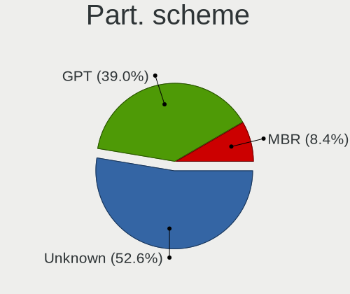
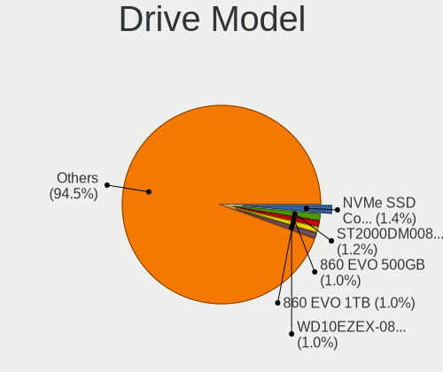
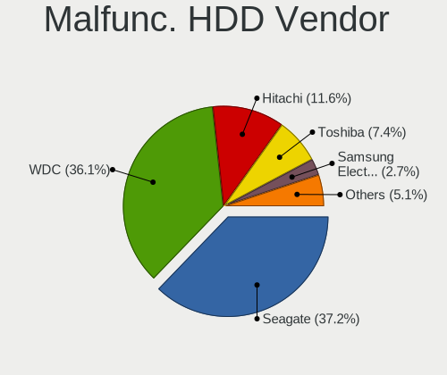
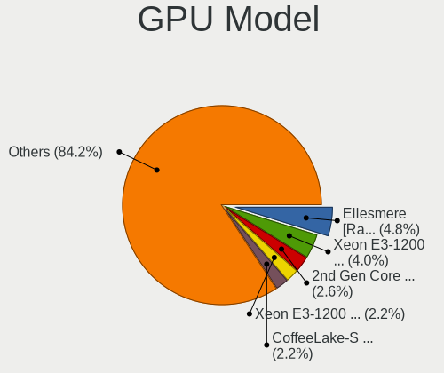
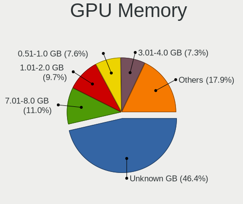
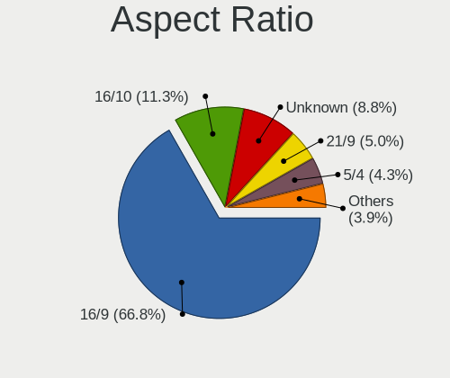

Linux in USA - Tested Hardware & Statistics (Desktops)
------------------------------------------------------

A project to collect tested hardware configurations for Linux in USA.

Anyone can contribute to this report by the [hw-probe](https://github.com/linuxhw/hw-probe) tool:

    sudo -E hw-probe -all -upload

Please contribute! Especially if your hardware is rare.

Contents
--------

* [ Test Cases ](#test-cases)

* [ System ](#system)
  - [ OS                       ](#os)
  - [ OS Family                ](#os-family)
  - [ Kernel                   ](#kernel)
  - [ Kernel Family            ](#kernel-family)
  - [ Kernel Major Ver.        ](#kernel-major-ver)
  - [ Arch                     ](#arch)
  - [ DE                       ](#de)
  - [ Display Server           ](#display-server)
  - [ Display Manager          ](#display-manager)
  - [ OS Lang                  ](#os-lang)
  - [ Boot Mode                ](#boot-mode)
  - [ Filesystem               ](#filesystem)
  - [ Part. scheme             ](#part-scheme)
  - [ Dual Boot with Linux/BSD ](#dual-boot-with-linuxbsd)
  - [ Dual Boot (Win)          ](#dual-boot-win)

* [ Board ](#board)
  - [ Vendor                   ](#vendor)
  - [ Model                    ](#model)
  - [ Model Family             ](#model-family)
  - [ MFG Year                 ](#mfg-year)
  - [ Form Factor              ](#form-factor)
  - [ Secure Boot              ](#secure-boot)
  - [ Coreboot                 ](#coreboot)
  - [ RAM Size                 ](#ram-size)
  - [ RAM Used                 ](#ram-used)
  - [ Total Drives             ](#total-drives)
  - [ Has CD-ROM               ](#has-cd-rom)
  - [ Has Ethernet             ](#has-ethernet)
  - [ Has WiFi                 ](#has-wifi)
  - [ Has Bluetooth            ](#has-bluetooth)

* [ Location ](#location)
  - [ Country                  ](#country)
  - [ City                     ](#city)

* [ Drives ](#drives)
  - [ Drive Vendor             ](#drive-vendor)
  - [ Drive Model              ](#drive-model)
  - [ HDD Vendor               ](#hdd-vendor)
  - [ SSD Vendor               ](#ssd-vendor)
  - [ Drive Kind               ](#drive-kind)
  - [ Drive Connector          ](#drive-connector)
  - [ Drive Size               ](#drive-size)
  - [ Space Total              ](#space-total)
  - [ Space Used               ](#space-used)
  - [ Malfunc. Drives          ](#malfunc-drives)
  - [ Malfunc. Drive Vendor    ](#malfunc-drive-vendor)
  - [ Malfunc. HDD Vendor      ](#malfunc-hdd-vendor)
  - [ Malfunc. Drive Kind      ](#malfunc-drive-kind)
  - [ Failed Drives            ](#failed-drives)
  - [ Failed Drive Vendor      ](#failed-drive-vendor)
  - [ Drive Status             ](#drive-status)

* [ Storage controller ](#storage-controller)
  - [ Storage Vendor           ](#storage-vendor)
  - [ Storage Model            ](#storage-model)
  - [ Storage Kind             ](#storage-kind)

* [ Processor ](#processor)
  - [ CPU Vendor               ](#cpu-vendor)
  - [ CPU Model                ](#cpu-model)
  - [ CPU Model Family         ](#cpu-model-family)
  - [ CPU Cores                ](#cpu-cores)
  - [ CPU Sockets              ](#cpu-sockets)
  - [ CPU Threads              ](#cpu-threads)
  - [ CPU Op-Modes             ](#cpu-op-modes)
  - [ CPU Microcode            ](#cpu-microcode)
  - [ CPU Microarch            ](#cpu-microarch)

* [ Graphics ](#graphics)
  - [ GPU Vendor               ](#gpu-vendor)
  - [ GPU Model                ](#gpu-model)
  - [ GPU Combo                ](#gpu-combo)
  - [ GPU Driver               ](#gpu-driver)
  - [ GPU Memory               ](#gpu-memory)

* [ Monitor ](#monitor)
  - [ Monitor Vendor           ](#monitor-vendor)
  - [ Monitor Model            ](#monitor-model)
  - [ Monitor Resolution       ](#monitor-resolution)
  - [ Monitor Diagonal         ](#monitor-diagonal)
  - [ Monitor Width            ](#monitor-width)
  - [ Aspect Ratio             ](#aspect-ratio)
  - [ Monitor Area             ](#monitor-area)
  - [ Pixel Density            ](#pixel-density)
  - [ Multiple Monitors        ](#multiple-monitors)

* [ Network ](#network)
  - [ Net Controller Vendor    ](#net-controller-vendor)
  - [ Net Controller Model     ](#net-controller-model)
  - [ Wireless Vendor          ](#wireless-vendor)
  - [ Wireless Model           ](#wireless-model)
  - [ Ethernet Vendor          ](#ethernet-vendor)
  - [ Ethernet Model           ](#ethernet-model)
  - [ Net Controller Kind      ](#net-controller-kind)
  - [ Used Controller          ](#used-controller)
  - [ NICs                     ](#nics)
  - [ IPv6                     ](#ipv6)

* [ Bluetooth ](#bluetooth)
  - [ Bluetooth Vendor         ](#bluetooth-vendor)
  - [ Bluetooth Model          ](#bluetooth-model)

* [ Sound ](#sound)
  - [ Sound Vendor             ](#sound-vendor)
  - [ Sound Model              ](#sound-model)

* [ Memory ](#memory)
  - [ Memory Vendor            ](#memory-vendor)
  - [ Memory Model             ](#memory-model)
  - [ Memory Kind              ](#memory-kind)
  - [ Memory Form Factor       ](#memory-form-factor)
  - [ Memory Size              ](#memory-size)
  - [ Memory Speed             ](#memory-speed)

* [ Printers & scanners ](#printers--scanners)
  - [ Printer Vendor           ](#printer-vendor)
  - [ Printer Model            ](#printer-model)
  - [ Scanner Vendor           ](#scanner-vendor)
  - [ Scanner Model            ](#scanner-model)

* [ Camera ](#camera)
  - [ Camera Vendor            ](#camera-vendor)
  - [ Camera Model             ](#camera-model)

* [ Security ](#security)
  - [ Fingerprint Vendor       ](#fingerprint-vendor)
  - [ Fingerprint Model        ](#fingerprint-model)
  - [ Chipcard Vendor          ](#chipcard-vendor)
  - [ Chipcard Model           ](#chipcard-model)

* [ Unsupported ](#unsupported)
  - [ Unsupported Devices      ](#unsupported-devices)
  - [ Unsupported Device Types ](#unsupported-device-types)

Test Cases
----------

Total: 17206

| Vendor        | Model                       | Probe                                                      | Date         |
|---------------|-----------------------------|------------------------------------------------------------|--------------|
| MSI           | MAG B550 TOMAHAWK MAX WI... | [51cf6d10e7](https://linux-hardware.org/?probe=51cf6d10e7) | Dec 01, 2022 |
| Apple         | Mac-F221BEC8                | [7f91a09589](https://linux-hardware.org/?probe=7f91a09589) | Dec 01, 2022 |
| HP            | 8433 11                     | [01f9a28da3](https://linux-hardware.org/?probe=01f9a28da3) | Dec 01, 2022 |
| MSI           | MAG B550 TOMAHAWK MAX WI... | [1775ec9d4b](https://linux-hardware.org/?probe=1775ec9d4b) | Dec 01, 2022 |
| MSI           | MAG B550 TOMAHAWK MAX WI... | [097d1c062e](https://linux-hardware.org/?probe=097d1c062e) | Dec 01, 2022 |
| ASUSTek       | PRIME B550M-A               | [5b86ca0927](https://linux-hardware.org/?probe=5b86ca0927) | Dec 01, 2022 |
| System76      | Thelio thelio-r2            | [a7ae37f43e](https://linux-hardware.org/?probe=a7ae37f43e) | Dec 01, 2022 |
| ASUSTek       | TUF Gaming X570-PLUS        | [f7b40a75f6](https://linux-hardware.org/?probe=f7b40a75f6) | Dec 01, 2022 |
| Dell          | 0R6PCT A01                  | [c8ef04b4b2](https://linux-hardware.org/?probe=c8ef04b4b2) | Dec 01, 2022 |
| ASUSTek       | ROG STRIX X570-F GAMING     | [1ebd8b1b89](https://linux-hardware.org/?probe=1ebd8b1b89) | Dec 01, 2022 |
| ASUSTek       | PRIME X370-PRO              | [aa87dfdc13](https://linux-hardware.org/?probe=aa87dfdc13) | Dec 01, 2022 |
| ASUSTek       | ROG STRIX B450-F GAMING     | [0461e6b5d2](https://linux-hardware.org/?probe=0461e6b5d2) | Dec 01, 2022 |
| Unknown       | 1.0                         | [c8cfeaf2be](https://linux-hardware.org/?probe=c8cfeaf2be) | Dec 01, 2022 |
| MSI           | B460M PRO-VDH WIFI          | [3b7321ba87](https://linux-hardware.org/?probe=3b7321ba87) | Dec 01, 2022 |
| System76      | Thelio thelio-r1            | [a888eb38b3](https://linux-hardware.org/?probe=a888eb38b3) | Dec 01, 2022 |
| System76      | Thelio thelio-r1            | [76343aa234](https://linux-hardware.org/?probe=76343aa234) | Dec 01, 2022 |
| ECS           | H61H2-WM                    | [9a7a280b58](https://linux-hardware.org/?probe=9a7a280b58) | Dec 01, 2022 |
| HP            | 1825                        | [5f8bff315d](https://linux-hardware.org/?probe=5f8bff315d) | Nov 30, 2022 |
| ASUSTek       | ROG STRIX X570-I GAMING     | [ac84964c19](https://linux-hardware.org/?probe=ac84964c19) | Nov 30, 2022 |
| Dell          | 0NDYHG A01                  | [5dd9f4dea9](https://linux-hardware.org/?probe=5dd9f4dea9) | Nov 30, 2022 |
| Dell          | 0N4YC8 A00                  | [2e53fa79ed](https://linux-hardware.org/?probe=2e53fa79ed) | Nov 30, 2022 |
| MSI           | MAG Z690 TOMAHAWK WIFI D... | [24dd5413fa](https://linux-hardware.org/?probe=24dd5413fa) | Nov 30, 2022 |
| Gigabyte      | X570 GAMING X               | [7ea2de1a3b](https://linux-hardware.org/?probe=7ea2de1a3b) | Nov 30, 2022 |
| MSI           | MAG B550M MORTAR            | [b4c010a2b2](https://linux-hardware.org/?probe=b4c010a2b2) | Nov 30, 2022 |
| Dell          | 0C3YXR A01                  | [95fbd0e6b4](https://linux-hardware.org/?probe=95fbd0e6b4) | Nov 30, 2022 |
| Gigabyte      | B450 AORUS M                | [3e3ccd1471](https://linux-hardware.org/?probe=3e3ccd1471) | Nov 30, 2022 |
| Dell          | 08NPPY A00                  | [a774c1201c](https://linux-hardware.org/?probe=a774c1201c) | Nov 30, 2022 |
| HP            | 1825                        | [a3f8ec5423](https://linux-hardware.org/?probe=a3f8ec5423) | Nov 30, 2022 |
| MSI           | B550M PRO-VDH WIFI          | [53e6bc021e](https://linux-hardware.org/?probe=53e6bc021e) | Nov 30, 2022 |
| ASRock        | B450M Steel Legend          | [9d6aeff37c](https://linux-hardware.org/?probe=9d6aeff37c) | Nov 30, 2022 |
| Gigabyte      | X570 AORUS ELITE WIFI       | [f17f99d4e6](https://linux-hardware.org/?probe=f17f99d4e6) | Nov 30, 2022 |
| Dell          | 0NDYHG A01                  | [a3191b9bfe](https://linux-hardware.org/?probe=a3191b9bfe) | Nov 30, 2022 |
| ASRock        | H77M                        | [ffa3496b0d](https://linux-hardware.org/?probe=ffa3496b0d) | Nov 30, 2022 |
| ASUSTek       | TUF Gaming X570-PLUS        | [2e35df903f](https://linux-hardware.org/?probe=2e35df903f) | Nov 29, 2022 |
| ASUSTek       | M4A89GTD-PRO/USB3           | [9dd6019148](https://linux-hardware.org/?probe=9dd6019148) | Nov 29, 2022 |
| ASRock        | H270M-ITX/ac                | [dfc381d411](https://linux-hardware.org/?probe=dfc381d411) | Nov 29, 2022 |
| HP            | 8876 11                     | [babda62ffa](https://linux-hardware.org/?probe=babda62ffa) | Nov 29, 2022 |
| Dell          | 0FDY5C A00                  | [3cba0b32b1](https://linux-hardware.org/?probe=3cba0b32b1) | Nov 29, 2022 |
| Gigabyte      | B550 AORUS ELITE AX V2      | [ff119f84e6](https://linux-hardware.org/?probe=ff119f84e6) | Nov 29, 2022 |
| MSI           | MAG B560 TORPEDO            | [b58a1b4b2f](https://linux-hardware.org/?probe=b58a1b4b2f) | Nov 29, 2022 |
| MSI           | MAG B560 TORPEDO            | [6cd5ddc986](https://linux-hardware.org/?probe=6cd5ddc986) | Nov 29, 2022 |
| Supermicro    | X10DRU-i+B                  | [e55edce907](https://linux-hardware.org/?probe=e55edce907) | Nov 29, 2022 |
| ASUSTek       | PRIME B560M-A AC            | [d4cc718e46](https://linux-hardware.org/?probe=d4cc718e46) | Nov 29, 2022 |
| MSI           | MAG X570S TOMAHAWK MAX W... | [04d2eea487](https://linux-hardware.org/?probe=04d2eea487) | Nov 28, 2022 |
| ASUSTek       | H81I-PLUS                   | [4aba048a46](https://linux-hardware.org/?probe=4aba048a46) | Nov 28, 2022 |
| ASUSTek       | H81I-PLUS                   | [2042d30c8b](https://linux-hardware.org/?probe=2042d30c8b) | Nov 28, 2022 |
| ASUSTek       | CM1630                      | [b82a5c41fc](https://linux-hardware.org/?probe=b82a5c41fc) | Nov 28, 2022 |
| Gateway       | SX2851                      | [b408695def](https://linux-hardware.org/?probe=b408695def) | Nov 28, 2022 |
| HP            | 806A                        | [82128d6a8b](https://linux-hardware.org/?probe=82128d6a8b) | Nov 28, 2022 |
| ASRock        | H87M Pro4                   | [c0511f2d46](https://linux-hardware.org/?probe=c0511f2d46) | Nov 28, 2022 |
| MSI           | 970A-G46                    | [3cd88e88d3](https://linux-hardware.org/?probe=3cd88e88d3) | Nov 28, 2022 |
| Dell          | 0T10XW A02                  | [e97a065fa8](https://linux-hardware.org/?probe=e97a065fa8) | Nov 28, 2022 |
| MSI           | B460M PRO-VDH WIFI          | [da2828f715](https://linux-hardware.org/?probe=da2828f715) | Nov 28, 2022 |
| Dell          | 0K3CM7 A00                  | [076eeadd80](https://linux-hardware.org/?probe=076eeadd80) | Nov 28, 2022 |
| Dell          | 040DDP A00                  | [6bf43c8793](https://linux-hardware.org/?probe=6bf43c8793) | Nov 28, 2022 |
| Gigabyte      | B85-HD3-A                   | [cc1637d7e2](https://linux-hardware.org/?probe=cc1637d7e2) | Nov 27, 2022 |
| Dell          | 0DR845                      | [57f2ea3914](https://linux-hardware.org/?probe=57f2ea3914) | Nov 27, 2022 |
| Dell          | 0DR845                      | [f28560630d](https://linux-hardware.org/?probe=f28560630d) | Nov 27, 2022 |
| Gateway       | G33M05G1 MP                 | [193a69e5ee](https://linux-hardware.org/?probe=193a69e5ee) | Nov 27, 2022 |
| Gateway       | G33M05G1 MP                 | [291e32a741](https://linux-hardware.org/?probe=291e32a741) | Nov 27, 2022 |
| ASRock        | H87M Pro4                   | [8d15aa84d6](https://linux-hardware.org/?probe=8d15aa84d6) | Nov 27, 2022 |
| BESSTAR Te... | HM90                        | [eda49557ae](https://linux-hardware.org/?probe=eda49557ae) | Nov 27, 2022 |
| BESSTAR Te... | HM90                        | [6867d8eeaf](https://linux-hardware.org/?probe=6867d8eeaf) | Nov 27, 2022 |
| HP            | 843B                        | [50065e4a79](https://linux-hardware.org/?probe=50065e4a79) | Nov 27, 2022 |
| MSI           | Z97A GAMING 7               | [74341c948b](https://linux-hardware.org/?probe=74341c948b) | Nov 27, 2022 |
| Dell          | 0GXM1W A02                  | [3a801841e6](https://linux-hardware.org/?probe=3a801841e6) | Nov 27, 2022 |
| MSI           | X470 GAMING PRO CARBON      | [81a61c4765](https://linux-hardware.org/?probe=81a61c4765) | Nov 27, 2022 |
| Dell          | 0C2XKD A01                  | [b17b635fcb](https://linux-hardware.org/?probe=b17b635fcb) | Nov 27, 2022 |
| ASUSTek       | PRIME B550M-A               | [7bdb03388b](https://linux-hardware.org/?probe=7bdb03388b) | Nov 27, 2022 |
| Gigabyte      | B450 AORUS ELITE            | [b72ddeccb4](https://linux-hardware.org/?probe=b72ddeccb4) | Nov 27, 2022 |
| Apple         | Mac-F221BEC8                | [f2fe1d140e](https://linux-hardware.org/?probe=f2fe1d140e) | Nov 26, 2022 |
| MSI           | MPG X570 GAMING PLUS        | [63521d3e8d](https://linux-hardware.org/?probe=63521d3e8d) | Nov 26, 2022 |
| MSI           | X370 GAMING M7 ACK          | [c2dca9687b](https://linux-hardware.org/?probe=c2dca9687b) | Nov 26, 2022 |
| LattePanda    | 3 Delta CDJQ-BS-7-S70JR1... | [da7904dda2](https://linux-hardware.org/?probe=da7904dda2) | Nov 26, 2022 |
| ASRock        | B450 Steel Legend           | [7a4807269e](https://linux-hardware.org/?probe=7a4807269e) | Nov 26, 2022 |
| Lenovo        | BRASWELL SDK0J40705 WIN ... | [fd73688b5c](https://linux-hardware.org/?probe=fd73688b5c) | Nov 26, 2022 |
| ASRock        | B450M Pro4                  | [def104dd7d](https://linux-hardware.org/?probe=def104dd7d) | Nov 26, 2022 |
| Lenovo        | BRASWELL SDK0J40705 WIN ... | [cdc1c32b09](https://linux-hardware.org/?probe=cdc1c32b09) | Nov 26, 2022 |
| Gigabyte      | GA-78LMT-USB3               | [bb0d4b34af](https://linux-hardware.org/?probe=bb0d4b34af) | Nov 26, 2022 |
| Dell          | 06NWYK A01                  | [3afe7122f3](https://linux-hardware.org/?probe=3afe7122f3) | Nov 26, 2022 |
| ASUSTek       | TUF B350M-PLUS GAMING       | [098116b1d6](https://linux-hardware.org/?probe=098116b1d6) | Nov 26, 2022 |
| MSI           | A78M-E35                    | [cf80d76e53](https://linux-hardware.org/?probe=cf80d76e53) | Nov 26, 2022 |
| Gigabyte      | B550 GAMING X               | [b9264b2557](https://linux-hardware.org/?probe=b9264b2557) | Nov 26, 2022 |
| HP            | 0AECh D                     | [857616948b](https://linux-hardware.org/?probe=857616948b) | Nov 26, 2022 |
| Dell          | 0FDY5C A00                  | [05216bc44f](https://linux-hardware.org/?probe=05216bc44f) | Nov 26, 2022 |
| LattePanda    | Alpha                       | [be819160d5](https://linux-hardware.org/?probe=be819160d5) | Nov 26, 2022 |
| LattePanda    | Alpha                       | [b3c831db4d](https://linux-hardware.org/?probe=b3c831db4d) | Nov 26, 2022 |
| Gigabyte      | Z77-HD3                     | [e3b7bbc736](https://linux-hardware.org/?probe=e3b7bbc736) | Nov 25, 2022 |
| HP            | 8299                        | [8f6b89bf07](https://linux-hardware.org/?probe=8f6b89bf07) | Nov 25, 2022 |
| Foxconn       | 2AB1                        | [9a2bebb3ba](https://linux-hardware.org/?probe=9a2bebb3ba) | Nov 25, 2022 |
| ASRock        | Z77 Extreme4                | [40b3f85de8](https://linux-hardware.org/?probe=40b3f85de8) | Nov 25, 2022 |
| ASUSTek       | PRIME Z790-A WIFI           | [2133e0742c](https://linux-hardware.org/?probe=2133e0742c) | Nov 25, 2022 |
| Gigabyte      | B450 AORUS PRO WIFI-CF      | [bf1722d4d6](https://linux-hardware.org/?probe=bf1722d4d6) | Nov 25, 2022 |
| ASUSTek       | PRIME Z590-P                | [a301b498bb](https://linux-hardware.org/?probe=a301b498bb) | Nov 25, 2022 |
| ASRock        | Z170 Gaming K6              | [de7addf17b](https://linux-hardware.org/?probe=de7addf17b) | Nov 25, 2022 |
| Unknown       | T3 MRD                      | [bec511830c](https://linux-hardware.org/?probe=bec511830c) | Nov 24, 2022 |
| Dell          | 0R230R A00                  | [157e450aa2](https://linux-hardware.org/?probe=157e450aa2) | Nov 24, 2022 |
| Gigabyte      | B560 DS3H AC-Y1             | [6bcefa911d](https://linux-hardware.org/?probe=6bcefa911d) | Nov 24, 2022 |
| Dell          | 06D7TR A00                  | [4f4bd45786](https://linux-hardware.org/?probe=4f4bd45786) | Nov 24, 2022 |
| MSI           | B350 PC MATE                | [601fd47da1](https://linux-hardware.org/?probe=601fd47da1) | Nov 24, 2022 |
| Dell          | 0GXM1W A02                  | [8bb6ca52d6](https://linux-hardware.org/?probe=8bb6ca52d6) | Nov 24, 2022 |
| Lenovo        | ThinkCentre M58e 7514A2U    | [ba4f47be1a](https://linux-hardware.org/?probe=ba4f47be1a) | Nov 24, 2022 |
| Foxconn       | 2A92                        | [e21715c047](https://linux-hardware.org/?probe=e21715c047) | Nov 24, 2022 |
| Dell          | 0WPMFG A00                  | [606cc8badf](https://linux-hardware.org/?probe=606cc8badf) | Nov 24, 2022 |
| ASRock        | B550M-ITX/ac                | [c72c157583](https://linux-hardware.org/?probe=c72c157583) | Nov 24, 2022 |
| ASRock        | B550M-ITX/ac                | [bd50429870](https://linux-hardware.org/?probe=bd50429870) | Nov 24, 2022 |
| HP            | 212B                        | [3ac96bbb45](https://linux-hardware.org/?probe=3ac96bbb45) | Nov 24, 2022 |
| HP            | 8062                        | [48dae87b57](https://linux-hardware.org/?probe=48dae87b57) | Nov 24, 2022 |
| ASUSTek       | PRIME X370-PRO              | [ee5b760222](https://linux-hardware.org/?probe=ee5b760222) | Nov 24, 2022 |
| HP            | 806A                        | [ee8a1db4f4](https://linux-hardware.org/?probe=ee8a1db4f4) | Nov 24, 2022 |
| Gigabyte      | 990FXA-UD3                  | [38aca80776](https://linux-hardware.org/?probe=38aca80776) | Nov 24, 2022 |
| AZW           | Green G1                    | [762182d13c](https://linux-hardware.org/?probe=762182d13c) | Nov 24, 2022 |
| Gateway       | SX2803                      | [68a008f332](https://linux-hardware.org/?probe=68a008f332) | Nov 24, 2022 |
| ASUSTek       | PRIME B550M-A               | [ed9d641fda](https://linux-hardware.org/?probe=ed9d641fda) | Nov 23, 2022 |
| ASUSTek       | ROG STRIX B450-F GAMING     | [d1d85cefdb](https://linux-hardware.org/?probe=d1d85cefdb) | Nov 23, 2022 |
| Dell          | 0J3C2F A02                  | [0cfd78c6bb](https://linux-hardware.org/?probe=0cfd78c6bb) | Nov 23, 2022 |
| MSI           | MPG Z690 EDGE WIFI DDR4     | [880f8b9c45](https://linux-hardware.org/?probe=880f8b9c45) | Nov 23, 2022 |
| Gateway       | DX4840                      | [e2a4cbcd27](https://linux-hardware.org/?probe=e2a4cbcd27) | Nov 23, 2022 |
| Dell          | 0HN7XN A01                  | [5357d43f13](https://linux-hardware.org/?probe=5357d43f13) | Nov 23, 2022 |
| Gigabyte      | B365M DS3H                  | [d3bf10a8f0](https://linux-hardware.org/?probe=d3bf10a8f0) | Nov 23, 2022 |
| ASUSTek       | PRIME B450M-A II            | [e89ecf8da4](https://linux-hardware.org/?probe=e89ecf8da4) | Nov 23, 2022 |
| Dell          | 0M863N A01                  | [ca7e5eab8d](https://linux-hardware.org/?probe=ca7e5eab8d) | Nov 23, 2022 |
| AZW           | SEi                         | [deace4a3d6](https://linux-hardware.org/?probe=deace4a3d6) | Nov 23, 2022 |
| ASUSTek       | ROG Maximus XI HERO         | [6cd720c62c](https://linux-hardware.org/?probe=6cd720c62c) | Nov 23, 2022 |
| ASUSTek       | PRIME X570-PRO              | [30482f42d7](https://linux-hardware.org/?probe=30482f42d7) | Nov 22, 2022 |
| ASUSTek       | PRIME B450M-A               | [7aa8c1ec46](https://linux-hardware.org/?probe=7aa8c1ec46) | Nov 22, 2022 |
| ASUSTek       | TUF Gaming B550M-PLUS WI... | [56c9fb93ce](https://linux-hardware.org/?probe=56c9fb93ce) | Nov 22, 2022 |
| HP            | 1495                        | [f8a70f9386](https://linux-hardware.org/?probe=f8a70f9386) | Nov 22, 2022 |
| Gigabyte      | GA-78LMT-USB3               | [1ad4dcb28a](https://linux-hardware.org/?probe=1ad4dcb28a) | Nov 22, 2022 |
| Intel         | DG41TY AAE47335-302         | [ae2fb8d0b3](https://linux-hardware.org/?probe=ae2fb8d0b3) | Nov 22, 2022 |
| Dell          | 08NPPY A00                  | [f076c3adb1](https://linux-hardware.org/?probe=f076c3adb1) | Nov 22, 2022 |
| ASUSTek       | TUF Gaming B550M-PLUS WI... | [1ec2520541](https://linux-hardware.org/?probe=1ec2520541) | Nov 22, 2022 |
| AAEON         | MF-001 V1.0                 | [ccc82b748a](https://linux-hardware.org/?probe=ccc82b748a) | Nov 22, 2022 |
| ASUSTek       | TUF Gaming B450-PLUS II     | [b66300c607](https://linux-hardware.org/?probe=b66300c607) | Nov 22, 2022 |
| ASUSTek       | M5A99FX PRO R2.0            | [990ff088e8](https://linux-hardware.org/?probe=990ff088e8) | Nov 22, 2022 |
| ASUSTek       | P6T DELUXE V2               | [d126214b62](https://linux-hardware.org/?probe=d126214b62) | Nov 22, 2022 |
| ASUSTek       | ROG STRIX X570-F GAMING     | [0fd2d81cad](https://linux-hardware.org/?probe=0fd2d81cad) | Nov 22, 2022 |
| Dell          | 0GXM1W A02                  | [50ed928fa5](https://linux-hardware.org/?probe=50ed928fa5) | Nov 22, 2022 |
| Dell          | 05DN3X A00                  | [f15eef78fa](https://linux-hardware.org/?probe=f15eef78fa) | Nov 22, 2022 |
| ASUSTek       | X99-DELUXE                  | [224156b7ea](https://linux-hardware.org/?probe=224156b7ea) | Nov 22, 2022 |
| ASUSTek       | X99-DELUXE                  | [1a67a40a2f](https://linux-hardware.org/?probe=1a67a40a2f) | Nov 21, 2022 |
| ASUSTek       | M5A78L-M LX PLUS            | [fabd2d4455](https://linux-hardware.org/?probe=fabd2d4455) | Nov 21, 2022 |
| ASUSTek       | M5A78L-M/USB3               | [8478dece38](https://linux-hardware.org/?probe=8478dece38) | Nov 21, 2022 |
| Pegatron      | NARRA5                      | [d8632e2872](https://linux-hardware.org/?probe=d8632e2872) | Nov 21, 2022 |
| ASUSTek       | PRIME X570-PRO              | [78defd6c12](https://linux-hardware.org/?probe=78defd6c12) | Nov 21, 2022 |
| Shuttle       | FX79R                       | [76651bc71c](https://linux-hardware.org/?probe=76651bc71c) | Nov 21, 2022 |
| ASRock        | X570 Phantom Gaming 4       | [148271ed6d](https://linux-hardware.org/?probe=148271ed6d) | Nov 21, 2022 |
| Acer          | Veriton N4680G              | [2890235d49](https://linux-hardware.org/?probe=2890235d49) | Nov 21, 2022 |
| MSI           | MAG X570S TOMAHAWK MAX W... | [d93b2b9778](https://linux-hardware.org/?probe=d93b2b9778) | Nov 21, 2022 |
| ASRock        | P67 Extreme4                | [569fd8178d](https://linux-hardware.org/?probe=569fd8178d) | Nov 21, 2022 |
| Pegatron      | NARRA5                      | [42e5fe9c22](https://linux-hardware.org/?probe=42e5fe9c22) | Nov 21, 2022 |
| Gigabyte      | B450M DS3H-CF               | [b41f6ec236](https://linux-hardware.org/?probe=b41f6ec236) | Nov 21, 2022 |
| ASUSTek       | PRIME Z270-A                | [540d321764](https://linux-hardware.org/?probe=540d321764) | Nov 21, 2022 |
| ASUSTek       | PRIME Z690-P D4             | [049f06f11d](https://linux-hardware.org/?probe=049f06f11d) | Nov 21, 2022 |
| AZW           | SEi                         | [a8e813c483](https://linux-hardware.org/?probe=a8e813c483) | Nov 21, 2022 |
| Apple         | Mac-7BA5B2D9E42DDD94 iMa... | [fcf670d981](https://linux-hardware.org/?probe=fcf670d981) | Nov 21, 2022 |
| Dell          | 0XPDFK A01                  | [1332a048d4](https://linux-hardware.org/?probe=1332a048d4) | Nov 21, 2022 |
| HP            | 18E7                        | [0b963b44fb](https://linux-hardware.org/?probe=0b963b44fb) | Nov 21, 2022 |
| Dell          | 0XPDFK A01                  | [b76898d624](https://linux-hardware.org/?probe=b76898d624) | Nov 21, 2022 |
| BESSTAR Te... | DMAF5 V1.0                  | [eed1e72aba](https://linux-hardware.org/?probe=eed1e72aba) | Nov 21, 2022 |
| Dell          | 00NNT0 A00                  | [c25787d8b9](https://linux-hardware.org/?probe=c25787d8b9) | Nov 20, 2022 |
| HP            | 845A                        | [330b46ea11](https://linux-hardware.org/?probe=330b46ea11) | Nov 20, 2022 |
| Gigabyte      | B450M DS3H-CF               | [ba7b519890](https://linux-hardware.org/?probe=ba7b519890) | Nov 20, 2022 |
| Dell          | 0HY9JP A02                  | [fa0e9792f0](https://linux-hardware.org/?probe=fa0e9792f0) | Nov 20, 2022 |
| Dell          | 08WKV3 A00                  | [0f19755f25](https://linux-hardware.org/?probe=0f19755f25) | Nov 20, 2022 |
| ASUSTek       | K30AD_M31AD_M51AD_M32AD     | [7a30c89c58](https://linux-hardware.org/?probe=7a30c89c58) | Nov 20, 2022 |
| Gigabyte      | X570 AORUS ELITE WIFI       | [363b962909](https://linux-hardware.org/?probe=363b962909) | Nov 20, 2022 |
| Gigabyte      | X570 AORUS ELITE WIFI       | [08d670b40b](https://linux-hardware.org/?probe=08d670b40b) | Nov 20, 2022 |
| Gigabyte      | GA-78LMT-USB3               | [dba99c363e](https://linux-hardware.org/?probe=dba99c363e) | Nov 20, 2022 |
| AZW           | Green G2                    | [85d7c0c54b](https://linux-hardware.org/?probe=85d7c0c54b) | Nov 20, 2022 |
| ASUSTek       | P5QL-EM                     | [59925a7510](https://linux-hardware.org/?probe=59925a7510) | Nov 20, 2022 |
| Gigabyte      | Z68AP-D3                    | [f079712363](https://linux-hardware.org/?probe=f079712363) | Nov 20, 2022 |
| HP            | 8055                        | [65b0ad04f1](https://linux-hardware.org/?probe=65b0ad04f1) | Nov 20, 2022 |
| Dell          | 0RW199                      | [2a2fa5baf8](https://linux-hardware.org/?probe=2a2fa5baf8) | Nov 20, 2022 |
| Dell          | 0WPMFG A00                  | [8b3a3dc37f](https://linux-hardware.org/?probe=8b3a3dc37f) | Nov 20, 2022 |
| Gigabyte      | B450 AORUS ELITE            | [35d824783a](https://linux-hardware.org/?probe=35d824783a) | Nov 20, 2022 |
| Dell          | 0K3CM7 A00                  | [27109cda18](https://linux-hardware.org/?probe=27109cda18) | Nov 20, 2022 |
| Dell          | 0K3CM7 A00                  | [6dbdd86e08](https://linux-hardware.org/?probe=6dbdd86e08) | Nov 20, 2022 |
| ASUSTek       | PRIME X570-PRO              | [c278b19567](https://linux-hardware.org/?probe=c278b19567) | Nov 20, 2022 |
| MSI           | 970A-G43                    | [6c04d813ff](https://linux-hardware.org/?probe=6c04d813ff) | Nov 20, 2022 |
| Gigabyte      | Z690 AORUS ELITE AX DDR4    | [97d20263a0](https://linux-hardware.org/?probe=97d20263a0) | Nov 19, 2022 |
| Gigabyte      | Z690 AORUS ELITE AX DDR4    | [77dcbbbc76](https://linux-hardware.org/?probe=77dcbbbc76) | Nov 19, 2022 |
| Dell          | 09D2HH A00                  | [4cafe39785](https://linux-hardware.org/?probe=4cafe39785) | Nov 19, 2022 |
| ASUSTek       | Z170-DELUXE                 | [7928d11567](https://linux-hardware.org/?probe=7928d11567) | Nov 19, 2022 |
| Acer          | Veriton N4680G              | [4f3c7d5501](https://linux-hardware.org/?probe=4f3c7d5501) | Nov 19, 2022 |
| Gigabyte      | X570 AORUS MASTER           | [16fc755db2](https://linux-hardware.org/?probe=16fc755db2) | Nov 19, 2022 |
| ASUSTek       | ROG STRIX B550-F GAMING     | [ae7e261a01](https://linux-hardware.org/?probe=ae7e261a01) | Nov 19, 2022 |
| ASUSTek       | TUF Gaming Z690-PLUS WIF... | [d40491a06a](https://linux-hardware.org/?probe=d40491a06a) | Nov 19, 2022 |
| HP            | 3048h                       | [33ced86304](https://linux-hardware.org/?probe=33ced86304) | Nov 19, 2022 |
| HP            | 3048h                       | [e5fdb1f67a](https://linux-hardware.org/?probe=e5fdb1f67a) | Nov 19, 2022 |
| MSI           | B450 TOMAHAWK MAX II        | [050e6cfd68](https://linux-hardware.org/?probe=050e6cfd68) | Nov 19, 2022 |
| Lenovo        | 3717 SDK0J40700 WIN 3258... | [c8fc039301](https://linux-hardware.org/?probe=c8fc039301) | Nov 19, 2022 |
| Lenovo        | 3717 SDK0J40700 WIN 3258... | [1ffee02fee](https://linux-hardware.org/?probe=1ffee02fee) | Nov 19, 2022 |
| MSI           | 2AE0                        | [cfb41eba48](https://linux-hardware.org/?probe=cfb41eba48) | Nov 19, 2022 |
| ASUSTek       | PRIME B550M-A               | [9b19115bc7](https://linux-hardware.org/?probe=9b19115bc7) | Nov 18, 2022 |
| ASUSTek       | CROSSHAIR VI HERO           | [8babb97c89](https://linux-hardware.org/?probe=8babb97c89) | Nov 18, 2022 |
| Dell          | 0VD5HY A07                  | [0c30b1a1e9](https://linux-hardware.org/?probe=0c30b1a1e9) | Nov 18, 2022 |
| MSI           | B550M PRO-VDH WIFI          | [afb716fb12](https://linux-hardware.org/?probe=afb716fb12) | Nov 18, 2022 |
| ASRock        | X300-ITX                    | [54f7198f58](https://linux-hardware.org/?probe=54f7198f58) | Nov 18, 2022 |
| ASUSTek       | ROG STRIX B450-F GAMING     | [a5cfd24a43](https://linux-hardware.org/?probe=a5cfd24a43) | Nov 18, 2022 |
| HP            | 8643 SMVB                   | [fc34170a10](https://linux-hardware.org/?probe=fc34170a10) | Nov 18, 2022 |
| Lenovo        | ThinkCentre M58e 7514A2U    | [96ca5e0c1f](https://linux-hardware.org/?probe=96ca5e0c1f) | Nov 18, 2022 |
| MSI           | B360 GAMING PLUS            | [6552f5cfc9](https://linux-hardware.org/?probe=6552f5cfc9) | Nov 18, 2022 |
| Dell          | 0VD5HY A07                  | [c0cd31b87f](https://linux-hardware.org/?probe=c0cd31b87f) | Nov 18, 2022 |
| HP            | 0A08h                       | [99ca72c75c](https://linux-hardware.org/?probe=99ca72c75c) | Nov 18, 2022 |
| ASRock        | X470 Taichi Ultimate        | [7c8a72cae4](https://linux-hardware.org/?probe=7c8a72cae4) | Nov 18, 2022 |
| HP            | 0A08h                       | [0e935d58d0](https://linux-hardware.org/?probe=0e935d58d0) | Nov 18, 2022 |
| HP            | 1850                        | [25c6e64b61](https://linux-hardware.org/?probe=25c6e64b61) | Nov 18, 2022 |
| Foxconn       | 2AB1                        | [a8847bb3ad](https://linux-hardware.org/?probe=a8847bb3ad) | Nov 18, 2022 |
| Dell          | 0PC5F7 A01                  | [e30d0b204b](https://linux-hardware.org/?probe=e30d0b204b) | Nov 18, 2022 |
| Dell          | 0C27VV A02                  | [5f4b4b8571](https://linux-hardware.org/?probe=5f4b4b8571) | Nov 18, 2022 |
| Dell          | 0X30MX A00                  | [c3657c7f97](https://linux-hardware.org/?probe=c3657c7f97) | Nov 18, 2022 |
| ASUSTek       | PRIME Z690-A                | [06a234be2c](https://linux-hardware.org/?probe=06a234be2c) | Nov 17, 2022 |
| ASUSTek       | ROG CROSSHAIR VIII FORMU... | [45fbc31f55](https://linux-hardware.org/?probe=45fbc31f55) | Nov 17, 2022 |
| ASUSTek       | ROG CROSSHAIR VIII FORMU... | [a5eb8c6aaa](https://linux-hardware.org/?probe=a5eb8c6aaa) | Nov 17, 2022 |
| Gigabyte      | Z97X-UD3H-BK-CF             | [b06d8265c4](https://linux-hardware.org/?probe=b06d8265c4) | Nov 17, 2022 |
| Foxconn       | 2ABF                        | [018a2825bf](https://linux-hardware.org/?probe=018a2825bf) | Nov 17, 2022 |
| Dell          | 05GD68 A00                  | [d0da497d43](https://linux-hardware.org/?probe=d0da497d43) | Nov 17, 2022 |
| Lenovo        | 30BC SDK0J40705 WIN 3425... | [53615b83c5](https://linux-hardware.org/?probe=53615b83c5) | Nov 17, 2022 |
| ASUSTek       | Pro WS WRX80E-SAGE SE WI... | [58397aed9d](https://linux-hardware.org/?probe=58397aed9d) | Nov 17, 2022 |
| MSI           | B450 GAMING PLUS MAX        | [8a9570e828](https://linux-hardware.org/?probe=8a9570e828) | Nov 17, 2022 |
| Fujitsu       | FujitsuTP7000 -1            | [89198d262f](https://linux-hardware.org/?probe=89198d262f) | Nov 17, 2022 |
| ASUSTek       | K30AD_M31AD_M51AD_M32AD     | [aa5d7dc8a0](https://linux-hardware.org/?probe=aa5d7dc8a0) | Nov 17, 2022 |
| ASRock        | B560M-ITX/ac                | [c8f725f9cd](https://linux-hardware.org/?probe=c8f725f9cd) | Nov 17, 2022 |
| ASUSTek       | TUF Z270 MARK 1             | [dc1aa01b01](https://linux-hardware.org/?probe=dc1aa01b01) | Nov 17, 2022 |
| HP            | 8055                        | [4195a9765a](https://linux-hardware.org/?probe=4195a9765a) | Nov 17, 2022 |
| Gigabyte      | X570 AORUS MASTER           | [df66428cab](https://linux-hardware.org/?probe=df66428cab) | Nov 17, 2022 |
| HP            | 805D                        | [cb811984e0](https://linux-hardware.org/?probe=cb811984e0) | Nov 17, 2022 |
| ASUSTek       | TUF Gaming X570-PRO         | [8084d88d4b](https://linux-hardware.org/?probe=8084d88d4b) | Nov 17, 2022 |
| Alienware     | 0PGRP5 A01                  | [2ff9360669](https://linux-hardware.org/?probe=2ff9360669) | Nov 17, 2022 |
| Dell          | 0KWVT8 A03                  | [b696d9eae7](https://linux-hardware.org/?probe=b696d9eae7) | Nov 16, 2022 |
| MSI           | 2AE0                        | [c0d9e23faa](https://linux-hardware.org/?probe=c0d9e23faa) | Nov 16, 2022 |
| HP            | 805B                        | [111fb196ff](https://linux-hardware.org/?probe=111fb196ff) | Nov 16, 2022 |
| MSI           | MAG B550 TOMAHAWK           | [ec2e196f65](https://linux-hardware.org/?probe=ec2e196f65) | Nov 16, 2022 |
| Gigabyte      | B550I AORUS PRO AX          | [c6f5c91413](https://linux-hardware.org/?probe=c6f5c91413) | Nov 16, 2022 |
| MSI           | X370 GAMING M7 ACK          | [6d27500df5](https://linux-hardware.org/?probe=6d27500df5) | Nov 16, 2022 |
| Dell          | 0XR1GT A00                  | [e3c13e13d2](https://linux-hardware.org/?probe=e3c13e13d2) | Nov 16, 2022 |
| ASUSTek       | M4A88TD-M/USB3              | [8ff2384625](https://linux-hardware.org/?probe=8ff2384625) | Nov 16, 2022 |
| ASUSTek       | STRIX Z270E GAMING          | [8e4ab9c969](https://linux-hardware.org/?probe=8e4ab9c969) | Nov 16, 2022 |
| ASRock        | Z170M Extreme4              | [9e89945cec](https://linux-hardware.org/?probe=9e89945cec) | Nov 16, 2022 |
| Dell          | 0K3CM7 A00                  | [85e5ea1485](https://linux-hardware.org/?probe=85e5ea1485) | Nov 16, 2022 |
| Foxconn       | 2ABF                        | [9b870d8287](https://linux-hardware.org/?probe=9b870d8287) | Nov 16, 2022 |
| MSI           | X370 GAMING M7 ACK          | [56a3ecf6d9](https://linux-hardware.org/?probe=56a3ecf6d9) | Nov 16, 2022 |
| ASUSTek       | K30AD_M31AD_M51AD_M32AD     | [2ff36bc758](https://linux-hardware.org/?probe=2ff36bc758) | Nov 16, 2022 |
| ASUSTek       | PRIME B550M-A               | [5ce6a414cd](https://linux-hardware.org/?probe=5ce6a414cd) | Nov 16, 2022 |
| Intel         | DX79SR AAG57199-200         | [b12b9ec8d5](https://linux-hardware.org/?probe=b12b9ec8d5) | Nov 16, 2022 |
| ASUSTek       | M5A78L-M/USB3               | [9cd3d86efc](https://linux-hardware.org/?probe=9cd3d86efc) | Nov 16, 2022 |
| MSI           | MEG X570 GODLIKE            | [de10599614](https://linux-hardware.org/?probe=de10599614) | Nov 15, 2022 |
| ASUSTek       | K30AD_M31AD_M51AD_M32AD     | [04a6897f33](https://linux-hardware.org/?probe=04a6897f33) | Nov 15, 2022 |
| ASRock        | B450M-HDV R4.0              | [a46c1d62cf](https://linux-hardware.org/?probe=a46c1d62cf) | Nov 15, 2022 |
| Foxconn       | 2ABF                        | [2f6204153a](https://linux-hardware.org/?probe=2f6204153a) | Nov 15, 2022 |
| Minix         | NEO Z83-4 V1.1              | [b371514101](https://linux-hardware.org/?probe=b371514101) | Nov 15, 2022 |
| Minix         | NEO Z83-4 V1.1              | [4f0c43a4d7](https://linux-hardware.org/?probe=4f0c43a4d7) | Nov 15, 2022 |
| HP            | 18E7                        | [7ecd6a2f37](https://linux-hardware.org/?probe=7ecd6a2f37) | Nov 15, 2022 |
| Intel         | DH77KC AAG39641-400         | [137906fffe](https://linux-hardware.org/?probe=137906fffe) | Nov 15, 2022 |
| AZW           | Green G2                    | [27def57052](https://linux-hardware.org/?probe=27def57052) | Nov 15, 2022 |
| ASUSTek       | ROG STRIX Z390-H GAMING     | [4d4d5aa456](https://linux-hardware.org/?probe=4d4d5aa456) | Nov 15, 2022 |
| Dell          | 0KWVT8 A03                  | [965a35d0b0](https://linux-hardware.org/?probe=965a35d0b0) | Nov 15, 2022 |
| Dell          | 040DDP A01                  | [5be1770be6](https://linux-hardware.org/?probe=5be1770be6) | Nov 15, 2022 |
| ASUSTek       | PHOENIX                     | [e643437e04](https://linux-hardware.org/?probe=e643437e04) | Nov 15, 2022 |
| Dell          | 040DDP A01                  | [6e0abbe24f](https://linux-hardware.org/?probe=6e0abbe24f) | Nov 15, 2022 |
| Acer          | Aspire TC-780               | [4687e7d178](https://linux-hardware.org/?probe=4687e7d178) | Nov 14, 2022 |
| Dell          | 0K240Y A03                  | [ef92c74ba4](https://linux-hardware.org/?probe=ef92c74ba4) | Nov 14, 2022 |
| ASUSTek       | B85M-G                      | [2029195495](https://linux-hardware.org/?probe=2029195495) | Nov 14, 2022 |
| Dell          | 0478VN A00                  | [5d1cf4ca11](https://linux-hardware.org/?probe=5d1cf4ca11) | Nov 14, 2022 |
| ASUSTek       | M4A89GTD-PRO/USB3           | [28df02c741](https://linux-hardware.org/?probe=28df02c741) | Nov 14, 2022 |
| Dell          | 0XPDFK A01                  | [5147db88ea](https://linux-hardware.org/?probe=5147db88ea) | Nov 14, 2022 |
| Biostar       | A320MH                      | [13a64b013b](https://linux-hardware.org/?probe=13a64b013b) | Nov 14, 2022 |
| Biostar       | A320MH                      | [d5135ec32f](https://linux-hardware.org/?probe=d5135ec32f) | Nov 14, 2022 |
| ASUSTek       | B85M-G                      | [277739769b](https://linux-hardware.org/?probe=277739769b) | Nov 14, 2022 |
| MSI           | B450M PRO-M2 MAX            | [c2fcfa4569](https://linux-hardware.org/?probe=c2fcfa4569) | Nov 14, 2022 |
| Gigabyte      | GA-78LMT-USB3               | [4a8a8314db](https://linux-hardware.org/?probe=4a8a8314db) | Nov 14, 2022 |
| Gigabyte      | GA-MA790FX-DS5              | [63bba2efec](https://linux-hardware.org/?probe=63bba2efec) | Nov 14, 2022 |
| Dell          | 0K3CM7 A00                  | [3c426cb32b](https://linux-hardware.org/?probe=3c426cb32b) | Nov 14, 2022 |
| MSI           | B75MA-E33                   | [9db352ce8b](https://linux-hardware.org/?probe=9db352ce8b) | Nov 13, 2022 |
| ASUSTek       | M3N-HT DELUXE               | [081e103f77](https://linux-hardware.org/?probe=081e103f77) | Nov 13, 2022 |
| ASUSTek       | M3N-HT DELUXE               | [1c9bb380ab](https://linux-hardware.org/?probe=1c9bb380ab) | Nov 13, 2022 |
| Apple         | Mac-F221BEC8                | [cd18d68895](https://linux-hardware.org/?probe=cd18d68895) | Nov 13, 2022 |
| Dell          | 0GXM1W A02                  | [b6da53e29d](https://linux-hardware.org/?probe=b6da53e29d) | Nov 13, 2022 |
| Dell          | 0GXM1W A02                  | [8d088bb873](https://linux-hardware.org/?probe=8d088bb873) | Nov 13, 2022 |
| ASUSTek       | PRIME B560-PLUS             | [09a8e21631](https://linux-hardware.org/?probe=09a8e21631) | Nov 13, 2022 |
| ASRock        | B450M Pro4                  | [11d46f72ea](https://linux-hardware.org/?probe=11d46f72ea) | Nov 13, 2022 |
| Acer          | Veriton N4680G              | [3eb034e033](https://linux-hardware.org/?probe=3eb034e033) | Nov 13, 2022 |
| Pegatron      | 2ACB                        | [fe088fdf62](https://linux-hardware.org/?probe=fe088fdf62) | Nov 13, 2022 |
| Dell          | 08NPPY A00                  | [0d10deec52](https://linux-hardware.org/?probe=0d10deec52) | Nov 13, 2022 |
| EVGA          | Z690 CLASSIFIED.0           | [aabaab5ceb](https://linux-hardware.org/?probe=aabaab5ceb) | Nov 13, 2022 |
| HP            | 84FD                        | [6ee4b6828c](https://linux-hardware.org/?probe=6ee4b6828c) | Nov 13, 2022 |
| Apple         | Mac-F60DEB81FF30ACF6 Mac... | [4629fb5e08](https://linux-hardware.org/?probe=4629fb5e08) | Nov 13, 2022 |
| Gigabyte      | Z590 UD AC                  | [57952c1512](https://linux-hardware.org/?probe=57952c1512) | Nov 13, 2022 |
| ASUSTek       | ROG STRIX X570-E GAMING     | [733739e049](https://linux-hardware.org/?probe=733739e049) | Nov 12, 2022 |
| Gigabyte      | GA-78LMT-USB3               | [dc2a41e0ee](https://linux-hardware.org/?probe=dc2a41e0ee) | Nov 12, 2022 |
| ASUSTek       | M5A78L-M/USB3               | [256503ef7e](https://linux-hardware.org/?probe=256503ef7e) | Nov 12, 2022 |
| Lenovo        | 3704 SDK0R32862 WIN 3258... | [2c50d9e17e](https://linux-hardware.org/?probe=2c50d9e17e) | Nov 12, 2022 |
| Lenovo        | 3704 SDK0R32862 WIN 3258... | [9089a0e312](https://linux-hardware.org/?probe=9089a0e312) | Nov 12, 2022 |
| ASUSTek       | ROG STRIX X570-E GAMING     | [d134c6d6bf](https://linux-hardware.org/?probe=d134c6d6bf) | Nov 12, 2022 |
| ASUSTek       | TUF Gaming X570-PLUS        | [a8145bf5ce](https://linux-hardware.org/?probe=a8145bf5ce) | Nov 12, 2022 |
| Intel         | D33217GKE G69901-202        | [f10d00e42a](https://linux-hardware.org/?probe=f10d00e42a) | Nov 12, 2022 |
| Gigabyte      | GA-78LMT-USB3 SEx           | [3c567aa946](https://linux-hardware.org/?probe=3c567aa946) | Nov 12, 2022 |
| ASUSTek       | PHOENIX                     | [d2670bac16](https://linux-hardware.org/?probe=d2670bac16) | Nov 12, 2022 |
| ASUSTek       | TUF Gaming Z690-PLUS WIF... | [87b7416681](https://linux-hardware.org/?probe=87b7416681) | Nov 12, 2022 |
| Dell          | 018D1Y A00                  | [16247a3667](https://linux-hardware.org/?probe=16247a3667) | Nov 12, 2022 |
| ASUSTek       | TUF Gaming B550M-PLUS       | [69bf8bfced](https://linux-hardware.org/?probe=69bf8bfced) | Nov 12, 2022 |
| Dell          | 018D1Y A00                  | [bc5562e288](https://linux-hardware.org/?probe=bc5562e288) | Nov 12, 2022 |
| ASUSTek       | PRIME A320I-K               | [c22a4715da](https://linux-hardware.org/?probe=c22a4715da) | Nov 12, 2022 |
| Gateway       | SX2110GA                    | [10c89cd51a](https://linux-hardware.org/?probe=10c89cd51a) | Nov 12, 2022 |
| Gigabyte      | 970A-DS3P FX                | [85ef5eaf43](https://linux-hardware.org/?probe=85ef5eaf43) | Nov 12, 2022 |
| HP            | 3397                        | [424fb641ba](https://linux-hardware.org/?probe=424fb641ba) | Nov 11, 2022 |
| Dell          | 051FJ8 A00                  | [374843d786](https://linux-hardware.org/?probe=374843d786) | Nov 11, 2022 |
| Dell          | 051FJ8 A00                  | [a49f180f2d](https://linux-hardware.org/?probe=a49f180f2d) | Nov 11, 2022 |
| ASRock        | X570 Taichi                 | [8bbd88e580](https://linux-hardware.org/?probe=8bbd88e580) | Nov 11, 2022 |
| ASUSTek       | SABERTOOTH 990FX R2.0       | [a9a0e77be4](https://linux-hardware.org/?probe=a9a0e77be4) | Nov 11, 2022 |
| Gigabyte      | GA-78LMT-USB3               | [524b1115eb](https://linux-hardware.org/?probe=524b1115eb) | Nov 11, 2022 |
| System76      | Thelio thelio-r2            | [1ce532916f](https://linux-hardware.org/?probe=1ce532916f) | Nov 11, 2022 |
| ASRock        | X99 Extreme4                | [00da120cde](https://linux-hardware.org/?probe=00da120cde) | Nov 11, 2022 |
| ASUSTek       | M5A99FX PRO R2.0            | [5d014a639b](https://linux-hardware.org/?probe=5d014a639b) | Nov 11, 2022 |
| Gigabyte      | 990FXA-UD3                  | [a49a1465d3](https://linux-hardware.org/?probe=a49a1465d3) | Nov 10, 2022 |
| Dell          | 0773VG A00                  | [2ffe6c18f7](https://linux-hardware.org/?probe=2ffe6c18f7) | Nov 10, 2022 |
| Alienware     | 0TYR0X A00                  | [01dbd42727](https://linux-hardware.org/?probe=01dbd42727) | Nov 10, 2022 |
| Alienware     | 0TYR0X A00                  | [dde7e92189](https://linux-hardware.org/?probe=dde7e92189) | Nov 10, 2022 |
| AZW           | Green G2                    | [265221b91d](https://linux-hardware.org/?probe=265221b91d) | Nov 10, 2022 |
| ASRock        | X470 Gaming-ITX/ac          | [d39ea05c32](https://linux-hardware.org/?probe=d39ea05c32) | Nov 10, 2022 |
| MSI           | MPG Z690 FORCE WIFI         | [04701e62f2](https://linux-hardware.org/?probe=04701e62f2) | Nov 10, 2022 |
| ASUSTek       | Leonite2                    | [67db8fec5f](https://linux-hardware.org/?probe=67db8fec5f) | Nov 10, 2022 |
| Pegatron      | Benicia                     | [2dadd4e98d](https://linux-hardware.org/?probe=2dadd4e98d) | Nov 10, 2022 |
| Dell          | 0M5DCD A00                  | [ac93b84c08](https://linux-hardware.org/?probe=ac93b84c08) | Nov 10, 2022 |
| ASUSTek       | PRIME B550M-A               | [34e25768ae](https://linux-hardware.org/?probe=34e25768ae) | Nov 10, 2022 |
| MSI           | MPG Z690 FORCE WIFI         | [e2a318b8d3](https://linux-hardware.org/?probe=e2a318b8d3) | Nov 10, 2022 |
| Dell          | 02YYK5 A01                  | [8fdc8aaeae](https://linux-hardware.org/?probe=8fdc8aaeae) | Nov 10, 2022 |
| ASUSTek       | Rampage IV EXTREME          | [39b6ceb06c](https://linux-hardware.org/?probe=39b6ceb06c) | Nov 10, 2022 |
| Dell          | 02YYK5 A01                  | [95df3e5e22](https://linux-hardware.org/?probe=95df3e5e22) | Nov 10, 2022 |
| ASUSTek       | KCMA-D8                     | [3d9ad6b8b1](https://linux-hardware.org/?probe=3d9ad6b8b1) | Nov 10, 2022 |
| Dell          | 0FM586                      | [8cdb6d8669](https://linux-hardware.org/?probe=8cdb6d8669) | Nov 10, 2022 |
| Dell          | 0FM586                      | [ff7ce90f85](https://linux-hardware.org/?probe=ff7ce90f85) | Nov 10, 2022 |
| Dell          | 0HN7XN A01                  | [bb4dff706b](https://linux-hardware.org/?probe=bb4dff706b) | Nov 10, 2022 |
| ASUSTek       | ROG STRIX B450-F GAMING     | [4e1661b8a8](https://linux-hardware.org/?probe=4e1661b8a8) | Nov 10, 2022 |
| MSI           | Z390-A PRO                  | [e851ddd11a](https://linux-hardware.org/?probe=e851ddd11a) | Nov 10, 2022 |
| ASUSTek       | TUF Gaming X570-PLUS        | [e840ded8c0](https://linux-hardware.org/?probe=e840ded8c0) | Nov 09, 2022 |
| ASUSTek       | Maximus V FORMULA           | [eac8229b99](https://linux-hardware.org/?probe=eac8229b99) | Nov 09, 2022 |
| Dell          | 07KY25 A01                  | [4462494cd7](https://linux-hardware.org/?probe=4462494cd7) | Nov 09, 2022 |
| ASRock        | H570M Pro4                  | [ffc96fbbde](https://linux-hardware.org/?probe=ffc96fbbde) | Nov 09, 2022 |
| HP            | 3397                        | [a456668069](https://linux-hardware.org/?probe=a456668069) | Nov 09, 2022 |
| MSI           | X470 GAMING PLUS            | [299a89e12f](https://linux-hardware.org/?probe=299a89e12f) | Nov 09, 2022 |
| MSI           | X470 GAMING PLUS            | [92f2f7477b](https://linux-hardware.org/?probe=92f2f7477b) | Nov 09, 2022 |
| ASRock        | H310M-STX                   | [cb421b22a5](https://linux-hardware.org/?probe=cb421b22a5) | Nov 09, 2022 |
| Dell          | 0PGKWF A02                  | [d123f535c1](https://linux-hardware.org/?probe=d123f535c1) | Nov 09, 2022 |
| Unknown       | 1.0                         | [23f2991c21](https://linux-hardware.org/?probe=23f2991c21) | Nov 09, 2022 |
| MSI           | MAG B550 TOMAHAWK           | [9571026291](https://linux-hardware.org/?probe=9571026291) | Nov 08, 2022 |
| ASUSTek       | PRIME Z370-A                | [e8848bee9b](https://linux-hardware.org/?probe=e8848bee9b) | Nov 08, 2022 |
| MSI           | A68HM-E33 V2                | [7c473a4240](https://linux-hardware.org/?probe=7c473a4240) | Nov 08, 2022 |
| MSI           | A68HM-E33 V2                | [a6c90f4923](https://linux-hardware.org/?probe=a6c90f4923) | Nov 08, 2022 |
| System76      | Thelio thelio-r2            | [0c282237ab](https://linux-hardware.org/?probe=0c282237ab) | Nov 08, 2022 |
| Acer          | Aspire X1700                | [764516b8f0](https://linux-hardware.org/?probe=764516b8f0) | Nov 08, 2022 |
| Dell          | 06D7TR A00                  | [f87f518fa0](https://linux-hardware.org/?probe=f87f518fa0) | Nov 08, 2022 |
| ASUSTek       | ROG STRIX B550-XE GAMING... | [fa94f8afc5](https://linux-hardware.org/?probe=fa94f8afc5) | Nov 08, 2022 |
| Gigabyte      | Z170X-Gaming 7              | [4ae32a2dcc](https://linux-hardware.org/?probe=4ae32a2dcc) | Nov 08, 2022 |
| Gigabyte      | B550I AORUS PRO AX          | [c90eda7941](https://linux-hardware.org/?probe=c90eda7941) | Nov 08, 2022 |
| Dell          | 09WH54 A00                  | [c7723a2b2f](https://linux-hardware.org/?probe=c7723a2b2f) | Nov 07, 2022 |
| ASRock        | H97M Pro4                   | [4714142eaf](https://linux-hardware.org/?probe=4714142eaf) | Nov 07, 2022 |
| ASRock        | H97M Pro4                   | [61a1e01bea](https://linux-hardware.org/?probe=61a1e01bea) | Nov 07, 2022 |
| ASUSTek       | PRIME X670-P WIFI           | [b49062def4](https://linux-hardware.org/?probe=b49062def4) | Nov 07, 2022 |
| ASRock        | N68C-GS4 FX                 | [5e151ea22f](https://linux-hardware.org/?probe=5e151ea22f) | Nov 07, 2022 |
| MSI           | B550-A PRO                  | [6c4ff211d1](https://linux-hardware.org/?probe=6c4ff211d1) | Nov 07, 2022 |
| HP            | 844C                        | [5b8b05d13d](https://linux-hardware.org/?probe=5b8b05d13d) | Nov 07, 2022 |
| MSI           | MPG B550 GAMING PLUS        | [10343f043a](https://linux-hardware.org/?probe=10343f043a) | Nov 07, 2022 |
| ASRock        | X570 Taichi                 | [79475d514b](https://linux-hardware.org/?probe=79475d514b) | Nov 07, 2022 |
| ASRock        | X570 Taichi                 | [442c68f23d](https://linux-hardware.org/?probe=442c68f23d) | Nov 07, 2022 |
| ASUSTek       | P6X58D PREMIUM              | [ae581cab75](https://linux-hardware.org/?probe=ae581cab75) | Nov 07, 2022 |
| Dell          | 042P49 A02                  | [55d7ddf0c8](https://linux-hardware.org/?probe=55d7ddf0c8) | Nov 06, 2022 |
| AZW           | Green G2                    | [3ed644a27e](https://linux-hardware.org/?probe=3ed644a27e) | Nov 06, 2022 |
| Dell          | 0C1R19 A02                  | [514ae17aa9](https://linux-hardware.org/?probe=514ae17aa9) | Nov 06, 2022 |
| ASUSTek       | M5A97 R2.0                  | [5ca257fd77](https://linux-hardware.org/?probe=5ca257fd77) | Nov 06, 2022 |
| ASUSTek       | PRIME B550M-A               | [690e470acf](https://linux-hardware.org/?probe=690e470acf) | Nov 06, 2022 |
| Pegatron      | 2AE3                        | [19ae75aacc](https://linux-hardware.org/?probe=19ae75aacc) | Nov 06, 2022 |
| Lenovo        | ThinkStation S20 4157V4A    | [0d7a70be42](https://linux-hardware.org/?probe=0d7a70be42) | Nov 06, 2022 |
| MSI           | CSM-H87M-G43                | [43ffdafb80](https://linux-hardware.org/?probe=43ffdafb80) | Nov 06, 2022 |
| ASUSTek       | ROG STRIX B450-F GAMING     | [620fc76cb1](https://linux-hardware.org/?probe=620fc76cb1) | Nov 06, 2022 |
| Dell          | 040DDP A00                  | [6179dcf9ae](https://linux-hardware.org/?probe=6179dcf9ae) | Nov 05, 2022 |
| MSI           | A320M-HDV R4.0              | [78196c6656](https://linux-hardware.org/?probe=78196c6656) | Nov 05, 2022 |
| MSI           | MPG B550 GAMING PLUS        | [c7a85b52dc](https://linux-hardware.org/?probe=c7a85b52dc) | Nov 05, 2022 |
| ASUSTek       | TUF Gaming B550-PLUS        | [bad7b9a014](https://linux-hardware.org/?probe=bad7b9a014) | Nov 05, 2022 |
| MSI           | X370 GAMING PLUS            | [a0b134897f](https://linux-hardware.org/?probe=a0b134897f) | Nov 05, 2022 |
| ASRock        | X670E Taichi                | [c5227abc14](https://linux-hardware.org/?probe=c5227abc14) | Nov 05, 2022 |
| ASUSTek       | Z170-A                      | [88d81bee08](https://linux-hardware.org/?probe=88d81bee08) | Nov 05, 2022 |
| Dell          | 06D7TR A00                  | [c216436e80](https://linux-hardware.org/?probe=c216436e80) | Nov 05, 2022 |
| ASUSTek       | Z170-A                      | [0ced170b6a](https://linux-hardware.org/?probe=0ced170b6a) | Nov 05, 2022 |
| Lenovo        | 3730 SDK0T76465 WIN 3422... | [f59d3d75ed](https://linux-hardware.org/?probe=f59d3d75ed) | Nov 05, 2022 |
| ASUSTek       | ROG Maximus XI HERO         | [4abe56ea2e](https://linux-hardware.org/?probe=4abe56ea2e) | Nov 05, 2022 |
| Dell          | 0WN7Y6 A01                  | [b11a4a336d](https://linux-hardware.org/?probe=b11a4a336d) | Nov 05, 2022 |
| Dell          | 07C0H8 A00                  | [86194832b0](https://linux-hardware.org/?probe=86194832b0) | Nov 05, 2022 |
| Dell          | 07C0H8 A00                  | [2c03bdd98e](https://linux-hardware.org/?probe=2c03bdd98e) | Nov 05, 2022 |
| MSI           | MAG X570 TOMAHAWK WIFI      | [02104ae91b](https://linux-hardware.org/?probe=02104ae91b) | Nov 05, 2022 |
| ASRock        | X570 Taichi                 | [d9902c03cb](https://linux-hardware.org/?probe=d9902c03cb) | Nov 05, 2022 |
| ASRock        | X570 Phantom Gaming-ITX/... | [f23e197251](https://linux-hardware.org/?probe=f23e197251) | Nov 05, 2022 |
| MSI           | MPG Z690 EDGE WIFI DDR4     | [04f017d941](https://linux-hardware.org/?probe=04f017d941) | Nov 05, 2022 |
| HP            | 1790                        | [8916928344](https://linux-hardware.org/?probe=8916928344) | Nov 05, 2022 |
| HP            | 1790                        | [1de8a8af0d](https://linux-hardware.org/?probe=1de8a8af0d) | Nov 05, 2022 |
| ASUSTek       | ROG Maximus XI HERO         | [5b939b71c7](https://linux-hardware.org/?probe=5b939b71c7) | Nov 05, 2022 |
| Acer          | Veriton N4680G              | [ec3bc58f50](https://linux-hardware.org/?probe=ec3bc58f50) | Nov 05, 2022 |
| Intel         | DQ67SW AAG12527-310         | [97d0b022d2](https://linux-hardware.org/?probe=97d0b022d2) | Nov 05, 2022 |
| Lenovo        | 3132 SDK0J40697 WIN 3305... | [108df7bc6d](https://linux-hardware.org/?probe=108df7bc6d) | Nov 05, 2022 |
| Lenovo        | 3132 SDK0J40697 WIN 3305... | [a2c8fe2afa](https://linux-hardware.org/?probe=a2c8fe2afa) | Nov 05, 2022 |
| MSI           | Z390-A PRO                  | [5cfd4967b0](https://linux-hardware.org/?probe=5cfd4967b0) | Nov 05, 2022 |
| Foxconn       | A88GMV                      | [1391b33f62](https://linux-hardware.org/?probe=1391b33f62) | Nov 05, 2022 |
| ASUSTek       | ROG STRIX B550-F GAMING     | [517e3d0436](https://linux-hardware.org/?probe=517e3d0436) | Nov 05, 2022 |
| ASRock        | M3A770DE                    | [5188bac576](https://linux-hardware.org/?probe=5188bac576) | Nov 04, 2022 |
| Gigabyte      | GA-78LMT-USB3 SEx           | [069116f50a](https://linux-hardware.org/?probe=069116f50a) | Nov 04, 2022 |
| Gigabyte      | GA-78LMT-USB3 SEx           | [2b3848b2cb](https://linux-hardware.org/?probe=2b3848b2cb) | Nov 04, 2022 |
| MSI           | MPG X570 GAMING PLUS        | [31cae1e989](https://linux-hardware.org/?probe=31cae1e989) | Nov 04, 2022 |
| HP            | 8643 SMVB                   | [768e2bbf53](https://linux-hardware.org/?probe=768e2bbf53) | Nov 04, 2022 |
| ASUSTek       | Amberine M                  | [f598d98461](https://linux-hardware.org/?probe=f598d98461) | Nov 04, 2022 |
| ASRock        | X399 Taichi                 | [99f51ff157](https://linux-hardware.org/?probe=99f51ff157) | Nov 04, 2022 |
| Dell          | 0HV8FN A01                  | [e77651313c](https://linux-hardware.org/?probe=e77651313c) | Nov 04, 2022 |
| Dell          | 0HV8FN A01                  | [7a28d76fe6](https://linux-hardware.org/?probe=7a28d76fe6) | Nov 04, 2022 |
| Gigabyte      | B550M AORUS PRO-P           | [ee74ab18df](https://linux-hardware.org/?probe=ee74ab18df) | Nov 04, 2022 |
| HP            | 8768 A                      | [adc86e7963](https://linux-hardware.org/?probe=adc86e7963) | Nov 04, 2022 |
| ASUSTek       | A55BM-PLUS                  | [2d2c00b163](https://linux-hardware.org/?probe=2d2c00b163) | Nov 04, 2022 |
| Dell          | 0JP3NX A01                  | [be9c357263](https://linux-hardware.org/?probe=be9c357263) | Nov 04, 2022 |
| BESSTAR Te... | T3 MRD                      | [146f9b896e](https://linux-hardware.org/?probe=146f9b896e) | Nov 04, 2022 |
| ASUSTek       | X99-E WS/USB                | [7a65820be2](https://linux-hardware.org/?probe=7a65820be2) | Nov 04, 2022 |
| Dell          | 0C27VV A02                  | [fb4c1f85a2](https://linux-hardware.org/?probe=fb4c1f85a2) | Nov 04, 2022 |
| ASUSTek       | PHOENIX                     | [f14fac0052](https://linux-hardware.org/?probe=f14fac0052) | Nov 03, 2022 |
| ASUSTek       | ROG STRIX X570-I GAMING     | [411ea09aee](https://linux-hardware.org/?probe=411ea09aee) | Nov 03, 2022 |
| eMachines     | EL1358G                     | [48d6ba4c24](https://linux-hardware.org/?probe=48d6ba4c24) | Nov 03, 2022 |
| eMachines     | EL1358G                     | [1acbe713b6](https://linux-hardware.org/?probe=1acbe713b6) | Nov 03, 2022 |
| Dell          | 07C0H8 A00                  | [e37cb102d3](https://linux-hardware.org/?probe=e37cb102d3) | Nov 03, 2022 |
| ASRock        | AB350 Gaming K4             | [2e09a301c4](https://linux-hardware.org/?probe=2e09a301c4) | Nov 03, 2022 |
| MSI           | MPG Z390 GAMING PLUS        | [42edcc018a](https://linux-hardware.org/?probe=42edcc018a) | Nov 03, 2022 |
| MSI           | B450 TOMAHAWK MAX II        | [bd9e0be4e8](https://linux-hardware.org/?probe=bd9e0be4e8) | Nov 03, 2022 |
| ASUSTek       | PHOENIX                     | [5690cd422c](https://linux-hardware.org/?probe=5690cd422c) | Nov 03, 2022 |
| Foxconn       | 2A92                        | [927cf971e9](https://linux-hardware.org/?probe=927cf971e9) | Nov 02, 2022 |
| ASRock        | AB350 Gaming K4             | [0ce581961c](https://linux-hardware.org/?probe=0ce581961c) | Nov 02, 2022 |
| HP            | 3397                        | [24eb596bce](https://linux-hardware.org/?probe=24eb596bce) | Nov 02, 2022 |
| Dell          | 040DDP A00                  | [fba864b37c](https://linux-hardware.org/?probe=fba864b37c) | Nov 02, 2022 |
| HP            | 18E5                        | [3df38ade7e](https://linux-hardware.org/?probe=3df38ade7e) | Nov 02, 2022 |
| Lenovo        | 361A SDK0K17763 WIN         | [5d34d86be3](https://linux-hardware.org/?probe=5d34d86be3) | Nov 02, 2022 |
| Gigabyte      | X570 GAMING X               | [b3613b84ad](https://linux-hardware.org/?probe=b3613b84ad) | Nov 02, 2022 |
| HP            | 18E5                        | [8204df7795](https://linux-hardware.org/?probe=8204df7795) | Nov 02, 2022 |
| Lenovo        | 3132 SDK0R32862 WIN 3258... | [f8708425a1](https://linux-hardware.org/?probe=f8708425a1) | Nov 02, 2022 |
| ASUSTek       | ROG STRIX B550-F GAMING     | [4e97493141](https://linux-hardware.org/?probe=4e97493141) | Nov 02, 2022 |
| Dell          | 0GDG8Y A00                  | [609ccd3204](https://linux-hardware.org/?probe=609ccd3204) | Nov 02, 2022 |
| ASUSTek       | PRIME B550M-A               | [454939df34](https://linux-hardware.org/?probe=454939df34) | Nov 02, 2022 |
| Gigabyte      | X570 AORUS ELITE            | [9b093574b9](https://linux-hardware.org/?probe=9b093574b9) | Nov 02, 2022 |
| Foxconn       | 2A92                        | [0898482b18](https://linux-hardware.org/?probe=0898482b18) | Nov 02, 2022 |
| Dell          | 02YRK5 A02                  | [2c63ff26e5](https://linux-hardware.org/?probe=2c63ff26e5) | Nov 01, 2022 |
| ASRock        | AB350 Gaming K4             | [36387e4f11](https://linux-hardware.org/?probe=36387e4f11) | Nov 01, 2022 |
| ASUSTek       | H97I-PLUS                   | [13bf376807](https://linux-hardware.org/?probe=13bf376807) | Nov 01, 2022 |
| Dell          | 06D7TR A02                  | [a27d97c026](https://linux-hardware.org/?probe=a27d97c026) | Nov 01, 2022 |
| Dell          | 06D7TR A02                  | [f8a4053db1](https://linux-hardware.org/?probe=f8a4053db1) | Nov 01, 2022 |
| Dell          | 088DT1 A01                  | [efcbf8a2eb](https://linux-hardware.org/?probe=efcbf8a2eb) | Nov 01, 2022 |
| MSI           | MAG B550 TOMAHAWK           | [8ce0b9271b](https://linux-hardware.org/?probe=8ce0b9271b) | Nov 01, 2022 |
| Dell          | 07C0H8 A00                  | [1b2cb018d0](https://linux-hardware.org/?probe=1b2cb018d0) | Nov 01, 2022 |
| Gigabyte      | B550 UD AC                  | [c5a5219cf3](https://linux-hardware.org/?probe=c5a5219cf3) | Nov 01, 2022 |
| ASUSTek       | PRIME B550M-A               | [321eae8d23](https://linux-hardware.org/?probe=321eae8d23) | Nov 01, 2022 |
| ASRock        | AB350 Gaming K4             | [560d84828c](https://linux-hardware.org/?probe=560d84828c) | Nov 01, 2022 |
| ASUSTek       | ROG STRIX X670E-I GAMING... | [77ccdee0fe](https://linux-hardware.org/?probe=77ccdee0fe) | Nov 01, 2022 |
| Acer          | Aspire XC-1660G V:1.1       | [a3a55bf3e4](https://linux-hardware.org/?probe=a3a55bf3e4) | Nov 01, 2022 |
| Acer          | Aspire XC-1660G V:1.1       | [8d99f1fb3b](https://linux-hardware.org/?probe=8d99f1fb3b) | Nov 01, 2022 |
| ASUSTek       | ROG STRIX B450-F GAMING     | [7a29190887](https://linux-hardware.org/?probe=7a29190887) | Nov 01, 2022 |
| MSI           | MEG X570 UNIFY              | [11de150949](https://linux-hardware.org/?probe=11de150949) | Nov 01, 2022 |
| BCM           | MX110HD                     | [60c3eb0c5c](https://linux-hardware.org/?probe=60c3eb0c5c) | Nov 01, 2022 |
| Dell          | 082WXT A03                  | [ab3dad5a31](https://linux-hardware.org/?probe=ab3dad5a31) | Nov 01, 2022 |
| HP            | 09F8h                       | [f1107e91f2](https://linux-hardware.org/?probe=f1107e91f2) | Nov 01, 2022 |
| ASUSTek       | TUF Gaming X570-PLUS        | [d729001115](https://linux-hardware.org/?probe=d729001115) | Nov 01, 2022 |
| AOpen         | aVKx-DE R1.03 55DEL10001... | [b487a7aee3](https://linux-hardware.org/?probe=b487a7aee3) | Oct 31, 2022 |
| Dell          | 040DDP A00                  | [22b1e93203](https://linux-hardware.org/?probe=22b1e93203) | Oct 31, 2022 |
| ASUSTek       | ROG STRIX B450-F GAMING     | [4c3ae53c16](https://linux-hardware.org/?probe=4c3ae53c16) | Oct 31, 2022 |
| MSI           | MEG Z590 ACE                | [1082f00d60](https://linux-hardware.org/?probe=1082f00d60) | Oct 31, 2022 |
| ASUSTek       | Z87-K                       | [7edc0875ed](https://linux-hardware.org/?probe=7edc0875ed) | Oct 31, 2022 |
| ASUSTek       | VM60                        | [2cb5cc2932](https://linux-hardware.org/?probe=2cb5cc2932) | Oct 31, 2022 |
| ASUSTek       | P9X79                       | [3af3091881](https://linux-hardware.org/?probe=3af3091881) | Oct 31, 2022 |
| HP            | 1790                        | [6dc2cef5ea](https://linux-hardware.org/?probe=6dc2cef5ea) | Oct 31, 2022 |
| Lenovo        | 31900058 STD                | [d7cc344b2f](https://linux-hardware.org/?probe=d7cc344b2f) | Oct 31, 2022 |
| MSI           | AM1I                        | [30014de18a](https://linux-hardware.org/?probe=30014de18a) | Oct 31, 2022 |
| MSI           | B450M BAZOOKA MAX WIFI      | [8b8c978f0b](https://linux-hardware.org/?probe=8b8c978f0b) | Oct 31, 2022 |
| ASUSTek       | P5Q-E                       | [0ef6be44d0](https://linux-hardware.org/?probe=0ef6be44d0) | Oct 31, 2022 |
| Gigabyte      | Z77X-UP4 TH                 | [5eabf4c6b3](https://linux-hardware.org/?probe=5eabf4c6b3) | Oct 31, 2022 |
| ASUSTek       | M5A78L-M/USB3               | [4ac9bf1711](https://linux-hardware.org/?probe=4ac9bf1711) | Oct 31, 2022 |
| ASUSTek       | M5A99FX PRO R2.0            | [4179fe16d6](https://linux-hardware.org/?probe=4179fe16d6) | Oct 31, 2022 |
| Dell          | 042P49 A01                  | [1fb51cc10c](https://linux-hardware.org/?probe=1fb51cc10c) | Oct 31, 2022 |
| MSI           | B550M PRO-VDH WIFI          | [472a3f2707](https://linux-hardware.org/?probe=472a3f2707) | Oct 30, 2022 |
| HP            | 18E7                        | [6393aa1211](https://linux-hardware.org/?probe=6393aa1211) | Oct 30, 2022 |
| ASUSTek       | PHOENIX                     | [d4f8ae717d](https://linux-hardware.org/?probe=d4f8ae717d) | Oct 30, 2022 |
| Lenovo        | 0B98401 WIN                 | [25805a13b0](https://linux-hardware.org/?probe=25805a13b0) | Oct 30, 2022 |
| MSI           | B450 GAMING PLUS MAX        | [e638ed7bd3](https://linux-hardware.org/?probe=e638ed7bd3) | Oct 30, 2022 |
| EVGA          | 122-CK-NF68 2               | [91b3144c5c](https://linux-hardware.org/?probe=91b3144c5c) | Oct 30, 2022 |
| ASUSTek       | TUF Gaming B450M-PLUS II    | [8e2ab3d61b](https://linux-hardware.org/?probe=8e2ab3d61b) | Oct 30, 2022 |
| Dell          | 0WMJ54 A01                  | [3760efa49c](https://linux-hardware.org/?probe=3760efa49c) | Oct 30, 2022 |
| Dell          | 0WMJ54 A01                  | [1b614b2744](https://linux-hardware.org/?probe=1b614b2744) | Oct 30, 2022 |
| MSI           | B450-A PRO MAX              | [0e8db93a43](https://linux-hardware.org/?probe=0e8db93a43) | Oct 30, 2022 |
| Apple         | Mac-F221BEC8                | [12b6232cdd](https://linux-hardware.org/?probe=12b6232cdd) | Oct 30, 2022 |
| MSI           | B550M PRO-VDH WIFI          | [44eaa95ffc](https://linux-hardware.org/?probe=44eaa95ffc) | Oct 30, 2022 |
| Dell          | 0G214D A00                  | [43b30d9a84](https://linux-hardware.org/?probe=43b30d9a84) | Oct 30, 2022 |
| Dell          | 0G214D A00                  | [2ee26099ae](https://linux-hardware.org/?probe=2ee26099ae) | Oct 30, 2022 |
| ASUSTek       | ROG STRIX Z690-F GAMING ... | [7047610fd9](https://linux-hardware.org/?probe=7047610fd9) | Oct 30, 2022 |
| ASUSTek       | G11CD                       | [2a9d64387c](https://linux-hardware.org/?probe=2a9d64387c) | Oct 29, 2022 |
| ASRock        | Z690 Steel Legend           | [cbfd203fd4](https://linux-hardware.org/?probe=cbfd203fd4) | Oct 29, 2022 |
| Gigabyte      | B450M DS3H V2               | [ba5da6b270](https://linux-hardware.org/?probe=ba5da6b270) | Oct 29, 2022 |
| ASUSTek       | M3N-HT DELUXE               | [290f3b115f](https://linux-hardware.org/?probe=290f3b115f) | Oct 29, 2022 |
| ASUSTek       | M3N-HT DELUXE               | [bf841b86f5](https://linux-hardware.org/?probe=bf841b86f5) | Oct 29, 2022 |
| Lenovo        | 3717 SDK0J40709 WIN 3259... | [39d64a1014](https://linux-hardware.org/?probe=39d64a1014) | Oct 29, 2022 |
| Dell          | 0T2HR0 A02                  | [e4b1137777](https://linux-hardware.org/?probe=e4b1137777) | Oct 29, 2022 |
| ASUSTek       | M4A785-M                    | [73eae83658](https://linux-hardware.org/?probe=73eae83658) | Oct 29, 2022 |
| Foxconn       | 2ACA                        | [69544f77d0](https://linux-hardware.org/?probe=69544f77d0) | Oct 29, 2022 |
| ASUSTek       | ROG Maximus XII HERO        | [048348c6ba](https://linux-hardware.org/?probe=048348c6ba) | Oct 29, 2022 |
| Dell          | 0WN7Y6 A01                  | [4a5527f98a](https://linux-hardware.org/?probe=4a5527f98a) | Oct 29, 2022 |
| ASUSTek       | PRIME Q270M-C               | [4440c6ed51](https://linux-hardware.org/?probe=4440c6ed51) | Oct 29, 2022 |
| Google        | Kench                       | [faf24fddcd](https://linux-hardware.org/?probe=faf24fddcd) | Oct 29, 2022 |
| Gigabyte      | B550M DS3H                  | [8a918b4739](https://linux-hardware.org/?probe=8a918b4739) | Oct 28, 2022 |
| ASUSTek       | CM1730,CM1830               | [0915c0bf5a](https://linux-hardware.org/?probe=0915c0bf5a) | Oct 28, 2022 |
| MSI           | X470 GAMING PLUS            | [f296db20db](https://linux-hardware.org/?probe=f296db20db) | Oct 28, 2022 |
| ASUSTek       | X99-A/USB                   | [ca0810aab5](https://linux-hardware.org/?probe=ca0810aab5) | Oct 28, 2022 |
| Dell          | 06D7TR A02                  | [42e2c69893](https://linux-hardware.org/?probe=42e2c69893) | Oct 28, 2022 |
| ASUSTek       | M5A99FX PRO R2.0            | [060c8aadd1](https://linux-hardware.org/?probe=060c8aadd1) | Oct 28, 2022 |
| Gigabyte      | H110M-A-CF                  | [54b0296df7](https://linux-hardware.org/?probe=54b0296df7) | Oct 28, 2022 |
| ASUSTek       | PRIME X370-PRO              | [d3cf194e94](https://linux-hardware.org/?probe=d3cf194e94) | Oct 28, 2022 |
| ASRock        | X99 Extreme4                | [72102d6890](https://linux-hardware.org/?probe=72102d6890) | Oct 28, 2022 |
| Alienware     | 07W25T A01                  | [107ec47dd5](https://linux-hardware.org/?probe=107ec47dd5) | Oct 28, 2022 |
| Gigabyte      | B450M DS3H-CF               | [38135da604](https://linux-hardware.org/?probe=38135da604) | Oct 28, 2022 |
| Alienware     | 07W25T A01                  | [0338285f54](https://linux-hardware.org/?probe=0338285f54) | Oct 28, 2022 |
| ASUSTek       | PHOENIX                     | [827dd1396b](https://linux-hardware.org/?probe=827dd1396b) | Oct 28, 2022 |
| Dell          | 0RD203                      | [b427b55c0b](https://linux-hardware.org/?probe=b427b55c0b) | Oct 28, 2022 |
| Alienware     | 07W25T A01                  | [e320ad09bc](https://linux-hardware.org/?probe=e320ad09bc) | Oct 28, 2022 |
| Intel         | DG965OT AAD63733-203        | [28ad26edff](https://linux-hardware.org/?probe=28ad26edff) | Oct 28, 2022 |
| ASUSTek       | P9X79 DELUXE                | [210e6b1755](https://linux-hardware.org/?probe=210e6b1755) | Oct 27, 2022 |
| AZW           | Green G2                    | [628aba3de0](https://linux-hardware.org/?probe=628aba3de0) | Oct 27, 2022 |
| Gateway       | SX2851                      | [500b4bb8ec](https://linux-hardware.org/?probe=500b4bb8ec) | Oct 27, 2022 |
| ASUSTek       | TUF Gaming X570-PLUS        | [0325c2200c](https://linux-hardware.org/?probe=0325c2200c) | Oct 27, 2022 |
| HP            | 8643 SMVB                   | [34f98de888](https://linux-hardware.org/?probe=34f98de888) | Oct 27, 2022 |
| HP            | 8643 SMVB                   | [b29a0df34f](https://linux-hardware.org/?probe=b29a0df34f) | Oct 27, 2022 |
| Apple         | Mac-F221BEC8                | [0bf03c49f7](https://linux-hardware.org/?probe=0bf03c49f7) | Oct 27, 2022 |
| HP            | 844C                        | [7e994c50c9](https://linux-hardware.org/?probe=7e994c50c9) | Oct 27, 2022 |
| ASUSTek       | TUF Gaming B550-PLUS        | [8948294711](https://linux-hardware.org/?probe=8948294711) | Oct 27, 2022 |
| Biostar       | A320MH                      | [d01d91204f](https://linux-hardware.org/?probe=d01d91204f) | Oct 27, 2022 |
| Biostar       | A320MH                      | [768dff7065](https://linux-hardware.org/?probe=768dff7065) | Oct 27, 2022 |
| Gigabyte      | 970A-DS3P                   | [7e31b6af67](https://linux-hardware.org/?probe=7e31b6af67) | Oct 27, 2022 |
| Gigabyte      | 970A-DS3P                   | [6823943242](https://linux-hardware.org/?probe=6823943242) | Oct 27, 2022 |
| Gigabyte      | B450 I AORUS PRO WIFI-CF    | [22dedf6886](https://linux-hardware.org/?probe=22dedf6886) | Oct 27, 2022 |
| ASUSTek       | PRIME B550M-A               | [6650af69ad](https://linux-hardware.org/?probe=6650af69ad) | Oct 27, 2022 |
| Dell          | 0KWVT8 A02                  | [01613e9e80](https://linux-hardware.org/?probe=01613e9e80) | Oct 27, 2022 |
| ASUSTek       | P9X79 DELUXE                | [a1125bf007](https://linux-hardware.org/?probe=a1125bf007) | Oct 26, 2022 |
| Gigabyte      | B450M DS3H V2               | [c2c9c1bb9b](https://linux-hardware.org/?probe=c2c9c1bb9b) | Oct 26, 2022 |
| ASUSTek       | M5A78L-M/USB3               | [6c7c7fa216](https://linux-hardware.org/?probe=6c7c7fa216) | Oct 26, 2022 |
| MSI           | MEG X570 GODLIKE            | [6659cbf83d](https://linux-hardware.org/?probe=6659cbf83d) | Oct 26, 2022 |
| Intel         | B75                         | [eb7c27f1e5](https://linux-hardware.org/?probe=eb7c27f1e5) | Oct 26, 2022 |
| HP            | 2B2C                        | [6f90b1e25e](https://linux-hardware.org/?probe=6f90b1e25e) | Oct 26, 2022 |
| HP            | 1495                        | [64e8d1cff2](https://linux-hardware.org/?probe=64e8d1cff2) | Oct 26, 2022 |
| ASUSTek       | ROG STRIX Z690-F GAMING ... | [3acf0ca326](https://linux-hardware.org/?probe=3acf0ca326) | Oct 26, 2022 |
| HP            | ProLiant ML350 G6           | [d080f0956b](https://linux-hardware.org/?probe=d080f0956b) | Oct 26, 2022 |
| ASUSTek       | M4A87TD EVO                 | [c304ae4e48](https://linux-hardware.org/?probe=c304ae4e48) | Oct 25, 2022 |
| ASUSTek       | M4A87TD EVO                 | [1f62025135](https://linux-hardware.org/?probe=1f62025135) | Oct 25, 2022 |
| Gigabyte      | 990FXA-UD3                  | [332886e612](https://linux-hardware.org/?probe=332886e612) | Oct 25, 2022 |
| Techvision    | TVI7309X B0                 | [cf2d75ffa9](https://linux-hardware.org/?probe=cf2d75ffa9) | Oct 25, 2022 |
| HP            | 3029h                       | [c278953154](https://linux-hardware.org/?probe=c278953154) | Oct 25, 2022 |
| Dell          | 0HN7XN A01                  | [c512f7e4c8](https://linux-hardware.org/?probe=c512f7e4c8) | Oct 25, 2022 |
| ASUSTek       | ROG ZENITH EXTREME          | [13830bd661](https://linux-hardware.org/?probe=13830bd661) | Oct 25, 2022 |
| ASUSTek       | ROG ZENITH EXTREME          | [6c8e8f4707](https://linux-hardware.org/?probe=6c8e8f4707) | Oct 25, 2022 |
| ASUSTek       | ROG ZENITH EXTREME          | [5fa6c73455](https://linux-hardware.org/?probe=5fa6c73455) | Oct 25, 2022 |
| MSI           | MPG B560I GAMING EDGE WI... | [3cd266dbbb](https://linux-hardware.org/?probe=3cd266dbbb) | Oct 25, 2022 |
| MSI           | B450 GAMING PRO CARBON M... | [3e0aed8ddf](https://linux-hardware.org/?probe=3e0aed8ddf) | Oct 25, 2022 |
| Dell          | 0YJPT1 A00                  | [bb1a7da646](https://linux-hardware.org/?probe=bb1a7da646) | Oct 25, 2022 |
| ASRock        | A320M-HDV R4.0              | [17a0e006d0](https://linux-hardware.org/?probe=17a0e006d0) | Oct 25, 2022 |
| HP            | 1589                        | [ad8920e059](https://linux-hardware.org/?probe=ad8920e059) | Oct 25, 2022 |
| ASUSTek       | ROG STRIX X670E-E GAMING... | [cc2fc1e863](https://linux-hardware.org/?probe=cc2fc1e863) | Oct 24, 2022 |
| ASRock        | H110M-ITX                   | [6818d9b7e2](https://linux-hardware.org/?probe=6818d9b7e2) | Oct 24, 2022 |
| ASUSTek       | ROG STRIX Z590-E GAMING ... | [5106f6a251](https://linux-hardware.org/?probe=5106f6a251) | Oct 24, 2022 |
| ASUSTek       | ROG STRIX X470-F GAMING     | [b4f3e516e3](https://linux-hardware.org/?probe=b4f3e516e3) | Oct 24, 2022 |
| Gigabyte      | 990FXA-UD5 R5               | [3f6368ca5a](https://linux-hardware.org/?probe=3f6368ca5a) | Oct 24, 2022 |
| ASUSTek       | PRIME B550M-A               | [baf284f131](https://linux-hardware.org/?probe=baf284f131) | Oct 24, 2022 |
| ASUSTek       | M5A97 LE R2.0               | [93fdeacbba](https://linux-hardware.org/?probe=93fdeacbba) | Oct 24, 2022 |
| ASUSTek       | TUF B450M-PLUS GAMING       | [2a57a65990](https://linux-hardware.org/?probe=2a57a65990) | Oct 24, 2022 |
| Dell          | 07N90W A00                  | [bde1361eae](https://linux-hardware.org/?probe=bde1361eae) | Oct 24, 2022 |
| ASUSTek       | PRIME B550M-A               | [c9b4dc7a70](https://linux-hardware.org/?probe=c9b4dc7a70) | Oct 24, 2022 |
| ASUSTek       | PRIME B550M-A               | [b237965d1c](https://linux-hardware.org/?probe=b237965d1c) | Oct 24, 2022 |
| Dell          | 0200DY A02                  | [69327d2615](https://linux-hardware.org/?probe=69327d2615) | Oct 24, 2022 |
| HP            | 8767 A                      | [7ecf583dab](https://linux-hardware.org/?probe=7ecf583dab) | Oct 24, 2022 |
| MSI           | 970A-G46                    | [38541ac772](https://linux-hardware.org/?probe=38541ac772) | Oct 24, 2022 |
| HP            | 3048h                       | [3d3f080f50](https://linux-hardware.org/?probe=3d3f080f50) | Oct 24, 2022 |
| Soyo          | SY-B250 BTC                 | [2be8fe0c55](https://linux-hardware.org/?probe=2be8fe0c55) | Oct 23, 2022 |
| ASUSTek       | ROG STRIX Z390-E GAMING     | [7e40be1c82](https://linux-hardware.org/?probe=7e40be1c82) | Oct 23, 2022 |
| HP            | 3648h                       | [ca842c5896](https://linux-hardware.org/?probe=ca842c5896) | Oct 23, 2022 |
| ASUSTek       | M3N-HT DELUXE               | [eafcc0b1b0](https://linux-hardware.org/?probe=eafcc0b1b0) | Oct 23, 2022 |
| ASUSTek       | M3N-HT DELUXE               | [b7b190000b](https://linux-hardware.org/?probe=b7b190000b) | Oct 23, 2022 |
| Dell          | 0HN7XN A01                  | [02ae77c047](https://linux-hardware.org/?probe=02ae77c047) | Oct 23, 2022 |
| AZW           | Green G2                    | [56ee35acfc](https://linux-hardware.org/?probe=56ee35acfc) | Oct 23, 2022 |
| ASUSTek       | Z170-A                      | [22a96186fa](https://linux-hardware.org/?probe=22a96186fa) | Oct 23, 2022 |
| Dell          | 08HPGT A01                  | [6f5cd6be2e](https://linux-hardware.org/?probe=6f5cd6be2e) | Oct 23, 2022 |
| Dell          | 0YJPT1 A00                  | [678916671d](https://linux-hardware.org/?probe=678916671d) | Oct 23, 2022 |
| ASUSTek       | P8P67 LE                    | [a78f249f0e](https://linux-hardware.org/?probe=a78f249f0e) | Oct 23, 2022 |
| ASUSTek       | F2A85-V PRO                 | [ff4b30eab7](https://linux-hardware.org/?probe=ff4b30eab7) | Oct 23, 2022 |
| ASUSTek       | PRIME Z690-A                | [978194c9ec](https://linux-hardware.org/?probe=978194c9ec) | Oct 23, 2022 |
| Gigabyte      | B550 AORUS PRO              | [76c1dffd95](https://linux-hardware.org/?probe=76c1dffd95) | Oct 23, 2022 |
| ASUSTek       | TUF Gaming B550M-PLUS       | [4adb8fc7ec](https://linux-hardware.org/?probe=4adb8fc7ec) | Oct 23, 2022 |
| Lenovo        | 30D2 SDK0J40697 WIN 3305... | [839e67703e](https://linux-hardware.org/?probe=839e67703e) | Oct 23, 2022 |
| LattePanda    | 3 Delta LP-BS-7-S70JR120... | [7b9901d0d3](https://linux-hardware.org/?probe=7b9901d0d3) | Oct 23, 2022 |
| ASUSTek       | TUF Gaming B550M-PLUS       | [9be4a6cba7](https://linux-hardware.org/?probe=9be4a6cba7) | Oct 23, 2022 |
| HP            | 2B2C                        | [7fc73befc9](https://linux-hardware.org/?probe=7fc73befc9) | Oct 22, 2022 |
| ASUSTek       | TUF Gaming X570-PLUS        | [c0867dfce4](https://linux-hardware.org/?probe=c0867dfce4) | Oct 22, 2022 |
| ASUSTek       | ROG CROSSHAIR VIII HERO     | [b42893c91e](https://linux-hardware.org/?probe=b42893c91e) | Oct 22, 2022 |
| Gigabyte      | Z390 AORUS PRO-CF           | [b633b478aa](https://linux-hardware.org/?probe=b633b478aa) | Oct 22, 2022 |
| ASUSTek       | ROG STRIX X470-F GAMING     | [b7ad660d88](https://linux-hardware.org/?probe=b7ad660d88) | Oct 22, 2022 |
| ASUSTek       | TUF Gaming X570-PLUS        | [6199e2daaa](https://linux-hardware.org/?probe=6199e2daaa) | Oct 22, 2022 |
| ASUSTek       | TUF Gaming B450M-PRO S      | [dc48a995c4](https://linux-hardware.org/?probe=dc48a995c4) | Oct 22, 2022 |
| Lenovo        | ThinkServer TS140           | [6f0f7b249a](https://linux-hardware.org/?probe=6f0f7b249a) | Oct 22, 2022 |
| Dell          | 0773VG A01                  | [32d7c24c6d](https://linux-hardware.org/?probe=32d7c24c6d) | Oct 22, 2022 |
| ASUSTek       | SABERTOOTH 990FX R2.0       | [ddc08ffe48](https://linux-hardware.org/?probe=ddc08ffe48) | Oct 22, 2022 |
| ASUSTek       | TUF Gaming X570-PLUS        | [b89b177dd7](https://linux-hardware.org/?probe=b89b177dd7) | Oct 22, 2022 |
| Gigabyte      | B550M AORUS PRO             | [d72c486584](https://linux-hardware.org/?probe=d72c486584) | Oct 22, 2022 |
| HP            | 1850                        | [2b7d881086](https://linux-hardware.org/?probe=2b7d881086) | Oct 22, 2022 |
| MSI           | B450 TOMAHAWK MAX II        | [4dcfaf4b33](https://linux-hardware.org/?probe=4dcfaf4b33) | Oct 22, 2022 |
| Intel         | DP67DE AAG10217-205         | [b2a9de00ce](https://linux-hardware.org/?probe=b2a9de00ce) | Oct 22, 2022 |
| Dell          | 06D7TR A02                  | [cc9f0fae0e](https://linux-hardware.org/?probe=cc9f0fae0e) | Oct 22, 2022 |
| Dell          | 06D7TR A02                  | [8c5b1117a9](https://linux-hardware.org/?probe=8c5b1117a9) | Oct 22, 2022 |
| HP            | 213D A01                    | [c7ffdb8626](https://linux-hardware.org/?probe=c7ffdb8626) | Oct 22, 2022 |
| HP            | 304Bh                       | [c73d7e712d](https://linux-hardware.org/?probe=c73d7e712d) | Oct 22, 2022 |
| ASUSTek       | P8Z68-V GEN3                | [e1dedae10a](https://linux-hardware.org/?probe=e1dedae10a) | Oct 22, 2022 |
| Dell          | 0PP150 A00                  | [0e07990bda](https://linux-hardware.org/?probe=0e07990bda) | Oct 22, 2022 |
| Gigabyte      | B550 AORUS ELITE V2         | [15c764f6fa](https://linux-hardware.org/?probe=15c764f6fa) | Oct 21, 2022 |
| ASUSTek       | TUF Gaming Z490-PLUS        | [77b57dbe12](https://linux-hardware.org/?probe=77b57dbe12) | Oct 21, 2022 |
| ASUSTek       | PRIME X470-PRO              | [c830caee45](https://linux-hardware.org/?probe=c830caee45) | Oct 21, 2022 |
| ASUSTek       | M4A89GTD-PRO/USB3           | [168cbb8438](https://linux-hardware.org/?probe=168cbb8438) | Oct 21, 2022 |
| Lenovo        | 3111 NOK                    | [185e1ca963](https://linux-hardware.org/?probe=185e1ca963) | Oct 21, 2022 |
| ASUSTek       | ROG STRIX X670E-I GAMING... | [fb86c213ca](https://linux-hardware.org/?probe=fb86c213ca) | Oct 21, 2022 |
| HP            | 304Bh                       | [b8b2e16db8](https://linux-hardware.org/?probe=b8b2e16db8) | Oct 20, 2022 |
| MSI           | H110M GAMING                | [20689f6175](https://linux-hardware.org/?probe=20689f6175) | Oct 20, 2022 |
| Gigabyte      | 990FXA-UD5 R5               | [f03f1bb041](https://linux-hardware.org/?probe=f03f1bb041) | Oct 20, 2022 |
| Dell          | 0JP3NX A01                  | [db876946e0](https://linux-hardware.org/?probe=db876946e0) | Oct 20, 2022 |
| Lenovo        | 3111 SDK0J40697 WIN 3305... | [c8997eb831](https://linux-hardware.org/?probe=c8997eb831) | Oct 20, 2022 |
| Apple         | Mac-F42C88C8 Proto1         | [7cd35141b3](https://linux-hardware.org/?probe=7cd35141b3) | Oct 20, 2022 |
| HP            | 8433 11                     | [7e28f54181](https://linux-hardware.org/?probe=7e28f54181) | Oct 20, 2022 |
| HP            | 8299                        | [2b4c3924e4](https://linux-hardware.org/?probe=2b4c3924e4) | Oct 20, 2022 |
| ASRock        | X399 Taichi                 | [0c5809902b](https://linux-hardware.org/?probe=0c5809902b) | Oct 20, 2022 |
| ASUSTek       | Pro WS X570-ACE             | [7f069e1021](https://linux-hardware.org/?probe=7f069e1021) | Oct 20, 2022 |
| ASRock        | N68C-GS FX                  | [9e0b1677e4](https://linux-hardware.org/?probe=9e0b1677e4) | Oct 20, 2022 |
| NZXT          | N7 B550                     | [f699b7e1d2](https://linux-hardware.org/?probe=f699b7e1d2) | Oct 20, 2022 |
| ASUSTek       | Pro WS WRX80E-SAGE SE WI... | [e7875c59bc](https://linux-hardware.org/?probe=e7875c59bc) | Oct 20, 2022 |
| ASUSTek       | ROG STRIX B450-F GAMING     | [ac0380e724](https://linux-hardware.org/?probe=ac0380e724) | Oct 20, 2022 |
| ASUSTek       | PRIME B550M-A               | [68b839f16e](https://linux-hardware.org/?probe=68b839f16e) | Oct 20, 2022 |
| ASUSTek       | M4A89GTD-PRO/USB3           | [565e5d5e3b](https://linux-hardware.org/?probe=565e5d5e3b) | Oct 20, 2022 |
| Dell          | 0PC5F7 A02                  | [1e54b1512b](https://linux-hardware.org/?probe=1e54b1512b) | Oct 20, 2022 |
| ASUSTek       | TUF Gaming Z490-PLUS        | [13f4800fa8](https://linux-hardware.org/?probe=13f4800fa8) | Oct 20, 2022 |
| ASRock        | Z77 Extreme4                | [7d12ed56e5](https://linux-hardware.org/?probe=7d12ed56e5) | Oct 19, 2022 |
| ECS           | H61H2-WM                    | [934781c2fb](https://linux-hardware.org/?probe=934781c2fb) | Oct 19, 2022 |
| ASUSTek       | M5A78L-M/USB3               | [76c0902958](https://linux-hardware.org/?probe=76c0902958) | Oct 19, 2022 |
| ASUSTek       | P8Z77-V DELUXE              | [2a207c39d4](https://linux-hardware.org/?probe=2a207c39d4) | Oct 19, 2022 |
| HP            | 802F                        | [9e51fdba18](https://linux-hardware.org/?probe=9e51fdba18) | Oct 19, 2022 |
| Shuttle       | FH67H                       | [6679449225](https://linux-hardware.org/?probe=6679449225) | Oct 19, 2022 |
| Dell          | 0M5DCD A00                  | [e14791bb51](https://linux-hardware.org/?probe=e14791bb51) | Oct 19, 2022 |
| ASUSTek       | N3050T R2.0                 | [80198776cc](https://linux-hardware.org/?probe=80198776cc) | Oct 19, 2022 |
| ASRock        | X570 Phantom Gaming-ITX/... | [59904b8a87](https://linux-hardware.org/?probe=59904b8a87) | Oct 19, 2022 |
| Dell          | 0VRWRC A00                  | [543bbf49af](https://linux-hardware.org/?probe=543bbf49af) | Oct 19, 2022 |
| Gigabyte      | F2A88XM-DS2                 | [d066cccd5a](https://linux-hardware.org/?probe=d066cccd5a) | Oct 19, 2022 |
| Dell          | 0VRWRC A00                  | [f13dd4393d](https://linux-hardware.org/?probe=f13dd4393d) | Oct 19, 2022 |
| Gigabyte      | A320M-S2H-CF                | [a52d0f3c58](https://linux-hardware.org/?probe=a52d0f3c58) | Oct 19, 2022 |
| Gigabyte      | B450M DS3H-CF               | [c901f6927c](https://linux-hardware.org/?probe=c901f6927c) | Oct 18, 2022 |
| Gigabyte      | A320M-S2H-CF                | [62b055a110](https://linux-hardware.org/?probe=62b055a110) | Oct 18, 2022 |
| ASRock        | 980DE3/U3S3                 | [d86abdf5b9](https://linux-hardware.org/?probe=d86abdf5b9) | Oct 18, 2022 |
| Gigabyte      | X570 AORUS ELITE            | [e8828a135a](https://linux-hardware.org/?probe=e8828a135a) | Oct 18, 2022 |
| Gigabyte      | X570 AORUS ELITE            | [30dfac67f5](https://linux-hardware.org/?probe=30dfac67f5) | Oct 18, 2022 |
| ASRock        | X670E PG Lightning          | [c3ce6dce01](https://linux-hardware.org/?probe=c3ce6dce01) | Oct 18, 2022 |
| ASUSTek       | M3N78-VM                    | [825d6ebf7f](https://linux-hardware.org/?probe=825d6ebf7f) | Oct 18, 2022 |
| HP            | 3047h                       | [c1716b926a](https://linux-hardware.org/?probe=c1716b926a) | Oct 18, 2022 |
| HP            | 8299                        | [bf86078a8f](https://linux-hardware.org/?probe=bf86078a8f) | Oct 18, 2022 |
| Dell          | 0DFRFW A01                  | [dd4ada0631](https://linux-hardware.org/?probe=dd4ada0631) | Oct 18, 2022 |
| ASUSTek       | TUF Gaming X570-PRO         | [c84509fb21](https://linux-hardware.org/?probe=c84509fb21) | Oct 18, 2022 |
| Dell          | 0GTK4K A02                  | [f92314f74b](https://linux-hardware.org/?probe=f92314f74b) | Oct 18, 2022 |
| ASUSTek       | PRIME B550M-A               | [8d774a5771](https://linux-hardware.org/?probe=8d774a5771) | Oct 18, 2022 |
| ASUSTek       | TUF Gaming X670E-PLUS WI... | [e3ce426450](https://linux-hardware.org/?probe=e3ce426450) | Oct 18, 2022 |
| Gigabyte      | A320M-S2H-CF                | [9336c74a08](https://linux-hardware.org/?probe=9336c74a08) | Oct 18, 2022 |
| MSI           | MPG Z390 GAMING PLUS        | [624be3f0f3](https://linux-hardware.org/?probe=624be3f0f3) | Oct 17, 2022 |
| Dell          | 0T7D40 A01                  | [ce6f6580be](https://linux-hardware.org/?probe=ce6f6580be) | Oct 17, 2022 |
| Dell          | 0T7D40 A01                  | [6fb3c4740d](https://linux-hardware.org/?probe=6fb3c4740d) | Oct 17, 2022 |
| Dell          | 0T7D40 A01                  | [38888585db](https://linux-hardware.org/?probe=38888585db) | Oct 17, 2022 |
| ASRock        | B450M-HDV                   | [6a523a41da](https://linux-hardware.org/?probe=6a523a41da) | Oct 17, 2022 |
| HP            | 3648h                       | [8249e3db9e](https://linux-hardware.org/?probe=8249e3db9e) | Oct 17, 2022 |
| Dell          | 0J3C2F A02                  | [284e02a5b2](https://linux-hardware.org/?probe=284e02a5b2) | Oct 17, 2022 |
| Dell          | 02YYK5 A01                  | [5872b35f8c](https://linux-hardware.org/?probe=5872b35f8c) | Oct 17, 2022 |
| HP            | 2B36                        | [b4e2f30d82](https://linux-hardware.org/?probe=b4e2f30d82) | Oct 17, 2022 |
| Dell          | 0HHV7N A00                  | [fec2e273f7](https://linux-hardware.org/?probe=fec2e273f7) | Oct 17, 2022 |
| MSI           | B550M PRO-VDH WIFI          | [04237c187c](https://linux-hardware.org/?probe=04237c187c) | Oct 17, 2022 |
| ASUSTek       | ROG Maximus XI HERO         | [7de3eff9df](https://linux-hardware.org/?probe=7de3eff9df) | Oct 16, 2022 |
| Dell          | 0HY9JP A01                  | [3d94d514d2](https://linux-hardware.org/?probe=3d94d514d2) | Oct 16, 2022 |
| ASUSTek       | PRIME Z690-A                | [50fe9fcad5](https://linux-hardware.org/?probe=50fe9fcad5) | Oct 16, 2022 |
| ASUSTek       | PRO B460M-C                 | [eb850e075d](https://linux-hardware.org/?probe=eb850e075d) | Oct 16, 2022 |
| ASUSTek       | ROG STRIX B550-F GAMING     | [0e0a3b9cf0](https://linux-hardware.org/?probe=0e0a3b9cf0) | Oct 16, 2022 |
| Dell          | 0D6H9T A00                  | [52dec54de2](https://linux-hardware.org/?probe=52dec54de2) | Oct 16, 2022 |
| Intel         | D955XBK AAC96732-501        | [57a5e6cd9a](https://linux-hardware.org/?probe=57a5e6cd9a) | Oct 16, 2022 |
| Lenovo        | 31900058 STD                | [9f7158b883](https://linux-hardware.org/?probe=9f7158b883) | Oct 16, 2022 |
| ASUSTek       | M5A99FX PRO R2.0            | [24c63dcc9e](https://linux-hardware.org/?probe=24c63dcc9e) | Oct 16, 2022 |
| ASUSTek       | M5A99FX PRO R2.0            | [732c7afd4c](https://linux-hardware.org/?probe=732c7afd4c) | Oct 16, 2022 |
| HP            | 1790                        | [5b9b2357c5](https://linux-hardware.org/?probe=5b9b2357c5) | Oct 16, 2022 |
| AZW           | Green G2                    | [f7a9322b66](https://linux-hardware.org/?probe=f7a9322b66) | Oct 16, 2022 |
| MSI           | MPG Z690 FORCE WIFI         | [1627dd0745](https://linux-hardware.org/?probe=1627dd0745) | Oct 16, 2022 |
| Gigabyte      | X399 AORUS PRO-CF           | [93e82a30ac](https://linux-hardware.org/?probe=93e82a30ac) | Oct 16, 2022 |
| Gigabyte      | X399 AORUS PRO-CF           | [eb9b7e329b](https://linux-hardware.org/?probe=eb9b7e329b) | Oct 16, 2022 |
| Dell          | 0XCR8D A03                  | [f28c1f59df](https://linux-hardware.org/?probe=f28c1f59df) | Oct 16, 2022 |
| MSI           | Z370 GAMING PLUS            | [ce623178a2](https://linux-hardware.org/?probe=ce623178a2) | Oct 16, 2022 |
| ASUSTek       | PRIME B550-PLUS             | [e71107e8cd](https://linux-hardware.org/?probe=e71107e8cd) | Oct 16, 2022 |
| ASUSTek       | PRIME B550M-A               | [4aa372d298](https://linux-hardware.org/?probe=4aa372d298) | Oct 16, 2022 |
| Acer          | Aspire TC-865 V:1.1         | [dd4d81390a](https://linux-hardware.org/?probe=dd4d81390a) | Oct 15, 2022 |
| Dell          | 0D28YY A00                  | [435831fd5b](https://linux-hardware.org/?probe=435831fd5b) | Oct 15, 2022 |
| Dell          | 04YP6J A02                  | [3ff07a04c0](https://linux-hardware.org/?probe=3ff07a04c0) | Oct 15, 2022 |
| MSI           | A68HM-E33 V2                | [b2a7c6be3a](https://linux-hardware.org/?probe=b2a7c6be3a) | Oct 15, 2022 |
| Acer          | Aspire TC-865 V:1.1         | [dfe2b3b3bf](https://linux-hardware.org/?probe=dfe2b3b3bf) | Oct 15, 2022 |
| BESSTAR Te... | HM90                        | [fd411132f6](https://linux-hardware.org/?probe=fd411132f6) | Oct 15, 2022 |
| Lenovo        | ThinkCentre M90 5536A76     | [d6f13cdb14](https://linux-hardware.org/?probe=d6f13cdb14) | Oct 15, 2022 |
| Dell          | 051FJ8 A00                  | [4df6746d88](https://linux-hardware.org/?probe=4df6746d88) | Oct 15, 2022 |
| Dell          | 051FJ8 A00                  | [9008c96170](https://linux-hardware.org/?probe=9008c96170) | Oct 15, 2022 |
| Unknown       | Unknown                     | [61b9867286](https://linux-hardware.org/?probe=61b9867286) | Oct 15, 2022 |
| Gigabyte      | Z77X-UP5 TH-CF              | [74da27df2d](https://linux-hardware.org/?probe=74da27df2d) | Oct 14, 2022 |
| Gigabyte      | Z77X-UP5 TH-CF              | [696a7e9848](https://linux-hardware.org/?probe=696a7e9848) | Oct 14, 2022 |
| MSI           | MPG X570 GAMING PLUS        | [bf1677e47c](https://linux-hardware.org/?probe=bf1677e47c) | Oct 14, 2022 |
| HP            | 3648h                       | [ce5e78d7e3](https://linux-hardware.org/?probe=ce5e78d7e3) | Oct 14, 2022 |
| Dell          | 04YP6J A02                  | [b486779b04](https://linux-hardware.org/?probe=b486779b04) | Oct 14, 2022 |
| Gigabyte      | B450 AORUS ELITE            | [6de814388c](https://linux-hardware.org/?probe=6de814388c) | Oct 14, 2022 |
| MSI           | MAG X570 TOMAHAWK WIFI      | [1200f4104f](https://linux-hardware.org/?probe=1200f4104f) | Oct 14, 2022 |
| MSI           | PRO B550-VC                 | [0141458d01](https://linux-hardware.org/?probe=0141458d01) | Oct 14, 2022 |
| ASUSTek       | ROG STRIX Z590-E GAMING ... | [175ebd8462](https://linux-hardware.org/?probe=175ebd8462) | Oct 14, 2022 |
| Dell          | 0HHV7N A00                  | [e907fa03b0](https://linux-hardware.org/?probe=e907fa03b0) | Oct 14, 2022 |
| Gigabyte      | Z370 AORUS Gaming 5-CF      | [843e47e886](https://linux-hardware.org/?probe=843e47e886) | Oct 14, 2022 |
| Dell          | 0HHV7N A00                  | [bfd7e8bd60](https://linux-hardware.org/?probe=bfd7e8bd60) | Oct 14, 2022 |
| MSI           | B550-A PRO                  | [19b63170f6](https://linux-hardware.org/?probe=19b63170f6) | Oct 14, 2022 |
| ASUSTek       | P6X58D-E                    | [d84fc5ce81](https://linux-hardware.org/?probe=d84fc5ce81) | Oct 13, 2022 |
| ASUSTek       | P6X58D-E                    | [2a896ec4f6](https://linux-hardware.org/?probe=2a896ec4f6) | Oct 13, 2022 |
| ASUSTek       | PRIME B450M-A II            | [6144d2247a](https://linux-hardware.org/?probe=6144d2247a) | Oct 13, 2022 |
| ASUSTek       | PRIME Z270-A                | [a6083f4dfe](https://linux-hardware.org/?probe=a6083f4dfe) | Oct 13, 2022 |
| ASUSTek       | Z97-K                       | [47394cb2b5](https://linux-hardware.org/?probe=47394cb2b5) | Oct 13, 2022 |
| HP            | 844C                        | [5bb56fbead](https://linux-hardware.org/?probe=5bb56fbead) | Oct 13, 2022 |
| ASUSTek       | P8P67 LE                    | [0c7961c445](https://linux-hardware.org/?probe=0c7961c445) | Oct 13, 2022 |
| ASUSTek       | TUF Gaming X570-PLUS        | [1e2eda446c](https://linux-hardware.org/?probe=1e2eda446c) | Oct 13, 2022 |
| Unknown       | Unknown                     | [f4ce3cf768](https://linux-hardware.org/?probe=f4ce3cf768) | Oct 13, 2022 |
| HP            | 3648h                       | [5b495e41ff](https://linux-hardware.org/?probe=5b495e41ff) | Oct 13, 2022 |
| MSI           | B450 GAMING PLUS MAX        | [ce9dd32238](https://linux-hardware.org/?probe=ce9dd32238) | Oct 13, 2022 |
| ASUSTek       | PRIME Q270M-C               | [d6dc826a2b](https://linux-hardware.org/?probe=d6dc826a2b) | Oct 13, 2022 |
| ASUSTek       | PRIME Q270M-C               | [b9c83e4aa7](https://linux-hardware.org/?probe=b9c83e4aa7) | Oct 13, 2022 |
| HP            | ProLiant MicroServer        | [067097bef8](https://linux-hardware.org/?probe=067097bef8) | Oct 13, 2022 |
| Lenovo        | 3100 SDK0J40700 WIN 3258... | [f7e78e8188](https://linux-hardware.org/?probe=f7e78e8188) | Oct 12, 2022 |
| ASUSTek       | TUF Gaming X570-PLUS        | [ccdcc89519](https://linux-hardware.org/?probe=ccdcc89519) | Oct 12, 2022 |
| HP            | 8433 11                     | [fed45efc8d](https://linux-hardware.org/?probe=fed45efc8d) | Oct 12, 2022 |
| MSI           | A68HM-E33 V2                | [16f5eb4d25](https://linux-hardware.org/?probe=16f5eb4d25) | Oct 12, 2022 |
| HP            | 3047h                       | [ba7f593887](https://linux-hardware.org/?probe=ba7f593887) | Oct 12, 2022 |
| MSI           | B450 GAMING PLUS MAX        | [eef59463ed](https://linux-hardware.org/?probe=eef59463ed) | Oct 12, 2022 |
| HP            | 2AF3                        | [f59df65c18](https://linux-hardware.org/?probe=f59df65c18) | Oct 12, 2022 |
| Gigabyte      | X570 AORUS ELITE WIFI       | [f293609698](https://linux-hardware.org/?probe=f293609698) | Oct 12, 2022 |
| Gigabyte      | X570 AORUS ELITE WIFI       | [ca3428ecf2](https://linux-hardware.org/?probe=ca3428ecf2) | Oct 12, 2022 |
| Pegatron      | NARRA3                      | [1588e60c57](https://linux-hardware.org/?probe=1588e60c57) | Oct 12, 2022 |
| Gigabyte      | GA-78LMT-USB3               | [f0f48939d4](https://linux-hardware.org/?probe=f0f48939d4) | Oct 11, 2022 |
| MSI           | H67MA-E35                   | [d4f5628033](https://linux-hardware.org/?probe=d4f5628033) | Oct 11, 2022 |
| ASUSTek       | TUF Z390-PLUS GAMING        | [88772ad191](https://linux-hardware.org/?probe=88772ad191) | Oct 11, 2022 |
| Gigabyte      | TRX40 AORUS XTREME          | [7d4396e38e](https://linux-hardware.org/?probe=7d4396e38e) | Oct 11, 2022 |
| MSI           | B450 GAMING PRO CARBON A... | [8e93637f42](https://linux-hardware.org/?probe=8e93637f42) | Oct 11, 2022 |
| Unknown       | Unknown                     | [bfd4bad69d](https://linux-hardware.org/?probe=bfd4bad69d) | Oct 11, 2022 |
| Gigabyte      | B450 AORUS ELITE            | [a2b8a7d46c](https://linux-hardware.org/?probe=a2b8a7d46c) | Oct 11, 2022 |
| Dell          | 0PC5F7 A01                  | [3e46f9b035](https://linux-hardware.org/?probe=3e46f9b035) | Oct 11, 2022 |
| MSI           | B550-A PRO                  | [5c2dd967f9](https://linux-hardware.org/?probe=5c2dd967f9) | Oct 11, 2022 |
| Dell          | 0WR7PY A03                  | [3598f82c1e](https://linux-hardware.org/?probe=3598f82c1e) | Oct 10, 2022 |
| Dell          | 0RW203                      | [306036aa6f](https://linux-hardware.org/?probe=306036aa6f) | Oct 10, 2022 |
| ASUSTek       | ROG STRIX B550-F GAMING     | [0872fdc0fe](https://linux-hardware.org/?probe=0872fdc0fe) | Oct 10, 2022 |
| ASUSTek       | P8Z77-V DELUXE              | [1a8e6d1061](https://linux-hardware.org/?probe=1a8e6d1061) | Oct 10, 2022 |
| ASRock        | X570 PG Velocita            | [ec3a819326](https://linux-hardware.org/?probe=ec3a819326) | Oct 10, 2022 |
| ASUSTek       | PRIME B550M-A               | [0bbe955a36](https://linux-hardware.org/?probe=0bbe955a36) | Oct 10, 2022 |
| Gigabyte      | B450M DS3H V2               | [e60a581f5f](https://linux-hardware.org/?probe=e60a581f5f) | Oct 10, 2022 |
| Gigabyte      | F2A58M-HD2                  | [a219433035](https://linux-hardware.org/?probe=a219433035) | Oct 10, 2022 |
| HP            | 8460                        | [08601807cc](https://linux-hardware.org/?probe=08601807cc) | Oct 10, 2022 |
| MSI           | B450 GAMING PLUS            | [6f95e1591a](https://linux-hardware.org/?probe=6f95e1591a) | Oct 10, 2022 |
| HP            | 8460                        | [5be586f271](https://linux-hardware.org/?probe=5be586f271) | Oct 10, 2022 |
| AZW           | U59                         | [8300f61a93](https://linux-hardware.org/?probe=8300f61a93) | Oct 10, 2022 |
| Lenovo        | SHARKBAY SDK0E50510 WIN     | [3462676a1d](https://linux-hardware.org/?probe=3462676a1d) | Oct 10, 2022 |
| MSI           | MPG Z690 FORCE WIFI         | [9349b16bc5](https://linux-hardware.org/?probe=9349b16bc5) | Oct 10, 2022 |
| HP            | 805D                        | [8938f51322](https://linux-hardware.org/?probe=8938f51322) | Oct 09, 2022 |
| Dell          | 0WR7PY A01                  | [3bb4b02c06](https://linux-hardware.org/?probe=3bb4b02c06) | Oct 09, 2022 |
| Dell          | 0WR7PY A01                  | [b36eb0201d](https://linux-hardware.org/?probe=b36eb0201d) | Oct 09, 2022 |
| HP            | 1998                        | [da0833234b](https://linux-hardware.org/?probe=da0833234b) | Oct 09, 2022 |
| HP            | 1998                        | [29a4863889](https://linux-hardware.org/?probe=29a4863889) | Oct 09, 2022 |
| Gigabyte      | Z87X-UD4H-CF                | [f6ac0e9983](https://linux-hardware.org/?probe=f6ac0e9983) | Oct 09, 2022 |
| ASRock        | Z68 Pro3-M                  | [45f8ee4bf6](https://linux-hardware.org/?probe=45f8ee4bf6) | Oct 09, 2022 |
| Dell          | 042P49 A01                  | [a9ce87fd47](https://linux-hardware.org/?probe=a9ce87fd47) | Oct 09, 2022 |
| Dell          | 0HHV7N A00                  | [8f5981c0a5](https://linux-hardware.org/?probe=8f5981c0a5) | Oct 09, 2022 |
| Intel         | DG965LV AAD36275-502        | [e46b9af4cb](https://linux-hardware.org/?probe=e46b9af4cb) | Oct 09, 2022 |
| Gigabyte      | X470 AORUS GAMING 7 WIFI... | [4aa8b37ac5](https://linux-hardware.org/?probe=4aa8b37ac5) | Oct 09, 2022 |
| ASUSTek       | P6X58-E-WS                  | [786a8ba316](https://linux-hardware.org/?probe=786a8ba316) | Oct 09, 2022 |
| ASRock        | X570 Phantom Gaming-ITX/... | [9873ba1845](https://linux-hardware.org/?probe=9873ba1845) | Oct 09, 2022 |
| ASUSTek       | P7P55D-E LX                 | [d6231f581c](https://linux-hardware.org/?probe=d6231f581c) | Oct 09, 2022 |
| Dell          | 0TTDMJ A00                  | [656b9369be](https://linux-hardware.org/?probe=656b9369be) | Oct 09, 2022 |
| ASUSTek       | ROG STRIX X570-I GAMING     | [30ff2d0e8f](https://linux-hardware.org/?probe=30ff2d0e8f) | Oct 09, 2022 |
| ASRock        | B550M Steel Legend          | [740a5f78d8](https://linux-hardware.org/?probe=740a5f78d8) | Oct 09, 2022 |
| Dell          | 0J3C2F A01                  | [d1001275c6](https://linux-hardware.org/?probe=d1001275c6) | Oct 09, 2022 |
| ASUSTek       | SABERTOOTH 990FX R2.0       | [7eccab2253](https://linux-hardware.org/?probe=7eccab2253) | Oct 09, 2022 |
| Gigabyte      | GA-970A-D3                  | [b43b76907b](https://linux-hardware.org/?probe=b43b76907b) | Oct 08, 2022 |
| ASUSTek       | Maximus VI HERO             | [2ee3173d51](https://linux-hardware.org/?probe=2ee3173d51) | Oct 08, 2022 |
| ASUSTek       | M5A78L-M/USB3               | [a206b14914](https://linux-hardware.org/?probe=a206b14914) | Oct 08, 2022 |
| Google        | Panther                     | [eafdd1b2dc](https://linux-hardware.org/?probe=eafdd1b2dc) | Oct 08, 2022 |
| MSI           | 785GM-P45                   | [4b4ee7e7cc](https://linux-hardware.org/?probe=4b4ee7e7cc) | Oct 08, 2022 |
| ASUSTek       | PRIME X370-PRO              | [be9437ed6b](https://linux-hardware.org/?probe=be9437ed6b) | Oct 08, 2022 |
| Dell          | 08HPGT A01                  | [1d59ae6f4a](https://linux-hardware.org/?probe=1d59ae6f4a) | Oct 08, 2022 |
| MSI           | A55M-P33                    | [127b8f180e](https://linux-hardware.org/?probe=127b8f180e) | Oct 08, 2022 |
| Gigabyte      | X570 AORUS ELITE            | [0a30c048b8](https://linux-hardware.org/?probe=0a30c048b8) | Oct 08, 2022 |
| ASUSTek       | SABERTOOTH Z97 MARK 1       | [324f177fa7](https://linux-hardware.org/?probe=324f177fa7) | Oct 08, 2022 |
| Dell          | 0RY007                      | [745f69ec3d](https://linux-hardware.org/?probe=745f69ec3d) | Oct 08, 2022 |
| ASUSTek       | CM1630                      | [dc63e03d48](https://linux-hardware.org/?probe=dc63e03d48) | Oct 08, 2022 |
| Gateway       | SX2851                      | [2cc7e399b2](https://linux-hardware.org/?probe=2cc7e399b2) | Oct 08, 2022 |
| Dell          | 0NW73C A00                  | [2b0a3f91ea](https://linux-hardware.org/?probe=2b0a3f91ea) | Oct 08, 2022 |
| ASRock        | X570M Pro4                  | [087a173c0d](https://linux-hardware.org/?probe=087a173c0d) | Oct 08, 2022 |
| HP            | 2129                        | [8471744447](https://linux-hardware.org/?probe=8471744447) | Oct 08, 2022 |
| Gigabyte      | B550M AORUS PRO-P           | [feb96964b1](https://linux-hardware.org/?probe=feb96964b1) | Oct 08, 2022 |
| MSI           | X470 GAMING PLUS            | [cbac2de735](https://linux-hardware.org/?probe=cbac2de735) | Oct 08, 2022 |
| HP            | 212B                        | [55f34c27ec](https://linux-hardware.org/?probe=55f34c27ec) | Oct 08, 2022 |
| HP            | 304Ah                       | [59cf790d20](https://linux-hardware.org/?probe=59cf790d20) | Oct 08, 2022 |
| ASUSTek       | SABERTOOTH 990FX R2.0       | [05dfea29df](https://linux-hardware.org/?probe=05dfea29df) | Oct 07, 2022 |
| ASUSTek       | SABERTOOTH 990FX R2.0       | [24471f06da](https://linux-hardware.org/?probe=24471f06da) | Oct 07, 2022 |
| Intel         | DH55TC AAE70932-302         | [696f55a7c4](https://linux-hardware.org/?probe=696f55a7c4) | Oct 07, 2022 |
| ASRock        | B550 Phantom Gaming-ITX/... | [8ad48ccaec](https://linux-hardware.org/?probe=8ad48ccaec) | Oct 07, 2022 |
| ASUSTek       | TUF Gaming X570-PLUS        | [8895a815c6](https://linux-hardware.org/?probe=8895a815c6) | Oct 07, 2022 |
| ASRock        | Z490 Steel Legend           | [ac371fb998](https://linux-hardware.org/?probe=ac371fb998) | Oct 07, 2022 |
| ASRockRack    | EPC612D4U-8R                | [3a790ce67a](https://linux-hardware.org/?probe=3a790ce67a) | Oct 07, 2022 |
| ASRock        | B450M Pro4                  | [f1eaa7e9cc](https://linux-hardware.org/?probe=f1eaa7e9cc) | Oct 07, 2022 |
| Dell          | 02YRK5 A02                  | [c30537a1c7](https://linux-hardware.org/?probe=c30537a1c7) | Oct 07, 2022 |
| MSI           | B150 PC MATE                | [d4a4eaeb7d](https://linux-hardware.org/?probe=d4a4eaeb7d) | Oct 07, 2022 |
| Dell          | 0D24M8 A02                  | [dd94c2e1cd](https://linux-hardware.org/?probe=dd94c2e1cd) | Oct 07, 2022 |
| MSI           | Z77 MPower                  | [c8762ee52a](https://linux-hardware.org/?probe=c8762ee52a) | Oct 07, 2022 |
| ASUSTek       | M5A99FX PRO R2.0            | [3361d9ed86](https://linux-hardware.org/?probe=3361d9ed86) | Oct 07, 2022 |
| ASUSTek       | PRIME B550M-A               | [f4a339aa76](https://linux-hardware.org/?probe=f4a339aa76) | Oct 07, 2022 |
| ASUSTek       | M5A99FX PRO R2.0            | [1c83364920](https://linux-hardware.org/?probe=1c83364920) | Oct 07, 2022 |
| MSI           | B550-A PRO                  | [364bf92a01](https://linux-hardware.org/?probe=364bf92a01) | Oct 07, 2022 |
| ASUSTek       | PRIME Z390-P                | [db5dd33683](https://linux-hardware.org/?probe=db5dd33683) | Oct 07, 2022 |
| HP            | 8265                        | [ddf5f03d86](https://linux-hardware.org/?probe=ddf5f03d86) | Oct 07, 2022 |
| ASRock        | 970M Pro3                   | [9d6e9e9a08](https://linux-hardware.org/?probe=9d6e9e9a08) | Oct 07, 2022 |
| ASUSTek       | M3N78-VM                    | [828ba358e2](https://linux-hardware.org/?probe=828ba358e2) | Oct 06, 2022 |
| ASUSTek       | A68HM-K                     | [44825ad6f1](https://linux-hardware.org/?probe=44825ad6f1) | Oct 06, 2022 |
| HP            | 339A                        | [62912b232a](https://linux-hardware.org/?probe=62912b232a) | Oct 06, 2022 |
| HP            | 339A                        | [b73b4a02bd](https://linux-hardware.org/?probe=b73b4a02bd) | Oct 06, 2022 |
| ASUSTek       | A68HM-K                     | [d296f78d84](https://linux-hardware.org/?probe=d296f78d84) | Oct 06, 2022 |
| ASUSTek       | TUF Gaming X570-PRO         | [28a985f0e9](https://linux-hardware.org/?probe=28a985f0e9) | Oct 06, 2022 |
| ASRock        | B450M/ac                    | [af66fef71a](https://linux-hardware.org/?probe=af66fef71a) | Oct 06, 2022 |
| ASUSTek       | M3N78-VM                    | [6743600262](https://linux-hardware.org/?probe=6743600262) | Oct 06, 2022 |
| Lenovo        | 3853RN9                     | [4274c2b526](https://linux-hardware.org/?probe=4274c2b526) | Oct 06, 2022 |
| Lenovo        | 3853RN9                     | [41bfe2f107](https://linux-hardware.org/?probe=41bfe2f107) | Oct 06, 2022 |
| Lenovo        | MAHOBAY Win8 Pro DPK TPG    | [7a7bc387f4](https://linux-hardware.org/?probe=7a7bc387f4) | Oct 06, 2022 |
| HP            | 0AECh D                     | [8fd13e9017](https://linux-hardware.org/?probe=8fd13e9017) | Oct 06, 2022 |
| ASRock        | X570 Phantom Gaming-ITX/... | [2e6852099a](https://linux-hardware.org/?probe=2e6852099a) | Oct 06, 2022 |
| HP            | 339A                        | [75c1b37385](https://linux-hardware.org/?probe=75c1b37385) | Oct 06, 2022 |
| HP            | 1998                        | [f2b9957fdd](https://linux-hardware.org/?probe=f2b9957fdd) | Oct 06, 2022 |
| Gigabyte      | H270N-WIFI-CF               | [908c7afaf3](https://linux-hardware.org/?probe=908c7afaf3) | Oct 06, 2022 |
| Gigabyte      | Z390 UD                     | [8c03ff6f1f](https://linux-hardware.org/?probe=8c03ff6f1f) | Oct 06, 2022 |
| Dell          | 0KRC95 A01                  | [e7d0a96ca8](https://linux-hardware.org/?probe=e7d0a96ca8) | Oct 06, 2022 |
| Gigabyte      | Z390 AORUS MASTER-CF        | [2bca21f942](https://linux-hardware.org/?probe=2bca21f942) | Oct 06, 2022 |
| Gigabyte      | Z390 AORUS MASTER-CF        | [4cde00347f](https://linux-hardware.org/?probe=4cde00347f) | Oct 06, 2022 |
| MSI           | MAG X570 TOMAHAWK WIFI      | [20b6b5f918](https://linux-hardware.org/?probe=20b6b5f918) | Oct 06, 2022 |
| ASRock        | B450M Pro4                  | [0432411e08](https://linux-hardware.org/?probe=0432411e08) | Oct 05, 2022 |
| Gigabyte      | B85M-DS3H-A                 | [9395944d67](https://linux-hardware.org/?probe=9395944d67) | Oct 05, 2022 |
| ASRock        | B450M Pro4                  | [c287d961f7](https://linux-hardware.org/?probe=c287d961f7) | Oct 05, 2022 |
| ASRock        | 970M Pro3                   | [0983bf28b6](https://linux-hardware.org/?probe=0983bf28b6) | Oct 05, 2022 |
| MSI           | B450-A PRO MAX              | [b161553abb](https://linux-hardware.org/?probe=b161553abb) | Oct 05, 2022 |
| Dell          | 0UW457 A03                  | [e9b6d4e613](https://linux-hardware.org/?probe=e9b6d4e613) | Oct 05, 2022 |
| ASUSTek       | PRIME B550M-A               | [a430b0d43a](https://linux-hardware.org/?probe=a430b0d43a) | Oct 05, 2022 |
| Dell          | 088DT1 A00                  | [164b0caca9](https://linux-hardware.org/?probe=164b0caca9) | Oct 04, 2022 |
| Intel         | DQ35JO AAD82085-801         | [4056c37c50](https://linux-hardware.org/?probe=4056c37c50) | Oct 04, 2022 |
| ASUSTek       | ROG Maximus Z690 HERO       | [4129c34f15](https://linux-hardware.org/?probe=4129c34f15) | Oct 04, 2022 |
| Dell          | 042P49 A02                  | [1ba8422c66](https://linux-hardware.org/?probe=1ba8422c66) | Oct 04, 2022 |
| Dell          | 088DT1 A01                  | [d2f8a7069b](https://linux-hardware.org/?probe=d2f8a7069b) | Oct 04, 2022 |
| ASUSTek       | ROG STRIX B550-F GAMING     | [aee559f8bf](https://linux-hardware.org/?probe=aee559f8bf) | Oct 04, 2022 |
| ASRock        | 970M Pro3                   | [a9e9513b41](https://linux-hardware.org/?probe=a9e9513b41) | Oct 04, 2022 |
| Dell          | 0D4MD1 A00                  | [9ab1446c27](https://linux-hardware.org/?probe=9ab1446c27) | Oct 04, 2022 |
| Dell          | 0YC03K A04                  | [c38ec49238](https://linux-hardware.org/?probe=c38ec49238) | Oct 04, 2022 |
| ASRock        | B450 Pro4                   | [4994764371](https://linux-hardware.org/?probe=4994764371) | Oct 04, 2022 |
| MSI           | X470 GAMING PLUS            | [f274b4fe81](https://linux-hardware.org/?probe=f274b4fe81) | Oct 04, 2022 |
| ASUSTek       | TUF B450M-PLUS GAMING       | [07d4cf95ec](https://linux-hardware.org/?probe=07d4cf95ec) | Oct 04, 2022 |
| MSI           | B450I GAMING PLUS AC        | [e857a28ed2](https://linux-hardware.org/?probe=e857a28ed2) | Oct 04, 2022 |
| Dell          | 0HN7XN A00                  | [77776da6f7](https://linux-hardware.org/?probe=77776da6f7) | Oct 03, 2022 |
| Dell          | 0HN7XN A00                  | [84d4748b3e](https://linux-hardware.org/?probe=84d4748b3e) | Oct 03, 2022 |
| HP            | 3397                        | [eb6f8b5a56](https://linux-hardware.org/?probe=eb6f8b5a56) | Oct 03, 2022 |
| Lenovo        | ThinkCentre M90p 5498A2U    | [61d1e2102b](https://linux-hardware.org/?probe=61d1e2102b) | Oct 03, 2022 |
| ASUSTek       | M3N-HT DELUXE               | [b278d1ade6](https://linux-hardware.org/?probe=b278d1ade6) | Oct 03, 2022 |
| Gigabyte      | EP45-UD3P                   | [52244c21f3](https://linux-hardware.org/?probe=52244c21f3) | Oct 03, 2022 |
| Dell          | 0T7D40 A01                  | [1fb6d9ec64](https://linux-hardware.org/?probe=1fb6d9ec64) | Oct 03, 2022 |
| ASUSTek       | ROG Maximus XIII APEX       | [ae88619ae9](https://linux-hardware.org/?probe=ae88619ae9) | Oct 03, 2022 |
| ASUSTek       | M3A78-EM                    | [0c58d8b873](https://linux-hardware.org/?probe=0c58d8b873) | Oct 03, 2022 |
| Dell          | 0N4YC8 A00                  | [daec61299a](https://linux-hardware.org/?probe=daec61299a) | Oct 03, 2022 |
| ASUSTek       | ROG CROSSHAIR VIII HERO     | [bc6ad9af3e](https://linux-hardware.org/?probe=bc6ad9af3e) | Oct 03, 2022 |
| Lenovo        | 3100 SDK0J40700 WIN 3258... | [44c003007e](https://linux-hardware.org/?probe=44c003007e) | Oct 03, 2022 |
| ASUSTek       | PRIME B550M-A               | [6cdbcf8067](https://linux-hardware.org/?probe=6cdbcf8067) | Oct 03, 2022 |
| ASRock        | Z370M Pro4                  | [b1c6e6b46f](https://linux-hardware.org/?probe=b1c6e6b46f) | Oct 02, 2022 |
| ASUSTek       | M4A89GTD-PRO/USB3           | [e3a783a839](https://linux-hardware.org/?probe=e3a783a839) | Oct 02, 2022 |
| MSI           | X570-A PRO                  | [ba513cf2ee](https://linux-hardware.org/?probe=ba513cf2ee) | Oct 02, 2022 |
| MSI           | B350 TOMAHAWK               | [253e143d94](https://linux-hardware.org/?probe=253e143d94) | Oct 02, 2022 |
| MSI           | B450-A PRO MAX              | [ac5770ebff](https://linux-hardware.org/?probe=ac5770ebff) | Oct 02, 2022 |
| MSI           | MPG X570 GAMING PLUS        | [75e1aeaff5](https://linux-hardware.org/?probe=75e1aeaff5) | Oct 02, 2022 |
| Dell          | 0M5DCD A00                  | [3cc1e139dc](https://linux-hardware.org/?probe=3cc1e139dc) | Oct 02, 2022 |
| Gateway       | DX4850                      | [419e3338fb](https://linux-hardware.org/?probe=419e3338fb) | Oct 02, 2022 |
| Dell          | 0KWVT8 A03                  | [ae706e478d](https://linux-hardware.org/?probe=ae706e478d) | Oct 02, 2022 |
| Gigabyte      | B550M DS3H                  | [2f8557640c](https://linux-hardware.org/?probe=2f8557640c) | Oct 02, 2022 |
| Lenovo        | ThinkCentre M91p 4518AU8    | [ce1567bb35](https://linux-hardware.org/?probe=ce1567bb35) | Oct 02, 2022 |
| Dell          | 0N4YC8 A00                  | [bf657c61f5](https://linux-hardware.org/?probe=bf657c61f5) | Oct 02, 2022 |
| HP            | 1587h                       | [1602410a4c](https://linux-hardware.org/?probe=1602410a4c) | Oct 02, 2022 |
| ASUSTek       | ProArt X670E-CREATOR WIF... | [92e65a376a](https://linux-hardware.org/?probe=92e65a376a) | Oct 02, 2022 |
| ASRock        | B450 Pro4                   | [402a7995c4](https://linux-hardware.org/?probe=402a7995c4) | Oct 02, 2022 |
| Apple         | Mac-27AD2F918AE68F61 Mac... | [3e25da0356](https://linux-hardware.org/?probe=3e25da0356) | Oct 01, 2022 |
| ASUSTek       | StrikerExtreme              | [4aacd62d98](https://linux-hardware.org/?probe=4aacd62d98) | Oct 01, 2022 |
| ASUSTek       | TUF Gaming B550M-PLUS       | [15a068e26b](https://linux-hardware.org/?probe=15a068e26b) | Oct 01, 2022 |
| ASUSTek       | TUF Gaming B550M-PLUS       | [3a9d882d91](https://linux-hardware.org/?probe=3a9d882d91) | Oct 01, 2022 |
| ASUSTek       | PRIME B550M-A               | [4d1cbd14c2](https://linux-hardware.org/?probe=4d1cbd14c2) | Oct 01, 2022 |
| Dell          | 0KJCC5 A00                  | [7915b298b2](https://linux-hardware.org/?probe=7915b298b2) | Oct 01, 2022 |
| Foxconn       | 2AB1                        | [18971aaf86](https://linux-hardware.org/?probe=18971aaf86) | Oct 01, 2022 |
| ASUSTek       | PRIME B550M-A               | [00ded2a3ed](https://linux-hardware.org/?probe=00ded2a3ed) | Oct 01, 2022 |
| Gigabyte      | GA-970A-D3                  | [8c24fa2271](https://linux-hardware.org/?probe=8c24fa2271) | Oct 01, 2022 |
| Lenovo        | ThinkCentre M90p 5498A2U    | [f05b832b90](https://linux-hardware.org/?probe=f05b832b90) | Oct 01, 2022 |
| Gigabyte      | Z170X-Gaming GT             | [991ea6c93f](https://linux-hardware.org/?probe=991ea6c93f) | Oct 01, 2022 |
| Gigabyte      | 990FXA-UD3                  | [36398ba3b9](https://linux-hardware.org/?probe=36398ba3b9) | Oct 01, 2022 |
| Gigabyte      | GA-MA770T-UD3P              | [692b59019a](https://linux-hardware.org/?probe=692b59019a) | Oct 01, 2022 |
| ASUSTek       | ROG Maximus XI HERO         | [32a742b50d](https://linux-hardware.org/?probe=32a742b50d) | Oct 01, 2022 |
| ASUSTek       | PHOENIX                     | [55d76f8846](https://linux-hardware.org/?probe=55d76f8846) | Sep 30, 2022 |
| HP            | 3398                        | [8ef4543254](https://linux-hardware.org/?probe=8ef4543254) | Sep 30, 2022 |
| Lenovo        | 0x36A017AA SDK0J40700 WI... | [a6b14fdcf3](https://linux-hardware.org/?probe=a6b14fdcf3) | Sep 30, 2022 |
| Dell          | 0NK70N A03                  | [9cfa433855](https://linux-hardware.org/?probe=9cfa433855) | Sep 30, 2022 |
| HP            | 83EF                        | [f508131396](https://linux-hardware.org/?probe=f508131396) | Sep 30, 2022 |
| HP            | 0AECh D                     | [7e557eb67c](https://linux-hardware.org/?probe=7e557eb67c) | Sep 30, 2022 |
| ASRock        | X370 Taichi                 | [d86c708401](https://linux-hardware.org/?probe=d86c708401) | Sep 30, 2022 |
| MSI           | A68HM-E33 V2                | [1001ccbbaf](https://linux-hardware.org/?probe=1001ccbbaf) | Sep 30, 2022 |
| ASUSTek       | PRIME B550M-A               | [1472407523](https://linux-hardware.org/?probe=1472407523) | Sep 30, 2022 |
| Dell          | 0HN7XN A00                  | [c9126cd382](https://linux-hardware.org/?probe=c9126cd382) | Sep 30, 2022 |
| Lenovo        | ThinkCentre M90p 5498A2U    | [d638b38369](https://linux-hardware.org/?probe=d638b38369) | Sep 30, 2022 |
| Lenovo        | SHARKBAY SDK0E50510 WIN     | [7bffcb84c2](https://linux-hardware.org/?probe=7bffcb84c2) | Sep 29, 2022 |
| Lenovo        | SHARKBAY SDK0E50510 WIN     | [e3e6ad5c35](https://linux-hardware.org/?probe=e3e6ad5c35) | Sep 29, 2022 |
| HP            | 8055                        | [aa3bd09485](https://linux-hardware.org/?probe=aa3bd09485) | Sep 29, 2022 |
| ASRock        | X570 Phantom Gaming-ITX/... | [5746aa7609](https://linux-hardware.org/?probe=5746aa7609) | Sep 29, 2022 |
| Gigabyte      | X570 AORUS PRO WIFI         | [7a2f334861](https://linux-hardware.org/?probe=7a2f334861) | Sep 29, 2022 |
| Dell          | 0Y5DDC A00                  | [f9efac58da](https://linux-hardware.org/?probe=f9efac58da) | Sep 29, 2022 |
| HP            | 158A                        | [151ee8b7d6](https://linux-hardware.org/?probe=151ee8b7d6) | Sep 29, 2022 |
| HP            | 81C9                        | [c92ebd45a9](https://linux-hardware.org/?probe=c92ebd45a9) | Sep 29, 2022 |
| Dell          | 0G3HR7 A00                  | [547cffd8dd](https://linux-hardware.org/?probe=547cffd8dd) | Sep 29, 2022 |
| HP            | 8464                        | [52d29e8721](https://linux-hardware.org/?probe=52d29e8721) | Sep 29, 2022 |
| ASRock        | H270M-ITX/ac                | [c6ae2f8a45](https://linux-hardware.org/?probe=c6ae2f8a45) | Sep 29, 2022 |
| HP            | 1493                        | [60ebd1d8dd](https://linux-hardware.org/?probe=60ebd1d8dd) | Sep 29, 2022 |
| Gateway       | SX2185                      | [8372be8fe3](https://linux-hardware.org/?probe=8372be8fe3) | Sep 29, 2022 |
| Dell          | 06D7TR A02                  | [7ad0e3e5f4](https://linux-hardware.org/?probe=7ad0e3e5f4) | Sep 29, 2022 |
| Acer          | Veriton M275                | [f871926a8e](https://linux-hardware.org/?probe=f871926a8e) | Sep 29, 2022 |
| Intel         | B75                         | [af5aef869c](https://linux-hardware.org/?probe=af5aef869c) | Sep 28, 2022 |
| BESSTAR Te... | TH50                        | [2045e665b1](https://linux-hardware.org/?probe=2045e665b1) | Sep 28, 2022 |
| Gigabyte      | Z87X-UD5H-CF                | [5a7ad7dba9](https://linux-hardware.org/?probe=5a7ad7dba9) | Sep 28, 2022 |
| ASRock        | B450 Pro4                   | [6a9066019c](https://linux-hardware.org/?probe=6a9066019c) | Sep 28, 2022 |
| ASRock        | B450 Pro4                   | [ecdbe4f54f](https://linux-hardware.org/?probe=ecdbe4f54f) | Sep 28, 2022 |
| ASRock        | Z68 Pro3-M                  | [7ba6677453](https://linux-hardware.org/?probe=7ba6677453) | Sep 28, 2022 |
| Dell          | 0NK70N A03                  | [7e2d1b00fd](https://linux-hardware.org/?probe=7e2d1b00fd) | Sep 28, 2022 |
| Dell          | 0NDYHG A01                  | [7a5df20f28](https://linux-hardware.org/?probe=7a5df20f28) | Sep 28, 2022 |
| MSI           | X299 SLI PLUS               | [1695ba8137](https://linux-hardware.org/?probe=1695ba8137) | Sep 28, 2022 |
| Dell          | 0PU052                      | [2890a8407e](https://linux-hardware.org/?probe=2890a8407e) | Sep 28, 2022 |
| Acer          | Aspire XC-1660G V:1.1       | [f7f5368662](https://linux-hardware.org/?probe=f7f5368662) | Sep 28, 2022 |
| Acer          | Aspire XC-1660G V:1.1       | [fb983c65ac](https://linux-hardware.org/?probe=fb983c65ac) | Sep 28, 2022 |
| Dell          | 0GY6Y8 A02                  | [dad71b5547](https://linux-hardware.org/?probe=dad71b5547) | Sep 28, 2022 |
| HP            | 2AF7                        | [d6889fef8d](https://linux-hardware.org/?probe=d6889fef8d) | Sep 27, 2022 |
| ASUSTek       | PHOENIX                     | [3c5f24bbb1](https://linux-hardware.org/?probe=3c5f24bbb1) | Sep 27, 2022 |
| ASUSTek       | TUF Gaming X570-PLUS        | [0031772f40](https://linux-hardware.org/?probe=0031772f40) | Sep 27, 2022 |
| Dell          | XPS 8700                    | [19fff8b508](https://linux-hardware.org/?probe=19fff8b508) | Sep 27, 2022 |
| ASRock        | X470 Gaming-ITX/ac          | [fdafecf7b0](https://linux-hardware.org/?probe=fdafecf7b0) | Sep 27, 2022 |
| HP            | 83E9                        | [c24faa3c5b](https://linux-hardware.org/?probe=c24faa3c5b) | Sep 27, 2022 |
| HP            | 844C                        | [51cb0bca57](https://linux-hardware.org/?probe=51cb0bca57) | Sep 27, 2022 |
| ASUSTek       | TUF Gaming Z690-PLUS WIF... | [e3826dca71](https://linux-hardware.org/?probe=e3826dca71) | Sep 27, 2022 |
| ASRock        | 990FX Extreme9              | [c7522b70ba](https://linux-hardware.org/?probe=c7522b70ba) | Sep 27, 2022 |
| ASUSTek       | PRIME Z690-P D4             | [3bafc34ffc](https://linux-hardware.org/?probe=3bafc34ffc) | Sep 27, 2022 |
| ASUSTek       | ROG ZENITH EXTREME          | [3e14df6c26](https://linux-hardware.org/?probe=3e14df6c26) | Sep 27, 2022 |
| HP            | 802F                        | [12645dcde4](https://linux-hardware.org/?probe=12645dcde4) | Sep 27, 2022 |
| ASUSTek       | M3A78-EM                    | [34287ac52a](https://linux-hardware.org/?probe=34287ac52a) | Sep 27, 2022 |
| Dell          | 018D1Y A00                  | [744202f733](https://linux-hardware.org/?probe=744202f733) | Sep 26, 2022 |
| Gigabyte      | Z170MX-Gaming 5             | [fbc760a09c](https://linux-hardware.org/?probe=fbc760a09c) | Sep 26, 2022 |
| Foxconn       | Napa HP P/N                 | [15d8037255](https://linux-hardware.org/?probe=15d8037255) | Sep 26, 2022 |
| Foxconn       | Napa HP P/N                 | [ca0edb7c6a](https://linux-hardware.org/?probe=ca0edb7c6a) | Sep 26, 2022 |
| ASRock        | Z68 Pro3-M                  | [48400b0487](https://linux-hardware.org/?probe=48400b0487) | Sep 26, 2022 |
| Dell          | 0R849J A00                  | [cf2069932e](https://linux-hardware.org/?probe=cf2069932e) | Sep 26, 2022 |
| Acer          | Aspire XC-603               | [efa89b9ac1](https://linux-hardware.org/?probe=efa89b9ac1) | Sep 26, 2022 |
| ASUSTek       | PRIME B450M-A               | [75087953dd](https://linux-hardware.org/?probe=75087953dd) | Sep 26, 2022 |
| ASUSTek       | K30AD_M31AD_M51AD_M32AD     | [608c715bab](https://linux-hardware.org/?probe=608c715bab) | Sep 26, 2022 |
| Dell          | 00V62H A01                  | [43a06cb552](https://linux-hardware.org/?probe=43a06cb552) | Sep 26, 2022 |
| Gigabyte      | B660M DS3H DDR4             | [382798365a](https://linux-hardware.org/?probe=382798365a) | Sep 25, 2022 |
| Protectli     | FW2B                        | [55ead162b2](https://linux-hardware.org/?probe=55ead162b2) | Sep 25, 2022 |
| ASUSTek       | TUF Gaming X570-PLUS        | [6c9c3f13d0](https://linux-hardware.org/?probe=6c9c3f13d0) | Sep 25, 2022 |
| MSI           | A68HM-E33 V2                | [939c0c0a19](https://linux-hardware.org/?probe=939c0c0a19) | Sep 25, 2022 |
| Gateway       | FMCP7AM                     | [0cb51f3e6f](https://linux-hardware.org/?probe=0cb51f3e6f) | Sep 25, 2022 |
| ASUSTek       | Pro WS WRX80E-SAGE SE WI... | [72e3bbaa93](https://linux-hardware.org/?probe=72e3bbaa93) | Sep 25, 2022 |
| Gigabyte      | Z97X-UD3H-BK-CF             | [dfdb7b73ae](https://linux-hardware.org/?probe=dfdb7b73ae) | Sep 25, 2022 |
| ASUSTek       | CM1740                      | [6ebc913933](https://linux-hardware.org/?probe=6ebc913933) | Sep 25, 2022 |
| HP            | 843B                        | [b811caca3b](https://linux-hardware.org/?probe=b811caca3b) | Sep 24, 2022 |
| HP            | 843B                        | [85d2c6fe18](https://linux-hardware.org/?probe=85d2c6fe18) | Sep 24, 2022 |
| Dell          | 0PC5F7 A01                  | [d3735721af](https://linux-hardware.org/?probe=d3735721af) | Sep 24, 2022 |
| Google        | Teemo                       | [5ddc8b97b8](https://linux-hardware.org/?probe=5ddc8b97b8) | Sep 24, 2022 |
| HP            | 802F                        | [2390f9c154](https://linux-hardware.org/?probe=2390f9c154) | Sep 24, 2022 |
| BESSTAR Te... | UM350                       | [8442ff18ca](https://linux-hardware.org/?probe=8442ff18ca) | Sep 24, 2022 |
| ASUSTek       | ROG STRIX Z390-E GAMING     | [bafa7c0a92](https://linux-hardware.org/?probe=bafa7c0a92) | Sep 24, 2022 |
| ASUSTek       | ROG ZENITH EXTREME          | [60635ca9bc](https://linux-hardware.org/?probe=60635ca9bc) | Sep 24, 2022 |
| HP            | 3031h                       | [b6849a29a2](https://linux-hardware.org/?probe=b6849a29a2) | Sep 24, 2022 |
| Dell          | 0NV0M7 A02                  | [02925c7220](https://linux-hardware.org/?probe=02925c7220) | Sep 24, 2022 |
| MiTAC         | UltraPoint                  | [d7a35bf89c](https://linux-hardware.org/?probe=d7a35bf89c) | Sep 24, 2022 |
| ASRock        | H570M Pro4                  | [8c344be191](https://linux-hardware.org/?probe=8c344be191) | Sep 24, 2022 |
| ASRock        | Z170M Extreme4              | [bd1e98639b](https://linux-hardware.org/?probe=bd1e98639b) | Sep 24, 2022 |
| HP            | 843B                        | [c1530c1c99](https://linux-hardware.org/?probe=c1530c1c99) | Sep 24, 2022 |
| ASUSTek       | Maximus V FORMULA           | [cf8128637b](https://linux-hardware.org/?probe=cf8128637b) | Sep 24, 2022 |
| ASUSTek       | Maximus V FORMULA           | [e63b24acc3](https://linux-hardware.org/?probe=e63b24acc3) | Sep 24, 2022 |
| HP            | ProLiant ML110 G7           | [716b4feed2](https://linux-hardware.org/?probe=716b4feed2) | Sep 24, 2022 |
| Gigabyte      | Z270P-D3-CF                 | [bdf21fb597](https://linux-hardware.org/?probe=bdf21fb597) | Sep 24, 2022 |
| MSI           | MPG B550 GAMING EDGE WIF... | [e47b2b85dc](https://linux-hardware.org/?probe=e47b2b85dc) | Sep 24, 2022 |
| Dell          | 0JP3NX A01                  | [03e5ac4a78](https://linux-hardware.org/?probe=03e5ac4a78) | Sep 24, 2022 |
| MSI           | MPG B550 GAMING EDGE WIF... | [719b20fd4e](https://linux-hardware.org/?probe=719b20fd4e) | Sep 24, 2022 |
| ASUSTek       | PRIME B550M-A               | [6ccd3b916a](https://linux-hardware.org/?probe=6ccd3b916a) | Sep 24, 2022 |

...

See full list of test cases in the file [Test_Cases.md](</Location/USA/Desktop/Test_Cases.md>).

System
------

OS
--

Installed operating systems

| Name                         | Desktops | Percent |
|------------------------------|----------|---------|
| Ubuntu 20.04                 | 1867     | 15.95%  |
| Ubuntu 18.04                 | 907      | 7.75%   |
| Ubuntu 22.04                 | 337      | 2.88%   |
| Pop!_OS 20.04                | 280      | 2.39%   |
| Pop!_OS 21.04                | 256      | 2.19%   |
| Debian 11                    | 247      | 2.11%   |
| Pop!_OS 20.10                | 246      | 2.1%    |
| KDE neon 20.04               | 237      | 2.02%   |
| Arch                         | 236      | 2.02%   |
| OpenMandriva 4.3             | 226      | 1.93%   |
| OpenMandriva 4.2             | 220      | 1.88%   |
| Linux Mint 20.3              | 215      | 1.84%   |
| Manjaro                      | 210      | 1.79%   |
| Zorin 16                     | 208      | 1.78%   |
| Pop!_OS 22.04                | 200      | 1.71%   |
| Arch Rolling                 | 198      | 1.69%   |
| Linux Mint 20.1              | 170      | 1.45%   |
| Xubuntu 20.04                | 156      | 1.33%   |
| Ubuntu 20.10                 | 154      | 1.32%   |
| Ubuntu 21.10                 | 152      | 1.3%    |
| Ubuntu 19.10                 | 147      | 1.26%   |
| Linux Mint 20.2              | 147      | 1.26%   |
| Linux Mint 19.3              | 146      | 1.25%   |
| Fedora 36                    | 141      | 1.2%    |
| ArcoLinux Rolling            | 139      | 1.19%   |
| Linux Mint 20                | 138      | 1.18%   |
| Pop!_OS 21.10                | 134      | 1.14%   |
| Ubuntu 19.04                 | 132      | 1.13%   |
| Fedora 33                    | 126      | 1.08%   |
| Fedora 32                    | 126      | 1.08%   |
| Zorin 15                     | 123      | 1.05%   |
| Kubuntu 20.04                | 122      | 1.04%   |
| Fedora 35                    | 118      | 1.01%   |
| Fedora 34                    | 115      | 0.98%   |
| Ubuntu 21.04                 | 113      | 0.97%   |
| Debian 10                    | 112      | 0.96%   |
| Fedora 31                    | 94       | 0.8%    |
| openSUSE Tumbleweed-XXXXXXXX | 76       | 0.65%   |
| Linux Mint 19.1              | 61       | 0.52%   |
| OpenMandriva 4.50            | 60       | 0.51%   |

OS Family
---------

OS without a version

| Name          | Desktops | Percent |
|---------------|----------|---------|
| Ubuntu        | 3765     | 34.03%  |
| Pop!_OS       | 1041     | 9.41%   |
| Linux Mint    | 936      | 8.46%   |
| Fedora        | 719      | 6.5%    |
| OpenMandriva  | 535      | 4.84%   |
| Arch          | 432      | 3.9%    |
| Manjaro       | 423      | 3.82%   |
| Debian        | 420      | 3.8%    |
| Zorin         | 351      | 3.17%   |
| KDE neon      | 278      | 2.51%   |
| Xubuntu       | 248      | 2.24%   |
| Kubuntu       | 248      | 2.24%   |
| ArcoLinux     | 156      | 1.41%   |
| openSUSE      | 127      | 1.15%   |
| Gentoo        | 119      | 1.08%   |
| Endless       | 100      | 0.9%    |
| ROSA          | 84       | 0.76%   |
| CentOS        | 81       | 0.73%   |
| Clear Linux   | 78       | 0.7%    |
| Kali          | 62       | 0.56%   |
| Ubuntu MATE   | 61       | 0.55%   |
| Ubuntu Unity  | 60       | 0.54%   |
| EndeavourOS   | 56       | 0.51%   |
| BlackPanther  | 55       | 0.5%    |
| Lubuntu       | 53       | 0.48%   |
| Ubuntu Budgie | 44       | 0.4%    |
| Elementary    | 44       | 0.4%    |
| Garuda Linux  | 39       | 0.35%   |
| LMDE          | 34       | 0.31%   |
| Peppermint    | 33       | 0.3%    |
| Nobara        | 33       | 0.3%    |
| MX            | 32       | 0.29%   |
| Parrot        | 26       | 0.23%   |
| LinuxFX       | 20       | 0.18%   |
| SteamOS       | 17       | 0.15%   |
| Reborn OS     | 17       | 0.15%   |
| Ubuntu Studio | 15       | 0.14%   |
| Slackware     | 13       | 0.12%   |
| RHEL          | 13       | 0.12%   |
| Void Linux    | 12       | 0.11%   |

Kernel
------

Version of the Linux kernel

| Version                  | Desktops | Percent |
|--------------------------|----------|---------|
| 5.4.0-42-generic         | 272      | 2.06%   |
| 5.16.7-desktop-1omv4003  | 218      | 1.66%   |
| 5.10.14-desktop-1omv4002 | 215      | 1.63%   |
| 5.4.0-58-generic         | 126      | 0.96%   |
| 5.11.0-7620-generic      | 117      | 0.89%   |
| 5.15.0-52-generic        | 115      | 0.87%   |
| 5.4.0-52-generic         | 114      | 0.87%   |
| 5.4.0-40-generic         | 114      | 0.87%   |
| 5.4.0-48-generic         | 113      | 0.86%   |
| 5.8.0-7630-generic       | 106      | 0.8%    |
| 5.4.0-26-generic         | 104      | 0.79%   |
| 5.15.0-46-generic        | 101      | 0.77%   |
| 5.4.0-29-generic         | 99       | 0.75%   |
| 5.3.0-40-generic         | 96       | 0.73%   |
| 5.4.0-7634-generic       | 93       | 0.71%   |
| 5.4.0-37-generic         | 91       | 0.69%   |
| 5.3.0-28-generic         | 91       | 0.69%   |
| 5.4.0-54-generic         | 89       | 0.68%   |
| 5.15.0-48-generic        | 86       | 0.65%   |
| 5.8.0-43-generic         | 82       | 0.62%   |
| 5.4.0-65-generic         | 75       | 0.57%   |
| 5.17.5-76051705-generic  | 74       | 0.56%   |
| 5.0.0-37-generic         | 74       | 0.56%   |
| 5.15.0-41-generic        | 73       | 0.55%   |
| 5.11.0-40-generic        | 72       | 0.55%   |
| 5.8.0-7642-generic       | 71       | 0.54%   |
| 5.3.0-46-generic         | 71       | 0.54%   |
| 5.13.0-7614-generic      | 71       | 0.54%   |
| 5.11.0-38-generic        | 70       | 0.53%   |
| 5.8.0-44-generic         | 69       | 0.52%   |
| 5.4.0-91-generic         | 67       | 0.51%   |
| 5.4.0-47-generic         | 67       | 0.51%   |
| 5.13.0-39-generic        | 67       | 0.51%   |
| 5.11.0-27-generic        | 66       | 0.5%    |
| 5.11.0-7614-generic      | 65       | 0.49%   |
| 5.4.0-7642-generic       | 64       | 0.49%   |
| 5.13.0-30-generic        | 63       | 0.48%   |
| 5.11.0-37-generic        | 63       | 0.48%   |
| 5.10.0-8-amd64           | 61       | 0.46%   |
| 5.4.0-31-generic         | 60       | 0.46%   |

Kernel Family
-------------

Linux kernel without a distro release

| Version | Desktops | Percent |
|---------|----------|---------|
| 5.4.0   | 2506     | 20.62%  |
| 5.8.0   | 886      | 7.29%   |
| 5.11.0  | 819      | 6.74%   |
| 5.13.0  | 697      | 5.74%   |
| 4.15.0  | 670      | 5.51%   |
| 5.15.0  | 658      | 5.41%   |
| 5.3.0   | 559      | 4.6%    |
| 5.0.0   | 349      | 2.87%   |
| 5.10.0  | 262      | 2.16%   |
| 4.18.0  | 249      | 2.05%   |
| 5.16.7  | 220      | 1.81%   |
| 5.10.14 | 220      | 1.81%   |
| 4.19.0  | 114      | 0.94%   |
| 5.19.0  | 109      | 0.9%    |
| 5.17.5  | 98       | 0.81%   |
| 5.16.11 | 57       | 0.47%   |
| 4.18.16 | 47       | 0.39%   |
| 3.10.0  | 47       | 0.39%   |
| 5.12.4  | 45       | 0.37%   |
| 5.18.10 | 44       | 0.36%   |
| 5.15.15 | 42       | 0.35%   |
| 5.9.16  | 40       | 0.33%   |
| 4.4.0   | 39       | 0.32%   |
| 5.18.0  | 37       | 0.3%    |
| 5.15.5  | 35       | 0.29%   |
| 5.18.12 | 34       | 0.28%   |
| 5.3.18  | 31       | 0.26%   |
| 5.8.5   | 30       | 0.25%   |
| 5.8.11  | 30       | 0.25%   |
| 5.16.19 | 30       | 0.25%   |
| 5.15.11 | 30       | 0.25%   |
| 5.7.0   | 29       | 0.24%   |
| 5.19.16 | 28       | 0.23%   |
| 5.16.15 | 28       | 0.23%   |
| 5.16.0  | 28       | 0.23%   |
| 5.14.0  | 28       | 0.23%   |
| 5.13.19 | 28       | 0.23%   |
| 5.8.6   | 27       | 0.22%   |
| 5.15.8  | 27       | 0.22%   |
| 5.15.12 | 27       | 0.22%   |

Kernel Major Ver.
-----------------

Linux kernel major version

| Version | Desktops | Percent |
|---------|----------|---------|
| 5.4     | 2692     | 22.46%  |
| 5.8     | 1143     | 9.54%   |
| 5.15    | 1045     | 8.72%   |
| 5.11    | 950      | 7.93%   |
| 5.13    | 802      | 6.69%   |
| 5.10    | 710      | 5.92%   |
| 4.15    | 676      | 5.64%   |
| 5.3     | 638      | 5.32%   |
| 5.16    | 471      | 3.93%   |
| 5.0     | 371      | 3.1%    |
| 4.18    | 301      | 2.51%   |
| 5.19    | 268      | 2.24%   |
| 5.17    | 265      | 2.21%   |
| 5.18    | 246      | 2.05%   |
| 5.9     | 184      | 1.54%   |
| 5.6     | 175      | 1.46%   |
| 5.12    | 151      | 1.26%   |
| 5.7     | 141      | 1.18%   |
| 4.19    | 140      | 1.17%   |
| 5.14    | 131      | 1.09%   |
| 6.0     | 117      | 0.98%   |
| 5.5     | 70       | 0.58%   |
| 4.9     | 67       | 0.56%   |
| 3.10    | 48       | 0.4%    |
| 4.4     | 42       | 0.35%   |
| 5.2     | 31       | 0.26%   |
| 5.1     | 20       | 0.17%   |
| 4.12    | 18       | 0.15%   |
| 4.1     | 16       | 0.13%   |
| 4.10    | 10       | 0.08%   |
| 4.14    | 9        | 0.08%   |
| 4.16    | 6        | 0.05%   |
| 4.13    | 5        | 0.04%   |
| 4.8     | 4        | 0.03%   |
| 4.20    | 4        | 0.03%   |
| 3.13    | 4        | 0.03%   |
| 4.17    | 3        | 0.03%   |
| 2.6     | 3        | 0.03%   |
| 4.7     | 1        | 0.01%   |
| 4.6     | 1        | 0.01%   |

Arch
----

OS architecture (x86_64, i586, etc.)

| Name    | Desktops | Percent |
|---------|----------|---------|
| x86_64  | 10477    | 98.54%  |
| i686    | 148      | 1.39%   |
| ppc64le | 2        | 0.02%   |
| s390x   | 1        | 0.01%   |
| riscv64 | 1        | 0.01%   |
| ppc64   | 1        | 0.01%   |
| ppc     | 1        | 0.01%   |
| armv7l  | 1        | 0.01%   |

DE
--

Desktop Environment

| Name             | Desktops | Percent |
|------------------|----------|---------|
| GNOME            | 5146     | 46.07%  |
| KDE5             | 1629     | 14.58%  |
| Unknown          | 1528     | 13.68%  |
| X-Cinnamon       | 751      | 6.72%   |
| XFCE             | 742      | 6.64%   |
| KDE              | 403      | 3.61%   |
| MATE             | 268      | 2.4%    |
| Cinnamon         | 120      | 1.07%   |
| Budgie           | 76       | 0.68%   |
| LXQt             | 74       | 0.66%   |
| Unity            | 61       | 0.55%   |
| i3               | 54       | 0.48%   |
| KDE4             | 50       | 0.45%   |
| LXDE             | 48       | 0.43%   |
| Pantheon         | 44       | 0.39%   |
| GNOME Flashback  | 37       | 0.33%   |
| Deepin           | 27       | 0.24%   |
| GNOME Classic    | 16       | 0.14%   |
| awesome          | 14       | 0.13%   |
| bspwm            | 11       | 0.1%    |
| Openbox          | 10       | 0.09%   |
| lightdm-xsession | 9        | 0.08%   |
| xmonad           | 6        | 0.05%   |
| Trinity          | 6        | 0.05%   |
| sway             | 6        | 0.05%   |
| Enlightenment    | 4        | 0.04%   |
| qtile            | 3        | 0.03%   |
| ICEWM            | 3        | 0.03%   |
| GNUstep          | 3        | 0.03%   |
| DWM              | 3        | 0.03%   |
| LeftWM           | 2        | 0.02%   |
| i3-with-shmlog   | 2        | 0.02%   |
| fvwm             | 2        | 0.02%   |
| fluxbox          | 2        | 0.02%   |
| Xpra             | 1        | 0.01%   |
| WindowMaker      | 1        | 0.01%   |
| pearl:GNOME      | 1        | 0.01%   |
| Lumina           | 1        | 0.01%   |
| jwm              | 1        | 0.01%   |
| herbstluftwm     | 1        | 0.01%   |

Display Server
--------------

X11 or Wayland

| Name    | Desktops | Percent |
|---------|----------|---------|
| X11     | 8860     | 81.14%  |
| Wayland | 1010     | 9.25%   |
| Unknown | 736      | 6.74%   |
| Tty     | 309      | 2.83%   |
| Web     | 5        | 0.05%   |

Display Manager
---------------

SDDM, LightDM, etc.

| Name    | Desktops | Percent |
|---------|----------|---------|
| Unknown | 6753     | 61.11%  |
| SDDM    | 1310     | 11.85%  |
| GDM     | 945      | 8.55%   |
| GDM3    | 849      | 7.68%   |
| LightDM | 741      | 6.71%   |
| TDM     | 340      | 3.08%   |
| KDM     | 50       | 0.45%   |
| XDM     | 27       | 0.24%   |
| SLiM    | 13       | 0.12%   |
| LXDM    | 10       | 0.09%   |
| Ly      | 5        | 0.05%   |
| MDM     | 4        | 0.04%   |
| GREETD  | 3        | 0.03%   |
| NODM    | 1        | 0.01%   |

OS Lang
-------

Language

| Lang        | Desktops | Percent |
|-------------|----------|---------|
| en_US       | 9174     | 84.98%  |
| Unknown     | 1215     | 11.25%  |
| C           | 223      | 2.07%   |
| en_CA       | 45       | 0.42%   |
| en_GB       | 24       | 0.22%   |
| POSIX       | 15       | 0.14%   |
| es_US       | 11       | 0.1%    |
| en_AU       | 9        | 0.08%   |
| C.UTF8      | 9        | 0.08%   |
| zh_CN       | 6        | 0.06%   |
| en_US.UTF8  | 6        | 0.06%   |
| en_IN       | 5        | 0.05%   |
| de_DE       | 5        | 0.05%   |
| zh_TW       | 3        | 0.03%   |
| ru_RU       | 3        | 0.03%   |
| ja_JP       | 3        | 0.03%   |
| fr_FR       | 3        | 0.03%   |
| es_ES       | 3        | 0.03%   |
| uk_UA       | 2        | 0.02%   |
| ko_KR       | 2        | 0.02%   |
| it_IT       | 2        | 0.02%   |
| fr_CA       | 2        | 0.02%   |
| es_VE       | 2        | 0.02%   |
| es_MX       | 2        | 0.02%   |
| en_US.UTf-8 | 2        | 0.02%   |
| en_AG       | 2        | 0.02%   |
| en_001      | 2        | 0.02%   |
| Default     | 2        | 0.02%   |
| ru_UA       | 1        | 0.01%   |
| pt_BR       | 1        | 0.01%   |
| nl_NL       | 1        | 0.01%   |
| nb_NO       | 1        | 0.01%   |
| es_UY       | 1        | 0.01%   |
| es_CU       | 1        | 0.01%   |
| es_CO       | 1        | 0.01%   |
| es_AR       | 1        | 0.01%   |
| eo          | 1        | 0.01%   |
| en_ZA       | 1        | 0.01%   |
| en_XX@POSIX | 1        | 0.01%   |
| en_US.UTF.8 | 1        | 0.01%   |

Boot Mode
---------

EFI or BIOS

| Mode | Desktops | Percent |
|------|----------|---------|
| BIOS | 6514     | 59.68%  |
| EFI  | 4400     | 40.32%  |

Filesystem
----------

Type of filesystem

| Type                | Desktops | Percent |
|---------------------|----------|---------|
| Ext4                | 8430     | 77.59%  |
| Btrfs               | 847      | 7.8%    |
| Overlay             | 731      | 6.73%   |
| Unknown             | 396      | 3.64%   |
| Xfs                 | 234      | 2.15%   |
| Zfs                 | 133      | 1.22%   |
| Ext2                | 30       | 0.28%   |
| Ext3                | 19       | 0.17%   |
| F2fs                | 11       | 0.1%    |
| Tmpfs               | 9        | 0.08%   |
| Reiserfs            | 8        | 0.07%   |
| Aufs                | 5        | 0.05%   |
| Jfs                 | 3        | 0.03%   |
| XXXXXXX             | 2        | 0.02%   |
| XXX                 | 2        | 0.02%   |
| Rootfs              | 2        | 0.02%   |
| XXXX                | 1        | 0.01%   |
| XXXfs               | 1        | 0.01%   |
| Fuse.fuse-overlayfs | 1        | 0.01%   |

Part. scheme
------------

Scheme of partitioning

| Type    | Desktops | Percent |
|---------|----------|---------|
| Unknown | 7029     | 64.84%  |
| GPT     | 2896     | 26.72%  |
| MBR     | 915      | 8.44%   |

Dual Boot with Linux/BSD
------------------------

Hosting more than one Linux/BSD

| Dual boot | Desktops | Percent |
|-----------|----------|---------|
| No        | 8881     | 81.47%  |
| Yes       | 2020     | 18.53%  |

Dual Boot (Win)
---------------

Hosting Linux and Windows

| Dual boot | Desktops | Percent |
|-----------|----------|---------|
| No        | 7855     | 72.33%  |
| Yes       | 3005     | 27.67%  |

Board
-----

Vendor
------

Motherboard manufacturer

| Name                | Desktops | Percent |
|---------------------|----------|---------|
| ASUSTek Computer    | 2375     | 22.36%  |
| Dell                | 1744     | 16.42%  |
| Gigabyte Technology | 1422     | 13.39%  |
| MSI                 | 1245     | 11.72%  |
| Hewlett-Packard     | 985      | 9.27%   |
| ASRock              | 948      | 8.92%   |
| Lenovo              | 403      | 3.79%   |
| Pegatron            | 190      | 1.79%   |
| Intel               | 185      | 1.74%   |
| Foxconn             | 134      | 1.26%   |
| Acer                | 103      | 0.97%   |
| Supermicro          | 78       | 0.73%   |
| Alienware           | 75       | 0.71%   |
| Apple               | 71       | 0.67%   |
| Gateway             | 68       | 0.64%   |
| Unknown             | 68       | 0.64%   |
| Biostar             | 65       | 0.61%   |
| ECS                 | 58       | 0.55%   |
| eMachines           | 46       | 0.43%   |
| EVGA                | 40       | 0.38%   |
| System76            | 38       | 0.36%   |
| Shuttle             | 20       | 0.19%   |
| Google              | 20       | 0.19%   |
| BESSTAR Tech        | 18       | 0.17%   |
| AZW                 | 15       | 0.14%   |
| ASRockRack          | 14       | 0.13%   |
| AAEON               | 14       | 0.13%   |
| ZOTAC               | 8        | 0.08%   |
| Protectli           | 8        | 0.08%   |
| LattePanda          | 8        | 0.08%   |
| Fujitsu             | 8        | 0.08%   |
| XFX                 | 6        | 0.06%   |
| TYAN Computer       | 6        | 0.06%   |
| Minix               | 6        | 0.06%   |
| Inventec            | 6        | 0.06%   |
| NCR                 | 5        | 0.05%   |
| Huanan              | 5        | 0.05%   |
| Quanta              | 4        | 0.04%   |
| OEM                 | 4        | 0.04%   |
| NZXT                | 4        | 0.04%   |

Model
-----

Motherboard model

| Name                         | Desktops | Percent |
|------------------------------|----------|---------|
| ASUS All Series              | 189      | 1.78%   |
| Dell OptiPlex 7010           | 121      | 1.14%   |
| ASUS TUF Gaming X570-PLUS    | 121      | 1.14%   |
| Dell OptiPlex 9020           | 96       | 0.9%    |
| Unknown                      | 74       | 0.7%    |
| MSI MS-7C37                  | 71       | 0.67%   |
| MSI MS-7C02                  | 66       | 0.62%   |
| Dell OptiPlex 790            | 64       | 0.6%    |
| Gigabyte B450M DS3H          | 61       | 0.57%   |
| MSI MS-7693                  | 56       | 0.53%   |
| Dell OptiPlex 990            | 55       | 0.52%   |
| Dell OptiPlex 780            | 52       | 0.49%   |
| ASUS ROG STRIX B450-F GAMING | 51       | 0.48%   |
| Dell OptiPlex 3020           | 50       | 0.47%   |
| MSI MS-7B79                  | 48       | 0.45%   |
| Dell OptiPlex 390            | 48       | 0.45%   |
| ASRock B450M Pro4            | 48       | 0.45%   |
| Dell OptiPlex 3010           | 47       | 0.44%   |
| ASUS ROG STRIX B550-F GAMING | 47       | 0.44%   |
| Dell Inspiron 3847           | 43       | 0.4%    |
| Dell OptiPlex 9010           | 40       | 0.38%   |
| HP Compaq Elite 8300 SFF     | 37       | 0.35%   |
| MSI MS-7B86                  | 36       | 0.34%   |
| MSI MS-7A34                  | 36       | 0.34%   |
| MSI MS-7721                  | 36       | 0.34%   |
| Gigabyte B450 AORUS M        | 36       | 0.34%   |
| Gigabyte X570 AORUS MASTER   | 35       | 0.33%   |
| ASUS M5A99FX PRO R2.0        | 35       | 0.33%   |
| HP EliteDesk 800 G1 SFF      | 34       | 0.32%   |
| Gigabyte GA-78LMT-USB3       | 33       | 0.31%   |
| ASUS M5A97 R2.0              | 33       | 0.31%   |
| MSI MS-7C91                  | 32       | 0.3%    |
| Dell OptiPlex 760            | 32       | 0.3%    |
| Dell Inspiron 530            | 32       | 0.3%    |
| ASUS M5A78L-M/USB3           | 32       | 0.3%    |
| ASUS ROG STRIX X570-E GAMING | 30       | 0.28%   |
| Apple MacPro5,1              | 30       | 0.28%   |
| Dell XPS 8700                | 29       | 0.27%   |
| Dell OptiPlex 755            | 29       | 0.27%   |
| MSI MS-7A38                  | 28       | 0.26%   |

Model Family
------------

Motherboard model prefix

| Name                   | Desktops | Percent |
|------------------------|----------|---------|
| Dell OptiPlex          | 899      | 8.46%   |
| ASUS ROG               | 439      | 4.13%   |
| ASUS PRIME             | 348      | 3.28%   |
| HP Compaq              | 315      | 2.97%   |
| Dell Inspiron          | 302      | 2.84%   |
| ASUS TUF               | 268      | 2.52%   |
| Dell Precision         | 238      | 2.24%   |
| Lenovo ThinkCentre     | 220      | 2.07%   |
| ASUS All               | 189      | 1.78%   |
| Gigabyte X570          | 138      | 1.3%    |
| Dell XPS               | 118      | 1.11%   |
| HP EliteDesk           | 108      | 1.02%   |
| Gigabyte B450          | 93       | 0.88%   |
| Gigabyte B450M         | 85       | 0.8%    |
| ASRock B450M           | 81       | 0.76%   |
| ASRock X570            | 80       | 0.75%   |
| Acer Aspire            | 79       | 0.74%   |
| Unknown                | 74       | 0.7%    |
| HP Pavilion            | 72       | 0.68%   |
| Gigabyte GA-78LMT-USB3 | 72       | 0.68%   |
| MSI MS-7C37            | 71       | 0.67%   |
| ASUS M5A97             | 70       | 0.66%   |
| MSI MS-7C02            | 66       | 0.62%   |
| ASUS SABERTOOTH        | 63       | 0.59%   |
| ASUS M5A78L-M          | 63       | 0.59%   |
| MSI MS-7693            | 56       | 0.53%   |
| HP ProDesk             | 56       | 0.53%   |
| Lenovo IdeaCentre      | 55       | 0.52%   |
| Gigabyte Z390          | 51       | 0.48%   |
| MSI MS-7B79            | 48       | 0.45%   |
| Dell Vostro            | 48       | 0.45%   |
| Dell Studio            | 45       | 0.42%   |
| Alienware Aurora       | 44       | 0.41%   |
| ASUS P8Z77-V           | 43       | 0.4%    |
| System76 Thelio        | 38       | 0.36%   |
| Gigabyte B550          | 38       | 0.36%   |
| ASUS Maximus           | 38       | 0.36%   |
| ASUS Crosshair         | 38       | 0.36%   |
| ASRock AB350           | 37       | 0.35%   |
| MSI MS-7B86            | 36       | 0.34%   |

MFG Year
--------

Motherboard manufacture year

| Year    | Desktops | Percent |
|---------|----------|---------|
| 2018    | 1218     | 11.47%  |
| 2019    | 1025     | 9.65%   |
| 2012    | 977      | 9.2%    |
| 2013    | 908      | 8.55%   |
| 2020    | 866      | 8.15%   |
| 2011    | 788      | 7.42%   |
| 2014    | 712      | 6.7%    |
| 2017    | 694      | 6.53%   |
| 2009    | 582      | 5.48%   |
| 2010    | 562      | 5.29%   |
| 2015    | 511      | 4.81%   |
| 2016    | 430      | 4.05%   |
| 2021    | 391      | 3.68%   |
| 2008    | 350      | 3.29%   |
| 2007    | 298      | 2.81%   |
| 2006    | 117      | 1.1%    |
| 2022    | 92       | 0.87%   |
| 2005    | 58       | 0.55%   |
| 2004    | 19       | 0.18%   |
| Unknown | 13       | 0.12%   |
| 2003    | 8        | 0.08%   |
| 2002    | 2        | 0.02%   |
| 2001    | 1        | 0.01%   |
| 2000    | 1        | 0.01%   |

Form Factor
-----------

Physical design of the computer

| Name    | Desktops | Percent |
|---------|----------|---------|
| Desktop | 10623    | 100%    |

Secure Boot
-----------

Enabled or disabled

| State    | Desktops | Percent |
|----------|----------|---------|
| Disabled | 10346    | 96.91%  |
| Enabled  | 330      | 3.09%   |

Coreboot
--------

Have coreboot on board

| Used | Desktops | Percent |
|------|----------|---------|
| No   | 10598    | 99.76%  |
| Yes  | 25       | 0.24%   |

RAM Size
--------

Total RAM memory

| Size in GB      | Desktops | Percent |
|-----------------|----------|---------|
| 16.01-24.0      | 2933     | 26.9%   |
| 32.01-64.0      | 2056     | 18.86%  |
| 8.01-16.0       | 1896     | 17.39%  |
| 4.01-8.0        | 1302     | 11.94%  |
| 3.01-4.0        | 1185     | 10.87%  |
| 64.01-256.0     | 797      | 7.31%   |
| 24.01-32.0      | 332      | 3.05%   |
| 1.01-2.0        | 226      | 2.07%   |
| 2.01-3.0        | 112      | 1.03%   |
| More than 256.0 | 33       | 0.3%    |
| 0.51-1.0        | 17       | 0.16%   |
| Unknown         | 11       | 0.1%    |
| 0.01-0.5        | 3        | 0.03%   |

RAM Used
--------

Used RAM memory

| Used GB         | Desktops | Percent |
|-----------------|----------|---------|
| 1.01-2.0        | 4079     | 33.8%   |
| 2.01-3.0        | 2850     | 23.62%  |
| 4.01-8.0        | 1919     | 15.9%   |
| 3.01-4.0        | 1519     | 12.59%  |
| 8.01-16.0       | 660      | 5.47%   |
| 0.51-1.0        | 652      | 5.4%    |
| 16.01-24.0      | 156      | 1.29%   |
| 0.01-0.5        | 108      | 0.9%    |
| 24.01-32.0      | 58       | 0.48%   |
| 32.01-64.0      | 37       | 0.31%   |
| Unknown         | 19       | 0.16%   |
| 64.01-256.0     | 9        | 0.07%   |
| More than 256.0 | 1        | 0.01%   |

Total Drives
------------

Number of drives on board

| Drives  | Desktops | Percent |
|---------|----------|---------|
| 1       | 4204     | 37.41%  |
| 2       | 3053     | 27.17%  |
| 3       | 1710     | 15.22%  |
| 4       | 988      | 8.79%   |
| 5       | 555      | 4.94%   |
| 6       | 250      | 2.22%   |
| 7       | 160      | 1.42%   |
| 0       | 109      | 0.97%   |
| 8       | 63       | 0.56%   |
| 9       | 37       | 0.33%   |
| 11      | 25       | 0.22%   |
| 10      | 23       | 0.2%    |
| 12      | 13       | 0.12%   |
| 13      | 11       | 0.1%    |
| Unknown | 6        | 0.05%   |
| 16      | 5        | 0.04%   |
| 15      | 5        | 0.04%   |
| 14      | 5        | 0.04%   |
| 20      | 3        | 0.03%   |
| 19      | 3        | 0.03%   |
| 25      | 2        | 0.02%   |
| 71      | 1        | 0.01%   |
| 68      | 1        | 0.01%   |
| 45      | 1        | 0.01%   |
| 27      | 1        | 0.01%   |
| 23      | 1        | 0.01%   |
| 21      | 1        | 0.01%   |
| 17      | 1        | 0.01%   |

Has CD-ROM
----------

Has CD-ROM on board

| Presented | Desktops | Percent |
|-----------|----------|---------|
| Yes       | 5606     | 51.94%  |
| No        | 5188     | 48.06%  |

Has Ethernet
------------

Has Ethernet on board

| Presented | Desktops | Percent |
|-----------|----------|---------|
| Yes       | 10493    | 98.78%  |
| No        | 130      | 1.22%   |

Has WiFi
--------

Has WiFi module

| Presented | Desktops | Percent |
|-----------|----------|---------|
| Yes       | 5795     | 53.64%  |
| No        | 5009     | 46.36%  |

Has Bluetooth
-------------

Has Bluetooth module

| Presented | Desktops | Percent |
|-----------|----------|---------|
| No        | 6667     | 61.83%  |
| Yes       | 4116     | 38.17%  |

Location
--------

Country
-------

Geographic location (country)

| Country | Desktops | Percent |
|---------|----------|---------|
| USA     | 10623    | 100%    |

City
----

Geographic location (city)

| City           | Desktops | Percent |
|----------------|----------|---------|
| New York       | 147      | 1.32%   |
| Chicago        | 147      | 1.32%   |
| Dallas         | 139      | 1.25%   |
| Miami          | 114      | 1.02%   |
| Seattle        | 111      | 1%      |
| Los Angeles    | 110      | 0.99%   |
| Portland       | 108      | 0.97%   |
| Denver         | 108      | 0.97%   |
| Houston        | 99       | 0.89%   |
| Phoenix        | 98       | 0.88%   |
| Atlanta        | 86       | 0.77%   |
| Austin         | 77       | 0.69%   |
| San Jose       | 76       | 0.68%   |
| Minneapolis    | 69       | 0.62%   |
| San Antonio    | 61       | 0.55%   |
| Las Vegas      | 61       | 0.55%   |
| San Diego      | 57       | 0.51%   |
| Orlando        | 57       | 0.51%   |
| Brooklyn       | 54       | 0.48%   |
| Washington     | 51       | 0.46%   |
| Rochester      | 51       | 0.46%   |
| San Francisco  | 50       | 0.45%   |
| Jacksonville   | 48       | 0.43%   |
| Tucson         | 46       | 0.41%   |
| St Louis       | 45       | 0.4%    |
| Salt Lake City | 45       | 0.4%    |
| Columbus       | 45       | 0.4%    |
| Cleveland      | 44       | 0.4%    |
| Springfield    | 43       | 0.39%   |
| Albuquerque    | 43       | 0.39%   |
| Kansas City    | 42       | 0.38%   |
| Indianapolis   | 42       | 0.38%   |
| Saint Paul     | 40       | 0.36%   |
| Pittsburgh     | 38       | 0.34%   |
| Tampa          | 36       | 0.32%   |
| Spokane        | 36       | 0.32%   |
| Richmond       | 36       | 0.32%   |
| Queens         | 36       | 0.32%   |
| Arlington      | 36       | 0.32%   |
| Raleigh        | 34       | 0.31%   |

Drives
------

Drive Vendor
------------

Hard drive vendors

| Vendor                    | Desktops | Drives | Percent |
|---------------------------|----------|--------|---------|
| WDC                       | 4089     | 7496   | 20.93%  |
| Seagate                   | 3800     | 6891   | 19.45%  |
| Samsung Electronics       | 2867     | 5162   | 14.67%  |
| SanDisk                   | 1003     | 1383   | 5.13%   |
| Toshiba                   | 891      | 1327   | 4.56%   |
| Hitachi                   | 845      | 1258   | 4.32%   |
| Crucial                   | 723      | 1058   | 3.7%    |
| Kingston                  | 476      | 676    | 2.44%   |
| Intel                     | 416      | 595    | 2.13%   |
| Phison                    | 393      | 620    | 2.01%   |
| PNY                       | 381      | 528    | 1.95%   |
| Unknown                   | 305      | 483    | 1.56%   |
| A-DATA Technology         | 287      | 399    | 1.47%   |
| HGST                      | 245      | 507    | 1.25%   |
| SPCC                      | 199      | 256    | 1.02%   |
| China                     | 197      | 315    | 1.01%   |
| SK hynix                  | 192      | 259    | 0.98%   |
| Micron Technology         | 113      | 147    | 0.58%   |
| OCZ                       | 110      | 152    | 0.56%   |
| Silicon Motion            | 109      | 150    | 0.56%   |
| Team                      | 103      | 151    | 0.53%   |
| Micron/Crucial Technology | 101      | 129    | 0.52%   |
| Hewlett-Packard           | 98       | 150    | 0.5%    |
| Phison Electronics        | 82       | 113    | 0.42%   |
| Maxtor                    | 76       | 97     | 0.39%   |
| Mushkin                   | 74       | 107    | 0.38%   |
| SABRENT                   | 73       | 93     | 0.37%   |
| Corsair                   | 72       | 105    | 0.37%   |
| Patriot                   | 71       | 99     | 0.36%   |
| ASMT                      | 63       | 94     | 0.32%   |
| JMicron Technology        | 51       | 76     | 0.26%   |
| XPG                       | 44       | 66     | 0.23%   |
| Realtek Semiconductor     | 38       | 46     | 0.19%   |
| Transcend                 | 37       | 46     | 0.19%   |
| Apple                     | 35       | 41     | 0.18%   |
| KingFast                  | 33       | 41     | 0.17%   |
| Unknown                   | 31       | 36     | 0.16%   |
| LITEONIT                  | 27       | 30     | 0.14%   |
| LITEON                    | 26       | 30     | 0.13%   |
| WD MediaMax               | 25       | 41     | 0.13%   |

Drive Model
-----------

Hard drive models

| Model                            | Desktops | Percent |
|----------------------------------|----------|---------|
| Seagate ST2000DM008-2FR102 2TB   | 276      | 1.18%   |
| Samsung SSD 860 EVO 1TB          | 270      | 1.15%   |
| WDC WD10EZEX-08WN4A0 1TB         | 268      | 1.15%   |
| Samsung SSD 860 EVO 500GB        | 266      | 1.14%   |
| Seagate ST500DM002-1BD142 500GB  | 263      | 1.12%   |
| Samsung SSD 850 EVO 500GB        | 220      | 0.94%   |
| Samsung NVMe SSD Drive 1TB       | 214      | 0.92%   |
| Samsung NVMe SSD Drive 500GB     | 203      | 0.87%   |
| Samsung SSD 850 EVO 250GB        | 182      | 0.78%   |
| Toshiba DT01ACA100 1TB           | 162      | 0.69%   |
| WDC WD10EZEX-00BN5A0 1TB         | 141      | 0.6%    |
| Seagate ST1000DM003-1ER162 1TB   | 141      | 0.6%    |
| Seagate ST1000DM003-1CH162 1TB   | 137      | 0.59%   |
| SanDisk NVMe SSD Drive 1TB       | 129      | 0.55%   |
| Seagate ST31000528AS 1TB         | 126      | 0.54%   |
| Crucial CT1000MX500SSD1 1TB      | 122      | 0.52%   |
| SanDisk NVMe SSD Drive 500GB     | 120      | 0.51%   |
| Kingston SA400S37240G 240GB SSD  | 115      | 0.49%   |
| Seagate ST1000DM010-2EP102 1TB   | 113      | 0.48%   |
| Seagate ST2000DM001-1ER164 2TB   | 110      | 0.47%   |
| Unknown SD/MMC/MS PRO 8GB        | 106      | 0.45%   |
| Seagate ST1000DM003-1SB102 1TB   | 99       | 0.42%   |
| Seagate ST4000DM004-2CV104 4TB   | 96       | 0.41%   |
| Seagate ST3500418AS 500GB        | 95       | 0.41%   |
| Seagate ST2000DM006-2DM164 2TB   | 95       | 0.41%   |
| Crucial CT500MX500SSD1 500GB     | 92       | 0.39%   |
| Samsung SSD 970 EVO Plus 1TB     | 91       | 0.39%   |
| Phison NVMe SSD Drive 1TB        | 87       | 0.37%   |
| Seagate Expansion Desk 8TB       | 86       | 0.37%   |
| PNY CS900 240GB SSD              | 85       | 0.36%   |
| WDC WDS500G2B0A-00SM50 500GB SSD | 84       | 0.36%   |
| Samsung SSD 970 EVO 500GB        | 83       | 0.35%   |
| Seagate ST31000524AS 1TB         | 80       | 0.34%   |
| Toshiba DT01ACA200 2TB           | 79       | 0.34%   |
| WDC WD1003FZEX-00MK2A0 1TB       | 75       | 0.32%   |
| Seagate ST2000DM001-1CH164 2TB   | 75       | 0.32%   |
| Samsung SSD 860 EVO 250GB        | 75       | 0.32%   |
| WDC WDBNCE5000PNC 500GB SSD      | 73       | 0.31%   |
| Kingston SA400S37120G 120GB SSD  | 73       | 0.31%   |
| Hitachi HDS721010CLA332 1TB      | 73       | 0.31%   |

HDD Vendor
----------

Hard disk drive vendors

| Vendor              | Desktops | Drives | Percent |
|---------------------|----------|--------|---------|
| Seagate             | 3701     | 6648   | 37.79%  |
| WDC                 | 3583     | 6523   | 36.59%  |
| Hitachi             | 845      | 1258   | 8.63%   |
| Toshiba             | 762      | 1141   | 7.78%   |
| HGST                | 244      | 459    | 2.49%   |
| Samsung Electronics | 199      | 265    | 2.03%   |
| Unknown             | 124      | 189    | 1.27%   |
| Maxtor              | 74       | 95     | 0.76%   |
| ASMT                | 52       | 75     | 0.53%   |
| Apple               | 25       | 30     | 0.26%   |
| Hewlett-Packard     | 24       | 42     | 0.25%   |
| Fujitsu             | 23       | 25     | 0.23%   |
| JMicron Technology  | 19       | 32     | 0.19%   |
| WD MediaMax         | 13       | 22     | 0.13%   |
| SABRENT             | 10       | 15     | 0.1%    |
| RSH-319             | 7        | 7      | 0.07%   |
| MARVELL             | 7        | 11     | 0.07%   |
| ASMT109x            | 7        | 14     | 0.07%   |
| HPE                 | 6        | 12     | 0.06%   |
| USB                 | 5        | 8      | 0.05%   |
| USB 3.0             | 4        | 8      | 0.04%   |
| USB3.0              | 3        | 4      | 0.03%   |
| RSH-339             | 3        | 3      | 0.03%   |
| Maxone              | 3        | 4      | 0.03%   |
| MaxDigital          | 3        | 4      | 0.03%   |
| LaCie               | 3        | 13     | 0.03%   |
| Inateck             | 3        | 8      | 0.03%   |
| IBM/Hitachi         | 3        | 3      | 0.03%   |
| External            | 3        | 3      | 0.03%   |
| ASMedia             | 3        | 5      | 0.03%   |
| Quantum             | 2        | 3      | 0.02%   |
| KESU                | 2        | 2      | 0.02%   |
| H/W                 | 2        | 2      | 0.02%   |
| Fantom              | 2        | 2      | 0.02%   |
| Apricorn            | 2        | 2      | 0.02%   |
| UD0401              | 1        | 1      | 0.01%   |
| TrueNAS             | 1        | 1      | 0.01%   |
| Sun                 | 1        | 3      | 0.01%   |
| SCST_FIO            | 1        | 9      | 0.01%   |
| SAGE                | 1        | 2      | 0.01%   |

SSD Vendor
----------

Solid state drive vendors

| Vendor              | Desktops | Drives | Percent |
|---------------------|----------|--------|---------|
| Samsung Electronics | 1798     | 2952   | 27.59%  |
| Crucial             | 649      | 954    | 9.96%   |
| SanDisk             | 641      | 886    | 9.84%   |
| WDC                 | 529      | 733    | 8.12%   |
| Kingston            | 439      | 624    | 6.74%   |
| PNY                 | 369      | 512    | 5.66%   |
| A-DATA Technology   | 247      | 341    | 3.79%   |
| China               | 197      | 315    | 3.02%   |
| Intel               | 188      | 242    | 2.89%   |
| SPCC                | 180      | 235    | 2.76%   |
| OCZ                 | 109      | 151    | 1.67%   |
| Team                | 95       | 134    | 1.46%   |
| SK hynix            | 89       | 111    | 1.37%   |
| Micron Technology   | 89       | 110    | 1.37%   |
| Patriot             | 67       | 94     | 1.03%   |
| Mushkin             | 67       | 100    | 1.03%   |
| Toshiba             | 63       | 89     | 0.97%   |
| Hewlett-Packard     | 59       | 83     | 0.91%   |
| Corsair             | 51       | 64     | 0.78%   |
| Seagate             | 41       | 57     | 0.63%   |
| Transcend           | 35       | 44     | 0.54%   |
| LITEONIT            | 27       | 30     | 0.41%   |
| LITEON              | 23       | 27     | 0.35%   |
| Lexar               | 23       | 27     | 0.35%   |
| Unknown             | 18       | 19     | 0.28%   |
| Dogfish             | 18       | 21     | 0.28%   |
| Plextor             | 17       | 30     | 0.26%   |
| KingFast            | 17       | 20     | 0.26%   |
| OWC                 | 16       | 20     | 0.25%   |
| TO Exter            | 15       | 20     | 0.23%   |
| Unknown             | 14       | 15     | 0.21%   |
| PNY USB             | 13       | 21     | 0.2%    |
| KingDian            | 13       | 18     | 0.2%    |
| JMicron Technology  | 12       | 15     | 0.18%   |
| KingSpec            | 11       | 15     | 0.17%   |
| ASMT                | 11       | 19     | 0.17%   |
| Pioneer             | 10       | 13     | 0.15%   |
| MyDigitalSSD        | 9        | 15     | 0.14%   |
| Hoodisk             | 9        | 10     | 0.14%   |
| ASMedia             | 9        | 13     | 0.14%   |

Drive Kind
----------

HDD or SSD

| Kind    | Desktops | Drives | Percent |
|---------|----------|--------|---------|
| HDD     | 7425     | 16978  | 46.16%  |
| SSD     | 5262     | 9491   | 32.72%  |
| NVMe    | 2952     | 5063   | 18.35%  |
| Unknown | 368      | 611    | 2.29%   |
| MMC     | 77       | 102    | 0.48%   |

Drive Connector
---------------

SATA, SAS, NVMe, etc.

| Type | Desktops | Drives | Percent |
|------|----------|--------|---------|
| SATA | 9612     | 25085  | 70.41%  |
| NVMe | 2907     | 4969   | 21.29%  |
| SAS  | 1056     | 2089   | 7.74%   |
| MMC  | 77       | 102    | 0.56%   |

Drive Size
----------

Size of hard drive

| Size in TB | Desktops | Drives  | Percent |
|------------|----------|---------|---------|
| 0.01-0.5   | 6455     | 11649   | 43.82%  |
| 0.51-1.0   | 4421     | 7553    | 30.01%  |
| 1.01-2.0   | 1925     | 3134    | 13.07%  |
| 3.01-4.0   | 715      | 1379    | 4.85%   |
| 4.01-10.0  | 635      | 1470    | 4.31%   |
| 2.01-3.0   | 450      | 861     | 3.05%   |
| 10.01-20.0 | 128      | 423     | 0.87%   |
| 0          | 1        | Unknown | 0.01%   |

Space Total
-----------

Amount of disk space available on the file system

| Size in GB     | Desktops | Percent |
|----------------|----------|---------|
| 501-1000       | 2158     | 18.83%  |
| 101-250        | 2063     | 18%     |
| 251-500        | 1978     | 17.26%  |
| More than 3000 | 1529     | 13.34%  |
| 1001-2000      | 1352     | 11.8%   |
| 1-20           | 658      | 5.74%   |
| 2001-3000      | 644      | 5.62%   |
| 51-100         | 430      | 3.75%   |
| Unknown        | 392      | 3.42%   |
| 21-50          | 256      | 2.23%   |

Space Used
----------

Amount of used disk space

| Used GB        | Desktops | Percent |
|----------------|----------|---------|
| 1-20           | 4011     | 33.58%  |
| 21-50          | 1765     | 14.78%  |
| 101-250        | 1319     | 11.04%  |
| 51-100         | 1158     | 9.7%    |
| 251-500        | 908      | 7.6%    |
| 501-1000       | 852      | 7.13%   |
| 1001-2000      | 694      | 5.81%   |
| More than 3000 | 550      | 4.61%   |
| Unknown        | 392      | 3.28%   |
| 2001-3000      | 289      | 2.42%   |
| 0              | 5        | 0.04%   |

Malfunc. Drives
---------------

Drive models with a malfunction

| Model                                 | Desktops | Drives | Percent |
|---------------------------------------|----------|--------|---------|
| Seagate ST500DM002-1BD142 500GB       | 26       | 28     | 2.59%   |
| Seagate ST31000528AS 1TB              | 17       | 23     | 1.69%   |
| Seagate ST31000524AS 1TB              | 12       | 13     | 1.2%    |
| Seagate ST3500418AS 500GB             | 10       | 11     | 1%      |
| Seagate ST31500341AS 1TB              | 10       | 13     | 1%      |
| Hitachi HDS721010CLA332 1TB           | 10       | 12     | 1%      |
| Seagate ST2000DM008-2FR102 2TB        | 8        | 8      | 0.8%    |
| Seagate ST2000DM001-9YN164 2TB        | 8        | 9      | 0.8%    |
| WDC WD10EZEX-00BN5A0 1TB              | 7        | 8      | 0.7%    |
| Samsung Electronics SSD 870 EVO 1TB   | 7        | 8      | 0.7%    |
| WDC WD10EZEX-60ZF5A0 1TB              | 6        | 7      | 0.6%    |
| WDC WD1003FZEX-00MK2A0 1TB            | 6        | 7      | 0.6%    |
| Toshiba MQ01ABD100 1TB                | 6        | 9      | 0.6%    |
| Toshiba DT01ACA050 500GB              | 6        | 6      | 0.6%    |
| Seagate ST3750528AS 752GB             | 6        | 6      | 0.6%    |
| Seagate ST250DM000-1BD141 250GB       | 6        | 8      | 0.6%    |
| Seagate ST2000DM001-1ER164 2TB        | 6        | 7      | 0.6%    |
| Seagate ST1000DM003-9YN162 1TB        | 6        | 6      | 0.6%    |
| Seagate ST1000DM003-1SB102 1TB        | 6        | 7      | 0.6%    |
| Hitachi HDS722020ALA330 2TB           | 6        | 7      | 0.6%    |
| WDC WD40EFRX-68WT0N0 4TB              | 5        | 6      | 0.5%    |
| WDC WD10EADS-65M2B1 1TB               | 5        | 8      | 0.5%    |
| WDC WD1002FAEX-00Z3A0 1TB             | 5        | 7      | 0.5%    |
| WDC WD1001FALS-00J7B0 1TB             | 5        | 5      | 0.5%    |
| Toshiba DT01ACA100 1TB                | 5        | 6      | 0.5%    |
| Seagate ST500LT012-9WS142 500GB       | 5        | 5      | 0.5%    |
| Seagate ST3250820AS 250GB             | 5        | 5      | 0.5%    |
| Seagate ST2000DM001-1CH164 2TB        | 5        | 6      | 0.5%    |
| Seagate ST2000DL003-9VT166 2TB        | 5        | 6      | 0.5%    |
| Seagate ST1000DM003-1CH162 1TB        | 5        | 5      | 0.5%    |
| Samsung Electronics SSD 870 EVO 500GB | 5        | 6      | 0.5%    |
| Kingston SV300S37A120G 120GB SSD      | 5        | 5      | 0.5%    |
| Hitachi HUA722020ALA331 2TB           | 5        | 5      | 0.5%    |
| WDC WD5000AAKX-753CA1 500GB           | 4        | 4      | 0.4%    |
| WDC WD30EFRX-68EUZN0 3TB              | 4        | 4      | 0.4%    |
| WDC WD20EARX-00PASB0 2TB              | 4        | 4      | 0.4%    |
| WDC WD20EARS-00MVWB0 2TB              | 4        | 4      | 0.4%    |
| WDC WD10EZEX-00WN4A0 1TB              | 4        | 4      | 0.4%    |
| WDC WD10EADS-00L5B1 1TB               | 4        | 4      | 0.4%    |
| Toshiba MQ01ABF050 500GB              | 4        | 4      | 0.4%    |

Malfunc. Drive Vendor
---------------------

Vendors of faulty drives

| Vendor              | Desktops | Drives | Percent |
|---------------------|----------|--------|---------|
| Seagate             | 277      | 343    | 28.85%  |
| WDC                 | 260      | 321    | 27.08%  |
| Hitachi             | 93       | 110    | 9.69%   |
| Samsung Electronics | 74       | 94     | 7.71%   |
| Toshiba             | 56       | 69     | 5.83%   |
| SanDisk             | 24       | 30     | 2.5%    |
| Kingston            | 23       | 32     | 2.4%    |
| Intel               | 22       | 27     | 2.29%   |
| Crucial             | 22       | 24     | 2.29%   |
| SPCC                | 11       | 13     | 1.15%   |
| Maxtor              | 9        | 11     | 0.94%   |
| HGST                | 9        | 9      | 0.94%   |
| OCZ                 | 8        | 10     | 0.83%   |
| A-DATA Technology   | 8        | 8      | 0.83%   |
| Corsair             | 7        | 8      | 0.73%   |
| SK hynix            | 6        | 9      | 0.63%   |
| Micron Technology   | 6        | 10     | 0.63%   |
| Hewlett-Packard     | 6        | 6      | 0.63%   |
| ASMT                | 6        | 13     | 0.63%   |
| Mushkin             | 3        | 3      | 0.31%   |
| Transcend           | 2        | 4      | 0.21%   |
| PNY                 | 2        | 2      | 0.21%   |
| Plextor             | 2        | 2      | 0.21%   |
| LITEONIT            | 2        | 2      | 0.21%   |
| LITEON              | 2        | 2      | 0.21%   |
| IBM/Hitachi         | 2        | 2      | 0.21%   |
| Unknown             | 2        | 3      | 0.21%   |
| WD MediaMax         | 1        | 2      | 0.1%    |
| Team                | 1        | 4      | 0.1%    |
| Silicon Motion      | 1        | 1      | 0.1%    |
| SABRENT             | 1        | 1      | 0.1%    |
| RSH-339             | 1        | 1      | 0.1%    |
| Phison              | 1        | 2      | 0.1%    |
| Patriot             | 1        | 1      | 0.1%    |
| OWC                 | 1        | 1      | 0.1%    |
| ORICO               | 1        | 1      | 0.1%    |
| NGFF                | 1        | 1      | 0.1%    |
| Innodisk            | 1        | 1      | 0.1%    |
| IBM                 | 1        | 1      | 0.1%    |
| HP Phison           | 1        | 1      | 0.1%    |

Malfunc. HDD Vendor
-------------------

Vendors of faulty HDD drives

| Vendor              | Desktops | Drives | Percent |
|---------------------|----------|--------|---------|
| Seagate             | 277      | 343    | 37.69%  |
| WDC                 | 257      | 316    | 34.97%  |
| Hitachi             | 93       | 110    | 12.65%  |
| Toshiba             | 56       | 69     | 7.62%   |
| Samsung Electronics | 23       | 23     | 3.13%   |
| Maxtor              | 9        | 11     | 1.22%   |
| HGST                | 9        | 9      | 1.22%   |
| ASMT                | 4        | 7      | 0.54%   |
| IBM/Hitachi         | 2        | 2      | 0.27%   |
| Hewlett-Packard     | 2        | 2      | 0.27%   |
| WD MediaMax         | 1        | 2      | 0.14%   |
| RSH-339             | 1        | 1      | 0.14%   |
| IBM                 | 1        | 1      | 0.14%   |

Malfunc. Drive Kind
-------------------

Kinds of faulty drives

| Kind | Desktops | Drives | Percent |
|------|----------|--------|---------|
| HDD  | 669      | 896    | 74.83%  |
| SSD  | 189      | 242    | 21.14%  |
| NVMe | 36       | 51     | 4.03%   |

Failed Drives
-------------

Failed drive models

| Model                                 | Desktops | Drives | Percent |
|---------------------------------------|----------|--------|---------|
| WDC WDS256G1X0C-00ENX0 256GB          | 1        | 1      | 5%      |
| WDC WD5000AVDS-63U7B1 500GB           | 1        | 1      | 5%      |
| WDC WD5000AADS-00S9B0 500GB           | 1        | 1      | 5%      |
| WDC WD4001FFSX-68JNUN0 4TB            | 1        | 1      | 5%      |
| WDC WD20EADS-00R6B0 2TB               | 1        | 1      | 5%      |
| WDC WD10JPVT-75A1YT0 1TB              | 1        | 1      | 5%      |
| WDC WD10EAVS-00D7B1 1TB               | 1        | 1      | 5%      |
| Seagate ST3500630AS 500GB             | 1        | 2      | 5%      |
| Seagate ST32000644NS 2TB              | 1        | 1      | 5%      |
| Seagate ST32000641AS 2TB              | 1        | 2      | 5%      |
| Samsung Electronics SSD 980 500GB     | 1        | 1      | 5%      |
| Samsung Electronics SSD 960 EVO 250GB | 1        | 1      | 5%      |
| Samsung Electronics HD321HJ 320GB     | 1        | 1      | 5%      |
| Samsung Electronics HD160JJ 160GB     | 1        | 1      | 5%      |
| Patriot Pyro SSD 120GB                | 1        | 2      | 5%      |
| Kingston SV300S37A120G 120GB SSD      | 1        | 1      | 5%      |
| Hitachi HDS721050CLA362 500GB         | 1        | 1      | 5%      |
| HGST HUS724040ALA640 4TB              | 1        | 1      | 5%      |
| HGST HDN724040ALE640 4TB              | 1        | 1      | 5%      |
| Crucial CT500P2SSD8 500GB             | 1        | 1      | 5%      |

Failed Drive Vendor
-------------------

Failed drive vendors

| Vendor              | Desktops | Drives | Percent |
|---------------------|----------|--------|---------|
| WDC                 | 7        | 7      | 35%     |
| Samsung Electronics | 4        | 4      | 20%     |
| Seagate             | 3        | 5      | 15%     |
| HGST                | 2        | 2      | 10%     |
| Patriot             | 1        | 2      | 5%      |
| Kingston            | 1        | 1      | 5%      |
| Hitachi             | 1        | 1      | 5%      |
| Crucial             | 1        | 1      | 5%      |

Drive Status
------------

Number of failed and malfunc. drives

| Status   | Desktops | Drives | Percent |
|----------|----------|--------|---------|
| Detected | 7434     | 21582  | 63.24%  |
| Works    | 3437     | 9450   | 29.24%  |
| Malfunc  | 863      | 1189   | 7.34%   |
| Failed   | 20       | 23     | 0.17%   |
| Limited  | 1        | 1      | 0.01%   |

Storage controller
------------------

Storage Vendor
--------------

Storage controller vendors

| Vendor                           | Desktops | Percent |
|----------------------------------|----------|---------|
| Intel                            | 6220     | 40.03%  |
| AMD                              | 4083     | 26.28%  |
| Samsung Electronics              | 1275     | 8.21%   |
| ASMedia Technology               | 698      | 4.49%   |
| SanDisk                          | 537      | 3.46%   |
| Phison Electronics               | 524      | 3.37%   |
| Marvell Technology Group         | 416      | 2.68%   |
| Nvidia                           | 351      | 2.26%   |
| JMicron Technology               | 268      | 1.72%   |
| Micron/Crucial Technology        | 167      | 1.07%   |
| Silicon Motion                   | 142      | 0.91%   |
| SK hynix                         | 106      | 0.68%   |
| LSI Logic / Symbios Logic        | 99       | 0.64%   |
| Broadcom / LSI                   | 99       | 0.64%   |
| ADATA Technology                 | 84       | 0.54%   |
| Toshiba America Info Systems     | 78       | 0.5%    |
| Silicon Image                    | 50       | 0.32%   |
| Realtek Semiconductor            | 50       | 0.32%   |
| Kingston Technology Company      | 42       | 0.27%   |
| VIA Technologies                 | 41       | 0.26%   |
| Micron Technology                | 32       | 0.21%   |
| Seagate Technology               | 28       | 0.18%   |
| Adaptec                          | 26       | 0.17%   |
| Lite-On Technology               | 18       | 0.12%   |
| KIOXIA                           | 16       | 0.1%    |
| Integrated Technology Express    | 13       | 0.08%   |
| INNOGRIT                         | 9        | 0.06%   |
| MAXIO Technology (Hangzhou)      | 8        | 0.05%   |
| HighPoint Technologies           | 8        | 0.05%   |
| Shenzhen Longsys Electronics     | 6        | 0.04%   |
| Hewlett-Packard                  | 6        | 0.04%   |
| Promise Technology               | 5        | 0.03%   |
| Biwin Storage Technology         | 4        | 0.03%   |
| 3ware                            | 4        | 0.03%   |
| Union Memory (Shenzhen)          | 3        | 0.02%   |
| Silicon Integrated Systems [SiS] | 3        | 0.02%   |
| OCZ Technology Group             | 3        | 0.02%   |
| Apple                            | 3        | 0.02%   |
| Toshiba                          | 2        | 0.01%   |
| Lite-On IT Corp. / Plextor       | 2        | 0.01%   |

Storage Model
-------------

Storage controller models

| Model                                                                                   | Desktops | Percent |
|-----------------------------------------------------------------------------------------|----------|---------|
| AMD FCH SATA Controller [AHCI mode]                                                     | 2413     | 12.28%  |
| AMD 400 Series Chipset SATA Controller                                                  | 871      | 4.43%   |
| Samsung NVMe SSD Controller SM981/PM981/PM983                                           | 828      | 4.21%   |
| Intel 8 Series/C220 Series Chipset Family 6-port SATA Controller 1 [AHCI mode]          | 682      | 3.47%   |
| ASMedia ASM1062 Serial ATA Controller                                                   | 656      | 3.34%   |
| AMD SB7x0/SB8x0/SB9x0 SATA Controller [AHCI mode]                                       | 632      | 3.22%   |
| Intel SATA Controller [RAID mode]                                                       | 630      | 3.21%   |
| AMD SB7x0/SB8x0/SB9x0 IDE Controller                                                    | 605      | 3.08%   |
| Intel 6 Series/C200 Series Chipset Family 6 port Desktop SATA AHCI Controller           | 500      | 2.54%   |
| Intel 7 Series/C210 Series Chipset Family 6-port SATA Controller [AHCI mode]            | 475      | 2.42%   |
| Intel 200 Series PCH SATA controller [AHCI mode]                                        | 437      | 2.22%   |
| Intel Q170/Q150/B150/H170/H110/Z170/CM236 Chipset SATA Controller [AHCI Mode]           | 423      | 2.15%   |
| AMD SB7x0/SB8x0/SB9x0 SATA Controller [IDE mode]                                        | 419      | 2.13%   |
| AMD 500 Series Chipset SATA Controller                                                  | 382      | 1.94%   |
| Intel Cannon Lake PCH SATA AHCI Controller                                              | 331      | 1.68%   |
| Phison E12 NVMe Controller                                                              | 295      | 1.5%    |
| Intel NM10/ICH7 Family SATA Controller [IDE mode]                                       | 216      | 1.1%    |
| AMD 300 Series Chipset SATA Controller                                                  | 216      | 1.1%    |
| Intel 9 Series Chipset Family SATA Controller [AHCI Mode]                               | 204      | 1.04%   |
| Samsung NVMe SSD Controller SM961/PM961/SM963                                           | 192      | 0.98%   |
| Intel 82801G (ICH7 Family) IDE Controller                                               | 186      | 0.95%   |
| Samsung NVMe SSD Controller PM9A1/PM9A3/980PRO                                          | 181      | 0.92%   |
| Nvidia MCP61 SATA Controller                                                            | 174      | 0.89%   |
| Intel 82801JI (ICH10 Family) SATA AHCI Controller                                       | 172      | 0.88%   |
| Intel 6 Series/C200 Series Chipset Family Desktop SATA Controller (IDE mode, ports 4-5) | 169      | 0.86%   |
| Intel 6 Series/C200 Series Chipset Family Desktop SATA Controller (IDE mode, ports 0-3) | 168      | 0.85%   |
| Phison E16 PCIe4 NVMe Controller                                                        | 156      | 0.79%   |
| SanDisk WD Black SN750 / PC SN730 NVMe SSD                                              | 149      | 0.76%   |
| SanDisk WD Blue SN550 NVMe SSD                                                          | 144      | 0.73%   |
| JMicron JMB363 SATA/IDE Controller                                                      | 141      | 0.72%   |
| Intel 82801JI (ICH10 Family) 4 port SATA IDE Controller #1                              | 139      | 0.71%   |
| Intel 4 Series Chipset PT IDER Controller                                               | 139      | 0.71%   |
| Intel C610/X99 series chipset 6-Port SATA Controller [AHCI mode]                        | 131      | 0.67%   |
| Intel C610/X99 series chipset sSATA Controller [AHCI mode]                              | 130      | 0.66%   |
| Intel 82801JI (ICH10 Family) 2 port SATA IDE Controller #2                              | 129      | 0.66%   |
| Intel 82801I (ICH9 Family) 2 port SATA Controller [IDE mode]                            | 124      | 0.63%   |
| Intel C600/X79 series chipset 6-Port SATA AHCI Controller                               | 123      | 0.63%   |
| Intel Comet Lake SATA AHCI Controller                                                   | 122      | 0.62%   |
| Intel 500 Series Chipset Family SATA AHCI Controller                                    | 122      | 0.62%   |
| AMD X370 Series Chipset SATA Controller                                                 | 122      | 0.62%   |

Storage Kind
------------

Kind of storage controller (IDE, SATA, NVMe, SAS, ...)

| Kind | Desktops | Percent |
|------|----------|---------|
| SATA | 8576     | 56.21%  |
| NVMe | 2945     | 19.3%   |
| IDE  | 2467     | 16.17%  |
| RAID | 1033     | 6.77%   |
| SAS  | 169      | 1.11%   |
| SCSI | 66       | 0.43%   |

Processor
---------

CPU Vendor
----------

Processor vendors

| Vendor                   | Desktops | Percent |
|--------------------------|----------|---------|
| Intel                    | 6241     | 58.75%  |
| AMD                      | 4374     | 41.17%  |
| PowerNV C1P9S01 REV 1.01 | 2        | 0.02%   |
| sifive,u74-mc            | 1        | 0.01%   |
| PowerMac8,1              | 1        | 0.01%   |
| PowerBook5,5             | 1        | 0.01%   |
| IBM/S390                 | 1        | 0.01%   |
| ARM                      | 1        | 0.01%   |
| Unknown                  | 1        | 0.01%   |

CPU Model
---------

Processor models

| Model                                       | Desktops | Percent |
|---------------------------------------------|----------|---------|
| AMD Ryzen 7 3700X 8-Core Processor          | 250      | 2.34%   |
| AMD Ryzen 5 3600 6-Core Processor           | 248      | 2.32%   |
| AMD Ryzen 9 3900X 12-Core Processor         | 186      | 1.74%   |
| Intel Core i5-3470 CPU @ 3.20GHz            | 162      | 1.52%   |
| AMD FX-8350 Eight-Core Processor            | 162      | 1.52%   |
| Intel Core i5-2400 CPU @ 3.10GHz            | 158      | 1.48%   |
| AMD Ryzen 7 2700X Eight-Core Processor      | 149      | 1.39%   |
| AMD Ryzen 5 2600 Six-Core Processor         | 144      | 1.35%   |
| Intel Core i7-4790 CPU @ 3.60GHz            | 132      | 1.24%   |
| Intel Core 2 Duo CPU E8400 @ 3.00GHz        | 129      | 1.21%   |
| Intel Core i7-3770 CPU @ 3.40GHz            | 126      | 1.18%   |
| AMD FX-6300 Six-Core Processor              | 116      | 1.09%   |
| AMD Ryzen 5 1600 Six-Core Processor         | 108      | 1.01%   |
| Intel Core i5-4590 CPU @ 3.30GHz            | 101      | 0.95%   |
| AMD Ryzen 5 5600X 6-Core Processor          | 101      | 0.95%   |
| Intel Core i7-2600 CPU @ 3.40GHz            | 98       | 0.92%   |
| AMD Ryzen 7 5800X 8-Core Processor          | 97       | 0.91%   |
| Intel Core i7-6700K CPU @ 4.00GHz           | 96       | 0.9%    |
| Intel Core i7-4790K CPU @ 4.00GHz           | 93       | 0.87%   |
| AMD Ryzen 9 5900X 12-Core Processor         | 89       | 0.83%   |
| Intel Core i7-4770 CPU @ 3.40GHz            | 87       | 0.81%   |
| Intel Core i5-4570 CPU @ 3.20GHz            | 82       | 0.77%   |
| Intel Core i3-2120 CPU @ 3.30GHz            | 81       | 0.76%   |
| Intel Core i7-8700K CPU @ 3.70GHz           | 80       | 0.75%   |
| Intel Core i7-6700 CPU @ 3.40GHz            | 78       | 0.73%   |
| AMD Ryzen 9 5950X 16-Core Processor         | 77       | 0.72%   |
| Intel Core i5-6500 CPU @ 3.20GHz            | 74       | 0.69%   |
| Intel Core i9-9900K CPU @ 3.60GHz           | 73       | 0.68%   |
| Intel Core i7-7700K CPU @ 4.20GHz           | 72       | 0.67%   |
| Intel Core i7-8700 CPU @ 3.20GHz            | 67       | 0.63%   |
| AMD Ryzen 7 1700 Eight-Core Processor       | 64       | 0.6%    |
| AMD Ryzen 7 3800X 8-Core Processor          | 63       | 0.59%   |
| AMD Ryzen 3 3200G with Radeon Vega Graphics | 62       | 0.58%   |
| Intel Core 2 Quad CPU Q6600 @ 2.40GHz       | 60       | 0.56%   |
| Intel Core i7-9700K CPU @ 3.60GHz           | 58       | 0.54%   |
| AMD Ryzen 5 3400G with Radeon Vega Graphics | 58       | 0.54%   |
| AMD Ryzen 5 3600X 6-Core Processor          | 57       | 0.53%   |
| AMD Ryzen 5 2600X Six-Core Processor        | 57       | 0.53%   |
| AMD Ryzen 9 3950X 16-Core Processor         | 56       | 0.52%   |
| AMD FX-8320 Eight-Core Processor            | 56       | 0.52%   |

CPU Model Family
----------------

Processor model prefix

| Model                   | Desktops | Percent |
|-------------------------|----------|---------|
| Intel Core i5           | 1759     | 16.5%   |
| Intel Core i7           | 1659     | 15.56%  |
| AMD Ryzen 5             | 949      | 8.9%    |
| AMD Ryzen 7             | 817      | 7.66%   |
| Intel Xeon              | 634      | 5.95%   |
| AMD FX                  | 594      | 5.57%   |
| Intel Core i3           | 502      | 4.71%   |
| AMD Ryzen 9             | 438      | 4.11%   |
| Intel Core 2 Duo        | 332      | 3.11%   |
| Intel Core 2 Quad       | 212      | 1.99%   |
| Intel Celeron           | 197      | 1.85%   |
| Other                   | 186      | 1.74%   |
| Intel Core i9           | 171      | 1.6%    |
| AMD Phenom II X4        | 167      | 1.57%   |
| Intel Pentium           | 160      | 1.5%    |
| AMD Ryzen 3             | 158      | 1.48%   |
| AMD Ryzen Threadripper  | 155      | 1.45%   |
| Intel Pentium Dual-Core | 127      | 1.19%   |
| AMD A10                 | 122      | 1.14%   |
| AMD Athlon II X2        | 110      | 1.03%   |
| AMD A8                  | 102      | 0.96%   |
| AMD Athlon 64 X2        | 101      | 0.95%   |
| AMD Athlon II X4        | 99       | 0.93%   |
| AMD Phenom II X6        | 75       | 0.7%    |
| Intel Pentium 4         | 71       | 0.67%   |
| AMD A6                  | 68       | 0.64%   |
| Intel Atom              | 63       | 0.59%   |
| Intel Core 2            | 59       | 0.55%   |
| AMD Phenom              | 57       | 0.53%   |
| Intel Pentium Dual      | 55       | 0.52%   |
| Intel Pentium D         | 55       | 0.52%   |
| AMD A4                  | 50       | 0.47%   |
| AMD Athlon              | 37       | 0.35%   |
| AMD Sempron             | 29       | 0.27%   |
| AMD Phenom II X2        | 26       | 0.24%   |
| AMD E1                  | 21       | 0.2%    |
| AMD E                   | 17       | 0.16%   |
| AMD GX                  | 16       | 0.15%   |
| AMD Athlon X4           | 16       | 0.15%   |
| AMD Athlon 64           | 16       | 0.15%   |

CPU Cores
---------

Number of processor cores

| Number  | Desktops | Percent |
|---------|----------|---------|
| 4       | 4273     | 40.05%  |
| 2       | 2143     | 20.09%  |
| 6       | 1571     | 14.72%  |
| 8       | 1309     | 12.27%  |
| 12      | 422      | 3.96%   |
| 16      | 265      | 2.48%   |
| 1       | 254      | 2.38%   |
| 3       | 197      | 1.85%   |
| 10      | 89       | 0.83%   |
| 32      | 45       | 0.42%   |
| 24      | 39       | 0.37%   |
| 20      | 13       | 0.12%   |
| 18      | 12       | 0.11%   |
| 14      | 8        | 0.07%   |
| 64      | 7        | 0.07%   |
| 28      | 7        | 0.07%   |
| 44      | 4        | 0.04%   |
| 5       | 4        | 0.04%   |
| Unknown | 4        | 0.04%   |
| 22      | 2        | 0.02%   |
| 48      | 1        | 0.01%   |

CPU Sockets
-----------

Number of sockets

| Number  | Desktops | Percent |
|---------|----------|---------|
| 1       | 10376    | 97.67%  |
| 2       | 244      | 2.3%    |
| 4       | 2        | 0.02%   |
| Unknown | 2        | 0.02%   |

CPU Threads
-----------

Threads per core (Hyper-Threading)

| Number  | Desktops | Percent |
|---------|----------|---------|
| 2       | 6336     | 59.47%  |
| 1       | 4312     | 40.47%  |
| Unknown | 4        | 0.04%   |
| 4       | 2        | 0.02%   |
| 8       | 1        | 0.01%   |

CPU Op-Modes
------------

CPU Operation Modes (32-bit, 64-bit)

| Op mode        | Desktops | Percent |
|----------------|----------|---------|
| 32-bit, 64-bit | 10398    | 97.6%   |
| Unknown        | 211      | 1.98%   |
| 32-bit         | 45       | 0.42%   |

CPU Microcode
-------------

Microcode number

| Number     | Desktops | Percent |
|------------|----------|---------|
| Unknown    | 2902     | 26.06%  |
| 0x306c3    | 784      | 7.04%   |
| 0x206a7    | 539      | 4.84%   |
| 0x306a9    | 512      | 4.6%    |
| 0x08701021 | 442      | 3.97%   |
| 0x1067a    | 406      | 3.65%   |
| 0x506e3    | 349      | 3.13%   |
| 0x06000852 | 313      | 2.81%   |
| 0x0800820d | 289      | 2.6%    |
| 0x08701013 | 255      | 2.29%   |
| 0x906ea    | 244      | 2.19%   |
| 0x906e9    | 224      | 2.01%   |
| 0x010000c8 | 189      | 1.7%    |
| 0x06001119 | 130      | 1.17%   |
| 0x906ed    | 127      | 1.14%   |
| 0xa0655    | 111      | 1%      |
| 0x106a5    | 110      | 0.99%   |
| 0x08001137 | 102      | 0.92%   |
| 0x306f2    | 98       | 0.88%   |
| 0x08001138 | 97       | 0.87%   |
| 0x0a201009 | 96       | 0.86%   |
| 0x0a201016 | 95       | 0.85%   |
| 0x6fb      | 94       | 0.84%   |
| 0x206d7    | 90       | 0.81%   |
| 0x206c2    | 86       | 0.77%   |
| 0x08108109 | 85       | 0.76%   |
| 0x6fd      | 84       | 0.75%   |
| 0x010000db | 83       | 0.75%   |
| 0x0600063e | 82       | 0.74%   |
| 0xa0653    | 73       | 0.66%   |
| 0x06003106 | 72       | 0.65%   |
| 0x10676    | 71       | 0.64%   |
| 0x306e4    | 69       | 0.62%   |
| 0x010000dc | 66       | 0.59%   |
| 0x106e5    | 57       | 0.51%   |
| 0x0a50000c | 56       | 0.5%    |
| 0x906ec    | 55       | 0.49%   |
| 0x20655    | 54       | 0.49%   |
| 0xa0671    | 53       | 0.48%   |
| 0x0800820b | 46       | 0.41%   |

CPU Microarch
-------------

Microarchitecture

| Name             | Desktops | Percent |
|------------------|----------|---------|
| Haswell          | 1178     | 11.05%  |
| Zen 2            | 1007     | 9.44%   |
| KabyLake         | 894      | 8.38%   |
| SandyBridge      | 777      | 7.29%   |
| IvyBridge        | 745      | 6.99%   |
| Piledriver       | 653      | 6.12%   |
| Zen+             | 604      | 5.66%   |
| Penryn           | 594      | 5.57%   |
| K10              | 591      | 5.54%   |
| Skylake          | 509      | 4.77%   |
| Zen 3            | 486      | 4.56%   |
| Zen              | 463      | 4.34%   |
| Core             | 296      | 2.78%   |
| CometLake        | 256      | 2.4%    |
| Nehalem          | 222      | 2.08%   |
| Westmere         | 200      | 1.88%   |
| K8 Hammer        | 160      | 1.5%    |
| NetBurst         | 139      | 1.3%    |
| Bulldozer        | 117      | 1.1%    |
| Unknown          | 113      | 1.06%   |
| Steamroller      | 106      | 0.99%   |
| Silvermont       | 99       | 0.93%   |
| Broadwell        | 70       | 0.66%   |
| Excavator        | 51       | 0.48%   |
| K10 Llano        | 50       | 0.47%   |
| Jaguar           | 43       | 0.4%    |
| Goldmont plus    | 41       | 0.38%   |
| Alderlake Hybrid | 40       | 0.38%   |
| Bobcat           | 39       | 0.37%   |
| Icelake          | 37       | 0.35%   |
| Goldmont         | 32       | 0.3%    |
| Bonnell          | 20       | 0.19%   |
| Puma             | 13       | 0.12%   |
| Tremont          | 6        | 0.06%   |
| TigerLake        | 5        | 0.05%   |
| K6               | 5        | 0.05%   |
| P6               | 3        | 0.03%   |

Graphics
--------

GPU Vendor
----------

Vendors of graphics cards

| Vendor                                       | Desktops | Percent |
|----------------------------------------------|----------|---------|
| Nvidia                                       | 4594     | 40.01%  |
| AMD                                          | 3740     | 32.57%  |
| Intel                                        | 3040     | 26.47%  |
| ASPEED Technology                            | 54       | 0.47%   |
| Matrox Electronics Systems                   | 37       | 0.32%   |
| XGI Technology (eXtreme Graphics Innovation) | 6        | 0.05%   |
| S3 Graphics                                  | 4        | 0.03%   |
| Silicon Integrated Systems [SiS]             | 3        | 0.03%   |
| VIA Technologies                             | 2        | 0.02%   |
| ATI Technologies                             | 2        | 0.02%   |
| NVidia / SGS Thomson (Joint Venture)         | 1        | 0.01%   |

GPU Model
---------

Graphics card models

| Model                                                                       | Desktops | Percent |
|-----------------------------------------------------------------------------|----------|---------|
| AMD Ellesmere [Radeon RX 470/480/570/570X/580/580X/590]                     | 659      | 5.52%   |
| Intel Xeon E3-1200 v3/4th Gen Core Processor Integrated Graphics Controller | 514      | 4.3%    |
| Intel 2nd Generation Core Processor Family Integrated Graphics Controller   | 376      | 3.15%   |
| Intel Xeon E3-1200 v2/3rd Gen Core processor Graphics Controller            | 294      | 2.46%   |
| AMD Navi 10 [Radeon RX 5600 OEM/5600 XT / 5700/5700 XT]                     | 258      | 2.16%   |
| Intel CoffeeLake-S GT2 [UHD Graphics 630]                                   | 247      | 2.07%   |
| Intel 4 Series Chipset Integrated Graphics Controller                       | 247      | 2.07%   |
| Nvidia GP107 [GeForce GTX 1050 Ti]                                          | 230      | 1.93%   |
| Intel HD Graphics 530                                                       | 215      | 1.8%    |
| Nvidia GK208B [GeForce GT 710]                                              | 202      | 1.69%   |
| Nvidia GP104 [GeForce GTX 1080]                                             | 177      | 1.48%   |
| Nvidia GP104 [GeForce GTX 1070]                                             | 167      | 1.4%    |
| AMD Cedar [Radeon HD 5000/6000/7350/8350 Series]                            | 159      | 1.33%   |
| Nvidia GP106 [GeForce GTX 1060 6GB]                                         | 158      | 1.32%   |
| Nvidia GP108 [GeForce GT 1030]                                              | 146      | 1.22%   |
| Nvidia GM204 [GeForce GTX 970]                                              | 132      | 1.11%   |
| Intel HD Graphics 630                                                       | 126      | 1.06%   |
| Intel CometLake-S GT2 [UHD Graphics 630]                                    | 123      | 1.03%   |
| Nvidia GP102 [GeForce GTX 1080 Ti]                                          | 122      | 1.02%   |
| Intel IvyBridge GT2 [HD Graphics 4000]                                      | 117      | 0.98%   |
| AMD Picasso/Raven 2 [Radeon Vega Series / Radeon Vega Mobile Series]        | 110      | 0.92%   |
| Nvidia GP106 [GeForce GTX 1060 3GB]                                         | 108      | 0.9%    |
| Nvidia GT218 [GeForce 210]                                                  | 102      | 0.85%   |
| Nvidia GM107 [GeForce GTX 750 Ti]                                           | 99       | 0.83%   |
| Nvidia GM206 [GeForce GTX 960]                                              | 92       | 0.77%   |
| Nvidia GK208B [GeForce GT 730]                                              | 88       | 0.74%   |
| Intel 82G33/G31 Express Integrated Graphics Controller                      | 85       | 0.71%   |
| AMD RS780L [Radeon 3000]                                                    | 85       | 0.71%   |
| Nvidia TU104 [GeForce RTX 2070 SUPER]                                       | 84       | 0.7%    |
| Intel 4th Generation Core Processor Family Integrated Graphics Controller   | 82       | 0.69%   |
| AMD Cezanne [Radeon Vega Series / Radeon Vega Mobile Series]                | 81       | 0.68%   |
| AMD Raven Ridge [Radeon Vega Series / Radeon Vega Mobile Series]            | 80       | 0.67%   |
| AMD Caicos [Radeon HD 6450/7450/8450 / R5 230 OEM]                          | 79       | 0.66%   |
| AMD Baffin [Radeon RX 460/560D / Pro 450/455/460/555/555X/560/560X]         | 77       | 0.64%   |
| Nvidia GF119 [GeForce GT 610]                                               | 76       | 0.64%   |
| AMD Vega 10 XL/XT [Radeon RX Vega 56/64]                                    | 76       | 0.64%   |
| Nvidia C61 [GeForce 6150SE nForce 430]                                      | 74       | 0.62%   |
| AMD RS880 [Radeon HD 4200]                                                  | 71       | 0.59%   |
| AMD Baffin [Radeon RX 550 640SP / RX 560/560X]                              | 71       | 0.59%   |
| AMD Kaveri [Radeon R7 Graphics]                                             | 70       | 0.59%   |

GPU Combo
---------

Combinations of graphics cards

| Name                                     | Desktops | Percent |
|------------------------------------------|----------|---------|
| 1 x Nvidia                               | 4193     | 38.77%  |
| 1 x AMD                                  | 3351     | 30.98%  |
| 1 x Intel                                | 2513     | 23.23%  |
| 2 x AMD                                  | 169      | 1.56%   |
| Intel + Nvidia                           | 147      | 1.36%   |
| AMD + Nvidia                             | 116      | 1.07%   |
| 2 x Nvidia                               | 91       | 0.84%   |
| Intel + AMD                              | 84       | 0.78%   |
| 1 x ASPEED                               | 37       | 0.34%   |
| 1 x Matrox                               | 30       | 0.28%   |
| Nvidia + ASPEED                          | 10       | 0.09%   |
| Other                                    | 6        | 0.06%   |
| 2 x Intel                                | 5        | 0.05%   |
| 1 x XGI                                  | 5        | 0.05%   |
| Nvidia + Matrox                          | 5        | 0.05%   |
| Intel + 2 x Nvidia                       | 5        | 0.05%   |
| Intel + 2 x AMD                          | 5        | 0.05%   |
| Intel + AMD + 1 x Nvidia                 | 5        | 0.05%   |
| 3 x Nvidia                               | 4        | 0.04%   |
| 2 x AMD + 1 x Nvidia                     | 4        | 0.04%   |
| 1 x SiS                                  | 3        | 0.03%   |
| 1 x S3 Graphics                          | 3        | 0.03%   |
| AMD + 2 x Nvidia                         | 3        | 0.03%   |
| AMD + ASPEED                             | 3        | 0.03%   |
| 3 x AMD                                  | 2        | 0.02%   |
| 2 x Nvidia + 1 x ASPEED                  | 2        | 0.02%   |
| 1 x VIA                                  | 2        | 0.02%   |
| AMD + Matrox                             | 2        | 0.02%   |
| 6 x Nvidia                               | 1        | 0.01%   |
| 4 x Nvidia                               | 1        | 0.01%   |
| 3 x AMD + 1 x Nvidia                     | 1        | 0.01%   |
| 2 x AMD + 1 x Nvidia + 1 x ASPEED        | 1        | 0.01%   |
| 2 x AMD + 1 x ASPEED                     | 1        | 0.01%   |
| 1 x NVidia / SGS Thomson (Joint Venture) | 1        | 0.01%   |
| Nvidia + XGI                             | 1        | 0.01%   |
| Intel + 5 x AMD + Nvidia                 | 1        | 0.01%   |
| 1 x Intel + 4 x Nvidia                   | 1        | 0.01%   |
| Intel + AMD + 2 x Nvidia                 | 1        | 0.01%   |
| AMD + S3 Graphics                        | 1        | 0.01%   |

GPU Driver
----------

Free vs proprietary

| Driver      | Desktops | Percent |
|-------------|----------|---------|
| Free        | 7538     | 69.29%  |
| Proprietary | 2870     | 26.38%  |
| Unknown     | 471      | 4.33%   |

GPU Memory
----------

Total video memory

| Size in GB | Desktops | Percent |
|------------|----------|---------|
| Unknown    | 4417     | 39.68%  |
| 1.01-2.0   | 1416     | 12.72%  |
| 7.01-8.0   | 1298     | 11.66%  |
| 0.51-1.0   | 1101     | 9.89%   |
| 0.01-0.5   | 981      | 8.81%   |
| 3.01-4.0   | 952      | 8.55%   |
| 5.01-6.0   | 422      | 3.79%   |
| 8.01-16.0  | 352      | 3.16%   |
| 2.01-3.0   | 145      | 1.3%    |
| 16.01-24.0 | 35       | 0.31%   |
| 4.01-5.0   | 7        | 0.06%   |
| 32.01-64.0 | 5        | 0.04%   |
| 24.01-32.0 | 1        | 0.01%   |

Monitor
-------

Monitor Vendor
--------------

Monitor vendors

| Vendor               | Desktops | Percent |
|----------------------|----------|---------|
| Dell                 | 1966     | 16.59%  |
| Samsung Electronics  | 1424     | 12.02%  |
| Acer                 | 1188     | 10.03%  |
| Hewlett-Packard      | 1187     | 10.02%  |
| Goldstar             | 815      | 6.88%   |
| Ancor Communications | 746      | 6.3%    |
| ViewSonic            | 441      | 3.72%   |
| AOC                  | 408      | 3.44%   |
| Vizio                | 336      | 2.84%   |
| Sceptre Tech         | 269      | 2.27%   |
| ASUSTek Computer     | 234      | 1.98%   |
| Unknown              | 206      | 1.74%   |
| BenQ                 | 186      | 1.57%   |
| LG Electronics       | 182      | 1.54%   |
| Sony                 | 155      | 1.31%   |
| Lenovo               | 134      | 1.13%   |
| Insignia             | 104      | 0.88%   |
| MSI                  | 90       | 0.76%   |
| Philips              | 79       | 0.67%   |
| NEC Computers        | 76       | 0.64%   |
| HannStar             | 72       | 0.61%   |
| Gateway              | 67       | 0.57%   |
| ONN                  | 64       | 0.54%   |
| Toshiba              | 50       | 0.42%   |
| Westinghouse         | 49       | 0.41%   |
| VIZ                  | 48       | 0.41%   |
| Gigabyte Technology  | 43       | 0.36%   |
| Panasonic            | 39       | 0.33%   |
| Sharp                | 38       | 0.32%   |
| Sceptre              | 36       | 0.3%    |
| Viotek               | 34       | 0.29%   |
| Element              | 33       | 0.28%   |
| Apple                | 33       | 0.28%   |
| Planar               | 32       | 0.27%   |
| Pixio                | 30       | 0.25%   |
| AUS                  | 30       | 0.25%   |
| Unknown              | 29       | 0.24%   |
| SANYO                | 28       | 0.24%   |
| Hitachi              | 28       | 0.24%   |
| eMachines            | 27       | 0.23%   |

Monitor Model
-------------

Monitor models

| Model                                                                 | Desktops | Percent |
|-----------------------------------------------------------------------|----------|---------|
| Samsung Electronics C27F390 SAM0D32 1920x1080 598x336mm 27.0-inch     | 58       | 0.45%   |
| Goldstar LG ULTRAWIDE GSM59F1 2560x1080 670x280mm 28.6-inch           | 51       | 0.4%    |
| ONN 100002480 ONN0101 1920x1080 474x296mm 22.0-inch                   | 50       | 0.39%   |
| Goldstar Ultra HD GSM5B09 3840x2160 600x340mm 27.2-inch               | 49       | 0.38%   |
| Sceptre Tech Sceptre E24 SPT099D 1920x1080 521x293mm 23.5-inch        | 46       | 0.36%   |
| Goldstar HDR 4K GSM7707 3840x2160 600x340mm 27.2-inch                 | 43       | 0.33%   |
| Goldstar FULL HD GSM5B55 1920x1080 480x270mm 21.7-inch                | 42       | 0.33%   |
| Dell U2412M DELA07A 1920x1200 518x324mm 24.1-inch                     | 40       | 0.31%   |
| Acer SB220Q ACR06AB 1920x1080 476x268mm 21.5-inch                     | 38       | 0.29%   |
| Ancor Communications ASUS VS247 ACI249A 1920x1080 520x290mm 23.4-inch | 36       | 0.28%   |
| Goldstar LG ULTRAGEAR GSM5B7F 2560x1440 600x340mm 27.2-inch           | 35       | 0.27%   |
| Vizio E241i-B1 VIZ1005 1920x1080 521x293mm 23.5-inch                  | 33       | 0.26%   |
| Hewlett-Packard 2009 HWP2827 1600x900 442x249mm 20.0-inch             | 33       | 0.26%   |
| Sceptre Tech E20 SPT080D 1600x900 434x236mm 19.4-inch                 | 32       | 0.25%   |
| MSI PRO 22X 10M MSI1462 1920x1080 595x336mm 26.9-inch                 | 32       | 0.25%   |
| Samsung Electronics C24F390 SAM0D2C 1920x1080 520x290mm 23.4-inch     | 31       | 0.24%   |
| Dell SE2717H/HX DELD0A1 1920x1080 598x336mm 27.0-inch                 | 31       | 0.24%   |
| Goldstar Ultra HD GSM5B08 3840x2160 600x340mm 27.2-inch               | 30       | 0.23%   |
| Acer H236HL ACR0318 1920x1080 509x286mm 23.0-inch                     | 30       | 0.23%   |
| Ancor Communications VS248 ACI2498 1920x1080 530x300mm 24.0-inch      | 29       | 0.23%   |
| Ancor Communications VE247 ACI2493 1920x1080 531x299mm 24.0-inch      | 29       | 0.23%   |
| Acer R240HY ACR046F 1920x1080 527x296mm 23.8-inch                     | 29       | 0.23%   |
| Unknown                                                               | 29       | 0.23%   |
| Ancor Communications VE248 ACI2494 1920x1080 531x299mm 24.0-inch      | 28       | 0.22%   |
| Samsung Electronics C32F391 SAM0D34 1920x1080 698x393mm 31.5-inch     | 27       | 0.21%   |
| Hewlett-Packard 22cw HWP3183 1920x1080 476x268mm 21.5-inch            | 27       | 0.21%   |
| Goldstar ULTRAWIDE GSM76F9 2560x1080 531x298mm 24.0-inch              | 27       | 0.21%   |
| Ancor Communications ASUS VS228 ACI22FD 1920x1080 476x268mm 21.5-inch | 27       | 0.21%   |
| Ancor Communications ASUS VE278 ACI27F6 1920x1080 598x336mm 27.0-inch | 27       | 0.21%   |
| Vizio E320VT VIZ0067 1920x1080 698x392mm 31.5-inch                    | 24       | 0.19%   |
| Unknown LCD Monitor SAMSUNG 1920x1080                                 | 24       | 0.19%   |
| Dell S2716DG DELA0D1 2560x1440 598x336mm 27.0-inch                    | 24       | 0.19%   |
| Dell E2414H DEL4091 1920x1080 530x300mm 24.0-inch                     | 24       | 0.19%   |
| Ancor Communications VG248 ACI24A4 1920x1080 531x299mm 24.0-inch      | 24       | 0.19%   |
| Acer P166HQL ACR0280 1366x768 344x194mm 15.5-inch                     | 24       | 0.19%   |
| Vizio E50-C1 VIZ1004 1920x1080 1095x616mm 49.5-inch                   | 23       | 0.18%   |
| ViewSonic VX2250 SERIES VSCCB25 1920x1080 477x268mm 21.5-inch         | 23       | 0.18%   |
| Sceptre Tech E27 SPT0ABF 1920x1080 521x293mm 23.5-inch                | 23       | 0.18%   |
| Hewlett-Packard 2009 HWP2828 1600x900 443x250mm 20.0-inch             | 23       | 0.18%   |
| ASUSTek Computer VG245 AUS24A1 1920x1080 530x300mm 24.0-inch          | 23       | 0.18%   |

Monitor Resolution
------------------

Monitor screen resolution

| Resolution         | Desktops | Percent |
|--------------------|----------|---------|
| 1920x1080 (FHD)    | 5065     | 43.94%  |
| 3840x2160 (4K)     | 1044     | 9.06%   |
| 2560x1440 (QHD)    | 810      | 7.03%   |
| 1280x1024 (SXGA)   | 600      | 5.21%   |
| 1680x1050 (WSXGA+) | 535      | 4.64%   |
| 1600x900 (HD+)     | 505      | 4.38%   |
| Unknown            | 417      | 3.62%   |
| 1440x900 (WXGA+)   | 393      | 3.41%   |
| 1920x1200 (WUXGA)  | 340      | 2.95%   |
| 1366x768 (WXGA)    | 290      | 2.52%   |
| 3440x1440          | 237      | 2.06%   |
| 2560x1080          | 196      | 1.7%    |
| 1360x768           | 181      | 1.57%   |
| 3840x1080          | 180      | 1.56%   |
| 1920x540           | 127      | 1.1%    |
| 1024x768 (XGA)     | 82       | 0.71%   |
| 1600x1200          | 57       | 0.49%   |
| 2560x1600          | 36       | 0.31%   |
| 1280x720 (HD)      | 36       | 0.31%   |
| 3840x1200          | 26       | 0.23%   |
| 3840x1600          | 24       | 0.21%   |
| 5760x1080          | 20       | 0.17%   |
| 2048x1152          | 20       | 0.17%   |
| 4480x1440          | 18       | 0.16%   |
| 7680x2160          | 17       | 0.15%   |
| 5760x2160          | 16       | 0.14%   |
| 3520x1080          | 15       | 0.13%   |
| 5120x1440          | 12       | 0.1%    |
| 3600x1080          | 11       | 0.1%    |
| 1400x1050          | 11       | 0.1%    |
| 1280x960           | 11       | 0.1%    |
| 2288x1287          | 10       | 0.09%   |
| 6400x1440          | 9        | 0.08%   |
| 3200x1080          | 9        | 0.08%   |
| 3280x1080          | 6        | 0.05%   |
| 5360x1440          | 5        | 0.04%   |
| 4480x1080          | 5        | 0.04%   |
| 3286x1080          | 5        | 0.04%   |
| 3200x900           | 5        | 0.04%   |
| 2160x1200          | 5        | 0.04%   |

Monitor Diagonal
----------------

Diagonal size in inches

| Inches  | Desktops | Percent |
|---------|----------|---------|
| 27      | 1730     | 14.84%  |
| 24      | 1450     | 12.43%  |
| Unknown | 1411     | 12.1%   |
| 23      | 1272     | 10.91%  |
| 21      | 902      | 7.74%   |
| 31      | 753      | 6.46%   |
| 19      | 658      | 5.64%   |
| 20      | 531      | 4.55%   |
| 22      | 369      | 3.16%   |
| 34      | 343      | 2.94%   |
| 17      | 324      | 2.78%   |
| 18      | 244      | 2.09%   |
| 32      | 181      | 1.55%   |
| 72      | 144      | 1.23%   |
| 84      | 128      | 1.1%    |
| 15      | 119      | 1.02%   |
| 26      | 97       | 0.83%   |
| 25      | 90       | 0.77%   |
| 54      | 84       | 0.72%   |
| 49      | 78       | 0.67%   |
| 40      | 68       | 0.58%   |
| 48      | 50       | 0.43%   |
| 37      | 50       | 0.43%   |
| 42      | 47       | 0.4%    |
| 29      | 46       | 0.39%   |
| 28      | 40       | 0.34%   |
| 46      | 35       | 0.3%    |
| 74      | 34       | 0.29%   |
| 38      | 34       | 0.29%   |
| 36      | 34       | 0.29%   |
| 52      | 31       | 0.27%   |
| 69      | 27       | 0.23%   |
| 35      | 24       | 0.21%   |
| 65      | 23       | 0.2%    |
| 47      | 22       | 0.19%   |
| 39      | 22       | 0.19%   |
| 41      | 21       | 0.18%   |
| 43      | 16       | 0.14%   |
| 30      | 13       | 0.11%   |
| 44      | 12       | 0.1%    |

Monitor Width
-------------

Physical width

| Width in mm    | Desktops | Percent |
|----------------|----------|---------|
| 501-600        | 4090     | 36.41%  |
| 401-500        | 2311     | 20.57%  |
| Unknown        | 1411     | 12.56%  |
| 601-700        | 1067     | 9.5%    |
| 701-800        | 558      | 4.97%   |
| 301-350        | 406      | 3.61%   |
| 1001-1500      | 370      | 3.29%   |
| 351-400        | 354      | 3.15%   |
| 1501-2000      | 337      | 3%      |
| 801-900        | 195      | 1.74%   |
| 901-1000       | 96       | 0.85%   |
| 201-300        | 24       | 0.21%   |
| More than 2000 | 9        | 0.08%   |
| 101-200        | 4        | 0.04%   |
| 1-100          | 1        | 0.01%   |

Aspect Ratio
------------

Proportional relationship between the width and the height

| Ratio   | Desktops | Percent |
|---------|----------|---------|
| 16/9    | 6729     | 63.37%  |
| 16/10   | 1325     | 12.48%  |
| Unknown | 1243     | 11.71%  |
| 5/4     | 550      | 5.18%   |
| 21/9    | 404      | 3.8%    |
| 4/3     | 168      | 1.58%   |
| 32/9    | 86       | 0.81%   |
| 6/5     | 45       | 0.42%   |
| 3/2     | 29       | 0.27%   |
| 1.96    | 22       | 0.21%   |
| 1.00    | 6        | 0.06%   |
| 3.20    | 3        | 0.03%   |
| 1.98    | 3        | 0.03%   |
| 2.01    | 1        | 0.01%   |
| 2.00    | 1        | 0.01%   |
| 11/10   | 1        | 0.01%   |
| 0.80    | 1        | 0.01%   |
| 0.57    | 1        | 0.01%   |

Monitor Area
------------

Area in inch

| Area in inch | Desktops | Percent |
|----------------|----------|---------|
| 201-250        | 3060     | 26.85%  |
| 301-350        | 1778     | 15.6%   |
| 151-200        | 1570     | 13.78%  |
| Unknown        | 1411     | 12.38%  |
| 351-500        | 1307     | 11.47%  |
| 251-300        | 628      | 5.51%   |
| More than 1000 | 591      | 5.19%   |
| 501-1000       | 442      | 3.88%   |
| 141-150        | 419      | 3.68%   |
| 101-110        | 103      | 0.9%    |
| 131-140        | 29       | 0.25%   |
| 91-100         | 13       | 0.11%   |
| 111-120        | 12       | 0.11%   |
| 81-90          | 8        | 0.07%   |
| 71-80          | 6        | 0.05%   |
| 51-60          | 6        | 0.05%   |
| 121-130        | 6        | 0.05%   |
| 1-40           | 5        | 0.04%   |
| 61-70          | 1        | 0.01%   |
| 41-50          | 1        | 0.01%   |

Pixel Density
-------------

Pixels per inch

| Density       | Desktops | Percent |
|---------------|----------|---------|
| 51-100        | 6398     | 59.49%  |
| 101-120       | 1599     | 14.87%  |
| Unknown       | 1411     | 13.12%  |
| 1-50          | 680      | 6.32%   |
| 121-160       | 437      | 4.06%   |
| 161-240       | 226      | 2.1%    |
| More than 240 | 4        | 0.04%   |

Multiple Monitors
-----------------

Total monitors connected

| Total | Desktops | Percent |
|-------|----------|---------|
| 1     | 8076     | 73.71%  |
| 2     | 1962     | 17.91%  |
| 0     | 579      | 5.28%   |
| 3     | 292      | 2.67%   |
| 4     | 41       | 0.37%   |
| 5     | 4        | 0.04%   |
| 7     | 1        | 0.01%   |
| 6     | 1        | 0.01%   |

Network
-------

Net Controller Vendor
---------------------

Controller vendors

| Vendor                                | Desktops | Percent |
|---------------------------------------|----------|---------|
| Realtek Semiconductor                 | 5741     | 35.43%  |
| Intel                                 | 5635     | 34.77%  |
| Qualcomm Atheros                      | 1020     | 6.29%   |
| Broadcom                              | 756      | 4.67%   |
| Ralink Technology                     | 422      | 2.6%    |
| Nvidia                                | 296      | 1.83%   |
| Ralink                                | 269      | 1.66%   |
| NetGear                               | 260      | 1.6%    |
| TP-Link                               | 151      | 0.93%   |
| Aquantia                              | 117      | 0.72%   |
| Broadcom Limited                      | 115      | 0.71%   |
| Linksys                               | 108      | 0.67%   |
| Microsoft                             | 99       | 0.61%   |
| Samsung Electronics                   | 87       | 0.54%   |
| Marvell Technology Group              | 86       | 0.53%   |
| MediaTek                              | 77       | 0.48%   |
| Belkin Components                     | 71       | 0.44%   |
| ASUSTek Computer                      | 70       | 0.43%   |
| ASIX Electronics                      | 62       | 0.38%   |
| Qualcomm Atheros Communications       | 54       | 0.33%   |
| D-Link System                         | 54       | 0.33%   |
| Edimax Technology                     | 48       | 0.3%    |
| InterBiometrics                       | 41       | 0.25%   |
| Motorola PCS                          | 39       | 0.24%   |
| Mellanox Technologies                 | 33       | 0.2%    |
| Google                                | 32       | 0.2%    |
| Microchip Technology                  | 26       | 0.16%   |
| Arduino SA                            | 22       | 0.14%   |
| Qualcomm                              | 20       | 0.12%   |
| DisplayLink                           | 19       | 0.12%   |
| Apple                                 | 19       | 0.12%   |
| 802.11g Adapter [Linksys WUSB54GC v3] | 17       | 0.1%    |
| Gemtek                                | 16       | 0.1%    |
| D-Link                                | 14       | 0.09%   |
| VIA Technologies                      | 13       | 0.08%   |
| LG Electronics                        | 13       | 0.08%   |
| 3Com                                  | 13       | 0.08%   |
| ADMtek                                | 11       | 0.07%   |
| Wilocity                              | 10       | 0.06%   |
| Micro Star International              | 10       | 0.06%   |

Net Controller Model
--------------------

Controller models

| Model                                                             | Desktops | Percent |
|-------------------------------------------------------------------|----------|---------|
| Realtek RTL8111/8168/8411 PCI Express Gigabit Ethernet Controller | 4404     | 23.43%  |
| Intel I211 Gigabit Network Connection                             | 980      | 5.21%   |
| Intel Wi-Fi 6 AX200                                               | 773      | 4.11%   |
| Intel 82579LM Gigabit Network Connection (Lewisville)             | 677      | 3.6%    |
| Realtek RTL8125 2.5GbE Controller                                 | 463      | 2.46%   |
| Intel Ethernet Connection (2) I219-V                              | 440      | 2.34%   |
| Intel Ethernet Connection I217-LM                                 | 363      | 1.93%   |
| Intel Dual Band Wireless-AC 3168NGW [Stone Peak]                  | 355      | 1.89%   |
| Intel Ethernet Controller I225-V                                  | 256      | 1.36%   |
| Intel Wireless-AC 9260                                            | 236      | 1.26%   |
| Intel Ethernet Connection (7) I219-V                              | 226      | 1.2%    |
| Realtek RTL88x2bu [AC1200 Techkey]                                | 199      | 1.06%   |
| Intel 82574L Gigabit Network Connection                           | 182      | 0.97%   |
| Intel 82567LM-3 Gigabit Network Connection                        | 179      | 0.95%   |
| Intel Ethernet Connection (2) I218-V                              | 169      | 0.9%    |
| Intel 82579V Gigabit Network Connection                           | 168      | 0.89%   |
| Broadcom BCM4360 802.11ac Wireless Network Adapter                | 161      | 0.86%   |
| Nvidia MCP61 Ethernet                                             | 154      | 0.82%   |
| Realtek RTL810xE PCI Express Fast Ethernet controller             | 151      | 0.8%    |
| Realtek 802.11ac NIC                                              | 141      | 0.75%   |
| Realtek RTL8188EUS 802.11n Wireless Network Adapter               | 130      | 0.69%   |
| Intel Cannon Lake PCH CNVi WiFi                                   | 126      | 0.67%   |
| Ralink MT7601U Wireless Adapter                                   | 125      | 0.66%   |
| Intel Wireless 7260                                               | 123      | 0.65%   |
| Qualcomm Atheros AR9485 Wireless Network Adapter                  | 121      | 0.64%   |
| Intel Ethernet Connection (2) I219-LM                             | 120      | 0.64%   |
| Intel Ethernet Connection I217-V                                  | 117      | 0.62%   |
| Qualcomm Atheros Killer E220x Gigabit Ethernet Controller         | 116      | 0.62%   |
| Realtek RTL8821CE 802.11ac PCIe Wireless Network Adapter          | 110      | 0.59%   |
| Realtek RTL8153 Gigabit Ethernet Adapter                          | 103      | 0.55%   |
| Qualcomm Atheros AR93xx Wireless Network Adapter                  | 102      | 0.54%   |
| Intel Wi-Fi 6 AX210/AX211/AX411 160MHz                            | 102      | 0.54%   |
| Intel Wireless 8260                                               | 101      | 0.54%   |
| Intel Wireless 3165                                               | 99       | 0.53%   |
| Intel I210 Gigabit Network Connection                             | 99       | 0.53%   |
| Qualcomm Atheros QCA9565 / AR9565 Wireless Network Adapter        | 97       | 0.52%   |
| Intel Wireless 7265                                               | 93       | 0.49%   |
| Aquantia AQC107 NBase-T/IEEE 802.3bz Ethernet Controller [AQtion] | 80       | 0.43%   |
| Intel Wireless 8265 / 8275                                        | 77       | 0.41%   |
| Ralink RT5370 Wireless Adapter                                    | 74       | 0.39%   |

Wireless Vendor
---------------

Wireless vendors

| Vendor                                | Desktops | Percent |
|---------------------------------------|----------|---------|
| Intel                                 | 2334     | 36.43%  |
| Realtek Semiconductor                 | 1247     | 19.47%  |
| Qualcomm Atheros                      | 660      | 10.3%   |
| Ralink Technology                     | 422      | 6.59%   |
| Broadcom                              | 361      | 5.64%   |
| Ralink                                | 269      | 4.2%    |
| NetGear                               | 258      | 4.03%   |
| TP-Link                               | 145      | 2.26%   |
| Linksys                               | 104      | 1.62%   |
| Microsoft                             | 96       | 1.5%    |
| Belkin Components                     | 70       | 1.09%   |
| ASUSTek Computer                      | 68       | 1.06%   |
| MediaTek                              | 64       | 1%      |
| Qualcomm Atheros Communications       | 54       | 0.84%   |
| Edimax Technology                     | 48       | 0.75%   |
| Broadcom Limited                      | 45       | 0.7%    |
| D-Link System                         | 31       | 0.48%   |
| 802.11g Adapter [Linksys WUSB54GC v3] | 17       | 0.27%   |
| Gemtek                                | 16       | 0.25%   |
| D-Link                                | 14       | 0.22%   |
| Wilocity                              | 10       | 0.16%   |
| Micro Star International              | 10       | 0.16%   |
| ZyDAS                                 | 9        | 0.14%   |
| Marvell Technology Group              | 5        | 0.08%   |
| TRENDnet                              | 4        | 0.06%   |
| Panasonic (Matsushita)                | 4        | 0.06%   |
| Accton Technology                     | 4        | 0.06%   |
| ZyXEL Communications                  | 3        | 0.05%   |
| Texas Instruments                     | 3        | 0.05%   |
| Senao                                 | 3        | 0.05%   |
| Belkin                                | 3        | 0.05%   |
| Apple                                 | 3        | 0.05%   |
| Wacom                                 | 2        | 0.03%   |
| Tenda                                 | 2        | 0.03%   |
| Sierra Wireless                       | 2        | 0.03%   |
| IMC Networks                          | 2        | 0.03%   |
| Hawking Technologies                  | 2        | 0.03%   |
| BUFFALO                               | 2        | 0.03%   |
| Z-Com                                 | 1        | 0.02%   |
| Xiaomi                                | 1        | 0.02%   |

Wireless Model
--------------

Wireless models

| Model                                                                                         | Desktops | Percent |
|-----------------------------------------------------------------------------------------------|----------|---------|
| Intel Wi-Fi 6 AX200                                                                           | 773      | 11.85%  |
| Intel Dual Band Wireless-AC 3168NGW [Stone Peak]                                              | 355      | 5.44%   |
| Intel Wireless-AC 9260                                                                        | 236      | 3.62%   |
| Realtek RTL88x2bu [AC1200 Techkey]                                                            | 199      | 3.05%   |
| Broadcom BCM4360 802.11ac Wireless Network Adapter                                            | 161      | 2.47%   |
| Realtek 802.11ac NIC                                                                          | 141      | 2.16%   |
| Realtek RTL8188EUS 802.11n Wireless Network Adapter                                           | 130      | 1.99%   |
| Intel Cannon Lake PCH CNVi WiFi                                                               | 126      | 1.93%   |
| Ralink MT7601U Wireless Adapter                                                               | 125      | 1.92%   |
| Intel Wireless 7260                                                                           | 123      | 1.89%   |
| Qualcomm Atheros AR9485 Wireless Network Adapter                                              | 121      | 1.85%   |
| Realtek RTL8821CE 802.11ac PCIe Wireless Network Adapter                                      | 110      | 1.69%   |
| Qualcomm Atheros AR93xx Wireless Network Adapter                                              | 102      | 1.56%   |
| Intel Wi-Fi 6 AX210/AX211/AX411 160MHz                                                        | 102      | 1.56%   |
| Intel Wireless 8260                                                                           | 101      | 1.55%   |
| Intel Wireless 3165                                                                           | 99       | 1.52%   |
| Qualcomm Atheros QCA9565 / AR9565 Wireless Network Adapter                                    | 97       | 1.49%   |
| Intel Wireless 7265                                                                           | 93       | 1.43%   |
| Intel Wireless 8265 / 8275                                                                    | 77       | 1.18%   |
| Ralink RT5370 Wireless Adapter                                                                | 74       | 1.13%   |
| Realtek RTL8822BE 802.11a/b/g/n/ac WiFi adapter                                               | 73       | 1.12%   |
| Qualcomm Atheros QCA6174 802.11ac Wireless Network Adapter                                    | 71       | 1.09%   |
| Ralink RT5372 Wireless Adapter                                                                | 66       | 1.01%   |
| NetGear A6100 AC600 DB Wireless Adapter [Realtek RTL8811AU]                                   | 65       | 1%      |
| Realtek RTL8821AE 802.11ac PCIe Wireless Network Adapter                                      | 64       | 0.98%   |
| Intel Comet Lake PCH CNVi WiFi                                                                | 61       | 0.94%   |
| Realtek RTL8812AE 802.11ac PCIe Wireless Network Adapter                                      | 56       | 0.86%   |
| Ralink RT3090 Wireless 802.11n 1T/1R PCIe                                                     | 56       | 0.86%   |
| NetGear A6210                                                                                 | 56       | 0.86%   |
| Qualcomm Atheros QCA9377 802.11ac Wireless Network Adapter                                    | 55       | 0.84%   |
| Ralink RT5572 Wireless Adapter                                                                | 54       | 0.83%   |
| Qualcomm Atheros AR9462 Wireless Network Adapter                                              | 53       | 0.81%   |
| Qualcomm Atheros AR928X Wireless Network Adapter (PCI-Express)                                | 53       | 0.81%   |
| Realtek RTL8812AU 802.11a/b/g/n/ac 2T2R DB WLAN Adapter                                       | 52       | 0.8%    |
| Realtek Realtek 8812AU/8821AU 802.11ac WLAN Adapter [USB Wireless Dual-Band Adapter 2.4/5Ghz] | 50       | 0.77%   |
| Ralink RT2870/RT3070 Wireless Adapter                                                         | 49       | 0.75%   |
| Qualcomm Atheros AR9271 802.11n                                                               | 49       | 0.75%   |
| Realtek RTL8188CUS 802.11n WLAN Adapter                                                       | 47       | 0.72%   |
| Ralink RT5390 Wireless 802.11n 1T/1R PCIe                                                     | 46       | 0.71%   |
| Realtek RTL8192CU 802.11n WLAN Adapter                                                        | 40       | 0.61%   |

Ethernet Vendor
---------------

Ethernet vendors

| Vendor                           | Desktops | Percent |
|----------------------------------|----------|---------|
| Realtek Semiconductor            | 5180     | 44.84%  |
| Intel                            | 4521     | 39.14%  |
| Broadcom                         | 418      | 3.62%   |
| Qualcomm Atheros                 | 414      | 3.58%   |
| Nvidia                           | 294      | 2.55%   |
| Aquantia                         | 117      | 1.01%   |
| Samsung Electronics              | 86       | 0.74%   |
| Marvell Technology Group         | 81       | 0.7%    |
| Broadcom Limited                 | 71       | 0.61%   |
| ASIX Electronics                 | 62       | 0.54%   |
| Google                           | 31       | 0.27%   |
| Motorola PCS                     | 23       | 0.2%    |
| Mellanox Technologies            | 23       | 0.2%    |
| D-Link System                    | 23       | 0.2%    |
| DisplayLink                      | 19       | 0.16%   |
| Apple                            | 15       | 0.13%   |
| Qualcomm                         | 14       | 0.12%   |
| 3Com                             | 13       | 0.11%   |
| VIA Technologies                 | 12       | 0.1%    |
| MediaTek                         | 12       | 0.1%    |
| LG Electronics                   | 11       | 0.1%    |
| ADMtek                           | 11       | 0.1%    |
| Solarflare Communications        | 8        | 0.07%   |
| Tehuti Networks                  | 7        | 0.06%   |
| TP-Link                          | 6        | 0.05%   |
| ZTE WCDMA Technologies MSM       | 5        | 0.04%   |
| Emulex                           | 5        | 0.04%   |
| Accton Technology                | 5        | 0.04%   |
| Linksys                          | 4        | 0.03%   |
| T & A Mobile Phones              | 3        | 0.03%   |
| QLogic                           | 3        | 0.03%   |
| Novatel Wireless                 | 3        | 0.03%   |
| Microsoft                        | 3        | 0.03%   |
| Lite-On Communications           | 3        | 0.03%   |
| Insyde Software                  | 3        | 0.03%   |
| Ceton Technologies               | 3        | 0.03%   |
| Xiaomi                           | 2        | 0.02%   |
| Silicon Integrated Systems [SiS] | 2        | 0.02%   |
| OnePlus Technology (Shenzhen)    | 2        | 0.02%   |
| NetXen Incorporated              | 2        | 0.02%   |

Ethernet Model
--------------

Ethernet models

| Model                                                             | Desktops | Percent |
|-------------------------------------------------------------------|----------|---------|
| Realtek RTL8111/8168/8411 PCI Express Gigabit Ethernet Controller | 4404     | 36.59%  |
| Intel I211 Gigabit Network Connection                             | 980      | 8.14%   |
| Intel 82579LM Gigabit Network Connection (Lewisville)             | 677      | 5.62%   |
| Realtek RTL8125 2.5GbE Controller                                 | 463      | 3.85%   |
| Intel Ethernet Connection (2) I219-V                              | 440      | 3.66%   |
| Intel Ethernet Connection I217-LM                                 | 363      | 3.02%   |
| Intel Ethernet Controller I225-V                                  | 256      | 2.13%   |
| Intel Ethernet Connection (7) I219-V                              | 226      | 1.88%   |
| Intel 82574L Gigabit Network Connection                           | 182      | 1.51%   |
| Intel 82567LM-3 Gigabit Network Connection                        | 179      | 1.49%   |
| Intel Ethernet Connection (2) I218-V                              | 169      | 1.4%    |
| Intel 82579V Gigabit Network Connection                           | 168      | 1.4%    |
| Nvidia MCP61 Ethernet                                             | 154      | 1.28%   |
| Realtek RTL810xE PCI Express Fast Ethernet controller             | 151      | 1.25%   |
| Intel Ethernet Connection (2) I219-LM                             | 120      | 1%      |
| Intel Ethernet Connection I217-V                                  | 117      | 0.97%   |
| Qualcomm Atheros Killer E220x Gigabit Ethernet Controller         | 116      | 0.96%   |
| Realtek RTL8153 Gigabit Ethernet Adapter                          | 103      | 0.86%   |
| Intel I210 Gigabit Network Connection                             | 99       | 0.82%   |
| Aquantia AQC107 NBase-T/IEEE 802.3bz Ethernet Controller [AQtion] | 80       | 0.66%   |
| Broadcom NetXtreme BCM5761 Gigabit Ethernet PCIe                  | 68       | 0.56%   |
| Qualcomm Atheros Killer E2500 Gigabit Ethernet Controller         | 64       | 0.53%   |
| Intel 82566DM-2 Gigabit Network Connection                        | 57       | 0.47%   |
| Intel 82562V-2 10/100 Network Connection                          | 56       | 0.47%   |
| Qualcomm Atheros Killer E2400 Gigabit Ethernet Controller         | 55       | 0.46%   |
| Qualcomm Atheros AR8161 Gigabit Ethernet                          | 55       | 0.46%   |
| Samsung Galaxy series, misc. (tethering mode)                     | 54       | 0.45%   |
| Realtek RTL8169 PCI Gigabit Ethernet Controller                   | 54       | 0.45%   |
| Broadcom NetLink BCM57788 Gigabit Ethernet PCIe                   | 51       | 0.42%   |
| Intel Ethernet Connection (7) I219-LM                             | 49       | 0.41%   |
| Broadcom NetXtreme BCM5764M Gigabit Ethernet PCIe                 | 49       | 0.41%   |
| Intel 82578DM Gigabit Network Connection                          | 45       | 0.37%   |
| Broadcom NetXtreme BCM5754 Gigabit Ethernet PCI Express           | 44       | 0.37%   |
| Marvell Group 88E8056 PCI-E Gigabit Ethernet Controller           | 42       | 0.35%   |
| ASIX AX88179 Gigabit Ethernet                                     | 42       | 0.35%   |
| Realtek RTL-8100/8101L/8139 PCI Fast Ethernet Adapter             | 41       | 0.34%   |
| Intel I350 Gigabit Network Connection                             | 39       | 0.32%   |
| Qualcomm Atheros QCA8171 Gigabit Ethernet                         | 37       | 0.31%   |
| Broadcom NetLink BCM57780 Gigabit Ethernet PCIe                   | 37       | 0.31%   |
| Nvidia MCP55 Ethernet                                             | 36       | 0.3%    |

Net Controller Kind
-------------------

Ethernet, WiFi or modem

| Kind     | Desktops | Percent |
|----------|----------|---------|
| Ethernet | 10495    | 63.57%  |
| WiFi     | 5786     | 35.05%  |
| Modem    | 181      | 1.1%    |
| Unknown  | 48       | 0.29%   |

Used Controller
---------------

Currently used network controller

| Kind     | Desktops | Percent |
|----------|----------|---------|
| Ethernet | 7962     | 70.83%  |
| WiFi     | 3272     | 29.11%  |
| Unknown  | 6        | 0.05%   |
| Modem    | 1        | 0.01%   |

NICs
----

Total network controllers on board

| Total | Desktops | Percent |
|-------|----------|---------|
| 1     | 5697     | 53.03%  |
| 2     | 4109     | 38.25%  |
| 3     | 662      | 6.16%   |
| 4     | 131      | 1.22%   |
| 0     | 75       | 0.7%    |
| 5     | 39       | 0.36%   |
| 6     | 18       | 0.17%   |
| 7     | 4        | 0.04%   |
| 10    | 2        | 0.02%   |
| 9     | 2        | 0.02%   |
| 18    | 1        | 0.01%   |
| 14    | 1        | 0.01%   |
| 13    | 1        | 0.01%   |
| 8     | 1        | 0.01%   |

IPv6
----

IPv6 vs IPv4

| Used | Desktops | Percent |
|------|----------|---------|
| No   | 8867     | 81.56%  |
| Yes  | 2005     | 18.44%  |

Bluetooth
---------

Bluetooth Vendor
----------------

Controller vendors

| Vendor                          | Desktops | Percent |
|---------------------------------|----------|---------|
| Intel                           | 2116     | 49.71%  |
| Cambridge Silicon Radio         | 562      | 13.2%   |
| Broadcom                        | 390      | 9.16%   |
| Realtek Semiconductor           | 286      | 6.72%   |
| ASUSTek Computer                | 250      | 5.87%   |
| Qualcomm Atheros Communications | 239      | 5.61%   |
| Apple                           | 94       | 2.21%   |
| Dynex                           | 59       | 1.39%   |
| IMC Networks                    | 58       | 1.36%   |
| MediaTek                        | 31       | 0.73%   |
| Ralink                          | 17       | 0.4%    |
| Lite-On Technology              | 17       | 0.4%    |
| HTC (High Tech Computer)        | 17       | 0.4%    |
| Edimax Technology               | 16       | 0.38%   |
| Hewlett-Packard                 | 15       | 0.35%   |
| Dell                            | 14       | 0.33%   |
| Micro Star International        | 11       | 0.26%   |
| TP-Link                         | 9        | 0.21%   |
| Primax Electronics              | 8        | 0.19%   |
| Integrated System Solution      | 8        | 0.19%   |
| Foxconn / Hon Hai               | 8        | 0.19%   |
| Realtek                         | 5        | 0.12%   |
| Kensington                      | 5        | 0.12%   |
| Logitech                        | 4        | 0.09%   |
| Toshiba                         | 3        | 0.07%   |
| Fujitsu                         | 3        | 0.07%   |
| Unknown                         | 2        | 0.05%   |
| Mobile Action Technology        | 2        | 0.05%   |
| Conwise Technology              | 2        | 0.05%   |
| SINO WEALTH                     | 1        | 0.02%   |
| Roper                           | 1        | 0.02%   |
| Motorola PCS                    | 1        | 0.02%   |
| Microsoft                       | 1        | 0.02%   |
| Cypress Semiconductor           | 1        | 0.02%   |
| Corsair                         | 1        | 0.02%   |

Bluetooth Model
---------------

Controller models

| Model                                                                | Desktops | Percent |
|----------------------------------------------------------------------|----------|---------|
| Intel AX200 Bluetooth                                                | 708      | 16.58%  |
| Cambridge Silicon Radio Bluetooth Dongle (HCI mode)                  | 562      | 13.16%  |
| Intel Bluetooth wireless interface                                   | 465      | 10.89%  |
| Intel Wireless-AC 3168 Bluetooth                                     | 343      | 8.03%   |
| Broadcom BCM20702A0 Bluetooth 4.0                                    | 266      | 6.23%   |
| Intel Wireless-AC 9260 Bluetooth Adapter                             | 230      | 5.39%   |
| Realtek Bluetooth Radio                                              | 152      | 3.56%   |
| Intel Bluetooth 9460/9560 Jefferson Peak (JfP)                       | 145      | 3.39%   |
| Intel AX201 Bluetooth                                                | 110      | 2.58%   |
| Qualcomm Atheros  Bluetooth Device                                   | 101      | 2.36%   |
| Realtek  Bluetooth 4.2 Adapter                                       | 94       | 2.2%    |
| Intel AX210 Bluetooth                                                | 93       | 2.18%   |
| ASUS Broadcom BCM20702A0 Bluetooth                                   | 65       | 1.52%   |
| Dynex Bluetooth 4.0 Adapter [Broadcom, 1.12, BCM20702A0]             | 59       | 1.38%   |
| Qualcomm Atheros AR9462 Bluetooth                                    | 58       | 1.36%   |
| ASUS Bluetooth Radio                                                 | 54       | 1.26%   |
| Apple Bluetooth USB Host Controller                                  | 40       | 0.94%   |
| ASUS ASUS USB-BT500                                                  | 39       | 0.91%   |
| IMC Networks Bluetooth Radio                                         | 38       | 0.89%   |
| Apple Built-in Bluetooth 2.0+EDR HCI                                 | 33       | 0.77%   |
| Qualcomm Atheros Bluetooth USB Host Controller                       | 31       | 0.73%   |
| Realtek RTL8821A Bluetooth                                           | 30       | 0.7%    |
| MediaTek Wireless_Device                                             | 30       | 0.7%    |
| Qualcomm Atheros AR3011 Bluetooth                                    | 29       | 0.68%   |
| Broadcom BCM92046DG-CL1ROM Bluetooth 2.1 Adapter                     | 25       | 0.59%   |
| ASUS BCM20702A0                                                      | 25       | 0.59%   |
| ASUS Qualcomm Bluetooth 4.1                                          | 22       | 0.52%   |
| Intel Centrino Bluetooth Wireless Transceiver                        | 20       | 0.47%   |
| ASUS Broadcom BCM20702 Single-Chip Bluetooth 4.0 + LE                | 18       | 0.42%   |
| ASUS Bluetooth Device                                                | 18       | 0.42%   |
| Ralink RT3290 Bluetooth                                              | 17       | 0.4%    |
| HTC (High Tech Computer) Vive Hub Bluetooth 4.1 (Broadcom BCM920703) | 17       | 0.4%    |
| Lite-On Bluetooth Device                                             | 14       | 0.33%   |
| Broadcom BCM43142A0 Bluetooth Device                                 | 14       | 0.33%   |
| Apple Bluetooth HCI                                                  | 14       | 0.33%   |
| Qualcomm Atheros QCA61x4 Bluetooth 4.0                               | 13       | 0.3%    |
| IMC Networks Bluetooth Device                                        | 13       | 0.3%    |
| Broadcom HP Bluethunder                                              | 11       | 0.26%   |
| Micro Star International Bluetooth Device                            | 10       | 0.23%   |
| HP Bluetooth 2.0 Interface [Broadcom BCM2045]                        | 10       | 0.23%   |

Sound
-----

Sound Vendor
------------

Sound card vendors

| Vendor                    | Desktops | Percent |
|---------------------------|----------|---------|
| Intel                     | 5858     | 31.82%  |
| AMD                       | 5180     | 28.13%  |
| Nvidia                    | 4368     | 23.72%  |
| C-Media Electronics       | 517      | 2.81%   |
| Creative Labs             | 264      | 1.43%   |
| Logitech                  | 256      | 1.39%   |
| Texas Instruments         | 128      | 0.7%    |
| Corsair                   | 119      | 0.65%   |
| Blue Microphones          | 112      | 0.61%   |
| JMTek                     | 104      | 0.56%   |
| Razer USA                 | 92       | 0.5%    |
| Kingston Technology       | 83       | 0.45%   |
| SteelSeries ApS           | 81       | 0.44%   |
| Focusrite-Novation        | 81       | 0.44%   |
| ASUSTek Computer          | 75       | 0.41%   |
| Tenx Technology           | 55       | 0.3%    |
| Creative Technology       | 49       | 0.27%   |
| Plantronics               | 44       | 0.24%   |
| GN Netcom                 | 39       | 0.21%   |
| Generalplus Technology    | 38       | 0.21%   |
| VIA Technologies          | 34       | 0.18%   |
| Samson Technologies       | 30       | 0.16%   |
| Realtek Semiconductor     | 29       | 0.16%   |
| Dell                      | 28       | 0.15%   |
| Giga-Byte Technology      | 27       | 0.15%   |
| Sony                      | 25       | 0.14%   |
| GYROCOM C&C               | 24       | 0.13%   |
| Unknown                   | 22       | 0.12%   |
| Micro Star International  | 22       | 0.12%   |
| Valve Software            | 21       | 0.11%   |
| SAVITECH                  | 20       | 0.11%   |
| Cambridge Silicon Radio   | 20       | 0.11%   |
| Audio-Technica            | 20       | 0.11%   |
| Astro Gaming              | 20       | 0.11%   |
| Best Buy                  | 18       | 0.1%    |
| XMOS                      | 17       | 0.09%   |
| Turtle Beach              | 17       | 0.09%   |
| BEHRINGER International   | 17       | 0.09%   |
| Sennheiser Communications | 16       | 0.09%   |
| Schiit Audio              | 16       | 0.09%   |

Sound Model
-----------

Sound card models

| Model                                                                             | Desktops | Percent |
|-----------------------------------------------------------------------------------|----------|---------|
| AMD Starship/Matisse HD Audio Controller                                          | 1306     | 6.02%   |
| AMD SBx00 Azalia (Intel HDA)                                                      | 1040     | 4.8%    |
| AMD Family 17h (Models 00h-0fh) HD Audio Controller                               | 802      | 3.7%    |
| Intel 8 Series/C220 Series Chipset High Definition Audio Controller               | 778      | 3.59%   |
| Intel 6 Series/C200 Series Chipset Family High Definition Audio Controller        | 712      | 3.28%   |
| AMD Ellesmere HDMI Audio [Radeon RX 470/480 / 570/580/590]                        | 669      | 3.08%   |
| Intel Xeon E3-1200 v3/4th Gen Core Processor HD Audio Controller                  | 578      | 2.67%   |
| Intel 7 Series/C216 Chipset Family High Definition Audio Controller               | 576      | 2.66%   |
| Intel 200 Series PCH HD Audio                                                     | 475      | 2.19%   |
| Intel 100 Series/C230 Series Chipset Family HD Audio Controller                   | 467      | 2.15%   |
| Nvidia GP104 High Definition Audio Controller                                     | 407      | 1.88%   |
| AMD FCH Azalia Controller                                                         | 381      | 1.76%   |
| Intel Cannon Lake PCH cAVS                                                        | 379      | 1.75%   |
| AMD Family 17h/19h HD Audio Controller                                            | 366      | 1.69%   |
| Intel 82801JI (ICH10 Family) HD Audio Controller                                  | 362      | 1.67%   |
| AMD Oland/Hainan/Cape Verde/Pitcairn HDMI Audio [Radeon HD 7000 Series]           | 361      | 1.66%   |
| AMD Navi 10 HDMI Audio                                                            | 320      | 1.48%   |
| Nvidia GP107GL High Definition Audio Controller                                   | 318      | 1.47%   |
| Nvidia GK208 HDMI/DP Audio Controller                                             | 308      | 1.42%   |
| Nvidia GP106 High Definition Audio Controller                                     | 277      | 1.28%   |
| Nvidia TU116 High Definition Audio Controller                                     | 247      | 1.14%   |
| AMD Baffin HDMI/DP Audio [Radeon RX 550 640SP / RX 560/560X]                      | 228      | 1.05%   |
| Nvidia TU104 HD Audio Controller                                                  | 215      | 0.99%   |
| Intel 9 Series Chipset Family HD Audio Controller                                 | 215      | 0.99%   |
| Intel NM10/ICH7 Family High Definition Audio Controller                           | 209      | 0.96%   |
| AMD Navi 21/23 HDMI/DP Audio Controller                                           | 207      | 0.95%   |
| Intel 82801I (ICH9 Family) HD Audio Controller                                    | 203      | 0.94%   |
| Nvidia GM107 High Definition Audio Controller [GeForce 940MX]                     | 196      | 0.9%    |
| Nvidia High Definition Audio Controller                                           | 193      | 0.89%   |
| Intel 82801JD/DO (ICH10 Family) HD Audio Controller                               | 189      | 0.87%   |
| AMD Raven/Raven2/Fenghuang HDMI/DP Audio Controller                               | 189      | 0.87%   |
| Nvidia GM204 High Definition Audio Controller                                     | 181      | 0.83%   |
| Nvidia TU106 High Definition Audio Controller                                     | 176      | 0.81%   |
| Intel C610/X99 series chipset HD Audio Controller                                 | 172      | 0.79%   |
| Intel C600/X79 series chipset High Definition Audio Controller                    | 171      | 0.79%   |
| Nvidia MCP61 High Definition Audio                                                | 170      | 0.78%   |
| AMD Cedar HDMI Audio [Radeon HD 5400/6300/7300 Series]                            | 164      | 0.76%   |
| AMD Caicos HDMI Audio [Radeon HD 6450 / 7450/8450/8490 OEM / R5 230/235/235X OEM] | 152      | 0.7%    |
| Intel 5 Series/3400 Series Chipset High Definition Audio                          | 150      | 0.69%   |
| Nvidia GP108 High Definition Audio Controller                                     | 145      | 0.67%   |

Memory
------

Memory Vendor
-------------

Memory module vendors

| Vendor                       | Desktops | Percent |
|------------------------------|----------|---------|
| G.Skill                      | 822      | 15.42%  |
| Corsair                      | 762      | 14.3%   |
| Samsung Electronics          | 585      | 10.98%  |
| SK hynix                     | 550      | 10.32%  |
| Unknown                      | 546      | 10.24%  |
| Crucial                      | 488      | 9.16%   |
| Kingston                     | 478      | 8.97%   |
| Micron Technology            | 311      | 5.83%   |
| Team                         | 121      | 2.27%   |
| Patriot                      | 96       | 1.8%    |
| Nanya Technology             | 85       | 1.59%   |
| A-DATA Technology            | 67       | 1.26%   |
| Ramaxel Technology           | 47       | 0.88%   |
| Elpida                       | 46       | 0.86%   |
| PNY                          | 43       | 0.81%   |
| Unknown                      | 36       | 0.68%   |
| Unknown (ABCD)               | 18       | 0.34%   |
| Silicon Power                | 13       | 0.24%   |
| Avant                        | 12       | 0.23%   |
| Neo Forza                    | 11       | 0.21%   |
| Timetec                      | 10       | 0.19%   |
| Qimonda                      | 10       | 0.19%   |
| Unifosa                      | 9        | 0.17%   |
| Sesame                       | 8        | 0.15%   |
| GeIL                         | 8        | 0.15%   |
| EVGA                         | 8        | 0.15%   |
| Golden Empire                | 7        | 0.13%   |
| Transcend                    | 6        | 0.11%   |
| OLOY                         | 6        | 0.11%   |
| Apacer                       | 6        | 0.11%   |
| OCZ                          | 5        | 0.09%   |
| CSX                          | 5        | 0.09%   |
| V-Color                      | 4        | 0.08%   |
| Infineon                     | 4        | 0.08%   |
| Goldkey                      | 4        | 0.08%   |
| ASint Technology             | 4        | 0.08%   |
| Unknown (0x8551)             | 3        | 0.06%   |
| S                            | 3        | 0.06%   |
| Patriot Memory (PDP Systems) | 3        | 0.06%   |
| Patriot Memory               | 3        | 0.06%   |

Memory Model
------------

Memory module models

| Model                                                        | Desktops | Percent |
|--------------------------------------------------------------|----------|---------|
| G.Skill RAM F4-3200C16-16GVK 16GB DIMM DDR4 3600MT/s         | 93       | 1.59%   |
| Corsair RAM CMK16GX4M2B3000C15 8GB DIMM DDR4 3200MT/s        | 86       | 1.47%   |
| Corsair RAM CMK16GX4M2B3200C16 8GB DIMM DDR4 3600MT/s        | 83       | 1.42%   |
| G.Skill RAM F4-3200C16-8GVKB 8GB DIMM DDR4 3866MT/s          | 63       | 1.08%   |
| Micron RAM 8JTF51264AZ-1G6E1 4GB DIMM DDR3 1600MT/s          | 41       | 0.7%    |
| Corsair RAM CMK32GX4M2B3200C16 16GB DIMM DDR4 3400MT/s       | 38       | 0.65%   |
| SK hynix RAM HMT351U6CFR8C-PB 4096MB DIMM DDR3 1800MT/s      | 36       | 0.62%   |
| Unknown                                                      | 36       | 0.62%   |
| SK hynix RAM HMT451U6AFR8C-PB 4GB DIMM DDR3 1600MT/s         | 34       | 0.58%   |
| Samsung RAM M378B5273DH0-CH9 4GB DIMM DDR3 2133MT/s          | 33       | 0.57%   |
| Team RAM TEAMGROUP-UD4-3200 16GB DIMM DDR4 3800MT/s          | 31       | 0.53%   |
| Crucial RAM BLS4G3D1609DS1S00. 4GB DIMM DDR3 1600MT/s        | 30       | 0.51%   |
| Corsair RAM CMZ16GX3M2A1600C10 8GB DIMM DDR3 1600MT/s        | 30       | 0.51%   |
| Crucial RAM BLS8G3D1609DS1S00. 8GB DIMM DDR3 1600MT/s        | 29       | 0.5%    |
| G.Skill RAM F4-3600C16-16GTZNC 16384MB DIMM DDR4 3600MT/s    | 28       | 0.48%   |
| G.Skill RAM F4-3600C16-16GVKC 16GB DIMM DDR4 3866MT/s        | 27       | 0.46%   |
| Unknown RAM Module 4GB DIMM 1333MT/s                         | 26       | 0.45%   |
| Corsair RAM CMK16GX4M2D3600C18 8GB DIMM DDR4 3600MT/s        | 26       | 0.45%   |
| Samsung RAM M378B5673FH0-CH9 2GB DIMM 1600MT/s               | 25       | 0.43%   |
| Samsung RAM M378B5173DB0-CK0 4GB DIMM DDR3 1600MT/s          | 25       | 0.43%   |
| Team RAM TEAMGROUP-UD4-3200 16GB DIMM DDR4 3733MT/s          | 24       | 0.41%   |
| SK hynix RAM HMA81GU6AFR8N-UH 8GB DIMM DDR4 2400MT/s         | 21       | 0.36%   |
| Corsair RAM CMK32GX4M2E3200C16 16GB DIMM DDR4 3200MT/s       | 21       | 0.36%   |
| Corsair RAM CMK16GX4M2A2400C16 8GB DIMM DDR4 2933MT/s        | 21       | 0.36%   |
| Unknown RAM Module 4096MB DIMM 1333MT/s                      | 20       | 0.34%   |
| G.Skill RAM F4-3600C16-8GVKC 8GB DIMM DDR4 3600MT/s          | 20       | 0.34%   |
| SK hynix RAM HYMP125U64CP8-S6 2GB DIMM DDR2 49926MT/s        | 19       | 0.33%   |
| Samsung RAM M378B5773CH0-CH9 2GB DIMM DDR3 1867MT/s          | 19       | 0.33%   |
| Nanya RAM NT2GT64U8HD0BY-AD 2GB DIMM DDR2 2048MT/s           | 19       | 0.33%   |
| Kingston RAM CL16-18-18 D4-3000 8GB DIMM DDR4 3000MT/s       | 19       | 0.33%   |
| G.Skill RAM F4-3200C16-8GTZR 8GB DIMM DDR4 3200MT/s          | 19       | 0.33%   |
| G.Skill RAM F3-12800CL9-4GBXL 4GB DIMM DDR3 1867MT/s         | 19       | 0.33%   |
| Unknown (ABCD) RAM 123456789012345678 4GB DIMM DDR4 2400MT/s | 18       | 0.31%   |
| Corsair RAM CMW32GX4M2C3200C16 16GB DIMM DDR4 3200MT/s       | 18       | 0.31%   |
| Corsair RAM CMK16GX4M2A2666C16 8GB DIMM DDR4 3400MT/s        | 18       | 0.31%   |
| Samsung RAM M378B5773DH0-CH9 2GB DIMM DDR3 1333MT/s          | 17       | 0.29%   |
| Kingston RAM KHX1600C10D3/8G 8192MB DIMM DDR3 1600MT/s       | 17       | 0.29%   |
| Corsair RAM CMK64GX4M2E3200C16 32GB DIMM DDR4 3200MT/s       | 17       | 0.29%   |
| Unknown RAM Module 4GB DIMM DDR3 1333MT/s                    | 16       | 0.27%   |
| Unknown RAM Module 4096MB DIMM 1600MT/s                      | 16       | 0.27%   |

Memory Kind
-----------

Memory module kinds

| Kind         | Desktops | Percent |
|--------------|----------|---------|
| DDR4         | 2320     | 49.37%  |
| DDR3         | 1623     | 34.54%  |
| DDR2         | 263      | 5.6%    |
| Unknown      | 227      | 4.83%   |
| SDRAM        | 166      | 3.53%   |
| DDR          | 52       | 1.11%   |
| LPDDR4       | 25       | 0.53%   |
| DDR5         | 12       | 0.26%   |
| LPDDR3       | 5        | 0.11%   |
| DRAM         | 5        | 0.11%   |
| DDR2 FB-DIMM | 1        | 0.02%   |

Memory Form Factor
------------------

Physical design of the memory module

| Name         | Desktops | Percent |
|--------------|----------|---------|
| DIMM         | 4309     | 93.78%  |
| SODIMM       | 237      | 5.16%   |
| RIMM         | 20       | 0.44%   |
| FB-DIMM      | 20       | 0.44%   |
| Row Of Chips | 6        | 0.13%   |
| Unknown      | 3        | 0.07%   |

Memory Size
-----------

Memory module size

| Size  | Desktops | Percent |
|-------|----------|---------|
| 8192  | 1867     | 36.88%  |
| 4096  | 1108     | 21.88%  |
| 16384 | 936      | 18.49%  |
| 2048  | 623      | 12.3%   |
| 32768 | 281      | 5.55%   |
| 1024  | 198      | 3.91%   |
| 512   | 32       | 0.63%   |
| 65536 | 8        | 0.16%   |
| 256   | 5        | 0.1%    |
| 1536  | 2        | 0.04%   |
| 128   | 1        | 0.02%   |
| 64    | 1        | 0.02%   |
| 32    | 1        | 0.02%   |

Memory Speed
------------

Memory module speed

| Speed   | Desktops | Percent |
|---------|----------|---------|
| 1600    | 951      | 18.5%   |
| 1333    | 582      | 11.32%  |
| 3200    | 517      | 10.06%  |
| 3600    | 501      | 9.75%   |
| 2400    | 301      | 5.86%   |
| 2133    | 262      | 5.1%    |
| 2667    | 204      | 3.97%   |
| 800     | 188      | 3.66%   |
| 1867    | 122      | 2.37%   |
| 3000    | 118      | 2.3%    |
| 667     | 117      | 2.28%   |
| 3466    | 96       | 1.87%   |
| 3866    | 90       | 1.75%   |
| 3733    | 82       | 1.6%    |
| 2666    | 81       | 1.58%   |
| 3400    | 72       | 1.4%    |
| 1066    | 72       | 1.4%    |
| 1866    | 65       | 1.26%   |
| 1800    | 62       | 1.21%   |
| 2933    | 61       | 1.19%   |
| 3800    | 56       | 1.09%   |
| 2048    | 39       | 0.76%   |
| Unknown | 39       | 0.76%   |
| 2800    | 35       | 0.68%   |
| 1067    | 33       | 0.64%   |
| 533     | 33       | 0.64%   |
| 49926   | 26       | 0.51%   |
| 2200    | 20       | 0.39%   |
| 400     | 19       | 0.37%   |
| 3100    | 17       | 0.33%   |
| 3333    | 16       | 0.31%   |
| 4800    | 15       | 0.29%   |
| 2000    | 15       | 0.29%   |
| 3666    | 13       | 0.25%   |
| 4000    | 12       | 0.23%   |
| 2733    | 12       | 0.23%   |
| 1648    | 12       | 0.23%   |
| 333     | 11       | 0.21%   |
| 2465    | 10       | 0.19%   |
| 3334    | 9        | 0.18%   |

Printers & scanners
-------------------

Printer Vendor
--------------

Printer device vendors

| Vendor                | Desktops | Percent |
|-----------------------|----------|---------|
| Hewlett-Packard       | 240      | 36.14%  |
| Brother Industries    | 183      | 27.56%  |
| Canon                 | 109      | 16.42%  |
| Samsung Electronics   | 32       | 4.82%   |
| Seiko Epson           | 18       | 2.71%   |
| Dymo-CoStar           | 18       | 2.71%   |
| Zebra                 | 10       | 1.51%   |
| Prolific Technology   | 10       | 1.51%   |
| QinHeng Electronics   | 9        | 1.36%   |
| Xerox                 | 5        | 0.75%   |
| Pantum                | 5        | 0.75%   |
| Lexmark International | 5        | 0.75%   |
| Dell                  | 5        | 0.75%   |
| STMicroelectronics    | 2        | 0.3%    |
| Star Micronics        | 2        | 0.3%    |
| Apple                 | 2        | 0.3%    |
| Sharp                 | 1        | 0.15%   |
| SAT                   | 1        | 0.15%   |
| Ricoh                 | 1        | 0.15%   |
| MIIIW                 | 1        | 0.15%   |
| Kyocera               | 1        | 0.15%   |
| Konica Minolta        | 1        | 0.15%   |
| ICS Advent            | 1        | 0.15%   |
| Gprinter              | 1        | 0.15%   |
| Boca Systems          | 1        | 0.15%   |

Printer Model
-------------

Printer device models

| Model                                  | Desktops | Percent |
|----------------------------------------|----------|---------|
| Brother Printer                        | 20       | 2.95%   |
| Brother HL-2270DW Laser Printer        | 12       | 1.77%   |
| Prolific PL2305 Parallel Port          | 10       | 1.47%   |
| Canon PIXMA MG2500 Series              | 10       | 1.47%   |
| QinHeng CH340S                         | 9        | 1.33%   |
| Canon PIXMA MX920 Series               | 9        | 1.33%   |
| Brother HL-L2320D series               | 9        | 1.33%   |
| HP OfficeJet 5200 series               | 8        | 1.18%   |
| Brother DCP-L2540DW                    | 8        | 1.18%   |
| HP OfficeJet 3830 series               | 7        | 1.03%   |
| HP LaserJet P1006                      | 7        | 1.03%   |
| HP LaserJet 400 M401dne                | 7        | 1.03%   |
| Brother HL-L2340D series               | 7        | 1.03%   |
| Brother HL-L2300D series               | 7        | 1.03%   |
| HP Officejet 4500 G510n-z              | 6        | 0.88%   |
| HP Officejet 4500 G510g-m              | 6        | 0.88%   |
| HP DeskJet 2620 All-in-One Printer     | 6        | 0.88%   |
| HP Deskjet 2540 series                 | 6        | 0.88%   |
| Dymo-CoStar DYMO LabelWriter 450 Turbo | 6        | 0.88%   |
| Brother HL-L2360D series               | 6        | 0.88%   |
| HP Printing Support                    | 5        | 0.74%   |
| HP Officejet 6600                      | 5        | 0.74%   |
| HP OfficeJet 4650 series               | 5        | 0.74%   |
| HP LaserJet Professional P1102w        | 5        | 0.74%   |
| HP LaserJet 1020                       | 5        | 0.74%   |
| HP LaserJet 1012                       | 5        | 0.74%   |
| HP ENVY 4500 series                    | 5        | 0.74%   |
| HP DeskJet 3630 series                 | 5        | 0.74%   |
| HP Deskjet 1050 J410                   | 5        | 0.74%   |
| Canon TR4500 series                    | 5        | 0.74%   |
| Brother MFC-J470DW                     | 5        | 0.74%   |
| Brother HL-L2380DW                     | 5        | 0.74%   |
| Samsung SCX-3400 Series                | 4        | 0.59%   |
| Pantum P2500W series                   | 4        | 0.59%   |
| HP OfficeJet Pro 8020 series           | 4        | 0.59%   |
| HP OfficeJet Pro 69                    | 4        | 0.59%   |
| HP LaserJet M14-M17                    | 4        | 0.59%   |
| HP LaserJet M101-M106                  | 4        | 0.59%   |
| HP ENVY 4520 series                    | 4        | 0.59%   |
| HP DeskJet 3700 series                 | 4        | 0.59%   |

Scanner Vendor
--------------

Scanner device vendors

| Vendor          | Desktops | Percent |
|-----------------|----------|---------|
| Canon           | 29       | 40.28%  |
| Seiko Epson     | 28       | 38.89%  |
| Hewlett-Packard | 13       | 18.06%  |
| Visioneer       | 1        | 1.39%   |
| UMAX            | 1        | 1.39%   |

Scanner Model
-------------

Scanner device models

| Model                                                       | Desktops | Percent |
|-------------------------------------------------------------|----------|---------|
| Seiko Epson GT-X820 [Perfection V600 Photo]                 | 9        | 12.33%  |
| Canon CanoScan LiDE 110                                     | 8        | 10.96%  |
| Canon CanoScan LIDE 25                                      | 4        | 5.48%   |
| Seiko Epson GT-X770 [Perfection V500]                       | 3        | 4.11%   |
| HP ScanJet 82x0C                                            | 3        | 4.11%   |
| Canon CanoScan N1240U/LiDE 30                               | 3        | 4.11%   |
| Canon CanoScan LiDE 210                                     | 3        | 4.11%   |
| Canon CanoScan LiDE 120                                     | 3        | 4.11%   |
| Seiko Epson GT-F720 [GT-S620/Perfection V30/V300 Photo]     | 2        | 2.74%   |
| Seiko Epson GT-9700F [Perfection 2450 PHOTO]                | 2        | 2.74%   |
| Seiko Epson ES-D200 [GT-S50]                                | 2        | 2.74%   |
| Canon CanoScan N670U/N676U/LiDE 20                          | 2        | 2.74%   |
| Canon CanoScan LiDE 220                                     | 2        | 2.74%   |
| Visioneer OneTouch 5300 USB                                 | 1        | 1.37%   |
| UMAX Astra 2200/2200SU                                      | 1        | 1.37%   |
| Seiko Epson Scanner                                         | 1        | 1.37%   |
| Seiko Epson GT-X900 [Perfection V700/V750 Photo]            | 1        | 1.37%   |
| Seiko Epson GT-X800 [Perfection 4990 PHOTO]                 | 1        | 1.37%   |
| Seiko Epson GT-X750 [Perfection 4490 Photo]                 | 1        | 1.37%   |
| Seiko Epson GT-X700 [Perfection 4870]                       | 1        | 1.37%   |
| Seiko Epson GT-F670 [Perfection V200 Photo]                 | 1        | 1.37%   |
| Seiko Epson GT-9800F [Perfection 3200]                      | 1        | 1.37%   |
| Seiko Epson GT-9400UF [Perfection 3170]                     | 1        | 1.37%   |
| Seiko Epson GT-9300UF [Perfection 2400 PHOTO]               | 1        | 1.37%   |
| Seiko Epson GT-8200U/GT-8200UF [Perfection 1650/1650 PHOTO] | 1        | 1.37%   |
| Seiko Epson GT-7700U [Perfection 1240U]                     | 1        | 1.37%   |
| HP ScanJet G4050                                            | 1        | 1.37%   |
| HP ScanJet 7650                                             | 1        | 1.37%   |
| HP ScanJet 7400c                                            | 1        | 1.37%   |
| HP ScanJet 6200c                                            | 1        | 1.37%   |
| HP ScanJet 5590                                             | 1        | 1.37%   |
| HP ScanJet 5470c/5490c                                      | 1        | 1.37%   |
| HP ScanJet 5300c/5370c                                      | 1        | 1.37%   |
| HP ScanJet 4850C/4890C                                      | 1        | 1.37%   |
| HP PSC-2100                                                 | 1        | 1.37%   |
| HP PSC 1200                                                 | 1        | 1.37%   |
| Canon CanoScan N650U/N656U                                  | 1        | 1.37%   |
| Canon CanoScan LiDE 60                                      | 1        | 1.37%   |
| Canon CanoScan LiDE 200                                     | 1        | 1.37%   |
| Canon CanoScan 8800F                                        | 1        | 1.37%   |

Camera
------

Camera Vendor
-------------

Camera device vendors

| Vendor                                 | Desktops | Percent |
|----------------------------------------|----------|---------|
| Logitech                               | 1035     | 46.77%  |
| Microdia                               | 156      | 7.05%   |
| Microsoft                              | 114      | 5.15%   |
| Samsung Electronics                    | 106      | 4.79%   |
| Apple                                  | 99       | 4.47%   |
| Chicony Electronics                    | 69       | 3.12%   |
| Sunplus Innovation Technology          | 64       | 2.89%   |
| ARC International                      | 45       | 2.03%   |
| Realtek Semiconductor                  | 31       | 1.4%    |
| MacroSilicon                           | 30       | 1.36%   |
| LG Electronics                         | 27       | 1.22%   |
| Razer USA                              | 25       | 1.13%   |
| Z-Star Microelectronics                | 22       | 0.99%   |
| Creative Technology                    | 21       | 0.95%   |
| Valve Software                         | 20       | 0.9%    |
| 2M UVC CAMERA                          | 20       | 0.9%    |
| Hewlett-Packard                        | 19       | 0.86%   |
| Generalplus Technology                 | 19       | 0.86%   |
| GEMBIRD                                | 19       | 0.86%   |
| Cubeternet                             | 18       | 0.81%   |
| KYE Systems (Mouse Systems)            | 16       | 0.72%   |
| Huawei Technologies                    | 16       | 0.72%   |
| AVerMedia Technologies                 | 13       | 0.59%   |
| Linux Foundation                       | 8        | 0.36%   |
| Novatek Microelectronics               | 7        | 0.32%   |
| Cheng Uei Precision Industry (Foxlink) | 7        | 0.32%   |
| Arkmicro Technologies                  | 7        | 0.32%   |
| Unknown                                | 6        | 0.27%   |
| OmniVision Technologies                | 6        | 0.27%   |
| Magic Control Technology               | 6        | 0.27%   |
| Jieli Technology                       | 6        | 0.27%   |
| Intel                                  | 6        | 0.27%   |
| Genesys Logic                          | 6        | 0.27%   |
| Dynex                                  | 6        | 0.27%   |
| Alcor Micro                            | 6        | 0.27%   |
| Sonix Technology                       | 5        | 0.23%   |
| SHENZHEN EMEET TECHNOLOGY              | 5        | 0.23%   |
| Quanta                                 | 5        | 0.23%   |
| IMC Networks                           | 5        | 0.23%   |
| YGTek                                  | 4        | 0.18%   |

Camera Model
------------

Camera device models

| Model                                                 | Desktops | Percent |
|-------------------------------------------------------|----------|---------|
| Logitech HD Pro Webcam C920                           | 246      | 11.02%  |
| Logitech Webcam C270                                  | 177      | 7.93%   |
| Samsung Galaxy series, misc. (MTP mode)               | 105      | 4.7%    |
| Logitech HD Webcam C615                               | 95       | 4.26%   |
| Apple iPhone 5/5C/5S/6/SE                             | 91       | 4.08%   |
| Microdia Webcam Vitade AF                             | 87       | 3.9%    |
| Logitech C922 Pro Stream Webcam                       | 59       | 2.64%   |
| Logitech Webcam C310                                  | 58       | 2.6%    |
| Logitech BRIO                                         | 49       | 2.2%    |
| ARC International Camera                              | 43       | 1.93%   |
| Logitech HD Webcam C525                               | 39       | 1.75%   |
| Microsoft LifeCam HD-3000                             | 35       | 1.57%   |
| Logitech Webcam Pro 9000                              | 34       | 1.52%   |
| Logitech QuickCam Pro 9000                            | 30       | 1.34%   |
| Microdia Hy-HD-Camera                                 | 29       | 1.3%    |
| Logitech HD Webcam C910                               | 29       | 1.3%    |
| Logitech Webcam C930e                                 | 25       | 1.12%   |
| Razer USA Gaming Webcam [Kiyo]                        | 23       | 1.03%   |
| MacroSilicon USB Video                                | 22       | 0.99%   |
| Chicony HP High Definition 1MP Webcam                 | 21       | 0.94%   |
| Valve Software 3D Camera                              | 20       | 0.9%    |
| LG LM-X420xxx/G2/G3 Android Phone (MTP/download mode) | 20       | 0.9%    |
| 2M UVC CAMERA NexiGo N60 FHD Webcam                   | 20       | 0.9%    |
| Sunplus Full HD webcam                                | 19       | 0.85%   |
| Microsoft LifeCam Cinema                              | 19       | 0.85%   |
| Logitech Webcam C925e                                 | 17       | 0.76%   |
| Logitech CrystalCam                                   | 17       | 0.76%   |
| Huawei HiCamera                                       | 16       | 0.72%   |
| Logitech C920 PRO HD Webcam                           | 15       | 0.67%   |
| KYE Systems (Mouse Systems) PC-LM1E Camera            | 13       | 0.58%   |
| GEMBIRD USB2.0 PC CAMERA                              | 13       | 0.58%   |
| Chicony CNF8050 Webcam                                | 12       | 0.54%   |
| Sunplus FHD Camera Microphone                         | 11       | 0.49%   |
| Microsoft LifeCam VX-5000                             | 11       | 0.49%   |
| Logitech Webcam C260                                  | 11       | 0.49%   |
| Logitech Logi Webcam C920e                            | 11       | 0.49%   |
| Sunplus Canyon CNS-CWC5 Webcam                        | 10       | 0.45%   |
| Microsoft LifeCam HD-5000                             | 10       | 0.45%   |
| Logitech HD Webcam C510                               | 10       | 0.45%   |
| Generalplus 808 Camera                                | 10       | 0.45%   |

Security
--------

Fingerprint Vendor
------------------

Fingerprint sensor vendors

| Vendor                     | Desktops | Percent |
|----------------------------|----------|---------|
| Elan Microelectronics      | 6        | 19.35%  |
| Shenzhen Goodix Technology | 5        | 16.13%  |
| DigitalPersona             | 5        | 16.13%  |
| AuthenTec                  | 4        | 12.9%   |
| Upek                       | 3        | 9.68%   |
| Synaptics                  | 3        | 9.68%   |
| STMicroelectronics         | 2        | 6.45%   |
| Dell                       | 2        | 6.45%   |
| Microsoft                  | 1        | 3.23%   |

Fingerprint Model
-----------------

Fingerprint sensor models

| Model                                                  | Desktops | Percent |
|--------------------------------------------------------|----------|---------|
| Elan fingerprint sensor [FeinTech FPS00200]            | 6        | 19.35%  |
| Shenzhen Goodix  Fingerprint Device                    | 5        | 16.13%  |
| DigitalPersona Fingerprint Reader                      | 5        | 16.13%  |
| Synaptics  WBDI Fingerprint Reader - USB 052           | 3        | 9.68%   |
| Upek Biometric Touchchip/Touchstrip Fingerprint Sensor | 2        | 6.45%   |
| STMicroelectronics Fingerprint Reader                  | 2        | 6.45%   |
| Dell MS819 Wired Mouse With Fingerprint Reader         | 2        | 6.45%   |
| AuthenTec Fingerprint Sensor                           | 2        | 6.45%   |
| AuthenTec AES2550 Fingerprint Sensor                   | 2        | 6.45%   |
| Upek TCS1C EIM/STM32 Fingerprint sensor                | 1        | 3.23%   |
| Microsoft Fingerprint Reader                           | 1        | 3.23%   |

Chipcard Vendor
---------------

Chipcard module vendors

| Vendor                | Desktops | Percent |
|-----------------------|----------|---------|
| SCM Microsystems      | 29       | 44.62%  |
| Alcor Micro           | 10       | 15.38%  |
| Realtek Semiconductor | 8        | 12.31%  |
| OmniKey               | 5        | 7.69%   |
| Advanced Card Systems | 3        | 4.62%   |
| Yubico.com            | 2        | 3.08%   |
| Chicony Electronics   | 2        | 3.08%   |
| Mako Technologies     | 1        | 1.54%   |
| Jing-Mold Enterprise  | 1        | 1.54%   |
| HID Global            | 1        | 1.54%   |
| Hewlett-Packard       | 1        | 1.54%   |
| Gemalto (was Gemplus) | 1        | 1.54%   |
| BLUTRONICS            | 1        | 1.54%   |

Chipcard Model
--------------

Chipcard module models

| Model                                                             | Desktops | Percent |
|-------------------------------------------------------------------|----------|---------|
| SCM Microsystems SCR331-LC1 / SCR3310 SmartCard Reader            | 22       | 33.33%  |
| Realtek Semiconductor Smart Card Reader Interface                 | 8        | 12.12%  |
| Alcor Micro AU9540 Smartcard Reader                               | 8        | 12.12%  |
| SCM Microsystems SCR331 SmartCard Reader                          | 5        | 7.58%   |
| OmniKey CardMan 3021 / 3121                                       | 2        | 3.03%   |
| Chicony Electronics HP Skylab USB Smartcard Keyboard              | 2        | 3.03%   |
| Alcor Micro Watchdata W 1981                                      | 2        | 3.03%   |
| Yubico.com Yubikey NEO(-N) OTP+CCID                               | 1        | 1.52%   |
| Yubico.com Yubikey 4/5 U2F+CCID                                   | 1        | 1.52%   |
| SCM Microsystems SCR3500 A Contact Reader                         | 1        | 1.52%   |
| SCM Microsystems Elektra331-USB SmartCard Reader                  | 1        | 1.52%   |
| SCM Microsystems CLOUD 2700 F Smart Card Reader                   | 1        | 1.52%   |
| OmniKey Smart Card Reader USB                                     | 1        | 1.52%   |
| OmniKey CardMan 3121 (HID Technologies)                           | 1        | 1.52%   |
| OmniKey 3x21 Smart Card Reader                                    | 1        | 1.52%   |
| Mako Technologies SZZCS-ZCS80                                     | 1        | 1.52%   |
| Jing-Mold Enterprise HP USB Business Slim Smartcard CCID Keyboard | 1        | 1.52%   |
| HID Global USB Reader V3                                          | 1        | 1.52%   |
| Hewlett-Packard SC Keyboard - Apollo (Liteon)                     | 1        | 1.52%   |
| Gemalto (was Gemplus) GemPC Key SmartCard Reader                  | 1        | 1.52%   |
| BLUTRONICS BLUDRIVE II CCID                                       | 1        | 1.52%   |
| Advanced Card Systems ACR39U                                      | 1        | 1.52%   |
| Advanced Card Systems ACR38 SmartCard Reader                      | 1        | 1.52%   |
| Advanced Card Systems ACR122U                                     | 1        | 1.52%   |

Unsupported
-----------

Unsupported Devices
-------------------

Total unsupported devices on board

| Total | Desktops | Percent |
|-------|----------|---------|
| 0     | 8664     | 79.08%  |
| 1     | 1919     | 17.52%  |
| 2     | 275      | 2.51%   |
| 3     | 53       | 0.48%   |
| 4     | 19       | 0.17%   |
| 5     | 12       | 0.11%   |
| 6     | 8        | 0.07%   |
| 7     | 5        | 0.05%   |
| 8     | 1        | 0.01%   |

Unsupported Device Types
------------------------

Types of unsupported devices

| Type                     | Desktops | Percent |
|--------------------------|----------|---------|
| Net/wireless             | 844      | 32.16%  |
| Graphics card            | 704      | 26.83%  |
| Communication controller | 286      | 10.9%   |
| Unassigned class         | 211      | 8.04%   |
| Sound                    | 98       | 3.73%   |
| Multimedia controller    | 76       | 2.9%    |
| Bluetooth                | 74       | 2.82%   |
| Camera                   | 63       | 2.4%    |
| Net/ethernet             | 58       | 2.21%   |
| Chipcard                 | 39       | 1.49%   |
| Network                  | 33       | 1.26%   |
| Storage/raid             | 29       | 1.11%   |
| Modem                    | 24       | 0.91%   |
| Fingerprint reader       | 24       | 0.91%   |
| Storage/ide              | 15       | 0.57%   |
| Dvb card                 | 14       | 0.53%   |
| Firewire controller      | 10       | 0.38%   |
| Storage/ata              | 7        | 0.27%   |
| Storage                  | 5        | 0.19%   |
| Card reader              | 5        | 0.19%   |
| Tv card                  | 3        | 0.11%   |
| Storage/nvme             | 2        | 0.08%   |

