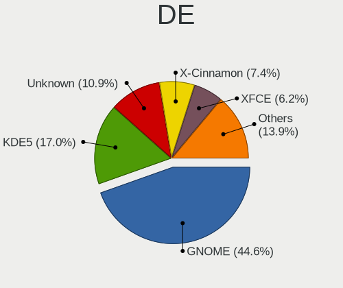
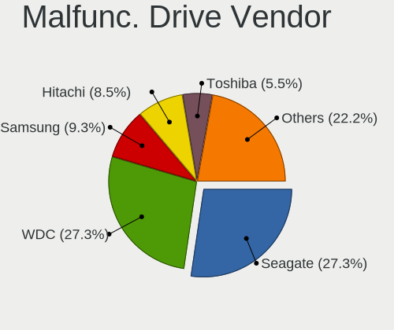
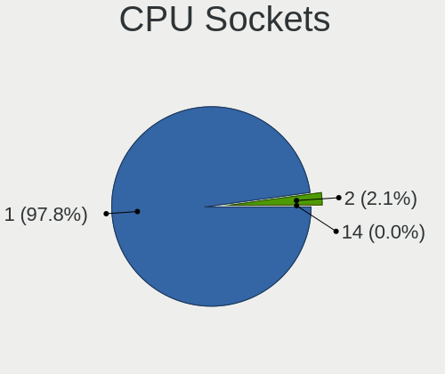
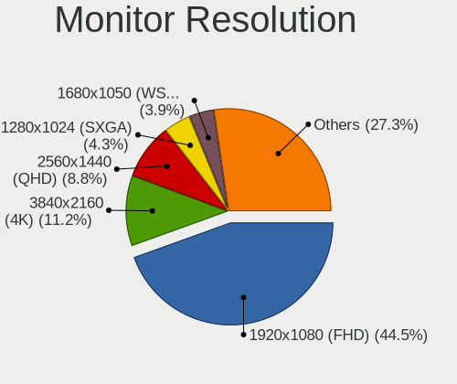
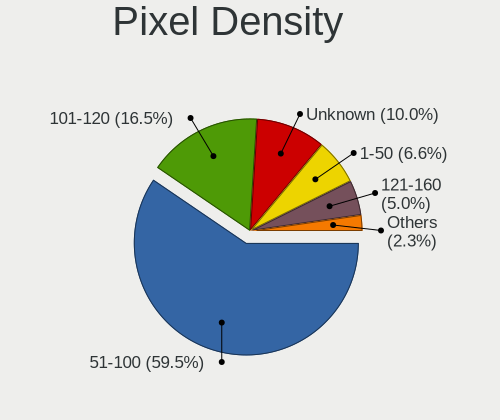
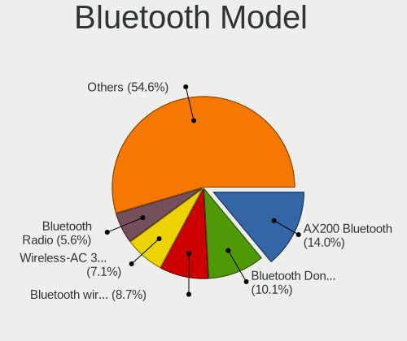

Linux in USA - Tested Hardware & Statistics (Desktops)
------------------------------------------------------

A project to collect tested hardware configurations for Linux in USA.

Anyone can contribute to this report by the [hw-probe](https://github.com/linuxhw/hw-probe) tool:

    sudo -E hw-probe -all -upload

Please contribute! Especially if your hardware is rare.

Contents
--------

* [ Test Cases ](#test-cases)

* [ System ](#system)
  - [ OS                       ](#os)
  - [ OS Family                ](#os-family)
  - [ Kernel                   ](#kernel)
  - [ Kernel Family            ](#kernel-family)
  - [ Kernel Major Ver.        ](#kernel-major-ver)
  - [ Arch                     ](#arch)
  - [ DE                       ](#de)
  - [ Display Server           ](#display-server)
  - [ Display Manager          ](#display-manager)
  - [ OS Lang                  ](#os-lang)
  - [ Boot Mode                ](#boot-mode)
  - [ Filesystem               ](#filesystem)
  - [ Part. scheme             ](#part-scheme)
  - [ Dual Boot with Linux/BSD ](#dual-boot-with-linuxbsd)
  - [ Dual Boot (Win)          ](#dual-boot-win)

* [ Board ](#board)
  - [ Vendor                   ](#vendor)
  - [ Model                    ](#model)
  - [ Model Family             ](#model-family)
  - [ MFG Year                 ](#mfg-year)
  - [ Form Factor              ](#form-factor)
  - [ Secure Boot              ](#secure-boot)
  - [ Coreboot                 ](#coreboot)
  - [ RAM Size                 ](#ram-size)
  - [ RAM Used                 ](#ram-used)
  - [ Total Drives             ](#total-drives)
  - [ Has CD-ROM               ](#has-cd-rom)
  - [ Has Ethernet             ](#has-ethernet)
  - [ Has WiFi                 ](#has-wifi)
  - [ Has Bluetooth            ](#has-bluetooth)

* [ Location ](#location)
  - [ Country                  ](#country)
  - [ City                     ](#city)

* [ Drives ](#drives)
  - [ Drive Vendor             ](#drive-vendor)
  - [ Drive Model              ](#drive-model)
  - [ HDD Vendor               ](#hdd-vendor)
  - [ SSD Vendor               ](#ssd-vendor)
  - [ Drive Kind               ](#drive-kind)
  - [ Drive Connector          ](#drive-connector)
  - [ Drive Size               ](#drive-size)
  - [ Space Total              ](#space-total)
  - [ Space Used               ](#space-used)
  - [ Malfunc. Drives          ](#malfunc-drives)
  - [ Malfunc. Drive Vendor    ](#malfunc-drive-vendor)
  - [ Malfunc. HDD Vendor      ](#malfunc-hdd-vendor)
  - [ Malfunc. Drive Kind      ](#malfunc-drive-kind)
  - [ Failed Drives            ](#failed-drives)
  - [ Failed Drive Vendor      ](#failed-drive-vendor)
  - [ Drive Status             ](#drive-status)

* [ Storage controller ](#storage-controller)
  - [ Storage Vendor           ](#storage-vendor)
  - [ Storage Model            ](#storage-model)
  - [ Storage Kind             ](#storage-kind)

* [ Processor ](#processor)
  - [ CPU Vendor               ](#cpu-vendor)
  - [ CPU Model                ](#cpu-model)
  - [ CPU Model Family         ](#cpu-model-family)
  - [ CPU Cores                ](#cpu-cores)
  - [ CPU Sockets              ](#cpu-sockets)
  - [ CPU Threads              ](#cpu-threads)
  - [ CPU Op-Modes             ](#cpu-op-modes)
  - [ CPU Microcode            ](#cpu-microcode)
  - [ CPU Microarch            ](#cpu-microarch)

* [ Graphics ](#graphics)
  - [ GPU Vendor               ](#gpu-vendor)
  - [ GPU Model                ](#gpu-model)
  - [ GPU Combo                ](#gpu-combo)
  - [ GPU Driver               ](#gpu-driver)
  - [ GPU Memory               ](#gpu-memory)

* [ Monitor ](#monitor)
  - [ Monitor Vendor           ](#monitor-vendor)
  - [ Monitor Model            ](#monitor-model)
  - [ Monitor Resolution       ](#monitor-resolution)
  - [ Monitor Diagonal         ](#monitor-diagonal)
  - [ Monitor Width            ](#monitor-width)
  - [ Aspect Ratio             ](#aspect-ratio)
  - [ Monitor Area             ](#monitor-area)
  - [ Pixel Density            ](#pixel-density)
  - [ Multiple Monitors        ](#multiple-monitors)

* [ Network ](#network)
  - [ Net Controller Vendor    ](#net-controller-vendor)
  - [ Net Controller Model     ](#net-controller-model)
  - [ Wireless Vendor          ](#wireless-vendor)
  - [ Wireless Model           ](#wireless-model)
  - [ Ethernet Vendor          ](#ethernet-vendor)
  - [ Ethernet Model           ](#ethernet-model)
  - [ Net Controller Kind      ](#net-controller-kind)
  - [ Used Controller          ](#used-controller)
  - [ NICs                     ](#nics)
  - [ IPv6                     ](#ipv6)

* [ Bluetooth ](#bluetooth)
  - [ Bluetooth Vendor         ](#bluetooth-vendor)
  - [ Bluetooth Model          ](#bluetooth-model)

* [ Sound ](#sound)
  - [ Sound Vendor             ](#sound-vendor)
  - [ Sound Model              ](#sound-model)

* [ Memory ](#memory)
  - [ Memory Vendor            ](#memory-vendor)
  - [ Memory Model             ](#memory-model)
  - [ Memory Kind              ](#memory-kind)
  - [ Memory Form Factor       ](#memory-form-factor)
  - [ Memory Size              ](#memory-size)
  - [ Memory Speed             ](#memory-speed)

* [ Printers & scanners ](#printers--scanners)
  - [ Printer Vendor           ](#printer-vendor)
  - [ Printer Model            ](#printer-model)
  - [ Scanner Vendor           ](#scanner-vendor)
  - [ Scanner Model            ](#scanner-model)

* [ Camera ](#camera)
  - [ Camera Vendor            ](#camera-vendor)
  - [ Camera Model             ](#camera-model)

* [ Security ](#security)
  - [ Fingerprint Vendor       ](#fingerprint-vendor)
  - [ Fingerprint Model        ](#fingerprint-model)
  - [ Chipcard Vendor          ](#chipcard-vendor)
  - [ Chipcard Model           ](#chipcard-model)

* [ Unsupported ](#unsupported)
  - [ Unsupported Devices      ](#unsupported-devices)
  - [ Unsupported Device Types ](#unsupported-device-types)

Test Cases
----------

Total: 19515

| Vendor        | Model                       | Probe                                                      | Date         |
|---------------|-----------------------------|------------------------------------------------------------|--------------|
| HP            | 1495                        | [96283c0a09](https://linux-hardware.org/?probe=96283c0a09) | Apr 01, 2023 |
| HP            | 1495                        | [f25125625a](https://linux-hardware.org/?probe=f25125625a) | Apr 01, 2023 |
| ASUSTek       | PRIME B550M-A               | [79d44a9e66](https://linux-hardware.org/?probe=79d44a9e66) | Apr 01, 2023 |
| AZW           | Green G3                    | [a987d9a5c1](https://linux-hardware.org/?probe=a987d9a5c1) | Apr 01, 2023 |
| Lenovo        | 4030                        | [7a23fd4fb4](https://linux-hardware.org/?probe=7a23fd4fb4) | Apr 01, 2023 |
| ASUSTek       | PRIME A320M-K               | [16f87cd333](https://linux-hardware.org/?probe=16f87cd333) | Apr 01, 2023 |
| ASUSTek       | SABERTOOTH 990FX R2.0       | [d80d075b91](https://linux-hardware.org/?probe=d80d075b91) | Apr 01, 2023 |
| HP            | 18E7                        | [98319f4504](https://linux-hardware.org/?probe=98319f4504) | Apr 01, 2023 |
| Dell          | 0GY6Y8 A03                  | [7754565ec1](https://linux-hardware.org/?probe=7754565ec1) | Apr 01, 2023 |
| Dell          | 0M5DCD A00                  | [91cc314380](https://linux-hardware.org/?probe=91cc314380) | Apr 01, 2023 |
| ASUSTek       | Leonite2                    | [41353f6a59](https://linux-hardware.org/?probe=41353f6a59) | Apr 01, 2023 |
| Pegatron      | 2AC2                        | [ca0b0464d7](https://linux-hardware.org/?probe=ca0b0464d7) | Apr 01, 2023 |
| Dell          | 04YP6J A02                  | [0223f7bb3e](https://linux-hardware.org/?probe=0223f7bb3e) | Mar 31, 2023 |
| ECS           | GeForce 8000 series         | [32e951a2ca](https://linux-hardware.org/?probe=32e951a2ca) | Mar 31, 2023 |
| Gateway       | IPIMB-ARA                   | [9c300aea89](https://linux-hardware.org/?probe=9c300aea89) | Mar 31, 2023 |
| ASUSTek       | ROG STRIX B450-F GAMING     | [9e09a54915](https://linux-hardware.org/?probe=9e09a54915) | Mar 31, 2023 |
| ASUSTek       | TUF Gaming Z590-PLUS WIF... | [acfff71638](https://linux-hardware.org/?probe=acfff71638) | Mar 31, 2023 |
| ASUSTek       | ROG STRIX B650E-F GAMING... | [8326806aa6](https://linux-hardware.org/?probe=8326806aa6) | Mar 31, 2023 |
| Dell          | 00F82W A02                  | [8bf22304e0](https://linux-hardware.org/?probe=8bf22304e0) | Mar 31, 2023 |
| ASUSTek       | ROG STRIX B550-F GAMING     | [61e2653466](https://linux-hardware.org/?probe=61e2653466) | Mar 31, 2023 |
| Dell          | 0WMJ54 A00                  | [d11328af2a](https://linux-hardware.org/?probe=d11328af2a) | Mar 31, 2023 |
| MSI           | B450 TOMAHAWK MAX           | [c27e3be5ba](https://linux-hardware.org/?probe=c27e3be5ba) | Mar 31, 2023 |
| MSI           | Z270-A PRO                  | [a5d218b9a6](https://linux-hardware.org/?probe=a5d218b9a6) | Mar 31, 2023 |
| ASUSTek       | ROG STRIX B450-F GAMING     | [09679af7dc](https://linux-hardware.org/?probe=09679af7dc) | Mar 31, 2023 |
| ASUSTek       | ROG STRIX B450-F GAMING     | [1e78d2454c](https://linux-hardware.org/?probe=1e78d2454c) | Mar 31, 2023 |
| ASRock        | B550M-C                     | [c0fcfbc0ed](https://linux-hardware.org/?probe=c0fcfbc0ed) | Mar 31, 2023 |
| Dell          | 0FG47G A02                  | [d1cf6fa11e](https://linux-hardware.org/?probe=d1cf6fa11e) | Mar 31, 2023 |
| Acer          | Aspire TC-875 V:1.0         | [8f9f4fb295](https://linux-hardware.org/?probe=8f9f4fb295) | Mar 31, 2023 |
| HP            | 8767 A                      | [186bad76b7](https://linux-hardware.org/?probe=186bad76b7) | Mar 31, 2023 |
| Gigabyte      | H310M A-CF                  | [c26786d423](https://linux-hardware.org/?probe=c26786d423) | Mar 31, 2023 |
| ASUSTek       | M5A99FX PRO R2.0            | [0e374d0aea](https://linux-hardware.org/?probe=0e374d0aea) | Mar 31, 2023 |
| ASUSTek       | TUF B365M-PLUS GAMING       | [8d4ef602e5](https://linux-hardware.org/?probe=8d4ef602e5) | Mar 31, 2023 |
| Dell          | 0PP150 A00                  | [fdc879a486](https://linux-hardware.org/?probe=fdc879a486) | Mar 31, 2023 |
| Dell          | 0K240Y A02                  | [ca6aacf14e](https://linux-hardware.org/?probe=ca6aacf14e) | Mar 31, 2023 |
| Gigabyte      | X670E AORUS MASTER          | [68731ac4ec](https://linux-hardware.org/?probe=68731ac4ec) | Mar 31, 2023 |
| ASUSTek       | Maximus VIII IMPACT         | [deab2a5eac](https://linux-hardware.org/?probe=deab2a5eac) | Mar 31, 2023 |
| OEM_MB        | NARRA3                      | [75050a4d2e](https://linux-hardware.org/?probe=75050a4d2e) | Mar 31, 2023 |
| Gigabyte      | F2A88X-UP4                  | [72c4b553b4](https://linux-hardware.org/?probe=72c4b553b4) | Mar 31, 2023 |
| ASUSTek       | M5A78L-M LX PLUS            | [deedee079c](https://linux-hardware.org/?probe=deedee079c) | Mar 31, 2023 |
| ASRock        | H310CM-HDV                  | [a9a41a38ed](https://linux-hardware.org/?probe=a9a41a38ed) | Mar 30, 2023 |
| Unknown       | iKoolCore R1 iKoolCore R... | [050875ba5f](https://linux-hardware.org/?probe=050875ba5f) | Mar 30, 2023 |
| Gigabyte      | Z170XP-SLI-CF               | [70efcb81e9](https://linux-hardware.org/?probe=70efcb81e9) | Mar 30, 2023 |
| Dell          | 0KV62T A02                  | [c7765df604](https://linux-hardware.org/?probe=c7765df604) | Mar 30, 2023 |
| ASUSTek       | M4A79T Deluxe               | [9828b40ec9](https://linux-hardware.org/?probe=9828b40ec9) | Mar 30, 2023 |
| Dell          | 0T7D40 A01                  | [dc44647f41](https://linux-hardware.org/?probe=dc44647f41) | Mar 30, 2023 |
| ASUSTek       | Benicia                     | [7332efabad](https://linux-hardware.org/?probe=7332efabad) | Mar 30, 2023 |
| ASUSTek       | Leonite2                    | [21eb6fba07](https://linux-hardware.org/?probe=21eb6fba07) | Mar 30, 2023 |
| HP            | 213D A01                    | [d5fb38a71b](https://linux-hardware.org/?probe=d5fb38a71b) | Mar 30, 2023 |
| HP            | 213D A01                    | [79d8e1b64f](https://linux-hardware.org/?probe=79d8e1b64f) | Mar 30, 2023 |
| ECS           | H81H3-WM                    | [cbf3d55d63](https://linux-hardware.org/?probe=cbf3d55d63) | Mar 30, 2023 |
| Foxconn       | 2AB1 DVT                    | [a9e8e4d4b0](https://linux-hardware.org/?probe=a9e8e4d4b0) | Mar 30, 2023 |
| HP            | 3048h                       | [1a4d86fca8](https://linux-hardware.org/?probe=1a4d86fca8) | Mar 30, 2023 |
| HP            | 8591                        | [b887990c12](https://linux-hardware.org/?probe=b887990c12) | Mar 30, 2023 |
| MSI           | FM2-A75MA-E35               | [10de0ae048](https://linux-hardware.org/?probe=10de0ae048) | Mar 30, 2023 |
| ASUSTek       | TUF Gaming B550M-PLUS       | [82118905ba](https://linux-hardware.org/?probe=82118905ba) | Mar 30, 2023 |
| ASUSTek       | TUF Z270 MARK 2             | [4976f6b6b2](https://linux-hardware.org/?probe=4976f6b6b2) | Mar 30, 2023 |
| Gigabyte      | AB350-Gaming 3-CF           | [81dda92e58](https://linux-hardware.org/?probe=81dda92e58) | Mar 30, 2023 |
| ASUSTek       | TUF Gaming X570-PLUS        | [bc798d371a](https://linux-hardware.org/?probe=bc798d371a) | Mar 30, 2023 |
| Lenovo        | 30D2 SDK0J40697 WIN 3305... | [185cb6df15](https://linux-hardware.org/?probe=185cb6df15) | Mar 30, 2023 |
| ASUSTek       | Pro WS X570-ACE             | [6cc34607d1](https://linux-hardware.org/?probe=6cc34607d1) | Mar 30, 2023 |
| MSI           | B450 TOMAHAWK               | [9251f2d561](https://linux-hardware.org/?probe=9251f2d561) | Mar 30, 2023 |
| MSI           | B450 TOMAHAWK               | [2d28ba397e](https://linux-hardware.org/?probe=2d28ba397e) | Mar 29, 2023 |
| ASUSTek       | ROG STRIX B450-F GAMING     | [cd308ca372](https://linux-hardware.org/?probe=cd308ca372) | Mar 29, 2023 |
| System76      | Thelio Mira thelio-mira-... | [4915a172bd](https://linux-hardware.org/?probe=4915a172bd) | Mar 29, 2023 |
| MSI           | 2AE0                        | [29c86e9653](https://linux-hardware.org/?probe=29c86e9653) | Mar 29, 2023 |
| Gigabyte      | X670E AORUS MASTER          | [872733b74c](https://linux-hardware.org/?probe=872733b74c) | Mar 29, 2023 |
| MSI           | 2AE0                        | [53e6254c56](https://linux-hardware.org/?probe=53e6254c56) | Mar 29, 2023 |
| Lenovo        | 3111 NOK                    | [f6004f6817](https://linux-hardware.org/?probe=f6004f6817) | Mar 29, 2023 |
| MSI           | MPG Z390 GAMING PRO CARB... | [fb2605e6fa](https://linux-hardware.org/?probe=fb2605e6fa) | Mar 29, 2023 |
| ASUSTek       | CM1630                      | [d28e40c64b](https://linux-hardware.org/?probe=d28e40c64b) | Mar 29, 2023 |
| HP            | 806A                        | [477b1e2d83](https://linux-hardware.org/?probe=477b1e2d83) | Mar 29, 2023 |
| ASUSTek       | PRIME B350-PLUS             | [634c2e1e74](https://linux-hardware.org/?probe=634c2e1e74) | Mar 29, 2023 |
| Lenovo        | 3111 NOK                    | [6ef94ade27](https://linux-hardware.org/?probe=6ef94ade27) | Mar 29, 2023 |
| Dell          | 0200DY A01                  | [095eb7be41](https://linux-hardware.org/?probe=095eb7be41) | Mar 29, 2023 |
| Win elemen... | M600                        | [7cf2343b6f](https://linux-hardware.org/?probe=7cf2343b6f) | Mar 29, 2023 |
| Acer          | Nitro N50-610               | [937d1bc73a](https://linux-hardware.org/?probe=937d1bc73a) | Mar 29, 2023 |
| ASRock        | B450 Pro4                   | [c77fc70f0c](https://linux-hardware.org/?probe=c77fc70f0c) | Mar 29, 2023 |
| Dell          | 0200DY A01                  | [722b28547b](https://linux-hardware.org/?probe=722b28547b) | Mar 28, 2023 |
| ASRock        | B550 Taichi                 | [94d97c5e0c](https://linux-hardware.org/?probe=94d97c5e0c) | Mar 28, 2023 |
| ASRock        | B550 Taichi                 | [b46a569742](https://linux-hardware.org/?probe=b46a569742) | Mar 28, 2023 |
| ASUSTek       | PRIME Z690-P WIFI           | [898059efa5](https://linux-hardware.org/?probe=898059efa5) | Mar 28, 2023 |
| Gigabyte      | B550M AORUS PRO-P           | [c97dbb0917](https://linux-hardware.org/?probe=c97dbb0917) | Mar 28, 2023 |
| Lenovo        | SHARKBAY NOK                | [0cbe19c074](https://linux-hardware.org/?probe=0cbe19c074) | Mar 28, 2023 |
| HP            | 09F0h                       | [540ec71101](https://linux-hardware.org/?probe=540ec71101) | Mar 28, 2023 |
| MSI           | MAG B550 TOMAHAWK           | [fd1273ed2e](https://linux-hardware.org/?probe=fd1273ed2e) | Mar 28, 2023 |
| Dell          | 0YXG0N A00                  | [d3875b50ac](https://linux-hardware.org/?probe=d3875b50ac) | Mar 28, 2023 |
| MSI           | X370 GAMING PRO CARBON      | [151a527b35](https://linux-hardware.org/?probe=151a527b35) | Mar 28, 2023 |
| ASRock        | B650M PG Riptide WiFi       | [f17c95f91b](https://linux-hardware.org/?probe=f17c95f91b) | Mar 28, 2023 |
| ASRock        | X470 Taichi                 | [79d0ee9715](https://linux-hardware.org/?probe=79d0ee9715) | Mar 28, 2023 |
| ASRock        | B650M PG Riptide WiFi       | [1b67e2c4fd](https://linux-hardware.org/?probe=1b67e2c4fd) | Mar 28, 2023 |
| Lenovo        | SHARKBAY SDK0J40709 WIN ... | [22e3e1831c](https://linux-hardware.org/?probe=22e3e1831c) | Mar 28, 2023 |
| ASUSTek       | PRIME B550M-A               | [4b0ae8033f](https://linux-hardware.org/?probe=4b0ae8033f) | Mar 28, 2023 |
| Pegatron      | 2AE3                        | [806b4e1780](https://linux-hardware.org/?probe=806b4e1780) | Mar 28, 2023 |
| Pegatron      | 2AE3                        | [23ce0f4fd5](https://linux-hardware.org/?probe=23ce0f4fd5) | Mar 28, 2023 |
| ASUSTek       | TUF Gaming B550M-PLUS       | [5969fea8f0](https://linux-hardware.org/?probe=5969fea8f0) | Mar 28, 2023 |
| MSI           | MPG X670E CARBON WIFI       | [cde470cb39](https://linux-hardware.org/?probe=cde470cb39) | Mar 28, 2023 |
| ASUSTek       | TUF Gaming X570-PLUS        | [c4bba42d7b](https://linux-hardware.org/?probe=c4bba42d7b) | Mar 28, 2023 |
| MSI           | B450 TOMAHAWK MAX           | [398927f75d](https://linux-hardware.org/?probe=398927f75d) | Mar 28, 2023 |
| Gigabyte      | X570 AORUS MASTER           | [adee3bbdde](https://linux-hardware.org/?probe=adee3bbdde) | Mar 28, 2023 |
| Dell          | 06X1TJ A01                  | [7e99e3d73e](https://linux-hardware.org/?probe=7e99e3d73e) | Mar 28, 2023 |
| ASRock        | Z68 Pro3-M                  | [60f0809fbf](https://linux-hardware.org/?probe=60f0809fbf) | Mar 28, 2023 |
| Dell          | 08HPGT A01                  | [451ccd93f2](https://linux-hardware.org/?probe=451ccd93f2) | Mar 27, 2023 |
| Dell          | 08HPGT A01                  | [e38a63e793](https://linux-hardware.org/?probe=e38a63e793) | Mar 27, 2023 |
| Dell          | 0YXG0N A00                  | [07527593cd](https://linux-hardware.org/?probe=07527593cd) | Mar 27, 2023 |
| ASUSTek       | TUF B450M-PLUS GAMING       | [dcbcf69a04](https://linux-hardware.org/?probe=dcbcf69a04) | Mar 27, 2023 |
| Dell          | 0W2F8G A02                  | [511510b501](https://linux-hardware.org/?probe=511510b501) | Mar 27, 2023 |
| Dell          | 0YXG0N A00                  | [9059f37aa1](https://linux-hardware.org/?probe=9059f37aa1) | Mar 27, 2023 |
| Gateway       | IPIMB-ARA                   | [6b2eb0b9f7](https://linux-hardware.org/?probe=6b2eb0b9f7) | Mar 27, 2023 |
| ASUSTek       | Pro WS WRX80E-SAGE SE WI... | [79dc82b50b](https://linux-hardware.org/?probe=79dc82b50b) | Mar 27, 2023 |
| HP            | 3029h                       | [153b913406](https://linux-hardware.org/?probe=153b913406) | Mar 27, 2023 |
| AZW           | U59                         | [7674bb8dc9](https://linux-hardware.org/?probe=7674bb8dc9) | Mar 27, 2023 |
| Unknown       | 1.0                         | [e09cc1385b](https://linux-hardware.org/?probe=e09cc1385b) | Mar 27, 2023 |
| ASRock        | X570 Steel Legend           | [490155a63a](https://linux-hardware.org/?probe=490155a63a) | Mar 27, 2023 |
| MSI           | PRO B660-A DDR4             | [6a882b7826](https://linux-hardware.org/?probe=6a882b7826) | Mar 27, 2023 |
| MSI           | H410M PRO-C                 | [95cb5acf9e](https://linux-hardware.org/?probe=95cb5acf9e) | Mar 27, 2023 |
| Dell          | 01TJ2K A03                  | [f390eb34f6](https://linux-hardware.org/?probe=f390eb34f6) | Mar 27, 2023 |
| Gigabyte      | B650 AORUS ELITE AX         | [29ec74ac8b](https://linux-hardware.org/?probe=29ec74ac8b) | Mar 27, 2023 |
| MSI           | B550-A PRO                  | [ebb59fa31d](https://linux-hardware.org/?probe=ebb59fa31d) | Mar 27, 2023 |
| ASRockRack    | D1541D4U-2T8R               | [012c10ae8c](https://linux-hardware.org/?probe=012c10ae8c) | Mar 27, 2023 |
| Intel         | X58M                        | [823813881b](https://linux-hardware.org/?probe=823813881b) | Mar 27, 2023 |
| Dell          | 0JVY7H A00                  | [4fb29c4b54](https://linux-hardware.org/?probe=4fb29c4b54) | Mar 27, 2023 |
| HPE           | ProLiant MicroServer Gen... | [66394c054f](https://linux-hardware.org/?probe=66394c054f) | Mar 26, 2023 |
| Lenovo        | ThinkCentre M90p 3282A8U    | [5edac0955d](https://linux-hardware.org/?probe=5edac0955d) | Mar 26, 2023 |
| ASUSTek       | PRIME Z690-P WIFI           | [1821e3657a](https://linux-hardware.org/?probe=1821e3657a) | Mar 26, 2023 |
| ASUSTek       | TUF Gaming Z690-PLUS WIF... | [aaae412a63](https://linux-hardware.org/?probe=aaae412a63) | Mar 26, 2023 |
| Dell          | 0MGK50 A02                  | [75b4691fd2](https://linux-hardware.org/?probe=75b4691fd2) | Mar 26, 2023 |
| Pegatron      | Acacia                      | [4ce0966b14](https://linux-hardware.org/?probe=4ce0966b14) | Mar 26, 2023 |
| Pegatron      | Acacia                      | [4faa2a52d3](https://linux-hardware.org/?probe=4faa2a52d3) | Mar 26, 2023 |
| Dell          | 0HY9JP A00                  | [d1c982b241](https://linux-hardware.org/?probe=d1c982b241) | Mar 26, 2023 |
| MSI           | MAG B550 TOMAHAWK           | [c08caf1dee](https://linux-hardware.org/?probe=c08caf1dee) | Mar 26, 2023 |
| Gigabyte      | X670E AORUS MASTER          | [2e813c4a68](https://linux-hardware.org/?probe=2e813c4a68) | Mar 26, 2023 |
| HP            | 83E2                        | [00f64e69cd](https://linux-hardware.org/?probe=00f64e69cd) | Mar 26, 2023 |
| Lenovo        | ThinkCentre M90p 3282A8U    | [40b8057336](https://linux-hardware.org/?probe=40b8057336) | Mar 26, 2023 |
| MSI           | MAG B550 TOMAHAWK           | [f6f4996c63](https://linux-hardware.org/?probe=f6f4996c63) | Mar 26, 2023 |
| ASUSTek       | ROG STRIX Z390-E GAMING     | [a57839f702](https://linux-hardware.org/?probe=a57839f702) | Mar 26, 2023 |
| HP            | 339A                        | [1009c2d048](https://linux-hardware.org/?probe=1009c2d048) | Mar 26, 2023 |
| ASUSTek       | M5A78L-M LX PLUS            | [7a2bce56b1](https://linux-hardware.org/?probe=7a2bce56b1) | Mar 26, 2023 |
| Gigabyte      | X58A-UD3R                   | [2325b601fe](https://linux-hardware.org/?probe=2325b601fe) | Mar 25, 2023 |
| Dell          | 02YYK5 A01                  | [92e64e0e8c](https://linux-hardware.org/?probe=92e64e0e8c) | Mar 25, 2023 |
| Gigabyte      | X570 AORUS ELITE            | [0f7d28bd43](https://linux-hardware.org/?probe=0f7d28bd43) | Mar 25, 2023 |
| ASUSTek       | Maximus VIII GENE           | [71ba42d727](https://linux-hardware.org/?probe=71ba42d727) | Mar 25, 2023 |
| ASUSTek       | Maximus VIII GENE           | [33ba03aebe](https://linux-hardware.org/?probe=33ba03aebe) | Mar 25, 2023 |
| ASUSTek       | H81I-PLUS                   | [98dc4bb06b](https://linux-hardware.org/?probe=98dc4bb06b) | Mar 25, 2023 |
| ASUSTek       | H81I-PLUS                   | [bb353ccddf](https://linux-hardware.org/?probe=bb353ccddf) | Mar 25, 2023 |
| Lenovo        | ThinkCentre M58p 6137A2U    | [cc740804d7](https://linux-hardware.org/?probe=cc740804d7) | Mar 25, 2023 |
| ASUSTek       | PRIME B450M-A               | [6601de8aae](https://linux-hardware.org/?probe=6601de8aae) | Mar 25, 2023 |
| MSI           | PRO B660-A DDR4             | [ef9408ce57](https://linux-hardware.org/?probe=ef9408ce57) | Mar 25, 2023 |
| Dell          | 01TKCC A01                  | [c250d03840](https://linux-hardware.org/?probe=c250d03840) | Mar 25, 2023 |
| HP            | 18E9                        | [f015f44555](https://linux-hardware.org/?probe=f015f44555) | Mar 25, 2023 |
| MSI           | H81M-E33                    | [47f031e68c](https://linux-hardware.org/?probe=47f031e68c) | Mar 25, 2023 |
| HP            | 83E2                        | [cd40c6aa18](https://linux-hardware.org/?probe=cd40c6aa18) | Mar 25, 2023 |
| Gigabyte      | X399 AORUS PRO-CF           | [99da9866a9](https://linux-hardware.org/?probe=99da9866a9) | Mar 25, 2023 |
| ASUSTek       | H81T R2.0                   | [92b97834aa](https://linux-hardware.org/?probe=92b97834aa) | Mar 25, 2023 |
| Lenovo        | SHARKBAY SDK0E50510 PRO     | [e7b44d994b](https://linux-hardware.org/?probe=e7b44d994b) | Mar 25, 2023 |
| ASUSTek       | SABERTOOTH Z77              | [d5d190db2f](https://linux-hardware.org/?probe=d5d190db2f) | Mar 25, 2023 |
| AZW           | Green G3                    | [a0789502ab](https://linux-hardware.org/?probe=a0789502ab) | Mar 25, 2023 |
| ASRock        | B550AM Gaming               | [be6e8f17cc](https://linux-hardware.org/?probe=be6e8f17cc) | Mar 25, 2023 |
| HP            | 8906 SMVB                   | [7650a804d9](https://linux-hardware.org/?probe=7650a804d9) | Mar 25, 2023 |
| ASUSTek       | PRIME X470-PRO              | [a05e768cca](https://linux-hardware.org/?probe=a05e768cca) | Mar 25, 2023 |
| ASUSTek       | Basswood3G                  | [d71f476c72](https://linux-hardware.org/?probe=d71f476c72) | Mar 24, 2023 |
| Gigabyte      | Z690 AORUS PRO              | [9b8ddda3c3](https://linux-hardware.org/?probe=9b8ddda3c3) | Mar 24, 2023 |
| AZW           | Green G3                    | [7dcacb9c15](https://linux-hardware.org/?probe=7dcacb9c15) | Mar 24, 2023 |
| Dell          | 0PC5F7 A01                  | [61550296b7](https://linux-hardware.org/?probe=61550296b7) | Mar 24, 2023 |
| HP            | 3397                        | [aa383880bd](https://linux-hardware.org/?probe=aa383880bd) | Mar 24, 2023 |
| Dell          | 0TP406                      | [a58cf3b551](https://linux-hardware.org/?probe=a58cf3b551) | Mar 24, 2023 |
| HP            | 212A                        | [df28b0fdb0](https://linux-hardware.org/?probe=df28b0fdb0) | Mar 24, 2023 |
| MSI           | MPG X570 GAMING PLUS        | [360866bcc5](https://linux-hardware.org/?probe=360866bcc5) | Mar 24, 2023 |
| ASUSTek       | H110M-E/M.2                 | [177089e2e0](https://linux-hardware.org/?probe=177089e2e0) | Mar 24, 2023 |
| HP            | 212B                        | [266912cedd](https://linux-hardware.org/?probe=266912cedd) | Mar 24, 2023 |
| Biostar       | B150GT5                     | [e054bb7f91](https://linux-hardware.org/?probe=e054bb7f91) | Mar 24, 2023 |
| Dell          | 0HD5W2 A01                  | [e859e77bc7](https://linux-hardware.org/?probe=e859e77bc7) | Mar 24, 2023 |
| AZW           | U59                         | [b4058b773d](https://linux-hardware.org/?probe=b4058b773d) | Mar 24, 2023 |
| ASUSTek       | TUF Gaming B550-PLUS        | [dbf0b56c64](https://linux-hardware.org/?probe=dbf0b56c64) | Mar 24, 2023 |
| Dell          | 0HD5W2 A01                  | [ce7e17cb45](https://linux-hardware.org/?probe=ce7e17cb45) | Mar 24, 2023 |
| ASUSTek       | P8Z77-V LE                  | [c50deee021](https://linux-hardware.org/?probe=c50deee021) | Mar 24, 2023 |
| ASRock        | Z690 Taichi                 | [fbad15ab18](https://linux-hardware.org/?probe=fbad15ab18) | Mar 24, 2023 |
| ASRock        | X570 Steel Legend           | [05d4059f59](https://linux-hardware.org/?probe=05d4059f59) | Mar 24, 2023 |
| MSI           | B450 TOMAHAWK               | [29fce46770](https://linux-hardware.org/?probe=29fce46770) | Mar 24, 2023 |
| MSI           | B360M BAZOOKA               | [6d1a1f7bd2](https://linux-hardware.org/?probe=6d1a1f7bd2) | Mar 24, 2023 |
| Gigabyte      | B450M DS3H WIFI-CF          | [10b7d76bff](https://linux-hardware.org/?probe=10b7d76bff) | Mar 24, 2023 |
| MSI           | Z390-A PRO                  | [36d6fdda74](https://linux-hardware.org/?probe=36d6fdda74) | Mar 24, 2023 |
| ASRock        | X300M-STX                   | [0393d25a9d](https://linux-hardware.org/?probe=0393d25a9d) | Mar 23, 2023 |
| ASRock        | X300M-STX                   | [296411b749](https://linux-hardware.org/?probe=296411b749) | Mar 23, 2023 |
| HP            | 1497                        | [2238b69c99](https://linux-hardware.org/?probe=2238b69c99) | Mar 23, 2023 |
| MSI           | H81M-E33                    | [e66321b896](https://linux-hardware.org/?probe=e66321b896) | Mar 23, 2023 |
| ASRockRack    | E3C242D4U2-2T               | [05eb6d08bd](https://linux-hardware.org/?probe=05eb6d08bd) | Mar 23, 2023 |
| ASRock        | X79 Extreme6                | [1287699f09](https://linux-hardware.org/?probe=1287699f09) | Mar 23, 2023 |
| eMachines     | EL1360G                     | [b302aa1f47](https://linux-hardware.org/?probe=b302aa1f47) | Mar 23, 2023 |
| MSI           | A68HM-E33 V2                | [973daceeaa](https://linux-hardware.org/?probe=973daceeaa) | Mar 23, 2023 |
| MSI           | A320M-HDV R4.0              | [a04e0acbcf](https://linux-hardware.org/?probe=a04e0acbcf) | Mar 23, 2023 |
| ASUSTek       | ROG STRIX X570-I GAMING     | [5b6af55009](https://linux-hardware.org/?probe=5b6af55009) | Mar 23, 2023 |
| Gigabyte      | X670E AORUS MASTER          | [4077bee378](https://linux-hardware.org/?probe=4077bee378) | Mar 23, 2023 |
| Gigabyte      | X670E AORUS MASTER          | [4bf7fa5f9c](https://linux-hardware.org/?probe=4bf7fa5f9c) | Mar 23, 2023 |
| ASUSTek       | PRIME X670-P WIFI           | [5bd922e142](https://linux-hardware.org/?probe=5bd922e142) | Mar 23, 2023 |
| Gigabyte      | X570 AORUS ULTRA            | [c06eaca849](https://linux-hardware.org/?probe=c06eaca849) | Mar 23, 2023 |
| MSI           | A68HM-E33 V2                | [2b00f56890](https://linux-hardware.org/?probe=2b00f56890) | Mar 23, 2023 |
| HP            | 0A68h                       | [527cad6ad0](https://linux-hardware.org/?probe=527cad6ad0) | Mar 23, 2023 |
| MSI           | MPG X570 GAMING EDGE WIF... | [20267be489](https://linux-hardware.org/?probe=20267be489) | Mar 23, 2023 |
| ASUSTek       | H110M-E/M.2                 | [78b4f9cbbd](https://linux-hardware.org/?probe=78b4f9cbbd) | Mar 22, 2023 |
| Lenovo        | SHARKBAY NOK                | [e1783f9cd4](https://linux-hardware.org/?probe=e1783f9cd4) | Mar 22, 2023 |
| HP            | 828A                        | [cce5214801](https://linux-hardware.org/?probe=cce5214801) | Mar 22, 2023 |
| Lenovo        | SHARKBAY NOK                | [1a2e1919ee](https://linux-hardware.org/?probe=1a2e1919ee) | Mar 22, 2023 |
| MSI           | PRO B650-P WIFI             | [f0901a6af0](https://linux-hardware.org/?probe=f0901a6af0) | Mar 22, 2023 |
| ASUSTek       | X99-E                       | [62535f81e4](https://linux-hardware.org/?probe=62535f81e4) | Mar 22, 2023 |
| Lenovo        | ThinkStation S20 4157E92    | [db2bde56b1](https://linux-hardware.org/?probe=db2bde56b1) | Mar 22, 2023 |
| HP            | 158A                        | [4bcb73e1bf](https://linux-hardware.org/?probe=4bcb73e1bf) | Mar 22, 2023 |
| ASUSTek       | X99-E                       | [eb6fe4121d](https://linux-hardware.org/?probe=eb6fe4121d) | Mar 22, 2023 |
| ASRock        | Z690 Taichi                 | [76159d5fc4](https://linux-hardware.org/?probe=76159d5fc4) | Mar 22, 2023 |
| HP            | 3048h                       | [5163f9de22](https://linux-hardware.org/?probe=5163f9de22) | Mar 22, 2023 |
| Gigabyte      | B150M-D3H-CF                | [866008d461](https://linux-hardware.org/?probe=866008d461) | Mar 22, 2023 |
| Dell          | 082WXT A01                  | [f97f117502](https://linux-hardware.org/?probe=f97f117502) | Mar 22, 2023 |
| HP            | 3048h                       | [cd326ce9fa](https://linux-hardware.org/?probe=cd326ce9fa) | Mar 22, 2023 |
| ASUSTek       | TUF Gaming B550M-PLUS WI... | [d0b0015eb2](https://linux-hardware.org/?probe=d0b0015eb2) | Mar 22, 2023 |
| ASUSTek       | PRIME B550M-A               | [aede16096d](https://linux-hardware.org/?probe=aede16096d) | Mar 22, 2023 |
| HP            | 339A                        | [f1a067a512](https://linux-hardware.org/?probe=f1a067a512) | Mar 21, 2023 |
| Dell          | 042P49 A01                  | [935f81d160](https://linux-hardware.org/?probe=935f81d160) | Mar 21, 2023 |
| ASRock        | Z390M-ITX/ac                | [5c07e530e9](https://linux-hardware.org/?probe=5c07e530e9) | Mar 21, 2023 |
| Dell          | 0XR1GT A00                  | [0912041935](https://linux-hardware.org/?probe=0912041935) | Mar 21, 2023 |
| HP            | 8053                        | [82eb90837f](https://linux-hardware.org/?probe=82eb90837f) | Mar 21, 2023 |
| ASUSTek       | ROG STRIX Z390-E GAMING     | [d9c0447b0d](https://linux-hardware.org/?probe=d9c0447b0d) | Mar 21, 2023 |
| Dell          | 0NK70N A03                  | [7c5f606c7d](https://linux-hardware.org/?probe=7c5f606c7d) | Mar 21, 2023 |
| MSI           | X570-A PRO                  | [a9c58c1f47](https://linux-hardware.org/?probe=a9c58c1f47) | Mar 21, 2023 |
| ASUSTek       | ROG Maximus X HERO          | [e7ff5cdaae](https://linux-hardware.org/?probe=e7ff5cdaae) | Mar 21, 2023 |
| HP            | 0AE4h C                     | [fe2502088a](https://linux-hardware.org/?probe=fe2502088a) | Mar 21, 2023 |
| Gigabyte      | Z77X-UD3H                   | [3b06195ff0](https://linux-hardware.org/?probe=3b06195ff0) | Mar 21, 2023 |
| ASUSTek       | TUF Gaming X570-PLUS        | [96c3f3ecc4](https://linux-hardware.org/?probe=96c3f3ecc4) | Mar 21, 2023 |
| ASUSTek       | PRIME X670E-PRO WIFI        | [d4e033725b](https://linux-hardware.org/?probe=d4e033725b) | Mar 21, 2023 |
| Dell          | 0HR330                      | [40e315b128](https://linux-hardware.org/?probe=40e315b128) | Mar 21, 2023 |
| Supermicro    | X9SAE                       | [01195f072e](https://linux-hardware.org/?probe=01195f072e) | Mar 21, 2023 |
| Dell          | 0C2KJT A00                  | [54bdc4bbd0](https://linux-hardware.org/?probe=54bdc4bbd0) | Mar 21, 2023 |
| Google        | Teemo                       | [3e60b11752](https://linux-hardware.org/?probe=3e60b11752) | Mar 21, 2023 |
| Dell          | 0XR1GT A00                  | [61e1c5eff9](https://linux-hardware.org/?probe=61e1c5eff9) | Mar 21, 2023 |
| MSI           | PRO B660M-A WIFI            | [2184cf01f3](https://linux-hardware.org/?probe=2184cf01f3) | Mar 21, 2023 |
| ASUSTek       | PRIME X370-PRO              | [9409e4e133](https://linux-hardware.org/?probe=9409e4e133) | Mar 20, 2023 |
| Gigabyte      | X670E AORUS MASTER          | [0c0bff4f29](https://linux-hardware.org/?probe=0c0bff4f29) | Mar 20, 2023 |
| ASRock        | B450M Pro4                  | [79f61fec56](https://linux-hardware.org/?probe=79f61fec56) | Mar 20, 2023 |
| Gigabyte      | B550M DS3H                  | [9e538c7837](https://linux-hardware.org/?probe=9e538c7837) | Mar 20, 2023 |
| Supermicro    | X10DRi-T4+                  | [3aa5aebaee](https://linux-hardware.org/?probe=3aa5aebaee) | Mar 20, 2023 |
| ASUSTek       | ROG STRIX B650E-F GAMING... | [cb21d30b9e](https://linux-hardware.org/?probe=cb21d30b9e) | Mar 20, 2023 |
| HP            | 1497                        | [f4e72aa79c](https://linux-hardware.org/?probe=f4e72aa79c) | Mar 20, 2023 |
| MSI           | B75MA-E33                   | [cddf0b016f](https://linux-hardware.org/?probe=cddf0b016f) | Mar 20, 2023 |
| HP            | 1497                        | [e017207fa8](https://linux-hardware.org/?probe=e017207fa8) | Mar 20, 2023 |
| MSI           | MAG B550 TOMAHAWK MAX WI... | [1a21f25ce5](https://linux-hardware.org/?probe=1a21f25ce5) | Mar 20, 2023 |
| ASRock        | 970A-G                      | [52b0aa69ba](https://linux-hardware.org/?probe=52b0aa69ba) | Mar 20, 2023 |
| ASUSTek       | A88X-PRO                    | [ea415770cb](https://linux-hardware.org/?probe=ea415770cb) | Mar 20, 2023 |
| Intel         | DX58OG AAG10926-203         | [f5e2774fb9](https://linux-hardware.org/?probe=f5e2774fb9) | Mar 20, 2023 |
| ASUSTek       | PRIME X370-PRO              | [75996f8bcf](https://linux-hardware.org/?probe=75996f8bcf) | Mar 19, 2023 |
| HP            | 806A                        | [573fdc1908](https://linux-hardware.org/?probe=573fdc1908) | Mar 19, 2023 |
| Dell          | 01TKCC A01                  | [fd02c2aade](https://linux-hardware.org/?probe=fd02c2aade) | Mar 19, 2023 |
| Gateway       | SX2370                      | [c0e43c3894](https://linux-hardware.org/?probe=c0e43c3894) | Mar 19, 2023 |
| Gateway       | SX2370                      | [315ae91f70](https://linux-hardware.org/?probe=315ae91f70) | Mar 19, 2023 |
| Gigabyte      | H170-D3HP-CF                | [619a36ed2f](https://linux-hardware.org/?probe=619a36ed2f) | Mar 19, 2023 |
| ASUSTek       | PRIME B450M-A II            | [eab4473d9f](https://linux-hardware.org/?probe=eab4473d9f) | Mar 19, 2023 |
| Dell          | 0YXT71 A00                  | [7a4669a603](https://linux-hardware.org/?probe=7a4669a603) | Mar 19, 2023 |
| Gigabyte      | X470 AORUS ULTRA GAMING-... | [d0079fa594](https://linux-hardware.org/?probe=d0079fa594) | Mar 19, 2023 |
| ASUSTek       | ROG STRIX X670E-I GAMING... | [40372e4af3](https://linux-hardware.org/?probe=40372e4af3) | Mar 19, 2023 |
| MSI           | 990FXA-GD80                 | [e79acda971](https://linux-hardware.org/?probe=e79acda971) | Mar 19, 2023 |
| ASRock        | B360M Pro4                  | [e5be65dd5e](https://linux-hardware.org/?probe=e5be65dd5e) | Mar 19, 2023 |
| Intel         | STK2M3W64CC H89289-506      | [5386cc221b](https://linux-hardware.org/?probe=5386cc221b) | Mar 19, 2023 |
| HP            | 18E5                        | [9e00986d29](https://linux-hardware.org/?probe=9e00986d29) | Mar 19, 2023 |
| MSI           | B450-A PRO MAX              | [15f0543609](https://linux-hardware.org/?probe=15f0543609) | Mar 19, 2023 |
| HP            | 0AE4h C                     | [71bdbbb36f](https://linux-hardware.org/?probe=71bdbbb36f) | Mar 19, 2023 |
| Dell          | 0HY9JP A00                  | [3d56af3ce1](https://linux-hardware.org/?probe=3d56af3ce1) | Mar 19, 2023 |
| Gigabyte      | X79-UD3                     | [0139691951](https://linux-hardware.org/?probe=0139691951) | Mar 19, 2023 |
| MSI           | PRO Z790-A WIFI DDR4        | [67c7623e3d](https://linux-hardware.org/?probe=67c7623e3d) | Mar 19, 2023 |
| MSI           | PRO Z790-A WIFI DDR4        | [f702e1b68f](https://linux-hardware.org/?probe=f702e1b68f) | Mar 19, 2023 |
| Dell          | 0WMJ54 A00                  | [bcb1a34cf2](https://linux-hardware.org/?probe=bcb1a34cf2) | Mar 19, 2023 |
| ASUSTek       | PRIME Z690-P D4             | [5308592de8](https://linux-hardware.org/?probe=5308592de8) | Mar 19, 2023 |
| Dell          | 0KWVT8 A03                  | [06cc7499e0](https://linux-hardware.org/?probe=06cc7499e0) | Mar 19, 2023 |
| HP            | 2B01                        | [1a096f9b36](https://linux-hardware.org/?probe=1a096f9b36) | Mar 19, 2023 |
| Gigabyte      | B450 AORUS M                | [efaf7d4a30](https://linux-hardware.org/?probe=efaf7d4a30) | Mar 18, 2023 |
| Apple         | Mac-27AD2F918AE68F61 Mac... | [452408ee0f](https://linux-hardware.org/?probe=452408ee0f) | Mar 18, 2023 |
| ASUSTek       | PRIME B550M-A               | [b63ad62fc2](https://linux-hardware.org/?probe=b63ad62fc2) | Mar 18, 2023 |
| Gigabyte      | Q270M-D3H                   | [b244f2a8fd](https://linux-hardware.org/?probe=b244f2a8fd) | Mar 18, 2023 |
| ASRock        | X570 PG Velocita            | [bc3f2240b9](https://linux-hardware.org/?probe=bc3f2240b9) | Mar 18, 2023 |
| Dell          | 0MM599                      | [df3a1bd31b](https://linux-hardware.org/?probe=df3a1bd31b) | Mar 18, 2023 |
| ASUSTek       | ROG STRIX X670E-I GAMING... | [9d10f13efc](https://linux-hardware.org/?probe=9d10f13efc) | Mar 18, 2023 |
| Foxconn       | ALOE                        | [5b3b117c06](https://linux-hardware.org/?probe=5b3b117c06) | Mar 18, 2023 |
| HP            | 1850                        | [49f25fb749](https://linux-hardware.org/?probe=49f25fb749) | Mar 18, 2023 |
| ASUSTek       | ROG STRIX B650E-F GAMING... | [501c72715a](https://linux-hardware.org/?probe=501c72715a) | Mar 18, 2023 |
| ASUSTek       | ROG STRIX B650-A GAMING ... | [d7d5c10d9b](https://linux-hardware.org/?probe=d7d5c10d9b) | Mar 18, 2023 |
| Gigabyte      | F2A68HM-H                   | [a77d320c80](https://linux-hardware.org/?probe=a77d320c80) | Mar 18, 2023 |
| Gigabyte      | B650M AORUS ELITE AX        | [5f4a932bcd](https://linux-hardware.org/?probe=5f4a932bcd) | Mar 18, 2023 |
| Dell          | 0GY6Y8 A01                  | [3b10072541](https://linux-hardware.org/?probe=3b10072541) | Mar 18, 2023 |
| AZW           | U59                         | [76be282df9](https://linux-hardware.org/?probe=76be282df9) | Mar 18, 2023 |
| Pegatron      | 2AD4                        | [e6de3943c5](https://linux-hardware.org/?probe=e6de3943c5) | Mar 18, 2023 |
| AZW           | U59                         | [ce6bd37711](https://linux-hardware.org/?probe=ce6bd37711) | Mar 18, 2023 |
| ASRock        | X670E Steel Legend          | [7891e82ac4](https://linux-hardware.org/?probe=7891e82ac4) | Mar 17, 2023 |
| MSI           | 760GMA-P34                  | [b43ea7bb6e](https://linux-hardware.org/?probe=b43ea7bb6e) | Mar 17, 2023 |
| Foxconn       | 2AB1                        | [23c3c64afa](https://linux-hardware.org/?probe=23c3c64afa) | Mar 17, 2023 |
| Foxconn       | 2AB1                        | [bc6f32a856](https://linux-hardware.org/?probe=bc6f32a856) | Mar 17, 2023 |
| ASUSTek       | ROG STRIX B550-I GAMING     | [c4bebd7028](https://linux-hardware.org/?probe=c4bebd7028) | Mar 17, 2023 |
| MSI           | MPG Z490 GAMING EDGE WIF... | [4f8bd2d95e](https://linux-hardware.org/?probe=4f8bd2d95e) | Mar 17, 2023 |
| Dell          | PowerEdge M620              | [c628cb7f90](https://linux-hardware.org/?probe=c628cb7f90) | Mar 17, 2023 |
| Gigabyte      | Z68A-D3H-B3                 | [dfd6e0e620](https://linux-hardware.org/?probe=dfd6e0e620) | Mar 17, 2023 |
| ASUSTek       | WS Z390 PRO                 | [b09959cc0b](https://linux-hardware.org/?probe=b09959cc0b) | Mar 17, 2023 |
| ASUSTek       | M5A78L-M/USB3               | [261bcbfc32](https://linux-hardware.org/?probe=261bcbfc32) | Mar 17, 2023 |
| ASUSTek       | ROG STRIX X570-E GAMING     | [0341dc41c9](https://linux-hardware.org/?probe=0341dc41c9) | Mar 17, 2023 |
| ASUSTek       | ROG STRIX Z370-G GAMING     | [27356d58d5](https://linux-hardware.org/?probe=27356d58d5) | Mar 17, 2023 |
| AZW           | Green G3                    | [cabe11ead0](https://linux-hardware.org/?probe=cabe11ead0) | Mar 17, 2023 |
| HP            | 843F                        | [e444e0d76a](https://linux-hardware.org/?probe=e444e0d76a) | Mar 17, 2023 |
| Acer          | Batman A01                  | [0d7671ef18](https://linux-hardware.org/?probe=0d7671ef18) | Mar 17, 2023 |
| HP            | 8299                        | [160716473a](https://linux-hardware.org/?probe=160716473a) | Mar 17, 2023 |
| ASUSTek       | TUF Gaming B650-PLUS WIF... | [b20fcd6878](https://linux-hardware.org/?probe=b20fcd6878) | Mar 17, 2023 |
| ASUSTek       | TUF Gaming X570-PRO         | [fc2a6e486c](https://linux-hardware.org/?probe=fc2a6e486c) | Mar 17, 2023 |
| ASRock        | FM2A88X+ BTC                | [a9b10b44a8](https://linux-hardware.org/?probe=a9b10b44a8) | Mar 17, 2023 |
| ASRock        | FM2A88X+ BTC                | [45c8edfa30](https://linux-hardware.org/?probe=45c8edfa30) | Mar 17, 2023 |
| ASRock        | A300M-STX                   | [133fb3bed5](https://linux-hardware.org/?probe=133fb3bed5) | Mar 17, 2023 |
| Gigabyte      | X399 AORUS PRO-CF           | [fff0c55980](https://linux-hardware.org/?probe=fff0c55980) | Mar 17, 2023 |
| Gigabyte      | X399 AORUS PRO-CF           | [538477684f](https://linux-hardware.org/?probe=538477684f) | Mar 17, 2023 |
| Gigabyte      | B460M DS3H AC V2-Y1         | [b21cd49226](https://linux-hardware.org/?probe=b21cd49226) | Mar 16, 2023 |
| MSI           | MPG X570 GAMING PRO CARB... | [4d82c078c8](https://linux-hardware.org/?probe=4d82c078c8) | Mar 16, 2023 |
| ASUSTek       | CG5290                      | [e0ab58dbfe](https://linux-hardware.org/?probe=e0ab58dbfe) | Mar 16, 2023 |
| Dell          | 0WR7PY A01                  | [b34a55307e](https://linux-hardware.org/?probe=b34a55307e) | Mar 16, 2023 |
| ASUSTek       | PRIME X370-PRO              | [ab4a88037a](https://linux-hardware.org/?probe=ab4a88037a) | Mar 16, 2023 |
| Pegatron      | 2ACB                        | [d36124f8d9](https://linux-hardware.org/?probe=d36124f8d9) | Mar 16, 2023 |
| ASUSTek       | ROG STRIX Z390-E GAMING     | [062ba6c2b9](https://linux-hardware.org/?probe=062ba6c2b9) | Mar 16, 2023 |
| ASRock        | 970 Extreme4                | [42391e1ac6](https://linux-hardware.org/?probe=42391e1ac6) | Mar 16, 2023 |
| ASRock        | H310M-STX                   | [ea6af9ac0b](https://linux-hardware.org/?probe=ea6af9ac0b) | Mar 16, 2023 |
| ASRock        | H310M-STX                   | [56c7261b06](https://linux-hardware.org/?probe=56c7261b06) | Mar 16, 2023 |
| Dell          | 02GDWG A00                  | [c81ac4434e](https://linux-hardware.org/?probe=c81ac4434e) | Mar 16, 2023 |
| Gigabyte      | Q270M-D3H                   | [8841b23ef7](https://linux-hardware.org/?probe=8841b23ef7) | Mar 16, 2023 |
| ASUSTek       | PRIME B550M-A               | [f48398a1e2](https://linux-hardware.org/?probe=f48398a1e2) | Mar 16, 2023 |
| ASRock        | X570 PG Velocita            | [bd8bc5740e](https://linux-hardware.org/?probe=bd8bc5740e) | Mar 16, 2023 |
| Gigabyte      | Z77X-UD3H                   | [c483268c88](https://linux-hardware.org/?probe=c483268c88) | Mar 16, 2023 |
| HP            | 0B40h                       | [b26ab9fc5d](https://linux-hardware.org/?probe=b26ab9fc5d) | Mar 16, 2023 |
| Foxconn       | 2AB1                        | [ca561adb8b](https://linux-hardware.org/?probe=ca561adb8b) | Mar 16, 2023 |
| ASUSTek       | ProArt X670E-CREATOR WIF... | [fab37d7522](https://linux-hardware.org/?probe=fab37d7522) | Mar 16, 2023 |
| MSI           | X470 GAMING PLUS MAX        | [897879b2c7](https://linux-hardware.org/?probe=897879b2c7) | Mar 16, 2023 |
| MSI           | X470 GAMING PLUS MAX        | [bf303c0c16](https://linux-hardware.org/?probe=bf303c0c16) | Mar 16, 2023 |
| NEWSMAY       | Unknown                     | [c4cab7022b](https://linux-hardware.org/?probe=c4cab7022b) | Mar 15, 2023 |
| Dell          | 0WR7PY A01                  | [73a4a38e57](https://linux-hardware.org/?probe=73a4a38e57) | Mar 15, 2023 |
| Gigabyte      | Z68A-D3H-B3                 | [13234c0f6d](https://linux-hardware.org/?probe=13234c0f6d) | Mar 15, 2023 |
| Gigabyte      | Z77X-UD3H                   | [a22bba0e53](https://linux-hardware.org/?probe=a22bba0e53) | Mar 15, 2023 |
| ASUSTek       | Z87-K                       | [fe2d844bfb](https://linux-hardware.org/?probe=fe2d844bfb) | Mar 15, 2023 |
| ASUSTek       | P9X79-E WS                  | [e16021b874](https://linux-hardware.org/?probe=e16021b874) | Mar 15, 2023 |
| Dell          | 0NW6H5 A00                  | [400732bc40](https://linux-hardware.org/?probe=400732bc40) | Mar 15, 2023 |
| Intel         | JSL MRD                     | [c381bdf142](https://linux-hardware.org/?probe=c381bdf142) | Mar 15, 2023 |
| Pegatron      | 2ACF                        | [7e97ed3ca3](https://linux-hardware.org/?probe=7e97ed3ca3) | Mar 15, 2023 |
| ASUSTek       | M5A78L-M/USB3               | [79c13317c6](https://linux-hardware.org/?probe=79c13317c6) | Mar 15, 2023 |
| Lenovo        | SHARKBAY NOK                | [adb5a907d1](https://linux-hardware.org/?probe=adb5a907d1) | Mar 15, 2023 |
| BESSTAR Te... | JB9                         | [169b9f8bab](https://linux-hardware.org/?probe=169b9f8bab) | Mar 15, 2023 |
| ASUSTek       | PRIME X370-PRO              | [23e21d1440](https://linux-hardware.org/?probe=23e21d1440) | Mar 15, 2023 |
| Dell          | 04YP6J A02                  | [183b46131c](https://linux-hardware.org/?probe=183b46131c) | Mar 15, 2023 |
| ASRock        | X99 OC Formula              | [5a5387b8be](https://linux-hardware.org/?probe=5a5387b8be) | Mar 15, 2023 |
| ASUSTek       | ROG STRIX B650E-I GAMING... | [88c4c221af](https://linux-hardware.org/?probe=88c4c221af) | Mar 15, 2023 |
| ASUSTek       | ROG STRIX B450-F GAMING     | [29f50579db](https://linux-hardware.org/?probe=29f50579db) | Mar 15, 2023 |
| ASUSTek       | PRIME Z790-P WIFI D4        | [e8bbe7a962](https://linux-hardware.org/?probe=e8bbe7a962) | Mar 15, 2023 |
| ASUSTek       | VC62B                       | [9bf2d226a8](https://linux-hardware.org/?probe=9bf2d226a8) | Mar 15, 2023 |
| ASUSTek       | ROG STRIX B650E-I GAMING... | [0c74f7b048](https://linux-hardware.org/?probe=0c74f7b048) | Mar 15, 2023 |
| Lenovo        | ThinkCentre M58 7360C12     | [04ef67f0f8](https://linux-hardware.org/?probe=04ef67f0f8) | Mar 15, 2023 |
| Lenovo        | ThinkCentre M58 7360C12     | [82c42e8e76](https://linux-hardware.org/?probe=82c42e8e76) | Mar 15, 2023 |
| HP            | 828A                        | [9d6df1b56e](https://linux-hardware.org/?probe=9d6df1b56e) | Mar 15, 2023 |
| Gigabyte      | A320M-S2H-CF                | [bf2b5490ba](https://linux-hardware.org/?probe=bf2b5490ba) | Mar 15, 2023 |
| Gigabyte      | Z68XP-UD4                   | [404f1199e2](https://linux-hardware.org/?probe=404f1199e2) | Mar 15, 2023 |
| HP            | 1495                        | [72769abb34](https://linux-hardware.org/?probe=72769abb34) | Mar 15, 2023 |
| AMI           | Intel                       | [c2c28fa7e4](https://linux-hardware.org/?probe=c2c28fa7e4) | Mar 15, 2023 |
| Dell          | 04YP6J A02                  | [048aa1cb05](https://linux-hardware.org/?probe=048aa1cb05) | Mar 14, 2023 |
| ASUSTek       | ROG STRIX X570-E GAMING     | [0b359b0d6c](https://linux-hardware.org/?probe=0b359b0d6c) | Mar 14, 2023 |
| BESSTAR Te... | JB9                         | [8e1a662f53](https://linux-hardware.org/?probe=8e1a662f53) | Mar 14, 2023 |
| HP            | 843B                        | [2e7bf7ff44](https://linux-hardware.org/?probe=2e7bf7ff44) | Mar 14, 2023 |
| MSI           | X470 GAMING PLUS MAX        | [c026e8dcbe](https://linux-hardware.org/?probe=c026e8dcbe) | Mar 14, 2023 |
| MSI           | X470 GAMING PLUS            | [727390b14d](https://linux-hardware.org/?probe=727390b14d) | Mar 14, 2023 |
| Gigabyte      | Z270X-Ultra Gaming-CF       | [c5a25ab496](https://linux-hardware.org/?probe=c5a25ab496) | Mar 14, 2023 |
| MSI           | MPG Z390 GAMING PLUS        | [532c5768ad](https://linux-hardware.org/?probe=532c5768ad) | Mar 14, 2023 |
| ASUSTek       | ROG STRIX B650E-F GAMING... | [06d54f03f9](https://linux-hardware.org/?probe=06d54f03f9) | Mar 13, 2023 |
| Gateway       | SX2370                      | [8cf80b6723](https://linux-hardware.org/?probe=8cf80b6723) | Mar 13, 2023 |
| Gateway       | SX2370                      | [b26b134dbf](https://linux-hardware.org/?probe=b26b134dbf) | Mar 13, 2023 |
| ASUSTek       | Z87-K                       | [4edc1a61c3](https://linux-hardware.org/?probe=4edc1a61c3) | Mar 13, 2023 |
| ASUSTek       | PRIME H270M-PLUS            | [406ea57f9c](https://linux-hardware.org/?probe=406ea57f9c) | Mar 13, 2023 |
| ASUSTek       | M3N-HT DELUXE               | [daa247b93e](https://linux-hardware.org/?probe=daa247b93e) | Mar 13, 2023 |
| Gigabyte      | Z390 AORUS ULTRA-CF         | [7320131972](https://linux-hardware.org/?probe=7320131972) | Mar 13, 2023 |
| ASUSTek       | M3A78-CM                    | [7271007b96](https://linux-hardware.org/?probe=7271007b96) | Mar 13, 2023 |
| MSI           | PRO B550M-VC WIFI           | [c3a62d14b3](https://linux-hardware.org/?probe=c3a62d14b3) | Mar 13, 2023 |
| Gigabyte      | B650 AORUS PRO AX           | [e245557641](https://linux-hardware.org/?probe=e245557641) | Mar 13, 2023 |
| Intel         | DH55TC AAE70932-302         | [1ca0e70d0e](https://linux-hardware.org/?probe=1ca0e70d0e) | Mar 13, 2023 |
| Gigabyte      | 990FXA-UD5 R5               | [532bf1dca2](https://linux-hardware.org/?probe=532bf1dca2) | Mar 13, 2023 |
| ASRock        | 970M Pro3                   | [a35e76c9bf](https://linux-hardware.org/?probe=a35e76c9bf) | Mar 13, 2023 |
| Gateway       | WG43M                       | [c1ab165971](https://linux-hardware.org/?probe=c1ab165971) | Mar 13, 2023 |
| Gigabyte      | H97M-D3H                    | [fd864ce3e8](https://linux-hardware.org/?probe=fd864ce3e8) | Mar 13, 2023 |
| AZW           | Green G3                    | [6f19e0234a](https://linux-hardware.org/?probe=6f19e0234a) | Mar 13, 2023 |
| Dell          | 0HHV7N A00                  | [8553f4abea](https://linux-hardware.org/?probe=8553f4abea) | Mar 13, 2023 |
| MSI           | H110M PRO-VH PLUS           | [2d0688b56c](https://linux-hardware.org/?probe=2d0688b56c) | Mar 13, 2023 |
| Dell          | 0HHV7N A00                  | [7d9e6e46db](https://linux-hardware.org/?probe=7d9e6e46db) | Mar 13, 2023 |
| ASUSTek       | ROG STRIX B550-F GAMING     | [1e2dd83baa](https://linux-hardware.org/?probe=1e2dd83baa) | Mar 13, 2023 |
| HP            | 8767 A                      | [1e76ecbaa7](https://linux-hardware.org/?probe=1e76ecbaa7) | Mar 12, 2023 |
| Acidanther... | Mac-27AD2F918AE68F61 Mac... | [7c00691824](https://linux-hardware.org/?probe=7c00691824) | Mar 12, 2023 |
| Gigabyte      | H97M-D3H                    | [178af6e35b](https://linux-hardware.org/?probe=178af6e35b) | Mar 12, 2023 |
| HP            | 8433 11                     | [5ff8aa6d61](https://linux-hardware.org/?probe=5ff8aa6d61) | Mar 12, 2023 |
| ASRock        | B550 Phantom Gaming-ITX/... | [c1a757a07a](https://linux-hardware.org/?probe=c1a757a07a) | Mar 12, 2023 |
| HP            | 8053                        | [273a6c822b](https://linux-hardware.org/?probe=273a6c822b) | Mar 12, 2023 |
| ASUSTek       | PRIME Z690-P D4             | [9e9d31abe8](https://linux-hardware.org/?probe=9e9d31abe8) | Mar 12, 2023 |
| EVGA          | X570 FTW WIFI.0             | [ebb7252eb5](https://linux-hardware.org/?probe=ebb7252eb5) | Mar 12, 2023 |
| ASUSTek       | Maximus V FORMULA           | [9aecd96100](https://linux-hardware.org/?probe=9aecd96100) | Mar 12, 2023 |
| Dell          | 0GM819                      | [1db4004d05](https://linux-hardware.org/?probe=1db4004d05) | Mar 12, 2023 |
| EVGA          | X570 FTW WIFI.0             | [74001bfcc3](https://linux-hardware.org/?probe=74001bfcc3) | Mar 12, 2023 |
| Pegatron      | Benicia                     | [5cbae84e37](https://linux-hardware.org/?probe=5cbae84e37) | Mar 12, 2023 |
| Gigabyte      | EX58-EXTREME                | [f45a0d4c01](https://linux-hardware.org/?probe=f45a0d4c01) | Mar 12, 2023 |
| HP            | 1497                        | [50bc6749fc](https://linux-hardware.org/?probe=50bc6749fc) | Mar 12, 2023 |
| Lenovo        | SHARKBAY NOK                | [e3a9c91eea](https://linux-hardware.org/?probe=e3a9c91eea) | Mar 12, 2023 |
| HP            | 1497                        | [d7cb083b9f](https://linux-hardware.org/?probe=d7cb083b9f) | Mar 12, 2023 |
| HP            | 1495                        | [058beaa7d1](https://linux-hardware.org/?probe=058beaa7d1) | Mar 12, 2023 |
| MSI           | X470 GAMING PLUS            | [cf7697d455](https://linux-hardware.org/?probe=cf7697d455) | Mar 12, 2023 |
| HP            | 1495                        | [517a7a6401](https://linux-hardware.org/?probe=517a7a6401) | Mar 12, 2023 |
| MSI           | B365M PRO-VH                | [023f42d6d1](https://linux-hardware.org/?probe=023f42d6d1) | Mar 12, 2023 |
| Gigabyte      | B550M DS3H                  | [1e4ee8faac](https://linux-hardware.org/?probe=1e4ee8faac) | Mar 12, 2023 |
| ASUSTek       | X99-PRO/USB                 | [f4d8b766a9](https://linux-hardware.org/?probe=f4d8b766a9) | Mar 12, 2023 |
| Dell          | 00V62H A01                  | [a45ebd1b85](https://linux-hardware.org/?probe=a45ebd1b85) | Mar 12, 2023 |
| MSI           | MPG B650I EDGE WIFI         | [9f40b861a5](https://linux-hardware.org/?probe=9f40b861a5) | Mar 12, 2023 |
| ASUSTek       | PRIME B450M-A               | [1ad75bea9c](https://linux-hardware.org/?probe=1ad75bea9c) | Mar 12, 2023 |
| Dell          | 0F428D A00                  | [b175f76585](https://linux-hardware.org/?probe=b175f76585) | Mar 12, 2023 |
| ASUSTek       | TUF Gaming B650M-PLUS WI... | [0932f02541](https://linux-hardware.org/?probe=0932f02541) | Mar 12, 2023 |
| Gigabyte      | GA-78LMT-S2 sex             | [e61ebad4f6](https://linux-hardware.org/?probe=e61ebad4f6) | Mar 12, 2023 |
| Gigabyte      | B550M AORUS PRO-P           | [bd0c265909](https://linux-hardware.org/?probe=bd0c265909) | Mar 11, 2023 |
| ASUSTek       | PRIME B550M-A               | [b7a4968bcd](https://linux-hardware.org/?probe=b7a4968bcd) | Mar 11, 2023 |
| Lenovo        | ThinkStation S30 056847U    | [c63ba2d1d4](https://linux-hardware.org/?probe=c63ba2d1d4) | Mar 11, 2023 |
| Intel         | DH55TC AAE70932-302         | [5c2b9bb8b7](https://linux-hardware.org/?probe=5c2b9bb8b7) | Mar 11, 2023 |
| Dell          | 02YYK5 A01                  | [615aa7769d](https://linux-hardware.org/?probe=615aa7769d) | Mar 11, 2023 |
| MSI           | PRO X670-P WIFI             | [16a61daf1f](https://linux-hardware.org/?probe=16a61daf1f) | Mar 11, 2023 |
| HP            | 8053                        | [be27383efc](https://linux-hardware.org/?probe=be27383efc) | Mar 11, 2023 |
| MSI           | PRO X670-P WIFI             | [d76798e60c](https://linux-hardware.org/?probe=d76798e60c) | Mar 11, 2023 |
| ASUSTek       | ROG STRIX X670E-I GAMING... | [51b92fb276](https://linux-hardware.org/?probe=51b92fb276) | Mar 11, 2023 |
| Pegatron      | 2AC2                        | [a6084e8904](https://linux-hardware.org/?probe=a6084e8904) | Mar 11, 2023 |
| MSI           | X99A SLI PLUS               | [77566542fd](https://linux-hardware.org/?probe=77566542fd) | Mar 11, 2023 |
| MSI           | 2AE0                        | [dba335076c](https://linux-hardware.org/?probe=dba335076c) | Mar 11, 2023 |
| ASRock        | 970M Pro3                   | [988d270005](https://linux-hardware.org/?probe=988d270005) | Mar 11, 2023 |
| HP            | 339A                        | [23c40110da](https://linux-hardware.org/?probe=23c40110da) | Mar 11, 2023 |
| MSI           | B560M PRO-VDH WIFI [CEC]    | [eff63861e7](https://linux-hardware.org/?probe=eff63861e7) | Mar 11, 2023 |
| HP            | 2215                        | [08b781f792](https://linux-hardware.org/?probe=08b781f792) | Mar 11, 2023 |
| Lenovo        | MAHOBAY                     | [d0541545c8](https://linux-hardware.org/?probe=d0541545c8) | Mar 11, 2023 |
| HP            | 2215                        | [4690f4f17a](https://linux-hardware.org/?probe=4690f4f17a) | Mar 11, 2023 |
| HP            | 8076 MVB,A                  | [20150077f5](https://linux-hardware.org/?probe=20150077f5) | Mar 11, 2023 |
| Lenovo        | SHARKBAY NOK                | [66f9a13087](https://linux-hardware.org/?probe=66f9a13087) | Mar 11, 2023 |
| HP            | 2B52                        | [c705beb5ae](https://linux-hardware.org/?probe=c705beb5ae) | Mar 11, 2023 |
| Acer          | Aspire TC-780               | [e65980107f](https://linux-hardware.org/?probe=e65980107f) | Mar 11, 2023 |
| MSI           | Z370 SLI PLUS               | [ab6bce7264](https://linux-hardware.org/?probe=ab6bce7264) | Mar 11, 2023 |
| Dell          | 0KC9NP A00                  | [873a2bf50c](https://linux-hardware.org/?probe=873a2bf50c) | Mar 11, 2023 |
| ASUSTek       | ROG STRIX X670E-F GAMING... | [e7682656f1](https://linux-hardware.org/?probe=e7682656f1) | Mar 11, 2023 |
| ASUSTek       | P7P55D DELUXE               | [d2b402f3c0](https://linux-hardware.org/?probe=d2b402f3c0) | Mar 11, 2023 |
| ASUSTek       | TUF Gaming X570-PLUS        | [a8096cc89e](https://linux-hardware.org/?probe=a8096cc89e) | Mar 11, 2023 |
| Dell          | 0WR7PY A02                  | [257b3941af](https://linux-hardware.org/?probe=257b3941af) | Mar 10, 2023 |
| ASRock        | FM2A68M-HD+                 | [ccba86bda3](https://linux-hardware.org/?probe=ccba86bda3) | Mar 10, 2023 |
| ASUSTek       | PRIME B450M-A               | [7ba7da9138](https://linux-hardware.org/?probe=7ba7da9138) | Mar 10, 2023 |
| HP            | 8768 A                      | [2583b8c4b0](https://linux-hardware.org/?probe=2583b8c4b0) | Mar 10, 2023 |
| Gigabyte      | Z77X-UD3H                   | [823c3530a1](https://linux-hardware.org/?probe=823c3530a1) | Mar 10, 2023 |
| Lenovo        | ThinkStation S30 056851U    | [290eb98bed](https://linux-hardware.org/?probe=290eb98bed) | Mar 10, 2023 |
| HP            | 89D8 SMVB                   | [6b3f831210](https://linux-hardware.org/?probe=6b3f831210) | Mar 10, 2023 |
| AZW           | Green G3                    | [340a0549d8](https://linux-hardware.org/?probe=340a0549d8) | Mar 10, 2023 |
| ASUSTek       | P5Q-E                       | [9b675b1e49](https://linux-hardware.org/?probe=9b675b1e49) | Mar 10, 2023 |
| MSI           | MPG B650I EDGE WIFI         | [e2d3c4e17e](https://linux-hardware.org/?probe=e2d3c4e17e) | Mar 10, 2023 |
| Dell          | 0DFRFW A01                  | [9552c8c0ab](https://linux-hardware.org/?probe=9552c8c0ab) | Mar 10, 2023 |
| NZXT          | N7 B550                     | [71087fcd30](https://linux-hardware.org/?probe=71087fcd30) | Mar 10, 2023 |
| ASUSTek       | PRIME B550M-A               | [e9af5c4cb2](https://linux-hardware.org/?probe=e9af5c4cb2) | Mar 10, 2023 |
| MSI           | MPG Z690 EDGE WIFI DDR4     | [0c95ceb5b2](https://linux-hardware.org/?probe=0c95ceb5b2) | Mar 10, 2023 |
| Gigabyte      | B460M DS3H AC V2-Y1         | [7f8fc2ba96](https://linux-hardware.org/?probe=7f8fc2ba96) | Mar 10, 2023 |
| Gigabyte      | B550 AORUS ELITE AX V2      | [d039d459d7](https://linux-hardware.org/?probe=d039d459d7) | Mar 10, 2023 |
| AZW           | GTR V02                     | [fcd41fbe77](https://linux-hardware.org/?probe=fcd41fbe77) | Mar 10, 2023 |
| Dell          | 0XR1GT A00                  | [c8ee51395b](https://linux-hardware.org/?probe=c8ee51395b) | Mar 10, 2023 |
| ASUSTek       | TUF Gaming X570-PRO         | [87c282ab21](https://linux-hardware.org/?probe=87c282ab21) | Mar 09, 2023 |
| Dell          | 0XR1GT A00                  | [97a24bc755](https://linux-hardware.org/?probe=97a24bc755) | Mar 09, 2023 |
| ASUSTek       | ProArt X670E-CREATOR WIF... | [29a2c22865](https://linux-hardware.org/?probe=29a2c22865) | Mar 09, 2023 |
| Supermicro    | X7DVL                       | [7b689d297c](https://linux-hardware.org/?probe=7b689d297c) | Mar 09, 2023 |
| MSI           | B450I GAMING PLUS AC        | [bf6081f2af](https://linux-hardware.org/?probe=bf6081f2af) | Mar 09, 2023 |
| MSI           | A78M-E35                    | [789fc90b18](https://linux-hardware.org/?probe=789fc90b18) | Mar 09, 2023 |
| ASUSTek       | PRIME B450M-A II            | [3864e88869](https://linux-hardware.org/?probe=3864e88869) | Mar 09, 2023 |
| MSI           | Z87-GD65 GAMING             | [4f9a6839bd](https://linux-hardware.org/?probe=4f9a6839bd) | Mar 09, 2023 |
| ASUSTek       | PRIME B450M-A II            | [aff0a812da](https://linux-hardware.org/?probe=aff0a812da) | Mar 09, 2023 |
| ASUSTek       | ROG STRIX B550-F GAMING     | [0fdb67b9d2](https://linux-hardware.org/?probe=0fdb67b9d2) | Mar 09, 2023 |
| ASUSTek       | ROG STRIX B550-F GAMING     | [2e48f233a0](https://linux-hardware.org/?probe=2e48f233a0) | Mar 09, 2023 |
| Pegatron      | 2ACB                        | [1599d2a2ef](https://linux-hardware.org/?probe=1599d2a2ef) | Mar 09, 2023 |
| ASRock        | 990FX Killer                | [326cdc81b2](https://linux-hardware.org/?probe=326cdc81b2) | Mar 09, 2023 |
| MSI           | B550M PRO-VDH WIFI          | [add9ea7c34](https://linux-hardware.org/?probe=add9ea7c34) | Mar 09, 2023 |
| MSI           | MS-7366                     | [97443c2383](https://linux-hardware.org/?probe=97443c2383) | Mar 09, 2023 |
| Unknown       | HX90                        | [21530c00a4](https://linux-hardware.org/?probe=21530c00a4) | Mar 09, 2023 |
| Gigabyte      | H110M-DS2V DDR3-CF          | [d101f34459](https://linux-hardware.org/?probe=d101f34459) | Mar 09, 2023 |
| ASUSTek       | ROG STRIX Z370-H GAMING     | [9cd2cf85c7](https://linux-hardware.org/?probe=9cd2cf85c7) | Mar 09, 2023 |
| Gigabyte      | AX370-Gaming-CF se1         | [79f1c1822c](https://linux-hardware.org/?probe=79f1c1822c) | Mar 09, 2023 |
| Gigabyte      | Z370 HD3P-CF                | [8115c702cb](https://linux-hardware.org/?probe=8115c702cb) | Mar 09, 2023 |
| Dell          | 0GDG8Y A00                  | [407bcc53b5](https://linux-hardware.org/?probe=407bcc53b5) | Mar 09, 2023 |
| ASUSTek       | ROG CROSSHAIR X670E HERO    | [25b5ea3981](https://linux-hardware.org/?probe=25b5ea3981) | Mar 08, 2023 |
| Dell          | 0VYXHD A00                  | [d7618c5b6c](https://linux-hardware.org/?probe=d7618c5b6c) | Mar 08, 2023 |
| MSI           | MPG Z390 GAMING PLUS        | [f500d72edd](https://linux-hardware.org/?probe=f500d72edd) | Mar 08, 2023 |
| Dell          | 051FJ8 A02                  | [4c15877e95](https://linux-hardware.org/?probe=4c15877e95) | Mar 08, 2023 |
| Lenovo        | 36F7 SDK0J40700 WIN 3258... | [fdc9f52c81](https://linux-hardware.org/?probe=fdc9f52c81) | Mar 08, 2023 |
| Dell          | 0KWVT8 A03                  | [af171db9dc](https://linux-hardware.org/?probe=af171db9dc) | Mar 08, 2023 |
| Lenovo        | 36F7 SDK0J40700 WIN 3258... | [7bd6e95116](https://linux-hardware.org/?probe=7bd6e95116) | Mar 08, 2023 |
| ASUSTek       | ROG Maximus XI HERO         | [4cc3cc4c17](https://linux-hardware.org/?probe=4cc3cc4c17) | Mar 08, 2023 |
| MSI           | 970A-G46                    | [8c3d20fa95](https://linux-hardware.org/?probe=8c3d20fa95) | Mar 08, 2023 |
| MSI           | B450 TOMAHAWK MAX II        | [e72ba8b8aa](https://linux-hardware.org/?probe=e72ba8b8aa) | Mar 08, 2023 |
| Dell          | 0KWVT8 A03                  | [6ddf3ecd86](https://linux-hardware.org/?probe=6ddf3ecd86) | Mar 08, 2023 |
| AZW           | Green G3                    | [1151601daa](https://linux-hardware.org/?probe=1151601daa) | Mar 08, 2023 |
| ECS           | MCP61PM-GM                  | [ac561937e3](https://linux-hardware.org/?probe=ac561937e3) | Mar 08, 2023 |
| Lenovo        | 313C SDK0J40697 WIN 3305... | [44509323b0](https://linux-hardware.org/?probe=44509323b0) | Mar 08, 2023 |
| Dell          | 0TTDMJ A00                  | [3d321d8069](https://linux-hardware.org/?probe=3d321d8069) | Mar 07, 2023 |
| HP            | 83E9                        | [9a756f9158](https://linux-hardware.org/?probe=9a756f9158) | Mar 07, 2023 |
| ASRock        | H170 Pro4                   | [7d749add31](https://linux-hardware.org/?probe=7d749add31) | Mar 07, 2023 |
| ASUSTek       | ROG STRIX B550-E GAMING     | [69dd85d8cf](https://linux-hardware.org/?probe=69dd85d8cf) | Mar 07, 2023 |
| ASUSTek       | P8H61-I R2.0                | [66f6a0491e](https://linux-hardware.org/?probe=66f6a0491e) | Mar 07, 2023 |
| ASUSTek       | Z170-P                      | [c0f8008427](https://linux-hardware.org/?probe=c0f8008427) | Mar 07, 2023 |
| ASUSTek       | PRIME B550M-A               | [62800640af](https://linux-hardware.org/?probe=62800640af) | Mar 07, 2023 |
| HP            | ProLiant MicroServer        | [32dedf99a8](https://linux-hardware.org/?probe=32dedf99a8) | Mar 07, 2023 |
| MSI           | 880GM-E43                   | [f4027fb865](https://linux-hardware.org/?probe=f4027fb865) | Mar 07, 2023 |
| Dell          | 0FP406 A03                  | [66bc551d35](https://linux-hardware.org/?probe=66bc551d35) | Mar 07, 2023 |
| ASRock        | H310M-HDV                   | [316510fe69](https://linux-hardware.org/?probe=316510fe69) | Mar 07, 2023 |
| Lenovo        | Bantry CRB SDK0J40709 WI... | [0dd36bc615](https://linux-hardware.org/?probe=0dd36bc615) | Mar 07, 2023 |
| Gigabyte      | B365M DS3H                  | [22569ee1f4](https://linux-hardware.org/?probe=22569ee1f4) | Mar 07, 2023 |
| Dell          | 0XHGV1 A00                  | [8fa504e81f](https://linux-hardware.org/?probe=8fa504e81f) | Mar 07, 2023 |
| ASRock        | B760M PG SONIC WiFi         | [5fd9839a79](https://linux-hardware.org/?probe=5fd9839a79) | Mar 06, 2023 |
| ASUSTek       | PRIME B550M-A               | [5750b514a0](https://linux-hardware.org/?probe=5750b514a0) | Mar 06, 2023 |
| ASUSTek       | M4A785TD-V EVO              | [0763378218](https://linux-hardware.org/?probe=0763378218) | Mar 06, 2023 |
| Lenovo        | MAHOBAY Win8 Pro DPK TPG    | [0c133c161b](https://linux-hardware.org/?probe=0c133c161b) | Mar 06, 2023 |
| ASUSTek       | Maximus V GENE              | [f06cb79be8](https://linux-hardware.org/?probe=f06cb79be8) | Mar 06, 2023 |
| ASUSTek       | P8Z77-V LK                  | [4b8126e9a4](https://linux-hardware.org/?probe=4b8126e9a4) | Mar 06, 2023 |
| ASUSTek       | PRIME B560M-A AC            | [21db48a23b](https://linux-hardware.org/?probe=21db48a23b) | Mar 06, 2023 |
| Dell          | 0RY007                      | [1aff8f499e](https://linux-hardware.org/?probe=1aff8f499e) | Mar 06, 2023 |
| Dell          | 06D7TR A00                  | [375809fb93](https://linux-hardware.org/?probe=375809fb93) | Mar 06, 2023 |
| ASUSTek       | PRIME X570-P                | [14eb2d295d](https://linux-hardware.org/?probe=14eb2d295d) | Mar 06, 2023 |
| Dell          | 03NVJ6 A00                  | [9fd882efe9](https://linux-hardware.org/?probe=9fd882efe9) | Mar 06, 2023 |
| Gigabyte      | Z270X-Gaming K7             | [a4d31ce30b](https://linux-hardware.org/?probe=a4d31ce30b) | Mar 06, 2023 |
| HP            | 212A                        | [faacd553af](https://linux-hardware.org/?probe=faacd553af) | Mar 06, 2023 |
| ASUSTek       | SABERTOOTH 990FX R2.0       | [da3b20e7c1](https://linux-hardware.org/?probe=da3b20e7c1) | Mar 06, 2023 |
| MSI           | MPG X570 GAMING EDGE WIF... | [c89683aeed](https://linux-hardware.org/?probe=c89683aeed) | Mar 06, 2023 |
| ASUSTek       | SABERTOOTH 990FX R2.0       | [eb3f7a337f](https://linux-hardware.org/?probe=eb3f7a337f) | Mar 05, 2023 |
| AZW           | Green G3                    | [7c139adb84](https://linux-hardware.org/?probe=7c139adb84) | Mar 05, 2023 |
| MSI           | B550 GAMING GEN3            | [09e8aaf103](https://linux-hardware.org/?probe=09e8aaf103) | Mar 05, 2023 |
| Gigabyte      | H370 HD3-CF                 | [30365cbef7](https://linux-hardware.org/?probe=30365cbef7) | Mar 05, 2023 |
| ASUSTek       | PRIME Z270-A                | [ec9c2f21a5](https://linux-hardware.org/?probe=ec9c2f21a5) | Mar 05, 2023 |
| ASRock        | 990FX Extreme4              | [641d1c6a8f](https://linux-hardware.org/?probe=641d1c6a8f) | Mar 05, 2023 |
| MSI           | MPG B550 GAMING PLUS        | [2d9dfed892](https://linux-hardware.org/?probe=2d9dfed892) | Mar 05, 2023 |
| ASRock        | X399 Phantom Gaming 6       | [4653cfc293](https://linux-hardware.org/?probe=4653cfc293) | Mar 05, 2023 |
| ASUSTek       | M5A97 LE R2.0               | [6ce972aa89](https://linux-hardware.org/?probe=6ce972aa89) | Mar 05, 2023 |
| HP            | 339A                        | [ee0d9b5bb4](https://linux-hardware.org/?probe=ee0d9b5bb4) | Mar 05, 2023 |
| HP            | 339A                        | [d4e0e68816](https://linux-hardware.org/?probe=d4e0e68816) | Mar 05, 2023 |
| Lenovo        | SHARKBAY SDK0E50510 PRO     | [483a11d21e](https://linux-hardware.org/?probe=483a11d21e) | Mar 05, 2023 |
| AZW           | U59                         | [609fdf5242](https://linux-hardware.org/?probe=609fdf5242) | Mar 05, 2023 |
| ZOTAC         | H77ITX-A-E                  | [2fdc29d4fd](https://linux-hardware.org/?probe=2fdc29d4fd) | Mar 05, 2023 |
| HP            | 1905                        | [3a15a8a255](https://linux-hardware.org/?probe=3a15a8a255) | Mar 05, 2023 |
| Dell          | 0427JK A00                  | [4b47face39](https://linux-hardware.org/?probe=4b47face39) | Mar 05, 2023 |
| ASUSTek       | M5A78L-M/USB3               | [08f74aef46](https://linux-hardware.org/?probe=08f74aef46) | Mar 05, 2023 |
| Gigabyte      | Z87X-UD4H-CF                | [efd2d0c074](https://linux-hardware.org/?probe=efd2d0c074) | Mar 05, 2023 |
| MSI           | 970A-G46                    | [6f3850aa74](https://linux-hardware.org/?probe=6f3850aa74) | Mar 05, 2023 |
| ASUSTek       | M5A97 PLUS                  | [24d58ff4fc](https://linux-hardware.org/?probe=24d58ff4fc) | Mar 05, 2023 |
| ZOTAC         | H77ITX-A-E                  | [9cbf7f2ca0](https://linux-hardware.org/?probe=9cbf7f2ca0) | Mar 05, 2023 |
| ASUSTek       | ROG STRIX X670E-E GAMING... | [a4a7beacc6](https://linux-hardware.org/?probe=a4a7beacc6) | Mar 05, 2023 |
| ASUSTek       | ROG STRIX X670E-E GAMING... | [bae33b90df](https://linux-hardware.org/?probe=bae33b90df) | Mar 05, 2023 |
| ASUSTek       | PRIME X470-PRO              | [cb13decef3](https://linux-hardware.org/?probe=cb13decef3) | Mar 05, 2023 |
| ASUSTek       | PRIME B550M-A               | [e9719645f3](https://linux-hardware.org/?probe=e9719645f3) | Mar 04, 2023 |
| Gigabyte      | B365M DS3H                  | [7d43df02db](https://linux-hardware.org/?probe=7d43df02db) | Mar 04, 2023 |
| Lenovo        | MAHOBAY                     | [ce017b1c51](https://linux-hardware.org/?probe=ce017b1c51) | Mar 04, 2023 |
| MSI           | 970A-G46                    | [804b0fa4da](https://linux-hardware.org/?probe=804b0fa4da) | Mar 04, 2023 |
| Lenovo        | MAHOBAY                     | [03f1de3c62](https://linux-hardware.org/?probe=03f1de3c62) | Mar 04, 2023 |
| ASUSTek       | A8V-X                       | [f821079a04](https://linux-hardware.org/?probe=f821079a04) | Mar 04, 2023 |
| ASUSTek       | ROG STRIX B550-F GAMING     | [4eb7bea837](https://linux-hardware.org/?probe=4eb7bea837) | Mar 04, 2023 |
| ASUSTek       | ROG STRIX B550-F GAMING     | [1d24df340b](https://linux-hardware.org/?probe=1d24df340b) | Mar 04, 2023 |
| MSI           | B550-A PRO                  | [c4f08a9fc3](https://linux-hardware.org/?probe=c4f08a9fc3) | Mar 04, 2023 |
| NZXT          | N7 B550                     | [7708afe960](https://linux-hardware.org/?probe=7708afe960) | Mar 04, 2023 |
| MSI           | MAG B550 TOMAHAWK           | [c4d51ca1b8](https://linux-hardware.org/?probe=c4d51ca1b8) | Mar 04, 2023 |
| MSI           | B350 TOMAHAWK ARCTIC        | [06063736c6](https://linux-hardware.org/?probe=06063736c6) | Mar 04, 2023 |
| Gigabyte      | Z97X-Gaming 3               | [f177ea06e6](https://linux-hardware.org/?probe=f177ea06e6) | Mar 04, 2023 |
| Alienware     | 07W25T A00                  | [6f86fcca87](https://linux-hardware.org/?probe=6f86fcca87) | Mar 04, 2023 |
| HP            | 8184 X4                     | [b42f6862c7](https://linux-hardware.org/?probe=b42f6862c7) | Mar 04, 2023 |
| ASUSTek       | ROG STRIX X570-E GAMING     | [ae03ade800](https://linux-hardware.org/?probe=ae03ade800) | Mar 04, 2023 |
| Unknown       | i855-W83627HF               | [e60d4877f4](https://linux-hardware.org/?probe=e60d4877f4) | Mar 04, 2023 |
| ASUSTek       | PRIME Z270-A                | [e367c45f3b](https://linux-hardware.org/?probe=e367c45f3b) | Mar 03, 2023 |
| ASRock        | B450 Gaming-ITX/ac          | [942ff998a6](https://linux-hardware.org/?probe=942ff998a6) | Mar 03, 2023 |
| Pegatron      | NARRA5                      | [8670ad8f50](https://linux-hardware.org/?probe=8670ad8f50) | Mar 03, 2023 |
| Dell          | 0PC5F7 A03                  | [0f0a0b4911](https://linux-hardware.org/?probe=0f0a0b4911) | Mar 03, 2023 |
| Dell          | 0T10XW A02                  | [2470e02bf6](https://linux-hardware.org/?probe=2470e02bf6) | Mar 03, 2023 |
| ASUSTek       | M5A78L-M LX PLUS            | [6b3d496b96](https://linux-hardware.org/?probe=6b3d496b96) | Mar 03, 2023 |
| Gigabyte      | B550M DS3H AC               | [141faab02f](https://linux-hardware.org/?probe=141faab02f) | Mar 03, 2023 |
| Dell          | 0RY206                      | [1457b1b84a](https://linux-hardware.org/?probe=1457b1b84a) | Mar 03, 2023 |
| Dell          | 0RY206                      | [03b1c169ec](https://linux-hardware.org/?probe=03b1c169ec) | Mar 03, 2023 |
| Dell          | 03NVJ6 A03                  | [2341f53c82](https://linux-hardware.org/?probe=2341f53c82) | Mar 03, 2023 |
| Dell          | 096JG8 A01                  | [fddb284e37](https://linux-hardware.org/?probe=fddb284e37) | Mar 03, 2023 |
| ASUSTek       | SABERTOOTH 990FX R2.0       | [840dab3a7c](https://linux-hardware.org/?probe=840dab3a7c) | Mar 03, 2023 |
| Gateway       | SX2380                      | [fc26630b37](https://linux-hardware.org/?probe=fc26630b37) | Mar 03, 2023 |
| HP            | 8062                        | [b3adfec9fb](https://linux-hardware.org/?probe=b3adfec9fb) | Mar 03, 2023 |
| HP            | 8265                        | [a48871b59c](https://linux-hardware.org/?probe=a48871b59c) | Mar 03, 2023 |
| Supermicro    | X7DVL                       | [aaa4d53ae2](https://linux-hardware.org/?probe=aaa4d53ae2) | Mar 03, 2023 |
| Gigabyte      | B550M DS3H AC               | [8ce5103cac](https://linux-hardware.org/?probe=8ce5103cac) | Mar 03, 2023 |
| ASUSTek       | ROG STRIX B550-F GAMING     | [950e36afc7](https://linux-hardware.org/?probe=950e36afc7) | Mar 03, 2023 |
| Dell          | 00V62H A01                  | [191bd6ec28](https://linux-hardware.org/?probe=191bd6ec28) | Mar 03, 2023 |
| Dell          | 00V62H A01                  | [391c255a97](https://linux-hardware.org/?probe=391c255a97) | Mar 03, 2023 |
| Dell          | 0T10XW A02                  | [9c09cef0dc](https://linux-hardware.org/?probe=9c09cef0dc) | Mar 03, 2023 |
| NEWSMAY       | Unknown                     | [6f978c3a04](https://linux-hardware.org/?probe=6f978c3a04) | Mar 02, 2023 |
| Unknown       | HX90                        | [ae8983f83b](https://linux-hardware.org/?probe=ae8983f83b) | Mar 02, 2023 |
| Intel         | DB75EN AAG39650-400         | [4a0feca3f5](https://linux-hardware.org/?probe=4a0feca3f5) | Mar 02, 2023 |
| Biostar       | A68N-5545                   | [34ed081599](https://linux-hardware.org/?probe=34ed081599) | Mar 02, 2023 |
| MSI           | B550M PRO-VDH WIFI          | [8bc604606b](https://linux-hardware.org/?probe=8bc604606b) | Mar 02, 2023 |
| ASRockRack    | X570D4U                     | [9c4b25d5dc](https://linux-hardware.org/?probe=9c4b25d5dc) | Mar 02, 2023 |
| ASUSTek       | ROG CROSSHAIR VIII DARK ... | [d209549d77](https://linux-hardware.org/?probe=d209549d77) | Mar 02, 2023 |
| ASUSTek       | ROG CROSSHAIR VIII HERO     | [6c007c983c](https://linux-hardware.org/?probe=6c007c983c) | Mar 02, 2023 |
| MSI           | B350 TOMAHAWK               | [4207bf1ee6](https://linux-hardware.org/?probe=4207bf1ee6) | Mar 02, 2023 |
| ASUSTek       | Crosshair IV Formula        | [ed4f0e394a](https://linux-hardware.org/?probe=ed4f0e394a) | Mar 02, 2023 |
| ASRock        | Z170 Gaming K4              | [96fb41423a](https://linux-hardware.org/?probe=96fb41423a) | Mar 02, 2023 |
| Dell          | 0KRC95 A02                  | [3bb7b686ec](https://linux-hardware.org/?probe=3bb7b686ec) | Mar 02, 2023 |
| MSI           | MPG X570S EDGE MAX WIFI     | [8ac11055c8](https://linux-hardware.org/?probe=8ac11055c8) | Mar 02, 2023 |
| ASUSTek       | B85M-E                      | [e821b0d96a](https://linux-hardware.org/?probe=e821b0d96a) | Mar 02, 2023 |
| Supermicro    | X7SPA-H                     | [819c636b52](https://linux-hardware.org/?probe=819c636b52) | Mar 01, 2023 |
| Gigabyte      | Z370 AORUS Ultra Gaming-... | [420e6e6325](https://linux-hardware.org/?probe=420e6e6325) | Mar 01, 2023 |
| ASUSTek       | ROG Maximus Z690 HERO       | [57e3d7f207](https://linux-hardware.org/?probe=57e3d7f207) | Mar 01, 2023 |
| Supermicro    | X10DAI                      | [b777ed256f](https://linux-hardware.org/?probe=b777ed256f) | Mar 01, 2023 |
| BESSTAR Te... | UM700                       | [5f8e33221f](https://linux-hardware.org/?probe=5f8e33221f) | Mar 01, 2023 |
| ASUSTek       | PRIME B550M-A               | [9d6539b8f6](https://linux-hardware.org/?probe=9d6539b8f6) | Mar 01, 2023 |
| HP            | 0AACh                       | [96cfb59fc8](https://linux-hardware.org/?probe=96cfb59fc8) | Mar 01, 2023 |
| CWWK          | CW-J6-6L                    | [aea23f5903](https://linux-hardware.org/?probe=aea23f5903) | Mar 01, 2023 |
| ASRock        | N68C-GS FX                  | [d36a0aa45c](https://linux-hardware.org/?probe=d36a0aa45c) | Mar 01, 2023 |
| AZW           | Green G3                    | [a61945bed4](https://linux-hardware.org/?probe=a61945bed4) | Mar 01, 2023 |
| AZW           | Green G3                    | [594d9a8b54](https://linux-hardware.org/?probe=594d9a8b54) | Mar 01, 2023 |
| AZW           | MINI S                      | [2206d30a53](https://linux-hardware.org/?probe=2206d30a53) | Mar 01, 2023 |
| ASUSTek       | PRIME B550M-A               | [713781f44e](https://linux-hardware.org/?probe=713781f44e) | Mar 01, 2023 |
| HP            | 8433 11                     | [15dccf1191](https://linux-hardware.org/?probe=15dccf1191) | Mar 01, 2023 |
| HP            | 8299                        | [7287268c92](https://linux-hardware.org/?probe=7287268c92) | Mar 01, 2023 |
| Dell          | 0KRC95 A02                  | [5cf1539621](https://linux-hardware.org/?probe=5cf1539621) | Mar 01, 2023 |
| MSI           | 760GMA-P34                  | [9707436005](https://linux-hardware.org/?probe=9707436005) | Feb 28, 2023 |
| ASRock        | B365M-HDV                   | [def987e32c](https://linux-hardware.org/?probe=def987e32c) | Feb 28, 2023 |
| CWWK          | CW-J6-6L                    | [46c17d2c14](https://linux-hardware.org/?probe=46c17d2c14) | Feb 28, 2023 |
| ASUSTek       | ROG STRIX X370-F GAMING     | [1f4ca7d119](https://linux-hardware.org/?probe=1f4ca7d119) | Feb 28, 2023 |
| ASUSTek       | ROG STRIX X370-F GAMING     | [a634d23a20](https://linux-hardware.org/?probe=a634d23a20) | Feb 28, 2023 |
| ASUSTek       | PRIME B550M-A               | [48c5c743c9](https://linux-hardware.org/?probe=48c5c743c9) | Feb 28, 2023 |
| Lenovo        | 30D9 SDK0J40705 WIN 3425... | [7f53a53eba](https://linux-hardware.org/?probe=7f53a53eba) | Feb 28, 2023 |
| ASUSTek       | ROG STRIX Z590-E GAMING ... | [5fa0193c44](https://linux-hardware.org/?probe=5fa0193c44) | Feb 28, 2023 |
| Dell          | 0KWVT8 A02                  | [4340c1d7c4](https://linux-hardware.org/?probe=4340c1d7c4) | Feb 28, 2023 |
| ASUSTek       | ROG STRIX Z690-A GAMING ... | [216ad20179](https://linux-hardware.org/?probe=216ad20179) | Feb 28, 2023 |
| ASRock        | KBL-NUC                     | [cb504c5fa0](https://linux-hardware.org/?probe=cb504c5fa0) | Feb 28, 2023 |
| HP            | 87D6 SMVB                   | [423aac2b6f](https://linux-hardware.org/?probe=423aac2b6f) | Feb 28, 2023 |
| ASRock        | B560M-C                     | [a93d64aa2c](https://linux-hardware.org/?probe=a93d64aa2c) | Feb 28, 2023 |
| ASRock        | B560M-C                     | [cbbd0a63d4](https://linux-hardware.org/?probe=cbbd0a63d4) | Feb 28, 2023 |
| Dell          | 0HD5W2 A01                  | [f30a31a8ee](https://linux-hardware.org/?probe=f30a31a8ee) | Feb 28, 2023 |
| ASUSTek       | ROG STRIX Z390-E GAMING     | [62a7d7ef5c](https://linux-hardware.org/?probe=62a7d7ef5c) | Feb 28, 2023 |
| MSI           | B550-A PRO[CEC]             | [2465135444](https://linux-hardware.org/?probe=2465135444) | Feb 28, 2023 |
| Gigabyte      | AX370-Gaming K7             | [d4bcf9b7a2](https://linux-hardware.org/?probe=d4bcf9b7a2) | Feb 28, 2023 |
| Gigabyte      | Z370 AORUS Gaming 5-CF      | [cb687f4572](https://linux-hardware.org/?probe=cb687f4572) | Feb 28, 2023 |
| ASRock        | B550 Phantom Gaming-ITX/... | [0195132360](https://linux-hardware.org/?probe=0195132360) | Feb 28, 2023 |
| ASRock        | B550 Phantom Gaming-ITX/... | [8cd8d4b833](https://linux-hardware.org/?probe=8cd8d4b833) | Feb 28, 2023 |
| Foxconn       | 2ABF                        | [ad46fcc88d](https://linux-hardware.org/?probe=ad46fcc88d) | Feb 28, 2023 |
| Dell          | 0NW6H5 A00                  | [aeb7d7a9f4](https://linux-hardware.org/?probe=aeb7d7a9f4) | Feb 27, 2023 |
| HP            | 802E                        | [d24bb98294](https://linux-hardware.org/?probe=d24bb98294) | Feb 27, 2023 |
| Dell          | 0NW6H5 A00                  | [83e6da010b](https://linux-hardware.org/?probe=83e6da010b) | Feb 27, 2023 |
| ASUSTek       | PRIME B360M-A               | [5860f51cd8](https://linux-hardware.org/?probe=5860f51cd8) | Feb 27, 2023 |
| Google        | Buddy                       | [ac3d9aaed0](https://linux-hardware.org/?probe=ac3d9aaed0) | Feb 27, 2023 |
| HP            | 339A                        | [308d8dfac0](https://linux-hardware.org/?probe=308d8dfac0) | Feb 27, 2023 |
| ASUSTek       | PRIME Q270M-C               | [3a9683fbb7](https://linux-hardware.org/?probe=3a9683fbb7) | Feb 27, 2023 |
| Dell          | 0427JK A00                  | [ca878d6577](https://linux-hardware.org/?probe=ca878d6577) | Feb 27, 2023 |
| MSI           | MPG X570 GAMING PRO CARB... | [15318beac5](https://linux-hardware.org/?probe=15318beac5) | Feb 27, 2023 |
| Gigabyte      | Z690 AERO D                 | [68b84cc1eb](https://linux-hardware.org/?probe=68b84cc1eb) | Feb 27, 2023 |
| Dell          | 0Y2MRG A00                  | [6c62bbbf3b](https://linux-hardware.org/?probe=6c62bbbf3b) | Feb 27, 2023 |
| Dell          | 0Y2MRG A00                  | [2479c3c245](https://linux-hardware.org/?probe=2479c3c245) | Feb 27, 2023 |
| Gigabyte      | Z170MX-Gaming 5             | [1f0e9197f9](https://linux-hardware.org/?probe=1f0e9197f9) | Feb 26, 2023 |
| HP            | 81B4 01                     | [bc06df8d32](https://linux-hardware.org/?probe=bc06df8d32) | Feb 26, 2023 |
| Gigabyte      | Z390 UD                     | [b40f9ce0d1](https://linux-hardware.org/?probe=b40f9ce0d1) | Feb 26, 2023 |
| ASUSTek       | ROG STRIX B550-F GAMING     | [3ac3b5424a](https://linux-hardware.org/?probe=3ac3b5424a) | Feb 26, 2023 |
| MSI           | B450M PRO-M2 MAX            | [0c5f9a10dd](https://linux-hardware.org/?probe=0c5f9a10dd) | Feb 26, 2023 |
| ASUSTek       | PRIME B550M-A               | [a121d0545a](https://linux-hardware.org/?probe=a121d0545a) | Feb 26, 2023 |
| Pegatron      | NARRA5                      | [fbff48e326](https://linux-hardware.org/?probe=fbff48e326) | Feb 26, 2023 |
| Lenovo        | Annapurna CRB NOK           | [77122f785f](https://linux-hardware.org/?probe=77122f785f) | Feb 26, 2023 |
| Gigabyte      | X99-UD4P-CF                 | [b78a53985a](https://linux-hardware.org/?probe=b78a53985a) | Feb 26, 2023 |
| ASRock        | 970M Pro3                   | [787ddfd44c](https://linux-hardware.org/?probe=787ddfd44c) | Feb 26, 2023 |
| Lenovo        | Annapurna CRB NOK           | [0e521e12aa](https://linux-hardware.org/?probe=0e521e12aa) | Feb 26, 2023 |
| ASUSTek       | TUF Gaming X570-PLUS        | [c56cf68cef](https://linux-hardware.org/?probe=c56cf68cef) | Feb 26, 2023 |
| MSI           | B450-A PRO MAX              | [f081452f55](https://linux-hardware.org/?probe=f081452f55) | Feb 26, 2023 |
| HP            | 1632                        | [394b988862](https://linux-hardware.org/?probe=394b988862) | Feb 26, 2023 |
| MSI           | MAG Z490 TOMAHAWK           | [f24a3027d0](https://linux-hardware.org/?probe=f24a3027d0) | Feb 26, 2023 |
| ASUSTek       | ProArt B550-CREATOR         | [a2a7defd24](https://linux-hardware.org/?probe=a2a7defd24) | Feb 26, 2023 |
| ASUSTek       | TUF Gaming B550M-PLUS WI... | [a21ea9613b](https://linux-hardware.org/?probe=a21ea9613b) | Feb 26, 2023 |
| Gigabyte      | B550 GAMING X V2            | [9c64d6366e](https://linux-hardware.org/?probe=9c64d6366e) | Feb 26, 2023 |
| MSI           | B350 TOMAHAWK ARCTIC        | [83c075f5c5](https://linux-hardware.org/?probe=83c075f5c5) | Feb 26, 2023 |
| Dell          | 0KWVT8 A03                  | [fcea958b77](https://linux-hardware.org/?probe=fcea958b77) | Feb 26, 2023 |
| Lenovo        | 1048 SDK0T08861 WIN 3305... | [e6b48cdec4](https://linux-hardware.org/?probe=e6b48cdec4) | Feb 26, 2023 |
| Gigabyte      | X399 DESIGNARE EX-CF        | [342c4594de](https://linux-hardware.org/?probe=342c4594de) | Feb 26, 2023 |
| ASUSTek       | P8Z77-M PRO                 | [92f1f7d3b5](https://linux-hardware.org/?probe=92f1f7d3b5) | Feb 26, 2023 |
| ASUSTek       | PRIME B450-PLUS             | [db604c4ff6](https://linux-hardware.org/?probe=db604c4ff6) | Feb 25, 2023 |
| Dell          | 0F428D A00                  | [7d01f8893e](https://linux-hardware.org/?probe=7d01f8893e) | Feb 25, 2023 |
| Dell          | 0YJHYD A00                  | [5029039f0e](https://linux-hardware.org/?probe=5029039f0e) | Feb 25, 2023 |
| ASUSTek       | SABERTOOTH 990FX R2.0       | [42fe607d11](https://linux-hardware.org/?probe=42fe607d11) | Feb 25, 2023 |
| ASRock        | Z97 Pro4                    | [451c626830](https://linux-hardware.org/?probe=451c626830) | Feb 25, 2023 |
| ASUSTek       | PRIME B450M-A II            | [420520e3ab](https://linux-hardware.org/?probe=420520e3ab) | Feb 25, 2023 |
| MSI           | X570-A PRO                  | [922ba2355e](https://linux-hardware.org/?probe=922ba2355e) | Feb 25, 2023 |
| Dell          | 0YF8P5 A00                  | [b387faf4ee](https://linux-hardware.org/?probe=b387faf4ee) | Feb 25, 2023 |
| Gigabyte      | B550M DS3H                  | [0ac3b49261](https://linux-hardware.org/?probe=0ac3b49261) | Feb 25, 2023 |
| ASUSTek       | PRIME B560M-A               | [7357439273](https://linux-hardware.org/?probe=7357439273) | Feb 25, 2023 |
| Dell          | 051FJ8 A02                  | [05f5f23fbb](https://linux-hardware.org/?probe=05f5f23fbb) | Feb 25, 2023 |
| MSI           | B550-A PRO[CEC]             | [9c1dad9bdc](https://linux-hardware.org/?probe=9c1dad9bdc) | Feb 25, 2023 |
| HP            | 2AF7                        | [a8eba0b0c4](https://linux-hardware.org/?probe=a8eba0b0c4) | Feb 25, 2023 |
| Dell          | 0W2F8G A01                  | [1d0d54843b](https://linux-hardware.org/?probe=1d0d54843b) | Feb 25, 2023 |
| HP            | 2AF7                        | [3bf3afd1d5](https://linux-hardware.org/?probe=3bf3afd1d5) | Feb 25, 2023 |
| Gigabyte      | P55A-UD3                    | [60cd9db1c5](https://linux-hardware.org/?probe=60cd9db1c5) | Feb 25, 2023 |
| Dell          | 088DT1 A01                  | [129ed2a520](https://linux-hardware.org/?probe=129ed2a520) | Feb 25, 2023 |
| ASUSTek       | ROG STRIX X570-E GAMING ... | [101d8d4577](https://linux-hardware.org/?probe=101d8d4577) | Feb 25, 2023 |
| ASUSTek       | PRIME B360M-A               | [6d7221488b](https://linux-hardware.org/?probe=6d7221488b) | Feb 24, 2023 |
| Pegatron      | NARRA5                      | [af6be34173](https://linux-hardware.org/?probe=af6be34173) | Feb 24, 2023 |
| ASRock        | H670M Pro RS                | [91bcaa987c](https://linux-hardware.org/?probe=91bcaa987c) | Feb 24, 2023 |
| ASUSTek       | SABERTOOTH 990FX R2.0       | [59d0e692ef](https://linux-hardware.org/?probe=59d0e692ef) | Feb 24, 2023 |
| HP            | 82F2 A01                    | [efc9b2fdbf](https://linux-hardware.org/?probe=efc9b2fdbf) | Feb 24, 2023 |
| HP            | 82F2 A01                    | [24dc4341d3](https://linux-hardware.org/?probe=24dc4341d3) | Feb 24, 2023 |
| MSI           | X370 GAMING PRO CARBON      | [2312252934](https://linux-hardware.org/?probe=2312252934) | Feb 24, 2023 |
| Gigabyte      | B365M DS3H                  | [463265c999](https://linux-hardware.org/?probe=463265c999) | Feb 24, 2023 |
| Gigabyte      | B365M DS3H                  | [4aec81f692](https://linux-hardware.org/?probe=4aec81f692) | Feb 24, 2023 |
| MSI           | MPG Z690 CARBON WIFI        | [52b14c9235](https://linux-hardware.org/?probe=52b14c9235) | Feb 24, 2023 |
| MSI           | MPG Z690 CARBON WIFI        | [a09d17dd16](https://linux-hardware.org/?probe=a09d17dd16) | Feb 24, 2023 |
| ASRock        | B550M-C                     | [96edee86aa](https://linux-hardware.org/?probe=96edee86aa) | Feb 24, 2023 |
| ASUSTek       | ROG STRIX B450-F GAMING     | [fea6031cfe](https://linux-hardware.org/?probe=fea6031cfe) | Feb 24, 2023 |
| ASRock        | B550M-C                     | [454c89b4eb](https://linux-hardware.org/?probe=454c89b4eb) | Feb 24, 2023 |
| Pegatron      | NARRA5                      | [ca884f817b](https://linux-hardware.org/?probe=ca884f817b) | Feb 24, 2023 |
| ASUSTek       | ROG STRIX B450-F GAMING     | [4cf00365ff](https://linux-hardware.org/?probe=4cf00365ff) | Feb 24, 2023 |
| ASUSTek       | Q87M-E                      | [e31da94f7b](https://linux-hardware.org/?probe=e31da94f7b) | Feb 24, 2023 |
| ASUSTek       | PRIME X470-PRO              | [69e1d23d85](https://linux-hardware.org/?probe=69e1d23d85) | Feb 24, 2023 |
| Dell          | 0GY6Y8 A01                  | [0806dcb9ca](https://linux-hardware.org/?probe=0806dcb9ca) | Feb 24, 2023 |
| ASRock        | H510M/ac                    | [b7d570e46c](https://linux-hardware.org/?probe=b7d570e46c) | Feb 24, 2023 |
| ASRock        | 990FX Killer                | [acfa772cc6](https://linux-hardware.org/?probe=acfa772cc6) | Feb 24, 2023 |
| ASUSTek       | PRIME Z390-P                | [cdced725a6](https://linux-hardware.org/?probe=cdced725a6) | Feb 24, 2023 |
| Dell          | 0M5DCD A00                  | [88b0bf49fd](https://linux-hardware.org/?probe=88b0bf49fd) | Feb 24, 2023 |
| HP            | 2129                        | [5118eb06d4](https://linux-hardware.org/?probe=5118eb06d4) | Feb 24, 2023 |
| ASUSTek       | TUF Gaming X570-PLUS        | [27a3c3c4c1](https://linux-hardware.org/?probe=27a3c3c4c1) | Feb 24, 2023 |
| Dell          | 0GY6Y8 A01                  | [e3cdd0b411](https://linux-hardware.org/?probe=e3cdd0b411) | Feb 24, 2023 |
| Dell          | 0MM599                      | [00304aefe6](https://linux-hardware.org/?probe=00304aefe6) | Feb 24, 2023 |
| ASUSTek       | PRIME B550M-A               | [acdea94715](https://linux-hardware.org/?probe=acdea94715) | Feb 23, 2023 |
| ASUSTek       | ROG STRIX Z790-E GAMING ... | [471b84b6d4](https://linux-hardware.org/?probe=471b84b6d4) | Feb 23, 2023 |
| Dell          | 0MWYPT A02                  | [2491b0e5eb](https://linux-hardware.org/?probe=2491b0e5eb) | Feb 23, 2023 |
| AZW           | GTR V02                     | [c8d4bfd6e3](https://linux-hardware.org/?probe=c8d4bfd6e3) | Feb 23, 2023 |
| Gigabyte      | Z390 UD                     | [5a6ab06c02](https://linux-hardware.org/?probe=5a6ab06c02) | Feb 23, 2023 |
| HP            | 18E6                        | [294fa26b04](https://linux-hardware.org/?probe=294fa26b04) | Feb 23, 2023 |
| Dell          | 0M6C7G A00                  | [8d8af65e26](https://linux-hardware.org/?probe=8d8af65e26) | Feb 23, 2023 |
| ASUSTek       | ROG STRIX X670E-I GAMING... | [beb6e53cb7](https://linux-hardware.org/?probe=beb6e53cb7) | Feb 23, 2023 |
| Dell          | 0M6C7G A00                  | [f8f5ea8885](https://linux-hardware.org/?probe=f8f5ea8885) | Feb 23, 2023 |
| Gigabyte      | B550M AORUS PRO-P           | [eade3920d9](https://linux-hardware.org/?probe=eade3920d9) | Feb 23, 2023 |
| ASUSTek       | P5L-MX                      | [cc19e49d3c](https://linux-hardware.org/?probe=cc19e49d3c) | Feb 23, 2023 |
| Gigabyte      | GA-880GM-USB3               | [bb5da28703](https://linux-hardware.org/?probe=bb5da28703) | Feb 23, 2023 |
| Foxconn       | 2ADA                        | [75b2eb9c1f](https://linux-hardware.org/?probe=75b2eb9c1f) | Feb 23, 2023 |
| MSI           | PRO X670-P WIFI             | [681bd1de08](https://linux-hardware.org/?probe=681bd1de08) | Feb 23, 2023 |
| Dell          | 0WG855                      | [49c149cff7](https://linux-hardware.org/?probe=49c149cff7) | Feb 23, 2023 |
| Gigabyte      | F2A88XM-D3H                 | [7b27b03f4a](https://linux-hardware.org/?probe=7b27b03f4a) | Feb 23, 2023 |
| Dell          | 0HN7XN A01                  | [f283ae7cb2](https://linux-hardware.org/?probe=f283ae7cb2) | Feb 23, 2023 |
| ASUSTek       | P5L-MX                      | [9eb9ca3cfb](https://linux-hardware.org/?probe=9eb9ca3cfb) | Feb 22, 2023 |
| Lenovo        | SHARKBAY NOK                | [d19ca1eb4a](https://linux-hardware.org/?probe=d19ca1eb4a) | Feb 22, 2023 |
| Dell          | 0C1R19 A02                  | [42ff2c0844](https://linux-hardware.org/?probe=42ff2c0844) | Feb 22, 2023 |
| HP            | 1825                        | [3ba7cec175](https://linux-hardware.org/?probe=3ba7cec175) | Feb 22, 2023 |
| Gigabyte      | X570 GAMING X               | [4803e8ee01](https://linux-hardware.org/?probe=4803e8ee01) | Feb 22, 2023 |
| Unknown       | 1.0                         | [b7475435a7](https://linux-hardware.org/?probe=b7475435a7) | Feb 22, 2023 |
| ASUSTek       | P8Z68-V PRO GEN3            | [ad957d0b05](https://linux-hardware.org/?probe=ad957d0b05) | Feb 22, 2023 |
| Gigabyte      | GA-78LMT-USB3 R2 sex        | [9523a0ccc2](https://linux-hardware.org/?probe=9523a0ccc2) | Feb 22, 2023 |
| Lenovo        | 102F SBB0J05441 WIN 3305... | [ea890b85f3](https://linux-hardware.org/?probe=ea890b85f3) | Feb 22, 2023 |
| MSI           | B450 GAMING PRO CARBON M... | [5fddec362e](https://linux-hardware.org/?probe=5fddec362e) | Feb 22, 2023 |
| Gigabyte      | H81M-HD3                    | [d19e079879](https://linux-hardware.org/?probe=d19e079879) | Feb 22, 2023 |
| ASRock        | 970A-G                      | [80648218db](https://linux-hardware.org/?probe=80648218db) | Feb 22, 2023 |
| ASUSTek       | PRIME X470-PRO              | [adb9b895c8](https://linux-hardware.org/?probe=adb9b895c8) | Feb 22, 2023 |
| ASUSTek       | P5Q-E                       | [3362226081](https://linux-hardware.org/?probe=3362226081) | Feb 22, 2023 |
| ASUSTek       | P5Q-E                       | [8230de4836](https://linux-hardware.org/?probe=8230de4836) | Feb 22, 2023 |
| HP            | 18E5                        | [46c0f34886](https://linux-hardware.org/?probe=46c0f34886) | Feb 22, 2023 |
| Apple         | Mac-F4208DC8 PVT            | [adc8d2fb16](https://linux-hardware.org/?probe=adc8d2fb16) | Feb 22, 2023 |
| MSI           | MEG X570 UNIFY              | [edc30b8a22](https://linux-hardware.org/?probe=edc30b8a22) | Feb 22, 2023 |
| MSI           | B350 TOMAHAWK ARCTIC        | [9bd1823913](https://linux-hardware.org/?probe=9bd1823913) | Feb 22, 2023 |
| AZW           | U59                         | [368562790b](https://linux-hardware.org/?probe=368562790b) | Feb 22, 2023 |
| MSI           | B450 TOMAHAWK               | [53e8b0db7d](https://linux-hardware.org/?probe=53e8b0db7d) | Feb 22, 2023 |
| HP            | 8906 SMVB                   | [9c4e873099](https://linux-hardware.org/?probe=9c4e873099) | Feb 22, 2023 |
| HP            | 2129                        | [5a6b1e7169](https://linux-hardware.org/?probe=5a6b1e7169) | Feb 21, 2023 |
| ASUSTek       | SABERTOOTH Z87              | [e861797e74](https://linux-hardware.org/?probe=e861797e74) | Feb 21, 2023 |
| ASRock        | X470 Master SLI/ac          | [9c11797d60](https://linux-hardware.org/?probe=9c11797d60) | Feb 21, 2023 |
| ASUSTek       | F2A55-M                     | [c9d150f24c](https://linux-hardware.org/?probe=c9d150f24c) | Feb 21, 2023 |
| ASUSTek       | TUF Gaming H670-PRO WIFI... | [d8b3285c55](https://linux-hardware.org/?probe=d8b3285c55) | Feb 21, 2023 |
| Gigabyte      | X570 I AORUS PRO WIFI       | [498b6db3ac](https://linux-hardware.org/?probe=498b6db3ac) | Feb 21, 2023 |
| Gigabyte      | EP43-UD3L                   | [52c293dde6](https://linux-hardware.org/?probe=52c293dde6) | Feb 21, 2023 |
| ASUSTek       | SABERTOOTH Z87              | [40e2157901](https://linux-hardware.org/?probe=40e2157901) | Feb 21, 2023 |
| Gigabyte      | B365M DS3H                  | [8049beda96](https://linux-hardware.org/?probe=8049beda96) | Feb 21, 2023 |
| ASUSTek       | TUF Gaming Z790-PLUS WIF... | [e2470a52d6](https://linux-hardware.org/?probe=e2470a52d6) | Feb 21, 2023 |
| MSI           | Z87-G43                     | [acbef2e01a](https://linux-hardware.org/?probe=acbef2e01a) | Feb 21, 2023 |
| ASUSTek       | H97M-E                      | [b2ef9d5ede](https://linux-hardware.org/?probe=b2ef9d5ede) | Feb 21, 2023 |
| ASUSTek       | TUF Gaming X570-PLUS        | [79073f7745](https://linux-hardware.org/?probe=79073f7745) | Feb 21, 2023 |
| HP            | 8299                        | [f74a41a31c](https://linux-hardware.org/?probe=f74a41a31c) | Feb 21, 2023 |
| ASUSTek       | PRIME B550M-A               | [7dd9134373](https://linux-hardware.org/?probe=7dd9134373) | Feb 21, 2023 |
| ASUSTek       | PRIME B550M-A               | [fafea002be](https://linux-hardware.org/?probe=fafea002be) | Feb 21, 2023 |
| MSI           | A88XI AC V2                 | [42c0cd5d37](https://linux-hardware.org/?probe=42c0cd5d37) | Feb 21, 2023 |
| Alienware     | 0NWN7M A00                  | [eef5c2f68f](https://linux-hardware.org/?probe=eef5c2f68f) | Feb 21, 2023 |
| Gigabyte      | Z590 UD                     | [a8da25537c](https://linux-hardware.org/?probe=a8da25537c) | Feb 21, 2023 |
| Lenovo        | 30D9 SDK0J40705 WIN 3425... | [b8f489a8b4](https://linux-hardware.org/?probe=b8f489a8b4) | Feb 21, 2023 |
| ASRock        | B760M PG SONIC WiFi         | [060f57c123](https://linux-hardware.org/?probe=060f57c123) | Feb 21, 2023 |
| HP            | 18E7                        | [913411cd18](https://linux-hardware.org/?probe=913411cd18) | Feb 21, 2023 |
| Lenovo        | SHARKBAY 0B98401 WIN        | [7c6973f1fa](https://linux-hardware.org/?probe=7c6973f1fa) | Feb 21, 2023 |
| Acer          | Aspire X1935                | [8c4f88db47](https://linux-hardware.org/?probe=8c4f88db47) | Feb 21, 2023 |
| Dell          | 0M5DCD A00                  | [9bfd5f9a7f](https://linux-hardware.org/?probe=9bfd5f9a7f) | Feb 21, 2023 |
| Dell          | 0M5DCD A00                  | [afd4e480d4](https://linux-hardware.org/?probe=afd4e480d4) | Feb 20, 2023 |
| Dell          | 0CK520 A01                  | [6e92aa0096](https://linux-hardware.org/?probe=6e92aa0096) | Feb 20, 2023 |
| Alienware     | 07W25T A01                  | [0ce3af1e23](https://linux-hardware.org/?probe=0ce3af1e23) | Feb 20, 2023 |
| Alienware     | 07W25T A01                  | [f965f4658b](https://linux-hardware.org/?probe=f965f4658b) | Feb 20, 2023 |
| Dell          | 0H4VK7 A01                  | [19ded2f15b](https://linux-hardware.org/?probe=19ded2f15b) | Feb 20, 2023 |
| ASUSTek       | H81M-K                      | [cb6168e276](https://linux-hardware.org/?probe=cb6168e276) | Feb 20, 2023 |
| ASRock        | B560M-C                     | [0641c704e9](https://linux-hardware.org/?probe=0641c704e9) | Feb 20, 2023 |
| Dell          | 0PU052                      | [0e80151ed5](https://linux-hardware.org/?probe=0e80151ed5) | Feb 20, 2023 |
| ASUSTek       | VM62N                       | [5cab7f5b88](https://linux-hardware.org/?probe=5cab7f5b88) | Feb 20, 2023 |
| Gigabyte      | B550M DS3H                  | [9930856d67](https://linux-hardware.org/?probe=9930856d67) | Feb 20, 2023 |
| MSI           | MPG X570 GAMING PLUS        | [a47920e014](https://linux-hardware.org/?probe=a47920e014) | Feb 20, 2023 |
| Dell          | 0WMJ54 A01                  | [59ce46dfe2](https://linux-hardware.org/?probe=59ce46dfe2) | Feb 20, 2023 |
| Pegatron      | NARRA5                      | [6d0714a928](https://linux-hardware.org/?probe=6d0714a928) | Feb 20, 2023 |
| HP            | 3398                        | [6b616a9a10](https://linux-hardware.org/?probe=6b616a9a10) | Feb 20, 2023 |
| ASUSTek       | PRIME B550M-A               | [8fd85f724b](https://linux-hardware.org/?probe=8fd85f724b) | Feb 20, 2023 |
| HP            | 18E7                        | [c59f4fb1ab](https://linux-hardware.org/?probe=c59f4fb1ab) | Feb 20, 2023 |
| ASRock        | B760M PG SONIC WiFi         | [db1047e063](https://linux-hardware.org/?probe=db1047e063) | Feb 20, 2023 |
| Gigabyte      | B450M DS3H WIFI-CF          | [a3f2825d3d](https://linux-hardware.org/?probe=a3f2825d3d) | Feb 20, 2023 |
| Dell          | 0D24M8 A02                  | [a9e9dae786](https://linux-hardware.org/?probe=a9e9dae786) | Feb 19, 2023 |
| ASUSTek       | TUF Gaming X570-PLUS        | [8ab5bffea6](https://linux-hardware.org/?probe=8ab5bffea6) | Feb 19, 2023 |
| ASRock        | 880GM-LE FX                 | [db290cd703](https://linux-hardware.org/?probe=db290cd703) | Feb 19, 2023 |
| ASUSTek       | M5A97 LE R2.0               | [fccba081d1](https://linux-hardware.org/?probe=fccba081d1) | Feb 19, 2023 |
| HP            | 18E5                        | [ba623dea72](https://linux-hardware.org/?probe=ba623dea72) | Feb 19, 2023 |
| eMachines     | MCP61PM-GM                  | [aeafa2dbee](https://linux-hardware.org/?probe=aeafa2dbee) | Feb 19, 2023 |
| Gigabyte      | F2A88XM-D3HP                | [1c2d1949fd](https://linux-hardware.org/?probe=1c2d1949fd) | Feb 19, 2023 |
| Gigabyte      | F2A88XM-D3HP                | [edfa765236](https://linux-hardware.org/?probe=edfa765236) | Feb 19, 2023 |
| Dell          | 0C27VV A00                  | [1b522f9105](https://linux-hardware.org/?probe=1b522f9105) | Feb 19, 2023 |
| ASUSTek       | PRIME X370-PRO              | [35d0544ea5](https://linux-hardware.org/?probe=35d0544ea5) | Feb 19, 2023 |
| ASUSTek       | PRIME X370-PRO              | [703cc27199](https://linux-hardware.org/?probe=703cc27199) | Feb 19, 2023 |
| Gigabyte      | H97M-D3H                    | [be0f73193d](https://linux-hardware.org/?probe=be0f73193d) | Feb 19, 2023 |
| Gigabyte      | H97M-D3H                    | [c784a261d4](https://linux-hardware.org/?probe=c784a261d4) | Feb 19, 2023 |
| Gigabyte      | GA-78LMT-S2P                | [8df8fe9ae8](https://linux-hardware.org/?probe=8df8fe9ae8) | Feb 19, 2023 |
| ASUSTek       | TUF Gaming B550M-PLUS WI... | [2752a9660a](https://linux-hardware.org/?probe=2752a9660a) | Feb 19, 2023 |
| AMD           | 970A-D3                     | [bc2f6d8481](https://linux-hardware.org/?probe=bc2f6d8481) | Feb 19, 2023 |
| ASRock        | B450 Pro4                   | [092f97e245](https://linux-hardware.org/?probe=092f97e245) | Feb 19, 2023 |
| ASRock        | X570 Phantom Gaming 4       | [f9314a0aa9](https://linux-hardware.org/?probe=f9314a0aa9) | Feb 19, 2023 |
| Lenovo        | 1036 NO DPK                 | [b99541f6ad](https://linux-hardware.org/?probe=b99541f6ad) | Feb 19, 2023 |
| ASRock        | X99 Extreme4                | [cbfb58fc3c](https://linux-hardware.org/?probe=cbfb58fc3c) | Feb 19, 2023 |
| Dell          | 0T065F A01                  | [c8b1f8651a](https://linux-hardware.org/?probe=c8b1f8651a) | Feb 19, 2023 |
| Dell          | 088DT1 A01                  | [4ecc419f83](https://linux-hardware.org/?probe=4ecc419f83) | Feb 18, 2023 |
| ASUSTek       | X99-PRO/USB                 | [45631ae666](https://linux-hardware.org/?probe=45631ae666) | Feb 18, 2023 |
| HP            | 1905                        | [abc0c09cdf](https://linux-hardware.org/?probe=abc0c09cdf) | Feb 18, 2023 |
| Gigabyte      | B650 AORUS PRO AX           | [a526504d18](https://linux-hardware.org/?probe=a526504d18) | Feb 18, 2023 |
| ASRock        | AB350 Pro4                  | [908d615f00](https://linux-hardware.org/?probe=908d615f00) | Feb 18, 2023 |
| HP            | 8053                        | [e495e287bc](https://linux-hardware.org/?probe=e495e287bc) | Feb 18, 2023 |
| HP            | 8437                        | [f8f0f71bf5](https://linux-hardware.org/?probe=f8f0f71bf5) | Feb 18, 2023 |
| ASRock        | H110 Pro BTC+               | [bce117c4dc](https://linux-hardware.org/?probe=bce117c4dc) | Feb 18, 2023 |
| ASRock        | B450 Pro4                   | [d6b212b427](https://linux-hardware.org/?probe=d6b212b427) | Feb 18, 2023 |
| Gateway       | IPISB-VR                    | [f67f11a59e](https://linux-hardware.org/?probe=f67f11a59e) | Feb 18, 2023 |
| Dell          | 0D441T A03                  | [351a527308](https://linux-hardware.org/?probe=351a527308) | Feb 18, 2023 |
| ASUSTek       | ROG STRIX B550-A GAMING     | [06d9c4427a](https://linux-hardware.org/?probe=06d9c4427a) | Feb 18, 2023 |
| ASUSTek       | PRIME B550M-A               | [8a8696cdb1](https://linux-hardware.org/?probe=8a8696cdb1) | Feb 18, 2023 |
| ASRock        | H510M/ac                    | [ab77c84805](https://linux-hardware.org/?probe=ab77c84805) | Feb 18, 2023 |
| HP            | 8299                        | [458683cdc0](https://linux-hardware.org/?probe=458683cdc0) | Feb 18, 2023 |
| Dell          | 0WMJ54 A01                  | [c154817077](https://linux-hardware.org/?probe=c154817077) | Feb 18, 2023 |
| Dell          | 0C2XKD A01                  | [5fcdbd2986](https://linux-hardware.org/?probe=5fcdbd2986) | Feb 18, 2023 |
| Dell          | 0C2XKD A01                  | [6d786baedd](https://linux-hardware.org/?probe=6d786baedd) | Feb 18, 2023 |
| Dell          | 0NK70N A03                  | [3da6e11665](https://linux-hardware.org/?probe=3da6e11665) | Feb 18, 2023 |
| ASUSTek       | ROG STRIX Z390-E GAMING     | [322588bc4e](https://linux-hardware.org/?probe=322588bc4e) | Feb 18, 2023 |
| ASRock        | 880GM-LE FX                 | [1d45a444a3](https://linux-hardware.org/?probe=1d45a444a3) | Feb 18, 2023 |
| Alienware     | 07W25T A01                  | [f9427f609d](https://linux-hardware.org/?probe=f9427f609d) | Feb 17, 2023 |
| ASUSTek       | SABERTOOTH Z77              | [af7c933bf3](https://linux-hardware.org/?probe=af7c933bf3) | Feb 17, 2023 |
| MSI           | MPG Z390 GAMING EDGE AC     | [6f0e4158a4](https://linux-hardware.org/?probe=6f0e4158a4) | Feb 17, 2023 |
| ASUSTek       | PRIME B550M-A               | [f9fb638882](https://linux-hardware.org/?probe=f9fb638882) | Feb 17, 2023 |
| MSI           | 970A-G43                    | [e02e6e5509](https://linux-hardware.org/?probe=e02e6e5509) | Feb 17, 2023 |
| MSI           | MPG Z490 GAMING EDGE WIF... | [3ed988e135](https://linux-hardware.org/?probe=3ed988e135) | Feb 17, 2023 |
| Gigabyte      | GA-A55M-DS2                 | [3159aede6c](https://linux-hardware.org/?probe=3159aede6c) | Feb 17, 2023 |
| Foxconn       | 2ABF                        | [2c98a8340f](https://linux-hardware.org/?probe=2c98a8340f) | Feb 17, 2023 |
| Gateway       | SX2803                      | [a1b20489b4](https://linux-hardware.org/?probe=a1b20489b4) | Feb 17, 2023 |
| EVGA          | 151-IB-E699                 | [9e975c7966](https://linux-hardware.org/?probe=9e975c7966) | Feb 17, 2023 |
| AZW           | Green G3                    | [ee25777882](https://linux-hardware.org/?probe=ee25777882) | Feb 17, 2023 |
| Dell          | 0C27VV A04                  | [581f38496e](https://linux-hardware.org/?probe=581f38496e) | Feb 17, 2023 |
| HP            | 82A2                        | [16aeaa4b92](https://linux-hardware.org/?probe=16aeaa4b92) | Feb 17, 2023 |
| MSI           | 890FXA-GD65                 | [f52cfe6e0d](https://linux-hardware.org/?probe=f52cfe6e0d) | Feb 17, 2023 |
| Unknown       | Unknown                     | [6241b349b5](https://linux-hardware.org/?probe=6241b349b5) | Feb 17, 2023 |
| MSI           | X399 SLI PLUS               | [8741094cd9](https://linux-hardware.org/?probe=8741094cd9) | Feb 17, 2023 |
| MSI           | B550-A PRO                  | [e81d0741bb](https://linux-hardware.org/?probe=e81d0741bb) | Feb 17, 2023 |
| MSI           | B550-A PRO                  | [dd63e968bd](https://linux-hardware.org/?probe=dd63e968bd) | Feb 17, 2023 |
| Dell          | 0DF42J A00                  | [e192547cd3](https://linux-hardware.org/?probe=e192547cd3) | Feb 17, 2023 |
| Gigabyte      | Z390 AORUS PRO WIFI-CF      | [00568fe98a](https://linux-hardware.org/?probe=00568fe98a) | Feb 17, 2023 |
| MSI           | 760GM-P23                   | [529e0929d2](https://linux-hardware.org/?probe=529e0929d2) | Feb 17, 2023 |
| HP            | 18E7                        | [821ea2c921](https://linux-hardware.org/?probe=821ea2c921) | Feb 17, 2023 |
| HP            | 2B36                        | [81833a42d2](https://linux-hardware.org/?probe=81833a42d2) | Feb 17, 2023 |
| Dell          | 0GXM1W A02                  | [f41f1d8393](https://linux-hardware.org/?probe=f41f1d8393) | Feb 16, 2023 |
| ASUSTek       | PRIME B450-PLUS             | [d98e6087da](https://linux-hardware.org/?probe=d98e6087da) | Feb 16, 2023 |
| SiS Techno... | 741                         | [4f8996911c](https://linux-hardware.org/?probe=4f8996911c) | Feb 16, 2023 |
| ASUSTek       | PRIME B550M-A               | [a19a7a2edd](https://linux-hardware.org/?probe=a19a7a2edd) | Feb 16, 2023 |
| Apple         | Mac-F60DEB81FF30ACF6 Mac... | [3b0150685c](https://linux-hardware.org/?probe=3b0150685c) | Feb 16, 2023 |
| MSI           | MPG Z490 GAMING PLUS        | [7603784fce](https://linux-hardware.org/?probe=7603784fce) | Feb 16, 2023 |
| Lenovo        | 3098 SDK0E50510 WIN 2625... | [6b6b62f26d](https://linux-hardware.org/?probe=6b6b62f26d) | Feb 16, 2023 |
| MSI           | B350 TOMAHAWK ARCTIC        | [7dfab1047b](https://linux-hardware.org/?probe=7dfab1047b) | Feb 16, 2023 |
| Foxconn       | 2ADA                        | [e0f89bbca1](https://linux-hardware.org/?probe=e0f89bbca1) | Feb 16, 2023 |
| ASUSTek       | TUF Gaming B550-PLUS        | [bbce6ba3b1](https://linux-hardware.org/?probe=bbce6ba3b1) | Feb 16, 2023 |
| ASRock        | B760M-ITX/D4 WiFi           | [8a29735d16](https://linux-hardware.org/?probe=8a29735d16) | Feb 16, 2023 |
| ASRock        | B360M Xtreme                | [c10563291e](https://linux-hardware.org/?probe=c10563291e) | Feb 16, 2023 |
| ASUSTek       | ROG STRIX B350-F GAMING     | [f0105f57bf](https://linux-hardware.org/?probe=f0105f57bf) | Feb 16, 2023 |
| ASUSTek       | TUF Gaming B550-PLUS        | [d9b6d0ba02](https://linux-hardware.org/?probe=d9b6d0ba02) | Feb 16, 2023 |
| Lenovo        | 1030 SDK0J40705 WIN 3425... | [daed0124f0](https://linux-hardware.org/?probe=daed0124f0) | Feb 16, 2023 |
| Gigabyte      | B760I AORUS PRO DDR4        | [62a320f515](https://linux-hardware.org/?probe=62a320f515) | Feb 16, 2023 |
| ASUSTek       | ProArt X670E-CREATOR WIF... | [f4e8b0e952](https://linux-hardware.org/?probe=f4e8b0e952) | Feb 16, 2023 |
| ASRock        | Z390M Pro4                  | [cf96b55907](https://linux-hardware.org/?probe=cf96b55907) | Feb 15, 2023 |
| ASUSTek       | K30AD_M31AD_M51AD_M32AD     | [44a3952ccf](https://linux-hardware.org/?probe=44a3952ccf) | Feb 15, 2023 |
| Gigabyte      | X570 I AORUS PRO WIFI       | [c82882e708](https://linux-hardware.org/?probe=c82882e708) | Feb 15, 2023 |
| ASUSTek       | F2A85-M PRO                 | [c5b8952fdb](https://linux-hardware.org/?probe=c5b8952fdb) | Feb 15, 2023 |
| ASRock        | H570M Pro4                  | [8a4a38554f](https://linux-hardware.org/?probe=8a4a38554f) | Feb 15, 2023 |
| AWOW          | AK41                        | [ab39f15cc9](https://linux-hardware.org/?probe=ab39f15cc9) | Feb 15, 2023 |
| ASUSTek       | Maximus VII HERO            | [c84212b39c](https://linux-hardware.org/?probe=c84212b39c) | Feb 15, 2023 |
| ASUSTek       | PRIME B450M-A II            | [e486b2bb46](https://linux-hardware.org/?probe=e486b2bb46) | Feb 15, 2023 |
| MSI           | 760GMA-P34                  | [6c540405e8](https://linux-hardware.org/?probe=6c540405e8) | Feb 15, 2023 |
| MSI           | MPG Z390 GAMING EDGE AC     | [a572ac5ed3](https://linux-hardware.org/?probe=a572ac5ed3) | Feb 15, 2023 |
| ASRock        | Z75 Pro3                    | [7ffb26b7dd](https://linux-hardware.org/?probe=7ffb26b7dd) | Feb 15, 2023 |
| HP            | 83EC                        | [4757525f5d](https://linux-hardware.org/?probe=4757525f5d) | Feb 15, 2023 |
| Pegatron      | EVE                         | [0bde64bb64](https://linux-hardware.org/?probe=0bde64bb64) | Feb 15, 2023 |
| SiS Techno... | 741                         | [9eb58ae6c0](https://linux-hardware.org/?probe=9eb58ae6c0) | Feb 15, 2023 |
| ASUSTek       | ROG STRIX B650E-I GAMING... | [7d8c3e7e48](https://linux-hardware.org/?probe=7d8c3e7e48) | Feb 14, 2023 |
| Unknown       | Unknown                     | [69c7852df8](https://linux-hardware.org/?probe=69c7852df8) | Feb 14, 2023 |
| HP            | 1587h                       | [312effb7b7](https://linux-hardware.org/?probe=312effb7b7) | Feb 14, 2023 |
| Dell          | 0KWVT8 A02                  | [486f7258a6](https://linux-hardware.org/?probe=486f7258a6) | Feb 14, 2023 |
| ASRock        | H510M/ac                    | [73161b2a1e](https://linux-hardware.org/?probe=73161b2a1e) | Feb 14, 2023 |
| Dell          | 0GXM1W A01                  | [b79a508ddd](https://linux-hardware.org/?probe=b79a508ddd) | Feb 14, 2023 |
| Gigabyte      | GA-MA770T-UD3P              | [2ca590a85e](https://linux-hardware.org/?probe=2ca590a85e) | Feb 14, 2023 |
| Gigabyte      | X570 AORUS ELITE WIFI       | [dc91c0e32b](https://linux-hardware.org/?probe=dc91c0e32b) | Feb 14, 2023 |
| Google        | Teemo                       | [53bf6d19ca](https://linux-hardware.org/?probe=53bf6d19ca) | Feb 14, 2023 |
| ASUSTek       | M5A78L-M/USB3               | [0033422c4d](https://linux-hardware.org/?probe=0033422c4d) | Feb 14, 2023 |
| ASUSTek       | ROG STRIX B550-F GAMING     | [d1171fb67b](https://linux-hardware.org/?probe=d1171fb67b) | Feb 14, 2023 |
| ASUSTek       | TUF Gaming X570-PLUS        | [482c922bbc](https://linux-hardware.org/?probe=482c922bbc) | Feb 14, 2023 |
| HP            | 8714                        | [19a66b5101](https://linux-hardware.org/?probe=19a66b5101) | Feb 14, 2023 |
| Unknown       | Unknown                     | [8f537795bb](https://linux-hardware.org/?probe=8f537795bb) | Feb 14, 2023 |
| ASUSTek       | ROG STRIX X570-E GAMING     | [43dff5bee7](https://linux-hardware.org/?probe=43dff5bee7) | Feb 14, 2023 |
| Gigabyte      | Z390 AORUS PRO WIFI-CF      | [695abe8c65](https://linux-hardware.org/?probe=695abe8c65) | Feb 14, 2023 |
| ASUSTek       | ROG STRIX Z370-E GAMING     | [801855af79](https://linux-hardware.org/?probe=801855af79) | Feb 14, 2023 |
| Gigabyte      | X570 I AORUS PRO WIFI       | [27c2ee6ee0](https://linux-hardware.org/?probe=27c2ee6ee0) | Feb 14, 2023 |
| Alienware     | 0VDT73 A00                  | [d8ed5d5e88](https://linux-hardware.org/?probe=d8ed5d5e88) | Feb 14, 2023 |
| Lenovo        | SHARKBAY NOK                | [fea9318890](https://linux-hardware.org/?probe=fea9318890) | Feb 13, 2023 |
| ASUSTek       | ProArt X570-CREATOR WIFI    | [84420c06ac](https://linux-hardware.org/?probe=84420c06ac) | Feb 13, 2023 |
| IceWhale T... | ZimaBoard 832 ZMB           | [55e684c121](https://linux-hardware.org/?probe=55e684c121) | Feb 13, 2023 |
| Dell          | 0KWVT8 A02                  | [c3d08b4f2e](https://linux-hardware.org/?probe=c3d08b4f2e) | Feb 13, 2023 |
| HP            | 1998                        | [dbb952f3f6](https://linux-hardware.org/?probe=dbb952f3f6) | Feb 13, 2023 |
| HP            | 1998                        | [0171575a1d](https://linux-hardware.org/?probe=0171575a1d) | Feb 13, 2023 |
| Alienware     | 07JNH0 A02                  | [0be6f8fe33](https://linux-hardware.org/?probe=0be6f8fe33) | Feb 13, 2023 |
| Apple         | Mac-F60DEB81FF30ACF6 Mac... | [3e54cb20fd](https://linux-hardware.org/?probe=3e54cb20fd) | Feb 13, 2023 |
| ASUSTek       | Z10PE-D16 WS                | [d517411fc5](https://linux-hardware.org/?probe=d517411fc5) | Feb 13, 2023 |
| Dell          | 0YKH50 A01                  | [d2a3255f21](https://linux-hardware.org/?probe=d2a3255f21) | Feb 13, 2023 |
| ASUSTek       | CROSSHAIR V FORMULA-Z       | [517a5a9e81](https://linux-hardware.org/?probe=517a5a9e81) | Feb 13, 2023 |
| ASRock        | Z690 Steel Legend           | [6935bc6a6e](https://linux-hardware.org/?probe=6935bc6a6e) | Feb 13, 2023 |
| ASUSTek       | ROG STRIX X570-E GAMING     | [820aa2bf49](https://linux-hardware.org/?probe=820aa2bf49) | Feb 13, 2023 |
| ASUSTek       | TUF Z390M-PRO GAMING        | [ecf4603ab4](https://linux-hardware.org/?probe=ecf4603ab4) | Feb 13, 2023 |
| Dell          | 0R6PCT A01                  | [4126ed8507](https://linux-hardware.org/?probe=4126ed8507) | Feb 13, 2023 |
| MSI           | B450M PRO-VDH MAX           | [b45d61318e](https://linux-hardware.org/?probe=b45d61318e) | Feb 13, 2023 |
| ASUSTek       | PRIME Z390-P                | [8ac5b193cb](https://linux-hardware.org/?probe=8ac5b193cb) | Feb 13, 2023 |
| ASUSTek       | PRIME Z390-P                | [156fae6b82](https://linux-hardware.org/?probe=156fae6b82) | Feb 13, 2023 |
| Lenovo        | NOK                         | [f2fdf17bc6](https://linux-hardware.org/?probe=f2fdf17bc6) | Feb 13, 2023 |
| ASUSTek       | P8Z68-V LX                  | [f406efb6bb](https://linux-hardware.org/?probe=f406efb6bb) | Feb 13, 2023 |
| ASUSTek       | TUF Gaming B550-PRO         | [e83cd923a5](https://linux-hardware.org/?probe=e83cd923a5) | Feb 13, 2023 |
| ASRock        | X570 Phantom Gaming 4       | [c7d5effbbc](https://linux-hardware.org/?probe=c7d5effbbc) | Feb 13, 2023 |
| MSI           | MPG Z390 GAMING EDGE AC     | [d7316db223](https://linux-hardware.org/?probe=d7316db223) | Feb 12, 2023 |
| Dell          | 0Y7WYT A00                  | [d94084bbee](https://linux-hardware.org/?probe=d94084bbee) | Feb 12, 2023 |
| MSI           | 970A-G43                    | [06cc8e9889](https://linux-hardware.org/?probe=06cc8e9889) | Feb 12, 2023 |
| Lenovo        | ThinkServer TS140           | [59eeaafe59](https://linux-hardware.org/?probe=59eeaafe59) | Feb 12, 2023 |
| ASRock        | B550M Steel Legend          | [b180c67964](https://linux-hardware.org/?probe=b180c67964) | Feb 12, 2023 |
| ASRock        | B550M Steel Legend          | [2a6f501cb1](https://linux-hardware.org/?probe=2a6f501cb1) | Feb 12, 2023 |
| Lenovo        | IdeaCentre K330B            | [862bd68d6f](https://linux-hardware.org/?probe=862bd68d6f) | Feb 12, 2023 |
| Dell          | 08WKV3 A00                  | [89ba42b53e](https://linux-hardware.org/?probe=89ba42b53e) | Feb 12, 2023 |
| ASUSTek       | CROSSHAIR VI HERO           | [687ecdce15](https://linux-hardware.org/?probe=687ecdce15) | Feb 12, 2023 |
| ASUSTek       | TUF Gaming B550-PRO         | [52674d23ad](https://linux-hardware.org/?probe=52674d23ad) | Feb 12, 2023 |
| ASUSTek       | PRIME Z590-P                | [575dc82b32](https://linux-hardware.org/?probe=575dc82b32) | Feb 12, 2023 |
| ASUSTek       | PRIME X399-A                | [8fbc5cca8e](https://linux-hardware.org/?probe=8fbc5cca8e) | Feb 12, 2023 |
| MSI           | 760GMA-P34                  | [05d11c4fe3](https://linux-hardware.org/?probe=05d11c4fe3) | Feb 12, 2023 |
| ASUSTek       | PRIME B550M-A               | [2d63c8d887](https://linux-hardware.org/?probe=2d63c8d887) | Feb 12, 2023 |
| Gigabyte      | B450M DS3H-CF               | [fb58e751aa](https://linux-hardware.org/?probe=fb58e751aa) | Feb 12, 2023 |
| Lenovo        | NOK                         | [c58a69a8c6](https://linux-hardware.org/?probe=c58a69a8c6) | Feb 12, 2023 |
| MSI           | Z490-A PRO                  | [08ef3591e8](https://linux-hardware.org/?probe=08ef3591e8) | Feb 11, 2023 |
| MSI           | MPG Z490 GAMING PLUS        | [2a8f60a103](https://linux-hardware.org/?probe=2a8f60a103) | Feb 11, 2023 |
| ASUSTek       | PRIME X399-A                | [45f4900aa5](https://linux-hardware.org/?probe=45f4900aa5) | Feb 11, 2023 |
| ASUSTek       | CM5571                      | [c58cb005b5](https://linux-hardware.org/?probe=c58cb005b5) | Feb 11, 2023 |
| ASUSTek       | CROSSHAIR VI HERO           | [2c1562b21f](https://linux-hardware.org/?probe=2c1562b21f) | Feb 11, 2023 |
| Quanta        | 2AF5 011                    | [ef6cd0ebce](https://linux-hardware.org/?probe=ef6cd0ebce) | Feb 11, 2023 |
| Quanta        | 2AF5 011                    | [72898b983a](https://linux-hardware.org/?probe=72898b983a) | Feb 11, 2023 |
| ASUSTek       | ROG STRIX Z690-A GAMING ... | [d003016397](https://linux-hardware.org/?probe=d003016397) | Feb 11, 2023 |
| AZW           | Green G3                    | [152433615a](https://linux-hardware.org/?probe=152433615a) | Feb 11, 2023 |
| Dell          | 0M017G A00                  | [f2deee99d1](https://linux-hardware.org/?probe=f2deee99d1) | Feb 11, 2023 |
| ASRock        | Z790M-ITX WiFi              | [ca7e69040a](https://linux-hardware.org/?probe=ca7e69040a) | Feb 11, 2023 |
| HP            | 89D8 SMVB                   | [49d1ea8b3e](https://linux-hardware.org/?probe=49d1ea8b3e) | Feb 11, 2023 |
| Gigabyte      | X399 AORUS Gaming 7         | [b82ab8816d](https://linux-hardware.org/?probe=b82ab8816d) | Feb 11, 2023 |
| Dell          | 0FPP7F A00                  | [0a67b25026](https://linux-hardware.org/?probe=0a67b25026) | Feb 11, 2023 |
| MSI           | B450 TOMAHAWK               | [692e06bfca](https://linux-hardware.org/?probe=692e06bfca) | Feb 11, 2023 |
| Dell          | 0NC2VH A01                  | [665041c4c5](https://linux-hardware.org/?probe=665041c4c5) | Feb 11, 2023 |
| ASRock        | 990FX Extreme4              | [4af6878800](https://linux-hardware.org/?probe=4af6878800) | Feb 11, 2023 |
| ASUSTek       | TUF Gaming X570-PLUS        | [d2098e4161](https://linux-hardware.org/?probe=d2098e4161) | Feb 11, 2023 |
| HP            | 8643 SMVB                   | [5e8a88b237](https://linux-hardware.org/?probe=5e8a88b237) | Feb 11, 2023 |
| ASUSTek       | Z10PE-D16 WS                | [b2c120d8d7](https://linux-hardware.org/?probe=b2c120d8d7) | Feb 11, 2023 |
| AMD           | CM-iGLX Platform Board R... | [c256a73072](https://linux-hardware.org/?probe=c256a73072) | Feb 11, 2023 |
| AZW           | U59                         | [db63601638](https://linux-hardware.org/?probe=db63601638) | Feb 11, 2023 |
| ASUSTek       | CROSSHAIR VI HERO           | [0b14ee6551](https://linux-hardware.org/?probe=0b14ee6551) | Feb 11, 2023 |
| ASRock        | Z75 Pro3                    | [3dce5774ce](https://linux-hardware.org/?probe=3dce5774ce) | Feb 11, 2023 |
| Gigabyte      | F2A88X-UP4                  | [4c46cabf03](https://linux-hardware.org/?probe=4c46cabf03) | Feb 11, 2023 |
| ASUSTek       | STRIX Z270E GAMING          | [50e0d40c4f](https://linux-hardware.org/?probe=50e0d40c4f) | Feb 11, 2023 |
| Gigabyte      | B85M-DS3H-A                 | [181c0e03e2](https://linux-hardware.org/?probe=181c0e03e2) | Feb 10, 2023 |
| Dell          | 0M017G A00                  | [30965e948d](https://linux-hardware.org/?probe=30965e948d) | Feb 10, 2023 |
| Gigabyte      | GA-990FXA-UD3               | [fabdd92407](https://linux-hardware.org/?probe=fabdd92407) | Feb 10, 2023 |
| ASUSTek       | PRIME X570-PRO              | [f0f4d31de2](https://linux-hardware.org/?probe=f0f4d31de2) | Feb 10, 2023 |
| Dell          | 0T568R A00                  | [fedf0db748](https://linux-hardware.org/?probe=fedf0db748) | Feb 10, 2023 |
| MSI           | PRO B660M-A CEC WIFI DDR... | [54a5198274](https://linux-hardware.org/?probe=54a5198274) | Feb 10, 2023 |
| ASRock        | KBL-NUC                     | [1093cfff1a](https://linux-hardware.org/?probe=1093cfff1a) | Feb 10, 2023 |
| ASUSTek       | Z10PE-D16 WS                | [a19717f948](https://linux-hardware.org/?probe=a19717f948) | Feb 10, 2023 |
| MSI           | PRO B660M-A CEC WIFI DDR... | [26d146ba3f](https://linux-hardware.org/?probe=26d146ba3f) | Feb 10, 2023 |
| Dell          | 0D28YY A00                  | [ea48b51678](https://linux-hardware.org/?probe=ea48b51678) | Feb 10, 2023 |
| Lenovo        | 3741 SDK0T76463 WIN 3422... | [14bde69d96](https://linux-hardware.org/?probe=14bde69d96) | Feb 10, 2023 |
| Dell          | 0Y7WYT A00                  | [e4369afe1e](https://linux-hardware.org/?probe=e4369afe1e) | Feb 10, 2023 |
| HP            | 8299                        | [adfbdeb133](https://linux-hardware.org/?probe=adfbdeb133) | Feb 10, 2023 |
| AWOW          | AK41                        | [811f8d2f4b](https://linux-hardware.org/?probe=811f8d2f4b) | Feb 10, 2023 |
| Alienware     | 07W25T A01                  | [e0606ee910](https://linux-hardware.org/?probe=e0606ee910) | Feb 10, 2023 |
| MSI           | GF615M-P31                  | [36dcd2e516](https://linux-hardware.org/?probe=36dcd2e516) | Feb 10, 2023 |
| ASUSTek       | TUF Gaming X570-PLUS        | [469eaa6fba](https://linux-hardware.org/?probe=469eaa6fba) | Feb 10, 2023 |
| HP            | 8714                        | [3938395f75](https://linux-hardware.org/?probe=3938395f75) | Feb 10, 2023 |
| Acer          | Veriton N4680G              | [4198835011](https://linux-hardware.org/?probe=4198835011) | Feb 10, 2023 |
| ASUSTek       | ROG STRIX X570-E GAMING     | [c717ebeb51](https://linux-hardware.org/?probe=c717ebeb51) | Feb 10, 2023 |
| Gigabyte      | B650 AORUS PRO AX           | [4998be684f](https://linux-hardware.org/?probe=4998be684f) | Feb 10, 2023 |
| Dell          | 02YYK5 A00                  | [83aeaf3b0e](https://linux-hardware.org/?probe=83aeaf3b0e) | Feb 10, 2023 |
| Gigabyte      | B550M DS3H AC               | [54773207c9](https://linux-hardware.org/?probe=54773207c9) | Feb 09, 2023 |
| Gigabyte      | B550M DS3H AC               | [3b6a3b2645](https://linux-hardware.org/?probe=3b6a3b2645) | Feb 09, 2023 |

...

See full list of test cases in the file [Test_Cases.md](</Location/USA/Desktop/Test_Cases.md>).

System
------

OS
--

Installed operating systems

| Name                         | Desktops | Percent |
|------------------------------|----------|---------|
| Ubuntu 20.04                 | 1905     | 14.36%  |
| Ubuntu 18.04                 | 917      | 6.91%   |
| Ubuntu 22.04                 | 608      | 4.58%   |
| Pop!_OS 22.04                | 314      | 2.37%   |
| Debian 11                    | 314      | 2.37%   |
| Pop!_OS 20.04                | 281      | 2.12%   |
| Zorin 16                     | 261      | 1.97%   |
| Pop!_OS 21.04                | 257      | 1.94%   |
| Arch Rolling                 | 250      | 1.88%   |
| OpenMandriva 4.3             | 249      | 1.88%   |
| Pop!_OS 20.10                | 246      | 1.85%   |
| Linux Mint 20.3              | 242      | 1.82%   |
| KDE neon 20.04               | 237      | 1.79%   |
| Arch                         | 235      | 1.77%   |
| Manjaro                      | 228      | 1.72%   |
| OpenMandriva 4.2             | 222      | 1.67%   |
| Linux Mint 20.1              | 174      | 1.31%   |
| Xubuntu 20.04                | 162      | 1.22%   |
| ArcoLinux Rolling            | 157      | 1.18%   |
| Ubuntu 20.10                 | 154      | 1.16%   |
| Ubuntu 21.10                 | 153      | 1.15%   |
| Fedora 36                    | 151      | 1.14%   |
| Linux Mint 20.2              | 150      | 1.13%   |
| Ubuntu 19.10                 | 147      | 1.11%   |
| Linux Mint 19.3              | 147      | 1.11%   |
| OpenMandriva 23.01           | 145      | 1.09%   |
| Linux Mint 20                | 139      | 1.05%   |
| Pop!_OS 21.10                | 134      | 1.01%   |
| Ubuntu 19.04                 | 132      | 0.99%   |
| Fedora 33                    | 127      | 0.96%   |
| Fedora 32                    | 126      | 0.95%   |
| Zorin 15                     | 125      | 0.94%   |
| Kubuntu 20.04                | 123      | 0.93%   |
| Fedora 37                    | 123      | 0.93%   |
| Fedora 35                    | 118      | 0.89%   |
| Fedora 34                    | 115      | 0.87%   |
| Ubuntu 21.04                 | 113      | 0.85%   |
| Debian 10                    | 113      | 0.85%   |
| Fedora 31                    | 94       | 0.71%   |
| openSUSE Tumbleweed-XXXXXXXX | 92       | 0.69%   |

OS Family
---------

OS without a version

| Name          | Desktops | Percent |
|---------------|----------|---------|
| Ubuntu        | 4128     | 32.96%  |
| Pop!_OS       | 1151     | 9.19%   |
| Linux Mint    | 1072     | 8.56%   |
| Fedora        | 813      | 6.49%   |
| OpenMandriva  | 727      | 5.8%    |
| Debian        | 497      | 3.97%   |
| Arch          | 482      | 3.85%   |
| Manjaro       | 461      | 3.68%   |
| Zorin         | 406      | 3.24%   |
| KDE neon      | 307      | 2.45%   |
| Kubuntu       | 289      | 2.31%   |
| Xubuntu       | 262      | 2.09%   |
| ArcoLinux     | 176      | 1.41%   |
| openSUSE      | 147      | 1.17%   |
| Gentoo        | 137      | 1.09%   |
| Endless       | 103      | 0.82%   |
| ROSA          | 88       | 0.7%    |
| CentOS        | 83       | 0.66%   |
| Clear Linux   | 81       | 0.65%   |
| EndeavourOS   | 71       | 0.57%   |
| Kali          | 69       | 0.55%   |
| Ubuntu MATE   | 68       | 0.54%   |
| Nobara        | 64       | 0.51%   |
| Ubuntu Unity  | 63       | 0.5%    |
| Lubuntu       | 59       | 0.47%   |
| BlackPanther  | 56       | 0.45%   |
| Elementary    | 51       | 0.41%   |
| Ubuntu Budgie | 47       | 0.38%   |
| Garuda Linux  | 47       | 0.38%   |
| MX            | 44       | 0.35%   |
| LMDE          | 43       | 0.34%   |
| Peppermint    | 34       | 0.27%   |
| SteamOS       | 31       | 0.25%   |
| Parrot        | 30       | 0.24%   |
| LinuxFX       | 21       | 0.17%   |
| Ubuntu Studio | 18       | 0.14%   |
| Reborn OS     | 17       | 0.14%   |
| Slackware     | 15       | 0.12%   |
| RHEL          | 15       | 0.12%   |
| Rocky Linux   | 13       | 0.1%    |

Kernel
------

Version of the Linux kernel

| Version                  | Desktops | Percent |
|--------------------------|----------|---------|
| 5.4.0-42-generic         | 273      | 1.83%   |
| 5.16.7-desktop-1omv4003  | 236      | 1.58%   |
| 5.10.14-desktop-1omv4002 | 217      | 1.45%   |
| 5.15.0-56-generic        | 163      | 1.09%   |
| 6.1.1-desktop-1omv2290   | 133      | 0.89%   |
| 5.4.0-58-generic         | 126      | 0.84%   |
| 5.15.0-58-generic        | 118      | 0.79%   |
| 5.15.0-52-generic        | 118      | 0.79%   |
| 5.11.0-7620-generic      | 117      | 0.78%   |
| 5.4.0-52-generic         | 114      | 0.76%   |
| 5.4.0-40-generic         | 114      | 0.76%   |
| 5.4.0-48-generic         | 113      | 0.76%   |
| 5.8.0-7630-generic       | 106      | 0.71%   |
| 5.4.0-26-generic         | 104      | 0.7%    |
| 5.15.0-46-generic        | 104      | 0.7%    |
| 5.4.0-29-generic         | 99       | 0.66%   |
| 5.3.0-40-generic         | 96       | 0.64%   |
| 5.4.0-7634-generic       | 93       | 0.62%   |
| 5.4.0-37-generic         | 91       | 0.61%   |
| 5.3.0-28-generic         | 91       | 0.61%   |
| 5.4.0-54-generic         | 89       | 0.6%    |
| 5.15.0-48-generic        | 87       | 0.58%   |
| 5.8.0-43-generic         | 82       | 0.55%   |
| 5.15.0-60-generic        | 78       | 0.52%   |
| 5.15.0-41-generic        | 77       | 0.52%   |
| 5.4.0-65-generic         | 75       | 0.5%    |
| 5.17.5-76051705-generic  | 75       | 0.5%    |
| 5.0.0-37-generic         | 74       | 0.5%    |
| 6.0.12-76060006-generic  | 73       | 0.49%   |
| 5.11.0-40-generic        | 72       | 0.48%   |
| 5.8.0-7642-generic       | 71       | 0.48%   |
| 5.3.0-46-generic         | 71       | 0.48%   |
| 5.13.0-7614-generic      | 71       | 0.48%   |
| 5.4.0-91-generic         | 70       | 0.47%   |
| 5.11.0-38-generic        | 70       | 0.47%   |
| 5.8.0-44-generic         | 69       | 0.46%   |
| 5.19.0-35-generic        | 68       | 0.46%   |
| 5.4.0-47-generic         | 67       | 0.45%   |
| 5.13.0-39-generic        | 67       | 0.45%   |
| 5.11.0-7614-generic      | 66       | 0.44%   |

Kernel Family
-------------

Linux kernel without a distro release

| Version | Desktops | Percent |
|---------|----------|---------|
| 5.4.0   | 2568     | 18.59%  |
| 5.15.0  | 1087     | 7.87%   |
| 5.8.0   | 888      | 6.43%   |
| 5.11.0  | 821      | 5.94%   |
| 5.13.0  | 717      | 5.19%   |
| 4.15.0  | 677      | 4.9%    |
| 5.3.0   | 559      | 4.05%   |
| 5.0.0   | 349      | 2.53%   |
| 5.10.0  | 328      | 2.37%   |
| 5.19.0  | 308      | 2.23%   |
| 4.18.0  | 250      | 1.81%   |
| 5.16.7  | 238      | 1.72%   |
| 5.10.14 | 222      | 1.61%   |
| 6.1.1   | 156      | 1.13%   |
| 4.19.0  | 115      | 0.83%   |
| 5.17.5  | 100      | 0.72%   |
| 6.0.12  | 98       | 0.71%   |
| 5.16.11 | 57       | 0.41%   |
| 4.18.16 | 48       | 0.35%   |
| 3.10.0  | 48       | 0.35%   |
| 5.18.10 | 46       | 0.33%   |
| 5.12.4  | 45       | 0.33%   |
| 6.0.0   | 44       | 0.32%   |
| 6.2.6   | 43       | 0.31%   |
| 5.15.15 | 42       | 0.3%    |
| 4.4.0   | 41       | 0.3%    |
| 5.9.16  | 40       | 0.29%   |
| 5.18.0  | 38       | 0.28%   |
| 5.14.0  | 38       | 0.28%   |
| 6.0.6   | 36       | 0.26%   |
| 5.15.5  | 35       | 0.25%   |
| 5.18.12 | 34       | 0.25%   |
| 6.1.11  | 33       | 0.24%   |
| 5.3.18  | 31       | 0.22%   |
| 5.15.11 | 31       | 0.22%   |
| 5.8.5   | 30       | 0.22%   |
| 5.8.11  | 30       | 0.22%   |
| 5.19.16 | 30       | 0.22%   |
| 5.16.19 | 30       | 0.22%   |
| 5.16.0  | 30       | 0.22%   |

Kernel Major Ver.
-----------------

Linux kernel major version

| Version | Desktops | Percent |
|---------|----------|---------|
| 5.4     | 2756     | 20.25%  |
| 5.15    | 1526     | 11.21%  |
| 5.8     | 1145     | 8.41%   |
| 5.11    | 953      | 7%      |
| 5.13    | 822      | 6.04%   |
| 5.10    | 779      | 5.72%   |
| 4.15    | 683      | 5.02%   |
| 5.3     | 638      | 4.69%   |
| 5.16    | 497      | 3.65%   |
| 5.19    | 487      | 3.58%   |
| 5.0     | 371      | 2.73%   |
| 6.1     | 355      | 2.61%   |
| 6.0     | 340      | 2.5%    |
| 4.18    | 303      | 2.23%   |
| 5.17    | 271      | 1.99%   |
| 5.18    | 251      | 1.84%   |
| 5.9     | 184      | 1.35%   |
| 5.6     | 175      | 1.29%   |
| 5.12    | 151      | 1.11%   |
| 5.14    | 144      | 1.06%   |
| 5.7     | 142      | 1.04%   |
| 4.19    | 141      | 1.04%   |
| 6.2     | 123      | 0.9%    |
| 5.5     | 70       | 0.51%   |
| 4.9     | 67       | 0.49%   |
| 3.10    | 49       | 0.36%   |
| 4.4     | 44       | 0.32%   |
| 5.2     | 31       | 0.23%   |
| 5.1     | 20       | 0.15%   |
| 4.12    | 18       | 0.13%   |
| 4.1     | 16       | 0.12%   |
| 4.10    | 10       | 0.07%   |
| 4.14    | 9        | 0.07%   |
| 4.16    | 6        | 0.04%   |
| 4.13    | 5        | 0.04%   |
| 4.8     | 4        | 0.03%   |
| 4.20    | 4        | 0.03%   |
| 3.13    | 4        | 0.03%   |
| 4.17    | 3        | 0.02%   |
| 2.6     | 3        | 0.02%   |

Arch
----

OS architecture (x86_64, i586, etc.)

| Name    | Desktops | Percent |
|---------|----------|---------|
| x86_64  | 11854    | 98.65%  |
| i686    | 154      | 1.28%   |
| ppc64le | 2        | 0.02%   |
| s390x   | 1        | 0.01%   |
| riscv64 | 1        | 0.01%   |
| ppc64   | 1        | 0.01%   |
| ppc     | 1        | 0.01%   |
| i586    | 1        | 0.01%   |
| armv7l  | 1        | 0.01%   |

DE
--

Desktop Environment

| Name             | Desktops | Percent |
|------------------|----------|---------|
| GNOME            | 5826     | 46.19%  |
| KDE5             | 2023     | 16.04%  |
| Unknown          | 1589     | 12.6%   |
| X-Cinnamon       | 873      | 6.92%   |
| XFCE             | 823      | 6.52%   |
| KDE              | 405      | 3.21%   |
| MATE             | 303      | 2.4%    |
| Cinnamon         | 127      | 1.01%   |
| LXQt             | 83       | 0.66%   |
| Budgie           | 79       | 0.63%   |
| Unity            | 63       | 0.5%    |
| i3               | 63       | 0.5%    |
| Pantheon         | 52       | 0.41%   |
| LXDE             | 50       | 0.4%    |
| KDE4             | 50       | 0.4%    |
| GNOME Flashback  | 37       | 0.29%   |
| Deepin           | 29       | 0.23%   |
| GNOME Classic    | 21       | 0.17%   |
| awesome          | 17       | 0.13%   |
| openbox          | 13       | 0.1%    |
| bspwm            | 11       | 0.09%   |
| sway             | 10       | 0.08%   |
| lightdm-xsession | 10       | 0.08%   |
| Trinity          | 8        | 0.06%   |
| xmonad           | 6        | 0.05%   |
| LeftWM           | 5        | 0.04%   |
| qtile            | 4        | 0.03%   |
| Hyprland         | 4        | 0.03%   |
| enlightenment    | 4        | 0.03%   |
| icewm            | 3        | 0.02%   |
| GNUstep          | 3        | 0.02%   |
| DWM              | 3        | 0.02%   |
| i3-with-shmlog   | 2        | 0.02%   |
| fvwm             | 2        | 0.02%   |
| fluxbox          | 2        | 0.02%   |
| Xpra             | 1        | 0.01%   |
| WindowMaker      | 1        | 0.01%   |
| pearl:GNOME      | 1        | 0.01%   |
| Lumina           | 1        | 0.01%   |
| jwm              | 1        | 0.01%   |

Display Server
--------------

X11 or Wayland

| Name    | Desktops | Percent |
|---------|----------|---------|
| X11     | 9843     | 79.64%  |
| Wayland | 1381     | 11.17%  |
| Unknown | 764      | 6.18%   |
| Tty     | 367      | 2.97%   |
| Web     | 5        | 0.04%   |

Display Manager
---------------

SDDM, LightDM, etc.

| Name    | Desktops | Percent |
|---------|----------|---------|
| Unknown | 7287     | 58.28%  |
| SDDM    | 1596     | 12.76%  |
| GDM3    | 1200     | 9.6%    |
| GDM     | 1044     | 8.35%   |
| LightDM | 914      | 7.31%   |
| TDM     | 341      | 2.73%   |
| KDM     | 50       | 0.4%    |
| XDM     | 30       | 0.24%   |
| SLiM    | 14       | 0.11%   |
| LXDM    | 10       | 0.08%   |
| Ly      | 6        | 0.05%   |
| MDM     | 4        | 0.03%   |
| GREETD  | 4        | 0.03%   |
| NODM    | 2        | 0.02%   |
| LYNDE   | 1        | 0.01%   |

OS Lang
-------

Language

| Lang        | Desktops | Percent |
|-------------|----------|---------|
| en_US       | 10491    | 86.03%  |
| Unknown     | 1238     | 10.15%  |
| C           | 246      | 2.02%   |
| en_CA       | 54       | 0.44%   |
| en_GB       | 29       | 0.24%   |
| POSIX       | 17       | 0.14%   |
| es_US       | 13       | 0.11%   |
| C.UTF8      | 13       | 0.11%   |
| en_AU       | 10       | 0.08%   |
| zh_CN       | 7        | 0.06%   |
| ru_RU       | 6        | 0.05%   |
| en_US.UTF8  | 6        | 0.05%   |
| en_IN       | 5        | 0.04%   |
| de_DE       | 5        | 0.04%   |
| zh_TW       | 4        | 0.03%   |
| ja_JP       | 3        | 0.02%   |
| fr_FR       | 3        | 0.02%   |
| es_ES       | 3        | 0.02%   |
| uk_UA       | 2        | 0.02%   |
| ko_KR       | 2        | 0.02%   |
| it_IT       | 2        | 0.02%   |
| fr_CA       | 2        | 0.02%   |
| es_VE       | 2        | 0.02%   |
| es_MX       | 2        | 0.02%   |
| en_US.utf-8 | 2        | 0.02%   |
| en_AG       | 2        | 0.02%   |
| en_001      | 2        | 0.02%   |
| Default     | 2        | 0.02%   |
| ru_UA       | 1        | 0.01%   |
| pt_BR       | 1        | 0.01%   |
| pl_PL       | 1        | 0.01%   |
| osa_US      | 1        | 0.01%   |
| nl_NL       | 1        | 0.01%   |
| nb_NO       | 1        | 0.01%   |
| es_UY       | 1        | 0.01%   |
| es_CU       | 1        | 0.01%   |
| es_CO       | 1        | 0.01%   |
| es_AR       | 1        | 0.01%   |
| eo          | 1        | 0.01%   |
| en_ZA       | 1        | 0.01%   |

Boot Mode
---------

EFI or BIOS

| Mode | Desktops | Percent |
|------|----------|---------|
| BIOS | 7272     | 58.93%  |
| EFI  | 5069     | 41.07%  |

Filesystem
----------

Type of filesystem

| Type                | Desktops | Percent |
|---------------------|----------|---------|
| Ext4                | 9434     | 76.65%  |
| Btrfs               | 1061     | 8.62%   |
| Overlay             | 899      | 7.3%    |
| Unknown             | 397      | 3.23%   |
| Xfs                 | 257      | 2.09%   |
| Zfs                 | 157      | 1.28%   |
| Ext2                | 31       | 0.25%   |
| Ext3                | 21       | 0.17%   |
| F2fs                | 13       | 0.11%   |
| Tmpfs               | 12       | 0.1%    |
| Reiserfs            | 8        | 0.06%   |
| Aufs                | 5        | 0.04%   |
| XXXXXXX             | 3        | 0.02%   |
| Jfs                 | 3        | 0.02%   |
| XXX                 | 2        | 0.02%   |
| Rootfs              | 2        | 0.02%   |
| XXXX                | 1        | 0.01%   |
| XXXfs               | 1        | 0.01%   |
| Fuse.fuse-overlayfs | 1        | 0.01%   |

Part. scheme
------------

Scheme of partitioning

| Type    | Desktops | Percent |
|---------|----------|---------|
| Unknown | 7498     | 60.9%   |
| GPT     | 3724     | 30.25%  |
| MBR     | 1090     | 8.85%   |

Dual Boot with Linux/BSD
------------------------

Hosting more than one Linux/BSD

| Dual boot | Desktops | Percent |
|-----------|----------|---------|
| No        | 10007    | 81.12%  |
| Yes       | 2329     | 18.88%  |

Dual Boot (Win)
---------------

Hosting Linux and Windows

| Dual boot | Desktops | Percent |
|-----------|----------|---------|
| No        | 8892     | 72.4%   |
| Yes       | 3390     | 27.6%   |

Board
-----

Vendor
------

Motherboard manufacturer

| Name                | Desktops | Percent |
|---------------------|----------|---------|
| ASUSTek Computer    | 2686     | 22.37%  |
| Dell                | 1949     | 16.23%  |
| Gigabyte Technology | 1599     | 13.32%  |
| MSI                 | 1429     | 11.9%   |
| Hewlett-Packard     | 1130     | 9.41%   |
| ASRock              | 1058     | 8.81%   |
| Lenovo              | 474      | 3.95%   |
| Pegatron            | 211      | 1.76%   |
| Intel               | 207      | 1.72%   |
| Foxconn             | 147      | 1.22%   |
| Acer                | 118      | 0.98%   |
| Supermicro          | 85       | 0.71%   |
| Alienware           | 82       | 0.68%   |
| Unknown             | 82       | 0.68%   |
| Apple               | 78       | 0.65%   |
| Gateway             | 74       | 0.62%   |
| Biostar             | 70       | 0.58%   |
| ECS                 | 61       | 0.51%   |
| eMachines           | 50       | 0.42%   |
| EVGA                | 42       | 0.35%   |
| System76            | 41       | 0.34%   |
| AZW                 | 28       | 0.23%   |
| Google              | 24       | 0.2%    |
| BESSTAR Tech        | 24       | 0.2%    |
| Shuttle             | 21       | 0.17%   |
| ASRockRack          | 17       | 0.14%   |
| AAEON               | 14       | 0.12%   |
| ZOTAC               | 9        | 0.07%   |
| Protectli           | 8        | 0.07%   |
| LattePanda          | 8        | 0.07%   |
| Fujitsu             | 8        | 0.07%   |
| XFX                 | 6        | 0.05%   |
| TYAN Computer       | 6        | 0.05%   |
| NZXT                | 6        | 0.05%   |
| Minix               | 6        | 0.05%   |
| Inventec            | 6        | 0.05%   |
| AMD                 | 6        | 0.05%   |
| Quanta              | 5        | 0.04%   |
| Nvidia              | 5        | 0.04%   |
| NCR                 | 5        | 0.04%   |

Model
-----

Motherboard model

| Name                         | Desktops | Percent |
|------------------------------|----------|---------|
| ASUS All Series              | 212      | 1.77%   |
| ASUS TUF Gaming X570-PLUS    | 139      | 1.16%   |
| Dell OptiPlex 7010           | 135      | 1.12%   |
| Dell OptiPlex 9020           | 108      | 0.9%    |
| Unknown                      | 92       | 0.77%   |
| MSI MS-7C37                  | 80       | 0.67%   |
| MSI MS-7C02                  | 73       | 0.61%   |
| Dell OptiPlex 790            | 70       | 0.58%   |
| Gigabyte B450M DS3H          | 63       | 0.52%   |
| ASUS ROG STRIX B450-F GAMING | 62       | 0.52%   |
| MSI MS-7693                  | 61       | 0.51%   |
| Dell OptiPlex 3020           | 61       | 0.51%   |
| Dell OptiPlex 990            | 59       | 0.49%   |
| Dell OptiPlex 780            | 59       | 0.49%   |
| ASUS ROG STRIX B550-F GAMING | 58       | 0.48%   |
| MSI MS-7B79                  | 54       | 0.45%   |
| ASRock B450M Pro4            | 54       | 0.45%   |
| Dell OptiPlex 3010           | 50       | 0.42%   |
| Dell OptiPlex 9010           | 49       | 0.41%   |
| Dell OptiPlex 390            | 49       | 0.41%   |
| Dell Inspiron 3847           | 46       | 0.38%   |
| MSI MS-7B86                  | 43       | 0.36%   |
| MSI MS-7C91                  | 41       | 0.34%   |
| MSI MS-7A34                  | 40       | 0.33%   |
| HP Compaq Elite 8300 SFF     | 40       | 0.33%   |
| Gigabyte X570 AORUS MASTER   | 39       | 0.32%   |
| ASUS M5A97 R2.0              | 39       | 0.32%   |
| Gigabyte B450 AORUS M        | 38       | 0.32%   |
| MSI MS-7C56                  | 37       | 0.31%   |
| MSI MS-7721                  | 37       | 0.31%   |
| Dell XPS 8700                | 37       | 0.31%   |
| ASUS M5A99FX PRO R2.0        | 37       | 0.31%   |
| HP EliteDesk 800 G1 SFF      | 36       | 0.3%    |
| Dell Inspiron 530            | 35       | 0.29%   |
| ASUS ROG STRIX X570-E GAMING | 34       | 0.28%   |
| ASUS ROG CROSSHAIR VIII HERO | 34       | 0.28%   |
| Apple MacPro5,1              | 34       | 0.28%   |
| Gigabyte GA-78LMT-USB3       | 33       | 0.27%   |
| ASUS M5A78L-M/USB3           | 33       | 0.27%   |
| Dell OptiPlex 760            | 32       | 0.27%   |

Model Family
------------

Motherboard model prefix

| Name                   | Desktops | Percent |
|------------------------|----------|---------|
| Dell OptiPlex          | 1008     | 8.4%    |
| ASUS ROG               | 529      | 4.41%   |
| ASUS PRIME             | 412      | 3.43%   |
| HP Compaq              | 345      | 2.87%   |
| Dell Inspiron          | 334      | 2.78%   |
| ASUS TUF               | 309      | 2.57%   |
| Dell Precision         | 263      | 2.19%   |
| Lenovo ThinkCentre     | 255      | 2.12%   |
| ASUS All               | 212      | 1.77%   |
| Gigabyte X570          | 153      | 1.27%   |
| Dell XPS               | 139      | 1.16%   |
| HP EliteDesk           | 128      | 1.07%   |
| Gigabyte B450          | 97       | 0.81%   |
| Gigabyte B450M         | 94       | 0.78%   |
| HP Pavilion            | 93       | 0.77%   |
| Unknown                | 92       | 0.77%   |
| Acer Aspire            | 89       | 0.74%   |
| ASRock B450M           | 87       | 0.72%   |
| ASRock X570            | 83       | 0.69%   |
| MSI MS-7C37            | 80       | 0.67%   |
| ASUS M5A97             | 79       | 0.66%   |
| Gigabyte GA-78LMT-USB3 | 76       | 0.63%   |
| MSI MS-7C02            | 73       | 0.61%   |
| HP ProDesk             | 70       | 0.58%   |
| ASUS M5A78L-M          | 68       | 0.57%   |
| ASUS SABERTOOTH        | 67       | 0.56%   |
| Lenovo IdeaCentre      | 65       | 0.54%   |
| MSI MS-7693            | 61       | 0.51%   |
| Gigabyte Z390          | 58       | 0.48%   |
| MSI MS-7B79            | 54       | 0.45%   |
| Dell Vostro            | 54       | 0.45%   |
| Alienware Aurora       | 50       | 0.42%   |
| Lenovo ThinkStation    | 49       | 0.41%   |
| Dell Studio            | 49       | 0.41%   |
| ASUS P8Z77-V           | 47       | 0.39%   |
| MSI MS-7B86            | 43       | 0.36%   |
| Gigabyte B550          | 43       | 0.36%   |
| ASUS Maximus           | 43       | 0.36%   |
| System76 Thelio        | 41       | 0.34%   |
| MSI MS-7C91            | 41       | 0.34%   |

MFG Year
--------

Motherboard manufacture year

| Year    | Desktops | Percent |
|---------|----------|---------|
| 2018    | 1369     | 11.4%   |
| 2019    | 1137     | 9.47%   |
| 2012    | 1094     | 9.11%   |
| 2013    | 1020     | 8.5%    |
| 2020    | 999      | 8.32%   |
| 2011    | 867      | 7.22%   |
| 2017    | 780      | 6.5%    |
| 2014    | 775      | 6.45%   |
| 2009    | 635      | 5.29%   |
| 2015    | 592      | 4.93%   |
| 2010    | 589      | 4.91%   |
| 2021    | 504      | 4.2%    |
| 2016    | 473      | 3.94%   |
| 2008    | 384      | 3.2%    |
| 2007    | 323      | 2.69%   |
| 2022    | 220      | 1.83%   |
| 2006    | 126      | 1.05%   |
| 2005    | 62       | 0.52%   |
| 2004    | 19       | 0.16%   |
| Unknown | 15       | 0.12%   |
| 2023    | 11       | 0.09%   |
| 2003    | 8        | 0.07%   |
| 2002    | 3        | 0.02%   |
| 2001    | 1        | 0.01%   |
| 2000    | 1        | 0.01%   |

Form Factor
-----------

Physical design of the computer

| Name    | Desktops | Percent |
|---------|----------|---------|
| Desktop | 12007    | 100%    |

Secure Boot
-----------

Enabled or disabled

| State    | Desktops | Percent |
|----------|----------|---------|
| Disabled | 11689    | 96.87%  |
| Enabled  | 378      | 3.13%   |

Coreboot
--------

Have coreboot on board

| Used | Desktops | Percent |
|------|----------|---------|
| No   | 11977    | 99.75%  |
| Yes  | 30       | 0.25%   |

RAM Size
--------

Total RAM memory

| Size in GB      | Desktops | Percent |
|-----------------|----------|---------|
| 16.01-24.0      | 3324     | 26.96%  |
| 32.01-64.0      | 2398     | 19.45%  |
| 8.01-16.0       | 2069     | 16.78%  |
| 4.01-8.0        | 1478     | 11.99%  |
| 3.01-4.0        | 1286     | 10.43%  |
| 64.01-256.0     | 943      | 7.65%   |
| 24.01-32.0      | 405      | 3.28%   |
| 1.01-2.0        | 238      | 1.93%   |
| 2.01-3.0        | 119      | 0.97%   |
| More than 256.0 | 37       | 0.3%    |
| 0.51-1.0        | 17       | 0.14%   |
| Unknown         | 11       | 0.09%   |
| 0.01-0.5        | 6        | 0.05%   |

RAM Used
--------

Used RAM memory

| Used GB         | Desktops | Percent |
|-----------------|----------|---------|
| 1.01-2.0        | 4482     | 32.83%  |
| 2.01-3.0        | 3251     | 23.81%  |
| 4.01-8.0        | 2267     | 16.61%  |
| 3.01-4.0        | 1743     | 12.77%  |
| 8.01-16.0       | 761      | 5.57%   |
| 0.51-1.0        | 695      | 5.09%   |
| 16.01-24.0      | 183      | 1.34%   |
| 0.01-0.5        | 126      | 0.92%   |
| 24.01-32.0      | 68       | 0.5%    |
| 32.01-64.0      | 44       | 0.32%   |
| Unknown         | 19       | 0.14%   |
| 64.01-256.0     | 11       | 0.08%   |
| More than 256.0 | 2        | 0.01%   |

Total Drives
------------

Number of drives on board

| Drives  | Desktops | Percent |
|---------|----------|---------|
| 1       | 4752     | 37.37%  |
| 2       | 3452     | 27.14%  |
| 3       | 1942     | 15.27%  |
| 4       | 1122     | 8.82%   |
| 5       | 633      | 4.98%   |
| 6       | 277      | 2.18%   |
| 7       | 175      | 1.38%   |
| 0       | 121      | 0.95%   |
| 8       | 75       | 0.59%   |
| 9       | 45       | 0.35%   |
| 11      | 28       | 0.22%   |
| 10      | 25       | 0.2%    |
| 12      | 15       | 0.12%   |
| 13      | 13       | 0.1%    |
| 14      | 6        | 0.05%   |
| Unknown | 6        | 0.05%   |
| 16      | 5        | 0.04%   |
| 15      | 5        | 0.04%   |
| 20      | 3        | 0.02%   |
| 19      | 3        | 0.02%   |
| 25      | 2        | 0.02%   |
| 21      | 2        | 0.02%   |
| 18      | 2        | 0.02%   |
| 71      | 1        | 0.01%   |
| 68      | 1        | 0.01%   |
| 45      | 1        | 0.01%   |
| 38      | 1        | 0.01%   |
| 27      | 1        | 0.01%   |
| 23      | 1        | 0.01%   |
| 22      | 1        | 0.01%   |
| 17      | 1        | 0.01%   |

Has CD-ROM
----------

Has CD-ROM on board

| Presented | Desktops | Percent |
|-----------|----------|---------|
| Yes       | 6229     | 51.02%  |
| No        | 5980     | 48.98%  |

Has Ethernet
------------

Has Ethernet on board

| Presented | Desktops | Percent |
|-----------|----------|---------|
| Yes       | 11867    | 98.83%  |
| No        | 140      | 1.17%   |

Has WiFi
--------

Has WiFi module

| Presented | Desktops | Percent |
|-----------|----------|---------|
| Yes       | 6636     | 54.33%  |
| No        | 5578     | 45.67%  |

Has Bluetooth
-------------

Has Bluetooth module

| Presented | Desktops | Percent |
|-----------|----------|---------|
| No        | 7404     | 60.75%  |
| Yes       | 4783     | 39.25%  |

Location
--------

Country
-------

Geographic location (country)

| Country | Desktops | Percent |
|---------|----------|---------|
| USA     | 12007    | 100%    |

City
----

Geographic location (city)

| City           | Desktops | Percent |
|----------------|----------|---------|
| New York       | 173      | 1.37%   |
| Chicago        | 161      | 1.27%   |
| Dallas         | 157      | 1.24%   |
| Los Angeles    | 134      | 1.06%   |
| Seattle        | 131      | 1.04%   |
| Miami          | 124      | 0.98%   |
| Denver         | 124      | 0.98%   |
| Portland       | 117      | 0.93%   |
| Houston        | 114      | 0.9%    |
| Phoenix        | 110      | 0.87%   |
| Atlanta        | 98       | 0.78%   |
| San Jose       | 87       | 0.69%   |
| Austin         | 87       | 0.69%   |
| Minneapolis    | 74       | 0.59%   |
| San Antonio    | 72       | 0.57%   |
| Las Vegas      | 64       | 0.51%   |
| Brooklyn       | 63       | 0.5%    |
| Orlando        | 61       | 0.48%   |
| San Diego      | 60       | 0.47%   |
| Rochester      | 57       | 0.45%   |
| Washington     | 55       | 0.44%   |
| Jacksonville   | 54       | 0.43%   |
| San Francisco  | 52       | 0.41%   |
| Columbus       | 52       | 0.41%   |
| Tucson         | 51       | 0.4%    |
| St Louis       | 51       | 0.4%    |
| Springfield    | 51       | 0.4%    |
| Indianapolis   | 51       | 0.4%    |
| Kansas City    | 49       | 0.39%   |
| Cleveland      | 49       | 0.39%   |
| Salt Lake City | 47       | 0.37%   |
| Albuquerque    | 46       | 0.36%   |
| Saint Paul     | 44       | 0.35%   |
| Pittsburgh     | 44       | 0.35%   |
| Fort Worth     | 42       | 0.33%   |
| Richmond       | 41       | 0.32%   |
| Tampa          | 40       | 0.32%   |
| Spokane        | 39       | 0.31%   |
| Queens         | 39       | 0.31%   |
| Ashburn        | 39       | 0.31%   |

Drives
------

Drive Vendor
------------

Hard drive vendors

| Vendor                    | Desktops | Drives | Percent |
|---------------------------|----------|--------|---------|
| WDC                       | 4552     | 8397   | 20.49%  |
| Seagate                   | 4244     | 7742   | 19.1%   |
| Samsung Electronics       | 3287     | 5874   | 14.8%   |
| Sandisk                   | 1186     | 1653   | 5.34%   |
| Toshiba                   | 991      | 1478   | 4.46%   |
| Hitachi                   | 925      | 1390   | 4.16%   |
| Crucial                   | 829      | 1211   | 3.73%   |
| Kingston                  | 557      | 781    | 2.51%   |
| Intel                     | 475      | 680    | 2.14%   |
| PNY                       | 421      | 592    | 1.9%    |
| Phison                    | 412      | 643    | 1.85%   |
| Unknown                   | 352      | 562    | 1.58%   |
| A-DATA Technology         | 323      | 449    | 1.45%   |
| HGST                      | 281      | 580    | 1.26%   |
| China                     | 255      | 406    | 1.15%   |
| SPCC                      | 242      | 315    | 1.09%   |
| SK hynix                  | 235      | 328    | 1.06%   |
| Phison Electronics        | 139      | 182    | 0.63%   |
| Silicon Motion            | 135      | 186    | 0.61%   |
| Micron Technology         | 132      | 174    | 0.59%   |
| Team                      | 131      | 185    | 0.59%   |
| Micron/Crucial Technology | 124      | 165    | 0.56%   |
| OCZ                       | 115      | 161    | 0.52%   |
| Hewlett-Packard           | 114      | 172    | 0.51%   |
| Mushkin                   | 88       | 121    | 0.4%    |
| SABRENT                   | 83       | 105    | 0.37%   |
| Maxtor                    | 80       | 104    | 0.36%   |
| Corsair                   | 79       | 117    | 0.36%   |
| Patriot                   | 77       | 106    | 0.35%   |
| ASMT                      | 71       | 106    | 0.32%   |
| JMicron Technology        | 62       | 87     | 0.28%   |
| Realtek Semiconductor     | 49       | 59     | 0.22%   |
| XPG                       | 45       | 67     | 0.2%    |
| Transcend                 | 41       | 50     | 0.18%   |
| KingFast                  | 39       | 47     | 0.18%   |
| Apple                     | 38       | 42     | 0.17%   |
| Unknown                   | 35       | 40     | 0.16%   |
| LITEON                    | 33       | 38     | 0.15%   |
| Lexar                     | 32       | 38     | 0.14%   |
| KIOXIA                    | 31       | 44     | 0.14%   |

Drive Model
-----------

Hard drive models

| Model                                               | Desktops | Percent |
|-----------------------------------------------------|----------|---------|
| Seagate ST2000DM008-2FR102 2TB                      | 326      | 1.23%   |
| Samsung SSD 860 EVO 500GB                           | 296      | 1.11%   |
| Seagate ST500DM002-1BD142 500GB                     | 295      | 1.11%   |
| Samsung SSD 860 EVO 1TB                             | 293      | 1.1%    |
| WDC WD10EZEX-08WN4A0 1TB                            | 292      | 1.1%    |
| Samsung SSD 850 EVO 500GB                           | 252      | 0.95%   |
| Samsung NVMe SSD Drive 1TB                          | 214      | 0.81%   |
| Samsung NVMe SSD Drive 500GB                        | 203      | 0.76%   |
| Samsung SSD 850 EVO 250GB                           | 202      | 0.76%   |
| Toshiba DT01ACA100 1TB                              | 179      | 0.67%   |
| Seagate ST1000DM003-1ER162 1TB                      | 153      | 0.58%   |
| Seagate ST1000DM003-1CH162 1TB                      | 150      | 0.56%   |
| WDC WD10EZEX-00BN5A0 1TB                            | 147      | 0.55%   |
| Crucial CT1000MX500SSD1 1TB                         | 145      | 0.55%   |
| Kingston SA400S37240G 240GB SSD                     | 141      | 0.53%   |
| SanDisk NVMe SSD Drive 1TB                          | 139      | 0.52%   |
| Seagate ST31000528AS 1TB                            | 133      | 0.5%    |
| Samsung NVMe SSD Controller SM981/PM981/PM983 250GB | 132      | 0.5%    |
| Unknown SD/MMC/MS PRO 64GB                          | 130      | 0.49%   |
| SanDisk NVMe SSD Drive 500GB                        | 130      | 0.49%   |
| Seagate ST1000DM010-2EP102 1TB                      | 127      | 0.48%   |
| Seagate ST2000DM001-1ER164 2TB                      | 121      | 0.46%   |
| Seagate ST4000DM004-2CV104 4TB                      | 115      | 0.43%   |
| Seagate ST1000DM003-1SB102 1TB                      | 110      | 0.41%   |
| Crucial CT500MX500SSD1 500GB                        | 105      | 0.4%    |
| Seagate ST2000DM006-2DM164 2TB                      | 104      | 0.39%   |
| Seagate ST3500418AS 500GB                           | 103      | 0.39%   |
| Samsung SSD 970 EVO Plus 1TB                        | 97       | 0.36%   |
| Seagate Expansion Desk 8TB                          | 93       | 0.35%   |
| PNY CS900 240GB SSD                                 | 93       | 0.35%   |
| WDC WDS500G2B0A-00SM50 500GB SSD                    | 92       | 0.35%   |
| Toshiba DT01ACA200 2TB                              | 91       | 0.34%   |
| WDC WDBNCE5000PNC 500GB SSD                         | 88       | 0.33%   |
| Samsung SSD 970 EVO 500GB                           | 88       | 0.33%   |
| Phison NVMe SSD Drive 1TB                           | 87       | 0.33%   |
| Seagate ST31000524AS 1TB                            | 86       | 0.32%   |
| Samsung SSD 860 EVO 250GB                           | 82       | 0.31%   |
| WDC WD1003FZEX-00MK2A0 1TB                          | 80       | 0.3%    |
| Kingston SA400S37120G 120GB SSD                     | 80       | 0.3%    |
| WDC WD20EZRZ-00Z5HB0 2TB                            | 79       | 0.3%    |

HDD Vendor
----------

Hard disk drive vendors

| Vendor              | Desktops | Drives | Percent |
|---------------------|----------|--------|---------|
| Seagate             | 4132     | 7465   | 37.69%  |
| WDC                 | 3961     | 7264   | 36.13%  |
| Hitachi             | 925      | 1390   | 8.44%   |
| Toshiba             | 846      | 1272   | 7.72%   |
| HGST                | 279      | 526    | 2.54%   |
| Samsung Electronics | 215      | 286    | 1.96%   |
| Unknown             | 149      | 223    | 1.36%   |
| Maxtor              | 78       | 101    | 0.71%   |
| SABRENT             | 76       | 96     | 0.69%   |
| ASMT                | 61       | 94     | 0.56%   |
| Hewlett-Packard     | 28       | 46     | 0.26%   |
| Fujitsu             | 27       | 29     | 0.25%   |
| Apple               | 27       | 30     | 0.25%   |
| JMicron Technology  | 19       | 32     | 0.17%   |
| WD MediaMax         | 16       | 26     | 0.15%   |
| ASMedia             | 12       | 21     | 0.11%   |
| USB3.0              | 10       | 11     | 0.09%   |
| RSH-319             | 7        | 7      | 0.06%   |
| MARVELL             | 7        | 11     | 0.06%   |
| ASMT109x            | 7        | 14     | 0.06%   |
| HPE                 | 6        | 12     | 0.05%   |
| USB                 | 5        | 8      | 0.05%   |
| USB 3.0             | 4        | 8      | 0.04%   |
| Super Talent        | 4        | 5      | 0.04%   |
| Pioneer             | 4        | 5      | 0.04%   |
| LaCie               | 4        | 14     | 0.04%   |
| RSH-339             | 3        | 3      | 0.03%   |
| Maxone              | 3        | 4      | 0.03%   |
| MaxDigital          | 3        | 4      | 0.03%   |
| IBM/Hitachi         | 3        | 4      | 0.03%   |
| H/W                 | 3        | 4      | 0.03%   |
| External            | 3        | 3      | 0.03%   |
| Quantum             | 2        | 3      | 0.02%   |
| PHD 3.0             | 2        | 2      | 0.02%   |
| KESU                | 2        | 3      | 0.02%   |
| HGST HTS            | 2        | 2      | 0.02%   |
| Fantom              | 2        | 2      | 0.02%   |
| Apricorn            | 2        | 2      | 0.02%   |
| UD0401              | 1        | 1      | 0.01%   |
| TrueNAS             | 1        | 1      | 0.01%   |

SSD Vendor
----------

Solid state drive vendors

| Vendor              | Desktops | Drives | Percent |
|---------------------|----------|--------|---------|
| Samsung Electronics | 2030     | 3302   | 27.32%  |
| Crucial             | 747      | 1094   | 10.05%  |
| SanDisk             | 717      | 989    | 9.65%   |
| WDC                 | 619      | 857    | 8.33%   |
| Kingston            | 512      | 718    | 6.89%   |
| PNY                 | 408      | 575    | 5.49%   |
| A-DATA Technology   | 280      | 387    | 3.77%   |
| China               | 255      | 406    | 3.43%   |
| SPCC                | 216      | 286    | 2.91%   |
| Intel               | 209      | 271    | 2.81%   |
| Team                | 119      | 164    | 1.6%    |
| OCZ                 | 114      | 160    | 1.53%   |
| Micron Technology   | 102      | 131    | 1.37%   |
| SK hynix            | 100      | 132    | 1.35%   |
| Mushkin             | 76       | 109    | 1.02%   |
| Patriot             | 73       | 101    | 0.98%   |
| Toshiba             | 68       | 98     | 0.92%   |
| Hewlett-Packard     | 68       | 98     | 0.92%   |
| Corsair             | 55       | 72     | 0.74%   |
| Seagate             | 46       | 64     | 0.62%   |
| Transcend           | 39       | 48     | 0.52%   |
| LITEONIT            | 30       | 33     | 0.4%    |
| LITEON              | 29       | 34     | 0.39%   |
| Lexar               | 29       | 35     | 0.39%   |
| KingFast            | 19       | 22     | 0.26%   |
| JMicron Technology  | 19       | 22     | 0.26%   |
| Dogfish             | 19       | 23     | 0.26%   |
| Unknown             | 18       | 19     | 0.24%   |
| Plextor             | 18       | 32     | 0.24%   |
| OWC                 | 18       | 23     | 0.24%   |
| TO Exter            | 17       | 23     | 0.23%   |
| Unknown             | 16       | 17     | 0.22%   |
| KingDian            | 15       | 20     | 0.2%    |
| PNY USB             | 13       | 21     | 0.17%   |
| NGFF                | 11       | 17     | 0.15%   |
| KingSpec            | 11       | 15     | 0.15%   |
| T-FORCE             | 10       | 19     | 0.13%   |
| Hoodisk             | 10       | 11     | 0.13%   |
| Netac               | 9        | 10     | 0.12%   |
| MyDigitalSSD        | 9        | 15     | 0.12%   |

Drive Kind
----------

HDD or SSD

| Kind    | Desktops | Drives | Percent |
|---------|----------|--------|---------|
| HDD     | 8290     | 19077  | 45.39%  |
| SSD     | 5995     | 10793  | 32.82%  |
| NVMe    | 3468     | 5951   | 18.99%  |
| Unknown | 424      | 711    | 2.32%   |
| MMC     | 87       | 112    | 0.48%   |

Drive Connector
---------------

SATA, SAS, NVMe, etc.

| Type | Desktops | Drives | Percent |
|------|----------|--------|---------|
| SATA | 10785    | 28180  | 69.32%  |
| NVMe | 3461     | 5931   | 22.25%  |
| SAS  | 1225     | 2421   | 7.87%   |
| MMC  | 87       | 112    | 0.56%   |

Drive Size
----------

Size of hard drive

| Size in TB      | Desktops | Drives  | Percent |
|-----------------|----------|---------|---------|
| 0.01-0.5        | 7188     | 12967   | 43.35%  |
| 0.51-1.0        | 4934     | 8493    | 29.76%  |
| 1.01-2.0        | 2225     | 3622    | 13.42%  |
| 3.01-4.0        | 826      | 1582    | 4.98%   |
| 4.01-10.0       | 755      | 1725    | 4.55%   |
| 2.01-3.0        | 512      | 960     | 3.09%   |
| 10.01-20.0      | 133      | 514     | 0.8%    |
| More than 100.0 | 6        | 7       | 0.04%   |
| 0               | 1        | Unknown | 0.01%   |

Space Total
-----------

Amount of disk space available on the file system

| Size in GB     | Desktops | Percent |
|----------------|----------|---------|
| 501-1000       | 2431     | 18.73%  |
| 101-250        | 2298     | 17.7%   |
| 251-500        | 2220     | 17.1%   |
| More than 3000 | 1762     | 13.57%  |
| 1001-2000      | 1534     | 11.82%  |
| 1-20           | 791      | 6.09%   |
| 2001-3000      | 729      | 5.62%   |
| Unknown        | 468      | 3.61%   |
| 51-100         | 465      | 3.58%   |
| 21-50          | 282      | 2.17%   |

Space Used
----------

Amount of used disk space

| Used GB        | Desktops | Percent |
|----------------|----------|---------|
| 1-20           | 4487     | 33.15%  |
| 21-50          | 2003     | 14.8%   |
| 101-250        | 1491     | 11.02%  |
| 51-100         | 1322     | 9.77%   |
| 251-500        | 1038     | 7.67%   |
| 501-1000       | 972      | 7.18%   |
| 1001-2000      | 789      | 5.83%   |
| More than 3000 | 629      | 4.65%   |
| Unknown        | 468      | 3.46%   |
| 2001-3000      | 332      | 2.45%   |
| 0              | 5        | 0.04%   |

Malfunc. Drives
---------------

Drive models with a malfunction

| Model                                 | Desktops | Drives | Percent |
|---------------------------------------|----------|--------|---------|
| Seagate ST500DM002-1BD142 500GB       | 31       | 34     | 2.58%   |
| Seagate ST31000528AS 1TB              | 19       | 25     | 1.58%   |
| Seagate ST31000524AS 1TB              | 13       | 14     | 1.08%   |
| Seagate ST2000DM008-2FR102 2TB        | 13       | 13     | 1.08%   |
| Seagate ST31500341AS 1TB              | 12       | 15     | 1%      |
| Seagate ST3500418AS 500GB             | 11       | 12     | 0.92%   |
| Hitachi HDS721010CLA332 1TB           | 11       | 13     | 0.92%   |
| WDC WD30EFRX-68EUZN0 3TB              | 8        | 8      | 0.67%   |
| Seagate ST2000DM001-9YN164 2TB        | 8        | 9      | 0.67%   |
| Seagate ST2000DL003-9VT166 2TB        | 8        | 9      | 0.67%   |
| Samsung Electronics SSD 870 EVO 1TB   | 8        | 9      | 0.67%   |
| WDC WD40EFRX-68WT0N0 4TB              | 7        | 11     | 0.58%   |
| WDC WD10EZEX-60ZF5A0 1TB              | 7        | 8      | 0.58%   |
| WDC WD10EZEX-00BN5A0 1TB              | 7        | 8      | 0.58%   |
| Seagate ST2000DM001-1ER164 2TB        | 7        | 8      | 0.58%   |
| Seagate ST1000DM003-9YN162 1TB        | 7        | 7      | 0.58%   |
| WDC WD10EZEX-00WN4A0 1TB              | 6        | 6      | 0.5%    |
| WDC WD1003FZEX-00MK2A0 1TB            | 6        | 7      | 0.5%    |
| Toshiba MQ01ABD100 1TB                | 6        | 9      | 0.5%    |
| Toshiba DT01ACA100 1TB                | 6        | 7      | 0.5%    |
| Toshiba DT01ACA050 500GB              | 6        | 6      | 0.5%    |
| Seagate ST3750528AS 752GB             | 6        | 6      | 0.5%    |
| Seagate ST250DM000-1BD141 250GB       | 6        | 8      | 0.5%    |
| Seagate ST1000DM003-1SB102 1TB        | 6        | 7      | 0.5%    |
| Samsung Electronics SSD 870 EVO 500GB | 6        | 7      | 0.5%    |
| Kingston SV300S37A120G 120GB SSD      | 6        | 6      | 0.5%    |
| Hitachi HUA722020ALA331 2TB           | 6        | 7      | 0.5%    |
| Hitachi HDS722020ALA330 2TB           | 6        | 7      | 0.5%    |
| HGST HTS725050A7E630 500GB            | 6        | 6      | 0.5%    |
| WDC WD10EADS-65M2B1 1TB               | 5        | 8      | 0.42%   |
| WDC WD1002FAEX-00Z3A0 1TB             | 5        | 7      | 0.42%   |
| WDC WD1001FALS-00J7B0 1TB             | 5        | 5      | 0.42%   |
| Toshiba MQ01ABF050 500GB              | 5        | 5      | 0.42%   |
| Toshiba DT01ACA300 3TB                | 5        | 5      | 0.42%   |
| Seagate ST500LT012-9WS142 500GB       | 5        | 5      | 0.42%   |
| Seagate ST3500413AS 500GB             | 5        | 5      | 0.42%   |
| Seagate ST3250820AS 250GB             | 5        | 5      | 0.42%   |
| Seagate ST2000DM006-2DM164 2TB        | 5        | 6      | 0.42%   |
| Seagate ST2000DM001-1CH164 2TB        | 5        | 6      | 0.42%   |
| Seagate ST1000LM024 HN-M101MBB 1TB    | 5        | 7      | 0.42%   |

Malfunc. Drive Vendor
---------------------

Vendors of faulty drives

| Vendor                | Desktops | Drives | Percent |
|-----------------------|----------|--------|---------|
| Seagate               | 330      | 418    | 28.95%  |
| WDC                   | 316      | 389    | 27.72%  |
| Hitachi               | 102      | 125    | 8.95%   |
| Samsung Electronics   | 88       | 111    | 7.72%   |
| Toshiba               | 64       | 77     | 5.61%   |
| SanDisk               | 29       | 35     | 2.54%   |
| Kingston              | 26       | 35     | 2.28%   |
| Intel                 | 26       | 34     | 2.28%   |
| Crucial               | 24       | 26     | 2.11%   |
| A-DATA Technology     | 13       | 13     | 1.14%   |
| SPCC                  | 12       | 14     | 1.05%   |
| Maxtor                | 12       | 14     | 1.05%   |
| HGST                  | 12       | 14     | 1.05%   |
| OCZ                   | 8        | 10     | 0.7%    |
| Hewlett-Packard       | 8        | 8      | 0.7%    |
| SK hynix              | 7        | 10     | 0.61%   |
| Micron Technology     | 7        | 17     | 0.61%   |
| Corsair               | 7        | 8      | 0.61%   |
| ASMT                  | 6        | 13     | 0.53%   |
| Transcend             | 4        | 6      | 0.35%   |
| Team                  | 3        | 6      | 0.26%   |
| Mushkin               | 3        | 3      | 0.26%   |
| PNY                   | 2        | 2      | 0.18%   |
| Plextor               | 2        | 2      | 0.18%   |
| LITEONIT              | 2        | 2      | 0.18%   |
| LITEON                | 2        | 2      | 0.18%   |
| IBM/Hitachi           | 2        | 3      | 0.18%   |
| ASMedia               | 2        | 4      | 0.18%   |
| Unknown               | 2        | 3      | 0.18%   |
| WD MediaMax           | 1        | 2      | 0.09%   |
| SUNEAST               | 1        | 1      | 0.09%   |
| Silicon Motion        | 1        | 1      | 0.09%   |
| SABRENT               | 1        | 1      | 0.09%   |
| RSH-339               | 1        | 1      | 0.09%   |
| Realtek Semiconductor | 1        | 1      | 0.09%   |
| Phison                | 1        | 2      | 0.09%   |
| Patriot               | 1        | 1      | 0.09%   |
| OWC                   | 1        | 1      | 0.09%   |
| ORICO                 | 1        | 1      | 0.09%   |
| NGFF                  | 1        | 1      | 0.09%   |

Malfunc. HDD Vendor
-------------------

Vendors of faulty HDD drives

| Vendor              | Desktops | Drives | Percent |
|---------------------|----------|--------|---------|
| Seagate             | 330      | 418    | 37.8%   |
| WDC                 | 309      | 380    | 35.4%   |
| Hitachi             | 102      | 125    | 11.68%  |
| Toshiba             | 63       | 76     | 7.22%   |
| Samsung Electronics | 26       | 27     | 2.98%   |
| Maxtor              | 12       | 14     | 1.37%   |
| HGST                | 12       | 14     | 1.37%   |
| ASMT                | 5        | 12     | 0.57%   |
| Hewlett-Packard     | 4        | 4      | 0.46%   |
| IBM/Hitachi         | 2        | 3      | 0.23%   |
| ASMedia             | 2        | 4      | 0.23%   |
| WD MediaMax         | 1        | 2      | 0.11%   |
| SABRENT             | 1        | 1      | 0.11%   |
| RSH-339             | 1        | 1      | 0.11%   |
| LaCie               | 1        | 1      | 0.11%   |
| IBM                 | 1        | 1      | 0.11%   |
| Apple               | 1        | 1      | 0.11%   |

Malfunc. Drive Kind
-------------------

Kinds of faulty drives

| Kind | Desktops | Drives | Percent |
|------|----------|--------|---------|
| HDD  | 794      | 1084   | 74.84%  |
| SSD  | 221      | 279    | 20.83%  |
| NVMe | 46       | 62     | 4.34%   |

Failed Drives
-------------

Failed drive models

| Model                                 | Desktops | Drives | Percent |
|---------------------------------------|----------|--------|---------|
| Samsung Electronics SSD 960 EVO 250GB | 2        | 2      | 9.09%   |
| WDC WDS256G1X0C-00ENX0 256GB          | 1        | 1      | 4.55%   |
| WDC WD5000AVDS-63U7B1 500GB           | 1        | 1      | 4.55%   |
| WDC WD5000AADS-00S9B0 500GB           | 1        | 1      | 4.55%   |
| WDC WD4001FFSX-68JNUN0 4TB            | 1        | 1      | 4.55%   |
| WDC WD20EADS-00R6B0 2TB               | 1        | 1      | 4.55%   |
| WDC WD10JPVT-75A1YT0 1TB              | 1        | 1      | 4.55%   |
| WDC WD10EAVS-00D7B1 1TB               | 1        | 1      | 4.55%   |
| Toshiba DT01ACA100 1TB                | 1        | 1      | 4.55%   |
| Seagate ST3500630AS 500GB             | 1        | 2      | 4.55%   |
| Seagate ST32000644NS 2TB              | 1        | 1      | 4.55%   |
| Seagate ST32000641AS 2TB              | 1        | 2      | 4.55%   |
| Samsung Electronics SSD 980 500GB     | 1        | 1      | 4.55%   |
| Samsung Electronics HD321HJ 320GB     | 1        | 1      | 4.55%   |
| Samsung Electronics HD160JJ/ 160GB    | 1        | 1      | 4.55%   |
| Patriot Pyro SSD 120GB                | 1        | 2      | 4.55%   |
| Kingston SV300S37A120G 120GB SSD      | 1        | 1      | 4.55%   |
| Hitachi HDS721050CLA362 500GB         | 1        | 1      | 4.55%   |
| HGST HUS724040ALA640 4TB              | 1        | 1      | 4.55%   |
| HGST HDN724040ALE640 4TB              | 1        | 1      | 4.55%   |
| Crucial CT500P2SSD8 500GB             | 1        | 1      | 4.55%   |

Failed Drive Vendor
-------------------

Failed drive vendors

| Vendor              | Desktops | Drives | Percent |
|---------------------|----------|--------|---------|
| WDC                 | 7        | 7      | 31.82%  |
| Samsung Electronics | 5        | 5      | 22.73%  |
| Seagate             | 3        | 5      | 13.64%  |
| HGST                | 2        | 2      | 9.09%   |
| Toshiba             | 1        | 1      | 4.55%   |
| Patriot             | 1        | 2      | 4.55%   |
| Kingston            | 1        | 1      | 4.55%   |
| Hitachi             | 1        | 1      | 4.55%   |
| Crucial             | 1        | 1      | 4.55%   |

Drive Status
------------

Number of failed and malfunc. drives

| Status   | Desktops | Drives | Percent |
|----------|----------|--------|---------|
| Detected | 8264     | 24055  | 61.78%  |
| Works    | 4064     | 11137  | 30.38%  |
| Malfunc  | 1024     | 1425   | 7.66%   |
| Failed   | 22       | 25     | 0.16%   |
| Limited  | 2        | 2      | 0.01%   |

Storage controller
------------------

Storage Vendor
--------------

Storage controller vendors

| Vendor                           | Desktops | Percent |
|----------------------------------|----------|---------|
| Intel                            | 7025     | 39.59%  |
| AMD                              | 4638     | 26.14%  |
| Samsung Electronics              | 1500     | 8.45%   |
| ASMedia Technology               | 797      | 4.49%   |
| SanDisk                          | 674      | 3.8%    |
| Phison Electronics               | 604      | 3.4%    |
| Marvell Technology Group         | 458      | 2.58%   |
| Nvidia                           | 373      | 2.1%    |
| JMicron Technology               | 288      | 1.62%   |
| Micron/Crucial Technology        | 199      | 1.12%   |
| Silicon Motion                   | 173      | 0.97%   |
| SK hynix                         | 137      | 0.77%   |
| Broadcom / LSI                   | 118      | 0.67%   |
| LSI Logic / Symbios Logic        | 110      | 0.62%   |
| ADATA Technology                 | 90       | 0.51%   |
| Toshiba America Info Systems     | 87       | 0.49%   |
| Realtek Semiconductor            | 67       | 0.38%   |
| Kingston Technology Company      | 60       | 0.34%   |
| Silicon Image                    | 55       | 0.31%   |
| VIA Technologies                 | 46       | 0.26%   |
| Micron Technology                | 37       | 0.21%   |
| Seagate Technology               | 31       | 0.17%   |
| Adaptec                          | 27       | 0.15%   |
| KIOXIA                           | 25       | 0.14%   |
| Lite-On Technology               | 19       | 0.11%   |
| Integrated Technology Express    | 13       | 0.07%   |
| MAXIO Technology (Hangzhou)      | 11       | 0.06%   |
| INNOGRIT                         | 11       | 0.06%   |
| Shenzhen Longsys Electronics     | 8        | 0.05%   |
| HighPoint Technologies           | 8        | 0.05%   |
| Biwin Storage Technology         | 7        | 0.04%   |
| Hewlett-Packard                  | 6        | 0.03%   |
| Promise Technology               | 5        | 0.03%   |
| 3ware                            | 5        | 0.03%   |
| Union Memory (Shenzhen)          | 4        | 0.02%   |
| Silicon Integrated Systems [SiS] | 4        | 0.02%   |
| OCZ Technology Group             | 4        | 0.02%   |
| ATTO Technology                  | 3        | 0.02%   |
| Apple                            | 3        | 0.02%   |
| Toshiba                          | 2        | 0.01%   |

Storage Model
-------------

Storage controller models

| Model                                                                                   | Desktops | Percent |
|-----------------------------------------------------------------------------------------|----------|---------|
| AMD FCH SATA Controller [AHCI mode]                                                     | 2743     | 12.3%   |
| AMD 400 Series Chipset SATA Controller                                                  | 972      | 4.36%   |
| Samsung NVMe SSD Controller SM981/PM981/PM983                                           | 946      | 4.24%   |
| Intel 8 Series/C220 Series Chipset Family 6-port SATA Controller 1 [AHCI mode]          | 778      | 3.49%   |
| ASMedia ASM1062 Serial ATA Controller                                                   | 741      | 3.32%   |
| Intel SATA Controller [RAID mode]                                                       | 707      | 3.17%   |
| AMD SB7x0/SB8x0/SB9x0 SATA Controller [AHCI mode]                                       | 687      | 3.08%   |
| AMD SB7x0/SB8x0/SB9x0 IDE Controller                                                    | 669      | 3%      |
| Intel 6 Series/C200 Series Chipset Family 6 port Desktop SATA AHCI Controller           | 550      | 2.47%   |
| Intel 7 Series/C210 Series Chipset Family 6-port SATA Controller [AHCI mode]            | 536      | 2.4%    |
| Intel 200 Series PCH SATA controller [AHCI mode]                                        | 493      | 2.21%   |
| AMD 500 Series Chipset SATA Controller                                                  | 479      | 2.15%   |
| Intel Q170/Q150/B150/H170/H110/Z170/CM236 Chipset SATA Controller [AHCI Mode]           | 476      | 2.13%   |
| AMD SB7x0/SB8x0/SB9x0 SATA Controller [IDE mode]                                        | 461      | 2.07%   |
| Intel Cannon Lake PCH SATA AHCI Controller                                              | 380      | 1.7%    |
| Phison E12 NVMe Controller                                                              | 321      | 1.44%   |
| Samsung NVMe SSD Controller PM9A1/PM9A3/980PRO                                          | 250      | 1.12%   |
| AMD 300 Series Chipset SATA Controller                                                  | 236      | 1.06%   |
| Intel NM10/ICH7 Family SATA Controller [IDE mode]                                       | 229      | 1.03%   |
| Intel 9 Series Chipset Family SATA Controller [AHCI Mode]                               | 221      | 0.99%   |
| Samsung NVMe SSD Controller SM961/PM961/SM963                                           | 215      | 0.96%   |
| Intel 82801G (ICH7 Family) IDE Controller                                               | 197      | 0.88%   |
| Intel 82801JI (ICH10 Family) SATA AHCI Controller                                       | 194      | 0.87%   |
| Nvidia MCP61 SATA Controller                                                            | 185      | 0.83%   |
| Phison E16 PCIe4 NVMe Controller                                                        | 183      | 0.82%   |
| Intel 6 Series/C200 Series Chipset Family Desktop SATA Controller (IDE mode, ports 4-5) | 181      | 0.81%   |
| Intel 6 Series/C200 Series Chipset Family Desktop SATA Controller (IDE mode, ports 0-3) | 180      | 0.81%   |
| SanDisk WD Black SN750 / PC SN730 NVMe SSD                                              | 168      | 0.75%   |
| SanDisk WD Blue SN550 NVMe SSD                                                          | 166      | 0.74%   |
| Intel C610/X99 series chipset 6-Port SATA Controller [AHCI mode]                        | 150      | 0.67%   |
| Intel 4 Series Chipset PT IDER Controller                                               | 150      | 0.67%   |
| JMicron JMB363 SATA/IDE Controller                                                      | 148      | 0.66%   |
| Intel Comet Lake SATA AHCI Controller                                                   | 148      | 0.66%   |
| Intel C610/X99 series chipset sSATA Controller [AHCI mode]                              | 147      | 0.66%   |
| Intel 82801JI (ICH10 Family) 4 port SATA IDE Controller #1                              | 147      | 0.66%   |
| Intel C600/X79 series chipset 6-Port SATA AHCI Controller                               | 144      | 0.65%   |
| Intel 500 Series Chipset Family SATA AHCI Controller                                    | 142      | 0.64%   |
| Intel SSD 660P Series                                                                   | 138      | 0.62%   |
| AMD X370 Series Chipset SATA Controller                                                 | 138      | 0.62%   |
| Intel 82801JI (ICH10 Family) 2 port SATA IDE Controller #2                              | 137      | 0.61%   |

Storage Kind
------------

Kind of storage controller (IDE, SATA, NVMe, SAS, ...)

| Kind | Desktops | Percent |
|------|----------|---------|
| SATA | 9763     | 56.14%  |
| NVMe | 3499     | 20.12%  |
| IDE  | 2673     | 15.37%  |
| RAID | 1181     | 6.79%   |
| SAS  | 206      | 1.18%   |
| SCSI | 70       | 0.4%    |

Processor
---------

CPU Vendor
----------

Processor vendors

| Vendor                   | Desktops | Percent |
|--------------------------|----------|---------|
| Intel                    | 7046     | 58.68%  |
| AMD                      | 4953     | 41.25%  |
| PowerNV C1P9S01 REV 1.01 | 2        | 0.02%   |
| sifive,u74-mc            | 1        | 0.01%   |
| PowerMac8,1              | 1        | 0.01%   |
| PowerBook5,5             | 1        | 0.01%   |
| IBM/S390                 | 1        | 0.01%   |
| ARM                      | 1        | 0.01%   |
| Unknown                  | 1        | 0.01%   |

CPU Model
---------

Processor models

| Model                                       | Desktops | Percent |
|---------------------------------------------|----------|---------|
| AMD Ryzen 5 3600 6-Core Processor           | 276      | 2.28%   |
| AMD Ryzen 7 3700X 8-Core Processor          | 275      | 2.28%   |
| AMD Ryzen 9 3900X 12-Core Processor         | 203      | 1.68%   |
| Intel Core i5-3470 CPU @ 3.20GHz            | 178      | 1.47%   |
| AMD FX-8350 Eight-Core Processor            | 175      | 1.45%   |
| Intel Core i5-2400 CPU @ 3.10GHz            | 173      | 1.43%   |
| AMD Ryzen 7 2700X Eight-Core Processor      | 168      | 1.39%   |
| AMD Ryzen 5 2600 Six-Core Processor         | 162      | 1.34%   |
| Intel Core i7-3770 CPU @ 3.40GHz            | 153      | 1.27%   |
| Intel Core i7-4790 CPU @ 3.60GHz            | 146      | 1.21%   |
| Intel Core 2 Duo CPU E8400 @ 3.00GHz        | 138      | 1.14%   |
| AMD FX-6300 Six-Core Processor              | 124      | 1.03%   |
| AMD Ryzen 5 5600X 6-Core Processor          | 120      | 0.99%   |
| AMD Ryzen 7 5800X 8-Core Processor          | 118      | 0.98%   |
| AMD Ryzen 5 1600 Six-Core Processor         | 116      | 0.96%   |
| AMD Ryzen 9 5900X 12-Core Processor         | 113      | 0.94%   |
| Intel Core i5-4590 CPU @ 3.30GHz            | 112      | 0.93%   |
| Intel Core i7-2600 CPU @ 3.40GHz            | 110      | 0.91%   |
| Intel Core i7-6700K CPU @ 4.00GHz           | 103      | 0.85%   |
| Intel Core i7-4790K CPU @ 4.00GHz           | 103      | 0.85%   |
| Intel Core i7-4770 CPU @ 3.40GHz            | 96       | 0.79%   |
| AMD Ryzen 9 5950X 16-Core Processor         | 96       | 0.79%   |
| Intel Core i7-8700K CPU @ 3.70GHz           | 93       | 0.77%   |
| Intel Core i5-4570 CPU @ 3.20GHz            | 93       | 0.77%   |
| Intel Core i7-6700 CPU @ 3.40GHz            | 89       | 0.74%   |
| Intel Core i5-6500 CPU @ 3.20GHz            | 87       | 0.72%   |
| Intel Core i9-9900K CPU @ 3.60GHz           | 86       | 0.71%   |
| Intel Core i3-2120 CPU @ 3.30GHz            | 84       | 0.7%    |
| Intel Core i7-7700K CPU @ 4.20GHz           | 82       | 0.68%   |
| Intel Core i7-8700 CPU @ 3.20GHz            | 79       | 0.65%   |
| AMD Ryzen 5 5600G with Radeon Graphics      | 78       | 0.65%   |
| AMD Ryzen 7 1700 Eight-Core Processor       | 72       | 0.6%    |
| AMD Ryzen 3 3200G with Radeon Vega Graphics | 68       | 0.56%   |
| Intel Core 2 Quad CPU Q6600 @ 2.40GHz       | 67       | 0.55%   |
| AMD Ryzen 7 3800X 8-Core Processor          | 65       | 0.54%   |
| Intel Core i7-9700K CPU @ 3.60GHz           | 64       | 0.53%   |
| AMD Ryzen 5 3600X 6-Core Processor          | 64       | 0.53%   |
| AMD Ryzen 9 3950X 16-Core Processor         | 63       | 0.52%   |
| AMD Ryzen 5 2600X Six-Core Processor        | 63       | 0.52%   |
| Intel Core i5-10400 CPU @ 2.90GHz           | 62       | 0.51%   |

CPU Model Family
----------------

Processor model prefix

| Model                   | Desktops | Percent |
|-------------------------|----------|---------|
| Intel Core i5           | 1970     | 16.35%  |
| Intel Core i7           | 1867     | 15.49%  |
| AMD Ryzen 5             | 1088     | 9.03%   |
| AMD Ryzen 7             | 951      | 7.89%   |
| Intel Xeon              | 718      | 5.96%   |
| AMD FX                  | 648      | 5.38%   |
| Intel Core i3           | 559      | 4.64%   |
| AMD Ryzen 9             | 542      | 4.5%    |
| Intel Core 2 Duo        | 357      | 2.96%   |
| Other                   | 279      | 2.32%   |
| Intel Celeron           | 232      | 1.93%   |
| Intel Core 2 Quad       | 230      | 1.91%   |
| Intel Core i9           | 197      | 1.63%   |
| Intel Pentium           | 181      | 1.5%    |
| AMD Phenom II X4        | 178      | 1.48%   |
| AMD Ryzen 3             | 174      | 1.44%   |
| AMD Ryzen Threadripper  | 168      | 1.39%   |
| AMD A10                 | 139      | 1.15%   |
| Intel Pentium Dual-Core | 132      | 1.1%    |
| AMD Athlon II X2        | 120      | 1%      |
| AMD A8                  | 111      | 0.92%   |
| AMD Athlon 64 X2        | 109      | 0.9%    |
| AMD Athlon II X4        | 106      | 0.88%   |
| AMD Phenom II X6        | 84       | 0.7%    |
| AMD A6                  | 76       | 0.63%   |
| Intel Pentium 4         | 74       | 0.61%   |
| Intel Core 2            | 66       | 0.55%   |
| Intel Atom              | 65       | 0.54%   |
| AMD Phenom              | 61       | 0.51%   |
| Intel Pentium Dual      | 58       | 0.48%   |
| Intel Pentium D         | 58       | 0.48%   |
| AMD A4                  | 57       | 0.47%   |
| AMD Athlon              | 40       | 0.33%   |
| AMD Sempron             | 32       | 0.27%   |
| AMD Phenom II X2        | 27       | 0.22%   |
| AMD E1                  | 26       | 0.22%   |
| AMD E                   | 19       | 0.16%   |
| AMD Athlon X4           | 19       | 0.16%   |
| AMD Athlon 64           | 18       | 0.15%   |
| AMD Athlon II X3        | 17       | 0.14%   |

CPU Cores
---------

Number of processor cores

| Number  | Desktops | Percent |
|---------|----------|---------|
| 4       | 4761     | 39.48%  |
| 2       | 2360     | 19.57%  |
| 6       | 1806     | 14.98%  |
| 8       | 1530     | 12.69%  |
| 12      | 504      | 4.18%   |
| 16      | 334      | 2.77%   |
| 1       | 274      | 2.27%   |
| 3       | 212      | 1.76%   |
| 10      | 108      | 0.9%    |
| 32      | 47       | 0.39%   |
| 24      | 46       | 0.38%   |
| 20      | 16       | 0.13%   |
| 14      | 16       | 0.13%   |
| 18      | 12       | 0.1%    |
| 28      | 11       | 0.09%   |
| 64      | 7        | 0.06%   |
| 44      | 4        | 0.03%   |
| 5       | 4        | 0.03%   |
| Unknown | 4        | 0.03%   |
| 22      | 2        | 0.02%   |
| 48      | 1        | 0.01%   |
| 36      | 1        | 0.01%   |

CPU Sockets
-----------

Number of sockets

| Number  | Desktops | Percent |
|---------|----------|---------|
| 1       | 11731    | 97.69%  |
| 2       | 273      | 2.27%   |
| 4       | 2        | 0.02%   |
| Unknown | 2        | 0.02%   |

CPU Threads
-----------

Threads per core (Hyper-Threading)

| Number  | Desktops | Percent |
|---------|----------|---------|
| 2       | 7254     | 60.24%  |
| 1       | 4780     | 39.69%  |
| Unknown | 4        | 0.03%   |
| 4       | 2        | 0.02%   |
| 12      | 1        | 0.01%   |
| 8       | 1        | 0.01%   |

CPU Op-Modes
------------

CPU Operation Modes (32-bit, 64-bit)

| Op mode        | Desktops | Percent |
|----------------|----------|---------|
| 32-bit, 64-bit | 11779    | 97.84%  |
| Unknown        | 212      | 1.76%   |
| 32-bit         | 48       | 0.4%    |

CPU Microcode
-------------

Microcode number

| Number     | Desktops | Percent |
|------------|----------|---------|
| Unknown    | 3482     | 27.6%   |
| 0x306c3    | 869      | 6.89%   |
| 0x206a7    | 582      | 4.61%   |
| 0x306a9    | 555      | 4.4%    |
| 0x08701021 | 492      | 3.9%    |
| 0x1067a    | 425      | 3.37%   |
| 0x506e3    | 387      | 3.07%   |
| 0x06000852 | 335      | 2.65%   |
| 0x0800820d | 320      | 2.54%   |
| 0x906ea    | 271      | 2.15%   |
| 0x08701013 | 269      | 2.13%   |
| 0x906e9    | 250      | 1.98%   |
| 0x010000c8 | 199      | 1.58%   |
| 0x06001119 | 144      | 1.14%   |
| 0x906ed    | 141      | 1.12%   |
| 0xa0655    | 127      | 1.01%   |
| 0x0a201016 | 120      | 0.95%   |
| 0x106a5    | 117      | 0.93%   |
| 0x306f2    | 110      | 0.87%   |
| 0x08001138 | 109      | 0.86%   |
| 0x08001137 | 107      | 0.85%   |
| 0x0a201009 | 101      | 0.8%    |
| 0x6fb      | 100      | 0.79%   |
| 0x206d7    | 100      | 0.79%   |
| 0x206c2    | 93       | 0.74%   |
| 0x08108109 | 91       | 0.72%   |
| 0x010000db | 91       | 0.72%   |
| 0x6fd      | 89       | 0.71%   |
| 0x0600063e | 84       | 0.67%   |
| 0xa0653    | 82       | 0.65%   |
| 0x10676    | 79       | 0.63%   |
| 0x306e4    | 77       | 0.61%   |
| 0x06003106 | 76       | 0.6%    |
| 0x010000dc | 68       | 0.54%   |
| 0x90672    | 66       | 0.52%   |
| 0x0a50000c | 66       | 0.52%   |
| 0xa0671    | 64       | 0.51%   |
| 0x906ec    | 60       | 0.48%   |
| 0x106e5    | 59       | 0.47%   |
| 0x20655    | 57       | 0.45%   |

CPU Microarch
-------------

Microarchitecture

| Name             | Desktops | Percent |
|------------------|----------|---------|
| Haswell          | 1327     | 11%     |
| Zen 2            | 1112     | 9.22%   |
| KabyLake         | 1027     | 8.52%   |
| SandyBridge      | 853      | 7.07%   |
| IvyBridge        | 835      | 6.92%   |
| Piledriver       | 720      | 5.97%   |
| Zen+             | 673      | 5.58%   |
| K10              | 638      | 5.29%   |
| Penryn           | 634      | 5.26%   |
| Zen 3            | 631      | 5.23%   |
| Skylake          | 575      | 4.77%   |
| Zen              | 503      | 4.17%   |
| Core             | 323      | 2.68%   |
| CometLake        | 298      | 2.47%   |
| Nehalem          | 235      | 1.95%   |
| Westmere         | 223      | 1.85%   |
| Unknown          | 217      | 1.8%    |
| K8 Hammer        | 174      | 1.44%   |
| NetBurst         | 146      | 1.21%   |
| Bulldozer        | 124      | 1.03%   |
| Steamroller      | 119      | 0.99%   |
| Silvermont       | 105      | 0.87%   |
| Broadwell        | 86       | 0.71%   |
| Alderlake Hybrid | 72       | 0.6%    |
| Excavator        | 59       | 0.49%   |
| K10 Llano        | 57       | 0.47%   |
| Icelake          | 47       | 0.39%   |
| Bobcat           | 46       | 0.38%   |
| Jaguar           | 45       | 0.37%   |
| Goldmont plus    | 44       | 0.36%   |
| Goldmont         | 37       | 0.31%   |
| Tremont          | 23       | 0.19%   |
| Bonnell          | 22       | 0.18%   |
| Puma             | 13       | 0.11%   |
| TigerLake        | 6        | 0.05%   |
| K6               | 5        | 0.04%   |
| P6               | 4        | 0.03%   |
| Geode            | 1        | 0.01%   |

Graphics
--------

GPU Vendor
----------

Vendors of graphics cards

| Vendor                                       | Desktops | Percent |
|----------------------------------------------|----------|---------|
| Nvidia                                       | 5170     | 39.7%   |
| AMD                                          | 4263     | 32.73%  |
| Intel                                        | 3471     | 26.65%  |
| ASPEED Technology                            | 61       | 0.47%   |
| Matrox Electronics Systems                   | 40       | 0.31%   |
| XGI Technology (eXtreme Graphics Innovation) | 6        | 0.05%   |
| S3 Graphics                                  | 4        | 0.03%   |
| VIA Technologies                             | 3        | 0.02%   |
| Silicon Integrated Systems [SiS]             | 3        | 0.02%   |
| ATI Technologies                             | 2        | 0.02%   |
| NVidia / SGS Thomson (Joint Venture)         | 1        | 0.01%   |

GPU Model
---------

Graphics card models

| Model                                                                       | Desktops | Percent |
|-----------------------------------------------------------------------------|----------|---------|
| AMD Ellesmere [Radeon RX 470/480/570/570X/580/580X/590]                     | 738      | 5.44%   |
| Intel Xeon E3-1200 v3/4th Gen Core Processor Integrated Graphics Controller | 589      | 4.34%   |
| Intel 2nd Generation Core Processor Family Integrated Graphics Controller   | 411      | 3.03%   |
| Intel Xeon E3-1200 v2/3rd Gen Core processor Graphics Controller            | 324      | 2.39%   |
| AMD Navi 10 [Radeon RX 5600 OEM/5600 XT / 5700/5700 XT]                     | 294      | 2.17%   |
| Intel CoffeeLake-S GT2 [UHD Graphics 630]                                   | 281      | 2.07%   |
| Intel 4 Series Chipset Integrated Graphics Controller                       | 264      | 1.95%   |
| Nvidia GP107 [GeForce GTX 1050 Ti]                                          | 258      | 1.9%    |
| Intel HD Graphics 530                                                       | 253      | 1.87%   |
| Nvidia GK208B [GeForce GT 710]                                              | 220      | 1.62%   |
| Nvidia GP104 [GeForce GTX 1080]                                             | 191      | 1.41%   |
| Nvidia GP104 [GeForce GTX 1070]                                             | 183      | 1.35%   |
| Nvidia GP106 [GeForce GTX 1060 6GB]                                         | 182      | 1.34%   |
| AMD Cedar [Radeon HD 5000/6000/7350/8350 Series]                            | 167      | 1.23%   |
| Nvidia GP108 [GeForce GT 1030]                                              | 163      | 1.2%    |
| Intel HD Graphics 630                                                       | 145      | 1.07%   |
| Nvidia GM204 [GeForce GTX 970]                                              | 144      | 1.06%   |
| Intel CometLake-S GT2 [UHD Graphics 630]                                    | 142      | 1.05%   |
| Nvidia GP102 [GeForce GTX 1080 Ti]                                          | 133      | 0.98%   |
| Intel IvyBridge GT2 [HD Graphics 4000]                                      | 131      | 0.97%   |
| AMD Picasso/Raven 2 [Radeon Vega Series / Radeon Vega Mobile Series]        | 122      | 0.9%    |
| Nvidia GP106 [GeForce GTX 1060 3GB]                                         | 120      | 0.89%   |
| AMD Cezanne [Radeon Vega Series / Radeon Vega Mobile Series]                | 114      | 0.84%   |
| Nvidia GM107 [GeForce GTX 750 Ti]                                           | 109      | 0.8%    |
| Nvidia GT218 [GeForce 210]                                                  | 107      | 0.79%   |
| Nvidia GM206 [GeForce GTX 960]                                              | 103      | 0.76%   |
| Nvidia GK208B [GeForce GT 730]                                              | 97       | 0.72%   |
| AMD RS780L [Radeon 3000]                                                    | 95       | 0.7%    |
| Nvidia TU104 [GeForce RTX 2070 SUPER]                                       | 94       | 0.69%   |
| Intel 4th Generation Core Processor Family Integrated Graphics Controller   | 94       | 0.69%   |
| AMD Navi 22 [Radeon RX 6700/6700 XT/6750 XT / 6800M/6850M XT]               | 94       | 0.69%   |
| AMD Caicos [Radeon HD 6450/7450/8450 / R5 230 OEM]                          | 92       | 0.68%   |
| Intel 82G33/G31 Express Integrated Graphics Controller                      | 91       | 0.67%   |
| AMD Raven Ridge [Radeon Vega Series / Radeon Vega Mobile Series]            | 89       | 0.66%   |
| AMD Navi 21 [Radeon RX 6800/6800 XT / 6900 XT]                              | 88       | 0.65%   |
| AMD Baffin [Radeon RX 460/560D / Pro 450/455/460/555/555X/560/560X]         | 86       | 0.63%   |
| Nvidia GF119 [GeForce GT 610]                                               | 81       | 0.6%    |
| Nvidia TU116 [GeForce GTX 1660 SUPER]                                       | 80       | 0.59%   |
| AMD Vega 10 XL/XT [Radeon RX Vega 56/64]                                    | 80       | 0.59%   |
| AMD Navi 23 [Radeon RX 6600/6600 XT/6600M]                                  | 80       | 0.59%   |

GPU Combo
---------

Combinations of graphics cards

| Name                                     | Desktops | Percent |
|------------------------------------------|----------|---------|
| 1 x Nvidia                               | 4685     | 38.29%  |
| 1 x AMD                                  | 3782     | 30.91%  |
| 1 x Intel                                | 2841     | 23.22%  |
| 2 x AMD                                  | 211      | 1.72%   |
| Intel + Nvidia                           | 187      | 1.53%   |
| AMD + Nvidia                             | 146      | 1.19%   |
| Intel + AMD                              | 110      | 0.9%    |
| 2 x Nvidia                               | 100      | 0.82%   |
| 1 x ASPEED                               | 41       | 0.34%   |
| 1 x Matrox                               | 32       | 0.26%   |
| 2 x Intel                                | 14       | 0.11%   |
| Nvidia + ASPEED                          | 12       | 0.1%    |
| Other                                    | 8        | 0.07%   |
| Nvidia + Matrox                          | 6        | 0.05%   |
| Intel + 2 x Nvidia                       | 6        | 0.05%   |
| 1 x XGI                                  | 5        | 0.04%   |
| Intel + 2 x AMD                          | 5        | 0.04%   |
| Intel + AMD + 1 x Nvidia                 | 5        | 0.04%   |
| 3 x Nvidia                               | 4        | 0.03%   |
| 2 x AMD + 1 x Nvidia                     | 4        | 0.03%   |
| AMD + ASPEED                             | 4        | 0.03%   |
| 1 x VIA                                  | 3        | 0.02%   |
| 1 x SiS                                  | 3        | 0.02%   |
| 1 x S3 Graphics                          | 3        | 0.02%   |
| AMD + 2 x Nvidia                         | 3        | 0.02%   |
| 3 x AMD                                  | 2        | 0.02%   |
| 2 x Nvidia + 1 x ASPEED                  | 2        | 0.02%   |
| AMD + Matrox                             | 2        | 0.02%   |
| 6 x Nvidia                               | 1        | 0.01%   |
| 4 x Nvidia                               | 1        | 0.01%   |
| 3 x AMD + 1 x Nvidia                     | 1        | 0.01%   |
| 2 x AMD + 1 x Nvidia + 1 x ASPEED        | 1        | 0.01%   |
| 2 x AMD + 1 x ASPEED                     | 1        | 0.01%   |
| 1 x NVidia / SGS Thomson (Joint Venture) | 1        | 0.01%   |
| Nvidia + XGI                             | 1        | 0.01%   |
| Intel + 5 x AMD + Nvidia                 | 1        | 0.01%   |
| 1 x Intel + 4 x Nvidia                   | 1        | 0.01%   |
| Intel + AMD + 2 x Nvidia                 | 1        | 0.01%   |
| AMD + S3 Graphics                        | 1        | 0.01%   |

GPU Driver
----------

Free vs proprietary

| Driver      | Desktops | Percent |
|-------------|----------|---------|
| Free        | 8538     | 69.43%  |
| Proprietary | 3213     | 26.13%  |
| Unknown     | 546      | 4.44%   |

GPU Memory
----------

Total video memory

| Size in GB | Desktops | Percent |
|------------|----------|---------|
| Unknown    | 5168     | 41.03%  |
| 1.01-2.0   | 1529     | 12.14%  |
| 7.01-8.0   | 1452     | 11.53%  |
| 0.51-1.0   | 1174     | 9.32%   |
| 0.01-0.5   | 1061     | 8.42%   |
| 3.01-4.0   | 1059     | 8.41%   |
| 5.01-6.0   | 472      | 3.75%   |
| 8.01-16.0  | 448      | 3.56%   |
| 2.01-3.0   | 161      | 1.28%   |
| 16.01-24.0 | 56       | 0.44%   |
| 4.01-5.0   | 7        | 0.06%   |
| 32.01-64.0 | 5        | 0.04%   |
| 24.01-32.0 | 3        | 0.02%   |

Monitor
-------

Monitor Vendor
--------------

Monitor vendors

| Vendor               | Desktops | Percent |
|----------------------|----------|---------|
| Dell                 | 2193     | 16.6%   |
| Samsung Electronics  | 1592     | 12.05%  |
| Hewlett-Packard      | 1326     | 10.04%  |
| Acer                 | 1317     | 9.97%   |
| Goldstar             | 869      | 6.58%   |
| Ancor Communications | 814      | 6.16%   |
| ViewSonic            | 495      | 3.75%   |
| AOC                  | 443      | 3.35%   |
| Vizio                | 378      | 2.86%   |
| Sceptre Tech         | 295      | 2.23%   |
| ASUSTek Computer     | 282      | 2.13%   |
| Unknown              | 220      | 1.67%   |
| BenQ                 | 209      | 1.58%   |
| LG Electronics       | 189      | 1.43%   |
| Sony                 | 174      | 1.32%   |
| Lenovo               | 156      | 1.18%   |
| Insignia             | 124      | 0.94%   |
| MSI                  | 112      | 0.85%   |
| Philips              | 91       | 0.69%   |
| HannStar             | 83       | 0.63%   |
| NEC Computers        | 82       | 0.62%   |
| Gateway              | 72       | 0.55%   |
| ONN                  | 70       | 0.53%   |
| Gigabyte Technology  | 64       | 0.48%   |
| Westinghouse         | 56       | 0.42%   |
| Toshiba              | 56       | 0.42%   |
| VIZ                  | 49       | 0.37%   |
| Unknown              | 47       | 0.36%   |
| Sharp                | 43       | 0.33%   |
| Panasonic            | 43       | 0.33%   |
| Element              | 41       | 0.31%   |
| Pixio                | 39       | 0.3%    |
| Viotek               | 38       | 0.29%   |
| Sceptre              | 37       | 0.28%   |
| Hitachi              | 34       | 0.26%   |
| Apple                | 34       | 0.26%   |
| Planar               | 33       | 0.25%   |
| eMachines            | 32       | 0.24%   |
| AUS                  | 32       | 0.24%   |
| SANYO                | 28       | 0.21%   |

Monitor Model
-------------

Monitor models

| Model                                                                 | Desktops | Percent |
|-----------------------------------------------------------------------|----------|---------|
| Samsung Electronics C27F390 SAM0D32 1920x1080 598x336mm 27.0-inch     | 63       | 0.44%   |
| Goldstar Ultra HD GSM5B09 3840x2160 600x340mm 27.2-inch               | 61       | 0.43%   |
| Goldstar ULTRAWIDE GSM59F1 2560x1080 673x284mm 28.8-inch              | 56       | 0.39%   |
| ONN 100002487 ONN0101 1920x1080 517x323mm 24.0-inch                   | 54       | 0.38%   |
| Goldstar FULL HD GSM5B55 1920x1080 480x270mm 21.7-inch                | 52       | 0.36%   |
| Sceptre Tech E24 SPT099D 1920x1080 409x230mm 18.5-inch                | 51       | 0.36%   |
| Unknown                                                               | 47       | 0.33%   |
| Dell U2412M DELA07A 1920x1200 518x324mm 24.1-inch                     | 46       | 0.32%   |
| Acer SB220Q ACR06AB 1920x1080 476x268mm 21.5-inch                     | 45       | 0.31%   |
| Ancor Communications ASUS VS247 ACI249A 1920x1080 521x293mm 23.5-inch | 38       | 0.26%   |
| Hewlett-Packard 2009 HWP2827 1600x900 443x250mm 20.0-inch             | 36       | 0.25%   |
| Vizio E241i-A1 VIZ1005 1920x1080 521x293mm 23.5-inch                  | 35       | 0.24%   |
| Samsung Electronics C24F390 SAM0D2C 1920x1080 521x293mm 23.5-inch     | 35       | 0.24%   |
| Ancor Communications VG248 ACI24A4 1920x1080 531x299mm 24.0-inch      | 35       | 0.24%   |
| MSI Optix G241VC MSI1462 1920x1080 521x294mm 23.6-inch                | 34       | 0.24%   |
| Goldstar Ultra HD GSM5B08 3840x2160 600x340mm 27.2-inch               | 34       | 0.24%   |
| Ancor Communications VS248 ACI2498 1920x1080 531x299mm 24.0-inch      | 34       | 0.24%   |
| Acer H236HL ACR0318 1920x1080 509x286mm 23.0-inch                     | 34       | 0.24%   |
| Dell SE2717H/HX DELD0A1 1920x1080 598x336mm 27.0-inch                 | 33       | 0.23%   |
| Sceptre Tech E20 SPT080D 1600x900 434x236mm 19.4-inch                 | 32       | 0.22%   |
| Ancor Communications VE248 ACI2494 1920x1080 531x299mm 24.0-inch      | 31       | 0.22%   |
| Ancor Communications VE247 ACI2493 1920x1080 531x299mm 24.0-inch      | 31       | 0.22%   |
| Samsung Electronics C32F391 SAM0D34 1920x1080 698x393mm 31.5-inch     | 29       | 0.2%    |
| Hewlett-Packard 22cwa HWP3183 1920x1080 476x268mm 21.5-inch           | 29       | 0.2%    |
| Ancor Communications ASUS VE278 ACI27F6 1920x1080 598x336mm 27.0-inch | 29       | 0.2%    |
| Acer R240HY ACR046F 1920x1080 527x296mm 23.8-inch                     | 29       | 0.2%    |
| Goldstar ULTRAWIDE GSM76F9 2560x1080 531x298mm 24.0-inch              | 28       | 0.2%    |
| Ancor Communications ASUS VS228 ACI22FD 1920x1080 476x268mm 21.5-inch | 28       | 0.2%    |
| Acer S230HL ACR0280 1920x1080 509x286mm 23.0-inch                     | 28       | 0.2%    |
| Toshiba TV TSB0206 1920x1080                                          | 27       | 0.19%   |
| Samsung Electronics U28E590 SAM0C4D 3840x2160 607x345mm 27.5-inch     | 27       | 0.19%   |
| Unknown LCD Monitor SAMSUNG 1920x1080                                 | 26       | 0.18%   |
| Hewlett-Packard 2009 HWP2828 1600x900 443x250mm 20.0-inch             | 26       | 0.18%   |
| Dell S2716DG DELA0D1 2560x1440 598x336mm 27.0-inch                    | 26       | 0.18%   |
| ASUSTek Computer VG245 AUS24A1 1920x1080 531x299mm 24.0-inch          | 26       | 0.18%   |
| Vizio E320VT VIZ0067 1920x1080 698x392mm 31.5-inch                    | 25       | 0.17%   |
| ViewSonic VX2250 SERIES VSCCB25 1920x1080 477x268mm 21.5-inch         | 25       | 0.17%   |
| Insignia DX-32L100A13 BBY0032 1360x768 544x326mm 25.0-inch            | 25       | 0.17%   |
| Hewlett-Packard VH240a HPN3499 1920x1080 527x296mm 23.8-inch          | 25       | 0.17%   |
| Dell E2414H DEL4091 1920x1080 531x299mm 24.0-inch                     | 25       | 0.17%   |

Monitor Resolution
------------------

Monitor screen resolution

| Resolution         | Desktops | Percent |
|--------------------|----------|---------|
| 1920x1080 (FHD)    | 5679     | 44.23%  |
| 3840x2160 (4K)     | 1189     | 9.26%   |
| 2560x1440 (QHD)    | 938      | 7.31%   |
| 1280x1024 (SXGA)   | 655      | 5.1%    |
| 1680x1050 (WSXGA+) | 582      | 4.53%   |
| 1600x900 (HD+)     | 547      | 4.26%   |
| Unknown            | 450      | 3.5%    |
| 1440x900 (WXGA+)   | 422      | 3.29%   |
| 1920x1200 (WUXGA)  | 365      | 2.84%   |
| 1366x768 (WXGA)    | 318      | 2.48%   |
| 3440x1440          | 283      | 2.2%    |
| 2560x1080          | 216      | 1.68%   |
| 3840x1080          | 202      | 1.57%   |
| 1360x768           | 193      | 1.5%    |
| 1920x540           | 137      | 1.07%   |
| 1024x768 (XGA)     | 89       | 0.69%   |
| 1600x1200          | 64       | 0.5%    |
| 2560x1600          | 39       | 0.3%    |
| 1280x720 (HD)      | 36       | 0.28%   |
| 3840x1600          | 32       | 0.25%   |
| 3840x1200          | 28       | 0.22%   |
| 5760x1080          | 23       | 0.18%   |
| 2048x1152          | 22       | 0.17%   |
| 4480x1440          | 19       | 0.15%   |
| 2288x1287          | 18       | 0.14%   |
| 7680x2160          | 17       | 0.13%   |
| 5760x2160          | 16       | 0.12%   |
| 3520x1080          | 16       | 0.12%   |
| 5120x1440          | 14       | 0.11%   |
| 1280x960           | 13       | 0.1%    |
| 3600x1080          | 12       | 0.09%   |
| 1400x1050          | 12       | 0.09%   |
| 6400x1440          | 9        | 0.07%   |
| 3200x1080          | 9        | 0.07%   |
| 4480x1080          | 6        | 0.05%   |
| 3280x1080          | 6        | 0.05%   |
| 3200x900           | 6        | 0.05%   |
| 5360x1440          | 5        | 0.04%   |
| 3286x1080          | 5        | 0.04%   |
| 2160x1200          | 5        | 0.04%   |

Monitor Diagonal
----------------

Diagonal size in inches

| Inches  | Desktops | Percent |
|---------|----------|---------|
| 27      | 1873     | 14.37%  |
| 24      | 1612     | 12.37%  |
| Unknown | 1524     | 11.7%   |
| 23      | 1429     | 10.97%  |
| 21      | 1020     | 7.83%   |
| 31      | 869      | 6.67%   |
| 19      | 712      | 5.46%   |
| 20      | 585      | 4.49%   |
| 22      | 401      | 3.08%   |
| 34      | 398      | 3.05%   |
| 17      | 353      | 2.71%   |
| 18      | 262      | 2.01%   |
| 32      | 207      | 1.59%   |
| 72      | 159      | 1.22%   |
| 84      | 148      | 1.14%   |
| 40      | 137      | 1.05%   |
| 15      | 137      | 1.05%   |
| 26      | 106      | 0.81%   |
| 25      | 104      | 0.8%    |
| 54      | 98       | 0.75%   |
| 49      | 84       | 0.64%   |
| 48      | 64       | 0.49%   |
| 37      | 59       | 0.45%   |
| 29      | 55       | 0.42%   |
| 42      | 54       | 0.41%   |
| 28      | 50       | 0.38%   |
| 36      | 45       | 0.35%   |
| 74      | 43       | 0.33%   |
| 38      | 42       | 0.32%   |
| 47      | 37       | 0.28%   |
| 69      | 36       | 0.28%   |
| 46      | 36       | 0.28%   |
| 52      | 35       | 0.27%   |
| 35      | 28       | 0.21%   |
| 65      | 25       | 0.19%   |
| 39      | 25       | 0.19%   |
| 43      | 20       | 0.15%   |
| 57      | 14       | 0.11%   |
| 60      | 13       | 0.1%    |
| 41      | 13       | 0.1%    |

Monitor Width
-------------

Physical width

| Width in mm    | Desktops | Percent |
|----------------|----------|---------|
| 501-600        | 4524     | 36.02%  |
| 401-500        | 2552     | 20.32%  |
| Unknown        | 1524     | 12.13%  |
| 601-700        | 1222     | 9.73%   |
| 701-800        | 649      | 5.17%   |
| 301-350        | 455      | 3.62%   |
| 1001-1500      | 431      | 3.43%   |
| 1501-2000      | 389      | 3.1%    |
| 351-400        | 380      | 3.03%   |
| 801-900        | 290      | 2.31%   |
| 901-1000       | 99       | 0.79%   |
| 201-300        | 27       | 0.21%   |
| More than 2000 | 15       | 0.12%   |
| 101-200        | 3        | 0.02%   |
| 1-100          | 1        | 0.01%   |

Aspect Ratio
------------

Proportional relationship between the width and the height

| Ratio   | Desktops | Percent |
|---------|----------|---------|
| 16/9    | 7573     | 63.96%  |
| 16/10   | 1449     | 12.24%  |
| Unknown | 1333     | 11.26%  |
| 5/4     | 606      | 5.12%   |
| 21/9    | 474      | 4%      |
| 4/3     | 181      | 1.53%   |
| 32/9    | 97       | 0.82%   |
| 6/5     | 47       | 0.4%    |
| 3/2     | 31       | 0.26%   |
| 1.96    | 26       | 0.22%   |
| 1.00    | 13       | 0.11%   |
| 3.20    | 3        | 0.03%   |
| 0.56    | 2        | 0.02%   |
| 2.01    | 1        | 0.01%   |
| 2.00    | 1        | 0.01%   |
| 11/10   | 1        | 0.01%   |
| 0.80    | 1        | 0.01%   |
| 0.57    | 1        | 0.01%   |
| 0.25    | 1        | 0.01%   |

Monitor Area
------------

Area in inch

| Area in inch | Desktops | Percent |
|----------------|----------|---------|
| 201-250        | 3435     | 26.98%  |
| 301-350        | 1933     | 15.18%  |
| 151-200        | 1719     | 13.5%   |
| Unknown        | 1524     | 11.97%  |
| 351-500        | 1508     | 11.84%  |
| 251-300        | 690      | 5.42%   |
| More than 1000 | 683      | 5.36%   |
| 501-1000       | 574      | 4.51%   |
| 141-150        | 458      | 3.6%    |
| 101-110        | 116      | 0.91%   |
| 131-140        | 27       | 0.21%   |
| 111-120        | 19       | 0.15%   |
| 91-100         | 14       | 0.11%   |
| 81-90          | 8        | 0.06%   |
| 71-80          | 7        | 0.05%   |
| 121-130        | 7        | 0.05%   |
| 51-60          | 6        | 0.05%   |
| 1-40           | 4        | 0.03%   |
| 61-70          | 1        | 0.01%   |
| 41-50          | 1        | 0.01%   |

Pixel Density
-------------

Pixels per inch

| Density       | Desktops | Percent |
|---------------|----------|---------|
| 51-100        | 7162     | 59.56%  |
| 101-120       | 1827     | 15.19%  |
| Unknown       | 1524     | 12.67%  |
| 1-50          | 770      | 6.4%    |
| 121-160       | 516      | 4.29%   |
| 161-240       | 220      | 1.83%   |
| More than 240 | 5        | 0.04%   |

Multiple Monitors
-----------------

Total monitors connected

| Total | Desktops | Percent |
|-------|----------|---------|
| 1     | 9130     | 73.72%  |
| 2     | 2205     | 17.8%   |
| 0     | 671      | 5.42%   |
| 3     | 330      | 2.66%   |
| 4     | 42       | 0.34%   |
| 5     | 5        | 0.04%   |
| 7     | 1        | 0.01%   |
| 6     | 1        | 0.01%   |

Network
-------

Net Controller Vendor
---------------------

Controller vendors

| Vendor                                | Desktops | Percent |
|---------------------------------------|----------|---------|
| Realtek Semiconductor                 | 6518     | 35.54%  |
| Intel                                 | 6459     | 35.22%  |
| Qualcomm Atheros                      | 1129     | 6.16%   |
| Broadcom                              | 830      | 4.53%   |
| Ralink Technology                     | 455      | 2.48%   |
| Nvidia                                | 313      | 1.71%   |
| Ralink                                | 297      | 1.62%   |
| NetGear                               | 284      | 1.55%   |
| TP-Link                               | 179      | 0.98%   |
| MediaTek                              | 142      | 0.77%   |
| Broadcom Limited                      | 130      | 0.71%   |
| Aquantia                              | 128      | 0.7%    |
| Linksys                               | 115      | 0.63%   |
| Microsoft                             | 108      | 0.59%   |
| Samsung Electronics                   | 95       | 0.52%   |
| Marvell Technology Group              | 91       | 0.5%    |
| Belkin Components                     | 79       | 0.43%   |
| ASUSTek Computer                      | 77       | 0.42%   |
| ASIX Electronics                      | 67       | 0.37%   |
| D-Link System                         | 60       | 0.33%   |
| Qualcomm Atheros Communications       | 57       | 0.31%   |
| Edimax Technology                     | 56       | 0.31%   |
| Motorola PCS                          | 45       | 0.25%   |
| InterBiometrics                       | 44       | 0.24%   |
| Google                                | 38       | 0.21%   |
| Mellanox Technologies                 | 36       | 0.2%    |
| Microchip Technology                  | 27       | 0.15%   |
| Arduino SA                            | 22       | 0.12%   |
| Qualcomm                              | 21       | 0.11%   |
| 802.11g Adapter [Linksys WUSB54GC v3] | 21       | 0.11%   |
| DisplayLink                           | 20       | 0.11%   |
| D-Link                                | 19       | 0.1%    |
| Apple                                 | 19       | 0.1%    |
| Gemtek                                | 17       | 0.09%   |
| VIA Technologies                      | 15       | 0.08%   |
| LG Electronics                        | 14       | 0.08%   |
| 3Com                                  | 14       | 0.08%   |
| ADMtek                                | 12       | 0.07%   |
| ZyDAS                                 | 11       | 0.06%   |
| Wilocity                              | 10       | 0.05%   |

Net Controller Model
--------------------

Controller models

| Model                                                             | Desktops | Percent |
|-------------------------------------------------------------------|----------|---------|
| Realtek RTL8111/8168/8411 PCI Express Gigabit Ethernet Controller | 4964     | 23.26%  |
| Intel I211 Gigabit Network Connection                             | 1090     | 5.11%   |
| Intel Wi-Fi 6 AX200                                               | 886      | 4.15%   |
| Intel 82579LM Gigabit Network Connection (Lewisville)             | 755      | 3.54%   |
| Realtek RTL8125 2.5GbE Controller                                 | 583      | 2.73%   |
| Intel Ethernet Connection (2) I219-V                              | 487      | 2.28%   |
| Intel Ethernet Connection I217-LM                                 | 412      | 1.93%   |
| Intel Dual Band Wireless-AC 3168NGW [Stone Peak]                  | 412      | 1.93%   |
| Intel Ethernet Controller I225-V                                  | 362      | 1.7%    |
| Intel Wireless-AC 9260                                            | 260      | 1.22%   |
| Intel Ethernet Connection (7) I219-V                              | 257      | 1.2%    |
| Realtek RTL88x2bu [AC1200 Techkey]                                | 230      | 1.08%   |
| Intel 82574L Gigabit Network Connection                           | 203      | 0.95%   |
| Intel 82567LM-3 Gigabit Network Connection                        | 193      | 0.9%    |
| Intel Ethernet Connection (2) I218-V                              | 187      | 0.88%   |
| Intel 82579V Gigabit Network Connection                           | 187      | 0.88%   |
| Broadcom BCM4360 802.11ac Wireless Network Adapter                | 174      | 0.82%   |
| Realtek RTL810xE PCI Express Fast Ethernet controller             | 166      | 0.78%   |
| Realtek 802.11ac NIC                                              | 164      | 0.77%   |
| Nvidia MCP61 Ethernet                                             | 163      | 0.76%   |
| Intel Wi-Fi 6 AX210/AX211/AX411 160MHz                            | 155      | 0.73%   |
| Intel Cannon Lake PCH CNVi WiFi                                   | 149      | 0.7%    |
| Realtek RTL8188EUS 802.11n Wireless Network Adapter               | 145      | 0.68%   |
| Intel Ethernet Connection (2) I219-LM                             | 142      | 0.67%   |
| Realtek RTL8821CE 802.11ac PCIe Wireless Network Adapter          | 139      | 0.65%   |
| Ralink MT7601U Wireless Adapter                                   | 138      | 0.65%   |
| Qualcomm Atheros AR9485 Wireless Network Adapter                  | 136      | 0.64%   |
| Intel Wireless 7260                                               | 133      | 0.62%   |
| Intel Ethernet Connection I217-V                                  | 131      | 0.61%   |
| Qualcomm Atheros Killer E220x Gigabit Ethernet Controller         | 124      | 0.58%   |
| Realtek RTL8153 Gigabit Ethernet Adapter                          | 122      | 0.57%   |
| Intel Wireless 3165                                               | 121      | 0.57%   |
| Intel I210 Gigabit Network Connection                             | 115      | 0.54%   |
| Qualcomm Atheros AR93xx Wireless Network Adapter                  | 110      | 0.52%   |
| Intel Wireless 8260                                               | 110      | 0.52%   |
| Intel Wireless 7265                                               | 110      | 0.52%   |
| Qualcomm Atheros QCA9565 / AR9565 Wireless Network Adapter        | 107      | 0.5%    |
| Intel Wireless 8265 / 8275                                        | 82       | 0.38%   |
| Aquantia AQC107 NBase-T/IEEE 802.3bz Ethernet Controller [AQtion] | 82       | 0.38%   |
| Realtek RTL8822BE 802.11a/b/g/n/ac WiFi adapter                   | 80       | 0.37%   |

Wireless Vendor
---------------

Wireless vendors

| Vendor                                | Desktops | Percent |
|---------------------------------------|----------|---------|
| Intel                                 | 2722     | 37.19%  |
| Realtek Semiconductor                 | 1418     | 19.37%  |
| Qualcomm Atheros                      | 738      | 10.08%  |
| Ralink Technology                     | 455      | 6.22%   |
| Broadcom                              | 396      | 5.41%   |
| Ralink                                | 297      | 4.06%   |
| NetGear                               | 282      | 3.85%   |
| TP-Link                               | 172      | 2.35%   |
| MediaTek                              | 126      | 1.72%   |
| Linksys                               | 110      | 1.5%    |
| Microsoft                             | 105      | 1.43%   |
| Belkin Components                     | 78       | 1.07%   |
| ASUSTek Computer                      | 75       | 1.02%   |
| Qualcomm Atheros Communications       | 57       | 0.78%   |
| Edimax Technology                     | 56       | 0.77%   |
| Broadcom Limited                      | 53       | 0.72%   |
| D-Link System                         | 36       | 0.49%   |
| 802.11g Adapter [Linksys WUSB54GC v3] | 21       | 0.29%   |
| D-Link                                | 19       | 0.26%   |
| Gemtek                                | 17       | 0.23%   |
| ZyDAS                                 | 11       | 0.15%   |
| Wilocity                              | 10       | 0.14%   |
| Micro Star International              | 10       | 0.14%   |
| Marvell Technology Group              | 5        | 0.07%   |
| TRENDnet                              | 4        | 0.05%   |
| Senao                                 | 4        | 0.05%   |
| Panasonic (Matsushita)                | 4        | 0.05%   |
| Accton Technology                     | 4        | 0.05%   |
| ZyXEL Communications                  | 3        | 0.04%   |
| Texas Instruments                     | 3        | 0.04%   |
| Belkin                                | 3        | 0.04%   |
| Apple                                 | 3        | 0.04%   |
| Wacom                                 | 2        | 0.03%   |
| Tenda                                 | 2        | 0.03%   |
| Sierra Wireless                       | 2        | 0.03%   |
| LG Electronics                        | 2        | 0.03%   |
| IMC Networks                          | 2        | 0.03%   |
| Hawking Technologies                  | 2        | 0.03%   |
| BUFFALO                               | 2        | 0.03%   |
| Z-Com                                 | 1        | 0.01%   |

Wireless Model
--------------

Wireless models

| Model                                                          | Desktops | Percent |
|----------------------------------------------------------------|----------|---------|
| Intel Wi-Fi 6 AX200                                            | 886      | 11.86%  |
| Intel Dual Band Wireless-AC 3168NGW [Stone Peak]               | 412      | 5.52%   |
| Intel Wireless-AC 9260                                         | 260      | 3.48%   |
| Realtek RTL88x2bu [AC1200 Techkey]                             | 230      | 3.08%   |
| Broadcom BCM4360 802.11ac Wireless Network Adapter             | 174      | 2.33%   |
| Realtek 802.11ac NIC                                           | 164      | 2.2%    |
| Intel Wi-Fi 6 AX210/AX211/AX411 160MHz                         | 155      | 2.07%   |
| Intel Cannon Lake PCH CNVi WiFi                                | 149      | 1.99%   |
| Realtek RTL8188EUS 802.11n Wireless Network Adapter            | 145      | 1.94%   |
| Realtek RTL8821CE 802.11ac PCIe Wireless Network Adapter       | 139      | 1.86%   |
| Ralink MT7601U Wireless Adapter                                | 138      | 1.85%   |
| Qualcomm Atheros AR9485 Wireless Network Adapter               | 136      | 1.82%   |
| Intel Wireless 7260                                            | 133      | 1.78%   |
| Intel Wireless 3165                                            | 121      | 1.62%   |
| Qualcomm Atheros AR93xx Wireless Network Adapter               | 110      | 1.47%   |
| Intel Wireless 8260                                            | 110      | 1.47%   |
| Intel Wireless 7265                                            | 110      | 1.47%   |
| Qualcomm Atheros QCA9565 / AR9565 Wireless Network Adapter     | 107      | 1.43%   |
| Intel Wireless 8265 / 8275                                     | 82       | 1.1%    |
| Realtek RTL8822BE 802.11a/b/g/n/ac WiFi adapter                | 80       | 1.07%   |
| Ralink RT5370 Wireless Adapter                                 | 77       | 1.03%   |
| Qualcomm Atheros QCA6174 802.11ac Wireless Network Adapter     | 77       | 1.03%   |
| Realtek RTL8821AE 802.11ac PCIe Wireless Network Adapter       | 72       | 0.96%   |
| Ralink RT5372 Wireless Adapter                                 | 72       | 0.96%   |
| Intel Comet Lake PCH CNVi WiFi                                 | 71       | 0.95%   |
| Qualcomm Atheros AR9462 Wireless Network Adapter               | 67       | 0.9%    |
| NetGear A6100 AC600 DB Wireless Adapter [Realtek RTL8811AU]    | 67       | 0.9%    |
| Realtek RTL8812AE 802.11ac PCIe Wireless Network Adapter       | 64       | 0.86%   |
| NetGear A6210                                                  | 64       | 0.86%   |
| Intel Alder Lake-S PCH CNVi WiFi                               | 63       | 0.84%   |
| Qualcomm Atheros QCA9377 802.11ac Wireless Network Adapter     | 62       | 0.83%   |
| Ralink RT3090 Wireless 802.11n 1T/1R PCIe                      | 60       | 0.8%    |
| Realtek RTL8812AU 802.11a/b/g/n/ac 2T2R DB WLAN Adapter        | 59       | 0.79%   |
| Ralink RT5572 Wireless Adapter                                 | 58       | 0.78%   |
| Qualcomm Atheros AR928X Wireless Network Adapter (PCI-Express) | 57       | 0.76%   |
| Ralink RT2870/RT3070 Wireless Adapter                          | 53       | 0.71%   |
| MediaTek MT7921K (RZ608) Wi-Fi 6E 80MHz                        | 53       | 0.71%   |
| Realtek 802.11ac WLAN Adapter                                  | 52       | 0.7%    |
| Qualcomm Atheros AR9271 802.11n                                | 52       | 0.7%    |
| Realtek RTL8188CUS 802.11n WLAN Adapter                        | 51       | 0.68%   |

Ethernet Vendor
---------------

Ethernet vendors

| Vendor                           | Desktops | Percent |
|----------------------------------|----------|---------|
| Realtek Semiconductor            | 5892     | 45.14%  |
| Intel                            | 5148     | 39.44%  |
| Broadcom                         | 460      | 3.52%   |
| Qualcomm Atheros                 | 452      | 3.46%   |
| Nvidia                           | 311      | 2.38%   |
| Aquantia                         | 128      | 0.98%   |
| Samsung Electronics              | 94       | 0.72%   |
| Marvell Technology Group         | 86       | 0.66%   |
| Broadcom Limited                 | 78       | 0.6%    |
| ASIX Electronics                 | 67       | 0.51%   |
| Google                           | 37       | 0.28%   |
| Motorola PCS                     | 26       | 0.2%    |
| Mellanox Technologies            | 25       | 0.19%   |
| D-Link System                    | 24       | 0.18%   |
| DisplayLink                      | 20       | 0.15%   |
| Qualcomm                         | 15       | 0.11%   |
| MediaTek                         | 15       | 0.11%   |
| Apple                            | 15       | 0.11%   |
| VIA Technologies                 | 14       | 0.11%   |
| 3Com                             | 14       | 0.11%   |
| ADMtek                           | 12       | 0.09%   |
| LG Electronics                   | 11       | 0.08%   |
| Solarflare Communications        | 8        | 0.06%   |
| TP-Link                          | 7        | 0.05%   |
| Tehuti Networks                  | 7        | 0.05%   |
| Accton Technology                | 6        | 0.05%   |
| ZTE WCDMA Technologies MSM       | 5        | 0.04%   |
| T & A Mobile Phones              | 5        | 0.04%   |
| Linksys                          | 5        | 0.04%   |
| Emulex                           | 5        | 0.04%   |
| QLogic                           | 3        | 0.02%   |
| Novatel Wireless                 | 3        | 0.02%   |
| Microsoft                        | 3        | 0.02%   |
| Lite-On Communications           | 3        | 0.02%   |
| Lenovo                           | 3        | 0.02%   |
| Insyde Software                  | 3        | 0.02%   |
| Ceton Technologies               | 3        | 0.02%   |
| Xiaomi                           | 2        | 0.02%   |
| Silicon Integrated Systems [SiS] | 2        | 0.02%   |
| OPPO Electronics                 | 2        | 0.02%   |

Ethernet Model
--------------

Ethernet models

| Model                                                             | Desktops | Percent |
|-------------------------------------------------------------------|----------|---------|
| Realtek RTL8111/8168/8411 PCI Express Gigabit Ethernet Controller | 4964     | 36.48%  |
| Intel I211 Gigabit Network Connection                             | 1090     | 8.01%   |
| Intel 82579LM Gigabit Network Connection (Lewisville)             | 755      | 5.55%   |
| Realtek RTL8125 2.5GbE Controller                                 | 583      | 4.28%   |
| Intel Ethernet Connection (2) I219-V                              | 487      | 3.58%   |
| Intel Ethernet Connection I217-LM                                 | 412      | 3.03%   |
| Intel Ethernet Controller I225-V                                  | 362      | 2.66%   |
| Intel Ethernet Connection (7) I219-V                              | 257      | 1.89%   |
| Intel 82574L Gigabit Network Connection                           | 203      | 1.49%   |
| Intel 82567LM-3 Gigabit Network Connection                        | 193      | 1.42%   |
| Intel Ethernet Connection (2) I218-V                              | 187      | 1.37%   |
| Intel 82579V Gigabit Network Connection                           | 187      | 1.37%   |
| Realtek RTL810xE PCI Express Fast Ethernet controller             | 166      | 1.22%   |
| Nvidia MCP61 Ethernet                                             | 163      | 1.2%    |
| Intel Ethernet Connection (2) I219-LM                             | 142      | 1.04%   |
| Intel Ethernet Connection I217-V                                  | 131      | 0.96%   |
| Qualcomm Atheros Killer E220x Gigabit Ethernet Controller         | 124      | 0.91%   |
| Realtek RTL8153 Gigabit Ethernet Adapter                          | 122      | 0.9%    |
| Intel I210 Gigabit Network Connection                             | 115      | 0.85%   |
| Aquantia AQC107 NBase-T/IEEE 802.3bz Ethernet Controller [AQtion] | 82       | 0.6%    |
| Broadcom NetXtreme BCM5761 Gigabit Ethernet PCIe                  | 75       | 0.55%   |
| Qualcomm Atheros Killer E2500 Gigabit Ethernet Controller         | 71       | 0.52%   |
| Intel 82566DM-2 Gigabit Network Connection                        | 63       | 0.46%   |
| Qualcomm Atheros Killer E2400 Gigabit Ethernet Controller         | 62       | 0.46%   |
| Qualcomm Atheros AR8161 Gigabit Ethernet                          | 61       | 0.45%   |
| Intel 82562V-2 10/100 Network Connection                          | 60       | 0.44%   |
| Samsung Galaxy series, misc. (tethering mode)                     | 59       | 0.43%   |
| Intel Ethernet Connection (7) I219-LM                             | 58       | 0.43%   |
| Realtek RTL8169 PCI Gigabit Ethernet Controller                   | 55       | 0.4%    |
| Broadcom NetXtreme BCM5764M Gigabit Ethernet PCIe                 | 53       | 0.39%   |
| Broadcom NetLink BCM57788 Gigabit Ethernet PCIe                   | 53       | 0.39%   |
| Intel 82578DM Gigabit Network Connection                          | 49       | 0.36%   |
| Broadcom NetXtreme BCM5754 Gigabit Ethernet PCI Express           | 49       | 0.36%   |
| ASIX AX88179 Gigabit Ethernet                                     | 47       | 0.35%   |
| Realtek RTL-8100/8101L/8139 PCI Fast Ethernet Adapter             | 46       | 0.34%   |
| Marvell Group 88E8056 PCI-E Gigabit Ethernet Controller           | 45       | 0.33%   |
| Intel Ethernet Connection (2) I218-LM                             | 45       | 0.33%   |
| Intel I350 Gigabit Network Connection                             | 42       | 0.31%   |
| Qualcomm Atheros QCA8171 Gigabit Ethernet                         | 40       | 0.29%   |
| Broadcom NetLink BCM57780 Gigabit Ethernet PCIe                   | 39       | 0.29%   |

Net Controller Kind
-------------------

Ethernet, WiFi or modem

| Kind     | Desktops | Percent |
|----------|----------|---------|
| Ethernet | 11869    | 63.32%  |
| WiFi     | 6620     | 35.32%  |
| Modem    | 199      | 1.06%   |
| Unknown  | 57       | 0.3%    |

Used Controller
---------------

Currently used network controller

| Kind     | Desktops | Percent |
|----------|----------|---------|
| Ethernet | 9006     | 70.85%  |
| WiFi     | 3698     | 29.09%  |
| Unknown  | 6        | 0.05%   |
| Modem    | 1        | 0.01%   |

NICs
----

Total network controllers on board

| Total | Desktops | Percent |
|-------|----------|---------|
| 1     | 6339     | 52.17%  |
| 2     | 4733     | 38.95%  |
| 3     | 768      | 6.32%   |
| 4     | 148      | 1.22%   |
| 0     | 80       | 0.66%   |
| 5     | 46       | 0.38%   |
| 6     | 22       | 0.18%   |
| 7     | 6        | 0.05%   |
| 10    | 2        | 0.02%   |
| 9     | 2        | 0.02%   |
| 18    | 1        | 0.01%   |
| 14    | 1        | 0.01%   |
| 13    | 1        | 0.01%   |
| 8     | 1        | 0.01%   |

IPv6
----

IPv6 vs IPv4

| Used | Desktops | Percent |
|------|----------|---------|
| No   | 9809     | 79.67%  |
| Yes  | 2503     | 20.33%  |

Bluetooth
---------

Bluetooth Vendor
----------------

Controller vendors

| Vendor                          | Desktops | Percent |
|---------------------------------|----------|---------|
| Intel                           | 2481     | 50.05%  |
| Cambridge Silicon Radio         | 631      | 12.73%  |
| Broadcom                        | 426      | 8.59%   |
| Realtek Semiconductor           | 345      | 6.96%   |
| ASUSTek Computer                | 284      | 5.73%   |
| Qualcomm Atheros Communications | 267      | 5.39%   |
| Apple                           | 106      | 2.14%   |
| IMC Networks                    | 69       | 1.39%   |
| Dynex                           | 69       | 1.39%   |
| MediaTek                        | 64       | 1.29%   |
| Lite-On Technology              | 23       | 0.46%   |
| Foxconn / Hon Hai               | 21       | 0.42%   |
| Ralink                          | 19       | 0.38%   |
| HTC (High Tech Computer)        | 18       | 0.36%   |
| Hewlett-Packard                 | 18       | 0.36%   |
| Edimax Technology               | 18       | 0.36%   |
| Dell                            | 14       | 0.28%   |
| TP-Link                         | 13       | 0.26%   |
| Micro Star International        | 11       | 0.22%   |
| Primax Electronics              | 9        | 0.18%   |
| Realtek                         | 8        | 0.16%   |
| Integrated System Solution      | 8        | 0.16%   |
| SINO WEALTH                     | 5        | 0.1%    |
| Kensington                      | 5        | 0.1%    |
| Logitech                        | 4        | 0.08%   |
| Toshiba                         | 3        | 0.06%   |
| Fujitsu                         | 3        | 0.06%   |
| Unknown                         | 2        | 0.04%   |
| Mobile Action Technology        | 2        | 0.04%   |
| Cypress Semiconductor           | 2        | 0.04%   |
| Conwise Technology              | 2        | 0.04%   |
| Roper                           | 1        | 0.02%   |
| Plugable                        | 1        | 0.02%   |
| Motorola PCS                    | 1        | 0.02%   |
| Microsoft                       | 1        | 0.02%   |
| Corsair                         | 1        | 0.02%   |
| Belkin Components               | 1        | 0.02%   |
| Actions                         | 1        | 0.02%   |

Bluetooth Model
---------------

Controller models

| Model                                                                | Desktops | Percent |
|----------------------------------------------------------------------|----------|---------|
| Intel AX200 Bluetooth                                                | 813      | 16.33%  |
| Cambridge Silicon Radio Bluetooth Dongle (HCI mode)                  | 631      | 12.68%  |
| Intel Bluetooth wireless interface                                   | 524      | 10.53%  |
| Intel Wireless-AC 3168 Bluetooth                                     | 398      | 8%      |
| Broadcom BCM20702A0 Bluetooth 4.0                                    | 285      | 5.73%   |
| Intel Wireless-AC 9260 Bluetooth Adapter                             | 253      | 5.08%   |
| Realtek Bluetooth Radio                                              | 182      | 3.66%   |
| Intel Bluetooth 9460/9560 Jefferson Peak (JfP)                       | 173      | 3.48%   |
| Intel AX201 Bluetooth                                                | 147      | 2.95%   |
| Intel AX210 Bluetooth                                                | 143      | 2.87%   |
| Qualcomm Atheros  Bluetooth Device                                   | 115      | 2.31%   |
| Realtek  Bluetooth 4.2 Adapter                                       | 111      | 2.23%   |
| Dynex Bluetooth 4.0 Adapter [Broadcom, 1.12, BCM20702A0]             | 69       | 1.39%   |
| ASUS Broadcom BCM20702A0 Bluetooth                                   | 68       | 1.37%   |
| MediaTek Wireless_Device                                             | 63       | 1.27%   |
| Qualcomm Atheros AR9462 Bluetooth                                    | 62       | 1.25%   |
| ASUS Bluetooth Radio                                                 | 62       | 1.25%   |
| ASUS ASUS USB-BT500                                                  | 53       | 1.06%   |
| IMC Networks Bluetooth Radio                                         | 44       | 0.88%   |
| Apple Bluetooth Host Controller                                      | 42       | 0.84%   |
| Qualcomm Atheros Bluetooth USB Host Controller                       | 39       | 0.78%   |
| Realtek RTL8821A Bluetooth                                           | 35       | 0.7%    |
| Apple Built-in Bluetooth 2.0+EDR HCI                                 | 35       | 0.7%    |
| Qualcomm Atheros AR3011 Bluetooth                                    | 29       | 0.58%   |
| Broadcom BCM92046DG-CL1ROM Bluetooth 2.1 Adapter                     | 28       | 0.56%   |
| ASUS BCM20702A0                                                      | 27       | 0.54%   |
| ASUS Qualcomm Bluetooth 4.1                                          | 24       | 0.48%   |
| Intel Centrino Bluetooth Wireless Transceiver                        | 22       | 0.44%   |
| Intel Bluetooth Device                                               | 22       | 0.44%   |
| ASUS Broadcom BCM20702 Single-Chip Bluetooth 4.0 + LE                | 20       | 0.4%    |
| ASUS Bluetooth Device                                                | 20       | 0.4%    |
| Ralink RT3290 Bluetooth                                              | 19       | 0.38%   |
| Lite-On Bluetooth Device                                             | 19       | 0.38%   |
| HTC (High Tech Computer) Vive Hub Bluetooth 4.1 (Broadcom BCM920703) | 18       | 0.36%   |
| Broadcom BCM43142A0 Bluetooth Device                                 | 17       | 0.34%   |
| Qualcomm Atheros QCA61x4 Bluetooth 4.0                               | 15       | 0.3%    |
| Apple Bluetooth HCI                                                  | 15       | 0.3%    |
| TP-Link UB500 Adapter                                                | 13       | 0.26%   |
| IMC Networks Bluetooth Device                                        | 13       | 0.26%   |
| HP Bluetooth 2.0 Interface [Broadcom BCM2045]                        | 13       | 0.26%   |

Sound
-----

Sound Vendor
------------

Sound card vendors

| Vendor                     | Desktops | Percent |
|----------------------------|----------|---------|
| Intel                      | 6632     | 31.69%  |
| AMD                        | 5880     | 28.09%  |
| Nvidia                     | 4919     | 23.5%   |
| C-Media Electronics        | 586      | 2.8%    |
| Logitech                   | 289      | 1.38%   |
| Creative Labs              | 288      | 1.38%   |
| Texas Instruments          | 148      | 0.71%   |
| Corsair                    | 132      | 0.63%   |
| Blue Microphones           | 119      | 0.57%   |
| JMTek                      | 116      | 0.55%   |
| Razer USA                  | 111      | 0.53%   |
| SteelSeries ApS            | 102      | 0.49%   |
| ASUSTek Computer           | 101      | 0.48%   |
| Kingston Technology        | 98       | 0.47%   |
| Focusrite-Novation         | 93       | 0.44%   |
| Tenx Technology            | 61       | 0.29%   |
| Creative Technology        | 57       | 0.27%   |
| Plantronics                | 49       | 0.23%   |
| GN Netcom                  | 45       | 0.22%   |
| Generalplus Technology     | 45       | 0.22%   |
| Samson Technologies        | 39       | 0.19%   |
| Realtek Semiconductor      | 39       | 0.19%   |
| Micro Star International   | 39       | 0.19%   |
| VIA Technologies           | 37       | 0.18%   |
| Giga-Byte Technology       | 37       | 0.18%   |
| Dell                       | 32       | 0.15%   |
| Sony                       | 27       | 0.13%   |
| GYROCOM C&C                | 25       | 0.12%   |
| Cambridge Silicon Radio    | 25       | 0.12%   |
| Audio-Technica             | 25       | 0.12%   |
| Astro Gaming               | 25       | 0.12%   |
| Valve Software             | 24       | 0.11%   |
| SAVITECH                   | 23       | 0.11%   |
| XMOS                       | 21       | 0.1%    |
| Schiit Audio               | 21       | 0.1%    |
| Best Buy                   | 21       | 0.1%    |
| BEHRINGER International    | 20       | 0.1%    |
| KTMicro                    | 19       | 0.09%   |
| Turtle Beach               | 18       | 0.09%   |
| PreSonus Audio Electronics | 16       | 0.08%   |

Sound Model
-----------

Sound card models

| Model                                                                             | Desktops | Percent |
|-----------------------------------------------------------------------------------|----------|---------|
| AMD Starship/Matisse HD Audio Controller                                          | 1503     | 6.09%   |
| AMD SBx00 Azalia (Intel HDA)                                                      | 1134     | 4.59%   |
| Intel 8 Series/C220 Series Chipset High Definition Audio Controller               | 886      | 3.59%   |
| AMD Family 17h (Models 00h-0fh) HD Audio Controller                               | 885      | 3.59%   |
| Intel 6 Series/C200 Series Chipset Family High Definition Audio Controller        | 777      | 3.15%   |
| AMD Ellesmere HDMI Audio [Radeon RX 470/480 / 570/580/590]                        | 752      | 3.05%   |
| Intel Xeon E3-1200 v3/4th Gen Core Processor HD Audio Controller                  | 664      | 2.69%   |
| Intel 7 Series/C216 Chipset Family High Definition Audio Controller               | 647      | 2.62%   |
| Intel 200 Series PCH HD Audio                                                     | 550      | 2.23%   |
| Intel 100 Series/C230 Series Chipset Family HD Audio Controller                   | 525      | 2.13%   |
| AMD Family 17h/19h HD Audio Controller                                            | 470      | 1.9%    |
| Nvidia GP104 High Definition Audio Controller                                     | 446      | 1.81%   |
| Intel Cannon Lake PCH cAVS                                                        | 436      | 1.77%   |
| AMD FCH Azalia Controller                                                         | 425      | 1.72%   |
| Intel 82801JI (ICH10 Family) HD Audio Controller                                  | 393      | 1.59%   |
| AMD Oland/Hainan/Cape Verde/Pitcairn HDMI Audio [Radeon HD 7000 Series]           | 390      | 1.58%   |
| AMD Navi 10 HDMI Audio                                                            | 364      | 1.47%   |
| Nvidia GP107GL High Definition Audio Controller                                   | 361      | 1.46%   |
| Nvidia GK208 HDMI/DP Audio Controller                                             | 337      | 1.37%   |
| AMD Navi 21/23 HDMI/DP Audio Controller                                           | 316      | 1.28%   |
| Nvidia GP106 High Definition Audio Controller                                     | 315      | 1.28%   |
| Nvidia TU116 High Definition Audio Controller                                     | 278      | 1.13%   |
| AMD Baffin HDMI/DP Audio [Radeon RX 550 640SP / RX 560/560X]                      | 261      | 1.06%   |
| Nvidia TU104 HD Audio Controller                                                  | 242      | 0.98%   |
| Intel 9 Series Chipset Family HD Audio Controller                                 | 235      | 0.95%   |
| Nvidia GM107 High Definition Audio Controller [GeForce 940MX]                     | 220      | 0.89%   |
| Intel NM10/ICH7 Family High Definition Audio Controller                           | 220      | 0.89%   |
| Intel 82801I (ICH9 Family) HD Audio Controller                                    | 220      | 0.89%   |
| AMD Raven/Raven2/Fenghuang HDMI/DP Audio Controller                               | 210      | 0.85%   |
| Nvidia High Definition Audio Controller                                           | 202      | 0.82%   |
| Intel 82801JD/DO (ICH10 Family) HD Audio Controller                               | 202      | 0.82%   |
| Nvidia GM204 High Definition Audio Controller                                     | 200      | 0.81%   |
| Nvidia TU106 High Definition Audio Controller                                     | 198      | 0.8%    |
| Intel C610/X99 series chipset HD Audio Controller                                 | 196      | 0.79%   |
| Intel C600/X79 series chipset High Definition Audio Controller                    | 196      | 0.79%   |
| Nvidia MCP61 High Definition Audio                                                | 182      | 0.74%   |
| AMD Renoir Radeon High Definition Audio Controller                                | 177      | 0.72%   |
| AMD Caicos HDMI Audio [Radeon HD 6450 / 7450/8450/8490 OEM / R5 230/235/235X OEM] | 174      | 0.7%    |
| AMD Cedar HDMI Audio [Radeon HD 5400/6300/7300 Series]                            | 171      | 0.69%   |
| Nvidia GA104 High Definition Audio Controller                                     | 166      | 0.67%   |

Memory
------

Memory Vendor
-------------

Memory module vendors

| Vendor                       | Desktops | Percent |
|------------------------------|----------|---------|
| G.Skill                      | 967      | 15.57%  |
| Corsair                      | 881      | 14.18%  |
| Samsung Electronics          | 683      | 11%     |
| SK hynix                     | 641      | 10.32%  |
| Unknown                      | 625      | 10.06%  |
| Crucial                      | 563      | 9.06%   |
| Kingston                     | 545      | 8.77%   |
| Micron Technology            | 364      | 5.86%   |
| Team                         | 146      | 2.35%   |
| Patriot                      | 112      | 1.8%    |
| Nanya Technology             | 97       | 1.56%   |
| A-DATA Technology            | 92       | 1.48%   |
| Ramaxel Technology           | 59       | 0.95%   |
| PNY                          | 48       | 0.77%   |
| Unknown                      | 48       | 0.77%   |
| Elpida                       | 46       | 0.74%   |
| Unknown (ABCD)               | 23       | 0.37%   |
| Silicon Power                | 19       | 0.31%   |
| Avant                        | 15       | 0.24%   |
| Timetec                      | 13       | 0.21%   |
| Neo Forza                    | 13       | 0.21%   |
| Unifosa                      | 11       | 0.18%   |
| Qimonda                      | 11       | 0.18%   |
| Sesame                       | 10       | 0.16%   |
| EVGA                         | 9        | 0.14%   |
| Golden Empire                | 8        | 0.13%   |
| GeIL                         | 8        | 0.13%   |
| Apacer                       | 8        | 0.13%   |
| Transcend                    | 6        | 0.1%    |
| Patriot Memory (PDP Systems) | 6        | 0.1%    |
| OLOY                         | 6        | 0.1%    |
| V-Color                      | 5        | 0.08%   |
| OCZ                          | 5        | 0.08%   |
| Infineon                     | 5        | 0.08%   |
| CSX                          | 5        | 0.08%   |
| Patriot Memory               | 4        | 0.06%   |
| Innodisk                     | 4        | 0.06%   |
| Goldkey                      | 4        | 0.06%   |
| ASint Technology             | 4        | 0.06%   |
| Unknown (AB)                 | 3        | 0.05%   |

Memory Model
------------

Memory module models

| Model                                                        | Desktops | Percent |
|--------------------------------------------------------------|----------|---------|
| G.Skill RAM F4-3200C16-16GVK 16GB DIMM DDR4 3600MT/s         | 108      | 1.59%   |
| Corsair RAM CMK16GX4M2B3200C16 8GB DIMM DDR4 3600MT/s        | 96       | 1.41%   |
| Corsair RAM CMK16GX4M2B3000C15 8GB DIMM DDR4 3200MT/s        | 95       | 1.4%    |
| G.Skill RAM F4-3200C16-8GVKB 8GB DIMM DDR4 3866MT/s          | 71       | 1.05%   |
| Unknown                                                      | 48       | 0.71%   |
| Micron RAM 8JTF51264AZ-1G6E1 4GB DIMM DDR3 1600MT/s          | 47       | 0.69%   |
| SK hynix RAM HMT351U6CFR8C-PB 4GB DIMM DDR3 1800MT/s         | 41       | 0.6%    |
| Team RAM TEAMGROUP-UD4-3200 8GB DIMM DDR4 3800MT/s           | 40       | 0.59%   |
| SK hynix RAM HMT451U6AFR8C-PB 4GB DIMM DDR3 1600MT/s         | 39       | 0.57%   |
| Corsair RAM CMK32GX4M2B3200C16 16GB DIMM DDR4 3400MT/s       | 39       | 0.57%   |
| Samsung RAM M378B5273DH0-CH9 4GB DIMM DDR3 2133MT/s          | 36       | 0.53%   |
| Crucial RAM BLS8G3D1609DS1S00. 8GB DIMM DDR3 1600MT/s        | 35       | 0.52%   |
| G.Skill RAM F4-3600C16-16GVKC 16GB DIMM DDR4 3866MT/s        | 34       | 0.5%    |
| G.Skill RAM F4-3600C16-16GTZNC 16GB DIMM DDR4 3600MT/s       | 33       | 0.49%   |
| Team RAM TEAMGROUP-UD4-3200 8GB DIMM DDR4 3733MT/s           | 32       | 0.47%   |
| Crucial RAM BLS4G3D1609DS1S00. 4GB DIMM DDR3 1600MT/s        | 31       | 0.46%   |
| Corsair RAM CMZ16GX3M2A1600C10 8GB DIMM DDR3 1600MT/s        | 31       | 0.46%   |
| Unknown RAM Module 4GB DIMM 1333MT/s                         | 30       | 0.44%   |
| Samsung RAM M378B5173DB0-CK0 4GB DIMM DDR3 1600MT/s          | 30       | 0.44%   |
| Corsair RAM CMK16GX4M2D3600C18 8GB DIMM DDR4                 | 29       | 0.43%   |
| Samsung RAM M378B5673FH0-CH9 2GB DIMM DDR3 1600MT/s          | 28       | 0.41%   |
| Corsair RAM CMK32GX4M2D3600C18 16GB DIMM DDR4 3800MT/s       | 25       | 0.37%   |
| SK hynix RAM HMA81GU6AFR8N-UH 8GB DIMM DDR4 2400MT/s         | 24       | 0.35%   |
| Corsair RAM CMK32GX4M2E3200C16 16GB DIMM DDR4 3534MT/s       | 24       | 0.35%   |
| Unknown (ABCD) RAM 123456789012345678 1GB DIMM DDR3 2400MT/s | 23       | 0.34%   |
| G.Skill RAM F4-3600C16-8GVKC 8GB DIMM DDR4 3600MT/s          | 23       | 0.34%   |
| G.Skill RAM F4-3200C16-8GTZR 8GB DIMM DDR4 3200MT/s          | 23       | 0.34%   |
| SK hynix RAM HMT451U6BFR8C-PB 4GB DIMM DDR3 1600MT/s         | 22       | 0.32%   |
| Corsair RAM CMK16GX4M2A2400C16 8GB DIMM DDR4 2933MT/s        | 22       | 0.32%   |
| Unknown RAM Module 4096MB DIMM 1333MT/s                      | 21       | 0.31%   |
| SK hynix RAM HYMP125U64CP8-S6 2GB DIMM DDR2 49926MT/s        | 21       | 0.31%   |
| Kingston RAM CL16-18-18 D4-3000 16GB DIMM DDR4 3000MT/s      | 21       | 0.31%   |
| G.Skill RAM F3-12800CL9-4GBXL 4GB DIMM DDR3 1867MT/s         | 21       | 0.31%   |
| Corsair RAM CMW32GX4M2C3200C16 16GB DIMM DDR4 3200MT/s       | 21       | 0.31%   |
| Unknown RAM Module 4GB DIMM DDR3 1333MT/s                    | 20       | 0.29%   |
| Samsung RAM M378B5773CH0-CH9 2GB DIMM DDR3 1867MT/s          | 20       | 0.29%   |
| Samsung RAM M378B5773DH0-CH9 2GB DIMM DDR3 1333MT/s          | 19       | 0.28%   |
| Nanya RAM NT2GT64U8HD0BY-AD 2GB DIMM DDR2 2048MT/s           | 19       | 0.28%   |
| Corsair RAM CMK64GX4M2E3200C16 32GB DIMM DDR4 3200MT/s       | 19       | 0.28%   |
| Unknown RAM Module 2GB DIMM DDR2 800MT/s                     | 18       | 0.27%   |

Memory Kind
-----------

Memory module kinds

| Kind         | Desktops | Percent |
|--------------|----------|---------|
| DDR4         | 2710     | 49.6%   |
| DDR3         | 1855     | 33.95%  |
| DDR2         | 281      | 5.14%   |
| Unknown      | 256      | 4.69%   |
| SDRAM        | 205      | 3.75%   |
| DDR          | 57       | 1.04%   |
| DDR5         | 55       | 1.01%   |
| LPDDR4       | 32       | 0.59%   |
| LPDDR3       | 6        | 0.11%   |
| DRAM         | 6        | 0.11%   |
| DDR2 FB-DIMM | 1        | 0.02%   |

Memory Form Factor
------------------

Physical design of the memory module

| Name         | Desktops | Percent |
|--------------|----------|---------|
| DIMM         | 4989     | 93.43%  |
| SODIMM       | 294      | 5.51%   |
| RIMM         | 23       | 0.43%   |
| FB-DIMM      | 22       | 0.41%   |
| Row Of Chips | 8        | 0.15%   |
| Unknown      | 4        | 0.07%   |

Memory Size
-----------

Memory module size

| Size    | Desktops | Percent |
|---------|----------|---------|
| 8192    | 2165     | 36.74%  |
| 4096    | 1270     | 21.55%  |
| 16384   | 1102     | 18.7%   |
| 2048    | 711      | 12.07%  |
| 32768   | 375      | 6.36%   |
| 1024    | 214      | 3.63%   |
| 512     | 37       | 0.63%   |
| 65536   | 8        | 0.14%   |
| 256     | 5        | 0.08%   |
| 1536    | 2        | 0.03%   |
| 128     | 1        | 0.02%   |
| 64      | 1        | 0.02%   |
| 32      | 1        | 0.02%   |
| Unknown | 1        | 0.02%   |

Memory Speed
------------

Memory module speed

| Speed   | Desktops | Percent |
|---------|----------|---------|
| 1600    | 1101     | 18.35%  |
| 1333    | 657      | 10.95%  |
| 3200    | 552      | 9.2%    |
| 3600    | 538      | 8.97%   |
| 2400    | 358      | 5.97%   |
| 2133    | 295      | 4.92%   |
| 2667    | 243      | 4.05%   |
| 800     | 207      | 3.45%   |
| 1867    | 137      | 2.28%   |
| 3000    | 132      | 2.2%    |
| 667     | 128      | 2.13%   |
| 3466    | 112      | 1.87%   |
| 3866    | 105      | 1.75%   |
| 3400    | 102      | 1.7%    |
| 3733    | 98       | 1.63%   |
| 3800    | 95       | 1.58%   |
| 2666    | 86       | 1.43%   |
| 1866    | 84       | 1.4%    |
| 1066    | 78       | 1.3%    |
| 2933    | 72       | 1.2%    |
| 1800    | 69       | 1.15%   |
| 3666    | 52       | 0.87%   |
| Unknown | 49       | 0.82%   |
| 2800    | 45       | 0.75%   |
| 2048    | 41       | 0.68%   |
| 1067    | 38       | 0.63%   |
| 533     | 37       | 0.62%   |
| 3266    | 34       | 0.57%   |
| 4800    | 33       | 0.55%   |
| 49926   | 28       | 0.47%   |
| 3534    | 24       | 0.4%    |
| 2200    | 22       | 0.37%   |
| 400     | 21       | 0.35%   |
| 3333    | 18       | 0.3%    |
| 3100    | 18       | 0.3%    |
| 2000    | 16       | 0.27%   |
| 4000    | 14       | 0.23%   |
| 1648    | 14       | 0.23%   |
| 6400    | 13       | 0.22%   |
| 2733    | 13       | 0.22%   |

Printers & scanners
-------------------

Printer Vendor
--------------

Printer device vendors

| Vendor                | Desktops | Percent |
|-----------------------|----------|---------|
| Hewlett-Packard       | 259      | 35.14%  |
| Brother Industries    | 207      | 28.09%  |
| Canon                 | 122      | 16.55%  |
| Samsung Electronics   | 36       | 4.88%   |
| Seiko Epson           | 24       | 3.26%   |
| Dymo-CoStar           | 19       | 2.58%   |
| Zebra                 | 11       | 1.49%   |
| QinHeng Electronics   | 10       | 1.36%   |
| Prolific Technology   | 10       | 1.36%   |
| Lexmark International | 6        | 0.81%   |
| Dell                  | 6        | 0.81%   |
| Xerox                 | 5        | 0.68%   |
| Pantum                | 5        | 0.68%   |
| STMicroelectronics    | 2        | 0.27%   |
| Star Micronics        | 2        | 0.27%   |
| BESTEASY              | 2        | 0.27%   |
| Apple                 | 2        | 0.27%   |
| Sharp                 | 1        | 0.14%   |
| Ricoh                 | 1        | 0.14%   |
| Printer               | 1        | 0.14%   |
| MIIIW                 | 1        | 0.14%   |
| Kyocera               | 1        | 0.14%   |
| Konica Minolta        | 1        | 0.14%   |
| ICS Advent            | 1        | 0.14%   |
| Gprinter              | 1        | 0.14%   |
| Boca Systems          | 1        | 0.14%   |

Printer Model
-------------

Printer device models

| Model                                  | Desktops | Percent |
|----------------------------------------|----------|---------|
| Brother Printer                        | 22       | 2.93%   |
| Brother HL-2270DW Laser Printer        | 14       | 1.86%   |
| Canon PIXMA MX920 Series               | 12       | 1.6%    |
| Canon PIXMA MG2500 Series              | 11       | 1.46%   |
| QinHeng CH340S                         | 10       | 1.33%   |
| Prolific PL2305 Parallel Port          | 10       | 1.33%   |
| Brother HL-L2320D series               | 9        | 1.2%    |
| Brother HL-L2300D series               | 9        | 1.2%    |
| Brother DCP-L2540DW                    | 9        | 1.2%    |
| HP OfficeJet 5200 series               | 8        | 1.06%   |
| HP LaserJet 400 M401a                  | 8        | 1.06%   |
| Brother HL-L2340D series               | 8        | 1.06%   |
| HP OfficeJet 3830 series               | 7        | 0.93%   |
| HP LaserJet P1006                      | 7        | 0.93%   |
| HP LaserJet 1012                       | 7        | 0.93%   |
| HP DeskJet 2600 series                 | 7        | 0.93%   |
| Brother HL-L2360D series               | 7        | 0.93%   |
| HP Officejet 6600                      | 6        | 0.8%    |
| HP Officejet 4500 G510n-z              | 6        | 0.8%    |
| HP Officejet 4500 G510g-m              | 6        | 0.8%    |
| HP LaserJet Professional P1102w        | 6        | 0.8%    |
| HP Deskjet 2540 series                 | 6        | 0.8%    |
| Dymo-CoStar DYMO LabelWriter 450 Turbo | 6        | 0.8%    |
| Canon TR4500 series                    | 6        | 0.8%    |
| Brother HL-L2390DW                     | 6        | 0.8%    |
| HP Printing Support                    | 5        | 0.66%   |
| HP OfficeJet Pro 8020 series           | 5        | 0.66%   |
| HP OfficeJet 4650 series               | 5        | 0.66%   |
| HP LaserJet 1020                       | 5        | 0.66%   |
| HP ENVY 4520 series                    | 5        | 0.66%   |
| HP ENVY 4500 series                    | 5        | 0.66%   |
| HP DeskJet 3700 series                 | 5        | 0.66%   |
| HP DeskJet 3630 series                 | 5        | 0.66%   |
| HP DeskJet 2130 series                 | 5        | 0.66%   |
| HP Deskjet 1050 J410                   | 5        | 0.66%   |
| Canon PIXMA MG3200 Series              | 5        | 0.66%   |
| Brother MFC-J470DW                     | 5        | 0.66%   |
| Brother HL-L2380DW                     | 5        | 0.66%   |
| Zebra ZP 450 Printer                   | 4        | 0.53%   |
| Samsung SCX-3400 Series                | 4        | 0.53%   |

Scanner Vendor
--------------

Scanner device vendors

| Vendor          | Desktops | Percent |
|-----------------|----------|---------|
| Seiko Epson     | 38       | 43.18%  |
| Canon           | 32       | 36.36%  |
| Hewlett-Packard | 16       | 18.18%  |
| Visioneer       | 1        | 1.14%   |
| UMAX            | 1        | 1.14%   |

Scanner Model
-------------

Scanner device models

| Model                                                       | Desktops | Percent |
|-------------------------------------------------------------|----------|---------|
| Seiko Epson GT-X820 [Perfection V600 Photo]                 | 12       | 13.48%  |
| Canon CanoScan LiDE 110                                     | 8        | 8.99%   |
| Seiko Epson GT-X770 [Perfection V500]                       | 6        | 6.74%   |
| Canon CanoScan LiDE 120                                     | 5        | 5.62%   |
| Seiko Epson ES-D200 [GT-S50]                                | 4        | 4.49%   |
| Canon CanoScan LIDE 25                                      | 4        | 4.49%   |
| Canon CanoScan LiDE 210                                     | 4        | 4.49%   |
| HP ScanJet 82x0C                                            | 3        | 3.37%   |
| Canon CanoScan N1240U/LiDE 30                               | 3        | 3.37%   |
| Seiko Epson GT-X900 [Perfection V700/V750 Photo]            | 2        | 2.25%   |
| Seiko Epson GT-F720 [GT-S620/Perfection V30/V300 Photo]     | 2        | 2.25%   |
| Seiko Epson GT-9700F [Perfection 2450 PHOTO]                | 2        | 2.25%   |
| Seiko Epson GT-9300UF [Perfection 2400 PHOTO]               | 2        | 2.25%   |
| Canon CanoScan N670U/N676U/LiDE 20                          | 2        | 2.25%   |
| Canon CanoScan LiDE 220                                     | 2        | 2.25%   |
| Visioneer OneTouch 5300 USB                                 | 1        | 1.12%   |
| UMAX Astra 2200/2200SU                                      | 1        | 1.12%   |
| Seiko Epson Scanner                                         | 1        | 1.12%   |
| Seiko Epson GT-X800 [Perfection 4990 PHOTO]                 | 1        | 1.12%   |
| Seiko Epson GT-X750 [Perfection 4490 Photo]                 | 1        | 1.12%   |
| Seiko Epson GT-X700 [Perfection 4870]                       | 1        | 1.12%   |
| Seiko Epson GT-F670 [Perfection V200 Photo]                 | 1        | 1.12%   |
| Seiko Epson GT-9800F [Perfection 3200]                      | 1        | 1.12%   |
| Seiko Epson GT-9400UF [Perfection 3170]                     | 1        | 1.12%   |
| Seiko Epson GT-8200U/GT-8200UF [Perfection 1650/1650 PHOTO] | 1        | 1.12%   |
| Seiko Epson GT-7700U [Perfection 1240U]                     | 1        | 1.12%   |
| HP Scanjet N6010                                            | 1        | 1.12%   |
| HP ScanJet G4050                                            | 1        | 1.12%   |
| HP ScanJet G4010                                            | 1        | 1.12%   |
| HP ScanJet 7650                                             | 1        | 1.12%   |
| HP ScanJet 7400c                                            | 1        | 1.12%   |
| HP ScanJet 6200c                                            | 1        | 1.12%   |
| HP ScanJet 5590                                             | 1        | 1.12%   |
| HP ScanJet 5470c/5490c                                      | 1        | 1.12%   |
| HP ScanJet 5300c/5370c                                      | 1        | 1.12%   |
| HP ScanJet 4850C/4890C                                      | 1        | 1.12%   |
| HP ScanJet 3970c                                            | 1        | 1.12%   |
| HP PSC-2100                                                 | 1        | 1.12%   |
| HP PSC 1200                                                 | 1        | 1.12%   |
| Canon CanoScan N650U/N656U                                  | 1        | 1.12%   |

Camera
------

Camera Vendor
-------------

Camera device vendors

| Vendor                                 | Desktops | Percent |
|----------------------------------------|----------|---------|
| Logitech                               | 1158     | 45.66%  |
| Microdia                               | 182      | 7.18%   |
| Microsoft                              | 131      | 5.17%   |
| Samsung Electronics                    | 120      | 4.73%   |
| Apple                                  | 114      | 4.5%    |
| Sunplus Innovation Technology          | 81       | 3.19%   |
| Chicony Electronics                    | 80       | 3.15%   |
| ARC International                      | 55       | 2.17%   |
| Realtek Semiconductor                  | 43       | 1.7%    |
| MacroSilicon                           | 34       | 1.34%   |
| LG Electronics                         | 29       | 1.14%   |
| Razer USA                              | 28       | 1.1%    |
| Generalplus Technology                 | 28       | 1.1%    |
| Z-Star Microelectronics                | 23       | 0.91%   |
| Valve Software                         | 22       | 0.87%   |
| Hewlett-Packard                        | 22       | 0.87%   |
| Huawei Technologies                    | 21       | 0.83%   |
| GEMBIRD                                | 21       | 0.83%   |
| Creative Technology                    | 21       | 0.83%   |
| webcam                                 | 20       | 0.79%   |
| Cubeternet                             | 19       | 0.75%   |
| KYE Systems (Mouse Systems)            | 16       | 0.63%   |
| AVerMedia Technologies                 | 14       | 0.55%   |
| Linux Foundation                       | 10       | 0.39%   |
| SunplusIT                              | 8        | 0.32%   |
| Sonix Technology                       | 8        | 0.32%   |
| Magic Control Technology               | 8        | 0.32%   |
| Arkmicro Technologies                  | 8        | 0.32%   |
| Quanta                                 | 7        | 0.28%   |
| Novatek Microelectronics               | 7        | 0.28%   |
| Jieli Technology                       | 7        | 0.28%   |
| Cheng Uei Precision Industry (Foxlink) | 7        | 0.28%   |
| Ruision                                | 6        | 0.24%   |
| OmniVision Technologies                | 6        | 0.24%   |
| Intel                                  | 6        | 0.24%   |
| Genesys Logic                          | 6        | 0.24%   |
| Dynex                                  | 6        | 0.24%   |
| Alcor Micro                            | 6        | 0.24%   |
| YGTek                                  | 5        | 0.2%    |
| USB3.0 HD Audio Capture                | 5        | 0.2%    |

Camera Model
------------

Camera device models

| Model                                                 | Desktops | Percent |
|-------------------------------------------------------|----------|---------|
| Logitech HD Pro Webcam C920                           | 262      | 10.25%  |
| Logitech Webcam C270                                  | 196      | 7.67%   |
| Samsung Galaxy A5 (MTP)                               | 119      | 4.66%   |
| Logitech HD Webcam C615                               | 109      | 4.26%   |
| Apple iPhone 5/5C/5S/6/SE/7/8/X                       | 105      | 4.11%   |
| Microdia Webcam Vitade AF                             | 100      | 3.91%   |
| Logitech C922 Pro Stream Webcam                       | 71       | 2.78%   |
| Logitech Webcam C310                                  | 63       | 2.46%   |
| Logitech BRIO Ultra HD Webcam                         | 60       | 2.35%   |
| ARC International Camera                              | 53       | 2.07%   |
| Logitech HD Webcam C525                               | 46       | 1.8%    |
| Microdia USB 2.0 Camera                               | 43       | 1.68%   |
| Microsoft LifeCam HD-3000                             | 39       | 1.53%   |
| Logitech Webcam Pro 9000                              | 34       | 1.33%   |
| Logitech QuickCam Pro 9000                            | 32       | 1.25%   |
| Logitech HD Webcam C910                               | 32       | 1.25%   |
| Logitech Webcam C930e                                 | 27       | 1.06%   |
| Chicony HP High Definition 1MP Webcam                 | 26       | 1.02%   |
| Razer USA Gaming Webcam [Kiyo]                        | 25       | 0.98%   |
| Microsoft LifeCam Cinema                              | 24       | 0.94%   |
| MacroSilicon USB Video                                | 24       | 0.94%   |
| Valve Software 3D Camera                              | 22       | 0.86%   |
| Logitech C920 PRO HD Webcam                           | 22       | 0.86%   |
| LG LM-X420xxx/G2/G3 Android Phone (MTP/download mode) | 22       | 0.86%   |
| Logitech Webcam C925e                                 | 21       | 0.82%   |
| Huawei UVC Camera                                     | 21       | 0.82%   |
| webcam webcam                                         | 20       | 0.78%   |
| Sunplus Full HD webcam                                | 20       | 0.78%   |
| Logitech CrystalCam                                   | 18       | 0.7%    |
| Generalplus GENERAL WEBCAM                            | 16       | 0.63%   |
| Sunplus WEMISS CM-A1                                  | 15       | 0.59%   |
| GEMBIRD USB2.0 PC CAMERA                              | 14       | 0.55%   |
| Sunplus NexiGo N930AF FHD Webcam                      | 13       | 0.51%   |
| Microsoft LifeCam VX-5000                             | 13       | 0.51%   |
| Logitech Logi Webcam C920e                            | 13       | 0.51%   |
| KYE Systems (Mouse Systems) PC-W3 Camera              | 13       | 0.51%   |
| Generalplus 808 Camera #9 (web-cam mode)              | 13       | 0.51%   |
| Realtek FULL HD 1080P Webcam                          | 12       | 0.47%   |
| Microsoft LifeCam HD-5000                             | 12       | 0.47%   |
| Logitech Webcam C260                                  | 12       | 0.47%   |

Security
--------

Fingerprint Vendor
------------------

Fingerprint sensor vendors

| Vendor                     | Desktops | Percent |
|----------------------------|----------|---------|
| DigitalPersona             | 7        | 17.95%  |
| Elan Microelectronics      | 6        | 15.38%  |
| Shenzhen Goodix Technology | 5        | 12.82%  |
| AuthenTec                  | 4        | 10.26%  |
| Upek                       | 3        | 7.69%   |
| Synaptics                  | 3        | 7.69%   |
| STMicroelectronics         | 3        | 7.69%   |
| Microsoft                  | 3        | 7.69%   |
| LighTuning Technology      | 3        | 7.69%   |
| Dell                       | 2        | 5.13%   |

Fingerprint Model
-----------------

Fingerprint sensor models

| Model                                                  | Desktops | Percent |
|--------------------------------------------------------|----------|---------|
| DigitalPersona Fingerprint Reader                      | 7        | 17.95%  |
| Elan fingerprint sensor [FeinTech FPS00200]            | 6        | 15.38%  |
| Shenzhen Goodix  Fingerprint Device                    | 5        | 12.82%  |
| Synaptics  WBDI Fingerprint Reader - USB 052           | 3        | 7.69%   |
| STMicroelectronics Fingerprint Reader                  | 3        | 7.69%   |
| Microsoft Fingerprint Reader                           | 3        | 7.69%   |
| LighTuning Fingerprint Sensor                          | 3        | 7.69%   |
| Upek Biometric Touchchip/Touchstrip Fingerprint Sensor | 2        | 5.13%   |
| Dell MS819 Wired Mouse With Fingerprint Reader         | 2        | 5.13%   |
| AuthenTec Fingerprint Sensor                           | 2        | 5.13%   |
| AuthenTec AES2550 Fingerprint Sensor                   | 2        | 5.13%   |
| Upek TCS1C EIM/STM32 Fingerprint sensor                | 1        | 2.56%   |

Chipcard Vendor
---------------

Chipcard module vendors

| Vendor                    | Desktops | Percent |
|---------------------------|----------|---------|
| SCM Microsystems          | 31       | 43.06%  |
| Alcor Micro               | 10       | 13.89%  |
| Realtek Semiconductor     | 8        | 11.11%  |
| OmniKey                   | 7        | 9.72%   |
| Yubico.com                | 3        | 4.17%   |
| Advanced Card Systems     | 3        | 4.17%   |
| Chicony Electronics       | 2        | 2.78%   |
| Purism, SPC               | 1        | 1.39%   |
| Mako Technologies         | 1        | 1.39%   |
| Jing-Mold Enterprise      | 1        | 1.39%   |
| HID Global                | 1        | 1.39%   |
| Hewlett-Packard           | 1        | 1.39%   |
| Gemalto (was Gemplus)     | 1        | 1.39%   |
| BLUTRONICS                | 1        | 1.39%   |
| Aladdin Knowledge Systems | 1        | 1.39%   |

Chipcard Model
--------------

Chipcard module models

| Model                                                             | Desktops | Percent |
|-------------------------------------------------------------------|----------|---------|
| SCM Microsystems SCR331-LC1 / SCR3310 SmartCard Reader            | 24       | 32.88%  |
| Realtek Semiconductor Smart Card Reader Interface                 | 8        | 10.96%  |
| Alcor Micro AU9540 Smartcard Reader                               | 8        | 10.96%  |
| SCM Microsystems SCR331 SmartCard Reader                          | 5        | 6.85%   |
| OmniKey CardMan 3021 / 3121                                       | 3        | 4.11%   |
| Chicony Electronics HP Skylab USB Smartcard Keyboard              | 2        | 2.74%   |
| Alcor Micro Watchdata W 1981                                      | 2        | 2.74%   |
| Yubico.com Yubikey NEO(-N) OTP+CCID                               | 1        | 1.37%   |
| Yubico.com Yubikey 4/5 U2F+CCID                                   | 1        | 1.37%   |
| Yubico.com Yubikey 4/5 CCID                                       | 1        | 1.37%   |
| SCM Microsystems SCR3500 A Contact Reader                         | 1        | 1.37%   |
| SCM Microsystems Elektra331-USB SmartCard Reader                  | 1        | 1.37%   |
| SCM Microsystems CLOUD 2700 F Smart Card Reader                   | 1        | 1.37%   |
| Purism, SPC Librem Key                                            | 1        | 1.37%   |
| OmniKey Smart Card Reader USB                                     | 1        | 1.37%   |
| OmniKey CardMan 3121 (HID Technologies)                           | 1        | 1.37%   |
| OmniKey 5022 Smart Card Reader                                    | 1        | 1.37%   |
| OmniKey 3x21 Smart Card Reader                                    | 1        | 1.37%   |
| Mako Technologies SZZCS-ZCS80                                     | 1        | 1.37%   |
| Jing-Mold Enterprise HP USB Business Slim Smartcard CCID Keyboard | 1        | 1.37%   |
| HID Global USB Reader V3                                          | 1        | 1.37%   |
| Hewlett-Packard SC Keyboard - Apollo (Liteon)                     | 1        | 1.37%   |
| Gemalto (was Gemplus) GemPC Key SmartCard Reader                  | 1        | 1.37%   |
| BLUTRONICS BLUDRIVE II CCID                                       | 1        | 1.37%   |
| Aladdin Knowledge Systems Token JC                                | 1        | 1.37%   |
| Advanced Card Systems ACR39U                                      | 1        | 1.37%   |
| Advanced Card Systems ACR38 SmartCard Reader                      | 1        | 1.37%   |
| Advanced Card Systems ACR122U                                     | 1        | 1.37%   |

Unsupported
-----------

Unsupported Devices
-------------------

Total unsupported devices on board

| Total | Desktops | Percent |
|-------|----------|---------|
| 0     | 9755     | 78.73%  |
| 1     | 2194     | 17.71%  |
| 2     | 327      | 2.64%   |
| 3     | 62       | 0.5%    |
| 4     | 22       | 0.18%   |
| 5     | 15       | 0.12%   |
| 6     | 10       | 0.08%   |
| 7     | 5        | 0.04%   |
| 8     | 1        | 0.01%   |

Unsupported Device Types
------------------------

Types of unsupported devices

| Type                     | Desktops | Percent |
|--------------------------|----------|---------|
| Net/wireless             | 955      | 31.47%  |
| Graphics card            | 851      | 28.04%  |
| Communication controller | 320      | 10.54%  |
| Unassigned class         | 243      | 8.01%   |
| Sound                    | 109      | 3.59%   |
| Multimedia controller    | 89       | 2.93%   |
| Bluetooth                | 85       | 2.8%    |
| Camera                   | 71       | 2.34%   |
| Net/ethernet             | 64       | 2.11%   |
| Chipcard                 | 44       | 1.45%   |
| Network                  | 40       | 1.32%   |
| Storage/raid             | 37       | 1.22%   |
| Fingerprint reader       | 31       | 1.02%   |
| Modem                    | 26       | 0.86%   |
| Storage/ide              | 17       | 0.56%   |
| Dvb card                 | 16       | 0.53%   |
| Firewire controller      | 10       | 0.33%   |
| Storage/ata              | 8        | 0.26%   |
| Card reader              | 6        | 0.2%    |
| Storage                  | 5        | 0.16%   |
| Tv card                  | 4        | 0.13%   |
| Storage/nvme             | 4        | 0.13%   |

