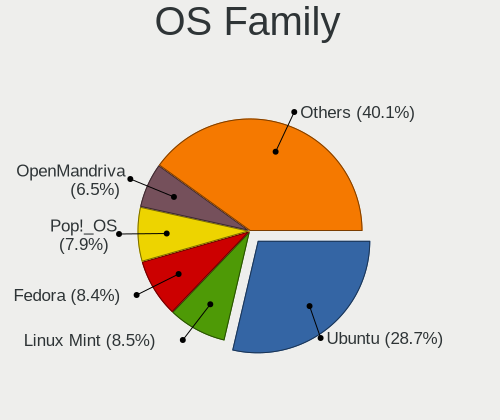
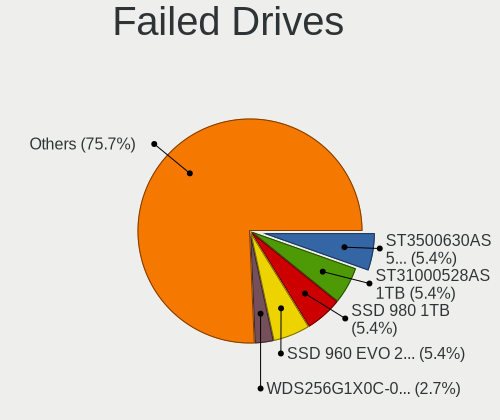
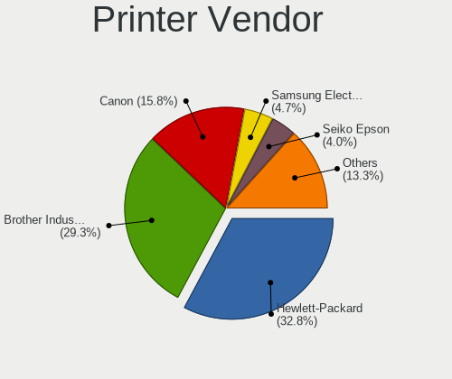
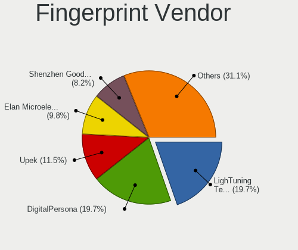
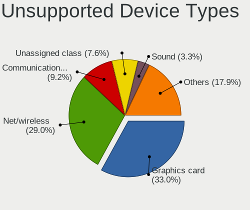

Linux in USA - Tested Hardware & Statistics (Desktops)
------------------------------------------------------

A project to collect tested hardware configurations for Linux in USA.

Anyone can contribute to this report by the [hw-probe](https://github.com/linuxhw/hw-probe) tool:

    sudo -E hw-probe -all -upload

Please contribute! Especially if your hardware is rare.

Contents
--------

* [ Test Cases ](#test-cases)

* [ System ](#system)
  - [ OS                       ](#os)
  - [ OS Family                ](#os-family)
  - [ Kernel                   ](#kernel)
  - [ Kernel Family            ](#kernel-family)
  - [ Kernel Major Ver.        ](#kernel-major-ver)
  - [ Arch                     ](#arch)
  - [ DE                       ](#de)
  - [ Display Server           ](#display-server)
  - [ Display Manager          ](#display-manager)
  - [ OS Lang                  ](#os-lang)
  - [ Boot Mode                ](#boot-mode)
  - [ Filesystem               ](#filesystem)
  - [ Part. scheme             ](#part-scheme)
  - [ Dual Boot with Linux/BSD ](#dual-boot-with-linuxbsd)
  - [ Dual Boot (Win)          ](#dual-boot-win)

* [ Board ](#board)
  - [ Vendor                   ](#vendor)
  - [ Model                    ](#model)
  - [ Model Family             ](#model-family)
  - [ MFG Year                 ](#mfg-year)
  - [ Form Factor              ](#form-factor)
  - [ Secure Boot              ](#secure-boot)
  - [ Coreboot                 ](#coreboot)
  - [ RAM Size                 ](#ram-size)
  - [ RAM Used                 ](#ram-used)
  - [ Total Drives             ](#total-drives)
  - [ Has CD-ROM               ](#has-cd-rom)
  - [ Has Ethernet             ](#has-ethernet)
  - [ Has WiFi                 ](#has-wifi)
  - [ Has Bluetooth            ](#has-bluetooth)

* [ Location ](#location)
  - [ Country                  ](#country)
  - [ City                     ](#city)

* [ Drives ](#drives)
  - [ Drive Vendor             ](#drive-vendor)
  - [ Drive Model              ](#drive-model)
  - [ HDD Vendor               ](#hdd-vendor)
  - [ SSD Vendor               ](#ssd-vendor)
  - [ Drive Kind               ](#drive-kind)
  - [ Drive Connector          ](#drive-connector)
  - [ Drive Size               ](#drive-size)
  - [ Space Total              ](#space-total)
  - [ Space Used               ](#space-used)
  - [ Malfunc. Drives          ](#malfunc-drives)
  - [ Malfunc. Drive Vendor    ](#malfunc-drive-vendor)
  - [ Malfunc. HDD Vendor      ](#malfunc-hdd-vendor)
  - [ Malfunc. Drive Kind      ](#malfunc-drive-kind)
  - [ Failed Drives            ](#failed-drives)
  - [ Failed Drive Vendor      ](#failed-drive-vendor)
  - [ Drive Status             ](#drive-status)

* [ Storage controller ](#storage-controller)
  - [ Storage Vendor           ](#storage-vendor)
  - [ Storage Model            ](#storage-model)
  - [ Storage Kind             ](#storage-kind)

* [ Processor ](#processor)
  - [ CPU Vendor               ](#cpu-vendor)
  - [ CPU Model                ](#cpu-model)
  - [ CPU Model Family         ](#cpu-model-family)
  - [ CPU Cores                ](#cpu-cores)
  - [ CPU Sockets              ](#cpu-sockets)
  - [ CPU Threads              ](#cpu-threads)
  - [ CPU Op-Modes             ](#cpu-op-modes)
  - [ CPU Microcode            ](#cpu-microcode)
  - [ CPU Microarch            ](#cpu-microarch)

* [ Graphics ](#graphics)
  - [ GPU Vendor               ](#gpu-vendor)
  - [ GPU Model                ](#gpu-model)
  - [ GPU Combo                ](#gpu-combo)
  - [ GPU Driver               ](#gpu-driver)
  - [ GPU Memory               ](#gpu-memory)

* [ Monitor ](#monitor)
  - [ Monitor Vendor           ](#monitor-vendor)
  - [ Monitor Model            ](#monitor-model)
  - [ Monitor Resolution       ](#monitor-resolution)
  - [ Monitor Diagonal         ](#monitor-diagonal)
  - [ Monitor Width            ](#monitor-width)
  - [ Aspect Ratio             ](#aspect-ratio)
  - [ Monitor Area             ](#monitor-area)
  - [ Pixel Density            ](#pixel-density)
  - [ Multiple Monitors        ](#multiple-monitors)

* [ Network ](#network)
  - [ Net Controller Vendor    ](#net-controller-vendor)
  - [ Net Controller Model     ](#net-controller-model)
  - [ Wireless Vendor          ](#wireless-vendor)
  - [ Wireless Model           ](#wireless-model)
  - [ Ethernet Vendor          ](#ethernet-vendor)
  - [ Ethernet Model           ](#ethernet-model)
  - [ Net Controller Kind      ](#net-controller-kind)
  - [ Used Controller          ](#used-controller)
  - [ NICs                     ](#nics)
  - [ IPv6                     ](#ipv6)

* [ Bluetooth ](#bluetooth)
  - [ Bluetooth Vendor         ](#bluetooth-vendor)
  - [ Bluetooth Model          ](#bluetooth-model)

* [ Sound ](#sound)
  - [ Sound Vendor             ](#sound-vendor)
  - [ Sound Model              ](#sound-model)

* [ Memory ](#memory)
  - [ Memory Vendor            ](#memory-vendor)
  - [ Memory Model             ](#memory-model)
  - [ Memory Kind              ](#memory-kind)
  - [ Memory Form Factor       ](#memory-form-factor)
  - [ Memory Size              ](#memory-size)
  - [ Memory Speed             ](#memory-speed)

* [ Printers & scanners ](#printers--scanners)
  - [ Printer Vendor           ](#printer-vendor)
  - [ Printer Model            ](#printer-model)
  - [ Scanner Vendor           ](#scanner-vendor)
  - [ Scanner Model            ](#scanner-model)

* [ Camera ](#camera)
  - [ Camera Vendor            ](#camera-vendor)
  - [ Camera Model             ](#camera-model)

* [ Security ](#security)
  - [ Fingerprint Vendor       ](#fingerprint-vendor)
  - [ Fingerprint Model        ](#fingerprint-model)
  - [ Chipcard Vendor          ](#chipcard-vendor)
  - [ Chipcard Model           ](#chipcard-model)

* [ Unsupported ](#unsupported)
  - [ Unsupported Devices      ](#unsupported-devices)
  - [ Unsupported Device Types ](#unsupported-device-types)

Test Cases
----------

Total: 20960

| Vendor        | Model                       | Probe                                                      | Date         |
|---------------|-----------------------------|------------------------------------------------------------|--------------|
| Pegatron      | 2ACB                        | [ceb2b4c1c5](https://linux-hardware.org/?probe=ceb2b4c1c5) | Jun 30, 2023 |
| HP            | 1998                        | [91f6e54877](https://linux-hardware.org/?probe=91f6e54877) | Jun 30, 2023 |
| ASUSTek       | PRIME Z790-A WIFI           | [fa055ceb7c](https://linux-hardware.org/?probe=fa055ceb7c) | Jun 30, 2023 |
| Gigabyte      | GA-78LMT-USB3 SEx           | [af3e6790e4](https://linux-hardware.org/?probe=af3e6790e4) | Jun 30, 2023 |
| Acer          | Predator PO5-640            | [416b01c954](https://linux-hardware.org/?probe=416b01c954) | Jun 30, 2023 |
| Gigabyte      | Z87X-UD5H-CF                | [3749bda51b](https://linux-hardware.org/?probe=3749bda51b) | Jun 30, 2023 |
| ASUSTek       | ROG CROSSHAIR X670E GENE    | [c93f4f0d0b](https://linux-hardware.org/?probe=c93f4f0d0b) | Jun 30, 2023 |
| Gigabyte      | Z87X-UD5H-CF                | [6ee8476c0e](https://linux-hardware.org/?probe=6ee8476c0e) | Jun 30, 2023 |
| HP            | 8056                        | [32d1199c51](https://linux-hardware.org/?probe=32d1199c51) | Jun 30, 2023 |
| AZW           | U59                         | [2b5d4dd033](https://linux-hardware.org/?probe=2b5d4dd033) | Jun 30, 2023 |
| Lenovo        | 0B98401 WIN                 | [35871c9acc](https://linux-hardware.org/?probe=35871c9acc) | Jun 30, 2023 |
| Dell          | 0KYJ8C A02                  | [f4fff60df3](https://linux-hardware.org/?probe=f4fff60df3) | Jun 30, 2023 |
| HP            | 89B5 A                      | [f0330163de](https://linux-hardware.org/?probe=f0330163de) | Jun 30, 2023 |
| ASRock        | X570 Taichi                 | [af8af2c7e8](https://linux-hardware.org/?probe=af8af2c7e8) | Jun 30, 2023 |
| Gigabyte      | X570 AORUS ELITE WIFI       | [cdb77bf9b6](https://linux-hardware.org/?probe=cdb77bf9b6) | Jun 30, 2023 |
| ASUSTek       | M51AC                       | [d32d060e9c](https://linux-hardware.org/?probe=d32d060e9c) | Jun 30, 2023 |
| Dell          | 0M6C7G A00                  | [d7dfcc4a38](https://linux-hardware.org/?probe=d7dfcc4a38) | Jun 30, 2023 |
| Dell          | 0KYJ8C A02                  | [c860545122](https://linux-hardware.org/?probe=c860545122) | Jun 30, 2023 |
| HP            | 2129                        | [73daf1de6b](https://linux-hardware.org/?probe=73daf1de6b) | Jun 30, 2023 |
| Gigabyte      | X670E AORUS MASTER          | [70ddebe460](https://linux-hardware.org/?probe=70ddebe460) | Jun 30, 2023 |
| Gigabyte      | X670E AORUS MASTER          | [7ae106bfd6](https://linux-hardware.org/?probe=7ae106bfd6) | Jun 30, 2023 |
| MSI           | MPG Z390 GAMING EDGE AC     | [5a6b149eb4](https://linux-hardware.org/?probe=5a6b149eb4) | Jun 29, 2023 |
| Dell          | 0T568R A00                  | [cf98a8a69b](https://linux-hardware.org/?probe=cf98a8a69b) | Jun 29, 2023 |
| ASUSTek       | PRIME X299-DELUXE           | [4df7190c46](https://linux-hardware.org/?probe=4df7190c46) | Jun 29, 2023 |
| Acer          | Aspire XC-830               | [eccf186dfd](https://linux-hardware.org/?probe=eccf186dfd) | Jun 29, 2023 |
| Gigabyte      | Z390 AORUS PRO WIFI-CF      | [304ff06fc0](https://linux-hardware.org/?probe=304ff06fc0) | Jun 29, 2023 |
| ASUSTek       | PRIME X299-DELUXE           | [6388cc47ae](https://linux-hardware.org/?probe=6388cc47ae) | Jun 29, 2023 |
| ASUSTek       | ROG STRIX X670E-E GAMING... | [95fb20193a](https://linux-hardware.org/?probe=95fb20193a) | Jun 29, 2023 |
| HP            | 1589                        | [dcb3289360](https://linux-hardware.org/?probe=dcb3289360) | Jun 29, 2023 |
| MSI           | B450 TOMAHAWK               | [86866241cd](https://linux-hardware.org/?probe=86866241cd) | Jun 29, 2023 |
| ASUSTek       | TUF Gaming Z690-PLUS WIF... | [a996f391dc](https://linux-hardware.org/?probe=a996f391dc) | Jun 29, 2023 |
| ASUSTek       | PRIME B550M-A               | [5bb4af3f8b](https://linux-hardware.org/?probe=5bb4af3f8b) | Jun 29, 2023 |
| MSI           | B550-A PRO                  | [722b0302f4](https://linux-hardware.org/?probe=722b0302f4) | Jun 29, 2023 |
| ASUSTek       | Z170-E                      | [8be9720ca6](https://linux-hardware.org/?probe=8be9720ca6) | Jun 29, 2023 |
| ASUSTek       | PRIME Z590-P                | [6147d58cdf](https://linux-hardware.org/?probe=6147d58cdf) | Jun 29, 2023 |
| Shuttle       | FS61                        | [a67d2edea8](https://linux-hardware.org/?probe=a67d2edea8) | Jun 28, 2023 |
| Lenovo        | 3111 SDK0J40697 WIN 3305... | [323464eebb](https://linux-hardware.org/?probe=323464eebb) | Jun 28, 2023 |
| MSI           | H110M GAMING                | [23de26f1b2](https://linux-hardware.org/?probe=23de26f1b2) | Jun 28, 2023 |
| ASUSTek       | ROG STRIX X370-F GAMING     | [793ee1e44c](https://linux-hardware.org/?probe=793ee1e44c) | Jun 28, 2023 |
| ASUSTek       | ROG STRIX X470-I GAMING     | [b8194aee09](https://linux-hardware.org/?probe=b8194aee09) | Jun 28, 2023 |
| ASUSTek       | P8Z77-V LE                  | [802b3686d4](https://linux-hardware.org/?probe=802b3686d4) | Jun 28, 2023 |
| ASUSTek       | PRIME B550M-A               | [d6823d5ec7](https://linux-hardware.org/?probe=d6823d5ec7) | Jun 28, 2023 |
| Lenovo        | Win8 Pro DPK TPG            | [0efc49ca3a](https://linux-hardware.org/?probe=0efc49ca3a) | Jun 28, 2023 |
| Dell          | 02YYK5 A01                  | [4054ebeac8](https://linux-hardware.org/?probe=4054ebeac8) | Jun 28, 2023 |
| Gigabyte      | B550M AORUS PRO-P           | [e29021ab76](https://linux-hardware.org/?probe=e29021ab76) | Jun 28, 2023 |
| Lenovo        | Win8 Pro DPK TPG            | [72514911c8](https://linux-hardware.org/?probe=72514911c8) | Jun 28, 2023 |
| OEM           | Unknown                     | [0448bbee67](https://linux-hardware.org/?probe=0448bbee67) | Jun 28, 2023 |
| MSI           | B550M PRO-VDH WIFI          | [cd0c241308](https://linux-hardware.org/?probe=cd0c241308) | Jun 28, 2023 |
| ASRock        | X570 Taichi                 | [75cb221d91](https://linux-hardware.org/?probe=75cb221d91) | Jun 28, 2023 |
| AZW           | GTR V02                     | [d8a1975328](https://linux-hardware.org/?probe=d8a1975328) | Jun 27, 2023 |
| MSI           | B550M PRO-VDH WIFI          | [6f96789257](https://linux-hardware.org/?probe=6f96789257) | Jun 27, 2023 |
| MSI           | B550M PRO-VDH WIFI          | [f46408c9b6](https://linux-hardware.org/?probe=f46408c9b6) | Jun 27, 2023 |
| Dell          | 0F6X5P A00                  | [cad43414b4](https://linux-hardware.org/?probe=cad43414b4) | Jun 27, 2023 |
| HP            | 802F                        | [585f9bf338](https://linux-hardware.org/?probe=585f9bf338) | Jun 27, 2023 |
| HP            | 802F                        | [efceba0028](https://linux-hardware.org/?probe=efceba0028) | Jun 27, 2023 |
| HP            | 821D                        | [9b007c8a3f](https://linux-hardware.org/?probe=9b007c8a3f) | Jun 27, 2023 |
| Dell          | 00010C A00                  | [f965b0f028](https://linux-hardware.org/?probe=f965b0f028) | Jun 27, 2023 |
| MSI           | B450M GAMING PLUS           | [57e792219c](https://linux-hardware.org/?probe=57e792219c) | Jun 27, 2023 |
| HP            | 0A9Ch                       | [08eccac462](https://linux-hardware.org/?probe=08eccac462) | Jun 27, 2023 |
| HP            | 8653 A                      | [076dd9a4b8](https://linux-hardware.org/?probe=076dd9a4b8) | Jun 27, 2023 |
| Dell          | 0R6PCT A01                  | [2fd7aa28db](https://linux-hardware.org/?probe=2fd7aa28db) | Jun 27, 2023 |
| ASUSTek       | ROG STRIX Z590-E GAMING ... | [962cd7b905](https://linux-hardware.org/?probe=962cd7b905) | Jun 27, 2023 |
| ASUSTek       | ROG STRIX B650E-E GAMING... | [0a35c3c750](https://linux-hardware.org/?probe=0a35c3c750) | Jun 27, 2023 |
| Gigabyte      | GA-78LMT-USB3 x.x           | [baf77629c1](https://linux-hardware.org/?probe=baf77629c1) | Jun 26, 2023 |
| Gigabyte      | B550M AORUS PRO-P           | [91b5e02477](https://linux-hardware.org/?probe=91b5e02477) | Jun 26, 2023 |
| ASUSTek       | PRIME B560M-A AC            | [b598080123](https://linux-hardware.org/?probe=b598080123) | Jun 26, 2023 |
| MSI           | B550M PRO-VDH WIFI          | [544c014552](https://linux-hardware.org/?probe=544c014552) | Jun 26, 2023 |
| ASUSTek       | TUF Gaming X570-PLUS        | [3df76bbd0e](https://linux-hardware.org/?probe=3df76bbd0e) | Jun 26, 2023 |
| Gigabyte      | Z390 AORUS PRO WIFI-CF      | [baeab145a2](https://linux-hardware.org/?probe=baeab145a2) | Jun 26, 2023 |
| Gigabyte      | GA-78LMT-S2 sex             | [49172baecf](https://linux-hardware.org/?probe=49172baecf) | Jun 26, 2023 |
| MSI           | MPG X570 GAMING EDGE WIF... | [f0268ac6a8](https://linux-hardware.org/?probe=f0268ac6a8) | Jun 26, 2023 |
| Gigabyte      | GA-78LMT-S2P                | [713bfcdf62](https://linux-hardware.org/?probe=713bfcdf62) | Jun 26, 2023 |
| ASRock        | B450 Steel Legend           | [734e60af76](https://linux-hardware.org/?probe=734e60af76) | Jun 25, 2023 |
| Gigabyte      | Z390 AORUS PRO WIFI-CF      | [3486e43434](https://linux-hardware.org/?probe=3486e43434) | Jun 25, 2023 |
| MSI           | B450M MORTAR                | [b9e6c5d81b](https://linux-hardware.org/?probe=b9e6c5d81b) | Jun 25, 2023 |
| Dell          | 0WMJ54 A01                  | [8fb0e7a710](https://linux-hardware.org/?probe=8fb0e7a710) | Jun 25, 2023 |
| Dell          | 0GY6Y8 A03                  | [a712129580](https://linux-hardware.org/?probe=a712129580) | Jun 25, 2023 |
| ASUSTek       | 970 PRO GAMING/AURA         | [a729d9a4a8](https://linux-hardware.org/?probe=a729d9a4a8) | Jun 25, 2023 |
| JINGSHA       | Unknown                     | [2ae6ac9599](https://linux-hardware.org/?probe=2ae6ac9599) | Jun 25, 2023 |
| MSI           | MPG B550 GAMING PLUS        | [eefd044b2b](https://linux-hardware.org/?probe=eefd044b2b) | Jun 25, 2023 |
| Dell          | 0HY9JP A00                  | [92293568ae](https://linux-hardware.org/?probe=92293568ae) | Jun 25, 2023 |
| Gigabyte      | Z390 AORUS PRO WIFI-CF      | [9aa214f70a](https://linux-hardware.org/?probe=9aa214f70a) | Jun 25, 2023 |
| Gigabyte      | B450M DS3H-CF               | [14bd8b577f](https://linux-hardware.org/?probe=14bd8b577f) | Jun 25, 2023 |
| ASRock        | Z170 Pro4S                  | [e28483cca4](https://linux-hardware.org/?probe=e28483cca4) | Jun 25, 2023 |
| MSI           | MPG B550 GAMING PLUS        | [f84d78f3cf](https://linux-hardware.org/?probe=f84d78f3cf) | Jun 24, 2023 |
| ASUSTek       | PRIME B450M-A II            | [31d19c3462](https://linux-hardware.org/?probe=31d19c3462) | Jun 24, 2023 |
| ASUSTek       | P9X79 PRO                   | [3d1eeda7fa](https://linux-hardware.org/?probe=3d1eeda7fa) | Jun 24, 2023 |
| ASUSTek       | PRIME B450M-A II            | [85221c654f](https://linux-hardware.org/?probe=85221c654f) | Jun 24, 2023 |
| Dell          | 088DT1 A01                  | [755d1f8c03](https://linux-hardware.org/?probe=755d1f8c03) | Jun 24, 2023 |
| ASUSTek       | M5A78L-M/USB3               | [1c0d2d86f3](https://linux-hardware.org/?probe=1c0d2d86f3) | Jun 24, 2023 |
| Dell          | 00V62H A01                  | [23134d6c71](https://linux-hardware.org/?probe=23134d6c71) | Jun 24, 2023 |
| Gigabyte      | B550 AORUS PRO AC           | [cafe332307](https://linux-hardware.org/?probe=cafe332307) | Jun 24, 2023 |
| Gigabyte      | Z390 AORUS PRO WIFI-CF      | [a19fc9dde8](https://linux-hardware.org/?probe=a19fc9dde8) | Jun 24, 2023 |
| HP            | 0A9Ch                       | [4bd59bd633](https://linux-hardware.org/?probe=4bd59bd633) | Jun 24, 2023 |
| MSI           | MPG X570 GAMING PLUS        | [0e23ab4ba9](https://linux-hardware.org/?probe=0e23ab4ba9) | Jun 24, 2023 |
| System76      | Desktop leox5               | [210eb3f1e8](https://linux-hardware.org/?probe=210eb3f1e8) | Jun 24, 2023 |
| Intel         | DH77EB AAG39073-304         | [6936a9ca21](https://linux-hardware.org/?probe=6936a9ca21) | Jun 24, 2023 |
| Apple         | Mac-27AD2F918AE68F61 Mac... | [45575cf0cc](https://linux-hardware.org/?probe=45575cf0cc) | Jun 24, 2023 |
| Apple         | Mac-27AD2F918AE68F61 Mac... | [77d2d05995](https://linux-hardware.org/?probe=77d2d05995) | Jun 24, 2023 |
| Seeed Stud... | ODYSSEY-X86J41X5 CJ41GV2... | [79a2c321e8](https://linux-hardware.org/?probe=79a2c321e8) | Jun 24, 2023 |
| ASUSTek       | P8Z77-V LK                  | [bcfc1fe2de](https://linux-hardware.org/?probe=bcfc1fe2de) | Jun 23, 2023 |
| HP            | 304Bh                       | [234bedfab1](https://linux-hardware.org/?probe=234bedfab1) | Jun 23, 2023 |
| MSI           | H270-A PRO                  | [169bbe5f04](https://linux-hardware.org/?probe=169bbe5f04) | Jun 23, 2023 |
| ASUSTek       | K30BF_M32BF                 | [46a7aaf9f1](https://linux-hardware.org/?probe=46a7aaf9f1) | Jun 23, 2023 |
| ASRockRack    | X470D4U                     | [2d49269787](https://linux-hardware.org/?probe=2d49269787) | Jun 23, 2023 |
| ASRock        | B450M Pro4                  | [54d4fa843c](https://linux-hardware.org/?probe=54d4fa843c) | Jun 23, 2023 |
| HP            | 2820h                       | [3406c7aac4](https://linux-hardware.org/?probe=3406c7aac4) | Jun 23, 2023 |
| HP            | 2820h                       | [cab2d08c26](https://linux-hardware.org/?probe=cab2d08c26) | Jun 23, 2023 |
| ASUSTek       | Maximus V FORMULA           | [190d408bc2](https://linux-hardware.org/?probe=190d408bc2) | Jun 23, 2023 |
| ASUSTek       | Maximus V FORMULA           | [fa49028492](https://linux-hardware.org/?probe=fa49028492) | Jun 23, 2023 |
| Foxconn       | nT-iBT18/nT-iBT19/nT-iBT... | [51b5eb0fa2](https://linux-hardware.org/?probe=51b5eb0fa2) | Jun 23, 2023 |
| MSI           | PRO B660-A DDR4             | [1ecefb98f7](https://linux-hardware.org/?probe=1ecefb98f7) | Jun 23, 2023 |
| ASUSTek       | K30BF_M32BF                 | [655b20a34b](https://linux-hardware.org/?probe=655b20a34b) | Jun 23, 2023 |
| HP            | 0A9Ch                       | [2f48843246](https://linux-hardware.org/?probe=2f48843246) | Jun 23, 2023 |
| Foxconn       | ALOE X3                     | [ec9afb2155](https://linux-hardware.org/?probe=ec9afb2155) | Jun 23, 2023 |
| MSI           | MPG B550 GAMING PLUS        | [d08acec85f](https://linux-hardware.org/?probe=d08acec85f) | Jun 22, 2023 |
| MSI           | B360M BAZOOKA               | [2807f81cc7](https://linux-hardware.org/?probe=2807f81cc7) | Jun 22, 2023 |
| Dell          | 0HD5W2 A01                  | [bbdbdd30a9](https://linux-hardware.org/?probe=bbdbdd30a9) | Jun 22, 2023 |
| ASRockRack    | X470D4U                     | [d419086209](https://linux-hardware.org/?probe=d419086209) | Jun 22, 2023 |
| MSI           | 760GM-E51                   | [078c1805bd](https://linux-hardware.org/?probe=078c1805bd) | Jun 22, 2023 |
| ASUSTek       | ROG STRIX Z590-E GAMING ... | [379c36642b](https://linux-hardware.org/?probe=379c36642b) | Jun 22, 2023 |
| ASUSTek       | TUF Gaming X670E-PLUS WI... | [082d9a4988](https://linux-hardware.org/?probe=082d9a4988) | Jun 22, 2023 |
| Gigabyte      | H110M-A-CF                  | [e2ed397728](https://linux-hardware.org/?probe=e2ed397728) | Jun 22, 2023 |
| MSI           | PRO B550M-VC WIFI           | [c9f86c15b7](https://linux-hardware.org/?probe=c9f86c15b7) | Jun 22, 2023 |
| Lenovo        | ThinkServer TS140           | [5043d686d8](https://linux-hardware.org/?probe=5043d686d8) | Jun 22, 2023 |
| ASUSTek       | ROG STRIX B650E-F GAMING... | [b07361bc89](https://linux-hardware.org/?probe=b07361bc89) | Jun 22, 2023 |
| Lenovo        | 3730 SDK0T76465 WIN 3422... | [5199a5d1f8](https://linux-hardware.org/?probe=5199a5d1f8) | Jun 22, 2023 |
| Gigabyte      | GA-78LMT-S2 sex             | [198b248306](https://linux-hardware.org/?probe=198b248306) | Jun 22, 2023 |
| ASRock        | H61M-VG3                    | [955228e9e5](https://linux-hardware.org/?probe=955228e9e5) | Jun 22, 2023 |
| AOpen         | iBDWMUx-MD R1.04            | [2656caf6b8](https://linux-hardware.org/?probe=2656caf6b8) | Jun 22, 2023 |
| Lenovo        | SHARKBAY 0B98401 WIN        | [1c465408de](https://linux-hardware.org/?probe=1c465408de) | Jun 22, 2023 |
| ASUSTek       | PRIME Z490-A                | [f7c2ec659b](https://linux-hardware.org/?probe=f7c2ec659b) | Jun 22, 2023 |
| Gigabyte      | F2A88XM-D3H                 | [6c43b99ec8](https://linux-hardware.org/?probe=6c43b99ec8) | Jun 22, 2023 |
| ASRock        | X670E PG Lightning          | [b8e19a16f9](https://linux-hardware.org/?probe=b8e19a16f9) | Jun 22, 2023 |
| Dell          | 0YXG0N A00                  | [546af4a5d6](https://linux-hardware.org/?probe=546af4a5d6) | Jun 22, 2023 |
| Dell          | 09KPNV A01                  | [eaa3017d03](https://linux-hardware.org/?probe=eaa3017d03) | Jun 21, 2023 |
| Dell          | 08K0X7 A00                  | [c7fdebd823](https://linux-hardware.org/?probe=c7fdebd823) | Jun 21, 2023 |
| HP            | 89B5 A                      | [01e8a85a35](https://linux-hardware.org/?probe=01e8a85a35) | Jun 21, 2023 |
| HP            | 1998                        | [efcccef24e](https://linux-hardware.org/?probe=efcccef24e) | Jun 21, 2023 |
| HP            | 1998                        | [71bee9f013](https://linux-hardware.org/?probe=71bee9f013) | Jun 21, 2023 |
| Dell          | 0NDYHG A01                  | [55873c7a70](https://linux-hardware.org/?probe=55873c7a70) | Jun 21, 2023 |
| MSI           | MPG Z390 GAMING EDGE AC     | [86ee4e619f](https://linux-hardware.org/?probe=86ee4e619f) | Jun 21, 2023 |
| ASUSTek       | PRIME B550M-A               | [a5e833c54e](https://linux-hardware.org/?probe=a5e833c54e) | Jun 21, 2023 |
| MSI           | B450 TOMAHAWK MAX           | [5a583f77d8](https://linux-hardware.org/?probe=5a583f77d8) | Jun 21, 2023 |
| Dell          | 0YXG0N A00                  | [b64e30a95b](https://linux-hardware.org/?probe=b64e30a95b) | Jun 21, 2023 |
| HP            | 339A                        | [420903b9cc](https://linux-hardware.org/?probe=420903b9cc) | Jun 21, 2023 |
| HP            | 18E7                        | [3b872d2a88](https://linux-hardware.org/?probe=3b872d2a88) | Jun 20, 2023 |
| Gigabyte      | Z270X-Gaming 7              | [84cab7b427](https://linux-hardware.org/?probe=84cab7b427) | Jun 20, 2023 |
| MAXSUN        | MS-H81IL TR M.2             | [72c79949e0](https://linux-hardware.org/?probe=72c79949e0) | Jun 20, 2023 |
| Foxconn       | Napa HP P/N                 | [df7eb832b4](https://linux-hardware.org/?probe=df7eb832b4) | Jun 20, 2023 |
| ASUSTek       | PRIME B450M-A               | [681556b12c](https://linux-hardware.org/?probe=681556b12c) | Jun 20, 2023 |
| Lenovo        | MAHOBAY Win8 STD MM DPK ... | [19c5a44099](https://linux-hardware.org/?probe=19c5a44099) | Jun 20, 2023 |
| Dell          | 0RW203                      | [6872d8e6c5](https://linux-hardware.org/?probe=6872d8e6c5) | Jun 20, 2023 |
| ASUSTek       | Rampage V EXTREME           | [e7bb42d6d4](https://linux-hardware.org/?probe=e7bb42d6d4) | Jun 20, 2023 |
| ASUSTek       | Rampage V EXTREME           | [2fe4bf8ad2](https://linux-hardware.org/?probe=2fe4bf8ad2) | Jun 20, 2023 |
| Dell          | 0X9M3X A01                  | [1d14950f1e](https://linux-hardware.org/?probe=1d14950f1e) | Jun 20, 2023 |
| Dell          | 0X9M3X A01                  | [46baecef13](https://linux-hardware.org/?probe=46baecef13) | Jun 20, 2023 |
| MSI           | Z270-A PRO                  | [0d8b3d7c32](https://linux-hardware.org/?probe=0d8b3d7c32) | Jun 20, 2023 |
| BESSTAR Te... | HM90                        | [796769b68a](https://linux-hardware.org/?probe=796769b68a) | Jun 20, 2023 |
| Pegatron      | JESSE                       | [fa09a247a7](https://linux-hardware.org/?probe=fa09a247a7) | Jun 19, 2023 |
| Lenovo        | ThinkServer TS140           | [9210e713ff](https://linux-hardware.org/?probe=9210e713ff) | Jun 19, 2023 |
| ASUSTek       | ROG STRIX X399-E GAMING     | [405e91f460](https://linux-hardware.org/?probe=405e91f460) | Jun 19, 2023 |
| Dell          | 0CRH6C A02                  | [6ae5e917b4](https://linux-hardware.org/?probe=6ae5e917b4) | Jun 19, 2023 |
| Lenovo        | SHARKBAY NOK                | [0173559ed0](https://linux-hardware.org/?probe=0173559ed0) | Jun 19, 2023 |
| Gigabyte      | B450 AORUS PRO WIFI-CF      | [fe3bb60acc](https://linux-hardware.org/?probe=fe3bb60acc) | Jun 19, 2023 |
| Gigabyte      | 2AC8                        | [bfacacbca8](https://linux-hardware.org/?probe=bfacacbca8) | Jun 19, 2023 |
| Dell          | 0DF42J A00                  | [c1db29329c](https://linux-hardware.org/?probe=c1db29329c) | Jun 19, 2023 |
| Shuttle       | SA76 V10                    | [fbcf156e7e](https://linux-hardware.org/?probe=fbcf156e7e) | Jun 19, 2023 |
| Gigabyte      | AB350-Gaming 3-CF           | [647597be95](https://linux-hardware.org/?probe=647597be95) | Jun 19, 2023 |
| Alienware     | 0CPDXD A00                  | [3e1923b97a](https://linux-hardware.org/?probe=3e1923b97a) | Jun 19, 2023 |
| Unknown       | T3 MRD                      | [0e766af6dd](https://linux-hardware.org/?probe=0e766af6dd) | Jun 19, 2023 |
| ASRock        | Z77 Extreme4                | [78207fbf49](https://linux-hardware.org/?probe=78207fbf49) | Jun 19, 2023 |
| MSI           | B350M MORTAR                | [dde719cb99](https://linux-hardware.org/?probe=dde719cb99) | Jun 19, 2023 |
| Dell          | 02YYK5 A01                  | [50efda9604](https://linux-hardware.org/?probe=50efda9604) | Jun 19, 2023 |
| AZW           | GTR V02                     | [f9bee18426](https://linux-hardware.org/?probe=f9bee18426) | Jun 19, 2023 |
| ASRock        | B450 Pro4                   | [3acc831573](https://linux-hardware.org/?probe=3acc831573) | Jun 19, 2023 |
| XFX           | MI-9300-7AS9                | [e2c3a51177](https://linux-hardware.org/?probe=e2c3a51177) | Jun 18, 2023 |
| ASUSTek       | P5LD2                       | [7038963b77](https://linux-hardware.org/?probe=7038963b77) | Jun 18, 2023 |
| Dell          | 0C2XKD A01                  | [15331b91ed](https://linux-hardware.org/?probe=15331b91ed) | Jun 18, 2023 |
| HP            | 8949 11                     | [bd6b95fc23](https://linux-hardware.org/?probe=bd6b95fc23) | Jun 18, 2023 |
| ASUSTek       | M5A97 R2.0                  | [6ff9be62b8](https://linux-hardware.org/?probe=6ff9be62b8) | Jun 18, 2023 |
| Lenovo        | MAHOBAY Win8 STD MM DPK ... | [68e00c1869](https://linux-hardware.org/?probe=68e00c1869) | Jun 18, 2023 |
| MSI           | 2AE0                        | [fdfc88e5da](https://linux-hardware.org/?probe=fdfc88e5da) | Jun 18, 2023 |
| Intel         | H81                         | [5cda43eb30](https://linux-hardware.org/?probe=5cda43eb30) | Jun 18, 2023 |
| ASUSTek       | ROG STRIX B550-I GAMING     | [9493891426](https://linux-hardware.org/?probe=9493891426) | Jun 18, 2023 |
| Dell          | 0N4YC8 A00                  | [154f9809e6](https://linux-hardware.org/?probe=154f9809e6) | Jun 18, 2023 |
| Dell          | 0N4YC8 A00                  | [66ce1a98a8](https://linux-hardware.org/?probe=66ce1a98a8) | Jun 18, 2023 |
| Dell          | 0HN7XN A01                  | [7348297d40](https://linux-hardware.org/?probe=7348297d40) | Jun 18, 2023 |
| Lenovo        | 0x36A017AA SDK0J40709 WI... | [c409de5ebd](https://linux-hardware.org/?probe=c409de5ebd) | Jun 18, 2023 |
| ASRock        | Z77 Extreme4                | [c45aea7474](https://linux-hardware.org/?probe=c45aea7474) | Jun 18, 2023 |
| ASUSTek       | ROG STRIX X670E-E GAMING... | [231a3aeb2e](https://linux-hardware.org/?probe=231a3aeb2e) | Jun 18, 2023 |
| Dell          | 06JWJY A01                  | [2131eadb5b](https://linux-hardware.org/?probe=2131eadb5b) | Jun 18, 2023 |
| BESSTAR Te... | B550                        | [6c2811bbf5](https://linux-hardware.org/?probe=6c2811bbf5) | Jun 18, 2023 |
| ASUSTek       | ROG STRIX B450-F GAMING     | [176bffae78](https://linux-hardware.org/?probe=176bffae78) | Jun 18, 2023 |
| Fujitsu       | FujitsuTP7000 -1            | [231d7f8182](https://linux-hardware.org/?probe=231d7f8182) | Jun 18, 2023 |
| Gigabyte      | A320M-S2H-CF                | [7cefb01373](https://linux-hardware.org/?probe=7cefb01373) | Jun 18, 2023 |
| ASUSTek       | ROG STRIX B550-I GAMING     | [cd87a6b19f](https://linux-hardware.org/?probe=cd87a6b19f) | Jun 17, 2023 |
| ASUSTek       | PRIME X470-PRO              | [c2f10ad55c](https://linux-hardware.org/?probe=c2f10ad55c) | Jun 17, 2023 |
| Gigabyte      | B450M DS3H V2               | [434d06d1ea](https://linux-hardware.org/?probe=434d06d1ea) | Jun 17, 2023 |
| Shenzhen M... | F7BFD                       | [0b079f1414](https://linux-hardware.org/?probe=0b079f1414) | Jun 17, 2023 |
| MSI           | MPG X570 GAMING EDGE WIF... | [3050f49c99](https://linux-hardware.org/?probe=3050f49c99) | Jun 17, 2023 |
| ASUSTek       | ROG CROSSHAIR X670E EXTR... | [c555238190](https://linux-hardware.org/?probe=c555238190) | Jun 17, 2023 |
| HP            | 2B38                        | [b84e03e083](https://linux-hardware.org/?probe=b84e03e083) | Jun 17, 2023 |
| ASUSTek       | PRIME B550M-A               | [7e135be518](https://linux-hardware.org/?probe=7e135be518) | Jun 17, 2023 |
| ASUSTek       | TUF Gaming X570-PLUS        | [2278cd4d03](https://linux-hardware.org/?probe=2278cd4d03) | Jun 17, 2023 |
| ASRock        | 970M Pro3                   | [777a9e4f49](https://linux-hardware.org/?probe=777a9e4f49) | Jun 17, 2023 |
| Dell          | 07HXY6 A01                  | [ec3adcbe42](https://linux-hardware.org/?probe=ec3adcbe42) | Jun 16, 2023 |
| ASUSTek       | K30BF_M32BF_A_F_K31BF_6     | [7a56496149](https://linux-hardware.org/?probe=7a56496149) | Jun 16, 2023 |
| MSI           | X58 Pro-E                   | [abd2765191](https://linux-hardware.org/?probe=abd2765191) | Jun 16, 2023 |
| ASRock        | Z370 Gaming-ITX/ac          | [e05a90c6c5](https://linux-hardware.org/?probe=e05a90c6c5) | Jun 16, 2023 |
| HP            | 212B                        | [134ff203c4](https://linux-hardware.org/?probe=134ff203c4) | Jun 16, 2023 |
| HP            | 886C                        | [ef429234c7](https://linux-hardware.org/?probe=ef429234c7) | Jun 16, 2023 |
| ASUSTek       | ROG CROSSHAIR VIII HERO     | [5844f8b39b](https://linux-hardware.org/?probe=5844f8b39b) | Jun 16, 2023 |
| Biostar       | A880GZ                      | [0ab2ec8924](https://linux-hardware.org/?probe=0ab2ec8924) | Jun 16, 2023 |
| HP            | 1496                        | [ccc9943e2d](https://linux-hardware.org/?probe=ccc9943e2d) | Jun 16, 2023 |
| ASUSTek       | M5A78L-M/USB3               | [c5491fb02f](https://linux-hardware.org/?probe=c5491fb02f) | Jun 16, 2023 |
| Gigabyte      | Z370 AORUS Ultra Gaming-... | [9c3bb21706](https://linux-hardware.org/?probe=9c3bb21706) | Jun 16, 2023 |
| MSI           | Z170A GAMING M5             | [a0d460b4a3](https://linux-hardware.org/?probe=a0d460b4a3) | Jun 16, 2023 |
| MSI           | B360M BAZOOKA               | [4448a99385](https://linux-hardware.org/?probe=4448a99385) | Jun 16, 2023 |
| MSI           | B450 TOMAHAWK MAX           | [15842a2029](https://linux-hardware.org/?probe=15842a2029) | Jun 15, 2023 |
| Lenovo        | 312A SDK0J40697 WIN 3305... | [2b4d4506c2](https://linux-hardware.org/?probe=2b4d4506c2) | Jun 15, 2023 |
| MSI           | X299 GAMING PRO CARBON A... | [6385c09651](https://linux-hardware.org/?probe=6385c09651) | Jun 15, 2023 |
| HP            | 8054                        | [97a4b34236](https://linux-hardware.org/?probe=97a4b34236) | Jun 15, 2023 |
| ASUSTek       | TUF Gaming X570-PLUS        | [13c74e7a46](https://linux-hardware.org/?probe=13c74e7a46) | Jun 15, 2023 |
| HP            | 1589                        | [6bfe1d5b63](https://linux-hardware.org/?probe=6bfe1d5b63) | Jun 15, 2023 |
| Gateway       | SX2110GA                    | [e47130d966](https://linux-hardware.org/?probe=e47130d966) | Jun 15, 2023 |
| Intel         | DG33SXG2 AAD94468-500       | [8feb530340](https://linux-hardware.org/?probe=8feb530340) | Jun 15, 2023 |
| ASUSTek       | Rev                         | [6c5d91db68](https://linux-hardware.org/?probe=6c5d91db68) | Jun 15, 2023 |
| Acer          | Aspire XC-830               | [ca0cba861a](https://linux-hardware.org/?probe=ca0cba861a) | Jun 15, 2023 |
| HP            | 21B4 A01                    | [16b576ebea](https://linux-hardware.org/?probe=16b576ebea) | Jun 15, 2023 |
| ASUSTek       | TUF X470-PLUS GAMING        | [7df89b77f2](https://linux-hardware.org/?probe=7df89b77f2) | Jun 15, 2023 |
| ASUSTek       | M5A97 R2.0                  | [f802893b92](https://linux-hardware.org/?probe=f802893b92) | Jun 15, 2023 |
| MSI           | PRO B550M-VC WIFI           | [64e0ce279b](https://linux-hardware.org/?probe=64e0ce279b) | Jun 15, 2023 |
| Dell          | 0HY9JP A00                  | [d7689b11ad](https://linux-hardware.org/?probe=d7689b11ad) | Jun 14, 2023 |
| ASRock        | B650E Steel Legend WiFi     | [3edca35793](https://linux-hardware.org/?probe=3edca35793) | Jun 14, 2023 |
| ASUSTek       | Maximus VIII FORMULA        | [00a862ae7c](https://linux-hardware.org/?probe=00a862ae7c) | Jun 14, 2023 |
| HP            | 2820h                       | [77b54a0343](https://linux-hardware.org/?probe=77b54a0343) | Jun 14, 2023 |
| HP            | 2820h                       | [40e65d7a30](https://linux-hardware.org/?probe=40e65d7a30) | Jun 14, 2023 |
| Dell          | 0PTTT9 A01                  | [0fd0fd8195](https://linux-hardware.org/?probe=0fd0fd8195) | Jun 14, 2023 |
| HP            | 212B                        | [b107461bdd](https://linux-hardware.org/?probe=b107461bdd) | Jun 14, 2023 |
| MSI           | X470 GAMING PLUS MAX        | [c05a02e77b](https://linux-hardware.org/?probe=c05a02e77b) | Jun 14, 2023 |
| Dell          | 0427JK A00                  | [8c2d768cae](https://linux-hardware.org/?probe=8c2d768cae) | Jun 14, 2023 |
| Intel         | DG41TY AAE47335-203         | [4f1d844d48](https://linux-hardware.org/?probe=4f1d844d48) | Jun 14, 2023 |
| Dell          | 0D28YY A00                  | [572840f1e9](https://linux-hardware.org/?probe=572840f1e9) | Jun 14, 2023 |
| ASUSTek       | ROG STRIX B450-F GAMING     | [284344e775](https://linux-hardware.org/?probe=284344e775) | Jun 14, 2023 |
| Lenovo        | ThinkCentre M55p 8808D8U    | [3117d89b20](https://linux-hardware.org/?probe=3117d89b20) | Jun 14, 2023 |
| MSI           | MAG B550 TOMAHAWK MAX WI... | [6e241e56cf](https://linux-hardware.org/?probe=6e241e56cf) | Jun 14, 2023 |
| Lenovo        | ThinkCentre M55p 8808D8U    | [3feaf0bd19](https://linux-hardware.org/?probe=3feaf0bd19) | Jun 14, 2023 |
| Lenovo        | ThinkCentre M55p 8808D8U    | [5fc5be3367](https://linux-hardware.org/?probe=5fc5be3367) | Jun 14, 2023 |
| Lenovo        | ThinkCentre M55p 8808D8U    | [aba284328c](https://linux-hardware.org/?probe=aba284328c) | Jun 14, 2023 |
| Lenovo        | ThinkCentre M55p 8808D8U    | [b899120507](https://linux-hardware.org/?probe=b899120507) | Jun 14, 2023 |
| Foxconn       | 2ADA                        | [4402afe7ad](https://linux-hardware.org/?probe=4402afe7ad) | Jun 14, 2023 |
| Foxconn       | 2ADA                        | [78c4871863](https://linux-hardware.org/?probe=78c4871863) | Jun 14, 2023 |
| Dell          | 0C2XKD A01                  | [a4ecbb165e](https://linux-hardware.org/?probe=a4ecbb165e) | Jun 14, 2023 |
| Dell          | 0KRC95 A02                  | [5f9a1aafe0](https://linux-hardware.org/?probe=5f9a1aafe0) | Jun 14, 2023 |
| Dell          | 06NWYK A01                  | [c731dec189](https://linux-hardware.org/?probe=c731dec189) | Jun 14, 2023 |
| Dell          | 0WMJ54 A01                  | [3bf8d20351](https://linux-hardware.org/?probe=3bf8d20351) | Jun 14, 2023 |
| Dell          | 0KC9NP A01                  | [b00d413241](https://linux-hardware.org/?probe=b00d413241) | Jun 14, 2023 |
| Dell          | 0KC9NP A01                  | [1d487a1ed5](https://linux-hardware.org/?probe=1d487a1ed5) | Jun 14, 2023 |
| Dell          | 0WR7PY A02                  | [eab79964fb](https://linux-hardware.org/?probe=eab79964fb) | Jun 14, 2023 |
| MSI           | B450 TOMAHAWK               | [e8ed28dba0](https://linux-hardware.org/?probe=e8ed28dba0) | Jun 14, 2023 |
| Gigabyte      | Z390 AORUS PRO WIFI-CF      | [f4f3c59e6b](https://linux-hardware.org/?probe=f4f3c59e6b) | Jun 14, 2023 |
| Lenovo        | MAHOBAY Win8 Pro DPK TPG    | [bc10401eda](https://linux-hardware.org/?probe=bc10401eda) | Jun 14, 2023 |
| Gigabyte      | Z170-HD3P-CF                | [367c951ecf](https://linux-hardware.org/?probe=367c951ecf) | Jun 14, 2023 |
| ASUSTek       | P9X79 PRO                   | [4bab6db53f](https://linux-hardware.org/?probe=4bab6db53f) | Jun 14, 2023 |
| Lenovo        | ThinkCentre M55p 8808D8U    | [221a4431e2](https://linux-hardware.org/?probe=221a4431e2) | Jun 13, 2023 |
| Lenovo        | ThinkCentre M55p 8808D8U    | [85abf9e475](https://linux-hardware.org/?probe=85abf9e475) | Jun 13, 2023 |
| Lenovo        | ThinkCentre M55p 8808D8U    | [40df819ebb](https://linux-hardware.org/?probe=40df819ebb) | Jun 13, 2023 |
| Lenovo        | ThinkCentre M55p 8808D8U    | [9ed186ba56](https://linux-hardware.org/?probe=9ed186ba56) | Jun 13, 2023 |
| Foxconn       | 2ABF                        | [61a0229bdd](https://linux-hardware.org/?probe=61a0229bdd) | Jun 13, 2023 |
| Lenovo        | ThinkCentre M55p 8808D8U    | [2a4d82175c](https://linux-hardware.org/?probe=2a4d82175c) | Jun 13, 2023 |
| Lenovo        | ThinkCentre M55p 8808D8U    | [1df32db310](https://linux-hardware.org/?probe=1df32db310) | Jun 13, 2023 |
| Lenovo        | ThinkCentre M55p 8808D8U    | [9949220d98](https://linux-hardware.org/?probe=9949220d98) | Jun 13, 2023 |
| Lenovo        | ThinkCentre M55p 8808D8U    | [d801927769](https://linux-hardware.org/?probe=d801927769) | Jun 13, 2023 |
| MSI           | B450 TOMAHAWK               | [bd6a04d15d](https://linux-hardware.org/?probe=bd6a04d15d) | Jun 13, 2023 |
| MSI           | B450 TOMAHAWK               | [507d8cc765](https://linux-hardware.org/?probe=507d8cc765) | Jun 13, 2023 |
| ASUSTek       | K30DA                       | [b7a8c584c2](https://linux-hardware.org/?probe=b7a8c584c2) | Jun 13, 2023 |
| HP            | 2AE5 A01                    | [992b755286](https://linux-hardware.org/?probe=992b755286) | Jun 13, 2023 |
| HP            | 2AE5 A01                    | [43cce62781](https://linux-hardware.org/?probe=43cce62781) | Jun 13, 2023 |
| MSI           | Z390-A PRO                  | [488d6c38b8](https://linux-hardware.org/?probe=488d6c38b8) | Jun 13, 2023 |
| ASUSTek       | P9X79 PRO                   | [9e6d8db2d3](https://linux-hardware.org/?probe=9e6d8db2d3) | Jun 13, 2023 |
| ASUSTek       | ProArt X570-CREATOR WIFI    | [5281ad2271](https://linux-hardware.org/?probe=5281ad2271) | Jun 13, 2023 |
| Dell          | 0YF8P5 A00                  | [5ac4a46c16](https://linux-hardware.org/?probe=5ac4a46c16) | Jun 12, 2023 |
| MSI           | Z97 PC Mate                 | [5cfb578ee0](https://linux-hardware.org/?probe=5cfb578ee0) | Jun 12, 2023 |
| MSI           | B450 TOMAHAWK               | [58235def6c](https://linux-hardware.org/?probe=58235def6c) | Jun 12, 2023 |
| ASRock        | Z390 Pro4                   | [067d0e5da5](https://linux-hardware.org/?probe=067d0e5da5) | Jun 12, 2023 |
| ASRock        | H310CM-HDV                  | [a810b267ef](https://linux-hardware.org/?probe=a810b267ef) | Jun 12, 2023 |
| Gigabyte      | Z390 AORUS PRO WIFI-CF      | [4b419cd833](https://linux-hardware.org/?probe=4b419cd833) | Jun 12, 2023 |
| Pegatron      | NARRA5                      | [3e7cbbb991](https://linux-hardware.org/?probe=3e7cbbb991) | Jun 12, 2023 |
| Shenzhen M... | F7BFD                       | [8f43ad0e76](https://linux-hardware.org/?probe=8f43ad0e76) | Jun 12, 2023 |
| Dell          | 0M5DCD A00                  | [ae7b392070](https://linux-hardware.org/?probe=ae7b392070) | Jun 12, 2023 |
| HP            | 2B16                        | [0f2ea937e9](https://linux-hardware.org/?probe=0f2ea937e9) | Jun 12, 2023 |
| ASUSTek       | M4N68T-M                    | [f0b58c9f4e](https://linux-hardware.org/?probe=f0b58c9f4e) | Jun 12, 2023 |
| MSI           | MPG X570 GAMING PLUS        | [a9bb4cfb62](https://linux-hardware.org/?probe=a9bb4cfb62) | Jun 12, 2023 |
| MSI           | MPG X570 GAMING PLUS        | [9c0f9bf219](https://linux-hardware.org/?probe=9c0f9bf219) | Jun 12, 2023 |
| HP            | 1497                        | [396e1ec78e](https://linux-hardware.org/?probe=396e1ec78e) | Jun 11, 2023 |
| ASUSTek       | ROG STRIX B550-F GAMING ... | [7480d3ed9c](https://linux-hardware.org/?probe=7480d3ed9c) | Jun 11, 2023 |
| Dell          | 0D441T A03                  | [f3c0f56e59](https://linux-hardware.org/?probe=f3c0f56e59) | Jun 11, 2023 |
| ASUSTek       | M4A89GTD-PRO/USB3           | [8363538b57](https://linux-hardware.org/?probe=8363538b57) | Jun 11, 2023 |
| Intel         | DQ67EP AAG12529-308         | [a47237c452](https://linux-hardware.org/?probe=a47237c452) | Jun 11, 2023 |
| ASUSTek       | M5A78L-M/USB3               | [cf9274f969](https://linux-hardware.org/?probe=cf9274f969) | Jun 11, 2023 |
| Dell          | 0FDY5C A00                  | [21ad2d85dc](https://linux-hardware.org/?probe=21ad2d85dc) | Jun 11, 2023 |
| ASUSTek       | P9X79 PRO                   | [a280f19bb2](https://linux-hardware.org/?probe=a280f19bb2) | Jun 11, 2023 |
| Gigabyte      | 990FXA-UD3                  | [756a317dd6](https://linux-hardware.org/?probe=756a317dd6) | Jun 11, 2023 |
| Pegatron      | NARRA5                      | [609c2921d3](https://linux-hardware.org/?probe=609c2921d3) | Jun 11, 2023 |
| HP            | 158A                        | [ce5c3c88d4](https://linux-hardware.org/?probe=ce5c3c88d4) | Jun 11, 2023 |
| Lenovo        | 312A SDK0R32862 WIN 3258... | [1e8ab337a5](https://linux-hardware.org/?probe=1e8ab337a5) | Jun 11, 2023 |
| ASUSTek       | CM6850                      | [33579719ed](https://linux-hardware.org/?probe=33579719ed) | Jun 11, 2023 |
| ASUSTek       | M5A99FX PRO R2.0            | [2cd4d2c377](https://linux-hardware.org/?probe=2cd4d2c377) | Jun 11, 2023 |
| ASUSTek       | M5A99FX PRO R2.0            | [3544b34815](https://linux-hardware.org/?probe=3544b34815) | Jun 11, 2023 |
| Dell          | 0FDY5C A00                  | [100d556664](https://linux-hardware.org/?probe=100d556664) | Jun 11, 2023 |
| Biostar       | TPower I45                  | [b88767bce0](https://linux-hardware.org/?probe=b88767bce0) | Jun 11, 2023 |
| BESSTAR Te... | HM90                        | [86c52dcc7a](https://linux-hardware.org/?probe=86c52dcc7a) | Jun 11, 2023 |
| Dell          | 0WMJ54 A01                  | [a396add68b](https://linux-hardware.org/?probe=a396add68b) | Jun 11, 2023 |
| Gigabyte      | B550I AORUS PRO AX          | [798d8e8914](https://linux-hardware.org/?probe=798d8e8914) | Jun 11, 2023 |
| ASUSTek       | SABERTOOTH Z77              | [74e0ea4d38](https://linux-hardware.org/?probe=74e0ea4d38) | Jun 11, 2023 |
| ASRock        | Z68 Extreme3 Gen3           | [7849965aa1](https://linux-hardware.org/?probe=7849965aa1) | Jun 11, 2023 |
| Gigabyte      | X570S I AORUS PRO AX        | [5275807836](https://linux-hardware.org/?probe=5275807836) | Jun 11, 2023 |
| ASUSTek       | TUF Gaming B650M-PLUS WI... | [153ae28a9e](https://linux-hardware.org/?probe=153ae28a9e) | Jun 11, 2023 |
| HP            | 89B5 A                      | [7bf638dc35](https://linux-hardware.org/?probe=7bf638dc35) | Jun 10, 2023 |
| MSI           | X99A GODLIKE GAMING         | [19511501c7](https://linux-hardware.org/?probe=19511501c7) | Jun 10, 2023 |
| Intel         | SHARKBAY                    | [8772d55075](https://linux-hardware.org/?probe=8772d55075) | Jun 10, 2023 |
| ASRock        | B450 Pro4                   | [49ebfc0459](https://linux-hardware.org/?probe=49ebfc0459) | Jun 10, 2023 |
| Gigabyte      | Z87X-UD4H-CF                | [abd31d2f92](https://linux-hardware.org/?probe=abd31d2f92) | Jun 10, 2023 |
| MSI           | X370 GAMING M7 ACK          | [450b8ab5a7](https://linux-hardware.org/?probe=450b8ab5a7) | Jun 10, 2023 |
| HP            | 81B4                        | [2d7748536f](https://linux-hardware.org/?probe=2d7748536f) | Jun 10, 2023 |
| Gigabyte      | GA-880GM-D2H                | [2e46385299](https://linux-hardware.org/?probe=2e46385299) | Jun 10, 2023 |
| HP            | 339A                        | [d1fa07d03f](https://linux-hardware.org/?probe=d1fa07d03f) | Jun 10, 2023 |
| Gigabyte      | B550 GAMING X V2            | [03ef8fea42](https://linux-hardware.org/?probe=03ef8fea42) | Jun 10, 2023 |
| ASUSTek       | K30BF_M32BF                 | [65b3c16165](https://linux-hardware.org/?probe=65b3c16165) | Jun 10, 2023 |
| Pegatron      | 2A99                        | [0a25cd49a5](https://linux-hardware.org/?probe=0a25cd49a5) | Jun 10, 2023 |
| HP            | 8949 11                     | [f5e1f4b6c9](https://linux-hardware.org/?probe=f5e1f4b6c9) | Jun 10, 2023 |
| ASUSTek       | ROG STRIX B450-F GAMING     | [cac24c37e5](https://linux-hardware.org/?probe=cac24c37e5) | Jun 10, 2023 |
| ASUSTek       | ROG STRIX X670E-E GAMING... | [5446a0003e](https://linux-hardware.org/?probe=5446a0003e) | Jun 10, 2023 |
| MSI           | AM1M                        | [42a7d49c03](https://linux-hardware.org/?probe=42a7d49c03) | Jun 10, 2023 |
| ASUSTek       | M5A97 R2.0                  | [d9e9a51e48](https://linux-hardware.org/?probe=d9e9a51e48) | Jun 10, 2023 |
| Gigabyte      | GA-890GPA-UD3H              | [f04b28a0e5](https://linux-hardware.org/?probe=f04b28a0e5) | Jun 10, 2023 |
| Gigabyte      | B460M DS3H                  | [63c9d6c822](https://linux-hardware.org/?probe=63c9d6c822) | Jun 09, 2023 |
| ASUSTek       | ROG ZENITH EXTREME          | [b4de2ccda4](https://linux-hardware.org/?probe=b4de2ccda4) | Jun 09, 2023 |
| Gigabyte      | B450 AORUS M                | [280baa2765](https://linux-hardware.org/?probe=280baa2765) | Jun 09, 2023 |
| ASUSTek       | M2N68-AM SE2                | [4f69ba649a](https://linux-hardware.org/?probe=4f69ba649a) | Jun 09, 2023 |
| Lenovo        | ThinkStation E20 422237U    | [2756905647](https://linux-hardware.org/?probe=2756905647) | Jun 09, 2023 |
| Dell          | 07T4MC A02                  | [ad310dd147](https://linux-hardware.org/?probe=ad310dd147) | Jun 09, 2023 |
| ASRock        | AB350M Pro4                 | [8f0087d741](https://linux-hardware.org/?probe=8f0087d741) | Jun 09, 2023 |
| Gigabyte      | B550 AORUS PRO              | [61a0a2ea5f](https://linux-hardware.org/?probe=61a0a2ea5f) | Jun 09, 2023 |
| Gigabyte      | B450 AORUS M                | [50b022f065](https://linux-hardware.org/?probe=50b022f065) | Jun 09, 2023 |
| MSI           | MPG X570S CARBON MAX WIF... | [5833483fe2](https://linux-hardware.org/?probe=5833483fe2) | Jun 09, 2023 |
| MSI           | MAG Z490 TOMAHAWK           | [40f18ae1f4](https://linux-hardware.org/?probe=40f18ae1f4) | Jun 09, 2023 |
| ASUSTek       | TUF Gaming B650M-PLUS WI... | [26262445d4](https://linux-hardware.org/?probe=26262445d4) | Jun 09, 2023 |
| ASUSTek       | M2N68-AM Plus               | [7411937d5b](https://linux-hardware.org/?probe=7411937d5b) | Jun 09, 2023 |
| Gigabyte      | Z790 AORUS ELITE AX         | [f4f543eaa6](https://linux-hardware.org/?probe=f4f543eaa6) | Jun 09, 2023 |
| Gigabyte      | GA-78LMT-USB3 SEx           | [1189f6696f](https://linux-hardware.org/?probe=1189f6696f) | Jun 09, 2023 |
| Dell          | 0FDY5C A00                  | [1caf029f79](https://linux-hardware.org/?probe=1caf029f79) | Jun 09, 2023 |
| AZW           | SEi                         | [2b085e7ed2](https://linux-hardware.org/?probe=2b085e7ed2) | Jun 09, 2023 |
| HP            | 3646h                       | [046f5d1a5b](https://linux-hardware.org/?probe=046f5d1a5b) | Jun 09, 2023 |
| Supermicro    | C7H61                       | [7eef5b7873](https://linux-hardware.org/?probe=7eef5b7873) | Jun 08, 2023 |
| Dell          | 0KRC95 A02                  | [585c31e8d3](https://linux-hardware.org/?probe=585c31e8d3) | Jun 08, 2023 |
| ASRock        | H81M-HDS                    | [e1ff6f4e2f](https://linux-hardware.org/?probe=e1ff6f4e2f) | Jun 08, 2023 |
| MSI           | A55M-E35                    | [7800efb785](https://linux-hardware.org/?probe=7800efb785) | Jun 08, 2023 |
| MSI           | A55M-E35                    | [fa4eba3787](https://linux-hardware.org/?probe=fa4eba3787) | Jun 08, 2023 |
| Dell          | 088DT1 A01                  | [173e9a0e0c](https://linux-hardware.org/?probe=173e9a0e0c) | Jun 08, 2023 |
| Gigabyte      | Z170X-Gaming 6              | [21eaab076a](https://linux-hardware.org/?probe=21eaab076a) | Jun 08, 2023 |
| MSI           | X58M                        | [7f0ef36058](https://linux-hardware.org/?probe=7f0ef36058) | Jun 08, 2023 |
| HPE           | ProLiant MicroServer Gen... | [e95900bc0c](https://linux-hardware.org/?probe=e95900bc0c) | Jun 08, 2023 |
| ASUSTek       | PRIME X570-P                | [a91f24af7a](https://linux-hardware.org/?probe=a91f24af7a) | Jun 08, 2023 |
| ASUSTek       | PRIME X570-P                | [96e1e7ea7e](https://linux-hardware.org/?probe=96e1e7ea7e) | Jun 08, 2023 |
| Dell          | 0HN7XN A01                  | [c44abee9e7](https://linux-hardware.org/?probe=c44abee9e7) | Jun 08, 2023 |
| ASUSTek       | ROG STRIX B550-F GAMING     | [cc54139aa6](https://linux-hardware.org/?probe=cc54139aa6) | Jun 08, 2023 |
| MSI           | PRO B550M-VC WIFI           | [ac442da472](https://linux-hardware.org/?probe=ac442da472) | Jun 08, 2023 |
| MSI           | PRO B550M-VC WIFI           | [70c409a2b8](https://linux-hardware.org/?probe=70c409a2b8) | Jun 08, 2023 |
| Shenzhen M... | F7BFD                       | [74cf1d0b63](https://linux-hardware.org/?probe=74cf1d0b63) | Jun 08, 2023 |
| Shenzhen M... | F7BFD                       | [88cbeea389](https://linux-hardware.org/?probe=88cbeea389) | Jun 08, 2023 |
| MSI           | MPG Z390 GAMING PRO CARB... | [ddefeff960](https://linux-hardware.org/?probe=ddefeff960) | Jun 08, 2023 |
| Lenovo        | ThinkServer TS140           | [e9ca405eff](https://linux-hardware.org/?probe=e9ca405eff) | Jun 08, 2023 |
| ASRock        | M3A770DE                    | [aa9ddf538e](https://linux-hardware.org/?probe=aa9ddf538e) | Jun 08, 2023 |
| HP            | 3033h                       | [86a8a0bf1a](https://linux-hardware.org/?probe=86a8a0bf1a) | Jun 07, 2023 |
| MSI           | B450 TOMAHAWK MAX II        | [2ad7aefc45](https://linux-hardware.org/?probe=2ad7aefc45) | Jun 07, 2023 |
| Gigabyte      | Z87X-UD5H-CF                | [fd156e669f](https://linux-hardware.org/?probe=fd156e669f) | Jun 07, 2023 |
| Apple         | Mac-F4208DC8 PVT            | [1b2b9fd7f2](https://linux-hardware.org/?probe=1b2b9fd7f2) | Jun 07, 2023 |
| ASUSTek       | ROG CROSSHAIR VII HERO      | [12736be80e](https://linux-hardware.org/?probe=12736be80e) | Jun 07, 2023 |
| MSI           | MPG B550 GAMING PLUS        | [793b86c807](https://linux-hardware.org/?probe=793b86c807) | Jun 07, 2023 |
| System76      | Thelio Mira thelio-mira-... | [d7d155d89d](https://linux-hardware.org/?probe=d7d155d89d) | Jun 07, 2023 |
| MSI           | MPG B650I EDGE WIFI         | [d43ce99616](https://linux-hardware.org/?probe=d43ce99616) | Jun 07, 2023 |
| Dell          | 0R6PCT A01                  | [e1623fbc8e](https://linux-hardware.org/?probe=e1623fbc8e) | Jun 07, 2023 |
| HP            | 822A                        | [8cf8694f03](https://linux-hardware.org/?probe=8cf8694f03) | Jun 06, 2023 |
| Dell          | 06D7TR A01                  | [8db1a8c132](https://linux-hardware.org/?probe=8db1a8c132) | Jun 06, 2023 |
| MSI           | MPG X570 GAMING EDGE WIF... | [bc00b26e0a](https://linux-hardware.org/?probe=bc00b26e0a) | Jun 06, 2023 |
| MSI           | MPG X570 GAMING EDGE WIF... | [ee25039289](https://linux-hardware.org/?probe=ee25039289) | Jun 06, 2023 |
| HP            | 3646h                       | [02353b5e9f](https://linux-hardware.org/?probe=02353b5e9f) | Jun 06, 2023 |
| Dell          | 0427JK A00                  | [addb15771e](https://linux-hardware.org/?probe=addb15771e) | Jun 06, 2023 |
| HP            | 8643 SMVB                   | [0fd8af3392](https://linux-hardware.org/?probe=0fd8af3392) | Jun 06, 2023 |
| HP            | 8617                        | [7f5df3475c](https://linux-hardware.org/?probe=7f5df3475c) | Jun 06, 2023 |
| HP            | 8053                        | [29a84ce224](https://linux-hardware.org/?probe=29a84ce224) | Jun 06, 2023 |
| Dell          | 06X1TJ A00                  | [c3f02841f4](https://linux-hardware.org/?probe=c3f02841f4) | Jun 06, 2023 |
| Dell          | 06X1TJ A00                  | [4cec4f0517](https://linux-hardware.org/?probe=4cec4f0517) | Jun 06, 2023 |
| ASUSTek       | ROG STRIX X470-I GAMING     | [77e1fa9533](https://linux-hardware.org/?probe=77e1fa9533) | Jun 06, 2023 |
| Gigabyte      | H310M M.2 x.x               | [602e1c8875](https://linux-hardware.org/?probe=602e1c8875) | Jun 06, 2023 |
| ASUSTek       | ROG STRIX X470-I GAMING     | [c33bc572fd](https://linux-hardware.org/?probe=c33bc572fd) | Jun 06, 2023 |
| MSI           | 2AE0                        | [15b3c478d3](https://linux-hardware.org/?probe=15b3c478d3) | Jun 06, 2023 |
| MSI           | B450 TOMAHAWK MAX II        | [79f63dcf8e](https://linux-hardware.org/?probe=79f63dcf8e) | Jun 06, 2023 |
| MSI           | MPG Z390 GAMING PRO CARB... | [77fe6db865](https://linux-hardware.org/?probe=77fe6db865) | Jun 06, 2023 |
| Acer          | WMCP78M                     | [a7a466de8a](https://linux-hardware.org/?probe=a7a466de8a) | Jun 06, 2023 |
| HP            | 8918                        | [917b8c425f](https://linux-hardware.org/?probe=917b8c425f) | Jun 06, 2023 |
| Dell          | 0RY007                      | [49c7cbbfde](https://linux-hardware.org/?probe=49c7cbbfde) | Jun 06, 2023 |
| ASUSTek       | PRIME Z790-A WIFI           | [fe852e8a1d](https://linux-hardware.org/?probe=fe852e8a1d) | Jun 06, 2023 |
| Dell          | 0Y2K8N A01                  | [13a93fdc21](https://linux-hardware.org/?probe=13a93fdc21) | Jun 05, 2023 |
| HP            | 339A                        | [f2147ed11b](https://linux-hardware.org/?probe=f2147ed11b) | Jun 05, 2023 |
| ASUSTek       | CM1730,CM1830               | [2cc76d0cd9](https://linux-hardware.org/?probe=2cc76d0cd9) | Jun 05, 2023 |
| ASUSTek       | PRIME B550M-A AC            | [de614b2bc7](https://linux-hardware.org/?probe=de614b2bc7) | Jun 05, 2023 |
| ASUSTek       | CM1730,CM1830               | [7dc46d923e](https://linux-hardware.org/?probe=7dc46d923e) | Jun 05, 2023 |
| AMI           | Intel                       | [7990e6561b](https://linux-hardware.org/?probe=7990e6561b) | Jun 05, 2023 |
| ASUSTek       | TUF Gaming B450-PLUS II     | [292e41c0e9](https://linux-hardware.org/?probe=292e41c0e9) | Jun 05, 2023 |
| Dell          | 00010C A00                  | [fb12198605](https://linux-hardware.org/?probe=fb12198605) | Jun 05, 2023 |
| Dell          | 00010C A00                  | [d94442285c](https://linux-hardware.org/?probe=d94442285c) | Jun 05, 2023 |
| ASUSTek       | PRIME B550M-A AC            | [0cf4dfc5e4](https://linux-hardware.org/?probe=0cf4dfc5e4) | Jun 05, 2023 |
| ASUSTek       | ROG Maximus XI HERO         | [8ba3a60a93](https://linux-hardware.org/?probe=8ba3a60a93) | Jun 05, 2023 |
| MSI           | B360M PRO-VH                | [8e4ad66edc](https://linux-hardware.org/?probe=8e4ad66edc) | Jun 05, 2023 |
| Dell          | 0KWVT8 A03                  | [e974c8cdcd](https://linux-hardware.org/?probe=e974c8cdcd) | Jun 05, 2023 |
| Pegatron      | 2AC2                        | [6182103d25](https://linux-hardware.org/?probe=6182103d25) | Jun 05, 2023 |
| Dell          | 0HD5W2 A01                  | [917462f8c8](https://linux-hardware.org/?probe=917462f8c8) | Jun 05, 2023 |
| ASUSTek       | PRIME Z590-V                | [d0fd3fd90a](https://linux-hardware.org/?probe=d0fd3fd90a) | Jun 04, 2023 |
| ASUSTek       | PRIME Z590-V                | [bc93ac1588](https://linux-hardware.org/?probe=bc93ac1588) | Jun 04, 2023 |
| MSI           | B450-A PRO MAX              | [202c4ee201](https://linux-hardware.org/?probe=202c4ee201) | Jun 04, 2023 |
| AMI           | Intel                       | [966c93cbdb](https://linux-hardware.org/?probe=966c93cbdb) | Jun 04, 2023 |
| HP            | 8643 SMVB                   | [697cc43136](https://linux-hardware.org/?probe=697cc43136) | Jun 04, 2023 |
| ASUSTek       | PRIME B550M-A               | [d6befa925e](https://linux-hardware.org/?probe=d6befa925e) | Jun 04, 2023 |
| ASUSTek       | TUF Gaming X570-PLUS        | [0dbe01becf](https://linux-hardware.org/?probe=0dbe01becf) | Jun 04, 2023 |
| ASUSTek       | PRIME B550-PLUS             | [74e71defee](https://linux-hardware.org/?probe=74e71defee) | Jun 04, 2023 |
| HP            | 8949 11                     | [06bca18276](https://linux-hardware.org/?probe=06bca18276) | Jun 04, 2023 |
| Gigabyte      | A520M S2H                   | [81caf6e8cf](https://linux-hardware.org/?probe=81caf6e8cf) | Jun 04, 2023 |
| ASUSTek       | M5A78L-M PLUS/USB3          | [6167898a10](https://linux-hardware.org/?probe=6167898a10) | Jun 04, 2023 |
| MSI           | Z270-A PRO                  | [1da4d78c3b](https://linux-hardware.org/?probe=1da4d78c3b) | Jun 04, 2023 |
| ASRock        | B550 PG Velocita            | [12833898d1](https://linux-hardware.org/?probe=12833898d1) | Jun 04, 2023 |
| HP            | 2AE5 A01                    | [ab3ab74fb6](https://linux-hardware.org/?probe=ab3ab74fb6) | Jun 04, 2023 |
| MSI           | P55-CD53                    | [88efe4b48c](https://linux-hardware.org/?probe=88efe4b48c) | Jun 04, 2023 |
| MSI           | A55M-E33                    | [336b7f877d](https://linux-hardware.org/?probe=336b7f877d) | Jun 04, 2023 |
| ASUSTek       | PRIME X670-P WIFI           | [82542c4daa](https://linux-hardware.org/?probe=82542c4daa) | Jun 04, 2023 |
| Dell          | 0KWVT8 A03                  | [2250609446](https://linux-hardware.org/?probe=2250609446) | Jun 04, 2023 |
| Dell          | 0KWVT8 A03                  | [7f73996b8e](https://linux-hardware.org/?probe=7f73996b8e) | Jun 04, 2023 |
| Unknown       | Unknown                     | [8c2d7ce6e2](https://linux-hardware.org/?probe=8c2d7ce6e2) | Jun 04, 2023 |
| MSI           | B450 TOMAHAWK               | [aaed1b39af](https://linux-hardware.org/?probe=aaed1b39af) | Jun 03, 2023 |
| Dell          | 0N4NF7 A00                  | [e1348eb2c2](https://linux-hardware.org/?probe=e1348eb2c2) | Jun 03, 2023 |
| Dell          | 0N4NF7 A00                  | [6ff177257b](https://linux-hardware.org/?probe=6ff177257b) | Jun 03, 2023 |
| Gigabyte      | Z690 AORUS ULTRA            | [50cdb8a60a](https://linux-hardware.org/?probe=50cdb8a60a) | Jun 03, 2023 |
| MSI           | B460M PRO-VDH WIFI          | [b92c18e955](https://linux-hardware.org/?probe=b92c18e955) | Jun 03, 2023 |
| ASUSTek       | Pro B550M-C                 | [094889a0e2](https://linux-hardware.org/?probe=094889a0e2) | Jun 03, 2023 |
| ASRock        | FM2A88X Extreme6+           | [2745284306](https://linux-hardware.org/?probe=2745284306) | Jun 03, 2023 |
| HP            | 8949 11                     | [f06749002f](https://linux-hardware.org/?probe=f06749002f) | Jun 03, 2023 |
| ASUSTek       | PRIME B365M-A               | [5c280bbd6c](https://linux-hardware.org/?probe=5c280bbd6c) | Jun 03, 2023 |
| Gigabyte      | A520M S2H                   | [0169222312](https://linux-hardware.org/?probe=0169222312) | Jun 03, 2023 |
| Dell          | 0KRC95 A02                  | [3fb87e5a0e](https://linux-hardware.org/?probe=3fb87e5a0e) | Jun 03, 2023 |
| Dell          | 0D6H9T A01                  | [1ebbe353ba](https://linux-hardware.org/?probe=1ebbe353ba) | Jun 03, 2023 |
| Dell          | 0D6H9T A01                  | [0bb2080b31](https://linux-hardware.org/?probe=0bb2080b31) | Jun 03, 2023 |
| ASRock        | AB350M Pro4                 | [30a95a3f53](https://linux-hardware.org/?probe=30a95a3f53) | Jun 03, 2023 |
| ASUSTek       | SABERTOOTH 990FX R2.0       | [8d4d1f7313](https://linux-hardware.org/?probe=8d4d1f7313) | Jun 03, 2023 |
| Gigabyte      | B550 AORUS MASTER           | [80e9681888](https://linux-hardware.org/?probe=80e9681888) | Jun 03, 2023 |
| Dell          | 0NW6H5 A00                  | [01387c3030](https://linux-hardware.org/?probe=01387c3030) | Jun 03, 2023 |
| ASUSTek       | TUF Gaming B550M-PLUS WI... | [20260fb3b3](https://linux-hardware.org/?probe=20260fb3b3) | Jun 03, 2023 |
| Dell          | 0M6C7G A00                  | [93bdbbdafb](https://linux-hardware.org/?probe=93bdbbdafb) | Jun 03, 2023 |
| ASUSTek       | PRIME Z790-A WIFI           | [4e17d7c6e8](https://linux-hardware.org/?probe=4e17d7c6e8) | Jun 03, 2023 |
| ASUSTek       | PRIME Z790-A WIFI           | [965de576c7](https://linux-hardware.org/?probe=965de576c7) | Jun 03, 2023 |
| HP            | 339A                        | [bb4619f4eb](https://linux-hardware.org/?probe=bb4619f4eb) | Jun 02, 2023 |
| MSI           | MPG Z790 EDGE WIFI          | [dae8469b17](https://linux-hardware.org/?probe=dae8469b17) | Jun 02, 2023 |
| Dell          | 0RY007                      | [f3028ff55d](https://linux-hardware.org/?probe=f3028ff55d) | Jun 02, 2023 |
| Biostar       | TA970XE                     | [11936a0f0f](https://linux-hardware.org/?probe=11936a0f0f) | Jun 02, 2023 |
| ASUSTek       | P8Z68-V                     | [59e64db8de](https://linux-hardware.org/?probe=59e64db8de) | Jun 02, 2023 |
| ASUSTek       | ROG Maximus Z690 FORMULA    | [c8fca2b92d](https://linux-hardware.org/?probe=c8fca2b92d) | Jun 02, 2023 |
| HP            | 2AE5 A01                    | [c37afc3b8a](https://linux-hardware.org/?probe=c37afc3b8a) | Jun 02, 2023 |
| ASRock        | X670E Steel Legend          | [c1cfe9f08d](https://linux-hardware.org/?probe=c1cfe9f08d) | Jun 02, 2023 |
| HP            | 212B                        | [15c4a7b64f](https://linux-hardware.org/?probe=15c4a7b64f) | Jun 02, 2023 |
| MSI           | MPG Z490 GAMING EDGE WIF... | [b86be4f1de](https://linux-hardware.org/?probe=b86be4f1de) | Jun 02, 2023 |
| ASUSTek       | ROG STRIX X670E-E GAMING... | [5562bc75b8](https://linux-hardware.org/?probe=5562bc75b8) | Jun 02, 2023 |
| MSI           | PRO X670-P WIFI             | [714ed7283d](https://linux-hardware.org/?probe=714ed7283d) | Jun 02, 2023 |
| MSI           | PRO X670-P WIFI             | [bb2776b990](https://linux-hardware.org/?probe=bb2776b990) | Jun 02, 2023 |
| ASUSTek       | ROG CROSSHAIR VIII IMPAC... | [c9e073b763](https://linux-hardware.org/?probe=c9e073b763) | Jun 02, 2023 |
| Dell          | 0GY6Y8 A02                  | [7f2c514dff](https://linux-hardware.org/?probe=7f2c514dff) | Jun 02, 2023 |
| Gateway       | SX2851                      | [262ddffda9](https://linux-hardware.org/?probe=262ddffda9) | Jun 02, 2023 |
| MSI           | P55-CD53                    | [4f87990649](https://linux-hardware.org/?probe=4f87990649) | Jun 02, 2023 |
| HP            | 1497                        | [9ce66d3e2e](https://linux-hardware.org/?probe=9ce66d3e2e) | Jun 02, 2023 |
| Pegatron      | NARRA5                      | [1d9f5bc60f](https://linux-hardware.org/?probe=1d9f5bc60f) | Jun 02, 2023 |
| ASUSTek       | Pro WS WRX80E-SAGE SE WI... | [8aab7c6536](https://linux-hardware.org/?probe=8aab7c6536) | Jun 01, 2023 |
| ASUSTek       | PRIME B550-PLUS             | [f22933cdb1](https://linux-hardware.org/?probe=f22933cdb1) | Jun 01, 2023 |
| MSI           | PRO B650-P WIFI             | [53d24a5962](https://linux-hardware.org/?probe=53d24a5962) | Jun 01, 2023 |
| MSI           | PRO B650-P WIFI             | [0143308fee](https://linux-hardware.org/?probe=0143308fee) | Jun 01, 2023 |
| Portwell      | CAPB-3000VR                 | [53558af2be](https://linux-hardware.org/?probe=53558af2be) | Jun 01, 2023 |
| HP            | 339A                        | [24ab8463bb](https://linux-hardware.org/?probe=24ab8463bb) | Jun 01, 2023 |
| ASUSTek       | PRIME B550M-A               | [8799da8513](https://linux-hardware.org/?probe=8799da8513) | Jun 01, 2023 |
| Supermicro    | X11SCD-F                    | [365eeba4c9](https://linux-hardware.org/?probe=365eeba4c9) | Jun 01, 2023 |
| Gigabyte      | B450M DS3H-CF               | [923c9a18ff](https://linux-hardware.org/?probe=923c9a18ff) | Jun 01, 2023 |
| ASRock        | B550 Pro4                   | [34e92ccc34](https://linux-hardware.org/?probe=34e92ccc34) | Jun 01, 2023 |
| Gigabyte      | X670E AORUS MASTER          | [976fcb80b0](https://linux-hardware.org/?probe=976fcb80b0) | Jun 01, 2023 |
| HP            | 212A                        | [a0e56b03e2](https://linux-hardware.org/?probe=a0e56b03e2) | Jun 01, 2023 |
| HP            | 8055                        | [ff75f76129](https://linux-hardware.org/?probe=ff75f76129) | Jun 01, 2023 |
| HP            | 8055                        | [f54c954f94](https://linux-hardware.org/?probe=f54c954f94) | Jun 01, 2023 |
| ASUSTek       | M3A78-T                     | [e59673dcf2](https://linux-hardware.org/?probe=e59673dcf2) | Jun 01, 2023 |
| Lenovo        | MAHOBAY Win8 Pro DPK TPG    | [0586d2c0e2](https://linux-hardware.org/?probe=0586d2c0e2) | Jun 01, 2023 |
| ASUSTek       | ROG CROSSHAIR VIII IMPAC... | [270fcf5e69](https://linux-hardware.org/?probe=270fcf5e69) | May 31, 2023 |
| Dell          | 0RY007                      | [b726df555b](https://linux-hardware.org/?probe=b726df555b) | May 31, 2023 |
| Dell          | 0RY007                      | [32e931c79b](https://linux-hardware.org/?probe=32e931c79b) | May 31, 2023 |
| ASRock        | 970M Pro3                   | [58b09c521b](https://linux-hardware.org/?probe=58b09c521b) | May 31, 2023 |
| Pegatron      | 2ACB                        | [cfd38fc71a](https://linux-hardware.org/?probe=cfd38fc71a) | May 31, 2023 |
| ASUSTek       | Z77-A                       | [a313036ec2](https://linux-hardware.org/?probe=a313036ec2) | May 31, 2023 |
| Lenovo        | ThinkServer TS140           | [e8e3834bf8](https://linux-hardware.org/?probe=e8e3834bf8) | May 31, 2023 |
| Lenovo        | ThinkServer TS140           | [48cf9db6cd](https://linux-hardware.org/?probe=48cf9db6cd) | May 31, 2023 |
| MSI           | B350M BAZOOKA               | [a494d94087](https://linux-hardware.org/?probe=a494d94087) | May 31, 2023 |
| ASUSTek       | TUF Gaming X570-PLUS        | [d1f02a3055](https://linux-hardware.org/?probe=d1f02a3055) | May 31, 2023 |
| ASUSTek       | Maximus VIII RANGER         | [354e883340](https://linux-hardware.org/?probe=354e883340) | May 31, 2023 |
| ASUSTek       | G10DK                       | [75cde40262](https://linux-hardware.org/?probe=75cde40262) | May 31, 2023 |
| ASUSTek       | ROG STRIX B450-F GAMING     | [2c6c547437](https://linux-hardware.org/?probe=2c6c547437) | May 31, 2023 |
| Lenovo        | 3730 SDK0T76463 WIN 3422... | [4dfacbbeb1](https://linux-hardware.org/?probe=4dfacbbeb1) | May 31, 2023 |
| ASRock        | B650E Steel Legend WiFi     | [88d16bf040](https://linux-hardware.org/?probe=88d16bf040) | May 31, 2023 |
| Gigabyte      | X570 AORUS ULTRA            | [9d3023fd1d](https://linux-hardware.org/?probe=9d3023fd1d) | May 31, 2023 |
| Lenovo        | 3730 SDK0T76463 WIN 3422... | [da8705e5a7](https://linux-hardware.org/?probe=da8705e5a7) | May 31, 2023 |
| Intel         | X99                         | [cef654d9c5](https://linux-hardware.org/?probe=cef654d9c5) | May 30, 2023 |
| System76      | Thelio Mira                 | [d5fe3a3749](https://linux-hardware.org/?probe=d5fe3a3749) | May 30, 2023 |
| ASUSTek       | PRIME B550M-A               | [349eb108ab](https://linux-hardware.org/?probe=349eb108ab) | May 30, 2023 |
| Intel         | STK2M3W64CC H89289-504      | [a7e599b1f5](https://linux-hardware.org/?probe=a7e599b1f5) | May 30, 2023 |
| ASRock        | H110M-DS/Hyper              | [a29a16d74c](https://linux-hardware.org/?probe=a29a16d74c) | May 30, 2023 |
| Intel         | STK2M3W64CC H89289-504      | [c471536b99](https://linux-hardware.org/?probe=c471536b99) | May 30, 2023 |
| BESSTAR Te... | HM90                        | [cb78f83d80](https://linux-hardware.org/?probe=cb78f83d80) | May 30, 2023 |
| ASRock        | H110M-DS/Hyper              | [05e7ed23f3](https://linux-hardware.org/?probe=05e7ed23f3) | May 30, 2023 |
| HP            | 8307                        | [c8d0506eda](https://linux-hardware.org/?probe=c8d0506eda) | May 30, 2023 |
| Dell          | 0H4VK7 A01                  | [35d979d6e9](https://linux-hardware.org/?probe=35d979d6e9) | May 30, 2023 |
| ASUSTek       | ROG STRIX X570-E GAMING ... | [15b23b6779](https://linux-hardware.org/?probe=15b23b6779) | May 30, 2023 |
| Gigabyte      | Z170X-Gaming 7              | [b2ae6cb140](https://linux-hardware.org/?probe=b2ae6cb140) | May 30, 2023 |
| Pegatron      | 2AC2                        | [a8873fdeab](https://linux-hardware.org/?probe=a8873fdeab) | May 30, 2023 |
| Apple         | Mac-F42C88C8 Proto1         | [a335953c43](https://linux-hardware.org/?probe=a335953c43) | May 30, 2023 |
| Gigabyte      | B560M AORUS ELITE           | [944eb64f77](https://linux-hardware.org/?probe=944eb64f77) | May 30, 2023 |
| Gigabyte      | GA-970A-UD3                 | [3626919ffb](https://linux-hardware.org/?probe=3626919ffb) | May 30, 2023 |
| HP            | 8169                        | [4f10a589e7](https://linux-hardware.org/?probe=4f10a589e7) | May 29, 2023 |
| Pegatron      | 2ACE                        | [fd6056dba8](https://linux-hardware.org/?probe=fd6056dba8) | May 29, 2023 |
| ASRock        | H310CM-HDV                  | [e6e310a9b4](https://linux-hardware.org/?probe=e6e310a9b4) | May 29, 2023 |
| Dell          | 0XPDFK A01                  | [10e4fd14b5](https://linux-hardware.org/?probe=10e4fd14b5) | May 29, 2023 |
| ASRock        | H310CM-HDV                  | [84e791ec5e](https://linux-hardware.org/?probe=84e791ec5e) | May 29, 2023 |
| MSI           | B460M PRO-VDH WIFI          | [9171b7f0f0](https://linux-hardware.org/?probe=9171b7f0f0) | May 29, 2023 |
| MSI           | Z390-A PRO                  | [c797a10bff](https://linux-hardware.org/?probe=c797a10bff) | May 29, 2023 |
| ASUSTek       | ROG STRIX Z790-H GAMING ... | [11432ddeb6](https://linux-hardware.org/?probe=11432ddeb6) | May 29, 2023 |
| HP            | 2B43                        | [fb2841cfa4](https://linux-hardware.org/?probe=fb2841cfa4) | May 29, 2023 |
| Lenovo        | 3730 SDK0T76463 WIN 3422... | [7467436de2](https://linux-hardware.org/?probe=7467436de2) | May 28, 2023 |
| Foxconn       | Napa HP P/N                 | [a74b7b2a85](https://linux-hardware.org/?probe=a74b7b2a85) | May 28, 2023 |
| MSI           | Z390-A PRO                  | [cf1c884051](https://linux-hardware.org/?probe=cf1c884051) | May 28, 2023 |
| Lenovo        | 1036 SDK0Q40112 WIN 3305... | [5384efc9d9](https://linux-hardware.org/?probe=5384efc9d9) | May 28, 2023 |
| Gigabyte      | GA-MA78LMT-S2               | [bf3b702d7a](https://linux-hardware.org/?probe=bf3b702d7a) | May 28, 2023 |
| MSI           | Z390-A PRO                  | [6b863cd4a3](https://linux-hardware.org/?probe=6b863cd4a3) | May 28, 2023 |
| ASUSTek       | TUF Gaming B650-PLUS WIF... | [8fe1188fd8](https://linux-hardware.org/?probe=8fe1188fd8) | May 28, 2023 |
| Dell          | 0WR7PY A02                  | [b5aa372117](https://linux-hardware.org/?probe=b5aa372117) | May 28, 2023 |
| Dell          | 0W2F8G A00                  | [f5a76aaf01](https://linux-hardware.org/?probe=f5a76aaf01) | May 28, 2023 |
| ASUSTek       | ROG STRIX X670E-E GAMING... | [4e1ad3c652](https://linux-hardware.org/?probe=4e1ad3c652) | May 28, 2023 |
| Dell          | 0W2F8G A00                  | [419c0c7359](https://linux-hardware.org/?probe=419c0c7359) | May 28, 2023 |
| ASUSTek       | ROG STRIX B550-E GAMING     | [65bdd898f5](https://linux-hardware.org/?probe=65bdd898f5) | May 28, 2023 |
| ASUSTek       | Z87I-DELUXE                 | [5d683647ae](https://linux-hardware.org/?probe=5d683647ae) | May 28, 2023 |
| MSI           | X470 GAMING PRO CARBON      | [db3d362e28](https://linux-hardware.org/?probe=db3d362e28) | May 28, 2023 |
| Lenovo        | 1036 SDK0Q40112 WIN 3305... | [f7a170dd7d](https://linux-hardware.org/?probe=f7a170dd7d) | May 28, 2023 |
| Gigabyte      | B85M-DS3H-A                 | [a890415f0e](https://linux-hardware.org/?probe=a890415f0e) | May 28, 2023 |
| ASUSTek       | M4A88TD-V EVO/USB3          | [8d008658ce](https://linux-hardware.org/?probe=8d008658ce) | May 28, 2023 |
| MSI           | X470 GAMING PRO CARBON      | [94fe283791](https://linux-hardware.org/?probe=94fe283791) | May 28, 2023 |
| Unknown       | HX90                        | [d38fff55af](https://linux-hardware.org/?probe=d38fff55af) | May 28, 2023 |
| AZW           | EQ                          | [8e6c18ebbb](https://linux-hardware.org/?probe=8e6c18ebbb) | May 28, 2023 |
| AZW           | EQ                          | [98e5ea581c](https://linux-hardware.org/?probe=98e5ea581c) | May 28, 2023 |
| Gigabyte      | Z690 AERO G                 | [5d4d7c7ef4](https://linux-hardware.org/?probe=5d4d7c7ef4) | May 27, 2023 |
| ASRock        | B550M Pro4                  | [8529d01687](https://linux-hardware.org/?probe=8529d01687) | May 27, 2023 |
| Gigabyte      | GA-78LMT-USB3               | [ac650845ad](https://linux-hardware.org/?probe=ac650845ad) | May 27, 2023 |
| Gigabyte      | GA-970A-UD3                 | [2661b6520b](https://linux-hardware.org/?probe=2661b6520b) | May 27, 2023 |
| Gigabyte      | GA-970A-UD3                 | [bea3034b4e](https://linux-hardware.org/?probe=bea3034b4e) | May 27, 2023 |
| ASRock        | B550M Pro4                  | [8301ca5155](https://linux-hardware.org/?probe=8301ca5155) | May 27, 2023 |
| Gigabyte      | X570 AORUS ELITE WIFI       | [46460561e1](https://linux-hardware.org/?probe=46460561e1) | May 27, 2023 |
| Lenovo        | 3100                        | [4047be1b41](https://linux-hardware.org/?probe=4047be1b41) | May 27, 2023 |
| Dell          | 0TP412                      | [112fa3015f](https://linux-hardware.org/?probe=112fa3015f) | May 27, 2023 |
| Gigabyte      | B450M DS3H-CF               | [0149ec9c81](https://linux-hardware.org/?probe=0149ec9c81) | May 27, 2023 |
| MSI           | X370 GAMING PRO CARBON A... | [ffbc308836](https://linux-hardware.org/?probe=ffbc308836) | May 27, 2023 |
| MSI           | B450 TOMAHAWK               | [3e9709dc25](https://linux-hardware.org/?probe=3e9709dc25) | May 27, 2023 |
| HP            | 8307                        | [94cad3911e](https://linux-hardware.org/?probe=94cad3911e) | May 27, 2023 |
| ASUSTek       | Z77-A                       | [eb9ee9f38e](https://linux-hardware.org/?probe=eb9ee9f38e) | May 27, 2023 |
| Dell          | 0J3C2F A02                  | [c2640c22ff](https://linux-hardware.org/?probe=c2640c22ff) | May 27, 2023 |
| ASUSTek       | K30BF_M32BF                 | [a262345925](https://linux-hardware.org/?probe=a262345925) | May 27, 2023 |
| HP            | 2B38                        | [528dfa2310](https://linux-hardware.org/?probe=528dfa2310) | May 27, 2023 |
| MSI           | MAG B550 TOMAHAWK           | [9a3691f3f2](https://linux-hardware.org/?probe=9a3691f3f2) | May 27, 2023 |
| MSI           | B250M BAZOOKA               | [2bfe50d945](https://linux-hardware.org/?probe=2bfe50d945) | May 27, 2023 |
| Lenovo        | 3716 SDK0R32862 WIN 3258... | [d3137742ae](https://linux-hardware.org/?probe=d3137742ae) | May 27, 2023 |
| HP            | 21D0                        | [7f83859a91](https://linux-hardware.org/?probe=7f83859a91) | May 27, 2023 |
| MSI           | MAG B460M MORTAR            | [ac03083cbd](https://linux-hardware.org/?probe=ac03083cbd) | May 27, 2023 |
| Lenovo        | 31900058 STD                | [d09ae4f1a2](https://linux-hardware.org/?probe=d09ae4f1a2) | May 27, 2023 |
| MSI           | B450 GAMING PLUS MAX        | [5977804b94](https://linux-hardware.org/?probe=5977804b94) | May 26, 2023 |
| ASUSTek       | PRIME B550M-A               | [424078f376](https://linux-hardware.org/?probe=424078f376) | May 26, 2023 |
| ASUSTek       | X99-DELUXE                  | [ebc73bb225](https://linux-hardware.org/?probe=ebc73bb225) | May 26, 2023 |
| ASUSTek       | K30BF_M32BF_A_F_K31BF_6     | [2c3689440a](https://linux-hardware.org/?probe=2c3689440a) | May 26, 2023 |
| Dell          | 0MGK50 A02                  | [4572d76da5](https://linux-hardware.org/?probe=4572d76da5) | May 26, 2023 |
| HP            | 18E5                        | [23e2edb1fe](https://linux-hardware.org/?probe=23e2edb1fe) | May 26, 2023 |
| Dell          | 0XCR8D A03                  | [25867f7c36](https://linux-hardware.org/?probe=25867f7c36) | May 26, 2023 |
| HP            | 21D0                        | [8e52c2613c](https://linux-hardware.org/?probe=8e52c2613c) | May 26, 2023 |
| ASUSTek       | ROG STRIX B450-F GAMING     | [bf6e9cf4d0](https://linux-hardware.org/?probe=bf6e9cf4d0) | May 26, 2023 |
| ASUSTek       | Rampage V EXTREME           | [dd6d2e1299](https://linux-hardware.org/?probe=dd6d2e1299) | May 25, 2023 |
| Dell          | 0RY007                      | [6fb4081584](https://linux-hardware.org/?probe=6fb4081584) | May 25, 2023 |
| ASUSTek       | M5A78L-M PLUS/USB3          | [fc02e21f13](https://linux-hardware.org/?probe=fc02e21f13) | May 25, 2023 |
| Alienware     | 04VWF2 A00                  | [0d6c86d757](https://linux-hardware.org/?probe=0d6c86d757) | May 25, 2023 |
| ASRock        | X670E Taichi                | [6c74d47711](https://linux-hardware.org/?probe=6c74d47711) | May 25, 2023 |
| Shenzhen M... | F7BFC                       | [6bf848e58f](https://linux-hardware.org/?probe=6bf848e58f) | May 25, 2023 |
| MSI           | PRO X670-P WIFI             | [aa919fe5b3](https://linux-hardware.org/?probe=aa919fe5b3) | May 25, 2023 |
| MSI           | B450 TOMAHAWK MAX II        | [61dc4c5620](https://linux-hardware.org/?probe=61dc4c5620) | May 25, 2023 |
| AOpen         | iBDWMUx-MD R1.04            | [cc674d2878](https://linux-hardware.org/?probe=cc674d2878) | May 25, 2023 |
| Dell          | 0XJ8C4 A00                  | [b6b7396e06](https://linux-hardware.org/?probe=b6b7396e06) | May 25, 2023 |
| Dell          | 03KWTV A02                  | [60ade2d50f](https://linux-hardware.org/?probe=60ade2d50f) | May 25, 2023 |
| HP            | 21D0                        | [4cac4f8654](https://linux-hardware.org/?probe=4cac4f8654) | May 25, 2023 |
| HP            | 21D0                        | [589c780060](https://linux-hardware.org/?probe=589c780060) | May 25, 2023 |
| ASUSTek       | CROSSHAIR VI HERO           | [6e9287cc5c](https://linux-hardware.org/?probe=6e9287cc5c) | May 25, 2023 |
| Dell          | 0N4YC8 A00                  | [f3e564d17d](https://linux-hardware.org/?probe=f3e564d17d) | May 25, 2023 |
| Gigabyte      | Z590 AORUS MASTER           | [6e78eaa344](https://linux-hardware.org/?probe=6e78eaa344) | May 25, 2023 |
| Avalue        | NUC-TGU E9697JAO003R        | [585d89beea](https://linux-hardware.org/?probe=585d89beea) | May 25, 2023 |
| Avalue        | NUC-TGU E9697JAO003R        | [6590141653](https://linux-hardware.org/?probe=6590141653) | May 24, 2023 |
| Dell          | 0654JC A01                  | [d3a2957b45](https://linux-hardware.org/?probe=d3a2957b45) | May 24, 2023 |
| HP            | 3647h                       | [c3d3f890ec](https://linux-hardware.org/?probe=c3d3f890ec) | May 24, 2023 |
| ASUSTek       | PRIME Z370-A II             | [e1681daf09](https://linux-hardware.org/?probe=e1681daf09) | May 24, 2023 |
| ASUSTek       | PRIME Z370-A                | [1387725836](https://linux-hardware.org/?probe=1387725836) | May 24, 2023 |
| ASUSTek       | PRIME Z390-P                | [909becff79](https://linux-hardware.org/?probe=909becff79) | May 24, 2023 |
| ASUSTek       | PRIME B550-PLUS             | [41ca623e3c](https://linux-hardware.org/?probe=41ca623e3c) | May 24, 2023 |
| ASUSTek       | ROG STRIX Z390-E GAMING     | [9568d26302](https://linux-hardware.org/?probe=9568d26302) | May 24, 2023 |
| Pegatron      | 2AC2A                       | [f9e504a430](https://linux-hardware.org/?probe=f9e504a430) | May 24, 2023 |
| Gigabyte      | B550 GAMING X V2            | [c43cfd04ad](https://linux-hardware.org/?probe=c43cfd04ad) | May 24, 2023 |
| ASUSTek       | ROG STRIX X670E-E GAMING... | [d6ec4cc9bc](https://linux-hardware.org/?probe=d6ec4cc9bc) | May 24, 2023 |
| Gigabyte      | B365M DS3H                  | [149a19eeeb](https://linux-hardware.org/?probe=149a19eeeb) | May 24, 2023 |
| ASRock        | B760M Pro RS/D4 WiFi        | [05a334c56f](https://linux-hardware.org/?probe=05a334c56f) | May 24, 2023 |
| ASRock        | Z170 OC Formula             | [d7a354fa41](https://linux-hardware.org/?probe=d7a354fa41) | May 24, 2023 |
| HP            | 8307                        | [6797c02e08](https://linux-hardware.org/?probe=6797c02e08) | May 24, 2023 |
| HP            | 212A                        | [87b3c9809f](https://linux-hardware.org/?probe=87b3c9809f) | May 23, 2023 |
| Lenovo        | 102F SBB0J05441 WIN 3305... | [40f8ce5d7e](https://linux-hardware.org/?probe=40f8ce5d7e) | May 23, 2023 |
| MSI           | MAG B550 TOMAHAWK MAX WI... | [8604115d8b](https://linux-hardware.org/?probe=8604115d8b) | May 23, 2023 |
| ASUSTek       | ROG ZENITH EXTREME          | [402231776b](https://linux-hardware.org/?probe=402231776b) | May 23, 2023 |
| Gigabyte      | H77N-WIFI                   | [9e96bcdbef](https://linux-hardware.org/?probe=9e96bcdbef) | May 23, 2023 |
| ASUSTek       | PRIME Z370-A                | [c309714d15](https://linux-hardware.org/?probe=c309714d15) | May 23, 2023 |
| HP            | 3647h                       | [fc8cf5c799](https://linux-hardware.org/?probe=fc8cf5c799) | May 23, 2023 |
| ASUSTek       | TUF X299 MARK 1             | [89b378457d](https://linux-hardware.org/?probe=89b378457d) | May 23, 2023 |
| Dell          | 0JC6JH A00                  | [91d6d0d2da](https://linux-hardware.org/?probe=91d6d0d2da) | May 23, 2023 |
| HP            | 8876 11                     | [889144e990](https://linux-hardware.org/?probe=889144e990) | May 23, 2023 |
| Gigabyte      | B85M-DS3H-A                 | [d2ddb8221f](https://linux-hardware.org/?probe=d2ddb8221f) | May 23, 2023 |
| MSI           | B450 GAMING PLUS MAX        | [e781194fb3](https://linux-hardware.org/?probe=e781194fb3) | May 23, 2023 |
| ASUSTek       | TUF X299 MARK 1             | [2f194363a7](https://linux-hardware.org/?probe=2f194363a7) | May 23, 2023 |
| ASRock        | X399 Professional Gaming    | [72cd126fc6](https://linux-hardware.org/?probe=72cd126fc6) | May 23, 2023 |
| ASRock        | B760M Pro RS/D4 WiFi        | [c5d225afe1](https://linux-hardware.org/?probe=c5d225afe1) | May 23, 2023 |
| Unknown       | Unknown                     | [de52b8f296](https://linux-hardware.org/?probe=de52b8f296) | May 22, 2023 |
| Dell          | 0DFRFW A01                  | [c43c12f9f0](https://linux-hardware.org/?probe=c43c12f9f0) | May 22, 2023 |
| MSI           | B550-A PRO[CEC]             | [66b4de8c55](https://linux-hardware.org/?probe=66b4de8c55) | May 22, 2023 |
| Gigabyte      | X670E AORUS MASTER          | [7ad8de5a40](https://linux-hardware.org/?probe=7ad8de5a40) | May 22, 2023 |
| ASUSTek       | PRIME B550M-A               | [de335816aa](https://linux-hardware.org/?probe=de335816aa) | May 22, 2023 |
| Gigabyte      | X670E AORUS MASTER          | [e0611754f3](https://linux-hardware.org/?probe=e0611754f3) | May 22, 2023 |
| ASUSTek       | F2A85-M                     | [9532d524c9](https://linux-hardware.org/?probe=9532d524c9) | May 22, 2023 |
| Gigabyte      | GA-78LMT-S2                 | [3c708a54f5](https://linux-hardware.org/?probe=3c708a54f5) | May 22, 2023 |
| eMachines     | EL1360                      | [0821a0d29b](https://linux-hardware.org/?probe=0821a0d29b) | May 22, 2023 |
| Biostar       | A880GZ                      | [097e118b3a](https://linux-hardware.org/?probe=097e118b3a) | May 22, 2023 |
| ASUSTek       | F2A85-V PRO                 | [dc846ba2e5](https://linux-hardware.org/?probe=dc846ba2e5) | May 22, 2023 |
| Pegatron      | Benicia                     | [bcfa2151fc](https://linux-hardware.org/?probe=bcfa2151fc) | May 22, 2023 |
| MSI           | X370 GAMING PRO CARBON A... | [71730fa381](https://linux-hardware.org/?probe=71730fa381) | May 22, 2023 |
| Dell          | 06X1TJ A00                  | [2423a10706](https://linux-hardware.org/?probe=2423a10706) | May 22, 2023 |
| MSI           | 760GMA-P34                  | [de97b76fed](https://linux-hardware.org/?probe=de97b76fed) | May 22, 2023 |
| ASUSTek       | K30BF_M32BF                 | [243f08edd7](https://linux-hardware.org/?probe=243f08edd7) | May 22, 2023 |
| ASUSTek       | PRIME B550M-A               | [63b100e342](https://linux-hardware.org/?probe=63b100e342) | May 22, 2023 |
| HP            | 18E5                        | [d1bc34770d](https://linux-hardware.org/?probe=d1bc34770d) | May 22, 2023 |
| Alienware     | 0H869M A00                  | [0bac54e4b2](https://linux-hardware.org/?probe=0bac54e4b2) | May 22, 2023 |
| ASUSTek       | M5A78L-M/USB3               | [781e226978](https://linux-hardware.org/?probe=781e226978) | May 22, 2023 |
| ASUSTek       | M5A78L-M/USB3               | [68caefd4e9](https://linux-hardware.org/?probe=68caefd4e9) | May 22, 2023 |
| Gigabyte      | GA-78LMT-USB3 R2 sex        | [434372d228](https://linux-hardware.org/?probe=434372d228) | May 21, 2023 |
| HP            | 2B38                        | [b45d316c65](https://linux-hardware.org/?probe=b45d316c65) | May 21, 2023 |
| Gigabyte      | B550M DS3H                  | [7db2aa27dc](https://linux-hardware.org/?probe=7db2aa27dc) | May 21, 2023 |
| Dell          | 0R230R A00                  | [686853fa76](https://linux-hardware.org/?probe=686853fa76) | May 21, 2023 |
| HP            | 2B38                        | [c2ab5ab32a](https://linux-hardware.org/?probe=c2ab5ab32a) | May 21, 2023 |
| Gigabyte      | B550I AORUS PRO AX          | [e2d9f2e00f](https://linux-hardware.org/?probe=e2d9f2e00f) | May 21, 2023 |
| Dell          | 0PC5F7 A03                  | [0ef682fa85](https://linux-hardware.org/?probe=0ef682fa85) | May 21, 2023 |
| ASUSTek       | G10DK                       | [b19380fb21](https://linux-hardware.org/?probe=b19380fb21) | May 21, 2023 |
| MSI           | A320M-HDV R4.0              | [e7a27c7429](https://linux-hardware.org/?probe=e7a27c7429) | May 21, 2023 |
| MSI           | MPG Z490 GAMING EDGE WIF... | [3fb6e257a6](https://linux-hardware.org/?probe=3fb6e257a6) | May 21, 2023 |
| MSI           | 970 GAMING                  | [222ebac915](https://linux-hardware.org/?probe=222ebac915) | May 21, 2023 |
| ASRock        | Z790M-ITX WiFi              | [2229714a14](https://linux-hardware.org/?probe=2229714a14) | May 21, 2023 |
| Alienware     | 04VWF2 A00                  | [7c09c55150](https://linux-hardware.org/?probe=7c09c55150) | May 21, 2023 |
| ASUSTek       | ROG CROSSHAIR VII HERO      | [62b86acadc](https://linux-hardware.org/?probe=62b86acadc) | May 21, 2023 |
| MSI           | Z170A SLI PLUS              | [a28c25cf6a](https://linux-hardware.org/?probe=a28c25cf6a) | May 21, 2023 |
| MSI           | MAG X570 TOMAHAWK WIFI      | [8952bab351](https://linux-hardware.org/?probe=8952bab351) | May 21, 2023 |
| BESSTAR Te... | HM90                        | [874345ef99](https://linux-hardware.org/?probe=874345ef99) | May 21, 2023 |
| ASRock        | Z68 Pro3-M                  | [0deaff38f5](https://linux-hardware.org/?probe=0deaff38f5) | May 21, 2023 |
| ASUSTek       | P8Z68-V LX                  | [27c48503ad](https://linux-hardware.org/?probe=27c48503ad) | May 21, 2023 |
| ASRock        | H670M Pro RS                | [5e17710256](https://linux-hardware.org/?probe=5e17710256) | May 20, 2023 |
| ASRock        | H670M Pro RS                | [d217d78446](https://linux-hardware.org/?probe=d217d78446) | May 20, 2023 |
| Gigabyte      | X670E AORUS MASTER          | [46697ea0e2](https://linux-hardware.org/?probe=46697ea0e2) | May 20, 2023 |
| ASUSTek       | TUF Gaming X570-PLUS        | [6bcf177a20](https://linux-hardware.org/?probe=6bcf177a20) | May 20, 2023 |
| ASUSTek       | TUF Gaming X570-PLUS        | [c242460e72](https://linux-hardware.org/?probe=c242460e72) | May 20, 2023 |
| ASRock        | B650E Steel Legend WiFi     | [b034244bec](https://linux-hardware.org/?probe=b034244bec) | May 20, 2023 |
| Dell          | 0JP3NX A01                  | [a4a766a9e1](https://linux-hardware.org/?probe=a4a766a9e1) | May 20, 2023 |
| Gigabyte      | X570S AORUS ELITE AX        | [7c52ccb596](https://linux-hardware.org/?probe=7c52ccb596) | May 20, 2023 |
| ASUSTek       | ROG STRIX B650E-F GAMING... | [e16a632eca](https://linux-hardware.org/?probe=e16a632eca) | May 20, 2023 |
| Foxconn       | 2A92                        | [225fee02ae](https://linux-hardware.org/?probe=225fee02ae) | May 20, 2023 |
| HP            | 0B4Ch D                     | [5352a94049](https://linux-hardware.org/?probe=5352a94049) | May 20, 2023 |
| ASUSTek       | PRIME B560-PLUS             | [6f6b65d0ed](https://linux-hardware.org/?probe=6f6b65d0ed) | May 19, 2023 |
| MSI           | X370 GAMING M7 ACK          | [c59f2a4b1e](https://linux-hardware.org/?probe=c59f2a4b1e) | May 19, 2023 |
| ASRock        | B550 Phantom Gaming 4/ac    | [f4ed05479f](https://linux-hardware.org/?probe=f4ed05479f) | May 19, 2023 |
| Gigabyte      | B450M DS3H WIFI-CF          | [665ac2defe](https://linux-hardware.org/?probe=665ac2defe) | May 19, 2023 |
| Gigabyte      | X570 GAMING X               | [8a6ad6c590](https://linux-hardware.org/?probe=8a6ad6c590) | May 19, 2023 |
| Avalue        | NUC-TGU E9697JAO003R        | [9302012011](https://linux-hardware.org/?probe=9302012011) | May 19, 2023 |
| ASRock        | H110M-DS/Hyper              | [b208edbf01](https://linux-hardware.org/?probe=b208edbf01) | May 19, 2023 |
| ASRock        | H110M-DS/Hyper              | [c90642a42c](https://linux-hardware.org/?probe=c90642a42c) | May 19, 2023 |
| Gigabyte      | X470 AORUS GAMING 7 WIFI... | [515e752ecb](https://linux-hardware.org/?probe=515e752ecb) | May 19, 2023 |
| Lenovo        | 3102 SDK0J40697 WIN 3305... | [9dbbfc6c8e](https://linux-hardware.org/?probe=9dbbfc6c8e) | May 19, 2023 |
| HP            | 21B4 A01                    | [b57059fe59](https://linux-hardware.org/?probe=b57059fe59) | May 19, 2023 |
| ASRock        | B365M Pro4                  | [0df5d6f44e](https://linux-hardware.org/?probe=0df5d6f44e) | May 19, 2023 |
| Dell          | 0GDG8Y A00                  | [514fe06c9e](https://linux-hardware.org/?probe=514fe06c9e) | May 19, 2023 |
| MSI           | PRO Z690-A DDR4             | [758f0dbd4b](https://linux-hardware.org/?probe=758f0dbd4b) | May 19, 2023 |
| ASRock        | Z77 Extreme4                | [2ecf8b48ab](https://linux-hardware.org/?probe=2ecf8b48ab) | May 19, 2023 |
| MSI           | Z97-G55 SLI                 | [a17ed55b13](https://linux-hardware.org/?probe=a17ed55b13) | May 19, 2023 |
| Dell          | 0KWVT8 A01                  | [2159a4cc95](https://linux-hardware.org/?probe=2159a4cc95) | May 18, 2023 |
| ASUSTek       | ROG STRIX Z790-E GAMING ... | [75ca7ed17e](https://linux-hardware.org/?probe=75ca7ed17e) | May 18, 2023 |
| ASUSTek       | ROG STRIX Z790-E GAMING ... | [839536ab43](https://linux-hardware.org/?probe=839536ab43) | May 18, 2023 |
| Gigabyte      | Z390 AORUS MASTER-CF        | [75d3691dae](https://linux-hardware.org/?probe=75d3691dae) | May 18, 2023 |
| MSI           | 970 GAMING                  | [dde73bc060](https://linux-hardware.org/?probe=dde73bc060) | May 18, 2023 |
| MSI           | Z97-G55 SLI                 | [0883ceb18c](https://linux-hardware.org/?probe=0883ceb18c) | May 18, 2023 |
| Alienware     | 04VWF2 A00                  | [311799f80a](https://linux-hardware.org/?probe=311799f80a) | May 18, 2023 |
| ASUSTek       | CROSSBLADE RANGER           | [afd85b3621](https://linux-hardware.org/?probe=afd85b3621) | May 18, 2023 |
| ASUSTek       | PRIME Z690-P WIFI           | [994adfd229](https://linux-hardware.org/?probe=994adfd229) | May 18, 2023 |
| Lenovo        | 314F SDK0J40697 WIN 3305... | [ebe436d0b5](https://linux-hardware.org/?probe=ebe436d0b5) | May 18, 2023 |
| Dell          | 0KWVT8 A03                  | [e28f96322d](https://linux-hardware.org/?probe=e28f96322d) | May 18, 2023 |
| Gigabyte      | GA-970A-D3                  | [b30dee1244](https://linux-hardware.org/?probe=b30dee1244) | May 18, 2023 |
| HP            | 8076                        | [fe142eecf2](https://linux-hardware.org/?probe=fe142eecf2) | May 18, 2023 |
| ASUSTek       | SABERTOOTH Z77              | [06003cbcc2](https://linux-hardware.org/?probe=06003cbcc2) | May 18, 2023 |
| ASUSTek       | PRIME X370-PRO              | [2813f3d89f](https://linux-hardware.org/?probe=2813f3d89f) | May 18, 2023 |
| Gigabyte      | X570 AORUS XTREME           | [fac077457d](https://linux-hardware.org/?probe=fac077457d) | May 18, 2023 |
| ASUSTek       | ROG STRIX X670E-E GAMING... | [4c72848255](https://linux-hardware.org/?probe=4c72848255) | May 18, 2023 |
| PS            | X570 Pro4                   | [cde38918e6](https://linux-hardware.org/?probe=cde38918e6) | May 18, 2023 |
| ASUSTek       | M2N68-AM SE2                | [41971afc9c](https://linux-hardware.org/?probe=41971afc9c) | May 17, 2023 |
| Dell          | 0RY007                      | [c2b8174064](https://linux-hardware.org/?probe=c2b8174064) | May 17, 2023 |
| Dell          | 0GXM1W A00                  | [908f915724](https://linux-hardware.org/?probe=908f915724) | May 17, 2023 |
| Intel         | DH57JG AAE70930-304         | [925438abbb](https://linux-hardware.org/?probe=925438abbb) | May 17, 2023 |
| MSI           | B550-A PRO                  | [bc68a82a48](https://linux-hardware.org/?probe=bc68a82a48) | May 17, 2023 |
| Gigabyte      | 990FXA-UD3 R5               | [b3e10fd912](https://linux-hardware.org/?probe=b3e10fd912) | May 17, 2023 |
| Dell          | 0D6H9T A00                  | [e4787e9b05](https://linux-hardware.org/?probe=e4787e9b05) | May 17, 2023 |
| ASUSTek       | Leonite2                    | [9c923defd1](https://linux-hardware.org/?probe=9c923defd1) | May 17, 2023 |
| ASUSTek       | PRIME Z490-A                | [c3f3d961bb](https://linux-hardware.org/?probe=c3f3d961bb) | May 17, 2023 |
| ASUSTek       | PRIME Z370-A                | [cf08703fd3](https://linux-hardware.org/?probe=cf08703fd3) | May 17, 2023 |
| eMachines     | EMCP73VT-PM                 | [d17610915a](https://linux-hardware.org/?probe=d17610915a) | May 17, 2023 |
| ASUSTek       | ROG STRIX B550-F GAMING     | [fee6b2f55b](https://linux-hardware.org/?probe=fee6b2f55b) | May 17, 2023 |
| HP            | 2B02                        | [a6bf09d51c](https://linux-hardware.org/?probe=a6bf09d51c) | May 17, 2023 |
| Dell          | 0D883F A04                  | [62cee990ff](https://linux-hardware.org/?probe=62cee990ff) | May 17, 2023 |
| Gigabyte      | Z690 AORUS MASTER           | [74b2c2122c](https://linux-hardware.org/?probe=74b2c2122c) | May 17, 2023 |
| Gigabyte      | B365M DS3H                  | [28b96d7d6a](https://linux-hardware.org/?probe=28b96d7d6a) | May 17, 2023 |
| ASUSTek       | PRIME B550M-A               | [d4b209ad20](https://linux-hardware.org/?probe=d4b209ad20) | May 17, 2023 |
| Pegatron      | Benicia                     | [e6ee1c66f6](https://linux-hardware.org/?probe=e6ee1c66f6) | May 17, 2023 |
| eMachines     | EMCP73VT-PM                 | [777f8ccab0](https://linux-hardware.org/?probe=777f8ccab0) | May 17, 2023 |
| ASUSTek       | K30BF_M32BF                 | [6ce8f784b0](https://linux-hardware.org/?probe=6ce8f784b0) | May 17, 2023 |
| Gigabyte      | X570 AORUS MASTER           | [5ad9d89f16](https://linux-hardware.org/?probe=5ad9d89f16) | May 16, 2023 |
| Dell          | 07KY25 A00                  | [16e4096f62](https://linux-hardware.org/?probe=16e4096f62) | May 16, 2023 |
| Gigabyte      | X570 AORUS MASTER           | [f0782a3413](https://linux-hardware.org/?probe=f0782a3413) | May 16, 2023 |
| ASRock        | B450M Pro4                  | [c05d5e127e](https://linux-hardware.org/?probe=c05d5e127e) | May 16, 2023 |
| ASUSTek       | PRIME B550-PLUS             | [d9b18c7990](https://linux-hardware.org/?probe=d9b18c7990) | May 16, 2023 |
| HP            | 3397                        | [f9897b751d](https://linux-hardware.org/?probe=f9897b751d) | May 16, 2023 |
| SHANGZHAOY... | X99-D8-MAX V1.0             | [b77555d36f](https://linux-hardware.org/?probe=b77555d36f) | May 16, 2023 |
| ASUSTek       | ROG STRIX B650E-E GAMING... | [a4cbf66286](https://linux-hardware.org/?probe=a4cbf66286) | May 16, 2023 |
| ASUSTek       | P6X58D PREMIUM              | [9257bb2c1a](https://linux-hardware.org/?probe=9257bb2c1a) | May 16, 2023 |
| ASUSTek       | Z87-PLUS                    | [4160bd4f84](https://linux-hardware.org/?probe=4160bd4f84) | May 16, 2023 |
| ASUSTek       | Maximus VI HERO             | [6d60b321b1](https://linux-hardware.org/?probe=6d60b321b1) | May 16, 2023 |
| ASUSTek       | P6X58D PREMIUM              | [a13951a75b](https://linux-hardware.org/?probe=a13951a75b) | May 16, 2023 |
| MSI           | B450 TOMAHAWK               | [a1d85d1caf](https://linux-hardware.org/?probe=a1d85d1caf) | May 16, 2023 |
| Dell          | 09KPNV A01                  | [15b4320ae1](https://linux-hardware.org/?probe=15b4320ae1) | May 16, 2023 |
| ASUSTek       | X99-DELUXE                  | [d2fbc01926](https://linux-hardware.org/?probe=d2fbc01926) | May 15, 2023 |
| ASRock        | X370 Killer SLI/ac          | [353c940897](https://linux-hardware.org/?probe=353c940897) | May 15, 2023 |
| Lenovo        | 3111 SDK0J40697 WIN 3305... | [9a08def3ae](https://linux-hardware.org/?probe=9a08def3ae) | May 15, 2023 |
| ASUSTek       | ROG STRIX B550-F GAMING ... | [d35caae2b6](https://linux-hardware.org/?probe=d35caae2b6) | May 15, 2023 |
| Lenovo        | SHARKBAY 0B98401 WIN        | [d3c3cc9f96](https://linux-hardware.org/?probe=d3c3cc9f96) | May 15, 2023 |
| ASRock        | X370 Killer SLI/ac          | [fea0d3465f](https://linux-hardware.org/?probe=fea0d3465f) | May 15, 2023 |
| HP            | 3397                        | [3cfe6e2812](https://linux-hardware.org/?probe=3cfe6e2812) | May 15, 2023 |
| ASUSTek       | PRIME X370-PRO              | [57a80e50d8](https://linux-hardware.org/?probe=57a80e50d8) | May 15, 2023 |
| ASUSTek       | F2A85-V PRO                 | [b21029ef65](https://linux-hardware.org/?probe=b21029ef65) | May 15, 2023 |
| ASUSTek       | ROG CROSSHAIR VIII HERO     | [6e8f0dd2b9](https://linux-hardware.org/?probe=6e8f0dd2b9) | May 15, 2023 |
| ASRock        | B550 Phantom Gaming-ITX/... | [829665d7bf](https://linux-hardware.org/?probe=829665d7bf) | May 15, 2023 |
| Lenovo        | SHARKBAY 0B98401 WIN        | [dd8c6c3811](https://linux-hardware.org/?probe=dd8c6c3811) | May 15, 2023 |
| ASUSTek       | ROG STRIX X670E-E GAMING... | [14a0c32722](https://linux-hardware.org/?probe=14a0c32722) | May 15, 2023 |
| HP            | 18E5                        | [7d5ceb9f5d](https://linux-hardware.org/?probe=7d5ceb9f5d) | May 15, 2023 |
| Gigabyte      | Z170X-Gaming 7              | [b23de8c64a](https://linux-hardware.org/?probe=b23de8c64a) | May 15, 2023 |
| ASUSTek       | ROG STRIX X470-I GAMING     | [9beabf1347](https://linux-hardware.org/?probe=9beabf1347) | May 15, 2023 |
| HP            | 3398                        | [7339f433ef](https://linux-hardware.org/?probe=7339f433ef) | May 15, 2023 |
| Dell          | 0N4YC8 A00                  | [61eeca9cec](https://linux-hardware.org/?probe=61eeca9cec) | May 15, 2023 |
| Dell          | 0KV3RP A00                  | [d324b5e64d](https://linux-hardware.org/?probe=d324b5e64d) | May 15, 2023 |
| MSI           | H61M-P23                    | [e6b643867b](https://linux-hardware.org/?probe=e6b643867b) | May 15, 2023 |
| Dell          | 0J3C2F A00                  | [17b9d54da0](https://linux-hardware.org/?probe=17b9d54da0) | May 15, 2023 |
| SHANGZHAOY... | X99-D8-MAX V1.0             | [6e21010553](https://linux-hardware.org/?probe=6e21010553) | May 15, 2023 |
| ASUSTek       | TUF Gaming X570-PLUS        | [aa218c643d](https://linux-hardware.org/?probe=aa218c643d) | May 14, 2023 |
| Intel         | DX79SI AAG28808-600         | [d222ee2f89](https://linux-hardware.org/?probe=d222ee2f89) | May 14, 2023 |
| Dell          | 02GDWG A00                  | [38a459c2e0](https://linux-hardware.org/?probe=38a459c2e0) | May 14, 2023 |
| Pegatron      | 2AC2                        | [510047e597](https://linux-hardware.org/?probe=510047e597) | May 14, 2023 |
| Gigabyte      | X570 AORUS XTREME           | [408344938a](https://linux-hardware.org/?probe=408344938a) | May 14, 2023 |
| eMachines     | EL1360                      | [74745ea02b](https://linux-hardware.org/?probe=74745ea02b) | May 14, 2023 |
| Lenovo        | SHARKBAY 0B98401 PRO        | [71acd5de88](https://linux-hardware.org/?probe=71acd5de88) | May 14, 2023 |
| HP            | 339A                        | [4c56331906](https://linux-hardware.org/?probe=4c56331906) | May 14, 2023 |
| Unknown       | HX90                        | [85edf2e24e](https://linux-hardware.org/?probe=85edf2e24e) | May 14, 2023 |
| Foxconn       | 2ADA                        | [6392906ad5](https://linux-hardware.org/?probe=6392906ad5) | May 14, 2023 |
| Dell          | 0M017G A00                  | [5bd115a1b4](https://linux-hardware.org/?probe=5bd115a1b4) | May 14, 2023 |
| Gigabyte      | B560M DS3H V2               | [47f3dabdb0](https://linux-hardware.org/?probe=47f3dabdb0) | May 14, 2023 |
| Gigabyte      | 990FXA-UD3                  | [3bc96663a8](https://linux-hardware.org/?probe=3bc96663a8) | May 14, 2023 |
| MSI           | MAG Z390 TOMAHAWK           | [334b015373](https://linux-hardware.org/?probe=334b015373) | May 14, 2023 |
| Intel         | DH77DF AAG40293-301         | [f35c753afd](https://linux-hardware.org/?probe=f35c753afd) | May 14, 2023 |
| MSI           | 990XA-GD55                  | [98693ec64b](https://linux-hardware.org/?probe=98693ec64b) | May 14, 2023 |
| Gigabyte      | B550M DS3H                  | [f2d7d4ba58](https://linux-hardware.org/?probe=f2d7d4ba58) | May 14, 2023 |
| ASRock        | H110M-HDV PS                | [ba4344ac6e](https://linux-hardware.org/?probe=ba4344ac6e) | May 14, 2023 |
| Dell          | 0M017G A00                  | [5e7cf34522](https://linux-hardware.org/?probe=5e7cf34522) | May 14, 2023 |
| MSI           | A320M-HDV R4.0              | [748e0f187f](https://linux-hardware.org/?probe=748e0f187f) | May 14, 2023 |
| Gigabyte      | B550 AORUS ELITE AX V2      | [676c25e644](https://linux-hardware.org/?probe=676c25e644) | May 13, 2023 |
| Gigabyte      | B550 AORUS ELITE            | [7a38cda53d](https://linux-hardware.org/?probe=7a38cda53d) | May 13, 2023 |
| Intel         | DH77DF AAG40293-301         | [65ad7c5ad5](https://linux-hardware.org/?probe=65ad7c5ad5) | May 13, 2023 |
| ASUSTek       | K8N-DRE                     | [395dc0cfb3](https://linux-hardware.org/?probe=395dc0cfb3) | May 13, 2023 |
| ASUSTek       | K8N-DRE                     | [f55a0c735f](https://linux-hardware.org/?probe=f55a0c735f) | May 13, 2023 |
| Gigabyte      | X570 AORUS ULTRA            | [8318e2ea17](https://linux-hardware.org/?probe=8318e2ea17) | May 13, 2023 |
| Lenovo        | SHARKBAY 0B98401 WIN        | [e844f3a6fe](https://linux-hardware.org/?probe=e844f3a6fe) | May 13, 2023 |
| ASUSTek       | ROG CROSSHAIR VIII DARK ... | [58c658819c](https://linux-hardware.org/?probe=58c658819c) | May 13, 2023 |
| Dell          | 0C2XKD A01                  | [abffd54472](https://linux-hardware.org/?probe=abffd54472) | May 13, 2023 |
| Gigabyte      | AB350-Gaming 3-CF           | [405a45c188](https://linux-hardware.org/?probe=405a45c188) | May 13, 2023 |
| Gateway       | DX4840                      | [b96adf8863](https://linux-hardware.org/?probe=b96adf8863) | May 13, 2023 |
| Gigabyte      | X570 AORUS XTREME           | [6d362f8c74](https://linux-hardware.org/?probe=6d362f8c74) | May 13, 2023 |
| Dell          | 00V62H A01                  | [89d6a4edd2](https://linux-hardware.org/?probe=89d6a4edd2) | May 13, 2023 |
| Gigabyte      | GA-970A-UD3                 | [080f1c13d8](https://linux-hardware.org/?probe=080f1c13d8) | May 13, 2023 |
| Gigabyte      | Z690 AERO G                 | [a199ff9b72](https://linux-hardware.org/?probe=a199ff9b72) | May 13, 2023 |
| Lenovo        | SHARKBAY 0B98401 WIN        | [e2c57c80fc](https://linux-hardware.org/?probe=e2c57c80fc) | May 13, 2023 |
| Dell          | 0NC2VH A01                  | [48c5ff757c](https://linux-hardware.org/?probe=48c5ff757c) | May 13, 2023 |
| ASUSTek       | ROG STRIX B550-I GAMING     | [415306aabf](https://linux-hardware.org/?probe=415306aabf) | May 12, 2023 |
| Intel         | DG43GT AAE62768-303         | [4cc21b00e7](https://linux-hardware.org/?probe=4cc21b00e7) | May 12, 2023 |
| ASUSTek       | TUF B365M-PLUS GAMING       | [62aab97f35](https://linux-hardware.org/?probe=62aab97f35) | May 12, 2023 |
| ASUSTek       | PRIME X370-PRO              | [d041d35517](https://linux-hardware.org/?probe=d041d35517) | May 12, 2023 |
| ASUSTek       | PRIME X370-PRO              | [d3ab5dcb5d](https://linux-hardware.org/?probe=d3ab5dcb5d) | May 12, 2023 |
| ASUSTek       | X99-DELUXE                  | [2acd6e02ea](https://linux-hardware.org/?probe=2acd6e02ea) | May 12, 2023 |
| Lenovo        | 3708 SDK0T76465 WIN 3422... | [daf667dad2](https://linux-hardware.org/?probe=daf667dad2) | May 12, 2023 |
| Dell          | 02YYK5 A00                  | [68213fddbd](https://linux-hardware.org/?probe=68213fddbd) | May 12, 2023 |
| HP            | 1632                        | [d3a5a15faa](https://linux-hardware.org/?probe=d3a5a15faa) | May 12, 2023 |
| Dell          | 0WR7PY A02                  | [9448d89bb6](https://linux-hardware.org/?probe=9448d89bb6) | May 12, 2023 |
| MSI           | MPG X570S CARBON MAX WIF... | [01b1668378](https://linux-hardware.org/?probe=01b1668378) | May 12, 2023 |
| ASRock        | A320M/ac                    | [c244810475](https://linux-hardware.org/?probe=c244810475) | May 12, 2023 |
| Gigabyte      | X570S AORUS ELITE AX        | [094fd8b39a](https://linux-hardware.org/?probe=094fd8b39a) | May 12, 2023 |
| Intel         | DH87RL AAG74240-403         | [888f0a2923](https://linux-hardware.org/?probe=888f0a2923) | May 12, 2023 |
| Apple         | Mac-F221BEC8                | [ffffd119fb](https://linux-hardware.org/?probe=ffffd119fb) | May 12, 2023 |
| Acer          | Nitro N50-600 V:1.1         | [40d2790e0a](https://linux-hardware.org/?probe=40d2790e0a) | May 12, 2023 |
| Gigabyte      | X570S AERO G                | [ff26b44641](https://linux-hardware.org/?probe=ff26b44641) | May 12, 2023 |
| Gigabyte      | X570S AERO G                | [00abecb77e](https://linux-hardware.org/?probe=00abecb77e) | May 12, 2023 |
| ASUSTek       | P8P67 LE                    | [cae9bea146](https://linux-hardware.org/?probe=cae9bea146) | May 12, 2023 |
| MSI           | 970A-G46                    | [6ad3215735](https://linux-hardware.org/?probe=6ad3215735) | May 12, 2023 |
| ASUSTek       | PRIME B760-PLUS D4          | [bb01d9e92b](https://linux-hardware.org/?probe=bb01d9e92b) | May 12, 2023 |
| Gigabyte      | X570 AORUS ULTRA            | [db82b23476](https://linux-hardware.org/?probe=db82b23476) | May 11, 2023 |
| ASUSTek       | M5A78L-M LX PLUS            | [3191d9fca4](https://linux-hardware.org/?probe=3191d9fca4) | May 11, 2023 |
| HP            | 1998                        | [42824285c0](https://linux-hardware.org/?probe=42824285c0) | May 11, 2023 |
| MSI           | MEG X570 GODLIKE            | [989d8eef43](https://linux-hardware.org/?probe=989d8eef43) | May 11, 2023 |
| ASUSTek       | ProArt Z790-CREATOR WIFI    | [525c91648c](https://linux-hardware.org/?probe=525c91648c) | May 11, 2023 |
| ASUSTek       | ProArt Z790-CREATOR WIFI    | [18a732cf40](https://linux-hardware.org/?probe=18a732cf40) | May 11, 2023 |
| Dell          | 0T10XW A02                  | [a488bed661](https://linux-hardware.org/?probe=a488bed661) | May 11, 2023 |
| HP            | 158A                        | [a085c7a516](https://linux-hardware.org/?probe=a085c7a516) | May 11, 2023 |
| Dell          | 0T2HR0 A01                  | [96c6b065e8](https://linux-hardware.org/?probe=96c6b065e8) | May 11, 2023 |
| ASUSTek       | PRIME B550M-A               | [d03175163f](https://linux-hardware.org/?probe=d03175163f) | May 11, 2023 |
| Lenovo        | 3111 SDK0J40697 WIN 3305... | [5d50ca41ef](https://linux-hardware.org/?probe=5d50ca41ef) | May 11, 2023 |
| ASUSTek       | ROG CROSSHAIR VIII DARK ... | [ec8e4b5f19](https://linux-hardware.org/?probe=ec8e4b5f19) | May 11, 2023 |
| Lenovo        | 3111 SDK0J40697 WIN 3305... | [0e8fab037b](https://linux-hardware.org/?probe=0e8fab037b) | May 11, 2023 |
| Gigabyte      | GA-78LMT-USB3 SEx           | [4276c0fd28](https://linux-hardware.org/?probe=4276c0fd28) | May 11, 2023 |
| Lenovo        | ThinkCentre M71z 1761E4U    | [a865f3d92e](https://linux-hardware.org/?probe=a865f3d92e) | May 11, 2023 |
| ASUSTek       | TUF Gaming H670-PRO WIFI... | [0b4b06b5fa](https://linux-hardware.org/?probe=0b4b06b5fa) | May 10, 2023 |
| ASUSTek       | TUF Gaming B550M-ZAKU       | [cde6cec9c8](https://linux-hardware.org/?probe=cde6cec9c8) | May 10, 2023 |
| ASRock        | B450M-HDV R4.0              | [297c4b54d4](https://linux-hardware.org/?probe=297c4b54d4) | May 10, 2023 |
| Gigabyte      | GA-78LMT-USB3 SEx           | [8f7bcc525d](https://linux-hardware.org/?probe=8f7bcc525d) | May 10, 2023 |
| ASUSTek       | ROG STRIX B550-F GAMING     | [8e2913d24f](https://linux-hardware.org/?probe=8e2913d24f) | May 10, 2023 |
| ASUSTek       | ROG STRIX B550-F GAMING     | [7fb3092ad1](https://linux-hardware.org/?probe=7fb3092ad1) | May 10, 2023 |
| ASUSTek       | PRIME B550M-A               | [ea1c5040a8](https://linux-hardware.org/?probe=ea1c5040a8) | May 10, 2023 |
| ASUSTek       | X99-DELUXE II               | [966821ec0d](https://linux-hardware.org/?probe=966821ec0d) | May 10, 2023 |
| Lenovo        | 36EB SDK0K17763 WIN 1801... | [4d68e2912b](https://linux-hardware.org/?probe=4d68e2912b) | May 10, 2023 |
| ASUSTek       | TUF Gaming X570-PLUS        | [2ae1b4ca54](https://linux-hardware.org/?probe=2ae1b4ca54) | May 10, 2023 |
| Lenovo        | SHARKBAY 0B98401 WIN        | [22778449cc](https://linux-hardware.org/?probe=22778449cc) | May 10, 2023 |
| Gigabyte      | H97N-WIFI                   | [ceebdc263a](https://linux-hardware.org/?probe=ceebdc263a) | May 10, 2023 |
| ASRock        | X570 Phantom Gaming-ITX/... | [5f3555ab64](https://linux-hardware.org/?probe=5f3555ab64) | May 10, 2023 |
| ASUSTek       | M4A78L-M                    | [1a843c3a7f](https://linux-hardware.org/?probe=1a843c3a7f) | May 10, 2023 |
| ASUSTek       | M2N68-AM SE2                | [39b8aee709](https://linux-hardware.org/?probe=39b8aee709) | May 10, 2023 |
| MSI           | B550M PRO-VDH WIFI          | [bd5c79fbaf](https://linux-hardware.org/?probe=bd5c79fbaf) | May 10, 2023 |
| ASUSTek       | ROG CROSSHAIR VIII HERO     | [6728d8a3e6](https://linux-hardware.org/?probe=6728d8a3e6) | May 09, 2023 |
| Gigabyte      | Z590 UD AC                  | [532e5b78de](https://linux-hardware.org/?probe=532e5b78de) | May 09, 2023 |
| Intel         | DQ57TM AAE70931-402         | [df02c1cce7](https://linux-hardware.org/?probe=df02c1cce7) | May 09, 2023 |
| Gigabyte      | GA-78LMT-S2                 | [ffd84ff48e](https://linux-hardware.org/?probe=ffd84ff48e) | May 09, 2023 |
| Dell          | 0C1R19 A01                  | [8a436329aa](https://linux-hardware.org/?probe=8a436329aa) | May 09, 2023 |
| Dell          | 0KC9NP A01                  | [575bffc7a9](https://linux-hardware.org/?probe=575bffc7a9) | May 09, 2023 |
| ASUSTek       | M2N68-AM SE2                | [669dc67190](https://linux-hardware.org/?probe=669dc67190) | May 09, 2023 |
| HP            | 3398                        | [360aa1ac89](https://linux-hardware.org/?probe=360aa1ac89) | May 09, 2023 |
| Lenovo        | SHARKBAY 0B98401 WIN        | [abf6d2bf1d](https://linux-hardware.org/?probe=abf6d2bf1d) | May 09, 2023 |
| ASUSTek       | ROG CROSSHAIR VIII HERO     | [d45b33c736](https://linux-hardware.org/?probe=d45b33c736) | May 09, 2023 |
| MSI           | MAG B550 TOMAHAWK           | [99dfb3e933](https://linux-hardware.org/?probe=99dfb3e933) | May 09, 2023 |
| Dell          | 0KYJ8C A02                  | [ce4726c253](https://linux-hardware.org/?probe=ce4726c253) | May 09, 2023 |
| Gigabyte      | A320M-S2H-CF                | [4a5b6f3528](https://linux-hardware.org/?probe=4a5b6f3528) | May 09, 2023 |
| Lenovo        | ThinkCentre M71z 1782W14    | [f5a1b23281](https://linux-hardware.org/?probe=f5a1b23281) | May 09, 2023 |
| Gigabyte      | A320M-S2H-CF                | [3ba2cf5123](https://linux-hardware.org/?probe=3ba2cf5123) | May 09, 2023 |
| Gigabyte      | X570S AORUS ELITE AX        | [13bace1181](https://linux-hardware.org/?probe=13bace1181) | May 09, 2023 |
| ASRock        | B550 Phantom Gaming 4       | [de7b924fdb](https://linux-hardware.org/?probe=de7b924fdb) | May 08, 2023 |
| HP            | 0AA8h                       | [684ffd20f9](https://linux-hardware.org/?probe=684ffd20f9) | May 08, 2023 |
| ASUSTek       | PRIME X570-PRO              | [249e9efecb](https://linux-hardware.org/?probe=249e9efecb) | May 08, 2023 |
| ASUSTek       | ROG STRIX Z690-A GAMING ... | [401db07b93](https://linux-hardware.org/?probe=401db07b93) | May 08, 2023 |
| ASUSTek       | PRIME B450M-A               | [83c0648d66](https://linux-hardware.org/?probe=83c0648d66) | May 08, 2023 |
| ASRock        | B450M Steel Legend          | [53d91dca3c](https://linux-hardware.org/?probe=53d91dca3c) | May 08, 2023 |
| ASUSTek       | PRIME X570-PRO              | [4a8c2101e8](https://linux-hardware.org/?probe=4a8c2101e8) | May 08, 2023 |
| Dell          | 0VNP2H A00                  | [ec04c034d3](https://linux-hardware.org/?probe=ec04c034d3) | May 08, 2023 |
| ASUSTek       | ROG STRIX B550-F GAMING     | [ad66608cf0](https://linux-hardware.org/?probe=ad66608cf0) | May 08, 2023 |
| HP            | 1998                        | [2ed500d3e9](https://linux-hardware.org/?probe=2ed500d3e9) | May 08, 2023 |
| Unknown       | Unknown                     | [19c318242f](https://linux-hardware.org/?probe=19c318242f) | May 08, 2023 |
| HP            | 1998                        | [558c305af2](https://linux-hardware.org/?probe=558c305af2) | May 08, 2023 |
| AZW           | MINI S                      | [d7ee12a01b](https://linux-hardware.org/?probe=d7ee12a01b) | May 08, 2023 |
| Gigabyte      | X570 GAMING X               | [9430b8c328](https://linux-hardware.org/?probe=9430b8c328) | May 08, 2023 |
| ASUSTek       | PRIME B550M-A               | [e7f4395ed8](https://linux-hardware.org/?probe=e7f4395ed8) | May 08, 2023 |
| Lenovo        | MAHOBAY NO DPK              | [7ac436d763](https://linux-hardware.org/?probe=7ac436d763) | May 08, 2023 |
| MSI           | B450 GAMING PRO CARBON M... | [b2782d28f7](https://linux-hardware.org/?probe=b2782d28f7) | May 08, 2023 |
| Gigabyte      | X570S AORUS PRO AX          | [47388f4553](https://linux-hardware.org/?probe=47388f4553) | May 08, 2023 |
| Dell          | 00V62H A01                  | [758eb60fa3](https://linux-hardware.org/?probe=758eb60fa3) | May 07, 2023 |
| Pegatron      | NARRA5                      | [46a87a6448](https://linux-hardware.org/?probe=46a87a6448) | May 07, 2023 |
| Gigabyte      | B450M DS3H-CF               | [2a09fb1d81](https://linux-hardware.org/?probe=2a09fb1d81) | May 07, 2023 |
| Dell          | 0R230R A00                  | [16611a8ed6](https://linux-hardware.org/?probe=16611a8ed6) | May 07, 2023 |
| Dell          | 0T0MHW A03                  | [1945ccd76d](https://linux-hardware.org/?probe=1945ccd76d) | May 07, 2023 |
| MSI           | 970A-G46                    | [37f3da239a](https://linux-hardware.org/?probe=37f3da239a) | May 07, 2023 |
| ASUSTek       | M5A97 PLUS                  | [a062cb2ab6](https://linux-hardware.org/?probe=a062cb2ab6) | May 07, 2023 |
| ASUSTek       | M4A785-M                    | [cbf9d11153](https://linux-hardware.org/?probe=cbf9d11153) | May 07, 2023 |
| Biostar       | AM1MHP                      | [1f21e13fcd](https://linux-hardware.org/?probe=1f21e13fcd) | May 07, 2023 |
| MSI           | PRO B660M-A DDR4            | [13e08da76d](https://linux-hardware.org/?probe=13e08da76d) | May 07, 2023 |
| Acer          | Aspire TC-885 V:1.1         | [894029cc14](https://linux-hardware.org/?probe=894029cc14) | May 07, 2023 |
| ASUSTek       | PRIME Z270-K                | [77ecf9c05d](https://linux-hardware.org/?probe=77ecf9c05d) | May 07, 2023 |
| ASUSTek       | ROG STRIX B650E-I GAMING... | [e2ce1c3d6c](https://linux-hardware.org/?probe=e2ce1c3d6c) | May 07, 2023 |
| Dell          | 0T0MHW A03                  | [a5c758152f](https://linux-hardware.org/?probe=a5c758152f) | May 07, 2023 |
| HP            | 0A64h                       | [eb257b146f](https://linux-hardware.org/?probe=eb257b146f) | May 07, 2023 |
| ASUSTek       | M4N72-E                     | [30deed8e5a](https://linux-hardware.org/?probe=30deed8e5a) | May 07, 2023 |
| ASRock        | B360M IB-R1                 | [ac982522ab](https://linux-hardware.org/?probe=ac982522ab) | May 07, 2023 |
| ASRock        | X670E Steel Legend          | [0c0ad48cc6](https://linux-hardware.org/?probe=0c0ad48cc6) | May 07, 2023 |
| Dell          | 0XC7MM A01                  | [ed36a220c4](https://linux-hardware.org/?probe=ed36a220c4) | May 06, 2023 |
| Dell          | 0N4YC8 A00                  | [e3dc4ed549](https://linux-hardware.org/?probe=e3dc4ed549) | May 06, 2023 |
| Gateway       | DX4870                      | [dcd0bbb01a](https://linux-hardware.org/?probe=dcd0bbb01a) | May 06, 2023 |
| Google        | Zako                        | [5d6aa6c0df](https://linux-hardware.org/?probe=5d6aa6c0df) | May 06, 2023 |
| ASUSTek       | ROG STRIX X470-I GAMING     | [d9a3afa732](https://linux-hardware.org/?probe=d9a3afa732) | May 06, 2023 |
| ASUSTek       | TUF Gaming X570-PLUS        | [b661127bb7](https://linux-hardware.org/?probe=b661127bb7) | May 06, 2023 |
| ASUSTek       | ROG STRIX B650E-I GAMING... | [b0a2a0b536](https://linux-hardware.org/?probe=b0a2a0b536) | May 06, 2023 |
| ASUSTek       | Z97-DELUXE                  | [c47205c3cb](https://linux-hardware.org/?probe=c47205c3cb) | May 06, 2023 |
| ASUSTek       | ROG STRIX B650E-I GAMING... | [3c8f9ed664](https://linux-hardware.org/?probe=3c8f9ed664) | May 06, 2023 |
| ASRockRack    | D1521D4I2                   | [136a9303c0](https://linux-hardware.org/?probe=136a9303c0) | May 06, 2023 |
| Pegatron      | Benicia                     | [ff6049b22e](https://linux-hardware.org/?probe=ff6049b22e) | May 06, 2023 |
| ASUSTek       | Z170-P                      | [756e372a11](https://linux-hardware.org/?probe=756e372a11) | May 06, 2023 |
| ASUSTek       | A88XM-PLUS                  | [870a49d90c](https://linux-hardware.org/?probe=870a49d90c) | May 05, 2023 |
| ASUSTek       | ROG STRIX B650E-I GAMING... | [f2d8df2880](https://linux-hardware.org/?probe=f2d8df2880) | May 05, 2023 |
| Gigabyte      | X570 AORUS MASTER           | [9b013ebf89](https://linux-hardware.org/?probe=9b013ebf89) | May 05, 2023 |
| ASUSTek       | M5A78L-M LX PLUS            | [f5f0edbac8](https://linux-hardware.org/?probe=f5f0edbac8) | May 05, 2023 |
| ASRock        | B450 Gaming-ITX/ac          | [1afc75e3f5](https://linux-hardware.org/?probe=1afc75e3f5) | May 05, 2023 |
| ASUSTek       | ROG STRIX B650E-F GAMING... | [4d21a72bfb](https://linux-hardware.org/?probe=4d21a72bfb) | May 05, 2023 |
| HP            | 1497                        | [3e285f4ae4](https://linux-hardware.org/?probe=3e285f4ae4) | May 05, 2023 |
| Dell          | 0F896N A03                  | [39ad7c90c7](https://linux-hardware.org/?probe=39ad7c90c7) | May 05, 2023 |
| ASUSTek       | ROG STRIX B450-F GAMING     | [ffab85a31a](https://linux-hardware.org/?probe=ffab85a31a) | May 05, 2023 |
| ASUSTek       | PRIME X570-P                | [e28a5499a4](https://linux-hardware.org/?probe=e28a5499a4) | May 05, 2023 |
| MSI           | MPG B550 GAMING PLUS        | [8ff62a5045](https://linux-hardware.org/?probe=8ff62a5045) | May 05, 2023 |
| Gigabyte      | X570S AORUS ELITE           | [6f2b69becc](https://linux-hardware.org/?probe=6f2b69becc) | May 05, 2023 |
| ASUSTek       | ROG CROSSHAIR VIII DARK ... | [c15634ffe4](https://linux-hardware.org/?probe=c15634ffe4) | May 05, 2023 |
| Dell          | 02GDWG A00                  | [7b9a0196b1](https://linux-hardware.org/?probe=7b9a0196b1) | May 05, 2023 |
| Dell          | 0J3C2F A00                  | [a8d4348329](https://linux-hardware.org/?probe=a8d4348329) | May 04, 2023 |
| MSI           | A68HM-E33 V2                | [14a87bc11a](https://linux-hardware.org/?probe=14a87bc11a) | May 04, 2023 |
| ASRock        | Z590 Steel Legend           | [d36cec198b](https://linux-hardware.org/?probe=d36cec198b) | May 04, 2023 |
| MSI           | A68HM-E33 V2                | [2f3264f25f](https://linux-hardware.org/?probe=2f3264f25f) | May 04, 2023 |
| ASUSTek       | PRIME H370M-PLUS            | [c7011d8c2a](https://linux-hardware.org/?probe=c7011d8c2a) | May 04, 2023 |
| MSI           | A68HM-E33 V2                | [bbac197d5d](https://linux-hardware.org/?probe=bbac197d5d) | May 04, 2023 |
| ASUSTek       | ROG STRIX Z370-G GAMING     | [95f75e1344](https://linux-hardware.org/?probe=95f75e1344) | May 04, 2023 |
| Gigabyte      | B550 UD AC                  | [b668e7bfac](https://linux-hardware.org/?probe=b668e7bfac) | May 04, 2023 |
| Gigabyte      | B550 UD AC                  | [700e962833](https://linux-hardware.org/?probe=700e962833) | May 04, 2023 |
| ASRock        | 970M Pro3                   | [a68d009bd1](https://linux-hardware.org/?probe=a68d009bd1) | May 04, 2023 |
| ASRock        | 970M Pro3                   | [03505aa1f7](https://linux-hardware.org/?probe=03505aa1f7) | May 04, 2023 |
| ASRock        | X570M Pro4                  | [a4fd20743b](https://linux-hardware.org/?probe=a4fd20743b) | May 04, 2023 |
| MSI           | Z270-A PRO                  | [ec8586e070](https://linux-hardware.org/?probe=ec8586e070) | May 04, 2023 |
| ASUSTek       | ROG STRIX Z590-E GAMING ... | [e42327b375](https://linux-hardware.org/?probe=e42327b375) | May 04, 2023 |
| Gigabyte      | G31M-ES2L                   | [cbcc5a5b9f](https://linux-hardware.org/?probe=cbcc5a5b9f) | May 04, 2023 |
| ASRock        | FM2A88X Extreme6+           | [00a1158a86](https://linux-hardware.org/?probe=00a1158a86) | May 04, 2023 |
| ASRock        | H81M-HDS                    | [60e11bdf11](https://linux-hardware.org/?probe=60e11bdf11) | May 04, 2023 |
| ASUSTek       | PRIME B760-PLUS D4          | [4ec161ab9b](https://linux-hardware.org/?probe=4ec161ab9b) | May 04, 2023 |
| Gigabyte      | 2AC8                        | [4f5b51c45e](https://linux-hardware.org/?probe=4f5b51c45e) | May 04, 2023 |
| Dell          | 02GDWG A00                  | [46abb3e5c7](https://linux-hardware.org/?probe=46abb3e5c7) | May 03, 2023 |
| Dell          | 0GY6Y8 A03                  | [b735e1019b](https://linux-hardware.org/?probe=b735e1019b) | May 03, 2023 |
| ASRock        | X570 Taichi                 | [063e548538](https://linux-hardware.org/?probe=063e548538) | May 03, 2023 |
| Dell          | 0RY007                      | [3ec4846de7](https://linux-hardware.org/?probe=3ec4846de7) | May 03, 2023 |
| MSI           | B450M MORTAR                | [691239a442](https://linux-hardware.org/?probe=691239a442) | May 03, 2023 |
| ASUSTek       | CROSSBLADE RANGER           | [99860cb84a](https://linux-hardware.org/?probe=99860cb84a) | May 03, 2023 |
| Gigabyte      | MFLP5IP-00                  | [c9c14a6da2](https://linux-hardware.org/?probe=c9c14a6da2) | May 03, 2023 |
| ASUSTek       | Maximus V GENE              | [1f49086889](https://linux-hardware.org/?probe=1f49086889) | May 03, 2023 |
| Unknown       | Unknown                     | [bb8235da6a](https://linux-hardware.org/?probe=bb8235da6a) | May 03, 2023 |
| ASUSTek       | B85-PLUS                    | [352e8b2616](https://linux-hardware.org/?probe=352e8b2616) | May 03, 2023 |
| ASUSTek       | PRIME H310I-PLUS            | [4e928c0b98](https://linux-hardware.org/?probe=4e928c0b98) | May 03, 2023 |
| ASUSTek       | ProArt B550-CREATOR         | [5989cc1ac0](https://linux-hardware.org/?probe=5989cc1ac0) | May 03, 2023 |
| ASUSTek       | ProArt B550-CREATOR         | [9258699383](https://linux-hardware.org/?probe=9258699383) | May 03, 2023 |
| MSI           | B450I GAMING PLUS AC        | [36574d4502](https://linux-hardware.org/?probe=36574d4502) | May 03, 2023 |
| ASUSTek       | CROSSBLADE RANGER           | [c64363305b](https://linux-hardware.org/?probe=c64363305b) | May 03, 2023 |
| Unknown       | Unknown                     | [b7eeb57e86](https://linux-hardware.org/?probe=b7eeb57e86) | May 03, 2023 |
| Lenovo        | IdeaCentre K320 10031       | [86fc44372c](https://linux-hardware.org/?probe=86fc44372c) | May 03, 2023 |
| Gigabyte      | GA-78LMT-USB3 x.x           | [6873c6d2aa](https://linux-hardware.org/?probe=6873c6d2aa) | May 03, 2023 |
| Dell          | 0RY007                      | [54e2c92bb9](https://linux-hardware.org/?probe=54e2c92bb9) | May 02, 2023 |
| Dell          | 0GM819                      | [568f7928b2](https://linux-hardware.org/?probe=568f7928b2) | May 02, 2023 |
| ECS           | H81H3-WM                    | [187ab29e36](https://linux-hardware.org/?probe=187ab29e36) | May 02, 2023 |
| ASUSTek       | PRIME X370-PRO              | [d3757c615f](https://linux-hardware.org/?probe=d3757c615f) | May 02, 2023 |
| MSI           | MAG X570 TOMAHAWK WIFI      | [3a39bf574b](https://linux-hardware.org/?probe=3a39bf574b) | May 02, 2023 |
| ASUSTek       | PRIME B550M-A               | [fb9d21e345](https://linux-hardware.org/?probe=fb9d21e345) | May 02, 2023 |
| ASRock        | X570M Pro4                  | [85fce1044f](https://linux-hardware.org/?probe=85fce1044f) | May 02, 2023 |
| MSI           | Z87-G43                     | [8ba78b7b0b](https://linux-hardware.org/?probe=8ba78b7b0b) | May 02, 2023 |
| Gigabyte      | Z590 AORUS MASTER           | [2eb9c2cd08](https://linux-hardware.org/?probe=2eb9c2cd08) | May 02, 2023 |
| Dell          | 073MMW A02                  | [09a404ced5](https://linux-hardware.org/?probe=09a404ced5) | May 02, 2023 |
| ASUSTek       | M5A99FX PRO R2.0            | [dc9cb3badc](https://linux-hardware.org/?probe=dc9cb3badc) | May 02, 2023 |
| Dell          | 03NVJ6 A01                  | [b585380bc4](https://linux-hardware.org/?probe=b585380bc4) | May 02, 2023 |
| ASUSTek       | ROG STRIX X399-E GAMING     | [fa93aff600](https://linux-hardware.org/?probe=fa93aff600) | May 01, 2023 |
| MSI           | MAG B660 TOMAHAWK WIFI D... | [ec30321519](https://linux-hardware.org/?probe=ec30321519) | May 01, 2023 |
| ASUSTek       | TUF Gaming Z690-PLUS WIF... | [37ba71ddb4](https://linux-hardware.org/?probe=37ba71ddb4) | May 01, 2023 |
| ASUSTek       | TUF Gaming Z690-PLUS WIF... | [b61c6e5277](https://linux-hardware.org/?probe=b61c6e5277) | May 01, 2023 |
| Intel         | DN2820FYK H24582-201        | [cfe5e305c8](https://linux-hardware.org/?probe=cfe5e305c8) | May 01, 2023 |
| Gigabyte      | AB350M-DS3H-CF              | [e0fb1006d4](https://linux-hardware.org/?probe=e0fb1006d4) | May 01, 2023 |

...

See full list of test cases in the file [Test_Cases.md](</Location/USA/Desktop/Test_Cases.md>).

System
------

OS
--

Installed operating systems

| Name               | Desktops | Percent |
|--------------------|----------|---------|
| Ubuntu 20.04       | 1934     | 13.56%  |
| Ubuntu 18.04       | 924      | 6.48%   |
| Ubuntu 22.04       | 749      | 5.25%   |
| Pop!_OS 22.04      | 380      | 2.66%   |
| Debian 11          | 360      | 2.52%   |
| Zorin 16           | 295      | 2.07%   |
| Pop!_OS 20.04      | 281      | 1.97%   |
| Arch Rolling       | 278      | 1.95%   |
| Pop!_OS 21.04      | 257      | 1.8%    |
| OpenMandriva 4.3   | 255      | 1.79%   |
| Linux Mint 20.3    | 252      | 1.77%   |
| Pop!_OS 20.10      | 246      | 1.72%   |
| Manjaro            | 245      | 1.72%   |
| KDE neon 20.04     | 237      | 1.66%   |
| Arch               | 235      | 1.65%   |
| OpenMandriva 4.2   | 224      | 1.57%   |
| ArcoLinux Rolling  | 188      | 1.32%   |
| Linux Mint 20.1    | 174      | 1.22%   |
| Xubuntu 20.04      | 164      | 1.15%   |
| Linux Mint 21.1    | 156      | 1.09%   |
| Ubuntu 20.10       | 154      | 1.08%   |
| Linux Mint 20.2    | 154      | 1.08%   |
| Ubuntu 21.10       | 153      | 1.07%   |
| OpenMandriva 23.01 | 152      | 1.07%   |
| Fedora 36          | 152      | 1.07%   |
| Ubuntu 19.10       | 147      | 1.03%   |
| Linux Mint 19.3    | 147      | 1.03%   |
| Linux Mint 20      | 140      | 0.98%   |
| Fedora 37          | 139      | 0.97%   |
| Pop!_OS 21.10      | 134      | 0.94%   |
| Ubuntu 19.04       | 132      | 0.93%   |
| Fedora 33          | 128      | 0.9%    |
| Fedora 32          | 126      | 0.88%   |
| Zorin 15           | 125      | 0.88%   |
| Kubuntu 20.04      | 124      | 0.87%   |
| Fedora 35          | 118      | 0.83%   |
| Fedora 34          | 115      | 0.81%   |
| Debian 10          | 114      | 0.8%    |
| Ubuntu 21.04       | 113      | 0.79%   |
| Ubuntu 22.10       | 112      | 0.79%   |

OS Family
---------

OS without a version

| Name          | Desktops | Percent |
|---------------|----------|---------|
| Ubuntu        | 4357     | 32.41%  |
| Pop!_OS       | 1217     | 9.05%   |
| Linux Mint    | 1161     | 8.64%   |
| Fedora        | 888      | 6.61%   |
| OpenMandriva  | 799      | 5.94%   |
| Debian        | 575      | 4.28%   |
| Arch          | 509      | 3.79%   |
| Manjaro       | 494      | 3.67%   |
| Zorin         | 440      | 3.27%   |
| KDE neon      | 323      | 2.4%    |
| Kubuntu       | 310      | 2.31%   |
| Xubuntu       | 270      | 2.01%   |
| ArcoLinux     | 206      | 1.53%   |
| openSUSE      | 167      | 1.24%   |
| Gentoo        | 154      | 1.15%   |
| Endless       | 105      | 0.78%   |
| ROSA          | 91       | 0.68%   |
| Nobara        | 85       | 0.63%   |
| CentOS        | 84       | 0.62%   |
| Clear Linux   | 81       | 0.6%    |
| Kali          | 76       | 0.57%   |
| EndeavourOS   | 75       | 0.56%   |
| Ubuntu MATE   | 69       | 0.51%   |
| Ubuntu Unity  | 65       | 0.48%   |
| Lubuntu       | 61       | 0.45%   |
| BlackPanther  | 56       | 0.42%   |
| Elementary    | 54       | 0.4%    |
| Ubuntu Budgie | 49       | 0.36%   |
| Garuda Linux  | 49       | 0.36%   |
| MX            | 47       | 0.35%   |
| LMDE          | 47       | 0.35%   |
| SteamOS       | 39       | 0.29%   |
| Parrot        | 37       | 0.28%   |
| Peppermint    | 35       | 0.26%   |
| LinuxFX       | 21       | 0.16%   |
| Ubuntu Studio | 19       | 0.14%   |
| RHEL          | 18       | 0.13%   |
| Reborn OS     | 17       | 0.13%   |
| Slackware     | 16       | 0.12%   |
| Rocky Linux   | 15       | 0.11%   |

Kernel
------

Version of the Linux kernel

| Version                  | Desktops | Percent |
|--------------------------|----------|---------|
| 5.4.0-42-generic         | 273      | 1.7%    |
| 5.16.7-desktop-1omv4003  | 239      | 1.49%   |
| 5.10.14-desktop-1omv4002 | 219      | 1.36%   |
| 5.15.0-56-generic        | 169      | 1.05%   |
| 6.1.1-desktop-1omv2290   | 139      | 0.87%   |
| 5.4.0-58-generic         | 126      | 0.78%   |
| 5.15.0-58-generic        | 118      | 0.73%   |
| 5.15.0-52-generic        | 118      | 0.73%   |
| 5.11.0-7620-generic      | 117      | 0.73%   |
| 5.4.0-52-generic         | 114      | 0.71%   |
| 5.4.0-40-generic         | 114      | 0.71%   |
| 5.4.0-48-generic         | 113      | 0.7%    |
| 5.8.0-7630-generic       | 106      | 0.66%   |
| 5.4.0-26-generic         | 104      | 0.65%   |
| 5.15.0-46-generic        | 104      | 0.65%   |
| 5.4.0-29-generic         | 99       | 0.62%   |
| 5.3.0-40-generic         | 96       | 0.6%    |
| 5.4.0-7634-generic       | 93       | 0.58%   |
| 5.4.0-37-generic         | 91       | 0.57%   |
| 5.3.0-28-generic         | 91       | 0.57%   |
| 5.4.0-54-generic         | 90       | 0.56%   |
| 5.15.0-48-generic        | 88       | 0.55%   |
| 5.8.0-43-generic         | 82       | 0.51%   |
| 6.2.6-desktop-1omv2390   | 80       | 0.5%    |
| 6.2.6-76060206-generic   | 79       | 0.49%   |
| 5.15.0-60-generic        | 78       | 0.49%   |
| 5.15.0-41-generic        | 78       | 0.49%   |
| 6.0.12-76060006-generic  | 75       | 0.47%   |
| 5.4.0-65-generic         | 75       | 0.47%   |
| 5.17.5-76051705-generic  | 75       | 0.47%   |
| 5.0.0-37-generic         | 74       | 0.46%   |
| 5.11.0-40-generic        | 72       | 0.45%   |
| 5.8.0-7642-generic       | 71       | 0.44%   |
| 5.3.0-46-generic         | 71       | 0.44%   |
| 5.13.0-7614-generic      | 71       | 0.44%   |
| 5.4.0-91-generic         | 70       | 0.44%   |
| 5.11.0-38-generic        | 70       | 0.44%   |
| 5.8.0-44-generic         | 69       | 0.43%   |
| 5.19.0-35-generic        | 69       | 0.43%   |
| 5.4.0-47-generic         | 67       | 0.42%   |

Kernel Family
-------------

Linux kernel without a distro release

| Version | Desktops | Percent |
|---------|----------|---------|
| 5.4.0   | 2598     | 17.47%  |
| 5.15.0  | 1258     | 8.46%   |
| 5.8.0   | 887      | 5.96%   |
| 5.11.0  | 821      | 5.52%   |
| 5.13.0  | 723      | 4.86%   |
| 4.15.0  | 679      | 4.56%   |
| 5.3.0   | 559      | 3.76%   |
| 5.19.0  | 493      | 3.31%   |
| 5.10.0  | 372      | 2.5%    |
| 5.0.0   | 349      | 2.35%   |
| 4.18.0  | 251      | 1.69%   |
| 5.16.7  | 241      | 1.62%   |
| 5.10.14 | 224      | 1.51%   |
| 6.2.6   | 177      | 1.19%   |
| 6.1.1   | 162      | 1.09%   |
| 4.19.0  | 116      | 0.78%   |
| 6.0.12  | 101      | 0.68%   |
| 5.17.5  | 100      | 0.67%   |
| 6.2.0   | 80       | 0.54%   |
| 6.1.0   | 61       | 0.41%   |
| 5.16.11 | 57       | 0.38%   |
| 6.0.0   | 48       | 0.32%   |
| 4.18.16 | 48       | 0.32%   |
| 3.10.0  | 48       | 0.32%   |
| 5.18.10 | 46       | 0.31%   |
| 5.12.4  | 45       | 0.3%    |
| 5.14.0  | 44       | 0.3%    |
| 5.15.15 | 42       | 0.28%   |
| 4.4.0   | 42       | 0.28%   |
| 5.9.16  | 40       | 0.27%   |
| 5.18.0  | 39       | 0.26%   |
| 5.18.12 | 37       | 0.25%   |
| 6.0.6   | 36       | 0.24%   |
| 5.15.5  | 35       | 0.24%   |
| 6.1.11  | 33       | 0.22%   |
| 5.16.13 | 32       | 0.22%   |
| 5.3.18  | 31       | 0.21%   |
| 5.15.11 | 31       | 0.21%   |
| 5.8.5   | 30       | 0.2%    |
| 5.8.11  | 30       | 0.2%    |

Kernel Major Ver.
-----------------

Linux kernel major version

| Version | Desktops | Percent |
|---------|----------|---------|
| 5.4     | 2787     | 19.04%  |
| 5.15    | 1709     | 11.67%  |
| 5.8     | 1144     | 7.81%   |
| 5.11    | 953      | 6.51%   |
| 5.13    | 828      | 5.66%   |
| 5.10    | 825      | 5.63%   |
| 4.15    | 685      | 4.68%   |
| 5.19    | 674      | 4.6%    |
| 5.3     | 638      | 4.36%   |
| 5.16    | 502      | 3.43%   |
| 6.1     | 462      | 3.16%   |
| 6.2     | 426      | 2.91%   |
| 5.0     | 371      | 2.53%   |
| 6.0     | 352      | 2.4%    |
| 4.18    | 304      | 2.08%   |
| 5.17    | 272      | 1.86%   |
| 5.18    | 255      | 1.74%   |
| 5.9     | 185      | 1.26%   |
| 5.6     | 174      | 1.19%   |
| 5.14    | 155      | 1.06%   |
| 5.12    | 151      | 1.03%   |
| 5.7     | 142      | 0.97%   |
| 4.19    | 142      | 0.97%   |
| 6.3     | 129      | 0.88%   |
| 5.5     | 70       | 0.48%   |
| 4.9     | 67       | 0.46%   |
| 3.10    | 49       | 0.33%   |
| 4.4     | 45       | 0.31%   |
| 5.2     | 31       | 0.21%   |
| 5.1     | 20       | 0.14%   |
| 4.12    | 18       | 0.12%   |
| 4.1     | 16       | 0.11%   |
| 4.10    | 10       | 0.07%   |
| 4.14    | 9        | 0.06%   |
| 4.16    | 6        | 0.04%   |
| 4.13    | 5        | 0.03%   |
| 4.8     | 4        | 0.03%   |
| 4.20    | 4        | 0.03%   |
| 3.13    | 4        | 0.03%   |
| 6.4     | 3        | 0.02%   |

Arch
----

OS architecture (x86_64, i586, etc.)

| Name    | Desktops | Percent |
|---------|----------|---------|
| x86_64  | 12715    | 98.72%  |
| i686    | 157      | 1.22%   |
| ppc64le | 2        | 0.02%   |
| s390x   | 1        | 0.01%   |
| riscv64 | 1        | 0.01%   |
| ppc64   | 1        | 0.01%   |
| ppc     | 1        | 0.01%   |
| i586    | 1        | 0.01%   |
| armv7l  | 1        | 0.01%   |

DE
--

Desktop Environment

| Name             | Desktops | Percent |
|------------------|----------|---------|
| GNOME            | 6255     | 46.23%  |
| KDE5             | 2234     | 16.51%  |
| Unknown          | 1637     | 12.1%   |
| X-Cinnamon       | 957      | 7.07%   |
| XFCE             | 888      | 6.56%   |
| KDE              | 404      | 2.99%   |
| MATE             | 329      | 2.43%   |
| Cinnamon         | 132      | 0.98%   |
| LXQt             | 93       | 0.69%   |
| Budgie           | 84       | 0.62%   |
| i3               | 67       | 0.5%    |
| Unity            | 65       | 0.48%   |
| Pantheon         | 55       | 0.41%   |
| LXDE             | 54       | 0.4%    |
| KDE4             | 50       | 0.37%   |
| GNOME Flashback  | 39       | 0.29%   |
| Deepin           | 29       | 0.21%   |
| GNOME Classic    | 24       | 0.18%   |
| awesome          | 17       | 0.13%   |
| openbox          | 15       | 0.11%   |
| bspwm            | 15       | 0.11%   |
| sway             | 13       | 0.1%    |
| lightdm-xsession | 10       | 0.07%   |
| Hyprland         | 10       | 0.07%   |
| Trinity          | 8        | 0.06%   |
| xmonad           | 6        | 0.04%   |
| LeftWM           | 5        | 0.04%   |
| qtile            | 4        | 0.03%   |
| Enlightenment    | 4        | 0.03%   |
| ICEWM            | 3        | 0.02%   |
| GNUstep          | 3        | 0.02%   |
| DWM              | 3        | 0.02%   |
| i3-with-shmlog   | 2        | 0.01%   |
| fvwm             | 2        | 0.01%   |
| fluxbox          | 2        | 0.01%   |
| Xpra             | 1        | 0.01%   |
| WindowMaker      | 1        | 0.01%   |
| pearl:GNOME      | 1        | 0.01%   |
| Lumina           | 1        | 0.01%   |
| jwm              | 1        | 0.01%   |

Display Server
--------------

X11 or Wayland

| Name        | Desktops | Percent |
|-------------|----------|---------|
| X11         | 10427    | 78.59%  |
| Wayland     | 1646     | 12.41%  |
| Unknown     | 793      | 5.98%   |
| Tty         | 396      | 2.98%   |
| Web         | 5        | 0.04%   |
| Unspecified | 1        | 0.01%   |

Display Manager
---------------

SDDM, LightDM, etc.

| Name    | Desktops | Percent |
|---------|----------|---------|
| Unknown | 7652     | 57.01%  |
| SDDM    | 1754     | 13.07%  |
| GDM3    | 1401     | 10.44%  |
| GDM     | 1121     | 8.35%   |
| LightDM | 1026     | 7.64%   |
| TDM     | 341      | 2.54%   |
| KDM     | 50       | 0.37%   |
| XDM     | 30       | 0.22%   |
| SLiM    | 18       | 0.13%   |
| LXDM    | 11       | 0.08%   |
| Ly      | 6        | 0.04%   |
| MDM     | 4        | 0.03%   |
| GREETD  | 4        | 0.03%   |
| NODM    | 2        | 0.01%   |
| SU      | 1        | 0.01%   |
| SLIMSKI | 1        | 0.01%   |
| LYNDE   | 1        | 0.01%   |

OS Lang
-------

Language

| Lang        | Desktops | Percent |
|-------------|----------|---------|
| en_US       | 11305    | 86.51%  |
| Unknown     | 1259     | 9.63%   |
| C           | 261      | 2%      |
| en_CA       | 58       | 0.44%   |
| en_GB       | 33       | 0.25%   |
| POSIX       | 18       | 0.14%   |
| C.UTF8      | 15       | 0.11%   |
| es_US       | 14       | 0.11%   |
| en_AU       | 10       | 0.08%   |
| zh_CN       | 8        | 0.06%   |
| ru_RU       | 6        | 0.05%   |
| en_US.UTF8  | 6        | 0.05%   |
| de_DE       | 6        | 0.05%   |
| en_IN       | 5        | 0.04%   |
| zh_TW       | 4        | 0.03%   |
| es_VE       | 4        | 0.03%   |
| es_ES       | 4        | 0.03%   |
| uk_UA       | 3        | 0.02%   |
| ja_JP       | 3        | 0.02%   |
| fr_FR       | 3        | 0.02%   |
| fr_CA       | 3        | 0.02%   |
| es_MX       | 3        | 0.02%   |
| ko_KR       | 2        | 0.02%   |
| it_IT       | 2        | 0.02%   |
| en_US.utf-8 | 2        | 0.02%   |
| en_AG       | 2        | 0.02%   |
| en_001      | 2        | 0.02%   |
| Default     | 2        | 0.02%   |
| ru_UA       | 1        | 0.01%   |
| pt_BR       | 1        | 0.01%   |
| pl_PL       | 1        | 0.01%   |
| osa_US      | 1        | 0.01%   |
| n_US        | 1        | 0.01%   |
| nl_NL       | 1        | 0.01%   |
| nb_NO       | 1        | 0.01%   |
| ga_IE       | 1        | 0.01%   |
| es_UY       | 1        | 0.01%   |
| es_CU       | 1        | 0.01%   |
| es_CO       | 1        | 0.01%   |
| es_AR       | 1        | 0.01%   |

Boot Mode
---------

EFI or BIOS

| Mode | Desktops | Percent |
|------|----------|---------|
| BIOS | 7753     | 58.58%  |
| EFI  | 5481     | 41.42%  |

Filesystem
----------

Type of filesystem

| Type                | Desktops | Percent |
|---------------------|----------|---------|
| Ext4                | 9977     | 75.26%  |
| Btrfs               | 1243     | 9.38%   |
| Overlay             | 952      | 7.18%   |
| Unknown             | 397      | 2.99%   |
| Xfs                 | 270      | 2.04%   |
| Zfs                 | 164      | 1.24%   |
| Tmpfs               | 153      | 1.15%   |
| Ext2                | 31       | 0.23%   |
| Ext3                | 22       | 0.17%   |
| F2fs                | 16       | 0.12%   |
| Reiserfs            | 9        | 0.07%   |
| Aufs                | 6        | 0.05%   |
| Jfs                 | 5        | 0.04%   |
| XXXXXXX             | 3        | 0.02%   |
| Rootfs              | 3        | 0.02%   |
| XXX                 | 2        | 0.02%   |
| XXXX                | 1        | 0.01%   |
| XXXfs               | 1        | 0.01%   |
| Fuse.fuse-overlayfs | 1        | 0.01%   |

Part. scheme
------------

Scheme of partitioning

| Type    | Desktops | Percent |
|---------|----------|---------|
| Unknown | 7814     | 59.09%  |
| GPT     | 4233     | 32.01%  |
| MBR     | 1176     | 8.89%   |

Dual Boot with Linux/BSD
------------------------

Hosting more than one Linux/BSD

| Dual boot | Desktops | Percent |
|-----------|----------|---------|
| No        | 10727    | 81.07%  |
| Yes       | 2505     | 18.93%  |

Dual Boot (Win)
---------------

Hosting Linux and Windows

| Dual boot | Desktops | Percent |
|-----------|----------|---------|
| No        | 9532     | 72.38%  |
| Yes       | 3638     | 27.62%  |

Board
-----

Vendor
------

Motherboard manufacturer

| Name                | Desktops | Percent |
|---------------------|----------|---------|
| ASUSTek Computer    | 2896     | 22.5%   |
| Dell                | 2079     | 16.15%  |
| Gigabyte Technology | 1714     | 13.32%  |
| MSI                 | 1541     | 11.97%  |
| Hewlett-Packard     | 1210     | 9.4%    |
| ASRock              | 1117     | 8.68%   |
| Lenovo              | 517      | 4.02%   |
| Intel               | 224      | 1.74%   |
| Pegatron            | 223      | 1.73%   |
| Foxconn             | 156      | 1.21%   |
| Acer                | 123      | 0.96%   |
| Unknown             | 90       | 0.7%    |
| Alienware           | 89       | 0.69%   |
| Supermicro          | 87       | 0.68%   |
| Apple               | 83       | 0.64%   |
| Gateway             | 78       | 0.61%   |
| Biostar             | 75       | 0.58%   |
| ECS                 | 61       | 0.47%   |
| eMachines           | 53       | 0.41%   |
| System76            | 46       | 0.36%   |
| EVGA                | 42       | 0.33%   |
| AZW                 | 34       | 0.26%   |
| BESSTAR Tech        | 26       | 0.2%    |
| Google              | 25       | 0.19%   |
| Shuttle             | 22       | 0.17%   |
| ASRockRack          | 19       | 0.15%   |
| AAEON               | 15       | 0.12%   |
| ZOTAC               | 9        | 0.07%   |
| Protectli           | 9        | 0.07%   |
| LattePanda          | 8        | 0.06%   |
| Fujitsu             | 8        | 0.06%   |
| XFX                 | 7        | 0.05%   |
| TYAN Computer       | 6        | 0.05%   |
| NZXT                | 6        | 0.05%   |
| Minix               | 6        | 0.05%   |
| Inventec            | 6        | 0.05%   |
| AMD                 | 6        | 0.05%   |
| Quanta              | 5        | 0.04%   |
| OEM                 | 5        | 0.04%   |
| Nvidia              | 5        | 0.04%   |

Model
-----

Motherboard model

| Name                         | Desktops | Percent |
|------------------------------|----------|---------|
| ASUS All Series              | 223      | 1.73%   |
| ASUS TUF Gaming X570-PLUS    | 152      | 1.18%   |
| Dell OptiPlex 7010           | 145      | 1.13%   |
| Dell OptiPlex 9020           | 122      | 0.95%   |
| Unknown                      | 102      | 0.79%   |
| MSI MS-7C37                  | 84       | 0.65%   |
| MSI MS-7C02                  | 79       | 0.61%   |
| Dell OptiPlex 790            | 73       | 0.57%   |
| Gigabyte B450M DS3H          | 68       | 0.53%   |
| Dell OptiPlex 990            | 65       | 0.51%   |
| Dell OptiPlex 3020           | 65       | 0.51%   |
| ASUS ROG STRIX B450-F GAMING | 65       | 0.51%   |
| MSI MS-7693                  | 63       | 0.49%   |
| ASUS ROG STRIX B550-F GAMING | 63       | 0.49%   |
| Dell OptiPlex 780            | 61       | 0.47%   |
| ASRock B450M Pro4            | 56       | 0.44%   |
| MSI MS-7B79                  | 55       | 0.43%   |
| Dell OptiPlex 9010           | 51       | 0.4%    |
| Dell OptiPlex 3010           | 51       | 0.4%    |
| Dell OptiPlex 390            | 50       | 0.39%   |
| MSI MS-7C56                  | 47       | 0.37%   |
| MSI MS-7B86                  | 47       | 0.37%   |
| Dell Inspiron 3847           | 47       | 0.37%   |
| MSI MS-7C91                  | 45       | 0.35%   |
| HP Compaq Elite 8300 SFF     | 43       | 0.33%   |
| MSI MS-7721                  | 41       | 0.32%   |
| Gigabyte X570 AORUS MASTER   | 41       | 0.32%   |
| Dell XPS 8700                | 41       | 0.32%   |
| MSI MS-7A34                  | 40       | 0.31%   |
| ASUS M5A97 R2.0              | 40       | 0.31%   |
| Gigabyte B450 AORUS M        | 39       | 0.3%    |
| ASUS M5A99FX PRO R2.0        | 39       | 0.3%    |
| HP EliteDesk 800 G1 SFF      | 38       | 0.3%    |
| Dell OptiPlex 7040           | 36       | 0.28%   |
| Dell Inspiron 530            | 36       | 0.28%   |
| ASUS ROG CROSSHAIR VIII HERO | 36       | 0.28%   |
| Apple MacPro5,1              | 36       | 0.28%   |
| Gigabyte GA-78LMT-USB3       | 35       | 0.27%   |
| ASUS M5A78L-M/USB3           | 35       | 0.27%   |
| Gigabyte GA-78LMT-USB3 6.0   | 34       | 0.26%   |

Model Family
------------

Motherboard model prefix

| Name                   | Desktops | Percent |
|------------------------|----------|---------|
| Dell OptiPlex          | 1088     | 8.45%   |
| ASUS ROG               | 587      | 4.56%   |
| ASUS PRIME             | 460      | 3.57%   |
| HP Compaq              | 368      | 2.86%   |
| Dell Inspiron          | 350      | 2.72%   |
| ASUS TUF               | 340      | 2.64%   |
| Dell Precision         | 282      | 2.19%   |
| Lenovo ThinkCentre     | 279      | 2.17%   |
| ASUS All               | 223      | 1.73%   |
| Gigabyte X570          | 162      | 1.26%   |
| Dell XPS               | 150      | 1.17%   |
| HP EliteDesk           | 140      | 1.09%   |
| Unknown                | 102      | 0.79%   |
| Gigabyte B450          | 100      | 0.78%   |
| Gigabyte B450M         | 99       | 0.77%   |
| HP Pavilion            | 94       | 0.73%   |
| Acer Aspire            | 92       | 0.71%   |
| ASRock B450M           | 90       | 0.7%    |
| ASRock X570            | 88       | 0.68%   |
| MSI MS-7C37            | 84       | 0.65%   |
| Gigabyte GA-78LMT-USB3 | 84       | 0.65%   |
| ASUS M5A97             | 81       | 0.63%   |
| MSI MS-7C02            | 79       | 0.61%   |
| HP ProDesk             | 78       | 0.61%   |
| ASUS M5A78L-M          | 73       | 0.57%   |
| Lenovo IdeaCentre      | 71       | 0.55%   |
| ASUS SABERTOOTH        | 70       | 0.54%   |
| MSI MS-7693            | 63       | 0.49%   |
| Gigabyte Z390          | 62       | 0.48%   |
| Alienware Aurora       | 57       | 0.44%   |
| MSI MS-7B79            | 55       | 0.43%   |
| Lenovo ThinkStation    | 55       | 0.43%   |
| Dell Vostro            | 55       | 0.43%   |
| Gigabyte B550          | 54       | 0.42%   |
| Dell Studio            | 50       | 0.39%   |
| ASUS P8Z77-V           | 50       | 0.39%   |
| MSI MS-7C56            | 47       | 0.37%   |
| MSI MS-7B86            | 47       | 0.37%   |
| ASUS Maximus           | 46       | 0.36%   |
| System76 Thelio        | 45       | 0.35%   |

MFG Year
--------

Motherboard manufacture year

| Year    | Desktops | Percent |
|---------|----------|---------|
| 2018    | 1452     | 11.28%  |
| 2019    | 1205     | 9.36%   |
| 2012    | 1149     | 8.93%   |
| 2013    | 1097     | 8.52%   |
| 2020    | 1089     | 8.46%   |
| 2011    | 913      | 7.09%   |
| 2017    | 827      | 6.43%   |
| 2014    | 804      | 6.25%   |
| 2009    | 669      | 5.2%    |
| 2015    | 626      | 4.86%   |
| 2010    | 618      | 4.8%    |
| 2021    | 578      | 4.49%   |
| 2016    | 514      | 3.99%   |
| 2008    | 405      | 3.15%   |
| 2007    | 341      | 2.65%   |
| 2022    | 311      | 2.42%   |
| 2006    | 128      | 0.99%   |
| 2005    | 64       | 0.5%    |
| 2023    | 34       | 0.26%   |
| 2004    | 19       | 0.15%   |
| Unknown | 15       | 0.12%   |
| 2003    | 8        | 0.06%   |
| 2002    | 3        | 0.02%   |
| 2001    | 1        | 0.01%   |
| 2000    | 1        | 0.01%   |

Form Factor
-----------

Physical design of the computer

| Name    | Desktops | Percent |
|---------|----------|---------|
| Desktop | 12871    | 100%    |

Secure Boot
-----------

Enabled or disabled

| State    | Desktops | Percent |
|----------|----------|---------|
| Disabled | 12525    | 96.81%  |
| Enabled  | 413      | 3.19%   |

Coreboot
--------

Have coreboot on board

| Used | Desktops | Percent |
|------|----------|---------|
| No   | 12840    | 99.76%  |
| Yes  | 31       | 0.24%   |

RAM Size
--------

Total RAM memory

| Size in GB      | Desktops | Percent |
|-----------------|----------|---------|
| 16.01-24.0      | 3520     | 26.61%  |
| 32.01-64.0      | 2645     | 20%     |
| 8.01-16.0       | 2178     | 16.47%  |
| 4.01-8.0        | 1592     | 12.04%  |
| 3.01-4.0        | 1347     | 10.18%  |
| 64.01-256.0     | 1050     | 7.94%   |
| 24.01-32.0      | 448      | 3.39%   |
| 1.01-2.0        | 247      | 1.87%   |
| 2.01-3.0        | 123      | 0.93%   |
| More than 256.0 | 41       | 0.31%   |
| 0.51-1.0        | 18       | 0.14%   |
| Unknown         | 11       | 0.08%   |
| 0.01-0.5        | 6        | 0.05%   |

RAM Used
--------

Used RAM memory

| Used GB         | Desktops | Percent |
|-----------------|----------|---------|
| 1.01-2.0        | 4712     | 32.14%  |
| 2.01-3.0        | 3493     | 23.82%  |
| 4.01-8.0        | 2483     | 16.93%  |
| 3.01-4.0        | 1915     | 13.06%  |
| 8.01-16.0       | 853      | 5.82%   |
| 0.51-1.0        | 724      | 4.94%   |
| 16.01-24.0      | 199      | 1.36%   |
| 0.01-0.5        | 131      | 0.89%   |
| 24.01-32.0      | 71       | 0.48%   |
| 32.01-64.0      | 48       | 0.33%   |
| Unknown         | 19       | 0.13%   |
| 64.01-256.0     | 12       | 0.08%   |
| More than 256.0 | 2        | 0.01%   |

Total Drives
------------

Number of drives on board

| Drives  | Desktops | Percent |
|---------|----------|---------|
| 1       | 5079     | 37.2%   |
| 2       | 3720     | 27.24%  |
| 3       | 2095     | 15.34%  |
| 4       | 1205     | 8.82%   |
| 5       | 688      | 5.04%   |
| 6       | 297      | 2.18%   |
| 7       | 186      | 1.36%   |
| 0       | 124      | 0.91%   |
| 8       | 82       | 0.6%    |
| 9       | 47       | 0.34%   |
| 11      | 30       | 0.22%   |
| 10      | 27       | 0.2%    |
| 12      | 17       | 0.12%   |
| 13      | 13       | 0.1%    |
| 14      | 7        | 0.05%   |
| Unknown | 6        | 0.04%   |
| 16      | 5        | 0.04%   |
| 15      | 5        | 0.04%   |
| 19      | 4        | 0.03%   |
| 21      | 3        | 0.02%   |
| 20      | 3        | 0.02%   |
| 25      | 2        | 0.01%   |
| 18      | 2        | 0.01%   |
| 71      | 1        | 0.01%   |
| 68      | 1        | 0.01%   |
| 45      | 1        | 0.01%   |
| 38      | 1        | 0.01%   |
| 27      | 1        | 0.01%   |
| 23      | 1        | 0.01%   |
| 22      | 1        | 0.01%   |
| 17      | 1        | 0.01%   |

Has CD-ROM
----------

Has CD-ROM on board

| Presented | Desktops | Percent |
|-----------|----------|---------|
| Yes       | 6570     | 50.19%  |
| No        | 6519     | 49.81%  |

Has Ethernet
------------

Has Ethernet on board

| Presented | Desktops | Percent |
|-----------|----------|---------|
| Yes       | 12722    | 98.84%  |
| No        | 149      | 1.16%   |

Has WiFi
--------

Has WiFi module

| Presented | Desktops | Percent |
|-----------|----------|---------|
| Yes       | 7181     | 54.85%  |
| No        | 5912     | 45.15%  |

Has Bluetooth
-------------

Has Bluetooth module

| Presented | Desktops | Percent |
|-----------|----------|---------|
| No        | 7844     | 60.01%  |
| Yes       | 5227     | 39.99%  |

Location
--------

Country
-------

Geographic location (country)

| Country | Desktops | Percent |
|---------|----------|---------|
| USA     | 12871    | 100%    |

City
----

Geographic location (city)

| City           | Desktops | Percent |
|----------------|----------|---------|
| New York       | 188      | 1.39%   |
| Chicago        | 166      | 1.22%   |
| Dallas         | 163      | 1.2%    |
| Seattle        | 151      | 1.11%   |
| Los Angeles    | 143      | 1.05%   |
| Miami          | 128      | 0.94%   |
| Denver         | 128      | 0.94%   |
| Houston        | 120      | 0.88%   |
| Portland       | 119      | 0.88%   |
| Phoenix        | 113      | 0.83%   |
| Atlanta        | 107      | 0.79%   |
| San Jose       | 94       | 0.69%   |
| Austin         | 92       | 0.68%   |
| San Antonio    | 75       | 0.55%   |
| Minneapolis    | 75       | 0.55%   |
| Las Vegas      | 75       | 0.55%   |
| Brooklyn       | 69       | 0.51%   |
| San Diego      | 63       | 0.46%   |
| Orlando        | 63       | 0.46%   |
| Washington     | 60       | 0.44%   |
| San Francisco  | 60       | 0.44%   |
| Rochester      | 59       | 0.43%   |
| Jacksonville   | 59       | 0.43%   |
| Springfield    | 57       | 0.42%   |
| Columbus       | 54       | 0.4%    |
| St Louis       | 53       | 0.39%   |
| Salt Lake City | 53       | 0.39%   |
| Cleveland      | 53       | 0.39%   |
| Tucson         | 52       | 0.38%   |
| Kansas City    | 52       | 0.38%   |
| Indianapolis   | 50       | 0.37%   |
| Saint Paul     | 49       | 0.36%   |
| Albuquerque    | 49       | 0.36%   |
| Richmond       | 46       | 0.34%   |
| Pittsburgh     | 46       | 0.34%   |
| Tampa          | 45       | 0.33%   |
| Philadelphia   | 43       | 0.32%   |
| Fort Worth     | 43       | 0.32%   |
| Charlotte      | 42       | 0.31%   |
| Spokane        | 41       | 0.3%    |

Drives
------

Drive Vendor
------------

Hard drive vendors

| Vendor                    | Desktops | Drives | Percent |
|---------------------------|----------|--------|---------|
| WDC                       | 4824     | 8940   | 20.16%  |
| Seagate                   | 4489     | 8158   | 18.76%  |
| Samsung Electronics       | 3587     | 6422   | 14.99%  |
| SanDisk                   | 1322     | 1852   | 5.53%   |
| Toshiba                   | 1058     | 1587   | 4.42%   |
| Hitachi                   | 990      | 1490   | 4.14%   |
| Crucial                   | 902      | 1344   | 3.77%   |
| Kingston                  | 606      | 855    | 2.53%   |
| Intel                     | 512      | 721    | 2.14%   |
| PNY                       | 459      | 644    | 1.92%   |
| Phison                    | 418      | 654    | 1.75%   |
| Unknown                   | 371      | 591    | 1.55%   |
| A-DATA Technology         | 341      | 479    | 1.43%   |
| HGST                      | 302      | 605    | 1.26%   |
| China                     | 285      | 454    | 1.19%   |
| SK hynix                  | 264      | 369    | 1.1%    |
| SPCC                      | 260      | 339    | 1.09%   |
| Phison Electronics        | 182      | 247    | 0.76%   |
| Micron/Crucial Technology | 153      | 201    | 0.64%   |
| Team                      | 147      | 207    | 0.61%   |
| Micron Technology         | 147      | 200    | 0.61%   |
| Silicon Motion            | 140      | 191    | 0.59%   |
| OCZ                       | 122      | 170    | 0.51%   |
| Hewlett-Packard           | 119      | 181    | 0.5%    |
| Mushkin                   | 97       | 133    | 0.41%   |
| SABRENT                   | 94       | 125    | 0.39%   |
| Patriot                   | 83       | 113    | 0.35%   |
| Maxtor                    | 82       | 106    | 0.34%   |
| Corsair                   | 82       | 115    | 0.34%   |
| ASMT                      | 76       | 120    | 0.32%   |
| JMicron Technology        | 64       | 89     | 0.27%   |
| Realtek Semiconductor     | 57       | 70     | 0.24%   |
| XPG                       | 45       | 66     | 0.19%   |
| Transcend                 | 44       | 54     | 0.18%   |
| KingFast                  | 43       | 53     | 0.18%   |
| Apple                     | 43       | 47     | 0.18%   |
| Unknown                   | 42       | 48     | 0.18%   |
| T-FORCE                   | 36       | 50     | 0.15%   |
| LITEON                    | 36       | 41     | 0.15%   |
| Lexar                     | 35       | 42     | 0.15%   |

Drive Model
-----------

Hard drive models

| Model                                               | Desktops | Percent |
|-----------------------------------------------------|----------|---------|
| Seagate ST2000DM008-2FR102 2TB                      | 354      | 1.24%   |
| Samsung SSD 860 EVO 500GB                           | 314      | 1.1%    |
| Samsung SSD 860 EVO 1TB                             | 312      | 1.09%   |
| Seagate ST500DM002-1BD142 500GB                     | 309      | 1.08%   |
| WDC WD10EZEX-08WN4A0 1TB                            | 306      | 1.07%   |
| Samsung SSD 850 EVO 500GB                           | 262      | 0.92%   |
| Samsung SSD 850 EVO 250GB                           | 216      | 0.76%   |
| Samsung NVMe SSD Drive 1TB                          | 214      | 0.75%   |
| Samsung NVMe SSD Drive 500GB                        | 203      | 0.71%   |
| Toshiba DT01ACA100 1TB                              | 197      | 0.69%   |
| Samsung NVMe SSD Controller SM981/PM981/PM983 250GB | 194      | 0.68%   |
| Seagate ST1000DM003-1CH162 1TB                      | 161      | 0.56%   |
| Crucial CT1000MX500SSD1 1TB                         | 158      | 0.55%   |
| Seagate ST1000DM003-1ER162 1TB                      | 157      | 0.55%   |
| WDC WD10EZEX-00BN5A0 1TB                            | 156      | 0.55%   |
| Kingston SA400S37240G 240GB SSD                     | 153      | 0.53%   |
| SanDisk NVMe SSD Drive 1TB                          | 147      | 0.51%   |
| Seagate ST31000528AS 1TB                            | 141      | 0.49%   |
| Seagate ST1000DM010-2EP102 1TB                      | 141      | 0.49%   |
| Unknown SD/MMC/MS PRO 250GB                         | 137      | 0.48%   |
| SanDisk NVMe SSD Drive 500GB                        | 132      | 0.46%   |
| Seagate ST2000DM001-1ER164 2TB                      | 129      | 0.45%   |
| Seagate ST4000DM004-2CV104 4TB                      | 123      | 0.43%   |
| Seagate ST1000DM003-1SB102 1TB                      | 120      | 0.42%   |
| Samsung NVMe SSD Controller PM9A1/PM9A3/980PRO 2TB  | 119      | 0.42%   |
| Crucial CT500MX500SSD1 500GB                        | 115      | 0.4%    |
| Seagate ST3500418AS 500GB                           | 108      | 0.38%   |
| Seagate ST2000DM006-2DM164 2TB                      | 108      | 0.38%   |
| Samsung SSD 970 EVO Plus 1TB                        | 104      | 0.36%   |
| WDC WDS500G2B0A-00SM50 500GB SSD                    | 103      | 0.36%   |
| Seagate Expansion Desk 5TB                          | 100      | 0.35%   |
| PNY CS900 240GB SSD                                 | 99       | 0.35%   |
| Toshiba DT01ACA200 2TB                              | 96       | 0.34%   |
| Samsung SSD 970 EVO 500GB                           | 92       | 0.32%   |
| WDC WDBNCE5000PNC 500GB SSD                         | 91       | 0.32%   |
| Seagate ST31000524AS 1TB                            | 90       | 0.31%   |
| Samsung SSD 860 EVO 250GB                           | 89       | 0.31%   |
| Kingston SA400S37120G 120GB SSD                     | 89       | 0.31%   |
| Phison NVMe SSD Drive 1TB                           | 87       | 0.3%    |
| PNY CS900 500GB SSD                                 | 85       | 0.3%    |

HDD Vendor
----------

Hard disk drive vendors

| Vendor              | Desktops | Drives | Percent |
|---------------------|----------|--------|---------|
| Seagate             | 4367     | 7860   | 37.89%  |
| WDC                 | 4199     | 7724   | 36.44%  |
| Hitachi             | 990      | 1490   | 8.59%   |
| Toshiba             | 906      | 1372   | 7.86%   |
| HGST                | 300      | 551    | 2.6%    |
| Samsung Electronics | 223      | 298    | 1.94%   |
| Unknown             | 156      | 232    | 1.35%   |
| Maxtor              | 80       | 103    | 0.69%   |
| ASMT                | 30       | 54     | 0.26%   |
| Apple               | 30       | 33     | 0.26%   |
| Hewlett-Packard     | 28       | 46     | 0.24%   |
| Fujitsu             | 28       | 31     | 0.24%   |
| JMicron Technology  | 19       | 35     | 0.16%   |
| WD MediaMax         | 18       | 34     | 0.16%   |
| ASMedia             | 12       | 22     | 0.1%    |
| USB3.0              | 11       | 13     | 0.1%    |
| SABRENT             | 11       | 18     | 0.1%    |
| SSK                 | 9        | 10     | 0.08%   |
| RSH-319             | 8        | 8      | 0.07%   |
| MARVELL             | 7        | 11     | 0.06%   |
| USB                 | 6        | 10     | 0.05%   |
| HPE                 | 6        | 12     | 0.05%   |
| ASMT109x            | 6        | 13     | 0.05%   |
| LaCie               | 5        | 15     | 0.04%   |
| USB 3.0             | 4        | 8      | 0.03%   |
| Super Talent        | 4        | 5      | 0.03%   |
| Pioneer             | 4        | 5      | 0.03%   |
| RSH-339             | 3        | 3      | 0.03%   |
| Maxone              | 3        | 4      | 0.03%   |
| MaxDigital          | 3        | 4      | 0.03%   |
| Inateck             | 3        | 8      | 0.03%   |
| IBM/Hitachi         | 3        | 4      | 0.03%   |
| H/W                 | 3        | 4      | 0.03%   |
| Fantom              | 3        | 3      | 0.03%   |
| External            | 3        | 3      | 0.03%   |
| QUANTUM             | 2        | 3      | 0.02%   |
| PHD 3.0             | 2        | 2      | 0.02%   |
| KESU                | 2        | 3      | 0.02%   |
| HGST HTS            | 2        | 2      | 0.02%   |
| Apricorn            | 2        | 2      | 0.02%   |

SSD Vendor
----------

Solid state drive vendors

| Vendor              | Desktops | Drives | Percent |
|---------------------|----------|--------|---------|
| Samsung Electronics | 2199     | 3570   | 27.33%  |
| Crucial             | 810      | 1210   | 10.07%  |
| SanDisk             | 769      | 1060   | 9.56%   |
| WDC                 | 662      | 926    | 8.23%   |
| Kingston            | 555      | 779    | 6.9%    |
| PNY                 | 445      | 626    | 5.53%   |
| A-DATA Technology   | 295      | 414    | 3.67%   |
| China               | 285      | 454    | 3.54%   |
| SPCC                | 231      | 304    | 2.87%   |
| Intel               | 226      | 289    | 2.81%   |
| Team                | 133      | 181    | 1.65%   |
| OCZ                 | 121      | 169    | 1.5%    |
| Micron Technology   | 111      | 147    | 1.38%   |
| SK hynix            | 105      | 142    | 1.3%    |
| Mushkin             | 83       | 117    | 1.03%   |
| Patriot             | 79       | 108    | 0.98%   |
| Hewlett-Packard     | 72       | 106    | 0.89%   |
| Toshiba             | 71       | 102    | 0.88%   |
| Corsair             | 55       | 74     | 0.68%   |
| Seagate             | 47       | 67     | 0.58%   |
| ASMT                | 45       | 65     | 0.56%   |
| Transcend           | 42       | 52     | 0.52%   |
| LITEON              | 32       | 37     | 0.4%    |
| Lexar               | 31       | 38     | 0.39%   |
| LITEONIT            | 30       | 33     | 0.37%   |
| KingFast            | 21       | 25     | 0.26%   |
| Dogfish             | 20       | 24     | 0.25%   |
| Unknown             | 18       | 19     | 0.22%   |
| TO Exter            | 18       | 24     | 0.22%   |
| Plextor             | 18       | 32     | 0.22%   |
| OWC                 | 18       | 24     | 0.22%   |
| Unknown             | 17       | 18     | 0.21%   |
| T-FORCE             | 16       | 25     | 0.2%    |
| KingDian            | 15       | 20     | 0.19%   |
| PNY USB             | 13       | 21     | 0.16%   |
| NGFF                | 12       | 18     | 0.15%   |
| KingSpec            | 11       | 16     | 0.14%   |
| Hoodisk             | 10       | 11     | 0.12%   |
| External            | 10       | 11     | 0.12%   |
| Netac               | 9        | 10     | 0.11%   |

Drive Kind
----------

HDD or SSD

| Kind    | Desktops | Drives | Percent |
|---------|----------|--------|---------|
| HDD     | 8757     | 20101  | 44.51%  |
| SSD     | 6462     | 11721  | 32.84%  |
| NVMe    | 3919     | 6773   | 19.92%  |
| Unknown | 444      | 746    | 2.26%   |
| MMC     | 94       | 123    | 0.48%   |

Drive Connector
---------------

SATA, SAS, NVMe, etc.

| Type | Desktops | Drives | Percent |
|------|----------|--------|---------|
| SATA | 11514    | 30107  | 68.56%  |
| NVMe | 3862     | 6637   | 23%     |
| SAS  | 1324     | 2597   | 7.88%   |
| MMC  | 94       | 123    | 0.56%   |

Drive Size
----------

Size of hard drive

| Size in TB | Desktops | Drives  | Percent |
|------------|----------|---------|---------|
| 0.01-0.5   | 7590     | 13695   | 43.01%  |
| 0.51-1.0   | 5300     | 9157    | 30.04%  |
| 1.01-2.0   | 2376     | 3902    | 13.46%  |
| 3.01-4.0   | 896      | 1720    | 5.08%   |
| 4.01-10.0  | 796      | 1797    | 4.51%   |
| 2.01-3.0   | 541      | 1010    | 3.07%   |
| 10.01-20.0 | 146      | 541     | 0.83%   |
| 0          | 1        | Unknown | 0.01%   |

Space Total
-----------

Amount of disk space available on the file system

| Size in GB     | Desktops | Percent |
|----------------|----------|---------|
| 501-1000       | 2609     | 18.72%  |
| 101-250        | 2436     | 17.48%  |
| 251-500        | 2376     | 17.05%  |
| More than 3000 | 1944     | 13.95%  |
| 1001-2000      | 1674     | 12.01%  |
| 1-20           | 833      | 5.98%   |
| 2001-3000      | 782      | 5.61%   |
| Unknown        | 499      | 3.58%   |
| 51-100         | 485      | 3.48%   |
| 21-50          | 296      | 2.12%   |

Space Used
----------

Amount of used disk space

| Used GB        | Desktops | Percent |
|----------------|----------|---------|
| 1-20           | 4742     | 32.6%   |
| 21-50          | 2174     | 14.95%  |
| 101-250        | 1610     | 11.07%  |
| 51-100         | 1426     | 9.8%    |
| 251-500        | 1122     | 7.71%   |
| 501-1000       | 1064     | 7.32%   |
| 1001-2000      | 849      | 5.84%   |
| More than 3000 | 683      | 4.7%    |
| Unknown        | 499      | 3.43%   |
| 2001-3000      | 371      | 2.55%   |
| 0              | 5        | 0.03%   |

Malfunc. Drives
---------------

Drive models with a malfunction

| Model                                 | Desktops | Drives | Percent |
|---------------------------------------|----------|--------|---------|
| Seagate ST500DM002-1BD142 500GB       | 34       | 38     | 2.57%   |
| Seagate ST31000528AS 1TB              | 19       | 26     | 1.44%   |
| Seagate ST2000DM008-2FR102 2TB        | 14       | 14     | 1.06%   |
| Seagate ST31000524AS 1TB              | 13       | 14     | 0.98%   |
| Samsung Electronics SSD 870 EVO 1TB   | 13       | 22     | 0.98%   |
| Seagate ST3500418AS 500GB             | 12       | 14     | 0.91%   |
| Seagate ST31500341AS 1TB              | 12       | 15     | 0.91%   |
| Hitachi HDS721010CLA332 1TB           | 12       | 14     | 0.91%   |
| WDC WD30EFRX-68EUZN0 3TB              | 8        | 8      | 0.6%    |
| WDC WD10EZEX-00BN5A0 1TB              | 8        | 9      | 0.6%    |
| Seagate ST2000DM001-9YN164 2TB        | 8        | 9      | 0.6%    |
| Seagate ST2000DL003-9VT166 2TB        | 8        | 10     | 0.6%    |
| WDC WD40EFRX-68WT0N0 4TB              | 7        | 13     | 0.53%   |
| WDC WD10EZEX-60ZF5A0 1TB              | 7        | 8      | 0.53%   |
| Seagate ST3750528AS 752GB             | 7        | 7      | 0.53%   |
| Seagate ST2000DM001-1ER164 2TB        | 7        | 8      | 0.53%   |
| Seagate ST1000DM003-9YN162 1TB        | 7        | 7      | 0.53%   |
| Samsung Electronics SSD 870 EVO 500GB | 7        | 9      | 0.53%   |
| Kingston SV300S37A120G 120GB SSD      | 7        | 7      | 0.53%   |
| WDC WD10EZEX-00WN4A0 1TB              | 6        | 6      | 0.45%   |
| WDC WD1003FZEX-00MK2A0 1TB            | 6        | 7      | 0.45%   |
| WDC WD1002FAEX-00Z3A0 1TB             | 6        | 8      | 0.45%   |
| Toshiba MQ01ABF050 500GB              | 6        | 6      | 0.45%   |
| Toshiba MQ01ABD100 1TB                | 6        | 9      | 0.45%   |
| Toshiba DT01ACA100 1TB                | 6        | 7      | 0.45%   |
| Toshiba DT01ACA050 500GB              | 6        | 6      | 0.45%   |
| Seagate ST3500413AS 500GB             | 6        | 6      | 0.45%   |
| Seagate ST250DM000-1BD141 250GB       | 6        | 8      | 0.45%   |
| Seagate ST2000DM006-2DM164 2TB        | 6        | 7      | 0.45%   |
| Seagate ST1000DM003-1SB102 1TB        | 6        | 7      | 0.45%   |
| SanDisk SSD PLUS 240GB                | 6        | 6      | 0.45%   |
| Hitachi HUA722020ALA331 2TB           | 6        | 7      | 0.45%   |
| Hitachi HDS722020ALA330 2TB           | 6        | 8      | 0.45%   |
| HGST HTS725050A7E630 500GB            | 6        | 6      | 0.45%   |
| WDC WD10EADS-65M2B1 1TB               | 5        | 8      | 0.38%   |
| WDC WD10EADS-00L5B1 1TB               | 5        | 5      | 0.38%   |
| WDC WD1001FALS-00J7B0 1TB             | 5        | 6      | 0.38%   |
| Toshiba MQ04ABF100 1TB                | 5        | 5      | 0.38%   |
| Toshiba DT01ACA300 3TB                | 5        | 5      | 0.38%   |
| Seagate ST500LT012-9WS142 500GB       | 5        | 5      | 0.38%   |

Malfunc. Drive Vendor
---------------------

Vendors of faulty drives

| Vendor                | Desktops | Drives | Percent |
|-----------------------|----------|--------|---------|
| Seagate               | 352      | 454    | 28.03%  |
| WDC                   | 347      | 429    | 27.63%  |
| Hitachi               | 116      | 140    | 9.24%   |
| Samsung Electronics   | 100      | 142    | 7.96%   |
| Toshiba               | 70       | 84     | 5.57%   |
| SanDisk               | 33       | 39     | 2.63%   |
| Crucial               | 31       | 34     | 2.47%   |
| Intel                 | 30       | 38     | 2.39%   |
| Kingston              | 27       | 36     | 2.15%   |
| A-DATA Technology     | 15       | 18     | 1.19%   |
| HGST                  | 13       | 15     | 1.04%   |
| SPCC                  | 12       | 14     | 0.96%   |
| Maxtor                | 12       | 14     | 0.96%   |
| OCZ                   | 9        | 11     | 0.72%   |
| Hewlett-Packard       | 9        | 9      | 0.72%   |
| Micron Technology     | 8        | 21     | 0.64%   |
| SK hynix              | 7        | 10     | 0.56%   |
| Corsair               | 7        | 8      | 0.56%   |
| ASMT                  | 6        | 13     | 0.48%   |
| Transcend             | 4        | 6      | 0.32%   |
| Team                  | 3        | 6      | 0.24%   |
| PNY                   | 3        | 3      | 0.24%   |
| Mushkin               | 3        | 3      | 0.24%   |
| Silicon Motion        | 2        | 2      | 0.16%   |
| Plextor               | 2        | 2      | 0.16%   |
| LITEONIT              | 2        | 2      | 0.16%   |
| LITEON                | 2        | 2      | 0.16%   |
| IBM/Hitachi           | 2        | 3      | 0.16%   |
| ASMedia               | 2        | 5      | 0.16%   |
| Unknown               | 2        | 3      | 0.16%   |
| WD MediaMax           | 1        | 2      | 0.08%   |
| SUNEAST               | 1        | 1      | 0.08%   |
| ShiJi                 | 1        | 1      | 0.08%   |
| SABRENT               | 1        | 1      | 0.08%   |
| RSH-339               | 1        | 1      | 0.08%   |
| RSH-319               | 1        | 1      | 0.08%   |
| Realtek Semiconductor | 1        | 1      | 0.08%   |
| Phison Electronics    | 1        | 1      | 0.08%   |
| Phison                | 1        | 2      | 0.08%   |
| Patriot               | 1        | 1      | 0.08%   |

Malfunc. HDD Vendor
-------------------

Vendors of faulty HDD drives

| Vendor              | Desktops | Drives | Percent |
|---------------------|----------|--------|---------|
| Seagate             | 352      | 454    | 37.33%  |
| WDC                 | 338      | 415    | 35.84%  |
| Hitachi             | 116      | 140    | 12.3%   |
| Toshiba             | 69       | 83     | 7.32%   |
| Samsung Electronics | 26       | 27     | 2.76%   |
| HGST                | 13       | 15     | 1.38%   |
| Maxtor              | 12       | 14     | 1.27%   |
| Hewlett-Packard     | 4        | 4      | 0.42%   |
| ASMT                | 3        | 6      | 0.32%   |
| IBM/Hitachi         | 2        | 3      | 0.21%   |
| ASMedia             | 2        | 5      | 0.21%   |
| WD MediaMax         | 1        | 2      | 0.11%   |
| RSH-339             | 1        | 1      | 0.11%   |
| RSH-319             | 1        | 1      | 0.11%   |
| LaCie               | 1        | 1      | 0.11%   |
| IBM                 | 1        | 1      | 0.11%   |
| Apple               | 1        | 1      | 0.11%   |

Malfunc. Drive Kind
-------------------

Kinds of faulty drives

| Kind | Desktops | Drives | Percent |
|------|----------|--------|---------|
| HDD  | 858      | 1173   | 73.4%   |
| SSD  | 259      | 347    | 22.16%  |
| NVMe | 52       | 75     | 4.45%   |

Failed Drives
-------------

Failed drive models

| Model                                 | Desktops | Drives | Percent |
|---------------------------------------|----------|--------|---------|
| Samsung Electronics SSD 960 EVO 250GB | 2        | 2      | 8.7%    |
| WDC WDS256G1X0C-00ENX0 256GB          | 1        | 1      | 4.35%   |
| WDC WD5000AVDS-63U7B1 500GB           | 1        | 1      | 4.35%   |
| WDC WD5000AADS-00S9B0 500GB           | 1        | 1      | 4.35%   |
| WDC WD4001FFSX-68JNUN0 4TB            | 1        | 1      | 4.35%   |
| WDC WD20EADS-00R6B0 2TB               | 1        | 1      | 4.35%   |
| WDC WD10JPVT-75A1YT0 1TB              | 1        | 1      | 4.35%   |
| WDC WD10EAVS-00D7B1 1TB               | 1        | 1      | 4.35%   |
| Toshiba DT01ACA100 1TB                | 1        | 1      | 4.35%   |
| Seagate ST3500630AS 500GB             | 1        | 2      | 4.35%   |
| Seagate ST32000644NS 2TB              | 1        | 1      | 4.35%   |
| Seagate ST32000641AS 2TB              | 1        | 2      | 4.35%   |
| Samsung Electronics SSD 980 500GB     | 1        | 1      | 4.35%   |
| Samsung Electronics HD321HJ 320GB     | 1        | 1      | 4.35%   |
| Samsung Electronics HD160JJ 160GB     | 1        | 1      | 4.35%   |
| Patriot Pyro SSD 120GB                | 1        | 2      | 4.35%   |
| Kingston SV300S37A120G 120GB SSD      | 1        | 1      | 4.35%   |
| Inland SATA SSD 128GB                 | 1        | 1      | 4.35%   |
| Hitachi HDS721050CLA362 500GB         | 1        | 1      | 4.35%   |
| HGST HUS724040ALA640 4TB              | 1        | 1      | 4.35%   |
| HGST HDN724040ALE640 4TB              | 1        | 1      | 4.35%   |
| Crucial CT500P2SSD8 500GB             | 1        | 1      | 4.35%   |

Failed Drive Vendor
-------------------

Failed drive vendors

| Vendor              | Desktops | Drives | Percent |
|---------------------|----------|--------|---------|
| WDC                 | 7        | 7      | 30.43%  |
| Samsung Electronics | 5        | 5      | 21.74%  |
| Seagate             | 3        | 5      | 13.04%  |
| HGST                | 2        | 2      | 8.7%    |
| Toshiba             | 1        | 1      | 4.35%   |
| Patriot             | 1        | 2      | 4.35%   |
| Kingston            | 1        | 1      | 4.35%   |
| Inland              | 1        | 1      | 4.35%   |
| Hitachi             | 1        | 1      | 4.35%   |
| Crucial             | 1        | 1      | 4.35%   |

Drive Status
------------

Number of failed and malfunc. drives

| Status   | Desktops | Drives | Percent |
|----------|----------|--------|---------|
| Detected | 8793     | 25650  | 61.13%  |
| Works    | 4445     | 12191  | 30.9%   |
| Malfunc  | 1121     | 1595   | 7.79%   |
| Failed   | 23       | 26     | 0.16%   |
| Limited  | 2        | 2      | 0.01%   |

Storage controller
------------------

Storage Vendor
--------------

Storage controller vendors

| Vendor                           | Desktops | Percent |
|----------------------------------|----------|---------|
| Intel                            | 7523     | 39.25%  |
| AMD                              | 4984     | 26.01%  |
| Samsung Electronics              | 1662     | 8.67%   |
| ASMedia Technology               | 857      | 4.47%   |
| SanDisk                          | 773      | 4.03%   |
| Phison Electronics               | 655      | 3.42%   |
| Marvell Technology Group         | 474      | 2.47%   |
| Nvidia                           | 387      | 2.02%   |
| JMicron Technology               | 298      | 1.55%   |
| Micron/Crucial Technology        | 237      | 1.24%   |
| Silicon Motion                   | 180      | 0.94%   |
| SK hynix                         | 162      | 0.85%   |
| Broadcom / LSI                   | 126      | 0.66%   |
| LSI Logic / Symbios Logic        | 113      | 0.59%   |
| ADATA Technology                 | 98       | 0.51%   |
| Toshiba America Info Systems     | 91       | 0.47%   |
| Realtek Semiconductor            | 82       | 0.43%   |
| Kingston Technology Company      | 74       | 0.39%   |
| Silicon Image                    | 58       | 0.3%    |
| VIA Technologies                 | 47       | 0.25%   |
| Micron Technology                | 44       | 0.23%   |
| Seagate Technology               | 35       | 0.18%   |
| KIOXIA                           | 29       | 0.15%   |
| Adaptec                          | 29       | 0.15%   |
| Lite-On Technology               | 20       | 0.1%    |
| MAXIO Technology (Hangzhou)      | 17       | 0.09%   |
| Integrated Technology Express    | 13       | 0.07%   |
| INNOGRIT                         | 12       | 0.06%   |
| Shenzhen Longsys Electronics     | 8        | 0.04%   |
| HighPoint Technologies           | 8        | 0.04%   |
| Hewlett-Packard                  | 8        | 0.04%   |
| Biwin Storage Technology         | 8        | 0.04%   |
| Solidigm                         | 5        | 0.03%   |
| Silicon Integrated Systems [SiS] | 5        | 0.03%   |
| Promise Technology               | 5        | 0.03%   |
| 3ware                            | 5        | 0.03%   |
| Union Memory (Shenzhen)          | 4        | 0.02%   |
| OCZ Technology Group             | 4        | 0.02%   |
| Apple                            | 4        | 0.02%   |
| Solid State Storage Technology   | 3        | 0.02%   |

Storage Model
-------------

Storage controller models

| Model                                                                                   | Desktops | Percent |
|-----------------------------------------------------------------------------------------|----------|---------|
| AMD FCH SATA Controller [AHCI mode]                                                     | 2935     | 12.23%  |
| AMD 400 Series Chipset SATA Controller                                                  | 1025     | 4.27%   |
| Samsung NVMe SSD Controller SM981/PM981/PM983                                           | 1021     | 4.25%   |
| Intel 8 Series/C220 Series Chipset Family 6-port SATA Controller 1 [AHCI mode]          | 833      | 3.47%   |
| ASMedia ASM1062 Serial ATA Controller                                                   | 791      | 3.3%    |
| Intel SATA Controller [RAID mode]                                                       | 764      | 3.18%   |
| AMD SB7x0/SB8x0/SB9x0 SATA Controller [AHCI mode]                                       | 711      | 2.96%   |
| AMD SB7x0/SB8x0/SB9x0 IDE Controller                                                    | 708      | 2.95%   |
| Intel 6 Series/C200 Series Chipset Family 6 port Desktop SATA AHCI Controller           | 576      | 2.4%    |
| Intel 7 Series/C210 Series Chipset Family 6-port SATA Controller [AHCI mode]            | 571      | 2.38%   |
| AMD 500 Series Chipset SATA Controller                                                  | 554      | 2.31%   |
| Intel 200 Series PCH SATA controller [AHCI mode]                                        | 533      | 2.22%   |
| Intel Q170/Q150/B150/H170/H110/Z170/CM236 Chipset SATA Controller [AHCI Mode]           | 507      | 2.11%   |
| AMD SB7x0/SB8x0/SB9x0 SATA Controller [IDE mode]                                        | 490      | 2.04%   |
| Intel Cannon Lake PCH SATA AHCI Controller                                              | 416      | 1.73%   |
| Phison E12 NVMe Controller                                                              | 337      | 1.4%    |
| Samsung NVMe SSD Controller PM9A1/PM9A3/980PRO                                          | 309      | 1.29%   |
| AMD 300 Series Chipset SATA Controller                                                  | 247      | 1.03%   |
| Intel NM10/ICH7 Family SATA Controller [IDE mode]                                       | 234      | 0.97%   |
| Intel 9 Series Chipset Family SATA Controller [AHCI Mode]                               | 230      | 0.96%   |
| Samsung NVMe SSD Controller SM961/PM961/SM963                                           | 229      | 0.95%   |
| Intel 82801G (ICH7 Family) IDE Controller                                               | 202      | 0.84%   |
| Intel 82801JI (ICH10 Family) SATA AHCI Controller                                       | 201      | 0.84%   |
| Phison E16 PCIe4 NVMe Controller                                                        | 196      | 0.82%   |
| Intel 6 Series/C200 Series Chipset Family Desktop SATA Controller (IDE mode, ports 4-5) | 192      | 0.8%    |
| Nvidia MCP61 SATA Controller                                                            | 191      | 0.8%    |
| Intel 6 Series/C200 Series Chipset Family Desktop SATA Controller (IDE mode, ports 0-3) | 191      | 0.8%    |
| SanDisk WD Blue SN550 NVMe SSD                                                          | 182      | 0.76%   |
| SanDisk WD Black SN750 / PC SN730 NVMe SSD                                              | 180      | 0.75%   |
| Intel Alder Lake-S PCH SATA Controller [AHCI Mode]                                      | 163      | 0.68%   |
| Intel C610/X99 series chipset 6-Port SATA Controller [AHCI mode]                        | 161      | 0.67%   |
| Intel 500 Series Chipset Family SATA AHCI Controller                                    | 159      | 0.66%   |
| Intel Comet Lake SATA AHCI Controller                                                   | 157      | 0.65%   |
| Intel C610/X99 series chipset sSATA Controller [AHCI mode]                              | 157      | 0.65%   |
| Intel 4 Series Chipset PT IDER Controller                                               | 156      | 0.65%   |
| JMicron JMB363 SATA/IDE Controller                                                      | 153      | 0.64%   |
| Intel 82801JI (ICH10 Family) 4 port SATA IDE Controller #1                              | 153      | 0.64%   |
| Intel C600/X79 series chipset 6-Port SATA AHCI Controller                               | 149      | 0.62%   |
| Intel SSD 660P Series                                                                   | 145      | 0.6%    |
| Intel 82801JI (ICH10 Family) 2 port SATA IDE Controller #2                              | 143      | 0.6%    |

Storage Kind
------------

Kind of storage controller (IDE, SATA, NVMe, SAS, ...)

| Kind | Desktops | Percent |
|------|----------|---------|
| SATA | 10491    | 55.92%  |
| NVMe | 3900     | 20.79%  |
| IDE  | 2804     | 14.95%  |
| RAID | 1274     | 6.79%   |
| SAS  | 220      | 1.17%   |
| SCSI | 73       | 0.39%   |

Processor
---------

CPU Vendor
----------

Processor vendors

| Vendor                   | Desktops | Percent |
|--------------------------|----------|---------|
| Intel                    | 7550     | 58.66%  |
| AMD                      | 5313     | 41.28%  |
| PowerNV C1P9S01 REV 1.01 | 2        | 0.02%   |
| sifive,u74-mc            | 1        | 0.01%   |
| PowerMac8,1              | 1        | 0.01%   |
| PowerBook5,5             | 1        | 0.01%   |
| IBM/S390                 | 1        | 0.01%   |
| ARM                      | 1        | 0.01%   |
| Unknown                  | 1        | 0.01%   |

CPU Model
---------

Processor models

| Model                                       | Desktops | Percent |
|---------------------------------------------|----------|---------|
| AMD Ryzen 7 3700X 8-Core Processor          | 288      | 2.22%   |
| AMD Ryzen 5 3600 6-Core Processor           | 284      | 2.19%   |
| AMD Ryzen 9 3900X 12-Core Processor         | 209      | 1.61%   |
| Intel Core i5-3470 CPU @ 3.20GHz            | 193      | 1.49%   |
| AMD FX-8350 Eight-Core Processor            | 183      | 1.41%   |
| Intel Core i5-2400 CPU @ 3.10GHz            | 181      | 1.4%    |
| AMD Ryzen 7 2700X Eight-Core Processor      | 173      | 1.34%   |
| AMD Ryzen 5 2600 Six-Core Processor         | 169      | 1.3%    |
| Intel Core i7-3770 CPU @ 3.40GHz            | 164      | 1.27%   |
| Intel Core i7-4790 CPU @ 3.60GHz            | 161      | 1.24%   |
| Intel Core 2 Duo CPU E8400 @ 3.00GHz        | 143      | 1.1%    |
| AMD Ryzen 7 5800X 8-Core Processor          | 138      | 1.07%   |
| AMD Ryzen 5 5600X 6-Core Processor          | 138      | 1.07%   |
| AMD Ryzen 9 5900X 12-Core Processor         | 133      | 1.03%   |
| AMD FX-6300 Six-Core Processor              | 131      | 1.01%   |
| AMD Ryzen 5 1600 Six-Core Processor         | 123      | 0.95%   |
| Intel Core i5-4590 CPU @ 3.30GHz            | 121      | 0.93%   |
| Intel Core i7-2600 CPU @ 3.40GHz            | 115      | 0.89%   |
| Intel Core i7-6700K CPU @ 4.00GHz           | 113      | 0.87%   |
| Intel Core i7-4790K CPU @ 4.00GHz           | 109      | 0.84%   |
| AMD Ryzen 9 5950X 16-Core Processor         | 108      | 0.83%   |
| Intel Core i7-4770 CPU @ 3.40GHz            | 104      | 0.8%    |
| Intel Core i7-8700K CPU @ 3.70GHz           | 102      | 0.79%   |
| Intel Core i7-6700 CPU @ 3.40GHz            | 99       | 0.76%   |
| Intel Core i5-4570 CPU @ 3.20GHz            | 98       | 0.76%   |
| Intel Core i5-6500 CPU @ 3.20GHz            | 95       | 0.73%   |
| Intel Core i9-9900K CPU @ 3.60GHz           | 92       | 0.71%   |
| AMD Ryzen 5 5600G with Radeon Graphics      | 91       | 0.7%    |
| Intel Core i3-2120 CPU @ 3.30GHz            | 89       | 0.69%   |
| Intel Core i7-8700 CPU @ 3.20GHz            | 86       | 0.66%   |
| Intel Core i7-7700K CPU @ 4.20GHz           | 86       | 0.66%   |
| AMD Ryzen 7 5700G with Radeon Graphics      | 74       | 0.57%   |
| AMD Ryzen 7 1700 Eight-Core Processor       | 74       | 0.57%   |
| AMD Ryzen 3 3200G with Radeon Vega Graphics | 72       | 0.56%   |
| Intel Core i7-9700K CPU @ 3.60GHz           | 70       | 0.54%   |
| Intel Core 2 Quad CPU Q6600 @ 2.40GHz       | 68       | 0.52%   |
| AMD Ryzen 7 3800X 8-Core Processor          | 68       | 0.52%   |
| AMD Ryzen 5 3600X 6-Core Processor          | 68       | 0.52%   |
| AMD FX-8320 Eight-Core Processor            | 65       | 0.5%    |
| Intel Core i5-10400 CPU @ 2.90GHz           | 64       | 0.49%   |

CPU Model Family
----------------

Processor model prefix

| Model                   | Desktops | Percent |
|-------------------------|----------|---------|
| Intel Core i5           | 2093     | 16.2%   |
| Intel Core i7           | 2018     | 15.62%  |
| AMD Ryzen 5             | 1173     | 9.08%   |
| AMD Ryzen 7             | 1039     | 8.04%   |
| Intel Xeon              | 762      | 5.9%    |
| AMD FX                  | 680      | 5.26%   |
| AMD Ryzen 9             | 615      | 4.76%   |
| Intel Core i3           | 595      | 4.6%    |
| Intel Core 2 Duo        | 375      | 2.9%    |
| Other                   | 345      | 2.67%   |
| Intel Celeron           | 245      | 1.9%    |
| Intel Core 2 Quad       | 238      | 1.84%   |
| Intel Core i9           | 207      | 1.6%    |
| Intel Pentium           | 191      | 1.48%   |
| AMD Phenom II X4        | 188      | 1.45%   |
| AMD Ryzen 3             | 184      | 1.42%   |
| AMD Ryzen Threadripper  | 176      | 1.36%   |
| AMD A10                 | 149      | 1.15%   |
| Intel Pentium Dual-Core | 138      | 1.07%   |
| AMD Athlon II X2        | 129      | 1%      |
| AMD A8                  | 116      | 0.9%    |
| AMD Athlon 64 X2        | 111      | 0.86%   |
| AMD Athlon II X4        | 108      | 0.84%   |
| AMD Phenom II X6        | 85       | 0.66%   |
| AMD A6                  | 80       | 0.62%   |
| Intel Core 2            | 78       | 0.6%    |
| Intel Pentium 4         | 76       | 0.59%   |
| Intel Atom              | 67       | 0.52%   |
| AMD Phenom              | 61       | 0.47%   |
| Intel Pentium Dual      | 60       | 0.46%   |
| Intel Pentium D         | 59       | 0.46%   |
| AMD A4                  | 59       | 0.46%   |
| AMD Athlon              | 46       | 0.36%   |
| AMD Sempron             | 32       | 0.25%   |
| AMD Phenom II X2        | 27       | 0.21%   |
| AMD E1                  | 27       | 0.21%   |
| AMD E                   | 20       | 0.15%   |
| AMD Athlon II X3        | 20       | 0.15%   |
| AMD Athlon X4           | 19       | 0.15%   |
| AMD Athlon 64           | 19       | 0.15%   |

CPU Cores
---------

Number of processor cores

| Number  | Desktops | Percent |
|---------|----------|---------|
| 4       | 5054     | 39.09%  |
| 2       | 2494     | 19.29%  |
| 6       | 1956     | 15.13%  |
| 8       | 1668     | 12.9%   |
| 12      | 556      | 4.3%    |
| 16      | 381      | 2.95%   |
| 1       | 281      | 2.17%   |
| 3       | 223      | 1.72%   |
| 10      | 118      | 0.91%   |
| 24      | 60       | 0.46%   |
| 32      | 50       | 0.39%   |
| 14      | 20       | 0.15%   |
| 20      | 16       | 0.12%   |
| 18      | 14       | 0.11%   |
| 28      | 12       | 0.09%   |
| 64      | 7        | 0.05%   |
| 44      | 4        | 0.03%   |
| 5       | 4        | 0.03%   |
| Unknown | 4        | 0.03%   |
| 22      | 2        | 0.02%   |
| 128     | 1        | 0.01%   |
| 48      | 1        | 0.01%   |
| 36      | 1        | 0.01%   |
| 7       | 1        | 0.01%   |

CPU Sockets
-----------

Number of sockets

| Number  | Desktops | Percent |
|---------|----------|---------|
| 1       | 12582    | 97.74%  |
| 2       | 287      | 2.23%   |
| 4       | 2        | 0.02%   |
| Unknown | 2        | 0.02%   |

CPU Threads
-----------

Threads per core (Hyper-Threading)

| Number  | Desktops | Percent |
|---------|----------|---------|
| 2       | 7843     | 60.75%  |
| 1       | 5058     | 39.18%  |
| Unknown | 4        | 0.03%   |
| 4       | 3        | 0.02%   |
| 12      | 1        | 0.01%   |
| 8       | 1        | 0.01%   |

CPU Op-Modes
------------

CPU Operation Modes (32-bit, 64-bit)

| Op mode        | Desktops | Percent |
|----------------|----------|---------|
| 32-bit, 64-bit | 12643    | 97.98%  |
| Unknown        | 212      | 1.64%   |
| 32-bit         | 49       | 0.38%   |

CPU Microcode
-------------

Microcode number

| Number     | Desktops | Percent |
|------------|----------|---------|
| Unknown    | 3954     | 29.17%  |
| 0x306c3    | 903      | 6.66%   |
| 0x206a7    | 594      | 4.38%   |
| 0x306a9    | 575      | 4.24%   |
| 0x08701021 | 510      | 3.76%   |
| 0x1067a    | 435      | 3.21%   |
| 0x506e3    | 404      | 2.98%   |
| 0x06000852 | 349      | 2.57%   |
| 0x0800820d | 334      | 2.46%   |
| 0x906ea    | 282      | 2.08%   |
| 0x08701013 | 277      | 2.04%   |
| 0x906e9    | 255      | 1.88%   |
| 0x010000c8 | 208      | 1.53%   |
| 0x06001119 | 148      | 1.09%   |
| 0x906ed    | 147      | 1.08%   |
| 0x0a201016 | 132      | 0.97%   |
| 0xa0655    | 130      | 0.96%   |
| 0x106a5    | 119      | 0.88%   |
| 0x306f2    | 114      | 0.84%   |
| 0x08001138 | 112      | 0.83%   |
| 0x08001137 | 108      | 0.8%    |
| 0x0a201009 | 106      | 0.78%   |
| 0x6fb      | 103      | 0.76%   |
| 0x206d7    | 101      | 0.75%   |
| 0x08108109 | 100      | 0.74%   |
| 0x206c2    | 96       | 0.71%   |
| 0x010000db | 93       | 0.69%   |
| 0x6fd      | 91       | 0.67%   |
| 0x0600063e | 85       | 0.63%   |
| 0xa0653    | 84       | 0.62%   |
| 0x10676    | 82       | 0.6%    |
| 0x306e4    | 80       | 0.59%   |
| 0x06003106 | 80       | 0.59%   |
| 0x90672    | 78       | 0.58%   |
| 0x0a50000c | 70       | 0.52%   |
| 0x010000dc | 70       | 0.52%   |
| 0xa0671    | 68       | 0.5%    |
| 0x0a20120a | 66       | 0.49%   |
| 0x906ec    | 62       | 0.46%   |
| 0x106e5    | 62       | 0.46%   |

CPU Microarch
-------------

Microarchitecture

| Name             | Desktops | Percent |
|------------------|----------|---------|
| Haswell          | 1414     | 10.94%  |
| Zen 2            | 1154     | 8.93%   |
| KabyLake         | 1111     | 8.59%   |
| IvyBridge        | 892      | 6.9%    |
| SandyBridge      | 891      | 6.89%   |
| Zen 3            | 762      | 5.89%   |
| Piledriver       | 758      | 5.86%   |
| Zen+             | 706      | 5.46%   |
| Penryn           | 668      | 5.17%   |
| K10              | 665      | 5.14%   |
| Skylake          | 626      | 4.84%   |
| Zen              | 522      | 4.04%   |
| Core             | 342      | 2.65%   |
| CometLake        | 318      | 2.46%   |
| Unknown          | 291      | 2.25%   |
| Nehalem          | 247      | 1.91%   |
| Westmere         | 236      | 1.83%   |
| K8 Hammer        | 178      | 1.38%   |
| NetBurst         | 149      | 1.15%   |
| Bulldozer        | 128      | 0.99%   |
| Steamroller      | 126      | 0.97%   |
| Silvermont       | 109      | 0.84%   |
| Alderlake Hybrid | 100      | 0.77%   |
| Broadwell        | 94       | 0.73%   |
| Excavator        | 63       | 0.49%   |
| K10 Llano        | 59       | 0.46%   |
| Icelake          | 56       | 0.43%   |
| Goldmont plus    | 48       | 0.37%   |
| Bobcat           | 48       | 0.37%   |
| Jaguar           | 47       | 0.36%   |
| Goldmont         | 38       | 0.29%   |
| Tremont          | 26       | 0.2%    |
| Bonnell          | 22       | 0.17%   |
| Puma             | 16       | 0.12%   |
| TigerLake        | 8        | 0.06%   |
| K6               | 5        | 0.04%   |
| P6               | 4        | 0.03%   |
| Geode            | 1        | 0.01%   |

Graphics
--------

GPU Vendor
----------

Vendors of graphics cards

| Vendor                                       | Desktops | Percent |
|----------------------------------------------|----------|---------|
| Nvidia                                       | 5529     | 39.51%  |
| AMD                                          | 4597     | 32.85%  |
| Intel                                        | 3742     | 26.74%  |
| ASPEED Technology                            | 66       | 0.47%   |
| Matrox Electronics Systems                   | 42       | 0.3%    |
| XGI Technology (eXtreme Graphics Innovation) | 6        | 0.04%   |
| S3 Graphics                                  | 4        | 0.03%   |
| VIA Technologies                             | 3        | 0.02%   |
| Silicon Integrated Systems [SiS]             | 3        | 0.02%   |
| ATI Technologies                             | 2        | 0.01%   |
| NVidia / SGS Thomson (Joint Venture)         | 1        | 0.01%   |

GPU Model
---------

Graphics card models

| Model                                                                       | Desktops | Percent |
|-----------------------------------------------------------------------------|----------|---------|
| AMD Ellesmere [Radeon RX 470/480/570/570X/580/580X/590]                     | 786      | 5.39%   |
| Intel Xeon E3-1200 v3/4th Gen Core Processor Integrated Graphics Controller | 634      | 4.35%   |
| Intel 2nd Generation Core Processor Family Integrated Graphics Controller   | 427      | 2.93%   |
| Intel Xeon E3-1200 v2/3rd Gen Core processor Graphics Controller            | 348      | 2.39%   |
| Intel CoffeeLake-S GT2 [UHD Graphics 630]                                   | 313      | 2.15%   |
| AMD Navi 10 [Radeon RX 5600 OEM/5600 XT / 5700/5700 XT]                     | 306      | 2.1%    |
| Intel HD Graphics 530                                                       | 279      | 1.91%   |
| Intel 4 Series Chipset Integrated Graphics Controller                       | 275      | 1.89%   |
| Nvidia GP107 [GeForce GTX 1050 Ti]                                          | 271      | 1.86%   |
| Nvidia GK208B [GeForce GT 710]                                              | 225      | 1.54%   |
| Nvidia GP104 [GeForce GTX 1080]                                             | 203      | 1.39%   |
| Nvidia GP106 [GeForce GTX 1060 6GB]                                         | 194      | 1.33%   |
| Nvidia GP104 [GeForce GTX 1070]                                             | 189      | 1.3%    |
| AMD Cedar [Radeon HD 5000/6000/7350/8350 Series]                            | 178      | 1.22%   |
| Nvidia GP108 [GeForce GT 1030]                                              | 171      | 1.17%   |
| Nvidia GM204 [GeForce GTX 970]                                              | 152      | 1.04%   |
| Intel HD Graphics 630                                                       | 152      | 1.04%   |
| Intel CometLake-S GT2 [UHD Graphics 630]                                    | 151      | 1.04%   |
| Intel IvyBridge GT2 [HD Graphics 4000]                                      | 138      | 0.95%   |
| Nvidia GP102 [GeForce GTX 1080 Ti]                                          | 137      | 0.94%   |
| AMD Cezanne [Radeon Vega Series / Radeon Vega Mobile Series]                | 134      | 0.92%   |
| AMD Picasso/Raven 2 [Radeon Vega Series / Radeon Vega Mobile Series]        | 131      | 0.9%    |
| Nvidia GP106 [GeForce GTX 1060 3GB]                                         | 127      | 0.87%   |
| Nvidia GM107 [GeForce GTX 750 Ti]                                           | 115      | 0.79%   |
| AMD Navi 22 [Radeon RX 6700/6700 XT/6750 XT / 6800M/6850M XT]               | 113      | 0.77%   |
| Nvidia GT218 [GeForce 210]                                                  | 110      | 0.75%   |
| Nvidia GM206 [GeForce GTX 960]                                              | 106      | 0.73%   |
| Nvidia GK208B [GeForce GT 730]                                              | 104      | 0.71%   |
| AMD Navi 21 [Radeon RX 6800/6800 XT / 6900 XT]                              | 104      | 0.71%   |
| AMD RS780L [Radeon 3000]                                                    | 103      | 0.71%   |
| AMD Navi 23 [Radeon RX 6600/6600 XT/6600M]                                  | 103      | 0.71%   |
| Intel 4th Generation Core Processor Family Integrated Graphics Controller   | 102      | 0.7%    |
| AMD Caicos [Radeon HD 6450/7450/8450 / R5 230 OEM]                          | 102      | 0.7%    |
| Nvidia TU104 [GeForce RTX 2070 SUPER]                                       | 101      | 0.69%   |
| Intel 82G33/G31 Express Integrated Graphics Controller                      | 96       | 0.66%   |
| AMD Raven Ridge [Radeon Vega Series / Radeon Vega Mobile Series]            | 94       | 0.64%   |
| AMD Baffin [Radeon RX 460/560D / Pro 450/455/460/555/555X/560/560X]         | 89       | 0.61%   |
| Nvidia TU116 [GeForce GTX 1660 SUPER]                                       | 87       | 0.6%    |
| AMD Kaveri [Radeon R7 Graphics]                                             | 86       | 0.59%   |
| Nvidia TU117 [GeForce GTX 1650]                                             | 84       | 0.58%   |

GPU Combo
---------

Combinations of graphics cards

| Name                                     | Desktops | Percent |
|------------------------------------------|----------|---------|
| 1 x Nvidia                               | 4990     | 38.01%  |
| 1 x AMD                                  | 4061     | 30.94%  |
| 1 x Intel                                | 3047     | 23.21%  |
| 2 x AMD                                  | 235      | 1.79%   |
| Intel + Nvidia                           | 213      | 1.62%   |
| AMD + Nvidia                             | 170      | 1.3%    |
| Intel + AMD                              | 118      | 0.9%    |
| 2 x Nvidia                               | 103      | 0.78%   |
| 1 x ASPEED                               | 45       | 0.34%   |
| 1 x Matrox                               | 34       | 0.26%   |
| 2 x Intel                                | 18       | 0.14%   |
| Nvidia + ASPEED                          | 13       | 0.1%    |
| Other                                    | 9        | 0.07%   |
| Nvidia + Matrox                          | 6        | 0.05%   |
| Intel + 2 x Nvidia                       | 6        | 0.05%   |
| 1 x XGI                                  | 5        | 0.04%   |
| Intel + 2 x AMD                          | 5        | 0.04%   |
| Intel + AMD + 1 x Nvidia                 | 5        | 0.04%   |
| 3 x Nvidia                               | 4        | 0.03%   |
| 2 x AMD + 1 x Nvidia                     | 4        | 0.03%   |
| AMD + 2 x Nvidia                         | 4        | 0.03%   |
| AMD + ASPEED                             | 4        | 0.03%   |
| 3 x AMD                                  | 3        | 0.02%   |
| 1 x VIA                                  | 3        | 0.02%   |
| 1 x SiS                                  | 3        | 0.02%   |
| 1 x S3 Graphics                          | 3        | 0.02%   |
| 2 x Nvidia + 1 x ASPEED                  | 2        | 0.02%   |
| AMD + Matrox                             | 2        | 0.02%   |
| 6 x Nvidia                               | 1        | 0.01%   |
| 4 x Nvidia                               | 1        | 0.01%   |
| 3 x AMD + 1 x Nvidia                     | 1        | 0.01%   |
| 2 x Intel + 1 x AMD                      | 1        | 0.01%   |
| 2 x AMD + 1 x Nvidia + 1 x ASPEED        | 1        | 0.01%   |
| 2 x AMD + 1 x ASPEED                     | 1        | 0.01%   |
| 1 x NVidia / SGS Thomson (Joint Venture) | 1        | 0.01%   |
| Nvidia + XGI                             | 1        | 0.01%   |
| Intel + 5 x AMD + Nvidia                 | 1        | 0.01%   |
| 1 x Intel + 4 x Nvidia                   | 1        | 0.01%   |
| Intel + AMD + 2 x Nvidia                 | 1        | 0.01%   |
| AMD + S3 Graphics                        | 1        | 0.01%   |

GPU Driver
----------

Free vs proprietary

| Driver      | Desktops | Percent |
|-------------|----------|---------|
| Free        | 9154     | 69.42%  |
| Proprietary | 3454     | 26.19%  |
| Unknown     | 579      | 4.39%   |

GPU Memory
----------

Total video memory

| Size in GB | Desktops | Percent |
|------------|----------|---------|
| Unknown    | 5647     | 41.8%   |
| 1.01-2.0   | 1593     | 11.79%  |
| 7.01-8.0   | 1555     | 11.51%  |
| 0.51-1.0   | 1216     | 9%      |
| 3.01-4.0   | 1122     | 8.3%    |
| 0.01-0.5   | 1112     | 8.23%   |
| 8.01-16.0  | 505      | 3.74%   |
| 5.01-6.0   | 502      | 3.72%   |
| 2.01-3.0   | 171      | 1.27%   |
| 16.01-24.0 | 73       | 0.54%   |
| 4.01-5.0   | 7        | 0.05%   |
| 32.01-64.0 | 5        | 0.04%   |
| 24.01-32.0 | 3        | 0.02%   |

Monitor
-------

Monitor Vendor
--------------

Monitor vendors

| Vendor               | Desktops | Percent |
|----------------------|----------|---------|
| Dell                 | 2340     | 16.5%   |
| Samsung Electronics  | 1703     | 12.01%  |
| Hewlett-Packard      | 1415     | 9.98%   |
| Acer                 | 1410     | 9.94%   |
| Goldstar             | 960      | 6.77%   |
| Ancor Communications | 886      | 6.25%   |
| ViewSonic            | 522      | 3.68%   |
| AOC                  | 477      | 3.36%   |
| Vizio                | 403      | 2.84%   |
| Sceptre Tech         | 330      | 2.33%   |
| ASUSTek Computer     | 314      | 2.21%   |
| Unknown              | 230      | 1.62%   |
| BenQ                 | 220      | 1.55%   |
| LG Electronics       | 196      | 1.38%   |
| Sony                 | 186      | 1.31%   |
| Lenovo               | 166      | 1.17%   |
| Insignia             | 136      | 0.96%   |
| MSI                  | 123      | 0.87%   |
| Philips              | 96       | 0.68%   |
| NEC Computers        | 87       | 0.61%   |
| HannStar             | 86       | 0.61%   |
| ONN                  | 78       | 0.55%   |
| Gigabyte Technology  | 75       | 0.53%   |
| Gateway              | 72       | 0.51%   |
| Toshiba              | 62       | 0.44%   |
| Westinghouse         | 59       | 0.42%   |
| Unknown              | 56       | 0.39%   |
| VIZ                  | 52       | 0.37%   |
| Panasonic            | 45       | 0.32%   |
| Element              | 45       | 0.32%   |
| Sharp                | 44       | 0.31%   |
| Viotek               | 42       | 0.3%    |
| Pixio                | 41       | 0.29%   |
| Sceptre              | 39       | 0.28%   |
| Planar               | 36       | 0.25%   |
| Hitachi              | 36       | 0.25%   |
| Apple                | 35       | 0.25%   |
| eMachines            | 34       | 0.24%   |
| AUS                  | 33       | 0.23%   |
| SANYO                | 29       | 0.2%    |

Monitor Model
-------------

Monitor models

| Model                                                                 | Desktops | Percent |
|-----------------------------------------------------------------------|----------|---------|
| Goldstar Ultra HD GSM5B09 3840x2160 600x340mm 27.2-inch               | 70       | 0.45%   |
| Samsung Electronics C27F390 SAM0D32 1920x1080 598x336mm 27.0-inch     | 69       | 0.45%   |
| ONN ONA24HB19T01 ONN0101 1920x1080 517x323mm 24.0-inch                | 61       | 0.4%    |
| Goldstar ULTRAWIDE GSM59F1 2560x1080 673x284mm 28.8-inch              | 59       | 0.38%   |
| Sceptre Tech E24 SPT099D 1920x1080 521x293mm 23.5-inch                | 57       | 0.37%   |
| Goldstar FULL HD GSM5B55 1920x1080 480x270mm 21.7-inch                | 56       | 0.36%   |
| Unknown                                                               | 56       | 0.36%   |
| Acer SB220Q ACR06AB 1920x1080 476x268mm 21.5-inch                     | 47       | 0.31%   |
| Dell U2412M DELA07A 1920x1200 518x324mm 24.1-inch                     | 46       | 0.3%    |
| Ancor Communications ASUS VS247 ACI249A 1920x1080 521x293mm 23.5-inch | 42       | 0.27%   |
| Hewlett-Packard 2009 HWP2827 1600x900 440x250mm 19.9-inch             | 39       | 0.25%   |
| Ancor Communications VG248 ACI24A4 1920x1080 531x299mm 24.0-inch      | 38       | 0.25%   |
| Samsung Electronics C24F390 SAM0D2C 1920x1080 521x293mm 23.5-inch     | 36       | 0.23%   |
| MSI Optix MAG24C MSI1462 1920x1080 521x293mm 23.5-inch                | 36       | 0.23%   |
| Dell SE2717H/HX DELD0A1 1920x1080 598x336mm 27.0-inch                 | 36       | 0.23%   |
| Ancor Communications VE247 ACI2493 1920x1080 531x299mm 24.0-inch      | 36       | 0.23%   |
| Vizio D32x-D1 VIZ1005 1920x1080 698x392mm 31.5-inch                   | 35       | 0.23%   |
| Sceptre Tech Sceptre J20 SPT080D 1600x900 435x237mm 19.5-inch         | 35       | 0.23%   |
| Goldstar LG Ultra HD GSM5B08 3840x2160 600x340mm 27.2-inch            | 34       | 0.22%   |
| Ancor Communications VS248 ACI2498 1920x1080 531x299mm 24.0-inch      | 34       | 0.22%   |
| Acer H236HL ACR0318 1920x1080 509x286mm 23.0-inch                     | 34       | 0.22%   |
| Hewlett-Packard 22cwa HWP3183 1920x1080 476x268mm 21.5-inch           | 32       | 0.21%   |
| Ancor Communications VE248 ACI2494 1920x1080 530x300mm 24.0-inch      | 32       | 0.21%   |
| Ancor Communications ASUS VS228 ACI22FD 1920x1080 476x268mm 21.5-inch | 31       | 0.2%    |
| Acer R240HY ACR046F 1920x1080 527x296mm 23.8-inch                     | 31       | 0.2%    |
| Samsung Electronics C32F391 SAM0D34 1920x1080 698x393mm 31.5-inch     | 30       | 0.19%   |
| Ancor Communications ASUS VE278 ACI27F6 1920x1080 598x336mm 27.0-inch | 30       | 0.19%   |
| Insignia NS32DD200NA14 BBY0032 1680x1050 700x390mm 31.5-inch          | 29       | 0.19%   |
| Goldstar ULTRAWIDE GSM76F9 2560x1080 531x298mm 24.0-inch              | 29       | 0.19%   |
| Acer S230HL ACR0280 1920x1080 509x286mm 23.0-inch                     | 29       | 0.19%   |
| Vizio E191VA VIZ0067 1360x768 410x230mm 18.5-inch                     | 28       | 0.18%   |
| Toshiba TV TSB0206 1920x1080 886x498mm 40.0-inch                      | 28       | 0.18%   |
| Dell S2716DG DELA0D1 2560x1440 598x336mm 27.0-inch                    | 28       | 0.18%   |
| Dell E2414H DEL4091 1920x1080 531x299mm 24.0-inch                     | 28       | 0.18%   |
| Unknown LCD Monitor SAMSUNG 1920x1080                                 | 27       | 0.18%   |
| Samsung Electronics U28E590 SAM0C4D 3840x2160 607x345mm 27.5-inch     | 27       | 0.18%   |
| ASUSTek Computer VG245 AUS24A1 1920x1080 531x299mm 24.0-inch          | 27       | 0.18%   |
| Hewlett-Packard VH240a HPN3499 1920x1080 527x296mm 23.8-inch          | 26       | 0.17%   |
| Hewlett-Packard 2009 HWP2828 1600x900 443x250mm 20.0-inch             | 26       | 0.17%   |
| AOC 2752H AOC2752 1920x1080 598x336mm 27.0-inch                       | 26       | 0.17%   |

Monitor Resolution
------------------

Monitor screen resolution

| Resolution         | Desktops | Percent |
|--------------------|----------|---------|
| 1920x1080 (FHD)    | 6125     | 44.46%  |
| 3840x2160 (4K)     | 1298     | 9.42%   |
| 2560x1440 (QHD)    | 1034     | 7.51%   |
| 1280x1024 (SXGA)   | 676      | 4.91%   |
| 1680x1050 (WSXGA+) | 605      | 4.39%   |
| 1600x900 (HD+)     | 583      | 4.23%   |
| Unknown            | 471      | 3.42%   |
| 1440x900 (WXGA+)   | 441      | 3.2%    |
| 1920x1200 (WUXGA)  | 385      | 2.79%   |
| 1366x768 (WXGA)    | 333      | 2.42%   |
| 3440x1440          | 315      | 2.29%   |
| 2560x1080          | 237      | 1.72%   |
| 3840x1080          | 218      | 1.58%   |
| 1360x768           | 203      | 1.47%   |
| 1920x540           | 146      | 1.06%   |
| 1024x768 (XGA)     | 95       | 0.69%   |
| 1600x1200          | 70       | 0.51%   |
| 2560x1600          | 42       | 0.3%    |
| 1280x720 (HD)      | 39       | 0.28%   |
| 3840x1600          | 37       | 0.27%   |
| 3840x1200          | 29       | 0.21%   |
| 2048x1152          | 24       | 0.17%   |
| 5760x1080          | 23       | 0.17%   |
| 2288x1287          | 21       | 0.15%   |
| 4480x1440          | 19       | 0.14%   |
| 7680x2160          | 17       | 0.12%   |
| 5760x2160          | 16       | 0.12%   |
| 3520x1080          | 16       | 0.12%   |
| 5120x1440          | 15       | 0.11%   |
| 1280x960           | 15       | 0.11%   |
| 3600x1080          | 12       | 0.09%   |
| 1400x1050          | 12       | 0.09%   |
| 6400x1440          | 9        | 0.07%   |
| 3200x1080          | 9        | 0.07%   |
| 4480x1080          | 7        | 0.05%   |
| 3280x1080          | 6        | 0.04%   |
| 3200x900           | 6        | 0.04%   |
| 1280x768           | 6        | 0.04%   |
| 5360x1440          | 5        | 0.04%   |
| 5120x1080          | 5        | 0.04%   |

Monitor Diagonal
----------------

Diagonal size in inches

| Inches  | Desktops | Percent |
|---------|----------|---------|
| 27      | 2053     | 14.66%  |
| 24      | 1761     | 12.58%  |
| Unknown | 1587     | 11.33%  |
| 23      | 1514     | 10.81%  |
| 21      | 1117     | 7.98%   |
| 31      | 945      | 6.75%   |
| 19      | 745      | 5.32%   |
| 20      | 620      | 4.43%   |
| 34      | 439      | 3.14%   |
| 22      | 422      | 3.01%   |
| 17      | 360      | 2.57%   |
| 18      | 274      | 1.96%   |
| 32      | 213      | 1.52%   |
| 72      | 175      | 1.25%   |
| 84      | 170      | 1.21%   |
| 40      | 147      | 1.05%   |
| 15      | 143      | 1.02%   |
| 26      | 115      | 0.82%   |
| 25      | 107      | 0.76%   |
| 54      | 105      | 0.75%   |
| 49      | 89       | 0.64%   |
| 48      | 76       | 0.54%   |
| 37      | 65       | 0.46%   |
| 29      | 61       | 0.44%   |
| 42      | 60       | 0.43%   |
| 28      | 54       | 0.39%   |
| 36      | 49       | 0.35%   |
| 74      | 45       | 0.32%   |
| 38      | 45       | 0.32%   |
| 69      | 41       | 0.29%   |
| 46      | 41       | 0.29%   |
| 52      | 40       | 0.29%   |
| 47      | 40       | 0.29%   |
| 35      | 31       | 0.22%   |
| 65      | 26       | 0.19%   |
| 39      | 26       | 0.19%   |
| 43      | 22       | 0.16%   |
| 57      | 15       | 0.11%   |
| 30      | 15       | 0.11%   |
| 60      | 14       | 0.1%    |

Monitor Width
-------------

Physical width

| Width in mm    | Desktops | Percent |
|----------------|----------|---------|
| 501-600        | 4891     | 36.28%  |
| 401-500        | 2734     | 20.28%  |
| Unknown        | 1587     | 11.77%  |
| 601-700        | 1326     | 9.83%   |
| 701-800        | 700      | 5.19%   |
| 1001-1500      | 472      | 3.5%    |
| 301-350        | 469      | 3.48%   |
| 1501-2000      | 434      | 3.22%   |
| 351-400        | 394      | 2.92%   |
| 801-900        | 313      | 2.32%   |
| 901-1000       | 109      | 0.81%   |
| 201-300        | 32       | 0.24%   |
| More than 2000 | 18       | 0.13%   |
| 101-200        | 3        | 0.02%   |
| 1-100          | 1        | 0.01%   |

Aspect Ratio
------------

Proportional relationship between the width and the height

| Ratio   | Desktops | Percent |
|---------|----------|---------|
| 16/9    | 8180     | 64.41%  |
| 16/10   | 1534     | 12.08%  |
| Unknown | 1388     | 10.93%  |
| 5/4     | 625      | 4.92%   |
| 21/9    | 526      | 4.14%   |
| 4/3     | 195      | 1.54%   |
| 32/9    | 109      | 0.86%   |
| 6/5     | 48       | 0.38%   |
| 3/2     | 33       | 0.26%   |
| 1.96    | 30       | 0.24%   |
| 1.00    | 16       | 0.13%   |
| 2.12    | 4        | 0.03%   |
| 3.20    | 3        | 0.02%   |
| 0.56    | 2        | 0.02%   |
| 2.01    | 1        | 0.01%   |
| 2.00    | 1        | 0.01%   |
| 11/10   | 1        | 0.01%   |
| 0.89    | 1        | 0.01%   |
| 0.80    | 1        | 0.01%   |
| 0.57    | 1        | 0.01%   |
| 0.25    | 1        | 0.01%   |

Monitor Area
------------

Area in inch

| Area in inch | Desktops | Percent |
|----------------|----------|---------|
| 201-250        | 3720     | 27.2%   |
| 301-350        | 2113     | 15.45%  |
| 151-200        | 1792     | 13.1%   |
| 351-500        | 1640     | 11.99%  |
| Unknown        | 1587     | 11.6%   |
| More than 1000 | 751      | 5.49%   |
| 251-300        | 744      | 5.44%   |
| 501-1000       | 629      | 4.6%    |
| 141-150        | 475      | 3.47%   |
| 101-110        | 121      | 0.88%   |
| 131-140        | 29       | 0.21%   |
| 111-120        | 21       | 0.15%   |
| 91-100         | 15       | 0.11%   |
| 71-80          | 9        | 0.07%   |
| 81-90          | 8        | 0.06%   |
| 121-130        | 8        | 0.06%   |
| 51-60          | 7        | 0.05%   |
| 1-40           | 4        | 0.03%   |
| 41-50          | 2        | 0.01%   |
| 61-70          | 1        | 0.01%   |

Pixel Density
-------------

Pixels per inch

| Density       | Desktops | Percent |
|---------------|----------|---------|
| 51-100        | 7687     | 59.5%   |
| 101-120       | 2014     | 15.59%  |
| Unknown       | 1587     | 12.28%  |
| 1-50          | 834      | 6.46%   |
| 121-160       | 544      | 4.21%   |
| 161-240       | 249      | 1.93%   |
| More than 240 | 5        | 0.04%   |

Multiple Monitors
-----------------

Total monitors connected

| Total | Desktops | Percent |
|-------|----------|---------|
| 1     | 9792     | 73.77%  |
| 2     | 2363     | 17.8%   |
| 0     | 700      | 5.27%   |
| 3     | 362      | 2.73%   |
| 4     | 49       | 0.37%   |
| 5     | 5        | 0.04%   |
| 7     | 1        | 0.01%   |
| 6     | 1        | 0.01%   |

Network
-------

Net Controller Vendor
---------------------

Controller vendors

| Vendor                                | Desktops | Percent |
|---------------------------------------|----------|---------|
| Realtek Semiconductor                 | 7008     | 35.52%  |
| Intel                                 | 6967     | 35.31%  |
| Qualcomm Atheros                      | 1193     | 6.05%   |
| Broadcom                              | 884      | 4.48%   |
| Ralink Technology                     | 480      | 2.43%   |
| Nvidia                                | 322      | 1.63%   |
| Ralink                                | 307      | 1.56%   |
| NetGear                               | 303      | 1.54%   |
| MediaTek                              | 200      | 1.01%   |
| TP-Link                               | 195      | 0.99%   |
| Aquantia                              | 144      | 0.73%   |
| Broadcom Limited                      | 134      | 0.68%   |
| Microsoft                             | 118      | 0.6%    |
| Linksys                               | 118      | 0.6%    |
| Samsung Electronics                   | 102      | 0.52%   |
| Marvell Technology Group              | 94       | 0.48%   |
| ASUSTek Computer                      | 87       | 0.44%   |
| Belkin Components                     | 85       | 0.43%   |
| ASIX Electronics                      | 78       | 0.4%    |
| D-Link System                         | 65       | 0.33%   |
| Qualcomm Atheros Communications       | 62       | 0.31%   |
| Edimax Technology                     | 60       | 0.3%    |
| InterBiometrics                       | 47       | 0.24%   |
| Motorola PCS                          | 46       | 0.23%   |
| Mellanox Technologies                 | 42       | 0.21%   |
| Google                                | 40       | 0.2%    |
| Microchip Technology                  | 29       | 0.15%   |
| Qualcomm                              | 25       | 0.13%   |
| Arduino SA                            | 24       | 0.12%   |
| 802.11g Adapter [Linksys WUSB54GC v3] | 24       | 0.12%   |
| DisplayLink                           | 21       | 0.11%   |
| Apple                                 | 21       | 0.11%   |
| D-Link                                | 20       | 0.1%    |
| Gemtek                                | 17       | 0.09%   |
| 3Com                                  | 17       | 0.09%   |
| VIA Technologies                      | 15       | 0.08%   |
| LG Electronics                        | 14       | 0.07%   |
| Wilocity                              | 13       | 0.07%   |
| ADMtek                                | 12       | 0.06%   |
| ZyDAS                                 | 11       | 0.06%   |

Net Controller Model
--------------------

Controller models

| Model                                                             | Desktops | Percent |
|-------------------------------------------------------------------|----------|---------|
| Realtek RTL8111/8168/8411 PCI Express Gigabit Ethernet Controller | 5292     | 23.02%  |
| Intel I211 Gigabit Network Connection                             | 1144     | 4.98%   |
| Intel Wi-Fi 6 AX200                                               | 946      | 4.11%   |
| Intel 82579LM Gigabit Network Connection (Lewisville)             | 801      | 3.48%   |
| Realtek RTL8125 2.5GbE Controller                                 | 659      | 2.87%   |
| Intel Ethernet Connection (2) I219-V                              | 516      | 2.24%   |
| Intel Ethernet Connection I217-LM                                 | 452      | 1.97%   |
| Intel Dual Band Wireless-AC 3168NGW [Stone Peak]                  | 438      | 1.91%   |
| Intel Ethernet Controller I225-V                                  | 432      | 1.88%   |
| Intel Ethernet Connection (7) I219-V                              | 282      | 1.23%   |
| Intel Wireless-AC 9260                                            | 276      | 1.2%    |
| Realtek RTL88x2bu [AC1200 Techkey]                                | 249      | 1.08%   |
| Intel 82574L Gigabit Network Connection                           | 215      | 0.94%   |
| Intel Wi-Fi 6 AX210/AX211/AX411 160MHz                            | 201      | 0.87%   |
| Intel 82567LM-3 Gigabit Network Connection                        | 201      | 0.87%   |
| Intel 82579V Gigabit Network Connection                           | 197      | 0.86%   |
| Intel Ethernet Connection (2) I218-V                              | 195      | 0.85%   |
| Broadcom BCM4360 802.11ac Wireless Network Adapter                | 184      | 0.8%    |
| Realtek 802.11ac NIC                                              | 182      | 0.79%   |
| Realtek RTL810xE PCI Express Fast Ethernet controller             | 174      | 0.76%   |
| Nvidia MCP61 Ethernet                                             | 168      | 0.73%   |
| Intel Cannon Lake PCH CNVi WiFi                                   | 164      | 0.71%   |
| Intel Ethernet Connection (2) I219-LM                             | 154      | 0.67%   |
| Realtek RTL8188EUS 802.11n Wireless Network Adapter               | 153      | 0.67%   |
| Realtek RTL8821CE 802.11ac PCIe Wireless Network Adapter          | 150      | 0.65%   |
| Ralink MT7601U Wireless Adapter                                   | 146      | 0.64%   |
| Qualcomm Atheros AR9485 Wireless Network Adapter                  | 141      | 0.61%   |
| Intel Ethernet Connection I217-V                                  | 141      | 0.61%   |
| Realtek RTL8153 Gigabit Ethernet Adapter                          | 140      | 0.61%   |
| Intel Wireless 7260                                               | 138      | 0.6%    |
| Qualcomm Atheros Killer E220x Gigabit Ethernet Controller         | 128      | 0.56%   |
| Intel Wireless 3165                                               | 128      | 0.56%   |
| Intel I210 Gigabit Network Connection                             | 123      | 0.54%   |
| Qualcomm Atheros AR93xx Wireless Network Adapter                  | 121      | 0.53%   |
| Intel Wireless 8260                                               | 117      | 0.51%   |
| Intel Wireless 7265                                               | 116      | 0.5%    |
| Qualcomm Atheros QCA9565 / AR9565 Wireless Network Adapter        | 113      | 0.49%   |
| Aquantia AQC107 NBase-T/IEEE 802.3bz Ethernet Controller [AQtion] | 91       | 0.4%    |
| Intel Wireless 8265 / 8275                                        | 88       | 0.38%   |
| MediaTek MT7921K (RZ608) Wi-Fi 6E 80MHz                           | 87       | 0.38%   |

Wireless Vendor
---------------

Wireless vendors

| Vendor                                | Desktops | Percent |
|---------------------------------------|----------|---------|
| Intel                                 | 2965     | 37.38%  |
| Realtek Semiconductor                 | 1533     | 19.33%  |
| Qualcomm Atheros                      | 786      | 9.91%   |
| Ralink Technology                     | 480      | 6.05%   |
| Broadcom                              | 418      | 5.27%   |
| Ralink                                | 307      | 3.87%   |
| NetGear                               | 301      | 3.8%    |
| TP-Link                               | 188      | 2.37%   |
| MediaTek                              | 184      | 2.32%   |
| Microsoft                             | 115      | 1.45%   |
| Linksys                               | 113      | 1.42%   |
| Belkin Components                     | 84       | 1.06%   |
| ASUSTek Computer                      | 84       | 1.06%   |
| Qualcomm Atheros Communications       | 62       | 0.78%   |
| Edimax Technology                     | 60       | 0.76%   |
| Broadcom Limited                      | 56       | 0.71%   |
| D-Link System                         | 38       | 0.48%   |
| 802.11g Adapter [Linksys WUSB54GC v3] | 24       | 0.3%    |
| D-Link                                | 20       | 0.25%   |
| Gemtek                                | 17       | 0.21%   |
| Wilocity                              | 13       | 0.16%   |
| ZyDAS                                 | 11       | 0.14%   |
| Micro Star International              | 10       | 0.13%   |
| Marvell Technology Group              | 5        | 0.06%   |
| TRENDnet                              | 4        | 0.05%   |
| Senao                                 | 4        | 0.05%   |
| Panasonic (Matsushita)                | 4        | 0.05%   |
| Accton Technology                     | 4        | 0.05%   |
| ZyXEL Communications                  | 3        | 0.04%   |
| Wacom                                 | 3        | 0.04%   |
| Texas Instruments                     | 3        | 0.04%   |
| Dell                                  | 3        | 0.04%   |
| Belkin                                | 3        | 0.04%   |
| Apple                                 | 3        | 0.04%   |
| Sierra Wireless                       | 2        | 0.03%   |
| Samsung Electronics                   | 2        | 0.03%   |
| Realtek                               | 2        | 0.03%   |
| LG Electronics                        | 2        | 0.03%   |
| IMC Networks                          | 2        | 0.03%   |
| Hawking Technologies                  | 2        | 0.03%   |

Wireless Model
--------------

Wireless models

| Model                                                                                         | Desktops | Percent |
|-----------------------------------------------------------------------------------------------|----------|---------|
| Intel Wi-Fi 6 AX200                                                                           | 946      | 11.69%  |
| Intel Dual Band Wireless-AC 3168NGW [Stone Peak]                                              | 438      | 5.41%   |
| Intel Wireless-AC 9260                                                                        | 276      | 3.41%   |
| Realtek RTL88x2bu [AC1200 Techkey]                                                            | 249      | 3.08%   |
| Intel Wi-Fi 6 AX210/AX211/AX411 160MHz                                                        | 201      | 2.48%   |
| Broadcom BCM4360 802.11ac Wireless Network Adapter                                            | 184      | 2.27%   |
| Realtek 802.11ac NIC                                                                          | 182      | 2.25%   |
| Intel Cannon Lake PCH CNVi WiFi                                                               | 164      | 2.03%   |
| Realtek RTL8188EUS 802.11n Wireless Network Adapter                                           | 153      | 1.89%   |
| Realtek RTL8821CE 802.11ac PCIe Wireless Network Adapter                                      | 150      | 1.85%   |
| Ralink MT7601U Wireless Adapter                                                               | 146      | 1.8%    |
| Qualcomm Atheros AR9485 Wireless Network Adapter                                              | 141      | 1.74%   |
| Intel Wireless 7260                                                                           | 138      | 1.7%    |
| Intel Wireless 3165                                                                           | 128      | 1.58%   |
| Qualcomm Atheros AR93xx Wireless Network Adapter                                              | 121      | 1.49%   |
| Intel Wireless 8260                                                                           | 117      | 1.45%   |
| Intel Wireless 7265                                                                           | 116      | 1.43%   |
| Qualcomm Atheros QCA9565 / AR9565 Wireless Network Adapter                                    | 113      | 1.4%    |
| Intel Wireless 8265 / 8275                                                                    | 88       | 1.09%   |
| MediaTek MT7921K (RZ608) Wi-Fi 6E 80MHz                                                       | 87       | 1.07%   |
| Qualcomm Atheros QCA6174 802.11ac Wireless Network Adapter                                    | 85       | 1.05%   |
| Realtek RTL8822BE 802.11a/b/g/n/ac WiFi adapter                                               | 84       | 1.04%   |
| Intel Alder Lake-S PCH CNVi WiFi                                                              | 83       | 1.03%   |
| Ralink RT5370 Wireless Adapter                                                                | 81       | 1%      |
| Intel Comet Lake PCH CNVi WiFi                                                                | 77       | 0.95%   |
| Ralink RT5372 Wireless Adapter                                                                | 75       | 0.93%   |
| Realtek RTL8821AE 802.11ac PCIe Wireless Network Adapter                                      | 74       | 0.91%   |
| NetGear A6100 AC600 DB Wireless Adapter [Realtek RTL8811AU]                                   | 71       | 0.88%   |
| Qualcomm Atheros AR9462 Wireless Network Adapter                                              | 70       | 0.86%   |
| Realtek RTL8812AE 802.11ac PCIe Wireless Network Adapter                                      | 69       | 0.85%   |
| Realtek RTL8812AU 802.11a/b/g/n/ac 2T2R DB WLAN Adapter                                       | 68       | 0.84%   |
| Qualcomm Atheros QCA9377 802.11ac Wireless Network Adapter                                    | 68       | 0.84%   |
| NetGear A6210                                                                                 | 68       | 0.84%   |
| Ralink RT5572 Wireless Adapter                                                                | 62       | 0.77%   |
| Qualcomm Atheros AR928X Wireless Network Adapter (PCI-Express)                                | 61       | 0.75%   |
| Ralink RT3090 Wireless 802.11n 1T/1R PCIe                                                     | 60       | 0.74%   |
| Ralink RT2870/RT3070 Wireless Adapter                                                         | 58       | 0.72%   |
| Qualcomm Atheros AR9271 802.11n                                                               | 56       | 0.69%   |
| Realtek RTL8188CUS 802.11n WLAN Adapter                                                       | 53       | 0.65%   |
| Realtek Realtek 8812AU/8821AU 802.11ac WLAN Adapter [USB Wireless Dual-Band Adapter 2.4/5Ghz] | 53       | 0.65%   |

Ethernet Vendor
---------------

Ethernet vendors

| Vendor                           | Desktops | Percent |
|----------------------------------|----------|---------|
| Realtek Semiconductor            | 6335     | 45.31%  |
| Intel                            | 5545     | 39.66%  |
| Broadcom                         | 493      | 3.53%   |
| Qualcomm Atheros                 | 471      | 3.37%   |
| Nvidia                           | 320      | 2.29%   |
| Aquantia                         | 144      | 1.03%   |
| Marvell Technology Group         | 89       | 0.64%   |
| Broadcom Limited                 | 79       | 0.56%   |
| ASIX Electronics                 | 78       | 0.56%   |
| Samsung Electronics              | 62       | 0.44%   |
| Google                           | 39       | 0.28%   |
| Mellanox Technologies            | 30       | 0.21%   |
| Motorola PCS                     | 27       | 0.19%   |
| D-Link System                    | 27       | 0.19%   |
| DisplayLink                      | 21       | 0.15%   |
| Qualcomm                         | 18       | 0.13%   |
| 3Com                             | 17       | 0.12%   |
| MediaTek                         | 16       | 0.11%   |
| Apple                            | 15       | 0.11%   |
| VIA Technologies                 | 14       | 0.1%    |
| ADMtek                           | 12       | 0.09%   |
| LG Electronics                   | 11       | 0.08%   |
| Solarflare Communications        | 8        | 0.06%   |
| TP-Link                          | 7        | 0.05%   |
| Tehuti Networks                  | 7        | 0.05%   |
| Accton Technology                | 7        | 0.05%   |
| Emulex                           | 6        | 0.04%   |
| ZTE WCDMA Technologies MSM       | 5        | 0.04%   |
| T & A Mobile Phones              | 5        | 0.04%   |
| Linksys                          | 5        | 0.04%   |
| American Megatrends              | 5        | 0.04%   |
| Silicon Integrated Systems [SiS] | 3        | 0.02%   |
| QLogic                           | 3        | 0.02%   |
| OPPO Electronics                 | 3        | 0.02%   |
| Novatel Wireless                 | 3        | 0.02%   |
| National Semiconductor           | 3        | 0.02%   |
| Microsoft                        | 3        | 0.02%   |
| Lite-On Communications           | 3        | 0.02%   |
| Lenovo                           | 3        | 0.02%   |
| Insyde Software                  | 3        | 0.02%   |

Ethernet Model
--------------

Ethernet models

| Model                                                             | Desktops | Percent |
|-------------------------------------------------------------------|----------|---------|
| Realtek RTL8111/8168/8411 PCI Express Gigabit Ethernet Controller | 5292     | 36.32%  |
| Intel I211 Gigabit Network Connection                             | 1144     | 7.85%   |
| Intel 82579LM Gigabit Network Connection (Lewisville)             | 801      | 5.5%    |
| Realtek RTL8125 2.5GbE Controller                                 | 659      | 4.52%   |
| Intel Ethernet Connection (2) I219-V                              | 516      | 3.54%   |
| Intel Ethernet Connection I217-LM                                 | 452      | 3.1%    |
| Intel Ethernet Controller I225-V                                  | 432      | 2.96%   |
| Intel Ethernet Connection (7) I219-V                              | 282      | 1.94%   |
| Intel 82574L Gigabit Network Connection                           | 215      | 1.48%   |
| Intel 82567LM-3 Gigabit Network Connection                        | 201      | 1.38%   |
| Intel 82579V Gigabit Network Connection                           | 197      | 1.35%   |
| Intel Ethernet Connection (2) I218-V                              | 195      | 1.34%   |
| Realtek RTL810xE PCI Express Fast Ethernet controller             | 174      | 1.19%   |
| Nvidia MCP61 Ethernet                                             | 168      | 1.15%   |
| Intel Ethernet Connection (2) I219-LM                             | 154      | 1.06%   |
| Intel Ethernet Connection I217-V                                  | 141      | 0.97%   |
| Realtek RTL8153 Gigabit Ethernet Adapter                          | 140      | 0.96%   |
| Qualcomm Atheros Killer E220x Gigabit Ethernet Controller         | 128      | 0.88%   |
| Intel I210 Gigabit Network Connection                             | 123      | 0.84%   |
| Aquantia AQC107 NBase-T/IEEE 802.3bz Ethernet Controller [AQtion] | 91       | 0.62%   |
| Broadcom NetXtreme BCM5761 Gigabit Ethernet PCIe                  | 80       | 0.55%   |
| Qualcomm Atheros Killer E2500 Gigabit Ethernet Controller         | 73       | 0.5%    |
| Qualcomm Atheros Killer E2400 Gigabit Ethernet Controller         | 69       | 0.47%   |
| Intel 82566DM-2 Gigabit Network Connection                        | 67       | 0.46%   |
| Intel Ethernet Connection (7) I219-LM                             | 64       | 0.44%   |
| Qualcomm Atheros AR8161 Gigabit Ethernet                          | 63       | 0.43%   |
| Intel 82562V-2 10/100 Network Connection                          | 63       | 0.43%   |
| Samsung Galaxy series, misc. (tethering mode)                     | 62       | 0.43%   |
| Realtek RTL8169 PCI Gigabit Ethernet Controller                   | 58       | 0.4%    |
| ASIX AX88179 Gigabit Ethernet                                     | 56       | 0.38%   |
| Broadcom NetXtreme BCM5764M Gigabit Ethernet PCIe                 | 55       | 0.38%   |
| Broadcom NetXtreme BCM5754 Gigabit Ethernet PCI Express           | 54       | 0.37%   |
| Broadcom NetLink BCM57788 Gigabit Ethernet PCIe                   | 54       | 0.37%   |
| Intel 82578DM Gigabit Network Connection                          | 53       | 0.36%   |
| Intel Ethernet Connection (2) I218-LM                             | 49       | 0.34%   |
| Realtek RTL-8100/8101L/8139 PCI Fast Ethernet Adapter             | 47       | 0.32%   |
| Marvell Group 88E8056 PCI-E Gigabit Ethernet Controller           | 47       | 0.32%   |
| Intel I350 Gigabit Network Connection                             | 44       | 0.3%    |
| Broadcom NetLink BCM57780 Gigabit Ethernet PCIe                   | 43       | 0.3%    |
| Realtek Killer E3000 2.5GbE Controller                            | 40       | 0.27%   |

Net Controller Kind
-------------------

Ethernet, WiFi or modem

| Kind     | Desktops | Percent |
|----------|----------|---------|
| Ethernet | 12724    | 62.98%  |
| WiFi     | 7164     | 35.46%  |
| Modem    | 252      | 1.25%   |
| Unknown  | 62       | 0.31%   |

Used Controller
---------------

Currently used network controller

| Kind     | Desktops | Percent |
|----------|----------|---------|
| Ethernet | 9637     | 70.64%  |
| WiFi     | 3991     | 29.25%  |
| Modem    | 8        | 0.06%   |
| Unknown  | 7        | 0.05%   |

NICs
----

Total network controllers on board

| Total | Desktops | Percent |
|-------|----------|---------|
| 1     | 6744     | 51.75%  |
| 2     | 5130     | 39.37%  |
| 3     | 824      | 6.32%   |
| 4     | 161      | 1.24%   |
| 0     | 83       | 0.64%   |
| 5     | 48       | 0.37%   |
| 6     | 24       | 0.18%   |
| 7     | 7        | 0.05%   |
| 10    | 3        | 0.02%   |
| 13    | 2        | 0.02%   |
| 9     | 2        | 0.02%   |
| 18    | 1        | 0.01%   |
| 14    | 1        | 0.01%   |
| 8     | 1        | 0.01%   |

IPv6
----

IPv6 vs IPv4

| Used | Desktops | Percent |
|------|----------|---------|
| No   | 10364    | 78.45%  |
| Yes  | 2847     | 21.55%  |

Bluetooth
---------

Bluetooth Vendor
----------------

Controller vendors

| Vendor                          | Desktops | Percent |
|---------------------------------|----------|---------|
| Intel                           | 2709     | 49.96%  |
| Cambridge Silicon Radio         | 678      | 12.5%   |
| Broadcom                        | 443      | 8.17%   |
| Realtek Semiconductor           | 381      | 7.03%   |
| ASUSTek Computer                | 316      | 5.83%   |
| Qualcomm Atheros Communications | 284      | 5.24%   |
| Apple                           | 111      | 2.05%   |
| MediaTek                        | 104      | 1.92%   |
| IMC Networks                    | 76       | 1.4%    |
| Dynex                           | 73       | 1.35%   |
| Foxconn / Hon Hai               | 30       | 0.55%   |
| Lite-On Technology              | 27       | 0.5%    |
| Ralink                          | 21       | 0.39%   |
| TP-Link                         | 18       | 0.33%   |
| HTC (High Tech Computer)        | 18       | 0.33%   |
| Hewlett-Packard                 | 18       | 0.33%   |
| Edimax Technology               | 18       | 0.33%   |
| Dell                            | 14       | 0.26%   |
| Micro Star International        | 12       | 0.22%   |
| Realtek                         | 10       | 0.18%   |
| Primax Electronics              | 10       | 0.18%   |
| Integrated System Solution      | 9        | 0.17%   |
| Kensington                      | 6        | 0.11%   |
| SINO WEALTH                     | 5        | 0.09%   |
| Logitech                        | 5        | 0.09%   |
| Toshiba                         | 3        | 0.06%   |
| Fujitsu                         | 3        | 0.06%   |
| Actions                         | 3        | 0.06%   |
| Unknown                         | 2        | 0.04%   |
| Mobile Action Technology        | 2        | 0.04%   |
| Cypress Semiconductor           | 2        | 0.04%   |
| Conwise Technology              | 2        | 0.04%   |
| Belkin Components               | 2        | 0.04%   |
| Roper                           | 1        | 0.02%   |
| Plugable                        | 1        | 0.02%   |
| Motorola PCS                    | 1        | 0.02%   |
| Microsoft                       | 1        | 0.02%   |
| ISSC                            | 1        | 0.02%   |
| Corsair                         | 1        | 0.02%   |
| Unknown                         | 1        | 0.02%   |

Bluetooth Model
---------------

Controller models

| Model                                                                | Desktops | Percent |
|----------------------------------------------------------------------|----------|---------|
| Intel AX200 Bluetooth                                                | 873      | 16.04%  |
| Cambridge Silicon Radio Bluetooth Dongle (HCI mode)                  | 678      | 12.46%  |
| Intel Bluetooth wireless interface                                   | 553      | 10.16%  |
| Intel Wireless-AC 3168 Bluetooth                                     | 422      | 7.75%   |
| Broadcom BCM20702A0 Bluetooth 4.0                                    | 298      | 5.47%   |
| Intel Wireless-AC 9260 Bluetooth Adapter                             | 268      | 4.92%   |
| Realtek Bluetooth Radio                                              | 216      | 3.97%   |
| Intel Bluetooth 9460/9560 Jefferson Peak (JfP)                       | 192      | 3.53%   |
| Intel AX210 Bluetooth                                                | 184      | 3.38%   |
| Intel AX201 Bluetooth                                                | 166      | 3.05%   |
| Qualcomm Atheros  Bluetooth Device                                   | 124      | 2.28%   |
| Realtek  Bluetooth 4.2 Adapter                                       | 117      | 2.15%   |
| MediaTek Wireless_Device                                             | 103      | 1.89%   |
| Dynex Bluetooth 4.0 Adapter [Broadcom, 1.12, BCM20702A0]             | 73       | 1.34%   |
| ASUS Broadcom BCM20702A0 Bluetooth                                   | 71       | 1.3%    |
| ASUS Bluetooth Radio                                                 | 69       | 1.27%   |
| Qualcomm Atheros AR9462 Bluetooth                                    | 64       | 1.18%   |
| ASUS ASUS USB-BT500                                                  | 64       | 1.18%   |
| IMC Networks Bluetooth Radio                                         | 50       | 0.92%   |
| Apple Bluetooth USB Host Controller                                  | 50       | 0.92%   |
| Qualcomm Atheros Bluetooth USB Host Controller                       | 42       | 0.77%   |
| Intel Bluetooth Device                                               | 40       | 0.73%   |
| Realtek RTL8821A Bluetooth                                           | 37       | 0.68%   |
| Apple Built-in Bluetooth 2.0+EDR HCI                                 | 37       | 0.68%   |
| Qualcomm Atheros AR3011 Bluetooth                                    | 29       | 0.53%   |
| Broadcom BCM92046DG-CL1ROM Bluetooth 2.1 Adapter                     | 28       | 0.51%   |
| ASUS BCM20702A0                                                      | 28       | 0.51%   |
| ASUS Qualcomm Bluetooth 4.1                                          | 26       | 0.48%   |
| Intel Centrino Bluetooth Wireless Transceiver                        | 24       | 0.44%   |
| ASUS Broadcom BCM20702 Single-Chip Bluetooth 4.0 + LE                | 23       | 0.42%   |
| ASUS Bluetooth Device                                                | 23       | 0.42%   |
| Ralink RT3290 Bluetooth                                              | 21       | 0.39%   |
| Lite-On Bluetooth Device                                             | 20       | 0.37%   |
| TP-Link UB500 Adapter                                                | 18       | 0.33%   |
| HTC (High Tech Computer) Vive Hub Bluetooth 4.1 (Broadcom BCM920703) | 18       | 0.33%   |
| Foxconn / Hon Hai Wireless_Device                                    | 18       | 0.33%   |
| Qualcomm Atheros QCA61x4 Bluetooth 4.0                               | 17       | 0.31%   |
| Broadcom BCM43142A0 Bluetooth Device                                 | 17       | 0.31%   |
| Apple Bluetooth HCI                                                  | 16       | 0.29%   |
| Broadcom HP Bluethunder                                              | 14       | 0.26%   |

Sound
-----

Sound Vendor
------------

Sound card vendors

| Vendor                   | Desktops | Percent |
|--------------------------|----------|---------|
| Intel                    | 7117     | 31.6%   |
| AMD                      | 6320     | 28.06%  |
| Nvidia                   | 5265     | 23.38%  |
| C-Media Electronics      | 638      | 2.83%   |
| Logitech                 | 320      | 1.42%   |
| Creative Labs            | 310      | 1.38%   |
| Texas Instruments        | 156      | 0.69%   |
| Corsair                  | 136      | 0.6%    |
| ASUSTek Computer         | 130      | 0.58%   |
| Blue Microphones         | 124      | 0.55%   |
| Razer USA                | 123      | 0.55%   |
| JMTek                    | 123      | 0.55%   |
| SteelSeries ApS          | 113      | 0.5%    |
| Kingston Technology      | 112      | 0.5%    |
| Focusrite-Novation       | 76       | 0.34%   |
| Tenx Technology          | 65       | 0.29%   |
| Creative Technology      | 58       | 0.26%   |
| Plantronics              | 50       | 0.22%   |
| Generalplus Technology   | 50       | 0.22%   |
| Micro Star International | 49       | 0.22%   |
| GN Netcom                | 48       | 0.21%   |
| Samson Technologies      | 44       | 0.2%    |
| Realtek Semiconductor    | 42       | 0.19%   |
| Giga-Byte Technology     | 41       | 0.18%   |
| VIA Technologies         | 38       | 0.17%   |
| Dell                     | 34       | 0.15%   |
| Sony                     | 29       | 0.13%   |
| Astro Gaming             | 29       | 0.13%   |
| GYROCOM C&C              | 28       | 0.12%   |
| Cambridge Silicon Radio  | 28       | 0.12%   |
| Scarlett                 | 27       | 0.12%   |
| Audio-Technica           | 27       | 0.12%   |
| Valve Software           | 26       | 0.12%   |
| SAVITECH                 | 25       | 0.11%   |
| Schiit Audio             | 24       | 0.11%   |
| XMOS                     | 22       | 0.1%    |
| KTMicro                  | 22       | 0.1%    |
| Best Buy                 | 22       | 0.1%    |
| BEHRINGER International  | 21       | 0.09%   |
| Turtle Beach             | 20       | 0.09%   |

Sound Model
-----------

Sound card models

| Model                                                                             | Desktops | Percent |
|-----------------------------------------------------------------------------------|----------|---------|
| AMD Starship/Matisse HD Audio Controller                                          | 1633     | 6.14%   |
| AMD SBx00 Azalia (Intel HDA)                                                      | 1187     | 4.46%   |
| Intel 8 Series/C220 Series Chipset High Definition Audio Controller               | 949      | 3.57%   |
| AMD Family 17h (Models 00h-0fh) HD Audio Controller                               | 916      | 3.44%   |
| Intel 6 Series/C200 Series Chipset Family High Definition Audio Controller        | 817      | 3.07%   |
| AMD Ellesmere HDMI Audio [Radeon RX 470/480 / 570/580/590]                        | 802      | 3.02%   |
| Intel Xeon E3-1200 v3/4th Gen Core Processor HD Audio Controller                  | 716      | 2.69%   |
| Intel 7 Series/C216 Chipset Family High Definition Audio Controller               | 690      | 2.59%   |
| Intel 200 Series PCH HD Audio                                                     | 591      | 2.22%   |
| Intel 100 Series/C230 Series Chipset Family HD Audio Controller                   | 563      | 2.12%   |
| AMD Family 17h/19h HD Audio Controller                                            | 553      | 2.08%   |
| Intel Cannon Lake PCH cAVS                                                        | 478      | 1.8%    |
| Nvidia GP104 High Definition Audio Controller                                     | 469      | 1.76%   |
| AMD FCH Azalia Controller                                                         | 448      | 1.68%   |
| AMD Oland/Hainan/Cape Verde/Pitcairn HDMI Audio [Radeon HD 7000 Series]           | 413      | 1.55%   |
| Intel 82801JI (ICH10 Family) HD Audio Controller                                  | 410      | 1.54%   |
| AMD Navi 21/23 HDMI/DP Audio Controller                                           | 391      | 1.47%   |
| AMD Navi 10 HDMI Audio                                                            | 378      | 1.42%   |
| Nvidia GP107GL High Definition Audio Controller                                   | 377      | 1.42%   |
| Nvidia GK208 HDMI/DP Audio Controller                                             | 351      | 1.32%   |
| Nvidia GP106 High Definition Audio Controller                                     | 334      | 1.26%   |
| Nvidia TU116 High Definition Audio Controller                                     | 303      | 1.14%   |
| AMD Baffin HDMI/DP Audio [Radeon RX 550 640SP / RX 560/560X]                      | 277      | 1.04%   |
| Nvidia TU104 HD Audio Controller                                                  | 264      | 0.99%   |
| Intel 9 Series Chipset Family HD Audio Controller                                 | 244      | 0.92%   |
| Intel 82801I (ICH9 Family) HD Audio Controller                                    | 233      | 0.88%   |
| Nvidia GM107 High Definition Audio Controller [GeForce 940MX]                     | 232      | 0.87%   |
| Intel NM10/ICH7 Family High Definition Audio Controller                           | 226      | 0.85%   |
| AMD Raven/Raven2/Fenghuang HDMI/DP Audio Controller                               | 224      | 0.84%   |
| AMD Renoir Radeon High Definition Audio Controller                                | 215      | 0.81%   |
| Intel C610/X99 series chipset HD Audio Controller                                 | 213      | 0.8%    |
| Nvidia GM204 High Definition Audio Controller                                     | 212      | 0.8%    |
| Nvidia TU106 High Definition Audio Controller                                     | 210      | 0.79%   |
| Intel 82801JD/DO (ICH10 Family) HD Audio Controller                               | 210      | 0.79%   |
| Nvidia High Definition Audio Controller                                           | 208      | 0.78%   |
| Intel C600/X79 series chipset High Definition Audio Controller                    | 207      | 0.78%   |
| Nvidia GA104 High Definition Audio Controller                                     | 198      | 0.74%   |
| Nvidia GA102 High Definition Audio Controller                                     | 197      | 0.74%   |
| AMD Caicos HDMI Audio [Radeon HD 6450 / 7450/8450/8490 OEM / R5 230/235/235X OEM] | 190      | 0.71%   |
| Nvidia MCP61 High Definition Audio                                                | 188      | 0.71%   |

Memory
------

Memory Vendor
-------------

Memory module vendors

| Vendor                       | Desktops | Percent |
|------------------------------|----------|---------|
| G.Skill                      | 1056     | 15.65%  |
| Corsair                      | 973      | 14.42%  |
| Samsung Electronics          | 742      | 11%     |
| SK hynix                     | 696      | 10.31%  |
| Unknown                      | 657      | 9.74%   |
| Crucial                      | 606      | 8.98%   |
| Kingston                     | 587      | 8.7%    |
| Micron Technology            | 393      | 5.82%   |
| Team                         | 170      | 2.52%   |
| Patriot                      | 116      | 1.72%   |
| Nanya Technology             | 100      | 1.48%   |
| A-DATA Technology            | 97       | 1.44%   |
| Ramaxel Technology           | 62       | 0.92%   |
| Unknown                      | 56       | 0.83%   |
| Elpida                       | 51       | 0.76%   |
| PNY                          | 50       | 0.74%   |
| Unknown (ABCD)               | 25       | 0.37%   |
| Silicon Power                | 21       | 0.31%   |
| Avant                        | 19       | 0.28%   |
| Unifosa                      | 17       | 0.25%   |
| Neo Forza                    | 15       | 0.22%   |
| Timetec                      | 14       | 0.21%   |
| Qimonda                      | 11       | 0.16%   |
| Sesame                       | 10       | 0.15%   |
| Golden Empire                | 10       | 0.15%   |
| EVGA                         | 9        | 0.13%   |
| V-Color                      | 8        | 0.12%   |
| Micro Memory Bank            | 8        | 0.12%   |
| GeIL                         | 8        | 0.12%   |
| Apacer                       | 8        | 0.12%   |
| Patriot Memory (PDP Systems) | 7        | 0.1%    |
| OLOY                         | 7        | 0.1%    |
| Transcend                    | 6        | 0.09%   |
| OCZ                          | 6        | 0.09%   |
| CSX                          | 6        | 0.09%   |
| Infineon                     | 5        | 0.07%   |
| Patriot Memory               | 4        | 0.06%   |
| Innodisk                     | 4        | 0.06%   |
| Goldkey                      | 4        | 0.06%   |
| ASint Technology             | 4        | 0.06%   |

Memory Model
------------

Memory module models

| Model                                                          | Desktops | Percent |
|----------------------------------------------------------------|----------|---------|
| G.Skill RAM F4-3200C16-16GVK 16GB DIMM DDR4 3600MT/s           | 119      | 1.61%   |
| Corsair RAM CMK16GX4M2B3200C16 8192MB DIMM DDR4 3600MT/s       | 104      | 1.41%   |
| Corsair RAM CMK16GX4M2B3000C15 8GB DIMM DDR4 3533MT/s          | 97       | 1.32%   |
| G.Skill RAM F4-3200C16-8GVKB 8GB DIMM DDR4 3866MT/s            | 75       | 1.02%   |
| Unknown                                                        | 56       | 0.76%   |
| Micron RAM 8JTF51264AZ-1G6E1 4GB DIMM DDR3 1600MT/s            | 55       | 0.75%   |
| Team RAM TEAMGROUP-UD4-3200 8GB DIMM DDR4 3800MT/s             | 46       | 0.62%   |
| Corsair RAM CMK32GX4M2B3200C16 16GB DIMM DDR4 3400MT/s         | 45       | 0.61%   |
| SK hynix RAM HMT351U6CFR8C-PB 4GB DIMM DDR3 1800MT/s           | 44       | 0.6%    |
| Samsung RAM M378B5273DH0-CH9 4096MB DIMM DDR3 2133MT/s         | 38       | 0.52%   |
| SK hynix RAM HMT451U6AFR8C-PB 4096MB DIMM DDR3 1600MT/s        | 37       | 0.5%    |
| G.Skill RAM F4-3600C16-16GTZNC 16GB DIMM DDR4 3600MT/s         | 36       | 0.49%   |
| Crucial RAM BLS8G3D1609DS1S00. 8GB DIMM DDR3 1800MT/s          | 36       | 0.49%   |
| Team RAM TEAMGROUP-UD4-3200 8GB DIMM DDR4 3733MT/s             | 35       | 0.47%   |
| G.Skill RAM F4-3600C16-16GVKC 16GB DIMM DDR4 3866MT/s          | 35       | 0.47%   |
| Corsair RAM CMZ16GX3M2A1600C10 8GB DIMM DDR3 1600MT/s          | 34       | 0.46%   |
| Corsair RAM CMK16GX4M2D3600C18 8GB DIMM DDR4 3600MT/s          | 34       | 0.46%   |
| Unknown RAM Module 4GB DIMM 1333MT/s                           | 33       | 0.45%   |
| Samsung RAM M378B5173DB0-CK0 4GB DIMM DDR3 1600MT/s            | 33       | 0.45%   |
| Corsair RAM CMK32GX4M2E3200C16 16GB DIMM DDR4 3534MT/s         | 32       | 0.43%   |
| Crucial RAM BLS4G3D1609DS1S00. 4GB DIMM DDR3                   | 31       | 0.42%   |
| Samsung RAM M378B5673FH0-CH9 2GB DIMM DDR3 1600MT/s            | 30       | 0.41%   |
| Corsair RAM CMK32GX4M2D3600C18 16GB DIMM DDR4 3800MT/s         | 27       | 0.37%   |
| Unknown (ABCD) RAM 123456789012345678 2GB DIMM LPDDR4 2400MT/s | 25       | 0.34%   |
| SK hynix RAM HMT451U6BFR8C-PB 4GB DIMM DDR3 1600MT/s           | 25       | 0.34%   |
| G.Skill RAM F4-3200C16-8GTZR 8GB DIMM DDR4 3200MT/s            | 25       | 0.34%   |
| SK hynix RAM HMA81GU6AFR8N-UH 8GB DIMM DDR4 2400MT/s           | 24       | 0.33%   |
| G.Skill RAM F3-1600C9-8GXM 8GB DIMM DDR3 1867MT/s              | 24       | 0.33%   |
| Kingston RAM CL16-18-18 D4-3000 8GB DIMM DDR4 3000MT/s         | 23       | 0.31%   |
| G.Skill RAM F4-3600C16-8GVKC 8GB DIMM DDR4 3600MT/s            | 23       | 0.31%   |
| Unknown RAM Module 4096MB DIMM 1333MT/s                        | 22       | 0.3%    |
| Samsung RAM M378B5773DH0-CH9 2GB DIMM DDR3 1333MT/s            | 22       | 0.3%    |
| G.Skill RAM F3-12800CL9-4GBXL 4GB DIMM DDR3 1867MT/s           | 22       | 0.3%    |
| Corsair RAM CMW32GX4M2C3200C16 16GB DIMM DDR4 3200MT/s         | 22       | 0.3%    |
| Corsair RAM CMK16GX4M2A2400C16 8GB DIMM DDR4 2933MT/s          | 22       | 0.3%    |
| SK hynix RAM HYMP125U64CP8-S6 2GB DIMM DDR2 49926MT/s          | 21       | 0.28%   |
| Samsung RAM M378B5773CH0-CH9 2GB DIMM DDR3 1867MT/s            | 21       | 0.28%   |
| G.Skill RAM F4-3600C18-32GVK 32GB DIMM DDR4 3600MT/s           | 21       | 0.28%   |
| Corsair RAM CMW16GX4M2C3200C16 8GB DIMM DDR4 3733MT/s          | 21       | 0.28%   |
| Unknown RAM Module 4GB DIMM DDR3 1333MT/s                      | 20       | 0.27%   |

Memory Kind
-----------

Memory module kinds

| Kind         | Desktops | Percent |
|--------------|----------|---------|
| DDR4         | 2954     | 49.81%  |
| DDR3         | 1970     | 33.22%  |
| DDR2         | 310      | 5.23%   |
| Unknown      | 267      | 4.5%    |
| SDRAM        | 223      | 3.76%   |
| DDR5         | 102      | 1.72%   |
| DDR          | 57       | 0.96%   |
| LPDDR4       | 34       | 0.57%   |
| LPDDR3       | 7        | 0.12%   |
| DRAM         | 6        | 0.1%    |
| DDR2 FB-DIMM | 1        | 0.02%   |

Memory Form Factor
------------------

Physical design of the memory module

| Name         | Desktops | Percent |
|--------------|----------|---------|
| DIMM         | 5406     | 93.22%  |
| SODIMM       | 331      | 5.71%   |
| RIMM         | 27       | 0.47%   |
| FB-DIMM      | 23       | 0.4%    |
| Row Of Chips | 8        | 0.14%   |
| Unknown      | 4        | 0.07%   |

Memory Size
-----------

Memory module size

| Size    | Desktops | Percent |
|---------|----------|---------|
| 8192    | 2344     | 36.66%  |
| 4096    | 1346     | 21.05%  |
| 16384   | 1224     | 19.14%  |
| 2048    | 759      | 11.87%  |
| 32768   | 437      | 6.83%   |
| 1024    | 226      | 3.53%   |
| 512     | 39       | 0.61%   |
| 65536   | 8        | 0.13%   |
| 256     | 5        | 0.08%   |
| 1536    | 2        | 0.03%   |
| 128     | 1        | 0.02%   |
| 64      | 1        | 0.02%   |
| 32      | 1        | 0.02%   |
| Unknown | 1        | 0.02%   |

Memory Speed
------------

Memory module speed

| Speed   | Desktops | Percent |
|---------|----------|---------|
| 1600    | 1142     | 17.48%  |
| 1333    | 694      | 10.62%  |
| 3200    | 620      | 9.49%   |
| 3600    | 600      | 9.18%   |
| 2400    | 371      | 5.68%   |
| 2133    | 322      | 4.93%   |
| 2667    | 285      | 4.36%   |
| 800     | 220      | 3.37%   |
| 1867    | 151      | 2.31%   |
| 667     | 146      | 2.23%   |
| 3000    | 131      | 2.01%   |
| 1800    | 113      | 1.73%   |
| 3800    | 112      | 1.71%   |
| 3733    | 111      | 1.7%    |
| 3866    | 110      | 1.68%   |
| 3533    | 102      | 1.56%   |
| 3400    | 94       | 1.44%   |
| 1866    | 92       | 1.41%   |
| 2666    | 87       | 1.33%   |
| 1066    | 81       | 1.24%   |
| 2933    | 80       | 1.22%   |
| 3666    | 57       | 0.87%   |
| Unknown | 53       | 0.81%   |
| 4800    | 49       | 0.75%   |
| 2800    | 48       | 0.73%   |
| 2048    | 42       | 0.64%   |
| 1067    | 42       | 0.64%   |
| 533     | 37       | 0.57%   |
| 3534    | 33       | 0.51%   |
| 3266    | 31       | 0.47%   |
| 49926   | 29       | 0.44%   |
| 2200    | 24       | 0.37%   |
| 400     | 21       | 0.32%   |
| 3100    | 19       | 0.29%   |
| 3466    | 18       | 0.28%   |
| 3333    | 18       | 0.28%   |
| 2000    | 18       | 0.28%   |
| 6400    | 17       | 0.26%   |
| 4000    | 16       | 0.24%   |
| 2733    | 16       | 0.24%   |

Printers & scanners
-------------------

Printer Vendor
--------------

Printer device vendors

| Vendor                | Desktops | Percent |
|-----------------------|----------|---------|
| Hewlett-Packard       | 276      | 35.34%  |
| Brother Industries    | 220      | 28.17%  |
| Canon                 | 126      | 16.13%  |
| Samsung Electronics   | 39       | 4.99%   |
| Seiko Epson           | 25       | 3.2%    |
| Dymo-CoStar           | 22       | 2.82%   |
| Zebra                 | 11       | 1.41%   |
| QinHeng Electronics   | 10       | 1.28%   |
| Prolific Technology   | 10       | 1.28%   |
| Lexmark International | 7        | 0.9%    |
| Dell                  | 7        | 0.9%    |
| Xerox                 | 5        | 0.64%   |
| Pantum                | 5        | 0.64%   |
| Star Micronics        | 3        | 0.38%   |
| STMicroelectronics    | 2        | 0.26%   |
| BESTEASY              | 2        | 0.26%   |
| Apple                 | 2        | 0.26%   |
| Sharp                 | 1        | 0.13%   |
| Ricoh                 | 1        | 0.13%   |
| Printer               | 1        | 0.13%   |
| MIIIW                 | 1        | 0.13%   |
| Kyocera               | 1        | 0.13%   |
| Konica Minolta        | 1        | 0.13%   |
| ICS Advent            | 1        | 0.13%   |
| Gprinter              | 1        | 0.13%   |
| Boca Systems          | 1        | 0.13%   |

Printer Model
-------------

Printer device models

| Model                                  | Desktops | Percent |
|----------------------------------------|----------|---------|
| Brother Printer                        | 22       | 2.76%   |
| Brother HL-2270DW Laser Printer        | 14       | 1.76%   |
| Canon PIXMA MX920 Series               | 12       | 1.51%   |
| Canon PIXMA MG2500 Series              | 11       | 1.38%   |
| QinHeng CH340S                         | 10       | 1.25%   |
| Prolific PL2305 Parallel Port          | 10       | 1.25%   |
| Brother HL-L2320D series               | 10       | 1.25%   |
| Brother HL-L2300D series               | 9        | 1.13%   |
| Brother DCP-L2540DW                    | 9        | 1.13%   |
| HP OfficeJet 5200 series               | 8        | 1%      |
| HP LaserJet 400 M401a                  | 8        | 1%      |
| HP LaserJet 1012                       | 8        | 1%      |
| HP DeskJet 2620 All-in-One Printer     | 8        | 1%      |
| Dymo-CoStar DYMO LabelWriter 450 Turbo | 8        | 1%      |
| Brother HL-L2390DW                     | 8        | 1%      |
| Brother HL-L2340D series               | 8        | 1%      |
| HP Officejet 4500 G510n-z              | 7        | 0.88%   |
| HP OfficeJet 3830 series               | 7        | 0.88%   |
| HP LaserJet P1006                      | 7        | 0.88%   |
| HP DeskJet 3700 series                 | 7        | 0.88%   |
| Canon TR4500 series                    | 7        | 0.88%   |
| Brother HL-L2360D series               | 7        | 0.88%   |
| HP Officejet 6600                      | 6        | 0.75%   |
| HP Officejet 4500 G510g-m              | 6        | 0.75%   |
| HP LaserJet Professional P1102w        | 6        | 0.75%   |
| HP Deskjet 2540 series                 | 6        | 0.75%   |
| HP Printing Support                    | 5        | 0.63%   |
| HP OfficeJet Pro 8020 series           | 5        | 0.63%   |
| HP OfficeJet 4650 series               | 5        | 0.63%   |
| HP LaserJet 1020                       | 5        | 0.63%   |
| HP ENVY 4520 series                    | 5        | 0.63%   |
| HP ENVY 4500 series                    | 5        | 0.63%   |
| HP DeskJet 3630 series                 | 5        | 0.63%   |
| HP DeskJet 2130 series                 | 5        | 0.63%   |
| HP Deskjet 1050 J410                   | 5        | 0.63%   |
| Canon PIXMA MG3200 Series              | 5        | 0.63%   |
| Brother MFC-J470DW                     | 5        | 0.63%   |
| Brother HL-L2380DW                     | 5        | 0.63%   |
| Brother HL-1440 Laser Printer          | 5        | 0.63%   |
| Zebra ZP 450 Printer                   | 4        | 0.5%    |

Scanner Vendor
--------------

Scanner device vendors

| Vendor          | Desktops | Percent |
|-----------------|----------|---------|
| Seiko Epson     | 38       | 41.3%   |
| Canon           | 36       | 39.13%  |
| Hewlett-Packard | 16       | 17.39%  |
| Visioneer       | 1        | 1.09%   |
| UMAX            | 1        | 1.09%   |

Scanner Model
-------------

Scanner device models

| Model                                                       | Desktops | Percent |
|-------------------------------------------------------------|----------|---------|
| Seiko Epson GT-X820 [Perfection V600 Photo]                 | 12       | 12.9%   |
| Canon CanoScan LiDE 110                                     | 9        | 9.68%   |
| Seiko Epson GT-X770 [Perfection V500]                       | 6        | 6.45%   |
| Canon CanoScan LiDE 120                                     | 5        | 5.38%   |
| Seiko Epson ES-D200 [GT-S50]                                | 4        | 4.3%    |
| Canon CanoScan LIDE 25                                      | 4        | 4.3%    |
| Canon CanoScan LiDE 210                                     | 4        | 4.3%    |
| HP ScanJet 82x0C                                            | 3        | 3.23%   |
| Canon CanoScan N1240U/LiDE 30                               | 3        | 3.23%   |
| Canon CanoScan LiDE 220                                     | 3        | 3.23%   |
| Seiko Epson GT-X900 [Perfection V700/V750 Photo]            | 2        | 2.15%   |
| Seiko Epson GT-F720 [GT-S620/Perfection V30/V300 Photo]     | 2        | 2.15%   |
| Seiko Epson GT-9700F [Perfection 2450 PHOTO]                | 2        | 2.15%   |
| Seiko Epson GT-9300UF [Perfection 2400 PHOTO]               | 2        | 2.15%   |
| Canon CanoScan N670U/N676U/LiDE 20                          | 2        | 2.15%   |
| Visioneer OneTouch 5300 USB                                 | 1        | 1.08%   |
| UMAX Astra 2200/2200SU                                      | 1        | 1.08%   |
| Seiko Epson Scanner                                         | 1        | 1.08%   |
| Seiko Epson GT-X800 [Perfection 4990 PHOTO]                 | 1        | 1.08%   |
| Seiko Epson GT-X750 [Perfection 4490 Photo]                 | 1        | 1.08%   |
| Seiko Epson GT-X700 [Perfection 4870]                       | 1        | 1.08%   |
| Seiko Epson GT-F670 [Perfection V200 Photo]                 | 1        | 1.08%   |
| Seiko Epson GT-9800F [Perfection 3200]                      | 1        | 1.08%   |
| Seiko Epson GT-9400UF [Perfection 3170]                     | 1        | 1.08%   |
| Seiko Epson GT-8200U/GT-8200UF [Perfection 1650/1650 PHOTO] | 1        | 1.08%   |
| Seiko Epson GT-7700U [Perfection 1240U]                     | 1        | 1.08%   |
| HP Scanjet N6010                                            | 1        | 1.08%   |
| HP ScanJet G4050                                            | 1        | 1.08%   |
| HP ScanJet G4010                                            | 1        | 1.08%   |
| HP ScanJet 7650                                             | 1        | 1.08%   |
| HP ScanJet 7400c                                            | 1        | 1.08%   |
| HP ScanJet 6200c                                            | 1        | 1.08%   |
| HP ScanJet 5590                                             | 1        | 1.08%   |
| HP ScanJet 5470c/5490c                                      | 1        | 1.08%   |
| HP ScanJet 5300c/5370c                                      | 1        | 1.08%   |
| HP ScanJet 4850C/4890C                                      | 1        | 1.08%   |
| HP ScanJet 3970c                                            | 1        | 1.08%   |
| HP PSC-2100                                                 | 1        | 1.08%   |
| HP PSC 1200                                                 | 1        | 1.08%   |
| Canon CanoScan N650U/N656U                                  | 1        | 1.08%   |

Camera
------

Camera Vendor
-------------

Camera device vendors

| Vendor                                 | Desktops | Percent |
|----------------------------------------|----------|---------|
| Logitech                               | 1229     | 45.05%  |
| Microdia                               | 202      | 7.4%    |
| Microsoft                              | 139      | 5.1%    |
| Samsung Electronics                    | 129      | 4.73%   |
| Apple                                  | 119      | 4.36%   |
| Sunplus Innovation Technology          | 90       | 3.3%    |
| Chicony Electronics                    | 88       | 3.23%   |
| ARC International                      | 59       | 2.16%   |
| Realtek Semiconductor                  | 44       | 1.61%   |
| MacroSilicon                           | 39       | 1.43%   |
| Generalplus Technology                 | 31       | 1.14%   |
| LG Electronics                         | 30       | 1.1%    |
| Razer USA                              | 28       | 1.03%   |
| Z-Star Microelectronics                | 24       | 0.88%   |
| Valve Software                         | 24       | 0.88%   |
| Huawei Technologies                    | 24       | 0.88%   |
| Creative Technology                    | 23       | 0.84%   |
| Hewlett-Packard                        | 22       | 0.81%   |
| GEMBIRD                                | 22       | 0.81%   |
| 2M UVC CAMERA                          | 22       | 0.81%   |
| Cubeternet                             | 19       | 0.7%    |
| AVerMedia Technologies                 | 18       | 0.66%   |
| KYE Systems (Mouse Systems)            | 17       | 0.62%   |
| Sunplus IT                             | 11       | 0.4%    |
| Linux Foundation                       | 11       | 0.4%    |
| Magic Control Technology               | 9        | 0.33%   |
| Sonix Technology                       | 8        | 0.29%   |
| Quanta                                 | 8        | 0.29%   |
| Jieli Technology                       | 8        | 0.29%   |
| Google                                 | 8        | 0.29%   |
| eMeet                                  | 8        | 0.29%   |
| Arkmicro Technologies                  | 8        | 0.29%   |
| Ruision                                | 7        | 0.26%   |
| OmniVision Technologies                | 7        | 0.26%   |
| Novatek Microelectronics               | 7        | 0.26%   |
| Intel                                  | 7        | 0.26%   |
| Dynex                                  | 7        | 0.26%   |
| Cheng Uei Precision Industry (Foxlink) | 7        | 0.26%   |
| Genesys Logic                          | 6        | 0.22%   |
| Alcor Micro                            | 6        | 0.22%   |

Camera Model
------------

Camera device models

| Model                                            | Desktops | Percent |
|--------------------------------------------------|----------|---------|
| Logitech HD Pro Webcam C920                      | 270      | 9.81%   |
| Logitech Webcam C270                             | 209      | 7.59%   |
| Samsung Galaxy A5 (MTP)                          | 128      | 4.65%   |
| Logitech HD Webcam C615                          | 112      | 4.07%   |
| Microdia Webcam Vitade AF                        | 110      | 4%      |
| Apple iPhone 5/5C/5S/6/SE/7/8/X                  | 110      | 4%      |
| Logitech C922 Pro Stream Webcam                  | 75       | 2.73%   |
| Logitech BRIO Ultra HD Webcam                    | 67       | 2.43%   |
| Logitech Webcam C310                             | 65       | 2.36%   |
| ARC International Camera                         | 57       | 2.07%   |
| Logitech HD Webcam C525                          | 49       | 1.78%   |
| Microsoft LifeCam HD-3000                        | 40       | 1.45%   |
| Microdia REDRAGON Live Camera Audio              | 37       | 1.34%   |
| Logitech Webcam Pro 9000                         | 35       | 1.27%   |
| Sunplus Full HD webcam                           | 34       | 1.24%   |
| Logitech QuickCam Pro 9000                       | 33       | 1.2%    |
| Logitech HD Webcam C910                          | 32       | 1.16%   |
| Chicony HP High Definition 1MP Webcam            | 29       | 1.05%   |
| Logitech Webcam C930e                            | 28       | 1.02%   |
| Logitech C920 PRO HD Webcam                      | 28       | 1.02%   |
| Microsoft LifeCam Cinema                         | 27       | 0.98%   |
| MacroSilicon USB Video                           | 27       | 0.98%   |
| Razer USA Gaming Webcam [Kiyo]                   | 25       | 0.91%   |
| Valve Software 3D Camera                         | 24       | 0.87%   |
| Huawei UVC Camera                                | 24       | 0.87%   |
| LG G2/G3 Android Phone [MTP/PTP/Download mode]   | 23       | 0.84%   |
| Logitech Webcam C925e                            | 22       | 0.8%    |
| 2M UVC CAMERA NexiGo N660 FHD Webcam             | 22       | 0.8%    |
| Sunplus FHD Camera Microphone                    | 20       | 0.73%   |
| Logitech CrystalCam                              | 19       | 0.69%   |
| Logitech Logi Webcam C920e                       | 15       | 0.55%   |
| Logitech HD Webcam C510                          | 15       | 0.55%   |
| GEMBIRD USB2.0 PC CAMERA                         | 15       | 0.55%   |
| Microsoft LifeCam VX-5000                        | 14       | 0.51%   |
| KYE Systems (Mouse Systems) AUKEY PC-LM1E Camera | 14       | 0.51%   |
| Generalplus 808 Camera #9 (web-cam mode)         | 14       | 0.51%   |
| Logitech Webcam C260                             | 13       | 0.47%   |
| Chicony CNF8050 Webcam                           | 13       | 0.47%   |
| Realtek FULL HD 1080P Webcam                     | 12       | 0.44%   |
| Microsoft LifeCam HD-5000                        | 12       | 0.44%   |

Security
--------

Fingerprint Vendor
------------------

Fingerprint sensor vendors

| Vendor                     | Desktops | Percent |
|----------------------------|----------|---------|
| DigitalPersona             | 7        | 16.67%  |
| Elan Microelectronics      | 6        | 14.29%  |
| Shenzhen Goodix Technology | 5        | 11.9%   |
| AuthenTec                  | 5        | 11.9%   |
| LighTuning Technology      | 4        | 9.52%   |
| Upek                       | 3        | 7.14%   |
| Synaptics                  | 3        | 7.14%   |
| STMicroelectronics         | 3        | 7.14%   |
| Microsoft                  | 3        | 7.14%   |
| Dell                       | 3        | 7.14%   |

Fingerprint Model
-----------------

Fingerprint sensor models

| Model                                                  | Desktops | Percent |
|--------------------------------------------------------|----------|---------|
| DigitalPersona Fingerprint Reader                      | 7        | 16.67%  |
| Elan fingerprint sensor [FeinTech FPS00200]            | 6        | 14.29%  |
| Shenzhen Goodix  Fingerprint Device                    | 5        | 11.9%   |
| LighTuning Fingerprint Sensor                          | 4        | 9.52%   |
| Synaptics  WBDI Fingerprint Reader - USB 052           | 3        | 7.14%   |
| STMicroelectronics Fingerprint Reader                  | 3        | 7.14%   |
| Microsoft Fingerprint Reader                           | 3        | 7.14%   |
| Dell MS819 Wired Mouse With Fingerprint Reader         | 3        | 7.14%   |
| AuthenTec Fingerprint Sensor                           | 3        | 7.14%   |
| Upek Biometric Touchchip/Touchstrip Fingerprint Sensor | 2        | 4.76%   |
| AuthenTec AES2550 Fingerprint Sensor                   | 2        | 4.76%   |
| Upek TCS1C EIM/STM32 Fingerprint sensor                | 1        | 2.38%   |

Chipcard Vendor
---------------

Chipcard module vendors

| Vendor                    | Desktops | Percent |
|---------------------------|----------|---------|
| SCM Microsystems          | 32       | 41.56%  |
| Alcor Micro               | 11       | 14.29%  |
| Realtek Semiconductor     | 9        | 11.69%  |
| OmniKey                   | 7        | 9.09%   |
| Yubico.com                | 4        | 5.19%   |
| Advanced Card Systems     | 3        | 3.9%    |
| Hewlett-Packard           | 2        | 2.6%    |
| Chicony Electronics       | 2        | 2.6%    |
| Purism, SPC               | 1        | 1.3%    |
| Mako Technologies         | 1        | 1.3%    |
| Jing-Mold Enterprise      | 1        | 1.3%    |
| HID Global                | 1        | 1.3%    |
| Gemalto (was Gemplus)     | 1        | 1.3%    |
| BLUTRONICS                | 1        | 1.3%    |
| Aladdin Knowledge Systems | 1        | 1.3%    |

Chipcard Model
--------------

Chipcard module models

| Model                                                             | Desktops | Percent |
|-------------------------------------------------------------------|----------|---------|
| SCM Microsystems SCR331-LC1 / SCR3310 SmartCard Reader            | 24       | 30.77%  |
| Realtek Semiconductor Smart Card Reader Interface                 | 9        | 11.54%  |
| Alcor Micro AU9540 Smartcard Reader                               | 8        | 10.26%  |
| SCM Microsystems SCR331 SmartCard Reader                          | 6        | 7.69%   |
| OmniKey CardMan 3021 / 3121                                       | 3        | 3.85%   |
| Alcor Micro Watchdata W 1981                                      | 3        | 3.85%   |
| Yubico.com Yubikey 4/5 U2F+CCID                                   | 2        | 2.56%   |
| Hewlett-Packard SC Keyboard - Apollo (Liteon)                     | 2        | 2.56%   |
| Chicony Electronics HP Skylab USB Smartcard Keyboard              | 2        | 2.56%   |
| Yubico.com Yubikey NEO(-N) OTP+CCID                               | 1        | 1.28%   |
| Yubico.com Yubikey 4/5 CCID                                       | 1        | 1.28%   |
| SCM Microsystems SCR3500 A Contact Reader                         | 1        | 1.28%   |
| SCM Microsystems Elektra331-USB SmartCard Reader                  | 1        | 1.28%   |
| SCM Microsystems CLOUD 2700 F Smart Card Reader                   | 1        | 1.28%   |
| Purism, SPC Librem Key                                            | 1        | 1.28%   |
| OmniKey Smart Card Reader USB                                     | 1        | 1.28%   |
| OmniKey CardMan 3121 (HID Technologies)                           | 1        | 1.28%   |
| OmniKey 5022 Smart Card Reader                                    | 1        | 1.28%   |
| OmniKey 3x21 Smart Card Reader                                    | 1        | 1.28%   |
| Mako Technologies SZZCS-ZCS80                                     | 1        | 1.28%   |
| Jing-Mold Enterprise HP USB Business Slim Smartcard CCID Keyboard | 1        | 1.28%   |
| HID Global USB Reader V3                                          | 1        | 1.28%   |
| Gemalto (was Gemplus) GemPC Key SmartCard Reader                  | 1        | 1.28%   |
| BLUTRONICS BLUDRIVE II CCID                                       | 1        | 1.28%   |
| Aladdin Knowledge Systems Token JC                                | 1        | 1.28%   |
| Advanced Card Systems ACR39U                                      | 1        | 1.28%   |
| Advanced Card Systems ACR38 SmartCard Reader                      | 1        | 1.28%   |
| Advanced Card Systems ACR122U                                     | 1        | 1.28%   |

Unsupported
-----------

Unsupported Devices
-------------------

Total unsupported devices on board

| Total | Desktops | Percent |
|-------|----------|---------|
| 0     | 10446    | 78.54%  |
| 1     | 2367     | 17.8%   |
| 2     | 359      | 2.7%    |
| 3     | 70       | 0.53%   |
| 4     | 23       | 0.17%   |
| 5     | 18       | 0.14%   |
| 6     | 11       | 0.08%   |
| 7     | 5        | 0.04%   |
| 8     | 1        | 0.01%   |

Unsupported Device Types
------------------------

Types of unsupported devices

| Type                     | Desktops | Percent |
|--------------------------|----------|---------|
| Net/wireless             | 1046     | 31.74%  |
| Graphics card            | 934      | 28.34%  |
| Communication controller | 339      | 10.29%  |
| Unassigned class         | 262      | 7.95%   |
| Sound                    | 114      | 3.46%   |
| Multimedia controller    | 96       | 2.91%   |
| Bluetooth                | 91       | 2.76%   |
| Camera                   | 77       | 2.34%   |
| Net/ethernet             | 67       | 2.03%   |
| Chipcard                 | 46       | 1.4%    |
| Network                  | 42       | 1.27%   |
| Storage/raid             | 40       | 1.21%   |
| Fingerprint reader       | 34       | 1.03%   |
| Modem                    | 28       | 0.85%   |
| Dvb card                 | 20       | 0.61%   |
| Storage/ide              | 19       | 0.58%   |
| Firewire controller      | 11       | 0.33%   |
| Storage/ata              | 9        | 0.27%   |
| Storage                  | 6        | 0.18%   |
| Card reader              | 6        | 0.18%   |
| Storage/nvme             | 5        | 0.15%   |
| Tv card                  | 4        | 0.12%   |

