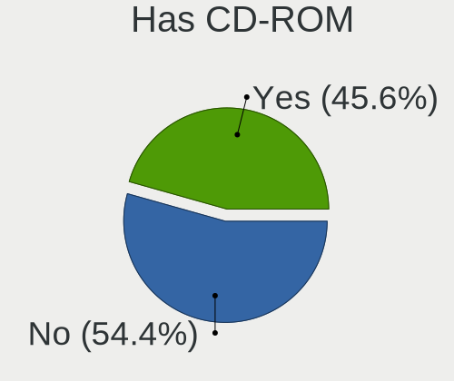
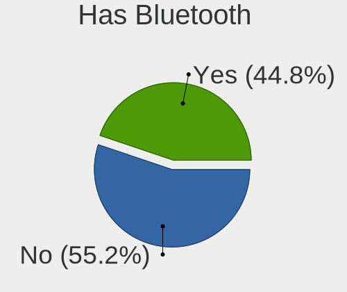
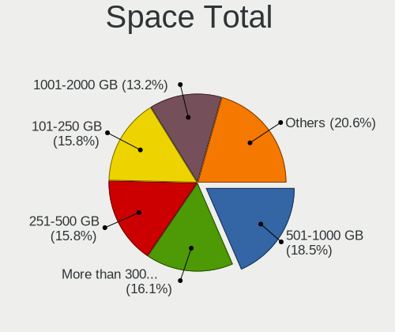
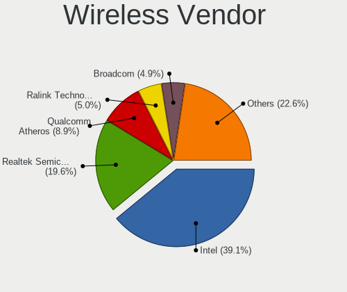
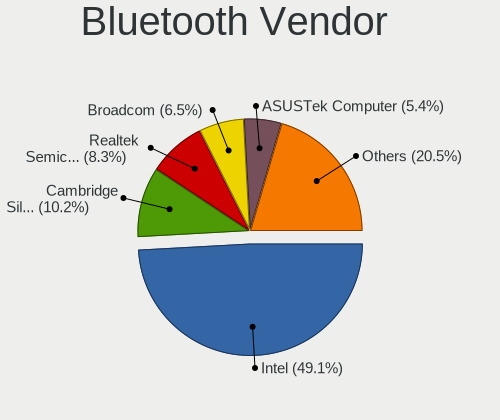

Linux in USA - Tested Hardware & Statistics (Desktops)
------------------------------------------------------

A project to collect tested hardware configurations for Linux in USA.

Anyone can contribute to this report by the [hw-probe](https://github.com/linuxhw/hw-probe) tool:

    sudo -E hw-probe -all -upload

Please contribute! Especially if your hardware is rare.

Contents
--------

* [ Test Cases ](#test-cases)

* [ System ](#system)
  - [ OS                       ](#os)
  - [ OS Family                ](#os-family)
  - [ Kernel                   ](#kernel)
  - [ Kernel Family            ](#kernel-family)
  - [ Kernel Major Ver.        ](#kernel-major-ver)
  - [ Arch                     ](#arch)
  - [ DE                       ](#de)
  - [ Display Server           ](#display-server)
  - [ Display Manager          ](#display-manager)
  - [ OS Lang                  ](#os-lang)
  - [ Boot Mode                ](#boot-mode)
  - [ Filesystem               ](#filesystem)
  - [ Part. scheme             ](#part-scheme)
  - [ Dual Boot with Linux/BSD ](#dual-boot-with-linuxbsd)
  - [ Dual Boot (Win)          ](#dual-boot-win)

* [ Board ](#board)
  - [ Vendor                   ](#vendor)
  - [ Model                    ](#model)
  - [ Model Family             ](#model-family)
  - [ MFG Year                 ](#mfg-year)
  - [ Form Factor              ](#form-factor)
  - [ Secure Boot              ](#secure-boot)
  - [ Coreboot                 ](#coreboot)
  - [ RAM Size                 ](#ram-size)
  - [ RAM Used                 ](#ram-used)
  - [ Total Drives             ](#total-drives)
  - [ Has CD-ROM               ](#has-cd-rom)
  - [ Has Ethernet             ](#has-ethernet)
  - [ Has WiFi                 ](#has-wifi)
  - [ Has Bluetooth            ](#has-bluetooth)

* [ Location ](#location)
  - [ Country                  ](#country)
  - [ City                     ](#city)

* [ Drives ](#drives)
  - [ Drive Vendor             ](#drive-vendor)
  - [ Drive Model              ](#drive-model)
  - [ HDD Vendor               ](#hdd-vendor)
  - [ SSD Vendor               ](#ssd-vendor)
  - [ Drive Kind               ](#drive-kind)
  - [ Drive Connector          ](#drive-connector)
  - [ Drive Size               ](#drive-size)
  - [ Space Total              ](#space-total)
  - [ Space Used               ](#space-used)
  - [ Malfunc. Drives          ](#malfunc-drives)
  - [ Malfunc. Drive Vendor    ](#malfunc-drive-vendor)
  - [ Malfunc. HDD Vendor      ](#malfunc-hdd-vendor)
  - [ Malfunc. Drive Kind      ](#malfunc-drive-kind)
  - [ Failed Drives            ](#failed-drives)
  - [ Failed Drive Vendor      ](#failed-drive-vendor)
  - [ Drive Status             ](#drive-status)

* [ Storage controller ](#storage-controller)
  - [ Storage Vendor           ](#storage-vendor)
  - [ Storage Model            ](#storage-model)
  - [ Storage Kind             ](#storage-kind)

* [ Processor ](#processor)
  - [ CPU Vendor               ](#cpu-vendor)
  - [ CPU Model                ](#cpu-model)
  - [ CPU Model Family         ](#cpu-model-family)
  - [ CPU Cores                ](#cpu-cores)
  - [ CPU Sockets              ](#cpu-sockets)
  - [ CPU Threads              ](#cpu-threads)
  - [ CPU Op-Modes             ](#cpu-op-modes)
  - [ CPU Microcode            ](#cpu-microcode)
  - [ CPU Microarch            ](#cpu-microarch)

* [ Graphics ](#graphics)
  - [ GPU Vendor               ](#gpu-vendor)
  - [ GPU Model                ](#gpu-model)
  - [ GPU Combo                ](#gpu-combo)
  - [ GPU Driver               ](#gpu-driver)
  - [ GPU Memory               ](#gpu-memory)

* [ Monitor ](#monitor)
  - [ Monitor Vendor           ](#monitor-vendor)
  - [ Monitor Model            ](#monitor-model)
  - [ Monitor Resolution       ](#monitor-resolution)
  - [ Monitor Diagonal         ](#monitor-diagonal)
  - [ Monitor Width            ](#monitor-width)
  - [ Aspect Ratio             ](#aspect-ratio)
  - [ Monitor Area             ](#monitor-area)
  - [ Pixel Density            ](#pixel-density)
  - [ Multiple Monitors        ](#multiple-monitors)

* [ Network ](#network)
  - [ Net Controller Vendor    ](#net-controller-vendor)
  - [ Net Controller Model     ](#net-controller-model)
  - [ Wireless Vendor          ](#wireless-vendor)
  - [ Wireless Model           ](#wireless-model)
  - [ Ethernet Vendor          ](#ethernet-vendor)
  - [ Ethernet Model           ](#ethernet-model)
  - [ Net Controller Kind      ](#net-controller-kind)
  - [ Used Controller          ](#used-controller)
  - [ NICs                     ](#nics)
  - [ IPv6                     ](#ipv6)

* [ Bluetooth ](#bluetooth)
  - [ Bluetooth Vendor         ](#bluetooth-vendor)
  - [ Bluetooth Model          ](#bluetooth-model)

* [ Sound ](#sound)
  - [ Sound Vendor             ](#sound-vendor)
  - [ Sound Model              ](#sound-model)

* [ Memory ](#memory)
  - [ Memory Vendor            ](#memory-vendor)
  - [ Memory Model             ](#memory-model)
  - [ Memory Kind              ](#memory-kind)
  - [ Memory Form Factor       ](#memory-form-factor)
  - [ Memory Size              ](#memory-size)
  - [ Memory Speed             ](#memory-speed)

* [ Printers & scanners ](#printers--scanners)
  - [ Printer Vendor           ](#printer-vendor)
  - [ Printer Model            ](#printer-model)
  - [ Scanner Vendor           ](#scanner-vendor)
  - [ Scanner Model            ](#scanner-model)

* [ Camera ](#camera)
  - [ Camera Vendor            ](#camera-vendor)
  - [ Camera Model             ](#camera-model)

* [ Security ](#security)
  - [ Fingerprint Vendor       ](#fingerprint-vendor)
  - [ Fingerprint Model        ](#fingerprint-model)
  - [ Chipcard Vendor          ](#chipcard-vendor)
  - [ Chipcard Model           ](#chipcard-model)

* [ Unsupported ](#unsupported)
  - [ Unsupported Devices      ](#unsupported-devices)
  - [ Unsupported Device Types ](#unsupported-device-types)

Test Cases
----------

Total: 24689

| Vendor        | Model                       | Probe                                                      | Date         |
|---------------|-----------------------------|------------------------------------------------------------|--------------|
| HP            | 339A                        | [e8e666af64](https://linux-hardware.org/?probe=e8e666af64) | Feb 02, 2024 |
| ASUSTek       | P7P55D-E                    | [7173101a68](https://linux-hardware.org/?probe=7173101a68) | Feb 02, 2024 |
| HP            | 8055                        | [1eec2a37ce](https://linux-hardware.org/?probe=1eec2a37ce) | Feb 02, 2024 |
| Gigabyte      | GA-990FXA-UD7               | [66768ccdf7](https://linux-hardware.org/?probe=66768ccdf7) | Feb 02, 2024 |
| Lenovo        | MAHOBAY 0B98401 PRO         | [3074b7c2a6](https://linux-hardware.org/?probe=3074b7c2a6) | Feb 02, 2024 |
| HP            | 1998                        | [0056c33526](https://linux-hardware.org/?probe=0056c33526) | Feb 02, 2024 |
| ASUSTek       | ROG CROSSHAIR X670E HERO    | [9d6e9d5720](https://linux-hardware.org/?probe=9d6e9d5720) | Feb 02, 2024 |
| ASUSTek       | P5Q                         | [63522c9a09](https://linux-hardware.org/?probe=63522c9a09) | Feb 02, 2024 |
| Lenovo        | SHARKBAY NOK                | [f4caef7bf1](https://linux-hardware.org/?probe=f4caef7bf1) | Feb 02, 2024 |
| ASRock        | B660-ITX                    | [3749b9145b](https://linux-hardware.org/?probe=3749b9145b) | Feb 02, 2024 |
| Gigabyte      | GA-990FXA-UD7               | [4726161c35](https://linux-hardware.org/?probe=4726161c35) | Feb 02, 2024 |
| HP            | 3647h                       | [5f1a400767](https://linux-hardware.org/?probe=5f1a400767) | Feb 02, 2024 |
| ASRock        | H77 Pro4-M                  | [794e5341d9](https://linux-hardware.org/?probe=794e5341d9) | Feb 01, 2024 |
| ASUSTek       | TUF Gaming B550-PLUS        | [8e3680cd5d](https://linux-hardware.org/?probe=8e3680cd5d) | Feb 01, 2024 |
| Dell          | 0215PR A05                  | [05183a71ef](https://linux-hardware.org/?probe=05183a71ef) | Feb 01, 2024 |
| MSI           | MPG X570 GAMING PLUS        | [0d5790b907](https://linux-hardware.org/?probe=0d5790b907) | Feb 01, 2024 |
| ASUSTek       | ROG STRIX B350-F GAMING     | [6c75053ee6](https://linux-hardware.org/?probe=6c75053ee6) | Feb 01, 2024 |
| MSI           | MPG X570 GAMING PLUS        | [5ec61e07a8](https://linux-hardware.org/?probe=5ec61e07a8) | Feb 01, 2024 |
| Dell          | 0GDG8Y A00                  | [2cca1daa38](https://linux-hardware.org/?probe=2cca1daa38) | Feb 01, 2024 |
| Dell          | 0T568R A00                  | [4ce5e16aa2](https://linux-hardware.org/?probe=4ce5e16aa2) | Feb 01, 2024 |
| Gigabyte      | X570 AORUS ELITE WIFI       | [7d3d8c9a2f](https://linux-hardware.org/?probe=7d3d8c9a2f) | Feb 01, 2024 |
| Gigabyte      | Z390 AORUS PRO WIFI-CF      | [a45a2b4f8e](https://linux-hardware.org/?probe=a45a2b4f8e) | Feb 01, 2024 |
| HP            | 870C                        | [14801c4f80](https://linux-hardware.org/?probe=14801c4f80) | Feb 01, 2024 |
| Gigabyte      | X99P-SLI-CF                 | [95705bca92](https://linux-hardware.org/?probe=95705bca92) | Feb 01, 2024 |
| Dell          | 0V8WGR A00                  | [9762a633ab](https://linux-hardware.org/?probe=9762a633ab) | Feb 01, 2024 |
| Lenovo        | MAHOBAY 0B98401 PRO         | [3cedb3c573](https://linux-hardware.org/?probe=3cedb3c573) | Feb 01, 2024 |
| MSI           | B760 GAMING PLUS WIFI       | [a5425cfc63](https://linux-hardware.org/?probe=a5425cfc63) | Feb 01, 2024 |
| MSI           | B760 GAMING PLUS WIFI       | [67539ba367](https://linux-hardware.org/?probe=67539ba367) | Feb 01, 2024 |
| MSI           | Z370-A PRO                  | [d012afeb56](https://linux-hardware.org/?probe=d012afeb56) | Feb 01, 2024 |
| HC Technol... | HCAR5000-MI                 | [f6051e0b06](https://linux-hardware.org/?probe=f6051e0b06) | Feb 01, 2024 |
| ASUSTek       | TUF Gaming X570-PLUS        | [f7bb58fb95](https://linux-hardware.org/?probe=f7bb58fb95) | Feb 01, 2024 |
| Foxconn       | 9657MA                      | [6b2e0b2ae9](https://linux-hardware.org/?probe=6b2e0b2ae9) | Jan 31, 2024 |
| Gigabyte      | GA-880GA-UD3H               | [343413d95b](https://linux-hardware.org/?probe=343413d95b) | Jan 31, 2024 |
| HP            | 8053                        | [d4cc3a7d7d](https://linux-hardware.org/?probe=d4cc3a7d7d) | Jan 31, 2024 |
| NZXT          | N7 B650E                    | [acb00e1425](https://linux-hardware.org/?probe=acb00e1425) | Jan 31, 2024 |
| Gigabyte      | Z87X-UD4H-CF                | [f2e88dc5a7](https://linux-hardware.org/?probe=f2e88dc5a7) | Jan 31, 2024 |
| Lenovo        | ThinkCentre M55p 8808D8U    | [763dd9417b](https://linux-hardware.org/?probe=763dd9417b) | Jan 31, 2024 |
| Dell          | 018D1Y A00                  | [28a3a41219](https://linux-hardware.org/?probe=28a3a41219) | Jan 31, 2024 |
| ASRock        | B450M Pro4                  | [5a77cd3bbb](https://linux-hardware.org/?probe=5a77cd3bbb) | Jan 31, 2024 |
| Lenovo        | ThinkCentre M91p 4518RQ4    | [ae147923cd](https://linux-hardware.org/?probe=ae147923cd) | Jan 31, 2024 |
| Gigabyte      | Z390 AORUS PRO WIFI-CF      | [bdb06264ab](https://linux-hardware.org/?probe=bdb06264ab) | Jan 31, 2024 |
| Lenovo        | SHARKBAY 0B98401 WIN        | [75d67d22e1](https://linux-hardware.org/?probe=75d67d22e1) | Jan 31, 2024 |
| Lenovo        | SHARKBAY 0B98401 WIN        | [19f18a7bbc](https://linux-hardware.org/?probe=19f18a7bbc) | Jan 31, 2024 |
| ASRock        | A520M-HDV                   | [fa42ae183a](https://linux-hardware.org/?probe=fa42ae183a) | Jan 31, 2024 |
| Dell          | 00VTMF A01                  | [3298485dd9](https://linux-hardware.org/?probe=3298485dd9) | Jan 31, 2024 |
| Lenovo        | ThinkStation C20 4263B84    | [084244999d](https://linux-hardware.org/?probe=084244999d) | Jan 31, 2024 |
| MSI           | Z590-A PRO                  | [21e597196f](https://linux-hardware.org/?probe=21e597196f) | Jan 31, 2024 |
| ASRock        | A520M-HDV                   | [23be9724fe](https://linux-hardware.org/?probe=23be9724fe) | Jan 31, 2024 |
| ASUSTek       | ROG STRIX X670E-A GAMING... | [0f0dad6ef2](https://linux-hardware.org/?probe=0f0dad6ef2) | Jan 31, 2024 |
| MSI           | PRO X670-P WIFI             | [2640847c88](https://linux-hardware.org/?probe=2640847c88) | Jan 31, 2024 |
| Dell          | 0FM586                      | [a66d080473](https://linux-hardware.org/?probe=a66d080473) | Jan 31, 2024 |
| ASRock        | B660-ITX                    | [b55cc73086](https://linux-hardware.org/?probe=b55cc73086) | Jan 31, 2024 |
| ASRock        | B660-ITX                    | [f3d2ad85a3](https://linux-hardware.org/?probe=f3d2ad85a3) | Jan 31, 2024 |
| ASUSTek       | SABERTOOTH 990FX            | [a477ec4fe1](https://linux-hardware.org/?probe=a477ec4fe1) | Jan 31, 2024 |
| Dell          | 00V62H A01                  | [4a42c319b4](https://linux-hardware.org/?probe=4a42c319b4) | Jan 30, 2024 |
| MSI           | MAG B550 TOMAHAWK           | [5222452ba4](https://linux-hardware.org/?probe=5222452ba4) | Jan 30, 2024 |
| Dell          | 0T568R A00                  | [56936b64ba](https://linux-hardware.org/?probe=56936b64ba) | Jan 30, 2024 |
| MACHINIST     | X99-D8-MAX V1.0             | [8ecccf1672](https://linux-hardware.org/?probe=8ecccf1672) | Jan 30, 2024 |
| Foxconn       | 2AB7                        | [518f65ff6a](https://linux-hardware.org/?probe=518f65ff6a) | Jan 30, 2024 |
| ASUSTek       | TUF Gaming Z490-PLUS        | [fac7cfcfce](https://linux-hardware.org/?probe=fac7cfcfce) | Jan 30, 2024 |
| MSI           | H110M PRO-VD                | [2dcaa98349](https://linux-hardware.org/?probe=2dcaa98349) | Jan 30, 2024 |
| ASUSTek       | X99-DELUXE                  | [482b1946f4](https://linux-hardware.org/?probe=482b1946f4) | Jan 30, 2024 |
| MSI           | X370 GAMING PRO CARBON      | [b37fa10d8f](https://linux-hardware.org/?probe=b37fa10d8f) | Jan 30, 2024 |
| Apple         | Mac-F60DEB81FF30ACF6 Mac... | [033b656553](https://linux-hardware.org/?probe=033b656553) | Jan 30, 2024 |
| ASRock        | B550 Pro4                   | [9617266ebe](https://linux-hardware.org/?probe=9617266ebe) | Jan 30, 2024 |
| ASUSTek       | PRIME B450M-A II            | [abdcd1a804](https://linux-hardware.org/?probe=abdcd1a804) | Jan 30, 2024 |
| ASUSTek       | ROG STRIX B550-F GAMING     | [0a68bb3157](https://linux-hardware.org/?probe=0a68bb3157) | Jan 30, 2024 |
| Dell          | 0U880P A01                  | [d3d4142e1e](https://linux-hardware.org/?probe=d3d4142e1e) | Jan 30, 2024 |
| MSI           | B760 GAMING PLUS WIFI       | [193e9e6c74](https://linux-hardware.org/?probe=193e9e6c74) | Jan 30, 2024 |
| HP            | 8053                        | [7cba6dd60f](https://linux-hardware.org/?probe=7cba6dd60f) | Jan 30, 2024 |
| Dell          | 0D4MD1 A00                  | [9dd5ab2544](https://linux-hardware.org/?probe=9dd5ab2544) | Jan 30, 2024 |
| Lenovo        | SHARKBAY 0B98401 PRO        | [141329c8f3](https://linux-hardware.org/?probe=141329c8f3) | Jan 29, 2024 |
| Alienware     | 07HV66 A01                  | [732d349380](https://linux-hardware.org/?probe=732d349380) | Jan 29, 2024 |
| AZW           | SER V1                      | [1aa9469d3f](https://linux-hardware.org/?probe=1aa9469d3f) | Jan 29, 2024 |
| ASUSTek       | TUF B450-PRO GAMING         | [4cfb847d84](https://linux-hardware.org/?probe=4cfb847d84) | Jan 29, 2024 |
| MSI           | PRO Z690-A DDR4             | [ca9ba6c5ce](https://linux-hardware.org/?probe=ca9ba6c5ce) | Jan 29, 2024 |
| Lenovo        | MAHOBAY 0B98401 PRO         | [073f673b78](https://linux-hardware.org/?probe=073f673b78) | Jan 29, 2024 |
| ASUSTek       | TUF Gaming X670E-PLUS WI... | [c7a52fe756](https://linux-hardware.org/?probe=c7a52fe756) | Jan 29, 2024 |
| HP            | 1791                        | [e301050210](https://linux-hardware.org/?probe=e301050210) | Jan 29, 2024 |
| Dell          | 0RY007                      | [151f303198](https://linux-hardware.org/?probe=151f303198) | Jan 29, 2024 |
| MSI           | MPG Z390 GAMING PLUS        | [df2c10b408](https://linux-hardware.org/?probe=df2c10b408) | Jan 29, 2024 |
| MSI           | A320M/ac                    | [520827d642](https://linux-hardware.org/?probe=520827d642) | Jan 29, 2024 |
| Gigabyte      | B550 AORUS ELITE V2         | [e79ecc48d8](https://linux-hardware.org/?probe=e79ecc48d8) | Jan 29, 2024 |
| ASUSTek       | G10DK                       | [f5632504cc](https://linux-hardware.org/?probe=f5632504cc) | Jan 29, 2024 |
| Gigabyte      | B550 AORUS ELITE V2         | [0a4a1cabfc](https://linux-hardware.org/?probe=0a4a1cabfc) | Jan 29, 2024 |
| HP            | 1497                        | [edbda38746](https://linux-hardware.org/?probe=edbda38746) | Jan 29, 2024 |
| ASUSTek       | G10DK                       | [5ef0067e13](https://linux-hardware.org/?probe=5ef0067e13) | Jan 29, 2024 |
| Unknown       | HX90                        | [2d0982fbb6](https://linux-hardware.org/?probe=2d0982fbb6) | Jan 29, 2024 |
| HP            | 3397                        | [fcbc5b3ac6](https://linux-hardware.org/?probe=fcbc5b3ac6) | Jan 29, 2024 |
| ASUSTek       | M5A78L-M/USB3               | [cc38ac2dfc](https://linux-hardware.org/?probe=cc38ac2dfc) | Jan 29, 2024 |
| Lenovo        | ThinkCentre M91p 4518RQ4    | [e70e8e0891](https://linux-hardware.org/?probe=e70e8e0891) | Jan 29, 2024 |
| MSI           | B550M PRO-VDH WIFI          | [bc1a622cd7](https://linux-hardware.org/?probe=bc1a622cd7) | Jan 29, 2024 |
| ASUSTek       | P5Q                         | [f6c91b590a](https://linux-hardware.org/?probe=f6c91b590a) | Jan 29, 2024 |
| ASUSTek       | M5A78L-M/USB3               | [76a1ecf2ba](https://linux-hardware.org/?probe=76a1ecf2ba) | Jan 29, 2024 |
| MSI           | MS-7060                     | [cfc1584314](https://linux-hardware.org/?probe=cfc1584314) | Jan 29, 2024 |
| MSI           | Z590-A PRO                  | [979f9847ed](https://linux-hardware.org/?probe=979f9847ed) | Jan 28, 2024 |
| Dell          | 04GJJT A00                  | [5c9882560f](https://linux-hardware.org/?probe=5c9882560f) | Jan 28, 2024 |
| MSI           | 760GMA-P34                  | [0c0fde4ed3](https://linux-hardware.org/?probe=0c0fde4ed3) | Jan 28, 2024 |
| ASRock        | B450 Gaming-ITX/ac          | [b4510875e8](https://linux-hardware.org/?probe=b4510875e8) | Jan 28, 2024 |
| HP            | 82F2 A01                    | [017f111720](https://linux-hardware.org/?probe=017f111720) | Jan 28, 2024 |
| Dell          | 084J0R A00                  | [74f86a266b](https://linux-hardware.org/?probe=74f86a266b) | Jan 28, 2024 |
| HP            | 212B                        | [fb3993d66a](https://linux-hardware.org/?probe=fb3993d66a) | Jan 28, 2024 |
| Foxconn       | 2ABF                        | [25665edf82](https://linux-hardware.org/?probe=25665edf82) | Jan 28, 2024 |
| MSI           | Z490-A PRO                  | [a851d2d2fe](https://linux-hardware.org/?probe=a851d2d2fe) | Jan 28, 2024 |
| Lenovo        | 1046 SDK0T08861 WIN 3305... | [cfc0d0a745](https://linux-hardware.org/?probe=cfc0d0a745) | Jan 28, 2024 |
| Gigabyte      | Z97X-UD5H                   | [fd0ab9a9ac](https://linux-hardware.org/?probe=fd0ab9a9ac) | Jan 28, 2024 |
| MSI           | X470 GAMING PLUS            | [a896c739ca](https://linux-hardware.org/?probe=a896c739ca) | Jan 28, 2024 |
| Gigabyte      | B760 AORUS ELITE AX         | [7c3e9a14d3](https://linux-hardware.org/?probe=7c3e9a14d3) | Jan 28, 2024 |
| HP            | 0B4Ch D                     | [d41cb5632c](https://linux-hardware.org/?probe=d41cb5632c) | Jan 28, 2024 |
| Biostar       | TZ590-BTC DUO               | [86684436da](https://linux-hardware.org/?probe=86684436da) | Jan 27, 2024 |
| Biostar       | TZ590-BTC DUO               | [68df04d154](https://linux-hardware.org/?probe=68df04d154) | Jan 27, 2024 |
| ASUSTek       | Z170-A                      | [0f1f062eda](https://linux-hardware.org/?probe=0f1f062eda) | Jan 27, 2024 |
| Intel         | DX58SO2 AAG10925-205        | [72de3e0837](https://linux-hardware.org/?probe=72de3e0837) | Jan 27, 2024 |
| Intel         | DX58SO2 AAG10925-205        | [91066eaecf](https://linux-hardware.org/?probe=91066eaecf) | Jan 27, 2024 |
| MSI           | MPG X570 GAMING PLUS        | [9d4827b4a5](https://linux-hardware.org/?probe=9d4827b4a5) | Jan 27, 2024 |
| Dell          | 0DF42J A00                  | [f0ac1844ad](https://linux-hardware.org/?probe=f0ac1844ad) | Jan 27, 2024 |
| Dell          | 0GDG8Y A00                  | [47f8ef1ba6](https://linux-hardware.org/?probe=47f8ef1ba6) | Jan 27, 2024 |
| ASUSTek       | TUF Gaming X670E-PLUS WI... | [23c12f49f6](https://linux-hardware.org/?probe=23c12f49f6) | Jan 27, 2024 |
| ASUSTek       | G22CH                       | [b83588b4f3](https://linux-hardware.org/?probe=b83588b4f3) | Jan 27, 2024 |
| JGINYUE       | H97M-VH V2.1                | [f4baebb6b0](https://linux-hardware.org/?probe=f4baebb6b0) | Jan 27, 2024 |
| JGINYUE       | H97M-VH V2.1                | [7983ca3c2d](https://linux-hardware.org/?probe=7983ca3c2d) | Jan 27, 2024 |
| Gigabyte      | TRX40 AORUS XTREME          | [cdf9d5dadb](https://linux-hardware.org/?probe=cdf9d5dadb) | Jan 27, 2024 |
| MSI           | MEG Z690I UNIFY             | [42f4602ff3](https://linux-hardware.org/?probe=42f4602ff3) | Jan 27, 2024 |
| Gigabyte      | B650M AORUS ELITE AX        | [f39c1ef04f](https://linux-hardware.org/?probe=f39c1ef04f) | Jan 27, 2024 |
| ASUSTek       | TUF Gaming X570-PLUS        | [540a0893c5](https://linux-hardware.org/?probe=540a0893c5) | Jan 26, 2024 |
| Dell          | 0Y5DDC A00                  | [1912506274](https://linux-hardware.org/?probe=1912506274) | Jan 26, 2024 |
| Dell          | 088DT1 A01                  | [b8db5c0293](https://linux-hardware.org/?probe=b8db5c0293) | Jan 26, 2024 |
| MSI           | MPG X570 GAMING PLUS        | [e7e62977b3](https://linux-hardware.org/?probe=e7e62977b3) | Jan 26, 2024 |
| ECS           | APLD-MINI                   | [51b4a0993d](https://linux-hardware.org/?probe=51b4a0993d) | Jan 26, 2024 |
| ASUSTek       | M4A79T Deluxe               | [0948177334](https://linux-hardware.org/?probe=0948177334) | Jan 26, 2024 |
| MSI           | MAG X570 TOMAHAWK WIFI      | [999ea9c685](https://linux-hardware.org/?probe=999ea9c685) | Jan 26, 2024 |
| ASRock        | X570 Pro4                   | [ca9d92fde3](https://linux-hardware.org/?probe=ca9d92fde3) | Jan 26, 2024 |
| HP            | 3647h                       | [14bc5e74bc](https://linux-hardware.org/?probe=14bc5e74bc) | Jan 26, 2024 |
| HP            | 843B                        | [9a021639c5](https://linux-hardware.org/?probe=9a021639c5) | Jan 26, 2024 |
| Gigabyte      | B460M DS3H AC V2-Y1         | [13a3740810](https://linux-hardware.org/?probe=13a3740810) | Jan 26, 2024 |
| Gigabyte      | B550 AORUS ELITE AX V2      | [29cc3e58d3](https://linux-hardware.org/?probe=29cc3e58d3) | Jan 26, 2024 |
| ASUSTek       | TUF B450-PRO GAMING         | [38a14a6e3b](https://linux-hardware.org/?probe=38a14a6e3b) | Jan 26, 2024 |
| Gigabyte      | C1037UN                     | [7d3a3e3ca9](https://linux-hardware.org/?probe=7d3a3e3ca9) | Jan 26, 2024 |
| MSI           | MPG X570 GAMING PLUS        | [ccc6926864](https://linux-hardware.org/?probe=ccc6926864) | Jan 26, 2024 |
| ASUSTek       | ROG STRIX B350-F GAMING     | [3524a7d564](https://linux-hardware.org/?probe=3524a7d564) | Jan 26, 2024 |
| MSI           | MAG X670E TOMAHAWK WIFI     | [068df25275](https://linux-hardware.org/?probe=068df25275) | Jan 26, 2024 |
| NCR           | Monaco BIOS.9.1             | [98ed4e9a82](https://linux-hardware.org/?probe=98ed4e9a82) | Jan 26, 2024 |
| ASRock        | Z370 Extreme4               | [30a58d5556](https://linux-hardware.org/?probe=30a58d5556) | Jan 26, 2024 |
| Intel         | DB75EN                      | [41cea41d1e](https://linux-hardware.org/?probe=41cea41d1e) | Jan 26, 2024 |
| Gigabyte      | X570S I AORUS PRO AX        | [4b63897ace](https://linux-hardware.org/?probe=4b63897ace) | Jan 26, 2024 |
| ASUSTek       | PRIME B550M-A               | [24c9592782](https://linux-hardware.org/?probe=24c9592782) | Jan 26, 2024 |
| Dell          | 048DY8 A01                  | [d5e6914489](https://linux-hardware.org/?probe=d5e6914489) | Jan 26, 2024 |
| Gigabyte      | B550 AORUS ELITE AX V2      | [25ca4f9198](https://linux-hardware.org/?probe=25ca4f9198) | Jan 26, 2024 |
| Dell          | 0C2XKD A01                  | [f32c18bab1](https://linux-hardware.org/?probe=f32c18bab1) | Jan 25, 2024 |
| Foxconn       | Cinema Series FAB           | [de1e89f80f](https://linux-hardware.org/?probe=de1e89f80f) | Jan 25, 2024 |
| ASRock        | Z77 Extreme4                | [4685f2b1e9](https://linux-hardware.org/?probe=4685f2b1e9) | Jan 25, 2024 |
| MSI           | MS-B1831                    | [45dd2bc3a1](https://linux-hardware.org/?probe=45dd2bc3a1) | Jan 25, 2024 |
| Dell          | 0PTTT9 A01                  | [310d107f7d](https://linux-hardware.org/?probe=310d107f7d) | Jan 25, 2024 |
| ASUSTek       | ROG STRIX Z790-E GAMING ... | [4cedf6ee3a](https://linux-hardware.org/?probe=4cedf6ee3a) | Jan 25, 2024 |
| Intel         | DQ77MK AAG39642-400         | [6d4d5ee6c7](https://linux-hardware.org/?probe=6d4d5ee6c7) | Jan 25, 2024 |
| GEEKOM        | Mini IT13                   | [db1f38bd8c](https://linux-hardware.org/?probe=db1f38bd8c) | Jan 25, 2024 |
| HP            | 18E7                        | [1ab9d1da9f](https://linux-hardware.org/?probe=1ab9d1da9f) | Jan 25, 2024 |
| Gigabyte      | B550M AORUS PRO-P           | [2851a608c0](https://linux-hardware.org/?probe=2851a608c0) | Jan 25, 2024 |
| Dell          | 0M9KCM A00                  | [6f25f89d48](https://linux-hardware.org/?probe=6f25f89d48) | Jan 25, 2024 |
| Gateway       | IPISB-VR                    | [31d92a1fe6](https://linux-hardware.org/?probe=31d92a1fe6) | Jan 25, 2024 |
| Unknown       | Unknown                     | [a1cdf62b17](https://linux-hardware.org/?probe=a1cdf62b17) | Jan 25, 2024 |
| Dell          | 0N4YC8 A00                  | [03750ea62c](https://linux-hardware.org/?probe=03750ea62c) | Jan 25, 2024 |
| MSI           | B450M BAZOOKA V2            | [3f0ed24a76](https://linux-hardware.org/?probe=3f0ed24a76) | Jan 25, 2024 |
| MSI           | Z490-A PRO                  | [682c9a3d4b](https://linux-hardware.org/?probe=682c9a3d4b) | Jan 25, 2024 |
| Dell          | 0HD5W2 A01                  | [5c9b7ff711](https://linux-hardware.org/?probe=5c9b7ff711) | Jan 24, 2024 |
| Gigabyte      | B650M AORUS ELITE AX        | [f904e3ce10](https://linux-hardware.org/?probe=f904e3ce10) | Jan 24, 2024 |
| ASUSTek       | PRIME B550-PLUS             | [4bcfb579e2](https://linux-hardware.org/?probe=4bcfb579e2) | Jan 24, 2024 |
| ASUSTek       | CROSSHAIR V FORMULA-Z       | [56bd222ae5](https://linux-hardware.org/?probe=56bd222ae5) | Jan 24, 2024 |
| Dell          | 0GDG8Y A00                  | [18de9933d4](https://linux-hardware.org/?probe=18de9933d4) | Jan 24, 2024 |
| ASUSTek       | STRIX Z270H GAMING          | [2493ce70f4](https://linux-hardware.org/?probe=2493ce70f4) | Jan 24, 2024 |
| MSI           | MAG Z690 TOMAHAWK WIFI D... | [9bf161df69](https://linux-hardware.org/?probe=9bf161df69) | Jan 24, 2024 |
| ASUSTek       | ROG STRIX X570-E GAMING     | [8d6b0dcab0](https://linux-hardware.org/?probe=8d6b0dcab0) | Jan 24, 2024 |
| ASRock        | Z690-C/D5                   | [534911d3a7](https://linux-hardware.org/?probe=534911d3a7) | Jan 24, 2024 |
| ASRock        | B660-ITX                    | [c82f95d7de](https://linux-hardware.org/?probe=c82f95d7de) | Jan 24, 2024 |
| AZW           | MINI S 10                   | [d549e8a8a6](https://linux-hardware.org/?probe=d549e8a8a6) | Jan 24, 2024 |
| AZW           | MINI S 10                   | [b1a0a41e9e](https://linux-hardware.org/?probe=b1a0a41e9e) | Jan 24, 2024 |
| ASUSTek       | ROG STRIX X670E-E GAMING... | [93f561e2bf](https://linux-hardware.org/?probe=93f561e2bf) | Jan 24, 2024 |
| ASRock        | 970M Pro3                   | [1de02cbd78](https://linux-hardware.org/?probe=1de02cbd78) | Jan 24, 2024 |
| MSI           | B460M PRO-VDH WIFI          | [8b3e1a6d31](https://linux-hardware.org/?probe=8b3e1a6d31) | Jan 24, 2024 |
| Dell          | 09KPNV A00                  | [86ae6a23fb](https://linux-hardware.org/?probe=86ae6a23fb) | Jan 24, 2024 |
| ASUSTek       | Z97-A-USB31                 | [1fe92d4fbe](https://linux-hardware.org/?probe=1fe92d4fbe) | Jan 24, 2024 |
| Pegatron      | Benicia                     | [9a4be691fc](https://linux-hardware.org/?probe=9a4be691fc) | Jan 23, 2024 |
| Lenovo        | SHARKBAY 31900056 WIN       | [454e346118](https://linux-hardware.org/?probe=454e346118) | Jan 23, 2024 |
| MSI           | B650 GAMING PLUS WIFI       | [1a936deeee](https://linux-hardware.org/?probe=1a936deeee) | Jan 23, 2024 |
| ASUSTek       | ROG STRIX X570-I GAMING     | [ff2fc44691](https://linux-hardware.org/?probe=ff2fc44691) | Jan 23, 2024 |
| Dell          | 06X1TJ A00                  | [5eb76b0285](https://linux-hardware.org/?probe=5eb76b0285) | Jan 23, 2024 |
| ASUSTek       | M4A89GTD-PRO/USB3           | [7c94952653](https://linux-hardware.org/?probe=7c94952653) | Jan 23, 2024 |
| ASUSTek       | ROG STRIX B450-F GAMING     | [d11d529522](https://linux-hardware.org/?probe=d11d529522) | Jan 23, 2024 |
| Gigabyte      | C1037UN                     | [344699bbb2](https://linux-hardware.org/?probe=344699bbb2) | Jan 23, 2024 |
| Gigabyte      | X58A-UD3R                   | [eed9a3591f](https://linux-hardware.org/?probe=eed9a3591f) | Jan 23, 2024 |
| ASUSTek       | ROG CROSSHAIR VIII DARK ... | [c8dc8a63fb](https://linux-hardware.org/?probe=c8dc8a63fb) | Jan 23, 2024 |
| Gigabyte      | X58A-UD3R                   | [8479b771e4](https://linux-hardware.org/?probe=8479b771e4) | Jan 23, 2024 |
| ASUSTek       | ROG CROSSHAIR VIII DARK ... | [b126f7be3d](https://linux-hardware.org/?probe=b126f7be3d) | Jan 23, 2024 |
| ASUSTek       | B150-PRO D3                 | [1f8cd5afac](https://linux-hardware.org/?probe=1f8cd5afac) | Jan 23, 2024 |
| AZW           | EQ MINI 10                  | [20e4eb84a6](https://linux-hardware.org/?probe=20e4eb84a6) | Jan 23, 2024 |
| Gigabyte      | X670E AORUS MASTER          | [a15d748e41](https://linux-hardware.org/?probe=a15d748e41) | Jan 23, 2024 |
| Pegatron      | Benicia                     | [eec77bbd70](https://linux-hardware.org/?probe=eec77bbd70) | Jan 23, 2024 |
| ASUSTek       | SABERTOOTH 990FX R2.0       | [70551a607e](https://linux-hardware.org/?probe=70551a607e) | Jan 23, 2024 |
| ASRock        | 970M Pro3                   | [f5a09bd7f0](https://linux-hardware.org/?probe=f5a09bd7f0) | Jan 23, 2024 |
| MSI           | MAG Z790 TOMAHAWK WIFI      | [19161eac10](https://linux-hardware.org/?probe=19161eac10) | Jan 22, 2024 |
| Lenovo        | ThinkCentre M55p 8808D8U    | [f265beb810](https://linux-hardware.org/?probe=f265beb810) | Jan 22, 2024 |
| ASUSTek       | AM1M-A                      | [6b24e4acaf](https://linux-hardware.org/?probe=6b24e4acaf) | Jan 22, 2024 |
| ASUSTek       | TUF Gaming X670E-PLUS WI... | [4781ec5f6e](https://linux-hardware.org/?probe=4781ec5f6e) | Jan 22, 2024 |
| Intel         | X99                         | [e21a112a57](https://linux-hardware.org/?probe=e21a112a57) | Jan 22, 2024 |
| HP            | 81B4                        | [7de00ed55d](https://linux-hardware.org/?probe=7de00ed55d) | Jan 22, 2024 |
| Intel         | X99                         | [328d5cda2b](https://linux-hardware.org/?probe=328d5cda2b) | Jan 22, 2024 |
| HP            | 8350                        | [f2c70b26cb](https://linux-hardware.org/?probe=f2c70b26cb) | Jan 22, 2024 |
| ASUSTek       | ROG STRIX B550-I GAMING     | [c766c9daaf](https://linux-hardware.org/?probe=c766c9daaf) | Jan 22, 2024 |
| ASUSTek       | M5A99FX PRO R2.0            | [ed9635f427](https://linux-hardware.org/?probe=ed9635f427) | Jan 22, 2024 |
| ASUSTek       | X99-A/USB                   | [c07863641d](https://linux-hardware.org/?probe=c07863641d) | Jan 22, 2024 |
| ASUSTek       | K30AD_M31AD_M51AD_M32AD     | [41a378391c](https://linux-hardware.org/?probe=41a378391c) | Jan 22, 2024 |
| Gigabyte      | B650 GAMING X AX V2         | [24555759ee](https://linux-hardware.org/?probe=24555759ee) | Jan 22, 2024 |
| ASUSTek       | ROG STRIX Z690-E GAMING ... | [bc06fb13b6](https://linux-hardware.org/?probe=bc06fb13b6) | Jan 22, 2024 |
| ASUSTek       | PRIME B450M-A II            | [50bd62bd8e](https://linux-hardware.org/?probe=50bd62bd8e) | Jan 21, 2024 |
| ASUSTek       | TUF Gaming B650M-PLUS WI... | [4106997ccf](https://linux-hardware.org/?probe=4106997ccf) | Jan 21, 2024 |
| MSI           | X370 SLI PLUS               | [c4729b1c7c](https://linux-hardware.org/?probe=c4729b1c7c) | Jan 21, 2024 |
| ASUSTek       | PRIME Z390-A                | [f2855cb0d7](https://linux-hardware.org/?probe=f2855cb0d7) | Jan 21, 2024 |
| ASRock        | X470 Taichi Ultimate        | [161b90d80c](https://linux-hardware.org/?probe=161b90d80c) | Jan 21, 2024 |
| ASUSTek       | ROG STRIX Z790-E GAMING ... | [66cf4b0b5a](https://linux-hardware.org/?probe=66cf4b0b5a) | Jan 21, 2024 |
| ASRock        | Z690 Pro RS                 | [4083a31da9](https://linux-hardware.org/?probe=4083a31da9) | Jan 21, 2024 |
| Pegatron      | 2AB6                        | [57a1fef3f7](https://linux-hardware.org/?probe=57a1fef3f7) | Jan 21, 2024 |
| ASUSTek       | PRIME B550M-A               | [7069f9af65](https://linux-hardware.org/?probe=7069f9af65) | Jan 21, 2024 |
| MSI           | B350M MORTAR                | [e65dc0f60c](https://linux-hardware.org/?probe=e65dc0f60c) | Jan 21, 2024 |
| ASUSTek       | SABERTOOTH 990FX R2.0       | [c7009d5b68](https://linux-hardware.org/?probe=c7009d5b68) | Jan 21, 2024 |
| Dell          | 051FJ8 A00                  | [186f951a85](https://linux-hardware.org/?probe=186f951a85) | Jan 21, 2024 |
| ASUSTek       | STRIX H270F GAMING          | [9c9338dcfd](https://linux-hardware.org/?probe=9c9338dcfd) | Jan 21, 2024 |
| Gigabyte      | B450M DS3H-CF               | [cb33ee5893](https://linux-hardware.org/?probe=cb33ee5893) | Jan 21, 2024 |
| MSI           | PRO Z690-A WIFI             | [dc876c7ae0](https://linux-hardware.org/?probe=dc876c7ae0) | Jan 21, 2024 |
| Intel         | DB75EN                      | [f639799c41](https://linux-hardware.org/?probe=f639799c41) | Jan 21, 2024 |
| Unknown       | Unknown                     | [8e5e6256ee](https://linux-hardware.org/?probe=8e5e6256ee) | Jan 21, 2024 |
| Unknown       | Unknown                     | [98da52d37e](https://linux-hardware.org/?probe=98da52d37e) | Jan 20, 2024 |
| Intel         | DZ77GA-70K AAG39009-500     | [cba7125977](https://linux-hardware.org/?probe=cba7125977) | Jan 20, 2024 |
| ASRock        | N68C-GS4 FX                 | [7903e424d9](https://linux-hardware.org/?probe=7903e424d9) | Jan 20, 2024 |
| Dell          | 06X1TJ A00                  | [bcd509c9d9](https://linux-hardware.org/?probe=bcd509c9d9) | Jan 20, 2024 |
| Gigabyte      | B660 AORUS MASTER DDR4      | [d36c2b07fd](https://linux-hardware.org/?probe=d36c2b07fd) | Jan 20, 2024 |
| Gigabyte      | B550M AORUS PRO-P           | [cb116dae9c](https://linux-hardware.org/?probe=cb116dae9c) | Jan 20, 2024 |
| ASUSTek       | PRIME Z690-P WIFI D4        | [a535d51ede](https://linux-hardware.org/?probe=a535d51ede) | Jan 20, 2024 |
| MSI           | PRO X670-P WIFI             | [a0637d4400](https://linux-hardware.org/?probe=a0637d4400) | Jan 20, 2024 |
| Unknown       | HX90                        | [ced9f53d73](https://linux-hardware.org/?probe=ced9f53d73) | Jan 20, 2024 |
| Gigabyte      | B550I AORUS PRO AX          | [1db270091f](https://linux-hardware.org/?probe=1db270091f) | Jan 20, 2024 |
| Lenovo        | MAHOBAY                     | [9a244273aa](https://linux-hardware.org/?probe=9a244273aa) | Jan 20, 2024 |
| Gigabyte      | B550I AORUS PRO AX          | [af503dbdd1](https://linux-hardware.org/?probe=af503dbdd1) | Jan 20, 2024 |
| Dell          | 04GJJT A00                  | [aebf2d56dc](https://linux-hardware.org/?probe=aebf2d56dc) | Jan 20, 2024 |
| ASRock        | 970M Pro3                   | [37613f1ec6](https://linux-hardware.org/?probe=37613f1ec6) | Jan 20, 2024 |
| Dell          | 0K068D A00                  | [b268579e9b](https://linux-hardware.org/?probe=b268579e9b) | Jan 20, 2024 |
| HP            | 1850                        | [20cf1f695e](https://linux-hardware.org/?probe=20cf1f695e) | Jan 20, 2024 |
| ASUSTek       | TUF Z390-PLUS GAMING        | [341a928c78](https://linux-hardware.org/?probe=341a928c78) | Jan 20, 2024 |
| HP            | 8A96 11                     | [8b913e22cd](https://linux-hardware.org/?probe=8b913e22cd) | Jan 20, 2024 |
| HP            | 8A96 11                     | [3fa20439d9](https://linux-hardware.org/?probe=3fa20439d9) | Jan 20, 2024 |
| ASUSTek       | TUF Gaming X570-PLUS        | [f7ebff5e4f](https://linux-hardware.org/?probe=f7ebff5e4f) | Jan 20, 2024 |
| IBM           | 830381U                     | [8af6dd9c05](https://linux-hardware.org/?probe=8af6dd9c05) | Jan 20, 2024 |
| ASUSTek       | TUF Gaming A520M-PLUS WI... | [a27ea5cca3](https://linux-hardware.org/?probe=a27ea5cca3) | Jan 20, 2024 |
| HP            | 8055                        | [454932f0a1](https://linux-hardware.org/?probe=454932f0a1) | Jan 19, 2024 |
| MSI           | MAG B550 TOMAHAWK           | [c3cff812af](https://linux-hardware.org/?probe=c3cff812af) | Jan 19, 2024 |
| Dell          | 08K0X7 A00                  | [454c4af5bc](https://linux-hardware.org/?probe=454c4af5bc) | Jan 19, 2024 |
| MSI           | MAG B550 TOMAHAWK           | [e7c81d1364](https://linux-hardware.org/?probe=e7c81d1364) | Jan 19, 2024 |
| Pegatron      | 2ACE                        | [ea7d1b40f0](https://linux-hardware.org/?probe=ea7d1b40f0) | Jan 19, 2024 |
| MSI           | MPG X670E CARBON WIFI       | [0eb94b3491](https://linux-hardware.org/?probe=0eb94b3491) | Jan 19, 2024 |
| MSI           | MPG X670E CARBON WIFI       | [b6dfff4b78](https://linux-hardware.org/?probe=b6dfff4b78) | Jan 19, 2024 |
| Dell          | 0M9KCM A01                  | [dd9dc75a4d](https://linux-hardware.org/?probe=dd9dc75a4d) | Jan 19, 2024 |
| ASUSTek       | M2N32-SLI DELUXE            | [9b6eb3d320](https://linux-hardware.org/?probe=9b6eb3d320) | Jan 19, 2024 |
| Dell          | 0YJMC0 A02                  | [6dcdea7ca2](https://linux-hardware.org/?probe=6dcdea7ca2) | Jan 19, 2024 |
| Dell          | 042P49 A01                  | [e164f495e7](https://linux-hardware.org/?probe=e164f495e7) | Jan 19, 2024 |
| ASRock        | Z77M                        | [f3bd1cdf2c](https://linux-hardware.org/?probe=f3bd1cdf2c) | Jan 19, 2024 |
| Dell          | 0HD5W2 A01                  | [bca96a52c9](https://linux-hardware.org/?probe=bca96a52c9) | Jan 19, 2024 |
| HP            | 81B4 01                     | [967d9af55c](https://linux-hardware.org/?probe=967d9af55c) | Jan 19, 2024 |
| MSI           | MAG B550 TOMAHAWK           | [986bc58cd9](https://linux-hardware.org/?probe=986bc58cd9) | Jan 19, 2024 |
| ASUSTek       | SABERTOOTH Z170 S           | [953ea23870](https://linux-hardware.org/?probe=953ea23870) | Jan 19, 2024 |
| ASUSTek       | ROG Maximus Z690 HERO EV... | [7d86aa45c2](https://linux-hardware.org/?probe=7d86aa45c2) | Jan 19, 2024 |
| Pegatron      | 2AB6                        | [9a9b3ef258](https://linux-hardware.org/?probe=9a9b3ef258) | Jan 19, 2024 |
| Dell          | 0F5C5X A00                  | [f320dddb34](https://linux-hardware.org/?probe=f320dddb34) | Jan 19, 2024 |
| Dell          | 018D1Y A00                  | [5d46b8d1b3](https://linux-hardware.org/?probe=5d46b8d1b3) | Jan 19, 2024 |
| ASUSTek       | PRIME B360M-A               | [cf9f573e23](https://linux-hardware.org/?probe=cf9f573e23) | Jan 19, 2024 |
| Dell          | 018D1Y A00                  | [cf089739df](https://linux-hardware.org/?probe=cf089739df) | Jan 19, 2024 |
| BESSTAR Te... | HM90                        | [69c4bfff2b](https://linux-hardware.org/?probe=69c4bfff2b) | Jan 19, 2024 |
| MSI           | Z170A KRAIT GAMING          | [a07bb34929](https://linux-hardware.org/?probe=a07bb34929) | Jan 18, 2024 |
| Lenovo        | MAHOBAY 0B98401 PRO         | [c3733ef1e3](https://linux-hardware.org/?probe=c3733ef1e3) | Jan 18, 2024 |
| ASRock        | H310M-STX                   | [8e7c70643c](https://linux-hardware.org/?probe=8e7c70643c) | Jan 18, 2024 |
| Acer          | Aspire TC-885 V:1.1         | [637e6e463e](https://linux-hardware.org/?probe=637e6e463e) | Jan 18, 2024 |
| MSI           | B550M PRO-VDH WIFI          | [eb1deee8d6](https://linux-hardware.org/?probe=eb1deee8d6) | Jan 18, 2024 |
| Dell          | 0GTK4K A02                  | [a4aef81553](https://linux-hardware.org/?probe=a4aef81553) | Jan 18, 2024 |
| Gigabyte      | X570 AORUS PRO WIFI         | [85a0149f1c](https://linux-hardware.org/?probe=85a0149f1c) | Jan 18, 2024 |
| ASUSTek       | PRIME B350M-A               | [8b948a01f1](https://linux-hardware.org/?probe=8b948a01f1) | Jan 18, 2024 |
| ASUSTek       | PRIME B350M-A               | [1cec7c40a7](https://linux-hardware.org/?probe=1cec7c40a7) | Jan 18, 2024 |
| Gigabyte      | B650I AORUS ULTRA           | [0da14a9376](https://linux-hardware.org/?probe=0da14a9376) | Jan 18, 2024 |
| Gigabyte      | Z77X-D3H                    | [234d786dd7](https://linux-hardware.org/?probe=234d786dd7) | Jan 18, 2024 |
| Gigabyte      | B460 HD3                    | [4e6f6c248f](https://linux-hardware.org/?probe=4e6f6c248f) | Jan 18, 2024 |
| ASUSTek       | SABERTOOTH 990FX R3.0       | [207dc59ee3](https://linux-hardware.org/?probe=207dc59ee3) | Jan 18, 2024 |
| Apple         | Mac-F42C88C8 Proto1         | [8f87c80e99](https://linux-hardware.org/?probe=8f87c80e99) | Jan 17, 2024 |
| MSI           | PRO Z790-A WIFI             | [9c84b7f26a](https://linux-hardware.org/?probe=9c84b7f26a) | Jan 17, 2024 |
| Unknown       | HP ProLiant m400 Server ... | [adf4650d81](https://linux-hardware.org/?probe=adf4650d81) | Jan 17, 2024 |
| ASUSTek       | PRIME B550M-A               | [26553e1df4](https://linux-hardware.org/?probe=26553e1df4) | Jan 17, 2024 |
| ASUSTek       | M5A78L-M/USB3               | [dfa4d23039](https://linux-hardware.org/?probe=dfa4d23039) | Jan 17, 2024 |
| Lenovo        | ThinkServer TS140           | [8ccec416bf](https://linux-hardware.org/?probe=8ccec416bf) | Jan 17, 2024 |
| ASRock        | J4125B-ITX                  | [663e605574](https://linux-hardware.org/?probe=663e605574) | Jan 17, 2024 |
| ASUSTek       | PRIME B450M-A II            | [92ba347e99](https://linux-hardware.org/?probe=92ba347e99) | Jan 17, 2024 |
| HP            | 822A                        | [9fa299bc2a](https://linux-hardware.org/?probe=9fa299bc2a) | Jan 17, 2024 |
| HP            | 822A                        | [400eeb3bba](https://linux-hardware.org/?probe=400eeb3bba) | Jan 17, 2024 |
| MSI           | PRO X670-P WIFI             | [3b62b0b588](https://linux-hardware.org/?probe=3b62b0b588) | Jan 17, 2024 |
| MSI           | MAG X670E TOMAHAWK WIFI     | [994627fdfd](https://linux-hardware.org/?probe=994627fdfd) | Jan 17, 2024 |
| ASUSTek       | TUF Gaming X570-PLUS        | [9b8ccd69ac](https://linux-hardware.org/?probe=9b8ccd69ac) | Jan 17, 2024 |
| Lenovo        | 3106 SDK0J40697 WIN 3305... | [8c0d4eb1d6](https://linux-hardware.org/?probe=8c0d4eb1d6) | Jan 17, 2024 |
| ASUSTek       | TUF Gaming B450-PLUS II     | [d6de53eba7](https://linux-hardware.org/?probe=d6de53eba7) | Jan 17, 2024 |
| Gigabyte      | X670 AORUS ELITE AX         | [a15715468f](https://linux-hardware.org/?probe=a15715468f) | Jan 17, 2024 |
| IBM           | 830381U                     | [114d68f889](https://linux-hardware.org/?probe=114d68f889) | Jan 17, 2024 |
| ASRock        | FM2A68M-HD+                 | [8ba2ab423f](https://linux-hardware.org/?probe=8ba2ab423f) | Jan 17, 2024 |
| Gigabyte      | A520M S2H                   | [cf1f6f18f3](https://linux-hardware.org/?probe=cf1f6f18f3) | Jan 17, 2024 |
| HP            | 8456                        | [73e6d4bb9f](https://linux-hardware.org/?probe=73e6d4bb9f) | Jan 17, 2024 |
| Dell          | 02YRK5 A02                  | [c24b8d81bb](https://linux-hardware.org/?probe=c24b8d81bb) | Jan 16, 2024 |
| Unknown       | HP ProLiant m400 Server ... | [a779728852](https://linux-hardware.org/?probe=a779728852) | Jan 16, 2024 |
| ASRock        | J4105M                      | [2e5352f371](https://linux-hardware.org/?probe=2e5352f371) | Jan 16, 2024 |
| ASRock        | X670E Pro RS                | [08a25334a9](https://linux-hardware.org/?probe=08a25334a9) | Jan 16, 2024 |
| HP            | 2AFB                        | [95206c1741](https://linux-hardware.org/?probe=95206c1741) | Jan 16, 2024 |
| Intel         | JSL MRD                     | [8944648e42](https://linux-hardware.org/?probe=8944648e42) | Jan 16, 2024 |
| Gigabyte      | Z370N WIFI-CF               | [01eeec96ca](https://linux-hardware.org/?probe=01eeec96ca) | Jan 16, 2024 |
| ASUSTek       | Z10PE-D8 WS                 | [8fdaef549f](https://linux-hardware.org/?probe=8fdaef549f) | Jan 16, 2024 |
| SJS           | H310M-VH Ver:1.21           | [b55e6f2dc8](https://linux-hardware.org/?probe=b55e6f2dc8) | Jan 16, 2024 |
| SJS           | H310M-VH Ver:1.21           | [41098ed902](https://linux-hardware.org/?probe=41098ed902) | Jan 16, 2024 |
| Intel         | B75 V124                    | [4548b73c01](https://linux-hardware.org/?probe=4548b73c01) | Jan 16, 2024 |
| MSI           | MPG Z490 GAMING EDGE WIF... | [3a49e03d57](https://linux-hardware.org/?probe=3a49e03d57) | Jan 16, 2024 |
| MSI           | Z170-A PRO                  | [bcf19edc1d](https://linux-hardware.org/?probe=bcf19edc1d) | Jan 16, 2024 |
| MSI           | MPG Z490 GAMING EDGE WIF... | [fae72561ad](https://linux-hardware.org/?probe=fae72561ad) | Jan 16, 2024 |
| Gigabyte      | B650I AORUS ULTRA           | [33216d3bf8](https://linux-hardware.org/?probe=33216d3bf8) | Jan 16, 2024 |
| ASUSTek       | PRIME B550M-A AC            | [b08880045e](https://linux-hardware.org/?probe=b08880045e) | Jan 16, 2024 |
| Acer          | Aspire TC-885 V:1.1         | [5e075fc828](https://linux-hardware.org/?probe=5e075fc828) | Jan 16, 2024 |
| ASUSTek       | Leonite2                    | [70605195c6](https://linux-hardware.org/?probe=70605195c6) | Jan 16, 2024 |
| MSI           | PRO B650M-A WIFI            | [cb4fc4f2da](https://linux-hardware.org/?probe=cb4fc4f2da) | Jan 16, 2024 |
| MSI           | B550M PRO-VDH WIFI          | [8e26115f48](https://linux-hardware.org/?probe=8e26115f48) | Jan 16, 2024 |
| HP            | 802F                        | [891f0c3076](https://linux-hardware.org/?probe=891f0c3076) | Jan 15, 2024 |
| HP            | 8648                        | [b896b4b994](https://linux-hardware.org/?probe=b896b4b994) | Jan 15, 2024 |
| HP            | 2215                        | [29a9f5af0b](https://linux-hardware.org/?probe=29a9f5af0b) | Jan 15, 2024 |
| ASUSTek       | TUF Gaming X570-PLUS        | [3d6f9a4f65](https://linux-hardware.org/?probe=3d6f9a4f65) | Jan 15, 2024 |
| Shenzhen M... | F7BAA                       | [8f0e3b9b33](https://linux-hardware.org/?probe=8f0e3b9b33) | Jan 15, 2024 |
| ASRock        | X570 Phantom Gaming 4       | [b81d575e86](https://linux-hardware.org/?probe=b81d575e86) | Jan 15, 2024 |
| ASUSTek       | TUF Gaming Z790-PLUS WIF... | [e7fea8c963](https://linux-hardware.org/?probe=e7fea8c963) | Jan 15, 2024 |
| ASRock        | X570 Phantom Gaming 4       | [2be91db1f9](https://linux-hardware.org/?probe=2be91db1f9) | Jan 15, 2024 |
| MSI           | MPG Z690 EDGE WIFI DDR4     | [d7031bc588](https://linux-hardware.org/?probe=d7031bc588) | Jan 15, 2024 |
| Gigabyte      | Z790 UD AC                  | [b823078db1](https://linux-hardware.org/?probe=b823078db1) | Jan 15, 2024 |
| HP            | 8876 11                     | [56407d15f1](https://linux-hardware.org/?probe=56407d15f1) | Jan 15, 2024 |
| Dell          | 00V62H A01                  | [77fa76ca79](https://linux-hardware.org/?probe=77fa76ca79) | Jan 15, 2024 |
| ASUSTek       | PRIME B350-PLUS             | [52d8f5119e](https://linux-hardware.org/?probe=52d8f5119e) | Jan 15, 2024 |
| Supermicro    | H12DST-BA                   | [d64a1ee900](https://linux-hardware.org/?probe=d64a1ee900) | Jan 15, 2024 |
| Supermicro    | H12DST-BA                   | [3f83ec793d](https://linux-hardware.org/?probe=3f83ec793d) | Jan 15, 2024 |
| Supermicro    | H12DST-BA                   | [623de08cce](https://linux-hardware.org/?probe=623de08cce) | Jan 15, 2024 |
| Dell          | OptiPlex 7050               | [f0c2b782ff](https://linux-hardware.org/?probe=f0c2b782ff) | Jan 15, 2024 |
| Supermicro    | H12DST-BA                   | [e925fa2676](https://linux-hardware.org/?probe=e925fa2676) | Jan 15, 2024 |
| Supermicro    | X9DRT                       | [7ed16ba0a0](https://linux-hardware.org/?probe=7ed16ba0a0) | Jan 15, 2024 |
| Dell          | 0XJ5V0 A01                  | [09e55a9304](https://linux-hardware.org/?probe=09e55a9304) | Jan 15, 2024 |
| MSI           | B450 TOMAHAWK MAX II        | [29d93a66fe](https://linux-hardware.org/?probe=29d93a66fe) | Jan 15, 2024 |
| MSI           | MEG X670E ACE               | [08ee758712](https://linux-hardware.org/?probe=08ee758712) | Jan 15, 2024 |
| ASUSTek       | Leonite2                    | [a4f9390786](https://linux-hardware.org/?probe=a4f9390786) | Jan 15, 2024 |
| Gigabyte      | Z170X-UD5-CF                | [56be497bb3](https://linux-hardware.org/?probe=56be497bb3) | Jan 15, 2024 |
| MSI           | PRO B650M-A WIFI            | [75e74c82af](https://linux-hardware.org/?probe=75e74c82af) | Jan 15, 2024 |
| Dell          | 0J8H4R A00                  | [ce34102531](https://linux-hardware.org/?probe=ce34102531) | Jan 15, 2024 |
| MSI           | P67A-G43                    | [30b1edf89c](https://linux-hardware.org/?probe=30b1edf89c) | Jan 14, 2024 |
| MSI           | X470 GAMING PLUS MAX        | [59be55a9a8](https://linux-hardware.org/?probe=59be55a9a8) | Jan 14, 2024 |
| Gigabyte      | B550 UD AC                  | [973f2aa1f2](https://linux-hardware.org/?probe=973f2aa1f2) | Jan 14, 2024 |
| ASUSTek       | P8P67 LE                    | [8e77609cb6](https://linux-hardware.org/?probe=8e77609cb6) | Jan 14, 2024 |
| Dell          | OptiPlex 7050               | [c0f181142d](https://linux-hardware.org/?probe=c0f181142d) | Jan 14, 2024 |
| MSI           | MAG Z790 TOMAHAWK WIFI      | [38fedf44ef](https://linux-hardware.org/?probe=38fedf44ef) | Jan 14, 2024 |
| ASUSTek       | ROG STRIX X570-I GAMING     | [4205f233da](https://linux-hardware.org/?probe=4205f233da) | Jan 14, 2024 |
| ASRock        | B550 Phantom Gaming-ITX/... | [85f96ac567](https://linux-hardware.org/?probe=85f96ac567) | Jan 14, 2024 |
| ASUSTek       | PRIME Z790-P WIFI           | [fe987e391e](https://linux-hardware.org/?probe=fe987e391e) | Jan 14, 2024 |
| ASUSTek       | Maximus VIII HERO           | [900bd9fe3c](https://linux-hardware.org/?probe=900bd9fe3c) | Jan 14, 2024 |
| ASRock        | C2750D4I                    | [c1426b3157](https://linux-hardware.org/?probe=c1426b3157) | Jan 14, 2024 |
| ASRock        | Z97 Pro4                    | [e3ef5ae05b](https://linux-hardware.org/?probe=e3ef5ae05b) | Jan 14, 2024 |
| ASUSTek       | PRIME Z690M-PLUS D4         | [721d114c58](https://linux-hardware.org/?probe=721d114c58) | Jan 14, 2024 |
| Lenovo        | ThinkCentre M70E 0830W36    | [f28fd8d379](https://linux-hardware.org/?probe=f28fd8d379) | Jan 14, 2024 |
| ASUSTek       | PRIME B550-PLUS             | [545b870b3f](https://linux-hardware.org/?probe=545b870b3f) | Jan 14, 2024 |
| HP            | 8906 SMVB                   | [795a059437](https://linux-hardware.org/?probe=795a059437) | Jan 14, 2024 |
| HP            | 8061                        | [78e3e88a36](https://linux-hardware.org/?probe=78e3e88a36) | Jan 14, 2024 |
| Dell          | 0K068D A00                  | [ef25812c9b](https://linux-hardware.org/?probe=ef25812c9b) | Jan 14, 2024 |
| Gigabyte      | B550 AORUS ELITE AX V2      | [77032de9df](https://linux-hardware.org/?probe=77032de9df) | Jan 14, 2024 |
| Gigabyte      | B450M DS3H-CF               | [546e67bcf4](https://linux-hardware.org/?probe=546e67bcf4) | Jan 14, 2024 |
| MSI           | A320M-A PRO                 | [0c48e7148e](https://linux-hardware.org/?probe=0c48e7148e) | Jan 14, 2024 |
| ASUSTek       | P5Q                         | [901ef0af3c](https://linux-hardware.org/?probe=901ef0af3c) | Jan 14, 2024 |
| MSI           | B450M BAZOOKA V2            | [016db84158](https://linux-hardware.org/?probe=016db84158) | Jan 14, 2024 |
| Pegatron      | Benicia                     | [12d21b9395](https://linux-hardware.org/?probe=12d21b9395) | Jan 14, 2024 |
| MSI           | MEG X670E ACE               | [d60c7f1c6e](https://linux-hardware.org/?probe=d60c7f1c6e) | Jan 14, 2024 |
| Dell          | 0DYHRY A00                  | [d605dd9a8a](https://linux-hardware.org/?probe=d605dd9a8a) | Jan 14, 2024 |
| ASRock        | X399 Taichi                 | [e509920598](https://linux-hardware.org/?probe=e509920598) | Jan 14, 2024 |
| Gigabyte      | B550M DS3H                  | [0ab04d0727](https://linux-hardware.org/?probe=0ab04d0727) | Jan 14, 2024 |
| ASRock        | B660 Pro RS                 | [e7dc825ebd](https://linux-hardware.org/?probe=e7dc825ebd) | Jan 13, 2024 |
| ASUSTek       | ROG STRIX X570-E GAMING ... | [398927cd45](https://linux-hardware.org/?probe=398927cd45) | Jan 13, 2024 |
| HP            | 843B                        | [1a5460ffda](https://linux-hardware.org/?probe=1a5460ffda) | Jan 13, 2024 |
| HP            | 843B                        | [6f49885414](https://linux-hardware.org/?probe=6f49885414) | Jan 13, 2024 |
| ASUSTek       | TUF Gaming B650M-PLUS WI... | [3b4ee6494f](https://linux-hardware.org/?probe=3b4ee6494f) | Jan 13, 2024 |
| BESSTAR Te... | UM700                       | [07e4f86238](https://linux-hardware.org/?probe=07e4f86238) | Jan 13, 2024 |
| MSI           | Z68A-G43                    | [a8b5d26418](https://linux-hardware.org/?probe=a8b5d26418) | Jan 13, 2024 |
| Unknown       | AY07J                       | [1cb5749c2b](https://linux-hardware.org/?probe=1cb5749c2b) | Jan 13, 2024 |
| Dell          | 048DY8 A01                  | [99523f3d9e](https://linux-hardware.org/?probe=99523f3d9e) | Jan 13, 2024 |
| ASUSTek       | ROG STRIX B650E-F GAMING... | [d00f2b6f83](https://linux-hardware.org/?probe=d00f2b6f83) | Jan 13, 2024 |
| Gigabyte      | X570 AORUS XTREME           | [58771677c3](https://linux-hardware.org/?probe=58771677c3) | Jan 13, 2024 |
| Gigabyte      | 970A-DS3P                   | [c8f6ccf6a8](https://linux-hardware.org/?probe=c8f6ccf6a8) | Jan 13, 2024 |
| Gigabyte      | B550 AORUS PRO AC           | [b2862b579f](https://linux-hardware.org/?probe=b2862b579f) | Jan 13, 2024 |
| Gigabyte      | A520I AC                    | [1279f6d244](https://linux-hardware.org/?probe=1279f6d244) | Jan 13, 2024 |
| Unknown       | Unknown                     | [25341b5586](https://linux-hardware.org/?probe=25341b5586) | Jan 13, 2024 |
| HP            | 8061                        | [71accc4506](https://linux-hardware.org/?probe=71accc4506) | Jan 13, 2024 |
| MSI           | B450 GAMING PLUS MAX        | [e5de7f8ed8](https://linux-hardware.org/?probe=e5de7f8ed8) | Jan 13, 2024 |
| ASUSTek       | PRIME X670E-PRO WIFI        | [dbcc44707c](https://linux-hardware.org/?probe=dbcc44707c) | Jan 13, 2024 |
| Dell          | 0W2F8G A01                  | [959d868bbf](https://linux-hardware.org/?probe=959d868bbf) | Jan 13, 2024 |
| ASUSTek       | ROG STRIX X570-I GAMING     | [3885b0cee8](https://linux-hardware.org/?probe=3885b0cee8) | Jan 12, 2024 |
| MSI           | H410M PRO                   | [76a24b5fa3](https://linux-hardware.org/?probe=76a24b5fa3) | Jan 12, 2024 |
| Gateway       | SX2851                      | [148edc701f](https://linux-hardware.org/?probe=148edc701f) | Jan 12, 2024 |
| Dell          | 04Y8V0 A02                  | [e5e36f25f0](https://linux-hardware.org/?probe=e5e36f25f0) | Jan 12, 2024 |
| Dell          | 0KC9NP A01                  | [71596d8f5f](https://linux-hardware.org/?probe=71596d8f5f) | Jan 12, 2024 |
| ASUSTek       | M5A78L-M/USB3               | [c496e279e2](https://linux-hardware.org/?probe=c496e279e2) | Jan 12, 2024 |
| Gigabyte      | X570 AORUS XTREME           | [bc31bf9978](https://linux-hardware.org/?probe=bc31bf9978) | Jan 12, 2024 |
| ASUSTek       | TUF B450M-PLUS GAMING       | [70dedc5c9d](https://linux-hardware.org/?probe=70dedc5c9d) | Jan 12, 2024 |
| HP            | 89D8 SMVB                   | [bf9da1dc49](https://linux-hardware.org/?probe=bf9da1dc49) | Jan 12, 2024 |
| MSI           | H110M GAMING                | [cb524a284a](https://linux-hardware.org/?probe=cb524a284a) | Jan 12, 2024 |
| HP            | 1791                        | [1d3cd1d0a2](https://linux-hardware.org/?probe=1d3cd1d0a2) | Jan 12, 2024 |
| ASRock        | A320M/ac                    | [fc6b575161](https://linux-hardware.org/?probe=fc6b575161) | Jan 12, 2024 |
| Apple         | Mac-F221BEC8                | [79039b79e4](https://linux-hardware.org/?probe=79039b79e4) | Jan 12, 2024 |
| Gigabyte      | GA-78LMT-USB3               | [6c54137e5b](https://linux-hardware.org/?probe=6c54137e5b) | Jan 12, 2024 |
| ASUSTek       | PRIME B360M-A               | [5fb795a75b](https://linux-hardware.org/?probe=5fb795a75b) | Jan 12, 2024 |
| Dell          | 0YXT71 A00                  | [c82074b2f4](https://linux-hardware.org/?probe=c82074b2f4) | Jan 12, 2024 |
| ASUSTek       | PRIME X570-P                | [646f823fe9](https://linux-hardware.org/?probe=646f823fe9) | Jan 11, 2024 |
| ASRock        | Z370 IB-R                   | [60d0873a83](https://linux-hardware.org/?probe=60d0873a83) | Jan 11, 2024 |
| MSI           | Z370 GAMING PLUS            | [a188d14c50](https://linux-hardware.org/?probe=a188d14c50) | Jan 11, 2024 |
| Gateway       | SX2851                      | [0cbcae7c27](https://linux-hardware.org/?probe=0cbcae7c27) | Jan 11, 2024 |
| ASUSTek       | ROG STRIX X370-F GAMING     | [4c50b7acf4](https://linux-hardware.org/?probe=4c50b7acf4) | Jan 11, 2024 |
| ASRock        | Z390 Phantom Gaming-ITX/... | [62374d5cbd](https://linux-hardware.org/?probe=62374d5cbd) | Jan 11, 2024 |
| Gigabyte      | Z590 VISION G               | [e7b280f139](https://linux-hardware.org/?probe=e7b280f139) | Jan 11, 2024 |
| ASRock        | Z390 Phantom Gaming-ITX/... | [f24b7483b8](https://linux-hardware.org/?probe=f24b7483b8) | Jan 11, 2024 |
| ASUSTek       | SABERTOOTH 990FX R2.0       | [febf87bf81](https://linux-hardware.org/?probe=febf87bf81) | Jan 11, 2024 |
| HP            | 886C                        | [2a05d09b63](https://linux-hardware.org/?probe=2a05d09b63) | Jan 11, 2024 |
| MSI           | Z390-A PRO                  | [538119eb86](https://linux-hardware.org/?probe=538119eb86) | Jan 11, 2024 |
| Dell          | 0D6H9T A01                  | [afb3c3cb61](https://linux-hardware.org/?probe=afb3c3cb61) | Jan 11, 2024 |
| Dell          | 0T0MHW A03                  | [2ad439d95f](https://linux-hardware.org/?probe=2ad439d95f) | Jan 11, 2024 |
| ASUSTek       | TUF Gaming X570-PLUS        | [f1814dff2e](https://linux-hardware.org/?probe=f1814dff2e) | Jan 11, 2024 |
| Dell          | 07T4MC A00                  | [11b0c38685](https://linux-hardware.org/?probe=11b0c38685) | Jan 11, 2024 |
| ASUSTek       | ROG STRIX X570-E GAMING     | [f54a4a0ff0](https://linux-hardware.org/?probe=f54a4a0ff0) | Jan 11, 2024 |
| ASUSTek       | ROG STRIX Z690-F GAMING ... | [353847f71a](https://linux-hardware.org/?probe=353847f71a) | Jan 11, 2024 |
| Lenovo        | SHARKBAY 0B98401 WIN        | [92202ac225](https://linux-hardware.org/?probe=92202ac225) | Jan 11, 2024 |
| HP            | 8456                        | [e0b67e3452](https://linux-hardware.org/?probe=e0b67e3452) | Jan 11, 2024 |
| Dell          | 0VJ7G2 A01                  | [b5c59b62ca](https://linux-hardware.org/?probe=b5c59b62ca) | Jan 11, 2024 |
| AZW           | GK55                        | [ba3bdb6d4f](https://linux-hardware.org/?probe=ba3bdb6d4f) | Jan 11, 2024 |
| HP            | 8459                        | [1d15c6aed7](https://linux-hardware.org/?probe=1d15c6aed7) | Jan 10, 2024 |
| Dell          | 0K240Y A01                  | [bcd5fdf52a](https://linux-hardware.org/?probe=bcd5fdf52a) | Jan 10, 2024 |
| HP            | 8054                        | [a9ef74e12b](https://linux-hardware.org/?probe=a9ef74e12b) | Jan 10, 2024 |
| HP            | 2AF8                        | [9f5f9eb79e](https://linux-hardware.org/?probe=9f5f9eb79e) | Jan 10, 2024 |
| ASUSTek       | PRIME B450M-A II            | [7e0a72f2d3](https://linux-hardware.org/?probe=7e0a72f2d3) | Jan 10, 2024 |
| ASUSTek       | ROG STRIX B560-A GAMING ... | [7bef06dee9](https://linux-hardware.org/?probe=7bef06dee9) | Jan 10, 2024 |
| ASUSTek       | SABERTOOTH X99              | [a8116aaf03](https://linux-hardware.org/?probe=a8116aaf03) | Jan 10, 2024 |
| Gigabyte      | Z590 UD                     | [6953296967](https://linux-hardware.org/?probe=6953296967) | Jan 10, 2024 |
| ASUSTek       | PRIME B550-PLUS             | [315bf8fc84](https://linux-hardware.org/?probe=315bf8fc84) | Jan 10, 2024 |
| HP            | 8643 SMVB                   | [fe18b0188b](https://linux-hardware.org/?probe=fe18b0188b) | Jan 10, 2024 |
| HP            | 8643 SMVB                   | [0cd91acdff](https://linux-hardware.org/?probe=0cd91acdff) | Jan 10, 2024 |
| Unknown       | Unknown                     | [44e63ac29c](https://linux-hardware.org/?probe=44e63ac29c) | Jan 10, 2024 |
| Dell          | OptiPlex 5050               | [ad6a14b4dc](https://linux-hardware.org/?probe=ad6a14b4dc) | Jan 10, 2024 |
| ASRock        | B550M Pro SE                | [2a7c9822b3](https://linux-hardware.org/?probe=2a7c9822b3) | Jan 10, 2024 |
| Dell          | 0XC7MM A01                  | [d2cc3e306e](https://linux-hardware.org/?probe=d2cc3e306e) | Jan 10, 2024 |
| HP            | 802E                        | [e07fedf95d](https://linux-hardware.org/?probe=e07fedf95d) | Jan 09, 2024 |
| HP            | 802E                        | [98da041426](https://linux-hardware.org/?probe=98da041426) | Jan 09, 2024 |
| Gigabyte      | B650 AORUS ELITE AX         | [ad3bd18e36](https://linux-hardware.org/?probe=ad3bd18e36) | Jan 09, 2024 |
| ASUSTek       | ROG STRIX B650E-F GAMING... | [a092034ebf](https://linux-hardware.org/?probe=a092034ebf) | Jan 09, 2024 |
| MSI           | H81M-E33 V2                 | [7f2af9d905](https://linux-hardware.org/?probe=7f2af9d905) | Jan 09, 2024 |
| Gigabyte      | Z390 AORUS PRO WIFI-CF      | [4d614668d8](https://linux-hardware.org/?probe=4d614668d8) | Jan 09, 2024 |
| MSI           | MAG X670E TOMAHAWK WIFI     | [bd02d1b2c9](https://linux-hardware.org/?probe=bd02d1b2c9) | Jan 09, 2024 |
| MSI           | MAG X670E TOMAHAWK WIFI     | [b29c38978c](https://linux-hardware.org/?probe=b29c38978c) | Jan 09, 2024 |
| Shenzhen M... | F7BRC                       | [f40f768b40](https://linux-hardware.org/?probe=f40f768b40) | Jan 09, 2024 |
| HP            | 3397                        | [c33a1d3b01](https://linux-hardware.org/?probe=c33a1d3b01) | Jan 09, 2024 |
| MSI           | MAG B550 TOMAHAWK MAX WI... | [b65d3f42d5](https://linux-hardware.org/?probe=b65d3f42d5) | Jan 09, 2024 |
| MSI           | MAG B550 TOMAHAWK MAX WI... | [88fdb5e009](https://linux-hardware.org/?probe=88fdb5e009) | Jan 09, 2024 |
| Gigabyte      | H610M S2H                   | [c2a2c8a049](https://linux-hardware.org/?probe=c2a2c8a049) | Jan 09, 2024 |
| Gigabyte      | H610M S2H                   | [8a7432cd09](https://linux-hardware.org/?probe=8a7432cd09) | Jan 09, 2024 |
| Dell          | 0FDY5C A00                  | [75d43bcfb1](https://linux-hardware.org/?probe=75d43bcfb1) | Jan 08, 2024 |
| Dell          | 0FDY5C A00                  | [ad79e14384](https://linux-hardware.org/?probe=ad79e14384) | Jan 08, 2024 |
| MSI           | B550 GAMING GEN3            | [511526bcf7](https://linux-hardware.org/?probe=511526bcf7) | Jan 08, 2024 |
| HP            | 8054                        | [94be81d143](https://linux-hardware.org/?probe=94be81d143) | Jan 08, 2024 |
| OEM           | B75 Ver:1.41                | [5466b2e4af](https://linux-hardware.org/?probe=5466b2e4af) | Jan 08, 2024 |
| Gigabyte      | H110M-S2H-CF                | [6ebd1e6741](https://linux-hardware.org/?probe=6ebd1e6741) | Jan 08, 2024 |
| Gigabyte      | H110M-S2H-CF                | [86df18808f](https://linux-hardware.org/?probe=86df18808f) | Jan 08, 2024 |
| ASUSTek       | ROG STRIX B650E-F GAMING... | [59adb7b85b](https://linux-hardware.org/?probe=59adb7b85b) | Jan 08, 2024 |
| Dell          | 0NDYHG A01                  | [c52a46fc31](https://linux-hardware.org/?probe=c52a46fc31) | Jan 08, 2024 |
| ASRock        | A320M/ac                    | [61c1bebfec](https://linux-hardware.org/?probe=61c1bebfec) | Jan 08, 2024 |
| ASUSTek       | Maximus V FORMULA           | [4380071e4e](https://linux-hardware.org/?probe=4380071e4e) | Jan 08, 2024 |
| ASUSTek       | Q87M-E                      | [944bbc9980](https://linux-hardware.org/?probe=944bbc9980) | Jan 08, 2024 |
| ASUSTek       | ROG CROSSHAIR X670E GENE    | [ffc5dd3aba](https://linux-hardware.org/?probe=ffc5dd3aba) | Jan 08, 2024 |
| MSI           | Z170A SLI                   | [e58029e4a2](https://linux-hardware.org/?probe=e58029e4a2) | Jan 08, 2024 |
| ASUSTek       | PRIME B550M-A               | [9f2c754db2](https://linux-hardware.org/?probe=9f2c754db2) | Jan 08, 2024 |
| MSI           | A75A-G55                    | [f13d0a0a8d](https://linux-hardware.org/?probe=f13d0a0a8d) | Jan 08, 2024 |
| ASUSTek       | P5KPL-CM                    | [999db6bbcb](https://linux-hardware.org/?probe=999db6bbcb) | Jan 08, 2024 |
| ASUSTek       | ProArt Z790-CREATOR WIFI    | [e19857a2a6](https://linux-hardware.org/?probe=e19857a2a6) | Jan 08, 2024 |
| HP            | 8906 SMVB                   | [fd4b6e8840](https://linux-hardware.org/?probe=fd4b6e8840) | Jan 08, 2024 |
| HP            | 212B                        | [0bf0a4424d](https://linux-hardware.org/?probe=0bf0a4424d) | Jan 08, 2024 |
| MSI           | PRO B660-A DDR4             | [b147f8b75e](https://linux-hardware.org/?probe=b147f8b75e) | Jan 08, 2024 |
| MSI           | Z370-A PRO                  | [8cee53e85f](https://linux-hardware.org/?probe=8cee53e85f) | Jan 08, 2024 |
| ASUSTek       | ROG STRIX X670E-F GAMING... | [fefe45ed1d](https://linux-hardware.org/?probe=fefe45ed1d) | Jan 07, 2024 |
| HP            | 212B                        | [b0867b22aa](https://linux-hardware.org/?probe=b0867b22aa) | Jan 07, 2024 |
| Apple         | Mac-F60DEB81FF30ACF6 Mac... | [e15da7350e](https://linux-hardware.org/?probe=e15da7350e) | Jan 07, 2024 |
| Dell          | 00V62H A01                  | [6fcf0891d9](https://linux-hardware.org/?probe=6fcf0891d9) | Jan 07, 2024 |
| ASUSTek       | M32CD_A_F_K20CD_K31CD       | [ec227e187d](https://linux-hardware.org/?probe=ec227e187d) | Jan 07, 2024 |
| MSI           | B450 TOMAHAWK MAX II        | [9c61eb5bab](https://linux-hardware.org/?probe=9c61eb5bab) | Jan 07, 2024 |
| Dell          | 018D1Y A00                  | [4564a7ced9](https://linux-hardware.org/?probe=4564a7ced9) | Jan 07, 2024 |
| AMI           | Intel                       | [afe7d541c5](https://linux-hardware.org/?probe=afe7d541c5) | Jan 07, 2024 |
| HP            | 1850                        | [48072766c5](https://linux-hardware.org/?probe=48072766c5) | Jan 07, 2024 |
| Biostar       | TZ77A                       | [727ef3e95b](https://linux-hardware.org/?probe=727ef3e95b) | Jan 07, 2024 |
| ASUSTek       | PRIME B550-PLUS             | [d7bd0a9659](https://linux-hardware.org/?probe=d7bd0a9659) | Jan 07, 2024 |
| HP            | 82F2                        | [eaa0d60c1f](https://linux-hardware.org/?probe=eaa0d60c1f) | Jan 07, 2024 |
| ASUSTek       | P9X79                       | [a2b3231c7a](https://linux-hardware.org/?probe=a2b3231c7a) | Jan 07, 2024 |
| ASUSTek       | TUF Gaming Z790-PLUS WIF... | [8f181c2fb8](https://linux-hardware.org/?probe=8f181c2fb8) | Jan 07, 2024 |
| MSI           | 2AE0                        | [71a31212bb](https://linux-hardware.org/?probe=71a31212bb) | Jan 07, 2024 |
| Dell          | 073MMW A03                  | [9ac6e78f88](https://linux-hardware.org/?probe=9ac6e78f88) | Jan 07, 2024 |
| ASUSTek       | M5A99FX PRO R2.0            | [2b0d355816](https://linux-hardware.org/?probe=2b0d355816) | Jan 07, 2024 |
| HP            | 84FD                        | [8add800e82](https://linux-hardware.org/?probe=8add800e82) | Jan 06, 2024 |
| MSI           | MAG B550 TOMAHAWK           | [c1203b6f85](https://linux-hardware.org/?probe=c1203b6f85) | Jan 06, 2024 |
| ASUSTek       | H81M-PLUS                   | [1dd10b5144](https://linux-hardware.org/?probe=1dd10b5144) | Jan 06, 2024 |
| Gigabyte      | B450 AORUS ELITE            | [3d68a9a838](https://linux-hardware.org/?probe=3d68a9a838) | Jan 06, 2024 |
| Lenovo        | SHARKBAY SDK0E50519 WIN     | [3b1d3575ed](https://linux-hardware.org/?probe=3b1d3575ed) | Jan 06, 2024 |
| Dell          | 0G919G A00                  | [29eda2d272](https://linux-hardware.org/?probe=29eda2d272) | Jan 06, 2024 |
| ASRock        | B550M PG Riptide            | [681b82b48a](https://linux-hardware.org/?probe=681b82b48a) | Jan 06, 2024 |
| ASRock        | B550M PG Riptide            | [bbbedbf6f4](https://linux-hardware.org/?probe=bbbedbf6f4) | Jan 06, 2024 |
| Dell          | 0HN7XN A01                  | [f154d2ee51](https://linux-hardware.org/?probe=f154d2ee51) | Jan 06, 2024 |
| EVGA          | 132-YW-E179-FTW 1           | [8da03704e8](https://linux-hardware.org/?probe=8da03704e8) | Jan 06, 2024 |
| Supermicro    | X9SCI/X9SCA                 | [f26fd37750](https://linux-hardware.org/?probe=f26fd37750) | Jan 06, 2024 |
| ASUSTek       | SABERTOOTH 990FX R2.0       | [bf19f017fb](https://linux-hardware.org/?probe=bf19f017fb) | Jan 06, 2024 |
| ASUSTek       | ROG CROSSHAIR X670E EXTR... | [cae755fe43](https://linux-hardware.org/?probe=cae755fe43) | Jan 06, 2024 |
| ASUSTek       | ROG STRIX B550-XE GAMING... | [5f59758f89](https://linux-hardware.org/?probe=5f59758f89) | Jan 05, 2024 |
| Foxconn       | 2ABF                        | [d7443c3161](https://linux-hardware.org/?probe=d7443c3161) | Jan 05, 2024 |
| MSI           | B450 GAMING PLUS MAX        | [b0e03edfbb](https://linux-hardware.org/?probe=b0e03edfbb) | Jan 05, 2024 |
| Foxconn       | 2ABF                        | [83a9bffcf5](https://linux-hardware.org/?probe=83a9bffcf5) | Jan 05, 2024 |
| HP            | 83E1                        | [d3f2371283](https://linux-hardware.org/?probe=d3f2371283) | Jan 05, 2024 |
| ASUSTek       | PRIME X399-A                | [5f016cc67b](https://linux-hardware.org/?probe=5f016cc67b) | Jan 05, 2024 |
| HP            | 1589                        | [662d0bf8cd](https://linux-hardware.org/?probe=662d0bf8cd) | Jan 05, 2024 |
| ASUSTek       | ROG STRIX X570-E GAMING     | [9e618c21fe](https://linux-hardware.org/?probe=9e618c21fe) | Jan 05, 2024 |
| ECS           | H81H3-WM                    | [6e615c9274](https://linux-hardware.org/?probe=6e615c9274) | Jan 05, 2024 |
| ASUSTek       | M3A79-T DELUXE              | [fae924a6fc](https://linux-hardware.org/?probe=fae924a6fc) | Jan 05, 2024 |
| ECS           | H81H3-WM                    | [9b04fb3794](https://linux-hardware.org/?probe=9b04fb3794) | Jan 05, 2024 |
| MSI           | B450M MORTAR TITANIUM       | [7a3c027d62](https://linux-hardware.org/?probe=7a3c027d62) | Jan 05, 2024 |
| HP            | 885F A                      | [3050f4d975](https://linux-hardware.org/?probe=3050f4d975) | Jan 05, 2024 |
| Dell          | 0HN7XN A01                  | [91b070152e](https://linux-hardware.org/?probe=91b070152e) | Jan 05, 2024 |
| ASRock        | X470 Taichi Ultimate        | [204ff304cf](https://linux-hardware.org/?probe=204ff304cf) | Jan 05, 2024 |
| Dell          | 00V62H A01                  | [22aa170ce4](https://linux-hardware.org/?probe=22aa170ce4) | Jan 05, 2024 |
| ASUSTek       | ROG STRIX B550-A GAMING     | [527cc7c1d4](https://linux-hardware.org/?probe=527cc7c1d4) | Jan 05, 2024 |
| MSI           | MPG X570 GAMING PLUS        | [ae8b453413](https://linux-hardware.org/?probe=ae8b453413) | Jan 05, 2024 |
| Intel         | JSL MRD                     | [806de7a9fc](https://linux-hardware.org/?probe=806de7a9fc) | Jan 05, 2024 |
| ASUSTek       | K30BF_M32BF_A_F_K31BF_6     | [98cc0a2e6d](https://linux-hardware.org/?probe=98cc0a2e6d) | Jan 05, 2024 |
| Lenovo        | SHARKBAY SDK0E50510 WIN     | [fe773de97b](https://linux-hardware.org/?probe=fe773de97b) | Jan 05, 2024 |
| HP            | 8265                        | [da63a4f9c1](https://linux-hardware.org/?probe=da63a4f9c1) | Jan 05, 2024 |
| Intel         | JSL MRD                     | [5650f4ed95](https://linux-hardware.org/?probe=5650f4ed95) | Jan 05, 2024 |
| Intel         | JSL MRD                     | [8b1f990d75](https://linux-hardware.org/?probe=8b1f990d75) | Jan 05, 2024 |
| HP            | 89B4 A                      | [44908d808d](https://linux-hardware.org/?probe=44908d808d) | Jan 05, 2024 |
| HP            | 885F A                      | [7f484d8166](https://linux-hardware.org/?probe=7f484d8166) | Jan 05, 2024 |
| ASUSTek       | PRIME B350-PLUS             | [9e7c6246dc](https://linux-hardware.org/?probe=9e7c6246dc) | Jan 05, 2024 |
| ASUSTek       | ROG STRIX X670E-E GAMING... | [18ebf2cf02](https://linux-hardware.org/?probe=18ebf2cf02) | Jan 04, 2024 |
| Gigabyte      | B560 AORUS PRO AX           | [9fdb7c6d17](https://linux-hardware.org/?probe=9fdb7c6d17) | Jan 04, 2024 |
| Unknown       | Unknown                     | [3faf86bf2b](https://linux-hardware.org/?probe=3faf86bf2b) | Jan 04, 2024 |
| Dell          | 0PU052                      | [06e3c796ba](https://linux-hardware.org/?probe=06e3c796ba) | Jan 04, 2024 |
| ASRock        | X570 PG Velocita            | [1c65fe1ab0](https://linux-hardware.org/?probe=1c65fe1ab0) | Jan 04, 2024 |
| Gigabyte      | H170-D3HP-CF                | [3b32d8f7c3](https://linux-hardware.org/?probe=3b32d8f7c3) | Jan 04, 2024 |
| HP            | 1790                        | [e554a0f029](https://linux-hardware.org/?probe=e554a0f029) | Jan 04, 2024 |
| ASUSTek       | Z87-K                       | [4bd9034918](https://linux-hardware.org/?probe=4bd9034918) | Jan 04, 2024 |
| ASUSTek       | TUF Gaming X670E-PLUS WI... | [11157582ae](https://linux-hardware.org/?probe=11157582ae) | Jan 04, 2024 |
| Dell          | 0NDYHG A01                  | [f318288a0d](https://linux-hardware.org/?probe=f318288a0d) | Jan 04, 2024 |
| ASUSTek       | TUF Gaming X570-PLUS        | [a4d59d675c](https://linux-hardware.org/?probe=a4d59d675c) | Jan 04, 2024 |
| MSI           | B650 GAMING PLUS WIFI       | [4d0901d122](https://linux-hardware.org/?probe=4d0901d122) | Jan 04, 2024 |
| MSI           | B250M BAZOOKA               | [f38a6dd3e9](https://linux-hardware.org/?probe=f38a6dd3e9) | Jan 04, 2024 |
| Dell          | 0G919G A00                  | [265aa7e914](https://linux-hardware.org/?probe=265aa7e914) | Jan 04, 2024 |
| HP            | 83C1                        | [0f9107b4c6](https://linux-hardware.org/?probe=0f9107b4c6) | Jan 04, 2024 |
| MSI           | Z97 GAMING 3                | [7dbbaf8f8a](https://linux-hardware.org/?probe=7dbbaf8f8a) | Jan 04, 2024 |
| Gigabyte      | B650 AORUS ELITE AX         | [74565d105e](https://linux-hardware.org/?probe=74565d105e) | Jan 04, 2024 |
| Lenovo        | 32CB SDK0T76530 WIN 3556... | [085c7817a1](https://linux-hardware.org/?probe=085c7817a1) | Jan 04, 2024 |
| ASRock        | B550 Phantom Gaming-ITX/... | [13d6496b52](https://linux-hardware.org/?probe=13d6496b52) | Jan 04, 2024 |
| Gigabyte      | B650 AORUS ELITE AX         | [461cbd9fc4](https://linux-hardware.org/?probe=461cbd9fc4) | Jan 04, 2024 |
| Dell          | 0MG0RG A00                  | [f3847b13ce](https://linux-hardware.org/?probe=f3847b13ce) | Jan 04, 2024 |
| ASUSTek       | ROG STRIX X370-F GAMING     | [790e68a3c7](https://linux-hardware.org/?probe=790e68a3c7) | Jan 04, 2024 |
| Pegatron      | 2ACD                        | [e0c3c1a882](https://linux-hardware.org/?probe=e0c3c1a882) | Jan 04, 2024 |
| Foxconn       | 2AB1                        | [d71c3aba89](https://linux-hardware.org/?probe=d71c3aba89) | Jan 03, 2024 |
| Phoenix Co... | PSB514 A12                  | [424bbc0491](https://linux-hardware.org/?probe=424bbc0491) | Jan 03, 2024 |
| ASUSTek       | PRIME A320M-K               | [3e6e700db5](https://linux-hardware.org/?probe=3e6e700db5) | Jan 03, 2024 |
| ASUSTek       | Maximus V FORMULA           | [6c4433d5e3](https://linux-hardware.org/?probe=6c4433d5e3) | Jan 03, 2024 |
| ASRock        | 970M Pro3                   | [f96f9885ce](https://linux-hardware.org/?probe=f96f9885ce) | Jan 03, 2024 |
| Lenovo        | ThinkCentre M58 7244A37     | [055046db1b](https://linux-hardware.org/?probe=055046db1b) | Jan 03, 2024 |
| HP            | 8648                        | [c9616f30d8](https://linux-hardware.org/?probe=c9616f30d8) | Jan 03, 2024 |
| Foxconn       | 2AB1                        | [0339c6c246](https://linux-hardware.org/?probe=0339c6c246) | Jan 03, 2024 |
| Dell          | 0C2XKD A01                  | [2db4c37daa](https://linux-hardware.org/?probe=2db4c37daa) | Jan 03, 2024 |
| ASUSTek       | H610A-IM-A                  | [9ca65cc91e](https://linux-hardware.org/?probe=9ca65cc91e) | Jan 03, 2024 |
| Dell          | 0D6H9T A01                  | [4d3db6e376](https://linux-hardware.org/?probe=4d3db6e376) | Jan 03, 2024 |
| MSI           | Z87-G41 PC Mate             | [36d3fe7f0a](https://linux-hardware.org/?probe=36d3fe7f0a) | Jan 03, 2024 |
| Acer          | WMCP78M                     | [5e254245ae](https://linux-hardware.org/?probe=5e254245ae) | Jan 03, 2024 |
| Gigabyte      | Z390 AORUS PRO-CF           | [91b39eb7b5](https://linux-hardware.org/?probe=91b39eb7b5) | Jan 03, 2024 |
| Gigabyte      | B450 AORUS M                | [733b1e64b3](https://linux-hardware.org/?probe=733b1e64b3) | Jan 03, 2024 |
| ASUSTek       | Maximus V GENE              | [e62026b868](https://linux-hardware.org/?probe=e62026b868) | Jan 02, 2024 |
| Dell          | 0RY206                      | [989b4c081d](https://linux-hardware.org/?probe=989b4c081d) | Jan 02, 2024 |
| ASUSTek       | Z87-K                       | [3f1ffd98e9](https://linux-hardware.org/?probe=3f1ffd98e9) | Jan 02, 2024 |
| Lenovo        | SHARKBAY 0B98401 PRO        | [8401b0bb88](https://linux-hardware.org/?probe=8401b0bb88) | Jan 02, 2024 |
| HP            | 886C                        | [790d8f5734](https://linux-hardware.org/?probe=790d8f5734) | Jan 02, 2024 |
| Gigabyte      | Z390 AORUS PRO WIFI-CF      | [3a67df5dcf](https://linux-hardware.org/?probe=3a67df5dcf) | Jan 02, 2024 |
| Gigabyte      | Z390 AORUS PRO WIFI-CF      | [b163926938](https://linux-hardware.org/?probe=b163926938) | Jan 02, 2024 |
| Azulle        | Byte 3                      | [28f6b7cbad](https://linux-hardware.org/?probe=28f6b7cbad) | Jan 02, 2024 |
| Dell          | 0C2XKD A01                  | [9accd399c5](https://linux-hardware.org/?probe=9accd399c5) | Jan 02, 2024 |
| ASUSTek       | ROG STRIX Z370-H GAMING     | [ee3998d501](https://linux-hardware.org/?probe=ee3998d501) | Jan 02, 2024 |
| Gigabyte      | B560 DS3H AC-Y1             | [9868062aa3](https://linux-hardware.org/?probe=9868062aa3) | Jan 02, 2024 |
| MSI           | PRO B650-P WIFI             | [544a799ce8](https://linux-hardware.org/?probe=544a799ce8) | Jan 02, 2024 |
| Dell          | 07KY25 A01                  | [7936cb8967](https://linux-hardware.org/?probe=7936cb8967) | Jan 02, 2024 |
| ASRock        | X470 Taichi                 | [93ce6b9074](https://linux-hardware.org/?probe=93ce6b9074) | Jan 02, 2024 |
| Dell          | 0NDYHG A01                  | [68cde01489](https://linux-hardware.org/?probe=68cde01489) | Jan 02, 2024 |
| Azulle        | Byte 3                      | [273bcd474a](https://linux-hardware.org/?probe=273bcd474a) | Jan 02, 2024 |
| HP            | 886C                        | [d076e5b70a](https://linux-hardware.org/?probe=d076e5b70a) | Jan 01, 2024 |
| Gigabyte      | X79-UP4                     | [4c7ec5ec88](https://linux-hardware.org/?probe=4c7ec5ec88) | Jan 01, 2024 |
| HP            | 0B4Ch D                     | [b7d97486fb](https://linux-hardware.org/?probe=b7d97486fb) | Jan 01, 2024 |
| ASUSTek       | TUF Gaming Z490-PLUS        | [ccaa0646d7](https://linux-hardware.org/?probe=ccaa0646d7) | Jan 01, 2024 |
| ASUSTek       | PRIME X570-P                | [f8dd732e7a](https://linux-hardware.org/?probe=f8dd732e7a) | Jan 01, 2024 |
| Dell          | 0YXT71 A02                  | [e08ca6924a](https://linux-hardware.org/?probe=e08ca6924a) | Jan 01, 2024 |
| ASRock        | B450M Gaming                | [81242d3eca](https://linux-hardware.org/?probe=81242d3eca) | Jan 01, 2024 |
| ASUSTek       | PRIME B550M-A               | [a4cf1bb1ea](https://linux-hardware.org/?probe=a4cf1bb1ea) | Jan 01, 2024 |
| Lenovo        | SHARKBAY SDK0E50519 WIN     | [fc9ced99d5](https://linux-hardware.org/?probe=fc9ced99d5) | Jan 01, 2024 |
| ASUSTek       | H97-PLUS                    | [e208caf8f1](https://linux-hardware.org/?probe=e208caf8f1) | Jan 01, 2024 |
| Gigabyte      | 970A-DS3P                   | [74a0ff16d4](https://linux-hardware.org/?probe=74a0ff16d4) | Jan 01, 2024 |
| ASRock        | Z690M Phantom Gaming 4      | [9b11da6c92](https://linux-hardware.org/?probe=9b11da6c92) | Jan 01, 2024 |
| ASUSTek       | TUF Gaming Z590-PLUS        | [6dbc709464](https://linux-hardware.org/?probe=6dbc709464) | Jan 01, 2024 |
| MSI           | 2AE0                        | [00b5d15112](https://linux-hardware.org/?probe=00b5d15112) | Jan 01, 2024 |
| ASUSTek       | M5A97 R2.0                  | [1e67ed5915](https://linux-hardware.org/?probe=1e67ed5915) | Jan 01, 2024 |
| HP            | 1850                        | [b635f6412c](https://linux-hardware.org/?probe=b635f6412c) | Jan 01, 2024 |
| MSI           | B550M PRO-VDH WIFI          | [b1f90491ab](https://linux-hardware.org/?probe=b1f90491ab) | Jan 01, 2024 |
| ASUSTek       | TUF Gaming B550-PLUS        | [4b8ffea2ef](https://linux-hardware.org/?probe=4b8ffea2ef) | Jan 01, 2024 |
| ASRock        | X399 Professional Gaming    | [2d812c76d3](https://linux-hardware.org/?probe=2d812c76d3) | Jan 01, 2024 |
| ASRock        | B450M Pro4                  | [126f6b0c9c](https://linux-hardware.org/?probe=126f6b0c9c) | Dec 31, 2023 |
| ASRock        | B450M Pro4                  | [8625e5d1fa](https://linux-hardware.org/?probe=8625e5d1fa) | Dec 31, 2023 |
| Foxconn       | 2ADA                        | [ae6e6ab09f](https://linux-hardware.org/?probe=ae6e6ab09f) | Dec 31, 2023 |
| Supermicro    | H13DSH                      | [4110ba22a1](https://linux-hardware.org/?probe=4110ba22a1) | Dec 31, 2023 |
| ASUSTek       | TUF Gaming B650M-PLUS WI... | [8635d2ee55](https://linux-hardware.org/?probe=8635d2ee55) | Dec 31, 2023 |
| Dell          | 0HX555                      | [72e32eaf42](https://linux-hardware.org/?probe=72e32eaf42) | Dec 31, 2023 |
| Dell          | 0HX555                      | [535a5964b8](https://linux-hardware.org/?probe=535a5964b8) | Dec 31, 2023 |
| Alienware     | 0VDT73 A00                  | [2a4b22a489](https://linux-hardware.org/?probe=2a4b22a489) | Dec 31, 2023 |
| HP            | 8704                        | [49843bcacc](https://linux-hardware.org/?probe=49843bcacc) | Dec 31, 2023 |
| MACHINIST     | X99-D8-MAX V1.0             | [ef584ae5a8](https://linux-hardware.org/?probe=ef584ae5a8) | Dec 31, 2023 |
| ASUSTek       | M5A78L-M PLUS/USB3          | [fda4d32a86](https://linux-hardware.org/?probe=fda4d32a86) | Dec 31, 2023 |
| Gigabyte      | X570S AORUS MASTER          | [cc1f8b0b86](https://linux-hardware.org/?probe=cc1f8b0b86) | Dec 31, 2023 |
| ASUSTek       | ROG CROSSHAIR X670E HERO    | [dd7c0e5406](https://linux-hardware.org/?probe=dd7c0e5406) | Dec 31, 2023 |
| HP            | 8643 SMVB                   | [2a12979b75](https://linux-hardware.org/?probe=2a12979b75) | Dec 31, 2023 |
| HP            | 8643 SMVB                   | [23b04c5445](https://linux-hardware.org/?probe=23b04c5445) | Dec 31, 2023 |
| Dell          | 0RW199                      | [62dc9ffa33](https://linux-hardware.org/?probe=62dc9ffa33) | Dec 31, 2023 |
| Gigabyte      | B650 AORUS ELITE AX         | [5f1c662ba4](https://linux-hardware.org/?probe=5f1c662ba4) | Dec 31, 2023 |
| Apple         | Mac-F221BEC8                | [57b09cabf5](https://linux-hardware.org/?probe=57b09cabf5) | Dec 31, 2023 |
| Dell          | 0C2XKD A01                  | [5e36d4fb43](https://linux-hardware.org/?probe=5e36d4fb43) | Dec 31, 2023 |
| ASRock        | Z97X Killer                 | [9508234fa4](https://linux-hardware.org/?probe=9508234fa4) | Dec 31, 2023 |
| ASUSTek       | P8H67-M PRO                 | [63d62dd94e](https://linux-hardware.org/?probe=63d62dd94e) | Dec 31, 2023 |
| MSI           | 970 GAMING                  | [7f7f8f09ae](https://linux-hardware.org/?probe=7f7f8f09ae) | Dec 31, 2023 |
| ASUSTek       | P8H67-M PRO                 | [6a45d6cf9e](https://linux-hardware.org/?probe=6a45d6cf9e) | Dec 30, 2023 |
| Gigabyte      | A620I AX                    | [7f73790fbf](https://linux-hardware.org/?probe=7f73790fbf) | Dec 30, 2023 |
| ASRock        | X570 Extreme4               | [13312e6a34](https://linux-hardware.org/?probe=13312e6a34) | Dec 30, 2023 |
| Unknown       | Unknown                     | [e6e8bd6545](https://linux-hardware.org/?probe=e6e8bd6545) | Dec 30, 2023 |
| ASUSTek       | PRIME X399-A                | [ac506b01e6](https://linux-hardware.org/?probe=ac506b01e6) | Dec 30, 2023 |
| HP            | 82F1                        | [9fc9cb3de0](https://linux-hardware.org/?probe=9fc9cb3de0) | Dec 30, 2023 |
| HP            | 81B4                        | [b596129d5d](https://linux-hardware.org/?probe=b596129d5d) | Dec 30, 2023 |
| Dell          | 0VRWRC A00                  | [c58ff5350b](https://linux-hardware.org/?probe=c58ff5350b) | Dec 30, 2023 |
| ASRock        | B450M Pro4 R2.0             | [fa7e23a6ee](https://linux-hardware.org/?probe=fa7e23a6ee) | Dec 30, 2023 |
| Dell          | 0R6PCT A01                  | [8409c4a0d6](https://linux-hardware.org/?probe=8409c4a0d6) | Dec 30, 2023 |
| Gigabyte      | Z370P D3-CF                 | [4c2ef0d59a](https://linux-hardware.org/?probe=4c2ef0d59a) | Dec 30, 2023 |
| Gigabyte      | B550M K                     | [8340ced087](https://linux-hardware.org/?probe=8340ced087) | Dec 30, 2023 |
| Dell          | 0KV62T A02                  | [0722563902](https://linux-hardware.org/?probe=0722563902) | Dec 30, 2023 |
| Gigabyte      | B650 AORUS ELITE AX         | [aa8dc3e6ae](https://linux-hardware.org/?probe=aa8dc3e6ae) | Dec 30, 2023 |
| Dell          | 0C522T A03                  | [67a47d8d83](https://linux-hardware.org/?probe=67a47d8d83) | Dec 30, 2023 |
| Gigabyte      | Z77X-UD3H                   | [85c8033229](https://linux-hardware.org/?probe=85c8033229) | Dec 30, 2023 |
| HP            | 212B                        | [0ca173f4a7](https://linux-hardware.org/?probe=0ca173f4a7) | Dec 30, 2023 |
| Dell          | 0M5DCD A00                  | [a85c9d93c8](https://linux-hardware.org/?probe=a85c9d93c8) | Dec 30, 2023 |
| Pegatron      | 2A9A                        | [92def1bf4a](https://linux-hardware.org/?probe=92def1bf4a) | Dec 30, 2023 |
| ASUSTek       | ROG STRIX B350-F GAMING     | [b8c7cbf672](https://linux-hardware.org/?probe=b8c7cbf672) | Dec 30, 2023 |
| Apple         | Mac-F4208AC8 PVT            | [11a7c2b836](https://linux-hardware.org/?probe=11a7c2b836) | Dec 30, 2023 |
| ASUSTek       | TUF Gaming X570-PLUS        | [7dca6779be](https://linux-hardware.org/?probe=7dca6779be) | Dec 29, 2023 |
| Pegatron      | 2ACD                        | [44b4857097](https://linux-hardware.org/?probe=44b4857097) | Dec 29, 2023 |
| HP            | 212B                        | [6afcd77ad6](https://linux-hardware.org/?probe=6afcd77ad6) | Dec 29, 2023 |
| HP            | 304Ah                       | [0a84d8bd4a](https://linux-hardware.org/?probe=0a84d8bd4a) | Dec 29, 2023 |
| ASUSTek       | M5A99FX PRO R2.0            | [c6cd1c43ba](https://linux-hardware.org/?probe=c6cd1c43ba) | Dec 29, 2023 |
| Dell          | 0HD5W2 A01                  | [91ac22ebca](https://linux-hardware.org/?probe=91ac22ebca) | Dec 29, 2023 |
| Gigabyte      | X79-UP4                     | [618dfee965](https://linux-hardware.org/?probe=618dfee965) | Dec 29, 2023 |
| eMachines     | EMCP73VT-PM                 | [cd0de3ca07](https://linux-hardware.org/?probe=cd0de3ca07) | Dec 29, 2023 |
| ASRock        | B550M-C                     | [ba3fa09385](https://linux-hardware.org/?probe=ba3fa09385) | Dec 29, 2023 |
| Dell          | 00V62H A01                  | [0032f131d1](https://linux-hardware.org/?probe=0032f131d1) | Dec 29, 2023 |
| Dell          | 096JG8 A01                  | [915a028a6a](https://linux-hardware.org/?probe=915a028a6a) | Dec 29, 2023 |
| ASUSTek       | M5A97 R2.0                  | [c5bc64bc85](https://linux-hardware.org/?probe=c5bc64bc85) | Dec 29, 2023 |
| EPoX Compu... | MCP61 Series                | [730493cca3](https://linux-hardware.org/?probe=730493cca3) | Dec 29, 2023 |
| HP            | 8455                        | [3fb91b1137](https://linux-hardware.org/?probe=3fb91b1137) | Dec 29, 2023 |
| HP            | 8455                        | [1cb18d157d](https://linux-hardware.org/?probe=1cb18d157d) | Dec 29, 2023 |
| Gigabyte      | X570 I AORUS PRO WIFI       | [50f2afc829](https://linux-hardware.org/?probe=50f2afc829) | Dec 29, 2023 |
| Dell          | 0V8WGR A00                  | [e6479e42e3](https://linux-hardware.org/?probe=e6479e42e3) | Dec 29, 2023 |
| ASUSTek       | ROG STRIX Z790-E GAMING ... | [6954b67b3e](https://linux-hardware.org/?probe=6954b67b3e) | Dec 29, 2023 |
| ASUSTek       | PRIME X399-A                | [4d46811257](https://linux-hardware.org/?probe=4d46811257) | Dec 29, 2023 |
| ASUSTek       | CM6870                      | [529b92f758](https://linux-hardware.org/?probe=529b92f758) | Dec 28, 2023 |
| HP            | 0B4Ch D                     | [7b5d790450](https://linux-hardware.org/?probe=7b5d790450) | Dec 28, 2023 |
| Lenovo        | 310B SDK0J40697 WIN 3305... | [e49bfae343](https://linux-hardware.org/?probe=e49bfae343) | Dec 28, 2023 |
| ASUSTek       | ROG STRIX B550-F GAMING ... | [94b90795bb](https://linux-hardware.org/?probe=94b90795bb) | Dec 28, 2023 |
| Pegatron      | 2AB6                        | [faf90bb1a2](https://linux-hardware.org/?probe=faf90bb1a2) | Dec 28, 2023 |
| Pegatron      | 2AB6                        | [6eb51d9bd9](https://linux-hardware.org/?probe=6eb51d9bd9) | Dec 28, 2023 |
| HP            | 8265                        | [94344dbe98](https://linux-hardware.org/?probe=94344dbe98) | Dec 28, 2023 |
| ASUSTek       | ROG STRIX B450-F GAMING     | [2d2449e5d7](https://linux-hardware.org/?probe=2d2449e5d7) | Dec 28, 2023 |
| ASUSTek       | PRIME Z790-P WIFI           | [f52a281bd2](https://linux-hardware.org/?probe=f52a281bd2) | Dec 28, 2023 |
| MSI           | MPG B550 GAMING PLUS        | [8df141917e](https://linux-hardware.org/?probe=8df141917e) | Dec 28, 2023 |
| HP            | 3029h                       | [de537af4ba](https://linux-hardware.org/?probe=de537af4ba) | Dec 28, 2023 |
| ASUSTek       | PRIME X570-P                | [29084d784b](https://linux-hardware.org/?probe=29084d784b) | Dec 28, 2023 |
| Lenovo        | 317C SDK0J40700 WIN 3258... | [f24d5f341c](https://linux-hardware.org/?probe=f24d5f341c) | Dec 28, 2023 |
| Dell          | 0GDG8Y A00                  | [59c76d34e1](https://linux-hardware.org/?probe=59c76d34e1) | Dec 27, 2023 |
| MSI           | MPG X570 GAMING PLUS        | [0b3af4418c](https://linux-hardware.org/?probe=0b3af4418c) | Dec 27, 2023 |
| ASRock        | B660M Pro RS                | [0ddd3db13a](https://linux-hardware.org/?probe=0ddd3db13a) | Dec 27, 2023 |
| MSI           | X470 GAMING PLUS MAX        | [758aa4d9a1](https://linux-hardware.org/?probe=758aa4d9a1) | Dec 27, 2023 |
| MSI           | MEG X570S ACE MAX           | [cb4d6d8724](https://linux-hardware.org/?probe=cb4d6d8724) | Dec 27, 2023 |
| Gigabyte      | GA-78LMT-USB3 SEx           | [bf8bcdbc55](https://linux-hardware.org/?probe=bf8bcdbc55) | Dec 27, 2023 |
| ASUSTek       | A8N32-SLI-Deluxe            | [e6d0034f2d](https://linux-hardware.org/?probe=e6d0034f2d) | Dec 27, 2023 |
| ASRock        | X399 Phantom Gaming 6       | [3d57263239](https://linux-hardware.org/?probe=3d57263239) | Dec 27, 2023 |
| eMachines     | MCP61PM-GM                  | [08b1aaf187](https://linux-hardware.org/?probe=08b1aaf187) | Dec 27, 2023 |
| Foxconn       | 2AB7                        | [2d0962bbfa](https://linux-hardware.org/?probe=2d0962bbfa) | Dec 27, 2023 |
| Foxconn       | 2AB7                        | [b1b00dd0b5](https://linux-hardware.org/?probe=b1b00dd0b5) | Dec 27, 2023 |
| ASUSTek       | TUF Gaming Z690-PLUS WIF... | [f9484ac33e](https://linux-hardware.org/?probe=f9484ac33e) | Dec 27, 2023 |
| Lenovo        | 1036 NO DPK                 | [16e3fbc6bb](https://linux-hardware.org/?probe=16e3fbc6bb) | Dec 27, 2023 |
| HP            | 81BB                        | [354921dd8b](https://linux-hardware.org/?probe=354921dd8b) | Dec 27, 2023 |
| ASUSTek       | PRIME B550-PLUS AC-HES      | [3acdabd584](https://linux-hardware.org/?probe=3acdabd584) | Dec 27, 2023 |
| Gigabyte      | AB350N-Gaming WIFI-CF       | [fccf2df94e](https://linux-hardware.org/?probe=fccf2df94e) | Dec 27, 2023 |
| Unknown       | Unknown                     | [d9355d1b8b](https://linux-hardware.org/?probe=d9355d1b8b) | Dec 27, 2023 |
| MSI           | X470 GAMING PLUS MAX        | [c1d9037478](https://linux-hardware.org/?probe=c1d9037478) | Dec 27, 2023 |
| Lenovo        | SHARKBAY 0B98401 PRO        | [bc9feace53](https://linux-hardware.org/?probe=bc9feace53) | Dec 27, 2023 |
| ASUSTek       | PRIME X570-PRO              | [104529fd86](https://linux-hardware.org/?probe=104529fd86) | Dec 26, 2023 |
| ASUSTek       | P6T DELUXE V2               | [412f9dbf1e](https://linux-hardware.org/?probe=412f9dbf1e) | Dec 26, 2023 |
| ASUSTek       | ROG STRIX B450-F GAMING ... | [d2aa91af66](https://linux-hardware.org/?probe=d2aa91af66) | Dec 26, 2023 |
| Gigabyte      | GA-880GM-UD2H               | [0516914d99](https://linux-hardware.org/?probe=0516914d99) | Dec 26, 2023 |
| ASUSTek       | ProArt X670E-CREATOR WIF... | [ce4c03fbee](https://linux-hardware.org/?probe=ce4c03fbee) | Dec 26, 2023 |
| ASRock        | B450M Pro4                  | [77d5e43585](https://linux-hardware.org/?probe=77d5e43585) | Dec 26, 2023 |
| Dell          | 0M5DCD A00                  | [3444d7393c](https://linux-hardware.org/?probe=3444d7393c) | Dec 26, 2023 |
| Gigabyte      | X670 AORUS ELITE AX         | [267c545497](https://linux-hardware.org/?probe=267c545497) | Dec 26, 2023 |
| ASRock        | B660M Steel Legend          | [81860bf790](https://linux-hardware.org/?probe=81860bf790) | Dec 26, 2023 |
| Dell          | 042P49 A02                  | [67c9288ec5](https://linux-hardware.org/?probe=67c9288ec5) | Dec 26, 2023 |
| MSI           | PRO B660-A DDR4             | [e86c539df8](https://linux-hardware.org/?probe=e86c539df8) | Dec 26, 2023 |
| ASUSTek       | TUF Gaming X570-PLUS        | [83eea945be](https://linux-hardware.org/?probe=83eea945be) | Dec 26, 2023 |
| Dell          | 0D6H9T A00                  | [280147184f](https://linux-hardware.org/?probe=280147184f) | Dec 26, 2023 |
| HP            | 1495                        | [c8b50e17f9](https://linux-hardware.org/?probe=c8b50e17f9) | Dec 26, 2023 |
| NCR           | Monaco BIOS.9.1             | [afa7781093](https://linux-hardware.org/?probe=afa7781093) | Dec 26, 2023 |
| ASRock        | X670E Taichi                | [281602cb0e](https://linux-hardware.org/?probe=281602cb0e) | Dec 26, 2023 |
| ASUSTek       | ROG STRIX X470-F GAMING     | [39eb82bb24](https://linux-hardware.org/?probe=39eb82bb24) | Dec 25, 2023 |
| HP            | 8876 11                     | [ffec9b5140](https://linux-hardware.org/?probe=ffec9b5140) | Dec 25, 2023 |
| Gigabyte      | Z370P D3-CF                 | [7fcdc0004a](https://linux-hardware.org/?probe=7fcdc0004a) | Dec 25, 2023 |
| ASUSTek       | TUF Gaming B650M-PLUS WI... | [a5ca58e524](https://linux-hardware.org/?probe=a5ca58e524) | Dec 25, 2023 |
| ASUSTek       | CG5275                      | [07c6264eec](https://linux-hardware.org/?probe=07c6264eec) | Dec 25, 2023 |
| Dell          | 0GDG8Y A00                  | [52a5621ef8](https://linux-hardware.org/?probe=52a5621ef8) | Dec 25, 2023 |
| Gigabyte      | P55-UD4P                    | [62b547894e](https://linux-hardware.org/?probe=62b547894e) | Dec 25, 2023 |
| ASUSTek       | PRIME X570-P                | [a78cd32bbe](https://linux-hardware.org/?probe=a78cd32bbe) | Dec 25, 2023 |
| Dell          | 084J0R A00                  | [856558c97d](https://linux-hardware.org/?probe=856558c97d) | Dec 25, 2023 |
| Intel         | DH77EB AAG39073-304         | [0cee3977a0](https://linux-hardware.org/?probe=0cee3977a0) | Dec 25, 2023 |
| Dell          | 0MN1TX A04                  | [ba94c75ba0](https://linux-hardware.org/?probe=ba94c75ba0) | Dec 25, 2023 |
| MSI           | MPG X570S CARBON MAX WIF... | [463b7572aa](https://linux-hardware.org/?probe=463b7572aa) | Dec 25, 2023 |
| Intel         | DB75EN                      | [c2c820f0d9](https://linux-hardware.org/?probe=c2c820f0d9) | Dec 25, 2023 |
| ASUSTek       | PRIME X570-P                | [c70c575614](https://linux-hardware.org/?probe=c70c575614) | Dec 25, 2023 |
| Dell          | 0JCTF8 A00                  | [988e9fc65c](https://linux-hardware.org/?probe=988e9fc65c) | Dec 25, 2023 |
| ASUSTek       | G10DK                       | [b1132c5478](https://linux-hardware.org/?probe=b1132c5478) | Dec 25, 2023 |
| ASUSTek       | ROG STRIX B550-F GAMING     | [5dea927ca9](https://linux-hardware.org/?probe=5dea927ca9) | Dec 24, 2023 |
| Intel         | DB75EN                      | [6ec790f3fc](https://linux-hardware.org/?probe=6ec790f3fc) | Dec 24, 2023 |
| Gigabyte      | B550 UD AC                  | [b00112da41](https://linux-hardware.org/?probe=b00112da41) | Dec 24, 2023 |
| MSI           | MAG X670E TOMAHAWK WIFI     | [2719a2d81f](https://linux-hardware.org/?probe=2719a2d81f) | Dec 24, 2023 |
| HP            | 2AF7                        | [2fc4d5dd6b](https://linux-hardware.org/?probe=2fc4d5dd6b) | Dec 24, 2023 |
| ASUSTek       | Z97-A-USB31                 | [7789aa889f](https://linux-hardware.org/?probe=7789aa889f) | Dec 24, 2023 |
| HP            | 2AF7                        | [baa5012432](https://linux-hardware.org/?probe=baa5012432) | Dec 24, 2023 |
| Unknown       | Unknown                     | [750b06a365](https://linux-hardware.org/?probe=750b06a365) | Dec 24, 2023 |
| ASUSTek       | ROG STRIX X670E-E GAMING... | [4b08f610ed](https://linux-hardware.org/?probe=4b08f610ed) | Dec 24, 2023 |
| ASRock        | 990FX Professional          | [34c4b1fbd4](https://linux-hardware.org/?probe=34c4b1fbd4) | Dec 24, 2023 |
| MSI           | B450 GAMING PLUS MAX        | [587884179e](https://linux-hardware.org/?probe=587884179e) | Dec 24, 2023 |
| HP            | 82F1                        | [86959f8199](https://linux-hardware.org/?probe=86959f8199) | Dec 24, 2023 |
| Gigabyte      | AB350N-Gaming WIFI-CF       | [27a814dd64](https://linux-hardware.org/?probe=27a814dd64) | Dec 24, 2023 |
| HP            | 8918                        | [4b922c3362](https://linux-hardware.org/?probe=4b922c3362) | Dec 24, 2023 |
| HP            | 2B29                        | [93ef9f39bd](https://linux-hardware.org/?probe=93ef9f39bd) | Dec 24, 2023 |
| MSI           | MPG B650 EDGE WIFI          | [8503d79f6c](https://linux-hardware.org/?probe=8503d79f6c) | Dec 24, 2023 |
| ASRock        | X670E Taichi Carrara        | [3c53e69328](https://linux-hardware.org/?probe=3c53e69328) | Dec 24, 2023 |
| ASUSTek       | P5GC-MX/1333                | [a95c11e27b](https://linux-hardware.org/?probe=a95c11e27b) | Dec 23, 2023 |
| ASRock        | B450 Gaming-ITX/ac          | [6c6f281927](https://linux-hardware.org/?probe=6c6f281927) | Dec 23, 2023 |
| ASRock        | B450 Gaming-ITX/ac          | [5590fcbfaf](https://linux-hardware.org/?probe=5590fcbfaf) | Dec 23, 2023 |
| HP            | 1998                        | [c2e72e513c](https://linux-hardware.org/?probe=c2e72e513c) | Dec 23, 2023 |
| ASUSTek       | P8Z77-V PRO                 | [4f8558438f](https://linux-hardware.org/?probe=4f8558438f) | Dec 23, 2023 |
| ASRock        | Z97 Pro4                    | [f8e2df67b1](https://linux-hardware.org/?probe=f8e2df67b1) | Dec 23, 2023 |
| Unknown       | Unknown                     | [3ead5f7cee](https://linux-hardware.org/?probe=3ead5f7cee) | Dec 23, 2023 |
| MSI           | PRO Z790-A WIFI             | [9b8ad6a3f1](https://linux-hardware.org/?probe=9b8ad6a3f1) | Dec 23, 2023 |
| Gigabyte      | X570 AORUS ELITE WIFI       | [6c9e82db47](https://linux-hardware.org/?probe=6c9e82db47) | Dec 23, 2023 |
| Dell          | 0D6H9T A00                  | [f6dd1b447a](https://linux-hardware.org/?probe=f6dd1b447a) | Dec 23, 2023 |
| ASUSTek       | M5A99FX PRO R2.0            | [1622d9b25b](https://linux-hardware.org/?probe=1622d9b25b) | Dec 23, 2023 |
| HP            | 8299                        | [7cb3e71107](https://linux-hardware.org/?probe=7cb3e71107) | Dec 23, 2023 |
| HPE           | ProLiant MicroServer Gen... | [4d38d67af1](https://linux-hardware.org/?probe=4d38d67af1) | Dec 23, 2023 |
| eMachines     | EL1360                      | [af31609559](https://linux-hardware.org/?probe=af31609559) | Dec 23, 2023 |
| Unknown       | Unknown                     | [41b66d1144](https://linux-hardware.org/?probe=41b66d1144) | Dec 23, 2023 |
| ASUSTek       | ROG CROSSHAIR VIII IMPAC... | [a953876b2c](https://linux-hardware.org/?probe=a953876b2c) | Dec 23, 2023 |
| Gigabyte      | X570 AORUS PRO WIFI         | [bbd50ba27b](https://linux-hardware.org/?probe=bbd50ba27b) | Dec 23, 2023 |
| ASRock        | H77 Pro4-M                  | [e2bc5dabc2](https://linux-hardware.org/?probe=e2bc5dabc2) | Dec 22, 2023 |
| Dell          | 0FDY5C A00                  | [a3fc39604c](https://linux-hardware.org/?probe=a3fc39604c) | Dec 22, 2023 |
| ASRock        | 4X4-4000 Series             | [b4333bcaaf](https://linux-hardware.org/?probe=b4333bcaaf) | Dec 22, 2023 |
| Dell          | 0K3CM7 A00                  | [019b46745e](https://linux-hardware.org/?probe=019b46745e) | Dec 22, 2023 |
| ASRock        | Z790 Taichi                 | [3bc8305321](https://linux-hardware.org/?probe=3bc8305321) | Dec 22, 2023 |
| Dell          | 0D6H9T A00                  | [84275b737e](https://linux-hardware.org/?probe=84275b737e) | Dec 22, 2023 |
| Gigabyte      | B650 GAMING X AX            | [9c0210d1ed](https://linux-hardware.org/?probe=9c0210d1ed) | Dec 22, 2023 |
| MSI           | PRO Z790-A WIFI             | [8e38fb94ba](https://linux-hardware.org/?probe=8e38fb94ba) | Dec 22, 2023 |
| HP            | 8626                        | [b04d9fcad9](https://linux-hardware.org/?probe=b04d9fcad9) | Dec 22, 2023 |
| Gigabyte      | B550 AORUS PRO AC           | [de502eec48](https://linux-hardware.org/?probe=de502eec48) | Dec 22, 2023 |
| Dell          | 0HY9JP A02                  | [6f47019169](https://linux-hardware.org/?probe=6f47019169) | Dec 22, 2023 |
| Gigabyte      | Z390 AORUS PRO WIFI-CF      | [8a2d46dced](https://linux-hardware.org/?probe=8a2d46dced) | Dec 22, 2023 |
| ASUSTek       | B150-PRO D3                 | [a686071950](https://linux-hardware.org/?probe=a686071950) | Dec 22, 2023 |
| LattePanda    | Sigma                       | [09cb864933](https://linux-hardware.org/?probe=09cb864933) | Dec 22, 2023 |
| Alienware     | 0K9TKY A00                  | [ec6847b7f2](https://linux-hardware.org/?probe=ec6847b7f2) | Dec 22, 2023 |
| Gigabyte      | H610M S2H                   | [6c554a9668](https://linux-hardware.org/?probe=6c554a9668) | Dec 22, 2023 |
| ASRock        | J3160DC-ITX                 | [c84aa85d4e](https://linux-hardware.org/?probe=c84aa85d4e) | Dec 22, 2023 |
| Gigabyte      | P35-DS3R                    | [741ad16651](https://linux-hardware.org/?probe=741ad16651) | Dec 22, 2023 |
| SHANGZHAOY... | B85M-PRO V1.1               | [bd7c6e2693](https://linux-hardware.org/?probe=bd7c6e2693) | Dec 22, 2023 |
| Intel         | DH77EB AAG39073-304         | [83183dbb01](https://linux-hardware.org/?probe=83183dbb01) | Dec 21, 2023 |
| Gigabyte      | Z170X-UD5-CF                | [67662437e4](https://linux-hardware.org/?probe=67662437e4) | Dec 21, 2023 |
| ASUSTek       | ROG STRIX X670E-E GAMING... | [278967cf92](https://linux-hardware.org/?probe=278967cf92) | Dec 21, 2023 |
| ASUSTek       | M3N78-VM                    | [bd28c77bd4](https://linux-hardware.org/?probe=bd28c77bd4) | Dec 21, 2023 |
| MSI           | X570-A PRO                  | [07a7762b25](https://linux-hardware.org/?probe=07a7762b25) | Dec 21, 2023 |
| Dell          | OptiPlex 5050               | [c1cffe744f](https://linux-hardware.org/?probe=c1cffe744f) | Dec 21, 2023 |
| ASUSTek       | Z87-PRO                     | [1c5b8cb7de](https://linux-hardware.org/?probe=1c5b8cb7de) | Dec 21, 2023 |
| Gigabyte      | Z390 AORUS PRO WIFI-CF      | [8eca3c15e7](https://linux-hardware.org/?probe=8eca3c15e7) | Dec 21, 2023 |
| HP            | 2B4B                        | [19a3edb061](https://linux-hardware.org/?probe=19a3edb061) | Dec 21, 2023 |
| ASUSTek       | Z10PG-D16 Series            | [6b3c6c4099](https://linux-hardware.org/?probe=6b3c6c4099) | Dec 21, 2023 |
| HP            | 2B28                        | [a3c79770af](https://linux-hardware.org/?probe=a3c79770af) | Dec 21, 2023 |
| ASUSTek       | PRIME Z690-P                | [72187eb090](https://linux-hardware.org/?probe=72187eb090) | Dec 21, 2023 |
| AZW           | EQ                          | [11b8a012c0](https://linux-hardware.org/?probe=11b8a012c0) | Dec 21, 2023 |
| Apple         | Mac-F221BEC8                | [c5d51ca43d](https://linux-hardware.org/?probe=c5d51ca43d) | Dec 21, 2023 |
| MSI           | H81M-E34                    | [4b1991c655](https://linux-hardware.org/?probe=4b1991c655) | Dec 21, 2023 |
| HP            | 82F1                        | [6e05cf58df](https://linux-hardware.org/?probe=6e05cf58df) | Dec 20, 2023 |
| Gigabyte      | Z390 DESIGNARE-CF           | [680a9f5001](https://linux-hardware.org/?probe=680a9f5001) | Dec 20, 2023 |
| HP            | 3396                        | [d0d084ecc8](https://linux-hardware.org/?probe=d0d084ecc8) | Dec 20, 2023 |
| Dell          | 0D6H9T A00                  | [2c968508ee](https://linux-hardware.org/?probe=2c968508ee) | Dec 20, 2023 |
| MSI           | MPG X570 GAMING PRO CARB... | [67098aebca](https://linux-hardware.org/?probe=67098aebca) | Dec 20, 2023 |
| Gigabyte      | Z77X-UD3H                   | [25a077d35e](https://linux-hardware.org/?probe=25a077d35e) | Dec 20, 2023 |
| Dell          | 042P49 A01                  | [fb968ffb8b](https://linux-hardware.org/?probe=fb968ffb8b) | Dec 20, 2023 |
| Gigabyte      | B550M DS3H                  | [35547b20b3](https://linux-hardware.org/?probe=35547b20b3) | Dec 20, 2023 |
| MSI           | PRO Z690-A DDR4             | [55f164e414](https://linux-hardware.org/?probe=55f164e414) | Dec 20, 2023 |
| Gigabyte      | Z690 AORUS XTREME           | [c721656dbe](https://linux-hardware.org/?probe=c721656dbe) | Dec 20, 2023 |
| Gigabyte      | Z390 UD                     | [d2841c3b1e](https://linux-hardware.org/?probe=d2841c3b1e) | Dec 20, 2023 |
| ASUSTek       | K30AD_M31AD_M51AD_M32AD     | [ee1a222677](https://linux-hardware.org/?probe=ee1a222677) | Dec 20, 2023 |
| ASUSTek       | Maximus VIII EXTREME        | [d2ed93003e](https://linux-hardware.org/?probe=d2ed93003e) | Dec 20, 2023 |
| AZW           | MINI S                      | [78169fe4be](https://linux-hardware.org/?probe=78169fe4be) | Dec 20, 2023 |
| Unknown       | Unknown                     | [2ff77e3571](https://linux-hardware.org/?probe=2ff77e3571) | Dec 20, 2023 |
| Gigabyte      | B650 AORUS ELITE AX         | [8703894e1c](https://linux-hardware.org/?probe=8703894e1c) | Dec 20, 2023 |
| ASUSTek       | M3N78-VM                    | [5d7048af51](https://linux-hardware.org/?probe=5d7048af51) | Dec 20, 2023 |
| MSI           | PRO Z690-A DDR4             | [b758a439b8](https://linux-hardware.org/?probe=b758a439b8) | Dec 20, 2023 |
| ASUSTek       | TUF Gaming X570-PLUS        | [f912bcd96a](https://linux-hardware.org/?probe=f912bcd96a) | Dec 20, 2023 |
| HP            | 1998                        | [bc41363911](https://linux-hardware.org/?probe=bc41363911) | Dec 20, 2023 |
| Dell          | 042P49 A01                  | [8e5afdac96](https://linux-hardware.org/?probe=8e5afdac96) | Dec 20, 2023 |
| Supermicro    | X9DRD-7LN4F                 | [56a303c264](https://linux-hardware.org/?probe=56a303c264) | Dec 20, 2023 |
| ASUSTek       | TUF Gaming Z790-PLUS WIF... | [b45e149ce8](https://linux-hardware.org/?probe=b45e149ce8) | Dec 20, 2023 |
| ASRock        | AB350 Pro4                  | [bb15070eb2](https://linux-hardware.org/?probe=bb15070eb2) | Dec 19, 2023 |
| ASUSTek       | TUF Gaming Z790-PLUS WIF... | [10470437db](https://linux-hardware.org/?probe=10470437db) | Dec 19, 2023 |
| ASUSTek       | PRIME A320M-K               | [3eead324a8](https://linux-hardware.org/?probe=3eead324a8) | Dec 19, 2023 |
| ASRock        | 970M Pro3                   | [85233c464d](https://linux-hardware.org/?probe=85233c464d) | Dec 19, 2023 |
| ASRock        | 970M Pro3                   | [acebee7435](https://linux-hardware.org/?probe=acebee7435) | Dec 19, 2023 |
| System76      | Thelio thelio-r3            | [86b686b3cf](https://linux-hardware.org/?probe=86b686b3cf) | Dec 19, 2023 |
| ECS           | Nettle2                     | [b6a487a1d8](https://linux-hardware.org/?probe=b6a487a1d8) | Dec 19, 2023 |
| ASUSTek       | ROG STRIX X570-E GAMING     | [18cb796b47](https://linux-hardware.org/?probe=18cb796b47) | Dec 19, 2023 |
| ASUSTek       | ROG STRIX B450-F GAMING     | [67c84a4903](https://linux-hardware.org/?probe=67c84a4903) | Dec 19, 2023 |
| Dell          | 042P49 A02                  | [11f6da5848](https://linux-hardware.org/?probe=11f6da5848) | Dec 19, 2023 |
| ASUSTek       | Maximus VII HERO            | [30ecc8cbbb](https://linux-hardware.org/?probe=30ecc8cbbb) | Dec 19, 2023 |
| ASUSTek       | PRIME Z390-P                | [29169b6700](https://linux-hardware.org/?probe=29169b6700) | Dec 19, 2023 |
| HP            | 0AA8h                       | [49435a98d1](https://linux-hardware.org/?probe=49435a98d1) | Dec 19, 2023 |
| AAEON         | MF-001 V1.0                 | [9e7c59246d](https://linux-hardware.org/?probe=9e7c59246d) | Dec 19, 2023 |
| ASRock        | B450M/ac                    | [1375b869d1](https://linux-hardware.org/?probe=1375b869d1) | Dec 19, 2023 |
| ECS           | GeForce 8000 series         | [d436bb4acc](https://linux-hardware.org/?probe=d436bb4acc) | Dec 19, 2023 |
| MSI           | H97M-P35                    | [759943cd15](https://linux-hardware.org/?probe=759943cd15) | Dec 19, 2023 |
| ASRock        | X570 Steel Legend           | [0fe8df6dfe](https://linux-hardware.org/?probe=0fe8df6dfe) | Dec 19, 2023 |
| HP            | 3033h                       | [e57ef2fb67](https://linux-hardware.org/?probe=e57ef2fb67) | Dec 19, 2023 |
| ASRock        | B550 Phantom Gaming 4/ac    | [0759f6c04f](https://linux-hardware.org/?probe=0759f6c04f) | Dec 19, 2023 |
| ASRock        | B550 Phantom Gaming 4/ac    | [939c3a4be6](https://linux-hardware.org/?probe=939c3a4be6) | Dec 19, 2023 |
| Biostar       | A55MH                       | [f1106ef8c7](https://linux-hardware.org/?probe=f1106ef8c7) | Dec 19, 2023 |
| Dell          | 0Y7WYT A00                  | [705321d0b6](https://linux-hardware.org/?probe=705321d0b6) | Dec 19, 2023 |
| HP            | 3647h                       | [0e741d6d7c](https://linux-hardware.org/?probe=0e741d6d7c) | Dec 18, 2023 |
| ASUSTek       | WS X299 SAGE                | [cc5a70ea88](https://linux-hardware.org/?probe=cc5a70ea88) | Dec 18, 2023 |
| Supermicro    | X7DWA                       | [2ea00dfda4](https://linux-hardware.org/?probe=2ea00dfda4) | Dec 18, 2023 |
| MSI           | MAG X570 TOMAHAWK WIFI      | [e4916226ac](https://linux-hardware.org/?probe=e4916226ac) | Dec 18, 2023 |
| ASUSTek       | ROG STRIX B550-F GAMING     | [a36fe89aa8](https://linux-hardware.org/?probe=a36fe89aa8) | Dec 18, 2023 |
| Supermicro    | X7DWA                       | [6357637f80](https://linux-hardware.org/?probe=6357637f80) | Dec 18, 2023 |
| HP            | 8653 A                      | [0fd89faa0c](https://linux-hardware.org/?probe=0fd89faa0c) | Dec 18, 2023 |
| HP            | 1998                        | [1d45f9958a](https://linux-hardware.org/?probe=1d45f9958a) | Dec 18, 2023 |
| HP            | 8643 SMVB                   | [70ece5f797](https://linux-hardware.org/?probe=70ece5f797) | Dec 18, 2023 |
| BESSTAR Te... | T3 MRD                      | [56e6c430f4](https://linux-hardware.org/?probe=56e6c430f4) | Dec 18, 2023 |
| BESSTAR Te... | T3 MRD                      | [03025f41df](https://linux-hardware.org/?probe=03025f41df) | Dec 18, 2023 |
| ASUSTek       | WS X299 SAGE                | [6e76ff78f6](https://linux-hardware.org/?probe=6e76ff78f6) | Dec 18, 2023 |
| ASUSTek       | ROG STRIX X570-E GAMING     | [c2a8ace4dd](https://linux-hardware.org/?probe=c2a8ace4dd) | Dec 18, 2023 |
| Gigabyte      | B550 GAMING X               | [6ecd3ce2c3](https://linux-hardware.org/?probe=6ecd3ce2c3) | Dec 18, 2023 |
| ASRock        | X570 Steel Legend           | [16550580d3](https://linux-hardware.org/?probe=16550580d3) | Dec 18, 2023 |
| ASRock        | X399 Taichi                 | [877c79184e](https://linux-hardware.org/?probe=877c79184e) | Dec 18, 2023 |
| HP            | 8643 SMVB                   | [5082c6046e](https://linux-hardware.org/?probe=5082c6046e) | Dec 18, 2023 |
| MSI           | MAG X570 TOMAHAWK WIFI      | [2c85a450a7](https://linux-hardware.org/?probe=2c85a450a7) | Dec 18, 2023 |
| ASUSTek       | X99-WS/IPMI                 | [d6ddc6fdde](https://linux-hardware.org/?probe=d6ddc6fdde) | Dec 18, 2023 |
| Lenovo        | SHARKBAY 0B98401 WIN        | [ad8a2053bc](https://linux-hardware.org/?probe=ad8a2053bc) | Dec 17, 2023 |
| Dell          | 0782GW A00                  | [bb37946b48](https://linux-hardware.org/?probe=bb37946b48) | Dec 17, 2023 |
| Dell          | 0782GW A00                  | [a4753bb26d](https://linux-hardware.org/?probe=a4753bb26d) | Dec 17, 2023 |
| ASUSTek       | P6X58D PREMIUM              | [c7aaf87bcd](https://linux-hardware.org/?probe=c7aaf87bcd) | Dec 17, 2023 |
| ASRock        | Z370M-ITX/ac                | [0f7c6a7383](https://linux-hardware.org/?probe=0f7c6a7383) | Dec 17, 2023 |
| ASRock        | Z790 Taichi                 | [bffb0cadbe](https://linux-hardware.org/?probe=bffb0cadbe) | Dec 17, 2023 |
| HP            | 802E                        | [191904a770](https://linux-hardware.org/?probe=191904a770) | Dec 17, 2023 |
| Dell          | 05DN3X A00                  | [d14a1553b4](https://linux-hardware.org/?probe=d14a1553b4) | Dec 17, 2023 |
| ASUSTek       | Maximus VIII EXTREME        | [2d78f7257c](https://linux-hardware.org/?probe=2d78f7257c) | Dec 17, 2023 |
| MSI           | MAG B650 TOMAHAWK WIFI      | [ec58c18087](https://linux-hardware.org/?probe=ec58c18087) | Dec 17, 2023 |
| ASUSTek       | PRIME X470-PRO              | [294d96c3dd](https://linux-hardware.org/?probe=294d96c3dd) | Dec 17, 2023 |
| Gigabyte      | 970A-D3P                    | [27f1370b2c](https://linux-hardware.org/?probe=27f1370b2c) | Dec 17, 2023 |
| Gigabyte      | F2A88XN-WIFI                | [90024d365b](https://linux-hardware.org/?probe=90024d365b) | Dec 17, 2023 |
| MSI           | MPG Z790 EDGE TI MAX WIF... | [47bc0a39bf](https://linux-hardware.org/?probe=47bc0a39bf) | Dec 17, 2023 |
| ASRock        | X399 Taichi                 | [776cc9f3bb](https://linux-hardware.org/?probe=776cc9f3bb) | Dec 17, 2023 |
| Dell          | 0KWVT8 A03                  | [d5632292b6](https://linux-hardware.org/?probe=d5632292b6) | Dec 17, 2023 |
| Dell          | 0KWVT8 A03                  | [6745d8d399](https://linux-hardware.org/?probe=6745d8d399) | Dec 17, 2023 |
| Dell          | 0PC5F7 A03                  | [b280c267db](https://linux-hardware.org/?probe=b280c267db) | Dec 17, 2023 |
| Gigabyte      | A520M S2H                   | [0b4a9d3a4e](https://linux-hardware.org/?probe=0b4a9d3a4e) | Dec 16, 2023 |
| MSI           | B450 TOMAHAWK               | [f02dc20ac0](https://linux-hardware.org/?probe=f02dc20ac0) | Dec 16, 2023 |
| Dell          | 08HPGT A01                  | [f4932d00ca](https://linux-hardware.org/?probe=f4932d00ca) | Dec 16, 2023 |
| Gigabyte      | 970A-DS3P                   | [e6019b847e](https://linux-hardware.org/?probe=e6019b847e) | Dec 16, 2023 |
| ASUSTek       | Pro WS W680M-ACE SE         | [f1b9ec56ea](https://linux-hardware.org/?probe=f1b9ec56ea) | Dec 16, 2023 |
| Gigabyte      | GA-78LMT-USB3 x.x           | [68d2205ed1](https://linux-hardware.org/?probe=68d2205ed1) | Dec 16, 2023 |
| HP            | 0AA8h                       | [5264c3d3e1](https://linux-hardware.org/?probe=5264c3d3e1) | Dec 16, 2023 |
| ASUSTek       | ROG Maximus Z790 HERO       | [64bf6abdc6](https://linux-hardware.org/?probe=64bf6abdc6) | Dec 16, 2023 |
| HP            | 0AA8h                       | [e20c0fc21b](https://linux-hardware.org/?probe=e20c0fc21b) | Dec 16, 2023 |
| MSI           | X470 GAMING PLUS MAX        | [fee42ea005](https://linux-hardware.org/?probe=fee42ea005) | Dec 16, 2023 |
| Dell          | 0J8H4R A00                  | [4f6031c3b2](https://linux-hardware.org/?probe=4f6031c3b2) | Dec 16, 2023 |
| MSI           | PRO Z790-A MAX WIFI         | [2832959c86](https://linux-hardware.org/?probe=2832959c86) | Dec 16, 2023 |
| MSI           | PRO Z790-A MAX WIFI         | [01f18b5c6f](https://linux-hardware.org/?probe=01f18b5c6f) | Dec 16, 2023 |
| ASUSTek       | PRIME B550-PLUS             | [45900bcfb2](https://linux-hardware.org/?probe=45900bcfb2) | Dec 16, 2023 |
| ASUSTek       | TUF Gaming X570-PLUS        | [976a5e3ec2](https://linux-hardware.org/?probe=976a5e3ec2) | Dec 16, 2023 |
| ASRock        | Z790 Taichi                 | [a27506c744](https://linux-hardware.org/?probe=a27506c744) | Dec 16, 2023 |
| ASRock        | Z790 Taichi                 | [9a257410d4](https://linux-hardware.org/?probe=9a257410d4) | Dec 16, 2023 |
| MSI           | MPG B550 GAMING PLUS        | [7ad9484605](https://linux-hardware.org/?probe=7ad9484605) | Dec 16, 2023 |
| Gigabyte      | P55A-UD3                    | [485f360521](https://linux-hardware.org/?probe=485f360521) | Dec 15, 2023 |
| HP            | 84FD                        | [288748c642](https://linux-hardware.org/?probe=288748c642) | Dec 15, 2023 |
| HP            | 2B18                        | [7015a76fe4](https://linux-hardware.org/?probe=7015a76fe4) | Dec 15, 2023 |
| HP            | 1494                        | [0c31d410f6](https://linux-hardware.org/?probe=0c31d410f6) | Dec 15, 2023 |
| Inventec      | DQ Class A02                | [98e30b12f1](https://linux-hardware.org/?probe=98e30b12f1) | Dec 15, 2023 |
| Gigabyte      | Z790 AORUS MASTER           | [6af7c135e1](https://linux-hardware.org/?probe=6af7c135e1) | Dec 15, 2023 |
| ASUSTek       | M5A99FX PRO R2.0            | [969d4fd521](https://linux-hardware.org/?probe=969d4fd521) | Dec 15, 2023 |
| Gigabyte      | B550M DS3H AC               | [95a15638a4](https://linux-hardware.org/?probe=95a15638a4) | Dec 15, 2023 |
| Gigabyte      | B550M DS3H AC               | [7482b66564](https://linux-hardware.org/?probe=7482b66564) | Dec 15, 2023 |
| ASUSTek       | M5A78L-M/USB3               | [fd99170725](https://linux-hardware.org/?probe=fd99170725) | Dec 15, 2023 |
| ASUSTek       | PRIME B650-PLUS             | [66c7791a94](https://linux-hardware.org/?probe=66c7791a94) | Dec 15, 2023 |
| ASUSTek       | PRIME B550M-A               | [fe2ebbb9af](https://linux-hardware.org/?probe=fe2ebbb9af) | Dec 14, 2023 |
| XFX           | MI-9300-7AS9                | [a3015ca40c](https://linux-hardware.org/?probe=a3015ca40c) | Dec 14, 2023 |
| ASRock        | Z68 Pro3-M                  | [5724665c2a](https://linux-hardware.org/?probe=5724665c2a) | Dec 14, 2023 |
| Dell          | 0J8H4R A00                  | [17fcc16842](https://linux-hardware.org/?probe=17fcc16842) | Dec 14, 2023 |
| MSI           | Z370 GAMING PLUS            | [57cc6cbccf](https://linux-hardware.org/?probe=57cc6cbccf) | Dec 14, 2023 |
| ASUSTek       | SABERTOOTH 990FX R2.0       | [545a3cecbc](https://linux-hardware.org/?probe=545a3cecbc) | Dec 14, 2023 |
| ASUSTek       | Maximus VI IMPACT           | [b9a86bd263](https://linux-hardware.org/?probe=b9a86bd263) | Dec 14, 2023 |
| HP            | 212B                        | [18d100b09c](https://linux-hardware.org/?probe=18d100b09c) | Dec 14, 2023 |
| ASUSTek       | Z87-PRO                     | [5ea78096f6](https://linux-hardware.org/?probe=5ea78096f6) | Dec 14, 2023 |
| MSI           | B365M PRO-VDH               | [72a4579df1](https://linux-hardware.org/?probe=72a4579df1) | Dec 14, 2023 |
| ASUSTek       | M4A79XTD EVO                | [b7bef0ec08](https://linux-hardware.org/?probe=b7bef0ec08) | Dec 14, 2023 |
| ASUSTek       | P9X79-E WS                  | [5dd7c998ce](https://linux-hardware.org/?probe=5dd7c998ce) | Dec 14, 2023 |
| ASRock        | A300M-STX                   | [f6f4e86ea3](https://linux-hardware.org/?probe=f6f4e86ea3) | Dec 13, 2023 |
| ASRock        | X570 Phantom Gaming 4       | [ba53faacb0](https://linux-hardware.org/?probe=ba53faacb0) | Dec 13, 2023 |
| Dell          | 0GDG8Y A00                  | [85f532c1c5](https://linux-hardware.org/?probe=85f532c1c5) | Dec 13, 2023 |
| ASUSTek       | ROG STRIX X670E-E GAMING... | [726676ca8d](https://linux-hardware.org/?probe=726676ca8d) | Dec 13, 2023 |
| HP            | 82A2                        | [5e0e98b1ec](https://linux-hardware.org/?probe=5e0e98b1ec) | Dec 13, 2023 |
| HP            | 8265                        | [cc0b59e7f7](https://linux-hardware.org/?probe=cc0b59e7f7) | Dec 13, 2023 |
| ASUSTek       | TUF Gaming Z690-PLUS WIF... | [ab0ac93be6](https://linux-hardware.org/?probe=ab0ac93be6) | Dec 13, 2023 |
| Gigabyte      | A620I AX                    | [4dfc898722](https://linux-hardware.org/?probe=4dfc898722) | Dec 13, 2023 |
| ASUSTek       | P6T DELUXE V2               | [d5dc990950](https://linux-hardware.org/?probe=d5dc990950) | Dec 13, 2023 |
| ASUSTek       | ROG CROSSHAIR X670E HERO    | [978ed7ec9c](https://linux-hardware.org/?probe=978ed7ec9c) | Dec 13, 2023 |
| Dell          | 0HN7XN A00                  | [c85fd96dcb](https://linux-hardware.org/?probe=c85fd96dcb) | Dec 13, 2023 |
| ASRock        | X399 Taichi                 | [8524c9dcd5](https://linux-hardware.org/?probe=8524c9dcd5) | Dec 13, 2023 |
| Dell          | 0K240Y A01                  | [227af40d05](https://linux-hardware.org/?probe=227af40d05) | Dec 13, 2023 |
| Dell          | 0HHV7N A00                  | [be9d84c772](https://linux-hardware.org/?probe=be9d84c772) | Dec 13, 2023 |
| Dell          | 0HHV7N A00                  | [eb16cdaf5c](https://linux-hardware.org/?probe=eb16cdaf5c) | Dec 13, 2023 |
| ASUSTek       | G15DK                       | [b1fb7727ce](https://linux-hardware.org/?probe=b1fb7727ce) | Dec 13, 2023 |
| ASUSTek       | Basswood3G                  | [f686ec5ba9](https://linux-hardware.org/?probe=f686ec5ba9) | Dec 13, 2023 |
| Gigabyte      | B550M DS3H AC               | [c04e33a35b](https://linux-hardware.org/?probe=c04e33a35b) | Dec 13, 2023 |
| Gigabyte      | B550M DS3H AC               | [8d856712c9](https://linux-hardware.org/?probe=8d856712c9) | Dec 13, 2023 |
| Unknown       | Unknown                     | [fd405f79f2](https://linux-hardware.org/?probe=fd405f79f2) | Dec 13, 2023 |
| Gigabyte      | MRHM7AP                     | [ba4400c919](https://linux-hardware.org/?probe=ba4400c919) | Dec 13, 2023 |
| ASUSTek       | TUF Gaming Z690-PLUS WIF... | [4f1419b521](https://linux-hardware.org/?probe=4f1419b521) | Dec 12, 2023 |
| HP            | 18E4                        | [db6b92644b](https://linux-hardware.org/?probe=db6b92644b) | Dec 12, 2023 |
| Pegatron      | 2AC2                        | [92c7121765](https://linux-hardware.org/?probe=92c7121765) | Dec 12, 2023 |
| Dell          | 0N4YC8 A00                  | [7b52cfdaeb](https://linux-hardware.org/?probe=7b52cfdaeb) | Dec 12, 2023 |
| ASRock        | X570 Taichi                 | [e17d6cbfa7](https://linux-hardware.org/?probe=e17d6cbfa7) | Dec 12, 2023 |
| Dell          | 0M5DCD A00                  | [98f2d76ef0](https://linux-hardware.org/?probe=98f2d76ef0) | Dec 12, 2023 |
| MSI           | MPG Z490 GAMING EDGE WIF... | [d90c13f9c6](https://linux-hardware.org/?probe=d90c13f9c6) | Dec 12, 2023 |
| Dell          | 0VD5HY A10                  | [366f1ac830](https://linux-hardware.org/?probe=366f1ac830) | Dec 12, 2023 |
| HP            | 0AECh D                     | [b1856b493c](https://linux-hardware.org/?probe=b1856b493c) | Dec 12, 2023 |
| Gigabyte      | B450M DS3H WIFI-CF          | [f34c061189](https://linux-hardware.org/?probe=f34c061189) | Dec 12, 2023 |
| Dell          | OptiPlex 5050               | [fa9f59a97f](https://linux-hardware.org/?probe=fa9f59a97f) | Dec 12, 2023 |
| Dell          | 0GXM1W A02                  | [daa70c78f0](https://linux-hardware.org/?probe=daa70c78f0) | Dec 12, 2023 |
| ASUSTek       | PRIME Z370-A                | [aee95db4a5](https://linux-hardware.org/?probe=aee95db4a5) | Dec 12, 2023 |
| ASUSTek       | PRIME B550-PLUS             | [a63b270aa6](https://linux-hardware.org/?probe=a63b270aa6) | Dec 12, 2023 |
| ASUSTek       | TUF Gaming X570-PLUS        | [9aca5f97c6](https://linux-hardware.org/?probe=9aca5f97c6) | Dec 12, 2023 |
| MSI           | MAG X570 TOMAHAWK WIFI      | [2cfceea8dc](https://linux-hardware.org/?probe=2cfceea8dc) | Dec 12, 2023 |
| Gigabyte      | Z97X-UD5H                   | [b42f33ca53](https://linux-hardware.org/?probe=b42f33ca53) | Dec 12, 2023 |
| ASUSTek       | PRIME B550-PLUS             | [4429714e47](https://linux-hardware.org/?probe=4429714e47) | Dec 12, 2023 |
| ASUSTek       | K30BF_M32BF_A_F_K31BF_6     | [cb2d82c5ba](https://linux-hardware.org/?probe=cb2d82c5ba) | Dec 12, 2023 |
| HP            | 81B4                        | [2fae3abc45](https://linux-hardware.org/?probe=2fae3abc45) | Dec 12, 2023 |
| Dell          | 0TNDVR A00                  | [4a4ab03bc7](https://linux-hardware.org/?probe=4a4ab03bc7) | Dec 11, 2023 |
| ASRock        | B450M-HDV R4.0              | [ee39e0724c](https://linux-hardware.org/?probe=ee39e0724c) | Dec 11, 2023 |
| Gigabyte      | 990FXA-UD3                  | [0d3866e04a](https://linux-hardware.org/?probe=0d3866e04a) | Dec 11, 2023 |
| ASUSTek       | PRIME B450M-A II            | [ca9ceaf4a0](https://linux-hardware.org/?probe=ca9ceaf4a0) | Dec 11, 2023 |
| Dell          | 0GXM1W A02                  | [9b084ae5b9](https://linux-hardware.org/?probe=9b084ae5b9) | Dec 11, 2023 |
| ASUSTek       | ROG STRIX B650E-F GAMING... | [e223660e23](https://linux-hardware.org/?probe=e223660e23) | Dec 11, 2023 |
| ASUSTek       | TUF Gaming Z490-PLUS        | [efba53721c](https://linux-hardware.org/?probe=efba53721c) | Dec 11, 2023 |
| ASUSTek       | CROSSHAIR VI HERO           | [cea97f4e49](https://linux-hardware.org/?probe=cea97f4e49) | Dec 11, 2023 |
| Gigabyte      | EP45-UD3L                   | [e71c3884d8](https://linux-hardware.org/?probe=e71c3884d8) | Dec 11, 2023 |
| MSI           | Z590-A PRO                  | [db2d055fa7](https://linux-hardware.org/?probe=db2d055fa7) | Dec 11, 2023 |
| MSI           | B450 TOMAHAWK MAX           | [05b838ebd3](https://linux-hardware.org/?probe=05b838ebd3) | Dec 11, 2023 |
| Gigabyte      | Z390 AORUS ULTRA-CF         | [32d436e221](https://linux-hardware.org/?probe=32d436e221) | Dec 11, 2023 |
| ASUSTek       | ROG STRIX X570-E GAMING     | [83d630d21f](https://linux-hardware.org/?probe=83d630d21f) | Dec 11, 2023 |
| Dell          | 055H3G A00                  | [501e07bc4d](https://linux-hardware.org/?probe=501e07bc4d) | Dec 10, 2023 |
| Gigabyte      | X670 AORUS ELITE AX         | [991503ccf4](https://linux-hardware.org/?probe=991503ccf4) | Dec 10, 2023 |
| Intel         | DQ57TM AAE70931-402         | [fa57e6edd3](https://linux-hardware.org/?probe=fa57e6edd3) | Dec 10, 2023 |
| EVGA          | 151-BE-E097                 | [33885f2dde](https://linux-hardware.org/?probe=33885f2dde) | Dec 10, 2023 |
| ASUSTek       | M5A97 LE R2.0               | [322e9eb3c7](https://linux-hardware.org/?probe=322e9eb3c7) | Dec 10, 2023 |
| MSI           | 2AE0                        | [29c5d75dcf](https://linux-hardware.org/?probe=29c5d75dcf) | Dec 10, 2023 |
| MSI           | 2AE0                        | [63543021ec](https://linux-hardware.org/?probe=63543021ec) | Dec 10, 2023 |
| Gigabyte      | Z790 UD AC                  | [09d713ee95](https://linux-hardware.org/?probe=09d713ee95) | Dec 10, 2023 |
| ASUSTek       | PRIME B450-PLUS             | [6e1edcba6d](https://linux-hardware.org/?probe=6e1edcba6d) | Dec 10, 2023 |
| Gigabyte      | Z390 AORUS PRO WIFI-CF      | [aa1aa7d695](https://linux-hardware.org/?probe=aa1aa7d695) | Dec 10, 2023 |

...

See full list of test cases in the file [Test_Cases.md](</Location/USA/Desktop/Test_Cases.md>).

System
------

OS
--

Installed operating systems

| Name                         | Desktops | Percent |
|------------------------------|----------|---------|
| Ubuntu 20.04                 | 1980     | 11.8%   |
| Ubuntu 22.04                 | 1113     | 6.63%   |
| Ubuntu 18.04                 | 936      | 5.58%   |
| Pop!_OS 22.04                | 502      | 2.99%   |
| Arch Rolling                 | 395      | 2.35%   |
| Debian 11                    | 388      | 2.31%   |
| Zorin 16                     | 370      | 2.2%    |
| Pop!_OS 20.04                | 282      | 1.68%   |
| Manjaro                      | 276      | 1.64%   |
| OpenMandriva 4.3             | 266      | 1.59%   |
| Linux Mint 20.3              | 263      | 1.57%   |
| Pop!_OS 21.04                | 257      | 1.53%   |
| ArcoLinux Rolling            | 248      | 1.48%   |
| Pop!_OS 20.10                | 246      | 1.47%   |
| KDE neon 20.04               | 237      | 1.41%   |
| Arch                         | 235      | 1.4%    |
| OpenMandriva 4.2             | 224      | 1.33%   |
| Linux Mint 21.1              | 203      | 1.21%   |
| Fedora 38                    | 203      | 1.21%   |
| Linux Mint 20.1              | 175      | 1.04%   |
| Linux Mint 21.2              | 174      | 1.04%   |
| Xubuntu 20.04                | 169      | 1.01%   |
| Debian 12                    | 167      | 1%      |
| OpenMandriva 23.01           | 160      | 0.95%   |
| Linux Mint 20.2              | 159      | 0.95%   |
| Ubuntu 20.10                 | 154      | 0.92%   |
| Ubuntu 21.10                 | 153      | 0.91%   |
| Fedora 36                    | 152      | 0.91%   |
| Linux Mint 19.3              | 149      | 0.89%   |
| Ubuntu 19.10                 | 147      | 0.88%   |
| Fedora 37                    | 147      | 0.88%   |
| Linux Mint 20                | 145      | 0.86%   |
| openSUSE Tumbleweed-XXXXXXXX | 142      | 0.85%   |
| Pop!_OS 21.10                | 134      | 0.8%    |
| Ubuntu 19.04                 | 132      | 0.79%   |
| Fedora 33                    | 129      | 0.77%   |
| Fedora 32                    | 126      | 0.75%   |
| Zorin 15                     | 125      | 0.74%   |
| Kubuntu 20.04                | 124      | 0.74%   |
| Fedora 35                    | 118      | 0.7%    |

OS Family
---------

OS without a version

| Name          | Desktops | Percent |
|---------------|----------|---------|
| Ubuntu        | 4871     | 30.95%  |
| Linux Mint    | 1386     | 8.81%   |
| Pop!_OS       | 1337     | 8.49%   |
| Fedora        | 1102     | 7%      |
| OpenMandriva  | 992      | 6.3%    |
| Debian        | 730      | 4.64%   |
| Arch          | 623      | 3.96%   |
| Manjaro       | 545      | 3.46%   |
| Zorin         | 534      | 3.39%   |
| Kubuntu       | 378      | 2.4%    |
| KDE neon      | 358      | 2.27%   |
| Xubuntu       | 296      | 1.88%   |
| ArcoLinux     | 267      | 1.7%    |
| openSUSE      | 216      | 1.37%   |
| Gentoo        | 175      | 1.11%   |
| Nobara        | 129      | 0.82%   |
| EndeavourOS   | 107      | 0.68%   |
| Endless       | 105      | 0.67%   |
| Kali          | 97       | 0.62%   |
| ROSA          | 92       | 0.58%   |
| Clear Linux   | 86       | 0.55%   |
| CentOS        | 86       | 0.55%   |
| Ubuntu MATE   | 76       | 0.48%   |
| Lubuntu       | 74       | 0.47%   |
| Ubuntu Unity  | 68       | 0.43%   |
| LMDE          | 65       | 0.41%   |
| Elementary    | 65       | 0.41%   |
| Garuda Linux  | 63       | 0.4%    |
| BlackPanther  | 57       | 0.36%   |
| MX            | 56       | 0.36%   |
| Ubuntu Budgie | 51       | 0.32%   |
| SteamOS       | 48       | 0.3%    |
| Parrot        | 47       | 0.3%    |
| ChimeraOS     | 40       | 0.25%   |
| Peppermint    | 35       | 0.22%   |
| Xero          | 32       | 0.2%    |
| Rocky Linux   | 28       | 0.18%   |
| NixOS         | 27       | 0.17%   |
| RHEL          | 25       | 0.16%   |
| LinuxFX       | 21       | 0.13%   |

Kernel
------

Version of the Linux kernel

| Version                  | Desktops | Percent |
|--------------------------|----------|---------|
| 5.4.0-42-generic         | 273      | 1.44%   |
| 5.16.7-desktop-1omv4003  | 247      | 1.3%    |
| 5.10.14-desktop-1omv4002 | 219      | 1.16%   |
| 5.15.0-56-generic        | 178      | 0.94%   |
| 6.1.1-desktop-1omv2290   | 146      | 0.77%   |
| 5.4.0-58-generic         | 127      | 0.67%   |
| 5.15.0-58-generic        | 121      | 0.64%   |
| 5.15.0-52-generic        | 119      | 0.63%   |
| 5.11.0-7620-generic      | 117      | 0.62%   |
| 5.4.0-52-generic         | 114      | 0.6%    |
| 5.4.0-40-generic         | 114      | 0.6%    |
| 5.4.0-48-generic         | 113      | 0.6%    |
| 6.2.6-76060206-generic   | 108      | 0.57%   |
| 6.2.6-desktop-1omv2390   | 107      | 0.56%   |
| 5.8.0-7630-generic       | 106      | 0.56%   |
| 5.4.0-26-generic         | 104      | 0.55%   |
| 5.15.0-46-generic        | 104      | 0.55%   |
| 5.4.0-29-generic         | 99       | 0.52%   |
| 5.3.0-40-generic         | 96       | 0.51%   |
| 5.4.0-7634-generic       | 94       | 0.5%    |
| 6.5.0-14-generic         | 93       | 0.49%   |
| 5.4.0-54-generic         | 91       | 0.48%   |
| 5.4.0-37-generic         | 91       | 0.48%   |
| 5.3.0-28-generic         | 91       | 0.48%   |
| 5.15.0-91-generic        | 91       | 0.48%   |
| 5.15.0-48-generic        | 89       | 0.47%   |
| 5.8.0-43-generic         | 83       | 0.44%   |
| 5.15.0-60-generic        | 80       | 0.42%   |
| 5.15.0-41-generic        | 80       | 0.42%   |
| 6.4.11-desktop-1omv2390  | 78       | 0.41%   |
| 5.17.5-76051705-generic  | 76       | 0.4%    |
| 5.15.0-76-generic        | 76       | 0.4%    |
| 6.0.12-76060006-generic  | 75       | 0.4%    |
| 5.4.0-65-generic         | 75       | 0.4%    |
| 5.0.0-37-generic         | 74       | 0.39%   |
| 6.2.0-39-generic         | 73       | 0.39%   |
| 5.11.0-40-generic        | 72       | 0.38%   |
| 5.8.0-7642-generic       | 71       | 0.37%   |
| 5.3.0-46-generic         | 71       | 0.37%   |
| 5.13.0-7614-generic      | 71       | 0.37%   |

Kernel Family
-------------

Linux kernel without a distro release

| Version | Desktops | Percent |
|---------|----------|---------|
| 5.4.0   | 2641     | 15.02%  |
| 5.15.0  | 1656     | 9.42%   |
| 5.8.0   | 889      | 5.06%   |
| 5.11.0  | 824      | 4.69%   |
| 5.13.0  | 727      | 4.13%   |
| 4.15.0  | 689      | 3.92%   |
| 5.19.0  | 575      | 3.27%   |
| 5.3.0   | 559      | 3.18%   |
| 6.2.0   | 485      | 2.76%   |
| 5.10.0  | 396      | 2.25%   |
| 5.0.0   | 349      | 1.98%   |
| 4.18.0  | 259      | 1.47%   |
| 5.16.7  | 249      | 1.42%   |
| 6.2.6   | 233      | 1.33%   |
| 5.10.14 | 224      | 1.27%   |
| 6.1.0   | 210      | 1.19%   |
| 6.5.0   | 178      | 1.01%   |
| 6.1.1   | 169      | 0.96%   |
| 4.19.0  | 116      | 0.66%   |
| 6.4.11  | 104      | 0.59%   |
| 5.17.5  | 102      | 0.58%   |
| 6.0.12  | 101      | 0.57%   |
| 6.6.2   | 87       | 0.49%   |
| 6.5.6   | 80       | 0.45%   |
| 5.14.0  | 58       | 0.33%   |
| 5.16.11 | 57       | 0.32%   |
| 6.0.0   | 51       | 0.29%   |
| 6.6.6   | 50       | 0.28%   |
| 4.18.16 | 49       | 0.28%   |
| 3.10.0  | 49       | 0.28%   |
| 6.4.6   | 48       | 0.27%   |
| 5.18.10 | 46       | 0.26%   |
| 5.12.4  | 45       | 0.26%   |
| 5.15.15 | 42       | 0.24%   |
| 4.4.0   | 42       | 0.24%   |
| 6.6.8   | 40       | 0.23%   |
| 5.9.16  | 40       | 0.23%   |
| 6.5.5   | 39       | 0.22%   |
| 6.4.12  | 39       | 0.22%   |
| 6.3.5   | 39       | 0.22%   |

Kernel Major Ver.
-----------------

Linux kernel major version

| Version | Desktops | Percent |
|---------|----------|---------|
| 5.4     | 2833     | 16.39%  |
| 5.15    | 2114     | 12.23%  |
| 5.8     | 1147     | 6.64%   |
| 5.11    | 956      | 5.53%   |
| 6.2     | 915      | 5.29%   |
| 5.10    | 849      | 4.91%   |
| 5.13    | 833      | 4.82%   |
| 5.19    | 758      | 4.39%   |
| 4.15    | 695      | 4.02%   |
| 6.1     | 687      | 3.97%   |
| 5.3     | 639      | 3.7%    |
| 5.16    | 516      | 2.99%   |
| 6.5     | 460      | 2.66%   |
| 5.0     | 371      | 2.15%   |
| 6.0     | 358      | 2.07%   |
| 6.4     | 356      | 2.06%   |
| 6.6     | 334      | 1.93%   |
| 4.18    | 313      | 1.81%   |
| 5.17    | 275      | 1.59%   |
| 5.18    | 256      | 1.48%   |
| 6.3     | 227      | 1.31%   |
| 5.9     | 185      | 1.07%   |
| 5.14    | 181      | 1.05%   |
| 5.6     | 174      | 1.01%   |
| 5.12    | 152      | 0.88%   |
| 4.19    | 142      | 0.82%   |
| 5.7     | 141      | 0.82%   |
| 5.5     | 70       | 0.4%    |
| 4.9     | 67       | 0.39%   |
| 3.10    | 50       | 0.29%   |
| 4.4     | 45       | 0.26%   |
| 6.7     | 41       | 0.24%   |
| 5.2     | 31       | 0.18%   |
| 5.1     | 20       | 0.12%   |
| 4.12    | 18       | 0.1%    |
| 4.1     | 16       | 0.09%   |
| 4.10    | 10       | 0.06%   |
| 4.14    | 9        | 0.05%   |
| 4.16    | 6        | 0.03%   |
| 4.13    | 5        | 0.03%   |

Arch
----

OS architecture (x86_64, i586, etc.)

| Name    | Desktops | Percent |
|---------|----------|---------|
| x86_64  | 14870    | 98.82%  |
| i686    | 166      | 1.1%    |
| ppc64le | 2        | 0.01%   |
| ppc     | 2        | 0.01%   |
| armv7l  | 2        | 0.01%   |
| s390x   | 1        | 0.01%   |
| riscv64 | 1        | 0.01%   |
| ppc64   | 1        | 0.01%   |
| i586    | 1        | 0.01%   |
| aarch64 | 1        | 0.01%   |

DE
--

Desktop Environment

| Name             | Desktops | Percent |
|------------------|----------|---------|
| GNOME            | 7220     | 45.59%  |
| KDE5             | 2862     | 18.07%  |
| Unknown          | 1754     | 11.08%  |
| X-Cinnamon       | 1175     | 7.42%   |
| XFCE             | 1025     | 6.47%   |
| KDE              | 411      | 2.6%    |
| MATE             | 381      | 2.41%   |
| Cinnamon         | 153      | 0.97%   |
| LXQt             | 137      | 0.87%   |
| Budgie           | 104      | 0.66%   |
| i3               | 83       | 0.52%   |
| Unity            | 68       | 0.43%   |
| Pantheon         | 67       | 0.42%   |
| LXDE             | 61       | 0.39%   |
| KDE4             | 51       | 0.32%   |
| GNOME Flashback  | 45       | 0.28%   |
| Deepin           | 32       | 0.2%    |
| GNOME Classic    | 31       | 0.2%    |
| Hyprland         | 24       | 0.15%   |
| awesome          | 20       | 0.13%   |
| openbox          | 18       | 0.11%   |
| sway             | 17       | 0.11%   |
| bspwm            | 15       | 0.09%   |
| lightdm-xsession | 11       | 0.07%   |
| Trinity          | 9        | 0.06%   |
| xmonad           | 6        | 0.04%   |
| qtile            | 5        | 0.03%   |
| LeftWM           | 5        | 0.03%   |
| Enlightenment    | 5        | 0.03%   |
| Xpra             | 4        | 0.03%   |
| DWM              | 4        | 0.03%   |
| icewm            | 3        | 0.02%   |
| GNUstep          | 3        | 0.02%   |
| i3-with-shmlog   | 2        | 0.01%   |
| fvwm             | 2        | 0.01%   |
| fluxbox          | 2        | 0.01%   |
| e16-session      | 2        | 0.01%   |
| xsession         | 1        | 0.01%   |
| X-Generic        | 1        | 0.01%   |
| WindowMaker      | 1        | 0.01%   |

Display Server
--------------

X11 or Wayland

| Name        | Desktops | Percent |
|-------------|----------|---------|
| X11         | 11730    | 75.23%  |
| Wayland     | 2497     | 16.01%  |
| Unknown     | 864      | 5.54%   |
| Tty         | 495      | 3.17%   |
| Web         | 5        | 0.03%   |
| Unspecified | 1        | 0.01%   |

Display Manager
---------------

SDDM, LightDM, etc.

| Name    | Desktops | Percent |
|---------|----------|---------|
| Unknown | 8570     | 54.62%  |
| SDDM    | 2215     | 14.12%  |
| GDM3    | 1884     | 12.01%  |
| LightDM | 1293     | 8.24%   |
| GDM     | 1248     | 7.95%   |
| TDM     | 341      | 2.17%   |
| KDM     | 51       | 0.33%   |
| XDM     | 31       | 0.2%    |
| SLiM    | 19       | 0.12%   |
| LXDM    | 11       | 0.07%   |
| Ly      | 7        | 0.04%   |
| GREETD  | 6        | 0.04%   |
| MDM     | 4        | 0.03%   |
| LY-DM   | 4        | 0.03%   |
| NODM    | 2        | 0.01%   |
| SU      | 1        | 0.01%   |
| SLIMSKI | 1        | 0.01%   |
| LYNDE   | 1        | 0.01%   |
| EMPTTY  | 1        | 0.01%   |

OS Lang
-------

Language

| Lang        | Desktops | Percent |
|-------------|----------|---------|
| en_US       | 13312    | 87.23%  |
| Unknown     | 1292     | 8.47%   |
| C           | 340      | 2.23%   |
| en_CA       | 72       | 0.47%   |
| en_GB       | 48       | 0.31%   |
| POSIX       | 23       | 0.15%   |
| C.UTF8      | 21       | 0.14%   |
| es_US       | 17       | 0.11%   |
| zh_CN       | 11       | 0.07%   |
| en_AU       | 11       | 0.07%   |
| ru_RU       | 9        | 0.06%   |
| de_DE       | 9        | 0.06%   |
| it_IT       | 8        | 0.05%   |
| fr_FR       | 6        | 0.04%   |
| en_US.UTF8  | 6        | 0.04%   |
| en_IN       | 6        | 0.04%   |
| zh_TW       | 5        | 0.03%   |
| es_ES       | 5        | 0.03%   |
| es_VE       | 4        | 0.03%   |
| uk_UA       | 3        | 0.02%   |
| nl_NL       | 3        | 0.02%   |
| ja_JP       | 3        | 0.02%   |
| fr_CA       | 3        | 0.02%   |
| es_MX       | 3        | 0.02%   |
| en_US.utf-8 | 3        | 0.02%   |
| ru_UA       | 2        | 0.01%   |
| pt_BR       | 2        | 0.01%   |
| ko_KR       | 2        | 0.01%   |
| es_CO       | 2        | 0.01%   |
| en_AG       | 2        | 0.01%   |
| en_001      | 2        | 0.01%   |
| Default     | 2        | 0.01%   |
| pl_PL       | 1        | 0.01%   |
| osa_US      | 1        | 0.01%   |
| n_US        | 1        | 0.01%   |
| nb_NO       | 1        | 0.01%   |
| ga_IE       | 1        | 0.01%   |
| es_UY       | 1        | 0.01%   |
| es_CU       | 1        | 0.01%   |
| es_AR       | 1        | 0.01%   |

Boot Mode
---------

EFI or BIOS

| Mode | Desktops | Percent |
|------|----------|---------|
| BIOS | 8883     | 57.34%  |
| EFI  | 6609     | 42.66%  |

Filesystem
----------

Type of filesystem

| Type                | Desktops | Percent |
|---------------------|----------|---------|
| Ext4                | 11239    | 72.1%   |
| Btrfs               | 1673     | 10.73%  |
| Overlay             | 1080     | 6.93%   |
| Tmpfs               | 565      | 3.62%   |
| Unknown             | 397      | 2.55%   |
| Xfs                 | 320      | 2.05%   |
| Zfs                 | 193      | 1.24%   |
| Ext2                | 33       | 0.21%   |
| F2fs                | 26       | 0.17%   |
| Ext3                | 25       | 0.16%   |
| Jfs                 | 10       | 0.06%   |
| Reiserfs            | 9        | 0.06%   |
| Aufs                | 7        | 0.04%   |
| XXXXXXX             | 3        | 0.02%   |
| Rootfs              | 3        | 0.02%   |
| XXX                 | 2        | 0.01%   |
| XXXX                | 1        | 0.01%   |
| XXXfs               | 1        | 0.01%   |
| Nilfs2              | 1        | 0.01%   |
| Fuse.fuse-overlayfs | 1        | 0.01%   |

Part. scheme
------------

Scheme of partitioning

| Type    | Desktops | Percent |
|---------|----------|---------|
| Unknown | 8631     | 55.72%  |
| GPT     | 5506     | 35.55%  |
| MBR     | 1352     | 8.73%   |

Dual Boot with Linux/BSD
------------------------

Hosting more than one Linux/BSD

| Dual boot | Desktops | Percent |
|-----------|----------|---------|
| No        | 12544    | 81.03%  |
| Yes       | 2936     | 18.97%  |

Dual Boot (Win)
---------------

Hosting Linux and Windows

| Dual boot | Desktops | Percent |
|-----------|----------|---------|
| No        | 11245    | 72.98%  |
| Yes       | 4163     | 27.02%  |

Board
-----

Vendor
------

Motherboard manufacturer

| Name                                 | Desktops | Percent |
|--------------------------------------|----------|---------|
| ASUSTek Computer                     | 3398     | 22.6%   |
| Dell                                 | 2388     | 15.88%  |
| Gigabyte Technology                  | 1980     | 13.17%  |
| MSI                                  | 1814     | 12.06%  |
| Hewlett-Packard                      | 1425     | 9.48%   |
| ASRock                               | 1292     | 8.59%   |
| Lenovo                               | 593      | 3.94%   |
| Intel                                | 261      | 1.74%   |
| Pegatron                             | 247      | 1.64%   |
| Foxconn                              | 173      | 1.15%   |
| Acer                                 | 142      | 0.94%   |
| Unknown                              | 130      | 0.86%   |
| Apple                                | 104      | 0.69%   |
| Supermicro                           | 103      | 0.68%   |
| Alienware                            | 101      | 0.67%   |
| Gateway                              | 88       | 0.59%   |
| Biostar                              | 83       | 0.55%   |
| AZW                                  | 68       | 0.45%   |
| ECS                                  | 67       | 0.45%   |
| eMachines                            | 61       | 0.41%   |
| System76                             | 52       | 0.35%   |
| EVGA                                 | 48       | 0.32%   |
| BESSTAR Tech                         | 33       | 0.22%   |
| Google                               | 32       | 0.21%   |
| Shuttle                              | 24       | 0.16%   |
| ASRockRack                           | 23       | 0.15%   |
| AAEON                                | 16       | 0.11%   |
| Shenzhen Meigao Electronic Equipment | 13       | 0.09%   |
| NZXT                                 | 11       | 0.07%   |
| ZOTAC                                | 9        | 0.06%   |
| Protectli                            | 9        | 0.06%   |
| LattePanda                           | 9        | 0.06%   |
| XFX                                  | 8        | 0.05%   |
| Inventec                             | 8        | 0.05%   |
| Fujitsu                              | 8        | 0.05%   |
| Huanan                               | 7        | 0.05%   |
| Hardkernel                           | 7        | 0.05%   |
| AMI                                  | 7        | 0.05%   |
| TYAN Computer                        | 6        | 0.04%   |
| Quanta                               | 6        | 0.04%   |

Model
-----

Motherboard model

| Name                         | Desktops | Percent |
|------------------------------|----------|---------|
| ASUS All Series              | 255      | 1.7%    |
| ASUS TUF Gaming X570-PLUS    | 179      | 1.19%   |
| Dell OptiPlex 7010           | 171      | 1.14%   |
| Dell OptiPlex 9020           | 147      | 0.98%   |
| Unknown                      | 142      | 0.94%   |
| MSI MS-7C37                  | 101      | 0.67%   |
| MSI MS-7C02                  | 86       | 0.57%   |
| Dell OptiPlex 790            | 77       | 0.51%   |
| ASUS ROG STRIX B550-F GAMING | 75       | 0.5%    |
| Dell OptiPlex 990            | 73       | 0.49%   |
| Gigabyte B450M DS3H          | 72       | 0.48%   |
| Dell OptiPlex 3020           | 70       | 0.47%   |
| ASUS ROG STRIX B450-F GAMING | 70       | 0.47%   |
| Dell OptiPlex 780            | 69       | 0.46%   |
| MSI MS-7693                  | 67       | 0.45%   |
| ASRock B450M Pro4            | 65       | 0.43%   |
| MSI MS-7B79                  | 62       | 0.41%   |
| Dell OptiPlex 9010           | 61       | 0.41%   |
| MSI MS-7C56                  | 60       | 0.4%    |
| MSI MS-7C91                  | 59       | 0.39%   |
| Dell OptiPlex 3010           | 59       | 0.39%   |
| MSI MS-7B86                  | 56       | 0.37%   |
| Dell OptiPlex 390            | 54       | 0.36%   |
| Dell Inspiron 3847           | 53       | 0.35%   |
| Dell OptiPlex 7040           | 49       | 0.33%   |
| HP Compaq Elite 8300 SFF     | 48       | 0.32%   |
| ASUS M5A97 R2.0              | 47       | 0.31%   |
| Gigabyte X570 AORUS MASTER   | 46       | 0.31%   |
| Dell XPS 8700                | 45       | 0.3%    |
| Apple MacPro5,1              | 45       | 0.3%    |
| ASUS M5A99FX PRO R2.0        | 43       | 0.29%   |
| MSI MS-7A34                  | 42       | 0.28%   |
| MSI MS-7721                  | 42       | 0.28%   |
| HP EliteDesk 800 G1 SFF      | 42       | 0.28%   |
| Dell Inspiron 530            | 41       | 0.27%   |
| Gigabyte B450 AORUS M        | 40       | 0.27%   |
| ASUS ROG CROSSHAIR VIII HERO | 40       | 0.27%   |
| ASUS M5A78L-M/USB3           | 39       | 0.26%   |
| Gigabyte GA-78LMT-USB3 6.0   | 38       | 0.25%   |
| ASUS ROG STRIX X570-E GAMING | 38       | 0.25%   |

Model Family
------------

Motherboard model prefix

| Name                   | Desktops | Percent |
|------------------------|----------|---------|
| Dell OptiPlex          | 1273     | 8.47%   |
| ASUS ROG               | 738      | 4.91%   |
| ASUS PRIME             | 564      | 3.75%   |
| ASUS TUF               | 417      | 2.77%   |
| Dell Inspiron          | 406      | 2.7%    |
| HP Compaq              | 400      | 2.66%   |
| Lenovo ThinkCentre     | 325      | 2.16%   |
| Dell Precision         | 316      | 2.1%    |
| ASUS All               | 255      | 1.7%    |
| Gigabyte X570          | 183      | 1.22%   |
| HP EliteDesk           | 180      | 1.2%    |
| Dell XPS               | 168      | 1.12%   |
| Unknown                | 142      | 0.94%   |
| HP Pavilion            | 116      | 0.77%   |
| Gigabyte B450M         | 107      | 0.71%   |
| Acer Aspire            | 107      | 0.71%   |
| ASRock B450M           | 105      | 0.7%    |
| Gigabyte B450          | 104      | 0.69%   |
| ASRock X570            | 102      | 0.68%   |
| MSI MS-7C37            | 101      | 0.67%   |
| HP ProDesk             | 92       | 0.61%   |
| Gigabyte GA-78LMT-USB3 | 91       | 0.61%   |
| ASUS M5A97             | 90       | 0.6%    |
| MSI MS-7C02            | 86       | 0.57%   |
| ASUS SABERTOOTH        | 81       | 0.54%   |
| ASUS M5A78L-M          | 80       | 0.53%   |
| Lenovo IdeaCentre      | 78       | 0.52%   |
| Gigabyte Z390          | 74       | 0.49%   |
| Gigabyte B550          | 70       | 0.47%   |
| Lenovo ThinkStation    | 68       | 0.45%   |
| MSI MS-7693            | 67       | 0.45%   |
| Alienware Aurora       | 67       | 0.45%   |
| Dell Vostro            | 63       | 0.42%   |
| MSI MS-7B79            | 62       | 0.41%   |
| MSI MS-7C56            | 60       | 0.4%    |
| MSI MS-7C91            | 59       | 0.39%   |
| ASUS P8Z77-V           | 57       | 0.38%   |
| MSI MS-7B86            | 56       | 0.37%   |
| Gigabyte B550M         | 56       | 0.37%   |
| Dell Studio            | 53       | 0.35%   |

MFG Year
--------

Motherboard manufacture year

| Year    | Desktops | Percent |
|---------|----------|---------|
| 2018    | 1625     | 10.81%  |
| 2019    | 1377     | 9.16%   |
| 2012    | 1315     | 8.75%   |
| 2020    | 1313     | 8.73%   |
| 2013    | 1241     | 8.25%   |
| 2011    | 1015     | 6.75%   |
| 2017    | 956      | 6.36%   |
| 2014    | 918      | 6.1%    |
| 2021    | 761      | 5.06%   |
| 2009    | 733      | 4.87%   |
| 2015    | 690      | 4.59%   |
| 2010    | 686      | 4.56%   |
| 2016    | 594      | 3.95%   |
| 2022    | 561      | 3.73%   |
| 2008    | 444      | 2.95%   |
| 2007    | 372      | 2.47%   |
| 2023    | 184      | 1.22%   |
| 2006    | 132      | 0.88%   |
| 2005    | 65       | 0.43%   |
| 2004    | 22       | 0.15%   |
| Unknown | 18       | 0.12%   |
| 2003    | 8        | 0.05%   |
| 2002    | 3        | 0.02%   |
| 2001    | 3        | 0.02%   |
| 2000    | 1        | 0.01%   |

Form Factor
-----------

Physical design of the computer

| Name    | Desktops | Percent |
|---------|----------|---------|
| Desktop | 15037    | 100%    |

Secure Boot
-----------

Enabled or disabled

| State    | Desktops | Percent |
|----------|----------|---------|
| Disabled | 14609    | 96.61%  |
| Enabled  | 512      | 3.39%   |

Coreboot
--------

Have coreboot on board

| Used | Desktops | Percent |
|------|----------|---------|
| No   | 14999    | 99.75%  |
| Yes  | 38       | 0.25%   |

RAM Size
--------

Total RAM memory

| Size in GB      | Desktops | Percent |
|-----------------|----------|---------|
| 16.01-24.0      | 4079     | 26.33%  |
| 32.01-64.0      | 3257     | 21.02%  |
| 8.01-16.0       | 2404     | 15.52%  |
| 4.01-8.0        | 1850     | 11.94%  |
| 3.01-4.0        | 1461     | 9.43%   |
| 64.01-256.0     | 1364     | 8.8%    |
| 24.01-32.0      | 581      | 3.75%   |
| 1.01-2.0        | 258      | 1.67%   |
| 2.01-3.0        | 141      | 0.91%   |
| More than 256.0 | 56       | 0.36%   |
| 0.51-1.0        | 21       | 0.14%   |
| Unknown         | 11       | 0.07%   |
| 0.01-0.5        | 9        | 0.06%   |

RAM Used
--------

Used RAM memory

| Used GB         | Desktops | Percent |
|-----------------|----------|---------|
| 1.01-2.0        | 5257     | 30.52%  |
| 2.01-3.0        | 4112     | 23.88%  |
| 4.01-8.0        | 3063     | 17.78%  |
| 3.01-4.0        | 2315     | 13.44%  |
| 8.01-16.0       | 1077     | 6.25%   |
| 0.51-1.0        | 796      | 4.62%   |
| 16.01-24.0      | 257      | 1.49%   |
| 0.01-0.5        | 151      | 0.88%   |
| 24.01-32.0      | 88       | 0.51%   |
| 32.01-64.0      | 65       | 0.38%   |
| 64.01-256.0     | 20       | 0.12%   |
| Unknown         | 19       | 0.11%   |
| More than 256.0 | 2        | 0.01%   |
| 0               | 1        | 0.01%   |

Total Drives
------------

Number of drives on board

| Drives  | Desktops | Percent |
|---------|----------|---------|
| 1       | 5910     | 36.93%  |
| 2       | 4341     | 27.12%  |
| 3       | 2477     | 15.48%  |
| 4       | 1424     | 8.9%    |
| 5       | 813      | 5.08%   |
| 6       | 370      | 2.31%   |
| 7       | 215      | 1.34%   |
| 0       | 142      | 0.89%   |
| 8       | 98       | 0.61%   |
| 9       | 58       | 0.36%   |
| 11      | 36       | 0.22%   |
| 10      | 33       | 0.21%   |
| 12      | 19       | 0.12%   |
| 13      | 17       | 0.11%   |
| 14      | 7        | 0.04%   |
| 19      | 6        | 0.04%   |
| 15      | 6        | 0.04%   |
| Unknown | 6        | 0.04%   |
| 16      | 5        | 0.03%   |
| 21      | 4        | 0.02%   |
| 20      | 3        | 0.02%   |
| 27      | 2        | 0.01%   |
| 25      | 2        | 0.01%   |
| 18      | 2        | 0.01%   |
| 101     | 1        | 0.01%   |
| 71      | 1        | 0.01%   |
| 68      | 1        | 0.01%   |
| 45      | 1        | 0.01%   |
| 38      | 1        | 0.01%   |
| 23      | 1        | 0.01%   |
| 22      | 1        | 0.01%   |
| 17      | 1        | 0.01%   |

Has CD-ROM
----------

Has CD-ROM on board

| Presented | Desktops | Percent |
|-----------|----------|---------|
| No        | 7892     | 51.61%  |
| Yes       | 7401     | 48.39%  |

Has Ethernet
------------

Has Ethernet on board

| Presented | Desktops | Percent |
|-----------|----------|---------|
| Yes       | 14859    | 98.82%  |
| No        | 178      | 1.18%   |

Has WiFi
--------

Has WiFi module

| Presented | Desktops | Percent |
|-----------|----------|---------|
| Yes       | 8584     | 56.03%  |
| No        | 6736     | 43.97%  |

Has Bluetooth
-------------

Has Bluetooth module

| Presented | Desktops | Percent |
|-----------|----------|---------|
| No        | 8873     | 58.05%  |
| Yes       | 6412     | 41.95%  |

Location
--------

Country
-------

Geographic location (country)

| Country | Desktops | Percent |
|---------|----------|---------|
| USA     | 15037    | 100%    |

City
----

Geographic location (city)

| City           | Desktops | Percent |
|----------------|----------|---------|
| New York       | 214      | 1.35%   |
| Chicago        | 197      | 1.24%   |
| Los Angeles    | 184      | 1.16%   |
| Dallas         | 182      | 1.14%   |
| Seattle        | 179      | 1.13%   |
| Denver         | 148      | 0.93%   |
| Miami          | 147      | 0.92%   |
| Portland       | 144      | 0.91%   |
| Houston        | 134      | 0.84%   |
| Phoenix        | 131      | 0.82%   |
| Atlanta        | 131      | 0.82%   |
| San Jose       | 109      | 0.69%   |
| Austin         | 102      | 0.64%   |
| Minneapolis    | 92       | 0.58%   |
| Las Vegas      | 91       | 0.57%   |
| San Antonio    | 83       | 0.52%   |
| San Francisco  | 73       | 0.46%   |
| Brooklyn       | 72       | 0.45%   |
| Jacksonville   | 69       | 0.43%   |
| San Diego      | 68       | 0.43%   |
| Orlando        | 68       | 0.43%   |
| Springfield    | 66       | 0.42%   |
| Rochester      | 66       | 0.42%   |
| Tucson         | 64       | 0.4%    |
| Salt Lake City | 64       | 0.4%    |
| Kansas City    | 64       | 0.4%    |
| Columbus       | 63       | 0.4%    |
| Washington     | 62       | 0.39%   |
| Cleveland      | 62       | 0.39%   |
| St Louis       | 61       | 0.38%   |
| Pittsburgh     | 57       | 0.36%   |
| Indianapolis   | 57       | 0.36%   |
| Tampa          | 55       | 0.35%   |
| Albuquerque    | 55       | 0.35%   |
| Saint Paul     | 54       | 0.34%   |
| Richmond       | 53       | 0.33%   |
| Charlotte      | 53       | 0.33%   |
| Raleigh        | 50       | 0.31%   |
| Ashburn        | 49       | 0.31%   |
| Cincinnati     | 48       | 0.3%    |

Drives
------

Drive Vendor
------------

Hard drive vendors

| Vendor                    | Desktops | Drives | Percent |
|---------------------------|----------|--------|---------|
| WDC                       | 5481     | 10326  | 19.48%  |
| Seagate                   | 5100     | 9396   | 18.13%  |
| Samsung Electronics       | 4281     | 7888   | 15.22%  |
| SanDisk                   | 1638     | 2388   | 5.82%   |
| Toshiba                   | 1207     | 1829   | 4.29%   |
| Hitachi                   | 1111     | 1694   | 3.95%   |
| Crucial                   | 1070     | 1602   | 3.8%    |
| Kingston                  | 700      | 984    | 2.49%   |
| Intel                     | 605      | 866    | 2.15%   |
| PNY                       | 542      | 785    | 1.93%   |
| Unknown                   | 455      | 787    | 1.62%   |
| Phison                    | 438      | 679    | 1.56%   |
| A-DATA Technology         | 376      | 533    | 1.34%   |
| China                     | 364      | 566    | 1.29%   |
| HGST                      | 357      | 748    | 1.27%   |
| SK hynix                  | 345      | 488    | 1.23%   |
| SPCC                      | 306      | 409    | 1.09%   |
| Phison Electronics        | 284      | 400    | 1.01%   |
| Micron/Crucial Technology | 247      | 339    | 0.88%   |
| Team                      | 188      | 269    | 0.67%   |
| Micron Technology         | 183      | 248    | 0.65%   |
| Silicon Motion            | 167      | 227    | 0.59%   |
| Hewlett-Packard           | 144      | 216    | 0.51%   |
| OCZ                       | 134      | 185    | 0.48%   |
| SABRENT                   | 113      | 150    | 0.4%    |
| Mushkin                   | 105      | 141    | 0.37%   |
| ASMT                      | 93       | 153    | 0.33%   |
| Corsair                   | 92       | 136    | 0.33%   |
| Patriot                   | 90       | 128    | 0.32%   |
| Maxtor                    | 90       | 117    | 0.32%   |
| Realtek Semiconductor     | 80       | 101    | 0.28%   |
| JMicron Technology        | 73       | 100    | 0.26%   |
| Unknown                   | 65       | 79     | 0.23%   |
| KingFast                  | 60       | 72     | 0.21%   |
| T-FORCE                   | 59       | 78     | 0.21%   |
| Apple                     | 57       | 64     | 0.2%    |
| Transcend                 | 50       | 62     | 0.18%   |
| XPG                       | 47       | 70     | 0.17%   |
| KIOXIA                    | 46       | 65     | 0.16%   |
| LITEON                    | 42       | 52     | 0.15%   |

Drive Model
-----------

Hard drive models

| Model                                              | Desktops | Percent |
|----------------------------------------------------|----------|---------|
| Seagate ST2000DM008-2FR102 2TB                     | 418      | 1.24%   |
| Samsung NVMe SSD Controller SM981/PM981/PM983 1TB  | 355      | 1.05%   |
| Samsung SSD 860 EVO 1TB                            | 350      | 1.04%   |
| WDC WD10EZEX-08WN4A0 1TB                           | 348      | 1.03%   |
| Samsung SSD 860 EVO 500GB                          | 346      | 1.03%   |
| Seagate ST500DM002-1BD142 500GB                    | 335      | 0.99%   |
| Samsung SSD 850 EVO 500GB                          | 301      | 0.89%   |
| Samsung SSD 850 EVO 250GB                          | 250      | 0.74%   |
| Toshiba DT01ACA100 1TB                             | 231      | 0.68%   |
| Samsung NVMe SSD Controller PM9A1/PM9A3/980PRO 2TB | 227      | 0.67%   |
| Samsung NVMe SSD Drive 1TB                         | 214      | 0.63%   |
| Samsung NVMe SSD Drive 500GB                       | 203      | 0.6%    |
| Crucial CT1000MX500SSD1 1TB                        | 195      | 0.58%   |
| Seagate ST1000DM003-1CH162 1TB                     | 180      | 0.53%   |
| Seagate ST1000DM003-1ER162 1TB                     | 178      | 0.53%   |
| WDC WD10EZEX-00BN5A0 1TB                           | 173      | 0.51%   |
| Kingston SA400S37240G 240GB SSD                    | 173      | 0.51%   |
| Unknown SD/MMC/MS PRO 256GB                        | 165      | 0.49%   |
| Seagate ST1000DM010-2EP102 1TB                     | 163      | 0.48%   |
| SanDisk NVMe SSD Drive 1TB                         | 163      | 0.48%   |
| Seagate ST31000528AS 1TB                           | 153      | 0.45%   |
| Seagate ST4000DM004-2CV104 4TB                     | 151      | 0.45%   |
| SanDisk NVMe SSD Drive 500GB                       | 146      | 0.43%   |
| Seagate ST2000DM001-1ER164 2TB                     | 139      | 0.41%   |
| Seagate ST1000DM003-1SB102 1TB                     | 136      | 0.4%    |
| Crucial CT500MX500SSD1 500GB                       | 131      | 0.39%   |
| Samsung SSD 870 EVO 1TB                            | 130      | 0.39%   |
| Seagate ST2000DM006-2DM164 2TB                     | 128      | 0.38%   |
| Samsung SSD 970 EVO Plus 1TB                       | 122      | 0.36%   |
| Seagate ST3500418AS 500GB                          | 114      | 0.34%   |
| WDC WDS500G2B0A-00SM50 500GB SSD                   | 113      | 0.33%   |
| Samsung SSD 980 1TB                                | 113      | 0.33%   |
| Seagate Expansion Desk 8TB                         | 111      | 0.33%   |
| PNY CS900 240GB SSD                                | 111      | 0.33%   |
| WDC WDBNCE5000PNC 500GB SSD                        | 107      | 0.32%   |
| Toshiba DT01ACA200 2TB                             | 106      | 0.31%   |
| Micron/Crucial P2 NVMe PCIe SSD 1TB                | 103      | 0.31%   |
| PNY CS900 500GB SSD                                | 101      | 0.3%    |
| Seagate ST31000524AS 1TB                           | 100      | 0.3%    |
| WDC WD1003FZEX-00MK2A0 1TB                         | 99       | 0.29%   |

HDD Vendor
----------

Hard disk drive vendors

| Vendor              | Desktops | Drives | Percent |
|---------------------|----------|--------|---------|
| Seagate             | 4951     | 9038   | 37.66%  |
| WDC                 | 4763     | 8916   | 36.23%  |
| Hitachi             | 1111     | 1694   | 8.45%   |
| Toshiba             | 1038     | 1583   | 7.89%   |
| HGST                | 353      | 670    | 2.68%   |
| Samsung Electronics | 247      | 329    | 1.88%   |
| Unknown             | 187      | 275    | 1.42%   |
| Maxtor              | 88       | 114    | 0.67%   |
| JMicron Technology  | 43       | 63     | 0.33%   |
| Apple               | 38       | 42     | 0.29%   |
| Hewlett-Packard     | 36       | 61     | 0.27%   |
| Fujitsu             | 34       | 38     | 0.26%   |
| ASMT                | 34       | 71     | 0.26%   |
| WD MediaMax         | 22       | 41     | 0.17%   |
| TO Exter            | 21       | 28     | 0.16%   |
| SABRENT             | 14       | 23     | 0.11%   |
| External            | 13       | 14     | 0.1%    |
| SSK                 | 12       | 13     | 0.09%   |
| ASMedia             | 10       | 19     | 0.08%   |
| RSH-319             | 8        | 8      | 0.06%   |
| MARVELL             | 8        | 12     | 0.06%   |
| USB                 | 7        | 12     | 0.05%   |
| MaxDigital          | 7        | 10     | 0.05%   |
| HPE                 | 7        | 13     | 0.05%   |
| LaCie               | 6        | 17     | 0.05%   |
| ASMT109x            | 6        | 13     | 0.05%   |
| Unknown             | 6        | 8      | 0.05%   |
| USB3.0              | 5        | 7      | 0.04%   |
| HPQ                 | 5        | 5      | 0.04%   |
| USB 3.0             | 4        | 8      | 0.03%   |
| Inateck             | 4        | 10     | 0.03%   |
| IBM/Hitachi         | 4        | 5      | 0.03%   |
| RSH-339             | 3        | 3      | 0.02%   |
| Maxone              | 3        | 5      | 0.02%   |
| KESU                | 3        | 4      | 0.02%   |
| H/W                 | 3        | 4      | 0.02%   |
| Fantom              | 3        | 3      | 0.02%   |
| TDAS                | 2        | 6      | 0.02%   |
| Synology            | 2        | 3      | 0.02%   |
| StoreJet            | 2        | 2      | 0.02%   |

SSD Vendor
----------

Solid state drive vendors

| Vendor              | Desktops | Drives | Percent |
|---------------------|----------|--------|---------|
| Samsung Electronics | 2552     | 4207   | 26.94%  |
| Crucial             | 947      | 1421   | 10%     |
| SanDisk             | 871      | 1234   | 9.19%   |
| WDC                 | 775      | 1084   | 8.18%   |
| Kingston            | 630      | 884    | 6.65%   |
| PNY                 | 528      | 767    | 5.57%   |
| China               | 364      | 566    | 3.84%   |
| A-DATA Technology   | 328      | 465    | 3.46%   |
| SPCC                | 267      | 360    | 2.82%   |
| Intel               | 255      | 338    | 2.69%   |
| Team                | 169      | 235    | 1.78%   |
| SK hynix            | 135      | 179    | 1.43%   |
| OCZ                 | 133      | 184    | 1.4%    |
| Micron Technology   | 129      | 172    | 1.36%   |
| SABRENT             | 95       | 122    | 1%      |
| Mushkin             | 91       | 125    | 0.96%   |
| Hewlett-Packard     | 85       | 122    | 0.9%    |
| Patriot             | 84       | 121    | 0.89%   |
| Toshiba             | 79       | 116    | 0.83%   |
| Corsair             | 63       | 93     | 0.67%   |
| Seagate             | 55       | 78     | 0.58%   |
| ASMT                | 55       | 78     | 0.58%   |
| Transcend           | 48       | 60     | 0.51%   |
| LITEON              | 38       | 48     | 0.4%    |
| Lexar               | 37       | 45     | 0.39%   |
| LITEONIT            | 33       | 36     | 0.35%   |
| KingFast            | 32       | 37     | 0.34%   |
| T-FORCE             | 26       | 37     | 0.27%   |
| Dogfish             | 23       | 27     | 0.24%   |
| Unknown             | 20       | 21     | 0.21%   |
| Plextor             | 19       | 34     | 0.2%    |
| OWC                 | 19       | 25     | 0.2%    |
| Unknown             | 18       | 19     | 0.19%   |
| PNY USB             | 18       | 26     | 0.19%   |
| Netac               | 16       | 20     | 0.17%   |
| KingDian            | 16       | 21     | 0.17%   |
| NGFF                | 15       | 22     | 0.16%   |
| Fanxiang            | 15       | 23     | 0.16%   |
| Super Talent        | 13       | 15     | 0.14%   |
| Leven               | 13       | 25     | 0.14%   |

Drive Kind
----------

HDD or SSD

| Kind    | Desktops | Drives | Percent |
|---------|----------|--------|---------|
| HDD     | 9959     | 23257  | 43.16%  |
| SSD     | 7550     | 13954  | 32.72%  |
| NVMe    | 4899     | 8729   | 21.23%  |
| Unknown | 551      | 1014   | 2.39%   |
| MMC     | 115      | 147    | 0.5%    |

Drive Connector
---------------

SATA, SAS, NVMe, etc.

| Type | Desktops | Drives | Percent |
|------|----------|--------|---------|
| SATA | 13222    | 34979  | 66.69%  |
| NVMe | 4895     | 8703   | 24.69%  |
| SAS  | 1595     | 3272   | 8.04%   |
| MMC  | 115      | 147    | 0.58%   |

Drive Size
----------

Size of hard drive

| Size in TB | Desktops | Drives  | Percent |
|------------|----------|---------|---------|
| 0.01-0.5   | 8594     | 15698   | 42.21%  |
| 0.51-1.0   | 6155     | 10761   | 30.23%  |
| 1.01-2.0   | 2766     | 4634    | 13.58%  |
| 3.01-4.0   | 1080     | 2077    | 5.3%    |
| 4.01-10.0  | 950      | 2169    | 4.67%   |
| 2.01-3.0   | 617      | 1189    | 3.03%   |
| 10.01-20.0 | 196      | 680     | 0.96%   |
| 20.01-50.0 | 2        | 3       | 0.01%   |
| 0          | 1        | Unknown | 0.005%  |

Space Total
-----------

Amount of disk space available on the file system

| Size in GB     | Desktops | Percent |
|----------------|----------|---------|
| 501-1000       | 3060     | 18.7%   |
| 251-500        | 2739     | 16.74%  |
| 101-250        | 2735     | 16.71%  |
| More than 3000 | 2412     | 14.74%  |
| 1001-2000      | 2032     | 12.42%  |
| 1-20           | 973      | 5.95%   |
| 2001-3000      | 929      | 5.68%   |
| Unknown        | 593      | 3.62%   |
| 51-100         | 556      | 3.4%    |
| 21-50          | 335      | 2.05%   |

Space Used
----------

Amount of used disk space

| Used GB        | Desktops | Percent |
|----------------|----------|---------|
| 1-20           | 5413     | 31.67%  |
| 21-50          | 2549     | 14.91%  |
| 101-250        | 1943     | 11.37%  |
| 51-100         | 1666     | 9.75%   |
| 251-500        | 1348     | 7.89%   |
| 501-1000       | 1262     | 7.38%   |
| 1001-2000      | 1012     | 5.92%   |
| More than 3000 | 844      | 4.94%   |
| Unknown        | 593      | 3.47%   |
| 2001-3000      | 453      | 2.65%   |
| 0              | 8        | 0.05%   |

Malfunc. Drives
---------------

Drive models with a malfunction

| Model                                 | Desktops | Drives | Percent |
|---------------------------------------|----------|--------|---------|
| Seagate ST500DM002-1BD142 500GB       | 41       | 46     | 2.6%    |
| Seagate ST31000528AS 1TB              | 21       | 28     | 1.33%   |
| Seagate ST2000DM008-2FR102 2TB        | 16       | 17     | 1.01%   |
| Samsung Electronics SSD 870 EVO 1TB   | 16       | 25     | 1.01%   |
| Seagate ST31000524AS 1TB              | 14       | 15     | 0.89%   |
| Hitachi HDS721010CLA332 1TB           | 14       | 16     | 0.89%   |
| Seagate ST3500418AS 500GB             | 12       | 15     | 0.76%   |
| Seagate ST31500341AS 1TB              | 12       | 15     | 0.76%   |
| WDC WD10EZEX-00BN5A0 1TB              | 11       | 12     | 0.7%    |
| Toshiba DT01ACA100 1TB                | 10       | 12     | 0.63%   |
| Seagate ST2000DM001-9YN164 2TB        | 10       | 11     | 0.63%   |
| Seagate ST2000DL003-9VT166 2TB        | 9        | 11     | 0.57%   |
| Hitachi HUA722020ALA331 2TB           | 9        | 13     | 0.57%   |
| WDC WD40EFRX-68WT0N0 4TB              | 8        | 14     | 0.51%   |
| WDC WD30EFRX-68EUZN0 3TB              | 8        | 8      | 0.51%   |
| WDC WD20EARS-00MVWB0 2TB              | 8        | 8      | 0.51%   |
| Seagate ST2000DM001-1ER164 2TB        | 8        | 9      | 0.51%   |
| Seagate ST1000DM003-1SB102 1TB        | 8        | 9      | 0.51%   |
| Seagate ST1000DM003-1CH162 1TB        | 8        | 9      | 0.51%   |
| Samsung Electronics SSD 870 EVO 500GB | 8        | 10     | 0.51%   |
| Samsung Electronics SSD 850 EVO 1TB   | 8        | 10     | 0.51%   |
| WDC WD5000AAKX-001CA0 500GB           | 7        | 7      | 0.44%   |
| WDC WD10EZEX-60ZF5A0 1TB              | 7        | 8      | 0.44%   |
| Seagate ST3750528AS 752GB             | 7        | 8      | 0.44%   |
| Seagate ST2000DM006-2DM164 2TB        | 7        | 8      | 0.44%   |
| Seagate ST1000DM003-9YN162 1TB        | 7        | 7      | 0.44%   |
| SanDisk SSD PLUS 240GB                | 7        | 8      | 0.44%   |
| Kingston SV300S37A120G 120GB SSD      | 7        | 8      | 0.44%   |
| Hitachi HDS722020ALA330 2TB           | 7        | 9      | 0.44%   |
| WDC WD10EZEX-00WN4A0 1TB              | 6        | 6      | 0.38%   |
| WDC WD1003FZEX-00MK2A0 1TB            | 6        | 7      | 0.38%   |
| WDC WD1002FAEX-00Z3A0 1TB             | 6        | 8      | 0.38%   |
| Toshiba MQ01ABF050 500GB              | 6        | 6      | 0.38%   |
| Toshiba MQ01ABD100 1TB                | 6        | 9      | 0.38%   |
| Toshiba DT01ACA300 3TB                | 6        | 7      | 0.38%   |
| Toshiba DT01ACA050 500GB              | 6        | 6      | 0.38%   |
| Seagate ST3500413AS 500GB             | 6        | 6      | 0.38%   |
| Seagate ST250DM000-1BD141 250GB       | 6        | 8      | 0.38%   |
| Seagate ST2000DM001-1CH164 2TB        | 6        | 7      | 0.38%   |
| Seagate ST1000DM010-2EP102 1TB        | 6        | 6      | 0.38%   |

Malfunc. Drive Vendor
---------------------

Vendors of faulty drives

| Vendor                | Desktops | Drives | Percent |
|-----------------------|----------|--------|---------|
| WDC                   | 419      | 546    | 27.93%  |
| Seagate               | 411      | 548    | 27.4%   |
| Hitachi               | 140      | 174    | 9.33%   |
| Samsung Electronics   | 130      | 193    | 8.67%   |
| Toshiba               | 80       | 98     | 5.33%   |
| Crucial               | 37       | 42     | 2.47%   |
| SanDisk               | 36       | 44     | 2.4%    |
| Intel                 | 35       | 48     | 2.33%   |
| Kingston              | 28       | 38     | 1.87%   |
| A-DATA Technology     | 18       | 21     | 1.2%    |
| Maxtor                | 15       | 17     | 1%      |
| HGST                  | 15       | 28     | 1%      |
| SPCC                  | 13       | 15     | 0.87%   |
| SK hynix              | 13       | 16     | 0.87%   |
| Hewlett-Packard       | 12       | 13     | 0.8%    |
| Corsair               | 10       | 11     | 0.67%   |
| OCZ                   | 9        | 11     | 0.6%    |
| Micron Technology     | 9        | 22     | 0.6%    |
| ASMT                  | 6        | 13     | 0.4%    |
| Transcend             | 4        | 6      | 0.27%   |
| PNY                   | 4        | 7      | 0.27%   |
| Team                  | 3        | 6      | 0.2%    |
| Mushkin               | 3        | 3      | 0.2%    |
| LITEON                | 3        | 3      | 0.2%    |
| IBM/Hitachi           | 3        | 4      | 0.2%    |
| ASMedia               | 3        | 7      | 0.2%    |
| Apple                 | 3        | 3      | 0.2%    |
| Silicon Motion        | 2        | 2      | 0.13%   |
| Plextor               | 2        | 2      | 0.13%   |
| LITEONIT              | 2        | 2      | 0.13%   |
| Unknown               | 2        | 3      | 0.13%   |
| WD MediaMax           | 1        | 2      | 0.07%   |
| Super Talent          | 1        | 1      | 0.07%   |
| SUNEAST               | 1        | 1      | 0.07%   |
| SSSTC                 | 1        | 1      | 0.07%   |
| ShiJi                 | 1        | 1      | 0.07%   |
| SABRENT               | 1        | 1      | 0.07%   |
| RSH-339               | 1        | 1      | 0.07%   |
| RSH-319               | 1        | 1      | 0.07%   |
| Realtek Semiconductor | 1        | 3      | 0.07%   |

Malfunc. HDD Vendor
-------------------

Vendors of faulty HDD drives

| Vendor              | Desktops | Drives | Percent |
|---------------------|----------|--------|---------|
| Seagate             | 411      | 548    | 36.63%  |
| WDC                 | 410      | 532    | 36.54%  |
| Hitachi             | 140      | 174    | 12.48%  |
| Toshiba             | 79       | 97     | 7.04%   |
| Samsung Electronics | 30       | 33     | 2.67%   |
| Maxtor              | 15       | 17     | 1.34%   |
| HGST                | 15       | 28     | 1.34%   |
| Hewlett-Packard     | 5        | 6      | 0.45%   |
| IBM/Hitachi         | 3        | 4      | 0.27%   |
| ASMT                | 3        | 6      | 0.27%   |
| ASMedia             | 3        | 7      | 0.27%   |
| Apple               | 3        | 3      | 0.27%   |
| WD MediaMax         | 1        | 2      | 0.09%   |
| RSH-339             | 1        | 1      | 0.09%   |
| RSH-319             | 1        | 1      | 0.09%   |
| LaCie               | 1        | 1      | 0.09%   |
| IBM                 | 1        | 1      | 0.09%   |

Malfunc. Drive Kind
-------------------

Kinds of faulty drives

| Kind | Desktops | Drives | Percent |
|------|----------|--------|---------|
| HDD  | 1021     | 1461   | 73.14%  |
| SSD  | 309      | 413    | 22.13%  |
| NVMe | 66       | 109    | 4.73%   |

Failed Drives
-------------

Failed drive models

| Model                                 | Desktops | Drives | Percent |
|---------------------------------------|----------|--------|---------|
| Seagate ST3500630AS 500GB             | 2        | 3      | 6.67%   |
| Samsung Electronics SSD 960 EVO 250GB | 2        | 2      | 6.67%   |
| WDC WDS256G1X0C-00ENX0 256GB          | 1        | 1      | 3.33%   |
| WDC WD5000AVDS-63U7B1 500GB           | 1        | 1      | 3.33%   |
| WDC WD5000AADS-00S9B0 500GB           | 1        | 1      | 3.33%   |
| WDC WD4001FFSX-68JNUN0 4TB            | 1        | 1      | 3.33%   |
| WDC WD30 EZRS-00J99B0 3TB             | 1        | 1      | 3.33%   |
| WDC WD20EADS-00R6B0 2TB               | 1        | 1      | 3.33%   |
| WDC WD10JPVT-75A1YT0 1TB              | 1        | 1      | 3.33%   |
| WDC WD10EZEX-00BN5A0 1TB              | 1        | 1      | 3.33%   |
| WDC WD10EAVS-00D7B1 1TB               | 1        | 1      | 3.33%   |
| Toshiba DT01ACA100 1TB                | 1        | 1      | 3.33%   |
| Seagate ST91000430AS 1TB              | 1        | 1      | 3.33%   |
| Seagate ST32000644NS 2TB              | 1        | 1      | 3.33%   |
| Seagate ST32000641AS 2TB              | 1        | 2      | 3.33%   |
| Seagate ST2000NM0011 2TB              | 1        | 1      | 3.33%   |
| Samsung Electronics SSD 980 500GB     | 1        | 1      | 3.33%   |
| Samsung Electronics HD321HJ 320GB     | 1        | 1      | 3.33%   |
| Samsung Electronics HD160JJ 160GB     | 1        | 1      | 3.33%   |
| Patriot Pyro SSD 120GB                | 1        | 2      | 3.33%   |
| Mushkin MKNSSDEC120GB                 | 1        | 1      | 3.33%   |
| Kingston SV300S37A120G 120GB SSD      | 1        | 1      | 3.33%   |
| Inland SATA SSD 128GB                 | 1        | 1      | 3.33%   |
| Hitachi HUS724040ALE640 4TB           | 1        | 1      | 3.33%   |
| Hitachi HDS721050CLA362 500GB         | 1        | 1      | 3.33%   |
| HGST HUS724040ALA640 4TB              | 1        | 1      | 3.33%   |
| HGST HDN724040ALE640 4TB              | 1        | 1      | 3.33%   |
| Crucial CT500P2SSD8 500GB             | 1        | 1      | 3.33%   |

Failed Drive Vendor
-------------------

Failed drive vendors

| Vendor              | Desktops | Drives | Percent |
|---------------------|----------|--------|---------|
| WDC                 | 9        | 9      | 30%     |
| Seagate             | 6        | 8      | 20%     |
| Samsung Electronics | 5        | 5      | 16.67%  |
| Hitachi             | 2        | 2      | 6.67%   |
| HGST                | 2        | 2      | 6.67%   |
| Toshiba             | 1        | 1      | 3.33%   |
| Patriot             | 1        | 2      | 3.33%   |
| Mushkin             | 1        | 1      | 3.33%   |
| Kingston            | 1        | 1      | 3.33%   |
| Inland              | 1        | 1      | 3.33%   |
| Crucial             | 1        | 1      | 3.33%   |

Drive Status
------------

Number of failed and malfunc. drives

| Status   | Desktops | Drives | Percent |
|----------|----------|--------|---------|
| Detected | 10121    | 29983  | 59.85%  |
| Works    | 5414     | 15100  | 32.01%  |
| Malfunc  | 1344     | 1983   | 7.95%   |
| Failed   | 30       | 33     | 0.18%   |
| Limited  | 2        | 2      | 0.01%   |

Storage controller
------------------

Storage Vendor
--------------

Storage controller vendors

| Vendor                           | Desktops | Percent |
|----------------------------------|----------|---------|
| Intel                            | 8793     | 38.44%  |
| AMD                              | 5835     | 25.51%  |
| Samsung Electronics              | 2095     | 9.16%   |
| ASMedia Technology               | 1040     | 4.55%   |
| SanDisk                          | 1015     | 4.44%   |
| Phison Electronics               | 775      | 3.39%   |
| Marvell Technology Group         | 535      | 2.34%   |
| Nvidia                           | 415      | 1.81%   |
| Micron/Crucial Technology        | 359      | 1.57%   |
| JMicron Technology               | 327      | 1.43%   |
| Silicon Motion                   | 219      | 0.96%   |
| SK hynix                         | 212      | 0.93%   |
| Broadcom / LSI                   | 152      | 0.66%   |
| LSI Logic / Symbios Logic        | 135      | 0.59%   |
| Realtek Semiconductor            | 117      | 0.51%   |
| ADATA Technology                 | 116      | 0.51%   |
| Kingston Technology Company      | 115      | 0.5%    |
| Toshiba America Info Systems     | 104      | 0.45%   |
| Silicon Image                    | 67       | 0.29%   |
| Micron Technology                | 62       | 0.27%   |
| VIA Technologies                 | 51       | 0.22%   |
| Seagate Technology               | 45       | 0.2%    |
| MAXIO Technology (Hangzhou)      | 42       | 0.18%   |
| KIOXIA                           | 40       | 0.17%   |
| Adaptec                          | 29       | 0.13%   |
| Lite-On Technology               | 21       | 0.09%   |
| INNOGRIT                         | 21       | 0.09%   |
| Solidigm                         | 19       | 0.08%   |
| Integrated Technology Express    | 14       | 0.06%   |
| Shenzhen Longsys Electronics     | 11       | 0.05%   |
| Biwin Storage Technology         | 10       | 0.04%   |
| HighPoint Technologies           | 9        | 0.04%   |
| Hewlett-Packard                  | 9        | 0.04%   |
| OCZ Technology Group             | 6        | 0.03%   |
| Apple                            | 6        | 0.03%   |
| Silicon Integrated Systems [SiS] | 5        | 0.02%   |
| Promise Technology               | 5        | 0.02%   |
| 3ware                            | 5        | 0.02%   |
| Union Memory (Shenzhen)          | 4        | 0.02%   |
| Solid State Storage Technology   | 4        | 0.02%   |

Storage Model
-------------

Storage controller models

| Model                                                                                   | Desktops | Percent |
|-----------------------------------------------------------------------------------------|----------|---------|
| AMD FCH SATA Controller [AHCI mode]                                                     | 3220     | 11.35%  |
| Samsung NVMe SSD Controller SM981/PM981/PM983                                           | 1226     | 4.32%   |
| AMD 400 Series Chipset SATA Controller                                                  | 1160     | 4.09%   |
| Intel SATA Controller [RAID mode]                                                       | 1016     | 3.58%   |
| Intel 8 Series/C220 Series Chipset Family 6-port SATA Controller 1 [AHCI mode]          | 957      | 3.37%   |
| ASMedia ASM1061/ASM1062 Serial ATA Controller                                           | 951      | 3.35%   |
| AMD SB7x0/SB8x0/SB9x0 SATA Controller [AHCI mode]                                       | 779      | 2.74%   |
| AMD SB7x0/SB8x0/SB9x0 IDE Controller                                                    | 764      | 2.69%   |
| AMD 500 Series Chipset SATA Controller                                                  | 738      | 2.6%    |
| Intel 7 Series/C210 Series Chipset Family 6-port SATA Controller [AHCI mode]            | 651      | 2.29%   |
| Intel 6 Series/C200 Series Chipset Family 6 port Desktop SATA AHCI Controller           | 650      | 2.29%   |
| Intel 200 Series PCH SATA controller [AHCI mode]                                        | 637      | 2.24%   |
| Intel Q170/Q150/B150/H170/H110/Z170/CM236 Chipset SATA Controller [AHCI Mode]           | 600      | 2.11%   |
| AMD SB7x0/SB8x0/SB9x0 SATA Controller [IDE mode]                                        | 527      | 1.86%   |
| Intel Cannon Lake PCH SATA AHCI Controller                                              | 473      | 1.67%   |
| Samsung NVMe SSD Controller PM9A1/PM9A3/980PRO                                          | 450      | 1.59%   |
| Phison E12 NVMe Controller                                                              | 373      | 1.31%   |
| AMD 300 Series Chipset SATA Controller                                                  | 278      | 0.98%   |
| Samsung NVMe SSD Controller SM961/PM961/SM963                                           | 262      | 0.92%   |
| Intel NM10/ICH7 Family SATA Controller [IDE mode]                                       | 255      | 0.9%    |
| Intel 9 Series Chipset Family SATA Controller [AHCI Mode]                               | 254      | 0.9%    |
| Intel Alder Lake-S PCH SATA Controller [AHCI Mode]                                      | 249      | 0.88%   |
| Intel 82801JI (ICH10 Family) SATA AHCI Controller                                       | 233      | 0.82%   |
| AMD 600 Series Chipset SATA Controller                                                  | 232      | 0.82%   |
| Phison E16 PCIe4 NVMe Controller                                                        | 230      | 0.81%   |
| SanDisk Ultra 3D / WD Blue SN550 NVMe SSD                                               | 224      | 0.79%   |
| Intel 82801G (ICH7 Family) IDE Controller                                               | 215      | 0.76%   |
| Intel 6 Series/C200 Series Chipset Family Desktop SATA Controller (IDE mode, ports 4-5) | 211      | 0.74%   |
| Intel 6 Series/C200 Series Chipset Family Desktop SATA Controller (IDE mode, ports 0-3) | 210      | 0.74%   |
| SanDisk Extreme Pro / WD Black SN750 / PC SN730 / Red SN700 NVMe SSD                    | 208      | 0.73%   |
| Nvidia MCP61 SATA Controller                                                            | 204      | 0.72%   |
| Intel 500 Series Chipset Family SATA AHCI Controller                                    | 197      | 0.69%   |
| Intel Comet Lake SATA AHCI Controller                                                   | 195      | 0.69%   |
| Samsung NVMe SSD Controller 980 (DRAM-less)                                             | 188      | 0.66%   |
| Intel C610/X99 series chipset 6-Port SATA Controller [AHCI mode]                        | 188      | 0.66%   |
| Intel C610/X99 series chipset sSATA Controller [AHCI mode]                              | 185      | 0.65%   |
| Micron/Crucial P2 [Nick P2] / P3 / P3 Plus NVMe PCIe SSD (DRAM-less)                    | 170      | 0.6%    |
| Intel SSD 660P Series                                                                   | 169      | 0.6%    |
| Intel 4 Series Chipset PT IDER Controller                                               | 169      | 0.6%    |
| JMicron JMB363 SATA/IDE Controller                                                      | 167      | 0.59%   |

Storage Kind
------------

Kind of storage controller (IDE, SATA, NVMe, SAS, ...)

| Kind | Desktops | Percent |
|------|----------|---------|
| SATA | 12366    | 55.69%  |
| NVMe | 4934     | 22.22%  |
| IDE  | 3055     | 13.76%  |
| RAID | 1506     | 6.78%   |
| SAS  | 259      | 1.17%   |
| SCSI | 84       | 0.38%   |

Processor
---------

CPU Vendor
----------

Processor vendors

| Vendor                   | Desktops | Percent |
|--------------------------|----------|---------|
| Intel                    | 8819     | 58.65%  |
| AMD                      | 6206     | 41.27%  |
| PowerNV C1P9S01 REV 1.01 | 2        | 0.01%   |
| ARM                      | 2        | 0.01%   |
| Unknown                  | 2        | 0.01%   |
| sifive,u74-mc            | 1        | 0.01%   |
| PowerMac8,1              | 1        | 0.01%   |
| PowerBook5,5             | 1        | 0.01%   |
| PowerBook3,5             | 1        | 0.01%   |
| IBM/S390                 | 1        | 0.01%   |
| CentaurHauls             | 1        | 0.01%   |

CPU Model
---------

Processor models

| Model                                       | Desktops | Percent |
|---------------------------------------------|----------|---------|
| AMD Ryzen 5 3600 6-Core Processor           | 335      | 2.21%   |
| AMD Ryzen 7 3700X 8-Core Processor          | 316      | 2.09%   |
| AMD Ryzen 9 3900X 12-Core Processor         | 236      | 1.56%   |
| Intel Core i5-3470 CPU @ 3.20GHz            | 217      | 1.43%   |
| Intel Core i5-2400 CPU @ 3.10GHz            | 201      | 1.33%   |
| AMD FX-8350 Eight-Core Processor            | 197      | 1.3%    |
| Intel Core i7-3770 CPU @ 3.40GHz            | 191      | 1.26%   |
| AMD Ryzen 5 5600X 6-Core Processor          | 191      | 1.26%   |
| AMD Ryzen 7 2700X Eight-Core Processor      | 187      | 1.23%   |
| AMD Ryzen 5 2600 Six-Core Processor         | 187      | 1.23%   |
| Intel Core i7-4790 CPU @ 3.60GHz            | 183      | 1.21%   |
| AMD Ryzen 7 5800X 8-Core Processor          | 178      | 1.17%   |
| AMD Ryzen 9 5900X 12-Core Processor         | 166      | 1.1%    |
| Intel Core 2 Duo CPU E8400 @ 3.00GHz        | 158      | 1.04%   |
| AMD FX-6300 Six-Core Processor              | 148      | 0.98%   |
| Intel Core i5-4590 CPU @ 3.30GHz            | 145      | 0.96%   |
| AMD Ryzen 5 1600 Six-Core Processor         | 136      | 0.9%    |
| AMD Ryzen 9 5950X 16-Core Processor         | 131      | 0.86%   |
| Intel Core i7-2600 CPU @ 3.40GHz            | 129      | 0.85%   |
| Intel Core i7-6700K CPU @ 4.00GHz           | 127      | 0.84%   |
| AMD Ryzen 5 5600G with Radeon Graphics      | 127      | 0.84%   |
| Intel Core i7-6700 CPU @ 3.40GHz            | 125      | 0.82%   |
| Intel Core i7-4770 CPU @ 3.40GHz            | 122      | 0.81%   |
| Intel Core i5-6500 CPU @ 3.20GHz            | 122      | 0.81%   |
| Intel Core i7-4790K CPU @ 4.00GHz           | 121      | 0.8%    |
| Intel Core i7-8700K CPU @ 3.70GHz           | 119      | 0.79%   |
| Intel Core i5-4570 CPU @ 3.20GHz            | 113      | 0.75%   |
| AMD Ryzen 7 5700G with Radeon Graphics      | 106      | 0.7%    |
| Intel Core i7-8700 CPU @ 3.20GHz            | 100      | 0.66%   |
| Intel Core i7-7700K CPU @ 4.20GHz           | 99       | 0.65%   |
| Intel Core i3-2120 CPU @ 3.30GHz            | 99       | 0.65%   |
| Intel Core i9-9900K CPU @ 3.60GHz           | 97       | 0.64%   |
| Intel Core i7-9700K CPU @ 3.60GHz           | 81       | 0.53%   |
| AMD Ryzen 3 3200G with Radeon Vega Graphics | 80       | 0.53%   |
| AMD Ryzen 7 1700 Eight-Core Processor       | 79       | 0.52%   |
| AMD FX-8320 Eight-Core Processor            | 78       | 0.51%   |
| Intel Core i7-7700 CPU @ 3.60GHz            | 76       | 0.5%    |
| Intel Core 2 Quad CPU Q6600 @ 2.40GHz       | 76       | 0.5%    |
| AMD Ryzen 7 3800X 8-Core Processor          | 76       | 0.5%    |
| Intel Core i5-10400 CPU @ 2.90GHz           | 75       | 0.49%   |

CPU Model Family
----------------

Processor model prefix

| Model                   | Desktops | Percent |
|-------------------------|----------|---------|
| Intel Core i5           | 2459     | 16.29%  |
| Intel Core i7           | 2324     | 15.39%  |
| AMD Ryzen 5             | 1406     | 9.31%   |
| AMD Ryzen 7             | 1288     | 8.53%   |
| Intel Xeon              | 890      | 5.89%   |
| AMD Ryzen 9             | 786      | 5.21%   |
| AMD FX                  | 751      | 4.97%   |
| Intel Core i3           | 662      | 4.38%   |
| Other                   | 558      | 3.7%    |
| Intel Core 2 Duo        | 405      | 2.68%   |
| Intel Celeron           | 296      | 1.96%   |
| Intel Core 2 Quad       | 257      | 1.7%    |
| Intel Core i9           | 239      | 1.58%   |
| Intel Pentium           | 213      | 1.41%   |
| AMD Ryzen 3             | 211      | 1.4%    |
| AMD Phenom II X4        | 197      | 1.3%    |
| AMD Ryzen Threadripper  | 194      | 1.28%   |
| AMD A10                 | 163      | 1.08%   |
| Intel Pentium Dual-Core | 155      | 1.03%   |
| AMD Athlon II X2        | 142      | 0.94%   |
| AMD Athlon 64 X2        | 124      | 0.82%   |
| AMD A8                  | 124      | 0.82%   |
| AMD Athlon II X4        | 110      | 0.73%   |
| AMD A6                  | 97       | 0.64%   |
| AMD Phenom II X6        | 90       | 0.6%    |
| Intel Core 2            | 84       | 0.56%   |
| Intel Pentium 4         | 78       | 0.52%   |
| Intel Atom              | 78       | 0.52%   |
| AMD A4                  | 68       | 0.45%   |
| AMD Phenom              | 64       | 0.42%   |
| Intel Pentium Dual      | 62       | 0.41%   |
| Intel Pentium D         | 62       | 0.41%   |
| AMD Athlon              | 49       | 0.32%   |
| AMD Sempron             | 32       | 0.21%   |
| AMD Phenom II X2        | 31       | 0.21%   |
| AMD E1                  | 28       | 0.19%   |
| AMD Ryzen 5 PRO         | 24       | 0.16%   |
| AMD E                   | 22       | 0.15%   |
| AMD Athlon II X3        | 21       | 0.14%   |
| AMD Athlon X4           | 20       | 0.13%   |

CPU Cores
---------

Number of processor cores

| Number  | Desktops | Percent |
|---------|----------|---------|
| 4       | 5799     | 38.38%  |
| 2       | 2742     | 18.15%  |
| 6       | 2353     | 15.57%  |
| 8       | 2014     | 13.33%  |
| 12      | 697      | 4.61%   |
| 16      | 512      | 3.39%   |
| 1       | 305      | 2.02%   |
| 3       | 249      | 1.65%   |
| 10      | 164      | 1.09%   |
| 24      | 99       | 0.66%   |
| 32      | 53       | 0.35%   |
| 14      | 35       | 0.23%   |
| 20      | 17       | 0.11%   |
| 18      | 17       | 0.11%   |
| 28      | 14       | 0.09%   |
| 64      | 13       | 0.09%   |
| 36      | 6        | 0.04%   |
| 44      | 5        | 0.03%   |
| 5       | 5        | 0.03%   |
| Unknown | 5        | 0.03%   |
| 22      | 3        | 0.02%   |
| 48      | 1        | 0.01%   |
| 40      | 1        | 0.01%   |
| 7       | 1        | 0.01%   |

CPU Sockets
-----------

Number of sockets

| Number  | Desktops | Percent |
|---------|----------|---------|
| 1       | 14689    | 97.67%  |
| 2       | 343      | 2.28%   |
| 4       | 3        | 0.02%   |
| Unknown | 3        | 0.02%   |
| 14      | 1        | 0.01%   |

CPU Threads
-----------

Threads per core (Hyper-Threading)

| Number  | Desktops | Percent |
|---------|----------|---------|
| 2       | 9320     | 61.79%  |
| 1       | 5753     | 38.14%  |
| Unknown | 5        | 0.03%   |
| 4       | 3        | 0.02%   |
| 12      | 1        | 0.01%   |
| 8       | 1        | 0.01%   |

CPU Op-Modes
------------

CPU Operation Modes (32-bit, 64-bit)

| Op mode        | Desktops | Percent |
|----------------|----------|---------|
| 32-bit, 64-bit | 14799    | 98.21%  |
| Unknown        | 216      | 1.43%   |
| 32-bit         | 54       | 0.36%   |

CPU Microcode
-------------

Microcode number

| Number     | Desktops | Percent |
|------------|----------|---------|
| Unknown    | 5295     | 33.3%   |
| 0x306c3    | 958      | 6.03%   |
| 0x306a9    | 618      | 3.89%   |
| 0x206a7    | 618      | 3.89%   |
| 0x08701021 | 568      | 3.57%   |
| 0x1067a    | 449      | 2.82%   |
| 0x506e3    | 433      | 2.72%   |
| 0x06000852 | 378      | 2.38%   |
| 0x0800820d | 363      | 2.28%   |
| 0x906ea    | 305      | 1.92%   |
| 0x08701013 | 290      | 1.82%   |
| 0x906e9    | 275      | 1.73%   |
| 0x010000c8 | 216      | 1.36%   |
| 0x06001119 | 158      | 0.99%   |
| 0x906ed    | 156      | 0.98%   |
| 0x0a201016 | 154      | 0.97%   |
| 0xa0655    | 139      | 0.87%   |
| 0x0a601203 | 133      | 0.84%   |
| 0x08001138 | 130      | 0.82%   |
| 0x106a5    | 126      | 0.79%   |
| 0x306f2    | 119      | 0.75%   |
| 0x0a20120a | 116      | 0.73%   |
| 0x0a201009 | 114      | 0.72%   |
| 0x08001137 | 113      | 0.71%   |
| 0x08108109 | 109      | 0.69%   |
| 0x6fb      | 108      | 0.68%   |
| 0x206d7    | 106      | 0.67%   |
| 0x206c2    | 101      | 0.64%   |
| 0x0600063e | 95       | 0.6%    |
| 0x010000db | 95       | 0.6%    |
| 0x90672    | 92       | 0.58%   |
| 0x6fd      | 92       | 0.58%   |
| 0xa0653    | 90       | 0.57%   |
| 0x06003106 | 90       | 0.57%   |
| 0x10676    | 87       | 0.55%   |
| 0x0a50000c | 85       | 0.53%   |
| 0x306e4    | 84       | 0.53%   |
| 0x0a50000d | 80       | 0.5%    |
| 0xa0671    | 74       | 0.47%   |
| 0x010000dc | 72       | 0.45%   |

CPU Microarch
-------------

Microarchitecture

| Name             | Desktops | Percent |
|------------------|----------|---------|
| Haswell          | 1610     | 10.65%  |
| Zen 2            | 1309     | 8.66%   |
| KabyLake         | 1293     | 8.55%   |
| IvyBridge        | 1029     | 6.81%   |
| Zen 3            | 1028     | 6.8%    |
| SandyBridge      | 994      | 6.57%   |
| Piledriver       | 831      | 5.5%    |
| Zen+             | 781      | 5.17%   |
| Skylake          | 757      | 5.01%   |
| Penryn           | 727      | 4.81%   |
| K10              | 704      | 4.66%   |
| Zen              | 580      | 3.84%   |
| Unknown          | 551      | 3.64%   |
| CometLake        | 389      | 2.57%   |
| Core             | 370      | 2.45%   |
| Nehalem          | 281      | 1.86%   |
| Westmere         | 269      | 1.78%   |
| Alderlake Hybrid | 200      | 1.32%   |
| K8 Hammer        | 193      | 1.28%   |
| NetBurst         | 154      | 1.02%   |
| Steamroller      | 142      | 0.94%   |
| Bulldozer        | 142      | 0.94%   |
| Silvermont       | 120      | 0.79%   |
| Broadwell        | 118      | 0.78%   |
| Icelake          | 77       | 0.51%   |
| K10 Llano        | 70       | 0.46%   |
| Excavator        | 67       | 0.44%   |
| Goldmont plus    | 60       | 0.4%    |
| Jaguar           | 56       | 0.37%   |
| Bobcat           | 52       | 0.34%   |
| Goldmont         | 49       | 0.32%   |
| Tremont          | 39       | 0.26%   |
| Bonnell          | 25       | 0.17%   |
| Puma             | 18       | 0.12%   |
| TigerLake        | 14       | 0.09%   |
| Gracemont        | 9        | 0.06%   |
| P6               | 6        | 0.04%   |
| K6               | 6        | 0.04%   |
| Geode            | 1        | 0.01%   |

Graphics
--------

GPU Vendor
----------

Vendors of graphics cards

| Vendor                                       | Desktops | Percent |
|----------------------------------------------|----------|---------|
| Nvidia                                       | 6423     | 39.14%  |
| AMD                                          | 5416     | 33.01%  |
| Intel                                        | 4416     | 26.91%  |
| ASPEED Technology                            | 79       | 0.48%   |
| Matrox Electronics Systems                   | 49       | 0.3%    |
| XGI Technology (eXtreme Graphics Innovation) | 6        | 0.04%   |
| S3 Graphics                                  | 5        | 0.03%   |
| VIA Technologies                             | 4        | 0.02%   |
| NVidia / SGS Thomson (Joint Venture)         | 4        | 0.02%   |
| Silicon Integrated Systems [SiS]             | 3        | 0.02%   |
| Red Hat                                      | 2        | 0.01%   |
| ATI Technologies                             | 2        | 0.01%   |

GPU Model
---------

Graphics card models

| Model                                                                       | Desktops | Percent |
|-----------------------------------------------------------------------------|----------|---------|
| AMD Ellesmere [Radeon RX 470/480/570/570X/580/580X/590]                     | 871      | 5.08%   |
| Intel Xeon E3-1200 v3/4th Gen Core Processor Integrated Graphics Controller | 727      | 4.24%   |
| Intel 2nd Generation Core Processor Family Integrated Graphics Controller   | 475      | 2.77%   |
| Intel Xeon E3-1200 v2/3rd Gen Core processor Graphics Controller            | 399      | 2.33%   |
| Intel CoffeeLake-S GT2 [UHD Graphics 630]                                   | 371      | 2.16%   |
| Intel HD Graphics 530                                                       | 350      | 2.04%   |
| AMD Navi 10 [Radeon RX 5600 OEM/5600 XT / 5700/5700 XT]                     | 341      | 1.99%   |
| Nvidia GP107 [GeForce GTX 1050 Ti]                                          | 305      | 1.78%   |
| Intel 4 Series Chipset Integrated Graphics Controller                       | 302      | 1.76%   |
| Nvidia GK208B [GeForce GT 710]                                              | 252      | 1.47%   |
| Nvidia GP104 [GeForce GTX 1080]                                             | 226      | 1.32%   |
| Nvidia GP106 [GeForce GTX 1060 6GB]                                         | 218      | 1.27%   |
| Nvidia GP104 [GeForce GTX 1070]                                             | 217      | 1.27%   |
| AMD Cedar [Radeon HD 5000/6000/7350/8350 Series]                            | 197      | 1.15%   |
| Nvidia GP108 [GeForce GT 1030]                                              | 192      | 1.12%   |
| AMD Cezanne [Radeon Vega Series / Radeon Vega Mobile Series]                | 191      | 1.11%   |
| Intel HD Graphics 630                                                       | 187      | 1.09%   |
| AMD Raphael                                                                 | 185      | 1.08%   |
| Intel CometLake-S GT2 [UHD Graphics 630]                                    | 177      | 1.03%   |
| AMD Navi 22 [Radeon RX 6700/6700 XT/6750 XT / 6800M/6850M XT]               | 170      | 0.99%   |
| Nvidia GM204 [GeForce GTX 970]                                              | 164      | 0.96%   |
| Intel IvyBridge GT2 [HD Graphics 4000]                                      | 162      | 0.94%   |
| AMD Navi 23 [Radeon RX 6600/6600 XT/6600M]                                  | 160      | 0.93%   |
| Nvidia GP102 [GeForce GTX 1080 Ti]                                          | 151      | 0.88%   |
| AMD Picasso/Raven 2 [Radeon Vega Series / Radeon Vega Mobile Series]        | 144      | 0.84%   |
| Nvidia GP106 [GeForce GTX 1060 3GB]                                         | 142      | 0.83%   |
| AMD Navi 21 [Radeon RX 6800/6800 XT / 6900 XT]                              | 141      | 0.82%   |
| Nvidia GM107 [GeForce GTX 750 Ti]                                           | 129      | 0.75%   |
| Nvidia GM206 [GeForce GTX 960]                                              | 121      | 0.71%   |
| Nvidia GT218 [GeForce 210]                                                  | 117      | 0.68%   |
| Intel 4th Generation Core Processor Family Integrated Graphics Controller   | 116      | 0.68%   |
| Nvidia TU104 [GeForce RTX 2070 SUPER]                                       | 114      | 0.66%   |
| Nvidia GA106 [GeForce RTX 3060 Lite Hash Rate]                              | 114      | 0.66%   |
| Nvidia GK208B [GeForce GT 730]                                              | 113      | 0.66%   |
| AMD RS780L [Radeon 3000]                                                    | 113      | 0.66%   |
| Nvidia TU116 [GeForce GTX 1660 SUPER]                                       | 111      | 0.65%   |
| AMD Caicos [Radeon HD 6450/7450/8450 / R5 230 OEM]                          | 111      | 0.65%   |
| AMD Raven Ridge [Radeon Vega Series / Radeon Vega Mobile Series]            | 108      | 0.63%   |
| Intel 82G33/G31 Express Integrated Graphics Controller                      | 101      | 0.59%   |
| Nvidia TU117 [GeForce GTX 1650]                                             | 98       | 0.57%   |

GPU Combo
---------

Combinations of graphics cards

| Name                                          | Desktops | Percent |
|-----------------------------------------------|----------|---------|
| 1 x Nvidia                                    | 5755     | 37.47%  |
| 1 x AMD                                       | 4697     | 30.58%  |
| 1 x Intel                                     | 3584     | 23.33%  |
| 2 x AMD                                       | 331      | 2.15%   |
| Intel + Nvidia                                | 259      | 1.69%   |
| AMD + Nvidia                                  | 231      | 1.5%    |
| Intel + AMD                                   | 147      | 0.96%   |
| 2 x Nvidia                                    | 123      | 0.8%    |
| 1 x ASPEED                                    | 53       | 0.35%   |
| 1 x Matrox                                    | 38       | 0.25%   |
| 2 x Intel                                     | 26       | 0.17%   |
| Nvidia + ASPEED                               | 15       | 0.1%    |
| Other                                         | 12       | 0.08%   |
| Nvidia + Matrox                               | 8        | 0.05%   |
| Intel + 2 x Nvidia                            | 8        | 0.05%   |
| AMD + ASPEED                                  | 7        | 0.05%   |
| Intel + 2 x AMD                               | 6        | 0.04%   |
| Intel + AMD + 1 x Nvidia                      | 6        | 0.04%   |
| 1 x XGI                                       | 5        | 0.03%   |
| AMD + 2 x Nvidia                              | 5        | 0.03%   |
| 3 x Nvidia                                    | 4        | 0.03%   |
| 3 x AMD                                       | 4        | 0.03%   |
| 2 x AMD + 1 x Nvidia                          | 4        | 0.03%   |
| 1 x S3 Graphics                               | 4        | 0.03%   |
| 1 x VIA                                       | 3        | 0.02%   |
| 1 x SiS                                       | 3        | 0.02%   |
| 1 x NVidia / SGS Thomson (Joint Venture)      | 3        | 0.02%   |
| AMD + Matrox                                  | 3        | 0.02%   |
| 2 x Nvidia + 1 x ASPEED                       | 2        | 0.01%   |
| 1 x Red Hat                                   | 2        | 0.01%   |
| 6 x Nvidia                                    | 1        | 0.01%   |
| 4 x Nvidia                                    | 1        | 0.01%   |
| 3 x AMD + 1 x Nvidia                          | 1        | 0.01%   |
| 2 x Intel + 1 x AMD                           | 1        | 0.01%   |
| 2 x AMD + 1 x Nvidia + 1 x ASPEED             | 1        | 0.01%   |
| 2 x AMD + 1 x ASPEED                          | 1        | 0.01%   |
| Nvidia + XGI                                  | 1        | 0.01%   |
| Nvidia + NVidia / SGS Thomson (Joint Venture) | 1        | 0.01%   |
| Intel + 5 x AMD + Nvidia                      | 1        | 0.01%   |
| 1 x Intel + 4 x Nvidia                        | 1        | 0.01%   |

GPU Driver
----------

Free vs proprietary

| Driver      | Desktops | Percent |
|-------------|----------|---------|
| Free        | 10679    | 69.25%  |
| Proprietary | 4032     | 26.15%  |
| Unknown     | 710      | 4.6%    |

GPU Memory
----------

Total video memory

| Size in GB | Desktops | Percent |
|------------|----------|---------|
| Unknown    | 6818     | 43.16%  |
| 7.01-8.0   | 1805     | 11.43%  |
| 1.01-2.0   | 1742     | 11.03%  |
| 0.51-1.0   | 1345     | 8.51%   |
| 3.01-4.0   | 1264     | 8%      |
| 0.01-0.5   | 1235     | 7.82%   |
| 8.01-16.0  | 672      | 4.25%   |
| 5.01-6.0   | 577      | 3.65%   |
| 2.01-3.0   | 193      | 1.22%   |
| 16.01-24.0 | 129      | 0.82%   |
| 4.01-5.0   | 8        | 0.05%   |
| 32.01-64.0 | 5        | 0.03%   |
| 24.01-32.0 | 3        | 0.02%   |

Monitor
-------

Monitor Vendor
--------------

Monitor vendors

| Vendor               | Desktops | Percent |
|----------------------|----------|---------|
| Dell                 | 2720     | 16.35%  |
| Samsung Electronics  | 2035     | 12.24%  |
| Acer                 | 1667     | 10.02%  |
| Hewlett-Packard      | 1635     | 9.83%   |
| Goldstar             | 1201     | 7.22%   |
| Ancor Communications | 1018     | 6.12%   |
| ViewSonic            | 602      | 3.62%   |
| AOC                  | 534      | 3.21%   |
| Vizio                | 463      | 2.78%   |
| Sceptre Tech         | 400      | 2.41%   |
| ASUSTek Computer     | 400      | 2.41%   |
| Unknown              | 258      | 1.55%   |
| BenQ                 | 254      | 1.53%   |
| Sony                 | 216      | 1.3%    |
| LG Electronics       | 210      | 1.26%   |
| Lenovo               | 202      | 1.21%   |
| MSI                  | 156      | 0.94%   |
| Insignia             | 153      | 0.92%   |
| Philips              | 112      | 0.67%   |
| Gigabyte Technology  | 100      | 0.6%    |
| HannStar             | 99       | 0.6%    |
| NEC Computers        | 96       | 0.58%   |
| ONN                  | 87       | 0.52%   |
| Gateway              | 78       | 0.47%   |
| Unknown              | 74       | 0.44%   |
| Toshiba              | 70       | 0.42%   |
| Westinghouse         | 67       | 0.4%    |
| VIZ                  | 55       | 0.33%   |
| Sharp                | 55       | 0.33%   |
| Panasonic            | 51       | 0.31%   |
| Pixio                | 49       | 0.29%   |
| Element              | 49       | 0.29%   |
| Viotek               | 48       | 0.29%   |
| Apple                | 47       | 0.28%   |
| Sceptre              | 46       | 0.28%   |
| Hitachi              | 46       | 0.28%   |
| Planar               | 39       | 0.23%   |
| eMachines            | 36       | 0.22%   |
| AUS                  | 34       | 0.2%    |
| SANYO                | 31       | 0.19%   |

Monitor Model
-------------

Monitor models

| Model                                                                 | Desktops | Percent |
|-----------------------------------------------------------------------|----------|---------|
| Samsung Electronics C27F390 SAM0D32 1920x1080 598x336mm 27.0-inch     | 88       | 0.49%   |
| Goldstar Ultra HD GSM5B09 3840x2160 600x340mm 27.2-inch               | 81       | 0.45%   |
| Goldstar ULTRAWIDE GSM59F1 2560x1080 673x284mm 28.8-inch              | 78       | 0.43%   |
| Unknown                                                               | 74       | 0.41%   |
| Goldstar FULL HD GSM5B55 1920x1080 480x270mm 21.7-inch                | 71       | 0.39%   |
| ONN 100002487 ONN0101 1920x1080 517x323mm 24.0-inch                   | 68       | 0.38%   |
| Sceptre Tech Sceptre E24 SPT099D 1920x1080 521x293mm 23.5-inch        | 64       | 0.35%   |
| Acer SB220Q ACR06AB 1920x1080 476x268mm 21.5-inch                     | 58       | 0.32%   |
| Dell U2412M DELA07A 1920x1200 518x324mm 24.1-inch                     | 50       | 0.28%   |
| Ancor Communications ASUS VS247 ACI249A 1920x1080 521x293mm 23.5-inch | 48       | 0.27%   |
| Samsung Electronics C24F390 SAM0D2C 1920x1080 521x293mm 23.5-inch     | 46       | 0.25%   |
| Ancor Communications VE247 ACI2493 1920x1080 531x299mm 24.0-inch      | 44       | 0.24%   |
| MSI MAG341CQ MSI1462 3440x1440 797x333mm 34.0-inch                    | 42       | 0.23%   |
| Ancor Communications VG248 ACI24A4 1920x1080 530x300mm 24.0-inch      | 42       | 0.23%   |
| Sceptre Tech Sceptre J20 SPT080D 1600x900 435x237mm 19.5-inch         | 41       | 0.23%   |
| Goldstar Ultra HD GSM5B08 3840x2160 600x340mm 27.2-inch               | 40       | 0.22%   |
| Dell SE2717H/HX DELD0A1 1920x1080 598x336mm 27.0-inch                 | 40       | 0.22%   |
| Acer H236HL ACR0318 1920x1080 509x286mm 23.0-inch                     | 40       | 0.22%   |
| Sceptre Tech Sceptre F24 SPT09AB 1920x1080 530x290mm 23.8-inch        | 39       | 0.22%   |
| Hewlett-Packard 2009 HWP2827 1600x900 442x249mm 20.0-inch             | 39       | 0.22%   |
| Vizio E24-C1 VIZ1005 1920x1080 521x293mm 23.5-inch                    | 38       | 0.21%   |
| Ancor Communications VE248 ACI2494 1920x1080 531x299mm 24.0-inch      | 38       | 0.21%   |
| Ancor Communications ASUS VS228 ACI22FD 1920x1080 476x268mm 21.5-inch | 38       | 0.21%   |
| ASUSTek Computer VG245 AUS24A1 1920x1080 531x299mm 24.0-inch          | 37       | 0.2%    |
| Hewlett-Packard 22cwa HWP3183 1920x1080 476x268mm 21.5-inch           | 36       | 0.2%    |
| Ancor Communications VS248 ACI2498 1920x1080 531x299mm 24.0-inch      | 36       | 0.2%    |
| Samsung Electronics C32F391 SAM0D34 1920x1080 698x393mm 31.5-inch     | 35       | 0.19%   |
| Goldstar ULTRAWIDE GSM76F9 2560x1080 531x298mm 24.0-inch              | 35       | 0.19%   |
| Ancor Communications ASUS VE278 ACI27F6 1920x1080 598x336mm 27.0-inch | 35       | 0.19%   |
| Samsung Electronics U28E590 SAM0C4D 3840x2160 607x345mm 27.5-inch     | 34       | 0.19%   |
| Acer R240HY ACR046F 1920x1080 527x296mm 23.8-inch                     | 34       | 0.19%   |
| Unknown LCD Monitor FFFF 2288x1287 2550x2550mm 142.0-inch             | 33       | 0.18%   |
| Toshiba TV TSB0206 1920x1080                                          | 33       | 0.18%   |
| AOC 2752 AOC2752 1920x1080 579x336mm 26.4-inch                        | 33       | 0.18%   |
| Vizio E32-C1 VIZ1004 1920x1080 698x392mm 31.5-inch                    | 32       | 0.18%   |
| Dell S2716DG DELA0D1 2560x1440 600x340mm 27.2-inch                    | 32       | 0.18%   |
| Dell E2414H DEL4091 1920x1080 530x300mm 24.0-inch                     | 32       | 0.18%   |
| Ancor Communications ASUS VS229 ACI22D3 1920x1080 475x267mm 21.5-inch | 32       | 0.18%   |
| Vizio E321ME VIZ0067 1920x1080 698x392mm 31.5-inch                    | 31       | 0.17%   |
| Acer S230HL ACR0280 1920x1080 509x286mm 23.0-inch                     | 31       | 0.17%   |

Monitor Resolution
------------------

Monitor screen resolution

| Resolution         | Desktops | Percent |
|--------------------|----------|---------|
| 1920x1080 (FHD)    | 7188     | 44.59%  |
| 3840x2160 (4K)     | 1647     | 10.22%  |
| 2560x1440 (QHD)    | 1260     | 7.82%   |
| 1280x1024 (SXGA)   | 755      | 4.68%   |
| 1680x1050 (WSXGA+) | 680      | 4.22%   |
| 1600x900 (HD+)     | 638      | 3.96%   |
| Unknown            | 511      | 3.17%   |
| 1440x900 (WXGA+)   | 493      | 3.06%   |
| 1920x1200 (WUXGA)  | 438      | 2.72%   |
| 3440x1440          | 414      | 2.57%   |
| 1366x768 (WXGA)    | 384      | 2.38%   |
| 2560x1080          | 285      | 1.77%   |
| 3840x1080          | 251      | 1.56%   |
| 1360x768           | 217      | 1.35%   |
| 1920x540           | 162      | 1%      |
| 1024x768 (XGA)     | 101      | 0.63%   |
| 1600x1200          | 75       | 0.47%   |
| 2560x1600          | 50       | 0.31%   |
| 3840x1600          | 48       | 0.3%    |
| 1280x720 (HD)      | 43       | 0.27%   |
| 2288x1287          | 41       | 0.25%   |
| 3840x1200          | 32       | 0.2%    |
| 2048x1152          | 28       | 0.17%   |
| 5760x1080          | 25       | 0.16%   |
| 4480x1440          | 22       | 0.14%   |
| 5760x2160          | 18       | 0.11%   |
| 7680x2160          | 17       | 0.11%   |
| 3520x1080          | 17       | 0.11%   |
| 5120x1440          | 16       | 0.1%    |
| 1280x960           | 16       | 0.1%    |
| 3600x1080          | 14       | 0.09%   |
| 1400x1050          | 13       | 0.08%   |
| 6400x1440          | 9        | 0.06%   |
| 3200x1080          | 9        | 0.06%   |
| 4480x1080          | 8        | 0.05%   |
| 1280x768           | 7        | 0.04%   |
| 3286x1080          | 6        | 0.04%   |
| 3280x1080          | 6        | 0.04%   |
| 3200x900           | 6        | 0.04%   |
| 7680x1080          | 5        | 0.03%   |

Monitor Diagonal
----------------

Diagonal size in inches

| Inches  | Desktops | Percent |
|---------|----------|---------|
| 27      | 2468     | 14.98%  |
| 24      | 2102     | 12.76%  |
| 23      | 1773     | 10.76%  |
| Unknown | 1727     | 10.48%  |
| 21      | 1299     | 7.88%   |
| 31      | 1200     | 7.28%   |
| 19      | 840      | 5.1%    |
| 20      | 693      | 4.21%   |
| 34      | 571      | 3.47%   |
| 22      | 479      | 2.91%   |
| 17      | 400      | 2.43%   |
| 18      | 293      | 1.78%   |
| 32      | 255      | 1.55%   |
| 84      | 216      | 1.31%   |
| 40      | 203      | 1.23%   |
| 72      | 200      | 1.21%   |
| 54      | 188      | 1.14%   |
| 15      | 159      | 0.96%   |
| 26      | 137      | 0.83%   |
| 25      | 120      | 0.73%   |
| 48      | 89       | 0.54%   |
| 49      | 79       | 0.48%   |
| 37      | 78       | 0.47%   |
| 42      | 77       | 0.47%   |
| 29      | 68       | 0.41%   |
| 28      | 66       | 0.4%    |
| 38      | 56       | 0.34%   |
| 74      | 53       | 0.32%   |
| 46      | 52       | 0.32%   |
| 36      | 51       | 0.31%   |
| 52      | 48       | 0.29%   |
| 69      | 46       | 0.28%   |
| 35      | 37       | 0.22%   |
| 142     | 33       | 0.2%    |
| 39      | 29       | 0.18%   |
| 65      | 28       | 0.17%   |
| 43      | 26       | 0.16%   |
| 47      | 24       | 0.15%   |
| 60      | 23       | 0.14%   |
| 44      | 18       | 0.11%   |

Monitor Width
-------------

Physical width

| Width in mm    | Desktops | Percent |
|----------------|----------|---------|
| 501-600        | 5791     | 36.55%  |
| 401-500        | 3110     | 19.63%  |
| Unknown        | 1727     | 10.9%   |
| 601-700        | 1647     | 10.4%   |
| 701-800        | 871      | 5.5%    |
| 1001-1500      | 589      | 3.72%   |
| 1501-2000      | 525      | 3.31%   |
| 301-350        | 516      | 3.26%   |
| 351-400        | 448      | 2.83%   |
| 801-900        | 406      | 2.56%   |
| 901-1000       | 132      | 0.83%   |
| 201-300        | 39       | 0.25%   |
| More than 2000 | 38       | 0.24%   |
| 101-200        | 4        | 0.03%   |
| 1-100          | 1        | 0.01%   |

Aspect Ratio
------------

Proportional relationship between the width and the height

| Ratio   | Desktops | Percent |
|---------|----------|---------|
| 16/9    | 9702     | 65.36%  |
| 16/10   | 1742     | 11.73%  |
| Unknown | 1501     | 10.11%  |
| 5/4     | 695      | 4.68%   |
| 21/9    | 682      | 4.59%   |
| 4/3     | 213      | 1.43%   |
| 32/9    | 131      | 0.88%   |
| 6/5     | 52       | 0.35%   |
| 3/2     | 39       | 0.26%   |
| 1.00    | 37       | 0.25%   |
| 1.96    | 31       | 0.21%   |
| 3.20    | 6        | 0.04%   |
| 2.12    | 4        | 0.03%   |
| 0.56    | 3        | 0.02%   |
| 2.01    | 1        | 0.01%   |
| 2.00    | 1        | 0.01%   |
| 11/10   | 1        | 0.01%   |
| 0.89    | 1        | 0.01%   |
| 0.80    | 1        | 0.01%   |
| 0.57    | 1        | 0.01%   |
| 0.25    | 1        | 0.01%   |

Monitor Area
------------

Area in inch

| Area in inch | Desktops | Percent |
|----------------|----------|---------|
| 201-250        | 4385     | 27.27%  |
| 301-350        | 2538     | 15.78%  |
| 351-500        | 2074     | 12.9%   |
| 151-200        | 1999     | 12.43%  |
| Unknown        | 1727     | 10.74%  |
| More than 1000 | 957      | 5.95%   |
| 251-300        | 863      | 5.37%   |
| 501-1000       | 759      | 4.72%   |
| 141-150        | 519      | 3.23%   |
| 101-110        | 137      | 0.85%   |
| 131-140        | 34       | 0.21%   |
| 111-120        | 23       | 0.14%   |
| 91-100         | 17       | 0.11%   |
| 121-130        | 12       | 0.07%   |
| 71-80          | 11       | 0.07%   |
| 81-90          | 9        | 0.06%   |
| 51-60          | 9        | 0.06%   |
| 1-40           | 5        | 0.03%   |
| 41-50          | 2        | 0.01%   |
| 61-70          | 1        | 0.01%   |

Pixel Density
-------------

Pixels per inch

| Density       | Desktops | Percent |
|---------------|----------|---------|
| 51-100        | 9010     | 59.38%  |
| 101-120       | 2441     | 16.09%  |
| Unknown       | 1727     | 11.38%  |
| 1-50          | 989      | 6.52%   |
| 121-160       | 694      | 4.57%   |
| 161-240       | 305      | 2.01%   |
| More than 240 | 7        | 0.05%   |

Multiple Monitors
-----------------

Total monitors connected

| Total | Desktops | Percent |
|-------|----------|---------|
| 1     | 11383    | 73.24%  |
| 2     | 2797     | 18%     |
| 0     | 846      | 5.44%   |
| 3     | 443      | 2.85%   |
| 4     | 61       | 0.39%   |
| 5     | 7        | 0.05%   |
| 6     | 3        | 0.02%   |
| 7     | 1        | 0.01%   |

Network
-------

Net Controller Vendor
---------------------

Controller vendors

| Vendor                                | Desktops | Percent |
|---------------------------------------|----------|---------|
| Intel                                 | 8256     | 35.63%  |
| Realtek Semiconductor                 | 8228     | 35.51%  |
| Qualcomm Atheros                      | 1345     | 5.8%    |
| Broadcom                              | 994      | 4.29%   |
| Ralink Technology                     | 524      | 2.26%   |
| MediaTek                              | 359      | 1.55%   |
| NetGear                               | 345      | 1.49%   |
| Nvidia                                | 343      | 1.48%   |
| Ralink                                | 332      | 1.43%   |
| TP-Link                               | 240      | 1.04%   |
| Aquantia                              | 187      | 0.81%   |
| Broadcom Limited                      | 151      | 0.65%   |
| Microsoft                             | 139      | 0.6%    |
| Linksys                               | 138      | 0.6%    |
| Samsung Electronics                   | 120      | 0.52%   |
| Marvell Technology Group              | 105      | 0.45%   |
| ASUSTek Computer                      | 101      | 0.44%   |
| Belkin Components                     | 95       | 0.41%   |
| ASIX Electronics                      | 93       | 0.4%    |
| D-Link System                         | 73       | 0.32%   |
| Qualcomm Atheros Communications       | 68       | 0.29%   |
| Edimax Technology                     | 68       | 0.29%   |
| Mellanox Technologies                 | 55       | 0.24%   |
| Motorola PCS                          | 54       | 0.23%   |
| InterBiometrics                       | 53       | 0.23%   |
| Google                                | 44       | 0.19%   |
| DisplayLink                           | 41       | 0.18%   |
| Microchip Technology                  | 31       | 0.13%   |
| D-Link                                | 29       | 0.13%   |
| Arduino SA                            | 29       | 0.13%   |
| Qualcomm                              | 28       | 0.12%   |
| 802.11g Adapter [Linksys WUSB54GC v3] | 27       | 0.12%   |
| Apple                                 | 24       | 0.1%    |
| 3Com                                  | 20       | 0.09%   |
| Gemtek                                | 18       | 0.08%   |
| VIA Technologies                      | 16       | 0.07%   |
| Wilocity                              | 15       | 0.06%   |
| LG Electronics                        | 14       | 0.06%   |
| ADMtek                                | 14       | 0.06%   |
| U-Blox                                | 13       | 0.06%   |

Net Controller Model
--------------------

Controller models

| Model                                                                  | Desktops | Percent |
|------------------------------------------------------------------------|----------|---------|
| Realtek RTL8111/8168/8211/8411 PCI Express Gigabit Ethernet Controller | 6089     | 22.46%  |
| Intel I211 Gigabit Network Connection                                  | 1284     | 4.74%   |
| Intel Wi-Fi 6 AX200                                                    | 1090     | 4.02%   |
| Intel 82579LM Gigabit Network Connection (Lewisville)                  | 902      | 3.33%   |
| Realtek RTL8125 2.5GbE Controller                                      | 901      | 3.32%   |
| Intel Ethernet Controller I225-V                                       | 607      | 2.24%   |
| Intel Ethernet Connection (2) I219-V                                   | 587      | 2.17%   |
| Intel Ethernet Connection I217-LM                                      | 532      | 1.96%   |
| Intel Dual Band Wireless-AC 3168NGW [Stone Peak]                       | 525      | 1.94%   |
| Intel Wi-Fi 6E(802.11ax) AX210/AX1675* 2x2 [Typhoon Peak]              | 322      | 1.19%   |
| Intel Wi-Fi 5(802.11ac) Wireless-AC 9x6x [Thunder Peak]                | 318      | 1.17%   |
| Intel Ethernet Connection (7) I219-V                                   | 317      | 1.17%   |
| Realtek RTL88x2bu [AC1200 Techkey]                                     | 288      | 1.06%   |
| Intel 82574L Gigabit Network Connection                                | 244      | 0.9%    |
| Intel 82579V Gigabit Network Connection                                | 228      | 0.84%   |
| Realtek 802.11ac NIC                                                   | 222      | 0.82%   |
| Intel Ethernet Connection (2) I218-V                                   | 219      | 0.81%   |
| Intel 82567LM-3 Gigabit Network Connection                             | 218      | 0.8%    |
| Realtek RTL8821CE 802.11ac PCIe Wireless Network Adapter               | 212      | 0.78%   |
| Broadcom BCM4360 802.11ac Dual Band Wireless Network Adapter           | 212      | 0.78%   |
| Realtek RTL810xE PCI Express Fast Ethernet controller                  | 197      | 0.73%   |
| Intel Ethernet Connection (2) I219-LM                                  | 191      | 0.7%    |
| Intel Cannon Lake PCH CNVi WiFi                                        | 187      | 0.69%   |
| Nvidia MCP61 Ethernet                                                  | 179      | 0.66%   |
| Realtek RTL8188EUS 802.11n Wireless Network Adapter                    | 168      | 0.62%   |
| Realtek RTL8153 Gigabit Ethernet Adapter                               | 167      | 0.62%   |
| Qualcomm Atheros AR9485 Wireless Network Adapter                       | 164      | 0.6%    |
| Intel Wireless 7260                                                    | 164      | 0.6%    |
| Ralink MT7601U Wireless Adapter                                        | 158      | 0.58%   |
| Intel Ethernet Connection I217-V                                       | 158      | 0.58%   |
| Intel Wireless 3165                                                    | 149      | 0.55%   |
| Intel Wireless 7265                                                    | 148      | 0.55%   |
| Intel I210 Gigabit Network Connection                                  | 147      | 0.54%   |
| MediaTek MT7921K (RZ608) Wi-Fi 6E 80MHz                                | 141      | 0.52%   |
| Qualcomm Atheros Killer E220x Gigabit Ethernet Controller              | 140      | 0.52%   |
| Intel Wireless 8260                                                    | 135      | 0.5%    |
| Qualcomm Atheros QCA9565 / AR9565 Wireless Network Adapter             | 133      | 0.49%   |
| Qualcomm Atheros AR93xx Wireless Network Adapter                       | 132      | 0.49%   |
| MediaTek MT7922 802.11ax PCI Express Wireless Network Adapter          | 123      | 0.45%   |
| Intel Alder Lake-S PCH CNVi WiFi                                       | 123      | 0.45%   |

Wireless Vendor
---------------

Wireless vendors

| Vendor                                | Desktops | Percent |
|---------------------------------------|----------|---------|
| Intel                                 | 3631     | 38.31%  |
| Realtek Semiconductor                 | 1829     | 19.3%   |
| Qualcomm Atheros                      | 888      | 9.37%   |
| Ralink Technology                     | 524      | 5.53%   |
| Broadcom                              | 479      | 5.05%   |
| NetGear                               | 343      | 3.62%   |
| MediaTek                              | 341      | 3.6%    |
| Ralink                                | 332      | 3.5%    |
| TP-Link                               | 233      | 2.46%   |
| Microsoft                             | 135      | 1.42%   |
| Linksys                               | 131      | 1.38%   |
| ASUSTek Computer                      | 97       | 1.02%   |
| Belkin Components                     | 94       | 0.99%   |
| Qualcomm Atheros Communications       | 68       | 0.72%   |
| Edimax Technology                     | 68       | 0.72%   |
| Broadcom Limited                      | 62       | 0.65%   |
| D-Link System                         | 42       | 0.44%   |
| D-Link                                | 28       | 0.3%    |
| 802.11g Adapter [Linksys WUSB54GC v3] | 27       | 0.28%   |
| Gemtek                                | 18       | 0.19%   |
| Wilocity                              | 15       | 0.16%   |
| ZyDAS                                 | 11       | 0.12%   |
| Micro Star International              | 11       | 0.12%   |
| Marvell Technology Group              | 6        | 0.06%   |
| BUFFALO                               | 5        | 0.05%   |
| ZyXEL Communications                  | 4        | 0.04%   |
| Wacom                                 | 4        | 0.04%   |
| TRENDnet                              | 4        | 0.04%   |
| Texas Instruments                     | 4        | 0.04%   |
| Senao                                 | 4        | 0.04%   |
| Panasonic (Matsushita)                | 4        | 0.04%   |
| Accton Technology                     | 4        | 0.04%   |
| IMC Networks                          | 3        | 0.03%   |
| Dell                                  | 3        | 0.03%   |
| Belkin                                | 3        | 0.03%   |
| Apple                                 | 3        | 0.03%   |
| Tenda                                 | 2        | 0.02%   |
| Sierra Wireless                       | 2        | 0.02%   |
| Samsung Electronics                   | 2        | 0.02%   |
| LG Electronics                        | 2        | 0.02%   |

Wireless Model
--------------

Wireless models

| Model                                                                                         | Desktops | Percent |
|-----------------------------------------------------------------------------------------------|----------|---------|
| Intel Wi-Fi 6 AX200                                                                           | 1090     | 11.28%  |
| Intel Dual Band Wireless-AC 3168NGW [Stone Peak]                                              | 525      | 5.43%   |
| Intel Wi-Fi 6E(802.11ax) AX210/AX1675* 2x2 [Typhoon Peak]                                     | 322      | 3.33%   |
| Intel Wi-Fi 5(802.11ac) Wireless-AC 9x6x [Thunder Peak]                                       | 318      | 3.29%   |
| Realtek RTL88x2bu [AC1200 Techkey]                                                            | 288      | 2.98%   |
| Realtek 802.11ac NIC                                                                          | 222      | 2.3%    |
| Realtek RTL8821CE 802.11ac PCIe Wireless Network Adapter                                      | 212      | 2.19%   |
| Broadcom BCM4360 802.11ac Dual Band Wireless Network Adapter                                  | 212      | 2.19%   |
| Intel Cannon Lake PCH CNVi WiFi                                                               | 187      | 1.93%   |
| Realtek RTL8188EUS 802.11n Wireless Network Adapter                                           | 168      | 1.74%   |
| Qualcomm Atheros AR9485 Wireless Network Adapter                                              | 164      | 1.7%    |
| Intel Wireless 7260                                                                           | 164      | 1.7%    |
| Ralink MT7601U Wireless Adapter                                                               | 158      | 1.63%   |
| Intel Wireless 3165                                                                           | 149      | 1.54%   |
| Intel Wireless 7265                                                                           | 148      | 1.53%   |
| MediaTek MT7921K (RZ608) Wi-Fi 6E 80MHz                                                       | 141      | 1.46%   |
| Intel Wireless 8260                                                                           | 135      | 1.4%    |
| Qualcomm Atheros QCA9565 / AR9565 Wireless Network Adapter                                    | 133      | 1.38%   |
| Qualcomm Atheros AR93xx Wireless Network Adapter                                              | 132      | 1.37%   |
| MediaTek MT7922 802.11ax PCI Express Wireless Network Adapter                                 | 123      | 1.27%   |
| Intel Alder Lake-S PCH CNVi WiFi                                                              | 123      | 1.27%   |
| Intel Comet Lake PCH CNVi WiFi                                                                | 101      | 1.04%   |
| Intel Wireless 8265 / 8275                                                                    | 99       | 1.02%   |
| Microsoft Xbox Wireless Adapter for Windows                                                   | 97       | 1%      |
| Realtek RTL8822BE 802.11a/b/g/n/ac WiFi adapter                                               | 92       | 0.95%   |
| Qualcomm Atheros QCA6174 802.11ac Wireless Network Adapter                                    | 92       | 0.95%   |
| Ralink RT5370 Wireless Adapter                                                                | 86       | 0.89%   |
| Ralink RT5372 Wireless Adapter                                                                | 80       | 0.83%   |
| NetGear A6210                                                                                 | 80       | 0.83%   |
| Qualcomm Atheros AR9462 Wireless Network Adapter                                              | 79       | 0.82%   |
| Realtek RTL8821AE 802.11ac PCIe Wireless Network Adapter                                      | 77       | 0.8%    |
| Realtek RTL8812AU 802.11a/b/g/n/ac 2T2R DB WLAN Adapter                                       | 77       | 0.8%    |
| Realtek RTL8812AE 802.11ac PCIe Wireless Network Adapter                                      | 77       | 0.8%    |
| Qualcomm Atheros QCA9377 802.11ac Wireless Network Adapter                                    | 77       | 0.8%    |
| NetGear A6100 AC600 DB Wireless Adapter [Realtek RTL8811AU]                                   | 77       | 0.8%    |
| Ralink RT5572 Wireless Adapter                                                                | 67       | 0.69%   |
| Ralink RT2870/RT3070 Wireless Adapter                                                         | 67       | 0.69%   |
| Qualcomm Atheros AR928X Wireless Network Adapter (PCI-Express)                                | 67       | 0.69%   |
| Ralink RT3090 Wireless 802.11n 1T/1R PCIe                                                     | 64       | 0.66%   |
| Realtek Realtek 8812AU/8821AU 802.11ac WLAN Adapter [USB Wireless Dual-Band Adapter 2.4/5Ghz] | 62       | 0.64%   |

Ethernet Vendor
---------------

Ethernet vendors

| Vendor                           | Desktops | Percent |
|----------------------------------|----------|---------|
| Realtek Semiconductor            | 7446     | 45.38%  |
| Intel                            | 6514     | 39.7%   |
| Broadcom                         | 551      | 3.36%   |
| Qualcomm Atheros                 | 530      | 3.23%   |
| Nvidia                           | 341      | 2.08%   |
| Aquantia                         | 187      | 1.14%   |
| Samsung Electronics              | 118      | 0.72%   |
| Marvell Technology Group         | 99       | 0.6%    |
| ASIX Electronics                 | 93       | 0.57%   |
| Broadcom Limited                 | 90       | 0.55%   |
| Google                           | 43       | 0.26%   |
| DisplayLink                      | 41       | 0.25%   |
| Mellanox Technologies            | 37       | 0.23%   |
| Motorola PCS                     | 33       | 0.2%    |
| D-Link System                    | 31       | 0.19%   |
| Qualcomm                         | 21       | 0.13%   |
| 3Com                             | 20       | 0.12%   |
| MediaTek                         | 18       | 0.11%   |
| Apple                            | 17       | 0.1%    |
| VIA Technologies                 | 15       | 0.09%   |
| ADMtek                           | 14       | 0.09%   |
| LG Electronics                   | 11       | 0.07%   |
| Solarflare Communications        | 10       | 0.06%   |
| Accton Technology                | 9        | 0.05%   |
| T & A Mobile Phones              | 8        | 0.05%   |
| TP-Link                          | 7        | 0.04%   |
| Tehuti Networks                  | 7        | 0.04%   |
| Linksys                          | 7        | 0.04%   |
| Emulex                           | 6        | 0.04%   |
| American Megatrends              | 6        | 0.04%   |
| ZTE WCDMA Technologies MSM       | 5        | 0.03%   |
| QLogic                           | 4        | 0.02%   |
| OPPO Electronics                 | 4        | 0.02%   |
| Novatel Wireless                 | 4        | 0.02%   |
| Microsoft                        | 4        | 0.02%   |
| ASUSTek Computer                 | 4        | 0.02%   |
| Silicon Integrated Systems [SiS] | 3        | 0.02%   |
| National Semiconductor           | 3        | 0.02%   |
| Lite-On Communications           | 3        | 0.02%   |
| Lenovo                           | 3        | 0.02%   |

Ethernet Model
--------------

Ethernet models

| Model                                                                          | Desktops | Percent |
|--------------------------------------------------------------------------------|----------|---------|
| Realtek RTL8111/8168/8211/8411 PCI Express Gigabit Ethernet Controller         | 6089     | 35.6%   |
| Intel I211 Gigabit Network Connection                                          | 1284     | 7.51%   |
| Intel 82579LM Gigabit Network Connection (Lewisville)                          | 902      | 5.27%   |
| Realtek RTL8125 2.5GbE Controller                                              | 901      | 5.27%   |
| Intel Ethernet Controller I225-V                                               | 607      | 3.55%   |
| Intel Ethernet Connection (2) I219-V                                           | 587      | 3.43%   |
| Intel Ethernet Connection I217-LM                                              | 532      | 3.11%   |
| Intel Ethernet Connection (7) I219-V                                           | 317      | 1.85%   |
| Intel 82574L Gigabit Network Connection                                        | 244      | 1.43%   |
| Intel 82579V Gigabit Network Connection                                        | 228      | 1.33%   |
| Intel Ethernet Connection (2) I218-V                                           | 219      | 1.28%   |
| Intel 82567LM-3 Gigabit Network Connection                                     | 218      | 1.27%   |
| Realtek RTL810xE PCI Express Fast Ethernet controller                          | 197      | 1.15%   |
| Intel Ethernet Connection (2) I219-LM                                          | 191      | 1.12%   |
| Nvidia MCP61 Ethernet                                                          | 179      | 1.05%   |
| Realtek RTL8153 Gigabit Ethernet Adapter                                       | 167      | 0.98%   |
| Intel Ethernet Connection I217-V                                               | 158      | 0.92%   |
| Intel I210 Gigabit Network Connection                                          | 147      | 0.86%   |
| Qualcomm Atheros Killer E220x Gigabit Ethernet Controller                      | 140      | 0.82%   |
| Aquantia AQtion AQC107 NBase-T/IEEE 802.3an Ethernet Controller [Atlantic 10G] | 111      | 0.65%   |
| Broadcom NetXtreme BCM5761 Gigabit Ethernet PCIe                               | 87       | 0.51%   |
| Qualcomm Atheros Killer E2500 Gigabit Ethernet Controller                      | 80       | 0.47%   |
| Intel Ethernet Connection (7) I219-LM                                          | 79       | 0.46%   |
| Qualcomm Atheros Killer E2400 Gigabit Ethernet Controller                      | 78       | 0.46%   |
| Qualcomm Atheros AR8161 Gigabit Ethernet                                       | 76       | 0.44%   |
| Samsung Galaxy series, misc. (tethering mode)                                  | 75       | 0.44%   |
| Intel 82566DM-2 Gigabit Network Connection                                     | 74       | 0.43%   |
| Intel 82562V-2 10/100 Network Connection                                       | 69       | 0.4%    |
| ASIX AX88179 Gigabit Ethernet                                                  | 66       | 0.39%   |
| Broadcom NetXtreme BCM5764M Gigabit Ethernet PCIe                              | 65       | 0.38%   |
| Realtek RTL8169 PCI Gigabit Ethernet Controller                                | 63       | 0.37%   |
| Broadcom NetLink BCM57788 Gigabit Ethernet PCIe                                | 61       | 0.36%   |
| Intel Ethernet Connection (5) I219-LM                                          | 60       | 0.35%   |
| Intel Ethernet Connection (2) I218-LM                                          | 60       | 0.35%   |
| Broadcom NetXtreme BCM5754 Gigabit Ethernet PCI Express                        | 59       | 0.34%   |
| Intel 82578DM Gigabit Network Connection                                       | 58       | 0.34%   |
| Realtek Killer E3000 2.5GbE Controller                                         | 55       | 0.32%   |
| Intel I350 Gigabit Network Connection                                          | 54       | 0.32%   |
| Marvell Group 88E8056 PCI-E Gigabit Ethernet Controller                        | 53       | 0.31%   |
| Intel Ethernet Controller I226-V                                               | 51       | 0.3%    |

Net Controller Kind
-------------------

Ethernet, WiFi or modem

| Kind     | Desktops | Percent |
|----------|----------|---------|
| Ethernet | 14861    | 62.57%  |
| WiFi     | 8563     | 36.05%  |
| Modem    | 254      | 1.07%   |
| Unknown  | 72       | 0.3%    |

Used Controller
---------------

Currently used network controller

| Kind     | Desktops | Percent |
|----------|----------|---------|
| Ethernet | 11237    | 70.28%  |
| WiFi     | 4742     | 29.66%  |
| Unknown  | 8        | 0.05%   |
| Modem    | 1        | 0.01%   |

NICs
----

Total network controllers on board

| Total | Desktops | Percent |
|-------|----------|---------|
| 1     | 7647     | 50.21%  |
| 2     | 6199     | 40.7%   |
| 3     | 999      | 6.56%   |
| 4     | 183      | 1.2%    |
| 0     | 98       | 0.64%   |
| 5     | 58       | 0.38%   |
| 6     | 27       | 0.18%   |
| 7     | 7        | 0.05%   |
| 10    | 3        | 0.02%   |
| 9     | 3        | 0.02%   |
| 8     | 2        | 0.01%   |
| 18    | 1        | 0.01%   |
| 14    | 1        | 0.01%   |
| 13    | 1        | 0.01%   |
| 11    | 1        | 0.01%   |

IPv6
----

IPv6 vs IPv4

| Used | Desktops | Percent |
|------|----------|---------|
| No   | 11818    | 76.45%  |
| Yes  | 3640     | 23.55%  |

Bluetooth
---------

Bluetooth Vendor
----------------

Controller vendors

| Vendor                          | Desktops | Percent |
|---------------------------------|----------|---------|
| Intel                           | 3329     | 49.93%  |
| Cambridge Silicon Radio         | 769      | 11.53%  |
| Realtek Semiconductor           | 514      | 7.71%   |
| Broadcom                        | 500      | 7.5%    |
| ASUSTek Computer                | 374      | 5.61%   |
| Qualcomm Atheros Communications | 322      | 4.83%   |
| MediaTek                        | 209      | 3.13%   |
| Apple                           | 131      | 1.96%   |
| IMC Networks                    | 105      | 1.57%   |
| Dynex                           | 84       | 1.26%   |
| Foxconn / Hon Hai               | 55       | 0.82%   |
| TP-Link                         | 37       | 0.55%   |
| Lite-On Technology              | 34       | 0.51%   |
| Edimax Technology               | 24       | 0.36%   |
| Realtek                         | 23       | 0.34%   |
| Ralink                          | 23       | 0.34%   |
| HTC (High Tech Computer)        | 20       | 0.3%    |
| Hewlett-Packard                 | 18       | 0.27%   |
| Dell                            | 15       | 0.22%   |
| Micro Star International        | 13       | 0.19%   |
| Primax Electronics              | 12       | 0.18%   |
| Integrated System Solution      | 9        | 0.13%   |
| Actions                         | 8        | 0.12%   |
| Kensington                      | 7        | 0.1%    |
| SINO WEALTH                     | 5        | 0.07%   |
| Logitech                        | 5        | 0.07%   |
| Fujitsu                         | 4        | 0.06%   |
| Toshiba                         | 3        | 0.04%   |
| Unknown                         | 2        | 0.03%   |
| Mobile Action Technology        | 2        | 0.03%   |
| Cypress Semiconductor           | 2        | 0.03%   |
| Conwise Technology              | 2        | 0.03%   |
| Belkin Components               | 2        | 0.03%   |
| Roper                           | 1        | 0.01%   |
| Plugable                        | 1        | 0.01%   |
| Motorola PCS                    | 1        | 0.01%   |
| Microsoft                       | 1        | 0.01%   |
| Corsair                         | 1        | 0.01%   |
| Unknown                         | 1        | 0.01%   |

Bluetooth Model
---------------

Controller models

| Model                                                                | Desktops | Percent |
|----------------------------------------------------------------------|----------|---------|
| Intel AX200 Bluetooth                                                | 1004     | 15%     |
| Cambridge Silicon Radio Bluetooth Dongle (HCI mode)                  | 769      | 11.49%  |
| Intel Bluetooth wireless interface                                   | 646      | 9.65%   |
| Intel Wireless-AC 3168 Bluetooth                                     | 506      | 7.56%   |
| Realtek Bluetooth Radio                                              | 365      | 5.45%   |
| Broadcom BCM20702A0 Bluetooth 4.0                                    | 334      | 4.99%   |
| Intel Wireless-AC 9260 Bluetooth Adapter                             | 308      | 4.6%    |
| Intel AX210 Bluetooth                                                | 300      | 4.48%   |
| Intel AX201 Bluetooth                                                | 231      | 3.45%   |
| Intel Bluetooth 9460/9560 Jefferson Peak (JfP)                       | 222      | 3.32%   |
| MediaTek Wireless_Device                                             | 208      | 3.11%   |
| Qualcomm Atheros  Bluetooth Device                                   | 142      | 2.12%   |
| Realtek  Bluetooth 4.2 Adapter                                       | 136      | 2.03%   |
| Intel Bluetooth Device                                               | 104      | 1.55%   |
| Dynex Bluetooth 4.0 Adapter [Broadcom, 1.12, BCM20702A0]             | 84       | 1.26%   |
| ASUS Bluetooth Radio                                                 | 84       | 1.26%   |
| ASUS ASUS USB-BT500                                                  | 84       | 1.26%   |
| ASUS Broadcom BCM20702A0 Bluetooth                                   | 80       | 1.2%    |
| Qualcomm Atheros AR9462 Bluetooth                                    | 74       | 1.11%   |
| IMC Networks Bluetooth Radio                                         | 67       | 1%      |
| Apple Bluetooth Host Controller                                      | 52       | 0.78%   |
| Qualcomm Atheros Bluetooth USB Host Controller                       | 48       | 0.72%   |
| Apple Built-in Bluetooth 2.0+EDR HCI                                 | 46       | 0.69%   |
| Foxconn / Hon Hai Wireless_Device                                    | 38       | 0.57%   |
| TP-Link UB500 Adapter                                                | 37       | 0.55%   |
| Broadcom BCM92046DG-CL1ROM Bluetooth 2.1 Adapter                     | 33       | 0.49%   |
| Qualcomm Atheros AR3011 Bluetooth                                    | 32       | 0.48%   |
| ASUS BCM20702A0                                                      | 30       | 0.45%   |
| Intel Centrino Bluetooth Wireless Transceiver                        | 28       | 0.42%   |
| ASUS Qualcomm Bluetooth 4.1                                          | 28       | 0.42%   |
| ASUS Broadcom BCM20702 Single-Chip Bluetooth 4.0 + LE                | 28       | 0.42%   |
| ASUS Bluetooth Device                                                | 27       | 0.4%    |
| Lite-On Bluetooth Device                                             | 25       | 0.37%   |
| Realtek Bluetooth Radio                                              | 23       | 0.34%   |
| Ralink RT3290 Bluetooth                                              | 23       | 0.34%   |
| HTC (High Tech Computer) Vive Hub Bluetooth 4.1 (Broadcom BCM920703) | 20       | 0.3%    |
| Qualcomm Atheros QCA61x4 Bluetooth 4.0                               | 18       | 0.27%   |
| IMC Networks Wireless_Device                                         | 18       | 0.27%   |
| Broadcom BCM43142A0 Bluetooth Device                                 | 18       | 0.27%   |
| Broadcom HP Bluethunder                                              | 17       | 0.25%   |

Sound
-----

Sound Vendor
------------

Sound card vendors

| Vendor                     | Desktops | Percent |
|----------------------------|----------|---------|
| Intel                      | 8344     | 31.39%  |
| AMD                        | 7417     | 27.9%   |
| Nvidia                     | 6141     | 23.1%   |
| C-Media Electronics        | 733      | 2.76%   |
| Logitech                   | 399      | 1.5%    |
| Creative Labs              | 344      | 1.29%   |
| ASUSTek Computer           | 204      | 0.77%   |
| Texas Instruments          | 181      | 0.68%   |
| Corsair                    | 158      | 0.59%   |
| Razer USA                  | 153      | 0.58%   |
| JMTek                      | 148      | 0.56%   |
| Blue Microphones           | 147      | 0.55%   |
| Kingston Technology        | 144      | 0.54%   |
| SteelSeries ApS            | 140      | 0.53%   |
| Focusrite-Novation         | 133      | 0.5%    |
| Micro Star International   | 96       | 0.36%   |
| Tenx Technology            | 75       | 0.28%   |
| Creative Technology        | 69       | 0.26%   |
| Generalplus Technology     | 66       | 0.25%   |
| GN Netcom                  | 61       | 0.23%   |
| Plantronics                | 60       | 0.23%   |
| Samson Technologies        | 51       | 0.19%   |
| Realtek Semiconductor      | 50       | 0.19%   |
| Giga-Byte Technology       | 47       | 0.18%   |
| Dell                       | 41       | 0.15%   |
| Sony                       | 40       | 0.15%   |
| VIA Technologies           | 39       | 0.15%   |
| KTMicro                    | 39       | 0.15%   |
| Astro Gaming               | 35       | 0.13%   |
| Valve Software             | 33       | 0.12%   |
| Schiit Audio               | 33       | 0.12%   |
| Cambridge Silicon Radio    | 33       | 0.12%   |
| GYROCOM C&C                | 31       | 0.12%   |
| Audio-Technica             | 31       | 0.12%   |
| ONN                        | 30       | 0.11%   |
| SAVITECH                   | 29       | 0.11%   |
| XMOS                       | 23       | 0.09%   |
| Turtle Beach               | 23       | 0.09%   |
| PreSonus Audio Electronics | 22       | 0.08%   |
| BEHRINGER International    | 22       | 0.08%   |

Sound Model
-----------

Sound card models

| Model                                                                             | Desktops | Percent |
|-----------------------------------------------------------------------------------|----------|---------|
| AMD Starship/Matisse HD Audio Controller                                          | 1947     | 6.19%   |
| AMD SBx00 Azalia (Intel HDA)                                                      | 1291     | 4.1%    |
| Intel 8 Series/C220 Series Chipset High Definition Audio Controller               | 1093     | 3.47%   |
| AMD Family 17h (Models 00h-0fh) HD Audio Controller                               | 1018     | 3.24%   |
| Intel 6 Series/C200 Series Chipset Family High Definition Audio Controller        | 912      | 2.9%    |
| AMD Ellesmere HDMI Audio [Radeon RX 470/480 / 570/580/590]                        | 904      | 2.87%   |
| Intel Xeon E3-1200 v3/4th Gen Core Processor HD Audio Controller                  | 817      | 2.6%    |
| Intel 7 Series/C216 Chipset Family High Definition Audio Controller               | 798      | 2.54%   |
| AMD Family 17h/19h HD Audio Controller                                            | 791      | 2.51%   |
| Intel 200 Series PCH HD Audio                                                     | 716      | 2.28%   |
| Intel 100 Series/C230 Series Chipset Family HD Audio Controller                   | 660      | 2.1%    |
| AMD Navi 21/23 HDMI/DP Audio Controller                                           | 575      | 1.83%   |
| Intel Cannon Lake PCH cAVS                                                        | 552      | 1.75%   |
| Nvidia GP104 High Definition Audio Controller                                     | 527      | 1.68%   |
| AMD FCH Azalia Controller                                                         | 502      | 1.6%    |
| AMD Oland/Hainan/Cape Verde/Pitcairn HDMI Audio [Radeon HD 7000 Series]           | 467      | 1.48%   |
| Intel 82801JI (ICH10 Family) HD Audio Controller                                  | 466      | 1.48%   |
| AMD Navi 10 HDMI Audio                                                            | 427      | 1.36%   |
| Nvidia GP107GL High Definition Audio Controller                                   | 426      | 1.35%   |
| Nvidia GK208 HDMI/DP Audio Controller                                             | 389      | 1.24%   |
| Nvidia GP106 High Definition Audio Controller                                     | 376      | 1.2%    |
| Nvidia TU116 High Definition Audio Controller                                     | 361      | 1.15%   |
| AMD Baffin HDMI/DP Audio [Radeon RX 550 640SP / RX 560/560X]                      | 311      | 0.99%   |
| AMD Renoir Radeon High Definition Audio Controller                                | 305      | 0.97%   |
| Nvidia TU104 HD Audio Controller                                                  | 300      | 0.95%   |
| Nvidia GM107 High Definition Audio Controller [GeForce 940MX]                     | 272      | 0.86%   |
| Intel 9 Series Chipset Family HD Audio Controller                                 | 271      | 0.86%   |
| Nvidia GA104 High Definition Audio Controller                                     | 269      | 0.86%   |
| Nvidia GA102 High Definition Audio Controller                                     | 261      | 0.83%   |
| Intel C610/X99 series chipset HD Audio Controller                                 | 253      | 0.8%    |
| Intel 82801I (ICH9 Family) HD Audio Controller                                    | 251      | 0.8%    |
| AMD Raven/Raven2/Fenghuang HDMI/DP Audio Controller                               | 251      | 0.8%    |
| Intel Alder Lake-S HD Audio Controller                                            | 249      | 0.79%   |
| Intel NM10/ICH7 Family High Definition Audio Controller                           | 247      | 0.79%   |
| Nvidia TU106 High Definition Audio Controller                                     | 244      | 0.78%   |
| Intel C600/X79 series chipset High Definition Audio Controller                    | 237      | 0.75%   |
| Nvidia GM204 High Definition Audio Controller                                     | 232      | 0.74%   |
| Nvidia High Definition Audio Controller                                           | 230      | 0.73%   |
| Intel 82801JD/DO (ICH10 Family) HD Audio Controller                               | 225      | 0.72%   |
| AMD Caicos HDMI Audio [Radeon HD 6450 / 7450/8450/8490 OEM / R5 230/235/235X OEM] | 211      | 0.67%   |

Memory
------

Memory Vendor
-------------

Memory module vendors

| Vendor                                  | Desktops | Percent |
|-----------------------------------------|----------|---------|
| G.Skill                                 | 1259     | 15.67%  |
| Corsair                                 | 1208     | 15.04%  |
| Samsung Electronics                     | 869      | 10.82%  |
| SK hynix                                | 828      | 10.31%  |
| Unknown                                 | 745      | 9.28%   |
| Crucial                                 | 695      | 8.65%   |
| Kingston                                | 685      | 8.53%   |
| Micron Technology                       | 476      | 5.93%   |
| Team                                    | 213      | 2.65%   |
| Patriot                                 | 129      | 1.61%   |
| A-DATA Technology                       | 119      | 1.48%   |
| Nanya Technology                        | 111      | 1.38%   |
| Unknown                                 | 92       | 1.15%   |
| Ramaxel Technology                      | 72       | 0.9%    |
| PNY                                     | 55       | 0.68%   |
| Elpida                                  | 55       | 0.68%   |
| Unknown (ABCD)                          | 32       | 0.4%    |
| Silicon Power                           | 25       | 0.31%   |
| Avant                                   | 23       | 0.29%   |
| Neo Forza                               | 19       | 0.24%   |
| Unifosa                                 | 18       | 0.22%   |
| Timetec                                 | 16       | 0.2%    |
| Sesame                                  | 14       | 0.17%   |
| Qimonda                                 | 11       | 0.14%   |
| Transcend                               | 10       | 0.12%   |
| Patriot Memory (PDP Systems)            | 10       | 0.12%   |
| OLOY                                    | 10       | 0.12%   |
| Golden Empire                           | 10       | 0.12%   |
| Apacer                                  | 10       | 0.12%   |
| V-Color                                 | 9        | 0.11%   |
| Micro Memory Bank                       | 9        | 0.11%   |
| EVGA                                    | 9        | 0.11%   |
| GeIL                                    | 8        | 0.1%    |
| Unknown (AB)                            | 7        | 0.09%   |
| OCZ                                     | 7        | 0.09%   |
| Mushkin                                 | 7        | 0.09%   |
| Goldkey                                 | 6        | 0.07%   |
| CSX                                     | 6        | 0.07%   |
| Unknown (0x5846)                        | 5        | 0.06%   |
| Silicon Power Computer & Communications | 5        | 0.06%   |

Memory Model
------------

Memory module models

| Model                                                          | Desktops | Percent |
|----------------------------------------------------------------|----------|---------|
| G.Skill RAM F4-3200C16-16GVK 16GB DIMM DDR4 3600MT/s           | 136      | 1.55%   |
| Corsair RAM CMK16GX4M2B3200C16 8GB DIMM DDR4 3600MT/s          | 121      | 1.38%   |
| Corsair RAM CMK16GX4M2B3000C15 8GB DIMM DDR4 3533MT/s          | 116      | 1.32%   |
| Unknown                                                        | 92       | 1.05%   |
| G.Skill RAM F4-3200C16-8GVKB 8GB DIMM DDR4 3866MT/s            | 82       | 0.94%   |
| Micron RAM 8JTF51264AZ-1G6E1 4GB DIMM DDR3 1600MT/s            | 63       | 0.72%   |
| Team RAM TEAMGROUP-UD4-3200 16GB DIMM DDR4 3800MT/s            | 56       | 0.64%   |
| SK hynix RAM HMT351U6CFR8C-PB 4GB DIMM DDR3 1800MT/s           | 49       | 0.56%   |
| Corsair RAM CMK32GX4M2E3200C16 16GB DIMM DDR4 3534MT/s         | 47       | 0.54%   |
| Corsair RAM CMK32GX4M2B3200C16 16GB DIMM DDR4 3800MT/s         | 47       | 0.54%   |
| SK hynix RAM HMT451U6AFR8C-PB 4GB DIMM DDR3 1600MT/s           | 46       | 0.52%   |
| Crucial RAM BLS8G3D1609DS1S00. 8GB DIMM DDR3 1800MT/s          | 45       | 0.51%   |
| Team RAM TEAMGROUP-UD4-3200 16GB DIMM DDR4 3733MT/s            | 42       | 0.48%   |
| Samsung RAM M378B5273DH0-CH9 4096MB DIMM DDR2 2133MT/s         | 42       | 0.48%   |
| Samsung RAM M378B5173DB0-CK0 4GB DIMM DDR3 1600MT/s            | 42       | 0.48%   |
| G.Skill RAM F4-3600C16-16GVKC 16GB DIMM DDR4 3866MT/s          | 42       | 0.48%   |
| Corsair RAM CMK16GX4M2D3600C18 8GB DIMM DDR4 3600MT/s          | 42       | 0.48%   |
| Corsair RAM CMK32GX4M2D3600C18 16GB DIMM DDR4 3800MT/s         | 39       | 0.45%   |
| Unknown RAM Module 4GB DIMM 1333MT/s                           | 38       | 0.43%   |
| G.Skill RAM F4-3600C16-16GTZNC 16GB DIMM DDR4 3600MT/s         | 38       | 0.43%   |
| Crucial RAM BLS4G3D1609DS1S00. 4GB DIMM DDR3 1600MT/s          | 35       | 0.4%    |
| Corsair RAM CMZ16GX3M2A1600C10 8GB DIMM DDR3 1600MT/s          | 34       | 0.39%   |
| G.Skill RAM F5-6000J3636F16G 16GB DIMM DDR5 6400MT/s           | 33       | 0.38%   |
| Unknown (ABCD) RAM 123456789012345678 2GB DIMM LPDDR4 2400MT/s | 32       | 0.37%   |
| Team RAM TEAMGROUP-UD4-3000 8GB DIMM DDR4 3200MT/s             | 32       | 0.37%   |
| Samsung RAM M378B5673FH0-CH9 2GB DIMM DDR3 1600MT/s            | 30       | 0.34%   |
| G.Skill RAM F4-3200C16-8GTZR 8GB DIMM DDR4 3200MT/s            | 30       | 0.34%   |
| SK hynix RAM HMT451U6BFR8C-PB 4GB DIMM DDR3 1600MT/s           | 28       | 0.32%   |
| G.Skill RAM F4-3600C18-32GVK 32GB DIMM DDR4 3600MT/s           | 28       | 0.32%   |
| G.Skill RAM F3-12800CL9-4GBXL 4GB DIMM DDR3 1867MT/s           | 28       | 0.32%   |
| G.Skill RAM F3-1600C9-8GXM 8GB DIMM DDR3 1867MT/s              | 27       | 0.31%   |
| Corsair RAM CMK16GX4M2A2400C16 8GB DIMM DDR4 2933MT/s          | 27       | 0.31%   |
| SK hynix RAM HMA81GU6AFR8N-UH 8GB DIMM DDR4 2400MT/s           | 26       | 0.3%    |
| Kingston RAM CL16-18-18 D4-3000 16GB DIMM DDR4 3200MT/s        | 26       | 0.3%    |
| Corsair RAM CMW32GX4M2C3200C16 16GB DIMM DDR4 3400MT/s         | 26       | 0.3%    |
| G.Skill RAM F4-3600C16-8GVKC 8GB DIMM DDR4 3600MT/s            | 25       | 0.29%   |
| Corsair RAM CMW16GX4M2C3200C16 8GB DIMM DDR4 3733MT/s          | 25       | 0.29%   |
| Corsair RAM CMK64GX4M2E3200C16 32GB DIMM DDR4 3200MT/s         | 25       | 0.29%   |
| Unknown RAM Module 8GB DIMM 1333MT/s                           | 23       | 0.26%   |
| Unknown RAM Module 2GB DIMM DDR2 800MT/s                       | 23       | 0.26%   |

Memory Kind
-----------

Memory module kinds

| Kind         | Desktops | Percent |
|--------------|----------|---------|
| DDR4         | 3524     | 49.89%  |
| DDR3         | 2265     | 32.07%  |
| DDR2         | 345      | 4.88%   |
| Unknown      | 309      | 4.37%   |
| SDRAM        | 245      | 3.47%   |
| DDR5         | 235      | 3.33%   |
| DDR          | 63       | 0.89%   |
| LPDDR4       | 45       | 0.64%   |
| DRAM         | 17       | 0.24%   |
| LPDDR3       | 8        | 0.11%   |
| LPDDR5       | 4        | 0.06%   |
| RAM          | 2        | 0.03%   |
| DDR2 FB-DIMM | 1        | 0.01%   |

Memory Form Factor
------------------

Physical design of the memory module

| Name         | Desktops | Percent |
|--------------|----------|---------|
| DIMM         | 6406     | 92.64%  |
| SODIMM       | 431      | 6.23%   |
| RIMM         | 32       | 0.46%   |
| FB-DIMM      | 27       | 0.39%   |
| Row Of Chips | 14       | 0.2%    |
| Unknown      | 5        | 0.07%   |

Memory Size
-----------

Memory module size

| Size    | Desktops | Percent |
|---------|----------|---------|
| 8192    | 2756     | 36.16%  |
| 16384   | 1557     | 20.43%  |
| 4096    | 1553     | 20.38%  |
| 2048    | 841      | 11.04%  |
| 32768   | 591      | 7.75%   |
| 1024    | 252      | 3.31%   |
| 512     | 43       | 0.56%   |
| 65536   | 9        | 0.12%   |
| 49152   | 5        | 0.07%   |
| 256     | 5        | 0.07%   |
| 1536    | 2        | 0.03%   |
| 128     | 2        | 0.03%   |
| 12333   | 1        | 0.01%   |
| 3072    | 1        | 0.01%   |
| 64      | 1        | 0.01%   |
| 32      | 1        | 0.01%   |
| Unknown | 1        | 0.01%   |

Memory Speed
------------

Memory module speed

| Speed   | Desktops | Percent |
|---------|----------|---------|
| 1600    | 1312     | 16.8%   |
| 3200    | 795      | 10.18%  |
| 1333    | 766      | 9.81%   |
| 3600    | 731      | 9.36%   |
| 2400    | 442      | 5.66%   |
| 2133    | 359      | 4.6%    |
| 2667    | 345      | 4.42%   |
| 800     | 243      | 3.11%   |
| 3800    | 185      | 2.37%   |
| 1867    | 173      | 2.22%   |
| 667     | 166      | 2.13%   |
| 1800    | 157      | 2.01%   |
| 3733    | 148      | 1.9%    |
| 3866    | 124      | 1.59%   |
| 3533    | 120      | 1.54%   |
| 3000    | 120      | 1.54%   |
| 1866    | 112      | 1.43%   |
| 2933    | 106      | 1.36%   |
| 2666    | 102      | 1.31%   |
| 1066    | 99       | 1.27%   |
| 3400    | 86       | 1.1%    |
| 4800    | 84       | 1.08%   |
| 3666    | 72       | 0.92%   |
| Unknown | 65       | 0.83%   |
| 3534    | 48       | 0.61%   |
| 2048    | 47       | 0.6%    |
| 1067    | 47       | 0.6%    |
| 6000    | 46       | 0.59%   |
| 6400    | 42       | 0.54%   |
| 533     | 39       | 0.5%    |
| 2800    | 38       | 0.49%   |
| 49926   | 30       | 0.38%   |
| 5600    | 30       | 0.38%   |
| 2733    | 27       | 0.35%   |
| 5200    | 24       | 0.31%   |
| 3100    | 24       | 0.31%   |
| 2200    | 24       | 0.31%   |
| 3266    | 23       | 0.29%   |
| 4000    | 22       | 0.28%   |
| 2000    | 22       | 0.28%   |

Printers & scanners
-------------------

Printer Vendor
--------------

Printer device vendors

| Vendor                | Desktops | Percent |
|-----------------------|----------|---------|
| Hewlett-Packard       | 312      | 34.74%  |
| Brother Industries    | 258      | 28.73%  |
| Canon                 | 146      | 16.26%  |
| Samsung Electronics   | 41       | 4.57%   |
| Seiko Epson           | 31       | 3.45%   |
| Dymo-CoStar           | 29       | 3.23%   |
| Zebra                 | 13       | 1.45%   |
| Prolific Technology   | 11       | 1.22%   |
| QinHeng Electronics   | 10       | 1.11%   |
| Lexmark International | 8        | 0.89%   |
| Dell                  | 8        | 0.89%   |
| Xerox                 | 7        | 0.78%   |
| Pantum                | 5        | 0.56%   |
| Star Micronics        | 3        | 0.33%   |
| STMicroelectronics    | 2        | 0.22%   |
| SAT                   | 2        | 0.22%   |
| Apple                 | 2        | 0.22%   |
| Sharp                 | 1        | 0.11%   |
| Ricoh                 | 1        | 0.11%   |
| Printer               | 1        | 0.11%   |
| MIIIW                 | 1        | 0.11%   |
| Kyocera               | 1        | 0.11%   |
| Konica Minolta        | 1        | 0.11%   |
| ICS Advent            | 1        | 0.11%   |
| Gprinter              | 1        | 0.11%   |
| Boca Systems          | 1        | 0.11%   |
| Belkin Components     | 1        | 0.11%   |

Printer Model
-------------

Printer device models

| Model                                  | Desktops | Percent |
|----------------------------------------|----------|---------|
| Brother Printer                        | 24       | 2.62%   |
| Brother HL-2270DW Laser Printer        | 17       | 1.85%   |
| Canon PIXMA MX920 Series               | 12       | 1.31%   |
| Canon PIXMA MG2500 Series              | 12       | 1.31%   |
| Prolific PL2305 Parallel Port          | 11       | 1.2%    |
| Brother HL-L2320D series               | 11       | 1.2%    |
| QinHeng CH340S                         | 10       | 1.09%   |
| Dymo-CoStar DYMO LabelWriter 450 Turbo | 10       | 1.09%   |
| Brother HL-L2390DW                     | 10       | 1.09%   |
| Brother HL-L2340D series               | 10       | 1.09%   |
| Brother HL-L2300D series               | 10       | 1.09%   |
| HP DeskJet 3700 series                 | 9        | 0.98%   |
| HP DeskJet 2600 series                 | 9        | 0.98%   |
| Brother DCP-L2540DW                    | 9        | 0.98%   |
| HP OfficeJet 5200 series               | 8        | 0.87%   |
| HP LaserJet 400 M401dn                 | 8        | 0.87%   |
| HP LaserJet 1012                       | 8        | 0.87%   |
| Brother HL-L2360D series               | 8        | 0.87%   |
| HP OfficeJet Pro 8020 series           | 7        | 0.76%   |
| HP Officejet 4500 G510n-z              | 7        | 0.76%   |
| HP OfficeJet 3830 series               | 7        | 0.76%   |
| HP LaserJet P1006                      | 7        | 0.76%   |
| HP Deskjet 2540 series                 | 7        | 0.76%   |
| Canon TR4500 series                    | 7        | 0.76%   |
| HP Officejet 6600                      | 6        | 0.65%   |
| HP Officejet 4500 G510g-m              | 6        | 0.65%   |
| HP LaserJet Professional P1102w        | 6        | 0.65%   |
| HP ENVY 4500 series                    | 6        | 0.65%   |
| HP DeskJet 3630 series                 | 6        | 0.65%   |
| Canon MF230 Series UFRII LT            | 6        | 0.65%   |
| Brother HL-L2380DW                     | 6        | 0.65%   |
| HP Printing Support                    | 5        | 0.55%   |
| HP OfficeJet 4650 series               | 5        | 0.55%   |
| HP LaserJet 1020                       | 5        | 0.55%   |
| HP HP LaserJet M14-M17                 | 5        | 0.55%   |
| HP ENVY 4520 series                    | 5        | 0.55%   |
| HP DeskJet 2130 series                 | 5        | 0.55%   |
| HP Deskjet 1050 J410                   | 5        | 0.55%   |
| Canon PIXMA MG3600 Series              | 5        | 0.55%   |
| Canon PIXMA MG3200 Series              | 5        | 0.55%   |

Scanner Vendor
--------------

Scanner device vendors

| Vendor          | Desktops | Percent |
|-----------------|----------|---------|
| Seiko Epson     | 46       | 43.81%  |
| Canon           | 40       | 38.1%   |
| Hewlett-Packard | 16       | 15.24%  |
| Visioneer       | 1        | 0.95%   |
| UMAX            | 1        | 0.95%   |
| Plustek         | 1        | 0.95%   |

Scanner Model
-------------

Scanner device models

| Model                                                       | Desktops | Percent |
|-------------------------------------------------------------|----------|---------|
| Seiko Epson GT-X820 [Perfection V600 Photo]                 | 15       | 14.15%  |
| Canon CanoScan LiDE 110                                     | 9        | 8.49%   |
| Seiko Epson GT-X770 [Perfection V500]                       | 6        | 5.66%   |
| Canon CanoScan LiDE 210                                     | 5        | 4.72%   |
| Canon CanoScan LiDE 120                                     | 5        | 4.72%   |
| Seiko Epson ES-D200 [GT-S50]                                | 4        | 3.77%   |
| Canon CanoScan LIDE 25                                      | 4        | 3.77%   |
| Canon CanoScan LiDE 220                                     | 4        | 3.77%   |
| HP ScanJet 82x0C                                            | 3        | 2.83%   |
| Canon CanoScan N1240U/LiDE 30                               | 3        | 2.83%   |
| Seiko Epson Scanner                                         | 2        | 1.89%   |
| Seiko Epson GT-X900 [Perfection V700/V750 Photo]            | 2        | 1.89%   |
| Seiko Epson GT-X750 [Perfection 4490 Photo]                 | 2        | 1.89%   |
| Seiko Epson GT-F720 [GT-S620/Perfection V30/V300 Photo]     | 2        | 1.89%   |
| Seiko Epson GT-9700F [Perfection 2450 PHOTO]                | 2        | 1.89%   |
| Seiko Epson GT-9300UF [Perfection 2400 PHOTO]               | 2        | 1.89%   |
| Seiko Epson GT-8300UF [Perfection 1660 PHOTO]               | 2        | 1.89%   |
| Canon CanoScan N670U/N676U/LiDE 20                          | 2        | 1.89%   |
| Visioneer OneTouch 5300 USB                                 | 1        | 0.94%   |
| UMAX Astra 2200/2200SU                                      | 1        | 0.94%   |
| Seiko Epson GT-X800 [Perfection 4990 PHOTO]                 | 1        | 0.94%   |
| Seiko Epson GT-X700 [Perfection 4870]                       | 1        | 0.94%   |
| Seiko Epson GT-F670 [Perfection V200 Photo]                 | 1        | 0.94%   |
| Seiko Epson GT-9800F [Perfection 3200]                      | 1        | 0.94%   |
| Seiko Epson GT-9400UF [Perfection 3170]                     | 1        | 0.94%   |
| Seiko Epson GT-8200U/GT-8200UF [Perfection 1650/1650 PHOTO] | 1        | 0.94%   |
| Seiko Epson GT-7700U [Perfection 1240U]                     | 1        | 0.94%   |
| Seiko Epson GT-7200U [Perfection 1250/1250 PHOTO]           | 1        | 0.94%   |
| Plustek 600dpi USB Scanner                                  | 1        | 0.94%   |
| HP Scanjet N6010                                            | 1        | 0.94%   |
| HP ScanJet G4050                                            | 1        | 0.94%   |
| HP ScanJet G4010                                            | 1        | 0.94%   |
| HP ScanJet 7650                                             | 1        | 0.94%   |
| HP ScanJet 7400c                                            | 1        | 0.94%   |
| HP ScanJet 6200c                                            | 1        | 0.94%   |
| HP ScanJet 5590                                             | 1        | 0.94%   |
| HP ScanJet 5470c/5490c                                      | 1        | 0.94%   |
| HP ScanJet 5300c/5370c                                      | 1        | 0.94%   |
| HP ScanJet 4850C/4890C                                      | 1        | 0.94%   |
| HP ScanJet 3970c                                            | 1        | 0.94%   |

Camera
------

Camera Vendor
-------------

Camera device vendors

| Vendor                                 | Desktops | Percent |
|----------------------------------------|----------|---------|
| Logitech                               | 1420     | 44.51%  |
| Microdia                               | 239      | 7.49%   |
| Microsoft                              | 162      | 5.08%   |
| Samsung Electronics                    | 146      | 4.58%   |
| Apple                                  | 132      | 4.14%   |
| Sunplus Innovation Technology          | 123      | 3.86%   |
| Chicony Electronics                    | 99       | 3.1%    |
| ARC International                      | 70       | 2.19%   |
| Realtek Semiconductor                  | 51       | 1.6%    |
| MacroSilicon                           | 50       | 1.57%   |
| Razer USA                              | 38       | 1.19%   |
| Generalplus Technology                 | 35       | 1.1%    |
| LG Electronics                         | 31       | 0.97%   |
| webcamvendor                           | 30       | 0.94%   |
| Valve Software                         | 30       | 0.94%   |
| Hewlett-Packard                        | 27       | 0.85%   |
| GEMBIRD                                | 27       | 0.85%   |
| Creative Technology                    | 27       | 0.85%   |
| Z-Star Microelectronics                | 25       | 0.78%   |
| Huawei Technologies                    | 25       | 0.78%   |
| Cubeternet                             | 22       | 0.69%   |
| AVerMedia Technologies                 | 21       | 0.66%   |
| KYE Systems (Mouse Systems)            | 19       | 0.6%    |
| Linux Foundation                       | 16       | 0.5%    |
| Sonix Technology                       | 14       | 0.44%   |
| eMeet                                  | 14       | 0.44%   |
| Magic Control Technology               | 10       | 0.31%   |
| Jieli Technology                       | 10       | 0.31%   |
| Cheng Uei Precision Industry (Foxlink) | 9        | 0.28%   |
| Arkmicro Technologies                  | 9        | 0.28%   |
| Quanta                                 | 8        | 0.25%   |
| OmniVision Technologies                | 8        | 0.25%   |
| Google                                 | 8        | 0.25%   |
| WaveRider Communications               | 7        | 0.22%   |
| SJ-180517-N                            | 7        | 0.22%   |
| Ruision                                | 7        | 0.22%   |
| Novatek Microelectronics               | 7        | 0.22%   |
| Intel                                  | 7        | 0.22%   |
| Dynex                                  | 7        | 0.22%   |
| Genesys Logic                          | 6        | 0.19%   |

Camera Model
------------

Camera device models

| Model                                                 | Desktops | Percent |
|-------------------------------------------------------|----------|---------|
| Logitech HD Pro Webcam C920                           | 311      | 9.66%   |
| Logitech Webcam C270                                  | 234      | 7.26%   |
| Samsung Galaxy series, misc. (MTP mode)               | 145      | 4.5%    |
| Microdia Webcam Vitade AF                             | 125      | 3.88%   |
| Logitech HD Webcam C615                               | 122      | 3.79%   |
| Apple iPhone 5/5C/5S/6/SE/7/8/X/XR                    | 120      | 3.73%   |
| Logitech C922 Pro Stream Webcam                       | 96       | 2.98%   |
| Logitech BRIO Ultra HD Webcam                         | 82       | 2.55%   |
| Logitech Webcam C310                                  | 71       | 2.2%    |
| ARC International Camera                              | 68       | 2.11%   |
| Microdia USB 2.0 Camera                               | 64       | 1.99%   |
| Logitech HD Webcam C525                               | 55       | 1.71%   |
| Logitech C920 PRO HD Webcam                           | 45       | 1.4%    |
| Microsoft LifeCam HD-3000                             | 43       | 1.33%   |
| Sunplus Full HD webcam                                | 40       | 1.24%   |
| Logitech Webcam Pro 9000                              | 39       | 1.21%   |
| Logitech HD Webcam C910                               | 37       | 1.15%   |
| MacroSilicon USB3. 0 capture                          | 35       | 1.09%   |
| Logitech QuickCam Pro 9000                            | 35       | 1.09%   |
| Logitech Webcam C930e                                 | 34       | 1.06%   |
| Microsoft LifeCam Cinema                              | 33       | 1.02%   |
| Chicony HP High Definition 1MP Webcam                 | 33       | 1.02%   |
| Valve Software 3D Camera                              | 30       | 0.93%   |
| webcamvendor webcamproduct                            | 29       | 0.9%    |
| Sunplus FHD Camera Microphone                         | 27       | 0.84%   |
| Razer USA Gaming Webcam [Kiyo]                        | 27       | 0.84%   |
| Logitech Webcam C925e                                 | 27       | 0.84%   |
| Logitech CrystalCam                                   | 26       | 0.81%   |
| Huawei HiCamera                                       | 25       | 0.78%   |
| LG LM-X420xxx/G2/G3 Android Phone (MTP/download mode) | 23       | 0.71%   |
| Generalplus GENERAL WEBCAM                            | 21       | 0.65%   |
| GEMBIRD USB2.0 PC CAMERA                              | 18       | 0.56%   |
| Logitech HD Webcam C510                               | 17       | 0.53%   |
| Realtek Full HD webcam                                | 16       | 0.5%    |
| Microsoft LifeCam VX-5000                             | 16       | 0.5%    |
| Logitech Webcam C260                                  | 16       | 0.5%    |
| Logitech Logi Webcam C920e                            | 16       | 0.5%    |
| KYE Systems (Mouse Systems) Genius Webcam             | 16       | 0.5%    |
| Chicony CNF8050 Webcam                                | 16       | 0.5%    |
| Sunplus USB 2.0 Camera                                | 15       | 0.47%   |

Security
--------

Fingerprint Vendor
------------------

Fingerprint sensor vendors

| Vendor                     | Desktops | Percent |
|----------------------------|----------|---------|
| DigitalPersona             | 10       | 18.87%  |
| LighTuning Technology      | 9        | 16.98%  |
| Elan Microelectronics      | 6        | 11.32%  |
| Upek                       | 5        | 9.43%   |
| Shenzhen Goodix Technology | 5        | 9.43%   |
| AuthenTec                  | 5        | 9.43%   |
| Synaptics                  | 4        | 7.55%   |
| STMicroelectronics         | 3        | 5.66%   |
| Microsoft                  | 3        | 5.66%   |
| Dell                       | 3        | 5.66%   |

Fingerprint Model
-----------------

Fingerprint sensor models

| Model                                                  | Desktops | Percent |
|--------------------------------------------------------|----------|---------|
| DigitalPersona Fingerprint Reader                      | 10       | 18.87%  |
| LighTuning Fingerprint Sensor                          | 9        | 16.98%  |
| Elan fingerprint sensor [FeinTech FPS00200]            | 6        | 11.32%  |
| Shenzhen Goodix  Fingerprint Device                    | 5        | 9.43%   |
| Synaptics  WBDI Fingerprint Reader - USB 052           | 4        | 7.55%   |
| Upek Biometric Touchchip/Touchstrip Fingerprint Sensor | 3        | 5.66%   |
| STMicroelectronics Fingerprint Reader                  | 3        | 5.66%   |
| Microsoft Fingerprint Reader                           | 3        | 5.66%   |
| Dell MS819 Wired Mouse With Fingerprint Reader         | 3        | 5.66%   |
| AuthenTec Fingerprint Sensor                           | 3        | 5.66%   |
| Upek TCS1C EIM/STM32 Fingerprint sensor                | 2        | 3.77%   |
| AuthenTec AES2550 Fingerprint Sensor                   | 2        | 3.77%   |

Chipcard Vendor
---------------

Chipcard module vendors

| Vendor                    | Desktops | Percent |
|---------------------------|----------|---------|
| SCM Microsystems          | 33       | 40.74%  |
| Alcor Micro               | 11       | 13.58%  |
| Realtek Semiconductor     | 9        | 11.11%  |
| OmniKey                   | 7        | 8.64%   |
| Yubico.com                | 4        | 4.94%   |
| Advanced Card Systems     | 4        | 4.94%   |
| Chicony Electronics       | 3        | 3.7%    |
| Hewlett-Packard           | 2        | 2.47%   |
| Purism, SPC               | 1        | 1.23%   |
| Mako Technologies         | 1        | 1.23%   |
| Jing-Mold Enterprise      | 1        | 1.23%   |
| HID Global                | 1        | 1.23%   |
| Gemalto (was Gemplus)     | 1        | 1.23%   |
| Cherry                    | 1        | 1.23%   |
| BLUTRONICS                | 1        | 1.23%   |
| Aladdin Knowledge Systems | 1        | 1.23%   |

Chipcard Model
--------------

Chipcard module models

| Model                                                             | Desktops | Percent |
|-------------------------------------------------------------------|----------|---------|
| SCM Microsystems SCR331-LC1 / SCR3310 SmartCard Reader            | 25       | 30.49%  |
| Realtek Semiconductor Smart Card Reader Interface                 | 9        | 10.98%  |
| Alcor Micro AU9540 Smartcard Reader                               | 8        | 9.76%   |
| SCM Microsystems SCR331 SmartCard Reader                          | 6        | 7.32%   |
| OmniKey CardMan 3021 / 3121                                       | 3        | 3.66%   |
| Chicony Electronics HP Skylab USB Smartcard Keyboard              | 3        | 3.66%   |
| Alcor Micro Watchdata W 1981                                      | 3        | 3.66%   |
| Yubico.com Yubikey 4/5 U2F+CCID                                   | 2        | 2.44%   |
| Hewlett-Packard SC Keyboard - Apollo (Liteon)                     | 2        | 2.44%   |
| Advanced Card Systems ACR38 SmartCard Reader                      | 2        | 2.44%   |
| Yubico.com Yubikey NEO(-N) OTP+CCID                               | 1        | 1.22%   |
| Yubico.com Yubikey 4/5 CCID                                       | 1        | 1.22%   |
| SCM Microsystems SCR3500 A Contact Reader                         | 1        | 1.22%   |
| SCM Microsystems Elektra331-USB SmartCard Reader                  | 1        | 1.22%   |
| SCM Microsystems CLOUD 2700 F Smart Card Reader                   | 1        | 1.22%   |
| Purism, SPC Librem Key                                            | 1        | 1.22%   |
| OmniKey Smart Card Reader USB                                     | 1        | 1.22%   |
| OmniKey CardMan 3121 (HID Technologies)                           | 1        | 1.22%   |
| OmniKey 5022 Smart Card Reader                                    | 1        | 1.22%   |
| OmniKey 3x21 Smart Card Reader                                    | 1        | 1.22%   |
| Mako Technologies SZZCS-ZCS80                                     | 1        | 1.22%   |
| Jing-Mold Enterprise HP USB Business Slim Smartcard CCID Keyboard | 1        | 1.22%   |
| HID Global USB Reader V3                                          | 1        | 1.22%   |
| Gemalto (was Gemplus) GemPC Key SmartCard Reader                  | 1        | 1.22%   |
| Cherry SmartCard Reader Keyboard KC 1000 SC                       | 1        | 1.22%   |
| BLUTRONICS BLUDRIVE II CCID                                       | 1        | 1.22%   |
| Aladdin Knowledge Systems Token JC                                | 1        | 1.22%   |
| Advanced Card Systems ACR39U                                      | 1        | 1.22%   |
| Advanced Card Systems ACR122U                                     | 1        | 1.22%   |

Unsupported
-----------

Unsupported Devices
-------------------

Total unsupported devices on board

| Total | Desktops | Percent |
|-------|----------|---------|
| 0     | 12229    | 78.54%  |
| 1     | 2760     | 17.73%  |
| 2     | 429      | 2.76%   |
| 3     | 82       | 0.53%   |
| 4     | 28       | 0.18%   |
| 5     | 22       | 0.14%   |
| 6     | 14       | 0.09%   |
| 7     | 5        | 0.03%   |
| 8     | 1        | 0.01%   |

Unsupported Device Types
------------------------

Types of unsupported devices

| Type                     | Desktops | Percent |
|--------------------------|----------|---------|
| Net/wireless             | 1192     | 30.84%  |
| Graphics card            | 1153     | 29.83%  |
| Communication controller | 377      | 9.75%   |
| Unassigned class         | 308      | 7.97%   |
| Sound                    | 137      | 3.54%   |
| Bluetooth                | 117      | 3.03%   |
| Multimedia controller    | 112      | 2.9%    |
| Camera                   | 85       | 2.2%    |
| Net/ethernet             | 77       | 1.99%   |
| Storage/raid             | 50       | 1.29%   |
| Network                  | 48       | 1.24%   |
| Chipcard                 | 47       | 1.22%   |
| Fingerprint reader       | 45       | 1.16%   |
| Modem                    | 31       | 0.8%    |
| Storage/ide              | 21       | 0.54%   |
| Dvb card                 | 20       | 0.52%   |
| Firewire controller      | 14       | 0.36%   |
| Storage/ata              | 9        | 0.23%   |
| Card reader              | 7        | 0.18%   |
| Storage/nvme             | 6        | 0.16%   |
| Storage                  | 5        | 0.13%   |
| Tv card                  | 4        | 0.1%    |

