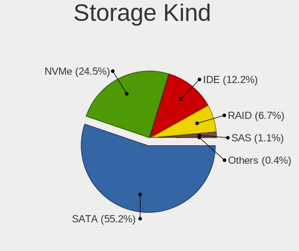
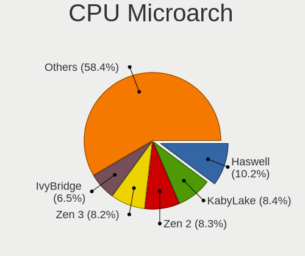
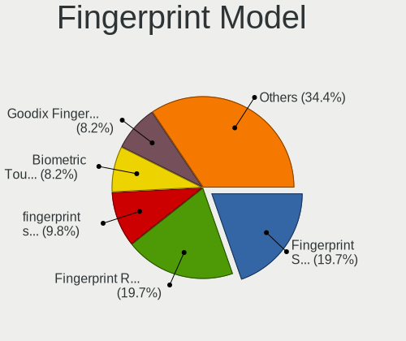

Linux in USA - Tested Hardware & Statistics (Desktops)
------------------------------------------------------

A project to collect tested hardware configurations for Linux in USA.

Anyone can contribute to this report by the [hw-probe](https://github.com/linuxhw/hw-probe) tool:

    sudo -E hw-probe -all -upload

Please contribute! Especially if your hardware is rare.

Contents
--------

* [ Test Cases ](#test-cases)

* [ System ](#system)
  - [ OS                       ](#os)
  - [ OS Family                ](#os-family)
  - [ Kernel                   ](#kernel)
  - [ Kernel Family            ](#kernel-family)
  - [ Kernel Major Ver.        ](#kernel-major-ver)
  - [ Arch                     ](#arch)
  - [ DE                       ](#de)
  - [ Display Server           ](#display-server)
  - [ Display Manager          ](#display-manager)
  - [ OS Lang                  ](#os-lang)
  - [ Boot Mode                ](#boot-mode)
  - [ Filesystem               ](#filesystem)
  - [ Part. scheme             ](#part-scheme)
  - [ Dual Boot with Linux/BSD ](#dual-boot-with-linuxbsd)
  - [ Dual Boot (Win)          ](#dual-boot-win)

* [ Board ](#board)
  - [ Vendor                   ](#vendor)
  - [ Model                    ](#model)
  - [ Model Family             ](#model-family)
  - [ MFG Year                 ](#mfg-year)
  - [ Form Factor              ](#form-factor)
  - [ Secure Boot              ](#secure-boot)
  - [ Coreboot                 ](#coreboot)
  - [ RAM Size                 ](#ram-size)
  - [ RAM Used                 ](#ram-used)
  - [ Total Drives             ](#total-drives)
  - [ Has CD-ROM               ](#has-cd-rom)
  - [ Has Ethernet             ](#has-ethernet)
  - [ Has WiFi                 ](#has-wifi)
  - [ Has Bluetooth            ](#has-bluetooth)

* [ Location ](#location)
  - [ Country                  ](#country)
  - [ City                     ](#city)

* [ Drives ](#drives)
  - [ Drive Vendor             ](#drive-vendor)
  - [ Drive Model              ](#drive-model)
  - [ HDD Vendor               ](#hdd-vendor)
  - [ SSD Vendor               ](#ssd-vendor)
  - [ Drive Kind               ](#drive-kind)
  - [ Drive Connector          ](#drive-connector)
  - [ Drive Size               ](#drive-size)
  - [ Space Total              ](#space-total)
  - [ Space Used               ](#space-used)
  - [ Malfunc. Drives          ](#malfunc-drives)
  - [ Malfunc. Drive Vendor    ](#malfunc-drive-vendor)
  - [ Malfunc. HDD Vendor      ](#malfunc-hdd-vendor)
  - [ Malfunc. Drive Kind      ](#malfunc-drive-kind)
  - [ Failed Drives            ](#failed-drives)
  - [ Failed Drive Vendor      ](#failed-drive-vendor)
  - [ Drive Status             ](#drive-status)

* [ Storage controller ](#storage-controller)
  - [ Storage Vendor           ](#storage-vendor)
  - [ Storage Model            ](#storage-model)
  - [ Storage Kind             ](#storage-kind)

* [ Processor ](#processor)
  - [ CPU Vendor               ](#cpu-vendor)
  - [ CPU Model                ](#cpu-model)
  - [ CPU Model Family         ](#cpu-model-family)
  - [ CPU Cores                ](#cpu-cores)
  - [ CPU Sockets              ](#cpu-sockets)
  - [ CPU Threads              ](#cpu-threads)
  - [ CPU Op-Modes             ](#cpu-op-modes)
  - [ CPU Microcode            ](#cpu-microcode)
  - [ CPU Microarch            ](#cpu-microarch)

* [ Graphics ](#graphics)
  - [ GPU Vendor               ](#gpu-vendor)
  - [ GPU Model                ](#gpu-model)
  - [ GPU Combo                ](#gpu-combo)
  - [ GPU Driver               ](#gpu-driver)
  - [ GPU Memory               ](#gpu-memory)

* [ Monitor ](#monitor)
  - [ Monitor Vendor           ](#monitor-vendor)
  - [ Monitor Model            ](#monitor-model)
  - [ Monitor Resolution       ](#monitor-resolution)
  - [ Monitor Diagonal         ](#monitor-diagonal)
  - [ Monitor Width            ](#monitor-width)
  - [ Aspect Ratio             ](#aspect-ratio)
  - [ Monitor Area             ](#monitor-area)
  - [ Pixel Density            ](#pixel-density)
  - [ Multiple Monitors        ](#multiple-monitors)

* [ Network ](#network)
  - [ Net Controller Vendor    ](#net-controller-vendor)
  - [ Net Controller Model     ](#net-controller-model)
  - [ Wireless Vendor          ](#wireless-vendor)
  - [ Wireless Model           ](#wireless-model)
  - [ Ethernet Vendor          ](#ethernet-vendor)
  - [ Ethernet Model           ](#ethernet-model)
  - [ Net Controller Kind      ](#net-controller-kind)
  - [ Used Controller          ](#used-controller)
  - [ NICs                     ](#nics)
  - [ IPv6                     ](#ipv6)

* [ Bluetooth ](#bluetooth)
  - [ Bluetooth Vendor         ](#bluetooth-vendor)
  - [ Bluetooth Model          ](#bluetooth-model)

* [ Sound ](#sound)
  - [ Sound Vendor             ](#sound-vendor)
  - [ Sound Model              ](#sound-model)

* [ Memory ](#memory)
  - [ Memory Vendor            ](#memory-vendor)
  - [ Memory Model             ](#memory-model)
  - [ Memory Kind              ](#memory-kind)
  - [ Memory Form Factor       ](#memory-form-factor)
  - [ Memory Size              ](#memory-size)
  - [ Memory Speed             ](#memory-speed)

* [ Printers & scanners ](#printers--scanners)
  - [ Printer Vendor           ](#printer-vendor)
  - [ Printer Model            ](#printer-model)
  - [ Scanner Vendor           ](#scanner-vendor)
  - [ Scanner Model            ](#scanner-model)

* [ Camera ](#camera)
  - [ Camera Vendor            ](#camera-vendor)
  - [ Camera Model             ](#camera-model)

* [ Security ](#security)
  - [ Fingerprint Vendor       ](#fingerprint-vendor)
  - [ Fingerprint Model        ](#fingerprint-model)
  - [ Chipcard Vendor          ](#chipcard-vendor)
  - [ Chipcard Model           ](#chipcard-model)

* [ Unsupported ](#unsupported)
  - [ Unsupported Devices      ](#unsupported-devices)
  - [ Unsupported Device Types ](#unsupported-device-types)

Test Cases
----------

Total: 20639

| Vendor        | Model                       | Probe                                                      | Date         |
|---------------|-----------------------------|------------------------------------------------------------|--------------|
| Gigabyte      | Z87X-UD4H-CF                | [abd31d2f92](https://linux-hardware.org/?probe=abd31d2f92) | Jun 10, 2023 |
| MSI           | X370 GAMING M7 ACK          | [450b8ab5a7](https://linux-hardware.org/?probe=450b8ab5a7) | Jun 10, 2023 |
| HP            | 81B4                        | [2d7748536f](https://linux-hardware.org/?probe=2d7748536f) | Jun 10, 2023 |
| Gigabyte      | GA-880GM-D2H                | [2e46385299](https://linux-hardware.org/?probe=2e46385299) | Jun 10, 2023 |
| HP            | 339A                        | [d1fa07d03f](https://linux-hardware.org/?probe=d1fa07d03f) | Jun 10, 2023 |
| Gigabyte      | B550 GAMING X V2            | [03ef8fea42](https://linux-hardware.org/?probe=03ef8fea42) | Jun 10, 2023 |
| ASUSTek       | K30BF_M32BF                 | [65b3c16165](https://linux-hardware.org/?probe=65b3c16165) | Jun 10, 2023 |
| Pegatron      | 2A99                        | [0a25cd49a5](https://linux-hardware.org/?probe=0a25cd49a5) | Jun 10, 2023 |
| HP            | 8949 11                     | [f5e1f4b6c9](https://linux-hardware.org/?probe=f5e1f4b6c9) | Jun 10, 2023 |
| ASUSTek       | ROG STRIX B450-F GAMING     | [cac24c37e5](https://linux-hardware.org/?probe=cac24c37e5) | Jun 10, 2023 |
| ASUSTek       | ROG STRIX X670E-E GAMING... | [5446a0003e](https://linux-hardware.org/?probe=5446a0003e) | Jun 10, 2023 |
| MSI           | AM1M                        | [42a7d49c03](https://linux-hardware.org/?probe=42a7d49c03) | Jun 10, 2023 |
| ASUSTek       | M5A97 R2.0                  | [d9e9a51e48](https://linux-hardware.org/?probe=d9e9a51e48) | Jun 10, 2023 |
| Gigabyte      | GA-890GPA-UD3H              | [f04b28a0e5](https://linux-hardware.org/?probe=f04b28a0e5) | Jun 10, 2023 |
| Gigabyte      | B460M DS3H                  | [63c9d6c822](https://linux-hardware.org/?probe=63c9d6c822) | Jun 09, 2023 |
| ASUSTek       | ROG ZENITH EXTREME          | [b4de2ccda4](https://linux-hardware.org/?probe=b4de2ccda4) | Jun 09, 2023 |
| Gigabyte      | B450 AORUS M                | [280baa2765](https://linux-hardware.org/?probe=280baa2765) | Jun 09, 2023 |
| ASUSTek       | M2N68-AM SE2                | [4f69ba649a](https://linux-hardware.org/?probe=4f69ba649a) | Jun 09, 2023 |
| Lenovo        | ThinkStation E20 422237U    | [2756905647](https://linux-hardware.org/?probe=2756905647) | Jun 09, 2023 |
| Dell          | 07T4MC A02                  | [ad310dd147](https://linux-hardware.org/?probe=ad310dd147) | Jun 09, 2023 |
| ASRock        | AB350M Pro4                 | [8f0087d741](https://linux-hardware.org/?probe=8f0087d741) | Jun 09, 2023 |
| Gigabyte      | B550 AORUS PRO              | [61a0a2ea5f](https://linux-hardware.org/?probe=61a0a2ea5f) | Jun 09, 2023 |
| Gigabyte      | B450 AORUS M                | [50b022f065](https://linux-hardware.org/?probe=50b022f065) | Jun 09, 2023 |
| MSI           | MPG X570S CARBON MAX WIF... | [5833483fe2](https://linux-hardware.org/?probe=5833483fe2) | Jun 09, 2023 |
| MSI           | MAG Z490 TOMAHAWK           | [40f18ae1f4](https://linux-hardware.org/?probe=40f18ae1f4) | Jun 09, 2023 |
| ASUSTek       | TUF Gaming B650M-PLUS WI... | [26262445d4](https://linux-hardware.org/?probe=26262445d4) | Jun 09, 2023 |
| ASUSTek       | M2N68-AM Plus               | [7411937d5b](https://linux-hardware.org/?probe=7411937d5b) | Jun 09, 2023 |
| Gigabyte      | Z790 AORUS ELITE AX         | [f4f543eaa6](https://linux-hardware.org/?probe=f4f543eaa6) | Jun 09, 2023 |
| Gigabyte      | GA-78LMT-USB3 SEx           | [1189f6696f](https://linux-hardware.org/?probe=1189f6696f) | Jun 09, 2023 |
| Dell          | 0FDY5C A00                  | [1caf029f79](https://linux-hardware.org/?probe=1caf029f79) | Jun 09, 2023 |
| AZW           | SEi                         | [2b085e7ed2](https://linux-hardware.org/?probe=2b085e7ed2) | Jun 09, 2023 |
| HP            | 3646h                       | [046f5d1a5b](https://linux-hardware.org/?probe=046f5d1a5b) | Jun 09, 2023 |
| Supermicro    | C7H61                       | [7eef5b7873](https://linux-hardware.org/?probe=7eef5b7873) | Jun 08, 2023 |
| Dell          | 0KRC95 A02                  | [585c31e8d3](https://linux-hardware.org/?probe=585c31e8d3) | Jun 08, 2023 |
| ASRock        | H81M-HDS                    | [e1ff6f4e2f](https://linux-hardware.org/?probe=e1ff6f4e2f) | Jun 08, 2023 |
| MSI           | A55M-E35                    | [7800efb785](https://linux-hardware.org/?probe=7800efb785) | Jun 08, 2023 |
| MSI           | A55M-E35                    | [fa4eba3787](https://linux-hardware.org/?probe=fa4eba3787) | Jun 08, 2023 |
| Dell          | 088DT1 A01                  | [173e9a0e0c](https://linux-hardware.org/?probe=173e9a0e0c) | Jun 08, 2023 |
| Gigabyte      | Z170X-Gaming 6              | [21eaab076a](https://linux-hardware.org/?probe=21eaab076a) | Jun 08, 2023 |
| MSI           | X58M                        | [7f0ef36058](https://linux-hardware.org/?probe=7f0ef36058) | Jun 08, 2023 |
| HPE           | ProLiant MicroServer Gen... | [e95900bc0c](https://linux-hardware.org/?probe=e95900bc0c) | Jun 08, 2023 |
| ASUSTek       | PRIME X570-P                | [a91f24af7a](https://linux-hardware.org/?probe=a91f24af7a) | Jun 08, 2023 |
| ASUSTek       | PRIME X570-P                | [96e1e7ea7e](https://linux-hardware.org/?probe=96e1e7ea7e) | Jun 08, 2023 |
| Dell          | 0HN7XN A01                  | [c44abee9e7](https://linux-hardware.org/?probe=c44abee9e7) | Jun 08, 2023 |
| ASUSTek       | ROG STRIX B550-F GAMING     | [cc54139aa6](https://linux-hardware.org/?probe=cc54139aa6) | Jun 08, 2023 |
| MSI           | PRO B550M-VC WIFI           | [ac442da472](https://linux-hardware.org/?probe=ac442da472) | Jun 08, 2023 |
| MSI           | PRO B550M-VC WIFI           | [70c409a2b8](https://linux-hardware.org/?probe=70c409a2b8) | Jun 08, 2023 |
| Shenzhen M... | F7BFD                       | [74cf1d0b63](https://linux-hardware.org/?probe=74cf1d0b63) | Jun 08, 2023 |
| Shenzhen M... | F7BFD                       | [88cbeea389](https://linux-hardware.org/?probe=88cbeea389) | Jun 08, 2023 |
| MSI           | MPG Z390 GAMING PRO CARB... | [ddefeff960](https://linux-hardware.org/?probe=ddefeff960) | Jun 08, 2023 |
| Lenovo        | ThinkServer TS140           | [e9ca405eff](https://linux-hardware.org/?probe=e9ca405eff) | Jun 08, 2023 |
| ASRock        | M3A770DE                    | [aa9ddf538e](https://linux-hardware.org/?probe=aa9ddf538e) | Jun 08, 2023 |
| HP            | 3033h                       | [86a8a0bf1a](https://linux-hardware.org/?probe=86a8a0bf1a) | Jun 07, 2023 |
| MSI           | B450 TOMAHAWK MAX II        | [2ad7aefc45](https://linux-hardware.org/?probe=2ad7aefc45) | Jun 07, 2023 |
| Gigabyte      | Z87X-UD5H-CF                | [fd156e669f](https://linux-hardware.org/?probe=fd156e669f) | Jun 07, 2023 |
| Apple         | Mac-F4208DC8 PVT            | [1b2b9fd7f2](https://linux-hardware.org/?probe=1b2b9fd7f2) | Jun 07, 2023 |
| ASUSTek       | ROG CROSSHAIR VII HERO      | [12736be80e](https://linux-hardware.org/?probe=12736be80e) | Jun 07, 2023 |
| MSI           | MPG B550 GAMING PLUS        | [793b86c807](https://linux-hardware.org/?probe=793b86c807) | Jun 07, 2023 |
| System76      | Thelio Mira thelio-mira-... | [d7d155d89d](https://linux-hardware.org/?probe=d7d155d89d) | Jun 07, 2023 |
| MSI           | MPG B650I EDGE WIFI         | [d43ce99616](https://linux-hardware.org/?probe=d43ce99616) | Jun 07, 2023 |
| Dell          | 0R6PCT A01                  | [e1623fbc8e](https://linux-hardware.org/?probe=e1623fbc8e) | Jun 07, 2023 |
| HP            | 822A                        | [8cf8694f03](https://linux-hardware.org/?probe=8cf8694f03) | Jun 06, 2023 |
| Dell          | 06D7TR A01                  | [8db1a8c132](https://linux-hardware.org/?probe=8db1a8c132) | Jun 06, 2023 |
| MSI           | MPG X570 GAMING EDGE WIF... | [bc00b26e0a](https://linux-hardware.org/?probe=bc00b26e0a) | Jun 06, 2023 |
| MSI           | MPG X570 GAMING EDGE WIF... | [ee25039289](https://linux-hardware.org/?probe=ee25039289) | Jun 06, 2023 |
| HP            | 3646h                       | [02353b5e9f](https://linux-hardware.org/?probe=02353b5e9f) | Jun 06, 2023 |
| Dell          | 0427JK A00                  | [addb15771e](https://linux-hardware.org/?probe=addb15771e) | Jun 06, 2023 |
| HP            | 8643 SMVB                   | [0fd8af3392](https://linux-hardware.org/?probe=0fd8af3392) | Jun 06, 2023 |
| HP            | 8617                        | [7f5df3475c](https://linux-hardware.org/?probe=7f5df3475c) | Jun 06, 2023 |
| HP            | 8053                        | [29a84ce224](https://linux-hardware.org/?probe=29a84ce224) | Jun 06, 2023 |
| Dell          | 06X1TJ A00                  | [c3f02841f4](https://linux-hardware.org/?probe=c3f02841f4) | Jun 06, 2023 |
| Dell          | 06X1TJ A00                  | [4cec4f0517](https://linux-hardware.org/?probe=4cec4f0517) | Jun 06, 2023 |
| ASUSTek       | ROG STRIX X470-I GAMING     | [77e1fa9533](https://linux-hardware.org/?probe=77e1fa9533) | Jun 06, 2023 |
| Gigabyte      | H310M M.2 x.x               | [602e1c8875](https://linux-hardware.org/?probe=602e1c8875) | Jun 06, 2023 |
| ASUSTek       | ROG STRIX X470-I GAMING     | [c33bc572fd](https://linux-hardware.org/?probe=c33bc572fd) | Jun 06, 2023 |
| MSI           | 2AE0                        | [15b3c478d3](https://linux-hardware.org/?probe=15b3c478d3) | Jun 06, 2023 |
| MSI           | B450 TOMAHAWK MAX II        | [79f63dcf8e](https://linux-hardware.org/?probe=79f63dcf8e) | Jun 06, 2023 |
| MSI           | MPG Z390 GAMING PRO CARB... | [77fe6db865](https://linux-hardware.org/?probe=77fe6db865) | Jun 06, 2023 |
| Acer          | WMCP78M                     | [a7a466de8a](https://linux-hardware.org/?probe=a7a466de8a) | Jun 06, 2023 |
| HP            | 8918                        | [917b8c425f](https://linux-hardware.org/?probe=917b8c425f) | Jun 06, 2023 |
| Dell          | 0RY007                      | [49c7cbbfde](https://linux-hardware.org/?probe=49c7cbbfde) | Jun 06, 2023 |
| ASUSTek       | PRIME Z790-A WIFI           | [fe852e8a1d](https://linux-hardware.org/?probe=fe852e8a1d) | Jun 06, 2023 |
| Dell          | 0Y2K8N A01                  | [13a93fdc21](https://linux-hardware.org/?probe=13a93fdc21) | Jun 05, 2023 |
| HP            | 339A                        | [f2147ed11b](https://linux-hardware.org/?probe=f2147ed11b) | Jun 05, 2023 |
| ASUSTek       | CM1730,CM1830               | [2cc76d0cd9](https://linux-hardware.org/?probe=2cc76d0cd9) | Jun 05, 2023 |
| ASUSTek       | PRIME B550M-A AC            | [de614b2bc7](https://linux-hardware.org/?probe=de614b2bc7) | Jun 05, 2023 |
| ASUSTek       | CM1730,CM1830               | [7dc46d923e](https://linux-hardware.org/?probe=7dc46d923e) | Jun 05, 2023 |
| AMI           | Intel                       | [7990e6561b](https://linux-hardware.org/?probe=7990e6561b) | Jun 05, 2023 |
| ASUSTek       | TUF Gaming B450-PLUS II     | [292e41c0e9](https://linux-hardware.org/?probe=292e41c0e9) | Jun 05, 2023 |
| Dell          | 00010C A00                  | [fb12198605](https://linux-hardware.org/?probe=fb12198605) | Jun 05, 2023 |
| Dell          | 00010C A00                  | [d94442285c](https://linux-hardware.org/?probe=d94442285c) | Jun 05, 2023 |
| ASUSTek       | PRIME B550M-A AC            | [0cf4dfc5e4](https://linux-hardware.org/?probe=0cf4dfc5e4) | Jun 05, 2023 |
| ASUSTek       | ROG Maximus XI HERO         | [8ba3a60a93](https://linux-hardware.org/?probe=8ba3a60a93) | Jun 05, 2023 |
| MSI           | B360M PRO-VH                | [8e4ad66edc](https://linux-hardware.org/?probe=8e4ad66edc) | Jun 05, 2023 |
| Dell          | 0KWVT8 A03                  | [e974c8cdcd](https://linux-hardware.org/?probe=e974c8cdcd) | Jun 05, 2023 |
| Pegatron      | 2AC2                        | [6182103d25](https://linux-hardware.org/?probe=6182103d25) | Jun 05, 2023 |
| Dell          | 0HD5W2 A01                  | [917462f8c8](https://linux-hardware.org/?probe=917462f8c8) | Jun 05, 2023 |
| ASUSTek       | PRIME Z590-V                | [d0fd3fd90a](https://linux-hardware.org/?probe=d0fd3fd90a) | Jun 04, 2023 |
| ASUSTek       | PRIME Z590-V                | [bc93ac1588](https://linux-hardware.org/?probe=bc93ac1588) | Jun 04, 2023 |
| MSI           | B450-A PRO MAX              | [202c4ee201](https://linux-hardware.org/?probe=202c4ee201) | Jun 04, 2023 |
| AMI           | Intel                       | [966c93cbdb](https://linux-hardware.org/?probe=966c93cbdb) | Jun 04, 2023 |
| HP            | 8643 SMVB                   | [697cc43136](https://linux-hardware.org/?probe=697cc43136) | Jun 04, 2023 |
| ASUSTek       | PRIME B550M-A               | [d6befa925e](https://linux-hardware.org/?probe=d6befa925e) | Jun 04, 2023 |
| ASUSTek       | TUF Gaming X570-PLUS        | [0dbe01becf](https://linux-hardware.org/?probe=0dbe01becf) | Jun 04, 2023 |
| ASUSTek       | PRIME B550-PLUS             | [74e71defee](https://linux-hardware.org/?probe=74e71defee) | Jun 04, 2023 |
| HP            | 8949 11                     | [06bca18276](https://linux-hardware.org/?probe=06bca18276) | Jun 04, 2023 |
| Gigabyte      | A520M S2H                   | [81caf6e8cf](https://linux-hardware.org/?probe=81caf6e8cf) | Jun 04, 2023 |
| ASUSTek       | M5A78L-M PLUS/USB3          | [6167898a10](https://linux-hardware.org/?probe=6167898a10) | Jun 04, 2023 |
| MSI           | Z270-A PRO                  | [1da4d78c3b](https://linux-hardware.org/?probe=1da4d78c3b) | Jun 04, 2023 |
| ASRock        | B550 PG Velocita            | [12833898d1](https://linux-hardware.org/?probe=12833898d1) | Jun 04, 2023 |
| HP            | 2AE5 A01                    | [ab3ab74fb6](https://linux-hardware.org/?probe=ab3ab74fb6) | Jun 04, 2023 |
| MSI           | P55-CD53                    | [88efe4b48c](https://linux-hardware.org/?probe=88efe4b48c) | Jun 04, 2023 |
| MSI           | A55M-E33                    | [336b7f877d](https://linux-hardware.org/?probe=336b7f877d) | Jun 04, 2023 |
| ASUSTek       | PRIME X670-P WIFI           | [82542c4daa](https://linux-hardware.org/?probe=82542c4daa) | Jun 04, 2023 |
| Dell          | 0KWVT8 A03                  | [2250609446](https://linux-hardware.org/?probe=2250609446) | Jun 04, 2023 |
| Dell          | 0KWVT8 A03                  | [7f73996b8e](https://linux-hardware.org/?probe=7f73996b8e) | Jun 04, 2023 |
| Unknown       | Unknown                     | [8c2d7ce6e2](https://linux-hardware.org/?probe=8c2d7ce6e2) | Jun 04, 2023 |
| MSI           | B450 TOMAHAWK               | [aaed1b39af](https://linux-hardware.org/?probe=aaed1b39af) | Jun 03, 2023 |
| Dell          | 0N4NF7 A00                  | [e1348eb2c2](https://linux-hardware.org/?probe=e1348eb2c2) | Jun 03, 2023 |
| Dell          | 0N4NF7 A00                  | [6ff177257b](https://linux-hardware.org/?probe=6ff177257b) | Jun 03, 2023 |
| Gigabyte      | Z690 AORUS ULTRA            | [50cdb8a60a](https://linux-hardware.org/?probe=50cdb8a60a) | Jun 03, 2023 |
| MSI           | B460M PRO-VDH WIFI          | [b92c18e955](https://linux-hardware.org/?probe=b92c18e955) | Jun 03, 2023 |
| ASUSTek       | Pro B550M-C                 | [094889a0e2](https://linux-hardware.org/?probe=094889a0e2) | Jun 03, 2023 |
| ASRock        | FM2A88X Extreme6+           | [2745284306](https://linux-hardware.org/?probe=2745284306) | Jun 03, 2023 |
| HP            | 8949 11                     | [f06749002f](https://linux-hardware.org/?probe=f06749002f) | Jun 03, 2023 |
| ASUSTek       | PRIME B365M-A               | [5c280bbd6c](https://linux-hardware.org/?probe=5c280bbd6c) | Jun 03, 2023 |
| Gigabyte      | A520M S2H                   | [0169222312](https://linux-hardware.org/?probe=0169222312) | Jun 03, 2023 |
| Dell          | 0KRC95 A02                  | [3fb87e5a0e](https://linux-hardware.org/?probe=3fb87e5a0e) | Jun 03, 2023 |
| Dell          | 0D6H9T A01                  | [1ebbe353ba](https://linux-hardware.org/?probe=1ebbe353ba) | Jun 03, 2023 |
| Dell          | 0D6H9T A01                  | [0bb2080b31](https://linux-hardware.org/?probe=0bb2080b31) | Jun 03, 2023 |
| ASRock        | AB350M Pro4                 | [30a95a3f53](https://linux-hardware.org/?probe=30a95a3f53) | Jun 03, 2023 |
| ASUSTek       | SABERTOOTH 990FX R2.0       | [8d4d1f7313](https://linux-hardware.org/?probe=8d4d1f7313) | Jun 03, 2023 |
| Gigabyte      | B550 AORUS MASTER           | [80e9681888](https://linux-hardware.org/?probe=80e9681888) | Jun 03, 2023 |
| Dell          | 0NW6H5 A00                  | [01387c3030](https://linux-hardware.org/?probe=01387c3030) | Jun 03, 2023 |
| ASUSTek       | TUF Gaming B550M-PLUS WI... | [20260fb3b3](https://linux-hardware.org/?probe=20260fb3b3) | Jun 03, 2023 |
| Dell          | 0M6C7G A00                  | [93bdbbdafb](https://linux-hardware.org/?probe=93bdbbdafb) | Jun 03, 2023 |
| ASUSTek       | PRIME Z790-A WIFI           | [4e17d7c6e8](https://linux-hardware.org/?probe=4e17d7c6e8) | Jun 03, 2023 |
| ASUSTek       | PRIME Z790-A WIFI           | [965de576c7](https://linux-hardware.org/?probe=965de576c7) | Jun 03, 2023 |
| HP            | 339A                        | [bb4619f4eb](https://linux-hardware.org/?probe=bb4619f4eb) | Jun 02, 2023 |
| MSI           | MPG Z790 EDGE WIFI          | [dae8469b17](https://linux-hardware.org/?probe=dae8469b17) | Jun 02, 2023 |
| Dell          | 0RY007                      | [f3028ff55d](https://linux-hardware.org/?probe=f3028ff55d) | Jun 02, 2023 |
| Biostar       | TA970XE                     | [11936a0f0f](https://linux-hardware.org/?probe=11936a0f0f) | Jun 02, 2023 |
| ASUSTek       | P8Z68-V                     | [59e64db8de](https://linux-hardware.org/?probe=59e64db8de) | Jun 02, 2023 |
| ASUSTek       | ROG Maximus Z690 FORMULA    | [c8fca2b92d](https://linux-hardware.org/?probe=c8fca2b92d) | Jun 02, 2023 |
| HP            | 2AE5 A01                    | [c37afc3b8a](https://linux-hardware.org/?probe=c37afc3b8a) | Jun 02, 2023 |
| ASRock        | X670E Steel Legend          | [c1cfe9f08d](https://linux-hardware.org/?probe=c1cfe9f08d) | Jun 02, 2023 |
| HP            | 212B                        | [15c4a7b64f](https://linux-hardware.org/?probe=15c4a7b64f) | Jun 02, 2023 |
| MSI           | MPG Z490 GAMING EDGE WIF... | [b86be4f1de](https://linux-hardware.org/?probe=b86be4f1de) | Jun 02, 2023 |
| ASUSTek       | ROG STRIX X670E-E GAMING... | [5562bc75b8](https://linux-hardware.org/?probe=5562bc75b8) | Jun 02, 2023 |
| MSI           | PRO X670-P WIFI             | [714ed7283d](https://linux-hardware.org/?probe=714ed7283d) | Jun 02, 2023 |
| MSI           | PRO X670-P WIFI             | [bb2776b990](https://linux-hardware.org/?probe=bb2776b990) | Jun 02, 2023 |
| ASUSTek       | ROG CROSSHAIR VIII IMPAC... | [c9e073b763](https://linux-hardware.org/?probe=c9e073b763) | Jun 02, 2023 |
| Dell          | 0GY6Y8 A02                  | [7f2c514dff](https://linux-hardware.org/?probe=7f2c514dff) | Jun 02, 2023 |
| Gateway       | SX2851                      | [262ddffda9](https://linux-hardware.org/?probe=262ddffda9) | Jun 02, 2023 |
| MSI           | P55-CD53                    | [4f87990649](https://linux-hardware.org/?probe=4f87990649) | Jun 02, 2023 |
| HP            | 1497                        | [9ce66d3e2e](https://linux-hardware.org/?probe=9ce66d3e2e) | Jun 02, 2023 |
| Pegatron      | NARRA5                      | [1d9f5bc60f](https://linux-hardware.org/?probe=1d9f5bc60f) | Jun 02, 2023 |
| ASUSTek       | Pro WS WRX80E-SAGE SE WI... | [8aab7c6536](https://linux-hardware.org/?probe=8aab7c6536) | Jun 01, 2023 |
| ASUSTek       | PRIME B550-PLUS             | [f22933cdb1](https://linux-hardware.org/?probe=f22933cdb1) | Jun 01, 2023 |
| MSI           | PRO B650-P WIFI             | [53d24a5962](https://linux-hardware.org/?probe=53d24a5962) | Jun 01, 2023 |
| MSI           | PRO B650-P WIFI             | [0143308fee](https://linux-hardware.org/?probe=0143308fee) | Jun 01, 2023 |
| Portwell      | CAPB-3000VR                 | [53558af2be](https://linux-hardware.org/?probe=53558af2be) | Jun 01, 2023 |
| HP            | 339A                        | [24ab8463bb](https://linux-hardware.org/?probe=24ab8463bb) | Jun 01, 2023 |
| ASUSTek       | PRIME B550M-A               | [8799da8513](https://linux-hardware.org/?probe=8799da8513) | Jun 01, 2023 |
| Supermicro    | X11SCD-F                    | [365eeba4c9](https://linux-hardware.org/?probe=365eeba4c9) | Jun 01, 2023 |
| Gigabyte      | B450M DS3H-CF               | [923c9a18ff](https://linux-hardware.org/?probe=923c9a18ff) | Jun 01, 2023 |
| ASRock        | B550 Pro4                   | [34e92ccc34](https://linux-hardware.org/?probe=34e92ccc34) | Jun 01, 2023 |
| Gigabyte      | X670E AORUS MASTER          | [976fcb80b0](https://linux-hardware.org/?probe=976fcb80b0) | Jun 01, 2023 |
| HP            | 212A                        | [a0e56b03e2](https://linux-hardware.org/?probe=a0e56b03e2) | Jun 01, 2023 |
| HP            | 8055                        | [ff75f76129](https://linux-hardware.org/?probe=ff75f76129) | Jun 01, 2023 |
| HP            | 8055                        | [f54c954f94](https://linux-hardware.org/?probe=f54c954f94) | Jun 01, 2023 |
| ASUSTek       | M3A78-T                     | [e59673dcf2](https://linux-hardware.org/?probe=e59673dcf2) | Jun 01, 2023 |
| Lenovo        | MAHOBAY Win8 Pro DPK TPG    | [0586d2c0e2](https://linux-hardware.org/?probe=0586d2c0e2) | Jun 01, 2023 |
| ASUSTek       | ROG CROSSHAIR VIII IMPAC... | [270fcf5e69](https://linux-hardware.org/?probe=270fcf5e69) | May 31, 2023 |
| Dell          | 0RY007                      | [b726df555b](https://linux-hardware.org/?probe=b726df555b) | May 31, 2023 |
| Dell          | 0RY007                      | [32e931c79b](https://linux-hardware.org/?probe=32e931c79b) | May 31, 2023 |
| ASRock        | 970M Pro3                   | [58b09c521b](https://linux-hardware.org/?probe=58b09c521b) | May 31, 2023 |
| Pegatron      | 2ACB                        | [cfd38fc71a](https://linux-hardware.org/?probe=cfd38fc71a) | May 31, 2023 |
| ASUSTek       | Z77-A                       | [a313036ec2](https://linux-hardware.org/?probe=a313036ec2) | May 31, 2023 |
| Lenovo        | ThinkServer TS140           | [e8e3834bf8](https://linux-hardware.org/?probe=e8e3834bf8) | May 31, 2023 |
| Lenovo        | ThinkServer TS140           | [48cf9db6cd](https://linux-hardware.org/?probe=48cf9db6cd) | May 31, 2023 |
| MSI           | B350M BAZOOKA               | [a494d94087](https://linux-hardware.org/?probe=a494d94087) | May 31, 2023 |
| ASUSTek       | TUF Gaming X570-PLUS        | [d1f02a3055](https://linux-hardware.org/?probe=d1f02a3055) | May 31, 2023 |
| ASUSTek       | Maximus VIII RANGER         | [354e883340](https://linux-hardware.org/?probe=354e883340) | May 31, 2023 |
| ASUSTek       | G10DK                       | [75cde40262](https://linux-hardware.org/?probe=75cde40262) | May 31, 2023 |
| ASUSTek       | ROG STRIX B450-F GAMING     | [2c6c547437](https://linux-hardware.org/?probe=2c6c547437) | May 31, 2023 |
| Lenovo        | 3730 SDK0T76463 WIN 3422... | [4dfacbbeb1](https://linux-hardware.org/?probe=4dfacbbeb1) | May 31, 2023 |
| ASRock        | B650E Steel Legend WiFi     | [88d16bf040](https://linux-hardware.org/?probe=88d16bf040) | May 31, 2023 |
| Gigabyte      | X570 AORUS ULTRA            | [9d3023fd1d](https://linux-hardware.org/?probe=9d3023fd1d) | May 31, 2023 |
| Lenovo        | 3730 SDK0T76463 WIN 3422... | [da8705e5a7](https://linux-hardware.org/?probe=da8705e5a7) | May 31, 2023 |
| Intel         | X99                         | [cef654d9c5](https://linux-hardware.org/?probe=cef654d9c5) | May 30, 2023 |
| System76      | Thelio Mira                 | [d5fe3a3749](https://linux-hardware.org/?probe=d5fe3a3749) | May 30, 2023 |
| ASUSTek       | PRIME B550M-A               | [349eb108ab](https://linux-hardware.org/?probe=349eb108ab) | May 30, 2023 |
| Intel         | STK2M3W64CC H89289-504      | [a7e599b1f5](https://linux-hardware.org/?probe=a7e599b1f5) | May 30, 2023 |
| ASRock        | H110M-DS/Hyper              | [a29a16d74c](https://linux-hardware.org/?probe=a29a16d74c) | May 30, 2023 |
| Intel         | STK2M3W64CC H89289-504      | [c471536b99](https://linux-hardware.org/?probe=c471536b99) | May 30, 2023 |
| BESSTAR Te... | HM90                        | [cb78f83d80](https://linux-hardware.org/?probe=cb78f83d80) | May 30, 2023 |
| ASRock        | H110M-DS/Hyper              | [05e7ed23f3](https://linux-hardware.org/?probe=05e7ed23f3) | May 30, 2023 |
| HP            | 8307                        | [c8d0506eda](https://linux-hardware.org/?probe=c8d0506eda) | May 30, 2023 |
| Dell          | 0H4VK7 A01                  | [35d979d6e9](https://linux-hardware.org/?probe=35d979d6e9) | May 30, 2023 |
| ASUSTek       | ROG STRIX X570-E GAMING ... | [15b23b6779](https://linux-hardware.org/?probe=15b23b6779) | May 30, 2023 |
| Gigabyte      | Z170X-Gaming 7              | [b2ae6cb140](https://linux-hardware.org/?probe=b2ae6cb140) | May 30, 2023 |
| Pegatron      | 2AC2                        | [a8873fdeab](https://linux-hardware.org/?probe=a8873fdeab) | May 30, 2023 |
| Apple         | Mac-F42C88C8 Proto1         | [a335953c43](https://linux-hardware.org/?probe=a335953c43) | May 30, 2023 |
| Gigabyte      | B560M AORUS ELITE           | [944eb64f77](https://linux-hardware.org/?probe=944eb64f77) | May 30, 2023 |
| Gigabyte      | GA-970A-UD3                 | [3626919ffb](https://linux-hardware.org/?probe=3626919ffb) | May 30, 2023 |
| HP            | 8169                        | [4f10a589e7](https://linux-hardware.org/?probe=4f10a589e7) | May 29, 2023 |
| Pegatron      | 2ACE                        | [fd6056dba8](https://linux-hardware.org/?probe=fd6056dba8) | May 29, 2023 |
| ASRock        | H310CM-HDV                  | [e6e310a9b4](https://linux-hardware.org/?probe=e6e310a9b4) | May 29, 2023 |
| Dell          | 0XPDFK A01                  | [10e4fd14b5](https://linux-hardware.org/?probe=10e4fd14b5) | May 29, 2023 |
| ASRock        | H310CM-HDV                  | [84e791ec5e](https://linux-hardware.org/?probe=84e791ec5e) | May 29, 2023 |
| MSI           | B460M PRO-VDH WIFI          | [9171b7f0f0](https://linux-hardware.org/?probe=9171b7f0f0) | May 29, 2023 |
| MSI           | Z390-A PRO                  | [c797a10bff](https://linux-hardware.org/?probe=c797a10bff) | May 29, 2023 |
| ASUSTek       | ROG STRIX Z790-H GAMING ... | [11432ddeb6](https://linux-hardware.org/?probe=11432ddeb6) | May 29, 2023 |
| HP            | 2B43                        | [fb2841cfa4](https://linux-hardware.org/?probe=fb2841cfa4) | May 29, 2023 |
| Lenovo        | 3730 SDK0T76463 WIN 3422... | [7467436de2](https://linux-hardware.org/?probe=7467436de2) | May 28, 2023 |
| Foxconn       | Napa HP P/N                 | [a74b7b2a85](https://linux-hardware.org/?probe=a74b7b2a85) | May 28, 2023 |
| MSI           | Z390-A PRO                  | [cf1c884051](https://linux-hardware.org/?probe=cf1c884051) | May 28, 2023 |
| Lenovo        | 1036 SDK0Q40112 WIN 3305... | [5384efc9d9](https://linux-hardware.org/?probe=5384efc9d9) | May 28, 2023 |
| Gigabyte      | GA-MA78LMT-S2               | [bf3b702d7a](https://linux-hardware.org/?probe=bf3b702d7a) | May 28, 2023 |
| MSI           | Z390-A PRO                  | [6b863cd4a3](https://linux-hardware.org/?probe=6b863cd4a3) | May 28, 2023 |
| ASUSTek       | TUF Gaming B650-PLUS WIF... | [8fe1188fd8](https://linux-hardware.org/?probe=8fe1188fd8) | May 28, 2023 |
| Dell          | 0WR7PY A02                  | [b5aa372117](https://linux-hardware.org/?probe=b5aa372117) | May 28, 2023 |
| Dell          | 0W2F8G A00                  | [f5a76aaf01](https://linux-hardware.org/?probe=f5a76aaf01) | May 28, 2023 |
| ASUSTek       | ROG STRIX X670E-E GAMING... | [4e1ad3c652](https://linux-hardware.org/?probe=4e1ad3c652) | May 28, 2023 |
| Dell          | 0W2F8G A00                  | [419c0c7359](https://linux-hardware.org/?probe=419c0c7359) | May 28, 2023 |
| ASUSTek       | ROG STRIX B550-E GAMING     | [65bdd898f5](https://linux-hardware.org/?probe=65bdd898f5) | May 28, 2023 |
| ASUSTek       | Z87I-DELUXE                 | [5d683647ae](https://linux-hardware.org/?probe=5d683647ae) | May 28, 2023 |
| MSI           | X470 GAMING PRO CARBON      | [db3d362e28](https://linux-hardware.org/?probe=db3d362e28) | May 28, 2023 |
| Lenovo        | 1036 SDK0Q40112 WIN 3305... | [f7a170dd7d](https://linux-hardware.org/?probe=f7a170dd7d) | May 28, 2023 |
| Gigabyte      | B85M-DS3H-A                 | [a890415f0e](https://linux-hardware.org/?probe=a890415f0e) | May 28, 2023 |
| ASUSTek       | M4A88TD-V EVO/USB3          | [8d008658ce](https://linux-hardware.org/?probe=8d008658ce) | May 28, 2023 |
| MSI           | X470 GAMING PRO CARBON      | [94fe283791](https://linux-hardware.org/?probe=94fe283791) | May 28, 2023 |
| Unknown       | HX90                        | [d38fff55af](https://linux-hardware.org/?probe=d38fff55af) | May 28, 2023 |
| AZW           | EQ                          | [8e6c18ebbb](https://linux-hardware.org/?probe=8e6c18ebbb) | May 28, 2023 |
| AZW           | EQ                          | [98e5ea581c](https://linux-hardware.org/?probe=98e5ea581c) | May 28, 2023 |
| Gigabyte      | Z690 AERO G                 | [5d4d7c7ef4](https://linux-hardware.org/?probe=5d4d7c7ef4) | May 27, 2023 |
| ASRock        | B550M Pro4                  | [8529d01687](https://linux-hardware.org/?probe=8529d01687) | May 27, 2023 |
| Gigabyte      | GA-78LMT-USB3               | [ac650845ad](https://linux-hardware.org/?probe=ac650845ad) | May 27, 2023 |
| Gigabyte      | GA-970A-UD3                 | [2661b6520b](https://linux-hardware.org/?probe=2661b6520b) | May 27, 2023 |
| Gigabyte      | GA-970A-UD3                 | [bea3034b4e](https://linux-hardware.org/?probe=bea3034b4e) | May 27, 2023 |
| ASRock        | B550M Pro4                  | [8301ca5155](https://linux-hardware.org/?probe=8301ca5155) | May 27, 2023 |
| Gigabyte      | X570 AORUS ELITE WIFI       | [46460561e1](https://linux-hardware.org/?probe=46460561e1) | May 27, 2023 |
| Lenovo        | 3100                        | [4047be1b41](https://linux-hardware.org/?probe=4047be1b41) | May 27, 2023 |
| Dell          | 0TP412                      | [112fa3015f](https://linux-hardware.org/?probe=112fa3015f) | May 27, 2023 |
| Gigabyte      | B450M DS3H-CF               | [0149ec9c81](https://linux-hardware.org/?probe=0149ec9c81) | May 27, 2023 |
| MSI           | X370 GAMING PRO CARBON A... | [ffbc308836](https://linux-hardware.org/?probe=ffbc308836) | May 27, 2023 |
| MSI           | B450 TOMAHAWK               | [3e9709dc25](https://linux-hardware.org/?probe=3e9709dc25) | May 27, 2023 |
| HP            | 8307                        | [94cad3911e](https://linux-hardware.org/?probe=94cad3911e) | May 27, 2023 |
| ASUSTek       | Z77-A                       | [eb9ee9f38e](https://linux-hardware.org/?probe=eb9ee9f38e) | May 27, 2023 |
| Dell          | 0J3C2F A02                  | [c2640c22ff](https://linux-hardware.org/?probe=c2640c22ff) | May 27, 2023 |
| ASUSTek       | K30BF_M32BF                 | [a262345925](https://linux-hardware.org/?probe=a262345925) | May 27, 2023 |
| HP            | 2B38                        | [528dfa2310](https://linux-hardware.org/?probe=528dfa2310) | May 27, 2023 |
| MSI           | MAG B550 TOMAHAWK           | [9a3691f3f2](https://linux-hardware.org/?probe=9a3691f3f2) | May 27, 2023 |
| MSI           | B250M BAZOOKA               | [2bfe50d945](https://linux-hardware.org/?probe=2bfe50d945) | May 27, 2023 |
| Lenovo        | 3716 SDK0R32862 WIN 3258... | [d3137742ae](https://linux-hardware.org/?probe=d3137742ae) | May 27, 2023 |
| HP            | 21D0                        | [7f83859a91](https://linux-hardware.org/?probe=7f83859a91) | May 27, 2023 |
| MSI           | MAG B460M MORTAR            | [ac03083cbd](https://linux-hardware.org/?probe=ac03083cbd) | May 27, 2023 |
| Lenovo        | 31900058 STD                | [d09ae4f1a2](https://linux-hardware.org/?probe=d09ae4f1a2) | May 27, 2023 |
| MSI           | B450 GAMING PLUS MAX        | [5977804b94](https://linux-hardware.org/?probe=5977804b94) | May 26, 2023 |
| ASUSTek       | PRIME B550M-A               | [424078f376](https://linux-hardware.org/?probe=424078f376) | May 26, 2023 |
| ASUSTek       | X99-DELUXE                  | [ebc73bb225](https://linux-hardware.org/?probe=ebc73bb225) | May 26, 2023 |
| ASUSTek       | K30BF_M32BF_A_F_K31BF_6     | [2c3689440a](https://linux-hardware.org/?probe=2c3689440a) | May 26, 2023 |
| Dell          | 0MGK50 A02                  | [4572d76da5](https://linux-hardware.org/?probe=4572d76da5) | May 26, 2023 |
| HP            | 18E5                        | [23e2edb1fe](https://linux-hardware.org/?probe=23e2edb1fe) | May 26, 2023 |
| Dell          | 0XCR8D A03                  | [25867f7c36](https://linux-hardware.org/?probe=25867f7c36) | May 26, 2023 |
| HP            | 21D0                        | [8e52c2613c](https://linux-hardware.org/?probe=8e52c2613c) | May 26, 2023 |
| ASUSTek       | ROG STRIX B450-F GAMING     | [bf6e9cf4d0](https://linux-hardware.org/?probe=bf6e9cf4d0) | May 26, 2023 |
| ASUSTek       | Rampage V EXTREME           | [dd6d2e1299](https://linux-hardware.org/?probe=dd6d2e1299) | May 25, 2023 |
| Dell          | 0RY007                      | [6fb4081584](https://linux-hardware.org/?probe=6fb4081584) | May 25, 2023 |
| ASUSTek       | M5A78L-M PLUS/USB3          | [fc02e21f13](https://linux-hardware.org/?probe=fc02e21f13) | May 25, 2023 |
| Alienware     | 04VWF2 A00                  | [0d6c86d757](https://linux-hardware.org/?probe=0d6c86d757) | May 25, 2023 |
| ASRock        | X670E Taichi                | [6c74d47711](https://linux-hardware.org/?probe=6c74d47711) | May 25, 2023 |
| Shenzhen M... | F7BFC                       | [6bf848e58f](https://linux-hardware.org/?probe=6bf848e58f) | May 25, 2023 |
| MSI           | PRO X670-P WIFI             | [aa919fe5b3](https://linux-hardware.org/?probe=aa919fe5b3) | May 25, 2023 |
| MSI           | B450 TOMAHAWK MAX II        | [61dc4c5620](https://linux-hardware.org/?probe=61dc4c5620) | May 25, 2023 |
| AOpen         | iBDWMUx-MD R1.04            | [cc674d2878](https://linux-hardware.org/?probe=cc674d2878) | May 25, 2023 |
| Dell          | 0XJ8C4 A00                  | [b6b7396e06](https://linux-hardware.org/?probe=b6b7396e06) | May 25, 2023 |
| Dell          | 03KWTV A02                  | [60ade2d50f](https://linux-hardware.org/?probe=60ade2d50f) | May 25, 2023 |
| HP            | 21D0                        | [4cac4f8654](https://linux-hardware.org/?probe=4cac4f8654) | May 25, 2023 |
| HP            | 21D0                        | [589c780060](https://linux-hardware.org/?probe=589c780060) | May 25, 2023 |
| ASUSTek       | CROSSHAIR VI HERO           | [6e9287cc5c](https://linux-hardware.org/?probe=6e9287cc5c) | May 25, 2023 |
| Dell          | 0N4YC8 A00                  | [f3e564d17d](https://linux-hardware.org/?probe=f3e564d17d) | May 25, 2023 |
| Gigabyte      | Z590 AORUS MASTER           | [6e78eaa344](https://linux-hardware.org/?probe=6e78eaa344) | May 25, 2023 |
| Avalue        | NUC-TGU E9697JAO003R        | [585d89beea](https://linux-hardware.org/?probe=585d89beea) | May 25, 2023 |
| Avalue        | NUC-TGU E9697JAO003R        | [6590141653](https://linux-hardware.org/?probe=6590141653) | May 24, 2023 |
| Dell          | 0654JC A01                  | [d3a2957b45](https://linux-hardware.org/?probe=d3a2957b45) | May 24, 2023 |
| HP            | 3647h                       | [c3d3f890ec](https://linux-hardware.org/?probe=c3d3f890ec) | May 24, 2023 |
| ASUSTek       | PRIME Z370-A II             | [e1681daf09](https://linux-hardware.org/?probe=e1681daf09) | May 24, 2023 |
| ASUSTek       | PRIME Z370-A                | [1387725836](https://linux-hardware.org/?probe=1387725836) | May 24, 2023 |
| ASUSTek       | PRIME Z390-P                | [909becff79](https://linux-hardware.org/?probe=909becff79) | May 24, 2023 |
| ASUSTek       | PRIME B550-PLUS             | [41ca623e3c](https://linux-hardware.org/?probe=41ca623e3c) | May 24, 2023 |
| ASUSTek       | ROG STRIX Z390-E GAMING     | [9568d26302](https://linux-hardware.org/?probe=9568d26302) | May 24, 2023 |
| Pegatron      | 2AC2A                       | [f9e504a430](https://linux-hardware.org/?probe=f9e504a430) | May 24, 2023 |
| Gigabyte      | B550 GAMING X V2            | [c43cfd04ad](https://linux-hardware.org/?probe=c43cfd04ad) | May 24, 2023 |
| ASUSTek       | ROG STRIX X670E-E GAMING... | [d6ec4cc9bc](https://linux-hardware.org/?probe=d6ec4cc9bc) | May 24, 2023 |
| Gigabyte      | B365M DS3H                  | [149a19eeeb](https://linux-hardware.org/?probe=149a19eeeb) | May 24, 2023 |
| ASRock        | B760M Pro RS/D4 WiFi        | [05a334c56f](https://linux-hardware.org/?probe=05a334c56f) | May 24, 2023 |
| ASRock        | Z170 OC Formula             | [d7a354fa41](https://linux-hardware.org/?probe=d7a354fa41) | May 24, 2023 |
| HP            | 8307                        | [6797c02e08](https://linux-hardware.org/?probe=6797c02e08) | May 24, 2023 |
| HP            | 212A                        | [87b3c9809f](https://linux-hardware.org/?probe=87b3c9809f) | May 23, 2023 |
| Lenovo        | 102F SBB0J05441 WIN 3305... | [40f8ce5d7e](https://linux-hardware.org/?probe=40f8ce5d7e) | May 23, 2023 |
| MSI           | MAG B550 TOMAHAWK MAX WI... | [8604115d8b](https://linux-hardware.org/?probe=8604115d8b) | May 23, 2023 |
| ASUSTek       | ROG ZENITH EXTREME          | [402231776b](https://linux-hardware.org/?probe=402231776b) | May 23, 2023 |
| Gigabyte      | H77N-WIFI                   | [9e96bcdbef](https://linux-hardware.org/?probe=9e96bcdbef) | May 23, 2023 |
| ASUSTek       | PRIME Z370-A                | [c309714d15](https://linux-hardware.org/?probe=c309714d15) | May 23, 2023 |
| HP            | 3647h                       | [fc8cf5c799](https://linux-hardware.org/?probe=fc8cf5c799) | May 23, 2023 |
| ASUSTek       | TUF X299 MARK 1             | [89b378457d](https://linux-hardware.org/?probe=89b378457d) | May 23, 2023 |
| Dell          | 0JC6JH A00                  | [91d6d0d2da](https://linux-hardware.org/?probe=91d6d0d2da) | May 23, 2023 |
| HP            | 8876 11                     | [889144e990](https://linux-hardware.org/?probe=889144e990) | May 23, 2023 |
| Gigabyte      | B85M-DS3H-A                 | [d2ddb8221f](https://linux-hardware.org/?probe=d2ddb8221f) | May 23, 2023 |
| MSI           | B450 GAMING PLUS MAX        | [e781194fb3](https://linux-hardware.org/?probe=e781194fb3) | May 23, 2023 |
| ASUSTek       | TUF X299 MARK 1             | [2f194363a7](https://linux-hardware.org/?probe=2f194363a7) | May 23, 2023 |
| ASRock        | X399 Professional Gaming    | [72cd126fc6](https://linux-hardware.org/?probe=72cd126fc6) | May 23, 2023 |
| ASRock        | B760M Pro RS/D4 WiFi        | [c5d225afe1](https://linux-hardware.org/?probe=c5d225afe1) | May 23, 2023 |
| Unknown       | Unknown                     | [de52b8f296](https://linux-hardware.org/?probe=de52b8f296) | May 22, 2023 |
| Dell          | 0DFRFW A01                  | [c43c12f9f0](https://linux-hardware.org/?probe=c43c12f9f0) | May 22, 2023 |
| MSI           | B550-A PRO[CEC]             | [66b4de8c55](https://linux-hardware.org/?probe=66b4de8c55) | May 22, 2023 |
| Gigabyte      | X670E AORUS MASTER          | [7ad8de5a40](https://linux-hardware.org/?probe=7ad8de5a40) | May 22, 2023 |
| ASUSTek       | PRIME B550M-A               | [de335816aa](https://linux-hardware.org/?probe=de335816aa) | May 22, 2023 |
| Gigabyte      | X670E AORUS MASTER          | [e0611754f3](https://linux-hardware.org/?probe=e0611754f3) | May 22, 2023 |
| ASUSTek       | F2A85-M                     | [9532d524c9](https://linux-hardware.org/?probe=9532d524c9) | May 22, 2023 |
| Gigabyte      | GA-78LMT-S2                 | [3c708a54f5](https://linux-hardware.org/?probe=3c708a54f5) | May 22, 2023 |
| eMachines     | EL1360                      | [0821a0d29b](https://linux-hardware.org/?probe=0821a0d29b) | May 22, 2023 |
| Biostar       | A880GZ                      | [097e118b3a](https://linux-hardware.org/?probe=097e118b3a) | May 22, 2023 |
| ASUSTek       | F2A85-V PRO                 | [dc846ba2e5](https://linux-hardware.org/?probe=dc846ba2e5) | May 22, 2023 |
| Pegatron      | Benicia                     | [bcfa2151fc](https://linux-hardware.org/?probe=bcfa2151fc) | May 22, 2023 |
| MSI           | X370 GAMING PRO CARBON A... | [71730fa381](https://linux-hardware.org/?probe=71730fa381) | May 22, 2023 |
| Dell          | 06X1TJ A00                  | [2423a10706](https://linux-hardware.org/?probe=2423a10706) | May 22, 2023 |
| MSI           | 760GMA-P34                  | [de97b76fed](https://linux-hardware.org/?probe=de97b76fed) | May 22, 2023 |
| ASUSTek       | K30BF_M32BF                 | [243f08edd7](https://linux-hardware.org/?probe=243f08edd7) | May 22, 2023 |
| ASUSTek       | PRIME B550M-A               | [63b100e342](https://linux-hardware.org/?probe=63b100e342) | May 22, 2023 |
| HP            | 18E5                        | [d1bc34770d](https://linux-hardware.org/?probe=d1bc34770d) | May 22, 2023 |
| Alienware     | 0H869M A00                  | [0bac54e4b2](https://linux-hardware.org/?probe=0bac54e4b2) | May 22, 2023 |
| ASUSTek       | M5A78L-M/USB3               | [781e226978](https://linux-hardware.org/?probe=781e226978) | May 22, 2023 |
| ASUSTek       | M5A78L-M/USB3               | [68caefd4e9](https://linux-hardware.org/?probe=68caefd4e9) | May 22, 2023 |
| Gigabyte      | GA-78LMT-USB3 R2 sex        | [434372d228](https://linux-hardware.org/?probe=434372d228) | May 21, 2023 |
| HP            | 2B38                        | [b45d316c65](https://linux-hardware.org/?probe=b45d316c65) | May 21, 2023 |
| Gigabyte      | B550M DS3H                  | [7db2aa27dc](https://linux-hardware.org/?probe=7db2aa27dc) | May 21, 2023 |
| Dell          | 0R230R A00                  | [686853fa76](https://linux-hardware.org/?probe=686853fa76) | May 21, 2023 |
| HP            | 2B38                        | [c2ab5ab32a](https://linux-hardware.org/?probe=c2ab5ab32a) | May 21, 2023 |
| Gigabyte      | B550I AORUS PRO AX          | [e2d9f2e00f](https://linux-hardware.org/?probe=e2d9f2e00f) | May 21, 2023 |
| Dell          | 0PC5F7 A03                  | [0ef682fa85](https://linux-hardware.org/?probe=0ef682fa85) | May 21, 2023 |
| ASUSTek       | G10DK                       | [b19380fb21](https://linux-hardware.org/?probe=b19380fb21) | May 21, 2023 |
| MSI           | A320M-HDV R4.0              | [e7a27c7429](https://linux-hardware.org/?probe=e7a27c7429) | May 21, 2023 |
| MSI           | MPG Z490 GAMING EDGE WIF... | [3fb6e257a6](https://linux-hardware.org/?probe=3fb6e257a6) | May 21, 2023 |
| MSI           | 970 GAMING                  | [222ebac915](https://linux-hardware.org/?probe=222ebac915) | May 21, 2023 |
| ASRock        | Z790M-ITX WiFi              | [2229714a14](https://linux-hardware.org/?probe=2229714a14) | May 21, 2023 |
| Alienware     | 04VWF2 A00                  | [7c09c55150](https://linux-hardware.org/?probe=7c09c55150) | May 21, 2023 |
| ASUSTek       | ROG CROSSHAIR VII HERO      | [62b86acadc](https://linux-hardware.org/?probe=62b86acadc) | May 21, 2023 |
| MSI           | Z170A SLI PLUS              | [a28c25cf6a](https://linux-hardware.org/?probe=a28c25cf6a) | May 21, 2023 |
| MSI           | MAG X570 TOMAHAWK WIFI      | [8952bab351](https://linux-hardware.org/?probe=8952bab351) | May 21, 2023 |
| BESSTAR Te... | HM90                        | [874345ef99](https://linux-hardware.org/?probe=874345ef99) | May 21, 2023 |
| ASRock        | Z68 Pro3-M                  | [0deaff38f5](https://linux-hardware.org/?probe=0deaff38f5) | May 21, 2023 |
| ASUSTek       | P8Z68-V LX                  | [27c48503ad](https://linux-hardware.org/?probe=27c48503ad) | May 21, 2023 |
| ASRock        | H670M Pro RS                | [5e17710256](https://linux-hardware.org/?probe=5e17710256) | May 20, 2023 |
| ASRock        | H670M Pro RS                | [d217d78446](https://linux-hardware.org/?probe=d217d78446) | May 20, 2023 |
| Gigabyte      | X670E AORUS MASTER          | [46697ea0e2](https://linux-hardware.org/?probe=46697ea0e2) | May 20, 2023 |
| ASUSTek       | TUF Gaming X570-PLUS        | [6bcf177a20](https://linux-hardware.org/?probe=6bcf177a20) | May 20, 2023 |
| ASUSTek       | TUF Gaming X570-PLUS        | [c242460e72](https://linux-hardware.org/?probe=c242460e72) | May 20, 2023 |
| ASRock        | B650E Steel Legend WiFi     | [b034244bec](https://linux-hardware.org/?probe=b034244bec) | May 20, 2023 |
| Dell          | 0JP3NX A01                  | [a4a766a9e1](https://linux-hardware.org/?probe=a4a766a9e1) | May 20, 2023 |
| Gigabyte      | X570S AORUS ELITE AX        | [7c52ccb596](https://linux-hardware.org/?probe=7c52ccb596) | May 20, 2023 |
| ASUSTek       | ROG STRIX B650E-F GAMING... | [e16a632eca](https://linux-hardware.org/?probe=e16a632eca) | May 20, 2023 |
| Foxconn       | 2A92                        | [225fee02ae](https://linux-hardware.org/?probe=225fee02ae) | May 20, 2023 |
| HP            | 0B4Ch D                     | [5352a94049](https://linux-hardware.org/?probe=5352a94049) | May 20, 2023 |
| ASUSTek       | PRIME B560-PLUS             | [6f6b65d0ed](https://linux-hardware.org/?probe=6f6b65d0ed) | May 19, 2023 |
| MSI           | X370 GAMING M7 ACK          | [c59f2a4b1e](https://linux-hardware.org/?probe=c59f2a4b1e) | May 19, 2023 |
| ASRock        | B550 Phantom Gaming 4/ac    | [f4ed05479f](https://linux-hardware.org/?probe=f4ed05479f) | May 19, 2023 |
| Gigabyte      | B450M DS3H WIFI-CF          | [665ac2defe](https://linux-hardware.org/?probe=665ac2defe) | May 19, 2023 |
| Gigabyte      | X570 GAMING X               | [8a6ad6c590](https://linux-hardware.org/?probe=8a6ad6c590) | May 19, 2023 |
| Avalue        | NUC-TGU E9697JAO003R        | [9302012011](https://linux-hardware.org/?probe=9302012011) | May 19, 2023 |
| ASRock        | H110M-DS/Hyper              | [b208edbf01](https://linux-hardware.org/?probe=b208edbf01) | May 19, 2023 |
| ASRock        | H110M-DS/Hyper              | [c90642a42c](https://linux-hardware.org/?probe=c90642a42c) | May 19, 2023 |
| Gigabyte      | X470 AORUS GAMING 7 WIFI... | [515e752ecb](https://linux-hardware.org/?probe=515e752ecb) | May 19, 2023 |
| Lenovo        | 3102 SDK0J40697 WIN 3305... | [9dbbfc6c8e](https://linux-hardware.org/?probe=9dbbfc6c8e) | May 19, 2023 |
| HP            | 21B4 A01                    | [b57059fe59](https://linux-hardware.org/?probe=b57059fe59) | May 19, 2023 |
| ASRock        | B365M Pro4                  | [0df5d6f44e](https://linux-hardware.org/?probe=0df5d6f44e) | May 19, 2023 |
| Dell          | 0GDG8Y A00                  | [514fe06c9e](https://linux-hardware.org/?probe=514fe06c9e) | May 19, 2023 |
| MSI           | PRO Z690-A DDR4             | [758f0dbd4b](https://linux-hardware.org/?probe=758f0dbd4b) | May 19, 2023 |
| ASRock        | Z77 Extreme4                | [2ecf8b48ab](https://linux-hardware.org/?probe=2ecf8b48ab) | May 19, 2023 |
| MSI           | Z97-G55 SLI                 | [a17ed55b13](https://linux-hardware.org/?probe=a17ed55b13) | May 19, 2023 |
| Dell          | 0KWVT8 A01                  | [2159a4cc95](https://linux-hardware.org/?probe=2159a4cc95) | May 18, 2023 |
| ASUSTek       | ROG STRIX Z790-E GAMING ... | [75ca7ed17e](https://linux-hardware.org/?probe=75ca7ed17e) | May 18, 2023 |
| ASUSTek       | ROG STRIX Z790-E GAMING ... | [839536ab43](https://linux-hardware.org/?probe=839536ab43) | May 18, 2023 |
| Gigabyte      | Z390 AORUS MASTER-CF        | [75d3691dae](https://linux-hardware.org/?probe=75d3691dae) | May 18, 2023 |
| MSI           | 970 GAMING                  | [dde73bc060](https://linux-hardware.org/?probe=dde73bc060) | May 18, 2023 |
| MSI           | Z97-G55 SLI                 | [0883ceb18c](https://linux-hardware.org/?probe=0883ceb18c) | May 18, 2023 |
| Alienware     | 04VWF2 A00                  | [311799f80a](https://linux-hardware.org/?probe=311799f80a) | May 18, 2023 |
| ASUSTek       | CROSSBLADE RANGER           | [afd85b3621](https://linux-hardware.org/?probe=afd85b3621) | May 18, 2023 |
| ASUSTek       | PRIME Z690-P WIFI           | [994adfd229](https://linux-hardware.org/?probe=994adfd229) | May 18, 2023 |
| Lenovo        | 314F SDK0J40697 WIN 3305... | [ebe436d0b5](https://linux-hardware.org/?probe=ebe436d0b5) | May 18, 2023 |
| Dell          | 0KWVT8 A03                  | [e28f96322d](https://linux-hardware.org/?probe=e28f96322d) | May 18, 2023 |
| Gigabyte      | GA-970A-D3                  | [b30dee1244](https://linux-hardware.org/?probe=b30dee1244) | May 18, 2023 |
| HP            | 8076                        | [fe142eecf2](https://linux-hardware.org/?probe=fe142eecf2) | May 18, 2023 |
| ASUSTek       | SABERTOOTH Z77              | [06003cbcc2](https://linux-hardware.org/?probe=06003cbcc2) | May 18, 2023 |
| ASUSTek       | PRIME X370-PRO              | [2813f3d89f](https://linux-hardware.org/?probe=2813f3d89f) | May 18, 2023 |
| Gigabyte      | X570 AORUS XTREME           | [fac077457d](https://linux-hardware.org/?probe=fac077457d) | May 18, 2023 |
| ASUSTek       | ROG STRIX X670E-E GAMING... | [4c72848255](https://linux-hardware.org/?probe=4c72848255) | May 18, 2023 |
| PS            | X570 Pro4                   | [cde38918e6](https://linux-hardware.org/?probe=cde38918e6) | May 18, 2023 |
| ASUSTek       | M2N68-AM SE2                | [41971afc9c](https://linux-hardware.org/?probe=41971afc9c) | May 17, 2023 |
| Dell          | 0RY007                      | [c2b8174064](https://linux-hardware.org/?probe=c2b8174064) | May 17, 2023 |
| Dell          | 0GXM1W A00                  | [908f915724](https://linux-hardware.org/?probe=908f915724) | May 17, 2023 |
| Intel         | DH57JG AAE70930-304         | [925438abbb](https://linux-hardware.org/?probe=925438abbb) | May 17, 2023 |
| MSI           | B550-A PRO                  | [bc68a82a48](https://linux-hardware.org/?probe=bc68a82a48) | May 17, 2023 |
| Gigabyte      | 990FXA-UD3 R5               | [b3e10fd912](https://linux-hardware.org/?probe=b3e10fd912) | May 17, 2023 |
| Dell          | 0D6H9T A00                  | [e4787e9b05](https://linux-hardware.org/?probe=e4787e9b05) | May 17, 2023 |
| ASUSTek       | Leonite2                    | [9c923defd1](https://linux-hardware.org/?probe=9c923defd1) | May 17, 2023 |
| ASUSTek       | PRIME Z490-A                | [c3f3d961bb](https://linux-hardware.org/?probe=c3f3d961bb) | May 17, 2023 |
| ASUSTek       | PRIME Z370-A                | [cf08703fd3](https://linux-hardware.org/?probe=cf08703fd3) | May 17, 2023 |
| eMachines     | EMCP73VT-PM                 | [d17610915a](https://linux-hardware.org/?probe=d17610915a) | May 17, 2023 |
| ASUSTek       | ROG STRIX B550-F GAMING     | [fee6b2f55b](https://linux-hardware.org/?probe=fee6b2f55b) | May 17, 2023 |
| HP            | 2B02                        | [a6bf09d51c](https://linux-hardware.org/?probe=a6bf09d51c) | May 17, 2023 |
| Dell          | 0D883F A04                  | [62cee990ff](https://linux-hardware.org/?probe=62cee990ff) | May 17, 2023 |
| Gigabyte      | Z690 AORUS MASTER           | [74b2c2122c](https://linux-hardware.org/?probe=74b2c2122c) | May 17, 2023 |
| Gigabyte      | B365M DS3H                  | [28b96d7d6a](https://linux-hardware.org/?probe=28b96d7d6a) | May 17, 2023 |
| ASUSTek       | PRIME B550M-A               | [d4b209ad20](https://linux-hardware.org/?probe=d4b209ad20) | May 17, 2023 |
| Pegatron      | Benicia                     | [e6ee1c66f6](https://linux-hardware.org/?probe=e6ee1c66f6) | May 17, 2023 |
| eMachines     | EMCP73VT-PM                 | [777f8ccab0](https://linux-hardware.org/?probe=777f8ccab0) | May 17, 2023 |
| ASUSTek       | K30BF_M32BF                 | [6ce8f784b0](https://linux-hardware.org/?probe=6ce8f784b0) | May 17, 2023 |
| Gigabyte      | X570 AORUS MASTER           | [5ad9d89f16](https://linux-hardware.org/?probe=5ad9d89f16) | May 16, 2023 |
| Dell          | 07KY25 A00                  | [16e4096f62](https://linux-hardware.org/?probe=16e4096f62) | May 16, 2023 |
| Gigabyte      | X570 AORUS MASTER           | [f0782a3413](https://linux-hardware.org/?probe=f0782a3413) | May 16, 2023 |
| ASRock        | B450M Pro4                  | [c05d5e127e](https://linux-hardware.org/?probe=c05d5e127e) | May 16, 2023 |
| ASUSTek       | PRIME B550-PLUS             | [d9b18c7990](https://linux-hardware.org/?probe=d9b18c7990) | May 16, 2023 |
| HP            | 3397                        | [f9897b751d](https://linux-hardware.org/?probe=f9897b751d) | May 16, 2023 |
| SHANGZHAOY... | X99-D8-MAX V1.0             | [b77555d36f](https://linux-hardware.org/?probe=b77555d36f) | May 16, 2023 |
| ASUSTek       | ROG STRIX B650E-E GAMING... | [a4cbf66286](https://linux-hardware.org/?probe=a4cbf66286) | May 16, 2023 |
| ASUSTek       | P6X58D PREMIUM              | [9257bb2c1a](https://linux-hardware.org/?probe=9257bb2c1a) | May 16, 2023 |
| ASUSTek       | Z87-PLUS                    | [4160bd4f84](https://linux-hardware.org/?probe=4160bd4f84) | May 16, 2023 |
| ASUSTek       | Maximus VI HERO             | [6d60b321b1](https://linux-hardware.org/?probe=6d60b321b1) | May 16, 2023 |
| ASUSTek       | P6X58D PREMIUM              | [a13951a75b](https://linux-hardware.org/?probe=a13951a75b) | May 16, 2023 |
| MSI           | B450 TOMAHAWK               | [a1d85d1caf](https://linux-hardware.org/?probe=a1d85d1caf) | May 16, 2023 |
| Dell          | 09KPNV A01                  | [15b4320ae1](https://linux-hardware.org/?probe=15b4320ae1) | May 16, 2023 |
| ASUSTek       | X99-DELUXE                  | [d2fbc01926](https://linux-hardware.org/?probe=d2fbc01926) | May 15, 2023 |
| ASRock        | X370 Killer SLI/ac          | [353c940897](https://linux-hardware.org/?probe=353c940897) | May 15, 2023 |
| Lenovo        | 3111 SDK0J40697 WIN 3305... | [9a08def3ae](https://linux-hardware.org/?probe=9a08def3ae) | May 15, 2023 |
| ASUSTek       | ROG STRIX B550-F GAMING ... | [d35caae2b6](https://linux-hardware.org/?probe=d35caae2b6) | May 15, 2023 |
| Lenovo        | SHARKBAY 0B98401 WIN        | [d3c3cc9f96](https://linux-hardware.org/?probe=d3c3cc9f96) | May 15, 2023 |
| ASRock        | X370 Killer SLI/ac          | [fea0d3465f](https://linux-hardware.org/?probe=fea0d3465f) | May 15, 2023 |
| HP            | 3397                        | [3cfe6e2812](https://linux-hardware.org/?probe=3cfe6e2812) | May 15, 2023 |
| ASUSTek       | PRIME X370-PRO              | [57a80e50d8](https://linux-hardware.org/?probe=57a80e50d8) | May 15, 2023 |
| ASUSTek       | F2A85-V PRO                 | [b21029ef65](https://linux-hardware.org/?probe=b21029ef65) | May 15, 2023 |
| ASUSTek       | ROG CROSSHAIR VIII HERO     | [6e8f0dd2b9](https://linux-hardware.org/?probe=6e8f0dd2b9) | May 15, 2023 |
| ASRock        | B550 Phantom Gaming-ITX/... | [829665d7bf](https://linux-hardware.org/?probe=829665d7bf) | May 15, 2023 |
| Lenovo        | SHARKBAY 0B98401 WIN        | [dd8c6c3811](https://linux-hardware.org/?probe=dd8c6c3811) | May 15, 2023 |
| ASUSTek       | ROG STRIX X670E-E GAMING... | [14a0c32722](https://linux-hardware.org/?probe=14a0c32722) | May 15, 2023 |
| HP            | 18E5                        | [7d5ceb9f5d](https://linux-hardware.org/?probe=7d5ceb9f5d) | May 15, 2023 |
| Gigabyte      | Z170X-Gaming 7              | [b23de8c64a](https://linux-hardware.org/?probe=b23de8c64a) | May 15, 2023 |
| ASUSTek       | ROG STRIX X470-I GAMING     | [9beabf1347](https://linux-hardware.org/?probe=9beabf1347) | May 15, 2023 |
| HP            | 3398                        | [7339f433ef](https://linux-hardware.org/?probe=7339f433ef) | May 15, 2023 |
| Dell          | 0N4YC8 A00                  | [61eeca9cec](https://linux-hardware.org/?probe=61eeca9cec) | May 15, 2023 |
| Dell          | 0KV3RP A00                  | [d324b5e64d](https://linux-hardware.org/?probe=d324b5e64d) | May 15, 2023 |
| MSI           | H61M-P23                    | [e6b643867b](https://linux-hardware.org/?probe=e6b643867b) | May 15, 2023 |
| Dell          | 0J3C2F A00                  | [17b9d54da0](https://linux-hardware.org/?probe=17b9d54da0) | May 15, 2023 |
| SHANGZHAOY... | X99-D8-MAX V1.0             | [6e21010553](https://linux-hardware.org/?probe=6e21010553) | May 15, 2023 |
| ASUSTek       | TUF Gaming X570-PLUS        | [aa218c643d](https://linux-hardware.org/?probe=aa218c643d) | May 14, 2023 |
| Intel         | DX79SI AAG28808-600         | [d222ee2f89](https://linux-hardware.org/?probe=d222ee2f89) | May 14, 2023 |
| Dell          | 02GDWG A00                  | [38a459c2e0](https://linux-hardware.org/?probe=38a459c2e0) | May 14, 2023 |
| Pegatron      | 2AC2                        | [510047e597](https://linux-hardware.org/?probe=510047e597) | May 14, 2023 |
| Gigabyte      | X570 AORUS XTREME           | [408344938a](https://linux-hardware.org/?probe=408344938a) | May 14, 2023 |
| eMachines     | EL1360                      | [74745ea02b](https://linux-hardware.org/?probe=74745ea02b) | May 14, 2023 |
| Lenovo        | SHARKBAY 0B98401 PRO        | [71acd5de88](https://linux-hardware.org/?probe=71acd5de88) | May 14, 2023 |
| HP            | 339A                        | [4c56331906](https://linux-hardware.org/?probe=4c56331906) | May 14, 2023 |
| Unknown       | HX90                        | [85edf2e24e](https://linux-hardware.org/?probe=85edf2e24e) | May 14, 2023 |
| Foxconn       | 2ADA                        | [6392906ad5](https://linux-hardware.org/?probe=6392906ad5) | May 14, 2023 |
| Dell          | 0M017G A00                  | [5bd115a1b4](https://linux-hardware.org/?probe=5bd115a1b4) | May 14, 2023 |
| Gigabyte      | B560M DS3H V2               | [47f3dabdb0](https://linux-hardware.org/?probe=47f3dabdb0) | May 14, 2023 |
| Gigabyte      | 990FXA-UD3                  | [3bc96663a8](https://linux-hardware.org/?probe=3bc96663a8) | May 14, 2023 |
| MSI           | MAG Z390 TOMAHAWK           | [334b015373](https://linux-hardware.org/?probe=334b015373) | May 14, 2023 |
| Intel         | DH77DF AAG40293-301         | [f35c753afd](https://linux-hardware.org/?probe=f35c753afd) | May 14, 2023 |
| MSI           | 990XA-GD55                  | [98693ec64b](https://linux-hardware.org/?probe=98693ec64b) | May 14, 2023 |
| Gigabyte      | B550M DS3H                  | [f2d7d4ba58](https://linux-hardware.org/?probe=f2d7d4ba58) | May 14, 2023 |
| ASRock        | H110M-HDV PS                | [ba4344ac6e](https://linux-hardware.org/?probe=ba4344ac6e) | May 14, 2023 |
| Dell          | 0M017G A00                  | [5e7cf34522](https://linux-hardware.org/?probe=5e7cf34522) | May 14, 2023 |
| MSI           | A320M-HDV R4.0              | [748e0f187f](https://linux-hardware.org/?probe=748e0f187f) | May 14, 2023 |
| Gigabyte      | B550 AORUS ELITE AX V2      | [676c25e644](https://linux-hardware.org/?probe=676c25e644) | May 13, 2023 |
| Gigabyte      | B550 AORUS ELITE            | [7a38cda53d](https://linux-hardware.org/?probe=7a38cda53d) | May 13, 2023 |
| Intel         | DH77DF AAG40293-301         | [65ad7c5ad5](https://linux-hardware.org/?probe=65ad7c5ad5) | May 13, 2023 |
| ASUSTek       | K8N-DRE                     | [395dc0cfb3](https://linux-hardware.org/?probe=395dc0cfb3) | May 13, 2023 |
| ASUSTek       | K8N-DRE                     | [f55a0c735f](https://linux-hardware.org/?probe=f55a0c735f) | May 13, 2023 |
| Gigabyte      | X570 AORUS ULTRA            | [8318e2ea17](https://linux-hardware.org/?probe=8318e2ea17) | May 13, 2023 |
| Lenovo        | SHARKBAY 0B98401 WIN        | [e844f3a6fe](https://linux-hardware.org/?probe=e844f3a6fe) | May 13, 2023 |
| ASUSTek       | ROG CROSSHAIR VIII DARK ... | [58c658819c](https://linux-hardware.org/?probe=58c658819c) | May 13, 2023 |
| Dell          | 0C2XKD A01                  | [abffd54472](https://linux-hardware.org/?probe=abffd54472) | May 13, 2023 |
| Gigabyte      | AB350-Gaming 3-CF           | [405a45c188](https://linux-hardware.org/?probe=405a45c188) | May 13, 2023 |
| Gateway       | DX4840                      | [b96adf8863](https://linux-hardware.org/?probe=b96adf8863) | May 13, 2023 |
| Gigabyte      | X570 AORUS XTREME           | [6d362f8c74](https://linux-hardware.org/?probe=6d362f8c74) | May 13, 2023 |
| Dell          | 00V62H A01                  | [89d6a4edd2](https://linux-hardware.org/?probe=89d6a4edd2) | May 13, 2023 |
| Gigabyte      | GA-970A-UD3                 | [080f1c13d8](https://linux-hardware.org/?probe=080f1c13d8) | May 13, 2023 |
| Gigabyte      | Z690 AERO G                 | [a199ff9b72](https://linux-hardware.org/?probe=a199ff9b72) | May 13, 2023 |
| Lenovo        | SHARKBAY 0B98401 WIN        | [e2c57c80fc](https://linux-hardware.org/?probe=e2c57c80fc) | May 13, 2023 |
| Dell          | 0NC2VH A01                  | [48c5ff757c](https://linux-hardware.org/?probe=48c5ff757c) | May 13, 2023 |
| ASUSTek       | ROG STRIX B550-I GAMING     | [415306aabf](https://linux-hardware.org/?probe=415306aabf) | May 12, 2023 |
| Intel         | DG43GT AAE62768-303         | [4cc21b00e7](https://linux-hardware.org/?probe=4cc21b00e7) | May 12, 2023 |
| ASUSTek       | TUF B365M-PLUS GAMING       | [62aab97f35](https://linux-hardware.org/?probe=62aab97f35) | May 12, 2023 |
| ASUSTek       | PRIME X370-PRO              | [d041d35517](https://linux-hardware.org/?probe=d041d35517) | May 12, 2023 |
| ASUSTek       | PRIME X370-PRO              | [d3ab5dcb5d](https://linux-hardware.org/?probe=d3ab5dcb5d) | May 12, 2023 |
| ASUSTek       | X99-DELUXE                  | [2acd6e02ea](https://linux-hardware.org/?probe=2acd6e02ea) | May 12, 2023 |
| Lenovo        | 3708 SDK0T76465 WIN 3422... | [daf667dad2](https://linux-hardware.org/?probe=daf667dad2) | May 12, 2023 |
| Dell          | 02YYK5 A00                  | [68213fddbd](https://linux-hardware.org/?probe=68213fddbd) | May 12, 2023 |
| HP            | 1632                        | [d3a5a15faa](https://linux-hardware.org/?probe=d3a5a15faa) | May 12, 2023 |
| Dell          | 0WR7PY A02                  | [9448d89bb6](https://linux-hardware.org/?probe=9448d89bb6) | May 12, 2023 |
| MSI           | MPG X570S CARBON MAX WIF... | [01b1668378](https://linux-hardware.org/?probe=01b1668378) | May 12, 2023 |
| ASRock        | A320M/ac                    | [c244810475](https://linux-hardware.org/?probe=c244810475) | May 12, 2023 |
| Gigabyte      | X570S AORUS ELITE AX        | [094fd8b39a](https://linux-hardware.org/?probe=094fd8b39a) | May 12, 2023 |
| Intel         | DH87RL AAG74240-403         | [888f0a2923](https://linux-hardware.org/?probe=888f0a2923) | May 12, 2023 |
| Apple         | Mac-F221BEC8                | [ffffd119fb](https://linux-hardware.org/?probe=ffffd119fb) | May 12, 2023 |
| Acer          | Nitro N50-600 V:1.1         | [40d2790e0a](https://linux-hardware.org/?probe=40d2790e0a) | May 12, 2023 |
| Gigabyte      | X570S AERO G                | [ff26b44641](https://linux-hardware.org/?probe=ff26b44641) | May 12, 2023 |
| Gigabyte      | X570S AERO G                | [00abecb77e](https://linux-hardware.org/?probe=00abecb77e) | May 12, 2023 |
| ASUSTek       | P8P67 LE                    | [cae9bea146](https://linux-hardware.org/?probe=cae9bea146) | May 12, 2023 |
| MSI           | 970A-G46                    | [6ad3215735](https://linux-hardware.org/?probe=6ad3215735) | May 12, 2023 |
| ASUSTek       | PRIME B760-PLUS D4          | [bb01d9e92b](https://linux-hardware.org/?probe=bb01d9e92b) | May 12, 2023 |
| Gigabyte      | X570 AORUS ULTRA            | [db82b23476](https://linux-hardware.org/?probe=db82b23476) | May 11, 2023 |
| ASUSTek       | M5A78L-M LX PLUS            | [3191d9fca4](https://linux-hardware.org/?probe=3191d9fca4) | May 11, 2023 |
| HP            | 1998                        | [42824285c0](https://linux-hardware.org/?probe=42824285c0) | May 11, 2023 |
| MSI           | MEG X570 GODLIKE            | [989d8eef43](https://linux-hardware.org/?probe=989d8eef43) | May 11, 2023 |
| ASUSTek       | ProArt Z790-CREATOR WIFI    | [525c91648c](https://linux-hardware.org/?probe=525c91648c) | May 11, 2023 |
| ASUSTek       | ProArt Z790-CREATOR WIFI    | [18a732cf40](https://linux-hardware.org/?probe=18a732cf40) | May 11, 2023 |
| Dell          | 0T10XW A02                  | [a488bed661](https://linux-hardware.org/?probe=a488bed661) | May 11, 2023 |
| HP            | 158A                        | [a085c7a516](https://linux-hardware.org/?probe=a085c7a516) | May 11, 2023 |
| Dell          | 0T2HR0 A01                  | [96c6b065e8](https://linux-hardware.org/?probe=96c6b065e8) | May 11, 2023 |
| ASUSTek       | PRIME B550M-A               | [d03175163f](https://linux-hardware.org/?probe=d03175163f) | May 11, 2023 |
| Lenovo        | 3111 SDK0J40697 WIN 3305... | [5d50ca41ef](https://linux-hardware.org/?probe=5d50ca41ef) | May 11, 2023 |
| ASUSTek       | ROG CROSSHAIR VIII DARK ... | [ec8e4b5f19](https://linux-hardware.org/?probe=ec8e4b5f19) | May 11, 2023 |
| Lenovo        | 3111 SDK0J40697 WIN 3305... | [0e8fab037b](https://linux-hardware.org/?probe=0e8fab037b) | May 11, 2023 |
| Gigabyte      | GA-78LMT-USB3 SEx           | [4276c0fd28](https://linux-hardware.org/?probe=4276c0fd28) | May 11, 2023 |
| Lenovo        | ThinkCentre M71z 1761E4U    | [a865f3d92e](https://linux-hardware.org/?probe=a865f3d92e) | May 11, 2023 |
| ASUSTek       | TUF Gaming H670-PRO WIFI... | [0b4b06b5fa](https://linux-hardware.org/?probe=0b4b06b5fa) | May 10, 2023 |
| ASUSTek       | TUF Gaming B550M-ZAKU       | [cde6cec9c8](https://linux-hardware.org/?probe=cde6cec9c8) | May 10, 2023 |
| ASRock        | B450M-HDV R4.0              | [297c4b54d4](https://linux-hardware.org/?probe=297c4b54d4) | May 10, 2023 |
| Gigabyte      | GA-78LMT-USB3 SEx           | [8f7bcc525d](https://linux-hardware.org/?probe=8f7bcc525d) | May 10, 2023 |
| ASUSTek       | ROG STRIX B550-F GAMING     | [8e2913d24f](https://linux-hardware.org/?probe=8e2913d24f) | May 10, 2023 |
| ASUSTek       | ROG STRIX B550-F GAMING     | [7fb3092ad1](https://linux-hardware.org/?probe=7fb3092ad1) | May 10, 2023 |
| ASUSTek       | PRIME B550M-A               | [ea1c5040a8](https://linux-hardware.org/?probe=ea1c5040a8) | May 10, 2023 |
| ASUSTek       | X99-DELUXE II               | [966821ec0d](https://linux-hardware.org/?probe=966821ec0d) | May 10, 2023 |
| Lenovo        | 36EB SDK0K17763 WIN 1801... | [4d68e2912b](https://linux-hardware.org/?probe=4d68e2912b) | May 10, 2023 |
| ASUSTek       | TUF Gaming X570-PLUS        | [2ae1b4ca54](https://linux-hardware.org/?probe=2ae1b4ca54) | May 10, 2023 |
| Lenovo        | SHARKBAY 0B98401 WIN        | [22778449cc](https://linux-hardware.org/?probe=22778449cc) | May 10, 2023 |
| Gigabyte      | H97N-WIFI                   | [ceebdc263a](https://linux-hardware.org/?probe=ceebdc263a) | May 10, 2023 |
| ASRock        | X570 Phantom Gaming-ITX/... | [5f3555ab64](https://linux-hardware.org/?probe=5f3555ab64) | May 10, 2023 |
| ASUSTek       | M4A78L-M                    | [1a843c3a7f](https://linux-hardware.org/?probe=1a843c3a7f) | May 10, 2023 |
| ASUSTek       | M2N68-AM SE2                | [39b8aee709](https://linux-hardware.org/?probe=39b8aee709) | May 10, 2023 |
| MSI           | B550M PRO-VDH WIFI          | [bd5c79fbaf](https://linux-hardware.org/?probe=bd5c79fbaf) | May 10, 2023 |
| ASUSTek       | ROG CROSSHAIR VIII HERO     | [6728d8a3e6](https://linux-hardware.org/?probe=6728d8a3e6) | May 09, 2023 |
| Gigabyte      | Z590 UD AC                  | [532e5b78de](https://linux-hardware.org/?probe=532e5b78de) | May 09, 2023 |
| Intel         | DQ57TM AAE70931-402         | [df02c1cce7](https://linux-hardware.org/?probe=df02c1cce7) | May 09, 2023 |
| Gigabyte      | GA-78LMT-S2                 | [ffd84ff48e](https://linux-hardware.org/?probe=ffd84ff48e) | May 09, 2023 |
| Dell          | 0C1R19 A01                  | [8a436329aa](https://linux-hardware.org/?probe=8a436329aa) | May 09, 2023 |
| Dell          | 0KC9NP A01                  | [575bffc7a9](https://linux-hardware.org/?probe=575bffc7a9) | May 09, 2023 |
| ASUSTek       | M2N68-AM SE2                | [669dc67190](https://linux-hardware.org/?probe=669dc67190) | May 09, 2023 |
| HP            | 3398                        | [360aa1ac89](https://linux-hardware.org/?probe=360aa1ac89) | May 09, 2023 |
| Lenovo        | SHARKBAY 0B98401 WIN        | [abf6d2bf1d](https://linux-hardware.org/?probe=abf6d2bf1d) | May 09, 2023 |
| ASUSTek       | ROG CROSSHAIR VIII HERO     | [d45b33c736](https://linux-hardware.org/?probe=d45b33c736) | May 09, 2023 |
| MSI           | MAG B550 TOMAHAWK           | [99dfb3e933](https://linux-hardware.org/?probe=99dfb3e933) | May 09, 2023 |
| Dell          | 0KYJ8C A02                  | [ce4726c253](https://linux-hardware.org/?probe=ce4726c253) | May 09, 2023 |
| Gigabyte      | A320M-S2H-CF                | [4a5b6f3528](https://linux-hardware.org/?probe=4a5b6f3528) | May 09, 2023 |
| Lenovo        | ThinkCentre M71z 1782W14    | [f5a1b23281](https://linux-hardware.org/?probe=f5a1b23281) | May 09, 2023 |
| Gigabyte      | A320M-S2H-CF                | [3ba2cf5123](https://linux-hardware.org/?probe=3ba2cf5123) | May 09, 2023 |
| Gigabyte      | X570S AORUS ELITE AX        | [13bace1181](https://linux-hardware.org/?probe=13bace1181) | May 09, 2023 |
| ASRock        | B550 Phantom Gaming 4       | [de7b924fdb](https://linux-hardware.org/?probe=de7b924fdb) | May 08, 2023 |
| HP            | 0AA8h                       | [684ffd20f9](https://linux-hardware.org/?probe=684ffd20f9) | May 08, 2023 |
| ASUSTek       | PRIME X570-PRO              | [249e9efecb](https://linux-hardware.org/?probe=249e9efecb) | May 08, 2023 |
| ASUSTek       | ROG STRIX Z690-A GAMING ... | [401db07b93](https://linux-hardware.org/?probe=401db07b93) | May 08, 2023 |
| ASUSTek       | PRIME B450M-A               | [83c0648d66](https://linux-hardware.org/?probe=83c0648d66) | May 08, 2023 |
| ASRock        | B450M Steel Legend          | [53d91dca3c](https://linux-hardware.org/?probe=53d91dca3c) | May 08, 2023 |
| ASUSTek       | PRIME X570-PRO              | [4a8c2101e8](https://linux-hardware.org/?probe=4a8c2101e8) | May 08, 2023 |
| Dell          | 0VNP2H A00                  | [ec04c034d3](https://linux-hardware.org/?probe=ec04c034d3) | May 08, 2023 |
| ASUSTek       | ROG STRIX B550-F GAMING     | [ad66608cf0](https://linux-hardware.org/?probe=ad66608cf0) | May 08, 2023 |
| HP            | 1998                        | [2ed500d3e9](https://linux-hardware.org/?probe=2ed500d3e9) | May 08, 2023 |
| Unknown       | Unknown                     | [19c318242f](https://linux-hardware.org/?probe=19c318242f) | May 08, 2023 |
| HP            | 1998                        | [558c305af2](https://linux-hardware.org/?probe=558c305af2) | May 08, 2023 |
| AZW           | MINI S                      | [d7ee12a01b](https://linux-hardware.org/?probe=d7ee12a01b) | May 08, 2023 |
| Gigabyte      | X570 GAMING X               | [9430b8c328](https://linux-hardware.org/?probe=9430b8c328) | May 08, 2023 |
| ASUSTek       | PRIME B550M-A               | [e7f4395ed8](https://linux-hardware.org/?probe=e7f4395ed8) | May 08, 2023 |
| Lenovo        | MAHOBAY NO DPK              | [7ac436d763](https://linux-hardware.org/?probe=7ac436d763) | May 08, 2023 |
| MSI           | B450 GAMING PRO CARBON M... | [b2782d28f7](https://linux-hardware.org/?probe=b2782d28f7) | May 08, 2023 |
| Gigabyte      | X570S AORUS PRO AX          | [47388f4553](https://linux-hardware.org/?probe=47388f4553) | May 08, 2023 |
| Dell          | 00V62H A01                  | [758eb60fa3](https://linux-hardware.org/?probe=758eb60fa3) | May 07, 2023 |
| Pegatron      | NARRA5                      | [46a87a6448](https://linux-hardware.org/?probe=46a87a6448) | May 07, 2023 |
| Gigabyte      | B450M DS3H-CF               | [2a09fb1d81](https://linux-hardware.org/?probe=2a09fb1d81) | May 07, 2023 |
| Dell          | 0R230R A00                  | [16611a8ed6](https://linux-hardware.org/?probe=16611a8ed6) | May 07, 2023 |
| Dell          | 0T0MHW A03                  | [1945ccd76d](https://linux-hardware.org/?probe=1945ccd76d) | May 07, 2023 |
| MSI           | 970A-G46                    | [37f3da239a](https://linux-hardware.org/?probe=37f3da239a) | May 07, 2023 |
| ASUSTek       | M5A97 PLUS                  | [a062cb2ab6](https://linux-hardware.org/?probe=a062cb2ab6) | May 07, 2023 |
| ASUSTek       | M4A785-M                    | [cbf9d11153](https://linux-hardware.org/?probe=cbf9d11153) | May 07, 2023 |
| Biostar       | AM1MHP                      | [1f21e13fcd](https://linux-hardware.org/?probe=1f21e13fcd) | May 07, 2023 |
| MSI           | PRO B660M-A DDR4            | [13e08da76d](https://linux-hardware.org/?probe=13e08da76d) | May 07, 2023 |
| Acer          | Aspire TC-885 V:1.1         | [894029cc14](https://linux-hardware.org/?probe=894029cc14) | May 07, 2023 |
| ASUSTek       | PRIME Z270-K                | [77ecf9c05d](https://linux-hardware.org/?probe=77ecf9c05d) | May 07, 2023 |
| ASUSTek       | ROG STRIX B650E-I GAMING... | [e2ce1c3d6c](https://linux-hardware.org/?probe=e2ce1c3d6c) | May 07, 2023 |
| Dell          | 0T0MHW A03                  | [a5c758152f](https://linux-hardware.org/?probe=a5c758152f) | May 07, 2023 |
| HP            | 0A64h                       | [eb257b146f](https://linux-hardware.org/?probe=eb257b146f) | May 07, 2023 |
| ASUSTek       | M4N72-E                     | [30deed8e5a](https://linux-hardware.org/?probe=30deed8e5a) | May 07, 2023 |
| ASRock        | B360M IB-R1                 | [ac982522ab](https://linux-hardware.org/?probe=ac982522ab) | May 07, 2023 |
| ASRock        | X670E Steel Legend          | [0c0ad48cc6](https://linux-hardware.org/?probe=0c0ad48cc6) | May 07, 2023 |
| Dell          | 0XC7MM A01                  | [ed36a220c4](https://linux-hardware.org/?probe=ed36a220c4) | May 06, 2023 |
| Dell          | 0N4YC8 A00                  | [e3dc4ed549](https://linux-hardware.org/?probe=e3dc4ed549) | May 06, 2023 |
| Gateway       | DX4870                      | [dcd0bbb01a](https://linux-hardware.org/?probe=dcd0bbb01a) | May 06, 2023 |
| Google        | Zako                        | [5d6aa6c0df](https://linux-hardware.org/?probe=5d6aa6c0df) | May 06, 2023 |
| ASUSTek       | ROG STRIX X470-I GAMING     | [d9a3afa732](https://linux-hardware.org/?probe=d9a3afa732) | May 06, 2023 |
| ASUSTek       | TUF Gaming X570-PLUS        | [b661127bb7](https://linux-hardware.org/?probe=b661127bb7) | May 06, 2023 |
| ASUSTek       | ROG STRIX B650E-I GAMING... | [b0a2a0b536](https://linux-hardware.org/?probe=b0a2a0b536) | May 06, 2023 |
| ASUSTek       | Z97-DELUXE                  | [c47205c3cb](https://linux-hardware.org/?probe=c47205c3cb) | May 06, 2023 |
| ASUSTek       | ROG STRIX B650E-I GAMING... | [3c8f9ed664](https://linux-hardware.org/?probe=3c8f9ed664) | May 06, 2023 |
| ASRockRack    | D1521D4I2                   | [136a9303c0](https://linux-hardware.org/?probe=136a9303c0) | May 06, 2023 |
| Pegatron      | Benicia                     | [ff6049b22e](https://linux-hardware.org/?probe=ff6049b22e) | May 06, 2023 |
| ASUSTek       | Z170-P                      | [756e372a11](https://linux-hardware.org/?probe=756e372a11) | May 06, 2023 |
| ASUSTek       | A88XM-PLUS                  | [870a49d90c](https://linux-hardware.org/?probe=870a49d90c) | May 05, 2023 |
| ASUSTek       | ROG STRIX B650E-I GAMING... | [f2d8df2880](https://linux-hardware.org/?probe=f2d8df2880) | May 05, 2023 |
| Gigabyte      | X570 AORUS MASTER           | [9b013ebf89](https://linux-hardware.org/?probe=9b013ebf89) | May 05, 2023 |
| ASUSTek       | M5A78L-M LX PLUS            | [f5f0edbac8](https://linux-hardware.org/?probe=f5f0edbac8) | May 05, 2023 |
| ASRock        | B450 Gaming-ITX/ac          | [1afc75e3f5](https://linux-hardware.org/?probe=1afc75e3f5) | May 05, 2023 |
| ASUSTek       | ROG STRIX B650E-F GAMING... | [4d21a72bfb](https://linux-hardware.org/?probe=4d21a72bfb) | May 05, 2023 |
| HP            | 1497                        | [3e285f4ae4](https://linux-hardware.org/?probe=3e285f4ae4) | May 05, 2023 |
| Dell          | 0F896N A03                  | [39ad7c90c7](https://linux-hardware.org/?probe=39ad7c90c7) | May 05, 2023 |
| ASUSTek       | ROG STRIX B450-F GAMING     | [ffab85a31a](https://linux-hardware.org/?probe=ffab85a31a) | May 05, 2023 |
| ASUSTek       | PRIME X570-P                | [e28a5499a4](https://linux-hardware.org/?probe=e28a5499a4) | May 05, 2023 |
| MSI           | MPG B550 GAMING PLUS        | [8ff62a5045](https://linux-hardware.org/?probe=8ff62a5045) | May 05, 2023 |
| Gigabyte      | X570S AORUS ELITE           | [6f2b69becc](https://linux-hardware.org/?probe=6f2b69becc) | May 05, 2023 |
| ASUSTek       | ROG CROSSHAIR VIII DARK ... | [c15634ffe4](https://linux-hardware.org/?probe=c15634ffe4) | May 05, 2023 |
| Dell          | 02GDWG A00                  | [7b9a0196b1](https://linux-hardware.org/?probe=7b9a0196b1) | May 05, 2023 |
| Dell          | 0J3C2F A00                  | [a8d4348329](https://linux-hardware.org/?probe=a8d4348329) | May 04, 2023 |
| MSI           | A68HM-E33 V2                | [14a87bc11a](https://linux-hardware.org/?probe=14a87bc11a) | May 04, 2023 |
| ASRock        | Z590 Steel Legend           | [d36cec198b](https://linux-hardware.org/?probe=d36cec198b) | May 04, 2023 |
| MSI           | A68HM-E33 V2                | [2f3264f25f](https://linux-hardware.org/?probe=2f3264f25f) | May 04, 2023 |
| ASUSTek       | PRIME H370M-PLUS            | [c7011d8c2a](https://linux-hardware.org/?probe=c7011d8c2a) | May 04, 2023 |
| MSI           | A68HM-E33 V2                | [bbac197d5d](https://linux-hardware.org/?probe=bbac197d5d) | May 04, 2023 |
| ASUSTek       | ROG STRIX Z370-G GAMING     | [95f75e1344](https://linux-hardware.org/?probe=95f75e1344) | May 04, 2023 |
| Gigabyte      | B550 UD AC                  | [b668e7bfac](https://linux-hardware.org/?probe=b668e7bfac) | May 04, 2023 |
| Gigabyte      | B550 UD AC                  | [700e962833](https://linux-hardware.org/?probe=700e962833) | May 04, 2023 |
| ASRock        | 970M Pro3                   | [a68d009bd1](https://linux-hardware.org/?probe=a68d009bd1) | May 04, 2023 |
| ASRock        | 970M Pro3                   | [03505aa1f7](https://linux-hardware.org/?probe=03505aa1f7) | May 04, 2023 |
| ASRock        | X570M Pro4                  | [a4fd20743b](https://linux-hardware.org/?probe=a4fd20743b) | May 04, 2023 |
| MSI           | Z270-A PRO                  | [ec8586e070](https://linux-hardware.org/?probe=ec8586e070) | May 04, 2023 |
| ASUSTek       | ROG STRIX Z590-E GAMING ... | [e42327b375](https://linux-hardware.org/?probe=e42327b375) | May 04, 2023 |
| Gigabyte      | G31M-ES2L                   | [cbcc5a5b9f](https://linux-hardware.org/?probe=cbcc5a5b9f) | May 04, 2023 |
| ASRock        | FM2A88X Extreme6+           | [00a1158a86](https://linux-hardware.org/?probe=00a1158a86) | May 04, 2023 |
| ASRock        | H81M-HDS                    | [60e11bdf11](https://linux-hardware.org/?probe=60e11bdf11) | May 04, 2023 |
| ASUSTek       | PRIME B760-PLUS D4          | [4ec161ab9b](https://linux-hardware.org/?probe=4ec161ab9b) | May 04, 2023 |
| Gigabyte      | 2AC8                        | [4f5b51c45e](https://linux-hardware.org/?probe=4f5b51c45e) | May 04, 2023 |
| Dell          | 02GDWG A00                  | [46abb3e5c7](https://linux-hardware.org/?probe=46abb3e5c7) | May 03, 2023 |
| Dell          | 0GY6Y8 A03                  | [b735e1019b](https://linux-hardware.org/?probe=b735e1019b) | May 03, 2023 |
| ASRock        | X570 Taichi                 | [063e548538](https://linux-hardware.org/?probe=063e548538) | May 03, 2023 |
| Dell          | 0RY007                      | [3ec4846de7](https://linux-hardware.org/?probe=3ec4846de7) | May 03, 2023 |
| MSI           | B450M MORTAR                | [691239a442](https://linux-hardware.org/?probe=691239a442) | May 03, 2023 |
| Gigabyte      | B650 AORUS PRO AX           | [92747af7e1](https://linux-hardware.org/?probe=92747af7e1) | May 03, 2023 |
| ASUSTek       | CROSSBLADE RANGER           | [99860cb84a](https://linux-hardware.org/?probe=99860cb84a) | May 03, 2023 |
| Gigabyte      | MFLP5IP-00                  | [c9c14a6da2](https://linux-hardware.org/?probe=c9c14a6da2) | May 03, 2023 |
| ASUSTek       | Maximus V GENE              | [1f49086889](https://linux-hardware.org/?probe=1f49086889) | May 03, 2023 |
| Unknown       | Unknown                     | [bb8235da6a](https://linux-hardware.org/?probe=bb8235da6a) | May 03, 2023 |
| ASUSTek       | B85-PLUS                    | [352e8b2616](https://linux-hardware.org/?probe=352e8b2616) | May 03, 2023 |
| ASUSTek       | PRIME H310I-PLUS            | [4e928c0b98](https://linux-hardware.org/?probe=4e928c0b98) | May 03, 2023 |
| ASUSTek       | ProArt B550-CREATOR         | [5989cc1ac0](https://linux-hardware.org/?probe=5989cc1ac0) | May 03, 2023 |
| ASUSTek       | ProArt B550-CREATOR         | [9258699383](https://linux-hardware.org/?probe=9258699383) | May 03, 2023 |
| MSI           | B450I GAMING PLUS AC        | [36574d4502](https://linux-hardware.org/?probe=36574d4502) | May 03, 2023 |
| ASUSTek       | CROSSBLADE RANGER           | [c64363305b](https://linux-hardware.org/?probe=c64363305b) | May 03, 2023 |
| Unknown       | Unknown                     | [b7eeb57e86](https://linux-hardware.org/?probe=b7eeb57e86) | May 03, 2023 |
| Lenovo        | IdeaCentre K320 10031       | [86fc44372c](https://linux-hardware.org/?probe=86fc44372c) | May 03, 2023 |
| Gigabyte      | GA-78LMT-USB3 x.x           | [6873c6d2aa](https://linux-hardware.org/?probe=6873c6d2aa) | May 03, 2023 |
| Dell          | 0RY007                      | [54e2c92bb9](https://linux-hardware.org/?probe=54e2c92bb9) | May 02, 2023 |
| Dell          | 0GM819                      | [568f7928b2](https://linux-hardware.org/?probe=568f7928b2) | May 02, 2023 |
| ECS           | H81H3-WM                    | [187ab29e36](https://linux-hardware.org/?probe=187ab29e36) | May 02, 2023 |
| ASUSTek       | PRIME X370-PRO              | [d3757c615f](https://linux-hardware.org/?probe=d3757c615f) | May 02, 2023 |
| MSI           | MAG X570 TOMAHAWK WIFI      | [3a39bf574b](https://linux-hardware.org/?probe=3a39bf574b) | May 02, 2023 |
| ASUSTek       | PRIME B550M-A               | [fb9d21e345](https://linux-hardware.org/?probe=fb9d21e345) | May 02, 2023 |
| ASRock        | X570M Pro4                  | [85fce1044f](https://linux-hardware.org/?probe=85fce1044f) | May 02, 2023 |
| MSI           | Z87-G43                     | [8ba78b7b0b](https://linux-hardware.org/?probe=8ba78b7b0b) | May 02, 2023 |
| Gigabyte      | Z590 AORUS MASTER           | [2eb9c2cd08](https://linux-hardware.org/?probe=2eb9c2cd08) | May 02, 2023 |
| Dell          | 073MMW A02                  | [09a404ced5](https://linux-hardware.org/?probe=09a404ced5) | May 02, 2023 |
| ASUSTek       | M5A99FX PRO R2.0            | [dc9cb3badc](https://linux-hardware.org/?probe=dc9cb3badc) | May 02, 2023 |
| Dell          | 03NVJ6 A01                  | [b585380bc4](https://linux-hardware.org/?probe=b585380bc4) | May 02, 2023 |
| ASUSTek       | ROG STRIX X399-E GAMING     | [fa93aff600](https://linux-hardware.org/?probe=fa93aff600) | May 01, 2023 |
| MSI           | MAG B660 TOMAHAWK WIFI D... | [ec30321519](https://linux-hardware.org/?probe=ec30321519) | May 01, 2023 |
| ASUSTek       | TUF Gaming Z690-PLUS WIF... | [37ba71ddb4](https://linux-hardware.org/?probe=37ba71ddb4) | May 01, 2023 |
| ASUSTek       | TUF Gaming Z690-PLUS WIF... | [b61c6e5277](https://linux-hardware.org/?probe=b61c6e5277) | May 01, 2023 |
| Intel         | DN2820FYK H24582-201        | [cfe5e305c8](https://linux-hardware.org/?probe=cfe5e305c8) | May 01, 2023 |
| Gigabyte      | AB350M-DS3H-CF              | [e0fb1006d4](https://linux-hardware.org/?probe=e0fb1006d4) | May 01, 2023 |
| MSI           | MAG B660 TOMAHAWK WIFI D... | [a237c703d9](https://linux-hardware.org/?probe=a237c703d9) | May 01, 2023 |
| Dell          | 0PC5F7 A02                  | [2d1086090c](https://linux-hardware.org/?probe=2d1086090c) | May 01, 2023 |
| ASUSTek       | PRIME B550M-A               | [9146d12231](https://linux-hardware.org/?probe=9146d12231) | May 01, 2023 |
| ASUSTek       | PRIME Z690M-PLUS D4         | [27fdafaf01](https://linux-hardware.org/?probe=27fdafaf01) | May 01, 2023 |
| Gigabyte      | X58A-UD3R                   | [36f4134c6b](https://linux-hardware.org/?probe=36f4134c6b) | May 01, 2023 |
| HP            | 822A                        | [b373ff6def](https://linux-hardware.org/?probe=b373ff6def) | May 01, 2023 |
| HP            | 2B38                        | [bf99202e8b](https://linux-hardware.org/?probe=bf99202e8b) | May 01, 2023 |
| ASRock        | B650 LiveMixer              | [aecb4b61b4](https://linux-hardware.org/?probe=aecb4b61b4) | May 01, 2023 |
| ASUSTek       | TUF Gaming B550M-PLUS WI... | [62d194e85e](https://linux-hardware.org/?probe=62d194e85e) | May 01, 2023 |
| ASUSTek       | PRIME Z690-P WIFI           | [4f0b170b70](https://linux-hardware.org/?probe=4f0b170b70) | May 01, 2023 |
| ASUSTek       | PRIME B450-PLUS             | [56db3a6b44](https://linux-hardware.org/?probe=56db3a6b44) | May 01, 2023 |
| Dell          | 06D7TR A00                  | [6fe7179a50](https://linux-hardware.org/?probe=6fe7179a50) | May 01, 2023 |
| HP            | 2B38                        | [6942eb2544](https://linux-hardware.org/?probe=6942eb2544) | May 01, 2023 |
| ASUSTek       | PRIME B550M-A AC            | [f10c443a56](https://linux-hardware.org/?probe=f10c443a56) | May 01, 2023 |
| ASRock        | Z170 Gaming K4              | [a38bf561f7](https://linux-hardware.org/?probe=a38bf561f7) | May 01, 2023 |
| ASRock        | Z170 Gaming K4              | [b5ce5ff271](https://linux-hardware.org/?probe=b5ce5ff271) | May 01, 2023 |
| Dell          | 06D7TR A00                  | [e7905065dd](https://linux-hardware.org/?probe=e7905065dd) | Apr 30, 2023 |
| Dell          | 07PR60 A00                  | [e6f49bbe8a](https://linux-hardware.org/?probe=e6f49bbe8a) | Apr 30, 2023 |
| Dell          | 02YYK5 A01                  | [1a00a1321e](https://linux-hardware.org/?probe=1a00a1321e) | Apr 30, 2023 |
| Gigabyte      | EP45-UD3P                   | [8d99ef5cc7](https://linux-hardware.org/?probe=8d99ef5cc7) | Apr 30, 2023 |
| ASUSTek       | H81I-PLUS                   | [01578538eb](https://linux-hardware.org/?probe=01578538eb) | Apr 30, 2023 |
| MSI           | PRO Z690-A WIFI             | [bfa4eb5eda](https://linux-hardware.org/?probe=bfa4eb5eda) | Apr 30, 2023 |
| Apple         | Mac-F42C88C8 Proto1         | [ab7b403321](https://linux-hardware.org/?probe=ab7b403321) | Apr 30, 2023 |
| ASUSTek       | TUF Gaming B550M-PLUS WI... | [e2acacabb3](https://linux-hardware.org/?probe=e2acacabb3) | Apr 30, 2023 |
| Dell          | 042P49 A01                  | [6190be123c](https://linux-hardware.org/?probe=6190be123c) | Apr 30, 2023 |
| Dell          | 0YF8P5 A00                  | [4f5262d2c9](https://linux-hardware.org/?probe=4f5262d2c9) | Apr 30, 2023 |
| ASUSTek       | ROG STRIX X670E-E GAMING... | [0d5e9310d3](https://linux-hardware.org/?probe=0d5e9310d3) | Apr 30, 2023 |
| ASUSTek       | B85M-G R2.0                 | [243a170e5a](https://linux-hardware.org/?probe=243a170e5a) | Apr 30, 2023 |
| MSI           | PRO Z690-A DDR4             | [9419686ec7](https://linux-hardware.org/?probe=9419686ec7) | Apr 30, 2023 |
| MSI           | B360M MORTAR                | [352a47b8a0](https://linux-hardware.org/?probe=352a47b8a0) | Apr 30, 2023 |
| ASUSTek       | TUF Gaming B550M-PLUS       | [c83cb7e3ec](https://linux-hardware.org/?probe=c83cb7e3ec) | Apr 30, 2023 |
| MSI           | PRO Z690-A DDR4             | [1f61fda034](https://linux-hardware.org/?probe=1f61fda034) | Apr 30, 2023 |
| HP            | ProLiant ML10 v2            | [3582be2f06](https://linux-hardware.org/?probe=3582be2f06) | Apr 30, 2023 |
| Dell          | 0T10XW A02                  | [2cd32d1efe](https://linux-hardware.org/?probe=2cd32d1efe) | Apr 30, 2023 |
| ASUSTek       | ROG STRIX X670E-E GAMING... | [f87233a295](https://linux-hardware.org/?probe=f87233a295) | Apr 29, 2023 |
| ASRock        | 970 Extreme4                | [96fd3e62de](https://linux-hardware.org/?probe=96fd3e62de) | Apr 29, 2023 |
| Dell          | 0773VG A02                  | [a684ad4938](https://linux-hardware.org/?probe=a684ad4938) | Apr 29, 2023 |
| Dell          | 00V62H A00                  | [86cb104ceb](https://linux-hardware.org/?probe=86cb104ceb) | Apr 29, 2023 |
| ASUSTek       | ROG STRIX B550-F GAMING     | [493bc0b894](https://linux-hardware.org/?probe=493bc0b894) | Apr 29, 2023 |
| Apple         | Mac-F60DEB81FF30ACF6 Mac... | [80ea529a18](https://linux-hardware.org/?probe=80ea529a18) | Apr 29, 2023 |
| HP            | 3647h                       | [a2776d5c24](https://linux-hardware.org/?probe=a2776d5c24) | Apr 29, 2023 |
| Gigabyte      | B550 AORUS PRO V2           | [62f2094d3c](https://linux-hardware.org/?probe=62f2094d3c) | Apr 29, 2023 |
| Dell          | 08NPPY A00                  | [25bc3aa225](https://linux-hardware.org/?probe=25bc3aa225) | Apr 29, 2023 |
| Dell          | 0HY9JP A02                  | [2ec196dd79](https://linux-hardware.org/?probe=2ec196dd79) | Apr 29, 2023 |
| Dell          | 0T0MHW A02                  | [4f08178f96](https://linux-hardware.org/?probe=4f08178f96) | Apr 29, 2023 |
| Dell          | 0Y2MRG A00                  | [5f765d4d9c](https://linux-hardware.org/?probe=5f765d4d9c) | Apr 29, 2023 |
| Dell          | 0Y2MRG A00                  | [62a4a8b0b5](https://linux-hardware.org/?probe=62a4a8b0b5) | Apr 29, 2023 |
| Foxconn       | 2AB7                        | [01e7b05d2a](https://linux-hardware.org/?probe=01e7b05d2a) | Apr 29, 2023 |
| ASUSTek       | H170I-PRO                   | [b166ca425b](https://linux-hardware.org/?probe=b166ca425b) | Apr 29, 2023 |
| ASUSTek       | Z87-PLUS                    | [7477be45f8](https://linux-hardware.org/?probe=7477be45f8) | Apr 28, 2023 |
| Lenovo        | 1048 SDK0Q40104 WIN 3915... | [43942fab0f](https://linux-hardware.org/?probe=43942fab0f) | Apr 28, 2023 |
| Pegatron      | Benicia                     | [930452646c](https://linux-hardware.org/?probe=930452646c) | Apr 28, 2023 |
| AZW           | MINI S 10                   | [12ba32f977](https://linux-hardware.org/?probe=12ba32f977) | Apr 28, 2023 |
| Unknown       | HX90                        | [8454daed68](https://linux-hardware.org/?probe=8454daed68) | Apr 28, 2023 |
| Gigabyte      | Z490 AORUS ULTRA            | [96371860f5](https://linux-hardware.org/?probe=96371860f5) | Apr 28, 2023 |
| Apple         | Mac-F42C88C8 Proto1         | [7a3cce252f](https://linux-hardware.org/?probe=7a3cce252f) | Apr 28, 2023 |
| Apple         | Mac-F42C88C8 Proto1         | [60bf74f8f9](https://linux-hardware.org/?probe=60bf74f8f9) | Apr 28, 2023 |
| HP            | 83E9                        | [ac8ad5d3d5](https://linux-hardware.org/?probe=ac8ad5d3d5) | Apr 28, 2023 |
| Dell          | 0XCR8D A01                  | [2e228e1b38](https://linux-hardware.org/?probe=2e228e1b38) | Apr 28, 2023 |
| HP            | 8062                        | [61c4685659](https://linux-hardware.org/?probe=61c4685659) | Apr 27, 2023 |
| Gigabyte      | B365M DS3H                  | [7feb43607e](https://linux-hardware.org/?probe=7feb43607e) | Apr 27, 2023 |
| Dell          | 0XCR8D A01                  | [395e698d44](https://linux-hardware.org/?probe=395e698d44) | Apr 27, 2023 |
| Gigabyte      | X570 AORUS ELITE WIFI       | [169e095fab](https://linux-hardware.org/?probe=169e095fab) | Apr 27, 2023 |
| Intel         | DH87RL AAG74240-403         | [54b1c509f2](https://linux-hardware.org/?probe=54b1c509f2) | Apr 27, 2023 |
| MSI           | X99A GAMING 9 ACK           | [3d79f67248](https://linux-hardware.org/?probe=3d79f67248) | Apr 27, 2023 |
| ASUSTek       | CROSSBLADE RANGER           | [641d7d0398](https://linux-hardware.org/?probe=641d7d0398) | Apr 27, 2023 |
| ASUSTek       | TUF Gaming B550M-PLUS       | [c80b811f3e](https://linux-hardware.org/?probe=c80b811f3e) | Apr 27, 2023 |
| ASUSTek       | PRIME Z490-A                | [9088ae517a](https://linux-hardware.org/?probe=9088ae517a) | Apr 27, 2023 |
| Gigabyte      | B550M DS3H AC               | [a8f4a6f058](https://linux-hardware.org/?probe=a8f4a6f058) | Apr 27, 2023 |
| HP            | 3647h                       | [26d40c9fc3](https://linux-hardware.org/?probe=26d40c9fc3) | Apr 27, 2023 |
| ASRock        | B550M Phantom Gaming 4      | [072b88204c](https://linux-hardware.org/?probe=072b88204c) | Apr 26, 2023 |
| Gigabyte      | X570S AERO G                | [cde129cf45](https://linux-hardware.org/?probe=cde129cf45) | Apr 26, 2023 |
| HP            | 1632                        | [b818834691](https://linux-hardware.org/?probe=b818834691) | Apr 26, 2023 |
| HP            | 1632                        | [caae9b5992](https://linux-hardware.org/?probe=caae9b5992) | Apr 26, 2023 |
| HP            | 1905                        | [7b15ec2d7d](https://linux-hardware.org/?probe=7b15ec2d7d) | Apr 26, 2023 |
| ASUSTek       | ROG STRIX Z390-I GAMING     | [83453e6960](https://linux-hardware.org/?probe=83453e6960) | Apr 26, 2023 |
| Gigabyte      | X58A-UD3R                   | [80d546064f](https://linux-hardware.org/?probe=80d546064f) | Apr 26, 2023 |
| ASUSTek       | PRIME B550M-A               | [ba83f4a4f7](https://linux-hardware.org/?probe=ba83f4a4f7) | Apr 26, 2023 |
| ASUSTek       | ROG CROSSHAIR VIII HERO     | [9824006277](https://linux-hardware.org/?probe=9824006277) | Apr 26, 2023 |
| Foxconn       | 2ABF                        | [d040f4ff16](https://linux-hardware.org/?probe=d040f4ff16) | Apr 26, 2023 |
| ASUSTek       | P8H61-M LE                  | [a7a9d5069c](https://linux-hardware.org/?probe=a7a9d5069c) | Apr 26, 2023 |
| ASUSTek       | P8H61-M LE                  | [cd60dbbd6a](https://linux-hardware.org/?probe=cd60dbbd6a) | Apr 26, 2023 |
| ASUSTek       | PRIME B450M-A II            | [1ce9a878f3](https://linux-hardware.org/?probe=1ce9a878f3) | Apr 26, 2023 |
| ASUSTek       | TUF Gaming B550M-PLUS WI... | [f02e8339e9](https://linux-hardware.org/?probe=f02e8339e9) | Apr 25, 2023 |
| HP            | 1632                        | [ace6df6aee](https://linux-hardware.org/?probe=ace6df6aee) | Apr 25, 2023 |
| Dell          | 0JP3NX A01                  | [2fa64e56ff](https://linux-hardware.org/?probe=2fa64e56ff) | Apr 25, 2023 |
| ASUSTek       | TUF Gaming B550M-PLUS WI... | [8de5e39740](https://linux-hardware.org/?probe=8de5e39740) | Apr 25, 2023 |
| HP            | 1632                        | [0355cb4e69](https://linux-hardware.org/?probe=0355cb4e69) | Apr 25, 2023 |
| HP            | 0AECh D                     | [c9e99b3f8c](https://linux-hardware.org/?probe=c9e99b3f8c) | Apr 25, 2023 |
| ASRock        | B660M-C                     | [849fc5d462](https://linux-hardware.org/?probe=849fc5d462) | Apr 25, 2023 |
| Alienware     | Aurora R15 AMD              | [f2e22848d1](https://linux-hardware.org/?probe=f2e22848d1) | Apr 25, 2023 |
| ASRock        | Z370 Extreme4               | [0e46ae0751](https://linux-hardware.org/?probe=0e46ae0751) | Apr 25, 2023 |
| Dell          | 0YXT71 A03                  | [abc091f5c0](https://linux-hardware.org/?probe=abc091f5c0) | Apr 25, 2023 |
| Dell          | 073MMW A02                  | [890ea0fd78](https://linux-hardware.org/?probe=890ea0fd78) | Apr 25, 2023 |
| Dell          | 0K071D A01                  | [0c7edbd8ea](https://linux-hardware.org/?probe=0c7edbd8ea) | Apr 25, 2023 |
| ASUSTek       | ProArt X670E-CREATOR WIF... | [c5f2fa1c5a](https://linux-hardware.org/?probe=c5f2fa1c5a) | Apr 25, 2023 |
| Gigabyte      | B450M DS3H WIFI-CF          | [1a58c88206](https://linux-hardware.org/?probe=1a58c88206) | Apr 25, 2023 |
| eMachines     | MCP61PM-GM                  | [ff00693839](https://linux-hardware.org/?probe=ff00693839) | Apr 25, 2023 |
| MSI           | FM2-A75MA-E35               | [011f691ce1](https://linux-hardware.org/?probe=011f691ce1) | Apr 25, 2023 |
| Gigabyte      | X570 AORUS PRO WIFI         | [7595e7d8f9](https://linux-hardware.org/?probe=7595e7d8f9) | Apr 25, 2023 |
| ASRock        | H310M-STX                   | [9988bc063a](https://linux-hardware.org/?probe=9988bc063a) | Apr 25, 2023 |
| ASUSTek       | A55BM-PLUS                  | [19c145fab1](https://linux-hardware.org/?probe=19c145fab1) | Apr 25, 2023 |
| ASUSTek       | PRIME B550M-A               | [8fbbad22fa](https://linux-hardware.org/?probe=8fbbad22fa) | Apr 25, 2023 |
| ASUSTek       | PRIME H310-PLUS             | [a06d7e1f82](https://linux-hardware.org/?probe=a06d7e1f82) | Apr 25, 2023 |
| ASUSTek       | ROG STRIX B550-A GAMING     | [cdfcab45e7](https://linux-hardware.org/?probe=cdfcab45e7) | Apr 24, 2023 |
| Dell          | 0JP3NX A01                  | [609eeb8038](https://linux-hardware.org/?probe=609eeb8038) | Apr 24, 2023 |
| ASUSTek       | A88X-GAMER                  | [f61201c8a5](https://linux-hardware.org/?probe=f61201c8a5) | Apr 24, 2023 |
| Intel         | DH55HC AAE70933-505         | [a1f92a019f](https://linux-hardware.org/?probe=a1f92a019f) | Apr 24, 2023 |
| eMachines     | EMCP73VT-PM                 | [d1a5ad5a38](https://linux-hardware.org/?probe=d1a5ad5a38) | Apr 24, 2023 |
| ASUSTek       | ROG STRIX B550-F GAMING     | [b4b468d0db](https://linux-hardware.org/?probe=b4b468d0db) | Apr 24, 2023 |
| Foxconn       | ALOE                        | [f92a9cc141](https://linux-hardware.org/?probe=f92a9cc141) | Apr 24, 2023 |
| ASUSTek       | PRIME X570-PRO              | [c546b0771a](https://linux-hardware.org/?probe=c546b0771a) | Apr 24, 2023 |
| Gigabyte      | B550 AORUS ELITE AX V2      | [0d6740c2a8](https://linux-hardware.org/?probe=0d6740c2a8) | Apr 24, 2023 |
| MSI           | Z87-G43                     | [4d908cb615](https://linux-hardware.org/?probe=4d908cb615) | Apr 24, 2023 |
| ASRock        | A320M Pro4                  | [bfe26862f0](https://linux-hardware.org/?probe=bfe26862f0) | Apr 24, 2023 |
| Gigabyte      | X570S I AORUS PRO AX        | [9c37fa5192](https://linux-hardware.org/?probe=9c37fa5192) | Apr 24, 2023 |
| Gigabyte      | B650M DS3H                  | [3d07651a47](https://linux-hardware.org/?probe=3d07651a47) | Apr 24, 2023 |
| ASRock        | X570 Taichi                 | [0842334fa2](https://linux-hardware.org/?probe=0842334fa2) | Apr 24, 2023 |
| ASUSTek       | TUF Gaming B550M-PLUS       | [074135d4f4](https://linux-hardware.org/?probe=074135d4f4) | Apr 24, 2023 |
| ASUSTek       | X99-A                       | [1adc932507](https://linux-hardware.org/?probe=1adc932507) | Apr 24, 2023 |
| Gigabyte      | X670E AORUS MASTER          | [0f7e30ded3](https://linux-hardware.org/?probe=0f7e30ded3) | Apr 23, 2023 |
| MSI           | MPG X570 GAMING PLUS        | [075afa12ed](https://linux-hardware.org/?probe=075afa12ed) | Apr 23, 2023 |
| Gigabyte      | X570 AORUS XTREME           | [0dfc7cce7a](https://linux-hardware.org/?probe=0dfc7cce7a) | Apr 23, 2023 |
| ASRock        | B560 Pro4                   | [3a9f7b19fa](https://linux-hardware.org/?probe=3a9f7b19fa) | Apr 23, 2023 |
| MSI           | Z87-G43                     | [6babb6024e](https://linux-hardware.org/?probe=6babb6024e) | Apr 23, 2023 |
| Gigabyte      | X570 AORUS XTREME           | [4e664e5e26](https://linux-hardware.org/?probe=4e664e5e26) | Apr 23, 2023 |
| ASRock        | B560 Pro4                   | [965aa93228](https://linux-hardware.org/?probe=965aa93228) | Apr 23, 2023 |
| Unknown       | Unknown                     | [0605faa66d](https://linux-hardware.org/?probe=0605faa66d) | Apr 23, 2023 |
| ASUSTek       | PRIME X399-A                | [b4861cf35c](https://linux-hardware.org/?probe=b4861cf35c) | Apr 23, 2023 |
| ASUSTek       | PRIME Z390-A                | [3fc4048a96](https://linux-hardware.org/?probe=3fc4048a96) | Apr 23, 2023 |
| MSI           | MAG X570 TOMAHAWK WIFI      | [b9496d6431](https://linux-hardware.org/?probe=b9496d6431) | Apr 23, 2023 |
| HP            | 8062                        | [37cde2dc48](https://linux-hardware.org/?probe=37cde2dc48) | Apr 23, 2023 |
| ASUSTek       | TUF Gaming X670E-PLUS WI... | [25ee911879](https://linux-hardware.org/?probe=25ee911879) | Apr 23, 2023 |
| Dell          | 0HD5W2 A00                  | [336c1b5da9](https://linux-hardware.org/?probe=336c1b5da9) | Apr 23, 2023 |
| ASUSTek       | TUF Gaming X670E-PLUS WI... | [468824c4d9](https://linux-hardware.org/?probe=468824c4d9) | Apr 23, 2023 |
| HUAWEI        | PUM-WDX9-PCB-B1 M1060       | [2c8835f2e2](https://linux-hardware.org/?probe=2c8835f2e2) | Apr 22, 2023 |
| MSI           | MPG X570S CARBON MAX WIF... | [1c85c89b5d](https://linux-hardware.org/?probe=1c85c89b5d) | Apr 22, 2023 |
| ASUSTek       | Pro WS WRX80E-SAGE SE WI... | [a82d805ad2](https://linux-hardware.org/?probe=a82d805ad2) | Apr 22, 2023 |
| Pegatron      | Benicia                     | [362a3ff341](https://linux-hardware.org/?probe=362a3ff341) | Apr 22, 2023 |
| System76      | Thelio thelio-r1            | [d48efc62c4](https://linux-hardware.org/?probe=d48efc62c4) | Apr 22, 2023 |
| Gigabyte      | X570S AORUS ELITE AX        | [9c3e15de68](https://linux-hardware.org/?probe=9c3e15de68) | Apr 22, 2023 |
| Gateway       | DX4860                      | [5583641f1b](https://linux-hardware.org/?probe=5583641f1b) | Apr 22, 2023 |
| MSI           | MPG X570S CARBON MAX WIF... | [1404fc66cf](https://linux-hardware.org/?probe=1404fc66cf) | Apr 22, 2023 |
| MSI           | MPG B650I EDGE WIFI         | [efce15b094](https://linux-hardware.org/?probe=efce15b094) | Apr 22, 2023 |
| Dell          | 0FDY5C A00                  | [c35628b7c7](https://linux-hardware.org/?probe=c35628b7c7) | Apr 22, 2023 |
| Shenzhen M... | F7BFC                       | [bb189b2507](https://linux-hardware.org/?probe=bb189b2507) | Apr 22, 2023 |
| Dell          | 07N90W A00                  | [f6d15dbf35](https://linux-hardware.org/?probe=f6d15dbf35) | Apr 22, 2023 |
| HP            | 0AECh D                     | [827246f901](https://linux-hardware.org/?probe=827246f901) | Apr 22, 2023 |
| ASUSTek       | ROG STRIX B650E-I GAMING... | [a60c54ec31](https://linux-hardware.org/?probe=a60c54ec31) | Apr 22, 2023 |
| MSI           | Z370M GAMING PRO AC         | [f22eccea8d](https://linux-hardware.org/?probe=f22eccea8d) | Apr 22, 2023 |
| ASUSTek       | P5N-D                       | [c1af2b9a2c](https://linux-hardware.org/?probe=c1af2b9a2c) | Apr 22, 2023 |
| MSI           | Z370M MORTAR                | [9ed0395d2c](https://linux-hardware.org/?probe=9ed0395d2c) | Apr 22, 2023 |
| ASUSTek       | PRIME B650M-A AX            | [0a90dc180c](https://linux-hardware.org/?probe=0a90dc180c) | Apr 22, 2023 |
| ASUSTek       | H170-PRO                    | [f82191c9cb](https://linux-hardware.org/?probe=f82191c9cb) | Apr 22, 2023 |
| MW            | GMLK-2_5G4L                 | [b5ffb4ee22](https://linux-hardware.org/?probe=b5ffb4ee22) | Apr 22, 2023 |
| MSI           | MPG X570 GAMING PLUS        | [93a6cb1a8a](https://linux-hardware.org/?probe=93a6cb1a8a) | Apr 22, 2023 |
| ASUSTek       | TUF Gaming X570-PLUS        | [0de425d51e](https://linux-hardware.org/?probe=0de425d51e) | Apr 21, 2023 |
| Intel         | DB65AL AAG12530-310         | [c625f3747a](https://linux-hardware.org/?probe=c625f3747a) | Apr 21, 2023 |
| Supermicro    | C7H61                       | [f5e17f37d4](https://linux-hardware.org/?probe=f5e17f37d4) | Apr 21, 2023 |
| Dell          | 0RY206                      | [8290af518f](https://linux-hardware.org/?probe=8290af518f) | Apr 21, 2023 |
| Gigabyte      | B650M DS3H                  | [de196a2cfa](https://linux-hardware.org/?probe=de196a2cfa) | Apr 21, 2023 |
| Gigabyte      | X570S AORUS ELITE AX        | [80ead18196](https://linux-hardware.org/?probe=80ead18196) | Apr 21, 2023 |
| Gigabyte      | B550M DS3H AC               | [d48ffa8191](https://linux-hardware.org/?probe=d48ffa8191) | Apr 21, 2023 |
| ASUSTek       | PRIME B650M-A AX            | [0f17162503](https://linux-hardware.org/?probe=0f17162503) | Apr 21, 2023 |
| HP            | 843F                        | [0060103f89](https://linux-hardware.org/?probe=0060103f89) | Apr 21, 2023 |
| Lenovo        | 1048 SDK0J40697 WIN 3305... | [aa8e171e50](https://linux-hardware.org/?probe=aa8e171e50) | Apr 21, 2023 |
| ASUSTek       | PRIME TRX40-PRO S           | [b2ac72f8d9](https://linux-hardware.org/?probe=b2ac72f8d9) | Apr 20, 2023 |
| ASUSTek       | PRIME TRX40-PRO S           | [4748a2ce89](https://linux-hardware.org/?probe=4748a2ce89) | Apr 20, 2023 |
| HP            | 2215                        | [27b339efe1](https://linux-hardware.org/?probe=27b339efe1) | Apr 20, 2023 |
| Dell          | 0GM819                      | [744413006e](https://linux-hardware.org/?probe=744413006e) | Apr 20, 2023 |
| MSI           | B550-A PRO                  | [f2fc6a5da5](https://linux-hardware.org/?probe=f2fc6a5da5) | Apr 20, 2023 |
| HP            | 2ADE                        | [1a3d108a58](https://linux-hardware.org/?probe=1a3d108a58) | Apr 20, 2023 |
| Gigabyte      | AB350-Gaming 3-CF           | [374f586992](https://linux-hardware.org/?probe=374f586992) | Apr 20, 2023 |
| ASUSTek       | ROG STRIX X670E-E GAMING... | [e367a9a4ab](https://linux-hardware.org/?probe=e367a9a4ab) | Apr 20, 2023 |
| MSI           | MPG B550 GAMING PLUS        | [69e2175961](https://linux-hardware.org/?probe=69e2175961) | Apr 20, 2023 |
| Supermicro    | C7H61                       | [d975325f4b](https://linux-hardware.org/?probe=d975325f4b) | Apr 20, 2023 |
| ASUSTek       | M5A78L-M/USB3               | [561b87c8b4](https://linux-hardware.org/?probe=561b87c8b4) | Apr 20, 2023 |
| ASUSTek       | PRIME B650M-A AX            | [056db62b47](https://linux-hardware.org/?probe=056db62b47) | Apr 20, 2023 |
| Intel         | X79-SERVER V1.1             | [384c50e703](https://linux-hardware.org/?probe=384c50e703) | Apr 20, 2023 |
| ASUSTek       | PRIME Z390-A                | [50a18b5e94](https://linux-hardware.org/?probe=50a18b5e94) | Apr 19, 2023 |
| ASRock        | A320M-HDV                   | [114bd5a129](https://linux-hardware.org/?probe=114bd5a129) | Apr 19, 2023 |
| HP            | 18E4                        | [1bd96a017f](https://linux-hardware.org/?probe=1bd96a017f) | Apr 19, 2023 |
| ASUSTek       | SABERTOOTH 990FX R2.0       | [4abfcb4ab3](https://linux-hardware.org/?probe=4abfcb4ab3) | Apr 19, 2023 |
| ASUSTek       | SABERTOOTH 990FX R2.0       | [e93357961f](https://linux-hardware.org/?probe=e93357961f) | Apr 19, 2023 |
| ASUSTek       | ROG STRIX B650E-F GAMING... | [4fbb42afa0](https://linux-hardware.org/?probe=4fbb42afa0) | Apr 19, 2023 |
| Dell          | 0NDYHG A01                  | [9c7e865b56](https://linux-hardware.org/?probe=9c7e865b56) | Apr 19, 2023 |
| ASUSTek       | TUF Gaming X570-PLUS        | [2a80be40e3](https://linux-hardware.org/?probe=2a80be40e3) | Apr 19, 2023 |
| Dell          | 0GXM1W A00                  | [3060afd7f7](https://linux-hardware.org/?probe=3060afd7f7) | Apr 19, 2023 |
| MSI           | Z77A-G45                    | [b9182a4e31](https://linux-hardware.org/?probe=b9182a4e31) | Apr 19, 2023 |
| HP            | 8309                        | [d82a6a4488](https://linux-hardware.org/?probe=d82a6a4488) | Apr 19, 2023 |
| Alienware     | 0K9TKY A00                  | [22582f8d3e](https://linux-hardware.org/?probe=22582f8d3e) | Apr 19, 2023 |
| ASUSTek       | PRIME X570-P                | [512bad7a33](https://linux-hardware.org/?probe=512bad7a33) | Apr 19, 2023 |
| Dell          | 0XCR8D A01                  | [c242edb3d0](https://linux-hardware.org/?probe=c242edb3d0) | Apr 18, 2023 |
| HP            | 2187 A01                    | [d9db201f72](https://linux-hardware.org/?probe=d9db201f72) | Apr 18, 2023 |
| Gigabyte      | B150M-D3H-CF                | [c248c05349](https://linux-hardware.org/?probe=c248c05349) | Apr 18, 2023 |
| MSI           | Z170A GAMING PRO CARBON     | [cf13c3781c](https://linux-hardware.org/?probe=cf13c3781c) | Apr 18, 2023 |
| Gigabyte      | 970A-D3P                    | [3bcd0b3470](https://linux-hardware.org/?probe=3bcd0b3470) | Apr 18, 2023 |
| Dell          | 08WKV3 A00                  | [091f305ccb](https://linux-hardware.org/?probe=091f305ccb) | Apr 18, 2023 |
| ASUSTek       | ROG STRIX X570-F GAMING     | [cb1db50c6c](https://linux-hardware.org/?probe=cb1db50c6c) | Apr 18, 2023 |
| HP            | 0A98h                       | [db84ca1038](https://linux-hardware.org/?probe=db84ca1038) | Apr 18, 2023 |
| ASUSTek       | Z170-A                      | [622b7348d0](https://linux-hardware.org/?probe=622b7348d0) | Apr 18, 2023 |
| ASUSTek       | TUF Gaming X570-PLUS        | [a3f477ce4a](https://linux-hardware.org/?probe=a3f477ce4a) | Apr 18, 2023 |
| ASUSTek       | PRIME X370-PRO              | [119560d8db](https://linux-hardware.org/?probe=119560d8db) | Apr 17, 2023 |
| MSI           | MPG B650I EDGE WIFI         | [11f85df48e](https://linux-hardware.org/?probe=11f85df48e) | Apr 17, 2023 |
| ASUSTek       | PRIME B550M-A               | [4b953003cc](https://linux-hardware.org/?probe=4b953003cc) | Apr 17, 2023 |
| HP            | 8062                        | [a2558d47e8](https://linux-hardware.org/?probe=a2558d47e8) | Apr 17, 2023 |
| Fujitsu       | FujitsuTP7000 -1            | [3154b04b37](https://linux-hardware.org/?probe=3154b04b37) | Apr 17, 2023 |
| ASUSTek       | K30BF_M32BF                 | [6ea01fad49](https://linux-hardware.org/?probe=6ea01fad49) | Apr 17, 2023 |
| ASUSTek       | X99-PRO/USB                 | [058029e9f7](https://linux-hardware.org/?probe=058029e9f7) | Apr 17, 2023 |
| ASUSTek       | ROG CROSSHAIR X670E EXTR... | [45722c96bb](https://linux-hardware.org/?probe=45722c96bb) | Apr 17, 2023 |
| Gigabyte      | Z690 AORUS ULTRA            | [a4bb147f89](https://linux-hardware.org/?probe=a4bb147f89) | Apr 17, 2023 |
| Dell          | 0F896N A03                  | [4ec01d373e](https://linux-hardware.org/?probe=4ec01d373e) | Apr 17, 2023 |
| MSI           | MEG X570 UNIFY              | [b2311e7cac](https://linux-hardware.org/?probe=b2311e7cac) | Apr 17, 2023 |
| ASUSTek       | TUF Gaming Z690-PLUS WIF... | [d40208e7f6](https://linux-hardware.org/?probe=d40208e7f6) | Apr 17, 2023 |
| ASRock        | B450M Pro4                  | [ddbe51a022](https://linux-hardware.org/?probe=ddbe51a022) | Apr 17, 2023 |
| Lenovo        | MAHOBAY NOK                 | [a5565d9e6d](https://linux-hardware.org/?probe=a5565d9e6d) | Apr 17, 2023 |
| ASRock        | X99 Extreme4                | [e375be2ea6](https://linux-hardware.org/?probe=e375be2ea6) | Apr 17, 2023 |
| ASUSTek       | ROG STRIX B350-F GAMING     | [18111d76fc](https://linux-hardware.org/?probe=18111d76fc) | Apr 17, 2023 |
| Dell          | 0FDY5C A00                  | [a6865b8591](https://linux-hardware.org/?probe=a6865b8591) | Apr 16, 2023 |
| Dell          | 0GM819                      | [b462ba5afe](https://linux-hardware.org/?probe=b462ba5afe) | Apr 16, 2023 |
| MSI           | B450 TOMAHAWK MAX II        | [b70bb5eda3](https://linux-hardware.org/?probe=b70bb5eda3) | Apr 16, 2023 |
| Dell          | 0HHV7N A00                  | [4443ff9154](https://linux-hardware.org/?probe=4443ff9154) | Apr 16, 2023 |
| Dell          | 0D881F A05                  | [7aef52516b](https://linux-hardware.org/?probe=7aef52516b) | Apr 16, 2023 |
| Gigabyte      | AB350-Gaming 3-CF           | [41cef8b51c](https://linux-hardware.org/?probe=41cef8b51c) | Apr 16, 2023 |
| Dell          | 0RF705                      | [32dbb3206b](https://linux-hardware.org/?probe=32dbb3206b) | Apr 16, 2023 |
| HP            | 158A                        | [56694ce9a3](https://linux-hardware.org/?probe=56694ce9a3) | Apr 16, 2023 |
| ASUSTek       | PRIME Z490-A                | [3924bb4eb5](https://linux-hardware.org/?probe=3924bb4eb5) | Apr 16, 2023 |
| HP            | 8768 A                      | [fcd034f5e0](https://linux-hardware.org/?probe=fcd034f5e0) | Apr 16, 2023 |
| MSI           | MPG B560I GAMING EDGE WI... | [8888f53504](https://linux-hardware.org/?probe=8888f53504) | Apr 16, 2023 |
| Foxconn       | ALOE                        | [702f958604](https://linux-hardware.org/?probe=702f958604) | Apr 16, 2023 |
| ASRockRack    | X570D4U                     | [ced0d8f079](https://linux-hardware.org/?probe=ced0d8f079) | Apr 16, 2023 |
| Dell          | 0RW203                      | [e1980f2fad](https://linux-hardware.org/?probe=e1980f2fad) | Apr 16, 2023 |
| HP            | 3397                        | [e7245f06a6](https://linux-hardware.org/?probe=e7245f06a6) | Apr 16, 2023 |
| HP            | 212B                        | [c8f86eb8a4](https://linux-hardware.org/?probe=c8f86eb8a4) | Apr 15, 2023 |
| Lenovo        | ThinkCentre M71z 1782W14    | [c4434a61df](https://linux-hardware.org/?probe=c4434a61df) | Apr 15, 2023 |
| HP            | 802E                        | [d6a1c8ad74](https://linux-hardware.org/?probe=d6a1c8ad74) | Apr 15, 2023 |
| ASUSTek       | TUF Gaming X570-PLUS        | [3a6ad12afa](https://linux-hardware.org/?probe=3a6ad12afa) | Apr 15, 2023 |
| Protectli     | FW6 Ver                     | [7371569bbf](https://linux-hardware.org/?probe=7371569bbf) | Apr 15, 2023 |
| ASUSTek       | PRIME Z490-A                | [17c0e1e6e4](https://linux-hardware.org/?probe=17c0e1e6e4) | Apr 15, 2023 |
| Dell          | 0KWVT8 A00                  | [d1084f0d90](https://linux-hardware.org/?probe=d1084f0d90) | Apr 15, 2023 |
| ASUSTek       | ROG Rampage VI EXTREME      | [fb75806ceb](https://linux-hardware.org/?probe=fb75806ceb) | Apr 15, 2023 |
| MSI           | Z97 GAMING 5                | [988cd72346](https://linux-hardware.org/?probe=988cd72346) | Apr 15, 2023 |
| ASUSTek       | M5A97 LE R2.0               | [6d930e2f8a](https://linux-hardware.org/?probe=6d930e2f8a) | Apr 15, 2023 |
| ASUSTek       | TUF Gaming Z690-PLUS WIF... | [8aa8fd23c6](https://linux-hardware.org/?probe=8aa8fd23c6) | Apr 15, 2023 |
| ASUSTek       | ROG CROSSHAIR VIII IMPAC... | [83d43e489d](https://linux-hardware.org/?probe=83d43e489d) | Apr 15, 2023 |
| Dell          | 0KWVT8 A01                  | [38d4552d7e](https://linux-hardware.org/?probe=38d4552d7e) | Apr 15, 2023 |
| ASRock        | B550M-C                     | [9e6e8c3986](https://linux-hardware.org/?probe=9e6e8c3986) | Apr 15, 2023 |
| MSI           | MPG B550 GAMING EDGE WIF... | [7c8e58956e](https://linux-hardware.org/?probe=7c8e58956e) | Apr 15, 2023 |
| Gigabyte      | TRX40 AORUS XTREME          | [03e385f0ef](https://linux-hardware.org/?probe=03e385f0ef) | Apr 15, 2023 |
| ASUSTek       | TUF Gaming X570-PRO WIFI... | [2e601ecae8](https://linux-hardware.org/?probe=2e601ecae8) | Apr 15, 2023 |
| Dell          | 0D24M8 A01                  | [5244c86993](https://linux-hardware.org/?probe=5244c86993) | Apr 15, 2023 |
| MSI           | B450 GAMING PLUS MAX        | [21091d13e4](https://linux-hardware.org/?probe=21091d13e4) | Apr 15, 2023 |
| ASRock        | B450M Steel Legend          | [6b71471847](https://linux-hardware.org/?probe=6b71471847) | Apr 15, 2023 |
| MSI           | MPG Z390 GAMING PLUS        | [82abb09c06](https://linux-hardware.org/?probe=82abb09c06) | Apr 15, 2023 |
| ASUSTek       | ROG STRIX X670E-E GAMING... | [2391458529](https://linux-hardware.org/?probe=2391458529) | Apr 15, 2023 |
| Lenovo        | 1048 SDK0J40697 WIN 3305... | [389f30d90a](https://linux-hardware.org/?probe=389f30d90a) | Apr 15, 2023 |
| Protectli     | FW6 Ver                     | [26db4eab1f](https://linux-hardware.org/?probe=26db4eab1f) | Apr 15, 2023 |
| MSI           | B75MA-E33                   | [d50de3a52c](https://linux-hardware.org/?probe=d50de3a52c) | Apr 14, 2023 |
| Biostar       | TZ75B                       | [c6720e2db2](https://linux-hardware.org/?probe=c6720e2db2) | Apr 14, 2023 |
| Gateway       | FX6860                      | [b3de61f1b3](https://linux-hardware.org/?probe=b3de61f1b3) | Apr 14, 2023 |
| AAEON         | MF-001 V1.0                 | [0b5731f838](https://linux-hardware.org/?probe=0b5731f838) | Apr 14, 2023 |
| Dell          | 042P49 A01                  | [a28bfb5407](https://linux-hardware.org/?probe=a28bfb5407) | Apr 14, 2023 |
| Dell          | 0VNP2H A00                  | [2e54fbf4c2](https://linux-hardware.org/?probe=2e54fbf4c2) | Apr 14, 2023 |
| Gigabyte      | AB350-Gaming 3-CF           | [71d89005dd](https://linux-hardware.org/?probe=71d89005dd) | Apr 14, 2023 |
| ASUSTek       | PRIME Z390-A                | [e311d21def](https://linux-hardware.org/?probe=e311d21def) | Apr 13, 2023 |
| MSI           | A320M-A PRO MAX             | [3a30c05322](https://linux-hardware.org/?probe=3a30c05322) | Apr 13, 2023 |
| ASUSTek       | P6X58D PREMIUM              | [7f20e3160b](https://linux-hardware.org/?probe=7f20e3160b) | Apr 13, 2023 |
| ASUSTek       | Z87-PLUS                    | [1b44c95410](https://linux-hardware.org/?probe=1b44c95410) | Apr 13, 2023 |
| ASUSTek       | Maximus VI HERO             | [f46283dc4c](https://linux-hardware.org/?probe=f46283dc4c) | Apr 13, 2023 |
| Dell          | 0XR1GT A00                  | [1c8d776510](https://linux-hardware.org/?probe=1c8d776510) | Apr 13, 2023 |
| Gigabyte      | B650M AORUS ELITE AX        | [87b5989939](https://linux-hardware.org/?probe=87b5989939) | Apr 13, 2023 |
| Dell          | 0XR1GT A00                  | [06e6f2f745](https://linux-hardware.org/?probe=06e6f2f745) | Apr 13, 2023 |
| Dell          | 0KWVT8 A00                  | [4cea64e81b](https://linux-hardware.org/?probe=4cea64e81b) | Apr 13, 2023 |
| Gigabyte      | X570 GAMING X               | [76f2d6b30c](https://linux-hardware.org/?probe=76f2d6b30c) | Apr 13, 2023 |
| MSI           | MEG Z390 ACE                | [f756cad93c](https://linux-hardware.org/?probe=f756cad93c) | Apr 13, 2023 |
| MSI           | B450M PRO-M2 MAX            | [6f7e9a6bb2](https://linux-hardware.org/?probe=6f7e9a6bb2) | Apr 13, 2023 |
| HP            | 805D                        | [f12230e709](https://linux-hardware.org/?probe=f12230e709) | Apr 12, 2023 |
| MSI           | MEG Z390 ACE                | [508357090d](https://linux-hardware.org/?probe=508357090d) | Apr 12, 2023 |
| System76      | Thelio thelio-r3            | [3acd31b3be](https://linux-hardware.org/?probe=3acd31b3be) | Apr 12, 2023 |
| System76      | Thelio thelio-r3            | [7a1d69f216](https://linux-hardware.org/?probe=7a1d69f216) | Apr 12, 2023 |
| ASUSTek       | ROG Maximus Z790 HERO       | [4be4c6b711](https://linux-hardware.org/?probe=4be4c6b711) | Apr 12, 2023 |
| ASUSTek       | Z97-A                       | [139f5f3aca](https://linux-hardware.org/?probe=139f5f3aca) | Apr 12, 2023 |
| Gigabyte      | X570 AORUS ELITE WIFI       | [4d3cf8103e](https://linux-hardware.org/?probe=4d3cf8103e) | Apr 12, 2023 |
| Gigabyte      | X570 AORUS ELITE WIFI       | [378f217cd4](https://linux-hardware.org/?probe=378f217cd4) | Apr 12, 2023 |
| Dell          | 03V7GF A02                  | [cb72d83566](https://linux-hardware.org/?probe=cb72d83566) | Apr 12, 2023 |
| Dell          | 0K83V0 A00                  | [3bc76fa8ab](https://linux-hardware.org/?probe=3bc76fa8ab) | Apr 12, 2023 |
| MSI           | MS-7060                     | [d78aaad9ec](https://linux-hardware.org/?probe=d78aaad9ec) | Apr 12, 2023 |
| Gigabyte      | EX58-EXTREME                | [82a946e356](https://linux-hardware.org/?probe=82a946e356) | Apr 12, 2023 |
| Dell          | 0MW50N A01                  | [dd68ce3b10](https://linux-hardware.org/?probe=dd68ce3b10) | Apr 11, 2023 |
| HP            | 1495                        | [762886dcb0](https://linux-hardware.org/?probe=762886dcb0) | Apr 11, 2023 |
| ASUSTek       | ROG STRIX B450-F GAMING     | [d6f8675bc9](https://linux-hardware.org/?probe=d6f8675bc9) | Apr 11, 2023 |
| ASUSTek       | ROG STRIX Z370-I GAMING     | [663488f6d9](https://linux-hardware.org/?probe=663488f6d9) | Apr 11, 2023 |
| ASUSTek       | PRIME B450M-A II            | [3e3a141713](https://linux-hardware.org/?probe=3e3a141713) | Apr 11, 2023 |
| HP            | 225E                        | [46f665e085](https://linux-hardware.org/?probe=46f665e085) | Apr 11, 2023 |
| Dell          | 0RW199                      | [8c41f4ff91](https://linux-hardware.org/?probe=8c41f4ff91) | Apr 11, 2023 |
| HP            | 1589                        | [e52c705c13](https://linux-hardware.org/?probe=e52c705c13) | Apr 11, 2023 |
| HP            | 18E4                        | [73b6760737](https://linux-hardware.org/?probe=73b6760737) | Apr 11, 2023 |
| Dell          | 0WR7PY A02                  | [2cec768fe1](https://linux-hardware.org/?probe=2cec768fe1) | Apr 11, 2023 |
| HP            | 805B                        | [591658775d](https://linux-hardware.org/?probe=591658775d) | Apr 11, 2023 |
| Dell          | 0GXM1W A01                  | [eafb6edf1e](https://linux-hardware.org/?probe=eafb6edf1e) | Apr 10, 2023 |
| Dell          | 0GXM1W A01                  | [cbd05b393a](https://linux-hardware.org/?probe=cbd05b393a) | Apr 10, 2023 |
| HP            | 1905                        | [74ef04fb06](https://linux-hardware.org/?probe=74ef04fb06) | Apr 10, 2023 |
| ASUSTek       | PRIME Z370-A                | [64759fca72](https://linux-hardware.org/?probe=64759fca72) | Apr 10, 2023 |
| Gigabyte      | B550M AORUS PRO-P           | [1d232d1fed](https://linux-hardware.org/?probe=1d232d1fed) | Apr 10, 2023 |
| Gigabyte      | B550M AORUS PRO-P           | [18c5e3c7c3](https://linux-hardware.org/?probe=18c5e3c7c3) | Apr 10, 2023 |
| Gigabyte      | H370 HD3-CF                 | [b2c9afc61f](https://linux-hardware.org/?probe=b2c9afc61f) | Apr 09, 2023 |
| Dell          | 0Y2MRG A01                  | [d512dee0ba](https://linux-hardware.org/?probe=d512dee0ba) | Apr 09, 2023 |
| HP            | 1495                        | [6a4176bb41](https://linux-hardware.org/?probe=6a4176bb41) | Apr 09, 2023 |
| HP            | 2B29                        | [b909d3c46d](https://linux-hardware.org/?probe=b909d3c46d) | Apr 09, 2023 |
| HP            | 2B29                        | [1fd9cd3d7c](https://linux-hardware.org/?probe=1fd9cd3d7c) | Apr 09, 2023 |
| ASUSTek       | ROG STRIX X570-E GAMING     | [f85fdf6564](https://linux-hardware.org/?probe=f85fdf6564) | Apr 09, 2023 |
| Dell          | 0KWVT8 A00                  | [d1e9eaed8b](https://linux-hardware.org/?probe=d1e9eaed8b) | Apr 08, 2023 |
| Dell          | 0KWVT8 A00                  | [82a96ca347](https://linux-hardware.org/?probe=82a96ca347) | Apr 08, 2023 |
| HP            | 1459                        | [201dc05036](https://linux-hardware.org/?probe=201dc05036) | Apr 08, 2023 |
| ASRock        | 4X4-R1000                   | [56af110ee1](https://linux-hardware.org/?probe=56af110ee1) | Apr 08, 2023 |
| ASUSTek       | P8Z77-V PRO                 | [e1d6888ead](https://linux-hardware.org/?probe=e1d6888ead) | Apr 08, 2023 |
| Dell          | 0WR7PY A00                  | [2719755017](https://linux-hardware.org/?probe=2719755017) | Apr 08, 2023 |
| Gigabyte      | Z690 UD DDR4                | [6f2fcf320a](https://linux-hardware.org/?probe=6f2fcf320a) | Apr 08, 2023 |
| ASUSTek       | PRIME B650M-A AX            | [97e76297c9](https://linux-hardware.org/?probe=97e76297c9) | Apr 08, 2023 |
| ASUSTek       | Pro WS WRX80E-SAGE SE WI... | [097df073bd](https://linux-hardware.org/?probe=097df073bd) | Apr 08, 2023 |
| MSI           | PRO Z690-A DDR4             | [d1167f66b8](https://linux-hardware.org/?probe=d1167f66b8) | Apr 08, 2023 |
| Gigabyte      | B450M DS3H-CF               | [15c7f69a52](https://linux-hardware.org/?probe=15c7f69a52) | Apr 07, 2023 |

...

See full list of test cases in the file [Test_Cases.md](</Location/USA/Desktop/Test_Cases.md>).

System
------

OS
--

Installed operating systems

| Name               | Desktops | Percent |
|--------------------|----------|---------|
| Ubuntu 20.04       | 1927     | 13.73%  |
| Ubuntu 18.04       | 923      | 6.58%   |
| Ubuntu 22.04       | 713      | 5.08%   |
| Pop!_OS 22.04      | 366      | 2.61%   |
| Debian 11          | 354      | 2.52%   |
| Zorin 16           | 289      | 2.06%   |
| Pop!_OS 20.04      | 281      | 2%      |
| Arch Rolling       | 273      | 1.94%   |
| Pop!_OS 21.04      | 257      | 1.83%   |
| OpenMandriva 4.3   | 254      | 1.81%   |
| Linux Mint 20.3    | 250      | 1.78%   |
| Pop!_OS 20.10      | 246      | 1.75%   |
| Manjaro            | 240      | 1.71%   |
| KDE neon 20.04     | 237      | 1.69%   |
| Arch               | 235      | 1.67%   |
| OpenMandriva 4.2   | 224      | 1.6%    |
| ArcoLinux Rolling  | 179      | 1.28%   |
| Linux Mint 20.1    | 174      | 1.24%   |
| Xubuntu 20.04      | 163      | 1.16%   |
| Ubuntu 20.10       | 154      | 1.1%    |
| Linux Mint 20.2    | 154      | 1.1%    |
| Ubuntu 21.10       | 153      | 1.09%   |
| Fedora 36          | 152      | 1.08%   |
| Linux Mint 21.1    | 151      | 1.08%   |
| OpenMandriva 23.01 | 150      | 1.07%   |
| Ubuntu 19.10       | 147      | 1.05%   |
| Linux Mint 19.3    | 147      | 1.05%   |
| Linux Mint 20      | 140      | 1%      |
| Fedora 37          | 139      | 0.99%   |
| Pop!_OS 21.10      | 134      | 0.95%   |
| Ubuntu 19.04       | 132      | 0.94%   |
| Fedora 33          | 128      | 0.91%   |
| Fedora 32          | 126      | 0.9%    |
| Zorin 15           | 125      | 0.89%   |
| Kubuntu 20.04      | 123      | 0.88%   |
| Fedora 35          | 118      | 0.84%   |
| Fedora 34          | 115      | 0.82%   |
| Debian 10          | 114      | 0.81%   |
| Ubuntu 21.04       | 113      | 0.81%   |
| Ubuntu 22.10       | 109      | 0.78%   |

OS Family
---------

OS without a version

| Name          | Desktops | Percent |
|---------------|----------|---------|
| Ubuntu        | 4305     | 32.53%  |
| Pop!_OS       | 1203     | 9.09%   |
| Linux Mint    | 1154     | 8.72%   |
| Fedora        | 875      | 6.61%   |
| OpenMandriva  | 787      | 5.95%   |
| Debian        | 546      | 4.13%   |
| Arch          | 504      | 3.81%   |
| Manjaro       | 485      | 3.66%   |
| Zorin         | 434      | 3.28%   |
| KDE neon      | 318      | 2.4%    |
| Kubuntu       | 307      | 2.32%   |
| Xubuntu       | 267      | 2.02%   |
| ArcoLinux     | 197      | 1.49%   |
| openSUSE      | 158      | 1.19%   |
| Gentoo        | 152      | 1.15%   |
| Endless       | 104      | 0.79%   |
| ROSA          | 91       | 0.69%   |
| CentOS        | 84       | 0.63%   |
| Nobara        | 82       | 0.62%   |
| Clear Linux   | 81       | 0.61%   |
| EndeavourOS   | 73       | 0.55%   |
| Kali          | 70       | 0.53%   |
| Ubuntu MATE   | 69       | 0.52%   |
| Ubuntu Unity  | 64       | 0.48%   |
| Lubuntu       | 60       | 0.45%   |
| BlackPanther  | 56       | 0.42%   |
| Elementary    | 54       | 0.41%   |
| Ubuntu Budgie | 49       | 0.37%   |
| Garuda Linux  | 48       | 0.36%   |
| MX            | 47       | 0.36%   |
| LMDE          | 46       | 0.35%   |
| SteamOS       | 37       | 0.28%   |
| Parrot        | 36       | 0.27%   |
| Peppermint    | 35       | 0.26%   |
| LinuxFX       | 21       | 0.16%   |
| Ubuntu Studio | 19       | 0.14%   |
| RHEL          | 17       | 0.13%   |
| Reborn OS     | 17       | 0.13%   |
| Slackware     | 15       | 0.11%   |
| Rocky Linux   | 15       | 0.11%   |

Kernel
------

Version of the Linux kernel

| Version                  | Desktops | Percent |
|--------------------------|----------|---------|
| 5.4.0-42-generic         | 273      | 1.73%   |
| 5.16.7-desktop-1omv4003  | 239      | 1.51%   |
| 5.10.14-desktop-1omv4002 | 219      | 1.39%   |
| 5.15.0-56-generic        | 169      | 1.07%   |
| 6.1.1-desktop-1omv2290   | 137      | 0.87%   |
| 5.4.0-58-generic         | 126      | 0.8%    |
| 5.15.0-58-generic        | 119      | 0.75%   |
| 5.15.0-52-generic        | 118      | 0.75%   |
| 5.11.0-7620-generic      | 117      | 0.74%   |
| 5.4.0-52-generic         | 114      | 0.72%   |
| 5.4.0-40-generic         | 114      | 0.72%   |
| 5.4.0-48-generic         | 113      | 0.71%   |
| 5.8.0-7630-generic       | 106      | 0.67%   |
| 5.4.0-26-generic         | 104      | 0.66%   |
| 5.15.0-46-generic        | 104      | 0.66%   |
| 5.4.0-29-generic         | 99       | 0.63%   |
| 5.3.0-40-generic         | 96       | 0.61%   |
| 5.4.0-7634-generic       | 93       | 0.59%   |
| 5.4.0-37-generic         | 91       | 0.58%   |
| 5.3.0-28-generic         | 91       | 0.58%   |
| 5.4.0-54-generic         | 89       | 0.56%   |
| 5.15.0-48-generic        | 88       | 0.56%   |
| 5.8.0-43-generic         | 82       | 0.52%   |
| 5.15.0-60-generic        | 78       | 0.49%   |
| 5.15.0-41-generic        | 78       | 0.49%   |
| 6.0.12-76060006-generic  | 75       | 0.47%   |
| 5.4.0-65-generic         | 75       | 0.47%   |
| 5.17.5-76051705-generic  | 75       | 0.47%   |
| 5.0.0-37-generic         | 74       | 0.47%   |
| 6.2.6-desktop-1omv2390   | 73       | 0.46%   |
| 5.11.0-40-generic        | 72       | 0.46%   |
| 5.8.0-7642-generic       | 71       | 0.45%   |
| 5.3.0-46-generic         | 71       | 0.45%   |
| 5.13.0-7614-generic      | 71       | 0.45%   |
| 5.4.0-91-generic         | 70       | 0.44%   |
| 5.11.0-38-generic        | 70       | 0.44%   |
| 5.8.0-44-generic         | 69       | 0.44%   |
| 5.19.0-35-generic        | 69       | 0.44%   |
| 5.4.0-47-generic         | 67       | 0.42%   |
| 5.13.0-39-generic        | 67       | 0.42%   |

Kernel Family
-------------

Linux kernel without a distro release

| Version | Desktops | Percent |
|---------|----------|---------|
| 5.4.0   | 2592     | 17.71%  |
| 5.15.0  | 1228     | 8.39%   |
| 5.8.0   | 887      | 6.06%   |
| 5.11.0  | 821      | 5.61%   |
| 5.13.0  | 722      | 4.93%   |
| 4.15.0  | 679      | 4.64%   |
| 5.3.0   | 559      | 3.82%   |
| 5.19.0  | 453      | 3.1%    |
| 5.10.0  | 365      | 2.49%   |
| 5.0.0   | 349      | 2.38%   |
| 4.18.0  | 251      | 1.72%   |
| 5.16.7  | 241      | 1.65%   |
| 5.10.14 | 224      | 1.53%   |
| 6.1.1   | 160      | 1.09%   |
| 6.2.6   | 156      | 1.07%   |
| 4.19.0  | 116      | 0.79%   |
| 6.0.12  | 101      | 0.69%   |
| 5.17.5  | 100      | 0.68%   |
| 6.2.0   | 68       | 0.46%   |
| 5.16.11 | 57       | 0.39%   |
| 4.18.16 | 48       | 0.33%   |
| 3.10.0  | 48       | 0.33%   |
| 6.0.0   | 47       | 0.32%   |
| 5.18.10 | 46       | 0.31%   |
| 5.12.4  | 45       | 0.31%   |
| 5.14.0  | 43       | 0.29%   |
| 5.15.15 | 42       | 0.29%   |
| 4.4.0   | 41       | 0.28%   |
| 5.9.16  | 40       | 0.27%   |
| 5.18.0  | 39       | 0.27%   |
| 6.0.6   | 36       | 0.25%   |
| 5.18.12 | 35       | 0.24%   |
| 5.15.5  | 35       | 0.24%   |
| 6.1.11  | 33       | 0.23%   |
| 5.3.18  | 31       | 0.21%   |
| 5.16.13 | 31       | 0.21%   |
| 5.15.11 | 31       | 0.21%   |
| 6.1.0   | 30       | 0.21%   |
| 5.8.5   | 30       | 0.21%   |
| 5.8.11  | 30       | 0.21%   |

Kernel Major Ver.
-----------------

Linux kernel major version

| Version | Desktops | Percent |
|---------|----------|---------|
| 5.4     | 2781     | 19.31%  |
| 5.15    | 1678     | 11.65%  |
| 5.8     | 1144     | 7.94%   |
| 5.11    | 953      | 6.62%   |
| 5.13    | 827      | 5.74%   |
| 5.10    | 818      | 5.68%   |
| 4.15    | 685      | 4.76%   |
| 5.3     | 638      | 4.43%   |
| 5.19    | 633      | 4.4%    |
| 5.16    | 501      | 3.48%   |
| 6.1     | 413      | 2.87%   |
| 6.2     | 388      | 2.69%   |
| 5.0     | 371      | 2.58%   |
| 6.0     | 351      | 2.44%   |
| 4.18    | 304      | 2.11%   |
| 5.17    | 272      | 1.89%   |
| 5.18    | 253      | 1.76%   |
| 5.9     | 185      | 1.28%   |
| 5.6     | 174      | 1.21%   |
| 5.14    | 152      | 1.06%   |
| 5.12    | 151      | 1.05%   |
| 5.7     | 142      | 0.99%   |
| 4.19    | 142      | 0.99%   |
| 6.3     | 72       | 0.5%    |
| 5.5     | 70       | 0.49%   |
| 4.9     | 67       | 0.47%   |
| 3.10    | 49       | 0.34%   |
| 4.4     | 44       | 0.31%   |
| 5.2     | 31       | 0.22%   |
| 5.1     | 20       | 0.14%   |
| 4.12    | 18       | 0.12%   |
| 4.1     | 16       | 0.11%   |
| 4.10    | 10       | 0.07%   |
| 4.14    | 9        | 0.06%   |
| 4.16    | 6        | 0.04%   |
| 4.13    | 5        | 0.03%   |
| 4.8     | 4        | 0.03%   |
| 4.20    | 4        | 0.03%   |
| 3.13    | 4        | 0.03%   |
| 4.17    | 3        | 0.02%   |

Arch
----

OS architecture (x86_64, i586, etc.)

| Name    | Desktops | Percent |
|---------|----------|---------|
| x86_64  | 12520    | 98.71%  |
| i686    | 156      | 1.23%   |
| ppc64le | 2        | 0.02%   |
| s390x   | 1        | 0.01%   |
| riscv64 | 1        | 0.01%   |
| ppc64   | 1        | 0.01%   |
| ppc     | 1        | 0.01%   |
| i586    | 1        | 0.01%   |
| armv7l  | 1        | 0.01%   |

DE
--

Desktop Environment

| Name             | Desktops | Percent |
|------------------|----------|---------|
| GNOME            | 6157     | 46.22%  |
| KDE5             | 2184     | 16.4%   |
| Unknown          | 1621     | 12.17%  |
| X-Cinnamon       | 950      | 7.13%   |
| XFCE             | 867      | 6.51%   |
| KDE              | 404      | 3.03%   |
| MATE             | 322      | 2.42%   |
| Cinnamon         | 132      | 0.99%   |
| LXQt             | 92       | 0.69%   |
| Budgie           | 83       | 0.62%   |
| i3               | 66       | 0.5%    |
| Unity            | 64       | 0.48%   |
| Pantheon         | 55       | 0.41%   |
| LXDE             | 54       | 0.41%   |
| KDE4             | 50       | 0.38%   |
| GNOME Flashback  | 38       | 0.29%   |
| Deepin           | 29       | 0.22%   |
| GNOME Classic    | 22       | 0.17%   |
| awesome          | 17       | 0.13%   |
| Openbox          | 15       | 0.11%   |
| bspwm            | 14       | 0.11%   |
| sway             | 12       | 0.09%   |
| lightdm-xsession | 10       | 0.08%   |
| Hyprland         | 10       | 0.08%   |
| Trinity          | 8        | 0.06%   |
| xmonad           | 6        | 0.05%   |
| LeftWM           | 5        | 0.04%   |
| qtile            | 4        | 0.03%   |
| Enlightenment    | 4        | 0.03%   |
| icewm            | 3        | 0.02%   |
| GNUstep          | 3        | 0.02%   |
| DWM              | 3        | 0.02%   |
| i3-with-shmlog   | 2        | 0.02%   |
| fvwm             | 2        | 0.02%   |
| fluxbox          | 2        | 0.02%   |
| Xpra             | 1        | 0.01%   |
| WindowMaker      | 1        | 0.01%   |
| pearl:GNOME      | 1        | 0.01%   |
| Lumina           | 1        | 0.01%   |
| jwm              | 1        | 0.01%   |

Display Server
--------------

X11 or Wayland

| Name        | Desktops | Percent |
|-------------|----------|---------|
| X11         | 10311    | 78.96%  |
| Wayland     | 1575     | 12.06%  |
| Unknown     | 775      | 5.94%   |
| Tty         | 391      | 2.99%   |
| Web         | 5        | 0.04%   |
| Unspecified | 1        | 0.01%   |

Display Manager
---------------

SDDM, LightDM, etc.

| Name    | Desktops | Percent |
|---------|----------|---------|
| Unknown | 7567     | 57.28%  |
| SDDM    | 1720     | 13.02%  |
| GDM3    | 1353     | 10.24%  |
| GDM     | 1103     | 8.35%   |
| LightDM | 1001     | 7.58%   |
| TDM     | 341      | 2.58%   |
| KDM     | 50       | 0.38%   |
| XDM     | 30       | 0.23%   |
| SLiM    | 17       | 0.13%   |
| LXDM    | 10       | 0.08%   |
| Ly      | 6        | 0.05%   |
| MDM     | 4        | 0.03%   |
| GREETD  | 4        | 0.03%   |
| NODM    | 2        | 0.02%   |
| SU      | 1        | 0.01%   |
| SLIMSKI | 1        | 0.01%   |
| LYNDE   | 1        | 0.01%   |

OS Lang
-------

Language

| Lang        | Desktops | Percent |
|-------------|----------|---------|
| en_US       | 11126    | 86.45%  |
| Unknown     | 1246     | 9.68%   |
| C           | 257      | 2%      |
| en_CA       | 57       | 0.44%   |
| en_GB       | 33       | 0.26%   |
| POSIX       | 18       | 0.14%   |
| C.UTF8      | 15       | 0.12%   |
| es_US       | 14       | 0.11%   |
| en_AU       | 10       | 0.08%   |
| zh_CN       | 8        | 0.06%   |
| ru_RU       | 6        | 0.05%   |
| en_US.UTF8  | 6        | 0.05%   |
| de_DE       | 6        | 0.05%   |
| en_IN       | 5        | 0.04%   |
| zh_TW       | 4        | 0.03%   |
| es_VE       | 4        | 0.03%   |
| es_ES       | 4        | 0.03%   |
| uk_UA       | 3        | 0.02%   |
| ja_JP       | 3        | 0.02%   |
| fr_FR       | 3        | 0.02%   |
| fr_CA       | 3        | 0.02%   |
| es_MX       | 3        | 0.02%   |
| ko_KR       | 2        | 0.02%   |
| it_IT       | 2        | 0.02%   |
| en_US.UTf-8 | 2        | 0.02%   |
| en_AG       | 2        | 0.02%   |
| en_001      | 2        | 0.02%   |
| Default     | 2        | 0.02%   |
| ru_UA       | 1        | 0.01%   |
| pt_BR       | 1        | 0.01%   |
| pl_PL       | 1        | 0.01%   |
| osa_US      | 1        | 0.01%   |
| nl_NL       | 1        | 0.01%   |
| nb_NO       | 1        | 0.01%   |
| ga_IE       | 1        | 0.01%   |
| es_UY       | 1        | 0.01%   |
| es_CU       | 1        | 0.01%   |
| es_CO       | 1        | 0.01%   |
| es_AR       | 1        | 0.01%   |
| eo          | 1        | 0.01%   |

Boot Mode
---------

EFI or BIOS

| Mode | Desktops | Percent |
|------|----------|---------|
| BIOS | 7632     | 58.55%  |
| EFI  | 5402     | 41.45%  |

Filesystem
----------

Type of filesystem

| Type                | Desktops | Percent |
|---------------------|----------|---------|
| Ext4                | 9872     | 75.69%  |
| Btrfs               | 1202     | 9.22%   |
| Overlay             | 928      | 7.11%   |
| Unknown             | 397      | 3.04%   |
| Xfs                 | 266      | 2.04%   |
| Zfs                 | 162      | 1.24%   |
| Tmpfs               | 117      | 0.9%    |
| Ext2                | 31       | 0.24%   |
| Ext3                | 22       | 0.17%   |
| F2fs                | 16       | 0.12%   |
| Reiserfs            | 9        | 0.07%   |
| Aufs                | 6        | 0.05%   |
| Jfs                 | 5        | 0.04%   |
| XXXXXXX             | 3        | 0.02%   |
| XXX                 | 2        | 0.02%   |
| Rootfs              | 2        | 0.02%   |
| XXXX                | 1        | 0.01%   |
| XXXfs               | 1        | 0.01%   |
| Fuse.fuse-overlayfs | 1        | 0.01%   |

Part. scheme
------------

Scheme of partitioning

| Type    | Desktops | Percent |
|---------|----------|---------|
| Unknown | 7744     | 59.5%   |
| GPT     | 4116     | 31.63%  |
| MBR     | 1155     | 8.87%   |

Dual Boot with Linux/BSD
------------------------

Hosting more than one Linux/BSD

| Dual boot | Desktops | Percent |
|-----------|----------|---------|
| No        | 10562    | 81.07%  |
| Yes       | 2467     | 18.93%  |

Dual Boot (Win)
---------------

Hosting Linux and Windows

| Dual boot | Desktops | Percent |
|-----------|----------|---------|
| No        | 9386     | 72.37%  |
| Yes       | 3584     | 27.63%  |

Board
-----

Vendor
------

Motherboard manufacturer

| Name                | Desktops | Percent |
|---------------------|----------|---------|
| ASUSTek Computer    | 2858     | 22.55%  |
| Dell                | 2046     | 16.14%  |
| Gigabyte Technology | 1697     | 13.39%  |
| MSI                 | 1512     | 11.93%  |
| Hewlett-Packard     | 1192     | 9.4%    |
| ASRock              | 1105     | 8.72%   |
| Lenovo              | 498      | 3.93%   |
| Pegatron            | 220      | 1.74%   |
| Intel               | 218      | 1.72%   |
| Foxconn             | 154      | 1.21%   |
| Acer                | 121      | 0.95%   |
| Unknown             | 89       | 0.7%    |
| Alienware           | 88       | 0.69%   |
| Supermicro          | 87       | 0.69%   |
| Apple               | 82       | 0.65%   |
| Gateway             | 77       | 0.61%   |
| Biostar             | 74       | 0.58%   |
| ECS                 | 61       | 0.48%   |
| eMachines           | 53       | 0.42%   |
| System76            | 45       | 0.36%   |
| EVGA                | 42       | 0.33%   |
| AZW                 | 32       | 0.25%   |
| Google              | 25       | 0.2%    |
| BESSTAR Tech        | 25       | 0.2%    |
| Shuttle             | 21       | 0.17%   |
| ASRockRack          | 18       | 0.14%   |
| AAEON               | 15       | 0.12%   |
| ZOTAC               | 9        | 0.07%   |
| Protectli           | 9        | 0.07%   |
| LattePanda          | 8        | 0.06%   |
| Fujitsu             | 8        | 0.06%   |
| XFX                 | 6        | 0.05%   |
| TYAN Computer       | 6        | 0.05%   |
| NZXT                | 6        | 0.05%   |
| Minix               | 6        | 0.05%   |
| Inventec            | 6        | 0.05%   |
| AMD                 | 6        | 0.05%   |
| Quanta              | 5        | 0.04%   |
| Nvidia              | 5        | 0.04%   |
| NCR                 | 5        | 0.04%   |

Model
-----

Motherboard model

| Name                         | Desktops | Percent |
|------------------------------|----------|---------|
| ASUS All Series              | 223      | 1.76%   |
| ASUS TUF Gaming X570-PLUS    | 150      | 1.18%   |
| Dell OptiPlex 7010           | 143      | 1.13%   |
| Dell OptiPlex 9020           | 119      | 0.94%   |
| Unknown                      | 99       | 0.78%   |
| MSI MS-7C37                  | 81       | 0.64%   |
| MSI MS-7C02                  | 77       | 0.61%   |
| Dell OptiPlex 790            | 72       | 0.57%   |
| Gigabyte B450M DS3H          | 67       | 0.53%   |
| Dell OptiPlex 990            | 65       | 0.51%   |
| ASUS ROG STRIX B450-F GAMING | 65       | 0.51%   |
| MSI MS-7693                  | 63       | 0.5%    |
| ASUS ROG STRIX B550-F GAMING | 63       | 0.5%    |
| Dell OptiPlex 3020           | 62       | 0.49%   |
| Dell OptiPlex 780            | 61       | 0.48%   |
| ASRock B450M Pro4            | 55       | 0.43%   |
| MSI MS-7B79                  | 54       | 0.43%   |
| Dell OptiPlex 9010           | 51       | 0.4%    |
| Dell OptiPlex 3010           | 51       | 0.4%    |
| Dell OptiPlex 390            | 49       | 0.39%   |
| MSI MS-7B86                  | 47       | 0.37%   |
| Dell Inspiron 3847           | 46       | 0.36%   |
| MSI MS-7C91                  | 44       | 0.35%   |
| MSI MS-7C56                  | 43       | 0.34%   |
| HP Compaq Elite 8300 SFF     | 43       | 0.34%   |
| MSI MS-7721                  | 41       | 0.32%   |
| Gigabyte X570 AORUS MASTER   | 41       | 0.32%   |
| Dell XPS 8700                | 41       | 0.32%   |
| MSI MS-7A34                  | 40       | 0.32%   |
| ASUS M5A97 R2.0              | 40       | 0.32%   |
| Gigabyte B450 AORUS M        | 39       | 0.31%   |
| ASUS M5A99FX PRO R2.0        | 38       | 0.3%    |
| HP EliteDesk 800 G1 SFF      | 37       | 0.29%   |
| Dell OptiPlex 7040           | 36       | 0.28%   |
| Dell Inspiron 530            | 36       | 0.28%   |
| ASUS ROG CROSSHAIR VIII HERO | 36       | 0.28%   |
| Apple MacPro5,1              | 36       | 0.28%   |
| Gigabyte GA-78LMT-USB3       | 35       | 0.28%   |
| Dell OptiPlex 760            | 34       | 0.27%   |
| ASUS ROG STRIX X570-E GAMING | 34       | 0.27%   |

Model Family
------------

Motherboard model prefix

| Name                   | Desktops | Percent |
|------------------------|----------|---------|
| Dell OptiPlex          | 1071     | 8.45%   |
| ASUS ROG               | 578      | 4.56%   |
| ASUS PRIME             | 451      | 3.56%   |
| HP Compaq              | 363      | 2.86%   |
| Dell Inspiron          | 344      | 2.71%   |
| ASUS TUF               | 335      | 2.64%   |
| Dell Precision         | 275      | 2.17%   |
| Lenovo ThinkCentre     | 264      | 2.08%   |
| ASUS All               | 223      | 1.76%   |
| Gigabyte X570          | 161      | 1.27%   |
| Dell XPS               | 148      | 1.17%   |
| HP EliteDesk           | 139      | 1.1%    |
| Gigabyte B450          | 99       | 0.78%   |
| Unknown                | 99       | 0.78%   |
| Gigabyte B450M         | 98       | 0.77%   |
| HP Pavilion            | 93       | 0.73%   |
| Acer Aspire            | 91       | 0.72%   |
| ASRock B450M           | 89       | 0.7%    |
| ASRock X570            | 86       | 0.68%   |
| Gigabyte GA-78LMT-USB3 | 82       | 0.65%   |
| MSI MS-7C37            | 81       | 0.64%   |
| ASUS M5A97             | 81       | 0.64%   |
| MSI MS-7C02            | 77       | 0.61%   |
| HP ProDesk             | 77       | 0.61%   |
| ASUS M5A78L-M          | 72       | 0.57%   |
| Lenovo IdeaCentre      | 70       | 0.55%   |
| ASUS SABERTOOTH        | 70       | 0.55%   |
| MSI MS-7693            | 63       | 0.5%    |
| Gigabyte Z390          | 59       | 0.47%   |
| Alienware Aurora       | 56       | 0.44%   |
| Lenovo ThinkStation    | 55       | 0.43%   |
| Dell Vostro            | 55       | 0.43%   |
| MSI MS-7B79            | 54       | 0.43%   |
| Gigabyte B550          | 53       | 0.42%   |
| Dell Studio            | 49       | 0.39%   |
| ASUS P8Z77-V           | 48       | 0.38%   |
| MSI MS-7B86            | 47       | 0.37%   |
| System76 Thelio        | 45       | 0.36%   |
| ASUS Maximus           | 45       | 0.36%   |
| MSI MS-7C91            | 44       | 0.35%   |

MFG Year
--------

Motherboard manufacture year

| Year    | Desktops | Percent |
|---------|----------|---------|
| 2018    | 1431     | 11.29%  |
| 2019    | 1192     | 9.4%    |
| 2012    | 1134     | 8.95%   |
| 2013    | 1081     | 8.53%   |
| 2020    | 1072     | 8.46%   |
| 2011    | 904      | 7.13%   |
| 2017    | 819      | 6.46%   |
| 2014    | 786      | 6.2%    |
| 2009    | 663      | 5.23%   |
| 2015    | 622      | 4.91%   |
| 2010    | 613      | 4.84%   |
| 2021    | 566      | 4.47%   |
| 2016    | 503      | 3.97%   |
| 2008    | 397      | 3.13%   |
| 2007    | 330      | 2.6%    |
| 2022    | 295      | 2.33%   |
| 2006    | 128      | 1.01%   |
| 2005    | 63       | 0.5%    |
| 2023    | 29       | 0.23%   |
| 2004    | 19       | 0.15%   |
| Unknown | 15       | 0.12%   |
| 2003    | 8        | 0.06%   |
| 2002    | 3        | 0.02%   |
| 2001    | 1        | 0.01%   |
| 2000    | 1        | 0.01%   |

Form Factor
-----------

Physical design of the computer

| Name    | Desktops | Percent |
|---------|----------|---------|
| Desktop | 12675    | 100%    |

Secure Boot
-----------

Enabled or disabled

| State    | Desktops | Percent |
|----------|----------|---------|
| Disabled | 12333    | 96.81%  |
| Enabled  | 406      | 3.19%   |

Coreboot
--------

Have coreboot on board

| Used | Desktops | Percent |
|------|----------|---------|
| No   | 12644    | 99.76%  |
| Yes  | 31       | 0.24%   |

RAM Size
--------

Total RAM memory

| Size in GB      | Desktops | Percent |
|-----------------|----------|---------|
| 16.01-24.0      | 3476     | 26.7%   |
| 32.01-64.0      | 2593     | 19.91%  |
| 8.01-16.0       | 2156     | 16.56%  |
| 4.01-8.0        | 1566     | 12.03%  |
| 3.01-4.0        | 1329     | 10.21%  |
| 64.01-256.0     | 1030     | 7.91%   |
| 24.01-32.0      | 436      | 3.35%   |
| 1.01-2.0        | 240      | 1.84%   |
| 2.01-3.0        | 121      | 0.93%   |
| More than 256.0 | 40       | 0.31%   |
| 0.51-1.0        | 17       | 0.13%   |
| Unknown         | 11       | 0.08%   |
| 0.01-0.5        | 6        | 0.05%   |

RAM Used
--------

Used RAM memory

| Used GB         | Desktops | Percent |
|-----------------|----------|---------|
| 1.01-2.0        | 4648     | 32.21%  |
| 2.01-3.0        | 3445     | 23.87%  |
| 4.01-8.0        | 2432     | 16.85%  |
| 3.01-4.0        | 1882     | 13.04%  |
| 8.01-16.0       | 832      | 5.77%   |
| 0.51-1.0        | 719      | 4.98%   |
| 16.01-24.0      | 195      | 1.35%   |
| 0.01-0.5        | 129      | 0.89%   |
| 24.01-32.0      | 71       | 0.49%   |
| 32.01-64.0      | 45       | 0.31%   |
| Unknown         | 19       | 0.13%   |
| 64.01-256.0     | 12       | 0.08%   |
| More than 256.0 | 2        | 0.01%   |

Total Drives
------------

Number of drives on board

| Drives  | Desktops | Percent |
|---------|----------|---------|
| 1       | 5001     | 37.18%  |
| 2       | 3662     | 27.22%  |
| 3       | 2062     | 15.33%  |
| 4       | 1187     | 8.82%   |
| 5       | 682      | 5.07%   |
| 6       | 294      | 2.19%   |
| 7       | 184      | 1.37%   |
| 0       | 122      | 0.91%   |
| 8       | 81       | 0.6%    |
| 9       | 47       | 0.35%   |
| 11      | 30       | 0.22%   |
| 10      | 26       | 0.19%   |
| 12      | 17       | 0.13%   |
| 13      | 13       | 0.1%    |
| 14      | 7        | 0.05%   |
| Unknown | 6        | 0.04%   |
| 16      | 5        | 0.04%   |
| 15      | 5        | 0.04%   |
| 20      | 3        | 0.02%   |
| 19      | 3        | 0.02%   |
| 25      | 2        | 0.01%   |
| 21      | 2        | 0.01%   |
| 18      | 2        | 0.01%   |
| 71      | 1        | 0.01%   |
| 68      | 1        | 0.01%   |
| 45      | 1        | 0.01%   |
| 38      | 1        | 0.01%   |
| 27      | 1        | 0.01%   |
| 23      | 1        | 0.01%   |
| 22      | 1        | 0.01%   |
| 17      | 1        | 0.01%   |

Has CD-ROM
----------

Has CD-ROM on board

| Presented | Desktops | Percent |
|-----------|----------|---------|
| Yes       | 6454     | 50.08%  |
| No        | 6434     | 49.92%  |

Has Ethernet
------------

Has Ethernet on board

| Presented | Desktops | Percent |
|-----------|----------|---------|
| Yes       | 12530    | 98.86%  |
| No        | 145      | 1.14%   |

Has WiFi
--------

Has WiFi module

| Presented | Desktops | Percent |
|-----------|----------|---------|
| Yes       | 7046     | 54.64%  |
| No        | 5849     | 45.36%  |

Has Bluetooth
-------------

Has Bluetooth module

| Presented | Desktops | Percent |
|-----------|----------|---------|
| No        | 7737     | 60.11%  |
| Yes       | 5134     | 39.89%  |

Location
--------

Country
-------

Geographic location (country)

| Country | Desktops | Percent |
|---------|----------|---------|
| USA     | 12675    | 100%    |

City
----

Geographic location (city)

| City           | Desktops | Percent |
|----------------|----------|---------|
| New York       | 183      | 1.37%   |
| Chicago        | 165      | 1.23%   |
| Dallas         | 162      | 1.21%   |
| Seattle        | 144      | 1.08%   |
| Los Angeles    | 141      | 1.05%   |
| Miami          | 128      | 0.96%   |
| Denver         | 125      | 0.94%   |
| Houston        | 120      | 0.9%    |
| Portland       | 117      | 0.88%   |
| Phoenix        | 112      | 0.84%   |
| Atlanta        | 103      | 0.77%   |
| San Jose       | 92       | 0.69%   |
| Austin         | 90       | 0.67%   |
| San Antonio    | 75       | 0.56%   |
| Minneapolis    | 75       | 0.56%   |
| Las Vegas      | 74       | 0.55%   |
| Brooklyn       | 69       | 0.52%   |
| Orlando        | 63       | 0.47%   |
| San Diego      | 62       | 0.46%   |
| Rochester      | 59       | 0.44%   |
| Washington     | 58       | 0.43%   |
| San Francisco  | 58       | 0.43%   |
| Jacksonville   | 58       | 0.43%   |
| Springfield    | 57       | 0.43%   |
| Columbus       | 54       | 0.4%    |
| Kansas City    | 53       | 0.4%    |
| Tucson         | 52       | 0.39%   |
| St Louis       | 52       | 0.39%   |
| Salt Lake City | 52       | 0.39%   |
| Indianapolis   | 50       | 0.37%   |
| Cleveland      | 50       | 0.37%   |
| Albuquerque    | 48       | 0.36%   |
| Saint Paul     | 47       | 0.35%   |
| Pittsburgh     | 46       | 0.34%   |
| Richmond       | 45       | 0.34%   |
| Tampa          | 44       | 0.33%   |
| Fort Worth     | 42       | 0.31%   |
| Charlotte      | 42       | 0.31%   |
| Spokane        | 41       | 0.31%   |
| Raleigh        | 40       | 0.3%    |

Drives
------

Drive Vendor
------------

Hard drive vendors

| Vendor                    | Desktops | Drives | Percent |
|---------------------------|----------|--------|---------|
| WDC                       | 4760     | 8819   | 20.2%   |
| Seagate                   | 4435     | 8069   | 18.82%  |
| Samsung Electronics       | 3523     | 6304   | 14.95%  |
| SanDisk                   | 1301     | 1818   | 5.52%   |
| Toshiba                   | 1042     | 1562   | 4.42%   |
| Hitachi                   | 973      | 1468   | 4.13%   |
| Crucial                   | 892      | 1323   | 3.79%   |
| Kingston                  | 594      | 837    | 2.52%   |
| Intel                     | 508      | 717    | 2.16%   |
| PNY                       | 455      | 638    | 1.93%   |
| Phison                    | 418      | 654    | 1.77%   |
| Unknown                   | 368      | 588    | 1.56%   |
| A-DATA Technology         | 338      | 473    | 1.43%   |
| HGST                      | 297      | 599    | 1.26%   |
| China                     | 280      | 448    | 1.19%   |
| SK hynix                  | 255      | 357    | 1.08%   |
| SPCC                      | 254      | 331    | 1.08%   |
| Phison Electronics        | 175      | 239    | 0.74%   |
| Micron/Crucial Technology | 149      | 198    | 0.63%   |
| Team                      | 144      | 203    | 0.61%   |
| Micron Technology         | 143      | 190    | 0.61%   |
| Silicon Motion            | 140      | 191    | 0.59%   |
| OCZ                       | 118      | 165    | 0.5%    |
| Hewlett-Packard           | 118      | 177    | 0.5%    |
| Mushkin                   | 94       | 128    | 0.4%    |
| SABRENT                   | 92       | 122    | 0.39%   |
| Patriot                   | 82       | 112    | 0.35%   |
| Corsair                   | 82       | 115    | 0.35%   |
| Maxtor                    | 81       | 105    | 0.34%   |
| ASMT                      | 76       | 120    | 0.32%   |
| JMicron Technology        | 63       | 88     | 0.27%   |
| Realtek Semiconductor     | 55       | 67     | 0.23%   |
| XPG                       | 45       | 66     | 0.19%   |
| Transcend                 | 43       | 52     | 0.18%   |
| KingFast                  | 42       | 52     | 0.18%   |
| Unknown                   | 42       | 48     | 0.18%   |
| Apple                     | 41       | 45     | 0.17%   |
| LITEON                    | 35       | 40     | 0.15%   |
| Lexar                     | 34       | 41     | 0.14%   |
| KIOXIA                    | 34       | 48     | 0.14%   |

Drive Model
-----------

Hard drive models

| Model                                               | Desktops | Percent |
|-----------------------------------------------------|----------|---------|
| Seagate ST2000DM008-2FR102 2TB                      | 346      | 1.23%   |
| Samsung SSD 860 EVO 500GB                           | 308      | 1.09%   |
| Samsung SSD 860 EVO 1TB                             | 308      | 1.09%   |
| Seagate ST500DM002-1BD142 500GB                     | 305      | 1.08%   |
| WDC WD10EZEX-08WN4A0 1TB                            | 304      | 1.08%   |
| Samsung SSD 850 EVO 500GB                           | 260      | 0.92%   |
| Samsung NVMe SSD Drive 1TB                          | 214      | 0.76%   |
| Samsung SSD 850 EVO 250GB                           | 211      | 0.75%   |
| Samsung NVMe SSD Drive 500GB                        | 203      | 0.72%   |
| Toshiba DT01ACA100 1TB                              | 193      | 0.68%   |
| Samsung NVMe SSD Controller SM981/PM981/PM983 256GB | 183      | 0.65%   |
| Seagate ST1000DM003-1CH162 1TB                      | 159      | 0.56%   |
| Crucial CT1000MX500SSD1 1TB                         | 157      | 0.56%   |
| WDC WD10EZEX-00BN5A0 1TB                            | 155      | 0.55%   |
| Seagate ST1000DM003-1ER162 1TB                      | 155      | 0.55%   |
| Kingston SA400S37240G 240GB SSD                     | 150      | 0.53%   |
| SanDisk NVMe SSD Drive 1TB                          | 146      | 0.52%   |
| Seagate ST31000528AS 1TB                            | 140      | 0.5%    |
| Unknown SD/MMC/MS PRO 64GB                          | 136      | 0.48%   |
| Seagate ST1000DM010-2EP102 1TB                      | 136      | 0.48%   |
| SanDisk NVMe SSD Drive 500GB                        | 132      | 0.47%   |
| Seagate ST2000DM001-1ER164 2TB                      | 126      | 0.45%   |
| Seagate ST4000DM004-2CV104 4TB                      | 122      | 0.43%   |
| Seagate ST1000DM003-1SB102 1TB                      | 119      | 0.42%   |
| Crucial CT500MX500SSD1 500GB                        | 115      | 0.41%   |
| Samsung NVMe SSD Controller PM9A1/PM9A3/980PRO 1TB  | 110      | 0.39%   |
| Seagate ST3500418AS 500GB                           | 108      | 0.38%   |
| Seagate ST2000DM006-2DM164 2TB                      | 107      | 0.38%   |
| Samsung SSD 970 EVO Plus 1TB                        | 103      | 0.37%   |
| WDC WDS500G2B0A-00SM50 500GB SSD                    | 100      | 0.35%   |
| Seagate Expansion Desk 4TB                          | 99       | 0.35%   |
| PNY CS900 240GB SSD                                 | 98       | 0.35%   |
| Toshiba DT01ACA200 2TB                              | 94       | 0.33%   |
| WDC WDBNCE5000PNC 500GB SSD                         | 91       | 0.32%   |
| Samsung SSD 970 EVO 500GB                           | 91       | 0.32%   |
| Seagate ST31000524AS 1TB                            | 89       | 0.32%   |
| Samsung SSD 860 EVO 250GB                           | 89       | 0.32%   |
| Phison NVMe SSD Drive 1TB                           | 87       | 0.31%   |
| Kingston SA400S37120G 120GB SSD                     | 87       | 0.31%   |
| WDC WD1003FZEX-00MK2A0 1TB                          | 84       | 0.3%    |

HDD Vendor
----------

Hard disk drive vendors

| Vendor              | Desktops | Drives | Percent |
|---------------------|----------|--------|---------|
| Seagate             | 4313     | 7771   | 37.89%  |
| WDC                 | 4144     | 7623   | 36.41%  |
| Hitachi             | 973      | 1468   | 8.55%   |
| Toshiba             | 892      | 1350   | 7.84%   |
| HGST                | 295      | 545    | 2.59%   |
| Samsung Electronics | 220      | 295    | 1.93%   |
| Unknown             | 155      | 231    | 1.36%   |
| Maxtor              | 79       | 102    | 0.69%   |
| ASMT                | 30       | 54     | 0.26%   |
| Apple               | 29       | 32     | 0.25%   |
| Hewlett-Packard     | 28       | 46     | 0.25%   |
| Fujitsu             | 27       | 29     | 0.24%   |
| JMicron Technology  | 19       | 35     | 0.17%   |
| WD MediaMax         | 18       | 34     | 0.16%   |
| External            | 13       | 14     | 0.11%   |
| ASMedia             | 12       | 21     | 0.11%   |
| USB3.0              | 11       | 13     | 0.1%    |
| SABRENT             | 11       | 18     | 0.1%    |
| SSK                 | 9        | 10     | 0.08%   |
| RSH-319             | 8        | 8      | 0.07%   |
| MARVELL             | 7        | 11     | 0.06%   |
| USB                 | 6        | 10     | 0.05%   |
| HPE                 | 6        | 12     | 0.05%   |
| ASMT109x            | 6        | 13     | 0.05%   |
| LaCie               | 5        | 15     | 0.04%   |
| USB 3.0             | 4        | 8      | 0.04%   |
| Super Talent        | 4        | 5      | 0.04%   |
| Pioneer             | 4        | 5      | 0.04%   |
| RSH-339             | 3        | 3      | 0.03%   |
| Maxone              | 3        | 4      | 0.03%   |
| MaxDigital          | 3        | 4      | 0.03%   |
| Inateck             | 3        | 8      | 0.03%   |
| IBM/Hitachi         | 3        | 4      | 0.03%   |
| H/W                 | 3        | 4      | 0.03%   |
| Fantom              | 3        | 3      | 0.03%   |
| Quantum             | 2        | 3      | 0.02%   |
| PHD 3.0             | 2        | 2      | 0.02%   |
| KESU                | 2        | 3      | 0.02%   |
| HGST HTS            | 2        | 2      | 0.02%   |
| Apricorn            | 2        | 2      | 0.02%   |

SSD Vendor
----------

Solid state drive vendors

| Vendor              | Desktops | Drives | Percent |
|---------------------|----------|--------|---------|
| Samsung Electronics | 2160     | 3509   | 26.96%  |
| Crucial             | 801      | 1192   | 10%     |
| SanDisk             | 765      | 1053   | 9.55%   |
| WDC                 | 652      | 909    | 8.14%   |
| Kingston            | 545      | 763    | 6.8%    |
| PNY                 | 441      | 620    | 5.5%    |
| A-DATA Technology   | 293      | 409    | 3.66%   |
| China               | 280      | 448    | 3.5%    |
| SPCC                | 227      | 299    | 2.83%   |
| Intel               | 224      | 287    | 2.8%    |
| Team                | 130      | 177    | 1.62%   |
| OCZ                 | 117      | 164    | 1.46%   |
| Micron Technology   | 109      | 142    | 1.36%   |
| SK hynix            | 104      | 141    | 1.3%    |
| Mushkin             | 82       | 116    | 1.02%   |
| Patriot             | 78       | 107    | 0.97%   |
| SABRENT             | 77       | 99     | 0.96%   |
| Hewlett-Packard     | 71       | 102    | 0.89%   |
| Toshiba             | 69       | 99     | 0.86%   |
| Corsair             | 55       | 74     | 0.69%   |
| Seagate             | 47       | 67     | 0.59%   |
| ASMT                | 45       | 65     | 0.56%   |
| Transcend           | 41       | 50     | 0.51%   |
| LITEON              | 31       | 36     | 0.39%   |
| Lexar               | 31       | 38     | 0.39%   |
| LITEONIT            | 30       | 33     | 0.37%   |
| KingFast            | 21       | 25     | 0.26%   |
| JMicron Technology  | 20       | 23     | 0.25%   |
| Dogfish             | 20       | 24     | 0.25%   |
| Unknown             | 18       | 19     | 0.22%   |
| TO Exter            | 18       | 24     | 0.22%   |
| Plextor             | 18       | 32     | 0.22%   |
| OWC                 | 18       | 24     | 0.22%   |
| Unknown             | 17       | 18     | 0.21%   |
| KingDian            | 15       | 20     | 0.19%   |
| T-FORCE             | 13       | 22     | 0.16%   |
| PNY USB             | 13       | 21     | 0.16%   |
| NGFF                | 11       | 17     | 0.14%   |
| KingSpec            | 11       | 16     | 0.14%   |
| Hoodisk             | 10       | 11     | 0.12%   |

Drive Kind
----------

HDD or SSD

| Kind    | Desktops | Drives | Percent |
|---------|----------|--------|---------|
| HDD     | 8633     | 19863  | 44.63%  |
| SSD     | 6399     | 11641  | 33.08%  |
| NVMe    | 3782     | 6510   | 19.55%  |
| Unknown | 437      | 737    | 2.26%   |
| MMC     | 93       | 121    | 0.48%   |

Drive Connector
---------------

SATA, SAS, NVMe, etc.

| Type | Desktops | Drives | Percent |
|------|----------|--------|---------|
| SATA | 11344    | 29693  | 68.66%  |
| NVMe | 3781     | 6498   | 22.89%  |
| SAS  | 1303     | 2560   | 7.89%   |
| MMC  | 93       | 121    | 0.56%   |

Drive Size
----------

Size of hard drive

| Size in TB | Desktops | Drives  | Percent |
|------------|----------|---------|---------|
| 0.01-0.5   | 7486     | 13506   | 42.78%  |
| 0.51-1.0   | 5241     | 9053    | 29.95%  |
| 1.01-2.0   | 2333     | 3818    | 13.33%  |
| 3.01-4.0   | 944      | 1802    | 5.39%   |
| 4.01-10.0  | 748      | 1696    | 4.27%   |
| 2.01-3.0   | 531      | 998     | 3.03%   |
| 10.01-20.0 | 216      | 631     | 1.23%   |
| 0          | 1        | Unknown | 0.01%   |

Space Total
-----------

Amount of disk space available on the file system

| Size in GB     | Desktops | Percent |
|----------------|----------|---------|
| 501-1000       | 2568     | 18.72%  |
| 101-250        | 2413     | 17.59%  |
| 251-500        | 2345     | 17.09%  |
| More than 3000 | 1902     | 13.86%  |
| 1001-2000      | 1644     | 11.98%  |
| 1-20           | 814      | 5.93%   |
| 2001-3000      | 775      | 5.65%   |
| Unknown        | 483      | 3.52%   |
| 51-100         | 481      | 3.51%   |
| 21-50          | 296      | 2.16%   |

Space Used
----------

Amount of used disk space

| Used GB        | Desktops | Percent |
|----------------|----------|---------|
| 1-20           | 4678     | 32.67%  |
| 21-50          | 2138     | 14.93%  |
| 101-250        | 1591     | 11.11%  |
| 51-100         | 1407     | 9.83%   |
| 251-500        | 1099     | 7.67%   |
| 501-1000       | 1050     | 7.33%   |
| 1001-2000      | 837      | 5.84%   |
| More than 3000 | 669      | 4.67%   |
| Unknown        | 483      | 3.37%   |
| 2001-3000      | 363      | 2.53%   |
| 0              | 5        | 0.03%   |

Malfunc. Drives
---------------

Drive models with a malfunction

| Model                                 | Desktops | Drives | Percent |
|---------------------------------------|----------|--------|---------|
| Seagate ST500DM002-1BD142 500GB       | 34       | 37     | 2.64%   |
| Seagate ST31000528AS 1TB              | 19       | 26     | 1.48%   |
| Seagate ST2000DM008-2FR102 2TB        | 14       | 14     | 1.09%   |
| Seagate ST31000524AS 1TB              | 13       | 14     | 1.01%   |
| Seagate ST3500418AS 500GB             | 12       | 14     | 0.93%   |
| Seagate ST31500341AS 1TB              | 12       | 15     | 0.93%   |
| Hitachi HDS721010CLA332 1TB           | 12       | 14     | 0.93%   |
| Samsung Electronics SSD 870 EVO 1TB   | 11       | 13     | 0.85%   |
| WDC WD30EFRX-68EUZN0 3TB              | 8        | 8      | 0.62%   |
| WDC WD10EZEX-00BN5A0 1TB              | 8        | 9      | 0.62%   |
| Seagate ST2000DM001-9YN164 2TB        | 8        | 9      | 0.62%   |
| Seagate ST2000DL003-9VT166 2TB        | 8        | 10     | 0.62%   |
| WDC WD40EFRX-68WT0N0 4TB              | 7        | 13     | 0.54%   |
| WDC WD10EZEX-60ZF5A0 1TB              | 7        | 8      | 0.54%   |
| Seagate ST3750528AS 752GB             | 7        | 7      | 0.54%   |
| Seagate ST2000DM001-1ER164 2TB        | 7        | 8      | 0.54%   |
| Seagate ST1000DM003-9YN162 1TB        | 7        | 7      | 0.54%   |
| Kingston SV300S37A120G 120GB SSD      | 7        | 7      | 0.54%   |
| WDC WD10EZEX-00WN4A0 1TB              | 6        | 6      | 0.47%   |
| WDC WD1003FZEX-00MK2A0 1TB            | 6        | 7      | 0.47%   |
| WDC WD1002FAEX-00Z3A0 1TB             | 6        | 8      | 0.47%   |
| Toshiba MQ01ABD100 1TB                | 6        | 9      | 0.47%   |
| Toshiba DT01ACA100 1TB                | 6        | 7      | 0.47%   |
| Toshiba DT01ACA050 500GB              | 6        | 6      | 0.47%   |
| Seagate ST3500413AS 500GB             | 6        | 6      | 0.47%   |
| Seagate ST250DM000-1BD141 250GB       | 6        | 8      | 0.47%   |
| Seagate ST2000DM006-2DM164 2TB        | 6        | 7      | 0.47%   |
| Seagate ST1000DM003-1SB102 1TB        | 6        | 7      | 0.47%   |
| SanDisk SSD PLUS 240GB                | 6        | 6      | 0.47%   |
| Samsung Electronics SSD 870 EVO 500GB | 6        | 8      | 0.47%   |
| Hitachi HUA722020ALA331 2TB           | 6        | 7      | 0.47%   |
| Hitachi HDS722020ALA330 2TB           | 6        | 8      | 0.47%   |
| HGST HTS725050A7E630 500GB            | 6        | 6      | 0.47%   |
| WDC WD10EADS-65M2B1 1TB               | 5        | 8      | 0.39%   |
| WDC WD1001FALS-00J7B0 1TB             | 5        | 5      | 0.39%   |
| Toshiba MQ01ABF050 500GB              | 5        | 5      | 0.39%   |
| Toshiba DT01ACA300 3TB                | 5        | 5      | 0.39%   |
| Seagate ST500LT012-9WS142 500GB       | 5        | 5      | 0.39%   |
| Seagate ST3250820AS 250GB             | 5        | 5      | 0.39%   |
| Seagate ST2000DM001-1CH164 2TB        | 5        | 6      | 0.39%   |

Malfunc. Drive Vendor
---------------------

Vendors of faulty drives

| Vendor                | Desktops | Drives | Percent |
|-----------------------|----------|--------|---------|
| Seagate               | 348      | 444    | 28.48%  |
| WDC                   | 338      | 417    | 27.66%  |
| Hitachi               | 112      | 136    | 9.17%   |
| Samsung Electronics   | 94       | 127    | 7.69%   |
| Toshiba               | 67       | 80     | 5.48%   |
| SanDisk               | 33       | 39     | 2.7%    |
| Intel                 | 30       | 38     | 2.45%   |
| Crucial               | 28       | 31     | 2.29%   |
| Kingston              | 27       | 36     | 2.21%   |
| A-DATA Technology     | 14       | 17     | 1.15%   |
| SPCC                  | 12       | 14     | 0.98%   |
| Maxtor                | 12       | 14     | 0.98%   |
| HGST                  | 12       | 14     | 0.98%   |
| Hewlett-Packard       | 9        | 9      | 0.74%   |
| OCZ                   | 8        | 10     | 0.65%   |
| SK hynix              | 7        | 10     | 0.57%   |
| Micron Technology     | 7        | 17     | 0.57%   |
| Corsair               | 7        | 8      | 0.57%   |
| ASMT                  | 6        | 13     | 0.49%   |
| Transcend             | 4        | 6      | 0.33%   |
| Team                  | 3        | 6      | 0.25%   |
| PNY                   | 3        | 3      | 0.25%   |
| Mushkin               | 3        | 3      | 0.25%   |
| Silicon Motion        | 2        | 2      | 0.16%   |
| Plextor               | 2        | 2      | 0.16%   |
| LITEONIT              | 2        | 2      | 0.16%   |
| LITEON                | 2        | 2      | 0.16%   |
| IBM/Hitachi           | 2        | 3      | 0.16%   |
| ASMedia               | 2        | 4      | 0.16%   |
| Unknown               | 2        | 3      | 0.16%   |
| WD MediaMax           | 1        | 2      | 0.08%   |
| SUNEAST               | 1        | 1      | 0.08%   |
| ShiJi                 | 1        | 1      | 0.08%   |
| SABRENT               | 1        | 1      | 0.08%   |
| RSH-339               | 1        | 1      | 0.08%   |
| RSH-319               | 1        | 1      | 0.08%   |
| Realtek Semiconductor | 1        | 1      | 0.08%   |
| Phison Electronics    | 1        | 1      | 0.08%   |
| Phison                | 1        | 2      | 0.08%   |
| Patriot               | 1        | 1      | 0.08%   |

Malfunc. HDD Vendor
-------------------

Vendors of faulty HDD drives

| Vendor              | Desktops | Drives | Percent |
|---------------------|----------|--------|---------|
| Seagate             | 348      | 444    | 37.74%  |
| WDC                 | 329      | 404    | 35.68%  |
| Hitachi             | 112      | 136    | 12.15%  |
| Toshiba             | 66       | 79     | 7.16%   |
| Samsung Electronics | 26       | 27     | 2.82%   |
| Maxtor              | 12       | 14     | 1.3%    |
| HGST                | 12       | 14     | 1.3%    |
| Hewlett-Packard     | 4        | 4      | 0.43%   |
| ASMT                | 3        | 6      | 0.33%   |
| IBM/Hitachi         | 2        | 3      | 0.22%   |
| ASMedia             | 2        | 4      | 0.22%   |
| WD MediaMax         | 1        | 2      | 0.11%   |
| RSH-339             | 1        | 1      | 0.11%   |
| RSH-319             | 1        | 1      | 0.11%   |
| LaCie               | 1        | 1      | 0.11%   |
| IBM                 | 1        | 1      | 0.11%   |
| Apple               | 1        | 1      | 0.11%   |

Malfunc. Drive Kind
-------------------

Kinds of faulty drives

| Kind | Desktops | Drives | Percent |
|------|----------|--------|---------|
| HDD  | 840      | 1142   | 73.81%  |
| SSD  | 248      | 324    | 21.79%  |
| NVMe | 50       | 72     | 4.39%   |

Failed Drives
-------------

Failed drive models

| Model                                 | Desktops | Drives | Percent |
|---------------------------------------|----------|--------|---------|
| Samsung Electronics SSD 960 EVO 250GB | 2        | 2      | 8.7%    |
| WDC WDS256G1X0C-00ENX0 256GB          | 1        | 1      | 4.35%   |
| WDC WD5000AVDS-63U7B1 500GB           | 1        | 1      | 4.35%   |
| WDC WD5000AADS-00S9B0 500GB           | 1        | 1      | 4.35%   |
| WDC WD4001FFSX-68JNUN0 4TB            | 1        | 1      | 4.35%   |
| WDC WD20EADS-00R6B0 2TB               | 1        | 1      | 4.35%   |
| WDC WD10JPVT-75A1YT0 1TB              | 1        | 1      | 4.35%   |
| WDC WD10EAVS-00D7B1 1TB               | 1        | 1      | 4.35%   |
| Toshiba DT01ACA100 1TB                | 1        | 1      | 4.35%   |
| Seagate ST3500630AS 500GB             | 1        | 2      | 4.35%   |
| Seagate ST32000644NS 2TB              | 1        | 1      | 4.35%   |
| Seagate ST32000641AS 2TB              | 1        | 2      | 4.35%   |
| Samsung Electronics SSD 980 500GB     | 1        | 1      | 4.35%   |
| Samsung Electronics HD321HJ 320GB     | 1        | 1      | 4.35%   |
| Samsung Electronics HD160JJ 160GB     | 1        | 1      | 4.35%   |
| Patriot Pyro SSD 120GB                | 1        | 2      | 4.35%   |
| Kingston SV300S37A120G 120GB SSD      | 1        | 1      | 4.35%   |
| Inland SATA SSD 128GB                 | 1        | 1      | 4.35%   |
| Hitachi HDS721050CLA362 500GB         | 1        | 1      | 4.35%   |
| HGST HUS724040ALA640 4TB              | 1        | 1      | 4.35%   |
| HGST HDN724040ALE640 4TB              | 1        | 1      | 4.35%   |
| Crucial CT500P2SSD8 500GB             | 1        | 1      | 4.35%   |

Failed Drive Vendor
-------------------

Failed drive vendors

| Vendor              | Desktops | Drives | Percent |
|---------------------|----------|--------|---------|
| WDC                 | 7        | 7      | 30.43%  |
| Samsung Electronics | 5        | 5      | 21.74%  |
| Seagate             | 3        | 5      | 13.04%  |
| HGST                | 2        | 2      | 8.7%    |
| Toshiba             | 1        | 1      | 4.35%   |
| Patriot             | 1        | 2      | 4.35%   |
| Kingston            | 1        | 1      | 4.35%   |
| Inland              | 1        | 1      | 4.35%   |
| Hitachi             | 1        | 1      | 4.35%   |
| Crucial             | 1        | 1      | 4.35%   |

Drive Status
------------

Number of failed and malfunc. drives

| Status   | Desktops | Drives | Percent |
|----------|----------|--------|---------|
| Detected | 8682     | 25363  | 61.33%  |
| Works    | 4357     | 11943  | 30.78%  |
| Malfunc  | 1092     | 1538   | 7.71%   |
| Failed   | 23       | 26     | 0.16%   |
| Limited  | 2        | 2      | 0.01%   |

Storage controller
------------------

Storage Vendor
--------------

Storage controller vendors

| Vendor                           | Desktops | Percent |
|----------------------------------|----------|---------|
| Intel                            | 7399     | 39.23%  |
| AMD                              | 4917     | 26.07%  |
| Samsung Electronics              | 1632     | 8.65%   |
| ASMedia Technology               | 845      | 4.48%   |
| SanDisk                          | 754      | 4%      |
| Phison Electronics               | 648      | 3.44%   |
| Marvell Technology Group         | 470      | 2.49%   |
| Nvidia                           | 384      | 2.04%   |
| JMicron Technology               | 295      | 1.56%   |
| Micron/Crucial Technology        | 232      | 1.23%   |
| Silicon Motion                   | 179      | 0.95%   |
| SK hynix                         | 153      | 0.81%   |
| Broadcom / LSI                   | 123      | 0.65%   |
| LSI Logic / Symbios Logic        | 113      | 0.6%    |
| ADATA Technology                 | 96       | 0.51%   |
| Toshiba America Info Systems     | 91       | 0.48%   |
| Realtek Semiconductor            | 79       | 0.42%   |
| Kingston Technology Company      | 69       | 0.37%   |
| Silicon Image                    | 57       | 0.3%    |
| VIA Technologies                 | 47       | 0.25%   |
| Micron Technology                | 41       | 0.22%   |
| Seagate Technology               | 35       | 0.19%   |
| KIOXIA                           | 29       | 0.15%   |
| Adaptec                          | 28       | 0.15%   |
| Lite-On Technology               | 20       | 0.11%   |
| MAXIO Technology (Hangzhou)      | 17       | 0.09%   |
| Integrated Technology Express    | 13       | 0.07%   |
| INNOGRIT                         | 11       | 0.06%   |
| Shenzhen Longsys Electronics     | 8        | 0.04%   |
| HighPoint Technologies           | 8        | 0.04%   |
| Biwin Storage Technology         | 8        | 0.04%   |
| Hewlett-Packard                  | 7        | 0.04%   |
| Silicon Integrated Systems [SiS] | 5        | 0.03%   |
| Promise Technology               | 5        | 0.03%   |
| 3ware                            | 5        | 0.03%   |
| Union Memory (Shenzhen)          | 4        | 0.02%   |
| Solidigm                         | 4        | 0.02%   |
| OCZ Technology Group             | 4        | 0.02%   |
| Solid State Storage Technology   | 3        | 0.02%   |
| ATTO Technology                  | 3        | 0.02%   |

Storage Model
-------------

Storage controller models

| Model                                                                                   | Desktops | Percent |
|-----------------------------------------------------------------------------------------|----------|---------|
| AMD FCH SATA Controller [AHCI mode]                                                     | 2903     | 12.29%  |
| AMD 400 Series Chipset SATA Controller                                                  | 1010     | 4.28%   |
| Samsung NVMe SSD Controller SM981/PM981/PM983                                           | 1007     | 4.26%   |
| Intel 8 Series/C220 Series Chipset Family 6-port SATA Controller 1 [AHCI mode]          | 818      | 3.46%   |
| ASMedia ASM1062 Serial ATA Controller                                                   | 780      | 3.3%    |
| Intel SATA Controller [RAID mode]                                                       | 755      | 3.2%    |
| AMD SB7x0/SB8x0/SB9x0 SATA Controller [AHCI mode]                                       | 703      | 2.98%   |
| AMD SB7x0/SB8x0/SB9x0 IDE Controller                                                    | 699      | 2.96%   |
| Intel 6 Series/C200 Series Chipset Family 6 port Desktop SATA AHCI Controller           | 571      | 2.42%   |
| Intel 7 Series/C210 Series Chipset Family 6-port SATA Controller [AHCI mode]            | 564      | 2.39%   |
| AMD 500 Series Chipset SATA Controller                                                  | 536      | 2.27%   |
| Intel 200 Series PCH SATA controller [AHCI mode]                                        | 523      | 2.21%   |
| Intel Q170/Q150/B150/H170/H110/Z170/CM236 Chipset SATA Controller [AHCI Mode]           | 501      | 2.12%   |
| AMD SB7x0/SB8x0/SB9x0 SATA Controller [IDE mode]                                        | 486      | 2.06%   |
| Intel Cannon Lake PCH SATA AHCI Controller                                              | 405      | 1.71%   |
| Phison E12 NVMe Controller                                                              | 334      | 1.41%   |
| Samsung NVMe SSD Controller PM9A1/PM9A3/980PRO                                          | 297      | 1.26%   |
| AMD 300 Series Chipset SATA Controller                                                  | 245      | 1.04%   |
| Intel NM10/ICH7 Family SATA Controller [IDE mode]                                       | 232      | 0.98%   |
| Intel 9 Series Chipset Family SATA Controller [AHCI Mode]                               | 228      | 0.97%   |
| Samsung NVMe SSD Controller SM961/PM961/SM963                                           | 227      | 0.96%   |
| Intel 82801JI (ICH10 Family) SATA AHCI Controller                                       | 201      | 0.85%   |
| Intel 82801G (ICH7 Family) IDE Controller                                               | 199      | 0.84%   |
| Phison E16 PCIe4 NVMe Controller                                                        | 194      | 0.82%   |
| Nvidia MCP61 SATA Controller                                                            | 189      | 0.8%    |
| Intel 6 Series/C200 Series Chipset Family Desktop SATA Controller (IDE mode, ports 4-5) | 185      | 0.78%   |
| Intel 6 Series/C200 Series Chipset Family Desktop SATA Controller (IDE mode, ports 0-3) | 184      | 0.78%   |
| SanDisk WD Blue SN550 NVMe SSD                                                          | 179      | 0.76%   |
| SanDisk WD Black SN750 / PC SN730 NVMe SSD                                              | 176      | 0.75%   |
| Intel C610/X99 series chipset 6-Port SATA Controller [AHCI mode]                        | 159      | 0.67%   |
| Intel Alder Lake-S PCH SATA Controller [AHCI Mode]                                      | 159      | 0.67%   |
| Intel 4 Series Chipset PT IDER Controller                                               | 156      | 0.66%   |
| Intel Comet Lake SATA AHCI Controller                                                   | 155      | 0.66%   |
| Intel C610/X99 series chipset sSATA Controller [AHCI mode]                              | 155      | 0.66%   |
| Intel 500 Series Chipset Family SATA AHCI Controller                                    | 155      | 0.66%   |
| JMicron JMB363 SATA/IDE Controller                                                      | 151      | 0.64%   |
| Intel 82801JI (ICH10 Family) 4 port SATA IDE Controller #1                              | 151      | 0.64%   |
| Intel C600/X79 series chipset 6-Port SATA AHCI Controller                               | 146      | 0.62%   |
| Intel SSD 660P Series                                                                   | 145      | 0.61%   |
| AMD X370 Series Chipset SATA Controller                                                 | 143      | 0.61%   |

Storage Kind
------------

Kind of storage controller (IDE, SATA, NVMe, SAS, ...)

| Kind | Desktops | Percent |
|------|----------|---------|
| SATA | 10335    | 56.01%  |
| NVMe | 3819     | 20.7%   |
| IDE  | 2758     | 14.95%  |
| RAID | 1254     | 6.8%    |
| SAS  | 214      | 1.16%   |
| SCSI | 72       | 0.39%   |

Processor
---------

CPU Vendor
----------

Processor vendors

| Vendor                   | Desktops | Percent |
|--------------------------|----------|---------|
| Intel                    | 7424     | 58.57%  |
| AMD                      | 5243     | 41.36%  |
| PowerNV C1P9S01 REV 1.01 | 2        | 0.02%   |
| sifive,u74-mc            | 1        | 0.01%   |
| PowerMac8,1              | 1        | 0.01%   |
| PowerBook5,5             | 1        | 0.01%   |
| IBM/S390                 | 1        | 0.01%   |
| ARM                      | 1        | 0.01%   |
| Unknown                  | 1        | 0.01%   |

CPU Model
---------

Processor models

| Model                                       | Desktops | Percent |
|---------------------------------------------|----------|---------|
| AMD Ryzen 7 3700X 8-Core Processor          | 286      | 2.24%   |
| AMD Ryzen 5 3600 6-Core Processor           | 283      | 2.22%   |
| AMD Ryzen 9 3900X 12-Core Processor         | 208      | 1.63%   |
| Intel Core i5-3470 CPU @ 3.20GHz            | 191      | 1.5%    |
| Intel Core i5-2400 CPU @ 3.10GHz            | 181      | 1.42%   |
| AMD FX-8350 Eight-Core Processor            | 180      | 1.41%   |
| AMD Ryzen 7 2700X Eight-Core Processor      | 171      | 1.34%   |
| AMD Ryzen 5 2600 Six-Core Processor         | 168      | 1.32%   |
| Intel Core i7-3770 CPU @ 3.40GHz            | 160      | 1.25%   |
| Intel Core i7-4790 CPU @ 3.60GHz            | 159      | 1.25%   |
| Intel Core 2 Duo CPU E8400 @ 3.00GHz        | 142      | 1.11%   |
| AMD Ryzen 5 5600X 6-Core Processor          | 136      | 1.07%   |
| AMD Ryzen 7 5800X 8-Core Processor          | 135      | 1.06%   |
| AMD Ryzen 9 5900X 12-Core Processor         | 131      | 1.03%   |
| AMD FX-6300 Six-Core Processor              | 130      | 1.02%   |
| AMD Ryzen 5 1600 Six-Core Processor         | 123      | 0.96%   |
| Intel Core i5-4590 CPU @ 3.30GHz            | 119      | 0.93%   |
| Intel Core i7-2600 CPU @ 3.40GHz            | 115      | 0.9%    |
| Intel Core i7-6700K CPU @ 4.00GHz           | 108      | 0.85%   |
| Intel Core i7-4790K CPU @ 4.00GHz           | 108      | 0.85%   |
| AMD Ryzen 9 5950X 16-Core Processor         | 103      | 0.81%   |
| Intel Core i7-8700K CPU @ 3.70GHz           | 102      | 0.8%    |
| Intel Core i7-4770 CPU @ 3.40GHz            | 102      | 0.8%    |
| Intel Core i7-6700 CPU @ 3.40GHz            | 97       | 0.76%   |
| Intel Core i5-4570 CPU @ 3.20GHz            | 97       | 0.76%   |
| Intel Core i5-6500 CPU @ 3.20GHz            | 94       | 0.74%   |
| Intel Core i9-9900K CPU @ 3.60GHz           | 90       | 0.71%   |
| Intel Core i3-2120 CPU @ 3.30GHz            | 86       | 0.67%   |
| Intel Core i7-8700 CPU @ 3.20GHz            | 85       | 0.67%   |
| Intel Core i7-7700K CPU @ 4.20GHz           | 85       | 0.67%   |
| AMD Ryzen 5 5600G with Radeon Graphics      | 84       | 0.66%   |
| AMD Ryzen 7 1700 Eight-Core Processor       | 74       | 0.58%   |
| AMD Ryzen 3 3200G with Radeon Vega Graphics | 71       | 0.56%   |
| AMD Ryzen 7 5700G with Radeon Graphics      | 70       | 0.55%   |
| Intel Core i7-9700K CPU @ 3.60GHz           | 68       | 0.53%   |
| Intel Core 2 Quad CPU Q6600 @ 2.40GHz       | 67       | 0.53%   |
| AMD Ryzen 7 3800X 8-Core Processor          | 67       | 0.53%   |
| AMD Ryzen 5 3600X 6-Core Processor          | 66       | 0.52%   |
| AMD FX-8320 Eight-Core Processor            | 65       | 0.51%   |
| Intel Core i5-10400 CPU @ 2.90GHz           | 64       | 0.5%    |

CPU Model Family
----------------

Processor model prefix

| Model                   | Desktops | Percent |
|-------------------------|----------|---------|
| Intel Core i5           | 2069     | 16.26%  |
| Intel Core i7           | 1985     | 15.6%   |
| AMD Ryzen 5             | 1156     | 9.08%   |
| AMD Ryzen 7             | 1020     | 8.02%   |
| Intel Xeon              | 749      | 5.89%   |
| AMD FX                  | 673      | 5.29%   |
| AMD Ryzen 9             | 602      | 4.73%   |
| Intel Core i3           | 582      | 4.57%   |
| Intel Core 2 Duo        | 371      | 2.92%   |
| Other                   | 335      | 2.63%   |
| Intel Celeron           | 241      | 1.89%   |
| Intel Core 2 Quad       | 237      | 1.86%   |
| Intel Core i9           | 204      | 1.6%    |
| AMD Phenom II X4        | 188      | 1.48%   |
| Intel Pentium           | 186      | 1.46%   |
| AMD Ryzen 3             | 182      | 1.43%   |
| AMD Ryzen Threadripper  | 175      | 1.38%   |
| AMD A10                 | 148      | 1.16%   |
| Intel Pentium Dual-Core | 137      | 1.08%   |
| AMD Athlon II X2        | 126      | 0.99%   |
| AMD A8                  | 116      | 0.91%   |
| AMD Athlon 64 X2        | 111      | 0.87%   |
| AMD Athlon II X4        | 108      | 0.85%   |
| AMD Phenom II X6        | 84       | 0.66%   |
| AMD A6                  | 79       | 0.62%   |
| Intel Pentium 4         | 75       | 0.59%   |
| Intel Core 2            | 66       | 0.52%   |
| Intel Atom              | 66       | 0.52%   |
| AMD Phenom              | 61       | 0.48%   |
| Intel Pentium Dual      | 60       | 0.47%   |
| Intel Pentium D         | 59       | 0.46%   |
| AMD A4                  | 58       | 0.46%   |
| AMD Athlon              | 46       | 0.36%   |
| AMD Sempron             | 32       | 0.25%   |
| AMD Phenom II X2        | 27       | 0.21%   |
| AMD E1                  | 26       | 0.2%    |
| AMD E                   | 20       | 0.16%   |
| AMD Athlon X4           | 19       | 0.15%   |
| AMD Athlon 64           | 19       | 0.15%   |
| AMD Athlon II X3        | 18       | 0.14%   |

CPU Cores
---------

Number of processor cores

| Number  | Desktops | Percent |
|---------|----------|---------|
| 4       | 4990     | 39.19%  |
| 2       | 2453     | 19.27%  |
| 6       | 1923     | 15.1%   |
| 8       | 1637     | 12.86%  |
| 12      | 548      | 4.3%    |
| 16      | 372      | 2.92%   |
| 1       | 279      | 2.19%   |
| 3       | 220      | 1.73%   |
| 10      | 117      | 0.92%   |
| 24      | 57       | 0.45%   |
| 32      | 50       | 0.39%   |
| 14      | 20       | 0.16%   |
| 20      | 16       | 0.13%   |
| 18      | 14       | 0.11%   |
| 28      | 12       | 0.09%   |
| 64      | 7        | 0.05%   |
| 44      | 4        | 0.03%   |
| 5       | 4        | 0.03%   |
| Unknown | 4        | 0.03%   |
| 22      | 2        | 0.02%   |
| 128     | 1        | 0.01%   |
| 48      | 1        | 0.01%   |
| 36      | 1        | 0.01%   |

CPU Sockets
-----------

Number of sockets

| Number  | Desktops | Percent |
|---------|----------|---------|
| 1       | 12390    | 97.74%  |
| 2       | 283      | 2.23%   |
| 4       | 2        | 0.02%   |
| Unknown | 2        | 0.02%   |

CPU Threads
-----------

Threads per core (Hyper-Threading)

| Number  | Desktops | Percent |
|---------|----------|---------|
| 2       | 7719     | 60.71%  |
| 1       | 4986     | 39.22%  |
| Unknown | 4        | 0.03%   |
| 4       | 3        | 0.02%   |
| 12      | 1        | 0.01%   |
| 8       | 1        | 0.01%   |

CPU Op-Modes
------------

CPU Operation Modes (32-bit, 64-bit)

| Op mode        | Desktops | Percent |
|----------------|----------|---------|
| 32-bit, 64-bit | 12447    | 97.95%  |
| Unknown        | 212      | 1.67%   |
| 32-bit         | 49       | 0.39%   |

CPU Microcode
-------------

Microcode number

| Number     | Desktops | Percent |
|------------|----------|---------|
| Unknown    | 3848     | 28.84%  |
| 0x306c3    | 892      | 6.69%   |
| 0x206a7    | 591      | 4.43%   |
| 0x306a9    | 570      | 4.27%   |
| 0x08701021 | 509      | 3.81%   |
| 0x1067a    | 433      | 3.25%   |
| 0x506e3    | 397      | 2.98%   |
| 0x06000852 | 344      | 2.58%   |
| 0x0800820d | 331      | 2.48%   |
| 0x906ea    | 280      | 2.1%    |
| 0x08701013 | 273      | 2.05%   |
| 0x906e9    | 254      | 1.9%    |
| 0x010000c8 | 206      | 1.54%   |
| 0x906ed    | 147      | 1.1%    |
| 0x06001119 | 147      | 1.1%    |
| 0x0a201016 | 131      | 0.98%   |
| 0xa0655    | 130      | 0.97%   |
| 0x106a5    | 119      | 0.89%   |
| 0x306f2    | 114      | 0.85%   |
| 0x08001138 | 111      | 0.83%   |
| 0x08001137 | 108      | 0.81%   |
| 0x0a201009 | 106      | 0.79%   |
| 0x6fb      | 101      | 0.76%   |
| 0x206d7    | 100      | 0.75%   |
| 0x08108109 | 99       | 0.74%   |
| 0x206c2    | 96       | 0.72%   |
| 0x010000db | 92       | 0.69%   |
| 0x6fd      | 91       | 0.68%   |
| 0x0600063e | 85       | 0.64%   |
| 0xa0653    | 84       | 0.63%   |
| 0x10676    | 81       | 0.61%   |
| 0x06003106 | 80       | 0.6%    |
| 0x90672    | 78       | 0.58%   |
| 0x306e4    | 78       | 0.58%   |
| 0x0a50000c | 70       | 0.52%   |
| 0x010000dc | 70       | 0.52%   |
| 0xa0671    | 67       | 0.5%    |
| 0x106e5    | 62       | 0.46%   |
| 0x906ec    | 61       | 0.46%   |
| 0x0a20120a | 61       | 0.46%   |

CPU Microarch
-------------

Microarchitecture

| Name             | Desktops | Percent |
|------------------|----------|---------|
| Haswell          | 1391     | 10.93%  |
| Zen 2            | 1147     | 9.01%   |
| KabyLake         | 1095     | 8.6%    |
| SandyBridge      | 881      | 6.92%   |
| IvyBridge        | 876      | 6.88%   |
| Piledriver       | 751      | 5.9%    |
| Zen 3            | 731      | 5.74%   |
| Zen+             | 699      | 5.49%   |
| Penryn           | 661      | 5.19%   |
| K10              | 659      | 5.18%   |
| Skylake          | 611      | 4.8%    |
| Zen              | 520      | 4.08%   |
| Core             | 328      | 2.58%   |
| CometLake        | 315      | 2.47%   |
| Unknown          | 280      | 2.2%    |
| Nehalem          | 245      | 1.92%   |
| Westmere         | 233      | 1.83%   |
| K8 Hammer        | 178      | 1.4%    |
| NetBurst         | 148      | 1.16%   |
| Bulldozer        | 128      | 1.01%   |
| Steamroller      | 125      | 0.98%   |
| Silvermont       | 106      | 0.83%   |
| Alderlake Hybrid | 97       | 0.76%   |
| Broadwell        | 94       | 0.74%   |
| Excavator        | 63       | 0.49%   |
| K10 Llano        | 58       | 0.46%   |
| Icelake          | 53       | 0.42%   |
| Jaguar           | 47       | 0.37%   |
| Bobcat           | 47       | 0.37%   |
| Goldmont plus    | 46       | 0.36%   |
| Goldmont         | 38       | 0.3%    |
| Tremont          | 26       | 0.2%    |
| Bonnell          | 22       | 0.17%   |
| Puma             | 15       | 0.12%   |
| TigerLake        | 8        | 0.06%   |
| K6               | 5        | 0.04%   |
| P6               | 4        | 0.03%   |
| Geode            | 1        | 0.01%   |

Graphics
--------

GPU Vendor
----------

Vendors of graphics cards

| Vendor                                       | Desktops | Percent |
|----------------------------------------------|----------|---------|
| Nvidia                                       | 5459     | 39.62%  |
| AMD                                          | 4518     | 32.79%  |
| Intel                                        | 3674     | 26.67%  |
| ASPEED Technology                            | 65       | 0.47%   |
| Matrox Electronics Systems                   | 42       | 0.3%    |
| XGI Technology (eXtreme Graphics Innovation) | 6        | 0.04%   |
| S3 Graphics                                  | 4        | 0.03%   |
| VIA Technologies                             | 3        | 0.02%   |
| Silicon Integrated Systems [SiS]             | 3        | 0.02%   |
| ATI Technologies                             | 2        | 0.01%   |
| NVidia / SGS Thomson (Joint Venture)         | 1        | 0.01%   |

GPU Model
---------

Graphics card models

| Model                                                                       | Desktops | Percent |
|-----------------------------------------------------------------------------|----------|---------|
| AMD Ellesmere [Radeon RX 470/480/570/570X/580/580X/590]                     | 774      | 5.39%   |
| Intel Xeon E3-1200 v3/4th Gen Core Processor Integrated Graphics Controller | 621      | 4.33%   |
| Intel 2nd Generation Core Processor Family Integrated Graphics Controller   | 424      | 2.95%   |
| Intel Xeon E3-1200 v2/3rd Gen Core processor Graphics Controller            | 342      | 2.38%   |
| Intel CoffeeLake-S GT2 [UHD Graphics 630]                                   | 307      | 2.14%   |
| AMD Navi 10 [Radeon RX 5600 OEM/5600 XT / 5700/5700 XT]                     | 303      | 2.11%   |
| Intel HD Graphics 530                                                       | 275      | 1.92%   |
| Intel 4 Series Chipset Integrated Graphics Controller                       | 273      | 1.9%    |
| Nvidia GP107 [GeForce GTX 1050 Ti]                                          | 269      | 1.87%   |
| Nvidia GK208B [GeForce GT 710]                                              | 223      | 1.55%   |
| Nvidia GP104 [GeForce GTX 1080]                                             | 203      | 1.41%   |
| Nvidia GP106 [GeForce GTX 1060 6GB]                                         | 191      | 1.33%   |
| Nvidia GP104 [GeForce GTX 1070]                                             | 188      | 1.31%   |
| AMD Cedar [Radeon HD 5000/6000/7350/8350 Series]                            | 172      | 1.2%    |
| Nvidia GP108 [GeForce GT 1030]                                              | 170      | 1.18%   |
| Nvidia GM204 [GeForce GTX 970]                                              | 150      | 1.05%   |
| Intel HD Graphics 630                                                       | 150      | 1.05%   |
| Intel CometLake-S GT2 [UHD Graphics 630]                                    | 149      | 1.04%   |
| Nvidia GP102 [GeForce GTX 1080 Ti]                                          | 136      | 0.95%   |
| Intel IvyBridge GT2 [HD Graphics 4000]                                      | 136      | 0.95%   |
| AMD Picasso/Raven 2 [Radeon Vega Series / Radeon Vega Mobile Series]        | 131      | 0.91%   |
| Nvidia GP106 [GeForce GTX 1060 3GB]                                         | 127      | 0.88%   |
| AMD Cezanne [Radeon Vega Series / Radeon Vega Mobile Series]                | 125      | 0.87%   |
| Nvidia GM107 [GeForce GTX 750 Ti]                                           | 114      | 0.79%   |
| Nvidia GT218 [GeForce 210]                                                  | 109      | 0.76%   |
| AMD Navi 22 [Radeon RX 6700/6700 XT/6750 XT / 6800M/6850M XT]               | 109      | 0.76%   |
| Nvidia GM206 [GeForce GTX 960]                                              | 106      | 0.74%   |
| Nvidia GK208B [GeForce GT 730]                                              | 104      | 0.72%   |
| AMD RS780L [Radeon 3000]                                                    | 102      | 0.71%   |
| AMD Navi 21 [Radeon RX 6800/6800 XT / 6900 XT]                              | 102      | 0.71%   |
| AMD Caicos [Radeon HD 6450/7450/8450 / R5 230 OEM]                          | 102      | 0.71%   |
| Nvidia TU104 [GeForce RTX 2070 SUPER]                                       | 100      | 0.7%    |
| Intel 4th Generation Core Processor Family Integrated Graphics Controller   | 98       | 0.68%   |
| AMD Navi 23 [Radeon RX 6600/6600 XT/6600M]                                  | 97       | 0.68%   |
| Intel 82G33/G31 Express Integrated Graphics Controller                      | 95       | 0.66%   |
| AMD Raven Ridge [Radeon Vega Series / Radeon Vega Mobile Series]            | 93       | 0.65%   |
| AMD Baffin [Radeon RX 460/560D / Pro 450/455/460/555/555X/560/560X]         | 88       | 0.61%   |
| Nvidia TU116 [GeForce GTX 1660 SUPER]                                       | 85       | 0.59%   |
| AMD Kaveri [Radeon R7 Graphics]                                             | 85       | 0.59%   |
| Nvidia GF119 [GeForce GT 610]                                               | 84       | 0.59%   |

GPU Combo
---------

Combinations of graphics cards

| Name                                     | Desktops | Percent |
|------------------------------------------|----------|---------|
| 1 x Nvidia                               | 4928     | 38.12%  |
| 1 x AMD                                  | 3995     | 30.91%  |
| 1 x Intel                                | 2996     | 23.18%  |
| 2 x AMD                                  | 230      | 1.78%   |
| Intel + Nvidia                           | 209      | 1.62%   |
| AMD + Nvidia                             | 167      | 1.29%   |
| Intel + AMD                              | 113      | 0.87%   |
| 2 x Nvidia                               | 102      | 0.79%   |
| 1 x ASPEED                               | 44       | 0.34%   |
| 1 x Matrox                               | 34       | 0.26%   |
| 2 x Intel                                | 16       | 0.12%   |
| Nvidia + ASPEED                          | 13       | 0.1%    |
| Other                                    | 9        | 0.07%   |
| Nvidia + Matrox                          | 6        | 0.05%   |
| Intel + 2 x Nvidia                       | 6        | 0.05%   |
| 1 x XGI                                  | 5        | 0.04%   |
| Intel + 2 x AMD                          | 5        | 0.04%   |
| Intel + AMD + 1 x Nvidia                 | 5        | 0.04%   |
| 3 x Nvidia                               | 4        | 0.03%   |
| 2 x AMD + 1 x Nvidia                     | 4        | 0.03%   |
| AMD + 2 x Nvidia                         | 4        | 0.03%   |
| AMD + ASPEED                             | 4        | 0.03%   |
| 3 x AMD                                  | 3        | 0.02%   |
| 1 x VIA                                  | 3        | 0.02%   |
| 1 x SiS                                  | 3        | 0.02%   |
| 1 x S3 Graphics                          | 3        | 0.02%   |
| 2 x Nvidia + 1 x ASPEED                  | 2        | 0.02%   |
| AMD + Matrox                             | 2        | 0.02%   |
| 6 x Nvidia                               | 1        | 0.01%   |
| 4 x Nvidia                               | 1        | 0.01%   |
| 3 x AMD + 1 x Nvidia                     | 1        | 0.01%   |
| 2 x AMD + 1 x Nvidia + 1 x ASPEED        | 1        | 0.01%   |
| 2 x AMD + 1 x ASPEED                     | 1        | 0.01%   |
| 1 x NVidia / SGS Thomson (Joint Venture) | 1        | 0.01%   |
| Nvidia + XGI                             | 1        | 0.01%   |
| Intel + 5 x AMD + Nvidia                 | 1        | 0.01%   |
| 1 x Intel + 4 x Nvidia                   | 1        | 0.01%   |
| Intel + AMD + 2 x Nvidia                 | 1        | 0.01%   |
| AMD + S3 Graphics                        | 1        | 0.01%   |

GPU Driver
----------

Free vs proprietary

| Driver      | Desktops | Percent |
|-------------|----------|---------|
| Free        | 9003     | 69.33%  |
| Proprietary | 3409     | 26.25%  |
| Unknown     | 574      | 4.42%   |

GPU Memory
----------

Total video memory

| Size in GB | Desktops | Percent |
|------------|----------|---------|
| Unknown    | 5530     | 41.57%  |
| 1.01-2.0   | 1580     | 11.88%  |
| 7.01-8.0   | 1531     | 11.51%  |
| 0.51-1.0   | 1208     | 9.08%   |
| 3.01-4.0   | 1107     | 8.32%   |
| 0.01-0.5   | 1102     | 8.28%   |
| 5.01-6.0   | 496      | 3.73%   |
| 8.01-16.0  | 496      | 3.73%   |
| 2.01-3.0   | 170      | 1.28%   |
| 16.01-24.0 | 69       | 0.52%   |
| 4.01-5.0   | 7        | 0.05%   |
| 32.01-64.0 | 5        | 0.04%   |
| 24.01-32.0 | 3        | 0.02%   |

Monitor
-------

Monitor Vendor
--------------

Monitor vendors

| Vendor               | Desktops | Percent |
|----------------------|----------|---------|
| Dell                 | 2308     | 16.54%  |
| Samsung Electronics  | 1678     | 12.03%  |
| Acer                 | 1394     | 9.99%   |
| Hewlett-Packard      | 1393     | 9.98%   |
| Goldstar             | 939      | 6.73%   |
| Ancor Communications | 857      | 6.14%   |
| ViewSonic            | 516      | 3.7%    |
| AOC                  | 465      | 3.33%   |
| Vizio                | 400      | 2.87%   |
| Sceptre Tech         | 323      | 2.32%   |
| ASUSTek Computer     | 306      | 2.19%   |
| Unknown              | 227      | 1.63%   |
| BenQ                 | 219      | 1.57%   |
| LG Electronics       | 196      | 1.4%    |
| Sony                 | 184      | 1.32%   |
| Lenovo               | 163      | 1.17%   |
| Insignia             | 131      | 0.94%   |
| MSI                  | 121      | 0.87%   |
| Philips              | 95       | 0.68%   |
| NEC Computers        | 86       | 0.62%   |
| HannStar             | 85       | 0.61%   |
| ONN                  | 75       | 0.54%   |
| Gigabyte Technology  | 72       | 0.52%   |
| Gateway              | 72       | 0.52%   |
| Toshiba              | 62       | 0.44%   |
| Westinghouse         | 58       | 0.42%   |
| Unknown              | 56       | 0.4%    |
| VIZ                  | 52       | 0.37%   |
| Sharp                | 43       | 0.31%   |
| Panasonic            | 43       | 0.31%   |
| Element              | 43       | 0.31%   |
| Viotek               | 42       | 0.3%    |
| Pixio                | 41       | 0.29%   |
| Sceptre              | 39       | 0.28%   |
| Hitachi              | 36       | 0.26%   |
| Planar               | 35       | 0.25%   |
| Apple                | 35       | 0.25%   |
| eMachines            | 33       | 0.24%   |
| AUS                  | 33       | 0.24%   |
| HPN                  | 29       | 0.21%   |

Monitor Model
-------------

Monitor models

| Model                                                                 | Desktops | Percent |
|-----------------------------------------------------------------------|----------|---------|
| Goldstar Ultra HD GSM5B09 3840x2160 600x340mm 27.2-inch               | 69       | 0.46%   |
| Samsung Electronics C27F390 SAM0D32 1920x1080 598x336mm 27.0-inch     | 66       | 0.44%   |
| ONN ONA18HO015 ONN0101 1920x1080 698x393mm 31.5-inch                  | 59       | 0.39%   |
| Goldstar ULTRAWIDE GSM59F1 2560x1080 673x284mm 28.8-inch              | 58       | 0.38%   |
| Sceptre Tech E24 SPT099D 1920x1080 521x293mm 23.5-inch                | 56       | 0.37%   |
| Unknown                                                               | 56       | 0.37%   |
| Goldstar FULL HD GSM5B55 1920x1080 480x270mm 21.7-inch                | 54       | 0.36%   |
| Acer SB220Q ACR06AB 1920x1080 476x268mm 21.5-inch                     | 47       | 0.31%   |
| Dell U2412M DELA07A 1920x1200 518x324mm 24.1-inch                     | 46       | 0.3%    |
| Ancor Communications ASUS VS247 ACI249A 1920x1080 521x293mm 23.5-inch | 42       | 0.28%   |
| Hewlett-Packard 2009 HWP2827 1600x900 443x250mm 20.0-inch             | 38       | 0.25%   |
| Ancor Communications VG248 ACI24A4 1920x1080 530x300mm 24.0-inch      | 37       | 0.24%   |
| Samsung Electronics C24F390 SAM0D2C 1920x1080 521x293mm 23.5-inch     | 36       | 0.24%   |
| MSI Optix G241VC MSI1462 1920x1080 521x294mm 23.6-inch                | 36       | 0.24%   |
| Dell SE2717H/HX DELD0A1 1920x1080 598x336mm 27.0-inch                 | 36       | 0.24%   |
| Vizio D32x-D1 VIZ1005 1920x1080 698x392mm 31.5-inch                   | 35       | 0.23%   |
| Ancor Communications VE247 ACI2493 1920x1080 531x299mm 24.0-inch      | 35       | 0.23%   |
| Goldstar LG Ultra HD GSM5B08 3840x2160 600x340mm 27.2-inch            | 34       | 0.22%   |
| Ancor Communications VS248 ACI2498 1920x1080 531x299mm 24.0-inch      | 34       | 0.22%   |
| Acer H236HL ACR0318 1920x1080 509x286mm 23.0-inch                     | 34       | 0.22%   |
| Sceptre Tech Sceptre E20 SPT080D 1600x900 410x280mm 19.5-inch         | 33       | 0.22%   |
| Ancor Communications VE248 ACI2494 1920x1080 530x300mm 24.0-inch      | 32       | 0.21%   |
| Hewlett-Packard 22cwa HWP3183 1920x1080 480x270mm 21.7-inch           | 31       | 0.2%    |
| Acer R240HY ACR046F 1920x1080 527x296mm 23.8-inch                     | 31       | 0.2%    |
| Samsung Electronics C32F391 SAM0D34 1920x1080 698x393mm 31.5-inch     | 30       | 0.2%    |
| Ancor Communications ASUS VS228 ACI22FD 1920x1080 476x268mm 21.5-inch | 30       | 0.2%    |
| Ancor Communications ASUS VE278 ACI27F6 1920x1080 598x336mm 27.0-inch | 30       | 0.2%    |
| Goldstar ULTRAWIDE GSM76F9 2560x1080 531x298mm 24.0-inch              | 29       | 0.19%   |
| Acer S230HL ACR0280 1920x1080 509x286mm 23.0-inch                     | 29       | 0.19%   |
| Toshiba TV TSB0206 1920x1080 1600x1000mm 74.3-inch                    | 28       | 0.18%   |
| Dell S2716DG DELA0D1 2560x1440 598x336mm 27.0-inch                    | 28       | 0.18%   |
| Vizio E320VT VIZ0067 1920x1080 698x392mm 31.5-inch                    | 27       | 0.18%   |
| Unknown LCD Monitor SAMSUNG 1920x1080                                 | 27       | 0.18%   |
| Samsung Electronics U28E590 SAM0C4D 1680x1050 610x350mm 27.7-inch     | 27       | 0.18%   |
| Dell E2414H DEL4091 1920x1080 531x299mm 24.0-inch                     | 27       | 0.18%   |
| ASUSTek Computer VG245 AUS24A1 1920x1080 531x299mm 24.0-inch          | 27       | 0.18%   |
| Hewlett-Packard VH240a HPN3499 1920x1080 527x296mm 23.8-inch          | 26       | 0.17%   |
| Hewlett-Packard 2009 HWP2828 1600x900 443x250mm 20.0-inch             | 26       | 0.17%   |
| ViewSonic VX2250 SERIES VSCCB25 1920x1080 477x268mm 21.5-inch         | 25       | 0.17%   |
| Sceptre Tech Sceptre F24 SPT09AB 1920x1080 521x293mm 23.5-inch        | 25       | 0.17%   |

Monitor Resolution
------------------

Monitor screen resolution

| Resolution         | Desktops | Percent |
|--------------------|----------|---------|
| 1920x1080 (FHD)    | 6017     | 44.37%  |
| 3840x2160 (4K)     | 1274     | 9.39%   |
| 2560x1440 (QHD)    | 1016     | 7.49%   |
| 1280x1024 (SXGA)   | 671      | 4.95%   |
| 1680x1050 (WSXGA+) | 600      | 4.42%   |
| 1600x900 (HD+)     | 573      | 4.23%   |
| Unknown            | 470      | 3.47%   |
| 1440x900 (WXGA+)   | 435      | 3.21%   |
| 1920x1200 (WUXGA)  | 380      | 2.8%    |
| 1366x768 (WXGA)    | 329      | 2.43%   |
| 3440x1440          | 309      | 2.28%   |
| 2560x1080          | 233      | 1.72%   |
| 3840x1080          | 216      | 1.59%   |
| 1360x768           | 199      | 1.47%   |
| 1920x540           | 138      | 1.02%   |
| 1024x768 (XGA)     | 94       | 0.69%   |
| 1600x1200          | 70       | 0.52%   |
| 2560x1600          | 42       | 0.31%   |
| 3840x1600          | 37       | 0.27%   |
| 1280x720 (HD)      | 37       | 0.27%   |
| 3840x1200          | 29       | 0.21%   |
| 2048x1152          | 24       | 0.18%   |
| 5760x1080          | 23       | 0.17%   |
| 4480x1440          | 19       | 0.14%   |
| 2288x1287          | 19       | 0.14%   |
| 7680x2160          | 17       | 0.13%   |
| 5760x2160          | 16       | 0.12%   |
| 3520x1080          | 16       | 0.12%   |
| 5120x1440          | 15       | 0.11%   |
| 1280x960           | 15       | 0.11%   |
| 3600x1080          | 12       | 0.09%   |
| 1400x1050          | 12       | 0.09%   |
| 6400x1440          | 9        | 0.07%   |
| 3200x1080          | 9        | 0.07%   |
| 4480x1080          | 7        | 0.05%   |
| 3280x1080          | 6        | 0.04%   |
| 3200x900           | 6        | 0.04%   |
| 1280x768           | 6        | 0.04%   |
| 5360x1440          | 5        | 0.04%   |
| 5120x1080          | 5        | 0.04%   |

Monitor Diagonal
----------------

Diagonal size in inches

| Inches  | Desktops | Percent |
|---------|----------|---------|
| 27      | 2012     | 14.61%  |
| 24      | 1728     | 12.55%  |
| Unknown | 1578     | 11.46%  |
| 23      | 1487     | 10.8%   |
| 21      | 1082     | 7.86%   |
| 31      | 931      | 6.76%   |
| 19      | 736      | 5.34%   |
| 20      | 613      | 4.45%   |
| 34      | 433      | 3.14%   |
| 22      | 419      | 3.04%   |
| 17      | 359      | 2.61%   |
| 18      | 270      | 1.96%   |
| 32      | 212      | 1.54%   |
| 72      | 172      | 1.25%   |
| 84      | 164      | 1.19%   |
| 40      | 144      | 1.05%   |
| 15      | 143      | 1.04%   |
| 26      | 114      | 0.83%   |
| 25      | 106      | 0.77%   |
| 54      | 105      | 0.76%   |
| 49      | 88       | 0.64%   |
| 48      | 70       | 0.51%   |
| 37      | 64       | 0.46%   |
| 29      | 59       | 0.43%   |
| 42      | 57       | 0.41%   |
| 28      | 54       | 0.39%   |
| 36      | 47       | 0.34%   |
| 74      | 45       | 0.33%   |
| 38      | 45       | 0.33%   |
| 69      | 40       | 0.29%   |
| 52      | 40       | 0.29%   |
| 47      | 40       | 0.29%   |
| 46      | 40       | 0.29%   |
| 35      | 29       | 0.21%   |
| 65      | 26       | 0.19%   |
| 39      | 25       | 0.18%   |
| 43      | 21       | 0.15%   |
| 57      | 15       | 0.11%   |
| 30      | 15       | 0.11%   |
| 60      | 14       | 0.1%    |

Monitor Width
-------------

Physical width

| Width in mm    | Desktops | Percent |
|----------------|----------|---------|
| 501-600        | 4803     | 36.21%  |
| 401-500        | 2681     | 20.21%  |
| Unknown        | 1578     | 11.9%   |
| 601-700        | 1308     | 9.86%   |
| 701-800        | 690      | 5.2%    |
| 301-350        | 468      | 3.53%   |
| 1001-1500      | 464      | 3.5%    |
| 1501-2000      | 424      | 3.2%    |
| 351-400        | 389      | 2.93%   |
| 801-900        | 306      | 2.31%   |
| 901-1000       | 105      | 0.79%   |
| 201-300        | 30       | 0.23%   |
| More than 2000 | 16       | 0.12%   |
| 101-200        | 3        | 0.02%   |
| 1-100          | 1        | 0.01%   |

Aspect Ratio
------------

Proportional relationship between the width and the height

| Ratio   | Desktops | Percent |
|---------|----------|---------|
| 16/9    | 8022     | 64.21%  |
| 16/10   | 1516     | 12.13%  |
| Unknown | 1382     | 11.06%  |
| 5/4     | 621      | 4.97%   |
| 21/9    | 516      | 4.13%   |
| 4/3     | 195      | 1.56%   |
| 32/9    | 105      | 0.84%   |
| 6/5     | 48       | 0.38%   |
| 3/2     | 33       | 0.26%   |
| 1.96    | 26       | 0.21%   |
| 1.00    | 14       | 0.11%   |
| 2.12    | 4        | 0.03%   |
| 3.20    | 3        | 0.02%   |
| 0.56    | 2        | 0.02%   |
| 2.01    | 1        | 0.01%   |
| 2.00    | 1        | 0.01%   |
| 11/10   | 1        | 0.01%   |
| 0.89    | 1        | 0.01%   |
| 0.80    | 1        | 0.01%   |
| 0.57    | 1        | 0.01%   |
| 0.25    | 1        | 0.01%   |

Monitor Area
------------

Area in inch

| Area in inch | Desktops | Percent |
|----------------|----------|---------|
| 201-250        | 3625     | 26.95%  |
| 301-350        | 2071     | 15.39%  |
| 151-200        | 1789     | 13.3%   |
| 351-500        | 1617     | 12.02%  |
| Unknown        | 1578     | 11.73%  |
| More than 1000 | 738      | 5.49%   |
| 251-300        | 733      | 5.45%   |
| 501-1000       | 611      | 4.54%   |
| 141-150        | 470      | 3.49%   |
| 101-110        | 120      | 0.89%   |
| 131-140        | 29       | 0.22%   |
| 111-120        | 21       | 0.16%   |
| 91-100         | 15       | 0.11%   |
| 71-80          | 9        | 0.07%   |
| 81-90          | 8        | 0.06%   |
| 121-130        | 7        | 0.05%   |
| 51-60          | 6        | 0.04%   |
| 1-40           | 4        | 0.03%   |
| 61-70          | 1        | 0.01%   |
| 41-50          | 1        | 0.01%   |

Pixel Density
-------------

Pixels per inch

| Density       | Desktops | Percent |
|---------------|----------|---------|
| 51-100        | 7572     | 59.56%  |
| 101-120       | 1962     | 15.43%  |
| Unknown       | 1578     | 12.41%  |
| 1-50          | 817      | 6.43%   |
| 121-160       | 536      | 4.22%   |
| 161-240       | 243      | 1.91%   |
| More than 240 | 5        | 0.04%   |

Multiple Monitors
-----------------

Total monitors connected

| Total | Desktops | Percent |
|-------|----------|---------|
| 1     | 9640     | 73.76%  |
| 2     | 2323     | 17.77%  |
| 0     | 697      | 5.33%   |
| 3     | 356      | 2.72%   |
| 4     | 46       | 0.35%   |
| 5     | 5        | 0.04%   |
| 7     | 1        | 0.01%   |
| 6     | 1        | 0.01%   |

Network
-------

Net Controller Vendor
---------------------

Controller vendors

| Vendor                                | Desktops | Percent |
|---------------------------------------|----------|---------|
| Realtek Semiconductor                 | 6889     | 35.49%  |
| Intel                                 | 6861     | 35.34%  |
| Qualcomm Atheros                      | 1178     | 6.07%   |
| Broadcom                              | 870      | 4.48%   |
| Ralink Technology                     | 477      | 2.46%   |
| Nvidia                                | 320      | 1.65%   |
| Ralink                                | 305      | 1.57%   |
| NetGear                               | 296      | 1.52%   |
| TP-Link                               | 192      | 0.99%   |
| MediaTek                              | 185      | 0.95%   |
| Aquantia                              | 141      | 0.73%   |
| Broadcom Limited                      | 133      | 0.69%   |
| Microsoft                             | 117      | 0.6%    |
| Linksys                               | 116      | 0.6%    |
| Samsung Electronics                   | 100      | 0.52%   |
| Marvell Technology Group              | 93       | 0.48%   |
| ASUSTek Computer                      | 85       | 0.44%   |
| Belkin Components                     | 83       | 0.43%   |
| ASIX Electronics                      | 77       | 0.4%    |
| D-Link System                         | 65       | 0.33%   |
| Qualcomm Atheros Communications       | 61       | 0.31%   |
| Edimax Technology                     | 59       | 0.3%    |
| InterBiometrics                       | 47       | 0.24%   |
| Motorola PCS                          | 45       | 0.23%   |
| Mellanox Technologies                 | 40       | 0.21%   |
| Google                                | 39       | 0.2%    |
| Microchip Technology                  | 29       | 0.15%   |
| Arduino SA                            | 24       | 0.12%   |
| 802.11g Adapter [Linksys WUSB54GC v3] | 24       | 0.12%   |
| Qualcomm                              | 23       | 0.12%   |
| DisplayLink                           | 21       | 0.11%   |
| D-Link                                | 20       | 0.1%    |
| Apple                                 | 20       | 0.1%    |
| Gemtek                                | 17       | 0.09%   |
| VIA Technologies                      | 15       | 0.08%   |
| LG Electronics                        | 14       | 0.07%   |
| 3Com                                  | 14       | 0.07%   |
| Wilocity                              | 12       | 0.06%   |
| ADMtek                                | 12       | 0.06%   |
| ZyDAS                                 | 11       | 0.06%   |

Net Controller Model
--------------------

Controller models

| Model                                                             | Desktops | Percent |
|-------------------------------------------------------------------|----------|---------|
| Realtek RTL8111/8168/8411 PCI Express Gigabit Ethernet Controller | 5211     | 23.04%  |
| Intel I211 Gigabit Network Connection                             | 1136     | 5.02%   |
| Intel Wi-Fi 6 AX200                                               | 934      | 4.13%   |
| Intel 82579LM Gigabit Network Connection (Lewisville)             | 790      | 3.49%   |
| Realtek RTL8125 2.5GbE Controller                                 | 652      | 2.88%   |
| Intel Ethernet Connection (2) I219-V                              | 509      | 2.25%   |
| Intel Ethernet Connection I217-LM                                 | 442      | 1.95%   |
| Intel Dual Band Wireless-AC 3168NGW [Stone Peak]                  | 434      | 1.92%   |
| Intel Ethernet Controller I225-V                                  | 418      | 1.85%   |
| Intel Wireless-AC 9260                                            | 274      | 1.21%   |
| Intel Ethernet Connection (7) I219-V                              | 274      | 1.21%   |
| Realtek RTL88x2bu [AC1200 Techkey]                                | 244      | 1.08%   |
| Intel 82574L Gigabit Network Connection                           | 213      | 0.94%   |
| Intel 82567LM-3 Gigabit Network Connection                        | 201      | 0.89%   |
| Intel 82579V Gigabit Network Connection                           | 195      | 0.86%   |
| Intel Ethernet Connection (2) I218-V                              | 194      | 0.86%   |
| Intel Wi-Fi 6 AX210/AX211/AX411 160MHz                            | 192      | 0.85%   |
| Broadcom BCM4360 802.11ac Wireless Network Adapter                | 183      | 0.81%   |
| Realtek 802.11ac NIC                                              | 179      | 0.79%   |
| Realtek RTL810xE PCI Express Fast Ethernet controller             | 172      | 0.76%   |
| Nvidia MCP61 Ethernet                                             | 166      | 0.73%   |
| Intel Cannon Lake PCH CNVi WiFi                                   | 158      | 0.7%    |
| Intel Ethernet Connection (2) I219-LM                             | 152      | 0.67%   |
| Realtek RTL8188EUS 802.11n Wireless Network Adapter               | 151      | 0.67%   |
| Realtek RTL8821CE 802.11ac PCIe Wireless Network Adapter          | 149      | 0.66%   |
| Ralink MT7601U Wireless Adapter                                   | 144      | 0.64%   |
| Qualcomm Atheros AR9485 Wireless Network Adapter                  | 141      | 0.62%   |
| Intel Ethernet Connection I217-V                                  | 141      | 0.62%   |
| Intel Wireless 7260                                               | 138      | 0.61%   |
| Realtek RTL8153 Gigabit Ethernet Adapter                          | 135      | 0.6%    |
| Qualcomm Atheros Killer E220x Gigabit Ethernet Controller         | 128      | 0.57%   |
| Intel Wireless 3165                                               | 126      | 0.56%   |
| Intel I210 Gigabit Network Connection                             | 121      | 0.54%   |
| Qualcomm Atheros AR93xx Wireless Network Adapter                  | 118      | 0.52%   |
| Intel Wireless 8260                                               | 117      | 0.52%   |
| Intel Wireless 7265                                               | 115      | 0.51%   |
| Qualcomm Atheros QCA9565 / AR9565 Wireless Network Adapter        | 110      | 0.49%   |
| Aquantia AQC107 NBase-T/IEEE 802.3bz Ethernet Controller [AQtion] | 90       | 0.4%    |
| Intel Wireless 8265 / 8275                                        | 86       | 0.38%   |
| Realtek RTL8822BE 802.11a/b/g/n/ac WiFi adapter                   | 83       | 0.37%   |

Wireless Vendor
---------------

Wireless vendors

| Vendor                                | Desktops | Percent |
|---------------------------------------|----------|---------|
| Intel                                 | 2919     | 37.57%  |
| Realtek Semiconductor                 | 1508     | 19.41%  |
| Qualcomm Atheros                      | 774      | 9.96%   |
| Ralink Technology                     | 477      | 6.14%   |
| Broadcom                              | 411      | 5.29%   |
| Ralink                                | 305      | 3.93%   |
| NetGear                               | 294      | 3.78%   |
| MediaTek                              | 169      | 2.18%   |
| TP-Link                               | 156      | 2.01%   |
| Microsoft                             | 114      | 1.47%   |
| Linksys                               | 111      | 1.43%   |
| Belkin Components                     | 82       | 1.06%   |
| ASUSTek Computer                      | 82       | 1.06%   |
| Qualcomm Atheros Communications       | 61       | 0.79%   |
| Edimax Technology                     | 59       | 0.76%   |
| Broadcom Limited                      | 55       | 0.71%   |
| D-Link System                         | 38       | 0.49%   |
| 802.11g Adapter [Linksys WUSB54GC v3] | 24       | 0.31%   |
| D-Link                                | 20       | 0.26%   |
| Gemtek                                | 17       | 0.22%   |
| Wilocity                              | 12       | 0.15%   |
| ZyDAS                                 | 11       | 0.14%   |
| Micro Star International              | 10       | 0.13%   |
| Marvell Technology Group              | 5        | 0.06%   |
| TRENDnet                              | 4        | 0.05%   |
| Senao                                 | 4        | 0.05%   |
| Panasonic (Matsushita)                | 4        | 0.05%   |
| Accton Technology                     | 4        | 0.05%   |
| ZyXEL Communications                  | 3        | 0.04%   |
| Texas Instruments                     | 3        | 0.04%   |
| Dell                                  | 3        | 0.04%   |
| Belkin                                | 3        | 0.04%   |
| Apple                                 | 3        | 0.04%   |
| Wacom                                 | 2        | 0.03%   |
| Sierra Wireless                       | 2        | 0.03%   |
| Samsung Electronics                   | 2        | 0.03%   |
| Realtek                               | 2        | 0.03%   |
| LG Electronics                        | 2        | 0.03%   |
| IMC Networks                          | 2        | 0.03%   |
| Hawking Technologies                  | 2        | 0.03%   |

Wireless Model
--------------

Wireless models

| Model                                                                                         | Desktops | Percent |
|-----------------------------------------------------------------------------------------------|----------|---------|
| Intel Wi-Fi 6 AX200                                                                           | 934      | 11.78%  |
| Intel Dual Band Wireless-AC 3168NGW [Stone Peak]                                              | 434      | 5.47%   |
| Intel Wireless-AC 9260                                                                        | 274      | 3.46%   |
| Realtek RTL88x2bu [AC1200 Techkey]                                                            | 244      | 3.08%   |
| Intel Wi-Fi 6 AX210/AX211/AX411 160MHz                                                        | 192      | 2.42%   |
| Broadcom BCM4360 802.11ac Wireless Network Adapter                                            | 183      | 2.31%   |
| Realtek 802.11ac NIC                                                                          | 179      | 2.26%   |
| Intel Cannon Lake PCH CNVi WiFi                                                               | 158      | 1.99%   |
| Realtek RTL8188EUS 802.11n Wireless Network Adapter                                           | 151      | 1.9%    |
| Realtek RTL8821CE 802.11ac PCIe Wireless Network Adapter                                      | 149      | 1.88%   |
| Ralink MT7601U Wireless Adapter                                                               | 144      | 1.82%   |
| Qualcomm Atheros AR9485 Wireless Network Adapter                                              | 141      | 1.78%   |
| Intel Wireless 7260                                                                           | 138      | 1.74%   |
| Intel Wireless 3165                                                                           | 126      | 1.59%   |
| Qualcomm Atheros AR93xx Wireless Network Adapter                                              | 118      | 1.49%   |
| Intel Wireless 8260                                                                           | 117      | 1.48%   |
| Intel Wireless 7265                                                                           | 115      | 1.45%   |
| Qualcomm Atheros QCA9565 / AR9565 Wireless Network Adapter                                    | 110      | 1.39%   |
| Intel Wireless 8265 / 8275                                                                    | 86       | 1.08%   |
| Realtek RTL8822BE 802.11a/b/g/n/ac WiFi adapter                                               | 83       | 1.05%   |
| Qualcomm Atheros QCA6174 802.11ac Wireless Network Adapter                                    | 82       | 1.03%   |
| Ralink RT5370 Wireless Adapter                                                                | 81       | 1.02%   |
| Intel Alder Lake-S PCH CNVi WiFi                                                              | 81       | 1.02%   |
| MediaTek MT7921K (RZ608) Wi-Fi 6E 80MHz                                                       | 76       | 0.96%   |
| Intel Comet Lake PCH CNVi WiFi                                                                | 76       | 0.96%   |
| Ralink RT5372 Wireless Adapter                                                                | 75       | 0.95%   |
| Realtek RTL8821AE 802.11ac PCIe Wireless Network Adapter                                      | 73       | 0.92%   |
| NetGear A6100 AC600 DB Wireless Adapter [Realtek RTL8811AU]                                   | 71       | 0.9%    |
| Qualcomm Atheros AR9462 Wireless Network Adapter                                              | 70       | 0.88%   |
| Realtek RTL8812AE 802.11ac PCIe Wireless Network Adapter                                      | 69       | 0.87%   |
| Realtek RTL8812AU 802.11a/b/g/n/ac 2T2R DB WLAN Adapter                                       | 66       | 0.83%   |
| Qualcomm Atheros QCA9377 802.11ac Wireless Network Adapter                                    | 66       | 0.83%   |
| NetGear A6210                                                                                 | 66       | 0.83%   |
| Ralink RT5572 Wireless Adapter                                                                | 62       | 0.78%   |
| Qualcomm Atheros AR928X Wireless Network Adapter (PCI-Express)                                | 61       | 0.77%   |
| Ralink RT3090 Wireless 802.11n 1T/1R PCIe                                                     | 60       | 0.76%   |
| Ralink RT2870/RT3070 Wireless Adapter                                                         | 58       | 0.73%   |
| Qualcomm Atheros AR9271 802.11n                                                               | 55       | 0.69%   |
| Realtek RTL8188CUS 802.11n WLAN Adapter                                                       | 53       | 0.67%   |
| Realtek Realtek 8812AU/8821AU 802.11ac WLAN Adapter [USB Wireless Dual-Band Adapter 2.4/5Ghz] | 52       | 0.66%   |

Ethernet Vendor
---------------

Ethernet vendors

| Vendor                           | Desktops | Percent |
|----------------------------------|----------|---------|
| Realtek Semiconductor            | 6228     | 45.17%  |
| Intel                            | 5457     | 39.58%  |
| Broadcom                         | 486      | 3.53%   |
| Qualcomm Atheros                 | 466      | 3.38%   |
| Nvidia                           | 318      | 2.31%   |
| Aquantia                         | 141      | 1.02%   |
| Marvell Technology Group         | 88       | 0.64%   |
| Broadcom Limited                 | 79       | 0.57%   |
| ASIX Electronics                 | 77       | 0.56%   |
| Samsung Electronics              | 60       | 0.44%   |
| TP-Link                          | 38       | 0.28%   |
| Google                           | 38       | 0.28%   |
| Mellanox Technologies            | 28       | 0.2%    |
| D-Link System                    | 27       | 0.2%    |
| Motorola PCS                     | 26       | 0.19%   |
| DisplayLink                      | 21       | 0.15%   |
| Qualcomm                         | 16       | 0.12%   |
| MediaTek                         | 16       | 0.12%   |
| Apple                            | 15       | 0.11%   |
| VIA Technologies                 | 14       | 0.1%    |
| 3Com                             | 14       | 0.1%    |
| ADMtek                           | 12       | 0.09%   |
| LG Electronics                   | 11       | 0.08%   |
| Solarflare Communications        | 8        | 0.06%   |
| Tehuti Networks                  | 7        | 0.05%   |
| Emulex                           | 6        | 0.04%   |
| Accton Technology                | 6        | 0.04%   |
| ZTE WCDMA Technologies MSM       | 5        | 0.04%   |
| T & A Mobile Phones              | 5        | 0.04%   |
| Linksys                          | 5        | 0.04%   |
| American Megatrends              | 4        | 0.03%   |
| Silicon Integrated Systems [SiS] | 3        | 0.02%   |
| QLogic                           | 3        | 0.02%   |
| OPPO Electronics                 | 3        | 0.02%   |
| Novatel Wireless                 | 3        | 0.02%   |
| National Semiconductor           | 3        | 0.02%   |
| Microsoft                        | 3        | 0.02%   |
| Lite-On Communications           | 3        | 0.02%   |
| Lenovo                           | 3        | 0.02%   |
| Insyde Software                  | 3        | 0.02%   |

Ethernet Model
--------------

Ethernet models

| Model                                                             | Desktops | Percent |
|-------------------------------------------------------------------|----------|---------|
| Realtek RTL8111/8168/8411 PCI Express Gigabit Ethernet Controller | 5211     | 36.27%  |
| Intel I211 Gigabit Network Connection                             | 1136     | 7.91%   |
| Intel 82579LM Gigabit Network Connection (Lewisville)             | 790      | 5.5%    |
| Realtek RTL8125 2.5GbE Controller                                 | 652      | 4.54%   |
| Intel Ethernet Connection (2) I219-V                              | 509      | 3.54%   |
| Intel Ethernet Connection I217-LM                                 | 442      | 3.08%   |
| Intel Ethernet Controller I225-V                                  | 418      | 2.91%   |
| Intel Ethernet Connection (7) I219-V                              | 274      | 1.91%   |
| Intel 82574L Gigabit Network Connection                           | 213      | 1.48%   |
| Intel 82567LM-3 Gigabit Network Connection                        | 201      | 1.4%    |
| Intel 82579V Gigabit Network Connection                           | 195      | 1.36%   |
| Intel Ethernet Connection (2) I218-V                              | 194      | 1.35%   |
| Realtek RTL810xE PCI Express Fast Ethernet controller             | 172      | 1.2%    |
| Nvidia MCP61 Ethernet                                             | 166      | 1.16%   |
| Intel Ethernet Connection (2) I219-LM                             | 152      | 1.06%   |
| Intel Ethernet Connection I217-V                                  | 141      | 0.98%   |
| Realtek RTL8153 Gigabit Ethernet Adapter                          | 135      | 0.94%   |
| Qualcomm Atheros Killer E220x Gigabit Ethernet Controller         | 128      | 0.89%   |
| Intel I210 Gigabit Network Connection                             | 121      | 0.84%   |
| Aquantia AQC107 NBase-T/IEEE 802.3bz Ethernet Controller [AQtion] | 90       | 0.63%   |
| Broadcom NetXtreme BCM5761 Gigabit Ethernet PCIe                  | 79       | 0.55%   |
| Qualcomm Atheros Killer E2500 Gigabit Ethernet Controller         | 72       | 0.5%    |
| Qualcomm Atheros Killer E2400 Gigabit Ethernet Controller         | 66       | 0.46%   |
| Intel 82566DM-2 Gigabit Network Connection                        | 65       | 0.45%   |
| Qualcomm Atheros AR8161 Gigabit Ethernet                          | 63       | 0.44%   |
| Intel Ethernet Connection (7) I219-LM                             | 63       | 0.44%   |
| Intel 82562V-2 10/100 Network Connection                          | 62       | 0.43%   |
| Samsung Galaxy series, misc. (tethering mode)                     | 60       | 0.42%   |
| Realtek RTL8169 PCI Gigabit Ethernet Controller                   | 57       | 0.4%    |
| ASIX AX88179 Gigabit Ethernet                                     | 56       | 0.39%   |
| Broadcom NetXtreme BCM5764M Gigabit Ethernet PCIe                 | 55       | 0.38%   |
| Broadcom NetLink BCM57788 Gigabit Ethernet PCIe                   | 54       | 0.38%   |
| Broadcom NetXtreme BCM5754 Gigabit Ethernet PCI Express           | 53       | 0.37%   |
| Intel 82578DM Gigabit Network Connection                          | 51       | 0.36%   |
| Intel Ethernet Connection (2) I218-LM                             | 48       | 0.33%   |
| Realtek RTL-8100/8101L/8139 PCI Fast Ethernet Adapter             | 47       | 0.33%   |
| Marvell Group 88E8056 PCI-E Gigabit Ethernet Controller           | 47       | 0.33%   |
| Intel I350 Gigabit Network Connection                             | 44       | 0.31%   |
| Broadcom NetLink BCM57780 Gigabit Ethernet PCIe                   | 41       | 0.29%   |
| Qualcomm Atheros QCA8171 Gigabit Ethernet                         | 40       | 0.28%   |

Net Controller Kind
-------------------

Ethernet, WiFi or modem

| Kind     | Desktops | Percent |
|----------|----------|---------|
| Ethernet | 12532    | 63.07%  |
| WiFi     | 7028     | 35.37%  |
| Modem    | 249      | 1.25%   |
| Unknown  | 62       | 0.31%   |

Used Controller
---------------

Currently used network controller

| Kind     | Desktops | Percent |
|----------|----------|---------|
| Ethernet | 9494     | 70.66%  |
| WiFi     | 3928     | 29.23%  |
| Modem    | 8        | 0.06%   |
| Unknown  | 7        | 0.05%   |

NICs
----

Total network controllers on board

| Total | Desktops | Percent |
|-------|----------|---------|
| 1     | 6650     | 51.83%  |
| 2     | 5039     | 39.27%  |
| 3     | 812      | 6.33%   |
| 4     | 160      | 1.25%   |
| 0     | 81       | 0.63%   |
| 5     | 48       | 0.37%   |
| 6     | 24       | 0.19%   |
| 7     | 7        | 0.05%   |
| 10    | 3        | 0.02%   |
| 13    | 2        | 0.02%   |
| 9     | 2        | 0.02%   |
| 18    | 1        | 0.01%   |
| 14    | 1        | 0.01%   |
| 8     | 1        | 0.01%   |

IPv6
----

IPv6 vs IPv4

| Used | Desktops | Percent |
|------|----------|---------|
| No   | 10229    | 78.64%  |
| Yes  | 2779     | 21.36%  |

Bluetooth
---------

Bluetooth Vendor
----------------

Controller vendors

| Vendor                          | Desktops | Percent |
|---------------------------------|----------|---------|
| Intel                           | 2664     | 50.02%  |
| Cambridge Silicon Radio         | 668      | 12.54%  |
| Broadcom                        | 440      | 8.26%   |
| Realtek Semiconductor           | 372      | 6.98%   |
| ASUSTek Computer                | 308      | 5.78%   |
| Qualcomm Atheros Communications | 279      | 5.24%   |
| Apple                           | 111      | 2.08%   |
| MediaTek                        | 93       | 1.75%   |
| IMC Networks                    | 76       | 1.43%   |
| Dynex                           | 73       | 1.37%   |
| Foxconn / Hon Hai               | 28       | 0.53%   |
| Lite-On Technology              | 26       | 0.49%   |
| Ralink                          | 21       | 0.39%   |
| TP-Link                         | 18       | 0.34%   |
| HTC (High Tech Computer)        | 18       | 0.34%   |
| Hewlett-Packard                 | 18       | 0.34%   |
| Edimax Technology               | 18       | 0.34%   |
| Dell                            | 14       | 0.26%   |
| Micro Star International        | 12       | 0.23%   |
| Realtek                         | 10       | 0.19%   |
| Primax Electronics              | 10       | 0.19%   |
| Integrated System Solution      | 8        | 0.15%   |
| Kensington                      | 6        | 0.11%   |
| SINO WEALTH                     | 5        | 0.09%   |
| Logitech                        | 5        | 0.09%   |
| Toshiba                         | 3        | 0.06%   |
| Fujitsu                         | 3        | 0.06%   |
| Actions                         | 3        | 0.06%   |
| Unknown                         | 2        | 0.04%   |
| Mobile Action Technology        | 2        | 0.04%   |
| Cypress Semiconductor           | 2        | 0.04%   |
| Conwise Technology              | 2        | 0.04%   |
| Belkin Components               | 2        | 0.04%   |
| Roper                           | 1        | 0.02%   |
| Plugable                        | 1        | 0.02%   |
| Motorola PCS                    | 1        | 0.02%   |
| Microsoft                       | 1        | 0.02%   |
| ISSC                            | 1        | 0.02%   |
| Corsair                         | 1        | 0.02%   |

Bluetooth Model
---------------

Controller models

| Model                                                                | Desktops | Percent |
|----------------------------------------------------------------------|----------|---------|
| Intel AX200 Bluetooth                                                | 861      | 16.1%   |
| Cambridge Silicon Radio Bluetooth Dongle (HCI mode)                  | 668      | 12.49%  |
| Intel Bluetooth wireless interface                                   | 548      | 10.25%  |
| Intel Wireless-AC 3168 Bluetooth                                     | 418      | 7.82%   |
| Broadcom BCM20702A0 Bluetooth 4.0                                    | 297      | 5.55%   |
| Intel Wireless-AC 9260 Bluetooth Adapter                             | 266      | 4.97%   |
| Realtek Bluetooth Radio                                              | 199      | 3.72%   |
| Intel Bluetooth 9460/9560 Jefferson Peak (JfP)                       | 184      | 3.44%   |
| Intel AX210 Bluetooth                                                | 176      | 3.29%   |
| Intel AX201 Bluetooth                                                | 163      | 3.05%   |
| Qualcomm Atheros  Bluetooth Device                                   | 122      | 2.28%   |
| Realtek  Bluetooth 4.2 Adapter                                       | 116      | 2.17%   |
| MediaTek Wireless_Device                                             | 92       | 1.72%   |
| Dynex Bluetooth 4.0 Adapter [Broadcom, 1.12, BCM20702A0]             | 73       | 1.37%   |
| ASUS Broadcom BCM20702A0 Bluetooth                                   | 71       | 1.33%   |
| ASUS Bluetooth Radio                                                 | 68       | 1.27%   |
| Qualcomm Atheros AR9462 Bluetooth                                    | 62       | 1.16%   |
| ASUS ASUS USB-BT500                                                  | 60       | 1.12%   |
| IMC Networks Bluetooth Radio                                         | 50       | 0.94%   |
| Apple Bluetooth Host Controller                                      | 44       | 0.82%   |
| Qualcomm Atheros Bluetooth USB Host Controller                       | 42       | 0.79%   |
| Intel Bluetooth Device                                               | 41       | 0.77%   |
| Apple Built-in Bluetooth 2.0+EDR HCI                                 | 37       | 0.69%   |
| Realtek RTL8821A Bluetooth                                           | 36       | 0.67%   |
| Qualcomm Atheros AR3011 Bluetooth                                    | 29       | 0.54%   |
| Broadcom BCM92046DG-CL1ROM Bluetooth 2.1 Adapter                     | 28       | 0.52%   |
| ASUS BCM20702A0                                                      | 28       | 0.52%   |
| ASUS Qualcomm Bluetooth 4.1                                          | 25       | 0.47%   |
| Intel Centrino Bluetooth Wireless Transceiver                        | 24       | 0.45%   |
| ASUS Broadcom BCM20702 Single-Chip Bluetooth 4.0 + LE                | 23       | 0.43%   |
| ASUS Bluetooth Device                                                | 22       | 0.41%   |
| Ralink RT3290 Bluetooth                                              | 21       | 0.39%   |
| Lite-On Bluetooth Device                                             | 20       | 0.37%   |
| Foxconn / Hon Hai Wireless_Device                                    | 19       | 0.36%   |
| TP-Link UB500 Adapter                                                | 18       | 0.34%   |
| HTC (High Tech Computer) Vive Hub Bluetooth 4.1 (Broadcom BCM920703) | 18       | 0.34%   |
| Broadcom BCM43142A0 Bluetooth Device                                 | 17       | 0.32%   |
| Qualcomm Atheros QCA61x4 Bluetooth 4.0                               | 16       | 0.3%    |
| Apple Bluetooth HCI                                                  | 16       | 0.3%    |
| Broadcom HP Bluethunder                                              | 14       | 0.26%   |

Sound
-----

Sound Vendor
------------

Sound card vendors

| Vendor                     | Desktops | Percent |
|----------------------------|----------|---------|
| Intel                      | 6996     | 31.55%  |
| AMD                        | 6223     | 28.06%  |
| Nvidia                     | 5199     | 23.44%  |
| C-Media Electronics        | 626      | 2.82%   |
| Logitech                   | 313      | 1.41%   |
| Creative Labs              | 307      | 1.38%   |
| Texas Instruments          | 154      | 0.69%   |
| Corsair                    | 136      | 0.61%   |
| ASUSTek Computer           | 124      | 0.56%   |
| Blue Microphones           | 123      | 0.55%   |
| JMTek                      | 122      | 0.55%   |
| Razer USA                  | 118      | 0.53%   |
| SteelSeries ApS            | 111      | 0.5%    |
| Kingston Technology        | 109      | 0.49%   |
| Focusrite-Novation         | 102      | 0.46%   |
| Tenx Technology            | 65       | 0.29%   |
| Creative Technology        | 57       | 0.26%   |
| Plantronics                | 50       | 0.23%   |
| Micro Star International   | 49       | 0.22%   |
| Generalplus Technology     | 49       | 0.22%   |
| GN Netcom                  | 47       | 0.21%   |
| Samson Technologies        | 43       | 0.19%   |
| Realtek Semiconductor      | 42       | 0.19%   |
| Giga-Byte Technology       | 41       | 0.18%   |
| VIA Technologies           | 38       | 0.17%   |
| Dell                       | 33       | 0.15%   |
| Astro Gaming               | 29       | 0.13%   |
| Sony                       | 28       | 0.13%   |
| GYROCOM C&C                | 27       | 0.12%   |
| Cambridge Silicon Radio    | 27       | 0.12%   |
| Valve Software             | 26       | 0.12%   |
| Audio-Technica             | 26       | 0.12%   |
| SAVITECH                   | 25       | 0.11%   |
| Schiit Audio               | 24       | 0.11%   |
| XMOS                       | 22       | 0.1%    |
| Best Buy                   | 22       | 0.1%    |
| KTMicro                    | 21       | 0.09%   |
| Turtle Beach               | 20       | 0.09%   |
| BEHRINGER International    | 20       | 0.09%   |
| PreSonus Audio Electronics | 16       | 0.07%   |

Sound Model
-----------

Sound card models

| Model                                                                             | Desktops | Percent |
|-----------------------------------------------------------------------------------|----------|---------|
| AMD Starship/Matisse HD Audio Controller                                          | 1610     | 6.15%   |
| AMD SBx00 Azalia (Intel HDA)                                                      | 1176     | 4.49%   |
| Intel 8 Series/C220 Series Chipset High Definition Audio Controller               | 931      | 3.56%   |
| AMD Family 17h (Models 00h-0fh) HD Audio Controller                               | 910      | 3.48%   |
| Intel 6 Series/C200 Series Chipset Family High Definition Audio Controller        | 805      | 3.07%   |
| AMD Ellesmere HDMI Audio [Radeon RX 470/480 / 570/580/590]                        | 789      | 3.01%   |
| Intel Xeon E3-1200 v3/4th Gen Core Processor HD Audio Controller                  | 699      | 2.67%   |
| Intel 7 Series/C216 Chipset Family High Definition Audio Controller               | 682      | 2.61%   |
| Intel 200 Series PCH HD Audio                                                     | 581      | 2.22%   |
| Intel 100 Series/C230 Series Chipset Family HD Audio Controller                   | 554      | 2.12%   |
| AMD Family 17h/19h HD Audio Controller                                            | 534      | 2.04%   |
| Intel Cannon Lake PCH cAVS                                                        | 468      | 1.79%   |
| Nvidia GP104 High Definition Audio Controller                                     | 467      | 1.78%   |
| AMD FCH Azalia Controller                                                         | 445      | 1.7%    |
| Intel 82801JI (ICH10 Family) HD Audio Controller                                  | 407      | 1.55%   |
| AMD Oland/Hainan/Cape Verde/Pitcairn HDMI Audio [Radeon HD 7000 Series]           | 407      | 1.55%   |
| AMD Navi 21/23 HDMI/DP Audio Controller                                           | 376      | 1.44%   |
| AMD Navi 10 HDMI Audio                                                            | 374      | 1.43%   |
| Nvidia GP107GL High Definition Audio Controller                                   | 373      | 1.42%   |
| Nvidia GK208 HDMI/DP Audio Controller                                             | 349      | 1.33%   |
| Nvidia GP106 High Definition Audio Controller                                     | 331      | 1.26%   |
| Nvidia TU116 High Definition Audio Controller                                     | 297      | 1.13%   |
| AMD Baffin HDMI/DP Audio [Radeon RX 550 640SP / RX 560/560X]                      | 272      | 1.04%   |
| Nvidia TU104 HD Audio Controller                                                  | 260      | 0.99%   |
| Intel 9 Series Chipset Family HD Audio Controller                                 | 242      | 0.92%   |
| Nvidia GM107 High Definition Audio Controller [GeForce 940MX]                     | 230      | 0.88%   |
| Intel 82801I (ICH9 Family) HD Audio Controller                                    | 230      | 0.88%   |
| Intel NM10/ICH7 Family High Definition Audio Controller                           | 223      | 0.85%   |
| AMD Raven/Raven2/Fenghuang HDMI/DP Audio Controller                               | 223      | 0.85%   |
| Nvidia GM204 High Definition Audio Controller                                     | 210      | 0.8%    |
| Intel C610/X99 series chipset HD Audio Controller                                 | 210      | 0.8%    |
| Intel 82801JD/DO (ICH10 Family) HD Audio Controller                               | 210      | 0.8%    |
| Nvidia TU106 High Definition Audio Controller                                     | 205      | 0.78%   |
| Nvidia High Definition Audio Controller                                           | 205      | 0.78%   |
| Intel C600/X79 series chipset High Definition Audio Controller                    | 201      | 0.77%   |
| AMD Renoir Radeon High Definition Audio Controller                                | 201      | 0.77%   |
| Nvidia GA102 High Definition Audio Controller                                     | 193      | 0.74%   |
| Nvidia GA104 High Definition Audio Controller                                     | 192      | 0.73%   |
| AMD Caicos HDMI Audio [Radeon HD 6450 / 7450/8450/8490 OEM / R5 230/235/235X OEM] | 187      | 0.71%   |
| Nvidia MCP61 High Definition Audio                                                | 186      | 0.71%   |

Memory
------

Memory Vendor
-------------

Memory module vendors

| Vendor                       | Desktops | Percent |
|------------------------------|----------|---------|
| G.Skill                      | 1037     | 15.66%  |
| Corsair                      | 959      | 14.48%  |
| Samsung Electronics          | 728      | 10.99%  |
| SK hynix                     | 688      | 10.39%  |
| Unknown                      | 650      | 9.81%   |
| Crucial                      | 592      | 8.94%   |
| Kingston                     | 579      | 8.74%   |
| Micron Technology            | 384      | 5.8%    |
| Team                         | 168      | 2.54%   |
| Patriot                      | 115      | 1.74%   |
| Nanya Technology             | 98       | 1.48%   |
| A-DATA Technology            | 97       | 1.46%   |
| Ramaxel Technology           | 61       | 0.92%   |
| Unknown                      | 52       | 0.79%   |
| PNY                          | 50       | 0.75%   |
| Elpida                       | 50       | 0.75%   |
| Unknown (ABCD)               | 24       | 0.36%   |
| Silicon Power                | 21       | 0.32%   |
| Unifosa                      | 17       | 0.26%   |
| Avant                        | 16       | 0.24%   |
| Neo Forza                    | 14       | 0.21%   |
| Timetec                      | 13       | 0.2%    |
| Qimonda                      | 11       | 0.17%   |
| Sesame                       | 10       | 0.15%   |
| Golden Empire                | 10       | 0.15%   |
| EVGA                         | 9        | 0.14%   |
| GeIL                         | 8        | 0.12%   |
| Apacer                       | 8        | 0.12%   |
| Patriot Memory (PDP Systems) | 7        | 0.11%   |
| Transcend                    | 6        | 0.09%   |
| OLOY                         | 6        | 0.09%   |
| OCZ                          | 6        | 0.09%   |
| V-Color                      | 5        | 0.08%   |
| Infineon                     | 5        | 0.08%   |
| CSX                          | 5        | 0.08%   |
| Patriot Memory               | 4        | 0.06%   |
| Innodisk                     | 4        | 0.06%   |
| Goldkey                      | 4        | 0.06%   |
| ASint Technology             | 4        | 0.06%   |
| Unknown (AB)                 | 3        | 0.05%   |

Memory Model
------------

Memory module models

| Model                                                          | Desktops | Percent |
|----------------------------------------------------------------|----------|---------|
| G.Skill RAM F4-3200C16-16GVK 16384MB DIMM DDR4 3600MT/s        | 116      | 1.6%    |
| Corsair RAM CMK16GX4M2B3200C16 8GB DIMM DDR4 3600MT/s          | 102      | 1.41%   |
| Corsair RAM CMK16GX4M2B3000C15 8GB DIMM DDR4 3533MT/s          | 97       | 1.34%   |
| G.Skill RAM F4-3200C16-8GVKB 8GB DIMM DDR4 3866MT/s            | 74       | 1.02%   |
| Micron RAM 8JTF51264AZ-1G6E1 4GB DIMM DDR3 1600MT/s            | 52       | 0.72%   |
| Unknown                                                        | 52       | 0.72%   |
| Corsair RAM CMK32GX4M2B3200C16 16GB DIMM DDR4 3400MT/s         | 45       | 0.62%   |
| Team RAM TEAMGROUP-UD4-3200 16GB DIMM DDR4 3800MT/s            | 44       | 0.61%   |
| SK hynix RAM HMT351U6CFR8C-PB 4GB DIMM DDR3 1800MT/s           | 44       | 0.61%   |
| SK hynix RAM HMT451U6AFR8C-PB 4GB DIMM DDR3 1600MT/s           | 39       | 0.54%   |
| Samsung RAM M378B5273DH0-CH9 4GB DIMM DDR3 2133MT/s            | 38       | 0.52%   |
| G.Skill RAM F4-3600C16-16GTZNC 16GB DIMM DDR4 3600MT/s         | 36       | 0.5%    |
| Crucial RAM BLS8G3D1609DS1S00. 8GB DIMM DDR3 1800MT/s          | 36       | 0.5%    |
| Team RAM TEAMGROUP-UD4-3200 16GB DIMM DDR4 3733MT/s            | 35       | 0.48%   |
| G.Skill RAM F4-3600C16-16GVKC 16GB DIMM DDR4 3866MT/s          | 35       | 0.48%   |
| Corsair RAM CMZ16GX3M2A1600C10 8GB DIMM DDR3 1600MT/s          | 34       | 0.47%   |
| Corsair RAM CMK16GX4M2D3600C18 8GB DIMM DDR4 3600MT/s          | 34       | 0.47%   |
| Samsung RAM M378B5173DB0-CK0 4GB DIMM DDR3 1600MT/s            | 33       | 0.46%   |
| Unknown RAM Module 4GB DIMM 1333MT/s                           | 31       | 0.43%   |
| Crucial RAM BLS4G3D1609DS1S00. 4GB DIMM DDR3 1600MT/s          | 31       | 0.43%   |
| Corsair RAM CMK32GX4M2E3200C16 16GB DIMM DDR4 3534MT/s         | 30       | 0.41%   |
| Samsung RAM M378B5673FH0-CH9 2GB DIMM 1600MT/s                 | 29       | 0.4%    |
| Corsair RAM CMK32GX4M2D3600C18 16GB DIMM DDR4 3800MT/s         | 27       | 0.37%   |
| G.Skill RAM F4-3200C16-8GTZR 8GB DIMM DDR4 3200MT/s            | 25       | 0.35%   |
| Unknown (ABCD) RAM 123456789012345678 2GB DIMM LPDDR4 2400MT/s | 24       | 0.33%   |
| SK hynix RAM HMT451U6BFR8C-PB 4GB DIMM DDR3 1600MT/s           | 24       | 0.33%   |
| SK hynix RAM HMA81GU6AFR8N-UH 8GB DIMM DDR4 2400MT/s           | 24       | 0.33%   |
| Kingston RAM CL16-18-18 D4-3000 8GB DIMM DDR4 3000MT/s         | 23       | 0.32%   |
| G.Skill RAM F4-3600C16-8GVKC 8GB DIMM DDR4 3600MT/s            | 23       | 0.32%   |
| Unknown RAM Module 4096MB DIMM 1333MT/s                        | 22       | 0.3%    |
| G.Skill RAM F3-12800CL9-4GBXL 4GB DIMM DDR3 1867MT/s           | 22       | 0.3%    |
| Corsair RAM CMW32GX4M2C3200C16 16GB DIMM DDR4 3200MT/s         | 22       | 0.3%    |
| Corsair RAM CMK16GX4M2A2400C16 8GB DIMM DDR4 2933MT/s          | 22       | 0.3%    |
| SK hynix RAM HYMP125U64CP8-S6 2GB DIMM DDR2 49926MT/s          | 21       | 0.29%   |
| Samsung RAM M378B5773DH0-CH9 2GB DIMM DDR3 1333MT/s            | 21       | 0.29%   |
| Samsung RAM M378B5773CH0-CH9 2GB DIMM DDR3 1867MT/s            | 21       | 0.29%   |
| G.Skill RAM F3-1600C9-8GXM 8GB DIMM DDR3 1867MT/s              | 21       | 0.29%   |
| Unknown RAM Module 4GB DIMM DDR3 1333MT/s                      | 20       | 0.28%   |
| SK hynix RAM HMT351U6CFR8C-H9 4096MB DIMM DDR3 1600MT/s        | 20       | 0.28%   |
| G.Skill RAM F4-3600C18-32GVK 32GB DIMM DDR4 3600MT/s           | 20       | 0.28%   |

Memory Kind
-----------

Memory module kinds

| Kind         | Desktops | Percent |
|--------------|----------|---------|
| DDR4         | 2906     | 49.91%  |
| DDR3         | 1943     | 33.37%  |
| DDR2         | 294      | 5.05%   |
| Unknown      | 262      | 4.5%    |
| SDRAM        | 216      | 3.71%   |
| DDR5         | 97       | 1.67%   |
| DDR          | 58       | 1%      |
| LPDDR4       | 33       | 0.57%   |
| LPDDR3       | 7        | 0.12%   |
| DRAM         | 6        | 0.1%    |
| DDR2 FB-DIMM | 1        | 0.02%   |

Memory Form Factor
------------------

Physical design of the memory module

| Name         | Desktops | Percent |
|--------------|----------|---------|
| DIMM         | 5308     | 93.25%  |
| SODIMM       | 323      | 5.67%   |
| RIMM         | 27       | 0.47%   |
| FB-DIMM      | 22       | 0.39%   |
| Row Of Chips | 8        | 0.14%   |
| Unknown      | 4        | 0.07%   |

Memory Size
-----------

Memory module size

| Size    | Desktops | Percent |
|---------|----------|---------|
| 8192    | 2297     | 36.61%  |
| 4096    | 1327     | 21.15%  |
| 16384   | 1206     | 19.22%  |
| 2048    | 742      | 11.82%  |
| 32768   | 426      | 6.79%   |
| 1024    | 221      | 3.52%   |
| 512     | 37       | 0.59%   |
| 65536   | 8        | 0.13%   |
| 256     | 5        | 0.08%   |
| 1536    | 2        | 0.03%   |
| 128     | 1        | 0.02%   |
| 64      | 1        | 0.02%   |
| 32      | 1        | 0.02%   |
| Unknown | 1        | 0.02%   |

Memory Speed
------------

Memory module speed

| Speed   | Desktops | Percent |
|---------|----------|---------|
| 1600    | 1124     | 17.53%  |
| 1333    | 683      | 10.65%  |
| 3200    | 602      | 9.39%   |
| 3600    | 596      | 9.3%    |
| 2400    | 369      | 5.76%   |
| 2133    | 321      | 5.01%   |
| 2667    | 276      | 4.31%   |
| 800     | 218      | 3.4%    |
| 1867    | 147      | 2.29%   |
| 3000    | 131      | 2.04%   |
| 667     | 130      | 2.03%   |
| 1800    | 113      | 1.76%   |
| 3866    | 109      | 1.7%    |
| 3733    | 108      | 1.68%   |
| 3800    | 105      | 1.64%   |
| 3533    | 101      | 1.58%   |
| 3400    | 94       | 1.47%   |
| 1866    | 90       | 1.4%    |
| 2666    | 86       | 1.34%   |
| 1066    | 79       | 1.23%   |
| 2933    | 77       | 1.2%    |
| 3666    | 57       | 0.89%   |
| Unknown | 51       | 0.8%    |
| 4800    | 46       | 0.72%   |
| 2800    | 46       | 0.72%   |
| 1067    | 42       | 0.66%   |
| 2048    | 41       | 0.64%   |
| 533     | 38       | 0.59%   |
| 3534    | 31       | 0.48%   |
| 3266    | 31       | 0.48%   |
| 49926   | 29       | 0.45%   |
| 2200    | 24       | 0.37%   |
| 400     | 21       | 0.33%   |
| 3466    | 18       | 0.28%   |
| 3333    | 18       | 0.28%   |
| 3100    | 18       | 0.28%   |
| 2000    | 18       | 0.28%   |
| 6400    | 17       | 0.27%   |
| 4000    | 16       | 0.25%   |
| 2733    | 16       | 0.25%   |

Printers & scanners
-------------------

Printer Vendor
--------------

Printer device vendors

| Vendor                | Desktops | Percent |
|-----------------------|----------|---------|
| Hewlett-Packard       | 269      | 34.94%  |
| Brother Industries    | 217      | 28.18%  |
| Canon                 | 126      | 16.36%  |
| Samsung Electronics   | 39       | 5.06%   |
| Seiko Epson           | 25       | 3.25%   |
| Dymo-CoStar           | 21       | 2.73%   |
| Zebra                 | 11       | 1.43%   |
| QinHeng Electronics   | 10       | 1.3%    |
| Prolific Technology   | 10       | 1.3%    |
| Lexmark International | 7        | 0.91%   |
| Dell                  | 7        | 0.91%   |
| Xerox                 | 5        | 0.65%   |
| Pantum                | 5        | 0.65%   |
| Star Micronics        | 3        | 0.39%   |
| STMicroelectronics    | 2        | 0.26%   |
| BESTEASY              | 2        | 0.26%   |
| Apple                 | 2        | 0.26%   |
| Sharp                 | 1        | 0.13%   |
| Ricoh                 | 1        | 0.13%   |
| Printer               | 1        | 0.13%   |
| MIIIW                 | 1        | 0.13%   |
| Kyocera               | 1        | 0.13%   |
| Konica Minolta        | 1        | 0.13%   |
| ICS Advent            | 1        | 0.13%   |
| Gprinter              | 1        | 0.13%   |
| Boca Systems          | 1        | 0.13%   |

Printer Model
-------------

Printer device models

| Model                                  | Desktops | Percent |
|----------------------------------------|----------|---------|
| Brother Printer                        | 22       | 2.8%    |
| Brother HL-2270DW Laser Printer        | 14       | 1.78%   |
| Canon PIXMA MX920 Series               | 12       | 1.53%   |
| Canon PIXMA MG2500 Series              | 11       | 1.4%    |
| QinHeng CH340S                         | 10       | 1.27%   |
| Prolific PL2305 Parallel Port          | 10       | 1.27%   |
| Brother HL-L2320D series               | 9        | 1.15%   |
| Brother HL-L2300D series               | 9        | 1.15%   |
| Brother DCP-L2540DW                    | 9        | 1.15%   |
| HP OfficeJet 5200 series               | 8        | 1.02%   |
| HP LaserJet 400 M401a                  | 8        | 1.02%   |
| HP LaserJet 1012                       | 8        | 1.02%   |
| Brother HL-L2390DW                     | 8        | 1.02%   |
| Brother HL-L2340D series               | 8        | 1.02%   |
| HP Officejet 4500 G510n-z              | 7        | 0.89%   |
| HP OfficeJet 3830 series               | 7        | 0.89%   |
| HP LaserJet P1006                      | 7        | 0.89%   |
| HP DeskJet 2600 series                 | 7        | 0.89%   |
| Dymo-CoStar DYMO LabelWriter 450 Turbo | 7        | 0.89%   |
| Canon TR4500 series                    | 7        | 0.89%   |
| Brother HL-L2360D series               | 7        | 0.89%   |
| HP Officejet 6600                      | 6        | 0.76%   |
| HP Officejet 4500 G510g-m              | 6        | 0.76%   |
| HP LaserJet Professional P1102w        | 6        | 0.76%   |
| HP Deskjet 2540 series                 | 6        | 0.76%   |
| HP Printing Support                    | 5        | 0.64%   |
| HP OfficeJet Pro 8020 series           | 5        | 0.64%   |
| HP OfficeJet 4650 series               | 5        | 0.64%   |
| HP LaserJet 1020                       | 5        | 0.64%   |
| HP ENVY 4520 series                    | 5        | 0.64%   |
| HP ENVY 4500 series                    | 5        | 0.64%   |
| HP DeskJet 3700 series                 | 5        | 0.64%   |
| HP DeskJet 3630 series                 | 5        | 0.64%   |
| HP DeskJet 2130 series                 | 5        | 0.64%   |
| HP Deskjet 1050 J410                   | 5        | 0.64%   |
| Canon PIXMA MG3200 Series              | 5        | 0.64%   |
| Brother MFC-J470DW                     | 5        | 0.64%   |
| Brother HL-L2380DW                     | 5        | 0.64%   |
| Brother HL-1440 Laser Printer          | 5        | 0.64%   |
| Zebra ZP 450 Printer                   | 4        | 0.51%   |

Scanner Vendor
--------------

Scanner device vendors

| Vendor          | Desktops | Percent |
|-----------------|----------|---------|
| Seiko Epson     | 38       | 41.3%   |
| Canon           | 36       | 39.13%  |
| Hewlett-Packard | 16       | 17.39%  |
| Visioneer       | 1        | 1.09%   |
| UMAX            | 1        | 1.09%   |

Scanner Model
-------------

Scanner device models

| Model                                                       | Desktops | Percent |
|-------------------------------------------------------------|----------|---------|
| Seiko Epson GT-X820 [Perfection V600 Photo]                 | 12       | 12.9%   |
| Canon CanoScan LiDE 110                                     | 9        | 9.68%   |
| Seiko Epson GT-X770 [Perfection V500]                       | 6        | 6.45%   |
| Canon CanoScan LiDE 120                                     | 5        | 5.38%   |
| Seiko Epson ES-D200 [GT-S50]                                | 4        | 4.3%    |
| Canon CanoScan LIDE 25                                      | 4        | 4.3%    |
| Canon CanoScan LiDE 210                                     | 4        | 4.3%    |
| HP ScanJet 82x0C                                            | 3        | 3.23%   |
| Canon CanoScan N1240U/LiDE 30                               | 3        | 3.23%   |
| Canon CanoScan LiDE 220                                     | 3        | 3.23%   |
| Seiko Epson GT-X900 [Perfection V700/V750 Photo]            | 2        | 2.15%   |
| Seiko Epson GT-F720 [GT-S620/Perfection V30/V300 Photo]     | 2        | 2.15%   |
| Seiko Epson GT-9700F [Perfection 2450 PHOTO]                | 2        | 2.15%   |
| Seiko Epson GT-9300UF [Perfection 2400 PHOTO]               | 2        | 2.15%   |
| Canon CanoScan N670U/N676U/LiDE 20                          | 2        | 2.15%   |
| Visioneer OneTouch 5300 USB                                 | 1        | 1.08%   |
| UMAX Astra 2200/2200SU                                      | 1        | 1.08%   |
| Seiko Epson Scanner                                         | 1        | 1.08%   |
| Seiko Epson GT-X800 [Perfection 4990 PHOTO]                 | 1        | 1.08%   |
| Seiko Epson GT-X750 [Perfection 4490 Photo]                 | 1        | 1.08%   |
| Seiko Epson GT-X700 [Perfection 4870]                       | 1        | 1.08%   |
| Seiko Epson GT-F670 [Perfection V200 Photo]                 | 1        | 1.08%   |
| Seiko Epson GT-9800F [Perfection 3200]                      | 1        | 1.08%   |
| Seiko Epson GT-9400UF [Perfection 3170]                     | 1        | 1.08%   |
| Seiko Epson GT-8200U/GT-8200UF [Perfection 1650/1650 PHOTO] | 1        | 1.08%   |
| Seiko Epson GT-7700U [Perfection 1240U]                     | 1        | 1.08%   |
| HP Scanjet N6010                                            | 1        | 1.08%   |
| HP ScanJet G4050                                            | 1        | 1.08%   |
| HP ScanJet G4010                                            | 1        | 1.08%   |
| HP ScanJet 7650                                             | 1        | 1.08%   |
| HP ScanJet 7400c                                            | 1        | 1.08%   |
| HP ScanJet 6200c                                            | 1        | 1.08%   |
| HP ScanJet 5590                                             | 1        | 1.08%   |
| HP ScanJet 5470c/5490c                                      | 1        | 1.08%   |
| HP ScanJet 5300c/5370c                                      | 1        | 1.08%   |
| HP ScanJet 4850C/4890C                                      | 1        | 1.08%   |
| HP ScanJet 3970c                                            | 1        | 1.08%   |
| HP PSC-2100                                                 | 1        | 1.08%   |
| HP PSC 1200                                                 | 1        | 1.08%   |
| Canon CanoScan N650U/N656U                                  | 1        | 1.08%   |

Camera
------

Camera Vendor
-------------

Camera device vendors

| Vendor                                 | Desktops | Percent |
|----------------------------------------|----------|---------|
| Logitech                               | 1214     | 45.33%  |
| Microdia                               | 193      | 7.21%   |
| Microsoft                              | 137      | 5.12%   |
| Samsung Electronics                    | 127      | 4.74%   |
| Apple                                  | 116      | 4.33%   |
| Sunplus Innovation Technology          | 88       | 3.29%   |
| Chicony Electronics                    | 86       | 3.21%   |
| ARC International                      | 58       | 2.17%   |
| Realtek Semiconductor                  | 44       | 1.64%   |
| MacroSilicon                           | 37       | 1.38%   |
| LG Electronics                         | 30       | 1.12%   |
| Generalplus Technology                 | 30       | 1.12%   |
| Razer USA                              | 28       | 1.05%   |
| Z-Star Microelectronics                | 24       | 0.9%    |
| Valve Software                         | 24       | 0.9%    |
| Huawei Technologies                    | 23       | 0.86%   |
| Creative Technology                    | 23       | 0.86%   |
| webcam                                 | 22       | 0.82%   |
| Hewlett-Packard                        | 22       | 0.82%   |
| GEMBIRD                                | 22       | 0.82%   |
| Cubeternet                             | 19       | 0.71%   |
| AVerMedia Technologies                 | 18       | 0.67%   |
| KYE Systems (Mouse Systems)            | 17       | 0.63%   |
| Sunplus IT                             | 11       | 0.41%   |
| Linux Foundation                       | 11       | 0.41%   |
| Sonix Technology                       | 8        | 0.3%    |
| Quanta                                 | 8        | 0.3%    |
| Magic Control Technology               | 8        | 0.3%    |
| Jieli Technology                       | 8        | 0.3%    |
| Google                                 | 8        | 0.3%    |
| Arkmicro Technologies                  | 8        | 0.3%    |
| Novatek Microelectronics               | 7        | 0.26%   |
| eMeet                                  | 7        | 0.26%   |
| Dynex                                  | 7        | 0.26%   |
| Cheng Uei Precision Industry (Foxlink) | 7        | 0.26%   |
| Ruision                                | 6        | 0.22%   |
| OmniVision Technologies                | 6        | 0.22%   |
| Intel                                  | 6        | 0.22%   |
| Genesys Logic                          | 6        | 0.22%   |
| Alcor Micro                            | 6        | 0.22%   |

Camera Model
------------

Camera device models

| Model                                                 | Desktops | Percent |
|-------------------------------------------------------|----------|---------|
| Logitech HD Pro Webcam C920                           | 296      | 10.96%  |
| Logitech Webcam C270                                  | 207      | 7.66%   |
| Samsung Galaxy series, misc. (MTP mode)               | 126      | 4.66%   |
| Logitech HD Webcam C615                               | 111      | 4.11%   |
| Apple iPhone 5/5C/5S/6/SE/7/8/X                       | 107      | 3.96%   |
| Microdia Webcam Vitade AF                             | 106      | 3.92%   |
| Logitech C922 Pro Stream Webcam                       | 74       | 2.74%   |
| Logitech BRIO Ultra HD Webcam                         | 67       | 2.48%   |
| Logitech Webcam C310                                  | 64       | 2.37%   |
| ARC International Camera                              | 56       | 2.07%   |
| Logitech HD Webcam C525                               | 48       | 1.78%   |
| Microsoft LifeCam HD-3000                             | 40       | 1.48%   |
| Microdia CameraA                                      | 35       | 1.3%    |
| Logitech Webcam Pro 9000                              | 34       | 1.26%   |
| Logitech QuickCam Pro 9000                            | 33       | 1.22%   |
| Logitech HD Webcam C910                               | 32       | 1.18%   |
| Logitech Webcam C930e                                 | 28       | 1.04%   |
| Chicony HP High Definition 1MP Webcam                 | 28       | 1.04%   |
| Microsoft LifeCam Cinema                              | 27       | 1%      |
| Razer USA Gaming Webcam [Kiyo]                        | 25       | 0.93%   |
| MacroSilicon usb video                                | 25       | 0.93%   |
| Valve Software 3D Camera                              | 24       | 0.89%   |
| LG LM-X420xxx/G2/G3 Android Phone (MTP/download mode) | 23       | 0.85%   |
| Huawei UVC Camera                                     | 23       | 0.85%   |
| webcam webcam                                         | 22       | 0.81%   |
| Logitech Webcam C925e                                 | 22       | 0.81%   |
| Sunplus Full HD webcam                                | 20       | 0.74%   |
| Sunplus FHD Camera Microphone                         | 19       | 0.7%    |
| Logitech CrystalCam                                   | 19       | 0.7%    |
| Generalplus GENERAL WEBCAM                            | 18       | 0.67%   |
| Logitech HD Webcam C510                               | 15       | 0.56%   |
| GEMBIRD USB2.0 PC CAMERA                              | 15       | 0.56%   |
| Sunplus Aoni FHD Camera                               | 14       | 0.52%   |
| Logitech Logi Webcam C920e                            | 14       | 0.52%   |
| KYE Systems (Mouse Systems) PC-W3 Camera              | 14       | 0.52%   |
| Microsoft LifeCam VX-5000                             | 13       | 0.48%   |
| Logitech Webcam C260                                  | 13       | 0.48%   |
| Generalplus 808 Camera #9 (web-cam mode)              | 13       | 0.48%   |
| Realtek FULL HD 1080P Webcam                          | 12       | 0.44%   |
| Microsoft LifeCam HD-5000                             | 12       | 0.44%   |

Security
--------

Fingerprint Vendor
------------------

Fingerprint sensor vendors

| Vendor                     | Desktops | Percent |
|----------------------------|----------|---------|
| DigitalPersona             | 7        | 17.07%  |
| Elan Microelectronics      | 6        | 14.63%  |
| Shenzhen Goodix Technology | 5        | 12.2%   |
| AuthenTec                  | 5        | 12.2%   |
| Upek                       | 3        | 7.32%   |
| Synaptics                  | 3        | 7.32%   |
| STMicroelectronics         | 3        | 7.32%   |
| Microsoft                  | 3        | 7.32%   |
| LighTuning Technology      | 3        | 7.32%   |
| Dell                       | 3        | 7.32%   |

Fingerprint Model
-----------------

Fingerprint sensor models

| Model                                                  | Desktops | Percent |
|--------------------------------------------------------|----------|---------|
| DigitalPersona Fingerprint Reader                      | 7        | 17.07%  |
| Elan fingerprint sensor [FeinTech FPS00200]            | 6        | 14.63%  |
| Shenzhen Goodix  Fingerprint Device                    | 5        | 12.2%   |
| Synaptics  WBDI Fingerprint Reader - USB 052           | 3        | 7.32%   |
| STMicroelectronics Fingerprint Reader                  | 3        | 7.32%   |
| Microsoft Fingerprint Reader                           | 3        | 7.32%   |
| LighTuning Fingerprint Sensor                          | 3        | 7.32%   |
| Dell MS819 Wired Mouse With Fingerprint Reader         | 3        | 7.32%   |
| AuthenTec Fingerprint Sensor                           | 3        | 7.32%   |
| Upek Biometric Touchchip/Touchstrip Fingerprint Sensor | 2        | 4.88%   |
| AuthenTec AES2550 Fingerprint Sensor                   | 2        | 4.88%   |
| Upek TCS1C EIM/STM32 Fingerprint sensor                | 1        | 2.44%   |

Chipcard Vendor
---------------

Chipcard module vendors

| Vendor                    | Desktops | Percent |
|---------------------------|----------|---------|
| SCM Microsystems          | 32       | 41.56%  |
| Alcor Micro               | 11       | 14.29%  |
| Realtek Semiconductor     | 9        | 11.69%  |
| OmniKey                   | 7        | 9.09%   |
| Yubico.com                | 4        | 5.19%   |
| Advanced Card Systems     | 3        | 3.9%    |
| Hewlett-Packard           | 2        | 2.6%    |
| Chicony Electronics       | 2        | 2.6%    |
| Purism, SPC               | 1        | 1.3%    |
| Mako Technologies         | 1        | 1.3%    |
| Jing-Mold Enterprise      | 1        | 1.3%    |
| HID Global                | 1        | 1.3%    |
| Gemalto (was Gemplus)     | 1        | 1.3%    |
| BLUTRONICS                | 1        | 1.3%    |
| Aladdin Knowledge Systems | 1        | 1.3%    |

Chipcard Model
--------------

Chipcard module models

| Model                                                             | Desktops | Percent |
|-------------------------------------------------------------------|----------|---------|
| SCM Microsystems SCR331-LC1 / SCR3310 SmartCard Reader            | 24       | 30.77%  |
| Realtek Semiconductor Smart Card Reader Interface                 | 9        | 11.54%  |
| Alcor Micro AU9540 Smartcard Reader                               | 8        | 10.26%  |
| SCM Microsystems SCR331 SmartCard Reader                          | 6        | 7.69%   |
| OmniKey CardMan 3021 / 3121                                       | 3        | 3.85%   |
| Alcor Micro Watchdata W 1981                                      | 3        | 3.85%   |
| Yubico.com Yubikey 4/5 U2F+CCID                                   | 2        | 2.56%   |
| Hewlett-Packard SC Keyboard - Apollo (Liteon)                     | 2        | 2.56%   |
| Chicony Electronics HP Skylab USB Smartcard Keyboard              | 2        | 2.56%   |
| Yubico.com Yubikey NEO(-N) OTP+CCID                               | 1        | 1.28%   |
| Yubico.com Yubikey 4/5 CCID                                       | 1        | 1.28%   |
| SCM Microsystems SCR3500 A Contact Reader                         | 1        | 1.28%   |
| SCM Microsystems Elektra331-USB SmartCard Reader                  | 1        | 1.28%   |
| SCM Microsystems CLOUD 2700 F Smart Card Reader                   | 1        | 1.28%   |
| Purism, SPC Librem Key                                            | 1        | 1.28%   |
| OmniKey Smart Card Reader USB                                     | 1        | 1.28%   |
| OmniKey CardMan 3121 (HID Technologies)                           | 1        | 1.28%   |
| OmniKey 5022 Smart Card Reader                                    | 1        | 1.28%   |
| OmniKey 3x21 Smart Card Reader                                    | 1        | 1.28%   |
| Mako Technologies SZZCS-ZCS80                                     | 1        | 1.28%   |
| Jing-Mold Enterprise HP USB Business Slim Smartcard CCID Keyboard | 1        | 1.28%   |
| HID Global USB Reader V3                                          | 1        | 1.28%   |
| Gemalto (was Gemplus) GemPC Key SmartCard Reader                  | 1        | 1.28%   |
| BLUTRONICS BLUDRIVE II CCID                                       | 1        | 1.28%   |
| Aladdin Knowledge Systems Token JC                                | 1        | 1.28%   |
| Advanced Card Systems ACR39U                                      | 1        | 1.28%   |
| Advanced Card Systems ACR38 SmartCard Reader                      | 1        | 1.28%   |
| Advanced Card Systems ACR122U                                     | 1        | 1.28%   |

Unsupported
-----------

Unsupported Devices
-------------------

Total unsupported devices on board

| Total | Desktops | Percent |
|-------|----------|---------|
| 0     | 10284    | 78.53%  |
| 1     | 2335     | 17.83%  |
| 2     | 352      | 2.69%   |
| 3     | 69       | 0.53%   |
| 4     | 24       | 0.18%   |
| 5     | 16       | 0.12%   |
| 6     | 10       | 0.08%   |
| 7     | 5        | 0.04%   |
| 8     | 1        | 0.01%   |

Unsupported Device Types
------------------------

Types of unsupported devices

| Type                     | Desktops | Percent |
|--------------------------|----------|---------|
| Net/wireless             | 1025     | 31.63%  |
| Graphics card            | 920      | 28.39%  |
| Communication controller | 335      | 10.34%  |
| Unassigned class         | 257      | 7.93%   |
| Sound                    | 111      | 3.42%   |
| Multimedia controller    | 95       | 2.93%   |
| Bluetooth                | 90       | 2.78%   |
| Camera                   | 74       | 2.28%   |
| Net/ethernet             | 67       | 2.07%   |
| Chipcard                 | 46       | 1.42%   |
| Network                  | 41       | 1.27%   |
| Storage/raid             | 40       | 1.23%   |
| Fingerprint reader       | 33       | 1.02%   |
| Modem                    | 28       | 0.86%   |
| Dvb card                 | 20       | 0.62%   |
| Storage/ide              | 18       | 0.56%   |
| Firewire controller      | 11       | 0.34%   |
| Storage/ata              | 9        | 0.28%   |
| Storage                  | 6        | 0.19%   |
| Card reader              | 6        | 0.19%   |
| Storage/nvme             | 5        | 0.15%   |
| Tv card                  | 4        | 0.12%   |

