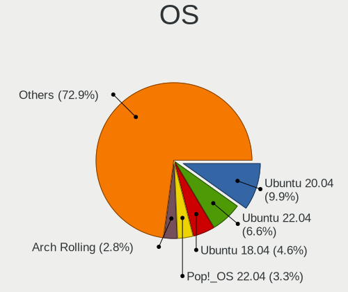
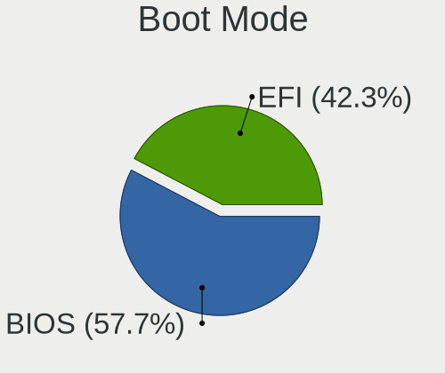
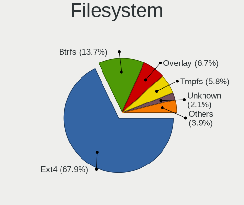
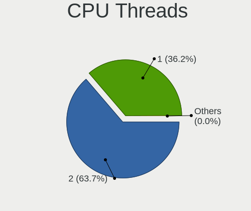
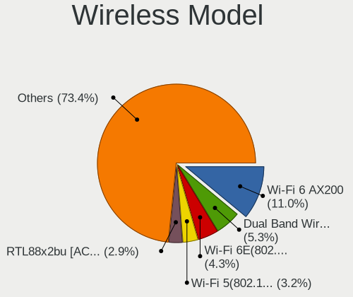

Linux in USA - Tested Hardware & Statistics (Desktops)
------------------------------------------------------

A project to collect tested hardware configurations for Linux in USA.

Anyone can contribute to this report by the [hw-probe](https://github.com/linuxhw/hw-probe) tool:

    sudo -E hw-probe -all -upload

Please contribute! Especially if your hardware is rare.

Contents
--------

* [ Test Cases ](#test-cases)

* [ System ](#system)
  - [ OS                       ](#os)
  - [ OS Family                ](#os-family)
  - [ Kernel                   ](#kernel)
  - [ Kernel Family            ](#kernel-family)
  - [ Kernel Major Ver.        ](#kernel-major-ver)
  - [ Arch                     ](#arch)
  - [ DE                       ](#de)
  - [ Display Server           ](#display-server)
  - [ Display Manager          ](#display-manager)
  - [ OS Lang                  ](#os-lang)
  - [ Boot Mode                ](#boot-mode)
  - [ Filesystem               ](#filesystem)
  - [ Part. scheme             ](#part-scheme)
  - [ Dual Boot with Linux/BSD ](#dual-boot-with-linuxbsd)
  - [ Dual Boot (Win)          ](#dual-boot-win)

* [ Board ](#board)
  - [ Vendor                   ](#vendor)
  - [ Model                    ](#model)
  - [ Model Family             ](#model-family)
  - [ MFG Year                 ](#mfg-year)
  - [ Form Factor              ](#form-factor)
  - [ Secure Boot              ](#secure-boot)
  - [ Coreboot                 ](#coreboot)
  - [ RAM Size                 ](#ram-size)
  - [ RAM Used                 ](#ram-used)
  - [ Total Drives             ](#total-drives)
  - [ Has CD-ROM               ](#has-cd-rom)
  - [ Has Ethernet             ](#has-ethernet)
  - [ Has WiFi                 ](#has-wifi)
  - [ Has Bluetooth            ](#has-bluetooth)

* [ Location ](#location)
  - [ Country                  ](#country)
  - [ City                     ](#city)

* [ Drives ](#drives)
  - [ Drive Vendor             ](#drive-vendor)
  - [ Drive Model              ](#drive-model)
  - [ HDD Vendor               ](#hdd-vendor)
  - [ SSD Vendor               ](#ssd-vendor)
  - [ Drive Kind               ](#drive-kind)
  - [ Drive Connector          ](#drive-connector)
  - [ Drive Size               ](#drive-size)
  - [ Space Total              ](#space-total)
  - [ Space Used               ](#space-used)
  - [ Malfunc. Drives          ](#malfunc-drives)
  - [ Malfunc. Drive Vendor    ](#malfunc-drive-vendor)
  - [ Malfunc. HDD Vendor      ](#malfunc-hdd-vendor)
  - [ Malfunc. Drive Kind      ](#malfunc-drive-kind)
  - [ Failed Drives            ](#failed-drives)
  - [ Failed Drive Vendor      ](#failed-drive-vendor)
  - [ Drive Status             ](#drive-status)

* [ Storage controller ](#storage-controller)
  - [ Storage Vendor           ](#storage-vendor)
  - [ Storage Model            ](#storage-model)
  - [ Storage Kind             ](#storage-kind)

* [ Processor ](#processor)
  - [ CPU Vendor               ](#cpu-vendor)
  - [ CPU Model                ](#cpu-model)
  - [ CPU Model Family         ](#cpu-model-family)
  - [ CPU Cores                ](#cpu-cores)
  - [ CPU Sockets              ](#cpu-sockets)
  - [ CPU Threads              ](#cpu-threads)
  - [ CPU Op-Modes             ](#cpu-op-modes)
  - [ CPU Microcode            ](#cpu-microcode)
  - [ CPU Microarch            ](#cpu-microarch)

* [ Graphics ](#graphics)
  - [ GPU Vendor               ](#gpu-vendor)
  - [ GPU Model                ](#gpu-model)
  - [ GPU Combo                ](#gpu-combo)
  - [ GPU Driver               ](#gpu-driver)
  - [ GPU Memory               ](#gpu-memory)

* [ Monitor ](#monitor)
  - [ Monitor Vendor           ](#monitor-vendor)
  - [ Monitor Model            ](#monitor-model)
  - [ Monitor Resolution       ](#monitor-resolution)
  - [ Monitor Diagonal         ](#monitor-diagonal)
  - [ Monitor Width            ](#monitor-width)
  - [ Aspect Ratio             ](#aspect-ratio)
  - [ Monitor Area             ](#monitor-area)
  - [ Pixel Density            ](#pixel-density)
  - [ Multiple Monitors        ](#multiple-monitors)

* [ Network ](#network)
  - [ Net Controller Vendor    ](#net-controller-vendor)
  - [ Net Controller Model     ](#net-controller-model)
  - [ Wireless Vendor          ](#wireless-vendor)
  - [ Wireless Model           ](#wireless-model)
  - [ Ethernet Vendor          ](#ethernet-vendor)
  - [ Ethernet Model           ](#ethernet-model)
  - [ Net Controller Kind      ](#net-controller-kind)
  - [ Used Controller          ](#used-controller)
  - [ NICs                     ](#nics)
  - [ IPv6                     ](#ipv6)

* [ Bluetooth ](#bluetooth)
  - [ Bluetooth Vendor         ](#bluetooth-vendor)
  - [ Bluetooth Model          ](#bluetooth-model)

* [ Sound ](#sound)
  - [ Sound Vendor             ](#sound-vendor)
  - [ Sound Model              ](#sound-model)

* [ Memory ](#memory)
  - [ Memory Vendor            ](#memory-vendor)
  - [ Memory Model             ](#memory-model)
  - [ Memory Kind              ](#memory-kind)
  - [ Memory Form Factor       ](#memory-form-factor)
  - [ Memory Size              ](#memory-size)
  - [ Memory Speed             ](#memory-speed)

* [ Printers & scanners ](#printers--scanners)
  - [ Printer Vendor           ](#printer-vendor)
  - [ Printer Model            ](#printer-model)
  - [ Scanner Vendor           ](#scanner-vendor)
  - [ Scanner Model            ](#scanner-model)

* [ Camera ](#camera)
  - [ Camera Vendor            ](#camera-vendor)
  - [ Camera Model             ](#camera-model)

* [ Security ](#security)
  - [ Fingerprint Vendor       ](#fingerprint-vendor)
  - [ Fingerprint Model        ](#fingerprint-model)
  - [ Chipcard Vendor          ](#chipcard-vendor)
  - [ Chipcard Model           ](#chipcard-model)

* [ Unsupported ](#unsupported)
  - [ Unsupported Devices      ](#unsupported-devices)
  - [ Unsupported Device Types ](#unsupported-device-types)

Test Cases
----------

Total: 24101

| Vendor        | Model                       | Probe                                                      | Date         |
|---------------|-----------------------------|------------------------------------------------------------|--------------|
| Gigabyte      | Z390 AORUS PRO WIFI-CF      | [3a67df5dcf](https://linux-hardware.org/?probe=3a67df5dcf) | Jan 02, 2024 |
| Gigabyte      | Z390 AORUS PRO WIFI-CF      | [b163926938](https://linux-hardware.org/?probe=b163926938) | Jan 02, 2024 |
| Azulle        | Byte 3                      | [28f6b7cbad](https://linux-hardware.org/?probe=28f6b7cbad) | Jan 02, 2024 |
| Dell          | 0C2XKD A01                  | [9accd399c5](https://linux-hardware.org/?probe=9accd399c5) | Jan 02, 2024 |
| ASUSTek       | ROG STRIX Z370-H GAMING     | [ee3998d501](https://linux-hardware.org/?probe=ee3998d501) | Jan 02, 2024 |
| Gigabyte      | B560 DS3H AC-Y1             | [9868062aa3](https://linux-hardware.org/?probe=9868062aa3) | Jan 02, 2024 |
| MSI           | PRO B650-P WIFI             | [544a799ce8](https://linux-hardware.org/?probe=544a799ce8) | Jan 02, 2024 |
| Dell          | 07KY25 A01                  | [7936cb8967](https://linux-hardware.org/?probe=7936cb8967) | Jan 02, 2024 |
| ASRock        | X470 Taichi                 | [93ce6b9074](https://linux-hardware.org/?probe=93ce6b9074) | Jan 02, 2024 |
| Dell          | 0NDYHG A01                  | [68cde01489](https://linux-hardware.org/?probe=68cde01489) | Jan 02, 2024 |
| Azulle        | Byte 3                      | [273bcd474a](https://linux-hardware.org/?probe=273bcd474a) | Jan 02, 2024 |
| HP            | 886C                        | [d076e5b70a](https://linux-hardware.org/?probe=d076e5b70a) | Jan 01, 2024 |
| Gigabyte      | X79-UP4                     | [4c7ec5ec88](https://linux-hardware.org/?probe=4c7ec5ec88) | Jan 01, 2024 |
| HP            | 0B4Ch D                     | [b7d97486fb](https://linux-hardware.org/?probe=b7d97486fb) | Jan 01, 2024 |
| ASUSTek       | TUF Gaming Z490-PLUS        | [ccaa0646d7](https://linux-hardware.org/?probe=ccaa0646d7) | Jan 01, 2024 |
| ASUSTek       | PRIME X570-P                | [f8dd732e7a](https://linux-hardware.org/?probe=f8dd732e7a) | Jan 01, 2024 |
| Dell          | 0YXT71 A02                  | [e08ca6924a](https://linux-hardware.org/?probe=e08ca6924a) | Jan 01, 2024 |
| ASRock        | B450M Gaming                | [81242d3eca](https://linux-hardware.org/?probe=81242d3eca) | Jan 01, 2024 |
| ASUSTek       | PRIME B550M-A               | [a4cf1bb1ea](https://linux-hardware.org/?probe=a4cf1bb1ea) | Jan 01, 2024 |
| Lenovo        | SHARKBAY SDK0E50519 WIN     | [fc9ced99d5](https://linux-hardware.org/?probe=fc9ced99d5) | Jan 01, 2024 |
| ASUSTek       | H97-PLUS                    | [e208caf8f1](https://linux-hardware.org/?probe=e208caf8f1) | Jan 01, 2024 |
| Gigabyte      | 970A-DS3P                   | [74a0ff16d4](https://linux-hardware.org/?probe=74a0ff16d4) | Jan 01, 2024 |
| ASRock        | Z690M Phantom Gaming 4      | [9b11da6c92](https://linux-hardware.org/?probe=9b11da6c92) | Jan 01, 2024 |
| ASUSTek       | TUF Gaming Z590-PLUS        | [6dbc709464](https://linux-hardware.org/?probe=6dbc709464) | Jan 01, 2024 |
| MSI           | 2AE0                        | [00b5d15112](https://linux-hardware.org/?probe=00b5d15112) | Jan 01, 2024 |
| ASUSTek       | M5A97 R2.0                  | [1e67ed5915](https://linux-hardware.org/?probe=1e67ed5915) | Jan 01, 2024 |
| HP            | 1850                        | [b635f6412c](https://linux-hardware.org/?probe=b635f6412c) | Jan 01, 2024 |
| MSI           | B550M PRO-VDH WIFI          | [b1f90491ab](https://linux-hardware.org/?probe=b1f90491ab) | Jan 01, 2024 |
| ASUSTek       | TUF Gaming B550-PLUS        | [4b8ffea2ef](https://linux-hardware.org/?probe=4b8ffea2ef) | Jan 01, 2024 |
| ASRock        | X399 Professional Gaming    | [2d812c76d3](https://linux-hardware.org/?probe=2d812c76d3) | Jan 01, 2024 |
| ASRock        | B450M Pro4                  | [126f6b0c9c](https://linux-hardware.org/?probe=126f6b0c9c) | Dec 31, 2023 |
| ASRock        | B450M Pro4                  | [8625e5d1fa](https://linux-hardware.org/?probe=8625e5d1fa) | Dec 31, 2023 |
| Foxconn       | 2ADA                        | [ae6e6ab09f](https://linux-hardware.org/?probe=ae6e6ab09f) | Dec 31, 2023 |
| Supermicro    | H13DSH                      | [4110ba22a1](https://linux-hardware.org/?probe=4110ba22a1) | Dec 31, 2023 |
| ASUSTek       | TUF Gaming B650M-PLUS WI... | [8635d2ee55](https://linux-hardware.org/?probe=8635d2ee55) | Dec 31, 2023 |
| Dell          | 0HX555                      | [72e32eaf42](https://linux-hardware.org/?probe=72e32eaf42) | Dec 31, 2023 |
| Dell          | 0HX555                      | [535a5964b8](https://linux-hardware.org/?probe=535a5964b8) | Dec 31, 2023 |
| Alienware     | 0VDT73 A00                  | [2a4b22a489](https://linux-hardware.org/?probe=2a4b22a489) | Dec 31, 2023 |
| HP            | 8704                        | [49843bcacc](https://linux-hardware.org/?probe=49843bcacc) | Dec 31, 2023 |
| MACHINIST     | X99-D8-MAX V1.0             | [ef584ae5a8](https://linux-hardware.org/?probe=ef584ae5a8) | Dec 31, 2023 |
| ASUSTek       | M5A78L-M PLUS/USB3          | [fda4d32a86](https://linux-hardware.org/?probe=fda4d32a86) | Dec 31, 2023 |
| Gigabyte      | X570S AORUS MASTER          | [cc1f8b0b86](https://linux-hardware.org/?probe=cc1f8b0b86) | Dec 31, 2023 |
| ASUSTek       | ROG CROSSHAIR X670E HERO    | [dd7c0e5406](https://linux-hardware.org/?probe=dd7c0e5406) | Dec 31, 2023 |
| HP            | 8643 SMVB                   | [2a12979b75](https://linux-hardware.org/?probe=2a12979b75) | Dec 31, 2023 |
| HP            | 8643 SMVB                   | [23b04c5445](https://linux-hardware.org/?probe=23b04c5445) | Dec 31, 2023 |
| Dell          | 0RW199                      | [62dc9ffa33](https://linux-hardware.org/?probe=62dc9ffa33) | Dec 31, 2023 |
| Gigabyte      | B650 AORUS ELITE AX         | [5f1c662ba4](https://linux-hardware.org/?probe=5f1c662ba4) | Dec 31, 2023 |
| Apple         | Mac-F221BEC8                | [57b09cabf5](https://linux-hardware.org/?probe=57b09cabf5) | Dec 31, 2023 |
| Dell          | 0C2XKD A01                  | [5e36d4fb43](https://linux-hardware.org/?probe=5e36d4fb43) | Dec 31, 2023 |
| ASRock        | Z97X Killer                 | [9508234fa4](https://linux-hardware.org/?probe=9508234fa4) | Dec 31, 2023 |
| ASUSTek       | P8H67-M PRO                 | [63d62dd94e](https://linux-hardware.org/?probe=63d62dd94e) | Dec 31, 2023 |
| MSI           | 970 GAMING                  | [7f7f8f09ae](https://linux-hardware.org/?probe=7f7f8f09ae) | Dec 31, 2023 |
| ASUSTek       | P8H67-M PRO                 | [6a45d6cf9e](https://linux-hardware.org/?probe=6a45d6cf9e) | Dec 30, 2023 |
| Gigabyte      | A620I AX                    | [7f73790fbf](https://linux-hardware.org/?probe=7f73790fbf) | Dec 30, 2023 |
| ASRock        | X570 Extreme4               | [13312e6a34](https://linux-hardware.org/?probe=13312e6a34) | Dec 30, 2023 |
| Unknown       | Unknown                     | [e6e8bd6545](https://linux-hardware.org/?probe=e6e8bd6545) | Dec 30, 2023 |
| ASUSTek       | PRIME X399-A                | [ac506b01e6](https://linux-hardware.org/?probe=ac506b01e6) | Dec 30, 2023 |
| HP            | 82F1                        | [9fc9cb3de0](https://linux-hardware.org/?probe=9fc9cb3de0) | Dec 30, 2023 |
| HP            | 81B4                        | [b596129d5d](https://linux-hardware.org/?probe=b596129d5d) | Dec 30, 2023 |
| Dell          | 0VRWRC A00                  | [c58ff5350b](https://linux-hardware.org/?probe=c58ff5350b) | Dec 30, 2023 |
| ASRock        | B450M Pro4 R2.0             | [fa7e23a6ee](https://linux-hardware.org/?probe=fa7e23a6ee) | Dec 30, 2023 |
| Dell          | 0R6PCT A01                  | [8409c4a0d6](https://linux-hardware.org/?probe=8409c4a0d6) | Dec 30, 2023 |
| Gigabyte      | Z370P D3-CF                 | [4c2ef0d59a](https://linux-hardware.org/?probe=4c2ef0d59a) | Dec 30, 2023 |
| Gigabyte      | B550M K                     | [8340ced087](https://linux-hardware.org/?probe=8340ced087) | Dec 30, 2023 |
| Dell          | 0KV62T A02                  | [0722563902](https://linux-hardware.org/?probe=0722563902) | Dec 30, 2023 |
| Gigabyte      | B650 AORUS ELITE AX         | [aa8dc3e6ae](https://linux-hardware.org/?probe=aa8dc3e6ae) | Dec 30, 2023 |
| Dell          | 0C522T A03                  | [67a47d8d83](https://linux-hardware.org/?probe=67a47d8d83) | Dec 30, 2023 |
| Gigabyte      | Z77X-UD3H                   | [85c8033229](https://linux-hardware.org/?probe=85c8033229) | Dec 30, 2023 |
| HP            | 212B                        | [0ca173f4a7](https://linux-hardware.org/?probe=0ca173f4a7) | Dec 30, 2023 |
| Dell          | 0M5DCD A00                  | [a85c9d93c8](https://linux-hardware.org/?probe=a85c9d93c8) | Dec 30, 2023 |
| Pegatron      | 2A9A                        | [92def1bf4a](https://linux-hardware.org/?probe=92def1bf4a) | Dec 30, 2023 |
| ASUSTek       | ROG STRIX B350-F GAMING     | [b8c7cbf672](https://linux-hardware.org/?probe=b8c7cbf672) | Dec 30, 2023 |
| Apple         | Mac-F4208AC8 PVT            | [11a7c2b836](https://linux-hardware.org/?probe=11a7c2b836) | Dec 30, 2023 |
| ASUSTek       | TUF Gaming X570-PLUS        | [7dca6779be](https://linux-hardware.org/?probe=7dca6779be) | Dec 29, 2023 |
| Pegatron      | 2ACD                        | [44b4857097](https://linux-hardware.org/?probe=44b4857097) | Dec 29, 2023 |
| HP            | 212B                        | [6afcd77ad6](https://linux-hardware.org/?probe=6afcd77ad6) | Dec 29, 2023 |
| HP            | 304Ah                       | [0a84d8bd4a](https://linux-hardware.org/?probe=0a84d8bd4a) | Dec 29, 2023 |
| ASUSTek       | M5A99FX PRO R2.0            | [c6cd1c43ba](https://linux-hardware.org/?probe=c6cd1c43ba) | Dec 29, 2023 |
| Dell          | 0HD5W2 A01                  | [91ac22ebca](https://linux-hardware.org/?probe=91ac22ebca) | Dec 29, 2023 |
| Gigabyte      | X79-UP4                     | [618dfee965](https://linux-hardware.org/?probe=618dfee965) | Dec 29, 2023 |
| eMachines     | EMCP73VT-PM                 | [cd0de3ca07](https://linux-hardware.org/?probe=cd0de3ca07) | Dec 29, 2023 |
| ASRock        | B550M-C                     | [ba3fa09385](https://linux-hardware.org/?probe=ba3fa09385) | Dec 29, 2023 |
| Dell          | 00V62H A01                  | [0032f131d1](https://linux-hardware.org/?probe=0032f131d1) | Dec 29, 2023 |
| Dell          | 096JG8 A01                  | [915a028a6a](https://linux-hardware.org/?probe=915a028a6a) | Dec 29, 2023 |
| ASUSTek       | M5A97 R2.0                  | [c5bc64bc85](https://linux-hardware.org/?probe=c5bc64bc85) | Dec 29, 2023 |
| EPoX Compu... | MCP61 Series                | [730493cca3](https://linux-hardware.org/?probe=730493cca3) | Dec 29, 2023 |
| HP            | 8455                        | [3fb91b1137](https://linux-hardware.org/?probe=3fb91b1137) | Dec 29, 2023 |
| HP            | 8455                        | [1cb18d157d](https://linux-hardware.org/?probe=1cb18d157d) | Dec 29, 2023 |
| Gigabyte      | X570 I AORUS PRO WIFI       | [50f2afc829](https://linux-hardware.org/?probe=50f2afc829) | Dec 29, 2023 |
| Dell          | 0V8WGR A00                  | [e6479e42e3](https://linux-hardware.org/?probe=e6479e42e3) | Dec 29, 2023 |
| ASUSTek       | ROG STRIX Z790-E GAMING ... | [6954b67b3e](https://linux-hardware.org/?probe=6954b67b3e) | Dec 29, 2023 |
| ASUSTek       | PRIME X399-A                | [4d46811257](https://linux-hardware.org/?probe=4d46811257) | Dec 29, 2023 |
| ASUSTek       | CM6870                      | [529b92f758](https://linux-hardware.org/?probe=529b92f758) | Dec 28, 2023 |
| HP            | 0B4Ch D                     | [7b5d790450](https://linux-hardware.org/?probe=7b5d790450) | Dec 28, 2023 |
| Lenovo        | 310B SDK0J40697 WIN 3305... | [e49bfae343](https://linux-hardware.org/?probe=e49bfae343) | Dec 28, 2023 |
| ASUSTek       | ROG STRIX B550-F GAMING ... | [94b90795bb](https://linux-hardware.org/?probe=94b90795bb) | Dec 28, 2023 |
| Pegatron      | 2AB6                        | [faf90bb1a2](https://linux-hardware.org/?probe=faf90bb1a2) | Dec 28, 2023 |
| Pegatron      | 2AB6                        | [6eb51d9bd9](https://linux-hardware.org/?probe=6eb51d9bd9) | Dec 28, 2023 |
| HP            | 8265                        | [94344dbe98](https://linux-hardware.org/?probe=94344dbe98) | Dec 28, 2023 |
| ASUSTek       | ROG STRIX B450-F GAMING     | [2d2449e5d7](https://linux-hardware.org/?probe=2d2449e5d7) | Dec 28, 2023 |
| ASUSTek       | PRIME Z790-P WIFI           | [f52a281bd2](https://linux-hardware.org/?probe=f52a281bd2) | Dec 28, 2023 |
| MSI           | MPG B550 GAMING PLUS        | [8df141917e](https://linux-hardware.org/?probe=8df141917e) | Dec 28, 2023 |
| HP            | 3029h                       | [de537af4ba](https://linux-hardware.org/?probe=de537af4ba) | Dec 28, 2023 |
| ASUSTek       | PRIME X570-P                | [29084d784b](https://linux-hardware.org/?probe=29084d784b) | Dec 28, 2023 |
| Lenovo        | 317C SDK0J40700 WIN 3258... | [f24d5f341c](https://linux-hardware.org/?probe=f24d5f341c) | Dec 28, 2023 |
| Dell          | 0GDG8Y A00                  | [59c76d34e1](https://linux-hardware.org/?probe=59c76d34e1) | Dec 27, 2023 |
| MSI           | MPG X570 GAMING PLUS        | [0b3af4418c](https://linux-hardware.org/?probe=0b3af4418c) | Dec 27, 2023 |
| ASRock        | B660M Pro RS                | [0ddd3db13a](https://linux-hardware.org/?probe=0ddd3db13a) | Dec 27, 2023 |
| MSI           | X470 GAMING PLUS MAX        | [758aa4d9a1](https://linux-hardware.org/?probe=758aa4d9a1) | Dec 27, 2023 |
| MSI           | MEG X570S ACE MAX           | [cb4d6d8724](https://linux-hardware.org/?probe=cb4d6d8724) | Dec 27, 2023 |
| Gigabyte      | GA-78LMT-USB3 SEx           | [bf8bcdbc55](https://linux-hardware.org/?probe=bf8bcdbc55) | Dec 27, 2023 |
| ASUSTek       | A8N32-SLI-Deluxe            | [e6d0034f2d](https://linux-hardware.org/?probe=e6d0034f2d) | Dec 27, 2023 |
| ASRock        | X399 Phantom Gaming 6       | [3d57263239](https://linux-hardware.org/?probe=3d57263239) | Dec 27, 2023 |
| eMachines     | MCP61PM-GM                  | [08b1aaf187](https://linux-hardware.org/?probe=08b1aaf187) | Dec 27, 2023 |
| Foxconn       | 2AB7                        | [2d0962bbfa](https://linux-hardware.org/?probe=2d0962bbfa) | Dec 27, 2023 |
| Foxconn       | 2AB7                        | [b1b00dd0b5](https://linux-hardware.org/?probe=b1b00dd0b5) | Dec 27, 2023 |
| ASUSTek       | TUF Gaming Z690-PLUS WIF... | [f9484ac33e](https://linux-hardware.org/?probe=f9484ac33e) | Dec 27, 2023 |
| Lenovo        | 1036 NO DPK                 | [16e3fbc6bb](https://linux-hardware.org/?probe=16e3fbc6bb) | Dec 27, 2023 |
| HP            | 81BB                        | [354921dd8b](https://linux-hardware.org/?probe=354921dd8b) | Dec 27, 2023 |
| ASUSTek       | PRIME B550-PLUS AC-HES      | [3acdabd584](https://linux-hardware.org/?probe=3acdabd584) | Dec 27, 2023 |
| Gigabyte      | AB350N-Gaming WIFI-CF       | [fccf2df94e](https://linux-hardware.org/?probe=fccf2df94e) | Dec 27, 2023 |
| Unknown       | Unknown                     | [d9355d1b8b](https://linux-hardware.org/?probe=d9355d1b8b) | Dec 27, 2023 |
| MSI           | X470 GAMING PLUS MAX        | [c1d9037478](https://linux-hardware.org/?probe=c1d9037478) | Dec 27, 2023 |
| Lenovo        | SHARKBAY 0B98401 PRO        | [bc9feace53](https://linux-hardware.org/?probe=bc9feace53) | Dec 27, 2023 |
| ASUSTek       | PRIME X570-PRO              | [104529fd86](https://linux-hardware.org/?probe=104529fd86) | Dec 26, 2023 |
| ASUSTek       | P6T DELUXE V2               | [412f9dbf1e](https://linux-hardware.org/?probe=412f9dbf1e) | Dec 26, 2023 |
| ASUSTek       | ROG STRIX B450-F GAMING ... | [d2aa91af66](https://linux-hardware.org/?probe=d2aa91af66) | Dec 26, 2023 |
| Gigabyte      | GA-880GM-UD2H               | [0516914d99](https://linux-hardware.org/?probe=0516914d99) | Dec 26, 2023 |
| ASUSTek       | ProArt X670E-CREATOR WIF... | [ce4c03fbee](https://linux-hardware.org/?probe=ce4c03fbee) | Dec 26, 2023 |
| ASRock        | B450M Pro4                  | [77d5e43585](https://linux-hardware.org/?probe=77d5e43585) | Dec 26, 2023 |
| Dell          | 0M5DCD A00                  | [3444d7393c](https://linux-hardware.org/?probe=3444d7393c) | Dec 26, 2023 |
| Gigabyte      | X670 AORUS ELITE AX         | [267c545497](https://linux-hardware.org/?probe=267c545497) | Dec 26, 2023 |
| ASRock        | B660M Steel Legend          | [81860bf790](https://linux-hardware.org/?probe=81860bf790) | Dec 26, 2023 |
| Dell          | 042P49 A02                  | [67c9288ec5](https://linux-hardware.org/?probe=67c9288ec5) | Dec 26, 2023 |
| MSI           | PRO B660-A DDR4             | [e86c539df8](https://linux-hardware.org/?probe=e86c539df8) | Dec 26, 2023 |
| ASUSTek       | TUF Gaming X570-PLUS        | [83eea945be](https://linux-hardware.org/?probe=83eea945be) | Dec 26, 2023 |
| Dell          | 0D6H9T A00                  | [280147184f](https://linux-hardware.org/?probe=280147184f) | Dec 26, 2023 |
| HP            | 1495                        | [c8b50e17f9](https://linux-hardware.org/?probe=c8b50e17f9) | Dec 26, 2023 |
| NCR           | Monaco BIOS.9.1             | [afa7781093](https://linux-hardware.org/?probe=afa7781093) | Dec 26, 2023 |
| ASRock        | X670E Taichi                | [281602cb0e](https://linux-hardware.org/?probe=281602cb0e) | Dec 26, 2023 |
| ASUSTek       | ROG STRIX X470-F GAMING     | [39eb82bb24](https://linux-hardware.org/?probe=39eb82bb24) | Dec 25, 2023 |
| HP            | 8876 11                     | [ffec9b5140](https://linux-hardware.org/?probe=ffec9b5140) | Dec 25, 2023 |
| Gigabyte      | Z370P D3-CF                 | [7fcdc0004a](https://linux-hardware.org/?probe=7fcdc0004a) | Dec 25, 2023 |
| ASUSTek       | TUF Gaming B650M-PLUS WI... | [a5ca58e524](https://linux-hardware.org/?probe=a5ca58e524) | Dec 25, 2023 |
| ASUSTek       | CG5275                      | [07c6264eec](https://linux-hardware.org/?probe=07c6264eec) | Dec 25, 2023 |
| Dell          | 0GDG8Y A00                  | [52a5621ef8](https://linux-hardware.org/?probe=52a5621ef8) | Dec 25, 2023 |
| Gigabyte      | P55-UD4P                    | [62b547894e](https://linux-hardware.org/?probe=62b547894e) | Dec 25, 2023 |
| ASUSTek       | PRIME X570-P                | [a78cd32bbe](https://linux-hardware.org/?probe=a78cd32bbe) | Dec 25, 2023 |
| Dell          | 084J0R A00                  | [856558c97d](https://linux-hardware.org/?probe=856558c97d) | Dec 25, 2023 |
| Intel         | DH77EB AAG39073-304         | [0cee3977a0](https://linux-hardware.org/?probe=0cee3977a0) | Dec 25, 2023 |
| Dell          | 0MN1TX A04                  | [ba94c75ba0](https://linux-hardware.org/?probe=ba94c75ba0) | Dec 25, 2023 |
| MSI           | MPG X570S CARBON MAX WIF... | [463b7572aa](https://linux-hardware.org/?probe=463b7572aa) | Dec 25, 2023 |
| Intel         | DB75EN                      | [c2c820f0d9](https://linux-hardware.org/?probe=c2c820f0d9) | Dec 25, 2023 |
| ASUSTek       | PRIME X570-P                | [c70c575614](https://linux-hardware.org/?probe=c70c575614) | Dec 25, 2023 |
| Dell          | 0JCTF8 A00                  | [988e9fc65c](https://linux-hardware.org/?probe=988e9fc65c) | Dec 25, 2023 |
| ASUSTek       | G10DK                       | [b1132c5478](https://linux-hardware.org/?probe=b1132c5478) | Dec 25, 2023 |
| ASUSTek       | ROG STRIX B550-F GAMING     | [5dea927ca9](https://linux-hardware.org/?probe=5dea927ca9) | Dec 24, 2023 |
| Intel         | DB75EN                      | [6ec790f3fc](https://linux-hardware.org/?probe=6ec790f3fc) | Dec 24, 2023 |
| Gigabyte      | B550 UD AC                  | [b00112da41](https://linux-hardware.org/?probe=b00112da41) | Dec 24, 2023 |
| MSI           | MAG X670E TOMAHAWK WIFI     | [2719a2d81f](https://linux-hardware.org/?probe=2719a2d81f) | Dec 24, 2023 |
| HP            | 2AF7                        | [2fc4d5dd6b](https://linux-hardware.org/?probe=2fc4d5dd6b) | Dec 24, 2023 |
| ASUSTek       | Z97-A-USB31                 | [7789aa889f](https://linux-hardware.org/?probe=7789aa889f) | Dec 24, 2023 |
| HP            | 2AF7                        | [baa5012432](https://linux-hardware.org/?probe=baa5012432) | Dec 24, 2023 |
| Unknown       | Unknown                     | [750b06a365](https://linux-hardware.org/?probe=750b06a365) | Dec 24, 2023 |
| ASUSTek       | ROG STRIX X670E-E GAMING... | [4b08f610ed](https://linux-hardware.org/?probe=4b08f610ed) | Dec 24, 2023 |
| ASRock        | 990FX Professional          | [34c4b1fbd4](https://linux-hardware.org/?probe=34c4b1fbd4) | Dec 24, 2023 |
| MSI           | B450 GAMING PLUS MAX        | [587884179e](https://linux-hardware.org/?probe=587884179e) | Dec 24, 2023 |
| HP            | 82F1                        | [86959f8199](https://linux-hardware.org/?probe=86959f8199) | Dec 24, 2023 |
| Gigabyte      | AB350N-Gaming WIFI-CF       | [27a814dd64](https://linux-hardware.org/?probe=27a814dd64) | Dec 24, 2023 |
| HP            | 8918                        | [4b922c3362](https://linux-hardware.org/?probe=4b922c3362) | Dec 24, 2023 |
| HP            | 2B29                        | [93ef9f39bd](https://linux-hardware.org/?probe=93ef9f39bd) | Dec 24, 2023 |
| MSI           | MPG B650 EDGE WIFI          | [8503d79f6c](https://linux-hardware.org/?probe=8503d79f6c) | Dec 24, 2023 |
| ASRock        | X670E Taichi Carrara        | [3c53e69328](https://linux-hardware.org/?probe=3c53e69328) | Dec 24, 2023 |
| ASUSTek       | P5GC-MX/1333                | [a95c11e27b](https://linux-hardware.org/?probe=a95c11e27b) | Dec 23, 2023 |
| ASRock        | B450 Gaming-ITX/ac          | [6c6f281927](https://linux-hardware.org/?probe=6c6f281927) | Dec 23, 2023 |
| ASRock        | B450 Gaming-ITX/ac          | [5590fcbfaf](https://linux-hardware.org/?probe=5590fcbfaf) | Dec 23, 2023 |
| HP            | 1998                        | [c2e72e513c](https://linux-hardware.org/?probe=c2e72e513c) | Dec 23, 2023 |
| ASUSTek       | P8Z77-V PRO                 | [4f8558438f](https://linux-hardware.org/?probe=4f8558438f) | Dec 23, 2023 |
| ASRock        | Z97 Pro4                    | [f8e2df67b1](https://linux-hardware.org/?probe=f8e2df67b1) | Dec 23, 2023 |
| Unknown       | Unknown                     | [3ead5f7cee](https://linux-hardware.org/?probe=3ead5f7cee) | Dec 23, 2023 |
| MSI           | PRO Z790-A WIFI             | [9b8ad6a3f1](https://linux-hardware.org/?probe=9b8ad6a3f1) | Dec 23, 2023 |
| Gigabyte      | X570 AORUS ELITE WIFI       | [6c9e82db47](https://linux-hardware.org/?probe=6c9e82db47) | Dec 23, 2023 |
| Dell          | 0D6H9T A00                  | [f6dd1b447a](https://linux-hardware.org/?probe=f6dd1b447a) | Dec 23, 2023 |
| ASUSTek       | M5A99FX PRO R2.0            | [1622d9b25b](https://linux-hardware.org/?probe=1622d9b25b) | Dec 23, 2023 |
| HP            | 8299                        | [7cb3e71107](https://linux-hardware.org/?probe=7cb3e71107) | Dec 23, 2023 |
| HPE           | ProLiant MicroServer Gen... | [4d38d67af1](https://linux-hardware.org/?probe=4d38d67af1) | Dec 23, 2023 |
| eMachines     | EL1360                      | [af31609559](https://linux-hardware.org/?probe=af31609559) | Dec 23, 2023 |
| Unknown       | Unknown                     | [41b66d1144](https://linux-hardware.org/?probe=41b66d1144) | Dec 23, 2023 |
| ASUSTek       | ROG CROSSHAIR VIII IMPAC... | [a953876b2c](https://linux-hardware.org/?probe=a953876b2c) | Dec 23, 2023 |
| Gigabyte      | X570 AORUS PRO WIFI         | [bbd50ba27b](https://linux-hardware.org/?probe=bbd50ba27b) | Dec 23, 2023 |
| ASRock        | H77 Pro4-M                  | [e2bc5dabc2](https://linux-hardware.org/?probe=e2bc5dabc2) | Dec 22, 2023 |
| Dell          | 0FDY5C A00                  | [a3fc39604c](https://linux-hardware.org/?probe=a3fc39604c) | Dec 22, 2023 |
| ASRock        | 4X4-4000 Series             | [b4333bcaaf](https://linux-hardware.org/?probe=b4333bcaaf) | Dec 22, 2023 |
| Dell          | 0K3CM7 A00                  | [019b46745e](https://linux-hardware.org/?probe=019b46745e) | Dec 22, 2023 |
| ASRock        | Z790 Taichi                 | [3bc8305321](https://linux-hardware.org/?probe=3bc8305321) | Dec 22, 2023 |
| Dell          | 0D6H9T A00                  | [84275b737e](https://linux-hardware.org/?probe=84275b737e) | Dec 22, 2023 |
| Gigabyte      | B650 GAMING X AX            | [9c0210d1ed](https://linux-hardware.org/?probe=9c0210d1ed) | Dec 22, 2023 |
| MSI           | PRO Z790-A WIFI             | [8e38fb94ba](https://linux-hardware.org/?probe=8e38fb94ba) | Dec 22, 2023 |
| HP            | 8626                        | [b04d9fcad9](https://linux-hardware.org/?probe=b04d9fcad9) | Dec 22, 2023 |
| Gigabyte      | B550 AORUS PRO AC           | [de502eec48](https://linux-hardware.org/?probe=de502eec48) | Dec 22, 2023 |
| Dell          | 0HY9JP A02                  | [6f47019169](https://linux-hardware.org/?probe=6f47019169) | Dec 22, 2023 |
| Gigabyte      | Z390 AORUS PRO WIFI-CF      | [8a2d46dced](https://linux-hardware.org/?probe=8a2d46dced) | Dec 22, 2023 |
| ASUSTek       | B150-PRO D3                 | [a686071950](https://linux-hardware.org/?probe=a686071950) | Dec 22, 2023 |
| LattePanda    | Sigma                       | [09cb864933](https://linux-hardware.org/?probe=09cb864933) | Dec 22, 2023 |
| Alienware     | 0K9TKY A00                  | [ec6847b7f2](https://linux-hardware.org/?probe=ec6847b7f2) | Dec 22, 2023 |
| ASUSTek       | ROG STRIX Z790-I GAMING ... | [60e10649cc](https://linux-hardware.org/?probe=60e10649cc) | Dec 22, 2023 |
| Gigabyte      | H610M S2H                   | [6c554a9668](https://linux-hardware.org/?probe=6c554a9668) | Dec 22, 2023 |
| ASRock        | J3160DC-ITX                 | [c84aa85d4e](https://linux-hardware.org/?probe=c84aa85d4e) | Dec 22, 2023 |
| Gigabyte      | P35-DS3R                    | [741ad16651](https://linux-hardware.org/?probe=741ad16651) | Dec 22, 2023 |
| SHANGZHAOY... | B85M-PRO V1.1               | [bd7c6e2693](https://linux-hardware.org/?probe=bd7c6e2693) | Dec 22, 2023 |
| Intel         | DH77EB AAG39073-304         | [83183dbb01](https://linux-hardware.org/?probe=83183dbb01) | Dec 21, 2023 |
| Gigabyte      | Z170X-UD5-CF                | [67662437e4](https://linux-hardware.org/?probe=67662437e4) | Dec 21, 2023 |
| ASUSTek       | ROG STRIX X670E-E GAMING... | [278967cf92](https://linux-hardware.org/?probe=278967cf92) | Dec 21, 2023 |
| ASUSTek       | M3N78-VM                    | [bd28c77bd4](https://linux-hardware.org/?probe=bd28c77bd4) | Dec 21, 2023 |
| MSI           | X570-A PRO                  | [07a7762b25](https://linux-hardware.org/?probe=07a7762b25) | Dec 21, 2023 |
| Dell          | OptiPlex 5050               | [c1cffe744f](https://linux-hardware.org/?probe=c1cffe744f) | Dec 21, 2023 |
| ASUSTek       | Z87-PRO                     | [1c5b8cb7de](https://linux-hardware.org/?probe=1c5b8cb7de) | Dec 21, 2023 |
| Gigabyte      | Z390 AORUS PRO WIFI-CF      | [8eca3c15e7](https://linux-hardware.org/?probe=8eca3c15e7) | Dec 21, 2023 |
| HP            | 2B4B                        | [19a3edb061](https://linux-hardware.org/?probe=19a3edb061) | Dec 21, 2023 |
| ASUSTek       | Z10PG-D16 Series            | [6b3c6c4099](https://linux-hardware.org/?probe=6b3c6c4099) | Dec 21, 2023 |
| HP            | 2B28                        | [a3c79770af](https://linux-hardware.org/?probe=a3c79770af) | Dec 21, 2023 |
| ASUSTek       | PRIME Z690-P                | [72187eb090](https://linux-hardware.org/?probe=72187eb090) | Dec 21, 2023 |
| AZW           | EQ                          | [11b8a012c0](https://linux-hardware.org/?probe=11b8a012c0) | Dec 21, 2023 |
| Apple         | Mac-F221BEC8                | [c5d51ca43d](https://linux-hardware.org/?probe=c5d51ca43d) | Dec 21, 2023 |
| MSI           | H81M-E34                    | [4b1991c655](https://linux-hardware.org/?probe=4b1991c655) | Dec 21, 2023 |
| HP            | 82F1                        | [6e05cf58df](https://linux-hardware.org/?probe=6e05cf58df) | Dec 20, 2023 |
| Gigabyte      | Z390 DESIGNARE-CF           | [680a9f5001](https://linux-hardware.org/?probe=680a9f5001) | Dec 20, 2023 |
| HP            | 3396                        | [d0d084ecc8](https://linux-hardware.org/?probe=d0d084ecc8) | Dec 20, 2023 |
| Dell          | 0D6H9T A00                  | [2c968508ee](https://linux-hardware.org/?probe=2c968508ee) | Dec 20, 2023 |
| MSI           | MPG X570 GAMING PRO CARB... | [67098aebca](https://linux-hardware.org/?probe=67098aebca) | Dec 20, 2023 |
| Gigabyte      | Z77X-UD3H                   | [25a077d35e](https://linux-hardware.org/?probe=25a077d35e) | Dec 20, 2023 |
| Dell          | 042P49 A01                  | [fb968ffb8b](https://linux-hardware.org/?probe=fb968ffb8b) | Dec 20, 2023 |
| Gigabyte      | B550M DS3H                  | [35547b20b3](https://linux-hardware.org/?probe=35547b20b3) | Dec 20, 2023 |
| MSI           | PRO Z690-A DDR4             | [55f164e414](https://linux-hardware.org/?probe=55f164e414) | Dec 20, 2023 |
| Gigabyte      | Z690 AORUS XTREME           | [c721656dbe](https://linux-hardware.org/?probe=c721656dbe) | Dec 20, 2023 |
| Gigabyte      | Z390 UD                     | [d2841c3b1e](https://linux-hardware.org/?probe=d2841c3b1e) | Dec 20, 2023 |
| ASUSTek       | K30AD_M31AD_M51AD_M32AD     | [ee1a222677](https://linux-hardware.org/?probe=ee1a222677) | Dec 20, 2023 |
| ASUSTek       | Maximus VIII EXTREME        | [d2ed93003e](https://linux-hardware.org/?probe=d2ed93003e) | Dec 20, 2023 |
| AZW           | MINI S                      | [78169fe4be](https://linux-hardware.org/?probe=78169fe4be) | Dec 20, 2023 |
| Unknown       | Unknown                     | [2ff77e3571](https://linux-hardware.org/?probe=2ff77e3571) | Dec 20, 2023 |
| Gigabyte      | B650 AORUS ELITE AX         | [8703894e1c](https://linux-hardware.org/?probe=8703894e1c) | Dec 20, 2023 |
| ASUSTek       | M3N78-VM                    | [5d7048af51](https://linux-hardware.org/?probe=5d7048af51) | Dec 20, 2023 |
| MSI           | PRO Z690-A DDR4             | [b758a439b8](https://linux-hardware.org/?probe=b758a439b8) | Dec 20, 2023 |
| ASUSTek       | TUF Gaming X570-PLUS        | [f912bcd96a](https://linux-hardware.org/?probe=f912bcd96a) | Dec 20, 2023 |
| HP            | 1998                        | [bc41363911](https://linux-hardware.org/?probe=bc41363911) | Dec 20, 2023 |
| Dell          | 042P49 A01                  | [8e5afdac96](https://linux-hardware.org/?probe=8e5afdac96) | Dec 20, 2023 |
| Supermicro    | X9DRD-7LN4F                 | [56a303c264](https://linux-hardware.org/?probe=56a303c264) | Dec 20, 2023 |
| ASUSTek       | TUF Gaming Z790-PLUS WIF... | [b45e149ce8](https://linux-hardware.org/?probe=b45e149ce8) | Dec 20, 2023 |
| ASRock        | AB350 Pro4                  | [bb15070eb2](https://linux-hardware.org/?probe=bb15070eb2) | Dec 19, 2023 |
| ASUSTek       | TUF Gaming Z790-PLUS WIF... | [10470437db](https://linux-hardware.org/?probe=10470437db) | Dec 19, 2023 |
| ASUSTek       | PRIME A320M-K               | [3eead324a8](https://linux-hardware.org/?probe=3eead324a8) | Dec 19, 2023 |
| ASRock        | 970M Pro3                   | [85233c464d](https://linux-hardware.org/?probe=85233c464d) | Dec 19, 2023 |
| ASRock        | 970M Pro3                   | [acebee7435](https://linux-hardware.org/?probe=acebee7435) | Dec 19, 2023 |
| System76      | Thelio thelio-r3            | [86b686b3cf](https://linux-hardware.org/?probe=86b686b3cf) | Dec 19, 2023 |
| ECS           | Nettle2                     | [b6a487a1d8](https://linux-hardware.org/?probe=b6a487a1d8) | Dec 19, 2023 |
| ASUSTek       | ROG STRIX X570-E GAMING     | [18cb796b47](https://linux-hardware.org/?probe=18cb796b47) | Dec 19, 2023 |
| ASUSTek       | ROG STRIX B450-F GAMING     | [67c84a4903](https://linux-hardware.org/?probe=67c84a4903) | Dec 19, 2023 |
| Dell          | 042P49 A02                  | [11f6da5848](https://linux-hardware.org/?probe=11f6da5848) | Dec 19, 2023 |
| ASUSTek       | Maximus VII HERO            | [30ecc8cbbb](https://linux-hardware.org/?probe=30ecc8cbbb) | Dec 19, 2023 |
| ASUSTek       | PRIME Z390-P                | [29169b6700](https://linux-hardware.org/?probe=29169b6700) | Dec 19, 2023 |
| HP            | 0AA8h                       | [49435a98d1](https://linux-hardware.org/?probe=49435a98d1) | Dec 19, 2023 |
| AAEON         | MF-001 V1.0                 | [9e7c59246d](https://linux-hardware.org/?probe=9e7c59246d) | Dec 19, 2023 |
| ASRock        | B450M/ac                    | [1375b869d1](https://linux-hardware.org/?probe=1375b869d1) | Dec 19, 2023 |
| ECS           | GeForce 8000 series         | [d436bb4acc](https://linux-hardware.org/?probe=d436bb4acc) | Dec 19, 2023 |
| MSI           | H97M-P35                    | [759943cd15](https://linux-hardware.org/?probe=759943cd15) | Dec 19, 2023 |
| ASRock        | X570 Steel Legend           | [0fe8df6dfe](https://linux-hardware.org/?probe=0fe8df6dfe) | Dec 19, 2023 |
| HP            | 3033h                       | [e57ef2fb67](https://linux-hardware.org/?probe=e57ef2fb67) | Dec 19, 2023 |
| ASRock        | B550 Phantom Gaming 4/ac    | [0759f6c04f](https://linux-hardware.org/?probe=0759f6c04f) | Dec 19, 2023 |
| ASRock        | B550 Phantom Gaming 4/ac    | [939c3a4be6](https://linux-hardware.org/?probe=939c3a4be6) | Dec 19, 2023 |
| Biostar       | A55MH                       | [f1106ef8c7](https://linux-hardware.org/?probe=f1106ef8c7) | Dec 19, 2023 |
| Dell          | 0Y7WYT A00                  | [705321d0b6](https://linux-hardware.org/?probe=705321d0b6) | Dec 19, 2023 |
| HP            | 3647h                       | [0e741d6d7c](https://linux-hardware.org/?probe=0e741d6d7c) | Dec 18, 2023 |
| ASUSTek       | WS X299 SAGE                | [cc5a70ea88](https://linux-hardware.org/?probe=cc5a70ea88) | Dec 18, 2023 |
| Supermicro    | X7DWA                       | [2ea00dfda4](https://linux-hardware.org/?probe=2ea00dfda4) | Dec 18, 2023 |
| MSI           | MAG X570 TOMAHAWK WIFI      | [e4916226ac](https://linux-hardware.org/?probe=e4916226ac) | Dec 18, 2023 |
| ASUSTek       | ROG STRIX B550-F GAMING     | [a36fe89aa8](https://linux-hardware.org/?probe=a36fe89aa8) | Dec 18, 2023 |
| Supermicro    | X7DWA                       | [6357637f80](https://linux-hardware.org/?probe=6357637f80) | Dec 18, 2023 |
| HP            | 8653 A                      | [0fd89faa0c](https://linux-hardware.org/?probe=0fd89faa0c) | Dec 18, 2023 |
| HP            | 1998                        | [1d45f9958a](https://linux-hardware.org/?probe=1d45f9958a) | Dec 18, 2023 |
| HP            | 8643 SMVB                   | [70ece5f797](https://linux-hardware.org/?probe=70ece5f797) | Dec 18, 2023 |
| BESSTAR Te... | T3 MRD                      | [56e6c430f4](https://linux-hardware.org/?probe=56e6c430f4) | Dec 18, 2023 |
| BESSTAR Te... | T3 MRD                      | [03025f41df](https://linux-hardware.org/?probe=03025f41df) | Dec 18, 2023 |
| ASUSTek       | WS X299 SAGE                | [6e76ff78f6](https://linux-hardware.org/?probe=6e76ff78f6) | Dec 18, 2023 |
| ASUSTek       | ROG STRIX X570-E GAMING     | [c2a8ace4dd](https://linux-hardware.org/?probe=c2a8ace4dd) | Dec 18, 2023 |
| Gigabyte      | B550 GAMING X               | [6ecd3ce2c3](https://linux-hardware.org/?probe=6ecd3ce2c3) | Dec 18, 2023 |
| ASRock        | X570 Steel Legend           | [16550580d3](https://linux-hardware.org/?probe=16550580d3) | Dec 18, 2023 |
| ASRock        | X399 Taichi                 | [877c79184e](https://linux-hardware.org/?probe=877c79184e) | Dec 18, 2023 |
| HP            | 8643 SMVB                   | [5082c6046e](https://linux-hardware.org/?probe=5082c6046e) | Dec 18, 2023 |
| MSI           | MAG X570 TOMAHAWK WIFI      | [2c85a450a7](https://linux-hardware.org/?probe=2c85a450a7) | Dec 18, 2023 |
| ASUSTek       | X99-WS/IPMI                 | [d6ddc6fdde](https://linux-hardware.org/?probe=d6ddc6fdde) | Dec 18, 2023 |
| Lenovo        | SHARKBAY 0B98401 WIN        | [ad8a2053bc](https://linux-hardware.org/?probe=ad8a2053bc) | Dec 17, 2023 |
| Dell          | 0782GW A00                  | [bb37946b48](https://linux-hardware.org/?probe=bb37946b48) | Dec 17, 2023 |
| Dell          | 0782GW A00                  | [a4753bb26d](https://linux-hardware.org/?probe=a4753bb26d) | Dec 17, 2023 |
| ASUSTek       | P6X58D PREMIUM              | [c7aaf87bcd](https://linux-hardware.org/?probe=c7aaf87bcd) | Dec 17, 2023 |
| ASRock        | Z370M-ITX/ac                | [0f7c6a7383](https://linux-hardware.org/?probe=0f7c6a7383) | Dec 17, 2023 |
| ASRock        | Z790 Taichi                 | [bffb0cadbe](https://linux-hardware.org/?probe=bffb0cadbe) | Dec 17, 2023 |
| HP            | 802E                        | [191904a770](https://linux-hardware.org/?probe=191904a770) | Dec 17, 2023 |
| Dell          | 05DN3X A00                  | [d14a1553b4](https://linux-hardware.org/?probe=d14a1553b4) | Dec 17, 2023 |
| ASUSTek       | Maximus VIII EXTREME        | [2d78f7257c](https://linux-hardware.org/?probe=2d78f7257c) | Dec 17, 2023 |
| MSI           | MAG B650 TOMAHAWK WIFI      | [ec58c18087](https://linux-hardware.org/?probe=ec58c18087) | Dec 17, 2023 |
| ASUSTek       | PRIME X470-PRO              | [294d96c3dd](https://linux-hardware.org/?probe=294d96c3dd) | Dec 17, 2023 |
| Gigabyte      | 970A-D3P                    | [27f1370b2c](https://linux-hardware.org/?probe=27f1370b2c) | Dec 17, 2023 |
| Gigabyte      | F2A88XN-WIFI                | [90024d365b](https://linux-hardware.org/?probe=90024d365b) | Dec 17, 2023 |
| MSI           | MPG Z790 EDGE TI MAX WIF... | [47bc0a39bf](https://linux-hardware.org/?probe=47bc0a39bf) | Dec 17, 2023 |
| ASRock        | X399 Taichi                 | [776cc9f3bb](https://linux-hardware.org/?probe=776cc9f3bb) | Dec 17, 2023 |
| Dell          | 0KWVT8 A03                  | [d5632292b6](https://linux-hardware.org/?probe=d5632292b6) | Dec 17, 2023 |
| Dell          | 0KWVT8 A03                  | [6745d8d399](https://linux-hardware.org/?probe=6745d8d399) | Dec 17, 2023 |
| Dell          | 0PC5F7 A03                  | [b280c267db](https://linux-hardware.org/?probe=b280c267db) | Dec 17, 2023 |
| Gigabyte      | A520M S2H                   | [0b4a9d3a4e](https://linux-hardware.org/?probe=0b4a9d3a4e) | Dec 16, 2023 |
| MSI           | B450 TOMAHAWK               | [f02dc20ac0](https://linux-hardware.org/?probe=f02dc20ac0) | Dec 16, 2023 |
| Dell          | 08HPGT A01                  | [f4932d00ca](https://linux-hardware.org/?probe=f4932d00ca) | Dec 16, 2023 |
| Gigabyte      | 970A-DS3P                   | [e6019b847e](https://linux-hardware.org/?probe=e6019b847e) | Dec 16, 2023 |
| ASUSTek       | Pro WS W680M-ACE SE         | [f1b9ec56ea](https://linux-hardware.org/?probe=f1b9ec56ea) | Dec 16, 2023 |
| Gigabyte      | GA-78LMT-USB3 x.x           | [68d2205ed1](https://linux-hardware.org/?probe=68d2205ed1) | Dec 16, 2023 |
| HP            | 0AA8h                       | [5264c3d3e1](https://linux-hardware.org/?probe=5264c3d3e1) | Dec 16, 2023 |
| ASUSTek       | ROG Maximus Z790 HERO       | [64bf6abdc6](https://linux-hardware.org/?probe=64bf6abdc6) | Dec 16, 2023 |
| HP            | 0AA8h                       | [e20c0fc21b](https://linux-hardware.org/?probe=e20c0fc21b) | Dec 16, 2023 |
| MSI           | X470 GAMING PLUS MAX        | [fee42ea005](https://linux-hardware.org/?probe=fee42ea005) | Dec 16, 2023 |
| Dell          | 0J8H4R A00                  | [4f6031c3b2](https://linux-hardware.org/?probe=4f6031c3b2) | Dec 16, 2023 |
| MSI           | PRO Z790-A MAX WIFI         | [2832959c86](https://linux-hardware.org/?probe=2832959c86) | Dec 16, 2023 |
| MSI           | PRO Z790-A MAX WIFI         | [01f18b5c6f](https://linux-hardware.org/?probe=01f18b5c6f) | Dec 16, 2023 |
| ASUSTek       | PRIME B550-PLUS             | [45900bcfb2](https://linux-hardware.org/?probe=45900bcfb2) | Dec 16, 2023 |
| ASUSTek       | TUF Gaming X570-PLUS        | [976a5e3ec2](https://linux-hardware.org/?probe=976a5e3ec2) | Dec 16, 2023 |
| ASRock        | Z790 Taichi                 | [a27506c744](https://linux-hardware.org/?probe=a27506c744) | Dec 16, 2023 |
| ASRock        | Z790 Taichi                 | [9a257410d4](https://linux-hardware.org/?probe=9a257410d4) | Dec 16, 2023 |
| MSI           | MPG B550 GAMING PLUS        | [7ad9484605](https://linux-hardware.org/?probe=7ad9484605) | Dec 16, 2023 |
| Gigabyte      | P55A-UD3                    | [485f360521](https://linux-hardware.org/?probe=485f360521) | Dec 15, 2023 |
| HP            | 84FD                        | [288748c642](https://linux-hardware.org/?probe=288748c642) | Dec 15, 2023 |
| HP            | 2B18                        | [7015a76fe4](https://linux-hardware.org/?probe=7015a76fe4) | Dec 15, 2023 |
| HP            | 1494                        | [0c31d410f6](https://linux-hardware.org/?probe=0c31d410f6) | Dec 15, 2023 |
| Inventec      | DQ Class A02                | [98e30b12f1](https://linux-hardware.org/?probe=98e30b12f1) | Dec 15, 2023 |
| Gigabyte      | Z790 AORUS MASTER           | [6af7c135e1](https://linux-hardware.org/?probe=6af7c135e1) | Dec 15, 2023 |
| ASUSTek       | M5A99FX PRO R2.0            | [969d4fd521](https://linux-hardware.org/?probe=969d4fd521) | Dec 15, 2023 |
| Gigabyte      | B550M DS3H AC               | [95a15638a4](https://linux-hardware.org/?probe=95a15638a4) | Dec 15, 2023 |
| Gigabyte      | B550M DS3H AC               | [7482b66564](https://linux-hardware.org/?probe=7482b66564) | Dec 15, 2023 |
| ASUSTek       | M5A78L-M/USB3               | [fd99170725](https://linux-hardware.org/?probe=fd99170725) | Dec 15, 2023 |
| ASUSTek       | PRIME B650-PLUS             | [66c7791a94](https://linux-hardware.org/?probe=66c7791a94) | Dec 15, 2023 |
| ASUSTek       | PRIME B550M-A               | [fe2ebbb9af](https://linux-hardware.org/?probe=fe2ebbb9af) | Dec 14, 2023 |
| XFX           | MI-9300-7AS9                | [a3015ca40c](https://linux-hardware.org/?probe=a3015ca40c) | Dec 14, 2023 |
| ASRock        | Z68 Pro3-M                  | [5724665c2a](https://linux-hardware.org/?probe=5724665c2a) | Dec 14, 2023 |
| Dell          | 0J8H4R A00                  | [17fcc16842](https://linux-hardware.org/?probe=17fcc16842) | Dec 14, 2023 |
| MSI           | Z370 GAMING PLUS            | [57cc6cbccf](https://linux-hardware.org/?probe=57cc6cbccf) | Dec 14, 2023 |
| ASUSTek       | SABERTOOTH 990FX R2.0       | [545a3cecbc](https://linux-hardware.org/?probe=545a3cecbc) | Dec 14, 2023 |
| ASUSTek       | Maximus VI IMPACT           | [b9a86bd263](https://linux-hardware.org/?probe=b9a86bd263) | Dec 14, 2023 |
| HP            | 212B                        | [18d100b09c](https://linux-hardware.org/?probe=18d100b09c) | Dec 14, 2023 |
| ASUSTek       | Z87-PRO                     | [5ea78096f6](https://linux-hardware.org/?probe=5ea78096f6) | Dec 14, 2023 |
| MSI           | B365M PRO-VDH               | [72a4579df1](https://linux-hardware.org/?probe=72a4579df1) | Dec 14, 2023 |
| ASUSTek       | M4A79XTD EVO                | [b7bef0ec08](https://linux-hardware.org/?probe=b7bef0ec08) | Dec 14, 2023 |
| ASUSTek       | P9X79-E WS                  | [5dd7c998ce](https://linux-hardware.org/?probe=5dd7c998ce) | Dec 14, 2023 |
| ASRock        | A300M-STX                   | [f6f4e86ea3](https://linux-hardware.org/?probe=f6f4e86ea3) | Dec 13, 2023 |
| ASRock        | X570 Phantom Gaming 4       | [ba53faacb0](https://linux-hardware.org/?probe=ba53faacb0) | Dec 13, 2023 |
| Dell          | 0GDG8Y A00                  | [85f532c1c5](https://linux-hardware.org/?probe=85f532c1c5) | Dec 13, 2023 |
| ASUSTek       | ROG STRIX X670E-E GAMING... | [726676ca8d](https://linux-hardware.org/?probe=726676ca8d) | Dec 13, 2023 |
| HP            | 82A2                        | [5e0e98b1ec](https://linux-hardware.org/?probe=5e0e98b1ec) | Dec 13, 2023 |
| HP            | 8265                        | [cc0b59e7f7](https://linux-hardware.org/?probe=cc0b59e7f7) | Dec 13, 2023 |
| ASUSTek       | TUF Gaming Z690-PLUS WIF... | [ab0ac93be6](https://linux-hardware.org/?probe=ab0ac93be6) | Dec 13, 2023 |
| Gigabyte      | A620I AX                    | [4dfc898722](https://linux-hardware.org/?probe=4dfc898722) | Dec 13, 2023 |
| ASUSTek       | P6T DELUXE V2               | [d5dc990950](https://linux-hardware.org/?probe=d5dc990950) | Dec 13, 2023 |
| ASUSTek       | ROG CROSSHAIR X670E HERO    | [978ed7ec9c](https://linux-hardware.org/?probe=978ed7ec9c) | Dec 13, 2023 |
| Dell          | 0HN7XN A00                  | [c85fd96dcb](https://linux-hardware.org/?probe=c85fd96dcb) | Dec 13, 2023 |
| ASRock        | X399 Taichi                 | [8524c9dcd5](https://linux-hardware.org/?probe=8524c9dcd5) | Dec 13, 2023 |
| Dell          | 0K240Y A01                  | [227af40d05](https://linux-hardware.org/?probe=227af40d05) | Dec 13, 2023 |
| Dell          | 0HHV7N A00                  | [be9d84c772](https://linux-hardware.org/?probe=be9d84c772) | Dec 13, 2023 |
| Dell          | 0HHV7N A00                  | [eb16cdaf5c](https://linux-hardware.org/?probe=eb16cdaf5c) | Dec 13, 2023 |
| ASUSTek       | G15DK                       | [b1fb7727ce](https://linux-hardware.org/?probe=b1fb7727ce) | Dec 13, 2023 |
| ASUSTek       | Basswood3G                  | [f686ec5ba9](https://linux-hardware.org/?probe=f686ec5ba9) | Dec 13, 2023 |
| Gigabyte      | B550M DS3H AC               | [c04e33a35b](https://linux-hardware.org/?probe=c04e33a35b) | Dec 13, 2023 |
| Gigabyte      | B550M DS3H AC               | [8d856712c9](https://linux-hardware.org/?probe=8d856712c9) | Dec 13, 2023 |
| Unknown       | Unknown                     | [fd405f79f2](https://linux-hardware.org/?probe=fd405f79f2) | Dec 13, 2023 |
| Gigabyte      | MRHM7AP                     | [ba4400c919](https://linux-hardware.org/?probe=ba4400c919) | Dec 13, 2023 |
| ASUSTek       | TUF Gaming Z690-PLUS WIF... | [4f1419b521](https://linux-hardware.org/?probe=4f1419b521) | Dec 12, 2023 |
| HP            | 18E4                        | [db6b92644b](https://linux-hardware.org/?probe=db6b92644b) | Dec 12, 2023 |
| Pegatron      | 2AC2                        | [92c7121765](https://linux-hardware.org/?probe=92c7121765) | Dec 12, 2023 |
| Dell          | 0N4YC8 A00                  | [7b52cfdaeb](https://linux-hardware.org/?probe=7b52cfdaeb) | Dec 12, 2023 |
| ASRock        | X570 Taichi                 | [e17d6cbfa7](https://linux-hardware.org/?probe=e17d6cbfa7) | Dec 12, 2023 |
| Dell          | 0M5DCD A00                  | [98f2d76ef0](https://linux-hardware.org/?probe=98f2d76ef0) | Dec 12, 2023 |
| MSI           | MPG Z490 GAMING EDGE WIF... | [d90c13f9c6](https://linux-hardware.org/?probe=d90c13f9c6) | Dec 12, 2023 |
| Dell          | 0VD5HY A10                  | [366f1ac830](https://linux-hardware.org/?probe=366f1ac830) | Dec 12, 2023 |
| HP            | 0AECh D                     | [b1856b493c](https://linux-hardware.org/?probe=b1856b493c) | Dec 12, 2023 |
| Gigabyte      | B450M DS3H WIFI-CF          | [f34c061189](https://linux-hardware.org/?probe=f34c061189) | Dec 12, 2023 |
| Dell          | OptiPlex 5050               | [fa9f59a97f](https://linux-hardware.org/?probe=fa9f59a97f) | Dec 12, 2023 |
| Dell          | 0GXM1W A02                  | [daa70c78f0](https://linux-hardware.org/?probe=daa70c78f0) | Dec 12, 2023 |
| ASUSTek       | PRIME Z370-A                | [aee95db4a5](https://linux-hardware.org/?probe=aee95db4a5) | Dec 12, 2023 |
| ASUSTek       | PRIME B550-PLUS             | [a63b270aa6](https://linux-hardware.org/?probe=a63b270aa6) | Dec 12, 2023 |
| ASUSTek       | TUF Gaming X570-PLUS        | [9aca5f97c6](https://linux-hardware.org/?probe=9aca5f97c6) | Dec 12, 2023 |
| MSI           | MAG X570 TOMAHAWK WIFI      | [2cfceea8dc](https://linux-hardware.org/?probe=2cfceea8dc) | Dec 12, 2023 |
| Gigabyte      | Z97X-UD5H                   | [b42f33ca53](https://linux-hardware.org/?probe=b42f33ca53) | Dec 12, 2023 |
| ASUSTek       | PRIME B550-PLUS             | [4429714e47](https://linux-hardware.org/?probe=4429714e47) | Dec 12, 2023 |
| ASUSTek       | K30BF_M32BF_A_F_K31BF_6     | [cb2d82c5ba](https://linux-hardware.org/?probe=cb2d82c5ba) | Dec 12, 2023 |
| HP            | 81B4                        | [2fae3abc45](https://linux-hardware.org/?probe=2fae3abc45) | Dec 12, 2023 |
| Dell          | 0TNDVR A00                  | [4a4ab03bc7](https://linux-hardware.org/?probe=4a4ab03bc7) | Dec 11, 2023 |
| ASRock        | B450M-HDV R4.0              | [ee39e0724c](https://linux-hardware.org/?probe=ee39e0724c) | Dec 11, 2023 |
| Gigabyte      | 990FXA-UD3                  | [0d3866e04a](https://linux-hardware.org/?probe=0d3866e04a) | Dec 11, 2023 |
| ASUSTek       | PRIME B450M-A II            | [ca9ceaf4a0](https://linux-hardware.org/?probe=ca9ceaf4a0) | Dec 11, 2023 |
| Dell          | 0GXM1W A02                  | [9b084ae5b9](https://linux-hardware.org/?probe=9b084ae5b9) | Dec 11, 2023 |
| ASUSTek       | ROG STRIX B650E-F GAMING... | [e223660e23](https://linux-hardware.org/?probe=e223660e23) | Dec 11, 2023 |
| ASUSTek       | TUF Gaming Z490-PLUS        | [efba53721c](https://linux-hardware.org/?probe=efba53721c) | Dec 11, 2023 |
| ASUSTek       | CROSSHAIR VI HERO           | [cea97f4e49](https://linux-hardware.org/?probe=cea97f4e49) | Dec 11, 2023 |
| Gigabyte      | EP45-UD3L                   | [e71c3884d8](https://linux-hardware.org/?probe=e71c3884d8) | Dec 11, 2023 |
| MSI           | Z590-A PRO                  | [db2d055fa7](https://linux-hardware.org/?probe=db2d055fa7) | Dec 11, 2023 |
| MSI           | B450 TOMAHAWK MAX           | [05b838ebd3](https://linux-hardware.org/?probe=05b838ebd3) | Dec 11, 2023 |
| Gigabyte      | Z390 AORUS ULTRA-CF         | [32d436e221](https://linux-hardware.org/?probe=32d436e221) | Dec 11, 2023 |
| ASUSTek       | ROG STRIX X570-E GAMING     | [83d630d21f](https://linux-hardware.org/?probe=83d630d21f) | Dec 11, 2023 |
| Dell          | 055H3G A00                  | [501e07bc4d](https://linux-hardware.org/?probe=501e07bc4d) | Dec 10, 2023 |
| Gigabyte      | X670 AORUS ELITE AX         | [991503ccf4](https://linux-hardware.org/?probe=991503ccf4) | Dec 10, 2023 |
| Intel         | DQ57TM AAE70931-402         | [fa57e6edd3](https://linux-hardware.org/?probe=fa57e6edd3) | Dec 10, 2023 |
| EVGA          | 151-BE-E097                 | [33885f2dde](https://linux-hardware.org/?probe=33885f2dde) | Dec 10, 2023 |
| ASUSTek       | M5A97 LE R2.0               | [322e9eb3c7](https://linux-hardware.org/?probe=322e9eb3c7) | Dec 10, 2023 |
| MSI           | 2AE0                        | [29c5d75dcf](https://linux-hardware.org/?probe=29c5d75dcf) | Dec 10, 2023 |
| MSI           | 2AE0                        | [63543021ec](https://linux-hardware.org/?probe=63543021ec) | Dec 10, 2023 |
| Gigabyte      | Z790 UD AC                  | [09d713ee95](https://linux-hardware.org/?probe=09d713ee95) | Dec 10, 2023 |
| ASUSTek       | PRIME B450-PLUS             | [6e1edcba6d](https://linux-hardware.org/?probe=6e1edcba6d) | Dec 10, 2023 |
| Gigabyte      | Z390 AORUS PRO WIFI-CF      | [aa1aa7d695](https://linux-hardware.org/?probe=aa1aa7d695) | Dec 10, 2023 |
| Acer          | Aspire TC-605               | [4d9bbcff95](https://linux-hardware.org/?probe=4d9bbcff95) | Dec 10, 2023 |
| MSI           | PRO X670-P WIFI             | [be0d6f2f74](https://linux-hardware.org/?probe=be0d6f2f74) | Dec 10, 2023 |
| Foxconn       | 2A8C                        | [a467dabfb7](https://linux-hardware.org/?probe=a467dabfb7) | Dec 10, 2023 |
| ASUSTek       | TUF Gaming X670E-PLUS WI... | [eaa1ac53a4](https://linux-hardware.org/?probe=eaa1ac53a4) | Dec 10, 2023 |
| MSI           | PRO B650-P WIFI             | [edd17a5f0a](https://linux-hardware.org/?probe=edd17a5f0a) | Dec 10, 2023 |
| Pegatron      | 2AC3                        | [3831586b47](https://linux-hardware.org/?probe=3831586b47) | Dec 10, 2023 |
| MSI           | Z590-A PRO                  | [c8e3c94a82](https://linux-hardware.org/?probe=c8e3c94a82) | Dec 10, 2023 |
| ASUSTek       | M4A89GTD-PRO/USB3           | [0a40b25b2d](https://linux-hardware.org/?probe=0a40b25b2d) | Dec 10, 2023 |
| Lenovo        | SKYBAY SDK0J40705 WIN 34... | [e87dcf9ee2](https://linux-hardware.org/?probe=e87dcf9ee2) | Dec 10, 2023 |
| ASUSTek       | TUF Gaming X570-PLUS        | [098d790720](https://linux-hardware.org/?probe=098d790720) | Dec 10, 2023 |
| HP            | 3047h                       | [b4e9ee347f](https://linux-hardware.org/?probe=b4e9ee347f) | Dec 10, 2023 |
| Gigabyte      | X570 AORUS PRO WIFI         | [9a11bb7125](https://linux-hardware.org/?probe=9a11bb7125) | Dec 10, 2023 |
| MSI           | MAG B550 TOMAHAWK           | [6be46afd51](https://linux-hardware.org/?probe=6be46afd51) | Dec 10, 2023 |
| Gigabyte      | X670E AORUS MASTER          | [3a6b7f5ae4](https://linux-hardware.org/?probe=3a6b7f5ae4) | Dec 09, 2023 |
| HP            | 8433 11                     | [65bca719f6](https://linux-hardware.org/?probe=65bca719f6) | Dec 09, 2023 |
| Intel         | DG31PR AAD97573-205         | [69597249b3](https://linux-hardware.org/?probe=69597249b3) | Dec 09, 2023 |
| MSI           | MPG X570 GAMING EDGE WIF... | [4525b7e30c](https://linux-hardware.org/?probe=4525b7e30c) | Dec 09, 2023 |
| Foxconn       | 2A8C                        | [78cb902abe](https://linux-hardware.org/?probe=78cb902abe) | Dec 09, 2023 |
| Gigabyte      | B550M K                     | [bbf66f105d](https://linux-hardware.org/?probe=bbf66f105d) | Dec 09, 2023 |
| Gigabyte      | B550M K                     | [e44ea6cf67](https://linux-hardware.org/?probe=e44ea6cf67) | Dec 09, 2023 |
| ASUSTek       | Pro WS WRX80E-SAGE SE WI... | [23bba9929e](https://linux-hardware.org/?probe=23bba9929e) | Dec 09, 2023 |
| AZW           | MINI S                      | [2512b54e60](https://linux-hardware.org/?probe=2512b54e60) | Dec 09, 2023 |
| ASUSTek       | CROSSHAIR VI HERO           | [22d34b64f2](https://linux-hardware.org/?probe=22d34b64f2) | Dec 09, 2023 |
| Pegatron      | JESSE                       | [275f0407f8](https://linux-hardware.org/?probe=275f0407f8) | Dec 09, 2023 |
| Dell          | 0JCTF8 A00                  | [30be77ff04](https://linux-hardware.org/?probe=30be77ff04) | Dec 09, 2023 |
| HP            | 1998                        | [936ab51d4e](https://linux-hardware.org/?probe=936ab51d4e) | Dec 09, 2023 |
| MSI           | B450 TOMAHAWK MAX II        | [210d482f6d](https://linux-hardware.org/?probe=210d482f6d) | Dec 09, 2023 |
| HP            | 1495                        | [b83e5e390a](https://linux-hardware.org/?probe=b83e5e390a) | Dec 08, 2023 |
| MSI           | B350M GAMING PRO            | [981334c448](https://linux-hardware.org/?probe=981334c448) | Dec 08, 2023 |
| ASUSTek       | ROG Maximus XI HERO         | [ba355033b7](https://linux-hardware.org/?probe=ba355033b7) | Dec 08, 2023 |
| Lenovo        | SKYBAY SDK0J40709 WIN 32... | [78c824704d](https://linux-hardware.org/?probe=78c824704d) | Dec 08, 2023 |
| MSI           | PRO B650-P WIFI             | [78d5ceaa4b](https://linux-hardware.org/?probe=78d5ceaa4b) | Dec 08, 2023 |
| Intel         | DG965SS AAD41678-304        | [186a397074](https://linux-hardware.org/?probe=186a397074) | Dec 08, 2023 |
| HP            | 3397                        | [f840ce3d4e](https://linux-hardware.org/?probe=f840ce3d4e) | Dec 08, 2023 |
| Dell          | 02YYK5 A01                  | [1989264cba](https://linux-hardware.org/?probe=1989264cba) | Dec 08, 2023 |
| Dell          | 0NK5PH A00                  | [8787bbe470](https://linux-hardware.org/?probe=8787bbe470) | Dec 08, 2023 |
| ASRock        | X670E Taichi Carrara        | [9050f85bc9](https://linux-hardware.org/?probe=9050f85bc9) | Dec 08, 2023 |
| FIC           | K2MCP61P PCB                | [fe4889cc68](https://linux-hardware.org/?probe=fe4889cc68) | Dec 07, 2023 |
| MSI           | MAG X670E TOMAHAWK WIFI     | [62c4dde3a6](https://linux-hardware.org/?probe=62c4dde3a6) | Dec 07, 2023 |
| HP            | 8299                        | [19a18422c5](https://linux-hardware.org/?probe=19a18422c5) | Dec 07, 2023 |
| ASRock        | B450M/ac                    | [895b027832](https://linux-hardware.org/?probe=895b027832) | Dec 07, 2023 |
| Dell          | 0WR7PY A02                  | [29f1aea560](https://linux-hardware.org/?probe=29f1aea560) | Dec 07, 2023 |
| MSI           | B450 TOMAHAWK               | [8dcf63961f](https://linux-hardware.org/?probe=8dcf63961f) | Dec 07, 2023 |
| ASUSTek       | PRIME B650M-A AX II         | [68ae754b57](https://linux-hardware.org/?probe=68ae754b57) | Dec 07, 2023 |
| MSI           | B450 GAMING PLUS MAX        | [36c34d61a2](https://linux-hardware.org/?probe=36c34d61a2) | Dec 07, 2023 |
| Dell          | 0HN7XN A01                  | [986d7f4d8f](https://linux-hardware.org/?probe=986d7f4d8f) | Dec 07, 2023 |
| ASUSTek       | ROG Maximus Z790 HERO       | [3df79f79ee](https://linux-hardware.org/?probe=3df79f79ee) | Dec 07, 2023 |
| Gigabyte      | X670 AORUS ELITE AX         | [18a5ca0a40](https://linux-hardware.org/?probe=18a5ca0a40) | Dec 07, 2023 |
| MSI           | B350M BAZOOKA               | [4b67bc0273](https://linux-hardware.org/?probe=4b67bc0273) | Dec 07, 2023 |
| Gigabyte      | G1.Sniper M3                | [d81e8e0452](https://linux-hardware.org/?probe=d81e8e0452) | Dec 07, 2023 |
| Gigabyte      | G1.Sniper M3                | [ac25bf99a5](https://linux-hardware.org/?probe=ac25bf99a5) | Dec 07, 2023 |
| Dell          | 0DFRFW A01                  | [766521b0e1](https://linux-hardware.org/?probe=766521b0e1) | Dec 06, 2023 |
| MSI           | X470 GAMING PLUS            | [5326fc7737](https://linux-hardware.org/?probe=5326fc7737) | Dec 06, 2023 |
| ASUSTek       | ROG STRIX B650-A GAMING ... | [2d3f4ca82c](https://linux-hardware.org/?probe=2d3f4ca82c) | Dec 06, 2023 |
| Dell          | 0RY007                      | [2c93573995](https://linux-hardware.org/?probe=2c93573995) | Dec 06, 2023 |
| HP            | 82F1                        | [3a292e8aaa](https://linux-hardware.org/?probe=3a292e8aaa) | Dec 06, 2023 |
| ASUSTek       | ROG Maximus Z790 HERO       | [8b1b158b97](https://linux-hardware.org/?probe=8b1b158b97) | Dec 06, 2023 |
| Lenovo        | SDK0E50510 WIN              | [63230727b9](https://linux-hardware.org/?probe=63230727b9) | Dec 06, 2023 |
| ASUSTek       | TUF Gaming X570-PLUS        | [eeb3db62db](https://linux-hardware.org/?probe=eeb3db62db) | Dec 06, 2023 |
| Gigabyte      | 970A-DS3P                   | [396f3e6e9e](https://linux-hardware.org/?probe=396f3e6e9e) | Dec 06, 2023 |
| Gigabyte      | B560M DS3H V2               | [2fa2dbdf4a](https://linux-hardware.org/?probe=2fa2dbdf4a) | Dec 06, 2023 |
| ASUSTek       | TUF Gaming X570-PLUS        | [5160cc41b9](https://linux-hardware.org/?probe=5160cc41b9) | Dec 06, 2023 |
| MSI           | 2A9C                        | [a3fb3626d9](https://linux-hardware.org/?probe=a3fb3626d9) | Dec 06, 2023 |
| Gigabyte      | X570 AORUS PRO WIFI         | [a656248ef8](https://linux-hardware.org/?probe=a656248ef8) | Dec 06, 2023 |
| Dell          | 0Y7WYT A00                  | [a59c9d08c1](https://linux-hardware.org/?probe=a59c9d08c1) | Dec 06, 2023 |
| Gateway       | SX2851                      | [2ec497373d](https://linux-hardware.org/?probe=2ec497373d) | Dec 05, 2023 |
| ASUSTek       | PRIME Z690M-PLUS D4         | [4176a611d6](https://linux-hardware.org/?probe=4176a611d6) | Dec 05, 2023 |
| ASUSTek       | ROG STRIX X370-F GAMING     | [5e59f15fed](https://linux-hardware.org/?probe=5e59f15fed) | Dec 05, 2023 |
| EVGA          | 132-YW-E178-FTW 1           | [3898078db1](https://linux-hardware.org/?probe=3898078db1) | Dec 05, 2023 |
| Gigabyte      | GA-MA770T-UD3P              | [973530edc6](https://linux-hardware.org/?probe=973530edc6) | Dec 05, 2023 |
| ASUSTek       | PRIME B550-PLUS             | [d57960be0a](https://linux-hardware.org/?probe=d57960be0a) | Dec 05, 2023 |
| Gigabyte      | GA-MA770T-UD3P              | [1f66aaf874](https://linux-hardware.org/?probe=1f66aaf874) | Dec 05, 2023 |
| ASUSTek       | ROG CROSSHAIR X670E EXTR... | [3a8de1659a](https://linux-hardware.org/?probe=3a8de1659a) | Dec 05, 2023 |
| ASUSTek       | ROG STRIX Z790-E GAMING ... | [a491b437f3](https://linux-hardware.org/?probe=a491b437f3) | Dec 05, 2023 |
| ASUSTek       | X99-A/USB                   | [474cae9549](https://linux-hardware.org/?probe=474cae9549) | Dec 05, 2023 |
| ASUSTek       | Z97-AR                      | [70936627e8](https://linux-hardware.org/?probe=70936627e8) | Dec 05, 2023 |
| Lenovo        | ThinkServer TS140           | [c53a3bf5e8](https://linux-hardware.org/?probe=c53a3bf5e8) | Dec 05, 2023 |
| ASUSTek       | P8Z77-V LX                  | [1ac83c7edd](https://linux-hardware.org/?probe=1ac83c7edd) | Dec 05, 2023 |
| Dell          | 0WMJ54 A01                  | [76f6609343](https://linux-hardware.org/?probe=76f6609343) | Dec 05, 2023 |
| Gigabyte      | B450M DS3H-CF               | [f71125c80a](https://linux-hardware.org/?probe=f71125c80a) | Dec 05, 2023 |
| ASUSTek       | SABERTOOTH 990FX R2.0       | [76fdeed52e](https://linux-hardware.org/?probe=76fdeed52e) | Dec 04, 2023 |
| Foxconn       | 2AB1                        | [93bbf17266](https://linux-hardware.org/?probe=93bbf17266) | Dec 04, 2023 |
| HP            | 1497                        | [d6ef1fa27d](https://linux-hardware.org/?probe=d6ef1fa27d) | Dec 04, 2023 |
| Gigabyte      | B365M DS3H                  | [0d13c9a0b6](https://linux-hardware.org/?probe=0d13c9a0b6) | Dec 04, 2023 |
| Dell          | 042P49 A00                  | [6bc5e84b91](https://linux-hardware.org/?probe=6bc5e84b91) | Dec 04, 2023 |
| Dell          | 042P49 A00                  | [813edffc94](https://linux-hardware.org/?probe=813edffc94) | Dec 04, 2023 |
| ASUSTek       | Z87-PRO                     | [a6cce7762e](https://linux-hardware.org/?probe=a6cce7762e) | Dec 04, 2023 |
| Lenovo        | 30D2 SDK0J40705 WIN 3425... | [ea1f25bd1d](https://linux-hardware.org/?probe=ea1f25bd1d) | Dec 04, 2023 |
| Lenovo        | 30D2 SDK0J40705 WIN 3425... | [d56aca7ad8](https://linux-hardware.org/?probe=d56aca7ad8) | Dec 04, 2023 |
| Unknown       | Unknown                     | [18e4bdaa86](https://linux-hardware.org/?probe=18e4bdaa86) | Dec 04, 2023 |
| ASUSTek       | ROG STRIX X470-F GAMING     | [c6454cb058](https://linux-hardware.org/?probe=c6454cb058) | Dec 04, 2023 |
| ASUSTek       | ROG STRIX B550-F GAMING     | [6c24e26ef9](https://linux-hardware.org/?probe=6c24e26ef9) | Dec 03, 2023 |
| Dell          | 0WR7PY A01                  | [67b1cc2f69](https://linux-hardware.org/?probe=67b1cc2f69) | Dec 03, 2023 |
| ASUSTek       | PRIME X470-PRO              | [64801a6229](https://linux-hardware.org/?probe=64801a6229) | Dec 03, 2023 |
| HP            | 3398                        | [0c73c22450](https://linux-hardware.org/?probe=0c73c22450) | Dec 03, 2023 |
| MSI           | MPG B550 GAMING PLUS        | [e45392e3ec](https://linux-hardware.org/?probe=e45392e3ec) | Dec 03, 2023 |
| ASUSTek       | ROG STRIX B650E-I GAMING... | [d869b4e21b](https://linux-hardware.org/?probe=d869b4e21b) | Dec 03, 2023 |
| Dell          | 0C2XKD A01                  | [e946c07f76](https://linux-hardware.org/?probe=e946c07f76) | Dec 03, 2023 |
| Google        | Wukong                      | [e665343907](https://linux-hardware.org/?probe=e665343907) | Dec 03, 2023 |
| ASUSTek       | ROG STRIX X670E-E GAMING... | [bb1b02ee0c](https://linux-hardware.org/?probe=bb1b02ee0c) | Dec 03, 2023 |
| ASRock        | X570 Steel Legend           | [166b024a63](https://linux-hardware.org/?probe=166b024a63) | Dec 03, 2023 |
| ASRock        | B365M IB-R                  | [30e1526883](https://linux-hardware.org/?probe=30e1526883) | Dec 03, 2023 |
| Gigabyte      | Z590 AORUS ELITE AX         | [f5c5b429eb](https://linux-hardware.org/?probe=f5c5b429eb) | Dec 03, 2023 |
| ASUSTek       | TUF B450M-PLUS GAMING       | [388cf45c84](https://linux-hardware.org/?probe=388cf45c84) | Dec 03, 2023 |
| ASUSTek       | G15CF                       | [c2b88beb62](https://linux-hardware.org/?probe=c2b88beb62) | Dec 02, 2023 |
| ASRock        | B550 Phantom Gaming-ITX/... | [7273cc93a9](https://linux-hardware.org/?probe=7273cc93a9) | Dec 02, 2023 |
| Dell          | 0GDG8Y A00                  | [97b3234a72](https://linux-hardware.org/?probe=97b3234a72) | Dec 02, 2023 |
| ASUSTek       | Pro WS WRX80E-SAGE SE WI... | [f9629d4399](https://linux-hardware.org/?probe=f9629d4399) | Dec 02, 2023 |
| Dell          | 07N90W A01                  | [53c34cdf7d](https://linux-hardware.org/?probe=53c34cdf7d) | Dec 02, 2023 |
| HP            | 18E4                        | [7db0d4b187](https://linux-hardware.org/?probe=7db0d4b187) | Dec 02, 2023 |
| ASUSTek       | P9X79                       | [9cdf3ecc77](https://linux-hardware.org/?probe=9cdf3ecc77) | Dec 02, 2023 |
| MSI           | B460M PRO-VDH WIFI          | [d2ec06fb3c](https://linux-hardware.org/?probe=d2ec06fb3c) | Dec 02, 2023 |
| MSI           | MAG B650 TOMAHAWK WIFI      | [7c6a2f74f0](https://linux-hardware.org/?probe=7c6a2f74f0) | Dec 02, 2023 |
| Gigabyte      | 970A-D3P                    | [7c37b3ee80](https://linux-hardware.org/?probe=7c37b3ee80) | Dec 02, 2023 |
| Gigabyte      | X399 AORUS PRO-CF           | [c9a9c0d3b7](https://linux-hardware.org/?probe=c9a9c0d3b7) | Dec 02, 2023 |
| ASRock        | AB350 Pro4                  | [61e9871a33](https://linux-hardware.org/?probe=61e9871a33) | Dec 02, 2023 |
| HP            | 82B4                        | [fae1e016be](https://linux-hardware.org/?probe=fae1e016be) | Dec 02, 2023 |
| Gigabyte      | X399 AORUS PRO-CF           | [c3ea561754](https://linux-hardware.org/?probe=c3ea561754) | Dec 02, 2023 |
| ASUSTek       | ROG STRIX X570-E GAMING ... | [5ea999f7bc](https://linux-hardware.org/?probe=5ea999f7bc) | Dec 02, 2023 |
| Unknown       | Unknown                     | [3d2c916554](https://linux-hardware.org/?probe=3d2c916554) | Dec 02, 2023 |
| Gigabyte      | B550M AORUS PRO-P           | [abb3c226ed](https://linux-hardware.org/?probe=abb3c226ed) | Dec 02, 2023 |
| ASUSTek       | TUF B450M-PLUS GAMING       | [a5997eb3f2](https://linux-hardware.org/?probe=a5997eb3f2) | Dec 02, 2023 |
| MSI           | MPG Z390 GAMING EDGE AC     | [d029e3819c](https://linux-hardware.org/?probe=d029e3819c) | Dec 02, 2023 |
| MSI           | PRO B650M-A WIFI            | [f0bf1afdd3](https://linux-hardware.org/?probe=f0bf1afdd3) | Dec 02, 2023 |
| ASUSTek       | ROG STRIX Z790-A GAMING ... | [7488b95d21](https://linux-hardware.org/?probe=7488b95d21) | Dec 02, 2023 |
| ASRock        | A300M-STX                   | [7f49fad2c7](https://linux-hardware.org/?probe=7f49fad2c7) | Dec 02, 2023 |
| Intel         | DB75EN                      | [15f11719b5](https://linux-hardware.org/?probe=15f11719b5) | Dec 02, 2023 |
| Compaq        | 0684h                       | [54c2d84103](https://linux-hardware.org/?probe=54c2d84103) | Dec 02, 2023 |
| Unknown       | Unknown                     | [d0bbc73e29](https://linux-hardware.org/?probe=d0bbc73e29) | Dec 02, 2023 |
| Compaq        | 0684h                       | [b2d96b48dc](https://linux-hardware.org/?probe=b2d96b48dc) | Dec 02, 2023 |
| HP            | 18E4                        | [a5bd7f8e05](https://linux-hardware.org/?probe=a5bd7f8e05) | Dec 01, 2023 |
| Dell          | 0T10XW A02                  | [ddb5b7cd64](https://linux-hardware.org/?probe=ddb5b7cd64) | Dec 01, 2023 |
| ASRock        | B450M Pro4                  | [f86124413d](https://linux-hardware.org/?probe=f86124413d) | Dec 01, 2023 |
| ASUSTek       | Z87-PRO                     | [7946f9a622](https://linux-hardware.org/?probe=7946f9a622) | Dec 01, 2023 |
| MSI           | H510M-A PRO                 | [76fd5d3477](https://linux-hardware.org/?probe=76fd5d3477) | Dec 01, 2023 |
| Gigabyte      | B460M DS3H V2               | [1f2d64879c](https://linux-hardware.org/?probe=1f2d64879c) | Dec 01, 2023 |
| Gigabyte      | B550M DS3H AC               | [bc4ff37548](https://linux-hardware.org/?probe=bc4ff37548) | Dec 01, 2023 |
| ASUSTek       | TUF Gaming X570-PLUS        | [89ec59d64e](https://linux-hardware.org/?probe=89ec59d64e) | Dec 01, 2023 |
| HP            | 2B0B 100                    | [48cb125554](https://linux-hardware.org/?probe=48cb125554) | Dec 01, 2023 |
| Dell          | 07HXY6 A01                  | [37ba613bd3](https://linux-hardware.org/?probe=37ba613bd3) | Dec 01, 2023 |
| HP            | 89D8 SMVB                   | [fb2fbabcbe](https://linux-hardware.org/?probe=fb2fbabcbe) | Dec 01, 2023 |
| Dell          | 0VRWRC A00                  | [55c38cfaa9](https://linux-hardware.org/?probe=55c38cfaa9) | Dec 01, 2023 |
| ECS           | M789CG                      | [7c2e2de188](https://linux-hardware.org/?probe=7c2e2de188) | Dec 01, 2023 |
| Lenovo        | MAHOBAY Win8 Pro DPK TPG    | [cafac3babc](https://linux-hardware.org/?probe=cafac3babc) | Dec 01, 2023 |
| ASUSTek       | M5A97 R2.0                  | [dd82ddf299](https://linux-hardware.org/?probe=dd82ddf299) | Dec 01, 2023 |
| ASUSTek       | K30AD_M31AD_M51AD_M32AD     | [c8e6af0346](https://linux-hardware.org/?probe=c8e6af0346) | Nov 30, 2023 |
| MSI           | A88X-G45 GAMING             | [c3ad03c61d](https://linux-hardware.org/?probe=c3ad03c61d) | Nov 30, 2023 |
| ASRock        | Z790 Taichi                 | [915505c787](https://linux-hardware.org/?probe=915505c787) | Nov 30, 2023 |
| HP            | 8053                        | [a2b9b5d498](https://linux-hardware.org/?probe=a2b9b5d498) | Nov 30, 2023 |
| MSI           | Z370 GAMING PRO CARBON      | [11e0af1d39](https://linux-hardware.org/?probe=11e0af1d39) | Nov 30, 2023 |
| Google        | Teemo                       | [053cc086af](https://linux-hardware.org/?probe=053cc086af) | Nov 30, 2023 |
| ASUSTek       | PRIME B550-PLUS AC-HES      | [4747b76126](https://linux-hardware.org/?probe=4747b76126) | Nov 30, 2023 |
| HP            | 8299                        | [7d01726c17](https://linux-hardware.org/?probe=7d01726c17) | Nov 30, 2023 |
| MSI           | B450 GAMING PLUS            | [8b41445765](https://linux-hardware.org/?probe=8b41445765) | Nov 30, 2023 |
| MSI           | B450 GAMING PLUS MAX        | [e43b293d0e](https://linux-hardware.org/?probe=e43b293d0e) | Nov 30, 2023 |
| ASRock        | X570 Pro4                   | [19eb0e5761](https://linux-hardware.org/?probe=19eb0e5761) | Nov 30, 2023 |
| Acer          | Veriton N4680G              | [033223b8bc](https://linux-hardware.org/?probe=033223b8bc) | Nov 30, 2023 |
| MSI           | B450-A PRO MAX              | [707797695c](https://linux-hardware.org/?probe=707797695c) | Nov 30, 2023 |
| Gigabyte      | F2A68HM-H                   | [e61dfbe107](https://linux-hardware.org/?probe=e61dfbe107) | Nov 30, 2023 |
| Dell          | 0T0MHW A03                  | [91cd726063](https://linux-hardware.org/?probe=91cd726063) | Nov 30, 2023 |
| ASUSTek       | ROG STRIX B650E-F GAMING... | [c7b394b498](https://linux-hardware.org/?probe=c7b394b498) | Nov 30, 2023 |
| Dell          | 0427JK A00                  | [38e526321f](https://linux-hardware.org/?probe=38e526321f) | Nov 29, 2023 |
| Dell          | 0PU052                      | [9035e39786](https://linux-hardware.org/?probe=9035e39786) | Nov 29, 2023 |
| Dell          | 02YRK5 A01                  | [a59aed6ba5](https://linux-hardware.org/?probe=a59aed6ba5) | Nov 29, 2023 |
| ASUSTek       | CG5275                      | [13c8d80b5d](https://linux-hardware.org/?probe=13c8d80b5d) | Nov 29, 2023 |
| Gigabyte      | GA-A55M-DS2                 | [bf1caf0dae](https://linux-hardware.org/?probe=bf1caf0dae) | Nov 29, 2023 |
| Shenzhen M... | F6BFC                       | [1074904ba9](https://linux-hardware.org/?probe=1074904ba9) | Nov 29, 2023 |
| Foxconn       | nT-330i                     | [e20a015b3a](https://linux-hardware.org/?probe=e20a015b3a) | Nov 29, 2023 |
| Dell          | 08HPGT A01                  | [b9576cf1a9](https://linux-hardware.org/?probe=b9576cf1a9) | Nov 29, 2023 |
| HP            | 0B40h                       | [9875f70785](https://linux-hardware.org/?probe=9875f70785) | Nov 29, 2023 |
| ASUSTek       | TUF Gaming B650-PLUS WIF... | [c4afff0e45](https://linux-hardware.org/?probe=c4afff0e45) | Nov 29, 2023 |
| ASUSTek       | TUF Gaming X570-PLUS        | [816bb46c28](https://linux-hardware.org/?probe=816bb46c28) | Nov 29, 2023 |
| Dell          | 02YYK5 A01                  | [0a0c58e2a4](https://linux-hardware.org/?probe=0a0c58e2a4) | Nov 29, 2023 |
| Red Hat       | RHEL RHEL-9.2.0 PC          | [c70f79dd89](https://linux-hardware.org/?probe=c70f79dd89) | Nov 29, 2023 |
| ASUSTek       | ROG STRIX B550-A GAMING     | [977a25b18b](https://linux-hardware.org/?probe=977a25b18b) | Nov 29, 2023 |
| ASUSTek       | ProArt X570-CREATOR WIFI    | [a193c9a207](https://linux-hardware.org/?probe=a193c9a207) | Nov 29, 2023 |
| Acer          | Aspire X3400G               | [690d285024](https://linux-hardware.org/?probe=690d285024) | Nov 29, 2023 |
| HP            | 339A                        | [893510e509](https://linux-hardware.org/?probe=893510e509) | Nov 29, 2023 |
| ASUSTek       | ROG CROSSHAIR VII HERO      | [876cbfdd58](https://linux-hardware.org/?probe=876cbfdd58) | Nov 29, 2023 |
| HP            | 8648                        | [f6804eecf5](https://linux-hardware.org/?probe=f6804eecf5) | Nov 29, 2023 |
| Dell          | 0D02VH A01                  | [ac602aa026](https://linux-hardware.org/?probe=ac602aa026) | Nov 29, 2023 |
| Dell          | 0F896N A02                  | [e8f1ff0835](https://linux-hardware.org/?probe=e8f1ff0835) | Nov 29, 2023 |
| HP            | 3647h                       | [6133a6d503](https://linux-hardware.org/?probe=6133a6d503) | Nov 29, 2023 |
| HP            | 8906 SMVB                   | [a94fe27744](https://linux-hardware.org/?probe=a94fe27744) | Nov 28, 2023 |
| IceWhale T... | ZimaBoard 432 ZMB           | [da395dd09e](https://linux-hardware.org/?probe=da395dd09e) | Nov 28, 2023 |
| ASUSTek       | PRIME B365M-A               | [90384037e8](https://linux-hardware.org/?probe=90384037e8) | Nov 28, 2023 |
| ASUSTek       | P8P67 PRO                   | [2e18955c29](https://linux-hardware.org/?probe=2e18955c29) | Nov 28, 2023 |
| Pegatron      | EVANS                       | [0d15cfcfb2](https://linux-hardware.org/?probe=0d15cfcfb2) | Nov 28, 2023 |
| Unknown       | Unknown                     | [b4e8fd1ac2](https://linux-hardware.org/?probe=b4e8fd1ac2) | Nov 28, 2023 |
| Dell          | 0HD5W2 A01                  | [2627da2538](https://linux-hardware.org/?probe=2627da2538) | Nov 28, 2023 |
| HP            | 8768 A                      | [6060bd7e32](https://linux-hardware.org/?probe=6060bd7e32) | Nov 28, 2023 |
| ECS           | G31T-M9                     | [535a19c400](https://linux-hardware.org/?probe=535a19c400) | Nov 28, 2023 |
| Gigabyte      | AX370-Gaming 5              | [d2f3273732](https://linux-hardware.org/?probe=d2f3273732) | Nov 28, 2023 |
| Gigabyte      | Z390 AORUS MASTER-CF        | [db37ad807a](https://linux-hardware.org/?probe=db37ad807a) | Nov 28, 2023 |
| ASUSTek       | P6X58D PREMIUM              | [9d99ddfe70](https://linux-hardware.org/?probe=9d99ddfe70) | Nov 28, 2023 |
| ASUSTek       | Z87-WS                      | [f9e6179a85](https://linux-hardware.org/?probe=f9e6179a85) | Nov 28, 2023 |
| Gigabyte      | A520I AC                    | [9672d50090](https://linux-hardware.org/?probe=9672d50090) | Nov 28, 2023 |
| Lenovo        | SHARKBAY 0B98401 PRO        | [a99472dbd3](https://linux-hardware.org/?probe=a99472dbd3) | Nov 28, 2023 |
| Gigabyte      | H61M-DS2                    | [cea3a3ff15](https://linux-hardware.org/?probe=cea3a3ff15) | Nov 28, 2023 |
| Dell          | 07KY25 A01                  | [f1905255d0](https://linux-hardware.org/?probe=f1905255d0) | Nov 28, 2023 |
| ASUSTek       | PRIME B550M-A               | [130735940f](https://linux-hardware.org/?probe=130735940f) | Nov 28, 2023 |
| ASUSTek       | TUF Gaming X570-PLUS        | [a35b8ef607](https://linux-hardware.org/?probe=a35b8ef607) | Nov 28, 2023 |
| Dell          | 02YYK5 A01                  | [44dd5b984b](https://linux-hardware.org/?probe=44dd5b984b) | Nov 28, 2023 |
| MSI           | MPG X570 GAMING PLUS        | [2289ab10b3](https://linux-hardware.org/?probe=2289ab10b3) | Nov 27, 2023 |
| ASRock        | X570M Pro4                  | [0f0711188b](https://linux-hardware.org/?probe=0f0711188b) | Nov 27, 2023 |
| ASRock        | X570 Pro4                   | [b1375e1720](https://linux-hardware.org/?probe=b1375e1720) | Nov 27, 2023 |
| ASUSTek       | PRIME A520M-K               | [ee15ee1e1a](https://linux-hardware.org/?probe=ee15ee1e1a) | Nov 27, 2023 |
| Foxconn       | 2ABF                        | [a5016a519f](https://linux-hardware.org/?probe=a5016a519f) | Nov 27, 2023 |
| MSI           | MPG X570S CARBON MAX WIF... | [7056aa24eb](https://linux-hardware.org/?probe=7056aa24eb) | Nov 27, 2023 |
| MSI           | MPG B560I GAMING EDGE WI... | [59d1928371](https://linux-hardware.org/?probe=59d1928371) | Nov 27, 2023 |
| Dell          | 0CU409                      | [328adb4fd0](https://linux-hardware.org/?probe=328adb4fd0) | Nov 27, 2023 |
| Gigabyte      | Z370N WIFI-CF               | [9704afc74e](https://linux-hardware.org/?probe=9704afc74e) | Nov 27, 2023 |
| ASUSTek       | M5A97 R2.0                  | [4b4737d484](https://linux-hardware.org/?probe=4b4737d484) | Nov 27, 2023 |
| Dell          | 00VTMF A01                  | [bb1a93e07b](https://linux-hardware.org/?probe=bb1a93e07b) | Nov 27, 2023 |
| ASUSTek       | P8Z77-M                     | [02ece75e31](https://linux-hardware.org/?probe=02ece75e31) | Nov 27, 2023 |
| Google        | Kench                       | [efdf5874c1](https://linux-hardware.org/?probe=efdf5874c1) | Nov 27, 2023 |
| Intel         | HM570                       | [1cb9f8c891](https://linux-hardware.org/?probe=1cb9f8c891) | Nov 27, 2023 |
| Dell          | 03NVJ6 A02                  | [8c5fe91ce9](https://linux-hardware.org/?probe=8c5fe91ce9) | Nov 27, 2023 |
| HP            | 2AF7                        | [a366a85d8c](https://linux-hardware.org/?probe=a366a85d8c) | Nov 27, 2023 |
| AZW           | MINI S 10                   | [c0fda6103a](https://linux-hardware.org/?probe=c0fda6103a) | Nov 26, 2023 |
| ASUSTek       | TUF Gaming B550-PLUS WIF... | [77db088b52](https://linux-hardware.org/?probe=77db088b52) | Nov 26, 2023 |
| ASUSTek       | ROG CROSSHAIR VI HERO       | [c090300c01](https://linux-hardware.org/?probe=c090300c01) | Nov 26, 2023 |
| ASUSTek       | PRIME Z390-P                | [aae9fdf3a0](https://linux-hardware.org/?probe=aae9fdf3a0) | Nov 26, 2023 |
| Dell          | 07KY25 A01                  | [98134987bb](https://linux-hardware.org/?probe=98134987bb) | Nov 26, 2023 |
| HP            | 158A                        | [880d4cc918](https://linux-hardware.org/?probe=880d4cc918) | Nov 26, 2023 |
| Pegatron      | 2AC3A                       | [3a130c05f9](https://linux-hardware.org/?probe=3a130c05f9) | Nov 26, 2023 |
| ASUSTek       | M5A97 LE R2.0               | [abd8491208](https://linux-hardware.org/?probe=abd8491208) | Nov 26, 2023 |
| MSI           | Z170A GAMING M5             | [ab44413728](https://linux-hardware.org/?probe=ab44413728) | Nov 26, 2023 |
| Gigabyte      | GA-970A-UD3                 | [203375fd6b](https://linux-hardware.org/?probe=203375fd6b) | Nov 26, 2023 |
| ASUSTek       | ROG STRIX B550-F GAMING     | [648a453b3f](https://linux-hardware.org/?probe=648a453b3f) | Nov 26, 2023 |
| ASUSTek       | TUF Gaming Z690-PLUS WIF... | [7406ad3cc2](https://linux-hardware.org/?probe=7406ad3cc2) | Nov 26, 2023 |
| HP            | 1497                        | [5922e57d93](https://linux-hardware.org/?probe=5922e57d93) | Nov 26, 2023 |
| HP            | 0B4Ch D                     | [84e4d06443](https://linux-hardware.org/?probe=84e4d06443) | Nov 26, 2023 |
| MSI           | A68HM-E33 V2                | [9247159905](https://linux-hardware.org/?probe=9247159905) | Nov 26, 2023 |
| ASRock        | B550M PG Riptide            | [d88ceb16df](https://linux-hardware.org/?probe=d88ceb16df) | Nov 26, 2023 |
| HP            | 8055                        | [88122b7512](https://linux-hardware.org/?probe=88122b7512) | Nov 26, 2023 |
| Gigabyte      | AB350-Gaming 3-CF           | [66dac22b5a](https://linux-hardware.org/?probe=66dac22b5a) | Nov 26, 2023 |
| Gigabyte      | Z390 AORUS PRO WIFI-CF      | [06a2e5b5a8](https://linux-hardware.org/?probe=06a2e5b5a8) | Nov 26, 2023 |
| Shenzhen M... | F7BRC                       | [9ff2c76737](https://linux-hardware.org/?probe=9ff2c76737) | Nov 26, 2023 |
| Dell          | 0K240Y A01                  | [ac50bb87af](https://linux-hardware.org/?probe=ac50bb87af) | Nov 26, 2023 |
| ASUSTek       | TUF Gaming X570-PLUS        | [1878fa087a](https://linux-hardware.org/?probe=1878fa087a) | Nov 26, 2023 |
| AZW           | MINI S 10                   | [32c65d600d](https://linux-hardware.org/?probe=32c65d600d) | Nov 26, 2023 |
| Gigabyte      | GA-970A-UD3                 | [6505e0c278](https://linux-hardware.org/?probe=6505e0c278) | Nov 26, 2023 |
| ASUSTek       | K30AD_M31AD_M51AD_M32AD     | [4b14c830c0](https://linux-hardware.org/?probe=4b14c830c0) | Nov 26, 2023 |
| ASUSTek       | Pro WS X570-ACE             | [f181be5be1](https://linux-hardware.org/?probe=f181be5be1) | Nov 26, 2023 |
| Gigabyte      | B550 AORUS PRO AC           | [5693d24a8d](https://linux-hardware.org/?probe=5693d24a8d) | Nov 26, 2023 |
| HP            | 0B4Ch D                     | [8104fc2789](https://linux-hardware.org/?probe=8104fc2789) | Nov 26, 2023 |
| Gigabyte      | Z170X-Gaming 5              | [555e8e34b6](https://linux-hardware.org/?probe=555e8e34b6) | Nov 26, 2023 |
| ASUSTek       | PRIME B550M-A               | [15da0b054a](https://linux-hardware.org/?probe=15da0b054a) | Nov 26, 2023 |
| ASUSTek       | ROG STRIX Z390-H GAMING     | [1f874b5293](https://linux-hardware.org/?probe=1f874b5293) | Nov 26, 2023 |
| Foxconn       | 2ADA                        | [0f5aa8a55b](https://linux-hardware.org/?probe=0f5aa8a55b) | Nov 26, 2023 |
| Gigabyte      | Z170X-Gaming 5              | [b153aa9661](https://linux-hardware.org/?probe=b153aa9661) | Nov 26, 2023 |
| Gigabyte      | B75M-D3H                    | [454b211624](https://linux-hardware.org/?probe=454b211624) | Nov 25, 2023 |
| ASRock        | FM2A88X Extreme6+           | [a3f4bbe816](https://linux-hardware.org/?probe=a3f4bbe816) | Nov 25, 2023 |
| ASUSTek       | TUF Gaming B650-PLUS WIF... | [aaf90bfd52](https://linux-hardware.org/?probe=aaf90bfd52) | Nov 25, 2023 |
| Dell          | 0RY206                      | [7115b05660](https://linux-hardware.org/?probe=7115b05660) | Nov 25, 2023 |
| Dell          | 03NVJ6 A02                  | [bff926c147](https://linux-hardware.org/?probe=bff926c147) | Nov 25, 2023 |
| Apple         | Mac-F4208DC8 PVT            | [b425e66375](https://linux-hardware.org/?probe=b425e66375) | Nov 25, 2023 |
| ASRock        | FM2A88X Extreme6+           | [381486f3da](https://linux-hardware.org/?probe=381486f3da) | Nov 25, 2023 |
| Supermicro    | X9SCL/X9SCMA                | [1a9a7819ce](https://linux-hardware.org/?probe=1a9a7819ce) | Nov 25, 2023 |
| ASUSTek       | PRIME B560-PLUS AC-HES      | [aed5686f55](https://linux-hardware.org/?probe=aed5686f55) | Nov 25, 2023 |
| Gigabyte      | Z170N-WIFI-CF               | [3a618c08d4](https://linux-hardware.org/?probe=3a618c08d4) | Nov 25, 2023 |
| Gigabyte      | Z170N-WIFI-CF               | [eedfbc7a80](https://linux-hardware.org/?probe=eedfbc7a80) | Nov 25, 2023 |
| ASUSTek       | PRIME Z490-P                | [47d33f722e](https://linux-hardware.org/?probe=47d33f722e) | Nov 25, 2023 |
| HP            | 2AF3                        | [fd3b043741](https://linux-hardware.org/?probe=fd3b043741) | Nov 25, 2023 |
| ASUSTek       | ProArt X570-CREATOR WIFI    | [e63dc731c2](https://linux-hardware.org/?probe=e63dc731c2) | Nov 25, 2023 |
| HP            | 8054                        | [dfa212d5da](https://linux-hardware.org/?probe=dfa212d5da) | Nov 25, 2023 |
| Dell          | 0K83V0 A00                  | [0ffd410841](https://linux-hardware.org/?probe=0ffd410841) | Nov 25, 2023 |
| ASUSTek       | PRIME X670-P                | [7c781203b3](https://linux-hardware.org/?probe=7c781203b3) | Nov 25, 2023 |
| ASUSTek       | ROG STRIX B650E-F GAMING... | [84fefe8e38](https://linux-hardware.org/?probe=84fefe8e38) | Nov 25, 2023 |
| ASRock        | AB350 Pro4                  | [0a3b2f3f70](https://linux-hardware.org/?probe=0a3b2f3f70) | Nov 25, 2023 |
| ASUSTek       | ROG Maximus Z790 HERO       | [e4062fc1e4](https://linux-hardware.org/?probe=e4062fc1e4) | Nov 25, 2023 |
| HP            | 89D8 SMVB                   | [e5bd9d36f3](https://linux-hardware.org/?probe=e5bd9d36f3) | Nov 25, 2023 |
| ASUSTek       | ROG STRIX B650E-E GAMING... | [0a8b21ee58](https://linux-hardware.org/?probe=0a8b21ee58) | Nov 25, 2023 |
| MSI           | PRO Z690-A DDR4             | [628b7eba64](https://linux-hardware.org/?probe=628b7eba64) | Nov 25, 2023 |
| MSI           | PRO Z690-A DDR4             | [46424acb59](https://linux-hardware.org/?probe=46424acb59) | Nov 25, 2023 |
| HP            | 82F1                        | [09c7b87413](https://linux-hardware.org/?probe=09c7b87413) | Nov 24, 2023 |
| Lenovo        | 3706 SDK0J40700 WIN 3258... | [82b916eb4a](https://linux-hardware.org/?probe=82b916eb4a) | Nov 24, 2023 |
| ASUSTek       | P8Z77-V PRO                 | [98b666cd95](https://linux-hardware.org/?probe=98b666cd95) | Nov 24, 2023 |
| ASRock        | Z370 Killer SLI/ac          | [c2d9f4aefb](https://linux-hardware.org/?probe=c2d9f4aefb) | Nov 24, 2023 |
| HP            | 82F1                        | [9ed00910d4](https://linux-hardware.org/?probe=9ed00910d4) | Nov 24, 2023 |
| Pegatron      | 2ACF                        | [d89c55cb89](https://linux-hardware.org/?probe=d89c55cb89) | Nov 24, 2023 |
| ASUSTek       | TUF Gaming B550-PLUS        | [4e8b656513](https://linux-hardware.org/?probe=4e8b656513) | Nov 24, 2023 |
| Lenovo        | MAHOBAY NO DPK              | [8dc63a4fe7](https://linux-hardware.org/?probe=8dc63a4fe7) | Nov 24, 2023 |
| Lenovo        | MAHOBAY Win8 STD MM DPK ... | [b7ae8810af](https://linux-hardware.org/?probe=b7ae8810af) | Nov 24, 2023 |
| MSI           | MAG X670E TOMAHAWK WIFI     | [c3b398c792](https://linux-hardware.org/?probe=c3b398c792) | Nov 24, 2023 |
| HP            | 2B0B 100                    | [908fb46664](https://linux-hardware.org/?probe=908fb46664) | Nov 24, 2023 |
| ASUSTek       | TUF Gaming X570-PLUS        | [bfb322c3dc](https://linux-hardware.org/?probe=bfb322c3dc) | Nov 24, 2023 |
| AZW           | U59                         | [b03056a1ad](https://linux-hardware.org/?probe=b03056a1ad) | Nov 24, 2023 |
| HP            | 339A                        | [3168ba2168](https://linux-hardware.org/?probe=3168ba2168) | Nov 24, 2023 |
| NZXT          | N7 B550                     | [eda34615ff](https://linux-hardware.org/?probe=eda34615ff) | Nov 24, 2023 |
| HP            | 8055                        | [cf59a6d111](https://linux-hardware.org/?probe=cf59a6d111) | Nov 24, 2023 |
| Foxconn       | 2AB1                        | [1f6e992876](https://linux-hardware.org/?probe=1f6e992876) | Nov 23, 2023 |
| Supermicro    | X10DAI                      | [00b8c3c935](https://linux-hardware.org/?probe=00b8c3c935) | Nov 23, 2023 |
| Dell          | 0HD5W2 A01                  | [39ece54548](https://linux-hardware.org/?probe=39ece54548) | Nov 23, 2023 |
| MSI           | MAG Z590 TOMAHAWK WIFI      | [030f5d7836](https://linux-hardware.org/?probe=030f5d7836) | Nov 23, 2023 |
| POSIFLEX      | KS7215                      | [039745b752](https://linux-hardware.org/?probe=039745b752) | Nov 23, 2023 |
| ASUSTek       | ROG STRIX Z390-E GAMING     | [d4a222fa3e](https://linux-hardware.org/?probe=d4a222fa3e) | Nov 23, 2023 |
| Dell          | 03KWTV A00                  | [f641738a49](https://linux-hardware.org/?probe=f641738a49) | Nov 23, 2023 |
| BESSTAR Te... | UM700                       | [2be2b94342](https://linux-hardware.org/?probe=2be2b94342) | Nov 23, 2023 |
| MSI           | 760GMA-P34                  | [ebab9eb8e2](https://linux-hardware.org/?probe=ebab9eb8e2) | Nov 23, 2023 |
| Apple         | Mac-F221BEC8                | [b23acc09e0](https://linux-hardware.org/?probe=b23acc09e0) | Nov 23, 2023 |
| Gigabyte      | Z68AP-D3                    | [38521acb5a](https://linux-hardware.org/?probe=38521acb5a) | Nov 23, 2023 |
| Lenovo        | SHARKBAY SDK0E50510 WIN     | [32822f68c4](https://linux-hardware.org/?probe=32822f68c4) | Nov 23, 2023 |
| ASUSTek       | TUF Gaming B550-PLUS        | [3db158a813](https://linux-hardware.org/?probe=3db158a813) | Nov 23, 2023 |
| Lenovo        | SHARKBAY SDK0E50510 WIN     | [b64c66f4a2](https://linux-hardware.org/?probe=b64c66f4a2) | Nov 23, 2023 |
| HP            | 8906 SMVB                   | [c2e4fe7e50](https://linux-hardware.org/?probe=c2e4fe7e50) | Nov 23, 2023 |
| Dell          | 03NVJ6 A02                  | [f3b9df8912](https://linux-hardware.org/?probe=f3b9df8912) | Nov 23, 2023 |
| ASRock        | Z690M-ITX/ax                | [c60e251b40](https://linux-hardware.org/?probe=c60e251b40) | Nov 23, 2023 |
| Gigabyte      | 970A-D3P                    | [a3eefd5bce](https://linux-hardware.org/?probe=a3eefd5bce) | Nov 23, 2023 |
| ASRock        | Z690M-ITX/ax                | [94ad5ba24d](https://linux-hardware.org/?probe=94ad5ba24d) | Nov 23, 2023 |
| ASRock        | B450M Pro4                  | [e9faa52e9c](https://linux-hardware.org/?probe=e9faa52e9c) | Nov 23, 2023 |
| ASUSTek       | PRIME X370-PRO              | [3dc5073ae3](https://linux-hardware.org/?probe=3dc5073ae3) | Nov 22, 2023 |
| MSI           | H81M-E33                    | [590f44bb87](https://linux-hardware.org/?probe=590f44bb87) | Nov 22, 2023 |
| MSI           | X470 GAMING PLUS            | [88c28ecfa9](https://linux-hardware.org/?probe=88c28ecfa9) | Nov 22, 2023 |
| Gigabyte      | 970A-DS3P                   | [5546fbf0d2](https://linux-hardware.org/?probe=5546fbf0d2) | Nov 22, 2023 |
| ASUSTek       | ROG STRIX X370-F GAMING     | [60b99664ff](https://linux-hardware.org/?probe=60b99664ff) | Nov 22, 2023 |
| MSI           | X470 GAMING PLUS MAX        | [9ae52fcb89](https://linux-hardware.org/?probe=9ae52fcb89) | Nov 22, 2023 |
| Gigabyte      | X299 AORUS Gaming 7         | [04e88a7e08](https://linux-hardware.org/?probe=04e88a7e08) | Nov 22, 2023 |
| Lenovo        | ThinkCentre M91p 4518A31    | [9031421465](https://linux-hardware.org/?probe=9031421465) | Nov 22, 2023 |
| ASUSTek       | PRIME B560M-A               | [4048fd2631](https://linux-hardware.org/?probe=4048fd2631) | Nov 22, 2023 |
| MSI           | B550M PRO-VDH WIFI          | [c164d5c5f7](https://linux-hardware.org/?probe=c164d5c5f7) | Nov 22, 2023 |
| ASUSTek       | ROG STRIX B560-A GAMING ... | [2305a057a8](https://linux-hardware.org/?probe=2305a057a8) | Nov 22, 2023 |
| Gigabyte      | B450M DS3H-CF               | [3b58318a77](https://linux-hardware.org/?probe=3b58318a77) | Nov 22, 2023 |
| Dell          | 0X8DXD A00                  | [bc58f50ac6](https://linux-hardware.org/?probe=bc58f50ac6) | Nov 22, 2023 |
| HP            | 158B                        | [bd8928c0a2](https://linux-hardware.org/?probe=bd8928c0a2) | Nov 22, 2023 |
| ASUSTek       | PRIME X299-DELUXE           | [cd86a8c45b](https://linux-hardware.org/?probe=cd86a8c45b) | Nov 22, 2023 |
| ASRock        | B550M-C                     | [da15b130b2](https://linux-hardware.org/?probe=da15b130b2) | Nov 22, 2023 |
| MSI           | MPG Z590 GAMING PLUS        | [d231a15a8f](https://linux-hardware.org/?probe=d231a15a8f) | Nov 22, 2023 |
| HP            | 1825                        | [78c3833b1a](https://linux-hardware.org/?probe=78c3833b1a) | Nov 21, 2023 |
| Intel         | DH87MC AAG74242-402         | [550c9757c3](https://linux-hardware.org/?probe=550c9757c3) | Nov 21, 2023 |
| Lenovo        | SHARKBAY 0B98401 PRO        | [a38fd35585](https://linux-hardware.org/?probe=a38fd35585) | Nov 21, 2023 |
| MSI           | MPG X570 GAMING EDGE WIF... | [49770e98c5](https://linux-hardware.org/?probe=49770e98c5) | Nov 21, 2023 |
| MSI           | MPG X570 GAMING EDGE WIF... | [9bffc312f2](https://linux-hardware.org/?probe=9bffc312f2) | Nov 21, 2023 |
| AZW           | MINI S 10                   | [47bd270ae8](https://linux-hardware.org/?probe=47bd270ae8) | Nov 21, 2023 |
| MSI           | B450 TOMAHAWK               | [be7c395cc7](https://linux-hardware.org/?probe=be7c395cc7) | Nov 21, 2023 |
| ASRock        | X570 Taichi                 | [96172d652b](https://linux-hardware.org/?probe=96172d652b) | Nov 21, 2023 |
| Gigabyte      | B550M DS3H                  | [c1f0bdaf54](https://linux-hardware.org/?probe=c1f0bdaf54) | Nov 21, 2023 |
| MSI           | MPG X570 GAMING EDGE WIF... | [6c94522ba3](https://linux-hardware.org/?probe=6c94522ba3) | Nov 21, 2023 |
| ASRock        | B450M-HDV R4.0              | [a51c296185](https://linux-hardware.org/?probe=a51c296185) | Nov 21, 2023 |
| Gigabyte      | B450M DS3H-CF               | [9aabcafea9](https://linux-hardware.org/?probe=9aabcafea9) | Nov 21, 2023 |
| Pegatron      | 2ACF                        | [0bfb285cba](https://linux-hardware.org/?probe=0bfb285cba) | Nov 21, 2023 |
| Gigabyte      | X570 AORUS MASTER           | [6066ce2199](https://linux-hardware.org/?probe=6066ce2199) | Nov 20, 2023 |
| Apple         | Mac-F221BEC8                | [7a09806e41](https://linux-hardware.org/?probe=7a09806e41) | Nov 20, 2023 |
| ASUSTek       | ROG STRIX Z490-E GAMING     | [ece8c390b1](https://linux-hardware.org/?probe=ece8c390b1) | Nov 20, 2023 |
| HP            | 8265                        | [d798ead6f7](https://linux-hardware.org/?probe=d798ead6f7) | Nov 20, 2023 |
| ASUSTek       | TUF Gaming B550-PLUS WIF... | [c8ae454aca](https://linux-hardware.org/?probe=c8ae454aca) | Nov 20, 2023 |
| ASUSTek       | ROG STRIX B550-F GAMING     | [55dac497f4](https://linux-hardware.org/?probe=55dac497f4) | Nov 20, 2023 |
| MSI           | Z97-G55 SLI                 | [9137a70965](https://linux-hardware.org/?probe=9137a70965) | Nov 20, 2023 |
| AZW           | MINI S 10                   | [a1358be402](https://linux-hardware.org/?probe=a1358be402) | Nov 20, 2023 |
| MSI           | PRO B550M-VC WIFI           | [6d0e282cad](https://linux-hardware.org/?probe=6d0e282cad) | Nov 20, 2023 |
| MSI           | MAG B550M MORTAR WIFI       | [1252886377](https://linux-hardware.org/?probe=1252886377) | Nov 20, 2023 |
| MSI           | PRO B550M-VC WIFI           | [5df0fefadc](https://linux-hardware.org/?probe=5df0fefadc) | Nov 20, 2023 |
| Pegatron      | 2ADC                        | [683e6fe69e](https://linux-hardware.org/?probe=683e6fe69e) | Nov 20, 2023 |
| ASUSTek       | PRIME B550-PLUS AC-HES      | [6c52c4606d](https://linux-hardware.org/?probe=6c52c4606d) | Nov 20, 2023 |
| Pegatron      | 2ADC                        | [ff6ee5f1e5](https://linux-hardware.org/?probe=ff6ee5f1e5) | Nov 20, 2023 |
| HP            | 1589                        | [3e5f417056](https://linux-hardware.org/?probe=3e5f417056) | Nov 20, 2023 |
| Gateway       | DX4885                      | [7336ad7d04](https://linux-hardware.org/?probe=7336ad7d04) | Nov 20, 2023 |
| Gigabyte      | H81M-HD2                    | [a89f5cdc65](https://linux-hardware.org/?probe=a89f5cdc65) | Nov 20, 2023 |
| ASRock        | B450 Gaming-ITX/ac          | [3c3adef14e](https://linux-hardware.org/?probe=3c3adef14e) | Nov 20, 2023 |
| eMachines     | EL1360G                     | [5b2ab65e0a](https://linux-hardware.org/?probe=5b2ab65e0a) | Nov 20, 2023 |
| MSI           | MPG Z390 GAMING EDGE AC     | [639c2b7832](https://linux-hardware.org/?probe=639c2b7832) | Nov 20, 2023 |
| Dell          | 088DT1 A01                  | [de76978dd5](https://linux-hardware.org/?probe=de76978dd5) | Nov 20, 2023 |
| HP            | 89B5 A                      | [4c228a49ce](https://linux-hardware.org/?probe=4c228a49ce) | Nov 20, 2023 |
| Dell          | 0MNPJ9 A01                  | [80ded618fb](https://linux-hardware.org/?probe=80ded618fb) | Nov 19, 2023 |
| Apple         | Mac-F221BEC8                | [272424d78c](https://linux-hardware.org/?probe=272424d78c) | Nov 19, 2023 |
| MSI           | X470 GAMING PLUS MAX        | [b9d4174713](https://linux-hardware.org/?probe=b9d4174713) | Nov 19, 2023 |
| Foxconn       | 2ADA                        | [994d5af41c](https://linux-hardware.org/?probe=994d5af41c) | Nov 19, 2023 |
| ASUSTek       | ROG STRIX B450-F GAMING     | [17c2f68bc7](https://linux-hardware.org/?probe=17c2f68bc7) | Nov 19, 2023 |
| ASRock        | B550 Steel Legend           | [d0272f412b](https://linux-hardware.org/?probe=d0272f412b) | Nov 19, 2023 |
| ASRock        | Z790-C                      | [81515ad1b7](https://linux-hardware.org/?probe=81515ad1b7) | Nov 19, 2023 |
| MSI           | MPG X570 GAMING EDGE WIF... | [6905c5e7af](https://linux-hardware.org/?probe=6905c5e7af) | Nov 19, 2023 |
| ASRock        | B550 Phantom Gaming-ITX/... | [34b2b48e8c](https://linux-hardware.org/?probe=34b2b48e8c) | Nov 19, 2023 |
| MSI           | MPG X570 GAMING EDGE WIF... | [3c131bcbf4](https://linux-hardware.org/?probe=3c131bcbf4) | Nov 19, 2023 |
| Dell          | 0H4VK7 A01                  | [4b95cfdbc2](https://linux-hardware.org/?probe=4b95cfdbc2) | Nov 19, 2023 |
| Dell          | 0HD5W2 A01                  | [1274649a8b](https://linux-hardware.org/?probe=1274649a8b) | Nov 19, 2023 |
| Dell          | 0NW6H5 A00                  | [b34fe79afa](https://linux-hardware.org/?probe=b34fe79afa) | Nov 19, 2023 |
| ASRock        | Z790M-ITX WiFi              | [2482b30a58](https://linux-hardware.org/?probe=2482b30a58) | Nov 19, 2023 |
| ASRock        | Z87 Extreme4                | [84a46af7ee](https://linux-hardware.org/?probe=84a46af7ee) | Nov 19, 2023 |
| MSI           | MAG X670E TOMAHAWK WIFI     | [201129cdf8](https://linux-hardware.org/?probe=201129cdf8) | Nov 19, 2023 |
| HP            | 81C9                        | [dd44cecca2](https://linux-hardware.org/?probe=dd44cecca2) | Nov 19, 2023 |
| ASUSTek       | PRIME Z370-P                | [2ffe9e80d4](https://linux-hardware.org/?probe=2ffe9e80d4) | Nov 19, 2023 |
| ASUSTek       | ROG STRIX Z590-A GAMING ... | [5f08b98bab](https://linux-hardware.org/?probe=5f08b98bab) | Nov 19, 2023 |
| ASRock        | X670E Steel Legend          | [90e30a4476](https://linux-hardware.org/?probe=90e30a4476) | Nov 18, 2023 |
| ASUSTek       | PRIME B550M-A               | [09070d5842](https://linux-hardware.org/?probe=09070d5842) | Nov 18, 2023 |
| ASUSTek       | P8Z77-V LK                  | [883da32584](https://linux-hardware.org/?probe=883da32584) | Nov 18, 2023 |
| ASUSTek       | TUF Gaming B460M-PLUS AC    | [cb10d99771](https://linux-hardware.org/?probe=cb10d99771) | Nov 18, 2023 |
| HP            | 8055                        | [1125d976fc](https://linux-hardware.org/?probe=1125d976fc) | Nov 18, 2023 |
| ASUSTek       | A88X-PRO                    | [3fb9313a57](https://linux-hardware.org/?probe=3fb9313a57) | Nov 18, 2023 |
| AZW           | EQ                          | [19fa22ee5a](https://linux-hardware.org/?probe=19fa22ee5a) | Nov 18, 2023 |
| System76      | Thelio Mira thelio-mira-... | [a6d3f50714](https://linux-hardware.org/?probe=a6d3f50714) | Nov 18, 2023 |
| ASUSTek       | ROG STRIX X370-F GAMING     | [13c4485fff](https://linux-hardware.org/?probe=13c4485fff) | Nov 18, 2023 |
| HP            | 21B4 A01                    | [73a4740b8f](https://linux-hardware.org/?probe=73a4740b8f) | Nov 18, 2023 |
| Gigabyte      | B550I AORUS PRO AX          | [694b0754fa](https://linux-hardware.org/?probe=694b0754fa) | Nov 18, 2023 |
| Alienware     | 0N43JM A00                  | [84a5759af0](https://linux-hardware.org/?probe=84a5759af0) | Nov 18, 2023 |
| HP            | 8906 SMVB                   | [c54f0b7e59](https://linux-hardware.org/?probe=c54f0b7e59) | Nov 18, 2023 |
| Gigabyte      | GA-MA785GM-US2H             | [86d8d7ee0d](https://linux-hardware.org/?probe=86d8d7ee0d) | Nov 18, 2023 |
| AZW           | EQ                          | [a5a8046409](https://linux-hardware.org/?probe=a5a8046409) | Nov 18, 2023 |
| Gateway       | FX6860                      | [5707b6e645](https://linux-hardware.org/?probe=5707b6e645) | Nov 18, 2023 |
| HP            | 83E1                        | [8c2a7b3183](https://linux-hardware.org/?probe=8c2a7b3183) | Nov 18, 2023 |
| HP            | 83E1                        | [8b8d3394a8](https://linux-hardware.org/?probe=8b8d3394a8) | Nov 18, 2023 |
| ASRock        | B360M IB-R1                 | [fce9bc6ebe](https://linux-hardware.org/?probe=fce9bc6ebe) | Nov 18, 2023 |
| MSI           | MPG B550 GAMING PLUS        | [a868498279](https://linux-hardware.org/?probe=a868498279) | Nov 18, 2023 |
| Lenovo        | 1036 SDK0Q40104 WIN 3305... | [1b1258a703](https://linux-hardware.org/?probe=1b1258a703) | Nov 17, 2023 |
| ASUSTek       | ProArt Z790-CREATOR WIFI    | [c475259455](https://linux-hardware.org/?probe=c475259455) | Nov 17, 2023 |
| Dell          | 0M9KCM A00                  | [aa76ecfdc9](https://linux-hardware.org/?probe=aa76ecfdc9) | Nov 17, 2023 |
| ASUSTek       | TUF Gaming B550-PLUS WIF... | [89c0fabbb5](https://linux-hardware.org/?probe=89c0fabbb5) | Nov 17, 2023 |
| ASRock        | 880G Extreme3               | [ab090a78d0](https://linux-hardware.org/?probe=ab090a78d0) | Nov 17, 2023 |
| ASUSTek       | PRIME X299-DELUXE           | [95e4318549](https://linux-hardware.org/?probe=95e4318549) | Nov 17, 2023 |
| Lenovo        | SHARKBAY NOK                | [24877c1cfe](https://linux-hardware.org/?probe=24877c1cfe) | Nov 17, 2023 |
| ASRock        | B450 Gaming-ITX/ac          | [21ccd5cbb4](https://linux-hardware.org/?probe=21ccd5cbb4) | Nov 17, 2023 |
| ASUSTek       | ROG STRIX B550-F GAMING ... | [d402c27e5c](https://linux-hardware.org/?probe=d402c27e5c) | Nov 17, 2023 |
| Gigabyte      | Z390 AORUS PRO WIFI-CF      | [a1a2303573](https://linux-hardware.org/?probe=a1a2303573) | Nov 17, 2023 |
| ASRock        | X99 Extreme4                | [dfb480c40a](https://linux-hardware.org/?probe=dfb480c40a) | Nov 17, 2023 |
| Gigabyte      | F2A88X-D3H                  | [e2a5ea1159](https://linux-hardware.org/?probe=e2a5ea1159) | Nov 17, 2023 |
| MSI           | MPG X570 GAMING EDGE WIF... | [e57d2d64f5](https://linux-hardware.org/?probe=e57d2d64f5) | Nov 17, 2023 |
| Gigabyte      | B450M DS3H-CF               | [0a19b07930](https://linux-hardware.org/?probe=0a19b07930) | Nov 17, 2023 |
| ASUSTek       | TUF B450M-PLUS GAMING       | [04206b8a50](https://linux-hardware.org/?probe=04206b8a50) | Nov 17, 2023 |
| MSI           | Z390-A PRO                  | [a1020f7651](https://linux-hardware.org/?probe=a1020f7651) | Nov 17, 2023 |
| BESSTAR Te... | TH50                        | [2046e120cd](https://linux-hardware.org/?probe=2046e120cd) | Nov 17, 2023 |
| Dell          | 0F428D A00                  | [7111aa0bdb](https://linux-hardware.org/?probe=7111aa0bdb) | Nov 17, 2023 |
| Gigabyte      | B550M DS3H                  | [8def310709](https://linux-hardware.org/?probe=8def310709) | Nov 16, 2023 |
| ASUSTek       | ROG STRIX X370-F GAMING     | [c3f9c0424e](https://linux-hardware.org/?probe=c3f9c0424e) | Nov 16, 2023 |
| Gigabyte      | Z270-Gaming K3              | [9b4ca9cc96](https://linux-hardware.org/?probe=9b4ca9cc96) | Nov 16, 2023 |
| HP            | 87C3                        | [1c76b1e942](https://linux-hardware.org/?probe=1c76b1e942) | Nov 16, 2023 |
| ASUSTek       | PRIME B650-PLUS             | [26f1509bc7](https://linux-hardware.org/?probe=26f1509bc7) | Nov 16, 2023 |
| ASUSTek       | PRIME B650-PLUS             | [b63ec4dc5a](https://linux-hardware.org/?probe=b63ec4dc5a) | Nov 16, 2023 |
| Gigabyte      | B450M DS3H-CF               | [d985c493bd](https://linux-hardware.org/?probe=d985c493bd) | Nov 16, 2023 |
| Gigabyte      | Z68AP-D3                    | [e1f0981231](https://linux-hardware.org/?probe=e1f0981231) | Nov 16, 2023 |
| AZW           | SEi                         | [03993012e9](https://linux-hardware.org/?probe=03993012e9) | Nov 16, 2023 |
| Foxconn       | 2ADA                        | [8c2c121a61](https://linux-hardware.org/?probe=8c2c121a61) | Nov 16, 2023 |
| ASRock        | X570 Steel Legend           | [dc260fc224](https://linux-hardware.org/?probe=dc260fc224) | Nov 16, 2023 |
| Gigabyte      | X570 AORUS ELITE            | [816dbac415](https://linux-hardware.org/?probe=816dbac415) | Nov 16, 2023 |
| Dell          | 0N4YC8 A00                  | [3af242bca4](https://linux-hardware.org/?probe=3af242bca4) | Nov 16, 2023 |
| HP            | 895C                        | [cbc2a3c2ae](https://linux-hardware.org/?probe=cbc2a3c2ae) | Nov 16, 2023 |
| Gigabyte      | B85M-DS3H-A                 | [5cdf728f08](https://linux-hardware.org/?probe=5cdf728f08) | Nov 15, 2023 |
| ASUSTek       | ROG STRIX B550-F GAMING     | [166de89ec8](https://linux-hardware.org/?probe=166de89ec8) | Nov 15, 2023 |
| Gigabyte      | B550M K                     | [7415f68bac](https://linux-hardware.org/?probe=7415f68bac) | Nov 15, 2023 |
| HP            | 8265                        | [d3f5c1d6ce](https://linux-hardware.org/?probe=d3f5c1d6ce) | Nov 15, 2023 |
| Gigabyte      | B450 AORUS PRO WIFI-CF      | [814bbf2544](https://linux-hardware.org/?probe=814bbf2544) | Nov 15, 2023 |
| ASUSTek       | ROG STRIX X670E-A GAMING... | [fd4d64a274](https://linux-hardware.org/?probe=fd4d64a274) | Nov 15, 2023 |
| Gigabyte      | Z390 AORUS PRO WIFI-CF      | [27fcb76b4a](https://linux-hardware.org/?probe=27fcb76b4a) | Nov 15, 2023 |
| Dell          | 0D6H9T A02                  | [943ffbe22c](https://linux-hardware.org/?probe=943ffbe22c) | Nov 15, 2023 |
| ASUSTek       | TUF Gaming B760M-PLUS WI... | [5397010d08](https://linux-hardware.org/?probe=5397010d08) | Nov 15, 2023 |
| MSI           | B550M PRO-VDH WIFI          | [b1d3675de0](https://linux-hardware.org/?probe=b1d3675de0) | Nov 15, 2023 |
| Gigabyte      | Z590 UD                     | [76092ba872](https://linux-hardware.org/?probe=76092ba872) | Nov 15, 2023 |
| Gigabyte      | Z77-DS3H                    | [0795f1bc4c](https://linux-hardware.org/?probe=0795f1bc4c) | Nov 15, 2023 |
| Foxconn       | 2A92                        | [6cd9ba6728](https://linux-hardware.org/?probe=6cd9ba6728) | Nov 15, 2023 |
| Intel         | DH67BL AAG10189-206         | [334569cac2](https://linux-hardware.org/?probe=334569cac2) | Nov 15, 2023 |
| ASUSTek       | Maximus VIII HERO ALPHA     | [173b320fd8](https://linux-hardware.org/?probe=173b320fd8) | Nov 14, 2023 |
| ASUSTek       | M5A97 R2.0                  | [1200e8253b](https://linux-hardware.org/?probe=1200e8253b) | Nov 14, 2023 |
| ASUSTek       | P8Z77-V LK                  | [28752519e6](https://linux-hardware.org/?probe=28752519e6) | Nov 14, 2023 |
| HP            | 158A                        | [b64a9c4033](https://linux-hardware.org/?probe=b64a9c4033) | Nov 14, 2023 |
| HP            | 1497                        | [29247c4110](https://linux-hardware.org/?probe=29247c4110) | Nov 14, 2023 |
| ASUSTek       | TUF Gaming X570-PRO         | [9503e14877](https://linux-hardware.org/?probe=9503e14877) | Nov 14, 2023 |
| Intel         | AlderLake-S ADP-S DDR5 U... | [b3e7f8ab5c](https://linux-hardware.org/?probe=b3e7f8ab5c) | Nov 14, 2023 |
| eMachines     | EMCP73VT-PM                 | [cd7b8b7a84](https://linux-hardware.org/?probe=cd7b8b7a84) | Nov 14, 2023 |
| Gigabyte      | A520I AC                    | [f5df8c625d](https://linux-hardware.org/?probe=f5df8c625d) | Nov 14, 2023 |
| Dell          | 0M9KCM A01                  | [ba119b89ec](https://linux-hardware.org/?probe=ba119b89ec) | Nov 14, 2023 |
| Gigabyte      | 970A-DS3P                   | [81e2771eab](https://linux-hardware.org/?probe=81e2771eab) | Nov 14, 2023 |
| MSI           | A88X-G45 GAMING             | [5ab91132ea](https://linux-hardware.org/?probe=5ab91132ea) | Nov 14, 2023 |
| HP            | 8309                        | [88e1f5e70c](https://linux-hardware.org/?probe=88e1f5e70c) | Nov 13, 2023 |
| Dell          | 06D7TR A02                  | [65bb5c53ca](https://linux-hardware.org/?probe=65bb5c53ca) | Nov 13, 2023 |
| MSI           | MAG X570S TOMAHAWK MAX W... | [637f9b3da9](https://linux-hardware.org/?probe=637f9b3da9) | Nov 13, 2023 |
| Dell          | 0RW199                      | [e3b364ccd6](https://linux-hardware.org/?probe=e3b364ccd6) | Nov 13, 2023 |
| Gigabyte      | GA-78LMT-USB3               | [a263ed1c12](https://linux-hardware.org/?probe=a263ed1c12) | Nov 13, 2023 |
| ASUSTek       | SABERTOOTH 990FX R2.0       | [585ce3241c](https://linux-hardware.org/?probe=585ce3241c) | Nov 13, 2023 |
| ASUSTek       | ROG STRIX Z590-A GAMING ... | [c95bd29d3d](https://linux-hardware.org/?probe=c95bd29d3d) | Nov 13, 2023 |
| ASRock        | A520M Pro4                  | [4b2f246106](https://linux-hardware.org/?probe=4b2f246106) | Nov 13, 2023 |
| MSI           | B350 GAMING PLUS            | [ffb3d9547e](https://linux-hardware.org/?probe=ffb3d9547e) | Nov 13, 2023 |
| MSI           | B350 GAMING PLUS            | [fb5cb725d6](https://linux-hardware.org/?probe=fb5cb725d6) | Nov 13, 2023 |
| MSI           | B550-A PRO                  | [10e26870d7](https://linux-hardware.org/?probe=10e26870d7) | Nov 13, 2023 |
| Dell          | 0Y2MRG A00                  | [32925a6b97](https://linux-hardware.org/?probe=32925a6b97) | Nov 13, 2023 |
| ASRock        | B365M Pro4                  | [f7be9f5c7b](https://linux-hardware.org/?probe=f7be9f5c7b) | Nov 13, 2023 |
| MSI           | MAG X570 TOMAHAWK WIFI      | [6dac6c11a3](https://linux-hardware.org/?probe=6dac6c11a3) | Nov 13, 2023 |
| Gigabyte      | B550M DS3H                  | [882de5a591](https://linux-hardware.org/?probe=882de5a591) | Nov 13, 2023 |
| MSI           | Z170A GAMING M3             | [cac951f39c](https://linux-hardware.org/?probe=cac951f39c) | Nov 13, 2023 |
| MSI           | Z170A GAMING M3             | [a6083e5df9](https://linux-hardware.org/?probe=a6083e5df9) | Nov 12, 2023 |
| ASUSTek       | PRIME Z390-A                | [597d1856ab](https://linux-hardware.org/?probe=597d1856ab) | Nov 12, 2023 |
| AZW           | MINI S 10                   | [c04c560e12](https://linux-hardware.org/?probe=c04c560e12) | Nov 12, 2023 |
| ASUSTek       | ROG STRIX Z490-E GAMING     | [a3fe3d9ed8](https://linux-hardware.org/?probe=a3fe3d9ed8) | Nov 12, 2023 |
| ASUSTek       | M4A89GTD-PRO/USB3           | [b141c80561](https://linux-hardware.org/?probe=b141c80561) | Nov 12, 2023 |
| Dell          | 0HN7XN A01                  | [cd4230cf5b](https://linux-hardware.org/?probe=cd4230cf5b) | Nov 12, 2023 |
| Dell          | 0KWVT8 A03                  | [fcc17bd8a1](https://linux-hardware.org/?probe=fcc17bd8a1) | Nov 12, 2023 |
| Gigabyte      | 970A-DS3P FX                | [269c0ca349](https://linux-hardware.org/?probe=269c0ca349) | Nov 12, 2023 |
| Foxconn       | 2ADA                        | [ce581ccdbe](https://linux-hardware.org/?probe=ce581ccdbe) | Nov 12, 2023 |
| Lenovo        | ThinkCentre M58p 9964ABU    | [974a8acf17](https://linux-hardware.org/?probe=974a8acf17) | Nov 12, 2023 |
| HP            | 2129                        | [77deb2e6c8](https://linux-hardware.org/?probe=77deb2e6c8) | Nov 12, 2023 |
| Dell          | 06X1TJ A00                  | [15601ebf87](https://linux-hardware.org/?probe=15601ebf87) | Nov 12, 2023 |
| Apple         | Mac-F221BEC8                | [780bd6bbc0](https://linux-hardware.org/?probe=780bd6bbc0) | Nov 11, 2023 |
| ASUSTek       | TUF Gaming X570-PLUS        | [09793144fa](https://linux-hardware.org/?probe=09793144fa) | Nov 11, 2023 |
| ASUSTek       | TUF Gaming X570-PLUS        | [65de1ebfe2](https://linux-hardware.org/?probe=65de1ebfe2) | Nov 11, 2023 |
| eMachines     | EL1360G                     | [9929beb9eb](https://linux-hardware.org/?probe=9929beb9eb) | Nov 11, 2023 |
| MSI           | Z370 GAMING PRO CARBON      | [0e6185c9db](https://linux-hardware.org/?probe=0e6185c9db) | Nov 11, 2023 |
| HP            | 339A                        | [b72bafad26](https://linux-hardware.org/?probe=b72bafad26) | Nov 11, 2023 |
| Dell          | 09KPNV A00                  | [231b7871d0](https://linux-hardware.org/?probe=231b7871d0) | Nov 11, 2023 |
| Gigabyte      | B550I AORUS PRO AX          | [b15037e662](https://linux-hardware.org/?probe=b15037e662) | Nov 11, 2023 |
| ASRock        | Z790M-ITX WiFi              | [1792b41a0e](https://linux-hardware.org/?probe=1792b41a0e) | Nov 11, 2023 |
| Dell          | 0C27VV A00                  | [ee990badbd](https://linux-hardware.org/?probe=ee990badbd) | Nov 11, 2023 |
| HP            | 8459                        | [af904894a6](https://linux-hardware.org/?probe=af904894a6) | Nov 11, 2023 |
| ASUSTek       | PRIME X470-PRO              | [64cbcfd219](https://linux-hardware.org/?probe=64cbcfd219) | Nov 11, 2023 |
| Dell          | 0RY007                      | [6df8ce3430](https://linux-hardware.org/?probe=6df8ce3430) | Nov 11, 2023 |
| Gigabyte      | Z77-D3H                     | [9c852b1f0b](https://linux-hardware.org/?probe=9c852b1f0b) | Nov 11, 2023 |
| MSI           | MPG B550 GAMING PLUS        | [404f1947fd](https://linux-hardware.org/?probe=404f1947fd) | Nov 11, 2023 |
| ASUSTek       | PRIME B550M-A AC            | [f709168fa7](https://linux-hardware.org/?probe=f709168fa7) | Nov 11, 2023 |
| Dell          | 096JG8 A00                  | [ec0522f739](https://linux-hardware.org/?probe=ec0522f739) | Nov 11, 2023 |
| Gigabyte      | AB350M-D3H-CF               | [a52b5d73c3](https://linux-hardware.org/?probe=a52b5d73c3) | Nov 11, 2023 |
| Dell          | 0J3C2F A02                  | [5a8dbb1fe8](https://linux-hardware.org/?probe=5a8dbb1fe8) | Nov 11, 2023 |
| Dell          | 0DF42J A00                  | [ffafb4f791](https://linux-hardware.org/?probe=ffafb4f791) | Nov 11, 2023 |
| ASUSTek       | ROG STRIX B650E-F GAMING... | [ec22cbd65c](https://linux-hardware.org/?probe=ec22cbd65c) | Nov 10, 2023 |
| ASUSTek       | TUF Gaming X570-PLUS        | [123d86a139](https://linux-hardware.org/?probe=123d86a139) | Nov 10, 2023 |
| Intel         | DG35EC AAE29266-210         | [fe0e055f82](https://linux-hardware.org/?probe=fe0e055f82) | Nov 10, 2023 |
| Unknown       | Unknown                     | [72e08b7a41](https://linux-hardware.org/?probe=72e08b7a41) | Nov 10, 2023 |
| MSI           | B550M PRO-VDH WIFI          | [128a13149c](https://linux-hardware.org/?probe=128a13149c) | Nov 10, 2023 |
| Nvidia        | snc302eeh                   | [2b0a14caec](https://linux-hardware.org/?probe=2b0a14caec) | Nov 10, 2023 |
| Apple         | Mac-F60DEB81FF30ACF6 Mac... | [1aeeebf4b2](https://linux-hardware.org/?probe=1aeeebf4b2) | Nov 10, 2023 |
| HP            | 3397                        | [342621474e](https://linux-hardware.org/?probe=342621474e) | Nov 10, 2023 |
| ASUSTek       | M5A88-M                     | [c997ccc4d2](https://linux-hardware.org/?probe=c997ccc4d2) | Nov 10, 2023 |
| Dell          | 0WN7Y6 A01                  | [85e2b37a15](https://linux-hardware.org/?probe=85e2b37a15) | Nov 10, 2023 |
| ASUSTek       | PHOENIX                     | [6d2ed74abd](https://linux-hardware.org/?probe=6d2ed74abd) | Nov 10, 2023 |
| Gigabyte      | GA-970A-UD3                 | [338ee14ca9](https://linux-hardware.org/?probe=338ee14ca9) | Nov 10, 2023 |
| Gigabyte      | GA-970A-UD3                 | [cb0c56c416](https://linux-hardware.org/?probe=cb0c56c416) | Nov 10, 2023 |
| Acer          | EG43M                       | [53270970b2](https://linux-hardware.org/?probe=53270970b2) | Nov 09, 2023 |
| Pegatron      | 2AD5                        | [d30af2f74e](https://linux-hardware.org/?probe=d30af2f74e) | Nov 09, 2023 |
| Dell          | 08NPPY A00                  | [921976d885](https://linux-hardware.org/?probe=921976d885) | Nov 09, 2023 |
| ASUSTek       | PRIME X570-PRO              | [107047edc5](https://linux-hardware.org/?probe=107047edc5) | Nov 09, 2023 |
| Lenovo        | 3100 SDK0J40700 WIN 3258... | [10234424e1](https://linux-hardware.org/?probe=10234424e1) | Nov 09, 2023 |
| Dell          | OptiPlex 5050               | [60a7067b29](https://linux-hardware.org/?probe=60a7067b29) | Nov 09, 2023 |
| MSI           | Z270 PC MATE                | [e53ba2625b](https://linux-hardware.org/?probe=e53ba2625b) | Nov 09, 2023 |
| MSI           | MAG B550 TOMAHAWK MAX WI... | [4472ec34fa](https://linux-hardware.org/?probe=4472ec34fa) | Nov 09, 2023 |
| HP            | 885F A                      | [7b97afa627](https://linux-hardware.org/?probe=7b97afa627) | Nov 09, 2023 |
| MSI           | MAG B650 TOMAHAWK WIFI      | [e87d6b7612](https://linux-hardware.org/?probe=e87d6b7612) | Nov 09, 2023 |
| Dell          | 0YJPT1 A00                  | [8c4ff2532c](https://linux-hardware.org/?probe=8c4ff2532c) | Nov 09, 2023 |
| HP            | 8265                        | [5b7bd431d9](https://linux-hardware.org/?probe=5b7bd431d9) | Nov 09, 2023 |
| HP            | 83E9                        | [77c04a83a4](https://linux-hardware.org/?probe=77c04a83a4) | Nov 09, 2023 |
| MSI           | 2AE0                        | [9186439c3f](https://linux-hardware.org/?probe=9186439c3f) | Nov 09, 2023 |
| MSI           | 2AE0                        | [0f52bd5340](https://linux-hardware.org/?probe=0f52bd5340) | Nov 09, 2023 |
| ASUSTek       | Pro A520M-C II              | [79bcc584f6](https://linux-hardware.org/?probe=79bcc584f6) | Nov 09, 2023 |
| Gigabyte      | Z590 UD                     | [4c763ba78a](https://linux-hardware.org/?probe=4c763ba78a) | Nov 09, 2023 |
| ASUSTek       | SABERTOOTH Z77              | [76926e3f2c](https://linux-hardware.org/?probe=76926e3f2c) | Nov 09, 2023 |
| ASUSTek       | ROG Maximus XII APEX        | [41e12dd4b8](https://linux-hardware.org/?probe=41e12dd4b8) | Nov 09, 2023 |
| Lenovo        | ThinkCentre M58e 7514A2U    | [59554fada7](https://linux-hardware.org/?probe=59554fada7) | Nov 09, 2023 |
| ASRock        | B550M Steel Legend          | [a04987895a](https://linux-hardware.org/?probe=a04987895a) | Nov 09, 2023 |
| Gigabyte      | Z690 UD DDR4                | [ed2a5b5b45](https://linux-hardware.org/?probe=ed2a5b5b45) | Nov 09, 2023 |
| Dell          | 0RW199                      | [11e414d343](https://linux-hardware.org/?probe=11e414d343) | Nov 08, 2023 |
| MSI           | X470 GAMING PLUS MAX        | [f482f58c7c](https://linux-hardware.org/?probe=f482f58c7c) | Nov 08, 2023 |
| Gigabyte      | X399 AORUS Gaming 7         | [8ca7abbf03](https://linux-hardware.org/?probe=8ca7abbf03) | Nov 08, 2023 |
| Gigabyte      | 970A-DS3P                   | [a85275f120](https://linux-hardware.org/?probe=a85275f120) | Nov 08, 2023 |
| ASRock        | X670E Taichi Carrara        | [3436cc704a](https://linux-hardware.org/?probe=3436cc704a) | Nov 08, 2023 |
| ASUSTek       | PRIME B550M-A               | [9e3d070f39](https://linux-hardware.org/?probe=9e3d070f39) | Nov 08, 2023 |
| MSI           | MEG Z690 UNIFY              | [7cf2301cb1](https://linux-hardware.org/?probe=7cf2301cb1) | Nov 08, 2023 |
| HP            | 2129                        | [90beadd5c1](https://linux-hardware.org/?probe=90beadd5c1) | Nov 08, 2023 |
| Dell          | 082WXT A01                  | [41e56ed8e4](https://linux-hardware.org/?probe=41e56ed8e4) | Nov 08, 2023 |
| ASRock        | B550M-C                     | [7d79d732ed](https://linux-hardware.org/?probe=7d79d732ed) | Nov 08, 2023 |
| EVGA          | X299 DARK                   | [1fe3dbc8cc](https://linux-hardware.org/?probe=1fe3dbc8cc) | Nov 08, 2023 |
| HP            | 89D8 SMVB                   | [42b79361a6](https://linux-hardware.org/?probe=42b79361a6) | Nov 08, 2023 |
| ASRock        | 970 Extreme3                | [a3c812c28b](https://linux-hardware.org/?probe=a3c812c28b) | Nov 08, 2023 |
| ASRock        | 970 Extreme3                | [1795f98739](https://linux-hardware.org/?probe=1795f98739) | Nov 08, 2023 |
| HP            | 89D8 SMVB                   | [c2ab637fa9](https://linux-hardware.org/?probe=c2ab637fa9) | Nov 08, 2023 |
| ASUSTek       | ROG Maximus XII APEX        | [8cee9bbb27](https://linux-hardware.org/?probe=8cee9bbb27) | Nov 07, 2023 |
| MSI           | B450 GAMING PLUS MAX        | [02d9552d15](https://linux-hardware.org/?probe=02d9552d15) | Nov 07, 2023 |
| ECS           | M789CG                      | [49edfe005c](https://linux-hardware.org/?probe=49edfe005c) | Nov 07, 2023 |
| HP            | 8299                        | [6defd75203](https://linux-hardware.org/?probe=6defd75203) | Nov 07, 2023 |
| Gateway       | TBGM01                      | [3ca4695541](https://linux-hardware.org/?probe=3ca4695541) | Nov 07, 2023 |
| Dell          | 0773VG A00                  | [2ff1e288bf](https://linux-hardware.org/?probe=2ff1e288bf) | Nov 07, 2023 |
| ASUSTek       | B85M-E                      | [c321534f26](https://linux-hardware.org/?probe=c321534f26) | Nov 07, 2023 |
| ASUSTek       | PRIME X470-PRO              | [9a4e137e6c](https://linux-hardware.org/?probe=9a4e137e6c) | Nov 07, 2023 |
| Dell          | 0D881F A05                  | [9b3ffcb3d5](https://linux-hardware.org/?probe=9b3ffcb3d5) | Nov 07, 2023 |
| ASRock        | B550M-HDV                   | [6f0980a8f2](https://linux-hardware.org/?probe=6f0980a8f2) | Nov 07, 2023 |
| HC Technol... | HCAR5000-MI                 | [ab41e88ca3](https://linux-hardware.org/?probe=ab41e88ca3) | Nov 07, 2023 |
| Shuttle       | FA76 V10                    | [7007593ff3](https://linux-hardware.org/?probe=7007593ff3) | Nov 07, 2023 |
| ASUSTek       | NODUSM3                     | [ad49ac2316](https://linux-hardware.org/?probe=ad49ac2316) | Nov 07, 2023 |
| HP            | 8053                        | [c46468ecb6](https://linux-hardware.org/?probe=c46468ecb6) | Nov 07, 2023 |
| HP            | 83EE                        | [edba0a0b55](https://linux-hardware.org/?probe=edba0a0b55) | Nov 07, 2023 |
| ASUSTek       | A88X-PRO                    | [174012b81c](https://linux-hardware.org/?probe=174012b81c) | Nov 07, 2023 |
| HP            | 83EE                        | [d1910b3905](https://linux-hardware.org/?probe=d1910b3905) | Nov 07, 2023 |
| HP            | 1495                        | [b68e830ee6](https://linux-hardware.org/?probe=b68e830ee6) | Nov 07, 2023 |
| Dell          | 0T2HR0 A02                  | [359d864b50](https://linux-hardware.org/?probe=359d864b50) | Nov 07, 2023 |
| ASUSTek       | CG8350                      | [af4ec07f3b](https://linux-hardware.org/?probe=af4ec07f3b) | Nov 06, 2023 |
| ASUSTek       | P4SD-VL                     | [3f224de54f](https://linux-hardware.org/?probe=3f224de54f) | Nov 06, 2023 |
| HP            | 8750                        | [7f321e26b8](https://linux-hardware.org/?probe=7f321e26b8) | Nov 06, 2023 |
| Dell          | 05GD68 A00                  | [222146ef15](https://linux-hardware.org/?probe=222146ef15) | Nov 06, 2023 |
| Gigabyte      | GA-78LMT-USB3               | [993c65a274](https://linux-hardware.org/?probe=993c65a274) | Nov 06, 2023 |
| Gigabyte      | F2A68HM-HD2                 | [c376116add](https://linux-hardware.org/?probe=c376116add) | Nov 06, 2023 |
| Gigabyte      | Z97X-Gaming 7               | [f72df0be76](https://linux-hardware.org/?probe=f72df0be76) | Nov 06, 2023 |
| Pegatron      | 2AF0                        | [d918aae63e](https://linux-hardware.org/?probe=d918aae63e) | Nov 06, 2023 |
| ASUSTek       | TUF Gaming X570-PLUS        | [f459ffa824](https://linux-hardware.org/?probe=f459ffa824) | Nov 06, 2023 |
| HP            | 82A2                        | [1d34952ece](https://linux-hardware.org/?probe=1d34952ece) | Nov 06, 2023 |

...

See full list of test cases in the file [Test_Cases.md](</Location/USA/Desktop/Test_Cases.md>).

System
------

OS
--

Installed operating systems

| Name                         | Desktops | Percent |
|------------------------------|----------|---------|
| Ubuntu 20.04                 | 1977     | 12.08%  |
| Ubuntu 22.04                 | 1044     | 6.38%   |
| Ubuntu 18.04                 | 935      | 5.71%   |
| Pop!_OS 22.04                | 482      | 2.94%   |
| Debian 11                    | 385      | 2.35%   |
| Arch Rolling                 | 374      | 2.28%   |
| Zorin 16                     | 361      | 2.21%   |
| Pop!_OS 20.04                | 282      | 1.72%   |
| Manjaro                      | 273      | 1.67%   |
| OpenMandriva 4.3             | 264      | 1.61%   |
| Linux Mint 20.3              | 261      | 1.59%   |
| Pop!_OS 21.04                | 257      | 1.57%   |
| Pop!_OS 20.10                | 246      | 1.5%    |
| ArcoLinux Rolling            | 241      | 1.47%   |
| KDE neon 20.04               | 237      | 1.45%   |
| Arch                         | 235      | 1.44%   |
| OpenMandriva 4.2             | 224      | 1.37%   |
| Linux Mint 21.1              | 201      | 1.23%   |
| Fedora 38                    | 199      | 1.22%   |
| Linux Mint 20.1              | 175      | 1.07%   |
| Xubuntu 20.04                | 167      | 1.02%   |
| OpenMandriva 23.01           | 160      | 0.98%   |
| Linux Mint 20.2              | 158      | 0.97%   |
| Ubuntu 20.10                 | 154      | 0.94%   |
| Ubuntu 21.10                 | 153      | 0.93%   |
| Linux Mint 21.2              | 153      | 0.93%   |
| Fedora 36                    | 152      | 0.93%   |
| Linux Mint 19.3              | 148      | 0.9%    |
| Ubuntu 19.10                 | 147      | 0.9%    |
| Fedora 37                    | 147      | 0.9%    |
| Debian 12                    | 146      | 0.89%   |
| Linux Mint 20                | 144      | 0.88%   |
| openSUSE Tumbleweed-XXXXXXXX | 136      | 0.83%   |
| Pop!_OS 21.10                | 134      | 0.82%   |
| Ubuntu 19.04                 | 132      | 0.81%   |
| Fedora 33                    | 129      | 0.79%   |
| Fedora 32                    | 126      | 0.77%   |
| Zorin 15                     | 125      | 0.76%   |
| Kubuntu 20.04                | 124      | 0.76%   |
| Fedora 35                    | 118      | 0.72%   |

OS Family
---------

OS without a version

| Name          | Desktops | Percent |
|---------------|----------|---------|
| Ubuntu        | 4783     | 31.12%  |
| Linux Mint    | 1354     | 8.81%   |
| Pop!_OS       | 1317     | 8.57%   |
| Fedora        | 1064     | 6.92%   |
| OpenMandriva  | 972      | 6.32%   |
| Debian        | 706      | 4.59%   |
| Arch          | 602      | 3.92%   |
| Manjaro       | 539      | 3.51%   |
| Zorin         | 517      | 3.36%   |
| Kubuntu       | 365      | 2.38%   |
| KDE neon      | 354      | 2.3%    |
| Xubuntu       | 290      | 1.89%   |
| ArcoLinux     | 260      | 1.69%   |
| openSUSE      | 209      | 1.36%   |
| Gentoo        | 172      | 1.12%   |
| Nobara        | 119      | 0.77%   |
| Endless       | 105      | 0.68%   |
| EndeavourOS   | 103      | 0.67%   |
| Kali          | 94       | 0.61%   |
| ROSA          | 92       | 0.6%    |
| Clear Linux   | 86       | 0.56%   |
| CentOS        | 86       | 0.56%   |
| Ubuntu MATE   | 74       | 0.48%   |
| Lubuntu       | 72       | 0.47%   |
| Ubuntu Unity  | 68       | 0.44%   |
| Elementary    | 64       | 0.42%   |
| Garuda Linux  | 63       | 0.41%   |
| LMDE          | 58       | 0.38%   |
| BlackPanther  | 57       | 0.37%   |
| MX            | 54       | 0.35%   |
| Ubuntu Budgie | 51       | 0.33%   |
| Parrot        | 46       | 0.3%    |
| SteamOS       | 45       | 0.29%   |
| Peppermint    | 35       | 0.23%   |
| ChimeraOS     | 33       | 0.21%   |
| Xero          | 31       | 0.2%    |
| Rocky Linux   | 27       | 0.18%   |
| RHEL          | 22       | 0.14%   |
| LinuxFX       | 21       | 0.14%   |
| Ubuntu Studio | 20       | 0.13%   |

Kernel
------

Version of the Linux kernel

| Version                  | Desktops | Percent |
|--------------------------|----------|---------|
| 5.4.0-42-generic         | 273      | 1.48%   |
| 5.16.7-desktop-1omv4003  | 245      | 1.32%   |
| 5.10.14-desktop-1omv4002 | 219      | 1.18%   |
| 5.15.0-56-generic        | 178      | 0.96%   |
| 6.1.1-desktop-1omv2290   | 146      | 0.79%   |
| 5.4.0-58-generic         | 127      | 0.69%   |
| 5.15.0-58-generic        | 121      | 0.65%   |
| 5.15.0-52-generic        | 118      | 0.64%   |
| 5.11.0-7620-generic      | 117      | 0.63%   |
| 5.4.0-52-generic         | 114      | 0.62%   |
| 5.4.0-40-generic         | 114      | 0.62%   |
| 5.4.0-48-generic         | 113      | 0.61%   |
| 6.2.6-76060206-generic   | 108      | 0.58%   |
| 6.2.6-desktop-1omv2390   | 106      | 0.57%   |
| 5.8.0-7630-generic       | 106      | 0.57%   |
| 5.4.0-26-generic         | 104      | 0.56%   |
| 5.15.0-46-generic        | 104      | 0.56%   |
| 5.4.0-29-generic         | 99       | 0.54%   |
| 5.3.0-40-generic         | 96       | 0.52%   |
| 5.4.0-7634-generic       | 94       | 0.51%   |
| 5.4.0-54-generic         | 91       | 0.49%   |
| 5.4.0-37-generic         | 91       | 0.49%   |
| 5.3.0-28-generic         | 91       | 0.49%   |
| 5.15.0-48-generic        | 89       | 0.48%   |
| 5.8.0-43-generic         | 83       | 0.45%   |
| 5.15.0-60-generic        | 80       | 0.43%   |
| 5.15.0-41-generic        | 79       | 0.43%   |
| 5.17.5-76051705-generic  | 76       | 0.41%   |
| 6.0.12-76060006-generic  | 75       | 0.41%   |
| 5.4.0-65-generic         | 75       | 0.41%   |
| 5.0.0-37-generic         | 74       | 0.4%    |
| 5.11.0-40-generic        | 72       | 0.39%   |
| 5.8.0-7642-generic       | 71       | 0.38%   |
| 5.3.0-46-generic         | 71       | 0.38%   |
| 5.15.0-76-generic        | 71       | 0.38%   |
| 5.13.0-7614-generic      | 71       | 0.38%   |
| 5.8.0-44-generic         | 70       | 0.38%   |
| 5.4.0-91-generic         | 70       | 0.38%   |
| 5.11.0-38-generic        | 70       | 0.38%   |
| 5.19.0-35-generic        | 69       | 0.37%   |

Kernel Family
-------------

Linux kernel without a distro release

| Version | Desktops | Percent |
|---------|----------|---------|
| 5.4.0   | 2634     | 15.37%  |
| 5.15.0  | 1594     | 9.3%    |
| 5.8.0   | 889      | 5.19%   |
| 5.11.0  | 824      | 4.81%   |
| 5.13.0  | 726      | 4.24%   |
| 4.15.0  | 689      | 4.02%   |
| 5.19.0  | 575      | 3.35%   |
| 5.3.0   | 559      | 3.26%   |
| 6.2.0   | 455      | 2.65%   |
| 5.10.0  | 391      | 2.28%   |
| 5.0.0   | 349      | 2.04%   |
| 4.18.0  | 259      | 1.51%   |
| 5.16.7  | 247      | 1.44%   |
| 6.2.6   | 232      | 1.35%   |
| 5.10.14 | 224      | 1.31%   |
| 6.1.0   | 183      | 1.07%   |
| 6.1.1   | 169      | 0.99%   |
| 4.19.0  | 116      | 0.68%   |
| 5.17.5  | 102      | 0.6%    |
| 6.0.12  | 101      | 0.59%   |
| 6.4.11  | 94       | 0.55%   |
| 6.5.0   | 86       | 0.5%    |
| 6.6.2   | 73       | 0.43%   |
| 6.5.6   | 72       | 0.42%   |
| 5.16.11 | 57       | 0.33%   |
| 5.14.0  | 54       | 0.32%   |
| 6.0.0   | 51       | 0.3%    |
| 4.18.16 | 49       | 0.29%   |
| 3.10.0  | 49       | 0.29%   |
| 6.4.6   | 48       | 0.28%   |
| 5.18.10 | 46       | 0.27%   |
| 5.12.4  | 45       | 0.26%   |
| 5.15.15 | 42       | 0.25%   |
| 4.4.0   | 42       | 0.25%   |
| 5.9.16  | 40       | 0.23%   |
| 6.5.5   | 39       | 0.23%   |
| 6.3.5   | 39       | 0.23%   |
| 5.18.0  | 39       | 0.23%   |
| 6.4.12  | 38       | 0.22%   |
| 6.5.9   | 37       | 0.22%   |

Kernel Major Ver.
-----------------

Linux kernel major version

| Version | Desktops | Percent |
|---------|----------|---------|
| 5.4     | 2826     | 16.77%  |
| 5.15    | 2051     | 12.17%  |
| 5.8     | 1147     | 6.81%   |
| 5.11    | 956      | 5.67%   |
| 6.2     | 884      | 5.25%   |
| 5.10    | 844      | 5.01%   |
| 5.13    | 832      | 4.94%   |
| 5.19    | 758      | 4.5%    |
| 4.15    | 695      | 4.12%   |
| 6.1     | 654      | 3.88%   |
| 5.3     | 639      | 3.79%   |
| 5.16    | 514      | 3.05%   |
| 5.0     | 371      | 2.2%    |
| 6.0     | 357      | 2.12%   |
| 6.5     | 354      | 2.1%    |
| 6.4     | 344      | 2.04%   |
| 4.18    | 313      | 1.86%   |
| 5.17    | 274      | 1.63%   |
| 5.18    | 255      | 1.51%   |
| 6.3     | 224      | 1.33%   |
| 6.6     | 211      | 1.25%   |
| 5.9     | 185      | 1.1%    |
| 5.14    | 177      | 1.05%   |
| 5.6     | 174      | 1.03%   |
| 5.12    | 152      | 0.9%    |
| 4.19    | 142      | 0.84%   |
| 5.7     | 141      | 0.84%   |
| 5.5     | 70       | 0.42%   |
| 4.9     | 67       | 0.4%    |
| 3.10    | 50       | 0.3%    |
| 4.4     | 45       | 0.27%   |
| 5.2     | 31       | 0.18%   |
| 5.1     | 20       | 0.12%   |
| 4.12    | 18       | 0.11%   |
| 4.1     | 16       | 0.09%   |
| 4.10    | 10       | 0.06%   |
| 4.14    | 9        | 0.05%   |
| 4.16    | 6        | 0.04%   |
| 4.13    | 5        | 0.03%   |
| 4.8     | 4        | 0.02%   |

Arch
----

OS architecture (x86_64, i586, etc.)

| Name    | Desktops | Percent |
|---------|----------|---------|
| x86_64  | 14521    | 98.82%  |
| i686    | 165      | 1.12%   |
| ppc64le | 2        | 0.01%   |
| armv7l  | 2        | 0.01%   |
| s390x   | 1        | 0.01%   |
| riscv64 | 1        | 0.01%   |
| ppc64   | 1        | 0.01%   |
| ppc     | 1        | 0.01%   |
| i586    | 1        | 0.01%   |

DE
--

Desktop Environment

| Name             | Desktops | Percent |
|------------------|----------|---------|
| GNOME            | 7063     | 45.69%  |
| KDE5             | 2764     | 17.88%  |
| Unknown          | 1724     | 11.15%  |
| X-Cinnamon       | 1145     | 7.41%   |
| XFCE             | 1000     | 6.47%   |
| KDE              | 411      | 2.66%   |
| MATE             | 371      | 2.4%    |
| Cinnamon         | 152      | 0.98%   |
| LXQt             | 127      | 0.82%   |
| Budgie           | 102      | 0.66%   |
| i3               | 79       | 0.51%   |
| Unity            | 68       | 0.44%   |
| Pantheon         | 66       | 0.43%   |
| LXDE             | 60       | 0.39%   |
| KDE4             | 51       | 0.33%   |
| GNOME Flashback  | 44       | 0.28%   |
| GNOME Classic    | 31       | 0.2%    |
| Deepin           | 31       | 0.2%    |
| Hyprland         | 21       | 0.14%   |
| awesome          | 19       | 0.12%   |
| openbox          | 18       | 0.12%   |
| sway             | 16       | 0.1%    |
| bspwm            | 15       | 0.1%    |
| lightdm-xsession | 11       | 0.07%   |
| Trinity          | 9        | 0.06%   |
| xmonad           | 6        | 0.04%   |
| qtile            | 5        | 0.03%   |
| LeftWM           | 5        | 0.03%   |
| Enlightenment    | 5        | 0.03%   |
| Xpra             | 4        | 0.03%   |
| DWM              | 4        | 0.03%   |
| ICEWM            | 3        | 0.02%   |
| GNUstep          | 3        | 0.02%   |
| i3-with-shmlog   | 2        | 0.01%   |
| fvwm             | 2        | 0.01%   |
| fluxbox          | 2        | 0.01%   |
| e16-session      | 2        | 0.01%   |
| xsession         | 1        | 0.01%   |
| X-Generic        | 1        | 0.01%   |
| WindowMaker      | 1        | 0.01%   |

Display Server
--------------

X11 or Wayland

| Name        | Desktops | Percent |
|-------------|----------|---------|
| X11         | 11551    | 75.91%  |
| Wayland     | 2342     | 15.39%  |
| Unknown     | 843      | 5.54%   |
| Tty         | 474      | 3.12%   |
| Web         | 5        | 0.03%   |
| Unspecified | 1        | 0.01%   |

Display Manager
---------------

SDDM, LightDM, etc.

| Name    | Desktops | Percent |
|---------|----------|---------|
| Unknown | 8420     | 54.96%  |
| SDDM    | 2147     | 14.01%  |
| GDM3    | 1800     | 11.75%  |
| LightDM | 1244     | 8.12%   |
| GDM     | 1232     | 8.04%   |
| TDM     | 341      | 2.23%   |
| KDM     | 51       | 0.33%   |
| XDM     | 30       | 0.2%    |
| SLiM    | 19       | 0.12%   |
| LXDM    | 11       | 0.07%   |
| Ly      | 6        | 0.04%   |
| GREETD  | 6        | 0.04%   |
| MDM     | 4        | 0.03%   |
| LY-DM   | 4        | 0.03%   |
| NODM    | 2        | 0.01%   |
| SU      | 1        | 0.01%   |
| SLIMSKI | 1        | 0.01%   |
| LYNDE   | 1        | 0.01%   |
| EMPTTY  | 1        | 0.01%   |

OS Lang
-------

Language

| Lang        | Desktops | Percent |
|-------------|----------|---------|
| en_US       | 12991    | 87.16%  |
| Unknown     | 1283     | 8.61%   |
| C           | 331      | 2.22%   |
| en_CA       | 68       | 0.46%   |
| en_GB       | 44       | 0.3%    |
| POSIX       | 23       | 0.15%   |
| C.UTF8      | 19       | 0.13%   |
| es_US       | 17       | 0.11%   |
| en_AU       | 11       | 0.07%   |
| zh_CN       | 10       | 0.07%   |
| de_DE       | 9        | 0.06%   |
| ru_RU       | 7        | 0.05%   |
| it_IT       | 6        | 0.04%   |
| fr_FR       | 6        | 0.04%   |
| en_US.UTF8  | 6        | 0.04%   |
| zh_TW       | 5        | 0.03%   |
| es_ES       | 5        | 0.03%   |
| en_IN       | 5        | 0.03%   |
| es_VE       | 4        | 0.03%   |
| uk_UA       | 3        | 0.02%   |
| nl_NL       | 3        | 0.02%   |
| ja_JP       | 3        | 0.02%   |
| fr_CA       | 3        | 0.02%   |
| es_MX       | 3        | 0.02%   |
| en_US.UTf-8 | 3        | 0.02%   |
| ru_UA       | 2        | 0.01%   |
| pt_BR       | 2        | 0.01%   |
| ko_KR       | 2        | 0.01%   |
| es_CO       | 2        | 0.01%   |
| en_AG       | 2        | 0.01%   |
| en_001      | 2        | 0.01%   |
| Default     | 2        | 0.01%   |
| pl_PL       | 1        | 0.01%   |
| osa_US      | 1        | 0.01%   |
| n_US        | 1        | 0.01%   |
| nb_NO       | 1        | 0.01%   |
| ga_IE       | 1        | 0.01%   |
| es_UY       | 1        | 0.01%   |
| es_CU       | 1        | 0.01%   |
| es_AR       | 1        | 0.01%   |

Boot Mode
---------

EFI or BIOS

| Mode | Desktops | Percent |
|------|----------|---------|
| BIOS | 8709     | 57.58%  |
| EFI  | 6415     | 42.42%  |

Filesystem
----------

Type of filesystem

| Type                | Desktops | Percent |
|---------------------|----------|---------|
| Ext4                | 11037    | 72.55%  |
| Btrfs               | 1596     | 10.49%  |
| Overlay             | 1064     | 6.99%   |
| Tmpfs               | 501      | 3.29%   |
| Unknown             | 397      | 2.61%   |
| Xfs                 | 313      | 2.06%   |
| Zfs                 | 185      | 1.22%   |
| Ext2                | 33       | 0.22%   |
| F2fs                | 25       | 0.16%   |
| Ext3                | 25       | 0.16%   |
| Jfs                 | 10       | 0.07%   |
| Reiserfs            | 9        | 0.06%   |
| Aufs                | 7        | 0.05%   |
| XXXXXXX             | 3        | 0.02%   |
| Rootfs              | 3        | 0.02%   |
| XXX                 | 2        | 0.01%   |
| XXXX                | 1        | 0.01%   |
| XXXfs               | 1        | 0.01%   |
| Nilfs2              | 1        | 0.01%   |
| Fuse.fuse-overlayfs | 1        | 0.01%   |

Part. scheme
------------

Scheme of partitioning

| Type    | Desktops | Percent |
|---------|----------|---------|
| Unknown | 8506     | 56.26%  |
| GPT     | 5282     | 34.94%  |
| MBR     | 1330     | 8.8%    |

Dual Boot with Linux/BSD
------------------------

Hosting more than one Linux/BSD

| Dual boot | Desktops | Percent |
|-----------|----------|---------|
| No        | 12247    | 81.03%  |
| Yes       | 2868     | 18.97%  |

Dual Boot (Win)
---------------

Hosting Linux and Windows

| Dual boot | Desktops | Percent |
|-----------|----------|---------|
| No        | 10967    | 72.88%  |
| Yes       | 4082     | 27.12%  |

Board
-----

Vendor
------

Motherboard manufacturer

| Name                                 | Desktops | Percent |
|--------------------------------------|----------|---------|
| ASUSTek Computer                     | 3317     | 22.59%  |
| Dell                                 | 2345     | 15.97%  |
| Gigabyte Technology                  | 1941     | 13.22%  |
| MSI                                  | 1757     | 11.96%  |
| Hewlett-Packard                      | 1390     | 9.47%   |
| ASRock                               | 1264     | 8.61%   |
| Lenovo                               | 577      | 3.93%   |
| Intel                                | 255      | 1.74%   |
| Pegatron                             | 244      | 1.66%   |
| Foxconn                              | 168      | 1.14%   |
| Acer                                 | 140      | 0.95%   |
| Unknown                              | 123      | 0.84%   |
| Apple                                | 101      | 0.69%   |
| Alienware                            | 100      | 0.68%   |
| Supermicro                           | 97       | 0.66%   |
| Gateway                              | 87       | 0.59%   |
| Biostar                              | 81       | 0.55%   |
| ECS                                  | 66       | 0.45%   |
| AZW                                  | 65       | 0.44%   |
| eMachines                            | 61       | 0.42%   |
| System76                             | 52       | 0.35%   |
| EVGA                                 | 47       | 0.32%   |
| Google                               | 32       | 0.22%   |
| BESSTAR Tech                         | 32       | 0.22%   |
| Shuttle                              | 24       | 0.16%   |
| ASRockRack                           | 23       | 0.16%   |
| AAEON                                | 16       | 0.11%   |
| Shenzhen Meigao Electronic Equipment | 11       | 0.07%   |
| NZXT                                 | 10       | 0.07%   |
| ZOTAC                                | 9        | 0.06%   |
| Protectli                            | 9        | 0.06%   |
| LattePanda                           | 9        | 0.06%   |
| XFX                                  | 8        | 0.05%   |
| Inventec                             | 8        | 0.05%   |
| Fujitsu                              | 8        | 0.05%   |
| Huanan                               | 7        | 0.05%   |
| Hardkernel                           | 7        | 0.05%   |
| TYAN Computer                        | 6        | 0.04%   |
| Quanta                               | 6        | 0.04%   |
| Nvidia                               | 6        | 0.04%   |

Model
-----

Motherboard model

| Name                         | Desktops | Percent |
|------------------------------|----------|---------|
| ASUS All Series              | 249      | 1.7%    |
| ASUS TUF Gaming X570-PLUS    | 172      | 1.17%   |
| Dell OptiPlex 7010           | 169      | 1.15%   |
| Dell OptiPlex 9020           | 142      | 0.97%   |
| Unknown                      | 135      | 0.92%   |
| MSI MS-7C37                  | 100      | 0.68%   |
| MSI MS-7C02                  | 85       | 0.58%   |
| Dell OptiPlex 790            | 77       | 0.52%   |
| ASUS ROG STRIX B550-F GAMING | 75       | 0.51%   |
| Gigabyte B450M DS3H          | 72       | 0.49%   |
| Dell OptiPlex 990            | 72       | 0.49%   |
| Dell OptiPlex 3020           | 70       | 0.48%   |
| ASUS ROG STRIX B450-F GAMING | 70       | 0.48%   |
| Dell OptiPlex 780            | 69       | 0.47%   |
| MSI MS-7693                  | 67       | 0.46%   |
| ASRock B450M Pro4            | 65       | 0.44%   |
| MSI MS-7B79                  | 61       | 0.42%   |
| MSI MS-7C56                  | 60       | 0.41%   |
| Dell OptiPlex 3010           | 59       | 0.4%    |
| Dell OptiPlex 9010           | 58       | 0.39%   |
| MSI MS-7C91                  | 55       | 0.37%   |
| MSI MS-7B86                  | 55       | 0.37%   |
| Dell OptiPlex 390            | 54       | 0.37%   |
| Dell Inspiron 3847           | 53       | 0.36%   |
| Dell OptiPlex 7040           | 49       | 0.33%   |
| ASUS M5A97 R2.0              | 47       | 0.32%   |
| HP Compaq Elite 8300 SFF     | 46       | 0.31%   |
| Gigabyte X570 AORUS MASTER   | 46       | 0.31%   |
| Dell XPS 8700                | 45       | 0.31%   |
| Apple MacPro5,1              | 44       | 0.3%    |
| MSI MS-7A34                  | 42       | 0.29%   |
| MSI MS-7721                  | 42       | 0.29%   |
| ASUS M5A99FX PRO R2.0        | 42       | 0.29%   |
| HP EliteDesk 800 G1 SFF      | 41       | 0.28%   |
| ASUS ROG CROSSHAIR VIII HERO | 40       | 0.27%   |
| Gigabyte B450 AORUS M        | 39       | 0.27%   |
| Dell Inspiron 530            | 39       | 0.27%   |
| Gigabyte GA-78LMT-USB3 6.0   | 38       | 0.26%   |
| Dell OptiPlex 755            | 37       | 0.25%   |
| ASUS ROG STRIX X570-E GAMING | 37       | 0.25%   |

Model Family
------------

Motherboard model prefix

| Name                   | Desktops | Percent |
|------------------------|----------|---------|
| Dell OptiPlex          | 1253     | 8.53%   |
| ASUS ROG               | 713      | 4.86%   |
| ASUS PRIME             | 550      | 3.75%   |
| ASUS TUF               | 402      | 2.74%   |
| HP Compaq              | 397      | 2.7%    |
| Dell Inspiron          | 395      | 2.69%   |
| Lenovo ThinkCentre     | 312      | 2.12%   |
| Dell Precision         | 307      | 2.09%   |
| ASUS All               | 249      | 1.7%    |
| Gigabyte X570          | 181      | 1.23%   |
| HP EliteDesk           | 173      | 1.18%   |
| Dell XPS               | 167      | 1.14%   |
| Unknown                | 135      | 0.92%   |
| HP Pavilion            | 111      | 0.76%   |
| Gigabyte B450M         | 107      | 0.73%   |
| ASRock B450M           | 105      | 0.72%   |
| Acer Aspire            | 105      | 0.72%   |
| Gigabyte B450          | 102      | 0.69%   |
| MSI MS-7C37            | 100      | 0.68%   |
| ASRock X570            | 100      | 0.68%   |
| HP ProDesk             | 90       | 0.61%   |
| Gigabyte GA-78LMT-USB3 | 90       | 0.61%   |
| ASUS M5A97             | 90       | 0.61%   |
| MSI MS-7C02            | 85       | 0.58%   |
| Lenovo IdeaCentre      | 78       | 0.53%   |
| ASUS M5A78L-M          | 78       | 0.53%   |
| ASUS SABERTOOTH        | 77       | 0.52%   |
| Gigabyte Z390          | 73       | 0.5%    |
| MSI MS-7693            | 67       | 0.46%   |
| Lenovo ThinkStation    | 66       | 0.45%   |
| Alienware Aurora       | 66       | 0.45%   |
| Gigabyte B550          | 65       | 0.44%   |
| Dell Vostro            | 63       | 0.43%   |
| MSI MS-7B79            | 61       | 0.42%   |
| MSI MS-7C56            | 60       | 0.41%   |
| ASUS P8Z77-V           | 57       | 0.39%   |
| MSI MS-7C91            | 55       | 0.37%   |
| MSI MS-7B86            | 55       | 0.37%   |
| Gigabyte B550M         | 54       | 0.37%   |
| Dell Studio            | 52       | 0.35%   |

MFG Year
--------

Motherboard manufacture year

| Year    | Desktops | Percent |
|---------|----------|---------|
| 2018    | 1597     | 10.88%  |
| 2019    | 1359     | 9.25%   |
| 2012    | 1292     | 8.8%    |
| 2020    | 1268     | 8.63%   |
| 2013    | 1219     | 8.3%    |
| 2011    | 1005     | 6.84%   |
| 2017    | 939      | 6.39%   |
| 2014    | 904      | 6.16%   |
| 2021    | 730      | 4.97%   |
| 2009    | 724      | 4.93%   |
| 2010    | 678      | 4.62%   |
| 2015    | 669      | 4.56%   |
| 2016    | 580      | 3.95%   |
| 2022    | 509      | 3.47%   |
| 2008    | 436      | 2.97%   |
| 2007    | 368      | 2.51%   |
| 2023    | 159      | 1.08%   |
| 2006    | 131      | 0.89%   |
| 2005    | 64       | 0.44%   |
| 2004    | 22       | 0.15%   |
| Unknown | 17       | 0.12%   |
| 2003    | 8        | 0.05%   |
| 2002    | 3        | 0.02%   |
| 2001    | 3        | 0.02%   |
| 2000    | 1        | 0.01%   |

Form Factor
-----------

Physical design of the computer

| Name    | Desktops | Percent |
|---------|----------|---------|
| Desktop | 14685    | 100%    |

Secure Boot
-----------

Enabled or disabled

| State    | Desktops | Percent |
|----------|----------|---------|
| Disabled | 14270    | 96.64%  |
| Enabled  | 496      | 3.36%   |

Coreboot
--------

Have coreboot on board

| Used | Desktops | Percent |
|------|----------|---------|
| No   | 14647    | 99.74%  |
| Yes  | 38       | 0.26%   |

RAM Size
--------

Total RAM memory

| Size in GB      | Desktops | Percent |
|-----------------|----------|---------|
| 16.01-24.0      | 3997     | 26.42%  |
| 32.01-64.0      | 3152     | 20.84%  |
| 8.01-16.0       | 2371     | 15.67%  |
| 4.01-8.0        | 1810     | 11.96%  |
| 3.01-4.0        | 1446     | 9.56%   |
| 64.01-256.0     | 1308     | 8.65%   |
| 24.01-32.0      | 559      | 3.7%    |
| 1.01-2.0        | 256      | 1.69%   |
| 2.01-3.0        | 138      | 0.91%   |
| More than 256.0 | 51       | 0.34%   |
| 0.51-1.0        | 21       | 0.14%   |
| Unknown         | 11       | 0.07%   |
| 0.01-0.5        | 8        | 0.05%   |

RAM Used
--------

Used RAM memory

| Used GB         | Desktops | Percent |
|-----------------|----------|---------|
| 1.01-2.0        | 5167     | 30.76%  |
| 2.01-3.0        | 4012     | 23.89%  |
| 4.01-8.0        | 2969     | 17.68%  |
| 3.01-4.0        | 2243     | 13.35%  |
| 8.01-16.0       | 1043     | 6.21%   |
| 0.51-1.0        | 787      | 4.69%   |
| 16.01-24.0      | 245      | 1.46%   |
| 0.01-0.5        | 148      | 0.88%   |
| 24.01-32.0      | 85       | 0.51%   |
| 32.01-64.0      | 61       | 0.36%   |
| Unknown         | 19       | 0.11%   |
| 64.01-256.0     | 15       | 0.09%   |
| More than 256.0 | 2        | 0.01%   |
| 0               | 1        | 0.01%   |

Total Drives
------------

Number of drives on board

| Drives  | Desktops | Percent |
|---------|----------|---------|
| 1       | 5758     | 36.85%  |
| 2       | 4244     | 27.16%  |
| 3       | 2420     | 15.49%  |
| 4       | 1400     | 8.96%   |
| 5       | 787      | 5.04%   |
| 6       | 359      | 2.3%    |
| 7       | 209      | 1.34%   |
| 0       | 141      | 0.9%    |
| 8       | 97       | 0.62%   |
| 9       | 57       | 0.36%   |
| 11      | 35       | 0.22%   |
| 10      | 32       | 0.2%    |
| 12      | 19       | 0.12%   |
| 13      | 17       | 0.11%   |
| 14      | 7        | 0.04%   |
| 19      | 6        | 0.04%   |
| 15      | 6        | 0.04%   |
| Unknown | 6        | 0.04%   |
| 16      | 5        | 0.03%   |
| 21      | 3        | 0.02%   |
| 20      | 3        | 0.02%   |
| 27      | 2        | 0.01%   |
| 25      | 2        | 0.01%   |
| 18      | 2        | 0.01%   |
| 101     | 1        | 0.01%   |
| 71      | 1        | 0.01%   |
| 68      | 1        | 0.01%   |
| 45      | 1        | 0.01%   |
| 38      | 1        | 0.01%   |
| 23      | 1        | 0.01%   |
| 22      | 1        | 0.01%   |
| 17      | 1        | 0.01%   |

Has CD-ROM
----------

Has CD-ROM on board

| Presented | Desktops | Percent |
|-----------|----------|---------|
| No        | 7668     | 51.34%  |
| Yes       | 7268     | 48.66%  |

Has Ethernet
------------

Has Ethernet on board

| Presented | Desktops | Percent |
|-----------|----------|---------|
| Yes       | 14515    | 98.84%  |
| No        | 170      | 1.16%   |

Has WiFi
--------

Has WiFi module

| Presented | Desktops | Percent |
|-----------|----------|---------|
| Yes       | 8340     | 55.76%  |
| No        | 6617     | 44.24%  |

Has Bluetooth
-------------

Has Bluetooth module

| Presented | Desktops | Percent |
|-----------|----------|---------|
| No        | 8711     | 58.39%  |
| Yes       | 6208     | 41.61%  |

Location
--------

Country
-------

Geographic location (country)

| Country | Desktops | Percent |
|---------|----------|---------|
| USA     | 14685    | 100%    |

City
----

Geographic location (city)

| City           | Desktops | Percent |
|----------------|----------|---------|
| New York       | 211      | 1.36%   |
| Chicago        | 193      | 1.24%   |
| Dallas         | 179      | 1.15%   |
| Los Angeles    | 178      | 1.15%   |
| Seattle        | 174      | 1.12%   |
| Miami          | 146      | 0.94%   |
| Denver         | 142      | 0.91%   |
| Portland       | 140      | 0.9%    |
| Houston        | 134      | 0.86%   |
| Phoenix        | 130      | 0.84%   |
| Atlanta        | 129      | 0.83%   |
| San Jose       | 104      | 0.67%   |
| Austin         | 100      | 0.64%   |
| Las Vegas      | 89       | 0.57%   |
| Minneapolis    | 88       | 0.57%   |
| San Antonio    | 83       | 0.53%   |
| San Francisco  | 71       | 0.46%   |
| Brooklyn       | 71       | 0.46%   |
| Orlando        | 68       | 0.44%   |
| Jacksonville   | 68       | 0.44%   |
| San Diego      | 67       | 0.43%   |
| Springfield    | 65       | 0.42%   |
| Rochester      | 65       | 0.42%   |
| Kansas City    | 62       | 0.4%    |
| Washington     | 61       | 0.39%   |
| Tucson         | 61       | 0.39%   |
| Salt Lake City | 61       | 0.39%   |
| Columbus       | 61       | 0.39%   |
| Cleveland      | 61       | 0.39%   |
| St Louis       | 58       | 0.37%   |
| Indianapolis   | 55       | 0.35%   |
| Pittsburgh     | 54       | 0.35%   |
| Albuquerque    | 54       | 0.35%   |
| Tampa          | 53       | 0.34%   |
| Saint Paul     | 53       | 0.34%   |
| Richmond       | 52       | 0.33%   |
| Charlotte      | 52       | 0.33%   |
| Ashburn        | 49       | 0.32%   |
| Philadelphia   | 47       | 0.3%    |
| Spokane        | 46       | 0.3%    |

Drives
------

Drive Vendor
------------

Hard drive vendors

| Vendor                    | Desktops | Drives | Percent |
|---------------------------|----------|--------|---------|
| WDC                       | 5369     | 10104  | 19.53%  |
| Seagate                   | 5021     | 9220   | 18.26%  |
| Samsung Electronics       | 4165     | 7643   | 15.15%  |
| SanDisk                   | 1585     | 2301   | 5.77%   |
| Toshiba                   | 1187     | 1791   | 4.32%   |
| Hitachi                   | 1095     | 1663   | 3.98%   |
| Crucial                   | 1054     | 1579   | 3.83%   |
| Kingston                  | 685      | 966    | 2.49%   |
| Intel                     | 589      | 848    | 2.14%   |
| PNY                       | 531      | 765    | 1.93%   |
| Unknown                   | 438      | 690    | 1.59%   |
| Phison                    | 433      | 672    | 1.58%   |
| A-DATA Technology         | 371      | 526    | 1.35%   |
| China                     | 350      | 546    | 1.27%   |
| HGST                      | 349      | 738    | 1.27%   |
| SK hynix                  | 336      | 475    | 1.22%   |
| SPCC                      | 298      | 399    | 1.08%   |
| Phison Electronics        | 265      | 376    | 0.96%   |
| Micron/Crucial Technology | 236      | 324    | 0.86%   |
| Team                      | 182      | 255    | 0.66%   |
| Micron Technology         | 175      | 239    | 0.64%   |
| Silicon Motion            | 163      | 222    | 0.59%   |
| Hewlett-Packard           | 142      | 213    | 0.52%   |
| OCZ                       | 133      | 183    | 0.48%   |
| SABRENT                   | 112      | 148    | 0.41%   |
| Mushkin                   | 105      | 141    | 0.38%   |
| ASMT                      | 92       | 152    | 0.33%   |
| Corsair                   | 90       | 134    | 0.33%   |
| Maxtor                    | 89       | 115    | 0.32%   |
| Patriot                   | 88       | 125    | 0.32%   |
| Realtek Semiconductor     | 77       | 96     | 0.28%   |
| JMicron Technology        | 73       | 100    | 0.27%   |
| Unknown                   | 61       | 75     | 0.22%   |
| Apple                     | 57       | 63     | 0.21%   |
| T-FORCE                   | 55       | 74     | 0.2%    |
| KingFast                  | 55       | 66     | 0.2%    |
| Transcend                 | 49       | 61     | 0.18%   |
| XPG                       | 46       | 68     | 0.17%   |
| KIOXIA                    | 46       | 63     | 0.17%   |
| LITEON                    | 42       | 52     | 0.15%   |

Drive Model
-----------

Hard drive models

| Model                                               | Desktops | Percent |
|-----------------------------------------------------|----------|---------|
| Seagate ST2000DM008-2FR102 2TB                      | 409      | 1.24%   |
| Samsung SSD 860 EVO 1TB                             | 346      | 1.05%   |
| Samsung SSD 860 EVO 500GB                           | 343      | 1.04%   |
| WDC WD10EZEX-08WN4A0 1TB                            | 338      | 1.03%   |
| Seagate ST500DM002-1BD142 500GB                     | 331      | 1.01%   |
| Samsung NVMe SSD Controller SM981/PM981/PM983 512GB | 321      | 0.98%   |
| Samsung SSD 850 EVO 500GB                           | 295      | 0.9%    |
| Samsung SSD 850 EVO 250GB                           | 245      | 0.74%   |
| Toshiba DT01ACA100 1TB                              | 225      | 0.68%   |
| Samsung NVMe SSD Drive 1TB                          | 214      | 0.65%   |
| Samsung NVMe SSD Controller PM9A1/PM9A3/980PRO 2TB  | 204      | 0.62%   |
| Samsung NVMe SSD Drive 500GB                        | 203      | 0.62%   |
| Crucial CT1000MX500SSD1 1TB                         | 192      | 0.58%   |
| Seagate ST1000DM003-1ER162 1TB                      | 178      | 0.54%   |
| Seagate ST1000DM003-1CH162 1TB                      | 177      | 0.54%   |
| Kingston SA400S37240G 240GB SSD                     | 172      | 0.52%   |
| WDC WD10EZEX-00BN5A0 1TB                            | 171      | 0.52%   |
| Seagate ST1000DM010-2EP102 1TB                      | 162      | 0.49%   |
| Unknown SD/MMC/MS PRO 512GB                         | 159      | 0.48%   |
| SanDisk NVMe SSD Drive 1TB                          | 159      | 0.48%   |
| Seagate ST31000528AS 1TB                            | 151      | 0.46%   |
| Seagate ST4000DM004-2CV104 4TB                      | 148      | 0.45%   |
| SanDisk NVMe SSD Drive 500GB                        | 142      | 0.43%   |
| Seagate ST2000DM001-1ER164 2TB                      | 138      | 0.42%   |
| Seagate ST1000DM003-1SB102 1TB                      | 134      | 0.41%   |
| Crucial CT500MX500SSD1 500GB                        | 129      | 0.39%   |
| Seagate ST2000DM006-2DM164 2TB                      | 125      | 0.38%   |
| Samsung SSD 870 EVO 1TB                             | 121      | 0.37%   |
| Samsung SSD 970 EVO Plus 1TB                        | 118      | 0.36%   |
| Seagate ST3500418AS 500GB                           | 114      | 0.35%   |
| WDC WDS500G2B0A-00SM50 500GB SSD                    | 111      | 0.34%   |
| Samsung SSD 980 1TB                                 | 110      | 0.33%   |
| PNY CS900 240GB SSD                                 | 110      | 0.33%   |
| Seagate Expansion Desk 8TB                          | 108      | 0.33%   |
| Toshiba DT01ACA200 2TB                              | 105      | 0.32%   |
| WDC WDBNCE5000PNC 500GB SSD                         | 101      | 0.31%   |
| PNY CS900 500GB SSD                                 | 100      | 0.3%    |
| Seagate ST31000524AS 1TB                            | 98       | 0.3%    |
| Micron/Crucial P2 NVMe PCIe SSD 4TB                 | 98       | 0.3%    |
| Samsung SSD 970 EVO 500GB                           | 97       | 0.29%   |

HDD Vendor
----------

Hard disk drive vendors

| Vendor              | Desktops | Drives | Percent |
|---------------------|----------|--------|---------|
| Seagate             | 4875     | 8868   | 37.49%  |
| WDC                 | 4666     | 8724   | 35.89%  |
| Hitachi             | 1095     | 1663   | 8.42%   |
| Toshiba             | 1021     | 1549   | 7.85%   |
| HGST                | 345      | 660    | 2.65%   |
| Samsung Electronics | 246      | 328    | 1.89%   |
| Unknown             | 181      | 268    | 1.39%   |
| SABRENT             | 104      | 138    | 0.8%    |
| Maxtor              | 87       | 112    | 0.67%   |
| Apple               | 38       | 42     | 0.29%   |
| ASMT                | 37       | 76     | 0.28%   |
| Hewlett-Packard     | 36       | 61     | 0.28%   |
| Fujitsu             | 32       | 36     | 0.25%   |
| WD MediaMax         | 22       | 41     | 0.17%   |
| TO Exter            | 21       | 28     | 0.16%   |
| JMicron Technology  | 19       | 35     | 0.15%   |
| External            | 13       | 14     | 0.1%    |
| USB3.0              | 12       | 14     | 0.09%   |
| SSK                 | 12       | 13     | 0.09%   |
| ASMedia             | 10       | 19     | 0.08%   |
| RSH-319             | 8        | 8      | 0.06%   |
| MARVELL             | 8        | 12     | 0.06%   |
| USB                 | 7        | 12     | 0.05%   |
| MaxDigital          | 7        | 10     | 0.05%   |
| HPE                 | 7        | 13     | 0.05%   |
| LaCie               | 6        | 17     | 0.05%   |
| ASMT109x            | 6        | 13     | 0.05%   |
| Unknown             | 6        | 8      | 0.05%   |
| HPQ                 | 5        | 5      | 0.04%   |
| USB 3.0             | 4        | 8      | 0.03%   |
| Pioneer             | 4        | 5      | 0.03%   |
| Inateck             | 4        | 9      | 0.03%   |
| IBM/Hitachi         | 4        | 5      | 0.03%   |
| RSH-339             | 3        | 3      | 0.02%   |
| Maxone              | 3        | 5      | 0.02%   |
| KESU                | 3        | 4      | 0.02%   |
| H/W                 | 3        | 4      | 0.02%   |
| Fantom              | 3        | 3      | 0.02%   |
| TDAS                | 2        | 6      | 0.02%   |
| Synology            | 2        | 3      | 0.02%   |

SSD Vendor
----------

Solid state drive vendors

| Vendor              | Desktops | Drives | Percent |
|---------------------|----------|--------|---------|
| Samsung Electronics | 2493     | 4103   | 27.14%  |
| Crucial             | 934      | 1402   | 10.17%  |
| SanDisk             | 854      | 1206   | 9.3%    |
| WDC                 | 755      | 1058   | 8.22%   |
| Kingston            | 618      | 869    | 6.73%   |
| PNY                 | 517      | 747    | 5.63%   |
| China               | 350      | 546    | 3.81%   |
| A-DATA Technology   | 324      | 459    | 3.53%   |
| SPCC                | 259      | 350    | 2.82%   |
| Intel               | 251      | 333    | 2.73%   |
| Team                | 164      | 224    | 1.79%   |
| OCZ                 | 132      | 182    | 1.44%   |
| SK hynix            | 131      | 173    | 1.43%   |
| Micron Technology   | 126      | 168    | 1.37%   |
| Mushkin             | 91       | 125    | 0.99%   |
| Hewlett-Packard     | 84       | 120    | 0.91%   |
| Patriot             | 82       | 118    | 0.89%   |
| Toshiba             | 78       | 114    | 0.85%   |
| Corsair             | 62       | 92     | 0.67%   |
| Seagate             | 54       | 76     | 0.59%   |
| ASMT                | 52       | 73     | 0.57%   |
| Transcend           | 47       | 59     | 0.51%   |
| LITEON              | 38       | 48     | 0.41%   |
| Lexar               | 35       | 43     | 0.38%   |
| LITEONIT            | 33       | 36     | 0.36%   |
| KingFast            | 28       | 32     | 0.3%    |
| T-FORCE             | 25       | 36     | 0.27%   |
| JMicron Technology  | 24       | 28     | 0.26%   |
| Dogfish             | 23       | 27     | 0.25%   |
| Plextor             | 19       | 34     | 0.21%   |
| OWC                 | 19       | 25     | 0.21%   |
| Unknown             | 19       | 20     | 0.21%   |
| Unknown             | 18       | 19     | 0.2%    |
| PNY USB             | 18       | 26     | 0.2%    |
| KingDian            | 16       | 21     | 0.17%   |
| NGFF                | 15       | 22     | 0.16%   |
| Netac               | 15       | 18     | 0.16%   |
| Fanxiang            | 14       | 21     | 0.15%   |
| Super Talent        | 13       | 15     | 0.14%   |
| Leven               | 13       | 20     | 0.14%   |

Drive Kind
----------

HDD or SSD

| Kind    | Desktops | Drives | Percent |
|---------|----------|--------|---------|
| HDD     | 9806     | 22909  | 43.54%  |
| SSD     | 7351     | 13529  | 32.64%  |
| NVMe    | 4721     | 8393   | 20.96%  |
| Unknown | 534      | 914    | 2.37%   |
| MMC     | 112      | 144    | 0.5%    |

Drive Connector
---------------

SATA, SAS, NVMe, etc.

| Type | Desktops | Drives | Percent |
|------|----------|--------|---------|
| SATA | 12960    | 34243  | 66.99%  |
| NVMe | 4718     | 8371   | 24.39%  |
| SAS  | 1555     | 3131   | 8.04%   |
| MMC  | 112      | 144    | 0.58%   |

Drive Size
----------

Size of hard drive

| Size in TB | Desktops | Drives  | Percent |
|------------|----------|---------|---------|
| 0.01-0.5   | 8282     | 14955   | 41.39%  |
| 0.51-1.0   | 6098     | 10719   | 30.48%  |
| 1.01-2.0   | 2814     | 4725    | 14.06%  |
| 3.01-4.0   | 1092     | 2077    | 5.46%   |
| 4.01-10.0  | 918      | 2115    | 4.59%   |
| 2.01-3.0   | 609      | 1173    | 3.04%   |
| 10.01-20.0 | 192      | 671     | 0.96%   |
| 20.01-50.0 | 2        | 3       | 0.01%   |
| 0          | 1        | Unknown | 0.005%  |

Space Total
-----------

Amount of disk space available on the file system

| Size in GB     | Desktops | Percent |
|----------------|----------|---------|
| 501-1000       | 2985     | 18.69%  |
| 101-250        | 2694     | 16.86%  |
| 251-500        | 2677     | 16.76%  |
| More than 3000 | 2326     | 14.56%  |
| 1001-2000      | 1980     | 12.39%  |
| 1-20           | 951      | 5.95%   |
| 2001-3000      | 912      | 5.71%   |
| Unknown        | 574      | 3.59%   |
| 51-100         | 544      | 3.41%   |
| 21-50          | 332      | 2.08%   |

Space Used
----------

Amount of used disk space

| Used GB        | Desktops | Percent |
|----------------|----------|---------|
| 1-20           | 5301     | 31.77%  |
| 21-50          | 2488     | 14.91%  |
| 101-250        | 1888     | 11.31%  |
| 51-100         | 1632     | 9.78%   |
| 251-500        | 1318     | 7.9%    |
| 501-1000       | 1237     | 7.41%   |
| 1001-2000      | 985      | 5.9%    |
| More than 3000 | 820      | 4.91%   |
| Unknown        | 574      | 3.44%   |
| 2001-3000      | 437      | 2.62%   |
| 0              | 8        | 0.05%   |

Malfunc. Drives
---------------

Drive models with a malfunction

| Model                                 | Desktops | Drives | Percent |
|---------------------------------------|----------|--------|---------|
| Seagate ST500DM002-1BD142 500GB       | 39       | 44     | 2.52%   |
| Seagate ST31000528AS 1TB              | 20       | 27     | 1.29%   |
| Seagate ST2000DM008-2FR102 2TB        | 15       | 16     | 0.97%   |
| Samsung Electronics SSD 870 EVO 1TB   | 15       | 24     | 0.97%   |
| Seagate ST31000524AS 1TB              | 14       | 15     | 0.9%    |
| Hitachi HDS721010CLA332 1TB           | 13       | 15     | 0.84%   |
| Seagate ST3500418AS 500GB             | 12       | 15     | 0.78%   |
| Seagate ST31500341AS 1TB              | 12       | 15     | 0.78%   |
| WDC WD10EZEX-00BN5A0 1TB              | 11       | 12     | 0.71%   |
| Seagate ST2000DM001-9YN164 2TB        | 10       | 11     | 0.65%   |
| Toshiba DT01ACA100 1TB                | 9        | 11     | 0.58%   |
| Seagate ST2000DL003-9VT166 2TB        | 9        | 11     | 0.58%   |
| Hitachi HUA722020ALA331 2TB           | 9        | 13     | 0.58%   |
| WDC WD40EFRX-68WT0N0 4TB              | 8        | 14     | 0.52%   |
| WDC WD30EFRX-68EUZN0 3TB              | 8        | 8      | 0.52%   |
| Seagate ST2000DM001-1ER164 2TB        | 8        | 9      | 0.52%   |
| Seagate ST1000DM003-1SB102 1TB        | 8        | 9      | 0.52%   |
| Samsung Electronics SSD 870 EVO 500GB | 8        | 10     | 0.52%   |
| WDC WD5000AAKX-001CA0 500GB           | 7        | 7      | 0.45%   |
| WDC WD10EZEX-60ZF5A0 1TB              | 7        | 8      | 0.45%   |
| Seagate ST3750528AS 752GB             | 7        | 8      | 0.45%   |
| Seagate ST2000DM006-2DM164 2TB        | 7        | 8      | 0.45%   |
| Seagate ST1000DM003-9YN162 1TB        | 7        | 7      | 0.45%   |
| Seagate ST1000DM003-1CH162 1TB        | 7        | 8      | 0.45%   |
| SanDisk SSD PLUS 240GB                | 7        | 8      | 0.45%   |
| Samsung Electronics SSD 850 EVO 1TB   | 7        | 9      | 0.45%   |
| Kingston SV300S37A120G 120GB SSD      | 7        | 8      | 0.45%   |
| Hitachi HDS722020ALA330 2TB           | 7        | 9      | 0.45%   |
| WDC WD20EARS-00MVWB0 2TB              | 6        | 6      | 0.39%   |
| WDC WD10EZEX-00WN4A0 1TB              | 6        | 6      | 0.39%   |
| WDC WD1003FZEX-00MK2A0 1TB            | 6        | 7      | 0.39%   |
| WDC WD1002FAEX-00Z3A0 1TB             | 6        | 8      | 0.39%   |
| Toshiba MQ01ABF050 500GB              | 6        | 6      | 0.39%   |
| Toshiba MQ01ABD100 1TB                | 6        | 9      | 0.39%   |
| Toshiba DT01ACA300 3TB                | 6        | 7      | 0.39%   |
| Toshiba DT01ACA050 500GB              | 6        | 6      | 0.39%   |
| Seagate ST3500413AS 500GB             | 6        | 6      | 0.39%   |
| Seagate ST250DM000-1BD141 250GB       | 6        | 8      | 0.39%   |
| Seagate ST2000DM001-1CH164 2TB        | 6        | 7      | 0.39%   |
| Seagate ST1000DM010-2EP102 1TB        | 6        | 6      | 0.39%   |

Malfunc. Drive Vendor
---------------------

Vendors of faulty drives

| Vendor                | Desktops | Drives | Percent |
|-----------------------|----------|--------|---------|
| WDC                   | 409      | 527    | 27.8%   |
| Seagate               | 405      | 538    | 27.53%  |
| Hitachi               | 137      | 170    | 9.31%   |
| Samsung Electronics   | 125      | 188    | 8.5%    |
| Toshiba               | 77       | 94     | 5.23%   |
| Crucial               | 37       | 42     | 2.52%   |
| SanDisk               | 36       | 44     | 2.45%   |
| Intel                 | 35       | 48     | 2.38%   |
| Kingston              | 28       | 38     | 1.9%    |
| A-DATA Technology     | 18       | 21     | 1.22%   |
| Maxtor                | 15       | 17     | 1.02%   |
| HGST                  | 15       | 28     | 1.02%   |
| SPCC                  | 13       | 15     | 0.88%   |
| Hewlett-Packard       | 12       | 13     | 0.82%   |
| SK hynix              | 11       | 14     | 0.75%   |
| Corsair               | 10       | 11     | 0.68%   |
| OCZ                   | 9        | 11     | 0.61%   |
| Micron Technology     | 9        | 22     | 0.61%   |
| ASMT                  | 6        | 13     | 0.41%   |
| Transcend             | 4        | 6      | 0.27%   |
| PNY                   | 4        | 7      | 0.27%   |
| Team                  | 3        | 6      | 0.2%    |
| Mushkin               | 3        | 3      | 0.2%    |
| LITEON                | 3        | 3      | 0.2%    |
| IBM/Hitachi           | 3        | 4      | 0.2%    |
| ASMedia               | 3        | 7      | 0.2%    |
| Apple                 | 3        | 3      | 0.2%    |
| Silicon Motion        | 2        | 2      | 0.14%   |
| Plextor               | 2        | 2      | 0.14%   |
| LITEONIT              | 2        | 2      | 0.14%   |
| Unknown               | 2        | 3      | 0.14%   |
| WD MediaMax           | 1        | 2      | 0.07%   |
| Super Talent          | 1        | 1      | 0.07%   |
| SUNEAST               | 1        | 1      | 0.07%   |
| SSSTC                 | 1        | 1      | 0.07%   |
| ShiJi                 | 1        | 1      | 0.07%   |
| SABRENT               | 1        | 1      | 0.07%   |
| RSH-339               | 1        | 1      | 0.07%   |
| RSH-319               | 1        | 1      | 0.07%   |
| Realtek Semiconductor | 1        | 3      | 0.07%   |

Malfunc. HDD Vendor
-------------------

Vendors of faulty HDD drives

| Vendor              | Desktops | Drives | Percent |
|---------------------|----------|--------|---------|
| Seagate             | 405      | 538    | 36.82%  |
| WDC                 | 400      | 513    | 36.36%  |
| Hitachi             | 137      | 170    | 12.45%  |
| Toshiba             | 76       | 93     | 6.91%   |
| Samsung Electronics | 29       | 32     | 2.64%   |
| Maxtor              | 15       | 17     | 1.36%   |
| HGST                | 15       | 28     | 1.36%   |
| Hewlett-Packard     | 5        | 6      | 0.45%   |
| IBM/Hitachi         | 3        | 4      | 0.27%   |
| ASMT                | 3        | 6      | 0.27%   |
| ASMedia             | 3        | 7      | 0.27%   |
| Apple               | 3        | 3      | 0.27%   |
| WD MediaMax         | 1        | 2      | 0.09%   |
| SABRENT             | 1        | 1      | 0.09%   |
| RSH-339             | 1        | 1      | 0.09%   |
| RSH-319             | 1        | 1      | 0.09%   |
| LaCie               | 1        | 1      | 0.09%   |
| IBM                 | 1        | 1      | 0.09%   |

Malfunc. Drive Kind
-------------------

Kinds of faulty drives

| Kind | Desktops | Drives | Percent |
|------|----------|--------|---------|
| HDD  | 999      | 1424   | 73.08%  |
| SSD  | 304      | 408    | 22.24%  |
| NVMe | 64       | 107    | 4.68%   |

Failed Drives
-------------

Failed drive models

| Model                                 | Desktops | Drives | Percent |
|---------------------------------------|----------|--------|---------|
| Seagate ST3500630AS 500GB             | 2        | 3      | 6.9%    |
| Samsung Electronics SSD 960 EVO 250GB | 2        | 2      | 6.9%    |
| WDC WDS256G1X0C-00ENX0 256GB          | 1        | 1      | 3.45%   |
| WDC WD5000AVDS-63U7B1 500GB           | 1        | 1      | 3.45%   |
| WDC WD5000AADS-00S9B0 500GB           | 1        | 1      | 3.45%   |
| WDC WD4001FFSX-68JNUN0 4TB            | 1        | 1      | 3.45%   |
| WDC WD30 EZRS-00J99B0 3TB             | 1        | 1      | 3.45%   |
| WDC WD20EADS-00R6B0 2TB               | 1        | 1      | 3.45%   |
| WDC WD10JPVT-75A1YT0 1TB              | 1        | 1      | 3.45%   |
| WDC WD10EZEX-00BN5A0 1TB              | 1        | 1      | 3.45%   |
| WDC WD10EAVS-00D7B1 1TB               | 1        | 1      | 3.45%   |
| Toshiba DT01ACA100 1TB                | 1        | 1      | 3.45%   |
| Seagate ST32000644NS 2TB              | 1        | 1      | 3.45%   |
| Seagate ST32000641AS 2TB              | 1        | 2      | 3.45%   |
| Seagate ST2000NM0011 2TB              | 1        | 1      | 3.45%   |
| Samsung Electronics SSD 980 500GB     | 1        | 1      | 3.45%   |
| Samsung Electronics HD321HJ 320GB     | 1        | 1      | 3.45%   |
| Samsung Electronics HD160JJ 160GB     | 1        | 1      | 3.45%   |
| Patriot Pyro SSD 120GB                | 1        | 2      | 3.45%   |
| Mushkin MKNSSDEC120GB                 | 1        | 1      | 3.45%   |
| Kingston SV300S37A120G 120GB SSD      | 1        | 1      | 3.45%   |
| Inland SATA SSD 128GB                 | 1        | 1      | 3.45%   |
| Hitachi HUS724040ALE640 4TB           | 1        | 1      | 3.45%   |
| Hitachi HDS721050CLA362 500GB         | 1        | 1      | 3.45%   |
| HGST HUS724040ALA640 4TB              | 1        | 1      | 3.45%   |
| HGST HDN724040ALE640 4TB              | 1        | 1      | 3.45%   |
| Crucial CT500P2SSD8 500GB             | 1        | 1      | 3.45%   |

Failed Drive Vendor
-------------------

Failed drive vendors

| Vendor              | Desktops | Drives | Percent |
|---------------------|----------|--------|---------|
| WDC                 | 9        | 9      | 31.03%  |
| Seagate             | 5        | 7      | 17.24%  |
| Samsung Electronics | 5        | 5      | 17.24%  |
| Hitachi             | 2        | 2      | 6.9%    |
| HGST                | 2        | 2      | 6.9%    |
| Toshiba             | 1        | 1      | 3.45%   |
| Patriot             | 1        | 2      | 3.45%   |
| Mushkin             | 1        | 1      | 3.45%   |
| Kingston            | 1        | 1      | 3.45%   |
| Inland              | 1        | 1      | 3.45%   |
| Crucial             | 1        | 1      | 3.45%   |

Drive Status
------------

Number of failed and malfunc. drives

| Status   | Desktops | Drives | Percent |
|----------|----------|--------|---------|
| Detected | 9911     | 29276  | 60.06%  |
| Works    | 5243     | 14640  | 31.77%  |
| Malfunc  | 1317     | 1939   | 7.98%   |
| Failed   | 29       | 32     | 0.18%   |
| Limited  | 2        | 2      | 0.01%   |

Storage controller
------------------

Storage Vendor
--------------

Storage controller vendors

| Vendor                           | Desktops | Percent |
|----------------------------------|----------|---------|
| Intel                            | 8587     | 38.56%  |
| AMD                              | 5694     | 25.57%  |
| Samsung Electronics              | 2016     | 9.05%   |
| ASMedia Technology               | 1011     | 4.54%   |
| SanDisk                          | 976      | 4.38%   |
| Phison Electronics               | 751      | 3.37%   |
| Marvell Technology Group         | 524      | 2.35%   |
| Nvidia                           | 411      | 1.85%   |
| Micron/Crucial Technology        | 346      | 1.55%   |
| JMicron Technology               | 321      | 1.44%   |
| Silicon Motion                   | 209      | 0.94%   |
| SK hynix                         | 207      | 0.93%   |
| Broadcom / LSI                   | 151      | 0.68%   |
| LSI Logic / Symbios Logic        | 133      | 0.6%    |
| Realtek Semiconductor            | 113      | 0.51%   |
| ADATA Technology                 | 110      | 0.49%   |
| Kingston Technology Company      | 107      | 0.48%   |
| Toshiba America Info Systems     | 102      | 0.46%   |
| Silicon Image                    | 66       | 0.3%    |
| Micron Technology                | 57       | 0.26%   |
| VIA Technologies                 | 51       | 0.23%   |
| Seagate Technology               | 45       | 0.2%    |
| KIOXIA                           | 40       | 0.18%   |
| MAXIO Technology (Hangzhou)      | 35       | 0.16%   |
| Adaptec                          | 29       | 0.13%   |
| Lite-On Technology               | 21       | 0.09%   |
| INNOGRIT                         | 21       | 0.09%   |
| Solidigm                         | 15       | 0.07%   |
| Integrated Technology Express    | 14       | 0.06%   |
| Shenzhen Longsys Electronics     | 11       | 0.05%   |
| Biwin Storage Technology         | 10       | 0.04%   |
| HighPoint Technologies           | 9        | 0.04%   |
| Hewlett-Packard                  | 9        | 0.04%   |
| OCZ Technology Group             | 6        | 0.03%   |
| Apple                            | 6        | 0.03%   |
| Silicon Integrated Systems [SiS] | 5        | 0.02%   |
| Promise Technology               | 5        | 0.02%   |
| 3ware                            | 5        | 0.02%   |
| Union Memory (Shenzhen)          | 4        | 0.02%   |
| Solid State Storage Technology   | 4        | 0.02%   |

Storage Model
-------------

Storage controller models

| Model                                                                                   | Desktops | Percent |
|-----------------------------------------------------------------------------------------|----------|---------|
| AMD FCH SATA Controller [AHCI mode]                                                     | 3368     | 12.17%  |
| Samsung NVMe SSD Controller SM981/PM981/PM983                                           | 1190     | 4.3%    |
| AMD 400 Series Chipset SATA Controller                                                  | 1147     | 4.14%   |
| Intel 8 Series/C220 Series Chipset Family 6-port SATA Controller 1 [AHCI mode]          | 937      | 3.39%   |
| ASMedia ASM1062 Serial ATA Controller                                                   | 926      | 3.35%   |
| Intel SATA Controller [RAID mode]                                                       | 866      | 3.13%   |
| AMD SB7x0/SB8x0/SB9x0 SATA Controller [AHCI mode]                                       | 768      | 2.77%   |
| AMD SB7x0/SB8x0/SB9x0 IDE Controller                                                    | 752      | 2.72%   |
| AMD 500 Series Chipset SATA Controller                                                  | 702      | 2.54%   |
| Intel 6 Series/C200 Series Chipset Family 6 port Desktop SATA AHCI Controller           | 640      | 2.31%   |
| Intel 7 Series/C210 Series Chipset Family 6-port SATA Controller [AHCI mode]            | 639      | 2.31%   |
| Intel 200 Series PCH SATA controller [AHCI mode]                                        | 622      | 2.25%   |
| Intel Q170/Q150/B150/H170/H110/Z170/CM236 Chipset SATA Controller [AHCI Mode]           | 579      | 2.09%   |
| AMD SB7x0/SB8x0/SB9x0 SATA Controller [IDE mode]                                        | 520      | 1.88%   |
| Intel Cannon Lake PCH SATA AHCI Controller                                              | 463      | 1.67%   |
| Samsung NVMe SSD Controller PM9A1/PM9A3/980PRO                                          | 417      | 1.51%   |
| Phison E12 NVMe Controller                                                              | 368      | 1.33%   |
| AMD 300 Series Chipset SATA Controller                                                  | 274      | 0.99%   |
| Samsung NVMe SSD Controller SM961/PM961/SM963                                           | 258      | 0.93%   |
| Intel NM10/ICH7 Family SATA Controller [IDE mode]                                       | 252      | 0.91%   |
| Intel 9 Series Chipset Family SATA Controller [AHCI Mode]                               | 251      | 0.91%   |
| Intel Alder Lake-S PCH SATA Controller [AHCI Mode]                                      | 231      | 0.83%   |
| Intel 82801JI (ICH10 Family) SATA AHCI Controller                                       | 229      | 0.83%   |
| SanDisk Ultra 3D / WD Blue SN550 NVMe SSD                                               | 221      | 0.8%    |
| Phison E16 PCIe4 NVMe Controller                                                        | 221      | 0.8%    |
| Intel 82801G (ICH7 Family) IDE Controller                                               | 213      | 0.77%   |
| Intel 6 Series/C200 Series Chipset Family Desktop SATA Controller (IDE mode, ports 4-5) | 210      | 0.76%   |
| Intel 6 Series/C200 Series Chipset Family Desktop SATA Controller (IDE mode, ports 0-3) | 209      | 0.76%   |
| SanDisk Extreme Pro / WD Black SN750 / PC SN730 / Red SN700 NVMe SSD                    | 206      | 0.74%   |
| Nvidia MCP61 SATA Controller                                                            | 203      | 0.73%   |
| Intel 500 Series Chipset Family SATA AHCI Controller                                    | 193      | 0.7%    |
| Intel Comet Lake SATA AHCI Controller                                                   | 188      | 0.68%   |
| Intel C610/X99 series chipset 6-Port SATA Controller [AHCI mode]                        | 185      | 0.67%   |
| Samsung NVMe SSD Controller 980 (DRAM-less)                                             | 183      | 0.66%   |
| Intel C610/X99 series chipset sSATA Controller [AHCI mode]                              | 180      | 0.65%   |
| Intel 4 Series Chipset PT IDER Controller                                               | 167      | 0.6%    |
| Intel SSD 660P Series                                                                   | 166      | 0.6%    |
| Intel C600/X79 series chipset 6-Port SATA AHCI Controller                               | 165      | 0.6%    |
| Intel 82801JI (ICH10 Family) 4 port SATA IDE Controller #1                              | 165      | 0.6%    |
| Micron/Crucial P2 [Nick P2] / P3 / P3 Plus NVMe PCIe SSD (DRAM-less)                    | 164      | 0.59%   |

Storage Kind
------------

Kind of storage controller (IDE, SATA, NVMe, SAS, ...)

| Kind | Desktops | Percent |
|------|----------|---------|
| SATA | 12054    | 55.7%   |
| NVMe | 4756     | 21.98%  |
| IDE  | 3024     | 13.97%  |
| RAID | 1466     | 6.77%   |
| SAS  | 257      | 1.19%   |
| SCSI | 84       | 0.39%   |

Processor
---------

CPU Vendor
----------

Processor vendors

| Vendor                   | Desktops | Percent |
|--------------------------|----------|---------|
| Intel                    | 8616     | 58.67%  |
| AMD                      | 6059     | 41.26%  |
| PowerNV C1P9S01 REV 1.01 | 2        | 0.01%   |
| ARM                      | 2        | 0.01%   |
| sifive,u74-mc            | 1        | 0.01%   |
| PowerMac8,1              | 1        | 0.01%   |
| PowerBook5,5             | 1        | 0.01%   |
| IBM/S390                 | 1        | 0.01%   |
| CentaurHauls             | 1        | 0.01%   |
| Unknown                  | 1        | 0.01%   |

CPU Model
---------

Processor models

| Model                                       | Desktops | Percent |
|---------------------------------------------|----------|---------|
| AMD Ryzen 5 3600 6-Core Processor           | 330      | 2.23%   |
| AMD Ryzen 7 3700X 8-Core Processor          | 313      | 2.12%   |
| AMD Ryzen 9 3900X 12-Core Processor         | 235      | 1.59%   |
| Intel Core i5-3470 CPU @ 3.20GHz            | 213      | 1.44%   |
| Intel Core i5-2400 CPU @ 3.10GHz            | 198      | 1.34%   |
| AMD FX-8350 Eight-Core Processor            | 195      | 1.32%   |
| AMD Ryzen 7 2700X Eight-Core Processor      | 186      | 1.26%   |
| AMD Ryzen 5 2600 Six-Core Processor         | 186      | 1.26%   |
| Intel Core i7-3770 CPU @ 3.40GHz            | 185      | 1.25%   |
| AMD Ryzen 5 5600X 6-Core Processor          | 185      | 1.25%   |
| Intel Core i7-4790 CPU @ 3.60GHz            | 179      | 1.21%   |
| AMD Ryzen 7 5800X 8-Core Processor          | 165      | 1.12%   |
| AMD Ryzen 9 5900X 12-Core Processor         | 163      | 1.1%    |
| Intel Core 2 Duo CPU E8400 @ 3.00GHz        | 158      | 1.07%   |
| AMD FX-6300 Six-Core Processor              | 147      | 0.99%   |
| Intel Core i5-4590 CPU @ 3.30GHz            | 142      | 0.96%   |
| AMD Ryzen 5 1600 Six-Core Processor         | 134      | 0.91%   |
| Intel Core i7-2600 CPU @ 3.40GHz            | 128      | 0.86%   |
| AMD Ryzen 9 5950X 16-Core Processor         | 125      | 0.84%   |
| Intel Core i7-6700K CPU @ 4.00GHz           | 123      | 0.83%   |
| AMD Ryzen 5 5600G with Radeon Graphics      | 122      | 0.82%   |
| Intel Core i7-4790K CPU @ 4.00GHz           | 121      | 0.82%   |
| Intel Core i7-6700 CPU @ 3.40GHz            | 120      | 0.81%   |
| Intel Core i7-4770 CPU @ 3.40GHz            | 117      | 0.79%   |
| Intel Core i5-6500 CPU @ 3.20GHz            | 117      | 0.79%   |
| Intel Core i7-8700K CPU @ 3.70GHz           | 115      | 0.78%   |
| Intel Core i5-4570 CPU @ 3.20GHz            | 112      | 0.76%   |
| AMD Ryzen 7 5700G with Radeon Graphics      | 99       | 0.67%   |
| Intel Core i7-7700K CPU @ 4.20GHz           | 98       | 0.66%   |
| Intel Core i3-2120 CPU @ 3.30GHz            | 98       | 0.66%   |
| Intel Core i9-9900K CPU @ 3.60GHz           | 97       | 0.66%   |
| Intel Core i7-8700 CPU @ 3.20GHz            | 96       | 0.65%   |
| AMD Ryzen 3 3200G with Radeon Vega Graphics | 80       | 0.54%   |
| Intel Core i7-9700K CPU @ 3.60GHz           | 79       | 0.53%   |
| AMD Ryzen 7 1700 Eight-Core Processor       | 79       | 0.53%   |
| AMD FX-8320 Eight-Core Processor            | 76       | 0.51%   |
| AMD Ryzen 7 3800X 8-Core Processor          | 75       | 0.51%   |
| Intel Core i5-10400 CPU @ 2.90GHz           | 74       | 0.5%    |
| Intel Core i7-7700 CPU @ 3.60GHz            | 73       | 0.49%   |
| Intel Core 2 Quad CPU Q6600 @ 2.40GHz       | 72       | 0.49%   |

CPU Model Family
----------------

Processor model prefix

| Model                   | Desktops | Percent |
|-------------------------|----------|---------|
| Intel Core i5           | 2409     | 16.34%  |
| Intel Core i7           | 2270     | 15.39%  |
| AMD Ryzen 5             | 1380     | 9.36%   |
| AMD Ryzen 7             | 1240     | 8.41%   |
| Intel Xeon              | 872      | 5.91%   |
| AMD Ryzen 9             | 755      | 5.12%   |
| AMD FX                  | 740      | 5.02%   |
| Intel Core i3           | 652      | 4.42%   |
| Other                   | 521      | 3.53%   |
| Intel Core 2 Duo        | 402      | 2.73%   |
| Intel Celeron           | 286      | 1.94%   |
| Intel Core 2 Quad       | 252      | 1.71%   |
| Intel Core i9           | 238      | 1.61%   |
| Intel Pentium           | 205      | 1.39%   |
| AMD Ryzen 3             | 203      | 1.38%   |
| AMD Phenom II X4        | 196      | 1.33%   |
| AMD Ryzen Threadripper  | 193      | 1.31%   |
| AMD A10                 | 162      | 1.1%    |
| Intel Pentium Dual-Core | 150      | 1.02%   |
| AMD Athlon II X2        | 141      | 0.96%   |
| AMD Athlon 64 X2        | 122      | 0.83%   |
| AMD A8                  | 122      | 0.83%   |
| AMD Athlon II X4        | 109      | 0.74%   |
| AMD A6                  | 96       | 0.65%   |
| AMD Phenom II X6        | 87       | 0.59%   |
| Intel Core 2            | 82       | 0.56%   |
| Intel Pentium 4         | 77       | 0.52%   |
| Intel Atom              | 76       | 0.52%   |
| AMD A4                  | 67       | 0.45%   |
| AMD Phenom              | 63       | 0.43%   |
| Intel Pentium Dual      | 62       | 0.42%   |
| Intel Pentium D         | 62       | 0.42%   |
| AMD Athlon              | 48       | 0.33%   |
| AMD Sempron             | 32       | 0.22%   |
| AMD Phenom II X2        | 30       | 0.2%    |
| AMD E1                  | 28       | 0.19%   |
| AMD Ryzen 5 PRO         | 23       | 0.16%   |
| AMD E                   | 22       | 0.15%   |
| AMD Athlon II X3        | 21       | 0.14%   |
| AMD Athlon X4           | 20       | 0.14%   |

CPU Cores
---------

Number of processor cores

| Number  | Desktops | Percent |
|---------|----------|---------|
| 4       | 5678     | 38.48%  |
| 2       | 2705     | 18.33%  |
| 6       | 2295     | 15.55%  |
| 8       | 1953     | 13.24%  |
| 12      | 678      | 4.6%    |
| 16      | 488      | 3.31%   |
| 1       | 298      | 2.02%   |
| 3       | 247      | 1.67%   |
| 10      | 158      | 1.07%   |
| 24      | 93       | 0.63%   |
| 32      | 52       | 0.35%   |
| 14      | 31       | 0.21%   |
| 20      | 18       | 0.12%   |
| 18      | 16       | 0.11%   |
| 28      | 14       | 0.09%   |
| 64      | 9        | 0.06%   |
| 44      | 5        | 0.03%   |
| 5       | 5        | 0.03%   |
| 36      | 4        | 0.03%   |
| Unknown | 4        | 0.03%   |
| 22      | 2        | 0.01%   |
| 48      | 1        | 0.01%   |
| 7       | 1        | 0.01%   |

CPU Sockets
-----------

Number of sockets

| Number  | Desktops | Percent |
|---------|----------|---------|
| 1       | 14349    | 97.7%   |
| 2       | 332      | 2.26%   |
| 4       | 3        | 0.02%   |
| Unknown | 2        | 0.01%   |
| 14      | 1        | 0.01%   |

CPU Threads
-----------

Threads per core (Hyper-Threading)

| Number  | Desktops | Percent |
|---------|----------|---------|
| 2       | 9087     | 61.69%  |
| 1       | 5635     | 38.25%  |
| Unknown | 4        | 0.03%   |
| 4       | 3        | 0.02%   |
| 12      | 1        | 0.01%   |
| 8       | 1        | 0.01%   |

CPU Op-Modes
------------

CPU Operation Modes (32-bit, 64-bit)

| Op mode        | Desktops | Percent |
|----------------|----------|---------|
| 32-bit, 64-bit | 14450    | 98.19%  |
| Unknown        | 215      | 1.46%   |
| 32-bit         | 52       | 0.35%   |

CPU Microcode
-------------

Microcode number

| Number     | Desktops | Percent |
|------------|----------|---------|
| Unknown    | 5044     | 32.52%  |
| 0x306c3    | 951      | 6.13%   |
| 0x206a7    | 617      | 3.98%   |
| 0x306a9    | 612      | 3.95%   |
| 0x08701021 | 558      | 3.6%    |
| 0x1067a    | 446      | 2.88%   |
| 0x506e3    | 431      | 2.78%   |
| 0x06000852 | 372      | 2.4%    |
| 0x0800820d | 361      | 2.33%   |
| 0x906ea    | 301      | 1.94%   |
| 0x08701013 | 289      | 1.86%   |
| 0x906e9    | 272      | 1.75%   |
| 0x010000c8 | 216      | 1.39%   |
| 0x06001119 | 157      | 1.01%   |
| 0x906ed    | 155      | 1%      |
| 0x0a201016 | 149      | 0.96%   |
| 0xa0655    | 138      | 0.89%   |
| 0x0a601203 | 131      | 0.84%   |
| 0x08001138 | 128      | 0.83%   |
| 0x106a5    | 126      | 0.81%   |
| 0x306f2    | 118      | 0.76%   |
| 0x0a201009 | 113      | 0.73%   |
| 0x08001137 | 113      | 0.73%   |
| 0x08108109 | 109      | 0.7%    |
| 0x6fb      | 107      | 0.69%   |
| 0x0a20120a | 107      | 0.69%   |
| 0x206d7    | 106      | 0.68%   |
| 0x206c2    | 101      | 0.65%   |
| 0x010000db | 95       | 0.61%   |
| 0x0600063e | 93       | 0.6%    |
| 0x6fd      | 91       | 0.59%   |
| 0xa0653    | 90       | 0.58%   |
| 0x06003106 | 90       | 0.58%   |
| 0x90672    | 89       | 0.57%   |
| 0x10676    | 85       | 0.55%   |
| 0x0a50000c | 84       | 0.54%   |
| 0x306e4    | 83       | 0.54%   |
| 0x0a50000d | 76       | 0.49%   |
| 0xa0671    | 74       | 0.48%   |
| 0x010000dc | 70       | 0.45%   |

CPU Microarch
-------------

Microarchitecture

| Name             | Desktops | Percent |
|------------------|----------|---------|
| Haswell          | 1581     | 10.71%  |
| Zen 2            | 1287     | 8.72%   |
| KabyLake         | 1260     | 8.53%   |
| IvyBridge        | 1005     | 6.81%   |
| SandyBridge      | 984      | 6.66%   |
| Zen 3            | 978      | 6.62%   |
| Piledriver       | 820      | 5.55%   |
| Zen+             | 773      | 5.23%   |
| Skylake          | 734      | 4.97%   |
| Penryn           | 719      | 4.87%   |
| K10              | 696      | 4.71%   |
| Zen              | 574      | 3.89%   |
| Unknown          | 504      | 3.41%   |
| CometLake        | 379      | 2.57%   |
| Core             | 361      | 2.44%   |
| Nehalem          | 278      | 1.88%   |
| Westmere         | 265      | 1.79%   |
| K8 Hammer        | 191      | 1.29%   |
| Alderlake Hybrid | 179      | 1.21%   |
| NetBurst         | 153      | 1.04%   |
| Steamroller      | 142      | 0.96%   |
| Bulldozer        | 139      | 0.94%   |
| Silvermont       | 119      | 0.81%   |
| Broadwell        | 113      | 0.77%   |
| Icelake          | 75       | 0.51%   |
| K10 Llano        | 68       | 0.46%   |
| Excavator        | 66       | 0.45%   |
| Goldmont plus    | 56       | 0.38%   |
| Jaguar           | 55       | 0.37%   |
| Bobcat           | 52       | 0.35%   |
| Goldmont         | 46       | 0.31%   |
| Tremont          | 37       | 0.25%   |
| Bonnell          | 25       | 0.17%   |
| Puma             | 18       | 0.12%   |
| TigerLake        | 14       | 0.09%   |
| Gracemont        | 7        | 0.05%   |
| P6               | 6        | 0.04%   |
| K6               | 6        | 0.04%   |
| Geode            | 1        | 0.01%   |

Graphics
--------

GPU Vendor
----------

Vendors of graphics cards

| Vendor                                       | Desktops | Percent |
|----------------------------------------------|----------|---------|
| Nvidia                                       | 6278     | 39.23%  |
| AMD                                          | 5276     | 32.97%  |
| Intel                                        | 4302     | 26.88%  |
| ASPEED Technology                            | 73       | 0.46%   |
| Matrox Electronics Systems                   | 47       | 0.29%   |
| XGI Technology (eXtreme Graphics Innovation) | 6        | 0.04%   |
| S3 Graphics                                  | 5        | 0.03%   |
| VIA Technologies                             | 4        | 0.02%   |
| NVidia / SGS Thomson (Joint Venture)         | 4        | 0.02%   |
| Silicon Integrated Systems [SiS]             | 3        | 0.02%   |
| Red Hat                                      | 2        | 0.01%   |
| ATI Technologies                             | 2        | 0.01%   |

GPU Model
---------

Graphics card models

| Model                                                                       | Desktops | Percent |
|-----------------------------------------------------------------------------|----------|---------|
| AMD Ellesmere [Radeon RX 470/480/570/570X/580/580X/590]                     | 850      | 5.08%   |
| Intel Xeon E3-1200 v3/4th Gen Core Processor Integrated Graphics Controller | 718      | 4.29%   |
| Intel 2nd Generation Core Processor Family Integrated Graphics Controller   | 470      | 2.81%   |
| Intel Xeon E3-1200 v2/3rd Gen Core processor Graphics Controller            | 391      | 2.34%   |
| Intel CoffeeLake-S GT2 [UHD Graphics 630]                                   | 358      | 2.14%   |
| Intel HD Graphics 530                                                       | 335      | 2%      |
| AMD Navi 10 [Radeon RX 5600 OEM/5600 XT / 5700/5700 XT]                     | 334      | 2%      |
| Nvidia GP107 [GeForce GTX 1050 Ti]                                          | 300      | 1.79%   |
| Intel 4 Series Chipset Integrated Graphics Controller                       | 297      | 1.78%   |
| Nvidia GK208B [GeForce GT 710]                                              | 248      | 1.48%   |
| Nvidia GP104 [GeForce GTX 1080]                                             | 223      | 1.33%   |
| Nvidia GP106 [GeForce GTX 1060 6GB]                                         | 214      | 1.28%   |
| Nvidia GP104 [GeForce GTX 1070]                                             | 209      | 1.25%   |
| AMD Cedar [Radeon HD 5000/6000/7350/8350 Series]                            | 193      | 1.15%   |
| Nvidia GP108 [GeForce GT 1030]                                              | 187      | 1.12%   |
| Intel HD Graphics 630                                                       | 181      | 1.08%   |
| AMD Cezanne [Radeon Vega Series / Radeon Vega Mobile Series]                | 181      | 1.08%   |
| Intel CometLake-S GT2 [UHD Graphics 630]                                    | 173      | 1.03%   |
| Nvidia GM204 [GeForce GTX 970]                                              | 163      | 0.97%   |
| AMD Raphael                                                                 | 160      | 0.96%   |
| AMD Navi 22 [Radeon RX 6700/6700 XT/6750 XT / 6800M/6850M XT]               | 160      | 0.96%   |
| Intel IvyBridge GT2 [HD Graphics 4000]                                      | 158      | 0.94%   |
| AMD Navi 23 [Radeon RX 6600/6600 XT/6600M]                                  | 154      | 0.92%   |
| Nvidia GP102 [GeForce GTX 1080 Ti]                                          | 148      | 0.89%   |
| AMD Picasso/Raven 2 [Radeon Vega Series / Radeon Vega Mobile Series]        | 143      | 0.86%   |
| Nvidia GP106 [GeForce GTX 1060 3GB]                                         | 142      | 0.85%   |
| AMD Navi 21 [Radeon RX 6800/6800 XT / 6900 XT]                              | 137      | 0.82%   |
| Nvidia GM107 [GeForce GTX 750 Ti]                                           | 126      | 0.75%   |
| Nvidia GM206 [GeForce GTX 960]                                              | 120      | 0.72%   |
| Nvidia GT218 [GeForce 210]                                                  | 116      | 0.69%   |
| Intel 4th Generation Core Processor Family Integrated Graphics Controller   | 115      | 0.69%   |
| Nvidia TU104 [GeForce RTX 2070 SUPER]                                       | 114      | 0.68%   |
| Nvidia GK208B [GeForce GT 730]                                              | 111      | 0.66%   |
| AMD RS780L [Radeon 3000]                                                    | 110      | 0.66%   |
| AMD Caicos [Radeon HD 6450/7450/8450 / R5 230 OEM]                          | 110      | 0.66%   |
| AMD Raven Ridge [Radeon Vega Series / Radeon Vega Mobile Series]            | 107      | 0.64%   |
| Nvidia TU116 [GeForce GTX 1660 SUPER]                                       | 106      | 0.63%   |
| Nvidia GA106 [GeForce RTX 3060 Lite Hash Rate]                              | 106      | 0.63%   |
| Intel 82G33/G31 Express Integrated Graphics Controller                      | 100      | 0.6%    |
| Nvidia TU117 [GeForce GTX 1650]                                             | 96       | 0.57%   |

GPU Combo
---------

Combinations of graphics cards

| Name                                          | Desktops | Percent |
|-----------------------------------------------|----------|---------|
| 1 x Nvidia                                    | 5636     | 37.58%  |
| 1 x AMD                                       | 4593     | 30.63%  |
| 1 x Intel                                     | 3502     | 23.35%  |
| 2 x AMD                                       | 315      | 2.1%    |
| Intel + Nvidia                                | 249      | 1.66%   |
| AMD + Nvidia                                  | 217      | 1.45%   |
| Intel + AMD                                   | 141      | 0.94%   |
| 2 x Nvidia                                    | 120      | 0.8%    |
| 1 x ASPEED                                    | 48       | 0.32%   |
| 1 x Matrox                                    | 36       | 0.24%   |
| 2 x Intel                                     | 25       | 0.17%   |
| Nvidia + ASPEED                               | 14       | 0.09%   |
| Other                                         | 11       | 0.07%   |
| Nvidia + Matrox                               | 8        | 0.05%   |
| Intel + 2 x Nvidia                            | 8        | 0.05%   |
| AMD + ASPEED                                  | 7        | 0.05%   |
| Intel + AMD + 1 x Nvidia                      | 6        | 0.04%   |
| 1 x XGI                                       | 5        | 0.03%   |
| Intel + 2 x AMD                               | 5        | 0.03%   |
| AMD + 2 x Nvidia                              | 5        | 0.03%   |
| 3 x Nvidia                                    | 4        | 0.03%   |
| 3 x AMD                                       | 4        | 0.03%   |
| 2 x AMD + 1 x Nvidia                          | 4        | 0.03%   |
| 1 x S3 Graphics                               | 4        | 0.03%   |
| 1 x VIA                                       | 3        | 0.02%   |
| 1 x SiS                                       | 3        | 0.02%   |
| 1 x NVidia / SGS Thomson (Joint Venture)      | 3        | 0.02%   |
| AMD + Matrox                                  | 3        | 0.02%   |
| 2 x Nvidia + 1 x ASPEED                       | 2        | 0.01%   |
| 1 x Red Hat                                   | 2        | 0.01%   |
| 6 x Nvidia                                    | 1        | 0.01%   |
| 4 x Nvidia                                    | 1        | 0.01%   |
| 3 x AMD + 1 x Nvidia                          | 1        | 0.01%   |
| 2 x Intel + 1 x AMD                           | 1        | 0.01%   |
| 2 x AMD + 1 x Nvidia + 1 x ASPEED             | 1        | 0.01%   |
| 2 x AMD + 1 x ASPEED                          | 1        | 0.01%   |
| Nvidia + XGI                                  | 1        | 0.01%   |
| Nvidia + NVidia / SGS Thomson (Joint Venture) | 1        | 0.01%   |
| Intel + 5 x AMD + Nvidia                      | 1        | 0.01%   |
| 1 x Intel + 4 x Nvidia                        | 1        | 0.01%   |

GPU Driver
----------

Free vs proprietary

| Driver      | Desktops | Percent |
|-------------|----------|---------|
| Free        | 10440    | 69.34%  |
| Proprietary | 3938     | 26.15%  |
| Unknown     | 679      | 4.51%   |

GPU Memory
----------

Total video memory

| Size in GB | Desktops | Percent |
|------------|----------|---------|
| Unknown    | 6604     | 42.84%  |
| 7.01-8.0   | 1765     | 11.45%  |
| 1.01-2.0   | 1724     | 11.18%  |
| 0.51-1.0   | 1327     | 8.61%   |
| 3.01-4.0   | 1237     | 8.02%   |
| 0.01-0.5   | 1214     | 7.87%   |
| 8.01-16.0  | 647      | 4.2%    |
| 5.01-6.0   | 567      | 3.68%   |
| 2.01-3.0   | 193      | 1.25%   |
| 16.01-24.0 | 122      | 0.79%   |
| 4.01-5.0   | 8        | 0.05%   |
| 32.01-64.0 | 5        | 0.03%   |
| 24.01-32.0 | 3        | 0.02%   |

Monitor
-------

Monitor Vendor
--------------

Monitor vendors

| Vendor               | Desktops | Percent |
|----------------------|----------|---------|
| Dell                 | 2652     | 16.34%  |
| Samsung Electronics  | 1986     | 12.24%  |
| Acer                 | 1618     | 9.97%   |
| Hewlett-Packard      | 1603     | 9.88%   |
| Goldstar             | 1167     | 7.19%   |
| Ancor Communications | 995      | 6.13%   |
| ViewSonic            | 586      | 3.61%   |
| AOC                  | 523      | 3.22%   |
| Vizio                | 453      | 2.79%   |
| ASUSTek Computer     | 384      | 2.37%   |
| Sceptre Tech         | 382      | 2.35%   |
| Unknown              | 254      | 1.57%   |
| BenQ                 | 251      | 1.55%   |
| Sony                 | 210      | 1.29%   |
| LG Electronics       | 210      | 1.29%   |
| Lenovo               | 193      | 1.19%   |
| MSI                  | 151      | 0.93%   |
| Insignia             | 151      | 0.93%   |
| Philips              | 110      | 0.68%   |
| HannStar             | 98       | 0.6%    |
| Gigabyte Technology  | 97       | 0.6%    |
| NEC Computers        | 94       | 0.58%   |
| ONN                  | 84       | 0.52%   |
| Gateway              | 77       | 0.47%   |
| Toshiba              | 70       | 0.43%   |
| Unknown              | 70       | 0.43%   |
| Westinghouse         | 66       | 0.41%   |
| VIZ                  | 54       | 0.33%   |
| Sharp                | 53       | 0.33%   |
| Pixio                | 49       | 0.3%    |
| Panasonic            | 49       | 0.3%    |
| Element              | 48       | 0.3%    |
| Viotek               | 47       | 0.29%   |
| Sceptre              | 45       | 0.28%   |
| Apple                | 45       | 0.28%   |
| Hitachi              | 43       | 0.26%   |
| Planar               | 38       | 0.23%   |
| eMachines            | 36       | 0.22%   |
| AUS                  | 34       | 0.21%   |
| SANYO                | 30       | 0.18%   |

Monitor Model
-------------

Monitor models

| Model                                                                 | Desktops | Percent |
|-----------------------------------------------------------------------|----------|---------|
| Samsung Electronics C27F390 SAM0D32 1920x1080 598x336mm 27.0-inch     | 85       | 0.48%   |
| Goldstar LG Ultra HD GSM5B09 3840x2160 600x340mm 27.2-inch            | 77       | 0.44%   |
| Goldstar ULTRAWIDE GSM59F1 2560x1080 673x284mm 28.8-inch              | 76       | 0.43%   |
| Goldstar FULL HD GSM5B55 1920x1080 480x270mm 21.7-inch                | 70       | 0.4%    |
| Unknown                                                               | 70       | 0.4%    |
| ONN ONA18HO015 ONN0101 1920x1080 698x393mm 31.5-inch                  | 66       | 0.37%   |
| Sceptre Tech E24 SPT099D 1920x1080 521x293mm 23.5-inch                | 62       | 0.35%   |
| Acer SB220Q ACR06AB 1920x1080 476x268mm 21.5-inch                     | 56       | 0.32%   |
| Dell U2412M DELA07A 1920x1200 520x320mm 24.0-inch                     | 50       | 0.28%   |
| Ancor Communications ASUS VS247 ACI249A 1920x1080 521x293mm 23.5-inch | 48       | 0.27%   |
| Samsung Electronics C24F390 SAM0D2C 1920x1080 521x293mm 23.5-inch     | 43       | 0.24%   |
| MSI Optix MAG27CQ MSI1462 2560x1440 597x336mm 27.0-inch               | 42       | 0.24%   |
| Ancor Communications VG248 ACI24A4 1920x1080 531x299mm 24.0-inch      | 42       | 0.24%   |
| Sceptre Tech E205W-1600 SPT080D 1600x900 477x268mm 21.5-inch          | 40       | 0.23%   |
| Ancor Communications VE247 ACI2493 1920x1080 531x299mm 24.0-inch      | 40       | 0.23%   |
| Hewlett-Packard 2009 HWP2827 1600x900 442x249mm 20.0-inch             | 39       | 0.22%   |
| Goldstar Ultra HD GSM5B08 3840x2160 600x340mm 27.2-inch               | 39       | 0.22%   |
| Dell SE2717H/HX DELD0A1 1920x1080 598x336mm 27.0-inch                 | 39       | 0.22%   |
| Acer H236HL ACR0318 1920x1080 509x286mm 23.0-inch                     | 39       | 0.22%   |
| Vizio E24-C1 VIZ1005 1920x1080 521x293mm 23.5-inch                    | 38       | 0.22%   |
| Ancor Communications ASUS VS228 ACI22FD 1920x1080 480x270mm 21.7-inch | 38       | 0.22%   |
| ASUSTek Computer VG245 AUS24A1 1920x1080 531x299mm 24.0-inch          | 37       | 0.21%   |
| Ancor Communications VS248 ACI2498 1920x1080 531x299mm 24.0-inch      | 36       | 0.2%    |
| Sceptre Tech Sceptre C24 SPT09AB 1920x1080 530x300mm 24.0-inch        | 35       | 0.2%    |
| Samsung Electronics C32F391 SAM0D34 1920x1080 698x393mm 31.5-inch     | 35       | 0.2%    |
| Hewlett-Packard 22cwa HWP3183 1920x1080 476x268mm 21.5-inch           | 35       | 0.2%    |
| Ancor Communications ASUS VE278 ACI27F6 1920x1080 598x336mm 27.0-inch | 35       | 0.2%    |
| Goldstar ULTRAWIDE GSM76F9 2560x1080 531x298mm 24.0-inch              | 34       | 0.19%   |
| Ancor Communications VE248 ACI2494 1920x1080 531x299mm 24.0-inch      | 34       | 0.19%   |
| Acer R240HY ACR046F 1920x1080 530x300mm 24.0-inch                     | 34       | 0.19%   |
| Toshiba TV TSB0206 1920x1080 890x500mm 40.2-inch                      | 33       | 0.19%   |
| Samsung Electronics U28E590 SAM0C4D 3840x2160 610x350mm 27.7-inch     | 32       | 0.18%   |
| Dell S2716DG DELA0D1 2560x1440 598x336mm 27.0-inch                    | 32       | 0.18%   |
| Dell E2414H DEL4091 1920x1080 531x299mm 24.0-inch                     | 32       | 0.18%   |
| AOC e2752Vq AOC2752 1920x1080 598x336mm 27.0-inch                     | 32       | 0.18%   |
| Vizio E480i-C2 VIZ1004 1920x1080 477x268mm 21.5-inch                  | 31       | 0.18%   |
| Vizio E321ME VIZ0067 1920x1080 698x392mm 31.5-inch                    | 31       | 0.18%   |
| Acer S230HL ACR0280 1920x1080 509x286mm 23.0-inch                     | 31       | 0.18%   |
| Unknown LCD Monitor FFFF 2288x1287 2550x2550mm 142.0-inch             | 30       | 0.17%   |
| Insignia DX-32L200NA14 BBY0032 1360x768 544x326mm 25.0-inch           | 30       | 0.17%   |

Monitor Resolution
------------------

Monitor screen resolution

| Resolution         | Desktops | Percent |
|--------------------|----------|---------|
| 1920x1080 (FHD)    | 7020     | 44.62%  |
| 3840x2160 (4K)     | 1589     | 10.1%   |
| 2560x1440 (QHD)    | 1217     | 7.74%   |
| 1280x1024 (SXGA)   | 739      | 4.7%    |
| 1680x1050 (WSXGA+) | 668      | 4.25%   |
| 1600x900 (HD+)     | 630      | 4%      |
| Unknown            | 506      | 3.22%   |
| 1440x900 (WXGA+)   | 485      | 3.08%   |
| 1920x1200 (WUXGA)  | 432      | 2.75%   |
| 3440x1440          | 397      | 2.52%   |
| 1366x768 (WXGA)    | 375      | 2.38%   |
| 2560x1080          | 279      | 1.77%   |
| 3840x1080          | 245      | 1.56%   |
| 1360x768           | 213      | 1.35%   |
| 1920x540           | 159      | 1.01%   |
| 1024x768 (XGA)     | 101      | 0.64%   |
| 1600x1200          | 73       | 0.46%   |
| 2560x1600          | 48       | 0.31%   |
| 3840x1600          | 45       | 0.29%   |
| 1280x720 (HD)      | 43       | 0.27%   |
| 2288x1287          | 38       | 0.24%   |
| 3840x1200          | 31       | 0.2%    |
| 2048x1152          | 28       | 0.18%   |
| 5760x1080          | 25       | 0.16%   |
| 4480x1440          | 22       | 0.14%   |
| 7680x2160          | 17       | 0.11%   |
| 5760x2160          | 17       | 0.11%   |
| 3520x1080          | 17       | 0.11%   |
| 5120x1440          | 16       | 0.1%    |
| 1280x960           | 15       | 0.1%    |
| 3600x1080          | 13       | 0.08%   |
| 1400x1050          | 12       | 0.08%   |
| 6400x1440          | 9        | 0.06%   |
| 3200x1080          | 9        | 0.06%   |
| 4480x1080          | 7        | 0.04%   |
| 1280x768           | 7        | 0.04%   |
| 3280x1080          | 6        | 0.04%   |
| 3200x900           | 6        | 0.04%   |
| 7680x1080          | 5        | 0.03%   |
| 5360x1440          | 5        | 0.03%   |

Monitor Diagonal
----------------

Diagonal size in inches

| Inches  | Desktops | Percent |
|---------|----------|---------|
| 27      | 2395     | 14.91%  |
| 24      | 2053     | 12.78%  |
| 23      | 1715     | 10.68%  |
| Unknown | 1711     | 10.65%  |
| 21      | 1274     | 7.93%   |
| 31      | 1142     | 7.11%   |
| 19      | 825      | 5.14%   |
| 20      | 679      | 4.23%   |
| 34      | 555      | 3.45%   |
| 22      | 468      | 2.91%   |
| 17      | 396      | 2.46%   |
| 18      | 287      | 1.79%   |
| 32      | 248      | 1.54%   |
| 84      | 211      | 1.31%   |
| 40      | 200      | 1.24%   |
| 72      | 196      | 1.22%   |
| 54      | 182      | 1.13%   |
| 15      | 157      | 0.98%   |
| 26      | 133      | 0.83%   |
| 25      | 116      | 0.72%   |
| 48      | 87       | 0.54%   |
| 49      | 75       | 0.47%   |
| 42      | 75       | 0.47%   |
| 37      | 75       | 0.47%   |
| 29      | 67       | 0.42%   |
| 28      | 63       | 0.39%   |
| 38      | 55       | 0.34%   |
| 74      | 53       | 0.33%   |
| 46      | 52       | 0.32%   |
| 36      | 51       | 0.32%   |
| 52      | 48       | 0.3%    |
| 69      | 45       | 0.28%   |
| 35      | 33       | 0.21%   |
| 142     | 30       | 0.19%   |
| 65      | 29       | 0.18%   |
| 39      | 29       | 0.18%   |
| 43      | 25       | 0.16%   |
| 47      | 24       | 0.15%   |
| 60      | 21       | 0.13%   |
| 44      | 17       | 0.11%   |

Monitor Width
-------------

Physical width

| Width in mm    | Desktops | Percent |
|----------------|----------|---------|
| 501-600        | 5626     | 36.42%  |
| 401-500        | 3050     | 19.74%  |
| Unknown        | 1711     | 11.08%  |
| 601-700        | 1578     | 10.21%  |
| 701-800        | 849      | 5.5%    |
| 1001-1500      | 572      | 3.7%    |
| 1501-2000      | 512      | 3.31%   |
| 301-350        | 510      | 3.3%    |
| 351-400        | 437      | 2.83%   |
| 801-900        | 395      | 2.56%   |
| 901-1000       | 129      | 0.84%   |
| 201-300        | 39       | 0.25%   |
| More than 2000 | 35       | 0.23%   |
| 101-200        | 4        | 0.03%   |
| 1-100          | 1        | 0.01%   |

Aspect Ratio
------------

Proportional relationship between the width and the height

| Ratio   | Desktops | Percent |
|---------|----------|---------|
| 16/9    | 9446     | 65.18%  |
| 16/10   | 1710     | 11.8%   |
| Unknown | 1489     | 10.27%  |
| 5/4     | 680      | 4.69%   |
| 21/9    | 656      | 4.53%   |
| 4/3     | 211      | 1.46%   |
| 32/9    | 128      | 0.88%   |
| 6/5     | 52       | 0.36%   |
| 3/2     | 37       | 0.26%   |
| 1.00    | 34       | 0.23%   |
| 1.96    | 31       | 0.21%   |
| 3.20    | 5        | 0.03%   |
| 2.12    | 4        | 0.03%   |
| 0.56    | 3        | 0.02%   |
| 2.01    | 1        | 0.01%   |
| 2.00    | 1        | 0.01%   |
| 11/10   | 1        | 0.01%   |
| 0.89    | 1        | 0.01%   |
| 0.80    | 1        | 0.01%   |
| 0.57    | 1        | 0.01%   |
| 0.25    | 1        | 0.01%   |

Monitor Area
------------

Area in inch

| Area in inch | Desktops | Percent |
|----------------|----------|---------|
| 201-250        | 4267     | 27.21%  |
| 301-350        | 2462     | 15.7%   |
| 351-500        | 1991     | 12.69%  |
| 151-200        | 1968     | 12.55%  |
| Unknown        | 1711     | 10.91%  |
| More than 1000 | 930      | 5.93%   |
| 251-300        | 843      | 5.37%   |
| 501-1000       | 744      | 4.74%   |
| 141-150        | 511      | 3.26%   |
| 101-110        | 134      | 0.85%   |
| 131-140        | 34       | 0.22%   |
| 111-120        | 23       | 0.15%   |
| 91-100         | 17       | 0.11%   |
| 121-130        | 12       | 0.08%   |
| 71-80          | 11       | 0.07%   |
| 81-90          | 9        | 0.06%   |
| 51-60          | 9        | 0.06%   |
| 1-40           | 5        | 0.03%   |
| 41-50          | 2        | 0.01%   |
| 61-70          | 1        | 0.01%   |

Pixel Density
-------------

Pixels per inch

| Density       | Desktops | Percent |
|---------------|----------|---------|
| 51-100        | 8793     | 59.4%   |
| 101-120       | 2368     | 16%     |
| Unknown       | 1711     | 11.56%  |
| 1-50          | 967      | 6.53%   |
| 121-160       | 658      | 4.45%   |
| 161-240       | 299      | 2.02%   |
| More than 240 | 7        | 0.05%   |

Multiple Monitors
-----------------

Total monitors connected

| Total | Desktops | Percent |
|-------|----------|---------|
| 1     | 11130    | 73.37%  |
| 2     | 2725     | 17.96%  |
| 0     | 819      | 5.4%    |
| 3     | 425      | 2.8%    |
| 4     | 61       | 0.4%    |
| 5     | 6        | 0.04%   |
| 6     | 3        | 0.02%   |
| 7     | 1        | 0.01%   |

Network
-------

Net Controller Vendor
---------------------

Controller vendors

| Vendor                                | Desktops | Percent |
|---------------------------------------|----------|---------|
| Intel                                 | 8049     | 35.61%  |
| Realtek Semiconductor                 | 8030     | 35.53%  |
| Qualcomm Atheros                      | 1326     | 5.87%   |
| Broadcom                              | 977      | 4.32%   |
| Ralink Technology                     | 512      | 2.27%   |
| Nvidia                                | 340      | 1.5%    |
| NetGear                               | 338      | 1.5%    |
| Ralink                                | 330      | 1.46%   |
| MediaTek                              | 325      | 1.44%   |
| TP-Link                               | 229      | 1.01%   |
| Aquantia                              | 182      | 0.81%   |
| Broadcom Limited                      | 148      | 0.65%   |
| Microsoft                             | 134      | 0.59%   |
| Linksys                               | 132      | 0.58%   |
| Samsung Electronics                   | 117      | 0.52%   |
| Marvell Technology Group              | 102      | 0.45%   |
| ASUSTek Computer                      | 99       | 0.44%   |
| Belkin Components                     | 92       | 0.41%   |
| ASIX Electronics                      | 90       | 0.4%    |
| D-Link System                         | 73       | 0.32%   |
| Qualcomm Atheros Communications       | 66       | 0.29%   |
| Edimax Technology                     | 66       | 0.29%   |
| InterBiometrics                       | 53       | 0.23%   |
| Motorola PCS                          | 52       | 0.23%   |
| Mellanox Technologies                 | 49       | 0.22%   |
| Google                                | 43       | 0.19%   |
| DisplayLink                           | 39       | 0.17%   |
| Microchip Technology                  | 31       | 0.14%   |
| Qualcomm                              | 28       | 0.12%   |
| D-Link                                | 28       | 0.12%   |
| Arduino SA                            | 28       | 0.12%   |
| 802.11g Adapter [Linksys WUSB54GC v3] | 26       | 0.12%   |
| Apple                                 | 23       | 0.1%    |
| 3Com                                  | 20       | 0.09%   |
| Gemtek                                | 17       | 0.08%   |
| VIA Technologies                      | 16       | 0.07%   |
| Wilocity                              | 15       | 0.07%   |
| LG Electronics                        | 14       | 0.06%   |
| U-Blox                                | 12       | 0.05%   |
| ADMtek                                | 12       | 0.05%   |

Net Controller Model
--------------------

Controller models

| Model                                                             | Desktops | Percent |
|-------------------------------------------------------------------|----------|---------|
| Realtek RTL8111/8168/8411 PCI Express Gigabit Ethernet Controller | 5973     | 22.6%   |
| Intel I211 Gigabit Network Connection                             | 1269     | 4.8%    |
| Intel Wi-Fi 6 AX200                                               | 1063     | 4.02%   |
| Intel 82579LM Gigabit Network Connection (Lewisville)             | 888      | 3.36%   |
| Realtek RTL8125 2.5GbE Controller                                 | 855      | 3.24%   |
| Intel Ethernet Connection (2) I219-V                              | 576      | 2.18%   |
| Intel Ethernet Controller I225-V                                  | 574      | 2.17%   |
| Intel Ethernet Connection I217-LM                                 | 518      | 1.96%   |
| Intel Dual Band Wireless-AC 3168NGW [Stone Peak]                  | 514      | 1.95%   |
| Intel Ethernet Connection (7) I219-V                              | 310      | 1.17%   |
| Intel Wireless-AC 9260                                            | 305      | 1.15%   |
| Intel Wi-Fi 6 AX210/AX211/AX411 160MHz                            | 303      | 1.15%   |
| Realtek RTL88x2bu [AC1200 Techkey]                                | 287      | 1.09%   |
| Intel 82574L Gigabit Network Connection                           | 239      | 0.9%    |
| Intel 82579V Gigabit Network Connection                           | 228      | 0.86%   |
| Intel Ethernet Connection (2) I218-V                              | 216      | 0.82%   |
| Intel 82567LM-3 Gigabit Network Connection                        | 216      | 0.82%   |
| Realtek 802.11ac NIC                                              | 213      | 0.81%   |
| Broadcom BCM4360 802.11ac Dual Band Wireless Network Adapter      | 206      | 0.78%   |
| Realtek RTL8821CE 802.11ac PCIe Wireless Network Adapter          | 201      | 0.76%   |
| Realtek RTL810xE PCI Express Fast Ethernet controller             | 193      | 0.73%   |
| Intel Ethernet Connection (2) I219-LM                             | 185      | 0.7%    |
| Intel Cannon Lake PCH CNVi WiFi                                   | 184      | 0.7%    |
| Nvidia MCP61 Ethernet                                             | 179      | 0.68%   |
| Realtek RTL8188EUS 802.11n Wireless Network Adapter               | 167      | 0.63%   |
| Realtek RTL8153 Gigabit Ethernet Adapter                          | 162      | 0.61%   |
| Qualcomm Atheros AR9485 Wireless Network Adapter                  | 162      | 0.61%   |
| Intel Wireless 7260                                               | 161      | 0.61%   |
| Intel Ethernet Connection I217-V                                  | 155      | 0.59%   |
| Ralink MT7601U Wireless Adapter                                   | 154      | 0.58%   |
| Intel Wireless 3165                                               | 146      | 0.55%   |
| Intel Wireless 7265                                               | 143      | 0.54%   |
| Intel I210 Gigabit Network Connection                             | 143      | 0.54%   |
| Qualcomm Atheros Killer E220x Gigabit Ethernet Controller         | 139      | 0.53%   |
| Intel Wireless 8260                                               | 132      | 0.5%    |
| Qualcomm Atheros QCA9565 / AR9565 Wireless Network Adapter        | 131      | 0.5%    |
| Qualcomm Atheros AR93xx Wireless Network Adapter                  | 128      | 0.48%   |
| MediaTek MT7921K (RZ608) Wi-Fi 6E 80MHz                           | 125      | 0.47%   |
| Intel Alder Lake-S PCH CNVi WiFi                                  | 113      | 0.43%   |
| MediaTek MT7922 802.11ax PCI Express Wireless Network Adapter     | 110      | 0.42%   |

Wireless Vendor
---------------

Wireless vendors

| Vendor                                | Desktops | Percent |
|---------------------------------------|----------|---------|
| Intel                                 | 3519     | 38.25%  |
| Realtek Semiconductor                 | 1783     | 19.38%  |
| Qualcomm Atheros                      | 875      | 9.51%   |
| Ralink Technology                     | 512      | 5.56%   |
| Broadcom                              | 467      | 5.08%   |
| NetGear                               | 336      | 3.65%   |
| Ralink                                | 330      | 3.59%   |
| MediaTek                              | 307      | 3.34%   |
| TP-Link                               | 222      | 2.41%   |
| Microsoft                             | 130      | 1.41%   |
| Linksys                               | 126      | 1.37%   |
| ASUSTek Computer                      | 95       | 1.03%   |
| Belkin Components                     | 91       | 0.99%   |
| Qualcomm Atheros Communications       | 66       | 0.72%   |
| Edimax Technology                     | 62       | 0.67%   |
| Broadcom Limited                      | 60       | 0.65%   |
| D-Link System                         | 42       | 0.46%   |
| D-Link                                | 28       | 0.3%    |
| 802.11g Adapter [Linksys WUSB54GC v3] | 26       | 0.28%   |
| Gemtek                                | 17       | 0.18%   |
| Wilocity                              | 15       | 0.16%   |
| ZyDAS                                 | 11       | 0.12%   |
| Micro Star International              | 11       | 0.12%   |
| Marvell Technology Group              | 6        | 0.07%   |
| BUFFALO                               | 5        | 0.05%   |
| ZyXEL Communications                  | 4        | 0.04%   |
| Wacom                                 | 4        | 0.04%   |
| TRENDnet                              | 4        | 0.04%   |
| Texas Instruments                     | 4        | 0.04%   |
| Senao                                 | 4        | 0.04%   |
| Panasonic (Matsushita)                | 4        | 0.04%   |
| Accton Technology                     | 4        | 0.04%   |
| IMC Networks                          | 3        | 0.03%   |
| Dell                                  | 3        | 0.03%   |
| Belkin                                | 3        | 0.03%   |
| Apple                                 | 3        | 0.03%   |
| Tenda                                 | 2        | 0.02%   |
| Sierra Wireless                       | 2        | 0.02%   |
| Samsung Electronics                   | 2        | 0.02%   |
| LG Electronics                        | 2        | 0.02%   |

Wireless Model
--------------

Wireless models

| Model                                                                                         | Desktops | Percent |
|-----------------------------------------------------------------------------------------------|----------|---------|
| Intel Wi-Fi 6 AX200                                                                           | 1063     | 11.32%  |
| Intel Dual Band Wireless-AC 3168NGW [Stone Peak]                                              | 514      | 5.48%   |
| Intel Wireless-AC 9260                                                                        | 305      | 3.25%   |
| Intel Wi-Fi 6 AX210/AX211/AX411 160MHz                                                        | 303      | 3.23%   |
| Realtek RTL88x2bu [AC1200 Techkey]                                                            | 287      | 3.06%   |
| Realtek 802.11ac NIC                                                                          | 213      | 2.27%   |
| Broadcom BCM4360 802.11ac Dual Band Wireless Network Adapter                                  | 206      | 2.19%   |
| Realtek RTL8821CE 802.11ac PCIe Wireless Network Adapter                                      | 201      | 2.14%   |
| Intel Cannon Lake PCH CNVi WiFi                                                               | 184      | 1.96%   |
| Realtek RTL8188EUS 802.11n Wireless Network Adapter                                           | 167      | 1.78%   |
| Qualcomm Atheros AR9485 Wireless Network Adapter                                              | 162      | 1.73%   |
| Intel Wireless 7260                                                                           | 161      | 1.71%   |
| Ralink MT7601U Wireless Adapter                                                               | 154      | 1.64%   |
| Intel Wireless 3165                                                                           | 146      | 1.56%   |
| Intel Wireless 7265                                                                           | 143      | 1.52%   |
| Intel Wireless 8260                                                                           | 132      | 1.41%   |
| Qualcomm Atheros QCA9565 / AR9565 Wireless Network Adapter                                    | 131      | 1.4%    |
| Qualcomm Atheros AR93xx Wireless Network Adapter                                              | 128      | 1.36%   |
| MediaTek MT7921K (RZ608) Wi-Fi 6E 80MHz                                                       | 125      | 1.33%   |
| Intel Alder Lake-S PCH CNVi WiFi                                                              | 113      | 1.2%    |
| MediaTek MT7922 802.11ax PCI Express Wireless Network Adapter                                 | 110      | 1.17%   |
| Intel Comet Lake PCH CNVi WiFi                                                                | 99       | 1.05%   |
| Intel Wireless 8265 / 8275                                                                    | 98       | 1.04%   |
| Qualcomm Atheros QCA6174 802.11ac Wireless Network Adapter                                    | 92       | 0.98%   |
| Realtek RTL8822BE 802.11a/b/g/n/ac WiFi adapter                                               | 91       | 0.97%   |
| Ralink RT5370 Wireless Adapter                                                                | 84       | 0.89%   |
| Ralink RT5372 Wireless Adapter                                                                | 79       | 0.84%   |
| Qualcomm Atheros AR9462 Wireless Network Adapter                                              | 79       | 0.84%   |
| NetGear A6210                                                                                 | 78       | 0.83%   |
| Realtek RTL8821AE 802.11ac PCIe Wireless Network Adapter                                      | 76       | 0.81%   |
| Realtek RTL8812AU 802.11a/b/g/n/ac 2T2R DB WLAN Adapter                                       | 76       | 0.81%   |
| Realtek RTL8812AE 802.11ac PCIe Wireless Network Adapter                                      | 76       | 0.81%   |
| NetGear A6100 AC600 DB Wireless Adapter [Realtek RTL8811AU]                                   | 76       | 0.81%   |
| Qualcomm Atheros QCA9377 802.11ac Wireless Network Adapter                                    | 75       | 0.8%    |
| Ralink RT5572 Wireless Adapter                                                                | 66       | 0.7%    |
| Ralink RT2870/RT3070 Wireless Adapter                                                         | 66       | 0.7%    |
| Qualcomm Atheros AR928X Wireless Network Adapter (PCI-Express)                                | 66       | 0.7%    |
| Ralink RT3090 Wireless 802.11n 1T/1R PCIe                                                     | 63       | 0.67%   |
| Realtek Realtek 8812AU/8821AU 802.11ac WLAN Adapter [USB Wireless Dual-Band Adapter 2.4/5Ghz] | 61       | 0.65%   |
| Qualcomm Atheros AR9271 802.11n                                                               | 60       | 0.64%   |

Ethernet Vendor
---------------

Ethernet vendors

| Vendor                           | Desktops | Percent |
|----------------------------------|----------|---------|
| Realtek Semiconductor            | 7260     | 45.4%   |
| Intel                            | 6364     | 39.8%   |
| Broadcom                         | 545      | 3.41%   |
| Qualcomm Atheros                 | 522      | 3.26%   |
| Nvidia                           | 338      | 2.11%   |
| Aquantia                         | 182      | 1.14%   |
| Marvell Technology Group         | 96       | 0.6%    |
| ASIX Electronics                 | 90       | 0.56%   |
| Broadcom Limited                 | 89       | 0.56%   |
| Samsung Electronics              | 74       | 0.46%   |
| Google                           | 42       | 0.26%   |
| DisplayLink                      | 39       | 0.24%   |
| Mellanox Technologies            | 35       | 0.22%   |
| Motorola PCS                     | 32       | 0.2%    |
| D-Link System                    | 31       | 0.19%   |
| Qualcomm                         | 21       | 0.13%   |
| 3Com                             | 20       | 0.13%   |
| MediaTek                         | 18       | 0.11%   |
| Apple                            | 16       | 0.1%    |
| VIA Technologies                 | 15       | 0.09%   |
| ADMtek                           | 12       | 0.08%   |
| LG Electronics                   | 11       | 0.07%   |
| Solarflare Communications        | 10       | 0.06%   |
| Accton Technology                | 8        | 0.05%   |
| TP-Link                          | 7        | 0.04%   |
| Tehuti Networks                  | 7        | 0.04%   |
| T & A Mobile Phones              | 7        | 0.04%   |
| Linksys                          | 6        | 0.04%   |
| Emulex                           | 6        | 0.04%   |
| American Megatrends              | 6        | 0.04%   |
| ZTE WCDMA Technologies MSM       | 5        | 0.03%   |
| QLogic                           | 4        | 0.03%   |
| OPPO Electronics                 | 4        | 0.03%   |
| Novatel Wireless                 | 4        | 0.03%   |
| Microsoft                        | 4        | 0.03%   |
| Edimax Technology                | 4        | 0.03%   |
| ASUSTek Computer                 | 4        | 0.03%   |
| Silicon Integrated Systems [SiS] | 3        | 0.02%   |
| National Semiconductor           | 3        | 0.02%   |
| Lite-On Communications           | 3        | 0.02%   |

Ethernet Model
--------------

Ethernet models

| Model                                                             | Desktops | Percent |
|-------------------------------------------------------------------|----------|---------|
| Realtek RTL8111/8168/8411 PCI Express Gigabit Ethernet Controller | 5973     | 35.85%  |
| Intel I211 Gigabit Network Connection                             | 1269     | 7.62%   |
| Intel 82579LM Gigabit Network Connection (Lewisville)             | 888      | 5.33%   |
| Realtek RTL8125 2.5GbE Controller                                 | 855      | 5.13%   |
| Intel Ethernet Connection (2) I219-V                              | 576      | 3.46%   |
| Intel Ethernet Controller I225-V                                  | 574      | 3.44%   |
| Intel Ethernet Connection I217-LM                                 | 518      | 3.11%   |
| Intel Ethernet Connection (7) I219-V                              | 310      | 1.86%   |
| Intel 82574L Gigabit Network Connection                           | 239      | 1.43%   |
| Intel 82579V Gigabit Network Connection                           | 228      | 1.37%   |
| Intel Ethernet Connection (2) I218-V                              | 216      | 1.3%    |
| Intel 82567LM-3 Gigabit Network Connection                        | 216      | 1.3%    |
| Realtek RTL810xE PCI Express Fast Ethernet controller             | 193      | 1.16%   |
| Intel Ethernet Connection (2) I219-LM                             | 185      | 1.11%   |
| Nvidia MCP61 Ethernet                                             | 179      | 1.07%   |
| Realtek RTL8153 Gigabit Ethernet Adapter                          | 162      | 0.97%   |
| Intel Ethernet Connection I217-V                                  | 155      | 0.93%   |
| Intel I210 Gigabit Network Connection                             | 143      | 0.86%   |
| Qualcomm Atheros Killer E220x Gigabit Ethernet Controller         | 139      | 0.83%   |
| Aquantia AQC107 NBase-T/IEEE 802.3bz Ethernet Controller [AQtion] | 110      | 0.66%   |
| Broadcom NetXtreme BCM5761 Gigabit Ethernet PCIe                  | 87       | 0.52%   |
| Qualcomm Atheros Killer E2500 Gigabit Ethernet Controller         | 80       | 0.48%   |
| Intel Ethernet Connection (7) I219-LM                             | 77       | 0.46%   |
| Qualcomm Atheros Killer E2400 Gigabit Ethernet Controller         | 76       | 0.46%   |
| Samsung Galaxy series, misc. (tethering mode)                     | 74       | 0.44%   |
| Qualcomm Atheros AR8161 Gigabit Ethernet                          | 74       | 0.44%   |
| Intel 82566DM-2 Gigabit Network Connection                        | 74       | 0.44%   |
| Intel 82562V-2 10/100 Network Connection                          | 67       | 0.4%    |
| Broadcom NetXtreme BCM5764M Gigabit Ethernet PCIe                 | 65       | 0.39%   |
| ASIX AX88179 Gigabit Ethernet                                     | 64       | 0.38%   |
| Realtek RTL8169 PCI Gigabit Ethernet Controller                   | 62       | 0.37%   |
| Broadcom NetLink BCM57788 Gigabit Ethernet PCIe                   | 60       | 0.36%   |
| Broadcom NetXtreme BCM5754 Gigabit Ethernet PCI Express           | 59       | 0.35%   |
| Intel Ethernet Connection (5) I219-LM                             | 58       | 0.35%   |
| Intel Ethernet Connection (2) I218-LM                             | 58       | 0.35%   |
| Intel 82578DM Gigabit Network Connection                          | 58       | 0.35%   |
| Realtek Killer E3000 2.5GbE Controller                            | 54       | 0.32%   |
| Marvell Group 88E8056 PCI-E Gigabit Ethernet Controller           | 51       | 0.31%   |
| Intel I350 Gigabit Network Connection                             | 49       | 0.29%   |
| Realtek RTL-8100/8101L/8139 PCI Fast Ethernet Adapter             | 48       | 0.29%   |

Net Controller Kind
-------------------

Ethernet, WiFi or modem

| Kind     | Desktops | Percent |
|----------|----------|---------|
| Ethernet | 14517    | 62.58%  |
| WiFi     | 8319     | 35.86%  |
| Modem    | 294      | 1.27%   |
| Unknown  | 67       | 0.29%   |

Used Controller
---------------

Currently used network controller

| Kind     | Desktops | Percent |
|----------|----------|---------|
| Ethernet | 10973    | 70.33%  |
| WiFi     | 4613     | 29.57%  |
| Modem    | 8        | 0.05%   |
| Unknown  | 8        | 0.05%   |

NICs
----

Total network controllers on board

| Total | Desktops | Percent |
|-------|----------|---------|
| 1     | 7510     | 50.49%  |
| 2     | 6008     | 40.4%   |
| 3     | 975      | 6.56%   |
| 4     | 179      | 1.2%    |
| 0     | 97       | 0.65%   |
| 5     | 58       | 0.39%   |
| 6     | 27       | 0.18%   |
| 7     | 7        | 0.05%   |
| 10    | 3        | 0.02%   |
| 9     | 3        | 0.02%   |
| 8     | 2        | 0.01%   |
| 18    | 1        | 0.01%   |
| 14    | 1        | 0.01%   |
| 13    | 1        | 0.01%   |
| 11    | 1        | 0.01%   |

IPv6
----

IPv6 vs IPv4

| Used | Desktops | Percent |
|------|----------|---------|
| No   | 11560    | 76.61%  |
| Yes  | 3530     | 23.39%  |

Bluetooth
---------

Bluetooth Vendor
----------------

Controller vendors

| Vendor                          | Desktops | Percent |
|---------------------------------|----------|---------|
| Intel                           | 3227     | 49.98%  |
| Cambridge Silicon Radio         | 747      | 11.57%  |
| Broadcom                        | 514      | 7.96%   |
| Realtek Semiconductor           | 484      | 7.5%    |
| ASUSTek Computer                | 350      | 5.42%   |
| Qualcomm Atheros Communications | 318      | 4.92%   |
| MediaTek                        | 183      | 2.83%   |
| Apple                           | 127      | 1.97%   |
| IMC Networks                    | 100      | 1.55%   |
| Dynex                           | 84       | 1.3%    |
| Foxconn / Hon Hai               | 53       | 0.82%   |
| TP-Link                         | 35       | 0.54%   |
| Lite-On Technology              | 33       | 0.51%   |
| Ralink                          | 23       | 0.36%   |
| Edimax Technology               | 23       | 0.36%   |
| Realtek                         | 21       | 0.33%   |
| HTC (High Tech Computer)        | 20       | 0.31%   |
| Hewlett-Packard                 | 18       | 0.28%   |
| Dell                            | 15       | 0.23%   |
| Micro Star International        | 13       | 0.2%    |
| Primax Electronics              | 12       | 0.19%   |
| Integrated System Solution      | 9        | 0.14%   |
| Actions                         | 8        | 0.12%   |
| Kensington                      | 7        | 0.11%   |
| SINO WEALTH                     | 5        | 0.08%   |
| Logitech                        | 5        | 0.08%   |
| Fujitsu                         | 4        | 0.06%   |
| Toshiba                         | 3        | 0.05%   |
| Unknown                         | 2        | 0.03%   |
| Mobile Action Technology        | 2        | 0.03%   |
| Cypress Semiconductor           | 2        | 0.03%   |
| Conwise Technology              | 2        | 0.03%   |
| Belkin Components               | 2        | 0.03%   |
| Roper                           | 1        | 0.02%   |
| Plugable                        | 1        | 0.02%   |
| Motorola PCS                    | 1        | 0.02%   |
| Microsoft                       | 1        | 0.02%   |
| Corsair                         | 1        | 0.02%   |
| Unknown                         | 1        | 0.02%   |

Bluetooth Model
---------------

Controller models

| Model                                                                | Desktops | Percent |
|----------------------------------------------------------------------|----------|---------|
| Intel AX200 Bluetooth                                                | 982      | 15.15%  |
| Cambridge Silicon Radio Bluetooth Dongle (HCI mode)                  | 747      | 11.53%  |
| Intel Bluetooth wireless interface                                   | 633      | 9.77%   |
| Intel Wireless-AC 3168 Bluetooth                                     | 496      | 7.65%   |
| Broadcom BCM20702A0 Bluetooth 4.0                                    | 332      | 5.12%   |
| Intel Bluetooth Device                                               | 311      | 4.8%    |
| Intel Wireless-AC 9260 Bluetooth Adapter                             | 295      | 4.55%   |
| Realtek Bluetooth Radio                                              | 292      | 4.51%   |
| Intel AX210 Bluetooth                                                | 280      | 4.32%   |
| Intel Bluetooth 9460/9560 Jefferson Peak (JfP)                       | 218      | 3.36%   |
| MediaTek Wireless_Device                                             | 182      | 2.81%   |
| Qualcomm Atheros  Bluetooth Device                                   | 138      | 2.13%   |
| Realtek  Bluetooth 4.2 Adapter                                       | 133      | 2.05%   |
| ASUS Bluetooth Device                                                | 108      | 1.67%   |
| Dynex Bluetooth 4.0 Adapter [Broadcom, 1.12, BCM20702A0]             | 84       | 1.3%    |
| ASUS Bluetooth Radio                                                 | 84       | 1.3%    |
| ASUS Broadcom BCM20702A0 Bluetooth                                   | 80       | 1.23%   |
| Qualcomm Atheros AR9462 Bluetooth                                    | 74       | 1.14%   |
| IMC Networks Bluetooth Radio                                         | 62       | 0.96%   |
| Apple Bluetooth USB Host Controller                                  | 57       | 0.88%   |
| Qualcomm Atheros Bluetooth USB Host Controller                       | 48       | 0.74%   |
| Apple Built-in Bluetooth 2.0+EDR HCI                                 | 46       | 0.71%   |
| Realtek RTL8821A Bluetooth                                           | 37       | 0.57%   |
| TP-Link UB500 Adapter                                                | 35       | 0.54%   |
| Foxconn / Hon Hai Wireless_Device                                    | 35       | 0.54%   |
| Qualcomm Atheros AR3011 Bluetooth                                    | 32       | 0.49%   |
| Broadcom BCM92046DG-CL1ROM Bluetooth 2.1 Adapter                     | 30       | 0.46%   |
| ASUS Qualcomm Bluetooth 4.1                                          | 28       | 0.43%   |
| Intel Centrino Bluetooth Wireless Transceiver                        | 27       | 0.42%   |
| Broadcom BCM20702A0                                                  | 27       | 0.42%   |
| ASUS Broadcom BCM20702 Single-Chip Bluetooth 4.0 + LE                | 27       | 0.42%   |
| Lite-On Bluetooth Device                                             | 25       | 0.39%   |
| Ralink RT3290 Bluetooth                                              | 23       | 0.35%   |
| Realtek Bluetooth Radio                                              | 21       | 0.32%   |
| HTC (High Tech Computer) Vive Hub Bluetooth 4.1 (Broadcom BCM920703) | 20       | 0.31%   |
| Qualcomm Atheros QCA61x4 Bluetooth 4.0                               | 18       | 0.28%   |
| IMC Networks Wireless_Device                                         | 18       | 0.28%   |
| Broadcom BCM43142A0 Bluetooth Device                                 | 18       | 0.28%   |
| Broadcom HP Bluethunder                                              | 17       | 0.26%   |
| Apple Bluetooth HCI                                                  | 16       | 0.25%   |

Sound
-----

Sound Vendor
------------

Sound card vendors

| Vendor                   | Desktops | Percent |
|--------------------------|----------|---------|
| Intel                    | 8148     | 31.45%  |
| AMD                      | 7234     | 27.92%  |
| Nvidia                   | 6000     | 23.16%  |
| C-Media Electronics      | 715      | 2.76%   |
| Logitech                 | 388      | 1.5%    |
| Creative Labs            | 339      | 1.31%   |
| ASUSTek Computer         | 190      | 0.73%   |
| Texas Instruments        | 177      | 0.68%   |
| Corsair                  | 156      | 0.6%    |
| Razer USA                | 147      | 0.57%   |
| JMTek                    | 142      | 0.55%   |
| Blue Microphones         | 142      | 0.55%   |
| Kingston Technology      | 140      | 0.54%   |
| SteelSeries ApS          | 134      | 0.52%   |
| Focusrite-Novation       | 130      | 0.5%    |
| Micro Star International | 86       | 0.33%   |
| Tenx Technology          | 72       | 0.28%   |
| Creative Technology      | 69       | 0.27%   |
| Generalplus Technology   | 64       | 0.25%   |
| GN Netcom                | 60       | 0.23%   |
| Plantronics              | 59       | 0.23%   |
| Samson Technologies      | 50       | 0.19%   |
| Realtek Semiconductor    | 48       | 0.19%   |
| Giga-Byte Technology     | 44       | 0.17%   |
| Dell                     | 40       | 0.15%   |
| VIA Technologies         | 39       | 0.15%   |
| Sony                     | 38       | 0.15%   |
| Astro Gaming             | 33       | 0.13%   |
| Valve Software           | 31       | 0.12%   |
| Schiit Audio             | 31       | 0.12%   |
| Cambridge Silicon Radio  | 31       | 0.12%   |
| GYROCOM C&C              | 30       | 0.12%   |
| Audio-Technica           | 30       | 0.12%   |
| ONN                      | 29       | 0.11%   |
| KTMicro                  | 29       | 0.11%   |
| SAVITECH                 | 27       | 0.1%    |
| XMOS                     | 23       | 0.09%   |
| Turtle Beach             | 23       | 0.09%   |
| BEHRINGER International  | 22       | 0.08%   |
| ASRock                   | 21       | 0.08%   |

Sound Model
-----------

Sound card models

| Model                                                                             | Desktops | Percent |
|-----------------------------------------------------------------------------------|----------|---------|
| AMD Starship/Matisse HD Audio Controller                                          | 1898     | 6.19%   |
| AMD SBx00 Azalia (Intel HDA)                                                      | 1275     | 4.16%   |
| Intel 8 Series/C220 Series Chipset High Definition Audio Controller               | 1070     | 3.49%   |
| AMD Family 17h (Models 00h-0fh) HD Audio Controller                               | 1006     | 3.28%   |
| Intel 6 Series/C200 Series Chipset Family High Definition Audio Controller        | 902      | 2.94%   |
| AMD Ellesmere HDMI Audio [Radeon RX 470/480 / 570/580/590]                        | 878      | 2.86%   |
| Intel Xeon E3-1200 v3/4th Gen Core Processor HD Audio Controller                  | 808      | 2.64%   |
| Intel 7 Series/C216 Chipset Family High Definition Audio Controller               | 779      | 2.54%   |
| AMD Family 17h/19h HD Audio Controller                                            | 747      | 2.44%   |
| Intel 200 Series PCH HD Audio                                                     | 699      | 2.28%   |
| Intel 100 Series/C230 Series Chipset Family HD Audio Controller                   | 639      | 2.08%   |
| AMD Navi 21/23 HDMI/DP Audio Controller                                           | 549      | 1.79%   |
| Intel Cannon Lake PCH cAVS                                                        | 540      | 1.76%   |
| Nvidia GP104 High Definition Audio Controller                                     | 514      | 1.68%   |
| AMD FCH Azalia Controller                                                         | 496      | 1.62%   |
| AMD Oland/Hainan/Cape Verde/Pitcairn HDMI Audio [Radeon HD 7000 Series]           | 462      | 1.51%   |
| Intel 82801JI (ICH10 Family) HD Audio Controller                                  | 459      | 1.5%    |
| Nvidia GP107GL High Definition Audio Controller                                   | 420      | 1.37%   |
| AMD Navi 10 HDMI Audio                                                            | 417      | 1.36%   |
| Nvidia GK208 HDMI/DP Audio Controller                                             | 383      | 1.25%   |
| Nvidia GP106 High Definition Audio Controller                                     | 372      | 1.21%   |
| Nvidia TU116 High Definition Audio Controller                                     | 351      | 1.14%   |
| AMD Baffin HDMI/DP Audio [Radeon RX 550 640SP / RX 560/560X]                      | 305      | 0.99%   |
| Nvidia TU104 HD Audio Controller                                                  | 298      | 0.97%   |
| AMD Renoir Radeon High Definition Audio Controller                                | 289      | 0.94%   |
| Intel 9 Series Chipset Family HD Audio Controller                                 | 268      | 0.87%   |
| Nvidia GM107 High Definition Audio Controller [GeForce 940MX]                     | 265      | 0.86%   |
| Nvidia GA104 High Definition Audio Controller                                     | 259      | 0.84%   |
| AMD Raven/Raven2/Fenghuang HDMI/DP Audio Controller                               | 249      | 0.81%   |
| Nvidia GA102 High Definition Audio Controller                                     | 247      | 0.81%   |
| Intel 82801I (ICH9 Family) HD Audio Controller                                    | 247      | 0.81%   |
| Intel C610/X99 series chipset HD Audio Controller                                 | 246      | 0.8%    |
| Intel NM10/ICH7 Family High Definition Audio Controller                           | 244      | 0.8%    |
| Nvidia TU106 High Definition Audio Controller                                     | 241      | 0.79%   |
| Intel C600/X79 series chipset High Definition Audio Controller                    | 234      | 0.76%   |
| Nvidia GM204 High Definition Audio Controller                                     | 231      | 0.75%   |
| Intel Alder Lake-S HD Audio Controller                                            | 231      | 0.75%   |
| Nvidia High Definition Audio Controller                                           | 227      | 0.74%   |
| Intel 82801JD/DO (ICH10 Family) HD Audio Controller                               | 223      | 0.73%   |
| AMD Caicos HDMI Audio [Radeon HD 6450 / 7450/8450/8490 OEM / R5 230/235/235X OEM] | 209      | 0.68%   |

Memory
------

Memory Vendor
-------------

Memory module vendors

| Vendor                                  | Desktops | Percent |
|-----------------------------------------|----------|---------|
| G.Skill                                 | 1223     | 15.63%  |
| Corsair                                 | 1164     | 14.88%  |
| Samsung Electronics                     | 846      | 10.81%  |
| SK hynix                                | 810      | 10.35%  |
| Unknown                                 | 734      | 9.38%   |
| Crucial                                 | 679      | 8.68%   |
| Kingston                                | 678      | 8.66%   |
| Micron Technology                       | 464      | 5.93%   |
| Team                                    | 209      | 2.67%   |
| Patriot                                 | 126      | 1.61%   |
| A-DATA Technology                       | 114      | 1.46%   |
| Nanya Technology                        | 109      | 1.39%   |
| Unknown                                 | 82       | 1.05%   |
| Ramaxel Technology                      | 71       | 0.91%   |
| PNY                                     | 55       | 0.7%    |
| Elpida                                  | 54       | 0.69%   |
| Unknown (ABCD)                          | 31       | 0.4%    |
| Silicon Power                           | 25       | 0.32%   |
| Avant                                   | 21       | 0.27%   |
| Neo Forza                               | 19       | 0.24%   |
| Unifosa                                 | 18       | 0.23%   |
| Timetec                                 | 16       | 0.2%    |
| Sesame                                  | 14       | 0.18%   |
| Qimonda                                 | 11       | 0.14%   |
| Transcend                               | 10       | 0.13%   |
| Golden Empire                           | 10       | 0.13%   |
| Apacer                                  | 10       | 0.13%   |
| V-Color                                 | 9        | 0.12%   |
| Patriot Memory (PDP Systems)            | 9        | 0.12%   |
| EVGA                                    | 9        | 0.12%   |
| OLOY                                    | 8        | 0.1%    |
| Micro Memory Bank                       | 8        | 0.1%    |
| GeIL                                    | 8        | 0.1%    |
| Unknown (AB)                            | 7        | 0.09%   |
| OCZ                                     | 7        | 0.09%   |
| Mushkin                                 | 7        | 0.09%   |
| Goldkey                                 | 6        | 0.08%   |
| CSX                                     | 6        | 0.08%   |
| Unknown (0x5846)                        | 5        | 0.06%   |
| Silicon Power Computer & Communications | 5        | 0.06%   |

Memory Model
------------

Memory module models

| Model                                                          | Desktops | Percent |
|----------------------------------------------------------------|----------|---------|
| G.Skill RAM F4-3200C16-16GVK 16GB DIMM DDR4 3600MT/s           | 132      | 1.55%   |
| Corsair RAM CMK16GX4M2B3200C16 8GB DIMM DDR4 3600MT/s          | 119      | 1.39%   |
| Corsair RAM CMK16GX4M2B3000C15 8GB DIMM DDR4 3533MT/s          | 112      | 1.31%   |
| G.Skill RAM F4-3200C16-8GVKB 8GB DIMM DDR4 3866MT/s            | 82       | 0.96%   |
| Unknown                                                        | 82       | 0.96%   |
| Micron RAM 8JTF51264AZ-1G6E1 4GB DIMM DDR3 1600MT/s            | 62       | 0.73%   |
| Team RAM TEAMGROUP-UD4-3200 32GB DIMM DDR4 3800MT/s            | 55       | 0.64%   |
| SK hynix RAM HMT351U6CFR8C-PB 4GB DIMM DDR3 1800MT/s           | 49       | 0.57%   |
| Corsair RAM CMK32GX4M2B3200C16 16GB DIMM DDR4 3400MT/s         | 46       | 0.54%   |
| SK hynix RAM HMT451U6AFR8C-PB 4GB DIMM DDR3 1600MT/s           | 45       | 0.53%   |
| Corsair RAM CMK32GX4M2E3200C16 16GB DIMM DDR4 3534MT/s         | 45       | 0.53%   |
| Crucial RAM BLS8G3D1609DS1S00. 8GB DIMM DDR3 1800MT/s          | 44       | 0.52%   |
| Team RAM TEAMGROUP-UD4-3200 8GB DIMM DDR4 3733MT/s             | 42       | 0.49%   |
| Samsung RAM M378B5273DH0-CH9 4096MB DIMM DDR2 2133MT/s         | 41       | 0.48%   |
| Samsung RAM M378B5173DB0-CK0 4GB DIMM DDR3 1600MT/s            | 41       | 0.48%   |
| Corsair RAM CMK16GX4M2D3600C18 8GB DIMM DDR4 3600MT/s          | 41       | 0.48%   |
| G.Skill RAM F4-3600C16-16GVKC 16GB DIMM DDR4 3866MT/s          | 39       | 0.46%   |
| G.Skill RAM F4-3600C16-16GTZNC 16GB DIMM DDR4 3600MT/s         | 38       | 0.44%   |
| Unknown RAM Module 4GB DIMM 1333MT/s                           | 37       | 0.43%   |
| Corsair RAM CMK32GX4M2D3600C18 16GB DIMM DDR4 3800MT/s         | 36       | 0.42%   |
| Crucial RAM BLS4G3D1609DS1S00. 4GB DIMM DDR3 1600MT/s          | 34       | 0.4%    |
| Corsair RAM CMZ16GX3M2A1600C10 8GB DIMM DDR3 1600MT/s          | 34       | 0.4%    |
| Unknown (ABCD) RAM 123456789012345678 2GB DIMM LPDDR4 2400MT/s | 31       | 0.36%   |
| Samsung RAM M378B5673FH0-CH9 2GB DIMM DDR3 1600MT/s            | 30       | 0.35%   |
| G.Skill RAM F4-3200C16-8GTZR 8GB DIMM DDR4 3200MT/s            | 30       | 0.35%   |
| SK hynix RAM HMT451U6BFR8C-PB 4GB DIMM DDR3 1600MT/s           | 28       | 0.33%   |
| G.Skill RAM F5-6000J3636F16G 16GB DIMM 6400MT/s                | 28       | 0.33%   |
| G.Skill RAM F3-12800CL9-4GBXL 4GB DIMM DDR3 1867MT/s           | 28       | 0.33%   |
| G.Skill RAM F4-3600C18-32GVK 32GB DIMM DDR4 3600MT/s           | 27       | 0.32%   |
| G.Skill RAM F3-1600C9-8GXM 8GB DIMM DDR3 1867MT/s              | 27       | 0.32%   |
| Kingston RAM CL16-18-18 D4-3000 8GB DIMM DDR4 3200MT/s         | 26       | 0.3%    |
| Corsair RAM CMW32GX4M2C3200C16 16GB DIMM DDR4 3400MT/s         | 26       | 0.3%    |
| G.Skill RAM F4-3600C16-8GVKC 8GB DIMM DDR4 3600MT/s            | 25       | 0.29%   |
| Corsair RAM CMK16GX4M2A2400C16 8GB DIMM DDR4 2933MT/s          | 25       | 0.29%   |
| Corsair RAM CMW16GX4M2C3200C16 8GB DIMM DDR4 3733MT/s          | 24       | 0.28%   |
| Corsair RAM CMK64GX4M2E3200C16 32GB DIMM DDR4 3200MT/s         | 24       | 0.28%   |
| SK hynix RAM HMT351U6CFR8C-H9 4GB DIMM DDR3 1600MT/s           | 23       | 0.27%   |
| Samsung RAM M378B5773DH0-CH9 2GB DIMM DDR3 1333MT/s            | 23       | 0.27%   |
| Samsung RAM M378B5773CH0-CH9 2GB DIMM DDR3 1867MT/s            | 23       | 0.27%   |
| Unknown RAM Module 8GB DIMM 1333MT/s                           | 22       | 0.26%   |

Memory Kind
-----------

Memory module kinds

| Kind         | Desktops | Percent |
|--------------|----------|---------|
| DDR4         | 3425     | 49.85%  |
| DDR3         | 2227     | 32.42%  |
| DDR2         | 334      | 4.86%   |
| Unknown      | 303      | 4.41%   |
| SDRAM        | 243      | 3.54%   |
| DDR5         | 205      | 2.98%   |
| DDR          | 60       | 0.87%   |
| LPDDR4       | 43       | 0.63%   |
| DRAM         | 16       | 0.23%   |
| LPDDR3       | 8        | 0.12%   |
| LPDDR5       | 3        | 0.04%   |
| RAM          | 2        | 0.03%   |
| DDR2 FB-DIMM | 1        | 0.01%   |

Memory Form Factor
------------------

Physical design of the memory module

| Name         | Desktops | Percent |
|--------------|----------|---------|
| DIMM         | 6230     | 92.67%  |
| SODIMM       | 419      | 6.23%   |
| RIMM         | 31       | 0.46%   |
| FB-DIMM      | 26       | 0.39%   |
| Row Of Chips | 12       | 0.18%   |
| Unknown      | 5        | 0.07%   |

Memory Size
-----------

Memory module size

| Size    | Desktops | Percent |
|---------|----------|---------|
| 8192    | 2695     | 36.33%  |
| 4096    | 1526     | 20.57%  |
| 16384   | 1488     | 20.06%  |
| 2048    | 830      | 11.19%  |
| 32768   | 561      | 7.56%   |
| 1024    | 248      | 3.34%   |
| 512     | 43       | 0.58%   |
| 65536   | 9        | 0.12%   |
| 49152   | 5        | 0.07%   |
| 256     | 5        | 0.07%   |
| 1536    | 2        | 0.03%   |
| 128     | 2        | 0.03%   |
| 12333   | 1        | 0.01%   |
| 64      | 1        | 0.01%   |
| 32      | 1        | 0.01%   |
| Unknown | 1        | 0.01%   |

Memory Speed
------------

Memory module speed

| Speed   | Desktops | Percent |
|---------|----------|---------|
| 1600    | 1286     | 16.92%  |
| 3200    | 769      | 10.12%  |
| 1333    | 757      | 9.96%   |
| 3600    | 712      | 9.37%   |
| 2400    | 427      | 5.62%   |
| 2133    | 351      | 4.62%   |
| 2667    | 332      | 4.37%   |
| 800     | 238      | 3.13%   |
| 1867    | 172      | 2.26%   |
| 667     | 163      | 2.14%   |
| 1800    | 155      | 2.04%   |
| 3733    | 142      | 1.87%   |
| 3800    | 135      | 1.78%   |
| 3400    | 129      | 1.7%    |
| 3000    | 123      | 1.62%   |
| 3866    | 121      | 1.59%   |
| 3533    | 116      | 1.53%   |
| 1866    | 109      | 1.43%   |
| 2933    | 107      | 1.41%   |
| 2666    | 98       | 1.29%   |
| 1066    | 97       | 1.28%   |
| 4800    | 78       | 1.03%   |
| 3666    | 71       | 0.93%   |
| Unknown | 64       | 0.84%   |
| 3534    | 46       | 0.61%   |
| 1067    | 46       | 0.61%   |
| 2048    | 44       | 0.58%   |
| 2800    | 42       | 0.55%   |
| 533     | 39       | 0.51%   |
| 6400    | 36       | 0.47%   |
| 6000    | 36       | 0.47%   |
| 49926   | 30       | 0.39%   |
| 5600    | 26       | 0.34%   |
| 2733    | 26       | 0.34%   |
| 2200    | 24       | 0.32%   |
| 3100    | 23       | 0.3%    |
| 3266    | 22       | 0.29%   |
| 400     | 22       | 0.29%   |
| 2000    | 21       | 0.28%   |
| 5200    | 20       | 0.26%   |

Printers & scanners
-------------------

Printer Vendor
--------------

Printer device vendors

| Vendor                | Desktops | Percent |
|-----------------------|----------|---------|
| Hewlett-Packard       | 306      | 34.73%  |
| Brother Industries    | 253      | 28.72%  |
| Canon                 | 141      | 16%     |
| Samsung Electronics   | 41       | 4.65%   |
| Seiko Epson           | 31       | 3.52%   |
| Dymo-CoStar           | 29       | 3.29%   |
| Zebra                 | 13       | 1.48%   |
| Prolific Technology   | 11       | 1.25%   |
| QinHeng Electronics   | 10       | 1.14%   |
| Lexmark International | 8        | 0.91%   |
| Dell                  | 8        | 0.91%   |
| Xerox                 | 7        | 0.79%   |
| Pantum                | 5        | 0.57%   |
| Star Micronics        | 3        | 0.34%   |
| STMicroelectronics    | 2        | 0.23%   |
| BESTEASY              | 2        | 0.23%   |
| Apple                 | 2        | 0.23%   |
| Sharp                 | 1        | 0.11%   |
| Ricoh                 | 1        | 0.11%   |
| Printer               | 1        | 0.11%   |
| MIIIW                 | 1        | 0.11%   |
| Kyocera               | 1        | 0.11%   |
| Konica Minolta        | 1        | 0.11%   |
| ICS Advent            | 1        | 0.11%   |
| Gprinter              | 1        | 0.11%   |
| Boca Systems          | 1        | 0.11%   |

Printer Model
-------------

Printer device models

| Model                                  | Desktops | Percent |
|----------------------------------------|----------|---------|
| Brother Printer                        | 23       | 2.56%   |
| Brother HL-2270DW Laser Printer        | 16       | 1.78%   |
| Canon PIXMA MX920 Series               | 12       | 1.34%   |
| Canon PIXMA MG2500 Series              | 12       | 1.34%   |
| Prolific PL2305 Parallel Port          | 11       | 1.22%   |
| Brother HL-L2320D series               | 11       | 1.22%   |
| QinHeng CH340S                         | 10       | 1.11%   |
| Dymo-CoStar DYMO LabelWriter 450 Turbo | 10       | 1.11%   |
| Brother HL-L2300D series               | 10       | 1.11%   |
| HP DeskJet 3700 series                 | 9        | 1%      |
| HP DeskJet 2600 series                 | 9        | 1%      |
| Brother HL-L2390DW                     | 9        | 1%      |
| Brother HL-L2340D series               | 9        | 1%      |
| Brother DCP-L2540DW                    | 9        | 1%      |
| HP OfficeJet 5200 series               | 8        | 0.89%   |
| HP LaserJet 400 M401a                  | 8        | 0.89%   |
| HP LaserJet 1012                       | 8        | 0.89%   |
| Brother HL-L2360D series               | 8        | 0.89%   |
| HP Officejet 4500 G510n-z              | 7        | 0.78%   |
| HP OfficeJet 3830 series               | 7        | 0.78%   |
| HP LaserJet P1006                      | 7        | 0.78%   |
| HP Deskjet 2540 series                 | 7        | 0.78%   |
| Canon TR4500 series                    | 7        | 0.78%   |
| HP Officejet 6600                      | 6        | 0.67%   |
| HP Officejet 4500 G510g-m              | 6        | 0.67%   |
| HP LaserJet Professional P1102w        | 6        | 0.67%   |
| HP HP OfficeJet Pro 8020 series        | 6        | 0.67%   |
| HP ENVY 4500 series                    | 6        | 0.67%   |
| HP DeskJet 3630 series                 | 6        | 0.67%   |
| Canon MF230 Series UFRII LT            | 6        | 0.67%   |
| Brother HL-L2380DW                     | 6        | 0.67%   |
| HP Printing Support                    | 5        | 0.56%   |
| HP OfficeJet 4650 series               | 5        | 0.56%   |
| HP LaserJet 1020                       | 5        | 0.56%   |
| HP ENVY 4520 series                    | 5        | 0.56%   |
| HP DeskJet 2130 series                 | 5        | 0.56%   |
| HP Deskjet 1050 J410                   | 5        | 0.56%   |
| Canon PIXMA MG3600 Series              | 5        | 0.56%   |
| Canon PIXMA MG3200 Series              | 5        | 0.56%   |
| Brother MFC-L2700DW                    | 5        | 0.56%   |

Scanner Vendor
--------------

Scanner device vendors

| Vendor          | Desktops | Percent |
|-----------------|----------|---------|
| Seiko Epson     | 46       | 44.23%  |
| Canon           | 39       | 37.5%   |
| Hewlett-Packard | 16       | 15.38%  |
| Visioneer       | 1        | 0.96%   |
| UMAX            | 1        | 0.96%   |
| Plustek         | 1        | 0.96%   |

Scanner Model
-------------

Scanner device models

| Model                                                       | Desktops | Percent |
|-------------------------------------------------------------|----------|---------|
| Seiko Epson GT-X820 [Perfection V600 Photo]                 | 15       | 14.29%  |
| Canon CanoScan LiDE 110                                     | 9        | 8.57%   |
| Seiko Epson GT-X770 [Perfection V500]                       | 6        | 5.71%   |
| Canon CanoScan LiDE 210                                     | 5        | 4.76%   |
| Canon CanoScan LiDE 120                                     | 5        | 4.76%   |
| Seiko Epson ES-D200 [GT-S50]                                | 4        | 3.81%   |
| Canon CanoScan LIDE 25                                      | 4        | 3.81%   |
| Canon CanoScan LiDE 220                                     | 4        | 3.81%   |
| HP ScanJet 82x0C                                            | 3        | 2.86%   |
| Canon CanoScan N1240U/LiDE 30                               | 3        | 2.86%   |
| Seiko Epson Scanner                                         | 2        | 1.9%    |
| Seiko Epson GT-X900 [Perfection V700/V750 Photo]            | 2        | 1.9%    |
| Seiko Epson GT-X750 [Perfection 4490 Photo]                 | 2        | 1.9%    |
| Seiko Epson GT-F720 [GT-S620/Perfection V30/V300 Photo]     | 2        | 1.9%    |
| Seiko Epson GT-9700F [Perfection 2450 PHOTO]                | 2        | 1.9%    |
| Seiko Epson GT-9300UF [Perfection 2400 PHOTO]               | 2        | 1.9%    |
| Seiko Epson GT-8300UF [Perfection 1660 PHOTO]               | 2        | 1.9%    |
| Canon CanoScan N670U/N676U/LiDE 20                          | 2        | 1.9%    |
| Visioneer OneTouch 5300 USB                                 | 1        | 0.95%   |
| UMAX Astra 2200/2200SU                                      | 1        | 0.95%   |
| Seiko Epson GT-X800 [Perfection 4990 PHOTO]                 | 1        | 0.95%   |
| Seiko Epson GT-X700 [Perfection 4870]                       | 1        | 0.95%   |
| Seiko Epson GT-F670 [Perfection V200 Photo]                 | 1        | 0.95%   |
| Seiko Epson GT-9800F [Perfection 3200]                      | 1        | 0.95%   |
| Seiko Epson GT-9400UF [Perfection 3170]                     | 1        | 0.95%   |
| Seiko Epson GT-8200U/GT-8200UF [Perfection 1650/1650 PHOTO] | 1        | 0.95%   |
| Seiko Epson GT-7700U [Perfection 1240U]                     | 1        | 0.95%   |
| Seiko Epson GT-7200U [Perfection 1250/1250 PHOTO]           | 1        | 0.95%   |
| Plustek 600dpi USB Scanner                                  | 1        | 0.95%   |
| HP Scanjet N6010                                            | 1        | 0.95%   |
| HP ScanJet G4050                                            | 1        | 0.95%   |
| HP ScanJet G4010                                            | 1        | 0.95%   |
| HP ScanJet 7650                                             | 1        | 0.95%   |
| HP ScanJet 7400c                                            | 1        | 0.95%   |
| HP ScanJet 6200c                                            | 1        | 0.95%   |
| HP ScanJet 5590                                             | 1        | 0.95%   |
| HP ScanJet 5470c/5490c                                      | 1        | 0.95%   |
| HP ScanJet 5300c/5370c                                      | 1        | 0.95%   |
| HP ScanJet 4850C/4890C                                      | 1        | 0.95%   |
| HP ScanJet 3970c                                            | 1        | 0.95%   |

Camera
------

Camera Vendor
-------------

Camera device vendors

| Vendor                                 | Desktops | Percent |
|----------------------------------------|----------|---------|
| Logitech                               | 1389     | 44.42%  |
| Microdia                               | 235      | 7.52%   |
| Microsoft                              | 161      | 5.15%   |
| Samsung Electronics                    | 144      | 4.61%   |
| Apple                                  | 130      | 4.16%   |
| Sunplus Innovation Technology          | 120      | 3.84%   |
| Chicony Electronics                    | 98       | 3.13%   |
| ARC International                      | 70       | 2.24%   |
| Realtek Semiconductor                  | 50       | 1.6%    |
| MacroSilicon                           | 49       | 1.57%   |
| Razer USA                              | 36       | 1.15%   |
| Generalplus Technology                 | 35       | 1.12%   |
| LG Electronics                         | 31       | 0.99%   |
| Valve Software                         | 28       | 0.9%    |
| Creality 3D Technology                 | 28       | 0.9%    |
| Hewlett-Packard                        | 27       | 0.86%   |
| GEMBIRD                                | 27       | 0.86%   |
| Huawei Technologies                    | 25       | 0.8%    |
| Creative Technology                    | 25       | 0.8%    |
| Z-Star Microelectronics                | 24       | 0.77%   |
| Cubeternet                             | 22       | 0.7%    |
| AVerMedia Technologies                 | 21       | 0.67%   |
| KYE Systems (Mouse Systems)            | 19       | 0.61%   |
| Linux Foundation                       | 14       | 0.45%   |
| eMeet                                  | 13       | 0.42%   |
| Sonix Technology                       | 12       | 0.38%   |
| SunplusIT                              | 10       | 0.32%   |
| Magic Control Technology               | 10       | 0.32%   |
| Jieli Technology                       | 10       | 0.32%   |
| Cheng Uei Precision Industry (Foxlink) | 9        | 0.29%   |
| Arkmicro Technologies                  | 9        | 0.29%   |
| Quanta                                 | 8        | 0.26%   |
| OmniVision Technologies                | 8        | 0.26%   |
| Google                                 | 8        | 0.26%   |
| WaveRider Communications               | 7        | 0.22%   |
| Ruision                                | 7        | 0.22%   |
| Novatek Microelectronics               | 7        | 0.22%   |
| Intel                                  | 7        | 0.22%   |
| Dynex                                  | 7        | 0.22%   |
| Genesys Logic                          | 6        | 0.19%   |

Camera Model
------------

Camera device models

| Model                                                 | Desktops | Percent |
|-------------------------------------------------------|----------|---------|
| Logitech HD Pro Webcam C920                           | 307      | 9.73%   |
| Logitech Webcam C270                                  | 231      | 7.32%   |
| Samsung Galaxy series, misc. (MTP mode)               | 143      | 4.53%   |
| Microdia Webcam Vitade AF                             | 125      | 3.96%   |
| Logitech HD Webcam C615                               | 121      | 3.84%   |
| Apple iPhone 5/5C/5S/6/SE                             | 119      | 3.77%   |
| Logitech C922 Pro Stream Webcam                       | 90       | 2.85%   |
| Logitech BRIO Ultra HD Webcam                         | 77       | 2.44%   |
| Logitech Webcam C310                                  | 70       | 2.22%   |
| ARC International Camera                              | 68       | 2.16%   |
| Logitech HD Webcam C525                               | 53       | 1.68%   |
| Microdia USB Camera                                   | 45       | 1.43%   |
| Microsoft LifeCam HD-3000                             | 43       | 1.36%   |
| Logitech C920 PRO HD Webcam                           | 42       | 1.33%   |
| Logitech Webcam Pro 9000                              | 38       | 1.2%    |
| Logitech HD Webcam C910                               | 36       | 1.14%   |
| MacroSilicon USB3. 0 capture                          | 35       | 1.11%   |
| Logitech QuickCam Pro 9000                            | 35       | 1.11%   |
| Logitech Webcam C930e                                 | 34       | 1.08%   |
| Chicony HP High Definition 1MP Webcam                 | 33       | 1.05%   |
| Microsoft LifeCam Cinema                              | 32       | 1.01%   |
| Valve Software 3D Camera                              | 28       | 0.89%   |
| Creality 3D CREALITY CAM                              | 28       | 0.89%   |
| Razer USA Gaming Webcam [Kiyo]                        | 26       | 0.82%   |
| Logitech Webcam C925e                                 | 26       | 0.82%   |
| Sunplus Integrated_Webcam_HD                          | 25       | 0.79%   |
| Logitech CrystalCam                                   | 25       | 0.79%   |
| Huawei HiCamera                                       | 25       | 0.79%   |
| Sunplus WEBCAM ESSENTIELB W1                          | 23       | 0.73%   |
| LG LM-X420xxx/G2/G3 Android Phone (MTP/download mode) | 23       | 0.73%   |
| GEMBIRD USB2.0 PC CAMERA                              | 18       | 0.57%   |
| Microdia USB 2.0 Camera                               | 17       | 0.54%   |
| Logitech HD Webcam C510                               | 17       | 0.54%   |
| Sunplus Full HD webcam                                | 16       | 0.51%   |
| Realtek Full HD webcam                                | 16       | 0.51%   |
| Microsoft LifeCam VX-5000                             | 16       | 0.51%   |
| Logitech Webcam C260                                  | 16       | 0.51%   |
| Logitech Logi Webcam C920e                            | 16       | 0.51%   |
| KYE Systems (Mouse Systems) Genius Webcam             | 16       | 0.51%   |
| Chicony CNF8050 Webcam                                | 16       | 0.51%   |

Security
--------

Fingerprint Vendor
------------------

Fingerprint sensor vendors

| Vendor                     | Desktops | Percent |
|----------------------------|----------|---------|
| DigitalPersona             | 10       | 19.23%  |
| LighTuning Technology      | 9        | 17.31%  |
| Elan Microelectronics      | 6        | 11.54%  |
| Shenzhen Goodix Technology | 5        | 9.62%   |
| AuthenTec                  | 5        | 9.62%   |
| Upek                       | 4        | 7.69%   |
| Synaptics                  | 4        | 7.69%   |
| STMicroelectronics         | 3        | 5.77%   |
| Microsoft                  | 3        | 5.77%   |
| Dell                       | 3        | 5.77%   |

Fingerprint Model
-----------------

Fingerprint sensor models

| Model                                                  | Desktops | Percent |
|--------------------------------------------------------|----------|---------|
| DigitalPersona Fingerprint Reader                      | 10       | 19.23%  |
| LighTuning Fingerprint Sensor                          | 9        | 17.31%  |
| Elan fingerprint sensor [FeinTech FPS00200]            | 6        | 11.54%  |
| Shenzhen Goodix  Fingerprint Device                    | 5        | 9.62%   |
| Synaptics  WBDI Fingerprint Reader - USB 052           | 4        | 7.69%   |
| STMicroelectronics Fingerprint Reader                  | 3        | 5.77%   |
| Microsoft Fingerprint Reader                           | 3        | 5.77%   |
| Dell MS819 Wired Mouse With Fingerprint Reader         | 3        | 5.77%   |
| AuthenTec Fingerprint Sensor                           | 3        | 5.77%   |
| Upek TCS1C EIM/STM32 Fingerprint sensor                | 2        | 3.85%   |
| Upek Biometric Touchchip/Touchstrip Fingerprint Sensor | 2        | 3.85%   |
| AuthenTec AES2550 Fingerprint Sensor                   | 2        | 3.85%   |

Chipcard Vendor
---------------

Chipcard module vendors

| Vendor                    | Desktops | Percent |
|---------------------------|----------|---------|
| SCM Microsystems          | 32       | 40%     |
| Alcor Micro               | 11       | 13.75%  |
| Realtek Semiconductor     | 9        | 11.25%  |
| OmniKey                   | 7        | 8.75%   |
| Yubico.com                | 4        | 5%      |
| Advanced Card Systems     | 4        | 5%      |
| Chicony Electronics       | 3        | 3.75%   |
| Hewlett-Packard           | 2        | 2.5%    |
| Purism, SPC               | 1        | 1.25%   |
| Mako Technologies         | 1        | 1.25%   |
| Jing-Mold Enterprise      | 1        | 1.25%   |
| HID Global                | 1        | 1.25%   |
| Gemalto (was Gemplus)     | 1        | 1.25%   |
| Cherry                    | 1        | 1.25%   |
| BLUTRONICS                | 1        | 1.25%   |
| Aladdin Knowledge Systems | 1        | 1.25%   |

Chipcard Model
--------------

Chipcard module models

| Model                                                             | Desktops | Percent |
|-------------------------------------------------------------------|----------|---------|
| SCM Microsystems SCR331-LC1 / SCR3310 SmartCard Reader            | 24       | 29.63%  |
| Realtek Semiconductor Smart Card Reader Interface                 | 9        | 11.11%  |
| Alcor Micro AU9540 Smartcard Reader                               | 8        | 9.88%   |
| SCM Microsystems SCR331 SmartCard Reader                          | 6        | 7.41%   |
| OmniKey CardMan 3021 / 3121                                       | 3        | 3.7%    |
| Chicony Electronics HP Skylab USB Smartcard Keyboard              | 3        | 3.7%    |
| Alcor Micro Watchdata W 1981                                      | 3        | 3.7%    |
| Yubico.com Yubikey 4/5 U2F+CCID                                   | 2        | 2.47%   |
| Hewlett-Packard SC Keyboard - Apollo (Liteon)                     | 2        | 2.47%   |
| Advanced Card Systems ACR38 SmartCard Reader                      | 2        | 2.47%   |
| Yubico.com Yubikey NEO(-N) OTP+CCID                               | 1        | 1.23%   |
| Yubico.com Yubikey 4/5 CCID                                       | 1        | 1.23%   |
| SCM Microsystems SCR3500 A Contact Reader                         | 1        | 1.23%   |
| SCM Microsystems Elektra331-USB SmartCard Reader                  | 1        | 1.23%   |
| SCM Microsystems CLOUD 2700 F Smart Card Reader                   | 1        | 1.23%   |
| Purism, SPC Librem Key                                            | 1        | 1.23%   |
| OmniKey Smart Card Reader USB                                     | 1        | 1.23%   |
| OmniKey CardMan 3121 (HID Technologies)                           | 1        | 1.23%   |
| OmniKey 5022 Smart Card Reader                                    | 1        | 1.23%   |
| OmniKey 3x21 Smart Card Reader                                    | 1        | 1.23%   |
| Mako Technologies SZZCS-ZCS80                                     | 1        | 1.23%   |
| Jing-Mold Enterprise HP USB Business Slim Smartcard CCID Keyboard | 1        | 1.23%   |
| HID Global USB Reader V3                                          | 1        | 1.23%   |
| Gemalto (was Gemplus) GemPC Key SmartCard Reader                  | 1        | 1.23%   |
| Cherry SmartCard Reader Keyboard KC 1000 SC                       | 1        | 1.23%   |
| BLUTRONICS BLUDRIVE II CCID                                       | 1        | 1.23%   |
| Aladdin Knowledge Systems Token JC                                | 1        | 1.23%   |
| Advanced Card Systems ACR39U                                      | 1        | 1.23%   |
| Advanced Card Systems ACR122U                                     | 1        | 1.23%   |

Unsupported
-----------

Unsupported Devices
-------------------

Total unsupported devices on board

| Total | Desktops | Percent |
|-------|----------|---------|
| 0     | 11889    | 78.23%  |
| 1     | 2740     | 18.03%  |
| 2     | 422      | 2.78%   |
| 3     | 80       | 0.53%   |
| 4     | 29       | 0.19%   |
| 5     | 18       | 0.12%   |
| 6     | 14       | 0.09%   |
| 7     | 5        | 0.03%   |
| 8     | 1        | 0.01%   |

Unsupported Device Types
------------------------

Types of unsupported devices

| Type                     | Desktops | Percent |
|--------------------------|----------|---------|
| Net/wireless             | 1170     | 30.6%   |
| Graphics card            | 1165     | 30.47%  |
| Communication controller | 372      | 9.73%   |
| Unassigned class         | 301      | 7.87%   |
| Sound                    | 133      | 3.48%   |
| Bluetooth                | 113      | 2.96%   |
| Multimedia controller    | 110      | 2.88%   |
| Camera                   | 85       | 2.22%   |
| Net/ethernet             | 74       | 1.94%   |
| Storage/raid             | 49       | 1.28%   |
| Network                  | 47       | 1.23%   |
| Chipcard                 | 46       | 1.2%    |
| Fingerprint reader       | 44       | 1.15%   |
| Modem                    | 30       | 0.78%   |
| Storage/ide              | 20       | 0.52%   |
| Dvb card                 | 20       | 0.52%   |
| Firewire controller      | 13       | 0.34%   |
| Storage/ata              | 9        | 0.24%   |
| Card reader              | 7        | 0.18%   |
| Storage/nvme             | 6        | 0.16%   |
| Storage                  | 5        | 0.13%   |
| Tv card                  | 4        | 0.1%    |

