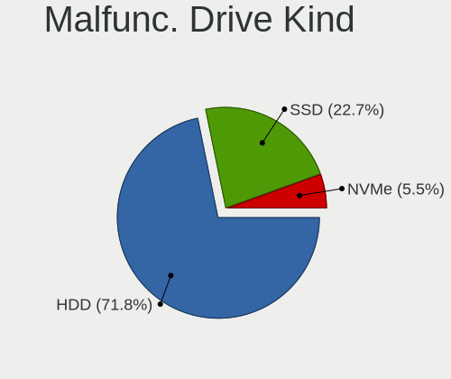
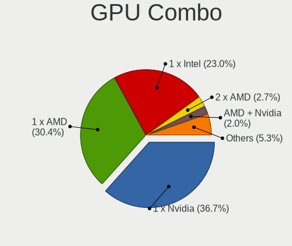
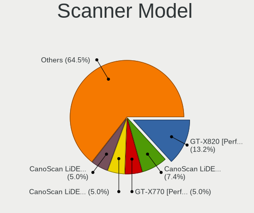
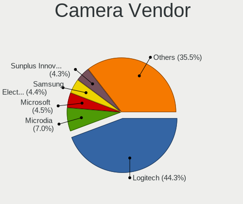

Linux in USA - Tested Hardware & Statistics (Desktops)
------------------------------------------------------

A project to collect tested hardware configurations for Linux in USA.

Anyone can contribute to this report by the [hw-probe](https://github.com/linuxhw/hw-probe) tool:

    sudo -E hw-probe -all -upload

Please contribute! Especially if your hardware is rare.

Contents
--------

* [ Test Cases ](#test-cases)

* [ System ](#system)
  - [ OS                       ](#os)
  - [ OS Family                ](#os-family)
  - [ Kernel                   ](#kernel)
  - [ Kernel Family            ](#kernel-family)
  - [ Kernel Major Ver.        ](#kernel-major-ver)
  - [ Arch                     ](#arch)
  - [ DE                       ](#de)
  - [ Display Server           ](#display-server)
  - [ Display Manager          ](#display-manager)
  - [ OS Lang                  ](#os-lang)
  - [ Boot Mode                ](#boot-mode)
  - [ Filesystem               ](#filesystem)
  - [ Part. scheme             ](#part-scheme)
  - [ Dual Boot with Linux/BSD ](#dual-boot-with-linuxbsd)
  - [ Dual Boot (Win)          ](#dual-boot-win)

* [ Board ](#board)
  - [ Vendor                   ](#vendor)
  - [ Model                    ](#model)
  - [ Model Family             ](#model-family)
  - [ MFG Year                 ](#mfg-year)
  - [ Form Factor              ](#form-factor)
  - [ Secure Boot              ](#secure-boot)
  - [ Coreboot                 ](#coreboot)
  - [ RAM Size                 ](#ram-size)
  - [ RAM Used                 ](#ram-used)
  - [ Total Drives             ](#total-drives)
  - [ Has CD-ROM               ](#has-cd-rom)
  - [ Has Ethernet             ](#has-ethernet)
  - [ Has WiFi                 ](#has-wifi)
  - [ Has Bluetooth            ](#has-bluetooth)

* [ Location ](#location)
  - [ Country                  ](#country)
  - [ City                     ](#city)

* [ Drives ](#drives)
  - [ Drive Vendor             ](#drive-vendor)
  - [ Drive Model              ](#drive-model)
  - [ HDD Vendor               ](#hdd-vendor)
  - [ SSD Vendor               ](#ssd-vendor)
  - [ Drive Kind               ](#drive-kind)
  - [ Drive Connector          ](#drive-connector)
  - [ Drive Size               ](#drive-size)
  - [ Space Total              ](#space-total)
  - [ Space Used               ](#space-used)
  - [ Malfunc. Drives          ](#malfunc-drives)
  - [ Malfunc. Drive Vendor    ](#malfunc-drive-vendor)
  - [ Malfunc. HDD Vendor      ](#malfunc-hdd-vendor)
  - [ Malfunc. Drive Kind      ](#malfunc-drive-kind)
  - [ Failed Drives            ](#failed-drives)
  - [ Failed Drive Vendor      ](#failed-drive-vendor)
  - [ Drive Status             ](#drive-status)

* [ Storage controller ](#storage-controller)
  - [ Storage Vendor           ](#storage-vendor)
  - [ Storage Model            ](#storage-model)
  - [ Storage Kind             ](#storage-kind)

* [ Processor ](#processor)
  - [ CPU Vendor               ](#cpu-vendor)
  - [ CPU Model                ](#cpu-model)
  - [ CPU Model Family         ](#cpu-model-family)
  - [ CPU Cores                ](#cpu-cores)
  - [ CPU Sockets              ](#cpu-sockets)
  - [ CPU Threads              ](#cpu-threads)
  - [ CPU Op-Modes             ](#cpu-op-modes)
  - [ CPU Microcode            ](#cpu-microcode)
  - [ CPU Microarch            ](#cpu-microarch)

* [ Graphics ](#graphics)
  - [ GPU Vendor               ](#gpu-vendor)
  - [ GPU Model                ](#gpu-model)
  - [ GPU Combo                ](#gpu-combo)
  - [ GPU Driver               ](#gpu-driver)
  - [ GPU Memory               ](#gpu-memory)

* [ Monitor ](#monitor)
  - [ Monitor Vendor           ](#monitor-vendor)
  - [ Monitor Model            ](#monitor-model)
  - [ Monitor Resolution       ](#monitor-resolution)
  - [ Monitor Diagonal         ](#monitor-diagonal)
  - [ Monitor Width            ](#monitor-width)
  - [ Aspect Ratio             ](#aspect-ratio)
  - [ Monitor Area             ](#monitor-area)
  - [ Pixel Density            ](#pixel-density)
  - [ Multiple Monitors        ](#multiple-monitors)

* [ Network ](#network)
  - [ Net Controller Vendor    ](#net-controller-vendor)
  - [ Net Controller Model     ](#net-controller-model)
  - [ Wireless Vendor          ](#wireless-vendor)
  - [ Wireless Model           ](#wireless-model)
  - [ Ethernet Vendor          ](#ethernet-vendor)
  - [ Ethernet Model           ](#ethernet-model)
  - [ Net Controller Kind      ](#net-controller-kind)
  - [ Used Controller          ](#used-controller)
  - [ NICs                     ](#nics)
  - [ IPv6                     ](#ipv6)

* [ Bluetooth ](#bluetooth)
  - [ Bluetooth Vendor         ](#bluetooth-vendor)
  - [ Bluetooth Model          ](#bluetooth-model)

* [ Sound ](#sound)
  - [ Sound Vendor             ](#sound-vendor)
  - [ Sound Model              ](#sound-model)

* [ Memory ](#memory)
  - [ Memory Vendor            ](#memory-vendor)
  - [ Memory Model             ](#memory-model)
  - [ Memory Kind              ](#memory-kind)
  - [ Memory Form Factor       ](#memory-form-factor)
  - [ Memory Size              ](#memory-size)
  - [ Memory Speed             ](#memory-speed)

* [ Printers & scanners ](#printers--scanners)
  - [ Printer Vendor           ](#printer-vendor)
  - [ Printer Model            ](#printer-model)
  - [ Scanner Vendor           ](#scanner-vendor)
  - [ Scanner Model            ](#scanner-model)

* [ Camera ](#camera)
  - [ Camera Vendor            ](#camera-vendor)
  - [ Camera Model             ](#camera-model)

* [ Security ](#security)
  - [ Fingerprint Vendor       ](#fingerprint-vendor)
  - [ Fingerprint Model        ](#fingerprint-model)
  - [ Chipcard Vendor          ](#chipcard-vendor)
  - [ Chipcard Model           ](#chipcard-model)

* [ Unsupported ](#unsupported)
  - [ Unsupported Devices      ](#unsupported-devices)
  - [ Unsupported Device Types ](#unsupported-device-types)

Test Cases
----------

Total: 23110

| Vendor        | Model                       | Probe                                                      | Date         |
|---------------|-----------------------------|------------------------------------------------------------|--------------|
| Pegatron      | 2AF0                        | [d918aae63e](https://linux-hardware.org/?probe=d918aae63e) | Nov 06, 2023 |
| ASUSTek       | TUF Gaming X570-PLUS        | [f459ffa824](https://linux-hardware.org/?probe=f459ffa824) | Nov 06, 2023 |
| HP            | 82A2                        | [1d34952ece](https://linux-hardware.org/?probe=1d34952ece) | Nov 06, 2023 |
| MSI           | B450 TOMAHAWK               | [9b0f4eeb46](https://linux-hardware.org/?probe=9b0f4eeb46) | Nov 06, 2023 |
| Gigabyte      | Z390 AORUS PRO WIFI-CF      | [cee650aa5a](https://linux-hardware.org/?probe=cee650aa5a) | Nov 06, 2023 |
| ASUSTek       | ROG STRIX B650-A GAMING ... | [3734293144](https://linux-hardware.org/?probe=3734293144) | Nov 06, 2023 |
| Dell          | OptiPlex 5050               | [6c4a08354b](https://linux-hardware.org/?probe=6c4a08354b) | Nov 06, 2023 |
| Samsung       | DT1234567890 SEC_SW_REVI... | [4ef314d383](https://linux-hardware.org/?probe=4ef314d383) | Nov 06, 2023 |
| ASUSTek       | PRIME B450M-A II            | [c8c8d15e25](https://linux-hardware.org/?probe=c8c8d15e25) | Nov 06, 2023 |
| MSI           | B550-A PRO                  | [3333de3c07](https://linux-hardware.org/?probe=3333de3c07) | Nov 06, 2023 |
| ASUSTek       | ROG STRIX B650-A GAMING ... | [72bedff7a6](https://linux-hardware.org/?probe=72bedff7a6) | Nov 06, 2023 |
| MSI           | MAG B650 TOMAHAWK WIFI      | [ff199303a2](https://linux-hardware.org/?probe=ff199303a2) | Nov 06, 2023 |
| ASRock        | B550M-HDV                   | [e005a7da3a](https://linux-hardware.org/?probe=e005a7da3a) | Nov 06, 2023 |
| ASUSTek       | P8Z77-M                     | [fef5a2e8ae](https://linux-hardware.org/?probe=fef5a2e8ae) | Nov 05, 2023 |
| Dell          | 042P49 A02                  | [b8808915ed](https://linux-hardware.org/?probe=b8808915ed) | Nov 05, 2023 |
| HP            | 2B05                        | [eb343bd373](https://linux-hardware.org/?probe=eb343bd373) | Nov 05, 2023 |
| Pegatron      | 2AF0                        | [de892702f8](https://linux-hardware.org/?probe=de892702f8) | Nov 05, 2023 |
| MSI           | A55M-E33                    | [d1def05873](https://linux-hardware.org/?probe=d1def05873) | Nov 05, 2023 |
| ASRock        | X670E Taichi                | [6f05d717db](https://linux-hardware.org/?probe=6f05d717db) | Nov 05, 2023 |
| ASRock        | X670E Taichi                | [a366b27921](https://linux-hardware.org/?probe=a366b27921) | Nov 05, 2023 |
| ASUSTek       | PRIME X470-PRO              | [692601dd3b](https://linux-hardware.org/?probe=692601dd3b) | Nov 05, 2023 |
| Gigabyte      | X570 AORUS ELITE            | [5c4543cc31](https://linux-hardware.org/?probe=5c4543cc31) | Nov 05, 2023 |
| Gigabyte      | X470 AORUS ULTRA GAMING-... | [9d79aa9486](https://linux-hardware.org/?probe=9d79aa9486) | Nov 05, 2023 |
| ASUSTek       | ROG STRIX Z370-H GAMING     | [8e8cfaa103](https://linux-hardware.org/?probe=8e8cfaa103) | Nov 05, 2023 |
| Gigabyte      | B550I AORUS PRO AX          | [5f192519d4](https://linux-hardware.org/?probe=5f192519d4) | Nov 05, 2023 |
| Dell          | 048DY8 A01                  | [2ef39546ef](https://linux-hardware.org/?probe=2ef39546ef) | Nov 05, 2023 |
| ASRock        | X570 Phantom Gaming 4       | [05a8c22a35](https://linux-hardware.org/?probe=05a8c22a35) | Nov 05, 2023 |
| Dell          | 0V8WGR A00                  | [9b13411bc8](https://linux-hardware.org/?probe=9b13411bc8) | Nov 05, 2023 |
| ASUSTek       | PRIME Z390-P                | [4b29646104](https://linux-hardware.org/?probe=4b29646104) | Nov 05, 2023 |
| ASUSTek       | M5A78L-M/USB3               | [4ce8997d5a](https://linux-hardware.org/?probe=4ce8997d5a) | Nov 05, 2023 |
| ASUSTek       | TUF Gaming Z790-PLUS WIF... | [9d8a12d929](https://linux-hardware.org/?probe=9d8a12d929) | Nov 05, 2023 |
| ASUSTek       | PRIME B550M-A               | [4998a82a6b](https://linux-hardware.org/?probe=4998a82a6b) | Nov 05, 2023 |
| ASUSTek       | PRIME B450M-A II            | [539d8551fc](https://linux-hardware.org/?probe=539d8551fc) | Nov 05, 2023 |
| Unknown       | Unknown                     | [85733c0ec0](https://linux-hardware.org/?probe=85733c0ec0) | Nov 05, 2023 |
| ASUSTek       | M5A97 R2.0                  | [8a4147b40a](https://linux-hardware.org/?probe=8a4147b40a) | Nov 05, 2023 |
| ASUSTek       | ROG Maximus Z790 HERO       | [a9ad2b542a](https://linux-hardware.org/?probe=a9ad2b542a) | Nov 05, 2023 |
| Dell          | 0T7D40 A00                  | [2053de6443](https://linux-hardware.org/?probe=2053de6443) | Nov 05, 2023 |
| Unknown       | Unknown                     | [dbd2e07499](https://linux-hardware.org/?probe=dbd2e07499) | Nov 05, 2023 |
| HP            | 8054                        | [cbf4895785](https://linux-hardware.org/?probe=cbf4895785) | Nov 05, 2023 |
| Unknown       | Unknown                     | [e98e6bb977](https://linux-hardware.org/?probe=e98e6bb977) | Nov 05, 2023 |
| ASRock        | P67 Pro3 SE                 | [10b1460f7a](https://linux-hardware.org/?probe=10b1460f7a) | Nov 05, 2023 |
| ASUSTek       | TUF Gaming X570-PLUS        | [ee2a20b30a](https://linux-hardware.org/?probe=ee2a20b30a) | Nov 05, 2023 |
| Pegatron      | 2AD5                        | [f8860a91a3](https://linux-hardware.org/?probe=f8860a91a3) | Nov 05, 2023 |
| ASUSTek       | ROG STRIX B650E-F GAMING... | [6f11758faa](https://linux-hardware.org/?probe=6f11758faa) | Nov 04, 2023 |
| ASUSTek       | H97M-PLUS                   | [69cb1e7068](https://linux-hardware.org/?probe=69cb1e7068) | Nov 04, 2023 |
| ASRock        | B250M-HDV                   | [c8521456ad](https://linux-hardware.org/?probe=c8521456ad) | Nov 04, 2023 |
| ASUSTek       | ROG STRIX X370-F GAMING     | [03f8b26adb](https://linux-hardware.org/?probe=03f8b26adb) | Nov 04, 2023 |
| ASUSTek       | TUF Gaming B550-PLUS WIF... | [1da3521ff2](https://linux-hardware.org/?probe=1da3521ff2) | Nov 04, 2023 |
| ASUSTek       | PRIME B550-PLUS AC-HES      | [6a8536f5df](https://linux-hardware.org/?probe=6a8536f5df) | Nov 04, 2023 |
| Gigabyte      | B550I AORUS PRO AX          | [9f47c70860](https://linux-hardware.org/?probe=9f47c70860) | Nov 04, 2023 |
| ASUSTek       | TUF Gaming Z690-PLUS WIF... | [d95fab9dc1](https://linux-hardware.org/?probe=d95fab9dc1) | Nov 04, 2023 |
| ASUSTek       | PRIME B350-PLUS             | [4a6383e886](https://linux-hardware.org/?probe=4a6383e886) | Nov 04, 2023 |
| HP            | 0A9Ch                       | [95415dec13](https://linux-hardware.org/?probe=95415dec13) | Nov 04, 2023 |
| ASUSTek       | ROG STRIX X570-E GAMING     | [119816ea7d](https://linux-hardware.org/?probe=119816ea7d) | Nov 04, 2023 |
| MSI           | B450 TOMAHAWK               | [2b389d48e1](https://linux-hardware.org/?probe=2b389d48e1) | Nov 04, 2023 |
| ASUSTek       | PRIME X670E-PRO WIFI        | [f27bded4c1](https://linux-hardware.org/?probe=f27bded4c1) | Nov 04, 2023 |
| ASUSTek       | PRIME H510M-E               | [cd2b005e61](https://linux-hardware.org/?probe=cd2b005e61) | Nov 04, 2023 |
| Dell          | 018D1Y A00                  | [2135015e09](https://linux-hardware.org/?probe=2135015e09) | Nov 04, 2023 |
| Apple         | Mac-F60DEB81FF30ACF6 Mac... | [b213aefe09](https://linux-hardware.org/?probe=b213aefe09) | Nov 03, 2023 |
| HP            | 8643 SMVB                   | [c864159547](https://linux-hardware.org/?probe=c864159547) | Nov 03, 2023 |
| Dell          | 0T7D40 A00                  | [a81d5bbd02](https://linux-hardware.org/?probe=a81d5bbd02) | Nov 03, 2023 |
| MSI           | MEG X570 UNIFY              | [89e8c02e17](https://linux-hardware.org/?probe=89e8c02e17) | Nov 03, 2023 |
| ASUSTek       | TUF B450M-PLUS GAMING       | [6d39c4f814](https://linux-hardware.org/?probe=6d39c4f814) | Nov 03, 2023 |
| HP            | 21D0                        | [c634d51a77](https://linux-hardware.org/?probe=c634d51a77) | Nov 03, 2023 |
| ASUSTek       | G20AJ                       | [f9942dbf89](https://linux-hardware.org/?probe=f9942dbf89) | Nov 03, 2023 |
| ASUSTek       | TUF B450M-PLUS GAMING       | [e928da88d7](https://linux-hardware.org/?probe=e928da88d7) | Nov 03, 2023 |
| HP            | 0AECh D                     | [2ddad2bbf2](https://linux-hardware.org/?probe=2ddad2bbf2) | Nov 03, 2023 |
| Alienware     | 0GWM1Y A00                  | [01d536cc44](https://linux-hardware.org/?probe=01d536cc44) | Nov 03, 2023 |
| Gigabyte      | B550I AORUS PRO AX          | [e073d8c90a](https://linux-hardware.org/?probe=e073d8c90a) | Nov 03, 2023 |
| HP            | 2215                        | [6acbe1a873](https://linux-hardware.org/?probe=6acbe1a873) | Nov 03, 2023 |
| Dell          | 0X8DXD A00                  | [e972336105](https://linux-hardware.org/?probe=e972336105) | Nov 03, 2023 |
| Dell          | 0R6PCT A01                  | [c561f87237](https://linux-hardware.org/?probe=c561f87237) | Nov 02, 2023 |
| ASRock        | B450M Steel Legend          | [dafce26ef5](https://linux-hardware.org/?probe=dafce26ef5) | Nov 02, 2023 |
| Unknown       | X99-GT                      | [751ea1add9](https://linux-hardware.org/?probe=751ea1add9) | Nov 02, 2023 |
| MSI           | PRO Z690-A WIFI DDR4        | [b84c515650](https://linux-hardware.org/?probe=b84c515650) | Nov 02, 2023 |
| Gigabyte      | X570 AORUS PRO WIFI         | [bf075c47d2](https://linux-hardware.org/?probe=bf075c47d2) | Nov 02, 2023 |
| ASRock        | X570 Taichi                 | [5ce5b321b0](https://linux-hardware.org/?probe=5ce5b321b0) | Nov 02, 2023 |
| BESSTAR Te... | TH50                        | [fc3a35871e](https://linux-hardware.org/?probe=fc3a35871e) | Nov 02, 2023 |
| ASUSTek       | G20AJ                       | [ca1a60e2df](https://linux-hardware.org/?probe=ca1a60e2df) | Nov 02, 2023 |
| ASUSTek       | Z170-A                      | [7812f09d39](https://linux-hardware.org/?probe=7812f09d39) | Nov 02, 2023 |
| ASUSTek       | Z170-A                      | [b45e25ec01](https://linux-hardware.org/?probe=b45e25ec01) | Nov 02, 2023 |
| ASRockRack    | X470D4U                     | [553af2a3c2](https://linux-hardware.org/?probe=553af2a3c2) | Nov 02, 2023 |
| Dell          | 096JG8 A00                  | [eb001cdbf5](https://linux-hardware.org/?probe=eb001cdbf5) | Nov 02, 2023 |
| ASUSTek       | M11BB                       | [21e7b53022](https://linux-hardware.org/?probe=21e7b53022) | Nov 02, 2023 |
| ECS           | M789CG                      | [87fe73ee84](https://linux-hardware.org/?probe=87fe73ee84) | Nov 02, 2023 |
| ASUSTek       | GA35DX                      | [1a9eef3748](https://linux-hardware.org/?probe=1a9eef3748) | Nov 02, 2023 |
| ASRock        | Z97 Pro4                    | [6fa2a70f99](https://linux-hardware.org/?probe=6fa2a70f99) | Nov 01, 2023 |
| ASUSTek       | PRIME B450M-A II            | [08ee10dc83](https://linux-hardware.org/?probe=08ee10dc83) | Nov 01, 2023 |
| ASRock        | X470 Taichi Ultimate        | [d85d5f59c2](https://linux-hardware.org/?probe=d85d5f59c2) | Nov 01, 2023 |
| ASRock        | Z690 Taichi                 | [b736058f88](https://linux-hardware.org/?probe=b736058f88) | Nov 01, 2023 |
| Dell          | 0XCR8D A01                  | [bc8414b164](https://linux-hardware.org/?probe=bc8414b164) | Nov 01, 2023 |
| ASUSTek       | ROG STRIX X370-F GAMING     | [bbbdb78ae3](https://linux-hardware.org/?probe=bbbdb78ae3) | Nov 01, 2023 |
| ASUSTek       | Maximus VII HERO            | [a60f1d4a52](https://linux-hardware.org/?probe=a60f1d4a52) | Nov 01, 2023 |
| Dell          | 0RF705                      | [b287691e11](https://linux-hardware.org/?probe=b287691e11) | Nov 01, 2023 |
| Dell          | 006K82 A00                  | [f8c521f2f6](https://linux-hardware.org/?probe=f8c521f2f6) | Nov 01, 2023 |
| HP            | 83EE                        | [c32478cd8d](https://linux-hardware.org/?probe=c32478cd8d) | Nov 01, 2023 |
| HP            | 83EE                        | [37c7c72156](https://linux-hardware.org/?probe=37c7c72156) | Nov 01, 2023 |
| Gateway       | FX6840                      | [3c391c7868](https://linux-hardware.org/?probe=3c391c7868) | Nov 01, 2023 |
| ASUSTek       | TUF Gaming X570-PRO         | [ba593f267b](https://linux-hardware.org/?probe=ba593f267b) | Nov 01, 2023 |
| MSI           | PRO Z790-P WIFI DDR4        | [e03b553957](https://linux-hardware.org/?probe=e03b553957) | Nov 01, 2023 |
| Unknown       | Unknown                     | [3c4e0eb4fc](https://linux-hardware.org/?probe=3c4e0eb4fc) | Nov 01, 2023 |
| Gigabyte      | X670 AORUS ELITE AX         | [8161abddda](https://linux-hardware.org/?probe=8161abddda) | Nov 01, 2023 |
| HP            | 8767 A                      | [618323a058](https://linux-hardware.org/?probe=618323a058) | Nov 01, 2023 |
| HP            | 2B2C                        | [1ed40f19d9](https://linux-hardware.org/?probe=1ed40f19d9) | Nov 01, 2023 |
| AOpen         | iBDWMUx-MD R1.04            | [5b82a04d09](https://linux-hardware.org/?probe=5b82a04d09) | Oct 31, 2023 |
| ASUSTek       | WS X299 SAGE                | [a01ac98915](https://linux-hardware.org/?probe=a01ac98915) | Oct 31, 2023 |
| ASUSTek       | WS X299 SAGE                | [d871633c17](https://linux-hardware.org/?probe=d871633c17) | Oct 31, 2023 |
| ASRock        | Z790 Taichi                 | [01ba7dff2f](https://linux-hardware.org/?probe=01ba7dff2f) | Oct 31, 2023 |
| MSI           | MPG Z590 GAMING PLUS        | [e3760a331a](https://linux-hardware.org/?probe=e3760a331a) | Oct 31, 2023 |
| eMachines     | EL1352G                     | [e133fecf3e](https://linux-hardware.org/?probe=e133fecf3e) | Oct 31, 2023 |
| ASUSTek       | TUF Gaming B550-PLUS        | [16c9a49c7d](https://linux-hardware.org/?probe=16c9a49c7d) | Oct 31, 2023 |
| ASRock        | B450M Pro4                  | [3880922e48](https://linux-hardware.org/?probe=3880922e48) | Oct 31, 2023 |
| ASUSTek       | TUF Gaming B550-PLUS        | [25aa8e9401](https://linux-hardware.org/?probe=25aa8e9401) | Oct 31, 2023 |
| ASUSTek       | SABERTOOTH Z97 MARK 2/US... | [95a0ff1bb1](https://linux-hardware.org/?probe=95a0ff1bb1) | Oct 31, 2023 |
| XFX           | nForce 790i Ultra 3-Way ... | [d470f0fedf](https://linux-hardware.org/?probe=d470f0fedf) | Oct 31, 2023 |
| ASUSTek       | ROG STRIX X370-F GAMING     | [3179102373](https://linux-hardware.org/?probe=3179102373) | Oct 31, 2023 |
| Dell          | 0NW6H5 A00                  | [3f76d752df](https://linux-hardware.org/?probe=3f76d752df) | Oct 31, 2023 |
| HP            | 1589                        | [2161dc3754](https://linux-hardware.org/?probe=2161dc3754) | Oct 31, 2023 |
| ASRock        | B450 Steel Legend           | [5e090f5c32](https://linux-hardware.org/?probe=5e090f5c32) | Oct 31, 2023 |
| Intel         | DH87MC AAG74242-402         | [7f64778340](https://linux-hardware.org/?probe=7f64778340) | Oct 30, 2023 |
| HP            | 8299                        | [e45f46df9d](https://linux-hardware.org/?probe=e45f46df9d) | Oct 30, 2023 |
| ASUSTek       | PRIME X399-A                | [69f596f456](https://linux-hardware.org/?probe=69f596f456) | Oct 30, 2023 |
| Dell          | 0NW6H5 A00                  | [51694ddd7c](https://linux-hardware.org/?probe=51694ddd7c) | Oct 30, 2023 |
| HP            | 1587h                       | [ecafcd1843](https://linux-hardware.org/?probe=ecafcd1843) | Oct 30, 2023 |
| ASUSTek       | Pro WS X570-ACE             | [6ba3f1daa1](https://linux-hardware.org/?probe=6ba3f1daa1) | Oct 30, 2023 |
| MSI           | MPG X570 GAMING PLUS        | [e4d622b76b](https://linux-hardware.org/?probe=e4d622b76b) | Oct 30, 2023 |
| AZW           | MINI S 10                   | [9695f9bec4](https://linux-hardware.org/?probe=9695f9bec4) | Oct 30, 2023 |
| ASUSTek       | GA35DX                      | [c1e204e6b1](https://linux-hardware.org/?probe=c1e204e6b1) | Oct 30, 2023 |
| ASUSTek       | F2A85-M PRO                 | [dd2a52ab8f](https://linux-hardware.org/?probe=dd2a52ab8f) | Oct 30, 2023 |
| ASRockRack    | C236 WS                     | [1e6fea20e9](https://linux-hardware.org/?probe=1e6fea20e9) | Oct 30, 2023 |
| Dell          | 018D1Y A00                  | [ce361a7112](https://linux-hardware.org/?probe=ce361a7112) | Oct 30, 2023 |
| ASRock        | Z690 Taichi                 | [a9e193be90](https://linux-hardware.org/?probe=a9e193be90) | Oct 30, 2023 |
| ASUSTek       | PRIME X370-PRO              | [394ab5dbff](https://linux-hardware.org/?probe=394ab5dbff) | Oct 30, 2023 |
| Gigabyte      | F2A88X-D3H                  | [aa9ef029e5](https://linux-hardware.org/?probe=aa9ef029e5) | Oct 30, 2023 |
| AZW           | SEi                         | [aa8ba45b77](https://linux-hardware.org/?probe=aa8ba45b77) | Oct 30, 2023 |
| ASUSTek       | ROG CROSSHAIR VII HERO      | [5d7ab82de7](https://linux-hardware.org/?probe=5d7ab82de7) | Oct 30, 2023 |
| Unknown       | Unknown                     | [986edacf9a](https://linux-hardware.org/?probe=986edacf9a) | Oct 30, 2023 |
| HP            | 2AF7                        | [04c535a13d](https://linux-hardware.org/?probe=04c535a13d) | Oct 30, 2023 |
| ASUSTek       | ROG STRIX Z590-A GAMING ... | [af90750bac](https://linux-hardware.org/?probe=af90750bac) | Oct 30, 2023 |
| HP            | 8054                        | [6e03a01d3f](https://linux-hardware.org/?probe=6e03a01d3f) | Oct 30, 2023 |
| ASUSTek       | PRIME B450M-A II            | [6cafea6b4c](https://linux-hardware.org/?probe=6cafea6b4c) | Oct 30, 2023 |
| Gigabyte      | X570 GAMING X               | [1addefe3fc](https://linux-hardware.org/?probe=1addefe3fc) | Oct 29, 2023 |
| ASUSTek       | Pro WS X570-ACE             | [e2c02539ce](https://linux-hardware.org/?probe=e2c02539ce) | Oct 29, 2023 |
| ASUSTek       | PRIME B550M-A               | [deef4da5dc](https://linux-hardware.org/?probe=deef4da5dc) | Oct 29, 2023 |
| MSI           | B550M PRO-VDH WIFI          | [9c77415bfc](https://linux-hardware.org/?probe=9c77415bfc) | Oct 29, 2023 |
| ASRock        | H81 Pro BTC R2.0            | [6bcf93f1a8](https://linux-hardware.org/?probe=6bcf93f1a8) | Oct 29, 2023 |
| ASRock        | X399 Taichi                 | [78ab56301b](https://linux-hardware.org/?probe=78ab56301b) | Oct 29, 2023 |
| HP            | 339A                        | [a1ef9b1cd4](https://linux-hardware.org/?probe=a1ef9b1cd4) | Oct 29, 2023 |
| ASUSTek       | M4N72-E                     | [199a901e5c](https://linux-hardware.org/?probe=199a901e5c) | Oct 29, 2023 |
| MSI           | 970A SLI Krait Edition      | [a54528c1ef](https://linux-hardware.org/?probe=a54528c1ef) | Oct 29, 2023 |
| Dell          | 0C27VV A03                  | [3e65f94217](https://linux-hardware.org/?probe=3e65f94217) | Oct 28, 2023 |
| MSI           | PRO Z690-A WIFI DDR4        | [bf5f9098d7](https://linux-hardware.org/?probe=bf5f9098d7) | Oct 28, 2023 |
| GEEKOM        | Mini IT12                   | [b9509f49f1](https://linux-hardware.org/?probe=b9509f49f1) | Oct 28, 2023 |
| ASUSTek       | Z10PE-D8 WS                 | [4562f80268](https://linux-hardware.org/?probe=4562f80268) | Oct 28, 2023 |
| Gigabyte      | H370 AORUS GAMING 3 WIFI... | [439b0a3497](https://linux-hardware.org/?probe=439b0a3497) | Oct 28, 2023 |
| Gateway       | WG43M                       | [8f0cb70746](https://linux-hardware.org/?probe=8f0cb70746) | Oct 28, 2023 |
| Dell          | 0P01GV A03                  | [221ff4c2d3](https://linux-hardware.org/?probe=221ff4c2d3) | Oct 28, 2023 |
| Gigabyte      | 970A-DS3P                   | [e9d377b8cd](https://linux-hardware.org/?probe=e9d377b8cd) | Oct 28, 2023 |
| Gigabyte      | B450M DS3H-CF               | [80b9cb5e56](https://linux-hardware.org/?probe=80b9cb5e56) | Oct 28, 2023 |
| Gigabyte      | Z97X-Gaming 7               | [c5c758e202](https://linux-hardware.org/?probe=c5c758e202) | Oct 28, 2023 |
| HP            | 2B05                        | [a32b598fb9](https://linux-hardware.org/?probe=a32b598fb9) | Oct 28, 2023 |
| Intel         | H55                         | [f8788bcc72](https://linux-hardware.org/?probe=f8788bcc72) | Oct 27, 2023 |
| ASUSTek       | GA35DX                      | [ae8894002e](https://linux-hardware.org/?probe=ae8894002e) | Oct 27, 2023 |
| HP            | 843F                        | [c39418a5fe](https://linux-hardware.org/?probe=c39418a5fe) | Oct 27, 2023 |
| ASUSTek       | ROG STRIX X670E-I GAMING... | [4eacfc5dd8](https://linux-hardware.org/?probe=4eacfc5dd8) | Oct 27, 2023 |
| ASUSTek       | PRIME B350-PLUS             | [92c4516951](https://linux-hardware.org/?probe=92c4516951) | Oct 27, 2023 |
| Gigabyte      | X470 AORUS ULTRA GAMING-... | [71ba004156](https://linux-hardware.org/?probe=71ba004156) | Oct 27, 2023 |
| ASUSTek       | M5A78L-M LX PLUS            | [6e2384b7ee](https://linux-hardware.org/?probe=6e2384b7ee) | Oct 27, 2023 |
| Gateway       | FX6840                      | [7acd4709ef](https://linux-hardware.org/?probe=7acd4709ef) | Oct 27, 2023 |
| Gigabyte      | Z390 DESIGNARE-CF           | [2aaa180afa](https://linux-hardware.org/?probe=2aaa180afa) | Oct 27, 2023 |
| Supermicro    | X10DAI                      | [11b1e48497](https://linux-hardware.org/?probe=11b1e48497) | Oct 27, 2023 |
| HP            | 845A                        | [cfdb45cad0](https://linux-hardware.org/?probe=cfdb45cad0) | Oct 27, 2023 |
| ASUSTek       | SABERTOOTH Z77              | [56f2576af1](https://linux-hardware.org/?probe=56f2576af1) | Oct 27, 2023 |
| MSI           | 2AE0                        | [983e34e3c8](https://linux-hardware.org/?probe=983e34e3c8) | Oct 27, 2023 |
| ASUSTek       | CM6850                      | [b6819e8599](https://linux-hardware.org/?probe=b6819e8599) | Oct 27, 2023 |
| HP            | 0A9Ch                       | [f24350a95c](https://linux-hardware.org/?probe=f24350a95c) | Oct 27, 2023 |
| ASUSTek       | PRIME X570-PRO              | [815b0a4bc4](https://linux-hardware.org/?probe=815b0a4bc4) | Oct 27, 2023 |
| Dell          | 0NW6H5 A00                  | [95858bf436](https://linux-hardware.org/?probe=95858bf436) | Oct 26, 2023 |
| Dell          | 0RY007                      | [56af1be7cc](https://linux-hardware.org/?probe=56af1be7cc) | Oct 26, 2023 |
| MSI           | X370 GAMING PRO CARBON      | [61bdfadaa0](https://linux-hardware.org/?probe=61bdfadaa0) | Oct 26, 2023 |
| ASUSTek       | M5A78L-M LX PLUS            | [bea4c3f8b4](https://linux-hardware.org/?probe=bea4c3f8b4) | Oct 26, 2023 |
| ASUSTek       | P8Z77-V LK                  | [5f17297f17](https://linux-hardware.org/?probe=5f17297f17) | Oct 26, 2023 |
| MSI           | PRO B650-P WIFI             | [4d76763d2d](https://linux-hardware.org/?probe=4d76763d2d) | Oct 26, 2023 |
| Dell          | 03KWTV A00                  | [46ddef2a0f](https://linux-hardware.org/?probe=46ddef2a0f) | Oct 26, 2023 |
| Dell          | 03NJH0 A01                  | [dbb152a219](https://linux-hardware.org/?probe=dbb152a219) | Oct 26, 2023 |
| Gigabyte      | 970A-D3P                    | [7277bcd3bc](https://linux-hardware.org/?probe=7277bcd3bc) | Oct 26, 2023 |
| ASUSTek       | Maximus VII HERO            | [87c313ac06](https://linux-hardware.org/?probe=87c313ac06) | Oct 26, 2023 |
| ASUSTek       | Maximus VII HERO            | [a0e6502d94](https://linux-hardware.org/?probe=a0e6502d94) | Oct 26, 2023 |
| ASUSTek       | TUF Gaming X670E-PLUS WI... | [6709fab81c](https://linux-hardware.org/?probe=6709fab81c) | Oct 26, 2023 |
| ASUSTek       | TUF Gaming X670E-PLUS WI... | [c041582324](https://linux-hardware.org/?probe=c041582324) | Oct 26, 2023 |
| HP            | 8265                        | [25dfe4d311](https://linux-hardware.org/?probe=25dfe4d311) | Oct 26, 2023 |
| Dell          | 0N4YC8 A00                  | [f54b1a097e](https://linux-hardware.org/?probe=f54b1a097e) | Oct 26, 2023 |
| SYWZ          | S210H Series                | [9239922f80](https://linux-hardware.org/?probe=9239922f80) | Oct 26, 2023 |
| Dell          | 0KJCC5 A00                  | [f4f5605117](https://linux-hardware.org/?probe=f4f5605117) | Oct 26, 2023 |
| ASRock        | Z97 Pro4                    | [bcf737a9cd](https://linux-hardware.org/?probe=bcf737a9cd) | Oct 25, 2023 |
| Gigabyte      | 990FXA-UD3                  | [f4f26b1c2a](https://linux-hardware.org/?probe=f4f26b1c2a) | Oct 25, 2023 |
| ASUSTek       | H170M-PLUS                  | [a108993a7e](https://linux-hardware.org/?probe=a108993a7e) | Oct 25, 2023 |
| MSI           | PRO Z690-A DDR4             | [638386d33c](https://linux-hardware.org/?probe=638386d33c) | Oct 25, 2023 |
| HP            | 8433 11                     | [902343e220](https://linux-hardware.org/?probe=902343e220) | Oct 25, 2023 |
| Acer          | Aspire GX-281               | [63c928a75f](https://linux-hardware.org/?probe=63c928a75f) | Oct 25, 2023 |
| MSI           | MPG B550 GAMING PLUS        | [fc849b0e23](https://linux-hardware.org/?probe=fc849b0e23) | Oct 25, 2023 |
| MSI           | MPG B550 GAMING PLUS        | [3a0c166a2f](https://linux-hardware.org/?probe=3a0c166a2f) | Oct 25, 2023 |
| HP            | 8653 A                      | [6d84c59a16](https://linux-hardware.org/?probe=6d84c59a16) | Oct 25, 2023 |
| Supermicro    | X8SAX                       | [5d90e1af8c](https://linux-hardware.org/?probe=5d90e1af8c) | Oct 25, 2023 |
| ASUSTek       | ROG STRIX B650E-F GAMING... | [4e7be30b13](https://linux-hardware.org/?probe=4e7be30b13) | Oct 25, 2023 |
| ASUSTek       | TUF Gaming X570-PLUS        | [36893aadc0](https://linux-hardware.org/?probe=36893aadc0) | Oct 25, 2023 |
| ASUSTek       | Maximus VII HERO            | [3c959b9af8](https://linux-hardware.org/?probe=3c959b9af8) | Oct 25, 2023 |
| ASUSTek       | Q87M-E                      | [69e78c6a85](https://linux-hardware.org/?probe=69e78c6a85) | Oct 25, 2023 |
| System76      | Thelio Mira                 | [3bb1924402](https://linux-hardware.org/?probe=3bb1924402) | Oct 25, 2023 |
| ASUSTek       | P8Z77-V LX                  | [6f9c14dc54](https://linux-hardware.org/?probe=6f9c14dc54) | Oct 24, 2023 |
| ASUSTek       | P8P67 EVO                   | [3baa020480](https://linux-hardware.org/?probe=3baa020480) | Oct 24, 2023 |
| ASUSTek       | ROG Maximus XII APEX        | [2ed4b6b711](https://linux-hardware.org/?probe=2ed4b6b711) | Oct 24, 2023 |
| ASUSTek       | ROG CROSSHAIR VIII IMPAC... | [889bd1ff38](https://linux-hardware.org/?probe=889bd1ff38) | Oct 24, 2023 |
| HP            | 339A                        | [2e0eb78de2](https://linux-hardware.org/?probe=2e0eb78de2) | Oct 24, 2023 |
| HP            | 83EF                        | [9953e14c0a](https://linux-hardware.org/?probe=9953e14c0a) | Oct 24, 2023 |
| HP            | 845A                        | [956dc584ee](https://linux-hardware.org/?probe=956dc584ee) | Oct 24, 2023 |
| Gigabyte      | H170-D3HP-CF                | [0135013a3b](https://linux-hardware.org/?probe=0135013a3b) | Oct 24, 2023 |
| AZW           | GTR V21                     | [beb87ff047](https://linux-hardware.org/?probe=beb87ff047) | Oct 24, 2023 |
| HP            | 89D8 SMVB                   | [3672a7681b](https://linux-hardware.org/?probe=3672a7681b) | Oct 24, 2023 |
| ASUSTek       | TUF Z370-PLUS GAMING        | [6c35175e9c](https://linux-hardware.org/?probe=6c35175e9c) | Oct 24, 2023 |
| MSI           | MEG Z790 ACE                | [41d0e4fddd](https://linux-hardware.org/?probe=41d0e4fddd) | Oct 24, 2023 |
| MSI           | PRO Z690-A WIFI DDR4        | [cb6b644cdf](https://linux-hardware.org/?probe=cb6b644cdf) | Oct 24, 2023 |
| Dell          | 0200DY A01                  | [9b6ccf43a5](https://linux-hardware.org/?probe=9b6ccf43a5) | Oct 24, 2023 |
| MSI           | PRO Z690-A WIFI DDR4        | [c228949ab3](https://linux-hardware.org/?probe=c228949ab3) | Oct 23, 2023 |
| ASUSTek       | ROG STRIX B550-F GAMING     | [c74b24edc0](https://linux-hardware.org/?probe=c74b24edc0) | Oct 23, 2023 |
| ASUSTek       | PRIME H670-PLUS D4          | [07e8b4df09](https://linux-hardware.org/?probe=07e8b4df09) | Oct 23, 2023 |
| MSI           | Z270-A PRO                  | [a7f2b637ca](https://linux-hardware.org/?probe=a7f2b637ca) | Oct 23, 2023 |
| HP            | 81C9                        | [39a3586ed1](https://linux-hardware.org/?probe=39a3586ed1) | Oct 23, 2023 |
| Gigabyte      | 970A-DS3P                   | [a9af589ace](https://linux-hardware.org/?probe=a9af589ace) | Oct 23, 2023 |
| Acer          | Aspire GX-281               | [0d96eb845d](https://linux-hardware.org/?probe=0d96eb845d) | Oct 23, 2023 |
| HP            | 8876 11                     | [e7f8609b12](https://linux-hardware.org/?probe=e7f8609b12) | Oct 23, 2023 |
| Dell          | 0VD5HY A07                  | [5e68194dd0](https://linux-hardware.org/?probe=5e68194dd0) | Oct 23, 2023 |
| MSI           | Z170A GAMING PRO CARBON     | [4440cac740](https://linux-hardware.org/?probe=4440cac740) | Oct 23, 2023 |
| Alienware     | 0K9TKY A00                  | [a51d4611f8](https://linux-hardware.org/?probe=a51d4611f8) | Oct 23, 2023 |
| Gigabyte      | H270-HD3P-CF                | [43fedd61b1](https://linux-hardware.org/?probe=43fedd61b1) | Oct 23, 2023 |
| Dell          | 0KJCC5 A00                  | [f904697713](https://linux-hardware.org/?probe=f904697713) | Oct 23, 2023 |
| ASUSTek       | Maximus VII HERO            | [e3540cf969](https://linux-hardware.org/?probe=e3540cf969) | Oct 23, 2023 |
| Gigabyte      | Z390 AORUS PRO WIFI-CF      | [9ab95fedc6](https://linux-hardware.org/?probe=9ab95fedc6) | Oct 23, 2023 |
| Gigabyte      | B550 AORUS ELITE AX V2      | [cb6130951a](https://linux-hardware.org/?probe=cb6130951a) | Oct 23, 2023 |
| Intel         | DB65AL AAG12530-307         | [09cf560035](https://linux-hardware.org/?probe=09cf560035) | Oct 23, 2023 |
| Gigabyte      | Z77X-UP7                    | [806cdb2bef](https://linux-hardware.org/?probe=806cdb2bef) | Oct 23, 2023 |
| Gigabyte      | B450M DS3H-CF               | [eb9bba4f5c](https://linux-hardware.org/?probe=eb9bba4f5c) | Oct 23, 2023 |
| ASUSTek       | TUF Gaming X570-PLUS        | [f9efd677fe](https://linux-hardware.org/?probe=f9efd677fe) | Oct 23, 2023 |
| HP            | 18E7                        | [eec2c6a2fd](https://linux-hardware.org/?probe=eec2c6a2fd) | Oct 23, 2023 |
| Gigabyte      | H270-HD3P-CF                | [22baba8799](https://linux-hardware.org/?probe=22baba8799) | Oct 23, 2023 |
| Lenovo        | 3716 SDK0J40709 WIN 3259... | [4887277f57](https://linux-hardware.org/?probe=4887277f57) | Oct 23, 2023 |
| Gigabyte      | 990FXA-UD3                  | [f134292e10](https://linux-hardware.org/?probe=f134292e10) | Oct 23, 2023 |
| ASRock        | Z490M-ITX/ac                | [98a9374798](https://linux-hardware.org/?probe=98a9374798) | Oct 22, 2023 |
| Google        | Panther                     | [85ecb9a52b](https://linux-hardware.org/?probe=85ecb9a52b) | Oct 22, 2023 |
| Dell          | 0MF24N A03                  | [97aaded00d](https://linux-hardware.org/?probe=97aaded00d) | Oct 22, 2023 |
| HP            | 18E7                        | [18f7dbf492](https://linux-hardware.org/?probe=18f7dbf492) | Oct 22, 2023 |
| ASUSTek       | TUF Gaming X570-PLUS        | [a5c33d9a5a](https://linux-hardware.org/?probe=a5c33d9a5a) | Oct 22, 2023 |
| Gigabyte      | B660 AORUS MASTER DDR4      | [2157dd6b76](https://linux-hardware.org/?probe=2157dd6b76) | Oct 22, 2023 |
| AOpen         | iBDWMUx-MD R1.04            | [72d780f5f7](https://linux-hardware.org/?probe=72d780f5f7) | Oct 22, 2023 |
| Dell          | 0RY007                      | [21a25aeb80](https://linux-hardware.org/?probe=21a25aeb80) | Oct 22, 2023 |
| Gigabyte      | Z690 UD AX DDR4             | [6e6e6c3ecf](https://linux-hardware.org/?probe=6e6e6c3ecf) | Oct 22, 2023 |
| Gigabyte      | G41MT-S2PT                  | [0b67401f8c](https://linux-hardware.org/?probe=0b67401f8c) | Oct 22, 2023 |
| Gigabyte      | G41MT-S2PT                  | [5a2f8368e1](https://linux-hardware.org/?probe=5a2f8368e1) | Oct 22, 2023 |
| Unknown       | Unknown                     | [b8a154c0f6](https://linux-hardware.org/?probe=b8a154c0f6) | Oct 22, 2023 |
| Dell          | 0YXT71 A00                  | [5f04088965](https://linux-hardware.org/?probe=5f04088965) | Oct 22, 2023 |
| ASUSTek       | ROG Maximus XI HERO         | [ec2248edc2](https://linux-hardware.org/?probe=ec2248edc2) | Oct 22, 2023 |
| MSI           | B450 TOMAHAWK               | [ed6b4ba6e8](https://linux-hardware.org/?probe=ed6b4ba6e8) | Oct 22, 2023 |
| HP            | 83E9                        | [c324d1ee0a](https://linux-hardware.org/?probe=c324d1ee0a) | Oct 22, 2023 |
| Dell          | 09WH54 A01                  | [4211349cc4](https://linux-hardware.org/?probe=4211349cc4) | Oct 22, 2023 |
| HP            | 83E9                        | [8102d00cdc](https://linux-hardware.org/?probe=8102d00cdc) | Oct 22, 2023 |
| ASUSTek       | PRIME Z690-P WIFI D4        | [7c383004b6](https://linux-hardware.org/?probe=7c383004b6) | Oct 21, 2023 |
| Acer          | Aspire M3450                | [7bbabe59d7](https://linux-hardware.org/?probe=7bbabe59d7) | Oct 21, 2023 |
| MSI           | MAG B550M MORTAR WIFI       | [d3298d136b](https://linux-hardware.org/?probe=d3298d136b) | Oct 21, 2023 |
| Gigabyte      | B450M DS3H-CF               | [7ddf7a94fd](https://linux-hardware.org/?probe=7ddf7a94fd) | Oct 21, 2023 |
| Dell          | OptiPlex 5050               | [e9f94566ba](https://linux-hardware.org/?probe=e9f94566ba) | Oct 21, 2023 |
| Dell          | 0J3C2F A02                  | [4b93c11bcb](https://linux-hardware.org/?probe=4b93c11bcb) | Oct 21, 2023 |
| AZW           | SER V1                      | [8c734a7dfc](https://linux-hardware.org/?probe=8c734a7dfc) | Oct 21, 2023 |
| Intel         | DX58SO AAE29331-504         | [33d7713b52](https://linux-hardware.org/?probe=33d7713b52) | Oct 21, 2023 |
| Shenzhen M... | F6BFC                       | [64148c88c0](https://linux-hardware.org/?probe=64148c88c0) | Oct 21, 2023 |
| Gigabyte      | X570 AORUS PRO WIFI         | [1ae8f16052](https://linux-hardware.org/?probe=1ae8f16052) | Oct 21, 2023 |
| Dell          | 0XR1GT A00                  | [33b1df369f](https://linux-hardware.org/?probe=33b1df369f) | Oct 21, 2023 |
| ASUSTek       | ROG Maximus XI HERO         | [07a0ae59da](https://linux-hardware.org/?probe=07a0ae59da) | Oct 21, 2023 |
| ASUSTek       | ROG STRIX B450-F GAMING     | [48405d326c](https://linux-hardware.org/?probe=48405d326c) | Oct 21, 2023 |
| HP            | 2215                        | [d244e54a96](https://linux-hardware.org/?probe=d244e54a96) | Oct 21, 2023 |
| Intel         | DH61HO AAG62445-102         | [b2814c5578](https://linux-hardware.org/?probe=b2814c5578) | Oct 21, 2023 |
| Dell          | 0RY007                      | [084ad13415](https://linux-hardware.org/?probe=084ad13415) | Oct 21, 2023 |
| HP            | 1825                        | [8a3ff4566a](https://linux-hardware.org/?probe=8a3ff4566a) | Oct 21, 2023 |
| Acer          | Aspire M3450                | [f1c898ed29](https://linux-hardware.org/?probe=f1c898ed29) | Oct 21, 2023 |
| ASRock        | Z690 Taichi                 | [b249afcf52](https://linux-hardware.org/?probe=b249afcf52) | Oct 21, 2023 |
| EVGA          | Z790 DARK KINGPIN.0         | [9faa5f07eb](https://linux-hardware.org/?probe=9faa5f07eb) | Oct 20, 2023 |
| HP            | 83E9                        | [20501a2966](https://linux-hardware.org/?probe=20501a2966) | Oct 20, 2023 |
| Dell          | 0KC9NP A01                  | [c38e54817a](https://linux-hardware.org/?probe=c38e54817a) | Oct 20, 2023 |
| GMKtec        | NucBox K4                   | [b0f8dc54f3](https://linux-hardware.org/?probe=b0f8dc54f3) | Oct 20, 2023 |
| Unknown       | Unknown                     | [f23d0ff7da](https://linux-hardware.org/?probe=f23d0ff7da) | Oct 20, 2023 |
| Shuttle       | FH67                        | [8c36120faa](https://linux-hardware.org/?probe=8c36120faa) | Oct 20, 2023 |
| ASUSTek       | H81M-E                      | [6577940606](https://linux-hardware.org/?probe=6577940606) | Oct 20, 2023 |
| ASUSTek       | H81M-E                      | [86b16af8d5](https://linux-hardware.org/?probe=86b16af8d5) | Oct 20, 2023 |
| Dell          | 0KV3RP A00                  | [aa258ef607](https://linux-hardware.org/?probe=aa258ef607) | Oct 20, 2023 |
| Biostar       | B450MH                      | [007c00c3e2](https://linux-hardware.org/?probe=007c00c3e2) | Oct 20, 2023 |
| ASRock        | Z690 Taichi                 | [a49686cc23](https://linux-hardware.org/?probe=a49686cc23) | Oct 20, 2023 |
| Intel         | D33217CK G76541-300         | [967b9f4bbe](https://linux-hardware.org/?probe=967b9f4bbe) | Oct 20, 2023 |
| MSI           | PRO B760M-P DDR4            | [87f50ecd22](https://linux-hardware.org/?probe=87f50ecd22) | Oct 20, 2023 |
| ASUSTek       | Z170-P                      | [4f6fad364d](https://linux-hardware.org/?probe=4f6fad364d) | Oct 20, 2023 |
| ASRock        | B660-ITX                    | [b3a7dac908](https://linux-hardware.org/?probe=b3a7dac908) | Oct 20, 2023 |
| Dell          | 0N4YC8 A00                  | [c01a27db62](https://linux-hardware.org/?probe=c01a27db62) | Oct 20, 2023 |
| Gigabyte      | Z390 AORUS PRO WIFI-CF      | [c123099547](https://linux-hardware.org/?probe=c123099547) | Oct 20, 2023 |
| EVGA          | Z790 DARK KINGPIN.0         | [4bec650d3e](https://linux-hardware.org/?probe=4bec650d3e) | Oct 20, 2023 |
| Dell          | 0N4YC8 A00                  | [8fbbe4eec8](https://linux-hardware.org/?probe=8fbbe4eec8) | Oct 20, 2023 |
| Unknown       | Unknown                     | [09b04f5fd5](https://linux-hardware.org/?probe=09b04f5fd5) | Oct 20, 2023 |
| Dell          | 0M5DCD A00                  | [b3a6489f94](https://linux-hardware.org/?probe=b3a6489f94) | Oct 20, 2023 |
| Dell          | 00V62H A01                  | [9dd47a8f17](https://linux-hardware.org/?probe=9dd47a8f17) | Oct 20, 2023 |
| Gigabyte      | B85M-D3H                    | [6df3cd6820](https://linux-hardware.org/?probe=6df3cd6820) | Oct 20, 2023 |
| HP            | 2B4B                        | [d23d9f0e33](https://linux-hardware.org/?probe=d23d9f0e33) | Oct 20, 2023 |
| HP            | 8265                        | [f1bdedb075](https://linux-hardware.org/?probe=f1bdedb075) | Oct 20, 2023 |
| ASRock        | X570 Pro4                   | [47886b22ba](https://linux-hardware.org/?probe=47886b22ba) | Oct 20, 2023 |
| Biostar       | TA970                       | [afb4cf630f](https://linux-hardware.org/?probe=afb4cf630f) | Oct 20, 2023 |
| ASUSTek       | TUF Gaming X570-PLUS        | [af96c09a64](https://linux-hardware.org/?probe=af96c09a64) | Oct 19, 2023 |
| ASUSTek       | P9X79 WS                    | [7e902aa7b4](https://linux-hardware.org/?probe=7e902aa7b4) | Oct 19, 2023 |
| ASUSTek       | TUF Gaming X570-PLUS        | [7fed113f9b](https://linux-hardware.org/?probe=7fed113f9b) | Oct 19, 2023 |
| Lenovo        | 31900058 STD                | [b6c589b413](https://linux-hardware.org/?probe=b6c589b413) | Oct 19, 2023 |
| Dell          | 0XKH0D A02                  | [bba36c01cf](https://linux-hardware.org/?probe=bba36c01cf) | Oct 19, 2023 |
| Pegatron      | 2AC2                        | [d8eafcf145](https://linux-hardware.org/?probe=d8eafcf145) | Oct 19, 2023 |
| Pegatron      | 2AC2                        | [bc37a84914](https://linux-hardware.org/?probe=bc37a84914) | Oct 19, 2023 |
| Acer          | Predator PO3-620            | [db0c739e61](https://linux-hardware.org/?probe=db0c739e61) | Oct 19, 2023 |
| ASUSTek       | PRIME B450M-A               | [ad5d949eba](https://linux-hardware.org/?probe=ad5d949eba) | Oct 19, 2023 |
| Dell          | 00V62H A01                  | [2d236543fb](https://linux-hardware.org/?probe=2d236543fb) | Oct 19, 2023 |
| Foxconn       | 2AB1                        | [ce52d37a5f](https://linux-hardware.org/?probe=ce52d37a5f) | Oct 19, 2023 |
| MACHINIST     | X99 G7 V1.0                 | [caca14cc52](https://linux-hardware.org/?probe=caca14cc52) | Oct 19, 2023 |
| MSI           | FM2-A75MA-E35               | [868a2c328d](https://linux-hardware.org/?probe=868a2c328d) | Oct 19, 2023 |
| Dell          | 0T10XW A02                  | [359e8bb86f](https://linux-hardware.org/?probe=359e8bb86f) | Oct 18, 2023 |
| ASUSTek       | ROG STRIX X299-E GAMING ... | [6a2e115b95](https://linux-hardware.org/?probe=6a2e115b95) | Oct 18, 2023 |
| MSI           | MS-7380                     | [e7b8523a2f](https://linux-hardware.org/?probe=e7b8523a2f) | Oct 18, 2023 |
| ASUSTek       | PRIME B550M-A               | [064dc574bb](https://linux-hardware.org/?probe=064dc574bb) | Oct 18, 2023 |
| Gigabyte      | Z390 GAMING X-CF            | [0c25658c6d](https://linux-hardware.org/?probe=0c25658c6d) | Oct 18, 2023 |
| MSI           | MPG B650 EDGE WIFI          | [73fdacf30c](https://linux-hardware.org/?probe=73fdacf30c) | Oct 18, 2023 |
| ASUSTek       | TUF B450M-PLUS GAMING       | [4a7b98d45e](https://linux-hardware.org/?probe=4a7b98d45e) | Oct 18, 2023 |
| MSI           | X470 GAMING PRO             | [e275cfc499](https://linux-hardware.org/?probe=e275cfc499) | Oct 18, 2023 |
| ASUSTek       | ROG STRIX X570-I GAMING     | [fb949d7410](https://linux-hardware.org/?probe=fb949d7410) | Oct 18, 2023 |
| AZW           | SER V1                      | [eca53f2271](https://linux-hardware.org/?probe=eca53f2271) | Oct 18, 2023 |
| HP            | 1825                        | [76470d1fa6](https://linux-hardware.org/?probe=76470d1fa6) | Oct 18, 2023 |
| Dell          | 0GDG8Y A00                  | [78164f9bcc](https://linux-hardware.org/?probe=78164f9bcc) | Oct 18, 2023 |
| Gigabyte      | G41MT-S2PT                  | [e437f5edcb](https://linux-hardware.org/?probe=e437f5edcb) | Oct 18, 2023 |
| MSI           | MPG B650 EDGE WIFI          | [5902fdf35f](https://linux-hardware.org/?probe=5902fdf35f) | Oct 18, 2023 |
| ASUSTek       | ROG STRIX B550-F GAMING     | [b28a7b8c25](https://linux-hardware.org/?probe=b28a7b8c25) | Oct 17, 2023 |
| Dell          | 0DR845                      | [4363cfd864](https://linux-hardware.org/?probe=4363cfd864) | Oct 17, 2023 |
| Unknown       | Unknown                     | [03cf657f5a](https://linux-hardware.org/?probe=03cf657f5a) | Oct 17, 2023 |
| HP            | 1589                        | [9fca3eb994](https://linux-hardware.org/?probe=9fca3eb994) | Oct 17, 2023 |
| Foxconn       | 2ADA                        | [da4ea80916](https://linux-hardware.org/?probe=da4ea80916) | Oct 17, 2023 |
| HP            | 843B                        | [0e5a69e3ab](https://linux-hardware.org/?probe=0e5a69e3ab) | Oct 17, 2023 |
| Dell          | 09KPNV A00                  | [f739f7caf6](https://linux-hardware.org/?probe=f739f7caf6) | Oct 17, 2023 |
| MSI           | B550M PRO-VDH WIFI          | [11d2b5b9c2](https://linux-hardware.org/?probe=11d2b5b9c2) | Oct 17, 2023 |
| MSI           | B550M PRO-VDH WIFI          | [8d289561bf](https://linux-hardware.org/?probe=8d289561bf) | Oct 17, 2023 |
| ASUSTek       | Maximus IX HERO             | [58e17c747d](https://linux-hardware.org/?probe=58e17c747d) | Oct 17, 2023 |
| ASUSTek       | Maximus IX HERO             | [fcd9389f36](https://linux-hardware.org/?probe=fcd9389f36) | Oct 17, 2023 |
| ASUSTek       | P8H67-M PRO                 | [7ebf44d28b](https://linux-hardware.org/?probe=7ebf44d28b) | Oct 17, 2023 |
| MSI           | B450 TOMAHAWK MAX           | [c2191c4438](https://linux-hardware.org/?probe=c2191c4438) | Oct 17, 2023 |
| MSI           | B550 GAMING GEN3            | [e657535210](https://linux-hardware.org/?probe=e657535210) | Oct 17, 2023 |
| ASRock        | B460M Pro4                  | [a7f97ffc51](https://linux-hardware.org/?probe=a7f97ffc51) | Oct 17, 2023 |
| MSI           | MAG B550 TOMAHAWK           | [5f780203e2](https://linux-hardware.org/?probe=5f780203e2) | Oct 17, 2023 |
| Intel         | DP35DP AAD81073-208         | [f7059ece0c](https://linux-hardware.org/?probe=f7059ece0c) | Oct 17, 2023 |
| Dell          | 0JJW8N A03                  | [c76545a7d0](https://linux-hardware.org/?probe=c76545a7d0) | Oct 17, 2023 |
| ASRock        | X470 Master SLI/ac          | [9258f94300](https://linux-hardware.org/?probe=9258f94300) | Oct 17, 2023 |
| Gigabyte      | Z590 UD                     | [1e2597a152](https://linux-hardware.org/?probe=1e2597a152) | Oct 17, 2023 |
| MSI           | B450 TOMAHAWK               | [3c93567751](https://linux-hardware.org/?probe=3c93567751) | Oct 17, 2023 |
| MSI           | B550-A PRO                  | [c60b3dbfa2](https://linux-hardware.org/?probe=c60b3dbfa2) | Oct 17, 2023 |
| ASRock        | B460M Pro4                  | [f368a56c3e](https://linux-hardware.org/?probe=f368a56c3e) | Oct 17, 2023 |
| HP            | 843B                        | [4f8aa79674](https://linux-hardware.org/?probe=4f8aa79674) | Oct 17, 2023 |
| HP            | 8AB6 SMVB                   | [e88f9153df](https://linux-hardware.org/?probe=e88f9153df) | Oct 17, 2023 |
| Acer          | Aspire GX-281               | [17fad55365](https://linux-hardware.org/?probe=17fad55365) | Oct 16, 2023 |
| Dell          | 051FJ8 A00                  | [60bea2da11](https://linux-hardware.org/?probe=60bea2da11) | Oct 16, 2023 |
| MSI           | PRO B650-P WIFI             | [55d07d6ee2](https://linux-hardware.org/?probe=55d07d6ee2) | Oct 16, 2023 |
| ASUSTek       | TUF Gaming X570-PLUS        | [43d12d01b7](https://linux-hardware.org/?probe=43d12d01b7) | Oct 16, 2023 |
| ASUSTek       | ROG STRIX Z790-A GAMING ... | [e83fde9360](https://linux-hardware.org/?probe=e83fde9360) | Oct 16, 2023 |
| ASUSTek       | TUF Gaming B550-PLUS WIF... | [9b7bc3fc9d](https://linux-hardware.org/?probe=9b7bc3fc9d) | Oct 16, 2023 |
| Gigabyte      | B450M DS3H WIFI-CF          | [5b226d6424](https://linux-hardware.org/?probe=5b226d6424) | Oct 16, 2023 |
| MSI           | MPG Z690 FORCE WIFI         | [5631fc0230](https://linux-hardware.org/?probe=5631fc0230) | Oct 16, 2023 |
| Gigabyte      | X570 AORUS ELITE WIFI       | [c976b314a2](https://linux-hardware.org/?probe=c976b314a2) | Oct 16, 2023 |
| AZW           | GTR V21                     | [e90b0c01be](https://linux-hardware.org/?probe=e90b0c01be) | Oct 16, 2023 |
| Gigabyte      | Z590 UD                     | [65277f3f01](https://linux-hardware.org/?probe=65277f3f01) | Oct 16, 2023 |
| Gigabyte      | Z790 AORUS ELITE AX         | [7edc965933](https://linux-hardware.org/?probe=7edc965933) | Oct 16, 2023 |
| Gigabyte      | GA-E350N-USB3               | [62f5ab12ea](https://linux-hardware.org/?probe=62f5ab12ea) | Oct 15, 2023 |
| Dell          | 00F82W A00                  | [410900bf0d](https://linux-hardware.org/?probe=410900bf0d) | Oct 15, 2023 |
| MSI           | MPG Z490 GAMING EDGE WIF... | [9065a343c2](https://linux-hardware.org/?probe=9065a343c2) | Oct 15, 2023 |
| HP            | 3397                        | [d45da2936e](https://linux-hardware.org/?probe=d45da2936e) | Oct 15, 2023 |
| Pegatron      | 2ACD                        | [45315e3a0c](https://linux-hardware.org/?probe=45315e3a0c) | Oct 15, 2023 |
| ASUSTek       | PRIME B450M-A II            | [98224c65b6](https://linux-hardware.org/?probe=98224c65b6) | Oct 15, 2023 |
| Gigabyte      | GA-78LMT-USB3 x.x           | [066851473c](https://linux-hardware.org/?probe=066851473c) | Oct 15, 2023 |
| Lenovo        | SHARKBAY 0B98401 PRO        | [c84dd6e4ea](https://linux-hardware.org/?probe=c84dd6e4ea) | Oct 15, 2023 |
| ASUSTek       | ROG Maximus X HERO          | [cdd65525cc](https://linux-hardware.org/?probe=cdd65525cc) | Oct 15, 2023 |
| MSI           | MPG Z690 FORCE WIFI         | [abc6dc18ab](https://linux-hardware.org/?probe=abc6dc18ab) | Oct 15, 2023 |
| Dell          | 0WR7PY A01                  | [9dbe237209](https://linux-hardware.org/?probe=9dbe237209) | Oct 15, 2023 |
| Gigabyte      | Z270P-D3-CF                 | [5bbd5682e8](https://linux-hardware.org/?probe=5bbd5682e8) | Oct 15, 2023 |
| Gigabyte      | X670 AORUS ELITE AX         | [f71ad29f6a](https://linux-hardware.org/?probe=f71ad29f6a) | Oct 15, 2023 |
| Lenovo        | ThinkCentre M91p 7034df4    | [b9cf62807b](https://linux-hardware.org/?probe=b9cf62807b) | Oct 15, 2023 |
| MSI           | MPG Z690 FORCE WIFI         | [7e4e4b6a5d](https://linux-hardware.org/?probe=7e4e4b6a5d) | Oct 15, 2023 |
| Gigabyte      | Z690 UD AX DDR4             | [273e4a294a](https://linux-hardware.org/?probe=273e4a294a) | Oct 15, 2023 |
| Dell          | 0GY6Y8 A03                  | [1ddd96bd4e](https://linux-hardware.org/?probe=1ddd96bd4e) | Oct 15, 2023 |
| ASUSTek       | ROG STRIX B450-I GAMING     | [b9f47c0a25](https://linux-hardware.org/?probe=b9f47c0a25) | Oct 15, 2023 |
| Intel         | DP55WB AAE64798-204         | [b5d7147862](https://linux-hardware.org/?probe=b5d7147862) | Oct 15, 2023 |
| Intel         | DP55WB AAE64798-204         | [642ecadbd2](https://linux-hardware.org/?probe=642ecadbd2) | Oct 15, 2023 |
| MSI           | MEG X570S ACE MAX           | [d3cf683bad](https://linux-hardware.org/?probe=d3cf683bad) | Oct 15, 2023 |
| Dell          | 0NW6H5 A00                  | [54a3d7c0ea](https://linux-hardware.org/?probe=54a3d7c0ea) | Oct 15, 2023 |
| MSI           | FM2-A75MA-E35               | [445403f24d](https://linux-hardware.org/?probe=445403f24d) | Oct 15, 2023 |
| ASUSTek       | PRIME B550M-A               | [2686ddd07b](https://linux-hardware.org/?probe=2686ddd07b) | Oct 15, 2023 |
| ECS           | M789CG                      | [b767549953](https://linux-hardware.org/?probe=b767549953) | Oct 15, 2023 |
| HP            | 81C3                        | [66c0f4559b](https://linux-hardware.org/?probe=66c0f4559b) | Oct 14, 2023 |
| ECS           | M789CG                      | [6f446a6f77](https://linux-hardware.org/?probe=6f446a6f77) | Oct 14, 2023 |
| Gateway       | SX2370                      | [d0cb14bfc9](https://linux-hardware.org/?probe=d0cb14bfc9) | Oct 14, 2023 |
| ECS           | M789CG                      | [0a0df79fcd](https://linux-hardware.org/?probe=0a0df79fcd) | Oct 14, 2023 |
| Dell          | 0XR1GT A00                  | [13ff920688](https://linux-hardware.org/?probe=13ff920688) | Oct 14, 2023 |
| ASUSTek       | ROG STRIX X670E-E GAMING... | [4de3d352fb](https://linux-hardware.org/?probe=4de3d352fb) | Oct 14, 2023 |
| ASUSTek       | ROG STRIX B350-F GAMING     | [1853003ff7](https://linux-hardware.org/?probe=1853003ff7) | Oct 14, 2023 |
| Dell          | 0K3CM7 A00                  | [35d569ea79](https://linux-hardware.org/?probe=35d569ea79) | Oct 14, 2023 |
| HP            | 3031h                       | [7c4f54cef2](https://linux-hardware.org/?probe=7c4f54cef2) | Oct 14, 2023 |
| HP            | 3031h                       | [d8968fefa9](https://linux-hardware.org/?probe=d8968fefa9) | Oct 14, 2023 |
| Lenovo        | Annapurna CRB 0B98401 PR... | [e550587c85](https://linux-hardware.org/?probe=e550587c85) | Oct 14, 2023 |
| Gigabyte      | Z97N-WIFI                   | [560c190c99](https://linux-hardware.org/?probe=560c190c99) | Oct 14, 2023 |
| Acer          | Aspire XC-1660G V:1.1       | [3954c51f20](https://linux-hardware.org/?probe=3954c51f20) | Oct 14, 2023 |
| Dell          | 042P49 A02                  | [dd056a62d3](https://linux-hardware.org/?probe=dd056a62d3) | Oct 14, 2023 |
| HP            | 2B38                        | [24fb745c2e](https://linux-hardware.org/?probe=24fb745c2e) | Oct 14, 2023 |
| MSI           | MPG B550 GAMING PLUS        | [bc47dea2fe](https://linux-hardware.org/?probe=bc47dea2fe) | Oct 14, 2023 |
| Acer          | Aspire TC-895 V:1.0         | [70b85fc17d](https://linux-hardware.org/?probe=70b85fc17d) | Oct 14, 2023 |
| Dell          | 0T7D40 A01                  | [e412659bb3](https://linux-hardware.org/?probe=e412659bb3) | Oct 14, 2023 |
| Dell          | 0WR7PY A02                  | [bcdb61bd85](https://linux-hardware.org/?probe=bcdb61bd85) | Oct 14, 2023 |
| Gigabyte      | B650 AORUS ELITE AX         | [e3a01650f1](https://linux-hardware.org/?probe=e3a01650f1) | Oct 14, 2023 |
| ASUSTek       | P9X79 PRO                   | [d9361064fd](https://linux-hardware.org/?probe=d9361064fd) | Oct 13, 2023 |
| ASUSTek       | P6X58D-E                    | [7ea9a3052d](https://linux-hardware.org/?probe=7ea9a3052d) | Oct 13, 2023 |
| ASUSTek       | P6X58D-E                    | [15804b8850](https://linux-hardware.org/?probe=15804b8850) | Oct 13, 2023 |
| Dell          | 0NW6H5 A00                  | [0594aaa28b](https://linux-hardware.org/?probe=0594aaa28b) | Oct 13, 2023 |
| Dell          | 0NW6H5 A00                  | [596e3973bc](https://linux-hardware.org/?probe=596e3973bc) | Oct 13, 2023 |
| MSI           | MPG X570S CARBON MAX WIF... | [84680f44cd](https://linux-hardware.org/?probe=84680f44cd) | Oct 13, 2023 |
| Dell          | 0C96W1 A03                  | [27c8806b89](https://linux-hardware.org/?probe=27c8806b89) | Oct 13, 2023 |
| Lenovo        | SHARKBAY 0B98401 WIN        | [2edd75be93](https://linux-hardware.org/?probe=2edd75be93) | Oct 13, 2023 |
| Dell          | 0T7D40 A01                  | [cc370e5d02](https://linux-hardware.org/?probe=cc370e5d02) | Oct 13, 2023 |
| ASRock        | X370 Killer Sli             | [7cc4b0e44f](https://linux-hardware.org/?probe=7cc4b0e44f) | Oct 13, 2023 |
| ASUSTek       | PRIME B450M-A II            | [ac840f060f](https://linux-hardware.org/?probe=ac840f060f) | Oct 13, 2023 |
| MSI           | B85M-E45                    | [6ad9d3ff3c](https://linux-hardware.org/?probe=6ad9d3ff3c) | Oct 13, 2023 |
| Lenovo        | SHARKBAY 0B98401 WIN        | [f24ebc31a5](https://linux-hardware.org/?probe=f24ebc31a5) | Oct 13, 2023 |
| Intel         | DB75EN                      | [3d5c90093d](https://linux-hardware.org/?probe=3d5c90093d) | Oct 13, 2023 |
| Intel         | DB75EN                      | [30be24215f](https://linux-hardware.org/?probe=30be24215f) | Oct 13, 2023 |
| ASRock        | B550M Pro4                  | [d1386e080d](https://linux-hardware.org/?probe=d1386e080d) | Oct 12, 2023 |
| MSI           | MPG B550 GAMING PLUS        | [52fdfb249e](https://linux-hardware.org/?probe=52fdfb249e) | Oct 12, 2023 |
| MSI           | MAG X670E TOMAHAWK WIFI     | [64d967ecbc](https://linux-hardware.org/?probe=64d967ecbc) | Oct 12, 2023 |
| HP            | 0AA0h                       | [090c8b2beb](https://linux-hardware.org/?probe=090c8b2beb) | Oct 12, 2023 |
| Lenovo        | ThinkCentre M91p 7034df4    | [31f3f9ae8d](https://linux-hardware.org/?probe=31f3f9ae8d) | Oct 12, 2023 |
| MSI           | PRO B650M-A WIFI            | [d20a5d2c71](https://linux-hardware.org/?probe=d20a5d2c71) | Oct 12, 2023 |
| Dell          | 0CRH6C A02                  | [865292ecae](https://linux-hardware.org/?probe=865292ecae) | Oct 12, 2023 |
| ASUSTek       | PRIME H670-PLUS D4          | [925371c475](https://linux-hardware.org/?probe=925371c475) | Oct 11, 2023 |
| ASUSTek       | Z87-K                       | [55af6adcc5](https://linux-hardware.org/?probe=55af6adcc5) | Oct 11, 2023 |
| HP            | 81C9                        | [279889bb45](https://linux-hardware.org/?probe=279889bb45) | Oct 11, 2023 |
| Intel         | DX58SO AAE29331-504         | [afe13c52df](https://linux-hardware.org/?probe=afe13c52df) | Oct 11, 2023 |
| AZW           | SEi                         | [9190ba6157](https://linux-hardware.org/?probe=9190ba6157) | Oct 11, 2023 |
| ASRock        | Z370 SLI Xtreme             | [1e0b981aae](https://linux-hardware.org/?probe=1e0b981aae) | Oct 11, 2023 |
| HP            | 843B                        | [652027900b](https://linux-hardware.org/?probe=652027900b) | Oct 11, 2023 |
| Gigabyte      | Z790 AORUS ELITE AX         | [632725bc85](https://linux-hardware.org/?probe=632725bc85) | Oct 11, 2023 |
| System76      | Thelio Mega thelio-mega-... | [abb07364c1](https://linux-hardware.org/?probe=abb07364c1) | Oct 11, 2023 |
| HP            | 1850                        | [668a4e16d7](https://linux-hardware.org/?probe=668a4e16d7) | Oct 11, 2023 |
| HP            | 8053                        | [52151555cb](https://linux-hardware.org/?probe=52151555cb) | Oct 11, 2023 |
| HP            | 8053                        | [d1ce4588e7](https://linux-hardware.org/?probe=d1ce4588e7) | Oct 11, 2023 |
| ASUSTek       | P9X79 PRO                   | [27ada8bd88](https://linux-hardware.org/?probe=27ada8bd88) | Oct 11, 2023 |
| HP            | 18E7                        | [fd71ca186e](https://linux-hardware.org/?probe=fd71ca186e) | Oct 11, 2023 |
| Intel         | H61 V1.5                    | [ed796dbba7](https://linux-hardware.org/?probe=ed796dbba7) | Oct 11, 2023 |
| MSI           | Z97-G55 SLI                 | [cc50dc0894](https://linux-hardware.org/?probe=cc50dc0894) | Oct 11, 2023 |
| MSI           | Z97-G55 SLI                 | [754748eac6](https://linux-hardware.org/?probe=754748eac6) | Oct 11, 2023 |
| Quanta        | 2ABB 101                    | [1ae3a7098e](https://linux-hardware.org/?probe=1ae3a7098e) | Oct 11, 2023 |
| Dell          | 0XHGV1 A00                  | [adda7a23c2](https://linux-hardware.org/?probe=adda7a23c2) | Oct 11, 2023 |
| Foxconn       | 2AB1                        | [d30d9f59a8](https://linux-hardware.org/?probe=d30d9f59a8) | Oct 11, 2023 |
| ASUSTek       | PRIME Z590-V                | [ee15914a37](https://linux-hardware.org/?probe=ee15914a37) | Oct 10, 2023 |
| ASUSTek       | ROG Maximus XII APEX        | [87e8226d3a](https://linux-hardware.org/?probe=87e8226d3a) | Oct 10, 2023 |
| Gigabyte      | Z68X-UD3H-B3                | [3ede3525c2](https://linux-hardware.org/?probe=3ede3525c2) | Oct 10, 2023 |
| Shenzhen M... | F7BFC                       | [6f2e3097a3](https://linux-hardware.org/?probe=6f2e3097a3) | Oct 10, 2023 |
| Dell          | 05DN3X A00                  | [7bb927bf32](https://linux-hardware.org/?probe=7bb927bf32) | Oct 10, 2023 |
| Dell          | 00F82W A00                  | [75fd02b856](https://linux-hardware.org/?probe=75fd02b856) | Oct 10, 2023 |
| eMachines     | EL1358G                     | [0548d7e6c7](https://linux-hardware.org/?probe=0548d7e6c7) | Oct 10, 2023 |
| ASUSTek       | ProArt X670E-CREATOR WIF... | [19f6294d43](https://linux-hardware.org/?probe=19f6294d43) | Oct 10, 2023 |
| Gigabyte      | Z68XP-UD3                   | [d96bdeca74](https://linux-hardware.org/?probe=d96bdeca74) | Oct 10, 2023 |
| MSI           | MS-7380                     | [b2c3a106ca](https://linux-hardware.org/?probe=b2c3a106ca) | Oct 10, 2023 |
| ASRock        | B365M IB-R                  | [c1ac8c374a](https://linux-hardware.org/?probe=c1ac8c374a) | Oct 10, 2023 |
| Lenovo        | Tiger Hill                  | [cdd9f65bf5](https://linux-hardware.org/?probe=cdd9f65bf5) | Oct 10, 2023 |
| HP            | 158A                        | [9e43d14a8e](https://linux-hardware.org/?probe=9e43d14a8e) | Oct 10, 2023 |
| Techvision    | TVI7309X B0                 | [5954b70bb9](https://linux-hardware.org/?probe=5954b70bb9) | Oct 10, 2023 |
| HP            | 0B4Ch D                     | [463f078fb3](https://linux-hardware.org/?probe=463f078fb3) | Oct 10, 2023 |
| NF-M2S        | ABIT                        | [d34c0b839e](https://linux-hardware.org/?probe=d34c0b839e) | Oct 09, 2023 |
| Dell          | 0DF42J A00                  | [830730801b](https://linux-hardware.org/?probe=830730801b) | Oct 09, 2023 |
| Gigabyte      | Z790 AORUS ELITE AX         | [cffe6a5c47](https://linux-hardware.org/?probe=cffe6a5c47) | Oct 09, 2023 |
| MSI           | PRO B660-A DDR4             | [8c734131f3](https://linux-hardware.org/?probe=8c734131f3) | Oct 09, 2023 |
| HP            | 2820h                       | [282e09636e](https://linux-hardware.org/?probe=282e09636e) | Oct 09, 2023 |
| ASUSTek       | P5B                         | [c572658076](https://linux-hardware.org/?probe=c572658076) | Oct 09, 2023 |
| Lenovo        | 3102 SDK0J40697 WIN 3305... | [7aa0b01da6](https://linux-hardware.org/?probe=7aa0b01da6) | Oct 09, 2023 |
| Gigabyte      | 970A-D3P                    | [beac8a6b4d](https://linux-hardware.org/?probe=beac8a6b4d) | Oct 09, 2023 |
| MSI           | MAG B660M MORTAR WIFI       | [51302ad94d](https://linux-hardware.org/?probe=51302ad94d) | Oct 09, 2023 |
| HP            | 845A                        | [b3bd3f3036](https://linux-hardware.org/?probe=b3bd3f3036) | Oct 09, 2023 |
| HP            | 81BB                        | [7679aff629](https://linux-hardware.org/?probe=7679aff629) | Oct 08, 2023 |
| Gigabyte      | A520M S2H                   | [d71ced0f1d](https://linux-hardware.org/?probe=d71ced0f1d) | Oct 08, 2023 |
| ASRock        | X370 Killer Sli             | [d90cde5a73](https://linux-hardware.org/?probe=d90cde5a73) | Oct 08, 2023 |
| ASUSTek       | ROG CROSSHAIR VIII HERO     | [067260a51f](https://linux-hardware.org/?probe=067260a51f) | Oct 08, 2023 |
| ASUSTek       | TUF Gaming X570-PLUS        | [26ba02b08e](https://linux-hardware.org/?probe=26ba02b08e) | Oct 08, 2023 |
| Gigabyte      | A520M AORUS ELITE           | [bd385e5c4d](https://linux-hardware.org/?probe=bd385e5c4d) | Oct 08, 2023 |
| MSI           | MPG X570 GAMING PLUS        | [3d510e53b4](https://linux-hardware.org/?probe=3d510e53b4) | Oct 08, 2023 |
| ASUSTek       | PRIME B550M-A               | [d43dc626c0](https://linux-hardware.org/?probe=d43dc626c0) | Oct 08, 2023 |
| HP            | 2B29                        | [ce7319c9ca](https://linux-hardware.org/?probe=ce7319c9ca) | Oct 08, 2023 |
| HP            | 158A                        | [a1c0d51b9d](https://linux-hardware.org/?probe=a1c0d51b9d) | Oct 08, 2023 |
| MSI           | MAG B660M MORTAR WIFI       | [dbeecdf3ee](https://linux-hardware.org/?probe=dbeecdf3ee) | Oct 08, 2023 |
| Dell          | 042P49 A02                  | [5e51e3dabc](https://linux-hardware.org/?probe=5e51e3dabc) | Oct 08, 2023 |
| HP            | 81C9                        | [9c1de82ad4](https://linux-hardware.org/?probe=9c1de82ad4) | Oct 08, 2023 |
| ASRock        | B550 Phantom Gaming 4       | [a3190a6c6d](https://linux-hardware.org/?probe=a3190a6c6d) | Oct 07, 2023 |
| HP            | 0B4Ch D                     | [dfc53e2c91](https://linux-hardware.org/?probe=dfc53e2c91) | Oct 07, 2023 |
| ASUSTek       | PRIME Z690-P D4             | [e7634ed6fe](https://linux-hardware.org/?probe=e7634ed6fe) | Oct 07, 2023 |
| Gigabyte      | GA-990FXA-UD3               | [f03600aed9](https://linux-hardware.org/?probe=f03600aed9) | Oct 07, 2023 |
| HP            | 2B29                        | [63a83750e6](https://linux-hardware.org/?probe=63a83750e6) | Oct 07, 2023 |
| HP            | 0B4Ch D                     | [b3ff1abfc0](https://linux-hardware.org/?probe=b3ff1abfc0) | Oct 07, 2023 |
| MSI           | MAG Z490 TOMAHAWK           | [f6fc0aee5b](https://linux-hardware.org/?probe=f6fc0aee5b) | Oct 07, 2023 |
| MSI           | MAG Z490 TOMAHAWK           | [c0c10b1767](https://linux-hardware.org/?probe=c0c10b1767) | Oct 07, 2023 |
| Dell          | 0TTDMJ A00                  | [9dd974d98f](https://linux-hardware.org/?probe=9dd974d98f) | Oct 07, 2023 |
| ASRock        | X570 Phantom Gaming 4       | [b54dca932a](https://linux-hardware.org/?probe=b54dca932a) | Oct 07, 2023 |
| HP            | 21D0                        | [2a90ec5b5a](https://linux-hardware.org/?probe=2a90ec5b5a) | Oct 07, 2023 |
| MSI           | MPG Z390 GAMING PLUS        | [c2dac7521b](https://linux-hardware.org/?probe=c2dac7521b) | Oct 07, 2023 |
| ASUSTek       | ROG STRIX B450-F GAMING     | [e7cd82de49](https://linux-hardware.org/?probe=e7cd82de49) | Oct 07, 2023 |
| Foxconn       | 2AB1                        | [718bd3f802](https://linux-hardware.org/?probe=718bd3f802) | Oct 07, 2023 |
| Acer          | Aspire TC-895 V:1.0         | [0d980c4a61](https://linux-hardware.org/?probe=0d980c4a61) | Oct 07, 2023 |
| ASUSTek       | Z170 PRO GAMING             | [6cb7b5e3e7](https://linux-hardware.org/?probe=6cb7b5e3e7) | Oct 07, 2023 |
| ASUSTek       | M5A88-V EVO                 | [58f48d2153](https://linux-hardware.org/?probe=58f48d2153) | Oct 07, 2023 |
| HP            | 2B38                        | [da8ed40a89](https://linux-hardware.org/?probe=da8ed40a89) | Oct 07, 2023 |
| ASUSTek       | ROG STRIX Z790-I GAMING ... | [04473f37e9](https://linux-hardware.org/?probe=04473f37e9) | Oct 07, 2023 |
| Pegatron      | 2AC2                        | [34169e1b27](https://linux-hardware.org/?probe=34169e1b27) | Oct 06, 2023 |
| MSI           | PRO Z690-A WIFI             | [5ec4f81683](https://linux-hardware.org/?probe=5ec4f81683) | Oct 06, 2023 |
| HP            | 18E7                        | [4d548e9668](https://linux-hardware.org/?probe=4d548e9668) | Oct 06, 2023 |
| Unknown       | Unknown                     | [efca13a476](https://linux-hardware.org/?probe=efca13a476) | Oct 06, 2023 |
| MSI           | Z370 GAMING PLUS            | [7e01bc1824](https://linux-hardware.org/?probe=7e01bc1824) | Oct 06, 2023 |
| ASUSTek       | TUF Gaming B550-PLUS WIF... | [3d613c96a8](https://linux-hardware.org/?probe=3d613c96a8) | Oct 06, 2023 |
| MSI           | MPG X570 GAMING EDGE WIF... | [364af80964](https://linux-hardware.org/?probe=364af80964) | Oct 06, 2023 |
| ASUSTek       | Z170-P                      | [634ca46a18](https://linux-hardware.org/?probe=634ca46a18) | Oct 06, 2023 |
| ASUSTek       | SABERTOOTH Z77              | [b2595220bc](https://linux-hardware.org/?probe=b2595220bc) | Oct 06, 2023 |
| ASRock        | B550M Steel Legend          | [507ea98953](https://linux-hardware.org/?probe=507ea98953) | Oct 06, 2023 |
| ASUSTek       | ROG STRIX X670E-E GAMING... | [6bf5869cab](https://linux-hardware.org/?probe=6bf5869cab) | Oct 06, 2023 |
| ASUSTek       | PRIME B650M-A AX II         | [09dad77f31](https://linux-hardware.org/?probe=09dad77f31) | Oct 06, 2023 |
| Dell          | 0N4YC8 A00                  | [76c6fdfad6](https://linux-hardware.org/?probe=76c6fdfad6) | Oct 06, 2023 |
| Dell          | 0DR845                      | [d8acff336a](https://linux-hardware.org/?probe=d8acff336a) | Oct 05, 2023 |
| MSI           | MPG X570 GAMING EDGE WIF... | [c5a3a209c0](https://linux-hardware.org/?probe=c5a3a209c0) | Oct 05, 2023 |
| HP            | 8906 SMVB                   | [010c54ccaf](https://linux-hardware.org/?probe=010c54ccaf) | Oct 05, 2023 |
| ASUSTek       | TUF Gaming B550-PLUS WIF... | [9410b590b4](https://linux-hardware.org/?probe=9410b590b4) | Oct 05, 2023 |
| ASUSTek       | TUF Gaming B550-PLUS WIF... | [2a6facae05](https://linux-hardware.org/?probe=2a6facae05) | Oct 05, 2023 |
| Lenovo        | 1057 SDK0T76530 WIN 3556... | [07ca15b6ab](https://linux-hardware.org/?probe=07ca15b6ab) | Oct 05, 2023 |
| ASUSTek       | PRIME B550M-A AC            | [d0bcc27ad9](https://linux-hardware.org/?probe=d0bcc27ad9) | Oct 05, 2023 |
| AZW           | SEi                         | [011c26cb33](https://linux-hardware.org/?probe=011c26cb33) | Oct 05, 2023 |
| MSI           | PRO X670-P WIFI             | [c5d7f755ac](https://linux-hardware.org/?probe=c5d7f755ac) | Oct 05, 2023 |
| Unknown       | Unknown                     | [3f779c87f6](https://linux-hardware.org/?probe=3f779c87f6) | Oct 05, 2023 |
| MSI           | B550 GAMING GEN3            | [870556d425](https://linux-hardware.org/?probe=870556d425) | Oct 04, 2023 |
| Gigabyte      | GA-78LMT-USB3 x.x           | [75ab3aaf01](https://linux-hardware.org/?probe=75ab3aaf01) | Oct 04, 2023 |
| AZW           | MINI S 10                   | [258d450bc9](https://linux-hardware.org/?probe=258d450bc9) | Oct 04, 2023 |
| ASRock        | X370 Pro4                   | [feb4dbcc8a](https://linux-hardware.org/?probe=feb4dbcc8a) | Oct 04, 2023 |
| ASUSTek       | PRIME B450-PLUS             | [aff7f22110](https://linux-hardware.org/?probe=aff7f22110) | Oct 04, 2023 |
| MSI           | Z370 GAMING PLUS            | [57b1771805](https://linux-hardware.org/?probe=57b1771805) | Oct 04, 2023 |
| SHANGZHAOY... | H97M-PRO V1.0               | [0056cb50c2](https://linux-hardware.org/?probe=0056cb50c2) | Oct 04, 2023 |
| Dell          | 0RW199                      | [f829184aa0](https://linux-hardware.org/?probe=f829184aa0) | Oct 04, 2023 |
| Gigabyte      | G31M-ES2L                   | [bfed98df15](https://linux-hardware.org/?probe=bfed98df15) | Oct 04, 2023 |
| ASUSTek       | ROG STRIX Z790-F GAMING ... | [30b0594383](https://linux-hardware.org/?probe=30b0594383) | Oct 04, 2023 |
| Gigabyte      | Z390 AORUS PRO WIFI-CF      | [672cd8ce20](https://linux-hardware.org/?probe=672cd8ce20) | Oct 04, 2023 |
| ASRock        | Z87 Extreme4                | [642a2f5a9b](https://linux-hardware.org/?probe=642a2f5a9b) | Oct 04, 2023 |
| HP            | 1905                        | [c4c0e2e0b9](https://linux-hardware.org/?probe=c4c0e2e0b9) | Oct 04, 2023 |
| ASRock        | 4X4-4000 Series             | [bc62bcfec1](https://linux-hardware.org/?probe=bc62bcfec1) | Oct 04, 2023 |
| ASRock        | B450M Pro4                  | [67198e4902](https://linux-hardware.org/?probe=67198e4902) | Oct 04, 2023 |
| Gigabyte      | B250M-DS3H-CF               | [f93ae6a15c](https://linux-hardware.org/?probe=f93ae6a15c) | Oct 03, 2023 |
| ASUSTek       | ROG STRIX B550-F GAMING     | [5932daaa4e](https://linux-hardware.org/?probe=5932daaa4e) | Oct 03, 2023 |
| Lenovo        | Tiger Hill                  | [4a3ef3e12f](https://linux-hardware.org/?probe=4a3ef3e12f) | Oct 03, 2023 |
| Dell          | 0DF42J A00                  | [a98397577c](https://linux-hardware.org/?probe=a98397577c) | Oct 03, 2023 |
| Unknown       | T3 MRD                      | [88040b34ef](https://linux-hardware.org/?probe=88040b34ef) | Oct 03, 2023 |
| ASUSTek       | M2A-VM                      | [d82974f452](https://linux-hardware.org/?probe=d82974f452) | Oct 03, 2023 |
| HP            | 0A80h                       | [61205eb89a](https://linux-hardware.org/?probe=61205eb89a) | Oct 03, 2023 |
| ASUSTek       | M5A99X EVO                  | [144cbc70d0](https://linux-hardware.org/?probe=144cbc70d0) | Oct 03, 2023 |
| Pegatron      | 2AC2                        | [847357e51f](https://linux-hardware.org/?probe=847357e51f) | Oct 03, 2023 |
| MSI           | 2AE0                        | [fae094722f](https://linux-hardware.org/?probe=fae094722f) | Oct 03, 2023 |
| ASUSTek       | TUF Gaming X570-PLUS        | [0d7876c259](https://linux-hardware.org/?probe=0d7876c259) | Oct 03, 2023 |
| Gigabyte      | B365M DS3H                  | [c9a7b94ace](https://linux-hardware.org/?probe=c9a7b94ace) | Oct 03, 2023 |
| Gigabyte      | B450 AORUS PRO WIFI-CF      | [04f08384ff](https://linux-hardware.org/?probe=04f08384ff) | Oct 03, 2023 |
| ASUSTek       | Pro Q670M-C                 | [8bbc915322](https://linux-hardware.org/?probe=8bbc915322) | Oct 03, 2023 |
| MSI           | H110M PRO-VH PLUS           | [669ef91cce](https://linux-hardware.org/?probe=669ef91cce) | Oct 03, 2023 |
| Unknown       | Unknown                     | [ac0dd2e06f](https://linux-hardware.org/?probe=ac0dd2e06f) | Oct 03, 2023 |
| Dell          | 0GXM1W A00                  | [fe83d524fb](https://linux-hardware.org/?probe=fe83d524fb) | Oct 02, 2023 |
| Gigabyte      | Z270-HD3-CF                 | [c23994e74a](https://linux-hardware.org/?probe=c23994e74a) | Oct 02, 2023 |
| Dell          | 0YJPT1 A00                  | [59f53b1488](https://linux-hardware.org/?probe=59f53b1488) | Oct 02, 2023 |
| Unknown       | Unknown                     | [6734445a84](https://linux-hardware.org/?probe=6734445a84) | Oct 02, 2023 |
| HP            | 3397                        | [d147b43cb6](https://linux-hardware.org/?probe=d147b43cb6) | Oct 02, 2023 |
| HP            | 87D6 SMVB                   | [ac72ba77a1](https://linux-hardware.org/?probe=ac72ba77a1) | Oct 02, 2023 |
| Gigabyte      | A520I AC                    | [48f4eb15cc](https://linux-hardware.org/?probe=48f4eb15cc) | Oct 02, 2023 |
| ASUSTek       | TUF Gaming B550-PLUS WIF... | [244c548d7e](https://linux-hardware.org/?probe=244c548d7e) | Oct 02, 2023 |
| ASUSTek       | PRIME B550M-A AC            | [46af7f9ad3](https://linux-hardware.org/?probe=46af7f9ad3) | Oct 02, 2023 |
| MSI           | B85M-E45                    | [12fa4b4da3](https://linux-hardware.org/?probe=12fa4b4da3) | Oct 02, 2023 |
| Unknown       | Unknown                     | [1f2e2a6b13](https://linux-hardware.org/?probe=1f2e2a6b13) | Oct 02, 2023 |
| Dell          | 084J0R A00                  | [93abdf2d50](https://linux-hardware.org/?probe=93abdf2d50) | Oct 02, 2023 |
| ASRock        | H97M Pro4                   | [cdb9d47d20](https://linux-hardware.org/?probe=cdb9d47d20) | Oct 02, 2023 |
| ASUSTek       | PRIME H610M-K D4            | [ea8a9b855a](https://linux-hardware.org/?probe=ea8a9b855a) | Oct 02, 2023 |
| ASUSTek       | TUF Gaming X570-PLUS        | [5fe25903c1](https://linux-hardware.org/?probe=5fe25903c1) | Oct 02, 2023 |
| ASUSTek       | ROG Maximus XII APEX        | [c64f4643c6](https://linux-hardware.org/?probe=c64f4643c6) | Oct 02, 2023 |
| Dell          | 018D1Y A00                  | [e012a21ee4](https://linux-hardware.org/?probe=e012a21ee4) | Oct 02, 2023 |
| Acer          | Aspire M3450                | [2c6f35e1d3](https://linux-hardware.org/?probe=2c6f35e1d3) | Oct 02, 2023 |
| Gigabyte      | X570 I AORUS PRO WIFI       | [33ee93b524](https://linux-hardware.org/?probe=33ee93b524) | Oct 02, 2023 |
| Gigabyte      | 970A-D3P                    | [0620cf8cd6](https://linux-hardware.org/?probe=0620cf8cd6) | Oct 02, 2023 |
| ASUSTek       | ROG STRIX X670E-I GAMING... | [b27cfa6ad6](https://linux-hardware.org/?probe=b27cfa6ad6) | Oct 02, 2023 |
| ASUSTek       | TUF Gaming X570-PLUS        | [45b94d86b5](https://linux-hardware.org/?probe=45b94d86b5) | Oct 02, 2023 |
| AZW           | SEi                         | [5237eb8692](https://linux-hardware.org/?probe=5237eb8692) | Oct 02, 2023 |
| Dell          | 0J3C2F A00                  | [b08d3ee33c](https://linux-hardware.org/?probe=b08d3ee33c) | Oct 02, 2023 |
| Lenovo        | Dory CRB                    | [99cdae8bfc](https://linux-hardware.org/?probe=99cdae8bfc) | Oct 02, 2023 |
| Foxconn       | 2ADA                        | [be587ff5b8](https://linux-hardware.org/?probe=be587ff5b8) | Oct 02, 2023 |
| Acer          | Aspire M3450                | [ded620f59b](https://linux-hardware.org/?probe=ded620f59b) | Oct 02, 2023 |
| Dell          | 0Y2K8N A01                  | [21d6bfc066](https://linux-hardware.org/?probe=21d6bfc066) | Oct 02, 2023 |
| ASUSTek       | M5A97 R2.0                  | [93dfd6b0c3](https://linux-hardware.org/?probe=93dfd6b0c3) | Oct 02, 2023 |
| ASUSTek       | M5A97 R2.0                  | [282519a418](https://linux-hardware.org/?probe=282519a418) | Oct 02, 2023 |
| MSI           | MEG Z690I UNIFY             | [660b0653a3](https://linux-hardware.org/?probe=660b0653a3) | Oct 02, 2023 |
| ASUSTek       | TUF Gaming Z790-PLUS WIF... | [5698c85faa](https://linux-hardware.org/?probe=5698c85faa) | Oct 02, 2023 |
| ASRock        | B660M-C                     | [c4ef9b73c9](https://linux-hardware.org/?probe=c4ef9b73c9) | Oct 01, 2023 |
| ASUSTek       | TUF Gaming Z790-PLUS WIF... | [056bfb8474](https://linux-hardware.org/?probe=056bfb8474) | Oct 01, 2023 |
| Gigabyte      | Z390 AORUS ULTRA-CF         | [d16a64a7e1](https://linux-hardware.org/?probe=d16a64a7e1) | Oct 01, 2023 |
| Dell          | 0C27VV A02                  | [d9036379e7](https://linux-hardware.org/?probe=d9036379e7) | Oct 01, 2023 |
| Dell          | 0JP3NX A00                  | [4a6751299d](https://linux-hardware.org/?probe=4a6751299d) | Oct 01, 2023 |
| MSI           | B75MA-E33                   | [8d558a64e8](https://linux-hardware.org/?probe=8d558a64e8) | Oct 01, 2023 |
| Dell          | 0MN1TX A02                  | [3f0eee5de0](https://linux-hardware.org/?probe=3f0eee5de0) | Oct 01, 2023 |
| Dell          | 0427JK A00                  | [de3ece96cf](https://linux-hardware.org/?probe=de3ece96cf) | Oct 01, 2023 |
| Gigabyte      | Z68XP-UD3                   | [98fd6eb7c8](https://linux-hardware.org/?probe=98fd6eb7c8) | Oct 01, 2023 |
| ASUSTek       | Z170-DELUXE                 | [9e04efc2d9](https://linux-hardware.org/?probe=9e04efc2d9) | Oct 01, 2023 |
| ASUSTek       | TUF Gaming Z790-PLUS WIF... | [e0cdb74f25](https://linux-hardware.org/?probe=e0cdb74f25) | Oct 01, 2023 |
| NZXT          | N7 B550                     | [53a99b69e6](https://linux-hardware.org/?probe=53a99b69e6) | Sep 30, 2023 |
| Foxconn       | 2ADA                        | [da117a4e6a](https://linux-hardware.org/?probe=da117a4e6a) | Sep 30, 2023 |
| ASUSTek       | F2A85-M PRO                 | [79d4084e18](https://linux-hardware.org/?probe=79d4084e18) | Sep 30, 2023 |
| Dell          | 0YXT71 A02                  | [6bc3385414](https://linux-hardware.org/?probe=6bc3385414) | Sep 30, 2023 |
| Intel         | DG33SXG2 AAD94468-500       | [99fe490330](https://linux-hardware.org/?probe=99fe490330) | Sep 30, 2023 |
| Lenovo        | ThinkCentre M58e 7514A2U    | [68f162bf42](https://linux-hardware.org/?probe=68f162bf42) | Sep 30, 2023 |
| ASUSTek       | ROG STRIX Z690-E GAMING ... | [e26d1b1ae4](https://linux-hardware.org/?probe=e26d1b1ae4) | Sep 30, 2023 |
| Google        | Jerry                       | [467be71aaf](https://linux-hardware.org/?probe=467be71aaf) | Sep 30, 2023 |
| Gigabyte      | 970A-DS3P                   | [145f7eccd3](https://linux-hardware.org/?probe=145f7eccd3) | Sep 29, 2023 |
| ASUSTek       | P5B                         | [cb521fc290](https://linux-hardware.org/?probe=cb521fc290) | Sep 29, 2023 |
| Dell          | 0Y2K8N A01                  | [46ac9f9904](https://linux-hardware.org/?probe=46ac9f9904) | Sep 29, 2023 |
| HP            | 8054                        | [20f337b1e7](https://linux-hardware.org/?probe=20f337b1e7) | Sep 29, 2023 |
| Foxconn       | 2AB1                        | [28ef0f3fbc](https://linux-hardware.org/?probe=28ef0f3fbc) | Sep 29, 2023 |
| ASUSTek       | M5A99X EVO R2.0             | [074ab86d60](https://linux-hardware.org/?probe=074ab86d60) | Sep 29, 2023 |
| Dell          | 0J3C2F A00                  | [0536b81a43](https://linux-hardware.org/?probe=0536b81a43) | Sep 29, 2023 |
| MSI           | MAG B550M MORTAR            | [ed0e5eee5a](https://linux-hardware.org/?probe=ed0e5eee5a) | Sep 29, 2023 |
| Gigabyte      | X570 AORUS ELITE            | [d0fea1d86b](https://linux-hardware.org/?probe=d0fea1d86b) | Sep 29, 2023 |
| Gigabyte      | Z390 AORUS PRO WIFI-CF      | [8724efb686](https://linux-hardware.org/?probe=8724efb686) | Sep 29, 2023 |
| Gigabyte      | Z390 AORUS PRO WIFI-CF      | [76fc0d8239](https://linux-hardware.org/?probe=76fc0d8239) | Sep 29, 2023 |
| ASUSTek       | TUF Gaming X570-PLUS        | [6f07d7c834](https://linux-hardware.org/?probe=6f07d7c834) | Sep 29, 2023 |
| Foxconn       | 2ADA                        | [0c29af254c](https://linux-hardware.org/?probe=0c29af254c) | Sep 29, 2023 |
| ASUSTek       | PRIME X370-PRO              | [6d725a3ede](https://linux-hardware.org/?probe=6d725a3ede) | Sep 29, 2023 |
| ASUSTek       | M5A97 R2.0                  | [2c2f49b6bf](https://linux-hardware.org/?probe=2c2f49b6bf) | Sep 29, 2023 |
| HP            | 1589                        | [c42e75cdd8](https://linux-hardware.org/?probe=c42e75cdd8) | Sep 29, 2023 |
| Dell          | 0J3C2F A00                  | [451d8ac4ca](https://linux-hardware.org/?probe=451d8ac4ca) | Sep 28, 2023 |
| Pegatron      | JESSE                       | [3f6cf71237](https://linux-hardware.org/?probe=3f6cf71237) | Sep 28, 2023 |
| ASUSTek       | X99-DELUXE                  | [c608038795](https://linux-hardware.org/?probe=c608038795) | Sep 28, 2023 |
| MSI           | B450M BAZOOKA V2            | [c815d636ce](https://linux-hardware.org/?probe=c815d636ce) | Sep 28, 2023 |
| ASUSTek       | ROG STRIX Z790-E GAMING ... | [0577874fd5](https://linux-hardware.org/?probe=0577874fd5) | Sep 28, 2023 |
| Dell          | 0YJPT1 A00                  | [a0a41d401e](https://linux-hardware.org/?probe=a0a41d401e) | Sep 28, 2023 |
| AZW           | SER V1                      | [10660522cb](https://linux-hardware.org/?probe=10660522cb) | Sep 28, 2023 |
| Dell          | 0XC7MM A01                  | [9fdfc5a13f](https://linux-hardware.org/?probe=9fdfc5a13f) | Sep 28, 2023 |
| Gigabyte      | EX58-EXTREME                | [4a1a75d0e3](https://linux-hardware.org/?probe=4a1a75d0e3) | Sep 28, 2023 |
| Gigabyte      | EX58-EXTREME                | [bc2a9ecc6a](https://linux-hardware.org/?probe=bc2a9ecc6a) | Sep 28, 2023 |
| Acer          | Aspire TC-885 V:1.1         | [7aef46e946](https://linux-hardware.org/?probe=7aef46e946) | Sep 28, 2023 |
| ASUSTek       | ROG STRIX Z790-E GAMING ... | [130796560f](https://linux-hardware.org/?probe=130796560f) | Sep 28, 2023 |
| Gigabyte      | 970A-DS3P FX                | [627751c21a](https://linux-hardware.org/?probe=627751c21a) | Sep 28, 2023 |
| ASRock        | A520M-HDV                   | [d19f334f02](https://linux-hardware.org/?probe=d19f334f02) | Sep 28, 2023 |
| ASUSTek       | TUF Gaming B450-PLUS II     | [1f3c152dc3](https://linux-hardware.org/?probe=1f3c152dc3) | Sep 28, 2023 |
| Gigabyte      | F2A88X-D3H                  | [13e1dcb2be](https://linux-hardware.org/?probe=13e1dcb2be) | Sep 28, 2023 |
| HP            | 8265                        | [2ae07c2008](https://linux-hardware.org/?probe=2ae07c2008) | Sep 28, 2023 |
| Shenzhen M... | F7BAA                       | [a59f2cf9f2](https://linux-hardware.org/?probe=a59f2cf9f2) | Sep 28, 2023 |
| MSI           | PRO Z690-A WIFI             | [2ede90f6eb](https://linux-hardware.org/?probe=2ede90f6eb) | Sep 28, 2023 |
| Gigabyte      | H610M S2H DDR4              | [9d767beb12](https://linux-hardware.org/?probe=9d767beb12) | Sep 27, 2023 |
| Gigabyte      | X570 AORUS PRO WIFI         | [e15856c8f1](https://linux-hardware.org/?probe=e15856c8f1) | Sep 27, 2023 |
| Dell          | 0JP3NX A01                  | [d14bc5c139](https://linux-hardware.org/?probe=d14bc5c139) | Sep 27, 2023 |
| ASUSTek       | M5A99X EVO                  | [34e34036d7](https://linux-hardware.org/?probe=34e34036d7) | Sep 27, 2023 |
| HP            | 3398                        | [fed07fc26f](https://linux-hardware.org/?probe=fed07fc26f) | Sep 27, 2023 |
| HP            | 3398                        | [5f4cd7d05b](https://linux-hardware.org/?probe=5f4cd7d05b) | Sep 27, 2023 |
| ASUSTek       | M5A99FX PRO R2.0            | [500909194e](https://linux-hardware.org/?probe=500909194e) | Sep 27, 2023 |
| ASRock        | 970M Pro3                   | [f004fa8e32](https://linux-hardware.org/?probe=f004fa8e32) | Sep 27, 2023 |
| ASRock        | 970M Pro3                   | [3646127006](https://linux-hardware.org/?probe=3646127006) | Sep 27, 2023 |
| Gigabyte      | B650M K                     | [73da1b7ade](https://linux-hardware.org/?probe=73da1b7ade) | Sep 27, 2023 |
| ASRock        | Z790 Taichi                 | [949be6194e](https://linux-hardware.org/?probe=949be6194e) | Sep 27, 2023 |
| ASUSTek       | M5A97 LE R2.0               | [240ff7b72a](https://linux-hardware.org/?probe=240ff7b72a) | Sep 27, 2023 |
| Dell          | 00F82W A01                  | [ac93742033](https://linux-hardware.org/?probe=ac93742033) | Sep 27, 2023 |
| Dell          | 0773VG A00                  | [a68caa37d8](https://linux-hardware.org/?probe=a68caa37d8) | Sep 26, 2023 |
| Dell          | 0773VG A00                  | [5e34f7d424](https://linux-hardware.org/?probe=5e34f7d424) | Sep 26, 2023 |
| Gigabyte      | B550M DS3H                  | [3bb1109d44](https://linux-hardware.org/?probe=3bb1109d44) | Sep 26, 2023 |
| ASRock        | Z790 Taichi                 | [50ff8d28e4](https://linux-hardware.org/?probe=50ff8d28e4) | Sep 26, 2023 |
| ASUSTek       | ROG STRIX B450-F GAMING     | [5a73611f4d](https://linux-hardware.org/?probe=5a73611f4d) | Sep 26, 2023 |
| ASUSTek       | ProArt X670E-CREATOR WIF... | [9fcff9b281](https://linux-hardware.org/?probe=9fcff9b281) | Sep 26, 2023 |
| Supermicro    | X9DRL-3F/iF                 | [07543468b6](https://linux-hardware.org/?probe=07543468b6) | Sep 26, 2023 |
| ASUSTek       | ROG CROSSHAIR VIII HERO     | [ac6d6574e9](https://linux-hardware.org/?probe=ac6d6574e9) | Sep 26, 2023 |
| Gateway       | FX6840                      | [613810c0ed](https://linux-hardware.org/?probe=613810c0ed) | Sep 26, 2023 |
| ASRock        | B450M Steel Legend          | [ccb7f736f6](https://linux-hardware.org/?probe=ccb7f736f6) | Sep 26, 2023 |
| Dell          | 0NW6H5 A00                  | [e7e87a1269](https://linux-hardware.org/?probe=e7e87a1269) | Sep 26, 2023 |
| MSI           | 2AE0                        | [c597c78ed1](https://linux-hardware.org/?probe=c597c78ed1) | Sep 26, 2023 |
| ASRock        | B450 Gaming K4              | [dcd5422d31](https://linux-hardware.org/?probe=dcd5422d31) | Sep 26, 2023 |
| ASUSTek       | TUF Gaming X570-PLUS        | [fe1163082c](https://linux-hardware.org/?probe=fe1163082c) | Sep 26, 2023 |
| Gigabyte      | F2A68HM-H                   | [f3b7fdc0c1](https://linux-hardware.org/?probe=f3b7fdc0c1) | Sep 26, 2023 |
| ASUSTek       | PRIME B550M-A               | [1476ba44bb](https://linux-hardware.org/?probe=1476ba44bb) | Sep 26, 2023 |
| MSI           | G41M4                       | [0554e9757f](https://linux-hardware.org/?probe=0554e9757f) | Sep 26, 2023 |
| ASUSTek       | TUF Gaming X570-PLUS        | [4054ad9d77](https://linux-hardware.org/?probe=4054ad9d77) | Sep 26, 2023 |
| ASUSTek       | TUF Gaming X570-PLUS        | [76d936bb5b](https://linux-hardware.org/?probe=76d936bb5b) | Sep 26, 2023 |
| ASUSTek       | ROG STRIX Z690-E GAMING ... | [c33d31195f](https://linux-hardware.org/?probe=c33d31195f) | Sep 26, 2023 |
| ASUSTek       | TUF Gaming X570-PRO         | [6677b81417](https://linux-hardware.org/?probe=6677b81417) | Sep 26, 2023 |
| Supermicro    | X9DRL-3F/iF                 | [cac5990658](https://linux-hardware.org/?probe=cac5990658) | Sep 25, 2023 |
| Dell          | 0Y5DDC A00                  | [29feb62e32](https://linux-hardware.org/?probe=29feb62e32) | Sep 25, 2023 |
| Gigabyte      | X570 UD                     | [518e251931](https://linux-hardware.org/?probe=518e251931) | Sep 25, 2023 |
| Gigabyte      | X570 UD                     | [6c9dd43f80](https://linux-hardware.org/?probe=6c9dd43f80) | Sep 25, 2023 |
| Dell          | 0KRC95 A02                  | [c0f2f5244b](https://linux-hardware.org/?probe=c0f2f5244b) | Sep 25, 2023 |
| MSI           | MAG B550M MORTAR            | [3887b15fd0](https://linux-hardware.org/?probe=3887b15fd0) | Sep 25, 2023 |
| Dell          | 0JP3NX A01                  | [d42f0f6791](https://linux-hardware.org/?probe=d42f0f6791) | Sep 25, 2023 |
| ASUSTek       | TUF Gaming X570-PLUS        | [2b371179db](https://linux-hardware.org/?probe=2b371179db) | Sep 25, 2023 |
| ASUSTek       | ROG CROSSHAIR VII HERO      | [78eceb519c](https://linux-hardware.org/?probe=78eceb519c) | Sep 25, 2023 |
| MSI           | B250M BAZOOKA               | [425bd32230](https://linux-hardware.org/?probe=425bd32230) | Sep 25, 2023 |
| ASRock        | B550M Pro4                  | [1b8b856469](https://linux-hardware.org/?probe=1b8b856469) | Sep 25, 2023 |
| Unknown       | Unknown                     | [56cd5e0bfd](https://linux-hardware.org/?probe=56cd5e0bfd) | Sep 25, 2023 |
| HP            | 0B4Ch D                     | [8aeccd1d55](https://linux-hardware.org/?probe=8aeccd1d55) | Sep 25, 2023 |
| Gigabyte      | 970A-DS3P                   | [6dc2bcb097](https://linux-hardware.org/?probe=6dc2bcb097) | Sep 25, 2023 |
| Supermicro    | X9DRL-3F/iF                 | [e9f47778b4](https://linux-hardware.org/?probe=e9f47778b4) | Sep 24, 2023 |
| Dell          | 0RW199                      | [6fc37ef3c1](https://linux-hardware.org/?probe=6fc37ef3c1) | Sep 24, 2023 |
| Gigabyte      | X299 AORUS Gaming-CF        | [4c6071b20c](https://linux-hardware.org/?probe=4c6071b20c) | Sep 24, 2023 |
| ASUSTek       | PRIME B660M-A AC D4         | [7c0eb47c16](https://linux-hardware.org/?probe=7c0eb47c16) | Sep 24, 2023 |
| Foxconn       | 2ADA                        | [8a1af94640](https://linux-hardware.org/?probe=8a1af94640) | Sep 24, 2023 |
| HP            | 0B4Ch D                     | [f5ed151e3e](https://linux-hardware.org/?probe=f5ed151e3e) | Sep 24, 2023 |
| MSI           | A78M-E35                    | [894b759057](https://linux-hardware.org/?probe=894b759057) | Sep 24, 2023 |
| Dell          | 0KRC95 A01                  | [bfed5cdd27](https://linux-hardware.org/?probe=bfed5cdd27) | Sep 24, 2023 |
| MSI           | B450 TOMAHAWK               | [903a13bdf8](https://linux-hardware.org/?probe=903a13bdf8) | Sep 24, 2023 |
| Dell          | 02YRK5 A02                  | [b738e4741b](https://linux-hardware.org/?probe=b738e4741b) | Sep 23, 2023 |
| HP            | 81C9                        | [12bbb1608c](https://linux-hardware.org/?probe=12bbb1608c) | Sep 23, 2023 |
| Gigabyte      | X470 AORUS ULTRA GAMING-... | [5ed3f9381a](https://linux-hardware.org/?probe=5ed3f9381a) | Sep 23, 2023 |
| Unknown       | Unknown                     | [9be7572b83](https://linux-hardware.org/?probe=9be7572b83) | Sep 23, 2023 |
| Unknown       | Unknown                     | [b063963175](https://linux-hardware.org/?probe=b063963175) | Sep 23, 2023 |
| Dell          | 0C2KJT A00                  | [a6fcc5eb53](https://linux-hardware.org/?probe=a6fcc5eb53) | Sep 23, 2023 |
| MSI           | MPG X570 GAMING EDGE WIF... | [f59df7021c](https://linux-hardware.org/?probe=f59df7021c) | Sep 23, 2023 |
| Dell          | 0PC5F7 A01                  | [887558c8f3](https://linux-hardware.org/?probe=887558c8f3) | Sep 23, 2023 |
| MSI           | X399 SLI PLUS               | [1c755bb49f](https://linux-hardware.org/?probe=1c755bb49f) | Sep 23, 2023 |
| Dell          | 0HN7XN A01                  | [fd3ce44501](https://linux-hardware.org/?probe=fd3ce44501) | Sep 23, 2023 |
| MACHINIST     | E5-D8-MAX V1.0              | [41ac03cc3a](https://linux-hardware.org/?probe=41ac03cc3a) | Sep 23, 2023 |
| ASUSTek       | ROG Maximus Z690 HERO EV... | [32b162a364](https://linux-hardware.org/?probe=32b162a364) | Sep 23, 2023 |
| ASUSTek       | PRIME B660M-A AC D4         | [1a81f24fbb](https://linux-hardware.org/?probe=1a81f24fbb) | Sep 23, 2023 |
| ASUSTek       | ROG STRIX B650E-I GAMING... | [2a0c1d15f9](https://linux-hardware.org/?probe=2a0c1d15f9) | Sep 23, 2023 |
| Dell          | 03KWTV A02                  | [991ec32c75](https://linux-hardware.org/?probe=991ec32c75) | Sep 23, 2023 |
| Dell          | 0KWVT8 A03                  | [c6f224508a](https://linux-hardware.org/?probe=c6f224508a) | Sep 23, 2023 |
| Lenovo        | 3111 SDK0J40697 WIN 3305... | [9867cb03bb](https://linux-hardware.org/?probe=9867cb03bb) | Sep 23, 2023 |
| Lenovo        | 3717 SDK0J40700 WIN 3258... | [1f76bcf230](https://linux-hardware.org/?probe=1f76bcf230) | Sep 23, 2023 |
| Gigabyte      | B450M DS3H-CF               | [537e551c45](https://linux-hardware.org/?probe=537e551c45) | Sep 23, 2023 |
| Lenovo        | 3717 SDK0J40700 WIN 3258... | [0fb4baf82b](https://linux-hardware.org/?probe=0fb4baf82b) | Sep 23, 2023 |
| Dell          | 0GWHMW A00                  | [d344d1e396](https://linux-hardware.org/?probe=d344d1e396) | Sep 23, 2023 |
| ASUSTek       | F1A75-V PRO                 | [ce054bb837](https://linux-hardware.org/?probe=ce054bb837) | Sep 22, 2023 |
| ASUSTek       | PRIME X370-PRO              | [759b15046b](https://linux-hardware.org/?probe=759b15046b) | Sep 22, 2023 |
| Dell          | 0PP150 A00                  | [766815ba45](https://linux-hardware.org/?probe=766815ba45) | Sep 22, 2023 |
| ASUSTek       | Maximus V FORMULA           | [e10f21c5c5](https://linux-hardware.org/?probe=e10f21c5c5) | Sep 22, 2023 |
| MSI           | MPG Z590 GAMING PLUS        | [b402f89894](https://linux-hardware.org/?probe=b402f89894) | Sep 22, 2023 |
| Shenzhen M... | F6BFC                       | [9a906f1b75](https://linux-hardware.org/?probe=9a906f1b75) | Sep 22, 2023 |
| ASRock        | B450 Pro4                   | [667afb7552](https://linux-hardware.org/?probe=667afb7552) | Sep 22, 2023 |
| ASUSTek       | PRIME X570-P                | [21b73523cf](https://linux-hardware.org/?probe=21b73523cf) | Sep 22, 2023 |
| Dell          | 0D881F A05                  | [583c577b02](https://linux-hardware.org/?probe=583c577b02) | Sep 22, 2023 |
| Dell          | 02YYK5 A01                  | [a204305d1e](https://linux-hardware.org/?probe=a204305d1e) | Sep 22, 2023 |
| Dell          | 0Y2MRG A00                  | [c5880f7fa9](https://linux-hardware.org/?probe=c5880f7fa9) | Sep 22, 2023 |
| ASUSTek       | ROG Maximus XII EXTREME     | [2137a7a54b](https://linux-hardware.org/?probe=2137a7a54b) | Sep 22, 2023 |
| AZW           | GTR V21                     | [c3da1f2fd5](https://linux-hardware.org/?probe=c3da1f2fd5) | Sep 22, 2023 |
| Gigabyte      | F2A88X-D3H                  | [106ba73af5](https://linux-hardware.org/?probe=106ba73af5) | Sep 22, 2023 |
| Dell          | 02YYK5 A01                  | [d43d654621](https://linux-hardware.org/?probe=d43d654621) | Sep 22, 2023 |
| ASUSTek       | Rampage V EXTREME           | [fe545c13e7](https://linux-hardware.org/?probe=fe545c13e7) | Sep 22, 2023 |
| ASUSTek       | ROG STRIX B650E-I GAMING... | [162ff29125](https://linux-hardware.org/?probe=162ff29125) | Sep 22, 2023 |
| Lenovo        | 1036 SDK0Q40104 WIN 3305... | [80c7b750ea](https://linux-hardware.org/?probe=80c7b750ea) | Sep 21, 2023 |
| ASRock        | Z790 Taichi                 | [d1a889a811](https://linux-hardware.org/?probe=d1a889a811) | Sep 21, 2023 |
| ASRock        | AM1B-ITX                    | [95b1c6332b](https://linux-hardware.org/?probe=95b1c6332b) | Sep 21, 2023 |
| ASUSTek       | M5A78L-M/USB3               | [609a91b51f](https://linux-hardware.org/?probe=609a91b51f) | Sep 21, 2023 |
| Dell          | 0XHGV1 A01                  | [eeae4a837e](https://linux-hardware.org/?probe=eeae4a837e) | Sep 21, 2023 |
| AZW           | MINI S 10                   | [e393d95960](https://linux-hardware.org/?probe=e393d95960) | Sep 21, 2023 |
| ASUSTek       | PRIME H270M-PLUS            | [e4b8175a36](https://linux-hardware.org/?probe=e4b8175a36) | Sep 21, 2023 |
| MSI           | MPG X570 GAMING EDGE WIF... | [20ba60e073](https://linux-hardware.org/?probe=20ba60e073) | Sep 21, 2023 |
| MSI           | 2AE0                        | [d93661c684](https://linux-hardware.org/?probe=d93661c684) | Sep 21, 2023 |
| ASUSTek       | M5A99X EVO                  | [648ac87a81](https://linux-hardware.org/?probe=648ac87a81) | Sep 21, 2023 |
| Hardkernel    | ODROID-H3                   | [19d1333b4f](https://linux-hardware.org/?probe=19d1333b4f) | Sep 21, 2023 |
| ASUSTek       | ROG STRIX Z790-E GAMING ... | [f89c31be02](https://linux-hardware.org/?probe=f89c31be02) | Sep 21, 2023 |
| Dell          | 0F6X5P A00                  | [5e45e8b196](https://linux-hardware.org/?probe=5e45e8b196) | Sep 21, 2023 |
| MSI           | Z270M MORTAR                | [ec0adfb60f](https://linux-hardware.org/?probe=ec0adfb60f) | Sep 21, 2023 |
| ASUSTek       | ROG STRIX B650E-I GAMING... | [2489245463](https://linux-hardware.org/?probe=2489245463) | Sep 21, 2023 |
| Unknown       | HX90                        | [a48f203afc](https://linux-hardware.org/?probe=a48f203afc) | Sep 21, 2023 |
| AZW           | MINI S 10                   | [4e2cc1421f](https://linux-hardware.org/?probe=4e2cc1421f) | Sep 21, 2023 |
| ASUSTek       | TUF Gaming X570-PLUS        | [4269a04f31](https://linux-hardware.org/?probe=4269a04f31) | Sep 21, 2023 |
| Gigabyte      | X670 AORUS ELITE AX         | [7f327aca42](https://linux-hardware.org/?probe=7f327aca42) | Sep 21, 2023 |
| ASUSTek       | TUF B450M-PLUS GAMING       | [5043f41a8d](https://linux-hardware.org/?probe=5043f41a8d) | Sep 20, 2023 |
| ASRock        | B365 Pro4                   | [7ee2b2178d](https://linux-hardware.org/?probe=7ee2b2178d) | Sep 20, 2023 |
| Dell          | 0F3KHR A00                  | [dd7f2cf2b2](https://linux-hardware.org/?probe=dd7f2cf2b2) | Sep 20, 2023 |
| NetGear       | ReadyDATA 5200              | [c96e63c738](https://linux-hardware.org/?probe=c96e63c738) | Sep 20, 2023 |
| Dell          | 0KC9NP A01                  | [15e1733eb4](https://linux-hardware.org/?probe=15e1733eb4) | Sep 20, 2023 |
| Dell          | 0F3KHR A00                  | [fcdaf47870](https://linux-hardware.org/?probe=fcdaf47870) | Sep 20, 2023 |
| Dell          | 0RW199                      | [2857c6ada1](https://linux-hardware.org/?probe=2857c6ada1) | Sep 20, 2023 |
| MSI           | X399 GAMING PRO CARBON A... | [040189d6dc](https://linux-hardware.org/?probe=040189d6dc) | Sep 20, 2023 |
| Gigabyte      | B660M AORUS PRO AX DDR4     | [c3525c54c3](https://linux-hardware.org/?probe=c3525c54c3) | Sep 20, 2023 |
| IceWhale T... | ZimaBoard 216 ZMB           | [7b1aae3e2b](https://linux-hardware.org/?probe=7b1aae3e2b) | Sep 20, 2023 |
| ASUSTek       | TUF Gaming X570-PRO         | [d2fe3f1d44](https://linux-hardware.org/?probe=d2fe3f1d44) | Sep 19, 2023 |
| MSI           | B350M MORTAR                | [b19e745af2](https://linux-hardware.org/?probe=b19e745af2) | Sep 19, 2023 |
| Gateway       | DX4850                      | [ebd6fd7a33](https://linux-hardware.org/?probe=ebd6fd7a33) | Sep 19, 2023 |
| ASUSTek       | PRIME B550M-A               | [56d2a67030](https://linux-hardware.org/?probe=56d2a67030) | Sep 19, 2023 |
| Supermicro    | X9DRL-3F/iF                 | [419c68293c](https://linux-hardware.org/?probe=419c68293c) | Sep 19, 2023 |
| ASUSTek       | Pro WS WRX80E-SAGE SE WI... | [20eef756df](https://linux-hardware.org/?probe=20eef756df) | Sep 19, 2023 |
| ASUSTek       | Rampage V EDITION 10        | [e753271d63](https://linux-hardware.org/?probe=e753271d63) | Sep 19, 2023 |
| ASUSTek       | ROG CROSSHAIR VIII HERO     | [1f26ced12d](https://linux-hardware.org/?probe=1f26ced12d) | Sep 19, 2023 |
| Acer          | Veriton X4618G              | [a34419120b](https://linux-hardware.org/?probe=a34419120b) | Sep 19, 2023 |
| ASUSTek       | ROG STRIX B650E-I GAMING... | [b06b302844](https://linux-hardware.org/?probe=b06b302844) | Sep 19, 2023 |
| MSI           | MPG X570S EDGE MAX WIFI     | [58682c1938](https://linux-hardware.org/?probe=58682c1938) | Sep 19, 2023 |
| Apple         | Mac-7BA5B2D9E42DDD94 iMa... | [7c74dca781](https://linux-hardware.org/?probe=7c74dca781) | Sep 19, 2023 |
| Apple         | Mac-7BA5B2D9E42DDD94 iMa... | [47d423039b](https://linux-hardware.org/?probe=47d423039b) | Sep 19, 2023 |
| Gigabyte      | B550M AORUS ELITE           | [c8a7f18e5d](https://linux-hardware.org/?probe=c8a7f18e5d) | Sep 19, 2023 |
| Dell          | 0RY007                      | [3bcbd1f6c3](https://linux-hardware.org/?probe=3bcbd1f6c3) | Sep 19, 2023 |
| AZW           | GTR V21                     | [5066e153f8](https://linux-hardware.org/?probe=5066e153f8) | Sep 19, 2023 |
| Pegatron      | 2AB5                        | [6f4fafb23f](https://linux-hardware.org/?probe=6f4fafb23f) | Sep 19, 2023 |
| Dell          | 06CV2N A01                  | [da4e39cb06](https://linux-hardware.org/?probe=da4e39cb06) | Sep 19, 2023 |
| Lenovo        | IdeaCentre K320 10031       | [35cbc95f9e](https://linux-hardware.org/?probe=35cbc95f9e) | Sep 18, 2023 |
| ASRock        | Z590M Pro4                  | [d63be526d2](https://linux-hardware.org/?probe=d63be526d2) | Sep 18, 2023 |
| ASUSTek       | TUF Gaming B650-PLUS WIF... | [bb285c7da5](https://linux-hardware.org/?probe=bb285c7da5) | Sep 18, 2023 |
| Lenovo        | IdeaCentre K320 10031       | [bc9d2f6691](https://linux-hardware.org/?probe=bc9d2f6691) | Sep 18, 2023 |
| Gateway       | SX2865 V1.0                 | [5966c7d7e3](https://linux-hardware.org/?probe=5966c7d7e3) | Sep 18, 2023 |
| ASUSTek       | PRIME X670-P                | [766c0407a2](https://linux-hardware.org/?probe=766c0407a2) | Sep 18, 2023 |
| MSI           | PRO B550M-VC WIFI           | [53009e9a02](https://linux-hardware.org/?probe=53009e9a02) | Sep 18, 2023 |
| Lenovo        | SHARKBAY SDK0E50510 WIN     | [78535377d6](https://linux-hardware.org/?probe=78535377d6) | Sep 18, 2023 |
| ASUSTek       | TUF Gaming B550M-PLUS       | [f12a86bf92](https://linux-hardware.org/?probe=f12a86bf92) | Sep 18, 2023 |
| HP            | 8767 A                      | [7698226e84](https://linux-hardware.org/?probe=7698226e84) | Sep 18, 2023 |
| Dell          | 0NNNCT A01                  | [33ba22818a](https://linux-hardware.org/?probe=33ba22818a) | Sep 18, 2023 |
| Gigabyte      | 970A-DS3P                   | [b0de1885b9](https://linux-hardware.org/?probe=b0de1885b9) | Sep 18, 2023 |
| Dell          | 0GM819                      | [48495ce23e](https://linux-hardware.org/?probe=48495ce23e) | Sep 18, 2023 |
| Gigabyte      | B450M DS3H V2               | [45c70e0bf9](https://linux-hardware.org/?probe=45c70e0bf9) | Sep 17, 2023 |
| Shenzhen M... | F6BFC                       | [b45825033c](https://linux-hardware.org/?probe=b45825033c) | Sep 17, 2023 |
| Shenzhen M... | F6BFC                       | [3dae667762](https://linux-hardware.org/?probe=3dae667762) | Sep 17, 2023 |
| Dell          | 0C27VV A02                  | [08ed0347db](https://linux-hardware.org/?probe=08ed0347db) | Sep 17, 2023 |
| Dell          | 0MGK50 A02                  | [ec87c19874](https://linux-hardware.org/?probe=ec87c19874) | Sep 17, 2023 |
| Dell          | 0M6C7G A00                  | [a93d60a237](https://linux-hardware.org/?probe=a93d60a237) | Sep 17, 2023 |
| ASRock        | A320M-HDV R4.0              | [4cd954351c](https://linux-hardware.org/?probe=4cd954351c) | Sep 17, 2023 |
| MSI           | PRO Z690-A WIFI DDR4        | [544f02c423](https://linux-hardware.org/?probe=544f02c423) | Sep 17, 2023 |
| Apple         | Mac-F42C88C8 Proto1         | [e418aa4e21](https://linux-hardware.org/?probe=e418aa4e21) | Sep 17, 2023 |
| Dell          | 0HD5W2 A01                  | [faf0bfe427](https://linux-hardware.org/?probe=faf0bfe427) | Sep 17, 2023 |
| ASRockRack    | Z490D4U-2L2T                | [0d43dbb11d](https://linux-hardware.org/?probe=0d43dbb11d) | Sep 17, 2023 |
| ASRock        | B550M-ITX/ac                | [5d5152646d](https://linux-hardware.org/?probe=5d5152646d) | Sep 17, 2023 |
| ASUSTek       | M5A97 LE R2.0               | [e0371fc03e](https://linux-hardware.org/?probe=e0371fc03e) | Sep 17, 2023 |
| ASUSTek       | M5A97 LE R2.0               | [43bf92a01b](https://linux-hardware.org/?probe=43bf92a01b) | Sep 17, 2023 |
| ASUSTek       | PRIME Z370-A                | [33ec9c1d72](https://linux-hardware.org/?probe=33ec9c1d72) | Sep 16, 2023 |
| ASUSTek       | P8Z68-V LX                  | [bc7f403188](https://linux-hardware.org/?probe=bc7f403188) | Sep 16, 2023 |
| ASUSTek       | ROG STRIX B550-I GAMING     | [6a908941cd](https://linux-hardware.org/?probe=6a908941cd) | Sep 16, 2023 |
| Gigabyte      | B650 AORUS ELITE AX         | [bc002722a7](https://linux-hardware.org/?probe=bc002722a7) | Sep 16, 2023 |
| ASRock        | AB350 Pro4                  | [700c5f2d7d](https://linux-hardware.org/?probe=700c5f2d7d) | Sep 16, 2023 |
| Gigabyte      | B650 AORUS ELITE AX         | [45cfc84d3e](https://linux-hardware.org/?probe=45cfc84d3e) | Sep 16, 2023 |
| Gigabyte      | 990FXA-UD3                  | [b7ff5a9cf2](https://linux-hardware.org/?probe=b7ff5a9cf2) | Sep 16, 2023 |
| Gigabyte      | 990FXA-UD3                  | [c40357b67a](https://linux-hardware.org/?probe=c40357b67a) | Sep 16, 2023 |
| Foxconn       | 2AB1                        | [d259729a06](https://linux-hardware.org/?probe=d259729a06) | Sep 16, 2023 |
| ASRock        | B450M Pro4                  | [3974827c3e](https://linux-hardware.org/?probe=3974827c3e) | Sep 16, 2023 |
| ASRock        | B365 Pro4                   | [bd6e35e433](https://linux-hardware.org/?probe=bd6e35e433) | Sep 16, 2023 |
| Gigabyte      | Z390 AORUS PRO WIFI-CF      | [87e9bbfef5](https://linux-hardware.org/?probe=87e9bbfef5) | Sep 16, 2023 |
| Intel         | DH61CR AAG14064-204         | [e28e555058](https://linux-hardware.org/?probe=e28e555058) | Sep 16, 2023 |
| Intel         | DQ45CB AAE30148-207         | [2c74d735db](https://linux-hardware.org/?probe=2c74d735db) | Sep 16, 2023 |
| Gigabyte      | B450M DS3H V2               | [91ab2c03a2](https://linux-hardware.org/?probe=91ab2c03a2) | Sep 15, 2023 |
| ASUSTek       | ROG STRIX X370-F GAMING     | [c8c55eb300](https://linux-hardware.org/?probe=c8c55eb300) | Sep 15, 2023 |
| Gigabyte      | 970A-DS3P                   | [708a3e1ceb](https://linux-hardware.org/?probe=708a3e1ceb) | Sep 15, 2023 |
| HP            | 84FD                        | [d0845ca4d2](https://linux-hardware.org/?probe=d0845ca4d2) | Sep 15, 2023 |
| Dell          | 0YXT71 A00                  | [49f912aad2](https://linux-hardware.org/?probe=49f912aad2) | Sep 15, 2023 |
| Dell          | 0F896N A02                  | [f893a6292d](https://linux-hardware.org/?probe=f893a6292d) | Sep 15, 2023 |
| ASRock        | H570M Pro4                  | [22dd926ff4](https://linux-hardware.org/?probe=22dd926ff4) | Sep 15, 2023 |
| MSI           | MAG B550M MORTAR            | [2ba464818a](https://linux-hardware.org/?probe=2ba464818a) | Sep 15, 2023 |
| Dell          | 0YXT71 A00                  | [e857239d67](https://linux-hardware.org/?probe=e857239d67) | Sep 15, 2023 |
| AZW           | N4                          | [4237228bca](https://linux-hardware.org/?probe=4237228bca) | Sep 15, 2023 |
| Apple         | Mac-F42C88C8 Proto1         | [f87050479d](https://linux-hardware.org/?probe=f87050479d) | Sep 15, 2023 |
| ASUSTek       | A88X-PRO                    | [354d2de54e](https://linux-hardware.org/?probe=354d2de54e) | Sep 15, 2023 |
| Dell          | 073MMW A03                  | [b0fc15849b](https://linux-hardware.org/?probe=b0fc15849b) | Sep 15, 2023 |
| ASUSTek       | ROG STRIX Z790-E GAMING ... | [c3e468a36f](https://linux-hardware.org/?probe=c3e468a36f) | Sep 15, 2023 |
| MSI           | MEG Z790 GODLIKE            | [ef63882e50](https://linux-hardware.org/?probe=ef63882e50) | Sep 15, 2023 |
| MSI           | MEG Z790 GODLIKE            | [688462f949](https://linux-hardware.org/?probe=688462f949) | Sep 15, 2023 |
| ASUSTek       | TUF Gaming X570-PLUS        | [de7e036404](https://linux-hardware.org/?probe=de7e036404) | Sep 15, 2023 |
| HP            | 3397                        | [3cf175e939](https://linux-hardware.org/?probe=3cf175e939) | Sep 14, 2023 |
| Gigabyte      | 970A-DS3P                   | [3958b55e0e](https://linux-hardware.org/?probe=3958b55e0e) | Sep 14, 2023 |
| Acer          | Veriton N2620G              | [c98439f473](https://linux-hardware.org/?probe=c98439f473) | Sep 14, 2023 |
| MSI           | MPG X570 GAMING PLUS        | [e30a8804e4](https://linux-hardware.org/?probe=e30a8804e4) | Sep 14, 2023 |
| ASUSTek       | ROG STRIX B550-XE GAMING... | [ebac37bdbd](https://linux-hardware.org/?probe=ebac37bdbd) | Sep 14, 2023 |
| HP            | 8459                        | [e7cbc6d34d](https://linux-hardware.org/?probe=e7cbc6d34d) | Sep 14, 2023 |
| Gigabyte      | 990FXA-UD3                  | [ba15fb6ed7](https://linux-hardware.org/?probe=ba15fb6ed7) | Sep 14, 2023 |
| MSI           | MAG B550 TOMAHAWK MAX WI... | [14874e9d32](https://linux-hardware.org/?probe=14874e9d32) | Sep 14, 2023 |
| Dell          | 0KRC95 A00                  | [0489e3cb95](https://linux-hardware.org/?probe=0489e3cb95) | Sep 14, 2023 |
| ASUSTek       | PRIME Z370-A                | [8b7e93cd9d](https://linux-hardware.org/?probe=8b7e93cd9d) | Sep 14, 2023 |
| Intel         | D945GCZ AAD32112-503        | [806f698174](https://linux-hardware.org/?probe=806f698174) | Sep 14, 2023 |
| MSI           | MPG X570 GAMING EDGE WIF... | [52f0ac41db](https://linux-hardware.org/?probe=52f0ac41db) | Sep 14, 2023 |
| BESSTAR Te... | UM700                       | [e839857a74](https://linux-hardware.org/?probe=e839857a74) | Sep 14, 2023 |
| Gigabyte      | GA-MA785GM-US2H             | [b8e5214540](https://linux-hardware.org/?probe=b8e5214540) | Sep 14, 2023 |
| HP            | 843B                        | [08ce9ca0eb](https://linux-hardware.org/?probe=08ce9ca0eb) | Sep 14, 2023 |
| Dell          | 0GWHMW A00                  | [dd4a374003](https://linux-hardware.org/?probe=dd4a374003) | Sep 13, 2023 |
| Gigabyte      | F2A68HM-H                   | [08e19ba183](https://linux-hardware.org/?probe=08e19ba183) | Sep 13, 2023 |
| MSI           | X470 GAMING PLUS MAX        | [bc40188dda](https://linux-hardware.org/?probe=bc40188dda) | Sep 13, 2023 |
| ASUSTek       | K30BF_M32BF_A_F_K31BF_6     | [38f062407d](https://linux-hardware.org/?probe=38f062407d) | Sep 13, 2023 |
| ASUSTek       | K30BF_M32BF_A_F_K31BF_6     | [177a3dcef5](https://linux-hardware.org/?probe=177a3dcef5) | Sep 13, 2023 |
| ASUSTek       | ROG STRIX X670E-A GAMING... | [3cba209625](https://linux-hardware.org/?probe=3cba209625) | Sep 13, 2023 |
| Fujitsu       | FujitsuTP7000 -1            | [e4a4c070c5](https://linux-hardware.org/?probe=e4a4c070c5) | Sep 13, 2023 |
| HP            | 0A9Ch                       | [f18d5b9584](https://linux-hardware.org/?probe=f18d5b9584) | Sep 13, 2023 |
| Gigabyte      | B450M DS3H WIFI-CF          | [b94c2a0420](https://linux-hardware.org/?probe=b94c2a0420) | Sep 13, 2023 |
| Google        | Panther                     | [4bfbab5ff5](https://linux-hardware.org/?probe=4bfbab5ff5) | Sep 13, 2023 |
| ASRock        | B660-ITX                    | [9d3d4b479e](https://linux-hardware.org/?probe=9d3d4b479e) | Sep 13, 2023 |
| ASUSTek       | ROG CROSSHAIR VIII FORMU... | [caf0257156](https://linux-hardware.org/?probe=caf0257156) | Sep 13, 2023 |
| ASUSTek       | TUF Gaming X570-PRO         | [a7e93922ce](https://linux-hardware.org/?probe=a7e93922ce) | Sep 13, 2023 |
| Gateway       | SX2865 V1.0                 | [6a3aadc121](https://linux-hardware.org/?probe=6a3aadc121) | Sep 13, 2023 |
| ASUSTek       | ROG CROSSHAIR X670E GENE    | [b9f46a8a9b](https://linux-hardware.org/?probe=b9f46a8a9b) | Sep 12, 2023 |
| HP            | 0B4Ch D                     | [de53daa0f8](https://linux-hardware.org/?probe=de53daa0f8) | Sep 12, 2023 |
| Pegatron      | 2ACF                        | [2b7e16f244](https://linux-hardware.org/?probe=2b7e16f244) | Sep 12, 2023 |
| ASUSTek       | PRIME B550-PLUS AC-HES      | [243a7e547a](https://linux-hardware.org/?probe=243a7e547a) | Sep 12, 2023 |
| Dell          | 0GM819                      | [10c8f8313f](https://linux-hardware.org/?probe=10c8f8313f) | Sep 12, 2023 |
| Gigabyte      | B85M-HD3                    | [8ddbf6665f](https://linux-hardware.org/?probe=8ddbf6665f) | Sep 12, 2023 |
| ASUSTek       | PRIME Z690-P WIFI D4        | [12f4431262](https://linux-hardware.org/?probe=12f4431262) | Sep 12, 2023 |
| HP            | 18E5                        | [0706e3225c](https://linux-hardware.org/?probe=0706e3225c) | Sep 12, 2023 |
| HP            | 3397                        | [ed9caadb58](https://linux-hardware.org/?probe=ed9caadb58) | Sep 12, 2023 |
| ASUSTek       | SABERTOOTH Z170 MARK 1      | [27d1633bc3](https://linux-hardware.org/?probe=27d1633bc3) | Sep 11, 2023 |
| Gigabyte      | Z77-DS3H                    | [bfe7424686](https://linux-hardware.org/?probe=bfe7424686) | Sep 11, 2023 |
| Dell          | OptiPlex 3020               | [12428f0a31](https://linux-hardware.org/?probe=12428f0a31) | Sep 11, 2023 |
| ASUSTek       | ROG CROSSHAIR VIII HERO     | [e12c2067df](https://linux-hardware.org/?probe=e12c2067df) | Sep 11, 2023 |
| ASUSTek       | M5A97 LE R2.0               | [9c4e42b171](https://linux-hardware.org/?probe=9c4e42b171) | Sep 11, 2023 |
| HP            | 1998                        | [c3451afea8](https://linux-hardware.org/?probe=c3451afea8) | Sep 11, 2023 |
| MSI           | X470 GAMING PLUS MAX        | [d5b7a64e3b](https://linux-hardware.org/?probe=d5b7a64e3b) | Sep 11, 2023 |
| HP            | 82F2                        | [1747e960a2](https://linux-hardware.org/?probe=1747e960a2) | Sep 11, 2023 |
| Gigabyte      | Z390 AORUS PRO WIFI-CF      | [510f627c91](https://linux-hardware.org/?probe=510f627c91) | Sep 11, 2023 |
| MSI           | A68HM GRENADE               | [d6b4239c2b](https://linux-hardware.org/?probe=d6b4239c2b) | Sep 11, 2023 |
| MSI           | A68HM GRENADE               | [0b9eb997b2](https://linux-hardware.org/?probe=0b9eb997b2) | Sep 11, 2023 |
| ASRock        | X399M Taichi                | [00c370a89d](https://linux-hardware.org/?probe=00c370a89d) | Sep 11, 2023 |
| HP            | 8643 SMVB                   | [867d0c64be](https://linux-hardware.org/?probe=867d0c64be) | Sep 11, 2023 |
| HP            | 18E7                        | [1b966d0110](https://linux-hardware.org/?probe=1b966d0110) | Sep 11, 2023 |
| MSI           | PRO Z690-A                  | [2c892b26d1](https://linux-hardware.org/?probe=2c892b26d1) | Sep 11, 2023 |
| Intel         | DH67BL AAG10189-213         | [305dbf2be1](https://linux-hardware.org/?probe=305dbf2be1) | Sep 11, 2023 |
| ASUSTek       | PRIME H310M-E               | [41f68b44e8](https://linux-hardware.org/?probe=41f68b44e8) | Sep 11, 2023 |
| MSI           | 970A-G46                    | [722b900724](https://linux-hardware.org/?probe=722b900724) | Sep 11, 2023 |
| ASUSTek       | PRIME H310M-E               | [ed755fa686](https://linux-hardware.org/?probe=ed755fa686) | Sep 11, 2023 |
| ASRock        | X570 Steel Legend           | [04666fa9b7](https://linux-hardware.org/?probe=04666fa9b7) | Sep 11, 2023 |
| ASUSTek       | TUF Gaming B450-PLUS II     | [adc1e755c4](https://linux-hardware.org/?probe=adc1e755c4) | Sep 10, 2023 |
| Gigabyte      | B550I AORUS PRO AX          | [9b6033dd39](https://linux-hardware.org/?probe=9b6033dd39) | Sep 10, 2023 |
| Dell          | 0HD5W2 A01                  | [e59c5b4fda](https://linux-hardware.org/?probe=e59c5b4fda) | Sep 10, 2023 |
| ASRock        | B550M Pro4                  | [92eb1e3aa7](https://linux-hardware.org/?probe=92eb1e3aa7) | Sep 10, 2023 |
| MSI           | MPG Z590 GAMING PLUS        | [6db516900f](https://linux-hardware.org/?probe=6db516900f) | Sep 10, 2023 |
| Dell          | 042P49 A01                  | [fc47b9c2f4](https://linux-hardware.org/?probe=fc47b9c2f4) | Sep 10, 2023 |
| ASUSTek       | M5A88-M                     | [227cff101d](https://linux-hardware.org/?probe=227cff101d) | Sep 10, 2023 |
| Dell          | 084J0R A00                  | [25d0f0d7ef](https://linux-hardware.org/?probe=25d0f0d7ef) | Sep 10, 2023 |
| Pegatron      | 2ACD                        | [4f61dd9a7a](https://linux-hardware.org/?probe=4f61dd9a7a) | Sep 10, 2023 |
| HP            | 0B54h D                     | [9c7a19a9c6](https://linux-hardware.org/?probe=9c7a19a9c6) | Sep 10, 2023 |
| MSI           | MAG Z390 TOMAHAWK           | [7b441b9b50](https://linux-hardware.org/?probe=7b441b9b50) | Sep 10, 2023 |
| ASUSTek       | ROG Maximus Z790 HERO       | [fab8427f08](https://linux-hardware.org/?probe=fab8427f08) | Sep 09, 2023 |
| MSI           | MPG Z790I EDGE WIFI         | [1225463e4a](https://linux-hardware.org/?probe=1225463e4a) | Sep 09, 2023 |
| ASUSTek       | M51AC                       | [3408573237](https://linux-hardware.org/?probe=3408573237) | Sep 09, 2023 |
| ASUSTek       | Z170-A                      | [a812c1659b](https://linux-hardware.org/?probe=a812c1659b) | Sep 09, 2023 |
| ASUSTek       | PRIME B550M-A               | [7d3f7effe2](https://linux-hardware.org/?probe=7d3f7effe2) | Sep 09, 2023 |
| ASUSTek       | ROG STRIX B560-A GAMING ... | [b12897892a](https://linux-hardware.org/?probe=b12897892a) | Sep 09, 2023 |
| HP            | 89B5 A                      | [4934bfa1a8](https://linux-hardware.org/?probe=4934bfa1a8) | Sep 09, 2023 |
| Dell          | 0J3C2F A00                  | [8027340ed2](https://linux-hardware.org/?probe=8027340ed2) | Sep 09, 2023 |
| MSI           | B360M BAZOOKA               | [33cc2ca68e](https://linux-hardware.org/?probe=33cc2ca68e) | Sep 09, 2023 |
| ASUSTek       | P10S-C Series               | [67829cd702](https://linux-hardware.org/?probe=67829cd702) | Sep 09, 2023 |
| Gigabyte      | B450M DS3H-CF               | [c8e3d0d7f9](https://linux-hardware.org/?probe=c8e3d0d7f9) | Sep 09, 2023 |
| HP            | 2B18                        | [9c8753a19e](https://linux-hardware.org/?probe=9c8753a19e) | Sep 09, 2023 |
| Dell          | 0GX297                      | [c7619d7897](https://linux-hardware.org/?probe=c7619d7897) | Sep 09, 2023 |
| Lenovo        | 30D0 SDK0J40697 WIN 3305... | [b15cd2d6e5](https://linux-hardware.org/?probe=b15cd2d6e5) | Sep 09, 2023 |
| Lenovo        | 30D0 SDK0J40697 WIN 3305... | [d6302862b1](https://linux-hardware.org/?probe=d6302862b1) | Sep 09, 2023 |
| ASUSTek       | P8H61-M LE/CSM R2.0         | [59ac0cb01a](https://linux-hardware.org/?probe=59ac0cb01a) | Sep 09, 2023 |
| ASRock        | Z77 Extreme4                | [e8567c4d41](https://linux-hardware.org/?probe=e8567c4d41) | Sep 09, 2023 |
| ASRock        | Z77 Extreme4                | [fe8d238cd4](https://linux-hardware.org/?probe=fe8d238cd4) | Sep 09, 2023 |
| HP            | 8767 A                      | [ce91ccf3a9](https://linux-hardware.org/?probe=ce91ccf3a9) | Sep 09, 2023 |
| ASUSTek       | ROG Maximus XI EXTREME      | [37efc0526e](https://linux-hardware.org/?probe=37efc0526e) | Sep 09, 2023 |
| ASUSTek       | ROG Maximus XI EXTREME      | [035446631a](https://linux-hardware.org/?probe=035446631a) | Sep 09, 2023 |
| ASUSTek       | ROG Maximus XI EXTREME      | [9b24a3d874](https://linux-hardware.org/?probe=9b24a3d874) | Sep 09, 2023 |
| ASRock        | B365 Pro4                   | [d8694d48fe](https://linux-hardware.org/?probe=d8694d48fe) | Sep 09, 2023 |
| Inventec      | Z CLASS A02                 | [6f66e35ec3](https://linux-hardware.org/?probe=6f66e35ec3) | Sep 09, 2023 |
| Inventec      | Z CLASS A02                 | [9306917366](https://linux-hardware.org/?probe=9306917366) | Sep 09, 2023 |
| HP            | 1495                        | [b56f622d7a](https://linux-hardware.org/?probe=b56f622d7a) | Sep 09, 2023 |
| ASRock        | B450M Pro4                  | [a47195331c](https://linux-hardware.org/?probe=a47195331c) | Sep 08, 2023 |
| ASUSTek       | PRIME Z370-P                | [9ce78af6e9](https://linux-hardware.org/?probe=9ce78af6e9) | Sep 08, 2023 |
| HP            | 802F                        | [55c261e6d1](https://linux-hardware.org/?probe=55c261e6d1) | Sep 08, 2023 |
| ASUSTek       | ROG CROSSHAIR VIII HERO     | [6e57fc6cf2](https://linux-hardware.org/?probe=6e57fc6cf2) | Sep 08, 2023 |
| Gigabyte      | B85M-D3H                    | [d59c2170bb](https://linux-hardware.org/?probe=d59c2170bb) | Sep 08, 2023 |
| MSI           | B350M MORTAR                | [8a9ac77214](https://linux-hardware.org/?probe=8a9ac77214) | Sep 08, 2023 |
| ASUSTek       | PRIME X370-PRO              | [720beb724e](https://linux-hardware.org/?probe=720beb724e) | Sep 08, 2023 |
| Gigabyte      | B650I AORUS ULTRA           | [03a233a395](https://linux-hardware.org/?probe=03a233a395) | Sep 08, 2023 |
| HP            | 83E0                        | [44faaa5738](https://linux-hardware.org/?probe=44faaa5738) | Sep 08, 2023 |
| Gigabyte      | F2A68HM-H                   | [bad7c8bf82](https://linux-hardware.org/?probe=bad7c8bf82) | Sep 08, 2023 |
| HP            | 82B4                        | [e702194024](https://linux-hardware.org/?probe=e702194024) | Sep 08, 2023 |
| HP            | 82B4                        | [5c85d3bf3c](https://linux-hardware.org/?probe=5c85d3bf3c) | Sep 08, 2023 |
| Gateway       | DX4850                      | [6f2e112b3f](https://linux-hardware.org/?probe=6f2e112b3f) | Sep 08, 2023 |
| ASUSTek       | CROSSHAIR V FORMULA-Z       | [e30ef028b9](https://linux-hardware.org/?probe=e30ef028b9) | Sep 08, 2023 |
| ASUSTek       | CROSSHAIR V FORMULA-Z       | [69c2d2f0d0](https://linux-hardware.org/?probe=69c2d2f0d0) | Sep 08, 2023 |
| ASUSTek       | PRIME B450M-A               | [0db457cc0b](https://linux-hardware.org/?probe=0db457cc0b) | Sep 08, 2023 |
| HP            | 8299                        | [df4048bcc4](https://linux-hardware.org/?probe=df4048bcc4) | Sep 08, 2023 |
| Dell          | 0F896N A02                  | [5d295c0d33](https://linux-hardware.org/?probe=5d295c0d33) | Sep 08, 2023 |
| Gigabyte      | 970A-DS3P FX                | [c0785a953a](https://linux-hardware.org/?probe=c0785a953a) | Sep 08, 2023 |
| EVGA          | Z690 CLASSIFIED.0           | [573a3152c0](https://linux-hardware.org/?probe=573a3152c0) | Sep 08, 2023 |
| EVGA          | Z690 CLASSIFIED.0           | [b5d0d5fcf1](https://linux-hardware.org/?probe=b5d0d5fcf1) | Sep 08, 2023 |
| ASUSTek       | PRIME H270-PLUS             | [721c2adc46](https://linux-hardware.org/?probe=721c2adc46) | Sep 07, 2023 |
| HP            | 81C9                        | [177d24b85a](https://linux-hardware.org/?probe=177d24b85a) | Sep 07, 2023 |
| Gigabyte      | 970A-DS3P                   | [e7bb031798](https://linux-hardware.org/?probe=e7bb031798) | Sep 07, 2023 |
| Dell          | 00V62H A01                  | [88eba1ea14](https://linux-hardware.org/?probe=88eba1ea14) | Sep 07, 2023 |
| ASRock        | B450M/ac R2.0               | [82266958be](https://linux-hardware.org/?probe=82266958be) | Sep 07, 2023 |
| Gateway       | IPISB-VR                    | [4bed351eee](https://linux-hardware.org/?probe=4bed351eee) | Sep 07, 2023 |
| ASUSTek       | TUF Gaming B550-PLUS WIF... | [5330a96ef6](https://linux-hardware.org/?probe=5330a96ef6) | Sep 07, 2023 |
| Dell          | 0WMJ54 A01                  | [034ff4bc7e](https://linux-hardware.org/?probe=034ff4bc7e) | Sep 07, 2023 |
| NZXT          | N7 Z370                     | [34a23bdc5f](https://linux-hardware.org/?probe=34a23bdc5f) | Sep 07, 2023 |
| Dell          | 0Y2MRG A00                  | [34ae665da1](https://linux-hardware.org/?probe=34ae665da1) | Sep 07, 2023 |
| MSI           | MAG Z490 TOMAHAWK           | [bacfcd3028](https://linux-hardware.org/?probe=bacfcd3028) | Sep 07, 2023 |
| Dell          | 088DT1 A01                  | [e7d12d040e](https://linux-hardware.org/?probe=e7d12d040e) | Sep 07, 2023 |
| ASUSTek       | ProArt B550-CREATOR         | [5b276b13a8](https://linux-hardware.org/?probe=5b276b13a8) | Sep 07, 2023 |
| Lenovo        | 3704 SDK0R32862 WIN 3258... | [907edde95a](https://linux-hardware.org/?probe=907edde95a) | Sep 07, 2023 |
| Dell          | 0WN7Y6 A02                  | [aaf64e4624](https://linux-hardware.org/?probe=aaf64e4624) | Sep 07, 2023 |
| HP            | 18E5                        | [b0210e782a](https://linux-hardware.org/?probe=b0210e782a) | Sep 07, 2023 |
| HC Technol... | HCAR5000-MI                 | [3f98176bb7](https://linux-hardware.org/?probe=3f98176bb7) | Sep 06, 2023 |
| Dell          | 02YYK5 A01                  | [6bb77310bf](https://linux-hardware.org/?probe=6bb77310bf) | Sep 06, 2023 |
| ASUSTek       | Maximus V FORMULA           | [694ffed41f](https://linux-hardware.org/?probe=694ffed41f) | Sep 06, 2023 |
| Acer          | Aspire GX-785               | [e33b7b35bf](https://linux-hardware.org/?probe=e33b7b35bf) | Sep 06, 2023 |
| ASUSTek       | PRIME B550M-A               | [b17a5edce5](https://linux-hardware.org/?probe=b17a5edce5) | Sep 06, 2023 |
| Biostar       | A58MD                       | [40f078fcfc](https://linux-hardware.org/?probe=40f078fcfc) | Sep 06, 2023 |
| HP            | 81B3                        | [b04c59ca3e](https://linux-hardware.org/?probe=b04c59ca3e) | Sep 06, 2023 |
| ASUSTek       | ROG Maximus XII APEX        | [f735c5a6e7](https://linux-hardware.org/?probe=f735c5a6e7) | Sep 06, 2023 |
| Lenovo        | IdeaCentre K330B            | [a53977eb83](https://linux-hardware.org/?probe=a53977eb83) | Sep 06, 2023 |
| Gigabyte      | B85M-D3H                    | [30368099b8](https://linux-hardware.org/?probe=30368099b8) | Sep 06, 2023 |

...

See full list of test cases in the file [Test_Cases.md](</Location/USA/Desktop/Test_Cases.md>).

System
------

OS
--

Installed operating systems

| Name                         | Desktops | Percent |
|------------------------------|----------|---------|
| Ubuntu 20.04                 | 1960     | 12.53%  |
| Ubuntu 22.04                 | 951      | 6.08%   |
| Ubuntu 18.04                 | 930      | 5.94%   |
| Pop!_OS 22.04                | 451      | 2.88%   |
| Debian 11                    | 378      | 2.42%   |
| Zorin 16                     | 345      | 2.21%   |
| Arch Rolling                 | 339      | 2.17%   |
| Pop!_OS 20.04                | 281      | 1.8%    |
| Manjaro                      | 270      | 1.73%   |
| OpenMandriva 4.3             | 263      | 1.68%   |
| Linux Mint 20.3              | 259      | 1.66%   |
| Pop!_OS 21.04                | 257      | 1.64%   |
| Pop!_OS 20.10                | 246      | 1.57%   |
| KDE neon 20.04               | 237      | 1.51%   |
| Arch                         | 235      | 1.5%    |
| OpenMandriva 4.2             | 224      | 1.43%   |
| ArcoLinux Rolling            | 222      | 1.42%   |
| Linux Mint 21.1              | 197      | 1.26%   |
| Fedora 38                    | 187      | 1.2%    |
| Linux Mint 20.1              | 175      | 1.12%   |
| Xubuntu 20.04                | 166      | 1.06%   |
| OpenMandriva 23.01           | 159      | 1.02%   |
| Linux Mint 20.2              | 157      | 1%      |
| Ubuntu 20.10                 | 154      | 0.98%   |
| Ubuntu 21.10                 | 153      | 0.98%   |
| Fedora 36                    | 152      | 0.97%   |
| Ubuntu 19.10                 | 147      | 0.94%   |
| Linux Mint 19.3              | 147      | 0.94%   |
| Fedora 37                    | 147      | 0.94%   |
| Linux Mint 20                | 141      | 0.9%    |
| Pop!_OS 21.10                | 134      | 0.86%   |
| Ubuntu 19.04                 | 132      | 0.84%   |
| Fedora 33                    | 128      | 0.82%   |
| Fedora 32                    | 126      | 0.81%   |
| Zorin 15                     | 125      | 0.8%    |
| Kubuntu 20.04                | 124      | 0.79%   |
| openSUSE Tumbleweed-XXXXXXXX | 123      | 0.79%   |
| Fedora 35                    | 118      | 0.75%   |
| Ubuntu 22.10                 | 116      | 0.74%   |
| Fedora 34                    | 115      | 0.74%   |

OS Family
---------

OS without a version

| Name          | Desktops | Percent |
|---------------|----------|---------|
| Ubuntu        | 4631     | 31.48%  |
| Linux Mint    | 1295     | 8.8%    |
| Pop!_OS       | 1286     | 8.74%   |
| Fedora        | 1003     | 6.82%   |
| OpenMandriva  | 901      | 6.13%   |
| Debian        | 654      | 4.45%   |
| Arch          | 567      | 3.85%   |
| Manjaro       | 534      | 3.63%   |
| Zorin         | 490      | 3.33%   |
| Kubuntu       | 349      | 2.37%   |
| KDE neon      | 344      | 2.34%   |
| Xubuntu       | 282      | 1.92%   |
| ArcoLinux     | 241      | 1.64%   |
| openSUSE      | 194      | 1.32%   |
| Gentoo        | 165      | 1.12%   |
| Nobara        | 105      | 0.71%   |
| Endless       | 105      | 0.71%   |
| EndeavourOS   | 95       | 0.65%   |
| ROSA          | 92       | 0.63%   |
| Kali          | 88       | 0.6%    |
| Clear Linux   | 86       | 0.58%   |
| CentOS        | 85       | 0.58%   |
| Ubuntu MATE   | 71       | 0.48%   |
| Lubuntu       | 69       | 0.47%   |
| Ubuntu Unity  | 68       | 0.46%   |
| Garuda Linux  | 60       | 0.41%   |
| Elementary    | 59       | 0.4%    |
| BlackPanther  | 57       | 0.39%   |
| LMDE          | 54       | 0.37%   |
| MX            | 51       | 0.35%   |
| Ubuntu Budgie | 50       | 0.34%   |
| Parrot        | 44       | 0.3%    |
| SteamOS       | 42       | 0.29%   |
| Peppermint    | 35       | 0.24%   |
| Xero          | 29       | 0.2%    |
| ChimeraOS     | 25       | 0.17%   |
| Rocky Linux   | 23       | 0.16%   |
| LinuxFX       | 21       | 0.14%   |
| Ubuntu Studio | 20       | 0.14%   |
| RHEL          | 20       | 0.14%   |

Kernel
------

Version of the Linux kernel

| Version                  | Desktops | Percent |
|--------------------------|----------|---------|
| 5.4.0-42-generic         | 273      | 1.54%   |
| 5.16.7-desktop-1omv4003  | 244      | 1.38%   |
| 5.10.14-desktop-1omv4002 | 219      | 1.24%   |
| 5.15.0-56-generic        | 177      | 1%      |
| 6.1.1-desktop-1omv2290   | 145      | 0.82%   |
| 5.4.0-58-generic         | 127      | 0.72%   |
| 5.15.0-58-generic        | 121      | 0.68%   |
| 5.15.0-52-generic        | 118      | 0.67%   |
| 5.11.0-7620-generic      | 117      | 0.66%   |
| 5.4.0-52-generic         | 114      | 0.64%   |
| 5.4.0-40-generic         | 114      | 0.64%   |
| 5.4.0-48-generic         | 113      | 0.64%   |
| 6.2.6-76060206-generic   | 107      | 0.61%   |
| 5.8.0-7630-generic       | 106      | 0.6%    |
| 5.4.0-26-generic         | 104      | 0.59%   |
| 5.15.0-46-generic        | 104      | 0.59%   |
| 6.2.6-desktop-1omv2390   | 101      | 0.57%   |
| 5.4.0-29-generic         | 99       | 0.56%   |
| 5.3.0-40-generic         | 96       | 0.54%   |
| 5.4.0-7634-generic       | 93       | 0.53%   |
| 5.4.0-54-generic         | 91       | 0.51%   |
| 5.4.0-37-generic         | 91       | 0.51%   |
| 5.3.0-28-generic         | 91       | 0.51%   |
| 5.15.0-48-generic        | 89       | 0.5%    |
| 5.8.0-43-generic         | 83       | 0.47%   |
| 5.15.0-60-generic        | 80       | 0.45%   |
| 5.15.0-41-generic        | 79       | 0.45%   |
| 6.0.12-76060006-generic  | 75       | 0.42%   |
| 5.4.0-65-generic         | 75       | 0.42%   |
| 5.17.5-76051705-generic  | 75       | 0.42%   |
| 5.0.0-37-generic         | 74       | 0.42%   |
| 5.11.0-40-generic        | 72       | 0.41%   |
| 5.8.0-7642-generic       | 71       | 0.4%    |
| 5.3.0-46-generic         | 71       | 0.4%    |
| 5.13.0-7614-generic      | 71       | 0.4%    |
| 5.8.0-44-generic         | 70       | 0.4%    |
| 5.4.0-91-generic         | 70       | 0.4%    |
| 5.11.0-38-generic        | 70       | 0.4%    |
| 5.19.0-35-generic        | 69       | 0.39%   |
| 5.15.0-76-generic        | 68       | 0.38%   |

Kernel Family
-------------

Linux kernel without a distro release

| Version | Desktops | Percent |
|---------|----------|---------|
| 5.4.0   | 2617     | 15.98%  |
| 5.15.0  | 1485     | 9.07%   |
| 5.8.0   | 889      | 5.43%   |
| 5.11.0  | 823      | 5.03%   |
| 5.13.0  | 726      | 4.43%   |
| 4.15.0  | 688      | 4.2%    |
| 5.19.0  | 568      | 3.47%   |
| 5.3.0   | 559      | 3.41%   |
| 5.10.0  | 385      | 2.35%   |
| 5.0.0   | 349      | 2.13%   |
| 6.2.0   | 332      | 2.03%   |
| 4.18.0  | 258      | 1.58%   |
| 5.16.7  | 246      | 1.5%    |
| 6.2.6   | 226      | 1.38%   |
| 5.10.14 | 224      | 1.37%   |
| 6.1.1   | 168      | 1.03%   |
| 6.1.0   | 140      | 0.85%   |
| 4.19.0  | 116      | 0.71%   |
| 6.0.12  | 101      | 0.62%   |
| 5.17.5  | 101      | 0.62%   |
| 6.4.11  | 71       | 0.43%   |
| 5.16.11 | 57       | 0.35%   |
| 4.18.16 | 49       | 0.3%    |
| 6.0.0   | 48       | 0.29%   |
| 5.14.0  | 48       | 0.29%   |
| 3.10.0  | 48       | 0.29%   |
| 6.4.6   | 47       | 0.29%   |
| 5.18.10 | 46       | 0.28%   |
| 5.12.4  | 45       | 0.27%   |
| 5.15.15 | 42       | 0.26%   |
| 4.4.0   | 42       | 0.26%   |
| 5.9.16  | 40       | 0.24%   |
| 6.3.5   | 39       | 0.24%   |
| 5.18.0  | 39       | 0.24%   |
| 6.5.5   | 37       | 0.23%   |
| 6.0.6   | 37       | 0.23%   |
| 5.18.12 | 37       | 0.23%   |
| 6.4.12  | 36       | 0.22%   |
| 5.15.5  | 36       | 0.22%   |
| 5.16.13 | 35       | 0.21%   |

Kernel Major Ver.
-----------------

Linux kernel major version

| Version | Desktops | Percent |
|---------|----------|---------|
| 5.4     | 2808     | 17.44%  |
| 5.15    | 1941     | 12.05%  |
| 5.8     | 1146     | 7.12%   |
| 5.11    | 955      | 5.93%   |
| 5.10    | 838      | 5.2%    |
| 5.13    | 832      | 5.17%   |
| 6.2     | 752      | 4.67%   |
| 5.19    | 750      | 4.66%   |
| 4.15    | 694      | 4.31%   |
| 5.3     | 638      | 3.96%   |
| 6.1     | 593      | 3.68%   |
| 5.16    | 513      | 3.19%   |
| 5.0     | 371      | 2.3%    |
| 6.0     | 355      | 2.2%    |
| 6.4     | 312      | 1.94%   |
| 4.18    | 312      | 1.94%   |
| 5.17    | 273      | 1.7%    |
| 5.18    | 255      | 1.58%   |
| 6.3     | 220      | 1.37%   |
| 6.5     | 200      | 1.24%   |
| 5.9     | 185      | 1.15%   |
| 5.6     | 174      | 1.08%   |
| 5.14    | 170      | 1.06%   |
| 5.12    | 152      | 0.94%   |
| 5.7     | 142      | 0.88%   |
| 4.19    | 142      | 0.88%   |
| 5.5     | 70       | 0.43%   |
| 4.9     | 67       | 0.42%   |
| 3.10    | 49       | 0.3%    |
| 4.4     | 45       | 0.28%   |
| 5.2     | 31       | 0.19%   |
| 5.1     | 20       | 0.12%   |
| 4.12    | 18       | 0.11%   |
| 4.1     | 16       | 0.1%    |
| 4.10    | 10       | 0.06%   |
| 4.14    | 9        | 0.06%   |
| 4.16    | 6        | 0.04%   |
| 6.6     | 5        | 0.03%   |
| 4.13    | 5        | 0.03%   |
| 4.8     | 4        | 0.02%   |

Arch
----

OS architecture (x86_64, i586, etc.)

| Name    | Desktops | Percent |
|---------|----------|---------|
| x86_64  | 13906    | 98.79%  |
| i686    | 161      | 1.14%   |
| ppc64le | 2        | 0.01%   |
| armv7l  | 2        | 0.01%   |
| s390x   | 1        | 0.01%   |
| riscv64 | 1        | 0.01%   |
| ppc64   | 1        | 0.01%   |
| ppc     | 1        | 0.01%   |
| i586    | 1        | 0.01%   |

DE
--

Desktop Environment

| Name                    | Desktops | Percent |
|-------------------------|----------|---------|
| GNOME                   | 6791     | 45.88%  |
| KDE5                    | 2578     | 17.42%  |
| Unknown                 | 1693     | 11.44%  |
| X-Cinnamon              | 1081     | 7.3%    |
| XFCE                    | 962      | 6.5%    |
| KDE                     | 409      | 2.76%   |
| MATE                    | 360      | 2.43%   |
| Cinnamon                | 143      | 0.97%   |
| LXQt                    | 114      | 0.77%   |
| Budgie                  | 96       | 0.65%   |
| i3                      | 74       | 0.5%    |
| Unity                   | 68       | 0.46%   |
| Pantheon                | 60       | 0.41%   |
| LXDE                    | 60       | 0.41%   |
| KDE4                    | 51       | 0.34%   |
| GNOME Flashback         | 42       | 0.28%   |
| GNOME Classic           | 30       | 0.2%    |
| Deepin                  | 30       | 0.2%    |
| awesome                 | 19       | 0.13%   |
| Hyprland                | 18       | 0.12%   |
| Openbox                 | 16       | 0.11%   |
| bspwm                   | 15       | 0.1%    |
| sway                    | 14       | 0.09%   |
| lightdm-xsession        | 11       | 0.07%   |
| Trinity                 | 8        | 0.05%   |
| xmonad                  | 6        | 0.04%   |
| LeftWM                  | 5        | 0.03%   |
| Enlightenment           | 5        | 0.03%   |
| Xpra                    | 4        | 0.03%   |
| qtile                   | 4        | 0.03%   |
| DWM                     | 4        | 0.03%   |
| ICEWM                   | 3        | 0.02%   |
| GNUstep                 | 3        | 0.02%   |
| i3-with-shmlog          | 2        | 0.01%   |
| fvwm                    | 2        | 0.01%   |
| fluxbox                 | 2        | 0.01%   |
| e16-session             | 2        | 0.01%   |
| WindowMaker             | 1        | 0.01%   |
| Wayfire:wayfire:wlroots | 1        | 0.01%   |
| Unicorn:XFCE            | 1        | 0.01%   |

Display Server
--------------

X11 or Wayland

| Name        | Desktops | Percent |
|-------------|----------|---------|
| X11         | 11200    | 77.01%  |
| Wayland     | 2071     | 14.24%  |
| Unknown     | 827      | 5.69%   |
| Tty         | 439      | 3.02%   |
| Web         | 5        | 0.03%   |
| Unspecified | 1        | 0.01%   |

Display Manager
---------------

SDDM, LightDM, etc.

| Name    | Desktops | Percent |
|---------|----------|---------|
| Unknown | 8166     | 55.66%  |
| SDDM    | 2005     | 13.67%  |
| GDM3    | 1661     | 11.32%  |
| GDM     | 1194     | 8.14%   |
| LightDM | 1169     | 7.97%   |
| TDM     | 341      | 2.32%   |
| KDM     | 51       | 0.35%   |
| XDM     | 30       | 0.2%    |
| SLiM    | 19       | 0.13%   |
| LXDM    | 11       | 0.07%   |
| Ly      | 6        | 0.04%   |
| GREETD  | 6        | 0.04%   |
| MDM     | 4        | 0.03%   |
| NODM    | 2        | 0.01%   |
| SU      | 1        | 0.01%   |
| SLIMSKI | 1        | 0.01%   |
| LYNDE   | 1        | 0.01%   |
| LY-DM   | 1        | 0.01%   |
| EMPTTY  | 1        | 0.01%   |

OS Lang
-------

Language

| Lang        | Desktops | Percent |
|-------------|----------|---------|
| en_US       | 12415    | 86.96%  |
| Unknown     | 1275     | 8.93%   |
| C           | 309      | 2.16%   |
| en_CA       | 61       | 0.43%   |
| en_GB       | 40       | 0.28%   |
| POSIX       | 20       | 0.14%   |
| C.UTF8      | 18       | 0.13%   |
| es_US       | 16       | 0.11%   |
| en_AU       | 10       | 0.07%   |
| zh_CN       | 9        | 0.06%   |
| de_DE       | 8        | 0.06%   |
| ru_RU       | 7        | 0.05%   |
| fr_FR       | 6        | 0.04%   |
| en_US.UTF8  | 6        | 0.04%   |
| zh_TW       | 5        | 0.04%   |
| it_IT       | 5        | 0.04%   |
| en_IN       | 5        | 0.04%   |
| es_VE       | 4        | 0.03%   |
| es_ES       | 4        | 0.03%   |
| uk_UA       | 3        | 0.02%   |
| nl_NL       | 3        | 0.02%   |
| ja_JP       | 3        | 0.02%   |
| fr_CA       | 3        | 0.02%   |
| es_MX       | 3        | 0.02%   |
| en_US.UTf-8 | 3        | 0.02%   |
| ru_UA       | 2        | 0.01%   |
| pt_BR       | 2        | 0.01%   |
| ko_KR       | 2        | 0.01%   |
| es_CO       | 2        | 0.01%   |
| en_AG       | 2        | 0.01%   |
| en_001      | 2        | 0.01%   |
| Default     | 2        | 0.01%   |
| pl_PL       | 1        | 0.01%   |
| osa_US      | 1        | 0.01%   |
| n_US        | 1        | 0.01%   |
| nb_NO       | 1        | 0.01%   |
| ga_IE       | 1        | 0.01%   |
| es_UY       | 1        | 0.01%   |
| es_CU       | 1        | 0.01%   |
| es_AR       | 1        | 0.01%   |

Boot Mode
---------

EFI or BIOS

| Mode | Desktops | Percent |
|------|----------|---------|
| BIOS | 8389     | 57.97%  |
| EFI  | 6083     | 42.03%  |

Filesystem
----------

Type of filesystem

| Type                | Desktops | Percent |
|---------------------|----------|---------|
| Ext4                | 10674    | 73.32%  |
| Btrfs               | 1475     | 10.13%  |
| Overlay             | 1026     | 7.05%   |
| Unknown             | 397      | 2.73%   |
| Tmpfs               | 395      | 2.71%   |
| Xfs                 | 301      | 2.07%   |
| Zfs                 | 176      | 1.21%   |
| Ext2                | 32       | 0.22%   |
| Ext3                | 25       | 0.17%   |
| F2fs                | 21       | 0.14%   |
| Reiserfs            | 9        | 0.06%   |
| Jfs                 | 9        | 0.06%   |
| Aufs                | 7        | 0.05%   |
| XXXXXXX             | 3        | 0.02%   |
| Rootfs              | 3        | 0.02%   |
| XXX                 | 2        | 0.01%   |
| XXXX                | 1        | 0.01%   |
| XXXfs               | 1        | 0.01%   |
| Nilfs2              | 1        | 0.01%   |
| Fuse.fuse-overlayfs | 1        | 0.01%   |

Part. scheme
------------

Scheme of partitioning

| Type    | Desktops | Percent |
|---------|----------|---------|
| Unknown | 8282     | 57.23%  |
| GPT     | 4924     | 34.02%  |
| MBR     | 1266     | 8.75%   |

Dual Boot with Linux/BSD
------------------------

Hosting more than one Linux/BSD

| Dual boot | Desktops | Percent |
|-----------|----------|---------|
| No        | 11739    | 81.11%  |
| Yes       | 2734     | 18.89%  |

Dual Boot (Win)
---------------

Hosting Linux and Windows

| Dual boot | Desktops | Percent |
|-----------|----------|---------|
| No        | 10472    | 72.69%  |
| Yes       | 3934     | 27.31%  |

Board
-----

Vendor
------

Motherboard manufacturer

| Name                                 | Desktops | Percent |
|--------------------------------------|----------|---------|
| ASUSTek Computer                     | 3164     | 22.49%  |
| Dell                                 | 2258     | 16.05%  |
| Gigabyte Technology                  | 1860     | 13.22%  |
| MSI                                  | 1690     | 12.01%  |
| Hewlett-Packard                      | 1328     | 9.44%   |
| ASRock                               | 1210     | 8.6%    |
| Lenovo                               | 559      | 3.97%   |
| Intel                                | 248      | 1.76%   |
| Pegatron                             | 235      | 1.67%   |
| Foxconn                              | 162      | 1.15%   |
| Acer                                 | 137      | 0.97%   |
| Unknown                              | 114      | 0.81%   |
| Alienware                            | 98       | 0.7%    |
| Apple                                | 94       | 0.67%   |
| Supermicro                           | 92       | 0.65%   |
| Gateway                              | 85       | 0.6%    |
| Biostar                              | 80       | 0.57%   |
| ECS                                  | 63       | 0.45%   |
| eMachines                            | 57       | 0.41%   |
| AZW                                  | 56       | 0.4%    |
| System76                             | 51       | 0.36%   |
| EVGA                                 | 44       | 0.31%   |
| Google                               | 29       | 0.21%   |
| BESSTAR Tech                         | 29       | 0.21%   |
| Shuttle                              | 23       | 0.16%   |
| ASRockRack                           | 23       | 0.16%   |
| AAEON                                | 15       | 0.11%   |
| ZOTAC                                | 9        | 0.06%   |
| Shenzhen Meigao Electronic Equipment | 9        | 0.06%   |
| Protectli                            | 9        | 0.06%   |
| NZXT                                 | 9        | 0.06%   |
| XFX                                  | 8        | 0.06%   |
| LattePanda                           | 8        | 0.06%   |
| Fujitsu                              | 8        | 0.06%   |
| Inventec                             | 7        | 0.05%   |
| Huanan                               | 7        | 0.05%   |
| Hardkernel                           | 7        | 0.05%   |
| TYAN Computer                        | 6        | 0.04%   |
| Quanta                               | 6        | 0.04%   |
| Minix                                | 6        | 0.04%   |

Model
-----

Motherboard model

| Name                         | Desktops | Percent |
|------------------------------|----------|---------|
| ASUS All Series              | 238      | 1.69%   |
| ASUS TUF Gaming X570-PLUS    | 165      | 1.17%   |
| Dell OptiPlex 7010           | 163      | 1.16%   |
| Dell OptiPlex 9020           | 138      | 0.98%   |
| Unknown                      | 126      | 0.9%    |
| MSI MS-7C37                  | 94       | 0.67%   |
| MSI MS-7C02                  | 83       | 0.59%   |
| Dell OptiPlex 790            | 76       | 0.54%   |
| ASUS ROG STRIX B550-F GAMING | 71       | 0.5%    |
| Gigabyte B450M DS3H          | 70       | 0.5%    |
| Dell OptiPlex 3020           | 69       | 0.49%   |
| Dell OptiPlex 990            | 68       | 0.48%   |
| ASUS ROG STRIX B450-F GAMING | 68       | 0.48%   |
| Dell OptiPlex 780            | 67       | 0.48%   |
| MSI MS-7693                  | 66       | 0.47%   |
| ASRock B450M Pro4            | 62       | 0.44%   |
| MSI MS-7B79                  | 58       | 0.41%   |
| MSI MS-7C56                  | 57       | 0.41%   |
| Dell OptiPlex 9010           | 55       | 0.39%   |
| Dell OptiPlex 3010           | 54       | 0.38%   |
| MSI MS-7C91                  | 53       | 0.38%   |
| Dell OptiPlex 390            | 52       | 0.37%   |
| Dell Inspiron 3847           | 52       | 0.37%   |
| MSI MS-7B86                  | 50       | 0.36%   |
| Gigabyte X570 AORUS MASTER   | 45       | 0.32%   |
| HP Compaq Elite 8300 SFF     | 44       | 0.31%   |
| ASUS M5A97 R2.0              | 44       | 0.31%   |
| Dell XPS 8700                | 43       | 0.31%   |
| MSI MS-7721                  | 42       | 0.3%    |
| MSI MS-7A34                  | 41       | 0.29%   |
| Dell OptiPlex 7040           | 40       | 0.28%   |
| ASUS ROG CROSSHAIR VIII HERO | 40       | 0.28%   |
| Apple MacPro5,1              | 40       | 0.28%   |
| HP EliteDesk 800 G1 SFF      | 39       | 0.28%   |
| Gigabyte B450 AORUS M        | 39       | 0.28%   |
| Dell Inspiron 530            | 39       | 0.28%   |
| ASUS M5A99FX PRO R2.0        | 39       | 0.28%   |
| Dell OptiPlex 7020           | 36       | 0.26%   |
| ASUS M5A78L-M/USB3           | 36       | 0.26%   |
| Gigabyte GA-78LMT-USB3 6.0   | 35       | 0.25%   |

Model Family
------------

Motherboard model prefix

| Name                   | Desktops | Percent |
|------------------------|----------|---------|
| Dell OptiPlex          | 1199     | 8.52%   |
| ASUS ROG               | 668      | 4.75%   |
| ASUS PRIME             | 521      | 3.7%    |
| HP Compaq              | 382      | 2.72%   |
| Dell Inspiron          | 380      | 2.7%    |
| ASUS TUF               | 378      | 2.69%   |
| Dell Precision         | 300      | 2.13%   |
| Lenovo ThinkCentre     | 299      | 2.13%   |
| ASUS All               | 238      | 1.69%   |
| Gigabyte X570          | 177      | 1.26%   |
| HP EliteDesk           | 162      | 1.15%   |
| Dell XPS               | 160      | 1.14%   |
| Unknown                | 126      | 0.9%    |
| HP Pavilion            | 106      | 0.75%   |
| Gigabyte B450M         | 105      | 0.75%   |
| Gigabyte B450          | 102      | 0.73%   |
| Acer Aspire            | 102      | 0.73%   |
| ASRock B450M           | 100      | 0.71%   |
| ASRock X570            | 97       | 0.69%   |
| MSI MS-7C37            | 94       | 0.67%   |
| HP ProDesk             | 88       | 0.63%   |
| Gigabyte GA-78LMT-USB3 | 87       | 0.62%   |
| ASUS M5A97             | 86       | 0.61%   |
| MSI MS-7C02            | 83       | 0.59%   |
| ASUS SABERTOOTH        | 76       | 0.54%   |
| ASUS M5A78L-M          | 76       | 0.54%   |
| Lenovo IdeaCentre      | 75       | 0.53%   |
| Gigabyte Z390          | 69       | 0.49%   |
| MSI MS-7693            | 66       | 0.47%   |
| Lenovo ThinkStation    | 65       | 0.46%   |
| Alienware Aurora       | 64       | 0.45%   |
| Dell Vostro            | 62       | 0.44%   |
| Gigabyte B550          | 61       | 0.43%   |
| MSI MS-7B79            | 58       | 0.41%   |
| MSI MS-7C56            | 57       | 0.41%   |
| MSI MS-7C91            | 53       | 0.38%   |
| ASUS P8Z77-V           | 53       | 0.38%   |
| Dell Studio            | 51       | 0.36%   |
| System76 Thelio        | 50       | 0.36%   |
| MSI MS-7B86            | 50       | 0.36%   |

MFG Year
--------

Motherboard manufacture year

| Year    | Desktops | Percent |
|---------|----------|---------|
| 2018    | 1561     | 11.1%   |
| 2019    | 1297     | 9.22%   |
| 2012    | 1241     | 8.82%   |
| 2020    | 1216     | 8.64%   |
| 2013    | 1181     | 8.4%    |
| 2011    | 973      | 6.92%   |
| 2017    | 891      | 6.33%   |
| 2014    | 869      | 6.18%   |
| 2009    | 699      | 4.97%   |
| 2021    | 682      | 4.85%   |
| 2015    | 658      | 4.68%   |
| 2010    | 658      | 4.68%   |
| 2016    | 555      | 3.95%   |
| 2022    | 448      | 3.18%   |
| 2008    | 426      | 3.03%   |
| 2007    | 355      | 2.52%   |
| 2006    | 130      | 0.92%   |
| 2023    | 111      | 0.79%   |
| 2005    | 64       | 0.45%   |
| 2004    | 21       | 0.15%   |
| Unknown | 16       | 0.11%   |
| 2003    | 8        | 0.06%   |
| 2002    | 3        | 0.02%   |
| 2001    | 2        | 0.01%   |
| 2000    | 1        | 0.01%   |

Form Factor
-----------

Physical design of the computer

| Name    | Desktops | Percent |
|---------|----------|---------|
| Desktop | 14066    | 100%    |

Secure Boot
-----------

Enabled or disabled

| State    | Desktops | Percent |
|----------|----------|---------|
| Disabled | 13676    | 96.73%  |
| Enabled  | 463      | 3.27%   |

Coreboot
--------

Have coreboot on board

| Used | Desktops | Percent |
|------|----------|---------|
| No   | 14031    | 99.75%  |
| Yes  | 35       | 0.25%   |

RAM Size
--------

Total RAM memory

| Size in GB      | Desktops | Percent |
|-----------------|----------|---------|
| 16.01-24.0      | 3854     | 26.61%  |
| 32.01-64.0      | 2978     | 20.56%  |
| 8.01-16.0       | 2301     | 15.89%  |
| 4.01-8.0        | 1727     | 11.92%  |
| 3.01-4.0        | 1409     | 9.73%   |
| 64.01-256.0     | 1223     | 8.44%   |
| 24.01-32.0      | 522      | 3.6%    |
| 1.01-2.0        | 250      | 1.73%   |
| 2.01-3.0        | 134      | 0.93%   |
| More than 256.0 | 48       | 0.33%   |
| 0.51-1.0        | 20       | 0.14%   |
| Unknown         | 11       | 0.08%   |
| 0.01-0.5        | 7        | 0.05%   |

RAM Used
--------

Used RAM memory

| Used GB         | Desktops | Percent |
|-----------------|----------|---------|
| 1.01-2.0        | 4997     | 31.07%  |
| 2.01-3.0        | 3856     | 23.97%  |
| 4.01-8.0        | 2803     | 17.43%  |
| 3.01-4.0        | 2135     | 13.27%  |
| 8.01-16.0       | 987      | 6.14%   |
| 0.51-1.0        | 765      | 4.76%   |
| 16.01-24.0      | 229      | 1.42%   |
| 0.01-0.5        | 140      | 0.87%   |
| 24.01-32.0      | 81       | 0.5%    |
| 32.01-64.0      | 57       | 0.35%   |
| Unknown         | 19       | 0.12%   |
| 64.01-256.0     | 13       | 0.08%   |
| More than 256.0 | 2        | 0.01%   |

Total Drives
------------

Number of drives on board

| Drives  | Desktops | Percent |
|---------|----------|---------|
| 1       | 5521     | 36.89%  |
| 2       | 4084     | 27.29%  |
| 3       | 2303     | 15.39%  |
| 4       | 1334     | 8.91%   |
| 5       | 756      | 5.05%   |
| 6       | 336      | 2.25%   |
| 7       | 204      | 1.36%   |
| 0       | 135      | 0.9%    |
| 8       | 94       | 0.63%   |
| 9       | 55       | 0.37%   |
| 11      | 34       | 0.23%   |
| 10      | 30       | 0.2%    |
| 12      | 17       | 0.11%   |
| 13      | 15       | 0.1%    |
| 14      | 7        | 0.05%   |
| 19      | 6        | 0.04%   |
| Unknown | 6        | 0.04%   |
| 16      | 5        | 0.03%   |
| 15      | 5        | 0.03%   |
| 21      | 3        | 0.02%   |
| 20      | 3        | 0.02%   |
| 27      | 2        | 0.01%   |
| 25      | 2        | 0.01%   |
| 18      | 2        | 0.01%   |
| 71      | 1        | 0.01%   |
| 68      | 1        | 0.01%   |
| 45      | 1        | 0.01%   |
| 38      | 1        | 0.01%   |
| 23      | 1        | 0.01%   |
| 22      | 1        | 0.01%   |
| 17      | 1        | 0.01%   |

Has CD-ROM
----------

Has CD-ROM on board

| Presented | Desktops | Percent |
|-----------|----------|---------|
| No        | 7336     | 51.3%   |
| Yes       | 6965     | 48.7%   |

Has Ethernet
------------

Has Ethernet on board

| Presented | Desktops | Percent |
|-----------|----------|---------|
| Yes       | 13905    | 98.86%  |
| No        | 161      | 1.14%   |

Has WiFi
--------

Has WiFi module

| Presented | Desktops | Percent |
|-----------|----------|---------|
| Yes       | 7947     | 55.47%  |
| No        | 6379     | 44.53%  |

Has Bluetooth
-------------

Has Bluetooth module

| Presented | Desktops | Percent |
|-----------|----------|---------|
| No        | 8416     | 58.91%  |
| Yes       | 5870     | 41.09%  |

Location
--------

Country
-------

Geographic location (country)

| Country | Desktops | Percent |
|---------|----------|---------|
| USA     | 14066    | 100%    |

City
----

Geographic location (city)

| City           | Desktops | Percent |
|----------------|----------|---------|
| New York       | 204      | 1.37%   |
| Chicago        | 184      | 1.24%   |
| Dallas         | 172      | 1.16%   |
| Los Angeles    | 169      | 1.14%   |
| Seattle        | 167      | 1.12%   |
| Miami          | 141      | 0.95%   |
| Denver         | 138      | 0.93%   |
| Houston        | 132      | 0.89%   |
| Portland       | 129      | 0.87%   |
| Phoenix        | 124      | 0.83%   |
| Atlanta        | 124      | 0.83%   |
| San Jose       | 100      | 0.67%   |
| Austin         | 97       | 0.65%   |
| Minneapolis    | 83       | 0.56%   |
| Las Vegas      | 83       | 0.56%   |
| San Antonio    | 81       | 0.54%   |
| Brooklyn       | 70       | 0.47%   |
| San Francisco  | 69       | 0.46%   |
| Orlando        | 67       | 0.45%   |
| San Diego      | 66       | 0.44%   |
| Rochester      | 64       | 0.43%   |
| Jacksonville   | 62       | 0.42%   |
| Washington     | 61       | 0.41%   |
| Springfield    | 61       | 0.41%   |
| Kansas City    | 61       | 0.41%   |
| Cleveland      | 59       | 0.4%    |
| Tucson         | 58       | 0.39%   |
| St Louis       | 58       | 0.39%   |
| Columbus       | 58       | 0.39%   |
| Salt Lake City | 57       | 0.38%   |
| Albuquerque    | 53       | 0.36%   |
| Saint Paul     | 52       | 0.35%   |
| Pittsburgh     | 52       | 0.35%   |
| Indianapolis   | 52       | 0.35%   |
| Tampa          | 50       | 0.34%   |
| Charlotte      | 50       | 0.34%   |
| Richmond       | 49       | 0.33%   |
| Philadelphia   | 47       | 0.32%   |
| Ashburn        | 47       | 0.32%   |
| Spokane        | 46       | 0.31%   |

Drives
------

Drive Vendor
------------

Hard drive vendors

| Vendor                    | Desktops | Drives | Percent |
|---------------------------|----------|--------|---------|
| WDC                       | 5181     | 9704   | 19.72%  |
| Seagate                   | 4849     | 8872   | 18.45%  |
| Samsung Electronics       | 3961     | 7245   | 15.08%  |
| SanDisk                   | 1508     | 2169   | 5.74%   |
| Toshiba                   | 1141     | 1726   | 4.34%   |
| Hitachi                   | 1054     | 1599   | 4.01%   |
| Crucial                   | 1001     | 1497   | 3.81%   |
| Kingston                  | 657      | 927    | 2.5%    |
| Intel                     | 564      | 814    | 2.15%   |
| PNY                       | 506      | 721    | 1.93%   |
| Phison                    | 431      | 668    | 1.64%   |
| Unknown                   | 414      | 654    | 1.58%   |
| A-DATA Technology         | 360      | 511    | 1.37%   |
| HGST                      | 337      | 688    | 1.28%   |
| China                     | 324      | 507    | 1.23%   |
| SK hynix                  | 317      | 449    | 1.21%   |
| SPCC                      | 290      | 385    | 1.1%    |
| Phison Electronics        | 237      | 336    | 0.9%    |
| Micron/Crucial Technology | 212      | 291    | 0.81%   |
| Team                      | 170      | 238    | 0.65%   |
| Micron Technology         | 160      | 221    | 0.61%   |
| Silicon Motion            | 157      | 215    | 0.6%    |
| Hewlett-Packard           | 135      | 201    | 0.51%   |
| OCZ                       | 128      | 176    | 0.49%   |
| SABRENT                   | 107      | 141    | 0.41%   |
| Mushkin                   | 102      | 138    | 0.39%   |
| ASMT                      | 89       | 135    | 0.34%   |
| Patriot                   | 88       | 124    | 0.33%   |
| Maxtor                    | 87       | 112    | 0.33%   |
| Corsair                   | 86       | 128    | 0.33%   |
| JMicron Technology        | 71       | 97     | 0.27%   |
| Realtek Semiconductor     | 68       | 86     | 0.26%   |
| Unknown                   | 55       | 66     | 0.21%   |
| Apple                     | 54       | 60     | 0.21%   |
| KingFast                  | 51       | 62     | 0.19%   |
| Transcend                 | 48       | 60     | 0.18%   |
| T-FORCE                   | 47       | 64     | 0.18%   |
| XPG                       | 46       | 68     | 0.18%   |
| KIOXIA                    | 42       | 57     | 0.16%   |
| Lexar                     | 39       | 46     | 0.15%   |

Drive Model
-----------

Hard drive models

| Model                                              | Desktops | Percent |
|----------------------------------------------------|----------|---------|
| Seagate ST2000DM008-2FR102 2TB                     | 394      | 1.25%   |
| Samsung SSD 860 EVO 500GB                          | 334      | 1.06%   |
| Samsung SSD 860 EVO 1TB                            | 330      | 1.05%   |
| WDC WD10EZEX-08WN4A0 1TB                           | 322      | 1.02%   |
| Seagate ST500DM002-1BD142 500GB                    | 321      | 1.02%   |
| Samsung SSD 850 EVO 500GB                          | 282      | 0.9%    |
| Samsung NVMe SSD Controller SM981/PM981/PM983 1TB  | 281      | 0.89%   |
| Samsung SSD 850 EVO 250GB                          | 237      | 0.75%   |
| Toshiba DT01ACA100 1TB                             | 221      | 0.7%    |
| Samsung NVMe SSD Drive 1TB                         | 214      | 0.68%   |
| Samsung NVMe SSD Drive 500GB                       | 203      | 0.65%   |
| Crucial CT1000MX500SSD1 1TB                        | 181      | 0.58%   |
| Seagate ST1000DM003-1CH162 1TB                     | 175      | 0.56%   |
| Samsung NVMe SSD Controller PM9A1/PM9A3/980PRO 1TB | 175      | 0.56%   |
| Seagate ST1000DM003-1ER162 1TB                     | 172      | 0.55%   |
| WDC WD10EZEX-00BN5A0 1TB                           | 165      | 0.53%   |
| Kingston SA400S37240G 240GB SSD                    | 164      | 0.52%   |
| Seagate ST1000DM010-2EP102 1TB                     | 158      | 0.5%    |
| SanDisk NVMe SSD Drive 1TB                         | 156      | 0.5%    |
| Unknown SD/MMC/MS PRO 16GB                         | 152      | 0.48%   |
| Seagate ST31000528AS 1TB                           | 149      | 0.47%   |
| SanDisk NVMe SSD Drive 500GB                       | 140      | 0.45%   |
| Seagate ST4000DM004-2CV104 4TB                     | 137      | 0.44%   |
| Seagate ST2000DM001-1ER164 2TB                     | 133      | 0.42%   |
| Seagate ST1000DM003-1SB102 1TB                     | 128      | 0.41%   |
| Crucial CT500MX500SSD1 500GB                       | 125      | 0.4%    |
| Seagate ST2000DM006-2DM164 2TB                     | 123      | 0.39%   |
| Samsung SSD 970 EVO Plus 1TB                       | 113      | 0.36%   |
| Seagate ST3500418AS 500GB                          | 111      | 0.35%   |
| WDC WDS500G2B0A-00SM50 500GB SSD                   | 109      | 0.35%   |
| PNY CS900 240GB SSD                                | 109      | 0.35%   |
| Seagate Expansion Desk 3TB                         | 108      | 0.34%   |
| Toshiba DT01ACA200 2TB                             | 103      | 0.33%   |
| Samsung SSD 870 EVO 1TB                            | 103      | 0.33%   |
| Samsung SSD 980 1TB                                | 102      | 0.32%   |
| Samsung SSD 970 EVO 500GB                          | 97       | 0.31%   |
| WDC WDBNCE5000PNC 500GB SSD                        | 96       | 0.31%   |
| PNY CS900 500GB SSD                                | 96       | 0.31%   |
| Seagate ST31000524AS 1TB                           | 93       | 0.3%    |
| Samsung SSD 860 EVO 250GB                          | 92       | 0.29%   |

HDD Vendor
----------

Hard disk drive vendors

| Vendor              | Desktops | Drives | Percent |
|---------------------|----------|--------|---------|
| Seagate             | 4710     | 8530   | 37.96%  |
| WDC                 | 4500     | 8376   | 36.27%  |
| Hitachi             | 1054     | 1599   | 8.5%    |
| Toshiba             | 980      | 1491   | 7.9%    |
| HGST                | 334      | 633    | 2.69%   |
| Samsung Electronics | 237      | 316    | 1.91%   |
| Unknown             | 173      | 256    | 1.39%   |
| Maxtor              | 85       | 109    | 0.69%   |
| Hewlett-Packard     | 35       | 57     | 0.28%   |
| Apple               | 35       | 39     | 0.28%   |
| Fujitsu             | 30       | 33     | 0.24%   |
| ASMT                | 28       | 53     | 0.23%   |
| WD MediaMax         | 19       | 36     | 0.15%   |
| JMicron Technology  | 19       | 35     | 0.15%   |
| SABRENT             | 14       | 23     | 0.11%   |
| External            | 13       | 14     | 0.1%    |
| USB3.0              | 12       | 14     | 0.1%    |
| SSK                 | 12       | 13     | 0.1%    |
| ASMedia             | 10       | 19     | 0.08%   |
| RSH-319             | 8        | 8      | 0.06%   |
| MaxDigital          | 7        | 9      | 0.06%   |
| MARVELL             | 7        | 11     | 0.06%   |
| HPE                 | 7        | 13     | 0.06%   |
| USB                 | 6        | 10     | 0.05%   |
| LaCie               | 6        | 17     | 0.05%   |
| ASMT109x            | 6        | 13     | 0.05%   |
| USB 3.0             | 4        | 8      | 0.03%   |
| Pioneer             | 4        | 5      | 0.03%   |
| IBM/Hitachi         | 4        | 5      | 0.03%   |
| RSH-339             | 3        | 3      | 0.02%   |
| Maxone              | 3        | 5      | 0.02%   |
| H/W                 | 3        | 4      | 0.02%   |
| Fantom              | 3        | 3      | 0.02%   |
| Unknown             | 3        | 4      | 0.02%   |
| Synology            | 2        | 3      | 0.02%   |
| QUANTUM             | 2        | 3      | 0.02%   |
| KESU                | 2        | 3      | 0.02%   |
| HGST HTS            | 2        | 2      | 0.02%   |
| Apricorn            | 2        | 2      | 0.02%   |
| UD0401              | 1        | 1      | 0.01%   |

SSD Vendor
----------

Solid state drive vendors

| Vendor              | Desktops | Drives | Percent |
|---------------------|----------|--------|---------|
| Samsung Electronics | 2385     | 3905   | 26.81%  |
| Crucial             | 896      | 1340   | 10.07%  |
| SanDisk             | 833      | 1170   | 9.36%   |
| WDC                 | 730      | 1023   | 8.21%   |
| Kingston            | 596      | 839    | 6.7%    |
| PNY                 | 492      | 703    | 5.53%   |
| China               | 324      | 507    | 3.64%   |
| A-DATA Technology   | 314      | 445    | 3.53%   |
| SPCC                | 253      | 339    | 2.84%   |
| Intel               | 241      | 320    | 2.71%   |
| Team                | 154      | 209    | 1.73%   |
| OCZ                 | 127      | 175    | 1.43%   |
| SK hynix            | 123      | 163    | 1.38%   |
| Micron Technology   | 120      | 161    | 1.35%   |
| SABRENT             | 89       | 113    | 1%      |
| Mushkin             | 88       | 122    | 0.99%   |
| Patriot             | 82       | 117    | 0.92%   |
| Hewlett-Packard     | 81       | 115    | 0.91%   |
| Toshiba             | 75       | 111    | 0.84%   |
| Corsair             | 58       | 86     | 0.65%   |
| ASMT                | 58       | 79     | 0.65%   |
| Seagate             | 52       | 74     | 0.58%   |
| Transcend           | 46       | 58     | 0.52%   |
| Lexar               | 35       | 42     | 0.39%   |
| LITEON              | 34       | 44     | 0.38%   |
| LITEONIT            | 32       | 35     | 0.36%   |
| KingFast            | 26       | 30     | 0.29%   |
| T-FORCE             | 22       | 33     | 0.25%   |
| Dogfish             | 22       | 26     | 0.25%   |
| TO Exter            | 20       | 27     | 0.22%   |
| Unknown             | 18       | 19     | 0.2%    |
| Plextor             | 18       | 33     | 0.2%    |
| OWC                 | 18       | 24     | 0.2%    |
| Unknown             | 18       | 19     | 0.2%    |
| KingDian            | 16       | 21     | 0.18%   |
| PNY USB             | 14       | 22     | 0.16%   |
| NGFF                | 14       | 21     | 0.16%   |
| Super Talent        | 13       | 15     | 0.15%   |
| Apple               | 13       | 15     | 0.15%   |
| Netac               | 11       | 13     | 0.12%   |

Drive Kind
----------

HDD or SSD

| Kind    | Desktops | Drives | Percent |
|---------|----------|--------|---------|
| HDD     | 9424     | 21821  | 43.68%  |
| SSD     | 7091     | 13045  | 32.87%  |
| NVMe    | 4445     | 7882   | 20.6%   |
| Unknown | 506      | 841    | 2.35%   |
| MMC     | 107      | 138    | 0.5%    |

Drive Connector
---------------

SATA, SAS, NVMe, etc.

| Type | Desktops | Drives | Percent |
|------|----------|--------|---------|
| SATA | 12476    | 32857  | 67.51%  |
| NVMe | 4425     | 7822   | 23.94%  |
| SAS  | 1472     | 2910   | 7.97%   |
| MMC  | 107      | 138    | 0.58%   |

Drive Size
----------

Size of hard drive

| Size in TB | Desktops | Drives  | Percent |
|------------|----------|---------|---------|
| 0.01-0.5   | 8116     | 14736   | 42.23%  |
| 0.51-1.0   | 5787     | 10064   | 30.11%  |
| 1.01-2.0   | 2607     | 4296    | 13.57%  |
| 3.01-4.0   | 1060     | 2022    | 5.52%   |
| 4.01-10.0  | 796      | 1871    | 4.14%   |
| 2.01-3.0   | 676      | 1269    | 3.52%   |
| 10.01-20.0 | 172      | 605     | 0.9%    |
| 20.01-50.0 | 2        | 3       | 0.01%   |
| 0          | 1        | Unknown | 0.01%   |

Space Total
-----------

Amount of disk space available on the file system

| Size in GB     | Desktops | Percent |
|----------------|----------|---------|
| 501-1000       | 2868     | 18.77%  |
| 101-250        | 2623     | 17.17%  |
| 251-500        | 2568     | 16.81%  |
| More than 3000 | 2196     | 14.37%  |
| 1001-2000      | 1876     | 12.28%  |
| 1-20           | 902      | 5.9%    |
| 2001-3000      | 868      | 5.68%   |
| Unknown        | 547      | 3.58%   |
| 51-100         | 517      | 3.38%   |
| 21-50          | 316      | 2.07%   |

Space Used
----------

Amount of used disk space

| Used GB        | Desktops | Percent |
|----------------|----------|---------|
| 1-20           | 5113     | 32.02%  |
| 21-50          | 2381     | 14.91%  |
| 101-250        | 1795     | 11.24%  |
| 51-100         | 1561     | 9.78%   |
| 251-500        | 1256     | 7.87%   |
| 501-1000       | 1167     | 7.31%   |
| 1001-2000      | 945      | 5.92%   |
| More than 3000 | 776      | 4.86%   |
| Unknown        | 547      | 3.43%   |
| 2001-3000      | 422      | 2.64%   |
| 0              | 6        | 0.04%   |

Malfunc. Drives
---------------

Drive models with a malfunction

| Model                                 | Desktops | Drives | Percent |
|---------------------------------------|----------|--------|---------|
| Seagate ST500DM002-1BD142 500GB       | 37       | 42     | 2.51%   |
| Seagate ST31000528AS 1TB              | 20       | 27     | 1.36%   |
| Seagate ST31000524AS 1TB              | 14       | 15     | 0.95%   |
| Seagate ST2000DM008-2FR102 2TB        | 14       | 14     | 0.95%   |
| Samsung Electronics SSD 870 EVO 1TB   | 14       | 23     | 0.95%   |
| Seagate ST3500418AS 500GB             | 12       | 15     | 0.82%   |
| Seagate ST31500341AS 1TB              | 12       | 15     | 0.82%   |
| Hitachi HDS721010CLA332 1TB           | 12       | 14     | 0.82%   |
| Seagate ST2000DM001-9YN164 2TB        | 10       | 11     | 0.68%   |
| WDC WD10EZEX-00BN5A0 1TB              | 9        | 10     | 0.61%   |
| Toshiba DT01ACA100 1TB                | 9        | 11     | 0.61%   |
| Seagate ST2000DL003-9VT166 2TB        | 9        | 11     | 0.61%   |
| WDC WD30EFRX-68EUZN0 3TB              | 8        | 8      | 0.54%   |
| Samsung Electronics SSD 870 EVO 500GB | 8        | 10     | 0.54%   |
| WDC WD40EFRX-68WT0N0 4TB              | 7        | 13     | 0.48%   |
| WDC WD10EZEX-60ZF5A0 1TB              | 7        | 8      | 0.48%   |
| Seagate ST3750528AS 752GB             | 7        | 7      | 0.48%   |
| Seagate ST2000DM006-2DM164 2TB        | 7        | 8      | 0.48%   |
| Seagate ST2000DM001-1ER164 2TB        | 7        | 8      | 0.48%   |
| Seagate ST1000DM003-9YN162 1TB        | 7        | 7      | 0.48%   |
| Seagate ST1000DM003-1SB102 1TB        | 7        | 8      | 0.48%   |
| Seagate ST1000DM003-1CH162 1TB        | 7        | 8      | 0.48%   |
| Kingston SV300S37A120G 120GB SSD      | 7        | 8      | 0.48%   |
| Hitachi HUA722020ALA331 2TB           | 7        | 8      | 0.48%   |
| Hitachi HDS722020ALA330 2TB           | 7        | 9      | 0.48%   |
| WDC WD10EZEX-00WN4A0 1TB              | 6        | 6      | 0.41%   |
| WDC WD1003FZEX-00MK2A0 1TB            | 6        | 7      | 0.41%   |
| WDC WD1002FAEX-00Z3A0 1TB             | 6        | 8      | 0.41%   |
| Toshiba MQ01ABF050 500GB              | 6        | 6      | 0.41%   |
| Toshiba MQ01ABD100 1TB                | 6        | 9      | 0.41%   |
| Toshiba DT01ACA300 3TB                | 6        | 7      | 0.41%   |
| Toshiba DT01ACA050 500GB              | 6        | 6      | 0.41%   |
| Seagate ST3500413AS 500GB             | 6        | 6      | 0.41%   |
| Seagate ST250DM000-1BD141 250GB       | 6        | 8      | 0.41%   |
| Seagate ST2000DM001-1CH164 2TB        | 6        | 7      | 0.41%   |
| Seagate ST1000DM010-2EP102 1TB        | 6        | 6      | 0.41%   |
| SanDisk SSD PLUS 240GB                | 6        | 6      | 0.41%   |
| Samsung Electronics SSD 970 EVO 500GB | 6        | 6      | 0.41%   |
| Samsung Electronics SSD 850 EVO 1TB   | 6        | 8      | 0.41%   |
| HGST HTS725050A7E630 500GB            | 6        | 6      | 0.41%   |

Malfunc. Drive Vendor
---------------------

Vendors of faulty drives

| Vendor                | Desktops | Drives | Percent |
|-----------------------|----------|--------|---------|
| Seagate               | 389      | 512    | 27.81%  |
| WDC                   | 383      | 496    | 27.38%  |
| Hitachi               | 128      | 155    | 9.15%   |
| Samsung Electronics   | 119      | 179    | 8.51%   |
| Toshiba               | 76       | 92     | 5.43%   |
| SanDisk               | 35       | 42     | 2.5%    |
| Crucial               | 35       | 38     | 2.5%    |
| Intel                 | 34       | 47     | 2.43%   |
| Kingston              | 28       | 38     | 2%      |
| A-DATA Technology     | 17       | 20     | 1.22%   |
| Maxtor                | 14       | 16     | 1%      |
| HGST                  | 14       | 20     | 1%      |
| SPCC                  | 13       | 15     | 0.93%   |
| SK hynix              | 10       | 13     | 0.71%   |
| Hewlett-Packard       | 10       | 10     | 0.71%   |
| OCZ                   | 9        | 11     | 0.64%   |
| Micron Technology     | 9        | 22     | 0.64%   |
| Corsair               | 9        | 10     | 0.64%   |
| ASMT                  | 6        | 13     | 0.43%   |
| Transcend             | 4        | 6      | 0.29%   |
| PNY                   | 4        | 5      | 0.29%   |
| Team                  | 3        | 6      | 0.21%   |
| Mushkin               | 3        | 3      | 0.21%   |
| LITEON                | 3        | 3      | 0.21%   |
| IBM/Hitachi           | 3        | 4      | 0.21%   |
| ASMedia               | 3        | 7      | 0.21%   |
| Silicon Motion        | 2        | 2      | 0.14%   |
| Plextor               | 2        | 2      | 0.14%   |
| LITEONIT              | 2        | 2      | 0.14%   |
| Apple                 | 2        | 2      | 0.14%   |
| Unknown               | 2        | 3      | 0.14%   |
| WD MediaMax           | 1        | 2      | 0.07%   |
| Super Talent          | 1        | 1      | 0.07%   |
| SUNEAST               | 1        | 1      | 0.07%   |
| ShiJi                 | 1        | 1      | 0.07%   |
| SABRENT               | 1        | 1      | 0.07%   |
| RSH-339               | 1        | 1      | 0.07%   |
| RSH-319               | 1        | 1      | 0.07%   |
| Realtek Semiconductor | 1        | 3      | 0.07%   |
| Phison Electronics    | 1        | 1      | 0.07%   |

Malfunc. HDD Vendor
-------------------

Vendors of faulty HDD drives

| Vendor              | Desktops | Drives | Percent |
|---------------------|----------|--------|---------|
| Seagate             | 389      | 512    | 37.33%  |
| WDC                 | 374      | 482    | 35.89%  |
| Hitachi             | 128      | 155    | 12.28%  |
| Toshiba             | 75       | 91     | 7.2%    |
| Samsung Electronics | 28       | 31     | 2.69%   |
| Maxtor              | 14       | 16     | 1.34%   |
| HGST                | 14       | 20     | 1.34%   |
| Hewlett-Packard     | 4        | 4      | 0.38%   |
| IBM/Hitachi         | 3        | 4      | 0.29%   |
| ASMT                | 3        | 6      | 0.29%   |
| ASMedia             | 3        | 7      | 0.29%   |
| Apple               | 2        | 2      | 0.19%   |
| WD MediaMax         | 1        | 2      | 0.1%    |
| RSH-339             | 1        | 1      | 0.1%    |
| RSH-319             | 1        | 1      | 0.1%    |
| LaCie               | 1        | 1      | 0.1%    |
| IBM                 | 1        | 1      | 0.1%    |

Malfunc. Drive Kind
-------------------

Kinds of faulty drives

| Kind | Desktops | Drives | Percent |
|------|----------|--------|---------|
| HDD  | 947      | 1336   | 72.79%  |
| SSD  | 292      | 388    | 22.44%  |
| NVMe | 62       | 104    | 4.77%   |

Failed Drives
-------------

Failed drive models

| Model                                 | Desktops | Drives | Percent |
|---------------------------------------|----------|--------|---------|
| Seagate ST3500630AS 500GB             | 2        | 3      | 7.41%   |
| Samsung Electronics SSD 960 EVO 250GB | 2        | 2      | 7.41%   |
| WDC WDS256G1X0C-00ENX0 256GB          | 1        | 1      | 3.7%    |
| WDC WD5000AVDS-63U7B1 500GB           | 1        | 1      | 3.7%    |
| WDC WD5000AADS-00S9B0 500GB           | 1        | 1      | 3.7%    |
| WDC WD4001FFSX-68JNUN0 4TB            | 1        | 1      | 3.7%    |
| WDC WD20EADS-00R6B0 2TB               | 1        | 1      | 3.7%    |
| WDC WD10JPVT-75A1YT0 1TB              | 1        | 1      | 3.7%    |
| WDC WD10EZEX-00BN5A0 1TB              | 1        | 1      | 3.7%    |
| WDC WD10EAVS-00D7B1 1TB               | 1        | 1      | 3.7%    |
| Toshiba DT01ACA100 1TB                | 1        | 1      | 3.7%    |
| Seagate ST32000644NS 2TB              | 1        | 1      | 3.7%    |
| Seagate ST32000641AS 2TB              | 1        | 2      | 3.7%    |
| Samsung Electronics SSD 980 500GB     | 1        | 1      | 3.7%    |
| Samsung Electronics HD321HJ 320GB     | 1        | 1      | 3.7%    |
| Samsung Electronics HD160JJ 160GB     | 1        | 1      | 3.7%    |
| Patriot Pyro SSD 120GB                | 1        | 2      | 3.7%    |
| Mushkin MKNSSDEC120GB                 | 1        | 1      | 3.7%    |
| Kingston SV300S37A120G 120GB SSD      | 1        | 1      | 3.7%    |
| Inland SATA SSD 128GB                 | 1        | 1      | 3.7%    |
| Hitachi HUS724040ALE640 4TB           | 1        | 1      | 3.7%    |
| Hitachi HDS721050CLA362 500GB         | 1        | 1      | 3.7%    |
| HGST HUS724040ALA640 4TB              | 1        | 1      | 3.7%    |
| HGST HDN724040ALE640 4TB              | 1        | 1      | 3.7%    |
| Crucial CT500P2SSD8 500GB             | 1        | 1      | 3.7%    |

Failed Drive Vendor
-------------------

Failed drive vendors

| Vendor              | Desktops | Drives | Percent |
|---------------------|----------|--------|---------|
| WDC                 | 8        | 8      | 29.63%  |
| Samsung Electronics | 5        | 5      | 18.52%  |
| Seagate             | 4        | 6      | 14.81%  |
| Hitachi             | 2        | 2      | 7.41%   |
| HGST                | 2        | 2      | 7.41%   |
| Toshiba             | 1        | 1      | 3.7%    |
| Patriot             | 1        | 2      | 3.7%    |
| Mushkin             | 1        | 1      | 3.7%    |
| Kingston            | 1        | 1      | 3.7%    |
| Inland              | 1        | 1      | 3.7%    |
| Crucial             | 1        | 1      | 3.7%    |

Drive Status
------------

Number of failed and malfunc. drives

| Status   | Desktops | Drives | Percent |
|----------|----------|--------|---------|
| Detected | 9541     | 28121  | 60.46%  |
| Works    | 4959     | 13746  | 31.43%  |
| Malfunc  | 1251     | 1828   | 7.93%   |
| Failed   | 27       | 30     | 0.17%   |
| Limited  | 2        | 2      | 0.01%   |

Storage controller
------------------

Storage Vendor
--------------

Storage controller vendors

| Vendor                           | Desktops | Percent |
|----------------------------------|----------|---------|
| Intel                            | 8232     | 38.84%  |
| AMD                              | 5444     | 25.69%  |
| Samsung Electronics              | 1892     | 8.93%   |
| ASMedia Technology               | 953      | 4.5%    |
| SanDisk                          | 909      | 4.29%   |
| Phison Electronics               | 719      | 3.39%   |
| Marvell Technology Group         | 509      | 2.4%    |
| Nvidia                           | 399      | 1.88%   |
| JMicron Technology               | 314      | 1.48%   |
| Micron/Crucial Technology        | 309      | 1.46%   |
| Silicon Motion                   | 201      | 0.95%   |
| SK hynix                         | 196      | 0.92%   |
| Broadcom / LSI                   | 140      | 0.66%   |
| LSI Logic / Symbios Logic        | 127      | 0.6%    |
| ADATA Technology                 | 105      | 0.5%    |
| Realtek Semiconductor            | 101      | 0.48%   |
| Toshiba America Info Systems     | 98       | 0.46%   |
| Kingston Technology Company      | 94       | 0.44%   |
| Silicon Image                    | 63       | 0.3%    |
| VIA Technologies                 | 51       | 0.24%   |
| Micron Technology                | 47       | 0.22%   |
| Seagate Technology               | 43       | 0.2%    |
| KIOXIA                           | 36       | 0.17%   |
| MAXIO Technology (Hangzhou)      | 29       | 0.14%   |
| Adaptec                          | 29       | 0.14%   |
| Lite-On Technology               | 20       | 0.09%   |
| INNOGRIT                         | 16       | 0.08%   |
| Integrated Technology Express    | 13       | 0.06%   |
| Solidigm                         | 12       | 0.06%   |
| Shenzhen Longsys Electronics     | 10       | 0.05%   |
| Hewlett-Packard                  | 9        | 0.04%   |
| Biwin Storage Technology         | 9        | 0.04%   |
| HighPoint Technologies           | 8        | 0.04%   |
| Apple                            | 6        | 0.03%   |
| Silicon Integrated Systems [SiS] | 5        | 0.02%   |
| Promise Technology               | 5        | 0.02%   |
| OCZ Technology Group             | 5        | 0.02%   |
| 3ware                            | 5        | 0.02%   |
| Union Memory (Shenzhen)          | 4        | 0.02%   |
| Solid State Storage Technology   | 4        | 0.02%   |

Storage Model
-------------

Storage controller models

| Model                                                                                   | Desktops | Percent |
|-----------------------------------------------------------------------------------------|----------|---------|
| AMD FCH SATA Controller [AHCI mode]                                                     | 3209     | 12.15%  |
| Samsung NVMe SSD Controller SM981/PM981/PM983                                           | 1134     | 4.29%   |
| AMD 400 Series Chipset SATA Controller                                                  | 1107     | 4.19%   |
| Intel 8 Series/C220 Series Chipset Family 6-port SATA Controller 1 [AHCI mode]          | 901      | 3.41%   |
| ASMedia ASM1062 Serial ATA Controller                                                   | 877      | 3.32%   |
| Intel SATA Controller [RAID mode]                                                       | 834      | 3.16%   |
| AMD SB7x0/SB8x0/SB9x0 SATA Controller [AHCI mode]                                       | 745      | 2.82%   |
| AMD SB7x0/SB8x0/SB9x0 IDE Controller                                                    | 737      | 2.79%   |
| AMD 500 Series Chipset SATA Controller                                                  | 650      | 2.46%   |
| Intel 7 Series/C210 Series Chipset Family 6-port SATA Controller [AHCI mode]            | 617      | 2.34%   |
| Intel 6 Series/C200 Series Chipset Family 6 port Desktop SATA AHCI Controller           | 617      | 2.34%   |
| Intel 200 Series PCH SATA controller [AHCI mode]                                        | 597      | 2.26%   |
| Intel Q170/Q150/B150/H170/H110/Z170/CM236 Chipset SATA Controller [AHCI Mode]           | 551      | 2.09%   |
| AMD SB7x0/SB8x0/SB9x0 SATA Controller [IDE mode]                                        | 511      | 1.94%   |
| Intel Cannon Lake PCH SATA AHCI Controller                                              | 454      | 1.72%   |
| Samsung NVMe SSD Controller PM9A1/PM9A3/980PRO                                          | 380      | 1.44%   |
| Phison E12 NVMe Controller                                                              | 357      | 1.35%   |
| AMD 300 Series Chipset SATA Controller                                                  | 264      | 1%      |
| Samsung NVMe SSD Controller SM961/PM961/SM963                                           | 247      | 0.94%   |
| Intel 9 Series Chipset Family SATA Controller [AHCI Mode]                               | 245      | 0.93%   |
| Intel NM10/ICH7 Family SATA Controller [IDE mode]                                       | 244      | 0.92%   |
| Intel 82801JI (ICH10 Family) SATA AHCI Controller                                       | 217      | 0.82%   |
| Phison E16 PCIe4 NVMe Controller                                                        | 215      | 0.81%   |
| SanDisk Ultra 3D / WD Blue SN550 NVMe SSD                                               | 210      | 0.8%    |
| Intel Alder Lake-S PCH SATA Controller [AHCI Mode]                                      | 209      | 0.79%   |
| Intel 82801G (ICH7 Family) IDE Controller                                               | 207      | 0.78%   |
| Intel 6 Series/C200 Series Chipset Family Desktop SATA Controller (IDE mode, ports 4-5) | 203      | 0.77%   |
| Intel 6 Series/C200 Series Chipset Family Desktop SATA Controller (IDE mode, ports 0-3) | 202      | 0.76%   |
| Nvidia MCP61 SATA Controller                                                            | 198      | 0.75%   |
| SanDisk Extreme Pro / WD Black SN750 / PC SN730 / Red SN700 NVMe SSD                    | 194      | 0.73%   |
| Intel 500 Series Chipset Family SATA AHCI Controller                                    | 182      | 0.69%   |
| Intel Comet Lake SATA AHCI Controller                                                   | 181      | 0.69%   |
| Intel C610/X99 series chipset 6-Port SATA Controller [AHCI mode]                        | 175      | 0.66%   |
| Samsung NVMe SSD Controller 980 (DRAM-less)                                             | 173      | 0.66%   |
| Intel C610/X99 series chipset sSATA Controller [AHCI mode]                              | 172      | 0.65%   |
| Intel 82801JI (ICH10 Family) 4 port SATA IDE Controller #1                              | 164      | 0.62%   |
| Intel 4 Series Chipset PT IDER Controller                                               | 163      | 0.62%   |
| Intel SSD 660P Series                                                                   | 161      | 0.61%   |
| JMicron JMB363 SATA/IDE Controller                                                      | 160      | 0.61%   |
| Intel C600/X79 series chipset 6-Port SATA AHCI Controller                               | 160      | 0.61%   |

Storage Kind
------------

Kind of storage controller (IDE, SATA, NVMe, SAS, ...)

| Kind | Desktops | Percent |
|------|----------|---------|
| SATA | 11514    | 55.82%  |
| NVMe | 4447     | 21.56%  |
| IDE  | 2941     | 14.26%  |
| RAID | 1398     | 6.78%   |
| SAS  | 245      | 1.19%   |
| SCSI | 82       | 0.4%    |

Processor
---------

CPU Vendor
----------

Processor vendors

| Vendor                   | Desktops | Percent |
|--------------------------|----------|---------|
| Intel                    | 8258     | 58.71%  |
| AMD                      | 5798     | 41.22%  |
| PowerNV C1P9S01 REV 1.01 | 2        | 0.01%   |
| ARM                      | 2        | 0.01%   |
| sifive,u74-mc            | 1        | 0.01%   |
| PowerMac8,1              | 1        | 0.01%   |
| PowerBook5,5             | 1        | 0.01%   |
| IBM/S390                 | 1        | 0.01%   |
| CentaurHauls             | 1        | 0.01%   |
| Unknown                  | 1        | 0.01%   |

CPU Model
---------

Processor models

| Model                                       | Desktops | Percent |
|---------------------------------------------|----------|---------|
| AMD Ryzen 5 3600 6-Core Processor           | 317      | 2.24%   |
| AMD Ryzen 7 3700X 8-Core Processor          | 305      | 2.15%   |
| AMD Ryzen 9 3900X 12-Core Processor         | 228      | 1.61%   |
| Intel Core i5-3470 CPU @ 3.20GHz            | 205      | 1.45%   |
| AMD FX-8350 Eight-Core Processor            | 194      | 1.37%   |
| Intel Core i5-2400 CPU @ 3.10GHz            | 189      | 1.33%   |
| AMD Ryzen 5 2600 Six-Core Processor         | 182      | 1.28%   |
| AMD Ryzen 7 2700X Eight-Core Processor      | 181      | 1.28%   |
| Intel Core i7-3770 CPU @ 3.40GHz            | 175      | 1.24%   |
| Intel Core i7-4790 CPU @ 3.60GHz            | 174      | 1.23%   |
| AMD Ryzen 5 5600X 6-Core Processor          | 170      | 1.2%    |
| AMD Ryzen 7 5800X 8-Core Processor          | 160      | 1.13%   |
| Intel Core 2 Duo CPU E8400 @ 3.00GHz        | 151      | 1.07%   |
| AMD Ryzen 9 5900X 12-Core Processor         | 150      | 1.06%   |
| AMD FX-6300 Six-Core Processor              | 140      | 0.99%   |
| Intel Core i5-4590 CPU @ 3.30GHz            | 137      | 0.97%   |
| AMD Ryzen 5 1600 Six-Core Processor         | 128      | 0.9%    |
| Intel Core i7-2600 CPU @ 3.40GHz            | 124      | 0.88%   |
| AMD Ryzen 9 5950X 16-Core Processor         | 120      | 0.85%   |
| Intel Core i7-6700K CPU @ 4.00GHz           | 118      | 0.83%   |
| Intel Core i7-4790K CPU @ 4.00GHz           | 117      | 0.83%   |
| Intel Core i7-4770 CPU @ 3.40GHz            | 112      | 0.79%   |
| Intel Core i7-6700 CPU @ 3.40GHz            | 111      | 0.78%   |
| Intel Core i7-8700K CPU @ 3.70GHz           | 110      | 0.78%   |
| Intel Core i5-6500 CPU @ 3.20GHz            | 109      | 0.77%   |
| AMD Ryzen 5 5600G with Radeon Graphics      | 109      | 0.77%   |
| Intel Core i5-4570 CPU @ 3.20GHz            | 106      | 0.75%   |
| Intel Core i7-7700K CPU @ 4.20GHz           | 97       | 0.68%   |
| Intel Core i9-9900K CPU @ 3.60GHz           | 95       | 0.67%   |
| Intel Core i7-8700 CPU @ 3.20GHz            | 94       | 0.66%   |
| Intel Core i3-2120 CPU @ 3.30GHz            | 94       | 0.66%   |
| AMD Ryzen 7 5700G with Radeon Graphics      | 90       | 0.64%   |
| AMD Ryzen 7 1700 Eight-Core Processor       | 78       | 0.55%   |
| AMD Ryzen 3 3200G with Radeon Vega Graphics | 78       | 0.55%   |
| Intel Core i7-9700K CPU @ 3.60GHz           | 77       | 0.54%   |
| Intel Core i7-7700 CPU @ 3.60GHz            | 72       | 0.51%   |
| Intel Core i5-10400 CPU @ 2.90GHz           | 72       | 0.51%   |
| Intel Core 2 Quad CPU Q6600 @ 2.40GHz       | 72       | 0.51%   |
| AMD Ryzen 7 3800X 8-Core Processor          | 72       | 0.51%   |
| AMD FX-8320 Eight-Core Processor            | 70       | 0.49%   |

CPU Model Family
----------------

Processor model prefix

| Model                   | Desktops | Percent |
|-------------------------|----------|---------|
| Intel Core i5           | 2305     | 16.32%  |
| Intel Core i7           | 2185     | 15.47%  |
| AMD Ryzen 5             | 1310     | 9.27%   |
| AMD Ryzen 7             | 1168     | 8.27%   |
| Intel Xeon              | 841      | 5.95%   |
| AMD FX                  | 719      | 5.09%   |
| AMD Ryzen 9             | 707      | 5%      |
| Intel Core i3           | 636      | 4.5%    |
| Other                   | 460      | 3.26%   |
| Intel Core 2 Duo        | 391      | 2.77%   |
| Intel Celeron           | 273      | 1.93%   |
| Intel Core 2 Quad       | 250      | 1.77%   |
| Intel Core i9           | 225      | 1.59%   |
| Intel Pentium           | 200      | 1.42%   |
| AMD Ryzen 3             | 196      | 1.39%   |
| AMD Phenom II X4        | 193      | 1.37%   |
| AMD Ryzen Threadripper  | 188      | 1.33%   |
| AMD A10                 | 158      | 1.12%   |
| Intel Pentium Dual-Core | 145      | 1.03%   |
| AMD Athlon II X2        | 136      | 0.96%   |
| AMD A8                  | 120      | 0.85%   |
| AMD Athlon 64 X2        | 117      | 0.83%   |
| AMD Athlon II X4        | 109      | 0.77%   |
| AMD A6                  | 92       | 0.65%   |
| AMD Phenom II X6        | 86       | 0.61%   |
| Intel Core 2            | 80       | 0.57%   |
| Intel Pentium 4         | 76       | 0.54%   |
| Intel Atom              | 72       | 0.51%   |
| AMD A4                  | 64       | 0.45%   |
| AMD Phenom              | 63       | 0.45%   |
| Intel Pentium Dual      | 61       | 0.43%   |
| Intel Pentium D         | 61       | 0.43%   |
| AMD Athlon              | 48       | 0.34%   |
| AMD Sempron             | 32       | 0.23%   |
| AMD Phenom II X2        | 28       | 0.2%    |
| AMD E1                  | 28       | 0.2%    |
| AMD Ryzen 5 PRO         | 21       | 0.15%   |
| AMD E                   | 21       | 0.15%   |
| AMD Athlon II X3        | 21       | 0.15%   |
| AMD Athlon X4           | 20       | 0.14%   |

CPU Cores
---------

Number of processor cores

| Number  | Desktops | Percent |
|---------|----------|---------|
| 4       | 5472     | 38.72%  |
| 2       | 2623     | 18.56%  |
| 6       | 2181     | 15.43%  |
| 8       | 1860     | 13.16%  |
| 12      | 636      | 4.5%    |
| 16      | 448      | 3.17%   |
| 1       | 292      | 2.07%   |
| 3       | 238      | 1.68%   |
| 10      | 150      | 1.06%   |
| 24      | 82       | 0.58%   |
| 32      | 51       | 0.36%   |
| 14      | 27       | 0.19%   |
| 20      | 16       | 0.11%   |
| 18      | 15       | 0.11%   |
| 28      | 14       | 0.1%    |
| 64      | 7        | 0.05%   |
| 44      | 5        | 0.04%   |
| 5       | 5        | 0.04%   |
| Unknown | 4        | 0.03%   |
| 36      | 3        | 0.02%   |
| 22      | 2        | 0.01%   |
| 128     | 1        | 0.01%   |
| 48      | 1        | 0.01%   |
| 7       | 1        | 0.01%   |

CPU Sockets
-----------

Number of sockets

| Number  | Desktops | Percent |
|---------|----------|---------|
| 1       | 13748    | 97.72%  |
| 2       | 316      | 2.25%   |
| 4       | 2        | 0.01%   |
| Unknown | 2        | 0.01%   |
| 14      | 1        | 0.01%   |

CPU Threads
-----------

Threads per core (Hyper-Threading)

| Number  | Desktops | Percent |
|---------|----------|---------|
| 2       | 8671     | 61.45%  |
| 1       | 5431     | 38.49%  |
| Unknown | 4        | 0.03%   |
| 4       | 3        | 0.02%   |
| 12      | 1        | 0.01%   |
| 8       | 1        | 0.01%   |

CPU Op-Modes
------------

CPU Operation Modes (32-bit, 64-bit)

| Op mode        | Desktops | Percent |
|----------------|----------|---------|
| 32-bit, 64-bit | 13833    | 98.11%  |
| Unknown        | 215      | 1.52%   |
| 32-bit         | 51       | 0.36%   |

CPU Microcode
-------------

Microcode number

| Number     | Desktops | Percent |
|------------|----------|---------|
| Unknown    | 4677     | 31.52%  |
| 0x306c3    | 939      | 6.33%   |
| 0x206a7    | 611      | 4.12%   |
| 0x306a9    | 598      | 4.03%   |
| 0x08701021 | 545      | 3.67%   |
| 0x1067a    | 443      | 2.99%   |
| 0x506e3    | 423      | 2.85%   |
| 0x06000852 | 363      | 2.45%   |
| 0x0800820d | 349      | 2.35%   |
| 0x906ea    | 299      | 2.02%   |
| 0x08701013 | 283      | 1.91%   |
| 0x906e9    | 266      | 1.79%   |
| 0x010000c8 | 214      | 1.44%   |
| 0x06001119 | 154      | 1.04%   |
| 0x906ed    | 150      | 1.01%   |
| 0x0a201016 | 142      | 0.96%   |
| 0xa0655    | 137      | 0.92%   |
| 0x106a5    | 124      | 0.84%   |
| 0x08001138 | 122      | 0.82%   |
| 0x306f2    | 116      | 0.78%   |
| 0x0a201009 | 111      | 0.75%   |
| 0x08001137 | 110      | 0.74%   |
| 0x0a601203 | 108      | 0.73%   |
| 0x08108109 | 108      | 0.73%   |
| 0x6fb      | 107      | 0.72%   |
| 0x206d7    | 104      | 0.7%    |
| 0x206c2    | 100      | 0.67%   |
| 0x010000db | 95       | 0.64%   |
| 0x0a20120a | 94       | 0.63%   |
| 0x6fd      | 91       | 0.61%   |
| 0x0600063e | 91       | 0.61%   |
| 0xa0653    | 90       | 0.61%   |
| 0x06003106 | 86       | 0.58%   |
| 0x90672    | 84       | 0.57%   |
| 0x10676    | 83       | 0.56%   |
| 0x306e4    | 81       | 0.55%   |
| 0x0a50000c | 81       | 0.55%   |
| 0xa0671    | 70       | 0.47%   |
| 0x010000dc | 70       | 0.47%   |
| 0x0a50000d | 65       | 0.44%   |

CPU Microarch
-------------

Microarchitecture

| Name             | Desktops | Percent |
|------------------|----------|---------|
| Haswell          | 1530     | 10.82%  |
| Zen 2            | 1240     | 8.77%   |
| KabyLake         | 1216     | 8.6%    |
| IvyBridge        | 966      | 6.83%   |
| SandyBridge      | 953      | 6.74%   |
| Zen 3            | 908      | 6.42%   |
| Piledriver       | 799      | 5.65%   |
| Zen+             | 750      | 5.3%    |
| Penryn           | 698      | 4.94%   |
| Skylake          | 694      | 4.91%   |
| K10              | 684      | 4.84%   |
| Zen              | 554      | 3.92%   |
| Unknown          | 430      | 3.04%   |
| CometLake        | 364      | 2.57%   |
| Core             | 354      | 2.5%    |
| Nehalem          | 265      | 1.87%   |
| Westmere         | 257      | 1.82%   |
| K8 Hammer        | 184      | 1.3%    |
| NetBurst         | 151      | 1.07%   |
| Alderlake Hybrid | 151      | 1.07%   |
| Steamroller      | 137      | 0.97%   |
| Bulldozer        | 135      | 0.95%   |
| Silvermont       | 116      | 0.82%   |
| Broadwell        | 105      | 0.74%   |
| Icelake          | 69       | 0.49%   |
| Excavator        | 65       | 0.46%   |
| K10 Llano        | 64       | 0.45%   |
| Goldmont plus    | 54       | 0.38%   |
| Jaguar           | 52       | 0.37%   |
| Bobcat           | 51       | 0.36%   |
| Goldmont         | 44       | 0.31%   |
| Tremont          | 35       | 0.25%   |
| Bonnell          | 23       | 0.16%   |
| Puma             | 18       | 0.13%   |
| TigerLake        | 11       | 0.08%   |
| K6               | 6        | 0.04%   |
| P6               | 5        | 0.04%   |
| Gracemont        | 4        | 0.03%   |
| Geode            | 1        | 0.01%   |

Graphics
--------

GPU Vendor
----------

Vendors of graphics cards

| Vendor                                       | Desktops | Percent |
|----------------------------------------------|----------|---------|
| Nvidia                                       | 6039     | 39.41%  |
| AMD                                          | 5041     | 32.89%  |
| Intel                                        | 4108     | 26.81%  |
| ASPEED Technology                            | 70       | 0.46%   |
| Matrox Electronics Systems                   | 45       | 0.29%   |
| XGI Technology (eXtreme Graphics Innovation) | 6        | 0.04%   |
| VIA Technologies                             | 4        | 0.03%   |
| S3 Graphics                                  | 4        | 0.03%   |
| Silicon Integrated Systems [SiS]             | 3        | 0.02%   |
| NVidia / SGS Thomson (Joint Venture)         | 2        | 0.01%   |
| ATI Technologies                             | 2        | 0.01%   |
| Red Hat                                      | 1        | 0.01%   |

GPU Model
---------

Graphics card models

| Model                                                                       | Desktops | Percent |
|-----------------------------------------------------------------------------|----------|---------|
| AMD Ellesmere [Radeon RX 470/480/570/570X/580/580X/590]                     | 832      | 5.2%    |
| Intel Xeon E3-1200 v3/4th Gen Core Processor Integrated Graphics Controller | 687      | 4.3%    |
| Intel 2nd Generation Core Processor Family Integrated Graphics Controller   | 451      | 2.82%   |
| Intel Xeon E3-1200 v2/3rd Gen Core processor Graphics Controller            | 376      | 2.35%   |
| Intel CoffeeLake-S GT2 [UHD Graphics 630]                                   | 344      | 2.15%   |
| AMD Navi 10 [Radeon RX 5600 OEM/5600 XT / 5700/5700 XT]                     | 319      | 2%      |
| Intel HD Graphics 530                                                       | 313      | 1.96%   |
| Nvidia GP107 [GeForce GTX 1050 Ti]                                          | 292      | 1.83%   |
| Intel 4 Series Chipset Integrated Graphics Controller                       | 287      | 1.8%    |
| Nvidia GK208B [GeForce GT 710]                                              | 238      | 1.49%   |
| Nvidia GP104 [GeForce GTX 1080]                                             | 216      | 1.35%   |
| Nvidia GP106 [GeForce GTX 1060 6GB]                                         | 208      | 1.3%    |
| Nvidia GP104 [GeForce GTX 1070]                                             | 205      | 1.28%   |
| AMD Cedar [Radeon HD 5000/6000/7350/8350 Series]                            | 184      | 1.15%   |
| Nvidia GP108 [GeForce GT 1030]                                              | 183      | 1.14%   |
| Intel HD Graphics 630                                                       | 176      | 1.1%    |
| Intel CometLake-S GT2 [UHD Graphics 630]                                    | 168      | 1.05%   |
| AMD Cezanne [Radeon Vega Series / Radeon Vega Mobile Series]                | 163      | 1.02%   |
| Nvidia GM204 [GeForce GTX 970]                                              | 158      | 0.99%   |
| Intel IvyBridge GT2 [HD Graphics 4000]                                      | 151      | 0.94%   |
| AMD Navi 22 [Radeon RX 6700/6700 XT/6750 XT / 6800M/6850M XT]               | 144      | 0.9%    |
| Nvidia GP102 [GeForce GTX 1080 Ti]                                          | 143      | 0.89%   |
| Nvidia GP106 [GeForce GTX 1060 3GB]                                         | 139      | 0.87%   |
| AMD Picasso/Raven 2 [Radeon Vega Series / Radeon Vega Mobile Series]        | 138      | 0.86%   |
| AMD Navi 23 [Radeon RX 6600/6600 XT/6600M]                                  | 137      | 0.86%   |
| AMD Navi 21 [Radeon RX 6800/6800 XT / 6900 XT]                              | 126      | 0.79%   |
| Nvidia GM107 [GeForce GTX 750 Ti]                                           | 122      | 0.76%   |
| AMD Raphael                                                                 | 122      | 0.76%   |
| Intel 4th Generation Core Processor Family Integrated Graphics Controller   | 114      | 0.71%   |
| Nvidia GT218 [GeForce 210]                                                  | 113      | 0.71%   |
| Nvidia TU104 [GeForce RTX 2070 SUPER]                                       | 112      | 0.7%    |
| Nvidia GM206 [GeForce GTX 960]                                              | 112      | 0.7%    |
| Nvidia GK208B [GeForce GT 730]                                              | 110      | 0.69%   |
| AMD Caicos [Radeon HD 6450/7450/8450 / R5 230 OEM]                          | 110      | 0.69%   |
| AMD RS780L [Radeon 3000]                                                    | 107      | 0.67%   |
| AMD Raven Ridge [Radeon Vega Series / Radeon Vega Mobile Series]            | 104      | 0.65%   |
| Nvidia TU116 [GeForce GTX 1660 SUPER]                                       | 102      | 0.64%   |
| Intel 82G33/G31 Express Integrated Graphics Controller                      | 99       | 0.62%   |
| Nvidia GA106 [GeForce RTX 3060 Lite Hash Rate]                              | 92       | 0.58%   |
| AMD Kaveri [Radeon R7 Graphics]                                             | 92       | 0.58%   |

GPU Combo
---------

Combinations of graphics cards

| Name                                     | Desktops | Percent |
|------------------------------------------|----------|---------|
| 1 x Nvidia                               | 5429     | 37.82%  |
| 1 x AMD                                  | 4407     | 30.7%   |
| 1 x Intel                                | 3343     | 23.29%  |
| 2 x AMD                                  | 283      | 1.97%   |
| Intel + Nvidia                           | 240      | 1.67%   |
| AMD + Nvidia                             | 203      | 1.41%   |
| Intel + AMD                              | 135      | 0.94%   |
| 2 x Nvidia                               | 111      | 0.77%   |
| 1 x ASPEED                               | 47       | 0.33%   |
| 1 x Matrox                               | 35       | 0.24%   |
| 2 x Intel                                | 20       | 0.14%   |
| Nvidia + ASPEED                          | 15       | 0.1%    |
| Other                                    | 11       | 0.08%   |
| Nvidia + Matrox                          | 7        | 0.05%   |
| Intel + 2 x Nvidia                       | 6        | 0.04%   |
| Intel + AMD + 1 x Nvidia                 | 6        | 0.04%   |
| 1 x XGI                                  | 5        | 0.03%   |
| Intel + 2 x AMD                          | 5        | 0.03%   |
| 3 x Nvidia                               | 4        | 0.03%   |
| 2 x AMD + 1 x Nvidia                     | 4        | 0.03%   |
| AMD + 2 x Nvidia                         | 4        | 0.03%   |
| AMD + ASPEED                             | 4        | 0.03%   |
| 3 x AMD                                  | 3        | 0.02%   |
| 1 x VIA                                  | 3        | 0.02%   |
| 1 x SiS                                  | 3        | 0.02%   |
| 1 x S3 Graphics                          | 3        | 0.02%   |
| AMD + Matrox                             | 3        | 0.02%   |
| 2 x Nvidia + 1 x ASPEED                  | 2        | 0.01%   |
| 1 x NVidia / SGS Thomson (Joint Venture) | 2        | 0.01%   |
| 6 x Nvidia                               | 1        | 0.01%   |
| 4 x Nvidia                               | 1        | 0.01%   |
| 3 x AMD + 1 x Nvidia                     | 1        | 0.01%   |
| 2 x Intel + 1 x AMD                      | 1        | 0.01%   |
| 2 x AMD + 1 x Nvidia + 1 x ASPEED        | 1        | 0.01%   |
| 2 x AMD + 1 x ASPEED                     | 1        | 0.01%   |
| 1 x Red Hat                              | 1        | 0.01%   |
| Nvidia + XGI                             | 1        | 0.01%   |
| Intel + 5 x AMD + Nvidia                 | 1        | 0.01%   |
| 1 x Intel + 4 x Nvidia                   | 1        | 0.01%   |
| Intel + AMD + 2 x Nvidia                 | 1        | 0.01%   |

GPU Driver
----------

Free vs proprietary

| Driver      | Desktops | Percent |
|-------------|----------|---------|
| Free        | 9988     | 69.26%  |
| Proprietary | 3793     | 26.3%   |
| Unknown     | 641      | 4.44%   |

GPU Memory
----------

Total video memory

| Size in GB | Desktops | Percent |
|------------|----------|---------|
| Unknown    | 6268     | 42.45%  |
| 7.01-8.0   | 1707     | 11.56%  |
| 1.01-2.0   | 1673     | 11.33%  |
| 0.51-1.0   | 1296     | 8.78%   |
| 3.01-4.0   | 1203     | 8.15%   |
| 0.01-0.5   | 1171     | 7.93%   |
| 8.01-16.0  | 594      | 4.02%   |
| 5.01-6.0   | 545      | 3.69%   |
| 2.01-3.0   | 189      | 1.28%   |
| 16.01-24.0 | 102      | 0.69%   |
| 4.01-5.0   | 8        | 0.05%   |
| 32.01-64.0 | 5        | 0.03%   |
| 24.01-32.0 | 3        | 0.02%   |

Monitor
-------

Monitor Vendor
--------------

Monitor vendors

| Vendor               | Desktops | Percent |
|----------------------|----------|---------|
| Dell                 | 2543     | 16.36%  |
| Samsung Electronics  | 1902     | 12.24%  |
| Acer                 | 1548     | 9.96%   |
| Hewlett-Packard      | 1546     | 9.95%   |
| Goldstar             | 1105     | 7.11%   |
| Ancor Communications | 954      | 6.14%   |
| ViewSonic            | 563      | 3.62%   |
| AOC                  | 509      | 3.27%   |
| Vizio                | 431      | 2.77%   |
| Sceptre Tech         | 366      | 2.35%   |
| ASUSTek Computer     | 359      | 2.31%   |
| Unknown              | 244      | 1.57%   |
| BenQ                 | 239      | 1.54%   |
| LG Electronics       | 204      | 1.31%   |
| Sony                 | 201      | 1.29%   |
| Lenovo               | 181      | 1.16%   |
| Insignia             | 146      | 0.94%   |
| MSI                  | 142      | 0.91%   |
| Philips              | 104      | 0.67%   |
| HannStar             | 94       | 0.6%    |
| Gigabyte Technology  | 91       | 0.59%   |
| NEC Computers        | 89       | 0.57%   |
| ONN                  | 81       | 0.52%   |
| Gateway              | 73       | 0.47%   |
| Toshiba              | 68       | 0.44%   |
| Unknown              | 68       | 0.44%   |
| Westinghouse         | 61       | 0.39%   |
| VIZ                  | 54       | 0.35%   |
| Sharp                | 49       | 0.32%   |
| Panasonic            | 48       | 0.31%   |
| Pixio                | 46       | 0.3%    |
| Element              | 46       | 0.3%    |
| Viotek               | 45       | 0.29%   |
| Sceptre              | 43       | 0.28%   |
| Hitachi              | 43       | 0.28%   |
| Apple                | 43       | 0.28%   |
| Planar               | 38       | 0.24%   |
| eMachines            | 35       | 0.23%   |
| AUS                  | 34       | 0.22%   |
| SANYO                | 30       | 0.19%   |

Monitor Model
-------------

Monitor models

| Model                                                                 | Desktops | Percent |
|-----------------------------------------------------------------------|----------|---------|
| Samsung Electronics C27F390 SAM0D32 1920x1080 598x336mm 27.0-inch     | 83       | 0.49%   |
| Goldstar Ultra HD GSM5B09 3840x2160 600x340mm 27.2-inch               | 74       | 0.44%   |
| Goldstar LG ULTRAWIDE GSM59F1 2560x1080 800x340mm 34.2-inch           | 70       | 0.41%   |
| Goldstar FULL HD GSM5B55 1920x1080 480x270mm 21.7-inch                | 68       | 0.4%    |
| Unknown                                                               | 68       | 0.4%    |
| ONN 100002487 ONN0101 1920x1080 517x323mm 24.0-inch                   | 64       | 0.38%   |
| Sceptre Tech Sceptre E24 SPT099D 1920x1080 521x293mm 23.5-inch        | 60       | 0.36%   |
| Acer SB220Q ACR06AB 1920x1080 476x268mm 21.5-inch                     | 52       | 0.31%   |
| Dell U2412M DELA07A 1920x1200 518x324mm 24.1-inch                     | 50       | 0.3%    |
| Ancor Communications ASUS VS247 ACI249A 1920x1080 521x293mm 23.5-inch | 46       | 0.27%   |
| MSI MAG341CQ MSI1462 3440x1440 797x333mm 34.0-inch                    | 41       | 0.24%   |
| Samsung Electronics C24F390 SAM0D2C 1920x1080 521x293mm 23.5-inch     | 40       | 0.24%   |
| Sceptre Tech E20 SPT080D 1600x900 410x280mm 19.5-inch                 | 39       | 0.23%   |
| Hewlett-Packard 2009 HWP2827 1600x900 440x250mm 19.9-inch             | 39       | 0.23%   |
| Dell SE2717H/HX DELD0A1 1920x1080 598x336mm 27.0-inch                 | 39       | 0.23%   |
| Ancor Communications VE247 ACI2493 1920x1080 531x299mm 24.0-inch      | 39       | 0.23%   |
| Acer H236HL ACR0318 1920x1080 509x286mm 23.0-inch                     | 39       | 0.23%   |
| Ancor Communications VG248 ACI24A4 1920x1080 531x299mm 24.0-inch      | 38       | 0.22%   |
| Vizio E241i-B1 VIZ1005 1920x1080 521x293mm 23.5-inch                  | 37       | 0.22%   |
| ASUSTek Computer VG245 AUS24A1 1920x1080 531x299mm 24.0-inch          | 37       | 0.22%   |
| Goldstar Ultra HD GSM5B08 3840x2160 600x340mm 27.2-inch               | 36       | 0.21%   |
| Ancor Communications VS248 ACI2498 1920x1080 531x299mm 24.0-inch      | 35       | 0.21%   |
| Hewlett-Packard 22cwa HWP3183 1920x1080 476x268mm 21.5-inch           | 34       | 0.2%    |
| Ancor Communications VE248 ACI2494 1920x1080 531x299mm 24.0-inch      | 34       | 0.2%    |
| Samsung Electronics C32F391 SAM0D34 1920x1080 698x393mm 31.5-inch     | 33       | 0.2%    |
| Ancor Communications ASUS VE278 ACI27F6 1920x1080 598x336mm 27.0-inch | 33       | 0.2%    |
| Acer R240HY ACR046F 1920x1080 527x296mm 23.8-inch                     | 33       | 0.2%    |
| Sceptre Tech Sceptre F24 SPT09AB 1920x1080 530x290mm 23.8-inch        | 32       | 0.19%   |
| Goldstar ULTRAWIDE GSM76F9 2560x1080 531x298mm 24.0-inch              | 32       | 0.19%   |
| Ancor Communications ASUS VS228 ACI22FD 1920x1080 476x268mm 21.5-inch | 32       | 0.19%   |
| Toshiba TSB-TV TSB0206 1360x768 930x520mm 41.9-inch                   | 31       | 0.18%   |
| Dell S2716DG DELA0D1 2560x1440 598x336mm 27.0-inch                    | 31       | 0.18%   |
| Acer S230HL ACR0280 1920x1080 509x286mm 23.0-inch                     | 31       | 0.18%   |
| Vizio M190VA VIZ0067 1360x768 410x230mm 18.5-inch                     | 30       | 0.18%   |
| Insignia BBY LCD BBY0032 1920x540                                     | 30       | 0.18%   |
| Dell E2414H DEL4091 1920x1080 531x299mm 24.0-inch                     | 30       | 0.18%   |
| AOC 2752H AOC2752 1920x1080 598x336mm 27.0-inch                       | 30       | 0.18%   |
| ViewSonic VX2250 SERIES VSCCB25 1920x1080 477x268mm 21.5-inch         | 28       | 0.17%   |
| Unknown LCD Monitor SAMSUNG 1920x1080                                 | 28       | 0.17%   |
| Samsung Electronics U28E590 SAM0C4D 3840x2160 610x350mm 27.7-inch     | 28       | 0.17%   |

Monitor Resolution
------------------

Monitor screen resolution

| Resolution         | Desktops | Percent |
|--------------------|----------|---------|
| 1920x1080 (FHD)    | 6720     | 44.51%  |
| 3840x2160 (4K)     | 1504     | 9.96%   |
| 2560x1440 (QHD)    | 1162     | 7.7%    |
| 1280x1024 (SXGA)   | 716      | 4.74%   |
| 1680x1050 (WSXGA+) | 646      | 4.28%   |
| 1600x900 (HD+)     | 615      | 4.07%   |
| Unknown            | 497      | 3.29%   |
| 1440x900 (WXGA+)   | 472      | 3.13%   |
| 1920x1200 (WUXGA)  | 415      | 2.75%   |
| 3440x1440          | 366      | 2.42%   |
| 1366x768 (WXGA)    | 365      | 2.42%   |
| 2560x1080          | 266      | 1.76%   |
| 3840x1080          | 238      | 1.58%   |
| 1360x768           | 207      | 1.37%   |
| 1920x540           | 157      | 1.04%   |
| 1024x768 (XGA)     | 99       | 0.66%   |
| 1600x1200          | 72       | 0.48%   |
| 2560x1600          | 47       | 0.31%   |
| 3840x1600          | 42       | 0.28%   |
| 1280x720 (HD)      | 41       | 0.27%   |
| 3840x1200          | 30       | 0.2%    |
| 2288x1287          | 29       | 0.19%   |
| 5760x1080          | 25       | 0.17%   |
| 2048x1152          | 25       | 0.17%   |
| 4480x1440          | 22       | 0.15%   |
| 7680x2160          | 17       | 0.11%   |
| 3520x1080          | 17       | 0.11%   |
| 5760x2160          | 16       | 0.11%   |
| 5120x1440          | 16       | 0.11%   |
| 1280x960           | 15       | 0.1%    |
| 3600x1080          | 13       | 0.09%   |
| 1400x1050          | 12       | 0.08%   |
| 6400x1440          | 9        | 0.06%   |
| 3200x1080          | 9        | 0.06%   |
| 4480x1080          | 7        | 0.05%   |
| 1280x768           | 7        | 0.05%   |
| 3280x1080          | 6        | 0.04%   |
| 3200x900           | 6        | 0.04%   |
| 5360x1440          | 5        | 0.03%   |
| 5120x1080          | 5        | 0.03%   |

Monitor Diagonal
----------------

Diagonal size in inches

| Inches  | Desktops | Percent |
|---------|----------|---------|
| 27      | 2277     | 14.79%  |
| 24      | 1944     | 12.63%  |
| Unknown | 1677     | 10.9%   |
| 23      | 1659     | 10.78%  |
| 21      | 1221     | 7.93%   |
| 31      | 1095     | 7.11%   |
| 19      | 796      | 5.17%   |
| 20      | 661      | 4.29%   |
| 34      | 516      | 3.35%   |
| 22      | 452      | 2.94%   |
| 17      | 387      | 2.51%   |
| 18      | 283      | 1.84%   |
| 32      | 233      | 1.51%   |
| 84      | 200      | 1.3%    |
| 72      | 189      | 1.23%   |
| 40      | 186      | 1.21%   |
| 54      | 167      | 1.09%   |
| 15      | 154      | 1%      |
| 26      | 125      | 0.81%   |
| 25      | 113      | 0.73%   |
| 48      | 84       | 0.55%   |
| 49      | 72       | 0.47%   |
| 37      | 70       | 0.45%   |
| 42      | 67       | 0.44%   |
| 29      | 67       | 0.44%   |
| 28      | 61       | 0.4%    |
| 38      | 51       | 0.33%   |
| 46      | 50       | 0.32%   |
| 74      | 49       | 0.32%   |
| 36      | 49       | 0.32%   |
| 52      | 47       | 0.31%   |
| 69      | 43       | 0.28%   |
| 35      | 32       | 0.21%   |
| 65      | 29       | 0.19%   |
| 39      | 28       | 0.18%   |
| 43      | 25       | 0.16%   |
| 47      | 22       | 0.14%   |
| 142     | 21       | 0.14%   |
| 41      | 16       | 0.1%    |
| 30      | 16       | 0.1%    |

Monitor Width
-------------

Physical width

| Width in mm    | Desktops | Percent |
|----------------|----------|---------|
| 501-600        | 5380     | 36.34%  |
| 401-500        | 2943     | 19.88%  |
| Unknown        | 1677     | 11.33%  |
| 601-700        | 1511     | 10.21%  |
| 701-800        | 796      | 5.38%   |
| 1001-1500      | 538      | 3.63%   |
| 301-350        | 498      | 3.36%   |
| 1501-2000      | 486      | 3.28%   |
| 351-400        | 423      | 2.86%   |
| 801-900        | 366      | 2.47%   |
| 901-1000       | 120      | 0.81%   |
| 201-300        | 37       | 0.25%   |
| More than 2000 | 26       | 0.18%   |
| 101-200        | 3        | 0.02%   |
| 1-100          | 1        | 0.01%   |

Aspect Ratio
------------

Proportional relationship between the width and the height

| Ratio   | Desktops | Percent |
|---------|----------|---------|
| 16/9    | 9034     | 64.98%  |
| 16/10   | 1650     | 11.87%  |
| Unknown | 1460     | 10.5%   |
| 5/4     | 659      | 4.74%   |
| 21/9    | 611      | 4.39%   |
| 4/3     | 207      | 1.49%   |
| 32/9    | 123      | 0.88%   |
| 6/5     | 51       | 0.37%   |
| 3/2     | 34       | 0.24%   |
| 1.96    | 31       | 0.22%   |
| 1.00    | 25       | 0.18%   |
| 3.20    | 4        | 0.03%   |
| 2.12    | 4        | 0.03%   |
| 0.56    | 3        | 0.02%   |
| 2.01    | 1        | 0.01%   |
| 2.00    | 1        | 0.01%   |
| 11/10   | 1        | 0.01%   |
| 0.89    | 1        | 0.01%   |
| 0.80    | 1        | 0.01%   |
| 0.57    | 1        | 0.01%   |
| 0.25    | 1        | 0.01%   |

Monitor Area
------------

Area in inch

| Area in inch | Desktops | Percent |
|----------------|----------|---------|
| 201-250        | 4095     | 27.24%  |
| 301-350        | 2341     | 15.57%  |
| 151-200        | 1903     | 12.66%  |
| 351-500        | 1894     | 12.6%   |
| Unknown        | 1677     | 11.16%  |
| More than 1000 | 873      | 5.81%   |
| 251-300        | 803      | 5.34%   |
| 501-1000       | 695      | 4.62%   |
| 141-150        | 500      | 3.33%   |
| 101-110        | 131      | 0.87%   |
| 131-140        | 34       | 0.23%   |
| 111-120        | 23       | 0.15%   |
| 91-100         | 16       | 0.11%   |
| 71-80          | 11       | 0.07%   |
| 121-130        | 11       | 0.07%   |
| 81-90          | 9        | 0.06%   |
| 51-60          | 8        | 0.05%   |
| 1-40           | 4        | 0.03%   |
| 41-50          | 2        | 0.01%   |
| 61-70          | 1        | 0.01%   |

Pixel Density
-------------

Pixels per inch

| Density       | Desktops | Percent |
|---------------|----------|---------|
| 51-100        | 8437     | 59.54%  |
| 101-120       | 2231     | 15.74%  |
| Unknown       | 1677     | 11.83%  |
| 1-50          | 913      | 6.44%   |
| 121-160       | 623      | 4.4%    |
| 161-240       | 283      | 2%      |
| More than 240 | 6        | 0.04%   |

Multiple Monitors
-----------------

Total monitors connected

| Total | Desktops | Percent |
|-------|----------|---------|
| 1     | 10676    | 73.47%  |
| 2     | 2614     | 17.99%  |
| 0     | 771      | 5.31%   |
| 3     | 406      | 2.79%   |
| 4     | 56       | 0.39%   |
| 5     | 6        | 0.04%   |
| 6     | 2        | 0.01%   |
| 7     | 1        | 0.01%   |

Network
-------

Net Controller Vendor
---------------------

Controller vendors

| Vendor                                | Desktops | Percent |
|---------------------------------------|----------|---------|
| Intel                                 | 7685     | 35.54%  |
| Realtek Semiconductor                 | 7683     | 35.53%  |
| Qualcomm Atheros                      | 1269     | 5.87%   |
| Broadcom                              | 953      | 4.41%   |
| Ralink Technology                     | 502      | 2.32%   |
| Nvidia                                | 332      | 1.54%   |
| NetGear                               | 324      | 1.5%    |
| Ralink                                | 319      | 1.48%   |
| MediaTek                              | 289      | 1.34%   |
| TP-Link                               | 221      | 1.02%   |
| Aquantia                              | 172      | 0.8%    |
| Broadcom Limited                      | 142      | 0.66%   |
| Microsoft                             | 130      | 0.6%    |
| Linksys                               | 127      | 0.59%   |
| Samsung Electronics                   | 116      | 0.54%   |
| Marvell Technology Group              | 96       | 0.44%   |
| ASUSTek Computer                      | 95       | 0.44%   |
| Belkin Components                     | 90       | 0.42%   |
| ASIX Electronics                      | 85       | 0.39%   |
| D-Link System                         | 69       | 0.32%   |
| Qualcomm Atheros Communications       | 66       | 0.31%   |
| Edimax Technology                     | 62       | 0.29%   |
| Motorola PCS                          | 52       | 0.24%   |
| InterBiometrics                       | 52       | 0.24%   |
| Mellanox Technologies                 | 48       | 0.22%   |
| Google                                | 41       | 0.19%   |
| Microchip Technology                  | 30       | 0.14%   |
| Qualcomm                              | 27       | 0.12%   |
| DisplayLink                           | 27       | 0.12%   |
| Arduino SA                            | 27       | 0.12%   |
| 802.11g Adapter [Linksys WUSB54GC v3] | 26       | 0.12%   |
| D-Link                                | 25       | 0.12%   |
| Apple                                 | 23       | 0.11%   |
| 3Com                                  | 20       | 0.09%   |
| Gemtek                                | 17       | 0.08%   |
| VIA Technologies                      | 16       | 0.07%   |
| Wilocity                              | 14       | 0.06%   |
| LG Electronics                        | 14       | 0.06%   |
| ADMtek                                | 12       | 0.06%   |
| Accton Technology                     | 12       | 0.06%   |

Net Controller Model
--------------------

Controller models

| Model                                                             | Desktops | Percent |
|-------------------------------------------------------------------|----------|---------|
| Realtek RTL8111/8168/8411 PCI Express Gigabit Ethernet Controller | 5739     | 22.73%  |
| Intel I211 Gigabit Network Connection                             | 1229     | 4.87%   |
| Intel Wi-Fi 6 AX200                                               | 1028     | 4.07%   |
| Intel 82579LM Gigabit Network Connection (Lewisville)             | 857      | 3.39%   |
| Realtek RTL8125 2.5GbE Controller                                 | 788      | 3.12%   |
| Intel Ethernet Connection (2) I219-V                              | 560      | 2.22%   |
| Intel Ethernet Controller I225-V                                  | 528      | 2.09%   |
| Intel Ethernet Connection I217-LM                                 | 499      | 1.98%   |
| Intel Dual Band Wireless-AC 3168NGW [Stone Peak]                  | 486      | 1.93%   |
| Intel Ethernet Connection (7) I219-V                              | 303      | 1.2%    |
| Intel Wireless-AC 9260                                            | 295      | 1.17%   |
| Realtek RTL88x2bu [AC1200 Techkey]                                | 270      | 1.07%   |
| Intel Wi-Fi 6 AX210/AX211/AX411 160MHz                            | 256      | 1.01%   |
| Intel 82574L Gigabit Network Connection                           | 229      | 0.91%   |
| Intel 82579V Gigabit Network Connection                           | 220      | 0.87%   |
| Intel 82567LM-3 Gigabit Network Connection                        | 211      | 0.84%   |
| Intel Ethernet Connection (2) I218-V                              | 210      | 0.83%   |
| Realtek 802.11ac NIC                                              | 202      | 0.8%    |
| Broadcom BCM4360 802.11ac Dual Band Wireless Network Adapter      | 201      | 0.8%    |
| Realtek RTL810xE PCI Express Fast Ethernet controller             | 185      | 0.73%   |
| Realtek RTL8821CE 802.11ac PCIe Wireless Network Adapter          | 184      | 0.73%   |
| Intel Cannon Lake PCH CNVi WiFi                                   | 178      | 0.71%   |
| Nvidia MCP61 Ethernet                                             | 175      | 0.69%   |
| Intel Ethernet Connection (2) I219-LM                             | 171      | 0.68%   |
| Realtek RTL8188EUS 802.11n Wireless Network Adapter               | 162      | 0.64%   |
| Realtek RTL8153 Gigabit Ethernet Adapter                          | 157      | 0.62%   |
| Qualcomm Atheros AR9485 Wireless Network Adapter                  | 155      | 0.61%   |
| Intel Wireless 7260                                               | 155      | 0.61%   |
| Ralink MT7601U Wireless Adapter                                   | 151      | 0.6%    |
| Intel Ethernet Connection I217-V                                  | 147      | 0.58%   |
| Intel Wireless 3165                                               | 140      | 0.55%   |
| Qualcomm Atheros Killer E220x Gigabit Ethernet Controller         | 136      | 0.54%   |
| Intel I210 Gigabit Network Connection                             | 135      | 0.53%   |
| Intel Wireless 7265                                               | 132      | 0.52%   |
| Intel Wireless 8260                                               | 127      | 0.5%    |
| Qualcomm Atheros AR93xx Wireless Network Adapter                  | 125      | 0.5%    |
| Qualcomm Atheros QCA9565 / AR9565 Wireless Network Adapter        | 123      | 0.49%   |
| MediaTek MT7921K (RZ608) Wi-Fi 6E 80MHz                           | 116      | 0.46%   |
| Aquantia AQC107 NBase-T/IEEE 802.3bz Ethernet Controller [AQtion] | 107      | 0.42%   |
| Intel Alder Lake-S PCH CNVi WiFi                                  | 106      | 0.42%   |

Wireless Vendor
---------------

Wireless vendors

| Vendor                                | Desktops | Percent |
|---------------------------------------|----------|---------|
| Intel                                 | 3327     | 37.94%  |
| Realtek Semiconductor                 | 1691     | 19.28%  |
| Qualcomm Atheros                      | 836      | 9.53%   |
| Ralink Technology                     | 502      | 5.72%   |
| Broadcom                              | 457      | 5.21%   |
| NetGear                               | 322      | 3.67%   |
| Ralink                                | 319      | 3.64%   |
| MediaTek                              | 272      | 3.1%    |
| TP-Link                               | 214      | 2.44%   |
| Microsoft                             | 127      | 1.45%   |
| Linksys                               | 122      | 1.39%   |
| ASUSTek Computer                      | 91       | 1.04%   |
| Belkin Components                     | 89       | 1.01%   |
| Qualcomm Atheros Communications       | 66       | 0.75%   |
| Edimax Technology                     | 62       | 0.71%   |
| Broadcom Limited                      | 59       | 0.67%   |
| D-Link System                         | 41       | 0.47%   |
| 802.11g Adapter [Linksys WUSB54GC v3] | 26       | 0.3%    |
| D-Link                                | 25       | 0.29%   |
| Gemtek                                | 17       | 0.19%   |
| Wilocity                              | 14       | 0.16%   |
| ZyDAS                                 | 11       | 0.13%   |
| Micro Star International              | 11       | 0.13%   |
| Marvell Technology Group              | 5        | 0.06%   |
| BUFFALO                               | 5        | 0.06%   |
| ZyXEL Communications                  | 4        | 0.05%   |
| Wacom                                 | 4        | 0.05%   |
| TRENDnet                              | 4        | 0.05%   |
| Senao                                 | 4        | 0.05%   |
| Panasonic (Matsushita)                | 4        | 0.05%   |
| Accton Technology                     | 4        | 0.05%   |
| Texas Instruments                     | 3        | 0.03%   |
| IMC Networks                          | 3        | 0.03%   |
| Dell                                  | 3        | 0.03%   |
| Belkin                                | 3        | 0.03%   |
| Apple                                 | 3        | 0.03%   |
| Tenda                                 | 2        | 0.02%   |
| Sierra Wireless                       | 2        | 0.02%   |
| Samsung Electronics                   | 2        | 0.02%   |
| LG Electronics                        | 2        | 0.02%   |

Wireless Model
--------------

Wireless models

| Model                                                                                         | Desktops | Percent |
|-----------------------------------------------------------------------------------------------|----------|---------|
| Intel Wi-Fi 6 AX200                                                                           | 1028     | 11.49%  |
| Intel Dual Band Wireless-AC 3168NGW [Stone Peak]                                              | 486      | 5.43%   |
| Intel Wireless-AC 9260                                                                        | 295      | 3.3%    |
| Realtek RTL88x2bu [AC1200 Techkey]                                                            | 270      | 3.02%   |
| Intel Wi-Fi 6 AX210/AX211/AX411 160MHz                                                        | 256      | 2.86%   |
| Realtek 802.11ac NIC                                                                          | 202      | 2.26%   |
| Broadcom BCM4360 802.11ac Dual Band Wireless Network Adapter                                  | 201      | 2.25%   |
| Realtek RTL8821CE 802.11ac PCIe Wireless Network Adapter                                      | 184      | 2.06%   |
| Intel Cannon Lake PCH CNVi WiFi                                                               | 178      | 1.99%   |
| Realtek RTL8188EUS 802.11n Wireless Network Adapter                                           | 162      | 1.81%   |
| Qualcomm Atheros AR9485 Wireless Network Adapter                                              | 155      | 1.73%   |
| Intel Wireless 7260                                                                           | 155      | 1.73%   |
| Ralink MT7601U Wireless Adapter                                                               | 151      | 1.69%   |
| Intel Wireless 3165                                                                           | 140      | 1.56%   |
| Intel Wireless 7265                                                                           | 132      | 1.48%   |
| Intel Wireless 8260                                                                           | 127      | 1.42%   |
| Qualcomm Atheros AR93xx Wireless Network Adapter                                              | 125      | 1.4%    |
| Qualcomm Atheros QCA9565 / AR9565 Wireless Network Adapter                                    | 123      | 1.37%   |
| MediaTek MT7921K (RZ608) Wi-Fi 6E 80MHz                                                       | 116      | 1.3%    |
| Intel Alder Lake-S PCH CNVi WiFi                                                              | 106      | 1.18%   |
| Intel Wireless 8265 / 8275                                                                    | 96       | 1.07%   |
| Realtek RTL8822BE 802.11a/b/g/n/ac WiFi adapter                                               | 90       | 1.01%   |
| Intel Comet Lake PCH CNVi WiFi                                                                | 90       | 1.01%   |
| MediaTek MT7922 802.11ax PCI Express Wireless Network Adapter                                 | 89       | 0.99%   |
| Qualcomm Atheros QCA6174 802.11ac Wireless Network Adapter                                    | 87       | 0.97%   |
| Ralink RT5370 Wireless Adapter                                                                | 83       | 0.93%   |
| Ralink RT5372 Wireless Adapter                                                                | 78       | 0.87%   |
| Realtek RTL8821AE 802.11ac PCIe Wireless Network Adapter                                      | 76       | 0.85%   |
| Realtek RTL8812AU 802.11a/b/g/n/ac 2T2R DB WLAN Adapter                                       | 75       | 0.84%   |
| Qualcomm Atheros AR9462 Wireless Network Adapter                                              | 75       | 0.84%   |
| NetGear A6210                                                                                 | 74       | 0.83%   |
| Realtek RTL8812AE 802.11ac PCIe Wireless Network Adapter                                      | 73       | 0.82%   |
| NetGear A6100 AC600 DB Wireless Adapter [Realtek RTL8811AU]                                   | 73       | 0.82%   |
| Qualcomm Atheros QCA9377 802.11ac Wireless Network Adapter                                    | 71       | 0.79%   |
| Ralink RT5572 Wireless Adapter                                                                | 65       | 0.73%   |
| Qualcomm Atheros AR928X Wireless Network Adapter (PCI-Express)                                | 65       | 0.73%   |
| Ralink RT2870/RT3070 Wireless Adapter                                                         | 64       | 0.72%   |
| Ralink RT3090 Wireless 802.11n 1T/1R PCIe                                                     | 60       | 0.67%   |
| Qualcomm Atheros AR9271 802.11n                                                               | 60       | 0.67%   |
| Realtek Realtek 8812AU/8821AU 802.11ac WLAN Adapter [USB Wireless Dual-Band Adapter 2.4/5Ghz] | 58       | 0.65%   |

Ethernet Vendor
---------------

Ethernet vendors

| Vendor                           | Desktops | Percent |
|----------------------------------|----------|---------|
| Realtek Semiconductor            | 6944     | 45.25%  |
| Intel                            | 6092     | 39.7%   |
| Broadcom                         | 532      | 3.47%   |
| Qualcomm Atheros                 | 499      | 3.25%   |
| Nvidia                           | 330      | 2.15%   |
| Aquantia                         | 172      | 1.12%   |
| Samsung Electronics              | 114      | 0.74%   |
| Marvell Technology Group         | 91       | 0.59%   |
| ASIX Electronics                 | 85       | 0.55%   |
| Broadcom Limited                 | 84       | 0.55%   |
| Google                           | 40       | 0.26%   |
| Mellanox Technologies            | 35       | 0.23%   |
| Motorola PCS                     | 32       | 0.21%   |
| D-Link System                    | 28       | 0.18%   |
| DisplayLink                      | 27       | 0.18%   |
| Qualcomm                         | 20       | 0.13%   |
| 3Com                             | 20       | 0.13%   |
| MediaTek                         | 17       | 0.11%   |
| Apple                            | 16       | 0.1%    |
| VIA Technologies                 | 15       | 0.1%    |
| ADMtek                           | 12       | 0.08%   |
| LG Electronics                   | 11       | 0.07%   |
| Solarflare Communications        | 9        | 0.06%   |
| Accton Technology                | 8        | 0.05%   |
| TP-Link                          | 7        | 0.05%   |
| Tehuti Networks                  | 7        | 0.05%   |
| T & A Mobile Phones              | 7        | 0.05%   |
| Emulex                           | 6        | 0.04%   |
| American Megatrends              | 6        | 0.04%   |
| ZTE WCDMA Technologies MSM       | 5        | 0.03%   |
| Linksys                          | 5        | 0.03%   |
| OPPO Electronics                 | 4        | 0.03%   |
| Novatel Wireless                 | 4        | 0.03%   |
| ASUSTek Computer                 | 4        | 0.03%   |
| Silicon Integrated Systems [SiS] | 3        | 0.02%   |
| QLogic                           | 3        | 0.02%   |
| National Semiconductor           | 3        | 0.02%   |
| Microsoft                        | 3        | 0.02%   |
| Lite-On Communications           | 3        | 0.02%   |
| Lenovo                           | 3        | 0.02%   |

Ethernet Model
--------------

Ethernet models

| Model                                                             | Desktops | Percent |
|-------------------------------------------------------------------|----------|---------|
| Realtek RTL8111/8168/8411 PCI Express Gigabit Ethernet Controller | 5739     | 35.9%   |
| Intel I211 Gigabit Network Connection                             | 1229     | 7.69%   |
| Intel 82579LM Gigabit Network Connection (Lewisville)             | 857      | 5.36%   |
| Realtek RTL8125 2.5GbE Controller                                 | 788      | 4.93%   |
| Intel Ethernet Connection (2) I219-V                              | 560      | 3.5%    |
| Intel Ethernet Controller I225-V                                  | 528      | 3.3%    |
| Intel Ethernet Connection I217-LM                                 | 499      | 3.12%   |
| Intel Ethernet Connection (7) I219-V                              | 303      | 1.9%    |
| Intel 82574L Gigabit Network Connection                           | 229      | 1.43%   |
| Intel 82579V Gigabit Network Connection                           | 220      | 1.38%   |
| Intel 82567LM-3 Gigabit Network Connection                        | 211      | 1.32%   |
| Intel Ethernet Connection (2) I218-V                              | 210      | 1.31%   |
| Realtek RTL810xE PCI Express Fast Ethernet controller             | 185      | 1.16%   |
| Nvidia MCP61 Ethernet                                             | 175      | 1.09%   |
| Intel Ethernet Connection (2) I219-LM                             | 171      | 1.07%   |
| Realtek RTL8153 Gigabit Ethernet Adapter                          | 157      | 0.98%   |
| Intel Ethernet Connection I217-V                                  | 147      | 0.92%   |
| Qualcomm Atheros Killer E220x Gigabit Ethernet Controller         | 136      | 0.85%   |
| Intel I210 Gigabit Network Connection                             | 135      | 0.84%   |
| Aquantia AQC107 NBase-T/IEEE 802.3bz Ethernet Controller [AQtion] | 107      | 0.67%   |
| Broadcom NetXtreme BCM5761 Gigabit Ethernet PCIe                  | 85       | 0.53%   |
| Qualcomm Atheros Killer E2500 Gigabit Ethernet Controller         | 77       | 0.48%   |
| Intel Ethernet Connection (7) I219-LM                             | 75       | 0.47%   |
| Samsung Galaxy series, misc. (tethering mode)                     | 73       | 0.46%   |
| Qualcomm Atheros AR8161 Gigabit Ethernet                          | 71       | 0.44%   |
| Intel 82566DM-2 Gigabit Network Connection                        | 71       | 0.44%   |
| Qualcomm Atheros Killer E2400 Gigabit Ethernet Controller         | 70       | 0.44%   |
| Intel 82562V-2 10/100 Network Connection                          | 67       | 0.42%   |
| Broadcom NetXtreme BCM5764M Gigabit Ethernet PCIe                 | 64       | 0.4%    |
| ASIX AX88179 Gigabit Ethernet                                     | 61       | 0.38%   |
| Realtek RTL8169 PCI Gigabit Ethernet Controller                   | 60       | 0.38%   |
| Broadcom NetXtreme BCM5754 Gigabit Ethernet PCI Express           | 59       | 0.37%   |
| Broadcom NetLink BCM57788 Gigabit Ethernet PCIe                   | 59       | 0.37%   |
| Intel 82578DM Gigabit Network Connection                          | 56       | 0.35%   |
| Intel Ethernet Connection (2) I218-LM                             | 55       | 0.34%   |
| Intel Ethernet Connection (5) I219-LM                             | 51       | 0.32%   |
| Realtek RTL-8100/8101L/8139 PCI Fast Ethernet Adapter             | 48       | 0.3%    |
| Realtek Killer E3000 2.5GbE Controller                            | 48       | 0.3%    |
| Marvell Group 88E8056 PCI-E Gigabit Ethernet Controller           | 48       | 0.3%    |
| Intel I350 Gigabit Network Connection                             | 47       | 0.29%   |

Net Controller Kind
-------------------

Ethernet, WiFi or modem

| Kind     | Desktops | Percent |
|----------|----------|---------|
| Ethernet | 13907    | 62.84%  |
| WiFi     | 7927     | 35.82%  |
| Modem    | 235      | 1.06%   |
| Unknown  | 62       | 0.28%   |

Used Controller
---------------

Currently used network controller

| Kind     | Desktops | Percent |
|----------|----------|---------|
| Ethernet | 10530    | 70.52%  |
| WiFi     | 4394     | 29.43%  |
| Unknown  | 7        | 0.05%   |
| Modem    | 1        | 0.01%   |

NICs
----

Total network controllers on board

| Total | Desktops | Percent |
|-------|----------|---------|
| 1     | 7267     | 51.01%  |
| 2     | 5696     | 39.98%  |
| 3     | 924      | 6.49%   |
| 4     | 173      | 1.21%   |
| 0     | 91       | 0.64%   |
| 5     | 52       | 0.36%   |
| 6     | 25       | 0.18%   |
| 7     | 7        | 0.05%   |
| 10    | 3        | 0.02%   |
| 9     | 3        | 0.02%   |
| 13    | 2        | 0.01%   |
| 8     | 2        | 0.01%   |
| 18    | 1        | 0.01%   |
| 14    | 1        | 0.01%   |

IPv6
----

IPv6 vs IPv4

| Used | Desktops | Percent |
|------|----------|---------|
| No   | 11147    | 77.16%  |
| Yes  | 3300     | 22.84%  |

Bluetooth
---------

Bluetooth Vendor
----------------

Controller vendors

| Vendor                          | Desktops | Percent |
|---------------------------------|----------|---------|
| Intel                           | 3046     | 49.89%  |
| Cambridge Silicon Radio         | 723      | 11.84%  |
| Broadcom                        | 479      | 7.84%   |
| Realtek Semiconductor           | 450      | 7.37%   |
| ASUSTek Computer                | 352      | 5.76%   |
| Qualcomm Atheros Communications | 304      | 4.98%   |
| MediaTek                        | 162      | 2.65%   |
| Apple                           | 123      | 2.01%   |
| IMC Networks                    | 90       | 1.47%   |
| Dynex                           | 82       | 1.34%   |
| Foxconn / Hon Hai               | 44       | 0.72%   |
| TP-Link                         | 30       | 0.49%   |
| Lite-On Technology              | 30       | 0.49%   |
| Ralink                          | 22       | 0.36%   |
| Edimax Technology               | 22       | 0.36%   |
| HTC (High Tech Computer)        | 20       | 0.33%   |
| Hewlett-Packard                 | 18       | 0.29%   |
| Realtek                         | 16       | 0.26%   |
| Dell                            | 14       | 0.23%   |
| Micro Star International        | 13       | 0.21%   |
| Primax Electronics              | 12       | 0.2%    |
| Integrated System Solution      | 9        | 0.15%   |
| Kensington                      | 6        | 0.1%    |
| SINO WEALTH                     | 5        | 0.08%   |
| Logitech                        | 5        | 0.08%   |
| Actions                         | 5        | 0.08%   |
| Fujitsu                         | 4        | 0.07%   |
| Toshiba                         | 3        | 0.05%   |
| Unknown                         | 2        | 0.03%   |
| Mobile Action Technology        | 2        | 0.03%   |
| Cypress Semiconductor           | 2        | 0.03%   |
| Conwise Technology              | 2        | 0.03%   |
| Belkin Components               | 2        | 0.03%   |
| Roper                           | 1        | 0.02%   |
| Plugable                        | 1        | 0.02%   |
| Motorola PCS                    | 1        | 0.02%   |
| Microsoft                       | 1        | 0.02%   |
| ISSC                            | 1        | 0.02%   |
| Corsair                         | 1        | 0.02%   |
| Unknown                         | 1        | 0.02%   |

Bluetooth Model
---------------

Controller models

| Model                                                                | Desktops | Percent |
|----------------------------------------------------------------------|----------|---------|
| Intel AX200 Bluetooth                                                | 950      | 15.5%   |
| Cambridge Silicon Radio Bluetooth Dongle (HCI mode)                  | 723      | 11.8%   |
| Intel Bluetooth wireless interface                                   | 605      | 9.87%   |
| Intel Wireless-AC 3168 Bluetooth                                     | 469      | 7.65%   |
| Broadcom BCM20702A0 Bluetooth 4.0                                    | 323      | 5.27%   |
| Intel Wireless-AC 9260 Bluetooth Adapter                             | 286      | 4.67%   |
| Realtek Bluetooth Radio                                              | 273      | 4.45%   |
| Intel AX210 Bluetooth                                                | 236      | 3.85%   |
| Intel Bluetooth 9460/9560 Jefferson Peak (JfP)                       | 210      | 3.43%   |
| Intel AX201 Bluetooth                                                | 205      | 3.34%   |
| MediaTek Wireless_Device                                             | 161      | 2.63%   |
| Realtek  Bluetooth 4.2 Adapter                                       | 129      | 2.1%    |
| Qualcomm Atheros  Bluetooth Device                                   | 129      | 2.1%    |
| Dynex Bluetooth 4.0 Adapter [Broadcom, 1.12, BCM20702A0]             | 82       | 1.34%   |
| ASUS Bluetooth Radio                                                 | 81       | 1.32%   |
| Intel Bluetooth Device                                               | 78       | 1.27%   |
| ASUS Broadcom BCM20702A0 Bluetooth                                   | 77       | 1.26%   |
| ASUS ASUS USB-BT500                                                  | 76       | 1.24%   |
| Qualcomm Atheros AR9462 Bluetooth                                    | 72       | 1.17%   |
| IMC Networks Bluetooth Radio                                         | 57       | 0.93%   |
| Apple Bluetooth Host Controller                                      | 51       | 0.83%   |
| Qualcomm Atheros Bluetooth USB Host Controller                       | 46       | 0.75%   |
| Apple Built-in Bluetooth 2.0+EDR HCI                                 | 42       | 0.69%   |
| Realtek RTL8821A Bluetooth                                           | 37       | 0.6%    |
| Qualcomm Atheros AR3011 Bluetooth                                    | 32       | 0.52%   |
| TP-Link UB500 Adapter                                                | 30       | 0.49%   |
| Foxconn / Hon Hai Wireless_Device                                    | 30       | 0.49%   |
| ASUS BCM20702A0                                                      | 30       | 0.49%   |
| Broadcom BCM92046DG-CL1ROM Bluetooth 2.1 Adapter                     | 29       | 0.47%   |
| Intel Centrino Bluetooth Wireless Transceiver                        | 26       | 0.42%   |
| ASUS Qualcomm Bluetooth 4.1                                          | 26       | 0.42%   |
| ASUS Broadcom BCM20702 Single-Chip Bluetooth 4.0 + LE                | 26       | 0.42%   |
| ASUS Bluetooth Device                                                | 24       | 0.39%   |
| Lite-On Bluetooth Device                                             | 23       | 0.38%   |
| Ralink RT3290 Bluetooth                                              | 22       | 0.36%   |
| HTC (High Tech Computer) Vive Hub Bluetooth 4.1 (Broadcom BCM920703) | 20       | 0.33%   |
| Broadcom BCM43142A0 Bluetooth Device                                 | 18       | 0.29%   |
| Qualcomm Atheros QCA61x4 Bluetooth 4.0                               | 17       | 0.28%   |
| Realtek Bluetooth Radio                                              | 16       | 0.26%   |
| Broadcom HP Bluethunder                                              | 16       | 0.26%   |

Sound
-----

Sound Vendor
------------

Sound card vendors

| Vendor                     | Desktops | Percent |
|----------------------------|----------|---------|
| Intel                      | 7804     | 31.47%  |
| AMD                        | 6918     | 27.9%   |
| Nvidia                     | 5767     | 23.25%  |
| C-Media Electronics        | 696      | 2.81%   |
| Logitech                   | 368      | 1.48%   |
| Creative Labs              | 328      | 1.32%   |
| Texas Instruments          | 175      | 0.71%   |
| ASUSTek Computer           | 170      | 0.69%   |
| Corsair                    | 149      | 0.6%    |
| Razer USA                  | 139      | 0.56%   |
| JMTek                      | 137      | 0.55%   |
| Blue Microphones           | 132      | 0.53%   |
| SteelSeries ApS            | 131      | 0.53%   |
| Kingston Technology        | 131      | 0.53%   |
| Focusrite-Novation         | 119      | 0.48%   |
| Micro Star International   | 74       | 0.3%    |
| Tenx Technology            | 71       | 0.29%   |
| Creative Technology        | 66       | 0.27%   |
| Generalplus Technology     | 59       | 0.24%   |
| Plantronics                | 57       | 0.23%   |
| GN Netcom                  | 56       | 0.23%   |
| Samson Technologies        | 47       | 0.19%   |
| Realtek Semiconductor      | 46       | 0.19%   |
| Giga-Byte Technology       | 43       | 0.17%   |
| VIA Technologies           | 39       | 0.16%   |
| Sony                       | 36       | 0.15%   |
| Dell                       | 36       | 0.15%   |
| Astro Gaming               | 32       | 0.13%   |
| GYROCOM C&C                | 30       | 0.12%   |
| Cambridge Silicon Radio    | 30       | 0.12%   |
| Audio-Technica             | 30       | 0.12%   |
| Schiit Audio               | 29       | 0.12%   |
| Valve Software             | 28       | 0.11%   |
| ONN                        | 28       | 0.11%   |
| SAVITECH                   | 27       | 0.11%   |
| KTMicro                    | 27       | 0.11%   |
| Turtle Beach               | 23       | 0.09%   |
| XMOS                       | 22       | 0.09%   |
| BEHRINGER International    | 22       | 0.09%   |
| PreSonus Audio Electronics | 19       | 0.08%   |

Sound Model
-----------

Sound card models

| Model                                                                             | Desktops | Percent |
|-----------------------------------------------------------------------------------|----------|---------|
| AMD Starship/Matisse HD Audio Controller                                          | 1810     | 6.18%   |
| AMD SBx00 Azalia (Intel HDA)                                                      | 1244     | 4.24%   |
| Intel 8 Series/C220 Series Chipset High Definition Audio Controller               | 1030     | 3.51%   |
| AMD Family 17h (Models 00h-0fh) HD Audio Controller                               | 971      | 3.31%   |
| Intel 6 Series/C200 Series Chipset Family High Definition Audio Controller        | 872      | 2.98%   |
| AMD Ellesmere HDMI Audio [Radeon RX 470/480 / 570/580/590]                        | 856      | 2.92%   |
| Intel Xeon E3-1200 v3/4th Gen Core Processor HD Audio Controller                  | 777      | 2.65%   |
| Intel 7 Series/C216 Chipset Family High Definition Audio Controller               | 748      | 2.55%   |
| AMD Family 17h/19h HD Audio Controller                                            | 680      | 2.32%   |
| Intel 200 Series PCH HD Audio                                                     | 668      | 2.28%   |
| Intel 100 Series/C230 Series Chipset Family HD Audio Controller                   | 607      | 2.07%   |
| Intel Cannon Lake PCH cAVS                                                        | 524      | 1.79%   |
| Nvidia GP104 High Definition Audio Controller                                     | 502      | 1.71%   |
| AMD Navi 21/23 HDMI/DP Audio Controller                                           | 494      | 1.69%   |
| AMD FCH Azalia Controller                                                         | 480      | 1.64%   |
| Intel 82801JI (ICH10 Family) HD Audio Controller                                  | 444      | 1.51%   |
| AMD Oland/Hainan/Cape Verde/Pitcairn HDMI Audio [Radeon HD 7000 Series]           | 444      | 1.51%   |
| Nvidia GP107GL High Definition Audio Controller                                   | 407      | 1.39%   |
| AMD Navi 10 HDMI Audio                                                            | 396      | 1.35%   |
| Nvidia GK208 HDMI/DP Audio Controller                                             | 370      | 1.26%   |
| Nvidia GP106 High Definition Audio Controller                                     | 363      | 1.24%   |
| Nvidia TU116 High Definition Audio Controller                                     | 336      | 1.15%   |
| AMD Baffin HDMI/DP Audio [Radeon RX 550 640SP / RX 560/560X]                      | 294      | 1%      |
| Nvidia TU104 HD Audio Controller                                                  | 292      | 1%      |
| Intel 9 Series Chipset Family HD Audio Controller                                 | 262      | 0.89%   |
| AMD Renoir Radeon High Definition Audio Controller                                | 261      | 0.89%   |
| Nvidia GM107 High Definition Audio Controller [GeForce 940MX]                     | 255      | 0.87%   |
| Intel 82801I (ICH9 Family) HD Audio Controller                                    | 243      | 0.83%   |
| Nvidia GA104 High Definition Audio Controller                                     | 242      | 0.83%   |
| AMD Raven/Raven2/Fenghuang HDMI/DP Audio Controller                               | 241      | 0.82%   |
| Intel NM10/ICH7 Family High Definition Audio Controller                           | 236      | 0.81%   |
| Nvidia GA102 High Definition Audio Controller                                     | 235      | 0.8%    |
| Intel C610/X99 series chipset HD Audio Controller                                 | 235      | 0.8%    |
| Nvidia TU106 High Definition Audio Controller                                     | 232      | 0.79%   |
| Intel C600/X79 series chipset High Definition Audio Controller                    | 228      | 0.78%   |
| Nvidia GM204 High Definition Audio Controller                                     | 225      | 0.77%   |
| Intel 82801JD/DO (ICH10 Family) HD Audio Controller                               | 219      | 0.75%   |
| Nvidia High Definition Audio Controller                                           | 218      | 0.74%   |
| Intel Alder Lake-S HD Audio Controller                                            | 209      | 0.71%   |
| AMD Caicos HDMI Audio [Radeon HD 6450 / 7450/8450/8490 OEM / R5 230/235/235X OEM] | 206      | 0.7%    |

Memory
------

Memory Vendor
-------------

Memory module vendors

| Vendor                       | Desktops | Percent |
|------------------------------|----------|---------|
| G.Skill                      | 1165     | 15.63%  |
| Corsair                      | 1101     | 14.77%  |
| Samsung Electronics          | 811      | 10.88%  |
| SK hynix                     | 764      | 10.25%  |
| Unknown                      | 705      | 9.46%   |
| Crucial                      | 656      | 8.8%    |
| Kingston                     | 647      | 8.68%   |
| Micron Technology            | 439      | 5.89%   |
| Team                         | 195      | 2.62%   |
| Patriot                      | 123      | 1.65%   |
| A-DATA Technology            | 109      | 1.46%   |
| Nanya Technology             | 107      | 1.44%   |
| Unknown                      | 73       | 0.98%   |
| Ramaxel Technology           | 68       | 0.91%   |
| PNY                          | 54       | 0.72%   |
| Elpida                       | 53       | 0.71%   |
| Unknown (ABCD)               | 30       | 0.4%    |
| Silicon Power                | 23       | 0.31%   |
| Avant                        | 21       | 0.28%   |
| Unifosa                      | 18       | 0.24%   |
| Neo Forza                    | 18       | 0.24%   |
| Timetec                      | 16       | 0.21%   |
| Sesame                       | 12       | 0.16%   |
| Qimonda                      | 11       | 0.15%   |
| Golden Empire                | 10       | 0.13%   |
| V-Color                      | 9        | 0.12%   |
| Patriot Memory (PDP Systems) | 9        | 0.12%   |
| EVGA                         | 9        | 0.12%   |
| Apacer                       | 9        | 0.12%   |
| Transcend                    | 8        | 0.11%   |
| OLOY                         | 8        | 0.11%   |
| Micro Memory Bank            | 8        | 0.11%   |
| GeIL                         | 8        | 0.11%   |
| OCZ                          | 7        | 0.09%   |
| Unknown (AB)                 | 6        | 0.08%   |
| Mushkin                      | 6        | 0.08%   |
| CSX                          | 6        | 0.08%   |
| Infineon                     | 5        | 0.07%   |
| Goldkey                      | 5        | 0.07%   |
| Unknown (0x5846)             | 4        | 0.05%   |

Memory Model
------------

Memory module models

| Model                                                          | Desktops | Percent |
|----------------------------------------------------------------|----------|---------|
| G.Skill RAM F4-3200C16-16GVK 16GB DIMM DDR4 3600MT/s           | 127      | 1.56%   |
| Corsair RAM CMK16GX4M2B3200C16 8GB DIMM DDR4 3600MT/s          | 118      | 1.45%   |
| Corsair RAM CMK16GX4M2B3000C15 8GB DIMM DDR4 3533MT/s          | 107      | 1.32%   |
| G.Skill RAM F4-3200C16-8GVKB 8GB DIMM DDR4 3866MT/s            | 80       | 0.98%   |
| Unknown                                                        | 73       | 0.9%    |
| Micron RAM 8JTF51264AZ-1G6E1 4GB DIMM DDR3 1600MT/s            | 59       | 0.73%   |
| Team RAM TEAMGROUP-UD4-3200 16GB DIMM DDR4 3800MT/s            | 51       | 0.63%   |
| SK hynix RAM HMT351U6CFR8C-PB 4GB DIMM DDR3 1800MT/s           | 48       | 0.59%   |
| Corsair RAM CMK32GX4M2B3200C16 16GB DIMM DDR4 3400MT/s         | 46       | 0.57%   |
| SK hynix RAM HMT451U6AFR8C-PB 4GB DIMM DDR3 1600MT/s           | 42       | 0.52%   |
| Team RAM TEAMGROUP-UD4-3200 8192MB DIMM DDR4 3733MT/s          | 40       | 0.49%   |
| Samsung RAM M378B5273DH0-CH9 4096MB DIMM DDR3 2133MT/s         | 40       | 0.49%   |
| Crucial RAM BLS8G3D1609DS1S00. 8GB DIMM DDR3 1800MT/s          | 40       | 0.49%   |
| Corsair RAM CMK32GX4M2E3200C16 16GB DIMM DDR4 3534MT/s         | 40       | 0.49%   |
| Samsung RAM M378B5173DB0-CK0 4GB DIMM DDR3 1600MT/s            | 39       | 0.48%   |
| G.Skill RAM F4-3600C16-16GVKC 16GB DIMM DDR4 3866MT/s          | 38       | 0.47%   |
| G.Skill RAM F4-3600C16-16GTZNC 16GB DIMM DDR4 3600MT/s         | 37       | 0.45%   |
| Corsair RAM CMK16GX4M2D3600C18 8GB DIMM DDR4 3600MT/s          | 37       | 0.45%   |
| Unknown RAM Module 4GB DIMM 1333MT/s                           | 35       | 0.43%   |
| Corsair RAM CMZ16GX3M2A1600C10 8GB DIMM DDR3 1600MT/s          | 34       | 0.42%   |
| Corsair RAM CMK32GX4M2D3600C18 16GB DIMM DDR4 3800MT/s         | 34       | 0.42%   |
| Crucial RAM BLS4G3D1609DS1S00. 4GB DIMM DDR3 1600MT/s          | 32       | 0.39%   |
| Unknown (ABCD) RAM 123456789012345678 2GB DIMM LPDDR4 2400MT/s | 30       | 0.37%   |
| Samsung RAM M378B5673FH0-CH9 2GB DIMM 1600MT/s                 | 30       | 0.37%   |
| Team RAM TEAMGROUP-UD4-3000 8GB DIMM DDR4 3200MT/s             | 29       | 0.36%   |
| G.Skill RAM F4-3200C16-8GTZR 8GB DIMM DDR4 3200MT/s            | 29       | 0.36%   |
| G.Skill RAM F3-12800CL9-4GBXL 4GB DIMM DDR3 1867MT/s           | 27       | 0.33%   |
| SK hynix RAM HMT451U6BFR8C-PB 4GB DIMM DDR3 1600MT/s           | 26       | 0.32%   |
| Kingston RAM CL16-18-18 D4-3000 8GB DIMM DDR4 3000MT/s         | 26       | 0.32%   |
| G.Skill RAM F3-1600C9-8GXM 8192MB DIMM DDR3 1867MT/s           | 26       | 0.32%   |
| SK hynix RAM HMA81GU6AFR8N-UH 8GB DIMM DDR4 2400MT/s           | 25       | 0.31%   |
| G.Skill RAM F5-6000J3636F16G 16GB DIMM DDR5 6400MT/s           | 25       | 0.31%   |
| G.Skill RAM F4-3600C18-32GVK 32GB DIMM DDR4 3600MT/s           | 25       | 0.31%   |
| G.Skill RAM F4-3600C16-8GVKC 8GB DIMM DDR4 3600MT/s            | 25       | 0.31%   |
| Corsair RAM CMW16GX4M2C3200C16 8GB DIMM DDR4 3733MT/s          | 24       | 0.3%    |
| Corsair RAM CMK16GX4M2A2400C16 8GB DIMM DDR4 2933MT/s          | 24       | 0.3%    |
| SK hynix RAM HMT351U6CFR8C-H9 4GB DIMM DDR3 1600MT/s           | 23       | 0.28%   |
| Samsung RAM M378B5773DH0-CH9 2GB DIMM DDR3 1333MT/s            | 23       | 0.28%   |
| Corsair RAM CMW32GX4M2C3200C16 16GB DIMM DDR4 3200MT/s         | 23       | 0.28%   |
| Corsair RAM CMK64GX4M2E3200C16 32GB DIMM DDR4 3200MT/s         | 23       | 0.28%   |

Memory Kind
-----------

Memory module kinds

| Kind         | Desktops | Percent |
|--------------|----------|---------|
| DDR4         | 3268     | 49.95%  |
| DDR3         | 2143     | 32.75%  |
| DDR2         | 322      | 4.92%   |
| Unknown      | 286      | 4.37%   |
| SDRAM        | 237      | 3.62%   |
| DDR5         | 164      | 2.51%   |
| DDR          | 58       | 0.89%   |
| LPDDR4       | 40       | 0.61%   |
| DRAM         | 15       | 0.23%   |
| LPDDR3       | 8        | 0.12%   |
| RAM          | 1        | 0.02%   |
| DDR2 FB-DIMM | 1        | 0.02%   |

Memory Form Factor
------------------

Physical design of the memory module

| Name         | Desktops | Percent |
|--------------|----------|---------|
| DIMM         | 5932     | 92.72%  |
| SODIMM       | 399      | 6.24%   |
| RIMM         | 29       | 0.45%   |
| FB-DIMM      | 24       | 0.38%   |
| Row Of Chips | 9        | 0.14%   |
| Unknown      | 5        | 0.08%   |

Memory Size
-----------

Memory module size

| Size    | Desktops | Percent |
|---------|----------|---------|
| 8192    | 2589     | 36.66%  |
| 4096    | 1460     | 20.67%  |
| 16384   | 1396     | 19.77%  |
| 2048    | 803      | 11.37%  |
| 32768   | 512      | 7.25%   |
| 1024    | 235      | 3.33%   |
| 512     | 42       | 0.59%   |
| 65536   | 9        | 0.13%   |
| 256     | 5        | 0.07%   |
| 49152   | 4        | 0.06%   |
| 1536    | 2        | 0.03%   |
| 12333   | 1        | 0.01%   |
| 128     | 1        | 0.01%   |
| 64      | 1        | 0.01%   |
| 32      | 1        | 0.01%   |
| Unknown | 1        | 0.01%   |

Memory Speed
------------

Memory module speed

| Speed   | Desktops | Percent |
|---------|----------|---------|
| 1600    | 1223     | 16.89%  |
| 1333    | 740      | 10.22%  |
| 3200    | 719      | 9.93%   |
| 3600    | 673      | 9.3%    |
| 2400    | 413      | 5.71%   |
| 2133    | 338      | 4.67%   |
| 2667    | 313      | 4.32%   |
| 800     | 231      | 3.19%   |
| 1867    | 169      | 2.33%   |
| 667     | 156      | 2.15%   |
| 3000    | 147      | 2.03%   |
| 1800    | 144      | 1.99%   |
| 3733    | 132      | 1.82%   |
| 3800    | 127      | 1.75%   |
| 3866    | 118      | 1.63%   |
| 3533    | 110      | 1.52%   |
| 1866    | 105      | 1.45%   |
| 3400    | 101      | 1.4%    |
| 2666    | 97       | 1.34%   |
| 2933    | 96       | 1.33%   |
| 1066    | 88       | 1.22%   |
| 3666    | 65       | 0.9%    |
| 4800    | 64       | 0.88%   |
| Unknown | 59       | 0.82%   |
| 2800    | 51       | 0.7%    |
| 1067    | 45       | 0.62%   |
| 2048    | 42       | 0.58%   |
| 3534    | 41       | 0.57%   |
| 533     | 39       | 0.54%   |
| 3266    | 36       | 0.5%    |
| 49926   | 30       | 0.41%   |
| 6400    | 26       | 0.36%   |
| 6000    | 25       | 0.35%   |
| 2733    | 25       | 0.35%   |
| 2200    | 24       | 0.33%   |
| 400     | 21       | 0.29%   |
| 5600    | 20       | 0.28%   |
| 3466    | 20       | 0.28%   |
| 3100    | 20       | 0.28%   |
| 2000    | 20       | 0.28%   |

Printers & scanners
-------------------

Printer Vendor
--------------

Printer device vendors

| Vendor                | Desktops | Percent |
|-----------------------|----------|---------|
| Hewlett-Packard       | 293      | 34.63%  |
| Brother Industries    | 241      | 28.49%  |
| Canon                 | 136      | 16.08%  |
| Samsung Electronics   | 41       | 4.85%   |
| Seiko Epson           | 29       | 3.43%   |
| Dymo-CoStar           | 28       | 3.31%   |
| Zebra                 | 12       | 1.42%   |
| QinHeng Electronics   | 10       | 1.18%   |
| Prolific Technology   | 10       | 1.18%   |
| Lexmark International | 8        | 0.95%   |
| Dell                  | 8        | 0.95%   |
| Xerox                 | 7        | 0.83%   |
| Pantum                | 5        | 0.59%   |
| Star Micronics        | 3        | 0.35%   |
| STMicroelectronics    | 2        | 0.24%   |
| BESTEASY              | 2        | 0.24%   |
| Apple                 | 2        | 0.24%   |
| Sharp                 | 1        | 0.12%   |
| Ricoh                 | 1        | 0.12%   |
| Printer               | 1        | 0.12%   |
| MIIIW                 | 1        | 0.12%   |
| Kyocera               | 1        | 0.12%   |
| Konica Minolta        | 1        | 0.12%   |
| ICS Advent            | 1        | 0.12%   |
| Gprinter              | 1        | 0.12%   |
| Boca Systems          | 1        | 0.12%   |

Printer Model
-------------

Printer device models

| Model                                  | Desktops | Percent |
|----------------------------------------|----------|---------|
| Brother Printer                        | 23       | 2.67%   |
| Brother HL-2270DW Laser Printer        | 15       | 1.74%   |
| Canon PIXMA MX920 Series               | 12       | 1.39%   |
| Canon PIXMA MG2500 Series              | 12       | 1.39%   |
| QinHeng CH340S                         | 10       | 1.16%   |
| Prolific PL2305 Parallel Port          | 10       | 1.16%   |
| Dymo-CoStar DYMO LabelWriter 450 Turbo | 10       | 1.16%   |
| Brother HL-L2320D series               | 10       | 1.16%   |
| Brother HL-L2300D series               | 10       | 1.16%   |
| Brother HL-L2390DW                     | 9        | 1.04%   |
| Brother HL-L2340D series               | 9        | 1.04%   |
| Brother DCP-L2540DW                    | 9        | 1.04%   |
| HP OfficeJet 5200 series               | 8        | 0.93%   |
| HP LaserJet 400 M401a                  | 8        | 0.93%   |
| HP LaserJet 1012                       | 8        | 0.93%   |
| HP DeskJet 2600 series                 | 8        | 0.93%   |
| Brother HL-L2360D series               | 8        | 0.93%   |
| HP Officejet 4500 G510n-z              | 7        | 0.81%   |
| HP OfficeJet 3830 series               | 7        | 0.81%   |
| HP LaserJet P1006                      | 7        | 0.81%   |
| HP DeskJet 3700 series                 | 7        | 0.81%   |
| Canon TR4500 series                    | 7        | 0.81%   |
| HP OfficeJet Pro 8020 series           | 6        | 0.7%    |
| HP Officejet 6600                      | 6        | 0.7%    |
| HP Officejet 4500 G510g-m              | 6        | 0.7%    |
| HP LaserJet Professional P1102w        | 6        | 0.7%    |
| HP DeskJet 3630 series                 | 6        | 0.7%    |
| HP Deskjet 2540 series                 | 6        | 0.7%    |
| Brother HL-L2380DW                     | 6        | 0.7%    |
| HP Printing Support                    | 5        | 0.58%   |
| HP OfficeJet 4650 series               | 5        | 0.58%   |
| HP LaserJet 1020                       | 5        | 0.58%   |
| HP ENVY 4520 series                    | 5        | 0.58%   |
| HP ENVY 4500 series                    | 5        | 0.58%   |
| HP DeskJet 2130 series                 | 5        | 0.58%   |
| HP Deskjet 1050 J410                   | 5        | 0.58%   |
| Canon PIXMA MG3600 Series              | 5        | 0.58%   |
| Canon PIXMA MG3200 Series              | 5        | 0.58%   |
| Brother MFC-J475DW                     | 5        | 0.58%   |
| Brother MFC-J470DW                     | 5        | 0.58%   |

Scanner Vendor
--------------

Scanner device vendors

| Vendor          | Desktops | Percent |
|-----------------|----------|---------|
| Seiko Epson     | 43       | 42.57%  |
| Canon           | 39       | 38.61%  |
| Hewlett-Packard | 16       | 15.84%  |
| Visioneer       | 1        | 0.99%   |
| UMAX            | 1        | 0.99%   |
| Plustek         | 1        | 0.99%   |

Scanner Model
-------------

Scanner device models

| Model                                                       | Desktops | Percent |
|-------------------------------------------------------------|----------|---------|
| Seiko Epson GT-X820 [Perfection V600 Photo]                 | 13       | 12.75%  |
| Canon CanoScan LiDE 110                                     | 9        | 8.82%   |
| Seiko Epson GT-X770 [Perfection V500]                       | 6        | 5.88%   |
| Canon CanoScan LiDE 210                                     | 5        | 4.9%    |
| Canon CanoScan LiDE 120                                     | 5        | 4.9%    |
| Seiko Epson ES-D200 [GT-S50]                                | 4        | 3.92%   |
| Canon CanoScan LIDE 25                                      | 4        | 3.92%   |
| Canon CanoScan LiDE 220                                     | 4        | 3.92%   |
| HP ScanJet 82x0C                                            | 3        | 2.94%   |
| Canon CanoScan N1240U/LiDE 30                               | 3        | 2.94%   |
| Seiko Epson Scanner                                         | 2        | 1.96%   |
| Seiko Epson GT-X900 [Perfection V700/V750 Photo]            | 2        | 1.96%   |
| Seiko Epson GT-X750 [Perfection 4490 Photo]                 | 2        | 1.96%   |
| Seiko Epson GT-F720 [GT-S620/Perfection V30/V300 Photo]     | 2        | 1.96%   |
| Seiko Epson GT-9700F [Perfection 2450 PHOTO]                | 2        | 1.96%   |
| Seiko Epson GT-9300UF [Perfection 2400 PHOTO]               | 2        | 1.96%   |
| Canon CanoScan N670U/N676U/LiDE 20                          | 2        | 1.96%   |
| Visioneer OneTouch 5300 USB                                 | 1        | 0.98%   |
| UMAX Astra 2200/2200SU                                      | 1        | 0.98%   |
| Seiko Epson GT-X800 [Perfection 4990 PHOTO]                 | 1        | 0.98%   |
| Seiko Epson GT-X700 [Perfection 4870]                       | 1        | 0.98%   |
| Seiko Epson GT-F670 [Perfection V200 Photo]                 | 1        | 0.98%   |
| Seiko Epson GT-9800F [Perfection 3200]                      | 1        | 0.98%   |
| Seiko Epson GT-9400UF [Perfection 3170]                     | 1        | 0.98%   |
| Seiko Epson GT-8300UF [Perfection 1660 PHOTO]               | 1        | 0.98%   |
| Seiko Epson GT-8200U/GT-8200UF [Perfection 1650/1650 PHOTO] | 1        | 0.98%   |
| Seiko Epson GT-7700U [Perfection 1240U]                     | 1        | 0.98%   |
| Seiko Epson GT-7200U [Perfection 1250/1250 PHOTO]           | 1        | 0.98%   |
| Plustek 600dpi USB Scanner                                  | 1        | 0.98%   |
| HP Scanjet N6010                                            | 1        | 0.98%   |
| HP ScanJet G4050                                            | 1        | 0.98%   |
| HP ScanJet G4010                                            | 1        | 0.98%   |
| HP ScanJet 7650                                             | 1        | 0.98%   |
| HP ScanJet 7400c                                            | 1        | 0.98%   |
| HP ScanJet 6200c                                            | 1        | 0.98%   |
| HP ScanJet 5590                                             | 1        | 0.98%   |
| HP ScanJet 5470c/5490c                                      | 1        | 0.98%   |
| HP ScanJet 5300c/5370c                                      | 1        | 0.98%   |
| HP ScanJet 4850C/4890C                                      | 1        | 0.98%   |
| HP ScanJet 3970c                                            | 1        | 0.98%   |

Camera
------

Camera Vendor
-------------

Camera device vendors

| Vendor                                 | Desktops | Percent |
|----------------------------------------|----------|---------|
| Logitech                               | 1335     | 44.74%  |
| Microdia                               | 223      | 7.47%   |
| Microsoft                              | 156      | 5.23%   |
| Samsung Electronics                    | 137      | 4.59%   |
| Apple                                  | 128      | 4.29%   |
| Sunplus Innovation Technology          | 107      | 3.59%   |
| Chicony Electronics                    | 93       | 3.12%   |
| ARC International                      | 63       | 2.11%   |
| Realtek Semiconductor                  | 48       | 1.61%   |
| MacroSilicon                           | 46       | 1.54%   |
| Generalplus Technology                 | 35       | 1.17%   |
| Razer USA                              | 33       | 1.11%   |
| LG Electronics                         | 31       | 1.04%   |
| HD 2MP WEBCAM                          | 28       | 0.94%   |
| Valve Software                         | 25       | 0.84%   |
| Huawei Technologies                    | 25       | 0.84%   |
| Z-Star Microelectronics                | 24       | 0.8%    |
| Hewlett-Packard                        | 24       | 0.8%    |
| GEMBIRD                                | 24       | 0.8%    |
| Creative Technology                    | 24       | 0.8%    |
| Cubeternet                             | 22       | 0.74%   |
| AVerMedia Technologies                 | 21       | 0.7%    |
| KYE Systems (Mouse Systems)            | 19       | 0.64%   |
| Linux Foundation                       | 12       | 0.4%    |
| eMeet                                  | 10       | 0.34%   |
| SunplusIT                              | 9        | 0.3%    |
| Sonix Technology                       | 9        | 0.3%    |
| Magic Control Technology               | 9        | 0.3%    |
| Jieli Technology                       | 9        | 0.3%    |
| Cheng Uei Precision Industry (Foxlink) | 9        | 0.3%    |
| Quanta                                 | 8        | 0.27%   |
| Google                                 | 8        | 0.27%   |
| Arkmicro Technologies                  | 8        | 0.27%   |
| WaveRider Communications               | 7        | 0.23%   |
| Ruision                                | 7        | 0.23%   |
| OmniVision Technologies                | 7        | 0.23%   |
| Novatek Microelectronics               | 7        | 0.23%   |
| Intel                                  | 7        | 0.23%   |
| Dynex                                  | 7        | 0.23%   |
| SHENZHEN EMEET TECHNOLOGY              | 6        | 0.2%    |

Camera Model
------------

Camera device models

| Model                                                 | Desktops | Percent |
|-------------------------------------------------------|----------|---------|
| Logitech HD Pro Webcam C920                           | 293      | 9.74%   |
| Logitech Webcam C270                                  | 221      | 7.34%   |
| Samsung Galaxy series, misc. (MTP mode)               | 136      | 4.52%   |
| Microdia Webcam Vitade AF                             | 120      | 3.99%   |
| Logitech HD Webcam C615                               | 119      | 3.95%   |
| Apple iPhone 5/5C/5S/6/SE/7/8/X                       | 117      | 3.89%   |
| Logitech C922 Pro Stream Webcam                       | 87       | 2.89%   |
| Logitech BRIO Ultra HD Webcam                         | 74       | 2.46%   |
| Logitech Webcam C310                                  | 69       | 2.29%   |
| ARC International Camera                              | 61       | 2.03%   |
| Logitech HD Webcam C525                               | 51       | 1.69%   |
| Microdia USB 2.0 Camera                               | 45       | 1.5%    |
| Microsoft LifeCam HD-3000                             | 42       | 1.4%    |
| Sunplus Full HD webcam                                | 38       | 1.26%   |
| Logitech Webcam Pro 9000                              | 37       | 1.23%   |
| Logitech HD Webcam C910                               | 36       | 1.2%    |
| Logitech C920 PRO HD Webcam                           | 36       | 1.2%    |
| Logitech QuickCam Pro 9000                            | 35       | 1.16%   |
| MacroSilicon USB Video                                | 33       | 1.1%    |
| Logitech Webcam C930e                                 | 32       | 1.06%   |
| Microsoft LifeCam Cinema                              | 31       | 1.03%   |
| Chicony HP High Definition 1MP Webcam                 | 30       | 1%      |
| HD 2MP WEBCAM HD 2MP WEBCAM                           | 28       | 0.93%   |
| Razer USA Gaming Webcam [Kiyo]                        | 26       | 0.86%   |
| Valve Software 3D Camera                              | 25       | 0.83%   |
| Huawei UVC Camera                                     | 25       | 0.83%   |
| Logitech Webcam C925e                                 | 24       | 0.8%    |
| Sunplus MTD Camera                                    | 23       | 0.76%   |
| LG LM-X420xxx/G2/G3 Android Phone (MTP/download mode) | 23       | 0.76%   |
| Logitech CrystalCam                                   | 21       | 0.7%    |
| Logitech HD Webcam C510                               | 17       | 0.56%   |
| GEMBIRD USB2.0 PC CAMERA                              | 17       | 0.56%   |
| Microsoft LifeCam VX-5000                             | 16       | 0.53%   |
| Logitech Logi Webcam C920e                            | 16       | 0.53%   |
| KYE Systems (Mouse Systems) PC-LM1E Camera            | 16       | 0.53%   |
| Realtek Full HD webcam                                | 15       | 0.5%    |
| Logitech Webcam C260                                  | 15       | 0.5%    |
| Logitech Webcam C110                                  | 15       | 0.5%    |
| Microsoft LifeCam HD-5000                             | 14       | 0.47%   |
| Generalplus 808 Camera #9 (web-cam mode)              | 14       | 0.47%   |

Security
--------

Fingerprint Vendor
------------------

Fingerprint sensor vendors

| Vendor                     | Desktops | Percent |
|----------------------------|----------|---------|
| LighTuning Technology      | 9        | 17.65%  |
| DigitalPersona             | 9        | 17.65%  |
| Elan Microelectronics      | 6        | 11.76%  |
| Shenzhen Goodix Technology | 5        | 9.8%    |
| AuthenTec                  | 5        | 9.8%    |
| Upek                       | 4        | 7.84%   |
| Synaptics                  | 4        | 7.84%   |
| STMicroelectronics         | 3        | 5.88%   |
| Microsoft                  | 3        | 5.88%   |
| Dell                       | 3        | 5.88%   |

Fingerprint Model
-----------------

Fingerprint sensor models

| Model                                                  | Desktops | Percent |
|--------------------------------------------------------|----------|---------|
| LighTuning Fingerprint Sensor                          | 9        | 17.65%  |
| DigitalPersona Fingerprint Reader                      | 9        | 17.65%  |
| Elan fingerprint sensor [FeinTech FPS00200]            | 6        | 11.76%  |
| Shenzhen Goodix  Fingerprint Device                    | 5        | 9.8%    |
| Synaptics  WBDI Fingerprint Reader - USB 052           | 4        | 7.84%   |
| STMicroelectronics Fingerprint Reader                  | 3        | 5.88%   |
| Microsoft Fingerprint Reader                           | 3        | 5.88%   |
| Dell MS819 Wired Mouse With Fingerprint Reader         | 3        | 5.88%   |
| AuthenTec Fingerprint Sensor                           | 3        | 5.88%   |
| Upek TCS1C EIM/STM32 Fingerprint sensor                | 2        | 3.92%   |
| Upek Biometric Touchchip/Touchstrip Fingerprint Sensor | 2        | 3.92%   |
| AuthenTec AES2550 Fingerprint Sensor                   | 2        | 3.92%   |

Chipcard Vendor
---------------

Chipcard module vendors

| Vendor                    | Desktops | Percent |
|---------------------------|----------|---------|
| SCM Microsystems          | 32       | 40%     |
| Alcor Micro               | 11       | 13.75%  |
| Realtek Semiconductor     | 9        | 11.25%  |
| OmniKey                   | 7        | 8.75%   |
| Yubico.com                | 4        | 5%      |
| Advanced Card Systems     | 4        | 5%      |
| Chicony Electronics       | 3        | 3.75%   |
| Hewlett-Packard           | 2        | 2.5%    |
| Purism, SPC               | 1        | 1.25%   |
| Mako Technologies         | 1        | 1.25%   |
| Jing-Mold Enterprise      | 1        | 1.25%   |
| HID Global                | 1        | 1.25%   |
| Gemalto (was Gemplus)     | 1        | 1.25%   |
| Cherry                    | 1        | 1.25%   |
| BLUTRONICS                | 1        | 1.25%   |
| Aladdin Knowledge Systems | 1        | 1.25%   |

Chipcard Model
--------------

Chipcard module models

| Model                                                             | Desktops | Percent |
|-------------------------------------------------------------------|----------|---------|
| SCM Microsystems SCR331-LC1 / SCR3310 SmartCard Reader            | 24       | 29.63%  |
| Realtek Semiconductor Smart Card Reader Interface                 | 9        | 11.11%  |
| Alcor Micro AU9540 Smartcard Reader                               | 8        | 9.88%   |
| SCM Microsystems SCR331 SmartCard Reader                          | 6        | 7.41%   |
| OmniKey CardMan 3021 / 3121                                       | 3        | 3.7%    |
| Chicony Electronics HP Skylab USB Smartcard Keyboard              | 3        | 3.7%    |
| Alcor Micro Watchdata W 1981                                      | 3        | 3.7%    |
| Yubico.com Yubikey 4/5 U2F+CCID                                   | 2        | 2.47%   |
| Hewlett-Packard SC Keyboard - Apollo (Liteon)                     | 2        | 2.47%   |
| Advanced Card Systems ACR38 SmartCard Reader                      | 2        | 2.47%   |
| Yubico.com Yubikey NEO(-N) OTP+CCID                               | 1        | 1.23%   |
| Yubico.com Yubikey 4/5 CCID                                       | 1        | 1.23%   |
| SCM Microsystems SCR3500 A Contact Reader                         | 1        | 1.23%   |
| SCM Microsystems Elektra331-USB SmartCard Reader                  | 1        | 1.23%   |
| SCM Microsystems CLOUD 2700 F Smart Card Reader                   | 1        | 1.23%   |
| Purism, SPC Librem Key                                            | 1        | 1.23%   |
| OmniKey Smart Card Reader USB                                     | 1        | 1.23%   |
| OmniKey CardMan 3121 (HID Technologies)                           | 1        | 1.23%   |
| OmniKey 5022 Smart Card Reader                                    | 1        | 1.23%   |
| OmniKey 3x21 Smart Card Reader                                    | 1        | 1.23%   |
| Mako Technologies SZZCS-ZCS80                                     | 1        | 1.23%   |
| Jing-Mold Enterprise HP USB Business Slim Smartcard CCID Keyboard | 1        | 1.23%   |
| HID Global USB Reader V3                                          | 1        | 1.23%   |
| Gemalto (was Gemplus) GemPC Key SmartCard Reader                  | 1        | 1.23%   |
| Cherry SmartCard Reader Keyboard KC 1000 SC                       | 1        | 1.23%   |
| BLUTRONICS BLUDRIVE II CCID                                       | 1        | 1.23%   |
| Aladdin Knowledge Systems Token JC                                | 1        | 1.23%   |
| Advanced Card Systems ACR39U                                      | 1        | 1.23%   |
| Advanced Card Systems ACR122U                                     | 1        | 1.23%   |

Unsupported
-----------

Unsupported Devices
-------------------

Total unsupported devices on board

| Total | Desktops | Percent |
|-------|----------|---------|
| 0     | 11407    | 78.36%  |
| 1     | 2615     | 17.96%  |
| 2     | 398      | 2.73%   |
| 3     | 74       | 0.51%   |
| 4     | 28       | 0.19%   |
| 5     | 17       | 0.12%   |
| 6     | 13       | 0.09%   |
| 7     | 5        | 0.03%   |
| 8     | 1        | 0.01%   |

Unsupported Device Types
------------------------

Types of unsupported devices

| Type                     | Desktops | Percent |
|--------------------------|----------|---------|
| Net/wireless             | 1128     | 31.06%  |
| Graphics card            | 1075     | 29.6%   |
| Communication controller | 361      | 9.94%   |
| Unassigned class         | 288      | 7.93%   |
| Sound                    | 129      | 3.55%   |
| Multimedia controller    | 108      | 2.97%   |
| Bluetooth                | 103      | 2.84%   |
| Camera                   | 81       | 2.23%   |
| Net/ethernet             | 71       | 1.95%   |
| Chipcard                 | 46       | 1.27%   |
| Network                  | 44       | 1.21%   |
| Storage/raid             | 43       | 1.18%   |
| Fingerprint reader       | 43       | 1.18%   |
| Modem                    | 29       | 0.8%    |
| Dvb card                 | 20       | 0.55%   |
| Storage/ide              | 19       | 0.52%   |
| Firewire controller      | 12       | 0.33%   |
| Storage/ata              | 9        | 0.25%   |
| Card reader              | 7        | 0.19%   |
| Storage/nvme             | 6        | 0.17%   |
| Storage                  | 6        | 0.17%   |
| Tv card                  | 4        | 0.11%   |

