Linux in USA - Tested Hardware & Statistics (Notebooks)
-------------------------------------------------------

A project to collect tested hardware configurations for Linux in USA.

Anyone can contribute to this report by the [hw-probe](https://github.com/linuxhw/hw-probe) tool:

    sudo -E hw-probe -all -upload

Please contribute! Especially if your hardware is rare.

Contents
--------

* [ Test Cases ](#test-cases)

* [ System ](#system)
  - [ OS                       ](#os)
  - [ OS Family                ](#os-family)
  - [ Kernel                   ](#kernel)
  - [ Kernel Family            ](#kernel-family)
  - [ Kernel Major Ver.        ](#kernel-major-ver)
  - [ Arch                     ](#arch)
  - [ DE                       ](#de)
  - [ Display Server           ](#display-server)
  - [ Display Manager          ](#display-manager)
  - [ OS Lang                  ](#os-lang)
  - [ Boot Mode                ](#boot-mode)
  - [ Filesystem               ](#filesystem)
  - [ Part. scheme             ](#part-scheme)
  - [ Dual Boot with Linux/BSD ](#dual-boot-with-linuxbsd)
  - [ Dual Boot (Win)          ](#dual-boot-win)

* [ Board ](#board)
  - [ Vendor                   ](#vendor)
  - [ Model                    ](#model)
  - [ Model Family             ](#model-family)
  - [ MFG Year                 ](#mfg-year)
  - [ Form Factor              ](#form-factor)
  - [ Secure Boot              ](#secure-boot)
  - [ Coreboot                 ](#coreboot)
  - [ RAM Size                 ](#ram-size)
  - [ RAM Used                 ](#ram-used)
  - [ Total Drives             ](#total-drives)
  - [ Has CD-ROM               ](#has-cd-rom)
  - [ Has Ethernet             ](#has-ethernet)
  - [ Has WiFi                 ](#has-wifi)
  - [ Has Bluetooth            ](#has-bluetooth)

* [ Location ](#location)
  - [ Country                  ](#country)
  - [ City                     ](#city)

* [ Drives ](#drives)
  - [ Drive Vendor             ](#drive-vendor)
  - [ Drive Model              ](#drive-model)
  - [ HDD Vendor               ](#hdd-vendor)
  - [ SSD Vendor               ](#ssd-vendor)
  - [ Drive Kind               ](#drive-kind)
  - [ Drive Connector          ](#drive-connector)
  - [ Drive Size               ](#drive-size)
  - [ Space Total              ](#space-total)
  - [ Space Used               ](#space-used)
  - [ Malfunc. Drives          ](#malfunc-drives)
  - [ Malfunc. Drive Vendor    ](#malfunc-drive-vendor)
  - [ Malfunc. HDD Vendor      ](#malfunc-hdd-vendor)
  - [ Malfunc. Drive Kind      ](#malfunc-drive-kind)
  - [ Failed Drives            ](#failed-drives)
  - [ Failed Drive Vendor      ](#failed-drive-vendor)
  - [ Drive Status             ](#drive-status)

* [ Storage controller ](#storage-controller)
  - [ Storage Vendor           ](#storage-vendor)
  - [ Storage Model            ](#storage-model)
  - [ Storage Kind             ](#storage-kind)

* [ Processor ](#processor)
  - [ CPU Vendor               ](#cpu-vendor)
  - [ CPU Model                ](#cpu-model)
  - [ CPU Model Family         ](#cpu-model-family)
  - [ CPU Cores                ](#cpu-cores)
  - [ CPU Sockets              ](#cpu-sockets)
  - [ CPU Threads              ](#cpu-threads)
  - [ CPU Op-Modes             ](#cpu-op-modes)
  - [ CPU Microcode            ](#cpu-microcode)
  - [ CPU Microarch            ](#cpu-microarch)

* [ Graphics ](#graphics)
  - [ GPU Vendor               ](#gpu-vendor)
  - [ GPU Model                ](#gpu-model)
  - [ GPU Combo                ](#gpu-combo)
  - [ GPU Driver               ](#gpu-driver)
  - [ GPU Memory               ](#gpu-memory)

* [ Monitor ](#monitor)
  - [ Monitor Vendor           ](#monitor-vendor)
  - [ Monitor Model            ](#monitor-model)
  - [ Monitor Resolution       ](#monitor-resolution)
  - [ Monitor Diagonal         ](#monitor-diagonal)
  - [ Monitor Width            ](#monitor-width)
  - [ Aspect Ratio             ](#aspect-ratio)
  - [ Monitor Area             ](#monitor-area)
  - [ Pixel Density            ](#pixel-density)
  - [ Multiple Monitors        ](#multiple-monitors)

* [ Network ](#network)
  - [ Net Controller Vendor    ](#net-controller-vendor)
  - [ Net Controller Model     ](#net-controller-model)
  - [ Wireless Vendor          ](#wireless-vendor)
  - [ Wireless Model           ](#wireless-model)
  - [ Ethernet Vendor          ](#ethernet-vendor)
  - [ Ethernet Model           ](#ethernet-model)
  - [ Net Controller Kind      ](#net-controller-kind)
  - [ Used Controller          ](#used-controller)
  - [ NICs                     ](#nics)
  - [ IPv6                     ](#ipv6)

* [ Bluetooth ](#bluetooth)
  - [ Bluetooth Vendor         ](#bluetooth-vendor)
  - [ Bluetooth Model          ](#bluetooth-model)

* [ Sound ](#sound)
  - [ Sound Vendor             ](#sound-vendor)
  - [ Sound Model              ](#sound-model)

* [ Memory ](#memory)
  - [ Memory Vendor            ](#memory-vendor)
  - [ Memory Model             ](#memory-model)
  - [ Memory Kind              ](#memory-kind)
  - [ Memory Form Factor       ](#memory-form-factor)
  - [ Memory Size              ](#memory-size)
  - [ Memory Speed             ](#memory-speed)

* [ Printers & scanners ](#printers--scanners)
  - [ Printer Vendor           ](#printer-vendor)
  - [ Printer Model            ](#printer-model)
  - [ Scanner Vendor           ](#scanner-vendor)
  - [ Scanner Model            ](#scanner-model)

* [ Camera ](#camera)
  - [ Camera Vendor            ](#camera-vendor)
  - [ Camera Model             ](#camera-model)

* [ Security ](#security)
  - [ Fingerprint Vendor       ](#fingerprint-vendor)
  - [ Fingerprint Model        ](#fingerprint-model)
  - [ Chipcard Vendor          ](#chipcard-vendor)
  - [ Chipcard Model           ](#chipcard-model)

* [ Unsupported ](#unsupported)
  - [ Unsupported Devices      ](#unsupported-devices)
  - [ Unsupported Device Types ](#unsupported-device-types)

Test Cases
----------

Total: 43858

| Vendor        | Model                       | Probe                                                      | Date         |
|---------------|-----------------------------|------------------------------------------------------------|--------------|
| Lenovo        | Flex 3-1120 80LX            | [23480fe311](https://linux-hardware.org/?probe=23480fe311) | Jan 03, 2026 |
| Acer          | Swift SF314-54              | [281c504c79](https://linux-hardware.org/?probe=281c504c79) | Jan 03, 2026 |
| HP            | Laptop 15t-fd100            | [832e5b5868](https://linux-hardware.org/?probe=832e5b5868) | Jan 03, 2026 |
| Lenovo        | Flex 3-1120 80LX            | [419db851e6](https://linux-hardware.org/?probe=419db851e6) | Jan 03, 2026 |
| HP            | Pavilion g7                 | [4b6c54dd24](https://linux-hardware.org/?probe=4b6c54dd24) | Jan 03, 2026 |
| HP            | Laptop 15-dw3xxx            | [59701f1e01](https://linux-hardware.org/?probe=59701f1e01) | Jan 03, 2026 |
| Apple         | MacBookPro11,1              | [eea3993d37](https://linux-hardware.org/?probe=eea3993d37) | Jan 03, 2026 |
| Apple         | MacBookPro11,1              | [5284354027](https://linux-hardware.org/?probe=5284354027) | Jan 03, 2026 |
| Acer          | Swift SF314-54              | [037f842c97](https://linux-hardware.org/?probe=037f842c97) | Jan 03, 2026 |
| Dell          | Precision 7540              | [96cf560abd](https://linux-hardware.org/?probe=96cf560abd) | Jan 03, 2026 |
| Apple         | MacBookPro10,2              | [c3b3ac29ec](https://linux-hardware.org/?probe=c3b3ac29ec) | Jan 03, 2026 |
| Google        | Akemi                       | [fd80c4525c](https://linux-hardware.org/?probe=fd80c4525c) | Jan 03, 2026 |
| Fujitsu       | LIFEBOOK T732               | [2fe9801a6a](https://linux-hardware.org/?probe=2fe9801a6a) | Jan 03, 2026 |
| Fujitsu       | LIFEBOOK T732               | [2e6f1de3a0](https://linux-hardware.org/?probe=2e6f1de3a0) | Jan 03, 2026 |
| ASUSTek       | PRIME B760M-A AX6 II        | [4652cab879](https://linux-hardware.org/?probe=4652cab879) | Jan 03, 2026 |
| Unknown       | Unknown                     | [a262a2b92b](https://linux-hardware.org/?probe=a262a2b92b) | Jan 03, 2026 |
| Lenovo        | IdeaPad 320-17IKB 80XM      | [783e5d2794](https://linux-hardware.org/?probe=783e5d2794) | Jan 03, 2026 |
| Dell          | Latitude 5320               | [468bcc1694](https://linux-hardware.org/?probe=468bcc1694) | Jan 03, 2026 |
| HP            | Pavilion Gaming Laptop 1... | [24c6012497](https://linux-hardware.org/?probe=24c6012497) | Jan 03, 2026 |
| HP            | Laptop 15-dy1xxx            | [ea06256539](https://linux-hardware.org/?probe=ea06256539) | Jan 03, 2026 |
| Lenovo        | ThinkPad T540p 20BE004FU... | [0501722036](https://linux-hardware.org/?probe=0501722036) | Jan 03, 2026 |
| ASUSTek       | ASUS Zenbook 14 UX3405CA... | [a6439f3328](https://linux-hardware.org/?probe=a6439f3328) | Jan 03, 2026 |
| HP            | 15                          | [9781f04787](https://linux-hardware.org/?probe=9781f04787) | Jan 03, 2026 |
| Dell          | Inspiron 3521               | [3b155d8c56](https://linux-hardware.org/?probe=3b155d8c56) | Jan 03, 2026 |
| ASUSTek       | VivoBook_ASUSLaptop K370... | [62d011ec5b](https://linux-hardware.org/?probe=62d011ec5b) | Jan 03, 2026 |
| Lenovo        | ThinkPad A485 20MVS03800    | [796ad0a7f2](https://linux-hardware.org/?probe=796ad0a7f2) | Jan 02, 2026 |
| Dell          | Precision M4400             | [56dabddf91](https://linux-hardware.org/?probe=56dabddf91) | Jan 02, 2026 |
| Dell          | Precision M4400             | [db672620d8](https://linux-hardware.org/?probe=db672620d8) | Jan 02, 2026 |
| ASUSTek       | ROG Strix SCAR 18 G834JY... | [2962b9fbe2](https://linux-hardware.org/?probe=2962b9fbe2) | Jan 02, 2026 |
| Apple         | MacBookPro6,2               | [c000bcbafb](https://linux-hardware.org/?probe=c000bcbafb) | Jan 02, 2026 |
| Apple         | MacBookPro10,1              | [ee4c8fd905](https://linux-hardware.org/?probe=ee4c8fd905) | Jan 02, 2026 |
| Lenovo        | ThinkPad L430 2465CU4       | [ec859393d4](https://linux-hardware.org/?probe=ec859393d4) | Jan 02, 2026 |
| Dell          | Latitude 5490               | [eef011686f](https://linux-hardware.org/?probe=eef011686f) | Jan 02, 2026 |
| Framework     | Laptop 13 (AMD Ryzen AI ... | [d109c41cef](https://linux-hardware.org/?probe=d109c41cef) | Jan 02, 2026 |
| ASUSTek       | VivoBook_ASUSLaptop X530... | [812ba24f12](https://linux-hardware.org/?probe=812ba24f12) | Jan 02, 2026 |
| Razer         | Blade                       | [527977cc02](https://linux-hardware.org/?probe=527977cc02) | Jan 02, 2026 |
| ASUSTek       | ROG Strix G614JV_G614JV     | [03a8019983](https://linux-hardware.org/?probe=03a8019983) | Jan 02, 2026 |
| Lenovo        | IdeaPad S340-15IWL 81N8     | [2d219aabbe](https://linux-hardware.org/?probe=2d219aabbe) | Jan 02, 2026 |
| Google        | Candy                       | [cecd9e87aa](https://linux-hardware.org/?probe=cecd9e87aa) | Jan 02, 2026 |
| Lenovo        | ThinkBook 14 G4 ABA 21DK    | [1f20db18db](https://linux-hardware.org/?probe=1f20db18db) | Jan 02, 2026 |
| HP            | ProBook 4530s               | [70889ef691](https://linux-hardware.org/?probe=70889ef691) | Jan 02, 2026 |
| Apple         | MacBookPro5,5               | [bf4dff23a5](https://linux-hardware.org/?probe=bf4dff23a5) | Jan 02, 2026 |
| ASUSTek       | VivoBook_ASUSLaptop M160... | [6f30eba624](https://linux-hardware.org/?probe=6f30eba624) | Jan 02, 2026 |
| ASUSTek       | VivoBook_ASUSLaptop M160... | [17af497782](https://linux-hardware.org/?probe=17af497782) | Jan 02, 2026 |
| Toshiba       | Satellite C55-C             | [41b10d27c1](https://linux-hardware.org/?probe=41b10d27c1) | Jan 01, 2026 |
| Dell          | Inspiron 15-3567            | [9893c20cee](https://linux-hardware.org/?probe=9893c20cee) | Jan 01, 2026 |
| LG Electro... | 17Z90R-A.ADB9U1             | [c99b42009e](https://linux-hardware.org/?probe=c99b42009e) | Jan 01, 2026 |
| MSI           | B450M BAZOOKA MAX WIFI      | [7a3b401066](https://linux-hardware.org/?probe=7a3b401066) | Jan 01, 2026 |
| Dell          | Inspiron 11 - 3147          | [443738a1ac](https://linux-hardware.org/?probe=443738a1ac) | Jan 01, 2026 |
| HP            | Laptop 15-dy2xxx            | [2569885983](https://linux-hardware.org/?probe=2569885983) | Jan 01, 2026 |
| Framework     | Laptop (12th Gen Intel C... | [ad0461d5a7](https://linux-hardware.org/?probe=ad0461d5a7) | Jan 01, 2026 |
| Framework     | Laptop 16 (AMD Ryzen 704... | [bef396568b](https://linux-hardware.org/?probe=bef396568b) | Jan 01, 2026 |
| Dell          | Vostro 14 3430              | [de82296a3f](https://linux-hardware.org/?probe=de82296a3f) | Jan 01, 2026 |
| Dell          | 14 Plus 2-in-1 DB04250      | [83ea1f3da7](https://linux-hardware.org/?probe=83ea1f3da7) | Jan 01, 2026 |
| Panasonic     | FZ40-1                      | [3dcf65077c](https://linux-hardware.org/?probe=3dcf65077c) | Jan 01, 2026 |
| Framework     | Laptop 13 (AMD Ryzen 704... | [d5aecf9527](https://linux-hardware.org/?probe=d5aecf9527) | Jan 01, 2026 |
| ASUSTek       | ASUS Vivobook Pro 15 N65... | [fb79399587](https://linux-hardware.org/?probe=fb79399587) | Jan 01, 2026 |
| Google        | Garg                        | [04a022719d](https://linux-hardware.org/?probe=04a022719d) | Jan 01, 2026 |
| Dell          | Vostro 14 3430              | [3fe3682861](https://linux-hardware.org/?probe=3fe3682861) | Jan 01, 2026 |
| Dell          | Latitude 3330               | [78162cb725](https://linux-hardware.org/?probe=78162cb725) | Jan 01, 2026 |
| HP            | EliteBook 840 G8 Noteboo... | [a7516a0bbf](https://linux-hardware.org/?probe=a7516a0bbf) | Jan 01, 2026 |
| Lenovo        | ThinkBook 14 G6 ABP 21KJ    | [ddead2d12e](https://linux-hardware.org/?probe=ddead2d12e) | Jan 01, 2026 |
| Dell          | Latitude 5591               | [bc2c35fb4c](https://linux-hardware.org/?probe=bc2c35fb4c) | Jan 01, 2026 |
| Lenovo        | Yoga 900-13ISK2 80UE        | [ff273b8073](https://linux-hardware.org/?probe=ff273b8073) | Jan 01, 2026 |
| Lenovo        | ThinkPad X1 Carbon 7th 2... | [0278277de7](https://linux-hardware.org/?probe=0278277de7) | Dec 31, 2025 |
| Lenovo        | ThinkPad X1 Extreme 2nd ... | [803c1d7451](https://linux-hardware.org/?probe=803c1d7451) | Dec 31, 2025 |
| Acer          | Predator PHN14-51           | [181f423b8d](https://linux-hardware.org/?probe=181f423b8d) | Dec 31, 2025 |
| Apple         | MacBookPro5,5               | [749a0a5f42](https://linux-hardware.org/?probe=749a0a5f42) | Dec 31, 2025 |
| Dell          | Precision 7770              | [5ceb676905](https://linux-hardware.org/?probe=5ceb676905) | Dec 31, 2025 |
| System76      | Pangolin                    | [9a25e34886](https://linux-hardware.org/?probe=9a25e34886) | Dec 31, 2025 |
| HP            | Victus by Laptop 16t-d00... | [ed4e3f22fa](https://linux-hardware.org/?probe=ed4e3f22fa) | Dec 31, 2025 |
| ASUSTek       | ROG Strix G513QY_G513QY     | [359f8f9cf3](https://linux-hardware.org/?probe=359f8f9cf3) | Dec 31, 2025 |
| HP            | Pavilion Notebook           | [4455d193e8](https://linux-hardware.org/?probe=4455d193e8) | Dec 31, 2025 |
| Dell          | Latitude 5400               | [77acd8d5cd](https://linux-hardware.org/?probe=77acd8d5cd) | Dec 31, 2025 |
| Dell          | Latitude 7370               | [721acfdd3a](https://linux-hardware.org/?probe=721acfdd3a) | Dec 31, 2025 |
| Lenovo        | ThinkBook 14 G6 ABP 21KJ    | [de19a93522](https://linux-hardware.org/?probe=de19a93522) | Dec 31, 2025 |
| HP            | Laptop 15-dy2xxx            | [41990a70e6](https://linux-hardware.org/?probe=41990a70e6) | Dec 31, 2025 |
| Apple         | MacBookPro8,1               | [02e230d546](https://linux-hardware.org/?probe=02e230d546) | Dec 31, 2025 |
| Lenovo        | ThinkPad X1 Carbon Gen 9... | [ee54697ac4](https://linux-hardware.org/?probe=ee54697ac4) | Dec 31, 2025 |
| MSI           | Summit 13 AI+ Evo A2VMTG    | [6732bc5ce3](https://linux-hardware.org/?probe=6732bc5ce3) | Dec 31, 2025 |
| Dell          | Latitude 3310               | [bc4c55a2c0](https://linux-hardware.org/?probe=bc4c55a2c0) | Dec 31, 2025 |
| Dell          | Precision 7750              | [26574077d2](https://linux-hardware.org/?probe=26574077d2) | Dec 31, 2025 |
| HP            | Laptop 15-fd1xxx            | [1c5ea55954](https://linux-hardware.org/?probe=1c5ea55954) | Dec 31, 2025 |
| Dell          | XPS 15 9560                 | [6b606275d5](https://linux-hardware.org/?probe=6b606275d5) | Dec 31, 2025 |
| Dell          | Latitude E6440              | [96c0c2b532](https://linux-hardware.org/?probe=96c0c2b532) | Dec 31, 2025 |
| Lenovo        | LOQ 15APH8 82XT             | [f58d4c35ba](https://linux-hardware.org/?probe=f58d4c35ba) | Dec 31, 2025 |
| HP            | Laptop 15-fd0xxx            | [27fee1c168](https://linux-hardware.org/?probe=27fee1c168) | Dec 31, 2025 |
| Lenovo        | ThinkPad X1 Carbon Gen 9... | [0b94b72cc1](https://linux-hardware.org/?probe=0b94b72cc1) | Dec 31, 2025 |
| HP            | Laptop 15-bs0xx             | [42c46e0b0b](https://linux-hardware.org/?probe=42c46e0b0b) | Dec 31, 2025 |
| Notebook      | NJx0MU                      | [d046c32fd7](https://linux-hardware.org/?probe=d046c32fd7) | Dec 31, 2025 |
| Framework     | Laptop 16 (AMD Ryzen AI ... | [60f5f16d4a](https://linux-hardware.org/?probe=60f5f16d4a) | Dec 30, 2025 |
| Framework     | Laptop 16 (AMD Ryzen AI ... | [cc166057ba](https://linux-hardware.org/?probe=cc166057ba) | Dec 30, 2025 |
| Toshiba       | Satellite C55-C             | [573018dd49](https://linux-hardware.org/?probe=573018dd49) | Dec 30, 2025 |
| HP            | EliteBook 865 16 inch G9... | [4769953143](https://linux-hardware.org/?probe=4769953143) | Dec 30, 2025 |
| Dell          | XPS 15 9560                 | [8954bd0541](https://linux-hardware.org/?probe=8954bd0541) | Dec 30, 2025 |
| Dell          | Latitude 7370               | [2590249f06](https://linux-hardware.org/?probe=2590249f06) | Dec 30, 2025 |
| Lenovo        | Legion Pro 5 16IRX9 83DF    | [6d710e1d66](https://linux-hardware.org/?probe=6d710e1d66) | Dec 30, 2025 |
| Dell          | Inspiron 7720               | [53382922db](https://linux-hardware.org/?probe=53382922db) | Dec 30, 2025 |
| HP            | Pavilion dv6700             | [ee6b026a4f](https://linux-hardware.org/?probe=ee6b026a4f) | Dec 30, 2025 |
| HP            | OmniBook 5 Laptop 16-ag1... | [61d4742971](https://linux-hardware.org/?probe=61d4742971) | Dec 30, 2025 |
| Lenovo        | ThinkPad T460 20FN0059US    | [f14be4982e](https://linux-hardware.org/?probe=f14be4982e) | Dec 30, 2025 |
| Acer          | Nitro AN515-55              | [2fc252f9e5](https://linux-hardware.org/?probe=2fc252f9e5) | Dec 30, 2025 |
| Apple         | MacBookPro6,2               | [7a7ff29fba](https://linux-hardware.org/?probe=7a7ff29fba) | Dec 30, 2025 |
| Lenovo        | Slim 7 14IMH9 83D8          | [d9b16d1c36](https://linux-hardware.org/?probe=d9b16d1c36) | Dec 30, 2025 |
| Apple         | MacBookPro6,2               | [0926958b4a](https://linux-hardware.org/?probe=0926958b4a) | Dec 30, 2025 |
| HP            | Laptop 17-by2xxx            | [17fb0b7e26](https://linux-hardware.org/?probe=17fb0b7e26) | Dec 30, 2025 |
| Dell          | Inspiron 1012               | [8f45624a14](https://linux-hardware.org/?probe=8f45624a14) | Dec 30, 2025 |
| Acer          | Aspire 5552                 | [ff294dd6cd](https://linux-hardware.org/?probe=ff294dd6cd) | Dec 30, 2025 |
| Dell          | Inspiron 3521               | [1b4154b46b](https://linux-hardware.org/?probe=1b4154b46b) | Dec 30, 2025 |
| HP            | Laptop 15-fd0xxx            | [824548fd7a](https://linux-hardware.org/?probe=824548fd7a) | Dec 30, 2025 |
| Lenovo        | ThinkBook 14 G2 ARE 20VF    | [844b4cc1c4](https://linux-hardware.org/?probe=844b4cc1c4) | Dec 30, 2025 |
| Toshiba       | QOSMIO X70-A                | [7bbe5ef619](https://linux-hardware.org/?probe=7bbe5ef619) | Dec 30, 2025 |
| Dell          | XPS 9315                    | [4ff168afab](https://linux-hardware.org/?probe=4ff168afab) | Dec 30, 2025 |
| Dell          | Latitude 3310               | [8f04d20f9b](https://linux-hardware.org/?probe=8f04d20f9b) | Dec 30, 2025 |
| Dell          | Inspiron 5770               | [0de5a66abf](https://linux-hardware.org/?probe=0de5a66abf) | Dec 30, 2025 |
| Acer          | SW5-017P                    | [7b5acb4316](https://linux-hardware.org/?probe=7b5acb4316) | Dec 30, 2025 |
| Lenovo        | ThinkPad P14s Gen 5 21G2... | [fd8517a95e](https://linux-hardware.org/?probe=fd8517a95e) | Dec 30, 2025 |
| HP            | Pavilion 15                 | [1a558aa514](https://linux-hardware.org/?probe=1a558aa514) | Dec 30, 2025 |
| Dell          | Inspiron 3541               | [c10dcd1d28](https://linux-hardware.org/?probe=c10dcd1d28) | Dec 29, 2025 |
| ASUSTek       | ROG Strix G512LW_G512LW     | [9e32160b62](https://linux-hardware.org/?probe=9e32160b62) | Dec 29, 2025 |
| ASUSTek       | ROG Strix G512LW_G512LW     | [8664a5186e](https://linux-hardware.org/?probe=8664a5186e) | Dec 29, 2025 |
| HP            | ZBook 15 G5                 | [b99ca6af53](https://linux-hardware.org/?probe=b99ca6af53) | Dec 29, 2025 |
| ASUSTek       | ProArt StudioBook W730G5... | [b58bba13b8](https://linux-hardware.org/?probe=b58bba13b8) | Dec 29, 2025 |
| Dell          | Inspiron 3593               | [56328c9384](https://linux-hardware.org/?probe=56328c9384) | Dec 29, 2025 |
| HP            | Pavilion 15                 | [073a5d761f](https://linux-hardware.org/?probe=073a5d761f) | Dec 29, 2025 |
| Lenovo        | IdeaPad 1 15ALC7 82R4       | [083dcc34b4](https://linux-hardware.org/?probe=083dcc34b4) | Dec 29, 2025 |
| HP            | Notebook                    | [3fe5ac71a3](https://linux-hardware.org/?probe=3fe5ac71a3) | Dec 29, 2025 |
| Framework     | Laptop 16 (AMD Ryzen 704... | [5129f79e54](https://linux-hardware.org/?probe=5129f79e54) | Dec 29, 2025 |
| Dell          | Latitude 5400               | [0216bb8035](https://linux-hardware.org/?probe=0216bb8035) | Dec 29, 2025 |
| Valve         | Jupiter                     | [8c886bde28](https://linux-hardware.org/?probe=8c886bde28) | Dec 29, 2025 |
| Dell          | Latitude E5570              | [06edf892da](https://linux-hardware.org/?probe=06edf892da) | Dec 29, 2025 |
| Valve         | Jupiter                     | [95e25faceb](https://linux-hardware.org/?probe=95e25faceb) | Dec 29, 2025 |
| ATARI         | VCS 800 Onyx                | [8ab076f67c](https://linux-hardware.org/?probe=8ab076f67c) | Dec 29, 2025 |
| Dell          | Inspiron 16 7640 2-in-1     | [5e476ddae2](https://linux-hardware.org/?probe=5e476ddae2) | Dec 29, 2025 |
| Lenovo        | T480                        | [7d8bf16e2e](https://linux-hardware.org/?probe=7d8bf16e2e) | Dec 29, 2025 |
| Dell          | Inspiron 5735               | [eb827337f6](https://linux-hardware.org/?probe=eb827337f6) | Dec 29, 2025 |
| Razer         | Blade                       | [b1387f76df](https://linux-hardware.org/?probe=b1387f76df) | Dec 29, 2025 |
| Acer          | Aspire A715-43G             | [c7197c1477](https://linux-hardware.org/?probe=c7197c1477) | Dec 29, 2025 |
| HP            | 15                          | [8e4c49e029](https://linux-hardware.org/?probe=8e4c49e029) | Dec 29, 2025 |
| Acer          | Predator PHN14-51           | [05d0a2008b](https://linux-hardware.org/?probe=05d0a2008b) | Dec 29, 2025 |
| Apple         | MacBookAir7,1               | [c03ac9aaca](https://linux-hardware.org/?probe=c03ac9aaca) | Dec 29, 2025 |
| HP            | Laptop 17-cp2xxx            | [a71068fa79](https://linux-hardware.org/?probe=a71068fa79) | Dec 29, 2025 |
| Google        | Snappy                      | [61791f4bcd](https://linux-hardware.org/?probe=61791f4bcd) | Dec 29, 2025 |
| Lenovo        | ThinkPad T14s Gen 2i 20W... | [9377664358](https://linux-hardware.org/?probe=9377664358) | Dec 29, 2025 |
| HP            | Laptop 15-da0xxx            | [f47d64b6a5](https://linux-hardware.org/?probe=f47d64b6a5) | Dec 29, 2025 |
| Dell          | Latitude 5410               | [e07270da68](https://linux-hardware.org/?probe=e07270da68) | Dec 29, 2025 |
| HP            | Notebook                    | [7c05b04e15](https://linux-hardware.org/?probe=7c05b04e15) | Dec 29, 2025 |
| Apple         | MacBookPro8,2               | [fdfdc7e71d](https://linux-hardware.org/?probe=fdfdc7e71d) | Dec 29, 2025 |
| Acer          | Predator PHN16-71           | [fddb4b7fc2](https://linux-hardware.org/?probe=fddb4b7fc2) | Dec 29, 2025 |
| Apple         | MacBookPro8,2               | [c96fd8f812](https://linux-hardware.org/?probe=c96fd8f812) | Dec 29, 2025 |
| HUAWEI        | KPL-W0X                     | [83ccda88d7](https://linux-hardware.org/?probe=83ccda88d7) | Dec 29, 2025 |
| Dell          | Latitude E6230              | [3962cf5911](https://linux-hardware.org/?probe=3962cf5911) | Dec 29, 2025 |
| GMKtec        | NucBox K11                  | [15bc906234](https://linux-hardware.org/?probe=15bc906234) | Dec 29, 2025 |
| Dell          | XPS 13 9360                 | [addf7e6e56](https://linux-hardware.org/?probe=addf7e6e56) | Dec 29, 2025 |
| ASUSTek       | ASUS TUF Gaming A16 FA61... | [4ae5407c9e](https://linux-hardware.org/?probe=4ae5407c9e) | Dec 29, 2025 |
| Toshiba       | TECRA C50-C                 | [8d408ecfb7](https://linux-hardware.org/?probe=8d408ecfb7) | Dec 29, 2025 |
| Alienware     | m18 R2                      | [9e72210ae3](https://linux-hardware.org/?probe=9e72210ae3) | Dec 28, 2025 |
| HP            | Laptop 15-fd0xxx            | [4b316c7e63](https://linux-hardware.org/?probe=4b316c7e63) | Dec 28, 2025 |
| Framework     | Laptop 13 (AMD Ryzen AI ... | [f5758030a0](https://linux-hardware.org/?probe=f5758030a0) | Dec 28, 2025 |
| ASUSTek       | TUF Gaming FX505GT_FX505... | [525d46a6ba](https://linux-hardware.org/?probe=525d46a6ba) | Dec 28, 2025 |
| HP            | Laptop 15-fd0xxx            | [098956e95c](https://linux-hardware.org/?probe=098956e95c) | Dec 28, 2025 |
| HP            | Laptop 15-da0xxx            | [6c78df96b9](https://linux-hardware.org/?probe=6c78df96b9) | Dec 28, 2025 |
| System76      | Pangolin                    | [69c6f92c89](https://linux-hardware.org/?probe=69c6f92c89) | Dec 28, 2025 |
| Lenovo        | ThinkPad T470P 20J7S0000... | [f337debd8c](https://linux-hardware.org/?probe=f337debd8c) | Dec 28, 2025 |
| MSI           | GL75 Leopard 10SDK          | [6ebdfa28db](https://linux-hardware.org/?probe=6ebdfa28db) | Dec 28, 2025 |
| Lenovo        | ThinkPad T410 2522AD7       | [ed5d14436c](https://linux-hardware.org/?probe=ed5d14436c) | Dec 28, 2025 |
| Google        | Eve                         | [8a3d54f8eb](https://linux-hardware.org/?probe=8a3d54f8eb) | Dec 28, 2025 |
| Dell          | Latitude E6540              | [8798fe115e](https://linux-hardware.org/?probe=8798fe115e) | Dec 28, 2025 |
| ASUSTek       | ROG Zephyrus G14 GA403WR... | [ea4472b520](https://linux-hardware.org/?probe=ea4472b520) | Dec 28, 2025 |
| Dell          | Latitude E6540              | [766019b032](https://linux-hardware.org/?probe=766019b032) | Dec 28, 2025 |
| Dell          | XPS 16 9640                 | [2c7b8113b6](https://linux-hardware.org/?probe=2c7b8113b6) | Dec 28, 2025 |
| Apple         | MacBookAir7,1               | [b881312456](https://linux-hardware.org/?probe=b881312456) | Dec 28, 2025 |
| Dell          | Latitude E7440              | [120b882843](https://linux-hardware.org/?probe=120b882843) | Dec 28, 2025 |
| Dell          | Latitude 5420               | [70c4b6c70c](https://linux-hardware.org/?probe=70c4b6c70c) | Dec 28, 2025 |
| Acer          | Swift SF16-51T              | [67cc1e7ecb](https://linux-hardware.org/?probe=67cc1e7ecb) | Dec 28, 2025 |
| Dell          | Inspiron 7720               | [63ffd7165b](https://linux-hardware.org/?probe=63ffd7165b) | Dec 28, 2025 |
| Lenovo        | LOQ 15ARP9 83JC             | [0a86d4838a](https://linux-hardware.org/?probe=0a86d4838a) | Dec 28, 2025 |
| Lenovo        | IdeaPad 330-15IKB 81DE      | [c9ec4d5566](https://linux-hardware.org/?probe=c9ec4d5566) | Dec 28, 2025 |
| Dell          | Inspiron 3593               | [c5d5543aba](https://linux-hardware.org/?probe=c5d5543aba) | Dec 28, 2025 |
| MSI           | X570-A PRO                  | [2f0eee6df2](https://linux-hardware.org/?probe=2f0eee6df2) | Dec 28, 2025 |
| Apple         | MacBookPro9,2               | [305a0aa40c](https://linux-hardware.org/?probe=305a0aa40c) | Dec 28, 2025 |
| MSI           | Crosshair 17 A11UDK         | [599609fc33](https://linux-hardware.org/?probe=599609fc33) | Dec 28, 2025 |
| HP            | Laptop 14-dk0xxx            | [e171fdfc99](https://linux-hardware.org/?probe=e171fdfc99) | Dec 27, 2025 |
| Lenovo        | ThinkPad T440p 20AN006NU... | [ec351c328e](https://linux-hardware.org/?probe=ec351c328e) | Dec 27, 2025 |
| MSI           | Crosshair 17 A11UDK         | [7cb8fb8e07](https://linux-hardware.org/?probe=7cb8fb8e07) | Dec 27, 2025 |
| Dell          | Precision 3470              | [85a2ed8d9a](https://linux-hardware.org/?probe=85a2ed8d9a) | Dec 27, 2025 |
| Dell          | Latitude E6430              | [5669b9c9cf](https://linux-hardware.org/?probe=5669b9c9cf) | Dec 27, 2025 |
| ASUSTek       | ASUS TUF Gaming A17 FA70... | [bf21c36135](https://linux-hardware.org/?probe=bf21c36135) | Dec 27, 2025 |
| Framework     | Laptop 13 (Intel Core Ul... | [5b17d9a342](https://linux-hardware.org/?probe=5b17d9a342) | Dec 27, 2025 |
| Lenovo        | ThinkPad T14 Gen 1 20UDA... | [b3a37f36dc](https://linux-hardware.org/?probe=b3a37f36dc) | Dec 27, 2025 |
| HP            | ZBook 15 G5                 | [187734784b](https://linux-hardware.org/?probe=187734784b) | Dec 27, 2025 |
| Apple         | MacBookPro11,3              | [139ea4e19a](https://linux-hardware.org/?probe=139ea4e19a) | Dec 27, 2025 |
| Apple         | MacBookAir7,2               | [30d6f6bdf3](https://linux-hardware.org/?probe=30d6f6bdf3) | Dec 27, 2025 |
| Apple         | MacBookAir7,2               | [5d8d75f7f0](https://linux-hardware.org/?probe=5d8d75f7f0) | Dec 27, 2025 |
| Apple         | MacBookPro5,5               | [43eaa8ab79](https://linux-hardware.org/?probe=43eaa8ab79) | Dec 27, 2025 |
| Dell          | Latitude E6420              | [0dd68c26b0](https://linux-hardware.org/?probe=0dd68c26b0) | Dec 27, 2025 |
| Sony          | VPCEB37FX                   | [5a0e273ab7](https://linux-hardware.org/?probe=5a0e273ab7) | Dec 27, 2025 |
| Dell          | Inspiron 5570               | [5ac7197385](https://linux-hardware.org/?probe=5ac7197385) | Dec 27, 2025 |
| Lenovo        | IdeaPad U410                | [29d9f9e307](https://linux-hardware.org/?probe=29d9f9e307) | Dec 27, 2025 |
| Dell          | Inspiron 15 3511            | [3d847acb0d](https://linux-hardware.org/?probe=3d847acb0d) | Dec 27, 2025 |
| Dell          | Inspiron 5755               | [baaf3fdf85](https://linux-hardware.org/?probe=baaf3fdf85) | Dec 27, 2025 |
| HP            | ProBook 650 G2              | [a047ad7007](https://linux-hardware.org/?probe=a047ad7007) | Dec 27, 2025 |
| Apple         | MacBookAir8,2               | [e92f702c09](https://linux-hardware.org/?probe=e92f702c09) | Dec 27, 2025 |
| Apple         | MacBookAir7,2               | [8647ce41f6](https://linux-hardware.org/?probe=8647ce41f6) | Dec 27, 2025 |
| Vizio         | CT15T-B1                    | [b558f0c6a6](https://linux-hardware.org/?probe=b558f0c6a6) | Dec 27, 2025 |
| Google        | Edgar                       | [791ca1750a](https://linux-hardware.org/?probe=791ca1750a) | Dec 27, 2025 |
| Apple         | MacBookPro14,3              | [e420c3b372](https://linux-hardware.org/?probe=e420c3b372) | Dec 27, 2025 |
| Lenovo        | V15 G3 IAP 1 82TT           | [3d4dc25f9d](https://linux-hardware.org/?probe=3d4dc25f9d) | Dec 27, 2025 |
| Lenovo        | V15 G3 IAP 1 82TT           | [ee4c478244](https://linux-hardware.org/?probe=ee4c478244) | Dec 27, 2025 |
| Apple         | MacBookAir7,1               | [7688ecda37](https://linux-hardware.org/?probe=7688ecda37) | Dec 27, 2025 |
| Dell          | XPS 13 7390                 | [16b7bf5f76](https://linux-hardware.org/?probe=16b7bf5f76) | Dec 27, 2025 |
| ASUSTek       | ROG Strix G18 G814PM_G81... | [7250793a0b](https://linux-hardware.org/?probe=7250793a0b) | Dec 26, 2025 |
| Apple         | MacBookAir7,1               | [e671458aba](https://linux-hardware.org/?probe=e671458aba) | Dec 26, 2025 |
| HP            | OmniBook X Laptop 17-dd0... | [e34851bd60](https://linux-hardware.org/?probe=e34851bd60) | Dec 26, 2025 |
| Framework     | Laptop 13 (AMD Ryzen AI ... | [584690970f](https://linux-hardware.org/?probe=584690970f) | Dec 26, 2025 |
| Dell          | Precision 7530              | [d3a9b3af9e](https://linux-hardware.org/?probe=d3a9b3af9e) | Dec 26, 2025 |
| ASUSTek       | Zenbook UX3402ZA_Q409ZA     | [742aff8cbd](https://linux-hardware.org/?probe=742aff8cbd) | Dec 26, 2025 |
| HP            | 15 Notebook PC              | [74530249c0](https://linux-hardware.org/?probe=74530249c0) | Dec 26, 2025 |
| MSI           | Prestige 16 AI Evo B1MG     | [35fa36b271](https://linux-hardware.org/?probe=35fa36b271) | Dec 26, 2025 |
| Gateway       | MT6916                      | [0d31197eb1](https://linux-hardware.org/?probe=0d31197eb1) | Dec 26, 2025 |
| ASUSTek       | ASUS Vivobook Pro 15 N65... | [68313add08](https://linux-hardware.org/?probe=68313add08) | Dec 26, 2025 |
| Acer          | AO722                       | [833a100a47](https://linux-hardware.org/?probe=833a100a47) | Dec 26, 2025 |
| ASUSTek       | ASUS TUF Gaming A15 FA50... | [d67c3d6c29](https://linux-hardware.org/?probe=d67c3d6c29) | Dec 26, 2025 |
| Lenovo        | ThinkPad T495 20NKS0T200    | [3b392b7b86](https://linux-hardware.org/?probe=3b392b7b86) | Dec 26, 2025 |
| Dell          | Precision 5530              | [931531787f](https://linux-hardware.org/?probe=931531787f) | Dec 26, 2025 |
| Valve         | Galileo                     | [3d2d400a6f](https://linux-hardware.org/?probe=3d2d400a6f) | Dec 26, 2025 |
| Valve         | Galileo                     | [b64a0c405c](https://linux-hardware.org/?probe=b64a0c405c) | Dec 26, 2025 |
| Lenovo        | ThinkPad T430 23427YU       | [b71594e500](https://linux-hardware.org/?probe=b71594e500) | Dec 26, 2025 |
| Apple         | MacBookPro11,1              | [780ba8b895](https://linux-hardware.org/?probe=780ba8b895) | Dec 26, 2025 |
| Lenovo        | ThinkPad T490 20N3S64000    | [f93206844c](https://linux-hardware.org/?probe=f93206844c) | Dec 26, 2025 |
| Valve         | Galileo                     | [d6a05d530f](https://linux-hardware.org/?probe=d6a05d530f) | Dec 25, 2025 |
| HP            | ENVY 17                     | [cf5d0cbcf2](https://linux-hardware.org/?probe=cf5d0cbcf2) | Dec 25, 2025 |
| Apple         | MacBookAir7,2               | [a3b5832795](https://linux-hardware.org/?probe=a3b5832795) | Dec 25, 2025 |
| Lenovo        | ThinkPad X1 Carbon 7th 2... | [42366daa7e](https://linux-hardware.org/?probe=42366daa7e) | Dec 25, 2025 |
| Apple         | MacBookPro9,2               | [4bc137ee6c](https://linux-hardware.org/?probe=4bc137ee6c) | Dec 25, 2025 |
| Apple         | MacBookPro9,2               | [26b1c3bc66](https://linux-hardware.org/?probe=26b1c3bc66) | Dec 25, 2025 |
| Intel         | V14                         | [0fb077e553](https://linux-hardware.org/?probe=0fb077e553) | Dec 25, 2025 |
| Dell          | Latitude 7420               | [0ed8dc95a0](https://linux-hardware.org/?probe=0ed8dc95a0) | Dec 25, 2025 |
| Google        | Blorb                       | [f432509fe9](https://linux-hardware.org/?probe=f432509fe9) | Dec 25, 2025 |
| Lenovo        | IdeaPad Gaming 3 15IAH7 ... | [86cb4794d3](https://linux-hardware.org/?probe=86cb4794d3) | Dec 25, 2025 |
| Lenovo        | IdeaPad Gaming 3 15IAH7 ... | [be6696b607](https://linux-hardware.org/?probe=be6696b607) | Dec 25, 2025 |
| Apple         | MacBook5,2                  | [4b58a5daaa](https://linux-hardware.org/?probe=4b58a5daaa) | Dec 25, 2025 |
| Dell          | Latitude E5520              | [b427212bbe](https://linux-hardware.org/?probe=b427212bbe) | Dec 25, 2025 |
| Dell          | Latitude E5520              | [08d4342207](https://linux-hardware.org/?probe=08d4342207) | Dec 25, 2025 |
| Lenovo        | ThinkPad P50 20EN0013US     | [0030e89a2d](https://linux-hardware.org/?probe=0030e89a2d) | Dec 25, 2025 |
| HP            | 15 Notebook PC              | [9d4f920be1](https://linux-hardware.org/?probe=9d4f920be1) | Dec 25, 2025 |
| ASUSTek       | TUF Gaming FX505DT_FX505... | [9eb998d759](https://linux-hardware.org/?probe=9eb998d759) | Dec 25, 2025 |
| Lenovo        | ThinkPad T540p 20BE004EU... | [cea1d6e142](https://linux-hardware.org/?probe=cea1d6e142) | Dec 25, 2025 |
| Lenovo        | ThinkPad X1 Carbon Gen 1... | [ceb4937657](https://linux-hardware.org/?probe=ceb4937657) | Dec 25, 2025 |
| Dell          | Precision 5540              | [62e8dd4416](https://linux-hardware.org/?probe=62e8dd4416) | Dec 25, 2025 |
| Lenovo        | IdeaPad 3 15ITL6 82H8       | [18a6632442](https://linux-hardware.org/?probe=18a6632442) | Dec 25, 2025 |
| Apple         | MacBookPro13,2              | [761cbb7ffc](https://linux-hardware.org/?probe=761cbb7ffc) | Dec 25, 2025 |
| Dell          | 16 Plus 2-in-1 DB06250      | [6384794c69](https://linux-hardware.org/?probe=6384794c69) | Dec 25, 2025 |
| Dell          | Latitude E6420              | [caba9d466f](https://linux-hardware.org/?probe=caba9d466f) | Dec 24, 2025 |
| Lenovo        | ThinkPad T450 20BU0009US    | [3267520687](https://linux-hardware.org/?probe=3267520687) | Dec 24, 2025 |
| HP            | OmniBook X Laptop 17-dd0... | [d727addfb2](https://linux-hardware.org/?probe=d727addfb2) | Dec 24, 2025 |
| Apple         | MacBookPro6,1               | [1a98b19fe4](https://linux-hardware.org/?probe=1a98b19fe4) | Dec 24, 2025 |
| Dell          | Latitude E7440              | [999ccb208d](https://linux-hardware.org/?probe=999ccb208d) | Dec 24, 2025 |
| ASUSTek       | VivoBook_ASUSLaptop M160... | [1b81a103ac](https://linux-hardware.org/?probe=1b81a103ac) | Dec 24, 2025 |
| HP            | Pavilion dv7                | [212da132d9](https://linux-hardware.org/?probe=212da132d9) | Dec 24, 2025 |
| HP            | Laptop 14-cf2xxx            | [ec37fd14b3](https://linux-hardware.org/?probe=ec37fd14b3) | Dec 24, 2025 |
| HP            | ProBook 450 G3              | [172030c8db](https://linux-hardware.org/?probe=172030c8db) | Dec 24, 2025 |
| Lenovo        | ThinkPad X201 Tablet 311... | [c2c4520d0c](https://linux-hardware.org/?probe=c2c4520d0c) | Dec 24, 2025 |
| HP            | ENVY 15                     | [ef5e62267d](https://linux-hardware.org/?probe=ef5e62267d) | Dec 24, 2025 |
| Valve         | Jupiter                     | [c120adeee1](https://linux-hardware.org/?probe=c120adeee1) | Dec 24, 2025 |
| Lenovo        | ThinkPad P50 20EN0013US     | [a386c8577b](https://linux-hardware.org/?probe=a386c8577b) | Dec 24, 2025 |
| Apple         | MacBookPro11,5              | [6cebcd8915](https://linux-hardware.org/?probe=6cebcd8915) | Dec 24, 2025 |
| HP            | OMEN Gaming Laptop 16-ae... | [977ad400e3](https://linux-hardware.org/?probe=977ad400e3) | Dec 24, 2025 |
| Lenovo        | ThinkPad T430s 23551Q2      | [6164446b76](https://linux-hardware.org/?probe=6164446b76) | Dec 24, 2025 |
| Unknown       | AX15                        | [1539976c75](https://linux-hardware.org/?probe=1539976c75) | Dec 24, 2025 |
| Acer          | Aspire AG15-21PT            | [5295c7569d](https://linux-hardware.org/?probe=5295c7569d) | Dec 24, 2025 |
| Google        | Ezkinil                     | [1a160c1f40](https://linux-hardware.org/?probe=1a160c1f40) | Dec 24, 2025 |
| Dell          | Inspiron 5558               | [bbe910f6db](https://linux-hardware.org/?probe=bbe910f6db) | Dec 24, 2025 |
| HP            | Pavilion dv7                | [888da902d9](https://linux-hardware.org/?probe=888da902d9) | Dec 24, 2025 |
| MSI           | Summit A16 AI+ A3HMTG       | [32eb0895fb](https://linux-hardware.org/?probe=32eb0895fb) | Dec 24, 2025 |
| Dell          | Inspiron 3531               | [34f28e7139](https://linux-hardware.org/?probe=34f28e7139) | Dec 24, 2025 |
| Dell          | Inspiron 7547               | [bfbe815e06](https://linux-hardware.org/?probe=bfbe815e06) | Dec 23, 2025 |
| HP            | EliteBook 8460p             | [a5d4e1820b](https://linux-hardware.org/?probe=a5d4e1820b) | Dec 23, 2025 |
| Google        | Edgar                       | [75ebcf8a6d](https://linux-hardware.org/?probe=75ebcf8a6d) | Dec 23, 2025 |
| Lenovo        | ThinkPad X200s 7470V9F      | [a60ba2ac93](https://linux-hardware.org/?probe=a60ba2ac93) | Dec 23, 2025 |
| HP            | EliteBook 655 15.6 inch ... | [f196d5bff4](https://linux-hardware.org/?probe=f196d5bff4) | Dec 23, 2025 |
| Google        | Omnigul                     | [c4c6eb4b51](https://linux-hardware.org/?probe=c4c6eb4b51) | Dec 23, 2025 |
| ASUSTek       | VivoBook_ASUSLaptop X712... | [8f651ddc2a](https://linux-hardware.org/?probe=8f651ddc2a) | Dec 23, 2025 |
| HP            | Compaq Presario CQ50        | [15f5fb4521](https://linux-hardware.org/?probe=15f5fb4521) | Dec 23, 2025 |
| ASUSTek       | VivoBook_ASUSLaptop X712... | [0a196aab8b](https://linux-hardware.org/?probe=0a196aab8b) | Dec 23, 2025 |
| ASUSTek       | Unknown                     | [65df1dea10](https://linux-hardware.org/?probe=65df1dea10) | Dec 23, 2025 |
| IPASON        | MaxBook P1 Pro              | [d07587939a](https://linux-hardware.org/?probe=d07587939a) | Dec 23, 2025 |
| Lenovo        | IdeaPad 1 15AMN7 82VG       | [7c17f012f9](https://linux-hardware.org/?probe=7c17f012f9) | Dec 23, 2025 |
| Apple         | MacBookPro11,3              | [422dbcd0fc](https://linux-hardware.org/?probe=422dbcd0fc) | Dec 23, 2025 |
| Google        | Omnigul                     | [5f4e63ce85](https://linux-hardware.org/?probe=5f4e63ce85) | Dec 23, 2025 |
| Lenovo        | ThinkPad T470s 20HGS15V0... | [6b61040ac9](https://linux-hardware.org/?probe=6b61040ac9) | Dec 23, 2025 |
| Apple         | MacBookPro12,1              | [895aafbe0a](https://linux-hardware.org/?probe=895aafbe0a) | Dec 23, 2025 |
| Lenovo        | IdeaPad Slim 1-14AST-05 ... | [b69abdde79](https://linux-hardware.org/?probe=b69abdde79) | Dec 23, 2025 |
| ASUSTek       | ASUS Vivobook Pro 15 N65... | [41f59e8f83](https://linux-hardware.org/?probe=41f59e8f83) | Dec 23, 2025 |
| Acer          | Aspire A515-43              | [37f920fa83](https://linux-hardware.org/?probe=37f920fa83) | Dec 23, 2025 |
| ASUSTek       | ZenBook UX434FLC_UX434FL    | [a010cf6ecb](https://linux-hardware.org/?probe=a010cf6ecb) | Dec 23, 2025 |
| Framework     | Laptop 16 (AMD Ryzen 704... | [88911d379a](https://linux-hardware.org/?probe=88911d379a) | Dec 23, 2025 |
| HP            | EliteBook 850 G3            | [7a1f101ded](https://linux-hardware.org/?probe=7a1f101ded) | Dec 22, 2025 |
| Google        | Candy                       | [4e367db3a2](https://linux-hardware.org/?probe=4e367db3a2) | Dec 22, 2025 |
| Dell          | Precision 7540              | [08e0c78abb](https://linux-hardware.org/?probe=08e0c78abb) | Dec 22, 2025 |
| Lenovo        | ThinkPad P14s Gen 5 21G2... | [f500010d38](https://linux-hardware.org/?probe=f500010d38) | Dec 22, 2025 |
| Dell          | Inspiron 3595               | [cac74be526](https://linux-hardware.org/?probe=cac74be526) | Dec 22, 2025 |
| Lenovo        | ThinkPad T530 2394A36       | [e7ab3e1586](https://linux-hardware.org/?probe=e7ab3e1586) | Dec 22, 2025 |
| Dell          | Pro 16 Plus PB16250         | [f692fc3459](https://linux-hardware.org/?probe=f692fc3459) | Dec 22, 2025 |
| HP            | Stream Laptop 14-ax0XX      | [2d4cb6744f](https://linux-hardware.org/?probe=2d4cb6744f) | Dec 22, 2025 |
| ASUSTek       | VivoBook_ASUSLaptop M370... | [3faf5a656c](https://linux-hardware.org/?probe=3faf5a656c) | Dec 22, 2025 |
| HP            | ZBook Firefly 14 inch G8... | [e5cbce3cbb](https://linux-hardware.org/?probe=e5cbce3cbb) | Dec 22, 2025 |
| Sony          | VPCF22SFX                   | [b894011b05](https://linux-hardware.org/?probe=b894011b05) | Dec 22, 2025 |
| Dell          | Precision M6400             | [a96d3de1ea](https://linux-hardware.org/?probe=a96d3de1ea) | Dec 22, 2025 |
| ASUSTek       | X550JK                      | [83a132cff6](https://linux-hardware.org/?probe=83a132cff6) | Dec 22, 2025 |
| Gigabyte      | X470 AORUS GAMING 5 WIFI... | [e3ea2a5fb0](https://linux-hardware.org/?probe=e3ea2a5fb0) | Dec 22, 2025 |
| Alienware     | m15 R6                      | [ce6604b698](https://linux-hardware.org/?probe=ce6604b698) | Dec 22, 2025 |
| Lenovo        | T480                        | [c03d9a28e8](https://linux-hardware.org/?probe=c03d9a28e8) | Dec 22, 2025 |
| ASUSTek       | Vivobook Go E1504FA_E150... | [262342545d](https://linux-hardware.org/?probe=262342545d) | Dec 22, 2025 |
| Toshiba       | Satellite A505              | [a5709d7b87](https://linux-hardware.org/?probe=a5709d7b87) | Dec 22, 2025 |
| Gateway       | NE722                       | [c2d0403533](https://linux-hardware.org/?probe=c2d0403533) | Dec 22, 2025 |
| Lenovo        | ThinkPad T14 Gen 1 20UES... | [5e47d09cdb](https://linux-hardware.org/?probe=5e47d09cdb) | Dec 22, 2025 |
| HP            | Laptop 17t-cn300            | [7bf219b712](https://linux-hardware.org/?probe=7bf219b712) | Dec 22, 2025 |
| Valve         | Jupiter                     | [3251fc35ec](https://linux-hardware.org/?probe=3251fc35ec) | Dec 22, 2025 |
| ASUSTek       | ASUS TUF Gaming F15 FX50... | [fb655ebc22](https://linux-hardware.org/?probe=fb655ebc22) | Dec 21, 2025 |
| Lenovo        | ThinkPad T540p 20BF002FU... | [9245485b92](https://linux-hardware.org/?probe=9245485b92) | Dec 21, 2025 |
| Dell          | Inspiron 15 7000 Gaming     | [94fbbd2428](https://linux-hardware.org/?probe=94fbbd2428) | Dec 21, 2025 |
| ASUSTek       | VivoBook_ASUSLaptop M370... | [40c862c871](https://linux-hardware.org/?probe=40c862c871) | Dec 21, 2025 |
| Lenovo        | ThinkPad T460 20FN002SUS    | [b8a97467e3](https://linux-hardware.org/?probe=b8a97467e3) | Dec 21, 2025 |
| Dell          | Precision 7530              | [f0b3d824f7](https://linux-hardware.org/?probe=f0b3d824f7) | Dec 21, 2025 |
| Dell          | Precision 7530              | [19c1be6bd1](https://linux-hardware.org/?probe=19c1be6bd1) | Dec 21, 2025 |
| Lenovo        | ThinkPad X1 Carbon Gen 1... | [7cf76ef1c4](https://linux-hardware.org/?probe=7cf76ef1c4) | Dec 21, 2025 |
| Apple         | MacBookPro9,2               | [64a3ef7f26](https://linux-hardware.org/?probe=64a3ef7f26) | Dec 21, 2025 |
| HP            | Victus by Gaming Laptop ... | [2345f3d3a4](https://linux-hardware.org/?probe=2345f3d3a4) | Dec 21, 2025 |
| Dell          | Inspiron 15 3530            | [b3db4b0203](https://linux-hardware.org/?probe=b3db4b0203) | Dec 21, 2025 |
| Dell          | Inspiron 15 3530            | [49f2806461](https://linux-hardware.org/?probe=49f2806461) | Dec 21, 2025 |
| HP            | Pavilion 15                 | [141ab518d1](https://linux-hardware.org/?probe=141ab518d1) | Dec 21, 2025 |
| Dell          | Latitude E6520              | [6d61d30862](https://linux-hardware.org/?probe=6d61d30862) | Dec 21, 2025 |
| ASUSTek       | VivoBook_ASUSLaptop M160... | [06d8f2f419](https://linux-hardware.org/?probe=06d8f2f419) | Dec 21, 2025 |
| Lenovo        | IdeaPad Slim 3 15ABR8 82... | [566004df31](https://linux-hardware.org/?probe=566004df31) | Dec 21, 2025 |
| ASUSTek       | ROG Zephyrus G14 GA403WR... | [c8fa3b2d14](https://linux-hardware.org/?probe=c8fa3b2d14) | Dec 21, 2025 |
| Acer          | Aspire E1-572P              | [9c9c4d25d7](https://linux-hardware.org/?probe=9c9c4d25d7) | Dec 21, 2025 |
| HP            | Stream Laptop 11-ak1xxx     | [5d26ac243c](https://linux-hardware.org/?probe=5d26ac243c) | Dec 21, 2025 |
| ASUSTek       | VivoBook_ASUSLaptop X712... | [9401127cf5](https://linux-hardware.org/?probe=9401127cf5) | Dec 21, 2025 |
| HP            | EliteBook 745 G6            | [a0523d8a96](https://linux-hardware.org/?probe=a0523d8a96) | Dec 21, 2025 |
| Acer          | Swift SF16-51T              | [96a08b7ab4](https://linux-hardware.org/?probe=96a08b7ab4) | Dec 21, 2025 |
| Dell          | XPS 13 9360                 | [0ff3989798](https://linux-hardware.org/?probe=0ff3989798) | Dec 21, 2025 |
| Dell          | Inspiron 7547               | [ddb0ede18d](https://linux-hardware.org/?probe=ddb0ede18d) | Dec 21, 2025 |
| Apple         | MacBookPro8,1               | [b30409e79b](https://linux-hardware.org/?probe=b30409e79b) | Dec 20, 2025 |
| Acer          | Aspire A14-52MT             | [029917afc1](https://linux-hardware.org/?probe=029917afc1) | Dec 20, 2025 |
| Toshiba       | Satellite E45-B             | [019950b264](https://linux-hardware.org/?probe=019950b264) | Dec 20, 2025 |
| HP            | Pavilion Aero Laptop 13-... | [c67ec6d179](https://linux-hardware.org/?probe=c67ec6d179) | Dec 20, 2025 |
| Acer          | Aspire 4730Z                | [745ea916cc](https://linux-hardware.org/?probe=745ea916cc) | Dec 20, 2025 |
| Acer          | Aspire 4730Z                | [cf9eeffc61](https://linux-hardware.org/?probe=cf9eeffc61) | Dec 20, 2025 |
| ASUSTek       | ROG Zephyrus G14 GA403UI... | [702b86e496](https://linux-hardware.org/?probe=702b86e496) | Dec 20, 2025 |
| Toshiba       | Satellite C855D             | [56442b2eba](https://linux-hardware.org/?probe=56442b2eba) | Dec 20, 2025 |
| HP            | OMEN MAX 16 inch Gaming ... | [2c7980f2bd](https://linux-hardware.org/?probe=2c7980f2bd) | Dec 20, 2025 |
| IDN228        | Unknown                     | [c212988e24](https://linux-hardware.org/?probe=c212988e24) | Dec 20, 2025 |
| HP            | EliteBook 8460p             | [d4472054c6](https://linux-hardware.org/?probe=d4472054c6) | Dec 20, 2025 |
| Dell          | Precision 3571              | [0942b4bb93](https://linux-hardware.org/?probe=0942b4bb93) | Dec 20, 2025 |
| Dell          | Precision 3571              | [daafd2460d](https://linux-hardware.org/?probe=daafd2460d) | Dec 20, 2025 |
| HP            | EliteBook Folio 9480m       | [0ab6b6501f](https://linux-hardware.org/?probe=0ab6b6501f) | Dec 20, 2025 |
| Lenovo        | V15 G3 IAP 82TT             | [e8d2bd87e8](https://linux-hardware.org/?probe=e8d2bd87e8) | Dec 20, 2025 |
| Dell          | Latitude E6530              | [442c8729bb](https://linux-hardware.org/?probe=442c8729bb) | Dec 20, 2025 |
| Acer          | Predator PHN16-71           | [2becc0cbb4](https://linux-hardware.org/?probe=2becc0cbb4) | Dec 20, 2025 |
| Valve         | Galileo                     | [7b926eda21](https://linux-hardware.org/?probe=7b926eda21) | Dec 20, 2025 |
| HP            | Laptop 15-dy2xxx            | [a7a715ed04](https://linux-hardware.org/?probe=a7a715ed04) | Dec 20, 2025 |
| ASUSTek       | VivoBook_ASUSLaptop M150... | [7886d5536d](https://linux-hardware.org/?probe=7886d5536d) | Dec 20, 2025 |
| MSI           | Vector A18 HX A9WHG         | [741acf5826](https://linux-hardware.org/?probe=741acf5826) | Dec 20, 2025 |
| Acer          | Predator PHN16-71           | [a4402ec711](https://linux-hardware.org/?probe=a4402ec711) | Dec 20, 2025 |
| Dell          | Inspiron 3793               | [cd18e1d803](https://linux-hardware.org/?probe=cd18e1d803) | Dec 20, 2025 |
| Apple         | MacBookAir4,1               | [5f975f6818](https://linux-hardware.org/?probe=5f975f6818) | Dec 20, 2025 |
| Lenovo        | ThinkPad T15p Gen 1 20TN... | [52321fecc4](https://linux-hardware.org/?probe=52321fecc4) | Dec 20, 2025 |
| GPU Compan... | GWNR71517                   | [2af225eec9](https://linux-hardware.org/?probe=2af225eec9) | Dec 20, 2025 |
| ASUSTek       | X550LA                      | [b11061c3f6](https://linux-hardware.org/?probe=b11061c3f6) | Dec 20, 2025 |
| Lenovo        | ThinkPad E595 20NF0012US    | [ff45de17ce](https://linux-hardware.org/?probe=ff45de17ce) | Dec 20, 2025 |
| Lenovo        | ThinkPad X13 Gen 1 20UF0... | [d9eb4f9a65](https://linux-hardware.org/?probe=d9eb4f9a65) | Dec 19, 2025 |
| Dell          | Precision 3510              | [837b21034a](https://linux-hardware.org/?probe=837b21034a) | Dec 19, 2025 |
| HP            | Laptop 15-dy2xxx            | [e92f8d8b97](https://linux-hardware.org/?probe=e92f8d8b97) | Dec 19, 2025 |
| Dell          | Inspiron 7520               | [f9285ee761](https://linux-hardware.org/?probe=f9285ee761) | Dec 19, 2025 |
| Dell          | Inspiron 7520               | [84d74242ca](https://linux-hardware.org/?probe=84d74242ca) | Dec 19, 2025 |
| HP            | Stream Notebook PC 13       | [53ca84ec32](https://linux-hardware.org/?probe=53ca84ec32) | Dec 19, 2025 |
| HP            | Laptop 14-fq0xxx            | [5fce1a21cc](https://linux-hardware.org/?probe=5fce1a21cc) | Dec 19, 2025 |
| Dell          | Latitude E6430              | [0cd490f533](https://linux-hardware.org/?probe=0cd490f533) | Dec 19, 2025 |
| IDN228        | Unknown                     | [905714dca9](https://linux-hardware.org/?probe=905714dca9) | Dec 19, 2025 |
| HP            | G56                         | [8252ba20df](https://linux-hardware.org/?probe=8252ba20df) | Dec 19, 2025 |
| HP            | ProBook 450 G3              | [6b736b9996](https://linux-hardware.org/?probe=6b736b9996) | Dec 19, 2025 |
| Lenovo        | IdeaPad S145-14IWL 81MU     | [9892ac4179](https://linux-hardware.org/?probe=9892ac4179) | Dec 19, 2025 |
| Lenovo        | ThinkPad L15 Gen 1 20U70... | [3fb1b1adc2](https://linux-hardware.org/?probe=3fb1b1adc2) | Dec 19, 2025 |
| HP            | Laptop 15t-fd100            | [b5a7522b77](https://linux-hardware.org/?probe=b5a7522b77) | Dec 19, 2025 |
| Lenovo        | LOQ 15ARP9 83JC             | [37a4c24427](https://linux-hardware.org/?probe=37a4c24427) | Dec 19, 2025 |
| Apple         | MacBookPro9,2               | [ad44f617c3](https://linux-hardware.org/?probe=ad44f617c3) | Dec 19, 2025 |
| Acer          | Predator PHN16-73           | [011b8833c9](https://linux-hardware.org/?probe=011b8833c9) | Dec 19, 2025 |
| Lenovo        | ThinkPad T14s Gen 4 21F8... | [ecea455699](https://linux-hardware.org/?probe=ecea455699) | Dec 19, 2025 |
| Lenovo        | ThinkPad T540p 20BE004EU... | [4413ccb51c](https://linux-hardware.org/?probe=4413ccb51c) | Dec 19, 2025 |
| Framework     | Laptop 13 (AMD Ryzen AI ... | [9a2a0bb109](https://linux-hardware.org/?probe=9a2a0bb109) | Dec 19, 2025 |
| Lenovo        | ThinkPad T14s Gen 1 20UH... | [6a6b09a710](https://linux-hardware.org/?probe=6a6b09a710) | Dec 18, 2025 |
| Lenovo        | IdeaPad Slim 3 15ABR8 82... | [3dc3f50112](https://linux-hardware.org/?probe=3dc3f50112) | Dec 18, 2025 |
| HP            | Pavilion Gaming Laptop 1... | [c414c3fa45](https://linux-hardware.org/?probe=c414c3fa45) | Dec 18, 2025 |
| Lenovo        | IdeaPad Slim 3 15ABR8 82... | [87cc6bf203](https://linux-hardware.org/?probe=87cc6bf203) | Dec 18, 2025 |
| Lenovo        | ThinkPad T450s 20BWS0HT0... | [66b7d175a6](https://linux-hardware.org/?probe=66b7d175a6) | Dec 18, 2025 |
| Apple         | MacBookPro14,1              | [7a1faff87f](https://linux-hardware.org/?probe=7a1faff87f) | Dec 18, 2025 |
| HP            | Victus by Gaming Laptop ... | [68c5cb664a](https://linux-hardware.org/?probe=68c5cb664a) | Dec 18, 2025 |
| GPD           | G1617-01                    | [ed04f2cce6](https://linux-hardware.org/?probe=ed04f2cce6) | Dec 18, 2025 |
| Dell          | Inspiron 3501               | [58860d3567](https://linux-hardware.org/?probe=58860d3567) | Dec 18, 2025 |
| Lenovo        | ThinkPad T480s 20L7002CU... | [0cd358a591](https://linux-hardware.org/?probe=0cd358a591) | Dec 18, 2025 |
| Lenovo        | ThinkPad T480s 20L7002CU... | [c14f3331b3](https://linux-hardware.org/?probe=c14f3331b3) | Dec 18, 2025 |
| Lenovo        | IdeaPad 100-15IBD 80QQ      | [d74065d1db](https://linux-hardware.org/?probe=d74065d1db) | Dec 18, 2025 |
| GPD           | G1617-01                    | [7c5a83606b](https://linux-hardware.org/?probe=7c5a83606b) | Dec 18, 2025 |
| Apple         | MacBookPro7,1               | [464aa07644](https://linux-hardware.org/?probe=464aa07644) | Dec 18, 2025 |
| Dell          | Precision 5550              | [c7c63bdd6a](https://linux-hardware.org/?probe=c7c63bdd6a) | Dec 18, 2025 |
| HP            | Victus by Gaming Laptop ... | [746296a106](https://linux-hardware.org/?probe=746296a106) | Dec 18, 2025 |
| Chuwi         | CW129-6 N150 V2             | [f2ba70b775](https://linux-hardware.org/?probe=f2ba70b775) | Dec 18, 2025 |
| Framework     | Laptop 16 (AMD Ryzen AI ... | [0066dde4d7](https://linux-hardware.org/?probe=0066dde4d7) | Dec 18, 2025 |
| Toshiba       | Satellite S55t-C            | [af590a59a7](https://linux-hardware.org/?probe=af590a59a7) | Dec 18, 2025 |
| MSI           | GS76 Stealth 11UG           | [176c86cacd](https://linux-hardware.org/?probe=176c86cacd) | Dec 18, 2025 |
| American M... | F158G                       | [848793c774](https://linux-hardware.org/?probe=848793c774) | Dec 18, 2025 |
| Lenovo        | V15 G3 IAP 82TT             | [0bf2469ca8](https://linux-hardware.org/?probe=0bf2469ca8) | Dec 17, 2025 |
| Dell          | Latitude 5591               | [8389fee272](https://linux-hardware.org/?probe=8389fee272) | Dec 17, 2025 |
| Lenovo        | Legion 7 16IAX10 83KY       | [5d9626ccc9](https://linux-hardware.org/?probe=5d9626ccc9) | Dec 17, 2025 |
| MSI           | Cyborg 15 A12VE             | [df2da6fcf3](https://linux-hardware.org/?probe=df2da6fcf3) | Dec 17, 2025 |
| Dell          | Precision 7530              | [f941ed3407](https://linux-hardware.org/?probe=f941ed3407) | Dec 17, 2025 |
| Dynabook      | TECRA A50-EC                | [8985ace477](https://linux-hardware.org/?probe=8985ace477) | Dec 17, 2025 |
| ASUSTek       | U46E                        | [1cd8dade65](https://linux-hardware.org/?probe=1cd8dade65) | Dec 17, 2025 |
| ASUSTek       | U46E                        | [0674206b92](https://linux-hardware.org/?probe=0674206b92) | Dec 17, 2025 |
| Apple         | MacBookPro6,2               | [65cdd32197](https://linux-hardware.org/?probe=65cdd32197) | Dec 17, 2025 |
| Valve         | Galileo                     | [f6142bee56](https://linux-hardware.org/?probe=f6142bee56) | Dec 17, 2025 |
| ASUSTek       | Zenbook UX3402ZA_Q409ZA     | [2a9db6dfa0](https://linux-hardware.org/?probe=2a9db6dfa0) | Dec 17, 2025 |
| ASUSTek       | Zenbook UX3402ZA_Q409ZA     | [57c6d38aef](https://linux-hardware.org/?probe=57c6d38aef) | Dec 17, 2025 |
| Valve         | Galileo                     | [5185d74017](https://linux-hardware.org/?probe=5185d74017) | Dec 17, 2025 |
| HP            | OMEN by Laptop 15-dh1xxx    | [4afb48efb2](https://linux-hardware.org/?probe=4afb48efb2) | Dec 17, 2025 |
| HP            | OMEN by Laptop 15-dh1xxx    | [7233aeadbb](https://linux-hardware.org/?probe=7233aeadbb) | Dec 17, 2025 |
| Lenovo        | Y70-70 Touch 80DU           | [0a09569c9a](https://linux-hardware.org/?probe=0a09569c9a) | Dec 17, 2025 |
| Dell          | Latitude 5490               | [e2ed849202](https://linux-hardware.org/?probe=e2ed849202) | Dec 17, 2025 |
| Dell          | XPS 15 9530                 | [67458766f9](https://linux-hardware.org/?probe=67458766f9) | Dec 17, 2025 |
| IPASON        | MaxBook P1 Pro              | [1b7e0b9f17](https://linux-hardware.org/?probe=1b7e0b9f17) | Dec 17, 2025 |
| Lenovo        | ThinkPad P1 Gen 8 21Q800... | [a758307875](https://linux-hardware.org/?probe=a758307875) | Dec 17, 2025 |
| Dell          | Latitude 3420               | [3b87953a5c](https://linux-hardware.org/?probe=3b87953a5c) | Dec 16, 2025 |
| HP            | ZBook Ultra G1a 14 inch ... | [134ee0d587](https://linux-hardware.org/?probe=134ee0d587) | Dec 16, 2025 |
| Lenovo        | ThinkPad P50 20EQS29A00     | [267be0ed1a](https://linux-hardware.org/?probe=267be0ed1a) | Dec 16, 2025 |
| HP            | Laptop 14-dq0xxx            | [2830cf47e6](https://linux-hardware.org/?probe=2830cf47e6) | Dec 16, 2025 |
| Lenovo        | IdeaPad 5 15ABA7 82SG       | [2bf39f0be8](https://linux-hardware.org/?probe=2bf39f0be8) | Dec 16, 2025 |
| Lenovo        | ThinkPad P50 20EQS29A00     | [4eac5c4e4e](https://linux-hardware.org/?probe=4eac5c4e4e) | Dec 16, 2025 |
| HP            | OMEN Transcend Gaming La... | [b418b3b11f](https://linux-hardware.org/?probe=b418b3b11f) | Dec 16, 2025 |
| HP            | EliteBook 840 G8 Noteboo... | [ca732d0d71](https://linux-hardware.org/?probe=ca732d0d71) | Dec 16, 2025 |
| Lenovo        | ThinkPad T450s 20BWS3P40... | [9bd8d0e4a8](https://linux-hardware.org/?probe=9bd8d0e4a8) | Dec 16, 2025 |
| Dell          | Precision 5690              | [4fec6f9099](https://linux-hardware.org/?probe=4fec6f9099) | Dec 16, 2025 |
| Dell          | Latitude E5470              | [946edc42ad](https://linux-hardware.org/?probe=946edc42ad) | Dec 16, 2025 |
| HP            | EliteBook 840 G6            | [59bd6296b0](https://linux-hardware.org/?probe=59bd6296b0) | Dec 16, 2025 |
| MSI           | Katana GF76 11UD            | [e6f43953fe](https://linux-hardware.org/?probe=e6f43953fe) | Dec 16, 2025 |
| HP            | ProBook 455 G3              | [67f56b95f3](https://linux-hardware.org/?probe=67f56b95f3) | Dec 16, 2025 |
| Lenovo        | ThinkPad T14 Gen 1 20S1S... | [b8599defc5](https://linux-hardware.org/?probe=b8599defc5) | Dec 16, 2025 |
| Acer          | Aspire AG15-32P             | [e2e2b4e138](https://linux-hardware.org/?probe=e2e2b4e138) | Dec 16, 2025 |
| Lenovo        | ThinkPad P51 20HHCTO1WW     | [36073f9f3c](https://linux-hardware.org/?probe=36073f9f3c) | Dec 16, 2025 |
| Lenovo        | ThinkPad P50 20EN001EUS     | [368658e2e0](https://linux-hardware.org/?probe=368658e2e0) | Dec 16, 2025 |
| Dell          | Latitude E6430              | [6082ef9f28](https://linux-hardware.org/?probe=6082ef9f28) | Dec 16, 2025 |
| Gigabyte      | X570 AORUS ELITE WIFI       | [83e059e1f9](https://linux-hardware.org/?probe=83e059e1f9) | Dec 16, 2025 |
| Apple         | MacBookPro11,4              | [59bc7e12e7](https://linux-hardware.org/?probe=59bc7e12e7) | Dec 16, 2025 |
| Google        | Caroline                    | [c173bf1b5b](https://linux-hardware.org/?probe=c173bf1b5b) | Dec 16, 2025 |
| MSI           | MPG B650I EDGE WIFI         | [0cbc2522a8](https://linux-hardware.org/?probe=0cbc2522a8) | Dec 16, 2025 |
| HP            | ProBook x360 11 G1 EE       | [cf37f27bda](https://linux-hardware.org/?probe=cf37f27bda) | Dec 16, 2025 |
| Dell          | Latitude E6430              | [e01d7c7230](https://linux-hardware.org/?probe=e01d7c7230) | Dec 16, 2025 |
| Lenovo        | ThinkPad T14 Gen 6 21QCC... | [92595985b9](https://linux-hardware.org/?probe=92595985b9) | Dec 16, 2025 |
| ASUSTek       | ASUS Zenbook 14 UX3405CA... | [341a6407f6](https://linux-hardware.org/?probe=341a6407f6) | Dec 16, 2025 |
| Framework     | Laptop 13 (AMD Ryzen 704... | [a9d2d9236c](https://linux-hardware.org/?probe=a9d2d9236c) | Dec 16, 2025 |
| Lenovo        | ThinkPad W541 20EGS0RT13    | [97bad280a6](https://linux-hardware.org/?probe=97bad280a6) | Dec 16, 2025 |
| Lenovo        | ThinkPad T480 20L6S4VD00    | [00c3ccb965](https://linux-hardware.org/?probe=00c3ccb965) | Dec 15, 2025 |
| HP            | Laptop 14-cf2xxx            | [85f407bd60](https://linux-hardware.org/?probe=85f407bd60) | Dec 15, 2025 |
| Lenovo        | ThinkPad X1 Carbon Gen 1... | [f4f4b91b3a](https://linux-hardware.org/?probe=f4f4b91b3a) | Dec 15, 2025 |
| Dell          | G15 5515                    | [9ee386765e](https://linux-hardware.org/?probe=9ee386765e) | Dec 15, 2025 |
| HP            | Pavilion g7                 | [45e8445eaf](https://linux-hardware.org/?probe=45e8445eaf) | Dec 15, 2025 |
| MSI           | GX70 3BE                    | [41df7f4fc1](https://linux-hardware.org/?probe=41df7f4fc1) | Dec 15, 2025 |
| Lenovo        | Z40-70 20366                | [8667d54ceb](https://linux-hardware.org/?probe=8667d54ceb) | Dec 15, 2025 |
| Lenovo        | Yoga Pro 9 16IMH9 83DN      | [68d637696d](https://linux-hardware.org/?probe=68d637696d) | Dec 15, 2025 |
| Lenovo        | Z40-70 20366                | [7ef2e8140b](https://linux-hardware.org/?probe=7ef2e8140b) | Dec 15, 2025 |
| Dell          | XPS 16 9640                 | [b1f69a75f8](https://linux-hardware.org/?probe=b1f69a75f8) | Dec 15, 2025 |
| Toshiba       | Satellite C55-B             | [61cd5a8446](https://linux-hardware.org/?probe=61cd5a8446) | Dec 15, 2025 |
| Lenovo        | ThinkPad X1 Carbon Gen 9... | [fdfb844865](https://linux-hardware.org/?probe=fdfb844865) | Dec 15, 2025 |
| Valve         | Galileo                     | [325705058b](https://linux-hardware.org/?probe=325705058b) | Dec 15, 2025 |
| ASUSTek       | TP550LAB                    | [090bb38699](https://linux-hardware.org/?probe=090bb38699) | Dec 15, 2025 |
| ASUSTek       | VivoBook_ASUSLaptop X712... | [46343d617c](https://linux-hardware.org/?probe=46343d617c) | Dec 15, 2025 |
| Apple         | MacBookPro9,2               | [3580e5c6a3](https://linux-hardware.org/?probe=3580e5c6a3) | Dec 14, 2025 |
| Dell          | Inspiron M5110              | [3ca66be100](https://linux-hardware.org/?probe=3ca66be100) | Dec 14, 2025 |
| System76      | Lemur Pro                   | [f3dee0a43c](https://linux-hardware.org/?probe=f3dee0a43c) | Dec 14, 2025 |
| MSI           | GS63VR 6RF                  | [6ae231de13](https://linux-hardware.org/?probe=6ae231de13) | Dec 14, 2025 |
| Lenovo        | IdeaPad 3 15ITL6 82H8       | [bf5f2b8915](https://linux-hardware.org/?probe=bf5f2b8915) | Dec 14, 2025 |
| Acer          | Aspire E1-571               | [b4c12ebda4](https://linux-hardware.org/?probe=b4c12ebda4) | Dec 14, 2025 |
| Lenovo        | Legion 5 16IAX10 83NX       | [8fc81846aa](https://linux-hardware.org/?probe=8fc81846aa) | Dec 14, 2025 |
| Google        | Fleex                       | [58834484af](https://linux-hardware.org/?probe=58834484af) | Dec 14, 2025 |
| Fujitsu       | LIFEBOOK T901               | [24cfaae1a7](https://linux-hardware.org/?probe=24cfaae1a7) | Dec 14, 2025 |
| Alienware     | m17 R5 AMD                  | [a5623003bb](https://linux-hardware.org/?probe=a5623003bb) | Dec 14, 2025 |
| Acer          | Nitro AN515-53              | [beb118bc4d](https://linux-hardware.org/?probe=beb118bc4d) | Dec 14, 2025 |
| Lenovo        | ThinkPad W530 243857U       | [93e57d7342](https://linux-hardware.org/?probe=93e57d7342) | Dec 14, 2025 |
| Dell          | Latitude 7290               | [bac30e8863](https://linux-hardware.org/?probe=bac30e8863) | Dec 14, 2025 |
| Lenovo        | Legion 5 16IAX10 83NX       | [a3ae294cdb](https://linux-hardware.org/?probe=a3ae294cdb) | Dec 14, 2025 |
| HP            | Laptop 14-dk0xxx            | [c03e61af95](https://linux-hardware.org/?probe=c03e61af95) | Dec 14, 2025 |
| HP            | Victus by Gaming Laptop ... | [4f25f0c8f0](https://linux-hardware.org/?probe=4f25f0c8f0) | Dec 14, 2025 |
| HP            | Victus by Gaming Laptop ... | [ef6f71e599](https://linux-hardware.org/?probe=ef6f71e599) | Dec 14, 2025 |
| Dell          | XPS 15 9510                 | [d1d5ce44ac](https://linux-hardware.org/?probe=d1d5ce44ac) | Dec 14, 2025 |
| ASUSTek       | TUF Gaming FX505DU_TUF50... | [09adc7689c](https://linux-hardware.org/?probe=09adc7689c) | Dec 14, 2025 |
| HP            | Laptop 15-fd0xxx            | [e3dde231c2](https://linux-hardware.org/?probe=e3dde231c2) | Dec 14, 2025 |
| HP            | Laptop 15-fd0xxx            | [1e7c03d220](https://linux-hardware.org/?probe=1e7c03d220) | Dec 14, 2025 |
| Lenovo        | ThinkPad X1 Carbon 3rd 2... | [6be8a35324](https://linux-hardware.org/?probe=6be8a35324) | Dec 14, 2025 |
| Lenovo        | ThinkPad T480s 20L8SD590... | [589f150f6c](https://linux-hardware.org/?probe=589f150f6c) | Dec 13, 2025 |
| ASUSTek       | G750JM                      | [7e75974e49](https://linux-hardware.org/?probe=7e75974e49) | Dec 13, 2025 |
| Lenovo        | Y40-70 20347                | [15b80e1e91](https://linux-hardware.org/?probe=15b80e1e91) | Dec 13, 2025 |
| Lenovo        | Y40-70 20347                | [50d8db10cb](https://linux-hardware.org/?probe=50d8db10cb) | Dec 13, 2025 |
| Framework     | Laptop (12th Gen Intel C... | [0447d7e48a](https://linux-hardware.org/?probe=0447d7e48a) | Dec 13, 2025 |
| Alienware     | m16 R1 AMD                  | [0377edfb13](https://linux-hardware.org/?probe=0377edfb13) | Dec 13, 2025 |
| Lenovo        | ThinkPad X1 Carbon Gen 9... | [6739765c71](https://linux-hardware.org/?probe=6739765c71) | Dec 13, 2025 |
| Lenovo        | IdeaPad 1 14IAU7 82QC       | [2986f7a77d](https://linux-hardware.org/?probe=2986f7a77d) | Dec 13, 2025 |
| ASUSTek       | ASUS TUF Gaming A17 FA70... | [e127ba2db3](https://linux-hardware.org/?probe=e127ba2db3) | Dec 13, 2025 |
| ASUSTek       | ASUS TUF Gaming A17 FA70... | [bd0a848f26](https://linux-hardware.org/?probe=bd0a848f26) | Dec 13, 2025 |
| Notebook      | NH5XHPI                     | [9cb22fdc4f](https://linux-hardware.org/?probe=9cb22fdc4f) | Dec 13, 2025 |
| HP            | ProBook 650 G2              | [6173f3c73f](https://linux-hardware.org/?probe=6173f3c73f) | Dec 13, 2025 |
| Dell          | Inspiron 3793               | [14ececb143](https://linux-hardware.org/?probe=14ececb143) | Dec 13, 2025 |
| HP            | ProBook 640 G2              | [2a08e2b496](https://linux-hardware.org/?probe=2a08e2b496) | Dec 13, 2025 |
| Lenovo        | ThinkPad P14s Gen 6 AMD ... | [4f05a146a4](https://linux-hardware.org/?probe=4f05a146a4) | Dec 13, 2025 |
| Lenovo        | ThinkPad T420 4180AP3       | [e2272e5d10](https://linux-hardware.org/?probe=e2272e5d10) | Dec 13, 2025 |
| Acer          | Aspire M5-481PT             | [8afade9a4f](https://linux-hardware.org/?probe=8afade9a4f) | Dec 13, 2025 |
| Dell          | Inspiron 3482               | [b64e1dc9da](https://linux-hardware.org/?probe=b64e1dc9da) | Dec 13, 2025 |
| Lenovo        | IdeaPad 310-15IKB 80TV      | [5d45d56c9f](https://linux-hardware.org/?probe=5d45d56c9f) | Dec 13, 2025 |
| System76      | Adder WS                    | [6c4c3d426e](https://linux-hardware.org/?probe=6c4c3d426e) | Dec 13, 2025 |
| ASUSTek       | VivoBook_ASUSLaptop X412... | [5dbe4c8459](https://linux-hardware.org/?probe=5dbe4c8459) | Dec 13, 2025 |
| Google        | Nightfury                   | [cfbffff17d](https://linux-hardware.org/?probe=cfbffff17d) | Dec 13, 2025 |
| HP            | Laptop 15t-dy200            | [5e4f8694bc](https://linux-hardware.org/?probe=5e4f8694bc) | Dec 13, 2025 |
| Dell          | XPS 15 7590                 | [3fa394bd9a](https://linux-hardware.org/?probe=3fa394bd9a) | Dec 13, 2025 |
| Toshiba       | Satellite E45W-C            | [0dbd5f8e70](https://linux-hardware.org/?probe=0dbd5f8e70) | Dec 13, 2025 |
| Toshiba       | Satellite E45W-C            | [e697845159](https://linux-hardware.org/?probe=e697845159) | Dec 13, 2025 |
| Framework     | Laptop 13 (Intel Core Ul... | [d47fd6cec3](https://linux-hardware.org/?probe=d47fd6cec3) | Dec 13, 2025 |
| Lenovo        | Legion Pro 5 16ARX8 82WM    | [372a16dd40](https://linux-hardware.org/?probe=372a16dd40) | Dec 12, 2025 |
| Lenovo        | ThinkPad T470 20HES5800H    | [c64672f67f](https://linux-hardware.org/?probe=c64672f67f) | Dec 12, 2025 |
| Dell          | Inspiron 5555               | [039a38660f](https://linux-hardware.org/?probe=039a38660f) | Dec 12, 2025 |
| ASUSTek       | ZenBook UX425UG_Q408UG      | [1588520e31](https://linux-hardware.org/?probe=1588520e31) | Dec 12, 2025 |
| ASUSTek       | ROG Strix G512LW_G512LW     | [81d6c78f3a](https://linux-hardware.org/?probe=81d6c78f3a) | Dec 12, 2025 |
| ASUSTek       | ROG Zephyrus G14 GA403WR... | [fd3b731af7](https://linux-hardware.org/?probe=fd3b731af7) | Dec 12, 2025 |
| Lenovo        | ThinkPad X1 Nano Gen 2 2... | [bf0f954b20](https://linux-hardware.org/?probe=bf0f954b20) | Dec 12, 2025 |
| Dell          | Latitude 3380               | [808ed5089e](https://linux-hardware.org/?probe=808ed5089e) | Dec 12, 2025 |
| Dell          | Latitude 5420               | [f34a10f9f5](https://linux-hardware.org/?probe=f34a10f9f5) | Dec 12, 2025 |
| Dell          | Latitude 5410               | [751422bd28](https://linux-hardware.org/?probe=751422bd28) | Dec 12, 2025 |
| HP            | G42                         | [5ee9fa53ef](https://linux-hardware.org/?probe=5ee9fa53ef) | Dec 12, 2025 |
| ASUSTek       | ROG Zephyrus G14 GA402RJ... | [93af54e858](https://linux-hardware.org/?probe=93af54e858) | Dec 12, 2025 |
| Valve         | Galileo                     | [0ae76b949a](https://linux-hardware.org/?probe=0ae76b949a) | Dec 12, 2025 |
| Google        | Caroline                    | [0c5e76ba92](https://linux-hardware.org/?probe=0c5e76ba92) | Dec 12, 2025 |
| HP            | EliteBook 840 G8 Noteboo... | [f1f8053251](https://linux-hardware.org/?probe=f1f8053251) | Dec 12, 2025 |
| Apple         | MacBookAir7,2               | [90878cabe4](https://linux-hardware.org/?probe=90878cabe4) | Dec 12, 2025 |
| HP            | Laptop 15-bs1xx             | [7f123d305e](https://linux-hardware.org/?probe=7f123d305e) | Dec 12, 2025 |
| Apple         | MacBookPro8,2               | [5af78d33fe](https://linux-hardware.org/?probe=5af78d33fe) | Dec 11, 2025 |
| Dell          | Precision 7530              | [f2fb0fba49](https://linux-hardware.org/?probe=f2fb0fba49) | Dec 11, 2025 |
| HP            | EliteBook 840 G6            | [e706219a07](https://linux-hardware.org/?probe=e706219a07) | Dec 11, 2025 |
| Lenovo        | ThinkPad T15 Gen 2i 20W4... | [d05ef42c69](https://linux-hardware.org/?probe=d05ef42c69) | Dec 11, 2025 |
| MSI           | PRO Z690-A WIFI             | [562e932c3a](https://linux-hardware.org/?probe=562e932c3a) | Dec 11, 2025 |
| Valve         | Galileo                     | [666ec22bef](https://linux-hardware.org/?probe=666ec22bef) | Dec 11, 2025 |
| IBM           | ThinkPad T40 2373MU1        | [7fb3c2c8fc](https://linux-hardware.org/?probe=7fb3c2c8fc) | Dec 11, 2025 |
| Lenovo        | IdeaPad 5 15IIL05 81YK      | [181b3ff01c](https://linux-hardware.org/?probe=181b3ff01c) | Dec 11, 2025 |
| Sony          | SVE1511RFXB                 | [17f26853cd](https://linux-hardware.org/?probe=17f26853cd) | Dec 11, 2025 |
| Dell          | XPS 15 9570                 | [c646fe0533](https://linux-hardware.org/?probe=c646fe0533) | Dec 10, 2025 |
| Lenovo        | Legion 5 Pro 16IAH7H 82R... | [7198f47818](https://linux-hardware.org/?probe=7198f47818) | Dec 10, 2025 |
| Sony          | VJS4R1                      | [5393ea5aa6](https://linux-hardware.org/?probe=5393ea5aa6) | Dec 10, 2025 |
| GPU Compan... | GWTC71427                   | [39ae6d31e6](https://linux-hardware.org/?probe=39ae6d31e6) | Dec 10, 2025 |
| MSI           | Summit 13 AI+ Evo A2VMTG    | [961e9ac11d](https://linux-hardware.org/?probe=961e9ac11d) | Dec 10, 2025 |
| Lenovo        | ThinkPad E495 20NE0002US    | [a99123b53c](https://linux-hardware.org/?probe=a99123b53c) | Dec 10, 2025 |
| Lenovo        | ThinkPad P14s Gen 6 AMD ... | [7ba6296332](https://linux-hardware.org/?probe=7ba6296332) | Dec 10, 2025 |
| Dell          | XPS 13 9343                 | [0000d79e6c](https://linux-hardware.org/?probe=0000d79e6c) | Dec 10, 2025 |
| Dell          | Latitude 5450               | [18da4425b5](https://linux-hardware.org/?probe=18da4425b5) | Dec 10, 2025 |
| Dell          | Precision 5530              | [d9808acd78](https://linux-hardware.org/?probe=d9808acd78) | Dec 10, 2025 |
| AMD           | SteppeEagle-OliveHill       | [936cb68bbd](https://linux-hardware.org/?probe=936cb68bbd) | Dec 10, 2025 |
| Valve         | Jupiter                     | [d8a4cbfdb5](https://linux-hardware.org/?probe=d8a4cbfdb5) | Dec 10, 2025 |
| Lenovo        | ThinkPad Edge E530 32597... | [34b314abfb](https://linux-hardware.org/?probe=34b314abfb) | Dec 10, 2025 |
| Lenovo        | ThinkBook 14 G6+ IMH 21L... | [cb41834759](https://linux-hardware.org/?probe=cb41834759) | Dec 10, 2025 |
| Dell          | XPS 13 9343                 | [cbc1bd95b4](https://linux-hardware.org/?probe=cbc1bd95b4) | Dec 10, 2025 |
| HP            | EliteBook 8470p             | [dba7602e4f](https://linux-hardware.org/?probe=dba7602e4f) | Dec 10, 2025 |
| HP            | EliteBook 8470p             | [ef80a1cfd4](https://linux-hardware.org/?probe=ef80a1cfd4) | Dec 10, 2025 |
| Lenovo        | IdeaPad 330-15ARR 81D2      | [5151371297](https://linux-hardware.org/?probe=5151371297) | Dec 10, 2025 |
| BOSGAME       | DNB20 series                | [0826f3527e](https://linux-hardware.org/?probe=0826f3527e) | Dec 10, 2025 |
| HP            | EliteBook 8470p             | [da693e2fc3](https://linux-hardware.org/?probe=da693e2fc3) | Dec 10, 2025 |
| Alienware     | x14 R2                      | [6255b6dec1](https://linux-hardware.org/?probe=6255b6dec1) | Dec 10, 2025 |
| Alienware     | x14 R2                      | [c6bbe0d9b4](https://linux-hardware.org/?probe=c6bbe0d9b4) | Dec 10, 2025 |
| ASUSTek       | ASUS Zenbook S 16 UM5606... | [6b64caed09](https://linux-hardware.org/?probe=6b64caed09) | Dec 10, 2025 |
| Lenovo        | Legion 5 15IMH05H 81Y6      | [ce150078c1](https://linux-hardware.org/?probe=ce150078c1) | Dec 10, 2025 |
| Dell          | Latitude 5591               | [f86a5f6f2f](https://linux-hardware.org/?probe=f86a5f6f2f) | Dec 09, 2025 |
| Lenovo        | IdeaPad S340-15API 81NC     | [ae971144ae](https://linux-hardware.org/?probe=ae971144ae) | Dec 09, 2025 |
| Alienware     | m16 R2                      | [c13ee60d0f](https://linux-hardware.org/?probe=c13ee60d0f) | Dec 09, 2025 |
| ASUSTek       | VivoBook_ASUSLaptop M160... | [3d5fe88c4e](https://linux-hardware.org/?probe=3d5fe88c4e) | Dec 09, 2025 |
| Dell          | Inspiron 3585               | [57480e1b05](https://linux-hardware.org/?probe=57480e1b05) | Dec 09, 2025 |
| HP            | Victus by Gaming Laptop ... | [2c3f36ccc3](https://linux-hardware.org/?probe=2c3f36ccc3) | Dec 09, 2025 |
| ASUSTek       | ROG Zephyrus M16 GU603HM... | [2cbe078972](https://linux-hardware.org/?probe=2cbe078972) | Dec 09, 2025 |
| Dell          | G7 7790                     | [28afce2dec](https://linux-hardware.org/?probe=28afce2dec) | Dec 09, 2025 |
| HP            | ProBook 450 G8 Notebook ... | [f33f77b04c](https://linux-hardware.org/?probe=f33f77b04c) | Dec 09, 2025 |
| Dell          | Latitude 5414               | [0c1ecd9ea2](https://linux-hardware.org/?probe=0c1ecd9ea2) | Dec 09, 2025 |
| Dell          | Latitude 3570               | [41b2cba7dd](https://linux-hardware.org/?probe=41b2cba7dd) | Dec 09, 2025 |
| Apple         | MacBookAir7,2               | [ba99dcb9d1](https://linux-hardware.org/?probe=ba99dcb9d1) | Dec 09, 2025 |
| MSI           | Stealth 14 AI Studio A1V... | [127a50e255](https://linux-hardware.org/?probe=127a50e255) | Dec 09, 2025 |
| HP            | OMEN by Laptop 15-dc0xxx    | [26ac67d937](https://linux-hardware.org/?probe=26ac67d937) | Dec 09, 2025 |
| Dell          | Inspiron 3793               | [e59faa1540](https://linux-hardware.org/?probe=e59faa1540) | Dec 09, 2025 |
| Alienware     | m16 R2                      | [a6c1b59f0d](https://linux-hardware.org/?probe=a6c1b59f0d) | Dec 09, 2025 |
| Dell          | Inspiron 3541               | [de95f9386e](https://linux-hardware.org/?probe=de95f9386e) | Dec 09, 2025 |
| Dell          | Inspiron 16 5635            | [62c8e9a87a](https://linux-hardware.org/?probe=62c8e9a87a) | Dec 09, 2025 |
| HP            | Laptop 15-bs0xx             | [de0bc71076](https://linux-hardware.org/?probe=de0bc71076) | Dec 09, 2025 |
| Lenovo        | IdeaPad 1 15AMN7 82VG       | [1406d5b8ce](https://linux-hardware.org/?probe=1406d5b8ce) | Dec 08, 2025 |
| Framework     | Laptop 13 (AMD Ryzen AI ... | [14617fa69c](https://linux-hardware.org/?probe=14617fa69c) | Dec 08, 2025 |
| Apple         | MacBook8,1                  | [ca0d78bfd7](https://linux-hardware.org/?probe=ca0d78bfd7) | Dec 08, 2025 |
| Apple         | MacBook8,1                  | [2952531788](https://linux-hardware.org/?probe=2952531788) | Dec 08, 2025 |
| Apple         | MacBook8,1                  | [e398fc6608](https://linux-hardware.org/?probe=e398fc6608) | Dec 08, 2025 |
| Samsung       | RC512                       | [ff28c9963e](https://linux-hardware.org/?probe=ff28c9963e) | Dec 08, 2025 |
| HP            | Pavilion Notebook           | [a652e81603](https://linux-hardware.org/?probe=a652e81603) | Dec 08, 2025 |
| Apple         | MacBookAir7,2               | [20454f4e59](https://linux-hardware.org/?probe=20454f4e59) | Dec 08, 2025 |
| Framework     | Laptop 13 (AMD Ryzen 704... | [a08e82856f](https://linux-hardware.org/?probe=a08e82856f) | Dec 08, 2025 |
| HP            | EliteBook 840 G6            | [b94b597cd4](https://linux-hardware.org/?probe=b94b597cd4) | Dec 08, 2025 |
| HP            | EliteBook 845 G8 Noteboo... | [a39ac706a0](https://linux-hardware.org/?probe=a39ac706a0) | Dec 08, 2025 |
| HP            | EliteBook 860 16 inch G1... | [416519fe82](https://linux-hardware.org/?probe=416519fe82) | Dec 08, 2025 |
| Apple         | MacBookPro9,1               | [551fe38305](https://linux-hardware.org/?probe=551fe38305) | Dec 08, 2025 |
| HP            | EliteBook 840 G6            | [7dc5ad1a57](https://linux-hardware.org/?probe=7dc5ad1a57) | Dec 08, 2025 |
| Dell          | Latitude 5410               | [29940f31a8](https://linux-hardware.org/?probe=29940f31a8) | Dec 08, 2025 |
| Razer         | Blade 15 Base Model (Mid... | [a0660684e4](https://linux-hardware.org/?probe=a0660684e4) | Dec 08, 2025 |
| Dell          | Inspiron 3179               | [6730afb4ec](https://linux-hardware.org/?probe=6730afb4ec) | Dec 08, 2025 |
| Acer          | Aspire V7-582PG             | [8c469925a8](https://linux-hardware.org/?probe=8c469925a8) | Dec 08, 2025 |
| HP            | 255 15.6 inch G10           | [562024bf2f](https://linux-hardware.org/?probe=562024bf2f) | Dec 08, 2025 |
| Lenovo        | Legion 5 16IRX9 83DG        | [85920203af](https://linux-hardware.org/?probe=85920203af) | Dec 08, 2025 |
| DEXP          | Atlas M15-I3W300            | [2ae95813de](https://linux-hardware.org/?probe=2ae95813de) | Dec 08, 2025 |
| Lenovo        | ThinkPad T61 7658CTO        | [0c74136c4c](https://linux-hardware.org/?probe=0c74136c4c) | Dec 08, 2025 |
| HP            | EliteBook 845 G8 Noteboo... | [d424b7701b](https://linux-hardware.org/?probe=d424b7701b) | Dec 07, 2025 |
| Lenovo        | ThinkPad P53 20QN001YUS     | [04ff75abf1](https://linux-hardware.org/?probe=04ff75abf1) | Dec 07, 2025 |
| HP            | ENVY TS 17                  | [81d503cc41](https://linux-hardware.org/?probe=81d503cc41) | Dec 07, 2025 |
| ASUSTek       | ASUS Zenbook S 16 UM5606... | [b0f9340352](https://linux-hardware.org/?probe=b0f9340352) | Dec 07, 2025 |
| Framework     | Laptop 13 (AMD Ryzen 704... | [e1b4e47ae9](https://linux-hardware.org/?probe=e1b4e47ae9) | Dec 07, 2025 |
| Lenovo        | IdeaPad 3 14ALC6 82KT       | [5a4ee5c5ca](https://linux-hardware.org/?probe=5a4ee5c5ca) | Dec 07, 2025 |
| HP            | ProBook 6570b               | [32b3d52588](https://linux-hardware.org/?probe=32b3d52588) | Dec 07, 2025 |
| Apple         | MacBookPro11,4              | [b899a1857e](https://linux-hardware.org/?probe=b899a1857e) | Dec 07, 2025 |
| HP            | ProBook 445 G8 Notebook ... | [5c85ce99c8](https://linux-hardware.org/?probe=5c85ce99c8) | Dec 07, 2025 |
| Google        | Woomax                      | [5b4e0d329e](https://linux-hardware.org/?probe=5b4e0d329e) | Dec 07, 2025 |
| Dell          | Latitude 5300               | [15def9f996](https://linux-hardware.org/?probe=15def9f996) | Dec 07, 2025 |
| Toshiba       | Satellite C55-C             | [47dd539ba0](https://linux-hardware.org/?probe=47dd539ba0) | Dec 07, 2025 |
| Lenovo        | Legion 7 16ITHg6 82K6       | [f63c889157](https://linux-hardware.org/?probe=f63c889157) | Dec 07, 2025 |
| Panasonic     | CF-31-5                     | [48863d268e](https://linux-hardware.org/?probe=48863d268e) | Dec 07, 2025 |
| HP            | Pavilion g7                 | [ce54d28735](https://linux-hardware.org/?probe=ce54d28735) | Dec 07, 2025 |
| HP            | Notebook                    | [b43b11d458](https://linux-hardware.org/?probe=b43b11d458) | Dec 07, 2025 |
| HP            | Pavilion TS Sleekbook 15    | [6018c171eb](https://linux-hardware.org/?probe=6018c171eb) | Dec 07, 2025 |
| Acer          | Aspire A314-23P             | [ded4b1c54b](https://linux-hardware.org/?probe=ded4b1c54b) | Dec 07, 2025 |
| Lenovo        | ThinkPad X1 Carbon Gen 1... | [c844190cec](https://linux-hardware.org/?probe=c844190cec) | Dec 07, 2025 |
| Framework     | Laptop 16 (AMD Ryzen 704... | [60c4e9c50e](https://linux-hardware.org/?probe=60c4e9c50e) | Dec 07, 2025 |
| Valve         | Galileo                     | [0cd9248d98](https://linux-hardware.org/?probe=0cd9248d98) | Dec 07, 2025 |
| HP            | Notebook                    | [440344f56e](https://linux-hardware.org/?probe=440344f56e) | Dec 07, 2025 |
| Lenovo        | Legion Pro 7 16IAX10H 83... | [12a4c8e663](https://linux-hardware.org/?probe=12a4c8e663) | Dec 07, 2025 |
| American M... | Y-10 PRO                    | [18cd70d13d](https://linux-hardware.org/?probe=18cd70d13d) | Dec 07, 2025 |
| Lenovo        | Legion Pro 7 16IAX10H 83... | [c5ed6b1f2a](https://linux-hardware.org/?probe=c5ed6b1f2a) | Dec 07, 2025 |
| System76      | Kudu                        | [343e4d2304](https://linux-hardware.org/?probe=343e4d2304) | Dec 07, 2025 |
| Dell          | Inspiron 16 Plus 7640       | [1367415dbb](https://linux-hardware.org/?probe=1367415dbb) | Dec 07, 2025 |
| HP            | Pavilion Laptop 15-cd0xx    | [b473903346](https://linux-hardware.org/?probe=b473903346) | Dec 07, 2025 |
| Framework     | Laptop (13th Gen Intel C... | [e4b0af63ab](https://linux-hardware.org/?probe=e4b0af63ab) | Dec 07, 2025 |
| Dell          | G5 5590                     | [73889ce826](https://linux-hardware.org/?probe=73889ce826) | Dec 07, 2025 |
| Acer          | E1-510P                     | [406b259017](https://linux-hardware.org/?probe=406b259017) | Dec 07, 2025 |
| Lenovo        | ThinkPad T420 4177Q5U       | [f1937ec95d](https://linux-hardware.org/?probe=f1937ec95d) | Dec 07, 2025 |
| HP            | EliteBook Ultra G1q 14 i... | [57080c998f](https://linux-hardware.org/?probe=57080c998f) | Dec 07, 2025 |
| Apple         | MacBookPro11,5              | [1f03079a93](https://linux-hardware.org/?probe=1f03079a93) | Dec 07, 2025 |
| HP            | ProBook 650 G2              | [fda60fc960](https://linux-hardware.org/?probe=fda60fc960) | Dec 07, 2025 |
| Framework     | Laptop (13th Gen Intel C... | [cd77323958](https://linux-hardware.org/?probe=cd77323958) | Dec 07, 2025 |
| Acer          | Nitro AN515-57              | [6a53f113ae](https://linux-hardware.org/?probe=6a53f113ae) | Dec 07, 2025 |
| Dell          | Latitude 5590               | [bb89cf3c1b](https://linux-hardware.org/?probe=bb89cf3c1b) | Dec 07, 2025 |
| HP            | Laptop 17z-ca200            | [c44a3d9c6e](https://linux-hardware.org/?probe=c44a3d9c6e) | Dec 07, 2025 |
| Alienware     | 17 R4                       | [d4064d348c](https://linux-hardware.org/?probe=d4064d348c) | Dec 07, 2025 |
| Lenovo        | ThinkPad T16 Gen 2 21K7C... | [aacf52ef93](https://linux-hardware.org/?probe=aacf52ef93) | Dec 07, 2025 |
| Samsung       | 750XGK                      | [2e49ef3b5c](https://linux-hardware.org/?probe=2e49ef3b5c) | Dec 07, 2025 |
| Apple         | MacBookPro11,5              | [da9a647435](https://linux-hardware.org/?probe=da9a647435) | Dec 07, 2025 |
| Dell          | Latitude 7480               | [5644369d7c](https://linux-hardware.org/?probe=5644369d7c) | Dec 07, 2025 |
| Lenovo        | ThinkPad E16 Gen 1 21JTS... | [3dfe9ac253](https://linux-hardware.org/?probe=3dfe9ac253) | Dec 06, 2025 |
| Lenovo        | ThinkPad T420 4180AR6       | [1fb6402c19](https://linux-hardware.org/?probe=1fb6402c19) | Dec 06, 2025 |
| HP            | Victus by Gaming Laptop ... | [e6a372bd42](https://linux-hardware.org/?probe=e6a372bd42) | Dec 06, 2025 |
| Eluktronic... | HYDROC-16 G2                | [f5a7561954](https://linux-hardware.org/?probe=f5a7561954) | Dec 06, 2025 |
| Toshiba       | Satellite C55-C             | [55f7472603](https://linux-hardware.org/?probe=55f7472603) | Dec 06, 2025 |
| Alienware     | m17 R3                      | [cc9787caa3](https://linux-hardware.org/?probe=cc9787caa3) | Dec 06, 2025 |
| ASUSTek       | ASUS TUF Gaming A16 FA61... | [3bd1b4b5fc](https://linux-hardware.org/?probe=3bd1b4b5fc) | Dec 06, 2025 |
| HP            | Victus by Laptop 16-e0xx... | [63f7e59bfa](https://linux-hardware.org/?probe=63f7e59bfa) | Dec 06, 2025 |
| HP            | EliteBook 8570p             | [ab79a68a19](https://linux-hardware.org/?probe=ab79a68a19) | Dec 06, 2025 |
| Unknown       | Unknown                     | [d9bf0a77cd](https://linux-hardware.org/?probe=d9bf0a77cd) | Dec 06, 2025 |
| Unknown       | Unknown                     | [5cb0616cbb](https://linux-hardware.org/?probe=5cb0616cbb) | Dec 06, 2025 |
| HP            | Laptop 17-by0xxx            | [d1473634d1](https://linux-hardware.org/?probe=d1473634d1) | Dec 06, 2025 |
| HP            | Notebook                    | [fa23f5c210](https://linux-hardware.org/?probe=fa23f5c210) | Dec 06, 2025 |
| Lenovo        | Legion 5 16IAX10 83NX       | [fdcccf3c01](https://linux-hardware.org/?probe=fdcccf3c01) | Dec 06, 2025 |
| ASUSTek       | VivoBook_ASUSLaptop X712... | [5ab127ec8d](https://linux-hardware.org/?probe=5ab127ec8d) | Dec 06, 2025 |
| Dell          | Latitude 3560               | [e1be39118d](https://linux-hardware.org/?probe=e1be39118d) | Dec 06, 2025 |
| Dell          | Inspiron 5502               | [a16302cc8b](https://linux-hardware.org/?probe=a16302cc8b) | Dec 06, 2025 |
| HP            | 15                          | [1ff31d038d](https://linux-hardware.org/?probe=1ff31d038d) | Dec 06, 2025 |
| Apple         | MacBookPro8,1               | [a053a46824](https://linux-hardware.org/?probe=a053a46824) | Dec 06, 2025 |
| HP            | ENVY m7 Notebook            | [27247dcdb4](https://linux-hardware.org/?probe=27247dcdb4) | Dec 06, 2025 |
| Dell          | Inspiron 5559               | [0d6d63ec46](https://linux-hardware.org/?probe=0d6d63ec46) | Dec 06, 2025 |
| HP            | ZBook 15 G5                 | [d8e263cb1f](https://linux-hardware.org/?probe=d8e263cb1f) | Dec 06, 2025 |
| System76      | Lemur Pro                   | [4bf0208d80](https://linux-hardware.org/?probe=4bf0208d80) | Dec 06, 2025 |
| Acer          | Nitro AN17-41               | [9acc2afad8](https://linux-hardware.org/?probe=9acc2afad8) | Dec 06, 2025 |
| Lenovo        | IdeaPad Slim 5 16AHP9 83... | [02703f52f2](https://linux-hardware.org/?probe=02703f52f2) | Dec 06, 2025 |
| HP            | Victus by Laptop 16-e0xx... | [27d7817695](https://linux-hardware.org/?probe=27d7817695) | Dec 06, 2025 |
| Acer          | Aspire A515-46              | [a811d4fe27](https://linux-hardware.org/?probe=a811d4fe27) | Dec 05, 2025 |
| Valve         | Galileo                     | [38f5110171](https://linux-hardware.org/?probe=38f5110171) | Dec 05, 2025 |
| Core Innov... | CLC14364                    | [4236e0195b](https://linux-hardware.org/?probe=4236e0195b) | Dec 05, 2025 |
| Apple         | MacBookPro11,5              | [8744462b87](https://linux-hardware.org/?probe=8744462b87) | Dec 05, 2025 |
| HP            | ENVY TS 15                  | [b18bc50887](https://linux-hardware.org/?probe=b18bc50887) | Dec 05, 2025 |
| Dell          | Latitude 5320               | [4d2efc8ffc](https://linux-hardware.org/?probe=4d2efc8ffc) | Dec 05, 2025 |
| HP            | ENVY Laptop 15t-ep000       | [88e2c2c803](https://linux-hardware.org/?probe=88e2c2c803) | Dec 05, 2025 |
| Lenovo        | ThinkPad X9-15 Gen 1 21Q... | [523afebeb0](https://linux-hardware.org/?probe=523afebeb0) | Dec 05, 2025 |
| Toshiba       | TECRA R850                  | [a49951dbc1](https://linux-hardware.org/?probe=a49951dbc1) | Dec 05, 2025 |
| HP            | ENVY Laptop 15t-ep000       | [b7c759aaf4](https://linux-hardware.org/?probe=b7c759aaf4) | Dec 05, 2025 |
| Apple         | MacBook10,1                 | [fd6de0fc71](https://linux-hardware.org/?probe=fd6de0fc71) | Dec 05, 2025 |
| Razer         | Blade Stealth 13 (Early ... | [b61da47e2c](https://linux-hardware.org/?probe=b61da47e2c) | Dec 05, 2025 |
| Dell          | Latitude 5521               | [b526486597](https://linux-hardware.org/?probe=b526486597) | Dec 05, 2025 |
| Lenovo        | ThinkPad T14 Gen 5 21MC0... | [80c5173f3f](https://linux-hardware.org/?probe=80c5173f3f) | Dec 05, 2025 |
| Lenovo        | ThinkPad T14 Gen 5 21MC0... | [49076615b0](https://linux-hardware.org/?probe=49076615b0) | Dec 05, 2025 |
| HP            | 15                          | [1f08845ef6](https://linux-hardware.org/?probe=1f08845ef6) | Dec 05, 2025 |
| ASUSTek       | G750JM                      | [1eff248cb3](https://linux-hardware.org/?probe=1eff248cb3) | Dec 05, 2025 |
| Dell          | Latitude E6430              | [e1725f3b32](https://linux-hardware.org/?probe=e1725f3b32) | Dec 05, 2025 |
| Lenovo        | ThinkPad T440s 20ARS3K60... | [e484da64b7](https://linux-hardware.org/?probe=e484da64b7) | Dec 05, 2025 |
| Lenovo        | ThinkPad P1 Gen 8 21Q9S0... | [6b562800a7](https://linux-hardware.org/?probe=6b562800a7) | Dec 05, 2025 |
| HP            | ProBook 4530s               | [c74373ca6d](https://linux-hardware.org/?probe=c74373ca6d) | Dec 05, 2025 |
| Lenovo        | ThinkPad T440s 20AQ008FU... | [8cd11dd88f](https://linux-hardware.org/?probe=8cd11dd88f) | Dec 04, 2025 |
| Lenovo        | 14w 81MQ000JUS              | [a74a4b17c9](https://linux-hardware.org/?probe=a74a4b17c9) | Dec 04, 2025 |
| Lenovo        | ThinkPad P16s Gen 4 AMD ... | [901def504f](https://linux-hardware.org/?probe=901def504f) | Dec 04, 2025 |
| ASUSTek       | ASUS TUF Gaming A16 FA61... | [af64c4842a](https://linux-hardware.org/?probe=af64c4842a) | Dec 04, 2025 |
| Lenovo        | ThinkPad P16s Gen 4 AMD ... | [3acce9cb19](https://linux-hardware.org/?probe=3acce9cb19) | Dec 04, 2025 |
| ASUSTek       | ASUS TUF Gaming A16 FA61... | [4b4c0d4d58](https://linux-hardware.org/?probe=4b4c0d4d58) | Dec 04, 2025 |
| HP            | EliteBook 8570w             | [e3bd9ed5d4](https://linux-hardware.org/?probe=e3bd9ed5d4) | Dec 04, 2025 |
| Toshiba       | Satellite L55-C             | [c75067cbec](https://linux-hardware.org/?probe=c75067cbec) | Dec 04, 2025 |
| HP            | Laptop 15-dy2xxx            | [6cc42d6c7e](https://linux-hardware.org/?probe=6cc42d6c7e) | Dec 04, 2025 |
| Dell          | Inspiron 5575               | [94e223cd0e](https://linux-hardware.org/?probe=94e223cd0e) | Dec 04, 2025 |
| Lenovo        | ThinkPad X1 Carbon Gen 1... | [0f0a106d26](https://linux-hardware.org/?probe=0f0a106d26) | Dec 04, 2025 |
| ASUSTek       | ROG Zephyrus G15 GA503QR... | [d858bcbd94](https://linux-hardware.org/?probe=d858bcbd94) | Dec 04, 2025 |
| Google        | Fleex                       | [349355c526](https://linux-hardware.org/?probe=349355c526) | Dec 04, 2025 |
| Valve         | Galileo                     | [7519dcd4df](https://linux-hardware.org/?probe=7519dcd4df) | Dec 04, 2025 |
| HP            | Laptop 15z-ef1xxx           | [529b885d44](https://linux-hardware.org/?probe=529b885d44) | Dec 04, 2025 |
| Gigabyte      | X570 AORUS ELITE WIFI       | [42ddde905a](https://linux-hardware.org/?probe=42ddde905a) | Dec 04, 2025 |
| ASUSTek       | VivoBook_ASUSLaptop X412... | [4b2e93c67d](https://linux-hardware.org/?probe=4b2e93c67d) | Dec 04, 2025 |
| Valve         | Jupiter                     | [bbaddb7a9a](https://linux-hardware.org/?probe=bbaddb7a9a) | Dec 04, 2025 |
| Valve         | Jupiter                     | [c31a776381](https://linux-hardware.org/?probe=c31a776381) | Dec 04, 2025 |
| Lenovo        | ThinkPad W520 428423U       | [c8fb8a9984](https://linux-hardware.org/?probe=c8fb8a9984) | Dec 04, 2025 |
| System76      | Darter Pro                  | [21b9b327c2](https://linux-hardware.org/?probe=21b9b327c2) | Dec 04, 2025 |
| Lenovo        | V330-15IKB 81AX             | [b19bfa8fcd](https://linux-hardware.org/?probe=b19bfa8fcd) | Dec 04, 2025 |
| Acer          | Aspire A515-58M             | [979d10fb23](https://linux-hardware.org/?probe=979d10fb23) | Dec 04, 2025 |
| Dell          | Inspiron 5749               | [bab5d228fa](https://linux-hardware.org/?probe=bab5d228fa) | Dec 04, 2025 |
| Lenovo        | V330-15IKB 81AX             | [ee544ad32e](https://linux-hardware.org/?probe=ee544ad32e) | Dec 04, 2025 |
| Dell          | Latitude 5520               | [7c5b618d9f](https://linux-hardware.org/?probe=7c5b618d9f) | Dec 04, 2025 |
| Lenovo        | IdeaPad Slim 3 15IAN8 82... | [220b40bcde](https://linux-hardware.org/?probe=220b40bcde) | Dec 03, 2025 |
| Apple         | MacBookPro8,1               | [b44d5f8ba2](https://linux-hardware.org/?probe=b44d5f8ba2) | Dec 03, 2025 |
| ASUSTek       | ProArt P16 H7606WI_H7606... | [1d31427df0](https://linux-hardware.org/?probe=1d31427df0) | Dec 03, 2025 |
| Chuwi         | MiniBook X                  | [b274570e92](https://linux-hardware.org/?probe=b274570e92) | Dec 03, 2025 |
| Dell          | Latitude 5530               | [f1882dd5f4](https://linux-hardware.org/?probe=f1882dd5f4) | Dec 03, 2025 |
| Gigabyte      | B650M AORUS ELITE AX ICE    | [78ce4c580e](https://linux-hardware.org/?probe=78ce4c580e) | Dec 03, 2025 |
| Valve         | Jupiter                     | [2bf0e02b60](https://linux-hardware.org/?probe=2bf0e02b60) | Dec 03, 2025 |
| Dell          | Latitude 5411               | [ff981380d6](https://linux-hardware.org/?probe=ff981380d6) | Dec 03, 2025 |
| MSI           | GF63 Thin 10SC              | [16352b6e90](https://linux-hardware.org/?probe=16352b6e90) | Dec 03, 2025 |
| Dell          | Latitude E6430              | [999f1f820d](https://linux-hardware.org/?probe=999f1f820d) | Dec 03, 2025 |
| HP            | Pavilion dv9535 (GA339UA... | [2e2af29802](https://linux-hardware.org/?probe=2e2af29802) | Dec 03, 2025 |
| MSI           | Vector A18 HX A9WIG         | [32b9de5377](https://linux-hardware.org/?probe=32b9de5377) | Dec 03, 2025 |
| Lenovo        | IdeaPad Gaming 3 15ARH7 ... | [7590610898](https://linux-hardware.org/?probe=7590610898) | Dec 03, 2025 |
| HP            | 2000                        | [10a83f46ce](https://linux-hardware.org/?probe=10a83f46ce) | Dec 03, 2025 |
| HP            | 2000                        | [180060a8e0](https://linux-hardware.org/?probe=180060a8e0) | Dec 03, 2025 |
| Dell          | 14 Premium DA14250          | [0b94ba5551](https://linux-hardware.org/?probe=0b94ba5551) | Dec 03, 2025 |
| Lenovo        | IdeaPad 100-15IBD 80QQ      | [8c5a09f079](https://linux-hardware.org/?probe=8c5a09f079) | Dec 03, 2025 |
| Lenovo        | IdeaPad Y500 20193          | [2d020abc51](https://linux-hardware.org/?probe=2d020abc51) | Dec 03, 2025 |
| Dell          | Latitude 7480               | [d8dd6efc6f](https://linux-hardware.org/?probe=d8dd6efc6f) | Dec 03, 2025 |
| Carbon Sys... | Iridium 14                  | [0b2241c241](https://linux-hardware.org/?probe=0b2241c241) | Dec 03, 2025 |
| HP            | Pavilion Laptop 15-cw0xx... | [b03a3bffea](https://linux-hardware.org/?probe=b03a3bffea) | Dec 03, 2025 |
| HP            | EliteBook 845 G7 Noteboo... | [25c8c68d2b](https://linux-hardware.org/?probe=25c8c68d2b) | Dec 03, 2025 |
| Lenovo        | ThinkPad X1 Nano Gen 1 2... | [78a96c26c1](https://linux-hardware.org/?probe=78a96c26c1) | Dec 03, 2025 |
| Lenovo        | ThinkPad P14s Gen 6 AMD ... | [7965f42fbd](https://linux-hardware.org/?probe=7965f42fbd) | Dec 03, 2025 |
| TongFang      | GX4MRXL                     | [f5492261fc](https://linux-hardware.org/?probe=f5492261fc) | Dec 03, 2025 |
| Framework     | Laptop 16 (AMD Ryzen 704... | [a4c0b80f77](https://linux-hardware.org/?probe=a4c0b80f77) | Dec 03, 2025 |
| Lenovo        | Legion Pro 7 16IAX10H 83... | [8d76293d8d](https://linux-hardware.org/?probe=8d76293d8d) | Dec 03, 2025 |
| Lenovo        | ThinkPad T14s Gen 2a 20X... | [4416d56148](https://linux-hardware.org/?probe=4416d56148) | Dec 03, 2025 |
| Core Innov... | CLC14364                    | [3b53c6729f](https://linux-hardware.org/?probe=3b53c6729f) | Dec 02, 2025 |
| Acer          | Aspire V3-572G              | [ce7832de5f](https://linux-hardware.org/?probe=ce7832de5f) | Dec 02, 2025 |
| Core Innov... | CLC14364                    | [9328700beb](https://linux-hardware.org/?probe=9328700beb) | Dec 02, 2025 |
| Dell          | Inspiron 5502               | [1e0848649b](https://linux-hardware.org/?probe=1e0848649b) | Dec 02, 2025 |
| Lenovo        | V15 G2 IJL 82QY             | [24e3695c80](https://linux-hardware.org/?probe=24e3695c80) | Dec 02, 2025 |
| Apple         | MacBookPro8,1               | [fa9ebb9027](https://linux-hardware.org/?probe=fa9ebb9027) | Dec 02, 2025 |
| Toshiba       | Satellite C55-C             | [431ee1f8a4](https://linux-hardware.org/?probe=431ee1f8a4) | Dec 02, 2025 |
| Toshiba       | Satellite C55-C             | [a9747fe8c4](https://linux-hardware.org/?probe=a9747fe8c4) | Dec 02, 2025 |
| Dell          | Latitude E6440              | [7c7b012a7f](https://linux-hardware.org/?probe=7c7b012a7f) | Dec 02, 2025 |
| Dell          | 16 Plus DB16255             | [ec6bb8b28c](https://linux-hardware.org/?probe=ec6bb8b28c) | Dec 02, 2025 |
| HP            | ENVY 17                     | [96d8434af5](https://linux-hardware.org/?probe=96d8434af5) | Dec 02, 2025 |
| Dell          | Latitude 7480               | [791cf3c99f](https://linux-hardware.org/?probe=791cf3c99f) | Dec 02, 2025 |
| Lenovo        | Legion 5 15AKP10 83F1       | [1b42a678dc](https://linux-hardware.org/?probe=1b42a678dc) | Dec 02, 2025 |
| Dell          | G15 5530                    | [ebd7b1143d](https://linux-hardware.org/?probe=ebd7b1143d) | Dec 02, 2025 |
| Dell          | Inspiron 15-5578            | [7603d345e4](https://linux-hardware.org/?probe=7603d345e4) | Dec 02, 2025 |
| HP            | Pavilion dv7                | [23ac7883a7](https://linux-hardware.org/?probe=23ac7883a7) | Dec 02, 2025 |
| ASUSTek       | VivoBook_ASUSLaptop MJ40... | [1b06b37b7e](https://linux-hardware.org/?probe=1b06b37b7e) | Dec 02, 2025 |
| Dell          | Latitude 3580               | [bfaee6e9a2](https://linux-hardware.org/?probe=bfaee6e9a2) | Dec 02, 2025 |
| Apple         | MacBookPro5,5               | [eb9f247b16](https://linux-hardware.org/?probe=eb9f247b16) | Dec 02, 2025 |
| Lenovo        | Legion Y530-15ICH 81FV      | [bff1495783](https://linux-hardware.org/?probe=bff1495783) | Dec 02, 2025 |
| HP            | Laptop 15-dy2xxx            | [1f6b8c297b](https://linux-hardware.org/?probe=1f6b8c297b) | Dec 02, 2025 |
| Dell          | Inspiron 7577               | [f43608b331](https://linux-hardware.org/?probe=f43608b331) | Dec 02, 2025 |
| Framework     | Laptop 13 (AMD Ryzen 704... | [146b90bc83](https://linux-hardware.org/?probe=146b90bc83) | Dec 02, 2025 |
| Dell          | Precision 7550              | [058008fd22](https://linux-hardware.org/?probe=058008fd22) | Dec 02, 2025 |
| Lenovo        | ThinkPad X270 W10DG 20K5... | [a6c09acc3c](https://linux-hardware.org/?probe=a6c09acc3c) | Dec 02, 2025 |
| Dell          | Latitude E5570              | [5cb7f598ad](https://linux-hardware.org/?probe=5cb7f598ad) | Dec 02, 2025 |
| HP            | G42                         | [5b6561ee7a](https://linux-hardware.org/?probe=5b6561ee7a) | Dec 02, 2025 |
| HP            | mt41                        | [83b52659f0](https://linux-hardware.org/?probe=83b52659f0) | Dec 01, 2025 |
| Valve         | Jupiter                     | [b49d5e6770](https://linux-hardware.org/?probe=b49d5e6770) | Dec 01, 2025 |
| Dell          | Inspiron 3482               | [5afd0d55c7](https://linux-hardware.org/?probe=5afd0d55c7) | Dec 01, 2025 |
| ASUSTek       | VivoBook_ASUSLaptop X140... | [3c0cf9cd28](https://linux-hardware.org/?probe=3c0cf9cd28) | Dec 01, 2025 |
| Acer          | Aspire A514-54              | [a234ad5734](https://linux-hardware.org/?probe=a234ad5734) | Dec 01, 2025 |
| HP            | Stream Laptop 11-ak0xxx     | [2a8d5a6d48](https://linux-hardware.org/?probe=2a8d5a6d48) | Dec 01, 2025 |
| Dell          | Inspiron 3521               | [77927204af](https://linux-hardware.org/?probe=77927204af) | Dec 01, 2025 |
| Lenovo        | ThinkPad T15g Gen 1 20UR... | [e664cc9f8b](https://linux-hardware.org/?probe=e664cc9f8b) | Dec 01, 2025 |
| Lenovo        | IdeaPad Y510P 20217         | [0f396dbf97](https://linux-hardware.org/?probe=0f396dbf97) | Dec 01, 2025 |
| HP            | ENVY Notebook               | [7a3bd0b474](https://linux-hardware.org/?probe=7a3bd0b474) | Dec 01, 2025 |
| Framework     | Laptop 16 (AMD Ryzen 704... | [ca8a23559f](https://linux-hardware.org/?probe=ca8a23559f) | Dec 01, 2025 |
| HP            | 2000                        | [258adeab9d](https://linux-hardware.org/?probe=258adeab9d) | Dec 01, 2025 |
| Lenovo        | ThinkPad P16s Gen 2 21K9... | [ebafd6414e](https://linux-hardware.org/?probe=ebafd6414e) | Dec 01, 2025 |
| MSI           | PX60 6QD                    | [167bc28437](https://linux-hardware.org/?probe=167bc28437) | Dec 01, 2025 |
| Apple         | MacBookPro13,1              | [50834ebce4](https://linux-hardware.org/?probe=50834ebce4) | Dec 01, 2025 |
| Lenovo        | Legion 5 15AHP10 83M0       | [3939020f4f](https://linux-hardware.org/?probe=3939020f4f) | Dec 01, 2025 |
| LG Electro... | 17Z90R-A.ADB9U1             | [519f0740ea](https://linux-hardware.org/?probe=519f0740ea) | Dec 01, 2025 |
| Apple         | MacBookAir7,2               | [c6c73d20cb](https://linux-hardware.org/?probe=c6c73d20cb) | Dec 01, 2025 |
| ASUSTek       | ROG Zephyrus G14 GA402XV... | [d93a3dd6e8](https://linux-hardware.org/?probe=d93a3dd6e8) | Dec 01, 2025 |
| Apple         | MacBookAir7,2               | [709fa74f81](https://linux-hardware.org/?probe=709fa74f81) | Dec 01, 2025 |
| HP            | Laptop 14-cf2xxx            | [d5bbda070f](https://linux-hardware.org/?probe=d5bbda070f) | Dec 01, 2025 |
| HP            | Laptop 14-cf2xxx            | [0615faf3b5](https://linux-hardware.org/?probe=0615faf3b5) | Dec 01, 2025 |
| Framework     | Laptop 13 (AMD Ryzen 704... | [93eec88e11](https://linux-hardware.org/?probe=93eec88e11) | Dec 01, 2025 |
| HP            | Victus by Gaming Laptop ... | [75065ba44a](https://linux-hardware.org/?probe=75065ba44a) | Dec 01, 2025 |
| ASUSTek       | G74Sx                       | [045e6a7f5d](https://linux-hardware.org/?probe=045e6a7f5d) | Dec 01, 2025 |
| Alienware     | 15 R3                       | [4f68746365](https://linux-hardware.org/?probe=4f68746365) | Dec 01, 2025 |
| Framework     | Laptop 13 (AMD Ryzen AI ... | [88c8f2d209](https://linux-hardware.org/?probe=88c8f2d209) | Dec 01, 2025 |
| American M... | X133JR610                   | [f5c43ef4c5](https://linux-hardware.org/?probe=f5c43ef4c5) | Dec 01, 2025 |
| Dell          | Inspiron M5110              | [9d62fd9ee4](https://linux-hardware.org/?probe=9d62fd9ee4) | Dec 01, 2025 |
| Lenovo        | IdeaPad 310-15IKB 80TV      | [cab403d071](https://linux-hardware.org/?probe=cab403d071) | Dec 01, 2025 |
| Dell          | Inspiron 7559               | [1eb663f78b](https://linux-hardware.org/?probe=1eb663f78b) | Dec 01, 2025 |
| ASUSTek       | ASUS Vivobook Pro 15 N65... | [710e7bf3cb](https://linux-hardware.org/?probe=710e7bf3cb) | Nov 30, 2025 |
| Dell          | Latitude 7490               | [5f44a8415d](https://linux-hardware.org/?probe=5f44a8415d) | Nov 30, 2025 |
| Dell          | Latitude E6430              | [4f80a162ce](https://linux-hardware.org/?probe=4f80a162ce) | Nov 30, 2025 |
| Lenovo        | ThinkPad P16 Gen 3 21RQC... | [51087a01b3](https://linux-hardware.org/?probe=51087a01b3) | Nov 30, 2025 |
| Dell          | Inspiron 3521               | [9247f5a0cf](https://linux-hardware.org/?probe=9247f5a0cf) | Nov 30, 2025 |
| HP            | Pavilion Laptop 15-cu0xx... | [4923a4f05f](https://linux-hardware.org/?probe=4923a4f05f) | Nov 30, 2025 |
| HP            | Pavilion g7                 | [6846303e8e](https://linux-hardware.org/?probe=6846303e8e) | Nov 30, 2025 |
| Apple         | MacBookPro8,1               | [7ee800d79a](https://linux-hardware.org/?probe=7ee800d79a) | Nov 30, 2025 |
| Alienware     | M17xR4                      | [2c0f27eeb1](https://linux-hardware.org/?probe=2c0f27eeb1) | Nov 30, 2025 |
| Dell          | Precision 5520              | [1b3985e58e](https://linux-hardware.org/?probe=1b3985e58e) | Nov 30, 2025 |
| Dell          | Inspiron 5402               | [3396966705](https://linux-hardware.org/?probe=3396966705) | Nov 30, 2025 |
| Acer          | AO532h                      | [93ae5ca608](https://linux-hardware.org/?probe=93ae5ca608) | Nov 30, 2025 |
| ASUSTek       | PRIME Z790-V AX             | [6f88158cf3](https://linux-hardware.org/?probe=6f88158cf3) | Nov 30, 2025 |
| Dell          | Inspiron 11 - 3147          | [0da89a66bd](https://linux-hardware.org/?probe=0da89a66bd) | Nov 30, 2025 |
| ASUSTek       | ASUS Zenbook 14 UX3405CA... | [9d855f8b72](https://linux-hardware.org/?probe=9d855f8b72) | Nov 30, 2025 |
| Framework     | Laptop 13 (AMD Ryzen 704... | [b99e2ccc73](https://linux-hardware.org/?probe=b99e2ccc73) | Nov 30, 2025 |
| Acer          | Predator PH18-72            | [4ec958334e](https://linux-hardware.org/?probe=4ec958334e) | Nov 30, 2025 |
| Lenovo        | ThinkPad P14s Gen 5 AMD ... | [6386a90620](https://linux-hardware.org/?probe=6386a90620) | Nov 30, 2025 |
| Apple         | MacBookPro8,1               | [478dace7c8](https://linux-hardware.org/?probe=478dace7c8) | Nov 29, 2025 |
| Dell          | Latitude 5420               | [c880f6bad5](https://linux-hardware.org/?probe=c880f6bad5) | Nov 29, 2025 |
| HP            | EliteBook Folio 9470m       | [be920ced80](https://linux-hardware.org/?probe=be920ced80) | Nov 29, 2025 |
| HP            | EliteBook Folio 9470m       | [878402758a](https://linux-hardware.org/?probe=878402758a) | Nov 29, 2025 |
| Dell          | Latitude 3570               | [bd8b4fe50b](https://linux-hardware.org/?probe=bd8b4fe50b) | Nov 29, 2025 |
| Dell          | Latitude 3570               | [a7fc554195](https://linux-hardware.org/?probe=a7fc554195) | Nov 29, 2025 |
| HP            | ENVY Laptop 17m-ae1xx       | [643cde5828](https://linux-hardware.org/?probe=643cde5828) | Nov 29, 2025 |
| System76      | Darter Pro                  | [7b0b5adb9a](https://linux-hardware.org/?probe=7b0b5adb9a) | Nov 29, 2025 |
| Dell          | XPS L521X                   | [c10c128a2d](https://linux-hardware.org/?probe=c10c128a2d) | Nov 29, 2025 |
| Apple         | MacBookAir5,2               | [7240ac93b3](https://linux-hardware.org/?probe=7240ac93b3) | Nov 29, 2025 |
| Lenovo        | Legion Slim 5 16ARP9 83E... | [3d1cbabf56](https://linux-hardware.org/?probe=3d1cbabf56) | Nov 29, 2025 |
| Apple         | MacBookPro11,5              | [8923b5ad5e](https://linux-hardware.org/?probe=8923b5ad5e) | Nov 29, 2025 |
| HP            | Laptop 15-db0xxx            | [da6506e5e2](https://linux-hardware.org/?probe=da6506e5e2) | Nov 29, 2025 |
| ASUSTek       | K55A                        | [f206d1fc26](https://linux-hardware.org/?probe=f206d1fc26) | Nov 29, 2025 |
| Framework     | Laptop 13 (AMD Ryzen 704... | [524ae7bbcd](https://linux-hardware.org/?probe=524ae7bbcd) | Nov 29, 2025 |
| Apple         | MacBookPro12,1              | [d0e89cf58c](https://linux-hardware.org/?probe=d0e89cf58c) | Nov 29, 2025 |
| Dell          | Inspiron 5521               | [1d930f0587](https://linux-hardware.org/?probe=1d930f0587) | Nov 29, 2025 |
| Google        | Nasher                      | [d3d309f2af](https://linux-hardware.org/?probe=d3d309f2af) | Nov 29, 2025 |
| HP            | 15 TouchSmart               | [5d1ce3b26b](https://linux-hardware.org/?probe=5d1ce3b26b) | Nov 29, 2025 |
| Dell          | Latitude E5570              | [69da3657fd](https://linux-hardware.org/?probe=69da3657fd) | Nov 29, 2025 |
| Panasonic     | CF-54-3                     | [525d569a44](https://linux-hardware.org/?probe=525d569a44) | Nov 29, 2025 |
| Lenovo        | ThinkPad T480s 20L70025U... | [3d8a36346b](https://linux-hardware.org/?probe=3d8a36346b) | Nov 29, 2025 |
| Dell          | G7 7588                     | [e2c8a30a14](https://linux-hardware.org/?probe=e2c8a30a14) | Nov 29, 2025 |
| Acer          | Nitro AN515-54              | [9485572542](https://linux-hardware.org/?probe=9485572542) | Nov 29, 2025 |
| Valve         | Jupiter                     | [5d08c0801e](https://linux-hardware.org/?probe=5d08c0801e) | Nov 29, 2025 |
| ASUSTek       | Zenbook UM3402YAR_UM3402... | [bff1b45cf5](https://linux-hardware.org/?probe=bff1b45cf5) | Nov 29, 2025 |
| ASUSTek       | Zenbook UM3402YAR_UM3402... | [0b2c5e726a](https://linux-hardware.org/?probe=0b2c5e726a) | Nov 29, 2025 |
| Dell          | Inspiron 3521               | [83eaca8ea0](https://linux-hardware.org/?probe=83eaca8ea0) | Nov 29, 2025 |
| Lenovo        | Legion 5 15IMH05H 81Y6      | [3773567220](https://linux-hardware.org/?probe=3773567220) | Nov 29, 2025 |
| Lenovo        | ThinkPad T14 Gen 5 21MC0... | [ad383dcb97](https://linux-hardware.org/?probe=ad383dcb97) | Nov 29, 2025 |
| Dell          | Latitude E6430              | [6e3cdde098](https://linux-hardware.org/?probe=6e3cdde098) | Nov 29, 2025 |
| Dell          | Latitude E6430              | [f48685d726](https://linux-hardware.org/?probe=f48685d726) | Nov 28, 2025 |
| HP            | OMEN Slim Gaming Laptop ... | [b1f31c40a8](https://linux-hardware.org/?probe=b1f31c40a8) | Nov 28, 2025 |
| Lenovo        | ThinkPad T480 20L6SBHF00    | [c6dd3c5426](https://linux-hardware.org/?probe=c6dd3c5426) | Nov 28, 2025 |
| HP            | Laptop 17-by4xxx            | [edd32f8036](https://linux-hardware.org/?probe=edd32f8036) | Nov 28, 2025 |
| Dell          | Precision M6500             | [4db424ec2c](https://linux-hardware.org/?probe=4db424ec2c) | Nov 28, 2025 |
| Dell          | Latitude E5450              | [2fd2b46559](https://linux-hardware.org/?probe=2fd2b46559) | Nov 28, 2025 |
| HP            | Victus by Gaming Laptop ... | [cafa83b24e](https://linux-hardware.org/?probe=cafa83b24e) | Nov 28, 2025 |
| ASUSTek       | G74Sx                       | [9e9bf4f20d](https://linux-hardware.org/?probe=9e9bf4f20d) | Nov 28, 2025 |
| Lenovo        | ThinkPad T530 239242U       | [ad193a3ec8](https://linux-hardware.org/?probe=ad193a3ec8) | Nov 28, 2025 |
| Acer          | Nitro AN16-51               | [66b6669090](https://linux-hardware.org/?probe=66b6669090) | Nov 28, 2025 |
| Lenovo        | ThinkPad P14s Gen 2a 21A... | [f0fd9039bd](https://linux-hardware.org/?probe=f0fd9039bd) | Nov 28, 2025 |
| Lenovo        | IdeaPadFlex 15 20309        | [ead1996d10](https://linux-hardware.org/?probe=ead1996d10) | Nov 28, 2025 |
| Panasonic     | CF-31WB91TFM                | [577b0783d3](https://linux-hardware.org/?probe=577b0783d3) | Nov 28, 2025 |
| Lenovo        | ThinkPad P16s Gen 2 21K9... | [5c59d106f3](https://linux-hardware.org/?probe=5c59d106f3) | Nov 28, 2025 |
| GPU Compan... | GWTN141-10                  | [e84af4c4db](https://linux-hardware.org/?probe=e84af4c4db) | Nov 28, 2025 |
| Dell          | XPS 15 9560                 | [c3b3719f51](https://linux-hardware.org/?probe=c3b3719f51) | Nov 28, 2025 |
| Dell          | Latitude E6440              | [5f9afb45b0](https://linux-hardware.org/?probe=5f9afb45b0) | Nov 28, 2025 |
| Dell          | Precision 7520              | [7a185e488d](https://linux-hardware.org/?probe=7a185e488d) | Nov 28, 2025 |
| Lenovo        | ThinkPad T490 20N3S46Q00    | [c5d27720c9](https://linux-hardware.org/?probe=c5d27720c9) | Nov 28, 2025 |
| HP            | Pavilion Gaming Laptop 1... | [34b2266667](https://linux-hardware.org/?probe=34b2266667) | Nov 28, 2025 |
| ASUSTek       | ROG Zephyrus G14 GA401IH... | [f918e79789](https://linux-hardware.org/?probe=f918e79789) | Nov 27, 2025 |
| ASUSTek       | VivoBook_ASUSLaptop X412... | [b78c8f06e2](https://linux-hardware.org/?probe=b78c8f06e2) | Nov 27, 2025 |
| Apple         | MacBook10,1                 | [7828326f0c](https://linux-hardware.org/?probe=7828326f0c) | Nov 27, 2025 |
| Google        | Fleex                       | [c388c858d5](https://linux-hardware.org/?probe=c388c858d5) | Nov 27, 2025 |
| HP            | Laptop 15-bs2xx             | [3601f055e7](https://linux-hardware.org/?probe=3601f055e7) | Nov 27, 2025 |
| Apple         | MacBookPro12,1              | [cf054ed0d9](https://linux-hardware.org/?probe=cf054ed0d9) | Nov 27, 2025 |
| Toshiba       | Satellite L775D             | [f0e0bea0a1](https://linux-hardware.org/?probe=f0e0bea0a1) | Nov 27, 2025 |
| Lenovo        | ThinkPad X9-15 Gen 1 21Q... | [ae0a7d1038](https://linux-hardware.org/?probe=ae0a7d1038) | Nov 27, 2025 |
| ASUSTek       | X75A1                       | [207a92492e](https://linux-hardware.org/?probe=207a92492e) | Nov 27, 2025 |
| System76      | Bonobo WS                   | [1ac83f26c0](https://linux-hardware.org/?probe=1ac83f26c0) | Nov 27, 2025 |
| ASUSTek       | TP500LA                     | [7beff05719](https://linux-hardware.org/?probe=7beff05719) | Nov 27, 2025 |
| Apple         | MacBookAir5,2               | [313ee19aab](https://linux-hardware.org/?probe=313ee19aab) | Nov 27, 2025 |
| ASUSTek       | TP500LA                     | [637179f1b4](https://linux-hardware.org/?probe=637179f1b4) | Nov 27, 2025 |
| ASUSTek       | ROG Zephyrus G14 GA403WR... | [e43d04abf6](https://linux-hardware.org/?probe=e43d04abf6) | Nov 27, 2025 |
| Panasonic     | CF53-4                      | [b8f3930166](https://linux-hardware.org/?probe=b8f3930166) | Nov 27, 2025 |
| Lenovo        | ThinkPad E560 20EV002JUS    | [fa03879143](https://linux-hardware.org/?probe=fa03879143) | Nov 27, 2025 |
| Google        | Rabbid                      | [6d32e4a5ba](https://linux-hardware.org/?probe=6d32e4a5ba) | Nov 27, 2025 |
| Toshiba       | Satellite L775D             | [44b9a5a8fd](https://linux-hardware.org/?probe=44b9a5a8fd) | Nov 27, 2025 |
| Toshiba       | Satellite C75D-B            | [67bf2c34f0](https://linux-hardware.org/?probe=67bf2c34f0) | Nov 27, 2025 |
| HP            | Laptop 15-dy2xxx            | [c91e9ef2ca](https://linux-hardware.org/?probe=c91e9ef2ca) | Nov 27, 2025 |
| Apple         | MacBookPro5,5               | [e97fda833b](https://linux-hardware.org/?probe=e97fda833b) | Nov 27, 2025 |
| Lenovo        | IdeaPad 1 14IGL7 82V6       | [37390d6c00](https://linux-hardware.org/?probe=37390d6c00) | Nov 27, 2025 |
| HP            | Pavilion Laptop 15-eg2xx... | [164b0e037f](https://linux-hardware.org/?probe=164b0e037f) | Nov 27, 2025 |
| Lenovo        | IdeaPad 1 14IGL7 82V6       | [dc86762110](https://linux-hardware.org/?probe=dc86762110) | Nov 27, 2025 |
| Lenovo        | ThinkPad T460 20FN003FUS    | [2e00de6b68](https://linux-hardware.org/?probe=2e00de6b68) | Nov 27, 2025 |
| Acer          | Predator PH317-52           | [3489a039c7](https://linux-hardware.org/?probe=3489a039c7) | Nov 27, 2025 |
| Lenovo        | IdeaPad 1 14IGL7 82V6       | [13f871e110](https://linux-hardware.org/?probe=13f871e110) | Nov 27, 2025 |
| HP            | Victus by Gaming Laptop ... | [dd7e77888d](https://linux-hardware.org/?probe=dd7e77888d) | Nov 27, 2025 |
| Lenovo        | IdeaPad 1 14IGL7 82V6       | [d7f50b6f11](https://linux-hardware.org/?probe=d7f50b6f11) | Nov 27, 2025 |
| Lenovo        | IdeaPad 1 14IGL7 82V6       | [ebc23a99e4](https://linux-hardware.org/?probe=ebc23a99e4) | Nov 27, 2025 |
| Dell          | Latitude 5500               | [3730efa937](https://linux-hardware.org/?probe=3730efa937) | Nov 27, 2025 |
| Lenovo        | Legion Slim 5 16APH8 82Y... | [8a019fbba5](https://linux-hardware.org/?probe=8a019fbba5) | Nov 27, 2025 |
| Core Innov... | CLC14364                    | [a213a2e7bc](https://linux-hardware.org/?probe=a213a2e7bc) | Nov 27, 2025 |
| HP            | 2000                        | [fd22d0fa35](https://linux-hardware.org/?probe=fd22d0fa35) | Nov 26, 2025 |
| ASUSTek       | ROG Strix G733QSA_G733QS... | [8e87d4ebb3](https://linux-hardware.org/?probe=8e87d4ebb3) | Nov 26, 2025 |
| Lenovo        | IdeaPad 1 14IGL7 82V6       | [621dc4b0cc](https://linux-hardware.org/?probe=621dc4b0cc) | Nov 26, 2025 |
| Lenovo        | IdeaPad 1 14IGL7 82V6       | [decb7528f1](https://linux-hardware.org/?probe=decb7528f1) | Nov 26, 2025 |
| ASUSTek       | VivoBook_ASUSLaptop X412... | [1de067c54e](https://linux-hardware.org/?probe=1de067c54e) | Nov 26, 2025 |
| Lenovo        | ThinkPad P51 W10DG 20MNS... | [f41288c5f8](https://linux-hardware.org/?probe=f41288c5f8) | Nov 26, 2025 |
| Core Innov... | CLC14364                    | [e769714b36](https://linux-hardware.org/?probe=e769714b36) | Nov 26, 2025 |
| Lenovo        | IdeaPad 1 14IGL7 82V6       | [90592db721](https://linux-hardware.org/?probe=90592db721) | Nov 26, 2025 |
| Lenovo        | IdeaPad 1 14IGL7 82V6       | [766f819711](https://linux-hardware.org/?probe=766f819711) | Nov 26, 2025 |
| Lenovo        | IdeaPad Slim 3 15IAN8 82... | [877cfb4d42](https://linux-hardware.org/?probe=877cfb4d42) | Nov 26, 2025 |
| MOTILE        | M141                        | [bae97b08b5](https://linux-hardware.org/?probe=bae97b08b5) | Nov 26, 2025 |
| Dell          | Latitude E5540              | [0f86955f2d](https://linux-hardware.org/?probe=0f86955f2d) | Nov 26, 2025 |
| Lenovo        | ThinkPad L512 2550A13       | [0732fea7b0](https://linux-hardware.org/?probe=0732fea7b0) | Nov 26, 2025 |
| Lenovo        | Legion Pro 5 16ADR10 83L... | [8f4ede36af](https://linux-hardware.org/?probe=8f4ede36af) | Nov 26, 2025 |
| Lenovo        | IdeaPad 1 14IGL7 82V6       | [8caf77c0de](https://linux-hardware.org/?probe=8caf77c0de) | Nov 26, 2025 |
| Dell          | Inspiron 5447               | [340260291a](https://linux-hardware.org/?probe=340260291a) | Nov 26, 2025 |
| Lenovo        | IdeaPad 1 14IGL7 82V6       | [6cb06a1bf9](https://linux-hardware.org/?probe=6cb06a1bf9) | Nov 26, 2025 |
| Lenovo        | IdeaPad 1 14IGL7 82V6       | [4af2fc13cd](https://linux-hardware.org/?probe=4af2fc13cd) | Nov 26, 2025 |
| Lenovo        | IdeaPad 1 14IGL7 82V6       | [8388d0e5f0](https://linux-hardware.org/?probe=8388d0e5f0) | Nov 26, 2025 |
| Apple         | MacBookAir7,2               | [f1eec412d9](https://linux-hardware.org/?probe=f1eec412d9) | Nov 26, 2025 |
| Apple         | MacBookAir7,2               | [facaa51e0e](https://linux-hardware.org/?probe=facaa51e0e) | Nov 26, 2025 |
| HP            | ProBook 650 G2              | [aab4967751](https://linux-hardware.org/?probe=aab4967751) | Nov 26, 2025 |
| Gigabyte      | B650 AORUS ELITE AX         | [bcce7a2ae4](https://linux-hardware.org/?probe=bcce7a2ae4) | Nov 26, 2025 |
| Lenovo        | IdeaPad Yoga 13 20175       | [dc2fd5b519](https://linux-hardware.org/?probe=dc2fd5b519) | Nov 26, 2025 |
| Dell          | Precision 7560              | [e5841de9a2](https://linux-hardware.org/?probe=e5841de9a2) | Nov 26, 2025 |
| Valve         | Jupiter                     | [4153f8428f](https://linux-hardware.org/?probe=4153f8428f) | Nov 26, 2025 |
| Samsung       | RV411/RV511/E3511/S3511/... | [7bf52a2e03](https://linux-hardware.org/?probe=7bf52a2e03) | Nov 26, 2025 |
| Apple         | MacBookPro13,2              | [60eedf6a43](https://linux-hardware.org/?probe=60eedf6a43) | Nov 26, 2025 |
| Lenovo        | ThinkPad E580 20KS003TUS    | [6f320766a3](https://linux-hardware.org/?probe=6f320766a3) | Nov 26, 2025 |
| HP            | EliteBook 840 G3            | [fafb55537f](https://linux-hardware.org/?probe=fafb55537f) | Nov 26, 2025 |
| HP            | EliteBook 840 G3            | [b185f18303](https://linux-hardware.org/?probe=b185f18303) | Nov 26, 2025 |
| HP            | EliteBook 8460p             | [f47ca22f47](https://linux-hardware.org/?probe=f47ca22f47) | Nov 25, 2025 |
| ASUSTek       | K60IJ                       | [468e8560f3](https://linux-hardware.org/?probe=468e8560f3) | Nov 25, 2025 |
| ASUSTek       | K60IJ                       | [97fcb78cfa](https://linux-hardware.org/?probe=97fcb78cfa) | Nov 25, 2025 |
| Dell          | Inspiron 5584               | [6f11ddf247](https://linux-hardware.org/?probe=6f11ddf247) | Nov 25, 2025 |
| Dell          | Latitude E7440              | [0e2e28e569](https://linux-hardware.org/?probe=0e2e28e569) | Nov 25, 2025 |
| HP            | EliteBook 8460p             | [d441521711](https://linux-hardware.org/?probe=d441521711) | Nov 25, 2025 |
| HP            | Laptop 14-bs0xx             | [1b977d49c8](https://linux-hardware.org/?probe=1b977d49c8) | Nov 25, 2025 |
| Dell          | Precision 3580              | [291ea982a1](https://linux-hardware.org/?probe=291ea982a1) | Nov 25, 2025 |
| HP            | Laptop 17-by3xxx            | [767bc0d980](https://linux-hardware.org/?probe=767bc0d980) | Nov 25, 2025 |
| HP            | Laptop 17-ca1xxx            | [25d8c86c83](https://linux-hardware.org/?probe=25d8c86c83) | Nov 25, 2025 |
| HP            | EliteBook 8730w             | [79ea45fd7c](https://linux-hardware.org/?probe=79ea45fd7c) | Nov 25, 2025 |
| Dell          | Precision M6500             | [2ff6bb3804](https://linux-hardware.org/?probe=2ff6bb3804) | Nov 25, 2025 |
| ASUSTek       | VivoBook_ASUSLaptop M150... | [ec45c0c246](https://linux-hardware.org/?probe=ec45c0c246) | Nov 25, 2025 |
| Framework     | Laptop 16 (AMD Ryzen 704... | [c4d3b78c1b](https://linux-hardware.org/?probe=c4d3b78c1b) | Nov 25, 2025 |
| ASUSTek       | Zenbook UX535QE_UM535QE     | [0208d42d78](https://linux-hardware.org/?probe=0208d42d78) | Nov 25, 2025 |
| HP            | OMEN by Laptop              | [c53b0ab5d7](https://linux-hardware.org/?probe=c53b0ab5d7) | Nov 25, 2025 |
| Dell          | Inspiron 15 3535            | [da39c1262c](https://linux-hardware.org/?probe=da39c1262c) | Nov 25, 2025 |
| Dell          | Inspiron 15 3535            | [9c5025eced](https://linux-hardware.org/?probe=9c5025eced) | Nov 25, 2025 |
| MSI           | GF63 Thin 10UD              | [76ae648a67](https://linux-hardware.org/?probe=76ae648a67) | Nov 25, 2025 |
| HP            | EliteBook 850 G6            | [23ee8ebc37](https://linux-hardware.org/?probe=23ee8ebc37) | Nov 25, 2025 |
| ASUSTek       | ROG Strix G16 G614PR_G61... | [071ca43f75](https://linux-hardware.org/?probe=071ca43f75) | Nov 25, 2025 |
| ASUSTek       | ROG Strix G16 G614PR_G61... | [3f64f87783](https://linux-hardware.org/?probe=3f64f87783) | Nov 25, 2025 |
| Google        | Rabbid                      | [b3bbe7fe92](https://linux-hardware.org/?probe=b3bbe7fe92) | Nov 25, 2025 |
| Dell          | Vostro 5490                 | [a946b1c6fd](https://linux-hardware.org/?probe=a946b1c6fd) | Nov 25, 2025 |
| Framework     | Laptop 13 (AMD Ryzen 704... | [6c3d1b3062](https://linux-hardware.org/?probe=6c3d1b3062) | Nov 24, 2025 |
| ASUSTek       | ROG Strix G614JV_G614JV     | [cc09a8abda](https://linux-hardware.org/?probe=cc09a8abda) | Nov 24, 2025 |
| Framework     | Laptop 13 (AMD Ryzen AI ... | [ba2077034f](https://linux-hardware.org/?probe=ba2077034f) | Nov 24, 2025 |
| Lenovo        | Legion Pro 7 16IRX9H 83D... | [8289daf075](https://linux-hardware.org/?probe=8289daf075) | Nov 24, 2025 |
| Dell          | System XPS L702X            | [cda4f370e1](https://linux-hardware.org/?probe=cda4f370e1) | Nov 24, 2025 |
| XIAOMI        | REDMI Book Pro 16 2025      | [1dab363ed1](https://linux-hardware.org/?probe=1dab363ed1) | Nov 24, 2025 |
| AB8139        | LX15PRO                     | [3d3258993d](https://linux-hardware.org/?probe=3d3258993d) | Nov 24, 2025 |
| Lenovo        | ThinkPad T470 W10DG 20JN... | [fa051ca9db](https://linux-hardware.org/?probe=fa051ca9db) | Nov 24, 2025 |
| Dell          | 16 DC16255                  | [6457d4bce4](https://linux-hardware.org/?probe=6457d4bce4) | Nov 24, 2025 |
| Dell          | 16 DC16255                  | [6e12da9799](https://linux-hardware.org/?probe=6e12da9799) | Nov 24, 2025 |
| HP            | Laptop 15-bs1xx             | [38eaee6ffe](https://linux-hardware.org/?probe=38eaee6ffe) | Nov 24, 2025 |
| Lenovo        | ThinkPad X1 Carbon 7th 2... | [ef3d3034dc](https://linux-hardware.org/?probe=ef3d3034dc) | Nov 24, 2025 |
| HP            | Laptop 17z-ca000            | [45f6216b3b](https://linux-hardware.org/?probe=45f6216b3b) | Nov 24, 2025 |
| ASUSTek       | ROG Zephyrus G14 GA402XV... | [1eb5059eec](https://linux-hardware.org/?probe=1eb5059eec) | Nov 24, 2025 |
| HP            | Laptop 17z-ca000            | [e789d0a633](https://linux-hardware.org/?probe=e789d0a633) | Nov 24, 2025 |
| MSI           | Bravo 15 C7VFKP             | [219430bafd](https://linux-hardware.org/?probe=219430bafd) | Nov 24, 2025 |
| HP            | Laptop 15-fc0xxx            | [00acaf1c7c](https://linux-hardware.org/?probe=00acaf1c7c) | Nov 24, 2025 |
| System76      | Galago Pro                  | [4380a423a5](https://linux-hardware.org/?probe=4380a423a5) | Nov 24, 2025 |
| HP            | Pavilion Notebook           | [b82bac9ce3](https://linux-hardware.org/?probe=b82bac9ce3) | Nov 23, 2025 |
| Dell          | Latitude 12 Rugged Extre... | [65ed76de9a](https://linux-hardware.org/?probe=65ed76de9a) | Nov 23, 2025 |
| Lenovo        | ThinkPad T460 20FN002SUS    | [14b849500e](https://linux-hardware.org/?probe=14b849500e) | Nov 23, 2025 |
| LG Electro... | 16U70Q-N.APC7U1             | [b68bfbc184](https://linux-hardware.org/?probe=b68bfbc184) | Nov 23, 2025 |
| Dell          | Precision 7730              | [4251f6dd98](https://linux-hardware.org/?probe=4251f6dd98) | Nov 23, 2025 |
| Lenovo        | IdeaPad 1 15AMN7 82VG       | [02bb00984c](https://linux-hardware.org/?probe=02bb00984c) | Nov 23, 2025 |
| Lenovo        | IdeaPad 1 14IGL7 82V6       | [e02f5be821](https://linux-hardware.org/?probe=e02f5be821) | Nov 23, 2025 |

...

See full list of test cases in the file [Test_Cases.md](</Location/USA/Notebook/Test_Cases.md>).

System
------

OS
--

Installed operating systems

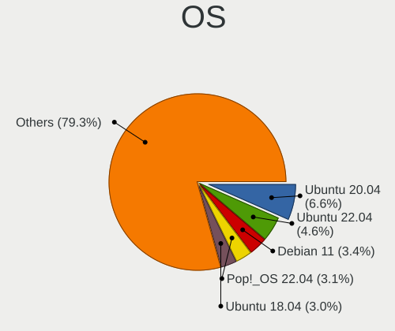

| Name                         | Notebooks | Percent |
|------------------------------|-----------|---------|
| Ubuntu 20.04                 | 2157      | 6.61%   |
| Ubuntu 22.04                 | 1512      | 4.64%   |
| Debian 11                    | 1122      | 3.44%   |
| Pop!_OS 22.04                | 1005      | 3.08%   |
| Ubuntu 18.04                 | 963       | 2.95%   |
| Arch Rolling                 | 882       | 2.7%    |
| Ubuntu 24.04                 | 794       | 2.43%   |
| Debian 12                    | 664       | 2.04%   |
| OpenMandriva 6.0             | 646       | 1.98%   |
| OpenMandriva 24.12           | 632       | 1.94%   |
| Zorin 16                     | 470       | 1.44%   |
| Zorin 17                     | 463       | 1.42%   |
| OpenMandriva 25.06           | 440       | 1.35%   |
| Manjaro                      | 407       | 1.25%   |
| Fedora 40                    | 401       | 1.23%   |
| Linux Mint 22.1              | 376       | 1.15%   |
| OpenMandriva 25.90           | 355       | 1.09%   |
| ArcoLinux Rolling            | 336       | 1.03%   |
| Fedora 41                    | 330       | 1.01%   |
| Arch                         | 325       | 1%      |
| Fedora 42                    | 320       | 0.98%   |
| Linux Mint 20.3              | 302       | 0.93%   |
| Fedora 39                    | 298       | 0.91%   |
| Pop!_OS 21.04                | 282       | 0.86%   |
| KDE neon 20.04               | 282       | 0.86%   |
| Fedora 38                    | 274       | 0.84%   |
| OpenMandriva 5.0             | 268       | 0.82%   |
| Pop!_OS 20.04                | 254       | 0.78%   |
| EndeavourOS Rolling          | 251       | 0.77%   |
| Pop!_OS 20.10                | 250       | 0.77%   |
| Linux Mint 21.2              | 234       | 0.72%   |
| OpenMandriva 23.08           | 233       | 0.71%   |
| Linux Mint 21.1              | 231       | 0.71%   |
| Linux Mint 22.2              | 225       | 0.69%   |
| Fedora 36                    | 225       | 0.69%   |
| OpenMandriva 25.01           | 224       | 0.69%   |
| openSUSE Tumbleweed-XXXXXXXX | 222       | 0.68%   |
| OpenMandriva 4.3             | 222       | 0.68%   |
| KDE neon 22.04               | 216       | 0.66%   |
| Linux Mint 20.2              | 208       | 0.64%   |

OS Family
---------

OS without a version

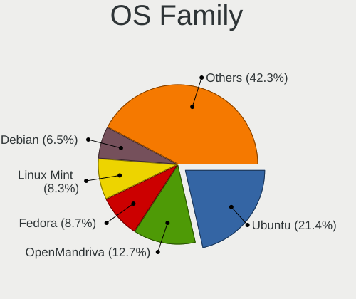

| Name          | Notebooks | Percent |
|---------------|-----------|---------|
| Ubuntu        | 6570      | 21.45%  |
| OpenMandriva  | 3899      | 12.73%  |
| Fedora        | 2661      | 8.69%   |
| Linux Mint    | 2552      | 8.33%   |
| Debian        | 2005      | 6.55%   |
| Pop!_OS       | 1958      | 6.39%   |
| Zorin         | 1239      | 4.05%   |
| Arch          | 1191      | 3.89%   |
| SteamOS       | 844       | 2.76%   |
| Manjaro       | 763       | 2.49%   |
| Kubuntu       | 688       | 2.25%   |
| KDE neon      | 603       | 1.97%   |
| Kali          | 408       | 1.33%   |
| Xubuntu       | 401       | 1.31%   |
| ArcoLinux     | 358       | 1.17%   |
| openSUSE      | 337       | 1.1%    |
| EndeavourOS   | 267       | 0.87%   |
| Elementary    | 265       | 0.87%   |
| Bazzite       | 248       | 0.81%   |
| Gentoo        | 207       | 0.68%   |
| Lubuntu       | 184       | 0.6%    |
| Endless       | 174       | 0.57%   |
| MX            | 159       | 0.52%   |
| Nobara        | 156       | 0.51%   |
| LMDE          | 154       | 0.5%    |
| Parrot        | 152       | 0.5%    |
| Garuda Linux  | 149       | 0.49%   |
| Ubuntu MATE   | 127       | 0.41%   |
| Ubuntu Unity  | 118       | 0.39%   |
| Clear Linux   | 114       | 0.37%   |
| NixOS         | 113       | 0.37%   |
| ROSA          | 108       | 0.35%   |
| CachyOS       | 108       | 0.35%   |
| BlackPanther  | 78        | 0.25%   |
| Ubuntu Budgie | 75        | 0.24%   |
| Peppermint    | 58        | 0.19%   |
| RHEL          | 52        | 0.17%   |
| TUXEDO OS     | 44        | 0.14%   |
| Rocky Linux   | 44        | 0.14%   |
| Xero          | 41        | 0.13%   |

Kernel
------

Version of the Linux kernel

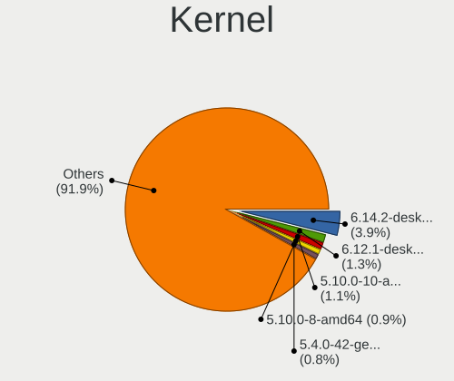

| Version                       | Notebooks | Percent |
|-------------------------------|-----------|---------|
| 6.14.2-desktop-3omv2590       | 1393      | 3.93%   |
| 6.12.1-desktop-1omv2490       | 478       | 1.35%   |
| 5.10.0-10-amd64               | 402       | 1.13%   |
| 5.10.0-8-amd64                | 303       | 0.85%   |
| 5.4.0-42-generic              | 292       | 0.82%   |
| 6.6.2-desktop-1omv2390        | 291       | 0.82%   |
| 6.12.9-desktop-1omv2490       | 235       | 0.66%   |
| 6.8.0-51-generic              | 224       | 0.63%   |
| 5.16.7-desktop-1omv4003       | 213       | 0.6%    |
| 6.9.3-76060903-generic        | 207       | 0.58%   |
| 5.13.0-valve36-1-neptune      | 193       | 0.54%   |
| 5.10.14-desktop-1omv4002      | 192       | 0.54%   |
| 5.15.0-56-generic             | 189       | 0.53%   |
| 6.4.11-desktop-1omv2390       | 179       | 0.5%    |
| 6.2.6-76060206-generic        | 155       | 0.44%   |
| 5.4.0-58-generic              | 151       | 0.43%   |
| 5.11.0-7620-generic           | 148       | 0.42%   |
| 5.15.0-58-generic             | 143       | 0.4%    |
| 6.12.6-desktop-1omv2490       | 140       | 0.39%   |
| 6.1.52-valve16-1-neptune-61   | 138       | 0.39%   |
| 6.2.6-desktop-1omv2390        | 135       | 0.38%   |
| 5.4.0-48-generic              | 127       | 0.36%   |
| 5.4.0-29-generic              | 124       | 0.35%   |
| 6.1.1-desktop-1omv2290        | 119       | 0.34%   |
| 6.8.0-60-generic              | 116       | 0.33%   |
| 5.4.0-26-generic              | 116       | 0.33%   |
| 6.8.0-49-generic              | 114       | 0.32%   |
| 5.3.0-28-generic              | 114       | 0.32%   |
| 5.15.0-52-generic             | 114       | 0.32%   |
| 6.8.0-45-generic              | 110       | 0.31%   |
| 6.15.0-desktop-0.rc2.3omv2590 | 110       | 0.31%   |
| 6.2.0-39-generic              | 104       | 0.29%   |
| 6.2.0-26-generic              | 103       | 0.29%   |
| 5.4.0-52-generic              | 103       | 0.29%   |
| 5.15.0-46-generic             | 103       | 0.29%   |
| 5.10.0-20-amd64               | 103       | 0.29%   |
| 6.8.0-52-generic              | 101       | 0.28%   |
| 6.5.0-26-generic              | 101       | 0.28%   |
| 6.12.10-76061203-generic      | 101       | 0.28%   |
| 5.8.0-7630-generic            | 101       | 0.28%   |

Kernel Family
-------------

Linux kernel without a distro release

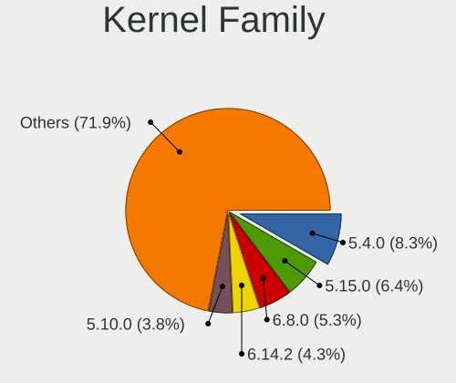

| Version | Notebooks | Percent |
|---------|-----------|---------|
| 5.4.0   | 2804      | 8.33%   |
| 5.15.0  | 2142      | 6.36%   |
| 6.8.0   | 1776      | 5.28%   |
| 6.14.2  | 1444      | 4.29%   |
| 5.10.0  | 1281      | 3.81%   |
| 5.13.0  | 1221      | 3.63%   |
| 5.11.0  | 1039      | 3.09%   |
| 6.5.0   | 984       | 2.92%   |
| 5.8.0   | 922       | 2.74%   |
| 6.1.0   | 873       | 2.59%   |
| 4.15.0  | 750       | 2.23%   |
| 6.14.0  | 740       | 2.2%    |
| 5.19.0  | 691       | 2.05%   |
| 5.3.0   | 657       | 1.95%   |
| 6.2.0   | 634       | 1.88%   |
| 6.12.1  | 497       | 1.48%   |
| 6.11.0  | 421       | 1.25%   |
| 5.0.0   | 393       | 1.17%   |
| 6.6.2   | 312       | 0.93%   |
| 4.18.0  | 305       | 0.91%   |
| 6.2.6   | 304       | 0.9%    |
| 6.12.9  | 272       | 0.81%   |
| 6.1.52  | 250       | 0.74%   |
| 6.9.3   | 236       | 0.7%    |
| 5.16.7  | 216       | 0.64%   |
| 6.4.11  | 199       | 0.59%   |
| 5.10.14 | 195       | 0.58%   |
| 6.12.6  | 182       | 0.54%   |
| 5.14.0  | 159       | 0.47%   |
| 6.1.1   | 144       | 0.43%   |
| 4.19.0  | 139       | 0.41%   |
| 6.12.10 | 130       | 0.39%   |
| 6.17.7  | 125       | 0.37%   |
| 6.15.0  | 125       | 0.37%   |
| 6.0.12  | 113       | 0.34%   |
| 6.5.6   | 108       | 0.32%   |
| 6.11.11 | 104       | 0.31%   |
| 5.17.5  | 100       | 0.3%    |
| 6.13.5  | 96        | 0.29%   |
| 6.8.5   | 86        | 0.26%   |

Kernel Major Ver.
-----------------

Linux kernel major version

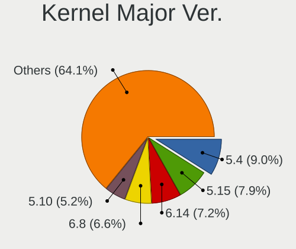

| Version | Notebooks | Percent |
|---------|-----------|---------|
| 5.4     | 2977      | 8.98%   |
| 5.15    | 2616      | 7.89%   |
| 6.14    | 2403      | 7.25%   |
| 6.8     | 2172      | 6.55%   |
| 5.10    | 1721      | 5.19%   |
| 6.1     | 1629      | 4.91%   |
| 6.12    | 1628      | 4.91%   |
| 5.13    | 1381      | 4.17%   |
| 6.5     | 1341      | 4.05%   |
| 6.2     | 1182      | 3.57%   |
| 5.11    | 1164      | 3.51%   |
| 5.8     | 1116      | 3.37%   |
| 5.19    | 876       | 2.64%   |
| 6.11    | 860       | 2.59%   |
| 6.6     | 848       | 2.56%   |
| 4.15    | 752       | 2.27%   |
| 5.3     | 729       | 2.2%    |
| 5.16    | 535       | 1.61%   |
| 6.4     | 529       | 1.6%    |
| 6.9     | 500       | 1.51%   |
| 6.17    | 489       | 1.48%   |
| 6.0     | 436       | 1.32%   |
| 6.13    | 429       | 1.29%   |
| 6.15    | 422       | 1.27%   |
| 5.0     | 420       | 1.27%   |
| 6.10    | 379       | 1.14%   |
| 4.18    | 374       | 1.13%   |
| 5.18    | 361       | 1.09%   |
| 5.14    | 353       | 1.06%   |
| 5.17    | 306       | 0.92%   |
| 6.3     | 290       | 0.87%   |
| 6.16    | 282       | 0.85%   |
| 6.7     | 279       | 0.84%   |
| 5.9     | 209       | 0.63%   |
| 4.19    | 189       | 0.57%   |
| 5.6     | 185       | 0.56%   |
| 5.12    | 153       | 0.46%   |
| 5.7     | 132       | 0.4%    |
| 5.5     | 100       | 0.3%    |
| 4.9     | 80        | 0.24%   |

Arch
----

OS architecture (x86_64, i586, etc.)

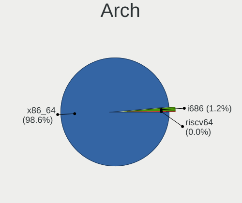

| Name    | Notebooks | Percent |
|---------|-----------|---------|
| x86_64  | 28841     | 98.59%  |
| i686    | 358       | 1.22%   |
| aarch64 | 50        | 0.17%   |
| armv7l  | 2         | 0.01%   |
| riscv64 | 1         | 0.003%  |

DE
--

Desktop Environment

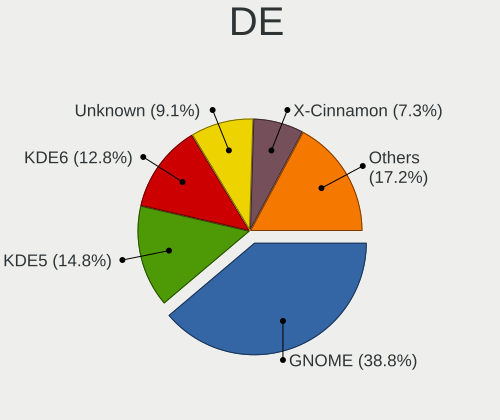

| Name             | Notebooks | Percent |
|------------------|-----------|---------|
| GNOME            | 11946     | 38.83%  |
| KDE5             | 4550      | 14.79%  |
| KDE6             | 3923      | 12.75%  |
| Unknown          | 2804      | 9.11%   |
| X-Cinnamon       | 2250      | 7.31%   |
| XFCE             | 1932      | 6.28%   |
| MATE             | 637       | 2.07%   |
| KDE              | 542       | 1.76%   |
| LXQt             | 424       | 1.38%   |
| Pantheon         | 252       | 0.82%   |
| Cinnamon         | 223       | 0.72%   |
| Budgie           | 152       | 0.49%   |
| i3               | 142       | 0.46%   |
| Unity            | 119       | 0.39%   |
| Hyprland         | 108       | 0.35%   |
| KDE4             | 89        | 0.29%   |
| COSMIC           | 88        | 0.29%   |
| LXDE             | 84        | 0.27%   |
| GNOME Flashback  | 62        | 0.2%    |
| GNOME Classic    | 57        | 0.19%   |
| sway             | 49        | 0.16%   |
| Deepin           | 41        | 0.13%   |
| Trinity          | 30        | 0.1%    |
| Awesome          | 27        | 0.09%   |
| icewm            | 21        | 0.07%   |
| enlightenment    | 21        | 0.07%   |
| lightdm-xsession | 19        | 0.06%   |
| openbox          | 18        | 0.06%   |
| dwm              | 16        | 0.05%   |
| xmonad           | 12        | 0.04%   |
| bspwm            | 12        | 0.04%   |
| niri             | 11        | 0.04%   |
| Endless:GNOME    | 11        | 0.04%   |
| qtile            | 10        | 0.03%   |
| BunsenLabs       | 10        | 0.03%   |
| fluxbox          | 9         | 0.03%   |
| LeftWM           | 6         | 0.02%   |
| none+i3          | 5         | 0.02%   |
| Xsession         | 4         | 0.01%   |
| i3-with-shmlog   | 3         | 0.01%   |

Display Server
--------------

X11 or Wayland

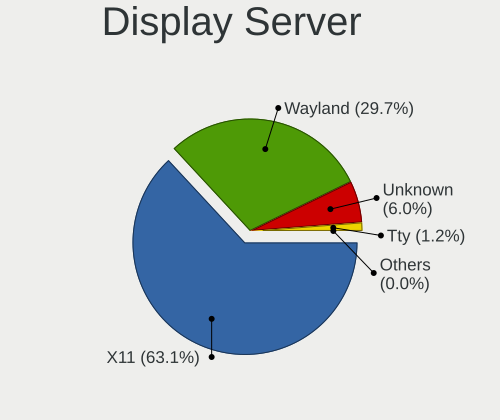

| Name        | Notebooks | Percent |
|-------------|-----------|---------|
| X11         | 19158     | 63.1%   |
| Wayland     | 9009      | 29.67%  |
| Unknown     | 1820      | 5.99%   |
| Tty         | 369       | 1.22%   |
| Unspecified | 3         | 0.01%   |
| Web         | 1         | 0.003%  |

Display Manager
---------------

SDDM, LightDM, etc.

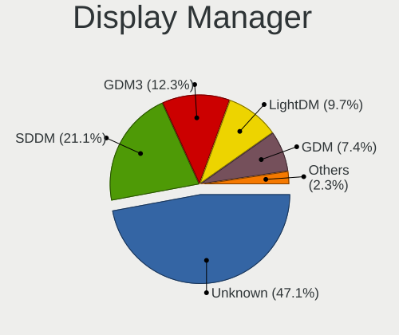

| Name                  | Notebooks | Percent |
|-----------------------|-----------|---------|
| Unknown               | 14319     | 47.08%  |
| SDDM                  | 6428      | 21.13%  |
| GDM3                  | 3733      | 12.27%  |
| LightDM               | 2964      | 9.75%   |
| GDM                   | 2259      | 7.43%   |
| TDM                   | 458       | 1.51%   |
| KDM                   | 55        | 0.18%   |
| XDM                   | 37        | 0.12%   |
| LXDM                  | 33        | 0.11%   |
| GREETD                | 33        | 0.11%   |
| SLiM                  | 30        | 0.1%    |
| Ly                    | 14        | 0.05%   |
| LY-DM                 | 12        | 0.04%   |
| SLIMSKI               | 11        | 0.04%   |
| COSMIC-GREETER        | 10        | 0.03%   |
| MDM                   | 5         | 0.02%   |
| EMPTTY                | 5         | 0.02%   |
| LEMURS                | 3         | 0.01%   |
| DISPLAY-MANAGER-START | 3         | 0.01%   |
| NODM                  | 2         | 0.01%   |
| LDM                   | 1         | 0.003%  |

OS Lang
-------

Language

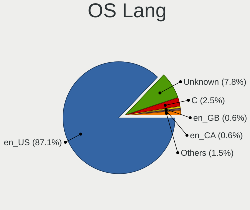

| Lang    | Notebooks | Percent |
|---------|-----------|---------|
| en_US   | 25808     | 87.13%  |
| Unknown | 2302      | 7.77%   |
| C       | 739       | 2.49%   |
| en_GB   | 171       | 0.58%   |
| en_CA   | 167       | 0.56%   |
| zh_CN   | 62        | 0.21%   |
| POSIX   | 33        | 0.11%   |
| C.UTF8  | 30        | 0.1%    |
| ru_RU   | 28        | 0.09%   |
| de_DE   | 28        | 0.09%   |
| es_ES   | 26        | 0.09%   |
| fr_FR   | 23        | 0.08%   |
| es_US   | 23        | 0.08%   |
| en_AU   | 22        | 0.07%   |
| en_IN   | 16        | 0.05%   |
| es_MX   | 13        | 0.04%   |
| pt_BR   | 10        | 0.03%   |
| pl_PL   | 10        | 0.03%   |
| it_IT   | 10        | 0.03%   |
| es_VE   | 5         | 0.02%   |
| en_IE   | 5         | 0.02%   |
| ru_UA   | 4         | 0.01%   |
| fr_CA   | 4         | 0.01%   |
| es_CO   | 4         | 0.01%   |
| en-US   | 4         | 0.01%   |
| unm_US  | 3         | 0.01%   |
| fr_CH   | 3         | 0.01%   |
| es_CU   | 3         | 0.01%   |
| uk_UA   | 2         | 0.01%   |
| ro_RO   | 2         | 0.01%   |
| pt_PT   | 2         | 0.01%   |
| nl_NL   | 2         | 0.01%   |
| nb_NO   | 2         | 0.01%   |
| ko_KR   | 2         | 0.01%   |
| ja_JP   | 2         | 0.01%   |
| es_SV   | 2         | 0.01%   |
| es_CR   | 2         | 0.01%   |
| es_CL   | 2         | 0.01%   |
| es_AR   | 2         | 0.01%   |
| eo_US   | 2         | 0.01%   |

Boot Mode
---------

EFI or BIOS

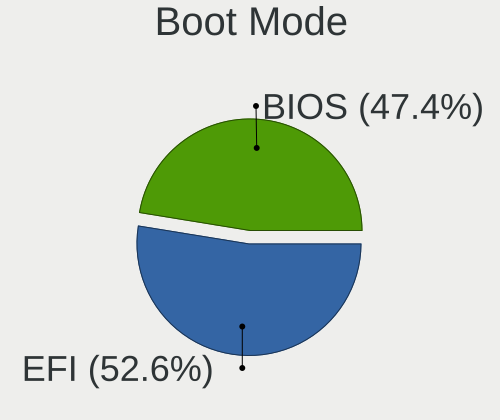

| Mode | Notebooks | Percent |
|------|-----------|---------|
| EFI  | 15778     | 52.57%  |
| BIOS | 14238     | 47.43%  |

Filesystem
----------

Type of filesystem

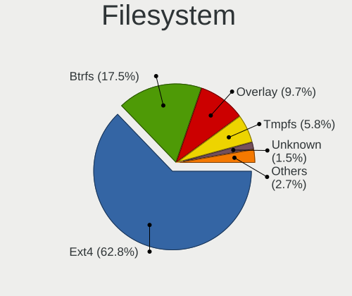

| Type                | Notebooks | Percent |
|---------------------|-----------|---------|
| Ext4                | 19009     | 62.8%   |
| Btrfs               | 5283      | 17.45%  |
| Overlay             | 2931      | 9.68%   |
| Tmpfs               | 1765      | 5.83%   |
| Unknown             | 452       | 1.49%   |
| Xfs                 | 433       | 1.43%   |
| Zfs                 | 233       | 0.77%   |
| F2fs                | 53        | 0.18%   |
| Ext2                | 43        | 0.14%   |
| Ext3                | 32        | 0.11%   |
| Rootfs              | 9         | 0.03%   |
| Reiserfs            | 5         | 0.02%   |
| Jfs                 | 5         | 0.02%   |
| Aufs                | 5         | 0.02%   |
| Bcachefs            | 4         | 0.01%   |
| XXXXX               | 3         | 0.01%   |
| XXXXXXX             | 1         | 0.003%  |
| XXX4                | 1         | 0.003%  |
| SquasXfs            | 1         | 0.003%  |
| Fuse.fuse-overlayfs | 1         | 0.003%  |

Part. scheme
------------

Scheme of partitioning

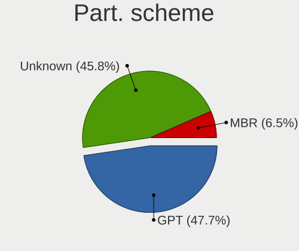

| Type    | Notebooks | Percent |
|---------|-----------|---------|
| GPT     | 14318     | 47.66%  |
| Unknown | 13756     | 45.79%  |
| MBR     | 1965      | 6.54%   |

Dual Boot with Linux/BSD
------------------------

Hosting more than one Linux/BSD

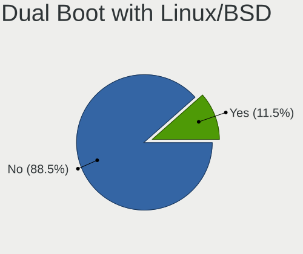

| Dual boot | Notebooks | Percent |
|-----------|-----------|---------|
| No        | 26317     | 88.46%  |
| Yes       | 3432      | 11.54%  |

Dual Boot (Win)
---------------

Hosting Linux and Windows

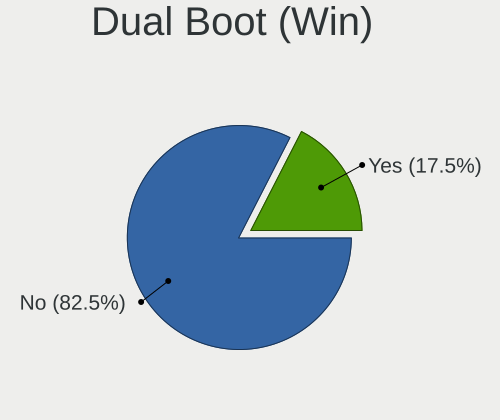

| Dual boot | Notebooks | Percent |
|-----------|-----------|---------|
| No        | 24480     | 82.53%  |
| Yes       | 5182      | 17.47%  |

Board
-----

Vendor
------

Motherboard manufacturer

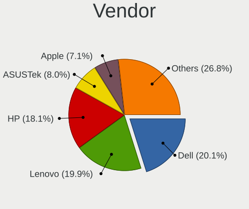

| Name                           | Notebooks | Percent |
|--------------------------------|-----------|---------|
| Dell                           | 5892      | 20.15%  |
| Lenovo                         | 5812      | 19.87%  |
| Hewlett-Packard                | 5283      | 18.07%  |
| ASUSTek Computer               | 2345      | 8.02%   |
| Apple                          | 2073      | 7.09%   |
| Acer                           | 1308      | 4.47%   |
| Toshiba                        | 836       | 2.86%   |
| Google                         | 836       | 2.86%   |
| Valve                          | 815       | 2.79%   |
| MSI                            | 656       | 2.24%   |
| System76                       | 395       | 1.35%   |
| Framework                      | 373       | 1.28%   |
| Alienware                      | 275       | 0.94%   |
| Unknown                        | 216       | 0.74%   |
| Sony                           | 191       | 0.65%   |
| GPU Company                    | 169       | 0.58%   |
| Samsung Electronics            | 153       | 0.52%   |
| Razer                          | 137       | 0.47%   |
| Notebook                       | 127       | 0.43%   |
| Gateway                        | 117       | 0.4%    |
| Panasonic                      | 110       | 0.38%   |
| Gigabyte Technology            | 100       | 0.34%   |
| LG Electronics                 | 65        | 0.22%   |
| Core Innovations               | 61        | 0.21%   |
| Fujitsu                        | 56        | 0.19%   |
| HUAWEI                         | 42        | 0.14%   |
| GPD                            | 39        | 0.13%   |
| AMI                            | 34        | 0.12%   |
| Eluktronics                    | 32        | 0.11%   |
| Chuwi                          | 29        | 0.1%    |
| AZW                            | 22        | 0.08%   |
| Pine Microsystems              | 19        | 0.06%   |
| EVOO                           | 19        | 0.06%   |
| MOTILE                         | 18        | 0.06%   |
| Purism                         | 17        | 0.06%   |
| TUXEDO                         | 16        | 0.05%   |
| Matsushita Electric Industrial | 16        | 0.05%   |
| Getac                          | 16        | 0.05%   |
| Timi                           | 15        | 0.05%   |
| Intel Client Systems           | 15        | 0.05%   |

Model
-----

Motherboard model

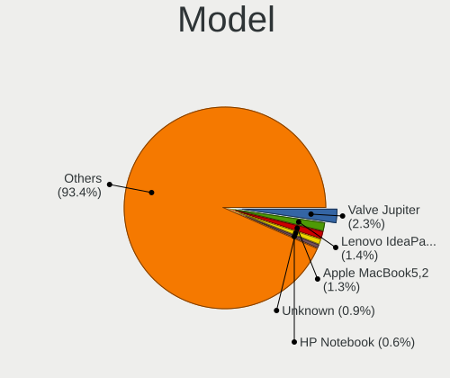

| Name                                        | Notebooks | Percent |
|---------------------------------------------|-----------|---------|
| Valve Jupiter                               | 673       | 2.3%    |
| Lenovo IdeaPad 1 14IGL7 82V6                | 416       | 1.42%   |
| Apple MacBook5,2                            | 371       | 1.27%   |
| Unknown                                     | 272       | 0.93%   |
| HP Notebook                                 | 186       | 0.64%   |
| Apple MacBookAir7,2                         | 182       | 0.62%   |
| Valve Galileo                               | 142       | 0.49%   |
| Apple MacBookPro9,2                         | 141       | 0.48%   |
| Dell Latitude E6420                         | 119       | 0.41%   |
| Dell Latitude E6430                         | 113       | 0.39%   |
| Framework Laptop                            | 108       | 0.37%   |
| HP Pavilion dv7                             | 107       | 0.37%   |
| Apple MacBookAir7,1                         | 104       | 0.36%   |
| HP Pavilion Notebook                        | 100       | 0.34%   |
| HP 2000                                     | 99        | 0.34%   |
| Apple MacBookPro8,1                         | 97        | 0.33%   |
| HP Pavilion dv6                             | 84        | 0.29%   |
| Framework Laptop 13 (AMD Ryzen 7040Series)  | 83        | 0.28%   |
| HP 15 Notebook PC                           | 82        | 0.28%   |
| HP Pavilion g7                              | 79        | 0.27%   |
| Google Enguarde                             | 79        | 0.27%   |
| Framework Laptop 16 (AMD Ryzen 7040 Series) | 76        | 0.26%   |
| HP Laptop 15-dy2xxx                         | 75        | 0.26%   |
| HP Laptop 15-db0xxx                         | 73        | 0.25%   |
| Dell Latitude E6410                         | 73        | 0.25%   |
| HP 15                                       | 72        | 0.25%   |
| Dell Latitude 7490                          | 71        | 0.24%   |
| System76 Gazelle                            | 67        | 0.23%   |
| Dell Latitude E6400                         | 67        | 0.23%   |
| System76 Oryx Pro                           | 66        | 0.23%   |
| Dell XPS 13 9360                            | 63        | 0.22%   |
| Dell XPS 15 9560                            | 62        | 0.21%   |
| Dell XPS 15 7590                            | 62        | 0.21%   |
| Dell Inspiron 1545                          | 62        | 0.21%   |
| Apple MacBook2,1                            | 62        | 0.21%   |
| Dell XPS 15 9570                            | 61        | 0.21%   |
| Apple MacBookPro14,1                        | 61        | 0.21%   |
| Apple MacBookPro12,1                        | 61        | 0.21%   |
| Dell Latitude 7480                          | 60        | 0.21%   |
| Core Innovations CLC14364                   | 60        | 0.21%   |

Model Family
------------

Motherboard model prefix

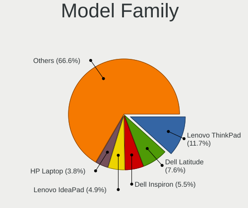

| Name               | Notebooks | Percent |
|--------------------|-----------|---------|
| Lenovo ThinkPad    | 3428      | 11.72%  |
| Dell Latitude      | 2210      | 7.56%   |
| Dell Inspiron      | 1599      | 5.47%   |
| Lenovo IdeaPad     | 1447      | 4.95%   |
| HP Laptop          | 1097      | 3.75%   |
| HP Pavilion        | 1072      | 3.67%   |
| Dell XPS           | 888       | 3.04%   |
| Acer Aspire        | 814       | 2.78%   |
| HP EliteBook       | 780       | 2.67%   |
| Toshiba Satellite  | 760       | 2.6%    |
| Dell Precision     | 709       | 2.42%   |
| Valve Jupiter      | 673       | 2.3%    |
| HP ProBook         | 446       | 1.53%   |
| ASUS VivoBook      | 436       | 1.49%   |
| ASUS ROG           | 427       | 1.46%   |
| Apple MacBook5     | 398       | 1.36%   |
| Framework Laptop   | 373       | 1.28%   |
| Lenovo Legion      | 329       | 1.13%   |
| Apple MacBookAir7  | 286       | 0.98%   |
| ASUS ASUS          | 280       | 0.96%   |
| Unknown            | 272       | 0.93%   |
| HP ENVY            | 271       | 0.93%   |
| Apple MacBookPro11 | 215       | 0.74%   |
| HP ZBook           | 209       | 0.71%   |
| Acer Nitro         | 206       | 0.7%    |
| HP Stream          | 189       | 0.65%   |
| HP Notebook        | 187       | 0.64%   |
| Apple MacBookPro9  | 182       | 0.62%   |
| Apple MacBookPro8  | 169       | 0.58%   |
| HP 15              | 168       | 0.57%   |
| HP OMEN            | 152       | 0.52%   |
| ASUS ZenBook       | 145       | 0.5%    |
| Valve Galileo      | 142       | 0.49%   |
| Razer Blade        | 136       | 0.47%   |
| Acer Swift         | 113       | 0.39%   |
| HP Compaq          | 102       | 0.35%   |
| Dell Vostro        | 101       | 0.35%   |
| HP 2000            | 99        | 0.34%   |
| HP Victus          | 98        | 0.34%   |
| Lenovo ThinkBook   | 96        | 0.33%   |

MFG Year
--------

Motherboard manufacture year

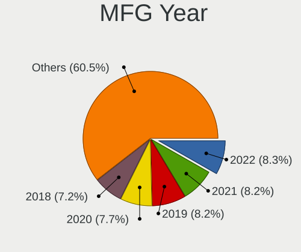

| Year    | Notebooks | Percent |
|---------|-----------|---------|
| 2022    | 2418      | 8.27%   |
| 2021    | 2391      | 8.18%   |
| 2019    | 2390      | 8.17%   |
| 2020    | 2250      | 7.69%   |
| 2018    | 2094      | 7.16%   |
| 2012    | 1903      | 6.51%   |
| 2011    | 1786      | 6.11%   |
| 2013    | 1701      | 5.82%   |
| 2023    | 1630      | 5.57%   |
| 2017    | 1559      | 5.33%   |
| 2015    | 1520      | 5.2%    |
| 2014    | 1303      | 4.46%   |
| 2016    | 1288      | 4.4%    |
| 2024    | 1021      | 3.49%   |
| 2010    | 973       | 3.33%   |
| 2009    | 966       | 3.3%    |
| 2008    | 945       | 3.23%   |
| 2007    | 409       | 1.4%    |
| 2006    | 305       | 1.04%   |
| 2025    | 242       | 0.83%   |
| Unknown | 59        | 0.2%    |
| 2005    | 55        | 0.19%   |
| 2004    | 17        | 0.06%   |
| 2003    | 17        | 0.06%   |
| 2002    | 2         | 0.01%   |

Form Factor
-----------

Physical design of the computer

| Name     | Notebooks | Percent |
|----------|-----------|---------|
| Notebook | 29244     | 100%    |

Secure Boot
-----------

Enabled or disabled

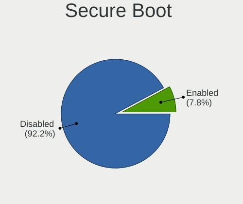

| State    | Notebooks | Percent |
|----------|-----------|---------|
| Disabled | 27226     | 92.18%  |
| Enabled  | 2311      | 7.82%   |

Coreboot
--------

Have coreboot on board

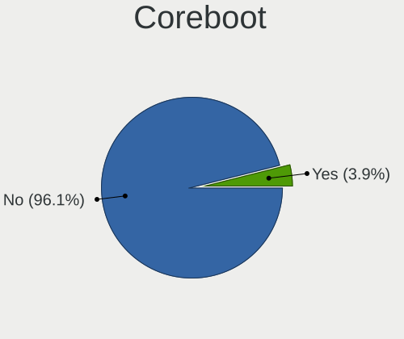

| Used | Notebooks | Percent |
|------|-----------|---------|
| No   | 28100     | 96.07%  |
| Yes  | 1148      | 3.93%   |

RAM Size
--------

Total RAM memory

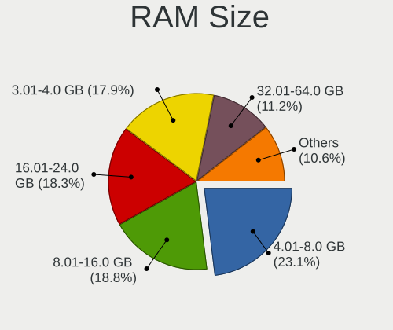

| Size in GB  | Notebooks | Percent |
|-------------|-----------|---------|
| 4.01-8.0    | 6851      | 23.06%  |
| 8.01-16.0   | 5599      | 18.84%  |
| 16.01-24.0  | 5448      | 18.33%  |
| 3.01-4.0    | 5333      | 17.95%  |
| 32.01-64.0  | 3337      | 11.23%  |
| 1.01-2.0    | 1080      | 3.63%   |
| 64.01-256.0 | 889       | 2.99%   |
| 24.01-32.0  | 652       | 2.19%   |
| 2.01-3.0    | 394       | 1.33%   |
| 0.51-1.0    | 113       | 0.38%   |
| 0.01-0.5    | 17        | 0.06%   |
| Unknown     | 1         | 0.003%  |

RAM Used
--------

Used RAM memory

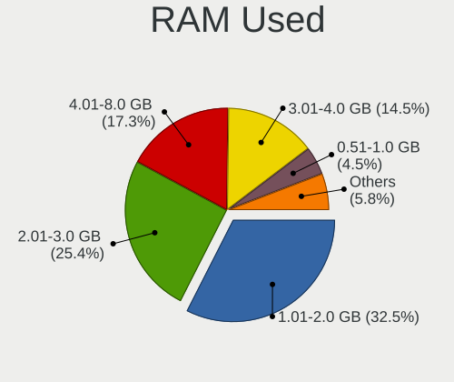

| Used GB    | Notebooks | Percent |
|------------|-----------|---------|
| 1.01-2.0   | 10596     | 32.5%   |
| 2.01-3.0   | 8270      | 25.36%  |
| 4.01-8.0   | 5656      | 17.35%  |
| 3.01-4.0   | 4725      | 14.49%  |
| 0.51-1.0   | 1463      | 4.49%   |
| 8.01-16.0  | 1407      | 4.31%   |
| 0.01-0.5   | 231       | 0.71%   |
| 16.01-24.0 | 171       | 0.52%   |
| 24.01-32.0 | 59        | 0.18%   |
| 32.01-64.0 | 27        | 0.08%   |
| Unknown    | 3         | 0.01%   |

Total Drives
------------

Number of drives on board

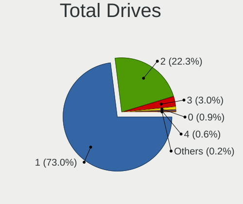

| Drives | Notebooks | Percent |
|--------|-----------|---------|
| 1      | 21934     | 73.02%  |
| 2      | 6690      | 22.27%  |
| 3      | 909       | 3.03%   |
| 0      | 274       | 0.91%   |
| 4      | 167       | 0.56%   |
| 5      | 43        | 0.14%   |
| 6      | 12        | 0.04%   |
| 7      | 6         | 0.02%   |
| 13     | 1         | 0.003%  |
| 11     | 1         | 0.003%  |
| 8      | 1         | 0.003%  |

Has CD-ROM
----------

Has CD-ROM on board

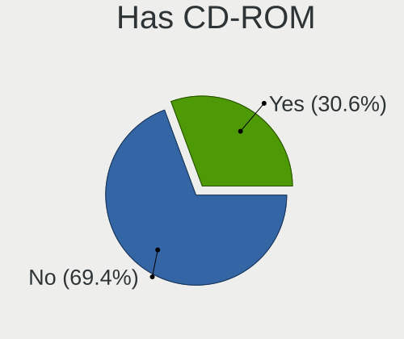

| Presented | Notebooks | Percent |
|-----------|-----------|---------|
| No        | 20381     | 69.38%  |
| Yes       | 8997      | 30.62%  |

Has Ethernet
------------

Has Ethernet on board

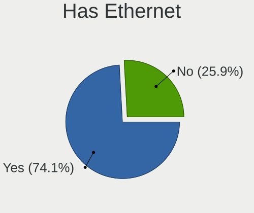

| Presented | Notebooks | Percent |
|-----------|-----------|---------|
| Yes       | 21833     | 74.14%  |
| No        | 7617      | 25.86%  |

Has WiFi
--------

Has WiFi module

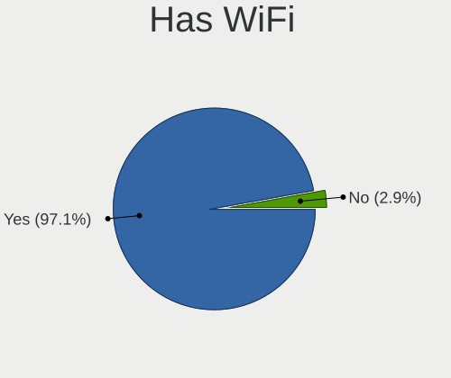

| Presented | Notebooks | Percent |
|-----------|-----------|---------|
| Yes       | 28437     | 97.14%  |
| No        | 837       | 2.86%   |

Has Bluetooth
-------------

Has Bluetooth module

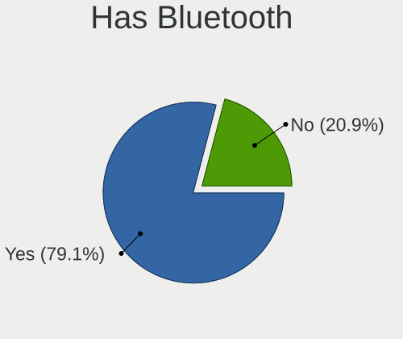

| Presented | Notebooks | Percent |
|-----------|-----------|---------|
| Yes       | 23379     | 79.09%  |
| No        | 6181      | 20.91%  |

Location
--------

Country
-------

Geographic location (country)

| Country | Notebooks | Percent |
|---------|-----------|---------|
| USA     | 29244     | 100%    |

City
----

Geographic location (city)

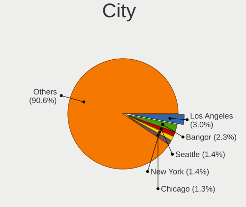

| City             | Notebooks | Percent |
|------------------|-----------|---------|
| Los Angeles      | 937       | 3%      |
| Bangor           | 726       | 2.32%   |
| Seattle          | 430       | 1.38%   |
| New York         | 422       | 1.35%   |
| Chicago          | 420       | 1.34%   |
| Dallas           | 349       | 1.12%   |
| Denver           | 323       | 1.03%   |
| Portland         | 314       | 1.01%   |
| Houston          | 293       | 0.94%   |
| Atlanta          | 266       | 0.85%   |
| Phoenix          | 247       | 0.79%   |
| Dover-Foxcroft   | 229       | 0.73%   |
| Austin           | 195       | 0.62%   |
| Miami            | 192       | 0.61%   |
| San Antonio      | 184       | 0.59%   |
| Minneapolis      | 179       | 0.57%   |
| Las Vegas        | 173       | 0.55%   |
| Brooklyn         | 168       | 0.54%   |
| San Francisco    | 163       | 0.52%   |
| Charlotte        | 160       | 0.51%   |
| San Jose         | 157       | 0.5%    |
| Salt Lake City   | 155       | 0.5%    |
| Washington       | 152       | 0.49%   |
| Columbus         | 136       | 0.44%   |
| San Diego        | 135       | 0.43%   |
| Jacksonville     | 134       | 0.43%   |
| Kansas City      | 126       | 0.4%    |
| Philadelphia     | 122       | 0.39%   |
| Indianapolis     | 119       | 0.38%   |
| Pittsburgh       | 114       | 0.36%   |
| Tucson           | 113       | 0.36%   |
| Orlando          | 111       | 0.36%   |
| Rochester        | 106       | 0.34%   |
| Raleigh          | 105       | 0.34%   |
| St Louis         | 102       | 0.33%   |
| Ashburn          | 100       | 0.32%   |
| Albuquerque      | 99        | 0.32%   |
| Sacramento       | 98        | 0.31%   |
| Colorado Springs | 96        | 0.31%   |
| Louisville       | 94        | 0.3%    |

Drives
------

Drive Vendor
------------

Hard drive vendors

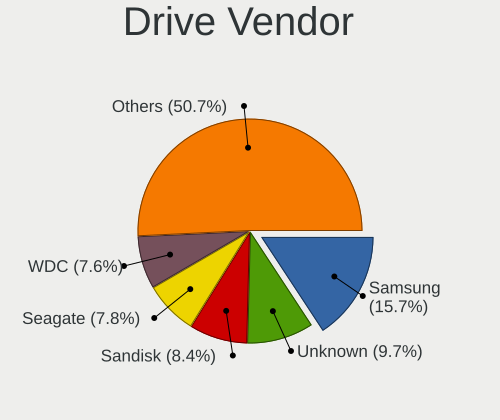

| Vendor                      | Notebooks | Drives | Percent |
|-----------------------------|-----------|--------|---------|
| Samsung Electronics         | 5763      | 8147   | 15.75%  |
| Unknown                     | 3535      | 4439   | 9.66%   |
| Sandisk                     | 3078      | 3961   | 8.41%   |
| Seagate                     | 2853      | 3800   | 7.8%    |
| WDC                         | 2796      | 3559   | 7.64%   |
| Toshiba                     | 2418      | 3020   | 6.61%   |
| SK hynix                    | 1715      | 2134   | 4.69%   |
| Micron Technology           | 1129      | 1326   | 3.08%   |
| Crucial                     | 1031      | 1359   | 2.82%   |
| Apple                       | 1008      | 1346   | 2.75%   |
| Intel                       | 982       | 1353   | 2.68%   |
| Kingston                    | 854       | 1096   | 2.33%   |
| HGST                        | 837       | 1090   | 2.29%   |
| Hitachi                     | 814       | 993    | 2.22%   |
| KIOXIA                      | 528       | 661    | 1.44%   |
| Phison Electronics          | 481       | 589    | 1.31%   |
| Fujitsu                     | 440       | 475    | 1.2%    |
| Unknown                     | 437       | 508    | 1.19%   |
| PNY                         | 415       | 528    | 1.13%   |
| Kingston Technology Company | 348       | 420    | 0.95%   |
| China                       | 336       | 422    | 0.92%   |
| Micron/Crucial Technology   | 319       | 432    | 0.87%   |
| SPCC                        | 299       | 367    | 0.82%   |
| A-DATA Technology           | 238       | 304    | 0.65%   |
| Phison                      | 227       | 295    | 0.62%   |
| LITEON                      | 194       | 239    | 0.53%   |
| Silicon Motion              | 192       | 236    | 0.52%   |
| LITEONIT                    | 157       | 198    | 0.43%   |
| SABRENT                     | 156       | 183    | 0.43%   |
| Team                        | 148       | 189    | 0.4%    |
| MAXIO Technology (Hangzhou) | 134       | 163    | 0.37%   |
| Realtek Semiconductor       | 98        | 125    | 0.27%   |
| O2 Micro                    | 96        | 116    | 0.26%   |
| Hewlett-Packard             | 90        | 121    | 0.25%   |
| Patriot                     | 79        | 94     | 0.22%   |
| JMicron Technology          | 79        | 89     | 0.22%   |
| Transcend                   | 74        | 85     | 0.2%    |
| T-FORCE                     | 61        | 70     | 0.17%   |
| Mushkin                     | 61        | 90     | 0.17%   |
| KingSpec                    | 59        | 75     | 0.16%   |

Drive Model
-----------

Hard drive models

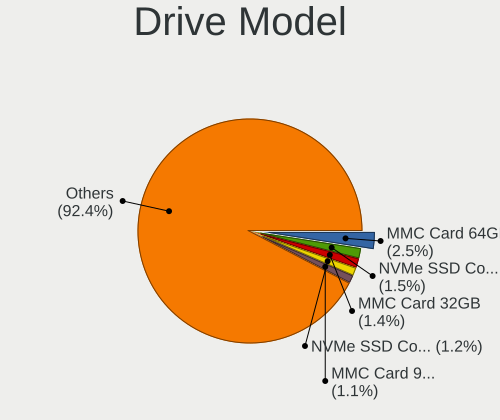

| Model                                                | Notebooks | Percent |
|------------------------------------------------------|-----------|---------|
| Unknown MMC Card  64GB                               | 941       | 2.45%   |
| Samsung NVMe SSD Controller SM981/PM981/PM983 1TB    | 570       | 1.48%   |
| Unknown MMC Card  32GB                               | 532       | 1.39%   |
| Samsung NVMe SSD Controller PM9A1/PM9A3/980PRO 1TB   | 454       | 1.18%   |
| Unknown                                              | 437       | 1.14%   |
| Seagate ST1000LM035-1RK172 1TB                       | 356       | 0.93%   |
| Unknown MMC Card  128GB                              | 334       | 0.87%   |
| Toshiba MQ01ABD100 1TB                               | 307       | 0.8%    |
| HGST HTS721010A9E630 1TB                             | 247       | 0.64%   |
| Fujitsu MHZ2160BH FFS G1 160GB                       | 243       | 0.63%   |
| Kingston Company OM3PDP3 NVMe SSD 256GB              | 217       | 0.57%   |
| Toshiba MQ01ABF050 500GB                             | 216       | 0.56%   |
| Seagate ST1000LM024 HN-M101MBB 1TB                   | 209       | 0.54%   |
| Unknown MMC Card  512GB                              | 200       | 0.52%   |
| Sandisk WD Black SN750 / PC SN730 NVMe SSD 500GB     | 195       | 0.51%   |
| Unknown SD/MMC/MS PRO 2GB                            | 191       | 0.5%    |
| Samsung SSD 860 EVO 500GB                            | 184       | 0.48%   |
| Unknown MMC Card  16GB                               | 181       | 0.47%   |
| Seagate ST500LT012-1DG142 500GB                      | 180       | 0.47%   |
| Toshiba MQ04ABF100 1TB                               | 179       | 0.47%   |
| SanDisk NVMe SSD Drive 1TB                           | 166       | 0.43%   |
| Phison PS5013 E13 NVMe Controller 500GB              | 162       | 0.42%   |
| Apple SSD SM0128G 121GB                              | 162       | 0.42%   |
| Crucial CT1000MX500SSD1 1TB                          | 159       | 0.41%   |
| Samsung SSD 860 EVO 1TB                              | 151       | 0.39%   |
| Unknown MMC Card  256GB                              | 149       | 0.39%   |
| Sandisk WD Blue SN550 NVMe SSD 1024GB                | 140       | 0.36%   |
| Samsung NVMe SSD Drive 512GB                         | 136       | 0.35%   |
| SABRENT Disk 4TB                                     | 135       | 0.35%   |
| Micron/Crucial P2 NVMe PCIe SSD 2TB                  | 134       | 0.35%   |
| Samsung SSD 850 EVO 500GB                            | 131       | 0.34%   |
| Samsung NVMe SSD Drive 256GB                         | 123       | 0.32%   |
| Samsung NVMe SSD Controller SM961/PM961/SM963 1024GB | 123       | 0.32%   |
| SanDisk NVMe SSD Drive 512GB                         | 121       | 0.32%   |
| Seagate ST9500325AS 500GB                            | 120       | 0.31%   |
| Kingston SA400S37240G 240GB SSD                      | 120       | 0.31%   |
| Crucial CT500MX500SSD1 500GB                         | 117       | 0.3%    |
| HGST HTS541010A9E680 1TB                             | 115       | 0.3%    |
| Samsung SSD 850 EVO 250GB                            | 107       | 0.28%   |
| Intel SSD 660P Series 512GB                          | 106       | 0.28%   |

HDD Vendor
----------

Hard disk drive vendors

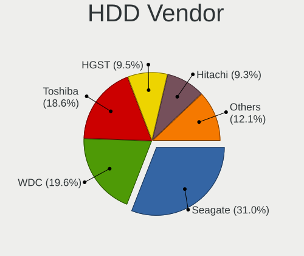

| Vendor              | Notebooks | Drives | Percent |
|---------------------|-----------|--------|---------|
| Seagate             | 2723      | 3590   | 30.95%  |
| WDC                 | 1724      | 2185   | 19.6%   |
| Toshiba             | 1639      | 2031   | 18.63%  |
| HGST                | 836       | 1089   | 9.5%    |
| Hitachi             | 814       | 993    | 9.25%   |
| Fujitsu             | 440       | 475    | 5%      |
| Unknown             | 197       | 247    | 2.24%   |
| Samsung Electronics | 98        | 108    | 1.11%   |
| Apple               | 83        | 101    | 0.94%   |
| JMicron Technology  | 33        | 38     | 0.38%   |
| SSK                 | 24        | 26     | 0.27%   |
| ASMT                | 22        | 42     | 0.25%   |
| External            | 21        | 27     | 0.24%   |
| USB3.0              | 17        | 20     | 0.19%   |
| TO Exter            | 13        | 15     | 0.15%   |
| T-FORCE             | 13        | 19     | 0.15%   |
| SABRENT             | 12        | 14     | 0.14%   |
| HGST HTS            | 12        | 15     | 0.14%   |
| IBM/Hitachi         | 9         | 12     | 0.1%    |
| Apricorn            | 7         | 9      | 0.08%   |
| Maxone              | 6         | 6      | 0.07%   |
| LaCie               | 5         | 6      | 0.06%   |
| ASMedia             | 5         | 5      | 0.06%   |
| KESU                | 4         | 4      | 0.05%   |
| Inateck             | 4         | 5      | 0.05%   |
| USB                 | 3         | 3      | 0.03%   |
| MaxDigital          | 3         | 3      | 0.03%   |
| USB 3.0             | 2         | 3      | 0.02%   |
| STEC                | 2         | 4      | 0.02%   |
| RSH-319             | 2         | 2      | 0.02%   |
| Min Yi U            | 2         | 2      | 0.02%   |
| Generic-            | 2         | 3      | 0.02%   |
| Asm                 | 2         | 2      | 0.02%   |
| WD MediaMax         | 1         | 1      | 0.01%   |
| TDAS                | 1         | 4      | 0.01%   |
| StoreJet            | 1         | 1      | 0.01%   |
| SATAFIRM            | 1         | 1      | 0.01%   |
| RSH-339             | 1         | 1      | 0.01%   |
| PRO-T5              | 1         | 1      | 0.01%   |
| NVME USB            | 1         | 1      | 0.01%   |

SSD Vendor
----------

Solid state drive vendors

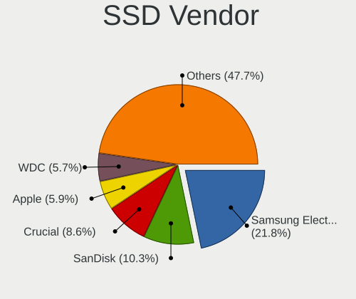

| Vendor              | Notebooks | Drives | Percent |
|---------------------|-----------|--------|---------|
| Samsung Electronics | 2232      | 3019   | 21.77%  |
| SanDisk             | 1054      | 1372   | 10.28%  |
| Crucial             | 885       | 1184   | 8.63%   |
| Apple               | 607       | 699    | 5.92%   |
| WDC                 | 583       | 777    | 5.69%   |
| Kingston            | 575       | 751    | 5.61%   |
| PNY                 | 403       | 514    | 3.93%   |
| China               | 333       | 419    | 3.25%   |
| Intel               | 296       | 371    | 2.89%   |
| SK hynix            | 290       | 351    | 2.83%   |
| Micron Technology   | 286       | 341    | 2.79%   |
| SPCC                | 256       | 316    | 2.5%    |
| Toshiba             | 218       | 272    | 2.13%   |
| A-DATA Technology   | 202       | 259    | 1.97%   |
| LITEON              | 180       | 225    | 1.76%   |
| LITEONIT            | 157       | 198    | 1.53%   |
| SABRENT             | 140       | 164    | 1.37%   |
| Team                | 123       | 160    | 1.2%    |
| Patriot             | 71        | 86     | 0.69%   |
| Transcend           | 69        | 75     | 0.67%   |
| Hewlett-Packard     | 69        | 98     | 0.67%   |
| OCZ                 | 57        | 67     | 0.56%   |
| KingSpec            | 57        | 72     | 0.56%   |
| Mushkin             | 53        | 82     | 0.52%   |
| Unknown             | 52        | 61     | 0.51%   |
| Netac               | 49        | 56     | 0.48%   |
| BHT                 | 46        | 61     | 0.45%   |
| Dogfish             | 45        | 50     | 0.44%   |
| Seagate             | 37        | 52     | 0.36%   |
| Wibtek              | 34        | 48     | 0.33%   |
| Lexar               | 34        | 46     | 0.33%   |
| ASMT                | 33        | 39     | 0.32%   |
| Timetec             | 31        | 36     | 0.3%    |
| SSSTC               | 30        | 32     | 0.29%   |
| Fanxiang            | 29        | 32     | 0.28%   |
| BIWIN               | 25        | 28     | 0.24%   |
| T-FORCE             | 24        | 25     | 0.23%   |
| KingFast            | 24        | 28     | 0.23%   |
| OWC                 | 23        | 30     | 0.22%   |
| Plextor             | 22        | 30     | 0.21%   |

Drive Kind
----------

HDD or SSD

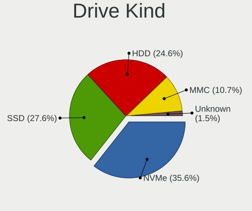

| Kind    | Notebooks | Drives | Percent |
|---------|-----------|--------|---------|
| NVMe    | 12150     | 17692  | 35.62%  |
| SSD     | 9410      | 13167  | 27.59%  |
| HDD     | 8391      | 11129  | 24.6%   |
| MMC     | 3663      | 4577   | 10.74%  |
| Unknown | 495       | 594    | 1.45%   |

Drive Connector
---------------

SATA, SAS, NVMe, etc.

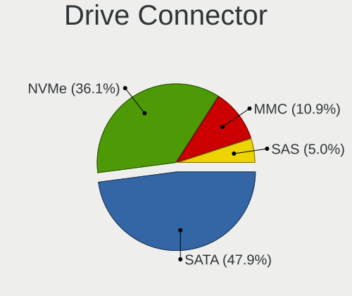

| Type | Notebooks | Drives | Percent |
|------|-----------|--------|---------|
| SATA | 16075     | 22719  | 47.93%  |
| NVMe | 12121     | 17526  | 36.14%  |
| MMC  | 3663      | 4577   | 10.92%  |
| SAS  | 1680      | 2337   | 5.01%   |

Drive Size
----------

Size of hard drive

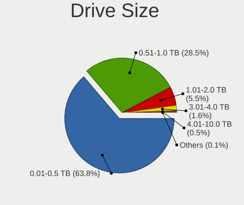

| Size in TB | Notebooks | Drives | Percent |
|------------|-----------|--------|---------|
| 0.01-0.5   | 11534     | 15409  | 63.77%  |
| 0.51-1.0   | 5160      | 6910   | 28.53%  |
| 1.01-2.0   | 992       | 1431   | 5.48%   |
| 3.01-4.0   | 293       | 365    | 1.62%   |
| 4.01-10.0  | 96        | 159    | 0.53%   |
| 10.01-20.0 | 6         | 12     | 0.03%   |
| 2.01-3.0   | 5         | 5      | 0.03%   |
| 20.01-50.0 | 1         | 5      | 0.01%   |

Space Total
-----------

Amount of disk space available on the file system

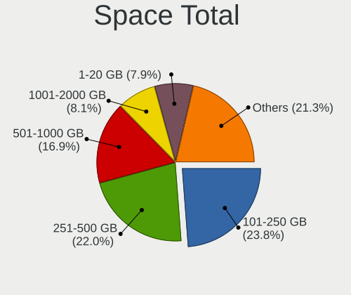

| Size in GB     | Notebooks | Percent |
|----------------|-----------|---------|
| 101-250        | 7426      | 23.79%  |
| 251-500        | 6855      | 21.96%  |
| 501-1000       | 5267      | 16.88%  |
| 1001-2000      | 2520      | 8.07%   |
| 1-20           | 2479      | 7.94%   |
| 51-100         | 1852      | 5.93%   |
| Unknown        | 1723      | 5.52%   |
| More than 3000 | 1330      | 4.26%   |
| 21-50          | 992       | 3.18%   |
| 2001-3000      | 764       | 2.45%   |
| 0              | 1         | 0.003%  |

Space Used
----------

Amount of used disk space

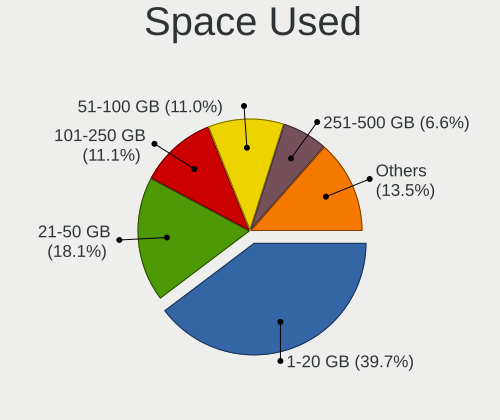

| Used GB        | Notebooks | Percent |
|----------------|-----------|---------|
| 1-20           | 12904     | 39.71%  |
| 21-50          | 5877      | 18.09%  |
| 101-250        | 3614      | 11.12%  |
| 51-100         | 3568      | 10.98%  |
| 251-500        | 2141      | 6.59%   |
| Unknown        | 1723      | 5.3%    |
| 501-1000       | 1351      | 4.16%   |
| 1001-2000      | 685       | 2.11%   |
| More than 3000 | 244       | 0.75%   |
| 2001-3000      | 209       | 0.64%   |
| 0              | 178       | 0.55%   |

Malfunc. Drives
---------------

Drive models with a malfunction

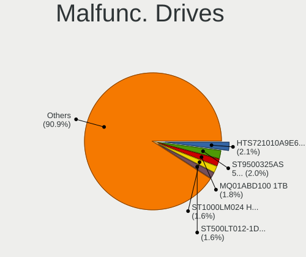

| Model                                                         | Notebooks | Drives | Percent |
|---------------------------------------------------------------|-----------|--------|---------|
| HGST HTS721010A9E630 1TB                                      | 33        | 37     | 2.09%   |
| Seagate ST9500325AS 500GB                                     | 32        | 32     | 2.02%   |
| Toshiba MQ01ABD100 1TB                                        | 28        | 36     | 1.77%   |
| Seagate ST1000LM024 HN-M101MBB 1TB                            | 26        | 26     | 1.64%   |
| Seagate ST500LT012-1DG142 500GB                               | 25        | 28     | 1.58%   |
| HGST HTS541010A9E680 1TB                                      | 25        | 27     | 1.58%   |
| Fujitsu MHZ2160BH FFS G1 160GB                                | 25        | 25     | 1.58%   |
| Seagate ST500LT012-9WS142 500GB                               | 23        | 26     | 1.45%   |
| Seagate ST1000LM035-1RK172 1TB                                | 23        | 23     | 1.45%   |
| HGST HTS725050A7E630 500GB                                    | 21        | 22     | 1.33%   |
| HGST HTS545050A7E680 500GB                                    | 20        | 21     | 1.27%   |
| Seagate ST320LT007-9ZV142 320GB                               | 17        | 19     | 1.08%   |
| Toshiba MQ01ABF050 500GB                                      | 16        | 17     | 1.01%   |
| Hitachi HTS547575A9E384 752GB                                 | 15        | 17     | 0.95%   |
| HGST HTS541075A9E680 752GB                                    | 14        | 14     | 0.89%   |
| Seagate ST9500420AS 500GB                                     | 13        | 14     | 0.82%   |
| Seagate ST500LM021-1KJ152 500GB                               | 12        | 12     | 0.76%   |
| Seagate ST1000LX015-1U7172 1TB                                | 12        | 13     | 0.76%   |
| Crucial CT525MX300SSD1 528GB                                  | 12        | 13     | 0.76%   |
| Hitachi HTS547564A9E384 640GB                                 | 11        | 12     | 0.7%    |
| Hitachi HTS543216L9SA02 160GB                                 | 11        | 11     | 0.7%    |
| HGST HTS545050A7E380 500GB                                    | 11        | 11     | 0.7%    |
| SSSTC CVB-8D128-HP 128GB                                      | 10        | 10     | 0.63%   |
| Hitachi HTS545050A7E380 500GB                                 | 10        | 13     | 0.63%   |
| Toshiba MK1653GSX 160GB                                       | 9         | 9      | 0.57%   |
| Seagate ST9750420AS 752GB                                     | 9         | 12     | 0.57%   |
| Seagate ST9320325AS 320GB                                     | 9         | 9      | 0.57%   |
| Kingston SNS4151S316G 16GB SSD                                | 9         | 9      | 0.57%   |
| Hitachi HTS545050B9A300 500GB                                 | 9         | 9      | 0.57%   |
| Toshiba MQ01ACF050 500GB                                      | 8         | 9      | 0.51%   |
| Toshiba MQ01ABD075 752GB                                      | 8         | 10     | 0.51%   |
| Toshiba MK1655GSXF 160GB                                      | 8         | 9      | 0.51%   |
| Toshiba KSG60ZMV256G M.2 2280 256GB SSD                       | 8         | 12     | 0.51%   |
| SK hynix PC711 HFS001TDE9X073N 1TB                            | 8         | 10     | 0.51%   |
| Seagate ST9320423AS 320GB                                     | 8         | 9      | 0.51%   |
| Seagate ST2000LM007-1R8174 2TB                                | 8         | 8      | 0.51%   |
| Samsung Electronics NVMe SSD Controller SM981/PM981/PM983 1TB | 8         | 8      | 0.51%   |
| Kingston SV300S37A120G 120GB SSD                              | 8         | 8      | 0.51%   |
| Kingston RBU-SNS8350DES3128GP 128GB SSD                       | 8         | 8      | 0.51%   |
| Hitachi HTS723232A7A364 320GB                                 | 8         | 9      | 0.51%   |

Malfunc. Drive Vendor
---------------------

Vendors of faulty drives

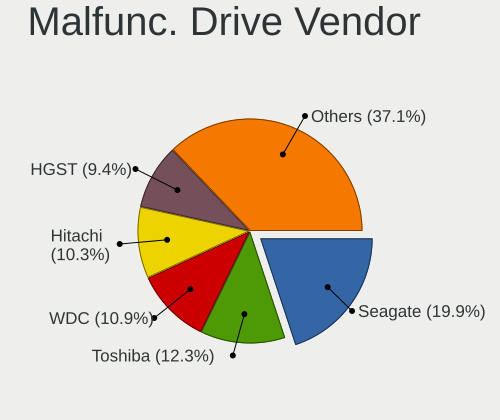

| Vendor                | Notebooks | Drives | Percent |
|-----------------------|-----------|--------|---------|
| Seagate               | 313       | 342    | 19.92%  |
| Toshiba               | 193       | 224    | 12.29%  |
| WDC                   | 172       | 190    | 10.95%  |
| Hitachi               | 162       | 181    | 10.31%  |
| HGST                  | 148       | 161    | 9.42%   |
| Samsung Electronics   | 97        | 118    | 6.17%   |
| SK hynix              | 59        | 67     | 3.76%   |
| Intel                 | 58        | 67     | 3.69%   |
| Fujitsu               | 53        | 53     | 3.37%   |
| Crucial               | 52        | 73     | 3.31%   |
| SanDisk               | 44        | 49     | 2.8%    |
| Kingston              | 44        | 48     | 2.8%    |
| Micron Technology     | 21        | 26     | 1.34%   |
| Apple                 | 19        | 20     | 1.21%   |
| A-DATA Technology     | 15        | 17     | 0.95%   |
| SSSTC                 | 13        | 13     | 0.83%   |
| LITEON                | 11        | 12     | 0.7%    |
| LITEONIT              | 10        | 11     | 0.64%   |
| SPCC                  | 7         | 7      | 0.45%   |
| China                 | 6         | 6      | 0.38%   |
| Netac                 | 5         | 6      | 0.32%   |
| Mushkin               | 5         | 5      | 0.32%   |
| Unknown               | 5         | 5      | 0.32%   |
| Realtek Semiconductor | 4         | 5      | 0.25%   |
| IBM/Hitachi           | 4         | 4      | 0.25%   |
| Hewlett-Packard       | 4         | 4      | 0.25%   |
| ASMT                  | 4         | 7      | 0.25%   |
| Team                  | 3         | 3      | 0.19%   |
| OCZ                   | 3         | 4      | 0.19%   |
| KingSpec              | 3         | 3      | 0.19%   |
| Unknown               | 2         | 2      | 0.13%   |
| Lexar                 | 2         | 3      | 0.13%   |
| KingFast              | 2         | 2      | 0.13%   |
| JMicron Technology    | 2         | 2      | 0.13%   |
| HGST HTS              | 2         | 4      | 0.13%   |
| Eluktro               | 2         | 2      | 0.13%   |
| Corsair               | 2         | 2      | 0.13%   |
| 240G                  | 2         | 3      | 0.13%   |
| Wibtek                | 1         | 3      | 0.06%   |
| Union Memory          | 1         | 1      | 0.06%   |

Malfunc. HDD Vendor
-------------------

Vendors of faulty HDD drives

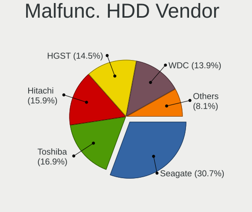

| Vendor              | Notebooks | Drives | Percent |
|---------------------|-----------|--------|---------|
| Seagate             | 313       | 342    | 30.66%  |
| Toshiba             | 173       | 197    | 16.94%  |
| Hitachi             | 162       | 181    | 15.87%  |
| HGST                | 148       | 161    | 14.5%   |
| WDC                 | 142       | 159    | 13.91%  |
| Fujitsu             | 53        | 53     | 5.19%   |
| Samsung Electronics | 14        | 14     | 1.37%   |
| Apple               | 5         | 6      | 0.49%   |
| IBM/Hitachi         | 4         | 4      | 0.39%   |
| ASMT                | 3         | 6      | 0.29%   |
| HGST HTS            | 2         | 4      | 0.2%    |
| JMicron Technology  | 1         | 1      | 0.1%    |
| Apricorn            | 1         | 1      | 0.1%    |

Malfunc. Drive Kind
-------------------

Kinds of faulty drives

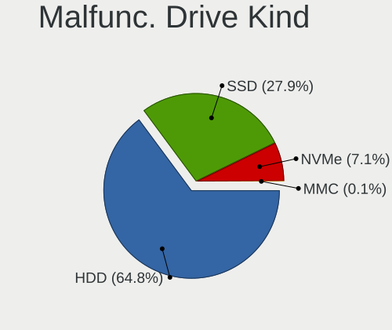

| Kind | Notebooks | Drives | Percent |
|------|-----------|--------|---------|
| HDD  | 1007      | 1129   | 64.84%  |
| SSD  | 434       | 520    | 27.95%  |
| NVMe | 111       | 125    | 7.15%   |
| MMC  | 1         | 1      | 0.06%   |

Failed Drives
-------------

Failed drive models

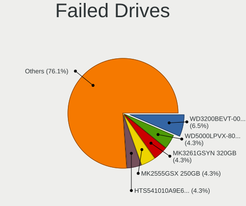

| Model                                            | Notebooks | Drives | Percent |
|--------------------------------------------------|-----------|--------|---------|
| WDC WD3200BEVT-00ZCT0 320GB                      | 3         | 3      | 6.52%   |
| WDC WD5000LPVX-80V0TT0 500GB                     | 2         | 2      | 4.35%   |
| Toshiba MK3261GSYN 320GB                         | 2         | 2      | 4.35%   |
| Toshiba MK2555GSX 250GB                          | 2         | 2      | 4.35%   |
| HGST HTS541010A9E680 1TB                         | 2         | 2      | 4.35%   |
| Crucial CT500P2SSD8 500GB                        | 2         | 2      | 4.35%   |
| WDC WD5000LPLX-75ZNTT0 500GB                     | 1         | 1      | 2.17%   |
| WDC WD2500BEVT-75A23T0 250GB                     | 1         | 2      | 2.17%   |
| WDC WD2500BEVT-60ZCT1 250GB                      | 1         | 1      | 2.17%   |
| WDC WD2500BEVT-22A23T0 250GB                     | 1         | 1      | 2.17%   |
| WDC WD2500BEVT-11ZCT0 250GB                      | 1         | 1      | 2.17%   |
| WDC WD10 02FBYS-02A6B0 1TB                       | 1         | 1      | 2.17%   |
| Toshiba XG6 NVMe SSD Controller 1024GB           | 1         | 1      | 2.17%   |
| Toshiba THNSN5512GPU7 512GB                      | 1         | 1      | 2.17%   |
| Toshiba THNSN5256GPUK NVMe 256GB                 | 1         | 1      | 2.17%   |
| Toshiba MQ01ABF032 320GB                         | 1         | 1      | 2.17%   |
| Toshiba MQ01ABD100 1TB                           | 1         | 1      | 2.17%   |
| Toshiba MK7575GSX 752GB                          | 1         | 1      | 2.17%   |
| Toshiba MK6465GSX 640GB                          | 1         | 1      | 2.17%   |
| Toshiba MK3265GSXN 320GB                         | 1         | 2      | 2.17%   |
| Toshiba MK2565GSXN 250GB                         | 1         | 1      | 2.17%   |
| SK hynix PC401 NVMe Solid State Drive 256GB      | 1         | 1      | 2.17%   |
| SK hynix BC501 NVMe Solid State Drive 512GB      | 1         | 1      | 2.17%   |
| SK hynix BC501 HFM256GDJTNG-8310A 256GB          | 1         | 1      | 2.17%   |
| Seagate ST9500420AS 500GB                        | 1         | 1      | 2.17%   |
| Seagate ST500LT012-1DG142 500GB                  | 1         | 1      | 2.17%   |
| Seagate ST500LM012 HN-M500MBB 500GB              | 1         | 1      | 2.17%   |
| SanDisk SSD i100 24GB                            | 1         | 1      | 2.17%   |
| Samsung Electronics SSD PM871b M.2 2280 128GB    | 1         | 1      | 2.17%   |
| Samsung Electronics MZ7TY256HDHP-000L1 256GB SSD | 1         | 1      | 2.17%   |
| Kingston SV300S37A120G 120GB SSD                 | 1         | 1      | 2.17%   |
| JM icron Tech 512GB                              | 1         | 1      | 2.17%   |
| Intenso JAJP600M1TB                              | 1         | 1      | 2.17%   |
| Intel SSDSCKKF256H6 SATA 256GB                   | 1         | 1      | 2.17%   |
| Hitachi HTS721010G9SA00 100GB                    | 1         | 1      | 2.17%   |
| Hitachi HTS547575A9E384 752GB                    | 1         | 2      | 2.17%   |
| Hitachi HTS547550A9E384 500GB                    | 1         | 1      | 2.17%   |
| HGST HTS721010A9E630 1TB                         | 1         | 1      | 2.17%   |
| Unknown                                          | 1         | 1      | 2.17%   |

Failed Drive Vendor
-------------------

Failed drive vendors

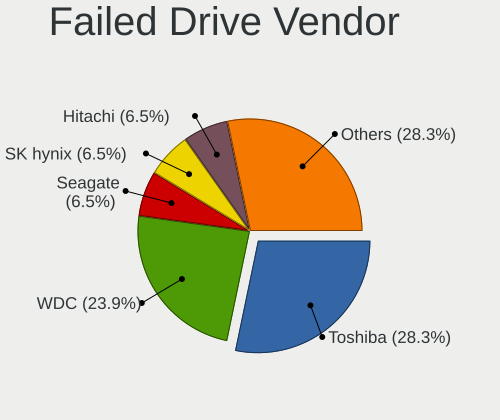

| Vendor              | Notebooks | Drives | Percent |
|---------------------|-----------|--------|---------|
| Toshiba             | 13        | 14     | 28.26%  |
| WDC                 | 11        | 12     | 23.91%  |
| SK hynix            | 3         | 3      | 6.52%   |
| Seagate             | 3         | 3      | 6.52%   |
| Hitachi             | 3         | 4      | 6.52%   |
| HGST                | 3         | 3      | 6.52%   |
| Samsung Electronics | 2         | 2      | 4.35%   |
| Crucial             | 2         | 2      | 4.35%   |
| SanDisk             | 1         | 1      | 2.17%   |
| Kingston            | 1         | 1      | 2.17%   |
| JM icron            | 1         | 1      | 2.17%   |
| Intenso             | 1         | 1      | 2.17%   |
| Intel               | 1         | 1      | 2.17%   |
| Unknown             | 1         | 1      | 2.17%   |

Drive Status
------------

Number of failed and malfunc. drives

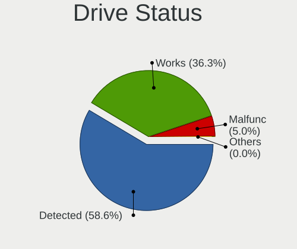

| Status   | Notebooks | Drives | Percent |
|----------|-----------|--------|---------|
| Detected | 18083     | 29512  | 58.56%  |
| Works    | 11205     | 15820  | 36.29%  |
| Malfunc  | 1542      | 1775   | 4.99%   |
| Failed   | 46        | 49     | 0.15%   |
| Limited  | 2         | 2      | 0.01%   |
| Fixed    | 1         | 1      | 0.003%  |

Storage controller
------------------

Storage Vendor
--------------

Storage controller vendors

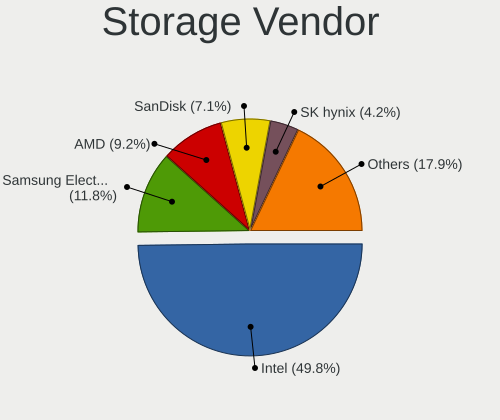

| Vendor                                  | Notebooks | Percent |
|-----------------------------------------|-----------|---------|
| Intel                                   | 16864     | 49.8%   |
| Samsung Electronics                     | 4010      | 11.84%  |
| AMD                                     | 3103      | 9.16%   |
| SanDisk                                 | 2409      | 7.11%   |
| SK hynix                                | 1406      | 4.15%   |
| Micron Technology                       | 864       | 2.55%   |
| Phison Electronics                      | 748       | 2.21%   |
| Nvidia                                  | 627       | 1.85%   |
| Kingston Technology Company             | 619       | 1.83%   |
| Toshiba America Info Systems            | 594       | 1.75%   |
| KIOXIA                                  | 508       | 1.5%    |
| Micron/Crucial Technology               | 432       | 1.28%   |
| Apple                                   | 295       | 0.87%   |
| Silicon Motion                          | 240       | 0.71%   |
| MAXIO Technology (Hangzhou)             | 159       | 0.47%   |
| Realtek Semiconductor                   | 136       | 0.4%    |
| O2 Micro                                | 96        | 0.28%   |
| Solid State Storage Technology          | 85        | 0.25%   |
| Marvell Technology Group                | 84        | 0.25%   |
| Union Memory (Shenzhen)                 | 75        | 0.22%   |
| ADATA Technology                        | 73        | 0.22%   |
| Shenzhen Longsys Electronics            | 61        | 0.18%   |
| INNOGRIT                                | 50        | 0.15%   |
| Solidigm                                | 47        | 0.14%   |
| Lite-On Technology                      | 47        | 0.14%   |
| Lenovo                                  | 43        | 0.13%   |
| Seagate Technology                      | 34        | 0.1%    |
| Biwin Storage Technology                | 30        | 0.09%   |
| Yangtze Memory Technologies             | 26        | 0.08%   |
| ASMedia Technology                      | 25        | 0.07%   |
| JMicron Technology                      | 14        | 0.04%   |
| Shenzhen Unionmemory Information System | 12        | 0.04%   |
| Hosin Global Electronics                | 11        | 0.03%   |
| Transcend                               | 6         | 0.02%   |
| TenaFe                                  | 6         | 0.02%   |
| Silicon Integrated Systems [SiS]        | 5         | 0.01%   |
| ULi Electronics                         | 3         | 0.01%   |
| Silicon Image                           | 3         | 0.01%   |
| VIA Technologies                        | 2         | 0.01%   |
| Ramaxel Technology(Shenzhen) Limited    | 2         | 0.01%   |

Storage Model
-------------

Storage controller models

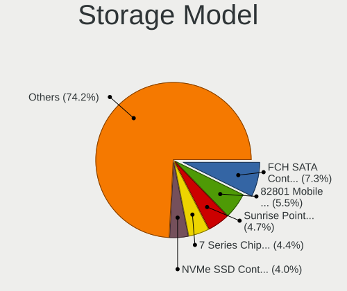

| Model                                                                          | Notebooks | Percent |
|--------------------------------------------------------------------------------|-----------|---------|
| AMD FCH SATA Controller [AHCI mode]                                            | 2630      | 7.3%    |
| Intel 82801 Mobile SATA Controller [RAID mode]                                 | 1966      | 5.46%   |
| Intel Sunrise Point-LP SATA Controller [AHCI mode]                             | 1704      | 4.73%   |
| Intel 7 Series Chipset Family 6-port SATA Controller [AHCI mode]               | 1586      | 4.4%    |
| Samsung NVMe SSD Controller SM981/PM981/PM983                                  | 1424      | 3.95%   |
| Intel 6 Series/C200 Series Chipset Family 6 port Mobile SATA AHCI Controller   | 1259      | 3.5%    |
| Intel Volume Management Device NVMe RAID Controller                            | 981       | 2.72%   |
| Intel Celeron/Pentium Silver Processor SATA Controller                         | 793       | 2.2%    |
| Intel Cannon Lake Mobile PCH SATA AHCI Controller                              | 776       | 2.15%   |
| Samsung NVMe SSD Controller PM9A1/PM9A3/980PRO                                 | 738       | 2.05%   |
| Intel 8 Series SATA Controller 1 [AHCI mode]                                   | 737       | 2.05%   |
| Samsung NVMe SSD Controller 980 (DRAM-less)                                    | 713       | 1.98%   |
| Intel Wildcat Point-LP SATA Controller [AHCI Mode]                             | 694       | 1.93%   |
| Intel 8 Series/C220 Series Chipset Family 6-port SATA Controller 1 [AHCI mode] | 658       | 1.83%   |
| Intel 82801IBM/IEM (ICH9M/ICH9M-E) 4 port SATA Controller [AHCI mode]          | 600       | 1.67%   |
| SK hynix Gold P31/BC711/PC711 NVMe Solid State Drive                           | 496       | 1.38%   |
| Nvidia MCP79 AHCI Controller                                                   | 493       | 1.37%   |
| SanDisk WD SN560/SN740/SN770/SN5000 NVMe SSD                                   | 465       | 1.29%   |
| Intel HM170/QM170 Chipset SATA Controller [AHCI Mode]                          | 448       | 1.24%   |
| SanDisk Extreme Pro / WD Black SN750 / PC SN730 / Red SN700 NVMe SSD           | 420       | 1.17%   |
| Intel 82801HM/HEM (ICH8M/ICH8M-E) IDE Controller                               | 418       | 1.16%   |
| Intel 5 Series/3400 Series Chipset 4 port SATA AHCI Controller                 | 376       | 1.04%   |
| Intel 82801HM/HEM (ICH8M/ICH8M-E) SATA Controller [AHCI mode]                  | 346       | 0.96%   |
| Intel 5 Series/3400 Series Chipset 6 port SATA AHCI Controller                 | 337       | 0.94%   |
| SanDisk Ultra 3D / WD PC SN530, IX SN530, Blue SN550 NVMe SSD (DRAM-less)      | 332       | 0.92%   |
| Intel Tiger Lake-LP SATA Controller                                            | 319       | 0.89%   |
| Samsung S4LN058A01[SSUBX] AHCI SSD Controller (Apple slot)                     | 299       | 0.83%   |
| Samsung NVMe SSD Controller SM961/PM961/SM963                                  | 293       | 0.81%   |
| AMD SB7x0/SB8x0/SB9x0 SATA Controller [AHCI mode]                              | 292       | 0.81%   |
| Kingston Company OM3PDP3 NVMe SSD                                              | 286       | 0.79%   |
| Intel Q170/Q150/B150/H170/H110/Z170/CM236 Chipset SATA Controller [AHCI Mode]  | 278       | 0.77%   |
| Intel Atom Processor E3800 Series SATA AHCI Controller                         | 274       | 0.76%   |
| KIOXIA NVMe SSD Controller BG4 (DRAM-less)                                     | 249       | 0.69%   |
| Toshiba America Info Systems XG6 NVMe SSD Controller                           | 241       | 0.67%   |
| Intel 400 Series Chipset Family SATA AHCI Controller                           | 241       | 0.67%   |
| SK hynix Platinum P41/PC801 NVMe Solid State Drive                             | 236       | 0.66%   |
| Phison PS5013-E13 PCIe3 NVMe Controller (DRAM-less)                            | 236       | 0.66%   |
| Intel RST Volume Management Device Controller                                  | 229       | 0.64%   |
| Intel SSD 660P Series                                                          | 228       | 0.63%   |
| Intel Comet Lake SATA AHCI Controller                                          | 207       | 0.57%   |

Storage Kind
------------

Kind of storage controller (IDE, SATA, NVMe, SAS, ...)

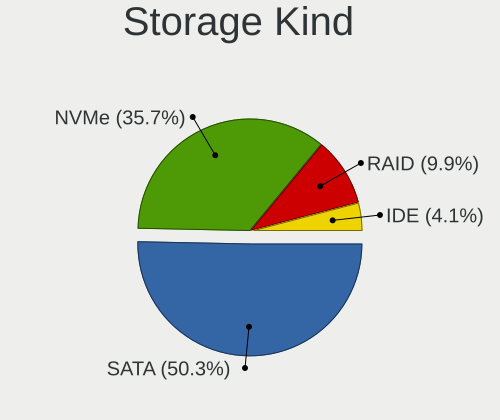

| Kind | Notebooks | Percent |
|------|-----------|---------|
| SATA | 17146     | 50.32%  |
| NVMe | 12155     | 35.67%  |
| RAID | 3381      | 9.92%   |
| IDE  | 1391      | 4.08%   |

Processor
---------

CPU Vendor
----------

Processor vendors

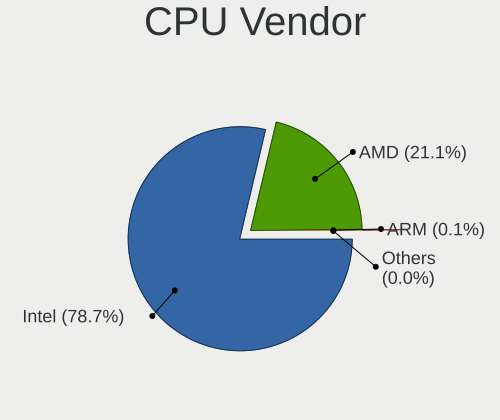

| Vendor        | Notebooks | Percent |
|---------------|-----------|---------|
| Intel         | 23018     | 78.7%   |
| AMD           | 6175      | 21.11%  |
| ARM           | 30        | 0.1%    |
| Unknown       | 17        | 0.06%   |
| Qualcomm      | 6         | 0.02%   |
| sifive,u74-mc | 1         | 0.003%  |
| CentaurHauls  | 1         | 0.003%  |

CPU Model
---------

Processor models

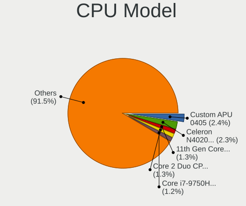

| Model                                   | Notebooks | Percent |
|-----------------------------------------|-----------|---------|
| AMD Custom APU 0405                     | 701       | 2.39%   |
| Intel Celeron N4020 CPU @ 1.10GHz       | 678       | 2.32%   |
| Intel 11th Gen Core i5-1135G7 @ 2.40GHz | 387       | 1.32%   |
| Intel Core 2 Duo CPU P7450 @ 2.13GHz    | 370       | 1.26%   |
| Intel Core i7-9750H CPU @ 2.60GHz       | 356       | 1.22%   |
| Intel Core i7-8750H CPU @ 2.20GHz       | 324       | 1.11%   |
| Intel Core i7-7700HQ CPU @ 2.80GHz      | 294       | 1%      |
| Intel Core i5-2520M CPU @ 2.50GHz       | 286       | 0.98%   |
| Intel 11th Gen Core i7-1165G7 @ 2.80GHz | 283       | 0.97%   |
| Intel Core i7-10750H CPU @ 2.60GHz      | 282       | 0.96%   |
| Intel Core i5-8250U CPU @ 1.60GHz       | 275       | 0.94%   |
| Intel Core i5-6300U CPU @ 2.40GHz       | 274       | 0.94%   |
| Intel Core i5-3210M CPU @ 2.50GHz       | 268       | 0.92%   |
| Intel Core i5-7200U CPU @ 2.50GHz       | 253       | 0.86%   |
| Intel Core i7-8550U CPU @ 1.80GHz       | 252       | 0.86%   |
| Intel Core i7-8650U CPU @ 1.90GHz       | 243       | 0.83%   |
| Intel Celeron CPU N3060 @ 1.60GHz       | 243       | 0.83%   |
| Intel Celeron CPU N2840 @ 2.16GHz       | 242       | 0.83%   |
| Intel Core i5-6200U CPU @ 2.30GHz       | 232       | 0.79%   |
| Intel Core i5-3320M CPU @ 2.60GHz       | 224       | 0.77%   |
| Intel 11th Gen Core i7-11800H @ 2.30GHz | 221       | 0.75%   |
| Intel Core i5-5250U CPU @ 1.60GHz       | 220       | 0.75%   |
| Intel Core i7-6700HQ CPU @ 2.60GHz      | 214       | 0.73%   |
| Intel Core i5-8350U CPU @ 1.70GHz       | 200       | 0.68%   |
| Intel Core i5-5300U CPU @ 2.30GHz       | 196       | 0.67%   |
| Intel Celeron CPU N3350 @ 1.10GHz       | 187       | 0.64%   |
| Intel Core i5-5200U CPU @ 2.20GHz       | 178       | 0.61%   |
| Intel Core i7-7500U CPU @ 2.70GHz       | 172       | 0.59%   |
| Intel 12th Gen Core i7-12700H           | 171       | 0.58%   |
| Intel Core i7-8565U CPU @ 1.80GHz       | 165       | 0.56%   |
| Intel 11th Gen Core i3-1115G4 @ 3.00GHz | 159       | 0.54%   |
| Intel Core i7-6600U CPU @ 2.60GHz       | 150       | 0.51%   |
| Intel Core i5-8265U CPU @ 1.60GHz       | 148       | 0.51%   |
| Intel Core i5-1035G1 CPU @ 1.00GHz      | 146       | 0.5%    |
| Intel Core i7-6500U CPU @ 2.50GHz       | 145       | 0.5%    |
| Intel Core i5-10210U CPU @ 1.60GHz      | 143       | 0.49%   |
| Intel Core i5 CPU M 520 @ 2.40GHz       | 136       | 0.46%   |
| Intel Core i7-5500U CPU @ 2.40GHz       | 135       | 0.46%   |
| Intel 11th Gen Core i7-1185G7 @ 3.00GHz | 135       | 0.46%   |
| Intel Core i7-10510U CPU @ 1.80GHz      | 134       | 0.46%   |

CPU Model Family
----------------

Processor model prefix

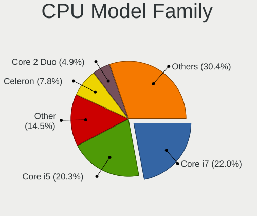

| Model                          | Notebooks | Percent |
|--------------------------------|-----------|---------|
| Intel Core i7                  | 6452      | 22.05%  |
| Intel Core i5                  | 5939      | 20.3%   |
| Other                          | 4255      | 14.54%  |
| Intel Celeron                  | 2284      | 7.81%   |
| Intel Core 2 Duo               | 1447      | 4.95%   |
| Intel Core i3                  | 1404      | 4.8%    |
| AMD Ryzen 7                    | 1194      | 4.08%   |
| AMD Ryzen 5                    | 895       | 3.06%   |
| Intel Pentium                  | 533       | 1.82%   |
| AMD Ryzen 9                    | 453       | 1.55%   |
| AMD A6                         | 417       | 1.43%   |
| Intel Core                     | 335       | 1.14%   |
| AMD Ryzen 3                    | 326       | 1.11%   |
| Intel Atom                     | 265       | 0.91%   |
| AMD Ryzen 7 PRO                | 265       | 0.91%   |
| Intel Core i9                  | 256       | 0.87%   |
| AMD A8                         | 250       | 0.85%   |
| AMD A10                        | 199       | 0.68%   |
| AMD A4                         | 152       | 0.52%   |
| Intel Pentium Silver           | 150       | 0.51%   |
| Intel Pentium Dual-Core        | 134       | 0.46%   |
| Intel Core 2                   | 131       | 0.45%   |
| AMD E                          | 129       | 0.44%   |
| Intel Xeon                     | 128       | 0.44%   |
| AMD E2                         | 107       | 0.37%   |
| AMD Ryzen 5 PRO                | 103       | 0.35%   |
| AMD Athlon                     | 93        | 0.32%   |
| Intel Genuine                  | 81        | 0.28%   |
| Intel Core m3                  | 81        | 0.28%   |
| Intel Pentium Dual             | 62        | 0.21%   |
| AMD Turion 64 X2 Mobile        | 61        | 0.21%   |
| AMD A12                        | 53        | 0.18%   |
| AMD E1                         | 52        | 0.18%   |
| Intel Pentium M                | 46        | 0.16%   |
| AMD Athlon II                  | 44        | 0.15%   |
| AMD Phenom II                  | 39        | 0.13%   |
| Intel Core M                   | 38        | 0.13%   |
| Intel Core m5                  | 28        | 0.1%    |
| Intel Celeron M                | 23        | 0.08%   |
| AMD Turion X2 Dual-Core Mobile | 23        | 0.08%   |

CPU Cores
---------

Number of processor cores

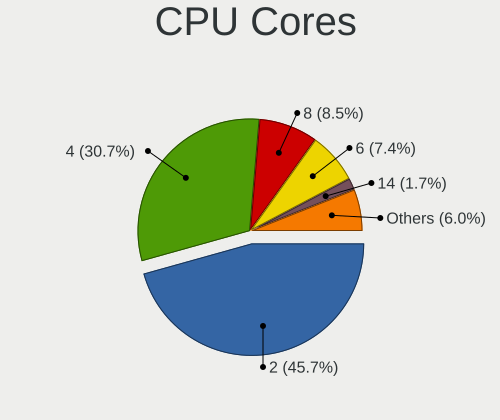

| Number  | Notebooks | Percent |
|---------|-----------|---------|
| 2       | 13370     | 45.67%  |
| 4       | 8987      | 30.7%   |
| 8       | 2495      | 8.52%   |
| 6       | 2163      | 7.39%   |
| 14      | 500       | 1.71%   |
| 10      | 462       | 1.58%   |
| 1       | 452       | 1.54%   |
| 12      | 381       | 1.3%    |
| 16      | 263       | 0.9%    |
| 24      | 170       | 0.58%   |
| 3       | 19        | 0.06%   |
| 20      | 11        | 0.04%   |
| 5       | 3         | 0.01%   |
| 22      | 1         | 0.003%  |
| Unknown | 1         | 0.003%  |

CPU Sockets
-----------

Number of sockets

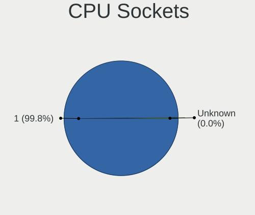

| Number  | Notebooks | Percent |
|---------|-----------|---------|
| 1       | 29194     | 99.81%  |
| 2       | 52        | 0.18%   |
| 16      | 1         | 0.003%  |
| 8       | 1         | 0.003%  |
| Unknown | 1         | 0.003%  |

CPU Threads
-----------

Threads per core (Hyper-Threading)

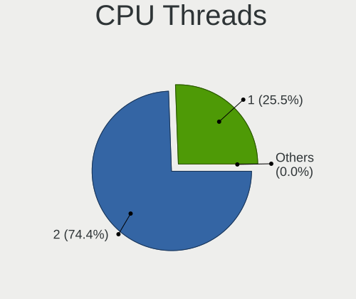

| Number  | Notebooks | Percent |
|---------|-----------|---------|
| 2       | 21806     | 74.42%  |
| 1       | 7486      | 25.55%  |
| 8       | 5         | 0.02%   |
| 4       | 3         | 0.01%   |
| 16      | 1         | 0.003%  |
| Unknown | 1         | 0.003%  |

CPU Op-Modes
------------

CPU Operation Modes (32-bit, 64-bit)

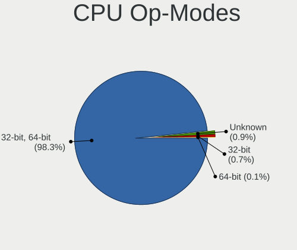

| Op mode        | Notebooks | Percent |
|----------------|-----------|---------|
| 32-bit, 64-bit | 28795     | 98.32%  |
| Unknown        | 269       | 0.92%   |
| 32-bit         | 196       | 0.67%   |
| 64-bit         | 28        | 0.1%    |

CPU Microcode
-------------

Microcode number

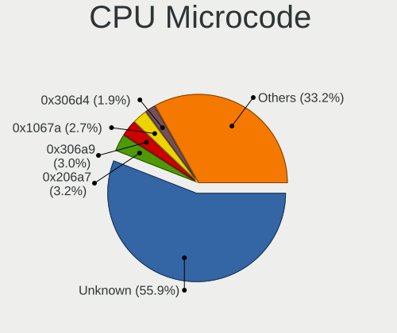

| Number     | Notebooks | Percent |
|------------|-----------|---------|
| Unknown    | 16979     | 55.94%  |
| 0x206a7    | 961       | 3.17%   |
| 0x306a9    | 920       | 3.03%   |
| 0x1067a    | 832       | 2.74%   |
| 0x306d4    | 591       | 1.95%   |
| 0x806ea    | 494       | 1.63%   |
| 0x40651    | 485       | 1.6%    |
| 0x906ea    | 482       | 1.59%   |
| 0x406e3    | 476       | 1.57%   |
| 0x806ec    | 408       | 1.34%   |
| 0x806c1    | 400       | 1.32%   |
| 0x306c3    | 383       | 1.26%   |
| 0x806e9    | 379       | 1.25%   |
| 0x20655    | 325       | 1.07%   |
| 0x30678    | 323       | 1.06%   |
| 0xa0652    | 279       | 0.92%   |
| 0x406c4    | 265       | 0.87%   |
| 0x906e9    | 205       | 0.68%   |
| 0x0a50000c | 204       | 0.67%   |
| 0x506e3    | 197       | 0.65%   |
| 0x08108109 | 193       | 0.64%   |
| 0x706e5    | 188       | 0.62%   |
| 0x706a8    | 182       | 0.6%    |
| 0x806d1    | 161       | 0.53%   |
| 0x6fd      | 160       | 0.53%   |
| 0x08108102 | 153       | 0.5%    |
| 0x10676    | 146       | 0.48%   |
| 0x906a3    | 141       | 0.46%   |
| 0x20652    | 140       | 0.46%   |
| 0x07030105 | 137       | 0.45%   |
| 0x06006705 | 135       | 0.44%   |
| 0x06001119 | 121       | 0.4%    |
| 0x506c9    | 114       | 0.38%   |
| 0x706a1    | 108       | 0.36%   |
| 0x08600106 | 107       | 0.35%   |
| 0x05000119 | 103       | 0.34%   |
| 0x0a404102 | 99        | 0.33%   |
| 0x806eb    | 98        | 0.32%   |
| 0x6f6      | 96        | 0.32%   |
| 0x906ed    | 91        | 0.3%    |

CPU Microarch
-------------

Microarchitecture

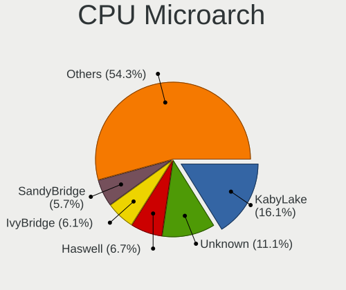

| Name               | Notebooks | Percent |
|--------------------|-----------|---------|
| KabyLake           | 4737      | 16.15%  |
| Unknown            | 3264      | 11.13%  |
| Haswell            | 1956      | 6.67%   |
| IvyBridge          | 1782      | 6.07%   |
| SandyBridge        | 1671      | 5.7%    |
| Skylake            | 1451      | 4.95%   |
| Penryn             | 1387      | 4.73%   |
| TigerLake          | 1170      | 3.99%   |
| Broadwell          | 1168      | 3.98%   |
| Silvermont         | 1070      | 3.65%   |
| Goldmont plus      | 1067      | 3.64%   |
| Alderlake Hybrid   | 966       | 3.29%   |
| Westmere           | 766       | 2.61%   |
| Zen 3              | 741       | 2.53%   |
| CometLake          | 733       | 2.5%    |
| IceLake            | 678       | 2.31%   |
| Zen+               | 660       | 2.25%   |
| Excavator          | 541       | 1.84%   |
| Core               | 504       | 1.72%   |
| Zen 2              | 471       | 1.61%   |
| Puma               | 290       | 0.99%   |
| Goldmont           | 289       | 0.99%   |
| Piledriver         | 224       | 0.76%   |
| Bobcat             | 215       | 0.73%   |
| Zen                | 212       | 0.72%   |
| K10                | 141       | 0.48%   |
| Jaguar             | 139       | 0.47%   |
| Meteorlake Hybrid  | 128       | 0.44%   |
| K10 Llano          | 127       | 0.43%   |
| P6                 | 125       | 0.43%   |
| K8 Hammer          | 125       | 0.43%   |
| Nehalem            | 113       | 0.39%   |
| Bonnell            | 106       | 0.36%   |
| K8 & K10 hybrid    | 76        | 0.26%   |
| Tremont            | 70        | 0.24%   |
| Gracemont          | 53        | 0.18%   |
| Lunarlake Hybrid   | 52        | 0.18%   |
| Steamroller        | 33        | 0.11%   |
| NetBurst           | 22        | 0.07%   |
| ArrowLake-H Hybrid | 13        | 0.04%   |

Graphics
--------

GPU Vendor
----------

Vendors of graphics cards

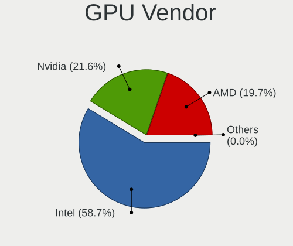

| Vendor                           | Notebooks | Percent |
|----------------------------------|-----------|---------|
| Intel                            | 20867     | 58.66%  |
| Nvidia                           | 7670      | 21.56%  |
| AMD                              | 7025      | 19.75%  |
| Silicon Integrated Systems [SiS] | 2         | 0.01%   |
| S3 Graphics                      | 2         | 0.01%   |
| ASPEED Technology                | 2         | 0.01%   |
| VIA Technologies                 | 1         | 0.003%  |
| ATI Technologies                 | 1         | 0.003%  |

GPU Model
---------

Graphics card models

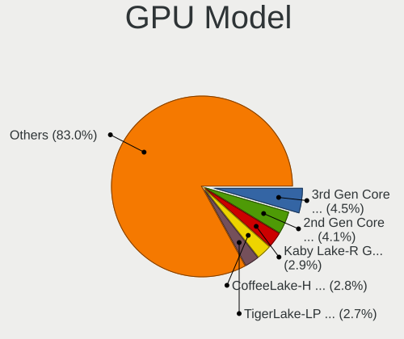

| Model                                                                                    | Notebooks | Percent |
|------------------------------------------------------------------------------------------|-----------|---------|
| Intel 3rd Gen Core processor Graphics Controller                                         | 1655      | 4.53%   |
| Intel 2nd Generation Core Processor Family Integrated Graphics Controller                | 1504      | 4.12%   |
| Intel Kaby Lake-R GT2 [UHD Graphics 620]                                                 | 1063      | 2.91%   |
| Intel CoffeeLake-H GT2 [UHD Graphics 630]                                                | 1019      | 2.79%   |
| Intel TigerLake-LP GT2 [Iris Xe Graphics]                                                | 974       | 2.67%   |
| Intel Haswell-ULT Integrated Graphics Controller                                         | 966       | 2.65%   |
| Intel GeminiLake [UHD Graphics 600]                                                      | 939       | 2.57%   |
| Intel Skylake-U GT2 [HD Graphics 520]                                                    | 881       | 2.41%   |
| Intel Broadwell-U GT2 [HD Graphics 5500]                                                 | 744       | 2.04%   |
| Intel 4th Gen Core Processor Integrated Graphics Controller                              | 730       | 2%      |
| Intel Kaby Lake-U GT2 [HD Graphics 620]                                                  | 718       | 1.97%   |
| AMD Picasso/Raven 2 [Radeon Vega Series / Radeon Vega Mobile Series]                     | 681       | 1.87%   |
| AMD VanGogh [AMD Custom GPU 0405]                                                        | 673       | 1.84%   |
| Intel Core Processor Integrated Graphics Controller                                      | 606       | 1.66%   |
| Intel CometLake-H GT2 [UHD Graphics]                                                     | 605       | 1.66%   |
| Intel Mobile 4 Series Chipset Integrated Graphics Controller                             | 589       | 1.61%   |
| Intel WhiskeyLake-U GT2 [UHD Graphics 620]                                               | 564       | 1.55%   |
| Intel Atom Processor Z36xxx/Z37xxx Series Graphics & Display                             | 544       | 1.49%   |
| Intel Atom/Celeron/Pentium Processor x5-E8000/J3xxx/N3xxx Integrated Graphics Controller | 526       | 1.44%   |
| AMD Cezanne [Radeon Vega Series / Radeon Vega Mobile Series]                             | 473       | 1.3%    |
| Intel Alder Lake-P GT2 [Iris Xe Graphics]                                                | 466       | 1.28%   |
| AMD Renoir [Radeon Vega Series / Radeon Vega Mobile Series]                              | 435       | 1.19%   |
| Intel CometLake-U GT2 [UHD Graphics]                                                     | 412       | 1.13%   |
| Intel TigerLake-H GT1 [UHD Graphics]                                                     | 409       | 1.12%   |
| AMD Rembrandt [Radeon 680M]                                                              | 403       | 1.1%    |
| Intel Kaby Lake-H GT2 [HD Graphics 630]                                                  | 386       | 1.06%   |
| Nvidia C79 [GeForce 9400M G]                                                             | 376       | 1.03%   |
| Nvidia TU117M [GeForce GTX 1650 Mobile / Max-Q]                                          | 374       | 1.02%   |
| Intel Skylake-H GT2 [HD Graphics 530]                                                    | 330       | 0.9%    |
| Nvidia GA106M [GeForce RTX 3060 Mobile / Max-Q]                                          | 326       | 0.89%   |
| AMD Stoney [Radeon R2/R3/R4/R5 Graphics]                                                 | 323       | 0.88%   |
| Intel Raptor Lake-P [Iris Xe Graphics]                                                   | 312       | 0.85%   |
| AMD Phoenix1                                                                             | 303       | 0.83%   |
| Intel Mobile GM965/GL960 Integrated Graphics Controller (secondary)                      | 299       | 0.82%   |
| Intel Mobile GM965/GL960 Integrated Graphics Controller (primary)                        | 299       | 0.82%   |
| Intel Broadwell-U GT3 [HD Graphics 6000]                                                 | 288       | 0.79%   |
| Intel Apollo Lake GT1 [HD Graphics 500]                                                  | 255       | 0.7%    |
| AMD Lucienne                                                                             | 242       | 0.66%   |
| Intel Iris Plus Graphics G1 (Ice Lake)                                                   | 229       | 0.63%   |
| AMD Mullins [Radeon R4/R5 Graphics]                                                      | 226       | 0.62%   |

GPU Combo
---------

Combinations of graphics cards

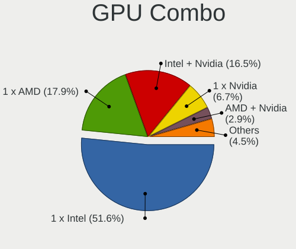

| Name                     | Notebooks | Percent |
|--------------------------|-----------|---------|
| 1 x Intel                | 15150     | 51.59%  |
| 1 x AMD                  | 5248      | 17.87%  |
| Intel + Nvidia           | 4835      | 16.46%  |
| 1 x Nvidia               | 1980      | 6.74%   |
| AMD + Nvidia             | 843       | 2.87%   |
| Intel + AMD              | 598       | 2.04%   |
| 2 x AMD                  | 347       | 1.18%   |
| 2 x Intel                | 165       | 0.56%   |
| Other                    | 145       | 0.49%   |
| 2 x Nvidia               | 33        | 0.11%   |
| Intel + 2 x Nvidia       | 11        | 0.04%   |
| Intel + AMD + 1 x Nvidia | 3         | 0.01%   |
| 1 x SiS                  | 2         | 0.01%   |
| 1 x S3 Graphics          | 2         | 0.01%   |
| 2 x AMD + 1 x Nvidia     | 1         | 0.003%  |
| 1 x VIA                  | 1         | 0.003%  |
| Nvidia + ASPEED          | 1         | 0.003%  |
| Intel + ASPEED           | 1         | 0.003%  |
| AMD + 2 x Nvidia         | 1         | 0.003%  |

GPU Driver
----------

Free vs proprietary

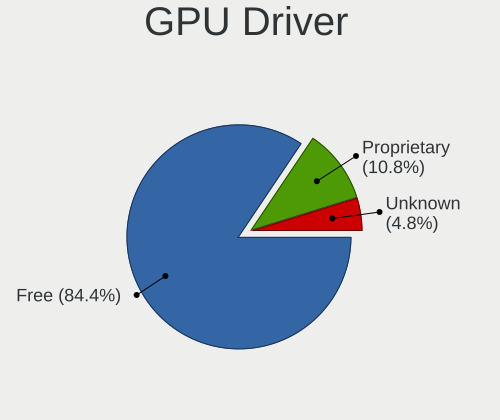

| Driver      | Notebooks | Percent |
|-------------|-----------|---------|
| Free        | 25073     | 84.42%  |
| Proprietary | 3204      | 10.79%  |
| Unknown     | 1423      | 4.79%   |

GPU Memory
----------

Total video memory

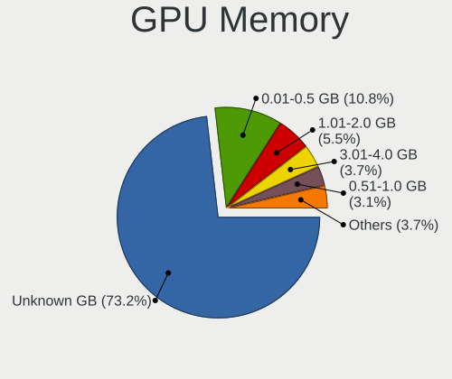

| Size in GB | Notebooks | Percent |
|------------|-----------|---------|
| Unknown    | 21902     | 73.2%   |
| 0.01-0.5   | 3240      | 10.83%  |
| 1.01-2.0   | 1632      | 5.45%   |
| 3.01-4.0   | 1114      | 3.72%   |
| 0.51-1.0   | 936       | 3.13%   |
| 7.01-8.0   | 473       | 1.58%   |
| 5.01-6.0   | 421       | 1.41%   |
| 8.01-16.0  | 106       | 0.35%   |
| 2.01-3.0   | 89        | 0.3%    |
| 24.01-32.0 | 4         | 0.01%   |
| 16.01-24.0 | 3         | 0.01%   |
| 32.01-64.0 | 1         | 0.003%  |

Monitor
-------

Monitor Vendor
--------------

Monitor vendors

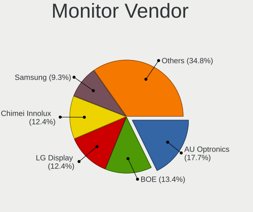

| Vendor                  | Notebooks | Percent |
|-------------------------|-----------|---------|
| AU Optronics            | 5818      | 17.74%  |
| BOE                     | 4397      | 13.4%   |
| LG Display              | 4079      | 12.43%  |
| Chimei Innolux          | 4054      | 12.36%  |
| Samsung Electronics     | 3051      | 9.3%    |
| Apple                   | 2014      | 6.14%   |
| Sharp                   | 1224      | 3.73%   |
| Dell                    | 854       | 2.6%    |
| Valve                   | 658       | 2.01%   |
| Lenovo                  | 620       | 1.89%   |
| Chi Mei Optoelectronics | 564       | 1.72%   |
| Goldstar                | 534       | 1.63%   |
| Hewlett-Packard         | 437       | 1.33%   |
| PANDA                   | 431       | 1.31%   |
| Acer                    | 360       | 1.1%    |
| InfoVision              | 354       | 1.08%   |
| Vizio                   | 201       | 0.61%   |
| LG Philips              | 193       | 0.59%   |
| Ancor Communications    | 189       | 0.58%   |
| CSO                     | 149       | 0.45%   |
| ASUSTek Computer        | 145       | 0.44%   |
| ViewSonic               | 136       | 0.41%   |
| Sceptre Tech            | 133       | 0.41%   |
| AOC                     | 127       | 0.39%   |
| Sony                    | 102       | 0.31%   |
| TMX                     | 92        | 0.28%   |
| Insignia                | 79        | 0.24%   |
| Toshiba                 | 74        | 0.23%   |
| Analogix                | 71        | 0.22%   |
| Panasonic               | 67        | 0.2%    |
| HannStar                | 67        | 0.2%    |
| CSOT                    | 66        | 0.2%    |
| BenQ                    | 66        | 0.2%    |
| RGT                     | 61        | 0.19%   |
| MSI                     | 59        | 0.18%   |
| HKC                     | 57        | 0.17%   |
| CSW                     | 54        | 0.16%   |
| CPT                     | 53        | 0.16%   |
| Pixio                   | 39        | 0.12%   |
| Philips                 | 39        | 0.12%   |

Monitor Model
-------------

Monitor models

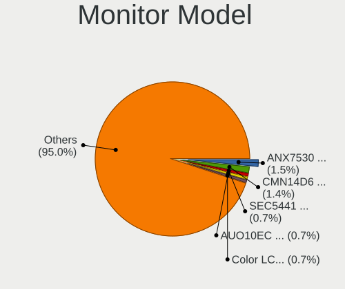

| Model                                                                 | Notebooks | Percent |
|-----------------------------------------------------------------------|-----------|---------|
| Valve ANX7530 U VLV3001 800x1280 100x150mm 7.1-inch                   | 513       | 1.55%   |
| Chimei Innolux LCD Monitor CMN14D6 1366x768 309x173mm 13.9-inch       | 471       | 1.42%   |
| Samsung Electronics LCD Monitor SEC5441 1280x800 331x207mm 15.4-inch  | 238       | 0.72%   |
| AU Optronics LCD Monitor AUO10EC 1366x768 344x193mm 15.5-inch         | 227       | 0.68%   |
| Apple Color LCD APP9C5B 1280x800 286x179mm 13.3-inch                  | 221       | 0.67%   |
| Apple LCD Monitor APP9C5F 1280x800 286x179mm 13.3-inch                | 220       | 0.66%   |
| BOE LCD Monitor BOE095F 2256x1504 285x190mm 13.5-inch                 | 183       | 0.55%   |
| Chimei Innolux LCD Monitor CMN14D4 1920x1080 309x173mm 13.9-inch      | 148       | 0.45%   |
| AU Optronics LCD Monitor AUO21ED 1920x1080 344x193mm 15.5-inch        | 141       | 0.43%   |
| Chimei Innolux LCD Monitor CMN1132 1366x768 256x144mm 11.6-inch       | 135       | 0.41%   |
| AU Optronics LCD Monitor AUO235C 1366x768 256x144mm 11.6-inch         | 134       | 0.4%    |
| Valve ANX7530 U VLV3003 800x1280 100x160mm 7.4-inch                   | 126       | 0.38%   |
| Chimei Innolux LCD Monitor CMN1521 1920x1080 344x193mm 15.5-inch      | 118       | 0.36%   |
| Apple Color LCD APP9CDF 1440x900 286x179mm 13.3-inch                  | 114       | 0.34%   |
| AU Optronics LCD Monitor AUO22EC 1366x768 344x193mm 15.5-inch         | 103       | 0.31%   |
| BOE LCD Monitor BOE06A4 1366x768 344x194mm 15.5-inch                  | 102       | 0.31%   |
| LG Display LCD Monitor LGD02DC 1366x768 344x194mm 15.5-inch           | 101       | 0.3%    |
| AU Optronics LCD Monitor AUO20EC 1366x768 344x193mm 15.5-inch         | 101       | 0.3%    |
| Samsung Electronics LCD Monitor SEC544B 1600x900 382x214mm 17.2-inch  | 96        | 0.29%   |
| LG Display LCD Monitor LGD046F 1920x1080 344x194mm 15.5-inch          | 95        | 0.29%   |
| Apple Color LCD APP9CF0 1440x900 290x180mm 13.4-inch                  | 94        | 0.28%   |
| PANDA LCD Monitor NCP004D 1920x1080 344x194mm 15.5-inch               | 92        | 0.28%   |
| Chimei Innolux LCD Monitor CMN15DB 1366x768 344x193mm 15.5-inch       | 90        | 0.27%   |
| Chimei Innolux LCD Monitor CMN15F5 1920x1080 344x193mm 15.5-inch      | 87        | 0.26%   |
| BOE LCD Monitor BOE0BCA 2256x1504 285x190mm 13.5-inch                 | 85        | 0.26%   |
| AU Optronics LCD Monitor AUO38ED 1920x1080 344x193mm 15.5-inch        | 85        | 0.26%   |
| Samsung Electronics LCD Monitor SDC4C48 1920x1080 293x165mm 13.2-inch | 83        | 0.25%   |
| Apple Color LCD APP9CC7 1280x800 286x179mm 13.3-inch                  | 82        | 0.25%   |
| AU Optronics LCD Monitor AUO139E 1600x900 382x214mm 17.2-inch         | 78        | 0.24%   |
| Apple Color LCD APP9CF2 1366x768 256x144mm 11.6-inch                  | 78        | 0.24%   |
| Chimei Innolux LCD Monitor CMN15E7 1920x1080 344x193mm 15.5-inch      | 77        | 0.23%   |
| Chimei Innolux LCD Monitor CMN14C9 1920x1080 309x173mm 13.9-inch      | 77        | 0.23%   |
| BOE LCD Monitor BOE0BC9 2560x1600 345x215mm 16.0-inch                 | 75        | 0.23%   |
| AU Optronics LCD Monitor AUO403D 1920x1080 309x174mm 14.0-inch        | 75        | 0.23%   |
| AU Optronics LCD Monitor AUO159E 1600x900 382x214mm 17.2-inch         | 73        | 0.22%   |
| BOE LCD Monitor BOE0609 1366x768 256x144mm 11.6-inch                  | 71        | 0.21%   |
| AU Optronics LCD Monitor AUO133D 1920x1080 309x173mm 13.9-inch        | 71        | 0.21%   |
| Apple Color LCD APP9CF3 1366x768 260x140mm 11.6-inch                  | 71        | 0.21%   |
| Chimei Innolux LCD Monitor CMN14D5 1920x1080 309x173mm 13.9-inch      | 70        | 0.21%   |
| Analogix ANX7530 U ANX7539 720x1280                                   | 70        | 0.21%   |

Monitor Resolution
------------------

Monitor screen resolution

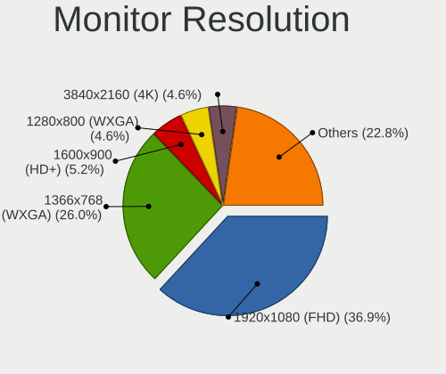

| Resolution         | Notebooks | Percent |
|--------------------|-----------|---------|
| 1920x1080 (FHD)    | 11587     | 36.87%  |
| 1366x768 (WXGA)    | 8156      | 25.95%  |
| 1600x900 (HD+)     | 1646      | 5.24%   |
| 1280x800 (WXGA)    | 1448      | 4.61%   |
| 3840x2160 (4K)     | 1438      | 4.58%   |
| 1920x1200 (WUXGA)  | 1157      | 3.68%   |
| 2560x1440 (QHD)    | 838       | 2.67%   |
| 2560x1600          | 807       | 2.57%   |
| 1440x900 (WXGA+)   | 747       | 2.38%   |
| 800x1280           | 716       | 2.28%   |
| 2880x1800          | 503       | 1.6%    |
| 2256x1504          | 280       | 0.89%   |
| 3840x2400          | 250       | 0.8%    |
| 3440x1440          | 188       | 0.6%    |
| 1680x1050 (WSXGA+) | 173       | 0.55%   |
| 2560x1080          | 150       | 0.48%   |
| 3200x1800 (QHD+)   | 137       | 0.44%   |
| Unknown            | 109       | 0.35%   |
| 1280x1024 (SXGA)   | 96        | 0.31%   |
| 1024x600           | 96        | 0.31%   |
| 1920x540           | 85        | 0.27%   |
| 3072x1920          | 75        | 0.24%   |
| 1360x768           | 65        | 0.21%   |
| 3840x1080          | 57        | 0.18%   |
| 3200x2000          | 56        | 0.18%   |
| 1024x768 (XGA)     | 51        | 0.16%   |
| 2880x1920          | 48        | 0.15%   |
| 3456x2160          | 38        | 0.12%   |
| 1920x1280          | 36        | 0.11%   |
| 2240x1400          | 32        | 0.1%    |
| 2304x1440          | 31        | 0.1%    |
| 2160x1440          | 25        | 0.08%   |
| 2288x1287          | 23        | 0.07%   |
| 3840x1100          | 22        | 0.07%   |
| 2880x1620          | 20        | 0.06%   |
| 3000x2000          | 18        | 0.06%   |
| 1400x1050          | 17        | 0.05%   |
| 3840x1600          | 16        | 0.05%   |
| 2400x1600          | 16        | 0.05%   |
| 1680x945           | 16        | 0.05%   |

Monitor Diagonal
----------------

Diagonal size in inches

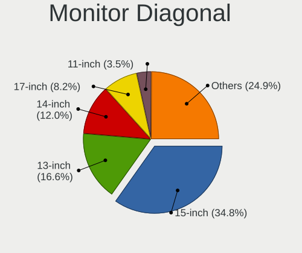

| Inches  | Notebooks | Percent |
|---------|-----------|---------|
| 15      | 11393     | 34.79%  |
| 13      | 5428      | 16.57%  |
| 14      | 3924      | 11.98%  |
| 17      | 2699      | 8.24%   |
| 11      | 1144      | 3.49%   |
| 16      | 1036      | 3.16%   |
| 27      | 956       | 2.92%   |
| 24      | 758       | 2.31%   |
| 7       | 657       | 2.01%   |
| 12      | 647       | 1.98%   |
| 31      | 566       | 1.73%   |
| 23      | 511       | 1.56%   |
| 21      | 455       | 1.39%   |
| Unknown | 422       | 1.29%   |
| 34      | 269       | 0.82%   |
| 18      | 230       | 0.7%    |
| 19      | 132       | 0.4%    |
| 32      | 130       | 0.4%    |
| 10      | 108       | 0.33%   |
| 84      | 100       | 0.31%   |
| 20      | 100       | 0.31%   |
| 54      | 91        | 0.28%   |
| 22      | 81        | 0.25%   |
| 40      | 78        | 0.24%   |
| 3       | 70        | 0.21%   |
| 72      | 68        | 0.21%   |
| 29      | 64        | 0.2%    |
| 74      | 57        | 0.17%   |
| 26      | 55        | 0.17%   |
| 48      | 48        | 0.15%   |
| 49      | 41        | 0.13%   |
| 8       | 35        | 0.11%   |
| 25      | 32        | 0.1%    |
| 37      | 30        | 0.09%   |
| 63      | 28        | 0.09%   |
| 28      | 27        | 0.08%   |
| 42      | 26        | 0.08%   |
| 36      | 24        | 0.07%   |
| 35      | 22        | 0.07%   |
| 86      | 19        | 0.06%   |

Monitor Width
-------------

Physical width

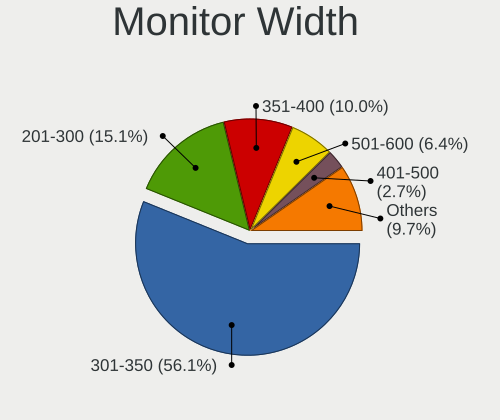

| Width in mm    | Notebooks | Percent |
|----------------|-----------|---------|
| 301-350        | 18239     | 56.13%  |
| 201-300        | 4908      | 15.1%   |
| 351-400        | 3236      | 9.96%   |
| 501-600        | 2091      | 6.43%   |
| 401-500        | 884       | 2.72%   |
| 601-700        | 749       | 2.3%    |
| 1-100          | 717       | 2.21%   |
| Unknown        | 422       | 1.3%    |
| 701-800        | 420       | 1.29%   |
| 1001-1500      | 312       | 0.96%   |
| 1501-2000      | 240       | 0.74%   |
| 801-900        | 165       | 0.51%   |
| 901-1000       | 57        | 0.18%   |
| 101-200        | 39        | 0.12%   |
| More than 2000 | 18        | 0.06%   |

Aspect Ratio
------------

Proportional relationship between the width and the height

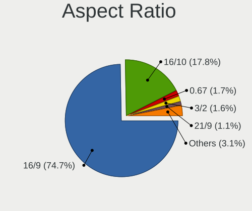

| Ratio   | Notebooks | Percent |
|---------|-----------|---------|
| 16/9    | 22258     | 74.71%  |
| 16/10   | 5294      | 17.77%  |
| 0.67    | 515       | 1.73%   |
| 3/2     | 477       | 1.6%    |
| 21/9    | 317       | 1.06%   |
| Unknown | 297       | 1%      |
| 0.62    | 157       | 0.53%   |
| 5/4     | 95        | 0.32%   |
| 4/3     | 90        | 0.3%    |
| 32/9    | 87        | 0.29%   |
| 6/5     | 83        | 0.28%   |
| 2.65    | 27        | 0.09%   |
| 3.40    | 22        | 0.07%   |
| 0.56    | 21        | 0.07%   |
| 1.00    | 19        | 0.06%   |
| 1.96    | 13        | 0.04%   |
| 0.63    | 5         | 0.02%   |
| 2.12    | 3         | 0.01%   |
| 0.89    | 3         | 0.01%   |
| 3.73    | 1         | 0.003%  |
| 3.33    | 1         | 0.003%  |
| 3.20    | 1         | 0.003%  |
| 2.69    | 1         | 0.003%  |
| 2.58    | 1         | 0.003%  |
| 2.50    | 1         | 0.003%  |
| 2.01    | 1         | 0.003%  |
| 2.00    | 1         | 0.003%  |
| 0.25    | 1         | 0.003%  |

Monitor Area
------------

Area in inch²

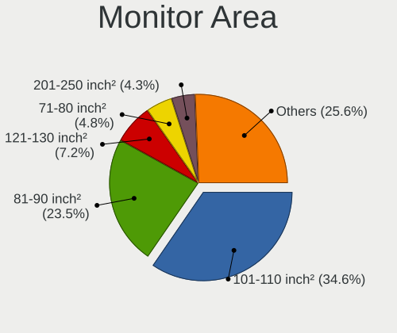

| Area in inch² | Notebooks | Percent |
|----------------|-----------|---------|
| 101-110        | 11293     | 34.58%  |
| 81-90          | 7665      | 23.47%  |
| 121-130        | 2362      | 7.23%   |
| 71-80          | 1572      | 4.81%   |
| 201-250        | 1394      | 4.27%   |
| 51-60          | 1173      | 3.59%   |
| 111-120        | 1097      | 3.36%   |
| 351-500        | 1001      | 3.06%   |
| 301-350        | 996       | 3.05%   |
| 1-40           | 754       | 2.31%   |
| 61-70          | 632       | 1.93%   |
| More than 1000 | 480       | 1.47%   |
| Unknown        | 422       | 1.29%   |
| 151-200        | 349       | 1.07%   |
| 251-300        | 342       | 1.05%   |
| 501-1000       | 322       | 0.99%   |
| 131-140        | 317       | 0.97%   |
| 141-150        | 257       | 0.79%   |
| 91-100         | 132       | 0.4%    |
| 41-50          | 102       | 0.31%   |

Pixel Density
-------------

Pixels per inch

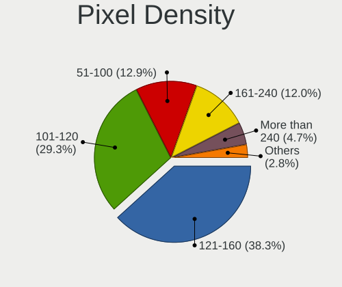

| Density       | Notebooks | Percent |
|---------------|-----------|---------|
| 121-160       | 12298     | 38.26%  |
| 101-120       | 9411      | 29.28%  |
| 51-100        | 4144      | 12.89%  |
| 161-240       | 3865      | 12.03%  |
| More than 240 | 1519      | 4.73%   |
| 1-50          | 482       | 1.5%    |
| Unknown       | 422       | 1.31%   |

Multiple Monitors
-----------------

Total monitors connected

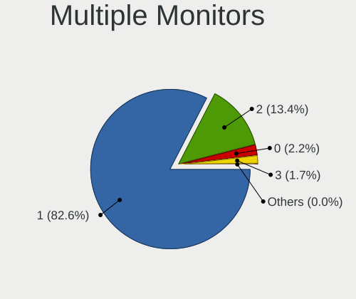

| Total | Notebooks | Percent |
|-------|-----------|---------|
| 1     | 24751     | 82.58%  |
| 2     | 4013      | 13.39%  |
| 0     | 653       | 2.18%   |
| 3     | 502       | 1.67%   |
| 4     | 44        | 0.15%   |
| 5     | 8         | 0.03%   |

Network
-------

Net Controller Vendor
---------------------

Controller vendors

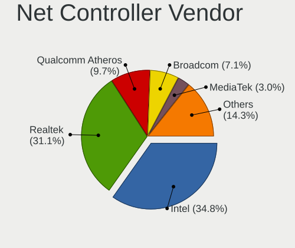

| Vendor                          | Notebooks | Percent |
|---------------------------------|-----------|---------|
| Intel                           | 15633     | 34.8%   |
| Realtek Semiconductor           | 13968     | 31.09%  |
| Qualcomm Atheros                | 4364      | 9.71%   |
| Broadcom                        | 3193      | 7.11%   |
| MediaTek                        | 1347      | 3%      |
| Broadcom Limited                | 1058      | 2.36%   |
| ASIX Electronics                | 1018      | 2.27%   |
| Nvidia                          | 582       | 1.3%    |
| Marvell Technology Group        | 404       | 0.9%    |
| Qualcomm                        | 359       | 0.8%    |
| Shenzhen Goodix Technology      | 282       | 0.63%   |
| TP-Link                         | 252       | 0.56%   |
| Ralink Technology               | 235       | 0.52%   |
| Samsung Electronics             | 224       | 0.5%    |
| Ralink                          | 209       | 0.47%   |
| DisplayLink                     | 190       | 0.42%   |
| NetGear                         | 152       | 0.34%   |
| Lenovo                          | 125       | 0.28%   |
| Google                          | 99        | 0.22%   |
| Motorola PCS                    | 93        | 0.21%   |
| Dell                            | 87        | 0.19%   |
| ASUSTek Computer                | 71        | 0.16%   |
| Apple                           | 66        | 0.15%   |
| Sierra Wireless                 | 64        | 0.14%   |
| Linksys                         | 62        | 0.14%   |
| Edimax Technology               | 58        | 0.13%   |
| Qualcomm Atheros Communications | 48        | 0.11%   |
| Qualcomm Technologies           | 44        | 0.1%    |
| Hewlett-Packard                 | 40        | 0.09%   |
| Belkin Components               | 40        | 0.09%   |
| Cypress Semiconductor           | 37        | 0.08%   |
| U-Blox                          | 34        | 0.08%   |
| Microsoft                       | 30        | 0.07%   |
| D-Link                          | 28        | 0.06%   |
| JMicron Technology              | 21        | 0.05%   |
| T & A Mobile Phones             | 20        | 0.04%   |
| Realtek                         | 17        | 0.04%   |
| ZTE WCDMA Technologies MSM      | 16        | 0.04%   |
| LG Electronics                  | 16        | 0.04%   |
| Arduino SA                      | 16        | 0.04%   |

Net Controller Model
--------------------

Controller models

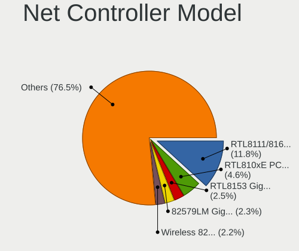

| Model                                                                  | Notebooks | Percent |
|------------------------------------------------------------------------|-----------|---------|
| Realtek RTL8111/8168/8211/8411 PCI Express Gigabit Ethernet Controller | 6421      | 11.8%   |
| Realtek RTL810xE PCI Express Fast Ethernet controller                  | 2528      | 4.65%   |
| Realtek RTL8153 Gigabit Ethernet Adapter                               | 1350      | 2.48%   |
| Intel 82579LM Gigabit Network Connection (Lewisville)                  | 1278      | 2.35%   |
| Intel Wireless 8265 / 8275                                             | 1215      | 2.23%   |
| Realtek RTL8822CE 802.11ac PCIe Wireless Network Adapter               | 1190      | 2.19%   |
| Intel Wireless 7260                                                    | 1140      | 2.1%    |
| Intel Wi-Fi 6 AX200                                                    | 1134      | 2.08%   |
| Intel Wireless 7265                                                    | 1102      | 2.03%   |
| ASIX AX88179 Gigabit Ethernet                                          | 957       | 1.76%   |
| Realtek RTL8821CE 802.11ac PCIe Wireless Network Adapter               | 865       | 1.59%   |
| Realtek RTL8852BE PCIe 802.11ax Wireless Network Controller            | 788       | 1.45%   |
| Intel Wireless 8260                                                    | 787       | 1.45%   |
| Qualcomm Atheros QCA6174 802.11ac Wireless Network Adapter             | 751       | 1.38%   |
| Intel Centrino Advanced-N 6205 [Taylor Peak]                           | 737       | 1.35%   |
| Intel Wi-Fi 6 AX201                                                    | 725       | 1.33%   |
| Intel Wi-Fi 6E(802.11ax) AX210/AX1675* 2x2 [Typhoon Peak]              | 660       | 1.21%   |
| Intel Ethernet Connection (4) I219-LM                                  | 639       | 1.17%   |
| Qualcomm Atheros QCA9377 802.11ac Wireless Network Adapter             | 627       | 1.15%   |
| Intel Alder Lake-P PCH CNVi WiFi                                       | 624       | 1.15%   |
| Qualcomm Atheros AR9485 Wireless Network Adapter                       | 587       | 1.08%   |
| Intel Cannon Lake PCH CNVi WiFi                                        | 579       | 1.06%   |
| Intel Comet Lake PCH CNVi WiFi                                         | 567       | 1.04%   |
| Broadcom BCM4322 802.11a/b/g/n Wireless LAN Controller                 | 567       | 1.04%   |
| Qualcomm Atheros QCA9565 / AR9565 Wireless Network Adapter             | 526       | 0.97%   |
| Nvidia MCP79 Ethernet                                                  | 497       | 0.91%   |
| MediaTek MT7921 802.11ax PCIe Wireless Network Adapter [Filogic 330]   | 496       | 0.91%   |
| MediaTek MT7922 802.11ax PCI Express Wireless Network Adapter          | 472       | 0.87%   |
| Realtek RTL8188EE Wireless Network Adapter                             | 459       | 0.84%   |
| Broadcom Limited BCM4360 802.11ac Dual Band Wireless Network Adapter   | 428       | 0.79%   |
| Intel Ethernet Connection I217-LM                                      | 391       | 0.72%   |
| Intel Comet Lake PCH-LP CNVi WiFi                                      | 387       | 0.71%   |
| Intel Ethernet Connection I219-LM                                      | 384       | 0.71%   |
| Broadcom BCM4313 802.11bgn Wireless Network Adapter                    | 378       | 0.69%   |
| Intel Wireless 3165                                                    | 372       | 0.68%   |
| Broadcom BCM4331 802.11a/b/g/n                                         | 364       | 0.67%   |
| Qualcomm Atheros AR9285 Wireless Network Adapter (PCI-Express)         | 362       | 0.67%   |
| Intel Centrino Ultimate-N 6300                                         | 349       | 0.64%   |
| Broadcom NetXtreme BCM57765 Gigabit Ethernet PCIe                      | 349       | 0.64%   |
| Intel 82577LM Gigabit Network Connection                               | 326       | 0.6%    |

Wireless Vendor
---------------

Wireless vendors

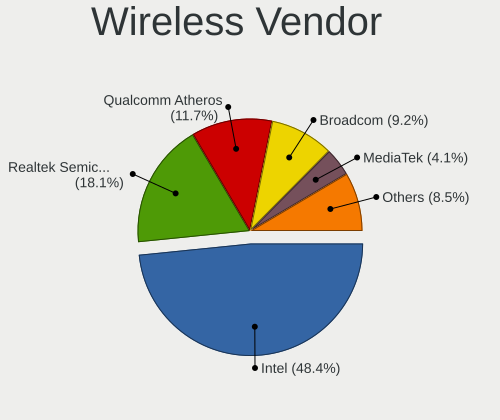

| Vendor                                | Notebooks | Percent |
|---------------------------------------|-----------|---------|
| Intel                                 | 14541     | 48.4%   |
| Realtek Semiconductor                 | 5436      | 18.1%   |
| Qualcomm Atheros                      | 3508      | 11.68%  |
| Broadcom                              | 2778      | 9.25%   |
| MediaTek                              | 1222      | 4.07%   |
| Broadcom Limited                      | 869       | 2.89%   |
| Qualcomm                              | 323       | 1.08%   |
| Ralink Technology                     | 235       | 0.78%   |
| Ralink                                | 209       | 0.7%    |
| TP-Link                               | 199       | 0.66%   |
| NetGear                               | 146       | 0.49%   |
| Dell                                  | 82        | 0.27%   |
| Sierra Wireless                       | 64        | 0.21%   |
| ASUSTek Computer                      | 62        | 0.21%   |
| Edimax Technology                     | 58        | 0.19%   |
| Linksys                               | 51        | 0.17%   |
| Qualcomm Atheros Communications       | 48        | 0.16%   |
| Belkin Components                     | 36        | 0.12%   |
| Qualcomm Technologies                 | 32        | 0.11%   |
| D-Link                                | 25        | 0.08%   |
| Microsoft                             | 23        | 0.08%   |
| Realtek                               | 16        | 0.05%   |
| D-Link System                         | 13        | 0.04%   |
| 802.11g Adapter [Linksys WUSB54GC v3] | 13        | 0.04%   |
| TRENDnet                              | 7         | 0.02%   |
| ZyDAS                                 | 5         | 0.02%   |
| Samsung Electronics                   | 4         | 0.01%   |
| Marvell Technology Group              | 4         | 0.01%   |
| Senao                                 | 3         | 0.01%   |
| Hewlett-Packard                       | 3         | 0.01%   |
| Fibocom                               | 3         | 0.01%   |
| BUFFALO                               | 3         | 0.01%   |
| Tenda                                 | 2         | 0.01%   |
| Arduino SA                            | 2         | 0.01%   |
| AboCom Systems                        | 2         | 0.01%   |
| 3Com                                  | 2         | 0.01%   |
| ZyXEL Communications                  | 1         | 0.003%  |
| Wilocity                              | 1         | 0.003%  |
| U.S. Robotics                         | 1         | 0.003%  |
| Toshiba                               | 1         | 0.003%  |

Wireless Model
--------------

Wireless models

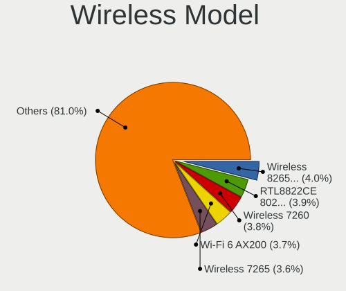

| Model                                                                | Notebooks | Percent |
|----------------------------------------------------------------------|-----------|---------|
| Intel Wireless 8265 / 8275                                           | 1215      | 4%      |
| Realtek RTL8822CE 802.11ac PCIe Wireless Network Adapter             | 1190      | 3.92%   |
| Intel Wireless 7260                                                  | 1140      | 3.76%   |
| Intel Wi-Fi 6 AX200                                                  | 1134      | 3.74%   |
| Intel Wireless 7265                                                  | 1102      | 3.63%   |
| Realtek RTL8821CE 802.11ac PCIe Wireless Network Adapter             | 865       | 2.85%   |
| Intel Wireless 8260                                                  | 787       | 2.59%   |
| Realtek RTL8852BE PCIe 802.11ax Wireless Network Controller          | 774       | 2.55%   |
| Qualcomm Atheros QCA6174 802.11ac Wireless Network Adapter           | 751       | 2.47%   |
| Intel Centrino Advanced-N 6205 [Taylor Peak]                         | 737       | 2.43%   |
| Intel Wi-Fi 6 AX201                                                  | 725       | 2.39%   |
| Intel Wi-Fi 6E(802.11ax) AX210/AX1675* 2x2 [Typhoon Peak]            | 660       | 2.17%   |
| Qualcomm Atheros QCA9377 802.11ac Wireless Network Adapter           | 627       | 2.07%   |
| Qualcomm Atheros AR9485 Wireless Network Adapter                     | 587       | 1.93%   |
| Intel Cannon Lake PCH CNVi WiFi                                      | 579       | 1.91%   |
| Intel Comet Lake PCH CNVi WiFi                                       | 567       | 1.87%   |
| Broadcom BCM4322 802.11a/b/g/n Wireless LAN Controller               | 567       | 1.87%   |
| Qualcomm Atheros QCA9565 / AR9565 Wireless Network Adapter           | 526       | 1.73%   |
| MediaTek MT7921 802.11ax PCIe Wireless Network Adapter [Filogic 330] | 496       | 1.63%   |
| Realtek RTL8188EE Wireless Network Adapter                           | 459       | 1.51%   |
| Intel Alder Lake-P PCH CNVi WiFi                                     | 430       | 1.42%   |
| Broadcom Limited BCM4360 802.11ac Dual Band Wireless Network Adapter | 428       | 1.41%   |
| MediaTek MT7922 802.11ax PCI Express Wireless Network Adapter        | 407       | 1.34%   |
| Intel Comet Lake PCH-LP CNVi WiFi                                    | 387       | 1.28%   |
| Broadcom BCM4313 802.11bgn Wireless Network Adapter                  | 378       | 1.25%   |
| Intel Wireless 3165                                                  | 372       | 1.23%   |
| Broadcom BCM4331 802.11a/b/g/n                                       | 364       | 1.2%    |
| Qualcomm Atheros AR9285 Wireless Network Adapter (PCI-Express)       | 362       | 1.19%   |
| Intel Centrino Ultimate-N 6300                                       | 349       | 1.15%   |
| Realtek RTL8188CE 802.11b/g/n WiFi Adapter                           | 325       | 1.07%   |
| Intel Cannon Point-LP CNVi [Wireless-AC]                             | 314       | 1.03%   |
| Intel Wireless 3160                                                  | 303       | 1%      |
| Intel Raptor Lake PCH CNVi WiFi                                      | 298       | 0.98%   |
| Intel Tiger Lake PCH CNVi WiFi                                       | 294       | 0.97%   |
| Qualcomm QCNFA765 Wireless Network Adapter                           | 276       | 0.91%   |
| Realtek RTL8822BE 802.11a/b/g/n/ac WiFi adapter                      | 271       | 0.89%   |
| Intel Wi-Fi 5(802.11ac) Wireless-AC 9x6x [Thunder Peak]              | 251       | 0.83%   |
| Qualcomm Atheros AR9462 Wireless Network Adapter                     | 237       | 0.78%   |
| Intel Centrino Advanced-N 6200                                       | 234       | 0.77%   |
| Broadcom BCM43142 802.11b/g/n                                        | 231       | 0.76%   |

Ethernet Vendor
---------------

Ethernet vendors

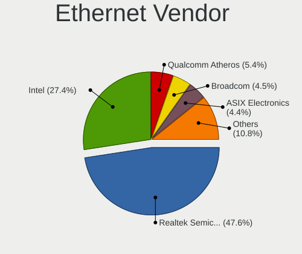

| Vendor                                 | Notebooks | Percent |
|----------------------------------------|-----------|---------|
| Realtek Semiconductor                  | 10958     | 47.58%  |
| Intel                                  | 6308      | 27.39%  |
| Qualcomm Atheros                       | 1240      | 5.38%   |
| Broadcom                               | 1031      | 4.48%   |
| ASIX Electronics                       | 1018      | 4.42%   |
| Nvidia                                 | 582       | 2.53%   |
| Marvell Technology Group               | 400       | 1.74%   |
| Samsung Electronics                    | 220       | 0.96%   |
| Broadcom Limited                       | 214       | 0.93%   |
| DisplayLink                            | 190       | 0.82%   |
| Lenovo                                 | 122       | 0.53%   |
| MediaTek                               | 116       | 0.5%    |
| Google                                 | 96        | 0.42%   |
| Motorola PCS                           | 93        | 0.4%    |
| Apple                                  | 66        | 0.29%   |
| TP-Link                                | 53        | 0.23%   |
| Cypress Semiconductor                  | 37        | 0.16%   |
| Qualcomm                               | 36        | 0.16%   |
| Hewlett-Packard                        | 25        | 0.11%   |
| JMicron Technology                     | 21        | 0.09%   |
| OPPO Electronics                       | 15        | 0.07%   |
| LG Electronics                         | 15        | 0.07%   |
| Xiaomi                                 | 12        | 0.05%   |
| T & A Mobile Phones                    | 12        | 0.05%   |
| Qualcomm Technologies                  | 12        | 0.05%   |
| Linksys                                | 11        | 0.05%   |
| ICS Advent                             | 11        | 0.05%   |
| Aquantia                               | 11        | 0.05%   |
| OnePlus Technology (Shenzhen)          | 10        | 0.04%   |
| ASUSTek Computer                       | 9         | 0.04%   |
| Suzhou Motorcomm Electronic Technology | 7         | 0.03%   |
| Novatel Wireless                       | 7         | 0.03%   |
| Microsoft                              | 7         | 0.03%   |
| NetGear                                | 6         | 0.03%   |
| ZTE WCDMA Technologies MSM             | 5         | 0.02%   |
| Silicon Integrated Systems [SiS]       | 5         | 0.02%   |
| Attansic Technology                    | 5         | 0.02%   |
| Microchip Technology                   | 4         | 0.02%   |
| Belkin Components                      | 4         | 0.02%   |
| Rivet                                  | 3         | 0.01%   |

Ethernet Model
--------------

Ethernet models

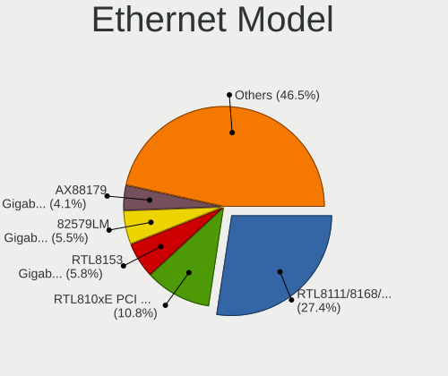

| Model                                                                  | Notebooks | Percent |
|------------------------------------------------------------------------|-----------|---------|
| Realtek RTL8111/8168/8211/8411 PCI Express Gigabit Ethernet Controller | 6421      | 27.39%  |
| Realtek RTL810xE PCI Express Fast Ethernet controller                  | 2528      | 10.78%  |
| Realtek RTL8153 Gigabit Ethernet Adapter                               | 1350      | 5.76%   |
| Intel 82579LM Gigabit Network Connection (Lewisville)                  | 1278      | 5.45%   |
| ASIX AX88179 Gigabit Ethernet                                          | 957       | 4.08%   |
| Intel Ethernet Connection (4) I219-LM                                  | 639       | 2.73%   |
| Nvidia MCP79 Ethernet                                                  | 497       | 2.12%   |
| Intel Ethernet Connection I217-LM                                      | 391       | 1.67%   |
| Intel Ethernet Connection I219-LM                                      | 384       | 1.64%   |
| Broadcom NetXtreme BCM57765 Gigabit Ethernet PCIe                      | 349       | 1.49%   |
| Intel 82577LM Gigabit Network Connection                               | 326       | 1.39%   |
| Intel Ethernet Connection I218-LM                                      | 307       | 1.31%   |
| Intel Ethernet Connection (3) I218-LM                                  | 303       | 1.29%   |
| Realtek RTL8125 2.5GbE Controller                                      | 241       | 1.03%   |
| Intel 82567LM Gigabit Network Connection                               | 228       | 0.97%   |
| Intel Ethernet Connection (7) I219-LM                                  | 213       | 0.91%   |
| Intel Alder Lake-P PCH CNVi WiFi                                       | 194       | 0.83%   |
| Qualcomm Atheros Killer E2500 Gigabit Ethernet Controller              | 178       | 0.76%   |
| Intel Ethernet Connection (4) I219-V                                   | 178       | 0.76%   |
| Qualcomm Atheros AR8151 v2.0 Gigabit Ethernet                          | 174       | 0.74%   |
| Intel Ethernet Connection (2) I219-LM                                  | 169       | 0.72%   |
| Intel Ethernet Connection (6) I219-LM                                  | 168       | 0.72%   |
| Realtek Killer E2600 GbE Controller                                    | 152       | 0.65%   |
| Samsung Galaxy series, misc. (tethering mode)                          | 136       | 0.58%   |
| Realtek Killer E3000 2.5GbE Controller                                 | 133       | 0.57%   |
| Qualcomm Atheros AR8162 Fast Ethernet                                  | 131       | 0.56%   |
| Marvell Group 88E8040 PCI-E Fast Ethernet Controller                   | 122       | 0.52%   |
| Realtek USB 10/100/1G/2.5 LAN                                          | 111       | 0.47%   |
| Qualcomm Atheros Killer E2400 Gigabit Ethernet Controller              | 108       | 0.46%   |
| Qualcomm Atheros AR8152 v2.0 Fast Ethernet                             | 108       | 0.46%   |
| Realtek RTL8152 Fast Ethernet Adapter                                  | 103       | 0.44%   |
| Intel Ethernet Connection I219-V                                       | 101       | 0.43%   |
| Qualcomm Atheros AR8161 Gigabit Ethernet                               | 99        | 0.42%   |
| Qualcomm Atheros QCA8171 Gigabit Ethernet                              | 97        | 0.41%   |
| Qualcomm Atheros Killer E220x Gigabit Ethernet Controller              | 97        | 0.41%   |
| Intel Ethernet Connection (6) I219-V                                   | 88        | 0.38%   |
| Samsung GT-I9070 (network tethering, USB debugging enabled)            | 85        | 0.36%   |
| Intel Ethernet Connection (5) I219-LM                                  | 85        | 0.36%   |
| Intel Ethernet Connection (10) I219-V                                  | 78        | 0.33%   |
| Intel Ethernet Connection (10) I219-LM                                 | 78        | 0.33%   |

Net Controller Kind
-------------------

Ethernet, WiFi or modem

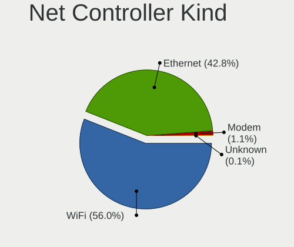

| Kind     | Notebooks | Percent |
|----------|-----------|---------|
| WiFi     | 28431     | 55.99%  |
| Ethernet | 21747     | 42.82%  |
| Modem    | 557       | 1.1%    |
| Unknown  | 47        | 0.09%   |

Used Controller
---------------

Currently used network controller

| Kind     | Notebooks | Percent |
|----------|-----------|---------|
| WiFi     | 23820     | 77.78%  |
| Ethernet | 6790      | 22.17%  |
| Modem    | 13        | 0.04%   |
| Unknown  | 3         | 0.01%   |

NICs
----

Total network controllers on board

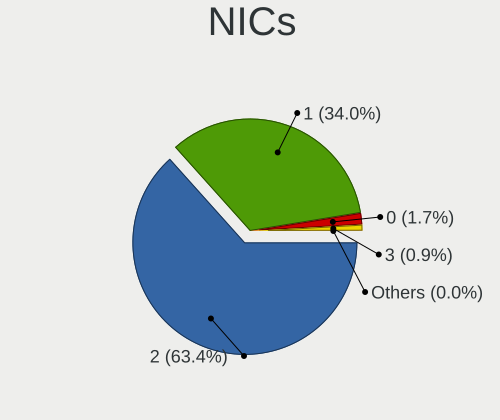

| Total | Notebooks | Percent |
|-------|-----------|---------|
| 2     | 18573     | 63.37%  |
| 1     | 9978      | 34.05%  |
| 0     | 491       | 1.68%   |
| 3     | 253       | 0.86%   |
| 4     | 10        | 0.03%   |
| 10    | 1         | 0.003%  |
| 8     | 1         | 0.003%  |
| 5     | 1         | 0.003%  |

IPv6
----

IPv6 vs IPv4

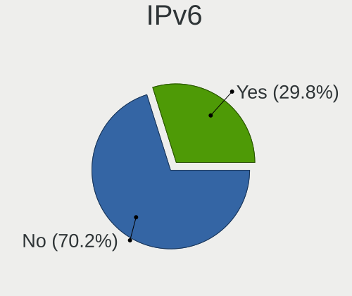

| Used | Notebooks | Percent |
|------|-----------|---------|
| No   | 21135     | 70.16%  |
| Yes  | 8991      | 29.84%  |

Bluetooth
---------

Bluetooth Vendor
----------------

Controller vendors

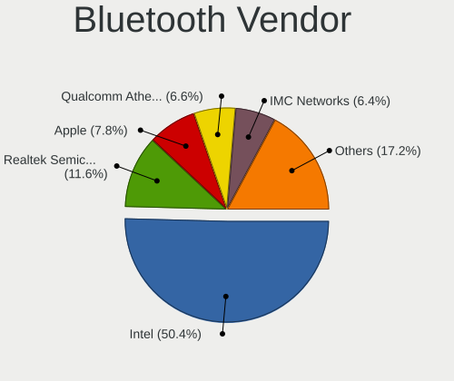

| Vendor                          | Notebooks | Percent |
|---------------------------------|-----------|---------|
| Intel                           | 11909     | 50.41%  |
| Realtek Semiconductor           | 2732      | 11.56%  |
| Apple                           | 1831      | 7.75%   |
| Qualcomm Atheros Communications | 1566      | 6.63%   |
| IMC Networks                    | 1523      | 6.45%   |
| Broadcom                        | 957       | 4.05%   |
| Foxconn / Hon Hai               | 799       | 3.38%   |
| Lite-On Technology              | 537       | 2.27%   |
| Dell                            | 447       | 1.89%   |
| MediaTek                        | 327       | 1.38%   |
| Hewlett-Packard                 | 201       | 0.85%   |
| Cambridge Silicon Radio         | 190       | 0.8%    |
| Toshiba                         | 142       | 0.6%    |
| USI                             | 96        | 0.41%   |
| ASUSTek Computer                | 72        | 0.3%    |
| Ralink                          | 70        | 0.3%    |
| Alps Electric                   | 56        | 0.24%   |
| Realtek                         | 30        | 0.13%   |
| Dynex                           | 22        | 0.09%   |
| TP-Link                         | 19        | 0.08%   |
| Edimax Technology               | 19        | 0.08%   |
| Foxconn International           | 16        | 0.07%   |
| Ralink Technology               | 15        | 0.06%   |
| Taiyo Yuden                     | 14        | 0.06%   |
| Actions                         | 6         | 0.03%   |
| Askey Computer                  | 4         | 0.02%   |
| Unknown                         | 3         | 0.01%   |
| Quectel Wireless Solutions      | 2         | 0.01%   |
| Primax Electronics              | 2         | 0.01%   |
| Opticis                         | 2         | 0.01%   |
| Micro Star International        | 2         | 0.01%   |
| Marvell Semiconductor           | 2         | 0.01%   |
| Fujitsu                         | 2         | 0.01%   |
| Chicony Electronics             | 2         | 0.01%   |
| Unknown                         | 1         | 0.004%  |
| SINO WEALTH                     | 1         | 0.004%  |
| Qcom                            | 1         | 0.004%  |
| Plugable                        | 1         | 0.004%  |
| Kensington                      | 1         | 0.004%  |
| HTC (High Tech Computer)        | 1         | 0.004%  |

Bluetooth Model
---------------

Controller models

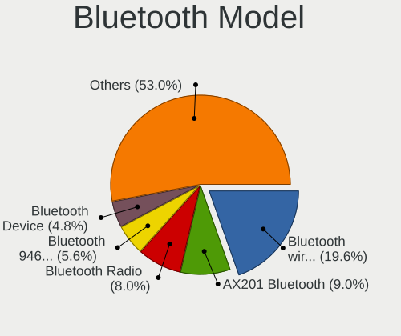

| Model                                               | Notebooks | Percent |
|-----------------------------------------------------|-----------|---------|
| Intel Bluetooth wireless interface                  | 4639      | 19.6%   |
| Intel AX201 Bluetooth                               | 2137      | 9.03%   |
| Realtek Bluetooth Radio                             | 1900      | 8.03%   |
| Intel Bluetooth 9460/9560 Jefferson Peak (JfP)      | 1326      | 5.6%    |
| Intel Bluetooth Device                              | 1131      | 4.78%   |
| Intel AX200 Bluetooth                               | 1097      | 4.63%   |
| Qualcomm Atheros  Bluetooth Device                  | 991       | 4.19%   |
| IMC Networks Bluetooth Radio                        | 912       | 3.85%   |
| Apple Bluetooth Host Controller                     | 702       | 2.97%   |
| Intel AX210 Bluetooth                               | 641       | 2.71%   |
| Realtek  Bluetooth 4.2 Adapter                      | 640       | 2.7%    |
| Apple Bluetooth USB Host Controller                 | 569       | 2.4%    |
| Apple Built-in Bluetooth 2.0+EDR HCI                | 422       | 1.78%   |
| IMC Networks Wireless_Device                        | 410       | 1.73%   |
| Intel Centrino Bluetooth Wireless Transceiver       | 363       | 1.53%   |
| MediaTek Wireless_Device                            | 324       | 1.37%   |
| Foxconn / Hon Hai Wireless_Device                   | 253       | 1.07%   |
| Intel Wireless-AC 9260 Bluetooth Adapter            | 245       | 1.03%   |
| Foxconn / Hon Hai Bluetooth Device                  | 245       | 1.03%   |
| Broadcom BCM2045B (BDC-2.1)                         | 199       | 0.84%   |
| Intel Wireless-AC 3168 Bluetooth                    | 194       | 0.82%   |
| Cambridge Silicon Radio Bluetooth Dongle (HCI mode) | 190       | 0.8%    |
| Dell DW375 Bluetooth Module                         | 173       | 0.73%   |
| Broadcom BCM20702 Bluetooth 4.0 [ThinkPad]          | 173       | 0.73%   |
| Qualcomm Atheros QCA61x4 Bluetooth 4.0              | 163       | 0.69%   |
| Qualcomm Atheros AR3012 Bluetooth 4.0               | 151       | 0.64%   |
| HP Broadcom 2070 Bluetooth Combo                    | 148       | 0.63%   |
| Lite-On Qualcomm Atheros QCA9377 Bluetooth          | 147       | 0.62%   |
| Intel Centrino Advanced-N 6230 Bluetooth adapter    | 147       | 0.62%   |
| Lite-On Bluetooth Device                            | 143       | 0.6%    |
| Qualcomm Atheros AR9462 Bluetooth                   | 127       | 0.54%   |
| Dell BCM20702A0 Bluetooth Module                    | 114       | 0.48%   |
| Lite-On Wireless_Device                             | 110       | 0.46%   |
| Foxconn / Hon Hai MediaTek Bluetooth Adapter        | 109       | 0.46%   |
| USI Bluetooth Device                                | 96        | 0.41%   |
| Broadcom HP Portable SoftSailing                    | 89        | 0.38%   |
| Apple Bluetooth HCI MacBookPro (HID mode)           | 87        | 0.37%   |
| Realtek RTL8822BE Bluetooth 4.2 Adapter             | 79        | 0.33%   |
| Broadcom BCM20702A0 Bluetooth 4.0                   | 77        | 0.33%   |
| IMC Networks Bluetooth Device                       | 76        | 0.32%   |

Sound
-----

Sound Vendor
------------

Sound card vendors

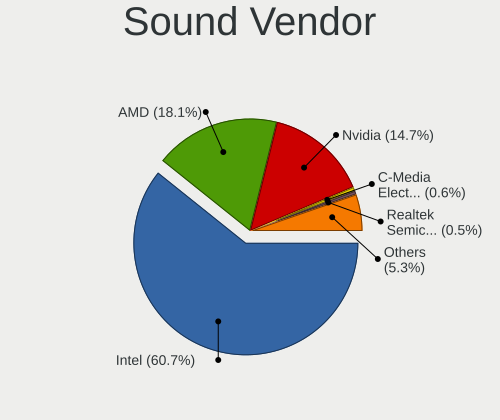

| Vendor                                       | Notebooks | Percent |
|----------------------------------------------|-----------|---------|
| Intel                                        | 22207     | 60.75%  |
| AMD                                          | 6622      | 18.12%  |
| Nvidia                                       | 5390      | 14.74%  |
| C-Media Electronics                          | 206       | 0.56%   |
| Realtek Semiconductor                        | 195       | 0.53%   |
| Logitech                                     | 168       | 0.46%   |
| Lenovo                                       | 148       | 0.4%    |
| Apple                                        | 132       | 0.36%   |
| Texas Instruments                            | 105       | 0.29%   |
| Sony                                         | 98        | 0.27%   |
| JMTek                                        | 84        | 0.23%   |
| SteelSeries ApS                              | 74        | 0.2%    |
| GN Netcom                                    | 68        | 0.19%   |
| Hewlett-Packard                              | 67        | 0.18%   |
| Razer USA                                    | 65        | 0.18%   |
| Plantronics                                  | 61        | 0.17%   |
| Corsair                                      | 51        | 0.14%   |
| Generalplus Technology                       | 43        | 0.12%   |
| Kingston Technology                          | 38        | 0.1%    |
| Creative Technology                          | 34        | 0.09%   |
| Focusrite-Novation                           | 32        | 0.09%   |
| ASUSTek Computer                             | 31        | 0.08%   |
| Blue Microphones                             | 27        | 0.07%   |
| No brand                                     | 26        | 0.07%   |
| Tenx Technology                              | 21        | 0.06%   |
| Jieli Technology                             | 17        | 0.05%   |
| Dell                                         | 17        | 0.05%   |
| Conexant Systems                             | 16        | 0.04%   |
| PreSonus Audio Electronics                   | 14        | 0.04%   |
| BEHRINGER International                      | 14        | 0.04%   |
| Samson Technologies                          | 12        | 0.03%   |
| Zoran Co. Personal Media Division (Nogatech) | 11        | 0.03%   |
| Walmart                                      | 11        | 0.03%   |
| Silicon Motion                               | 11        | 0.03%   |
| Audio-Technica                               | 11        | 0.03%   |
| Unknown                                      | 11        | 0.03%   |
| Turtle Beach                                 | 10        | 0.03%   |
| Astro Gaming                                 | 10        | 0.03%   |
| M-Audio                                      | 9         | 0.02%   |
| Google                                       | 9         | 0.02%   |

Sound Model
-----------

Sound card models

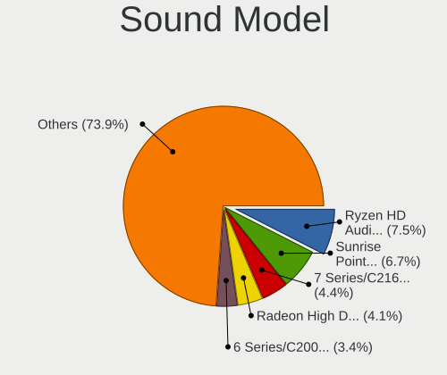

| Model                                                                                             | Notebooks | Percent |
|---------------------------------------------------------------------------------------------------|-----------|---------|
| AMD Ryzen HD Audio Controller                                                                     | 3342      | 7.53%   |
| Intel Sunrise Point-LP HD Audio                                                                   | 2975      | 6.7%    |
| Intel 7 Series/C216 Chipset Family High Definition Audio Controller                               | 1941      | 4.37%   |
| AMD Radeon High Definition Audio Controller                                                       | 1839      | 4.14%   |
| Intel 6 Series/C200 Series Chipset Family High Definition Audio Controller                        | 1509      | 3.4%    |
| AMD Renoir/Cezanne HDMI/DP Audio Controller                                                       | 1200      | 2.7%    |
| Intel Tiger Lake-LP Smart Sound Technology Audio Controller                                       | 1166      | 2.63%   |
| Intel Broadwell-U Audio Controller                                                                | 1166      | 2.63%   |
| Intel Cannon Lake PCH cAVS                                                                        | 1145      | 2.58%   |
| Intel Wildcat Point-LP High Definition Audio Controller                                           | 1141      | 2.57%   |
| Intel Celeron/Pentium Silver Processor High Definition Audio                                      | 1065      | 2.4%    |
| Intel 8 Series HD Audio Controller                                                                | 982       | 2.21%   |
| Intel Haswell-ULT HD Audio Controller                                                             | 978       | 2.2%    |
| Intel 8 Series/C220 Series Chipset High Definition Audio Controller                               | 975       | 2.2%    |
| AMD FCH Azalia Controller                                                                         | 921       | 2.07%   |
| Intel 5 Series/3400 Series Chipset High Definition Audio                                          | 875       | 1.97%   |
| Intel Alder Lake PCH-P High Definition Audio Controller                                           | 835       | 1.88%   |
| AMD Raven/Raven2/Fenghuang HDMI/DP Audio Controller                                               | 801       | 1.8%    |
| Intel 82801I (ICH9 Family) HD Audio Controller                                                    | 751       | 1.69%   |
| Intel Xeon E3-1200 v3/4th Gen Core Processor HD Audio Controller                                  | 691       | 1.56%   |
| Intel Comet Lake PCH cAVS                                                                         | 675       | 1.52%   |
| AMD Kabini HDMI/DP Audio                                                                          | 646       | 1.46%   |
| Intel Cannon Point-LP High Definition Audio Controller                                            | 633       | 1.43%   |
| AMD Family 15h (Models 60h-6fh) Audio Controller                                                  | 504       | 1.14%   |
| Nvidia MCP79 High Definition Audio                                                                | 500       | 1.13%   |
| Intel Comet Lake PCH-LP cAVS                                                                      | 494       | 1.11%   |
| Intel Atom Processor Z36xxx/Z37xxx Series High Definition Audio Controller                        | 486       | 1.09%   |
| Intel CM238 HD Audio Controller                                                                   | 485       | 1.09%   |
| Intel Tiger Lake-H HD Audio Controller                                                            | 445       | 1%      |
| Intel Atom/Celeron/Pentium Processor x5-E8000/J3xxx/N3xxx Series High Definition Audio Controller | 438       | 0.99%   |
| Intel Raptor Lake-P/U/H cAVS                                                                      | 437       | 0.98%   |
| Intel 82801H (ICH8 Family) HD Audio Controller                                                    | 435       | 0.98%   |
| Intel 100 Series/C230 Series Chipset Family HD Audio Controller                                   | 424       | 0.96%   |
| Nvidia TU106 High Definition Audio Controller                                                     | 419       | 0.94%   |
| Intel Ice Lake-LP Smart Sound Technology Audio Controller                                         | 395       | 0.89%   |
| Nvidia TU107 GeForce GTX 1650 High Definition Audio Controller                                    | 392       | 0.88%   |
| AMD SBx00 Azalia (Intel HDA)                                                                      | 363       | 0.82%   |
| Nvidia GA106 High Definition Audio Controller                                                     | 332       | 0.75%   |
| Nvidia GA104 High Definition Audio Controller                                                     | 330       | 0.74%   |
| AMD High Definition Audio Controller                                                              | 323       | 0.73%   |

Memory
------

Memory Vendor
-------------

Memory module vendors

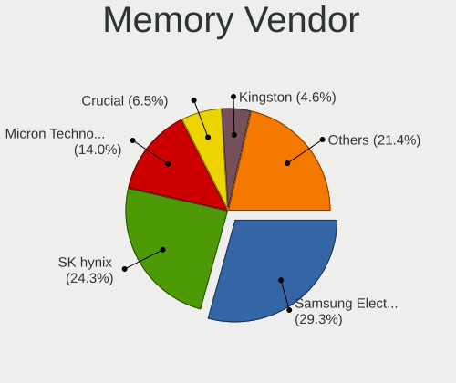

| Vendor              | Notebooks | Percent |
|---------------------|-----------|---------|
| Samsung Electronics | 5358      | 29.28%  |
| SK hynix            | 4439      | 24.26%  |
| Micron Technology   | 2557      | 13.97%  |
| Crucial             | 1189      | 6.5%    |
| Kingston            | 839       | 4.59%   |
| Unknown             | 781       | 4.27%   |
| A-DATA Technology   | 350       | 1.91%   |
| Elpida              | 324       | 1.77%   |
| Ramaxel Technology  | 304       | 1.66%   |
| Unknown             | 286       | 1.56%   |
| Unknown (ABCD)      | 244       | 1.33%   |
| G.Skill             | 236       | 1.29%   |
| Nanya Technology    | 206       | 1.13%   |
| Corsair             | 200       | 1.09%   |
| Team                | 148       | 0.81%   |
| Timetec             | 91        | 0.5%    |
| PNY                 | 79        | 0.43%   |
| Neo Forza           | 55        | 0.3%    |
| Avant               | 53        | 0.29%   |
| Patriot             | 51        | 0.28%   |
| Goldkey             | 46        | 0.25%   |
| 4ea5                | 45        | 0.25%   |
| fef5                | 40        | 0.22%   |
| Silicon Power       | 29        | 0.16%   |
| ff                  | 25        | 0.14%   |
| Sesame              | 22        | 0.12%   |
| Transcend           | 18        | 0.1%    |
| Apacer              | 17        | 0.09%   |
| ASint Technology    | 13        | 0.07%   |
| Qimonda             | 12        | 0.07%   |
| GSkill              | 12        | 0.07%   |
| Lexar               | 11        | 0.06%   |
| Unknown (0x0C26)    | 10        | 0.05%   |
| CSX                 | 10        | 0.05%   |
| SHARETRONIC         | 9         | 0.05%   |
| Lexar Co Limited    | 9         | 0.05%   |
| Innodisk            | 7         | 0.04%   |
| Gold Key            | 7         | 0.04%   |
| 8CFD000080AD        | 7         | 0.04%   |
| Toshiba             | 6         | 0.03%   |

Memory Model
------------

Memory module models

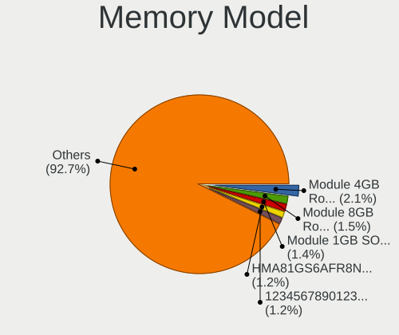

| Model                                                            | Notebooks | Percent |
|------------------------------------------------------------------|-----------|---------|
| Samsung RAM Module 4GB Row Of Chips DDR4 2400MT/s                | 401       | 2.08%   |
| Unknown                                                          | 286       | 1.48%   |
| SK hynix RAM Module 1GB SODIMM DDR2 800MT/s                      | 266       | 1.38%   |
| SK hynix RAM HMA81GS6AFR8N-UH 8GB SODIMM DDR4 2667MT/s           | 230       | 1.19%   |
| Unknown (ABCD) RAM 123456789012345678 2GB SODIMM LPDDR4 2400MT/s | 229       | 1.19%   |
| Samsung RAM M471B5173DB0-YK0 4GB SODIMM DDR3 1600MT/s            | 195       | 1.01%   |
| Samsung RAM M471A5244CB0-CTD 4GB SODIMM DDR4 3266MT/s            | 184       | 0.95%   |
| Samsung RAM M471A1G44AB0-CWE 8GiB SODIMM DDR4 3200MT/s           | 175       | 0.91%   |
| SK hynix RAM HMT451S6BFR8A-PB 4GB SODIMM DDR3 1600MT/s           | 173       | 0.9%    |
| Samsung RAM M471A5244CB0-CWE 4GB SODIMM DDR4 3200MT/s            | 169       | 0.88%   |
| Samsung RAM M471B5273DH0-CH9 4GB SODIMM DDR3 1600MT/s            | 145       | 0.75%   |
| Samsung RAM M471B5173QH0-YK0 4GB SODIMM DDR3 1600MT/s            | 141       | 0.73%   |
| Samsung RAM M471A1K43DB1-CWE 8GB SODIMM DDR4 3200MT/s            | 133       | 0.69%   |
| Samsung RAM M471B1G73DB0-YK0 8GB SODIMM DDR3 1600MT/s            | 131       | 0.68%   |
| SK hynix RAM HMAA1GS6CJR6N-XN 8GB SODIMM DDR4 3200MT/s           | 130       | 0.67%   |
| Samsung RAM M471A1K43CB1-CTD 8GB SODIMM DDR4 3200MT/s            | 129       | 0.67%   |
| SK hynix RAM HMT351S6CFR8C-PB 4GB SODIMM DDR3 1600MT/s           | 126       | 0.65%   |
| Samsung RAM M471A1K43CB1-CRC 8GB SODIMM DDR4 8400MT/s            | 120       | 0.62%   |
| Samsung RAM M471B5173EB0-YK0 4GB SODIMM DDR3 1600MT/s            | 108       | 0.56%   |
| Samsung RAM M471A1K43EB1-CWE 8GB SODIMM DDR4 3200MT/s            | 103       | 0.53%   |
| Samsung RAM M471A1K43BB1-CRC 8GB SODIMM DDR4 2667MT/s            | 98        | 0.51%   |
| Samsung RAM M471B1G73QH0-YK0 8GB SODIMM DDR3 1600MT/s            | 93        | 0.48%   |
| SK hynix RAM HMT41GS6BFR8A-PB 8GB SODIMM DDR3 2667MT/s           | 92        | 0.48%   |
| SK hynix RAM HMA81GS6CJR8N-VK 8GB SODIMM DDR4 2667MT/s           | 91        | 0.47%   |
| Samsung RAM M471B5674QH0-YK0 2GB SODIMM DDR3 3200MT/s            | 90        | 0.47%   |
| Samsung RAM M471B1G73EB0-YK0 8192MB SODIMM DDR3 1600MT/s         | 90        | 0.47%   |
| Samsung RAM M471A1G44BB0-CWE 8GB SODIMM DDR4 3200MT/s            | 90        | 0.47%   |
| Samsung RAM M471B5273CH0-CH9 4GB SODIMM DDR3 1334MT/s            | 89        | 0.46%   |
| SK hynix RAM HMT351S6EFR8A-PB 4GB SODIMM DDR3 1600MT/s           | 88        | 0.46%   |
| SK hynix RAM HMA82GS6AFR8N-UH 16GB SODIMM DDR4 2667MT/s          | 87        | 0.45%   |
| SK hynix RAM Module 4GB SODIMM DDR3 1600MT/s                     | 86        | 0.45%   |
| SK hynix RAM HMA81GS6DJR8N-XN 8GB SODIMM DDR4 3200MT/s           | 86        | 0.45%   |
| Micron RAM 4ATF51264HZ-2G6E1 4GB SODIMM DDR4 2667MT/s            | 86        | 0.45%   |
| Crucial RAM CT102464BF160B.M16 8GB SODIMM DDR3 1600MT/s          | 84        | 0.44%   |
| SK hynix RAM HMT451S6AFR8A-PB 4GB SODIMM DDR3 1600MT/s           | 82        | 0.43%   |
| Samsung RAM M471A1K43DB1-CTD 8GB SODIMM DDR4 2667MT/s            | 82        | 0.43%   |
| Samsung RAM K4E8E324EB-EGCF 2GB LPDDR3 1867MT/s                  | 81        | 0.42%   |
| Samsung RAM M471B5773DH0-CH9 2GB SODIMM DDR3 1600MT/s            | 80        | 0.41%   |
| Micron RAM 8ATF1G64HZ-3G2J1 8GB SODIMM DDR4 3200MT/s             | 79        | 0.41%   |
| Samsung RAM M425R1GB4BB0-CQKOL 8GB SODIMM DDR5 4800MT/s          | 77        | 0.4%    |

Memory Kind
-----------

Memory module kinds

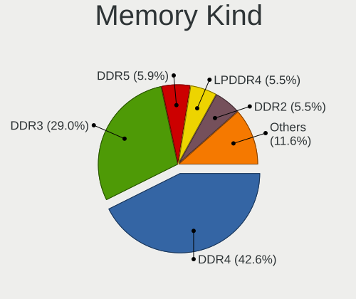

| Kind    | Notebooks | Percent |
|---------|-----------|---------|
| DDR4    | 6777      | 42.64%  |
| DDR3    | 4610      | 29.01%  |
| DDR5    | 930       | 5.85%   |
| LPDDR4  | 870       | 5.47%   |
| DDR2    | 869       | 5.47%   |
| LPDDR3  | 710       | 4.47%   |
| LPDDR5  | 687       | 4.32%   |
| SDRAM   | 244       | 1.54%   |
| DDR     | 88        | 0.55%   |
| Unknown | 82        | 0.52%   |
| DRAM    | 25        | 0.16%   |

Memory Form Factor
------------------

Physical design of the memory module

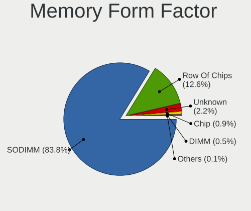

| Name            | Notebooks | Percent |
|-----------------|-----------|---------|
| SODIMM          | 13302     | 83.8%   |
| Row Of Chips    | 1998      | 12.59%  |
| Unknown         | 357       | 2.25%   |
| Chip            | 135       | 0.85%   |
| DIMM            | 72        | 0.45%   |
| Proprietary Car | 10        | 0.06%   |

Memory Size
-----------

Memory module size

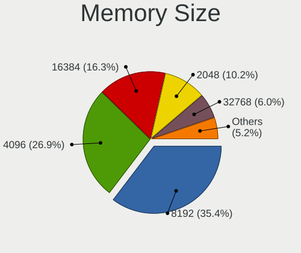

| Size   | Notebooks | Percent |
|--------|-----------|---------|
| 8192   | 6128      | 35.36%  |
| 4096   | 4664      | 26.91%  |
| 16384  | 2820      | 16.27%  |
| 2048   | 1776      | 10.25%  |
| 32768  | 1038      | 5.99%   |
| 1024   | 781       | 4.51%   |
| 512    | 45        | 0.26%   |
| 49152  | 28        | 0.16%   |
| 256    | 20        | 0.12%   |
| 6144   | 8         | 0.05%   |
| 65536  | 6         | 0.03%   |
| 12288  | 6         | 0.03%   |
| 3072   | 5         | 0.03%   |
| 24576  | 2         | 0.01%   |
| 1536   | 2         | 0.01%   |
| 131072 | 1         | 0.01%   |
| 5120   | 1         | 0.01%   |

Memory Speed
------------

Memory module speed

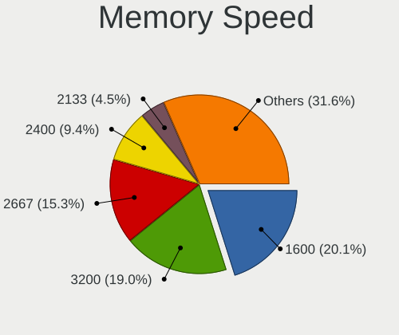

| Speed   | Notebooks | Percent |
|---------|-----------|---------|
| 1600    | 3412      | 20.12%  |
| 3200    | 3225      | 19.02%  |
| 2667    | 2601      | 15.34%  |
| 2400    | 1602      | 9.45%   |
| 2133    | 761       | 4.49%   |
| 5600    | 479       | 2.82%   |
| 800     | 471       | 2.78%   |
| 4800    | 435       | 2.57%   |
| 1333    | 429       | 2.53%   |
| 1334    | 410       | 2.42%   |
| 6400    | 380       | 2.24%   |
| 1867    | 360       | 2.12%   |
| 667     | 333       | 1.96%   |
| 4267    | 280       | 1.65%   |
| 1067    | 219       | 1.29%   |
| 8400    | 193       | 1.14%   |
| 3266    | 185       | 1.09%   |
| Unknown | 164       | 0.97%   |
| 7500    | 144       | 0.85%   |
| 4199    | 133       | 0.78%   |
| 4266    | 86        | 0.51%   |
| 2048    | 86        | 0.51%   |
| 975     | 82        | 0.48%   |
| 8533    | 64        | 0.38%   |
| 3733    | 61        | 0.36%   |
| 1066    | 60        | 0.35%   |
| 533     | 49        | 0.29%   |
| 7467    | 46        | 0.27%   |
| 2933    | 39        | 0.23%   |
| 5200    | 19        | 0.11%   |
| 1596    | 19        | 0.11%   |
| 5500    | 17        | 0.1%    |
| 1866    | 14        | 0.08%   |
| 333     | 11        | 0.06%   |
| 266     | 7         | 0.04%   |
| 6000    | 6         | 0.04%   |
| 3600    | 6         | 0.04%   |
| 3000    | 6         | 0.04%   |
| 1330    | 6         | 0.04%   |
| 8000    | 5         | 0.03%   |

Printers & scanners
-------------------

Printer Vendor
--------------

Printer device vendors

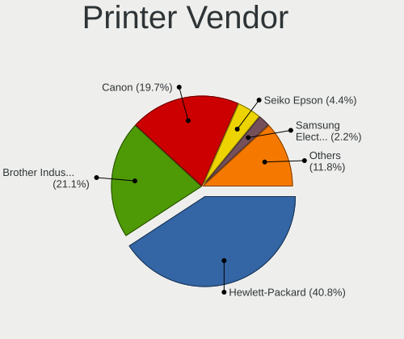

| Vendor                   | Notebooks | Percent |
|--------------------------|-----------|---------|
| Hewlett-Packard          | 93        | 40.79%  |
| Brother Industries       | 48        | 21.05%  |
| Canon                    | 45        | 19.74%  |
| Seiko Epson              | 10        | 4.39%   |
| Samsung Electronics      | 5         | 2.19%   |
| STMicroelectronics       | 4         | 1.75%   |
| Dymo-CoStar              | 4         | 1.75%   |
| Xerox                    | 3         | 1.32%   |
| Zebra                    | 2         | 0.88%   |
| QinHeng Electronics      | 2         | 0.88%   |
| Prolific Technology      | 2         | 0.88%   |
| Pantum                   | 2         | 0.88%   |
| YXWL Mi                  | 1         | 0.44%   |
| TSC Auto ID Technology   | 1         | 0.44%   |
| Memory                   | 1         | 0.44%   |
| Magic Control Technology | 1         | 0.44%   |
| Lexmark International    | 1         | 0.44%   |
| iDPRT                    | 1         | 0.44%   |
| Dell                     | 1         | 0.44%   |
| CB Printer               | 1         | 0.44%   |

Printer Model
-------------

Printer device models

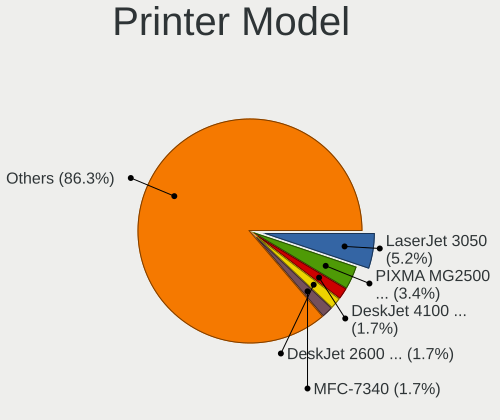

| Model                                                     | Notebooks | Percent |
|-----------------------------------------------------------|-----------|---------|
| HP LaserJet 3050                                          | 12        | 5.15%   |
| Canon PIXMA MG2500 Series                                 | 8         | 3.43%   |
| HP DeskJet 4100 series                                    | 4         | 1.72%   |
| HP DeskJet 2600 series                                    | 4         | 1.72%   |
| Brother MFC-7340                                          | 4         | 1.72%   |
| STMicroelectronics LED badge -- mini LED display -- 11x44 | 3         | 1.29%   |
| HP ENVY Photo 7800 series                                 | 3         | 1.29%   |
| HP ENVY 4520 series                                       | 3         | 1.29%   |
| Canon PIXMA MG3600 Series                                 | 3         | 1.29%   |
| Brother HL-L2340D series                                  | 3         | 1.29%   |
| Brother HL-L2320D series                                  | 3         | 1.29%   |
| Brother HL-L2305 series                                   | 3         | 1.29%   |
| Xerox Phaser 6500DN                                       | 2         | 0.86%   |
| Seiko Epson XP-4100 Series                                | 2         | 0.86%   |
| Seiko Epson EPSON WF-3520 Series                          | 2         | 0.86%   |
| Samsung SCX-3400 Series                                   | 2         | 0.86%   |
| QinHeng CH340S                                            | 2         | 0.86%   |
| Prolific PL2305 Parallel Port                             | 2         | 0.86%   |
| Pantum P2500W series                                      | 2         | 0.86%   |
| HP Officejet 4630 series                                  | 2         | 0.86%   |
| HP LaserJet Professional P1102w                           | 2         | 0.86%   |
| HP LaserJet Pro M118-M119                                 | 2         | 0.86%   |
| HP LaserJet P2035                                         | 2         | 0.86%   |
| HP LaserJet P1006                                         | 2         | 0.86%   |
| HP LaserJet P1005                                         | 2         | 0.86%   |
| HP LaserJet M14-M17                                       | 2         | 0.86%   |
| HP LaserJet 4250                                          | 2         | 0.86%   |
| HP LaserJet 400 M401dne                                   | 2         | 0.86%   |
| HP LaserJet 1320                                          | 2         | 0.86%   |
| HP LaserJet 1200                                          | 2         | 0.86%   |
| HP LaserJet 1160 series                                   | 2         | 0.86%   |
| HP ENVY 6000 series                                       | 2         | 0.86%   |
| HP Deskjet 3510 series                                    | 2         | 0.86%   |
| HP Deskjet 3050A                                          | 2         | 0.86%   |
| HP DeskJet 2700 series                                    | 2         | 0.86%   |
| HP DeskJet 2130 series                                    | 2         | 0.86%   |
| HP DeskJet 1110 series                                    | 2         | 0.86%   |
| Canon TR8500 series                                       | 2         | 0.86%   |
| Canon TR4700 series                                       | 2         | 0.86%   |
| Canon PIXMA MX490 Series                                  | 2         | 0.86%   |

Scanner Vendor
--------------

Scanner device vendors

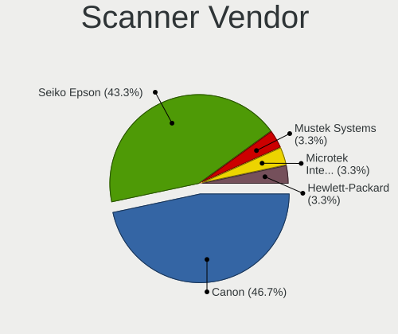

| Vendor                 | Notebooks | Percent |
|------------------------|-----------|---------|
| Canon                  | 14        | 46.67%  |
| Seiko Epson            | 13        | 43.33%  |
| Mustek Systems         | 1         | 3.33%   |
| Microtek International | 1         | 3.33%   |
| Hewlett-Packard        | 1         | 3.33%   |

Scanner Model
-------------

Scanner device models

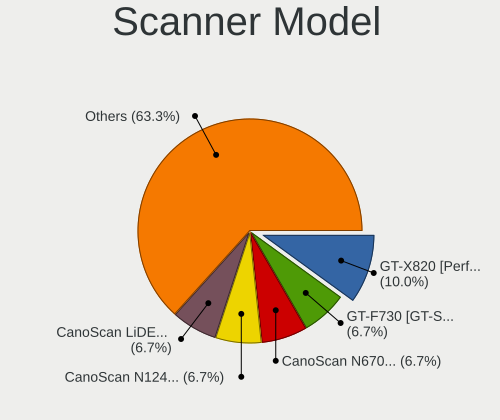

| Model                                                       | Notebooks | Percent |
|-------------------------------------------------------------|-----------|---------|
| Seiko Epson GT-X820 [Perfection V600 Photo]                 | 3         | 10%     |
| Seiko Epson GT-F730 [GT-S630/Perfection V33/V330 Photo]     | 2         | 6.67%   |
| Canon CanoScan N670U/N676U/LiDE 20                          | 2         | 6.67%   |
| Canon CanoScan N1240U/LiDE 30                               | 2         | 6.67%   |
| Canon CanoScan LiDE 210                                     | 2         | 6.67%   |
| Seiko Epson Perfection V37/V370                             | 1         | 3.33%   |
| Seiko Epson GT-X900 [Perfection V700/V750 Photo]            | 1         | 3.33%   |
| Seiko Epson GT-X770 [Perfection V500]                       | 1         | 3.33%   |
| Seiko Epson GT-F720 [GT-S620/Perfection V30/V300 Photo]     | 1         | 3.33%   |
| Seiko Epson GT-F600 [Perfection 4180]                       | 1         | 3.33%   |
| Seiko Epson GT-8200U/GT-8200UF [Perfection 1650/1650 PHOTO] | 1         | 3.33%   |
| Seiko Epson GT-1500 [GT-D1000]                              | 1         | 3.33%   |
| Seiko Epson ES-D200 [GT-S50]                                | 1         | 3.33%   |
| Mustek Systems BearPaw 1200 TA/CS                           | 1         | 3.33%   |
| Microtek International ScanMaker V6USL                      | 1         | 3.33%   |
| HP OfficeJet 6110                                           | 1         | 3.33%   |
| Canon CanoScan LiDE 70                                      | 1         | 3.33%   |
| Canon CanoScan LiDE 60                                      | 1         | 3.33%   |
| Canon CanoScan LiDE 500F                                    | 1         | 3.33%   |
| Canon CanoScan LiDE 220                                     | 1         | 3.33%   |
| Canon CanoScan LiDE 200                                     | 1         | 3.33%   |
| Canon CanoScan LiDE 110                                     | 1         | 3.33%   |
| Canon CanoScan LiDE 100                                     | 1         | 3.33%   |
| Canon CanoScan 4200F                                        | 1         | 3.33%   |

Camera
------

Camera Vendor
-------------

Camera device vendors

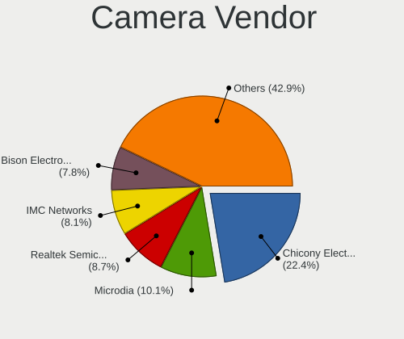

| Vendor                                 | Notebooks | Percent |
|----------------------------------------|-----------|---------|
| Chicony Electronics                    | 5472      | 22.41%  |
| Microdia                               | 2462      | 10.08%  |
| Realtek Semiconductor                  | 2133      | 8.74%   |
| IMC Networks                           | 1982      | 8.12%   |
| Bison Electronics                      | 1902      | 7.79%   |
| Sunplus Innovation Technology          | 1596      | 6.54%   |
| Quanta                                 | 1388      | 5.69%   |
| Cheng Uei Precision Industry (Foxlink) | 1010      | 4.14%   |
| Apple                                  | 986       | 4.04%   |
| Luxvisions Innotech Limited            | 731       | 2.99%   |
| Suyin                                  | 690       | 2.83%   |
| Lite-On Technology                     | 526       | 2.15%   |
| Logitech                               | 429       | 1.76%   |
| Syntek                                 | 425       | 1.74%   |
| Ricoh                                  | 231       | 0.95%   |
| Sonix Technology                       | 223       | 0.91%   |
| Samsung Electronics                    | 203       | 0.83%   |
| Alcor Micro                            | 202       | 0.83%   |
| Importek                               | 185       | 0.76%   |
| Shinetech                              | 165       | 0.68%   |
| Silicon Motion                         | 150       | 0.61%   |
| Lenovo                                 | 129       | 0.53%   |
| icSpring                               | 109       | 0.45%   |
| Primax Electronics                     | 84        | 0.34%   |
| Acer                                   | 83        | 0.34%   |
| SunplusIT                              | 79        | 0.32%   |
| OmniVision Technologies                | 64        | 0.26%   |
| Intel                                  | 44        | 0.18%   |
| ALi                                    | 43        | 0.18%   |
| Framework                              | 37        | 0.15%   |
| Microsoft                              | 32        | 0.13%   |
| Z-Star Microelectronics                | 26        | 0.11%   |
| LG Electronics                         | 24        | 0.1%    |
| Shenzhen Kingcome Optoelectronic       | 22        | 0.09%   |
| ARC International                      | 22        | 0.09%   |
| Shine-optics                           | 21        | 0.09%   |
| Motorola PCS                           | 20        | 0.08%   |
| HRY                                    | 20        | 0.08%   |
| Razer USA                              | 19        | 0.08%   |
| MacroSilicon                           | 18        | 0.07%   |

Camera Model
------------

Camera device models

| Model                                                          | Notebooks | Percent |
|----------------------------------------------------------------|-----------|---------|
| Chicony Integrated Camera                                      | 1693      | 6.88%   |
| Microdia Integrated_Webcam_HD                                  | 1152      | 4.68%   |
| Realtek Integrated_Webcam_HD                                   | 825       | 3.35%   |
| IMC Networks USB2.0 HD UVC WebCam                              | 670       | 2.72%   |
| IMC Networks Integrated Camera                                 | 639       | 2.6%    |
| Bison Integrated Camera                                        | 602       | 2.45%   |
| Sunplus Integrated_Webcam_HD                                   | 580       | 2.36%   |
| Apple FaceTime HD Camera                                       | 343       | 1.39%   |
| Chicony HD WebCam                                              | 335       | 1.36%   |
| Syntek Integrated Camera                                       | 291       | 1.18%   |
| Microdia Integrated Webcam                                     | 288       | 1.17%   |
| Chicony HP Truevision HD camera                                | 243       | 0.99%   |
| Quanta HP TrueVision HD Camera                                 | 240       | 0.98%   |
| Chicony HP Truevision HD                                       | 227       | 0.92%   |
| Apple iPhone 5/5C/5S/6/SE/7/8/X                                | 226       | 0.92%   |
| Apple Built-in iSight                                          | 225       | 0.91%   |
| Lite-On Integrated Camera                                      | 205       | 0.83%   |
| Luxvisions Innotech Limited HP TrueVision HD Camera            | 204       | 0.83%   |
| Quanta HD User Facing                                          | 201       | 0.82%   |
| Bison HD Webcam                                                | 201       | 0.82%   |
| Luxvisions Innotech Limited Integrated Camera                  | 200       | 0.81%   |
| Samsung Galaxy series, misc. (MTP mode)                        | 199       | 0.81%   |
| Chicony HP HD Camera                                           | 197       | 0.8%    |
| Bison BisonCam,NB Pro                                          | 188       | 0.76%   |
| Realtek Integrated Webcam HD                                   | 171       | 0.69%   |
| Chicony Integrated Camera (1280x720@30)                        | 170       | 0.69%   |
| Quanta HP Wide Vision HD Camera                                | 156       | 0.63%   |
| Cheng Uei Precision Industry (Foxlink) HP TrueVision HD Camera | 152       | 0.62%   |
| Chicony TOSHIBA Web Camera - HD                                | 149       | 0.61%   |
| Chicony HD User Facing                                         | 146       | 0.59%   |
| Cheng Uei Precision Industry (Foxlink) HP Webcam               | 146       | 0.59%   |
| Chicony HP Wide Vision HD Camera                               | 143       | 0.58%   |
| Bison SunplusIT Integrated Camera                              | 142       | 0.58%   |
| Realtek USB Camera                                             | 135       | 0.55%   |
| Realtek Laptop Camera                                          | 135       | 0.55%   |
| Suyin HP Truevision HD                                         | 134       | 0.54%   |
| Chicony USB2.0 HD UVC WebCam                                   | 133       | 0.54%   |
| Quanta HD Webcam                                               | 131       | 0.53%   |
| Cheng Uei Precision Industry (Foxlink) HP Truevision HD        | 130       | 0.53%   |
| Microdia Laptop_Integrated_Webcam_HD                           | 129       | 0.52%   |

Security
--------

Fingerprint Vendor
------------------

Fingerprint sensor vendors

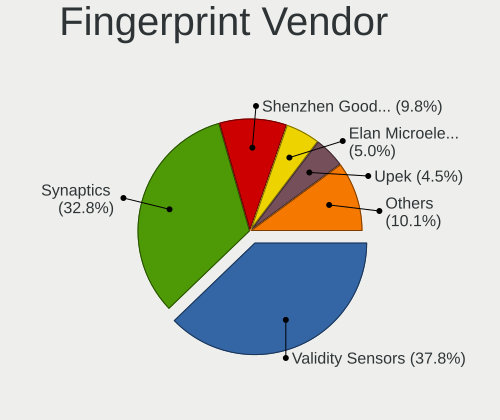

| Vendor                             | Notebooks | Percent |
|------------------------------------|-----------|---------|
| Validity Sensors                   | 1674      | 37.8%   |
| Synaptics                          | 1451      | 32.77%  |
| Shenzhen Goodix Technology         | 432       | 9.76%   |
| Elan Microelectronics              | 222       | 5.01%   |
| Upek                               | 201       | 4.54%   |
| AuthenTec                          | 190       | 4.29%   |
| LighTuning Technology              | 94        | 2.12%   |
| STMicroelectronics                 | 81        | 1.83%   |
| Focal-systems.Corp                 | 36        | 0.81%   |
| Samsung Electronics                | 17        | 0.38%   |
| HOLTEK                             | 17        | 0.38%   |
| Realtek USB2.0 Finger Print Bridge | 7         | 0.16%   |
| DigitalPersona                     | 6         | 0.14%   |

Fingerprint Model
-----------------

Fingerprint sensor models

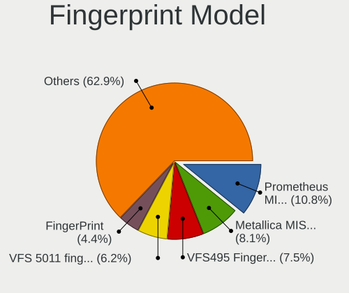

| Model                                                                      | Notebooks | Percent |
|----------------------------------------------------------------------------|-----------|---------|
| Synaptics Prometheus MIS Touch Fingerprint Reader                          | 480       | 10.84%  |
| Synaptics Metallica MIS Touch Fingerprint Reader                           | 360       | 8.13%   |
| Validity Sensors VFS495 Fingerprint Reader                                 | 333       | 7.52%   |
| Validity Sensors VFS 5011 fingerprint sensor                               | 276       | 6.23%   |
| Shenzhen Goodix FingerPrint                                                | 196       | 4.43%   |
| Upek Biometric Touchchip/Touchstrip Fingerprint Sensor                     | 194       | 4.38%   |
| Shenzhen Goodix  FingerPrint Device                                        | 177       | 4%      |
| Validity Sensors Synaptics WBDI                                            | 149       | 3.36%   |
| Validity Sensors Fingerprint scanner                                       | 147       | 3.32%   |
| Validity Sensors VFS491                                                    | 125       | 2.82%   |
| Validity Sensors VFS471 Fingerprint Reader                                 | 122       | 2.75%   |
| Elan ELAN:Fingerprint                                                      | 119       | 2.69%   |
| Synaptics UWP WBDI Device                                                  | 114       | 2.57%   |
| Validity Sensors VFS7500 Touch Fingerprint Sensor                          | 103       | 2.33%   |
| Elan ELAN:ARM-M4                                                           | 99        | 2.24%   |
| Validity Sensors VFS5011 Fingerprint Reader                                | 93        | 2.1%    |
| Synaptics FS7604 Touch Fingerprint Sensor with PurePrint                   | 89        | 2.01%   |
| Synaptics Fingerprint reader [HP G6]                                       | 83        | 1.87%   |
| Validity Sensors Swipe Fingerprint Sensor                                  | 79        | 1.78%   |
| STMicroelectronics Fingerprint Reader                                      | 79        | 1.78%   |
| Synaptics Prometheus Fingerprint Reader                                    | 77        | 1.74%   |
| AuthenTec AES2810                                                          | 76        | 1.72%   |
| Validity Sensors Synaptics VFS7552 Touch Fingerprint Sensor with PurePrint | 69        | 1.56%   |
| Shenzhen Goodix Fingerprint Reader                                         | 59        | 1.33%   |
| Validity Sensors VFS451 Fingerprint Reader                                 | 56        | 1.26%   |
| LighTuning ES603 Swipe Fingerprint Sensor                                  | 51        | 1.15%   |
| Validity Sensors VFS7552 Touch Fingerprint Sensor                          | 49        | 1.11%   |
| Synaptics  FS7604 Touch Fingerprint Sensor with PurePrint                  | 42        | 0.95%   |
| Synaptics TouchPad                                                         | 38        | 0.86%   |
| Validity Sensors VFS301 Fingerprint Reader                                 | 37        | 0.84%   |
| LighTuning EgisTec Touch Fingerprint Sensor                                | 37        | 0.84%   |
| Focal-systems.Corp FT9201Fingerprint.                                      | 36        | 0.81%   |
| AuthenTec Fingerprint Sensor                                               | 36        | 0.81%   |
| AuthenTec AES2501 Fingerprint Sensor                                       | 36        | 0.81%   |
| Synaptics WBDI Device                                                      | 34        | 0.77%   |
| Synaptics WBDI Fingerprint Reader USB 086                                  | 32        | 0.72%   |
| Synaptics Metallica MOH Touch Fingerprint Reader                           | 26        | 0.59%   |
| AuthenTec AES2550 Fingerprint Sensor                                       | 22        | 0.5%    |
| Synaptics UWP WBDI                                                         | 21        | 0.47%   |
| Unknown                                                                    | 20        | 0.45%   |

Chipcard Vendor
---------------

Chipcard module vendors

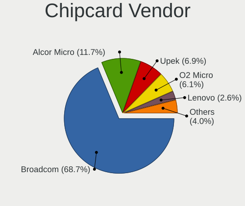

| Vendor                    | Notebooks | Percent |
|---------------------------|-----------|---------|
| Broadcom                  | 1544      | 68.74%  |
| Alcor Micro               | 262       | 11.67%  |
| Upek                      | 156       | 6.95%   |
| O2 Micro                  | 136       | 6.06%   |
| Lenovo                    | 59        | 2.63%   |
| SCM Microsystems          | 34        | 1.51%   |
| Gemalto (was Gemplus)     | 15        | 0.67%   |
| Yubico.com                | 9         | 0.4%    |
| Realtek Semiconductor     | 6         | 0.27%   |
| OmniKey                   | 6         | 0.27%   |
| Advanced Card Systems     | 4         | 0.18%   |
| Chicony Electronics       | 3         | 0.13%   |
| Cherry                    | 3         | 0.13%   |
| NXP Semiconductors        | 2         | 0.09%   |
| Thetis                    | 1         | 0.04%   |
| Purism, SPC               | 1         | 0.04%   |
| MagTek                    | 1         | 0.04%   |
| Jing-Mold Enterprise      | 1         | 0.04%   |
| Clay Logic                | 1         | 0.04%   |
| Bit4id                    | 1         | 0.04%   |
| Aladdin Knowledge Systems | 1         | 0.04%   |

Chipcard Model
--------------

Chipcard module models

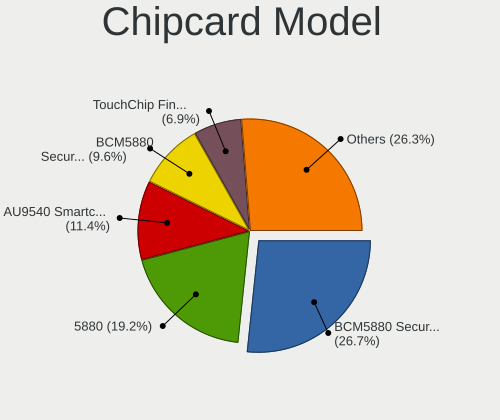

| Model                                                                        | Notebooks | Percent |
|------------------------------------------------------------------------------|-----------|---------|
| Broadcom BCM5880 Secure Applications Processor                               | 600       | 26.65%  |
| Broadcom 5880                                                                | 432       | 19.19%  |
| Alcor Micro AU9540 Smartcard Reader                                          | 257       | 11.42%  |
| Broadcom BCM5880 Secure Applications Processor with fingerprint swipe sensor | 215       | 9.55%   |
| Upek TouchChip Fingerprint Coprocessor (WBF advanced mode)                   | 156       | 6.93%   |
| Broadcom BCM58200 ControlVault 3 (FingerPrint sensor + Contacted SmartCard)  | 152       | 6.75%   |
| Broadcom 58200                                                               | 131       | 5.82%   |
| O2 Micro OZ776 CCID Smartcard Reader                                         | 110       | 4.89%   |
| Lenovo Integrated Smart Card Reader                                          | 59        | 2.62%   |
| O2 Micro Oz776 SmartCard Reader                                              | 26        | 1.16%   |
| Broadcom BCM5880 Secure Applications Processor with fingerprint touch sensor | 19        | 0.84%   |
| SCM Microsystems SCR331-LC1 / SCR3310 SmartCard Reader                       | 15        | 0.67%   |
| Gemalto (was Gemplus) GemPC Twin SmartCard Reader                            | 10        | 0.44%   |
| Yubico.com Yubikey 4/5 U2F+CCID                                              | 9         | 0.4%    |
| SCM Microsystems SCR35xx Smart Card Reader                                   | 6         | 0.27%   |
| Realtek Semiconductor Smart Card Reader Interface                            | 6         | 0.27%   |
| SCM Microsystems SCR3340 - ExpressCard54 Smart Card Reader                   | 5         | 0.22%   |
| Gemalto (was Gemplus) Compact Smart Card Reader Writer                       | 5         | 0.22%   |
| OmniKey CardMan Smart@Link                                                   | 4         | 0.18%   |
| Alcor Micro Watchdata W 1981                                                 | 4         | 0.18%   |
| Chicony Electronics HP Skylab USB Smartcard Keyboard                         | 3         | 0.13%   |
| SCM Microsystems SCR3500 C Contact Reader                                    | 2         | 0.09%   |
| SCM Microsystems SCR331 SmartCard Reader                                     | 2         | 0.09%   |
| NXP Semiconductors PR533                                                     | 2         | 0.09%   |
| Cherry SmartCard Reader Keyboard KC 1000 SC                                  | 2         | 0.09%   |
| Advanced Card Systems ACR39U                                                 | 2         | 0.09%   |
| Thetis Security Key(FE25)                                                    | 1         | 0.04%   |
| SCM Microsystems uTrust FIDO2 Security Key                                   | 1         | 0.04%   |
| SCM Microsystems SCR3500 A Contact Reader                                    | 1         | 0.04%   |
| SCM Microsystems SCR3311 Smart Card Reader                                   | 1         | 0.04%   |
| SCM Microsystems CLOUD 2900 R Smart Card Reader                              | 1         | 0.04%   |
| Purism, SPC Librem Key                                                       | 1         | 0.04%   |
| OmniKey CardMan 4321                                                         | 1         | 0.04%   |
| OmniKey CardMan 3021 / 3121                                                  | 1         | 0.04%   |
| MagTek ZCS100                                                                | 1         | 0.04%   |
| Jing-Mold Enterprise HP USB Business Slim Smartcard CCID Keyboard            | 1         | 0.04%   |
| Clay Logic CanoKey Canary                                                    | 1         | 0.04%   |
| Cherry Smart Terminal XX44                                                   | 1         | 0.04%   |
| Bit4id miniLector EVO                                                        | 1         | 0.04%   |
| Alcor Micro EMV Smartcard Reader                                             | 1         | 0.04%   |

Unsupported
-----------

Unsupported Devices
-------------------

Total unsupported devices on board

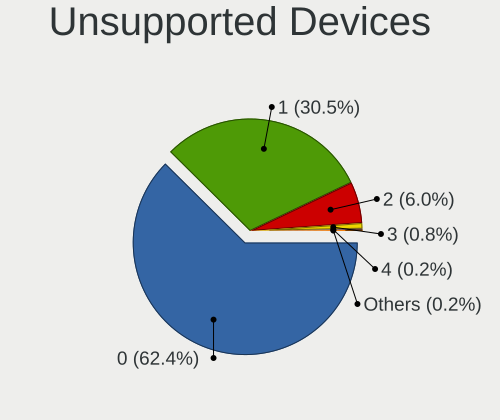

| Total | Notebooks | Percent |
|-------|-----------|---------|
| 0     | 18776     | 62.42%  |
| 1     | 9168      | 30.48%  |
| 2     | 1794      | 5.96%   |
| 3     | 242       | 0.8%    |
| 4     | 49        | 0.16%   |
| 5     | 20        | 0.07%   |
| 6     | 13        | 0.04%   |
| 8     | 7         | 0.02%   |
| 7     | 6         | 0.02%   |
| 9     | 4         | 0.01%   |

Unsupported Device Types
------------------------

Types of unsupported devices

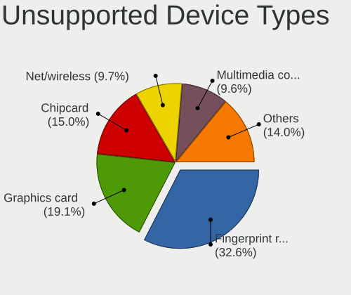

| Type                     | Notebooks | Percent |
|--------------------------|-----------|---------|
| Fingerprint reader       | 4371      | 32.56%  |
| Graphics card            | 2570      | 19.15%  |
| Chipcard                 | 2008      | 14.96%  |
| Net/wireless             | 1300      | 9.68%   |
| Multimedia controller    | 1292      | 9.63%   |
| Camera                   | 361       | 2.69%   |
| Communication controller | 327       | 2.44%   |
| Storage                  | 326       | 2.43%   |
| Bluetooth                | 225       | 1.68%   |
| Sound                    | 185       | 1.38%   |
| Net/ethernet             | 137       | 1.02%   |
| Card reader              | 117       | 0.87%   |
| Modem                    | 67        | 0.5%    |
| Network                  | 65        | 0.48%   |
| Firewire controller      | 18        | 0.13%   |
| Unassigned class         | 10        | 0.07%   |
| Storage/nvme             | 8         | 0.06%   |
| Flash memory             | 8         | 0.06%   |
| Dvb card                 | 6         | 0.04%   |
| Wireless                 | 5         | 0.04%   |
| Storage/raid             | 5         | 0.04%   |
| Storage/ide              | 5         | 0.04%   |
| Tv card                  | 4         | 0.03%   |
| Unclassified device      | 2         | 0.01%   |
| Storage/ata              | 1         | 0.01%   |

