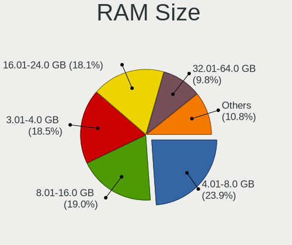
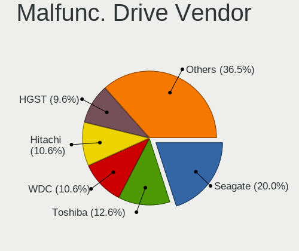
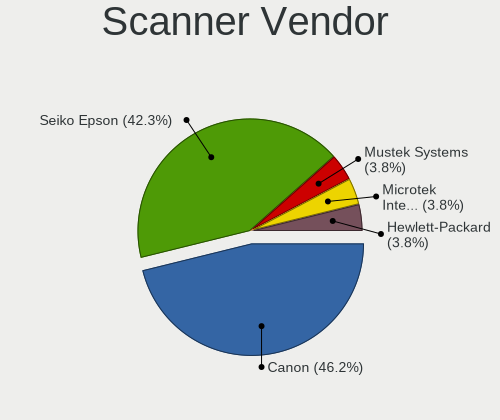

Linux in USA - Tested Hardware & Statistics (Notebooks)
-------------------------------------------------------

A project to collect tested hardware configurations for Linux in USA.

Anyone can contribute to this report by the [hw-probe](https://github.com/linuxhw/hw-probe) tool:

    sudo -E hw-probe -all -upload

Please contribute! Especially if your hardware is rare.

Contents
--------

* [ Test Cases ](#test-cases)

* [ System ](#system)
  - [ OS                       ](#os)
  - [ OS Family                ](#os-family)
  - [ Kernel                   ](#kernel)
  - [ Kernel Family            ](#kernel-family)
  - [ Kernel Major Ver.        ](#kernel-major-ver)
  - [ Arch                     ](#arch)
  - [ DE                       ](#de)
  - [ Display Server           ](#display-server)
  - [ Display Manager          ](#display-manager)
  - [ OS Lang                  ](#os-lang)
  - [ Boot Mode                ](#boot-mode)
  - [ Filesystem               ](#filesystem)
  - [ Part. scheme             ](#part-scheme)
  - [ Dual Boot with Linux/BSD ](#dual-boot-with-linuxbsd)
  - [ Dual Boot (Win)          ](#dual-boot-win)

* [ Board ](#board)
  - [ Vendor                   ](#vendor)
  - [ Model                    ](#model)
  - [ Model Family             ](#model-family)
  - [ MFG Year                 ](#mfg-year)
  - [ Form Factor              ](#form-factor)
  - [ Secure Boot              ](#secure-boot)
  - [ Coreboot                 ](#coreboot)
  - [ RAM Size                 ](#ram-size)
  - [ RAM Used                 ](#ram-used)
  - [ Total Drives             ](#total-drives)
  - [ Has CD-ROM               ](#has-cd-rom)
  - [ Has Ethernet             ](#has-ethernet)
  - [ Has WiFi                 ](#has-wifi)
  - [ Has Bluetooth            ](#has-bluetooth)

* [ Location ](#location)
  - [ Country                  ](#country)
  - [ City                     ](#city)

* [ Drives ](#drives)
  - [ Drive Vendor             ](#drive-vendor)
  - [ Drive Model              ](#drive-model)
  - [ HDD Vendor               ](#hdd-vendor)
  - [ SSD Vendor               ](#ssd-vendor)
  - [ Drive Kind               ](#drive-kind)
  - [ Drive Connector          ](#drive-connector)
  - [ Drive Size               ](#drive-size)
  - [ Space Total              ](#space-total)
  - [ Space Used               ](#space-used)
  - [ Malfunc. Drives          ](#malfunc-drives)
  - [ Malfunc. Drive Vendor    ](#malfunc-drive-vendor)
  - [ Malfunc. HDD Vendor      ](#malfunc-hdd-vendor)
  - [ Malfunc. Drive Kind      ](#malfunc-drive-kind)
  - [ Failed Drives            ](#failed-drives)
  - [ Failed Drive Vendor      ](#failed-drive-vendor)
  - [ Drive Status             ](#drive-status)

* [ Storage controller ](#storage-controller)
  - [ Storage Vendor           ](#storage-vendor)
  - [ Storage Model            ](#storage-model)
  - [ Storage Kind             ](#storage-kind)

* [ Processor ](#processor)
  - [ CPU Vendor               ](#cpu-vendor)
  - [ CPU Model                ](#cpu-model)
  - [ CPU Model Family         ](#cpu-model-family)
  - [ CPU Cores                ](#cpu-cores)
  - [ CPU Sockets              ](#cpu-sockets)
  - [ CPU Threads              ](#cpu-threads)
  - [ CPU Op-Modes             ](#cpu-op-modes)
  - [ CPU Microcode            ](#cpu-microcode)
  - [ CPU Microarch            ](#cpu-microarch)

* [ Graphics ](#graphics)
  - [ GPU Vendor               ](#gpu-vendor)
  - [ GPU Model                ](#gpu-model)
  - [ GPU Combo                ](#gpu-combo)
  - [ GPU Driver               ](#gpu-driver)
  - [ GPU Memory               ](#gpu-memory)

* [ Monitor ](#monitor)
  - [ Monitor Vendor           ](#monitor-vendor)
  - [ Monitor Model            ](#monitor-model)
  - [ Monitor Resolution       ](#monitor-resolution)
  - [ Monitor Diagonal         ](#monitor-diagonal)
  - [ Monitor Width            ](#monitor-width)
  - [ Aspect Ratio             ](#aspect-ratio)
  - [ Monitor Area             ](#monitor-area)
  - [ Pixel Density            ](#pixel-density)
  - [ Multiple Monitors        ](#multiple-monitors)

* [ Network ](#network)
  - [ Net Controller Vendor    ](#net-controller-vendor)
  - [ Net Controller Model     ](#net-controller-model)
  - [ Wireless Vendor          ](#wireless-vendor)
  - [ Wireless Model           ](#wireless-model)
  - [ Ethernet Vendor          ](#ethernet-vendor)
  - [ Ethernet Model           ](#ethernet-model)
  - [ Net Controller Kind      ](#net-controller-kind)
  - [ Used Controller          ](#used-controller)
  - [ NICs                     ](#nics)
  - [ IPv6                     ](#ipv6)

* [ Bluetooth ](#bluetooth)
  - [ Bluetooth Vendor         ](#bluetooth-vendor)
  - [ Bluetooth Model          ](#bluetooth-model)

* [ Sound ](#sound)
  - [ Sound Vendor             ](#sound-vendor)
  - [ Sound Model              ](#sound-model)

* [ Memory ](#memory)
  - [ Memory Vendor            ](#memory-vendor)
  - [ Memory Model             ](#memory-model)
  - [ Memory Kind              ](#memory-kind)
  - [ Memory Form Factor       ](#memory-form-factor)
  - [ Memory Size              ](#memory-size)
  - [ Memory Speed             ](#memory-speed)

* [ Printers & scanners ](#printers--scanners)
  - [ Printer Vendor           ](#printer-vendor)
  - [ Printer Model            ](#printer-model)
  - [ Scanner Vendor           ](#scanner-vendor)
  - [ Scanner Model            ](#scanner-model)

* [ Camera ](#camera)
  - [ Camera Vendor            ](#camera-vendor)
  - [ Camera Model             ](#camera-model)

* [ Security ](#security)
  - [ Fingerprint Vendor       ](#fingerprint-vendor)
  - [ Fingerprint Model        ](#fingerprint-model)
  - [ Chipcard Vendor          ](#chipcard-vendor)
  - [ Chipcard Model           ](#chipcard-model)

* [ Unsupported ](#unsupported)
  - [ Unsupported Devices      ](#unsupported-devices)
  - [ Unsupported Device Types ](#unsupported-device-types)

Test Cases
----------

Total: 30204

| Vendor        | Model                       | Probe                                                      | Date         |
|---------------|-----------------------------|------------------------------------------------------------|--------------|
| HP            | ProBook 650 G3              | [9bfb6a8afd](https://linux-hardware.org/?probe=9bfb6a8afd) | May 09, 2024 |
| ASUSTek       | X551MA                      | [6ce58b40cb](https://linux-hardware.org/?probe=6ce58b40cb) | May 09, 2024 |
| HP            | Dev One Notebook PC         | [095bc08ae2](https://linux-hardware.org/?probe=095bc08ae2) | May 09, 2024 |
| Apple         | MacBookAir6,2               | [dc5b4c6be8](https://linux-hardware.org/?probe=dc5b4c6be8) | May 09, 2024 |
| Unknown       | Unknown                     | [64e1e4cc73](https://linux-hardware.org/?probe=64e1e4cc73) | May 09, 2024 |
| Getac         | V110G3                      | [f2bd63cfb8](https://linux-hardware.org/?probe=f2bd63cfb8) | May 09, 2024 |
| Panasonic     | FZ55-1                      | [5709bdb252](https://linux-hardware.org/?probe=5709bdb252) | May 09, 2024 |
| Lenovo        | ThinkBook 15 G4 IAP 21DJ    | [259fba9825](https://linux-hardware.org/?probe=259fba9825) | May 08, 2024 |
| Micro Elec... | MG-VCP15I-3070              | [11e90f3f8f](https://linux-hardware.org/?probe=11e90f3f8f) | May 08, 2024 |
| ASUSTek       | Zenbook S 13 UX5304VA_UX... | [d77842b741](https://linux-hardware.org/?probe=d77842b741) | May 08, 2024 |
| ASUSTek       | VivoBook_ASUSLaptop M160... | [b18d2c1ec2](https://linux-hardware.org/?probe=b18d2c1ec2) | May 08, 2024 |
| Dell          | Precision 5560              | [9ad14a0547](https://linux-hardware.org/?probe=9ad14a0547) | May 08, 2024 |
| Valve         | Jupiter                     | [c0eded1dbf](https://linux-hardware.org/?probe=c0eded1dbf) | May 08, 2024 |
| Apple         | MacBookPro5,5               | [8d2df2d585](https://linux-hardware.org/?probe=8d2df2d585) | May 08, 2024 |
| ASUSTek       | ROG Strix G513QY_G513QY     | [964b717d95](https://linux-hardware.org/?probe=964b717d95) | May 08, 2024 |
| HP            | EliteBook 8560p             | [fa48702e03](https://linux-hardware.org/?probe=fa48702e03) | May 08, 2024 |
| Lenovo        | ThinkPad T15 Gen 2i 20W5... | [c4d3aa24cf](https://linux-hardware.org/?probe=c4d3aa24cf) | May 08, 2024 |
| Valve         | Jupiter                     | [cdb467c650](https://linux-hardware.org/?probe=cdb467c650) | May 08, 2024 |
| ASUSTek       | X540SA                      | [456909c790](https://linux-hardware.org/?probe=456909c790) | May 08, 2024 |
| Matsushita... | CF-74GCDADBM                | [f353aa5d7c](https://linux-hardware.org/?probe=f353aa5d7c) | May 08, 2024 |
| ASUSTek       | UX430UQ                     | [7b9134699a](https://linux-hardware.org/?probe=7b9134699a) | May 08, 2024 |
| Dell          | Precision 7540              | [4703617413](https://linux-hardware.org/?probe=4703617413) | May 07, 2024 |
| Lenovo        | ThinkPad T490 20N2003PUS    | [7f484baa22](https://linux-hardware.org/?probe=7f484baa22) | May 07, 2024 |
| Dell          | Precision 7540              | [37638500df](https://linux-hardware.org/?probe=37638500df) | May 07, 2024 |
| Dell          | Inspiron 7558               | [6d19146c49](https://linux-hardware.org/?probe=6d19146c49) | May 07, 2024 |
| Acer          | Aspire A515-54              | [f7d068c059](https://linux-hardware.org/?probe=f7d068c059) | May 07, 2024 |
| Acer          | Aspire A515-54              | [f9375ff03c](https://linux-hardware.org/?probe=f9375ff03c) | May 07, 2024 |
| Lenovo        | IdeaPad 1 14IGL7 82V6       | [8c2b9bb30a](https://linux-hardware.org/?probe=8c2b9bb30a) | May 07, 2024 |
| Lenovo        | ThinkPad T420s 417032U      | [e6839a3d70](https://linux-hardware.org/?probe=e6839a3d70) | May 07, 2024 |
| Toshiba       | TECRA R850                  | [a4fae83513](https://linux-hardware.org/?probe=a4fae83513) | May 07, 2024 |
| Apple         | MacBookAir7,2               | [de2ed6e188](https://linux-hardware.org/?probe=de2ed6e188) | May 07, 2024 |
| ASUSTek       | VivoBook_ASUSLaptop X712... | [9849982066](https://linux-hardware.org/?probe=9849982066) | May 07, 2024 |
| Dell          | Precision 5520              | [3b0c11a9ff](https://linux-hardware.org/?probe=3b0c11a9ff) | May 07, 2024 |
| HP            | Pavilion Gaming Laptop 1... | [643f150579](https://linux-hardware.org/?probe=643f150579) | May 07, 2024 |
| Dell          | Precision 5520              | [bf1f2486cd](https://linux-hardware.org/?probe=bf1f2486cd) | May 07, 2024 |
| HP            | 2000                        | [71d3942f81](https://linux-hardware.org/?probe=71d3942f81) | May 06, 2024 |
| System76      | Darter Pro                  | [e6da92d97e](https://linux-hardware.org/?probe=e6da92d97e) | May 06, 2024 |
| Dell          | Latitude E5410              | [0038eadd32](https://linux-hardware.org/?probe=0038eadd32) | May 06, 2024 |
| Framework     | Laptop 16 (AMD Ryzen 704... | [3679c79ac4](https://linux-hardware.org/?probe=3679c79ac4) | May 06, 2024 |
| Notebook      | NS5x_NS7xPU                 | [657a003a54](https://linux-hardware.org/?probe=657a003a54) | May 06, 2024 |
| Dell          | Precision M4700             | [db0b8eb10b](https://linux-hardware.org/?probe=db0b8eb10b) | May 06, 2024 |
| Dell          | Inspiron N7010              | [538f6e2c91](https://linux-hardware.org/?probe=538f6e2c91) | May 06, 2024 |
| HP            | ZBook Studio G3             | [be52b86bc0](https://linux-hardware.org/?probe=be52b86bc0) | May 06, 2024 |
| ASUSTek       | P2540UA                     | [ea9ddf3f6e](https://linux-hardware.org/?probe=ea9ddf3f6e) | May 06, 2024 |
| Apple         | MacBookPro15,2              | [4720f69696](https://linux-hardware.org/?probe=4720f69696) | May 06, 2024 |
| Unknown       | X570 Phantom Gaming-ITX/... | [a02a58b376](https://linux-hardware.org/?probe=a02a58b376) | May 06, 2024 |
| Lenovo        | ThinkPad P17 Gen 1 20SQS... | [8c2af338dc](https://linux-hardware.org/?probe=8c2af338dc) | May 06, 2024 |
| Valve         | Jupiter                     | [9a90343d3e](https://linux-hardware.org/?probe=9a90343d3e) | May 06, 2024 |
| Dell          | Latitude 5400               | [cf78549103](https://linux-hardware.org/?probe=cf78549103) | May 06, 2024 |
| Apple         | MacBookPro5,5               | [ef61efd227](https://linux-hardware.org/?probe=ef61efd227) | May 06, 2024 |
| Lenovo        | IdeaPad 1 14IGL7 82V6       | [083cfcc0f3](https://linux-hardware.org/?probe=083cfcc0f3) | May 06, 2024 |
| Alienware     | 17 R4                       | [99e296d142](https://linux-hardware.org/?probe=99e296d142) | May 06, 2024 |
| Valve         | Jupiter                     | [829ef0c2ba](https://linux-hardware.org/?probe=829ef0c2ba) | May 06, 2024 |
| Apple         | MacBookPro11,4              | [3c0f7c8c00](https://linux-hardware.org/?probe=3c0f7c8c00) | May 06, 2024 |
| Lenovo        | IdeaPad 1 14IGL7 82V6       | [657538061d](https://linux-hardware.org/?probe=657538061d) | May 06, 2024 |
| Lenovo        | ThinkPad X200s 74695GU      | [9ea7304023](https://linux-hardware.org/?probe=9ea7304023) | May 06, 2024 |
| Apple         | MacBookPro15,2              | [568bb3b863](https://linux-hardware.org/?probe=568bb3b863) | May 05, 2024 |
| Lenovo        | IdeaPad Slim 5 16IRL8 82... | [2cace801f8](https://linux-hardware.org/?probe=2cace801f8) | May 05, 2024 |
| Lenovo        | ThinkPad X1 Nano Gen 1 2... | [c5f9a761a9](https://linux-hardware.org/?probe=c5f9a761a9) | May 05, 2024 |
| Lenovo        | ThinkPad T420s 41732AU      | [be5eeed803](https://linux-hardware.org/?probe=be5eeed803) | May 05, 2024 |
| Dell          | Inspiron 5502               | [43fee6a80f](https://linux-hardware.org/?probe=43fee6a80f) | May 05, 2024 |
| HP            | Laptop 14-fq0xxx            | [528dc99ca7](https://linux-hardware.org/?probe=528dc99ca7) | May 05, 2024 |
| Lenovo        | Flex 3-1130 80LY            | [3786d9e8e2](https://linux-hardware.org/?probe=3786d9e8e2) | May 05, 2024 |
| Acer          | Swift SFA16-41              | [df5596b6b2](https://linux-hardware.org/?probe=df5596b6b2) | May 05, 2024 |
| Alienware     | 17 R4                       | [4ad46d150c](https://linux-hardware.org/?probe=4ad46d150c) | May 05, 2024 |
| Lenovo        | ThinkPad P16 Gen 1 21D60... | [bc053b7c75](https://linux-hardware.org/?probe=bc053b7c75) | May 05, 2024 |
| ASUSTek       | VivoBook_ASUSLaptop M160... | [3602db941f](https://linux-hardware.org/?probe=3602db941f) | May 05, 2024 |
| Dell          | Precision M4700             | [7b8ccefbed](https://linux-hardware.org/?probe=7b8ccefbed) | May 05, 2024 |
| ASUSTek       | VivoBook_ASUSLaptop M650... | [5f2d3291b5](https://linux-hardware.org/?probe=5f2d3291b5) | May 05, 2024 |
| Lenovo        | ThinkPad Edge E530 32597... | [a216f0b6d5](https://linux-hardware.org/?probe=a216f0b6d5) | May 05, 2024 |
| Dell          | Precision 3510              | [c57923e0ff](https://linux-hardware.org/?probe=c57923e0ff) | May 04, 2024 |
| Apple         | MacBookAir4,1               | [2e67b6ba22](https://linux-hardware.org/?probe=2e67b6ba22) | May 04, 2024 |
| Dell          | Latitude 3400               | [259b0b8cbf](https://linux-hardware.org/?probe=259b0b8cbf) | May 04, 2024 |
| HP            | ProBook 470 G5              | [66da43e604](https://linux-hardware.org/?probe=66da43e604) | May 04, 2024 |
| Dell          | Precision 3510              | [0c006aad0f](https://linux-hardware.org/?probe=0c006aad0f) | May 04, 2024 |
| Acer          | Nitro AN515-57              | [de8582fd4b](https://linux-hardware.org/?probe=de8582fd4b) | May 04, 2024 |
| HP            | Laptop 15-dw1xxx            | [deab0f1e98](https://linux-hardware.org/?probe=deab0f1e98) | May 04, 2024 |
| Dell          | Latitude 7480               | [f81955d784](https://linux-hardware.org/?probe=f81955d784) | May 04, 2024 |
| Dell          | Inspiron 5520               | [bb83948d6a](https://linux-hardware.org/?probe=bb83948d6a) | May 04, 2024 |
| MSI           | GF75 Thin 10SCSXR           | [588a1bf985](https://linux-hardware.org/?probe=588a1bf985) | May 04, 2024 |
| HP            | EliteBook 820 G3            | [1b076b8ed2](https://linux-hardware.org/?probe=1b076b8ed2) | May 04, 2024 |
| HP            | EliteBook 820 G3            | [4e2e6c3667](https://linux-hardware.org/?probe=4e2e6c3667) | May 04, 2024 |
| Dell          | Latitude E6430              | [3ea51c9416](https://linux-hardware.org/?probe=3ea51c9416) | May 04, 2024 |
| Chuwi         | MiniBook X                  | [64c7ac113f](https://linux-hardware.org/?probe=64c7ac113f) | May 04, 2024 |
| Lenovo        | IdeaPad Slim 5 16ABR8 82... | [bcb2994b33](https://linux-hardware.org/?probe=bcb2994b33) | May 04, 2024 |
| Dell          | Latitude E6430              | [0e3b2e7c55](https://linux-hardware.org/?probe=0e3b2e7c55) | May 04, 2024 |
| Lenovo        | ThinkPad T530 23942C2       | [f906a50af0](https://linux-hardware.org/?probe=f906a50af0) | May 03, 2024 |
| HP            | ZBook 15 G2                 | [21c0d7fe7e](https://linux-hardware.org/?probe=21c0d7fe7e) | May 03, 2024 |
| HP            | Pavilion Laptop 17-ar0xx    | [cf570f28e9](https://linux-hardware.org/?probe=cf570f28e9) | May 03, 2024 |
| Toshiba       | Satellite L55t-A            | [9197d3146e](https://linux-hardware.org/?probe=9197d3146e) | May 03, 2024 |
| Lenovo        | ThinkPad T14s Gen 1 20T1... | [f6152a7042](https://linux-hardware.org/?probe=f6152a7042) | May 03, 2024 |
| Valve         | Jupiter                     | [9a03d01cbc](https://linux-hardware.org/?probe=9a03d01cbc) | May 03, 2024 |
| Razer         | Blade Stealth               | [1728a1a500](https://linux-hardware.org/?probe=1728a1a500) | May 03, 2024 |
| HP            | Laptop 15-dy2xxx            | [2837d61bc4](https://linux-hardware.org/?probe=2837d61bc4) | May 03, 2024 |
| Apple         | MacBookAir7,2               | [4e2a6ab271](https://linux-hardware.org/?probe=4e2a6ab271) | May 03, 2024 |
| Dell          | G5 5590                     | [b32e4a3fcc](https://linux-hardware.org/?probe=b32e4a3fcc) | May 03, 2024 |
| Dell          | Latitude E7250              | [2fd31f177e](https://linux-hardware.org/?probe=2fd31f177e) | May 03, 2024 |
| Dell          | Precision 7740              | [9219d78a85](https://linux-hardware.org/?probe=9219d78a85) | May 03, 2024 |
| Dell          | Latitude E7250              | [5c97b5c2ee](https://linux-hardware.org/?probe=5c97b5c2ee) | May 02, 2024 |
| HP            | ZBook 15 G5                 | [899eac8513](https://linux-hardware.org/?probe=899eac8513) | May 02, 2024 |
| Lenovo        | ThinkPad X131e 33711H3      | [45d5d58c8d](https://linux-hardware.org/?probe=45d5d58c8d) | May 02, 2024 |
| Alienware     | M14xR1                      | [501de2a1ec](https://linux-hardware.org/?probe=501de2a1ec) | May 02, 2024 |
| Apple         | MacBookAir7,2               | [2672483f38](https://linux-hardware.org/?probe=2672483f38) | May 02, 2024 |
| HP            | 15 Notebook PC              | [675934d0b6](https://linux-hardware.org/?probe=675934d0b6) | May 02, 2024 |
| Lenovo        | ThinkBook 14 G6+ IMH 21L... | [e218d7ac14](https://linux-hardware.org/?probe=e218d7ac14) | May 02, 2024 |
| Lenovo        | ThinkPad Twist 33472RU      | [88c46ca8d7](https://linux-hardware.org/?probe=88c46ca8d7) | May 02, 2024 |
| Lenovo        | IdeaPad Y580 20132          | [30987effea](https://linux-hardware.org/?probe=30987effea) | May 02, 2024 |
| Dell          | Precision 5530              | [373556c210](https://linux-hardware.org/?probe=373556c210) | May 02, 2024 |
| Lenovo        | IdeaPad 1 15AMN7 82VG       | [0740dd4f54](https://linux-hardware.org/?probe=0740dd4f54) | May 02, 2024 |
| HP            | EliteBook Revolve 810 G3    | [21309bf461](https://linux-hardware.org/?probe=21309bf461) | May 02, 2024 |
| ASUSTek       | TUF Gaming FX505DU_FX95D... | [c179f8fa01](https://linux-hardware.org/?probe=c179f8fa01) | May 01, 2024 |
| ASUSTek       | TUF Gaming FX505DU_FX95D... | [fd7c9392ce](https://linux-hardware.org/?probe=fd7c9392ce) | May 01, 2024 |
| Lenovo        | ThinkPad X220 4291H76       | [55dc1b37c5](https://linux-hardware.org/?probe=55dc1b37c5) | May 01, 2024 |
| Valve         | Jupiter                     | [912546851a](https://linux-hardware.org/?probe=912546851a) | May 01, 2024 |
| Lenovo        | IdeaPad 1 15ALC7 82R4       | [cbd3101c16](https://linux-hardware.org/?probe=cbd3101c16) | May 01, 2024 |
| Lenovo        | IdeaPad 1 15ALC7 82R4       | [6aca55ce35](https://linux-hardware.org/?probe=6aca55ce35) | May 01, 2024 |
| HP            | Laptop 17-by2xxx            | [45443c04f2](https://linux-hardware.org/?probe=45443c04f2) | May 01, 2024 |
| HP            | Stream Laptop 14-cb1xxx     | [b30b733ae9](https://linux-hardware.org/?probe=b30b733ae9) | May 01, 2024 |
| Framework     | Laptop 16 (AMD Ryzen 704... | [28e6be5f86](https://linux-hardware.org/?probe=28e6be5f86) | May 01, 2024 |
| Lenovo        | IdeaPad 5 14ARE05 81YM      | [90807317fb](https://linux-hardware.org/?probe=90807317fb) | May 01, 2024 |
| Apple         | MacBookPro8,3               | [a4db0f550f](https://linux-hardware.org/?probe=a4db0f550f) | May 01, 2024 |
| Google        | Bluebird                    | [75db9dc248](https://linux-hardware.org/?probe=75db9dc248) | May 01, 2024 |
| Dell          | Inspiron 1525               | [8e9c51790c](https://linux-hardware.org/?probe=8e9c51790c) | May 01, 2024 |
| Dell          | Inspiron 1525               | [ca6bde2e75](https://linux-hardware.org/?probe=ca6bde2e75) | Apr 30, 2024 |
| Lenovo        | ThinkPad T570 20H9CTO1WW    | [433a701205](https://linux-hardware.org/?probe=433a701205) | Apr 30, 2024 |
| Apple         | MacBookPro15,2              | [5d0cceea3e](https://linux-hardware.org/?probe=5d0cceea3e) | Apr 30, 2024 |
| Lenovo        | Yoga 710-11IKB 80V6         | [bac49afb7f](https://linux-hardware.org/?probe=bac49afb7f) | Apr 30, 2024 |
| ASUSTek       | ROG Zephyrus G14 GA402RJ... | [568e826f4b](https://linux-hardware.org/?probe=568e826f4b) | Apr 30, 2024 |
| MSI           | Raider GE76 12UE            | [6c23378280](https://linux-hardware.org/?probe=6c23378280) | Apr 30, 2024 |
| Dell          | Latitude 3570               | [17e5cf551d](https://linux-hardware.org/?probe=17e5cf551d) | Apr 30, 2024 |
| Apple         | MacBookPro12,1              | [89a84d0398](https://linux-hardware.org/?probe=89a84d0398) | Apr 30, 2024 |
| HP            | ProBook x360 11 G1 EE       | [85b180a3db](https://linux-hardware.org/?probe=85b180a3db) | Apr 30, 2024 |
| Apple         | MacBookPro11,2              | [5cd273406c](https://linux-hardware.org/?probe=5cd273406c) | Apr 30, 2024 |
| ASUSTek       | VivoBook_ASUSLaptop X150... | [c981d78681](https://linux-hardware.org/?probe=c981d78681) | Apr 30, 2024 |
| Dell          | Latitude 5510               | [1dcf4bdf1f](https://linux-hardware.org/?probe=1dcf4bdf1f) | Apr 30, 2024 |
| ASUSTek       | VivoBook_ASUSLaptop M160... | [701927cf4d](https://linux-hardware.org/?probe=701927cf4d) | Apr 30, 2024 |
| HP            | EliteBook 840 G4            | [86a58844a8](https://linux-hardware.org/?probe=86a58844a8) | Apr 30, 2024 |
| HP            | Pavilion dv5000 (ET805UA... | [b269162f6f](https://linux-hardware.org/?probe=b269162f6f) | Apr 30, 2024 |
| Dell          | Latitude E6530              | [6e04062057](https://linux-hardware.org/?probe=6e04062057) | Apr 30, 2024 |
| Apple         | MacBookAir7,2               | [1af69fe222](https://linux-hardware.org/?probe=1af69fe222) | Apr 30, 2024 |
| HP            | ENVY 17                     | [23518d52f8](https://linux-hardware.org/?probe=23518d52f8) | Apr 30, 2024 |
| Dell          | Latitude 9520               | [25d6f4ff3b](https://linux-hardware.org/?probe=25d6f4ff3b) | Apr 29, 2024 |
| Lenovo        | ThinkBook 13x G4 IMH 21K... | [eface5275d](https://linux-hardware.org/?probe=eface5275d) | Apr 29, 2024 |
| Lenovo        | IdeaPad 330-15IKB 81DE      | [af95facf65](https://linux-hardware.org/?probe=af95facf65) | Apr 29, 2024 |
| Dell          | G5 5505                     | [4ecf1f44e4](https://linux-hardware.org/?probe=4ecf1f44e4) | Apr 29, 2024 |
| ASUSTek       | VivoBook_ASUSLaptop K650... | [14bb0e630b](https://linux-hardware.org/?probe=14bb0e630b) | Apr 29, 2024 |
| Acer          | Aspire A515-43              | [42e399d200](https://linux-hardware.org/?probe=42e399d200) | Apr 29, 2024 |
| Alienware     | M14xR1                      | [dc1461c536](https://linux-hardware.org/?probe=dc1461c536) | Apr 29, 2024 |
| Apple         | MacBookPro9,2               | [3b4127bc96](https://linux-hardware.org/?probe=3b4127bc96) | Apr 29, 2024 |
| Toshiba       | Satellite L775D             | [507b5ac196](https://linux-hardware.org/?probe=507b5ac196) | Apr 29, 2024 |
| Dell          | Latitude E6420              | [96a7d85c67](https://linux-hardware.org/?probe=96a7d85c67) | Apr 29, 2024 |
| HP            | EliteBook 840 14 inch G9... | [6d0a2c142b](https://linux-hardware.org/?probe=6d0a2c142b) | Apr 29, 2024 |
| Acer          | Aspire ES1-512              | [2663c13afc](https://linux-hardware.org/?probe=2663c13afc) | Apr 29, 2024 |
| Lenovo        | ThinkPad L420 7827W1U       | [b6839d25f6](https://linux-hardware.org/?probe=b6839d25f6) | Apr 29, 2024 |
| Dell          | Latitude E6420              | [0fa22b02d0](https://linux-hardware.org/?probe=0fa22b02d0) | Apr 29, 2024 |
| Lenovo        | Legion Pro 5 16IRX8 82WK    | [82a20d0525](https://linux-hardware.org/?probe=82a20d0525) | Apr 29, 2024 |
| Lenovo        | Legion Pro 5 16IRX8 82WK    | [c56c98c58e](https://linux-hardware.org/?probe=c56c98c58e) | Apr 29, 2024 |
| MSI           | GF75 Thin 10UE              | [07b5ec9d5d](https://linux-hardware.org/?probe=07b5ec9d5d) | Apr 29, 2024 |
| Lenovo        | IdeaPad 5 15ABA7 82SG       | [26e856b70a](https://linux-hardware.org/?probe=26e856b70a) | Apr 29, 2024 |
| Dell          | XPS 13 7390                 | [ec7fc4cf5a](https://linux-hardware.org/?probe=ec7fc4cf5a) | Apr 29, 2024 |
| ASUSTek       | ET2031I                     | [d27647c450](https://linux-hardware.org/?probe=d27647c450) | Apr 29, 2024 |
| HP            | Pavilion Laptop 15-cc5xx    | [107cd303fd](https://linux-hardware.org/?probe=107cd303fd) | Apr 29, 2024 |
| Lenovo        | ThinkPad L420 7827W1U       | [9455f8e9de](https://linux-hardware.org/?probe=9455f8e9de) | Apr 28, 2024 |
| ASUSTek       | ROG Zephyrus G14 GA401QH... | [eef1270128](https://linux-hardware.org/?probe=eef1270128) | Apr 28, 2024 |
| Google        | Gandof                      | [539c66172b](https://linux-hardware.org/?probe=539c66172b) | Apr 28, 2024 |
| Acer          | Aspire ES1-512              | [87f1fc413c](https://linux-hardware.org/?probe=87f1fc413c) | Apr 28, 2024 |
| Apple         | MacBookPro11,3              | [3e372c3652](https://linux-hardware.org/?probe=3e372c3652) | Apr 28, 2024 |
| HP            | Notebook                    | [0f3465e86c](https://linux-hardware.org/?probe=0f3465e86c) | Apr 28, 2024 |
| Apple         | MacBookPro11,3              | [881eaab6c1](https://linux-hardware.org/?probe=881eaab6c1) | Apr 28, 2024 |
| Lenovo        | ThinkPad T14 Gen 2i 20W0... | [e2a9d44509](https://linux-hardware.org/?probe=e2a9d44509) | Apr 28, 2024 |
| HP            | OMEN by Laptop 15-dc0xxx    | [a9b063c17b](https://linux-hardware.org/?probe=a9b063c17b) | Apr 28, 2024 |
| Lenovo        | ThinkPad L520 786035U       | [711272241a](https://linux-hardware.org/?probe=711272241a) | Apr 28, 2024 |
| Lenovo        | Slim Pro 7 14ARP8 83AX      | [15fdd20de0](https://linux-hardware.org/?probe=15fdd20de0) | Apr 28, 2024 |
| Dell          | Inspiron 16 7610            | [2427197c56](https://linux-hardware.org/?probe=2427197c56) | Apr 28, 2024 |
| ASUSTek       | VivoBook_ASUSLaptop M160... | [b024eb05d1](https://linux-hardware.org/?probe=b024eb05d1) | Apr 28, 2024 |
| ASUSTek       | VivoBook_ASUSLaptop X712... | [ea2746d610](https://linux-hardware.org/?probe=ea2746d610) | Apr 28, 2024 |
| Toshiba       | Satellite P755              | [2e2a03f963](https://linux-hardware.org/?probe=2e2a03f963) | Apr 28, 2024 |
| Lenovo        | IdeaPad Slim 7 Pro 14IHU... | [d01c00759c](https://linux-hardware.org/?probe=d01c00759c) | Apr 28, 2024 |
| Valve         | Jupiter                     | [42fe2e9ed4](https://linux-hardware.org/?probe=42fe2e9ed4) | Apr 28, 2024 |
| Lenovo        | ThinkPad T430 23492F5       | [8d26be4497](https://linux-hardware.org/?probe=8d26be4497) | Apr 28, 2024 |
| HP            | Pavilion dv6                | [3663f38683](https://linux-hardware.org/?probe=3663f38683) | Apr 28, 2024 |
| Lenovo        | Slim Pro 7 14ARP8 83AX      | [1856484488](https://linux-hardware.org/?probe=1856484488) | Apr 27, 2024 |
| Valve         | Jupiter                     | [db12022c45](https://linux-hardware.org/?probe=db12022c45) | Apr 27, 2024 |
| Lenovo        | ThinkPad P16s Gen 1 21CK... | [801a6bafe7](https://linux-hardware.org/?probe=801a6bafe7) | Apr 27, 2024 |
| Dell          | Inspiron 3583               | [27c5b7b8d8](https://linux-hardware.org/?probe=27c5b7b8d8) | Apr 27, 2024 |
| Lenovo        | ThinkPad T520 42424WU       | [f54ef8bc01](https://linux-hardware.org/?probe=f54ef8bc01) | Apr 27, 2024 |
| Dell          | Inspiron 5770               | [9194ac8af9](https://linux-hardware.org/?probe=9194ac8af9) | Apr 27, 2024 |
| HP            | Notebook                    | [1918273411](https://linux-hardware.org/?probe=1918273411) | Apr 27, 2024 |
| ASUSTek       | ROG Zephyrus G14 GA401IV... | [70ce1e3cee](https://linux-hardware.org/?probe=70ce1e3cee) | Apr 27, 2024 |
| HP            | Notebook                    | [91c53e6cc1](https://linux-hardware.org/?probe=91c53e6cc1) | Apr 27, 2024 |
| Acer          | Aspire A717-72G             | [b386005b8e](https://linux-hardware.org/?probe=b386005b8e) | Apr 27, 2024 |
| Valve         | Jupiter                     | [7a58749308](https://linux-hardware.org/?probe=7a58749308) | Apr 27, 2024 |
| HP            | EliteBook 8440p             | [0dbed15c85](https://linux-hardware.org/?probe=0dbed15c85) | Apr 27, 2024 |
| Lenovo        | ThinkPad W520 4270CTO       | [ab9e430693](https://linux-hardware.org/?probe=ab9e430693) | Apr 27, 2024 |
| ASUSTek       | ASUS TUF Gaming F15 FX50... | [1699679c97](https://linux-hardware.org/?probe=1699679c97) | Apr 27, 2024 |
| ASUSTek       | ExpertBook B9450FAV         | [ea600fc105](https://linux-hardware.org/?probe=ea600fc105) | Apr 27, 2024 |
| Lenovo        | ThinkPad W520 4270CTO       | [e192aa886d](https://linux-hardware.org/?probe=e192aa886d) | Apr 27, 2024 |
| HP            | ENVY TS m6 Sleekbook        | [a428d5e1d9](https://linux-hardware.org/?probe=a428d5e1d9) | Apr 27, 2024 |
| MSI           | Crosshair 15 A11UEK         | [c99f9c7e61](https://linux-hardware.org/?probe=c99f9c7e61) | Apr 27, 2024 |
| Valve         | Jupiter                     | [bca2851ff6](https://linux-hardware.org/?probe=bca2851ff6) | Apr 27, 2024 |
| HUAWEI        | VGHH-XX                     | [aafd3db575](https://linux-hardware.org/?probe=aafd3db575) | Apr 27, 2024 |
| HUAWEI        | VGHH-XX                     | [15fc366121](https://linux-hardware.org/?probe=15fc366121) | Apr 27, 2024 |
| MSI           | A6200                       | [a5f3b5f02c](https://linux-hardware.org/?probe=a5f3b5f02c) | Apr 27, 2024 |
| Valve         | Jupiter                     | [93f380bf3e](https://linux-hardware.org/?probe=93f380bf3e) | Apr 27, 2024 |
| ASUSTek       | VivoBook_ASUSLaptop X512... | [ab7e7e4331](https://linux-hardware.org/?probe=ab7e7e4331) | Apr 27, 2024 |
| Lenovo        | IdeaPad 1 15IJL7 82LX       | [3fbd54c33d](https://linux-hardware.org/?probe=3fbd54c33d) | Apr 27, 2024 |
| Dell          | Latitude 5300               | [dfae5f452a](https://linux-hardware.org/?probe=dfae5f452a) | Apr 27, 2024 |
| Alienware     | M11x R2                     | [a9c788cf5a](https://linux-hardware.org/?probe=a9c788cf5a) | Apr 27, 2024 |
| Alienware     | M11x R2                     | [c46c801bbe](https://linux-hardware.org/?probe=c46c801bbe) | Apr 27, 2024 |
| Acer          | Swift SFG14-72T             | [fcb16747e5](https://linux-hardware.org/?probe=fcb16747e5) | Apr 27, 2024 |
| Apple         | MacBookPro9,2               | [3c61d5b617](https://linux-hardware.org/?probe=3c61d5b617) | Apr 27, 2024 |
| HP            | Dragonfly 13.5 inch G4 N... | [932af82a52](https://linux-hardware.org/?probe=932af82a52) | Apr 27, 2024 |
| HP            | Dragonfly 13.5 inch G4 N... | [daddd21635](https://linux-hardware.org/?probe=daddd21635) | Apr 27, 2024 |
| ASUSTek       | ASUS Zenbook 14 UX3405MA... | [dc503c161a](https://linux-hardware.org/?probe=dc503c161a) | Apr 27, 2024 |
| Lenovo        | ThinkPad E15 Gen 2 20T80... | [0ff3e84a1c](https://linux-hardware.org/?probe=0ff3e84a1c) | Apr 27, 2024 |
| Lenovo        | IdeaPad 1 14IGL7 82V6       | [551ccdf911](https://linux-hardware.org/?probe=551ccdf911) | Apr 26, 2024 |
| Dell          | Inspiron 15-7568            | [bc2dfb0b2f](https://linux-hardware.org/?probe=bc2dfb0b2f) | Apr 26, 2024 |
| Toshiba       | Satellite A505              | [d26d7bf4ec](https://linux-hardware.org/?probe=d26d7bf4ec) | Apr 26, 2024 |
| Dell          | Inspiron 3558               | [1fe97163aa](https://linux-hardware.org/?probe=1fe97163aa) | Apr 26, 2024 |
| ASUSTek       | ROG Zephyrus G14 GA402XV... | [7982a1cc5b](https://linux-hardware.org/?probe=7982a1cc5b) | Apr 26, 2024 |
| HP            | EliteBook 840 G6            | [6b247b5b1f](https://linux-hardware.org/?probe=6b247b5b1f) | Apr 26, 2024 |
| Lenovo        | ThinkPad X13s Gen 1 21BY... | [93cbc84be7](https://linux-hardware.org/?probe=93cbc84be7) | Apr 26, 2024 |
| Dell          | Latitude E5520              | [6e98bca2be](https://linux-hardware.org/?probe=6e98bca2be) | Apr 26, 2024 |
| System76      | Oryx Pro                    | [b9369f0ebc](https://linux-hardware.org/?probe=b9369f0ebc) | Apr 26, 2024 |
| MobileDema... | Cherry Trail CR             | [45127b07b2](https://linux-hardware.org/?probe=45127b07b2) | Apr 26, 2024 |
| Google        | Peppy                       | [98a1054e36](https://linux-hardware.org/?probe=98a1054e36) | Apr 26, 2024 |
| HP            | EliteBook 845 G8 Noteboo... | [f809ebf517](https://linux-hardware.org/?probe=f809ebf517) | Apr 26, 2024 |
| MSI           | Katana GF66 12UD            | [78e64ec169](https://linux-hardware.org/?probe=78e64ec169) | Apr 26, 2024 |
| Dell          | XPS 15 9560                 | [ec025f4541](https://linux-hardware.org/?probe=ec025f4541) | Apr 26, 2024 |
| Dell          | Latitude E6400              | [ab58a2d0bd](https://linux-hardware.org/?probe=ab58a2d0bd) | Apr 26, 2024 |
| Dell          | Latitude 7480               | [7427bb7450](https://linux-hardware.org/?probe=7427bb7450) | Apr 26, 2024 |
| Dell          | 06X1TJ A00                  | [fc0fca88fa](https://linux-hardware.org/?probe=fc0fca88fa) | Apr 26, 2024 |
| Apple         | MacBookAir5,1               | [dec330ffa3](https://linux-hardware.org/?probe=dec330ffa3) | Apr 25, 2024 |
| Acer          | Aspire AV14-51              | [de04e40a68](https://linux-hardware.org/?probe=de04e40a68) | Apr 25, 2024 |
| Dell          | Latitude E6530              | [ef156e14fe](https://linux-hardware.org/?probe=ef156e14fe) | Apr 25, 2024 |
| Itronix       | GD8200                      | [8ef185190e](https://linux-hardware.org/?probe=8ef185190e) | Apr 25, 2024 |
| Dell          | Unidentified System         | [3adeaf17e6](https://linux-hardware.org/?probe=3adeaf17e6) | Apr 25, 2024 |
| Dell          | Inspiron N7010              | [adce00a04d](https://linux-hardware.org/?probe=adce00a04d) | Apr 25, 2024 |
| Dell          | Inspiron N7010              | [fa7c038b74](https://linux-hardware.org/?probe=fa7c038b74) | Apr 25, 2024 |
| Dell          | Unidentified System         | [d39d12f48e](https://linux-hardware.org/?probe=d39d12f48e) | Apr 25, 2024 |
| Google        | Peppy                       | [c3d1025bd9](https://linux-hardware.org/?probe=c3d1025bd9) | Apr 25, 2024 |
| ASUSTek       | X550LA                      | [e2d624d7b2](https://linux-hardware.org/?probe=e2d624d7b2) | Apr 25, 2024 |
| Dell          | Latitude 7330 Rugged Ext... | [787276b922](https://linux-hardware.org/?probe=787276b922) | Apr 25, 2024 |
| Unknown       | Unknown                     | [b94dba38c0](https://linux-hardware.org/?probe=b94dba38c0) | Apr 25, 2024 |
| HP            | EliteBook 745 G6            | [5354993cb7](https://linux-hardware.org/?probe=5354993cb7) | Apr 25, 2024 |
| HP            | EliteBook 745 G6            | [3b5f41d264](https://linux-hardware.org/?probe=3b5f41d264) | Apr 25, 2024 |
| Apple         | MacBookPro9,2               | [f5622b9451](https://linux-hardware.org/?probe=f5622b9451) | Apr 25, 2024 |
| BANGHO        | MOV                         | [bb71d25f54](https://linux-hardware.org/?probe=bb71d25f54) | Apr 25, 2024 |
| Acer          | Aspire VX5-591G             | [598f3696dc](https://linux-hardware.org/?probe=598f3696dc) | Apr 24, 2024 |
| Acer          | Aspire A315-58              | [4f5fda04fe](https://linux-hardware.org/?probe=4f5fda04fe) | Apr 24, 2024 |
| ASUSTek       | X551MA                      | [462203c835](https://linux-hardware.org/?probe=462203c835) | Apr 24, 2024 |
| Intel Clie... | LAPBC710                    | [8a2e6ee6ff](https://linux-hardware.org/?probe=8a2e6ee6ff) | Apr 24, 2024 |
| Intel Clie... | LAPBC710                    | [1853edd88a](https://linux-hardware.org/?probe=1853edd88a) | Apr 24, 2024 |
| Lenovo        | ThinkPad L15 Gen 1 20U70... | [12ddaeaf33](https://linux-hardware.org/?probe=12ddaeaf33) | Apr 24, 2024 |
| Vizio         | CT14                        | [557643cae2](https://linux-hardware.org/?probe=557643cae2) | Apr 24, 2024 |
| HP            | EliteBook Folio 9470m       | [04e8d2bb6b](https://linux-hardware.org/?probe=04e8d2bb6b) | Apr 24, 2024 |
| Apple         | MacBookPro5,2               | [ebae8ff385](https://linux-hardware.org/?probe=ebae8ff385) | Apr 24, 2024 |
| Lenovo        | IdeaPadFlex 14 20308        | [bb56600612](https://linux-hardware.org/?probe=bb56600612) | Apr 24, 2024 |
| Toshiba       | Satellite E45t-B            | [4abd9d698a](https://linux-hardware.org/?probe=4abd9d698a) | Apr 24, 2024 |
| Carbon Sys... | Iridium 16 Pro              | [b35260710f](https://linux-hardware.org/?probe=b35260710f) | Apr 24, 2024 |
| Lenovo        | ThinkPad X1 Carbon 3448A... | [280fa2d735](https://linux-hardware.org/?probe=280fa2d735) | Apr 24, 2024 |
| Dell          | Precision M6700             | [cc8f317f9d](https://linux-hardware.org/?probe=cc8f317f9d) | Apr 24, 2024 |
| Dell          | Inspiron 15 3511            | [4168907e54](https://linux-hardware.org/?probe=4168907e54) | Apr 24, 2024 |
| ASUSTek       | ROG Strix G513QM_G513QM     | [7bb8c6f187](https://linux-hardware.org/?probe=7bb8c6f187) | Apr 24, 2024 |
| Unknown       | Unknown                     | [8dec2bd904](https://linux-hardware.org/?probe=8dec2bd904) | Apr 24, 2024 |
| HP            | Laptop 14-dq0xxx            | [4652a98a00](https://linux-hardware.org/?probe=4652a98a00) | Apr 24, 2024 |
| HP            | Laptop 14-dq0xxx            | [3feeb1bdac](https://linux-hardware.org/?probe=3feeb1bdac) | Apr 24, 2024 |
| ASUSTek       | X550LA                      | [2b25065840](https://linux-hardware.org/?probe=2b25065840) | Apr 24, 2024 |
| Dell          | Latitude 5410               | [1f501048f1](https://linux-hardware.org/?probe=1f501048f1) | Apr 24, 2024 |
| Lenovo        | ThinkPad X1 Carbon 7th 2... | [2bc3bf2f34](https://linux-hardware.org/?probe=2bc3bf2f34) | Apr 23, 2024 |
| Valve         | Jupiter                     | [7c8a53ecb1](https://linux-hardware.org/?probe=7c8a53ecb1) | Apr 23, 2024 |
| Lenovo        | LOQ 15APH8 82XT             | [0fb0456833](https://linux-hardware.org/?probe=0fb0456833) | Apr 23, 2024 |
| Acer          | Aspire A515-43              | [ff74a6262e](https://linux-hardware.org/?probe=ff74a6262e) | Apr 23, 2024 |
| ASUSTek       | ROG Zephyrus G15 GA503RW... | [bcc2955a52](https://linux-hardware.org/?probe=bcc2955a52) | Apr 23, 2024 |
| Dell          | G15 5511                    | [82f96ae6f0](https://linux-hardware.org/?probe=82f96ae6f0) | Apr 23, 2024 |
| Lenovo        | G50-80 80L0                 | [882a343fea](https://linux-hardware.org/?probe=882a343fea) | Apr 23, 2024 |
| HP            | Laptop 17z-ca100            | [80cb3eace6](https://linux-hardware.org/?probe=80cb3eace6) | Apr 23, 2024 |
| Lenovo        | IdeaPad 1 15IJL7 82LX       | [0e17097ee4](https://linux-hardware.org/?probe=0e17097ee4) | Apr 23, 2024 |
| ASRock        | FM2A68M-HD+                 | [74967df09a](https://linux-hardware.org/?probe=74967df09a) | Apr 23, 2024 |
| Framework     | Laptop 16 (AMD Ryzen 704... | [cac3e53fbd](https://linux-hardware.org/?probe=cac3e53fbd) | Apr 23, 2024 |
| Dell          | Latitude 3420               | [918db208c4](https://linux-hardware.org/?probe=918db208c4) | Apr 23, 2024 |
| Google        | Kohaku                      | [da381d459f](https://linux-hardware.org/?probe=da381d459f) | Apr 23, 2024 |
| Lenovo        | ThinkPad Twist 33474HU      | [98b9979ec3](https://linux-hardware.org/?probe=98b9979ec3) | Apr 23, 2024 |
| Acer          | Aspire A315-24P             | [21c5354e14](https://linux-hardware.org/?probe=21c5354e14) | Apr 23, 2024 |
| Lenovo        | ThinkPad Edge E431 62775... | [ad67ecab25](https://linux-hardware.org/?probe=ad67ecab25) | Apr 23, 2024 |
| Apple         | MacBookPro10,1              | [6c32f9323b](https://linux-hardware.org/?probe=6c32f9323b) | Apr 23, 2024 |
| Dell          | Inspiron 3501               | [faae79a749](https://linux-hardware.org/?probe=faae79a749) | Apr 23, 2024 |
| HP            | ENVY 17                     | [cefc9da64e](https://linux-hardware.org/?probe=cefc9da64e) | Apr 23, 2024 |
| Acer          | Aspire A315-24P             | [fec51df86d](https://linux-hardware.org/?probe=fec51df86d) | Apr 23, 2024 |
| Acer          | Nitro AN515-57              | [51750c5be2](https://linux-hardware.org/?probe=51750c5be2) | Apr 23, 2024 |
| Acer          | Nitro AN515-57              | [5c4ca92786](https://linux-hardware.org/?probe=5c4ca92786) | Apr 23, 2024 |
| MSI           | GE62VR 6RF                  | [68b99dae1a](https://linux-hardware.org/?probe=68b99dae1a) | Apr 23, 2024 |
| Lenovo        | IdeaPad 3 15ABA7 82RN       | [e99cd50084](https://linux-hardware.org/?probe=e99cd50084) | Apr 23, 2024 |
| HP            | EliteBook 840 G6            | [6bebd095f0](https://linux-hardware.org/?probe=6bebd095f0) | Apr 22, 2024 |
| ASUSTek       | ASUS TUF Gaming F15 FX50... | [a399c9a39f](https://linux-hardware.org/?probe=a399c9a39f) | Apr 22, 2024 |
| ASUSTek       | ROG Strix SCAR 18 G834JZ... | [28007aea7c](https://linux-hardware.org/?probe=28007aea7c) | Apr 22, 2024 |
| Lenovo        | ThinkPad T480 20L5CTO1WW    | [bf31c1e8e2](https://linux-hardware.org/?probe=bf31c1e8e2) | Apr 22, 2024 |
| ASUSTek       | ROG Strix G513QM_G513QM     | [3b1f047a27](https://linux-hardware.org/?probe=3b1f047a27) | Apr 22, 2024 |
| ASUSTek       | ROG Strix G713PV_G713PV     | [d7a06f7d8d](https://linux-hardware.org/?probe=d7a06f7d8d) | Apr 22, 2024 |
| Dell          | Latitude 7490               | [5c2a2e98b4](https://linux-hardware.org/?probe=5c2a2e98b4) | Apr 22, 2024 |
| Lenovo        | ThinkPad T570 W10DG 20JX... | [458a4bd2b2](https://linux-hardware.org/?probe=458a4bd2b2) | Apr 21, 2024 |
| Lenovo        | ThinkPad X1 Carbon Gen 8... | [3639d72221](https://linux-hardware.org/?probe=3639d72221) | Apr 21, 2024 |
| HP            | EliteBook 840 G6            | [8bcd83b05a](https://linux-hardware.org/?probe=8bcd83b05a) | Apr 21, 2024 |
| Acer          | Swift SF314-512             | [2a5722f801](https://linux-hardware.org/?probe=2a5722f801) | Apr 21, 2024 |
| HP            | ProBook 4530s               | [11f3df5775](https://linux-hardware.org/?probe=11f3df5775) | Apr 21, 2024 |
| Notebook      | NP5x_NP6x_NP7xPNP           | [16b4e64118](https://linux-hardware.org/?probe=16b4e64118) | Apr 21, 2024 |
| HP            | EliteBook 840 G4            | [5030d63cae](https://linux-hardware.org/?probe=5030d63cae) | Apr 21, 2024 |
| System76      | Lemur Pro                   | [3b7243efe7](https://linux-hardware.org/?probe=3b7243efe7) | Apr 21, 2024 |
| HP            | Laptop 14-fq0xxx            | [6dc8bf5698](https://linux-hardware.org/?probe=6dc8bf5698) | Apr 21, 2024 |
| Lenovo        | V15 G2 IJL 82QY             | [0ed46b158b](https://linux-hardware.org/?probe=0ed46b158b) | Apr 21, 2024 |
| Dell          | Latitude 7490               | [46cb3d1473](https://linux-hardware.org/?probe=46cb3d1473) | Apr 21, 2024 |
| ASUSTek       | G75VW                       | [1853702bed](https://linux-hardware.org/?probe=1853702bed) | Apr 21, 2024 |
| Lenovo        | ThinkPad R61e 7650DHU       | [93e4fe440f](https://linux-hardware.org/?probe=93e4fe440f) | Apr 21, 2024 |
| HP            | Laptop 17-cn0xxx            | [f9b7f5d81b](https://linux-hardware.org/?probe=f9b7f5d81b) | Apr 21, 2024 |
| Razer         | Blade 14 - RZ09-0508        | [cc1f5421e7](https://linux-hardware.org/?probe=cc1f5421e7) | Apr 21, 2024 |
| HP            | ProBook 470 G5              | [0c1225132c](https://linux-hardware.org/?probe=0c1225132c) | Apr 21, 2024 |
| Dell          | Latitude E6510              | [b44dd02c4f](https://linux-hardware.org/?probe=b44dd02c4f) | Apr 20, 2024 |
| HP            | ZBook 15 G2                 | [af8df0069b](https://linux-hardware.org/?probe=af8df0069b) | Apr 20, 2024 |
| Apple         | MacBookPro14,1              | [bc73a30917](https://linux-hardware.org/?probe=bc73a30917) | Apr 20, 2024 |
| Apple         | MacBookAir7,1               | [71cd16b516](https://linux-hardware.org/?probe=71cd16b516) | Apr 20, 2024 |
| HP            | ENVY TS 17                  | [eafd63648e](https://linux-hardware.org/?probe=eafd63648e) | Apr 20, 2024 |
| Dell          | Studio 1537                 | [75870c0b13](https://linux-hardware.org/?probe=75870c0b13) | Apr 20, 2024 |
| ASUSTek       | GL503VM                     | [fe02ba00a0](https://linux-hardware.org/?probe=fe02ba00a0) | Apr 20, 2024 |
| HP            | ENVY Laptop 17-ch2xxx       | [2532aaf12b](https://linux-hardware.org/?probe=2532aaf12b) | Apr 20, 2024 |
| ASUSTek       | VivoBook_ASUSLaptop K660... | [38925681ab](https://linux-hardware.org/?probe=38925681ab) | Apr 20, 2024 |
| HP            | Pavilion Notebook           | [10939e0163](https://linux-hardware.org/?probe=10939e0163) | Apr 20, 2024 |
| ASUSTek       | N501VW                      | [6f95eaeb2c](https://linux-hardware.org/?probe=6f95eaeb2c) | Apr 20, 2024 |
| ASUSTek       | N501VW                      | [6d00b1b12f](https://linux-hardware.org/?probe=6d00b1b12f) | Apr 20, 2024 |
| Lenovo        | ThinkPad T430 2347AY1       | [b3392ca7e4](https://linux-hardware.org/?probe=b3392ca7e4) | Apr 20, 2024 |
| Lenovo        | ThinkPad E14 Gen 2 20TA0... | [a890a5a9b1](https://linux-hardware.org/?probe=a890a5a9b1) | Apr 20, 2024 |
| Lenovo        | ThinkPad L570 20J80013US    | [0f79928572](https://linux-hardware.org/?probe=0f79928572) | Apr 20, 2024 |
| Apple         | MacBookPro14,1              | [e215f07c2d](https://linux-hardware.org/?probe=e215f07c2d) | Apr 20, 2024 |
| Dell          | Latitude 7390 2-in-1        | [08a2cf2960](https://linux-hardware.org/?probe=08a2cf2960) | Apr 20, 2024 |
| ASUSTek       | ROG Zephyrus G14 GA401QM... | [a5bdfd5d15](https://linux-hardware.org/?probe=a5bdfd5d15) | Apr 20, 2024 |
| Lenovo        | Yoga Slim 7 14ITL05 82A3    | [1726cd6edd](https://linux-hardware.org/?probe=1726cd6edd) | Apr 20, 2024 |
| ASUSTek       | ROG Zephyrus G14 GA401QM... | [1a7bf4158b](https://linux-hardware.org/?probe=1a7bf4158b) | Apr 20, 2024 |
| HP            | Laptop 17-cn0xxx            | [6f3c85173f](https://linux-hardware.org/?probe=6f3c85173f) | Apr 20, 2024 |
| Acer          | Nitro AN515-54              | [17aeeed6cf](https://linux-hardware.org/?probe=17aeeed6cf) | Apr 20, 2024 |
| Lenovo        | ThinkPad T440p 20AWS4EG0... | [2496364031](https://linux-hardware.org/?probe=2496364031) | Apr 20, 2024 |
| Dell          | Latitude E6430              | [6c19db1434](https://linux-hardware.org/?probe=6c19db1434) | Apr 20, 2024 |
| MSI           | Prestige 14 A12UC           | [82ab31e090](https://linux-hardware.org/?probe=82ab31e090) | Apr 19, 2024 |
| Lenovo        | ThinkPad T16 Gen 1 21CH0... | [3426b632ad](https://linux-hardware.org/?probe=3426b632ad) | Apr 19, 2024 |
| Dell          | Latitude 7490               | [3051df2105](https://linux-hardware.org/?probe=3051df2105) | Apr 19, 2024 |
| Framework     | Laptop (13th Gen Intel C... | [2bb3d4f699](https://linux-hardware.org/?probe=2bb3d4f699) | Apr 19, 2024 |
| Dell          | Latitude E6420              | [88731c458f](https://linux-hardware.org/?probe=88731c458f) | Apr 19, 2024 |
| Clevo         | M66xN                       | [e25bed6466](https://linux-hardware.org/?probe=e25bed6466) | Apr 19, 2024 |
| Carbon Sys... | Iridium 16                  | [dc8742a30f](https://linux-hardware.org/?probe=dc8742a30f) | Apr 19, 2024 |
| Lenovo        | ThinkPad X140e 20BLS0040... | [028ee7ca9d](https://linux-hardware.org/?probe=028ee7ca9d) | Apr 19, 2024 |
| HP            | Notebook                    | [982806e31a](https://linux-hardware.org/?probe=982806e31a) | Apr 19, 2024 |
| Dell          | Latitude D620               | [9ebcfcc532](https://linux-hardware.org/?probe=9ebcfcc532) | Apr 19, 2024 |
| Valve         | Galileo                     | [c3c28433cd](https://linux-hardware.org/?probe=c3c28433cd) | Apr 19, 2024 |
| Alienware     | m15 R7                      | [e3f2c4e9c3](https://linux-hardware.org/?probe=e3f2c4e9c3) | Apr 19, 2024 |
| Framework     | Laptop 16 (AMD Ryzen 704... | [88f29dbdc6](https://linux-hardware.org/?probe=88f29dbdc6) | Apr 19, 2024 |
| Acer          | Aspire A314-23P             | [c4ffec3162](https://linux-hardware.org/?probe=c4ffec3162) | Apr 19, 2024 |
| Dell          | Latitude E6440              | [82713456e1](https://linux-hardware.org/?probe=82713456e1) | Apr 19, 2024 |
| Acer          | Aspire A314-23P             | [28496633f1](https://linux-hardware.org/?probe=28496633f1) | Apr 19, 2024 |
| Unknown       | Unknown                     | [4c1ff1ccf5](https://linux-hardware.org/?probe=4c1ff1ccf5) | Apr 19, 2024 |
| Lenovo        | ThinkPad E16 Gen 1 21JT0... | [1a8e5b4d4c](https://linux-hardware.org/?probe=1a8e5b4d4c) | Apr 19, 2024 |
| Toshiba       | Satellite L755D             | [47d623ed44](https://linux-hardware.org/?probe=47d623ed44) | Apr 19, 2024 |
| Framework     | Laptop 16 (AMD Ryzen 704... | [d447a24dc3](https://linux-hardware.org/?probe=d447a24dc3) | Apr 18, 2024 |
| Dell          | Precision 3560              | [2f847b171f](https://linux-hardware.org/?probe=2f847b171f) | Apr 18, 2024 |
| Google        | Robo360                     | [684bae9a26](https://linux-hardware.org/?probe=684bae9a26) | Apr 18, 2024 |
| HP            | ZBook Fury 17.3 inch G8 ... | [14f65496dc](https://linux-hardware.org/?probe=14f65496dc) | Apr 18, 2024 |
| Lenovo        | ThinkPad X1 Extreme Gen ... | [43a3e3b36d](https://linux-hardware.org/?probe=43a3e3b36d) | Apr 18, 2024 |
| Lenovo        | ThinkPad X1 Extreme Gen ... | [8c079004f7](https://linux-hardware.org/?probe=8c079004f7) | Apr 18, 2024 |
| Dell          | Precision M4800             | [e1bbe5bf56](https://linux-hardware.org/?probe=e1bbe5bf56) | Apr 18, 2024 |
| Framework     | Laptop                      | [ce27218533](https://linux-hardware.org/?probe=ce27218533) | Apr 18, 2024 |
| MSI           | GE60 2PE                    | [38cce299c6](https://linux-hardware.org/?probe=38cce299c6) | Apr 18, 2024 |
| HP            | ZBook 14u G6                | [6ceedde566](https://linux-hardware.org/?probe=6ceedde566) | Apr 18, 2024 |
| Apple         | MacBookPro5,3               | [333256d6dd](https://linux-hardware.org/?probe=333256d6dd) | Apr 18, 2024 |
| ASUSTek       | GL503VD                     | [aad7908b9b](https://linux-hardware.org/?probe=aad7908b9b) | Apr 18, 2024 |
| HP            | Laptop 15-dy5xxx            | [bb34072490](https://linux-hardware.org/?probe=bb34072490) | Apr 18, 2024 |
| GPU Compan... | GWTN116-3                   | [30fba12411](https://linux-hardware.org/?probe=30fba12411) | Apr 18, 2024 |
| GPU Compan... | GWTN116-3                   | [a11ace542b](https://linux-hardware.org/?probe=a11ace542b) | Apr 18, 2024 |
| Lenovo        | ThinkPad T430s 2352CTO      | [738789766c](https://linux-hardware.org/?probe=738789766c) | Apr 18, 2024 |
| Apple         | MacBookPro11,5              | [52efce758f](https://linux-hardware.org/?probe=52efce758f) | Apr 18, 2024 |
| ASUSTek       | VivoBook_ASUSLaptop X150... | [bf5c40b060](https://linux-hardware.org/?probe=bf5c40b060) | Apr 18, 2024 |
| Framework     | Laptop 13 (AMD Ryzen 704... | [c100880ad7](https://linux-hardware.org/?probe=c100880ad7) | Apr 18, 2024 |
| Dell          | Latitude E5430 non-vPro     | [d9d6b6fd6e](https://linux-hardware.org/?probe=d9d6b6fd6e) | Apr 17, 2024 |
| Dell          | Inspiron 15 3511            | [33431a38d1](https://linux-hardware.org/?probe=33431a38d1) | Apr 17, 2024 |
| Valve         | Jupiter                     | [37f71f57a0](https://linux-hardware.org/?probe=37f71f57a0) | Apr 17, 2024 |
| MSI           | P65 Creator 8SF             | [4765243dd1](https://linux-hardware.org/?probe=4765243dd1) | Apr 17, 2024 |
| ASUSTek       | PRIME Z370-A                | [aba856ce1c](https://linux-hardware.org/?probe=aba856ce1c) | Apr 17, 2024 |
| Dell          | XPS 15 7590                 | [5b510f5ccd](https://linux-hardware.org/?probe=5b510f5ccd) | Apr 17, 2024 |
| Lenovo        | ThinkPad X61 7673V4Q        | [ae6092f0a5](https://linux-hardware.org/?probe=ae6092f0a5) | Apr 17, 2024 |
| Lenovo        | ThinkPad X61 7673V4Q        | [de573ef4aa](https://linux-hardware.org/?probe=de573ef4aa) | Apr 17, 2024 |
| HP            | Laptop 15-dy2xxx            | [0e9bf013da](https://linux-hardware.org/?probe=0e9bf013da) | Apr 17, 2024 |
| Lenovo        | G50-80 80L0                 | [43b22a1d84](https://linux-hardware.org/?probe=43b22a1d84) | Apr 17, 2024 |
| ASUSTek       | K42F                        | [d127923f98](https://linux-hardware.org/?probe=d127923f98) | Apr 17, 2024 |
| Dell          | Latitude E6400              | [02a9b84151](https://linux-hardware.org/?probe=02a9b84151) | Apr 17, 2024 |
| Lenovo        | Yoga Pro 9 16IMH9 83DN      | [dbe698ff64](https://linux-hardware.org/?probe=dbe698ff64) | Apr 17, 2024 |
| Lenovo        | ThinkPad X1 Carbon 6th 2... | [43770a02e0](https://linux-hardware.org/?probe=43770a02e0) | Apr 17, 2024 |
| Dell          | Latitude E5420              | [29150a7b19](https://linux-hardware.org/?probe=29150a7b19) | Apr 17, 2024 |
| MSI           | GP75 Leopard 10SFK          | [31ffa81a38](https://linux-hardware.org/?probe=31ffa81a38) | Apr 17, 2024 |
| Chuwi         | MiniBook X                  | [f3d26ec489](https://linux-hardware.org/?probe=f3d26ec489) | Apr 17, 2024 |
| HP            | ENVY TS 15                  | [ef90289a1a](https://linux-hardware.org/?probe=ef90289a1a) | Apr 17, 2024 |
| ASUSTek       | Strix GL504GS_GL504GS       | [fafcb22109](https://linux-hardware.org/?probe=fafcb22109) | Apr 17, 2024 |
| HP            | 255 G8 Notebook PC          | [9945f26789](https://linux-hardware.org/?probe=9945f26789) | Apr 17, 2024 |
| Dell          | Latitude E5470              | [5d8e161314](https://linux-hardware.org/?probe=5d8e161314) | Apr 17, 2024 |
| Lenovo        | ThinkBook 14 G4+ ARA 21D... | [eea2672841](https://linux-hardware.org/?probe=eea2672841) | Apr 17, 2024 |
| Chuwi         | GemiBook XPro               | [9ebacb4cf9](https://linux-hardware.org/?probe=9ebacb4cf9) | Apr 17, 2024 |
| Dell          | Latitude E6400              | [6a6279d4c0](https://linux-hardware.org/?probe=6a6279d4c0) | Apr 17, 2024 |
| ASRock        | B550M Pro4                  | [2a69ec7381](https://linux-hardware.org/?probe=2a69ec7381) | Apr 17, 2024 |
| Acer          | Nitro AN515-57              | [f4cdb12814](https://linux-hardware.org/?probe=f4cdb12814) | Apr 17, 2024 |
| Notebook      | PD5x_7xSNC_SND_SNE          | [1672551a61](https://linux-hardware.org/?probe=1672551a61) | Apr 17, 2024 |
| Acer          | Nitro AN515-54              | [e578380a3e](https://linux-hardware.org/?probe=e578380a3e) | Apr 17, 2024 |
| Lenovo        | IdeaPad S340-15IWL 81N8     | [f61bc8b75c](https://linux-hardware.org/?probe=f61bc8b75c) | Apr 17, 2024 |
| Lenovo        | ThinkPad X13s Gen 1 21BY... | [f56632a8e0](https://linux-hardware.org/?probe=f56632a8e0) | Apr 16, 2024 |
| HP            | Laptop 17-bs0xx             | [2de1af4835](https://linux-hardware.org/?probe=2de1af4835) | Apr 16, 2024 |
| HP            | ENVY Laptop 17-cw0xxx       | [c1ac91bae5](https://linux-hardware.org/?probe=c1ac91bae5) | Apr 16, 2024 |
| HP            | Laptop 15-dy2xxx            | [8f9e16592c](https://linux-hardware.org/?probe=8f9e16592c) | Apr 16, 2024 |
| Lenovo        | IdeaPad 3 15IML05 81WR      | [e6888546ba](https://linux-hardware.org/?probe=e6888546ba) | Apr 16, 2024 |
| Acer          | Aspire A515-43              | [fcd5e8e59d](https://linux-hardware.org/?probe=fcd5e8e59d) | Apr 16, 2024 |
| Notebook      | PD5x_7xSNC_SND_SNE          | [a0b18d9fe1](https://linux-hardware.org/?probe=a0b18d9fe1) | Apr 16, 2024 |
| Lenovo        | ThinkPad E590 20NB005MUS    | [2f76e25729](https://linux-hardware.org/?probe=2f76e25729) | Apr 16, 2024 |
| Apple         | MacBookPro16,1              | [40fd2c63cb](https://linux-hardware.org/?probe=40fd2c63cb) | Apr 16, 2024 |
| ASUSTek       | ASUS Zenbook 14 UX3405MA... | [92ce992eb4](https://linux-hardware.org/?probe=92ce992eb4) | Apr 16, 2024 |
| ASUSTek       | X551MA                      | [9ef43fd0f2](https://linux-hardware.org/?probe=9ef43fd0f2) | Apr 16, 2024 |
| ASUSTek       | ROG Zephyrus G14 GA402XV... | [6291093e82](https://linux-hardware.org/?probe=6291093e82) | Apr 16, 2024 |
| Chuwi         | MiniBook X                  | [0236998832](https://linux-hardware.org/?probe=0236998832) | Apr 15, 2024 |
| Apple         | MacBookPro9,2               | [8ffae057e8](https://linux-hardware.org/?probe=8ffae057e8) | Apr 15, 2024 |
| Dell          | XPS 13 9370                 | [2ff2120005](https://linux-hardware.org/?probe=2ff2120005) | Apr 15, 2024 |
| Samsung       | 730QCJ/730QCR               | [0d6a3363b8](https://linux-hardware.org/?probe=0d6a3363b8) | Apr 15, 2024 |
| ASUSTek       | ROG Strix G513QY_G513QY     | [7c4f1e45c9](https://linux-hardware.org/?probe=7c4f1e45c9) | Apr 15, 2024 |
| Dell          | XPS 13 9340                 | [02b603ef6e](https://linux-hardware.org/?probe=02b603ef6e) | Apr 15, 2024 |
| Lenovo        | ThinkPad W540 20BHS0KY08    | [2628bdee23](https://linux-hardware.org/?probe=2628bdee23) | Apr 15, 2024 |
| Lenovo        | Legion 5-15IMH05H 81Y6      | [057fa9dd1a](https://linux-hardware.org/?probe=057fa9dd1a) | Apr 15, 2024 |
| Dell          | Inspiron 14 5435            | [9b225b530e](https://linux-hardware.org/?probe=9b225b530e) | Apr 15, 2024 |
| Dell          | XPS 13 9350                 | [2265cd3c40](https://linux-hardware.org/?probe=2265cd3c40) | Apr 15, 2024 |
| HP            | Stream Laptop 14-cb1xxx     | [02724e5adf](https://linux-hardware.org/?probe=02724e5adf) | Apr 15, 2024 |
| Acer          | Aspire E1-572               | [a91f9fc37a](https://linux-hardware.org/?probe=a91f9fc37a) | Apr 15, 2024 |
| Apple         | MacBookPro9,2               | [60e642d93c](https://linux-hardware.org/?probe=60e642d93c) | Apr 15, 2024 |
| HP            | ENVY TS 15                  | [2cf9b070a4](https://linux-hardware.org/?probe=2cf9b070a4) | Apr 15, 2024 |
| HP            | Laptop 15-fd0xxx            | [7674249513](https://linux-hardware.org/?probe=7674249513) | Apr 15, 2024 |
| ASUSTek       | X551CA                      | [d050fff27d](https://linux-hardware.org/?probe=d050fff27d) | Apr 15, 2024 |
| Lenovo        | Flex 3-1470 80JK            | [3c33b5194f](https://linux-hardware.org/?probe=3c33b5194f) | Apr 15, 2024 |
| ASUSTek       | ROG Zephyrus G14 GA401QM... | [b160ab4b5b](https://linux-hardware.org/?probe=b160ab4b5b) | Apr 15, 2024 |
| HP            | Laptop 15-ef0xxx            | [dbbb032e1b](https://linux-hardware.org/?probe=dbbb032e1b) | Apr 15, 2024 |
| Fujitsu       | LIFEBOOK T5010              | [89bd2f34e8](https://linux-hardware.org/?probe=89bd2f34e8) | Apr 15, 2024 |
| Dell          | Latitude 7490               | [9f01d423bc](https://linux-hardware.org/?probe=9f01d423bc) | Apr 14, 2024 |
| Dell          | Precision 5520              | [6a85a306b8](https://linux-hardware.org/?probe=6a85a306b8) | Apr 14, 2024 |
| ASUSTek       | X550ZA                      | [70801be4fe](https://linux-hardware.org/?probe=70801be4fe) | Apr 14, 2024 |
| Lenovo        | ThinkPad L14 Gen 2a 20X6... | [0e240e7a70](https://linux-hardware.org/?probe=0e240e7a70) | Apr 14, 2024 |
| Dell          | G15 5530                    | [8f4e471788](https://linux-hardware.org/?probe=8f4e471788) | Apr 14, 2024 |
| Dell          | Inspiron 15 5510            | [6f93eb6232](https://linux-hardware.org/?probe=6f93eb6232) | Apr 14, 2024 |
| Apple         | MacBookAir7,1               | [c1be5d2dd6](https://linux-hardware.org/?probe=c1be5d2dd6) | Apr 14, 2024 |
| ASUSTek       | ROG Zephyrus G14 GA401IV... | [476daae154](https://linux-hardware.org/?probe=476daae154) | Apr 14, 2024 |
| Dell          | Latitude 3540               | [fcfe26dc90](https://linux-hardware.org/?probe=fcfe26dc90) | Apr 14, 2024 |
| Unknown       | Unknown                     | [da4225e583](https://linux-hardware.org/?probe=da4225e583) | Apr 14, 2024 |
| Alienware     | m15                         | [477ee79b04](https://linux-hardware.org/?probe=477ee79b04) | Apr 13, 2024 |
| Alienware     | m15                         | [9feac0d1be](https://linux-hardware.org/?probe=9feac0d1be) | Apr 13, 2024 |
| Acer          | Predator PH315-52           | [6af03923d8](https://linux-hardware.org/?probe=6af03923d8) | Apr 13, 2024 |
| MSI           | Katana GF76 11UD            | [e2b9854e87](https://linux-hardware.org/?probe=e2b9854e87) | Apr 13, 2024 |
| Unknown       | Unknown                     | [7dbc8ebb37](https://linux-hardware.org/?probe=7dbc8ebb37) | Apr 13, 2024 |
| Valve         | Jupiter                     | [0043fe12b0](https://linux-hardware.org/?probe=0043fe12b0) | Apr 13, 2024 |
| ASUSTek       | ROG Zephyrus M15 GU502LU... | [4623f15133](https://linux-hardware.org/?probe=4623f15133) | Apr 13, 2024 |
| Toshiba       | TECRA R850                  | [8e11067c28](https://linux-hardware.org/?probe=8e11067c28) | Apr 13, 2024 |
| ASUSTek       | VivoBook_ASUSLaptop X140... | [b4cd318c86](https://linux-hardware.org/?probe=b4cd318c86) | Apr 13, 2024 |
| Acer          | Aspire A115-32              | [0aa771edc1](https://linux-hardware.org/?probe=0aa771edc1) | Apr 13, 2024 |
| Unknown       | X570 Phantom Gaming-ITX/... | [44b48f5aa1](https://linux-hardware.org/?probe=44b48f5aa1) | Apr 13, 2024 |
| A-DATA Tec... | XENIA 15                    | [08552dc593](https://linux-hardware.org/?probe=08552dc593) | Apr 13, 2024 |
| HP            | Laptop 14-cf2xxx            | [bc17e5113b](https://linux-hardware.org/?probe=bc17e5113b) | Apr 13, 2024 |
| HP            | Laptop 14-cf2xxx            | [bef6cb8975](https://linux-hardware.org/?probe=bef6cb8975) | Apr 13, 2024 |
| Lenovo        | ThinkPad L14 Gen 2a 20X6... | [b120a1a8eb](https://linux-hardware.org/?probe=b120a1a8eb) | Apr 13, 2024 |
| Acer          | Swift SF314-512             | [7b8fbddc0d](https://linux-hardware.org/?probe=7b8fbddc0d) | Apr 13, 2024 |
| MSI           | GP63 Leopard 8RE            | [31525e1fa0](https://linux-hardware.org/?probe=31525e1fa0) | Apr 13, 2024 |
| System76      | Lemur Pro                   | [7c9425e33a](https://linux-hardware.org/?probe=7c9425e33a) | Apr 13, 2024 |
| HP            | Laptop 15-dy5xxx            | [3bc3db4169](https://linux-hardware.org/?probe=3bc3db4169) | Apr 13, 2024 |
| GPU Compan... | GWNR71517                   | [89dbdfd53e](https://linux-hardware.org/?probe=89dbdfd53e) | Apr 13, 2024 |
| Google        | Atlas                       | [9073524bfb](https://linux-hardware.org/?probe=9073524bfb) | Apr 13, 2024 |
| Apple         | MacBookPro8,2               | [e57c02860c](https://linux-hardware.org/?probe=e57c02860c) | Apr 13, 2024 |
| HP            | Laptop 17-by4xxx            | [1fa13c5e79](https://linux-hardware.org/?probe=1fa13c5e79) | Apr 13, 2024 |
| ASUSTek       | ROG Zephyrus G15 GA503RW... | [b64d99620b](https://linux-hardware.org/?probe=b64d99620b) | Apr 12, 2024 |
| Apple         | MacBookPro14,1              | [02b8d8e933](https://linux-hardware.org/?probe=02b8d8e933) | Apr 12, 2024 |
| HP            | Laptop 15-dy2xxx            | [b93bba8226](https://linux-hardware.org/?probe=b93bba8226) | Apr 12, 2024 |
| Lenovo        | ThinkPad E14 Gen 3 20YE0... | [7f863fa91c](https://linux-hardware.org/?probe=7f863fa91c) | Apr 12, 2024 |
| HP            | Victus by Gaming Laptop ... | [e0ff52d20a](https://linux-hardware.org/?probe=e0ff52d20a) | Apr 12, 2024 |
| HP            | Victus by Gaming Laptop ... | [580425d3b2](https://linux-hardware.org/?probe=580425d3b2) | Apr 12, 2024 |
| HP            | ProBook 450 G8 Notebook ... | [1b7b943c5d](https://linux-hardware.org/?probe=1b7b943c5d) | Apr 12, 2024 |
| Notebook      | N141CU                      | [a89a8ed543](https://linux-hardware.org/?probe=a89a8ed543) | Apr 12, 2024 |
| Toshiba       | Satellite L675D             | [297f2c300b](https://linux-hardware.org/?probe=297f2c300b) | Apr 12, 2024 |
| Apple         | MacBookAir7,2               | [569f9614a5](https://linux-hardware.org/?probe=569f9614a5) | Apr 12, 2024 |
| Dell          | XPS 15 9520                 | [46433bdc71](https://linux-hardware.org/?probe=46433bdc71) | Apr 12, 2024 |
| IBM           | ThinkPad T41 23737JU        | [3e03052246](https://linux-hardware.org/?probe=3e03052246) | Apr 12, 2024 |
| Lenovo        | ThinkPad T580 20L9001EUS    | [95d21ed0f1](https://linux-hardware.org/?probe=95d21ed0f1) | Apr 12, 2024 |
| Dell          | Precision 5750              | [f59c1fa6c6](https://linux-hardware.org/?probe=f59c1fa6c6) | Apr 12, 2024 |
| Unknown       | Unknown                     | [5da1928cd5](https://linux-hardware.org/?probe=5da1928cd5) | Apr 12, 2024 |
| Google        | Cyan                        | [46c86ddfe0](https://linux-hardware.org/?probe=46c86ddfe0) | Apr 12, 2024 |
| Lenovo        | ThinkPad T580 20L9001EUS    | [9f0cfb04b0](https://linux-hardware.org/?probe=9f0cfb04b0) | Apr 12, 2024 |
| HP            | Pavilion Laptop 17-ar0xx    | [905fb7ba4a](https://linux-hardware.org/?probe=905fb7ba4a) | Apr 12, 2024 |
| Toshiba       | Satellite C70-B             | [305c87ae5d](https://linux-hardware.org/?probe=305c87ae5d) | Apr 12, 2024 |
| Lenovo        | ThinkPad P16s Gen 1 21BT... | [97c2387841](https://linux-hardware.org/?probe=97c2387841) | Apr 12, 2024 |
| Lenovo        | ThinkPad P16s Gen 1 21BT... | [e47633811b](https://linux-hardware.org/?probe=e47633811b) | Apr 12, 2024 |
| HP            | Pavilion dv6700             | [fb46ed47a1](https://linux-hardware.org/?probe=fb46ed47a1) | Apr 12, 2024 |
| HP            | 15                          | [4f0433464d](https://linux-hardware.org/?probe=4f0433464d) | Apr 12, 2024 |
| Google        | Cyan                        | [e2c458d3a7](https://linux-hardware.org/?probe=e2c458d3a7) | Apr 11, 2024 |
| HP            | Laptop 14-fq0xxx            | [9a66f32750](https://linux-hardware.org/?probe=9a66f32750) | Apr 11, 2024 |
| Dell          | XPS 9320                    | [bcd7c6346c](https://linux-hardware.org/?probe=bcd7c6346c) | Apr 11, 2024 |
| Apple         | MacBookPro11,3              | [57ccbefc29](https://linux-hardware.org/?probe=57ccbefc29) | Apr 11, 2024 |
| Dell          | Inspiron 5555               | [dc25cca6b2](https://linux-hardware.org/?probe=dc25cca6b2) | Apr 11, 2024 |
| Dell          | XPS 15 7590                 | [44db6be811](https://linux-hardware.org/?probe=44db6be811) | Apr 11, 2024 |
| ASUSTek       | VivoBook_ASUSLaptop X140... | [bb35cff518](https://linux-hardware.org/?probe=bb35cff518) | Apr 11, 2024 |
| Lenovo        | ThinkPad X220 42913J9       | [b3eb1ea727](https://linux-hardware.org/?probe=b3eb1ea727) | Apr 11, 2024 |
| Lenovo        | Yoga Pro 9 16IMH9 83DN      | [b3d2de9d47](https://linux-hardware.org/?probe=b3d2de9d47) | Apr 11, 2024 |
| HP            | Laptop 14-fq0xxx            | [9cc72239b3](https://linux-hardware.org/?probe=9cc72239b3) | Apr 11, 2024 |
| Apple         | MacBookPro8,2               | [461d5dfd8d](https://linux-hardware.org/?probe=461d5dfd8d) | Apr 11, 2024 |
| ASUSTek       | ROG Zephyrus M16 GU604VI... | [988ea47737](https://linux-hardware.org/?probe=988ea47737) | Apr 11, 2024 |
| HP            | Laptop 14-fq0xxx            | [b0ed939545](https://linux-hardware.org/?probe=b0ed939545) | Apr 11, 2024 |
| HP            | Laptop 14-fq0xxx            | [57cb359743](https://linux-hardware.org/?probe=57cb359743) | Apr 11, 2024 |
| Lenovo        | ThinkPad T580 20L9CTO1WW    | [f9b6443292](https://linux-hardware.org/?probe=f9b6443292) | Apr 11, 2024 |
| Apple         | MacBookPro11,1              | [7ef99be519](https://linux-hardware.org/?probe=7ef99be519) | Apr 11, 2024 |
| Unknown       | M17S                        | [40ecd83857](https://linux-hardware.org/?probe=40ecd83857) | Apr 11, 2024 |
| HP            | ZBook 15 G3                 | [f003ea5605](https://linux-hardware.org/?probe=f003ea5605) | Apr 11, 2024 |
| Dell          | Inspiron 5566               | [bd5c43f6c8](https://linux-hardware.org/?probe=bd5c43f6c8) | Apr 11, 2024 |
| Valve         | Jupiter                     | [5f44467298](https://linux-hardware.org/?probe=5f44467298) | Apr 11, 2024 |
| Dell          | Latitude E5510              | [eb1e78e4d3](https://linux-hardware.org/?probe=eb1e78e4d3) | Apr 11, 2024 |
| Dell          | Inspiron 5570               | [df5df3d63f](https://linux-hardware.org/?probe=df5df3d63f) | Apr 11, 2024 |
| Toshiba       | Satellite C50-A             | [b643ba4fed](https://linux-hardware.org/?probe=b643ba4fed) | Apr 11, 2024 |
| Dell          | Latitude E6510              | [0998bb8bb7](https://linux-hardware.org/?probe=0998bb8bb7) | Apr 11, 2024 |
| Dell          | Latitude 5310               | [531d4d9109](https://linux-hardware.org/?probe=531d4d9109) | Apr 10, 2024 |
| Dell          | Latitude E5550              | [bd812fbe85](https://linux-hardware.org/?probe=bd812fbe85) | Apr 10, 2024 |
| Panasonic     | CF-19-8                     | [643c0ca77e](https://linux-hardware.org/?probe=643c0ca77e) | Apr 10, 2024 |
| Dell          | Latitude 5590               | [dd558c6b50](https://linux-hardware.org/?probe=dd558c6b50) | Apr 10, 2024 |
| Dell          | Latitude E7440              | [d7c3a0d9c9](https://linux-hardware.org/?probe=d7c3a0d9c9) | Apr 10, 2024 |
| Dell          | Latitude E7440              | [2ea80bdebb](https://linux-hardware.org/?probe=2ea80bdebb) | Apr 10, 2024 |
| Dell          | Latitude E7440              | [9f0e547b50](https://linux-hardware.org/?probe=9f0e547b50) | Apr 10, 2024 |
| HP            | OMEN X by Laptop 15-dg0x... | [9d5d84bae2](https://linux-hardware.org/?probe=9d5d84bae2) | Apr 10, 2024 |
| HP            | EliteBook 2730p             | [843cd11924](https://linux-hardware.org/?probe=843cd11924) | Apr 10, 2024 |
| Dell          | Latitude E6420              | [649e8a4cae](https://linux-hardware.org/?probe=649e8a4cae) | Apr 10, 2024 |
| Apple         | MacBookPro13,3              | [1bf9c1a3a1](https://linux-hardware.org/?probe=1bf9c1a3a1) | Apr 10, 2024 |
| Apple         | MacBookPro13,3              | [9b826b95dc](https://linux-hardware.org/?probe=9b826b95dc) | Apr 10, 2024 |
| MSI           | Raider GE66 12UGS           | [e45ec711e7](https://linux-hardware.org/?probe=e45ec711e7) | Apr 10, 2024 |
| ASUSTek       | ASUS TUF Gaming A15 FA50... | [a5dc57871e](https://linux-hardware.org/?probe=a5dc57871e) | Apr 10, 2024 |
| Lenovo        | U310                        | [e8e1dce51e](https://linux-hardware.org/?probe=e8e1dce51e) | Apr 10, 2024 |
| Lenovo        | U310                        | [fba6029f49](https://linux-hardware.org/?probe=fba6029f49) | Apr 10, 2024 |
| Lenovo        | ThinkPad T14s Gen 2a 20X... | [0a7b693def](https://linux-hardware.org/?probe=0a7b693def) | Apr 10, 2024 |
| Google        | Redrix                      | [6dd8afed85](https://linux-hardware.org/?probe=6dd8afed85) | Apr 10, 2024 |
| Dell          | Precision 5570              | [3bee2c3992](https://linux-hardware.org/?probe=3bee2c3992) | Apr 10, 2024 |
| ASUSTek       | ROG Zephyrus M16 GU604VI... | [5b99de1b59](https://linux-hardware.org/?probe=5b99de1b59) | Apr 10, 2024 |
| Lenovo        | ThinkPad E480 20KN003TUS    | [35b206d8f8](https://linux-hardware.org/?probe=35b206d8f8) | Apr 10, 2024 |
| HP            | Laptop 15-dy5xxx            | [716e9907f4](https://linux-hardware.org/?probe=716e9907f4) | Apr 10, 2024 |
| HP            | Laptop 15-dy5xxx            | [41bec233fb](https://linux-hardware.org/?probe=41bec233fb) | Apr 10, 2024 |
| Dell          | Inspiron 5555               | [db69694381](https://linux-hardware.org/?probe=db69694381) | Apr 09, 2024 |
| Dell          | Inspiron 7720               | [3ceb371831](https://linux-hardware.org/?probe=3ceb371831) | Apr 09, 2024 |
| Dell          | XPS 15 9510                 | [0a7586a4cb](https://linux-hardware.org/?probe=0a7586a4cb) | Apr 09, 2024 |
| Dell          | Inspiron 13-7378            | [6d34b93db6](https://linux-hardware.org/?probe=6d34b93db6) | Apr 09, 2024 |
| Acer          | Aspire A315-24PT            | [65647bc9b4](https://linux-hardware.org/?probe=65647bc9b4) | Apr 09, 2024 |
| Lenovo        | ThinkPad E590 20NB005MUS    | [465cbec10e](https://linux-hardware.org/?probe=465cbec10e) | Apr 09, 2024 |
| Lenovo        | ThinkPad X1 Carbon 6th 2... | [429faae4b2](https://linux-hardware.org/?probe=429faae4b2) | Apr 09, 2024 |
| ASUSTek       | ROG Zephyrus G14 GA401QM... | [48f3d584f3](https://linux-hardware.org/?probe=48f3d584f3) | Apr 09, 2024 |
| HP            | Pavilion dv9500             | [19def7ab9a](https://linux-hardware.org/?probe=19def7ab9a) | Apr 09, 2024 |
| Apple         | MacBookPro9,2               | [3fe67822d2](https://linux-hardware.org/?probe=3fe67822d2) | Apr 09, 2024 |
| ASUSTek       | ROG Zephyrus G15 GA502IU... | [03de80c7da](https://linux-hardware.org/?probe=03de80c7da) | Apr 08, 2024 |
| ASUSTek       | VivoBook_ASUSLaptop X150... | [c4f6ef29ce](https://linux-hardware.org/?probe=c4f6ef29ce) | Apr 08, 2024 |
| ASUSTek       | ROG Zephyrus G15 GA502IU... | [7b9ff3d8a5](https://linux-hardware.org/?probe=7b9ff3d8a5) | Apr 08, 2024 |
| Valve         | Galileo                     | [942bd1a16a](https://linux-hardware.org/?probe=942bd1a16a) | Apr 08, 2024 |
| Dell          | Precision 5530              | [84d24da656](https://linux-hardware.org/?probe=84d24da656) | Apr 08, 2024 |
| Lenovo        | ThinkPad X1 Carbon Gen 1... | [1db1440319](https://linux-hardware.org/?probe=1db1440319) | Apr 08, 2024 |
| Dell          | XPS 13 9380                 | [b92aa65db8](https://linux-hardware.org/?probe=b92aa65db8) | Apr 08, 2024 |
| HP            | ZBook Studio G3             | [cfa367244d](https://linux-hardware.org/?probe=cfa367244d) | Apr 08, 2024 |
| Lenovo        | Legion Pro 5 16ARX8 82WM    | [9d9dacedb7](https://linux-hardware.org/?probe=9d9dacedb7) | Apr 08, 2024 |
| Valve         | Galileo                     | [9ce0365088](https://linux-hardware.org/?probe=9ce0365088) | Apr 08, 2024 |
| HP            | Laptop 14s-dr2xxx           | [30ab271b58](https://linux-hardware.org/?probe=30ab271b58) | Apr 08, 2024 |
| Micro Comp... | HX100G                      | [75c9b0148e](https://linux-hardware.org/?probe=75c9b0148e) | Apr 08, 2024 |
| Micro Comp... | HX100G                      | [c2c53e723c](https://linux-hardware.org/?probe=c2c53e723c) | Apr 08, 2024 |
| Alienware     | m15 R7                      | [5b8340f20c](https://linux-hardware.org/?probe=5b8340f20c) | Apr 08, 2024 |
| Dell          | XPS 13 9370                 | [a49c3b9526](https://linux-hardware.org/?probe=a49c3b9526) | Apr 08, 2024 |
| Dell          | XPS 13 9350                 | [ed3e2e6a5d](https://linux-hardware.org/?probe=ed3e2e6a5d) | Apr 08, 2024 |
| Alienware     | m15 R7                      | [2b7f9cd75d](https://linux-hardware.org/?probe=2b7f9cd75d) | Apr 08, 2024 |
| Apple         | MacBookPro10,1              | [62d0c49e82](https://linux-hardware.org/?probe=62d0c49e82) | Apr 08, 2024 |
| Lenovo        | ThinkPad T440p 20AN006GU... | [eb5a1b8ef9](https://linux-hardware.org/?probe=eb5a1b8ef9) | Apr 08, 2024 |
| Apple         | MacBookPro11,1              | [0b8f54ed65](https://linux-hardware.org/?probe=0b8f54ed65) | Apr 08, 2024 |
| Apple         | MacBookPro10,1              | [96e5d2941a](https://linux-hardware.org/?probe=96e5d2941a) | Apr 08, 2024 |
| Lenovo        | ThinkPad T440p 20AN006GU... | [14bede5648](https://linux-hardware.org/?probe=14bede5648) | Apr 08, 2024 |
| HP            | 15                          | [6cb916bc6b](https://linux-hardware.org/?probe=6cb916bc6b) | Apr 08, 2024 |
| HP            | Laptop 15-fd0xxx            | [344cb034bc](https://linux-hardware.org/?probe=344cb034bc) | Apr 08, 2024 |
| HP            | 2000                        | [1dd10f95ab](https://linux-hardware.org/?probe=1dd10f95ab) | Apr 08, 2024 |
| HP            | 2000                        | [023731233e](https://linux-hardware.org/?probe=023731233e) | Apr 08, 2024 |
| Google        | Magolor                     | [9dfc893bc7](https://linux-hardware.org/?probe=9dfc893bc7) | Apr 08, 2024 |
| Google        | Lillipup                    | [c5ba5bce21](https://linux-hardware.org/?probe=c5ba5bce21) | Apr 08, 2024 |
| Google        | Magolor                     | [536fc78eb8](https://linux-hardware.org/?probe=536fc78eb8) | Apr 08, 2024 |
| HP            | 15                          | [81bbe62a62](https://linux-hardware.org/?probe=81bbe62a62) | Apr 08, 2024 |
| HP            | 15                          | [c3dd3707a8](https://linux-hardware.org/?probe=c3dd3707a8) | Apr 08, 2024 |
| Lenovo        | ThinkBook 15 G2 ARE 20VG    | [3bd133ac82](https://linux-hardware.org/?probe=3bd133ac82) | Apr 08, 2024 |
| ASUSTek       | ROG Zephyrus M16 GU603ZM... | [79e93906ae](https://linux-hardware.org/?probe=79e93906ae) | Apr 07, 2024 |
| Google        | Cave                        | [be42770c21](https://linux-hardware.org/?probe=be42770c21) | Apr 07, 2024 |
| Dell          | Latitude 7490               | [92f94355fe](https://linux-hardware.org/?probe=92f94355fe) | Apr 07, 2024 |
| HP            | EliteBook 745 G3            | [ac1e80470e](https://linux-hardware.org/?probe=ac1e80470e) | Apr 07, 2024 |
| ASUSTek       | X502CA                      | [7be070b9f2](https://linux-hardware.org/?probe=7be070b9f2) | Apr 07, 2024 |
| HP            | EliteBook 2760p             | [37781c3e84](https://linux-hardware.org/?probe=37781c3e84) | Apr 07, 2024 |
| Dell          | Inspiron 5555               | [2b4b76715a](https://linux-hardware.org/?probe=2b4b76715a) | Apr 07, 2024 |
| HP            | 255 G8 Notebook PC          | [85dd650b73](https://linux-hardware.org/?probe=85dd650b73) | Apr 07, 2024 |
| HP            | Pavilion dv6                | [b2fae20d5c](https://linux-hardware.org/?probe=b2fae20d5c) | Apr 07, 2024 |
| Dell          | XPS 15 9570                 | [ccdb5dcad9](https://linux-hardware.org/?probe=ccdb5dcad9) | Apr 07, 2024 |
| GPU Compan... | GWTC116-2                   | [6c8bca1a6e](https://linux-hardware.org/?probe=6c8bca1a6e) | Apr 07, 2024 |
| ASUSTek       | ROG Zephyrus G14 GA401QH... | [daeb8bc353](https://linux-hardware.org/?probe=daeb8bc353) | Apr 07, 2024 |
| ASUSTek       | VivoBook_ASUSLaptop X150... | [952d7591c9](https://linux-hardware.org/?probe=952d7591c9) | Apr 07, 2024 |
| HP            | Pavilion Gaming Laptop 1... | [5d346ffec7](https://linux-hardware.org/?probe=5d346ffec7) | Apr 07, 2024 |
| HP            | Pavilion Gaming Laptop 1... | [3f40831832](https://linux-hardware.org/?probe=3f40831832) | Apr 07, 2024 |
| ASUSTek       | S550CB                      | [04013b8286](https://linux-hardware.org/?probe=04013b8286) | Apr 07, 2024 |
| Valve         | Jupiter                     | [80b0985ecd](https://linux-hardware.org/?probe=80b0985ecd) | Apr 07, 2024 |
| HP            | Pavilion Gaming Laptop 1... | [46543ad5d6](https://linux-hardware.org/?probe=46543ad5d6) | Apr 07, 2024 |
| HP            | Pavilion Gaming Laptop 1... | [b5368ebb47](https://linux-hardware.org/?probe=b5368ebb47) | Apr 07, 2024 |
| Dell          | XPS 13 9360                 | [558fef86ba](https://linux-hardware.org/?probe=558fef86ba) | Apr 07, 2024 |
| ASUSTek       | VivoBook_ASUSLaptop M160... | [750503507b](https://linux-hardware.org/?probe=750503507b) | Apr 06, 2024 |
| HP            | OMEN Laptop 15-en1xxx       | [3242172c38](https://linux-hardware.org/?probe=3242172c38) | Apr 06, 2024 |
| ASUSTek       | X550ZE                      | [ce16f4beb9](https://linux-hardware.org/?probe=ce16f4beb9) | Apr 06, 2024 |
| Unknown       | X570 Phantom Gaming-ITX/... | [d0447bf92e](https://linux-hardware.org/?probe=d0447bf92e) | Apr 06, 2024 |
| Google        | Voxel                       | [5242e65363](https://linux-hardware.org/?probe=5242e65363) | Apr 06, 2024 |
| Lenovo        | ThinkPad L13 Gen 3 21B90... | [4c80020250](https://linux-hardware.org/?probe=4c80020250) | Apr 06, 2024 |
| Dell          | Inspiron 15 7000 Gaming     | [20ceba9415](https://linux-hardware.org/?probe=20ceba9415) | Apr 06, 2024 |
| ASUSTek       | ASUS TUF Gaming A16 FA61... | [1500106fac](https://linux-hardware.org/?probe=1500106fac) | Apr 06, 2024 |
| Acer          | Aspire 5734Z                | [52fbe16cb9](https://linux-hardware.org/?probe=52fbe16cb9) | Apr 06, 2024 |
| MSI           | GT70 2PE                    | [13f21446e0](https://linux-hardware.org/?probe=13f21446e0) | Apr 06, 2024 |
| Dell          | Latitude E6440              | [0e13e0a879](https://linux-hardware.org/?probe=0e13e0a879) | Apr 06, 2024 |
| HP            | Pavilion Gaming Laptop 1... | [1bdceef448](https://linux-hardware.org/?probe=1bdceef448) | Apr 06, 2024 |
| HP            | Pavilion Gaming Laptop 1... | [df5337043e](https://linux-hardware.org/?probe=df5337043e) | Apr 06, 2024 |
| Samsung       | 355V4C/355V4X/355V5C/355... | [edfce73a66](https://linux-hardware.org/?probe=edfce73a66) | Apr 06, 2024 |
| HP            | 255 G7 Notebook PC          | [5afefafcfb](https://linux-hardware.org/?probe=5afefafcfb) | Apr 06, 2024 |
| Acer          | Aspire A314-23P             | [ccf2ae716a](https://linux-hardware.org/?probe=ccf2ae716a) | Apr 06, 2024 |
| ASUSTek       | VivoBook_ASUSLaptop X513... | [7a8e934ecc](https://linux-hardware.org/?probe=7a8e934ecc) | Apr 06, 2024 |
| Lenovo        | IdeaPad 5 Pro 14ACN6 82L... | [abf1d82267](https://linux-hardware.org/?probe=abf1d82267) | Apr 06, 2024 |
| HP            | EliteBook 845 G8 Noteboo... | [e4ace3a2df](https://linux-hardware.org/?probe=e4ace3a2df) | Apr 06, 2024 |
| Dell          | Inspiron 5537               | [304df5369f](https://linux-hardware.org/?probe=304df5369f) | Apr 06, 2024 |
| Valve         | Jupiter                     | [2e89c99bcd](https://linux-hardware.org/?probe=2e89c99bcd) | Apr 06, 2024 |
| Google        | Voxel                       | [7c1c455196](https://linux-hardware.org/?probe=7c1c455196) | Apr 06, 2024 |
| HP            | Pavilion Laptop 15-cs3xx... | [529868adc3](https://linux-hardware.org/?probe=529868adc3) | Apr 06, 2024 |
| ASUSTek       | T100HAN                     | [d726cb00ba](https://linux-hardware.org/?probe=d726cb00ba) | Apr 06, 2024 |
| Google        | Bluebird                    | [a41a0e7278](https://linux-hardware.org/?probe=a41a0e7278) | Apr 06, 2024 |
| Dell          | XPS 15 9500                 | [1cd752d09b](https://linux-hardware.org/?probe=1cd752d09b) | Apr 05, 2024 |
| Lenovo        | 14w Gen 2 82N8              | [918db0c202](https://linux-hardware.org/?probe=918db0c202) | Apr 05, 2024 |
| System76      | Gazelle                     | [f241f8c75f](https://linux-hardware.org/?probe=f241f8c75f) | Apr 05, 2024 |
| Dell          | Latitude 7490               | [2d5616d182](https://linux-hardware.org/?probe=2d5616d182) | Apr 05, 2024 |
| Dell          | Latitude E6500              | [c5a83aecaa](https://linux-hardware.org/?probe=c5a83aecaa) | Apr 05, 2024 |
| Lenovo        | 14w Gen 2 82N8              | [07d45eb08b](https://linux-hardware.org/?probe=07d45eb08b) | Apr 05, 2024 |
| ASUSTek       | K53U                        | [bd1d2c95e9](https://linux-hardware.org/?probe=bd1d2c95e9) | Apr 05, 2024 |
| Google        | Nasher360                   | [a79ae301b3](https://linux-hardware.org/?probe=a79ae301b3) | Apr 05, 2024 |
| HP            | ZBook Studio G3             | [bbe0f284c9](https://linux-hardware.org/?probe=bbe0f284c9) | Apr 05, 2024 |
| HP            | Pavilion Laptop 15-cs2xx... | [cbe65d5157](https://linux-hardware.org/?probe=cbe65d5157) | Apr 05, 2024 |
| Lenovo        | IdeaPad 1 15IJL7 82LX       | [0852701d67](https://linux-hardware.org/?probe=0852701d67) | Apr 05, 2024 |
| Lenovo        | ThinkPad T420 423663U       | [2e4f4bbb7a](https://linux-hardware.org/?probe=2e4f4bbb7a) | Apr 05, 2024 |
| Valve         | Jupiter                     | [806dd327bf](https://linux-hardware.org/?probe=806dd327bf) | Apr 05, 2024 |
| Dell          | XPS 13 9300                 | [695c70c8ce](https://linux-hardware.org/?probe=695c70c8ce) | Apr 05, 2024 |
| Toshiba       | Satellite P55W-C            | [f7991fe43c](https://linux-hardware.org/?probe=f7991fe43c) | Apr 05, 2024 |
| ASUSTek       | K53E                        | [4cde59e125](https://linux-hardware.org/?probe=4cde59e125) | Apr 05, 2024 |
| Dell          | XPS 15 9570                 | [5121a12ba5](https://linux-hardware.org/?probe=5121a12ba5) | Apr 05, 2024 |
| Lenovo        | ThinkPad P16v Gen 1 21FF... | [9cceb657f4](https://linux-hardware.org/?probe=9cceb657f4) | Apr 05, 2024 |
| Lenovo        | ThinkPad E480 20KN003TUS    | [3d64dfc3a9](https://linux-hardware.org/?probe=3d64dfc3a9) | Apr 04, 2024 |
| Lenovo        | ThinkPad T450 20BUS0B000    | [35844b49db](https://linux-hardware.org/?probe=35844b49db) | Apr 04, 2024 |
| Lenovo        | ThinkPad T480 20L6S4XW00    | [9a0997e90d](https://linux-hardware.org/?probe=9a0997e90d) | Apr 04, 2024 |
| Lenovo        | ThinkPad P14s Gen 1 20S5... | [0946548985](https://linux-hardware.org/?probe=0946548985) | Apr 04, 2024 |
| Lenovo        | ThinkPad P50 20ENCTO1WW     | [bf584291d2](https://linux-hardware.org/?probe=bf584291d2) | Apr 04, 2024 |
| HP            | Pavilion g7                 | [e030bcc388](https://linux-hardware.org/?probe=e030bcc388) | Apr 04, 2024 |
| HP            | G62                         | [1c70131cdf](https://linux-hardware.org/?probe=1c70131cdf) | Apr 04, 2024 |
| Dell          | Latitude 5480               | [26d58cfc3d](https://linux-hardware.org/?probe=26d58cfc3d) | Apr 04, 2024 |
| Acer          | Aspire A115-32              | [ebca525b5d](https://linux-hardware.org/?probe=ebca525b5d) | Apr 04, 2024 |
| Dell          | XPS 13 9310                 | [818d5697a5](https://linux-hardware.org/?probe=818d5697a5) | Apr 04, 2024 |
| Apple         | MacBookPro9,1               | [b8436b6a3c](https://linux-hardware.org/?probe=b8436b6a3c) | Apr 04, 2024 |
| ASUSTek       | ASUS TUF Gaming A15 FA50... | [c91ad09ad3](https://linux-hardware.org/?probe=c91ad09ad3) | Apr 04, 2024 |
| Lenovo        | Legion 5 15ARH05H 82B1      | [2f67dfca00](https://linux-hardware.org/?probe=2f67dfca00) | Apr 04, 2024 |
| HP            | Laptop 14-fq0xxx            | [2718fc7adc](https://linux-hardware.org/?probe=2718fc7adc) | Apr 04, 2024 |
| Framework     | Laptop (13th Gen Intel C... | [ba3e37736d](https://linux-hardware.org/?probe=ba3e37736d) | Apr 04, 2024 |
| ASUSTek       | ZenBook Pro Duo UX582HS_... | [ab6e09c508](https://linux-hardware.org/?probe=ab6e09c508) | Apr 04, 2024 |
| Lenovo        | ThinkPad Twist 33474HU      | [3cab864002](https://linux-hardware.org/?probe=3cab864002) | Apr 04, 2024 |
| ASUSTek       | ROG GU501GM                 | [c3888a463d](https://linux-hardware.org/?probe=c3888a463d) | Apr 04, 2024 |
| Dell          | Latitude E7470              | [ea70b2caa0](https://linux-hardware.org/?probe=ea70b2caa0) | Apr 04, 2024 |
| Lenovo        | IdeaPad 1 14IGL7 82V6       | [3fbe8de966](https://linux-hardware.org/?probe=3fbe8de966) | Apr 04, 2024 |
| HP            | 8590                        | [2d3f6d27a2](https://linux-hardware.org/?probe=2d3f6d27a2) | Apr 04, 2024 |
| Lenovo        | ThinkPad E14 Gen 3 20YE0... | [afe11b394b](https://linux-hardware.org/?probe=afe11b394b) | Apr 04, 2024 |
| Lenovo        | ThinkPad E14 Gen 3 20YE0... | [12ddb105ae](https://linux-hardware.org/?probe=12ddb105ae) | Apr 04, 2024 |
| Fusion5       | A90B_Pro                    | [cb1fa593ef](https://linux-hardware.org/?probe=cb1fa593ef) | Apr 04, 2024 |
| Dell          | Inspiron 3185               | [8fd7c48a29](https://linux-hardware.org/?probe=8fd7c48a29) | Apr 04, 2024 |
| Dell          | Inspiron 3185               | [8cb7a12f6d](https://linux-hardware.org/?probe=8cb7a12f6d) | Apr 04, 2024 |
| HP            | EliteBook 840 G6            | [c7e57e0c0b](https://linux-hardware.org/?probe=c7e57e0c0b) | Apr 04, 2024 |
| HP            | Pavilion Notebook           | [0bb9abb140](https://linux-hardware.org/?probe=0bb9abb140) | Apr 04, 2024 |
| Lenovo        | ThinkPad Twist 33474HU      | [3f73376420](https://linux-hardware.org/?probe=3f73376420) | Apr 04, 2024 |
| Lenovo        | ThinkPad X260 20F60093US    | [2965c9e0eb](https://linux-hardware.org/?probe=2965c9e0eb) | Apr 04, 2024 |
| Lenovo        | IdeaPad 1 15AMN7 82VG       | [7aa8bc015c](https://linux-hardware.org/?probe=7aa8bc015c) | Apr 04, 2024 |
| HP            | EliteBook 840 G1            | [ed6e28b85c](https://linux-hardware.org/?probe=ed6e28b85c) | Apr 04, 2024 |
| Lenovo        | ThinkPad P14s Gen 4 21K5... | [c38ed1feec](https://linux-hardware.org/?probe=c38ed1feec) | Apr 03, 2024 |
| Toshiba       | Satellite S855D             | [5f79e80e44](https://linux-hardware.org/?probe=5f79e80e44) | Apr 03, 2024 |
| Lenovo        | ThinkPad P14s Gen 4 21K5... | [4b5619e1d7](https://linux-hardware.org/?probe=4b5619e1d7) | Apr 03, 2024 |
| Apple         | MacBookAir6,1               | [46144cd13e](https://linux-hardware.org/?probe=46144cd13e) | Apr 03, 2024 |
| ASUSTek       | UX550VE                     | [dfe00d78e4](https://linux-hardware.org/?probe=dfe00d78e4) | Apr 03, 2024 |
| Apple         | MacBookAir6,2               | [b79e3516b8](https://linux-hardware.org/?probe=b79e3516b8) | Apr 03, 2024 |
| Valve         | Galileo                     | [968d4e6589](https://linux-hardware.org/?probe=968d4e6589) | Apr 03, 2024 |
| Lenovo        | IdeaPad 1 14IGL7 82V6       | [8d409a59ec](https://linux-hardware.org/?probe=8d409a59ec) | Apr 03, 2024 |
| Lenovo        | ThinkPad X1 Extreme 2nd ... | [83e03938be](https://linux-hardware.org/?probe=83e03938be) | Apr 03, 2024 |
| GPU Compan... | GWTC116-2                   | [740edc0de8](https://linux-hardware.org/?probe=740edc0de8) | Apr 03, 2024 |
| Toshiba       | Satellite CL15t-B           | [97aa93ad29](https://linux-hardware.org/?probe=97aa93ad29) | Apr 03, 2024 |
| Dell          | Latitude E6520              | [57d6854a41](https://linux-hardware.org/?probe=57d6854a41) | Apr 03, 2024 |
| Lenovo        | Legion S7 15IMH5 82BC       | [b57ab21576](https://linux-hardware.org/?probe=b57ab21576) | Apr 03, 2024 |
| Dell          | Latitude 7490               | [6ae13d56ab](https://linux-hardware.org/?probe=6ae13d56ab) | Apr 03, 2024 |
| Valve         | Jupiter                     | [a9bb9ace67](https://linux-hardware.org/?probe=a9bb9ace67) | Apr 03, 2024 |
| Dell          | Inspiron 5555               | [f14bd1c862](https://linux-hardware.org/?probe=f14bd1c862) | Apr 03, 2024 |
| Valve         | Galileo                     | [0e73d5c7db](https://linux-hardware.org/?probe=0e73d5c7db) | Apr 03, 2024 |
| HP            | Pavilion Gaming Laptop 1... | [05b54be742](https://linux-hardware.org/?probe=05b54be742) | Apr 03, 2024 |
| Dell          | Latitude E6400              | [bb95390cc4](https://linux-hardware.org/?probe=bb95390cc4) | Apr 03, 2024 |
| ASUSTek       | ASUS TUF Gaming F17 FX70... | [ba01b5b2ea](https://linux-hardware.org/?probe=ba01b5b2ea) | Apr 03, 2024 |
| Dell          | Latitude E6400              | [39d6e5102c](https://linux-hardware.org/?probe=39d6e5102c) | Apr 03, 2024 |
| MSI           | GF65 Thin 10UE              | [92304837ec](https://linux-hardware.org/?probe=92304837ec) | Apr 03, 2024 |
| Dell          | Inspiron 15 3525            | [76e8934737](https://linux-hardware.org/?probe=76e8934737) | Apr 03, 2024 |
| HP            | ProBook 4530s               | [1afc60a478](https://linux-hardware.org/?probe=1afc60a478) | Apr 03, 2024 |
| Lenovo        | G50-80 80L0                 | [33762cfa8e](https://linux-hardware.org/?probe=33762cfa8e) | Apr 03, 2024 |
| Dell          | G5 5590                     | [ffd7cae649](https://linux-hardware.org/?probe=ffd7cae649) | Apr 03, 2024 |
| MSI           | GE75 Raider 10SF            | [9abe5807cf](https://linux-hardware.org/?probe=9abe5807cf) | Apr 02, 2024 |
| Core Innov... | CLC14364                    | [70bd1ca499](https://linux-hardware.org/?probe=70bd1ca499) | Apr 02, 2024 |
| Notebook      | NV4XMB,ME,MZ                | [cf51c238a7](https://linux-hardware.org/?probe=cf51c238a7) | Apr 02, 2024 |
| Dell          | Latitude 6430U              | [1f7b5d492a](https://linux-hardware.org/?probe=1f7b5d492a) | Apr 02, 2024 |
| Lenovo        | ThinkPad X1 Carbon Gen 9... | [9f6ace4443](https://linux-hardware.org/?probe=9f6ace4443) | Apr 02, 2024 |
| HP            | Laptop 17-by4xxx            | [c189c89a4c](https://linux-hardware.org/?probe=c189c89a4c) | Apr 02, 2024 |
| HP            | EliteBook 840 G5            | [66c82e0097](https://linux-hardware.org/?probe=66c82e0097) | Apr 02, 2024 |
| ASUSTek       | ROG GU501GM                 | [9748204ccb](https://linux-hardware.org/?probe=9748204ccb) | Apr 02, 2024 |
| Dell          | Inspiron 5537               | [011c35e7d1](https://linux-hardware.org/?probe=011c35e7d1) | Apr 02, 2024 |
| ASUSTek       | ASUSLaptop_Q540VJ           | [4540b8c7fe](https://linux-hardware.org/?probe=4540b8c7fe) | Apr 02, 2024 |
| ASUSTek       | ASUSLaptop_Q540VJ           | [50fcaadabb](https://linux-hardware.org/?probe=50fcaadabb) | Apr 02, 2024 |
| HP            | EliteBook 840 G8 Noteboo... | [ffb5863743](https://linux-hardware.org/?probe=ffb5863743) | Apr 02, 2024 |
| Framework     | Laptop                      | [9763d4f719](https://linux-hardware.org/?probe=9763d4f719) | Apr 02, 2024 |
| Apple         | MacBookPro16,1              | [115add2bc9](https://linux-hardware.org/?probe=115add2bc9) | Apr 02, 2024 |
| Apple         | MacBookPro9,2               | [4bc1c20e34](https://linux-hardware.org/?probe=4bc1c20e34) | Apr 02, 2024 |
| Lenovo        | ThinkPad P14s Gen 1 20Y1... | [c017a6bbcd](https://linux-hardware.org/?probe=c017a6bbcd) | Apr 02, 2024 |
| Unknown       | Unknown                     | [c323dba55c](https://linux-hardware.org/?probe=c323dba55c) | Apr 02, 2024 |
| Alienware     | m15 R7                      | [6952f403ab](https://linux-hardware.org/?probe=6952f403ab) | Apr 02, 2024 |
| Unknown       | Unknown                     | [8cebced1ec](https://linux-hardware.org/?probe=8cebced1ec) | Apr 02, 2024 |
| Dell          | XPS 13 9300                 | [60d3432302](https://linux-hardware.org/?probe=60d3432302) | Apr 02, 2024 |
| Apple         | MacBookAir6,2               | [04113aaa67](https://linux-hardware.org/?probe=04113aaa67) | Apr 02, 2024 |
| ASUSTek       | ROG Strix G513QY_G513QY     | [54060d2e31](https://linux-hardware.org/?probe=54060d2e31) | Apr 02, 2024 |
| ASUSTek       | ROG Zephyrus G14 GA402XV... | [d0eac00952](https://linux-hardware.org/?probe=d0eac00952) | Apr 02, 2024 |
| Framework     | Laptop 13 (AMD Ryzen 704... | [d08d8aa3c8](https://linux-hardware.org/?probe=d08d8aa3c8) | Apr 01, 2024 |
| Dell          | Latitude E6520              | [d359664665](https://linux-hardware.org/?probe=d359664665) | Apr 01, 2024 |
| HP            | EliteBook 840 G7 Noteboo... | [8400311a16](https://linux-hardware.org/?probe=8400311a16) | Apr 01, 2024 |
| Razer         | Blade                       | [ba8e740196](https://linux-hardware.org/?probe=ba8e740196) | Apr 01, 2024 |
| Valve         | Jupiter                     | [780ff142f3](https://linux-hardware.org/?probe=780ff142f3) | Apr 01, 2024 |
| Lenovo        | ThinkPad X1 Carbon 6th 2... | [ffb8608b8e](https://linux-hardware.org/?probe=ffb8608b8e) | Apr 01, 2024 |
| HP            | EliteBook 8440p             | [7fbd9cf2db](https://linux-hardware.org/?probe=7fbd9cf2db) | Apr 01, 2024 |
| Dell          | Precision 5520              | [85e27c5258](https://linux-hardware.org/?probe=85e27c5258) | Apr 01, 2024 |
| Dell          | Latitude 7430               | [d8fb269186](https://linux-hardware.org/?probe=d8fb269186) | Apr 01, 2024 |
| Lenovo        | ThinkPad T430s 2355AR2      | [645e34f6c3](https://linux-hardware.org/?probe=645e34f6c3) | Apr 01, 2024 |
| Lenovo        | ThinkPad T440s 20AQ005QU... | [a0095d8427](https://linux-hardware.org/?probe=a0095d8427) | Apr 01, 2024 |
| HP            | Laptop 14-df0xxx            | [30a9bd829e](https://linux-hardware.org/?probe=30a9bd829e) | Apr 01, 2024 |
| Timi          | Mi Laptop Pro 15            | [fc9cd1b4e0](https://linux-hardware.org/?probe=fc9cd1b4e0) | Apr 01, 2024 |
| Lenovo        | ThinkPad E520 1143R77       | [5aa9f4eb4b](https://linux-hardware.org/?probe=5aa9f4eb4b) | Apr 01, 2024 |
| Apple         | MacBookPro14,1              | [6b73a898cf](https://linux-hardware.org/?probe=6b73a898cf) | Mar 31, 2024 |
| HP            | Pavilion Gaming Laptop 1... | [8b7a171522](https://linux-hardware.org/?probe=8b7a171522) | Mar 31, 2024 |
| Lenovo        | IdeaPad Slim 7 Pro 14IHU... | [db9a2ef538](https://linux-hardware.org/?probe=db9a2ef538) | Mar 31, 2024 |
| Dell          | Inspiron 1525               | [774bbfd144](https://linux-hardware.org/?probe=774bbfd144) | Mar 31, 2024 |
| Dell          | Latitude 7480               | [0ab21a354e](https://linux-hardware.org/?probe=0ab21a354e) | Mar 31, 2024 |
| Apple         | MacBookPro7,1               | [a02628f1b4](https://linux-hardware.org/?probe=a02628f1b4) | Mar 31, 2024 |
| Lenovo        | Legion Slim 5 16APH8 82Y... | [2eb8c19792](https://linux-hardware.org/?probe=2eb8c19792) | Mar 31, 2024 |
| Apple         | MacBookPro13,3              | [df99c64127](https://linux-hardware.org/?probe=df99c64127) | Mar 31, 2024 |
| Apple         | MacBookPro16,1              | [73286f82e3](https://linux-hardware.org/?probe=73286f82e3) | Mar 31, 2024 |
| Valve         | Jupiter                     | [16cef49100](https://linux-hardware.org/?probe=16cef49100) | Mar 31, 2024 |
| Apple         | MacBookPro5,2               | [36457ec4de](https://linux-hardware.org/?probe=36457ec4de) | Mar 31, 2024 |
| Apple         | MacBookPro14,2              | [71e9910eea](https://linux-hardware.org/?probe=71e9910eea) | Mar 31, 2024 |
| Apple         | MacBookPro15,2              | [72e021776a](https://linux-hardware.org/?probe=72e021776a) | Mar 31, 2024 |
| Google        | Blorb                       | [48c735d25a](https://linux-hardware.org/?probe=48c735d25a) | Mar 31, 2024 |
| Toshiba       | Satellite P105              | [7b87f631be](https://linux-hardware.org/?probe=7b87f631be) | Mar 31, 2024 |
| Toshiba       | Satellite P500              | [4ac100db78](https://linux-hardware.org/?probe=4ac100db78) | Mar 31, 2024 |
| Acer          | Acadia V1.45                | [f126c80f18](https://linux-hardware.org/?probe=f126c80f18) | Mar 31, 2024 |
| Dell          | Latitude E6440              | [a13e07b860](https://linux-hardware.org/?probe=a13e07b860) | Mar 31, 2024 |
| Dell          | XPS 15 9560                 | [e49bbb6862](https://linux-hardware.org/?probe=e49bbb6862) | Mar 30, 2024 |
| Dell          | Latitude E6440              | [82a2e96578](https://linux-hardware.org/?probe=82a2e96578) | Mar 30, 2024 |
| Dell          | Latitude 5480               | [3f70b3cbd6](https://linux-hardware.org/?probe=3f70b3cbd6) | Mar 30, 2024 |
| Medion        | Unknown                     | [a0d71be7b3](https://linux-hardware.org/?probe=a0d71be7b3) | Mar 30, 2024 |
| HP            | Pavilion Laptop 15-cc5xx    | [10db2b59f9](https://linux-hardware.org/?probe=10db2b59f9) | Mar 30, 2024 |
| Lenovo        | ThinkPad W520 4270CTO       | [ce82dee244](https://linux-hardware.org/?probe=ce82dee244) | Mar 30, 2024 |
| Unknown       | X570 Phantom Gaming-ITX/... | [1fb1798295](https://linux-hardware.org/?probe=1fb1798295) | Mar 30, 2024 |
| HP            | EliteBook 840 G6            | [5750434b60](https://linux-hardware.org/?probe=5750434b60) | Mar 30, 2024 |
| Dell          | Latitude 5480               | [199495c670](https://linux-hardware.org/?probe=199495c670) | Mar 30, 2024 |
| Acer          | Aspire A315-24PT            | [737b480c74](https://linux-hardware.org/?probe=737b480c74) | Mar 30, 2024 |
| Toshiba       | Satellite P500              | [00a439bd95](https://linux-hardware.org/?probe=00a439bd95) | Mar 30, 2024 |
| Acer          | Nitro AN515-58              | [3e03bfd67c](https://linux-hardware.org/?probe=3e03bfd67c) | Mar 30, 2024 |
| Acer          | Predator PH18-71            | [3a6f01b96d](https://linux-hardware.org/?probe=3a6f01b96d) | Mar 30, 2024 |
| Dell          | G3 3590                     | [5d1da882a1](https://linux-hardware.org/?probe=5d1da882a1) | Mar 30, 2024 |
| Valve         | Jupiter                     | [65e56cbf7d](https://linux-hardware.org/?probe=65e56cbf7d) | Mar 30, 2024 |
| Dell          | G15 5525                    | [d32521f971](https://linux-hardware.org/?probe=d32521f971) | Mar 30, 2024 |
| HP            | EliteBook 840 G6            | [7bb809829c](https://linux-hardware.org/?probe=7bb809829c) | Mar 29, 2024 |
| HP            | ZBook 15u G4                | [3ef68ce7c8](https://linux-hardware.org/?probe=3ef68ce7c8) | Mar 29, 2024 |
| Lenovo        | ThinkPad E14 Gen 4 21EB0... | [c65d395997](https://linux-hardware.org/?probe=c65d395997) | Mar 29, 2024 |
| Acer          | Aspire A715-43G             | [d75576fddc](https://linux-hardware.org/?probe=d75576fddc) | Mar 29, 2024 |
| Acer          | Aspire A715-43G             | [dd44e47f72](https://linux-hardware.org/?probe=dd44e47f72) | Mar 29, 2024 |
| Lenovo        | ThinkPad P51 W10DG 20MNS... | [3a7607450d](https://linux-hardware.org/?probe=3a7607450d) | Mar 29, 2024 |
| Lenovo        | ThinkPad 13 2nd Gen 20J1... | [176e1c469e](https://linux-hardware.org/?probe=176e1c469e) | Mar 29, 2024 |
| HP            | Dragonfly 13.5 inch G4 N... | [4b22ed6279](https://linux-hardware.org/?probe=4b22ed6279) | Mar 29, 2024 |
| HP            | 255 G8 Notebook PC          | [607e08199a](https://linux-hardware.org/?probe=607e08199a) | Mar 29, 2024 |
| Lenovo        | Yoga Slim 7 Pro 14ACH5 O... | [859b028e32](https://linux-hardware.org/?probe=859b028e32) | Mar 29, 2024 |
| HP            | EliteBook 8760w             | [5666dfc34e](https://linux-hardware.org/?probe=5666dfc34e) | Mar 29, 2024 |
| Dell          | Latitude 3540               | [ddcaa79f2e](https://linux-hardware.org/?probe=ddcaa79f2e) | Mar 29, 2024 |
| Lenovo        | ThinkPad Edge E531 68852... | [00fe1930d3](https://linux-hardware.org/?probe=00fe1930d3) | Mar 29, 2024 |
| MSI           | GF63 Thin 11UC              | [a3d6e9239d](https://linux-hardware.org/?probe=a3d6e9239d) | Mar 29, 2024 |
| Dell          | Latitude 5414               | [debd534bcb](https://linux-hardware.org/?probe=debd534bcb) | Mar 29, 2024 |
| HP            | EliteBook 840 G3            | [17c5d5be10](https://linux-hardware.org/?probe=17c5d5be10) | Mar 29, 2024 |
| Apple         | MacBookAir7,2               | [770a39d36f](https://linux-hardware.org/?probe=770a39d36f) | Mar 29, 2024 |
| Apple         | MacBookAir7,2               | [42a490d888](https://linux-hardware.org/?probe=42a490d888) | Mar 29, 2024 |
| Lenovo        | ThinkPad E14 Gen 4 21EB0... | [afa3325409](https://linux-hardware.org/?probe=afa3325409) | Mar 29, 2024 |
| Lenovo        | IdeaPad 1 14IGL7 82V6       | [77d9027069](https://linux-hardware.org/?probe=77d9027069) | Mar 29, 2024 |
| Valve         | Galileo                     | [cf3139b931](https://linux-hardware.org/?probe=cf3139b931) | Mar 29, 2024 |
| Core Innov... | CLC14364                    | [4169f19794](https://linux-hardware.org/?probe=4169f19794) | Mar 29, 2024 |
| Acer          | Nitro AN515-44              | [114804fddb](https://linux-hardware.org/?probe=114804fddb) | Mar 29, 2024 |
| HP            | Presario CQ62               | [354d7a9fe2](https://linux-hardware.org/?probe=354d7a9fe2) | Mar 29, 2024 |
| Lenovo        | ThinkPad X1 Extreme 20MF... | [8a0cc4298d](https://linux-hardware.org/?probe=8a0cc4298d) | Mar 28, 2024 |
| HP            | Victus by Gaming Laptop ... | [d93e2bd101](https://linux-hardware.org/?probe=d93e2bd101) | Mar 28, 2024 |
| HP            | Pavilion Gaming Laptop 1... | [d689049633](https://linux-hardware.org/?probe=d689049633) | Mar 28, 2024 |
| Valve         | Jupiter                     | [b2242c7939](https://linux-hardware.org/?probe=b2242c7939) | Mar 28, 2024 |
| Notebook      | PCx0Dx                      | [b1ca622c4a](https://linux-hardware.org/?probe=b1ca622c4a) | Mar 28, 2024 |
| HP            | Laptop 15-fd0xxx            | [2fc457195f](https://linux-hardware.org/?probe=2fc457195f) | Mar 28, 2024 |
| HP            | Laptop 15-fd0xxx            | [ff78c23f0b](https://linux-hardware.org/?probe=ff78c23f0b) | Mar 28, 2024 |
| FW00152       | Unknown                     | [aefa8aa487](https://linux-hardware.org/?probe=aefa8aa487) | Mar 28, 2024 |
| MSI           | GF65 Thin 9SD               | [11d0f42a86](https://linux-hardware.org/?probe=11d0f42a86) | Mar 28, 2024 |
| FW00152       | Unknown                     | [5ae4c0edc0](https://linux-hardware.org/?probe=5ae4c0edc0) | Mar 28, 2024 |
| Lenovo        | IdeaPad 1 14IGL7 82V6       | [45dd079807](https://linux-hardware.org/?probe=45dd079807) | Mar 27, 2024 |
| Google        | Blooguard                   | [6c7218afa7](https://linux-hardware.org/?probe=6c7218afa7) | Mar 27, 2024 |
| HP            | Laptop 15-bs0xx             | [1a7dc6f9b7](https://linux-hardware.org/?probe=1a7dc6f9b7) | Mar 27, 2024 |
| Lenovo        | ThinkPad P50 20EN001SUS     | [0d5d136c74](https://linux-hardware.org/?probe=0d5d136c74) | Mar 27, 2024 |
| Lenovo        | ThinkPad X1 Extreme 20MF... | [70acca3c58](https://linux-hardware.org/?probe=70acca3c58) | Mar 27, 2024 |
| Google        | Stout                       | [8b022ae66a](https://linux-hardware.org/?probe=8b022ae66a) | Mar 27, 2024 |
| Google        | Stout                       | [4e9784a9a7](https://linux-hardware.org/?probe=4e9784a9a7) | Mar 27, 2024 |
| Unknown       | Unknown                     | [3cf6533bc4](https://linux-hardware.org/?probe=3cf6533bc4) | Mar 27, 2024 |
| Valve         | Jupiter                     | [735b182e71](https://linux-hardware.org/?probe=735b182e71) | Mar 27, 2024 |
| HP            | EliteBook 840 G8 Noteboo... | [ec0479d872](https://linux-hardware.org/?probe=ec0479d872) | Mar 27, 2024 |
| ASUSTek       | VivoBook_ASUSLaptop K650... | [78e0afbb5f](https://linux-hardware.org/?probe=78e0afbb5f) | Mar 27, 2024 |
| Google        | Stout                       | [7646bacc68](https://linux-hardware.org/?probe=7646bacc68) | Mar 27, 2024 |
| Google        | Stout                       | [352f4368da](https://linux-hardware.org/?probe=352f4368da) | Mar 27, 2024 |
| Lenovo        | IdeaPad 3 15ITL6 82H8       | [3992dd840f](https://linux-hardware.org/?probe=3992dd840f) | Mar 27, 2024 |
| Dell          | Latitude 3340               | [c3d085f684](https://linux-hardware.org/?probe=c3d085f684) | Mar 27, 2024 |
| HP            | ProBook 650 G3              | [4f8758ae5b](https://linux-hardware.org/?probe=4f8758ae5b) | Mar 27, 2024 |
| Valve         | Jupiter                     | [767300c112](https://linux-hardware.org/?probe=767300c112) | Mar 27, 2024 |
| HP            | EliteBook 735 G5            | [92001f175d](https://linux-hardware.org/?probe=92001f175d) | Mar 27, 2024 |
| Micro Comp... | Venus series                | [ec0a83d39a](https://linux-hardware.org/?probe=ec0a83d39a) | Mar 27, 2024 |
| Acer          | Aspire 5920                 | [b9e296379f](https://linux-hardware.org/?probe=b9e296379f) | Mar 27, 2024 |
| Lenovo        | Legion 7 16IAX7 82TD        | [69037d2e91](https://linux-hardware.org/?probe=69037d2e91) | Mar 27, 2024 |
| Lenovo        | Flex 2-15 20405             | [d3439cdb4e](https://linux-hardware.org/?probe=d3439cdb4e) | Mar 27, 2024 |
| System76      | Adder WS                    | [9d181cd8bf](https://linux-hardware.org/?probe=9d181cd8bf) | Mar 27, 2024 |
| Timi          | TM1701                      | [63336e0c6c](https://linux-hardware.org/?probe=63336e0c6c) | Mar 27, 2024 |
| Pine Micro... | Pine64 Pinebook Pro         | [fe721c2b8b](https://linux-hardware.org/?probe=fe721c2b8b) | Mar 27, 2024 |
| ASUSTek       | Q502LAB                     | [d9dc351db0](https://linux-hardware.org/?probe=d9dc351db0) | Mar 26, 2024 |
| Lenovo        | ThinkPad 13 20J10046US      | [160ac60377](https://linux-hardware.org/?probe=160ac60377) | Mar 26, 2024 |
| HP            | Pavilion Laptop 17-ar0xx    | [1dc428b41b](https://linux-hardware.org/?probe=1dc428b41b) | Mar 26, 2024 |
| Dell          | Precision 5540              | [e36c4c65ab](https://linux-hardware.org/?probe=e36c4c65ab) | Mar 26, 2024 |
| Google        | Stout                       | [ff192d759c](https://linux-hardware.org/?probe=ff192d759c) | Mar 26, 2024 |
| Lenovo        | ThinkPad X1 Nano Gen 2 2... | [66a18f2732](https://linux-hardware.org/?probe=66a18f2732) | Mar 26, 2024 |
| Dell          | Inspiron 5537               | [f081fc7478](https://linux-hardware.org/?probe=f081fc7478) | Mar 26, 2024 |
| Google        | Stout                       | [a8643e01ca](https://linux-hardware.org/?probe=a8643e01ca) | Mar 26, 2024 |
| HP            | ProBook 650 G3              | [bed68c1872](https://linux-hardware.org/?probe=bed68c1872) | Mar 26, 2024 |
| Google        | Stout                       | [a554b971b4](https://linux-hardware.org/?probe=a554b971b4) | Mar 26, 2024 |
| HP            | Laptop 17-cn2xxx            | [395f66afc0](https://linux-hardware.org/?probe=395f66afc0) | Mar 26, 2024 |
| ASUSTek       | T100HAN                     | [bd3a24ab78](https://linux-hardware.org/?probe=bd3a24ab78) | Mar 26, 2024 |
| Lenovo        | IdeaPad 310-15ABR 80ST      | [bbc6487949](https://linux-hardware.org/?probe=bbc6487949) | Mar 26, 2024 |
| HP            | Laptop 15-dy2xxx            | [aacc5ca6c8](https://linux-hardware.org/?probe=aacc5ca6c8) | Mar 26, 2024 |
| Google        | Stout                       | [042f9d9837](https://linux-hardware.org/?probe=042f9d9837) | Mar 26, 2024 |
| HP            | Laptop 15s-fq1xxx           | [ff6b0404d9](https://linux-hardware.org/?probe=ff6b0404d9) | Mar 26, 2024 |
| Lenovo        | ThinkPad 13 2nd Gen 20J1... | [bfe7baf9c6](https://linux-hardware.org/?probe=bfe7baf9c6) | Mar 26, 2024 |
| HP            | Laptop 14-cf2xxx            | [4f85864b8b](https://linux-hardware.org/?probe=4f85864b8b) | Mar 26, 2024 |
| Dell          | Inspiron 5537               | [bbe46521b3](https://linux-hardware.org/?probe=bbe46521b3) | Mar 26, 2024 |
| Lenovo        | Y50-70 20378                | [f497f8476d](https://linux-hardware.org/?probe=f497f8476d) | Mar 26, 2024 |
| Dell          | G3 3579                     | [41c8a8a488](https://linux-hardware.org/?probe=41c8a8a488) | Mar 26, 2024 |
| Dell          | G3 3579                     | [52c0370925](https://linux-hardware.org/?probe=52c0370925) | Mar 26, 2024 |
| Lenovo        | ThinkPad X1 Nano Gen 3 2... | [aba0acd44f](https://linux-hardware.org/?probe=aba0acd44f) | Mar 26, 2024 |
| Lenovo        | ThinkPad X1 Nano Gen 3 2... | [6ddc89666f](https://linux-hardware.org/?probe=6ddc89666f) | Mar 26, 2024 |
| Dell          | XPS 15 9570                 | [c08dfeebd6](https://linux-hardware.org/?probe=c08dfeebd6) | Mar 26, 2024 |
| Valve         | Jupiter                     | [6ded41cc7e](https://linux-hardware.org/?probe=6ded41cc7e) | Mar 26, 2024 |
| Toshiba       | Satellite L655              | [d9c0898fe1](https://linux-hardware.org/?probe=d9c0898fe1) | Mar 26, 2024 |
| Dell          | Latitude 7390 2-in-1        | [754865d59a](https://linux-hardware.org/?probe=754865d59a) | Mar 26, 2024 |
| ASUSTek       | G750JZA                     | [12d8540af3](https://linux-hardware.org/?probe=12d8540af3) | Mar 26, 2024 |
| Toshiba       | Satellite L655              | [a30029d9ed](https://linux-hardware.org/?probe=a30029d9ed) | Mar 26, 2024 |
| HP            | Pavilion Laptop 15-eh2xx... | [68220addb3](https://linux-hardware.org/?probe=68220addb3) | Mar 26, 2024 |
| HP            | 15 Notebook PC              | [46b79e7d26](https://linux-hardware.org/?probe=46b79e7d26) | Mar 26, 2024 |
| Lenovo        | ThinkPad P1 Gen 5 21DC00... | [4e53b595db](https://linux-hardware.org/?probe=4e53b595db) | Mar 26, 2024 |
| Lenovo        | V330-14ARR 81B1             | [6436e7d3cc](https://linux-hardware.org/?probe=6436e7d3cc) | Mar 26, 2024 |
| MSI           | GS65 Stealth Thin 8RE       | [4b3fce45c9](https://linux-hardware.org/?probe=4b3fce45c9) | Mar 26, 2024 |
| Razer         | Blade 15 - RZ09-0485        | [24980909b2](https://linux-hardware.org/?probe=24980909b2) | Mar 26, 2024 |
| Lenovo        | IdeaPad 1 15AMN7 82VG       | [f0a5bd62b5](https://linux-hardware.org/?probe=f0a5bd62b5) | Mar 25, 2024 |
| Lenovo        | IdeaPad 1 15AMN7 82VG       | [9234465ff0](https://linux-hardware.org/?probe=9234465ff0) | Mar 25, 2024 |
| Google        | Blooguard                   | [583f5aada6](https://linux-hardware.org/?probe=583f5aada6) | Mar 25, 2024 |
| Toshiba       | Satellite L355D             | [fd8ddd8b99](https://linux-hardware.org/?probe=fd8ddd8b99) | Mar 25, 2024 |
| Google        | Stout                       | [8ac4ec7cd8](https://linux-hardware.org/?probe=8ac4ec7cd8) | Mar 25, 2024 |
| HP            | Pavilion 17                 | [8bf3b9d8bd](https://linux-hardware.org/?probe=8bf3b9d8bd) | Mar 25, 2024 |
| Toshiba       | Satellite CL15t-B           | [a5369c3b77](https://linux-hardware.org/?probe=a5369c3b77) | Mar 25, 2024 |
| ASRock        | B550M Pro4                  | [6bfc2f7f08](https://linux-hardware.org/?probe=6bfc2f7f08) | Mar 25, 2024 |
| HP            | Pavilion Laptop 17-ar0xx    | [bd8b34f997](https://linux-hardware.org/?probe=bd8b34f997) | Mar 25, 2024 |
| HP            | Pavilion Laptop 17-ar0xx    | [cc1081606b](https://linux-hardware.org/?probe=cc1081606b) | Mar 25, 2024 |
| ASUSTek       | ASUS TUF Dash F15 FX516P... | [cfe386b714](https://linux-hardware.org/?probe=cfe386b714) | Mar 25, 2024 |
| Alienware     | m15 R4                      | [3f0488b05c](https://linux-hardware.org/?probe=3f0488b05c) | Mar 25, 2024 |
| System76      | Bonobo WS                   | [856360e11c](https://linux-hardware.org/?probe=856360e11c) | Mar 25, 2024 |
| Dell          | XPS 15 9500                 | [eebe4dd8a0](https://linux-hardware.org/?probe=eebe4dd8a0) | Mar 25, 2024 |
| Apple         | MacBookPro9,2               | [18697a95d2](https://linux-hardware.org/?probe=18697a95d2) | Mar 25, 2024 |
| Dell          | Inspiron 15-3552            | [8e8be97701](https://linux-hardware.org/?probe=8e8be97701) | Mar 25, 2024 |
| Dell          | G15 5515                    | [e0956fcaec](https://linux-hardware.org/?probe=e0956fcaec) | Mar 25, 2024 |
| Dell          | Inspiron 15-3552            | [b2d10c6b89](https://linux-hardware.org/?probe=b2d10c6b89) | Mar 25, 2024 |
| Dell          | Latitude E5470              | [e6df5612e9](https://linux-hardware.org/?probe=e6df5612e9) | Mar 25, 2024 |
| Lenovo        | Legion 5-15IMH05H 81Y6      | [0e57351ccb](https://linux-hardware.org/?probe=0e57351ccb) | Mar 25, 2024 |
| Valve         | Jupiter                     | [8c039323e6](https://linux-hardware.org/?probe=8c039323e6) | Mar 24, 2024 |
| Dell          | XPS 15 9500                 | [aca396f8b2](https://linux-hardware.org/?probe=aca396f8b2) | Mar 24, 2024 |
| Lenovo        | ThinkPad E590 20NB005MUS    | [fdc15386b1](https://linux-hardware.org/?probe=fdc15386b1) | Mar 24, 2024 |
| HP            | Pavilion Laptop 15-cw0xx... | [430f425f2c](https://linux-hardware.org/?probe=430f425f2c) | Mar 24, 2024 |
| Dell          | Latitude E6510              | [f8ffac43ca](https://linux-hardware.org/?probe=f8ffac43ca) | Mar 24, 2024 |
| Lenovo        | IdeaPad 1 14IGL7 82V6       | [c418462d7b](https://linux-hardware.org/?probe=c418462d7b) | Mar 24, 2024 |
| MSI           | P65 Creator 8SF             | [2ac35fb5df](https://linux-hardware.org/?probe=2ac35fb5df) | Mar 24, 2024 |
| Star Labs     | StarBook                    | [93976aeded](https://linux-hardware.org/?probe=93976aeded) | Mar 24, 2024 |
| HP            | ZBook 15 G5                 | [ff41dce8d7](https://linux-hardware.org/?probe=ff41dce8d7) | Mar 24, 2024 |
| Acer          | Peppy                       | [80ff05d3c6](https://linux-hardware.org/?probe=80ff05d3c6) | Mar 24, 2024 |
| System76      | Gazelle                     | [a2b4d889db](https://linux-hardware.org/?probe=a2b4d889db) | Mar 24, 2024 |
| Valve         | Galileo                     | [edb753ac8d](https://linux-hardware.org/?probe=edb753ac8d) | Mar 24, 2024 |
| Framework     | Laptop 16 (AMD Ryzen 704... | [2cea54d4d5](https://linux-hardware.org/?probe=2cea54d4d5) | Mar 24, 2024 |
| Dell          | Studio 1537                 | [eaec8e4b11](https://linux-hardware.org/?probe=eaec8e4b11) | Mar 24, 2024 |
| Dell          | Studio 1537                 | [80777d58fb](https://linux-hardware.org/?probe=80777d58fb) | Mar 24, 2024 |
| Lenovo        | Legion Y920-17IKB Laptop... | [90a6a2cc72](https://linux-hardware.org/?probe=90a6a2cc72) | Mar 24, 2024 |
| Dell          | Latitude E6520              | [620a751c4e](https://linux-hardware.org/?probe=620a751c4e) | Mar 24, 2024 |
| Alienware     | m15 R7                      | [27cc6ca1d6](https://linux-hardware.org/?probe=27cc6ca1d6) | Mar 24, 2024 |
| HP            | Laptop 17-by4xxx            | [88b6c37944](https://linux-hardware.org/?probe=88b6c37944) | Mar 24, 2024 |
| Dell          | G15 5510                    | [b89e46a4ef](https://linux-hardware.org/?probe=b89e46a4ef) | Mar 24, 2024 |
| Apple         | MacBookPro8,1               | [55f07fcb9e](https://linux-hardware.org/?probe=55f07fcb9e) | Mar 24, 2024 |
| HP            | 255 G7 Notebook PC          | [db78e7fef6](https://linux-hardware.org/?probe=db78e7fef6) | Mar 24, 2024 |
| HP            | EliteBook 640 14 inch G1... | [90a116696c](https://linux-hardware.org/?probe=90a116696c) | Mar 24, 2024 |
| Dell          | Precision M4500             | [64b323b223](https://linux-hardware.org/?probe=64b323b223) | Mar 23, 2024 |
| Core Innov... | CLC14364                    | [352c177531](https://linux-hardware.org/?probe=352c177531) | Mar 23, 2024 |
| Lenovo        | ThinkBook 14s-IWL 20RM      | [a94b3b4bd4](https://linux-hardware.org/?probe=a94b3b4bd4) | Mar 23, 2024 |
| Dell          | Latitude 7410               | [35346e5ebe](https://linux-hardware.org/?probe=35346e5ebe) | Mar 23, 2024 |
| HP            | ZBook 15 G4                 | [278c13f8cb](https://linux-hardware.org/?probe=278c13f8cb) | Mar 23, 2024 |
| HP            | Laptop 14-em0xxx            | [3f937a527b](https://linux-hardware.org/?probe=3f937a527b) | Mar 23, 2024 |
| Dell          | Inspiron 7559               | [093799e68d](https://linux-hardware.org/?probe=093799e68d) | Mar 23, 2024 |
| HP            | Laptop 15-dw0xxx            | [b7426e4e08](https://linux-hardware.org/?probe=b7426e4e08) | Mar 23, 2024 |
| Valve         | Jupiter                     | [d2155ef727](https://linux-hardware.org/?probe=d2155ef727) | Mar 23, 2024 |
| HP            | 15                          | [d44f6d6211](https://linux-hardware.org/?probe=d44f6d6211) | Mar 23, 2024 |
| Dell          | Latitude 3420               | [59462d0b58](https://linux-hardware.org/?probe=59462d0b58) | Mar 23, 2024 |
| ASUSTek       | ASUSLaptop_Q530VJ           | [37380f7cbd](https://linux-hardware.org/?probe=37380f7cbd) | Mar 23, 2024 |
| Lenovo        | IdeaPad 3 15IIL05 81WE      | [7fc01abc25](https://linux-hardware.org/?probe=7fc01abc25) | Mar 23, 2024 |
| Unknown       | Unknown                     | [19665a5e68](https://linux-hardware.org/?probe=19665a5e68) | Mar 23, 2024 |
| Dell          | Inspiron 1525               | [67b3a30f39](https://linux-hardware.org/?probe=67b3a30f39) | Mar 23, 2024 |
| HP            | ZBook 15 G4                 | [97deb0d68f](https://linux-hardware.org/?probe=97deb0d68f) | Mar 23, 2024 |
| Lenovo        | ThinkPad P50 20EN001SUS     | [42607732cf](https://linux-hardware.org/?probe=42607732cf) | Mar 23, 2024 |
| HP            | Pavilion g4                 | [c0d748a412](https://linux-hardware.org/?probe=c0d748a412) | Mar 23, 2024 |
| HP            | Pavilion 17                 | [80b1ad1d8b](https://linux-hardware.org/?probe=80b1ad1d8b) | Mar 23, 2024 |
| HP            | Drawcia                     | [11b3cbe426](https://linux-hardware.org/?probe=11b3cbe426) | Mar 22, 2024 |
| Dell          | Precision 7560              | [2de886c9c9](https://linux-hardware.org/?probe=2de886c9c9) | Mar 22, 2024 |
| HP            | EliteBook 830 G6            | [955e65cc0f](https://linux-hardware.org/?probe=955e65cc0f) | Mar 22, 2024 |
| HP            | EliteBook 830 G6            | [c5ada253ab](https://linux-hardware.org/?probe=c5ada253ab) | Mar 22, 2024 |
| ASUSTek       | TP500LA                     | [235a7892a7](https://linux-hardware.org/?probe=235a7892a7) | Mar 22, 2024 |
| HP            | Stream Laptop 14-ds0xxx     | [fa83aa2216](https://linux-hardware.org/?probe=fa83aa2216) | Mar 22, 2024 |
| ASUSTek       | ROG Strix G512LW_G512LW     | [8e35746810](https://linux-hardware.org/?probe=8e35746810) | Mar 22, 2024 |
| Core Innov... | CLC14364                    | [5a8a94c103](https://linux-hardware.org/?probe=5a8a94c103) | Mar 22, 2024 |
| Dell          | Precision 7560              | [0740bb3cdc](https://linux-hardware.org/?probe=0740bb3cdc) | Mar 22, 2024 |
| HP            | Laptop 17-by4xxx            | [85fba40285](https://linux-hardware.org/?probe=85fba40285) | Mar 22, 2024 |
| HP            | EliteBook 830 G6            | [2ab6329c32](https://linux-hardware.org/?probe=2ab6329c32) | Mar 22, 2024 |
| AVITA         | NS14A6                      | [1634366987](https://linux-hardware.org/?probe=1634366987) | Mar 22, 2024 |
| Dell          | Latitude 7390 2-in-1        | [cc405a9498](https://linux-hardware.org/?probe=cc405a9498) | Mar 22, 2024 |
| AVITA         | NS14A6                      | [e0b0461658](https://linux-hardware.org/?probe=e0b0461658) | Mar 22, 2024 |
| HP            | ENVY 17 Notebook PC         | [7add9d6d29](https://linux-hardware.org/?probe=7add9d6d29) | Mar 22, 2024 |
| Lenovo        | ThinkPad P14s Gen 4 21HF... | [a0855ed46b](https://linux-hardware.org/?probe=a0855ed46b) | Mar 22, 2024 |
| Google        | Laser14                     | [3bbaadcb60](https://linux-hardware.org/?probe=3bbaadcb60) | Mar 22, 2024 |
| Fujitsu       | LIFEBOOK T5010              | [6bbc49b072](https://linux-hardware.org/?probe=6bbc49b072) | Mar 22, 2024 |
| Valve         | Jupiter                     | [4de44d6cdd](https://linux-hardware.org/?probe=4de44d6cdd) | Mar 22, 2024 |
| Acer          | Aspire 5315                 | [01f4e47340](https://linux-hardware.org/?probe=01f4e47340) | Mar 22, 2024 |
| Valve         | Jupiter                     | [3984f68c68](https://linux-hardware.org/?probe=3984f68c68) | Mar 22, 2024 |
| Dell          | Inspiron 15 3515            | [b6096d2468](https://linux-hardware.org/?probe=b6096d2468) | Mar 22, 2024 |
| Google        | Stout                       | [0b8bfbcc32](https://linux-hardware.org/?probe=0b8bfbcc32) | Mar 21, 2024 |
| Toshiba       | Satellite C55-C             | [1a11eacc6f](https://linux-hardware.org/?probe=1a11eacc6f) | Mar 21, 2024 |
| Apple         | MacBookPro9,1               | [4197088580](https://linux-hardware.org/?probe=4197088580) | Mar 21, 2024 |
| Dell          | Precision M4800             | [b5e30ec426](https://linux-hardware.org/?probe=b5e30ec426) | Mar 21, 2024 |
| Google        | Stout                       | [f6e58b7398](https://linux-hardware.org/?probe=f6e58b7398) | Mar 21, 2024 |
| Lenovo        | IdeaPad 110-15ISK 80UD      | [886cb214da](https://linux-hardware.org/?probe=886cb214da) | Mar 21, 2024 |
| Acer          | Aspire A315-59              | [ccbeaff8e3](https://linux-hardware.org/?probe=ccbeaff8e3) | Mar 21, 2024 |
| Google        | Stout                       | [e0156c0090](https://linux-hardware.org/?probe=e0156c0090) | Mar 21, 2024 |
| Google        | Stout                       | [c0b128f965](https://linux-hardware.org/?probe=c0b128f965) | Mar 21, 2024 |
| Apple         | MacBookPro15,2              | [4f4b3cdccb](https://linux-hardware.org/?probe=4f4b3cdccb) | Mar 21, 2024 |
| HP            | ENVY TS m7                  | [2b3732863e](https://linux-hardware.org/?probe=2b3732863e) | Mar 21, 2024 |
| HP            | ZBook 15 G4                 | [2511264f2a](https://linux-hardware.org/?probe=2511264f2a) | Mar 21, 2024 |
| Dell          | Inspiron 5721               | [4f3974c751](https://linux-hardware.org/?probe=4f3974c751) | Mar 21, 2024 |
| Google        | Reks                        | [5b8248765d](https://linux-hardware.org/?probe=5b8248765d) | Mar 21, 2024 |
| HP            | Laptop 14-cf2xxx            | [988169979c](https://linux-hardware.org/?probe=988169979c) | Mar 21, 2024 |
| Apple         | MacBookPro11,2              | [247c0bdfb3](https://linux-hardware.org/?probe=247c0bdfb3) | Mar 21, 2024 |
| Dell          | XPS 15 9560                 | [47e7170880](https://linux-hardware.org/?probe=47e7170880) | Mar 21, 2024 |
| Dell          | Precision 5680              | [4543b32352](https://linux-hardware.org/?probe=4543b32352) | Mar 21, 2024 |
| Dell          | Precision 5680              | [d19c631a12](https://linux-hardware.org/?probe=d19c631a12) | Mar 21, 2024 |
| Lenovo        | IdeaPad Pro 5 16IRH8 83A... | [a4c78f511d](https://linux-hardware.org/?probe=a4c78f511d) | Mar 21, 2024 |
| HP            | EliteBook 845 14 inch G9... | [42b75efcf6](https://linux-hardware.org/?probe=42b75efcf6) | Mar 21, 2024 |
| HP            | ProBook 450 G2              | [f1af71ce59](https://linux-hardware.org/?probe=f1af71ce59) | Mar 21, 2024 |
| Apple         | MacBookAir6,2               | [7ad0e474b2](https://linux-hardware.org/?probe=7ad0e474b2) | Mar 21, 2024 |
| Acer          | Aspire E5-575G              | [cfac3d0451](https://linux-hardware.org/?probe=cfac3d0451) | Mar 21, 2024 |
| Google        | Stout                       | [51ca299022](https://linux-hardware.org/?probe=51ca299022) | Mar 21, 2024 |
| Lenovo        | ThinkPad L420 7829W1R       | [21a63cdcb8](https://linux-hardware.org/?probe=21a63cdcb8) | Mar 20, 2024 |
| Lenovo        | Legion Slim 5 16APH8 82Y... | [b4a0f603c9](https://linux-hardware.org/?probe=b4a0f603c9) | Mar 20, 2024 |
| Google        | Stout                       | [930075bd96](https://linux-hardware.org/?probe=930075bd96) | Mar 20, 2024 |
| Sony          | VGN-CR320E                  | [5775c77cc2](https://linux-hardware.org/?probe=5775c77cc2) | Mar 20, 2024 |
| Google        | Stout                       | [ed81fe0a4b](https://linux-hardware.org/?probe=ed81fe0a4b) | Mar 20, 2024 |
| Google        | Stout                       | [52a0fe0e8f](https://linux-hardware.org/?probe=52a0fe0e8f) | Mar 20, 2024 |
| Apple         | MacBookPro9,1               | [f89d66368a](https://linux-hardware.org/?probe=f89d66368a) | Mar 20, 2024 |
| Valve         | Galileo                     | [21dd2b032b](https://linux-hardware.org/?probe=21dd2b032b) | Mar 20, 2024 |
| Acer          | Aspire 7741                 | [97c539aae7](https://linux-hardware.org/?probe=97c539aae7) | Mar 20, 2024 |
| Google        | Stout                       | [5e43bced95](https://linux-hardware.org/?probe=5e43bced95) | Mar 20, 2024 |
| HP            | OMEN Laptop 15-ek0xxx       | [04e9ad11ab](https://linux-hardware.org/?probe=04e9ad11ab) | Mar 20, 2024 |
| Valve         | Jupiter                     | [00d8e6290f](https://linux-hardware.org/?probe=00d8e6290f) | Mar 20, 2024 |
| Lenovo        | IdeaPad 510-15ISK 80SR      | [d972ccdf57](https://linux-hardware.org/?probe=d972ccdf57) | Mar 20, 2024 |
| Valve         | Galileo                     | [f27bde39ca](https://linux-hardware.org/?probe=f27bde39ca) | Mar 20, 2024 |
| Valve         | Jupiter                     | [fdd201eb62](https://linux-hardware.org/?probe=fdd201eb62) | Mar 20, 2024 |
| Acer          | Aspire A515-55              | [59baee47bb](https://linux-hardware.org/?probe=59baee47bb) | Mar 20, 2024 |
| HP            | Pavilion g7                 | [47911c3c4e](https://linux-hardware.org/?probe=47911c3c4e) | Mar 20, 2024 |
| Valve         | Jupiter                     | [5c3d9869b4](https://linux-hardware.org/?probe=5c3d9869b4) | Mar 20, 2024 |
| EVOO          | TEV-CE-141-2                | [610e0430fb](https://linux-hardware.org/?probe=610e0430fb) | Mar 20, 2024 |
| HP            | Pavilion Plus Laptop 14z... | [0b0ad40c3d](https://linux-hardware.org/?probe=0b0ad40c3d) | Mar 20, 2024 |
| MSI           | MS-7C37                     | [4416fadac0](https://linux-hardware.org/?probe=4416fadac0) | Mar 20, 2024 |

...

See full list of test cases in the file [Test_Cases.md](</Location/USA/Notebook/Test_Cases.md>).

System
------

OS
--

Installed operating systems

| Name                         | Notebooks | Percent |
|------------------------------|-----------|---------|
| Ubuntu 20.04                 | 2099      | 9.7%    |
| Ubuntu 22.04                 | 1328      | 6.14%   |
| Debian 11                    | 1112      | 5.14%   |
| Ubuntu 18.04                 | 957       | 4.42%   |
| Pop!_OS 22.04                | 678       | 3.13%   |
| Zorin 16                     | 449       | 2.07%   |
| Arch Rolling                 | 446       | 2.06%   |
| Debian 12                    | 377       | 1.74%   |
| Manjaro                      | 334       | 1.54%   |
| Arch                         | 325       | 1.5%    |
| Linux Mint 20.3              | 289       | 1.34%   |
| KDE neon 20.04               | 282       | 1.3%    |
| Pop!_OS 21.04                | 280       | 1.29%   |
| Fedora 39                    | 279       | 1.29%   |
| Fedora 38                    | 272       | 1.26%   |
| ArcoLinux Rolling            | 260       | 1.2%    |
| Pop!_OS 20.04                | 254       | 1.17%   |
| Pop!_OS 20.10                | 250       | 1.16%   |
| Fedora 36                    | 225       | 1.04%   |
| Linux Mint 21.1              | 220       | 1.02%   |
| Linux Mint 21.2              | 219       | 1.01%   |
| OpenMandriva 4.3             | 217       | 1%      |
| Linux Mint 20.2              | 206       | 0.95%   |
| Linux Mint 20.1              | 204       | 0.94%   |
| OpenMandriva 4.2             | 203       | 0.94%   |
| Zorin 15                     | 188       | 0.87%   |
| Ubuntu 20.10                 | 184       | 0.85%   |
| Ubuntu 19.10                 | 179       | 0.83%   |
| KDE neon 22.04               | 179       | 0.83%   |
| Linux Mint 19.3              | 176       | 0.81%   |
| Fedora 37                    | 174       | 0.8%    |
| Pop!_OS 21.10                | 173       | 0.8%    |
| Xubuntu 20.04                | 169       | 0.78%   |
| Linux Mint 20                | 167       | 0.77%   |
| Ubuntu 21.10                 | 162       | 0.75%   |
| Fedora 35                    | 159       | 0.73%   |
| EndeavourOS Rolling          | 159       | 0.73%   |
| openSUSE Tumbleweed-XXXXXXXX | 158       | 0.73%   |
| Ubuntu 22.10                 | 152       | 0.7%    |
| Fedora 33                    | 149       | 0.69%   |

OS Family
---------

OS without a version

| Name          | Notebooks | Percent |
|---------------|-----------|---------|
| Ubuntu        | 5426      | 26.59%  |
| Linux Mint    | 1702      | 8.34%   |
| Debian        | 1590      | 7.79%   |
| Fedora        | 1581      | 7.75%   |
| Pop!_OS       | 1567      | 7.68%   |
| OpenMandriva  | 973       | 4.77%   |
| Arch          | 757       | 3.71%   |
| Zorin         | 756       | 3.7%    |
| Manjaro       | 630       | 3.09%   |
| SteamOS       | 565       | 2.77%   |
| KDE neon      | 485       | 2.38%   |
| Kubuntu       | 454       | 2.22%   |
| Xubuntu       | 350       | 1.72%   |
| Kali          | 320       | 1.57%   |
| ArcoLinux     | 278       | 1.36%   |
| openSUSE      | 234       | 1.15%   |
| EndeavourOS   | 175       | 0.86%   |
| Elementary    | 171       | 0.84%   |
| Endless       | 166       | 0.81%   |
| Gentoo        | 163       | 0.8%    |
| Lubuntu       | 135       | 0.66%   |
| Parrot        | 123       | 0.6%    |
| Clear Linux   | 109       | 0.53%   |
| Ubuntu Unity  | 108       | 0.53%   |
| Nobara        | 104       | 0.51%   |
| MX            | 101       | 0.49%   |
| Ubuntu MATE   | 100       | 0.49%   |
| ROSA          | 100       | 0.49%   |
| LMDE          | 94        | 0.46%   |
| Garuda Linux  | 92        | 0.45%   |
| BlackPanther  | 74        | 0.36%   |
| Ubuntu Budgie | 58        | 0.28%   |
| Peppermint    | 52        | 0.25%   |
| NixOS         | 49        | 0.24%   |
| RHEL          | 39        | 0.19%   |
| Xero          | 38        | 0.19%   |
| CentOS        | 37        | 0.18%   |
| Artix         | 32        | 0.16%   |
| Rocky Linux   | 27        | 0.13%   |
| ChimeraOS     | 24        | 0.12%   |

Kernel
------

Version of the Linux kernel

| Version                  | Notebooks | Percent |
|--------------------------|-----------|---------|
| 5.10.0-10-amd64          | 402       | 1.69%   |
| 5.10.0-8-amd64           | 303       | 1.27%   |
| 5.4.0-42-generic         | 292       | 1.23%   |
| 5.16.7-desktop-1omv4003  | 208       | 0.87%   |
| 5.13.0-valve36-1-neptune | 192       | 0.81%   |
| 5.10.14-desktop-1omv4002 | 190       | 0.8%    |
| 5.15.0-56-generic        | 189       | 0.79%   |
| 6.2.6-76060206-generic   | 153       | 0.64%   |
| 5.4.0-58-generic         | 151       | 0.63%   |
| 5.11.0-7620-generic      | 148       | 0.62%   |
| 5.15.0-58-generic        | 142       | 0.6%    |
| 6.2.6-desktop-1omv2390   | 128       | 0.54%   |
| 5.4.0-48-generic         | 127       | 0.53%   |
| 5.4.0-29-generic         | 124       | 0.52%   |
| 5.4.0-26-generic         | 116       | 0.49%   |
| 6.1.1-desktop-1omv2290   | 115       | 0.48%   |
| 6.4.11-desktop-1omv2390  | 114       | 0.48%   |
| 5.3.0-28-generic         | 114       | 0.48%   |
| 5.15.0-52-generic        | 114       | 0.48%   |
| 5.4.0-52-generic         | 103       | 0.43%   |
| 5.10.0-20-amd64          | 103       | 0.43%   |
| 5.8.0-7630-generic       | 101       | 0.42%   |
| 5.15.0-46-generic        | 100       | 0.42%   |
| 5.11.0-38-generic        | 99        | 0.42%   |
| 6.5.0-26-generic         | 98        | 0.41%   |
| 6.2.0-39-generic         | 98        | 0.41%   |
| 6.2.0-26-generic         | 98        | 0.41%   |
| 5.15.0-48-generic        | 96        | 0.4%    |
| 5.11.0-37-generic        | 96        | 0.4%    |
| 6.1.0-13-amd64           | 95        | 0.4%    |
| 5.13.0-39-generic        | 94        | 0.4%    |
| 5.4.0-91-generic         | 93        | 0.39%   |
| 5.15.0-41-generic        | 93        | 0.39%   |
| 5.11.0-27-generic        | 93        | 0.39%   |
| 6.5.0-14-generic         | 91        | 0.38%   |
| 5.3.0-46-generic         | 91        | 0.38%   |
| 6.1.0-18-amd64           | 90        | 0.38%   |
| 6.6.2-desktop-1omv2390   | 89        | 0.37%   |
| 6.0.12-76060006-generic  | 88        | 0.37%   |
| 5.4.0-40-generic         | 88        | 0.37%   |

Kernel Family
-------------

Linux kernel without a distro release

| Version | Notebooks | Percent |
|---------|-----------|---------|
| 5.4.0   | 2767      | 12.36%  |
| 5.15.0  | 1921      | 8.58%   |
| 5.10.0  | 1268      | 5.66%   |
| 5.13.0  | 1220      | 5.45%   |
| 5.11.0  | 1038      | 4.64%   |
| 5.8.0   | 920       | 4.11%   |
| 4.15.0  | 743       | 3.32%   |
| 5.19.0  | 681       | 3.04%   |
| 5.3.0   | 656       | 2.93%   |
| 6.5.0   | 637       | 2.85%   |
| 6.2.0   | 615       | 2.75%   |
| 6.1.0   | 521       | 2.33%   |
| 5.0.0   | 393       | 1.76%   |
| 4.18.0  | 302       | 1.35%   |
| 6.2.6   | 295       | 1.32%   |
| 5.16.7  | 211       | 0.94%   |
| 5.10.14 | 193       | 0.86%   |
| 6.1.52  | 161       | 0.72%   |
| 6.1.1   | 140       | 0.63%   |
| 4.19.0  | 137       | 0.61%   |
| 6.4.11  | 134       | 0.6%    |
| 5.14.0  | 132       | 0.59%   |
| 6.0.12  | 111       | 0.5%    |
| 6.6.2   | 110       | 0.49%   |
| 6.5.6   | 106       | 0.47%   |
| 5.17.5  | 99        | 0.44%   |
| 5.18.0  | 84        | 0.38%   |
| 6.0.0   | 80        | 0.36%   |
| 6.6.10  | 71        | 0.32%   |
| 6.4.6   | 68        | 0.3%    |
| 6.5.5   | 61        | 0.27%   |
| 6.1.11  | 59        | 0.26%   |
| 4.18.16 | 57        | 0.25%   |
| 6.6.9   | 56        | 0.25%   |
| 6.8.0   | 55        | 0.25%   |
| 6.8.7   | 54        | 0.24%   |
| 6.6.6   | 54        | 0.24%   |
| 6.3.5   | 54        | 0.24%   |
| 6.2.9   | 49        | 0.22%   |
| 5.18.10 | 49        | 0.22%   |

Kernel Major Ver.
-----------------

Linux kernel major version

| Version | Notebooks | Percent |
|---------|-----------|---------|
| 5.4     | 2938      | 13.32%  |
| 5.15    | 2392      | 10.85%  |
| 5.10    | 1699      | 7.7%    |
| 5.13    | 1380      | 6.26%   |
| 6.1     | 1168      | 5.3%    |
| 5.11    | 1163      | 5.27%   |
| 6.2     | 1151      | 5.22%   |
| 5.8     | 1114      | 5.05%   |
| 6.5     | 990       | 4.49%   |
| 5.19    | 866       | 3.93%   |
| 4.15    | 745       | 3.38%   |
| 5.3     | 727       | 3.3%    |
| 5.16    | 529       | 2.4%    |
| 6.6     | 510       | 2.31%   |
| 6.0     | 431       | 1.95%   |
| 5.0     | 420       | 1.9%    |
| 6.4     | 404       | 1.83%   |
| 4.18    | 367       | 1.66%   |
| 5.18    | 360       | 1.63%   |
| 5.14    | 311       | 1.41%   |
| 5.17    | 304       | 1.38%   |
| 6.3     | 285       | 1.29%   |
| 6.7     | 263       | 1.19%   |
| 6.8     | 235       | 1.07%   |
| 5.9     | 209       | 0.95%   |
| 4.19    | 187       | 0.85%   |
| 5.6     | 183       | 0.83%   |
| 5.12    | 153       | 0.69%   |
| 5.7     | 133       | 0.6%    |
| 5.5     | 100       | 0.45%   |
| 4.9     | 80        | 0.36%   |
| 4.4     | 57        | 0.26%   |
| 5.2     | 41        | 0.19%   |
| 5.1     | 24        | 0.11%   |
| 4.16    | 22        | 0.1%    |
| 4.12    | 20        | 0.09%   |
| 3.10    | 15        | 0.07%   |
| 4.1     | 12        | 0.05%   |
| 4.20    | 11        | 0.05%   |
| 4.14    | 11        | 0.05%   |

Arch
----

OS architecture (x86_64, i586, etc.)

| Name    | Notebooks | Percent |
|---------|-----------|---------|
| x86_64  | 19148     | 98.14%  |
| i686    | 328       | 1.68%   |
| aarch64 | 32        | 0.16%   |
| armv7l  | 2         | 0.01%   |

DE
--

Desktop Environment

| Name             | Notebooks | Percent |
|------------------|-----------|---------|
| GNOME            | 8901      | 43.57%  |
| KDE5             | 3711      | 18.17%  |
| Unknown          | 2514      | 12.31%  |
| XFCE             | 1474      | 7.22%   |
| X-Cinnamon       | 1410      | 6.9%    |
| MATE             | 504       | 2.47%   |
| KDE              | 433       | 2.12%   |
| LXQt             | 193       | 0.94%   |
| Cinnamon         | 185       | 0.91%   |
| Pantheon         | 159       | 0.78%   |
| KDE6             | 112       | 0.55%   |
| Budgie           | 110       | 0.54%   |
| Unity            | 108       | 0.53%   |
| i3               | 106       | 0.52%   |
| LXDE             | 76        | 0.37%   |
| GNOME Flashback  | 58        | 0.28%   |
| KDE4             | 54        | 0.26%   |
| Deepin           | 37        | 0.18%   |
| GNOME Classic    | 33        | 0.16%   |
| Hyprland         | 27        | 0.13%   |
| awesome          | 26        | 0.13%   |
| sway             | 25        | 0.12%   |
| Enlightenment    | 18        | 0.09%   |
| lightdm-xsession | 17        | 0.08%   |
| dwm              | 15        | 0.07%   |
| Trinity          | 14        | 0.07%   |
| openbox          | 11        | 0.05%   |
| xmonad           | 10        | 0.05%   |
| bspwm            | 10        | 0.05%   |
| icewm            | 9         | 0.04%   |
| BunsenLabs       | 8         | 0.04%   |
| qtile            | 7         | 0.03%   |
| LeftWM           | 5         | 0.02%   |
| Xsession         | 4         | 0.02%   |
| fluxbox          | 4         | 0.02%   |
| none+i3          | 3         | 0.01%   |
| gamescope        | 3         | 0.01%   |
| Endless:GNOME    | 3         | 0.01%   |
| xubuntu          | 2         | 0.01%   |
| none+xmonad      | 2         | 0.01%   |

Display Server
--------------

X11 or Wayland

| Name        | Notebooks | Percent |
|-------------|-----------|---------|
| X11         | 14042     | 69.55%  |
| Wayland     | 4202      | 20.81%  |
| Unknown     | 1687      | 8.36%   |
| Tty         | 257       | 1.27%   |
| Unspecified | 2         | 0.01%   |

Display Manager
---------------

SDDM, LightDM, etc.

| Name    | Notebooks | Percent |
|---------|-----------|---------|
| Unknown | 10764     | 53.04%  |
| SDDM    | 2622      | 12.92%  |
| GDM3    | 2443      | 12.04%  |
| LightDM | 2021      | 9.96%   |
| GDM     | 1817      | 8.95%   |
| TDM     | 443       | 2.18%   |
| KDM     | 54        | 0.27%   |
| XDM     | 34        | 0.17%   |
| LXDM    | 31        | 0.15%   |
| SLiM    | 26        | 0.13%   |
| GREETD  | 14        | 0.07%   |
| Ly      | 9         | 0.04%   |
| MDM     | 5         | 0.02%   |
| EMPTTY  | 5         | 0.02%   |
| SLIMSKI | 2         | 0.01%   |
| NODM    | 2         | 0.01%   |
| LY-DM   | 2         | 0.01%   |
| LEMURS  | 1         | 0.005%  |
| LDM     | 1         | 0.005%  |

OS Lang
-------

Language

| Lang       | Notebooks | Percent |
|------------|-----------|---------|
| en_US      | 16659     | 84.14%  |
| Unknown    | 2246      | 11.34%  |
| C          | 446       | 2.25%   |
| en_CA      | 111       | 0.56%   |
| en_GB      | 70        | 0.35%   |
| zh_CN      | 40        | 0.2%    |
| POSIX      | 22        | 0.11%   |
| C.UTF8     | 21        | 0.11%   |
| ru_RU      | 15        | 0.08%   |
| fr_FR      | 15        | 0.08%   |
| es_US      | 15        | 0.08%   |
| en_AU      | 15        | 0.08%   |
| de_DE      | 12        | 0.06%   |
| es_ES      | 11        | 0.06%   |
| en_IN      | 11        | 0.06%   |
| es_MX      | 9         | 0.05%   |
| pl_PL      | 8         | 0.04%   |
| it_IT      | 5         | 0.03%   |
| pt_BR      | 4         | 0.02%   |
| es_VE      | 4         | 0.02%   |
| en-US      | 4         | 0.02%   |
| unm_US     | 3         | 0.02%   |
| fr_CA      | 3         | 0.02%   |
| en_IE      | 3         | 0.02%   |
| ru_UA      | 2         | 0.01%   |
| ro_RO      | 2         | 0.01%   |
| ko_KR      | 2         | 0.01%   |
| es_CR      | 2         | 0.01%   |
| es_CO      | 2         | 0.01%   |
| eo_US      | 2         | 0.01%   |
| en_US.UTF8 | 2         | 0.01%   |
| en_PH      | 2         | 0.01%   |
| ca_ES      | 2         | 0.01%   |
| us         | 1         | 0.01%   |
| uk_UA      | 1         | 0.01%   |
| tr_TR      | 1         | 0.01%   |
| pt_PT      | 1         | 0.01%   |
| osa_US     | 1         | 0.01%   |
| nl_NL      | 1         | 0.01%   |
| ja_JP      | 1         | 0.01%   |

Boot Mode
---------

EFI or BIOS

| Mode | Notebooks | Percent |
|------|-----------|---------|
| EFI  | 10400     | 51.88%  |
| BIOS | 9645      | 48.12%  |

Filesystem
----------

Type of filesystem

| Type                | Notebooks | Percent |
|---------------------|-----------|---------|
| Ext4                | 13439     | 66.78%  |
| Btrfs               | 2858      | 14.2%   |
| Overlay             | 1951      | 9.69%   |
| Tmpfs               | 820       | 4.07%   |
| Unknown             | 451       | 2.24%   |
| Xfs                 | 300       | 1.49%   |
| Zfs                 | 200       | 0.99%   |
| Ext2                | 38        | 0.19%   |
| Ext3                | 27        | 0.13%   |
| F2fs                | 23        | 0.11%   |
| Reiserfs            | 5         | 0.02%   |
| Jfs                 | 3         | 0.01%   |
| XXXXX               | 2         | 0.01%   |
| Rootfs              | 2         | 0.01%   |
| Aufs                | 2         | 0.01%   |
| XXXXXXX             | 1         | 0.005%  |
| SquasXfs            | 1         | 0.005%  |
| Fuse.fuse-overlayfs | 1         | 0.005%  |
| Bcachefs            | 1         | 0.005%  |

Part. scheme
------------

Scheme of partitioning

| Type    | Notebooks | Percent |
|---------|-----------|---------|
| Unknown | 10372     | 51.72%  |
| GPT     | 8176      | 40.77%  |
| MBR     | 1506      | 7.51%   |

Dual Boot with Linux/BSD
------------------------

Hosting more than one Linux/BSD

| Dual boot | Notebooks | Percent |
|-----------|-----------|---------|
| No        | 17570     | 88.59%  |
| Yes       | 2263      | 11.41%  |

Dual Boot (Win)
---------------

Hosting Linux and Windows

| Dual boot | Notebooks | Percent |
|-----------|-----------|---------|
| No        | 16104     | 81.34%  |
| Yes       | 3694      | 18.66%  |

Board
-----

Vendor
------

Motherboard manufacturer

| Name                           | Notebooks | Percent |
|--------------------------------|-----------|---------|
| Dell                           | 4098      | 21.01%  |
| Hewlett-Packard                | 3735      | 19.15%  |
| Lenovo                         | 3509      | 17.99%  |
| Apple                          | 1520      | 7.79%   |
| ASUSTek Computer               | 1422      | 7.29%   |
| Acer                           | 868       | 4.45%   |
| Toshiba                        | 653       | 3.35%   |
| Google                         | 569       | 2.92%   |
| Valve                          | 535       | 2.74%   |
| MSI                            | 401       | 2.06%   |
| System76                       | 295       | 1.51%   |
| Alienware                      | 172       | 0.88%   |
| Sony                           | 151       | 0.77%   |
| Unknown                        | 128       | 0.66%   |
| GPU Company                    | 127       | 0.65%   |
| Framework                      | 126       | 0.65%   |
| Samsung Electronics            | 109       | 0.56%   |
| Gateway                        | 100       | 0.51%   |
| Razer                          | 91        | 0.47%   |
| Notebook                       | 86        | 0.44%   |
| Panasonic                      | 78        | 0.4%    |
| Gigabyte Technology            | 60        | 0.31%   |
| Fujitsu                        | 43        | 0.22%   |
| LG Electronics                 | 38        | 0.19%   |
| HUAWEI                         | 34        | 0.17%   |
| Eluktronics                    | 22        | 0.11%   |
| Chuwi                          | 22        | 0.11%   |
| AMI                            | 22        | 0.11%   |
| GPD                            | 19        | 0.1%    |
| Pine Microsystems              | 18        | 0.09%   |
| AZW                            | 17        | 0.09%   |
| Purism                         | 16        | 0.08%   |
| EVOO                           | 16        | 0.08%   |
| Core Innovations               | 15        | 0.08%   |
| Timi                           | 13        | 0.07%   |
| MOTILE                         | 13        | 0.07%   |
| Matsushita Electric Industrial | 13        | 0.07%   |
| Getac                          | 13        | 0.07%   |
| TUXEDO                         | 10        | 0.05%   |
| Star Labs                      | 10        | 0.05%   |

Model
-----

Motherboard model

| Name                  | Notebooks | Percent |
|-----------------------|-----------|---------|
| Valve Jupiter         | 497       | 2.55%   |
| Apple MacBook5,2      | 366       | 1.88%   |
| Unknown               | 165       | 0.85%   |
| HP Notebook           | 138       | 0.71%   |
| Apple MacBookAir7,2   | 138       | 0.71%   |
| Apple MacBookAir7,1   | 93        | 0.48%   |
| HP Pavilion dv7       | 91        | 0.47%   |
| Dell Latitude E6420   | 89        | 0.46%   |
| Dell Latitude E6430   | 83        | 0.43%   |
| Google Enguarde       | 79        | 0.41%   |
| Apple MacBookPro9,2   | 77        | 0.39%   |
| HP 2000               | 76        | 0.39%   |
| Framework Laptop      | 74        | 0.38%   |
| HP Pavilion Notebook  | 70        | 0.36%   |
| HP 15 Notebook PC     | 65        | 0.33%   |
| Apple MacBookPro8,1   | 64        | 0.33%   |
| HP Pavilion dv6       | 63        | 0.32%   |
| Apple MacBook2,1      | 61        | 0.31%   |
| Dell Latitude E6410   | 57        | 0.29%   |
| Dell Latitude E6400   | 56        | 0.29%   |
| HP Pavilion g7        | 55        | 0.28%   |
| System76 Oryx Pro     | 54        | 0.28%   |
| HP 15                 | 54        | 0.28%   |
| System76 Gazelle      | 51        | 0.26%   |
| HP Laptop 15-db0xxx   | 49        | 0.25%   |
| GPU Company GWTC116-2 | 49        | 0.25%   |
| Dell XPS 15 7590      | 49        | 0.25%   |
| Dell XPS 15 9560      | 48        | 0.25%   |
| Dell XPS 15 9500      | 48        | 0.25%   |
| Dell XPS 13 9370      | 48        | 0.25%   |
| Google Reks           | 47        | 0.24%   |
| Dell XPS 15 9570      | 47        | 0.24%   |
| Dell Latitude E7440   | 45        | 0.23%   |
| Dell Inspiron 1545    | 45        | 0.23%   |
| Dell Inspiron 3521    | 44        | 0.23%   |
| HP Laptop 15-dy2xxx   | 43        | 0.22%   |
| Dell XPS 13 9360      | 43        | 0.22%   |
| Dell XPS 13 9300      | 42        | 0.22%   |
| Dell Latitude E6520   | 42        | 0.22%   |
| System76 Lemur Pro    | 41        | 0.21%   |

Model Family
------------

Motherboard model prefix

| Name               | Notebooks | Percent |
|--------------------|-----------|---------|
| Lenovo ThinkPad    | 2229      | 11.43%  |
| Dell Latitude      | 1465      | 7.51%   |
| Dell Inspiron      | 1180      | 6.05%   |
| HP Pavilion        | 799       | 4.1%    |
| Lenovo IdeaPad     | 730       | 3.74%   |
| HP Laptop          | 714       | 3.66%   |
| Dell XPS           | 655       | 3.36%   |
| Toshiba Satellite  | 597       | 3.06%   |
| Acer Aspire        | 575       | 2.95%   |
| HP EliteBook       | 537       | 2.75%   |
| Valve Jupiter      | 497       | 2.55%   |
| Dell Precision     | 446       | 2.29%   |
| Apple MacBook5     | 382       | 1.96%   |
| HP ProBook         | 308       | 1.58%   |
| ASUS ROG           | 240       | 1.23%   |
| Apple MacBookAir7  | 231       | 1.18%   |
| ASUS VivoBook      | 228       | 1.17%   |
| HP ENVY            | 201       | 1.03%   |
| Lenovo Legion      | 171       | 0.88%   |
| Unknown            | 165       | 0.85%   |
| HP ZBook           | 150       | 0.77%   |
| HP Stream          | 140       | 0.72%   |
| HP Notebook        | 138       | 0.71%   |
| HP 15              | 130       | 0.67%   |
| Framework Laptop   | 126       | 0.65%   |
| Apple MacBookPro11 | 120       | 0.62%   |
| Apple MacBookPro8  | 119       | 0.61%   |
| Acer Nitro         | 110       | 0.56%   |
| Apple MacBookPro9  | 103       | 0.53%   |
| HP OMEN            | 102       | 0.52%   |
| ASUS ASUS          | 91        | 0.47%   |
| Razer Blade        | 90        | 0.46%   |
| HP Compaq          | 90        | 0.46%   |
| ASUS Zenbook       | 87        | 0.45%   |
| Google Enguarde    | 79        | 0.41%   |
| Acer Swift         | 79        | 0.41%   |
| HP 2000            | 76        | 0.39%   |
| Dell Vostro        | 74        | 0.38%   |
| Dell Studio        | 65        | 0.33%   |
| Lenovo ThinkBook   | 63        | 0.32%   |

MFG Year
--------

Motherboard manufacture year

| Year    | Notebooks | Percent |
|---------|-----------|---------|
| 2019    | 1692      | 8.68%   |
| 2020    | 1670      | 8.56%   |
| 2021    | 1590      | 8.15%   |
| 2018    | 1479      | 7.58%   |
| 2012    | 1389      | 7.12%   |
| 2011    | 1372      | 7.03%   |
| 2022    | 1359      | 6.97%   |
| 2013    | 1195      | 6.13%   |
| 2015    | 1110      | 5.69%   |
| 2017    | 1061      | 5.44%   |
| 2014    | 962       | 4.93%   |
| 2016    | 877       | 4.5%    |
| 2009    | 811       | 4.16%   |
| 2010    | 773       | 3.96%   |
| 2008    | 764       | 3.92%   |
| 2023    | 645       | 3.31%   |
| 2007    | 478       | 2.45%   |
| 2006    | 107       | 0.55%   |
| 2005    | 49        | 0.25%   |
| Unknown | 46        | 0.24%   |
| 2024    | 41        | 0.21%   |
| 2003    | 16        | 0.08%   |
| 2004    | 15        | 0.08%   |
| 2002    | 2         | 0.01%   |

Form Factor
-----------

Physical design of the computer

| Name     | Notebooks | Percent |
|----------|-----------|---------|
| Notebook | 19503     | 100%    |

Secure Boot
-----------

Enabled or disabled

| State    | Notebooks | Percent |
|----------|-----------|---------|
| Disabled | 17943     | 91.03%  |
| Enabled  | 1769      | 8.97%   |

Coreboot
--------

Have coreboot on board

| Used | Notebooks | Percent |
|------|-----------|---------|
| No   | 18718     | 95.96%  |
| Yes  | 789       | 4.04%   |

RAM Size
--------

Total RAM memory

| Size in GB      | Notebooks | Percent |
|-----------------|-----------|---------|
| 4.01-8.0        | 4827      | 24.37%  |
| 3.01-4.0        | 3833      | 19.35%  |
| 8.01-16.0       | 3691      | 18.63%  |
| 16.01-24.0      | 3532      | 17.83%  |
| 32.01-64.0      | 1788      | 9.03%   |
| 1.01-2.0        | 954       | 4.82%   |
| 64.01-256.0     | 482       | 2.43%   |
| 24.01-32.0      | 290       | 1.46%   |
| 2.01-3.0        | 288       | 1.45%   |
| 0.51-1.0        | 105       | 0.53%   |
| 0.01-0.5        | 16        | 0.08%   |
| More than 256.0 | 1         | 0.01%   |
| Unknown         | 1         | 0.01%   |

RAM Used
--------

Used RAM memory

| Used GB    | Notebooks | Percent |
|------------|-----------|---------|
| 1.01-2.0   | 7770      | 35.71%  |
| 2.01-3.0   | 5462      | 25.1%   |
| 4.01-8.0   | 3376      | 15.52%  |
| 3.01-4.0   | 3028      | 13.92%  |
| 0.51-1.0   | 1056      | 4.85%   |
| 8.01-16.0  | 782       | 3.59%   |
| 0.01-0.5   | 159       | 0.73%   |
| 16.01-24.0 | 79        | 0.36%   |
| 24.01-32.0 | 29        | 0.13%   |
| 32.01-64.0 | 13        | 0.06%   |
| Unknown    | 3         | 0.01%   |

Total Drives
------------

Number of drives on board

| Drives | Notebooks | Percent |
|--------|-----------|---------|
| 1      | 14540     | 72.39%  |
| 2      | 4556      | 22.68%  |
| 3      | 644       | 3.21%   |
| 0      | 204       | 1.02%   |
| 4      | 105       | 0.52%   |
| 5      | 25        | 0.12%   |
| 6      | 7         | 0.03%   |
| 7      | 5         | 0.02%   |

Has CD-ROM
----------

Has CD-ROM on board

| Presented | Notebooks | Percent |
|-----------|-----------|---------|
| No        | 12669     | 64.61%  |
| Yes       | 6940      | 35.39%  |

Has Ethernet
------------

Has Ethernet on board

| Presented | Notebooks | Percent |
|-----------|-----------|---------|
| Yes       | 14753     | 75.16%  |
| No        | 4877      | 24.84%  |

Has WiFi
--------

Has WiFi module

| Presented | Notebooks | Percent |
|-----------|-----------|---------|
| Yes       | 19231     | 98.49%  |
| No        | 295       | 1.51%   |

Has Bluetooth
-------------

Has Bluetooth module

| Presented | Notebooks | Percent |
|-----------|-----------|---------|
| Yes       | 15125     | 76.63%  |
| No        | 4613      | 23.37%  |

Location
--------

Country
-------

Geographic location (country)

| Country | Notebooks | Percent |
|---------|-----------|---------|
| USA     | 19503     | 100%    |

City
----

Geographic location (city)

| City             | Notebooks | Percent |
|------------------|-----------|---------|
| Bangor           | 709       | 3.41%   |
| Los Angeles      | 340       | 1.63%   |
| New York         | 298       | 1.43%   |
| Chicago          | 257       | 1.24%   |
| Seattle          | 255       | 1.23%   |
| Dallas           | 230       | 1.11%   |
| Dover-Foxcroft   | 229       | 1.1%    |
| Portland         | 218       | 1.05%   |
| Denver           | 209       | 1%      |
| Houston          | 199       | 0.96%   |
| Atlanta          | 167       | 0.8%    |
| Phoenix          | 159       | 0.76%   |
| Austin           | 143       | 0.69%   |
| Brooklyn         | 129       | 0.62%   |
| Minneapolis      | 123       | 0.59%   |
| Miami            | 120       | 0.58%   |
| San Antonio      | 119       | 0.57%   |
| Las Vegas        | 115       | 0.55%   |
| San Jose         | 113       | 0.54%   |
| Washington       | 110       | 0.53%   |
| San Francisco    | 107       | 0.51%   |
| San Diego        | 105       | 0.5%    |
| Charlotte        | 101       | 0.49%   |
| Kansas City      | 84        | 0.4%    |
| Tucson           | 83        | 0.4%    |
| Philadelphia     | 83        | 0.4%    |
| Jacksonville     | 82        | 0.39%   |
| Columbus         | 79        | 0.38%   |
| Pittsburgh       | 76        | 0.37%   |
| Raleigh          | 74        | 0.36%   |
| Orlando          | 74        | 0.36%   |
| Albuquerque      | 74        | 0.36%   |
| Salt Lake City   | 73        | 0.35%   |
| St Louis         | 71        | 0.34%   |
| Rochester        | 70        | 0.34%   |
| Indianapolis     | 69        | 0.33%   |
| Rockville        | 67        | 0.32%   |
| Colorado Springs | 64        | 0.31%   |
| Saint Paul       | 61        | 0.29%   |
| Springfield      | 57        | 0.27%   |

Drives
------

Drive Vendor
------------

Hard drive vendors

| Vendor                      | Notebooks | Drives | Percent |
|-----------------------------|-----------|--------|---------|
| Samsung Electronics         | 3762      | 5406   | 15.41%  |
| Seagate                     | 2225      | 2963   | 9.11%   |
| Unknown                     | 2214      | 2879   | 9.07%   |
| WDC                         | 2186      | 2778   | 8.95%   |
| Toshiba                     | 1865      | 2325   | 7.64%   |
| SanDisk                     | 1728      | 2223   | 7.08%   |
| SK hynix                    | 1069      | 1326   | 4.38%   |
| Crucial                     | 711       | 966    | 2.91%   |
| Intel                       | 689       | 949    | 2.82%   |
| Apple                       | 688       | 900    | 2.82%   |
| Hitachi                     | 668       | 815    | 2.74%   |
| HGST                        | 654       | 861    | 2.68%   |
| Kingston                    | 597       | 753    | 2.44%   |
| Micron Technology           | 580       | 678    | 2.38%   |
| Fujitsu                     | 410       | 439    | 1.68%   |
| PNY                         | 287       | 360    | 1.18%   |
| Unknown                     | 269       | 312    | 1.1%    |
| Phison Electronics          | 246       | 303    | 1.01%   |
| KIOXIA                      | 244       | 318    | 1%      |
| SPCC                        | 203       | 250    | 0.83%   |
| Phison                      | 203       | 254    | 0.83%   |
| China                       | 192       | 231    | 0.79%   |
| A-DATA Technology           | 186       | 239    | 0.76%   |
| Kingston Technology Company | 176       | 213    | 0.72%   |
| LITEON                      | 147       | 173    | 0.6%    |
| Micron/Crucial Technology   | 136       | 193    | 0.56%   |
| Silicon Motion              | 117       | 145    | 0.48%   |
| LITEONIT                    | 117       | 149    | 0.48%   |
| SABRENT                     | 112       | 132    | 0.46%   |
| Team                        | 88        | 109    | 0.36%   |
| O2 Micro                    | 78        | 87     | 0.32%   |
| Hewlett-Packard             | 73        | 99     | 0.3%    |
| JMicron Technology          | 58        | 65     | 0.24%   |
| Transcend                   | 52        | 61     | 0.21%   |
| OCZ                         | 47        | 55     | 0.19%   |
| Mushkin                     | 47        | 75     | 0.19%   |
| ASMT                        | 46        | 71     | 0.19%   |
| BHT                         | 41        | 51     | 0.17%   |
| Patriot                     | 38        | 44     | 0.16%   |
| Netac                       | 38        | 45     | 0.16%   |

Drive Model
-----------

Hard drive models

| Model                                              | Notebooks | Percent |
|----------------------------------------------------|-----------|---------|
| Unknown MMC Card  32GB                             | 352       | 1.37%   |
| Unknown MMC Card  64GB                             | 348       | 1.36%   |
| Unknown                                            | 269       | 1.05%   |
| Samsung NVMe SSD Controller SM981/PM981/PM983 1TB  | 268       | 1.05%   |
| Seagate ST1000LM035-1RK172 1TB                     | 267       | 1.04%   |
| Fujitsu MHZ2160BH FFS G1 160GB                     | 242       | 0.94%   |
| Toshiba MQ01ABD100 1TB                             | 241       | 0.94%   |
| Unknown MMC Card  128GB                            | 212       | 0.83%   |
| HGST HTS721010A9E630 1TB                           | 189       | 0.74%   |
| Samsung NVMe SSD Controller PM9A1/PM9A3/980PRO 1TB | 185       | 0.72%   |
| Toshiba MQ01ABF050 500GB                           | 162       | 0.63%   |
| Seagate ST1000LM024 HN-M101MBB 1TB                 | 157       | 0.61%   |
| Samsung SSD 860 EVO 500GB                          | 151       | 0.59%   |
| Seagate ST500LT012-1DG142 500GB                    | 145       | 0.57%   |
| Unknown SD/MMC/MS PRO 128GB                        | 141       | 0.55%   |
| Kingston Company OM3PDP3 NVMe SSD 512GB            | 137       | 0.53%   |
| Samsung NVMe SSD Drive 512GB                       | 136       | 0.53%   |
| Toshiba MQ04ABF100 1TB                             | 134       | 0.52%   |
| Unknown MMC Card  16GB                             | 133       | 0.52%   |
| Unknown MMC Card  512GB                            | 131       | 0.51%   |
| Apple SSD SM0128G 121GB                            | 125       | 0.49%   |
| Samsung PM963 2.5" NVMe PCIe SSD 256GB             | 123       | 0.48%   |
| Samsung SSD 860 EVO 1TB                            | 117       | 0.46%   |
| Crucial CT1000MX500SSD1 1TB                        | 111       | 0.43%   |
| Phison PS5013 E13 NVMe Controller 512GB            | 108       | 0.42%   |
| Samsung NVMe SSD Drive 1TB                         | 104       | 0.41%   |
| SABRENT Disk 1TB                                   | 102       | 0.4%    |
| Unknown MMC Card  256GB                            | 100       | 0.39%   |
| Sandisk WD Black SN750 / PC SN730 NVMe SSD 512GB   | 99        | 0.39%   |
| HGST HTS541010A9E680 1TB                           | 95        | 0.37%   |
| SanDisk NVMe SSD Drive 1TB                         | 94        | 0.37%   |
| SanDisk NVMe SSD Drive 512GB                       | 92        | 0.36%   |
| Samsung SSD 850 EVO 500GB                          | 90        | 0.35%   |
| Seagate ST9500325AS 500GB                          | 89        | 0.35%   |
| HGST HTS545050A7E680 500GB                         | 87        | 0.34%   |
| SK hynix NVMe SSD Drive 512GB                      | 84        | 0.33%   |
| Crucial CT500MX500SSD1 500GB                       | 84        | 0.33%   |
| Apple SSD AP0128H 121GB                            | 81        | 0.32%   |
| Samsung NVMe SSD Drive 500GB                       | 78        | 0.3%    |
| Samsung SSD 970 EVO Plus 1TB                       | 77        | 0.3%    |

HDD Vendor
----------

Hard disk drive vendors

| Vendor              | Notebooks | Drives  | Percent |
|---------------------|-----------|---------|---------|
| Seagate             | 2126      | 2802    | 30.13%  |
| WDC                 | 1393      | 1749    | 19.74%  |
| Toshiba             | 1302      | 1605    | 18.45%  |
| Hitachi             | 668       | 815     | 9.47%   |
| HGST                | 653       | 860     | 9.26%   |
| Fujitsu             | 410       | 439     | 5.81%   |
| Unknown             | 144       | 185     | 2.04%   |
| SABRENT             | 107       | 126     | 1.52%   |
| Samsung Electronics | 80        | 89      | 1.13%   |
| Apple               | 62        | 83      | 0.88%   |
| JMicron Technology  | 31        | 38      | 0.44%   |
| ASMT                | 12        | 26      | 0.17%   |
| TO Exter            | 10        | 11      | 0.14%   |
| IBM/Hitachi         | 9         | 12      | 0.13%   |
| HGST HTS            | 6         | 8       | 0.09%   |
| Apricorn            | 6         | 8       | 0.09%   |
| LaCie               | 4         | 5       | 0.06%   |
| KESU                | 4         | 4       | 0.06%   |
| USB3.0              | 2         | 3       | 0.03%   |
| USB                 | 2         | 2       | 0.03%   |
| STEC                | 2         | 4       | 0.03%   |
| Maxone              | 2         | 2       | 0.03%   |
| MaxDigital          | 2         | 2       | 0.03%   |
| Inateck             | 2         | 2       | 0.03%   |
| Generic-            | 2         | 3       | 0.03%   |
| Asm                 | 2         | 2       | 0.03%   |
| StoreJet            | 1         | 1       | 0.01%   |
| RSH-339             | 1         | 1       | 0.01%   |
| RSH-319             | 1         | 1       | 0.01%   |
| Maxtor              | 1         | 1       | 0.01%   |
| Magnetic Data       | 1         | 2       | 0.01%   |
| HGST HDN            | 1         | 1       | 0.01%   |
| Hewlett-Packard     | 1         | 1       | 0.01%   |
| FC-1307             | 1         | 2       | 0.01%   |
| Dell                | 1         | 1       | 0.01%   |
| DAS                 | 1         | 4       | 0.01%   |
| ACASIS              | 1         | 1       | 0.01%   |
| AAPL                | 1         | Unknown | 0.01%   |

SSD Vendor
----------

Solid state drive vendors

| Vendor              | Notebooks | Drives | Percent |
|---------------------|-----------|--------|---------|
| Samsung Electronics | 1617      | 2240   | 22.83%  |
| SanDisk             | 783       | 1023   | 11.05%  |
| Crucial             | 619       | 854    | 8.74%   |
| Kingston            | 401       | 514    | 5.66%   |
| Apple               | 395       | 456    | 5.58%   |
| WDC                 | 393       | 537    | 5.55%   |
| PNY                 | 279       | 350    | 3.94%   |
| Intel               | 217       | 271    | 3.06%   |
| Micron Technology   | 211       | 250    | 2.98%   |
| SK hynix            | 203       | 243    | 2.87%   |
| China               | 192       | 231    | 2.71%   |
| SPCC                | 173       | 215    | 2.44%   |
| Toshiba             | 162       | 203    | 2.29%   |
| A-DATA Technology   | 157       | 204    | 2.22%   |
| LITEON              | 134       | 160    | 1.89%   |
| LITEONIT            | 117       | 149    | 1.65%   |
| Team                | 74        | 92     | 1.04%   |
| Hewlett-Packard     | 61        | 85     | 0.86%   |
| Transcend           | 49        | 54     | 0.69%   |
| OCZ                 | 46        | 54     | 0.65%   |
| Mushkin             | 42        | 70     | 0.59%   |
| BHT                 | 41        | 51     | 0.58%   |
| Dogfish             | 38        | 42     | 0.54%   |
| Patriot             | 36        | 42     | 0.51%   |
| Netac               | 34        | 41     | 0.48%   |
| ASMT                | 32        | 42     | 0.45%   |
| Seagate             | 27        | 37     | 0.38%   |
| KingSpec            | 26        | 36     | 0.37%   |
| Unknown             | 24        | 29     | 0.34%   |
| Plextor             | 21        | 28     | 0.3%    |
| Lexar               | 21        | 27     | 0.3%    |
| Wibtek              | 18        | 25     | 0.25%   |
| BIWIN               | 18        | 20     | 0.25%   |
| Dell                | 17        | 19     | 0.24%   |
| SSSTC               | 15        | 17     | 0.21%   |
| SSK                 | 15        | 16     | 0.21%   |
| OWC                 | 14        | 20     | 0.2%    |
| KingFast            | 14        | 17     | 0.2%    |
| FORESEE             | 14        | 20     | 0.2%    |
| Zheino              | 12        | 12     | 0.17%   |

Drive Kind
----------

HDD or SSD

| Kind    | Notebooks | Drives | Percent |
|---------|-----------|--------|---------|
| NVMe    | 7025      | 10197  | 30.66%  |
| HDD     | 6720      | 8901   | 29.32%  |
| SSD     | 6525      | 9182   | 28.47%  |
| MMC     | 2306      | 2970   | 10.06%  |
| Unknown | 340       | 416    | 1.48%   |

Drive Connector
---------------

SATA, SAS, NVMe, etc.

| Type | Notebooks | Drives | Percent |
|------|-----------|--------|---------|
| SATA | 11981     | 16956  | 53.33%  |
| NVMe | 7013      | 10140  | 31.22%  |
| MMC  | 2306      | 2970   | 10.27%  |
| SAS  | 1164      | 1600   | 5.18%   |

Drive Size
----------

Size of hard drive

| Size in TB | Notebooks | Drives | Percent |
|------------|-----------|--------|---------|
| 0.01-0.5   | 8798      | 11767  | 65.76%  |
| 0.51-1.0   | 3821      | 5174   | 28.56%  |
| 1.01-2.0   | 593       | 893    | 4.43%   |
| 3.01-4.0   | 100       | 134    | 0.75%   |
| 4.01-10.0  | 56        | 104    | 0.42%   |
| 10.01-20.0 | 7         | 8      | 0.05%   |
| 2.01-3.0   | 3         | 3      | 0.02%   |

Space Total
-----------

Amount of disk space available on the file system

| Size in GB     | Notebooks | Percent |
|----------------|-----------|---------|
| 101-250        | 5342      | 25.69%  |
| 251-500        | 4795      | 23.06%  |
| 501-1000       | 3468      | 16.68%  |
| 1-20           | 1561      | 7.51%   |
| 1001-2000      | 1422      | 6.84%   |
| 51-100         | 1192      | 5.73%   |
| Unknown        | 1138      | 5.47%   |
| 21-50          | 754       | 3.63%   |
| More than 3000 | 705       | 3.39%   |
| 2001-3000      | 414       | 1.99%   |
| 0              | 1         | 0.005%  |

Space Used
----------

Amount of used disk space

| Used GB        | Notebooks | Percent |
|----------------|-----------|---------|
| 1-20           | 8696      | 40.14%  |
| 21-50          | 4001      | 18.47%  |
| 101-250        | 2495      | 11.52%  |
| 51-100         | 2453      | 11.32%  |
| 251-500        | 1405      | 6.49%   |
| Unknown        | 1138      | 5.25%   |
| 501-1000       | 837       | 3.86%   |
| 1001-2000      | 363       | 1.68%   |
| More than 3000 | 143       | 0.66%   |
| 2001-3000      | 118       | 0.54%   |
| 0              | 14        | 0.06%   |

Malfunc. Drives
---------------

Drive models with a malfunction

| Model                                   | Notebooks | Drives | Percent |
|-----------------------------------------|-----------|--------|---------|
| HGST HTS721010A9E630 1TB                | 25        | 29     | 2.36%   |
| Fujitsu MHZ2160BH FFS G1 160GB          | 25        | 25     | 2.36%   |
| Seagate ST1000LM024 HN-M101MBB 1TB      | 20        | 20     | 1.89%   |
| Toshiba MQ01ABD100 1TB                  | 19        | 26     | 1.8%    |
| Seagate ST500LT012-1DG142 500GB         | 18        | 21     | 1.7%    |
| Seagate ST500LT012-9WS142 500GB         | 17        | 20     | 1.61%   |
| Seagate ST9500325AS 500GB               | 16        | 16     | 1.51%   |
| Seagate ST1000LM035-1RK172 1TB          | 16        | 16     | 1.51%   |
| HGST HTS541010A9E680 1TB                | 16        | 17     | 1.51%   |
| HGST HTS725050A7E630 500GB              | 15        | 15     | 1.42%   |
| HGST HTS545050A7E680 500GB              | 14        | 15     | 1.32%   |
| Seagate ST320LT007-9ZV142 320GB         | 11        | 13     | 1.04%   |
| Seagate ST1000LX015-1U7172 1TB          | 11        | 12     | 1.04%   |
| Hitachi HTS543216L9SA02 160GB           | 11        | 11     | 1.04%   |
| Toshiba MK1653GSX 160GB                 | 9         | 9      | 0.85%   |
| Seagate ST9750420AS 752GB               | 9         | 12     | 0.85%   |
| Seagate ST9500420AS 500GB               | 9         | 9      | 0.85%   |
| Hitachi HTS547575A9E384 752GB           | 9         | 10     | 0.85%   |
| Toshiba MK1655GSXF 160GB                | 8         | 8      | 0.76%   |
| Hitachi HTS545050B9A300 500GB           | 8         | 8      | 0.76%   |
| Hitachi HTS542512K9SA00 120GB           | 8         | 10     | 0.76%   |
| HGST HTS545050A7E380 500GB              | 8         | 8      | 0.76%   |
| Toshiba MQ01ABF050 500GB                | 7         | 7      | 0.66%   |
| SK hynix PC711 HFS001TDE9X073N 1024GB   | 7         | 9      | 0.66%   |
| Seagate ST9320423AS 320GB               | 7         | 7      | 0.66%   |
| Kingston RBU-SNS8350DES3128GP 128GB SSD | 7         | 7      | 0.66%   |
| Hitachi HTS547564A9E384 640GB           | 7         | 8      | 0.66%   |
| HGST HTS541075A9E680 752GB              | 7         | 7      | 0.66%   |
| Crucial CT525MX300SSD1 528GB            | 7         | 8      | 0.66%   |
| Toshiba KSG60ZMV256G M.2 2280 256GB SSD | 6         | 8      | 0.57%   |
| Seagate ST500LM021-1KJ152 500GB         | 6         | 6      | 0.57%   |
| Hitachi HTS723232A7A364 320GB           | 6         | 7      | 0.57%   |
| HGST HTS725032A7E630 320GB              | 6         | 7      | 0.57%   |
| Toshiba MQ01ABD075 752GB                | 5         | 7      | 0.47%   |
| Seagate ST9320325AS 320GB               | 5         | 5      | 0.47%   |
| Seagate ST500LM012 HN-M500MBB 500GB     | 5         | 5      | 0.47%   |
| Kingston SV300S37A120G 120GB SSD        | 5         | 5      | 0.47%   |
| Kingston SNS4151S316G 16GB SSD          | 5         | 5      | 0.47%   |
| Hitachi HTS545050A7E380 500GB           | 5         | 6      | 0.47%   |
| Hitachi HTS543216L9A300 160GB           | 5         | 5      | 0.47%   |

Malfunc. Drive Vendor
---------------------

Vendors of faulty drives

| Vendor                | Notebooks | Drives | Percent |
|-----------------------|-----------|--------|---------|
| Seagate               | 214       | 238    | 20.34%  |
| Toshiba               | 133       | 154    | 12.64%  |
| WDC                   | 113       | 122    | 10.74%  |
| Hitachi               | 113       | 127    | 10.74%  |
| HGST                  | 101       | 112    | 9.6%    |
| Samsung Electronics   | 54        | 73     | 5.13%   |
| Fujitsu               | 44        | 44     | 4.18%   |
| SK hynix              | 41        | 47     | 3.9%    |
| Intel                 | 36        | 42     | 3.42%   |
| Crucial               | 36        | 56     | 3.42%   |
| Kingston              | 29        | 32     | 2.76%   |
| SanDisk               | 27        | 30     | 2.57%   |
| Micron Technology     | 14        | 17     | 1.33%   |
| Apple                 | 11        | 12     | 1.05%   |
| LITEON                | 9         | 10     | 0.86%   |
| A-DATA Technology     | 9         | 10     | 0.86%   |
| LITEONIT              | 7         | 8      | 0.67%   |
| SSSTC                 | 6         | 6      | 0.57%   |
| Mushkin               | 5         | 5      | 0.48%   |
| SPCC                  | 4         | 4      | 0.38%   |
| IBM/Hitachi           | 4         | 4      | 0.38%   |
| ASMT                  | 4         | 6      | 0.38%   |
| Unknown               | 4         | 4      | 0.38%   |
| Netac                 | 3         | 4      | 0.29%   |
| KingSpec              | 3         | 3      | 0.29%   |
| OCZ                   | 2         | 3      | 0.19%   |
| HGST HTS              | 2         | 4      | 0.19%   |
| Hewlett-Packard       | 2         | 2      | 0.19%   |
| Wibtek                | 1         | 2      | 0.1%    |
| Union Memory          | 1         | 1      | 0.1%    |
| Transcend             | 1         | 1      | 0.1%    |
| tecmiyo               | 1         | 1      | 0.1%    |
| Team                  | 1         | 1      | 0.1%    |
| SSD                   | 1         | 1      | 0.1%    |
| SABRENT               | 1         | 1      | 0.1%    |
| Realtek Semiconductor | 1         | 2      | 0.1%    |
| Patriot               | 1         | 1      | 0.1%    |
| OWC                   | 1         | 1      | 0.1%    |
| Neo Forza             | 1         | 1      | 0.1%    |
| Lite-On Technology    | 1         | 2      | 0.1%    |

Malfunc. HDD Vendor
-------------------

Vendors of faulty HDD drives

| Vendor              | Notebooks | Drives | Percent |
|---------------------|-----------|--------|---------|
| Seagate             | 214       | 238    | 29.72%  |
| Toshiba             | 119       | 135    | 16.53%  |
| Hitachi             | 113       | 127    | 15.69%  |
| WDC                 | 105       | 113    | 14.58%  |
| HGST                | 101       | 112    | 14.03%  |
| Fujitsu             | 44        | 44     | 6.11%   |
| Samsung Electronics | 10        | 10     | 1.39%   |
| IBM/Hitachi         | 4         | 4      | 0.56%   |
| Apple               | 3         | 4      | 0.42%   |
| HGST HTS            | 2         | 4      | 0.28%   |
| ASMT                | 2         | 3      | 0.28%   |
| SABRENT             | 1         | 1      | 0.14%   |
| JMicron Technology  | 1         | 1      | 0.14%   |
| Apricorn            | 1         | 1      | 0.14%   |

Malfunc. Drive Kind
-------------------

Kinds of faulty drives

| Kind | Notebooks | Drives | Percent |
|------|-----------|--------|---------|
| HDD  | 708       | 797    | 68.21%  |
| SSD  | 268       | 336    | 25.82%  |
| NVMe | 62        | 73     | 5.97%   |

Failed Drives
-------------

Failed drive models

| Model                                       | Notebooks | Drives | Percent |
|---------------------------------------------|-----------|--------|---------|
| WDC WD5000LPVX-80V0TT0 500GB                | 2         | 2      | 6.67%   |
| HGST HTS541010A9E680 1TB                    | 2         | 2      | 6.67%   |
| Crucial CT500P2SSD8 500GB                   | 2         | 2      | 6.67%   |
| WDC WD5000LPLX-75ZNTT0 500GB                | 1         | 1      | 3.33%   |
| WDC WD2500BEVT-75A23T0 250GB                | 1         | 2      | 3.33%   |
| WDC WD2500BEVT-60ZCT1 250GB                 | 1         | 1      | 3.33%   |
| WDC WD2500BEVT-22A23T0 250GB                | 1         | 1      | 3.33%   |
| Toshiba XG6 NVMe SSD Controller 1024GB      | 1         | 1      | 3.33%   |
| Toshiba THNSN5512GPU7 512GB                 | 1         | 1      | 3.33%   |
| Toshiba THNSN5256GPUK NVMe 256GB            | 1         | 1      | 3.33%   |
| Toshiba MQ01ABF032 320GB                    | 1         | 1      | 3.33%   |
| Toshiba MQ01ABD100 1TB                      | 1         | 1      | 3.33%   |
| Toshiba MK6465GSX 640GB                     | 1         | 1      | 3.33%   |
| Toshiba MK3261GSYN 320GB                    | 1         | 1      | 3.33%   |
| Toshiba MK2565GSXN 250GB                    | 1         | 1      | 3.33%   |
| SK hynix PC401 NVMe Solid State Drive 256GB | 1         | 1      | 3.33%   |
| SK hynix BC501 HFM256GDJTNG-8310A 256GB     | 1         | 1      | 3.33%   |
| Seagate ST9500420AS 500GB                   | 1         | 1      | 3.33%   |
| Seagate ST500LT012-1DG142 500GB             | 1         | 1      | 3.33%   |
| SanDisk SSD i100 24GB                       | 1         | 1      | 3.33%   |
| Kingston SV300S37A120G 120GB SSD            | 1         | 1      | 3.33%   |
| Intenso JAJP600M1TB                         | 1         | 1      | 3.33%   |
| Intel SSDSCKKF256H6 SATA 256GB              | 1         | 1      | 3.33%   |
| Hitachi HTS721010G9SA00 100GB               | 1         | 1      | 3.33%   |
| Hitachi HTS547575A9E384 752GB               | 1         | 2      | 3.33%   |
| Hitachi HTS547550A9E384 500GB               | 1         | 1      | 3.33%   |
| HGST HTS721010A9E630 1TB                    | 1         | 1      | 3.33%   |

Failed Drive Vendor
-------------------

Failed drive vendors

| Vendor   | Notebooks | Drives | Percent |
|----------|-----------|--------|---------|
| Toshiba  | 8         | 8      | 26.67%  |
| WDC      | 6         | 7      | 20%     |
| Hitachi  | 3         | 4      | 10%     |
| HGST     | 3         | 3      | 10%     |
| SK hynix | 2         | 2      | 6.67%   |
| Seagate  | 2         | 2      | 6.67%   |
| Crucial  | 2         | 2      | 6.67%   |
| SanDisk  | 1         | 1      | 3.33%   |
| Kingston | 1         | 1      | 3.33%   |
| Intenso  | 1         | 1      | 3.33%   |
| Intel    | 1         | 1      | 3.33%   |

Drive Status
------------

Number of failed and malfunc. drives

| Status   | Notebooks | Drives | Percent |
|----------|-----------|--------|---------|
| Detected | 12681     | 20769  | 61.53%  |
| Works    | 6868      | 9657   | 33.32%  |
| Malfunc  | 1030      | 1206   | 5%      |
| Failed   | 30        | 32     | 0.15%   |
| Fixed    | 1         | 1      | 0.005%  |
| Limited  | 1         | 1      | 0.005%  |

Storage controller
------------------

Storage Vendor
--------------

Storage controller vendors

| Vendor                                  | Notebooks | Percent |
|-----------------------------------------|-----------|---------|
| Intel                                   | 11692     | 52.8%   |
| Samsung Electronics                     | 2457      | 11.1%   |
| AMD                                     | 2303      | 10.4%   |
| SanDisk                                 | 1251      | 5.65%   |
| SK hynix                                | 846       | 3.82%   |
| Nvidia                                  | 557       | 2.52%   |
| Phison Electronics                      | 476       | 2.15%   |
| Toshiba America Info Systems            | 429       | 1.94%   |
| Micron Technology                       | 374       | 1.69%   |
| Kingston Technology Company             | 368       | 1.66%   |
| KIOXIA                                  | 227       | 1.03%   |
| Micron/Crucial Technology               | 217       | 0.98%   |
| Apple                                   | 217       | 0.98%   |
| Silicon Motion                          | 154       | 0.7%    |
| O2 Micro                                | 78        | 0.35%   |
| Marvell Technology Group                | 63        | 0.28%   |
| Realtek Semiconductor                   | 60        | 0.27%   |
| Solid State Storage Technology          | 54        | 0.24%   |
| Union Memory (Shenzhen)                 | 43        | 0.19%   |
| ADATA Technology                        | 41        | 0.19%   |
| Lite-On Technology                      | 39        | 0.18%   |
| Lenovo                                  | 30        | 0.14%   |
| MAXIO Technology (Hangzhou)             | 28        | 0.13%   |
| Seagate Technology                      | 25        | 0.11%   |
| Shenzhen Longsys Electronics            | 18        | 0.08%   |
| INNOGRIT                                | 16        | 0.07%   |
| Biwin Storage Technology                | 15        | 0.07%   |
| JMicron Technology                      | 12        | 0.05%   |
| ASMedia Technology                      | 12        | 0.05%   |
| Solidigm                                | 11        | 0.05%   |
| Yangtze Memory Technologies             | 10        | 0.05%   |
| Silicon Integrated Systems [SiS]        | 5         | 0.02%   |
| ULi Electronics                         | 3         | 0.01%   |
| VIA Technologies                        | 2         | 0.01%   |
| Shenzhen Unionmemory Information System | 2         | 0.01%   |
| OCZ Technology Group                    | 2         | 0.01%   |
| Hosin Global Electronics                | 2         | 0.01%   |
| Transcend                               | 1         | 0.005%  |
| Silicon Image                           | 1         | 0.005%  |
| Ramaxel Technology(Shenzhen) Limited    | 1         | 0.005%  |

Storage Model
-------------

Storage controller models

| Model                                                                          | Notebooks | Percent |
|--------------------------------------------------------------------------------|-----------|---------|
| AMD FCH SATA Controller [AHCI mode]                                            | 1954      | 8.25%   |
| Intel 82801 Mobile SATA Controller [RAID mode]                                 | 1427      | 6.03%   |
| Intel Sunrise Point-LP SATA Controller [AHCI mode]                             | 1185      | 5.01%   |
| Intel 7 Series Chipset Family 6-port SATA Controller [AHCI mode]               | 1141      | 4.82%   |
| Samsung NVMe SSD Controller SM981/PM981/PM983                                  | 1044      | 4.41%   |
| Intel 6 Series/C200 Series Chipset Family 6 port Mobile SATA AHCI Controller   | 986       | 4.17%   |
| Intel Volume Management Device NVMe RAID Controller                            | 563       | 2.38%   |
| Intel Cannon Lake Mobile PCH SATA AHCI Controller                              | 554       | 2.34%   |
| Intel 8 Series SATA Controller 1 [AHCI mode]                                   | 539       | 2.28%   |
| Intel Wildcat Point-LP SATA Controller [AHCI Mode]                             | 498       | 2.1%    |
| Intel 82801IBM/IEM (ICH9M/ICH9M-E) 4 port SATA Controller [AHCI mode]          | 482       | 2.04%   |
| Intel 8 Series/C220 Series Chipset Family 6-port SATA Controller 1 [AHCI mode] | 478       | 2.02%   |
| Samsung NVMe SSD Controller 980 (DRAM-less)                                    | 473       | 2%      |
| Nvidia MCP79 AHCI Controller                                                   | 452       | 1.91%   |
| Samsung NVMe SSD Controller PM9A1/PM9A3/980PRO                                 | 404       | 1.71%   |
| SK hynix Gold P31/BC711/PC711 NVMe Solid State Drive                           | 346       | 1.46%   |
| Intel 82801HM/HEM (ICH8M/ICH8M-E) IDE Controller                               | 336       | 1.42%   |
| Intel HM170/QM170 Chipset SATA Controller [AHCI Mode]                          | 320       | 1.35%   |
| Intel Celeron/Pentium Silver Processor SATA Controller                         | 298       | 1.26%   |
| Intel 5 Series/3400 Series Chipset 4 port SATA AHCI Controller                 | 296       | 1.25%   |
| SanDisk Extreme Pro / WD Black SN750 / PC SN730 / Red SN700 NVMe SSD           | 294       | 1.24%   |
| Intel 82801HM/HEM (ICH8M/ICH8M-E) SATA Controller [AHCI mode]                  | 280       | 1.18%   |
| Intel 5 Series/3400 Series Chipset 6 port SATA AHCI Controller                 | 268       | 1.13%   |
| SanDisk Ultra 3D / WD Blue SN550 NVMe SSD                                      | 243       | 1.03%   |
| AMD SB7x0/SB8x0/SB9x0 SATA Controller [AHCI mode]                              | 221       | 0.93%   |
| Samsung S4LN058A01[SSUBX] AHCI SSD Controller (Apple slot)                     | 205       | 0.87%   |
| Samsung NVMe SSD Controller SM961/PM961/SM963                                  | 204       | 0.86%   |
| Kingston Company OM3PDP3 NVMe SSD                                              | 200       | 0.84%   |
| Intel Atom Processor E3800 Series SATA AHCI Controller                         | 193       | 0.82%   |
| Intel Tiger Lake-LP SATA Controller                                            | 191       | 0.81%   |
| Intel Q170/Q150/B150/H170/H110/Z170/CM236 Chipset SATA Controller [AHCI Mode]  | 186       | 0.79%   |
| Phison PS5013-E13 PCIe3 NVMe Controller (DRAM-less)                            | 178       | 0.75%   |
| Toshiba America Info Systems XG6 NVMe SSD Controller                           | 168       | 0.71%   |
| Intel 400 Series Chipset Family SATA AHCI Controller                           | 165       | 0.7%    |
| Intel SSD 660P Series                                                          | 164       | 0.69%   |
| KIOXIA NVMe SSD Controller BG4 (DRAM-less)                                     | 155       | 0.65%   |
| Phison E12 NVMe Controller                                                     | 148       | 0.63%   |
| Intel Comet Lake SATA AHCI Controller                                          | 139       | 0.59%   |
| SanDisk WD Black SN770 / PC SN740 256GB / PC SN560 (DRAM-less) NVMe SSD        | 134       | 0.57%   |
| Intel Celeron N3350/Pentium N4200/Atom E3900 Series SATA AHCI Controller       | 133       | 0.56%   |

Storage Kind
------------

Kind of storage controller (IDE, SATA, NVMe, SAS, ...)

| Kind | Notebooks | Percent |
|------|-----------|---------|
| SATA | 12188     | 54.07%  |
| NVMe | 7050      | 31.28%  |
| RAID | 2140      | 9.49%   |
| IDE  | 1161      | 5.15%   |
| SAS  | 1         | 0.004%  |

Processor
---------

CPU Vendor
----------

Processor vendors

| Vendor       | Notebooks | Percent |
|--------------|-----------|---------|
| Intel        | 15618     | 80.06%  |
| AMD          | 3853      | 19.75%  |
| ARM          | 23        | 0.12%   |
| Unknown      | 10        | 0.05%   |
| Qualcomm     | 2         | 0.01%   |
| CentaurHauls | 1         | 0.01%   |

CPU Model
---------

Processor models

| Model                                         | Notebooks | Percent |
|-----------------------------------------------|-----------|---------|
| AMD Custom APU 0405                           | 524       | 2.68%   |
| Intel Core 2 Duo CPU P7450 @ 2.13GHz          | 366       | 1.87%   |
| Intel Core i7-9750H CPU @ 2.60GHz             | 276       | 1.41%   |
| Intel 11th Gen Core i5-1135G7 @ 2.40GHz       | 243       | 1.24%   |
| Intel Core i7-8750H CPU @ 2.20GHz             | 233       | 1.19%   |
| Intel Core i7-7700HQ CPU @ 2.80GHz            | 215       | 1.1%    |
| Intel Core i5-2520M CPU @ 2.50GHz             | 211       | 1.08%   |
| Intel Celeron CPU N3060 @ 1.60GHz             | 209       | 1.07%   |
| Intel Celeron N4020 CPU @ 1.10GHz             | 207       | 1.06%   |
| Intel Core i7-10750H CPU @ 2.60GHz            | 200       | 1.02%   |
| Intel Core i5-8250U CPU @ 1.60GHz             | 198       | 1.01%   |
| Intel Core i5-5250U CPU @ 1.60GHz             | 192       | 0.98%   |
| Intel Celeron CPU N2840 @ 2.16GHz             | 189       | 0.97%   |
| Intel 11th Gen Core i7-1165G7 @ 2.80GHz       | 188       | 0.96%   |
| Intel Core i7-8550U CPU @ 1.80GHz             | 182       | 0.93%   |
| Intel Core i5-7200U CPU @ 2.50GHz             | 181       | 0.93%   |
| Intel Core i5-6300U CPU @ 2.40GHz             | 180       | 0.92%   |
| Intel Core i5-3210M CPU @ 2.50GHz             | 179       | 0.92%   |
| Intel Core i5-3320M CPU @ 2.60GHz             | 173       | 0.89%   |
| Intel Core i5-6200U CPU @ 2.30GHz             | 158       | 0.81%   |
| Intel Core i7-6700HQ CPU @ 2.60GHz            | 152       | 0.78%   |
| Intel 11th Gen Core i7-11800H @ 2.30GHz       | 145       | 0.74%   |
| Intel Core i7-8650U CPU @ 1.90GHz             | 143       | 0.73%   |
| Intel Core i5-5300U CPU @ 2.30GHz             | 140       | 0.72%   |
| Intel Core i7-8565U CPU @ 1.80GHz             | 132       | 0.68%   |
| Intel Core i7-7500U CPU @ 2.70GHz             | 127       | 0.65%   |
| Intel Core i5-5200U CPU @ 2.20GHz             | 117       | 0.6%    |
| Intel Core i7-6500U CPU @ 2.50GHz             | 112       | 0.57%   |
| Intel Core i5-1035G1 CPU @ 1.00GHz            | 110       | 0.56%   |
| Intel Core i5-8350U CPU @ 1.70GHz             | 109       | 0.56%   |
| Intel Core i5-10210U CPU @ 1.60GHz            | 107       | 0.55%   |
| Intel Core i5 CPU M 520 @ 2.40GHz             | 107       | 0.55%   |
| Intel Core i7-5500U CPU @ 2.40GHz             | 106       | 0.54%   |
| Intel Core i7-6600U CPU @ 2.60GHz             | 104       | 0.53%   |
| AMD Ryzen 5 3500U with Radeon Vega Mobile Gfx | 103       | 0.53%   |
| Intel 11th Gen Core i3-1115G4 @ 3.00GHz       | 100       | 0.51%   |
| Intel Core i7-10510U CPU @ 1.80GHz            | 99        | 0.51%   |
| Intel Celeron CPU N3350 @ 1.10GHz             | 98        | 0.5%    |
| Intel Core i5-8265U CPU @ 1.60GHz             | 96        | 0.49%   |
| Intel Core i5-4200U CPU @ 1.60GHz             | 95        | 0.49%   |

CPU Model Family
----------------

Processor model prefix

| Model                          | Notebooks | Percent |
|--------------------------------|-----------|---------|
| Intel Core i7                  | 4600      | 23.57%  |
| Intel Core i5                  | 4213      | 21.59%  |
| Other                          | 2328      | 11.93%  |
| Intel Celeron                  | 1369      | 7.01%   |
| Intel Core 2 Duo               | 1215      | 6.23%   |
| Intel Core i3                  | 1062      | 5.44%   |
| AMD Ryzen 7                    | 603       | 3.09%   |
| AMD Ryzen 5                    | 514       | 2.63%   |
| Intel Pentium                  | 406       | 2.08%   |
| AMD A6                         | 310       | 1.59%   |
| AMD Ryzen 9                    | 231       | 1.18%   |
| Intel Atom                     | 217       | 1.11%   |
| AMD Ryzen 3                    | 212       | 1.09%   |
| AMD A8                         | 189       | 0.97%   |
| Intel Core i9                  | 163       | 0.84%   |
| AMD Ryzen 7 PRO                | 159       | 0.81%   |
| AMD A10                        | 150       | 0.77%   |
| Intel Core 2                   | 121       | 0.62%   |
| AMD A4                         | 108       | 0.55%   |
| Intel Pentium Dual-Core        | 103       | 0.53%   |
| AMD E                          | 101       | 0.52%   |
| Intel Pentium Silver           | 90        | 0.46%   |
| AMD E2                         | 90        | 0.46%   |
| Intel Xeon                     | 87        | 0.45%   |
| AMD Athlon                     | 68        | 0.35%   |
| Intel Genuine                  | 67        | 0.34%   |
| AMD Turion 64 X2 Mobile        | 57        | 0.29%   |
| Intel Pentium Dual             | 54        | 0.28%   |
| Intel Core m3                  | 46        | 0.24%   |
| AMD Ryzen 5 PRO                | 45        | 0.23%   |
| AMD E1                         | 44        | 0.23%   |
| AMD A12                        | 41        | 0.21%   |
| Intel Pentium M                | 40        | 0.2%    |
| AMD Athlon II                  | 29        | 0.15%   |
| AMD Phenom II                  | 28        | 0.14%   |
| Intel Core M                   | 22        | 0.11%   |
| AMD FX                         | 21        | 0.11%   |
| Intel Celeron M                | 20        | 0.1%    |
| AMD Turion X2 Dual-Core Mobile | 20        | 0.1%    |
| Intel Pentium 4                | 18        | 0.09%   |

CPU Cores
---------

Number of processor cores

| Number | Notebooks | Percent |
|--------|-----------|---------|
| 2      | 9759      | 49.99%  |
| 4      | 6032      | 30.9%   |
| 6      | 1357      | 6.95%   |
| 8      | 1318      | 6.75%   |
| 1      | 397       | 2.03%   |
| 14     | 252       | 1.29%   |
| 10     | 171       | 0.88%   |
| 12     | 150       | 0.77%   |
| 16     | 36        | 0.18%   |
| 24     | 30        | 0.15%   |
| 3      | 15        | 0.08%   |
| 5      | 2         | 0.01%   |
| 128    | 1         | 0.01%   |
| 48     | 1         | 0.01%   |
| 20     | 1         | 0.01%   |

CPU Sockets
-----------

Number of sockets

| Number | Notebooks | Percent |
|--------|-----------|---------|
| 1      | 19492     | 99.94%  |
| 2      | 12        | 0.06%   |

CPU Threads
-----------

Threads per core (Hyper-Threading)

| Number | Notebooks | Percent |
|--------|-----------|---------|
| 2      | 14323     | 73.32%  |
| 1      | 5203      | 26.64%  |
| 8      | 4         | 0.02%   |
| 4      | 3         | 0.02%   |
| 16     | 1         | 0.01%   |

CPU Op-Modes
------------

CPU Operation Modes (32-bit, 64-bit)

| Op mode        | Notebooks | Percent |
|----------------|-----------|---------|
| 32-bit, 64-bit | 19096     | 97.69%  |
| Unknown        | 261       | 1.34%   |
| 32-bit         | 175       | 0.9%    |
| 64-bit         | 16        | 0.08%   |

CPU Microcode
-------------

Microcode number

| Number     | Notebooks | Percent |
|------------|-----------|---------|
| Unknown    | 7583      | 37.29%  |
| 0x206a7    | 932       | 4.58%   |
| 0x306a9    | 895       | 4.4%    |
| 0x1067a    | 817       | 4.02%   |
| 0x306d4    | 574       | 2.82%   |
| 0x806ea    | 472       | 2.32%   |
| 0x906ea    | 470       | 2.31%   |
| 0x40651    | 467       | 2.3%    |
| 0x406e3    | 459       | 2.26%   |
| 0x806ec    | 390       | 1.92%   |
| 0x306c3    | 379       | 1.86%   |
| 0x806c1    | 375       | 1.84%   |
| 0x806e9    | 364       | 1.79%   |
| 0x20655    | 310       | 1.52%   |
| 0x30678    | 307       | 1.51%   |
| 0xa0652    | 270       | 1.33%   |
| 0x406c4    | 258       | 1.27%   |
| 0x906e9    | 203       | 1%      |
| 0x0a50000c | 198       | 0.97%   |
| 0x506e3    | 189       | 0.93%   |
| 0x706e5    | 181       | 0.89%   |
| 0x08108109 | 181       | 0.89%   |
| 0x706a8    | 168       | 0.83%   |
| 0x6fd      | 155       | 0.76%   |
| 0x806d1    | 153       | 0.75%   |
| 0x08108102 | 151       | 0.74%   |
| 0x10676    | 143       | 0.7%    |
| 0x20652    | 137       | 0.67%   |
| 0x906a3    | 135       | 0.66%   |
| 0x06006705 | 132       | 0.65%   |
| 0x07030105 | 128       | 0.63%   |
| 0x06001119 | 117       | 0.58%   |
| 0x506c9    | 104       | 0.51%   |
| 0x08600106 | 103       | 0.51%   |
| 0x706a1    | 101       | 0.5%    |
| 0x05000119 | 98        | 0.48%   |
| 0x806eb    | 96        | 0.47%   |
| 0x6f6      | 95        | 0.47%   |
| 0x0a404102 | 90        | 0.44%   |
| 0x906ed    | 88        | 0.43%   |

CPU Microarch
-------------

Microarchitecture

| Name              | Notebooks | Percent |
|-------------------|-----------|---------|
| KabyLake          | 3268      | 16.72%  |
| Haswell           | 1375      | 7.04%   |
| Unknown           | 1331      | 6.81%   |
| IvyBridge         | 1299      | 6.65%   |
| SandyBridge       | 1296      | 6.63%   |
| Penryn            | 1166      | 5.97%   |
| Skylake           | 1008      | 5.16%   |
| Silvermont        | 852       | 4.36%   |
| Broadwell         | 851       | 4.35%   |
| TigerLake         | 733       | 3.75%   |
| Westmere          | 609       | 3.12%   |
| CometLake         | 534       | 2.73%   |
| Zen+              | 487       | 2.49%   |
| Icelake           | 483       | 2.47%   |
| Goldmont plus     | 453       | 2.32%   |
| Alderlake Hybrid  | 441       | 2.26%   |
| Core              | 422       | 2.16%   |
| Zen 3             | 420       | 2.15%   |
| Excavator         | 405       | 2.07%   |
| Zen 2             | 353       | 1.81%   |
| Puma              | 216       | 1.11%   |
| Piledriver        | 180       | 0.92%   |
| Goldmont          | 177       | 0.91%   |
| Bobcat            | 171       | 0.87%   |
| Zen               | 154       | 0.79%   |
| P6                | 109       | 0.56%   |
| K8 Hammer         | 109       | 0.56%   |
| Jaguar            | 107       | 0.55%   |
| K10               | 100       | 0.51%   |
| K10 Llano         | 99        | 0.51%   |
| Bonnell           | 91        | 0.47%   |
| Nehalem           | 87        | 0.45%   |
| K8 & K10 hybrid   | 64        | 0.33%   |
| Tremont           | 30        | 0.15%   |
| Steamroller       | 27        | 0.14%   |
| NetBurst          | 21        | 0.11%   |
| Gracemont         | 8         | 0.04%   |
| Meteorlake Hybrid | 7         | 0.04%   |

Graphics
--------

GPU Vendor
----------

Vendors of graphics cards

| Vendor                           | Notebooks | Percent |
|----------------------------------|-----------|---------|
| Intel                            | 13941     | 59.17%  |
| Nvidia                           | 5102      | 21.65%  |
| AMD                              | 4510      | 19.14%  |
| ASPEED Technology                | 3         | 0.01%   |
| Silicon Integrated Systems [SiS] | 2         | 0.01%   |
| VIA Technologies                 | 1         | 0.004%  |
| S3 Graphics                      | 1         | 0.004%  |
| ATI Technologies                 | 1         | 0.004%  |

GPU Model
---------

Graphics card models

| Model                                                                                    | Notebooks | Percent |
|------------------------------------------------------------------------------------------|-----------|---------|
| Intel 3rd Gen Core processor Graphics Controller                                         | 1211      | 5%      |
| Intel 2nd Generation Core Processor Family Integrated Graphics Controller                | 1162      | 4.8%    |
| Intel CoffeeLake-H GT2 [UHD Graphics 630]                                                | 726       | 3%      |
| Intel UHD Graphics 620                                                                   | 699       | 2.89%   |
| Intel Haswell-ULT Integrated Graphics Controller                                         | 692       | 2.86%   |
| Intel Skylake GT2 [HD Graphics 520]                                                      | 622       | 2.57%   |
| Intel TigerLake-LP GT2 [Iris Xe Graphics]                                                | 610       | 2.52%   |
| Intel HD Graphics 5500                                                                   | 532       | 2.2%    |
| Intel 4th Gen Core Processor Integrated Graphics Controller                              | 528       | 2.18%   |
| AMD Picasso/Raven 2 [Radeon Vega Series / Radeon Vega Mobile Series]                     | 502       | 2.07%   |
| AMD VanGogh [AMD Custom GPU 0405]                                                        | 497       | 2.05%   |
| Intel HD Graphics 620                                                                    | 493       | 2.04%   |
| Intel Core Processor Integrated Graphics Controller                                      | 489       | 2.02%   |
| Intel Mobile 4 Series Chipset Integrated Graphics Controller                             | 478       | 1.97%   |
| Intel Atom/Celeron/Pentium Processor x5-E8000/J3xxx/N3xxx Integrated Graphics Controller | 441       | 1.82%   |
| Intel CometLake-H GT2 [UHD Graphics]                                                     | 431       | 1.78%   |
| Intel Atom Processor Z36xxx/Z37xxx Series Graphics & Display                             | 411       | 1.7%    |
| Intel WhiskeyLake-U GT2 [UHD Graphics 620]                                               | 388       | 1.6%    |
| Nvidia C79 [GeForce 9400M G]                                                             | 369       | 1.52%   |
| Intel GeminiLake [UHD Graphics 600]                                                      | 367       | 1.52%   |
| AMD Renoir [Radeon RX Vega 6 (Ryzen 4000/5000 Mobile Series)]                            | 325       | 1.34%   |
| AMD Cezanne [Radeon Vega Series / Radeon Vega Mobile Series]                             | 316       | 1.3%    |
| Intel CometLake-U GT2 [UHD Graphics]                                                     | 284       | 1.17%   |
| Intel Alder Lake-P GT2 [Iris Xe Graphics]                                                | 282       | 1.16%   |
| Intel HD Graphics 630                                                                    | 265       | 1.09%   |
| Nvidia TU117M [GeForce GTX 1650 Mobile / Max-Q]                                          | 261       | 1.08%   |
| Intel TigerLake-H GT1 [UHD Graphics]                                                     | 252       | 1.04%   |
| Intel Mobile GM965/GL960 Integrated Graphics Controller (secondary)                      | 247       | 1.02%   |
| Intel Mobile GM965/GL960 Integrated Graphics Controller (primary)                        | 247       | 1.02%   |
| AMD Stoney [Radeon R2/R3/R4/R5 Graphics]                                                 | 234       | 0.97%   |
| Intel HD Graphics 6000                                                                   | 232       | 0.96%   |
| Intel HD Graphics 530                                                                    | 229       | 0.95%   |
| Nvidia GA106M [GeForce RTX 3060 Mobile / Max-Q]                                          | 202       | 0.83%   |
| Intel Mobile 945GM/GMS/GME, 943/940GML Express Integrated Graphics Controller            | 183       | 0.76%   |
| AMD Rembrandt [Radeon 680M]                                                              | 178       | 0.73%   |
| Intel Iris Plus Graphics G1 (Ice Lake)                                                   | 173       | 0.71%   |
| Nvidia TU116M [GeForce GTX 1660 Ti Mobile]                                               | 170       | 0.7%    |
| AMD Wani [Radeon R5/R6/R7 Graphics]                                                      | 170       | 0.7%    |
| AMD Mullins [Radeon R4/R5 Graphics]                                                      | 162       | 0.67%   |
| Nvidia GP107M [GeForce GTX 1050 Ti Mobile]                                               | 161       | 0.66%   |

GPU Combo
---------

Combinations of graphics cards

| Name                     | Notebooks | Percent |
|--------------------------|-----------|---------|
| 1 x Intel                | 10236     | 52.27%  |
| 1 x AMD                  | 3445      | 17.59%  |
| Intel + Nvidia           | 3111      | 15.89%  |
| 1 x Nvidia               | 1519      | 7.76%   |
| AMD + Nvidia             | 453       | 2.31%   |
| Intel + AMD              | 447       | 2.28%   |
| 2 x AMD                  | 171       | 0.87%   |
| Other                    | 92        | 0.47%   |
| 2 x Intel                | 62        | 0.32%   |
| 2 x Nvidia               | 27        | 0.14%   |
| Intel + 2 x Nvidia       | 9         | 0.05%   |
| 1 x SiS                  | 2         | 0.01%   |
| Nvidia + ASPEED          | 2         | 0.01%   |
| 2 x AMD + 1 x Nvidia     | 1         | 0.01%   |
| 1 x VIA                  | 1         | 0.01%   |
| 1 x S3 Graphics          | 1         | 0.01%   |
| Intel + ASPEED           | 1         | 0.01%   |
| Intel + AMD + 1 x Nvidia | 1         | 0.01%   |
| 1 x ASPEED               | 1         | 0.01%   |
| AMD + 2 x Nvidia         | 1         | 0.01%   |

GPU Driver
----------

Free vs proprietary

| Driver      | Notebooks | Percent |
|-------------|-----------|---------|
| Free        | 16814     | 84.93%  |
| Proprietary | 2517      | 12.71%  |
| Unknown     | 466       | 2.35%   |

GPU Memory
----------

Total video memory

| Size in GB | Notebooks | Percent |
|------------|-----------|---------|
| Unknown    | 13837     | 69.22%  |
| 0.01-0.5   | 2440      | 12.21%  |
| 1.01-2.0   | 1312      | 6.56%   |
| 3.01-4.0   | 906       | 4.53%   |
| 0.51-1.0   | 718       | 3.59%   |
| 5.01-6.0   | 333       | 1.67%   |
| 7.01-8.0   | 308       | 1.54%   |
| 2.01-3.0   | 75        | 0.38%   |
| 8.01-16.0  | 59        | 0.3%    |
| 16.01-24.0 | 1         | 0.01%   |

Monitor
-------

Monitor Vendor
--------------

Monitor vendors

| Vendor                  | Notebooks | Percent |
|-------------------------|-----------|---------|
| AU Optronics            | 3951      | 18.04%  |
| LG Display              | 2949      | 13.46%  |
| BOE                     | 2594      | 11.84%  |
| Chimei Innolux          | 2439      | 11.13%  |
| Samsung Electronics     | 2117      | 9.66%   |
| Apple                   | 1482      | 6.77%   |
| Sharp                   | 880       | 4.02%   |
| Dell                    | 629       | 2.87%   |
| Chi Mei Optoelectronics | 436       | 1.99%   |
| Valve                   | 378       | 1.73%   |
| Lenovo                  | 350       | 1.6%    |
| Goldstar                | 343       | 1.57%   |
| Hewlett-Packard         | 326       | 1.49%   |
| PANDA                   | 310       | 1.42%   |
| InfoVision              | 249       | 1.14%   |
| Acer                    | 245       | 1.12%   |
| LG Philips              | 155       | 0.71%   |
| Ancor Communications    | 151       | 0.69%   |
| Vizio                   | 145       | 0.66%   |
| CSO                     | 108       | 0.49%   |
| ViewSonic               | 107       | 0.49%   |
| Sceptre Tech            | 90        | 0.41%   |
| AOC                     | 90        | 0.41%   |
| Sony                    | 83        | 0.38%   |
| ASUSTek Computer        | 79        | 0.36%   |
| Analogix                | 70        | 0.32%   |
| Toshiba                 | 62        | 0.28%   |
| Insignia                | 53        | 0.24%   |
| Panasonic               | 50        | 0.23%   |
| BenQ                    | 50        | 0.23%   |
| HannStar                | 48        | 0.22%   |
| TMX                     | 45        | 0.21%   |
| CPT                     | 45        | 0.21%   |
| LGD                     | 34        | 0.16%   |
| InnoLux Display         | 28        | 0.13%   |
| Philips                 | 26        | 0.12%   |
| MSI                     | 24        | 0.11%   |
| HKC                     | 24        | 0.11%   |
| Pixio                   | 23        | 0.1%    |
| Seiko/Epson             | 22        | 0.1%    |

Monitor Model
-------------

Monitor models

| Model                                                                    | Notebooks | Percent |
|--------------------------------------------------------------------------|-----------|---------|
| Valve ANX7530 U VLV3001 800x1280 100x150mm 7.1-inch                      | 339       | 1.53%   |
| Apple Color LCD APP9C5B 1280x800 286x179mm 13.3-inch                     | 217       | 0.98%   |
| Apple LCD Monitor APP9C5F 1280x800 286x179mm 13.3-inch                   | 216       | 0.98%   |
| Samsung Electronics LCD Monitor SEC5441 1366x768 344x194mm 15.5-inch     | 184       | 0.83%   |
| AU Optronics LCD Monitor AUO10EC 1366x768 344x193mm 15.5-inch            | 168       | 0.76%   |
| Chimei Innolux LCD Monitor CMN14D4 1920x1080 309x173mm 13.9-inch         | 108       | 0.49%   |
| AU Optronics LCD Monitor AUO21ED 1920x1080 344x193mm 15.5-inch           | 107       | 0.48%   |
| BOE LCD Monitor BOE095F 2256x1504 285x190mm 13.5-inch                    | 105       | 0.47%   |
| AU Optronics LCD Monitor AUO235C 1366x768 256x144mm 11.6-inch            | 100       | 0.45%   |
| Chimei Innolux LCD Monitor CMN1132 1366x768 256x144mm 11.6-inch          | 97        | 0.44%   |
| Apple Color LCD APP9CDF 1440x900 286x179mm 13.3-inch                     | 88        | 0.4%    |
| AU Optronics LCD Monitor AUO22EC 1366x768 344x193mm 15.5-inch            | 84        | 0.38%   |
| LG Display LCD Monitor LGD02DC 1366x768 344x194mm 15.5-inch              | 79        | 0.36%   |
| Samsung Electronics LCD Monitor SEC544B 1600x900 310x174mm 14.0-inch     | 76        | 0.34%   |
| Chimei Innolux LCD Monitor CMN15DB 1366x768 344x193mm 15.5-inch          | 76        | 0.34%   |
| BOE LCD Monitor BOE06A4 1366x768 344x194mm 15.5-inch                     | 75        | 0.34%   |
| AU Optronics LCD Monitor AUO20EC 1366x768 344x193mm 15.5-inch            | 75        | 0.34%   |
| LG Display LCD Monitor LGD046F 1920x1080 340x190mm 15.3-inch             | 74        | 0.33%   |
| BOE LCD Monitor BOE0609 1366x768 256x144mm 11.6-inch                     | 71        | 0.32%   |
| Apple Color LCD APP9CF0 1440x900 290x180mm 13.4-inch                     | 69        | 0.31%   |
| Analogix ANX7530 U ANX7539 800x1280                                      | 69        | 0.31%   |
| AU Optronics LCD Monitor AUO38ED 1920x1080 344x193mm 15.5-inch           | 68        | 0.31%   |
| PANDA LCD Monitor NCP004D 1920x1080 344x194mm 15.5-inch                  | 63        | 0.28%   |
| AU Optronics LCD Monitor AUO139E 1600x900 382x214mm 17.2-inch            | 63        | 0.28%   |
| Samsung Electronics LCD Monitor SDC4C48 1920x1080 344x194mm 15.5-inch    | 61        | 0.28%   |
| Apple Color LCD APP9CF3 1366x768 260x140mm 11.6-inch                     | 59        | 0.27%   |
| Apple Color LCD APP9CF2 1366x768 256x144mm 11.6-inch                     | 59        | 0.27%   |
| Chimei Innolux LCD Monitor CMN14D6 1366x768 309x173mm 13.9-inch          | 56        | 0.25%   |
| Chimei Innolux LCD Monitor CMN14D5 1920x1080 309x173mm 13.9-inch         | 56        | 0.25%   |
| Chimei Innolux LCD Monitor CMN15F5 1920x1080 344x193mm 15.5-inch         | 55        | 0.25%   |
| AU Optronics LCD Monitor AUO213E 1600x900 309x174mm 14.0-inch            | 53        | 0.24%   |
| AU Optronics LCD Monitor AUO159E 1600x900 382x214mm 17.2-inch            | 53        | 0.24%   |
| LG Display LCD Monitor LGD033A 1366x768 344x194mm 15.5-inch              | 52        | 0.23%   |
| Chimei Innolux LCD Monitor CMN14C9 1920x1080 309x173mm 13.9-inch         | 52        | 0.23%   |
| Chi Mei Optoelectronics LCD Monitor CMO15A7 1366x768 344x193mm 15.5-inch | 52        | 0.23%   |
| AU Optronics LCD Monitor AUO133D 1920x1080 309x173mm 13.9-inch           | 52        | 0.23%   |
| Chimei Innolux LCD Monitor CMN1521 1920x1080 344x193mm 15.5-inch         | 51        | 0.23%   |
| AU Optronics LCD Monitor AUO70EC 1366x768 344x193mm 15.5-inch            | 51        | 0.23%   |
| LG Display LCD Monitor LGD02D8 1366x768 277x156mm 12.5-inch              | 50        | 0.23%   |
| Chimei Innolux LCD Monitor CMN15E6 1366x768 344x193mm 15.5-inch          | 50        | 0.23%   |

Monitor Resolution
------------------

Monitor screen resolution

| Resolution         | Notebooks | Percent |
|--------------------|-----------|---------|
| 1920x1080 (FHD)    | 7556      | 36.11%  |
| 1366x768 (WXGA)    | 5791      | 27.68%  |
| 1600x900 (HD+)     | 1251      | 5.98%   |
| 1280x800 (WXGA)    | 1201      | 5.74%   |
| 3840x2160 (4K)     | 997       | 4.77%   |
| 1440x900 (WXGA+)   | 562       | 2.69%   |
| 1920x1200 (WUXGA)  | 518       | 2.48%   |
| 2560x1440 (QHD)    | 493       | 2.36%   |
| 800x1280           | 439       | 2.1%    |
| 2560x1600          | 351       | 1.68%   |
| 2880x1800          | 225       | 1.08%   |
| 3840x2400          | 162       | 0.77%   |
| 1680x1050 (WSXGA+) | 142       | 0.68%   |
| 2256x1504          | 134       | 0.64%   |
| 3440x1440          | 109       | 0.52%   |
| 2560x1080          | 109       | 0.52%   |
| 3200x1800 (QHD+)   | 102       | 0.49%   |
| 1280x1024 (SXGA)   | 81        | 0.39%   |
| 1024x600           | 81        | 0.39%   |
| 1920x540           | 64        | 0.31%   |
| 1360x768           | 60        | 0.29%   |
| Unknown            | 54        | 0.26%   |
| 3072x1920          | 49        | 0.23%   |
| 1024x768 (XGA)     | 46        | 0.22%   |
| 3840x1080          | 35        | 0.17%   |
| 1920x1280          | 24        | 0.11%   |
| 3456x2160          | 23        | 0.11%   |
| 2240x1400          | 21        | 0.1%    |
| 3200x2000          | 17        | 0.08%   |
| 3000x2000          | 17        | 0.08%   |
| 2304x1440          | 15        | 0.07%   |
| 2160x1440          | 12        | 0.06%   |
| 1400x1050          | 12        | 0.06%   |
| 1600x1200          | 11        | 0.05%   |
| 3840x1600          | 10        | 0.05%   |
| 1680x945           | 10        | 0.05%   |
| 3840x1100          | 9         | 0.04%   |
| 2288x1287          | 9         | 0.04%   |
| 2880x1620          | 8         | 0.04%   |
| 2560x1700          | 7         | 0.03%   |

Monitor Diagonal
----------------

Diagonal size in inches

| Inches  | Notebooks | Percent |
|---------|-----------|---------|
| 15      | 7922      | 36.23%  |
| 13      | 3537      | 16.18%  |
| 14      | 2470      | 11.3%   |
| 17      | 1957      | 8.95%   |
| 11      | 840       | 3.84%   |
| 27      | 635       | 2.9%    |
| 24      | 512       | 2.34%   |
| 12      | 474       | 2.17%   |
| 7       | 378       | 1.73%   |
| 23      | 373       | 1.71%   |
| 16      | 348       | 1.59%   |
| 31      | 314       | 1.44%   |
| Unknown | 309       | 1.41%   |
| 21      | 289       | 1.32%   |
| 34      | 176       | 0.8%    |
| 18      | 143       | 0.65%   |
| 19      | 107       | 0.49%   |
| 32      | 89        | 0.41%   |
| 10      | 89        | 0.41%   |
| 20      | 82        | 0.38%   |
| 3       | 69        | 0.32%   |
| 84      | 66        | 0.3%    |
| 54      | 64        | 0.29%   |
| 22      | 64        | 0.29%   |
| 40      | 55        | 0.25%   |
| 72      | 54        | 0.25%   |
| 29      | 47        | 0.21%   |
| 26      | 37        | 0.17%   |
| 49      | 30        | 0.14%   |
| 8       | 30        | 0.14%   |
| 74      | 28        | 0.13%   |
| 48      | 25        | 0.11%   |
| 28      | 21        | 0.1%    |
| 37      | 20        | 0.09%   |
| 25      | 20        | 0.09%   |
| 36      | 18        | 0.08%   |
| 42      | 17        | 0.08%   |
| 35      | 14        | 0.06%   |
| 86      | 13        | 0.06%   |
| 39      | 13        | 0.06%   |

Monitor Width
-------------

Physical width

| Width in mm    | Notebooks | Percent |
|----------------|-----------|---------|
| 301-350        | 11773     | 54.26%  |
| 201-300        | 3546      | 16.34%  |
| 351-400        | 2321      | 10.7%   |
| 501-600        | 1410      | 6.5%    |
| 401-500        | 626       | 2.89%   |
| 601-700        | 451       | 2.08%   |
| 1-100          | 440       | 2.03%   |
| Unknown        | 309       | 1.42%   |
| 701-800        | 282       | 1.3%    |
| 1001-1500      | 187       | 0.86%   |
| 1501-2000      | 166       | 0.77%   |
| 801-900        | 114       | 0.53%   |
| 901-1000       | 37        | 0.17%   |
| 101-200        | 31        | 0.14%   |
| More than 2000 | 5         | 0.02%   |

Aspect Ratio
------------

Proportional relationship between the width and the height

| Ratio   | Notebooks | Percent |
|---------|-----------|---------|
| 16/9    | 15049     | 76.29%  |
| 16/10   | 3240      | 16.42%  |
| 0.67    | 340       | 1.72%   |
| 3/2     | 252       | 1.28%   |
| Unknown | 233       | 1.18%   |
| 21/9    | 212       | 1.07%   |
| 6/5     | 82        | 0.42%   |
| 4/3     | 79        | 0.4%    |
| 5/4     | 78        | 0.4%    |
| 0.62    | 52        | 0.26%   |
| 32/9    | 48        | 0.24%   |
| 2.65    | 17        | 0.09%   |
| 0.56    | 11        | 0.06%   |
| 3.40    | 9         | 0.05%   |
| 1.96    | 9         | 0.05%   |
| 1.00    | 6         | 0.03%   |
| 2.12    | 2         | 0.01%   |
| 0.63    | 2         | 0.01%   |
| 3.73    | 1         | 0.01%   |
| 3.20    | 1         | 0.01%   |
| 2.50    | 1         | 0.01%   |
| 2.01    | 1         | 0.01%   |
| 2.00    | 1         | 0.01%   |
| 0.89    | 1         | 0.01%   |

Monitor Area
------------

Area in inch

| Area in inch | Notebooks | Percent |
|----------------|-----------|---------|
| 101-110        | 7865      | 36.07%  |
| 81-90          | 4816      | 22.09%  |
| 121-130        | 1696      | 7.78%   |
| 71-80          | 1135      | 5.2%    |
| 201-250        | 967       | 4.43%   |
| 51-60          | 853       | 3.91%   |
| 301-350        | 666       | 3.05%   |
| 351-500        | 609       | 2.79%   |
| 1-40           | 471       | 2.16%   |
| 61-70          | 461       | 2.11%   |
| 111-120        | 376       | 1.72%   |
| Unknown        | 309       | 1.42%   |
| More than 1000 | 308       | 1.41%   |
| 151-200        | 280       | 1.28%   |
| 131-140        | 247       | 1.13%   |
| 251-300        | 213       | 0.98%   |
| 501-1000       | 207       | 0.95%   |
| 141-150        | 165       | 0.76%   |
| 41-50          | 85        | 0.39%   |
| 91-100         | 77        | 0.35%   |

Pixel Density
-------------

Pixels per inch

| Density       | Notebooks | Percent |
|---------------|-----------|---------|
| 121-160       | 8056      | 37.61%  |
| 101-120       | 6663      | 31.1%   |
| 51-100        | 2927      | 13.66%  |
| 161-240       | 2117      | 9.88%   |
| More than 240 | 1027      | 4.79%   |
| 1-50          | 322       | 1.5%    |
| Unknown       | 309       | 1.44%   |

Multiple Monitors
-----------------

Total monitors connected

| Total | Notebooks | Percent |
|-------|-----------|---------|
| 1     | 16377     | 81.83%  |
| 2     | 2771      | 13.85%  |
| 0     | 470       | 2.35%   |
| 3     | 364       | 1.82%   |
| 4     | 29        | 0.14%   |
| 5     | 3         | 0.01%   |

Network
-------

Net Controller Vendor
---------------------

Controller vendors

| Vendor                                | Notebooks | Percent |
|---------------------------------------|-----------|---------|
| Intel                                 | 10587     | 35.17%  |
| Realtek Semiconductor                 | 9173      | 30.47%  |
| Qualcomm Atheros                      | 3321      | 11.03%  |
| Broadcom                              | 2385      | 7.92%   |
| Broadcom Limited                      | 810       | 2.69%   |
| Nvidia                                | 526       | 1.75%   |
| MediaTek                              | 480       | 1.59%   |
| ASIX Electronics                      | 393       | 1.31%   |
| Marvell Technology Group              | 342       | 1.14%   |
| Ralink Technology                     | 185       | 0.61%   |
| TP-Link                               | 167       | 0.55%   |
| Ralink                                | 166       | 0.55%   |
| Qualcomm                              | 163       | 0.54%   |
| Samsung Electronics                   | 144       | 0.48%   |
| DisplayLink                           | 143       | 0.47%   |
| NetGear                               | 118       | 0.39%   |
| Lenovo                                | 93        | 0.31%   |
| Motorola PCS                          | 63        | 0.21%   |
| Google                                | 63        | 0.21%   |
| Dell                                  | 59        | 0.2%    |
| ASUSTek Computer                      | 50        | 0.17%   |
| Apple                                 | 49        | 0.16%   |
| Linksys                               | 48        | 0.16%   |
| Edimax Technology                     | 45        | 0.15%   |
| Sierra Wireless                       | 42        | 0.14%   |
| Qualcomm Atheros Communications       | 41        | 0.14%   |
| Belkin Components                     | 35        | 0.12%   |
| Hewlett-Packard                       | 31        | 0.1%    |
| Cypress Semiconductor                 | 27        | 0.09%   |
| D-Link                                | 20        | 0.07%   |
| U-Blox                                | 18        | 0.06%   |
| T & A Mobile Phones                   | 17        | 0.06%   |
| Microsoft                             | 17        | 0.06%   |
| JMicron Technology                    | 17        | 0.06%   |
| LG Electronics                        | 15        | 0.05%   |
| AMD                                   | 15        | 0.05%   |
| Arduino SA                            | 14        | 0.05%   |
| OnePlus Technology (Shenzhen)         | 13        | 0.04%   |
| Xiaomi                                | 11        | 0.04%   |
| 802.11g Adapter [Linksys WUSB54GC v3] | 11        | 0.04%   |

Net Controller Model
--------------------

Controller models

| Model                                                                  | Notebooks | Percent |
|------------------------------------------------------------------------|-----------|---------|
| Realtek RTL8111/8168/8211/8411 PCI Express Gigabit Ethernet Controller | 4328      | 11.83%  |
| Realtek RTL810xE PCI Express Fast Ethernet controller                  | 1929      | 5.27%   |
| Intel 82579LM Gigabit Network Connection (Lewisville)                  | 957       | 2.62%   |
| Realtek RTL8153 Gigabit Ethernet Adapter                               | 870       | 2.38%   |
| Intel Wireless 7260                                                    | 867       | 2.37%   |
| Intel Wi-Fi 6 AX200                                                    | 836       | 2.28%   |
| Realtek RTL8822CE 802.11ac PCIe Wireless Network Adapter               | 818       | 2.24%   |
| Intel Wireless 7265                                                    | 795       | 2.17%   |
| Intel Wireless 8265 / 8275                                             | 761       | 2.08%   |
| Realtek RTL8821CE 802.11ac PCIe Wireless Network Adapter               | 556       | 1.52%   |
| Intel Centrino Advanced-N 6205 [Taylor Peak]                           | 546       | 1.49%   |
| Intel Wireless 8260                                                    | 537       | 1.47%   |
| Qualcomm Atheros QCA6174 802.11ac Wireless Network Adapter             | 532       | 1.45%   |
| Broadcom BCM4322 802.11a/b/g/n Wireless LAN Controller                 | 507       | 1.39%   |
| Qualcomm Atheros QCA9377 802.11ac Wireless Network Adapter             | 461       | 1.26%   |
| Nvidia MCP79 Ethernet                                                  | 456       | 1.25%   |
| Qualcomm Atheros AR9485 Wireless Network Adapter                       | 446       | 1.22%   |
| Intel Wi-Fi 6 AX201                                                    | 445       | 1.22%   |
| Intel Cannon Lake PCH CNVi WiFi                                        | 429       | 1.17%   |
| Intel Comet Lake PCH CNVi WiFi                                         | 408       | 1.12%   |
| Qualcomm Atheros QCA9565 / AR9565 Wireless Network Adapter             | 395       | 1.08%   |
| Intel Ethernet Connection (4) I219-LM                                  | 371       | 1.01%   |
| Intel Alder Lake-P PCH CNVi WiFi                                       | 352       | 0.96%   |
| ASIX AX88179 Gigabit Ethernet                                          | 350       | 0.96%   |
| Realtek RTL8188EE Wireless Network Adapter                             | 334       | 0.91%   |
| Intel Wi-Fi 6E(802.11ax) AX210/AX1675* 2x2 [Typhoon Peak]              | 324       | 0.89%   |
| Broadcom Limited BCM4360 802.11ac Dual Band Wireless Network Adapter   | 321       | 0.88%   |
| Broadcom BCM4313 802.11bgn Wireless Network Adapter                    | 303       | 0.83%   |
| Qualcomm Atheros AR9285 Wireless Network Adapter (PCI-Express)         | 286       | 0.78%   |
| Intel Ethernet Connection I217-LM                                      | 278       | 0.76%   |
| Intel Wireless 3165                                                    | 273       | 0.75%   |
| Intel Comet Lake PCH-LP CNVi WiFi                                      | 267       | 0.73%   |
| Intel Centrino Ultimate-N 6300                                         | 266       | 0.73%   |
| Intel 82577LM Gigabit Network Connection                               | 261       | 0.71%   |
| Realtek RTL8188CE 802.11b/g/n WiFi Adapter                             | 259       | 0.71%   |
| Intel Ethernet Connection I219-LM                                      | 257       | 0.7%    |
| Broadcom BCM4331 802.11a/b/g/n                                         | 234       | 0.64%   |
| Intel Wireless 3160                                                    | 233       | 0.64%   |
| MediaTek MT7921 802.11ax PCI Express Wireless Network Adapter          | 228       | 0.62%   |
| Broadcom NetXtreme BCM57765 Gigabit Ethernet PCIe                      | 221       | 0.6%    |

Wireless Vendor
---------------

Wireless vendors

| Vendor                                | Notebooks | Percent |
|---------------------------------------|-----------|---------|
| Intel                                 | 9996      | 49.03%  |
| Realtek Semiconductor                 | 3402      | 16.69%  |
| Qualcomm Atheros                      | 2650      | 13%     |
| Broadcom                              | 2084      | 10.22%  |
| Broadcom Limited                      | 662       | 3.25%   |
| MediaTek                              | 456       | 2.24%   |
| Ralink Technology                     | 185       | 0.91%   |
| Ralink                                | 166       | 0.81%   |
| Qualcomm                              | 141       | 0.69%   |
| TP-Link                               | 136       | 0.67%   |
| NetGear                               | 112       | 0.55%   |
| Dell                                  | 56        | 0.27%   |
| Edimax Technology                     | 45        | 0.22%   |
| Sierra Wireless                       | 42        | 0.21%   |
| Qualcomm Atheros Communications       | 41        | 0.2%    |
| ASUSTek Computer                      | 41        | 0.2%    |
| Linksys                               | 40        | 0.2%    |
| Belkin Components                     | 32        | 0.16%   |
| D-Link                                | 17        | 0.08%   |
| Microsoft                             | 16        | 0.08%   |
| 802.11g Adapter [Linksys WUSB54GC v3] | 11        | 0.05%   |
| D-Link System                         | 9         | 0.04%   |
| Qualcomm Technologies                 | 7         | 0.03%   |
| ZyDAS                                 | 5         | 0.02%   |
| TRENDnet                              | 5         | 0.02%   |
| Marvell Technology Group              | 4         | 0.02%   |
| Samsung Electronics                   | 3         | 0.01%   |
| Hewlett-Packard                       | 3         | 0.01%   |
| BUFFALO                               | 3         | 0.01%   |
| Tenda                                 | 2         | 0.01%   |
| AboCom Systems                        | 2         | 0.01%   |
| ZyXEL Communications                  | 1         | 0.005%  |
| U.S. Robotics                         | 1         | 0.005%  |
| Toshiba                               | 1         | 0.005%  |
| Realtek                               | 1         | 0.005%  |
| Quectel Wireless Solutions            | 1         | 0.005%  |
| Panasonic (Matsushita)                | 1         | 0.005%  |
| Micro Star International              | 1         | 0.005%  |
| Hawking Technologies                  | 1         | 0.005%  |
| FIBOCOM                               | 1         | 0.005%  |

Wireless Model
--------------

Wireless models

| Model                                                                | Notebooks | Percent |
|----------------------------------------------------------------------|-----------|---------|
| Intel Wireless 7260                                                  | 867       | 4.2%    |
| Intel Wi-Fi 6 AX200                                                  | 836       | 4.05%   |
| Realtek RTL8822CE 802.11ac PCIe Wireless Network Adapter             | 818       | 3.96%   |
| Intel Wireless 7265                                                  | 795       | 3.85%   |
| Intel Wireless 8265 / 8275                                           | 761       | 3.69%   |
| Realtek RTL8821CE 802.11ac PCIe Wireless Network Adapter             | 556       | 2.69%   |
| Intel Centrino Advanced-N 6205 [Taylor Peak]                         | 546       | 2.65%   |
| Intel Wireless 8260                                                  | 537       | 2.6%    |
| Qualcomm Atheros QCA6174 802.11ac Wireless Network Adapter           | 532       | 2.58%   |
| Broadcom BCM4322 802.11a/b/g/n Wireless LAN Controller               | 507       | 2.46%   |
| Qualcomm Atheros QCA9377 802.11ac Wireless Network Adapter           | 461       | 2.23%   |
| Qualcomm Atheros AR9485 Wireless Network Adapter                     | 446       | 2.16%   |
| Intel Wi-Fi 6 AX201                                                  | 445       | 2.16%   |
| Intel Cannon Lake PCH CNVi WiFi                                      | 429       | 2.08%   |
| Intel Comet Lake PCH CNVi WiFi                                       | 408       | 1.98%   |
| Qualcomm Atheros QCA9565 / AR9565 Wireless Network Adapter           | 395       | 1.91%   |
| Intel Alder Lake-P PCH CNVi WiFi                                     | 352       | 1.71%   |
| Realtek RTL8188EE Wireless Network Adapter                           | 334       | 1.62%   |
| Intel Wi-Fi 6E(802.11ax) AX210/AX1675* 2x2 [Typhoon Peak]            | 324       | 1.57%   |
| Broadcom Limited BCM4360 802.11ac Dual Band Wireless Network Adapter | 321       | 1.56%   |
| Broadcom BCM4313 802.11bgn Wireless Network Adapter                  | 303       | 1.47%   |
| Qualcomm Atheros AR9285 Wireless Network Adapter (PCI-Express)       | 286       | 1.39%   |
| Intel Wireless 3165                                                  | 273       | 1.32%   |
| Intel Comet Lake PCH-LP CNVi WiFi                                    | 267       | 1.29%   |
| Intel Centrino Ultimate-N 6300                                       | 266       | 1.29%   |
| Realtek RTL8188CE 802.11b/g/n WiFi Adapter                           | 259       | 1.25%   |
| Broadcom BCM4331 802.11a/b/g/n                                       | 234       | 1.13%   |
| Intel Wireless 3160                                                  | 233       | 1.13%   |
| MediaTek MT7921 802.11ax PCI Express Wireless Network Adapter        | 228       | 1.1%    |
| Intel Cannon Point-LP CNVi [Wireless-AC]                             | 214       | 1.04%   |
| Realtek RTL8822BE 802.11a/b/g/n/ac WiFi adapter                      | 203       | 0.98%   |
| Intel Tiger Lake PCH CNVi WiFi                                       | 187       | 0.91%   |
| Intel Centrino Advanced-N 6200                                       | 182       | 0.88%   |
| Qualcomm Atheros AR9462 Wireless Network Adapter                     | 179       | 0.87%   |
| Intel Centrino Advanced-N 6235                                       | 177       | 0.86%   |
| Broadcom BCM43142 802.11b/g/n                                        | 174       | 0.84%   |
| Intel Wi-Fi 5(802.11ac) Wireless-AC 9x6x [Thunder Peak]              | 173       | 0.84%   |
| Intel Ice Lake-LP PCH CNVi WiFi                                      | 166       | 0.8%    |
| Intel Dual Band Wireless-AC 3168NGW [Stone Peak]                     | 148       | 0.72%   |
| Realtek RTL8852BE PCIe 802.11ax Wireless Network Controller          | 143       | 0.69%   |

Ethernet Vendor
---------------

Ethernet vendors

| Vendor                           | Notebooks | Percent |
|----------------------------------|-----------|---------|
| Realtek Semiconductor            | 7431      | 47.99%  |
| Intel                            | 4143      | 26.76%  |
| Qualcomm Atheros                 | 955       | 6.17%   |
| Broadcom                         | 724       | 4.68%   |
| Nvidia                           | 526       | 3.4%    |
| ASIX Electronics                 | 393       | 2.54%   |
| Marvell Technology Group         | 338       | 2.18%   |
| Broadcom Limited                 | 170       | 1.1%    |
| DisplayLink                      | 143       | 0.92%   |
| Samsung Electronics              | 141       | 0.91%   |
| Lenovo                           | 90        | 0.58%   |
| Google                           | 61        | 0.39%   |
| Apple                            | 49        | 0.32%   |
| Motorola PCS                     | 35        | 0.23%   |
| TP-Link                          | 31        | 0.2%    |
| Cypress Semiconductor            | 27        | 0.17%   |
| Qualcomm                         | 21        | 0.14%   |
| MediaTek                         | 20        | 0.13%   |
| JMicron Technology               | 17        | 0.11%   |
| Hewlett-Packard                  | 17        | 0.11%   |
| LG Electronics                   | 14        | 0.09%   |
| Xiaomi                           | 11        | 0.07%   |
| T & A Mobile Phones              | 10        | 0.06%   |
| OPPO Electronics                 | 10        | 0.06%   |
| OnePlus Technology (Shenzhen)    | 10        | 0.06%   |
| ASUSTek Computer                 | 9         | 0.06%   |
| Linksys                          | 8         | 0.05%   |
| ICS Advent                       | 8         | 0.05%   |
| ZTE WCDMA Technologies MSM       | 7         | 0.05%   |
| Aquantia                         | 7         | 0.05%   |
| NetGear                          | 6         | 0.04%   |
| Silicon Integrated Systems [SiS] | 5         | 0.03%   |
| Novatel Wireless                 | 5         | 0.03%   |
| Attansic Technology              | 4         | 0.03%   |
| Microchip Technology             | 3         | 0.02%   |
| D-Link                           | 3         | 0.02%   |
| Belkin Components                | 3         | 0.02%   |
| ZyXEL Communications             | 2         | 0.01%   |
| Netchip Technology               | 2         | 0.01%   |
| National Semiconductor           | 2         | 0.01%   |

Ethernet Model
--------------

Ethernet models

| Model                                                                  | Notebooks | Percent |
|------------------------------------------------------------------------|-----------|---------|
| Realtek RTL8111/8168/8211/8411 PCI Express Gigabit Ethernet Controller | 4328      | 27.58%  |
| Realtek RTL810xE PCI Express Fast Ethernet controller                  | 1929      | 12.29%  |
| Intel 82579LM Gigabit Network Connection (Lewisville)                  | 957       | 6.1%    |
| Realtek RTL8153 Gigabit Ethernet Adapter                               | 870       | 5.54%   |
| Nvidia MCP79 Ethernet                                                  | 456       | 2.91%   |
| Intel Ethernet Connection (4) I219-LM                                  | 371       | 2.36%   |
| ASIX AX88179 Gigabit Ethernet                                          | 350       | 2.23%   |
| Intel Ethernet Connection I217-LM                                      | 278       | 1.77%   |
| Intel 82577LM Gigabit Network Connection                               | 261       | 1.66%   |
| Intel Ethernet Connection I219-LM                                      | 257       | 1.64%   |
| Broadcom NetXtreme BCM57765 Gigabit Ethernet PCIe                      | 221       | 1.41%   |
| Intel Ethernet Connection I218-LM                                      | 219       | 1.4%    |
| Intel Ethernet Connection (3) I218-LM                                  | 213       | 1.36%   |
| Intel 82567LM Gigabit Network Connection                               | 187       | 1.19%   |
| Qualcomm Atheros AR8151 v2.0 Gigabit Ethernet                          | 143       | 0.91%   |
| Intel Ethernet Connection (7) I219-LM                                  | 142       | 0.91%   |
| Qualcomm Atheros Killer E2500 Gigabit Ethernet Controller              | 135       | 0.86%   |
| Intel Ethernet Connection (4) I219-V                                   | 122       | 0.78%   |
| Realtek RTL8125 2.5GbE Controller                                      | 119       | 0.76%   |
| Intel Ethernet Connection (2) I219-LM                                  | 117       | 0.75%   |
| Intel Ethernet Connection (6) I219-LM                                  | 100       | 0.64%   |
| Qualcomm Atheros AR8162 Fast Ethernet                                  | 99        | 0.63%   |
| Marvell Group 88E8040 PCI-E Fast Ethernet Controller                   | 95        | 0.61%   |
| Qualcomm Atheros AR8152 v2.0 Fast Ethernet                             | 89        | 0.57%   |
| Samsung Galaxy series, misc. (tethering mode)                          | 87        | 0.55%   |
| Qualcomm Atheros AR8161 Gigabit Ethernet                               | 76        | 0.48%   |
| Qualcomm Atheros Killer E2400 Gigabit Ethernet Controller              | 75        | 0.48%   |
| Realtek Killer E2600 GbE Controller                                    | 74        | 0.47%   |
| Qualcomm Atheros Killer E220x Gigabit Ethernet Controller              | 69        | 0.44%   |
| Marvell Group 88E8053 PCI-E Gigabit Ethernet Controller                | 69        | 0.44%   |
| Realtek Killer E3000 2.5GbE Controller                                 | 68        | 0.43%   |
| Realtek RTL8152 Fast Ethernet Adapter                                  | 63        | 0.4%    |
| Qualcomm Atheros QCA8171 Gigabit Ethernet                              | 63        | 0.4%    |
| Intel Ethernet Connection I219-V                                       | 62        | 0.4%    |
| Intel WiMAX Connection 2400m                                           | 59        | 0.38%   |
| Marvell Group 88E8058 PCI-E Gigabit Ethernet Controller                | 58        | 0.37%   |
| Qualcomm Atheros AR8132 Fast Ethernet                                  | 56        | 0.36%   |
| Qualcomm Atheros AR8152 v1.1 Fast Ethernet                             | 55        | 0.35%   |
| Intel Ethernet Connection (5) I219-LM                                  | 55        | 0.35%   |
| Intel Ethernet Connection (10) I219-V                                  | 55        | 0.35%   |

Net Controller Kind
-------------------

Ethernet, WiFi or modem

| Kind     | Notebooks | Percent |
|----------|-----------|---------|
| WiFi     | 19226     | 56.25%  |
| Ethernet | 14695     | 43%     |
| Modem    | 197       | 0.58%   |
| Unknown  | 59        | 0.17%   |

Used Controller
---------------

Currently used network controller

| Kind     | Notebooks | Percent |
|----------|-----------|---------|
| WiFi     | 16373     | 79.37%  |
| Ethernet | 4251      | 20.61%  |
| Modem    | 3         | 0.01%   |
| Unknown  | 2         | 0.01%   |

NICs
----

Total network controllers on board

| Total | Notebooks | Percent |
|-------|-----------|---------|
| 2     | 13046     | 66.71%  |
| 1     | 5984      | 30.6%   |
| 0     | 341       | 1.74%   |
| 3     | 172       | 0.88%   |
| 4     | 9         | 0.05%   |
| 13    | 1         | 0.01%   |
| 10    | 1         | 0.01%   |
| 8     | 1         | 0.01%   |
| 5     | 1         | 0.01%   |

IPv6
----

IPv6 vs IPv4

| Used | Notebooks | Percent |
|------|-----------|---------|
| No   | 15041     | 74.99%  |
| Yes  | 5017      | 25.01%  |

Bluetooth
---------

Bluetooth Vendor
----------------

Controller vendors

| Vendor                          | Notebooks | Percent |
|---------------------------------|-----------|---------|
| Intel                           | 7757      | 50.79%  |
| Realtek Semiconductor           | 1466      | 9.6%    |
| Apple                           | 1369      | 8.96%   |
| Qualcomm Atheros Communications | 1130      | 7.4%    |
| IMC Networks                    | 936       | 6.13%   |
| Broadcom                        | 716       | 4.69%   |
| Foxconn / Hon Hai               | 406       | 2.66%   |
| Lite-On Technology              | 377       | 2.47%   |
| Dell                            | 348       | 2.28%   |
| Hewlett-Packard                 | 155       | 1.01%   |
| Cambridge Silicon Radio         | 153       | 1%      |
| Toshiba                         | 107       | 0.7%    |
| Ralink                          | 60        | 0.39%   |
| MediaTek                        | 55        | 0.36%   |
| ASUSTek Computer                | 47        | 0.31%   |
| Alps Electric                   | 43        | 0.28%   |
| USI                             | 32        | 0.21%   |
| Realtek                         | 23        | 0.15%   |
| Edimax Technology               | 15        | 0.1%    |
| Dynex                           | 15        | 0.1%    |
| Taiyo Yuden                     | 14        | 0.09%   |
| Ralink Technology               | 14        | 0.09%   |
| Foxconn International           | 10        | 0.07%   |
| Askey Computer                  | 4         | 0.03%   |
| TP-Link                         | 3         | 0.02%   |
| Primax Electronics              | 2         | 0.01%   |
| Opticis                         | 2         | 0.01%   |
| Marvell Semiconductor           | 2         | 0.01%   |
| Chicony Electronics             | 2         | 0.01%   |
| Actions                         | 2         | 0.01%   |
| Unknown                         | 1         | 0.01%   |
| SINO WEALTH                     | 1         | 0.01%   |
| Qcom                            | 1         | 0.01%   |
| Micro Star International        | 1         | 0.01%   |
| Kensington                      | 1         | 0.01%   |
| HTC (High Tech Computer)        | 1         | 0.01%   |
| Fujitsu                         | 1         | 0.01%   |
| Actiontec Electronics           | 1         | 0.01%   |
| Unknown                         | 1         | 0.01%   |

Bluetooth Model
---------------

Controller models

| Model                                               | Notebooks | Percent |
|-----------------------------------------------------|-----------|---------|
| Intel Bluetooth wireless interface                  | 2117      | 13.83%  |
| Intel AX201 Bluetooth                               | 1342      | 8.77%   |
| Intel Bluetooth Device                              | 1153      | 7.53%   |
| Intel Bluetooth 9460/9560 Jefferson Peak (JfP)      | 922       | 6.02%   |
| Intel AX200 Bluetooth                               | 809       | 5.28%   |
| Realtek Bluetooth Radio                             | 774       | 5.06%   |
| Qualcomm Atheros  Bluetooth Device                  | 707       | 4.62%   |
| IMC Networks Bluetooth Radio                        | 623       | 4.07%   |
| Apple Bluetooth Host Controller                     | 450       | 2.94%   |
| Intel AX211 Bluetooth                               | 400       | 2.61%   |
| Apple Built-in Bluetooth 2.0+EDR HCI                | 396       | 2.59%   |
| Apple Bluetooth USB Host Controller                 | 396       | 2.59%   |
| Realtek  Bluetooth 4.2 Adapter                      | 364       | 2.38%   |
| Intel AX210 Bluetooth                               | 318       | 2.08%   |
| Intel Centrino Bluetooth Wireless Transceiver       | 290       | 1.89%   |
| Realtek 802.11ac WLAN Adapter                       | 193       | 1.26%   |
| IMC Networks Wireless_Device                        | 173       | 1.13%   |
| Foxconn / Hon Hai Bluetooth Device                  | 173       | 1.13%   |
| Intel Wireless-AC 9260 Bluetooth Adapter            | 168       | 1.1%    |
| Cambridge Silicon Radio Bluetooth Dongle (HCI mode) | 153       | 1%      |
| Broadcom BCM2045B (BDC-2.1)                         | 147       | 0.96%   |
| Intel Wireless-AC 3168 Bluetooth                    | 143       | 0.93%   |
| Dell DW375 Bluetooth Module                         | 135       | 0.88%   |
| Intel Centrino Advanced-N 6230 Bluetooth adapter    | 121       | 0.79%   |
| Broadcom BCM20702 Bluetooth 4.0 [ThinkPad]          | 117       | 0.76%   |
| Qualcomm Atheros QCA61x4 Bluetooth 4.0              | 113       | 0.74%   |
| HP Broadcom 2070 Bluetooth Combo                    | 111       | 0.73%   |
| Qualcomm Atheros AR3012 Bluetooth 4.0               | 110       | 0.72%   |
| Lite-On Bluetooth Device                            | 108       | 0.71%   |
| Lite-On Qualcomm Atheros QCA9377 Bluetooth          | 102       | 0.67%   |
| Qualcomm Atheros AR9462 Bluetooth                   | 95        | 0.62%   |
| Dell BCM20702A0 Bluetooth Module                    | 86        | 0.56%   |
| Apple Bluetooth HCI MacBookPro (HID mode)           | 84        | 0.55%   |
| Foxconn / Hon Hai Wireless_Device                   | 73        | 0.48%   |
| Broadcom HP Portable SoftSailing                    | 69        | 0.45%   |
| Broadcom BCM20702A0 Bluetooth 4.0                   | 66        | 0.43%   |
| Lite-On Wireless_Device                             | 63        | 0.41%   |
| Lite-On Atheros AR3012 Bluetooth                    | 62        | 0.41%   |
| Realtek RTL8822BE Bluetooth 4.2 Adapter             | 60        | 0.39%   |
| Ralink RT3290 Bluetooth                             | 60        | 0.39%   |

Sound
-----

Sound Vendor
------------

Sound card vendors

| Vendor                                       | Notebooks | Percent |
|----------------------------------------------|-----------|---------|
| Intel                                        | 14929     | 61.93%  |
| AMD                                          | 4170      | 17.3%   |
| Nvidia                                       | 3501      | 14.52%  |
| C-Media Electronics                          | 158       | 0.66%   |
| Realtek Semiconductor                        | 138       | 0.57%   |
| Lenovo                                       | 106       | 0.44%   |
| Logitech                                     | 101       | 0.42%   |
| Apple                                        | 90        | 0.37%   |
| Texas Instruments                            | 76        | 0.32%   |
| JMTek                                        | 68        | 0.28%   |
| GN Netcom                                    | 57        | 0.24%   |
| Plantronics                                  | 49        | 0.2%    |
| Sony                                         | 43        | 0.18%   |
| SteelSeries ApS                              | 38        | 0.16%   |
| Razer USA                                    | 35        | 0.15%   |
| Hewlett-Packard                              | 32        | 0.13%   |
| Kingston Technology                          | 30        | 0.12%   |
| Generalplus Technology                       | 29        | 0.12%   |
| Corsair                                      | 27        | 0.11%   |
| Focusrite-Novation                           | 22        | 0.09%   |
| Creative Technology                          | 22        | 0.09%   |
| No brand                                     | 20        | 0.08%   |
| Blue Microphones                             | 19        | 0.08%   |
| Tenx Technology                              | 17        | 0.07%   |
| ASUSTek Computer                             | 16        | 0.07%   |
| Dell                                         | 9         | 0.04%   |
| Conexant Systems                             | 9         | 0.04%   |
| PreSonus Audio Electronics                   | 8         | 0.03%   |
| BR25                                         | 8         | 0.03%   |
| Audio-Technica                               | 8         | 0.03%   |
| Thesycon Systemsoftware & Consulting         | 7         | 0.03%   |
| KORG                                         | 7         | 0.03%   |
| Google                                       | 7         | 0.03%   |
| FiiO Electronics Technology                  | 7         | 0.03%   |
| Zoran Co. Personal Media Division (Nogatech) | 6         | 0.02%   |
| Silicon Motion                               | 6         | 0.02%   |
| Samson Technologies                          | 6         | 0.02%   |
| Microchip Technology                         | 6         | 0.02%   |
| M-Audio                                      | 6         | 0.02%   |
| GYROCOM C&C                                  | 6         | 0.02%   |

Sound Model
-----------

Sound card models

| Model                                                                                             | Notebooks | Percent |
|---------------------------------------------------------------------------------------------------|-----------|---------|
| Intel Sunrise Point-LP HD Audio                                                                   | 2001      | 6.86%   |
| AMD Family 17h/19h HD Audio Controller                                                            | 1781      | 6.11%   |
| Intel 7 Series/C216 Chipset Family High Definition Audio Controller                               | 1422      | 4.88%   |
| Intel 6 Series/C200 Series Chipset Family High Definition Audio Controller                        | 1171      | 4.02%   |
| Intel Broadwell-U Audio Controller                                                                | 850       | 2.92%   |
| Intel Wildcat Point-LP High Definition Audio Controller                                           | 831       | 2.85%   |
| Intel Cannon Lake PCH cAVS                                                                        | 828       | 2.84%   |
| AMD Rembrandt Radeon High Definition Audio Controller                                             | 793       | 2.72%   |
| AMD Renoir Radeon High Definition Audio Controller                                                | 738       | 2.53%   |
| Intel Tiger Lake-LP Smart Sound Technology Audio Controller                                       | 732       | 2.51%   |
| AMD FCH Azalia Controller                                                                         | 716       | 2.46%   |
| Intel 8 Series HD Audio Controller                                                                | 705       | 2.42%   |
| Intel Haswell-ULT HD Audio Controller                                                             | 701       | 2.4%    |
| Intel 5 Series/3400 Series Chipset High Definition Audio                                          | 694       | 2.38%   |
| Intel 8 Series/C220 Series Chipset High Definition Audio Controller                               | 672       | 2.31%   |
| Intel 82801I (ICH9 Family) HD Audio Controller                                                    | 609       | 2.09%   |
| AMD Raven/Raven2/Fenghuang HDMI/DP Audio Controller                                               | 593       | 2.03%   |
| Intel Xeon E3-1200 v3/4th Gen Core Processor HD Audio Controller                                  | 495       | 1.7%    |
| AMD Kabini HDMI/DP Audio                                                                          | 493       | 1.69%   |
| Intel Comet Lake PCH cAVS                                                                         | 488       | 1.67%   |
| Nvidia MCP79 High Definition Audio                                                                | 458       | 1.57%   |
| Intel Celeron/Pentium Silver Processor High Definition Audio                                      | 452       | 1.55%   |
| Intel Cannon Point-LP High Definition Audio Controller                                            | 440       | 1.51%   |
| Intel Alder Lake PCH-P High Definition Audio Controller                                           | 423       | 1.45%   |
| AMD Family 15h (Models 60h-6fh) Audio Controller                                                  | 389       | 1.33%   |
| Intel Atom/Celeron/Pentium Processor x5-E8000/J3xxx/N3xxx Series High Definition Audio Controller | 368       | 1.26%   |
| Intel Atom Processor Z36xxx/Z37xxx Series High Definition Audio Controller                        | 366       | 1.26%   |
| Intel 82801H (ICH8 Family) HD Audio Controller                                                    | 350       | 1.2%    |
| Intel Comet Lake PCH-LP cAVS                                                                      | 348       | 1.19%   |
| Intel CM238 HD Audio Controller                                                                   | 344       | 1.18%   |
| Nvidia TU106 High Definition Audio Controller                                                     | 303       | 1.04%   |
| Intel 100 Series/C230 Series Chipset Family HD Audio Controller                                   | 298       | 1.02%   |
| AMD SBx00 Azalia (Intel HDA)                                                                      | 280       | 0.96%   |
| Intel Tiger Lake-H HD Audio Controller                                                            | 274       | 0.94%   |
| Intel Ice Lake-LP Smart Sound Technology Audio Controller                                         | 274       | 0.94%   |
| Nvidia TU107 GeForce GTX 1650 High Definition Audio Controller                                    | 271       | 0.93%   |
| Intel NM10/ICH7 Family High Definition Audio Controller                                           | 265       | 0.91%   |
| Nvidia Audio device                                                                               | 253       | 0.87%   |
| AMD High Definition Audio Controller                                                              | 234       | 0.8%    |
| Nvidia GA106 High Definition Audio Controller                                                     | 207       | 0.71%   |

Memory
------

Memory Vendor
-------------

Memory module vendors

| Vendor              | Notebooks | Percent |
|---------------------|-----------|---------|
| Samsung Electronics | 3281      | 28.65%  |
| SK hynix            | 2962      | 25.86%  |
| Micron Technology   | 1513      | 13.21%  |
| Crucial             | 715       | 6.24%   |
| Unknown             | 569       | 4.97%   |
| Kingston            | 561       | 4.9%    |
| Elpida              | 253       | 2.21%   |
| Ramaxel Technology  | 190       | 1.66%   |
| A-DATA Technology   | 185       | 1.62%   |
| Unknown (ABCD)      | 159       | 1.39%   |
| G.Skill             | 151       | 1.32%   |
| Nanya Technology    | 140       | 1.22%   |
| Unknown             | 118       | 1.03%   |
| Corsair             | 101       | 0.88%   |
| Team                | 81        | 0.71%   |
| PNY                 | 52        | 0.45%   |
| Goldkey             | 38        | 0.33%   |
| Timetec             | 35        | 0.31%   |
| Neo Forza           | 35        | 0.31%   |
| Avant               | 34        | 0.3%    |
| Patriot             | 32        | 0.28%   |
| 4ea5                | 21        | 0.18%   |
| Sesame              | 19        | 0.17%   |
| Silicon Power       | 17        | 0.15%   |
| fef5                | 16        | 0.14%   |
| Transcend           | 12        | 0.1%    |
| Apacer              | 11        | 0.1%    |
| Qimonda             | 10        | 0.09%   |
| ff                  | 10        | 0.09%   |
| ASint Technology    | 10        | 0.09%   |
| GSkill              | 8         | 0.07%   |
| CSX                 | 8         | 0.07%   |
| Unknown (0x0C26)    | 6         | 0.05%   |
| SHARETRONIC         | 6         | 0.05%   |
| Gold Key            | 6         | 0.05%   |
| Toshiba             | 4         | 0.03%   |
| Innodisk            | 4         | 0.03%   |
| Axiom               | 4         | 0.03%   |
| Unknown (F785)      | 3         | 0.03%   |
| Super Talent        | 3         | 0.03%   |

Memory Model
------------

Memory module models

| Model                                                            | Notebooks | Percent |
|------------------------------------------------------------------|-----------|---------|
| SK hynix RAM Module 1GB SODIMM DDR2 800MT/s                      | 265       | 2.19%   |
| Unknown (ABCD) RAM 123456789012345678 2GB SODIMM LPDDR4 2400MT/s | 147       | 1.22%   |
| Samsung RAM M471B5173DB0-YK0 4GB SODIMM DDR3 1600MT/s            | 140       | 1.16%   |
| SK hynix RAM HMA81GS6AFR8N-UH 8GB SODIMM DDR4 2667MT/s           | 136       | 1.12%   |
| Samsung RAM M471A5244CB0-CTD 4GB SODIMM DDR4 3266MT/s            | 130       | 1.08%   |
| SK hynix RAM HMT451S6BFR8A-PB 4GB SODIMM DDR3 1600MT/s           | 118       | 0.98%   |
| Unknown                                                          | 118       | 0.98%   |
| SK hynix RAM HMT351S6CFR8C-PB 4GB SODIMM DDR3 1600MT/s           | 106       | 0.88%   |
| Samsung RAM M471A1G44AB0-CWE 8192MB SODIMM DDR4 3200MT/s         | 104       | 0.86%   |
| Samsung RAM M471A5244CB0-CWE 4GB SODIMM DDR4 3200MT/s            | 102       | 0.84%   |
| Samsung RAM M471B5273DH0-CH9 4GB SODIMM DDR3 1334MT/s            | 100       | 0.83%   |
| Samsung RAM M471B5173QH0-YK0 4GB SODIMM DDR3 1600MT/s            | 99        | 0.82%   |
| Samsung RAM M471A1K43CB1-CTD 8GB SODIMM DDR4 2667MT/s            | 97        | 0.8%    |
| Samsung RAM M471A1K43DB1-CWE 8GB SODIMM DDR4 3200MT/s            | 93        | 0.77%   |
| SK hynix RAM HMT41GS6BFR8A-PB 8GB SODIMM DDR3 1600MT/s           | 88        | 0.73%   |
| Samsung RAM M471B1G73DB0-YK0 8GB SODIMM DDR3 1600MT/s            | 84        | 0.69%   |
| Samsung RAM M471B5674QH0-YK0 2GB SODIMM DDR3 3200MT/s            | 77        | 0.64%   |
| Samsung RAM M471A1K43CB1-CRC 8GB SODIMM DDR4 2667MT/s            | 76        | 0.63%   |
| SK hynix RAM HMAA1GS6CJR6N-XN 8GB SODIMM DDR4 3200MT/s           | 73        | 0.6%    |
| Samsung RAM M471B5173EB0-YK0 4GB SODIMM DDR3 1600MT/s            | 72        | 0.6%    |
| SK hynix RAM HMA81GS6CJR8N-VK 8GB SODIMM DDR4 2667MT/s           | 71        | 0.59%   |
| SK hynix RAM Module 1GB SODIMM DDR2 667MT/s                      | 70        | 0.58%   |
| Micron RAM 4ATF51264HZ-2G6E1 4GB SODIMM DDR4 2667MT/s            | 67        | 0.55%   |
| Samsung RAM Module 2GB SODIMM DDR3 1600MT/s                      | 66        | 0.55%   |
| Samsung RAM K4E8E324EB-EGCF 2GB LPDDR3 1867MT/s                  | 66        | 0.55%   |
| Samsung RAM M471B1G73EB0-YK0 8GB SODIMM DDR3 1600MT/s            | 65        | 0.54%   |
| Samsung RAM M471B5273CH0-CH9 4GB SODIMM DDR3 1334MT/s            | 64        | 0.53%   |
| Samsung RAM M471A1K43BB1-CRC 8192MB SODIMM DDR4 2667MT/s         | 64        | 0.53%   |
| Samsung RAM M471A1K43EB1-CWE 8GB SODIMM DDR4 3200MT/s            | 62        | 0.51%   |
| Samsung RAM M471B1G73QH0-YK0 8GB SODIMM DDR3 1600MT/s            | 60        | 0.5%    |
| Samsung RAM M471A1K43DB1-CTD 8GB SODIMM DDR4 2667MT/s            | 59        | 0.49%   |
| SK hynix RAM Module 4GB SODIMM DDR3 1600MT/s                     | 58        | 0.48%   |
| Samsung RAM M471B5773DH0-CH9 2GB SODIMM DDR3 1600MT/s            | 55        | 0.45%   |
| Micron RAM 8ATF1G64HZ-3G2J1 8GB SODIMM DDR4 3200MT/s             | 55        | 0.45%   |
| SK hynix RAM H9CCNNNCLGALAR-NVD 8GB Row Of Chips LPDDR3 2133MT/s | 53        | 0.44%   |
| SK hynix RAM HMA82GS6JJR8N-VK 16GB SODIMM DDR4 2667MT/s          | 51        | 0.42%   |
| SK hynix RAM HMA81GS6JJR8N-VK 8GB SODIMM DDR4 2667MT/s           | 51        | 0.42%   |
| Samsung RAM M471A5244CB0-CRC 4GB SODIMM DDR4 2667MT/s            | 50        | 0.41%   |
| Micron RAM 8KTF51264HZ-1G6E1 4GB SODIMM DDR3 1600MT/s            | 50        | 0.41%   |
| SK hynix RAM HMA82GS6AFR8N-UH 16GB SODIMM DDR4 2667MT/s          | 49        | 0.41%   |

Memory Kind
-----------

Memory module kinds

| Kind    | Notebooks | Percent |
|---------|-----------|---------|
| DDR4    | 4061      | 40.98%  |
| DDR3    | 3248      | 32.78%  |
| DDR2    | 750       | 7.57%   |
| LPDDR4  | 562       | 5.67%   |
| LPDDR3  | 523       | 5.28%   |
| DDR5    | 261       | 2.63%   |
| LPDDR5  | 221       | 2.23%   |
| SDRAM   | 145       | 1.46%   |
| DDR     | 70        | 0.71%   |
| Unknown | 47        | 0.47%   |
| DRAM    | 21        | 0.21%   |

Memory Form Factor
------------------

Physical design of the memory module

| Name            | Notebooks | Percent |
|-----------------|-----------|---------|
| SODIMM          | 8607      | 86.83%  |
| Row Of Chips    | 932       | 9.4%    |
| Unknown         | 239       | 2.41%   |
| Chip            | 90        | 0.91%   |
| DIMM            | 44        | 0.44%   |
| Proprietary Car | 1         | 0.01%   |

Memory Size
-----------

Memory module size

| Size  | Notebooks | Percent |
|-------|-----------|---------|
| 8192  | 3768      | 34.75%  |
| 4096  | 2916      | 26.9%   |
| 16384 | 1605      | 14.8%   |
| 2048  | 1361      | 12.55%  |
| 1024  | 658       | 6.07%   |
| 32768 | 472       | 4.35%   |
| 512   | 37        | 0.34%   |
| 256   | 19        | 0.18%   |
| 6144  | 2         | 0.02%   |
| 1536  | 2         | 0.02%   |
| 65536 | 1         | 0.01%   |
| 49152 | 1         | 0.01%   |

Memory Speed
------------

Memory module speed

| Speed   | Notebooks | Percent |
|---------|-----------|---------|
| 1600    | 2378      | 22.55%  |
| 2667    | 1812      | 17.18%  |
| 3200    | 1801      | 17.08%  |
| 2400    | 766       | 7.26%   |
| 2133    | 542       | 5.14%   |
| 800     | 431       | 4.09%   |
| 1334    | 388       | 3.68%   |
| 1333    | 313       | 2.97%   |
| 667     | 271       | 2.57%   |
| 1867    | 252       | 2.39%   |
| 4800    | 216       | 2.05%   |
| 4267    | 199       | 1.89%   |
| 6400    | 183       | 1.74%   |
| 1067    | 158       | 1.5%    |
| 3266    | 131       | 1.24%   |
| Unknown | 118       | 1.12%   |
| 4199    | 67        | 0.64%   |
| 975     | 60        | 0.57%   |
| 2048    | 57        | 0.54%   |
| 4266    | 51        | 0.48%   |
| 1066    | 49        | 0.46%   |
| 5600    | 48        | 0.46%   |
| 8400    | 44        | 0.42%   |
| 3733    | 42        | 0.4%    |
| 533     | 41        | 0.39%   |
| 2933    | 19        | 0.18%   |
| 1596    | 16        | 0.15%   |
| 5500    | 12        | 0.11%   |
| 1866    | 12        | 0.11%   |
| 333     | 9         | 0.09%   |
| 266     | 7         | 0.07%   |
| 7500    | 6         | 0.06%   |
| 7467    | 6         | 0.06%   |
| 5200    | 6         | 0.06%   |
| 3000    | 5         | 0.05%   |
| 400     | 4         | 0.04%   |
| 1200    | 3         | 0.03%   |
| 133     | 3         | 0.03%   |
| 8533    | 2         | 0.02%   |
| 4000    | 2         | 0.02%   |

Printers & scanners
-------------------

Printer Vendor
--------------

Printer device vendors

| Vendor                 | Notebooks | Percent |
|------------------------|-----------|---------|
| Hewlett-Packard        | 70        | 43.75%  |
| Canon                  | 32        | 20%     |
| Brother Industries     | 32        | 20%     |
| Samsung Electronics    | 5         | 3.13%   |
| STMicroelectronics     | 3         | 1.88%   |
| Seiko Epson            | 3         | 1.88%   |
| Zebra                  | 2         | 1.25%   |
| Xerox                  | 2         | 1.25%   |
| QinHeng Electronics    | 2         | 1.25%   |
| Prolific Technology    | 2         | 1.25%   |
| Pantum                 | 2         | 1.25%   |
| Dymo-CoStar            | 2         | 1.25%   |
| TSC Auto ID Technology | 1         | 0.63%   |
| Lexmark International  | 1         | 0.63%   |
| Dell                   | 1         | 0.63%   |

Printer Model
-------------

Printer device models

| Model                                                     | Notebooks | Percent |
|-----------------------------------------------------------|-----------|---------|
| HP LaserJet 3050                                          | 11        | 6.67%   |
| Canon PIXMA MG2500 Series                                 | 6         | 3.64%   |
| HP ENVY 4520 series                                       | 3         | 1.82%   |
| HP DeskJet 2600 series                                    | 3         | 1.82%   |
| Canon PIXMA MG3600 Series                                 | 3         | 1.82%   |
| STMicroelectronics LED badge -- mini LED display -- 11x44 | 2         | 1.21%   |
| Seiko Epson WF-3520 Series                                | 2         | 1.21%   |
| Samsung SCX-3400 Series                                   | 2         | 1.21%   |
| QinHeng CH340S                                            | 2         | 1.21%   |
| Prolific PL2305 Parallel Port                             | 2         | 1.21%   |
| Pantum P2500W series                                      | 2         | 1.21%   |
| HP Officejet 4630 series                                  | 2         | 1.21%   |
| HP LaserJet P1005                                         | 2         | 1.21%   |
| HP LaserJet 1320                                          | 2         | 1.21%   |
| HP HP LaserJet P2035                                      | 2         | 1.21%   |
| HP HP LaserJet M14-M17                                    | 2         | 1.21%   |
| HP ENVY Photo 7800 series                                 | 2         | 1.21%   |
| HP DeskJet 4100 series                                    | 2         | 1.21%   |
| HP Deskjet 3510 series                                    | 2         | 1.21%   |
| HP Deskjet 3050A                                          | 2         | 1.21%   |
| HP DeskJet 2130 series                                    | 2         | 1.21%   |
| HP DeskJet 1110 series                                    | 2         | 1.21%   |
| Canon TR8500 series                                       | 2         | 1.21%   |
| Canon PIXMA MX490 Series                                  | 2         | 1.21%   |
| Brother Printer                                           | 2         | 1.21%   |
| Brother MFC-L2710DW series                                | 2         | 1.21%   |
| Brother MFC-J485DW                                        | 2         | 1.21%   |
| Brother MFC-8690DW                                        | 2         | 1.21%   |
| Brother HL-L2340D series                                  | 2         | 1.21%   |
| Brother HL-L2320D series                                  | 2         | 1.21%   |
| Brother HL-L2305 series                                   | 2         | 1.21%   |
| Brother HL-L2300D series                                  | 2         | 1.21%   |
| Zebra ZTC ZP 500 (ZPL)                                    | 1         | 0.61%   |
| Zebra ZP 450 Printer                                      | 1         | 0.61%   |
| Xerox Phaser 6500N                                        | 1         | 0.61%   |
| Xerox Phaser 3610                                         | 1         | 0.61%   |
| TSC Auto ID Printer                                       | 1         | 0.61%   |
| STMicroelectronics USB Printer P                          | 1         | 0.61%   |
| Seiko Epson XP-4100 Series                                | 1         | 0.61%   |
| Samsung ML-2010P Mono Laser Printer                       | 1         | 0.61%   |

Scanner Vendor
--------------

Scanner device vendors

| Vendor                 | Notebooks | Percent |
|------------------------|-----------|---------|
| Canon                  | 10        | 45.45%  |
| Seiko Epson            | 9         | 40.91%  |
| Mustek Systems         | 1         | 4.55%   |
| Microtek International | 1         | 4.55%   |
| Hewlett-Packard        | 1         | 4.55%   |

Scanner Model
-------------

Scanner device models

| Model                                                       | Notebooks | Percent |
|-------------------------------------------------------------|-----------|---------|
| Seiko Epson GT-X820 [Perfection V600 Photo]                 | 2         | 9.09%   |
| Seiko Epson GT-F730 [GT-S630/Perfection V33/V330 Photo]     | 2         | 9.09%   |
| Canon CanoScan LiDE 210                                     | 2         | 9.09%   |
| Seiko Epson GT-X900 [Perfection V700/V750 Photo]            | 1         | 4.55%   |
| Seiko Epson GT-X770 [Perfection V500]                       | 1         | 4.55%   |
| Seiko Epson GT-F720 [GT-S620/Perfection V30/V300 Photo]     | 1         | 4.55%   |
| Seiko Epson GT-8200U/GT-8200UF [Perfection 1650/1650 PHOTO] | 1         | 4.55%   |
| Seiko Epson ES-D200 [GT-S50]                                | 1         | 4.55%   |
| Mustek Systems BearPaw 1200 TA/CS                           | 1         | 4.55%   |
| Microtek International ScanMaker V6USL                      | 1         | 4.55%   |
| HP OfficeJet 6110                                           | 1         | 4.55%   |
| Canon CanoScan N670U/N676U/LiDE 20                          | 1         | 4.55%   |
| Canon CanoScan LiDE 70                                      | 1         | 4.55%   |
| Canon CanoScan LiDE 60                                      | 1         | 4.55%   |
| Canon CanoScan LiDE 500F                                    | 1         | 4.55%   |
| Canon CanoScan LiDE 220                                     | 1         | 4.55%   |
| Canon CanoScan LiDE 200                                     | 1         | 4.55%   |
| Canon CanoScan LiDE 110                                     | 1         | 4.55%   |
| Canon CanoScan LiDE 100                                     | 1         | 4.55%   |

Camera
------

Camera Vendor
-------------

Camera device vendors

| Vendor                                 | Notebooks | Percent |
|----------------------------------------|-----------|---------|
| Chicony Electronics                    | 3491      | 21.7%   |
| Microdia                               | 1750      | 10.88%  |
| Realtek Semiconductor                  | 1421      | 8.83%   |
| IMC Networks                           | 1307      | 8.12%   |
| Sunplus Innovation Technology          | 1077      | 6.69%   |
| Bison Electronics                      | 952       | 5.92%   |
| Quanta                                 | 926       | 5.76%   |
| Cheng Uei Precision Industry (Foxlink) | 734       | 4.56%   |
| Apple                                  | 675       | 4.2%    |
| Suyin                                  | 514       | 3.19%   |
| Acer                                   | 384       | 2.39%   |
| Lite-On Technology                     | 348       | 2.16%   |
| Luxvisions Innotech Limited            | 347       | 2.16%   |
| Logitech                               | 300       | 1.86%   |
| Syntek                                 | 246       | 1.53%   |
| Ricoh                                  | 178       | 1.11%   |
| Samsung Electronics                    | 153       | 0.95%   |
| Importek                               | 143       | 0.89%   |
| Alcor Micro                            | 138       | 0.86%   |
| Silicon Motion                         | 101       | 0.63%   |
| Lenovo                                 | 98        | 0.61%   |
| Sonix Technology                       | 86        | 0.53%   |
| Primax Electronics                     | 67        | 0.42%   |
| SunplusIT                              | 52        | 0.32%   |
| OmniVision Technologies                | 52        | 0.32%   |
| icSpring                               | 49        | 0.3%    |
| Intel                                  | 34        | 0.21%   |
| ALi                                    | 31        | 0.19%   |
| Microsoft                              | 27        | 0.17%   |
| Z-Star Microelectronics                | 22        | 0.14%   |
| LG Electronics                         | 22        | 0.14%   |
| ARC International                      | 19        | 0.12%   |
| Shenzhen Kingcome Optoelectronic       | 17        | 0.11%   |
| HRY                                    | 17        | 0.11%   |
| Tobii Technology AB                    | 14        | 0.09%   |
| ShineTech                              | 14        | 0.09%   |
| Razer USA                              | 13        | 0.08%   |
| Generalplus Technology                 | 13        | 0.08%   |
| GEMBIRD                                | 13        | 0.08%   |
| Jieli Technology                       | 9         | 0.06%   |

Camera Model
------------

Camera device models

| Model                                                          | Notebooks | Percent |
|----------------------------------------------------------------|-----------|---------|
| Chicony Integrated Camera                                      | 844       | 5.21%   |
| Microdia Integrated_Webcam_HD                                  | 772       | 4.77%   |
| Realtek Integrated_Webcam_HD                                   | 578       | 3.57%   |
| IMC Networks Integrated Camera                                 | 415       | 2.56%   |
| IMC Networks USB2.0 HD UVC WebCam                              | 392       | 2.42%   |
| Sunplus Integrated_Webcam_HD                                   | 383       | 2.36%   |
| Bison Integrated Camera                                        | 293       | 1.81%   |
| Chicony HD WebCam                                              | 250       | 1.54%   |
| Microdia Integrated Webcam                                     | 222       | 1.37%   |
| Apple FaceTime HD Camera                                       | 216       | 1.33%   |
| Quanta HP TrueVision HD Camera                                 | 175       | 1.08%   |
| Chicony HP Truevision HD                                       | 174       | 1.07%   |
| Apple iPhone 5/5C/5S/6/SE/7/8/X                                | 171       | 1.06%   |
| Chicony HP TrueVision HD Camera                                | 156       | 0.96%   |
| Apple Built-in iSight                                          | 154       | 0.95%   |
| Syntek Integrated Camera                                       | 149       | 0.92%   |
| Samsung Galaxy series, misc. (MTP mode)                        | 149       | 0.92%   |
| Realtek USB Camera                                             | 148       | 0.91%   |
| Acer Integrated Camera                                         | 143       | 0.88%   |
| Bison BisonCam,NB Pro                                          | 135       | 0.83%   |
| Quanta HD User Facing                                          | 134       | 0.83%   |
| Chicony HP HD Camera                                           | 133       | 0.82%   |
| Lite-On Integrated Camera                                      | 130       | 0.8%    |
| Luxvisions Innotech Limited HP TrueVision HD Camera            | 128       | 0.79%   |
| Chicony USB2.0 Camera                                          | 126       | 0.78%   |
| Bison HD Webcam                                                | 124       | 0.77%   |
| Cheng Uei Precision Industry (Foxlink) HP Webcam               | 113       | 0.7%    |
| Realtek Integrated Webcam HD                                   | 111       | 0.69%   |
| Cheng Uei Precision Industry (Foxlink) HP Truevision HD        | 109       | 0.67%   |
| Chicony TOSHIBA Web Camera - HD                                | 108       | 0.67%   |
| Quanta Chromebook HD Camera                                    | 107       | 0.66%   |
| Cheng Uei Precision Industry (Foxlink) HP TrueVision HD Camera | 107       | 0.66%   |
| Quanta HP Wide Vision HD Camera                                | 104       | 0.64%   |
| Chicony HD User Facing                                         | 102       | 0.63%   |
| Suyin HP Truevision HD                                         | 101       | 0.62%   |
| Microdia Laptop_Integrated_Webcam_HD                           | 99        | 0.61%   |
| Chicony USB2.0 HD UVC WebCam                                   | 99        | 0.61%   |
| Chicony Integrated Camera (1280x720@30)                        | 94        | 0.58%   |
| Chicony HP Webcam                                              | 90        | 0.56%   |
| Chicony HP Wide Vision HD Camera                               | 87        | 0.54%   |

Security
--------

Fingerprint Vendor
------------------

Fingerprint sensor vendors

| Vendor                             | Notebooks | Percent |
|------------------------------------|-----------|---------|
| Validity Sensors                   | 1230      | 39.54%  |
| Synaptics                          | 885       | 28.45%  |
| Shenzhen Goodix Technology         | 330       | 10.61%  |
| Upek                               | 161       | 5.18%   |
| AuthenTec                          | 158       | 5.08%   |
| Elan Microelectronics              | 147       | 4.73%   |
| LighTuning Technology              | 73        | 2.35%   |
| STMicroelectronics                 | 68        | 2.19%   |
| Focal-systems.Corp                 | 29        | 0.93%   |
| Samsung Electronics                | 12        | 0.39%   |
| HOLTEK                             | 6         | 0.19%   |
| DigitalPersona                     | 6         | 0.19%   |
| Realtek USB2.0 Finger Print Bridge | 5         | 0.16%   |
| FocalTech                          | 1         | 0.03%   |

Fingerprint Model
-----------------

Fingerprint sensor models

| Model                                                                      | Notebooks | Percent |
|----------------------------------------------------------------------------|-----------|---------|
| Synaptics Prometheus MIS Touch Fingerprint Reader                          | 319       | 10.25%  |
| Validity Sensors VFS495 Fingerprint Reader                                 | 235       | 7.55%   |
| Synaptics Metallica MIS Touch Fingerprint Reader                           | 219       | 7.04%   |
| Validity Sensors VFS 5011 fingerprint sensor                               | 180       | 5.79%   |
| Shenzhen Goodix FingerPrint                                                | 159       | 5.11%   |
| Upek Biometric Touchchip/Touchstrip Fingerprint Sensor                     | 155       | 4.98%   |
| Shenzhen Goodix  FingerPrint Device                                        | 125       | 4.02%   |
| Validity Sensors Fingerprint scanner                                       | 124       | 3.99%   |
| Validity Sensors Synaptics WBDI                                            | 100       | 3.21%   |
| Validity Sensors VFS491                                                    | 94        | 3.02%   |
| Validity Sensors VFS471 Fingerprint Reader                                 | 92        | 2.96%   |
| Elan ELAN:Fingerprint                                                      | 82        | 2.64%   |
| Validity Sensors VFS5011 Fingerprint Reader                                | 78        | 2.51%   |
| Validity Sensors VFS7500 Touch Fingerprint Sensor                          | 74        | 2.38%   |
| STMicroelectronics Fingerprint Reader                                      | 66        | 2.12%   |
| AuthenTec AES2810                                                          | 66        | 2.12%   |
| Elan ELAN:ARM-M4                                                           | 61        | 1.96%   |
| Validity Sensors Swipe Fingerprint Sensor                                  | 58        | 1.86%   |
| Synaptics Fingerprint reader [HP G6]                                       | 57        | 1.83%   |
| Validity Sensors Synaptics VFS7552 Touch Fingerprint Sensor with PurePrint | 53        | 1.7%    |
| Synaptics FS7604 Touch Fingerprint Sensor with PurePrint                   | 48        | 1.54%   |
| Validity Sensors VFS451 Fingerprint Reader                                 | 46        | 1.48%   |
| Shenzhen Goodix Fingerprint Reader                                         | 46        | 1.48%   |
| Synaptics UWP WBDI Device                                                  | 45        | 1.45%   |
| LighTuning ES603 Swipe Fingerprint Sensor                                  | 42        | 1.35%   |
| Validity Sensors VFS7552 Touch Fingerprint Sensor                          | 37        | 1.19%   |
| Synaptics TouchPad                                                         | 32        | 1.03%   |
| Validity Sensors VFS301 Fingerprint Reader                                 | 30        | 0.96%   |
| Synaptics WBDI Device                                                      | 30        | 0.96%   |
| Focal-systems.Corp FT9201Fingerprint.                                      | 29        | 0.93%   |
| AuthenTec AES2501 Fingerprint Sensor                                       | 29        | 0.93%   |
| Synaptics  FS7604 Touch Fingerprint Sensor with PurePrint                  | 28        | 0.9%    |
| LighTuning EgisTec Touch Fingerprint Sensor                                | 27        | 0.87%   |
| AuthenTec Fingerprint Sensor                                               | 24        | 0.77%   |
| Synaptics WBDI Fingerprint Reader USB 086                                  | 22        | 0.71%   |
| Synaptics Metallica MOH Touch Fingerprint Reader                           | 21        | 0.68%   |
| AuthenTec AES2550 Fingerprint Sensor                                       | 20        | 0.64%   |
| Unknown                                                                    | 19        | 0.61%   |
| Synaptics UWP WBDI                                                         | 18        | 0.58%   |
| Synaptics WBDI                                                             | 15        | 0.48%   |

Chipcard Vendor
---------------

Chipcard module vendors

| Vendor                    | Notebooks | Percent |
|---------------------------|-----------|---------|
| Broadcom                  | 1001      | 66.03%  |
| Alcor Micro               | 193       | 12.73%  |
| Upek                      | 113       | 7.45%   |
| O2 Micro                  | 104       | 6.86%   |
| Lenovo                    | 43        | 2.84%   |
| SCM Microsystems          | 26        | 1.72%   |
| Gemalto (was Gemplus)     | 10        | 0.66%   |
| Yubico.com                | 6         | 0.4%    |
| Realtek Semiconductor     | 6         | 0.4%    |
| OmniKey                   | 4         | 0.26%   |
| CHERRY                    | 3         | 0.2%    |
| Chicony Electronics       | 2         | 0.13%   |
| Purism, SPC               | 1         | 0.07%   |
| NXP Semiconductors        | 1         | 0.07%   |
| MagTek                    | 1         | 0.07%   |
| Aladdin Knowledge Systems | 1         | 0.07%   |
| Advanced Card Systems     | 1         | 0.07%   |

Chipcard Model
--------------

Chipcard module models

| Model                                                                        | Notebooks | Percent |
|------------------------------------------------------------------------------|-----------|---------|
| Broadcom BCM5880 Secure Applications Processor                               | 443       | 29.16%  |
| Broadcom 5880                                                                | 252       | 16.59%  |
| Alcor Micro AU9540 Smartcard Reader                                          | 188       | 12.38%  |
| Broadcom BCM5880 Secure Applications Processor with fingerprint swipe sensor | 168       | 11.06%  |
| Broadcom 58200                                                               | 126       | 8.29%   |
| Upek TouchChip Fingerprint Coprocessor (WBF advanced mode)                   | 113       | 7.44%   |
| O2 Micro OZ776 CCID Smartcard Reader                                         | 82        | 5.4%    |
| Lenovo Integrated Smart Card Reader                                          | 43        | 2.83%   |
| O2 Micro Oz776 SmartCard Reader                                              | 22        | 1.45%   |
| Broadcom BCM5880 Secure Applications Processor with fingerprint touch sensor | 15        | 0.99%   |
| SCM Microsystems SCR331-LC1 / SCR3310 SmartCard Reader                       | 12        | 0.79%   |
| Yubico.com Yubikey 4/5 U2F+CCID                                              | 6         | 0.39%   |
| Realtek Semiconductor Smart Card Reader Interface                            | 6         | 0.39%   |
| Gemalto (was Gemplus) GemPC Twin SmartCard Reader                            | 6         | 0.39%   |
| Gemalto (was Gemplus) Compact Smart Card Reader Writer                       | 4         | 0.26%   |
| Alcor Micro Watchdata W 1981                                                 | 4         | 0.26%   |
| SCM Microsystems SCR35xx Smart Card Reader                                   | 3         | 0.2%    |
| SCM Microsystems SCR3340 - ExpressCard54 Smart Card Reader                   | 3         | 0.2%    |
| SCM Microsystems SCR3500 C Contact Reader                                    | 2         | 0.13%   |
| SCM Microsystems SCR331 SmartCard Reader                                     | 2         | 0.13%   |
| OmniKey CardMan Smart@Link                                                   | 2         | 0.13%   |
| Chicony Electronics HP Skylab USB Smartcard Keyboard                         | 2         | 0.13%   |
| CHERRY SmartCard Reader Keyboard KC 1000 SC                                  | 2         | 0.13%   |
| SCM Microsystems uTrust FIDO2 Security Key                                   | 1         | 0.07%   |
| SCM Microsystems SCR3500 A Contact Reader                                    | 1         | 0.07%   |
| SCM Microsystems SCR3311 Smart Card Reader                                   | 1         | 0.07%   |
| SCM Microsystems CLOUD 2900 R Smart Card Reader                              | 1         | 0.07%   |
| Purism, SPC Librem Key                                                       | 1         | 0.07%   |
| OmniKey CardMan 4321                                                         | 1         | 0.07%   |
| OmniKey CardMan 3021 / 3121                                                  | 1         | 0.07%   |
| NXP Semiconductors PR533                                                     | 1         | 0.07%   |
| MagTek ZCS160-PCSC                                                           | 1         | 0.07%   |
| Cherry Smart Terminal XX44                                                   | 1         | 0.07%   |
| Alcor Micro EMV Smartcard Reader                                             | 1         | 0.07%   |
| Aladdin Knowledge Systems Token JC                                           | 1         | 0.07%   |
| Advanced Card Systems ACR38 SmartCard Reader                                 | 1         | 0.07%   |

Unsupported
-----------

Unsupported Devices
-------------------

Total unsupported devices on board

| Total | Notebooks | Percent |
|-------|-----------|---------|
| 0     | 12404     | 61.69%  |
| 1     | 6194      | 30.81%  |
| 2     | 1266      | 6.3%    |
| 3     | 166       | 0.83%   |
| 4     | 39        | 0.19%   |
| 5     | 14        | 0.07%   |
| 6     | 12        | 0.06%   |
| 8     | 5         | 0.02%   |
| 9     | 4         | 0.02%   |
| 7     | 3         | 0.01%   |

Unsupported Device Types
------------------------

Types of unsupported devices

| Type                     | Notebooks | Percent |
|--------------------------|-----------|---------|
| Fingerprint reader       | 3067      | 33.39%  |
| Graphics card            | 1586      | 17.27%  |
| Chipcard                 | 1369      | 14.9%   |
| Net/wireless             | 952       | 10.36%  |
| Multimedia controller    | 848       | 9.23%   |
| Camera                   | 271       | 2.95%   |
| Storage                  | 253       | 2.75%   |
| Communication controller | 201       | 2.19%   |
| Bluetooth                | 169       | 1.84%   |
| Sound                    | 125       | 1.36%   |
| Net/ethernet             | 95        | 1.03%   |
| Card reader              | 86        | 0.94%   |
| Modem                    | 58        | 0.63%   |
| Network                  | 54        | 0.59%   |
| Firewire controller      | 12        | 0.13%   |
| Flash memory             | 8         | 0.09%   |
| Storage/nvme             | 6         | 0.07%   |
| Dvb card                 | 6         | 0.07%   |
| Wireless                 | 4         | 0.04%   |
| Unassigned class         | 4         | 0.04%   |
| Tv card                  | 4         | 0.04%   |
| Storage/ide              | 3         | 0.03%   |
| Unclassified device      | 2         | 0.02%   |
| Storage/raid             | 2         | 0.02%   |
| Storage/ata              | 1         | 0.01%   |

