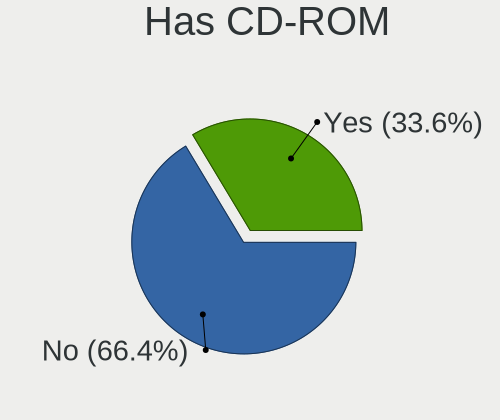
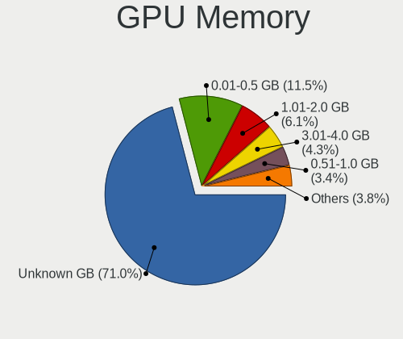
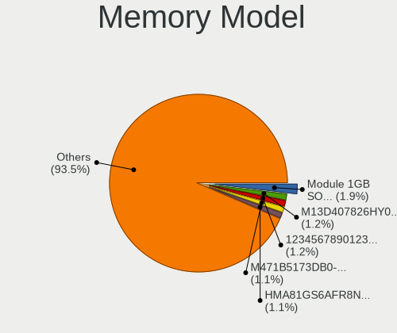

Linux in USA - Tested Hardware & Statistics (Notebooks)
-------------------------------------------------------

A project to collect tested hardware configurations for Linux in USA.

Anyone can contribute to this report by the [hw-probe](https://github.com/linuxhw/hw-probe) tool:

    sudo -E hw-probe -all -upload

Please contribute! Especially if your hardware is rare.

Contents
--------

* [ Test Cases ](#test-cases)

* [ System ](#system)
  - [ OS                       ](#os)
  - [ OS Family                ](#os-family)
  - [ Kernel                   ](#kernel)
  - [ Kernel Family            ](#kernel-family)
  - [ Kernel Major Ver.        ](#kernel-major-ver)
  - [ Arch                     ](#arch)
  - [ DE                       ](#de)
  - [ Display Server           ](#display-server)
  - [ Display Manager          ](#display-manager)
  - [ OS Lang                  ](#os-lang)
  - [ Boot Mode                ](#boot-mode)
  - [ Filesystem               ](#filesystem)
  - [ Part. scheme             ](#part-scheme)
  - [ Dual Boot with Linux/BSD ](#dual-boot-with-linuxbsd)
  - [ Dual Boot (Win)          ](#dual-boot-win)

* [ Board ](#board)
  - [ Vendor                   ](#vendor)
  - [ Model                    ](#model)
  - [ Model Family             ](#model-family)
  - [ MFG Year                 ](#mfg-year)
  - [ Form Factor              ](#form-factor)
  - [ Secure Boot              ](#secure-boot)
  - [ Coreboot                 ](#coreboot)
  - [ RAM Size                 ](#ram-size)
  - [ RAM Used                 ](#ram-used)
  - [ Total Drives             ](#total-drives)
  - [ Has CD-ROM               ](#has-cd-rom)
  - [ Has Ethernet             ](#has-ethernet)
  - [ Has WiFi                 ](#has-wifi)
  - [ Has Bluetooth            ](#has-bluetooth)

* [ Location ](#location)
  - [ Country                  ](#country)
  - [ City                     ](#city)

* [ Drives ](#drives)
  - [ Drive Vendor             ](#drive-vendor)
  - [ Drive Model              ](#drive-model)
  - [ HDD Vendor               ](#hdd-vendor)
  - [ SSD Vendor               ](#ssd-vendor)
  - [ Drive Kind               ](#drive-kind)
  - [ Drive Connector          ](#drive-connector)
  - [ Drive Size               ](#drive-size)
  - [ Space Total              ](#space-total)
  - [ Space Used               ](#space-used)
  - [ Malfunc. Drives          ](#malfunc-drives)
  - [ Malfunc. Drive Vendor    ](#malfunc-drive-vendor)
  - [ Malfunc. HDD Vendor      ](#malfunc-hdd-vendor)
  - [ Malfunc. Drive Kind      ](#malfunc-drive-kind)
  - [ Failed Drives            ](#failed-drives)
  - [ Failed Drive Vendor      ](#failed-drive-vendor)
  - [ Drive Status             ](#drive-status)

* [ Storage controller ](#storage-controller)
  - [ Storage Vendor           ](#storage-vendor)
  - [ Storage Model            ](#storage-model)
  - [ Storage Kind             ](#storage-kind)

* [ Processor ](#processor)
  - [ CPU Vendor               ](#cpu-vendor)
  - [ CPU Model                ](#cpu-model)
  - [ CPU Model Family         ](#cpu-model-family)
  - [ CPU Cores                ](#cpu-cores)
  - [ CPU Sockets              ](#cpu-sockets)
  - [ CPU Threads              ](#cpu-threads)
  - [ CPU Op-Modes             ](#cpu-op-modes)
  - [ CPU Microcode            ](#cpu-microcode)
  - [ CPU Microarch            ](#cpu-microarch)

* [ Graphics ](#graphics)
  - [ GPU Vendor               ](#gpu-vendor)
  - [ GPU Model                ](#gpu-model)
  - [ GPU Combo                ](#gpu-combo)
  - [ GPU Driver               ](#gpu-driver)
  - [ GPU Memory               ](#gpu-memory)

* [ Monitor ](#monitor)
  - [ Monitor Vendor           ](#monitor-vendor)
  - [ Monitor Model            ](#monitor-model)
  - [ Monitor Resolution       ](#monitor-resolution)
  - [ Monitor Diagonal         ](#monitor-diagonal)
  - [ Monitor Width            ](#monitor-width)
  - [ Aspect Ratio             ](#aspect-ratio)
  - [ Monitor Area             ](#monitor-area)
  - [ Pixel Density            ](#pixel-density)
  - [ Multiple Monitors        ](#multiple-monitors)

* [ Network ](#network)
  - [ Net Controller Vendor    ](#net-controller-vendor)
  - [ Net Controller Model     ](#net-controller-model)
  - [ Wireless Vendor          ](#wireless-vendor)
  - [ Wireless Model           ](#wireless-model)
  - [ Ethernet Vendor          ](#ethernet-vendor)
  - [ Ethernet Model           ](#ethernet-model)
  - [ Net Controller Kind      ](#net-controller-kind)
  - [ Used Controller          ](#used-controller)
  - [ NICs                     ](#nics)
  - [ IPv6                     ](#ipv6)

* [ Bluetooth ](#bluetooth)
  - [ Bluetooth Vendor         ](#bluetooth-vendor)
  - [ Bluetooth Model          ](#bluetooth-model)

* [ Sound ](#sound)
  - [ Sound Vendor             ](#sound-vendor)
  - [ Sound Model              ](#sound-model)

* [ Memory ](#memory)
  - [ Memory Vendor            ](#memory-vendor)
  - [ Memory Model             ](#memory-model)
  - [ Memory Kind              ](#memory-kind)
  - [ Memory Form Factor       ](#memory-form-factor)
  - [ Memory Size              ](#memory-size)
  - [ Memory Speed             ](#memory-speed)

* [ Printers & scanners ](#printers--scanners)
  - [ Printer Vendor           ](#printer-vendor)
  - [ Printer Model            ](#printer-model)
  - [ Scanner Vendor           ](#scanner-vendor)
  - [ Scanner Model            ](#scanner-model)

* [ Camera ](#camera)
  - [ Camera Vendor            ](#camera-vendor)
  - [ Camera Model             ](#camera-model)

* [ Security ](#security)
  - [ Fingerprint Vendor       ](#fingerprint-vendor)
  - [ Fingerprint Model        ](#fingerprint-model)
  - [ Chipcard Vendor          ](#chipcard-vendor)
  - [ Chipcard Model           ](#chipcard-model)

* [ Unsupported ](#unsupported)
  - [ Unsupported Devices      ](#unsupported-devices)
  - [ Unsupported Device Types ](#unsupported-device-types)

Test Cases
----------

Total: 25753

| Vendor        | Model                       | Probe                                                      | Date         |
|---------------|-----------------------------|------------------------------------------------------------|--------------|
| HP            | ENVY m6 Notebook            | [5ef983c393](https://linux-hardware.org/?probe=5ef983c393) | Oct 01, 2023 |
| Lenovo        | IdeaPad Y700-15ACZ 80NY     | [12d98aba86](https://linux-hardware.org/?probe=12d98aba86) | Oct 01, 2023 |
| Dell          | Latitude E6540              | [8fdc000f7e](https://linux-hardware.org/?probe=8fdc000f7e) | Oct 01, 2023 |
| OriginPC      | X170KM-G                    | [2a8752667a](https://linux-hardware.org/?probe=2a8752667a) | Oct 01, 2023 |
| Apple         | MacBookPro9,2               | [124425b8b3](https://linux-hardware.org/?probe=124425b8b3) | Oct 01, 2023 |
| Acer          | Predator PH315-51           | [ed5459b320](https://linux-hardware.org/?probe=ed5459b320) | Oct 01, 2023 |
| Dell          | Inspiron 11-3168            | [967817b4f8](https://linux-hardware.org/?probe=967817b4f8) | Oct 01, 2023 |
| Dell          | Latitude E6540              | [a5de8b78e7](https://linux-hardware.org/?probe=a5de8b78e7) | Oct 01, 2023 |
| HP            | Dragonfly 13.5 inch G4 N... | [8fabc36e1c](https://linux-hardware.org/?probe=8fabc36e1c) | Oct 01, 2023 |
| HP            | EliteBook 840 G8 Noteboo... | [9121e2ab8d](https://linux-hardware.org/?probe=9121e2ab8d) | Oct 01, 2023 |
| ASUSTek       | VivoBook_ASUSLaptop X512... | [2127748080](https://linux-hardware.org/?probe=2127748080) | Oct 01, 2023 |
| Dell          | G7 7700                     | [62bd529b36](https://linux-hardware.org/?probe=62bd529b36) | Oct 01, 2023 |
| Apple         | MacBookPro7,1               | [c69ebf2472](https://linux-hardware.org/?probe=c69ebf2472) | Oct 01, 2023 |
| GPU Compan... | GWTN156-4                   | [fa5491ff0c](https://linux-hardware.org/?probe=fa5491ff0c) | Oct 01, 2023 |
| Dell          | Latitude XT3                | [725ad34185](https://linux-hardware.org/?probe=725ad34185) | Oct 01, 2023 |
| HP            | Pavilion Laptop 15t-eg30... | [ed7bf5aee1](https://linux-hardware.org/?probe=ed7bf5aee1) | Oct 01, 2023 |
| Valve         | Jupiter                     | [c31d1a5288](https://linux-hardware.org/?probe=c31d1a5288) | Oct 01, 2023 |
| ASUSTek       | VivoBook_ASUSLaptop M150... | [1330485afc](https://linux-hardware.org/?probe=1330485afc) | Oct 01, 2023 |
| HUAWEI        | MateBook X                  | [5479e52948](https://linux-hardware.org/?probe=5479e52948) | Oct 01, 2023 |
| HP            | Laptop 17-cn2xxx            | [4a15c84784](https://linux-hardware.org/?probe=4a15c84784) | Sep 30, 2023 |
| Gigabyte      | AERO 15-X9                  | [35830807d4](https://linux-hardware.org/?probe=35830807d4) | Sep 30, 2023 |
| HP            | Compaq nc6320 (EN368UT#A... | [71ba4fd9e9](https://linux-hardware.org/?probe=71ba4fd9e9) | Sep 30, 2023 |
| Dynabook      | TECRA A50-J                 | [e0927243be](https://linux-hardware.org/?probe=e0927243be) | Sep 30, 2023 |
| HP            | EliteBook 820 G4            | [eb46d26ff8](https://linux-hardware.org/?probe=eb46d26ff8) | Sep 30, 2023 |
| Valve         | Jupiter                     | [0488b8fd24](https://linux-hardware.org/?probe=0488b8fd24) | Sep 30, 2023 |
| Toshiba       | PORTEGE R30-D               | [04ef694f1d](https://linux-hardware.org/?probe=04ef694f1d) | Sep 30, 2023 |
| HP            | ProBook 645 G1              | [f5f538105c](https://linux-hardware.org/?probe=f5f538105c) | Sep 30, 2023 |
| Apple         | MacBookPro8,2               | [237492c356](https://linux-hardware.org/?probe=237492c356) | Sep 30, 2023 |
| Lenovo        | ThinkPad T420 4180BV1       | [e81749053b](https://linux-hardware.org/?probe=e81749053b) | Sep 30, 2023 |
| HP            | Notebook                    | [873004172f](https://linux-hardware.org/?probe=873004172f) | Sep 30, 2023 |
| Lenovo        | ThinkPad X1 Carbon 3rd 2... | [2edc7ab56b](https://linux-hardware.org/?probe=2edc7ab56b) | Sep 30, 2023 |
| Dell          | Latitude 5410               | [d13c5769a3](https://linux-hardware.org/?probe=d13c5769a3) | Sep 30, 2023 |
| Alienware     | m15 R4                      | [a67899ed06](https://linux-hardware.org/?probe=a67899ed06) | Sep 30, 2023 |
| Apple         | MacBookPro5,5               | [202a977fce](https://linux-hardware.org/?probe=202a977fce) | Sep 30, 2023 |
| HP            | Pavilion Laptop 15-eh1xx... | [3710f99f83](https://linux-hardware.org/?probe=3710f99f83) | Sep 30, 2023 |
| Unknown       | Unknown                     | [56580ba351](https://linux-hardware.org/?probe=56580ba351) | Sep 30, 2023 |
| Dell          | XPS 15 9550                 | [587f9a3ff1](https://linux-hardware.org/?probe=587f9a3ff1) | Sep 29, 2023 |
| Lenovo        | IdeaPad Slim 3 15IRU8 82... | [e9dd0291e0](https://linux-hardware.org/?probe=e9dd0291e0) | Sep 29, 2023 |
| Razer         | Blade 15 Base Model (Lat... | [95dc405a73](https://linux-hardware.org/?probe=95dc405a73) | Sep 29, 2023 |
| HP            | Laptop 17-cn1xxx            | [051a233121](https://linux-hardware.org/?probe=051a233121) | Sep 29, 2023 |
| HP            | ProBook 450 G1              | [1cbae5b56a](https://linux-hardware.org/?probe=1cbae5b56a) | Sep 29, 2023 |
| ASUSTek       | VivoBook_ASUSLaptop X412... | [6348992a72](https://linux-hardware.org/?probe=6348992a72) | Sep 29, 2023 |
| Dell          | Latitude E6540              | [1478e1265d](https://linux-hardware.org/?probe=1478e1265d) | Sep 29, 2023 |
| HP            | Pavilion dv9000 (GA359UA... | [cea70d5f75](https://linux-hardware.org/?probe=cea70d5f75) | Sep 29, 2023 |
| Dell          | Latitude E5450              | [0b77908612](https://linux-hardware.org/?probe=0b77908612) | Sep 29, 2023 |
| Valve         | Jupiter                     | [c881d3edc2](https://linux-hardware.org/?probe=c881d3edc2) | Sep 29, 2023 |
| Dell          | Inspiron 15-3552            | [8a8f11edae](https://linux-hardware.org/?probe=8a8f11edae) | Sep 29, 2023 |
| HP            | Laptop 14-fq0xxx            | [52648b0b45](https://linux-hardware.org/?probe=52648b0b45) | Sep 29, 2023 |
| Valve         | Jupiter                     | [2f4eb9f823](https://linux-hardware.org/?probe=2f4eb9f823) | Sep 29, 2023 |
| Dell          | Inspiron 7548               | [2c407b4ff5](https://linux-hardware.org/?probe=2c407b4ff5) | Sep 29, 2023 |
| Lenovo        | IdeaPad 3 15IIL05 81WE      | [902918fb1d](https://linux-hardware.org/?probe=902918fb1d) | Sep 29, 2023 |
| Acer          | Aspire E5-575G              | [109490039d](https://linux-hardware.org/?probe=109490039d) | Sep 29, 2023 |
| Lenovo        | ThinkPad E495 20NE0001US    | [a76a94cd2f](https://linux-hardware.org/?probe=a76a94cd2f) | Sep 29, 2023 |
| HP            | Stream Laptop 14-ds0xxx     | [bbab7c9f89](https://linux-hardware.org/?probe=bbab7c9f89) | Sep 29, 2023 |
| HP            | Stream Laptop 14-ds0xxx     | [4f23a67b82](https://linux-hardware.org/?probe=4f23a67b82) | Sep 29, 2023 |
| Dell          | Latitude E6420              | [935d96843b](https://linux-hardware.org/?probe=935d96843b) | Sep 28, 2023 |
| HP            | ZBook Studio G3             | [0005d20c0d](https://linux-hardware.org/?probe=0005d20c0d) | Sep 28, 2023 |
| HP            | ENVY 17                     | [184a826bba](https://linux-hardware.org/?probe=184a826bba) | Sep 28, 2023 |
| Lenovo        | ThinkPad X260 20F60097US    | [607d788fde](https://linux-hardware.org/?probe=607d788fde) | Sep 28, 2023 |
| HP            | Pavilion Laptop 14-ce3xx... | [3ecf3ff165](https://linux-hardware.org/?probe=3ecf3ff165) | Sep 28, 2023 |
| HP            | Pavilion Laptop 14-ce3xx... | [4c8dbd0780](https://linux-hardware.org/?probe=4c8dbd0780) | Sep 28, 2023 |
| Lenovo        | IdeaPad Slim 5 16ABR8 82... | [1fcc841148](https://linux-hardware.org/?probe=1fcc841148) | Sep 28, 2023 |
| Valve         | Jupiter                     | [a447ea95b0](https://linux-hardware.org/?probe=a447ea95b0) | Sep 28, 2023 |
| Valve         | Jupiter                     | [b178e71c45](https://linux-hardware.org/?probe=b178e71c45) | Sep 28, 2023 |
| ASUSTek       | ROG Strix G731GU_GL731GU    | [9e206d1e8b](https://linux-hardware.org/?probe=9e206d1e8b) | Sep 28, 2023 |
| Valve         | Jupiter                     | [0948401e7d](https://linux-hardware.org/?probe=0948401e7d) | Sep 28, 2023 |
| ASUSTek       | ROG Strix G731GU_GL731GU    | [8f792e2b5a](https://linux-hardware.org/?probe=8f792e2b5a) | Sep 28, 2023 |
| Valve         | Jupiter                     | [2c1e6c791d](https://linux-hardware.org/?probe=2c1e6c791d) | Sep 28, 2023 |
| Lenovo        | IdeaPad Slim 5 16IRL8 82... | [c717c1ab13](https://linux-hardware.org/?probe=c717c1ab13) | Sep 28, 2023 |
| HP            | Laptop 15-da0xxx            | [3d996f9823](https://linux-hardware.org/?probe=3d996f9823) | Sep 28, 2023 |
| Lenovo        | IdeaPad 320-15ABR 80XS      | [61980df9bc](https://linux-hardware.org/?probe=61980df9bc) | Sep 28, 2023 |
| Lenovo        | ThinkPad 13 2nd Gen 20J1... | [3cb2bdba37](https://linux-hardware.org/?probe=3cb2bdba37) | Sep 27, 2023 |
| HP            | Laptop 15-da0xxx            | [8fb9d5d21f](https://linux-hardware.org/?probe=8fb9d5d21f) | Sep 27, 2023 |
| ASUSTek       | VivoBook_ASUSLaptop K660... | [7c13a64c8a](https://linux-hardware.org/?probe=7c13a64c8a) | Sep 27, 2023 |
| Framework     | Laptop                      | [2a65b0dff2](https://linux-hardware.org/?probe=2a65b0dff2) | Sep 27, 2023 |
| Dell          | Latitude E6540              | [7d9885cd7c](https://linux-hardware.org/?probe=7d9885cd7c) | Sep 27, 2023 |
| Lenovo        | ThinkPad E475 20H40006US    | [1a472d3072](https://linux-hardware.org/?probe=1a472d3072) | Sep 27, 2023 |
| Lenovo        | IdeaPad 1 14IGL7 82V6       | [707c612189](https://linux-hardware.org/?probe=707c612189) | Sep 27, 2023 |
| Dell          | Inspiron N5040              | [c48d158b62](https://linux-hardware.org/?probe=c48d158b62) | Sep 27, 2023 |
| Lenovo        | IdeaPad 5 15ARE05 81YQ      | [84ad07c3f9](https://linux-hardware.org/?probe=84ad07c3f9) | Sep 27, 2023 |
| HP            | Dev One Notebook PC         | [61caf9212e](https://linux-hardware.org/?probe=61caf9212e) | Sep 27, 2023 |
| Dell          | Latitude E6530              | [40cdcd2545](https://linux-hardware.org/?probe=40cdcd2545) | Sep 27, 2023 |
| Dell          | Inspiron 5559               | [c25a72c95a](https://linux-hardware.org/?probe=c25a72c95a) | Sep 27, 2023 |
| Apple         | MacBookAir7,2               | [1543bac588](https://linux-hardware.org/?probe=1543bac588) | Sep 27, 2023 |
| Lenovo        | ThinkPad E14 20RA0050US     | [097539dde8](https://linux-hardware.org/?probe=097539dde8) | Sep 27, 2023 |
| Acer          | Aspire one                  | [d040844540](https://linux-hardware.org/?probe=d040844540) | Sep 27, 2023 |
| HP            | EliteBook 8770w             | [3286090099](https://linux-hardware.org/?probe=3286090099) | Sep 27, 2023 |
| ASUSTek       | VivoBook_ASUSLaptop K660... | [d9665a6ffd](https://linux-hardware.org/?probe=d9665a6ffd) | Sep 27, 2023 |
| HP            | Notebook                    | [4690fda15e](https://linux-hardware.org/?probe=4690fda15e) | Sep 27, 2023 |
| Dell          | Latitude 3540               | [eb8bf9b174](https://linux-hardware.org/?probe=eb8bf9b174) | Sep 26, 2023 |
| Dell          | Vostro 14-3468              | [3fceb34932](https://linux-hardware.org/?probe=3fceb34932) | Sep 26, 2023 |
| Lenovo        | ThinkPad E475 20H40006US    | [d406193722](https://linux-hardware.org/?probe=d406193722) | Sep 26, 2023 |
| Dell          | Vostro 14-3468              | [a027aae826](https://linux-hardware.org/?probe=a027aae826) | Sep 26, 2023 |
| HP            | Laptop 15-dy2xxx            | [8fd945e3c5](https://linux-hardware.org/?probe=8fd945e3c5) | Sep 26, 2023 |
| Lenovo        | Legion R9000P2021H 82JQ     | [5168f99a06](https://linux-hardware.org/?probe=5168f99a06) | Sep 26, 2023 |
| Sony          | SVE14A27CXH                 | [d017d82f42](https://linux-hardware.org/?probe=d017d82f42) | Sep 26, 2023 |
| Sony          | SVE14A27CXH                 | [b85055ec21](https://linux-hardware.org/?probe=b85055ec21) | Sep 26, 2023 |
| Lenovo        | IdeaPad Slim 5 16IRL8 82... | [b22a584cea](https://linux-hardware.org/?probe=b22a584cea) | Sep 26, 2023 |
| Apple         | MacBookPro8,1               | [ee86e0d81e](https://linux-hardware.org/?probe=ee86e0d81e) | Sep 26, 2023 |
| Apple         | MacBookPro8,1               | [1630b56fe3](https://linux-hardware.org/?probe=1630b56fe3) | Sep 26, 2023 |
| Valve         | Jupiter                     | [651e61bc4b](https://linux-hardware.org/?probe=651e61bc4b) | Sep 25, 2023 |
| Dell          | Latitude 7390               | [7e142652b2](https://linux-hardware.org/?probe=7e142652b2) | Sep 25, 2023 |
| Dell          | Vostro 15 5510              | [b2d58819cc](https://linux-hardware.org/?probe=b2d58819cc) | Sep 25, 2023 |
| MSI           | GS63VR 6RF                  | [03a9aed3c9](https://linux-hardware.org/?probe=03a9aed3c9) | Sep 25, 2023 |
| Google        | Banon                       | [172d512653](https://linux-hardware.org/?probe=172d512653) | Sep 25, 2023 |
| VPU Compan... | VWNC71429                   | [285eb8a521](https://linux-hardware.org/?probe=285eb8a521) | Sep 25, 2023 |
| VPU Compan... | VWNC71429                   | [ec5aecc69d](https://linux-hardware.org/?probe=ec5aecc69d) | Sep 25, 2023 |
| Google        | Banon                       | [0766aa6565](https://linux-hardware.org/?probe=0766aa6565) | Sep 25, 2023 |
| Acer          | Swift SFX14-41G             | [ae755aa7e3](https://linux-hardware.org/?probe=ae755aa7e3) | Sep 25, 2023 |
| Dell          | Inspiron 1545               | [96508134e8](https://linux-hardware.org/?probe=96508134e8) | Sep 25, 2023 |
| Apple         | MacBookPro10,1              | [1c1268d4e0](https://linux-hardware.org/?probe=1c1268d4e0) | Sep 25, 2023 |
| Apple         | MacBookPro10,1              | [4fbb517b71](https://linux-hardware.org/?probe=4fbb517b71) | Sep 25, 2023 |
| Dell          | G5 5505                     | [e9c461d44d](https://linux-hardware.org/?probe=e9c461d44d) | Sep 25, 2023 |
| Acer          | Aspire V3-472P              | [b5ebe3295c](https://linux-hardware.org/?probe=b5ebe3295c) | Sep 25, 2023 |
| HP            | ProBook 6570b               | [a67981aa91](https://linux-hardware.org/?probe=a67981aa91) | Sep 25, 2023 |
| Lenovo        | ThinkPad X1 Nano Gen 3 2... | [1903f91b48](https://linux-hardware.org/?probe=1903f91b48) | Sep 25, 2023 |
| Dell          | XPS 13 9310                 | [4233a2e5e3](https://linux-hardware.org/?probe=4233a2e5e3) | Sep 25, 2023 |
| Alienware     | M17x                        | [5c6b700486](https://linux-hardware.org/?probe=5c6b700486) | Sep 25, 2023 |
| Apple         | MacBookPro10,1              | [f8088ea946](https://linux-hardware.org/?probe=f8088ea946) | Sep 25, 2023 |
| Samsung       | 3570R/370R/470R/450R/510... | [6d75f2f29b](https://linux-hardware.org/?probe=6d75f2f29b) | Sep 24, 2023 |
| HP            | Laptop 15-dy1xxx            | [632803f3f9](https://linux-hardware.org/?probe=632803f3f9) | Sep 24, 2023 |
| Dynabook      | TECRA A50-J                 | [e06f7128df](https://linux-hardware.org/?probe=e06f7128df) | Sep 24, 2023 |
| Lenovo        | ThinkPad T480 20L50018US    | [e28cf08ffe](https://linux-hardware.org/?probe=e28cf08ffe) | Sep 24, 2023 |
| Dell          | Inspiron 3543               | [2075d98d66](https://linux-hardware.org/?probe=2075d98d66) | Sep 24, 2023 |
| Acer          | Swift SFX14-41G             | [7980181fcb](https://linux-hardware.org/?probe=7980181fcb) | Sep 24, 2023 |
| Dell          | XPS 15 9520                 | [b358b656c6](https://linux-hardware.org/?probe=b358b656c6) | Sep 24, 2023 |
| HP            | ENVY m4                     | [8d7da36940](https://linux-hardware.org/?probe=8d7da36940) | Sep 24, 2023 |
| HP            | EliteBook 8560w             | [0e7984242d](https://linux-hardware.org/?probe=0e7984242d) | Sep 24, 2023 |
| Valve         | Jupiter                     | [7af512f94c](https://linux-hardware.org/?probe=7af512f94c) | Sep 24, 2023 |
| Lenovo        | ThinkPad T480s 20L8S6P20... | [4f3a1c8208](https://linux-hardware.org/?probe=4f3a1c8208) | Sep 24, 2023 |
| MSI           | GS75 Stealth 10SGS          | [9a310dd76b](https://linux-hardware.org/?probe=9a310dd76b) | Sep 24, 2023 |
| HP            | ZBook 15v G5                | [c01fb4aeb0](https://linux-hardware.org/?probe=c01fb4aeb0) | Sep 24, 2023 |
| Valve         | Jupiter                     | [36fd2d4d96](https://linux-hardware.org/?probe=36fd2d4d96) | Sep 24, 2023 |
| HP            | ZBook 15v G5                | [6495e2ad69](https://linux-hardware.org/?probe=6495e2ad69) | Sep 24, 2023 |
| Dell          | Latitude 5440               | [255072aece](https://linux-hardware.org/?probe=255072aece) | Sep 24, 2023 |
| ASUSTek       | VivoBook 15 ASUS Laptop ... | [40e72b93b6](https://linux-hardware.org/?probe=40e72b93b6) | Sep 24, 2023 |
| Toshiba       | Satellite L855              | [646b34b912](https://linux-hardware.org/?probe=646b34b912) | Sep 23, 2023 |
| Toshiba       | Satellite L855              | [8384ddec2e](https://linux-hardware.org/?probe=8384ddec2e) | Sep 23, 2023 |
| HP            | Laptop 15-bs0xx             | [21620e61e1](https://linux-hardware.org/?probe=21620e61e1) | Sep 23, 2023 |
| HP            | Laptop 15-dy1xxx            | [77667e36ac](https://linux-hardware.org/?probe=77667e36ac) | Sep 23, 2023 |
| HP            | EliteBook 840 G2            | [b8d84dc938](https://linux-hardware.org/?probe=b8d84dc938) | Sep 23, 2023 |
| HP            | Dev One Notebook PC         | [1cc979900b](https://linux-hardware.org/?probe=1cc979900b) | Sep 23, 2023 |
| ASUSTek       | VivoBook_ASUSLaptop M760... | [3b18f2e874](https://linux-hardware.org/?probe=3b18f2e874) | Sep 23, 2023 |
| Apple         | MacBookPro10,1              | [18b2a7026b](https://linux-hardware.org/?probe=18b2a7026b) | Sep 23, 2023 |
| Apple         | MacBookPro10,1              | [60f81eeb50](https://linux-hardware.org/?probe=60f81eeb50) | Sep 23, 2023 |
| Fujitsu       | LIFEBOOK T730               | [7a0f7921c4](https://linux-hardware.org/?probe=7a0f7921c4) | Sep 23, 2023 |
| HP            | Laptop 15-ef2xxx            | [4fb741bdb3](https://linux-hardware.org/?probe=4fb741bdb3) | Sep 23, 2023 |
| Dell          | Vostro 14-3468              | [0b6bdbbecb](https://linux-hardware.org/?probe=0b6bdbbecb) | Sep 23, 2023 |
| HP            | Laptop 17-bs1xx             | [eb600e003d](https://linux-hardware.org/?probe=eb600e003d) | Sep 23, 2023 |
| HP            | 15                          | [6d6b8bd8e3](https://linux-hardware.org/?probe=6d6b8bd8e3) | Sep 23, 2023 |
| Valve         | Jupiter                     | [610cd4fd42](https://linux-hardware.org/?probe=610cd4fd42) | Sep 23, 2023 |
| Dell          | XPS M1530                   | [b24e393bbb](https://linux-hardware.org/?probe=b24e393bbb) | Sep 23, 2023 |
| HP            | Laptop 15-db1xxx            | [8b16720f22](https://linux-hardware.org/?probe=8b16720f22) | Sep 23, 2023 |
| Lenovo        | ThinkPad X1 Carbon 6th 2... | [e344b05a7a](https://linux-hardware.org/?probe=e344b05a7a) | Sep 23, 2023 |
| Panasonic     | CF-31JHG8M1M                | [3dc21238c6](https://linux-hardware.org/?probe=3dc21238c6) | Sep 23, 2023 |
| HP            | Notebook                    | [0d03790c02](https://linux-hardware.org/?probe=0d03790c02) | Sep 23, 2023 |
| HP            | Notebook                    | [f9cec347c3](https://linux-hardware.org/?probe=f9cec347c3) | Sep 23, 2023 |
| Lenovo        | ThinkPad P15 Gen 2i 20YR... | [6a6fde2ca9](https://linux-hardware.org/?probe=6a6fde2ca9) | Sep 23, 2023 |
| VPU Compan... | VWNC71429                   | [c601e6192f](https://linux-hardware.org/?probe=c601e6192f) | Sep 23, 2023 |
| Dell          | Latitude 5480               | [30b7787143](https://linux-hardware.org/?probe=30b7787143) | Sep 23, 2023 |
| Dell          | Latitude E5470              | [f6e9a7233c](https://linux-hardware.org/?probe=f6e9a7233c) | Sep 23, 2023 |
| Lenovo        | ThinkPad E575 20H8000HUS    | [8b5a2354c5](https://linux-hardware.org/?probe=8b5a2354c5) | Sep 23, 2023 |
| Dell          | Inspiron 3583               | [56cd0e05e8](https://linux-hardware.org/?probe=56cd0e05e8) | Sep 22, 2023 |
| Apple         | MacBookPro10,2              | [3580b7d8d6](https://linux-hardware.org/?probe=3580b7d8d6) | Sep 22, 2023 |
| Google        | Blorb                       | [778d4cb622](https://linux-hardware.org/?probe=778d4cb622) | Sep 22, 2023 |
| Dell          | Latitude E6440              | [41269356be](https://linux-hardware.org/?probe=41269356be) | Sep 22, 2023 |
| LG Electro... | 16Z90P-K.AAS9U1             | [5e60864354](https://linux-hardware.org/?probe=5e60864354) | Sep 22, 2023 |
| Google        | Blorb                       | [3a001130af](https://linux-hardware.org/?probe=3a001130af) | Sep 22, 2023 |
| Apple         | MacBookPro9,2               | [bf71bcd90e](https://linux-hardware.org/?probe=bf71bcd90e) | Sep 22, 2023 |
| ASUSTek       | ROG Strix G814JZ_G814JZ     | [2a6c2ef738](https://linux-hardware.org/?probe=2a6c2ef738) | Sep 22, 2023 |
| HP            | EliteBook 840 G5            | [03d461d3af](https://linux-hardware.org/?probe=03d461d3af) | Sep 22, 2023 |
| Dell          | Latitude 5290 2-in-1        | [71b5a459b2](https://linux-hardware.org/?probe=71b5a459b2) | Sep 22, 2023 |
| HP            | Laptop 17-by4xxx            | [dd1d978c67](https://linux-hardware.org/?probe=dd1d978c67) | Sep 22, 2023 |
| HP            | Laptop 15-db1xxx            | [504ed03ead](https://linux-hardware.org/?probe=504ed03ead) | Sep 22, 2023 |
| ASUSTek       | G75VW                       | [66a3f84c7b](https://linux-hardware.org/?probe=66a3f84c7b) | Sep 22, 2023 |
| Lenovo        | ThinkPad P1 Gen 5 21DCCT... | [8c65f7a68a](https://linux-hardware.org/?probe=8c65f7a68a) | Sep 21, 2023 |
| Lenovo        | ThinkPad E475 20H40006US    | [ea491d194f](https://linux-hardware.org/?probe=ea491d194f) | Sep 21, 2023 |
| HP            | OMEN by Laptop 15-dc1xxx    | [d00cc6b535](https://linux-hardware.org/?probe=d00cc6b535) | Sep 21, 2023 |
| Lenovo        | ThinkPad 13 2nd Gen 20J1... | [e33bb92eb6](https://linux-hardware.org/?probe=e33bb92eb6) | Sep 21, 2023 |
| HP            | OMEN by Laptop 15-dc1xxx    | [89cce2b6cb](https://linux-hardware.org/?probe=89cce2b6cb) | Sep 21, 2023 |
| Google        | Kip                         | [344f7b3eda](https://linux-hardware.org/?probe=344f7b3eda) | Sep 21, 2023 |
| Lenovo        | ThinkPad T420 4178AFU       | [adee486a15](https://linux-hardware.org/?probe=adee486a15) | Sep 21, 2023 |
| Valve         | Jupiter                     | [de6ae4f340](https://linux-hardware.org/?probe=de6ae4f340) | Sep 21, 2023 |
| Valve         | Jupiter                     | [9971977392](https://linux-hardware.org/?probe=9971977392) | Sep 21, 2023 |
| Valve         | Jupiter                     | [7247eddba1](https://linux-hardware.org/?probe=7247eddba1) | Sep 21, 2023 |
| HP            | Laptop 15-dy2xxx            | [ec855ed71c](https://linux-hardware.org/?probe=ec855ed71c) | Sep 21, 2023 |
| Acer          | Aspire R3-431T              | [510e10a692](https://linux-hardware.org/?probe=510e10a692) | Sep 21, 2023 |
| ASUSTek       | GL503VMF                    | [0e43a1da82](https://linux-hardware.org/?probe=0e43a1da82) | Sep 21, 2023 |
| Acer          | Aspire E5-575               | [3126f2c7c6](https://linux-hardware.org/?probe=3126f2c7c6) | Sep 21, 2023 |
| Alienware     | 17 R2                       | [6ad5704e29](https://linux-hardware.org/?probe=6ad5704e29) | Sep 21, 2023 |
| Gateway       | P-7805u                     | [baae0fec2e](https://linux-hardware.org/?probe=baae0fec2e) | Sep 21, 2023 |
| Alienware     | 17 R2                       | [76bf895d62](https://linux-hardware.org/?probe=76bf895d62) | Sep 21, 2023 |
| Lenovo        | ThinkPad T480 20L50018US    | [46ee09f5bd](https://linux-hardware.org/?probe=46ee09f5bd) | Sep 21, 2023 |
| Dell          | Inspiron 3542               | [b449a82c4f](https://linux-hardware.org/?probe=b449a82c4f) | Sep 21, 2023 |
| Dell          | Latitude E5430 non-vPro     | [192f065f70](https://linux-hardware.org/?probe=192f065f70) | Sep 21, 2023 |
| ASUSTek       | G75VW                       | [756ab2dd04](https://linux-hardware.org/?probe=756ab2dd04) | Sep 21, 2023 |
| Acer          | Aspire R3-431T              | [a406b53d93](https://linux-hardware.org/?probe=a406b53d93) | Sep 21, 2023 |
| Lenovo        | ThinkPad E560 20EV002FUS    | [063f211c4d](https://linux-hardware.org/?probe=063f211c4d) | Sep 21, 2023 |
| Gateway       | P-7805u                     | [edcd214333](https://linux-hardware.org/?probe=edcd214333) | Sep 21, 2023 |
| Lenovo        | IdeaPad S145-15API 81UT     | [d4060b585a](https://linux-hardware.org/?probe=d4060b585a) | Sep 20, 2023 |
| HP            | ProBook 450 15.6 inch G9... | [b4f1770e14](https://linux-hardware.org/?probe=b4f1770e14) | Sep 20, 2023 |
| Dell          | Vostro 14-3468              | [bdc4389ae2](https://linux-hardware.org/?probe=bdc4389ae2) | Sep 20, 2023 |
| Lenovo        | ThinkPad 13 2nd Gen 20J1... | [e337cc85e5](https://linux-hardware.org/?probe=e337cc85e5) | Sep 20, 2023 |
| Lenovo        | ThinkPad T16 Gen 1 21BVC... | [c7142a0d96](https://linux-hardware.org/?probe=c7142a0d96) | Sep 20, 2023 |
| HP            | 15 Notebook PC              | [c1abb47e39](https://linux-hardware.org/?probe=c1abb47e39) | Sep 20, 2023 |
| System76      | Darter Pro                  | [3266f46a3b](https://linux-hardware.org/?probe=3266f46a3b) | Sep 20, 2023 |
| Apple         | MacBookPro9,2               | [4d2c8f9f07](https://linux-hardware.org/?probe=4d2c8f9f07) | Sep 20, 2023 |
| Valve         | Jupiter                     | [fc14aeacc1](https://linux-hardware.org/?probe=fc14aeacc1) | Sep 20, 2023 |
| Dell          | Inspiron 3521               | [7815e94ca7](https://linux-hardware.org/?probe=7815e94ca7) | Sep 20, 2023 |
| ASUSTek       | VivoBook_ASUSLaptop X512... | [c88b7c27fc](https://linux-hardware.org/?probe=c88b7c27fc) | Sep 20, 2023 |
| Acer          | Aspire AV14-51              | [4c268e3ea9](https://linux-hardware.org/?probe=4c268e3ea9) | Sep 20, 2023 |
| Dell          | Vostro 15 5510              | [9c3cf02807](https://linux-hardware.org/?probe=9c3cf02807) | Sep 20, 2023 |
| VPU Compan... | VWNC71429                   | [4dd816ef81](https://linux-hardware.org/?probe=4dd816ef81) | Sep 20, 2023 |
| Lenovo        | IdeaPad Y700-15ISK 80NV     | [5662d8f95c](https://linux-hardware.org/?probe=5662d8f95c) | Sep 20, 2023 |
| HP            | ProBook 440 14 inch G9 N... | [04cc7d1379](https://linux-hardware.org/?probe=04cc7d1379) | Sep 20, 2023 |
| Lenovo        | ThinkPad E550 20DF0040US    | [358b39a74a](https://linux-hardware.org/?probe=358b39a74a) | Sep 19, 2023 |
| Dell          | Latitude E5420              | [0b1b042a5b](https://linux-hardware.org/?probe=0b1b042a5b) | Sep 19, 2023 |
| Dell          | Precision 7550              | [75394df91f](https://linux-hardware.org/?probe=75394df91f) | Sep 19, 2023 |
| Dell          | Precision M6600             | [ddd4a0bdc5](https://linux-hardware.org/?probe=ddd4a0bdc5) | Sep 19, 2023 |
| Lenovo        | ThinkPad P14s Gen 4 21K5... | [d940deb0df](https://linux-hardware.org/?probe=d940deb0df) | Sep 19, 2023 |
| Toshiba       | Satellite S55-B             | [6184ae7dfb](https://linux-hardware.org/?probe=6184ae7dfb) | Sep 19, 2023 |
| Toshiba       | Satellite P505              | [2b70bd8027](https://linux-hardware.org/?probe=2b70bd8027) | Sep 19, 2023 |
| HP            | EliteBook 840 G2            | [54aca4b27b](https://linux-hardware.org/?probe=54aca4b27b) | Sep 19, 2023 |
| Lenovo        | ThinkPad T420 4178AFU       | [65da9aa0c6](https://linux-hardware.org/?probe=65da9aa0c6) | Sep 19, 2023 |
| Valve         | Jupiter                     | [c26c68e9a4](https://linux-hardware.org/?probe=c26c68e9a4) | Sep 19, 2023 |
| Dell          | Latitude 5414               | [83589aaff4](https://linux-hardware.org/?probe=83589aaff4) | Sep 19, 2023 |
| Acer          | Aspire V3-771               | [e80624f3ea](https://linux-hardware.org/?probe=e80624f3ea) | Sep 19, 2023 |
| Acer          | Aspire A515-56              | [db16273e72](https://linux-hardware.org/?probe=db16273e72) | Sep 19, 2023 |
| HP            | Pavilion Notebook           | [f93723f676](https://linux-hardware.org/?probe=f93723f676) | Sep 19, 2023 |
| Lenovo        | ThinkPad X13 Gen 2i 20WL... | [7360de2a44](https://linux-hardware.org/?probe=7360de2a44) | Sep 19, 2023 |
| Lenovo        | ThinkPad T460 20FN002VUS    | [46c6a66e5b](https://linux-hardware.org/?probe=46c6a66e5b) | Sep 19, 2023 |
| HP            | Laptop 17-cp0xxx            | [e502a47266](https://linux-hardware.org/?probe=e502a47266) | Sep 18, 2023 |
| Acer          | Aspire V3-771               | [e929e7ed53](https://linux-hardware.org/?probe=e929e7ed53) | Sep 18, 2023 |
| Toshiba       | Satellite P505              | [a18f0420ac](https://linux-hardware.org/?probe=a18f0420ac) | Sep 18, 2023 |
| Samsung       | 760XDA                      | [28e4f5a8f8](https://linux-hardware.org/?probe=28e4f5a8f8) | Sep 18, 2023 |
| Acer          | Aspire A315-24P             | [f9c346c325](https://linux-hardware.org/?probe=f9c346c325) | Sep 18, 2023 |
| MSI           | Katana GF76 11UD            | [f797b137a3](https://linux-hardware.org/?probe=f797b137a3) | Sep 18, 2023 |
| HP            | Laptop 17-bs1xx             | [2b11e9d8f5](https://linux-hardware.org/?probe=2b11e9d8f5) | Sep 18, 2023 |
| Lenovo        | IdeaPad N585 20179          | [e80d14f9e4](https://linux-hardware.org/?probe=e80d14f9e4) | Sep 18, 2023 |
| ASUSTek       | VivoBook 15 ASUS Laptop ... | [29e5700e25](https://linux-hardware.org/?probe=29e5700e25) | Sep 18, 2023 |
| ASUSTek       | VivoBook 15 ASUS Laptop ... | [6a152b75d5](https://linux-hardware.org/?probe=6a152b75d5) | Sep 18, 2023 |
| Dell          | Latitude D620               | [65d2f56829](https://linux-hardware.org/?probe=65d2f56829) | Sep 18, 2023 |
| Apple         | MacBookPro16,1              | [b34574e76e](https://linux-hardware.org/?probe=b34574e76e) | Sep 17, 2023 |
| Razer         | Blade 15 Base Model (Lat... | [15dd923faa](https://linux-hardware.org/?probe=15dd923faa) | Sep 17, 2023 |
| Dell          | Latitude E6230              | [b454bff951](https://linux-hardware.org/?probe=b454bff951) | Sep 17, 2023 |
| HP            | OMEN by Gaming Laptop 16... | [f605659353](https://linux-hardware.org/?probe=f605659353) | Sep 17, 2023 |
| HP            | ENVY 17                     | [d8e439962f](https://linux-hardware.org/?probe=d8e439962f) | Sep 17, 2023 |
| Lenovo        | IdeaPad Y500 20193          | [481f317cad](https://linux-hardware.org/?probe=481f317cad) | Sep 17, 2023 |
| Lenovo        | IdeaPad Y500 20193          | [83ae4c6b8e](https://linux-hardware.org/?probe=83ae4c6b8e) | Sep 17, 2023 |
| ASUSTek       | ROG Strix G713QM_G713QM     | [10709d2c51](https://linux-hardware.org/?probe=10709d2c51) | Sep 17, 2023 |
| Google        | Blooglet                    | [79ce749655](https://linux-hardware.org/?probe=79ce749655) | Sep 17, 2023 |
| Notebook      | NP5x_6x_7x_SNx              | [83be57b9aa](https://linux-hardware.org/?probe=83be57b9aa) | Sep 17, 2023 |
| Acer          | Nitro AN515-44              | [a25ee31882](https://linux-hardware.org/?probe=a25ee31882) | Sep 17, 2023 |
| Dell          | G3 3579                     | [eff563e086](https://linux-hardware.org/?probe=eff563e086) | Sep 17, 2023 |
| ASUSTek       | ROG Zephyrus G14 GA401IV... | [4c854cc233](https://linux-hardware.org/?probe=4c854cc233) | Sep 17, 2023 |
| Valve         | Jupiter                     | [55f9c98103](https://linux-hardware.org/?probe=55f9c98103) | Sep 17, 2023 |
| HP            | Dev One Notebook PC         | [2606a8d1c1](https://linux-hardware.org/?probe=2606a8d1c1) | Sep 17, 2023 |
| Dell          | Latitude E6410              | [3a9273fd3e](https://linux-hardware.org/?probe=3a9273fd3e) | Sep 17, 2023 |
| Lenovo        | IdeaPad 3 15ITL6 82H8       | [4126504e2a](https://linux-hardware.org/?probe=4126504e2a) | Sep 17, 2023 |
| MSI           | Modern 14 B4MW              | [83a224edea](https://linux-hardware.org/?probe=83a224edea) | Sep 17, 2023 |
| HP            | Laptop 15-dw3xxx            | [f84a480b09](https://linux-hardware.org/?probe=f84a480b09) | Sep 17, 2023 |
| Lenovo        | G50-45 80E3                 | [cdfa321c48](https://linux-hardware.org/?probe=cdfa321c48) | Sep 17, 2023 |
| ASUSTek       | X555QA                      | [abe8b764d9](https://linux-hardware.org/?probe=abe8b764d9) | Sep 17, 2023 |
| HP            | Laptop 15-bs0xx             | [90a53d66ff](https://linux-hardware.org/?probe=90a53d66ff) | Sep 17, 2023 |
| ASUSTek       | X555QA                      | [8d38da1df4](https://linux-hardware.org/?probe=8d38da1df4) | Sep 17, 2023 |
| Dell          | Inspiron 7559               | [d1f1cc613c](https://linux-hardware.org/?probe=d1f1cc613c) | Sep 17, 2023 |
| Razer         | Blade 15 Base Model (Lat... | [2e5c8bb8ed](https://linux-hardware.org/?probe=2e5c8bb8ed) | Sep 17, 2023 |
| Lenovo        | ThinkPad P14s Gen 2a 21A... | [cda370cdc3](https://linux-hardware.org/?probe=cda370cdc3) | Sep 16, 2023 |
| MSI           | Modern 14 B4MW              | [06e45359c0](https://linux-hardware.org/?probe=06e45359c0) | Sep 16, 2023 |
| MSI           | Stealth 15M B12UE           | [2f99528572](https://linux-hardware.org/?probe=2f99528572) | Sep 16, 2023 |
| Gateway       | NV59C                       | [0885dc9384](https://linux-hardware.org/?probe=0885dc9384) | Sep 16, 2023 |
| HP            | Laptop 15-bs2xx             | [f32084bb67](https://linux-hardware.org/?probe=f32084bb67) | Sep 16, 2023 |
| Dell          | Inspiron 1545               | [70f787247a](https://linux-hardware.org/?probe=70f787247a) | Sep 16, 2023 |
| Lenovo        | ThinkPad X201 3249CTO       | [f5884967d0](https://linux-hardware.org/?probe=f5884967d0) | Sep 16, 2023 |
| Lenovo        | IdeaPad 320-15IAP 80XR      | [ed9e4c4c7e](https://linux-hardware.org/?probe=ed9e4c4c7e) | Sep 16, 2023 |
| Apple         | MacBookAir7,2               | [3941e3e259](https://linux-hardware.org/?probe=3941e3e259) | Sep 16, 2023 |
| Samsung       | 305E4A/305E5A/305E7A        | [c4fd2115bd](https://linux-hardware.org/?probe=c4fd2115bd) | Sep 16, 2023 |
| Lenovo        | ThinkPad T420 4236B27       | [8cd0ed072f](https://linux-hardware.org/?probe=8cd0ed072f) | Sep 16, 2023 |
| Lenovo        | IdeaPad 330-15IKB 81DE      | [ea4caa0eb4](https://linux-hardware.org/?probe=ea4caa0eb4) | Sep 16, 2023 |
| System76      | Adder WS                    | [9fd6194132](https://linux-hardware.org/?probe=9fd6194132) | Sep 16, 2023 |
| Dell          | Inspiron 7520               | [7e4d172585](https://linux-hardware.org/?probe=7e4d172585) | Sep 16, 2023 |
| Lenovo        | IdeaPad Y570 0862           | [d818257e87](https://linux-hardware.org/?probe=d818257e87) | Sep 16, 2023 |
| Dell          | Inspiron 7520               | [ade8d7589a](https://linux-hardware.org/?probe=ade8d7589a) | Sep 16, 2023 |
| Lenovo        | ThinkPad E14 Gen 2 20T7S... | [3e8e61353c](https://linux-hardware.org/?probe=3e8e61353c) | Sep 15, 2023 |
| Lenovo        | IdeaPad 320-15IAP 80XR      | [1ab3f86345](https://linux-hardware.org/?probe=1ab3f86345) | Sep 15, 2023 |
| Toshiba       | Satellite P305              | [d5ac020866](https://linux-hardware.org/?probe=d5ac020866) | Sep 15, 2023 |
| Framework     | Laptop (12th Gen Intel C... | [ec3d359099](https://linux-hardware.org/?probe=ec3d359099) | Sep 15, 2023 |
| Samsung       | 760XDA                      | [fbe630565b](https://linux-hardware.org/?probe=fbe630565b) | Sep 15, 2023 |
| Unknown       | Unknown                     | [ae1fde8210](https://linux-hardware.org/?probe=ae1fde8210) | Sep 15, 2023 |
| Apple         | MacBookPro10,1              | [e0f9de1983](https://linux-hardware.org/?probe=e0f9de1983) | Sep 15, 2023 |
| HP            | Pavilion dv5                | [2c55682860](https://linux-hardware.org/?probe=2c55682860) | Sep 15, 2023 |
| HP            | Pavilion dv5                | [8d25f8969b](https://linux-hardware.org/?probe=8d25f8969b) | Sep 15, 2023 |
| HP            | OMEN by Laptop 16-c0xxx     | [97e9e8ff35](https://linux-hardware.org/?probe=97e9e8ff35) | Sep 15, 2023 |
| ASUSTek       | ROG Zephyrus G15 GA503QR... | [cd2fb41835](https://linux-hardware.org/?probe=cd2fb41835) | Sep 15, 2023 |
| Lenovo        | Legion Pro 7 16IRX8 82WR    | [951dc3d5b0](https://linux-hardware.org/?probe=951dc3d5b0) | Sep 15, 2023 |
| HP            | EliteBook Folio 9470m       | [4a598eb0b3](https://linux-hardware.org/?probe=4a598eb0b3) | Sep 15, 2023 |
| Apple         | MacBookAir7,2               | [1ea319e72e](https://linux-hardware.org/?probe=1ea319e72e) | Sep 15, 2023 |
| Acer          | Nitro AN515-57              | [953a205758](https://linux-hardware.org/?probe=953a205758) | Sep 15, 2023 |
| Lenovo        | Legion S7 15ACH6 82K8       | [fca517e53f](https://linux-hardware.org/?probe=fca517e53f) | Sep 15, 2023 |
| Lenovo        | IdeaPad 330-15IGM 81D1      | [5e93e7c587](https://linux-hardware.org/?probe=5e93e7c587) | Sep 14, 2023 |
| Lenovo        | ThinkPad P1 Gen 3 20TJS5... | [934dc9c297](https://linux-hardware.org/?probe=934dc9c297) | Sep 14, 2023 |
| Lenovo        | ThinkPad T440p 20AWS0HE0... | [67067de297](https://linux-hardware.org/?probe=67067de297) | Sep 14, 2023 |
| Acer          | Swift SF314-42              | [d907642716](https://linux-hardware.org/?probe=d907642716) | Sep 14, 2023 |
| Lenovo        | IdeaPad 320-15ABR 80XS      | [04bf6410bd](https://linux-hardware.org/?probe=04bf6410bd) | Sep 14, 2023 |
| HP            | ZBook Studio G3             | [0a5342952c](https://linux-hardware.org/?probe=0a5342952c) | Sep 14, 2023 |
| Lenovo        | IdeaPad 320-15ABR 80XS      | [0c62999a52](https://linux-hardware.org/?probe=0c62999a52) | Sep 14, 2023 |
| System76      | Darter Pro                  | [78c45153a3](https://linux-hardware.org/?probe=78c45153a3) | Sep 14, 2023 |
| Lenovo        | IdeaPad 1 14IAU7 82QC       | [c4b64b54dd](https://linux-hardware.org/?probe=c4b64b54dd) | Sep 14, 2023 |
| Dell          | Latitude 7440               | [cd8e3aa6ed](https://linux-hardware.org/?probe=cd8e3aa6ed) | Sep 14, 2023 |
| Lenovo        | ThinkPad T14s Gen 3 21CQ... | [033eca4030](https://linux-hardware.org/?probe=033eca4030) | Sep 14, 2023 |
| Acer          | Nitro AN517-42              | [d7203a658a](https://linux-hardware.org/?probe=d7203a658a) | Sep 14, 2023 |
| HP            | Pavilion 13 x360 PC         | [58de71a548](https://linux-hardware.org/?probe=58de71a548) | Sep 14, 2023 |
| HP            | Notebook                    | [29f1834722](https://linux-hardware.org/?probe=29f1834722) | Sep 14, 2023 |
| Dell          | Precision 7710              | [c954042e8b](https://linux-hardware.org/?probe=c954042e8b) | Sep 14, 2023 |
| Lenovo        | ThinkPad T450s 20BWS0BU0... | [40a20d90bd](https://linux-hardware.org/?probe=40a20d90bd) | Sep 14, 2023 |
| HP            | Dev One Notebook PC         | [2263468c7a](https://linux-hardware.org/?probe=2263468c7a) | Sep 14, 2023 |
| Lenovo        | ThinkPad T470 20HES6HC00    | [040dc9433a](https://linux-hardware.org/?probe=040dc9433a) | Sep 14, 2023 |
| Notebook      | NJ5x_NJ7xLU                 | [7ee403f2a2](https://linux-hardware.org/?probe=7ee403f2a2) | Sep 13, 2023 |
| MSI           | Bravo 15 A4DDR              | [bba9e61120](https://linux-hardware.org/?probe=bba9e61120) | Sep 13, 2023 |
| MSI           | GS66 Stealth 11UG           | [304abac74b](https://linux-hardware.org/?probe=304abac74b) | Sep 13, 2023 |
| System76      | Pangolin                    | [c3803d0977](https://linux-hardware.org/?probe=c3803d0977) | Sep 13, 2023 |
| Dell          | Latitude 5421               | [6942c0131d](https://linux-hardware.org/?probe=6942c0131d) | Sep 13, 2023 |
| HP            | Stream Notebook PC 11       | [f4c5ae4297](https://linux-hardware.org/?probe=f4c5ae4297) | Sep 13, 2023 |
| Dell          | Latitude E6540              | [ff29b23e60](https://linux-hardware.org/?probe=ff29b23e60) | Sep 13, 2023 |
| Dell          | Inspiron 5558               | [046d28d32d](https://linux-hardware.org/?probe=046d28d32d) | Sep 13, 2023 |
| ASUSTek       | K72F                        | [d2f7378a8a](https://linux-hardware.org/?probe=d2f7378a8a) | Sep 13, 2023 |
| Lenovo        | ThinkPad X230 232036U       | [58ec12094c](https://linux-hardware.org/?probe=58ec12094c) | Sep 13, 2023 |
| Dell          | XPS 17 9730                 | [36dea0b716](https://linux-hardware.org/?probe=36dea0b716) | Sep 13, 2023 |
| Lenovo        | ThinkPad T440s 20ARS0XL0... | [31e98e457c](https://linux-hardware.org/?probe=31e98e457c) | Sep 13, 2023 |
| Lenovo        | ThinkPad T450s 20BWS03F0... | [772c104a64](https://linux-hardware.org/?probe=772c104a64) | Sep 13, 2023 |
| Dell          | Inspiron N5050              | [9161134ae2](https://linux-hardware.org/?probe=9161134ae2) | Sep 13, 2023 |
| Valve         | Jupiter                     | [0ddb3447d3](https://linux-hardware.org/?probe=0ddb3447d3) | Sep 13, 2023 |
| ALLDOCUBE     | i1502                       | [7315adac50](https://linux-hardware.org/?probe=7315adac50) | Sep 13, 2023 |
| Google        | Cave                        | [74c8e00b23](https://linux-hardware.org/?probe=74c8e00b23) | Sep 13, 2023 |
| Lenovo        | ThinkPad X270 W10DG 20K5... | [20ad52b9a4](https://linux-hardware.org/?probe=20ad52b9a4) | Sep 13, 2023 |
| Dell          | Latitude E6440              | [591c479a8d](https://linux-hardware.org/?probe=591c479a8d) | Sep 13, 2023 |
| ASUSTek       | G74Sx                       | [aad78d1633](https://linux-hardware.org/?probe=aad78d1633) | Sep 12, 2023 |
| Apple         | MacBookPro8,2               | [5358fa25ef](https://linux-hardware.org/?probe=5358fa25ef) | Sep 12, 2023 |
| Dell          | Latitude E7470              | [4f2094dfef](https://linux-hardware.org/?probe=4f2094dfef) | Sep 12, 2023 |
| Apple         | MacBookAir9,1               | [f6a9e9c18d](https://linux-hardware.org/?probe=f6a9e9c18d) | Sep 12, 2023 |
| HP            | Laptop 15-dy2xxx            | [eb95acbf23](https://linux-hardware.org/?probe=eb95acbf23) | Sep 12, 2023 |
| Apple         | MacBookPro15,1              | [3d297f7444](https://linux-hardware.org/?probe=3d297f7444) | Sep 12, 2023 |
| HP            | Laptop 15-dy5xxx            | [20ff9ece53](https://linux-hardware.org/?probe=20ff9ece53) | Sep 12, 2023 |
| HP            | 15                          | [03e1207549](https://linux-hardware.org/?probe=03e1207549) | Sep 12, 2023 |
| Razer         | Blade 15 Base Model (Ear... | [09ae29ce64](https://linux-hardware.org/?probe=09ae29ce64) | Sep 12, 2023 |
| Apple         | MacBookAir6,2               | [e71b5644ea](https://linux-hardware.org/?probe=e71b5644ea) | Sep 12, 2023 |
| Dell          | XPS L521X                   | [d9e9a65142](https://linux-hardware.org/?probe=d9e9a65142) | Sep 12, 2023 |
| Dell          | XPS 17 9700                 | [e83ef4efd8](https://linux-hardware.org/?probe=e83ef4efd8) | Sep 11, 2023 |
| Dell          | Latitude E5520              | [24f6f59bfa](https://linux-hardware.org/?probe=24f6f59bfa) | Sep 11, 2023 |
| Lenovo        | ThinkPad Edge E540 20C60... | [e7c59c41a6](https://linux-hardware.org/?probe=e7c59c41a6) | Sep 11, 2023 |
| Framework     | Laptop (13th Gen Intel C... | [52b50b0d68](https://linux-hardware.org/?probe=52b50b0d68) | Sep 11, 2023 |
| Google        | Enguarde                    | [4fd827adc5](https://linux-hardware.org/?probe=4fd827adc5) | Sep 11, 2023 |
| Lenovo        | ThinkPad T480 20L6S4RV00    | [8ae7288bf3](https://linux-hardware.org/?probe=8ae7288bf3) | Sep 11, 2023 |
| Google        | Enguarde                    | [b2b5b5f73b](https://linux-hardware.org/?probe=b2b5b5f73b) | Sep 11, 2023 |
| Dell          | Inspiron 5558               | [93a0ee494d](https://linux-hardware.org/?probe=93a0ee494d) | Sep 11, 2023 |
| Dell          | Latitude 7280               | [99e91b57d8](https://linux-hardware.org/?probe=99e91b57d8) | Sep 11, 2023 |
| Dell          | Inspiron 7548               | [0259762efc](https://linux-hardware.org/?probe=0259762efc) | Sep 11, 2023 |
| Lenovo        | ThinkPad S1 Yoga 20CD00B... | [5778731f85](https://linux-hardware.org/?probe=5778731f85) | Sep 10, 2023 |
| Framework     | Laptop (13th Gen Intel C... | [86d99a6202](https://linux-hardware.org/?probe=86d99a6202) | Sep 10, 2023 |
| Panasonic     | CF-19RHR3DPM                | [11484f2d00](https://linux-hardware.org/?probe=11484f2d00) | Sep 10, 2023 |
| Lenovo        | IdeaPad 3 14IIL05 81WD      | [26fc33cb75](https://linux-hardware.org/?probe=26fc33cb75) | Sep 10, 2023 |
| ASUSTek       | G751JT                      | [4395b1ccb2](https://linux-hardware.org/?probe=4395b1ccb2) | Sep 10, 2023 |
| Valve         | Jupiter                     | [9f57588968](https://linux-hardware.org/?probe=9f57588968) | Sep 10, 2023 |
| Toshiba       | Satellite L875D             | [bec695a7b0](https://linux-hardware.org/?probe=bec695a7b0) | Sep 10, 2023 |
| Acer          | Predator PH315-51           | [80b1b18a60](https://linux-hardware.org/?probe=80b1b18a60) | Sep 10, 2023 |
| System76      | Gazelle                     | [6bf172c20e](https://linux-hardware.org/?probe=6bf172c20e) | Sep 10, 2023 |
| Dell          | Inspiron 11-3162            | [600d8479fe](https://linux-hardware.org/?probe=600d8479fe) | Sep 10, 2023 |
| Lenovo        | ThinkPad Edge E530 32597... | [192c3de0fe](https://linux-hardware.org/?probe=192c3de0fe) | Sep 10, 2023 |
| Dell          | Latitude E6430              | [699eae450e](https://linux-hardware.org/?probe=699eae450e) | Sep 10, 2023 |
| Dell          | Latitude 7280               | [fb9b253bd8](https://linux-hardware.org/?probe=fb9b253bd8) | Sep 10, 2023 |
| Dell          | Latitude 7280               | [936b42d3f3](https://linux-hardware.org/?probe=936b42d3f3) | Sep 10, 2023 |
| Panasonic     | CF-30KCPRQ2B                | [1ca224c858](https://linux-hardware.org/?probe=1ca224c858) | Sep 10, 2023 |
| Apple         | MacBookPro8,1               | [69a1a556e0](https://linux-hardware.org/?probe=69a1a556e0) | Sep 09, 2023 |
| Lenovo        | ThinkPad W540 20BGCTO1WW    | [c0e94a1eea](https://linux-hardware.org/?probe=c0e94a1eea) | Sep 09, 2023 |
| Dell          | Latitude E6400              | [e42cf159af](https://linux-hardware.org/?probe=e42cf159af) | Sep 09, 2023 |
| HP            | 2000                        | [48790bd831](https://linux-hardware.org/?probe=48790bd831) | Sep 09, 2023 |
| HP            | 2000                        | [ce9ba2b7c4](https://linux-hardware.org/?probe=ce9ba2b7c4) | Sep 09, 2023 |
| Valve         | Jupiter                     | [23da68a72c](https://linux-hardware.org/?probe=23da68a72c) | Sep 09, 2023 |
| ASUSTek       | G73Sw                       | [6f02ca6d43](https://linux-hardware.org/?probe=6f02ca6d43) | Sep 09, 2023 |
| Toshiba       | Satellite L775D             | [681dab0969](https://linux-hardware.org/?probe=681dab0969) | Sep 09, 2023 |
| Apple         | MacBookAir8,1               | [2f6a95c96b](https://linux-hardware.org/?probe=2f6a95c96b) | Sep 09, 2023 |
| Dell          | XPS 17 9730                 | [17383a4a2d](https://linux-hardware.org/?probe=17383a4a2d) | Sep 09, 2023 |
| Lenovo        | ThinkPad X1 Carbon 6th 2... | [0d52512217](https://linux-hardware.org/?probe=0d52512217) | Sep 09, 2023 |
| Apple         | MacBookPro11,1              | [bc1887667f](https://linux-hardware.org/?probe=bc1887667f) | Sep 09, 2023 |
| Apple         | MacBookPro11,1              | [2da701e211](https://linux-hardware.org/?probe=2da701e211) | Sep 09, 2023 |
| MSI           | GE75 Raider 9SE             | [5180b1e51e](https://linux-hardware.org/?probe=5180b1e51e) | Sep 09, 2023 |
| HP            | ProBook 640 G1              | [75c6651a69](https://linux-hardware.org/?probe=75c6651a69) | Sep 09, 2023 |
| Lenovo        | ThinkPad P16s Gen 1 21CK... | [ec08aee6ff](https://linux-hardware.org/?probe=ec08aee6ff) | Sep 09, 2023 |
| MSI           | GE75 Raider 9SE             | [6f3051262d](https://linux-hardware.org/?probe=6f3051262d) | Sep 09, 2023 |
| Lenovo        | Legion Pro 7 16IRX8 82WR    | [aa6e5c75fc](https://linux-hardware.org/?probe=aa6e5c75fc) | Sep 09, 2023 |
| Dell          | Studio 1737                 | [243f843004](https://linux-hardware.org/?probe=243f843004) | Sep 09, 2023 |
| Dell          | Studio 1737                 | [f6da29ffbb](https://linux-hardware.org/?probe=f6da29ffbb) | Sep 09, 2023 |
| ASUSTek       | X555LAB                     | [dd0683372d](https://linux-hardware.org/?probe=dd0683372d) | Sep 09, 2023 |
| Apple         | MacBookPro12,1              | [5e53886d9a](https://linux-hardware.org/?probe=5e53886d9a) | Sep 09, 2023 |
| Dell          | XPS 13 9305                 | [b3756f752a](https://linux-hardware.org/?probe=b3756f752a) | Sep 08, 2023 |
| Google        | Enguarde                    | [3ec3cf816b](https://linux-hardware.org/?probe=3ec3cf816b) | Sep 08, 2023 |
| Google        | Enguarde                    | [fa7b318083](https://linux-hardware.org/?probe=fa7b318083) | Sep 08, 2023 |
| Google        | Enguarde                    | [1621463a03](https://linux-hardware.org/?probe=1621463a03) | Sep 08, 2023 |
| Google        | Enguarde                    | [b54a785396](https://linux-hardware.org/?probe=b54a785396) | Sep 08, 2023 |
| Google        | Enguarde                    | [b35f66260b](https://linux-hardware.org/?probe=b35f66260b) | Sep 08, 2023 |
| Google        | Enguarde                    | [e754c23dd9](https://linux-hardware.org/?probe=e754c23dd9) | Sep 08, 2023 |
| Google        | Enguarde                    | [71e3d1a632](https://linux-hardware.org/?probe=71e3d1a632) | Sep 08, 2023 |
| Google        | Enguarde                    | [352198bb3c](https://linux-hardware.org/?probe=352198bb3c) | Sep 08, 2023 |
| Google        | Enguarde                    | [15edd97e90](https://linux-hardware.org/?probe=15edd97e90) | Sep 08, 2023 |
| Google        | Enguarde                    | [265336497a](https://linux-hardware.org/?probe=265336497a) | Sep 08, 2023 |
| Google        | Enguarde                    | [af54a959e3](https://linux-hardware.org/?probe=af54a959e3) | Sep 08, 2023 |
| Google        | Enguarde                    | [d102cf6258](https://linux-hardware.org/?probe=d102cf6258) | Sep 08, 2023 |
| Google        | Enguarde                    | [d6fd89750c](https://linux-hardware.org/?probe=d6fd89750c) | Sep 08, 2023 |
| Panasonic     | CF-53SSLZYLM                | [54ad6c4c01](https://linux-hardware.org/?probe=54ad6c4c01) | Sep 08, 2023 |
| GPU Compan... | GWTC116-2                   | [baf9de3f4c](https://linux-hardware.org/?probe=baf9de3f4c) | Sep 08, 2023 |
| Apple         | MacBookAir8,1               | [4c506d64e1](https://linux-hardware.org/?probe=4c506d64e1) | Sep 08, 2023 |
| ASUSTek       | FX503VD                     | [88ec9743f8](https://linux-hardware.org/?probe=88ec9743f8) | Sep 08, 2023 |
| Lenovo        | IdeaPad S340-15IIL 81VW     | [382cd978ab](https://linux-hardware.org/?probe=382cd978ab) | Sep 08, 2023 |
| System76      | Bonobo Extreme              | [5b7112b50a](https://linux-hardware.org/?probe=5b7112b50a) | Sep 08, 2023 |
| Lenovo        | ThinkBook 15 G3 ACL 21A4    | [d59c2170bb](https://linux-hardware.org/?probe=d59c2170bb) | Sep 08, 2023 |
| Panasonic     | CF-53SSLZYLM                | [073ec969bc](https://linux-hardware.org/?probe=073ec969bc) | Sep 08, 2023 |
| Dell          | Latitude E5570              | [9b4876f12a](https://linux-hardware.org/?probe=9b4876f12a) | Sep 08, 2023 |
| HP            | 15                          | [189b38b9ac](https://linux-hardware.org/?probe=189b38b9ac) | Sep 08, 2023 |
| Lenovo        | IdeaPad Y510P 20217         | [a7026388f3](https://linux-hardware.org/?probe=a7026388f3) | Sep 08, 2023 |
| Lenovo        | IdeaPad Y510P 20217         | [6ea0b6ed9f](https://linux-hardware.org/?probe=6ea0b6ed9f) | Sep 08, 2023 |
| Apple         | MacBookAir8,1               | [067e3af269](https://linux-hardware.org/?probe=067e3af269) | Sep 08, 2023 |
| Apple         | MacBookAir8,1               | [fad987f28f](https://linux-hardware.org/?probe=fad987f28f) | Sep 08, 2023 |
| HP            | Laptop 14-dk0xxx            | [57b82728d8](https://linux-hardware.org/?probe=57b82728d8) | Sep 08, 2023 |
| HP            | EliteBook 745 G5            | [05d61b5c23](https://linux-hardware.org/?probe=05d61b5c23) | Sep 08, 2023 |
| Notebook      | W230SS                      | [7c611163a5](https://linux-hardware.org/?probe=7c611163a5) | Sep 08, 2023 |
| HP            | EliteBook 845 G7 Noteboo... | [a6bbf0ac50](https://linux-hardware.org/?probe=a6bbf0ac50) | Sep 08, 2023 |
| Unknown       | Unknown                     | [08c7c3f0dc](https://linux-hardware.org/?probe=08c7c3f0dc) | Sep 08, 2023 |
| Lenovo        | IdeaPad 330-15IGM 81D1      | [8d183a9972](https://linux-hardware.org/?probe=8d183a9972) | Sep 08, 2023 |
| Dell          | XPS 15 9500                 | [e006d88ce8](https://linux-hardware.org/?probe=e006d88ce8) | Sep 08, 2023 |
| Framework     | Laptop (13th Gen Intel C... | [6e83f27f69](https://linux-hardware.org/?probe=6e83f27f69) | Sep 08, 2023 |
| Lenovo        | ThinkPad P14s Gen 2i 20V... | [6ffee2798a](https://linux-hardware.org/?probe=6ffee2798a) | Sep 08, 2023 |
| Lenovo        | Slim Pro 7 14ARP8 83AX      | [650c9dbdd3](https://linux-hardware.org/?probe=650c9dbdd3) | Sep 07, 2023 |
| Lenovo        | Legion S7 15ACH6 82K8       | [b6686658dc](https://linux-hardware.org/?probe=b6686658dc) | Sep 07, 2023 |
| Google        | Enguarde                    | [7718db84e9](https://linux-hardware.org/?probe=7718db84e9) | Sep 07, 2023 |
| Google        | Robo360                     | [86308cca01](https://linux-hardware.org/?probe=86308cca01) | Sep 07, 2023 |
| Panasonic     | CF-C2CUGZXKM                | [d34f211b22](https://linux-hardware.org/?probe=d34f211b22) | Sep 07, 2023 |
| Lenovo        | ThinkPad T14 Gen 3 21AHC... | [61906f4e91](https://linux-hardware.org/?probe=61906f4e91) | Sep 07, 2023 |
| Lenovo        | ThinkPad E475 20H40006US    | [9117a08473](https://linux-hardware.org/?probe=9117a08473) | Sep 07, 2023 |
| Panasonic     | CF-C2CUGZXKM                | [098294fb47](https://linux-hardware.org/?probe=098294fb47) | Sep 07, 2023 |
| Google        | Enguarde                    | [8a82984679](https://linux-hardware.org/?probe=8a82984679) | Sep 07, 2023 |
| HP            | EliteBook 8760w             | [d061b57b29](https://linux-hardware.org/?probe=d061b57b29) | Sep 07, 2023 |
| HP            | Laptop 14-dq1xxx            | [125a7f7c0d](https://linux-hardware.org/?probe=125a7f7c0d) | Sep 07, 2023 |
| Lenovo        | ThinkPad X1 Extreme 2nd ... | [eeb4e7afd8](https://linux-hardware.org/?probe=eeb4e7afd8) | Sep 07, 2023 |
| HP            | Pavilion Gaming Laptop 1... | [5254176a5a](https://linux-hardware.org/?probe=5254176a5a) | Sep 07, 2023 |
| MSI           | Bravo 17 A4DDR              | [2592f883ef](https://linux-hardware.org/?probe=2592f883ef) | Sep 07, 2023 |
| Dell          | Latitude E6500              | [b4b035c4f7](https://linux-hardware.org/?probe=b4b035c4f7) | Sep 07, 2023 |
| ASUSTek       | ASUS TUF Dash F15 FX517Z... | [f33c62ab06](https://linux-hardware.org/?probe=f33c62ab06) | Sep 07, 2023 |
| HP            | EliteBook 2740p             | [0bada236bc](https://linux-hardware.org/?probe=0bada236bc) | Sep 07, 2023 |
| HP            | Laptop 14-dk1xxx            | [c7bea10745](https://linux-hardware.org/?probe=c7bea10745) | Sep 07, 2023 |
| Apple         | MacBookAir8,2               | [e9e8da1eea](https://linux-hardware.org/?probe=e9e8da1eea) | Sep 06, 2023 |
| HP            | ProBook 445 G7              | [373ba724e4](https://linux-hardware.org/?probe=373ba724e4) | Sep 06, 2023 |
| Lenovo        | Legion 5 15ARH05H 82B1      | [84368e642c](https://linux-hardware.org/?probe=84368e642c) | Sep 06, 2023 |
| Dell          | Inspiron 15 7000 Gaming     | [6192c839f5](https://linux-hardware.org/?probe=6192c839f5) | Sep 06, 2023 |
| GPU Compan... | GWNR71517                   | [b6a521128f](https://linux-hardware.org/?probe=b6a521128f) | Sep 06, 2023 |
| Lenovo        | ThinkBook 15 G3 ACL 21A4    | [30368099b8](https://linux-hardware.org/?probe=30368099b8) | Sep 06, 2023 |
| HP            | ProBook 6470b               | [4bb5a6911f](https://linux-hardware.org/?probe=4bb5a6911f) | Sep 06, 2023 |
| Dell          | Inspiron 5559               | [0428af4d14](https://linux-hardware.org/?probe=0428af4d14) | Sep 06, 2023 |
| System76      | Pangolin                    | [43dbf49440](https://linux-hardware.org/?probe=43dbf49440) | Sep 06, 2023 |
| HP            | ProBook 650 G5              | [5e6e5cd047](https://linux-hardware.org/?probe=5e6e5cd047) | Sep 06, 2023 |
| HP            | EliteBook 845 14 inch G9... | [6c4c9936b0](https://linux-hardware.org/?probe=6c4c9936b0) | Sep 06, 2023 |
| ASUSTek       | Zephyrus S GX502GV_GX502... | [3429c55014](https://linux-hardware.org/?probe=3429c55014) | Sep 06, 2023 |
| ASUSTek       | Zephyrus S GX502GV_GX502... | [72fb0f052e](https://linux-hardware.org/?probe=72fb0f052e) | Sep 06, 2023 |
| Lenovo        | Legion Pro 7 16IRX8 82WR    | [f946665a24](https://linux-hardware.org/?probe=f946665a24) | Sep 06, 2023 |
| Lenovo        | ThinkPad X1 Extreme 2nd ... | [3fe52a0e75](https://linux-hardware.org/?probe=3fe52a0e75) | Sep 06, 2023 |
| Notebook      | W230SS                      | [3d9af4f57a](https://linux-hardware.org/?probe=3d9af4f57a) | Sep 06, 2023 |
| Acer          | Swift SFX14-41G             | [611bb4fe1a](https://linux-hardware.org/?probe=611bb4fe1a) | Sep 06, 2023 |
| Dell          | Precision 5570              | [9baca62616](https://linux-hardware.org/?probe=9baca62616) | Sep 06, 2023 |
| MSI           | MS-7995                     | [3269e143a3](https://linux-hardware.org/?probe=3269e143a3) | Sep 06, 2023 |
| Dell          | Inspiron 5567               | [56c33713a8](https://linux-hardware.org/?probe=56c33713a8) | Sep 06, 2023 |
| HP            | Laptop 15-dy1xxx            | [99dd75f86a](https://linux-hardware.org/?probe=99dd75f86a) | Sep 05, 2023 |
| Purism        | Librem 15 v3                | [d3a66abc8b](https://linux-hardware.org/?probe=d3a66abc8b) | Sep 05, 2023 |
| Acer          | Swift SFX14-41G             | [38f9d1abd9](https://linux-hardware.org/?probe=38f9d1abd9) | Sep 05, 2023 |
| Acer          | Aspire E5-575G              | [054c5e3dc5](https://linux-hardware.org/?probe=054c5e3dc5) | Sep 05, 2023 |
| HP            | ZBook Studio G3             | [208f21a716](https://linux-hardware.org/?probe=208f21a716) | Sep 05, 2023 |
| HP            | EliteBook 845 14 inch G9... | [25ec8e4a16](https://linux-hardware.org/?probe=25ec8e4a16) | Sep 05, 2023 |
| Dell          | Latitude E5570              | [10d8ad7a3d](https://linux-hardware.org/?probe=10d8ad7a3d) | Sep 05, 2023 |
| HP            | Laptop 15-da0xxx            | [326d057e96](https://linux-hardware.org/?probe=326d057e96) | Sep 05, 2023 |
| Framework     | Laptop (13th Gen Intel C... | [1bcf7b95c6](https://linux-hardware.org/?probe=1bcf7b95c6) | Sep 05, 2023 |
| System76      | Pangolin                    | [461b8d48ba](https://linux-hardware.org/?probe=461b8d48ba) | Sep 05, 2023 |
| ASUSTek       | E402SA                      | [efad2958a0](https://linux-hardware.org/?probe=efad2958a0) | Sep 05, 2023 |
| Dell          | Precision 7740              | [392ca47879](https://linux-hardware.org/?probe=392ca47879) | Sep 05, 2023 |
| Lenovo        | ThinkPad T490 20N2001YUS    | [75c15ac2e8](https://linux-hardware.org/?probe=75c15ac2e8) | Sep 05, 2023 |
| Panasonic     | CF-C2CUGZXKM                | [12ed8aee3f](https://linux-hardware.org/?probe=12ed8aee3f) | Sep 05, 2023 |
| Panasonic     | CF-C2CUGZXKM                | [fdcab89946](https://linux-hardware.org/?probe=fdcab89946) | Sep 05, 2023 |
| Toshiba       | Satellite L455D             | [1d49ff24ad](https://linux-hardware.org/?probe=1d49ff24ad) | Sep 05, 2023 |
| Apple         | MacBookPro16,3              | [7f61d6c898](https://linux-hardware.org/?probe=7f61d6c898) | Sep 05, 2023 |
| Apple         | MacBookPro11,4              | [1cd7fc15b1](https://linux-hardware.org/?probe=1cd7fc15b1) | Sep 05, 2023 |
| Dell          | Precision 5680              | [fdcb7ce5d4](https://linux-hardware.org/?probe=fdcb7ce5d4) | Sep 05, 2023 |
| Dell          | XPS 13 7390                 | [5154be8883](https://linux-hardware.org/?probe=5154be8883) | Sep 05, 2023 |
| MSI           | GS75 Stealth 8SG            | [fc603fc196](https://linux-hardware.org/?probe=fc603fc196) | Sep 05, 2023 |
| HP            | EliteBook 845 G7 Noteboo... | [0131d0a313](https://linux-hardware.org/?probe=0131d0a313) | Sep 05, 2023 |
| Apple         | MacBookPro16,2              | [b47ac62db2](https://linux-hardware.org/?probe=b47ac62db2) | Sep 05, 2023 |
| Apple         | MacBookPro10,1              | [11c016fb1b](https://linux-hardware.org/?probe=11c016fb1b) | Sep 05, 2023 |
| Gigabyte      | AORUS 17 XE4                | [7987abcc44](https://linux-hardware.org/?probe=7987abcc44) | Sep 04, 2023 |
| Apple         | MacBookPro9,2               | [106e2d1e98](https://linux-hardware.org/?probe=106e2d1e98) | Sep 04, 2023 |
| Lenovo        | ThinkPad T470 20HD000RUS    | [f7250cb3ae](https://linux-hardware.org/?probe=f7250cb3ae) | Sep 04, 2023 |
| Dell          | Precision 5570              | [abddf843dd](https://linux-hardware.org/?probe=abddf843dd) | Sep 04, 2023 |
| ASUSTek       | VivoBook_ASUSLaptop M160... | [08e7b606c8](https://linux-hardware.org/?probe=08e7b606c8) | Sep 04, 2023 |
| Apple         | MacBookPro8,2               | [371c148953](https://linux-hardware.org/?probe=371c148953) | Sep 04, 2023 |
| HP            | Pavilion dv9000 (RP249UA... | [ea5e3bac5f](https://linux-hardware.org/?probe=ea5e3bac5f) | Sep 04, 2023 |
| Dell          | Latitude E6530              | [e1aa22b8b9](https://linux-hardware.org/?probe=e1aa22b8b9) | Sep 04, 2023 |
| Acer          | Aspire A315-24P             | [d082fdd668](https://linux-hardware.org/?probe=d082fdd668) | Sep 04, 2023 |
| Dell          | Inspiron 16 5625            | [f3cbaf1a86](https://linux-hardware.org/?probe=f3cbaf1a86) | Sep 04, 2023 |
| Dell          | Inspiron 16 5625            | [b0e01251ca](https://linux-hardware.org/?probe=b0e01251ca) | Sep 04, 2023 |
| Dell          | XPS 13 9380                 | [94e7b43fe2](https://linux-hardware.org/?probe=94e7b43fe2) | Sep 04, 2023 |
| Valve         | Jupiter                     | [20541373d1](https://linux-hardware.org/?probe=20541373d1) | Sep 04, 2023 |
| Dell          | Vostro 15 5510              | [7223b751c4](https://linux-hardware.org/?probe=7223b751c4) | Sep 04, 2023 |
| Acer          | Predator G3-571             | [972f320a9d](https://linux-hardware.org/?probe=972f320a9d) | Sep 04, 2023 |
| Dell          | Inspiron 7537               | [036c877144](https://linux-hardware.org/?probe=036c877144) | Sep 04, 2023 |
| Lenovo        | ThinkPad L14 Gen 1 20U10... | [68e90ee0cb](https://linux-hardware.org/?probe=68e90ee0cb) | Sep 04, 2023 |
| Unknown       | Unknown                     | [9441e027c6](https://linux-hardware.org/?probe=9441e027c6) | Sep 04, 2023 |
| Valve         | Jupiter                     | [fb306539b2](https://linux-hardware.org/?probe=fb306539b2) | Sep 04, 2023 |
| HP            | Pavilion g7                 | [a2a69279d6](https://linux-hardware.org/?probe=a2a69279d6) | Sep 04, 2023 |
| ASUSTek       | N56JN                       | [eb9458de08](https://linux-hardware.org/?probe=eb9458de08) | Sep 04, 2023 |
| Dell          | Inspiron 5759               | [8a8a236a44](https://linux-hardware.org/?probe=8a8a236a44) | Sep 04, 2023 |
| Dell          | Latitude 5480               | [3a25585a10](https://linux-hardware.org/?probe=3a25585a10) | Sep 04, 2023 |
| Apple         | MacBookAir5,1               | [e24382ee44](https://linux-hardware.org/?probe=e24382ee44) | Sep 04, 2023 |
| Dell          | Latitude E6500              | [6199709334](https://linux-hardware.org/?probe=6199709334) | Sep 04, 2023 |
| ASUSTek       | ASUSLaptop_Q540VJ           | [39ed316bb6](https://linux-hardware.org/?probe=39ed316bb6) | Sep 03, 2023 |
| Valve         | Jupiter                     | [e172cd5895](https://linux-hardware.org/?probe=e172cd5895) | Sep 03, 2023 |
| ASUSTek       | Zenbook UX3404VA_Q420VA     | [f9ae8ae2db](https://linux-hardware.org/?probe=f9ae8ae2db) | Sep 03, 2023 |
| HP            | OMEN by Laptop              | [a135074689](https://linux-hardware.org/?probe=a135074689) | Sep 03, 2023 |
| ASUSTek       | X555LAB                     | [b8aba55b59](https://linux-hardware.org/?probe=b8aba55b59) | Sep 03, 2023 |
| Dell          | Latitude 5414               | [704d861366](https://linux-hardware.org/?probe=704d861366) | Sep 03, 2023 |
| HP            | OMEN by Laptop 17-an0xx     | [884eaad43c](https://linux-hardware.org/?probe=884eaad43c) | Sep 03, 2023 |
| Apple         | MacBookPro9,2               | [a6d272539a](https://linux-hardware.org/?probe=a6d272539a) | Sep 03, 2023 |
| Dell          | Latitude 5410               | [e45d7975d2](https://linux-hardware.org/?probe=e45d7975d2) | Sep 03, 2023 |
| Acer          | Aspire ES1-711              | [36b5fac615](https://linux-hardware.org/?probe=36b5fac615) | Sep 03, 2023 |
| Unknown       | Unknown                     | [8d7616fae8](https://linux-hardware.org/?probe=8d7616fae8) | Sep 03, 2023 |
| Valve         | Jupiter                     | [413ea68e2d](https://linux-hardware.org/?probe=413ea68e2d) | Sep 03, 2023 |
| HP            | Pavilion Gaming Laptop 1... | [858212c01d](https://linux-hardware.org/?probe=858212c01d) | Sep 03, 2023 |
| HP            | Laptop 14-fq0xxx            | [d68ec21cac](https://linux-hardware.org/?probe=d68ec21cac) | Sep 03, 2023 |
| Acer          | Aspire 5349                 | [62f941ff29](https://linux-hardware.org/?probe=62f941ff29) | Sep 03, 2023 |
| Lenovo        | IdeaPad Flex-14API 81SS     | [b9c93a8c15](https://linux-hardware.org/?probe=b9c93a8c15) | Sep 03, 2023 |
| Valve         | Jupiter                     | [0f61122c7a](https://linux-hardware.org/?probe=0f61122c7a) | Sep 03, 2023 |
| Dell          | Inspiron N4010              | [78f4fd9711](https://linux-hardware.org/?probe=78f4fd9711) | Sep 03, 2023 |
| Dell          | Latitude E6500              | [308d8d0f19](https://linux-hardware.org/?probe=308d8d0f19) | Sep 03, 2023 |
| HP            | Pavilion dv5                | [977c253ff5](https://linux-hardware.org/?probe=977c253ff5) | Sep 02, 2023 |
| Dell          | Latitude E6410              | [bd6242d5b8](https://linux-hardware.org/?probe=bd6242d5b8) | Sep 02, 2023 |
| Lenovo        | IdeaPad S540-13IML 81XA     | [246a993eb7](https://linux-hardware.org/?probe=246a993eb7) | Sep 02, 2023 |
| Dell          | Latitude E6410              | [9e2aa5e0e5](https://linux-hardware.org/?probe=9e2aa5e0e5) | Sep 02, 2023 |
| Alienware     | m15 R3                      | [c2e00a5341](https://linux-hardware.org/?probe=c2e00a5341) | Sep 02, 2023 |
| Unknown       | Unknown                     | [c72be678a2](https://linux-hardware.org/?probe=c72be678a2) | Sep 02, 2023 |
| HP            | ProBook 4540s               | [816a4241fb](https://linux-hardware.org/?probe=816a4241fb) | Sep 02, 2023 |
| Dell          | Latitude E6540              | [f9e2147255](https://linux-hardware.org/?probe=f9e2147255) | Sep 02, 2023 |
| Apple         | MacBookPro11,4              | [ac1293fbf6](https://linux-hardware.org/?probe=ac1293fbf6) | Sep 02, 2023 |
| Apple         | MacBookPro11,4              | [1273e75666](https://linux-hardware.org/?probe=1273e75666) | Sep 02, 2023 |
| Lenovo        | ThinkPad T460s 20F9003CU... | [8c94711a27](https://linux-hardware.org/?probe=8c94711a27) | Sep 02, 2023 |
| HP            | Stream Laptop 14-cb1xxx     | [515e1f4bce](https://linux-hardware.org/?probe=515e1f4bce) | Sep 02, 2023 |
| Dell          | Latitude 5400               | [aac8791780](https://linux-hardware.org/?probe=aac8791780) | Sep 02, 2023 |
| Dell          | Inspiron 5720               | [9b802cfff6](https://linux-hardware.org/?probe=9b802cfff6) | Sep 02, 2023 |
| ASUSTek       | TUF Gaming FX505DU_TUF50... | [dd49edce58](https://linux-hardware.org/?probe=dd49edce58) | Sep 02, 2023 |
| Valve         | Jupiter                     | [df8dfd608f](https://linux-hardware.org/?probe=df8dfd608f) | Sep 02, 2023 |
| Dell          | Inspiron 1545               | [8ba55e98ec](https://linux-hardware.org/?probe=8ba55e98ec) | Sep 02, 2023 |
| Valve         | Jupiter                     | [8313f463cf](https://linux-hardware.org/?probe=8313f463cf) | Sep 02, 2023 |
| Dell          | XPS 15 9500                 | [88b6546b70](https://linux-hardware.org/?probe=88b6546b70) | Sep 01, 2023 |
| Dell          | Precision 7560              | [d9d73d82f2](https://linux-hardware.org/?probe=d9d73d82f2) | Sep 01, 2023 |
| ASUSTek       | X555LJ                      | [571cdd8ecf](https://linux-hardware.org/?probe=571cdd8ecf) | Sep 01, 2023 |
| Lenovo        | ThinkPad 11e 5th Gen 20L... | [f7e029febe](https://linux-hardware.org/?probe=f7e029febe) | Sep 01, 2023 |
| GPU Compan... | GWTC116-2                   | [455a21dde9](https://linux-hardware.org/?probe=455a21dde9) | Sep 01, 2023 |
| Sony          | SVS1512DCXB                 | [b712723d6c](https://linux-hardware.org/?probe=b712723d6c) | Sep 01, 2023 |
| HP            | EliteBook 8440p             | [2107ba0ad7](https://linux-hardware.org/?probe=2107ba0ad7) | Sep 01, 2023 |
| Apple         | MacBookAir4,1               | [61da3436a8](https://linux-hardware.org/?probe=61da3436a8) | Sep 01, 2023 |
| Dell          | Inspiron 13-7353            | [021bbea0d4](https://linux-hardware.org/?probe=021bbea0d4) | Sep 01, 2023 |
| Acer          | Swift SFX14-41G             | [67f553625a](https://linux-hardware.org/?probe=67f553625a) | Sep 01, 2023 |
| Lenovo        | Legion Pro 7 16IRX8 82WR    | [239b46961f](https://linux-hardware.org/?probe=239b46961f) | Sep 01, 2023 |
| Lenovo        | IdeaPad Y510P 20217         | [10951f0a65](https://linux-hardware.org/?probe=10951f0a65) | Sep 01, 2023 |
| Lenovo        | IdeaPad Y510P 20217         | [ac6c5c8969](https://linux-hardware.org/?probe=ac6c5c8969) | Sep 01, 2023 |
| Lenovo        | IdeaPad 3 14ALC6 82KT       | [9de67aa419](https://linux-hardware.org/?probe=9de67aa419) | Sep 01, 2023 |
| Toshiba       | Satellite P55t-C            | [3dd1896d54](https://linux-hardware.org/?probe=3dd1896d54) | Sep 01, 2023 |
| Lenovo        | ThinkPad X270 20HMS6AT00    | [e111bad271](https://linux-hardware.org/?probe=e111bad271) | Sep 01, 2023 |
| Lenovo        | IdeaPad 3 15ITL6 82H8       | [499b5c3b2f](https://linux-hardware.org/?probe=499b5c3b2f) | Sep 01, 2023 |
| Lenovo        | ThinkPad L390 20NR000FUS    | [b4d7adfb97](https://linux-hardware.org/?probe=b4d7adfb97) | Sep 01, 2023 |
| ASUSTek       | VivoBook_ASUSLaptop X712... | [082d8a2ebf](https://linux-hardware.org/?probe=082d8a2ebf) | Sep 01, 2023 |
| Dell          | Latitude 3320               | [7c40b4eb0d](https://linux-hardware.org/?probe=7c40b4eb0d) | Sep 01, 2023 |
| Dynabook      | TECRA A50-J                 | [0b59bbf6db](https://linux-hardware.org/?probe=0b59bbf6db) | Sep 01, 2023 |
| Dynabook      | TECRA A50-J                 | [4ea2422b26](https://linux-hardware.org/?probe=4ea2422b26) | Sep 01, 2023 |
| Lenovo        | ThinkPad T450 20BUS0B000    | [1213d3bf46](https://linux-hardware.org/?probe=1213d3bf46) | Aug 31, 2023 |
| Apple         | MacBook9,1                  | [b6a28c1e1a](https://linux-hardware.org/?probe=b6a28c1e1a) | Aug 31, 2023 |
| Valve         | Jupiter                     | [4a61e467d0](https://linux-hardware.org/?probe=4a61e467d0) | Aug 31, 2023 |
| Apple         | MacBookAir6,2               | [783d0f51f5](https://linux-hardware.org/?probe=783d0f51f5) | Aug 31, 2023 |
| Lenovo        | ThinkPad 13 2nd Gen 20J1... | [f98a2afc33](https://linux-hardware.org/?probe=f98a2afc33) | Aug 31, 2023 |
| Toshiba       | Satellite S75-B             | [2ffc319636](https://linux-hardware.org/?probe=2ffc319636) | Aug 31, 2023 |
| Lenovo        | ThinkPad X220 4290EC9       | [6ebd4f0bbf](https://linux-hardware.org/?probe=6ebd4f0bbf) | Aug 31, 2023 |
| Lenovo        | IdeaPad 320-15ABR 80XS      | [a5847ee104](https://linux-hardware.org/?probe=a5847ee104) | Aug 31, 2023 |
| Dell          | XPS 9315                    | [5676f0c210](https://linux-hardware.org/?probe=5676f0c210) | Aug 31, 2023 |
| Lenovo        | Legion Y920-17IKB Laptop... | [5976d2d9e9](https://linux-hardware.org/?probe=5976d2d9e9) | Aug 31, 2023 |
| Framework     | Laptop (12th Gen Intel C... | [3b890e064f](https://linux-hardware.org/?probe=3b890e064f) | Aug 31, 2023 |
| Lenovo        | ThinkPad T480s 20L70025U... | [917664de79](https://linux-hardware.org/?probe=917664de79) | Aug 31, 2023 |
| Lenovo        | ThinkPad T480s 20L70028U... | [b065e9bda2](https://linux-hardware.org/?probe=b065e9bda2) | Aug 31, 2023 |
| Dell          | G3 3590                     | [810c7d1698](https://linux-hardware.org/?probe=810c7d1698) | Aug 31, 2023 |
| Sony          | VPCEC390X                   | [ddad567e2a](https://linux-hardware.org/?probe=ddad567e2a) | Aug 31, 2023 |
| Notebook      | W230SS                      | [97cc6cc17f](https://linux-hardware.org/?probe=97cc6cc17f) | Aug 31, 2023 |
| Google        | Kefka                       | [284517c2b3](https://linux-hardware.org/?probe=284517c2b3) | Aug 31, 2023 |
| ASUSTek       | X555LJ                      | [49b0bd793d](https://linux-hardware.org/?probe=49b0bd793d) | Aug 31, 2023 |
| Lenovo        | ThinkPad E575 20H8000HUS    | [6af4b49ea2](https://linux-hardware.org/?probe=6af4b49ea2) | Aug 31, 2023 |
| Google        | Enguarde                    | [d67a18c110](https://linux-hardware.org/?probe=d67a18c110) | Aug 30, 2023 |
| HP            | OMEN by Gaming Laptop 16... | [b68a6514c4](https://linux-hardware.org/?probe=b68a6514c4) | Aug 30, 2023 |
| Acer          | Aspire V3-112P              | [d0d0600273](https://linux-hardware.org/?probe=d0d0600273) | Aug 30, 2023 |
| Sony          | VPCEE23FX                   | [65714e4d48](https://linux-hardware.org/?probe=65714e4d48) | Aug 30, 2023 |
| ASUSTek       | X555LAB                     | [ce793ccb8d](https://linux-hardware.org/?probe=ce793ccb8d) | Aug 30, 2023 |
| Dell          | Inspiron 16 7610            | [57c65a2bc8](https://linux-hardware.org/?probe=57c65a2bc8) | Aug 30, 2023 |
| HP            | ProBook 440 14 inch G9 N... | [b37cf7f8cf](https://linux-hardware.org/?probe=b37cf7f8cf) | Aug 30, 2023 |
| HP            | EliteBook 845 14 inch G9... | [4c595a576a](https://linux-hardware.org/?probe=4c595a576a) | Aug 30, 2023 |
| HP            | Compaq Presario CQ60        | [ac9c55fcb3](https://linux-hardware.org/?probe=ac9c55fcb3) | Aug 30, 2023 |
| Dell          | Latitude E6440              | [0b63ef8851](https://linux-hardware.org/?probe=0b63ef8851) | Aug 30, 2023 |
| Lenovo        | Legion 5 Pro 16ACH6H 82J... | [aa23e296ad](https://linux-hardware.org/?probe=aa23e296ad) | Aug 30, 2023 |
| HP            | ZBook 15 G3                 | [d88312e34b](https://linux-hardware.org/?probe=d88312e34b) | Aug 30, 2023 |
| HP            | ZBook 15 G3                 | [7943c070cc](https://linux-hardware.org/?probe=7943c070cc) | Aug 30, 2023 |
| Google        | Liara                       | [e92684405f](https://linux-hardware.org/?probe=e92684405f) | Aug 30, 2023 |
| Google        | Kefka                       | [a018ae3fb5](https://linux-hardware.org/?probe=a018ae3fb5) | Aug 30, 2023 |
| Lenovo        | ThinkPad X1 Extreme Gen ... | [15c048cb00](https://linux-hardware.org/?probe=15c048cb00) | Aug 30, 2023 |
| HP            | Dragonfly Pro Laptop PC     | [2b08121ea1](https://linux-hardware.org/?probe=2b08121ea1) | Aug 30, 2023 |
| Lenovo        | Slim 7 ProX 14ARH7 82V2     | [d37f105f74](https://linux-hardware.org/?probe=d37f105f74) | Aug 30, 2023 |
| Google        | Enguarde                    | [08ff2764b2](https://linux-hardware.org/?probe=08ff2764b2) | Aug 30, 2023 |
| HP            | Pavilion Laptop 15-cw0xx... | [90a72df8ef](https://linux-hardware.org/?probe=90a72df8ef) | Aug 29, 2023 |
| HP            | Laptop 17-by0xxx            | [4617fe766a](https://linux-hardware.org/?probe=4617fe766a) | Aug 29, 2023 |
| Apple         | MacBook4,1                  | [04424409ef](https://linux-hardware.org/?probe=04424409ef) | Aug 29, 2023 |
| ASUSTek       | ROG Zephyrus G15 GA503RW... | [7d74c2bc61](https://linux-hardware.org/?probe=7d74c2bc61) | Aug 29, 2023 |
| ASUSTek       | ROG Zephyrus G15 GA503RW... | [dcceb74a56](https://linux-hardware.org/?probe=dcceb74a56) | Aug 29, 2023 |
| Unknown       | Unknown                     | [3718299cea](https://linux-hardware.org/?probe=3718299cea) | Aug 29, 2023 |
| Google        | Enguarde                    | [e2e5a3dadc](https://linux-hardware.org/?probe=e2e5a3dadc) | Aug 29, 2023 |
| Dell          | Latitude 5480               | [88c6621b31](https://linux-hardware.org/?probe=88c6621b31) | Aug 29, 2023 |
| Google        | Enguarde                    | [e7a59ac286](https://linux-hardware.org/?probe=e7a59ac286) | Aug 29, 2023 |
| Valve         | Jupiter                     | [ea71d4832d](https://linux-hardware.org/?probe=ea71d4832d) | Aug 29, 2023 |
| Lenovo        | Legion 5 15ACH6 82JW        | [265430a40c](https://linux-hardware.org/?probe=265430a40c) | Aug 29, 2023 |
| Lenovo        | IdeaPad 1 15ADA7 82R1       | [9ed16c423b](https://linux-hardware.org/?probe=9ed16c423b) | Aug 29, 2023 |
| Dell          | Precision 7710              | [9b92626f63](https://linux-hardware.org/?probe=9b92626f63) | Aug 29, 2023 |
| Lenovo        | IdeaPad 3 14ALC6 82KT       | [fc7834595f](https://linux-hardware.org/?probe=fc7834595f) | Aug 29, 2023 |
| Apple         | MacBookPro11,3              | [561b652278](https://linux-hardware.org/?probe=561b652278) | Aug 29, 2023 |
| Lenovo        | ThinkPad T430s 2356CU8      | [2f669d797f](https://linux-hardware.org/?probe=2f669d797f) | Aug 29, 2023 |
| Lenovo        | ThinkPad T430s 2356CU8      | [39f2feeed5](https://linux-hardware.org/?probe=39f2feeed5) | Aug 29, 2023 |
| HP            | ZBook Studio G3             | [bdaea6156d](https://linux-hardware.org/?probe=bdaea6156d) | Aug 29, 2023 |
| GPU Compan... | GWNC21524                   | [4a38e28073](https://linux-hardware.org/?probe=4a38e28073) | Aug 29, 2023 |
| Valve         | Jupiter                     | [b23a3244d0](https://linux-hardware.org/?probe=b23a3244d0) | Aug 29, 2023 |
| HP            | Pavilion TS Sleekbook 14    | [c7108a7a23](https://linux-hardware.org/?probe=c7108a7a23) | Aug 29, 2023 |
| Valve         | Jupiter                     | [fff7e4f400](https://linux-hardware.org/?probe=fff7e4f400) | Aug 29, 2023 |
| HP            | Pavilion Laptop 15t-eg30... | [aa2e067c2d](https://linux-hardware.org/?probe=aa2e067c2d) | Aug 29, 2023 |
| Lenovo        | Legion 5 Pro 16ITH6 82JF    | [0ccccd5c9d](https://linux-hardware.org/?probe=0ccccd5c9d) | Aug 28, 2023 |
| Panasonic     | CF-54-2                     | [7d2f4f34c9](https://linux-hardware.org/?probe=7d2f4f34c9) | Aug 28, 2023 |
| HP            | ZBook 14 G2                 | [e56fcd0532](https://linux-hardware.org/?probe=e56fcd0532) | Aug 28, 2023 |
| Acer          | Aspire 7250                 | [5cae957ee6](https://linux-hardware.org/?probe=5cae957ee6) | Aug 28, 2023 |
| HP            | Laptop 14-dq1xxx            | [8e13da67ed](https://linux-hardware.org/?probe=8e13da67ed) | Aug 28, 2023 |
| HP            | ProBook 640 G2              | [456146b506](https://linux-hardware.org/?probe=456146b506) | Aug 28, 2023 |
| HP            | ProBook 640 G2              | [2679609644](https://linux-hardware.org/?probe=2679609644) | Aug 28, 2023 |
| Lenovo        | Yoga 3 14 80JH              | [5268d75df2](https://linux-hardware.org/?probe=5268d75df2) | Aug 28, 2023 |
| Dell          | XPS 15 7590                 | [ef97f75590](https://linux-hardware.org/?probe=ef97f75590) | Aug 28, 2023 |
| Apple         | MacBookPro9,2               | [11d516749d](https://linux-hardware.org/?probe=11d516749d) | Aug 28, 2023 |
| Apple         | MacBookPro9,2               | [960039f680](https://linux-hardware.org/?probe=960039f680) | Aug 28, 2023 |
| Lenovo        | ThinkPad T14s Gen 2i 20W... | [101a39c37a](https://linux-hardware.org/?probe=101a39c37a) | Aug 28, 2023 |
| ASUSTek       | ROG Strix G733PY_G733PY     | [b886de0613](https://linux-hardware.org/?probe=b886de0613) | Aug 28, 2023 |
| HP            | ProBook 6550b               | [2906ded48c](https://linux-hardware.org/?probe=2906ded48c) | Aug 28, 2023 |
| Dell          | Inspiron 3537               | [2b79052692](https://linux-hardware.org/?probe=2b79052692) | Aug 28, 2023 |
| Google        | Banjo                       | [fcac9f460e](https://linux-hardware.org/?probe=fcac9f460e) | Aug 28, 2023 |
| HP            | 15 Notebook PC              | [bb75fbb42b](https://linux-hardware.org/?probe=bb75fbb42b) | Aug 28, 2023 |
| Lenovo        | ThinkPad T470 20HES2RC00    | [390104a086](https://linux-hardware.org/?probe=390104a086) | Aug 28, 2023 |
| HP            | Laptop 15-ef0xxx            | [b948af0216](https://linux-hardware.org/?probe=b948af0216) | Aug 27, 2023 |
| Dell          | Inspiron 1501               | [a021a98920](https://linux-hardware.org/?probe=a021a98920) | Aug 27, 2023 |
| Framework     | Laptop                      | [b3e9d2d48d](https://linux-hardware.org/?probe=b3e9d2d48d) | Aug 27, 2023 |
| Dell          | Precision 5510              | [c6d08d9c28](https://linux-hardware.org/?probe=c6d08d9c28) | Aug 27, 2023 |
| Dell          | Wyse 5470                   | [6d45205020](https://linux-hardware.org/?probe=6d45205020) | Aug 27, 2023 |
| HP            | EliteBook 865 16 inch G9... | [b07775a194](https://linux-hardware.org/?probe=b07775a194) | Aug 27, 2023 |
| HP            | Laptop 15-db0xxx            | [2c0f5739a3](https://linux-hardware.org/?probe=2c0f5739a3) | Aug 27, 2023 |
| Valve         | Jupiter                     | [fda85e8d96](https://linux-hardware.org/?probe=fda85e8d96) | Aug 27, 2023 |
| System76      | Gazelle                     | [83bc87f8fc](https://linux-hardware.org/?probe=83bc87f8fc) | Aug 27, 2023 |
| HP            | EliteBook 840 G5            | [cd64a75511](https://linux-hardware.org/?probe=cd64a75511) | Aug 27, 2023 |
| HP            | Compaq nx6325 (EN188UT#A... | [4324feffa1](https://linux-hardware.org/?probe=4324feffa1) | Aug 27, 2023 |
| Toshiba       | Satellite C55-A             | [20dc6d4044](https://linux-hardware.org/?probe=20dc6d4044) | Aug 27, 2023 |
| Valve         | Jupiter                     | [11f20f1134](https://linux-hardware.org/?probe=11f20f1134) | Aug 27, 2023 |
| Dell          | Precision M4700             | [c65acacce9](https://linux-hardware.org/?probe=c65acacce9) | Aug 27, 2023 |
| Google        | Epaulette                   | [2633079a97](https://linux-hardware.org/?probe=2633079a97) | Aug 27, 2023 |
| Samsung       | R530/R730/R540              | [1112486ef3](https://linux-hardware.org/?probe=1112486ef3) | Aug 27, 2023 |
| Dell          | XPS 13 9310                 | [9dddd0c80b](https://linux-hardware.org/?probe=9dddd0c80b) | Aug 27, 2023 |
| Dell          | Inspiron 5570               | [0baf10cd76](https://linux-hardware.org/?probe=0baf10cd76) | Aug 27, 2023 |
| Apple         | MacBookPro9,2               | [f1422f4092](https://linux-hardware.org/?probe=f1422f4092) | Aug 27, 2023 |
| Samsung       | R530/R730/R540              | [99e5a7a753](https://linux-hardware.org/?probe=99e5a7a753) | Aug 27, 2023 |
| Dell          | Latitude E5470              | [b1efa66e79](https://linux-hardware.org/?probe=b1efa66e79) | Aug 27, 2023 |
| HUAWEI        | CREF-XX                     | [2d9703804d](https://linux-hardware.org/?probe=2d9703804d) | Aug 27, 2023 |
| HP            | Pavilion 15                 | [1731ba4ae5](https://linux-hardware.org/?probe=1731ba4ae5) | Aug 27, 2023 |
| HP            | Pavilion 15                 | [0f51268684](https://linux-hardware.org/?probe=0f51268684) | Aug 27, 2023 |
| Dell          | Precision M4700             | [8f4eef8a36](https://linux-hardware.org/?probe=8f4eef8a36) | Aug 27, 2023 |
| Framework     | Laptop (12th Gen Intel C... | [cfbb311c97](https://linux-hardware.org/?probe=cfbb311c97) | Aug 27, 2023 |
| Lenovo        | ThinkPad X1 Carbon Gen 1... | [a8600db157](https://linux-hardware.org/?probe=a8600db157) | Aug 27, 2023 |
| Lenovo        | ThinkPad P50 20ENCTO1WW     | [80851b7836](https://linux-hardware.org/?probe=80851b7836) | Aug 27, 2023 |
| Apple         | MacBookPro6,2               | [e25e18e9b1](https://linux-hardware.org/?probe=e25e18e9b1) | Aug 27, 2023 |
| Valve         | Jupiter                     | [41823ead70](https://linux-hardware.org/?probe=41823ead70) | Aug 27, 2023 |
| Valve         | Jupiter                     | [3c1874890b](https://linux-hardware.org/?probe=3c1874890b) | Aug 26, 2023 |
| Google        | Nautilus                    | [3f96b35cae](https://linux-hardware.org/?probe=3f96b35cae) | Aug 26, 2023 |
| Lenovo        | IdeaPad Z570 1024DCU        | [8a11757d37](https://linux-hardware.org/?probe=8a11757d37) | Aug 26, 2023 |
| Dell          | Inspiron 5558               | [bf1d0a62ed](https://linux-hardware.org/?probe=bf1d0a62ed) | Aug 26, 2023 |
| Panasonic     | CF53-4                      | [6228d53ef2](https://linux-hardware.org/?probe=6228d53ef2) | Aug 26, 2023 |
| HP            | 2000                        | [a63dd6e0f1](https://linux-hardware.org/?probe=a63dd6e0f1) | Aug 26, 2023 |
| Apple         | MacBookPro8,1               | [4f185f17ec](https://linux-hardware.org/?probe=4f185f17ec) | Aug 26, 2023 |
| Lenovo        | Legion 5 15ARH05H 82B1      | [5b1ded5f9e](https://linux-hardware.org/?probe=5b1ded5f9e) | Aug 26, 2023 |
| Lenovo        | ThinkPad P50 20EN001CUS     | [ba41fd65f9](https://linux-hardware.org/?probe=ba41fd65f9) | Aug 26, 2023 |
| Lenovo        | ThinkPad P50 20EN001CUS     | [e4e1b91970](https://linux-hardware.org/?probe=e4e1b91970) | Aug 26, 2023 |
| Apple         | MacBookPro7,1               | [a8d794f4bb](https://linux-hardware.org/?probe=a8d794f4bb) | Aug 26, 2023 |
| Alienware     | m16 R1                      | [75f20a1519](https://linux-hardware.org/?probe=75f20a1519) | Aug 26, 2023 |
| Google        | Madoo                       | [6644bab363](https://linux-hardware.org/?probe=6644bab363) | Aug 26, 2023 |
| HP            | ProBook 4730s               | [32f610b810](https://linux-hardware.org/?probe=32f610b810) | Aug 26, 2023 |
| Alienware     | m16 R1                      | [89cffc75ea](https://linux-hardware.org/?probe=89cffc75ea) | Aug 26, 2023 |
| HP            | Laptop 15-ef2xxx            | [b0dbfa8a76](https://linux-hardware.org/?probe=b0dbfa8a76) | Aug 26, 2023 |
| HP            | Laptop 15-ef2xxx            | [da3f894af1](https://linux-hardware.org/?probe=da3f894af1) | Aug 26, 2023 |
| Dell          | Latitude E6440              | [b2f6ae2fdd](https://linux-hardware.org/?probe=b2f6ae2fdd) | Aug 26, 2023 |
| Dell          | Latitude E6440              | [1a9a8b3267](https://linux-hardware.org/?probe=1a9a8b3267) | Aug 26, 2023 |
| ASUSTek       | VivoBook_ASUSLaptop M160... | [b7cd2c007f](https://linux-hardware.org/?probe=b7cd2c007f) | Aug 26, 2023 |
| Dell          | Inspiron 7375               | [32e62fd188](https://linux-hardware.org/?probe=32e62fd188) | Aug 26, 2023 |
| ASUSTek       | ASUS TUF Gaming F17 FX70... | [f30251883f](https://linux-hardware.org/?probe=f30251883f) | Aug 25, 2023 |
| ASUSTek       | K53SD                       | [a8bb2fa11d](https://linux-hardware.org/?probe=a8bb2fa11d) | Aug 25, 2023 |
| System76      | Gazelle                     | [b3fb438915](https://linux-hardware.org/?probe=b3fb438915) | Aug 25, 2023 |
| HP            | OMEN by Laptop 15-dh1xxx    | [6e84e686ec](https://linux-hardware.org/?probe=6e84e686ec) | Aug 25, 2023 |
| Dell          | G3 3579                     | [843084a77c](https://linux-hardware.org/?probe=843084a77c) | Aug 25, 2023 |
| Dell          | Latitude 5590               | [57e6618c1f](https://linux-hardware.org/?probe=57e6618c1f) | Aug 25, 2023 |
| Dell          | Latitude 5590               | [7e84349262](https://linux-hardware.org/?probe=7e84349262) | Aug 25, 2023 |
| HP            | Laptop 15-dy1xxx            | [03fbbf3d84](https://linux-hardware.org/?probe=03fbbf3d84) | Aug 25, 2023 |
| Lenovo        | ThinkPad 13 2nd Gen 20J1... | [4ca70b63ef](https://linux-hardware.org/?probe=4ca70b63ef) | Aug 25, 2023 |
| Apple         | MacBookPro13,2              | [3372d36e7e](https://linux-hardware.org/?probe=3372d36e7e) | Aug 25, 2023 |
| Toshiba       | Satellite C55D-B            | [b7dce1f6e0](https://linux-hardware.org/?probe=b7dce1f6e0) | Aug 25, 2023 |
| ASRock        | X570 Phantom Gaming-ITX/... | [2956ecb7bf](https://linux-hardware.org/?probe=2956ecb7bf) | Aug 25, 2023 |
| HP            | Pavilion Laptop 15-cc5xx    | [1bdd23422a](https://linux-hardware.org/?probe=1bdd23422a) | Aug 25, 2023 |
| HP            | EliteBook 645 14 inch G9... | [d02a7851a6](https://linux-hardware.org/?probe=d02a7851a6) | Aug 25, 2023 |
| Star Labs     | Lite                        | [0d0821a7dd](https://linux-hardware.org/?probe=0d0821a7dd) | Aug 25, 2023 |
| Dell          | Latitude 5400               | [88f6a1eac2](https://linux-hardware.org/?probe=88f6a1eac2) | Aug 25, 2023 |
| Lenovo        | IdeaPad 5 15ITL05 82FG      | [810ccd6f4f](https://linux-hardware.org/?probe=810ccd6f4f) | Aug 25, 2023 |
| Dell          | G5 5590                     | [c13a60889c](https://linux-hardware.org/?probe=c13a60889c) | Aug 25, 2023 |
| HUAWEI        | KPL-W0X                     | [0cb8d58c01](https://linux-hardware.org/?probe=0cb8d58c01) | Aug 25, 2023 |
| Notebook      | W230SS                      | [a479847abb](https://linux-hardware.org/?probe=a479847abb) | Aug 25, 2023 |
| Dell          | XPS 15 9520                 | [16aa1ac3af](https://linux-hardware.org/?probe=16aa1ac3af) | Aug 25, 2023 |
| Toshiba       | Satellite A505              | [a7b1465809](https://linux-hardware.org/?probe=a7b1465809) | Aug 25, 2023 |
| ASUSTek       | Zenbook UM3402YAR_UM3402... | [da3ab01b3a](https://linux-hardware.org/?probe=da3ab01b3a) | Aug 25, 2023 |
| Dell          | XPS 13 9360                 | [f5e13ec783](https://linux-hardware.org/?probe=f5e13ec783) | Aug 25, 2023 |
| HP            | EliteBook 865 16 inch G9... | [34fc2a5f83](https://linux-hardware.org/?probe=34fc2a5f83) | Aug 24, 2023 |
| Apple         | MacBookPro8,1               | [e133e7c62b](https://linux-hardware.org/?probe=e133e7c62b) | Aug 24, 2023 |
| Dell          | Latitude 3440               | [ec46985a7b](https://linux-hardware.org/?probe=ec46985a7b) | Aug 24, 2023 |
| Toshiba       | PORTEGE R705                | [cae49b36a8](https://linux-hardware.org/?probe=cae49b36a8) | Aug 24, 2023 |
| Dell          | Latitude E5570              | [2694b6c409](https://linux-hardware.org/?probe=2694b6c409) | Aug 24, 2023 |
| Lenovo        | ThinkPad T480 20L5CTO1WW    | [44e328b3a0](https://linux-hardware.org/?probe=44e328b3a0) | Aug 24, 2023 |
| Dell          | Inspiron 5379               | [df7d53dd55](https://linux-hardware.org/?probe=df7d53dd55) | Aug 24, 2023 |
| Apple         | MacBookAir8,1               | [a1a9178606](https://linux-hardware.org/?probe=a1a9178606) | Aug 24, 2023 |
| Lenovo        | ThinkPad X220 4286CTO       | [64859dd75d](https://linux-hardware.org/?probe=64859dd75d) | Aug 24, 2023 |
| Dell          | Latitude E5470              | [637ccef7bd](https://linux-hardware.org/?probe=637ccef7bd) | Aug 24, 2023 |
| HP            | EliteBook 840 G1            | [1bae9647d1](https://linux-hardware.org/?probe=1bae9647d1) | Aug 24, 2023 |
| Dell          | Inspiron 5748               | [ea2d298b05](https://linux-hardware.org/?probe=ea2d298b05) | Aug 24, 2023 |
| Dell          | Precision 5680              | [3ef7298733](https://linux-hardware.org/?probe=3ef7298733) | Aug 24, 2023 |
| Toshiba       | Satellite L655              | [18df557333](https://linux-hardware.org/?probe=18df557333) | Aug 24, 2023 |
| Valve         | Jupiter                     | [0b773e8e0c](https://linux-hardware.org/?probe=0b773e8e0c) | Aug 24, 2023 |
| HP            | Laptop 17-by4xxx            | [9fd582b91e](https://linux-hardware.org/?probe=9fd582b91e) | Aug 24, 2023 |
| Lenovo        | IdeaPad 3 15ITL05 81X8      | [ef3454780b](https://linux-hardware.org/?probe=ef3454780b) | Aug 23, 2023 |
| Acer          | Predator PT715-51           | [e187e199c9](https://linux-hardware.org/?probe=e187e199c9) | Aug 23, 2023 |
| HP            | Pavilion Notebook           | [b0ca2ee250](https://linux-hardware.org/?probe=b0ca2ee250) | Aug 23, 2023 |
| ASUSTek       | Q550LF                      | [f6531bb92a](https://linux-hardware.org/?probe=f6531bb92a) | Aug 23, 2023 |
| Dell          | XPS 15 9550                 | [3c5cdd0318](https://linux-hardware.org/?probe=3c5cdd0318) | Aug 23, 2023 |
| HP            | Pavilion Gaming Laptop 1... | [1d0505af7f](https://linux-hardware.org/?probe=1d0505af7f) | Aug 23, 2023 |
| Valve         | Jupiter                     | [3439659413](https://linux-hardware.org/?probe=3439659413) | Aug 23, 2023 |
| Chuwi         | GemiBook Pro                | [95b9733408](https://linux-hardware.org/?probe=95b9733408) | Aug 23, 2023 |
| Samsung       | 750TDA                      | [7b1ec96afa](https://linux-hardware.org/?probe=7b1ec96afa) | Aug 23, 2023 |
| ASUSTek       | Zenbook UX3402ZA_Q409ZA     | [4cd19df49e](https://linux-hardware.org/?probe=4cd19df49e) | Aug 23, 2023 |
| Lenovo        | ThinkPad T450 20BV0001US    | [34532a7998](https://linux-hardware.org/?probe=34532a7998) | Aug 23, 2023 |
| Gigabyte      | AORUS 5 KE                  | [abfb96067f](https://linux-hardware.org/?probe=abfb96067f) | Aug 23, 2023 |
| Dell          | Latitude E5420              | [102bee1da1](https://linux-hardware.org/?probe=102bee1da1) | Aug 23, 2023 |
| System76      | Darter Pro                  | [a244cb8283](https://linux-hardware.org/?probe=a244cb8283) | Aug 22, 2023 |
| HP            | Pavilion dm4                | [36ad86af35](https://linux-hardware.org/?probe=36ad86af35) | Aug 22, 2023 |
| HP            | Laptop 17-by0xxx            | [5de161ca2f](https://linux-hardware.org/?probe=5de161ca2f) | Aug 22, 2023 |
| Dell          | Latitude E5470              | [8033ce619e](https://linux-hardware.org/?probe=8033ce619e) | Aug 22, 2023 |
| Dell          | Latitude E5470              | [2fa90c8f06](https://linux-hardware.org/?probe=2fa90c8f06) | Aug 22, 2023 |
| Dell          | Inspiron 5759               | [353c7bca5a](https://linux-hardware.org/?probe=353c7bca5a) | Aug 22, 2023 |
| Dell          | Inspiron 1720               | [577e8e228f](https://linux-hardware.org/?probe=577e8e228f) | Aug 22, 2023 |
| Compal        | PBL20                       | [ae09076b4e](https://linux-hardware.org/?probe=ae09076b4e) | Aug 22, 2023 |
| Acer          | Aspire A715-75G             | [54794fb9e8](https://linux-hardware.org/?probe=54794fb9e8) | Aug 22, 2023 |
| Apple         | MacBook8,1                  | [f80e3a844a](https://linux-hardware.org/?probe=f80e3a844a) | Aug 22, 2023 |
| Dell          | Precision M4800             | [195210825b](https://linux-hardware.org/?probe=195210825b) | Aug 22, 2023 |
| Dell          | Latitude 5400               | [462247f3b0](https://linux-hardware.org/?probe=462247f3b0) | Aug 22, 2023 |
| Dell          | Inspiron 3537               | [1ad6c0c6d3](https://linux-hardware.org/?probe=1ad6c0c6d3) | Aug 22, 2023 |
| HP            | Laptop 15z-ef3xxx           | [cf603a20c0](https://linux-hardware.org/?probe=cf603a20c0) | Aug 22, 2023 |
| HP            | ZBook Studio G3             | [cc07dc8140](https://linux-hardware.org/?probe=cc07dc8140) | Aug 22, 2023 |
| Apple         | MacBookPro11,4              | [11416c14af](https://linux-hardware.org/?probe=11416c14af) | Aug 22, 2023 |
| Lenovo        | ThinkPad T460s 20F90036U... | [f30e9be6d0](https://linux-hardware.org/?probe=f30e9be6d0) | Aug 22, 2023 |
| Apple         | MacBookPro9,2               | [cc8234f447](https://linux-hardware.org/?probe=cc8234f447) | Aug 22, 2023 |
| Acer          | TMP255-M                    | [4d5632e2d0](https://linux-hardware.org/?probe=4d5632e2d0) | Aug 22, 2023 |
| HP            | Laptop 14-dk1xxx            | [fa27d6ca35](https://linux-hardware.org/?probe=fa27d6ca35) | Aug 21, 2023 |
| Lenovo        | ThinkPad X1 Carbon 3rd 2... | [62ca959d73](https://linux-hardware.org/?probe=62ca959d73) | Aug 21, 2023 |
| HP            | Laptop 15-fc0xxx            | [d2378787ac](https://linux-hardware.org/?probe=d2378787ac) | Aug 21, 2023 |
| Dell          | Latitude 3301               | [69389fff09](https://linux-hardware.org/?probe=69389fff09) | Aug 21, 2023 |
| Apple         | MacBookPro9,2               | [63b37fd7f7](https://linux-hardware.org/?probe=63b37fd7f7) | Aug 21, 2023 |
| Lenovo        | ThinkPad T430 2347C32       | [6956f76011](https://linux-hardware.org/?probe=6956f76011) | Aug 21, 2023 |
| Toshiba       | Satellite C55-A             | [ef61a3ae6a](https://linux-hardware.org/?probe=ef61a3ae6a) | Aug 21, 2023 |
| Dell          | Inspiron 5720               | [c2ca279bdd](https://linux-hardware.org/?probe=c2ca279bdd) | Aug 21, 2023 |
| Lenovo        | ThinkPad T430 2349UKM       | [ad27162219](https://linux-hardware.org/?probe=ad27162219) | Aug 21, 2023 |
| Lenovo        | Legion 5 82B5               | [6047cef31c](https://linux-hardware.org/?probe=6047cef31c) | Aug 21, 2023 |
| Lenovo        | Legion 5 82B5               | [986599dc77](https://linux-hardware.org/?probe=986599dc77) | Aug 21, 2023 |
| Lenovo        | ThinkPad P15s Gen 1 20T4... | [ceb8407c9a](https://linux-hardware.org/?probe=ceb8407c9a) | Aug 21, 2023 |
| MSI           | Katana 15 B13VGK            | [c21afd5e9f](https://linux-hardware.org/?probe=c21afd5e9f) | Aug 21, 2023 |
| Alienware     | m16 R1 AMD                  | [eacd8a0633](https://linux-hardware.org/?probe=eacd8a0633) | Aug 21, 2023 |
| Google        | Shyvana                     | [eb07bd67db](https://linux-hardware.org/?probe=eb07bd67db) | Aug 21, 2023 |
| Dell          | Studio 1558                 | [cbc26edae2](https://linux-hardware.org/?probe=cbc26edae2) | Aug 21, 2023 |
| Acer          | Aspire A515-56              | [4253b4a27e](https://linux-hardware.org/?probe=4253b4a27e) | Aug 21, 2023 |
| GPU Compan... | GWTN156-5                   | [22efc40cfd](https://linux-hardware.org/?probe=22efc40cfd) | Aug 21, 2023 |
| ASUSTek       | K53E                        | [9cce7a150e](https://linux-hardware.org/?probe=9cce7a150e) | Aug 21, 2023 |
| HP            | EliteBook 840 G6            | [9fa60a1eba](https://linux-hardware.org/?probe=9fa60a1eba) | Aug 21, 2023 |
| HP            | Pavilion Laptop 15-cc5xx    | [d39c6a5d81](https://linux-hardware.org/?probe=d39c6a5d81) | Aug 21, 2023 |
| Dell          | Latitude E6520              | [923d01a34f](https://linux-hardware.org/?probe=923d01a34f) | Aug 21, 2023 |
| HP            | Laptop 14-dk1xxx            | [aadb6b25b1](https://linux-hardware.org/?probe=aadb6b25b1) | Aug 21, 2023 |
| ASUSTek       | ASUSLaptop_Q540VJ           | [3e90075bb2](https://linux-hardware.org/?probe=3e90075bb2) | Aug 20, 2023 |
| Acer          | Aspire E5-573G              | [005b310c55](https://linux-hardware.org/?probe=005b310c55) | Aug 20, 2023 |
| HP            | Notebook                    | [5b7ff7f278](https://linux-hardware.org/?probe=5b7ff7f278) | Aug 20, 2023 |
| ASUSTek       | ASUS TUF Gaming A15 FA50... | [b6aa75cb80](https://linux-hardware.org/?probe=b6aa75cb80) | Aug 20, 2023 |
| HP            | Notebook                    | [11d2993965](https://linux-hardware.org/?probe=11d2993965) | Aug 20, 2023 |
| Apple         | MacBookPro13,3              | [7b2cc4a14c](https://linux-hardware.org/?probe=7b2cc4a14c) | Aug 20, 2023 |
| Dell          | Inspiron 15 7000 Gaming     | [8be90f267b](https://linux-hardware.org/?probe=8be90f267b) | Aug 20, 2023 |
| Dell          | Latitude E5550              | [0f3afef2ac](https://linux-hardware.org/?probe=0f3afef2ac) | Aug 20, 2023 |
| Valve         | Jupiter                     | [36e4b2146b](https://linux-hardware.org/?probe=36e4b2146b) | Aug 20, 2023 |
| HP            | Victus by Gaming Laptop ... | [872053c50b](https://linux-hardware.org/?probe=872053c50b) | Aug 20, 2023 |
| Dell          | Vostro 15 5510              | [10dca460fd](https://linux-hardware.org/?probe=10dca460fd) | Aug 20, 2023 |
| Valve         | Jupiter                     | [5fd29eeb8a](https://linux-hardware.org/?probe=5fd29eeb8a) | Aug 20, 2023 |
| System76      | Kudu Pro                    | [0fc481c5fc](https://linux-hardware.org/?probe=0fc481c5fc) | Aug 20, 2023 |
| HP            | Pavilion Laptop 15-eh0xx... | [e5512efda4](https://linux-hardware.org/?probe=e5512efda4) | Aug 20, 2023 |
| HP            | EliteBook 845 G8 Noteboo... | [58eff7a9fb](https://linux-hardware.org/?probe=58eff7a9fb) | Aug 20, 2023 |
| Google        | Madoo                       | [8eea1017dc](https://linux-hardware.org/?probe=8eea1017dc) | Aug 20, 2023 |
| HP            | 15 TouchSmart               | [d756b77e06](https://linux-hardware.org/?probe=d756b77e06) | Aug 20, 2023 |
| Acer          | Aspire 7250                 | [53122e5bc1](https://linux-hardware.org/?probe=53122e5bc1) | Aug 20, 2023 |
| Lenovo        | IdeaPad 3 15ALC6 82KU       | [e8aa871617](https://linux-hardware.org/?probe=e8aa871617) | Aug 19, 2023 |
| ASUSTek       | 1015PX                      | [9917375ef0](https://linux-hardware.org/?probe=9917375ef0) | Aug 19, 2023 |
| Chuwi         | GemiBook                    | [64a2767d60](https://linux-hardware.org/?probe=64a2767d60) | Aug 19, 2023 |
| Lenovo        | ThinkPad T430 23426QU       | [344dab6e5e](https://linux-hardware.org/?probe=344dab6e5e) | Aug 19, 2023 |
| HP            | Notebook                    | [f6e4865586](https://linux-hardware.org/?probe=f6e4865586) | Aug 19, 2023 |
| Dell          | Inspiron 1501               | [48f17500e2](https://linux-hardware.org/?probe=48f17500e2) | Aug 19, 2023 |
| Dell          | Precision 7740              | [e386da5d08](https://linux-hardware.org/?probe=e386da5d08) | Aug 19, 2023 |
| Dell          | Latitude E5470              | [ca95c6f5bc](https://linux-hardware.org/?probe=ca95c6f5bc) | Aug 19, 2023 |
| Lenovo        | ThinkPad T420 4177Q5U       | [28a17aaa12](https://linux-hardware.org/?probe=28a17aaa12) | Aug 19, 2023 |
| Lenovo        | ThinkPad X1 Carbon Gen 9... | [ab5bc08964](https://linux-hardware.org/?probe=ab5bc08964) | Aug 19, 2023 |
| HP            | Pavilion g7                 | [05c25f464a](https://linux-hardware.org/?probe=05c25f464a) | Aug 19, 2023 |
| ASUSTek       | ROG Zephyrus G15 GA503QR    | [5d063a6e59](https://linux-hardware.org/?probe=5d063a6e59) | Aug 19, 2023 |
| Dell          | XPS L521X                   | [fdd6adb89a](https://linux-hardware.org/?probe=fdd6adb89a) | Aug 18, 2023 |
| HP            | ProBook 4540s               | [f92f21e212](https://linux-hardware.org/?probe=f92f21e212) | Aug 18, 2023 |
| Dell          | Latitude E6500              | [5d1f16198a](https://linux-hardware.org/?probe=5d1f16198a) | Aug 18, 2023 |
| HP            | Laptop 14-fq0xxx            | [950ffc31ff](https://linux-hardware.org/?probe=950ffc31ff) | Aug 18, 2023 |
| Lenovo        | Legion R9000P ARX8 82WM     | [47b747684d](https://linux-hardware.org/?probe=47b747684d) | Aug 18, 2023 |
| Lenovo        | ThinkPad 13 2nd Gen 20J1... | [95c536cff4](https://linux-hardware.org/?probe=95c536cff4) | Aug 18, 2023 |
| Dell          | Latitude E6430              | [27d598d911](https://linux-hardware.org/?probe=27d598d911) | Aug 18, 2023 |
| Dell          | Precision M4700             | [50cb31f3c0](https://linux-hardware.org/?probe=50cb31f3c0) | Aug 18, 2023 |
| Gateway       | NE71B                       | [ba5e9df4ec](https://linux-hardware.org/?probe=ba5e9df4ec) | Aug 18, 2023 |
| Dell          | Latitude 7320               | [a51289d9dd](https://linux-hardware.org/?probe=a51289d9dd) | Aug 18, 2023 |
| HP            | Pavilion Laptop 15-cw1xx... | [a1ab007f7f](https://linux-hardware.org/?probe=a1ab007f7f) | Aug 18, 2023 |
| ASUSTek       | VivoBook_ASUSLaptop X712... | [faaba537ca](https://linux-hardware.org/?probe=faaba537ca) | Aug 18, 2023 |
| HP            | ProBook 445 G8 Notebook ... | [540a2db767](https://linux-hardware.org/?probe=540a2db767) | Aug 18, 2023 |
| HP            | ProBook 450 G3              | [c156f586f5](https://linux-hardware.org/?probe=c156f586f5) | Aug 18, 2023 |
| HP            | Pavilion dv5                | [edaeac5770](https://linux-hardware.org/?probe=edaeac5770) | Aug 18, 2023 |
| Acer          | Aspire 5534                 | [f007a289ff](https://linux-hardware.org/?probe=f007a289ff) | Aug 18, 2023 |
| Lenovo        | ThinkBook 13s G3 ACN 20Y... | [1289521063](https://linux-hardware.org/?probe=1289521063) | Aug 18, 2023 |
| HP            | ProBook 445 G8 Notebook ... | [99b060481a](https://linux-hardware.org/?probe=99b060481a) | Aug 18, 2023 |
| HP            | Laptop 15-dy0xxx            | [f938725821](https://linux-hardware.org/?probe=f938725821) | Aug 18, 2023 |
| Acer          | Aspire 5534                 | [a26436f976](https://linux-hardware.org/?probe=a26436f976) | Aug 18, 2023 |
| Dell          | Latitude 5414               | [0716b41629](https://linux-hardware.org/?probe=0716b41629) | Aug 18, 2023 |
| Acer          | Aspire M5-583P              | [9af5e802dc](https://linux-hardware.org/?probe=9af5e802dc) | Aug 18, 2023 |
| Lenovo        | ThinkPad T14 Gen 2i 20W1... | [748298f0c8](https://linux-hardware.org/?probe=748298f0c8) | Aug 18, 2023 |
| Lenovo        | Legion R9000P ARX8 82WM     | [753e0098e5](https://linux-hardware.org/?probe=753e0098e5) | Aug 17, 2023 |
| MSI           | Katana GF76 11UD            | [17bc04111e](https://linux-hardware.org/?probe=17bc04111e) | Aug 17, 2023 |
| Dell          | Inspiron 1545               | [29c2bc1929](https://linux-hardware.org/?probe=29c2bc1929) | Aug 17, 2023 |
| Razer         | Blade 14 - RZ09-0370        | [3f0a5a32cf](https://linux-hardware.org/?probe=3f0a5a32cf) | Aug 17, 2023 |
| Dell          | Inspiron 15-3552            | [91d473eb35](https://linux-hardware.org/?probe=91d473eb35) | Aug 17, 2023 |
| Lenovo        | K14 Gen 1 21CUS02600        | [6fedf0eae5](https://linux-hardware.org/?probe=6fedf0eae5) | Aug 17, 2023 |
| ASUSTek       | ZenBook UX482EG_UX482EG     | [c753cfdb08](https://linux-hardware.org/?probe=c753cfdb08) | Aug 17, 2023 |
| ASUSTek       | G75VW                       | [5ad85ede3b](https://linux-hardware.org/?probe=5ad85ede3b) | Aug 17, 2023 |
| Google        | Reef                        | [39c0a2d33c](https://linux-hardware.org/?probe=39c0a2d33c) | Aug 17, 2023 |
| Google        | Reef                        | [67909b7748](https://linux-hardware.org/?probe=67909b7748) | Aug 17, 2023 |
| HP            | Laptop 15-dw3xxx            | [e3cff96263](https://linux-hardware.org/?probe=e3cff96263) | Aug 17, 2023 |
| Dell          | Inspiron 1545               | [c758f82cd9](https://linux-hardware.org/?probe=c758f82cd9) | Aug 16, 2023 |
| GPU Compan... | GWTN141-1                   | [97416e9fda](https://linux-hardware.org/?probe=97416e9fda) | Aug 16, 2023 |
| HP            | EliteBook 8470p             | [ee900d5c6c](https://linux-hardware.org/?probe=ee900d5c6c) | Aug 16, 2023 |
| HP            | EliteBook 8470p             | [75f04bffdb](https://linux-hardware.org/?probe=75f04bffdb) | Aug 16, 2023 |
| HP            | Laptop 14-cm0xxx            | [418fc8664d](https://linux-hardware.org/?probe=418fc8664d) | Aug 16, 2023 |
| Google        | Kohaku                      | [40b70fd1f8](https://linux-hardware.org/?probe=40b70fd1f8) | Aug 16, 2023 |
| Lenovo        | ThinkPad P16 Gen 1 21D7S... | [6ada69d4d4](https://linux-hardware.org/?probe=6ada69d4d4) | Aug 16, 2023 |
| Shuttle       | NC03U                       | [91097c1ebf](https://linux-hardware.org/?probe=91097c1ebf) | Aug 16, 2023 |
| ASUSTek       | ROG STRIX X470-I GAMING     | [e9690dda8e](https://linux-hardware.org/?probe=e9690dda8e) | Aug 16, 2023 |
| Lenovo        | IdeaPad 5 15ABA7 82SG       | [48af3e541c](https://linux-hardware.org/?probe=48af3e541c) | Aug 16, 2023 |
| Acer          | Predator PT515-51           | [3eede93299](https://linux-hardware.org/?probe=3eede93299) | Aug 16, 2023 |
| Dell          | XPS 17 9730                 | [9c5e7cc1fb](https://linux-hardware.org/?probe=9c5e7cc1fb) | Aug 16, 2023 |
| ASUSTek       | TUF Gaming FX705DY_FX705... | [6e6a7171bf](https://linux-hardware.org/?probe=6e6a7171bf) | Aug 16, 2023 |
| Valve         | Jupiter                     | [013de8bfe6](https://linux-hardware.org/?probe=013de8bfe6) | Aug 16, 2023 |
| Lenovo        | IdeaPad 5 15ABA7 82SG       | [5b482b674c](https://linux-hardware.org/?probe=5b482b674c) | Aug 16, 2023 |
| Google        | Kohaku                      | [bd1c1970d6](https://linux-hardware.org/?probe=bd1c1970d6) | Aug 16, 2023 |
| Lenovo        | ThinkPad T440p 20AWS03V0... | [f50a83684f](https://linux-hardware.org/?probe=f50a83684f) | Aug 16, 2023 |
| Lenovo        | ThinkPad T550 20CJS1JT00    | [78cd2292c2](https://linux-hardware.org/?probe=78cd2292c2) | Aug 16, 2023 |
| HP            | 15                          | [c4b30192fa](https://linux-hardware.org/?probe=c4b30192fa) | Aug 15, 2023 |
| Dell          | XPS 13 9370                 | [6c07b9bb4b](https://linux-hardware.org/?probe=6c07b9bb4b) | Aug 15, 2023 |
| Dell          | Latitude 3301               | [8cbe049a08](https://linux-hardware.org/?probe=8cbe049a08) | Aug 15, 2023 |
| HP            | ZBook Fury 16 G9 Mobile ... | [4b7e25150a](https://linux-hardware.org/?probe=4b7e25150a) | Aug 15, 2023 |
| HP            | Laptop 15-da0xxx            | [9ec3d164a6](https://linux-hardware.org/?probe=9ec3d164a6) | Aug 15, 2023 |
| HP            | Laptop 15-da0xxx            | [7f32d40a19](https://linux-hardware.org/?probe=7f32d40a19) | Aug 15, 2023 |
| HP            | 15                          | [645730bff3](https://linux-hardware.org/?probe=645730bff3) | Aug 15, 2023 |
| Razer         | Blade 14 - RZ09-0370        | [fc92556049](https://linux-hardware.org/?probe=fc92556049) | Aug 15, 2023 |
| Framework     | Laptop (13th Gen Intel C... | [268eeb2657](https://linux-hardware.org/?probe=268eeb2657) | Aug 15, 2023 |
| HP            | 15                          | [08fc74cb7b](https://linux-hardware.org/?probe=08fc74cb7b) | Aug 15, 2023 |
| Panasonic     | CF-31BAAAZ2M                | [cb0bd3b9b9](https://linux-hardware.org/?probe=cb0bd3b9b9) | Aug 15, 2023 |
| ASUSTek       | ZenBook UX434IQ_Q407IQ      | [cfa082df13](https://linux-hardware.org/?probe=cfa082df13) | Aug 15, 2023 |
| Acer          | Nitro AN515-54              | [edc4d1a3fe](https://linux-hardware.org/?probe=edc4d1a3fe) | Aug 15, 2023 |
| Lenovo        | ThinkPad T14s Gen 3 21BS... | [ac119d72bb](https://linux-hardware.org/?probe=ac119d72bb) | Aug 15, 2023 |
| ASUSTek       | ROG Strix G712LV_G712LV     | [488d5ee081](https://linux-hardware.org/?probe=488d5ee081) | Aug 15, 2023 |
| HP            | Laptop 15-fc0xxx            | [fb346f4b46](https://linux-hardware.org/?probe=fb346f4b46) | Aug 15, 2023 |
| Lenovo        | ThinkPad X1 Carbon 3rd 2... | [c078e667a4](https://linux-hardware.org/?probe=c078e667a4) | Aug 15, 2023 |
| Lenovo        | Yoga 700-14ISK 80QD         | [71360c6f07](https://linux-hardware.org/?probe=71360c6f07) | Aug 15, 2023 |
| Apple         | MacBookAir6,2               | [431ac1b880](https://linux-hardware.org/?probe=431ac1b880) | Aug 15, 2023 |
| Toshiba       | Satellite C55D-A            | [5a86eae963](https://linux-hardware.org/?probe=5a86eae963) | Aug 15, 2023 |
| Dell          | Latitude 5414               | [de4295d568](https://linux-hardware.org/?probe=de4295d568) | Aug 15, 2023 |
| Alienware     | m15 R4                      | [40d4ad1e4f](https://linux-hardware.org/?probe=40d4ad1e4f) | Aug 14, 2023 |
| Razer         | Blade 17 (Mid 2021) - RZ... | [a14844e2b4](https://linux-hardware.org/?probe=a14844e2b4) | Aug 14, 2023 |
| Framework     | Laptop (13th Gen Intel C... | [72e71d1afc](https://linux-hardware.org/?probe=72e71d1afc) | Aug 14, 2023 |
| Apple         | MacBookPro16,1              | [18b513f5f0](https://linux-hardware.org/?probe=18b513f5f0) | Aug 14, 2023 |
| Dell          | Latitude E6420              | [176a9c4f6d](https://linux-hardware.org/?probe=176a9c4f6d) | Aug 14, 2023 |
| Lenovo        | ThinkPad E15 Gen 4 21ED0... | [8a3dc0d427](https://linux-hardware.org/?probe=8a3dc0d427) | Aug 14, 2023 |
| Dell          | Inspiron 3537               | [0cd8f644e2](https://linux-hardware.org/?probe=0cd8f644e2) | Aug 14, 2023 |
| Lenovo        | ThinkPad Edge E540 20C60... | [41b9b0bfc9](https://linux-hardware.org/?probe=41b9b0bfc9) | Aug 14, 2023 |
| HP            | Laptop 14-dq1xxx            | [102a6b136f](https://linux-hardware.org/?probe=102a6b136f) | Aug 14, 2023 |
| Dell          | Latitude E5570              | [46b35ff7e0](https://linux-hardware.org/?probe=46b35ff7e0) | Aug 14, 2023 |
| Dell          | Inspiron 15-7568            | [f9341607f1](https://linux-hardware.org/?probe=f9341607f1) | Aug 14, 2023 |
| Toshiba       | Satellite C55-A             | [8db92e82f6](https://linux-hardware.org/?probe=8db92e82f6) | Aug 14, 2023 |
| Lenovo        | ThinkPad X260 20F6005HUS    | [13b1b42ba9](https://linux-hardware.org/?probe=13b1b42ba9) | Aug 14, 2023 |
| Dell          | Latitude E5410              | [4ae8d448a2](https://linux-hardware.org/?probe=4ae8d448a2) | Aug 14, 2023 |
| GPU Compan... | GWTN156-5                   | [a1d052746a](https://linux-hardware.org/?probe=a1d052746a) | Aug 13, 2023 |
| Dell          | Latitude E6520              | [4dea72e249](https://linux-hardware.org/?probe=4dea72e249) | Aug 13, 2023 |
| Google        | Blorb                       | [d1abf19439](https://linux-hardware.org/?probe=d1abf19439) | Aug 13, 2023 |
| Notebook      | N141CU                      | [06c2f33fb5](https://linux-hardware.org/?probe=06c2f33fb5) | Aug 13, 2023 |
| Dell          | Latitude E7450              | [057d88b470](https://linux-hardware.org/?probe=057d88b470) | Aug 13, 2023 |
| Anbernic      | Win600                      | [32213b8d3b](https://linux-hardware.org/?probe=32213b8d3b) | Aug 13, 2023 |
| HP            | Pavilion Laptop 15-cc5xx    | [49d9838f26](https://linux-hardware.org/?probe=49d9838f26) | Aug 13, 2023 |
| Dell          | Precision M4500             | [a19e0d5977](https://linux-hardware.org/?probe=a19e0d5977) | Aug 13, 2023 |
| Valve         | Jupiter                     | [35eb2f8f2d](https://linux-hardware.org/?probe=35eb2f8f2d) | Aug 13, 2023 |
| Dell          | XPS M1530                   | [f2cc56bc67](https://linux-hardware.org/?probe=f2cc56bc67) | Aug 13, 2023 |
| Apple         | MacBookPro8,1               | [c7bc7c3f16](https://linux-hardware.org/?probe=c7bc7c3f16) | Aug 13, 2023 |
| HP            | Pavilion Laptop 15z-eh00... | [6f54d654ac](https://linux-hardware.org/?probe=6f54d654ac) | Aug 13, 2023 |
| Toshiba       | Satellite C55D-A            | [136ac6835c](https://linux-hardware.org/?probe=136ac6835c) | Aug 13, 2023 |
| Framework     | Laptop                      | [8ac155813e](https://linux-hardware.org/?probe=8ac155813e) | Aug 13, 2023 |
| Apple         | MacBookPro14,3              | [05a4c5e1ec](https://linux-hardware.org/?probe=05a4c5e1ec) | Aug 13, 2023 |
| Acer          | Aspire 7750G                | [494c725472](https://linux-hardware.org/?probe=494c725472) | Aug 13, 2023 |
| Sony          | VPCEH14FM                   | [4709dcb41d](https://linux-hardware.org/?probe=4709dcb41d) | Aug 13, 2023 |
| Lenovo        | ThinkPad P53s 20N6S00B00    | [3170e56ed1](https://linux-hardware.org/?probe=3170e56ed1) | Aug 13, 2023 |
| ASUSTek       | Zenbook UX535QE_UM535QE     | [c692882ce4](https://linux-hardware.org/?probe=c692882ce4) | Aug 13, 2023 |
| Unknown       | Unknown                     | [920fb19700](https://linux-hardware.org/?probe=920fb19700) | Aug 12, 2023 |
| GPU Compan... | GWNR71517                   | [a38cee5cc9](https://linux-hardware.org/?probe=a38cee5cc9) | Aug 12, 2023 |
| Valve         | Jupiter                     | [9fe8ae1836](https://linux-hardware.org/?probe=9fe8ae1836) | Aug 12, 2023 |
| Dell          | Latitude E6400              | [65c390fe0e](https://linux-hardware.org/?probe=65c390fe0e) | Aug 12, 2023 |
| Dell          | Latitude E5540              | [6f96b1dc07](https://linux-hardware.org/?probe=6f96b1dc07) | Aug 12, 2023 |
| HP            | EliteBook 845 G8 Noteboo... | [d3d3ef7119](https://linux-hardware.org/?probe=d3d3ef7119) | Aug 12, 2023 |
| Alienware     | x16 R1                      | [889b7e32ff](https://linux-hardware.org/?probe=889b7e32ff) | Aug 12, 2023 |
| Acer          | Swift SF314-512             | [7158f3e437](https://linux-hardware.org/?probe=7158f3e437) | Aug 12, 2023 |
| Dell          | Inspiron 13 5310            | [d42fa686e5](https://linux-hardware.org/?probe=d42fa686e5) | Aug 12, 2023 |
| Dell          | Inspiron 13 5310            | [45509c2727](https://linux-hardware.org/?probe=45509c2727) | Aug 12, 2023 |
| Valve         | Jupiter                     | [dbb797aa33](https://linux-hardware.org/?probe=dbb797aa33) | Aug 12, 2023 |
| Apple         | MacBookPro6,2               | [7c62a05800](https://linux-hardware.org/?probe=7c62a05800) | Aug 12, 2023 |
| Valve         | Jupiter                     | [3f6cd697d5](https://linux-hardware.org/?probe=3f6cd697d5) | Aug 12, 2023 |
| Lenovo        | ThinkPad X1 Carbon 6th 2... | [53c81d6d36](https://linux-hardware.org/?probe=53c81d6d36) | Aug 12, 2023 |
| Toshiba       | Satellite C55-A             | [d1bf5ba3c3](https://linux-hardware.org/?probe=d1bf5ba3c3) | Aug 12, 2023 |
| HP            | Pavilion g7                 | [325b804863](https://linux-hardware.org/?probe=325b804863) | Aug 12, 2023 |
| HP            | Laptop 15-dy2xxx            | [bc66f59ac5](https://linux-hardware.org/?probe=bc66f59ac5) | Aug 12, 2023 |
| HP            | Laptop 14-dq1xxx            | [6f5a32d65f](https://linux-hardware.org/?probe=6f5a32d65f) | Aug 11, 2023 |
| Dell          | Latitude E6430              | [79f523548b](https://linux-hardware.org/?probe=79f523548b) | Aug 11, 2023 |
| Unknown       | Unknown                     | [b68d99fd89](https://linux-hardware.org/?probe=b68d99fd89) | Aug 11, 2023 |
| Dell          | Latitude E6430              | [fd3c9b15f8](https://linux-hardware.org/?probe=fd3c9b15f8) | Aug 11, 2023 |
| Valve         | Jupiter                     | [dad1808c0d](https://linux-hardware.org/?probe=dad1808c0d) | Aug 11, 2023 |
| HP            | ProBook 4540s               | [4d9da5367a](https://linux-hardware.org/?probe=4d9da5367a) | Aug 11, 2023 |
| HP            | Pavilion dv6                | [1689b3fd44](https://linux-hardware.org/?probe=1689b3fd44) | Aug 11, 2023 |
| Google        | Epaulette                   | [1923498758](https://linux-hardware.org/?probe=1923498758) | Aug 11, 2023 |
| Dell          | XPS 15 9560                 | [471e3c5077](https://linux-hardware.org/?probe=471e3c5077) | Aug 11, 2023 |
| Lenovo        | ThinkPad T480s 20L70028U... | [8b2a34a407](https://linux-hardware.org/?probe=8b2a34a407) | Aug 11, 2023 |
| ASUSTek       | ROG Zephyrus G14 GA401QM... | [e22f71b79d](https://linux-hardware.org/?probe=e22f71b79d) | Aug 11, 2023 |
| Lenovo        | IdeaPad S340-15IIL 81VW     | [48a0f64b34](https://linux-hardware.org/?probe=48a0f64b34) | Aug 11, 2023 |
| Dell          | Precision 5530              | [f74dac5dcf](https://linux-hardware.org/?probe=f74dac5dcf) | Aug 11, 2023 |
| Lenovo        | ThinkPad P53s 20N6S00B00    | [c76e31ff8e](https://linux-hardware.org/?probe=c76e31ff8e) | Aug 10, 2023 |
| Lenovo        | ThinkPad E14 20RA0076US     | [ab98272b50](https://linux-hardware.org/?probe=ab98272b50) | Aug 10, 2023 |
| Lenovo        | ThinkPad X220 4291SEN       | [b62026890a](https://linux-hardware.org/?probe=b62026890a) | Aug 10, 2023 |
| Acer          | Swift SF314-512             | [e168ac1e62](https://linux-hardware.org/?probe=e168ac1e62) | Aug 10, 2023 |
| HP            | Laptop 14-dq1xxx            | [68fff65eee](https://linux-hardware.org/?probe=68fff65eee) | Aug 10, 2023 |
| Lenovo        | ThinkPad T420 4180X06       | [77e54b4b97](https://linux-hardware.org/?probe=77e54b4b97) | Aug 10, 2023 |
| HP            | Laptop 14-dq1xxx            | [81a2d0415e](https://linux-hardware.org/?probe=81a2d0415e) | Aug 10, 2023 |
| Apple         | MacBookPro5,1               | [23fc9401d3](https://linux-hardware.org/?probe=23fc9401d3) | Aug 10, 2023 |
| Google        | Kindred                     | [a45439e295](https://linux-hardware.org/?probe=a45439e295) | Aug 10, 2023 |
| Valve         | Jupiter                     | [d88c707cfc](https://linux-hardware.org/?probe=d88c707cfc) | Aug 10, 2023 |
| Lenovo        | ThinkPad T420 4180X06       | [ba950eb9e1](https://linux-hardware.org/?probe=ba950eb9e1) | Aug 10, 2023 |
| ASUSTek       | ROG Zephyrus Duo 16 GX65... | [45c782fc7e](https://linux-hardware.org/?probe=45c782fc7e) | Aug 10, 2023 |
| Lenovo        | ThinkPad T410 25372E6       | [69c4723b51](https://linux-hardware.org/?probe=69c4723b51) | Aug 10, 2023 |
| Lenovo        | ThinkPad T480 20L6S29D00    | [a728658683](https://linux-hardware.org/?probe=a728658683) | Aug 10, 2023 |
| Acer          | Nitro AN517-55              | [b77ff095f8](https://linux-hardware.org/?probe=b77ff095f8) | Aug 09, 2023 |
| HP            | EliteBook 840 G6            | [767792bf33](https://linux-hardware.org/?probe=767792bf33) | Aug 09, 2023 |
| ASUSTek       | ZenBook UX534FTC_UX534FT    | [26b98e8740](https://linux-hardware.org/?probe=26b98e8740) | Aug 09, 2023 |
| Dell          | Latitude E6420              | [1aaa4997d4](https://linux-hardware.org/?probe=1aaa4997d4) | Aug 09, 2023 |
| Lenovo        | ThinkPad T430 2347AT2       | [a874870955](https://linux-hardware.org/?probe=a874870955) | Aug 09, 2023 |
| Apple         | MacBookPro15,4              | [f63c9ffab9](https://linux-hardware.org/?probe=f63c9ffab9) | Aug 09, 2023 |
| Valve         | Jupiter                     | [613dc3eb7d](https://linux-hardware.org/?probe=613dc3eb7d) | Aug 09, 2023 |
| ASUSTek       | ZenBook UX534FTC_UX534FT    | [68eb21c824](https://linux-hardware.org/?probe=68eb21c824) | Aug 09, 2023 |
| Dell          | Latitude E6520              | [cb79d1e17c](https://linux-hardware.org/?probe=cb79d1e17c) | Aug 09, 2023 |
| Dell          | Latitude E6520              | [4516b9b475](https://linux-hardware.org/?probe=4516b9b475) | Aug 09, 2023 |
| HP            | 2000                        | [fa62a90143](https://linux-hardware.org/?probe=fa62a90143) | Aug 09, 2023 |
| ASUSTek       | ROG Zephyrus G15 GA503RM... | [5a4c9f0e5a](https://linux-hardware.org/?probe=5a4c9f0e5a) | Aug 09, 2023 |
| HP            | Notebook                    | [bac7155006](https://linux-hardware.org/?probe=bac7155006) | Aug 09, 2023 |
| HP            | Laptop 15-bw0xx             | [f23d951287](https://linux-hardware.org/?probe=f23d951287) | Aug 09, 2023 |
| HP            | Laptop 15-bw0xx             | [ff36238822](https://linux-hardware.org/?probe=ff36238822) | Aug 09, 2023 |
| Dell          | Inspiron 15-7568            | [745ebb5475](https://linux-hardware.org/?probe=745ebb5475) | Aug 09, 2023 |
| Apple         | MacBookAir4,1               | [05b5124d92](https://linux-hardware.org/?probe=05b5124d92) | Aug 09, 2023 |
| HP            | EliteBook 850 G3            | [04a319c904](https://linux-hardware.org/?probe=04a319c904) | Aug 09, 2023 |
| Toshiba       | Satellite C55-C             | [199924c140](https://linux-hardware.org/?probe=199924c140) | Aug 09, 2023 |

...

See full list of test cases in the file [Test_Cases.md](</Location/USA/Notebook/Test_Cases.md>).

System
------

OS
--

Installed operating systems

| Name               | Notebooks | Percent |
|--------------------|-----------|---------|
| Ubuntu 20.04       | 2063      | 11.23%  |
| Debian 11          | 1099      | 5.98%   |
| Ubuntu 22.04       | 972       | 5.29%   |
| Ubuntu 18.04       | 952       | 5.18%   |
| Pop!_OS 22.04      | 535       | 2.91%   |
| Zorin 16           | 404       | 2.2%    |
| Arch               | 325       | 1.77%   |
| Arch Rolling       | 315       | 1.71%   |
| Manjaro            | 298       | 1.62%   |
| KDE neon 20.04     | 281       | 1.53%   |
| Pop!_OS 21.04      | 279       | 1.52%   |
| Linux Mint 20.3    | 271       | 1.47%   |
| Pop!_OS 20.04      | 254       | 1.38%   |
| Pop!_OS 20.10      | 250       | 1.36%   |
| Fedora 36          | 224       | 1.22%   |
| Fedora 38          | 219       | 1.19%   |
| OpenMandriva 4.3   | 211       | 1.15%   |
| Linux Mint 21.1    | 207       | 1.13%   |
| OpenMandriva 4.2   | 203       | 1.1%    |
| Linux Mint 20.2    | 203       | 1.1%    |
| Linux Mint 20.1    | 202       | 1.1%    |
| Zorin 15           | 186       | 1.01%   |
| ArcoLinux Rolling  | 184       | 1%      |
| Ubuntu 20.10       | 183       | 1%      |
| Ubuntu 19.10       | 179       | 0.97%   |
| Linux Mint 19.3    | 174       | 0.95%   |
| Pop!_OS 21.10      | 173       | 0.94%   |
| Fedora 37          | 170       | 0.93%   |
| Xubuntu 20.04      | 167       | 0.91%   |
| Linux Mint 20      | 166       | 0.9%    |
| Ubuntu 21.10       | 161       | 0.88%   |
| Fedora 35          | 158       | 0.86%   |
| Fedora 33          | 148       | 0.81%   |
| Fedora 32          | 148       | 0.81%   |
| Fedora 34          | 146       | 0.79%   |
| Ubuntu 22.10       | 145       | 0.79%   |
| Ubuntu 19.04       | 140       | 0.76%   |
| Ubuntu 21.04       | 138       | 0.75%   |
| Linux Mint 21      | 130       | 0.71%   |
| OpenMandriva 23.03 | 125       | 0.68%   |

OS Family
---------

OS without a version

| Name          | Notebooks | Percent |
|---------------|-----------|---------|
| Ubuntu        | 4900      | 28.12%  |
| Linux Mint    | 1459      | 8.37%   |
| Pop!_OS       | 1427      | 8.19%   |
| Debian        | 1366      | 7.84%   |
| Fedora        | 1228      | 7.05%   |
| OpenMandriva  | 789       | 4.53%   |
| Arch          | 628       | 3.6%    |
| Zorin         | 617       | 3.54%   |
| Manjaro       | 570       | 3.27%   |
| KDE neon      | 413       | 2.37%   |
| SteamOS       | 396       | 2.27%   |
| Kubuntu       | 369       | 2.12%   |
| Xubuntu       | 325       | 1.87%   |
| Kali          | 254       | 1.46%   |
| ArcoLinux     | 203       | 1.17%   |
| openSUSE      | 175       | 1%      |
| Endless       | 163       | 0.94%   |
| Elementary    | 147       | 0.84%   |
| Gentoo        | 142       | 0.81%   |
| EndeavourOS   | 136       | 0.78%   |
| Lubuntu       | 120       | 0.69%   |
| Parrot        | 107       | 0.61%   |
| Clear Linux   | 102       | 0.59%   |
| ROSA          | 98        | 0.56%   |
| Ubuntu Unity  | 97        | 0.56%   |
| Ubuntu MATE   | 89        | 0.51%   |
| Nobara        | 75        | 0.43%   |
| MX            | 74        | 0.42%   |
| BlackPanther  | 74        | 0.42%   |
| Garuda Linux  | 72        | 0.41%   |
| LMDE          | 71        | 0.41%   |
| Ubuntu Budgie | 53        | 0.3%    |
| Peppermint    | 50        | 0.29%   |
| RHEL          | 35        | 0.2%    |
| CentOS        | 33        | 0.19%   |
| Artix         | 27        | 0.15%   |
| Xero          | 26        | 0.15%   |
| LinuxFX       | 23        | 0.13%   |
| Solus         | 22        | 0.13%   |
| Rocky Linux   | 21        | 0.12%   |

Kernel
------

Version of the Linux kernel

| Version                  | Notebooks | Percent |
|--------------------------|-----------|---------|
| 5.10.0-10-amd64          | 402       | 1.99%   |
| 5.10.0-8-amd64           | 303       | 1.5%    |
| 5.4.0-42-generic         | 292       | 1.45%   |
| 5.16.7-desktop-1omv4003  | 203       | 1.01%   |
| 5.10.14-desktop-1omv4002 | 190       | 0.94%   |
| 5.13.0-valve36-1-neptune | 189       | 0.94%   |
| 5.15.0-56-generic        | 185       | 0.92%   |
| 5.4.0-58-generic         | 152       | 0.75%   |
| 6.2.6-76060206-generic   | 150       | 0.74%   |
| 5.11.0-7620-generic      | 147       | 0.73%   |
| 5.15.0-58-generic        | 142       | 0.7%    |
| 5.4.0-48-generic         | 127       | 0.63%   |
| 5.4.0-29-generic         | 124       | 0.62%   |
| 6.2.6-desktop-1omv2390   | 123       | 0.61%   |
| 5.4.0-26-generic         | 116       | 0.58%   |
| 5.3.0-28-generic         | 114       | 0.57%   |
| 5.15.0-52-generic        | 114       | 0.57%   |
| 6.1.1-desktop-1omv2290   | 113       | 0.56%   |
| 5.4.0-52-generic         | 103       | 0.51%   |
| 5.8.0-7630-generic       | 101       | 0.5%    |
| 5.10.0-20-amd64          | 100       | 0.5%    |
| 5.15.0-46-generic        | 99        | 0.49%   |
| 5.11.0-38-generic        | 99        | 0.49%   |
| 5.15.0-48-generic        | 95        | 0.47%   |
| 5.11.0-37-generic        | 95        | 0.47%   |
| 5.4.0-91-generic         | 94        | 0.47%   |
| 5.15.0-41-generic        | 94        | 0.47%   |
| 5.13.0-39-generic        | 92        | 0.46%   |
| 5.3.0-46-generic         | 91        | 0.45%   |
| 5.11.0-27-generic        | 91        | 0.45%   |
| 5.4.0-40-generic         | 88        | 0.44%   |
| 6.0.12-76060006-generic  | 86        | 0.43%   |
| 5.13.0-30-generic        | 85        | 0.42%   |
| 5.15.0-43-generic        | 83        | 0.41%   |
| 5.8.0-43-generic         | 81        | 0.4%    |
| 5.4.0-65-generic         | 79        | 0.39%   |
| 5.10.0-16-amd64          | 79        | 0.39%   |
| 5.4.0-7634-generic       | 77        | 0.38%   |
| 5.3.0-40-generic         | 77        | 0.38%   |
| 5.15.0-47-generic        | 77        | 0.38%   |

Kernel Family
-------------

Linux kernel without a distro release

| Version | Notebooks | Percent |
|---------|-----------|---------|
| 5.4.0   | 2739      | 14.45%  |
| 5.15.0  | 1616      | 8.53%   |
| 5.10.0  | 1246      | 6.57%   |
| 5.13.0  | 1194      | 6.3%    |
| 5.11.0  | 1036      | 5.47%   |
| 5.8.0   | 919       | 4.85%   |
| 4.15.0  | 735       | 3.88%   |
| 5.19.0  | 665       | 3.51%   |
| 5.3.0   | 656       | 3.46%   |
| 5.0.0   | 392       | 2.07%   |
| 6.2.0   | 309       | 1.63%   |
| 4.18.0  | 297       | 1.57%   |
| 6.2.6   | 285       | 1.5%    |
| 6.1.0   | 214       | 1.13%   |
| 5.16.7  | 206       | 1.09%   |
| 5.10.14 | 193       | 1.02%   |
| 6.1.1   | 137       | 0.72%   |
| 4.19.0  | 136       | 0.72%   |
| 5.14.0  | 116       | 0.61%   |
| 6.0.12  | 108       | 0.57%   |
| 5.17.5  | 97        | 0.51%   |
| 5.18.0  | 82        | 0.43%   |
| 6.0.0   | 78        | 0.41%   |
| 6.4.6   | 60        | 0.32%   |
| 6.1.11  | 59        | 0.31%   |
| 4.18.16 | 57        | 0.3%    |
| 6.3.5   | 53        | 0.28%   |
| 6.4.11  | 50        | 0.26%   |
| 5.18.10 | 49        | 0.26%   |
| 5.16.11 | 49        | 0.26%   |
| 5.15.5  | 46        | 0.24%   |
| 5.9.16  | 45        | 0.24%   |
| 4.4.0   | 45        | 0.24%   |
| 5.15.15 | 44        | 0.23%   |
| 5.6.0   | 43        | 0.23%   |
| 5.16.0  | 43        | 0.23%   |
| 6.2.9   | 42        | 0.22%   |
| 5.18.12 | 42        | 0.22%   |
| 5.16.15 | 39        | 0.21%   |
| 6.0.6   | 37        | 0.2%    |

Kernel Major Ver.
-----------------

Linux kernel major version

| Version | Notebooks | Percent |
|---------|-----------|---------|
| 5.4     | 2910      | 15.58%  |
| 5.15    | 2083      | 11.15%  |
| 5.10    | 1676      | 8.97%   |
| 5.13    | 1353      | 7.24%   |
| 5.11    | 1161      | 6.22%   |
| 5.8     | 1112      | 5.95%   |
| 5.19    | 849       | 4.55%   |
| 6.2     | 827       | 4.43%   |
| 4.15    | 737       | 3.95%   |
| 5.3     | 727       | 3.89%   |
| 6.1     | 665       | 3.56%   |
| 5.16    | 520       | 2.78%   |
| 6.0     | 423       | 2.26%   |
| 5.0     | 419       | 2.24%   |
| 4.18    | 362       | 1.94%   |
| 5.18    | 357       | 1.91%   |
| 5.17    | 300       | 1.61%   |
| 6.4     | 287       | 1.54%   |
| 5.14    | 284       | 1.52%   |
| 6.3     | 267       | 1.43%   |
| 5.9     | 208       | 1.11%   |
| 4.19    | 186       | 1%      |
| 5.6     | 182       | 0.97%   |
| 5.12    | 152       | 0.81%   |
| 5.7     | 133       | 0.71%   |
| 5.5     | 100       | 0.54%   |
| 4.9     | 79        | 0.42%   |
| 6.5     | 71        | 0.38%   |
| 4.4     | 54        | 0.29%   |
| 5.2     | 41        | 0.22%   |
| 5.1     | 24        | 0.13%   |
| 4.16    | 22        | 0.12%   |
| 4.12    | 20        | 0.11%   |
| 3.10    | 15        | 0.08%   |
| 4.1     | 12        | 0.06%   |
| 4.20    | 11        | 0.06%   |
| 4.14    | 11        | 0.06%   |
| 4.13    | 11        | 0.06%   |
| 4.10    | 6         | 0.03%   |
| 4.8     | 4         | 0.02%   |

Arch
----

OS architecture (x86_64, i586, etc.)

| Name    | Notebooks | Percent |
|---------|-----------|---------|
| x86_64  | 16367     | 98%     |
| i686    | 309       | 1.85%   |
| aarch64 | 23        | 0.14%   |
| armv7l  | 2         | 0.01%   |

DE
--

Desktop Environment

| Name              | Notebooks | Percent |
|-------------------|-----------|---------|
| GNOME             | 7690      | 44.05%  |
| KDE5              | 2918      | 16.72%  |
| Unknown           | 2372      | 13.59%  |
| XFCE              | 1283      | 7.35%   |
| X-Cinnamon        | 1167      | 6.68%   |
| MATE              | 436       | 2.5%    |
| KDE               | 425       | 2.43%   |
| Cinnamon          | 175       | 1%      |
| LXQt              | 153       | 0.88%   |
| Pantheon          | 135       | 0.77%   |
| Unity             | 97        | 0.56%   |
| Budgie            | 90        | 0.52%   |
| i3                | 81        | 0.46%   |
| LXDE              | 71        | 0.41%   |
| KDE4              | 53        | 0.3%    |
| GNOME Flashback   | 50        | 0.29%   |
| GNOME Classic     | 27        | 0.15%   |
| Deepin            | 27        | 0.15%   |
| awesome           | 23        | 0.13%   |
| Sway              | 20        | 0.11%   |
| Enlightenment     | 17        | 0.1%    |
| Hyprland          | 15        | 0.09%   |
| lightdm-xsession  | 14        | 0.08%   |
| DWM               | 14        | 0.08%   |
| xmonad            | 10        | 0.06%   |
| OPENBOX           | 10        | 0.06%   |
| bspwm             | 10        | 0.06%   |
| Trinity           | 9         | 0.05%   |
| icewm             | 7         | 0.04%   |
| BunsenLabs        | 7         | 0.04%   |
| qtile             | 6         | 0.03%   |
| LeftWM            | 5         | 0.03%   |
| Xsession          | 4         | 0.02%   |
| none+i3           | 3         | 0.02%   |
| gamescope         | 3         | 0.02%   |
| fluxbox           | 3         | 0.02%   |
| xubuntu           | 2         | 0.01%   |
| none+xmonad       | 2         | 0.01%   |
| i3-with-shmlog    | 2         | 0.01%   |
| Yaru:ubuntu:GNOME | 1         | 0.01%   |

Display Server
--------------

X11 or Wayland

| Name        | Notebooks | Percent |
|-------------|-----------|---------|
| X11         | 12510     | 72.8%   |
| Wayland     | 2886      | 16.79%  |
| Unknown     | 1577      | 9.18%   |
| Tty         | 210       | 1.22%   |
| Unspecified | 2         | 0.01%   |

Display Manager
---------------

SDDM, LightDM, etc.

| Name    | Notebooks | Percent |
|---------|-----------|---------|
| Unknown | 9522      | 54.98%  |
| SDDM    | 2064      | 11.92%  |
| GDM3    | 1857      | 10.72%  |
| GDM     | 1657      | 9.57%   |
| LightDM | 1616      | 9.33%   |
| TDM     | 436       | 2.52%   |
| KDM     | 54        | 0.31%   |
| XDM     | 33        | 0.19%   |
| LXDM    | 29        | 0.17%   |
| SLiM    | 24        | 0.14%   |
| Ly      | 8         | 0.05%   |
| GREETD  | 8         | 0.05%   |
| MDM     | 5         | 0.03%   |
| EMPTTY  | 4         | 0.02%   |
| NODM    | 2         | 0.01%   |
| LDM     | 1         | 0.01%   |

OS Lang
-------

Language

| Lang       | Notebooks | Percent |
|------------|-----------|---------|
| en_US      | 14083     | 83.19%  |
| Unknown    | 2150      | 12.7%   |
| C          | 323       | 1.91%   |
| en_CA      | 99        | 0.58%   |
| en_GB      | 52        | 0.31%   |
| zh_CN      | 36        | 0.21%   |
| C.UTF8     | 18        | 0.11%   |
| POSIX      | 17        | 0.1%    |
| es_US      | 13        | 0.08%   |
| en_AU      | 13        | 0.08%   |
| ru_RU      | 11        | 0.06%   |
| fr_FR      | 11        | 0.06%   |
| en_IN      | 11        | 0.06%   |
| es_ES      | 9         | 0.05%   |
| de_DE      | 8         | 0.05%   |
| pl_PL      | 7         | 0.04%   |
| es_MX      | 5         | 0.03%   |
| it_IT      | 4         | 0.02%   |
| unm_US     | 3         | 0.02%   |
| pt_BR      | 3         | 0.02%   |
| fr_CA      | 3         | 0.02%   |
| es_VE      | 3         | 0.02%   |
| en_IE      | 3         | 0.02%   |
| en-US      | 3         | 0.02%   |
| ru_UA      | 2         | 0.01%   |
| ro_RO      | 2         | 0.01%   |
| ko_KR      | 2         | 0.01%   |
| es_CR      | 2         | 0.01%   |
| eo_US      | 2         | 0.01%   |
| en_US.UTF8 | 2         | 0.01%   |
| en_PH      | 2         | 0.01%   |
| ca_ES      | 2         | 0.01%   |
| uk_UA      | 1         | 0.01%   |
| tr_TR      | 1         | 0.01%   |
| osa_US     | 1         | 0.01%   |
| ja_JP      | 1         | 0.01%   |
| he_IL      | 1         | 0.01%   |
| fr_CH      | 1         | 0.01%   |
| es_SV      | 1         | 0.01%   |
| es_PR      | 1         | 0.01%   |

Boot Mode
---------

EFI or BIOS

| Mode | Notebooks | Percent |
|------|-----------|---------|
| EFI  | 8878      | 51.79%  |
| BIOS | 8263      | 48.21%  |

Filesystem
----------

Type of filesystem

| Type                | Notebooks | Percent |
|---------------------|-----------|---------|
| Ext4                | 11959     | 69.77%  |
| Btrfs               | 2088      | 12.18%  |
| Overlay             | 1745      | 10.18%  |
| Unknown             | 448       | 2.61%   |
| Tmpfs               | 380       | 2.22%   |
| Xfs                 | 256       | 1.49%   |
| Zfs                 | 179       | 1.04%   |
| Ext2                | 35        | 0.2%    |
| Ext3                | 18        | 0.11%   |
| F2fs                | 15        | 0.09%   |
| Reiserfs            | 5         | 0.03%   |
| Jfs                 | 3         | 0.02%   |
| XXXXX               | 2         | 0.01%   |
| Rootfs              | 2         | 0.01%   |
| Aufs                | 2         | 0.01%   |
| XXXXXXX             | 1         | 0.01%   |
| SquasXfs            | 1         | 0.01%   |
| Fuse.fuse-overlayfs | 1         | 0.01%   |

Part. scheme
------------

Scheme of partitioning

| Type    | Notebooks | Percent |
|---------|-----------|---------|
| Unknown | 9255      | 54.06%  |
| GPT     | 6546      | 38.24%  |
| MBR     | 1318      | 7.7%    |

Dual Boot with Linux/BSD
------------------------

Hosting more than one Linux/BSD

| Dual boot | Notebooks | Percent |
|-----------|-----------|---------|
| No        | 14963     | 88.25%  |
| Yes       | 1992      | 11.75%  |

Dual Boot (Win)
---------------

Hosting Linux and Windows

| Dual boot | Notebooks | Percent |
|-----------|-----------|---------|
| No        | 13731     | 81.14%  |
| Yes       | 3192      | 18.86%  |

Board
-----

Vendor
------

Motherboard manufacturer

| Name                           | Notebooks | Percent |
|--------------------------------|-----------|---------|
| Dell                           | 3589      | 21.5%   |
| Hewlett-Packard                | 3234      | 19.37%  |
| Lenovo                         | 2976      | 17.83%  |
| Apple                          | 1344      | 8.05%   |
| ASUSTek Computer               | 1191      | 7.13%   |
| Acer                           | 755       | 4.52%   |
| Toshiba                        | 585       | 3.5%    |
| Google                         | 438       | 2.62%   |
| Valve                          | 368       | 2.2%    |
| MSI                            | 339       | 2.03%   |
| System76                       | 265       | 1.59%   |
| Alienware                      | 148       | 0.89%   |
| Sony                           | 139       | 0.83%   |
| GPU Company                    | 110       | 0.66%   |
| Unknown                        | 105       | 0.63%   |
| Samsung Electronics            | 98        | 0.59%   |
| Gateway                        | 95        | 0.57%   |
| Framework                      | 88        | 0.53%   |
| Razer                          | 80        | 0.48%   |
| Notebook                       | 70        | 0.42%   |
| Panasonic                      | 67        | 0.4%    |
| Gigabyte Technology            | 52        | 0.31%   |
| Fujitsu                        | 36        | 0.22%   |
| HUAWEI                         | 33        | 0.2%    |
| LG Electronics                 | 31        | 0.19%   |
| GPD                            | 18        | 0.11%   |
| Eluktronics                    | 18        | 0.11%   |
| AMI                            | 18        | 0.11%   |
| Purism                         | 16        | 0.1%    |
| AZW                            | 16        | 0.1%    |
| Pine Microsystems              | 15        | 0.09%   |
| Chuwi                          | 14        | 0.08%   |
| MOTILE                         | 13        | 0.08%   |
| Getac                          | 12        | 0.07%   |
| EVOO                           | 12        | 0.07%   |
| Matsushita Electric Industrial | 11        | 0.07%   |
| TUXEDO                         | 9         | 0.05%   |
| Timi                           | 9         | 0.05%   |
| Clevo                          | 9         | 0.05%   |
| Star Labs                      | 8         | 0.05%   |

Model
-----

Motherboard model

| Name                  | Notebooks | Percent |
|-----------------------|-----------|---------|
| Valve Jupiter         | 368       | 2.2%    |
| Apple MacBook5,2      | 366       | 2.19%   |
| Unknown               | 137       | 0.82%   |
| Apple MacBookAir7,2   | 124       | 0.74%   |
| HP Notebook           | 119       | 0.71%   |
| Apple MacBookAir7,1   | 88        | 0.53%   |
| HP Pavilion dv7       | 84        | 0.5%    |
| Dell Latitude E6420   | 82        | 0.49%   |
| Google Enguarde       | 79        | 0.47%   |
| Dell Latitude E6430   | 78        | 0.47%   |
| HP 2000               | 68        | 0.41%   |
| Framework Laptop      | 67        | 0.4%    |
| HP Pavilion Notebook  | 64        | 0.38%   |
| Apple MacBook2,1      | 60        | 0.36%   |
| Apple MacBookPro9,2   | 58        | 0.35%   |
| Apple MacBookPro8,1   | 58        | 0.35%   |
| HP Pavilion dv6       | 57        | 0.34%   |
| HP 15 Notebook PC     | 57        | 0.34%   |
| Dell Latitude E6410   | 52        | 0.31%   |
| System76 Oryx Pro     | 49        | 0.29%   |
| HP Pavilion g7        | 47        | 0.28%   |
| HP 15                 | 47        | 0.28%   |
| Dell Latitude E6400   | 47        | 0.28%   |
| Dell XPS 13 9370      | 46        | 0.28%   |
| System76 Gazelle      | 45        | 0.27%   |
| Dell XPS 15 9570      | 45        | 0.27%   |
| Dell XPS 15 9500      | 45        | 0.27%   |
| GPU Company GWTC116-2 | 44        | 0.26%   |
| HP Laptop 15-db0xxx   | 43        | 0.26%   |
| Dell XPS 15 7590      | 43        | 0.26%   |
| Dell Inspiron 1545    | 43        | 0.26%   |
| Dell XPS 15 9560      | 41        | 0.25%   |
| Dell XPS 13 9300      | 40        | 0.24%   |
| Apple MacBook4,1      | 39        | 0.23%   |
| System76 Lemur Pro    | 38        | 0.23%   |
| Dell Latitude D630    | 38        | 0.23%   |
| HP Pavilion g6        | 37        | 0.22%   |
| Dell XPS 13 9360      | 37        | 0.22%   |
| Dell Latitude E7440   | 37        | 0.22%   |
| Dell Latitude E6510   | 37        | 0.22%   |

Model Family
------------

Motherboard model prefix

| Name               | Notebooks | Percent |
|--------------------|-----------|---------|
| Lenovo ThinkPad    | 1905      | 11.41%  |
| Dell Latitude      | 1249      | 7.48%   |
| Dell Inspiron      | 1061      | 6.36%   |
| HP Pavilion        | 709       | 4.25%   |
| Lenovo IdeaPad     | 620       | 3.71%   |
| Dell XPS           | 596       | 3.57%   |
| HP Laptop          | 593       | 3.55%   |
| Toshiba Satellite  | 537       | 3.22%   |
| Acer Aspire        | 501       | 3%      |
| HP EliteBook       | 455       | 2.73%   |
| Apple MacBook5     | 381       | 2.28%   |
| Dell Precision     | 376       | 2.25%   |
| Valve Jupiter      | 368       | 2.2%    |
| HP ProBook         | 265       | 1.59%   |
| Apple MacBookAir7  | 212       | 1.27%   |
| ASUS ROG           | 183       | 1.1%    |
| HP ENVY            | 179       | 1.07%   |
| ASUS VivoBook      | 179       | 1.07%   |
| Lenovo Legion      | 137       | 0.82%   |
| Unknown            | 137       | 0.82%   |
| HP ZBook           | 127       | 0.76%   |
| HP Stream          | 125       | 0.75%   |
| HP Notebook        | 119       | 0.71%   |
| HP 15              | 114       | 0.68%   |
| Apple MacBookPro8  | 105       | 0.63%   |
| Apple MacBookPro11 | 93        | 0.56%   |
| Acer Nitro         | 89        | 0.53%   |
| HP OMEN            | 88        | 0.53%   |
| Framework Laptop   | 88        | 0.53%   |
| HP Compaq          | 86        | 0.52%   |
| Razer Blade        | 79        | 0.47%   |
| Google Enguarde    | 79        | 0.47%   |
| Apple MacBookPro9  | 77        | 0.46%   |
| ASUS ZenBook       | 73        | 0.44%   |
| Acer Swift         | 69        | 0.41%   |
| HP 2000            | 68        | 0.41%   |
| Dell Vostro        | 66        | 0.4%    |
| ASUS ASUS          | 63        | 0.38%   |
| Dell Studio        | 62        | 0.37%   |
| Apple MacBook2     | 60        | 0.36%   |

MFG Year
--------

Motherboard manufacture year

| Year    | Notebooks | Percent |
|---------|-----------|---------|
| 2019    | 1494      | 8.95%   |
| 2020    | 1457      | 8.73%   |
| 2018    | 1320      | 7.91%   |
| 2021    | 1313      | 7.87%   |
| 2011    | 1243      | 7.45%   |
| 2012    | 1199      | 7.18%   |
| 2022    | 1093      | 6.55%   |
| 2015    | 1043      | 6.25%   |
| 2013    | 1038      | 6.22%   |
| 2017    | 911       | 5.46%   |
| 2016    | 876       | 5.25%   |
| 2014    | 851       | 5.1%    |
| 2009    | 786       | 4.71%   |
| 2010    | 703       | 4.21%   |
| 2008    | 683       | 4.09%   |
| 2007    | 309       | 1.85%   |
| 2023    | 169       | 1.01%   |
| 2006    | 96        | 0.58%   |
| 2005    | 42        | 0.25%   |
| Unknown | 36        | 0.22%   |
| 2003    | 16        | 0.1%    |
| 2004    | 14        | 0.08%   |
| 2002    | 2         | 0.01%   |

Form Factor
-----------

Physical design of the computer

| Name     | Notebooks | Percent |
|----------|-----------|---------|
| Notebook | 16694     | 100%    |

Secure Boot
-----------

Enabled or disabled

| State    | Notebooks | Percent |
|----------|-----------|---------|
| Disabled | 15306     | 90.72%  |
| Enabled  | 1565      | 9.28%   |

Coreboot
--------

Have coreboot on board

| Used | Notebooks | Percent |
|------|-----------|---------|
| No   | 16065     | 96.21%  |
| Yes  | 633       | 3.79%   |

RAM Size
--------

Total RAM memory

| Size in GB      | Notebooks | Percent |
|-----------------|-----------|---------|
| 4.01-8.0        | 4187      | 24.71%  |
| 3.01-4.0        | 3387      | 19.99%  |
| 8.01-16.0       | 3064      | 18.09%  |
| 16.01-24.0      | 3016      | 17.8%   |
| 32.01-64.0      | 1417      | 8.36%   |
| 1.01-2.0        | 919       | 5.42%   |
| 64.01-256.0     | 374       | 2.21%   |
| 2.01-3.0        | 250       | 1.48%   |
| 24.01-32.0      | 211       | 1.25%   |
| 0.51-1.0        | 102       | 0.6%    |
| 0.01-0.5        | 13        | 0.08%   |
| More than 256.0 | 1         | 0.01%   |
| Unknown         | 1         | 0.01%   |

RAM Used
--------

Used RAM memory

| Used GB    | Notebooks | Percent |
|------------|-----------|---------|
| 1.01-2.0   | 6974      | 37.6%   |
| 2.01-3.0   | 4610      | 24.85%  |
| 4.01-8.0   | 2638      | 14.22%  |
| 3.01-4.0   | 2496      | 13.46%  |
| 0.51-1.0   | 971       | 5.23%   |
| 8.01-16.0  | 620       | 3.34%   |
| 0.01-0.5   | 142       | 0.77%   |
| 16.01-24.0 | 59        | 0.32%   |
| 24.01-32.0 | 25        | 0.13%   |
| 32.01-64.0 | 12        | 0.06%   |
| Unknown    | 3         | 0.02%   |

Total Drives
------------

Number of drives on board

| Drives | Notebooks | Percent |
|--------|-----------|---------|
| 1      | 12473     | 72.59%  |
| 2      | 3858      | 22.45%  |
| 3      | 553       | 3.22%   |
| 0      | 186       | 1.08%   |
| 4      | 83        | 0.48%   |
| 5      | 20        | 0.12%   |
| 7      | 5         | 0.03%   |
| 6      | 5         | 0.03%   |

Has CD-ROM
----------

Has CD-ROM on board

| Presented | Notebooks | Percent |
|-----------|-----------|---------|
| No        | 10497     | 62.52%  |
| Yes       | 6294      | 37.48%  |

Has Ethernet
------------

Has Ethernet on board

| Presented | Notebooks | Percent |
|-----------|-----------|---------|
| Yes       | 12795     | 76.21%  |
| No        | 3995      | 23.79%  |

Has WiFi
--------

Has WiFi module

| Presented | Notebooks | Percent |
|-----------|-----------|---------|
| Yes       | 16443     | 98.38%  |
| No        | 270       | 1.62%   |

Has Bluetooth
-------------

Has Bluetooth module

| Presented | Notebooks | Percent |
|-----------|-----------|---------|
| Yes       | 12812     | 75.83%  |
| No        | 4084      | 24.17%  |

Location
--------

Country
-------

Geographic location (country)

| Country | Notebooks | Percent |
|---------|-----------|---------|
| USA     | 16694     | 100%    |

City
----

Geographic location (city)

| City             | Notebooks | Percent |
|------------------|-----------|---------|
| Bangor           | 640       | 3.61%   |
| Los Angeles      | 251       | 1.41%   |
| New York         | 242       | 1.36%   |
| Dover-Foxcroft   | 229       | 1.29%   |
| Chicago          | 218       | 1.23%   |
| Seattle          | 215       | 1.21%   |
| Dallas           | 199       | 1.12%   |
| Portland         | 181       | 1.02%   |
| Houston          | 178       | 1%      |
| Denver           | 174       | 0.98%   |
| Atlanta          | 143       | 0.81%   |
| Phoenix          | 133       | 0.75%   |
| Austin           | 120       | 0.68%   |
| Brooklyn         | 117       | 0.66%   |
| San Jose         | 102       | 0.57%   |
| San Antonio      | 100       | 0.56%   |
| Minneapolis      | 100       | 0.56%   |
| Miami            | 99        | 0.56%   |
| Las Vegas        | 96        | 0.54%   |
| Washington       | 95        | 0.54%   |
| San Francisco    | 95        | 0.54%   |
| San Diego        | 86        | 0.48%   |
| Kansas City      | 75        | 0.42%   |
| Charlotte        | 74        | 0.42%   |
| Tucson           | 72        | 0.41%   |
| Philadelphia     | 68        | 0.38%   |
| Orlando          | 68        | 0.38%   |
| Columbus         | 67        | 0.38%   |
| Rockville        | 66        | 0.37%   |
| Albuquerque      | 66        | 0.37%   |
| Raleigh          | 63        | 0.35%   |
| Pittsburgh       | 63        | 0.35%   |
| Jacksonville     | 61        | 0.34%   |
| Colorado Springs | 60        | 0.34%   |
| Salt Lake City   | 59        | 0.33%   |
| St Louis         | 57        | 0.32%   |
| Rochester        | 56        | 0.32%   |
| Queens           | 56        | 0.32%   |
| Indianapolis     | 56        | 0.32%   |
| Saint Paul       | 54        | 0.3%    |

Drives
------

Drive Vendor
------------

Hard drive vendors

| Vendor                      | Notebooks | Drives | Percent |
|-----------------------------|-----------|--------|---------|
| Samsung Electronics         | 3199      | 4535   | 15.38%  |
| Seagate                     | 2031      | 2660   | 9.76%   |
| WDC                         | 1961      | 2461   | 9.43%   |
| Unknown                     | 1856      | 2420   | 8.92%   |
| Toshiba                     | 1697      | 2079   | 8.16%   |
| SanDisk                     | 1392      | 1766   | 6.69%   |
| SK hynix                    | 868       | 1062   | 4.17%   |
| Hitachi                     | 617       | 749    | 2.97%   |
| Crucial                     | 600       | 819    | 2.88%   |
| HGST                        | 593       | 786    | 2.85%   |
| Intel                       | 585       | 804    | 2.81%   |
| Apple                       | 570       | 736    | 2.74%   |
| Kingston                    | 529       | 636    | 2.54%   |
| Micron Technology           | 416       | 491    | 2%      |
| Fujitsu                     | 404       | 430    | 1.94%   |
| PNY                         | 250       | 314    | 1.2%    |
| Phison                      | 196       | 246    | 0.94%   |
| KIOXIA                      | 174       | 238    | 0.84%   |
| A-DATA Technology           | 173       | 218    | 0.83%   |
| SPCC                        | 172       | 204    | 0.83%   |
| China                       | 163       | 195    | 0.78%   |
| Unknown                     | 157       | 187    | 0.75%   |
| Phison Electronics          | 156       | 183    | 0.75%   |
| LITEON                      | 134       | 156    | 0.64%   |
| Kingston Technology Company | 121       | 140    | 0.58%   |
| LITEONIT                    | 109       | 136    | 0.52%   |
| Silicon Motion              | 98        | 125    | 0.47%   |
| SABRENT                     | 94        | 113    | 0.45%   |
| Micron/Crucial Technology   | 88        | 122    | 0.42%   |
| Team                        | 71        | 88     | 0.34%   |
| Hewlett-Packard             | 60        | 83     | 0.29%   |
| O2 Micro                    | 52        | 57     | 0.25%   |
| JMicron Technology          | 52        | 58     | 0.25%   |
| Transcend                   | 45        | 54     | 0.22%   |
| OCZ                         | 42        | 46     | 0.2%    |
| ASMT                        | 42        | 63     | 0.2%    |
| Mushkin                     | 41        | 67     | 0.2%    |
| Dogfish                     | 33        | 37     | 0.16%   |
| BHT                         | 33        | 42     | 0.16%   |
| Netac                       | 31        | 38     | 0.15%   |

Drive Model
-----------

Hard drive models

| Model                                               | Notebooks | Percent |
|-----------------------------------------------------|-----------|---------|
| Unknown MMC Card  32GB                              | 315       | 1.44%   |
| Unknown MMC Card  64GB                              | 283       | 1.3%    |
| Fujitsu MHZ2160BH FFS G1 160GB                      | 242       | 1.11%   |
| Seagate ST1000LM035-1RK172 1TB                      | 241       | 1.11%   |
| Toshiba MQ01ABD100 1TB                              | 217       | 1%      |
| HGST HTS721010A9E630 1TB                            | 174       | 0.8%    |
| Unknown MMC Card  128GB                             | 170       | 0.78%   |
| Samsung NVMe SSD Controller SM981/PM981/PM983 256GB | 169       | 0.78%   |
| Unknown                                             | 157       | 0.72%   |
| Toshiba MQ01ABF050 500GB                            | 151       | 0.69%   |
| Seagate ST1000LM024 HN-M101MBB 1TB                  | 146       | 0.67%   |
| Samsung NVMe SSD Drive 512GB                        | 136       | 0.62%   |
| Seagate ST500LT012-1DG142 500GB                     | 135       | 0.62%   |
| Samsung SSD 860 EVO 500GB                           | 133       | 0.61%   |
| Samsung PM963 2.5" NVMe PCIe SSD 256GB              | 123       | 0.56%   |
| Unknown SD/MMC/MS PRO 128GB                         | 122       | 0.56%   |
| Unknown MMC Card  16GB                              | 122       | 0.56%   |
| Toshiba MQ04ABF100 1TB                              | 120       | 0.55%   |
| Samsung NVMe SSD Controller PM9A1/PM9A3/980PRO 1TB  | 115       | 0.53%   |
| Apple SSD SM0128G 121GB                             | 111       | 0.51%   |
| Samsung SSD 860 EVO 1TB                             | 108       | 0.5%    |
| Samsung NVMe SSD Drive 1TB                          | 104       | 0.48%   |
| Kingston Company OM3PDP3 NVMe SSD 512GB             | 101       | 0.46%   |
| Unknown MMC Card  512GB                             | 95        | 0.44%   |
| SABRENT Disk 752GB                                  | 87        | 0.4%    |
| Seagate ST9500325AS 500GB                           | 85        | 0.39%   |
| Crucial CT1000MX500SSD1 1TB                         | 85        | 0.39%   |
| SK hynix NVMe SSD Drive 512GB                       | 84        | 0.39%   |
| SanDisk NVMe SSD Drive 512GB                        | 84        | 0.39%   |
| SanDisk NVMe SSD Drive 1TB                          | 81        | 0.37%   |
| HGST HTS541010A9E680 1TB                            | 81        | 0.37%   |
| Apple SSD AP0128H 121GB                             | 81        | 0.37%   |
| HGST HTS545050A7E680 500GB                          | 80        | 0.37%   |
| Samsung NVMe SSD Drive 500GB                        | 78        | 0.36%   |
| Samsung SSD 850 EVO 500GB                           | 76        | 0.35%   |
| Unknown MMC Card  256GB                             | 72        | 0.33%   |
| Samsung NVMe SSD Drive 1024GB                       | 72        | 0.33%   |
| HGST HTS725050A7E630 500GB                          | 72        | 0.33%   |
| Sandisk WD Black SN750 / PC SN730 NVMe SSD 512GB    | 71        | 0.33%   |
| Crucial CT500MX500SSD1 500GB                        | 71        | 0.33%   |

HDD Vendor
----------

Hard disk drive vendors

| Vendor              | Notebooks | Drives  | Percent |
|---------------------|-----------|---------|---------|
| Seagate             | 1946      | 2529    | 30.2%   |
| WDC                 | 1256      | 1563    | 19.49%  |
| Toshiba             | 1199      | 1453    | 18.61%  |
| Hitachi             | 617       | 749     | 9.58%   |
| HGST                | 592       | 785     | 9.19%   |
| Fujitsu             | 404       | 430     | 6.27%   |
| Unknown             | 125       | 165     | 1.94%   |
| SABRENT             | 90        | 108     | 1.4%    |
| Samsung Electronics | 71        | 79      | 1.1%    |
| Apple               | 54        | 72      | 0.84%   |
| SSK                 | 13        | 14      | 0.2%    |
| External            | 11        | 13      | 0.17%   |
| USB3.0              | 8         | 11      | 0.12%   |
| IBM/Hitachi         | 8         | 11      | 0.12%   |
| ASMT                | 8         | 18      | 0.12%   |
| JMicron Technology  | 7         | 11      | 0.11%   |
| HGST HTS            | 5         | 7       | 0.08%   |
| Apricorn            | 5         | 7       | 0.08%   |
| LaCie               | 3         | 3       | 0.05%   |
| USB                 | 2         | 2       | 0.03%   |
| Pioneer             | 2         | 2       | 0.03%   |
| Maxone              | 2         | 2       | 0.03%   |
| KESU                | 2         | 2       | 0.03%   |
| StoreJet            | 1         | 1       | 0.02%   |
| RSH-339             | 1         | 1       | 0.02%   |
| RSH-319             | 1         | 1       | 0.02%   |
| Maxtor              | 1         | 1       | 0.02%   |
| Magnetic Data       | 1         | 2       | 0.02%   |
| HGST HDN            | 1         | 1       | 0.02%   |
| Hewlett-Packard     | 1         | 1       | 0.02%   |
| Generic-            | 1         | 2       | 0.02%   |
| Dell                | 1         | 1       | 0.02%   |
| DAS                 | 1         | 4       | 0.02%   |
| Asm                 | 1         | 1       | 0.02%   |
| ACASIS              | 1         | 1       | 0.02%   |
| AAPL                | 1         | Unknown | 0.02%   |

SSD Vendor
----------

Solid state drive vendors

| Vendor              | Notebooks | Drives | Percent |
|---------------------|-----------|--------|---------|
| Samsung Electronics | 1435      | 1956   | 23.34%  |
| SanDisk             | 695       | 897    | 11.3%   |
| Crucial             | 530       | 734    | 8.62%   |
| Kingston            | 354       | 429    | 5.76%   |
| WDC                 | 340       | 455    | 5.53%   |
| Apple               | 330       | 380    | 5.37%   |
| PNY                 | 242       | 304    | 3.94%   |
| Intel               | 189       | 238    | 3.07%   |
| SK hynix            | 177       | 210    | 2.88%   |
| Micron Technology   | 170       | 204    | 2.77%   |
| China               | 163       | 195    | 2.65%   |
| SPCC                | 150       | 179    | 2.44%   |
| A-DATA Technology   | 147       | 186    | 2.39%   |
| Toshiba             | 143       | 180    | 2.33%   |
| LITEON              | 122       | 144    | 1.98%   |
| LITEONIT            | 109       | 136    | 1.77%   |
| Team                | 60        | 75     | 0.98%   |
| Hewlett-Packard     | 50        | 72     | 0.81%   |
| Transcend           | 42        | 47     | 0.68%   |
| OCZ                 | 41        | 45     | 0.67%   |
| Mushkin             | 37        | 63     | 0.6%    |
| Dogfish             | 33        | 37     | 0.54%   |
| BHT                 | 33        | 42     | 0.54%   |
| ASMT                | 33        | 43     | 0.54%   |
| Patriot             | 28        | 34     | 0.46%   |
| Netac               | 28        | 35     | 0.46%   |
| Seagate             | 23        | 31     | 0.37%   |
| KingSpec            | 22        | 31     | 0.36%   |
| JMicron Technology  | 21        | 23     | 0.34%   |
| Plextor             | 19        | 26     | 0.31%   |
| Unknown             | 19        | 24     | 0.31%   |
| BIWIN               | 17        | 19     | 0.28%   |
| Dell                | 15        | 17     | 0.24%   |
| OWC                 | 13        | 17     | 0.21%   |
| Lexar               | 13        | 15     | 0.21%   |
| KingFast            | 13        | 16     | 0.21%   |
| FORESEE             | 12        | 18     | 0.2%    |
| Zheino              | 11        | 11     | 0.18%   |
| Wibtek              | 11        | 11     | 0.18%   |
| Unknown             | 11        | 14     | 0.18%   |

Drive Kind
----------

HDD or SSD

| Kind    | Notebooks | Drives | Percent |
|---------|-----------|--------|---------|
| HDD     | 6147      | 8053   | 31.44%  |
| SSD     | 5657      | 7886   | 28.93%  |
| NVMe    | 5585      | 8007   | 28.56%  |
| MMC     | 1882      | 2432   | 9.62%   |
| Unknown | 283       | 344    | 1.45%   |

Drive Connector
---------------

SATA, SAS, NVMe, etc.

| Type | Notebooks | Drives | Percent |
|------|-----------|--------|---------|
| SATA | 10714     | 14971  | 55.95%  |
| NVMe | 5576      | 7978   | 29.12%  |
| MMC  | 1882      | 2432   | 9.83%   |
| SAS  | 976       | 1341   | 5.1%    |

Drive Size
----------

Size of hard drive

| Size in TB | Notebooks | Drives | Percent |
|------------|-----------|--------|---------|
| 0.01-0.5   | 7907      | 10464  | 66.42%  |
| 0.51-1.0   | 3452      | 4649   | 29%     |
| 1.01-2.0   | 414       | 616    | 3.48%   |
| 4.01-10.0  | 74        | 124    | 0.62%   |
| 3.01-4.0   | 50        | 77     | 0.42%   |
| 10.01-20.0 | 6         | 7      | 0.05%   |
| 2.01-3.0   | 2         | 2      | 0.02%   |

Space Total
-----------

Amount of disk space available on the file system

| Size in GB     | Notebooks | Percent |
|----------------|-----------|---------|
| 101-250        | 4690      | 26.48%  |
| 251-500        | 4142      | 23.39%  |
| 501-1000       | 2868      | 16.19%  |
| 1-20           | 1319      | 7.45%   |
| 1001-2000      | 1099      | 6.21%   |
| Unknown        | 1033      | 5.83%   |
| 51-100         | 1021      | 5.77%   |
| 21-50          | 665       | 3.75%   |
| More than 3000 | 547       | 3.09%   |
| 2001-3000      | 325       | 1.84%   |
| 0              | 1         | 0.01%   |

Space Used
----------

Amount of used disk space

| Used GB        | Notebooks | Percent |
|----------------|-----------|---------|
| 1-20           | 7575      | 41.09%  |
| 21-50          | 3375      | 18.31%  |
| 101-250        | 2074      | 11.25%  |
| 51-100         | 2074      | 11.25%  |
| 251-500        | 1152      | 6.25%   |
| Unknown        | 1033      | 5.6%    |
| 501-1000       | 655       | 3.55%   |
| 1001-2000      | 283       | 1.53%   |
| More than 3000 | 117       | 0.63%   |
| 2001-3000      | 91        | 0.49%   |
| 0              | 8         | 0.04%   |

Malfunc. Drives
---------------

Drive models with a malfunction

| Model                                   | Notebooks | Drives | Percent |
|-----------------------------------------|-----------|--------|---------|
| HGST HTS721010A9E630 1TB                | 25        | 29     | 2.66%   |
| Fujitsu MHZ2160BH FFS G1 160GB          | 25        | 25     | 2.66%   |
| Seagate ST1000LM024 HN-M101MBB 1TB      | 18        | 18     | 1.92%   |
| Toshiba MQ01ABD100 1TB                  | 17        | 17     | 1.81%   |
| Seagate ST500LT012-9WS142 500GB         | 17        | 19     | 1.81%   |
| Seagate ST500LT012-1DG142 500GB         | 17        | 19     | 1.81%   |
| Seagate ST9500325AS 500GB               | 14        | 14     | 1.49%   |
| Seagate ST1000LM035-1RK172 1TB          | 14        | 14     | 1.49%   |
| HGST HTS725050A7E630 500GB              | 14        | 14     | 1.49%   |
| HGST HTS541010A9E680 1TB                | 14        | 15     | 1.49%   |
| HGST HTS545050A7E680 500GB              | 12        | 12     | 1.28%   |
| Seagate ST320LT007-9ZV142 320GB         | 11        | 13     | 1.17%   |
| Seagate ST1000LX015-1U7172 1TB          | 11        | 11     | 1.17%   |
| Hitachi HTS543216L9SA02 160GB           | 11        | 11     | 1.17%   |
| Toshiba MK1653GSX 160GB                 | 9         | 9      | 0.96%   |
| Seagate ST9750420AS 752GB               | 9         | 12     | 0.96%   |
| Hitachi HTS547575A9E384 752GB           | 9         | 10     | 0.96%   |
| Toshiba MK1655GSXF 160GB                | 8         | 8      | 0.85%   |
| Seagate ST9500420AS 500GB               | 8         | 8      | 0.85%   |
| Hitachi HTS542512K9SA00 120GB           | 8         | 10     | 0.85%   |
| HGST HTS545050A7E380 500GB              | 8         | 8      | 0.85%   |
| Toshiba MQ01ABF050 500GB                | 7         | 7      | 0.75%   |
| SK hynix PC711 HFS001TDE9X073N 1TB      | 7         | 9      | 0.75%   |
| Seagate ST9320423AS 320GB               | 7         | 7      | 0.75%   |
| Kingston RBU-SNS8350DES3128GP 128GB SSD | 7         | 7      | 0.75%   |
| Hitachi HTS547564A9E384 640GB           | 7         | 8      | 0.75%   |
| Hitachi HTS545050B9A300 500GB           | 7         | 7      | 0.75%   |
| Crucial CT525MX300SSD1 528GB            | 7         | 8      | 0.75%   |
| Toshiba KSG60ZMV256G M.2 2280 256GB SSD | 6         | 7      | 0.64%   |
| Hitachi HTS723232A7A364 320GB           | 6         | 7      | 0.64%   |
| HGST HTS725032A7E630 320GB              | 6         | 7      | 0.64%   |
| Seagate ST9320325AS 320GB               | 5         | 5      | 0.53%   |
| Seagate ST500LM021-1KJ152 500GB         | 5         | 5      | 0.53%   |
| Hitachi HTS543216L9A300 160GB           | 5         | 5      | 0.53%   |
| HGST HTS541075A9E680 752GB              | 5         | 5      | 0.53%   |
| WDC WD5000LPVX-22V0TT0 500GB            | 4         | 4      | 0.43%   |
| WDC WD1600BUDT-63DPZY0 160GB            | 4         | 4      | 0.43%   |
| Toshiba MQ04ABF100 1TB                  | 4         | 4      | 0.43%   |
| Toshiba MQ01ACF050 500GB                | 4         | 4      | 0.43%   |
| Toshiba MQ01ABD075 752GB                | 4         | 6      | 0.43%   |

Malfunc. Drive Vendor
---------------------

Vendors of faulty drives

| Vendor                | Notebooks | Drives | Percent |
|-----------------------|-----------|--------|---------|
| Seagate               | 197       | 218    | 21.09%  |
| Toshiba               | 118       | 127    | 12.63%  |
| Hitachi               | 103       | 115    | 11.03%  |
| WDC                   | 98        | 107    | 10.49%  |
| HGST                  | 93        | 103    | 9.96%   |
| Samsung Electronics   | 44        | 53     | 4.71%   |
| Fujitsu               | 44        | 44     | 4.71%   |
| SK hynix              | 35        | 40     | 3.75%   |
| Intel                 | 34        | 40     | 3.64%   |
| Crucial               | 32        | 52     | 3.43%   |
| Kingston              | 27        | 30     | 2.89%   |
| SanDisk               | 20        | 23     | 2.14%   |
| Micron Technology     | 12        | 15     | 1.28%   |
| LITEON                | 8         | 9      | 0.86%   |
| Apple                 | 8         | 9      | 0.86%   |
| A-DATA Technology     | 8         | 9      | 0.86%   |
| LITEONIT              | 6         | 7      | 0.64%   |
| SSSTC                 | 4         | 4      | 0.43%   |
| SPCC                  | 4         | 4      | 0.43%   |
| Unknown               | 4         | 4      | 0.43%   |
| Mushkin               | 3         | 3      | 0.32%   |
| KingSpec              | 3         | 3      | 0.32%   |
| IBM/Hitachi           | 3         | 3      | 0.32%   |
| ASMT                  | 3         | 4      | 0.32%   |
| OCZ                   | 2         | 2      | 0.21%   |
| Netac                 | 2         | 3      | 0.21%   |
| HGST HTS              | 2         | 4      | 0.21%   |
| Hewlett-Packard       | 2         | 2      | 0.21%   |
| Wibtek                | 1         | 1      | 0.11%   |
| Union Memory          | 1         | 1      | 0.11%   |
| tecmiyo               | 1         | 1      | 0.11%   |
| Team                  | 1         | 1      | 0.11%   |
| SSD                   | 1         | 1      | 0.11%   |
| Realtek Semiconductor | 1         | 2      | 0.11%   |
| OWC                   | 1         | 1      | 0.11%   |
| Neo Forza             | 1         | 1      | 0.11%   |
| KingDian              | 1         | 2      | 0.11%   |
| JMicron Technology    | 1         | 1      | 0.11%   |
| Eluktro               | 1         | 1      | 0.11%   |
| Corsair               | 1         | 1      | 0.11%   |

Malfunc. HDD Vendor
-------------------

Vendors of faulty HDD drives

| Vendor              | Notebooks | Drives | Percent |
|---------------------|-----------|--------|---------|
| Seagate             | 197       | 218    | 30.17%  |
| Toshiba             | 107       | 113    | 16.39%  |
| Hitachi             | 103       | 115    | 15.77%  |
| HGST                | 93        | 103    | 14.24%  |
| WDC                 | 91        | 99     | 13.94%  |
| Fujitsu             | 44        | 44     | 6.74%   |
| Samsung Electronics | 8         | 8      | 1.23%   |
| IBM/Hitachi         | 3         | 3      | 0.46%   |
| HGST HTS            | 2         | 4      | 0.31%   |
| Apple               | 2         | 3      | 0.31%   |
| JMicron Technology  | 1         | 1      | 0.15%   |
| ASMT                | 1         | 1      | 0.15%   |
| Apricorn            | 1         | 1      | 0.15%   |

Malfunc. Drive Kind
-------------------

Kinds of faulty drives

| Kind | Notebooks | Drives | Percent |
|------|-----------|--------|---------|
| HDD  | 643       | 713    | 69.74%  |
| SSD  | 228       | 283    | 24.73%  |
| NVMe | 51        | 58     | 5.53%   |

Failed Drives
-------------

Failed drive models

| Model                                   | Notebooks | Drives | Percent |
|-----------------------------------------|-----------|--------|---------|
| WDC WD5000LPVX-80V0TT0 500GB            | 2         | 2      | 8.33%   |
| HGST HTS541010A9E680 1TB                | 2         | 2      | 8.33%   |
| Crucial CT500P2SSD8 500GB               | 2         | 2      | 8.33%   |
| WDC WD5000LPLX-75ZNTT0 500GB            | 1         | 1      | 4.17%   |
| WDC WD2500BEVT-75A23T0 250GB            | 1         | 2      | 4.17%   |
| WDC WD2500BEVT-60ZCT1 250GB             | 1         | 1      | 4.17%   |
| WDC WD2500BEVT-22A23T0 208GB            | 1         | 1      | 4.17%   |
| Toshiba THNSN5512GPU7 512GB             | 1         | 1      | 4.17%   |
| Toshiba MQ01ABF032 320GB                | 1         | 1      | 4.17%   |
| Toshiba MQ01ABD100 1TB                  | 1         | 1      | 4.17%   |
| Toshiba MK6465GSX 640GB                 | 1         | 1      | 4.17%   |
| Toshiba MK3261GSYN 320GB                | 1         | 1      | 4.17%   |
| SK hynix BC501 HFM256GDJTNG-8310A 256GB | 1         | 1      | 4.17%   |
| Seagate ST9500420AS 500GB               | 1         | 1      | 4.17%   |
| Seagate ST500LT012-1DG142 500GB         | 1         | 1      | 4.17%   |
| SanDisk SSD i100 24GB                   | 1         | 1      | 4.17%   |
| Kingston SV300S37A120G 120GB SSD        | 1         | 1      | 4.17%   |
| Intenso JAJP600M1TB                     | 1         | 1      | 4.17%   |
| Hitachi HTS721010G9SA00 100GB           | 1         | 1      | 4.17%   |
| Hitachi HTS547575A9E384 752GB           | 1         | 2      | 4.17%   |
| Hitachi HTS547550A9E384 500GB           | 1         | 1      | 4.17%   |

Failed Drive Vendor
-------------------

Failed drive vendors

| Vendor   | Notebooks | Drives | Percent |
|----------|-----------|--------|---------|
| WDC      | 6         | 7      | 25%     |
| Toshiba  | 5         | 5      | 20.83%  |
| Hitachi  | 3         | 4      | 12.5%   |
| Seagate  | 2         | 2      | 8.33%   |
| HGST     | 2         | 2      | 8.33%   |
| Crucial  | 2         | 2      | 8.33%   |
| SK hynix | 1         | 1      | 4.17%   |
| SanDisk  | 1         | 1      | 4.17%   |
| Kingston | 1         | 1      | 4.17%   |
| Intenso  | 1         | 1      | 4.17%   |

Drive Status
------------

Number of failed and malfunc. drives

| Status   | Notebooks | Drives | Percent |
|----------|-----------|--------|---------|
| Detected | 10876     | 17615  | 61.72%  |
| Works    | 5807      | 8026   | 32.95%  |
| Malfunc  | 914       | 1054   | 5.19%   |
| Failed   | 24        | 26     | 0.14%   |
| Limited  | 1         | 1      | 0.01%   |

Storage controller
------------------

Storage Vendor
--------------

Storage controller vendors

| Vendor                                  | Notebooks | Percent |
|-----------------------------------------|-----------|---------|
| Intel                                   | 10210     | 54.18%  |
| AMD                                     | 2060      | 10.93%  |
| Samsung Electronics                     | 2045      | 10.85%  |
| SanDisk                                 | 976       | 5.18%   |
| SK hynix                                | 671       | 3.56%   |
| Nvidia                                  | 541       | 2.87%   |
| Toshiba America Info Systems            | 374       | 1.98%   |
| Phison Electronics                      | 373       | 1.98%   |
| Kingston Technology Company             | 294       | 1.56%   |
| Micron Technology                       | 248       | 1.32%   |
| Apple                                   | 176       | 0.93%   |
| KIOXIA                                  | 166       | 0.88%   |
| Micron/Crucial Technology               | 154       | 0.82%   |
| Silicon Motion                          | 127       | 0.67%   |
| O2 Micro                                | 52        | 0.28%   |
| Solid State Storage Technology          | 48        | 0.25%   |
| Marvell Technology Group                | 47        | 0.25%   |
| Realtek Semiconductor                   | 46        | 0.24%   |
| Union Memory (Shenzhen)                 | 36        | 0.19%   |
| ADATA Technology                        | 35        | 0.19%   |
| Lite-On Technology                      | 33        | 0.18%   |
| Lenovo                                  | 26        | 0.14%   |
| Seagate Technology                      | 21        | 0.11%   |
| MAXIO Technology (Hangzhou)             | 14        | 0.07%   |
| Biwin Storage Technology                | 13        | 0.07%   |
| JMicron Technology                      | 10        | 0.05%   |
| Shenzhen Longsys Electronics            | 9         | 0.05%   |
| INNOGRIT                                | 8         | 0.04%   |
| ASMedia Technology                      | 8         | 0.04%   |
| Yangtze Memory Technologies             | 7         | 0.04%   |
| Silicon Integrated Systems [SiS]        | 5         | 0.03%   |
| ULi Electronics                         | 3         | 0.02%   |
| VIA Technologies                        | 2         | 0.01%   |
| Shenzhen Unionmemory Information System | 2         | 0.01%   |
| OCZ Technology Group                    | 2         | 0.01%   |
| Transcend                               | 1         | 0.01%   |
| Silicon Image                           | 1         | 0.01%   |
| Broadcom / LSI                          | 1         | 0.01%   |

Storage Model
-------------

Storage controller models

| Model                                                                          | Notebooks | Percent |
|--------------------------------------------------------------------------------|-----------|---------|
| AMD FCH SATA Controller [AHCI mode]                                            | 1736      | 8.6%    |
| Intel 82801 Mobile SATA Controller [RAID mode]                                 | 1252      | 6.2%    |
| Intel Sunrise Point-LP SATA Controller [AHCI mode]                             | 1043      | 5.17%   |
| Intel 7 Series Chipset Family 6-port SATA Controller [AHCI mode]               | 981       | 4.86%   |
| Samsung NVMe SSD Controller SM981/PM981/PM983                                  | 911       | 4.51%   |
| Intel 6 Series/C200 Series Chipset Family 6 port Mobile SATA AHCI Controller   | 887       | 4.39%   |
| Intel Cannon Lake Mobile PCH SATA AHCI Controller                              | 496       | 2.46%   |
| Intel 8 Series SATA Controller 1 [AHCI mode]                                   | 464       | 2.3%    |
| Intel 82801IBM/IEM (ICH9M/ICH9M-E) 4 port SATA Controller [AHCI mode]          | 456       | 2.26%   |
| Nvidia MCP79 AHCI Controller                                                   | 441       | 2.18%   |
| Intel Volume Management Device NVMe RAID Controller                            | 441       | 2.18%   |
| Intel Wildcat Point-LP SATA Controller [AHCI Mode]                             | 437       | 2.16%   |
| Intel 8 Series/C220 Series Chipset Family 6-port SATA Controller 1 [AHCI mode] | 430       | 2.13%   |
| Samsung NVMe SSD Controller 980                                                | 375       | 1.86%   |
| Intel 82801HM/HEM (ICH8M/ICH8M-E) IDE Controller                               | 314       | 1.56%   |
| Samsung NVMe SSD Controller PM9A1/PM9A3/980PRO                                 | 300       | 1.49%   |
| Intel HM170/QM170 Chipset SATA Controller [AHCI Mode]                          | 287       | 1.42%   |
| SK hynix Gold P31/BC711/PC711 NVMe Solid State Drive                           | 279       | 1.38%   |
| Intel 5 Series/3400 Series Chipset 4 port SATA AHCI Controller                 | 270       | 1.34%   |
| Intel 82801HM/HEM (ICH8M/ICH8M-E) SATA Controller [AHCI mode]                  | 261       | 1.29%   |
| SanDisk WD Black SN750 / PC SN730 NVMe SSD                                     | 260       | 1.29%   |
| Intel 5 Series/3400 Series Chipset 6 port SATA AHCI Controller                 | 246       | 1.22%   |
| Intel Celeron/Pentium Silver Processor SATA Controller                         | 240       | 1.19%   |
| SanDisk WD Blue SN550 NVMe SSD                                                 | 208       | 1.03%   |
| AMD SB7x0/SB8x0/SB9x0 SATA Controller [AHCI mode]                              | 207       | 1.03%   |
| Samsung NVMe SSD Controller SM961/PM961/SM963                                  | 186       | 0.92%   |
| Samsung S4LN058A01[SSUBX] AHCI SSD Controller (Apple slot)                     | 180       | 0.89%   |
| Intel Atom Processor E3800 Series SATA AHCI Controller                         | 179       | 0.89%   |
| Kingston Company OM3PDP3 NVMe SSD                                              | 161       | 0.8%    |
| Intel Q170/Q150/B150/H170/H110/Z170/CM236 Chipset SATA Controller [AHCI Mode]  | 157       | 0.78%   |
| Intel Tiger Lake-LP SATA Controller                                            | 156       | 0.77%   |
| Intel SSD 660P Series                                                          | 145       | 0.72%   |
| Toshiba America Info Systems XG6 NVMe SSD Controller                           | 139       | 0.69%   |
| Phison PS5013 E13 NVMe Controller                                              | 138       | 0.68%   |
| Intel 400 Series Chipset Family SATA AHCI Controller                           | 138       | 0.68%   |
| Phison E12 NVMe Controller                                                     | 136       | 0.67%   |
| KIOXIA NVMe SSD Controller BG4 (DRAM-less)                                     | 126       | 0.62%   |
| Intel 82801G (ICH7 Family) IDE Controller                                      | 124       | 0.61%   |
| Intel Comet Lake SATA AHCI Controller                                          | 122       | 0.6%    |
| Intel 82801GBM/GHM (ICH7-M Family) SATA Controller [AHCI mode]                 | 119       | 0.59%   |

Storage Kind
------------

Kind of storage controller (IDE, SATA, NVMe, SAS, ...)

| Kind | Notebooks | Percent |
|------|-----------|---------|
| SATA | 10789     | 56.04%  |
| NVMe | 5609      | 29.13%  |
| RAID | 1774      | 9.21%   |
| IDE  | 1080      | 5.61%   |
| SAS  | 1         | 0.01%   |

Processor
---------

CPU Vendor
----------

Processor vendors

| Vendor       | Notebooks | Percent |
|--------------|-----------|---------|
| Intel        | 13503     | 80.88%  |
| AMD          | 3166      | 18.96%  |
| ARM          | 18        | 0.11%   |
| Unknown      | 7         | 0.04%   |
| Qualcomm     | 1         | 0.01%   |
| CentaurHauls | 1         | 0.01%   |

CPU Model
---------

Processor models

| Model                                         | Notebooks | Percent |
|-----------------------------------------------|-----------|---------|
| AMD Custom APU 0405                           | 368       | 2.2%    |
| Intel Core 2 Duo CPU P7450 @ 2.13GHz          | 366       | 2.19%   |
| Intel Core i7-9750H CPU @ 2.60GHz             | 249       | 1.49%   |
| Intel Core i7-8750H CPU @ 2.20GHz             | 215       | 1.29%   |
| Intel 11th Gen Core i5-1135G7 @ 2.40GHz       | 204       | 1.22%   |
| Intel Core i7-7700HQ CPU @ 2.80GHz            | 193       | 1.15%   |
| Intel Core i5-2520M CPU @ 2.50GHz             | 187       | 1.12%   |
| Intel Core i5-5250U CPU @ 1.60GHz             | 179       | 1.07%   |
| Intel Celeron CPU N2840 @ 2.16GHz             | 179       | 1.07%   |
| Intel Core i5-8250U CPU @ 1.60GHz             | 178       | 1.07%   |
| Intel Core i7-10750H CPU @ 2.60GHz            | 172       | 1.03%   |
| Intel Core i7-8550U CPU @ 1.80GHz             | 169       | 1.01%   |
| Intel Celeron CPU N3060 @ 1.60GHz             | 169       | 1.01%   |
| Intel 11th Gen Core i7-1165G7 @ 2.80GHz       | 165       | 0.99%   |
| Intel Core i5-3320M CPU @ 2.60GHz             | 161       | 0.96%   |
| Intel Core i5-7200U CPU @ 2.50GHz             | 156       | 0.93%   |
| Intel Celeron N4020 CPU @ 1.10GHz             | 155       | 0.93%   |
| Intel Core i5-6300U CPU @ 2.40GHz             | 153       | 0.92%   |
| Intel Core i5-3210M CPU @ 2.50GHz             | 150       | 0.9%    |
| Intel Core i5-6200U CPU @ 2.30GHz             | 142       | 0.85%   |
| Intel Core i7-6700HQ CPU @ 2.60GHz            | 137       | 0.82%   |
| Intel Core i5-5300U CPU @ 2.30GHz             | 125       | 0.75%   |
| Intel Core i7-8565U CPU @ 1.80GHz             | 124       | 0.74%   |
| Intel 11th Gen Core i7-11800H @ 2.30GHz       | 120       | 0.72%   |
| Intel Core i7-7500U CPU @ 2.70GHz             | 116       | 0.69%   |
| Intel Core i7-8650U CPU @ 1.90GHz             | 115       | 0.69%   |
| Intel Core i7-6500U CPU @ 2.50GHz             | 104       | 0.62%   |
| Intel Core i5-5200U CPU @ 2.20GHz             | 103       | 0.62%   |
| Intel Core i7-5500U CPU @ 2.40GHz             | 96        | 0.57%   |
| Intel Core i5 CPU M 520 @ 2.40GHz             | 95        | 0.57%   |
| AMD Ryzen 5 3500U with Radeon Vega Mobile Gfx | 95        | 0.57%   |
| Intel Core i5-1035G1 CPU @ 1.00GHz            | 93        | 0.56%   |
| Intel Core i5-10210U CPU @ 1.60GHz            | 91        | 0.54%   |
| Intel Core 2 Duo CPU P8600 @ 2.40GHz          | 90        | 0.54%   |
| Intel Core i7-6600U CPU @ 2.60GHz             | 89        | 0.53%   |
| Intel Core i7-10510U CPU @ 1.80GHz            | 84        | 0.5%    |
| Intel Core i5-4200U CPU @ 1.60GHz             | 84        | 0.5%    |
| Intel Core i5-8265U CPU @ 1.60GHz             | 83        | 0.5%    |
| AMD Ryzen 7 4800H with Radeon Graphics        | 81        | 0.48%   |
| Intel Core i7-1065G7 CPU @ 1.30GHz            | 77        | 0.46%   |

CPU Model Family
----------------

Processor model prefix

| Model                          | Notebooks | Percent |
|--------------------------------|-----------|---------|
| Intel Core i7                  | 4073      | 24.38%  |
| Intel Core i5                  | 3633      | 21.75%  |
| Other                          | 1689      | 10.11%  |
| Intel Core 2 Duo               | 1156      | 6.92%   |
| Intel Celeron                  | 1125      | 6.73%   |
| Intel Core i3                  | 947       | 5.67%   |
| AMD Ryzen 7                    | 465       | 2.78%   |
| AMD Ryzen 5                    | 432       | 2.59%   |
| Intel Pentium                  | 369       | 2.21%   |
| AMD A6                         | 287       | 1.72%   |
| Intel Atom                     | 206       | 1.23%   |
| AMD Ryzen 3                    | 176       | 1.05%   |
| AMD Ryzen 9                    | 172       | 1.03%   |
| AMD A8                         | 165       | 0.99%   |
| Intel Core i9                  | 147       | 0.88%   |
| AMD A10                        | 135       | 0.81%   |
| AMD Ryzen 7 PRO                | 123       | 0.74%   |
| Intel Core 2                   | 113       | 0.68%   |
| Intel Pentium Dual-Core        | 98        | 0.59%   |
| AMD E                          | 95        | 0.57%   |
| AMD A4                         | 93        | 0.56%   |
| Intel Pentium Silver           | 81        | 0.48%   |
| Intel Xeon                     | 78        | 0.47%   |
| AMD E2                         | 75        | 0.45%   |
| Intel Genuine                  | 62        | 0.37%   |
| AMD Turion 64 X2 Mobile        | 55        | 0.33%   |
| AMD Athlon                     | 52        | 0.31%   |
| Intel Pentium Dual             | 48        | 0.29%   |
| AMD E1                         | 41        | 0.25%   |
| AMD A12                        | 38        | 0.23%   |
| Intel Core m3                  | 37        | 0.22%   |
| Intel Pentium M                | 34        | 0.2%    |
| AMD Ryzen 5 PRO                | 32        | 0.19%   |
| AMD Athlon II                  | 28        | 0.17%   |
| AMD Phenom II                  | 24        | 0.14%   |
| AMD FX                         | 21        | 0.13%   |
| Intel Celeron M                | 19        | 0.11%   |
| AMD Turion X2 Dual-Core Mobile | 18        | 0.11%   |
| Intel Pentium 4                | 17        | 0.1%    |
| Intel Core m5                  | 17        | 0.1%    |

CPU Cores
---------

Number of processor cores

| Number | Notebooks | Percent |
|--------|-----------|---------|
| 2      | 8620      | 51.59%  |
| 4      | 5114      | 30.6%   |
| 6      | 1172      | 7.01%   |
| 8      | 1031      | 6.17%   |
| 1      | 371       | 2.22%   |
| 14     | 164       | 0.98%   |
| 12     | 101       | 0.6%    |
| 10     | 91        | 0.54%   |
| 16     | 17        | 0.1%    |
| 3      | 14        | 0.08%   |
| 24     | 13        | 0.08%   |
| 128    | 1         | 0.01%   |
| 5      | 1         | 0.01%   |

CPU Sockets
-----------

Number of sockets

| Number | Notebooks | Percent |
|--------|-----------|---------|
| 1      | 16683     | 99.93%  |
| 2      | 12        | 0.07%   |

CPU Threads
-----------

Threads per core (Hyper-Threading)

| Number | Notebooks | Percent |
|--------|-----------|---------|
| 2      | 12115     | 72.47%  |
| 1      | 4596      | 27.49%  |
| 4      | 3         | 0.02%   |
| 8      | 2         | 0.01%   |
| 16     | 1         | 0.01%   |

CPU Op-Modes
------------

CPU Operation Modes (32-bit, 64-bit)

| Op mode        | Notebooks | Percent |
|----------------|-----------|---------|
| 32-bit, 64-bit | 16309     | 97.44%  |
| Unknown        | 260       | 1.55%   |
| 32-bit         | 161       | 0.96%   |
| 64-bit         | 8         | 0.05%   |

CPU Microcode
-------------

Microcode number

| Number     | Notebooks | Percent |
|------------|-----------|---------|
| Unknown    | 5386      | 30.97%  |
| 0x206a7    | 891       | 5.12%   |
| 0x306a9    | 839       | 4.82%   |
| 0x1067a    | 803       | 4.62%   |
| 0x306d4    | 557       | 3.2%    |
| 0x906ea    | 458       | 2.63%   |
| 0x806ea    | 445       | 2.56%   |
| 0x406e3    | 441       | 2.54%   |
| 0x40651    | 439       | 2.52%   |
| 0x306c3    | 367       | 2.11%   |
| 0x806ec    | 366       | 2.1%    |
| 0x806c1    | 359       | 2.06%   |
| 0x806e9    | 349       | 2.01%   |
| 0x30678    | 301       | 1.73%   |
| 0x20655    | 300       | 1.72%   |
| 0xa0652    | 264       | 1.52%   |
| 0x406c4    | 221       | 1.27%   |
| 0x906e9    | 195       | 1.12%   |
| 0x506e3    | 184       | 1.06%   |
| 0x0a50000c | 180       | 1.03%   |
| 0x706e5    | 172       | 0.99%   |
| 0x08108109 | 162       | 0.93%   |
| 0x706a8    | 152       | 0.87%   |
| 0x6fd      | 150       | 0.86%   |
| 0x806d1    | 145       | 0.83%   |
| 0x10676    | 143       | 0.82%   |
| 0x08108102 | 141       | 0.81%   |
| 0x20652    | 131       | 0.75%   |
| 0x906a3    | 126       | 0.72%   |
| 0x06006705 | 122       | 0.7%    |
| 0x07030105 | 119       | 0.68%   |
| 0x06001119 | 112       | 0.64%   |
| 0x506c9    | 101       | 0.58%   |
| 0x706a1    | 99        | 0.57%   |
| 0x05000119 | 96        | 0.55%   |
| 0x6f6      | 94        | 0.54%   |
| 0x08600106 | 94        | 0.54%   |
| 0x806eb    | 92        | 0.53%   |
| 0x906ed    | 86        | 0.49%   |
| 0x03000027 | 74        | 0.43%   |

CPU Microarch
-------------

Microarchitecture

| Name             | Notebooks | Percent |
|------------------|-----------|---------|
| KabyLake         | 2819      | 16.86%  |
| Haswell          | 1195      | 7.15%   |
| SandyBridge      | 1164      | 6.96%   |
| IvyBridge        | 1125      | 6.73%   |
| Penryn           | 1112      | 6.65%   |
| Skylake          | 893       | 5.34%   |
| Unknown          | 861       | 5.15%   |
| Silvermont       | 765       | 4.58%   |
| Broadwell        | 755       | 4.52%   |
| TigerLake        | 609       | 3.64%   |
| Westmere         | 553       | 3.31%   |
| CometLake        | 469       | 2.81%   |
| Zen+             | 425       | 2.54%   |
| Icelake          | 404       | 2.42%   |
| Core             | 391       | 2.34%   |
| Goldmont plus    | 357       | 2.14%   |
| Excavator        | 348       | 2.08%   |
| Zen 3            | 323       | 1.93%   |
| Zen 2            | 308       | 1.84%   |
| Alderlake Hybrid | 262       | 1.57%   |
| Puma             | 190       | 1.14%   |
| Piledriver       | 167       | 1%      |
| Bobcat           | 161       | 0.96%   |
| Goldmont         | 143       | 0.86%   |
| Zen              | 136       | 0.81%   |
| K8 Hammer        | 105       | 0.63%   |
| Jaguar           | 101       | 0.6%    |
| P6               | 97        | 0.58%   |
| K10 Llano        | 92        | 0.55%   |
| K10              | 92        | 0.55%   |
| Bonnell          | 88        | 0.53%   |
| Nehalem          | 82        | 0.49%   |
| K8 & K10 hybrid  | 61        | 0.36%   |
| Steamroller      | 25        | 0.15%   |
| NetBurst         | 20        | 0.12%   |
| Tremont          | 19        | 0.11%   |

Graphics
--------

GPU Vendor
----------

Vendors of graphics cards

| Vendor                           | Notebooks | Percent |
|----------------------------------|-----------|---------|
| Intel                            | 11961     | 59.34%  |
| Nvidia                           | 4431      | 21.98%  |
| AMD                              | 3758      | 18.64%  |
| ASPEED Technology                | 3         | 0.01%   |
| Silicon Integrated Systems [SiS] | 2         | 0.01%   |
| VIA Technologies                 | 1         | 0.005%  |
| S3 Graphics                      | 1         | 0.005%  |
| ATI Technologies                 | 1         | 0.005%  |

GPU Model
---------

Graphics card models

| Model                                                                                    | Notebooks | Percent |
|------------------------------------------------------------------------------------------|-----------|---------|
| Intel 2nd Generation Core Processor Family Integrated Graphics Controller                | 1048      | 5.05%   |
| Intel 3rd Gen Core processor Graphics Controller                                         | 1042      | 5.02%   |
| Intel CoffeeLake-H GT2 [UHD Graphics 630]                                                | 655       | 3.16%   |
| Intel UHD Graphics 620                                                                   | 595       | 2.87%   |
| Intel Haswell-ULT Integrated Graphics Controller                                         | 588       | 2.84%   |
| Intel Skylake GT2 [HD Graphics 520]                                                      | 549       | 2.65%   |
| Intel TigerLake-LP GT2 [Iris Xe Graphics]                                                | 519       | 2.5%    |
| Intel 4th Gen Core Processor Integrated Graphics Controller                              | 478       | 2.3%    |
| Intel HD Graphics 5500                                                                   | 469       | 2.26%   |
| Intel Mobile 4 Series Chipset Integrated Graphics Controller                             | 444       | 2.14%   |
| Intel Core Processor Integrated Graphics Controller                                      | 443       | 2.14%   |
| AMD Picasso/Raven 2 [Radeon Vega Series / Radeon Vega Mobile Series]                     | 436       | 2.1%    |
| Intel HD Graphics 620                                                                    | 427       | 2.06%   |
| Intel Atom Processor Z36xxx/Z37xxx Series Graphics & Display                             | 387       | 1.87%   |
| Intel Atom/Celeron/Pentium Processor x5-E8000/J3xxx/N3xxx Integrated Graphics Controller | 378       | 1.82%   |
| Intel CometLake-H GT2 [UHD Graphics]                                                     | 372       | 1.79%   |
| Nvidia C79 [GeForce 9400M G]                                                             | 369       | 1.78%   |
| AMD VanGogh [AMD Custom GPU 0405]                                                        | 368       | 1.77%   |
| Intel WhiskeyLake-U GT2 [UHD Graphics 620]                                               | 334       | 1.61%   |
| AMD Renoir                                                                               | 284       | 1.37%   |
| Intel GeminiLake [UHD Graphics 600]                                                      | 279       | 1.35%   |
| AMD Cezanne [Radeon Vega Series / Radeon Vega Mobile Series]                             | 251       | 1.21%   |
| Intel CometLake-U GT2 [UHD Graphics]                                                     | 234       | 1.13%   |
| Intel HD Graphics 630                                                                    | 232       | 1.12%   |
| Intel Mobile GM965/GL960 Integrated Graphics Controller (secondary)                      | 228       | 1.1%    |
| Intel Mobile GM965/GL960 Integrated Graphics Controller (primary)                        | 228       | 1.1%    |
| Intel Alder Lake-P Integrated Graphics Controller                                        | 223       | 1.08%   |
| Intel HD Graphics 6000                                                                   | 213       | 1.03%   |
| Intel TigerLake-H GT1 [UHD Graphics]                                                     | 203       | 0.98%   |
| Intel HD Graphics 530                                                                    | 202       | 0.97%   |
| AMD Stoney [Radeon R2/R3/R4/R5 Graphics]                                                 | 197       | 0.95%   |
| Intel Mobile 945GM/GMS/GME, 943/940GML Express Integrated Graphics Controller            | 171       | 0.82%   |
| Nvidia TU117M [GeForce GTX 1650 Mobile / Max-Q]                                          | 163       | 0.79%   |
| Nvidia GA106M [GeForce RTX 3060 Mobile / Max-Q]                                          | 162       | 0.78%   |
| AMD Wani [Radeon R5/R6/R7 Graphics]                                                      | 151       | 0.73%   |
| Nvidia GP107M [GeForce GTX 1050 Ti Mobile]                                               | 150       | 0.72%   |
| Intel Iris Plus Graphics G1 (Ice Lake)                                                   | 148       | 0.71%   |
| AMD Mullins [Radeon R4/R5 Graphics]                                                      | 147       | 0.71%   |
| Nvidia TU116M [GeForce GTX 1660 Ti Mobile]                                               | 144       | 0.69%   |
| Intel Mobile 945GM/GMS, 943/940GML Express Integrated Graphics Controller                | 130       | 0.63%   |

GPU Combo
---------

Combinations of graphics cards

| Name                     | Notebooks | Percent |
|--------------------------|-----------|---------|
| 1 x Intel                | 8786      | 52.45%  |
| 1 x AMD                  | 2878      | 17.18%  |
| Intel + Nvidia           | 2673      | 15.96%  |
| 1 x Nvidia               | 1389      | 8.29%   |
| Intel + AMD              | 394       | 2.35%   |
| AMD + Nvidia             | 350       | 2.09%   |
| 2 x AMD                  | 136       | 0.81%   |
| Other                    | 67        | 0.4%    |
| 2 x Intel                | 39        | 0.23%   |
| 2 x Nvidia               | 23        | 0.14%   |
| Intel + 2 x Nvidia       | 7         | 0.04%   |
| 1 x SiS                  | 2         | 0.01%   |
| Nvidia + ASPEED          | 2         | 0.01%   |
| 1 x VIA                  | 1         | 0.01%   |
| 1 x S3 Graphics          | 1         | 0.01%   |
| Intel + ASPEED           | 1         | 0.01%   |
| Intel + AMD + 1 x Nvidia | 1         | 0.01%   |
| AMD + 2 x Nvidia         | 1         | 0.01%   |

GPU Driver
----------

Free vs proprietary

| Driver      | Notebooks | Percent |
|-------------|-----------|---------|
| Free        | 14400     | 85.18%  |
| Proprietary | 2155      | 12.75%  |
| Unknown     | 351       | 2.08%   |

GPU Memory
----------

Total video memory

| Size in GB | Notebooks | Percent |
|------------|-----------|---------|
| Unknown    | 11530     | 67.4%   |
| 0.01-0.5   | 2227      | 13.02%  |
| 1.01-2.0   | 1218      | 7.12%   |
| 3.01-4.0   | 816       | 4.77%   |
| 0.51-1.0   | 646       | 3.78%   |
| 5.01-6.0   | 294       | 1.72%   |
| 7.01-8.0   | 257       | 1.5%    |
| 2.01-3.0   | 70        | 0.41%   |
| 8.01-16.0  | 48        | 0.28%   |

Monitor
-------

Monitor Vendor
--------------

Monitor vendors

| Vendor                  | Notebooks | Percent |
|-------------------------|-----------|---------|
| AU Optronics            | 3413      | 18.29%  |
| LG Display              | 2607      | 13.97%  |
| BOE                     | 2107      | 11.29%  |
| Chimei Innolux          | 2051      | 10.99%  |
| Samsung Electronics     | 1833      | 9.82%   |
| Apple                   | 1310      | 7.02%   |
| Sharp                   | 786       | 4.21%   |
| Dell                    | 529       | 2.83%   |
| Chi Mei Optoelectronics | 404       | 2.16%   |
| Lenovo                  | 317       | 1.7%    |
| Goldstar                | 291       | 1.56%   |
| Hewlett-Packard         | 271       | 1.45%   |
| PANDA                   | 261       | 1.4%    |
| Valve                   | 219       | 1.17%   |
| Acer                    | 212       | 1.14%   |
| InfoVision              | 189       | 1.01%   |
| LG Philips              | 143       | 0.77%   |
| Ancor Communications    | 129       | 0.69%   |
| Vizio                   | 120       | 0.64%   |
| ViewSonic               | 92        | 0.49%   |
| Sceptre Tech            | 80        | 0.43%   |
| CSO                     | 79        | 0.42%   |
| AOC                     | 74        | 0.4%    |
| Sony                    | 73        | 0.39%   |
| Analogix                | 69        | 0.37%   |
| ASUSTek Computer        | 63        | 0.34%   |
| Toshiba                 | 49        | 0.26%   |
| Insignia                | 48        | 0.26%   |
| HannStar                | 46        | 0.25%   |
| BenQ                    | 44        | 0.24%   |
| CPT                     | 41        | 0.22%   |
| Panasonic               | 38        | 0.2%    |
| LGD                     | 33        | 0.18%   |
| InnoLux Display         | 28        | 0.15%   |
| TMX                     | 27        | 0.14%   |
| Seiko/Epson             | 22        | 0.12%   |
| Philips                 | 20        | 0.11%   |
| JDI                     | 19        | 0.1%    |
| MSI                     | 18        | 0.1%    |
| Quanta Display          | 17        | 0.09%   |

Monitor Model
-------------

Monitor models

| Model                                                                     | Notebooks | Percent |
|---------------------------------------------------------------------------|-----------|---------|
| Valve ANX7530 U VLV3001 800x1280 100x150mm 7.1-inch                       | 218       | 1.16%   |
| Apple Color LCD APP9C5B 1280x800 286x179mm 13.3-inch                      | 217       | 1.15%   |
| Apple LCD Monitor APP9C5F 1280x800 286x179mm 13.3-inch                    | 215       | 1.14%   |
| Samsung Electronics LCD Monitor SEC5441 1366x768 344x194mm 15.5-inch      | 170       | 0.9%    |
| AU Optronics LCD Monitor AUO10EC 1366x768 344x193mm 15.5-inch             | 153       | 0.81%   |
| AU Optronics LCD Monitor AUO235C 1366x768 256x144mm 11.6-inch             | 96        | 0.51%   |
| Chimei Innolux LCD Monitor CMN14D4 1920x1080 309x173mm 13.9-inch          | 93        | 0.49%   |
| AU Optronics LCD Monitor AUO21ED 1920x1080 344x194mm 15.5-inch            | 93        | 0.49%   |
| BOE LCD Monitor BOE095F 2256x1504 285x190mm 13.5-inch                     | 87        | 0.46%   |
| Chimei Innolux LCD Monitor CMN1132 1366x768 256x144mm 11.6-inch           | 79        | 0.42%   |
| LG Display LCD Monitor LGD02DC 1366x768 344x194mm 15.5-inch               | 76        | 0.4%    |
| AU Optronics LCD Monitor AUO22EC 1366x768 344x193mm 15.5-inch             | 76        | 0.4%    |
| Apple Color LCD APP9CDF 1440x900 286x179mm 13.3-inch                      | 75        | 0.4%    |
| Chimei Innolux LCD Monitor CMN15DB 1366x768 344x193mm 15.5-inch           | 72        | 0.38%   |
| Analogix ANX7530 U ANX7539 800x1280                                       | 69        | 0.37%   |
| LG Display LCD Monitor LGD046F 1920x1080 345x194mm 15.6-inch              | 65        | 0.34%   |
| BOE LCD Monitor BOE06A4 1366x768 344x194mm 15.5-inch                      | 65        | 0.34%   |
| Samsung Electronics LCD Monitor SEC544B 1600x900 382x215mm 17.3-inch      | 64        | 0.34%   |
| AU Optronics LCD Monitor AUO20EC 1366x768 344x193mm 15.5-inch             | 63        | 0.33%   |
| AU Optronics LCD Monitor AUO139E 1600x900 382x214mm 17.2-inch             | 60        | 0.32%   |
| Apple Color LCD APP9CF0 1440x900 290x180mm 13.4-inch                      | 59        | 0.31%   |
| AU Optronics LCD Monitor AUO38ED 1920x1080 344x193mm 15.5-inch            | 58        | 0.31%   |
| PANDA LCD Monitor NCP004D 1920x1080 344x194mm 15.5-inch                   | 56        | 0.3%    |
| Samsung Electronics LCD Monitor SDC4C48 1920x1080 239x134mm 10.8-inch     | 55        | 0.29%   |
| BOE LCD Monitor BOE0609 1366x768 256x144mm 11.6-inch                      | 55        | 0.29%   |
| Apple Color LCD APP9CF3 1366x768 260x140mm 11.6-inch                      | 55        | 0.29%   |
| Chimei Innolux LCD Monitor CMN14D5 1920x1080 309x173mm 13.9-inch          | 52        | 0.28%   |
| Apple Color LCD APP9CF2 1366x768 256x144mm 11.6-inch                      | 52        | 0.28%   |
| LG Display LCD Monitor LGD033A 1366x768 344x194mm 15.5-inch               | 51        | 0.27%   |
| AU Optronics LCD Monitor AUO159E 1600x900 382x214mm 17.2-inch             | 50        | 0.26%   |
| Chi Mei Optoelectronics LCD Monitor CMO15A7 1366x768 344x193mm 15.5-inch  | 48        | 0.25%   |
| AU Optronics LCD Monitor AUO313C 1366x768 309x173mm 13.9-inch             | 48        | 0.25%   |
| Chimei Innolux LCD Monitor CMN15F5 1920x1080 344x193mm 15.5-inch          | 47        | 0.25%   |
| AU Optronics LCD Monitor AUO70EC 1366x768 340x190mm 15.3-inch             | 46        | 0.24%   |
| AU Optronics LCD Monitor AUO26EC 1366x768 344x193mm 15.5-inch             | 46        | 0.24%   |
| LG Display LCD Monitor LGD02D8 1366x768 277x156mm 12.5-inch               | 45        | 0.24%   |
| AU Optronics LCD Monitor AUO403D 1920x1080 309x173mm 13.9-inch            | 45        | 0.24%   |
| AU Optronics LCD Monitor AUO133D 1920x1080 309x173mm 13.9-inch            | 45        | 0.24%   |
| Chi Mei Optoelectronics LCD Monitor CMO1720 1920x1080 380x210mm 17.1-inch | 43        | 0.23%   |
| AU Optronics LCD Monitor AUO213E 1600x900 309x174mm 14.0-inch             | 43        | 0.23%   |

Monitor Resolution
------------------

Monitor screen resolution

| Resolution         | Notebooks | Percent |
|--------------------|-----------|---------|
| 1920x1080 (FHD)    | 6358      | 35.6%   |
| 1366x768 (WXGA)    | 5129      | 28.72%  |
| 1280x800 (WXGA)    | 1129      | 6.32%   |
| 1600x900 (HD+)     | 1118      | 6.26%   |
| 3840x2160 (4K)     | 843       | 4.72%   |
| 1440x900 (WXGA+)   | 499       | 2.79%   |
| 2560x1440 (QHD)    | 409       | 2.29%   |
| 1920x1200 (WUXGA)  | 386       | 2.16%   |
| 800x1280           | 282       | 1.58%   |
| 2560x1600          | 252       | 1.41%   |
| 2880x1800          | 166       | 0.93%   |
| 3840x2400          | 137       | 0.77%   |
| 1680x1050 (WSXGA+) | 121       | 0.68%   |
| 2560x1080          | 95        | 0.53%   |
| 2256x1504          | 95        | 0.53%   |
| 3200x1800 (QHD+)   | 90        | 0.5%    |
| 3440x1440          | 85        | 0.48%   |
| 1024x600           | 79        | 0.44%   |
| 1280x1024 (SXGA)   | 74        | 0.41%   |
| 1360x768           | 56        | 0.31%   |
| Unknown            | 49        | 0.27%   |
| 1920x540           | 48        | 0.27%   |
| 1024x768 (XGA)     | 44        | 0.25%   |
| 3072x1920          | 34        | 0.19%   |
| 3840x1080          | 29        | 0.16%   |
| 1920x1280          | 21        | 0.12%   |
| 3456x2160          | 20        | 0.11%   |
| 2240x1400          | 19        | 0.11%   |
| 3000x2000          | 16        | 0.09%   |
| 3200x2000          | 13        | 0.07%   |
| 2304x1440          | 11        | 0.06%   |
| 2160x1440          | 11        | 0.06%   |
| 3840x1600          | 10        | 0.06%   |
| 1680x945           | 9         | 0.05%   |
| 1400x1050          | 9         | 0.05%   |
| 1600x1200          | 7         | 0.04%   |
| 3840x1100          | 6         | 0.03%   |
| 2560x1700          | 5         | 0.03%   |
| 2400x1600          | 5         | 0.03%   |
| 2288x1287          | 5         | 0.03%   |

Monitor Diagonal
----------------

Diagonal size in inches

| Inches  | Notebooks | Percent |
|---------|-----------|---------|
| 15      | 6881      | 36.94%  |
| 13      | 3044      | 16.34%  |
| 14      | 2071      | 11.12%  |
| 17      | 1723      | 9.25%   |
| 11      | 733       | 3.94%   |
| 27      | 536       | 2.88%   |
| 12      | 423       | 2.27%   |
| 24      | 411       | 2.21%   |
| 23      | 322       | 1.73%   |
| Unknown | 277       | 1.49%   |
| 31      | 252       | 1.35%   |
| 21      | 240       | 1.29%   |
| 7       | 218       | 1.17%   |
| 16      | 213       | 1.14%   |
| 34      | 149       | 0.8%    |
| 18      | 125       | 0.67%   |
| 19      | 96        | 0.52%   |
| 10      | 85        | 0.46%   |
| 32      | 69        | 0.37%   |
| 20      | 69        | 0.37%   |
| 3       | 69        | 0.37%   |
| 22      | 57        | 0.31%   |
| 84      | 56        | 0.3%    |
| 72      | 44        | 0.24%   |
| 40      | 42        | 0.23%   |
| 29      | 40        | 0.21%   |
| 54      | 38        | 0.2%    |
| 26      | 35        | 0.19%   |
| 49      | 34        | 0.18%   |
| 8       | 27        | 0.14%   |
| 37      | 20        | 0.11%   |
| 74      | 19        | 0.1%    |
| 25      | 19        | 0.1%    |
| 48      | 18        | 0.1%    |
| 28      | 18        | 0.1%    |
| 42      | 15        | 0.08%   |
| 36      | 15        | 0.08%   |
| 39      | 11        | 0.06%   |
| 86      | 10        | 0.05%   |
| 35      | 10        | 0.05%   |

Monitor Width
-------------

Physical width

| Width in mm    | Notebooks | Percent |
|----------------|-----------|---------|
| 301-350        | 10015     | 54.15%  |
| 201-300        | 3123      | 16.89%  |
| 351-400        | 2040      | 11.03%  |
| 501-600        | 1183      | 6.4%    |
| 401-500        | 537       | 2.9%    |
| 601-700        | 374       | 2.02%   |
| 1-100          | 282       | 1.52%   |
| Unknown        | 277       | 1.5%    |
| 701-800        | 234       | 1.27%   |
| 1001-1500      | 147       | 0.79%   |
| 1501-2000      | 129       | 0.7%    |
| 801-900        | 92        | 0.5%    |
| 901-1000       | 32        | 0.17%   |
| 101-200        | 28        | 0.15%   |
| More than 2000 | 2         | 0.01%   |

Aspect Ratio
------------

Proportional relationship between the width and the height

| Ratio   | Notebooks | Percent |
|---------|-----------|---------|
| 16/9    | 12966     | 77.07%  |
| 16/10   | 2723      | 16.19%  |
| 0.67    | 218       | 1.3%    |
| Unknown | 218       | 1.3%    |
| 3/2     | 199       | 1.18%   |
| 21/9    | 181       | 1.08%   |
| 6/5     | 82        | 0.49%   |
| 4/3     | 71        | 0.42%   |
| 5/4     | 70        | 0.42%   |
| 32/9    | 37        | 0.22%   |
| 2.65    | 12        | 0.07%   |
| 0.62    | 12        | 0.07%   |
| 0.56    | 9         | 0.05%   |
| 1.96    | 7         | 0.04%   |
| 3.40    | 6         | 0.04%   |
| 1.00    | 3         | 0.02%   |
| 2.12    | 2         | 0.01%   |
| 0.63    | 2         | 0.01%   |
| 3.73    | 1         | 0.01%   |
| 3.20    | 1         | 0.01%   |
| 2.01    | 1         | 0.01%   |
| 2.00    | 1         | 0.01%   |
| 0.89    | 1         | 0.01%   |

Monitor Area
------------

Area in inch

| Area in inch | Notebooks | Percent |
|----------------|-----------|---------|
| 101-110        | 6822      | 36.71%  |
| 81-90          | 4083      | 21.97%  |
| 121-130        | 1477      | 7.95%   |
| 71-80          | 992       | 5.34%   |
| 201-250        | 830       | 4.47%   |
| 51-60          | 743       | 4%      |
| 301-350        | 566       | 3.05%   |
| 351-500        | 491       | 2.64%   |
| 61-70          | 412       | 2.22%   |
| 1-40           | 310       | 1.67%   |
| Unknown        | 277       | 1.49%   |
| 111-120        | 258       | 1.39%   |
| More than 1000 | 242       | 1.3%    |
| 151-200        | 238       | 1.28%   |
| 131-140        | 221       | 1.19%   |
| 501-1000       | 172       | 0.93%   |
| 251-300        | 165       | 0.89%   |
| 141-150        | 147       | 0.79%   |
| 41-50          | 81        | 0.44%   |
| 91-100         | 59        | 0.32%   |

Pixel Density
-------------

Pixels per inch

| Density       | Notebooks | Percent |
|---------------|-----------|---------|
| 121-160       | 6783      | 37.15%  |
| 101-120       | 5925      | 32.46%  |
| 51-100        | 2516      | 13.78%  |
| 161-240       | 1611      | 8.82%   |
| More than 240 | 879       | 4.81%   |
| Unknown       | 277       | 1.52%   |
| 1-50          | 265       | 1.45%   |

Multiple Monitors
-----------------

Total monitors connected

| Total | Notebooks | Percent |
|-------|-----------|---------|
| 1     | 14041     | 82.04%  |
| 2     | 2339      | 13.67%  |
| 0     | 405       | 2.37%   |
| 3     | 303       | 1.77%   |
| 4     | 24        | 0.14%   |
| 5     | 3         | 0.02%   |

Network
-------

Net Controller Vendor
---------------------

Controller vendors

| Vendor                                | Notebooks | Percent |
|---------------------------------------|-----------|---------|
| Intel                                 | 9084      | 35.12%  |
| Realtek Semiconductor                 | 7763      | 30.02%  |
| Qualcomm Atheros                      | 3009      | 11.63%  |
| Broadcom                              | 2126      | 8.22%   |
| Broadcom Limited                      | 731       | 2.83%   |
| Nvidia                                | 512       | 1.98%   |
| Marvell Technology Group              | 323       | 1.25%   |
| MediaTek                              | 305       | 1.18%   |
| ASIX Electronics                      | 294       | 1.14%   |
| Ralink Technology                     | 169       | 0.65%   |
| Ralink                                | 148       | 0.57%   |
| TP-Link                               | 131       | 0.51%   |
| Samsung Electronics                   | 126       | 0.49%   |
| DisplayLink                           | 112       | 0.43%   |
| Qualcomm                              | 93        | 0.36%   |
| NetGear                               | 92        | 0.36%   |
| Lenovo                                | 79        | 0.31%   |
| Motorola PCS                          | 50        | 0.19%   |
| Dell                                  | 50        | 0.19%   |
| Google                                | 49        | 0.19%   |
| ASUSTek Computer                      | 42        | 0.16%   |
| Edimax Technology                     | 41        | 0.16%   |
| Linksys                               | 38        | 0.15%   |
| Apple                                 | 38        | 0.15%   |
| Sierra Wireless                       | 37        | 0.14%   |
| Qualcomm Atheros Communications       | 37        | 0.14%   |
| Belkin Components                     | 30        | 0.12%   |
| Hewlett-Packard                       | 27        | 0.1%    |
| Cypress Semiconductor                 | 22        | 0.09%   |
| T & A Mobile Phones                   | 17        | 0.07%   |
| D-Link                                | 17        | 0.07%   |
| U-Blox                                | 15        | 0.06%   |
| LG Electronics                        | 15        | 0.06%   |
| JMicron Technology                    | 15        | 0.06%   |
| AMD                                   | 14        | 0.05%   |
| OnePlus Technology (Shenzhen)         | 13        | 0.05%   |
| Microsoft                             | 12        | 0.05%   |
| Arduino SA                            | 12        | 0.05%   |
| Xiaomi                                | 10        | 0.04%   |
| 802.11g Adapter [Linksys WUSB54GC v3] | 9         | 0.03%   |

Net Controller Model
--------------------

Controller models

| Model                                                             | Notebooks | Percent |
|-------------------------------------------------------------------|-----------|---------|
| Realtek RTL8111/8168/8411 PCI Express Gigabit Ethernet Controller | 3732      | 11.87%  |
| Realtek RTL810xE PCI Express Fast Ethernet controller             | 1731      | 5.5%    |
| Intel 82579LM Gigabit Network Connection (Lewisville)             | 848       | 2.7%    |
| Intel Wireless 7260                                               | 790       | 2.51%   |
| Intel Wi-Fi 6 AX200                                               | 731       | 2.32%   |
| Realtek RTL8153 Gigabit Ethernet Adapter                          | 711       | 2.26%   |
| Intel Wireless 7265                                               | 677       | 2.15%   |
| Realtek RTL8822CE 802.11ac PCIe Wireless Network Adapter          | 631       | 2.01%   |
| Intel Wireless 8265 / 8275                                        | 628       | 2%      |
| Broadcom BCM4322 802.11a/b/g/n Wireless LAN Controller            | 493       | 1.57%   |
| Intel Centrino Advanced-N 6205 [Taylor Peak]                      | 485       | 1.54%   |
| Intel Wireless 8260                                               | 474       | 1.51%   |
| Qualcomm Atheros QCA6174 802.11ac Wireless Network Adapter        | 472       | 1.5%    |
| Realtek RTL8821CE 802.11ac PCIe Wireless Network Adapter          | 459       | 1.46%   |
| Nvidia MCP79 Ethernet                                             | 445       | 1.41%   |
| Qualcomm Atheros QCA9377 802.11ac Wireless Network Adapter        | 423       | 1.34%   |
| Qualcomm Atheros AR9485 Wireless Network Adapter                  | 412       | 1.31%   |
| Intel Cannon Lake PCH CNVi WiFi                                   | 386       | 1.23%   |
| Intel Wi-Fi 6 AX201                                               | 371       | 1.18%   |
| Qualcomm Atheros QCA9565 / AR9565 Wireless Network Adapter        | 359       | 1.14%   |
| Intel Comet Lake PCH CNVi WiFi                                    | 353       | 1.12%   |
| Realtek RTL8188EE Wireless Network Adapter                        | 293       | 0.93%   |
| Intel Ethernet Connection (4) I219-LM                             | 286       | 0.91%   |
| Broadcom Limited BCM4360 802.11ac Wireless Network Adapter        | 278       | 0.88%   |
| Broadcom BCM4313 802.11bgn Wireless Network Adapter               | 270       | 0.86%   |
| Qualcomm Atheros AR9285 Wireless Network Adapter (PCI-Express)    | 268       | 0.85%   |
| Intel Wi-Fi 6 AX210/AX211/AX411 160MHz                            | 263       | 0.84%   |
| ASIX AX88179 Gigabit Ethernet                                     | 255       | 0.81%   |
| Intel Alder Lake-P PCH CNVi WiFi                                  | 253       | 0.8%    |
| Intel Ethernet Connection I217-LM                                 | 244       | 0.78%   |
| Intel Wireless 3165                                               | 243       | 0.77%   |
| Intel 82577LM Gigabit Network Connection                          | 241       | 0.77%   |
| Intel Centrino Ultimate-N 6300                                    | 238       | 0.76%   |
| Realtek RTL8188CE 802.11b/g/n WiFi Adapter                        | 231       | 0.73%   |
| Intel Comet Lake PCH-LP CNVi WiFi                                 | 222       | 0.71%   |
| Intel Ethernet Connection I219-LM                                 | 219       | 0.7%    |
| Intel Wireless 3160                                               | 208       | 0.66%   |
| Broadcom BCM4331 802.11a/b/g/n                                    | 193       | 0.61%   |
| Intel Ethernet Connection I218-LM                                 | 192       | 0.61%   |
| Intel Ethernet Connection (3) I218-LM                             | 189       | 0.6%    |

Wireless Vendor
---------------

Wireless vendors

| Vendor                                | Notebooks | Percent |
|---------------------------------------|-----------|---------|
| Intel                                 | 8560      | 49.1%   |
| Realtek Semiconductor                 | 2803      | 16.08%  |
| Qualcomm Atheros                      | 2410      | 13.82%  |
| Broadcom                              | 1863      | 10.69%  |
| Broadcom Limited                      | 589       | 3.38%   |
| MediaTek                              | 287       | 1.65%   |
| Ralink Technology                     | 169       | 0.97%   |
| Ralink                                | 148       | 0.85%   |
| TP-Link                               | 104       | 0.6%    |
| NetGear                               | 87        | 0.5%    |
| Qualcomm                              | 72        | 0.41%   |
| Dell                                  | 48        | 0.28%   |
| Edimax Technology                     | 41        | 0.24%   |
| Sierra Wireless                       | 37        | 0.21%   |
| Qualcomm Atheros Communications       | 37        | 0.21%   |
| ASUSTek Computer                      | 35        | 0.2%    |
| Linksys                               | 34        | 0.2%    |
| Belkin Components                     | 27        | 0.15%   |
| D-Link                                | 14        | 0.08%   |
| Microsoft                             | 11        | 0.06%   |
| 802.11g Adapter [Linksys WUSB54GC v3] | 9         | 0.05%   |
| D-Link System                         | 8         | 0.05%   |
| ZyDAS                                 | 4         | 0.02%   |
| TRENDnet                              | 4         | 0.02%   |
| Qualcomm Technologies                 | 4         | 0.02%   |
| Marvell Technology Group              | 4         | 0.02%   |
| Samsung Electronics                   | 3         | 0.02%   |
| Hewlett-Packard                       | 3         | 0.02%   |
| BUFFALO                               | 3         | 0.02%   |
| Tenda                                 | 2         | 0.01%   |
| U.S. Robotics                         | 1         | 0.01%   |
| Toshiba                               | 1         | 0.01%   |
| Realtek                               | 1         | 0.01%   |
| Quectel Wireless Solutions            | 1         | 0.01%   |
| Panasonic (Matsushita)                | 1         | 0.01%   |
| Micro Star International              | 1         | 0.01%   |
| Hawking Technologies                  | 1         | 0.01%   |
| Fibocom                               | 1         | 0.01%   |
| Elecom                                | 1         | 0.01%   |
| Cisco Aironet Wireless Communications | 1         | 0.01%   |

Wireless Model
--------------

Wireless models

| Model                                                          | Notebooks | Percent |
|----------------------------------------------------------------|-----------|---------|
| Intel Wireless 7260                                            | 790       | 4.48%   |
| Intel Wi-Fi 6 AX200                                            | 731       | 4.14%   |
| Intel Wireless 7265                                            | 677       | 3.84%   |
| Realtek RTL8822CE 802.11ac PCIe Wireless Network Adapter       | 631       | 3.57%   |
| Intel Wireless 8265 / 8275                                     | 628       | 3.56%   |
| Broadcom BCM4322 802.11a/b/g/n Wireless LAN Controller         | 493       | 2.79%   |
| Intel Centrino Advanced-N 6205 [Taylor Peak]                   | 485       | 2.75%   |
| Intel Wireless 8260                                            | 474       | 2.69%   |
| Qualcomm Atheros QCA6174 802.11ac Wireless Network Adapter     | 472       | 2.67%   |
| Realtek RTL8821CE 802.11ac PCIe Wireless Network Adapter       | 459       | 2.6%    |
| Qualcomm Atheros QCA9377 802.11ac Wireless Network Adapter     | 423       | 2.4%    |
| Qualcomm Atheros AR9485 Wireless Network Adapter               | 412       | 2.33%   |
| Intel Cannon Lake PCH CNVi WiFi                                | 386       | 2.19%   |
| Intel Wi-Fi 6 AX201                                            | 371       | 2.1%    |
| Qualcomm Atheros QCA9565 / AR9565 Wireless Network Adapter     | 359       | 2.03%   |
| Intel Comet Lake PCH CNVi WiFi                                 | 353       | 2%      |
| Realtek RTL8188EE Wireless Network Adapter                     | 293       | 1.66%   |
| Broadcom Limited BCM4360 802.11ac Wireless Network Adapter     | 278       | 1.57%   |
| Broadcom BCM4313 802.11bgn Wireless Network Adapter            | 270       | 1.53%   |
| Qualcomm Atheros AR9285 Wireless Network Adapter (PCI-Express) | 268       | 1.52%   |
| Intel Wi-Fi 6 AX210/AX211/AX411 160MHz                         | 263       | 1.49%   |
| Intel Alder Lake-P PCH CNVi WiFi                               | 251       | 1.42%   |
| Intel Wireless 3165                                            | 243       | 1.38%   |
| Intel Centrino Ultimate-N 6300                                 | 238       | 1.35%   |
| Realtek RTL8188CE 802.11b/g/n WiFi Adapter                     | 231       | 1.31%   |
| Intel Comet Lake PCH-LP CNVi WiFi                              | 222       | 1.26%   |
| Intel Wireless 3160                                            | 208       | 1.18%   |
| Broadcom BCM4331 802.11a/b/g/n                                 | 193       | 1.09%   |
| Intel Cannon Point-LP CNVi [Wireless-AC]                       | 185       | 1.05%   |
| Realtek RTL8822BE 802.11a/b/g/n/ac WiFi adapter                | 174       | 0.99%   |
| Intel Centrino Advanced-N 6200                                 | 165       | 0.93%   |
| MediaTek MT7921 802.11ax PCI Express Wireless Network Adapter  | 164       | 0.93%   |
| Intel Centrino Advanced-N 6235                                 | 156       | 0.88%   |
| Intel Wireless-AC 9260                                         | 153       | 0.87%   |
| Broadcom BCM43142 802.11b/g/n                                  | 153       | 0.87%   |
| Intel Tiger Lake PCH CNVi WiFi                                 | 148       | 0.84%   |
| Qualcomm Atheros AR9462 Wireless Network Adapter               | 147       | 0.83%   |
| Intel Ice Lake-LP PCH CNVi WiFi                                | 144       | 0.82%   |
| Intel Dual Band Wireless-AC 3168NGW [Stone Peak]               | 129       | 0.73%   |
| Intel Centrino Wireless-N 2230                                 | 127       | 0.72%   |

Ethernet Vendor
---------------

Ethernet vendors

| Vendor                           | Notebooks | Percent |
|----------------------------------|-----------|---------|
| Realtek Semiconductor            | 6390      | 47.65%  |
| Intel                            | 3565      | 26.58%  |
| Qualcomm Atheros                 | 870       | 6.49%   |
| Broadcom                         | 627       | 4.68%   |
| Nvidia                           | 511       | 3.81%   |
| Marvell Technology Group         | 319       | 2.38%   |
| ASIX Electronics                 | 294       | 2.19%   |
| Broadcom Limited                 | 163       | 1.22%   |
| Samsung Electronics              | 123       | 0.92%   |
| DisplayLink                      | 112       | 0.84%   |
| Lenovo                           | 77        | 0.57%   |
| Google                           | 47        | 0.35%   |
| Apple                            | 38        | 0.28%   |
| Motorola PCS                     | 31        | 0.23%   |
| TP-Link                          | 27        | 0.2%    |
| Cypress Semiconductor            | 22        | 0.16%   |
| Qualcomm                         | 20        | 0.15%   |
| MediaTek                         | 16        | 0.12%   |
| JMicron Technology               | 15        | 0.11%   |
| Hewlett-Packard                  | 15        | 0.11%   |
| LG Electronics                   | 14        | 0.1%    |
| Xiaomi                           | 10        | 0.07%   |
| T & A Mobile Phones              | 10        | 0.07%   |
| OnePlus Technology (Shenzhen)    | 10        | 0.07%   |
| ASUSTek Computer                 | 7         | 0.05%   |
| Aquantia                         | 7         | 0.05%   |
| Silicon Integrated Systems [SiS] | 5         | 0.04%   |
| OPPO Electronics                 | 5         | 0.04%   |
| NetGear                          | 5         | 0.04%   |
| ICS Advent                       | 5         | 0.04%   |
| ZTE WCDMA Technologies MSM       | 4         | 0.03%   |
| Novatel Wireless                 | 4         | 0.03%   |
| Linksys                          | 4         | 0.03%   |
| Attansic Technology              | 4         | 0.03%   |
| Microchip Technology             | 3         | 0.02%   |
| D-Link                           | 3         | 0.02%   |
| Belkin Components                | 3         | 0.02%   |
| ZyXEL Communications             | 2         | 0.01%   |
| National Semiconductor           | 2         | 0.01%   |
| Huawei Technologies              | 2         | 0.01%   |

Ethernet Model
--------------

Ethernet models

| Model                                                             | Notebooks | Percent |
|-------------------------------------------------------------------|-----------|---------|
| Realtek RTL8111/8168/8411 PCI Express Gigabit Ethernet Controller | 3732      | 27.48%  |
| Realtek RTL810xE PCI Express Fast Ethernet controller             | 1731      | 12.74%  |
| Intel 82579LM Gigabit Network Connection (Lewisville)             | 848       | 6.24%   |
| Realtek RTL8153 Gigabit Ethernet Adapter                          | 711       | 5.23%   |
| Nvidia MCP79 Ethernet                                             | 445       | 3.28%   |
| Intel Ethernet Connection (4) I219-LM                             | 286       | 2.11%   |
| ASIX AX88179 Gigabit Ethernet                                     | 255       | 1.88%   |
| Intel Ethernet Connection I217-LM                                 | 244       | 1.8%    |
| Intel 82577LM Gigabit Network Connection                          | 241       | 1.77%   |
| Intel Ethernet Connection I219-LM                                 | 219       | 1.61%   |
| Intel Ethernet Connection I218-LM                                 | 192       | 1.41%   |
| Intel Ethernet Connection (3) I218-LM                             | 189       | 1.39%   |
| Broadcom NetXtreme BCM57765 Gigabit Ethernet PCIe                 | 181       | 1.33%   |
| Intel 82567LM Gigabit Network Connection                          | 170       | 1.25%   |
| Qualcomm Atheros AR8151 v2.0 Gigabit Ethernet                     | 133       | 0.98%   |
| Intel Ethernet Connection (7) I219-LM                             | 125       | 0.92%   |
| Qualcomm Atheros Killer E2500 Gigabit Ethernet Controller         | 124       | 0.91%   |
| Intel Ethernet Connection (2) I219-LM                             | 102       | 0.75%   |
| Intel Ethernet Connection (4) I219-V                              | 101       | 0.74%   |
| Marvell Group 88E8040 PCI-E Fast Ethernet Controller              | 88        | 0.65%   |
| Qualcomm Atheros AR8162 Fast Ethernet                             | 85        | 0.63%   |
| Realtek RTL8125 2.5GbE Controller                                 | 84        | 0.62%   |
| Qualcomm Atheros AR8152 v2.0 Fast Ethernet                        | 84        | 0.62%   |
| Intel Ethernet Connection (6) I219-LM                             | 73        | 0.54%   |
| Samsung Galaxy series, misc. (tethering mode)                     | 72        | 0.53%   |
| Qualcomm Atheros Killer E2400 Gigabit Ethernet Controller         | 70        | 0.52%   |
| Marvell Group 88E8053 PCI-E Gigabit Ethernet Controller           | 67        | 0.49%   |
| Qualcomm Atheros AR8161 Gigabit Ethernet                          | 65        | 0.48%   |
| Qualcomm Atheros Killer E220x Gigabit Ethernet Controller         | 62        | 0.46%   |
| Realtek Killer E3000 2.5GbE Controller                            | 57        | 0.42%   |
| Marvell Group 88E8058 PCI-E Gigabit Ethernet Controller           | 57        | 0.42%   |
| Realtek Killer E2600 Gigabit Ethernet Controller                  | 56        | 0.41%   |
| Qualcomm Atheros QCA8171 Gigabit Ethernet                         | 56        | 0.41%   |
| Intel WiMAX Connection 2400m                                      | 56        | 0.41%   |
| Intel Ethernet Connection I219-V                                  | 54        | 0.4%    |
| Samsung GT-I9070 (network tethering, USB debugging enabled)       | 51        | 0.38%   |
| Qualcomm Atheros AR8152 v1.1 Fast Ethernet                        | 51        | 0.38%   |
| Qualcomm Atheros AR8132 Fast Ethernet                             | 51        | 0.38%   |
| Intel 82579V Gigabit Network Connection                           | 49        | 0.36%   |
| Realtek RTL8152 Fast Ethernet Adapter                             | 48        | 0.35%   |

Net Controller Kind
-------------------

Ethernet, WiFi or modem

| Kind     | Notebooks | Percent |
|----------|-----------|---------|
| WiFi     | 16442     | 55.9%   |
| Ethernet | 12757     | 43.37%  |
| Modem    | 169       | 0.57%   |
| Unknown  | 44        | 0.15%   |

Used Controller
---------------

Currently used network controller

| Kind     | Notebooks | Percent |
|----------|-----------|---------|
| WiFi     | 14023     | 79.3%   |
| Ethernet | 3655      | 20.67%  |
| Modem    | 3         | 0.02%   |
| Unknown  | 2         | 0.01%   |

NICs
----

Total network controllers on board

| Total | Notebooks | Percent |
|-------|-----------|---------|
| 2     | 11420     | 68.22%  |
| 1     | 4875      | 29.12%  |
| 0     | 291       | 1.74%   |
| 3     | 146       | 0.87%   |
| 4     | 6         | 0.04%   |
| 13    | 1         | 0.01%   |
| 10    | 1         | 0.01%   |
| 8     | 1         | 0.01%   |

IPv6
----

IPv6 vs IPv4

| Used | Notebooks | Percent |
|------|-----------|---------|
| No   | 13221     | 77.19%  |
| Yes  | 3906      | 22.81%  |

Bluetooth
---------

Bluetooth Vendor
----------------

Controller vendors

| Vendor                          | Notebooks | Percent |
|---------------------------------|-----------|---------|
| Intel                           | 6556      | 50.67%  |
| Apple                           | 1235      | 9.55%   |
| Realtek Semiconductor           | 1184      | 9.15%   |
| Qualcomm Atheros Communications | 1009      | 7.8%    |
| IMC Networks                    | 708       | 5.47%   |
| Broadcom                        | 644       | 4.98%   |
| Foxconn / Hon Hai               | 328       | 2.54%   |
| Lite-On Technology              | 326       | 2.52%   |
| Dell                            | 315       | 2.43%   |
| Cambridge Silicon Radio         | 138       | 1.07%   |
| Hewlett-Packard                 | 134       | 1.04%   |
| Toshiba                         | 91        | 0.7%    |
| Ralink                          | 51        | 0.39%   |
| ASUSTek Computer                | 42        | 0.32%   |
| Alps Electric                   | 40        | 0.31%   |
| Realtek                         | 20        | 0.15%   |
| MediaTek                        | 19        | 0.15%   |
| USI                             | 17        | 0.13%   |
| Ralink Technology               | 13        | 0.1%    |
| Dynex                           | 13        | 0.1%    |
| Taiyo Yuden                     | 11        | 0.09%   |
| Edimax Technology               | 11        | 0.09%   |
| Foxconn International           | 10        | 0.08%   |
| Askey Computer                  | 4         | 0.03%   |
| TP-Link                         | 2         | 0.02%   |
| Primax Electronics              | 2         | 0.02%   |
| Opticis                         | 2         | 0.02%   |
| Marvell Semiconductor           | 2         | 0.02%   |
| Chicony Electronics             | 2         | 0.02%   |
| Unknown                         | 1         | 0.01%   |
| SINO WEALTH                     | 1         | 0.01%   |
| Qcom                            | 1         | 0.01%   |
| Micro Star International        | 1         | 0.01%   |
| Kensington                      | 1         | 0.01%   |
| Fujitsu                         | 1         | 0.01%   |
| Actiontec Electronics           | 1         | 0.01%   |
| Actions                         | 1         | 0.01%   |
| Unknown                         | 1         | 0.01%   |

Bluetooth Model
---------------

Controller models

| Model                                               | Notebooks | Percent |
|-----------------------------------------------------|-----------|---------|
| Intel Bluetooth wireless interface                  | 2838      | 21.88%  |
| Intel AX201 Bluetooth                               | 1091      | 8.41%   |
| Intel Bluetooth 9460/9560 Jefferson Peak (JfP)      | 806       | 6.22%   |
| Intel AX200 Bluetooth                               | 705       | 5.44%   |
| Realtek Bluetooth Radio                             | 656       | 5.06%   |
| Qualcomm Atheros  Bluetooth Device                  | 634       | 4.89%   |
| IMC Networks Bluetooth Radio                        | 473       | 3.65%   |
| Realtek  Bluetooth 4.2 Adapter                      | 414       | 3.19%   |
| Apple Built-in Bluetooth 2.0+EDR HCI                | 390       | 3.01%   |
| Apple Bluetooth Host Controller                     | 385       | 2.97%   |
| Apple Bluetooth USB Host Controller                 | 335       | 2.58%   |
| Intel AX210 Bluetooth                               | 259       | 2%      |
| Intel Centrino Bluetooth Wireless Transceiver       | 257       | 1.98%   |
| Intel Bluetooth Device                              | 238       | 1.84%   |
| Foxconn / Hon Hai Bluetooth Device                  | 153       | 1.18%   |
| Intel Wireless-AC 9260 Bluetooth Adapter            | 147       | 1.13%   |
| Cambridge Silicon Radio Bluetooth Dongle (HCI mode) | 138       | 1.06%   |
| Broadcom BCM2045B (BDC-2.1)                         | 127       | 0.98%   |
| Intel Wireless-AC 3168 Bluetooth                    | 124       | 0.96%   |
| Dell DW375 Bluetooth Module                         | 123       | 0.95%   |
| Intel Centrino Advanced-N 6230 Bluetooth adapter    | 112       | 0.86%   |
| IMC Networks Wireless_Device                        | 109       | 0.84%   |
| Qualcomm Atheros QCA61x4 Bluetooth 4.0              | 105       | 0.81%   |
| Broadcom BCM20702 Bluetooth 4.0 [ThinkPad]          | 104       | 0.8%    |
| HP Broadcom 2070 Bluetooth Combo                    | 94        | 0.72%   |
| Qualcomm Atheros AR3012 Bluetooth 4.0               | 90        | 0.69%   |
| Lite-On Qualcomm Atheros QCA9377 Bluetooth          | 90        | 0.69%   |
| Lite-On Bluetooth Device                            | 90        | 0.69%   |
| Apple Bluetooth HCI MacBookPro (HID mode)           | 84        | 0.65%   |
| Qualcomm Atheros AR9462 Bluetooth                   | 81        | 0.62%   |
| Dell BCM20702A0 Bluetooth Module                    | 77        | 0.59%   |
| Broadcom BCM20702A0 Bluetooth 4.0                   | 63        | 0.49%   |
| Broadcom HP Portable SoftSailing                    | 62        | 0.48%   |
| Lite-On Atheros AR3012 Bluetooth                    | 60        | 0.46%   |
| Qualcomm Atheros AR3011 Bluetooth                   | 54        | 0.42%   |
| Ralink RT3290 Bluetooth                             | 51        | 0.39%   |
| Realtek RTL8822BE Bluetooth 4.2 Adapter             | 49        | 0.38%   |
| IMC Networks Bluetooth Device                       | 49        | 0.38%   |
| Lite-On Wireless_Device                             | 48        | 0.37%   |
| Realtek RTL8821A Bluetooth                          | 42        | 0.32%   |

Sound
-----

Sound Vendor
------------

Sound card vendors

| Vendor                               | Notebooks | Percent |
|--------------------------------------|-----------|---------|
| Intel                                | 12849     | 62.44%  |
| AMD                                  | 3440      | 16.72%  |
| Nvidia                               | 3026      | 14.7%   |
| C-Media Electronics                  | 141       | 0.69%   |
| Realtek Semiconductor                | 126       | 0.61%   |
| Logitech                             | 95        | 0.46%   |
| Lenovo                               | 91        | 0.44%   |
| Texas Instruments                    | 68        | 0.33%   |
| Apple                                | 64        | 0.31%   |
| JMTek                                | 58        | 0.28%   |
| Plantronics                          | 43        | 0.21%   |
| GN Netcom                            | 42        | 0.2%    |
| SteelSeries ApS                      | 28        | 0.14%   |
| Razer USA                            | 28        | 0.14%   |
| Sony                                 | 27        | 0.13%   |
| Corsair                              | 25        | 0.12%   |
| Kingston Technology                  | 24        | 0.12%   |
| Hewlett-Packard                      | 23        | 0.11%   |
| Focusrite-Novation                   | 21        | 0.1%    |
| Creative Technology                  | 20        | 0.1%    |
| Generalplus Technology               | 19        | 0.09%   |
| No brand                             | 18        | 0.09%   |
| Blue Microphones                     | 18        | 0.09%   |
| Tenx Technology                      | 14        | 0.07%   |
| ASUSTek Computer                     | 12        | 0.06%   |
| Dell                                 | 9         | 0.04%   |
| Conexant Systems                     | 9         | 0.04%   |
| PreSonus Audio Electronics           | 7         | 0.03%   |
| FiiO Electronics Technology          | 7         | 0.03%   |
| BR23                                 | 7         | 0.03%   |
| Thesycon Systemsoftware & Consulting | 6         | 0.03%   |
| KORG                                 | 6         | 0.03%   |
| GYROCOM C&C                          | 6         | 0.03%   |
| Google                               | 6         | 0.03%   |
| Audio-Technica                       | 6         | 0.03%   |
| AKAI                                 | 6         | 0.03%   |
| XMOS                                 | 5         | 0.02%   |
| Silicon Integrated Systems [SiS]     | 5         | 0.02%   |
| Samsung Electronics                  | 5         | 0.02%   |
| Samson Technologies                  | 5         | 0.02%   |

Sound Model
-----------

Sound card models

| Model                                                                                             | Notebooks | Percent |
|---------------------------------------------------------------------------------------------------|-----------|---------|
| Intel Sunrise Point-LP HD Audio                                                                   | 1723      | 6.93%   |
| AMD Family 17h/19h HD Audio Controller                                                            | 1412      | 5.68%   |
| Intel 7 Series/C216 Chipset Family High Definition Audio Controller                               | 1237      | 4.97%   |
| Intel 6 Series/C200 Series Chipset Family High Definition Audio Controller                        | 1050      | 4.22%   |
| Intel Broadwell-U Audio Controller                                                                | 754       | 3.03%   |
| Intel Cannon Lake PCH cAVS                                                                        | 745       | 2.99%   |
| Intel Wildcat Point-LP High Definition Audio Controller                                           | 738       | 2.97%   |
| AMD FCH Azalia Controller                                                                         | 656       | 2.64%   |
| Intel 5 Series/3400 Series Chipset High Definition Audio                                          | 633       | 2.54%   |
| Intel Tiger Lake-LP Smart Sound Technology Audio Controller                                       | 609       | 2.45%   |
| Intel 8 Series HD Audio Controller                                                                | 602       | 2.42%   |
| Intel Haswell-ULT HD Audio Controller                                                             | 598       | 2.4%    |
| AMD Renoir Radeon High Definition Audio Controller                                                | 598       | 2.4%    |
| Intel 8 Series/C220 Series Chipset High Definition Audio Controller                               | 596       | 2.4%    |
| Intel 82801I (ICH9 Family) HD Audio Controller                                                    | 568       | 2.28%   |
| AMD Raven/Raven2/Fenghuang HDMI/DP Audio Controller                                               | 521       | 2.09%   |
| AMD Rembrandt Radeon High Definition Audio Controller                                             | 495       | 1.99%   |
| Intel Xeon E3-1200 v3/4th Gen Core Processor HD Audio Controller                                  | 449       | 1.8%    |
| Nvidia MCP79 High Definition Audio                                                                | 447       | 1.8%    |
| AMD Kabini HDMI/DP Audio                                                                          | 442       | 1.78%   |
| Intel Comet Lake PCH cAVS                                                                         | 423       | 1.7%    |
| Intel Cannon Point-LP High Definition Audio Controller                                            | 373       | 1.5%    |
| Intel Celeron/Pentium Silver Processor High Definition Audio                                      | 356       | 1.43%   |
| Intel Atom Processor Z36xxx/Z37xxx Series High Definition Audio Controller                        | 346       | 1.39%   |
| AMD Family 15h (Models 60h-6fh) Audio Controller                                                  | 338       | 1.36%   |
| Intel 82801H (ICH8 Family) HD Audio Controller                                                    | 327       | 1.31%   |
| Intel Atom/Celeron/Pentium Processor x5-E8000/J3xxx/N3xxx Series High Definition Audio Controller | 309       | 1.24%   |
| Intel Alder Lake PCH-P High Definition Audio Controller                                           | 299       | 1.2%    |
| Intel CM238 HD Audio Controller                                                                   | 298       | 1.2%    |
| Intel Comet Lake PCH-LP cAVS                                                                      | 296       | 1.19%   |
| Nvidia TU106 High Definition Audio Controller                                                     | 269       | 1.08%   |
| Intel 100 Series/C230 Series Chipset Family HD Audio Controller                                   | 269       | 1.08%   |
| AMD SBx00 Azalia (Intel HDA)                                                                      | 264       | 1.06%   |
| Intel NM10/ICH7 Family High Definition Audio Controller                                           | 249       | 1%      |
| Intel Ice Lake-LP Smart Sound Technology Audio Controller                                         | 237       | 0.95%   |
| Nvidia TU107 GeForce GTX 1650 High Definition Audio Controller                                    | 231       | 0.93%   |
| Intel Tiger Lake-H HD Audio Controller                                                            | 219       | 0.88%   |
| AMD High Definition Audio Controller                                                              | 197       | 0.79%   |
| Nvidia GK107 HDMI Audio Controller                                                                | 174       | 0.7%    |
| Nvidia GF108 High Definition Audio Controller                                                     | 170       | 0.68%   |

Memory
------

Memory Vendor
-------------

Memory module vendors

| Vendor              | Notebooks | Percent |
|---------------------|-----------|---------|
| Samsung Electronics | 2789      | 28.64%  |
| SK hynix            | 2581      | 26.5%   |
| Micron Technology   | 1252      | 12.86%  |
| Crucial             | 598       | 6.14%   |
| Unknown             | 524       | 5.38%   |
| Kingston            | 485       | 4.98%   |
| Elpida              | 227       | 2.33%   |
| Ramaxel Technology  | 164       | 1.68%   |
| A-DATA Technology   | 153       | 1.57%   |
| G.Skill             | 130       | 1.33%   |
| Unknown (ABCD)      | 123       | 1.26%   |
| Nanya Technology    | 121       | 1.24%   |
| Corsair             | 82        | 0.84%   |
| Team                | 62        | 0.64%   |
| Unknown             | 61        | 0.63%   |
| PNY                 | 43        | 0.44%   |
| Goldkey             | 36        | 0.37%   |
| Avant               | 31        | 0.32%   |
| Neo Forza           | 29        | 0.3%    |
| Patriot             | 28        | 0.29%   |
| Timetec             | 19        | 0.2%    |
| Sesame              | 16        | 0.16%   |
| Silicon Power       | 14        | 0.14%   |
| 4ea5                | 14        | 0.14%   |
| fef5                | 13        | 0.13%   |
| Transcend           | 10        | 0.1%    |
| Qimonda             | 10        | 0.1%    |
| Apacer              | 9         | 0.09%   |
| CSX                 | 8         | 0.08%   |
| ASint Technology    | 8         | 0.08%   |
| GSkill              | 7         | 0.07%   |
| SHARETRONIC         | 6         | 0.06%   |
| Gold Key            | 5         | 0.05%   |
| ff                  | 5         | 0.05%   |
| Unknown (0x0C26)    | 4         | 0.04%   |
| Toshiba             | 4         | 0.04%   |
| Super Talent        | 3         | 0.03%   |
| Innodisk            | 3         | 0.03%   |
| V-Color             | 2         | 0.02%   |
| Unknown (F785)      | 2         | 0.02%   |

Memory Model
------------

Memory module models

| Model                                                            | Notebooks | Percent |
|------------------------------------------------------------------|-----------|---------|
| SK hynix RAM Module 1GB SODIMM DDR2 800MT/s                      | 265       | 2.57%   |
| Samsung RAM M471B5173DB0-YK0 4GB SODIMM DDR3 1600MT/s            | 126       | 1.22%   |
| SK hynix RAM HMA81GS6AFR8N-UH 8GB SODIMM DDR4 2667MT/s           | 125       | 1.21%   |
| Unknown (ABCD) RAM 123456789012345678 1GB SODIMM LPDDR4 2400MT/s | 111       | 1.08%   |
| Samsung RAM M471A5244CB0-CTD 4GB SODIMM DDR4 3266MT/s            | 110       | 1.07%   |
| SK hynix RAM HMT351S6CFR8C-PB 4GB SODIMM DDR3 1600MT/s           | 96        | 0.93%   |
| SK hynix RAM HMT451S6BFR8A-PB 4GB SODIMM DDR3 1600MT/s           | 90        | 0.87%   |
| Samsung RAM M471A1G44AB0-CWE 8GB SODIMM DDR4 3200MT/s            | 90        | 0.87%   |
| Samsung RAM M471B5173QH0-YK0 4GB SODIMM DDR3 1600MT/s            | 88        | 0.85%   |
| Samsung RAM M471B5273DH0-CH9 4GB SODIMM DDR3 1334MT/s            | 86        | 0.84%   |
| Samsung RAM M471A1K43CB1-CTD 8GB SODIMM DDR4 2667MT/s            | 86        | 0.84%   |
| SK hynix RAM HMT41GS6BFR8A-PB 8GB SODIMM DDR3 1600MT/s           | 80        | 0.78%   |
| Samsung RAM M471B1G73DB0-YK0 8GB SODIMM DDR3 1600MT/s            | 78        | 0.76%   |
| Samsung RAM M471A5244CB0-CWE 4GB SODIMM DDR4 3200MT/s            | 78        | 0.76%   |
| Samsung RAM M471A1K43DB1-CWE 8GB SODIMM DDR4 3200MT/s            | 78        | 0.76%   |
| Samsung RAM M471B5674QH0-YK0 2GB SODIMM DDR3 1600MT/s            | 74        | 0.72%   |
| SK hynix RAM Module 1GB SODIMM DDR2 667MT/s                      | 70        | 0.68%   |
| Samsung RAM M471A1K43CB1-CRC 8GB SODIMM DDR4 2667MT/s            | 66        | 0.64%   |
| SK hynix RAM HMA81GS6CJR8N-VK 8GB SODIMM DDR4 2667MT/s           | 65        | 0.63%   |
| Samsung RAM Module 2GB SODIMM DDR3 1600MT/s                      | 65        | 0.63%   |
| Samsung RAM M471B5173EB0-YK0 4GB SODIMM DDR3 1600MT/s            | 65        | 0.63%   |
| Unknown                                                          | 61        | 0.59%   |
| Samsung RAM M471B5273CH0-CH9 4GB SODIMM DDR3 1334MT/s            | 60        | 0.58%   |
| Micron RAM 4ATF51264HZ-2G6E1 4GB SODIMM DDR4 2667MT/s            | 59        | 0.57%   |
| SK hynix RAM HMAA1GS6CJR6N-XN 8GB SODIMM DDR4 3200MT/s           | 57        | 0.55%   |
| Samsung RAM M471B1G73EB0-YK0 8GB SODIMM DDR3 1600MT/s            | 55        | 0.53%   |
| Samsung RAM M471A1K43BB1-CRC 8GB SODIMM DDR4 2667MT/s            | 55        | 0.53%   |
| Samsung RAM M471B5773DH0-CH9 2048MB SODIMM DDR3 1600MT/s         | 53        | 0.51%   |
| Samsung RAM M471A1K43EB1-CWE 8GB SODIMM DDR4 3200MT/s            | 53        | 0.51%   |
| SK hynix RAM HMT351S6EFR8A-PB 4GB SODIMM DDR3 1600MT/s           | 49        | 0.48%   |
| Samsung RAM M471B1G73QH0-YK0 8GB SODIMM DDR3 1867MT/s            | 49        | 0.48%   |
| Samsung RAM M471A1K43DB1-CTD 8GB SODIMM DDR4 2667MT/s            | 49        | 0.48%   |
| SK hynix RAM Module 4GB SODIMM DDR3 1600MT/s                     | 48        | 0.47%   |
| SK hynix RAM HMT451S6AFR8A-PB 4GB SODIMM DDR3 1600MT/s           | 47        | 0.46%   |
| SK hynix RAM HMA82GS6JJR8N-VK 16GB SODIMM DDR4 2667MT/s          | 46        | 0.45%   |
| SK hynix RAM H9CCNNNCLGALAR-NVD 8GB Row Of Chips LPDDR3 2133MT/s | 45        | 0.44%   |
| Samsung RAM M471A5244CB0-CRC 4GB SODIMM DDR4 2667MT/s            | 45        | 0.44%   |
| Micron RAM 8ATF1G64HZ-3G2J1 8GB SODIMM DDR4 3200MT/s             | 45        | 0.44%   |
| SK hynix RAM HMA41GS6AFR8N-TF 8GB SODIMM DDR4 2667MT/s           | 42        | 0.41%   |
| Micron RAM 8KTF51264HZ-1G6E1 4096MB SODIMM DDR3 1600MT/s         | 42        | 0.41%   |

Memory Kind
-----------

Memory module kinds

| Kind    | Notebooks | Percent |
|---------|-----------|---------|
| DDR4    | 3431      | 40.62%  |
| DDR3    | 2868      | 33.96%  |
| DDR2    | 722       | 8.55%   |
| LPDDR4  | 460       | 5.45%   |
| LPDDR3  | 430       | 5.09%   |
| DDR5    | 155       | 1.84%   |
| SDRAM   | 136       | 1.61%   |
| LPDDR5  | 119       | 1.41%   |
| DDR     | 62        | 0.73%   |
| Unknown | 43        | 0.51%   |
| DRAM    | 20        | 0.24%   |

Memory Form Factor
------------------

Physical design of the memory module

| Name         | Notebooks | Percent |
|--------------|-----------|---------|
| SODIMM       | 7419      | 87.84%  |
| Row Of Chips | 741       | 8.77%   |
| Unknown      | 166       | 1.97%   |
| Chip         | 78        | 0.92%   |
| DIMM         | 42        | 0.5%    |

Memory Size
-----------

Memory module size

| Size  | Notebooks | Percent |
|-------|-----------|---------|
| 8192  | 3176      | 34.39%  |
| 4096  | 2528      | 27.38%  |
| 16384 | 1289      | 13.96%  |
| 2048  | 1204      | 13.04%  |
| 1024  | 618       | 6.69%   |
| 32768 | 367       | 3.97%   |
| 512   | 31        | 0.34%   |
| 256   | 18        | 0.19%   |
| 1536  | 2         | 0.02%   |
| 6144  | 1         | 0.01%   |

Memory Speed
------------

Memory module speed

| Speed   | Notebooks | Percent |
|---------|-----------|---------|
| 1600    | 2165      | 24.1%   |
| 2667    | 1597      | 17.78%  |
| 3200    | 1375      | 15.31%  |
| 2400    | 618       | 6.88%   |
| 2133    | 478       | 5.32%   |
| 800     | 424       | 4.72%   |
| 1334    | 342       | 3.81%   |
| 1333    | 280       | 3.12%   |
| 667     | 258       | 2.87%   |
| 1867    | 186       | 2.07%   |
| 4267    | 176       | 1.96%   |
| 4800    | 154       | 1.71%   |
| 1067    | 154       | 1.71%   |
| 3266    | 111       | 1.24%   |
| 6400    | 107       | 1.19%   |
| Unknown | 107       | 1.19%   |
| 4199    | 62        | 0.69%   |
| 975     | 55        | 0.61%   |
| 2048    | 53        | 0.59%   |
| 1066    | 46        | 0.51%   |
| 4266    | 40        | 0.45%   |
| 3733    | 38        | 0.42%   |
| 8400    | 37        | 0.41%   |
| 533     | 37        | 0.41%   |
| 2933    | 13        | 0.14%   |
| 1866    | 10        | 0.11%   |
| 333     | 10        | 0.11%   |
| 266     | 7         | 0.08%   |
| 5600    | 6         | 0.07%   |
| 1777    | 5         | 0.06%   |
| 5500    | 4         | 0.04%   |
| 3000    | 4         | 0.04%   |
| 1200    | 3         | 0.03%   |
| 400     | 3         | 0.03%   |
| 133     | 3         | 0.03%   |
| 5200    | 2         | 0.02%   |
| 1776    | 2         | 0.02%   |
| 1639    | 2         | 0.02%   |
| 933     | 2         | 0.02%   |
| 3600    | 1         | 0.01%   |

Printers & scanners
-------------------

Printer Vendor
--------------

Printer device vendors

| Vendor                 | Notebooks | Percent |
|------------------------|-----------|---------|
| Hewlett-Packard        | 65        | 43.62%  |
| Brother Industries     | 32        | 21.48%  |
| Canon                  | 30        | 20.13%  |
| Samsung Electronics    | 5         | 3.36%   |
| STMicroelectronics     | 3         | 2.01%   |
| Zebra                  | 2         | 1.34%   |
| Xerox                  | 2         | 1.34%   |
| Seiko Epson            | 2         | 1.34%   |
| Prolific Technology    | 2         | 1.34%   |
| Dymo-CoStar            | 2         | 1.34%   |
| TSC Auto ID Technology | 1         | 0.67%   |
| QinHeng Electronics    | 1         | 0.67%   |
| Pantum                 | 1         | 0.67%   |
| Dell                   | 1         | 0.67%   |

Printer Model
-------------

Printer device models

| Model                                                     | Notebooks | Percent |
|-----------------------------------------------------------|-----------|---------|
| HP LaserJet 3050                                          | 11        | 7.14%   |
| Canon PIXMA MG2500 Series                                 | 5         | 3.25%   |
| HP ENVY 4520 series                                       | 3         | 1.95%   |
| HP DeskJet 2600 series                                    | 3         | 1.95%   |
| STMicroelectronics LED badge -- mini LED display -- 11x44 | 2         | 1.3%    |
| Seiko Epson WF-3520 Series                                | 2         | 1.3%    |
| Samsung SCX-3400 Series                                   | 2         | 1.3%    |
| Prolific PL2305 Parallel Port                             | 2         | 1.3%    |
| HP LaserJet P1005                                         | 2         | 1.3%    |
| HP LaserJet 1320                                          | 2         | 1.3%    |
| HP ENVY Photo 7800 series                                 | 2         | 1.3%    |
| HP DeskJet 4100 series                                    | 2         | 1.3%    |
| HP Deskjet 3510 series                                    | 2         | 1.3%    |
| HP Deskjet 3050A                                          | 2         | 1.3%    |
| HP DeskJet 2130 series                                    | 2         | 1.3%    |
| HP DeskJet 1110 series                                    | 2         | 1.3%    |
| Canon TR8500 series                                       | 2         | 1.3%    |
| Canon PIXMA MX490 Series                                  | 2         | 1.3%    |
| Canon PIXMA MG3600 Series                                 | 2         | 1.3%    |
| Brother Printer                                           | 2         | 1.3%    |
| Brother MFC-L2710DW series                                | 2         | 1.3%    |
| Brother MFC-J485DW                                        | 2         | 1.3%    |
| Brother MFC-8690DW                                        | 2         | 1.3%    |
| Brother HL-L2340D series                                  | 2         | 1.3%    |
| Brother HL-L2320D series                                  | 2         | 1.3%    |
| Brother HL-L2305 series                                   | 2         | 1.3%    |
| Brother HL-L2300D series                                  | 2         | 1.3%    |
| Zebra ZTC ZP 500 (ZPL)                                    | 1         | 0.65%   |
| Zebra ZP 450 Printer                                      | 1         | 0.65%   |
| Xerox Phaser 6500DN                                       | 1         | 0.65%   |
| Xerox Phaser 3610                                         | 1         | 0.65%   |
| TSC Auto ID Printer                                       | 1         | 0.65%   |
| STMicroelectronics USB Printer P                          | 1         | 0.65%   |
| Samsung ML-2010P Mono Laser Printer                       | 1         | 0.65%   |
| Samsung M283x Series                                      | 1         | 0.65%   |
| Samsung M2020 Series                                      | 1         | 0.65%   |
| QinHeng CH340S                                            | 1         | 0.65%   |
| Pantum P2500W series                                      | 1         | 0.65%   |
| HP PSC 750xi                                              | 1         | 0.65%   |
| HP OfficeJet Reflash                                      | 1         | 0.65%   |

Scanner Vendor
--------------

Scanner device vendors

| Vendor                 | Notebooks | Percent |
|------------------------|-----------|---------|
| Canon                  | 10        | 47.62%  |
| Seiko Epson            | 9         | 42.86%  |
| Microtek International | 1         | 4.76%   |
| Hewlett-Packard        | 1         | 4.76%   |

Scanner Model
-------------

Scanner device models

| Model                                                       | Notebooks | Percent |
|-------------------------------------------------------------|-----------|---------|
| Seiko Epson GT-X820 [Perfection V600 Photo]                 | 2         | 9.52%   |
| Seiko Epson GT-F730 [GT-S630/Perfection V33/V330 Photo]     | 2         | 9.52%   |
| Canon CanoScan LiDE 210                                     | 2         | 9.52%   |
| Seiko Epson GT-X900 [Perfection V700/V750 Photo]            | 1         | 4.76%   |
| Seiko Epson GT-X770 [Perfection V500]                       | 1         | 4.76%   |
| Seiko Epson GT-F720 [GT-S620/Perfection V30/V300 Photo]     | 1         | 4.76%   |
| Seiko Epson GT-8200U/GT-8200UF [Perfection 1650/1650 PHOTO] | 1         | 4.76%   |
| Seiko Epson ES-D200 [GT-S50]                                | 1         | 4.76%   |
| Microtek International ScanMaker V6USL                      | 1         | 4.76%   |
| HP OfficeJet 6110                                           | 1         | 4.76%   |
| Canon CanoScan N670U/N676U/LiDE 20                          | 1         | 4.76%   |
| Canon CanoScan LiDE 70                                      | 1         | 4.76%   |
| Canon CanoScan LiDE 60                                      | 1         | 4.76%   |
| Canon CanoScan LiDE 500F                                    | 1         | 4.76%   |
| Canon CanoScan LiDE 220                                     | 1         | 4.76%   |
| Canon CanoScan LiDE 200                                     | 1         | 4.76%   |
| Canon CanoScan LiDE 110                                     | 1         | 4.76%   |
| Canon CanoScan LiDE 100                                     | 1         | 4.76%   |

Camera
------

Camera Vendor
-------------

Camera device vendors

| Vendor                                 | Notebooks | Percent |
|----------------------------------------|-----------|---------|
| Chicony Electronics                    | 3007      | 21.78%  |
| Microdia                               | 1539      | 11.15%  |
| Realtek Semiconductor                  | 1228      | 8.89%   |
| IMC Networks                           | 1130      | 8.18%   |
| Sunplus Innovation Technology          | 937       | 6.79%   |
| Quanta                                 | 752       | 5.45%   |
| Bison Electronics                      | 741       | 5.37%   |
| Cheng Uei Precision Industry (Foxlink) | 644       | 4.66%   |
| Apple                                  | 581       | 4.21%   |
| Suyin                                  | 456       | 3.3%    |
| Acer                                   | 385       | 2.79%   |
| Lite-On Technology                     | 302       | 2.19%   |
| Luxvisions Innotech Limited            | 257       | 1.86%   |
| Logitech                               | 250       | 1.81%   |
| Syntek                                 | 221       | 1.6%    |
| Ricoh                                  | 160       | 1.16%   |
| Samsung Electronics                    | 134       | 0.97%   |
| Importek                               | 126       | 0.91%   |
| Alcor Micro                            | 121       | 0.88%   |
| Lenovo                                 | 91        | 0.66%   |
| Silicon Motion                         | 90        | 0.65%   |
| Primax Electronics                     | 50        | 0.36%   |
| OmniVision Technologies                | 48        | 0.35%   |
| SunplusIT                              | 46        | 0.33%   |
| Sonix Technology                       | 44        | 0.32%   |
| Intel                                  | 32        | 0.23%   |
| ALi                                    | 29        | 0.21%   |
| icSpring                               | 28        | 0.2%    |
| Microsoft                              | 25        | 0.18%   |
| LG Electronics                         | 22        | 0.16%   |
| Z-Star Microelectronics                | 20        | 0.14%   |
| ARC International                      | 17        | 0.12%   |
| Shenzhen Kingcome Optoelectronic       | 15        | 0.11%   |
| HRY                                    | 14        | 0.1%    |
| Tobii Technology AB                    | 12        | 0.09%   |
| Razer USA                              | 12        | 0.09%   |
| GEMBIRD                                | 12        | 0.09%   |
| Generalplus Technology                 | 11        | 0.08%   |
| Colorado                               | 11        | 0.08%   |
| Genesys Logic                          | 9         | 0.07%   |

Camera Model
------------

Camera device models

| Model                                                          | Notebooks | Percent |
|----------------------------------------------------------------|-----------|---------|
| Chicony Integrated Camera                                      | 695       | 5%      |
| Microdia Integrated_Webcam_HD                                  | 672       | 4.83%   |
| Realtek Integrated_Webcam_HD                                   | 496       | 3.57%   |
| Sunplus Integrated_Webcam_HD                                   | 360       | 2.59%   |
| IMC Networks Integrated Camera                                 | 352       | 2.53%   |
| IMC Networks USB2.0 HD UVC WebCam                              | 335       | 2.41%   |
| Bison Integrated Camera                                        | 250       | 1.8%    |
| Chicony HD Webcam                                              | 216       | 1.55%   |
| Microdia Integrated Webcam                                     | 198       | 1.42%   |
| Apple FaceTime HD Camera                                       | 178       | 1.28%   |
| Chicony HP TrueVision HD                                       | 158       | 1.14%   |
| Quanta HP TrueVision HD Camera                                 | 156       | 1.12%   |
| Apple iPhone 5/5C/5S/6/SE/7/8/X/XR                             | 145       | 1.04%   |
| Apple Built-in iSight                                          | 140       | 1.01%   |
| Syntek Integrated Camera                                       | 131       | 0.94%   |
| Samsung Galaxy series, misc. (MTP mode)                        | 130       | 0.94%   |
| Chicony USB2.0 Camera                                          | 127       | 0.91%   |
| Chicony HP TrueVision HD Camera                                | 122       | 0.88%   |
| Acer BisonCam,NB Pro                                           | 120       | 0.86%   |
| Lite-On Integrated Camera                                      | 115       | 0.83%   |
| Chicony HP HD Camera                                           | 110       | 0.79%   |
| Bison HD Webcam                                                | 108       | 0.78%   |
| Luxvisions Innotech Limited HP TrueVision HD Camera            | 103       | 0.74%   |
| Quanta HD User Facing                                          | 102       | 0.73%   |
| Cheng Uei Precision Industry (Foxlink) HP Webcam               | 101       | 0.73%   |
| Realtek Integrated Webcam HD                                   | 95        | 0.68%   |
| Cheng Uei Precision Industry (Foxlink) HP TrueVision HD Camera | 95        | 0.68%   |
| Cheng Uei Precision Industry (Foxlink) HP Truevision HD        | 94        | 0.68%   |
| Chicony USB2.0 HD UVC WebCam                                   | 90        | 0.65%   |
| Suyin HP Truevision HD                                         | 88        | 0.63%   |
| Microdia Laptop_Integrated_Webcam_HD                           | 87        | 0.63%   |
| Quanta HP Wide Vision HD Camera                                | 85        | 0.61%   |
| Realtek USB Camera                                             | 84        | 0.6%    |
| Chicony HD User Facing                                         | 84        | 0.6%    |
| Chicony HP Webcam                                              | 81        | 0.58%   |
| Acer Integrated Camera                                         | 81        | 0.58%   |
| Quanta Chromebook HD Camera                                    | 76        | 0.55%   |
| Sunplus HD WebCam                                              | 74        | 0.53%   |
| Chicony HP Wide Vision HD Camera                               | 72        | 0.52%   |
| Realtek Integrated Webcam                                      | 71        | 0.51%   |

Security
--------

Fingerprint Vendor
------------------

Fingerprint sensor vendors

| Vendor                             | Notebooks | Percent |
|------------------------------------|-----------|---------|
| Validity Sensors                   | 1090      | 40.07%  |
| Synaptics                          | 738       | 27.13%  |
| Shenzhen Goodix Technology         | 296       | 10.88%  |
| AuthenTec                          | 144       | 5.29%   |
| Upek                               | 143       | 5.26%   |
| Elan Microelectronics              | 131       | 4.82%   |
| LighTuning Technology              | 65        | 2.39%   |
| STMicroelectronics                 | 63        | 2.32%   |
| Focal-systems.Corp                 | 26        | 0.96%   |
| Samsung Electronics                | 10        | 0.37%   |
| Realtek USB2.0 Finger Print Bridge | 5         | 0.18%   |
| HOLTEK                             | 5         | 0.18%   |
| DigitalPersona                     | 4         | 0.15%   |

Fingerprint Model
-----------------

Fingerprint sensor models

| Model                                                                      | Notebooks | Percent |
|----------------------------------------------------------------------------|-----------|---------|
| Synaptics Prometheus MIS Touch Fingerprint Reader                          | 276       | 10.15%  |
| Validity Sensors VFS495 Fingerprint Reader                                 | 200       | 7.35%   |
| Synaptics Metallica MIS Touch Fingerprint Reader                           | 181       | 6.65%   |
| Validity Sensors VFS 5011 fingerprint sensor                               | 161       | 5.92%   |
| Shenzhen Goodix FingerPrint                                                | 149       | 5.48%   |
| Upek Biometric Touchchip/Touchstrip Fingerprint Sensor                     | 137       | 5.04%   |
| Validity Sensors Fingerprint scanner                                       | 116       | 4.26%   |
| Shenzhen Goodix  FingerPrint Device                                        | 106       | 3.9%    |
| Validity Sensors VFS491                                                    | 84        | 3.09%   |
| Validity Sensors VFS471 Fingerprint Reader                                 | 82        | 3.01%   |
| Validity Sensors Synaptics WBDI                                            | 81        | 2.98%   |
| Validity Sensors VFS5011 Fingerprint Reader                                | 71        | 2.61%   |
| Validity Sensors VFS7500 Touch Fingerprint Sensor                          | 68        | 2.5%    |
| Elan ELAN:Fingerprint                                                      | 62        | 2.28%   |
| STMicroelectronics Fingerprint Reader                                      | 61        | 2.24%   |
| AuthenTec AES2810                                                          | 61        | 2.24%   |
| Elan ELAN:ARM-M4                                                           | 52        | 1.91%   |
| Validity Sensors Swipe Fingerprint Sensor                                  | 50        | 1.84%   |
| Validity Sensors Synaptics VFS7552 Touch Fingerprint Sensor with PurePrint | 47        | 1.73%   |
| Synaptics Fingerprint reader [HP G6]                                       | 47        | 1.73%   |
| Validity Sensors VFS451 Fingerprint Reader                                 | 45        | 1.65%   |
| Synaptics UWP WBDI                                                         | 44        | 1.62%   |
| Shenzhen Goodix Fingerprint Reader                                         | 41        | 1.51%   |
| LighTuning ES603 Swipe Fingerprint Sensor                                  | 36        | 1.32%   |
| Synaptics FS7604 Touch Fingerprint Sensor with PurePrint                   | 35        | 1.29%   |
| Synaptics UWP WBDI Device                                                  | 34        | 1.25%   |
| Validity Sensors VFS7552 Touch Fingerprint Sensor                          | 33        | 1.21%   |
| AuthenTec AES2501 Fingerprint Sensor                                       | 27        | 0.99%   |
| Validity Sensors VFS301 Fingerprint Reader                                 | 26        | 0.96%   |
| LighTuning EgisTec Touch Fingerprint Sensor                                | 26        | 0.96%   |
| Focal-systems.Corp FT9201Fingerprint.                                      | 26        | 0.96%   |
| Synaptics WBDI Device                                                      | 25        | 0.92%   |
| Synaptics  FS7604 Touch Fingerprint Sensor with PurePrint                  | 23        | 0.85%   |
| AuthenTec Fingerprint Sensor                                               | 21        | 0.77%   |
| AuthenTec AES2550 Fingerprint Sensor                                       | 19        | 0.7%    |
| Synaptics WBDI Fingerprint Reader USB 086                                  | 18        | 0.66%   |
| Unknown                                                                    | 18        | 0.66%   |
| Synaptics Metallica MOH Touch Fingerprint Reader                           | 16        | 0.59%   |
| AuthenTec AES1600                                                          | 14        | 0.51%   |
| Elan WBF Fingerprint Sensor                                                | 13        | 0.48%   |

Chipcard Vendor
---------------

Chipcard module vendors

| Vendor                    | Notebooks | Percent |
|---------------------------|-----------|---------|
| Broadcom                  | 856       | 65.34%  |
| Alcor Micro               | 168       | 12.82%  |
| Upek                      | 101       | 7.71%   |
| O2 Micro                  | 92        | 7.02%   |
| Lenovo                    | 40        | 3.05%   |
| SCM Microsystems          | 22        | 1.68%   |
| Gemalto (was Gemplus)     | 8         | 0.61%   |
| Yubico.com                | 6         | 0.46%   |
| Realtek Semiconductor     | 5         | 0.38%   |
| OmniKey                   | 3         | 0.23%   |
| Chicony Electronics       | 2         | 0.15%   |
| Cherry                    | 2         | 0.15%   |
| Purism, SPC               | 1         | 0.08%   |
| NXP Semiconductors        | 1         | 0.08%   |
| MagTek                    | 1         | 0.08%   |
| Aladdin Knowledge Systems | 1         | 0.08%   |
| Advanced Card Systems     | 1         | 0.08%   |

Chipcard Model
--------------

Chipcard module models

| Model                                                                        | Notebooks | Percent |
|------------------------------------------------------------------------------|-----------|---------|
| Broadcom BCM5880 Secure Applications Processor                               | 405       | 30.85%  |
| Broadcom 5880                                                                | 203       | 15.46%  |
| Alcor Micro AU9540 Smartcard Reader                                          | 164       | 12.49%  |
| Broadcom BCM5880 Secure Applications Processor with fingerprint swipe sensor | 148       | 11.27%  |
| Upek TouchChip Fingerprint Coprocessor (WBF advanced mode)                   | 101       | 7.69%   |
| Broadcom 58200                                                               | 91        | 6.93%   |
| O2 Micro OZ776 CCID Smartcard Reader                                         | 75        | 5.71%   |
| Lenovo Integrated Smart Card Reader                                          | 40        | 3.05%   |
| O2 Micro Oz776 SmartCard Reader                                              | 17        | 1.29%   |
| Broadcom BCM5880 Secure Applications Processor with fingerprint touch sensor | 12        | 0.91%   |
| SCM Microsystems SCR331-LC1 / SCR3310 SmartCard Reader                       | 9         | 0.69%   |
| Yubico.com Yubikey 4/5 U2F+CCID                                              | 6         | 0.46%   |
| Realtek Semiconductor Smart Card Reader Interface                            | 5         | 0.38%   |
| Gemalto (was Gemplus) GemPC Twin SmartCard Reader                            | 4         | 0.3%    |
| Gemalto (was Gemplus) Compact Smart Card Reader Writer                       | 4         | 0.3%    |
| SCM Microsystems SCR35xx Smart Card Reader                                   | 3         | 0.23%   |
| Alcor Micro Watchdata W 1981                                                 | 3         | 0.23%   |
| SCM Microsystems SCR3500 C Contact Reader                                    | 2         | 0.15%   |
| SCM Microsystems SCR3340 - ExpressCard54 Smart Card Reader                   | 2         | 0.15%   |
| SCM Microsystems SCR331 SmartCard Reader                                     | 2         | 0.15%   |
| Chicony Electronics HP Skylab USB Smartcard Keyboard                         | 2         | 0.15%   |
| Cherry SmartCard Reader Keyboard KC 1000 SC                                  | 2         | 0.15%   |
| SCM Microsystems uTrust FIDO2 Security Key                                   | 1         | 0.08%   |
| SCM Microsystems SCR3500 A Contact Reader                                    | 1         | 0.08%   |
| SCM Microsystems SCR3311 Smart Card Reader                                   | 1         | 0.08%   |
| SCM Microsystems CLOUD 2900 R Smart Card Reader                              | 1         | 0.08%   |
| Purism, SPC Librem Key                                                       | 1         | 0.08%   |
| OmniKey CardMan Smart@Link                                                   | 1         | 0.08%   |
| OmniKey CardMan 4321                                                         | 1         | 0.08%   |
| OmniKey CardMan 3021 / 3121                                                  | 1         | 0.08%   |
| NXP Semiconductors PR533                                                     | 1         | 0.08%   |
| MagTek ZCS160-PCSC                                                           | 1         | 0.08%   |
| Alcor Micro EMV Smartcard Reader                                             | 1         | 0.08%   |
| Aladdin Knowledge Systems Token JC                                           | 1         | 0.08%   |
| Advanced Card Systems ACR38 SmartCard Reader                                 | 1         | 0.08%   |

Unsupported
-----------

Unsupported Devices
-------------------

Total unsupported devices on board

| Total | Notebooks | Percent |
|-------|-----------|---------|
| 0     | 10581     | 61.6%   |
| 1     | 5262      | 30.63%  |
| 2     | 1108      | 6.45%   |
| 3     | 155       | 0.9%    |
| 4     | 34        | 0.2%    |
| 5     | 16        | 0.09%   |
| 6     | 11        | 0.06%   |
| 8     | 5         | 0.03%   |
| 7     | 3         | 0.02%   |
| 9     | 2         | 0.01%   |

Unsupported Device Types
------------------------

Types of unsupported devices

| Type                     | Notebooks | Percent |
|--------------------------|-----------|---------|
| Fingerprint reader       | 2677      | 33.8%   |
| Graphics card            | 1384      | 17.48%  |
| Chipcard                 | 1195      | 15.09%  |
| Net/wireless             | 817       | 10.32%  |
| Multimedia controller    | 686       | 8.66%   |
| Storage                  | 224       | 2.83%   |
| Camera                   | 216       | 2.73%   |
| Communication controller | 176       | 2.22%   |
| Bluetooth                | 150       | 1.89%   |
| Sound                    | 100       | 1.26%   |
| Net/ethernet             | 83        | 1.05%   |
| Card reader              | 71        | 0.9%    |
| Network                  | 48        | 0.61%   |
| Modem                    | 48        | 0.61%   |
| Firewire controller      | 11        | 0.14%   |
| Flash memory             | 8         | 0.1%    |
| Storage/nvme             | 6         | 0.08%   |
| Dvb card                 | 6         | 0.08%   |
| Tv card                  | 3         | 0.04%   |
| Storage/ide              | 3         | 0.04%   |
| Wireless                 | 2         | 0.03%   |
| Unclassified device      | 2         | 0.03%   |
| Unassigned class         | 1         | 0.01%   |
| Storage/raid             | 1         | 0.01%   |
| Storage/ata              | 1         | 0.01%   |

